cola Report for Consensus Partitioning
==================

**Date**: 2019-12-04 20:42:42 CET, **cola version**: 1.3.2

----------------------------------------------------------------

<style type='text/css'>

body, td, th {
   font-family: Arial,Helvetica,sans-serif;
   background-color: white;
   font-size: 13px;
  max-width: 800px;
  margin: auto;
  margin-left:210px;
  padding: 0px 10px 0px 10px;
  border-left: 1px solid #EEEEEE;
  line-height: 150%;
}

tt, code, pre {
   font-family: 'DejaVu Sans Mono', 'Droid Sans Mono', 'Lucida Console', Consolas, Monaco, 

monospace;
}

h1 {
   font-size:2.2em;
}

h2 {
   font-size:1.8em;
}

h3 {
   font-size:1.4em;
}

h4 {
   font-size:1.0em;
}

h5 {
   font-size:0.9em;
}

h6 {
   font-size:0.8em;
}

a {
  text-decoration: none;
  color: #0366d6;
}

a:hover {
  text-decoration: underline;
}

a:visited {
   color: #0366d6;
}

pre, img {
  max-width: 100%;
}
pre {
  overflow-x: auto;
}
pre code {
   display: block; padding: 0.5em;
}

code {
  font-size: 92%;
  border: 1px solid #ccc;
}

code[class] {
  background-color: #F8F8F8;
}

table, td, th {
  border: 1px solid #ccc;
}

blockquote {
   color:#666666;
   margin:0;
   padding-left: 1em;
   border-left: 0.5em #EEE solid;
}

hr {
   height: 0px;
   border-bottom: none;
   border-top-width: thin;
   border-top-style: dotted;
   border-top-color: #999999;
}

@media print {
   * {
      background: transparent !important;
      color: black !important;
      filter:none !important;
      -ms-filter: none !important;
   }

   body {
      font-size:12pt;
      max-width:100%;
   }

   a, a:visited {
      text-decoration: underline;
   }

   hr {
      visibility: hidden;
      page-break-before: always;
   }

   pre, blockquote {
      padding-right: 1em;
      page-break-inside: avoid;
   }

   tr, img {
      page-break-inside: avoid;
   }

   img {
      max-width: 100% !important;
   }

   @page :left {
      margin: 15mm 20mm 15mm 10mm;
   }

   @page :right {
      margin: 15mm 10mm 15mm 20mm;
   }

   p, h2, h3 {
      orphans: 3; widows: 3;
   }

   h2, h3 {
      page-break-after: avoid;
   }
}
</style>


## Summary


All available functions which can be applied to this `res_list` object:


```r
res_list
```

```
#> A 'ConsensusPartitionList' object with 24 methods.
#>   On a matrix with 17654 rows and 335 columns.
#>   Top rows are extracted by 'SD, CV, MAD, ATC' methods.
#>   Subgroups are detected by 'hclust, kmeans, skmeans, pam, mclust, NMF' method.
#>   Number of partitions are tried for k = 2, 3, 4, 5, 6.
#>   Performed in total 30000 partitions by row resampling.
#> 
#> Following methods can be applied to this 'ConsensusPartitionList' object:
#>  [1] "cola_report"           "collect_classes"       "collect_plots"         "collect_stats"        
#>  [5] "colnames"              "functional_enrichment" "get_anno_col"          "get_anno"             
#>  [9] "get_classes"           "get_matrix"            "get_membership"        "get_stats"            
#> [13] "is_best_k"             "is_stable_k"           "ncol"                  "nrow"                 
#> [17] "rownames"              "show"                  "suggest_best_k"        "test_to_known_factors"
#> [21] "top_rows_heatmap"      "top_rows_overlap"     
#> 
#> You can get result for a single method by, e.g. object["SD", "hclust"] or object["SD:hclust"]
#> or a subset of methods by object[c("SD", "CV")], c("hclust", "kmeans")]
```

The call of `run_all_consensus_partition_methods()` was:


```
#> run_all_consensus_partition_methods(data = mat, mc.cores = 4)
```

Dimension of the input matrix:


```r
mat = get_matrix(res_list)
dim(mat)
```

```
#> [1] 17654   335
```

### Density distribution

The density distribution for each sample is visualized as in one column in the
following heatmap. The clustering is based on the distance which is the
Kolmogorov-Smirnov statistic between two distributions.


```r
library(ComplexHeatmap)
densityHeatmap(mat, ylab = "value", cluster_columns = TRUE, show_column_names = FALSE,
    mc.cores = 4)
```


### Suggest the best k


Folowing table shows the best `k` (number of partitions) for each combination
of top-value methods and partition methods. Clicking on the method name in
the table goes to the section for a single combination of methods.

[The cola vignette](http://bioconductor.org/packages/devel/bioc/vignettes/cola/inst/doc/cola.html#toc_13)
explains the definition of the metrics used for determining the best
number of partitions.


```r
suggest_best_k(res_list)
```


|                            | The best k| 1-PAC| Mean silhouette| Concordance|   |Optional k |
|:---------------------------|----------:|-----:|---------------:|-----------:|:--|:----------|
|[ATC:NMF](#ATC-NMF)         |          2| 1.000|           0.973|       0.989|** |           |
|[MAD:skmeans](#MAD-skmeans) |          2| 1.000|           0.966|       0.986|** |           |
|[SD:skmeans](#SD-skmeans)   |          2| 0.994|           0.957|       0.983|** |           |
|[CV:skmeans](#CV-skmeans)   |          2| 0.994|           0.956|       0.983|** |           |
|[ATC:skmeans](#ATC-skmeans) |          3| 0.984|           0.954|       0.982|** |2          |
|[CV:NMF](#CV-NMF)           |          2| 0.969|           0.950|       0.980|** |           |
|[SD:kmeans](#SD-kmeans)     |          3| 0.968|           0.947|       0.977|** |2          |
|[ATC:mclust](#ATC-mclust)   |          2| 0.965|           0.951|       0.974|** |           |
|[CV:kmeans](#CV-kmeans)     |          2| 0.954|           0.940|       0.970|** |           |
|[MAD:kmeans](#MAD-kmeans)   |          3| 0.934|           0.923|       0.965|*  |2          |
|[MAD:NMF](#MAD-NMF)         |          3| 0.927|           0.918|       0.967|*  |2          |
|[ATC:kmeans](#ATC-kmeans)   |          3| 0.926|           0.932|       0.972|*  |2          |
|[SD:pam](#SD-pam)           |          2| 0.919|           0.928|       0.971|*  |           |
|[SD:NMF](#SD-NMF)           |          3| 0.913|           0.905|       0.963|*  |           |
|[CV:pam](#CV-pam)           |          2| 0.912|           0.912|       0.965|*  |           |
|[MAD:pam](#MAD-pam)         |          2| 0.890|           0.926|       0.969|   |           |
|[SD:mclust](#SD-mclust)     |          3| 0.887|           0.900|       0.956|   |           |
|[MAD:mclust](#MAD-mclust)   |          2| 0.674|           0.903|       0.950|   |           |
|[CV:mclust](#CV-mclust)     |          3| 0.671|           0.773|       0.897|   |           |
|[ATC:pam](#ATC-pam)         |          2| 0.545|           0.881|       0.923|   |           |
|[MAD:hclust](#MAD-hclust)   |          5| 0.448|           0.576|       0.748|   |           |
|[ATC:hclust](#ATC-hclust)   |          2| 0.443|           0.758|       0.885|   |           |
|[CV:hclust](#CV-hclust)     |          5| 0.261|           0.573|       0.756|   |           |
|[SD:hclust](#SD-hclust)     |          3| 0.253|           0.626|       0.775|   |           |

\*\*: 1-PAC > 0.95, \*: 1-PAC > 0.9


### CDF of consensus matrices

Cumulative distribution function curves of consensus matrix for all methods.


```r
collect_plots(res_list, fun = plot_ecdf)
```


### Consensus heatmap

Consensus heatmaps for all methods. ([What is a consensus heatmap?](http://bioconductor.org/packages/devel/bioc/vignettes/cola/inst/doc/cola.html#toc_9))


<style type='text/css'>


.ui-helper-hidden {
	display: none;
}
.ui-helper-hidden-accessible {
	border: 0;
	clip: rect(0 0 0 0);
	height: 1px;
	margin: -1px;
	overflow: hidden;
	padding: 0;
	position: absolute;
	width: 1px;
}
.ui-helper-reset {
	margin: 0;
	padding: 0;
	border: 0;
	outline: 0;
	line-height: 1.3;
	text-decoration: none;
	font-size: 100%;
	list-style: none;
}
.ui-helper-clearfix:before,
.ui-helper-clearfix:after {
	content: "";
	display: table;
	border-collapse: collapse;
}
.ui-helper-clearfix:after {
	clear: both;
}
.ui-helper-zfix {
	width: 100%;
	height: 100%;
	top: 0;
	left: 0;
	position: absolute;
	opacity: 0;
	filter:Alpha(Opacity=0); 
}

.ui-front {
	z-index: 100;
}


.ui-state-disabled {
	cursor: default !important;
	pointer-events: none;
}


.ui-icon {
	display: inline-block;
	vertical-align: middle;
	margin-top: -.25em;
	position: relative;
	text-indent: -99999px;
	overflow: hidden;
	background-repeat: no-repeat;
}

.ui-widget-icon-block {
	left: 50%;
	margin-left: -8px;
	display: block;
}


.ui-widget-overlay {
	position: fixed;
	top: 0;
	left: 0;
	width: 100%;
	height: 100%;
}
.ui-accordion .ui-accordion-header {
	display: block;
	cursor: pointer;
	position: relative;
	margin: 2px 0 0 0;
	padding: .5em .5em .5em .7em;
	font-size: 100%;
}
.ui-accordion .ui-accordion-content {
	padding: 1em 2.2em;
	border-top: 0;
	overflow: auto;
}
.ui-autocomplete {
	position: absolute;
	top: 0;
	left: 0;
	cursor: default;
}
.ui-menu {
	list-style: none;
	padding: 0;
	margin: 0;
	display: block;
	outline: 0;
}
.ui-menu .ui-menu {
	position: absolute;
}
.ui-menu .ui-menu-item {
	margin: 0;
	cursor: pointer;
	
	list-style-image: url("data:image/gif;base64,R0lGODlhAQABAIAAAAAAAP///yH5BAEAAAAALAAAAAABAAEAAAIBRAA7");
}
.ui-menu .ui-menu-item-wrapper {
	position: relative;
	padding: 3px 1em 3px .4em;
}
.ui-menu .ui-menu-divider {
	margin: 5px 0;
	height: 0;
	font-size: 0;
	line-height: 0;
	border-width: 1px 0 0 0;
}
.ui-menu .ui-state-focus,
.ui-menu .ui-state-active {
	margin: -1px;
}


.ui-menu-icons {
	position: relative;
}
.ui-menu-icons .ui-menu-item-wrapper {
	padding-left: 2em;
}


.ui-menu .ui-icon {
	position: absolute;
	top: 0;
	bottom: 0;
	left: .2em;
	margin: auto 0;
}


.ui-menu .ui-menu-icon {
	left: auto;
	right: 0;
}
.ui-button {
	padding: .4em 1em;
	display: inline-block;
	position: relative;
	line-height: normal;
	margin-right: .1em;
	cursor: pointer;
	vertical-align: middle;
	text-align: center;
	-webkit-user-select: none;
	-moz-user-select: none;
	-ms-user-select: none;
	user-select: none;

	
	overflow: visible;
}

.ui-button,
.ui-button:link,
.ui-button:visited,
.ui-button:hover,
.ui-button:active {
	text-decoration: none;
}


.ui-button-icon-only {
	width: 2em;
	box-sizing: border-box;
	text-indent: -9999px;
	white-space: nowrap;
}


input.ui-button.ui-button-icon-only {
	text-indent: 0;
}


.ui-button-icon-only .ui-icon {
	position: absolute;
	top: 50%;
	left: 50%;
	margin-top: -8px;
	margin-left: -8px;
}

.ui-button.ui-icon-notext .ui-icon {
	padding: 0;
	width: 2.1em;
	height: 2.1em;
	text-indent: -9999px;
	white-space: nowrap;

}

input.ui-button.ui-icon-notext .ui-icon {
	width: auto;
	height: auto;
	text-indent: 0;
	white-space: normal;
	padding: .4em 1em;
}


input.ui-button::-moz-focus-inner,
button.ui-button::-moz-focus-inner {
	border: 0;
	padding: 0;
}
.ui-controlgroup {
	vertical-align: middle;
	display: inline-block;
}
.ui-controlgroup > .ui-controlgroup-item {
	float: left;
	margin-left: 0;
	margin-right: 0;
}
.ui-controlgroup > .ui-controlgroup-item:focus,
.ui-controlgroup > .ui-controlgroup-item.ui-visual-focus {
	z-index: 9999;
}
.ui-controlgroup-vertical > .ui-controlgroup-item {
	display: block;
	float: none;
	width: 100%;
	margin-top: 0;
	margin-bottom: 0;
	text-align: left;
}
.ui-controlgroup-vertical .ui-controlgroup-item {
	box-sizing: border-box;
}
.ui-controlgroup .ui-controlgroup-label {
	padding: .4em 1em;
}
.ui-controlgroup .ui-controlgroup-label span {
	font-size: 80%;
}
.ui-controlgroup-horizontal .ui-controlgroup-label + .ui-controlgroup-item {
	border-left: none;
}
.ui-controlgroup-vertical .ui-controlgroup-label + .ui-controlgroup-item {
	border-top: none;
}
.ui-controlgroup-horizontal .ui-controlgroup-label.ui-widget-content {
	border-right: none;
}
.ui-controlgroup-vertical .ui-controlgroup-label.ui-widget-content {
	border-bottom: none;
}


.ui-controlgroup-vertical .ui-spinner-input {

	
	width: 75%;
	width: calc( 100% - 2.4em );
}
.ui-controlgroup-vertical .ui-spinner .ui-spinner-up {
	border-top-style: solid;
}

.ui-checkboxradio-label .ui-icon-background {
	box-shadow: inset 1px 1px 1px #ccc;
	border-radius: .12em;
	border: none;
}
.ui-checkboxradio-radio-label .ui-icon-background {
	width: 16px;
	height: 16px;
	border-radius: 1em;
	overflow: visible;
	border: none;
}
.ui-checkboxradio-radio-label.ui-checkboxradio-checked .ui-icon,
.ui-checkboxradio-radio-label.ui-checkboxradio-checked:hover .ui-icon {
	background-image: none;
	width: 8px;
	height: 8px;
	border-width: 4px;
	border-style: solid;
}
.ui-checkboxradio-disabled {
	pointer-events: none;
}
.ui-datepicker {
	width: 17em;
	padding: .2em .2em 0;
	display: none;
}
.ui-datepicker .ui-datepicker-header {
	position: relative;
	padding: .2em 0;
}
.ui-datepicker .ui-datepicker-prev,
.ui-datepicker .ui-datepicker-next {
	position: absolute;
	top: 2px;
	width: 1.8em;
	height: 1.8em;
}
.ui-datepicker .ui-datepicker-prev-hover,
.ui-datepicker .ui-datepicker-next-hover {
	top: 1px;
}
.ui-datepicker .ui-datepicker-prev {
	left: 2px;
}
.ui-datepicker .ui-datepicker-next {
	right: 2px;
}
.ui-datepicker .ui-datepicker-prev-hover {
	left: 1px;
}
.ui-datepicker .ui-datepicker-next-hover {
	right: 1px;
}
.ui-datepicker .ui-datepicker-prev span,
.ui-datepicker .ui-datepicker-next span {
	display: block;
	position: absolute;
	left: 50%;
	margin-left: -8px;
	top: 50%;
	margin-top: -8px;
}
.ui-datepicker .ui-datepicker-title {
	margin: 0 2.3em;
	line-height: 1.8em;
	text-align: center;
}
.ui-datepicker .ui-datepicker-title select {
	font-size: 1em;
	margin: 1px 0;
}
.ui-datepicker select.ui-datepicker-month,
.ui-datepicker select.ui-datepicker-year {
	width: 45%;
}
.ui-datepicker table {
	width: 100%;
	font-size: .9em;
	border-collapse: collapse;
	margin: 0 0 .4em;
}
.ui-datepicker th {
	padding: .7em .3em;
	text-align: center;
	font-weight: bold;
	border: 0;
}
.ui-datepicker td {
	border: 0;
	padding: 1px;
}
.ui-datepicker td span,
.ui-datepicker td a {
	display: block;
	padding: .2em;
	text-align: right;
	text-decoration: none;
}
.ui-datepicker .ui-datepicker-buttonpane {
	background-image: none;
	margin: .7em 0 0 0;
	padding: 0 .2em;
	border-left: 0;
	border-right: 0;
	border-bottom: 0;
}
.ui-datepicker .ui-datepicker-buttonpane button {
	float: right;
	margin: .5em .2em .4em;
	cursor: pointer;
	padding: .2em .6em .3em .6em;
	width: auto;
	overflow: visible;
}
.ui-datepicker .ui-datepicker-buttonpane button.ui-datepicker-current {
	float: left;
}


.ui-datepicker.ui-datepicker-multi {
	width: auto;
}
.ui-datepicker-multi .ui-datepicker-group {
	float: left;
}
.ui-datepicker-multi .ui-datepicker-group table {
	width: 95%;
	margin: 0 auto .4em;
}
.ui-datepicker-multi-2 .ui-datepicker-group {
	width: 50%;
}
.ui-datepicker-multi-3 .ui-datepicker-group {
	width: 33.3%;
}
.ui-datepicker-multi-4 .ui-datepicker-group {
	width: 25%;
}
.ui-datepicker-multi .ui-datepicker-group-last .ui-datepicker-header,
.ui-datepicker-multi .ui-datepicker-group-middle .ui-datepicker-header {
	border-left-width: 0;
}
.ui-datepicker-multi .ui-datepicker-buttonpane {
	clear: left;
}
.ui-datepicker-row-break {
	clear: both;
	width: 100%;
	font-size: 0;
}


.ui-datepicker-rtl {
	direction: rtl;
}
.ui-datepicker-rtl .ui-datepicker-prev {
	right: 2px;
	left: auto;
}
.ui-datepicker-rtl .ui-datepicker-next {
	left: 2px;
	right: auto;
}
.ui-datepicker-rtl .ui-datepicker-prev:hover {
	right: 1px;
	left: auto;
}
.ui-datepicker-rtl .ui-datepicker-next:hover {
	left: 1px;
	right: auto;
}
.ui-datepicker-rtl .ui-datepicker-buttonpane {
	clear: right;
}
.ui-datepicker-rtl .ui-datepicker-buttonpane button {
	float: left;
}
.ui-datepicker-rtl .ui-datepicker-buttonpane button.ui-datepicker-current,
.ui-datepicker-rtl .ui-datepicker-group {
	float: right;
}
.ui-datepicker-rtl .ui-datepicker-group-last .ui-datepicker-header,
.ui-datepicker-rtl .ui-datepicker-group-middle .ui-datepicker-header {
	border-right-width: 0;
	border-left-width: 1px;
}


.ui-datepicker .ui-icon {
	display: block;
	text-indent: -99999px;
	overflow: hidden;
	background-repeat: no-repeat;
	left: .5em;
	top: .3em;
}
.ui-dialog {
	position: absolute;
	top: 0;
	left: 0;
	padding: .2em;
	outline: 0;
}
.ui-dialog .ui-dialog-titlebar {
	padding: .4em 1em;
	position: relative;
}
.ui-dialog .ui-dialog-title {
	float: left;
	margin: .1em 0;
	white-space: nowrap;
	width: 90%;
	overflow: hidden;
	text-overflow: ellipsis;
}
.ui-dialog .ui-dialog-titlebar-close {
	position: absolute;
	right: .3em;
	top: 50%;
	width: 20px;
	margin: -10px 0 0 0;
	padding: 1px;
	height: 20px;
}
.ui-dialog .ui-dialog-content {
	position: relative;
	border: 0;
	padding: .5em 1em;
	background: none;
	overflow: auto;
}
.ui-dialog .ui-dialog-buttonpane {
	text-align: left;
	border-width: 1px 0 0 0;
	background-image: none;
	margin-top: .5em;
	padding: .3em 1em .5em .4em;
}
.ui-dialog .ui-dialog-buttonpane .ui-dialog-buttonset {
	float: right;
}
.ui-dialog .ui-dialog-buttonpane button {
	margin: .5em .4em .5em 0;
	cursor: pointer;
}
.ui-dialog .ui-resizable-n {
	height: 2px;
	top: 0;
}
.ui-dialog .ui-resizable-e {
	width: 2px;
	right: 0;
}
.ui-dialog .ui-resizable-s {
	height: 2px;
	bottom: 0;
}
.ui-dialog .ui-resizable-w {
	width: 2px;
	left: 0;
}
.ui-dialog .ui-resizable-se,
.ui-dialog .ui-resizable-sw,
.ui-dialog .ui-resizable-ne,
.ui-dialog .ui-resizable-nw {
	width: 7px;
	height: 7px;
}
.ui-dialog .ui-resizable-se {
	right: 0;
	bottom: 0;
}
.ui-dialog .ui-resizable-sw {
	left: 0;
	bottom: 0;
}
.ui-dialog .ui-resizable-ne {
	right: 0;
	top: 0;
}
.ui-dialog .ui-resizable-nw {
	left: 0;
	top: 0;
}
.ui-draggable .ui-dialog-titlebar {
	cursor: move;
}
.ui-draggable-handle {
	-ms-touch-action: none;
	touch-action: none;
}
.ui-resizable {
	position: relative;
}
.ui-resizable-handle {
	position: absolute;
	font-size: 0.1px;
	display: block;
	-ms-touch-action: none;
	touch-action: none;
}
.ui-resizable-disabled .ui-resizable-handle,
.ui-resizable-autohide .ui-resizable-handle {
	display: none;
}
.ui-resizable-n {
	cursor: n-resize;
	height: 7px;
	width: 100%;
	top: -5px;
	left: 0;
}
.ui-resizable-s {
	cursor: s-resize;
	height: 7px;
	width: 100%;
	bottom: -5px;
	left: 0;
}
.ui-resizable-e {
	cursor: e-resize;
	width: 7px;
	right: -5px;
	top: 0;
	height: 100%;
}
.ui-resizable-w {
	cursor: w-resize;
	width: 7px;
	left: -5px;
	top: 0;
	height: 100%;
}
.ui-resizable-se {
	cursor: se-resize;
	width: 12px;
	height: 12px;
	right: 1px;
	bottom: 1px;
}
.ui-resizable-sw {
	cursor: sw-resize;
	width: 9px;
	height: 9px;
	left: -5px;
	bottom: -5px;
}
.ui-resizable-nw {
	cursor: nw-resize;
	width: 9px;
	height: 9px;
	left: -5px;
	top: -5px;
}
.ui-resizable-ne {
	cursor: ne-resize;
	width: 9px;
	height: 9px;
	right: -5px;
	top: -5px;
}
.ui-progressbar {
	height: 2em;
	text-align: left;
	overflow: hidden;
}
.ui-progressbar .ui-progressbar-value {
	margin: -1px;
	height: 100%;
}
.ui-progressbar .ui-progressbar-overlay {
	background: url("data:image/gif;base64,R0lGODlhKAAoAIABAAAAAP///yH/C05FVFNDQVBFMi4wAwEAAAAh+QQJAQABACwAAAAAKAAoAAACkYwNqXrdC52DS06a7MFZI+4FHBCKoDeWKXqymPqGqxvJrXZbMx7Ttc+w9XgU2FB3lOyQRWET2IFGiU9m1frDVpxZZc6bfHwv4c1YXP6k1Vdy292Fb6UkuvFtXpvWSzA+HycXJHUXiGYIiMg2R6W459gnWGfHNdjIqDWVqemH2ekpObkpOlppWUqZiqr6edqqWQAAIfkECQEAAQAsAAAAACgAKAAAApSMgZnGfaqcg1E2uuzDmmHUBR8Qil95hiPKqWn3aqtLsS18y7G1SzNeowWBENtQd+T1JktP05nzPTdJZlR6vUxNWWjV+vUWhWNkWFwxl9VpZRedYcflIOLafaa28XdsH/ynlcc1uPVDZxQIR0K25+cICCmoqCe5mGhZOfeYSUh5yJcJyrkZWWpaR8doJ2o4NYq62lAAACH5BAkBAAEALAAAAAAoACgAAAKVDI4Yy22ZnINRNqosw0Bv7i1gyHUkFj7oSaWlu3ovC8GxNso5fluz3qLVhBVeT/Lz7ZTHyxL5dDalQWPVOsQWtRnuwXaFTj9jVVh8pma9JjZ4zYSj5ZOyma7uuolffh+IR5aW97cHuBUXKGKXlKjn+DiHWMcYJah4N0lYCMlJOXipGRr5qdgoSTrqWSq6WFl2ypoaUAAAIfkECQEAAQAsAAAAACgAKAAAApaEb6HLgd/iO7FNWtcFWe+ufODGjRfoiJ2akShbueb0wtI50zm02pbvwfWEMWBQ1zKGlLIhskiEPm9R6vRXxV4ZzWT2yHOGpWMyorblKlNp8HmHEb/lCXjcW7bmtXP8Xt229OVWR1fod2eWqNfHuMjXCPkIGNileOiImVmCOEmoSfn3yXlJWmoHGhqp6ilYuWYpmTqKUgAAIfkECQEAAQAsAAAAACgAKAAAApiEH6kb58biQ3FNWtMFWW3eNVcojuFGfqnZqSebuS06w5V80/X02pKe8zFwP6EFWOT1lDFk8rGERh1TTNOocQ61Hm4Xm2VexUHpzjymViHrFbiELsefVrn6XKfnt2Q9G/+Xdie499XHd2g4h7ioOGhXGJboGAnXSBnoBwKYyfioubZJ2Hn0RuRZaflZOil56Zp6iioKSXpUAAAh+QQJAQABACwAAAAAKAAoAAACkoQRqRvnxuI7kU1a1UU5bd5tnSeOZXhmn5lWK3qNTWvRdQxP8qvaC+/yaYQzXO7BMvaUEmJRd3TsiMAgswmNYrSgZdYrTX6tSHGZO73ezuAw2uxuQ+BbeZfMxsexY35+/Qe4J1inV0g4x3WHuMhIl2jXOKT2Q+VU5fgoSUI52VfZyfkJGkha6jmY+aaYdirq+lQAACH5BAkBAAEALAAAAAAoACgAAAKWBIKpYe0L3YNKToqswUlvznigd4wiR4KhZrKt9Upqip61i9E3vMvxRdHlbEFiEXfk9YARYxOZZD6VQ2pUunBmtRXo1Lf8hMVVcNl8JafV38aM2/Fu5V16Bn63r6xt97j09+MXSFi4BniGFae3hzbH9+hYBzkpuUh5aZmHuanZOZgIuvbGiNeomCnaxxap2upaCZsq+1kAACH5BAkBAAEALAAAAAAoACgAAAKXjI8By5zf4kOxTVrXNVlv1X0d8IGZGKLnNpYtm8Lr9cqVeuOSvfOW79D9aDHizNhDJidFZhNydEahOaDH6nomtJjp1tutKoNWkvA6JqfRVLHU/QUfau9l2x7G54d1fl995xcIGAdXqMfBNadoYrhH+Mg2KBlpVpbluCiXmMnZ2Sh4GBqJ+ckIOqqJ6LmKSllZmsoq6wpQAAAh+QQJAQABACwAAAAAKAAoAAAClYx/oLvoxuJDkU1a1YUZbJ59nSd2ZXhWqbRa2/gF8Gu2DY3iqs7yrq+xBYEkYvFSM8aSSObE+ZgRl1BHFZNr7pRCavZ5BW2142hY3AN/zWtsmf12p9XxxFl2lpLn1rseztfXZjdIWIf2s5dItwjYKBgo9yg5pHgzJXTEeGlZuenpyPmpGQoKOWkYmSpaSnqKileI2FAAACH5BAkBAAEALAAAAAAoACgAAAKVjB+gu+jG4kORTVrVhRlsnn2dJ3ZleFaptFrb+CXmO9OozeL5VfP99HvAWhpiUdcwkpBH3825AwYdU8xTqlLGhtCosArKMpvfa1mMRae9VvWZfeB2XfPkeLmm18lUcBj+p5dnN8jXZ3YIGEhYuOUn45aoCDkp16hl5IjYJvjWKcnoGQpqyPlpOhr3aElaqrq56Bq7VAAAOw==");
	height: 100%;
	filter: alpha(opacity=25); 
	opacity: 0.25;
}
.ui-progressbar-indeterminate .ui-progressbar-value {
	background-image: none;
}
.ui-selectable {
	-ms-touch-action: none;
	touch-action: none;
}
.ui-selectable-helper {
	position: absolute;
	z-index: 100;
	border: 1px dotted black;
}
.ui-selectmenu-menu {
	padding: 0;
	margin: 0;
	position: absolute;
	top: 0;
	left: 0;
	display: none;
}
.ui-selectmenu-menu .ui-menu {
	overflow: auto;
	overflow-x: hidden;
	padding-bottom: 1px;
}
.ui-selectmenu-menu .ui-menu .ui-selectmenu-optgroup {
	font-size: 1em;
	font-weight: bold;
	line-height: 1.5;
	padding: 2px 0.4em;
	margin: 0.5em 0 0 0;
	height: auto;
	border: 0;
}
.ui-selectmenu-open {
	display: block;
}
.ui-selectmenu-text {
	display: block;
	margin-right: 20px;
	overflow: hidden;
	text-overflow: ellipsis;
}
.ui-selectmenu-button.ui-button {
	text-align: left;
	white-space: nowrap;
	width: 14em;
}
.ui-selectmenu-icon.ui-icon {
	float: right;
	margin-top: 0;
}
.ui-slider {
	position: relative;
	text-align: left;
}
.ui-slider .ui-slider-handle {
	position: absolute;
	z-index: 2;
	width: 1.2em;
	height: 1.2em;
	cursor: default;
	-ms-touch-action: none;
	touch-action: none;
}
.ui-slider .ui-slider-range {
	position: absolute;
	z-index: 1;
	font-size: .7em;
	display: block;
	border: 0;
	background-position: 0 0;
}


.ui-slider.ui-state-disabled .ui-slider-handle,
.ui-slider.ui-state-disabled .ui-slider-range {
	filter: inherit;
}

.ui-slider-horizontal {
	height: .8em;
}
.ui-slider-horizontal .ui-slider-handle {
	top: -.3em;
	margin-left: -.6em;
}
.ui-slider-horizontal .ui-slider-range {
	top: 0;
	height: 100%;
}
.ui-slider-horizontal .ui-slider-range-min {
	left: 0;
}
.ui-slider-horizontal .ui-slider-range-max {
	right: 0;
}

.ui-slider-vertical {
	width: .8em;
	height: 100px;
}
.ui-slider-vertical .ui-slider-handle {
	left: -.3em;
	margin-left: 0;
	margin-bottom: -.6em;
}
.ui-slider-vertical .ui-slider-range {
	left: 0;
	width: 100%;
}
.ui-slider-vertical .ui-slider-range-min {
	bottom: 0;
}
.ui-slider-vertical .ui-slider-range-max {
	top: 0;
}
.ui-sortable-handle {
	-ms-touch-action: none;
	touch-action: none;
}
.ui-spinner {
	position: relative;
	display: inline-block;
	overflow: hidden;
	padding: 0;
	vertical-align: middle;
}
.ui-spinner-input {
	border: none;
	background: none;
	color: inherit;
	padding: .222em 0;
	margin: .2em 0;
	vertical-align: middle;
	margin-left: .4em;
	margin-right: 2em;
}
.ui-spinner-button {
	width: 1.6em;
	height: 50%;
	font-size: .5em;
	padding: 0;
	margin: 0;
	text-align: center;
	position: absolute;
	cursor: default;
	display: block;
	overflow: hidden;
	right: 0;
}

.ui-spinner a.ui-spinner-button {
	border-top-style: none;
	border-bottom-style: none;
	border-right-style: none;
}
.ui-spinner-up {
	top: 0;
}
.ui-spinner-down {
	bottom: 0;
}
.ui-tabs {
	position: relative;
	padding: .2em;
}
.ui-tabs .ui-tabs-nav {
	margin: 0;
	padding: .2em .2em 0;
}
.ui-tabs .ui-tabs-nav li {
	list-style: none;
	float: left;
	position: relative;
	top: 0;
	margin: 1px .2em 0 0;
	border-bottom-width: 0;
	padding: 0;
	white-space: nowrap;
}
.ui-tabs .ui-tabs-nav .ui-tabs-anchor {
	float: left;
	padding: .5em 1em;
	text-decoration: none;
}
.ui-tabs .ui-tabs-nav li.ui-tabs-active {
	margin-bottom: -1px;
	padding-bottom: 1px;
}
.ui-tabs .ui-tabs-nav li.ui-tabs-active .ui-tabs-anchor,
.ui-tabs .ui-tabs-nav li.ui-state-disabled .ui-tabs-anchor,
.ui-tabs .ui-tabs-nav li.ui-tabs-loading .ui-tabs-anchor {
	cursor: text;
}
.ui-tabs-collapsible .ui-tabs-nav li.ui-tabs-active .ui-tabs-anchor {
	cursor: pointer;
}
.ui-tabs .ui-tabs-panel {
	display: block;
	border-width: 0;
	padding: 1em 1.4em;
	background: none;
}
.ui-tooltip {
	padding: 8px;
	position: absolute;
	z-index: 9999;
	max-width: 300px;
}
body .ui-tooltip {
	border-width: 2px;
}

.ui-widget {
	font-family: Arial,Helvetica,sans-serif;
	font-size: 1em;
}
.ui-widget .ui-widget {
	font-size: 1em;
}
.ui-widget input,
.ui-widget select,
.ui-widget textarea,
.ui-widget button {
	font-family: Arial,Helvetica,sans-serif;
	font-size: 1em;
}
.ui-widget.ui-widget-content {
	border: 1px solid #c5c5c5;
}
.ui-widget-content {
	border: 1px solid #dddddd;
	background: #ffffff;
	color: #333333;
}
.ui-widget-content a {
	color: #333333;
}
.ui-widget-header {
	border: 1px solid #dddddd;
	background: #e9e9e9;
	color: #333333;
	font-weight: bold;
}
.ui-widget-header a {
	color: #333333;
}


.ui-state-default,
.ui-widget-content .ui-state-default,
.ui-widget-header .ui-state-default,
.ui-button,


html .ui-button.ui-state-disabled:hover,
html .ui-button.ui-state-disabled:active {
	border: 1px solid #c5c5c5;
	background: #f6f6f6;
	font-weight: normal;
	color: #454545;
}
.ui-state-default a,
.ui-state-default a:link,
.ui-state-default a:visited,
a.ui-button,
a:link.ui-button,
a:visited.ui-button,
.ui-button {
	color: #454545;
	text-decoration: none;
}
.ui-state-hover,
.ui-widget-content .ui-state-hover,
.ui-widget-header .ui-state-hover,
.ui-state-focus,
.ui-widget-content .ui-state-focus,
.ui-widget-header .ui-state-focus,
.ui-button:hover,
.ui-button:focus {
	border: 1px solid #cccccc;
	background: #ededed;
	font-weight: normal;
	color: #2b2b2b;
}
.ui-state-hover a,
.ui-state-hover a:hover,
.ui-state-hover a:link,
.ui-state-hover a:visited,
.ui-state-focus a,
.ui-state-focus a:hover,
.ui-state-focus a:link,
.ui-state-focus a:visited,
a.ui-button:hover,
a.ui-button:focus {
	color: #2b2b2b;
	text-decoration: none;
}

.ui-visual-focus {
	box-shadow: 0 0 3px 1px rgb(94, 158, 214);
}
.ui-state-active,
.ui-widget-content .ui-state-active,
.ui-widget-header .ui-state-active,
a.ui-button:active,
.ui-button:active,
.ui-button.ui-state-active:hover {
	border: 1px solid #003eff;
	background: #007fff;
	font-weight: normal;
	color: #ffffff;
}
.ui-icon-background,
.ui-state-active .ui-icon-background {
	border: #003eff;
	background-color: #ffffff;
}
.ui-state-active a,
.ui-state-active a:link,
.ui-state-active a:visited {
	color: #ffffff;
	text-decoration: none;
}


.ui-state-highlight,
.ui-widget-content .ui-state-highlight,
.ui-widget-header .ui-state-highlight {
	border: 1px solid #dad55e;
	background: #fffa90;
	color: #777620;
}
.ui-state-checked {
	border: 1px solid #dad55e;
	background: #fffa90;
}
.ui-state-highlight a,
.ui-widget-content .ui-state-highlight a,
.ui-widget-header .ui-state-highlight a {
	color: #777620;
}
.ui-state-error,
.ui-widget-content .ui-state-error,
.ui-widget-header .ui-state-error {
	border: 1px solid #f1a899;
	background: #fddfdf;
	color: #5f3f3f;
}
.ui-state-error a,
.ui-widget-content .ui-state-error a,
.ui-widget-header .ui-state-error a {
	color: #5f3f3f;
}
.ui-state-error-text,
.ui-widget-content .ui-state-error-text,
.ui-widget-header .ui-state-error-text {
	color: #5f3f3f;
}
.ui-priority-primary,
.ui-widget-content .ui-priority-primary,
.ui-widget-header .ui-priority-primary {
	font-weight: bold;
}
.ui-priority-secondary,
.ui-widget-content .ui-priority-secondary,
.ui-widget-header .ui-priority-secondary {
	opacity: .7;
	filter:Alpha(Opacity=70); 
	font-weight: normal;
}
.ui-state-disabled,
.ui-widget-content .ui-state-disabled,
.ui-widget-header .ui-state-disabled {
	opacity: .35;
	filter:Alpha(Opacity=35); 
	background-image: none;
}
.ui-state-disabled .ui-icon {
	filter:Alpha(Opacity=35); 
}


.ui-icon {
	width: 16px;
	height: 16px;
}
.ui-icon,
.ui-widget-content .ui-icon {
	background-image: url("images/ui-icons_444444_256x240.png");
}
.ui-widget-header .ui-icon {
	background-image: url("images/ui-icons_444444_256x240.png");
}
.ui-state-hover .ui-icon,
.ui-state-focus .ui-icon,
.ui-button:hover .ui-icon,
.ui-button:focus .ui-icon {
	background-image: url("images/ui-icons_555555_256x240.png");
}
.ui-state-active .ui-icon,
.ui-button:active .ui-icon {
	background-image: url("images/ui-icons_ffffff_256x240.png");
}
.ui-state-highlight .ui-icon,
.ui-button .ui-state-highlight.ui-icon {
	background-image: url("images/ui-icons_777620_256x240.png");
}
.ui-state-error .ui-icon,
.ui-state-error-text .ui-icon {
	background-image: url("images/ui-icons_cc0000_256x240.png");
}
.ui-button .ui-icon {
	background-image: url("images/ui-icons_777777_256x240.png");
}


.ui-icon-blank { background-position: 16px 16px; }
.ui-icon-caret-1-n { background-position: 0 0; }
.ui-icon-caret-1-ne { background-position: -16px 0; }
.ui-icon-caret-1-e { background-position: -32px 0; }
.ui-icon-caret-1-se { background-position: -48px 0; }
.ui-icon-caret-1-s { background-position: -65px 0; }
.ui-icon-caret-1-sw { background-position: -80px 0; }
.ui-icon-caret-1-w { background-position: -96px 0; }
.ui-icon-caret-1-nw { background-position: -112px 0; }
.ui-icon-caret-2-n-s { background-position: -128px 0; }
.ui-icon-caret-2-e-w { background-position: -144px 0; }
.ui-icon-triangle-1-n { background-position: 0 -16px; }
.ui-icon-triangle-1-ne { background-position: -16px -16px; }
.ui-icon-triangle-1-e { background-position: -32px -16px; }
.ui-icon-triangle-1-se { background-position: -48px -16px; }
.ui-icon-triangle-1-s { background-position: -65px -16px; }
.ui-icon-triangle-1-sw { background-position: -80px -16px; }
.ui-icon-triangle-1-w { background-position: -96px -16px; }
.ui-icon-triangle-1-nw { background-position: -112px -16px; }
.ui-icon-triangle-2-n-s { background-position: -128px -16px; }
.ui-icon-triangle-2-e-w { background-position: -144px -16px; }
.ui-icon-arrow-1-n { background-position: 0 -32px; }
.ui-icon-arrow-1-ne { background-position: -16px -32px; }
.ui-icon-arrow-1-e { background-position: -32px -32px; }
.ui-icon-arrow-1-se { background-position: -48px -32px; }
.ui-icon-arrow-1-s { background-position: -65px -32px; }
.ui-icon-arrow-1-sw { background-position: -80px -32px; }
.ui-icon-arrow-1-w { background-position: -96px -32px; }
.ui-icon-arrow-1-nw { background-position: -112px -32px; }
.ui-icon-arrow-2-n-s { background-position: -128px -32px; }
.ui-icon-arrow-2-ne-sw { background-position: -144px -32px; }
.ui-icon-arrow-2-e-w { background-position: -160px -32px; }
.ui-icon-arrow-2-se-nw { background-position: -176px -32px; }
.ui-icon-arrowstop-1-n { background-position: -192px -32px; }
.ui-icon-arrowstop-1-e { background-position: -208px -32px; }
.ui-icon-arrowstop-1-s { background-position: -224px -32px; }
.ui-icon-arrowstop-1-w { background-position: -240px -32px; }
.ui-icon-arrowthick-1-n { background-position: 1px -48px; }
.ui-icon-arrowthick-1-ne { background-position: -16px -48px; }
.ui-icon-arrowthick-1-e { background-position: -32px -48px; }
.ui-icon-arrowthick-1-se { background-position: -48px -48px; }
.ui-icon-arrowthick-1-s { background-position: -64px -48px; }
.ui-icon-arrowthick-1-sw { background-position: -80px -48px; }
.ui-icon-arrowthick-1-w { background-position: -96px -48px; }
.ui-icon-arrowthick-1-nw { background-position: -112px -48px; }
.ui-icon-arrowthick-2-n-s { background-position: -128px -48px; }
.ui-icon-arrowthick-2-ne-sw { background-position: -144px -48px; }
.ui-icon-arrowthick-2-e-w { background-position: -160px -48px; }
.ui-icon-arrowthick-2-se-nw { background-position: -176px -48px; }
.ui-icon-arrowthickstop-1-n { background-position: -192px -48px; }
.ui-icon-arrowthickstop-1-e { background-position: -208px -48px; }
.ui-icon-arrowthickstop-1-s { background-position: -224px -48px; }
.ui-icon-arrowthickstop-1-w { background-position: -240px -48px; }
.ui-icon-arrowreturnthick-1-w { background-position: 0 -64px; }
.ui-icon-arrowreturnthick-1-n { background-position: -16px -64px; }
.ui-icon-arrowreturnthick-1-e { background-position: -32px -64px; }
.ui-icon-arrowreturnthick-1-s { background-position: -48px -64px; }
.ui-icon-arrowreturn-1-w { background-position: -64px -64px; }
.ui-icon-arrowreturn-1-n { background-position: -80px -64px; }
.ui-icon-arrowreturn-1-e { background-position: -96px -64px; }
.ui-icon-arrowreturn-1-s { background-position: -112px -64px; }
.ui-icon-arrowrefresh-1-w { background-position: -128px -64px; }
.ui-icon-arrowrefresh-1-n { background-position: -144px -64px; }
.ui-icon-arrowrefresh-1-e { background-position: -160px -64px; }
.ui-icon-arrowrefresh-1-s { background-position: -176px -64px; }
.ui-icon-arrow-4 { background-position: 0 -80px; }
.ui-icon-arrow-4-diag { background-position: -16px -80px; }
.ui-icon-extlink { background-position: -32px -80px; }
.ui-icon-newwin { background-position: -48px -80px; }
.ui-icon-refresh { background-position: -64px -80px; }
.ui-icon-shuffle { background-position: -80px -80px; }
.ui-icon-transfer-e-w { background-position: -96px -80px; }
.ui-icon-transferthick-e-w { background-position: -112px -80px; }
.ui-icon-folder-collapsed { background-position: 0 -96px; }
.ui-icon-folder-open { background-position: -16px -96px; }
.ui-icon-document { background-position: -32px -96px; }
.ui-icon-document-b { background-position: -48px -96px; }
.ui-icon-note { background-position: -64px -96px; }
.ui-icon-mail-closed { background-position: -80px -96px; }
.ui-icon-mail-open { background-position: -96px -96px; }
.ui-icon-suitcase { background-position: -112px -96px; }
.ui-icon-comment { background-position: -128px -96px; }
.ui-icon-person { background-position: -144px -96px; }
.ui-icon-print { background-position: -160px -96px; }
.ui-icon-trash { background-position: -176px -96px; }
.ui-icon-locked { background-position: -192px -96px; }
.ui-icon-unlocked { background-position: -208px -96px; }
.ui-icon-bookmark { background-position: -224px -96px; }
.ui-icon-tag { background-position: -240px -96px; }
.ui-icon-home { background-position: 0 -112px; }
.ui-icon-flag { background-position: -16px -112px; }
.ui-icon-calendar { background-position: -32px -112px; }
.ui-icon-cart { background-position: -48px -112px; }
.ui-icon-pencil { background-position: -64px -112px; }
.ui-icon-clock { background-position: -80px -112px; }
.ui-icon-disk { background-position: -96px -112px; }
.ui-icon-calculator { background-position: -112px -112px; }
.ui-icon-zoomin { background-position: -128px -112px; }
.ui-icon-zoomout { background-position: -144px -112px; }
.ui-icon-search { background-position: -160px -112px; }
.ui-icon-wrench { background-position: -176px -112px; }
.ui-icon-gear { background-position: -192px -112px; }
.ui-icon-heart { background-position: -208px -112px; }
.ui-icon-star { background-position: -224px -112px; }
.ui-icon-link { background-position: -240px -112px; }
.ui-icon-cancel { background-position: 0 -128px; }
.ui-icon-plus { background-position: -16px -128px; }
.ui-icon-plusthick { background-position: -32px -128px; }
.ui-icon-minus { background-position: -48px -128px; }
.ui-icon-minusthick { background-position: -64px -128px; }
.ui-icon-close { background-position: -80px -128px; }
.ui-icon-closethick { background-position: -96px -128px; }
.ui-icon-key { background-position: -112px -128px; }
.ui-icon-lightbulb { background-position: -128px -128px; }
.ui-icon-scissors { background-position: -144px -128px; }
.ui-icon-clipboard { background-position: -160px -128px; }
.ui-icon-copy { background-position: -176px -128px; }
.ui-icon-contact { background-position: -192px -128px; }
.ui-icon-image { background-position: -208px -128px; }
.ui-icon-video { background-position: -224px -128px; }
.ui-icon-script { background-position: -240px -128px; }
.ui-icon-alert { background-position: 0 -144px; }
.ui-icon-info { background-position: -16px -144px; }
.ui-icon-notice { background-position: -32px -144px; }
.ui-icon-help { background-position: -48px -144px; }
.ui-icon-check { background-position: -64px -144px; }
.ui-icon-bullet { background-position: -80px -144px; }
.ui-icon-radio-on { background-position: -96px -144px; }
.ui-icon-radio-off { background-position: -112px -144px; }
.ui-icon-pin-w { background-position: -128px -144px; }
.ui-icon-pin-s { background-position: -144px -144px; }
.ui-icon-play { background-position: 0 -160px; }
.ui-icon-pause { background-position: -16px -160px; }
.ui-icon-seek-next { background-position: -32px -160px; }
.ui-icon-seek-prev { background-position: -48px -160px; }
.ui-icon-seek-end { background-position: -64px -160px; }
.ui-icon-seek-start { background-position: -80px -160px; }

.ui-icon-seek-first { background-position: -80px -160px; }
.ui-icon-stop { background-position: -96px -160px; }
.ui-icon-eject { background-position: -112px -160px; }
.ui-icon-volume-off { background-position: -128px -160px; }
.ui-icon-volume-on { background-position: -144px -160px; }
.ui-icon-power { background-position: 0 -176px; }
.ui-icon-signal-diag { background-position: -16px -176px; }
.ui-icon-signal { background-position: -32px -176px; }
.ui-icon-battery-0 { background-position: -48px -176px; }
.ui-icon-battery-1 { background-position: -64px -176px; }
.ui-icon-battery-2 { background-position: -80px -176px; }
.ui-icon-battery-3 { background-position: -96px -176px; }
.ui-icon-circle-plus { background-position: 0 -192px; }
.ui-icon-circle-minus { background-position: -16px -192px; }
.ui-icon-circle-close { background-position: -32px -192px; }
.ui-icon-circle-triangle-e { background-position: -48px -192px; }
.ui-icon-circle-triangle-s { background-position: -64px -192px; }
.ui-icon-circle-triangle-w { background-position: -80px -192px; }
.ui-icon-circle-triangle-n { background-position: -96px -192px; }
.ui-icon-circle-arrow-e { background-position: -112px -192px; }
.ui-icon-circle-arrow-s { background-position: -128px -192px; }
.ui-icon-circle-arrow-w { background-position: -144px -192px; }
.ui-icon-circle-arrow-n { background-position: -160px -192px; }
.ui-icon-circle-zoomin { background-position: -176px -192px; }
.ui-icon-circle-zoomout { background-position: -192px -192px; }
.ui-icon-circle-check { background-position: -208px -192px; }
.ui-icon-circlesmall-plus { background-position: 0 -208px; }
.ui-icon-circlesmall-minus { background-position: -16px -208px; }
.ui-icon-circlesmall-close { background-position: -32px -208px; }
.ui-icon-squaresmall-plus { background-position: -48px -208px; }
.ui-icon-squaresmall-minus { background-position: -64px -208px; }
.ui-icon-squaresmall-close { background-position: -80px -208px; }
.ui-icon-grip-dotted-vertical { background-position: 0 -224px; }
.ui-icon-grip-dotted-horizontal { background-position: -16px -224px; }
.ui-icon-grip-solid-vertical { background-position: -32px -224px; }
.ui-icon-grip-solid-horizontal { background-position: -48px -224px; }
.ui-icon-gripsmall-diagonal-se { background-position: -64px -224px; }
.ui-icon-grip-diagonal-se { background-position: -80px -224px; }


.ui-corner-all,
.ui-corner-top,
.ui-corner-left,
.ui-corner-tl {
	border-top-left-radius: 3px;
}
.ui-corner-all,
.ui-corner-top,
.ui-corner-right,
.ui-corner-tr {
	border-top-right-radius: 3px;
}
.ui-corner-all,
.ui-corner-bottom,
.ui-corner-left,
.ui-corner-bl {
	border-bottom-left-radius: 3px;
}
.ui-corner-all,
.ui-corner-bottom,
.ui-corner-right,
.ui-corner-br {
	border-bottom-right-radius: 3px;
}


.ui-widget-overlay {
	background: #aaaaaa;
	opacity: .3;
	filter: Alpha(Opacity=30); 
}
.ui-widget-shadow {
	-webkit-box-shadow: 0px 0px 5px #666666;
	box-shadow: 0px 0px 5px #666666;
} 
</style>
<script src='js/jquery-1.12.4.js'></script>
<script src='js/jquery-ui.js'></script>

<script>
$( function() {
	$( '#tabs-collect-consensus-heatmap' ).tabs();
} );
</script>
<div id='tabs-collect-consensus-heatmap'>
<ul>
<li><a href='#tab-collect-consensus-heatmap-1'>k = 2</a></li>
<li><a href='#tab-collect-consensus-heatmap-2'>k = 3</a></li>
<li><a href='#tab-collect-consensus-heatmap-3'>k = 4</a></li>
<li><a href='#tab-collect-consensus-heatmap-4'>k = 5</a></li>
<li><a href='#tab-collect-consensus-heatmap-5'>k = 6</a></li>
</ul>
<div id='tab-collect-consensus-heatmap-1'>
<pre><code class="r">collect_plots(res_list, k = 2, fun = consensus_heatmap, mc.cores = 4)
</code></pre>

<p></p>

</div>
<div id='tab-collect-consensus-heatmap-2'>
<pre><code class="r">collect_plots(res_list, k = 3, fun = consensus_heatmap, mc.cores = 4)
</code></pre>

<p></p>

</div>
<div id='tab-collect-consensus-heatmap-3'>
<pre><code class="r">collect_plots(res_list, k = 4, fun = consensus_heatmap, mc.cores = 4)
</code></pre>

<p></p>

</div>
<div id='tab-collect-consensus-heatmap-4'>
<pre><code class="r">collect_plots(res_list, k = 5, fun = consensus_heatmap, mc.cores = 4)
</code></pre>

<p></p>

</div>
<div id='tab-collect-consensus-heatmap-5'>
<pre><code class="r">collect_plots(res_list, k = 6, fun = consensus_heatmap, mc.cores = 4)
</code></pre>

<p></p>

</div>
</div>


### Membership heatmap

Membership heatmaps for all methods. ([What is a membership heatmap?](http://bioconductor.org/packages/devel/bioc/vignettes/cola/inst/doc/cola.html#toc_12))


<script>
$( function() {
	$( '#tabs-collect-membership-heatmap' ).tabs();
} );
</script>
<div id='tabs-collect-membership-heatmap'>
<ul>
<li><a href='#tab-collect-membership-heatmap-1'>k = 2</a></li>
<li><a href='#tab-collect-membership-heatmap-2'>k = 3</a></li>
<li><a href='#tab-collect-membership-heatmap-3'>k = 4</a></li>
<li><a href='#tab-collect-membership-heatmap-4'>k = 5</a></li>
<li><a href='#tab-collect-membership-heatmap-5'>k = 6</a></li>
</ul>
<div id='tab-collect-membership-heatmap-1'>
<pre><code class="r">collect_plots(res_list, k = 2, fun = membership_heatmap, mc.cores = 4)
</code></pre>

<p></p>

</div>
<div id='tab-collect-membership-heatmap-2'>
<pre><code class="r">collect_plots(res_list, k = 3, fun = membership_heatmap, mc.cores = 4)
</code></pre>

<p></p>

</div>
<div id='tab-collect-membership-heatmap-3'>
<pre><code class="r">collect_plots(res_list, k = 4, fun = membership_heatmap, mc.cores = 4)
</code></pre>

<p></p>

</div>
<div id='tab-collect-membership-heatmap-4'>
<pre><code class="r">collect_plots(res_list, k = 5, fun = membership_heatmap, mc.cores = 4)
</code></pre>

<p></p>

</div>
<div id='tab-collect-membership-heatmap-5'>
<pre><code class="r">collect_plots(res_list, k = 6, fun = membership_heatmap, mc.cores = 4)
</code></pre>

<p></p>

</div>
</div>


### Signature heatmap

Signature heatmaps for all methods. ([What is a signature heatmap?](http://bioconductor.org/packages/devel/bioc/vignettes/cola/inst/doc/cola.html#toc_22))


Note in following heatmaps, rows are scaled.


<script>
$( function() {
	$( '#tabs-collect-get-signatures' ).tabs();
} );
</script>
<div id='tabs-collect-get-signatures'>
<ul>
<li><a href='#tab-collect-get-signatures-1'>k = 2</a></li>
<li><a href='#tab-collect-get-signatures-2'>k = 3</a></li>
<li><a href='#tab-collect-get-signatures-3'>k = 4</a></li>
<li><a href='#tab-collect-get-signatures-4'>k = 5</a></li>
<li><a href='#tab-collect-get-signatures-5'>k = 6</a></li>
</ul>
<div id='tab-collect-get-signatures-1'>
<pre><code class="r">collect_plots(res_list, k = 2, fun = get_signatures, mc.cores = 4)
</code></pre>

<p></p>

</div>
<div id='tab-collect-get-signatures-2'>
<pre><code class="r">collect_plots(res_list, k = 3, fun = get_signatures, mc.cores = 4)
</code></pre>

<p></p>

</div>
<div id='tab-collect-get-signatures-3'>
<pre><code class="r">collect_plots(res_list, k = 4, fun = get_signatures, mc.cores = 4)
</code></pre>

<p></p>

</div>
<div id='tab-collect-get-signatures-4'>
<pre><code class="r">collect_plots(res_list, k = 5, fun = get_signatures, mc.cores = 4)
</code></pre>

<p></p>

</div>
<div id='tab-collect-get-signatures-5'>
<pre><code class="r">collect_plots(res_list, k = 6, fun = get_signatures, mc.cores = 4)
</code></pre>

<p></p>

</div>
</div>


### Statistics table

The statistics used for measuring the stability of consensus partitioning.
([How are they
defined?](http://bioconductor.org/packages/devel/bioc/vignettes/cola/inst/doc/cola.html#toc_13))


<script>
$( function() {
	$( '#tabs-get-stats-from-consensus-partition-list' ).tabs();
} );
</script>
<div id='tabs-get-stats-from-consensus-partition-list'>
<ul>
<li><a href='#tab-get-stats-from-consensus-partition-list-1'>k = 2</a></li>
<li><a href='#tab-get-stats-from-consensus-partition-list-2'>k = 3</a></li>
<li><a href='#tab-get-stats-from-consensus-partition-list-3'>k = 4</a></li>
<li><a href='#tab-get-stats-from-consensus-partition-list-4'>k = 5</a></li>
<li><a href='#tab-get-stats-from-consensus-partition-list-5'>k = 6</a></li>
</ul>
<div id='tab-get-stats-from-consensus-partition-list-1'>
<pre><code class="r">get_stats(res_list, k = 2)
</code></pre>

<pre><code>#&gt;             k 1-PAC mean_silhouette concordance area_increased  Rand Jaccard
#&gt; SD:NMF      2 0.879           0.911       0.965          0.499 0.501   0.501
#&gt; CV:NMF      2 0.969           0.950       0.980          0.496 0.503   0.503
#&gt; MAD:NMF     2 0.920           0.922       0.970          0.500 0.501   0.501
#&gt; ATC:NMF     2 1.000           0.973       0.989          0.420 0.580   0.580
#&gt; SD:skmeans  2 0.994           0.957       0.983          0.498 0.502   0.502
#&gt; CV:skmeans  2 0.994           0.956       0.983          0.496 0.505   0.505
#&gt; MAD:skmeans 2 1.000           0.966       0.986          0.499 0.501   0.501
#&gt; ATC:skmeans 2 1.000           0.971       0.989          0.502 0.499   0.499
#&gt; SD:mclust   2 0.661           0.902       0.947          0.479 0.515   0.515
#&gt; CV:mclust   2 0.578           0.865       0.925          0.450 0.546   0.546
#&gt; MAD:mclust  2 0.674           0.903       0.950          0.482 0.515   0.515
#&gt; ATC:mclust  2 0.965           0.951       0.974          0.447 0.548   0.548
#&gt; SD:kmeans   2 0.975           0.957       0.983          0.491 0.509   0.509
#&gt; CV:kmeans   2 0.954           0.940       0.970          0.477 0.520   0.520
#&gt; MAD:kmeans  2 1.000           0.962       0.985          0.492 0.509   0.509
#&gt; ATC:kmeans  2 1.000           0.977       0.991          0.501 0.499   0.499
#&gt; SD:pam      2 0.919           0.928       0.971          0.488 0.511   0.511
#&gt; CV:pam      2 0.912           0.912       0.965          0.464 0.539   0.539
#&gt; MAD:pam     2 0.890           0.926       0.969          0.491 0.507   0.507
#&gt; ATC:pam     2 0.545           0.881       0.923          0.470 0.500   0.500
#&gt; SD:hclust   2 0.430           0.814       0.891          0.331 0.665   0.665
#&gt; CV:hclust   2 0.208           0.661       0.821          0.283 0.750   0.750
#&gt; MAD:hclust  2 0.354           0.752       0.867          0.324 0.679   0.679
#&gt; ATC:hclust  2 0.443           0.758       0.885          0.437 0.541   0.541
</code></pre>

</div>
<div id='tab-get-stats-from-consensus-partition-list-2'>
<pre><code class="r">get_stats(res_list, k = 3)
</code></pre>

<pre><code>#&gt;             k 1-PAC mean_silhouette concordance area_increased  Rand Jaccard
#&gt; SD:NMF      3 0.913           0.905       0.963          0.283 0.786   0.602
#&gt; CV:NMF      3 0.867           0.890       0.952          0.309 0.783   0.595
#&gt; MAD:NMF     3 0.927           0.918       0.967          0.285 0.785   0.599
#&gt; ATC:NMF     3 0.869           0.902       0.954          0.552 0.680   0.487
#&gt; SD:skmeans  3 0.881           0.893       0.956          0.316 0.790   0.601
#&gt; CV:skmeans  3 0.863           0.873       0.947          0.322 0.773   0.578
#&gt; MAD:skmeans 3 0.881           0.901       0.958          0.311 0.782   0.590
#&gt; ATC:skmeans 3 0.984           0.954       0.982          0.281 0.807   0.632
#&gt; SD:mclust   3 0.887           0.900       0.956          0.346 0.823   0.663
#&gt; CV:mclust   3 0.671           0.773       0.897          0.475 0.725   0.523
#&gt; MAD:mclust  3 0.787           0.854       0.936          0.346 0.814   0.646
#&gt; ATC:mclust  3 0.618           0.718       0.835          0.383 0.811   0.664
#&gt; SD:kmeans   3 0.968           0.947       0.977          0.279 0.837   0.689
#&gt; CV:kmeans   3 0.807           0.874       0.932          0.311 0.821   0.666
#&gt; MAD:kmeans  3 0.934           0.923       0.965          0.277 0.840   0.695
#&gt; ATC:kmeans  3 0.926           0.932       0.972          0.313 0.721   0.501
#&gt; SD:pam      3 0.831           0.849       0.939          0.292 0.824   0.667
#&gt; CV:pam      3 0.658           0.750       0.887          0.354 0.787   0.621
#&gt; MAD:pam     3 0.776           0.823       0.926          0.291 0.800   0.625
#&gt; ATC:pam     3 0.779           0.863       0.936          0.389 0.687   0.456
#&gt; SD:hclust   3 0.253           0.626       0.775          0.429 0.945   0.918
#&gt; CV:hclust   3 0.121           0.175       0.626          0.578 0.614   0.586
#&gt; MAD:hclust  3 0.188           0.391       0.612          0.641 0.622   0.486
#&gt; ATC:hclust  3 0.372           0.598       0.785          0.418 0.703   0.497
</code></pre>

</div>
<div id='tab-get-stats-from-consensus-partition-list-3'>
<pre><code class="r">get_stats(res_list, k = 4)
</code></pre>

<pre><code>#&gt;             k 1-PAC mean_silhouette concordance area_increased  Rand Jaccard
#&gt; SD:NMF      4 0.644           0.617       0.801         0.1192 0.885   0.714
#&gt; CV:NMF      4 0.617           0.600       0.804         0.1091 0.926   0.802
#&gt; MAD:NMF     4 0.642           0.602       0.759         0.1137 0.797   0.516
#&gt; ATC:NMF     4 0.735           0.759       0.884         0.1308 0.870   0.650
#&gt; SD:skmeans  4 0.848           0.861       0.918         0.1219 0.859   0.625
#&gt; CV:skmeans  4 0.777           0.703       0.853         0.0946 0.887   0.693
#&gt; MAD:skmeans 4 0.773           0.846       0.900         0.1198 0.866   0.640
#&gt; ATC:skmeans 4 0.836           0.723       0.879         0.1033 0.911   0.757
#&gt; SD:mclust   4 0.630           0.530       0.730         0.1408 0.847   0.608
#&gt; CV:mclust   4 0.602           0.620       0.808         0.0828 0.928   0.790
#&gt; MAD:mclust  4 0.657           0.662       0.826         0.1290 0.873   0.660
#&gt; ATC:mclust  4 0.546           0.613       0.764         0.1184 0.794   0.533
#&gt; SD:kmeans   4 0.659           0.653       0.789         0.1312 0.976   0.937
#&gt; CV:kmeans   4 0.719           0.776       0.871         0.1058 0.949   0.867
#&gt; MAD:kmeans  4 0.647           0.650       0.787         0.1343 0.934   0.826
#&gt; ATC:kmeans  4 0.641           0.519       0.697         0.1144 0.865   0.631
#&gt; SD:pam      4 0.800           0.823       0.909         0.1375 0.819   0.568
#&gt; CV:pam      4 0.779           0.780       0.894         0.1452 0.855   0.638
#&gt; MAD:pam     4 0.774           0.841       0.911         0.1288 0.824   0.572
#&gt; ATC:pam     4 0.837           0.855       0.935         0.0945 0.934   0.809
#&gt; SD:hclust   4 0.261           0.539       0.694         0.2491 0.685   0.505
#&gt; CV:hclust   4 0.197           0.547       0.669         0.1785 0.599   0.480
#&gt; MAD:hclust  4 0.260           0.534       0.684         0.1770 0.773   0.547
#&gt; ATC:hclust  4 0.409           0.477       0.715         0.1055 0.853   0.636
</code></pre>

</div>
<div id='tab-get-stats-from-consensus-partition-list-4'>
<pre><code class="r">get_stats(res_list, k = 5)
</code></pre>

<pre><code>#&gt;             k 1-PAC mean_silhouette concordance area_increased  Rand Jaccard
#&gt; SD:NMF      5 0.602           0.539       0.756         0.0634 0.899   0.715
#&gt; CV:NMF      5 0.617           0.507       0.718         0.0546 0.859   0.601
#&gt; MAD:NMF     5 0.610           0.539       0.732         0.0610 0.876   0.639
#&gt; ATC:NMF     5 0.697           0.637       0.800         0.0581 0.871   0.578
#&gt; SD:skmeans  5 0.737           0.731       0.849         0.0796 0.895   0.630
#&gt; CV:skmeans  5 0.690           0.701       0.829         0.0702 0.932   0.771
#&gt; MAD:skmeans 5 0.747           0.750       0.860         0.0846 0.890   0.618
#&gt; ATC:skmeans 5 0.759           0.652       0.787         0.0753 0.884   0.634
#&gt; SD:mclust   5 0.635           0.544       0.734         0.0308 0.862   0.567
#&gt; CV:mclust   5 0.618           0.594       0.748         0.0541 0.947   0.818
#&gt; MAD:mclust  5 0.640           0.525       0.714         0.0262 0.848   0.517
#&gt; ATC:mclust  5 0.581           0.572       0.707         0.1118 0.874   0.591
#&gt; SD:kmeans   5 0.639           0.530       0.724         0.0830 0.836   0.564
#&gt; CV:kmeans   5 0.673           0.645       0.808         0.0795 0.921   0.769
#&gt; MAD:kmeans  5 0.633           0.490       0.722         0.0826 0.839   0.548
#&gt; ATC:kmeans  5 0.721           0.754       0.842         0.0755 0.820   0.440
#&gt; SD:pam      5 0.739           0.701       0.857         0.0572 0.948   0.825
#&gt; CV:pam      5 0.670           0.601       0.799         0.0681 0.914   0.720
#&gt; MAD:pam     5 0.739           0.666       0.833         0.0634 0.949   0.827
#&gt; ATC:pam     5 0.793           0.737       0.848         0.0738 0.941   0.801
#&gt; SD:hclust   5 0.416           0.589       0.738         0.1729 0.928   0.807
#&gt; CV:hclust   5 0.261           0.573       0.756         0.1497 0.921   0.819
#&gt; MAD:hclust  5 0.448           0.576       0.748         0.1165 0.901   0.745
#&gt; ATC:hclust  5 0.436           0.460       0.642         0.0817 0.819   0.514
</code></pre>

</div>
<div id='tab-get-stats-from-consensus-partition-list-5'>
<pre><code class="r">get_stats(res_list, k = 6)
</code></pre>

<pre><code>#&gt;             k 1-PAC mean_silhouette concordance area_increased  Rand Jaccard
#&gt; SD:NMF      6 0.601           0.505       0.703         0.0369 0.924   0.741
#&gt; CV:NMF      6 0.662           0.591       0.756         0.0350 0.890   0.624
#&gt; MAD:NMF     6 0.612           0.507       0.720         0.0425 0.909   0.706
#&gt; ATC:NMF     6 0.732           0.690       0.827         0.0434 0.908   0.631
#&gt; SD:skmeans  6 0.714           0.508       0.745         0.0372 0.900   0.584
#&gt; CV:skmeans  6 0.706           0.617       0.770         0.0513 0.951   0.806
#&gt; MAD:skmeans 6 0.718           0.592       0.740         0.0351 0.921   0.650
#&gt; ATC:skmeans 6 0.851           0.775       0.893         0.0525 0.927   0.702
#&gt; SD:mclust   6 0.663           0.618       0.745         0.0225 0.904   0.675
#&gt; CV:mclust   6 0.693           0.620       0.795         0.0578 0.918   0.693
#&gt; MAD:mclust  6 0.639           0.622       0.746         0.0308 0.891   0.626
#&gt; ATC:mclust  6 0.602           0.391       0.659         0.0433 0.865   0.497
#&gt; SD:kmeans   6 0.664           0.526       0.730         0.0522 0.894   0.596
#&gt; CV:kmeans   6 0.669           0.579       0.770         0.0540 0.925   0.737
#&gt; MAD:kmeans  6 0.667           0.511       0.722         0.0513 0.894   0.593
#&gt; ATC:kmeans  6 0.774           0.662       0.778         0.0423 0.920   0.651
#&gt; SD:pam      6 0.764           0.706       0.849         0.0425 0.941   0.781
#&gt; CV:pam      6 0.693           0.628       0.789         0.0363 0.935   0.750
#&gt; MAD:pam     6 0.762           0.721       0.839         0.0391 0.937   0.765
#&gt; ATC:pam     6 0.779           0.750       0.795         0.0493 0.923   0.700
#&gt; SD:hclust   6 0.524           0.476       0.671         0.0758 0.931   0.797
#&gt; CV:hclust   6 0.329           0.539       0.752         0.0914 0.952   0.877
#&gt; MAD:hclust  6 0.538           0.537       0.749         0.0604 0.930   0.789
#&gt; ATC:hclust  6 0.493           0.455       0.622         0.0427 0.896   0.625
</code></pre>

</div>
</div>

Following heatmap plots the partition for each combination of methods and the
lightness correspond to the silhouette scores for samples in each method. On
top the consensus subgroup is inferred from all methods by taking the mean
silhouette scores as weight.


<script>
$( function() {
	$( '#tabs-collect-stats-from-consensus-partition-list' ).tabs();
} );
</script>
<div id='tabs-collect-stats-from-consensus-partition-list'>
<ul>
<li><a href='#tab-collect-stats-from-consensus-partition-list-1'>k = 2</a></li>
<li><a href='#tab-collect-stats-from-consensus-partition-list-2'>k = 3</a></li>
<li><a href='#tab-collect-stats-from-consensus-partition-list-3'>k = 4</a></li>
<li><a href='#tab-collect-stats-from-consensus-partition-list-4'>k = 5</a></li>
<li><a href='#tab-collect-stats-from-consensus-partition-list-5'>k = 6</a></li>
</ul>
<div id='tab-collect-stats-from-consensus-partition-list-1'>
<pre><code class="r">collect_stats(res_list, k = 2)
</code></pre>

<p></p>

</div>
<div id='tab-collect-stats-from-consensus-partition-list-2'>
<pre><code class="r">collect_stats(res_list, k = 3)
</code></pre>

<p></p>

</div>
<div id='tab-collect-stats-from-consensus-partition-list-3'>
<pre><code class="r">collect_stats(res_list, k = 4)
</code></pre>

<p></p>

</div>
<div id='tab-collect-stats-from-consensus-partition-list-4'>
<pre><code class="r">collect_stats(res_list, k = 5)
</code></pre>

<p></p>

</div>
<div id='tab-collect-stats-from-consensus-partition-list-5'>
<pre><code class="r">collect_stats(res_list, k = 6)
</code></pre>

<p></p>

</div>
</div>

### Partition from all methods


Collect partitions from all methods:


<script>
$( function() {
	$( '#tabs-collect-classes-from-consensus-partition-list' ).tabs();
} );
</script>
<div id='tabs-collect-classes-from-consensus-partition-list'>
<ul>
<li><a href='#tab-collect-classes-from-consensus-partition-list-1'>k = 2</a></li>
<li><a href='#tab-collect-classes-from-consensus-partition-list-2'>k = 3</a></li>
<li><a href='#tab-collect-classes-from-consensus-partition-list-3'>k = 4</a></li>
<li><a href='#tab-collect-classes-from-consensus-partition-list-4'>k = 5</a></li>
<li><a href='#tab-collect-classes-from-consensus-partition-list-5'>k = 6</a></li>
</ul>
<div id='tab-collect-classes-from-consensus-partition-list-1'>
<pre><code class="r">collect_classes(res_list, k = 2)
</code></pre>

<p></p>

</div>
<div id='tab-collect-classes-from-consensus-partition-list-2'>
<pre><code class="r">collect_classes(res_list, k = 3)
</code></pre>

<p></p>

</div>
<div id='tab-collect-classes-from-consensus-partition-list-3'>
<pre><code class="r">collect_classes(res_list, k = 4)
</code></pre>

<p></p>

</div>
<div id='tab-collect-classes-from-consensus-partition-list-4'>
<pre><code class="r">collect_classes(res_list, k = 5)
</code></pre>

<p></p>

</div>
<div id='tab-collect-classes-from-consensus-partition-list-5'>
<pre><code class="r">collect_classes(res_list, k = 6)
</code></pre>

<p></p>

</div>
</div>


### Top rows overlap


Overlap of top rows from different top-row methods:


<script>
$( function() {
	$( '#tabs-top-rows-overlap-by-euler' ).tabs();
} );
</script>
<div id='tabs-top-rows-overlap-by-euler'>
<ul>
<li><a href='#tab-top-rows-overlap-by-euler-1'>top_n = 1000</a></li>
<li><a href='#tab-top-rows-overlap-by-euler-2'>top_n = 2000</a></li>
<li><a href='#tab-top-rows-overlap-by-euler-3'>top_n = 3000</a></li>
<li><a href='#tab-top-rows-overlap-by-euler-4'>top_n = 4000</a></li>
<li><a href='#tab-top-rows-overlap-by-euler-5'>top_n = 5000</a></li>
</ul>
<div id='tab-top-rows-overlap-by-euler-1'>
<pre><code class="r">top_rows_overlap(res_list, top_n = 1000, method = &quot;euler&quot;)
</code></pre>

<p></p>

</div>
<div id='tab-top-rows-overlap-by-euler-2'>
<pre><code class="r">top_rows_overlap(res_list, top_n = 2000, method = &quot;euler&quot;)
</code></pre>

<p></p>

</div>
<div id='tab-top-rows-overlap-by-euler-3'>
<pre><code class="r">top_rows_overlap(res_list, top_n = 3000, method = &quot;euler&quot;)
</code></pre>

<p></p>

</div>
<div id='tab-top-rows-overlap-by-euler-4'>
<pre><code class="r">top_rows_overlap(res_list, top_n = 4000, method = &quot;euler&quot;)
</code></pre>

<p></p>

</div>
<div id='tab-top-rows-overlap-by-euler-5'>
<pre><code class="r">top_rows_overlap(res_list, top_n = 5000, method = &quot;euler&quot;)
</code></pre>

<p></p>

</div>
</div>

Also visualize the correspondance of rankings between different top-row methods:


<script>
$( function() {
	$( '#tabs-top-rows-overlap-by-correspondance' ).tabs();
} );
</script>
<div id='tabs-top-rows-overlap-by-correspondance'>
<ul>
<li><a href='#tab-top-rows-overlap-by-correspondance-1'>top_n = 1000</a></li>
<li><a href='#tab-top-rows-overlap-by-correspondance-2'>top_n = 2000</a></li>
<li><a href='#tab-top-rows-overlap-by-correspondance-3'>top_n = 3000</a></li>
<li><a href='#tab-top-rows-overlap-by-correspondance-4'>top_n = 4000</a></li>
<li><a href='#tab-top-rows-overlap-by-correspondance-5'>top_n = 5000</a></li>
</ul>
<div id='tab-top-rows-overlap-by-correspondance-1'>
<pre><code class="r">top_rows_overlap(res_list, top_n = 1000, method = &quot;correspondance&quot;)
</code></pre>

<p></p>

</div>
<div id='tab-top-rows-overlap-by-correspondance-2'>
<pre><code class="r">top_rows_overlap(res_list, top_n = 2000, method = &quot;correspondance&quot;)
</code></pre>

<p></p>

</div>
<div id='tab-top-rows-overlap-by-correspondance-3'>
<pre><code class="r">top_rows_overlap(res_list, top_n = 3000, method = &quot;correspondance&quot;)
</code></pre>

<p></p>

</div>
<div id='tab-top-rows-overlap-by-correspondance-4'>
<pre><code class="r">top_rows_overlap(res_list, top_n = 4000, method = &quot;correspondance&quot;)
</code></pre>

<p></p>

</div>
<div id='tab-top-rows-overlap-by-correspondance-5'>
<pre><code class="r">top_rows_overlap(res_list, top_n = 5000, method = &quot;correspondance&quot;)
</code></pre>

<p></p>

</div>
</div>


Heatmaps of the top rows:


<script>
$( function() {
	$( '#tabs-top-rows-heatmap' ).tabs();
} );
</script>
<div id='tabs-top-rows-heatmap'>
<ul>
<li><a href='#tab-top-rows-heatmap-1'>top_n = 1000</a></li>
<li><a href='#tab-top-rows-heatmap-2'>top_n = 2000</a></li>
<li><a href='#tab-top-rows-heatmap-3'>top_n = 3000</a></li>
<li><a href='#tab-top-rows-heatmap-4'>top_n = 4000</a></li>
<li><a href='#tab-top-rows-heatmap-5'>top_n = 5000</a></li>
</ul>
<div id='tab-top-rows-heatmap-1'>
<pre><code class="r">top_rows_heatmap(res_list, top_n = 1000)
</code></pre>

<p></p>

</div>
<div id='tab-top-rows-heatmap-2'>
<pre><code class="r">top_rows_heatmap(res_list, top_n = 2000)
</code></pre>

<p></p>

</div>
<div id='tab-top-rows-heatmap-3'>
<pre><code class="r">top_rows_heatmap(res_list, top_n = 3000)
</code></pre>

<p></p>

</div>
<div id='tab-top-rows-heatmap-4'>
<pre><code class="r">top_rows_heatmap(res_list, top_n = 4000)
</code></pre>

<p></p>

</div>
<div id='tab-top-rows-heatmap-5'>
<pre><code class="r">top_rows_heatmap(res_list, top_n = 5000)
</code></pre>

<p></p>

</div>
</div>


 
## Results for each method


---------------------------------------------------


### SD:hclust


The object with results only for a single top-value method and a single partition method 
can be extracted as:

```r
res = res_list["SD", "hclust"]
# you can also extract it by
# res = res_list["SD:hclust"]
```

A summary of `res` and all the functions that can be applied to it:

```r
res
```

```
#> A 'ConsensusPartition' object with k = 2, 3, 4, 5, 6.
#>   On a matrix with 17654 rows and 335 columns.
#>   Top rows (1000, 2000, 3000, 4000, 5000) are extracted by 'SD' method.
#>   Subgroups are detected by 'hclust' method.
#>   Performed in total 1250 partitions by row resampling.
#>   Best k for subgroups seems to be 3.
#> 
#> Following methods can be applied to this 'ConsensusPartition' object:
#>  [1] "cola_report"             "collect_classes"         "collect_plots"          
#>  [4] "collect_stats"           "colnames"                "compare_signatures"     
#>  [7] "consensus_heatmap"       "dimension_reduction"     "functional_enrichment"  
#> [10] "get_anno_col"            "get_anno"                "get_classes"            
#> [13] "get_consensus"           "get_matrix"              "get_membership"         
#> [16] "get_param"               "get_signatures"          "get_stats"              
#> [19] "is_best_k"               "is_stable_k"             "membership_heatmap"     
#> [22] "ncol"                    "nrow"                    "plot_ecdf"              
#> [25] "rownames"                "select_partition_number" "show"                   
#> [28] "suggest_best_k"          "test_to_known_factors"
```

`collect_plots()` function collects all the plots made from `res` for all `k` (number of partitions)
into one single page to provide an easy and fast comparison between different `k`.

```r
collect_plots(res)
```


The plots are:

- The first row: a plot of the ECDF (Empirical cumulative distribution
  function) curves of the consensus matrix for each `k` and the heatmap of
  predicted classes for each `k`.
- The second row: heatmaps of the consensus matrix for each `k`.
- The third row: heatmaps of the membership matrix for each `k`.
- The fouth row: heatmaps of the signatures for each `k`.

All the plots in panels can be made by individual functions and they are
plotted later in this section.

`select_partition_number()` produces several plots showing different
statistics for choosing "optimized" `k`. There are following statistics:

- ECDF curves of the consensus matrix for each `k`;
- 1-PAC. [The PAC
  score](https://en.wikipedia.org/wiki/Consensus_clustering#Over-interpretation_potential_of_consensus_clustering)
  measures the proportion of the ambiguous subgrouping.
- Mean silhouette score.
- Concordance. The mean probability of fiting the consensus class ids in all
  partitions.
- Area increased. Denote $A_k$ as the area under the ECDF curve for current
  `k`, the area increased is defined as $A_k - A_{k-1}$.
- Rand index. The percent of pairs of samples that are both in a same cluster
  or both are not in a same cluster in the partition of k and k-1.
- Jaccard index. The ratio of pairs of samples are both in a same cluster in
  the partition of k and k-1 and the pairs of samples are both in a same
  cluster in the partition k or k-1.

The detailed explanations of these statistics can be found in [the cola
vignette](http://bioconductor.org/packages/devel/bioc/vignettes/cola/inst/doc/cola.html#toc_13).

Generally speaking, lower PAC score, higher mean silhouette score or higher
concordance corresponds to better partition. Rand index and Jaccard index
measure how similar the current partition is compared to partition with `k-1`.
If they are too similar, we won't accept `k` is better than `k-1`.

```r
select_partition_number(res)
```


The numeric values for all these statistics can be obtained by `get_stats()`.

```r
get_stats(res)
```

```
#>   k 1-PAC mean_silhouette concordance area_increased  Rand Jaccard
#> 2 2 0.430           0.814       0.891         0.3307 0.665   0.665
#> 3 3 0.253           0.626       0.775         0.4295 0.945   0.918
#> 4 4 0.261           0.539       0.694         0.2491 0.685   0.505
#> 5 5 0.416           0.589       0.738         0.1729 0.928   0.807
#> 6 6 0.524           0.476       0.671         0.0758 0.931   0.797
```

`suggest_best_k()` suggests the best $k$ based on these statistics. The rules are as follows:

- All $k$ with Jaccard index larger than 0.95 are removed because the increase of
  the partition number does not provides enough extra information. If all $k$ are removed,
  the best $k$ is assigned by `NA`.
- For $k$ with 1-PAC larger than 0.9, the maximal $k$ is taken as the "best k". Other $k$ is called "optional k".
- If it does not fit the second rule. The $k$ with the highest vote of highest
  1-PAC, mean silhouette and concordance is taken as the "best k".

```r
suggest_best_k(res)
```

```
#> [1] 3
```


Following shows the table of the partitions (You need to click the **show/hide
code output** link to see it). The membership matrix (columns with name `p*`)
is inferred by
[`clue::cl_consensus()`](https://www.rdocumentation.org/link/cl_consensus?package=clue)
function with the `SE` method. Basically the value in the membership matrix
represents the probability to belong to a certain group. The finall class
label for an item is determined with the group with highest probability it
belongs to.

In `get_classes()` function, the entropy is calculated from the membership
matrix and the silhouette score is calculated from the consensus matrix.


<script>
$( function() {
	$( '#tabs-SD-hclust-get-classes' ).tabs();
} );
</script>
<div id='tabs-SD-hclust-get-classes'>
<ul>
<li><a href='#tab-SD-hclust-get-classes-1'>k = 2</a></li>
<li><a href='#tab-SD-hclust-get-classes-2'>k = 3</a></li>
<li><a href='#tab-SD-hclust-get-classes-3'>k = 4</a></li>
<li><a href='#tab-SD-hclust-get-classes-4'>k = 5</a></li>
<li><a href='#tab-SD-hclust-get-classes-5'>k = 6</a></li>
</ul>

<div id='tab-SD-hclust-get-classes-1'>
<p><a id='tab-SD-hclust-get-classes-1-a' style='color:#0366d6' href='#'>show/hide code output</a></p>
<pre><code class="r">cbind(get_classes(res, k = 2), get_membership(res, k = 2))
</code></pre>

<pre><code>#&gt;            class entropy silhouette    p1    p2
#&gt; SRR660306      1  0.9491      0.347 0.632 0.368
#&gt; SRR1359328     2  0.9000      0.704 0.316 0.684
#&gt; SRR821124      2  0.9970      0.398 0.468 0.532
#&gt; SRR1335188     1  0.0672      0.905 0.992 0.008
#&gt; SRR1075825     1  0.3733      0.896 0.928 0.072
#&gt; SRR1321921     1  0.0376      0.903 0.996 0.004
#&gt; SRR1466198     2  0.1633      0.759 0.024 0.976
#&gt; SRR1384073     1  0.0000      0.903 1.000 0.000
#&gt; SRR1312802     1  0.7056      0.742 0.808 0.192
#&gt; SRR1076559     1  0.3114      0.899 0.944 0.056
#&gt; SRR1370085     1  0.2423      0.900 0.960 0.040
#&gt; SRR1460363     1  0.2603      0.901 0.956 0.044
#&gt; SRR1480221     1  0.1843      0.904 0.972 0.028
#&gt; SRR1476165     1  0.3274      0.896 0.940 0.060
#&gt; SRR1459631     2  0.9608      0.602 0.384 0.616
#&gt; SRR1448098     1  0.2778      0.902 0.952 0.048
#&gt; SRR1321401     1  0.3274      0.901 0.940 0.060
#&gt; SRR807613      1  0.2778      0.903 0.952 0.048
#&gt; SRR808086      2  0.9044      0.694 0.320 0.680
#&gt; SRR613687      1  0.1843      0.904 0.972 0.028
#&gt; SRR1471011     1  0.4815      0.863 0.896 0.104
#&gt; SRR1330284     1  0.3733      0.896 0.928 0.072
#&gt; SRR1320624     2  0.9909      0.467 0.444 0.556
#&gt; SRR1459519     1  0.0376      0.904 0.996 0.004
#&gt; SRR1091184     2  0.8909      0.698 0.308 0.692
#&gt; SRR1390561     1  0.3584      0.889 0.932 0.068
#&gt; SRR658164      1  0.0000      0.903 1.000 0.000
#&gt; SRR1087079     1  0.3114      0.901 0.944 0.056
#&gt; SRR814996      2  0.7056      0.765 0.192 0.808
#&gt; SRR1407410     1  0.6048      0.840 0.852 0.148
#&gt; SRR1453392     1  0.7528      0.731 0.784 0.216
#&gt; SRR1445873     1  0.0000      0.903 1.000 0.000
#&gt; SRR1419985     1  0.1843      0.904 0.972 0.028
#&gt; SRR820938      2  0.2423      0.765 0.040 0.960
#&gt; SRR1476844     1  0.3584      0.891 0.932 0.068
#&gt; SRR1403526     1  0.0376      0.903 0.996 0.004
#&gt; SRR1413916     1  0.4161      0.891 0.916 0.084
#&gt; SRR1441051     1  0.7056      0.784 0.808 0.192
#&gt; SRR614287      1  0.1843      0.904 0.972 0.028
#&gt; SRR1092062     1  0.2948      0.902 0.948 0.052
#&gt; SRR612611      1  0.2778      0.903 0.952 0.048
#&gt; SRR1376356     1  0.4431      0.887 0.908 0.092
#&gt; SRR1405078     2  0.9460      0.648 0.364 0.636
#&gt; SRR1437226     1  0.7299      0.765 0.796 0.204
#&gt; SRR1326078     1  0.0000      0.903 1.000 0.000
#&gt; SRR1096806     2  0.7453      0.758 0.212 0.788
#&gt; SRR1440919     2  0.9710      0.572 0.400 0.600
#&gt; SRR1452824     1  0.4815      0.863 0.896 0.104
#&gt; SRR615754      1  0.3274      0.895 0.940 0.060
#&gt; SRR1341787     1  0.5178      0.869 0.884 0.116
#&gt; SRR614551      1  0.0672      0.905 0.992 0.008
#&gt; SRR1380829     2  0.6343      0.775 0.160 0.840
#&gt; SRR1455761     1  0.0000      0.903 1.000 0.000
#&gt; SRR1465189     1  0.8909      0.527 0.692 0.308
#&gt; SRR1376895     1  0.0000      0.903 1.000 0.000
#&gt; SRR1445002     1  0.3431      0.894 0.936 0.064
#&gt; SRR1469258     1  0.3733      0.896 0.928 0.072
#&gt; SRR1409239     1  0.0672      0.904 0.992 0.008
#&gt; SRR1480200     1  0.0376      0.903 0.996 0.004
#&gt; SRR1418323     1  0.0000      0.903 1.000 0.000
#&gt; SRR657540      2  0.0376      0.747 0.004 0.996
#&gt; SRR821096      1  0.2948      0.902 0.948 0.052
#&gt; SRR613591      1  0.2236      0.904 0.964 0.036
#&gt; SRR1344205     2  0.4939      0.777 0.108 0.892
#&gt; SRR612479      1  0.4022      0.886 0.920 0.080
#&gt; SRR1399950     1  0.6887      0.752 0.816 0.184
#&gt; SRR1336048     2  0.9833      0.541 0.424 0.576
#&gt; SRR1368896     1  0.0376      0.903 0.996 0.004
#&gt; SRR1379403     1  0.4298      0.890 0.912 0.088
#&gt; SRR1312464     1  0.1633      0.904 0.976 0.024
#&gt; SRR1096478     1  0.0672      0.904 0.992 0.008
#&gt; SRR1459845     1  0.0376      0.903 0.996 0.004
#&gt; SRR1348138     2  0.0000      0.744 0.000 1.000
#&gt; SRR811423      1  0.7056      0.742 0.808 0.192
#&gt; SRR615683      1  0.0672      0.903 0.992 0.008
#&gt; SRR1380336     1  0.3114      0.902 0.944 0.056
#&gt; SRR817609      1  0.9000      0.495 0.684 0.316
#&gt; SRR1074550     2  0.2236      0.764 0.036 0.964
#&gt; SRR1499236     1  0.2423      0.904 0.960 0.040
#&gt; SRR656083      1  0.3274      0.895 0.940 0.060
#&gt; SRR817539      1  0.0000      0.903 1.000 0.000
#&gt; SRR1410801     1  0.3879      0.888 0.924 0.076
#&gt; SRR1347190     1  0.3274      0.896 0.940 0.060
#&gt; SRR1355126     1  0.1414      0.907 0.980 0.020
#&gt; SRR615165      2  0.1633      0.759 0.024 0.976
#&gt; SRR1466046     1  0.3733      0.887 0.928 0.072
#&gt; SRR1097055     1  0.3733      0.896 0.928 0.072
#&gt; SRR1312370     1  0.1843      0.904 0.972 0.028
#&gt; SRR655325      1  0.0376      0.903 0.996 0.004
#&gt; SRR810177      1  0.1843      0.904 0.972 0.028
#&gt; SRR815685      1  0.3733      0.896 0.928 0.072
#&gt; SRR817026      2  0.9754      0.567 0.408 0.592
#&gt; SRR1417224     1  0.6048      0.839 0.852 0.148
#&gt; SRR661687      2  0.7453      0.758 0.212 0.788
#&gt; SRR1431804     2  0.9044      0.694 0.320 0.680
#&gt; SRR664072      2  0.1184      0.755 0.016 0.984
#&gt; SRR612923      1  0.5842      0.844 0.860 0.140
#&gt; SRR1315890     1  0.0376      0.903 0.996 0.004
#&gt; SRR1347726     1  0.0000      0.903 1.000 0.000
#&gt; SRR1500360     1  0.0000      0.903 1.000 0.000
#&gt; SRR1468360     1  0.5946      0.829 0.856 0.144
#&gt; SRR1404084     1  0.7528      0.707 0.784 0.216
#&gt; SRR615994      2  0.4939      0.777 0.108 0.892
#&gt; SRR1475718     1  0.5178      0.870 0.884 0.116
#&gt; SRR1397200     2  0.8763      0.721 0.296 0.704
#&gt; SRR655519      1  0.2778      0.903 0.952 0.048
#&gt; SRR1311308     2  0.2423      0.765 0.040 0.960
#&gt; SRR1368006     1  0.7139      0.763 0.804 0.196
#&gt; SRR613651      1  0.4298      0.875 0.912 0.088
#&gt; SRR1362621     1  0.9922     -0.103 0.552 0.448
#&gt; SRR1451718     1  0.3733      0.886 0.928 0.072
#&gt; SRR1095334     2  0.4161      0.774 0.084 0.916
#&gt; SRR1079636     1  0.8661      0.597 0.712 0.288
#&gt; SRR1442549     1  0.5842      0.832 0.860 0.140
#&gt; SRR1466421     1  0.1843      0.904 0.972 0.028
#&gt; SRR817397      2  0.8713      0.717 0.292 0.708
#&gt; SRR1341809     1  0.1843      0.904 0.972 0.028
#&gt; SRR614623      1  0.3733      0.896 0.928 0.072
#&gt; SRR1335005     1  0.1843      0.904 0.972 0.028
#&gt; SRR1407065     2  0.8763      0.712 0.296 0.704
#&gt; SRR1404483     1  0.7674      0.717 0.776 0.224
#&gt; SRR1096222     1  0.1184      0.904 0.984 0.016
#&gt; SRR1401793     1  0.3274      0.895 0.940 0.060
#&gt; SRR1408615     2  0.6973      0.766 0.188 0.812
#&gt; SRR1070597     1  0.4298      0.884 0.912 0.088
#&gt; SRR1332381     1  0.4161      0.881 0.916 0.084
#&gt; SRR1457015     1  0.0672      0.904 0.992 0.008
#&gt; SRR1386797     1  0.3114      0.899 0.944 0.056
#&gt; SRR1098385     1  0.2043      0.905 0.968 0.032
#&gt; SRR1363947     2  0.1184      0.755 0.016 0.984
#&gt; SRR820350      1  0.1843      0.904 0.972 0.028
#&gt; SRR662055      1  0.3431      0.901 0.936 0.064
#&gt; SRR1310455     1  0.0672      0.904 0.992 0.008
#&gt; SRR1453639     1  0.8763      0.547 0.704 0.296
#&gt; SRR662617      1  0.2236      0.908 0.964 0.036
#&gt; SRR654778      1  0.0000      0.903 1.000 0.000
#&gt; SRR661782      1  0.1414      0.905 0.980 0.020
#&gt; SRR1334396     1  0.8763      0.559 0.704 0.296
#&gt; SRR613867      1  0.5737      0.854 0.864 0.136
#&gt; SRR1479412     1  0.0672      0.905 0.992 0.008
#&gt; SRR1331620     1  0.3114      0.897 0.944 0.056
#&gt; SRR1082809     1  0.7056      0.742 0.808 0.192
#&gt; SRR1417178     1  0.7376      0.741 0.792 0.208
#&gt; SRR1335278     1  0.3879      0.887 0.924 0.076
#&gt; SRR665369      1  0.2603      0.907 0.956 0.044
#&gt; SRR657552      1  0.8909      0.537 0.692 0.308
#&gt; SRR812412      1  0.0000      0.903 1.000 0.000
#&gt; SRR1096500     1  0.7376      0.750 0.792 0.208
#&gt; SRR1347750     1  0.1843      0.904 0.972 0.028
#&gt; SRR615153      1  0.5946      0.840 0.856 0.144
#&gt; SRR1434417     1  0.7883      0.695 0.764 0.236
#&gt; SRR1070159     2  0.5059      0.776 0.112 0.888
#&gt; SRR1332508     1  0.2778      0.903 0.952 0.048
#&gt; SRR1082059     1  0.8713      0.538 0.708 0.292
#&gt; SRR1402491     1  0.2236      0.902 0.964 0.036
#&gt; SRR1476595     1  0.1843      0.904 0.972 0.028
#&gt; SRR1320987     1  0.3733      0.896 0.928 0.072
#&gt; SRR1086417     1  0.8555      0.567 0.720 0.280
#&gt; SRR1454095     1  0.0000      0.903 1.000 0.000
#&gt; SRR614791      1  0.3431      0.901 0.936 0.064
#&gt; SRR821255      1  0.0938      0.905 0.988 0.012
#&gt; SRR820402      2  0.9983      0.333 0.476 0.524
#&gt; SRR1337284     1  0.0000      0.903 1.000 0.000
#&gt; SRR1333083     2  0.9460      0.648 0.364 0.636
#&gt; SRR1384883     2  0.9087      0.687 0.324 0.676
#&gt; SRR614431      1  0.0000      0.903 1.000 0.000
#&gt; SRR1481106     1  0.4562      0.884 0.904 0.096
#&gt; SRR1370285     1  0.5408      0.848 0.876 0.124
#&gt; SRR1446673     2  0.5629      0.777 0.132 0.868
#&gt; SRR1318046     1  0.2603      0.903 0.956 0.044
#&gt; SRR1341188     2  0.1184      0.755 0.016 0.984
#&gt; SRR1384941     1  0.0376      0.903 0.996 0.004
#&gt; SRR1322864     1  0.2043      0.904 0.968 0.032
#&gt; SRR1476825     2  0.9833      0.541 0.424 0.576
#&gt; SRR1443332     1  0.5294      0.868 0.880 0.120
#&gt; SRR662486      1  0.2948      0.905 0.948 0.052
#&gt; SRR1447019     1  0.5629      0.840 0.868 0.132
#&gt; SRR662942      1  0.0376      0.904 0.996 0.004
#&gt; SRR613102      2  0.1184      0.755 0.016 0.984
#&gt; SRR1469880     1  0.0000      0.903 1.000 0.000
#&gt; SRR1464977     1  0.0000      0.903 1.000 0.000
#&gt; SRR615850      2  0.9460      0.648 0.364 0.636
#&gt; SRR661949      1  0.1414      0.905 0.980 0.020
#&gt; SRR1322227     2  0.9732      0.561 0.404 0.596
#&gt; SRR1441655     1  0.3584      0.892 0.932 0.068
#&gt; SRR613771      1  0.8327      0.630 0.736 0.264
#&gt; SRR1479471     1  0.5408      0.848 0.876 0.124
#&gt; SRR1488918     1  0.3274      0.902 0.940 0.060
#&gt; SRR1414040     1  0.1843      0.904 0.972 0.028
#&gt; SRR1079850     1  0.0000      0.903 1.000 0.000
#&gt; SRR663209      1  0.0000      0.903 1.000 0.000
#&gt; SRR1364914     1  0.3274      0.901 0.940 0.060
#&gt; SRR1408267     1  0.3733      0.896 0.928 0.072
#&gt; SRR1314894     1  0.0000      0.903 1.000 0.000
#&gt; SRR1414117     2  0.8763      0.714 0.296 0.704
#&gt; SRR1395975     1  0.5737      0.836 0.864 0.136
#&gt; SRR1402219     1  0.4022      0.890 0.920 0.080
#&gt; SRR1433623     1  0.0672      0.904 0.992 0.008
#&gt; SRR656385      1  0.3431      0.901 0.936 0.064
#&gt; SRR811213      1  0.6148      0.829 0.848 0.152
#&gt; SRR663657      2  0.9129      0.687 0.328 0.672
#&gt; SRR612203      1  0.5408      0.850 0.876 0.124
#&gt; SRR613987      1  0.0672      0.905 0.992 0.008
#&gt; SRR613831      2  0.1414      0.757 0.020 0.980
#&gt; SRR1354180     1  0.2603      0.904 0.956 0.044
#&gt; SRR1382912     1  0.2778      0.898 0.952 0.048
#&gt; SRR1475501     1  0.3274      0.893 0.940 0.060
#&gt; SRR1336930     1  0.2948      0.899 0.948 0.052
#&gt; SRR613030      2  0.2423      0.766 0.040 0.960
#&gt; SRR1381459     1  0.4815      0.877 0.896 0.104
#&gt; SRR1402350     1  0.5294      0.851 0.880 0.120
#&gt; SRR1419408     1  0.4022      0.881 0.920 0.080
#&gt; SRR655911      2  0.9998      0.260 0.492 0.508
#&gt; SRR1418243     1  0.0000      0.903 1.000 0.000
#&gt; SRR1322573     1  0.0376      0.903 0.996 0.004
#&gt; SRR613615      2  0.1184      0.755 0.016 0.984
#&gt; SRR1355284     1  0.0672      0.905 0.992 0.008
#&gt; SRR1319395     1  0.0000      0.903 1.000 0.000
#&gt; SRR818939      1  0.0938      0.905 0.988 0.012
#&gt; SRR1465266     1  0.4690      0.871 0.900 0.100
#&gt; SRR614888      1  0.0672      0.905 0.992 0.008
#&gt; SRR1431694     1  0.7219      0.757 0.800 0.200
#&gt; SRR614347      2  0.7815      0.750 0.232 0.768
#&gt; SRR1334228     2  0.5629      0.777 0.132 0.868
#&gt; SRR1096007     1  0.2948      0.904 0.948 0.052
#&gt; SRR656349      1  0.9087      0.495 0.676 0.324
#&gt; SRR815422      2  0.8499      0.729 0.276 0.724
#&gt; SRR1360828     1  0.1414      0.906 0.980 0.020
#&gt; SRR1359005     2  0.9833      0.511 0.424 0.576
#&gt; SRR1456652     1  0.0000      0.903 1.000 0.000
#&gt; SRR1391660     1  0.0000      0.903 1.000 0.000
#&gt; SRR1441956     1  0.0000      0.903 1.000 0.000
#&gt; SRR662930      1  0.3114      0.903 0.944 0.056
#&gt; SRR615790      2  0.5059      0.776 0.112 0.888
#&gt; SRR614827      1  0.5842      0.848 0.860 0.140
#&gt; SRR614587      2  0.9087      0.687 0.324 0.676
#&gt; SRR814052      1  0.1843      0.908 0.972 0.028
#&gt; SRR1070086     1  0.0376      0.903 0.996 0.004
#&gt; SRR1481440     1  0.8713      0.570 0.708 0.292
#&gt; SRR1339296     2  0.1184      0.755 0.016 0.984
#&gt; SRR1343239     1  0.4562      0.884 0.904 0.096
#&gt; SRR1432802     1  0.3733      0.895 0.928 0.072
#&gt; SRR1416911     1  0.0000      0.903 1.000 0.000
#&gt; SRR1410427     1  0.3431      0.901 0.936 0.064
#&gt; SRR1401185     1  0.6623      0.771 0.828 0.172
#&gt; SRR654993      1  0.2603      0.907 0.956 0.044
#&gt; SRR656397      1  0.0376      0.903 0.996 0.004
#&gt; SRR809643      2  0.0672      0.750 0.008 0.992
#&gt; SRR1433819     1  0.1184      0.905 0.984 0.016
#&gt; SRR1375225     1  0.7602      0.726 0.780 0.220
#&gt; SRR1367739     2  0.8661      0.720 0.288 0.712
#&gt; SRR1323336     1  0.4161      0.881 0.916 0.084
#&gt; SRR663224      1  0.9209      0.438 0.664 0.336
#&gt; SRR1442840     1  0.3879      0.884 0.924 0.076
#&gt; SRR1374058     1  0.0376      0.903 0.996 0.004
#&gt; SRR656994      1  0.0376      0.903 0.996 0.004
#&gt; SRR1469214     1  0.3114      0.902 0.944 0.056
#&gt; SRR1456446     1  0.1843      0.906 0.972 0.028
#&gt; SRR1471879     1  0.1843      0.904 0.972 0.028
#&gt; SRR612911      2  0.1633      0.759 0.024 0.976
#&gt; SRR1395720     1  0.3733      0.896 0.928 0.072
#&gt; SRR1413055     1  0.8713      0.577 0.708 0.292
#&gt; SRR656770      1  0.7139      0.762 0.804 0.196
#&gt; SRR812080      2  0.1633      0.759 0.024 0.976
#&gt; SRR1479328     1  0.3274      0.896 0.940 0.060
#&gt; SRR661421      1  0.2948      0.903 0.948 0.052
#&gt; SRR1410286     1  0.3431      0.900 0.936 0.064
#&gt; SRR1487150     1  0.0000      0.903 1.000 0.000
#&gt; SRR1467035     1  0.4298      0.879 0.912 0.088
#&gt; SRR1360607     1  0.1633      0.905 0.976 0.024
#&gt; SRR1333106     1  0.3274      0.901 0.940 0.060
#&gt; SRR1088706     1  0.3733      0.896 0.928 0.072
#&gt; SRR1320053     2  0.2423      0.765 0.040 0.960
#&gt; SRR1350392     1  0.2948      0.903 0.948 0.052
#&gt; SRR1385190     2  0.8661      0.720 0.288 0.712
#&gt; SRR1080093     1  0.2423      0.904 0.960 0.040
#&gt; SRR1318753     1  0.0000      0.903 1.000 0.000
#&gt; SRR1345369     2  0.9000      0.704 0.316 0.684
#&gt; SRR612178      1  0.7056      0.779 0.808 0.192
#&gt; SRR1354423     1  0.4431      0.874 0.908 0.092
#&gt; SRR1072724     1  0.1843      0.907 0.972 0.028
#&gt; SRR1418450     1  0.9795      0.140 0.584 0.416
#&gt; SRR1326427     2  0.0000      0.744 0.000 1.000
#&gt; SRR1437412     1  0.8861      0.548 0.696 0.304
#&gt; SRR1327548     2  0.9933      0.425 0.452 0.548
#&gt; SRR1395891     1  0.0000      0.903 1.000 0.000
#&gt; SRR659367      1  0.3431      0.901 0.936 0.064
#&gt; SRR818961      1  0.7883      0.695 0.764 0.236
#&gt; SRR813704      1  0.0000      0.903 1.000 0.000
#&gt; SRR613054      1  0.3274      0.895 0.940 0.060
#&gt; SRR1476467     1  0.3733      0.891 0.928 0.072
#&gt; SRR1407988     1  0.1843      0.904 0.972 0.028
#&gt; SRR1394776     1  0.2603      0.904 0.956 0.044
#&gt; SRR655578      1  0.1414      0.905 0.980 0.020
#&gt; SRR1310645     2  0.9087      0.688 0.324 0.676
#&gt; SRR1345628     1  0.6247      0.813 0.844 0.156
#&gt; SRR1479740     1  0.0376      0.903 0.996 0.004
#&gt; SRR1332095     1  0.0000      0.903 1.000 0.000
#&gt; SRR1444786     1  0.8909      0.518 0.692 0.308
#&gt; SRR1090070     1  0.0672      0.905 0.992 0.008
#&gt; SRR662414      1  0.3431      0.900 0.936 0.064
#&gt; SRR661216      1  0.3114      0.901 0.944 0.056
#&gt; SRR656313      1  0.2043      0.905 0.968 0.032
#&gt; SRR615671      1  0.5842      0.844 0.860 0.140
#&gt; SRR1350196     2  0.8813      0.718 0.300 0.700
#&gt; SRR1466580     1  0.0000      0.903 1.000 0.000
#&gt; SRR1408032     1  0.2423      0.905 0.960 0.040
#&gt; SRR1432913     2  0.9732      0.565 0.404 0.596
#&gt; SRR1360502     1  0.6247      0.809 0.844 0.156
#&gt; SRR1391901     1  0.3431      0.899 0.936 0.064
#&gt; SRR1311131     1  0.0376      0.904 0.996 0.004
#&gt; SRR1380636     1  0.0000      0.903 1.000 0.000
#&gt; SRR1332339     1  0.0000      0.903 1.000 0.000
#&gt; SRR1341563     1  0.2603      0.904 0.956 0.044
#&gt; SRR1359410     2  0.9775      0.545 0.412 0.588
#&gt; SRR1473040     2  0.9460      0.648 0.364 0.636
#&gt; SRR1321444     1  0.0000      0.903 1.000 0.000
#&gt; SRR1498765     1  0.7139      0.763 0.804 0.196
#&gt; SRR1312622     1  1.0000     -0.259 0.504 0.496
#&gt; SRR615503      1  0.0938      0.905 0.988 0.012
#&gt; SRR1453192     1  0.0938      0.904 0.988 0.012
#&gt; SRR1433107     1  0.5946      0.842 0.856 0.144
#&gt; SRR1075384     1  0.2948      0.896 0.948 0.052
#&gt; SRR1356683     1  0.2043      0.903 0.968 0.032
#&gt; SRR659049      1  0.0376      0.903 0.996 0.004
#&gt; SRR1368240     1  0.1184      0.904 0.984 0.016
#&gt; SRR1341739     1  0.0000      0.903 1.000 0.000
#&gt; SRR613249      2  0.6438      0.771 0.164 0.836
#&gt; SRR663428      1  0.1843      0.904 0.972 0.028
#&gt; SRR1341302     1  0.8555      0.611 0.720 0.280
#&gt; SRR1073553     1  0.3274      0.901 0.940 0.060
#&gt; SRR1354093     2  0.3879      0.773 0.076 0.924
#&gt; SRR1406521     2  0.9522      0.608 0.372 0.628
#&gt; SRR1432049     1  0.1633      0.906 0.976 0.024
#&gt; SRR1453504     1  0.3733      0.891 0.928 0.072
</code></pre>

<script>
$('#tab-SD-hclust-get-classes-1-a').parent().next().next().hide();
$('#tab-SD-hclust-get-classes-1-a').click(function(){
  $('#tab-SD-hclust-get-classes-1-a').parent().next().next().toggle();
  return(false);
});
</script>
</div>

<div id='tab-SD-hclust-get-classes-2'>
<p><a id='tab-SD-hclust-get-classes-2-a' style='color:#0366d6' href='#'>show/hide code output</a></p>
<pre><code class="r">cbind(get_classes(res, k = 3), get_membership(res, k = 3))
</code></pre>

<pre><code>#&gt;            class entropy silhouette    p1    p2    p3
#&gt; SRR660306      2  0.9054     0.3771 0.360 0.496 0.144
#&gt; SRR1359328     3  0.8259     0.4841 0.152 0.216 0.632
#&gt; SRR821124      2  0.7624     0.5999 0.224 0.672 0.104
#&gt; SRR1335188     1  0.2066     0.7630 0.940 0.060 0.000
#&gt; SRR1075825     1  0.6096     0.6731 0.704 0.280 0.016
#&gt; SRR1321921     1  0.1289     0.7542 0.968 0.032 0.000
#&gt; SRR1466198     3  0.4178     0.6583 0.000 0.172 0.828
#&gt; SRR1384073     1  0.1411     0.7612 0.964 0.036 0.000
#&gt; SRR1312802     1  0.6171     0.5914 0.776 0.080 0.144
#&gt; SRR1076559     1  0.4035     0.7568 0.880 0.080 0.040
#&gt; SRR1370085     1  0.3112     0.7299 0.900 0.096 0.004
#&gt; SRR1460363     1  0.3038     0.7304 0.896 0.104 0.000
#&gt; SRR1480221     1  0.5450     0.7063 0.760 0.228 0.012
#&gt; SRR1476165     1  0.4209     0.7426 0.860 0.120 0.020
#&gt; SRR1459631     2  0.7453     0.5999 0.152 0.700 0.148
#&gt; SRR1448098     1  0.5737     0.6918 0.732 0.256 0.012
#&gt; SRR1321401     1  0.5977     0.7033 0.728 0.252 0.020
#&gt; SRR807613      1  0.5919     0.6810 0.712 0.276 0.012
#&gt; SRR808086      2  0.7944     0.4664 0.132 0.656 0.212
#&gt; SRR613687      1  0.5450     0.7063 0.760 0.228 0.012
#&gt; SRR1471011     1  0.4966     0.7347 0.840 0.100 0.060
#&gt; SRR1330284     1  0.6129     0.6719 0.700 0.284 0.016
#&gt; SRR1320624     2  0.7524     0.6105 0.196 0.688 0.116
#&gt; SRR1459519     1  0.1411     0.7559 0.964 0.036 0.000
#&gt; SRR1091184     3  0.9201     0.0613 0.160 0.352 0.488
#&gt; SRR1390561     1  0.3851     0.7027 0.860 0.136 0.004
#&gt; SRR658164      1  0.0892     0.7542 0.980 0.020 0.000
#&gt; SRR1087079     1  0.6019     0.6727 0.700 0.288 0.012
#&gt; SRR814996      3  0.5831     0.6044 0.128 0.076 0.796
#&gt; SRR1407410     1  0.7220     0.6425 0.660 0.284 0.056
#&gt; SRR1453392     1  0.7610     0.3655 0.536 0.420 0.044
#&gt; SRR1445873     1  0.1289     0.7566 0.968 0.032 0.000
#&gt; SRR1419985     1  0.5450     0.7075 0.760 0.228 0.012
#&gt; SRR820938      3  0.5244     0.6310 0.004 0.240 0.756
#&gt; SRR1476844     1  0.3851     0.7080 0.860 0.136 0.004
#&gt; SRR1403526     1  0.1163     0.7528 0.972 0.028 0.000
#&gt; SRR1413916     1  0.6224     0.6633 0.688 0.296 0.016
#&gt; SRR1441051     1  0.7925     0.5123 0.584 0.344 0.072
#&gt; SRR614287      1  0.5450     0.7063 0.760 0.228 0.012
#&gt; SRR1092062     1  0.5884     0.6839 0.716 0.272 0.012
#&gt; SRR612611      1  0.5919     0.6810 0.712 0.276 0.012
#&gt; SRR1376356     1  0.6208     0.7179 0.752 0.200 0.048
#&gt; SRR1405078     3  0.8868     0.3958 0.196 0.228 0.576
#&gt; SRR1437226     1  0.7824     0.4670 0.564 0.376 0.060
#&gt; SRR1326078     1  0.0747     0.7570 0.984 0.016 0.000
#&gt; SRR1096806     2  0.4755     0.3320 0.008 0.808 0.184
#&gt; SRR1440919     2  0.7493     0.6108 0.168 0.696 0.136
#&gt; SRR1452824     1  0.4966     0.7347 0.840 0.100 0.060
#&gt; SRR615754      1  0.3619     0.7081 0.864 0.136 0.000
#&gt; SRR1341787     1  0.6678     0.6998 0.724 0.216 0.060
#&gt; SRR614551      1  0.2165     0.7632 0.936 0.064 0.000
#&gt; SRR1380829     3  0.7533     0.4163 0.044 0.392 0.564
#&gt; SRR1455761     1  0.0892     0.7543 0.980 0.020 0.000
#&gt; SRR1465189     1  0.7851     0.3027 0.616 0.304 0.080
#&gt; SRR1376895     1  0.0592     0.7554 0.988 0.012 0.000
#&gt; SRR1445002     1  0.3686     0.7064 0.860 0.140 0.000
#&gt; SRR1469258     1  0.6096     0.6731 0.704 0.280 0.016
#&gt; SRR1409239     1  0.1031     0.7591 0.976 0.024 0.000
#&gt; SRR1480200     1  0.1411     0.7531 0.964 0.036 0.000
#&gt; SRR1418323     1  0.0747     0.7576 0.984 0.016 0.000
#&gt; SRR657540      3  0.6280     0.3722 0.000 0.460 0.540
#&gt; SRR821096      1  0.5737     0.6963 0.732 0.256 0.012
#&gt; SRR613591      1  0.5536     0.7067 0.752 0.236 0.012
#&gt; SRR1344205     3  0.4994     0.6641 0.024 0.160 0.816
#&gt; SRR612479      1  0.3918     0.7172 0.868 0.120 0.012
#&gt; SRR1399950     1  0.5526     0.6228 0.792 0.036 0.172
#&gt; SRR1336048     3  0.9330     0.2574 0.236 0.244 0.520
#&gt; SRR1368896     1  0.1411     0.7531 0.964 0.036 0.000
#&gt; SRR1379403     1  0.6357     0.6595 0.684 0.296 0.020
#&gt; SRR1312464     1  0.2356     0.7428 0.928 0.072 0.000
#&gt; SRR1096478     1  0.1753     0.7496 0.952 0.048 0.000
#&gt; SRR1459845     1  0.1031     0.7537 0.976 0.024 0.000
#&gt; SRR1348138     3  0.6225     0.3846 0.000 0.432 0.568
#&gt; SRR811423      1  0.6171     0.5914 0.776 0.080 0.144
#&gt; SRR615683      1  0.1399     0.7554 0.968 0.028 0.004
#&gt; SRR1380336     1  0.5953     0.6747 0.708 0.280 0.012
#&gt; SRR817609      1  0.8266     0.3085 0.624 0.240 0.136
#&gt; SRR1074550     3  0.5070     0.6403 0.004 0.224 0.772
#&gt; SRR1499236     1  0.5848     0.6893 0.720 0.268 0.012
#&gt; SRR656083      1  0.3619     0.7081 0.864 0.136 0.000
#&gt; SRR817539      1  0.1411     0.7603 0.964 0.036 0.000
#&gt; SRR1410801     1  0.3896     0.7170 0.864 0.128 0.008
#&gt; SRR1347190     1  0.4209     0.7426 0.860 0.120 0.020
#&gt; SRR1355126     1  0.2959     0.7639 0.900 0.100 0.000
#&gt; SRR615165      3  0.4346     0.6492 0.000 0.184 0.816
#&gt; SRR1466046     1  0.3851     0.7042 0.860 0.136 0.004
#&gt; SRR1097055     1  0.6129     0.6719 0.700 0.284 0.016
#&gt; SRR1312370     1  0.5072     0.7268 0.792 0.196 0.012
#&gt; SRR655325      1  0.1411     0.7531 0.964 0.036 0.000
#&gt; SRR810177      1  0.5578     0.7035 0.748 0.240 0.012
#&gt; SRR815685      1  0.6129     0.6719 0.700 0.284 0.016
#&gt; SRR817026      2  0.7917     0.5855 0.184 0.664 0.152
#&gt; SRR1417224     1  0.7448     0.5631 0.616 0.332 0.052
#&gt; SRR661687      2  0.4755     0.3320 0.008 0.808 0.184
#&gt; SRR1431804     2  0.7944     0.4664 0.132 0.656 0.212
#&gt; SRR664072      3  0.1643     0.6580 0.000 0.044 0.956
#&gt; SRR612923      1  0.6908     0.6216 0.656 0.308 0.036
#&gt; SRR1315890     1  0.1529     0.7522 0.960 0.040 0.000
#&gt; SRR1347726     1  0.1411     0.7612 0.964 0.036 0.000
#&gt; SRR1500360     1  0.1860     0.7610 0.948 0.052 0.000
#&gt; SRR1468360     1  0.7424     0.4579 0.592 0.364 0.044
#&gt; SRR1404084     1  0.7363     0.5210 0.656 0.280 0.064
#&gt; SRR615994      3  0.4994     0.6641 0.024 0.160 0.816
#&gt; SRR1475718     1  0.6565     0.6965 0.720 0.232 0.048
#&gt; SRR1397200     3  0.7960     0.5142 0.136 0.208 0.656
#&gt; SRR655519      1  0.5953     0.6803 0.708 0.280 0.012
#&gt; SRR1311308     3  0.5244     0.6310 0.004 0.240 0.756
#&gt; SRR1368006     1  0.7400     0.4118 0.552 0.412 0.036
#&gt; SRR613651      1  0.4288     0.7408 0.872 0.060 0.068
#&gt; SRR1362621     2  0.9129     0.4760 0.372 0.480 0.148
#&gt; SRR1451718     1  0.4194     0.7467 0.876 0.064 0.060
#&gt; SRR1095334     3  0.5020     0.6628 0.012 0.192 0.796
#&gt; SRR1079636     1  0.7841     0.1809 0.480 0.468 0.052
#&gt; SRR1442549     1  0.7388     0.4692 0.600 0.356 0.044
#&gt; SRR1466421     1  0.5406     0.7079 0.764 0.224 0.012
#&gt; SRR817397      2  0.5507     0.5050 0.056 0.808 0.136
#&gt; SRR1341809     1  0.5171     0.7223 0.784 0.204 0.012
#&gt; SRR614623      1  0.6129     0.6719 0.700 0.284 0.016
#&gt; SRR1335005     1  0.5450     0.7063 0.760 0.228 0.012
#&gt; SRR1407065     2  0.5442     0.5137 0.056 0.812 0.132
#&gt; SRR1404483     1  0.7777     0.3478 0.532 0.416 0.052
#&gt; SRR1096222     1  0.1860     0.7493 0.948 0.052 0.000
#&gt; SRR1401793     1  0.3742     0.7538 0.892 0.072 0.036
#&gt; SRR1408615     3  0.5915     0.6051 0.128 0.080 0.792
#&gt; SRR1070597     1  0.5455     0.7215 0.776 0.204 0.020
#&gt; SRR1332381     1  0.4790     0.7441 0.848 0.096 0.056
#&gt; SRR1457015     1  0.1163     0.7532 0.972 0.028 0.000
#&gt; SRR1386797     1  0.4035     0.7568 0.880 0.080 0.040
#&gt; SRR1098385     1  0.5450     0.7070 0.760 0.228 0.012
#&gt; SRR1363947     3  0.1643     0.6580 0.000 0.044 0.956
#&gt; SRR820350      1  0.5406     0.7079 0.764 0.224 0.012
#&gt; SRR662055      1  0.6113     0.6574 0.688 0.300 0.012
#&gt; SRR1310455     1  0.1031     0.7591 0.976 0.024 0.000
#&gt; SRR1453639     2  0.8743     0.1324 0.440 0.452 0.108
#&gt; SRR662617      1  0.5335     0.7173 0.760 0.232 0.008
#&gt; SRR654778      1  0.1163     0.7613 0.972 0.028 0.000
#&gt; SRR661782      1  0.4963     0.7276 0.792 0.200 0.008
#&gt; SRR1334396     1  0.7670     0.3233 0.620 0.312 0.068
#&gt; SRR613867      1  0.6651     0.6196 0.640 0.340 0.020
#&gt; SRR1479412     1  0.1129     0.7607 0.976 0.020 0.004
#&gt; SRR1331620     1  0.3752     0.7382 0.884 0.096 0.020
#&gt; SRR1082809     1  0.6968     0.6082 0.732 0.120 0.148
#&gt; SRR1417178     1  0.6927     0.5437 0.700 0.240 0.060
#&gt; SRR1335278     1  0.3965     0.7050 0.860 0.132 0.008
#&gt; SRR665369      1  0.5502     0.7098 0.744 0.248 0.008
#&gt; SRR657552      1  0.8105     0.2317 0.580 0.336 0.084
#&gt; SRR812412      1  0.0592     0.7554 0.988 0.012 0.000
#&gt; SRR1096500     1  0.8039     0.2443 0.508 0.428 0.064
#&gt; SRR1347750     1  0.5122     0.7231 0.788 0.200 0.012
#&gt; SRR615153      1  0.6880     0.6263 0.660 0.304 0.036
#&gt; SRR1434417     1  0.6823     0.4374 0.668 0.296 0.036
#&gt; SRR1070159     3  0.5407     0.6586 0.076 0.104 0.820
#&gt; SRR1332508     1  0.5812     0.6886 0.724 0.264 0.012
#&gt; SRR1082059     1  0.8238     0.3358 0.596 0.300 0.104
#&gt; SRR1402491     1  0.2772     0.7400 0.916 0.080 0.004
#&gt; SRR1476595     1  0.4968     0.7299 0.800 0.188 0.012
#&gt; SRR1320987     1  0.6129     0.6719 0.700 0.284 0.016
#&gt; SRR1086417     1  0.7622     0.3547 0.608 0.332 0.060
#&gt; SRR1454095     1  0.1163     0.7604 0.972 0.028 0.000
#&gt; SRR614791      1  0.6113     0.6574 0.688 0.300 0.012
#&gt; SRR821255      1  0.3038     0.7602 0.896 0.104 0.000
#&gt; SRR820402      2  0.8103     0.5756 0.248 0.632 0.120
#&gt; SRR1337284     1  0.1411     0.7603 0.964 0.036 0.000
#&gt; SRR1333083     3  0.8868     0.3958 0.196 0.228 0.576
#&gt; SRR1384883     2  0.5449     0.5445 0.068 0.816 0.116
#&gt; SRR614431      1  0.0592     0.7554 0.988 0.012 0.000
#&gt; SRR1481106     1  0.6984     0.6282 0.656 0.304 0.040
#&gt; SRR1370285     1  0.5122     0.6304 0.788 0.200 0.012
#&gt; SRR1446673     3  0.5573     0.6577 0.044 0.160 0.796
#&gt; SRR1318046     1  0.5698     0.6957 0.736 0.252 0.012
#&gt; SRR1341188     3  0.1643     0.6580 0.000 0.044 0.956
#&gt; SRR1384941     1  0.1031     0.7556 0.976 0.024 0.000
#&gt; SRR1322864     1  0.5619     0.7007 0.744 0.244 0.012
#&gt; SRR1476825     3  0.9330     0.2574 0.236 0.244 0.520
#&gt; SRR1443332     1  0.7012     0.6236 0.652 0.308 0.040
#&gt; SRR662486      1  0.6053     0.6882 0.720 0.260 0.020
#&gt; SRR1447019     1  0.5318     0.6200 0.780 0.204 0.016
#&gt; SRR662942      1  0.0892     0.7560 0.980 0.020 0.000
#&gt; SRR613102      3  0.2959     0.6609 0.000 0.100 0.900
#&gt; SRR1469880     1  0.0592     0.7554 0.988 0.012 0.000
#&gt; SRR1464977     1  0.1411     0.7612 0.964 0.036 0.000
#&gt; SRR615850      3  0.8868     0.3958 0.196 0.228 0.576
#&gt; SRR661949      1  0.5012     0.7262 0.788 0.204 0.008
#&gt; SRR1322227     3  0.9787    -0.2036 0.240 0.348 0.412
#&gt; SRR1441655     1  0.4489     0.7546 0.856 0.108 0.036
#&gt; SRR613771      1  0.8521    -0.0186 0.468 0.440 0.092
#&gt; SRR1479471     1  0.5122     0.6304 0.788 0.200 0.012
#&gt; SRR1488918     1  0.6062     0.6771 0.708 0.276 0.016
#&gt; SRR1414040     1  0.5072     0.7257 0.792 0.196 0.012
#&gt; SRR1079850     1  0.1860     0.7614 0.948 0.052 0.000
#&gt; SRR663209      1  0.1289     0.7623 0.968 0.032 0.000
#&gt; SRR1364914     1  0.6051     0.6686 0.696 0.292 0.012
#&gt; SRR1408267     1  0.6129     0.6719 0.700 0.284 0.016
#&gt; SRR1314894     1  0.0747     0.7546 0.984 0.016 0.000
#&gt; SRR1414117     2  0.7757     0.4411 0.112 0.664 0.224
#&gt; SRR1395975     1  0.7291     0.4789 0.604 0.356 0.040
#&gt; SRR1402219     1  0.5817     0.7067 0.744 0.236 0.020
#&gt; SRR1433623     1  0.1860     0.7482 0.948 0.052 0.000
#&gt; SRR656385      1  0.6113     0.6574 0.688 0.300 0.012
#&gt; SRR811213      1  0.7084     0.6058 0.652 0.304 0.044
#&gt; SRR663657      3  0.9642    -0.1321 0.208 0.376 0.416
#&gt; SRR612203      1  0.5402     0.6483 0.792 0.180 0.028
#&gt; SRR613987      1  0.2165     0.7632 0.936 0.064 0.000
#&gt; SRR613831      3  0.4291     0.6492 0.000 0.180 0.820
#&gt; SRR1354180     1  0.5848     0.6843 0.720 0.268 0.012
#&gt; SRR1382912     1  0.3425     0.7193 0.884 0.112 0.004
#&gt; SRR1475501     1  0.3644     0.7102 0.872 0.124 0.004
#&gt; SRR1336930     1  0.3832     0.7376 0.880 0.100 0.020
#&gt; SRR613030      3  0.5443     0.6211 0.004 0.260 0.736
#&gt; SRR1381459     1  0.7124     0.6300 0.656 0.296 0.048
#&gt; SRR1402350     1  0.5566     0.7197 0.812 0.108 0.080
#&gt; SRR1419408     1  0.3983     0.6914 0.852 0.144 0.004
#&gt; SRR655911      2  0.9939     0.3760 0.300 0.388 0.312
#&gt; SRR1418243     1  0.0892     0.7543 0.980 0.020 0.000
#&gt; SRR1322573     1  0.1643     0.7620 0.956 0.044 0.000
#&gt; SRR613615      3  0.3482     0.6593 0.000 0.128 0.872
#&gt; SRR1355284     1  0.1860     0.7583 0.948 0.052 0.000
#&gt; SRR1319395     1  0.0747     0.7570 0.984 0.016 0.000
#&gt; SRR818939      1  0.1753     0.7521 0.952 0.048 0.000
#&gt; SRR1465266     1  0.4679     0.6928 0.832 0.148 0.020
#&gt; SRR614888      1  0.2066     0.7630 0.940 0.060 0.000
#&gt; SRR1431694     1  0.7710     0.3977 0.576 0.368 0.056
#&gt; SRR614347      2  0.4473     0.3688 0.008 0.828 0.164
#&gt; SRR1334228     3  0.5573     0.6577 0.044 0.160 0.796
#&gt; SRR1096007     1  0.5817     0.7123 0.744 0.236 0.020
#&gt; SRR656349      1  0.8280     0.1874 0.564 0.344 0.092
#&gt; SRR815422      2  0.5330     0.4675 0.044 0.812 0.144
#&gt; SRR1360828     1  0.2173     0.7569 0.944 0.048 0.008
#&gt; SRR1359005     2  0.7447     0.6183 0.184 0.696 0.120
#&gt; SRR1456652     1  0.0747     0.7570 0.984 0.016 0.000
#&gt; SRR1391660     1  0.1031     0.7536 0.976 0.024 0.000
#&gt; SRR1441956     1  0.0747     0.7570 0.984 0.016 0.000
#&gt; SRR662930      1  0.6129     0.6698 0.700 0.284 0.016
#&gt; SRR615790      3  0.5407     0.6586 0.076 0.104 0.820
#&gt; SRR614827      1  0.7334     0.5795 0.624 0.328 0.048
#&gt; SRR614587      2  0.5449     0.5445 0.068 0.816 0.116
#&gt; SRR814052      1  0.5020     0.7363 0.796 0.192 0.012
#&gt; SRR1070086     1  0.1163     0.7550 0.972 0.028 0.000
#&gt; SRR1481440     1  0.7770     0.3431 0.628 0.292 0.080
#&gt; SRR1339296     3  0.1643     0.6580 0.000 0.044 0.956
#&gt; SRR1343239     1  0.6984     0.6282 0.656 0.304 0.040
#&gt; SRR1432802     1  0.5731     0.7131 0.752 0.228 0.020
#&gt; SRR1416911     1  0.0747     0.7546 0.984 0.016 0.000
#&gt; SRR1410427     1  0.4723     0.7478 0.824 0.160 0.016
#&gt; SRR1401185     1  0.7327     0.6249 0.708 0.160 0.132
#&gt; SRR654993      1  0.5502     0.7098 0.744 0.248 0.008
#&gt; SRR656397      1  0.1411     0.7531 0.964 0.036 0.000
#&gt; SRR809643      3  0.6291     0.3605 0.000 0.468 0.532
#&gt; SRR1433819     1  0.1453     0.7592 0.968 0.024 0.008
#&gt; SRR1375225     1  0.7372     0.2958 0.520 0.448 0.032
#&gt; SRR1367739     3  0.8298     0.4105 0.220 0.152 0.628
#&gt; SRR1323336     1  0.4742     0.7461 0.848 0.104 0.048
#&gt; SRR663224      1  0.9068    -0.0884 0.444 0.420 0.136
#&gt; SRR1442840     1  0.3918     0.6960 0.856 0.140 0.004
#&gt; SRR1374058     1  0.1163     0.7550 0.972 0.028 0.000
#&gt; SRR656994      1  0.0747     0.7551 0.984 0.016 0.000
#&gt; SRR1469214     1  0.5953     0.6747 0.708 0.280 0.012
#&gt; SRR1456446     1  0.2384     0.7532 0.936 0.056 0.008
#&gt; SRR1471879     1  0.5122     0.7231 0.788 0.200 0.012
#&gt; SRR612911      3  0.4346     0.6492 0.000 0.184 0.816
#&gt; SRR1395720     1  0.6129     0.6719 0.700 0.284 0.016
#&gt; SRR1413055     1  0.7660     0.3045 0.612 0.324 0.064
#&gt; SRR656770      1  0.8239     0.2868 0.532 0.388 0.080
#&gt; SRR812080      3  0.4842     0.6375 0.000 0.224 0.776
#&gt; SRR1479328     1  0.4136     0.7426 0.864 0.116 0.020
#&gt; SRR661421      1  0.6053     0.6850 0.720 0.260 0.020
#&gt; SRR1410286     1  0.6096     0.6772 0.704 0.280 0.016
#&gt; SRR1487150     1  0.0592     0.7554 0.988 0.012 0.000
#&gt; SRR1467035     1  0.4475     0.6971 0.840 0.144 0.016
#&gt; SRR1360607     1  0.5268     0.7190 0.776 0.212 0.012
#&gt; SRR1333106     1  0.6161     0.6757 0.708 0.272 0.020
#&gt; SRR1088706     1  0.6129     0.6719 0.700 0.284 0.016
#&gt; SRR1320053     3  0.5244     0.6310 0.004 0.240 0.756
#&gt; SRR1350392     1  0.5578     0.7069 0.748 0.240 0.012
#&gt; SRR1385190     3  0.8298     0.4105 0.220 0.152 0.628
#&gt; SRR1080093     1  0.5884     0.6816 0.716 0.272 0.012
#&gt; SRR1318753     1  0.1031     0.7540 0.976 0.024 0.000
#&gt; SRR1345369     3  0.8259     0.4841 0.152 0.216 0.632
#&gt; SRR612178      1  0.7248     0.3835 0.536 0.436 0.028
#&gt; SRR1354423     1  0.4514     0.6850 0.832 0.156 0.012
#&gt; SRR1072724     1  0.2680     0.7638 0.924 0.068 0.008
#&gt; SRR1418450     2  0.7718     0.4994 0.320 0.612 0.068
#&gt; SRR1326427     3  0.6225     0.3846 0.000 0.432 0.568
#&gt; SRR1437412     1  0.8175     0.2439 0.576 0.336 0.088
#&gt; SRR1327548     2  0.7762     0.6013 0.212 0.668 0.120
#&gt; SRR1395891     1  0.0747     0.7576 0.984 0.016 0.000
#&gt; SRR659367      1  0.4865     0.7492 0.832 0.136 0.032
#&gt; SRR818961      1  0.6823     0.4374 0.668 0.296 0.036
#&gt; SRR813704      1  0.0892     0.7543 0.980 0.020 0.000
#&gt; SRR613054      1  0.3619     0.7081 0.864 0.136 0.000
#&gt; SRR1476467     1  0.4195     0.7375 0.852 0.136 0.012
#&gt; SRR1407988     1  0.5406     0.7079 0.764 0.224 0.012
#&gt; SRR1394776     1  0.5595     0.7140 0.756 0.228 0.016
#&gt; SRR655578      1  0.5012     0.7262 0.788 0.204 0.008
#&gt; SRR1310645     2  0.5695     0.5457 0.076 0.804 0.120
#&gt; SRR1345628     1  0.5551     0.5902 0.760 0.224 0.016
#&gt; SRR1479740     1  0.0892     0.7555 0.980 0.020 0.000
#&gt; SRR1332095     1  0.1860     0.7610 0.948 0.052 0.000
#&gt; SRR1444786     2  0.8737     0.1781 0.428 0.464 0.108
#&gt; SRR1090070     1  0.1267     0.7609 0.972 0.024 0.004
#&gt; SRR662414      1  0.5842     0.7251 0.768 0.196 0.036
#&gt; SRR661216      1  0.5884     0.6836 0.716 0.272 0.012
#&gt; SRR656313      1  0.5698     0.6996 0.736 0.252 0.012
#&gt; SRR615671      1  0.6897     0.6342 0.668 0.292 0.040
#&gt; SRR1350196     3  0.8042     0.5089 0.136 0.216 0.648
#&gt; SRR1466580     1  0.1031     0.7601 0.976 0.024 0.000
#&gt; SRR1408032     1  0.5812     0.6884 0.724 0.264 0.012
#&gt; SRR1432913     2  0.7319     0.6084 0.164 0.708 0.128
#&gt; SRR1360502     1  0.6585     0.6564 0.736 0.200 0.064
#&gt; SRR1391901     1  0.6027     0.6802 0.712 0.272 0.016
#&gt; SRR1311131     1  0.1163     0.7597 0.972 0.028 0.000
#&gt; SRR1380636     1  0.0892     0.7543 0.980 0.020 0.000
#&gt; SRR1332339     1  0.0747     0.7572 0.984 0.016 0.000
#&gt; SRR1341563     1  0.5639     0.7113 0.752 0.232 0.016
#&gt; SRR1359410     3  0.9816    -0.2273 0.244 0.356 0.400
#&gt; SRR1473040     3  0.8868     0.3958 0.196 0.228 0.576
#&gt; SRR1321444     1  0.0424     0.7564 0.992 0.008 0.000
#&gt; SRR1498765     1  0.7400     0.4118 0.552 0.412 0.036
#&gt; SRR1312622     2  0.7915     0.5764 0.248 0.644 0.108
#&gt; SRR615503      1  0.3116     0.7593 0.892 0.108 0.000
#&gt; SRR1453192     1  0.1753     0.7487 0.952 0.048 0.000
#&gt; SRR1433107     1  0.7491     0.5709 0.620 0.324 0.056
#&gt; SRR1075384     1  0.3425     0.7218 0.884 0.112 0.004
#&gt; SRR1356683     1  0.2682     0.7399 0.920 0.076 0.004
#&gt; SRR659049      1  0.1163     0.7529 0.972 0.028 0.000
#&gt; SRR1368240     1  0.1860     0.7493 0.948 0.052 0.000
#&gt; SRR1341739     1  0.0592     0.7554 0.988 0.012 0.000
#&gt; SRR613249      3  0.5625     0.6240 0.116 0.076 0.808
#&gt; SRR663428      1  0.5450     0.7063 0.760 0.228 0.012
#&gt; SRR1341302     2  0.7752    -0.0823 0.456 0.496 0.048
#&gt; SRR1073553     1  0.5977     0.7033 0.728 0.252 0.020
#&gt; SRR1354093     3  0.4784     0.6595 0.004 0.200 0.796
#&gt; SRR1406521     2  0.6460     0.6001 0.124 0.764 0.112
#&gt; SRR1432049     1  0.2200     0.7539 0.940 0.056 0.004
#&gt; SRR1453504     1  0.4128     0.7369 0.856 0.132 0.012
</code></pre>

<script>
$('#tab-SD-hclust-get-classes-2-a').parent().next().next().hide();
$('#tab-SD-hclust-get-classes-2-a').click(function(){
  $('#tab-SD-hclust-get-classes-2-a').parent().next().next().toggle();
  return(false);
});
</script>
</div>

<div id='tab-SD-hclust-get-classes-3'>
<p><a id='tab-SD-hclust-get-classes-3-a' style='color:#0366d6' href='#'>show/hide code output</a></p>
<pre><code class="r">cbind(get_classes(res, k = 4), get_membership(res, k = 4))
</code></pre>

<pre><code>#&gt;            class entropy silhouette    p1    p2    p3    p4
#&gt; SRR660306      2  0.8995    -0.4025 0.192 0.432 0.084 0.292
#&gt; SRR1359328     3  0.7633     0.5357 0.096 0.180 0.624 0.100
#&gt; SRR821124      4  0.6314     0.5973 0.020 0.408 0.028 0.544
#&gt; SRR1335188     2  0.5300    -0.3360 0.408 0.580 0.000 0.012
#&gt; SRR1075825     2  0.2089     0.7047 0.020 0.932 0.000 0.048
#&gt; SRR1321921     1  0.5085     0.7960 0.616 0.376 0.000 0.008
#&gt; SRR1466198     3  0.3695     0.6569 0.000 0.016 0.828 0.156
#&gt; SRR1384073     2  0.5614    -0.2098 0.384 0.592 0.004 0.020
#&gt; SRR1312802     1  0.8016     0.6486 0.528 0.284 0.144 0.044
#&gt; SRR1076559     2  0.6618    -0.0935 0.324 0.600 0.048 0.028
#&gt; SRR1370085     1  0.4963     0.7773 0.696 0.284 0.000 0.020
#&gt; SRR1460363     1  0.5254     0.7840 0.672 0.300 0.000 0.028
#&gt; SRR1480221     2  0.1022     0.6969 0.032 0.968 0.000 0.000
#&gt; SRR1476165     1  0.6322     0.7327 0.564 0.384 0.016 0.036
#&gt; SRR1459631     4  0.7030     0.6673 0.032 0.308 0.072 0.588
#&gt; SRR1448098     2  0.1520     0.7063 0.020 0.956 0.000 0.024
#&gt; SRR1321401     2  0.2907     0.7020 0.064 0.900 0.004 0.032
#&gt; SRR807613      2  0.1820     0.7079 0.020 0.944 0.000 0.036
#&gt; SRR808086      4  0.8217     0.5460 0.168 0.152 0.104 0.576
#&gt; SRR613687      2  0.1022     0.6969 0.032 0.968 0.000 0.000
#&gt; SRR1471011     2  0.7395    -0.5415 0.432 0.464 0.060 0.044
#&gt; SRR1330284     2  0.2197     0.7040 0.024 0.928 0.000 0.048
#&gt; SRR1320624     4  0.6581     0.6273 0.028 0.376 0.036 0.560
#&gt; SRR1459519     1  0.5217     0.7953 0.608 0.380 0.000 0.012
#&gt; SRR1091184     3  0.8072     0.0979 0.016 0.292 0.464 0.228
#&gt; SRR1390561     1  0.5498     0.7583 0.680 0.272 0.000 0.048
#&gt; SRR658164      1  0.5398     0.7566 0.580 0.404 0.000 0.016
#&gt; SRR1087079     2  0.1545     0.7055 0.008 0.952 0.000 0.040
#&gt; SRR814996      3  0.4377     0.6474 0.032 0.124 0.824 0.020
#&gt; SRR1407410     2  0.6518     0.5784 0.156 0.700 0.040 0.104
#&gt; SRR1453392     2  0.4427     0.5210 0.012 0.784 0.012 0.192
#&gt; SRR1445873     1  0.5231     0.7931 0.604 0.384 0.000 0.012
#&gt; SRR1419985     2  0.1022     0.6969 0.032 0.968 0.000 0.000
#&gt; SRR820938      3  0.4952     0.6159 0.012 0.020 0.744 0.224
#&gt; SRR1476844     1  0.5574     0.7664 0.668 0.284 0.000 0.048
#&gt; SRR1403526     1  0.5004     0.7848 0.604 0.392 0.000 0.004
#&gt; SRR1413916     2  0.2443     0.7025 0.024 0.916 0.000 0.060
#&gt; SRR1441051     2  0.6058     0.5824 0.084 0.740 0.048 0.128
#&gt; SRR614287      2  0.1022     0.6969 0.032 0.968 0.000 0.000
#&gt; SRR1092062     2  0.1724     0.7057 0.020 0.948 0.000 0.032
#&gt; SRR612611      2  0.1820     0.7079 0.020 0.944 0.000 0.036
#&gt; SRR1376356     2  0.5191     0.6058 0.136 0.784 0.040 0.040
#&gt; SRR1405078     3  0.8258     0.4886 0.144 0.188 0.568 0.100
#&gt; SRR1437226     2  0.6099     0.5477 0.076 0.728 0.040 0.156
#&gt; SRR1326078     1  0.5165     0.6412 0.512 0.484 0.000 0.004
#&gt; SRR1096806     4  0.5490     0.6150 0.020 0.168 0.060 0.752
#&gt; SRR1440919     4  0.6977     0.6643 0.036 0.320 0.060 0.584
#&gt; SRR1452824     2  0.7395    -0.5415 0.432 0.464 0.060 0.044
#&gt; SRR615754      1  0.5085     0.7576 0.708 0.260 0.000 0.032
#&gt; SRR1341787     2  0.6047     0.5726 0.168 0.728 0.052 0.052
#&gt; SRR614551      2  0.5110    -0.1175 0.352 0.636 0.000 0.012
#&gt; SRR1380829     3  0.7940     0.3439 0.068 0.092 0.532 0.308
#&gt; SRR1455761     1  0.4907     0.7561 0.580 0.420 0.000 0.000
#&gt; SRR1465189     1  0.7777     0.5100 0.548 0.200 0.024 0.228
#&gt; SRR1376895     1  0.4916     0.7532 0.576 0.424 0.000 0.000
#&gt; SRR1445002     1  0.5055     0.7546 0.712 0.256 0.000 0.032
#&gt; SRR1469258     2  0.2089     0.7047 0.020 0.932 0.000 0.048
#&gt; SRR1409239     1  0.5060     0.7656 0.584 0.412 0.004 0.000
#&gt; SRR1480200     1  0.5174     0.7975 0.620 0.368 0.000 0.012
#&gt; SRR1418323     1  0.5165     0.6167 0.512 0.484 0.000 0.004
#&gt; SRR657540      4  0.6635     0.1584 0.164 0.008 0.176 0.652
#&gt; SRR821096      2  0.2123     0.7066 0.032 0.936 0.004 0.028
#&gt; SRR613591      2  0.1452     0.6984 0.036 0.956 0.000 0.008
#&gt; SRR1344205     3  0.4807     0.6767 0.024 0.068 0.812 0.096
#&gt; SRR612479      1  0.6160     0.7647 0.612 0.316 0.000 0.072
#&gt; SRR1399950     1  0.7809     0.6172 0.492 0.320 0.172 0.016
#&gt; SRR1336048     3  0.8750     0.4025 0.192 0.200 0.508 0.100
#&gt; SRR1368896     1  0.5174     0.7975 0.620 0.368 0.000 0.012
#&gt; SRR1379403     2  0.2629     0.7020 0.024 0.912 0.004 0.060
#&gt; SRR1312464     1  0.4999     0.7962 0.660 0.328 0.000 0.012
#&gt; SRR1096478     1  0.4837     0.8013 0.648 0.348 0.000 0.004
#&gt; SRR1459845     1  0.4790     0.7907 0.620 0.380 0.000 0.000
#&gt; SRR1348138     4  0.6437     0.1284 0.168 0.000 0.184 0.648
#&gt; SRR811423      1  0.8016     0.6486 0.528 0.284 0.144 0.044
#&gt; SRR615683      1  0.5040     0.7994 0.628 0.364 0.000 0.008
#&gt; SRR1380336     2  0.1305     0.7075 0.004 0.960 0.000 0.036
#&gt; SRR817609      1  0.8796     0.5125 0.496 0.224 0.096 0.184
#&gt; SRR1074550     3  0.4808     0.6287 0.012 0.020 0.760 0.208
#&gt; SRR1499236     2  0.1520     0.7083 0.020 0.956 0.000 0.024
#&gt; SRR656083      1  0.5113     0.7611 0.704 0.264 0.000 0.032
#&gt; SRR817539      2  0.5440    -0.2184 0.384 0.596 0.000 0.020
#&gt; SRR1410801     1  0.5993     0.7660 0.628 0.308 0.000 0.064
#&gt; SRR1347190     1  0.6322     0.7327 0.564 0.384 0.016 0.036
#&gt; SRR1355126     2  0.5062     0.1856 0.284 0.692 0.000 0.024
#&gt; SRR615165      3  0.4249     0.6390 0.016 0.008 0.800 0.176
#&gt; SRR1466046     1  0.5745     0.7665 0.656 0.288 0.000 0.056
#&gt; SRR1097055     2  0.2197     0.7040 0.024 0.928 0.000 0.048
#&gt; SRR1312370     2  0.2473     0.6744 0.080 0.908 0.000 0.012
#&gt; SRR655325      1  0.5055     0.7969 0.624 0.368 0.000 0.008
#&gt; SRR810177      2  0.1488     0.7025 0.032 0.956 0.000 0.012
#&gt; SRR815685      2  0.2197     0.7040 0.024 0.928 0.000 0.048
#&gt; SRR817026      4  0.7374     0.6355 0.048 0.316 0.072 0.564
#&gt; SRR1417224     2  0.3823     0.6379 0.012 0.852 0.028 0.108
#&gt; SRR661687      4  0.5490     0.6150 0.020 0.168 0.060 0.752
#&gt; SRR1431804     4  0.8217     0.5460 0.168 0.152 0.104 0.576
#&gt; SRR664072      3  0.0707     0.6656 0.000 0.000 0.980 0.020
#&gt; SRR612923      2  0.5232     0.6324 0.112 0.776 0.012 0.100
#&gt; SRR1315890     1  0.4973     0.7985 0.644 0.348 0.000 0.008
#&gt; SRR1347726     2  0.5614    -0.2098 0.384 0.592 0.004 0.020
#&gt; SRR1500360     2  0.5040    -0.1672 0.364 0.628 0.000 0.008
#&gt; SRR1468360     2  0.6293     0.4334 0.160 0.692 0.012 0.136
#&gt; SRR1404084     2  0.8557    -0.1318 0.316 0.456 0.056 0.172
#&gt; SRR615994      3  0.4807     0.6767 0.024 0.068 0.812 0.096
#&gt; SRR1475718     2  0.4781     0.6723 0.088 0.816 0.028 0.068
#&gt; SRR1397200     3  0.7318     0.5516 0.084 0.176 0.648 0.092
#&gt; SRR655519      2  0.1510     0.7085 0.016 0.956 0.000 0.028
#&gt; SRR1311308     3  0.4952     0.6159 0.012 0.020 0.744 0.224
#&gt; SRR1368006     2  0.4215     0.5548 0.012 0.804 0.012 0.172
#&gt; SRR613651      1  0.7023     0.5997 0.464 0.452 0.060 0.024
#&gt; SRR1362621     4  0.8906     0.3981 0.200 0.320 0.068 0.412
#&gt; SRR1451718     2  0.6880    -0.1796 0.344 0.568 0.064 0.024
#&gt; SRR1095334     3  0.5165     0.6686 0.028 0.052 0.784 0.136
#&gt; SRR1079636     2  0.5734     0.3947 0.040 0.704 0.020 0.236
#&gt; SRR1442549     2  0.6493     0.4185 0.180 0.672 0.012 0.136
#&gt; SRR1466421     2  0.1118     0.6952 0.036 0.964 0.000 0.000
#&gt; SRR817397      4  0.5978     0.6813 0.028 0.232 0.044 0.696
#&gt; SRR1341809     2  0.2329     0.6798 0.072 0.916 0.000 0.012
#&gt; SRR614623      2  0.2197     0.7040 0.024 0.928 0.000 0.048
#&gt; SRR1335005     2  0.1022     0.6969 0.032 0.968 0.000 0.000
#&gt; SRR1407065     4  0.6009     0.6823 0.028 0.236 0.044 0.692
#&gt; SRR1404483     2  0.4652     0.5113 0.012 0.776 0.020 0.192
#&gt; SRR1096222     1  0.5143     0.8000 0.628 0.360 0.000 0.012
#&gt; SRR1401793     1  0.6774     0.6587 0.492 0.440 0.040 0.028
#&gt; SRR1408615     3  0.4281     0.6475 0.028 0.124 0.828 0.020
#&gt; SRR1070597     2  0.5880     0.5168 0.216 0.700 0.008 0.076
#&gt; SRR1332381     2  0.6990    -0.1396 0.344 0.564 0.060 0.032
#&gt; SRR1457015     1  0.4790     0.7916 0.620 0.380 0.000 0.000
#&gt; SRR1386797     2  0.6618    -0.0935 0.324 0.600 0.048 0.028
#&gt; SRR1098385     2  0.1545     0.6970 0.040 0.952 0.000 0.008
#&gt; SRR1363947     3  0.0707     0.6656 0.000 0.000 0.980 0.020
#&gt; SRR820350      2  0.1118     0.6952 0.036 0.964 0.000 0.000
#&gt; SRR662055      2  0.1576     0.7033 0.004 0.948 0.000 0.048
#&gt; SRR1310455     1  0.5060     0.7656 0.584 0.412 0.004 0.000
#&gt; SRR1453639     2  0.8565    -0.1667 0.196 0.496 0.064 0.244
#&gt; SRR662617      2  0.2521     0.6990 0.060 0.916 0.004 0.020
#&gt; SRR654778      1  0.5388     0.6979 0.532 0.456 0.000 0.012
#&gt; SRR661782      2  0.2402     0.6820 0.076 0.912 0.000 0.012
#&gt; SRR1334396     1  0.7604     0.5173 0.564 0.200 0.020 0.216
#&gt; SRR613867      2  0.3399     0.6865 0.032 0.872 0.004 0.092
#&gt; SRR1479412     2  0.5165    -0.5925 0.484 0.512 0.004 0.000
#&gt; SRR1331620     1  0.6164     0.7751 0.592 0.360 0.016 0.032
#&gt; SRR1082809     2  0.8164    -0.3828 0.400 0.412 0.156 0.032
#&gt; SRR1417178     1  0.7596     0.6072 0.552 0.280 0.024 0.144
#&gt; SRR1335278     1  0.5573     0.7653 0.676 0.272 0.000 0.052
#&gt; SRR665369      2  0.2924     0.7022 0.060 0.900 0.004 0.036
#&gt; SRR657552      1  0.8219     0.4161 0.496 0.236 0.032 0.236
#&gt; SRR812412      1  0.4866     0.7742 0.596 0.404 0.000 0.000
#&gt; SRR1096500     2  0.7294     0.2359 0.160 0.616 0.028 0.196
#&gt; SRR1347750     2  0.2198     0.6762 0.072 0.920 0.000 0.008
#&gt; SRR615153      2  0.5400     0.6220 0.120 0.764 0.012 0.104
#&gt; SRR1434417     1  0.6580     0.5698 0.632 0.196 0.000 0.172
#&gt; SRR1070159     3  0.4287     0.6781 0.012 0.080 0.836 0.072
#&gt; SRR1332508     2  0.1510     0.7055 0.016 0.956 0.000 0.028
#&gt; SRR1082059     2  0.9110    -0.0120 0.288 0.412 0.084 0.216
#&gt; SRR1402491     1  0.5271     0.7927 0.656 0.320 0.000 0.024
#&gt; SRR1476595     2  0.2345     0.6457 0.100 0.900 0.000 0.000
#&gt; SRR1320987     2  0.2197     0.7040 0.024 0.928 0.000 0.048
#&gt; SRR1086417     2  0.8661     0.0808 0.280 0.432 0.044 0.244
#&gt; SRR1454095     2  0.5112    -0.4394 0.436 0.560 0.000 0.004
#&gt; SRR614791      2  0.1576     0.7033 0.004 0.948 0.000 0.048
#&gt; SRR821255      2  0.4855     0.2816 0.268 0.712 0.000 0.020
#&gt; SRR820402      4  0.7004     0.5139 0.036 0.444 0.044 0.476
#&gt; SRR1337284     2  0.5428    -0.2065 0.380 0.600 0.000 0.020
#&gt; SRR1333083     3  0.8258     0.4886 0.144 0.188 0.568 0.100
#&gt; SRR1384883     4  0.6184     0.6825 0.028 0.260 0.044 0.668
#&gt; SRR614431      1  0.4843     0.7814 0.604 0.396 0.000 0.000
#&gt; SRR1481106     2  0.2652     0.6939 0.004 0.912 0.028 0.056
#&gt; SRR1370285     1  0.5938     0.6926 0.676 0.232 0.000 0.092
#&gt; SRR1446673     3  0.4824     0.6726 0.024 0.080 0.812 0.084
#&gt; SRR1318046     2  0.1733     0.7033 0.028 0.948 0.000 0.024
#&gt; SRR1341188     3  0.0707     0.6656 0.000 0.000 0.980 0.020
#&gt; SRR1384941     1  0.5125     0.7909 0.604 0.388 0.000 0.008
#&gt; SRR1322864     2  0.1610     0.7028 0.032 0.952 0.000 0.016
#&gt; SRR1476825     3  0.8750     0.4025 0.192 0.200 0.508 0.100
#&gt; SRR1443332     2  0.3250     0.6858 0.016 0.888 0.024 0.072
#&gt; SRR662486      2  0.1697     0.7116 0.016 0.952 0.004 0.028
#&gt; SRR1447019     1  0.5875     0.6836 0.684 0.224 0.000 0.092
#&gt; SRR662942      1  0.4776     0.7945 0.624 0.376 0.000 0.000
#&gt; SRR613102      3  0.2452     0.6654 0.004 0.004 0.908 0.084
#&gt; SRR1469880     1  0.4855     0.7779 0.600 0.400 0.000 0.000
#&gt; SRR1464977     2  0.5428    -0.1913 0.380 0.600 0.000 0.020
#&gt; SRR615850      3  0.8258     0.4886 0.144 0.188 0.568 0.100
#&gt; SRR661949      2  0.2329     0.6850 0.072 0.916 0.000 0.012
#&gt; SRR1322227     3  0.8166    -0.0931 0.016 0.376 0.392 0.216
#&gt; SRR1441655     2  0.6885    -0.1862 0.352 0.564 0.032 0.052
#&gt; SRR613771      2  0.8083    -0.0208 0.172 0.544 0.048 0.236
#&gt; SRR1479471     1  0.5938     0.6926 0.676 0.232 0.000 0.092
#&gt; SRR1488918     2  0.1590     0.7106 0.008 0.956 0.008 0.028
#&gt; SRR1414040     2  0.2342     0.6706 0.080 0.912 0.000 0.008
#&gt; SRR1079850     2  0.4819    -0.0740 0.344 0.652 0.000 0.004
#&gt; SRR663209      2  0.5288    -0.5680 0.472 0.520 0.000 0.008
#&gt; SRR1364914     2  0.1771     0.7104 0.012 0.948 0.004 0.036
#&gt; SRR1408267     2  0.2197     0.7040 0.024 0.928 0.000 0.048
#&gt; SRR1314894     1  0.4843     0.7809 0.604 0.396 0.000 0.000
#&gt; SRR1414117     4  0.7896     0.5564 0.144 0.148 0.100 0.608
#&gt; SRR1395975     2  0.6333     0.4240 0.176 0.680 0.008 0.136
#&gt; SRR1402219     2  0.4960     0.6296 0.152 0.780 0.008 0.060
#&gt; SRR1433623     1  0.5018     0.7957 0.656 0.332 0.000 0.012
#&gt; SRR656385      2  0.1576     0.7033 0.004 0.948 0.000 0.048
#&gt; SRR811213      2  0.4341     0.6793 0.052 0.824 0.008 0.116
#&gt; SRR663657      3  0.9536    -0.0372 0.140 0.196 0.372 0.292
#&gt; SRR612203      1  0.6597     0.7104 0.640 0.256 0.016 0.088
#&gt; SRR613987      2  0.5110    -0.1175 0.352 0.636 0.000 0.012
#&gt; SRR613831      3  0.4151     0.6372 0.016 0.004 0.800 0.180
#&gt; SRR1354180     2  0.1339     0.7091 0.008 0.964 0.004 0.024
#&gt; SRR1382912     1  0.5105     0.7711 0.696 0.276 0.000 0.028
#&gt; SRR1475501     1  0.5256     0.7670 0.692 0.272 0.000 0.036
#&gt; SRR1336930     1  0.6118     0.7794 0.604 0.348 0.016 0.032
#&gt; SRR613030      3  0.5248     0.5983 0.024 0.012 0.716 0.248
#&gt; SRR1381459     2  0.2956     0.7003 0.012 0.904 0.036 0.048
#&gt; SRR1402350     2  0.7430    -0.1068 0.324 0.552 0.084 0.040
#&gt; SRR1419408     1  0.5519     0.7557 0.684 0.264 0.000 0.052
#&gt; SRR655911      2  0.7457    -0.2656 0.000 0.504 0.276 0.220
#&gt; SRR1418243     1  0.4907     0.7561 0.580 0.420 0.000 0.000
#&gt; SRR1322573     2  0.5105    -0.4182 0.432 0.564 0.000 0.004
#&gt; SRR613615      3  0.2899     0.6616 0.004 0.004 0.880 0.112
#&gt; SRR1355284     1  0.5352     0.7906 0.596 0.388 0.000 0.016
#&gt; SRR1319395     1  0.5165     0.6412 0.512 0.484 0.000 0.004
#&gt; SRR818939      1  0.4837     0.8016 0.648 0.348 0.000 0.004
#&gt; SRR1465266     1  0.6104     0.7354 0.636 0.296 0.004 0.064
#&gt; SRR614888      2  0.5300    -0.3360 0.408 0.580 0.000 0.012
#&gt; SRR1431694     2  0.7857     0.2772 0.276 0.516 0.020 0.188
#&gt; SRR614347      4  0.5740     0.6320 0.028 0.180 0.056 0.736
#&gt; SRR1334228     3  0.4824     0.6726 0.024 0.080 0.812 0.084
#&gt; SRR1096007     2  0.2706     0.6973 0.064 0.908 0.004 0.024
#&gt; SRR656349      1  0.8192     0.3986 0.500 0.220 0.032 0.248
#&gt; SRR815422      4  0.5633     0.6702 0.024 0.212 0.040 0.724
#&gt; SRR1360828     1  0.5570     0.7739 0.576 0.404 0.004 0.016
#&gt; SRR1359005     4  0.6364     0.6353 0.016 0.372 0.040 0.572
#&gt; SRR1456652     1  0.5165     0.6412 0.512 0.484 0.000 0.004
#&gt; SRR1391660     1  0.4888     0.7654 0.588 0.412 0.000 0.000
#&gt; SRR1441956     1  0.5165     0.6412 0.512 0.484 0.000 0.004
#&gt; SRR662930      2  0.1396     0.7064 0.004 0.960 0.004 0.032
#&gt; SRR615790      3  0.4287     0.6781 0.012 0.080 0.836 0.072
#&gt; SRR614827      2  0.3601     0.6476 0.012 0.864 0.024 0.100
#&gt; SRR614587      4  0.6184     0.6825 0.028 0.260 0.044 0.668
#&gt; SRR814052      2  0.3659     0.6395 0.136 0.840 0.000 0.024
#&gt; SRR1070086     1  0.5150     0.7851 0.596 0.396 0.000 0.008
#&gt; SRR1481440     1  0.7730     0.5226 0.564 0.200 0.028 0.208
#&gt; SRR1339296     3  0.0707     0.6656 0.000 0.000 0.980 0.020
#&gt; SRR1343239     2  0.2652     0.6939 0.004 0.912 0.028 0.056
#&gt; SRR1432802     2  0.4885     0.6312 0.152 0.784 0.008 0.056
#&gt; SRR1416911     1  0.4933     0.7443 0.568 0.432 0.000 0.000
#&gt; SRR1410427     2  0.6039     0.1100 0.348 0.596 0.000 0.056
#&gt; SRR1401185     2  0.7426     0.3093 0.212 0.612 0.136 0.040
#&gt; SRR654993      2  0.2924     0.7022 0.060 0.900 0.004 0.036
#&gt; SRR656397      1  0.5174     0.7975 0.620 0.368 0.000 0.012
#&gt; SRR809643      4  0.6499     0.1687 0.176 0.004 0.164 0.656
#&gt; SRR1433819     1  0.5277     0.7021 0.532 0.460 0.008 0.000
#&gt; SRR1375225     2  0.4544     0.4599 0.016 0.760 0.004 0.220
#&gt; SRR1367739     3  0.7428     0.4982 0.156 0.120 0.644 0.080
#&gt; SRR1323336     2  0.7197    -0.2283 0.356 0.544 0.044 0.056
#&gt; SRR663224      2  0.6977     0.2189 0.032 0.636 0.100 0.232
#&gt; SRR1442840     1  0.5444     0.7580 0.688 0.264 0.000 0.048
#&gt; SRR1374058     1  0.5125     0.7897 0.604 0.388 0.000 0.008
#&gt; SRR656994      1  0.5279     0.7593 0.588 0.400 0.000 0.012
#&gt; SRR1469214     2  0.1305     0.7075 0.004 0.960 0.000 0.036
#&gt; SRR1456446     1  0.5638     0.7829 0.584 0.392 0.004 0.020
#&gt; SRR1471879     2  0.2198     0.6762 0.072 0.920 0.000 0.008
#&gt; SRR612911      3  0.4292     0.6378 0.016 0.008 0.796 0.180
#&gt; SRR1395720     2  0.2197     0.7040 0.024 0.928 0.000 0.048
#&gt; SRR1413055     1  0.7574     0.5125 0.568 0.196 0.020 0.216
#&gt; SRR656770      2  0.7038     0.2849 0.136 0.652 0.036 0.176
#&gt; SRR812080      3  0.4574     0.6276 0.016 0.008 0.768 0.208
#&gt; SRR1479328     1  0.6191     0.7404 0.584 0.368 0.016 0.032
#&gt; SRR661421      2  0.1406     0.7078 0.024 0.960 0.000 0.016
#&gt; SRR1410286     2  0.1796     0.7110 0.016 0.948 0.004 0.032
#&gt; SRR1487150     1  0.4855     0.7781 0.600 0.400 0.000 0.000
#&gt; SRR1467035     1  0.5646     0.7496 0.672 0.272 0.000 0.056
#&gt; SRR1360607     2  0.1940     0.6717 0.076 0.924 0.000 0.000
#&gt; SRR1333106     2  0.1724     0.7087 0.020 0.948 0.000 0.032
#&gt; SRR1088706     2  0.2197     0.7040 0.024 0.928 0.000 0.048
#&gt; SRR1320053     3  0.4952     0.6159 0.012 0.020 0.744 0.224
#&gt; SRR1350392     2  0.2099     0.7036 0.040 0.936 0.004 0.020
#&gt; SRR1385190     3  0.7428     0.4982 0.156 0.120 0.644 0.080
#&gt; SRR1080093     2  0.1109     0.7078 0.004 0.968 0.000 0.028
#&gt; SRR1318753     1  0.4804     0.7890 0.616 0.384 0.000 0.000
#&gt; SRR1345369     3  0.7633     0.5357 0.096 0.180 0.624 0.100
#&gt; SRR612178      2  0.4193     0.5166 0.016 0.796 0.004 0.184
#&gt; SRR1354423     1  0.6040     0.7407 0.648 0.272 0.000 0.080
#&gt; SRR1072724     1  0.6077     0.5788 0.496 0.460 0.000 0.044
#&gt; SRR1418450     2  0.6314    -0.3049 0.028 0.544 0.020 0.408
#&gt; SRR1326427     4  0.6437     0.1284 0.168 0.000 0.184 0.648
#&gt; SRR1437412     1  0.8511     0.3803 0.456 0.272 0.040 0.232
#&gt; SRR1327548     4  0.7182     0.5800 0.028 0.404 0.068 0.500
#&gt; SRR1395891     1  0.4985     0.6793 0.532 0.468 0.000 0.000
#&gt; SRR659367      2  0.6296     0.3237 0.280 0.648 0.024 0.048
#&gt; SRR818961      1  0.6580     0.5698 0.632 0.196 0.000 0.172
#&gt; SRR813704      1  0.4817     0.7867 0.612 0.388 0.000 0.000
#&gt; SRR613054      1  0.5085     0.7576 0.708 0.260 0.000 0.032
#&gt; SRR1476467     2  0.6562    -0.5378 0.464 0.468 0.004 0.064
#&gt; SRR1407988     2  0.1118     0.6952 0.036 0.964 0.000 0.000
#&gt; SRR1394776     2  0.2197     0.6998 0.048 0.928 0.000 0.024
#&gt; SRR655578      2  0.2329     0.6850 0.072 0.916 0.000 0.012
#&gt; SRR1310645     4  0.6021     0.6882 0.028 0.260 0.036 0.676
#&gt; SRR1345628     1  0.6198     0.6660 0.660 0.224 0.000 0.116
#&gt; SRR1479740     1  0.4877     0.7726 0.592 0.408 0.000 0.000
#&gt; SRR1332095     2  0.5040    -0.1672 0.364 0.628 0.000 0.008
#&gt; SRR1444786     2  0.8623    -0.2014 0.196 0.484 0.064 0.256
#&gt; SRR1090070     1  0.5284     0.7459 0.556 0.436 0.004 0.004
#&gt; SRR662414      2  0.5606     0.5535 0.200 0.732 0.024 0.044
#&gt; SRR661216      2  0.1706     0.7061 0.016 0.948 0.000 0.036
#&gt; SRR656313      2  0.1406     0.7089 0.024 0.960 0.000 0.016
#&gt; SRR615671      2  0.5862     0.5951 0.148 0.732 0.016 0.104
#&gt; SRR1350196     3  0.7428     0.5451 0.084 0.176 0.640 0.100
#&gt; SRR1466580     2  0.5143    -0.4980 0.456 0.540 0.000 0.004
#&gt; SRR1408032     2  0.1247     0.7077 0.012 0.968 0.004 0.016
#&gt; SRR1432913     4  0.7010     0.6650 0.036 0.328 0.060 0.576
#&gt; SRR1360502     1  0.7862     0.5115 0.452 0.408 0.048 0.092
#&gt; SRR1391901     2  0.1913     0.7058 0.020 0.940 0.000 0.040
#&gt; SRR1311131     1  0.5080     0.7596 0.576 0.420 0.000 0.004
#&gt; SRR1380636     1  0.4776     0.7923 0.624 0.376 0.000 0.000
#&gt; SRR1332339     1  0.5508     0.6243 0.508 0.476 0.000 0.016
#&gt; SRR1341563     2  0.2246     0.6969 0.052 0.928 0.004 0.016
#&gt; SRR1359410     3  0.8199    -0.1150 0.016 0.380 0.380 0.224
#&gt; SRR1473040     3  0.8258     0.4886 0.144 0.188 0.568 0.100
#&gt; SRR1321444     1  0.4888     0.7668 0.588 0.412 0.000 0.000
#&gt; SRR1498765     2  0.4215     0.5548 0.012 0.804 0.012 0.172
#&gt; SRR1312622     2  0.7272    -0.5231 0.028 0.456 0.072 0.444
#&gt; SRR615503      2  0.4826     0.2955 0.264 0.716 0.000 0.020
#&gt; SRR1453192     1  0.4661     0.7998 0.652 0.348 0.000 0.000
#&gt; SRR1433107     2  0.3798     0.6448 0.012 0.856 0.032 0.100
#&gt; SRR1075384     1  0.5247     0.7717 0.684 0.284 0.000 0.032
#&gt; SRR1356683     1  0.5108     0.7882 0.672 0.308 0.000 0.020
#&gt; SRR659049      1  0.4905     0.7976 0.632 0.364 0.000 0.004
#&gt; SRR1368240     1  0.5143     0.8000 0.628 0.360 0.000 0.012
#&gt; SRR1341739     1  0.4933     0.7413 0.568 0.432 0.000 0.000
#&gt; SRR613249      3  0.4377     0.6558 0.044 0.092 0.836 0.028
#&gt; SRR663428      2  0.1022     0.6969 0.032 0.968 0.000 0.000
#&gt; SRR1341302     2  0.5488     0.2868 0.028 0.692 0.012 0.268
#&gt; SRR1073553     2  0.2907     0.7020 0.064 0.900 0.004 0.032
#&gt; SRR1354093     3  0.5151     0.6637 0.028 0.044 0.780 0.148
#&gt; SRR1406521     4  0.6554     0.6646 0.032 0.324 0.040 0.604
#&gt; SRR1432049     1  0.5476     0.7832 0.584 0.396 0.000 0.020
#&gt; SRR1453504     1  0.6561     0.5479 0.472 0.460 0.004 0.064
</code></pre>

<script>
$('#tab-SD-hclust-get-classes-3-a').parent().next().next().hide();
$('#tab-SD-hclust-get-classes-3-a').click(function(){
  $('#tab-SD-hclust-get-classes-3-a').parent().next().next().toggle();
  return(false);
});
</script>
</div>

<div id='tab-SD-hclust-get-classes-4'>
<p><a id='tab-SD-hclust-get-classes-4-a' style='color:#0366d6' href='#'>show/hide code output</a></p>
<pre><code class="r">cbind(get_classes(res, k = 5), get_membership(res, k = 5))
</code></pre>

<pre><code>#&gt;            class entropy silhouette    p1    p2    p3    p4    p5
#&gt; SRR660306      4   0.821    0.43270 0.016 0.304 0.060 0.332 0.288
#&gt; SRR1359328     3   0.668    0.63579 0.024 0.048 0.640 0.120 0.168
#&gt; SRR821124      4   0.507    0.58365 0.004 0.372 0.008 0.596 0.020
#&gt; SRR1335188     1   0.631    0.16646 0.452 0.440 0.012 0.004 0.092
#&gt; SRR1075825     2   0.201    0.70919 0.016 0.924 0.000 0.056 0.004
#&gt; SRR1321921     1   0.308    0.79303 0.852 0.116 0.000 0.000 0.032
#&gt; SRR1466198     3   0.334    0.72305 0.000 0.016 0.824 0.156 0.004
#&gt; SRR1384073     2   0.652    0.05302 0.372 0.476 0.012 0.000 0.140
#&gt; SRR1312802     1   0.599    0.66951 0.696 0.048 0.152 0.016 0.088
#&gt; SRR1076559     2   0.740    0.04695 0.348 0.452 0.040 0.012 0.148
#&gt; SRR1370085     1   0.336    0.76278 0.848 0.052 0.000 0.004 0.096
#&gt; SRR1460363     1   0.327    0.76797 0.848 0.056 0.000 0.000 0.096
#&gt; SRR1480221     2   0.144    0.71744 0.020 0.956 0.004 0.004 0.016
#&gt; SRR1476165     1   0.624    0.71381 0.652 0.180 0.012 0.028 0.128
#&gt; SRR1459631     4   0.530    0.68033 0.000 0.280 0.036 0.656 0.028
#&gt; SRR1448098     2   0.139    0.71834 0.012 0.956 0.000 0.024 0.008
#&gt; SRR1321401     2   0.277    0.72095 0.024 0.900 0.004 0.040 0.032
#&gt; SRR807613      2   0.161    0.71544 0.012 0.944 0.000 0.040 0.004
#&gt; SRR808086      4   0.692    0.51449 0.064 0.088 0.052 0.644 0.152
#&gt; SRR613687      2   0.144    0.71744 0.020 0.956 0.004 0.004 0.016
#&gt; SRR1471011     1   0.718    0.59734 0.576 0.248 0.056 0.040 0.080
#&gt; SRR1330284     2   0.207    0.70762 0.016 0.920 0.000 0.060 0.004
#&gt; SRR1320624     4   0.506    0.63168 0.004 0.340 0.012 0.624 0.020
#&gt; SRR1459519     1   0.326    0.79557 0.844 0.124 0.004 0.000 0.028
#&gt; SRR1091184     3   0.743    0.04435 0.016 0.268 0.460 0.236 0.020
#&gt; SRR1390561     1   0.397    0.74155 0.816 0.040 0.000 0.024 0.120
#&gt; SRR658164      1   0.461    0.73389 0.736 0.180 0.000 0.000 0.084
#&gt; SRR1087079     2   0.157    0.70836 0.004 0.944 0.000 0.044 0.008
#&gt; SRR814996      3   0.383    0.71005 0.016 0.072 0.836 0.004 0.072
#&gt; SRR1407410     2   0.652    0.54665 0.068 0.672 0.028 0.108 0.124
#&gt; SRR1453392     2   0.386    0.54399 0.004 0.764 0.004 0.220 0.008
#&gt; SRR1445873     1   0.335    0.79506 0.836 0.132 0.004 0.000 0.028
#&gt; SRR1419985     2   0.176    0.71743 0.020 0.944 0.008 0.004 0.024
#&gt; SRR820938      3   0.448    0.67546 0.000 0.024 0.740 0.216 0.020
#&gt; SRR1476844     1   0.378    0.75055 0.828 0.040 0.000 0.020 0.112
#&gt; SRR1403526     1   0.311    0.78958 0.844 0.132 0.000 0.000 0.024
#&gt; SRR1413916     2   0.227    0.70510 0.016 0.908 0.000 0.072 0.004
#&gt; SRR1441051     2   0.585    0.55893 0.024 0.708 0.032 0.148 0.088
#&gt; SRR614287      2   0.144    0.71744 0.020 0.956 0.004 0.004 0.016
#&gt; SRR1092062     2   0.184    0.71610 0.016 0.936 0.000 0.040 0.008
#&gt; SRR612611      2   0.161    0.71544 0.012 0.944 0.000 0.040 0.004
#&gt; SRR1376356     2   0.557    0.63274 0.096 0.744 0.044 0.028 0.088
#&gt; SRR1405078     3   0.748    0.60252 0.076 0.040 0.584 0.128 0.172
#&gt; SRR1437226     2   0.568    0.53832 0.024 0.712 0.028 0.168 0.068
#&gt; SRR1326078     1   0.544    0.56557 0.612 0.300 0.000 0.000 0.088
#&gt; SRR1096806     4   0.336    0.62480 0.000 0.128 0.012 0.840 0.020
#&gt; SRR1440919     4   0.521    0.67913 0.000 0.292 0.024 0.652 0.032
#&gt; SRR1452824     1   0.718    0.59734 0.576 0.248 0.056 0.040 0.080
#&gt; SRR615754      1   0.369    0.75137 0.824 0.044 0.000 0.008 0.124
#&gt; SRR1341787     2   0.632    0.58783 0.104 0.696 0.052 0.048 0.100
#&gt; SRR614551      2   0.626    0.11926 0.368 0.520 0.012 0.004 0.096
#&gt; SRR1380829     3   0.723    0.32778 0.000 0.068 0.480 0.324 0.128
#&gt; SRR1455761     1   0.304    0.78078 0.836 0.152 0.000 0.000 0.012
#&gt; SRR1465189     1   0.659    0.45828 0.564 0.004 0.020 0.152 0.260
#&gt; SRR1376895     1   0.322    0.77828 0.824 0.160 0.000 0.000 0.016
#&gt; SRR1445002     1   0.379    0.74975 0.816 0.044 0.000 0.008 0.132
#&gt; SRR1469258     2   0.201    0.70919 0.016 0.924 0.000 0.056 0.004
#&gt; SRR1409239     1   0.361    0.77359 0.808 0.164 0.004 0.000 0.024
#&gt; SRR1480200     1   0.290    0.79170 0.868 0.096 0.000 0.000 0.036
#&gt; SRR1418323     1   0.554    0.54086 0.596 0.312 0.000 0.000 0.092
#&gt; SRR657540      4   0.581    0.16594 0.000 0.004 0.084 0.528 0.384
#&gt; SRR821096      2   0.201    0.72220 0.020 0.932 0.004 0.036 0.008
#&gt; SRR613591      2   0.107    0.72044 0.016 0.968 0.000 0.004 0.012
#&gt; SRR1344205     3   0.361    0.74656 0.000 0.012 0.840 0.092 0.056
#&gt; SRR612479      1   0.466    0.74312 0.792 0.052 0.004 0.064 0.088
#&gt; SRR1399950     1   0.590    0.65385 0.684 0.060 0.188 0.008 0.060
#&gt; SRR1336048     3   0.829    0.53104 0.144 0.048 0.508 0.124 0.176
#&gt; SRR1368896     1   0.290    0.79170 0.868 0.096 0.000 0.000 0.036
#&gt; SRR1379403     2   0.233    0.70360 0.016 0.904 0.000 0.076 0.004
#&gt; SRR1312464     1   0.286    0.77784 0.876 0.064 0.000 0.000 0.060
#&gt; SRR1096478     1   0.298    0.79350 0.864 0.096 0.000 0.000 0.040
#&gt; SRR1459845     1   0.236    0.79138 0.888 0.104 0.000 0.000 0.008
#&gt; SRR1348138     4   0.568    0.13563 0.000 0.000 0.080 0.496 0.424
#&gt; SRR811423      1   0.599    0.66951 0.696 0.048 0.152 0.016 0.088
#&gt; SRR615683      1   0.265    0.78926 0.884 0.084 0.000 0.000 0.032
#&gt; SRR1380336     2   0.157    0.71298 0.008 0.944 0.000 0.044 0.004
#&gt; SRR817609      1   0.743    0.46985 0.564 0.012 0.112 0.128 0.184
#&gt; SRR1074550     3   0.436    0.68958 0.000 0.024 0.756 0.200 0.020
#&gt; SRR1499236     2   0.150    0.71703 0.008 0.952 0.000 0.024 0.016
#&gt; SRR656083      1   0.365    0.75311 0.828 0.044 0.000 0.008 0.120
#&gt; SRR817539      2   0.647    0.02441 0.380 0.476 0.012 0.000 0.132
#&gt; SRR1410801     1   0.406    0.74789 0.824 0.044 0.000 0.056 0.076
#&gt; SRR1347190     1   0.624    0.71381 0.652 0.180 0.012 0.028 0.128
#&gt; SRR1355126     2   0.644    0.22858 0.336 0.544 0.012 0.016 0.092
#&gt; SRR615165      3   0.404    0.71090 0.000 0.004 0.780 0.176 0.040
#&gt; SRR1466046     1   0.414    0.74588 0.816 0.044 0.004 0.028 0.108
#&gt; SRR1097055     2   0.207    0.70762 0.016 0.920 0.000 0.060 0.004
#&gt; SRR1312370     2   0.321    0.70121 0.060 0.872 0.012 0.004 0.052
#&gt; SRR655325      1   0.282    0.79148 0.872 0.096 0.000 0.000 0.032
#&gt; SRR810177      2   0.157    0.72113 0.020 0.952 0.004 0.012 0.012
#&gt; SRR815685      2   0.207    0.70762 0.016 0.920 0.000 0.060 0.004
#&gt; SRR817026      4   0.640    0.65911 0.036 0.260 0.052 0.620 0.032
#&gt; SRR1417224     2   0.371    0.63699 0.004 0.828 0.016 0.128 0.024
#&gt; SRR661687      4   0.336    0.62480 0.000 0.128 0.012 0.840 0.020
#&gt; SRR1431804     4   0.692    0.51449 0.064 0.088 0.052 0.644 0.152
#&gt; SRR664072      3   0.166    0.74538 0.000 0.000 0.940 0.036 0.024
#&gt; SRR612923      2   0.575    0.57231 0.096 0.720 0.012 0.116 0.056
#&gt; SRR1315890     1   0.269    0.78489 0.884 0.076 0.000 0.000 0.040
#&gt; SRR1347726     2   0.652    0.05302 0.372 0.476 0.012 0.000 0.140
#&gt; SRR1500360     2   0.625   -0.00893 0.396 0.488 0.012 0.000 0.104
#&gt; SRR1468360     2   0.700    0.30548 0.052 0.588 0.012 0.164 0.184
#&gt; SRR1404084     1   0.889    0.16288 0.348 0.304 0.044 0.188 0.116
#&gt; SRR615994      3   0.361    0.74656 0.000 0.012 0.840 0.092 0.056
#&gt; SRR1475718     2   0.441    0.68871 0.052 0.820 0.020 0.060 0.048
#&gt; SRR1397200     3   0.630    0.64877 0.016 0.040 0.664 0.116 0.164
#&gt; SRR655519      2   0.124    0.71709 0.008 0.960 0.000 0.028 0.004
#&gt; SRR1311308     3   0.448    0.67546 0.000 0.024 0.740 0.216 0.020
#&gt; SRR1368006     2   0.370    0.57456 0.004 0.784 0.004 0.200 0.008
#&gt; SRR613651      1   0.679    0.63277 0.596 0.252 0.072 0.020 0.060
#&gt; SRR1362621     4   0.852    0.45751 0.184 0.224 0.048 0.452 0.092
#&gt; SRR1451718     2   0.759   -0.07112 0.368 0.416 0.048 0.012 0.156
#&gt; SRR1095334     3   0.438    0.73807 0.000 0.012 0.780 0.140 0.068
#&gt; SRR1079636     2   0.471    0.42105 0.016 0.684 0.004 0.284 0.012
#&gt; SRR1442549     2   0.723    0.26894 0.048 0.568 0.020 0.168 0.196
#&gt; SRR1466421     2   0.185    0.71677 0.024 0.940 0.008 0.004 0.024
#&gt; SRR817397      4   0.335    0.68254 0.000 0.196 0.008 0.796 0.000
#&gt; SRR1341809     2   0.308    0.70450 0.052 0.880 0.012 0.004 0.052
#&gt; SRR614623      2   0.207    0.70762 0.016 0.920 0.000 0.060 0.004
#&gt; SRR1335005     2   0.144    0.71744 0.020 0.956 0.004 0.004 0.016
#&gt; SRR1407065     4   0.339    0.68316 0.000 0.200 0.008 0.792 0.000
#&gt; SRR1404483     2   0.401    0.53509 0.004 0.756 0.008 0.224 0.008
#&gt; SRR1096222     1   0.340    0.79522 0.840 0.116 0.004 0.000 0.040
#&gt; SRR1401793     1   0.621    0.70405 0.664 0.200 0.044 0.020 0.072
#&gt; SRR1408615     3   0.377    0.71004 0.016 0.072 0.840 0.004 0.068
#&gt; SRR1070597     2   0.682    0.49517 0.152 0.632 0.016 0.076 0.124
#&gt; SRR1332381     2   0.783   -0.04977 0.356 0.420 0.048 0.028 0.148
#&gt; SRR1457015     1   0.297    0.79107 0.852 0.128 0.000 0.000 0.020
#&gt; SRR1386797     2   0.740    0.04695 0.348 0.452 0.040 0.012 0.148
#&gt; SRR1098385     2   0.198    0.71837 0.024 0.936 0.008 0.008 0.024
#&gt; SRR1363947     3   0.166    0.74538 0.000 0.000 0.940 0.036 0.024
#&gt; SRR820350      2   0.185    0.71677 0.024 0.940 0.008 0.004 0.024
#&gt; SRR662055      2   0.208    0.70807 0.008 0.920 0.004 0.064 0.004
#&gt; SRR1310455     1   0.361    0.77359 0.808 0.164 0.004 0.000 0.024
#&gt; SRR1453639     2   0.823   -0.34865 0.028 0.372 0.048 0.280 0.272
#&gt; SRR662617      2   0.269    0.71374 0.032 0.904 0.004 0.024 0.036
#&gt; SRR654778      1   0.501    0.72000 0.708 0.220 0.004 0.008 0.060
#&gt; SRR661782      2   0.244    0.71049 0.028 0.908 0.004 0.004 0.056
#&gt; SRR1334396     1   0.641    0.46552 0.572 0.004 0.012 0.152 0.260
#&gt; SRR613867      2   0.312    0.68044 0.016 0.860 0.000 0.108 0.016
#&gt; SRR1479412     1   0.514    0.60691 0.644 0.304 0.012 0.000 0.040
#&gt; SRR1331620     1   0.561    0.75825 0.708 0.152 0.012 0.020 0.108
#&gt; SRR1082809     1   0.795    0.47567 0.496 0.232 0.156 0.020 0.096
#&gt; SRR1417178     1   0.680    0.60204 0.628 0.056 0.020 0.128 0.168
#&gt; SRR1335278     1   0.395    0.74494 0.816 0.044 0.000 0.020 0.120
#&gt; SRR665369      2   0.262    0.71447 0.028 0.904 0.000 0.032 0.036
#&gt; SRR657552      1   0.726    0.35326 0.504 0.028 0.012 0.196 0.260
#&gt; SRR812412      1   0.293    0.78268 0.840 0.152 0.000 0.000 0.008
#&gt; SRR1096500     2   0.715    0.15061 0.020 0.532 0.020 0.232 0.196
#&gt; SRR1347750     2   0.273    0.70645 0.048 0.892 0.008 0.000 0.052
#&gt; SRR615153      2   0.594    0.55298 0.108 0.704 0.012 0.120 0.056
#&gt; SRR1434417     1   0.562    0.54090 0.644 0.004 0.000 0.128 0.224
#&gt; SRR1070159     3   0.433    0.73885 0.012 0.040 0.820 0.064 0.064
#&gt; SRR1332508     2   0.155    0.71575 0.016 0.948 0.000 0.032 0.004
#&gt; SRR1082059     2   0.913   -0.08034 0.260 0.316 0.040 0.228 0.156
#&gt; SRR1402491     1   0.352    0.77483 0.844 0.064 0.000 0.008 0.084
#&gt; SRR1476595     2   0.311    0.68651 0.088 0.868 0.012 0.000 0.032
#&gt; SRR1320987     2   0.207    0.70762 0.016 0.920 0.000 0.060 0.004
#&gt; SRR1086417     2   0.868   -0.06200 0.260 0.348 0.024 0.260 0.108
#&gt; SRR1454095     1   0.609    0.31627 0.496 0.404 0.012 0.000 0.088
#&gt; SRR614791      2   0.208    0.70807 0.008 0.920 0.004 0.064 0.004
#&gt; SRR821255      2   0.593    0.43132 0.256 0.624 0.012 0.004 0.104
#&gt; SRR820402      4   0.554    0.45185 0.012 0.416 0.008 0.536 0.028
#&gt; SRR1337284     2   0.646    0.03582 0.376 0.480 0.012 0.000 0.132
#&gt; SRR1333083     3   0.748    0.60252 0.076 0.040 0.584 0.128 0.172
#&gt; SRR1384883     4   0.364    0.68779 0.000 0.232 0.008 0.760 0.000
#&gt; SRR614431      1   0.256    0.79082 0.872 0.120 0.000 0.000 0.008
#&gt; SRR1481106     2   0.277    0.68992 0.004 0.892 0.028 0.068 0.008
#&gt; SRR1370285     1   0.452    0.66822 0.768 0.012 0.000 0.072 0.148
#&gt; SRR1446673     3   0.370    0.74246 0.000 0.020 0.840 0.080 0.060
#&gt; SRR1318046     2   0.107    0.72003 0.012 0.968 0.000 0.016 0.004
#&gt; SRR1341188     3   0.166    0.74538 0.000 0.000 0.940 0.036 0.024
#&gt; SRR1384941     1   0.323    0.79191 0.840 0.128 0.000 0.000 0.032
#&gt; SRR1322864     2   0.141    0.72097 0.020 0.956 0.000 0.012 0.012
#&gt; SRR1476825     3   0.829    0.53104 0.144 0.048 0.508 0.124 0.176
#&gt; SRR1443332     2   0.340    0.68377 0.012 0.856 0.012 0.100 0.020
#&gt; SRR662486      2   0.217    0.72178 0.020 0.924 0.008 0.044 0.004
#&gt; SRR1447019     1   0.458    0.66671 0.764 0.012 0.000 0.076 0.148
#&gt; SRR662942      1   0.218    0.79135 0.896 0.100 0.000 0.000 0.004
#&gt; SRR613102      3   0.273    0.74130 0.000 0.004 0.884 0.084 0.028
#&gt; SRR1469880     1   0.266    0.79062 0.864 0.128 0.000 0.000 0.008
#&gt; SRR1464977     2   0.648    0.06904 0.368 0.484 0.012 0.000 0.136
#&gt; SRR615850      3   0.748    0.60252 0.076 0.040 0.584 0.128 0.172
#&gt; SRR661949      2   0.250    0.71156 0.028 0.908 0.004 0.008 0.052
#&gt; SRR1322227     2   0.783   -0.37804 0.000 0.352 0.352 0.224 0.072
#&gt; SRR1441655     2   0.751   -0.13604 0.400 0.416 0.024 0.044 0.116
#&gt; SRR613771      2   0.807   -0.20599 0.036 0.432 0.040 0.268 0.224
#&gt; SRR1479471     1   0.452    0.66822 0.768 0.012 0.000 0.072 0.148
#&gt; SRR1488918     2   0.157    0.71834 0.008 0.948 0.004 0.036 0.004
#&gt; SRR1414040     2   0.266    0.70708 0.044 0.896 0.008 0.000 0.052
#&gt; SRR1079850     2   0.610    0.13607 0.360 0.532 0.012 0.000 0.096
#&gt; SRR663209      1   0.549    0.62029 0.632 0.288 0.012 0.000 0.068
#&gt; SRR1364914     2   0.164    0.71590 0.008 0.940 0.000 0.048 0.004
#&gt; SRR1408267     2   0.207    0.70762 0.016 0.920 0.000 0.060 0.004
#&gt; SRR1314894     1   0.311    0.78627 0.840 0.140 0.000 0.000 0.020
#&gt; SRR1414117     4   0.655    0.52121 0.052 0.084 0.048 0.672 0.144
#&gt; SRR1395975     2   0.712    0.28609 0.048 0.576 0.016 0.168 0.192
#&gt; SRR1402219     2   0.564    0.60417 0.092 0.736 0.016 0.068 0.088
#&gt; SRR1433623     1   0.265    0.77951 0.888 0.064 0.000 0.000 0.048
#&gt; SRR656385      2   0.208    0.70807 0.008 0.920 0.004 0.064 0.004
#&gt; SRR811213      2   0.374    0.66691 0.028 0.824 0.004 0.132 0.012
#&gt; SRR663657      4   0.919    0.03098 0.092 0.140 0.320 0.328 0.120
#&gt; SRR612203      1   0.548    0.68125 0.736 0.028 0.024 0.076 0.136
#&gt; SRR613987      2   0.626    0.11926 0.368 0.520 0.012 0.004 0.096
#&gt; SRR613831      3   0.408    0.70892 0.000 0.004 0.780 0.172 0.044
#&gt; SRR1354180     2   0.133    0.71757 0.008 0.956 0.000 0.032 0.004
#&gt; SRR1382912     1   0.357    0.75866 0.832 0.052 0.000 0.004 0.112
#&gt; SRR1475501     1   0.366    0.75150 0.832 0.044 0.000 0.012 0.112
#&gt; SRR1336930     1   0.497    0.77687 0.764 0.120 0.012 0.020 0.084
#&gt; SRR613030      3   0.498    0.66032 0.000 0.012 0.696 0.240 0.052
#&gt; SRR1381459     2   0.304    0.69839 0.012 0.884 0.036 0.060 0.008
#&gt; SRR1402350     2   0.802    0.01029 0.340 0.424 0.056 0.036 0.144
#&gt; SRR1419408     1   0.377    0.73381 0.824 0.032 0.000 0.020 0.124
#&gt; SRR655911      2   0.687   -0.16989 0.004 0.484 0.268 0.236 0.008
#&gt; SRR1418243     1   0.318    0.77890 0.828 0.156 0.000 0.000 0.016
#&gt; SRR1322573     1   0.615    0.26230 0.476 0.420 0.012 0.000 0.092
#&gt; SRR613615      3   0.311    0.73582 0.000 0.004 0.856 0.112 0.028
#&gt; SRR1355284     1   0.356    0.79487 0.824 0.136 0.000 0.004 0.036
#&gt; SRR1319395     1   0.544    0.56557 0.612 0.300 0.000 0.000 0.088
#&gt; SRR818939      1   0.271    0.78708 0.888 0.072 0.000 0.004 0.036
#&gt; SRR1465266     1   0.527    0.72868 0.744 0.080 0.004 0.048 0.124
#&gt; SRR614888      1   0.631    0.16646 0.452 0.440 0.012 0.004 0.092
#&gt; SRR1431694     2   0.875   -0.14463 0.192 0.368 0.016 0.220 0.204
#&gt; SRR614347      4   0.330    0.63978 0.000 0.140 0.012 0.836 0.012
#&gt; SRR1334228     3   0.370    0.74246 0.000 0.020 0.840 0.080 0.060
#&gt; SRR1096007     2   0.281    0.72063 0.024 0.900 0.008 0.032 0.036
#&gt; SRR656349      1   0.708    0.35290 0.504 0.016 0.012 0.200 0.268
#&gt; SRR815422      4   0.333    0.67289 0.000 0.176 0.008 0.812 0.004
#&gt; SRR1360828     1   0.458    0.78812 0.776 0.144 0.008 0.012 0.060
#&gt; SRR1359005     4   0.439    0.63917 0.000 0.336 0.008 0.652 0.004
#&gt; SRR1456652     1   0.544    0.56557 0.612 0.300 0.000 0.000 0.088
#&gt; SRR1391660     1   0.333    0.78186 0.824 0.152 0.000 0.000 0.024
#&gt; SRR1441956     1   0.544    0.56557 0.612 0.300 0.000 0.000 0.088
#&gt; SRR662930      2   0.193    0.71234 0.008 0.932 0.008 0.048 0.004
#&gt; SRR615790      3   0.433    0.73885 0.012 0.040 0.820 0.064 0.064
#&gt; SRR614827      2   0.357    0.64769 0.004 0.840 0.016 0.116 0.024
#&gt; SRR614587      4   0.364    0.68779 0.000 0.232 0.008 0.760 0.000
#&gt; SRR814052      2   0.416    0.67011 0.072 0.816 0.004 0.020 0.088
#&gt; SRR1070086     1   0.282    0.79321 0.864 0.116 0.000 0.000 0.020
#&gt; SRR1481440     1   0.652    0.47840 0.580 0.004 0.024 0.140 0.252
#&gt; SRR1339296     3   0.166    0.74538 0.000 0.000 0.940 0.036 0.024
#&gt; SRR1343239     2   0.277    0.68992 0.004 0.892 0.028 0.068 0.008
#&gt; SRR1432802     2   0.552    0.61428 0.080 0.744 0.016 0.064 0.096
#&gt; SRR1416911     1   0.366    0.77012 0.800 0.168 0.000 0.000 0.032
#&gt; SRR1410427     2   0.720    0.19826 0.324 0.484 0.004 0.048 0.140
#&gt; SRR1401185     2   0.812    0.27480 0.248 0.488 0.136 0.036 0.092
#&gt; SRR654993      2   0.262    0.71447 0.028 0.904 0.000 0.032 0.036
#&gt; SRR656397      1   0.282    0.79124 0.872 0.096 0.000 0.000 0.032
#&gt; SRR809643      4   0.539    0.18341 0.000 0.000 0.060 0.544 0.396
#&gt; SRR1433819     1   0.508    0.71121 0.696 0.228 0.012 0.000 0.064
#&gt; SRR1375225     2   0.399    0.48247 0.004 0.728 0.000 0.260 0.008
#&gt; SRR1367739     3   0.640    0.58527 0.156 0.024 0.664 0.040 0.116
#&gt; SRR1323336     1   0.776    0.17130 0.404 0.396 0.036 0.048 0.116
#&gt; SRR663224      2   0.623    0.27384 0.008 0.624 0.080 0.252 0.036
#&gt; SRR1442840     1   0.372    0.73603 0.828 0.032 0.000 0.020 0.120
#&gt; SRR1374058     1   0.257    0.79243 0.880 0.104 0.000 0.000 0.016
#&gt; SRR656994      1   0.443    0.74236 0.752 0.172 0.000 0.000 0.076
#&gt; SRR1469214     2   0.157    0.71298 0.008 0.944 0.000 0.044 0.004
#&gt; SRR1456446     1   0.444    0.79042 0.792 0.128 0.008 0.016 0.056
#&gt; SRR1471879     2   0.273    0.70645 0.048 0.892 0.008 0.000 0.052
#&gt; SRR612911      3   0.411    0.70968 0.000 0.004 0.776 0.176 0.044
#&gt; SRR1395720     2   0.207    0.70762 0.016 0.920 0.000 0.060 0.004
#&gt; SRR1413055     1   0.621    0.47096 0.584 0.004 0.004 0.164 0.244
#&gt; SRR656770      2   0.717    0.17047 0.024 0.564 0.032 0.196 0.184
#&gt; SRR812080      3   0.428    0.69416 0.000 0.012 0.756 0.204 0.028
#&gt; SRR1479328     1   0.570    0.74333 0.708 0.144 0.012 0.028 0.108
#&gt; SRR661421      2   0.162    0.71646 0.016 0.948 0.000 0.020 0.016
#&gt; SRR1410286     2   0.181    0.71843 0.008 0.940 0.004 0.036 0.012
#&gt; SRR1487150     1   0.291    0.78611 0.848 0.140 0.000 0.000 0.012
#&gt; SRR1467035     1   0.427    0.74034 0.804 0.044 0.000 0.040 0.112
#&gt; SRR1360607     2   0.279    0.70393 0.068 0.892 0.012 0.004 0.024
#&gt; SRR1333106     2   0.176    0.71207 0.008 0.940 0.000 0.036 0.016
#&gt; SRR1088706     2   0.207    0.70762 0.016 0.920 0.000 0.060 0.004
#&gt; SRR1320053     3   0.448    0.67546 0.000 0.024 0.740 0.216 0.020
#&gt; SRR1350392     2   0.200    0.72248 0.028 0.932 0.000 0.020 0.020
#&gt; SRR1385190     3   0.640    0.58527 0.156 0.024 0.664 0.040 0.116
#&gt; SRR1080093     2   0.170    0.71427 0.008 0.940 0.000 0.044 0.008
#&gt; SRR1318753     1   0.272    0.79046 0.864 0.124 0.000 0.000 0.012
#&gt; SRR1345369     3   0.668    0.63579 0.024 0.048 0.640 0.120 0.168
#&gt; SRR612178      2   0.400    0.53918 0.008 0.760 0.000 0.216 0.016
#&gt; SRR1354423     1   0.451    0.71635 0.784 0.032 0.000 0.056 0.128
#&gt; SRR1072724     1   0.685    0.47869 0.520 0.312 0.004 0.032 0.132
#&gt; SRR1418450     2   0.470   -0.19804 0.000 0.516 0.004 0.472 0.008
#&gt; SRR1326427     4   0.568    0.13563 0.000 0.000 0.080 0.496 0.424
#&gt; SRR1437412     1   0.787    0.33104 0.496 0.064 0.024 0.204 0.212
#&gt; SRR1327548     4   0.515    0.56760 0.000 0.372 0.032 0.588 0.008
#&gt; SRR1395891     1   0.394    0.71797 0.748 0.232 0.000 0.000 0.020
#&gt; SRR659367      2   0.710    0.44420 0.220 0.588 0.032 0.044 0.116
#&gt; SRR818961      1   0.562    0.54090 0.644 0.004 0.000 0.128 0.224
#&gt; SRR813704      1   0.282    0.78967 0.856 0.132 0.000 0.000 0.012
#&gt; SRR613054      1   0.369    0.75137 0.824 0.044 0.000 0.008 0.124
#&gt; SRR1476467     1   0.657    0.59836 0.596 0.264 0.008 0.072 0.060
#&gt; SRR1407988     2   0.185    0.71677 0.024 0.940 0.008 0.004 0.024
#&gt; SRR1394776     2   0.297    0.71690 0.044 0.892 0.008 0.024 0.032
#&gt; SRR655578      2   0.250    0.71156 0.028 0.908 0.004 0.008 0.052
#&gt; SRR1310645     4   0.358    0.69150 0.000 0.224 0.008 0.768 0.000
#&gt; SRR1345628     1   0.489    0.64311 0.736 0.012 0.000 0.084 0.168
#&gt; SRR1479740     1   0.328    0.78114 0.824 0.160 0.000 0.004 0.012
#&gt; SRR1332095     2   0.625   -0.00893 0.396 0.488 0.012 0.000 0.104
#&gt; SRR1444786     2   0.830   -0.37742 0.028 0.356 0.052 0.288 0.276
#&gt; SRR1090070     1   0.468    0.74883 0.736 0.196 0.008 0.000 0.060
#&gt; SRR662414      2   0.617    0.57664 0.108 0.696 0.028 0.048 0.120
#&gt; SRR661216      2   0.171    0.71342 0.016 0.940 0.000 0.040 0.004
#&gt; SRR656313      2   0.175    0.72134 0.016 0.944 0.004 0.028 0.008
#&gt; SRR615671      2   0.649    0.51813 0.108 0.668 0.016 0.120 0.088
#&gt; SRR1350196     3   0.638    0.64231 0.016 0.040 0.656 0.124 0.164
#&gt; SRR1466580     1   0.592    0.44274 0.548 0.360 0.012 0.000 0.080
#&gt; SRR1408032     2   0.128    0.71730 0.008 0.960 0.000 0.024 0.008
#&gt; SRR1432913     4   0.527    0.68141 0.000 0.280 0.020 0.656 0.044
#&gt; SRR1360502     1   0.784    0.55592 0.536 0.220 0.040 0.096 0.108
#&gt; SRR1391901     2   0.186    0.71170 0.016 0.932 0.000 0.048 0.004
#&gt; SRR1311131     1   0.400    0.77750 0.788 0.164 0.000 0.004 0.044
#&gt; SRR1380636     1   0.236    0.79216 0.888 0.104 0.000 0.000 0.008
#&gt; SRR1332339     1   0.577    0.51546 0.572 0.316 0.000 0.000 0.112
#&gt; SRR1341563     2   0.283    0.71844 0.040 0.900 0.012 0.024 0.024
#&gt; SRR1359410     2   0.785   -0.37813 0.000 0.356 0.340 0.232 0.072
#&gt; SRR1473040     3   0.748    0.60252 0.076 0.040 0.584 0.128 0.172
#&gt; SRR1321444     1   0.357    0.77958 0.816 0.152 0.004 0.000 0.028
#&gt; SRR1498765     2   0.370    0.57456 0.004 0.784 0.004 0.200 0.008
#&gt; SRR1312622     4   0.536    0.43355 0.000 0.432 0.044 0.520 0.004
#&gt; SRR615503      2   0.590    0.44079 0.252 0.628 0.012 0.004 0.104
#&gt; SRR1453192     1   0.239    0.78673 0.900 0.072 0.000 0.000 0.028
#&gt; SRR1433107     2   0.371    0.64536 0.004 0.832 0.020 0.120 0.024
#&gt; SRR1075384     1   0.353    0.75531 0.844 0.040 0.000 0.016 0.100
#&gt; SRR1356683     1   0.292    0.77340 0.872 0.056 0.000 0.000 0.072
#&gt; SRR659049      1   0.246    0.79289 0.888 0.096 0.000 0.000 0.016
#&gt; SRR1368240     1   0.340    0.79522 0.840 0.116 0.004 0.000 0.040
#&gt; SRR1341739     1   0.381    0.76137 0.788 0.176 0.000 0.000 0.036
#&gt; SRR613249      3   0.389    0.72175 0.044 0.032 0.844 0.012 0.068
#&gt; SRR663428      2   0.144    0.71744 0.020 0.956 0.004 0.004 0.016
#&gt; SRR1341302     2   0.435    0.32516 0.004 0.660 0.000 0.328 0.008
#&gt; SRR1073553     2   0.277    0.72095 0.024 0.900 0.004 0.040 0.032
#&gt; SRR1354093     3   0.460    0.73320 0.000 0.016 0.764 0.152 0.068
#&gt; SRR1406521     4   0.427    0.67756 0.000 0.288 0.008 0.696 0.008
#&gt; SRR1432049     1   0.415    0.79158 0.804 0.128 0.004 0.012 0.052
#&gt; SRR1453504     1   0.664    0.61040 0.596 0.256 0.008 0.072 0.068
</code></pre>

<script>
$('#tab-SD-hclust-get-classes-4-a').parent().next().next().hide();
$('#tab-SD-hclust-get-classes-4-a').click(function(){
  $('#tab-SD-hclust-get-classes-4-a').parent().next().next().toggle();
  return(false);
});
</script>
</div>

<div id='tab-SD-hclust-get-classes-5'>
<p><a id='tab-SD-hclust-get-classes-5-a' style='color:#0366d6' href='#'>show/hide code output</a></p>
<pre><code class="r">cbind(get_classes(res, k = 6), get_membership(res, k = 6))
</code></pre>

<pre><code>#&gt;            class entropy silhouette    p1    p2    p3    p4    p5    p6
#&gt; SRR660306      6  0.7797    -0.3039 0.000 0.200 0.024 0.324 0.120 0.332
#&gt; SRR1359328     3  0.6730     0.6069 0.012 0.020 0.556 0.096 0.064 0.252
#&gt; SRR821124      4  0.4538     0.5929 0.000 0.336 0.004 0.628 0.016 0.016
#&gt; SRR1335188     1  0.6352    -0.4258 0.424 0.292 0.000 0.004 0.008 0.272
#&gt; SRR1075825     2  0.2158     0.7582 0.016 0.912 0.000 0.056 0.004 0.012
#&gt; SRR1321921     1  0.2424     0.6308 0.900 0.036 0.000 0.000 0.036 0.028
#&gt; SRR1466198     3  0.2921     0.7001 0.000 0.008 0.828 0.156 0.000 0.008
#&gt; SRR1384073     6  0.6200     0.5532 0.332 0.276 0.000 0.000 0.004 0.388
#&gt; SRR1312802     1  0.5949     0.2702 0.640 0.000 0.128 0.008 0.148 0.076
#&gt; SRR1076559     6  0.7142     0.5735 0.308 0.296 0.008 0.004 0.040 0.344
#&gt; SRR1370085     1  0.3197     0.5251 0.804 0.008 0.000 0.000 0.176 0.012
#&gt; SRR1460363     1  0.3407     0.5460 0.800 0.016 0.000 0.000 0.168 0.016
#&gt; SRR1480221     2  0.1257     0.7530 0.020 0.952 0.000 0.000 0.000 0.028
#&gt; SRR1476165     1  0.6539     0.4395 0.588 0.100 0.004 0.008 0.160 0.140
#&gt; SRR1459631     4  0.4880     0.6736 0.000 0.248 0.028 0.680 0.016 0.028
#&gt; SRR1448098     2  0.1059     0.7626 0.016 0.964 0.000 0.016 0.000 0.004
#&gt; SRR1321401     2  0.2886     0.7581 0.028 0.876 0.004 0.032 0.000 0.060
#&gt; SRR807613      2  0.1801     0.7628 0.012 0.932 0.000 0.040 0.004 0.012
#&gt; SRR808086      4  0.6326     0.4432 0.016 0.036 0.028 0.612 0.220 0.088
#&gt; SRR613687      2  0.1176     0.7540 0.020 0.956 0.000 0.000 0.000 0.024
#&gt; SRR1471011     1  0.7101     0.2634 0.568 0.120 0.036 0.040 0.040 0.196
#&gt; SRR1330284     2  0.2220     0.7576 0.016 0.908 0.000 0.060 0.004 0.012
#&gt; SRR1320624     4  0.4413     0.6257 0.000 0.304 0.004 0.660 0.016 0.016
#&gt; SRR1459519     1  0.2851     0.6348 0.876 0.040 0.000 0.000 0.044 0.040
#&gt; SRR1091184     3  0.6976     0.0787 0.016 0.256 0.468 0.224 0.020 0.016
#&gt; SRR1390561     1  0.3429     0.3870 0.740 0.004 0.000 0.004 0.252 0.000
#&gt; SRR658164      1  0.4685     0.4835 0.696 0.064 0.000 0.000 0.020 0.220
#&gt; SRR1087079     2  0.1340     0.7599 0.004 0.948 0.000 0.040 0.000 0.008
#&gt; SRR814996      3  0.4555     0.6985 0.012 0.028 0.756 0.008 0.036 0.160
#&gt; SRR1407410     2  0.6472     0.4266 0.052 0.612 0.008 0.100 0.036 0.192
#&gt; SRR1453392     2  0.3524     0.5875 0.004 0.756 0.000 0.228 0.008 0.004
#&gt; SRR1445873     1  0.2851     0.6356 0.876 0.044 0.000 0.000 0.040 0.040
#&gt; SRR1419985     2  0.1682     0.7476 0.020 0.928 0.000 0.000 0.000 0.052
#&gt; SRR820938      3  0.4098     0.6501 0.000 0.016 0.744 0.212 0.012 0.016
#&gt; SRR1476844     1  0.3329     0.4200 0.756 0.004 0.000 0.004 0.236 0.000
#&gt; SRR1403526     1  0.2467     0.6344 0.896 0.036 0.000 0.000 0.020 0.048
#&gt; SRR1413916     2  0.2395     0.7560 0.016 0.896 0.000 0.072 0.004 0.012
#&gt; SRR1441051     2  0.5779     0.5580 0.024 0.672 0.012 0.152 0.024 0.116
#&gt; SRR614287      2  0.1176     0.7540 0.020 0.956 0.000 0.000 0.000 0.024
#&gt; SRR1092062     2  0.2076     0.7629 0.016 0.920 0.000 0.040 0.004 0.020
#&gt; SRR612611      2  0.1801     0.7628 0.012 0.932 0.000 0.040 0.004 0.012
#&gt; SRR1376356     2  0.5552     0.4690 0.080 0.664 0.016 0.024 0.008 0.208
#&gt; SRR1405078     3  0.7514     0.5791 0.056 0.008 0.496 0.108 0.088 0.244
#&gt; SRR1437226     2  0.5593     0.5562 0.024 0.688 0.012 0.160 0.024 0.092
#&gt; SRR1326078     1  0.5431     0.1734 0.592 0.120 0.000 0.000 0.012 0.276
#&gt; SRR1096806     4  0.2407     0.6202 0.000 0.096 0.004 0.884 0.004 0.012
#&gt; SRR1440919     4  0.4699     0.6664 0.000 0.260 0.012 0.680 0.016 0.032
#&gt; SRR1452824     1  0.7101     0.2634 0.568 0.120 0.036 0.040 0.040 0.196
#&gt; SRR615754      1  0.3230     0.4746 0.776 0.000 0.000 0.000 0.212 0.012
#&gt; SRR1341787     2  0.6238     0.3896 0.084 0.616 0.016 0.048 0.016 0.220
#&gt; SRR614551      2  0.6393    -0.5088 0.316 0.400 0.000 0.004 0.008 0.272
#&gt; SRR1380829     3  0.7376     0.3129 0.000 0.032 0.444 0.300 0.120 0.104
#&gt; SRR1455761     1  0.2314     0.6331 0.900 0.056 0.000 0.000 0.008 0.036
#&gt; SRR1465189     5  0.5882     0.5797 0.412 0.000 0.008 0.060 0.480 0.040
#&gt; SRR1376895     1  0.2683     0.6331 0.880 0.052 0.000 0.000 0.012 0.056
#&gt; SRR1445002     1  0.3287     0.4671 0.768 0.000 0.000 0.000 0.220 0.012
#&gt; SRR1469258     2  0.2158     0.7582 0.016 0.912 0.000 0.056 0.004 0.012
#&gt; SRR1409239     1  0.3594     0.6200 0.820 0.048 0.000 0.000 0.028 0.104
#&gt; SRR1480200     1  0.2239     0.6245 0.908 0.024 0.000 0.000 0.048 0.020
#&gt; SRR1418323     1  0.5389     0.1560 0.584 0.140 0.000 0.000 0.004 0.272
#&gt; SRR657540      4  0.6829     0.1212 0.000 0.000 0.072 0.428 0.324 0.176
#&gt; SRR821096      2  0.2014     0.7660 0.024 0.924 0.004 0.032 0.000 0.016
#&gt; SRR613591      2  0.1088     0.7577 0.016 0.960 0.000 0.000 0.000 0.024
#&gt; SRR1344205     3  0.3528     0.7237 0.000 0.008 0.836 0.068 0.020 0.068
#&gt; SRR612479      1  0.4661     0.3068 0.704 0.020 0.000 0.036 0.228 0.012
#&gt; SRR1399950     1  0.6089     0.3147 0.644 0.004 0.148 0.012 0.092 0.100
#&gt; SRR1336048     3  0.8350     0.5101 0.132 0.020 0.432 0.104 0.092 0.220
#&gt; SRR1368896     1  0.2239     0.6245 0.908 0.024 0.000 0.000 0.048 0.020
#&gt; SRR1379403     2  0.2451     0.7556 0.016 0.892 0.000 0.076 0.004 0.012
#&gt; SRR1312464     1  0.2799     0.5706 0.852 0.012 0.000 0.000 0.124 0.012
#&gt; SRR1096478     1  0.2663     0.6180 0.880 0.012 0.000 0.000 0.068 0.040
#&gt; SRR1459845     1  0.1710     0.6267 0.936 0.016 0.000 0.000 0.020 0.028
#&gt; SRR1348138     5  0.6837    -0.1696 0.000 0.000 0.068 0.348 0.404 0.180
#&gt; SRR811423      1  0.5949     0.2702 0.640 0.000 0.128 0.008 0.148 0.076
#&gt; SRR615683      1  0.2002     0.5948 0.908 0.012 0.000 0.000 0.076 0.004
#&gt; SRR1380336     2  0.1010     0.7624 0.004 0.960 0.000 0.036 0.000 0.000
#&gt; SRR817609      1  0.7026    -0.5271 0.432 0.000 0.088 0.060 0.372 0.048
#&gt; SRR1074550     3  0.3981     0.6640 0.000 0.016 0.760 0.196 0.012 0.016
#&gt; SRR1499236     2  0.1262     0.7640 0.008 0.956 0.000 0.016 0.000 0.020
#&gt; SRR656083      1  0.3290     0.4834 0.776 0.000 0.000 0.000 0.208 0.016
#&gt; SRR817539      6  0.6203     0.5407 0.336 0.276 0.000 0.000 0.004 0.384
#&gt; SRR1410801     1  0.3948     0.3661 0.752 0.004 0.000 0.020 0.208 0.016
#&gt; SRR1347190     1  0.6539     0.4395 0.588 0.100 0.004 0.008 0.160 0.140
#&gt; SRR1355126     2  0.6931    -0.5168 0.308 0.392 0.000 0.012 0.032 0.256
#&gt; SRR615165      3  0.3740     0.6906 0.000 0.000 0.800 0.136 0.032 0.032
#&gt; SRR1466046     1  0.3734     0.3835 0.736 0.004 0.000 0.008 0.244 0.008
#&gt; SRR1097055     2  0.2220     0.7576 0.016 0.908 0.000 0.060 0.004 0.012
#&gt; SRR1312370     2  0.3107     0.6790 0.052 0.832 0.000 0.000 0.000 0.116
#&gt; SRR655325      1  0.2172     0.6256 0.912 0.024 0.000 0.000 0.044 0.020
#&gt; SRR810177      2  0.1837     0.7619 0.020 0.932 0.000 0.012 0.004 0.032
#&gt; SRR815685      2  0.2220     0.7576 0.016 0.908 0.000 0.060 0.004 0.012
#&gt; SRR817026      4  0.5822     0.6451 0.028 0.212 0.032 0.660 0.036 0.032
#&gt; SRR1417224     2  0.3389     0.6958 0.004 0.832 0.016 0.120 0.004 0.024
#&gt; SRR661687      4  0.2407     0.6202 0.000 0.096 0.004 0.884 0.004 0.012
#&gt; SRR1431804     4  0.6326     0.4432 0.016 0.036 0.028 0.612 0.220 0.088
#&gt; SRR664072      3  0.1536     0.7273 0.000 0.000 0.940 0.016 0.004 0.040
#&gt; SRR612923      2  0.5853     0.5145 0.084 0.676 0.000 0.104 0.028 0.108
#&gt; SRR1315890     1  0.2375     0.5938 0.888 0.012 0.000 0.000 0.088 0.012
#&gt; SRR1347726     6  0.6200     0.5532 0.332 0.276 0.000 0.000 0.004 0.388
#&gt; SRR1500360     1  0.6403    -0.5147 0.360 0.296 0.000 0.000 0.012 0.332
#&gt; SRR1468360     2  0.7009     0.1262 0.032 0.504 0.000 0.160 0.056 0.248
#&gt; SRR1404084     1  0.8978    -0.4112 0.300 0.180 0.020 0.196 0.084 0.220
#&gt; SRR615994      3  0.3528     0.7237 0.000 0.008 0.836 0.068 0.020 0.068
#&gt; SRR1475718     2  0.4198     0.6760 0.036 0.772 0.000 0.056 0.000 0.136
#&gt; SRR1397200     3  0.6384     0.6187 0.004 0.016 0.580 0.092 0.064 0.244
#&gt; SRR655519      2  0.1426     0.7640 0.008 0.948 0.000 0.028 0.000 0.016
#&gt; SRR1311308     3  0.4098     0.6501 0.000 0.016 0.744 0.212 0.012 0.016
#&gt; SRR1368006     2  0.3383     0.6192 0.004 0.776 0.000 0.208 0.008 0.004
#&gt; SRR613651      1  0.6750     0.3732 0.604 0.136 0.048 0.020 0.036 0.156
#&gt; SRR1362621     4  0.8496     0.3168 0.148 0.160 0.032 0.440 0.144 0.076
#&gt; SRR1451718     6  0.7212     0.5567 0.308 0.252 0.008 0.004 0.052 0.376
#&gt; SRR1095334     3  0.4174     0.7168 0.000 0.008 0.788 0.116 0.032 0.056
#&gt; SRR1079636     2  0.4525     0.4293 0.016 0.656 0.000 0.304 0.012 0.012
#&gt; SRR1442549     2  0.7155     0.0772 0.028 0.480 0.000 0.164 0.068 0.260
#&gt; SRR1466421     2  0.1765     0.7454 0.024 0.924 0.000 0.000 0.000 0.052
#&gt; SRR817397      4  0.2527     0.6815 0.000 0.168 0.000 0.832 0.000 0.000
#&gt; SRR1341809     2  0.2912     0.6933 0.040 0.844 0.000 0.000 0.000 0.116
#&gt; SRR614623      2  0.2220     0.7576 0.016 0.908 0.000 0.060 0.004 0.012
#&gt; SRR1335005     2  0.1257     0.7530 0.020 0.952 0.000 0.000 0.000 0.028
#&gt; SRR1407065     4  0.2562     0.6829 0.000 0.172 0.000 0.828 0.000 0.000
#&gt; SRR1404483     2  0.3576     0.5796 0.004 0.748 0.000 0.236 0.008 0.004
#&gt; SRR1096222     1  0.3787     0.6210 0.812 0.036 0.000 0.000 0.088 0.064
#&gt; SRR1401793     1  0.6105     0.4747 0.652 0.080 0.032 0.008 0.056 0.172
#&gt; SRR1408615     3  0.4486     0.6985 0.012 0.028 0.760 0.008 0.032 0.160
#&gt; SRR1070597     2  0.6758     0.0800 0.104 0.528 0.000 0.076 0.024 0.268
#&gt; SRR1332381     6  0.7802     0.5358 0.304 0.232 0.012 0.028 0.064 0.360
#&gt; SRR1457015     1  0.2100     0.6328 0.916 0.036 0.000 0.000 0.016 0.032
#&gt; SRR1386797     6  0.7142     0.5735 0.308 0.296 0.008 0.004 0.040 0.344
#&gt; SRR1098385     2  0.2285     0.7430 0.028 0.900 0.000 0.008 0.000 0.064
#&gt; SRR1363947     3  0.1536     0.7273 0.000 0.000 0.940 0.016 0.004 0.040
#&gt; SRR820350      2  0.1765     0.7454 0.024 0.924 0.000 0.000 0.000 0.052
#&gt; SRR662055      2  0.1686     0.7591 0.000 0.924 0.000 0.064 0.000 0.012
#&gt; SRR1310455     1  0.3594     0.6200 0.820 0.048 0.000 0.000 0.028 0.104
#&gt; SRR1453639     6  0.7826    -0.2095 0.000 0.256 0.024 0.264 0.112 0.344
#&gt; SRR662617      2  0.2510     0.7453 0.024 0.896 0.000 0.020 0.004 0.056
#&gt; SRR654778      1  0.4865     0.5240 0.720 0.100 0.000 0.004 0.028 0.148
#&gt; SRR661782      2  0.2380     0.7338 0.020 0.892 0.000 0.004 0.004 0.080
#&gt; SRR1334396     5  0.5730     0.5744 0.416 0.000 0.004 0.060 0.484 0.036
#&gt; SRR613867      2  0.3114     0.7376 0.016 0.848 0.000 0.108 0.004 0.024
#&gt; SRR1479412     1  0.5276     0.3439 0.652 0.136 0.000 0.000 0.020 0.192
#&gt; SRR1331620     1  0.5867     0.5195 0.640 0.072 0.004 0.000 0.148 0.136
#&gt; SRR1082809     1  0.7759     0.1755 0.512 0.124 0.136 0.020 0.048 0.160
#&gt; SRR1417178     1  0.6121    -0.2822 0.524 0.020 0.004 0.056 0.356 0.040
#&gt; SRR1335278     1  0.3380     0.3845 0.748 0.004 0.000 0.004 0.244 0.000
#&gt; SRR665369      2  0.2259     0.7522 0.024 0.912 0.000 0.024 0.004 0.036
#&gt; SRR657552      5  0.6524     0.6054 0.360 0.012 0.000 0.120 0.464 0.044
#&gt; SRR812412      1  0.2519     0.6354 0.892 0.044 0.000 0.000 0.016 0.048
#&gt; SRR1096500     2  0.6987     0.0746 0.008 0.492 0.004 0.204 0.068 0.224
#&gt; SRR1347750     2  0.2752     0.7009 0.036 0.856 0.000 0.000 0.000 0.108
#&gt; SRR615153      2  0.6120     0.4775 0.092 0.656 0.000 0.108 0.036 0.108
#&gt; SRR1434417     1  0.4903    -0.4805 0.476 0.000 0.000 0.060 0.464 0.000
#&gt; SRR1070159     3  0.4752     0.7116 0.000 0.028 0.760 0.068 0.036 0.108
#&gt; SRR1332508     2  0.1749     0.7610 0.016 0.936 0.000 0.032 0.004 0.012
#&gt; SRR1082059     6  0.8903     0.3203 0.204 0.168 0.008 0.236 0.104 0.280
#&gt; SRR1402491     1  0.2920     0.5195 0.820 0.008 0.000 0.000 0.168 0.004
#&gt; SRR1476595     2  0.3155     0.6836 0.068 0.840 0.000 0.000 0.004 0.088
#&gt; SRR1320987     2  0.2220     0.7576 0.016 0.908 0.000 0.060 0.004 0.012
#&gt; SRR1086417     4  0.8890    -0.3108 0.208 0.224 0.020 0.276 0.060 0.212
#&gt; SRR1454095     1  0.6086    -0.2829 0.472 0.232 0.000 0.000 0.008 0.288
#&gt; SRR614791      2  0.1686     0.7591 0.000 0.924 0.000 0.064 0.000 0.012
#&gt; SRR821255      2  0.6086    -0.3128 0.232 0.472 0.000 0.000 0.008 0.288
#&gt; SRR820402      4  0.5451     0.4638 0.016 0.384 0.004 0.544 0.028 0.024
#&gt; SRR1337284     6  0.6207     0.5434 0.332 0.280 0.000 0.000 0.004 0.384
#&gt; SRR1333083     3  0.7514     0.5791 0.056 0.008 0.496 0.108 0.088 0.244
#&gt; SRR1384883     4  0.2823     0.6915 0.000 0.204 0.000 0.796 0.000 0.000
#&gt; SRR614431      1  0.1874     0.6323 0.928 0.028 0.000 0.000 0.016 0.028
#&gt; SRR1481106     2  0.2316     0.7468 0.004 0.900 0.028 0.064 0.000 0.004
#&gt; SRR1370285     1  0.4277    -0.0132 0.616 0.000 0.000 0.028 0.356 0.000
#&gt; SRR1446673     3  0.3736     0.7212 0.000 0.008 0.820 0.064 0.020 0.088
#&gt; SRR1318046     2  0.1180     0.7626 0.012 0.960 0.000 0.012 0.000 0.016
#&gt; SRR1341188     3  0.1536     0.7273 0.000 0.000 0.940 0.016 0.004 0.040
#&gt; SRR1384941     1  0.2633     0.6357 0.888 0.040 0.000 0.000 0.028 0.044
#&gt; SRR1322864     2  0.1680     0.7625 0.020 0.940 0.000 0.012 0.004 0.024
#&gt; SRR1476825     3  0.8350     0.5101 0.132 0.020 0.432 0.104 0.092 0.220
#&gt; SRR1443332     2  0.3295     0.7360 0.012 0.844 0.004 0.100 0.004 0.036
#&gt; SRR662486      2  0.2126     0.7679 0.020 0.920 0.004 0.040 0.004 0.012
#&gt; SRR1447019     1  0.4344    -0.0306 0.612 0.000 0.000 0.032 0.356 0.000
#&gt; SRR662942      1  0.1793     0.6233 0.928 0.032 0.000 0.000 0.036 0.004
#&gt; SRR613102      3  0.2216     0.7210 0.000 0.000 0.908 0.052 0.016 0.024
#&gt; SRR1469880     1  0.1857     0.6342 0.928 0.032 0.000 0.000 0.012 0.028
#&gt; SRR1464977     6  0.6213     0.5538 0.324 0.288 0.000 0.000 0.004 0.384
#&gt; SRR615850      3  0.7514     0.5791 0.056 0.008 0.496 0.108 0.088 0.244
#&gt; SRR661949      2  0.2270     0.7360 0.020 0.900 0.000 0.004 0.004 0.072
#&gt; SRR1322227     3  0.7833    -0.2056 0.000 0.316 0.324 0.236 0.036 0.088
#&gt; SRR1441655     1  0.7385    -0.4809 0.380 0.264 0.000 0.044 0.032 0.280
#&gt; SRR613771      2  0.7825    -0.3085 0.016 0.352 0.016 0.256 0.076 0.284
#&gt; SRR1479471     1  0.4277    -0.0132 0.616 0.000 0.000 0.028 0.356 0.000
#&gt; SRR1488918     2  0.1151     0.7664 0.012 0.956 0.000 0.032 0.000 0.000
#&gt; SRR1414040     2  0.2868     0.6950 0.028 0.840 0.000 0.000 0.000 0.132
#&gt; SRR1079850     2  0.6315    -0.5452 0.328 0.372 0.000 0.000 0.008 0.292
#&gt; SRR663209      1  0.5480     0.3068 0.628 0.172 0.000 0.000 0.020 0.180
#&gt; SRR1364914     2  0.1297     0.7667 0.012 0.948 0.000 0.040 0.000 0.000
#&gt; SRR1408267     2  0.2220     0.7576 0.016 0.908 0.000 0.060 0.004 0.012
#&gt; SRR1314894     1  0.2426     0.6337 0.896 0.044 0.000 0.000 0.012 0.048
#&gt; SRR1414117     4  0.6129     0.4461 0.012 0.032 0.028 0.628 0.212 0.088
#&gt; SRR1395975     2  0.7096     0.0997 0.028 0.488 0.000 0.164 0.064 0.256
#&gt; SRR1402219     2  0.5801     0.4276 0.064 0.640 0.000 0.068 0.016 0.212
#&gt; SRR1433623     1  0.2213     0.5768 0.888 0.004 0.000 0.000 0.100 0.008
#&gt; SRR656385      2  0.1625     0.7600 0.000 0.928 0.000 0.060 0.000 0.012
#&gt; SRR811213      2  0.3907     0.7003 0.020 0.792 0.004 0.148 0.004 0.032
#&gt; SRR663657      4  0.9002    -0.0648 0.056 0.068 0.296 0.304 0.132 0.144
#&gt; SRR612203      1  0.5472    -0.0134 0.600 0.008 0.012 0.040 0.316 0.024
#&gt; SRR613987      2  0.6393    -0.5088 0.316 0.400 0.000 0.004 0.008 0.272
#&gt; SRR613831      3  0.3745     0.6892 0.000 0.000 0.796 0.144 0.028 0.032
#&gt; SRR1354180     2  0.0993     0.7650 0.012 0.964 0.000 0.024 0.000 0.000
#&gt; SRR1382912     1  0.3187     0.5088 0.796 0.004 0.000 0.000 0.188 0.012
#&gt; SRR1475501     1  0.3329     0.4264 0.756 0.004 0.000 0.004 0.236 0.000
#&gt; SRR1336930     1  0.4957     0.5432 0.720 0.052 0.004 0.000 0.152 0.072
#&gt; SRR613030      3  0.4797     0.6464 0.000 0.008 0.712 0.200 0.044 0.036
#&gt; SRR1381459     2  0.2965     0.7514 0.016 0.876 0.036 0.060 0.004 0.008
#&gt; SRR1402350     6  0.8169     0.5602 0.280 0.248 0.016 0.048 0.068 0.340
#&gt; SRR1419408     1  0.3337     0.3627 0.736 0.000 0.000 0.004 0.260 0.000
#&gt; SRR655911      2  0.5968    -0.1234 0.000 0.484 0.276 0.236 0.000 0.004
#&gt; SRR1418243     1  0.2583     0.6320 0.884 0.056 0.000 0.000 0.008 0.052
#&gt; SRR1322573     1  0.6180    -0.3546 0.444 0.256 0.000 0.000 0.008 0.292
#&gt; SRR613615      3  0.2575     0.7148 0.000 0.000 0.884 0.076 0.020 0.020
#&gt; SRR1355284     1  0.3674     0.6293 0.824 0.056 0.000 0.000 0.064 0.056
#&gt; SRR1319395     1  0.5431     0.1734 0.592 0.120 0.000 0.000 0.012 0.276
#&gt; SRR818939      1  0.2508     0.6026 0.884 0.016 0.000 0.000 0.084 0.016
#&gt; SRR1465266     1  0.5475     0.3255 0.640 0.044 0.000 0.024 0.256 0.036
#&gt; SRR614888      1  0.6352    -0.4258 0.424 0.292 0.000 0.004 0.008 0.272
#&gt; SRR1431694     6  0.8541     0.1088 0.164 0.268 0.000 0.196 0.080 0.292
#&gt; SRR614347      4  0.2165     0.6357 0.000 0.108 0.000 0.884 0.000 0.008
#&gt; SRR1334228     3  0.3736     0.7212 0.000 0.008 0.820 0.064 0.020 0.088
#&gt; SRR1096007     2  0.2961     0.7519 0.028 0.872 0.008 0.024 0.000 0.068
#&gt; SRR656349      5  0.6283     0.6096 0.360 0.000 0.000 0.116 0.472 0.052
#&gt; SRR815422      4  0.2624     0.6719 0.000 0.148 0.000 0.844 0.004 0.004
#&gt; SRR1360828     1  0.4524     0.5972 0.764 0.060 0.004 0.000 0.112 0.060
#&gt; SRR1359005     4  0.3601     0.6374 0.000 0.312 0.000 0.684 0.000 0.004
#&gt; SRR1456652     1  0.5431     0.1734 0.592 0.120 0.000 0.000 0.012 0.276
#&gt; SRR1391660     1  0.2924     0.6309 0.868 0.056 0.000 0.000 0.020 0.056
#&gt; SRR1441956     1  0.5431     0.1734 0.592 0.120 0.000 0.000 0.012 0.276
#&gt; SRR662930      2  0.1723     0.7618 0.004 0.932 0.004 0.048 0.000 0.012
#&gt; SRR615790      3  0.4752     0.7116 0.000 0.028 0.760 0.068 0.036 0.108
#&gt; SRR614827      2  0.3379     0.7057 0.004 0.836 0.016 0.112 0.004 0.028
#&gt; SRR614587      4  0.2823     0.6915 0.000 0.204 0.000 0.796 0.000 0.000
#&gt; SRR814052      2  0.3942     0.6157 0.044 0.784 0.000 0.012 0.008 0.152
#&gt; SRR1070086     1  0.2239     0.6334 0.908 0.020 0.000 0.000 0.024 0.048
#&gt; SRR1481440     5  0.5873     0.5553 0.424 0.000 0.012 0.056 0.472 0.036
#&gt; SRR1339296     3  0.1536     0.7273 0.000 0.000 0.940 0.016 0.004 0.040
#&gt; SRR1343239     2  0.2316     0.7468 0.004 0.900 0.028 0.064 0.000 0.004
#&gt; SRR1432802     2  0.5585     0.4617 0.052 0.652 0.000 0.060 0.016 0.220
#&gt; SRR1416911     1  0.2914     0.6293 0.860 0.048 0.000 0.000 0.008 0.084
#&gt; SRR1410427     2  0.7570    -0.4712 0.292 0.368 0.000 0.048 0.044 0.248
#&gt; SRR1401185     2  0.8461    -0.3986 0.252 0.384 0.116 0.040 0.036 0.172
#&gt; SRR654993      2  0.2259     0.7522 0.024 0.912 0.000 0.024 0.004 0.036
#&gt; SRR656397      1  0.2151     0.6232 0.912 0.024 0.000 0.000 0.048 0.016
#&gt; SRR809643      4  0.6492     0.1230 0.000 0.000 0.040 0.424 0.364 0.172
#&gt; SRR1433819     1  0.5431     0.4492 0.668 0.104 0.004 0.000 0.044 0.180
#&gt; SRR1375225     2  0.3937     0.5012 0.004 0.700 0.000 0.280 0.008 0.008
#&gt; SRR1367739     3  0.6730     0.5223 0.124 0.004 0.592 0.024 0.140 0.116
#&gt; SRR1323336     1  0.7627    -0.4708 0.380 0.248 0.004 0.048 0.040 0.280
#&gt; SRR663224      2  0.5914     0.3069 0.008 0.608 0.080 0.260 0.016 0.028
#&gt; SRR1442840     1  0.3314     0.3714 0.740 0.000 0.000 0.004 0.256 0.000
#&gt; SRR1374058     1  0.2112     0.6299 0.916 0.020 0.000 0.000 0.028 0.036
#&gt; SRR656994      1  0.4410     0.5094 0.716 0.052 0.000 0.000 0.016 0.216
#&gt; SRR1469214     2  0.1010     0.7624 0.004 0.960 0.000 0.036 0.000 0.000
#&gt; SRR1456446     1  0.4374     0.5938 0.772 0.052 0.004 0.000 0.120 0.052
#&gt; SRR1471879     2  0.2752     0.7009 0.036 0.856 0.000 0.000 0.000 0.108
#&gt; SRR612911      3  0.3850     0.6893 0.000 0.000 0.792 0.140 0.032 0.036
#&gt; SRR1395720     2  0.2220     0.7576 0.016 0.908 0.000 0.060 0.004 0.012
#&gt; SRR1413055     5  0.5498     0.5576 0.432 0.000 0.000 0.080 0.472 0.016
#&gt; SRR656770      2  0.6973     0.1434 0.012 0.532 0.016 0.180 0.056 0.204
#&gt; SRR812080      3  0.4047     0.6701 0.000 0.008 0.756 0.196 0.016 0.024
#&gt; SRR1479328     1  0.6081     0.4578 0.640 0.080 0.004 0.012 0.164 0.100
#&gt; SRR661421      2  0.1406     0.7650 0.008 0.952 0.000 0.016 0.004 0.020
#&gt; SRR1410286     2  0.1838     0.7683 0.012 0.928 0.000 0.040 0.000 0.020
#&gt; SRR1487150     1  0.2291     0.6349 0.904 0.044 0.000 0.000 0.012 0.040
#&gt; SRR1467035     1  0.4117     0.4178 0.732 0.012 0.000 0.016 0.228 0.012
#&gt; SRR1360607     2  0.2532     0.7200 0.060 0.884 0.000 0.000 0.004 0.052
#&gt; SRR1333106     2  0.1363     0.7661 0.004 0.952 0.000 0.028 0.004 0.012
#&gt; SRR1088706     2  0.2220     0.7576 0.016 0.908 0.000 0.060 0.004 0.012
#&gt; SRR1320053     3  0.4098     0.6501 0.000 0.016 0.744 0.212 0.012 0.016
#&gt; SRR1350392     2  0.2449     0.7555 0.024 0.896 0.000 0.024 0.000 0.056
#&gt; SRR1385190     3  0.6730     0.5223 0.124 0.004 0.592 0.024 0.140 0.116
#&gt; SRR1080093     2  0.1453     0.7656 0.008 0.944 0.000 0.040 0.000 0.008
#&gt; SRR1318753     1  0.2016     0.6321 0.920 0.040 0.000 0.000 0.016 0.024
#&gt; SRR1345369     3  0.6730     0.6069 0.012 0.020 0.556 0.096 0.064 0.252
#&gt; SRR612178      2  0.3599     0.5980 0.000 0.756 0.000 0.220 0.004 0.020
#&gt; SRR1354423     1  0.4465     0.2012 0.660 0.012 0.000 0.024 0.300 0.004
#&gt; SRR1072724     1  0.6901    -0.0404 0.480 0.168 0.000 0.024 0.044 0.284
#&gt; SRR1418450     4  0.4357     0.2076 0.004 0.488 0.000 0.496 0.008 0.004
#&gt; SRR1326427     5  0.6837    -0.1696 0.000 0.000 0.068 0.348 0.404 0.180
#&gt; SRR1437412     5  0.7375     0.5632 0.356 0.040 0.004 0.140 0.404 0.056
#&gt; SRR1327548     4  0.4499     0.5610 0.000 0.364 0.024 0.604 0.004 0.004
#&gt; SRR1395891     1  0.3675     0.5823 0.804 0.096 0.000 0.000 0.008 0.092
#&gt; SRR659367      2  0.6926    -0.2201 0.148 0.468 0.008 0.032 0.024 0.320
#&gt; SRR818961      1  0.4903    -0.4805 0.476 0.000 0.000 0.060 0.464 0.000
#&gt; SRR813704      1  0.2164     0.6338 0.912 0.044 0.000 0.000 0.016 0.028
#&gt; SRR613054      1  0.3230     0.4746 0.776 0.000 0.000 0.000 0.212 0.012
#&gt; SRR1476467     1  0.6952     0.3253 0.568 0.180 0.000 0.056 0.108 0.088
#&gt; SRR1407988     2  0.1765     0.7454 0.024 0.924 0.000 0.000 0.000 0.052
#&gt; SRR1394776     2  0.2989     0.7393 0.036 0.864 0.000 0.028 0.000 0.072
#&gt; SRR655578      2  0.2270     0.7360 0.020 0.900 0.000 0.004 0.004 0.072
#&gt; SRR1310645     4  0.2762     0.6931 0.000 0.196 0.000 0.804 0.000 0.000
#&gt; SRR1345628     1  0.4482    -0.1562 0.580 0.000 0.000 0.036 0.384 0.000
#&gt; SRR1479740     1  0.2818     0.6362 0.876 0.048 0.000 0.000 0.024 0.052
#&gt; SRR1332095     1  0.6403    -0.5147 0.360 0.296 0.000 0.000 0.012 0.332
#&gt; SRR1444786     6  0.7807    -0.2158 0.000 0.240 0.024 0.272 0.112 0.352
#&gt; SRR1090070     1  0.5124     0.5212 0.704 0.080 0.004 0.000 0.052 0.160
#&gt; SRR662414      2  0.5858     0.3434 0.076 0.616 0.004 0.036 0.016 0.252
#&gt; SRR661216      2  0.1894     0.7605 0.016 0.928 0.000 0.040 0.004 0.012
#&gt; SRR656313      2  0.2001     0.7657 0.012 0.924 0.000 0.028 0.004 0.032
#&gt; SRR615671      2  0.6439     0.4011 0.092 0.612 0.000 0.108 0.028 0.160
#&gt; SRR1350196     3  0.6464     0.6124 0.004 0.016 0.572 0.100 0.064 0.244
#&gt; SRR1466580     1  0.5812    -0.0757 0.536 0.192 0.000 0.000 0.008 0.264
#&gt; SRR1408032     2  0.1078     0.7632 0.012 0.964 0.000 0.016 0.000 0.008
#&gt; SRR1432913     4  0.4867     0.6692 0.000 0.240 0.016 0.684 0.016 0.044
#&gt; SRR1360502     1  0.8022     0.2366 0.480 0.136 0.012 0.080 0.168 0.124
#&gt; SRR1391901     2  0.2030     0.7599 0.016 0.920 0.000 0.048 0.004 0.012
#&gt; SRR1311131     1  0.3977     0.6227 0.800 0.068 0.000 0.000 0.044 0.088
#&gt; SRR1380636     1  0.2401     0.6199 0.900 0.024 0.000 0.000 0.048 0.028
#&gt; SRR1332339     1  0.5554     0.0484 0.544 0.144 0.000 0.000 0.004 0.308
#&gt; SRR1341563     2  0.2968     0.7433 0.040 0.872 0.004 0.028 0.000 0.056
#&gt; SRR1359410     2  0.7839    -0.3845 0.000 0.324 0.312 0.240 0.036 0.088
#&gt; SRR1473040     3  0.7514     0.5791 0.056 0.008 0.496 0.108 0.088 0.244
#&gt; SRR1321444     1  0.2836     0.6327 0.872 0.052 0.000 0.000 0.016 0.060
#&gt; SRR1498765     2  0.3383     0.6192 0.004 0.776 0.000 0.208 0.008 0.004
#&gt; SRR1312622     4  0.4687     0.4238 0.000 0.424 0.036 0.536 0.004 0.000
#&gt; SRR615503      2  0.6070    -0.3002 0.228 0.476 0.000 0.000 0.008 0.288
#&gt; SRR1453192     1  0.2094     0.6010 0.908 0.008 0.000 0.000 0.068 0.016
#&gt; SRR1433107     2  0.3308     0.7015 0.004 0.836 0.016 0.120 0.004 0.020
#&gt; SRR1075384     1  0.3248     0.4414 0.768 0.004 0.000 0.000 0.224 0.004
#&gt; SRR1356683     1  0.2944     0.5499 0.832 0.012 0.000 0.000 0.148 0.008
#&gt; SRR659049      1  0.2358     0.6136 0.900 0.016 0.000 0.000 0.056 0.028
#&gt; SRR1368240     1  0.3787     0.6210 0.812 0.036 0.000 0.000 0.088 0.064
#&gt; SRR1341739     1  0.3140     0.6223 0.844 0.056 0.000 0.000 0.008 0.092
#&gt; SRR613249      3  0.4698     0.6987 0.036 0.008 0.760 0.016 0.044 0.136
#&gt; SRR663428      2  0.1176     0.7540 0.020 0.956 0.000 0.000 0.000 0.024
#&gt; SRR1341302     2  0.4223     0.3263 0.004 0.632 0.000 0.348 0.008 0.008
#&gt; SRR1073553     2  0.2886     0.7581 0.028 0.876 0.004 0.032 0.000 0.060
#&gt; SRR1354093     3  0.4336     0.7120 0.000 0.012 0.776 0.128 0.032 0.052
#&gt; SRR1406521     4  0.3699     0.6676 0.004 0.256 0.000 0.728 0.008 0.004
#&gt; SRR1432049     1  0.4209     0.6019 0.780 0.052 0.000 0.000 0.112 0.056
#&gt; SRR1453504     1  0.6972     0.3443 0.568 0.172 0.000 0.056 0.116 0.088
</code></pre>

<script>
$('#tab-SD-hclust-get-classes-5-a').parent().next().next().hide();
$('#tab-SD-hclust-get-classes-5-a').click(function(){
  $('#tab-SD-hclust-get-classes-5-a').parent().next().next().toggle();
  return(false);
});
</script>
</div>
</div>

Heatmaps for the consensus matrix. It visualizes the probability of two
samples to be in a same group.


<script>
$( function() {
	$( '#tabs-SD-hclust-consensus-heatmap' ).tabs();
} );
</script>
<div id='tabs-SD-hclust-consensus-heatmap'>
<ul>
<li><a href='#tab-SD-hclust-consensus-heatmap-1'>k = 2</a></li>
<li><a href='#tab-SD-hclust-consensus-heatmap-2'>k = 3</a></li>
<li><a href='#tab-SD-hclust-consensus-heatmap-3'>k = 4</a></li>
<li><a href='#tab-SD-hclust-consensus-heatmap-4'>k = 5</a></li>
<li><a href='#tab-SD-hclust-consensus-heatmap-5'>k = 6</a></li>
</ul>
<div id='tab-SD-hclust-consensus-heatmap-1'>
<pre><code class="r">consensus_heatmap(res, k = 2)
</code></pre>

<p></p>

</div>
<div id='tab-SD-hclust-consensus-heatmap-2'>
<pre><code class="r">consensus_heatmap(res, k = 3)
</code></pre>

<p></p>

</div>
<div id='tab-SD-hclust-consensus-heatmap-3'>
<pre><code class="r">consensus_heatmap(res, k = 4)
</code></pre>

<p></p>

</div>
<div id='tab-SD-hclust-consensus-heatmap-4'>
<pre><code class="r">consensus_heatmap(res, k = 5)
</code></pre>

<p>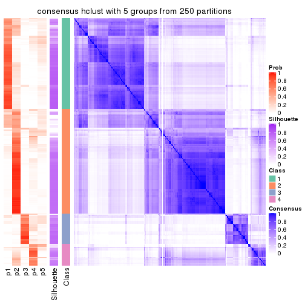</p>

</div>
<div id='tab-SD-hclust-consensus-heatmap-5'>
<pre><code class="r">consensus_heatmap(res, k = 6)
</code></pre>

<p></p>

</div>
</div>

Heatmaps for the membership of samples in all partitions to see how consistent they are:


<script>
$( function() {
	$( '#tabs-SD-hclust-membership-heatmap' ).tabs();
} );
</script>
<div id='tabs-SD-hclust-membership-heatmap'>
<ul>
<li><a href='#tab-SD-hclust-membership-heatmap-1'>k = 2</a></li>
<li><a href='#tab-SD-hclust-membership-heatmap-2'>k = 3</a></li>
<li><a href='#tab-SD-hclust-membership-heatmap-3'>k = 4</a></li>
<li><a href='#tab-SD-hclust-membership-heatmap-4'>k = 5</a></li>
<li><a href='#tab-SD-hclust-membership-heatmap-5'>k = 6</a></li>
</ul>
<div id='tab-SD-hclust-membership-heatmap-1'>
<pre><code class="r">membership_heatmap(res, k = 2)
</code></pre>

<p></p>

</div>
<div id='tab-SD-hclust-membership-heatmap-2'>
<pre><code class="r">membership_heatmap(res, k = 3)
</code></pre>

<p></p>

</div>
<div id='tab-SD-hclust-membership-heatmap-3'>
<pre><code class="r">membership_heatmap(res, k = 4)
</code></pre>

<p></p>

</div>
<div id='tab-SD-hclust-membership-heatmap-4'>
<pre><code class="r">membership_heatmap(res, k = 5)
</code></pre>

<p></p>

</div>
<div id='tab-SD-hclust-membership-heatmap-5'>
<pre><code class="r">membership_heatmap(res, k = 6)
</code></pre>

<p></p>

</div>
</div>

As soon as we have had the classes for columns, we can look for signatures
which are significantly different between classes which can be candidate marks
for certain classes. Following are the heatmaps for signatures.


Signature heatmaps where rows are scaled:


<script>
$( function() {
	$( '#tabs-SD-hclust-get-signatures' ).tabs();
} );
</script>
<div id='tabs-SD-hclust-get-signatures'>
<ul>
<li><a href='#tab-SD-hclust-get-signatures-1'>k = 2</a></li>
<li><a href='#tab-SD-hclust-get-signatures-2'>k = 3</a></li>
<li><a href='#tab-SD-hclust-get-signatures-3'>k = 4</a></li>
<li><a href='#tab-SD-hclust-get-signatures-4'>k = 5</a></li>
<li><a href='#tab-SD-hclust-get-signatures-5'>k = 6</a></li>
</ul>
<div id='tab-SD-hclust-get-signatures-1'>
<pre><code class="r">get_signatures(res, k = 2)
</code></pre>

<p></p>

</div>
<div id='tab-SD-hclust-get-signatures-2'>
<pre><code class="r">get_signatures(res, k = 3)
</code></pre>

<p></p>

</div>
<div id='tab-SD-hclust-get-signatures-3'>
<pre><code class="r">get_signatures(res, k = 4)
</code></pre>

<p></p>

</div>
<div id='tab-SD-hclust-get-signatures-4'>
<pre><code class="r">get_signatures(res, k = 5)
</code></pre>

<p></p>

</div>
<div id='tab-SD-hclust-get-signatures-5'>
<pre><code class="r">get_signatures(res, k = 6)
</code></pre>

<p></p>

</div>
</div>


Signature heatmaps where rows are not scaled:


<script>
$( function() {
	$( '#tabs-SD-hclust-get-signatures-no-scale' ).tabs();
} );
</script>
<div id='tabs-SD-hclust-get-signatures-no-scale'>
<ul>
<li><a href='#tab-SD-hclust-get-signatures-no-scale-1'>k = 2</a></li>
<li><a href='#tab-SD-hclust-get-signatures-no-scale-2'>k = 3</a></li>
<li><a href='#tab-SD-hclust-get-signatures-no-scale-3'>k = 4</a></li>
<li><a href='#tab-SD-hclust-get-signatures-no-scale-4'>k = 5</a></li>
<li><a href='#tab-SD-hclust-get-signatures-no-scale-5'>k = 6</a></li>
</ul>
<div id='tab-SD-hclust-get-signatures-no-scale-1'>
<pre><code class="r">get_signatures(res, k = 2, scale_rows = FALSE)
</code></pre>

<p></p>

</div>
<div id='tab-SD-hclust-get-signatures-no-scale-2'>
<pre><code class="r">get_signatures(res, k = 3, scale_rows = FALSE)
</code></pre>

<p></p>

</div>
<div id='tab-SD-hclust-get-signatures-no-scale-3'>
<pre><code class="r">get_signatures(res, k = 4, scale_rows = FALSE)
</code></pre>

<p></p>

</div>
<div id='tab-SD-hclust-get-signatures-no-scale-4'>
<pre><code class="r">get_signatures(res, k = 5, scale_rows = FALSE)
</code></pre>

<p></p>

</div>
<div id='tab-SD-hclust-get-signatures-no-scale-5'>
<pre><code class="r">get_signatures(res, k = 6, scale_rows = FALSE)
</code></pre>

<p></p>

</div>
</div>


Compare the overlap of signatures from different k:

```r
compare_signatures(res)
```

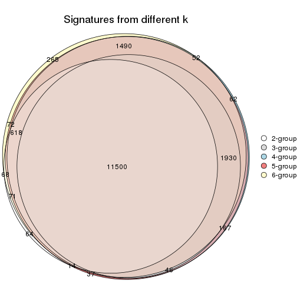

`get_signature()` returns a data frame invisibly. TO get the list of signatures, the function
call should be assigned to a variable explicitly. In following code, if `plot` argument is set
to `FALSE`, no heatmap is plotted while only the differential analysis is performed.

```r
# code only for demonstration
tb = get_signature(res, k = ..., plot = FALSE)
```

An example of the output of `tb` is:

```
#>   which_row         fdr    mean_1    mean_2 scaled_mean_1 scaled_mean_2 km
#> 1        38 0.042760348  8.373488  9.131774    -0.5533452     0.5164555  1
#> 2        40 0.018707592  7.106213  8.469186    -0.6173731     0.5762149  1
#> 3        55 0.019134737 10.221463 11.207825    -0.6159697     0.5749050  1
#> 4        59 0.006059896  5.921854  7.869574    -0.6899429     0.6439467  1
#> 5        60 0.018055526  8.928898 10.211722    -0.6204761     0.5791110  1
#> 6        98 0.009384629 15.714769 14.887706     0.6635654    -0.6193277  2
...
```

The columns in `tb` are:

1. `which_row`: row indices corresponding to the input matrix.
2. `fdr`: FDR for the differential test. 
3. `mean_x`: The mean value in group x.
4. `scaled_mean_x`: The mean value in group x after rows are scaled.
5. `km`: Row groups if k-means clustering is applied to rows.


UMAP plot which shows how samples are separated.


<script>
$( function() {
	$( '#tabs-SD-hclust-dimension-reduction' ).tabs();
} );
</script>
<div id='tabs-SD-hclust-dimension-reduction'>
<ul>
<li><a href='#tab-SD-hclust-dimension-reduction-1'>k = 2</a></li>
<li><a href='#tab-SD-hclust-dimension-reduction-2'>k = 3</a></li>
<li><a href='#tab-SD-hclust-dimension-reduction-3'>k = 4</a></li>
<li><a href='#tab-SD-hclust-dimension-reduction-4'>k = 5</a></li>
<li><a href='#tab-SD-hclust-dimension-reduction-5'>k = 6</a></li>
</ul>
<div id='tab-SD-hclust-dimension-reduction-1'>
<pre><code class="r">dimension_reduction(res, k = 2, method = &quot;UMAP&quot;)
</code></pre>

<p></p>

</div>
<div id='tab-SD-hclust-dimension-reduction-2'>
<pre><code class="r">dimension_reduction(res, k = 3, method = &quot;UMAP&quot;)
</code></pre>

<p></p>

</div>
<div id='tab-SD-hclust-dimension-reduction-3'>
<pre><code class="r">dimension_reduction(res, k = 4, method = &quot;UMAP&quot;)
</code></pre>

<p></p>

</div>
<div id='tab-SD-hclust-dimension-reduction-4'>
<pre><code class="r">dimension_reduction(res, k = 5, method = &quot;UMAP&quot;)
</code></pre>

<p></p>

</div>
<div id='tab-SD-hclust-dimension-reduction-5'>
<pre><code class="r">dimension_reduction(res, k = 6, method = &quot;UMAP&quot;)
</code></pre>

<p></p>

</div>
</div>


Following heatmap shows how subgroups are split when increasing `k`:

```r
collect_classes(res)
```


If matrix rows can be associated to genes, consider to use `GO_Enrichment(res,
...)` to perform function enrichment for the signature genes.


 

---------------------------------------------------


### SD:kmeans**


The object with results only for a single top-value method and a single partition method 
can be extracted as:

```r
res = res_list["SD", "kmeans"]
# you can also extract it by
# res = res_list["SD:kmeans"]
```

A summary of `res` and all the functions that can be applied to it:

```r
res
```

```
#> A 'ConsensusPartition' object with k = 2, 3, 4, 5, 6.
#>   On a matrix with 17654 rows and 335 columns.
#>   Top rows (1000, 2000, 3000, 4000, 5000) are extracted by 'SD' method.
#>   Subgroups are detected by 'kmeans' method.
#>   Performed in total 1250 partitions by row resampling.
#>   Best k for subgroups seems to be 3.
#> 
#> Following methods can be applied to this 'ConsensusPartition' object:
#>  [1] "cola_report"             "collect_classes"         "collect_plots"          
#>  [4] "collect_stats"           "colnames"                "compare_signatures"     
#>  [7] "consensus_heatmap"       "dimension_reduction"     "functional_enrichment"  
#> [10] "get_anno_col"            "get_anno"                "get_classes"            
#> [13] "get_consensus"           "get_matrix"              "get_membership"         
#> [16] "get_param"               "get_signatures"          "get_stats"              
#> [19] "is_best_k"               "is_stable_k"             "membership_heatmap"     
#> [22] "ncol"                    "nrow"                    "plot_ecdf"              
#> [25] "rownames"                "select_partition_number" "show"                   
#> [28] "suggest_best_k"          "test_to_known_factors"
```

`collect_plots()` function collects all the plots made from `res` for all `k` (number of partitions)
into one single page to provide an easy and fast comparison between different `k`.

```r
collect_plots(res)
```


The plots are:

- The first row: a plot of the ECDF (Empirical cumulative distribution
  function) curves of the consensus matrix for each `k` and the heatmap of
  predicted classes for each `k`.
- The second row: heatmaps of the consensus matrix for each `k`.
- The third row: heatmaps of the membership matrix for each `k`.
- The fouth row: heatmaps of the signatures for each `k`.

All the plots in panels can be made by individual functions and they are
plotted later in this section.

`select_partition_number()` produces several plots showing different
statistics for choosing "optimized" `k`. There are following statistics:

- ECDF curves of the consensus matrix for each `k`;
- 1-PAC. [The PAC
  score](https://en.wikipedia.org/wiki/Consensus_clustering#Over-interpretation_potential_of_consensus_clustering)
  measures the proportion of the ambiguous subgrouping.
- Mean silhouette score.
- Concordance. The mean probability of fiting the consensus class ids in all
  partitions.
- Area increased. Denote $A_k$ as the area under the ECDF curve for current
  `k`, the area increased is defined as $A_k - A_{k-1}$.
- Rand index. The percent of pairs of samples that are both in a same cluster
  or both are not in a same cluster in the partition of k and k-1.
- Jaccard index. The ratio of pairs of samples are both in a same cluster in
  the partition of k and k-1 and the pairs of samples are both in a same
  cluster in the partition k or k-1.

The detailed explanations of these statistics can be found in [the cola
vignette](http://bioconductor.org/packages/devel/bioc/vignettes/cola/inst/doc/cola.html#toc_13).

Generally speaking, lower PAC score, higher mean silhouette score or higher
concordance corresponds to better partition. Rand index and Jaccard index
measure how similar the current partition is compared to partition with `k-1`.
If they are too similar, we won't accept `k` is better than `k-1`.

```r
select_partition_number(res)
```


The numeric values for all these statistics can be obtained by `get_stats()`.

```r
get_stats(res)
```

```
#>   k 1-PAC mean_silhouette concordance area_increased  Rand Jaccard
#> 2 2 0.975           0.957       0.983         0.4913 0.509   0.509
#> 3 3 0.968           0.947       0.977         0.2787 0.837   0.689
#> 4 4 0.659           0.653       0.789         0.1312 0.976   0.937
#> 5 5 0.639           0.530       0.724         0.0830 0.836   0.564
#> 6 6 0.664           0.526       0.730         0.0522 0.894   0.596
```

`suggest_best_k()` suggests the best $k$ based on these statistics. The rules are as follows:

- All $k$ with Jaccard index larger than 0.95 are removed because the increase of
  the partition number does not provides enough extra information. If all $k$ are removed,
  the best $k$ is assigned by `NA`.
- For $k$ with 1-PAC larger than 0.9, the maximal $k$ is taken as the "best k". Other $k$ is called "optional k".
- If it does not fit the second rule. The $k$ with the highest vote of highest
  1-PAC, mean silhouette and concordance is taken as the "best k".

```r
suggest_best_k(res)
```

```
#> [1] 3
#> attr(,"optional")
#> [1] 2
```

There is also optional best $k$ = 2 that is worth to check.

Following shows the table of the partitions (You need to click the **show/hide
code output** link to see it). The membership matrix (columns with name `p*`)
is inferred by
[`clue::cl_consensus()`](https://www.rdocumentation.org/link/cl_consensus?package=clue)
function with the `SE` method. Basically the value in the membership matrix
represents the probability to belong to a certain group. The finall class
label for an item is determined with the group with highest probability it
belongs to.

In `get_classes()` function, the entropy is calculated from the membership
matrix and the silhouette score is calculated from the consensus matrix.


<script>
$( function() {
	$( '#tabs-SD-kmeans-get-classes' ).tabs();
} );
</script>
<div id='tabs-SD-kmeans-get-classes'>
<ul>
<li><a href='#tab-SD-kmeans-get-classes-1'>k = 2</a></li>
<li><a href='#tab-SD-kmeans-get-classes-2'>k = 3</a></li>
<li><a href='#tab-SD-kmeans-get-classes-3'>k = 4</a></li>
<li><a href='#tab-SD-kmeans-get-classes-4'>k = 5</a></li>
<li><a href='#tab-SD-kmeans-get-classes-5'>k = 6</a></li>
</ul>

<div id='tab-SD-kmeans-get-classes-1'>
<p><a id='tab-SD-kmeans-get-classes-1-a' style='color:#0366d6' href='#'>show/hide code output</a></p>
<pre><code class="r">cbind(get_classes(res, k = 2), get_membership(res, k = 2))
</code></pre>

<pre><code>#&gt;            class entropy silhouette    p1    p2
#&gt; SRR660306      2   0.000      0.984 0.000 1.000
#&gt; SRR1359328     2   0.000      0.984 0.000 1.000
#&gt; SRR821124      2   0.000      0.984 0.000 1.000
#&gt; SRR1335188     1   0.000      0.979 1.000 0.000
#&gt; SRR1075825     2   0.000      0.984 0.000 1.000
#&gt; SRR1321921     1   0.000      0.979 1.000 0.000
#&gt; SRR1466198     2   0.000      0.984 0.000 1.000
#&gt; SRR1384073     1   0.000      0.979 1.000 0.000
#&gt; SRR1312802     1   0.000      0.979 1.000 0.000
#&gt; SRR1076559     1   0.000      0.979 1.000 0.000
#&gt; SRR1370085     1   0.000      0.979 1.000 0.000
#&gt; SRR1460363     1   0.000      0.979 1.000 0.000
#&gt; SRR1480221     2   0.000      0.984 0.000 1.000
#&gt; SRR1476165     1   0.000      0.979 1.000 0.000
#&gt; SRR1459631     2   0.000      0.984 0.000 1.000
#&gt; SRR1448098     2   0.000      0.984 0.000 1.000
#&gt; SRR1321401     2   0.000      0.984 0.000 1.000
#&gt; SRR807613      2   0.000      0.984 0.000 1.000
#&gt; SRR808086      2   0.000      0.984 0.000 1.000
#&gt; SRR613687      2   0.000      0.984 0.000 1.000
#&gt; SRR1471011     1   0.000      0.979 1.000 0.000
#&gt; SRR1330284     2   0.000      0.984 0.000 1.000
#&gt; SRR1320624     2   0.000      0.984 0.000 1.000
#&gt; SRR1459519     1   0.000      0.979 1.000 0.000
#&gt; SRR1091184     2   0.000      0.984 0.000 1.000
#&gt; SRR1390561     1   0.000      0.979 1.000 0.000
#&gt; SRR658164      1   0.000      0.979 1.000 0.000
#&gt; SRR1087079     2   0.000      0.984 0.000 1.000
#&gt; SRR814996      2   0.327      0.925 0.060 0.940
#&gt; SRR1407410     2   0.000      0.984 0.000 1.000
#&gt; SRR1453392     2   0.000      0.984 0.000 1.000
#&gt; SRR1445873     1   0.000      0.979 1.000 0.000
#&gt; SRR1419985     2   0.000      0.984 0.000 1.000
#&gt; SRR820938      2   0.000      0.984 0.000 1.000
#&gt; SRR1476844     1   0.000      0.979 1.000 0.000
#&gt; SRR1403526     1   0.000      0.979 1.000 0.000
#&gt; SRR1413916     2   0.000      0.984 0.000 1.000
#&gt; SRR1441051     2   0.000      0.984 0.000 1.000
#&gt; SRR614287      2   0.000      0.984 0.000 1.000
#&gt; SRR1092062     2   0.000      0.984 0.000 1.000
#&gt; SRR612611      2   0.000      0.984 0.000 1.000
#&gt; SRR1376356     2   0.000      0.984 0.000 1.000
#&gt; SRR1405078     1   0.985      0.259 0.572 0.428
#&gt; SRR1437226     2   0.000      0.984 0.000 1.000
#&gt; SRR1326078     1   0.000      0.979 1.000 0.000
#&gt; SRR1096806     2   0.000      0.984 0.000 1.000
#&gt; SRR1440919     2   0.000      0.984 0.000 1.000
#&gt; SRR1452824     1   0.000      0.979 1.000 0.000
#&gt; SRR615754      1   0.000      0.979 1.000 0.000
#&gt; SRR1341787     2   0.000      0.984 0.000 1.000
#&gt; SRR614551      2   0.000      0.984 0.000 1.000
#&gt; SRR1380829     2   0.000      0.984 0.000 1.000
#&gt; SRR1455761     1   0.000      0.979 1.000 0.000
#&gt; SRR1465189     1   0.000      0.979 1.000 0.000
#&gt; SRR1376895     1   0.000      0.979 1.000 0.000
#&gt; SRR1445002     1   0.000      0.979 1.000 0.000
#&gt; SRR1469258     2   0.000      0.984 0.000 1.000
#&gt; SRR1409239     1   0.000      0.979 1.000 0.000
#&gt; SRR1480200     1   0.000      0.979 1.000 0.000
#&gt; SRR1418323     1   0.000      0.979 1.000 0.000
#&gt; SRR657540      2   0.000      0.984 0.000 1.000
#&gt; SRR821096      2   0.000      0.984 0.000 1.000
#&gt; SRR613591      2   0.000      0.984 0.000 1.000
#&gt; SRR1344205     2   0.000      0.984 0.000 1.000
#&gt; SRR612479      1   0.000      0.979 1.000 0.000
#&gt; SRR1399950     1   0.000      0.979 1.000 0.000
#&gt; SRR1336048     1   0.000      0.979 1.000 0.000
#&gt; SRR1368896     1   0.000      0.979 1.000 0.000
#&gt; SRR1379403     2   0.000      0.984 0.000 1.000
#&gt; SRR1312464     1   0.000      0.979 1.000 0.000
#&gt; SRR1096478     1   0.000      0.979 1.000 0.000
#&gt; SRR1459845     1   0.000      0.979 1.000 0.000
#&gt; SRR1348138     2   0.917      0.499 0.332 0.668
#&gt; SRR811423      1   0.000      0.979 1.000 0.000
#&gt; SRR615683      1   0.000      0.979 1.000 0.000
#&gt; SRR1380336     2   0.000      0.984 0.000 1.000
#&gt; SRR817609      1   0.000      0.979 1.000 0.000
#&gt; SRR1074550     2   0.000      0.984 0.000 1.000
#&gt; SRR1499236     2   0.000      0.984 0.000 1.000
#&gt; SRR656083      1   0.000      0.979 1.000 0.000
#&gt; SRR817539      1   0.000      0.979 1.000 0.000
#&gt; SRR1410801     1   0.000      0.979 1.000 0.000
#&gt; SRR1347190     1   0.000      0.979 1.000 0.000
#&gt; SRR1355126     2   0.000      0.984 0.000 1.000
#&gt; SRR615165      2   0.000      0.984 0.000 1.000
#&gt; SRR1466046     1   0.000      0.979 1.000 0.000
#&gt; SRR1097055     2   0.000      0.984 0.000 1.000
#&gt; SRR1312370     2   0.000      0.984 0.000 1.000
#&gt; SRR655325      1   0.000      0.979 1.000 0.000
#&gt; SRR810177      2   0.000      0.984 0.000 1.000
#&gt; SRR815685      2   0.000      0.984 0.000 1.000
#&gt; SRR817026      2   0.000      0.984 0.000 1.000
#&gt; SRR1417224     2   0.000      0.984 0.000 1.000
#&gt; SRR661687      2   0.000      0.984 0.000 1.000
#&gt; SRR1431804     1   0.730      0.741 0.796 0.204
#&gt; SRR664072      2   0.000      0.984 0.000 1.000
#&gt; SRR612923      2   0.000      0.984 0.000 1.000
#&gt; SRR1315890     1   0.000      0.979 1.000 0.000
#&gt; SRR1347726     1   0.000      0.979 1.000 0.000
#&gt; SRR1500360     1   0.000      0.979 1.000 0.000
#&gt; SRR1468360     2   0.000      0.984 0.000 1.000
#&gt; SRR1404084     1   0.671      0.781 0.824 0.176
#&gt; SRR615994      2   0.000      0.984 0.000 1.000
#&gt; SRR1475718     2   0.000      0.984 0.000 1.000
#&gt; SRR1397200     2   0.000      0.984 0.000 1.000
#&gt; SRR655519      2   0.000      0.984 0.000 1.000
#&gt; SRR1311308     2   0.000      0.984 0.000 1.000
#&gt; SRR1368006     2   0.000      0.984 0.000 1.000
#&gt; SRR613651      1   0.000      0.979 1.000 0.000
#&gt; SRR1362621     2   0.000      0.984 0.000 1.000
#&gt; SRR1451718     1   0.000      0.979 1.000 0.000
#&gt; SRR1095334     2   0.000      0.984 0.000 1.000
#&gt; SRR1079636     2   0.000      0.984 0.000 1.000
#&gt; SRR1442549     2   0.000      0.984 0.000 1.000
#&gt; SRR1466421     2   0.000      0.984 0.000 1.000
#&gt; SRR817397      2   0.000      0.984 0.000 1.000
#&gt; SRR1341809     2   0.000      0.984 0.000 1.000
#&gt; SRR614623      2   0.000      0.984 0.000 1.000
#&gt; SRR1335005     2   0.000      0.984 0.000 1.000
#&gt; SRR1407065     2   0.000      0.984 0.000 1.000
#&gt; SRR1404483     2   0.000      0.984 0.000 1.000
#&gt; SRR1096222     1   0.000      0.979 1.000 0.000
#&gt; SRR1401793     1   0.000      0.979 1.000 0.000
#&gt; SRR1408615     2   0.000      0.984 0.000 1.000
#&gt; SRR1070597     1   0.118      0.965 0.984 0.016
#&gt; SRR1332381     1   0.000      0.979 1.000 0.000
#&gt; SRR1457015     1   0.000      0.979 1.000 0.000
#&gt; SRR1386797     2   0.615      0.816 0.152 0.848
#&gt; SRR1098385     2   0.000      0.984 0.000 1.000
#&gt; SRR1363947     2   0.000      0.984 0.000 1.000
#&gt; SRR820350      2   0.000      0.984 0.000 1.000
#&gt; SRR662055      2   0.000      0.984 0.000 1.000
#&gt; SRR1310455     1   0.000      0.979 1.000 0.000
#&gt; SRR1453639     2   0.000      0.984 0.000 1.000
#&gt; SRR662617      2   0.000      0.984 0.000 1.000
#&gt; SRR654778      1   0.000      0.979 1.000 0.000
#&gt; SRR661782      2   0.000      0.984 0.000 1.000
#&gt; SRR1334396     1   0.000      0.979 1.000 0.000
#&gt; SRR613867      2   0.000      0.984 0.000 1.000
#&gt; SRR1479412     1   0.000      0.979 1.000 0.000
#&gt; SRR1331620     1   0.000      0.979 1.000 0.000
#&gt; SRR1082809     1   0.000      0.979 1.000 0.000
#&gt; SRR1417178     1   0.000      0.979 1.000 0.000
#&gt; SRR1335278     1   0.000      0.979 1.000 0.000
#&gt; SRR665369      2   0.000      0.984 0.000 1.000
#&gt; SRR657552      1   0.000      0.979 1.000 0.000
#&gt; SRR812412      1   0.000      0.979 1.000 0.000
#&gt; SRR1096500     2   0.000      0.984 0.000 1.000
#&gt; SRR1347750     2   0.000      0.984 0.000 1.000
#&gt; SRR615153      2   0.000      0.984 0.000 1.000
#&gt; SRR1434417     1   0.000      0.979 1.000 0.000
#&gt; SRR1070159     2   0.000      0.984 0.000 1.000
#&gt; SRR1332508     2   0.000      0.984 0.000 1.000
#&gt; SRR1082059     2   0.000      0.984 0.000 1.000
#&gt; SRR1402491     1   0.000      0.979 1.000 0.000
#&gt; SRR1476595     2   0.671      0.783 0.176 0.824
#&gt; SRR1320987     2   0.000      0.984 0.000 1.000
#&gt; SRR1086417     2   0.886      0.562 0.304 0.696
#&gt; SRR1454095     1   0.000      0.979 1.000 0.000
#&gt; SRR614791      2   0.000      0.984 0.000 1.000
#&gt; SRR821255      2   0.653      0.794 0.168 0.832
#&gt; SRR820402      2   0.000      0.984 0.000 1.000
#&gt; SRR1337284     1   0.000      0.979 1.000 0.000
#&gt; SRR1333083     2   0.969      0.341 0.396 0.604
#&gt; SRR1384883     2   0.000      0.984 0.000 1.000
#&gt; SRR614431      1   0.000      0.979 1.000 0.000
#&gt; SRR1481106     2   0.000      0.984 0.000 1.000
#&gt; SRR1370285     1   0.000      0.979 1.000 0.000
#&gt; SRR1446673     2   0.000      0.984 0.000 1.000
#&gt; SRR1318046     2   0.000      0.984 0.000 1.000
#&gt; SRR1341188     2   0.000      0.984 0.000 1.000
#&gt; SRR1384941     1   0.000      0.979 1.000 0.000
#&gt; SRR1322864     2   0.000      0.984 0.000 1.000
#&gt; SRR1476825     1   0.000      0.979 1.000 0.000
#&gt; SRR1443332     2   0.000      0.984 0.000 1.000
#&gt; SRR662486      2   0.000      0.984 0.000 1.000
#&gt; SRR1447019     1   0.000      0.979 1.000 0.000
#&gt; SRR662942      1   0.000      0.979 1.000 0.000
#&gt; SRR613102      2   0.000      0.984 0.000 1.000
#&gt; SRR1469880     1   0.000      0.979 1.000 0.000
#&gt; SRR1464977     1   0.000      0.979 1.000 0.000
#&gt; SRR615850      1   0.969      0.352 0.604 0.396
#&gt; SRR661949      2   0.000      0.984 0.000 1.000
#&gt; SRR1322227     2   0.000      0.984 0.000 1.000
#&gt; SRR1441655     2   0.662      0.789 0.172 0.828
#&gt; SRR613771      2   0.000      0.984 0.000 1.000
#&gt; SRR1479471     1   0.000      0.979 1.000 0.000
#&gt; SRR1488918     2   0.000      0.984 0.000 1.000
#&gt; SRR1414040     2   0.000      0.984 0.000 1.000
#&gt; SRR1079850     2   0.552      0.846 0.128 0.872
#&gt; SRR663209      1   0.000      0.979 1.000 0.000
#&gt; SRR1364914     2   0.000      0.984 0.000 1.000
#&gt; SRR1408267     2   0.000      0.984 0.000 1.000
#&gt; SRR1314894     1   0.000      0.979 1.000 0.000
#&gt; SRR1414117     2   0.000      0.984 0.000 1.000
#&gt; SRR1395975     2   0.000      0.984 0.000 1.000
#&gt; SRR1402219     2   0.000      0.984 0.000 1.000
#&gt; SRR1433623     1   0.000      0.979 1.000 0.000
#&gt; SRR656385      2   0.000      0.984 0.000 1.000
#&gt; SRR811213      2   0.000      0.984 0.000 1.000
#&gt; SRR663657      2   0.000      0.984 0.000 1.000
#&gt; SRR612203      1   0.000      0.979 1.000 0.000
#&gt; SRR613987      2   0.000      0.984 0.000 1.000
#&gt; SRR613831      2   0.000      0.984 0.000 1.000
#&gt; SRR1354180     2   0.000      0.984 0.000 1.000
#&gt; SRR1382912     1   0.000      0.979 1.000 0.000
#&gt; SRR1475501     1   0.000      0.979 1.000 0.000
#&gt; SRR1336930     1   0.000      0.979 1.000 0.000
#&gt; SRR613030      2   0.000      0.984 0.000 1.000
#&gt; SRR1381459     2   0.000      0.984 0.000 1.000
#&gt; SRR1402350     1   0.653      0.792 0.832 0.168
#&gt; SRR1419408     1   0.000      0.979 1.000 0.000
#&gt; SRR655911      2   0.000      0.984 0.000 1.000
#&gt; SRR1418243     1   0.000      0.979 1.000 0.000
#&gt; SRR1322573     1   0.000      0.979 1.000 0.000
#&gt; SRR613615      2   0.000      0.984 0.000 1.000
#&gt; SRR1355284     1   0.000      0.979 1.000 0.000
#&gt; SRR1319395     1   0.000      0.979 1.000 0.000
#&gt; SRR818939      1   0.000      0.979 1.000 0.000
#&gt; SRR1465266     1   0.000      0.979 1.000 0.000
#&gt; SRR614888      1   0.000      0.979 1.000 0.000
#&gt; SRR1431694     1   0.000      0.979 1.000 0.000
#&gt; SRR614347      2   0.000      0.984 0.000 1.000
#&gt; SRR1334228     2   0.000      0.984 0.000 1.000
#&gt; SRR1096007     2   0.000      0.984 0.000 1.000
#&gt; SRR656349      1   0.000      0.979 1.000 0.000
#&gt; SRR815422      2   0.000      0.984 0.000 1.000
#&gt; SRR1360828     1   0.000      0.979 1.000 0.000
#&gt; SRR1359005     2   0.000      0.984 0.000 1.000
#&gt; SRR1456652     1   0.000      0.979 1.000 0.000
#&gt; SRR1391660     1   0.000      0.979 1.000 0.000
#&gt; SRR1441956     1   0.000      0.979 1.000 0.000
#&gt; SRR662930      2   0.000      0.984 0.000 1.000
#&gt; SRR615790      2   0.000      0.984 0.000 1.000
#&gt; SRR614827      2   0.000      0.984 0.000 1.000
#&gt; SRR614587      2   0.000      0.984 0.000 1.000
#&gt; SRR814052      2   0.000      0.984 0.000 1.000
#&gt; SRR1070086     1   0.000      0.979 1.000 0.000
#&gt; SRR1481440     1   0.000      0.979 1.000 0.000
#&gt; SRR1339296     2   0.000      0.984 0.000 1.000
#&gt; SRR1343239     2   0.000      0.984 0.000 1.000
#&gt; SRR1432802     2   0.000      0.984 0.000 1.000
#&gt; SRR1416911     1   0.000      0.979 1.000 0.000
#&gt; SRR1410427     1   0.000      0.979 1.000 0.000
#&gt; SRR1401185     2   0.563      0.842 0.132 0.868
#&gt; SRR654993      2   0.000      0.984 0.000 1.000
#&gt; SRR656397      1   0.000      0.979 1.000 0.000
#&gt; SRR809643      2   0.000      0.984 0.000 1.000
#&gt; SRR1433819     1   0.000      0.979 1.000 0.000
#&gt; SRR1375225     2   0.000      0.984 0.000 1.000
#&gt; SRR1367739     1   0.991      0.209 0.556 0.444
#&gt; SRR1323336     1   0.833      0.641 0.736 0.264
#&gt; SRR663224      2   0.000      0.984 0.000 1.000
#&gt; SRR1442840     1   0.000      0.979 1.000 0.000
#&gt; SRR1374058     1   0.000      0.979 1.000 0.000
#&gt; SRR656994      1   0.000      0.979 1.000 0.000
#&gt; SRR1469214     2   0.000      0.984 0.000 1.000
#&gt; SRR1456446     1   0.000      0.979 1.000 0.000
#&gt; SRR1471879     2   0.000      0.984 0.000 1.000
#&gt; SRR612911      2   0.000      0.984 0.000 1.000
#&gt; SRR1395720     2   0.000      0.984 0.000 1.000
#&gt; SRR1413055     1   0.000      0.979 1.000 0.000
#&gt; SRR656770      2   0.000      0.984 0.000 1.000
#&gt; SRR812080      2   0.000      0.984 0.000 1.000
#&gt; SRR1479328     1   0.000      0.979 1.000 0.000
#&gt; SRR661421      2   0.000      0.984 0.000 1.000
#&gt; SRR1410286     2   0.000      0.984 0.000 1.000
#&gt; SRR1487150     1   0.000      0.979 1.000 0.000
#&gt; SRR1467035     1   0.000      0.979 1.000 0.000
#&gt; SRR1360607     2   0.000      0.984 0.000 1.000
#&gt; SRR1333106     2   0.000      0.984 0.000 1.000
#&gt; SRR1088706     2   0.000      0.984 0.000 1.000
#&gt; SRR1320053     2   0.000      0.984 0.000 1.000
#&gt; SRR1350392     2   0.000      0.984 0.000 1.000
#&gt; SRR1385190     1   0.946      0.434 0.636 0.364
#&gt; SRR1080093     2   0.000      0.984 0.000 1.000
#&gt; SRR1318753     1   0.000      0.979 1.000 0.000
#&gt; SRR1345369     2   0.000      0.984 0.000 1.000
#&gt; SRR612178      2   0.000      0.984 0.000 1.000
#&gt; SRR1354423     1   0.000      0.979 1.000 0.000
#&gt; SRR1072724     1   0.000      0.979 1.000 0.000
#&gt; SRR1418450     2   0.000      0.984 0.000 1.000
#&gt; SRR1326427     2   0.000      0.984 0.000 1.000
#&gt; SRR1437412     2   0.000      0.984 0.000 1.000
#&gt; SRR1327548     2   0.000      0.984 0.000 1.000
#&gt; SRR1395891     1   0.000      0.979 1.000 0.000
#&gt; SRR659367      2   0.000      0.984 0.000 1.000
#&gt; SRR818961      1   0.000      0.979 1.000 0.000
#&gt; SRR813704      1   0.000      0.979 1.000 0.000
#&gt; SRR613054      1   0.000      0.979 1.000 0.000
#&gt; SRR1476467     1   0.000      0.979 1.000 0.000
#&gt; SRR1407988     2   0.000      0.984 0.000 1.000
#&gt; SRR1394776     2   0.000      0.984 0.000 1.000
#&gt; SRR655578      2   0.000      0.984 0.000 1.000
#&gt; SRR1310645     2   0.000      0.984 0.000 1.000
#&gt; SRR1345628     1   0.000      0.979 1.000 0.000
#&gt; SRR1479740     1   0.000      0.979 1.000 0.000
#&gt; SRR1332095     1   0.000      0.979 1.000 0.000
#&gt; SRR1444786     2   0.000      0.984 0.000 1.000
#&gt; SRR1090070     1   0.000      0.979 1.000 0.000
#&gt; SRR662414      2   0.000      0.984 0.000 1.000
#&gt; SRR661216      2   0.000      0.984 0.000 1.000
#&gt; SRR656313      2   0.000      0.984 0.000 1.000
#&gt; SRR615671      2   0.000      0.984 0.000 1.000
#&gt; SRR1350196     2   0.000      0.984 0.000 1.000
#&gt; SRR1466580     1   0.000      0.979 1.000 0.000
#&gt; SRR1408032     2   0.000      0.984 0.000 1.000
#&gt; SRR1432913     2   0.000      0.984 0.000 1.000
#&gt; SRR1360502     1   0.456      0.882 0.904 0.096
#&gt; SRR1391901     2   0.000      0.984 0.000 1.000
#&gt; SRR1311131     1   0.000      0.979 1.000 0.000
#&gt; SRR1380636     1   0.000      0.979 1.000 0.000
#&gt; SRR1332339     1   0.000      0.979 1.000 0.000
#&gt; SRR1341563     2   0.000      0.984 0.000 1.000
#&gt; SRR1359410     2   0.000      0.984 0.000 1.000
#&gt; SRR1473040     2   0.958      0.384 0.380 0.620
#&gt; SRR1321444     1   0.000      0.979 1.000 0.000
#&gt; SRR1498765     2   0.000      0.984 0.000 1.000
#&gt; SRR1312622     2   0.000      0.984 0.000 1.000
#&gt; SRR615503      2   0.753      0.722 0.216 0.784
#&gt; SRR1453192     1   0.000      0.979 1.000 0.000
#&gt; SRR1433107     2   0.000      0.984 0.000 1.000
#&gt; SRR1075384     1   0.000      0.979 1.000 0.000
#&gt; SRR1356683     1   0.000      0.979 1.000 0.000
#&gt; SRR659049      1   0.000      0.979 1.000 0.000
#&gt; SRR1368240     1   0.000      0.979 1.000 0.000
#&gt; SRR1341739     1   0.000      0.979 1.000 0.000
#&gt; SRR613249      2   0.958      0.384 0.380 0.620
#&gt; SRR663428      2   0.000      0.984 0.000 1.000
#&gt; SRR1341302     2   0.000      0.984 0.000 1.000
#&gt; SRR1073553     2   0.000      0.984 0.000 1.000
#&gt; SRR1354093     2   0.000      0.984 0.000 1.000
#&gt; SRR1406521     2   0.000      0.984 0.000 1.000
#&gt; SRR1432049     1   0.000      0.979 1.000 0.000
#&gt; SRR1453504     1   0.861      0.605 0.716 0.284
</code></pre>

<script>
$('#tab-SD-kmeans-get-classes-1-a').parent().next().next().hide();
$('#tab-SD-kmeans-get-classes-1-a').click(function(){
  $('#tab-SD-kmeans-get-classes-1-a').parent().next().next().toggle();
  return(false);
});
</script>
</div>

<div id='tab-SD-kmeans-get-classes-2'>
<p><a id='tab-SD-kmeans-get-classes-2-a' style='color:#0366d6' href='#'>show/hide code output</a></p>
<pre><code class="r">cbind(get_classes(res, k = 3), get_membership(res, k = 3))
</code></pre>

<pre><code>#&gt;            class entropy silhouette    p1    p2    p3
#&gt; SRR660306      2  0.5835      0.499 0.000 0.660 0.340
#&gt; SRR1359328     3  0.0237      0.964 0.000 0.004 0.996
#&gt; SRR821124      2  0.0000      0.977 0.000 1.000 0.000
#&gt; SRR1335188     1  0.0237      0.980 0.996 0.000 0.004
#&gt; SRR1075825     2  0.0000      0.977 0.000 1.000 0.000
#&gt; SRR1321921     1  0.0000      0.981 1.000 0.000 0.000
#&gt; SRR1466198     3  0.0237      0.964 0.000 0.004 0.996
#&gt; SRR1384073     1  0.0237      0.980 0.996 0.000 0.004
#&gt; SRR1312802     1  0.0000      0.981 1.000 0.000 0.000
#&gt; SRR1076559     1  0.0237      0.980 0.996 0.000 0.004
#&gt; SRR1370085     1  0.0000      0.981 1.000 0.000 0.000
#&gt; SRR1460363     1  0.0000      0.981 1.000 0.000 0.000
#&gt; SRR1480221     2  0.0000      0.977 0.000 1.000 0.000
#&gt; SRR1476165     1  0.0000      0.981 1.000 0.000 0.000
#&gt; SRR1459631     2  0.0237      0.974 0.000 0.996 0.004
#&gt; SRR1448098     2  0.0000      0.977 0.000 1.000 0.000
#&gt; SRR1321401     2  0.0000      0.977 0.000 1.000 0.000
#&gt; SRR807613      2  0.0000      0.977 0.000 1.000 0.000
#&gt; SRR808086      3  0.0237      0.964 0.000 0.004 0.996
#&gt; SRR613687      2  0.0000      0.977 0.000 1.000 0.000
#&gt; SRR1471011     1  0.3879      0.818 0.848 0.000 0.152
#&gt; SRR1330284     2  0.0000      0.977 0.000 1.000 0.000
#&gt; SRR1320624     2  0.0000      0.977 0.000 1.000 0.000
#&gt; SRR1459519     1  0.0000      0.981 1.000 0.000 0.000
#&gt; SRR1091184     2  0.2959      0.880 0.000 0.900 0.100
#&gt; SRR1390561     1  0.0000      0.981 1.000 0.000 0.000
#&gt; SRR658164      1  0.0237      0.980 0.996 0.000 0.004
#&gt; SRR1087079     2  0.0000      0.977 0.000 1.000 0.000
#&gt; SRR814996      3  0.0237      0.964 0.000 0.004 0.996
#&gt; SRR1407410     2  0.0000      0.977 0.000 1.000 0.000
#&gt; SRR1453392     2  0.0000      0.977 0.000 1.000 0.000
#&gt; SRR1445873     1  0.0000      0.981 1.000 0.000 0.000
#&gt; SRR1419985     2  0.0000      0.977 0.000 1.000 0.000
#&gt; SRR820938      3  0.1643      0.931 0.000 0.044 0.956
#&gt; SRR1476844     1  0.0000      0.981 1.000 0.000 0.000
#&gt; SRR1403526     1  0.0000      0.981 1.000 0.000 0.000
#&gt; SRR1413916     2  0.0000      0.977 0.000 1.000 0.000
#&gt; SRR1441051     2  0.0000      0.977 0.000 1.000 0.000
#&gt; SRR614287      2  0.0000      0.977 0.000 1.000 0.000
#&gt; SRR1092062     2  0.0000      0.977 0.000 1.000 0.000
#&gt; SRR612611      2  0.0000      0.977 0.000 1.000 0.000
#&gt; SRR1376356     2  0.0000      0.977 0.000 1.000 0.000
#&gt; SRR1405078     3  0.4733      0.752 0.196 0.004 0.800
#&gt; SRR1437226     2  0.0000      0.977 0.000 1.000 0.000
#&gt; SRR1326078     1  0.0237      0.980 0.996 0.000 0.004
#&gt; SRR1096806     3  0.0237      0.964 0.000 0.004 0.996
#&gt; SRR1440919     2  0.3551      0.841 0.000 0.868 0.132
#&gt; SRR1452824     1  0.0237      0.980 0.996 0.000 0.004
#&gt; SRR615754      1  0.0000      0.981 1.000 0.000 0.000
#&gt; SRR1341787     2  0.5621      0.567 0.000 0.692 0.308
#&gt; SRR614551      2  0.0000      0.977 0.000 1.000 0.000
#&gt; SRR1380829     3  0.0237      0.964 0.000 0.004 0.996
#&gt; SRR1455761     1  0.0237      0.980 0.996 0.000 0.004
#&gt; SRR1465189     3  0.0237      0.961 0.004 0.000 0.996
#&gt; SRR1376895     1  0.0237      0.980 0.996 0.000 0.004
#&gt; SRR1445002     1  0.0000      0.981 1.000 0.000 0.000
#&gt; SRR1469258     2  0.0000      0.977 0.000 1.000 0.000
#&gt; SRR1409239     1  0.0000      0.981 1.000 0.000 0.000
#&gt; SRR1480200     1  0.0000      0.981 1.000 0.000 0.000
#&gt; SRR1418323     1  0.0237      0.980 0.996 0.000 0.004
#&gt; SRR657540      3  0.0237      0.964 0.000 0.004 0.996
#&gt; SRR821096      2  0.0000      0.977 0.000 1.000 0.000
#&gt; SRR613591      2  0.0000      0.977 0.000 1.000 0.000
#&gt; SRR1344205     3  0.0237      0.964 0.000 0.004 0.996
#&gt; SRR612479      1  0.0000      0.981 1.000 0.000 0.000
#&gt; SRR1399950     1  0.0237      0.980 0.996 0.000 0.004
#&gt; SRR1336048     3  0.3482      0.836 0.128 0.000 0.872
#&gt; SRR1368896     1  0.0000      0.981 1.000 0.000 0.000
#&gt; SRR1379403     2  0.0000      0.977 0.000 1.000 0.000
#&gt; SRR1312464     1  0.0000      0.981 1.000 0.000 0.000
#&gt; SRR1096478     1  0.0000      0.981 1.000 0.000 0.000
#&gt; SRR1459845     1  0.0000      0.981 1.000 0.000 0.000
#&gt; SRR1348138     3  0.0237      0.961 0.004 0.000 0.996
#&gt; SRR811423      1  0.0000      0.981 1.000 0.000 0.000
#&gt; SRR615683      1  0.0000      0.981 1.000 0.000 0.000
#&gt; SRR1380336     2  0.0000      0.977 0.000 1.000 0.000
#&gt; SRR817609      1  0.6111      0.350 0.604 0.000 0.396
#&gt; SRR1074550     3  0.0237      0.964 0.000 0.004 0.996
#&gt; SRR1499236     2  0.0000      0.977 0.000 1.000 0.000
#&gt; SRR656083      1  0.0000      0.981 1.000 0.000 0.000
#&gt; SRR817539      1  0.0237      0.980 0.996 0.000 0.004
#&gt; SRR1410801     1  0.0000      0.981 1.000 0.000 0.000
#&gt; SRR1347190     1  0.0237      0.980 0.996 0.000 0.004
#&gt; SRR1355126     2  0.0000      0.977 0.000 1.000 0.000
#&gt; SRR615165      3  0.0237      0.964 0.000 0.004 0.996
#&gt; SRR1466046     1  0.0000      0.981 1.000 0.000 0.000
#&gt; SRR1097055     2  0.0000      0.977 0.000 1.000 0.000
#&gt; SRR1312370     2  0.0237      0.974 0.000 0.996 0.004
#&gt; SRR655325      1  0.0000      0.981 1.000 0.000 0.000
#&gt; SRR810177      2  0.0000      0.977 0.000 1.000 0.000
#&gt; SRR815685      2  0.0000      0.977 0.000 1.000 0.000
#&gt; SRR817026      3  0.0237      0.964 0.000 0.004 0.996
#&gt; SRR1417224     2  0.0000      0.977 0.000 1.000 0.000
#&gt; SRR661687      2  0.5216      0.655 0.000 0.740 0.260
#&gt; SRR1431804     1  0.6111      0.350 0.604 0.000 0.396
#&gt; SRR664072      3  0.0237      0.964 0.000 0.004 0.996
#&gt; SRR612923      2  0.0000      0.977 0.000 1.000 0.000
#&gt; SRR1315890     1  0.0000      0.981 1.000 0.000 0.000
#&gt; SRR1347726     1  0.0237      0.980 0.996 0.000 0.004
#&gt; SRR1500360     1  0.0237      0.980 0.996 0.000 0.004
#&gt; SRR1468360     2  0.0000      0.977 0.000 1.000 0.000
#&gt; SRR1404084     1  0.2261      0.919 0.932 0.000 0.068
#&gt; SRR615994      3  0.0237      0.964 0.000 0.004 0.996
#&gt; SRR1475718     2  0.0000      0.977 0.000 1.000 0.000
#&gt; SRR1397200     3  0.0237      0.964 0.000 0.004 0.996
#&gt; SRR655519      2  0.0000      0.977 0.000 1.000 0.000
#&gt; SRR1311308     3  0.1411      0.938 0.000 0.036 0.964
#&gt; SRR1368006     2  0.0000      0.977 0.000 1.000 0.000
#&gt; SRR613651      1  0.0237      0.980 0.996 0.000 0.004
#&gt; SRR1362621     3  0.0424      0.961 0.000 0.008 0.992
#&gt; SRR1451718     1  0.0237      0.980 0.996 0.000 0.004
#&gt; SRR1095334     3  0.0237      0.964 0.000 0.004 0.996
#&gt; SRR1079636     2  0.0000      0.977 0.000 1.000 0.000
#&gt; SRR1442549     2  0.0000      0.977 0.000 1.000 0.000
#&gt; SRR1466421     2  0.0000      0.977 0.000 1.000 0.000
#&gt; SRR817397      2  0.0000      0.977 0.000 1.000 0.000
#&gt; SRR1341809     2  0.0237      0.974 0.000 0.996 0.004
#&gt; SRR614623      2  0.0000      0.977 0.000 1.000 0.000
#&gt; SRR1335005     2  0.0000      0.977 0.000 1.000 0.000
#&gt; SRR1407065     2  0.0000      0.977 0.000 1.000 0.000
#&gt; SRR1404483     2  0.0000      0.977 0.000 1.000 0.000
#&gt; SRR1096222     1  0.0000      0.981 1.000 0.000 0.000
#&gt; SRR1401793     1  0.0237      0.980 0.996 0.000 0.004
#&gt; SRR1408615     3  0.0000      0.960 0.000 0.000 1.000
#&gt; SRR1070597     2  0.1399      0.946 0.028 0.968 0.004
#&gt; SRR1332381     1  0.1031      0.963 0.976 0.000 0.024
#&gt; SRR1457015     1  0.0000      0.981 1.000 0.000 0.000
#&gt; SRR1386797     2  0.1647      0.936 0.036 0.960 0.004
#&gt; SRR1098385     2  0.0000      0.977 0.000 1.000 0.000
#&gt; SRR1363947     3  0.0237      0.964 0.000 0.004 0.996
#&gt; SRR820350      2  0.0000      0.977 0.000 1.000 0.000
#&gt; SRR662055      2  0.0000      0.977 0.000 1.000 0.000
#&gt; SRR1310455     1  0.0237      0.980 0.996 0.000 0.004
#&gt; SRR1453639     2  0.1129      0.955 0.020 0.976 0.004
#&gt; SRR662617      2  0.0000      0.977 0.000 1.000 0.000
#&gt; SRR654778      1  0.0237      0.980 0.996 0.000 0.004
#&gt; SRR661782      2  0.0000      0.977 0.000 1.000 0.000
#&gt; SRR1334396     1  0.0000      0.981 1.000 0.000 0.000
#&gt; SRR613867      2  0.0000      0.977 0.000 1.000 0.000
#&gt; SRR1479412     1  0.0237      0.980 0.996 0.000 0.004
#&gt; SRR1331620     1  0.0000      0.981 1.000 0.000 0.000
#&gt; SRR1082809     1  0.2625      0.900 0.916 0.000 0.084
#&gt; SRR1417178     1  0.0000      0.981 1.000 0.000 0.000
#&gt; SRR1335278     1  0.0000      0.981 1.000 0.000 0.000
#&gt; SRR665369      2  0.0000      0.977 0.000 1.000 0.000
#&gt; SRR657552      1  0.3686      0.828 0.860 0.000 0.140
#&gt; SRR812412      1  0.0237      0.980 0.996 0.000 0.004
#&gt; SRR1096500     2  0.0000      0.977 0.000 1.000 0.000
#&gt; SRR1347750     2  0.0000      0.977 0.000 1.000 0.000
#&gt; SRR615153      2  0.0000      0.977 0.000 1.000 0.000
#&gt; SRR1434417     1  0.0000      0.981 1.000 0.000 0.000
#&gt; SRR1070159     3  0.0237      0.964 0.000 0.004 0.996
#&gt; SRR1332508     2  0.0000      0.977 0.000 1.000 0.000
#&gt; SRR1082059     2  0.5560      0.583 0.000 0.700 0.300
#&gt; SRR1402491     1  0.0000      0.981 1.000 0.000 0.000
#&gt; SRR1476595     2  0.0237      0.974 0.000 0.996 0.004
#&gt; SRR1320987     2  0.0000      0.977 0.000 1.000 0.000
#&gt; SRR1086417     2  0.6111      0.334 0.396 0.604 0.000
#&gt; SRR1454095     1  0.0237      0.980 0.996 0.000 0.004
#&gt; SRR614791      2  0.0000      0.977 0.000 1.000 0.000
#&gt; SRR821255      2  0.0237      0.974 0.000 0.996 0.004
#&gt; SRR820402      2  0.0592      0.967 0.000 0.988 0.012
#&gt; SRR1337284     2  0.3272      0.856 0.104 0.892 0.004
#&gt; SRR1333083     3  0.0237      0.964 0.000 0.004 0.996
#&gt; SRR1384883     2  0.0237      0.974 0.000 0.996 0.004
#&gt; SRR614431      1  0.0000      0.981 1.000 0.000 0.000
#&gt; SRR1481106     2  0.0000      0.977 0.000 1.000 0.000
#&gt; SRR1370285     1  0.0000      0.981 1.000 0.000 0.000
#&gt; SRR1446673     3  0.0237      0.964 0.000 0.004 0.996
#&gt; SRR1318046     2  0.0000      0.977 0.000 1.000 0.000
#&gt; SRR1341188     3  0.0237      0.964 0.000 0.004 0.996
#&gt; SRR1384941     1  0.0237      0.980 0.996 0.000 0.004
#&gt; SRR1322864     2  0.0000      0.977 0.000 1.000 0.000
#&gt; SRR1476825     3  0.4555      0.749 0.200 0.000 0.800
#&gt; SRR1443332     2  0.0000      0.977 0.000 1.000 0.000
#&gt; SRR662486      2  0.0000      0.977 0.000 1.000 0.000
#&gt; SRR1447019     1  0.0000      0.981 1.000 0.000 0.000
#&gt; SRR662942      1  0.0000      0.981 1.000 0.000 0.000
#&gt; SRR613102      3  0.0237      0.964 0.000 0.004 0.996
#&gt; SRR1469880     1  0.0237      0.980 0.996 0.000 0.004
#&gt; SRR1464977     1  0.1878      0.931 0.952 0.044 0.004
#&gt; SRR615850      3  0.5098      0.667 0.248 0.000 0.752
#&gt; SRR661949      2  0.0000      0.977 0.000 1.000 0.000
#&gt; SRR1322227     3  0.1031      0.948 0.000 0.024 0.976
#&gt; SRR1441655     2  0.0237      0.974 0.000 0.996 0.004
#&gt; SRR613771      2  0.2625      0.897 0.000 0.916 0.084
#&gt; SRR1479471     1  0.0000      0.981 1.000 0.000 0.000
#&gt; SRR1488918     2  0.0000      0.977 0.000 1.000 0.000
#&gt; SRR1414040     2  0.0000      0.977 0.000 1.000 0.000
#&gt; SRR1079850     2  0.0237      0.974 0.000 0.996 0.004
#&gt; SRR663209      1  0.0237      0.980 0.996 0.000 0.004
#&gt; SRR1364914     2  0.0000      0.977 0.000 1.000 0.000
#&gt; SRR1408267     2  0.0000      0.977 0.000 1.000 0.000
#&gt; SRR1314894     1  0.0237      0.980 0.996 0.000 0.004
#&gt; SRR1414117     3  0.0237      0.964 0.000 0.004 0.996
#&gt; SRR1395975     2  0.0000      0.977 0.000 1.000 0.000
#&gt; SRR1402219     2  0.0000      0.977 0.000 1.000 0.000
#&gt; SRR1433623     1  0.0000      0.981 1.000 0.000 0.000
#&gt; SRR656385      2  0.0000      0.977 0.000 1.000 0.000
#&gt; SRR811213      2  0.0000      0.977 0.000 1.000 0.000
#&gt; SRR663657      3  0.0237      0.964 0.000 0.004 0.996
#&gt; SRR612203      1  0.0000      0.981 1.000 0.000 0.000
#&gt; SRR613987      2  0.0000      0.977 0.000 1.000 0.000
#&gt; SRR613831      3  0.0237      0.964 0.000 0.004 0.996
#&gt; SRR1354180     2  0.0000      0.977 0.000 1.000 0.000
#&gt; SRR1382912     1  0.0000      0.981 1.000 0.000 0.000
#&gt; SRR1475501     1  0.0000      0.981 1.000 0.000 0.000
#&gt; SRR1336930     1  0.0000      0.981 1.000 0.000 0.000
#&gt; SRR613030      3  0.0237      0.964 0.000 0.004 0.996
#&gt; SRR1381459     2  0.0000      0.977 0.000 1.000 0.000
#&gt; SRR1402350     3  0.6126      0.306 0.400 0.000 0.600
#&gt; SRR1419408     1  0.0000      0.981 1.000 0.000 0.000
#&gt; SRR655911      3  0.3941      0.803 0.000 0.156 0.844
#&gt; SRR1418243     1  0.0237      0.980 0.996 0.000 0.004
#&gt; SRR1322573     1  0.0237      0.980 0.996 0.000 0.004
#&gt; SRR613615      3  0.0237      0.964 0.000 0.004 0.996
#&gt; SRR1355284     1  0.0000      0.981 1.000 0.000 0.000
#&gt; SRR1319395     1  0.0237      0.980 0.996 0.000 0.004
#&gt; SRR818939      1  0.0000      0.981 1.000 0.000 0.000
#&gt; SRR1465266     1  0.0000      0.981 1.000 0.000 0.000
#&gt; SRR614888      1  0.0237      0.980 0.996 0.000 0.004
#&gt; SRR1431694     1  0.0000      0.981 1.000 0.000 0.000
#&gt; SRR614347      2  0.0237      0.974 0.000 0.996 0.004
#&gt; SRR1334228     3  0.0237      0.964 0.000 0.004 0.996
#&gt; SRR1096007     2  0.0000      0.977 0.000 1.000 0.000
#&gt; SRR656349      1  0.6126      0.340 0.600 0.000 0.400
#&gt; SRR815422      2  0.4605      0.744 0.000 0.796 0.204
#&gt; SRR1360828     1  0.0237      0.980 0.996 0.000 0.004
#&gt; SRR1359005     2  0.0000      0.977 0.000 1.000 0.000
#&gt; SRR1456652     1  0.0237      0.980 0.996 0.000 0.004
#&gt; SRR1391660     1  0.0237      0.980 0.996 0.000 0.004
#&gt; SRR1441956     1  0.0237      0.980 0.996 0.000 0.004
#&gt; SRR662930      2  0.0000      0.977 0.000 1.000 0.000
#&gt; SRR615790      3  0.0237      0.964 0.000 0.004 0.996
#&gt; SRR614827      2  0.0000      0.977 0.000 1.000 0.000
#&gt; SRR614587      2  0.0237      0.974 0.000 0.996 0.004
#&gt; SRR814052      2  0.0000      0.977 0.000 1.000 0.000
#&gt; SRR1070086     1  0.0237      0.980 0.996 0.000 0.004
#&gt; SRR1481440     1  0.0000      0.981 1.000 0.000 0.000
#&gt; SRR1339296     3  0.0237      0.964 0.000 0.004 0.996
#&gt; SRR1343239     2  0.0000      0.977 0.000 1.000 0.000
#&gt; SRR1432802     2  0.0000      0.977 0.000 1.000 0.000
#&gt; SRR1416911     1  0.0237      0.980 0.996 0.000 0.004
#&gt; SRR1410427     1  0.0237      0.980 0.996 0.000 0.004
#&gt; SRR1401185     2  0.1129      0.955 0.020 0.976 0.004
#&gt; SRR654993      2  0.0000      0.977 0.000 1.000 0.000
#&gt; SRR656397      1  0.0000      0.981 1.000 0.000 0.000
#&gt; SRR809643      3  0.0237      0.964 0.000 0.004 0.996
#&gt; SRR1433819     1  0.0237      0.980 0.996 0.000 0.004
#&gt; SRR1375225     2  0.0000      0.977 0.000 1.000 0.000
#&gt; SRR1367739     3  0.0237      0.961 0.004 0.000 0.996
#&gt; SRR1323336     1  0.4353      0.776 0.836 0.156 0.008
#&gt; SRR663224      2  0.0000      0.977 0.000 1.000 0.000
#&gt; SRR1442840     1  0.0000      0.981 1.000 0.000 0.000
#&gt; SRR1374058     1  0.0237      0.980 0.996 0.000 0.004
#&gt; SRR656994      1  0.0237      0.980 0.996 0.000 0.004
#&gt; SRR1469214     2  0.0000      0.977 0.000 1.000 0.000
#&gt; SRR1456446     1  0.0000      0.981 1.000 0.000 0.000
#&gt; SRR1471879     2  0.0000      0.977 0.000 1.000 0.000
#&gt; SRR612911      3  0.0237      0.964 0.000 0.004 0.996
#&gt; SRR1395720     2  0.0000      0.977 0.000 1.000 0.000
#&gt; SRR1413055     1  0.0000      0.981 1.000 0.000 0.000
#&gt; SRR656770      2  0.0000      0.977 0.000 1.000 0.000
#&gt; SRR812080      3  0.0237      0.964 0.000 0.004 0.996
#&gt; SRR1479328     1  0.0237      0.980 0.996 0.000 0.004
#&gt; SRR661421      2  0.0000      0.977 0.000 1.000 0.000
#&gt; SRR1410286     2  0.0000      0.977 0.000 1.000 0.000
#&gt; SRR1487150     1  0.0237      0.980 0.996 0.000 0.004
#&gt; SRR1467035     1  0.0000      0.981 1.000 0.000 0.000
#&gt; SRR1360607     2  0.0237      0.974 0.000 0.996 0.004
#&gt; SRR1333106     2  0.0000      0.977 0.000 1.000 0.000
#&gt; SRR1088706     2  0.0000      0.977 0.000 1.000 0.000
#&gt; SRR1320053     3  0.0237      0.964 0.000 0.004 0.996
#&gt; SRR1350392     2  0.0000      0.977 0.000 1.000 0.000
#&gt; SRR1385190     3  0.0237      0.961 0.004 0.000 0.996
#&gt; SRR1080093     2  0.0000      0.977 0.000 1.000 0.000
#&gt; SRR1318753     1  0.0000      0.981 1.000 0.000 0.000
#&gt; SRR1345369     3  0.0237      0.964 0.000 0.004 0.996
#&gt; SRR612178      2  0.0000      0.977 0.000 1.000 0.000
#&gt; SRR1354423     1  0.0000      0.981 1.000 0.000 0.000
#&gt; SRR1072724     1  0.0237      0.980 0.996 0.000 0.004
#&gt; SRR1418450     2  0.0000      0.977 0.000 1.000 0.000
#&gt; SRR1326427     3  0.0237      0.964 0.000 0.004 0.996
#&gt; SRR1437412     2  0.5785      0.517 0.000 0.668 0.332
#&gt; SRR1327548     2  0.0237      0.974 0.000 0.996 0.004
#&gt; SRR1395891     1  0.0237      0.980 0.996 0.000 0.004
#&gt; SRR659367      2  0.0000      0.977 0.000 1.000 0.000
#&gt; SRR818961      1  0.0000      0.981 1.000 0.000 0.000
#&gt; SRR813704      1  0.0000      0.981 1.000 0.000 0.000
#&gt; SRR613054      1  0.0000      0.981 1.000 0.000 0.000
#&gt; SRR1476467     1  0.0000      0.981 1.000 0.000 0.000
#&gt; SRR1407988     2  0.0000      0.977 0.000 1.000 0.000
#&gt; SRR1394776     2  0.0000      0.977 0.000 1.000 0.000
#&gt; SRR655578      2  0.0000      0.977 0.000 1.000 0.000
#&gt; SRR1310645     2  0.0000      0.977 0.000 1.000 0.000
#&gt; SRR1345628     1  0.0000      0.981 1.000 0.000 0.000
#&gt; SRR1479740     1  0.0237      0.980 0.996 0.000 0.004
#&gt; SRR1332095     1  0.0237      0.980 0.996 0.000 0.004
#&gt; SRR1444786     2  0.0424      0.971 0.000 0.992 0.008
#&gt; SRR1090070     1  0.0237      0.980 0.996 0.000 0.004
#&gt; SRR662414      2  0.0000      0.977 0.000 1.000 0.000
#&gt; SRR661216      2  0.0000      0.977 0.000 1.000 0.000
#&gt; SRR656313      2  0.0000      0.977 0.000 1.000 0.000
#&gt; SRR615671      2  0.0000      0.977 0.000 1.000 0.000
#&gt; SRR1350196     3  0.0237      0.964 0.000 0.004 0.996
#&gt; SRR1466580     1  0.0237      0.980 0.996 0.000 0.004
#&gt; SRR1408032     2  0.0000      0.977 0.000 1.000 0.000
#&gt; SRR1432913     2  0.0000      0.977 0.000 1.000 0.000
#&gt; SRR1360502     1  0.5835      0.486 0.660 0.000 0.340
#&gt; SRR1391901     2  0.0000      0.977 0.000 1.000 0.000
#&gt; SRR1311131     1  0.0237      0.980 0.996 0.000 0.004
#&gt; SRR1380636     1  0.0237      0.980 0.996 0.000 0.004
#&gt; SRR1332339     1  0.0237      0.980 0.996 0.000 0.004
#&gt; SRR1341563     2  0.0000      0.977 0.000 1.000 0.000
#&gt; SRR1359410     2  0.1529      0.943 0.000 0.960 0.040
#&gt; SRR1473040     3  0.0237      0.964 0.000 0.004 0.996
#&gt; SRR1321444     1  0.0237      0.980 0.996 0.000 0.004
#&gt; SRR1498765     2  0.0000      0.977 0.000 1.000 0.000
#&gt; SRR1312622     2  0.0000      0.977 0.000 1.000 0.000
#&gt; SRR615503      2  0.0237      0.974 0.000 0.996 0.004
#&gt; SRR1453192     1  0.0000      0.981 1.000 0.000 0.000
#&gt; SRR1433107     3  0.6168      0.306 0.000 0.412 0.588
#&gt; SRR1075384     1  0.0000      0.981 1.000 0.000 0.000
#&gt; SRR1356683     1  0.0000      0.981 1.000 0.000 0.000
#&gt; SRR659049      1  0.0000      0.981 1.000 0.000 0.000
#&gt; SRR1368240     1  0.0000      0.981 1.000 0.000 0.000
#&gt; SRR1341739     1  0.0237      0.980 0.996 0.000 0.004
#&gt; SRR613249      3  0.0237      0.964 0.000 0.004 0.996
#&gt; SRR663428      2  0.0000      0.977 0.000 1.000 0.000
#&gt; SRR1341302     2  0.0000      0.977 0.000 1.000 0.000
#&gt; SRR1073553     2  0.0000      0.977 0.000 1.000 0.000
#&gt; SRR1354093     3  0.0237      0.964 0.000 0.004 0.996
#&gt; SRR1406521     2  0.0237      0.974 0.000 0.996 0.004
#&gt; SRR1432049     1  0.0237      0.980 0.996 0.000 0.004
#&gt; SRR1453504     2  0.6057      0.494 0.340 0.656 0.004
</code></pre>

<script>
$('#tab-SD-kmeans-get-classes-2-a').parent().next().next().hide();
$('#tab-SD-kmeans-get-classes-2-a').click(function(){
  $('#tab-SD-kmeans-get-classes-2-a').parent().next().next().toggle();
  return(false);
});
</script>
</div>

<div id='tab-SD-kmeans-get-classes-3'>
<p><a id='tab-SD-kmeans-get-classes-3-a' style='color:#0366d6' href='#'>show/hide code output</a></p>
<pre><code class="r">cbind(get_classes(res, k = 4), get_membership(res, k = 4))
</code></pre>

<pre><code>#&gt;            class entropy silhouette    p1    p2    p3    p4
#&gt; SRR660306      2  0.7098    0.34236 0.000 0.536 0.152 0.312
#&gt; SRR1359328     3  0.1557    0.78415 0.000 0.000 0.944 0.056
#&gt; SRR821124      2  0.3975    0.76261 0.000 0.760 0.000 0.240
#&gt; SRR1335188     1  0.1022    0.72795 0.968 0.000 0.000 0.032
#&gt; SRR1075825     2  0.3837    0.76704 0.000 0.776 0.000 0.224
#&gt; SRR1321921     1  0.2081    0.74646 0.916 0.000 0.000 0.084
#&gt; SRR1466198     3  0.2149    0.79742 0.000 0.000 0.912 0.088
#&gt; SRR1384073     1  0.7448   -0.11103 0.452 0.372 0.000 0.176
#&gt; SRR1312802     1  0.6430    0.29539 0.596 0.000 0.092 0.312
#&gt; SRR1076559     1  0.5530    0.41124 0.712 0.076 0.000 0.212
#&gt; SRR1370085     1  0.3528    0.71162 0.808 0.000 0.000 0.192
#&gt; SRR1460363     1  0.3688    0.70344 0.792 0.000 0.000 0.208
#&gt; SRR1480221     2  0.0188    0.77994 0.000 0.996 0.000 0.004
#&gt; SRR1476165     1  0.4948    0.41499 0.560 0.000 0.000 0.440
#&gt; SRR1459631     2  0.5756    0.60771 0.000 0.568 0.032 0.400
#&gt; SRR1448098     2  0.1637    0.78752 0.000 0.940 0.000 0.060
#&gt; SRR1321401     2  0.1118    0.78653 0.000 0.964 0.000 0.036
#&gt; SRR807613      2  0.2281    0.78757 0.000 0.904 0.000 0.096
#&gt; SRR808086      3  0.1867    0.77709 0.000 0.000 0.928 0.072
#&gt; SRR613687      2  0.0336    0.78239 0.000 0.992 0.000 0.008
#&gt; SRR1471011     1  0.7058    0.04252 0.520 0.000 0.136 0.344
#&gt; SRR1330284     2  0.3837    0.76704 0.000 0.776 0.000 0.224
#&gt; SRR1320624     2  0.4679    0.69169 0.000 0.648 0.000 0.352
#&gt; SRR1459519     1  0.2216    0.74527 0.908 0.000 0.000 0.092
#&gt; SRR1091184     2  0.6464    0.56665 0.000 0.540 0.076 0.384
#&gt; SRR1390561     1  0.4543    0.60778 0.676 0.000 0.000 0.324
#&gt; SRR658164      1  0.0336    0.73983 0.992 0.000 0.000 0.008
#&gt; SRR1087079     2  0.3569    0.77517 0.000 0.804 0.000 0.196
#&gt; SRR814996      3  0.1474    0.78570 0.000 0.000 0.948 0.052
#&gt; SRR1407410     2  0.2647    0.72279 0.000 0.880 0.000 0.120
#&gt; SRR1453392     2  0.4605    0.70298 0.000 0.664 0.000 0.336
#&gt; SRR1445873     1  0.1474    0.74779 0.948 0.000 0.000 0.052
#&gt; SRR1419985     2  0.0817    0.77351 0.000 0.976 0.000 0.024
#&gt; SRR820938      3  0.5308    0.57119 0.000 0.036 0.684 0.280
#&gt; SRR1476844     1  0.4543    0.60778 0.676 0.000 0.000 0.324
#&gt; SRR1403526     1  0.2081    0.74646 0.916 0.000 0.000 0.084
#&gt; SRR1413916     2  0.4477    0.71917 0.000 0.688 0.000 0.312
#&gt; SRR1441051     2  0.1302    0.76561 0.000 0.956 0.000 0.044
#&gt; SRR614287      2  0.0000    0.78084 0.000 1.000 0.000 0.000
#&gt; SRR1092062     2  0.0336    0.77949 0.000 0.992 0.000 0.008
#&gt; SRR612611      2  0.3837    0.76704 0.000 0.776 0.000 0.224
#&gt; SRR1376356     2  0.3266    0.67839 0.000 0.832 0.000 0.168
#&gt; SRR1405078     3  0.4259    0.62204 0.128 0.000 0.816 0.056
#&gt; SRR1437226     2  0.4967    0.63283 0.000 0.548 0.000 0.452
#&gt; SRR1326078     1  0.0469    0.73825 0.988 0.000 0.000 0.012
#&gt; SRR1096806     3  0.4898    0.42715 0.000 0.000 0.584 0.416
#&gt; SRR1440919     2  0.6419    0.53667 0.000 0.512 0.068 0.420
#&gt; SRR1452824     1  0.6309    0.28913 0.588 0.000 0.076 0.336
#&gt; SRR615754      1  0.3801    0.69561 0.780 0.000 0.000 0.220
#&gt; SRR1341787     2  0.7129    0.30523 0.000 0.560 0.196 0.244
#&gt; SRR614551      2  0.0707    0.77645 0.000 0.980 0.000 0.020
#&gt; SRR1380829     3  0.3024    0.78676 0.000 0.000 0.852 0.148
#&gt; SRR1455761     1  0.0817    0.74558 0.976 0.000 0.000 0.024
#&gt; SRR1465189     3  0.6315   -0.04839 0.064 0.000 0.540 0.396
#&gt; SRR1376895     1  0.0336    0.73983 0.992 0.000 0.000 0.008
#&gt; SRR1445002     1  0.3942    0.68547 0.764 0.000 0.000 0.236
#&gt; SRR1469258     2  0.3219    0.78153 0.000 0.836 0.000 0.164
#&gt; SRR1409239     1  0.2011    0.75018 0.920 0.000 0.000 0.080
#&gt; SRR1480200     1  0.3024    0.72907 0.852 0.000 0.000 0.148
#&gt; SRR1418323     1  0.0707    0.73445 0.980 0.000 0.000 0.020
#&gt; SRR657540      3  0.3219    0.75631 0.000 0.000 0.836 0.164
#&gt; SRR821096      2  0.0188    0.78169 0.000 0.996 0.000 0.004
#&gt; SRR613591      2  0.0188    0.77994 0.000 0.996 0.000 0.004
#&gt; SRR1344205     3  0.0000    0.80637 0.000 0.000 1.000 0.000
#&gt; SRR612479      1  0.4643    0.58294 0.656 0.000 0.000 0.344
#&gt; SRR1399950     1  0.4534    0.56017 0.800 0.000 0.068 0.132
#&gt; SRR1336048     3  0.4257    0.66177 0.048 0.000 0.812 0.140
#&gt; SRR1368896     1  0.2081    0.74646 0.916 0.000 0.000 0.084
#&gt; SRR1379403     2  0.4564    0.70734 0.000 0.672 0.000 0.328
#&gt; SRR1312464     1  0.2760    0.73657 0.872 0.000 0.000 0.128
#&gt; SRR1096478     1  0.3486    0.71355 0.812 0.000 0.000 0.188
#&gt; SRR1459845     1  0.2081    0.74646 0.916 0.000 0.000 0.084
#&gt; SRR1348138     3  0.3688    0.70611 0.000 0.000 0.792 0.208
#&gt; SRR811423      1  0.5980    0.43592 0.560 0.000 0.044 0.396
#&gt; SRR615683      1  0.3528    0.71162 0.808 0.000 0.000 0.192
#&gt; SRR1380336     2  0.3907    0.76558 0.000 0.768 0.000 0.232
#&gt; SRR817609      4  0.7837    0.39703 0.296 0.000 0.296 0.408
#&gt; SRR1074550     3  0.3123    0.76324 0.000 0.000 0.844 0.156
#&gt; SRR1499236     2  0.0188    0.78169 0.000 0.996 0.000 0.004
#&gt; SRR656083      1  0.3907    0.68801 0.768 0.000 0.000 0.232
#&gt; SRR817539      1  0.3024    0.61807 0.852 0.000 0.000 0.148
#&gt; SRR1410801     1  0.4522    0.61142 0.680 0.000 0.000 0.320
#&gt; SRR1347190     1  0.3764    0.56787 0.784 0.000 0.000 0.216
#&gt; SRR1355126     2  0.2741    0.72787 0.012 0.892 0.000 0.096
#&gt; SRR615165      3  0.1211    0.80672 0.000 0.000 0.960 0.040
#&gt; SRR1466046     1  0.4543    0.60778 0.676 0.000 0.000 0.324
#&gt; SRR1097055     2  0.2530    0.78693 0.000 0.888 0.000 0.112
#&gt; SRR1312370     2  0.2814    0.71050 0.000 0.868 0.000 0.132
#&gt; SRR655325      1  0.2081    0.74646 0.916 0.000 0.000 0.084
#&gt; SRR810177      2  0.0000    0.78084 0.000 1.000 0.000 0.000
#&gt; SRR815685      2  0.3764    0.76956 0.000 0.784 0.000 0.216
#&gt; SRR817026      3  0.4855    0.43274 0.000 0.000 0.600 0.400
#&gt; SRR1417224     2  0.1389    0.78284 0.000 0.952 0.000 0.048
#&gt; SRR661687      2  0.7117    0.43217 0.000 0.448 0.128 0.424
#&gt; SRR1431804     4  0.6686    0.49147 0.200 0.000 0.180 0.620
#&gt; SRR664072      3  0.0000    0.80637 0.000 0.000 1.000 0.000
#&gt; SRR612923      2  0.3975    0.76261 0.000 0.760 0.000 0.240
#&gt; SRR1315890     1  0.2149    0.74571 0.912 0.000 0.000 0.088
#&gt; SRR1347726     1  0.6709    0.18570 0.616 0.212 0.000 0.172
#&gt; SRR1500360     1  0.7068    0.04455 0.548 0.296 0.000 0.156
#&gt; SRR1468360     2  0.2704    0.72321 0.000 0.876 0.000 0.124
#&gt; SRR1404084     1  0.6852   -0.00130 0.476 0.028 0.044 0.452
#&gt; SRR615994      3  0.0000    0.80637 0.000 0.000 1.000 0.000
#&gt; SRR1475718     2  0.1792    0.78811 0.000 0.932 0.000 0.068
#&gt; SRR1397200     3  0.0921    0.79810 0.000 0.000 0.972 0.028
#&gt; SRR655519      2  0.3873    0.76606 0.000 0.772 0.000 0.228
#&gt; SRR1311308     3  0.5615    0.45904 0.000 0.032 0.612 0.356
#&gt; SRR1368006     2  0.3942    0.76326 0.000 0.764 0.000 0.236
#&gt; SRR613651      1  0.4206    0.63333 0.816 0.000 0.048 0.136
#&gt; SRR1362621     4  0.5384    0.00195 0.000 0.028 0.324 0.648
#&gt; SRR1451718     1  0.7824    0.12633 0.576 0.112 0.064 0.248
#&gt; SRR1095334     3  0.0000    0.80637 0.000 0.000 1.000 0.000
#&gt; SRR1079636     2  0.4454    0.72117 0.000 0.692 0.000 0.308
#&gt; SRR1442549     2  0.3219    0.68849 0.000 0.836 0.000 0.164
#&gt; SRR1466421     2  0.0000    0.78084 0.000 1.000 0.000 0.000
#&gt; SRR817397      2  0.5543    0.59606 0.000 0.556 0.020 0.424
#&gt; SRR1341809     2  0.2281    0.73671 0.000 0.904 0.000 0.096
#&gt; SRR614623      2  0.3764    0.76956 0.000 0.784 0.000 0.216
#&gt; SRR1335005     2  0.0188    0.77994 0.000 0.996 0.000 0.004
#&gt; SRR1407065     2  0.5628    0.59606 0.000 0.556 0.024 0.420
#&gt; SRR1404483     2  0.4605    0.70122 0.000 0.664 0.000 0.336
#&gt; SRR1096222     1  0.2081    0.74646 0.916 0.000 0.000 0.084
#&gt; SRR1401793     1  0.5256    0.50775 0.692 0.000 0.036 0.272
#&gt; SRR1408615     3  0.2469    0.74780 0.000 0.000 0.892 0.108
#&gt; SRR1070597     2  0.4804    0.61555 0.064 0.776 0.000 0.160
#&gt; SRR1332381     1  0.6734    0.24253 0.628 0.016 0.096 0.260
#&gt; SRR1457015     1  0.2081    0.74646 0.916 0.000 0.000 0.084
#&gt; SRR1386797     2  0.7606   -0.01942 0.276 0.476 0.000 0.248
#&gt; SRR1098385     2  0.0188    0.78169 0.000 0.996 0.000 0.004
#&gt; SRR1363947     3  0.0921    0.80785 0.000 0.000 0.972 0.028
#&gt; SRR820350      2  0.0188    0.77994 0.000 0.996 0.000 0.004
#&gt; SRR662055      2  0.3837    0.76704 0.000 0.776 0.000 0.224
#&gt; SRR1310455     1  0.1302    0.72024 0.956 0.000 0.000 0.044
#&gt; SRR1453639     2  0.5102    0.58527 0.064 0.748 0.000 0.188
#&gt; SRR662617      2  0.0469    0.78295 0.000 0.988 0.000 0.012
#&gt; SRR654778      1  0.0921    0.73018 0.972 0.000 0.000 0.028
#&gt; SRR661782      2  0.0469    0.77799 0.000 0.988 0.000 0.012
#&gt; SRR1334396     1  0.4855    0.50729 0.600 0.000 0.000 0.400
#&gt; SRR613867      2  0.2345    0.78934 0.000 0.900 0.000 0.100
#&gt; SRR1479412     1  0.2011    0.69268 0.920 0.000 0.000 0.080
#&gt; SRR1331620     1  0.3873    0.66854 0.772 0.000 0.000 0.228
#&gt; SRR1082809     1  0.4820    0.56286 0.772 0.000 0.060 0.168
#&gt; SRR1417178     1  0.4877    0.49710 0.592 0.000 0.000 0.408
#&gt; SRR1335278     1  0.4543    0.60778 0.676 0.000 0.000 0.324
#&gt; SRR665369      2  0.3873    0.76746 0.000 0.772 0.000 0.228
#&gt; SRR657552      4  0.6477    0.11116 0.368 0.000 0.080 0.552
#&gt; SRR812412      1  0.0336    0.73983 0.992 0.000 0.000 0.008
#&gt; SRR1096500     2  0.2647    0.72279 0.000 0.880 0.000 0.120
#&gt; SRR1347750     2  0.2281    0.73671 0.000 0.904 0.000 0.096
#&gt; SRR615153      2  0.4406    0.70187 0.000 0.700 0.000 0.300
#&gt; SRR1434417     1  0.4643    0.58294 0.656 0.000 0.000 0.344
#&gt; SRR1070159     3  0.2011    0.77599 0.000 0.000 0.920 0.080
#&gt; SRR1332508     2  0.2345    0.78746 0.000 0.900 0.000 0.100
#&gt; SRR1082059     2  0.7613    0.20723 0.016 0.488 0.136 0.360
#&gt; SRR1402491     1  0.3528    0.71162 0.808 0.000 0.000 0.192
#&gt; SRR1476595     2  0.2704    0.71694 0.000 0.876 0.000 0.124
#&gt; SRR1320987     2  0.2408    0.78743 0.000 0.896 0.000 0.104
#&gt; SRR1086417     4  0.7332    0.22616 0.164 0.356 0.000 0.480
#&gt; SRR1454095     1  0.6300    0.13675 0.608 0.308 0.000 0.084
#&gt; SRR614791      2  0.3837    0.76704 0.000 0.776 0.000 0.224
#&gt; SRR821255      2  0.5495    0.54268 0.096 0.728 0.000 0.176
#&gt; SRR820402      2  0.5808    0.58121 0.000 0.544 0.032 0.424
#&gt; SRR1337284     2  0.7321    0.03645 0.328 0.500 0.000 0.172
#&gt; SRR1333083     3  0.0817    0.80015 0.000 0.000 0.976 0.024
#&gt; SRR1384883     2  0.5724    0.58629 0.000 0.548 0.028 0.424
#&gt; SRR614431      1  0.2081    0.74646 0.916 0.000 0.000 0.084
#&gt; SRR1481106     2  0.4040    0.75767 0.000 0.752 0.000 0.248
#&gt; SRR1370285     1  0.4585    0.59825 0.668 0.000 0.000 0.332
#&gt; SRR1446673     3  0.0000    0.80637 0.000 0.000 1.000 0.000
#&gt; SRR1318046     2  0.3837    0.76704 0.000 0.776 0.000 0.224
#&gt; SRR1341188     3  0.0000    0.80637 0.000 0.000 1.000 0.000
#&gt; SRR1384941     1  0.0921    0.74686 0.972 0.000 0.000 0.028
#&gt; SRR1322864     2  0.0336    0.78239 0.000 0.992 0.000 0.008
#&gt; SRR1476825     3  0.6398    0.24092 0.080 0.000 0.576 0.344
#&gt; SRR1443332     2  0.0188    0.77994 0.000 0.996 0.000 0.004
#&gt; SRR662486      2  0.2281    0.78762 0.000 0.904 0.000 0.096
#&gt; SRR1447019     1  0.4543    0.60778 0.676 0.000 0.000 0.324
#&gt; SRR662942      1  0.2081    0.74646 0.916 0.000 0.000 0.084
#&gt; SRR613102      3  0.1211    0.80672 0.000 0.000 0.960 0.040
#&gt; SRR1469880     1  0.0336    0.73983 0.992 0.000 0.000 0.008
#&gt; SRR1464977     2  0.7451   -0.15605 0.408 0.420 0.000 0.172
#&gt; SRR615850      3  0.4804    0.55640 0.160 0.000 0.776 0.064
#&gt; SRR661949      2  0.0188    0.78189 0.000 0.996 0.000 0.004
#&gt; SRR1322227     3  0.4136    0.72098 0.000 0.016 0.788 0.196
#&gt; SRR1441655     2  0.6731    0.31053 0.148 0.604 0.000 0.248
#&gt; SRR613771      2  0.5924    0.61311 0.000 0.556 0.040 0.404
#&gt; SRR1479471     1  0.4643    0.58294 0.656 0.000 0.000 0.344
#&gt; SRR1488918     2  0.3907    0.76558 0.000 0.768 0.000 0.232
#&gt; SRR1414040     2  0.0188    0.77994 0.000 0.996 0.000 0.004
#&gt; SRR1079850     2  0.2319    0.74817 0.036 0.924 0.000 0.040
#&gt; SRR663209      1  0.0469    0.74560 0.988 0.000 0.000 0.012
#&gt; SRR1364914     2  0.3873    0.76606 0.000 0.772 0.000 0.228
#&gt; SRR1408267     2  0.2589    0.78669 0.000 0.884 0.000 0.116
#&gt; SRR1314894     1  0.0469    0.74497 0.988 0.000 0.000 0.012
#&gt; SRR1414117     4  0.4817   -0.04678 0.000 0.000 0.388 0.612
#&gt; SRR1395975     2  0.2814    0.72716 0.000 0.868 0.000 0.132
#&gt; SRR1402219     2  0.2921    0.70632 0.000 0.860 0.000 0.140
#&gt; SRR1433623     1  0.3528    0.71162 0.808 0.000 0.000 0.192
#&gt; SRR656385      2  0.0188    0.77994 0.000 0.996 0.000 0.004
#&gt; SRR811213      2  0.3873    0.76651 0.000 0.772 0.000 0.228
#&gt; SRR663657      3  0.3837    0.72837 0.000 0.000 0.776 0.224
#&gt; SRR612203      1  0.4697    0.56984 0.644 0.000 0.000 0.356
#&gt; SRR613987      2  0.2760    0.71413 0.000 0.872 0.000 0.128
#&gt; SRR613831      3  0.2149    0.79724 0.000 0.000 0.912 0.088
#&gt; SRR1354180     2  0.3726    0.77310 0.000 0.788 0.000 0.212
#&gt; SRR1382912     1  0.4277    0.64967 0.720 0.000 0.000 0.280
#&gt; SRR1475501     1  0.4543    0.60778 0.676 0.000 0.000 0.324
#&gt; SRR1336930     1  0.3400    0.72308 0.820 0.000 0.000 0.180
#&gt; SRR613030      3  0.3311    0.75072 0.000 0.000 0.828 0.172
#&gt; SRR1381459     2  0.3569    0.77517 0.000 0.804 0.000 0.196
#&gt; SRR1402350     3  0.7774   -0.12965 0.292 0.004 0.468 0.236
#&gt; SRR1419408     1  0.4543    0.60778 0.676 0.000 0.000 0.324
#&gt; SRR655911      3  0.7065    0.21483 0.000 0.124 0.472 0.404
#&gt; SRR1418243     1  0.0469    0.73825 0.988 0.000 0.000 0.012
#&gt; SRR1322573     1  0.2281    0.68349 0.904 0.000 0.000 0.096
#&gt; SRR613615      3  0.1792    0.80137 0.000 0.000 0.932 0.068
#&gt; SRR1355284     1  0.1302    0.74046 0.956 0.000 0.000 0.044
#&gt; SRR1319395     1  0.0469    0.73825 0.988 0.000 0.000 0.012
#&gt; SRR818939      1  0.3486    0.71355 0.812 0.000 0.000 0.188
#&gt; SRR1465266     1  0.4661    0.58022 0.652 0.000 0.000 0.348
#&gt; SRR614888      1  0.1022    0.72795 0.968 0.000 0.000 0.032
#&gt; SRR1431694     1  0.4972    0.43086 0.544 0.000 0.000 0.456
#&gt; SRR614347      2  0.5724    0.58629 0.000 0.548 0.028 0.424
#&gt; SRR1334228     3  0.0000    0.80637 0.000 0.000 1.000 0.000
#&gt; SRR1096007     2  0.0592    0.77642 0.000 0.984 0.000 0.016
#&gt; SRR656349      4  0.7827    0.40909 0.300 0.000 0.288 0.412
#&gt; SRR815422      2  0.7117    0.43217 0.000 0.448 0.128 0.424
#&gt; SRR1360828     1  0.1637    0.74079 0.940 0.000 0.000 0.060
#&gt; SRR1359005     2  0.4746    0.67628 0.000 0.632 0.000 0.368
#&gt; SRR1456652     1  0.0469    0.73825 0.988 0.000 0.000 0.012
#&gt; SRR1391660     1  0.0336    0.73983 0.992 0.000 0.000 0.008
#&gt; SRR1441956     1  0.0469    0.73825 0.988 0.000 0.000 0.012
#&gt; SRR662930      2  0.0469    0.78329 0.000 0.988 0.000 0.012
#&gt; SRR615790      3  0.2149    0.79724 0.000 0.000 0.912 0.088
#&gt; SRR614827      2  0.1022    0.78104 0.000 0.968 0.000 0.032
#&gt; SRR614587      2  0.5724    0.58629 0.000 0.548 0.028 0.424
#&gt; SRR814052      2  0.2469    0.73465 0.000 0.892 0.000 0.108
#&gt; SRR1070086     1  0.1118    0.74676 0.964 0.000 0.000 0.036
#&gt; SRR1481440     1  0.4697    0.56984 0.644 0.000 0.000 0.356
#&gt; SRR1339296     3  0.0921    0.80785 0.000 0.000 0.972 0.028
#&gt; SRR1343239     2  0.4194    0.76417 0.000 0.764 0.008 0.228
#&gt; SRR1432802     2  0.2921    0.70664 0.000 0.860 0.000 0.140
#&gt; SRR1416911     1  0.0592    0.74588 0.984 0.000 0.000 0.016
#&gt; SRR1410427     1  0.3172    0.60230 0.840 0.000 0.000 0.160
#&gt; SRR1401185     2  0.5476    0.53147 0.144 0.736 0.000 0.120
#&gt; SRR654993      2  0.3907    0.76558 0.000 0.768 0.000 0.232
#&gt; SRR656397      1  0.3219    0.72357 0.836 0.000 0.000 0.164
#&gt; SRR809643      3  0.3400    0.74963 0.000 0.000 0.820 0.180
#&gt; SRR1433819     1  0.2647    0.66326 0.880 0.000 0.000 0.120
#&gt; SRR1375225     2  0.3837    0.76704 0.000 0.776 0.000 0.224
#&gt; SRR1367739     3  0.0817    0.79961 0.000 0.000 0.976 0.024
#&gt; SRR1323336     1  0.8522   -0.11475 0.456 0.256 0.040 0.248
#&gt; SRR663224      2  0.5172    0.63851 0.000 0.588 0.008 0.404
#&gt; SRR1442840     1  0.4543    0.60778 0.676 0.000 0.000 0.324
#&gt; SRR1374058     1  0.1118    0.74731 0.964 0.000 0.000 0.036
#&gt; SRR656994      1  0.0707    0.74487 0.980 0.000 0.000 0.020
#&gt; SRR1469214     2  0.3688    0.77188 0.000 0.792 0.000 0.208
#&gt; SRR1456446     1  0.4040    0.64462 0.752 0.000 0.000 0.248
#&gt; SRR1471879     2  0.1867    0.75129 0.000 0.928 0.000 0.072
#&gt; SRR612911      3  0.2149    0.79724 0.000 0.000 0.912 0.088
#&gt; SRR1395720     2  0.3837    0.76704 0.000 0.776 0.000 0.224
#&gt; SRR1413055     1  0.4855    0.50729 0.600 0.000 0.000 0.400
#&gt; SRR656770      2  0.2408    0.74660 0.000 0.896 0.000 0.104
#&gt; SRR812080      3  0.3311    0.75072 0.000 0.000 0.828 0.172
#&gt; SRR1479328     1  0.3975    0.52606 0.760 0.000 0.000 0.240
#&gt; SRR661421      2  0.0817    0.78428 0.000 0.976 0.000 0.024
#&gt; SRR1410286     2  0.3837    0.76704 0.000 0.776 0.000 0.224
#&gt; SRR1487150     1  0.0000    0.74223 1.000 0.000 0.000 0.000
#&gt; SRR1467035     1  0.4543    0.60778 0.676 0.000 0.000 0.324
#&gt; SRR1360607     2  0.0707    0.77493 0.000 0.980 0.000 0.020
#&gt; SRR1333106     2  0.3726    0.77430 0.000 0.788 0.000 0.212
#&gt; SRR1088706     2  0.3764    0.76956 0.000 0.784 0.000 0.216
#&gt; SRR1320053     3  0.3266    0.75347 0.000 0.000 0.832 0.168
#&gt; SRR1350392     2  0.0817    0.78542 0.000 0.976 0.000 0.024
#&gt; SRR1385190     3  0.0921    0.79810 0.000 0.000 0.972 0.028
#&gt; SRR1080093     2  0.3024    0.78271 0.000 0.852 0.000 0.148
#&gt; SRR1318753     1  0.2081    0.74646 0.916 0.000 0.000 0.084
#&gt; SRR1345369     3  0.2814    0.72204 0.000 0.000 0.868 0.132
#&gt; SRR612178      2  0.4643    0.69665 0.000 0.656 0.000 0.344
#&gt; SRR1354423     1  0.4643    0.58294 0.656 0.000 0.000 0.344
#&gt; SRR1072724     1  0.0336    0.73983 0.992 0.000 0.000 0.008
#&gt; SRR1418450     2  0.4713    0.68358 0.000 0.640 0.000 0.360
#&gt; SRR1326427     3  0.2589    0.78875 0.000 0.000 0.884 0.116
#&gt; SRR1437412     4  0.5751    0.22059 0.000 0.164 0.124 0.712
#&gt; SRR1327548     2  0.5592    0.61422 0.000 0.572 0.024 0.404
#&gt; SRR1395891     1  0.0336    0.73983 0.992 0.000 0.000 0.008
#&gt; SRR659367      2  0.3219    0.68849 0.000 0.836 0.000 0.164
#&gt; SRR818961      1  0.4643    0.58294 0.656 0.000 0.000 0.344
#&gt; SRR813704      1  0.2081    0.74646 0.916 0.000 0.000 0.084
#&gt; SRR613054      1  0.3942    0.68547 0.764 0.000 0.000 0.236
#&gt; SRR1476467     1  0.4543    0.60778 0.676 0.000 0.000 0.324
#&gt; SRR1407988     2  0.0188    0.77994 0.000 0.996 0.000 0.004
#&gt; SRR1394776     2  0.1557    0.78838 0.000 0.944 0.000 0.056
#&gt; SRR655578      2  0.0469    0.77799 0.000 0.988 0.000 0.012
#&gt; SRR1310645     2  0.4905    0.67617 0.000 0.632 0.004 0.364
#&gt; SRR1345628     1  0.4830    0.52025 0.608 0.000 0.000 0.392
#&gt; SRR1479740     1  0.0188    0.74112 0.996 0.000 0.000 0.004
#&gt; SRR1332095     1  0.7295    0.00765 0.524 0.288 0.000 0.188
#&gt; SRR1444786     2  0.4677    0.66185 0.000 0.680 0.004 0.316
#&gt; SRR1090070     1  0.0336    0.73983 0.992 0.000 0.000 0.008
#&gt; SRR662414      2  0.3266    0.68471 0.000 0.832 0.000 0.168
#&gt; SRR661216      2  0.3837    0.76704 0.000 0.776 0.000 0.224
#&gt; SRR656313      2  0.0188    0.78169 0.000 0.996 0.000 0.004
#&gt; SRR615671      2  0.4095    0.66212 0.024 0.804 0.000 0.172
#&gt; SRR1350196     3  0.0817    0.80117 0.000 0.000 0.976 0.024
#&gt; SRR1466580     1  0.0469    0.73825 0.988 0.000 0.000 0.012
#&gt; SRR1408032     2  0.0188    0.78169 0.000 0.996 0.000 0.004
#&gt; SRR1432913     2  0.4776    0.66100 0.000 0.624 0.000 0.376
#&gt; SRR1360502     4  0.7441    0.27040 0.352 0.000 0.180 0.468
#&gt; SRR1391901     2  0.4222    0.74449 0.000 0.728 0.000 0.272
#&gt; SRR1311131     1  0.0336    0.73983 0.992 0.000 0.000 0.008
#&gt; SRR1380636     1  0.0336    0.73983 0.992 0.000 0.000 0.008
#&gt; SRR1332339     1  0.2973    0.62330 0.856 0.000 0.000 0.144
#&gt; SRR1341563     2  0.0188    0.77994 0.000 0.996 0.000 0.004
#&gt; SRR1359410     2  0.5984    0.61035 0.000 0.580 0.048 0.372
#&gt; SRR1473040     3  0.0921    0.79810 0.000 0.000 0.972 0.028
#&gt; SRR1321444     1  0.0469    0.74497 0.988 0.000 0.000 0.012
#&gt; SRR1498765     2  0.4331    0.73523 0.000 0.712 0.000 0.288
#&gt; SRR1312622     2  0.4889    0.67787 0.000 0.636 0.004 0.360
#&gt; SRR615503      2  0.2973    0.70085 0.000 0.856 0.000 0.144
#&gt; SRR1453192     1  0.3123    0.72601 0.844 0.000 0.000 0.156
#&gt; SRR1433107     3  0.7386    0.24542 0.000 0.184 0.496 0.320
#&gt; SRR1075384     1  0.4543    0.60778 0.676 0.000 0.000 0.324
#&gt; SRR1356683     1  0.3528    0.71162 0.808 0.000 0.000 0.192
#&gt; SRR659049      1  0.2081    0.74646 0.916 0.000 0.000 0.084
#&gt; SRR1368240     1  0.2647    0.74338 0.880 0.000 0.000 0.120
#&gt; SRR1341739     1  0.0469    0.73825 0.988 0.000 0.000 0.012
#&gt; SRR613249      3  0.0707    0.80106 0.000 0.000 0.980 0.020
#&gt; SRR663428      2  0.0000    0.78084 0.000 1.000 0.000 0.000
#&gt; SRR1341302     2  0.4222    0.74468 0.000 0.728 0.000 0.272
#&gt; SRR1073553     2  0.2281    0.78757 0.000 0.904 0.000 0.096
#&gt; SRR1354093     3  0.2216    0.79625 0.000 0.000 0.908 0.092
#&gt; SRR1406521     2  0.5724    0.58629 0.000 0.548 0.028 0.424
#&gt; SRR1432049     1  0.1022    0.72835 0.968 0.000 0.000 0.032
#&gt; SRR1453504     2  0.7423    0.26969 0.292 0.504 0.000 0.204
</code></pre>

<script>
$('#tab-SD-kmeans-get-classes-3-a').parent().next().next().hide();
$('#tab-SD-kmeans-get-classes-3-a').click(function(){
  $('#tab-SD-kmeans-get-classes-3-a').parent().next().next().toggle();
  return(false);
});
</script>
</div>

<div id='tab-SD-kmeans-get-classes-4'>
<p><a id='tab-SD-kmeans-get-classes-4-a' style='color:#0366d6' href='#'>show/hide code output</a></p>
<pre><code class="r">cbind(get_classes(res, k = 5), get_membership(res, k = 5))
</code></pre>

<pre><code>#&gt;            class entropy silhouette    p1    p2    p3    p4    p5
#&gt; SRR660306      4  0.7561    0.07093 0.000 0.352 0.044 0.360 0.244
#&gt; SRR1359328     3  0.2079    0.80348 0.000 0.000 0.916 0.020 0.064
#&gt; SRR821124      2  0.4201    0.35618 0.000 0.592 0.000 0.408 0.000
#&gt; SRR1335188     5  0.4135    0.57584 0.340 0.000 0.000 0.004 0.656
#&gt; SRR1075825     2  0.3816    0.51694 0.000 0.696 0.000 0.304 0.000
#&gt; SRR1321921     1  0.4126    0.27151 0.620 0.000 0.000 0.000 0.380
#&gt; SRR1466198     3  0.2848    0.77837 0.000 0.000 0.840 0.156 0.004
#&gt; SRR1384073     5  0.6025    0.33712 0.028 0.264 0.000 0.092 0.616
#&gt; SRR1312802     5  0.7686    0.08326 0.336 0.000 0.136 0.104 0.424
#&gt; SRR1076559     5  0.4622    0.45279 0.088 0.036 0.000 0.092 0.784
#&gt; SRR1370085     1  0.2929    0.60774 0.820 0.000 0.000 0.000 0.180
#&gt; SRR1460363     1  0.2605    0.62763 0.852 0.000 0.000 0.000 0.148
#&gt; SRR1480221     2  0.0579    0.69303 0.000 0.984 0.000 0.008 0.008
#&gt; SRR1476165     1  0.5936    0.30365 0.596 0.000 0.012 0.104 0.288
#&gt; SRR1459631     4  0.3519    0.66215 0.000 0.216 0.008 0.776 0.000
#&gt; SRR1448098     2  0.1544    0.68233 0.000 0.932 0.000 0.068 0.000
#&gt; SRR1321401     2  0.0963    0.69152 0.000 0.964 0.000 0.036 0.000
#&gt; SRR807613      2  0.2230    0.66340 0.000 0.884 0.000 0.116 0.000
#&gt; SRR808086      3  0.3779    0.74152 0.000 0.000 0.804 0.052 0.144
#&gt; SRR613687      2  0.0510    0.69268 0.000 0.984 0.000 0.016 0.000
#&gt; SRR1471011     5  0.7284    0.16717 0.296 0.000 0.096 0.108 0.500
#&gt; SRR1330284     2  0.4045    0.44758 0.000 0.644 0.000 0.356 0.000
#&gt; SRR1320624     4  0.3949    0.50058 0.000 0.332 0.000 0.668 0.000
#&gt; SRR1459519     1  0.3816    0.43651 0.696 0.000 0.000 0.000 0.304
#&gt; SRR1091184     4  0.5148    0.61374 0.000 0.264 0.060 0.668 0.008
#&gt; SRR1390561     1  0.0324    0.66743 0.992 0.000 0.000 0.004 0.004
#&gt; SRR658164      5  0.4015    0.57401 0.348 0.000 0.000 0.000 0.652
#&gt; SRR1087079     2  0.3534    0.56973 0.000 0.744 0.000 0.256 0.000
#&gt; SRR814996      3  0.1282    0.81589 0.000 0.000 0.952 0.004 0.044
#&gt; SRR1407410     2  0.4665    0.56623 0.000 0.740 0.000 0.112 0.148
#&gt; SRR1453392     4  0.4060    0.43789 0.000 0.360 0.000 0.640 0.000
#&gt; SRR1445873     5  0.4300    0.32642 0.476 0.000 0.000 0.000 0.524
#&gt; SRR1419985     2  0.1251    0.68291 0.000 0.956 0.000 0.036 0.008
#&gt; SRR820938      3  0.4907    0.32292 0.000 0.012 0.512 0.468 0.008
#&gt; SRR1476844     1  0.0510    0.66829 0.984 0.000 0.000 0.000 0.016
#&gt; SRR1403526     1  0.4126    0.27151 0.620 0.000 0.000 0.000 0.380
#&gt; SRR1413916     2  0.4256    0.25496 0.000 0.564 0.000 0.436 0.000
#&gt; SRR1441051     2  0.2661    0.66447 0.000 0.888 0.000 0.056 0.056
#&gt; SRR614287      2  0.0290    0.69239 0.000 0.992 0.000 0.000 0.008
#&gt; SRR1092062     2  0.0404    0.69372 0.000 0.988 0.000 0.012 0.000
#&gt; SRR612611      2  0.3816    0.51914 0.000 0.696 0.000 0.304 0.000
#&gt; SRR1376356     2  0.4583    0.56050 0.000 0.748 0.000 0.112 0.140
#&gt; SRR1405078     3  0.3405    0.76624 0.036 0.000 0.848 0.012 0.104
#&gt; SRR1437226     4  0.6515    0.19252 0.000 0.364 0.000 0.440 0.196
#&gt; SRR1326078     5  0.4030    0.57234 0.352 0.000 0.000 0.000 0.648
#&gt; SRR1096806     4  0.3970    0.36680 0.012 0.004 0.220 0.760 0.004
#&gt; SRR1440919     4  0.3333    0.66600 0.000 0.208 0.004 0.788 0.000
#&gt; SRR1452824     5  0.6933    0.21138 0.308 0.000 0.072 0.096 0.524
#&gt; SRR615754      1  0.2377    0.63905 0.872 0.000 0.000 0.000 0.128
#&gt; SRR1341787     2  0.8223    0.08471 0.000 0.384 0.152 0.188 0.276
#&gt; SRR614551      2  0.1845    0.68084 0.000 0.928 0.000 0.056 0.016
#&gt; SRR1380829     3  0.5477    0.68107 0.000 0.000 0.648 0.220 0.132
#&gt; SRR1455761     5  0.4219    0.48393 0.416 0.000 0.000 0.000 0.584
#&gt; SRR1465189     1  0.6531    0.35228 0.624 0.000 0.136 0.068 0.172
#&gt; SRR1376895     5  0.4126    0.54500 0.380 0.000 0.000 0.000 0.620
#&gt; SRR1445002     1  0.1965    0.65212 0.904 0.000 0.000 0.000 0.096
#&gt; SRR1469258     2  0.3661    0.54787 0.000 0.724 0.000 0.276 0.000
#&gt; SRR1409239     1  0.4114    0.27149 0.624 0.000 0.000 0.000 0.376
#&gt; SRR1480200     1  0.3561    0.51411 0.740 0.000 0.000 0.000 0.260
#&gt; SRR1418323     5  0.4015    0.57376 0.348 0.000 0.000 0.000 0.652
#&gt; SRR657540      3  0.4402    0.60598 0.000 0.000 0.636 0.352 0.012
#&gt; SRR821096      2  0.0703    0.69202 0.000 0.976 0.000 0.024 0.000
#&gt; SRR613591      2  0.0579    0.69088 0.000 0.984 0.000 0.008 0.008
#&gt; SRR1344205     3  0.0566    0.82130 0.000 0.000 0.984 0.012 0.004
#&gt; SRR612479      1  0.1124    0.65483 0.960 0.000 0.000 0.036 0.004
#&gt; SRR1399950     5  0.5628    0.45394 0.164 0.000 0.088 0.048 0.700
#&gt; SRR1336048     3  0.5183    0.67056 0.024 0.000 0.708 0.064 0.204
#&gt; SRR1368896     1  0.4114    0.28206 0.624 0.000 0.000 0.000 0.376
#&gt; SRR1379403     4  0.4297    0.09235 0.000 0.472 0.000 0.528 0.000
#&gt; SRR1312464     1  0.3586    0.50775 0.736 0.000 0.000 0.000 0.264
#&gt; SRR1096478     1  0.2929    0.60788 0.820 0.000 0.000 0.000 0.180
#&gt; SRR1459845     1  0.4138    0.25873 0.616 0.000 0.000 0.000 0.384
#&gt; SRR1348138     3  0.6257    0.61285 0.108 0.000 0.576 0.292 0.024
#&gt; SRR811423      1  0.4687    0.47657 0.756 0.000 0.024 0.052 0.168
#&gt; SRR615683      1  0.3210    0.57761 0.788 0.000 0.000 0.000 0.212
#&gt; SRR1380336     2  0.3949    0.49575 0.000 0.668 0.000 0.332 0.000
#&gt; SRR817609      1  0.6857    0.31179 0.584 0.000 0.156 0.068 0.192
#&gt; SRR1074550     3  0.4003    0.67652 0.000 0.000 0.704 0.288 0.008
#&gt; SRR1499236     2  0.0290    0.69340 0.000 0.992 0.000 0.008 0.000
#&gt; SRR656083      1  0.2020    0.65067 0.900 0.000 0.000 0.000 0.100
#&gt; SRR817539      5  0.3863    0.55026 0.248 0.000 0.000 0.012 0.740
#&gt; SRR1410801     1  0.1043    0.66638 0.960 0.000 0.000 0.000 0.040
#&gt; SRR1347190     5  0.5299    0.39401 0.188 0.000 0.008 0.112 0.692
#&gt; SRR1355126     2  0.3875    0.59280 0.000 0.804 0.000 0.072 0.124
#&gt; SRR615165      3  0.1282    0.81657 0.000 0.000 0.952 0.044 0.004
#&gt; SRR1466046     1  0.0162    0.66672 0.996 0.000 0.000 0.004 0.000
#&gt; SRR1097055     2  0.3274    0.59936 0.000 0.780 0.000 0.220 0.000
#&gt; SRR1312370     2  0.4016    0.59351 0.000 0.796 0.000 0.092 0.112
#&gt; SRR655325      1  0.4126    0.27151 0.620 0.000 0.000 0.000 0.380
#&gt; SRR810177      2  0.0404    0.69314 0.000 0.988 0.000 0.012 0.000
#&gt; SRR815685      2  0.3837    0.51200 0.000 0.692 0.000 0.308 0.000
#&gt; SRR817026      4  0.5922    0.08581 0.056 0.000 0.296 0.608 0.040
#&gt; SRR1417224     2  0.4467    0.56836 0.000 0.752 0.000 0.164 0.084
#&gt; SRR661687      4  0.3565    0.66694 0.000 0.176 0.024 0.800 0.000
#&gt; SRR1431804     4  0.7221   -0.00591 0.380 0.000 0.036 0.404 0.180
#&gt; SRR664072      3  0.0566    0.82130 0.000 0.000 0.984 0.012 0.004
#&gt; SRR612923      2  0.4192    0.37094 0.000 0.596 0.000 0.404 0.000
#&gt; SRR1315890     1  0.4045    0.33287 0.644 0.000 0.000 0.000 0.356
#&gt; SRR1347726     5  0.5642    0.42181 0.060 0.140 0.000 0.092 0.708
#&gt; SRR1500360     5  0.5380    0.46310 0.072 0.176 0.000 0.040 0.712
#&gt; SRR1468360     2  0.4478    0.57811 0.000 0.756 0.000 0.100 0.144
#&gt; SRR1404084     5  0.6866    0.18965 0.300 0.012 0.020 0.140 0.528
#&gt; SRR615994      3  0.0566    0.82130 0.000 0.000 0.984 0.012 0.004
#&gt; SRR1475718     2  0.2020    0.67792 0.000 0.900 0.000 0.100 0.000
#&gt; SRR1397200     3  0.1205    0.81660 0.000 0.000 0.956 0.004 0.040
#&gt; SRR655519      2  0.3949    0.48401 0.000 0.668 0.000 0.332 0.000
#&gt; SRR1311308     4  0.4891    0.11666 0.000 0.020 0.364 0.608 0.008
#&gt; SRR1368006     2  0.4101    0.41456 0.000 0.628 0.000 0.372 0.000
#&gt; SRR613651      5  0.5956    0.46390 0.304 0.000 0.040 0.056 0.600
#&gt; SRR1362621     4  0.6545    0.26478 0.144 0.012 0.060 0.648 0.136
#&gt; SRR1451718     5  0.4814    0.41151 0.048 0.032 0.020 0.116 0.784
#&gt; SRR1095334     3  0.0992    0.81961 0.000 0.000 0.968 0.008 0.024
#&gt; SRR1079636     2  0.4227    0.29119 0.000 0.580 0.000 0.420 0.000
#&gt; SRR1442549     2  0.4946    0.53755 0.000 0.712 0.000 0.120 0.168
#&gt; SRR1466421     2  0.0579    0.69303 0.000 0.984 0.000 0.008 0.008
#&gt; SRR817397      4  0.3210    0.66380 0.000 0.212 0.000 0.788 0.000
#&gt; SRR1341809     2  0.3590    0.61702 0.000 0.828 0.000 0.080 0.092
#&gt; SRR614623      2  0.3837    0.51200 0.000 0.692 0.000 0.308 0.000
#&gt; SRR1335005     2  0.0579    0.69303 0.000 0.984 0.000 0.008 0.008
#&gt; SRR1407065     4  0.3300    0.66802 0.000 0.204 0.004 0.792 0.000
#&gt; SRR1404483     4  0.4074    0.43395 0.000 0.364 0.000 0.636 0.000
#&gt; SRR1096222     1  0.4074    0.31376 0.636 0.000 0.000 0.000 0.364
#&gt; SRR1401793     5  0.6192    0.28652 0.348 0.000 0.032 0.072 0.548
#&gt; SRR1408615     3  0.3269    0.76976 0.000 0.000 0.848 0.056 0.096
#&gt; SRR1070597     2  0.5822    0.38027 0.004 0.592 0.000 0.112 0.292
#&gt; SRR1332381     5  0.5488    0.39633 0.080 0.020 0.032 0.132 0.736
#&gt; SRR1457015     1  0.4126    0.27151 0.620 0.000 0.000 0.000 0.380
#&gt; SRR1386797     5  0.6178    0.17316 0.000 0.304 0.008 0.132 0.556
#&gt; SRR1098385     2  0.0609    0.69230 0.000 0.980 0.000 0.020 0.000
#&gt; SRR1363947     3  0.0609    0.82105 0.000 0.000 0.980 0.020 0.000
#&gt; SRR820350      2  0.0290    0.69239 0.000 0.992 0.000 0.000 0.008
#&gt; SRR662055      2  0.3949    0.48059 0.000 0.668 0.000 0.332 0.000
#&gt; SRR1310455     5  0.3999    0.57494 0.344 0.000 0.000 0.000 0.656
#&gt; SRR1453639     2  0.6327    0.30806 0.000 0.536 0.008 0.148 0.308
#&gt; SRR662617      2  0.1484    0.68845 0.000 0.944 0.000 0.048 0.008
#&gt; SRR654778      5  0.4135    0.57558 0.340 0.000 0.000 0.004 0.656
#&gt; SRR661782      2  0.1484    0.67823 0.000 0.944 0.000 0.048 0.008
#&gt; SRR1334396     1  0.3437    0.54801 0.832 0.000 0.000 0.048 0.120
#&gt; SRR613867      2  0.2660    0.66967 0.000 0.864 0.000 0.128 0.008
#&gt; SRR1479412     5  0.4348    0.57338 0.316 0.000 0.000 0.016 0.668
#&gt; SRR1331620     5  0.5295    0.02239 0.464 0.000 0.000 0.048 0.488
#&gt; SRR1082809     5  0.5439    0.46095 0.204 0.000 0.044 0.056 0.696
#&gt; SRR1417178     1  0.3681    0.52484 0.808 0.000 0.000 0.044 0.148
#&gt; SRR1335278     1  0.0290    0.66831 0.992 0.000 0.000 0.000 0.008
#&gt; SRR665369      2  0.3876    0.51888 0.000 0.684 0.000 0.316 0.000
#&gt; SRR657552      1  0.6410    0.27096 0.552 0.000 0.016 0.144 0.288
#&gt; SRR812412      5  0.4126    0.54500 0.380 0.000 0.000 0.000 0.620
#&gt; SRR1096500     2  0.4617    0.57010 0.000 0.744 0.000 0.108 0.148
#&gt; SRR1347750     2  0.3416    0.62426 0.000 0.840 0.000 0.072 0.088
#&gt; SRR615153      2  0.7000    0.37381 0.112 0.568 0.000 0.224 0.096
#&gt; SRR1434417     1  0.1205    0.65310 0.956 0.000 0.000 0.040 0.004
#&gt; SRR1070159     3  0.3558    0.77096 0.000 0.000 0.828 0.064 0.108
#&gt; SRR1332508     2  0.2966    0.62436 0.000 0.816 0.000 0.184 0.000
#&gt; SRR1082059     4  0.7562    0.16871 0.000 0.272 0.040 0.348 0.340
#&gt; SRR1402491     1  0.2929    0.60774 0.820 0.000 0.000 0.000 0.180
#&gt; SRR1476595     2  0.3888    0.59956 0.000 0.804 0.000 0.076 0.120
#&gt; SRR1320987     2  0.3242    0.60221 0.000 0.784 0.000 0.216 0.000
#&gt; SRR1086417     5  0.8598   -0.05021 0.204 0.176 0.008 0.252 0.360
#&gt; SRR1454095     5  0.5106    0.45932 0.088 0.216 0.000 0.004 0.692
#&gt; SRR614791      2  0.3932    0.48554 0.000 0.672 0.000 0.328 0.000
#&gt; SRR821255      2  0.5900    0.25326 0.000 0.516 0.000 0.108 0.376
#&gt; SRR820402      4  0.3266    0.66881 0.000 0.200 0.004 0.796 0.000
#&gt; SRR1337284     5  0.5729    0.04383 0.000 0.396 0.000 0.088 0.516
#&gt; SRR1333083     3  0.1205    0.81660 0.000 0.000 0.956 0.004 0.040
#&gt; SRR1384883     4  0.3300    0.66802 0.000 0.204 0.004 0.792 0.000
#&gt; SRR614431      1  0.4101    0.29444 0.628 0.000 0.000 0.000 0.372
#&gt; SRR1481106     2  0.4225    0.43361 0.000 0.632 0.000 0.364 0.004
#&gt; SRR1370285     1  0.0324    0.66535 0.992 0.000 0.000 0.004 0.004
#&gt; SRR1446673     3  0.0404    0.82121 0.000 0.000 0.988 0.012 0.000
#&gt; SRR1318046     2  0.3816    0.51914 0.000 0.696 0.000 0.304 0.000
#&gt; SRR1341188     3  0.0404    0.82121 0.000 0.000 0.988 0.012 0.000
#&gt; SRR1384941     5  0.4256    0.44163 0.436 0.000 0.000 0.000 0.564
#&gt; SRR1322864     2  0.1043    0.68951 0.000 0.960 0.000 0.040 0.000
#&gt; SRR1476825     3  0.7597    0.45448 0.148 0.000 0.500 0.120 0.232
#&gt; SRR1443332     2  0.0898    0.69292 0.000 0.972 0.000 0.020 0.008
#&gt; SRR662486      2  0.2806    0.64507 0.000 0.844 0.000 0.152 0.004
#&gt; SRR1447019     1  0.1195    0.65481 0.960 0.000 0.000 0.028 0.012
#&gt; SRR662942      1  0.4060    0.32376 0.640 0.000 0.000 0.000 0.360
#&gt; SRR613102      3  0.0963    0.81859 0.000 0.000 0.964 0.036 0.000
#&gt; SRR1469880     5  0.4126    0.54500 0.380 0.000 0.000 0.000 0.620
#&gt; SRR1464977     5  0.5978    0.24397 0.012 0.320 0.000 0.096 0.572
#&gt; SRR615850      3  0.4086    0.72909 0.028 0.000 0.796 0.024 0.152
#&gt; SRR661949      2  0.0162    0.69345 0.000 0.996 0.000 0.004 0.000
#&gt; SRR1322227     3  0.5551    0.51607 0.000 0.024 0.556 0.388 0.032
#&gt; SRR1441655     5  0.6276    0.08601 0.000 0.312 0.008 0.140 0.540
#&gt; SRR613771      2  0.6357    0.10109 0.000 0.444 0.004 0.412 0.140
#&gt; SRR1479471     1  0.1205    0.65310 0.956 0.000 0.000 0.040 0.004
#&gt; SRR1488918     2  0.4060    0.45579 0.000 0.640 0.000 0.360 0.000
#&gt; SRR1414040     2  0.0451    0.69181 0.000 0.988 0.000 0.004 0.008
#&gt; SRR1079850     2  0.3389    0.60996 0.000 0.836 0.000 0.048 0.116
#&gt; SRR663209      5  0.4264    0.55247 0.376 0.000 0.000 0.004 0.620
#&gt; SRR1364914     2  0.4030    0.46423 0.000 0.648 0.000 0.352 0.000
#&gt; SRR1408267     2  0.3274    0.59912 0.000 0.780 0.000 0.220 0.000
#&gt; SRR1314894     5  0.4201    0.49972 0.408 0.000 0.000 0.000 0.592
#&gt; SRR1414117     4  0.7088    0.09925 0.232 0.000 0.100 0.556 0.112
#&gt; SRR1395975     2  0.4535    0.57800 0.000 0.752 0.000 0.108 0.140
#&gt; SRR1402219     2  0.4493    0.57173 0.000 0.756 0.000 0.108 0.136
#&gt; SRR1433623     1  0.2929    0.60774 0.820 0.000 0.000 0.000 0.180
#&gt; SRR656385      2  0.0798    0.68928 0.000 0.976 0.000 0.016 0.008
#&gt; SRR811213      2  0.3857    0.50757 0.000 0.688 0.000 0.312 0.000
#&gt; SRR663657      4  0.6070   -0.44211 0.000 0.000 0.440 0.440 0.120
#&gt; SRR612203      1  0.1725    0.64091 0.936 0.000 0.000 0.044 0.020
#&gt; SRR613987      2  0.4069    0.60157 0.000 0.792 0.000 0.096 0.112
#&gt; SRR613831      3  0.3391    0.75699 0.000 0.000 0.800 0.188 0.012
#&gt; SRR1354180     2  0.3895    0.51270 0.000 0.680 0.000 0.320 0.000
#&gt; SRR1382912     1  0.1732    0.65715 0.920 0.000 0.000 0.000 0.080
#&gt; SRR1475501     1  0.0324    0.66743 0.992 0.000 0.000 0.004 0.004
#&gt; SRR1336930     1  0.3143    0.58999 0.796 0.000 0.000 0.000 0.204
#&gt; SRR613030      3  0.4482    0.57306 0.000 0.000 0.612 0.376 0.012
#&gt; SRR1381459     2  0.3508    0.57309 0.000 0.748 0.000 0.252 0.000
#&gt; SRR1402350     5  0.6798   -0.10581 0.032 0.000 0.332 0.136 0.500
#&gt; SRR1419408     1  0.0162    0.66672 0.996 0.000 0.000 0.004 0.000
#&gt; SRR655911      4  0.4243    0.52089 0.000 0.056 0.168 0.772 0.004
#&gt; SRR1418243     5  0.4030    0.57234 0.352 0.000 0.000 0.000 0.648
#&gt; SRR1322573     5  0.4713    0.55333 0.280 0.000 0.000 0.044 0.676
#&gt; SRR613615      3  0.2068    0.80239 0.000 0.000 0.904 0.092 0.004
#&gt; SRR1355284     5  0.4161    0.53751 0.392 0.000 0.000 0.000 0.608
#&gt; SRR1319395     5  0.4030    0.57234 0.352 0.000 0.000 0.000 0.648
#&gt; SRR818939      1  0.3039    0.59742 0.808 0.000 0.000 0.000 0.192
#&gt; SRR1465266     1  0.1568    0.64591 0.944 0.000 0.000 0.036 0.020
#&gt; SRR614888      5  0.4135    0.57584 0.340 0.000 0.000 0.004 0.656
#&gt; SRR1431694     1  0.3906    0.50267 0.800 0.000 0.000 0.068 0.132
#&gt; SRR614347      4  0.3266    0.66881 0.000 0.200 0.004 0.796 0.000
#&gt; SRR1334228     3  0.0566    0.82110 0.000 0.000 0.984 0.004 0.012
#&gt; SRR1096007     2  0.1331    0.68691 0.000 0.952 0.000 0.040 0.008
#&gt; SRR656349      1  0.6642    0.35652 0.620 0.000 0.084 0.136 0.160
#&gt; SRR815422      4  0.3565    0.66694 0.000 0.176 0.024 0.800 0.000
#&gt; SRR1360828     5  0.4547    0.53474 0.400 0.000 0.000 0.012 0.588
#&gt; SRR1359005     4  0.3774    0.57085 0.000 0.296 0.000 0.704 0.000
#&gt; SRR1456652     5  0.4030    0.57234 0.352 0.000 0.000 0.000 0.648
#&gt; SRR1391660     5  0.4060    0.56515 0.360 0.000 0.000 0.000 0.640
#&gt; SRR1441956     5  0.4030    0.57234 0.352 0.000 0.000 0.000 0.648
#&gt; SRR662930      2  0.0794    0.69166 0.000 0.972 0.000 0.028 0.000
#&gt; SRR615790      3  0.3391    0.75699 0.000 0.000 0.800 0.188 0.012
#&gt; SRR614827      2  0.3535    0.63431 0.000 0.832 0.000 0.088 0.080
#&gt; SRR614587      4  0.3300    0.66802 0.000 0.204 0.004 0.792 0.000
#&gt; SRR814052      2  0.4169    0.59503 0.000 0.784 0.000 0.100 0.116
#&gt; SRR1070086     5  0.4262    0.43215 0.440 0.000 0.000 0.000 0.560
#&gt; SRR1481440     1  0.1725    0.64091 0.936 0.000 0.000 0.044 0.020
#&gt; SRR1339296     3  0.0609    0.82105 0.000 0.000 0.980 0.020 0.000
#&gt; SRR1343239     2  0.4674    0.46630 0.000 0.656 0.024 0.316 0.004
#&gt; SRR1432802     2  0.4827    0.54935 0.000 0.724 0.000 0.116 0.160
#&gt; SRR1416911     5  0.4256    0.44112 0.436 0.000 0.000 0.000 0.564
#&gt; SRR1410427     5  0.4647    0.49727 0.184 0.000 0.000 0.084 0.732
#&gt; SRR1401185     2  0.5470    0.25380 0.000 0.564 0.000 0.072 0.364
#&gt; SRR654993      2  0.4074    0.44745 0.000 0.636 0.000 0.364 0.000
#&gt; SRR656397      1  0.3274    0.56603 0.780 0.000 0.000 0.000 0.220
#&gt; SRR809643      3  0.5097    0.53793 0.004 0.000 0.568 0.396 0.032
#&gt; SRR1433819     5  0.4203    0.50354 0.188 0.000 0.000 0.052 0.760
#&gt; SRR1375225     2  0.3983    0.47663 0.000 0.660 0.000 0.340 0.000
#&gt; SRR1367739     3  0.1774    0.81491 0.000 0.000 0.932 0.016 0.052
#&gt; SRR1323336     5  0.5667    0.37984 0.040 0.092 0.020 0.120 0.728
#&gt; SRR663224      4  0.4512    0.58767 0.000 0.300 0.004 0.676 0.020
#&gt; SRR1442840     1  0.0162    0.66672 0.996 0.000 0.000 0.004 0.000
#&gt; SRR1374058     5  0.4273    0.41182 0.448 0.000 0.000 0.000 0.552
#&gt; SRR656994      5  0.4219    0.48359 0.416 0.000 0.000 0.000 0.584
#&gt; SRR1469214     2  0.3730    0.53571 0.000 0.712 0.000 0.288 0.000
#&gt; SRR1456446     1  0.4465    0.18080 0.672 0.000 0.000 0.024 0.304
#&gt; SRR1471879     2  0.1740    0.67360 0.000 0.932 0.000 0.056 0.012
#&gt; SRR612911      3  0.3462    0.75177 0.000 0.000 0.792 0.196 0.012
#&gt; SRR1395720     2  0.3966    0.47562 0.000 0.664 0.000 0.336 0.000
#&gt; SRR1413055     1  0.3647    0.53358 0.816 0.000 0.000 0.052 0.132
#&gt; SRR656770      2  0.4401    0.58864 0.000 0.764 0.000 0.104 0.132
#&gt; SRR812080      3  0.4494    0.56706 0.000 0.000 0.608 0.380 0.012
#&gt; SRR1479328     5  0.4905    0.40175 0.152 0.000 0.004 0.116 0.728
#&gt; SRR661421      2  0.2504    0.67240 0.000 0.896 0.000 0.064 0.040
#&gt; SRR1410286     2  0.3857    0.51011 0.000 0.688 0.000 0.312 0.000
#&gt; SRR1487150     5  0.4150    0.53391 0.388 0.000 0.000 0.000 0.612
#&gt; SRR1467035     1  0.0162    0.66672 0.996 0.000 0.000 0.004 0.000
#&gt; SRR1360607     2  0.1626    0.67728 0.000 0.940 0.000 0.044 0.016
#&gt; SRR1333106     2  0.4572    0.56120 0.000 0.684 0.000 0.280 0.036
#&gt; SRR1088706     2  0.3796    0.52175 0.000 0.700 0.000 0.300 0.000
#&gt; SRR1320053     3  0.4339    0.62006 0.000 0.000 0.652 0.336 0.012
#&gt; SRR1350392     2  0.1341    0.68690 0.000 0.944 0.000 0.056 0.000
#&gt; SRR1385190     3  0.1408    0.81520 0.000 0.000 0.948 0.008 0.044
#&gt; SRR1080093     2  0.2891    0.62777 0.000 0.824 0.000 0.176 0.000
#&gt; SRR1318753     1  0.4126    0.27151 0.620 0.000 0.000 0.000 0.380
#&gt; SRR1345369     3  0.4079    0.72474 0.000 0.008 0.804 0.080 0.108
#&gt; SRR612178      4  0.4015    0.51307 0.000 0.348 0.000 0.652 0.000
#&gt; SRR1354423     1  0.1124    0.65483 0.960 0.000 0.000 0.036 0.004
#&gt; SRR1072724     5  0.4150    0.53447 0.388 0.000 0.000 0.000 0.612
#&gt; SRR1418450     4  0.3752    0.57570 0.000 0.292 0.000 0.708 0.000
#&gt; SRR1326427     3  0.4003    0.69013 0.000 0.000 0.704 0.288 0.008
#&gt; SRR1437412     4  0.7654    0.15716 0.148 0.056 0.024 0.504 0.268
#&gt; SRR1327548     4  0.3487    0.66365 0.000 0.212 0.008 0.780 0.000
#&gt; SRR1395891     5  0.4088    0.55856 0.368 0.000 0.000 0.000 0.632
#&gt; SRR659367      2  0.5079    0.52460 0.000 0.700 0.000 0.136 0.164
#&gt; SRR818961      1  0.1205    0.65310 0.956 0.000 0.000 0.040 0.004
#&gt; SRR813704      1  0.4126    0.27151 0.620 0.000 0.000 0.000 0.380
#&gt; SRR613054      1  0.1965    0.65212 0.904 0.000 0.000 0.000 0.096
#&gt; SRR1476467     1  0.0609    0.66834 0.980 0.000 0.000 0.000 0.020
#&gt; SRR1407988     2  0.0451    0.69180 0.000 0.988 0.000 0.004 0.008
#&gt; SRR1394776     2  0.2230    0.66121 0.000 0.884 0.000 0.116 0.000
#&gt; SRR655578      2  0.1364    0.68196 0.000 0.952 0.000 0.036 0.012
#&gt; SRR1310645     4  0.3774    0.57013 0.000 0.296 0.000 0.704 0.000
#&gt; SRR1345628     1  0.3216    0.56246 0.848 0.000 0.000 0.044 0.108
#&gt; SRR1479740     5  0.4150    0.53382 0.388 0.000 0.000 0.000 0.612
#&gt; SRR1332095     5  0.5257    0.44984 0.048 0.160 0.000 0.064 0.728
#&gt; SRR1444786     2  0.6660    0.12892 0.000 0.432 0.004 0.368 0.196
#&gt; SRR1090070     5  0.4101    0.55408 0.372 0.000 0.000 0.000 0.628
#&gt; SRR662414      2  0.4835    0.54559 0.000 0.724 0.000 0.120 0.156
#&gt; SRR661216      2  0.3876    0.50408 0.000 0.684 0.000 0.316 0.000
#&gt; SRR656313      2  0.0404    0.69314 0.000 0.988 0.000 0.012 0.000
#&gt; SRR615671      2  0.5093    0.52032 0.000 0.696 0.000 0.124 0.180
#&gt; SRR1350196     3  0.1484    0.81391 0.000 0.000 0.944 0.008 0.048
#&gt; SRR1466580     5  0.4030    0.57234 0.352 0.000 0.000 0.000 0.648
#&gt; SRR1408032     2  0.0290    0.69340 0.000 0.992 0.000 0.008 0.000
#&gt; SRR1432913     4  0.3790    0.60913 0.000 0.272 0.000 0.724 0.004
#&gt; SRR1360502     1  0.7346    0.21774 0.496 0.000 0.072 0.156 0.276
#&gt; SRR1391901     2  0.3999    0.45860 0.000 0.656 0.000 0.344 0.000
#&gt; SRR1311131     5  0.4045    0.56826 0.356 0.000 0.000 0.000 0.644
#&gt; SRR1380636     5  0.4060    0.56418 0.360 0.000 0.000 0.000 0.640
#&gt; SRR1332339     5  0.4042    0.53170 0.212 0.000 0.000 0.032 0.756
#&gt; SRR1341563     2  0.0992    0.69248 0.000 0.968 0.000 0.024 0.008
#&gt; SRR1359410     4  0.6455    0.51054 0.000 0.276 0.044 0.580 0.100
#&gt; SRR1473040     3  0.1205    0.81660 0.000 0.000 0.956 0.004 0.040
#&gt; SRR1321444     5  0.4242    0.45790 0.428 0.000 0.000 0.000 0.572
#&gt; SRR1498765     2  0.4268    0.24413 0.000 0.556 0.000 0.444 0.000
#&gt; SRR1312622     4  0.4101    0.51380 0.000 0.332 0.000 0.664 0.004
#&gt; SRR615503      2  0.4482    0.55802 0.000 0.752 0.000 0.088 0.160
#&gt; SRR1453192     1  0.3366    0.55194 0.768 0.000 0.000 0.000 0.232
#&gt; SRR1433107     4  0.5779   -0.03584 0.000 0.076 0.428 0.492 0.004
#&gt; SRR1075384     1  0.0404    0.66841 0.988 0.000 0.000 0.000 0.012
#&gt; SRR1356683     1  0.2929    0.60774 0.820 0.000 0.000 0.000 0.180
#&gt; SRR659049      1  0.4114    0.28226 0.624 0.000 0.000 0.000 0.376
#&gt; SRR1368240     1  0.3999    0.32964 0.656 0.000 0.000 0.000 0.344
#&gt; SRR1341739     5  0.4030    0.57234 0.352 0.000 0.000 0.000 0.648
#&gt; SRR613249      3  0.0703    0.82094 0.000 0.000 0.976 0.000 0.024
#&gt; SRR663428      2  0.0290    0.69239 0.000 0.992 0.000 0.000 0.008
#&gt; SRR1341302     2  0.4101    0.41483 0.000 0.628 0.000 0.372 0.000
#&gt; SRR1073553     2  0.2605    0.64697 0.000 0.852 0.000 0.148 0.000
#&gt; SRR1354093     3  0.3728    0.72607 0.000 0.000 0.748 0.244 0.008
#&gt; SRR1406521     4  0.3266    0.66881 0.000 0.200 0.004 0.796 0.000
#&gt; SRR1432049     5  0.4402    0.57100 0.352 0.000 0.000 0.012 0.636
#&gt; SRR1453504     2  0.8367    0.00993 0.152 0.340 0.000 0.228 0.280
</code></pre>

<script>
$('#tab-SD-kmeans-get-classes-4-a').parent().next().next().hide();
$('#tab-SD-kmeans-get-classes-4-a').click(function(){
  $('#tab-SD-kmeans-get-classes-4-a').parent().next().next().toggle();
  return(false);
});
</script>
</div>

<div id='tab-SD-kmeans-get-classes-5'>
<p><a id='tab-SD-kmeans-get-classes-5-a' style='color:#0366d6' href='#'>show/hide code output</a></p>
<pre><code class="r">cbind(get_classes(res, k = 6), get_membership(res, k = 6))
</code></pre>

<pre><code>#&gt;            class entropy silhouette    p1    p2    p3    p4    p5    p6
#&gt; SRR660306      6  0.4949    0.51618 0.000 0.168 0.024 0.068 0.020 0.720
#&gt; SRR1359328     3  0.3121    0.71908 0.000 0.000 0.836 0.004 0.044 0.116
#&gt; SRR821124      2  0.3860    0.20147 0.000 0.528 0.000 0.472 0.000 0.000
#&gt; SRR1335188     1  0.1897    0.73816 0.908 0.004 0.000 0.004 0.000 0.084
#&gt; SRR1075825     2  0.3448    0.55583 0.000 0.716 0.000 0.280 0.000 0.004
#&gt; SRR1321921     1  0.2941    0.59746 0.780 0.000 0.000 0.000 0.220 0.000
#&gt; SRR1466198     3  0.4118    0.68338 0.000 0.000 0.732 0.220 0.016 0.032
#&gt; SRR1384073     6  0.5642    0.30788 0.404 0.092 0.000 0.004 0.012 0.488
#&gt; SRR1312802     5  0.8070   -0.03951 0.164 0.000 0.192 0.032 0.332 0.280
#&gt; SRR1076559     6  0.5638    0.18289 0.404 0.004 0.000 0.020 0.076 0.496
#&gt; SRR1370085     5  0.3915    0.48497 0.412 0.000 0.000 0.004 0.584 0.000
#&gt; SRR1460363     5  0.3819    0.55678 0.372 0.000 0.000 0.004 0.624 0.000
#&gt; SRR1480221     2  0.1088    0.67098 0.000 0.960 0.000 0.000 0.016 0.024
#&gt; SRR1476165     5  0.6080    0.17187 0.104 0.000 0.004 0.032 0.472 0.388
#&gt; SRR1459631     4  0.1753    0.70975 0.000 0.084 0.000 0.912 0.000 0.004
#&gt; SRR1448098     2  0.1462    0.68732 0.000 0.936 0.000 0.056 0.008 0.000
#&gt; SRR1321401     2  0.0632    0.69116 0.000 0.976 0.000 0.024 0.000 0.000
#&gt; SRR807613      2  0.1765    0.67542 0.000 0.904 0.000 0.096 0.000 0.000
#&gt; SRR808086      3  0.4746    0.62053 0.000 0.000 0.676 0.008 0.084 0.232
#&gt; SRR613687      2  0.0665    0.68212 0.000 0.980 0.000 0.004 0.008 0.008
#&gt; SRR1471011     6  0.8014    0.09235 0.204 0.000 0.144 0.032 0.276 0.344
#&gt; SRR1330284     2  0.3727    0.41063 0.000 0.612 0.000 0.388 0.000 0.000
#&gt; SRR1320624     4  0.3266    0.53873 0.000 0.272 0.000 0.728 0.000 0.000
#&gt; SRR1459519     1  0.3409    0.43946 0.700 0.000 0.000 0.000 0.300 0.000
#&gt; SRR1091184     4  0.5211    0.57518 0.000 0.244 0.036 0.664 0.020 0.036
#&gt; SRR1390561     5  0.2912    0.71984 0.216 0.000 0.000 0.000 0.784 0.000
#&gt; SRR658164      1  0.1268    0.76111 0.952 0.000 0.000 0.004 0.008 0.036
#&gt; SRR1087079     2  0.3360    0.57735 0.000 0.732 0.000 0.264 0.000 0.004
#&gt; SRR814996      3  0.2136    0.75348 0.000 0.000 0.904 0.000 0.048 0.048
#&gt; SRR1407410     6  0.4494    0.37638 0.000 0.400 0.000 0.016 0.012 0.572
#&gt; SRR1453392     4  0.3390    0.49584 0.000 0.296 0.000 0.704 0.000 0.000
#&gt; SRR1445873     1  0.1556    0.73426 0.920 0.000 0.000 0.000 0.080 0.000
#&gt; SRR1419985     2  0.1895    0.63665 0.000 0.912 0.000 0.000 0.016 0.072
#&gt; SRR820938      4  0.5312   -0.20797 0.000 0.016 0.424 0.512 0.024 0.024
#&gt; SRR1476844     5  0.3023    0.71146 0.232 0.000 0.000 0.000 0.768 0.000
#&gt; SRR1403526     1  0.2969    0.59213 0.776 0.000 0.000 0.000 0.224 0.000
#&gt; SRR1413916     4  0.3862   -0.02257 0.000 0.476 0.000 0.524 0.000 0.000
#&gt; SRR1441051     2  0.3808    0.31884 0.000 0.700 0.000 0.004 0.012 0.284
#&gt; SRR614287      2  0.1320    0.66594 0.000 0.948 0.000 0.000 0.016 0.036
#&gt; SRR1092062     2  0.0508    0.68039 0.000 0.984 0.000 0.000 0.012 0.004
#&gt; SRR612611      2  0.3446    0.52896 0.000 0.692 0.000 0.308 0.000 0.000
#&gt; SRR1376356     2  0.4314   -0.24641 0.000 0.500 0.000 0.004 0.012 0.484
#&gt; SRR1405078     3  0.3538    0.72962 0.032 0.000 0.836 0.004 0.064 0.064
#&gt; SRR1437226     6  0.6473    0.20536 0.000 0.280 0.000 0.180 0.048 0.492
#&gt; SRR1326078     1  0.1152    0.75595 0.952 0.004 0.000 0.000 0.000 0.044
#&gt; SRR1096806     4  0.2566    0.56738 0.000 0.000 0.064 0.888 0.020 0.028
#&gt; SRR1440919     4  0.2288    0.70073 0.000 0.072 0.000 0.896 0.004 0.028
#&gt; SRR1452824     6  0.8097    0.08148 0.248 0.000 0.132 0.036 0.276 0.308
#&gt; SRR615754      5  0.3756    0.58744 0.352 0.000 0.000 0.004 0.644 0.000
#&gt; SRR1341787     6  0.4242    0.49770 0.000 0.100 0.060 0.016 0.032 0.792
#&gt; SRR614551      2  0.2449    0.64232 0.000 0.888 0.000 0.020 0.012 0.080
#&gt; SRR1380829     3  0.6760    0.52778 0.000 0.000 0.484 0.152 0.092 0.272
#&gt; SRR1455761     1  0.0865    0.75556 0.964 0.000 0.000 0.000 0.036 0.000
#&gt; SRR1465189     5  0.3642    0.55308 0.012 0.000 0.040 0.024 0.828 0.096
#&gt; SRR1376895     1  0.0260    0.76129 0.992 0.000 0.000 0.000 0.008 0.000
#&gt; SRR1445002     5  0.3684    0.61524 0.332 0.000 0.000 0.004 0.664 0.000
#&gt; SRR1469258     2  0.3314    0.57979 0.000 0.740 0.000 0.256 0.000 0.004
#&gt; SRR1409239     1  0.2989    0.65132 0.812 0.000 0.000 0.008 0.176 0.004
#&gt; SRR1480200     1  0.3672    0.23861 0.632 0.000 0.000 0.000 0.368 0.000
#&gt; SRR1418323     1  0.1493    0.75151 0.936 0.004 0.000 0.004 0.000 0.056
#&gt; SRR657540      3  0.5247    0.48326 0.000 0.000 0.524 0.404 0.024 0.048
#&gt; SRR821096      2  0.0837    0.68933 0.000 0.972 0.000 0.020 0.004 0.004
#&gt; SRR613591      2  0.1753    0.65123 0.000 0.912 0.000 0.004 0.000 0.084
#&gt; SRR1344205     3  0.1065    0.76728 0.000 0.000 0.964 0.020 0.008 0.008
#&gt; SRR612479      5  0.3627    0.72529 0.156 0.000 0.000 0.028 0.796 0.020
#&gt; SRR1399950     1  0.7038    0.28527 0.528 0.000 0.132 0.024 0.108 0.208
#&gt; SRR1336048     3  0.4936    0.60660 0.008 0.000 0.680 0.008 0.088 0.216
#&gt; SRR1368896     1  0.2996    0.58588 0.772 0.000 0.000 0.000 0.228 0.000
#&gt; SRR1379403     4  0.3817    0.15149 0.000 0.432 0.000 0.568 0.000 0.000
#&gt; SRR1312464     1  0.3930    0.04564 0.576 0.000 0.000 0.004 0.420 0.000
#&gt; SRR1096478     5  0.3944    0.44781 0.428 0.000 0.000 0.004 0.568 0.000
#&gt; SRR1459845     1  0.2941    0.59779 0.780 0.000 0.000 0.000 0.220 0.000
#&gt; SRR1348138     3  0.7101    0.42015 0.000 0.000 0.396 0.288 0.232 0.084
#&gt; SRR811423      5  0.4814    0.58481 0.068 0.000 0.032 0.020 0.744 0.136
#&gt; SRR615683      1  0.3847   -0.10405 0.544 0.000 0.000 0.000 0.456 0.000
#&gt; SRR1380336     2  0.3620    0.48116 0.000 0.648 0.000 0.352 0.000 0.000
#&gt; SRR817609      5  0.6546    0.26271 0.032 0.000 0.160 0.024 0.536 0.248
#&gt; SRR1074550     3  0.4983    0.54374 0.000 0.000 0.580 0.360 0.024 0.036
#&gt; SRR1499236     2  0.1049    0.67383 0.000 0.960 0.000 0.000 0.008 0.032
#&gt; SRR656083      5  0.3699    0.60965 0.336 0.000 0.000 0.004 0.660 0.000
#&gt; SRR817539      1  0.2804    0.68386 0.836 0.004 0.000 0.004 0.004 0.152
#&gt; SRR1410801     5  0.3151    0.69959 0.252 0.000 0.000 0.000 0.748 0.000
#&gt; SRR1347190     6  0.5821    0.25778 0.336 0.000 0.004 0.020 0.108 0.532
#&gt; SRR1355126     2  0.4790    0.41869 0.024 0.712 0.000 0.028 0.028 0.208
#&gt; SRR615165      3  0.2459    0.75667 0.000 0.000 0.896 0.052 0.020 0.032
#&gt; SRR1466046     5  0.2854    0.72246 0.208 0.000 0.000 0.000 0.792 0.000
#&gt; SRR1097055     2  0.3012    0.62159 0.000 0.796 0.000 0.196 0.000 0.008
#&gt; SRR1312370     2  0.4275   -0.01172 0.004 0.592 0.000 0.000 0.016 0.388
#&gt; SRR655325      1  0.2969    0.59213 0.776 0.000 0.000 0.000 0.224 0.000
#&gt; SRR810177      2  0.0914    0.67490 0.000 0.968 0.000 0.000 0.016 0.016
#&gt; SRR815685      2  0.3405    0.56325 0.000 0.724 0.000 0.272 0.000 0.004
#&gt; SRR817026      4  0.5148    0.35243 0.000 0.000 0.160 0.696 0.084 0.060
#&gt; SRR1417224     2  0.4983   -0.21489 0.000 0.484 0.000 0.056 0.004 0.456
#&gt; SRR661687      4  0.2002    0.68855 0.000 0.056 0.000 0.916 0.008 0.020
#&gt; SRR1431804     5  0.6351    0.05034 0.016 0.000 0.008 0.172 0.432 0.372
#&gt; SRR664072      3  0.1065    0.76709 0.000 0.000 0.964 0.020 0.008 0.008
#&gt; SRR612923      4  0.4264   -0.16293 0.000 0.492 0.000 0.492 0.000 0.016
#&gt; SRR1315890     1  0.3215    0.56353 0.756 0.000 0.000 0.004 0.240 0.000
#&gt; SRR1347726     6  0.4622    0.09910 0.484 0.016 0.000 0.004 0.008 0.488
#&gt; SRR1500360     1  0.5262    0.46561 0.692 0.064 0.000 0.020 0.036 0.188
#&gt; SRR1468360     6  0.4246    0.29708 0.000 0.452 0.000 0.016 0.000 0.532
#&gt; SRR1404084     6  0.6338    0.28171 0.136 0.000 0.012 0.044 0.252 0.556
#&gt; SRR615994      3  0.0951    0.76720 0.000 0.000 0.968 0.020 0.008 0.004
#&gt; SRR1475718     2  0.2586    0.68221 0.000 0.880 0.000 0.080 0.008 0.032
#&gt; SRR1397200     3  0.2003    0.75555 0.000 0.000 0.912 0.000 0.044 0.044
#&gt; SRR655519      2  0.3592    0.48584 0.000 0.656 0.000 0.344 0.000 0.000
#&gt; SRR1311308     4  0.4774    0.21305 0.000 0.008 0.292 0.652 0.020 0.028
#&gt; SRR1368006     2  0.3747    0.39171 0.000 0.604 0.000 0.396 0.000 0.000
#&gt; SRR613651      1  0.6240    0.46176 0.612 0.000 0.068 0.028 0.084 0.208
#&gt; SRR1362621     4  0.5639    0.27249 0.000 0.000 0.008 0.572 0.184 0.236
#&gt; SRR1451718     6  0.5898    0.35026 0.308 0.004 0.012 0.024 0.084 0.568
#&gt; SRR1095334     3  0.1642    0.76260 0.000 0.000 0.936 0.004 0.032 0.028
#&gt; SRR1079636     2  0.3971    0.23105 0.000 0.548 0.000 0.448 0.000 0.004
#&gt; SRR1442549     6  0.4159    0.39570 0.000 0.396 0.000 0.016 0.000 0.588
#&gt; SRR1466421     2  0.1003    0.67305 0.000 0.964 0.000 0.000 0.016 0.020
#&gt; SRR817397      4  0.1501    0.70925 0.000 0.076 0.000 0.924 0.000 0.000
#&gt; SRR1341809     2  0.3888    0.23705 0.000 0.672 0.000 0.000 0.016 0.312
#&gt; SRR614623      2  0.3405    0.56325 0.000 0.724 0.000 0.272 0.000 0.004
#&gt; SRR1335005     2  0.1088    0.67098 0.000 0.960 0.000 0.000 0.016 0.024
#&gt; SRR1407065     4  0.1501    0.70971 0.000 0.076 0.000 0.924 0.000 0.000
#&gt; SRR1404483     4  0.3351    0.51474 0.000 0.288 0.000 0.712 0.000 0.000
#&gt; SRR1096222     1  0.3161    0.60290 0.776 0.000 0.000 0.008 0.216 0.000
#&gt; SRR1401793     1  0.7379    0.15938 0.444 0.000 0.064 0.032 0.240 0.220
#&gt; SRR1408615     3  0.4227    0.66977 0.000 0.000 0.764 0.020 0.080 0.136
#&gt; SRR1070597     6  0.5203    0.45142 0.044 0.348 0.000 0.024 0.004 0.580
#&gt; SRR1332381     6  0.5791    0.38227 0.280 0.004 0.012 0.024 0.084 0.596
#&gt; SRR1457015     1  0.2969    0.59213 0.776 0.000 0.000 0.000 0.224 0.000
#&gt; SRR1386797     6  0.6489    0.52754 0.148 0.192 0.000 0.020 0.060 0.580
#&gt; SRR1098385     2  0.1180    0.68190 0.000 0.960 0.000 0.012 0.016 0.012
#&gt; SRR1363947     3  0.2016    0.76129 0.000 0.000 0.920 0.040 0.016 0.024
#&gt; SRR820350      2  0.1391    0.66308 0.000 0.944 0.000 0.000 0.016 0.040
#&gt; SRR662055      2  0.3636    0.51150 0.000 0.676 0.000 0.320 0.000 0.004
#&gt; SRR1310455     1  0.1882    0.74636 0.920 0.000 0.000 0.008 0.012 0.060
#&gt; SRR1453639     6  0.4321    0.53610 0.024 0.240 0.000 0.020 0.004 0.712
#&gt; SRR662617      2  0.2320    0.63802 0.000 0.892 0.000 0.024 0.004 0.080
#&gt; SRR654778      1  0.2001    0.73302 0.900 0.004 0.000 0.004 0.000 0.092
#&gt; SRR661782      2  0.2163    0.61758 0.000 0.892 0.000 0.000 0.016 0.092
#&gt; SRR1334396     5  0.3640    0.69684 0.108 0.000 0.000 0.028 0.816 0.048
#&gt; SRR613867      2  0.4620    0.49338 0.000 0.692 0.000 0.132 0.000 0.176
#&gt; SRR1479412     1  0.2615    0.71759 0.872 0.004 0.000 0.008 0.012 0.104
#&gt; SRR1331620     1  0.6262   -0.01971 0.408 0.000 0.000 0.008 0.312 0.272
#&gt; SRR1082809     1  0.6099    0.41689 0.608 0.000 0.028 0.024 0.152 0.188
#&gt; SRR1417178     5  0.3525    0.68525 0.096 0.000 0.000 0.020 0.824 0.060
#&gt; SRR1335278     5  0.2941    0.71821 0.220 0.000 0.000 0.000 0.780 0.000
#&gt; SRR665369      2  0.4026    0.48077 0.000 0.636 0.000 0.348 0.000 0.016
#&gt; SRR657552      5  0.4775    0.15718 0.004 0.000 0.004 0.032 0.520 0.440
#&gt; SRR812412      1  0.0508    0.76114 0.984 0.000 0.000 0.004 0.012 0.000
#&gt; SRR1096500     6  0.4530    0.35181 0.000 0.420 0.000 0.016 0.012 0.552
#&gt; SRR1347750     2  0.3922    0.20228 0.000 0.664 0.000 0.000 0.016 0.320
#&gt; SRR615153      6  0.7517    0.30577 0.004 0.304 0.000 0.180 0.152 0.360
#&gt; SRR1434417     5  0.3590    0.72436 0.152 0.000 0.000 0.028 0.800 0.020
#&gt; SRR1070159     3  0.4957    0.64451 0.000 0.000 0.700 0.028 0.112 0.160
#&gt; SRR1332508     2  0.2980    0.62490 0.000 0.800 0.000 0.192 0.000 0.008
#&gt; SRR1082059     6  0.6224    0.45648 0.056 0.112 0.020 0.068 0.068 0.676
#&gt; SRR1402491     5  0.3789    0.48239 0.416 0.000 0.000 0.000 0.584 0.000
#&gt; SRR1476595     2  0.4266    0.08677 0.008 0.628 0.000 0.000 0.016 0.348
#&gt; SRR1320987     2  0.3109    0.60522 0.000 0.772 0.000 0.224 0.000 0.004
#&gt; SRR1086417     6  0.6541    0.42032 0.068 0.064 0.000 0.080 0.180 0.608
#&gt; SRR1454095     1  0.4320    0.56636 0.764 0.100 0.000 0.004 0.016 0.116
#&gt; SRR614791      2  0.3619    0.51565 0.000 0.680 0.000 0.316 0.000 0.004
#&gt; SRR821255      6  0.5731    0.42093 0.104 0.388 0.000 0.004 0.012 0.492
#&gt; SRR820402      4  0.2069    0.70254 0.000 0.068 0.000 0.908 0.004 0.020
#&gt; SRR1337284     6  0.6109    0.51459 0.264 0.204 0.000 0.008 0.008 0.516
#&gt; SRR1333083     3  0.2201    0.75588 0.000 0.000 0.900 0.000 0.052 0.048
#&gt; SRR1384883     4  0.1501    0.70971 0.000 0.076 0.000 0.924 0.000 0.000
#&gt; SRR614431      1  0.2996    0.58628 0.772 0.000 0.000 0.000 0.228 0.000
#&gt; SRR1481106     2  0.3695    0.43784 0.000 0.624 0.000 0.376 0.000 0.000
#&gt; SRR1370285     5  0.3178    0.72648 0.176 0.000 0.000 0.016 0.804 0.004
#&gt; SRR1446673     3  0.0922    0.76695 0.000 0.000 0.968 0.024 0.004 0.004
#&gt; SRR1318046     2  0.3446    0.52896 0.000 0.692 0.000 0.308 0.000 0.000
#&gt; SRR1341188     3  0.0993    0.76617 0.000 0.000 0.964 0.024 0.000 0.012
#&gt; SRR1384941     1  0.1204    0.74705 0.944 0.000 0.000 0.000 0.056 0.000
#&gt; SRR1322864     2  0.0935    0.69105 0.000 0.964 0.000 0.032 0.004 0.000
#&gt; SRR1476825     3  0.5951    0.27558 0.004 0.000 0.448 0.008 0.144 0.396
#&gt; SRR1443332     2  0.2102    0.65981 0.000 0.908 0.000 0.012 0.012 0.068
#&gt; SRR662486      2  0.2473    0.65792 0.000 0.856 0.000 0.136 0.000 0.008
#&gt; SRR1447019     5  0.3578    0.72481 0.160 0.000 0.000 0.016 0.796 0.028
#&gt; SRR662942      1  0.3023    0.57977 0.768 0.000 0.000 0.000 0.232 0.000
#&gt; SRR613102      3  0.2326    0.75661 0.000 0.000 0.900 0.060 0.012 0.028
#&gt; SRR1469880     1  0.0436    0.76246 0.988 0.000 0.000 0.004 0.004 0.004
#&gt; SRR1464977     6  0.5806    0.47969 0.288 0.156 0.000 0.004 0.008 0.544
#&gt; SRR615850      3  0.4553    0.68233 0.048 0.000 0.764 0.008 0.064 0.116
#&gt; SRR661949      2  0.1155    0.67490 0.000 0.956 0.000 0.004 0.004 0.036
#&gt; SRR1322227     3  0.6425    0.47042 0.000 0.012 0.500 0.320 0.036 0.132
#&gt; SRR1441655     6  0.6298    0.51137 0.180 0.128 0.000 0.020 0.064 0.608
#&gt; SRR613771      6  0.5640    0.38484 0.000 0.228 0.000 0.208 0.004 0.560
#&gt; SRR1479471     5  0.3505    0.72514 0.152 0.000 0.000 0.028 0.804 0.016
#&gt; SRR1488918     2  0.4289    0.33453 0.000 0.556 0.000 0.424 0.000 0.020
#&gt; SRR1414040     2  0.1245    0.66787 0.000 0.952 0.000 0.000 0.016 0.032
#&gt; SRR1079850     2  0.3711    0.55277 0.028 0.816 0.000 0.020 0.016 0.120
#&gt; SRR663209      1  0.1642    0.75953 0.936 0.000 0.000 0.004 0.032 0.028
#&gt; SRR1364914     2  0.3727    0.41709 0.000 0.612 0.000 0.388 0.000 0.000
#&gt; SRR1408267     2  0.3298    0.59397 0.000 0.756 0.000 0.236 0.000 0.008
#&gt; SRR1314894     1  0.0937    0.75394 0.960 0.000 0.000 0.000 0.040 0.000
#&gt; SRR1414117     4  0.6326    0.14182 0.000 0.000 0.044 0.520 0.260 0.176
#&gt; SRR1395975     6  0.4258    0.27648 0.000 0.468 0.000 0.016 0.000 0.516
#&gt; SRR1402219     2  0.4579   -0.24655 0.000 0.492 0.000 0.016 0.012 0.480
#&gt; SRR1433623     5  0.3782    0.49086 0.412 0.000 0.000 0.000 0.588 0.000
#&gt; SRR656385      2  0.1895    0.64354 0.000 0.912 0.000 0.000 0.016 0.072
#&gt; SRR811213      2  0.3330    0.55498 0.000 0.716 0.000 0.284 0.000 0.000
#&gt; SRR663657      4  0.7247   -0.31711 0.000 0.004 0.300 0.356 0.076 0.264
#&gt; SRR612203      5  0.3706    0.71766 0.140 0.000 0.000 0.028 0.800 0.032
#&gt; SRR613987      2  0.4958    0.05352 0.004 0.572 0.000 0.024 0.024 0.376
#&gt; SRR613831      3  0.4386    0.67680 0.000 0.000 0.720 0.216 0.024 0.040
#&gt; SRR1354180     2  0.3879    0.55331 0.000 0.688 0.000 0.292 0.000 0.020
#&gt; SRR1382912     5  0.3508    0.66123 0.292 0.000 0.000 0.004 0.704 0.000
#&gt; SRR1475501     5  0.2912    0.71984 0.216 0.000 0.000 0.000 0.784 0.000
#&gt; SRR1336930     5  0.4183    0.32520 0.480 0.000 0.000 0.000 0.508 0.012
#&gt; SRR613030      3  0.5364    0.45689 0.000 0.000 0.504 0.416 0.024 0.056
#&gt; SRR1381459     2  0.3534    0.56181 0.000 0.716 0.000 0.276 0.000 0.008
#&gt; SRR1402350     6  0.7267    0.19971 0.148 0.008 0.240 0.024 0.080 0.500
#&gt; SRR1419408     5  0.2823    0.72339 0.204 0.000 0.000 0.000 0.796 0.000
#&gt; SRR655911      4  0.2537    0.64075 0.000 0.032 0.048 0.896 0.004 0.020
#&gt; SRR1418243     1  0.0935    0.76043 0.964 0.000 0.000 0.000 0.004 0.032
#&gt; SRR1322573     1  0.4415    0.60211 0.752 0.012 0.000 0.020 0.048 0.168
#&gt; SRR613615      3  0.3700    0.72058 0.000 0.000 0.800 0.140 0.024 0.036
#&gt; SRR1355284     1  0.1719    0.74444 0.924 0.000 0.000 0.000 0.060 0.016
#&gt; SRR1319395     1  0.1082    0.75721 0.956 0.004 0.000 0.000 0.000 0.040
#&gt; SRR818939      5  0.3868    0.26023 0.496 0.000 0.000 0.000 0.504 0.000
#&gt; SRR1465266     5  0.3595    0.72067 0.144 0.000 0.000 0.024 0.804 0.028
#&gt; SRR614888      1  0.1753    0.74037 0.912 0.000 0.000 0.004 0.000 0.084
#&gt; SRR1431694     5  0.5329    0.40656 0.084 0.000 0.000 0.012 0.556 0.348
#&gt; SRR614347      4  0.2152    0.70078 0.000 0.068 0.000 0.904 0.004 0.024
#&gt; SRR1334228     3  0.1173    0.76661 0.000 0.000 0.960 0.008 0.016 0.016
#&gt; SRR1096007     2  0.1500    0.65745 0.000 0.936 0.000 0.000 0.012 0.052
#&gt; SRR656349      5  0.5443    0.40764 0.036 0.000 0.028 0.036 0.640 0.260
#&gt; SRR815422      4  0.2034    0.68911 0.000 0.060 0.000 0.912 0.004 0.024
#&gt; SRR1360828     1  0.2173    0.74442 0.904 0.000 0.000 0.004 0.028 0.064
#&gt; SRR1359005     4  0.2793    0.63803 0.000 0.200 0.000 0.800 0.000 0.000
#&gt; SRR1456652     1  0.1152    0.75595 0.952 0.004 0.000 0.000 0.000 0.044
#&gt; SRR1391660     1  0.0891    0.76190 0.968 0.000 0.000 0.000 0.008 0.024
#&gt; SRR1441956     1  0.1082    0.75721 0.956 0.004 0.000 0.000 0.000 0.040
#&gt; SRR662930      2  0.1148    0.68828 0.000 0.960 0.000 0.020 0.004 0.016
#&gt; SRR615790      3  0.4489    0.66537 0.000 0.000 0.704 0.232 0.024 0.040
#&gt; SRR614827      2  0.4322   -0.11068 0.000 0.528 0.000 0.020 0.000 0.452
#&gt; SRR614587      4  0.1674    0.70624 0.000 0.068 0.000 0.924 0.004 0.004
#&gt; SRR814052      2  0.4381   -0.14528 0.000 0.524 0.000 0.016 0.004 0.456
#&gt; SRR1070086     1  0.1501    0.73767 0.924 0.000 0.000 0.000 0.076 0.000
#&gt; SRR1481440     5  0.3706    0.71791 0.140 0.000 0.000 0.028 0.800 0.032
#&gt; SRR1339296     3  0.1922    0.76177 0.000 0.000 0.924 0.040 0.012 0.024
#&gt; SRR1343239     2  0.4389    0.50033 0.000 0.664 0.012 0.300 0.004 0.020
#&gt; SRR1432802     6  0.4293    0.39186 0.000 0.396 0.000 0.016 0.004 0.584
#&gt; SRR1416911     1  0.1204    0.74686 0.944 0.000 0.000 0.000 0.056 0.000
#&gt; SRR1410427     1  0.4082    0.11082 0.560 0.004 0.000 0.004 0.000 0.432
#&gt; SRR1401185     2  0.6531   -0.25942 0.236 0.460 0.000 0.008 0.020 0.276
#&gt; SRR654993      2  0.3872    0.40964 0.000 0.604 0.000 0.392 0.000 0.004
#&gt; SRR656397      5  0.3847    0.38699 0.456 0.000 0.000 0.000 0.544 0.000
#&gt; SRR809643      3  0.5990    0.43517 0.000 0.000 0.468 0.400 0.044 0.088
#&gt; SRR1433819     1  0.5044    0.45562 0.648 0.000 0.000 0.024 0.068 0.260
#&gt; SRR1375225     2  0.3647    0.45917 0.000 0.640 0.000 0.360 0.000 0.000
#&gt; SRR1367739     3  0.2714    0.75926 0.000 0.000 0.872 0.004 0.064 0.060
#&gt; SRR1323336     6  0.5949    0.39831 0.276 0.024 0.008 0.020 0.076 0.596
#&gt; SRR663224      4  0.6528    0.46599 0.000 0.280 0.012 0.508 0.036 0.164
#&gt; SRR1442840     5  0.2823    0.72339 0.204 0.000 0.000 0.000 0.796 0.000
#&gt; SRR1374058     1  0.1644    0.73700 0.920 0.000 0.000 0.004 0.076 0.000
#&gt; SRR656994      1  0.0632    0.75887 0.976 0.000 0.000 0.000 0.024 0.000
#&gt; SRR1469214     2  0.3101    0.59130 0.000 0.756 0.000 0.244 0.000 0.000
#&gt; SRR1456446     1  0.4936    0.00866 0.540 0.000 0.000 0.016 0.408 0.036
#&gt; SRR1471879     2  0.2704    0.56195 0.000 0.844 0.000 0.000 0.016 0.140
#&gt; SRR612911      3  0.4449    0.67558 0.000 0.000 0.716 0.216 0.024 0.044
#&gt; SRR1395720     2  0.3607    0.47758 0.000 0.652 0.000 0.348 0.000 0.000
#&gt; SRR1413055     5  0.3856    0.67720 0.092 0.000 0.000 0.028 0.804 0.076
#&gt; SRR656770      6  0.4262    0.24230 0.000 0.476 0.000 0.016 0.000 0.508
#&gt; SRR812080      3  0.5111    0.44617 0.000 0.000 0.508 0.432 0.024 0.036
#&gt; SRR1479328     6  0.5851    0.33849 0.300 0.000 0.004 0.020 0.124 0.552
#&gt; SRR661421      2  0.3758    0.44135 0.000 0.740 0.000 0.024 0.004 0.232
#&gt; SRR1410286     2  0.3390    0.54769 0.000 0.704 0.000 0.296 0.000 0.000
#&gt; SRR1487150     1  0.0777    0.75920 0.972 0.000 0.000 0.004 0.024 0.000
#&gt; SRR1467035     5  0.2854    0.72246 0.208 0.000 0.000 0.000 0.792 0.000
#&gt; SRR1360607     2  0.2454    0.60079 0.000 0.876 0.000 0.004 0.016 0.104
#&gt; SRR1333106     2  0.5468    0.45389 0.000 0.568 0.000 0.244 0.000 0.188
#&gt; SRR1088706     2  0.3426    0.55948 0.000 0.720 0.000 0.276 0.000 0.004
#&gt; SRR1320053     3  0.5040    0.51140 0.000 0.000 0.556 0.384 0.024 0.036
#&gt; SRR1350392     2  0.0806    0.68896 0.000 0.972 0.000 0.020 0.008 0.000
#&gt; SRR1385190     3  0.2201    0.75297 0.000 0.000 0.900 0.000 0.048 0.052
#&gt; SRR1080093     2  0.2178    0.65995 0.000 0.868 0.000 0.132 0.000 0.000
#&gt; SRR1318753     1  0.2912    0.60280 0.784 0.000 0.000 0.000 0.216 0.000
#&gt; SRR1345369     3  0.4202    0.53517 0.000 0.000 0.668 0.004 0.028 0.300
#&gt; SRR612178      4  0.4745    0.50662 0.000 0.268 0.000 0.644 0.000 0.088
#&gt; SRR1354423     5  0.3542    0.72560 0.156 0.000 0.000 0.028 0.800 0.016
#&gt; SRR1072724     1  0.0858    0.75836 0.968 0.000 0.000 0.004 0.028 0.000
#&gt; SRR1418450     4  0.2730    0.64461 0.000 0.192 0.000 0.808 0.000 0.000
#&gt; SRR1326427     3  0.5261    0.55128 0.000 0.000 0.568 0.352 0.028 0.052
#&gt; SRR1437412     6  0.4868    0.37629 0.000 0.004 0.008 0.112 0.184 0.692
#&gt; SRR1327548     4  0.1806    0.71055 0.000 0.088 0.000 0.908 0.000 0.004
#&gt; SRR1395891     1  0.0692    0.76179 0.976 0.000 0.000 0.000 0.004 0.020
#&gt; SRR659367      6  0.4026    0.45289 0.000 0.348 0.000 0.016 0.000 0.636
#&gt; SRR818961      5  0.3590    0.72436 0.152 0.000 0.000 0.028 0.800 0.020
#&gt; SRR813704      1  0.2912    0.60280 0.784 0.000 0.000 0.000 0.216 0.000
#&gt; SRR613054      5  0.3684    0.61524 0.332 0.000 0.000 0.004 0.664 0.000
#&gt; SRR1476467     5  0.3360    0.69729 0.264 0.000 0.000 0.004 0.732 0.000
#&gt; SRR1407988     2  0.1320    0.66594 0.000 0.948 0.000 0.000 0.016 0.036
#&gt; SRR1394776     2  0.1584    0.68377 0.000 0.928 0.000 0.064 0.008 0.000
#&gt; SRR655578      2  0.2006    0.63045 0.000 0.904 0.000 0.000 0.016 0.080
#&gt; SRR1310645     4  0.2664    0.65249 0.000 0.184 0.000 0.816 0.000 0.000
#&gt; SRR1345628     5  0.3641    0.70699 0.120 0.000 0.000 0.028 0.812 0.040
#&gt; SRR1479740     1  0.0692    0.76007 0.976 0.000 0.000 0.004 0.020 0.000
#&gt; SRR1332095     1  0.5287    0.43025 0.676 0.052 0.000 0.020 0.036 0.216
#&gt; SRR1444786     6  0.4768    0.51321 0.000 0.176 0.000 0.104 0.016 0.704
#&gt; SRR1090070     1  0.1485    0.76336 0.944 0.000 0.000 0.004 0.028 0.024
#&gt; SRR662414      6  0.4176    0.38280 0.000 0.404 0.000 0.016 0.000 0.580
#&gt; SRR661216      2  0.3464    0.52418 0.000 0.688 0.000 0.312 0.000 0.000
#&gt; SRR656313      2  0.0146    0.68557 0.000 0.996 0.000 0.004 0.000 0.000
#&gt; SRR615671      6  0.4168    0.38475 0.000 0.400 0.000 0.016 0.000 0.584
#&gt; SRR1350196     3  0.2452    0.74337 0.000 0.000 0.884 0.004 0.028 0.084
#&gt; SRR1466580     1  0.1364    0.75410 0.944 0.004 0.000 0.004 0.000 0.048
#&gt; SRR1408032     2  0.1194    0.67510 0.000 0.956 0.000 0.004 0.008 0.032
#&gt; SRR1432913     4  0.3807    0.68108 0.000 0.104 0.000 0.800 0.016 0.080
#&gt; SRR1360502     5  0.6526    0.08130 0.068 0.004 0.040 0.032 0.448 0.408
#&gt; SRR1391901     2  0.3758    0.49835 0.000 0.668 0.000 0.324 0.000 0.008
#&gt; SRR1311131     1  0.0935    0.75953 0.964 0.000 0.000 0.000 0.004 0.032
#&gt; SRR1380636     1  0.0777    0.76125 0.972 0.000 0.000 0.000 0.004 0.024
#&gt; SRR1332339     1  0.3217    0.57759 0.768 0.008 0.000 0.000 0.000 0.224
#&gt; SRR1341563     2  0.1793    0.67274 0.000 0.928 0.000 0.012 0.012 0.048
#&gt; SRR1359410     4  0.7611    0.20186 0.000 0.212 0.056 0.388 0.048 0.296
#&gt; SRR1473040     3  0.2003    0.75656 0.000 0.000 0.912 0.000 0.044 0.044
#&gt; SRR1321444     1  0.0937    0.75377 0.960 0.000 0.000 0.000 0.040 0.000
#&gt; SRR1498765     4  0.3864   -0.05082 0.000 0.480 0.000 0.520 0.000 0.000
#&gt; SRR1312622     4  0.3175    0.57556 0.000 0.256 0.000 0.744 0.000 0.000
#&gt; SRR615503      2  0.4613   -0.19205 0.012 0.524 0.000 0.004 0.012 0.448
#&gt; SRR1453192     1  0.3868   -0.25019 0.508 0.000 0.000 0.000 0.492 0.000
#&gt; SRR1433107     4  0.5989   -0.01484 0.000 0.048 0.380 0.508 0.020 0.044
#&gt; SRR1075384     5  0.2969    0.71613 0.224 0.000 0.000 0.000 0.776 0.000
#&gt; SRR1356683     5  0.3782    0.49086 0.412 0.000 0.000 0.000 0.588 0.000
#&gt; SRR659049      1  0.2969    0.59203 0.776 0.000 0.000 0.000 0.224 0.000
#&gt; SRR1368240     1  0.3708    0.60218 0.752 0.000 0.000 0.008 0.220 0.020
#&gt; SRR1341739     1  0.1010    0.75985 0.960 0.000 0.000 0.000 0.004 0.036
#&gt; SRR613249      3  0.1777    0.76750 0.000 0.000 0.928 0.004 0.044 0.024
#&gt; SRR663428      2  0.1245    0.66787 0.000 0.952 0.000 0.000 0.016 0.032
#&gt; SRR1341302     2  0.3789    0.33576 0.000 0.584 0.000 0.416 0.000 0.000
#&gt; SRR1073553     2  0.2431    0.65829 0.000 0.860 0.000 0.132 0.000 0.008
#&gt; SRR1354093     3  0.4618    0.60537 0.000 0.000 0.632 0.320 0.012 0.036
#&gt; SRR1406521     4  0.1674    0.70731 0.000 0.068 0.000 0.924 0.004 0.004
#&gt; SRR1432049     1  0.2174    0.73381 0.896 0.000 0.000 0.008 0.008 0.088
#&gt; SRR1453504     6  0.7935    0.37273 0.176 0.240 0.000 0.176 0.028 0.380
</code></pre>

<script>
$('#tab-SD-kmeans-get-classes-5-a').parent().next().next().hide();
$('#tab-SD-kmeans-get-classes-5-a').click(function(){
  $('#tab-SD-kmeans-get-classes-5-a').parent().next().next().toggle();
  return(false);
});
</script>
</div>
</div>

Heatmaps for the consensus matrix. It visualizes the probability of two
samples to be in a same group.


<script>
$( function() {
	$( '#tabs-SD-kmeans-consensus-heatmap' ).tabs();
} );
</script>
<div id='tabs-SD-kmeans-consensus-heatmap'>
<ul>
<li><a href='#tab-SD-kmeans-consensus-heatmap-1'>k = 2</a></li>
<li><a href='#tab-SD-kmeans-consensus-heatmap-2'>k = 3</a></li>
<li><a href='#tab-SD-kmeans-consensus-heatmap-3'>k = 4</a></li>
<li><a href='#tab-SD-kmeans-consensus-heatmap-4'>k = 5</a></li>
<li><a href='#tab-SD-kmeans-consensus-heatmap-5'>k = 6</a></li>
</ul>
<div id='tab-SD-kmeans-consensus-heatmap-1'>
<pre><code class="r">consensus_heatmap(res, k = 2)
</code></pre>

<p></p>

</div>
<div id='tab-SD-kmeans-consensus-heatmap-2'>
<pre><code class="r">consensus_heatmap(res, k = 3)
</code></pre>

<p></p>

</div>
<div id='tab-SD-kmeans-consensus-heatmap-3'>
<pre><code class="r">consensus_heatmap(res, k = 4)
</code></pre>

<p></p>

</div>
<div id='tab-SD-kmeans-consensus-heatmap-4'>
<pre><code class="r">consensus_heatmap(res, k = 5)
</code></pre>

<p>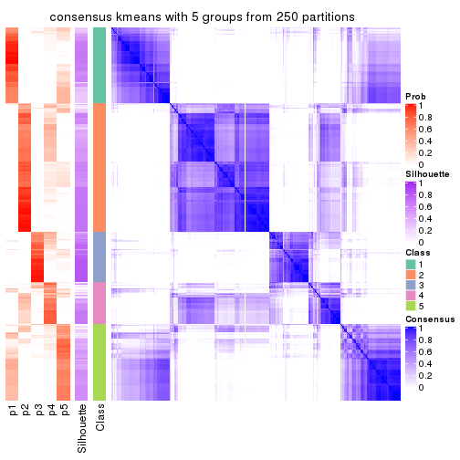</p>

</div>
<div id='tab-SD-kmeans-consensus-heatmap-5'>
<pre><code class="r">consensus_heatmap(res, k = 6)
</code></pre>

<p></p>

</div>
</div>

Heatmaps for the membership of samples in all partitions to see how consistent they are:


<script>
$( function() {
	$( '#tabs-SD-kmeans-membership-heatmap' ).tabs();
} );
</script>
<div id='tabs-SD-kmeans-membership-heatmap'>
<ul>
<li><a href='#tab-SD-kmeans-membership-heatmap-1'>k = 2</a></li>
<li><a href='#tab-SD-kmeans-membership-heatmap-2'>k = 3</a></li>
<li><a href='#tab-SD-kmeans-membership-heatmap-3'>k = 4</a></li>
<li><a href='#tab-SD-kmeans-membership-heatmap-4'>k = 5</a></li>
<li><a href='#tab-SD-kmeans-membership-heatmap-5'>k = 6</a></li>
</ul>
<div id='tab-SD-kmeans-membership-heatmap-1'>
<pre><code class="r">membership_heatmap(res, k = 2)
</code></pre>

<p></p>

</div>
<div id='tab-SD-kmeans-membership-heatmap-2'>
<pre><code class="r">membership_heatmap(res, k = 3)
</code></pre>

<p></p>

</div>
<div id='tab-SD-kmeans-membership-heatmap-3'>
<pre><code class="r">membership_heatmap(res, k = 4)
</code></pre>

<p></p>

</div>
<div id='tab-SD-kmeans-membership-heatmap-4'>
<pre><code class="r">membership_heatmap(res, k = 5)
</code></pre>

<p></p>

</div>
<div id='tab-SD-kmeans-membership-heatmap-5'>
<pre><code class="r">membership_heatmap(res, k = 6)
</code></pre>

<p></p>

</div>
</div>

As soon as we have had the classes for columns, we can look for signatures
which are significantly different between classes which can be candidate marks
for certain classes. Following are the heatmaps for signatures.


Signature heatmaps where rows are scaled:


<script>
$( function() {
	$( '#tabs-SD-kmeans-get-signatures' ).tabs();
} );
</script>
<div id='tabs-SD-kmeans-get-signatures'>
<ul>
<li><a href='#tab-SD-kmeans-get-signatures-1'>k = 2</a></li>
<li><a href='#tab-SD-kmeans-get-signatures-2'>k = 3</a></li>
<li><a href='#tab-SD-kmeans-get-signatures-3'>k = 4</a></li>
<li><a href='#tab-SD-kmeans-get-signatures-4'>k = 5</a></li>
<li><a href='#tab-SD-kmeans-get-signatures-5'>k = 6</a></li>
</ul>
<div id='tab-SD-kmeans-get-signatures-1'>
<pre><code class="r">get_signatures(res, k = 2)
</code></pre>

<p></p>

</div>
<div id='tab-SD-kmeans-get-signatures-2'>
<pre><code class="r">get_signatures(res, k = 3)
</code></pre>

<p></p>

</div>
<div id='tab-SD-kmeans-get-signatures-3'>
<pre><code class="r">get_signatures(res, k = 4)
</code></pre>

<p></p>

</div>
<div id='tab-SD-kmeans-get-signatures-4'>
<pre><code class="r">get_signatures(res, k = 5)
</code></pre>

<p></p>

</div>
<div id='tab-SD-kmeans-get-signatures-5'>
<pre><code class="r">get_signatures(res, k = 6)
</code></pre>

<p></p>

</div>
</div>


Signature heatmaps where rows are not scaled:


<script>
$( function() {
	$( '#tabs-SD-kmeans-get-signatures-no-scale' ).tabs();
} );
</script>
<div id='tabs-SD-kmeans-get-signatures-no-scale'>
<ul>
<li><a href='#tab-SD-kmeans-get-signatures-no-scale-1'>k = 2</a></li>
<li><a href='#tab-SD-kmeans-get-signatures-no-scale-2'>k = 3</a></li>
<li><a href='#tab-SD-kmeans-get-signatures-no-scale-3'>k = 4</a></li>
<li><a href='#tab-SD-kmeans-get-signatures-no-scale-4'>k = 5</a></li>
<li><a href='#tab-SD-kmeans-get-signatures-no-scale-5'>k = 6</a></li>
</ul>
<div id='tab-SD-kmeans-get-signatures-no-scale-1'>
<pre><code class="r">get_signatures(res, k = 2, scale_rows = FALSE)
</code></pre>

<p></p>

</div>
<div id='tab-SD-kmeans-get-signatures-no-scale-2'>
<pre><code class="r">get_signatures(res, k = 3, scale_rows = FALSE)
</code></pre>

<p></p>

</div>
<div id='tab-SD-kmeans-get-signatures-no-scale-3'>
<pre><code class="r">get_signatures(res, k = 4, scale_rows = FALSE)
</code></pre>

<p></p>

</div>
<div id='tab-SD-kmeans-get-signatures-no-scale-4'>
<pre><code class="r">get_signatures(res, k = 5, scale_rows = FALSE)
</code></pre>

<p></p>

</div>
<div id='tab-SD-kmeans-get-signatures-no-scale-5'>
<pre><code class="r">get_signatures(res, k = 6, scale_rows = FALSE)
</code></pre>

<p></p>

</div>
</div>


Compare the overlap of signatures from different k:

```r
compare_signatures(res)
```


`get_signature()` returns a data frame invisibly. TO get the list of signatures, the function
call should be assigned to a variable explicitly. In following code, if `plot` argument is set
to `FALSE`, no heatmap is plotted while only the differential analysis is performed.

```r
# code only for demonstration
tb = get_signature(res, k = ..., plot = FALSE)
```

An example of the output of `tb` is:

```
#>   which_row         fdr    mean_1    mean_2 scaled_mean_1 scaled_mean_2 km
#> 1        38 0.042760348  8.373488  9.131774    -0.5533452     0.5164555  1
#> 2        40 0.018707592  7.106213  8.469186    -0.6173731     0.5762149  1
#> 3        55 0.019134737 10.221463 11.207825    -0.6159697     0.5749050  1
#> 4        59 0.006059896  5.921854  7.869574    -0.6899429     0.6439467  1
#> 5        60 0.018055526  8.928898 10.211722    -0.6204761     0.5791110  1
#> 6        98 0.009384629 15.714769 14.887706     0.6635654    -0.6193277  2
...
```

The columns in `tb` are:

1. `which_row`: row indices corresponding to the input matrix.
2. `fdr`: FDR for the differential test. 
3. `mean_x`: The mean value in group x.
4. `scaled_mean_x`: The mean value in group x after rows are scaled.
5. `km`: Row groups if k-means clustering is applied to rows.


UMAP plot which shows how samples are separated.


<script>
$( function() {
	$( '#tabs-SD-kmeans-dimension-reduction' ).tabs();
} );
</script>
<div id='tabs-SD-kmeans-dimension-reduction'>
<ul>
<li><a href='#tab-SD-kmeans-dimension-reduction-1'>k = 2</a></li>
<li><a href='#tab-SD-kmeans-dimension-reduction-2'>k = 3</a></li>
<li><a href='#tab-SD-kmeans-dimension-reduction-3'>k = 4</a></li>
<li><a href='#tab-SD-kmeans-dimension-reduction-4'>k = 5</a></li>
<li><a href='#tab-SD-kmeans-dimension-reduction-5'>k = 6</a></li>
</ul>
<div id='tab-SD-kmeans-dimension-reduction-1'>
<pre><code class="r">dimension_reduction(res, k = 2, method = &quot;UMAP&quot;)
</code></pre>

<p></p>

</div>
<div id='tab-SD-kmeans-dimension-reduction-2'>
<pre><code class="r">dimension_reduction(res, k = 3, method = &quot;UMAP&quot;)
</code></pre>

<p></p>

</div>
<div id='tab-SD-kmeans-dimension-reduction-3'>
<pre><code class="r">dimension_reduction(res, k = 4, method = &quot;UMAP&quot;)
</code></pre>

<p></p>

</div>
<div id='tab-SD-kmeans-dimension-reduction-4'>
<pre><code class="r">dimension_reduction(res, k = 5, method = &quot;UMAP&quot;)
</code></pre>

<p></p>

</div>
<div id='tab-SD-kmeans-dimension-reduction-5'>
<pre><code class="r">dimension_reduction(res, k = 6, method = &quot;UMAP&quot;)
</code></pre>

<p></p>

</div>
</div>


Following heatmap shows how subgroups are split when increasing `k`:

```r
collect_classes(res)
```


If matrix rows can be associated to genes, consider to use `GO_Enrichment(res,
...)` to perform function enrichment for the signature genes.


 

---------------------------------------------------


### SD:skmeans**


The object with results only for a single top-value method and a single partition method 
can be extracted as:

```r
res = res_list["SD", "skmeans"]
# you can also extract it by
# res = res_list["SD:skmeans"]
```

A summary of `res` and all the functions that can be applied to it:

```r
res
```

```
#> A 'ConsensusPartition' object with k = 2, 3, 4, 5, 6.
#>   On a matrix with 17654 rows and 335 columns.
#>   Top rows (1000, 2000, 3000, 4000, 5000) are extracted by 'SD' method.
#>   Subgroups are detected by 'skmeans' method.
#>   Performed in total 1250 partitions by row resampling.
#>   Best k for subgroups seems to be 2.
#> 
#> Following methods can be applied to this 'ConsensusPartition' object:
#>  [1] "cola_report"             "collect_classes"         "collect_plots"          
#>  [4] "collect_stats"           "colnames"                "compare_signatures"     
#>  [7] "consensus_heatmap"       "dimension_reduction"     "functional_enrichment"  
#> [10] "get_anno_col"            "get_anno"                "get_classes"            
#> [13] "get_consensus"           "get_matrix"              "get_membership"         
#> [16] "get_param"               "get_signatures"          "get_stats"              
#> [19] "is_best_k"               "is_stable_k"             "membership_heatmap"     
#> [22] "ncol"                    "nrow"                    "plot_ecdf"              
#> [25] "rownames"                "select_partition_number" "show"                   
#> [28] "suggest_best_k"          "test_to_known_factors"
```

`collect_plots()` function collects all the plots made from `res` for all `k` (number of partitions)
into one single page to provide an easy and fast comparison between different `k`.

```r
collect_plots(res)
```


The plots are:

- The first row: a plot of the ECDF (Empirical cumulative distribution
  function) curves of the consensus matrix for each `k` and the heatmap of
  predicted classes for each `k`.
- The second row: heatmaps of the consensus matrix for each `k`.
- The third row: heatmaps of the membership matrix for each `k`.
- The fouth row: heatmaps of the signatures for each `k`.

All the plots in panels can be made by individual functions and they are
plotted later in this section.

`select_partition_number()` produces several plots showing different
statistics for choosing "optimized" `k`. There are following statistics:

- ECDF curves of the consensus matrix for each `k`;
- 1-PAC. [The PAC
  score](https://en.wikipedia.org/wiki/Consensus_clustering#Over-interpretation_potential_of_consensus_clustering)
  measures the proportion of the ambiguous subgrouping.
- Mean silhouette score.
- Concordance. The mean probability of fiting the consensus class ids in all
  partitions.
- Area increased. Denote $A_k$ as the area under the ECDF curve for current
  `k`, the area increased is defined as $A_k - A_{k-1}$.
- Rand index. The percent of pairs of samples that are both in a same cluster
  or both are not in a same cluster in the partition of k and k-1.
- Jaccard index. The ratio of pairs of samples are both in a same cluster in
  the partition of k and k-1 and the pairs of samples are both in a same
  cluster in the partition k or k-1.

The detailed explanations of these statistics can be found in [the cola
vignette](http://bioconductor.org/packages/devel/bioc/vignettes/cola/inst/doc/cola.html#toc_13).

Generally speaking, lower PAC score, higher mean silhouette score or higher
concordance corresponds to better partition. Rand index and Jaccard index
measure how similar the current partition is compared to partition with `k-1`.
If they are too similar, we won't accept `k` is better than `k-1`.

```r
select_partition_number(res)
```


The numeric values for all these statistics can be obtained by `get_stats()`.

```r
get_stats(res)
```

```
#>   k 1-PAC mean_silhouette concordance area_increased  Rand Jaccard
#> 2 2 0.994           0.957       0.983         0.4979 0.502   0.502
#> 3 3 0.881           0.893       0.956         0.3163 0.790   0.601
#> 4 4 0.848           0.861       0.918         0.1219 0.859   0.625
#> 5 5 0.737           0.731       0.849         0.0796 0.895   0.630
#> 6 6 0.714           0.508       0.745         0.0372 0.900   0.584
```

`suggest_best_k()` suggests the best $k$ based on these statistics. The rules are as follows:

- All $k$ with Jaccard index larger than 0.95 are removed because the increase of
  the partition number does not provides enough extra information. If all $k$ are removed,
  the best $k$ is assigned by `NA`.
- For $k$ with 1-PAC larger than 0.9, the maximal $k$ is taken as the "best k". Other $k$ is called "optional k".
- If it does not fit the second rule. The $k$ with the highest vote of highest
  1-PAC, mean silhouette and concordance is taken as the "best k".

```r
suggest_best_k(res)
```

```
#> [1] 2
```


Following shows the table of the partitions (You need to click the **show/hide
code output** link to see it). The membership matrix (columns with name `p*`)
is inferred by
[`clue::cl_consensus()`](https://www.rdocumentation.org/link/cl_consensus?package=clue)
function with the `SE` method. Basically the value in the membership matrix
represents the probability to belong to a certain group. The finall class
label for an item is determined with the group with highest probability it
belongs to.

In `get_classes()` function, the entropy is calculated from the membership
matrix and the silhouette score is calculated from the consensus matrix.


<script>
$( function() {
	$( '#tabs-SD-skmeans-get-classes' ).tabs();
} );
</script>
<div id='tabs-SD-skmeans-get-classes'>
<ul>
<li><a href='#tab-SD-skmeans-get-classes-1'>k = 2</a></li>
<li><a href='#tab-SD-skmeans-get-classes-2'>k = 3</a></li>
<li><a href='#tab-SD-skmeans-get-classes-3'>k = 4</a></li>
<li><a href='#tab-SD-skmeans-get-classes-4'>k = 5</a></li>
<li><a href='#tab-SD-skmeans-get-classes-5'>k = 6</a></li>
</ul>

<div id='tab-SD-skmeans-get-classes-1'>
<p><a id='tab-SD-skmeans-get-classes-1-a' style='color:#0366d6' href='#'>show/hide code output</a></p>
<pre><code class="r">cbind(get_classes(res, k = 2), get_membership(res, k = 2))
</code></pre>

<pre><code>#&gt;            class entropy silhouette    p1    p2
#&gt; SRR660306      2  0.0000      0.988 0.000 1.000
#&gt; SRR1359328     2  0.0000      0.988 0.000 1.000
#&gt; SRR821124      2  0.0000      0.988 0.000 1.000
#&gt; SRR1335188     1  0.0000      0.976 1.000 0.000
#&gt; SRR1075825     2  0.0000      0.988 0.000 1.000
#&gt; SRR1321921     1  0.0000      0.976 1.000 0.000
#&gt; SRR1466198     2  0.0000      0.988 0.000 1.000
#&gt; SRR1384073     1  0.0000      0.976 1.000 0.000
#&gt; SRR1312802     1  0.0000      0.976 1.000 0.000
#&gt; SRR1076559     1  0.0000      0.976 1.000 0.000
#&gt; SRR1370085     1  0.0000      0.976 1.000 0.000
#&gt; SRR1460363     1  0.0000      0.976 1.000 0.000
#&gt; SRR1480221     2  0.0000      0.988 0.000 1.000
#&gt; SRR1476165     1  0.0000      0.976 1.000 0.000
#&gt; SRR1459631     2  0.0000      0.988 0.000 1.000
#&gt; SRR1448098     2  0.0000      0.988 0.000 1.000
#&gt; SRR1321401     2  0.0000      0.988 0.000 1.000
#&gt; SRR807613      2  0.0000      0.988 0.000 1.000
#&gt; SRR808086      2  0.7745      0.696 0.228 0.772
#&gt; SRR613687      2  0.0000      0.988 0.000 1.000
#&gt; SRR1471011     1  0.0000      0.976 1.000 0.000
#&gt; SRR1330284     2  0.0000      0.988 0.000 1.000
#&gt; SRR1320624     2  0.0000      0.988 0.000 1.000
#&gt; SRR1459519     1  0.0000      0.976 1.000 0.000
#&gt; SRR1091184     2  0.0000      0.988 0.000 1.000
#&gt; SRR1390561     1  0.0000      0.976 1.000 0.000
#&gt; SRR658164      1  0.0000      0.976 1.000 0.000
#&gt; SRR1087079     2  0.0000      0.988 0.000 1.000
#&gt; SRR814996      1  0.9686      0.363 0.604 0.396
#&gt; SRR1407410     2  0.0000      0.988 0.000 1.000
#&gt; SRR1453392     2  0.0000      0.988 0.000 1.000
#&gt; SRR1445873     1  0.0000      0.976 1.000 0.000
#&gt; SRR1419985     2  0.0000      0.988 0.000 1.000
#&gt; SRR820938      2  0.0000      0.988 0.000 1.000
#&gt; SRR1476844     1  0.0000      0.976 1.000 0.000
#&gt; SRR1403526     1  0.0000      0.976 1.000 0.000
#&gt; SRR1413916     2  0.0000      0.988 0.000 1.000
#&gt; SRR1441051     2  0.0000      0.988 0.000 1.000
#&gt; SRR614287      2  0.0000      0.988 0.000 1.000
#&gt; SRR1092062     2  0.0000      0.988 0.000 1.000
#&gt; SRR612611      2  0.0000      0.988 0.000 1.000
#&gt; SRR1376356     2  0.0000      0.988 0.000 1.000
#&gt; SRR1405078     1  0.7376      0.735 0.792 0.208
#&gt; SRR1437226     2  0.0000      0.988 0.000 1.000
#&gt; SRR1326078     1  0.0000      0.976 1.000 0.000
#&gt; SRR1096806     2  0.0000      0.988 0.000 1.000
#&gt; SRR1440919     2  0.0000      0.988 0.000 1.000
#&gt; SRR1452824     1  0.0000      0.976 1.000 0.000
#&gt; SRR615754      1  0.0000      0.976 1.000 0.000
#&gt; SRR1341787     2  0.0000      0.988 0.000 1.000
#&gt; SRR614551      2  0.0000      0.988 0.000 1.000
#&gt; SRR1380829     2  0.0000      0.988 0.000 1.000
#&gt; SRR1455761     1  0.0000      0.976 1.000 0.000
#&gt; SRR1465189     1  0.0000      0.976 1.000 0.000
#&gt; SRR1376895     1  0.0000      0.976 1.000 0.000
#&gt; SRR1445002     1  0.0000      0.976 1.000 0.000
#&gt; SRR1469258     2  0.0000      0.988 0.000 1.000
#&gt; SRR1409239     1  0.0000      0.976 1.000 0.000
#&gt; SRR1480200     1  0.0000      0.976 1.000 0.000
#&gt; SRR1418323     1  0.0000      0.976 1.000 0.000
#&gt; SRR657540      2  0.0000      0.988 0.000 1.000
#&gt; SRR821096      2  0.0000      0.988 0.000 1.000
#&gt; SRR613591      2  0.0000      0.988 0.000 1.000
#&gt; SRR1344205     2  0.0000      0.988 0.000 1.000
#&gt; SRR612479      1  0.0000      0.976 1.000 0.000
#&gt; SRR1399950     1  0.0000      0.976 1.000 0.000
#&gt; SRR1336048     1  0.0000      0.976 1.000 0.000
#&gt; SRR1368896     1  0.0000      0.976 1.000 0.000
#&gt; SRR1379403     2  0.0000      0.988 0.000 1.000
#&gt; SRR1312464     1  0.0000      0.976 1.000 0.000
#&gt; SRR1096478     1  0.0000      0.976 1.000 0.000
#&gt; SRR1459845     1  0.0000      0.976 1.000 0.000
#&gt; SRR1348138     1  0.3733      0.906 0.928 0.072
#&gt; SRR811423      1  0.0000      0.976 1.000 0.000
#&gt; SRR615683      1  0.0000      0.976 1.000 0.000
#&gt; SRR1380336     2  0.0000      0.988 0.000 1.000
#&gt; SRR817609      1  0.0000      0.976 1.000 0.000
#&gt; SRR1074550     2  0.0000      0.988 0.000 1.000
#&gt; SRR1499236     2  0.0000      0.988 0.000 1.000
#&gt; SRR656083      1  0.0000      0.976 1.000 0.000
#&gt; SRR817539      1  0.0000      0.976 1.000 0.000
#&gt; SRR1410801     1  0.0000      0.976 1.000 0.000
#&gt; SRR1347190     1  0.0000      0.976 1.000 0.000
#&gt; SRR1355126     2  0.0000      0.988 0.000 1.000
#&gt; SRR615165      2  0.0000      0.988 0.000 1.000
#&gt; SRR1466046     1  0.0000      0.976 1.000 0.000
#&gt; SRR1097055     2  0.0000      0.988 0.000 1.000
#&gt; SRR1312370     2  0.0000      0.988 0.000 1.000
#&gt; SRR655325      1  0.0000      0.976 1.000 0.000
#&gt; SRR810177      2  0.0000      0.988 0.000 1.000
#&gt; SRR815685      2  0.0000      0.988 0.000 1.000
#&gt; SRR817026      2  0.0000      0.988 0.000 1.000
#&gt; SRR1417224     2  0.0000      0.988 0.000 1.000
#&gt; SRR661687      2  0.0000      0.988 0.000 1.000
#&gt; SRR1431804     1  0.0376      0.972 0.996 0.004
#&gt; SRR664072      2  0.0938      0.976 0.012 0.988
#&gt; SRR612923      2  0.0000      0.988 0.000 1.000
#&gt; SRR1315890     1  0.0000      0.976 1.000 0.000
#&gt; SRR1347726     1  0.0000      0.976 1.000 0.000
#&gt; SRR1500360     1  0.0000      0.976 1.000 0.000
#&gt; SRR1468360     2  0.0000      0.988 0.000 1.000
#&gt; SRR1404084     1  0.0000      0.976 1.000 0.000
#&gt; SRR615994      2  0.0000      0.988 0.000 1.000
#&gt; SRR1475718     2  0.0000      0.988 0.000 1.000
#&gt; SRR1397200     2  0.0000      0.988 0.000 1.000
#&gt; SRR655519      2  0.0000      0.988 0.000 1.000
#&gt; SRR1311308     2  0.0000      0.988 0.000 1.000
#&gt; SRR1368006     2  0.0000      0.988 0.000 1.000
#&gt; SRR613651      1  0.0000      0.976 1.000 0.000
#&gt; SRR1362621     2  0.0000      0.988 0.000 1.000
#&gt; SRR1451718     1  0.0000      0.976 1.000 0.000
#&gt; SRR1095334     2  0.0000      0.988 0.000 1.000
#&gt; SRR1079636     2  0.0000      0.988 0.000 1.000
#&gt; SRR1442549     2  0.3114      0.931 0.056 0.944
#&gt; SRR1466421     2  0.0000      0.988 0.000 1.000
#&gt; SRR817397      2  0.0000      0.988 0.000 1.000
#&gt; SRR1341809     2  0.0000      0.988 0.000 1.000
#&gt; SRR614623      2  0.0000      0.988 0.000 1.000
#&gt; SRR1335005     2  0.0000      0.988 0.000 1.000
#&gt; SRR1407065     2  0.0000      0.988 0.000 1.000
#&gt; SRR1404483     2  0.0000      0.988 0.000 1.000
#&gt; SRR1096222     1  0.0000      0.976 1.000 0.000
#&gt; SRR1401793     1  0.0000      0.976 1.000 0.000
#&gt; SRR1408615     1  0.9988      0.103 0.520 0.480
#&gt; SRR1070597     1  0.0000      0.976 1.000 0.000
#&gt; SRR1332381     1  0.0000      0.976 1.000 0.000
#&gt; SRR1457015     1  0.0000      0.976 1.000 0.000
#&gt; SRR1386797     2  0.9970      0.109 0.468 0.532
#&gt; SRR1098385     2  0.0000      0.988 0.000 1.000
#&gt; SRR1363947     2  0.0000      0.988 0.000 1.000
#&gt; SRR820350      2  0.0000      0.988 0.000 1.000
#&gt; SRR662055      2  0.0000      0.988 0.000 1.000
#&gt; SRR1310455     1  0.0000      0.976 1.000 0.000
#&gt; SRR1453639     2  0.8443      0.616 0.272 0.728
#&gt; SRR662617      2  0.0000      0.988 0.000 1.000
#&gt; SRR654778      1  0.0000      0.976 1.000 0.000
#&gt; SRR661782      2  0.0000      0.988 0.000 1.000
#&gt; SRR1334396     1  0.0000      0.976 1.000 0.000
#&gt; SRR613867      2  0.0000      0.988 0.000 1.000
#&gt; SRR1479412     1  0.0000      0.976 1.000 0.000
#&gt; SRR1331620     1  0.0000      0.976 1.000 0.000
#&gt; SRR1082809     1  0.0000      0.976 1.000 0.000
#&gt; SRR1417178     1  0.0000      0.976 1.000 0.000
#&gt; SRR1335278     1  0.0000      0.976 1.000 0.000
#&gt; SRR665369      2  0.0000      0.988 0.000 1.000
#&gt; SRR657552      1  0.0000      0.976 1.000 0.000
#&gt; SRR812412      1  0.0000      0.976 1.000 0.000
#&gt; SRR1096500     2  0.0000      0.988 0.000 1.000
#&gt; SRR1347750     2  0.0000      0.988 0.000 1.000
#&gt; SRR615153      1  0.5842      0.830 0.860 0.140
#&gt; SRR1434417     1  0.0000      0.976 1.000 0.000
#&gt; SRR1070159     2  0.0000      0.988 0.000 1.000
#&gt; SRR1332508     2  0.0000      0.988 0.000 1.000
#&gt; SRR1082059     2  0.6887      0.769 0.184 0.816
#&gt; SRR1402491     1  0.0000      0.976 1.000 0.000
#&gt; SRR1476595     2  0.7815      0.694 0.232 0.768
#&gt; SRR1320987     2  0.0000      0.988 0.000 1.000
#&gt; SRR1086417     1  0.9944      0.165 0.544 0.456
#&gt; SRR1454095     1  0.0000      0.976 1.000 0.000
#&gt; SRR614791      2  0.0000      0.988 0.000 1.000
#&gt; SRR821255      1  0.9661      0.358 0.608 0.392
#&gt; SRR820402      2  0.0000      0.988 0.000 1.000
#&gt; SRR1337284     1  0.0000      0.976 1.000 0.000
#&gt; SRR1333083     1  0.9850      0.274 0.572 0.428
#&gt; SRR1384883     2  0.0000      0.988 0.000 1.000
#&gt; SRR614431      1  0.0000      0.976 1.000 0.000
#&gt; SRR1481106     2  0.0000      0.988 0.000 1.000
#&gt; SRR1370285     1  0.0000      0.976 1.000 0.000
#&gt; SRR1446673     2  0.0000      0.988 0.000 1.000
#&gt; SRR1318046     2  0.0000      0.988 0.000 1.000
#&gt; SRR1341188     2  0.0000      0.988 0.000 1.000
#&gt; SRR1384941     1  0.0000      0.976 1.000 0.000
#&gt; SRR1322864     2  0.0000      0.988 0.000 1.000
#&gt; SRR1476825     1  0.0000      0.976 1.000 0.000
#&gt; SRR1443332     2  0.0000      0.988 0.000 1.000
#&gt; SRR662486      2  0.0000      0.988 0.000 1.000
#&gt; SRR1447019     1  0.0000      0.976 1.000 0.000
#&gt; SRR662942      1  0.0000      0.976 1.000 0.000
#&gt; SRR613102      2  0.0000      0.988 0.000 1.000
#&gt; SRR1469880     1  0.0000      0.976 1.000 0.000
#&gt; SRR1464977     1  0.0000      0.976 1.000 0.000
#&gt; SRR615850      1  0.0672      0.969 0.992 0.008
#&gt; SRR661949      2  0.0000      0.988 0.000 1.000
#&gt; SRR1322227     2  0.0000      0.988 0.000 1.000
#&gt; SRR1441655     1  0.2043      0.946 0.968 0.032
#&gt; SRR613771      2  0.0000      0.988 0.000 1.000
#&gt; SRR1479471     1  0.0000      0.976 1.000 0.000
#&gt; SRR1488918     2  0.0000      0.988 0.000 1.000
#&gt; SRR1414040     2  0.0000      0.988 0.000 1.000
#&gt; SRR1079850     2  0.7883      0.687 0.236 0.764
#&gt; SRR663209      1  0.0000      0.976 1.000 0.000
#&gt; SRR1364914     2  0.0000      0.988 0.000 1.000
#&gt; SRR1408267     2  0.0000      0.988 0.000 1.000
#&gt; SRR1314894     1  0.0000      0.976 1.000 0.000
#&gt; SRR1414117     2  0.0000      0.988 0.000 1.000
#&gt; SRR1395975     2  0.0000      0.988 0.000 1.000
#&gt; SRR1402219     2  0.0000      0.988 0.000 1.000
#&gt; SRR1433623     1  0.0000      0.976 1.000 0.000
#&gt; SRR656385      2  0.0000      0.988 0.000 1.000
#&gt; SRR811213      2  0.0000      0.988 0.000 1.000
#&gt; SRR663657      2  0.0000      0.988 0.000 1.000
#&gt; SRR612203      1  0.0000      0.976 1.000 0.000
#&gt; SRR613987      2  0.0000      0.988 0.000 1.000
#&gt; SRR613831      2  0.0000      0.988 0.000 1.000
#&gt; SRR1354180     2  0.0000      0.988 0.000 1.000
#&gt; SRR1382912     1  0.0000      0.976 1.000 0.000
#&gt; SRR1475501     1  0.0000      0.976 1.000 0.000
#&gt; SRR1336930     1  0.0000      0.976 1.000 0.000
#&gt; SRR613030      2  0.0000      0.988 0.000 1.000
#&gt; SRR1381459     2  0.0000      0.988 0.000 1.000
#&gt; SRR1402350     1  0.0000      0.976 1.000 0.000
#&gt; SRR1419408     1  0.0000      0.976 1.000 0.000
#&gt; SRR655911      2  0.0000      0.988 0.000 1.000
#&gt; SRR1418243     1  0.0000      0.976 1.000 0.000
#&gt; SRR1322573     1  0.0000      0.976 1.000 0.000
#&gt; SRR613615      2  0.0000      0.988 0.000 1.000
#&gt; SRR1355284     1  0.0000      0.976 1.000 0.000
#&gt; SRR1319395     1  0.0000      0.976 1.000 0.000
#&gt; SRR818939      1  0.0000      0.976 1.000 0.000
#&gt; SRR1465266     1  0.0000      0.976 1.000 0.000
#&gt; SRR614888      1  0.0000      0.976 1.000 0.000
#&gt; SRR1431694     1  0.0000      0.976 1.000 0.000
#&gt; SRR614347      2  0.0000      0.988 0.000 1.000
#&gt; SRR1334228     2  0.0000      0.988 0.000 1.000
#&gt; SRR1096007     2  0.0000      0.988 0.000 1.000
#&gt; SRR656349      1  0.0000      0.976 1.000 0.000
#&gt; SRR815422      2  0.0000      0.988 0.000 1.000
#&gt; SRR1360828     1  0.0000      0.976 1.000 0.000
#&gt; SRR1359005     2  0.0000      0.988 0.000 1.000
#&gt; SRR1456652     1  0.0000      0.976 1.000 0.000
#&gt; SRR1391660     1  0.0000      0.976 1.000 0.000
#&gt; SRR1441956     1  0.0000      0.976 1.000 0.000
#&gt; SRR662930      2  0.0000      0.988 0.000 1.000
#&gt; SRR615790      2  0.0000      0.988 0.000 1.000
#&gt; SRR614827      2  0.0000      0.988 0.000 1.000
#&gt; SRR614587      2  0.0000      0.988 0.000 1.000
#&gt; SRR814052      2  0.0000      0.988 0.000 1.000
#&gt; SRR1070086     1  0.0000      0.976 1.000 0.000
#&gt; SRR1481440     1  0.0000      0.976 1.000 0.000
#&gt; SRR1339296     2  0.0000      0.988 0.000 1.000
#&gt; SRR1343239     2  0.0000      0.988 0.000 1.000
#&gt; SRR1432802     2  0.0000      0.988 0.000 1.000
#&gt; SRR1416911     1  0.0000      0.976 1.000 0.000
#&gt; SRR1410427     1  0.0000      0.976 1.000 0.000
#&gt; SRR1401185     1  0.8813      0.579 0.700 0.300
#&gt; SRR654993      2  0.0000      0.988 0.000 1.000
#&gt; SRR656397      1  0.0000      0.976 1.000 0.000
#&gt; SRR809643      2  0.4939      0.871 0.108 0.892
#&gt; SRR1433819     1  0.0000      0.976 1.000 0.000
#&gt; SRR1375225     2  0.0000      0.988 0.000 1.000
#&gt; SRR1367739     1  0.4022      0.898 0.920 0.080
#&gt; SRR1323336     1  0.0000      0.976 1.000 0.000
#&gt; SRR663224      2  0.0000      0.988 0.000 1.000
#&gt; SRR1442840     1  0.0000      0.976 1.000 0.000
#&gt; SRR1374058     1  0.0000      0.976 1.000 0.000
#&gt; SRR656994      1  0.0000      0.976 1.000 0.000
#&gt; SRR1469214     2  0.0000      0.988 0.000 1.000
#&gt; SRR1456446     1  0.0000      0.976 1.000 0.000
#&gt; SRR1471879     2  0.0000      0.988 0.000 1.000
#&gt; SRR612911      2  0.0000      0.988 0.000 1.000
#&gt; SRR1395720     2  0.0000      0.988 0.000 1.000
#&gt; SRR1413055     1  0.0000      0.976 1.000 0.000
#&gt; SRR656770      2  0.0000      0.988 0.000 1.000
#&gt; SRR812080      2  0.0000      0.988 0.000 1.000
#&gt; SRR1479328     1  0.0000      0.976 1.000 0.000
#&gt; SRR661421      2  0.0000      0.988 0.000 1.000
#&gt; SRR1410286     2  0.0000      0.988 0.000 1.000
#&gt; SRR1487150     1  0.0000      0.976 1.000 0.000
#&gt; SRR1467035     1  0.0000      0.976 1.000 0.000
#&gt; SRR1360607     2  0.0000      0.988 0.000 1.000
#&gt; SRR1333106     2  0.0000      0.988 0.000 1.000
#&gt; SRR1088706     2  0.0000      0.988 0.000 1.000
#&gt; SRR1320053     2  0.0000      0.988 0.000 1.000
#&gt; SRR1350392     2  0.0000      0.988 0.000 1.000
#&gt; SRR1385190     1  0.0000      0.976 1.000 0.000
#&gt; SRR1080093     2  0.0000      0.988 0.000 1.000
#&gt; SRR1318753     1  0.0000      0.976 1.000 0.000
#&gt; SRR1345369     2  0.0000      0.988 0.000 1.000
#&gt; SRR612178      2  0.0000      0.988 0.000 1.000
#&gt; SRR1354423     1  0.0000      0.976 1.000 0.000
#&gt; SRR1072724     1  0.0000      0.976 1.000 0.000
#&gt; SRR1418450     2  0.0000      0.988 0.000 1.000
#&gt; SRR1326427     2  0.0000      0.988 0.000 1.000
#&gt; SRR1437412     2  0.0000      0.988 0.000 1.000
#&gt; SRR1327548     2  0.0000      0.988 0.000 1.000
#&gt; SRR1395891     1  0.0000      0.976 1.000 0.000
#&gt; SRR659367      2  0.0000      0.988 0.000 1.000
#&gt; SRR818961      1  0.0000      0.976 1.000 0.000
#&gt; SRR813704      1  0.0000      0.976 1.000 0.000
#&gt; SRR613054      1  0.0000      0.976 1.000 0.000
#&gt; SRR1476467     1  0.0000      0.976 1.000 0.000
#&gt; SRR1407988     2  0.0000      0.988 0.000 1.000
#&gt; SRR1394776     2  0.0000      0.988 0.000 1.000
#&gt; SRR655578      2  0.0000      0.988 0.000 1.000
#&gt; SRR1310645     2  0.0000      0.988 0.000 1.000
#&gt; SRR1345628     1  0.0000      0.976 1.000 0.000
#&gt; SRR1479740     1  0.0000      0.976 1.000 0.000
#&gt; SRR1332095     1  0.0000      0.976 1.000 0.000
#&gt; SRR1444786     2  0.0000      0.988 0.000 1.000
#&gt; SRR1090070     1  0.0000      0.976 1.000 0.000
#&gt; SRR662414      2  0.0000      0.988 0.000 1.000
#&gt; SRR661216      2  0.0000      0.988 0.000 1.000
#&gt; SRR656313      2  0.0000      0.988 0.000 1.000
#&gt; SRR615671      2  0.0000      0.988 0.000 1.000
#&gt; SRR1350196     2  0.0000      0.988 0.000 1.000
#&gt; SRR1466580     1  0.0000      0.976 1.000 0.000
#&gt; SRR1408032     2  0.0000      0.988 0.000 1.000
#&gt; SRR1432913     2  0.0000      0.988 0.000 1.000
#&gt; SRR1360502     1  0.0000      0.976 1.000 0.000
#&gt; SRR1391901     2  0.0000      0.988 0.000 1.000
#&gt; SRR1311131     1  0.0000      0.976 1.000 0.000
#&gt; SRR1380636     1  0.0000      0.976 1.000 0.000
#&gt; SRR1332339     1  0.0000      0.976 1.000 0.000
#&gt; SRR1341563     2  0.0000      0.988 0.000 1.000
#&gt; SRR1359410     2  0.0000      0.988 0.000 1.000
#&gt; SRR1473040     1  0.9710      0.353 0.600 0.400
#&gt; SRR1321444     1  0.0000      0.976 1.000 0.000
#&gt; SRR1498765     2  0.0000      0.988 0.000 1.000
#&gt; SRR1312622     2  0.0000      0.988 0.000 1.000
#&gt; SRR615503      2  0.9248      0.480 0.340 0.660
#&gt; SRR1453192     1  0.0000      0.976 1.000 0.000
#&gt; SRR1433107     2  0.0000      0.988 0.000 1.000
#&gt; SRR1075384     1  0.0000      0.976 1.000 0.000
#&gt; SRR1356683     1  0.0000      0.976 1.000 0.000
#&gt; SRR659049      1  0.0000      0.976 1.000 0.000
#&gt; SRR1368240     1  0.0000      0.976 1.000 0.000
#&gt; SRR1341739     1  0.0000      0.976 1.000 0.000
#&gt; SRR613249      1  0.7602      0.717 0.780 0.220
#&gt; SRR663428      2  0.0000      0.988 0.000 1.000
#&gt; SRR1341302     2  0.0000      0.988 0.000 1.000
#&gt; SRR1073553     2  0.0000      0.988 0.000 1.000
#&gt; SRR1354093     2  0.0000      0.988 0.000 1.000
#&gt; SRR1406521     2  0.0000      0.988 0.000 1.000
#&gt; SRR1432049     1  0.0000      0.976 1.000 0.000
#&gt; SRR1453504     1  0.0000      0.976 1.000 0.000
</code></pre>

<script>
$('#tab-SD-skmeans-get-classes-1-a').parent().next().next().hide();
$('#tab-SD-skmeans-get-classes-1-a').click(function(){
  $('#tab-SD-skmeans-get-classes-1-a').parent().next().next().toggle();
  return(false);
});
</script>
</div>

<div id='tab-SD-skmeans-get-classes-2'>
<p><a id='tab-SD-skmeans-get-classes-2-a' style='color:#0366d6' href='#'>show/hide code output</a></p>
<pre><code class="r">cbind(get_classes(res, k = 3), get_membership(res, k = 3))
</code></pre>

<pre><code>#&gt;            class entropy silhouette    p1    p2    p3
#&gt; SRR660306      3  0.0000      0.906 0.000 0.000 1.000
#&gt; SRR1359328     3  0.0000      0.906 0.000 0.000 1.000
#&gt; SRR821124      2  0.0000      0.961 0.000 1.000 0.000
#&gt; SRR1335188     1  0.0000      0.971 1.000 0.000 0.000
#&gt; SRR1075825     2  0.0000      0.961 0.000 1.000 0.000
#&gt; SRR1321921     1  0.0000      0.971 1.000 0.000 0.000
#&gt; SRR1466198     3  0.0000      0.906 0.000 0.000 1.000
#&gt; SRR1384073     1  0.0000      0.971 1.000 0.000 0.000
#&gt; SRR1312802     1  0.0000      0.971 1.000 0.000 0.000
#&gt; SRR1076559     1  0.0000      0.971 1.000 0.000 0.000
#&gt; SRR1370085     1  0.0000      0.971 1.000 0.000 0.000
#&gt; SRR1460363     1  0.0000      0.971 1.000 0.000 0.000
#&gt; SRR1480221     2  0.0000      0.961 0.000 1.000 0.000
#&gt; SRR1476165     1  0.0237      0.967 0.996 0.000 0.004
#&gt; SRR1459631     3  0.4452      0.734 0.000 0.192 0.808
#&gt; SRR1448098     2  0.0000      0.961 0.000 1.000 0.000
#&gt; SRR1321401     2  0.0000      0.961 0.000 1.000 0.000
#&gt; SRR807613      2  0.0000      0.961 0.000 1.000 0.000
#&gt; SRR808086      3  0.0000      0.906 0.000 0.000 1.000
#&gt; SRR613687      2  0.0000      0.961 0.000 1.000 0.000
#&gt; SRR1471011     1  0.5859      0.467 0.656 0.000 0.344
#&gt; SRR1330284     2  0.0000      0.961 0.000 1.000 0.000
#&gt; SRR1320624     2  0.0000      0.961 0.000 1.000 0.000
#&gt; SRR1459519     1  0.0000      0.971 1.000 0.000 0.000
#&gt; SRR1091184     3  0.0000      0.906 0.000 0.000 1.000
#&gt; SRR1390561     1  0.0000      0.971 1.000 0.000 0.000
#&gt; SRR658164      1  0.0000      0.971 1.000 0.000 0.000
#&gt; SRR1087079     2  0.0000      0.961 0.000 1.000 0.000
#&gt; SRR814996      3  0.0000      0.906 0.000 0.000 1.000
#&gt; SRR1407410     2  0.0000      0.961 0.000 1.000 0.000
#&gt; SRR1453392     2  0.1529      0.924 0.000 0.960 0.040
#&gt; SRR1445873     1  0.0000      0.971 1.000 0.000 0.000
#&gt; SRR1419985     2  0.0000      0.961 0.000 1.000 0.000
#&gt; SRR820938      3  0.0000      0.906 0.000 0.000 1.000
#&gt; SRR1476844     1  0.0000      0.971 1.000 0.000 0.000
#&gt; SRR1403526     1  0.0000      0.971 1.000 0.000 0.000
#&gt; SRR1413916     2  0.0000      0.961 0.000 1.000 0.000
#&gt; SRR1441051     2  0.0000      0.961 0.000 1.000 0.000
#&gt; SRR614287      2  0.0000      0.961 0.000 1.000 0.000
#&gt; SRR1092062     2  0.0000      0.961 0.000 1.000 0.000
#&gt; SRR612611      2  0.0000      0.961 0.000 1.000 0.000
#&gt; SRR1376356     2  0.0000      0.961 0.000 1.000 0.000
#&gt; SRR1405078     3  0.4555      0.726 0.200 0.000 0.800
#&gt; SRR1437226     3  0.6302      0.132 0.000 0.480 0.520
#&gt; SRR1326078     1  0.0000      0.971 1.000 0.000 0.000
#&gt; SRR1096806     3  0.0000      0.906 0.000 0.000 1.000
#&gt; SRR1440919     3  0.0000      0.906 0.000 0.000 1.000
#&gt; SRR1452824     1  0.2165      0.907 0.936 0.000 0.064
#&gt; SRR615754      1  0.0000      0.971 1.000 0.000 0.000
#&gt; SRR1341787     3  0.4452      0.727 0.000 0.192 0.808
#&gt; SRR614551      2  0.0000      0.961 0.000 1.000 0.000
#&gt; SRR1380829     3  0.0000      0.906 0.000 0.000 1.000
#&gt; SRR1455761     1  0.0000      0.971 1.000 0.000 0.000
#&gt; SRR1465189     3  0.0000      0.906 0.000 0.000 1.000
#&gt; SRR1376895     1  0.0000      0.971 1.000 0.000 0.000
#&gt; SRR1445002     1  0.0000      0.971 1.000 0.000 0.000
#&gt; SRR1469258     2  0.0000      0.961 0.000 1.000 0.000
#&gt; SRR1409239     1  0.0000      0.971 1.000 0.000 0.000
#&gt; SRR1480200     1  0.0000      0.971 1.000 0.000 0.000
#&gt; SRR1418323     1  0.0000      0.971 1.000 0.000 0.000
#&gt; SRR657540      3  0.0000      0.906 0.000 0.000 1.000
#&gt; SRR821096      2  0.0000      0.961 0.000 1.000 0.000
#&gt; SRR613591      2  0.0000      0.961 0.000 1.000 0.000
#&gt; SRR1344205     3  0.0000      0.906 0.000 0.000 1.000
#&gt; SRR612479      1  0.0000      0.971 1.000 0.000 0.000
#&gt; SRR1399950     1  0.0000      0.971 1.000 0.000 0.000
#&gt; SRR1336048     3  0.4235      0.755 0.176 0.000 0.824
#&gt; SRR1368896     1  0.0000      0.971 1.000 0.000 0.000
#&gt; SRR1379403     2  0.0000      0.961 0.000 1.000 0.000
#&gt; SRR1312464     1  0.0000      0.971 1.000 0.000 0.000
#&gt; SRR1096478     1  0.0000      0.971 1.000 0.000 0.000
#&gt; SRR1459845     1  0.0000      0.971 1.000 0.000 0.000
#&gt; SRR1348138     3  0.0000      0.906 0.000 0.000 1.000
#&gt; SRR811423      1  0.0000      0.971 1.000 0.000 0.000
#&gt; SRR615683      1  0.0000      0.971 1.000 0.000 0.000
#&gt; SRR1380336     2  0.0000      0.961 0.000 1.000 0.000
#&gt; SRR817609      3  0.6244      0.214 0.440 0.000 0.560
#&gt; SRR1074550     3  0.0000      0.906 0.000 0.000 1.000
#&gt; SRR1499236     2  0.0000      0.961 0.000 1.000 0.000
#&gt; SRR656083      1  0.0000      0.971 1.000 0.000 0.000
#&gt; SRR817539      1  0.0000      0.971 1.000 0.000 0.000
#&gt; SRR1410801     1  0.0000      0.971 1.000 0.000 0.000
#&gt; SRR1347190     1  0.0000      0.971 1.000 0.000 0.000
#&gt; SRR1355126     2  0.0000      0.961 0.000 1.000 0.000
#&gt; SRR615165      3  0.0000      0.906 0.000 0.000 1.000
#&gt; SRR1466046     1  0.0000      0.971 1.000 0.000 0.000
#&gt; SRR1097055     2  0.0000      0.961 0.000 1.000 0.000
#&gt; SRR1312370     2  0.0000      0.961 0.000 1.000 0.000
#&gt; SRR655325      1  0.0000      0.971 1.000 0.000 0.000
#&gt; SRR810177      2  0.0000      0.961 0.000 1.000 0.000
#&gt; SRR815685      2  0.0000      0.961 0.000 1.000 0.000
#&gt; SRR817026      3  0.0000      0.906 0.000 0.000 1.000
#&gt; SRR1417224     3  0.6126      0.345 0.000 0.400 0.600
#&gt; SRR661687      3  0.0000      0.906 0.000 0.000 1.000
#&gt; SRR1431804     3  0.5560      0.555 0.300 0.000 0.700
#&gt; SRR664072      3  0.0000      0.906 0.000 0.000 1.000
#&gt; SRR612923      2  0.0000      0.961 0.000 1.000 0.000
#&gt; SRR1315890     1  0.0000      0.971 1.000 0.000 0.000
#&gt; SRR1347726     1  0.0000      0.971 1.000 0.000 0.000
#&gt; SRR1500360     1  0.0000      0.971 1.000 0.000 0.000
#&gt; SRR1468360     2  0.0000      0.961 0.000 1.000 0.000
#&gt; SRR1404084     1  0.5706      0.519 0.680 0.000 0.320
#&gt; SRR615994      3  0.0000      0.906 0.000 0.000 1.000
#&gt; SRR1475718     2  0.0000      0.961 0.000 1.000 0.000
#&gt; SRR1397200     3  0.0000      0.906 0.000 0.000 1.000
#&gt; SRR655519      2  0.0000      0.961 0.000 1.000 0.000
#&gt; SRR1311308     3  0.0000      0.906 0.000 0.000 1.000
#&gt; SRR1368006     2  0.0000      0.961 0.000 1.000 0.000
#&gt; SRR613651      1  0.0000      0.971 1.000 0.000 0.000
#&gt; SRR1362621     3  0.0000      0.906 0.000 0.000 1.000
#&gt; SRR1451718     1  0.0000      0.971 1.000 0.000 0.000
#&gt; SRR1095334     3  0.0000      0.906 0.000 0.000 1.000
#&gt; SRR1079636     2  0.0000      0.961 0.000 1.000 0.000
#&gt; SRR1442549     2  0.0000      0.961 0.000 1.000 0.000
#&gt; SRR1466421     2  0.0000      0.961 0.000 1.000 0.000
#&gt; SRR817397      2  0.3038      0.855 0.000 0.896 0.104
#&gt; SRR1341809     2  0.0000      0.961 0.000 1.000 0.000
#&gt; SRR614623      2  0.0000      0.961 0.000 1.000 0.000
#&gt; SRR1335005     2  0.0000      0.961 0.000 1.000 0.000
#&gt; SRR1407065     3  0.5988      0.428 0.000 0.368 0.632
#&gt; SRR1404483     2  0.6111      0.333 0.000 0.604 0.396
#&gt; SRR1096222     1  0.0000      0.971 1.000 0.000 0.000
#&gt; SRR1401793     1  0.0000      0.971 1.000 0.000 0.000
#&gt; SRR1408615     3  0.0000      0.906 0.000 0.000 1.000
#&gt; SRR1070597     1  0.5650      0.549 0.688 0.312 0.000
#&gt; SRR1332381     1  0.3412      0.837 0.876 0.000 0.124
#&gt; SRR1457015     1  0.0000      0.971 1.000 0.000 0.000
#&gt; SRR1386797     2  0.1753      0.909 0.048 0.952 0.000
#&gt; SRR1098385     2  0.0000      0.961 0.000 1.000 0.000
#&gt; SRR1363947     3  0.0000      0.906 0.000 0.000 1.000
#&gt; SRR820350      2  0.0000      0.961 0.000 1.000 0.000
#&gt; SRR662055      2  0.0000      0.961 0.000 1.000 0.000
#&gt; SRR1310455     1  0.0000      0.971 1.000 0.000 0.000
#&gt; SRR1453639     2  0.5216      0.621 0.260 0.740 0.000
#&gt; SRR662617      2  0.0000      0.961 0.000 1.000 0.000
#&gt; SRR654778      1  0.0000      0.971 1.000 0.000 0.000
#&gt; SRR661782      2  0.0000      0.961 0.000 1.000 0.000
#&gt; SRR1334396     1  0.0000      0.971 1.000 0.000 0.000
#&gt; SRR613867      2  0.0000      0.961 0.000 1.000 0.000
#&gt; SRR1479412     1  0.0000      0.971 1.000 0.000 0.000
#&gt; SRR1331620     1  0.0000      0.971 1.000 0.000 0.000
#&gt; SRR1082809     1  0.4452      0.732 0.808 0.000 0.192
#&gt; SRR1417178     1  0.0000      0.971 1.000 0.000 0.000
#&gt; SRR1335278     1  0.0000      0.971 1.000 0.000 0.000
#&gt; SRR665369      2  0.0000      0.961 0.000 1.000 0.000
#&gt; SRR657552      1  0.4974      0.676 0.764 0.000 0.236
#&gt; SRR812412      1  0.0000      0.971 1.000 0.000 0.000
#&gt; SRR1096500     2  0.0000      0.961 0.000 1.000 0.000
#&gt; SRR1347750     2  0.0000      0.961 0.000 1.000 0.000
#&gt; SRR615153      1  0.9153      0.202 0.524 0.176 0.300
#&gt; SRR1434417     1  0.0000      0.971 1.000 0.000 0.000
#&gt; SRR1070159     3  0.0000      0.906 0.000 0.000 1.000
#&gt; SRR1332508     2  0.0000      0.961 0.000 1.000 0.000
#&gt; SRR1082059     3  0.6487      0.596 0.032 0.268 0.700
#&gt; SRR1402491     1  0.0000      0.971 1.000 0.000 0.000
#&gt; SRR1476595     2  0.0000      0.961 0.000 1.000 0.000
#&gt; SRR1320987     2  0.0000      0.961 0.000 1.000 0.000
#&gt; SRR1086417     3  0.6252      0.201 0.444 0.000 0.556
#&gt; SRR1454095     1  0.0000      0.971 1.000 0.000 0.000
#&gt; SRR614791      2  0.0000      0.961 0.000 1.000 0.000
#&gt; SRR821255      2  0.0000      0.961 0.000 1.000 0.000
#&gt; SRR820402      3  0.3412      0.810 0.000 0.124 0.876
#&gt; SRR1337284     2  0.6180      0.262 0.416 0.584 0.000
#&gt; SRR1333083     3  0.0000      0.906 0.000 0.000 1.000
#&gt; SRR1384883     3  0.5678      0.541 0.000 0.316 0.684
#&gt; SRR614431      1  0.0000      0.971 1.000 0.000 0.000
#&gt; SRR1481106     2  0.0000      0.961 0.000 1.000 0.000
#&gt; SRR1370285     1  0.0000      0.971 1.000 0.000 0.000
#&gt; SRR1446673     3  0.0000      0.906 0.000 0.000 1.000
#&gt; SRR1318046     2  0.0000      0.961 0.000 1.000 0.000
#&gt; SRR1341188     3  0.0000      0.906 0.000 0.000 1.000
#&gt; SRR1384941     1  0.0000      0.971 1.000 0.000 0.000
#&gt; SRR1322864     2  0.0000      0.961 0.000 1.000 0.000
#&gt; SRR1476825     3  0.4399      0.741 0.188 0.000 0.812
#&gt; SRR1443332     2  0.3816      0.799 0.000 0.852 0.148
#&gt; SRR662486      2  0.0000      0.961 0.000 1.000 0.000
#&gt; SRR1447019     1  0.0000      0.971 1.000 0.000 0.000
#&gt; SRR662942      1  0.0000      0.971 1.000 0.000 0.000
#&gt; SRR613102      3  0.0000      0.906 0.000 0.000 1.000
#&gt; SRR1469880     1  0.0000      0.971 1.000 0.000 0.000
#&gt; SRR1464977     1  0.0000      0.971 1.000 0.000 0.000
#&gt; SRR615850      3  0.5650      0.551 0.312 0.000 0.688
#&gt; SRR661949      2  0.0000      0.961 0.000 1.000 0.000
#&gt; SRR1322227     3  0.0000      0.906 0.000 0.000 1.000
#&gt; SRR1441655     1  0.6280      0.157 0.540 0.460 0.000
#&gt; SRR613771      3  0.0000      0.906 0.000 0.000 1.000
#&gt; SRR1479471     1  0.0000      0.971 1.000 0.000 0.000
#&gt; SRR1488918     2  0.0000      0.961 0.000 1.000 0.000
#&gt; SRR1414040     2  0.0000      0.961 0.000 1.000 0.000
#&gt; SRR1079850     2  0.0000      0.961 0.000 1.000 0.000
#&gt; SRR663209      1  0.0000      0.971 1.000 0.000 0.000
#&gt; SRR1364914     2  0.0000      0.961 0.000 1.000 0.000
#&gt; SRR1408267     2  0.0000      0.961 0.000 1.000 0.000
#&gt; SRR1314894     1  0.0000      0.971 1.000 0.000 0.000
#&gt; SRR1414117     3  0.0000      0.906 0.000 0.000 1.000
#&gt; SRR1395975     2  0.0000      0.961 0.000 1.000 0.000
#&gt; SRR1402219     2  0.0000      0.961 0.000 1.000 0.000
#&gt; SRR1433623     1  0.0000      0.971 1.000 0.000 0.000
#&gt; SRR656385      2  0.0000      0.961 0.000 1.000 0.000
#&gt; SRR811213      2  0.0000      0.961 0.000 1.000 0.000
#&gt; SRR663657      3  0.0000      0.906 0.000 0.000 1.000
#&gt; SRR612203      1  0.0000      0.971 1.000 0.000 0.000
#&gt; SRR613987      2  0.0000      0.961 0.000 1.000 0.000
#&gt; SRR613831      3  0.0000      0.906 0.000 0.000 1.000
#&gt; SRR1354180     2  0.0000      0.961 0.000 1.000 0.000
#&gt; SRR1382912     1  0.0000      0.971 1.000 0.000 0.000
#&gt; SRR1475501     1  0.0000      0.971 1.000 0.000 0.000
#&gt; SRR1336930     1  0.0000      0.971 1.000 0.000 0.000
#&gt; SRR613030      3  0.0000      0.906 0.000 0.000 1.000
#&gt; SRR1381459     2  0.6126      0.322 0.000 0.600 0.400
#&gt; SRR1402350     3  0.5497      0.569 0.292 0.000 0.708
#&gt; SRR1419408     1  0.0000      0.971 1.000 0.000 0.000
#&gt; SRR655911      3  0.0000      0.906 0.000 0.000 1.000
#&gt; SRR1418243     1  0.0000      0.971 1.000 0.000 0.000
#&gt; SRR1322573     1  0.0000      0.971 1.000 0.000 0.000
#&gt; SRR613615      3  0.0000      0.906 0.000 0.000 1.000
#&gt; SRR1355284     1  0.0000      0.971 1.000 0.000 0.000
#&gt; SRR1319395     1  0.0000      0.971 1.000 0.000 0.000
#&gt; SRR818939      1  0.0000      0.971 1.000 0.000 0.000
#&gt; SRR1465266     1  0.0000      0.971 1.000 0.000 0.000
#&gt; SRR614888      1  0.0000      0.971 1.000 0.000 0.000
#&gt; SRR1431694     1  0.0000      0.971 1.000 0.000 0.000
#&gt; SRR614347      3  0.4555      0.724 0.000 0.200 0.800
#&gt; SRR1334228     3  0.0000      0.906 0.000 0.000 1.000
#&gt; SRR1096007     2  0.0000      0.961 0.000 1.000 0.000
#&gt; SRR656349      3  0.6126      0.329 0.400 0.000 0.600
#&gt; SRR815422      3  0.0000      0.906 0.000 0.000 1.000
#&gt; SRR1360828     1  0.0000      0.971 1.000 0.000 0.000
#&gt; SRR1359005     2  0.0000      0.961 0.000 1.000 0.000
#&gt; SRR1456652     1  0.0000      0.971 1.000 0.000 0.000
#&gt; SRR1391660     1  0.0000      0.971 1.000 0.000 0.000
#&gt; SRR1441956     1  0.0000      0.971 1.000 0.000 0.000
#&gt; SRR662930      2  0.0000      0.961 0.000 1.000 0.000
#&gt; SRR615790      3  0.0000      0.906 0.000 0.000 1.000
#&gt; SRR614827      2  0.5363      0.602 0.000 0.724 0.276
#&gt; SRR614587      3  0.5560      0.571 0.000 0.300 0.700
#&gt; SRR814052      2  0.0000      0.961 0.000 1.000 0.000
#&gt; SRR1070086     1  0.0000      0.971 1.000 0.000 0.000
#&gt; SRR1481440     1  0.0000      0.971 1.000 0.000 0.000
#&gt; SRR1339296     3  0.0000      0.906 0.000 0.000 1.000
#&gt; SRR1343239     2  0.6126      0.322 0.000 0.600 0.400
#&gt; SRR1432802     2  0.0000      0.961 0.000 1.000 0.000
#&gt; SRR1416911     1  0.0000      0.971 1.000 0.000 0.000
#&gt; SRR1410427     1  0.0000      0.971 1.000 0.000 0.000
#&gt; SRR1401185     1  0.9391      0.228 0.496 0.304 0.200
#&gt; SRR654993      2  0.0000      0.961 0.000 1.000 0.000
#&gt; SRR656397      1  0.0000      0.971 1.000 0.000 0.000
#&gt; SRR809643      3  0.0000      0.906 0.000 0.000 1.000
#&gt; SRR1433819     1  0.0000      0.971 1.000 0.000 0.000
#&gt; SRR1375225     2  0.0000      0.961 0.000 1.000 0.000
#&gt; SRR1367739     3  0.0000      0.906 0.000 0.000 1.000
#&gt; SRR1323336     1  0.4931      0.683 0.768 0.000 0.232
#&gt; SRR663224      3  0.4002      0.772 0.000 0.160 0.840
#&gt; SRR1442840     1  0.0000      0.971 1.000 0.000 0.000
#&gt; SRR1374058     1  0.0000      0.971 1.000 0.000 0.000
#&gt; SRR656994      1  0.0000      0.971 1.000 0.000 0.000
#&gt; SRR1469214     2  0.0000      0.961 0.000 1.000 0.000
#&gt; SRR1456446     1  0.0000      0.971 1.000 0.000 0.000
#&gt; SRR1471879     2  0.0000      0.961 0.000 1.000 0.000
#&gt; SRR612911      3  0.0000      0.906 0.000 0.000 1.000
#&gt; SRR1395720     2  0.0000      0.961 0.000 1.000 0.000
#&gt; SRR1413055     1  0.0000      0.971 1.000 0.000 0.000
#&gt; SRR656770      2  0.6126      0.322 0.000 0.600 0.400
#&gt; SRR812080      3  0.0000      0.906 0.000 0.000 1.000
#&gt; SRR1479328     1  0.0000      0.971 1.000 0.000 0.000
#&gt; SRR661421      2  0.0000      0.961 0.000 1.000 0.000
#&gt; SRR1410286     2  0.0000      0.961 0.000 1.000 0.000
#&gt; SRR1487150     1  0.0000      0.971 1.000 0.000 0.000
#&gt; SRR1467035     1  0.0000      0.971 1.000 0.000 0.000
#&gt; SRR1360607     2  0.0000      0.961 0.000 1.000 0.000
#&gt; SRR1333106     2  0.0000      0.961 0.000 1.000 0.000
#&gt; SRR1088706     2  0.0000      0.961 0.000 1.000 0.000
#&gt; SRR1320053     3  0.0000      0.906 0.000 0.000 1.000
#&gt; SRR1350392     2  0.0000      0.961 0.000 1.000 0.000
#&gt; SRR1385190     3  0.0000      0.906 0.000 0.000 1.000
#&gt; SRR1080093     2  0.0000      0.961 0.000 1.000 0.000
#&gt; SRR1318753     1  0.0000      0.971 1.000 0.000 0.000
#&gt; SRR1345369     3  0.0000      0.906 0.000 0.000 1.000
#&gt; SRR612178      2  0.5098      0.651 0.000 0.752 0.248
#&gt; SRR1354423     1  0.0000      0.971 1.000 0.000 0.000
#&gt; SRR1072724     1  0.0000      0.971 1.000 0.000 0.000
#&gt; SRR1418450     2  0.0000      0.961 0.000 1.000 0.000
#&gt; SRR1326427     3  0.0000      0.906 0.000 0.000 1.000
#&gt; SRR1437412     3  0.0000      0.906 0.000 0.000 1.000
#&gt; SRR1327548     3  0.5621      0.556 0.000 0.308 0.692
#&gt; SRR1395891     1  0.0000      0.971 1.000 0.000 0.000
#&gt; SRR659367      2  0.0000      0.961 0.000 1.000 0.000
#&gt; SRR818961      1  0.0000      0.971 1.000 0.000 0.000
#&gt; SRR813704      1  0.0000      0.971 1.000 0.000 0.000
#&gt; SRR613054      1  0.0000      0.971 1.000 0.000 0.000
#&gt; SRR1476467     1  0.0000      0.971 1.000 0.000 0.000
#&gt; SRR1407988     2  0.0000      0.961 0.000 1.000 0.000
#&gt; SRR1394776     2  0.0000      0.961 0.000 1.000 0.000
#&gt; SRR655578      2  0.0000      0.961 0.000 1.000 0.000
#&gt; SRR1310645     2  0.5098      0.651 0.000 0.752 0.248
#&gt; SRR1345628     1  0.0000      0.971 1.000 0.000 0.000
#&gt; SRR1479740     1  0.0000      0.971 1.000 0.000 0.000
#&gt; SRR1332095     1  0.0000      0.971 1.000 0.000 0.000
#&gt; SRR1444786     3  0.0000      0.906 0.000 0.000 1.000
#&gt; SRR1090070     1  0.0000      0.971 1.000 0.000 0.000
#&gt; SRR662414      2  0.0000      0.961 0.000 1.000 0.000
#&gt; SRR661216      2  0.0000      0.961 0.000 1.000 0.000
#&gt; SRR656313      2  0.0000      0.961 0.000 1.000 0.000
#&gt; SRR615671      2  0.5465      0.579 0.000 0.712 0.288
#&gt; SRR1350196     3  0.0000      0.906 0.000 0.000 1.000
#&gt; SRR1466580     1  0.0000      0.971 1.000 0.000 0.000
#&gt; SRR1408032     2  0.0000      0.961 0.000 1.000 0.000
#&gt; SRR1432913     3  0.5785      0.509 0.000 0.332 0.668
#&gt; SRR1360502     3  0.5591      0.547 0.304 0.000 0.696
#&gt; SRR1391901     2  0.0000      0.961 0.000 1.000 0.000
#&gt; SRR1311131     1  0.0000      0.971 1.000 0.000 0.000
#&gt; SRR1380636     1  0.0000      0.971 1.000 0.000 0.000
#&gt; SRR1332339     1  0.0000      0.971 1.000 0.000 0.000
#&gt; SRR1341563     2  0.0000      0.961 0.000 1.000 0.000
#&gt; SRR1359410     3  0.0000      0.906 0.000 0.000 1.000
#&gt; SRR1473040     3  0.0000      0.906 0.000 0.000 1.000
#&gt; SRR1321444     1  0.0000      0.971 1.000 0.000 0.000
#&gt; SRR1498765     2  0.0000      0.961 0.000 1.000 0.000
#&gt; SRR1312622     2  0.6126      0.322 0.000 0.600 0.400
#&gt; SRR615503      2  0.0000      0.961 0.000 1.000 0.000
#&gt; SRR1453192     1  0.0000      0.971 1.000 0.000 0.000
#&gt; SRR1433107     3  0.3116      0.824 0.000 0.108 0.892
#&gt; SRR1075384     1  0.0000      0.971 1.000 0.000 0.000
#&gt; SRR1356683     1  0.0000      0.971 1.000 0.000 0.000
#&gt; SRR659049      1  0.0000      0.971 1.000 0.000 0.000
#&gt; SRR1368240     1  0.0000      0.971 1.000 0.000 0.000
#&gt; SRR1341739     1  0.0000      0.971 1.000 0.000 0.000
#&gt; SRR613249      3  0.0000      0.906 0.000 0.000 1.000
#&gt; SRR663428      2  0.0000      0.961 0.000 1.000 0.000
#&gt; SRR1341302     2  0.0000      0.961 0.000 1.000 0.000
#&gt; SRR1073553     2  0.0000      0.961 0.000 1.000 0.000
#&gt; SRR1354093     3  0.0000      0.906 0.000 0.000 1.000
#&gt; SRR1406521     3  0.4702      0.711 0.000 0.212 0.788
#&gt; SRR1432049     1  0.0000      0.971 1.000 0.000 0.000
#&gt; SRR1453504     1  0.5529      0.581 0.704 0.296 0.000
</code></pre>

<script>
$('#tab-SD-skmeans-get-classes-2-a').parent().next().next().hide();
$('#tab-SD-skmeans-get-classes-2-a').click(function(){
  $('#tab-SD-skmeans-get-classes-2-a').parent().next().next().toggle();
  return(false);
});
</script>
</div>

<div id='tab-SD-skmeans-get-classes-3'>
<p><a id='tab-SD-skmeans-get-classes-3-a' style='color:#0366d6' href='#'>show/hide code output</a></p>
<pre><code class="r">cbind(get_classes(res, k = 4), get_membership(res, k = 4))
</code></pre>

<pre><code>#&gt;            class entropy silhouette    p1    p2    p3    p4
#&gt; SRR660306      3  0.4630    0.65126 0.000 0.252 0.732 0.016
#&gt; SRR1359328     3  0.0188    0.90196 0.000 0.004 0.996 0.000
#&gt; SRR821124      4  0.0336    0.93129 0.000 0.008 0.000 0.992
#&gt; SRR1335188     1  0.1557    0.93610 0.944 0.056 0.000 0.000
#&gt; SRR1075825     4  0.0592    0.93101 0.000 0.016 0.000 0.984
#&gt; SRR1321921     1  0.1557    0.93610 0.944 0.056 0.000 0.000
#&gt; SRR1466198     3  0.0921    0.89190 0.000 0.000 0.972 0.028
#&gt; SRR1384073     2  0.0592    0.86763 0.016 0.984 0.000 0.000
#&gt; SRR1312802     3  0.4088    0.70202 0.232 0.004 0.764 0.000
#&gt; SRR1076559     1  0.1716    0.93262 0.936 0.064 0.000 0.000
#&gt; SRR1370085     1  0.0000    0.93528 1.000 0.000 0.000 0.000
#&gt; SRR1460363     1  0.0000    0.93528 1.000 0.000 0.000 0.000
#&gt; SRR1480221     2  0.2647    0.91462 0.000 0.880 0.000 0.120
#&gt; SRR1476165     1  0.3494    0.75975 0.824 0.004 0.172 0.000
#&gt; SRR1459631     4  0.2149    0.87553 0.000 0.000 0.088 0.912
#&gt; SRR1448098     2  0.4643    0.63006 0.000 0.656 0.000 0.344
#&gt; SRR1321401     2  0.4103    0.77668 0.000 0.744 0.000 0.256
#&gt; SRR807613      4  0.2814    0.81402 0.000 0.132 0.000 0.868
#&gt; SRR808086      3  0.0000    0.90293 0.000 0.000 1.000 0.000
#&gt; SRR613687      2  0.2868    0.90623 0.000 0.864 0.000 0.136
#&gt; SRR1471011     3  0.3710    0.75402 0.192 0.004 0.804 0.000
#&gt; SRR1330284     4  0.0592    0.93101 0.000 0.016 0.000 0.984
#&gt; SRR1320624     4  0.0188    0.93080 0.000 0.004 0.000 0.996
#&gt; SRR1459519     1  0.0000    0.93528 1.000 0.000 0.000 0.000
#&gt; SRR1091184     4  0.4916    0.27023 0.000 0.000 0.424 0.576
#&gt; SRR1390561     1  0.0188    0.93432 0.996 0.004 0.000 0.000
#&gt; SRR658164      1  0.1557    0.93610 0.944 0.056 0.000 0.000
#&gt; SRR1087079     4  0.0707    0.92921 0.000 0.020 0.000 0.980
#&gt; SRR814996      3  0.0000    0.90293 0.000 0.000 1.000 0.000
#&gt; SRR1407410     2  0.1792    0.91234 0.000 0.932 0.000 0.068
#&gt; SRR1453392     4  0.0376    0.93010 0.000 0.004 0.004 0.992
#&gt; SRR1445873     1  0.1474    0.93651 0.948 0.052 0.000 0.000
#&gt; SRR1419985     2  0.2408    0.91850 0.000 0.896 0.000 0.104
#&gt; SRR820938      3  0.4830    0.32579 0.000 0.000 0.608 0.392
#&gt; SRR1476844     1  0.0188    0.93432 0.996 0.004 0.000 0.000
#&gt; SRR1403526     1  0.1474    0.93651 0.948 0.052 0.000 0.000
#&gt; SRR1413916     4  0.0469    0.93143 0.000 0.012 0.000 0.988
#&gt; SRR1441051     2  0.2589    0.91607 0.000 0.884 0.000 0.116
#&gt; SRR614287      2  0.2469    0.91807 0.000 0.892 0.000 0.108
#&gt; SRR1092062     2  0.2647    0.91462 0.000 0.880 0.000 0.120
#&gt; SRR612611      4  0.0592    0.93101 0.000 0.016 0.000 0.984
#&gt; SRR1376356     2  0.1637    0.91320 0.000 0.940 0.000 0.060
#&gt; SRR1405078     3  0.2530    0.81724 0.112 0.000 0.888 0.000
#&gt; SRR1437226     4  0.1297    0.91777 0.000 0.016 0.020 0.964
#&gt; SRR1326078     1  0.1557    0.93610 0.944 0.056 0.000 0.000
#&gt; SRR1096806     4  0.2814    0.82175 0.000 0.000 0.132 0.868
#&gt; SRR1440919     4  0.2081    0.87545 0.000 0.000 0.084 0.916
#&gt; SRR1452824     3  0.3710    0.75526 0.192 0.004 0.804 0.000
#&gt; SRR615754      1  0.0000    0.93528 1.000 0.000 0.000 0.000
#&gt; SRR1341787     3  0.5024    0.45144 0.000 0.360 0.632 0.008
#&gt; SRR614551      2  0.3024    0.89797 0.000 0.852 0.000 0.148
#&gt; SRR1380829     3  0.0336    0.90185 0.000 0.000 0.992 0.008
#&gt; SRR1455761     1  0.1557    0.93610 0.944 0.056 0.000 0.000
#&gt; SRR1465189     3  0.1743    0.86989 0.056 0.004 0.940 0.000
#&gt; SRR1376895     1  0.1557    0.93610 0.944 0.056 0.000 0.000
#&gt; SRR1445002     1  0.0000    0.93528 1.000 0.000 0.000 0.000
#&gt; SRR1469258     4  0.0592    0.93101 0.000 0.016 0.000 0.984
#&gt; SRR1409239     1  0.0000    0.93528 1.000 0.000 0.000 0.000
#&gt; SRR1480200     1  0.0000    0.93528 1.000 0.000 0.000 0.000
#&gt; SRR1418323     1  0.1557    0.93610 0.944 0.056 0.000 0.000
#&gt; SRR657540      3  0.0336    0.90185 0.000 0.000 0.992 0.008
#&gt; SRR821096      2  0.3074    0.89488 0.000 0.848 0.000 0.152
#&gt; SRR613591      2  0.2469    0.91807 0.000 0.892 0.000 0.108
#&gt; SRR1344205     3  0.0000    0.90293 0.000 0.000 1.000 0.000
#&gt; SRR612479      1  0.0188    0.93432 0.996 0.004 0.000 0.000
#&gt; SRR1399950     1  0.3392    0.88583 0.872 0.056 0.072 0.000
#&gt; SRR1336048     3  0.0376    0.90103 0.004 0.004 0.992 0.000
#&gt; SRR1368896     1  0.1474    0.93651 0.948 0.052 0.000 0.000
#&gt; SRR1379403     4  0.0469    0.93143 0.000 0.012 0.000 0.988
#&gt; SRR1312464     1  0.0188    0.93588 0.996 0.004 0.000 0.000
#&gt; SRR1096478     1  0.0000    0.93528 1.000 0.000 0.000 0.000
#&gt; SRR1459845     1  0.1389    0.93683 0.952 0.048 0.000 0.000
#&gt; SRR1348138     3  0.0188    0.90200 0.000 0.004 0.996 0.000
#&gt; SRR811423      1  0.4781    0.45120 0.660 0.004 0.336 0.000
#&gt; SRR615683      1  0.0000    0.93528 1.000 0.000 0.000 0.000
#&gt; SRR1380336     4  0.0336    0.93129 0.000 0.008 0.000 0.992
#&gt; SRR817609      3  0.2944    0.81509 0.128 0.004 0.868 0.000
#&gt; SRR1074550     3  0.1637    0.86793 0.000 0.000 0.940 0.060
#&gt; SRR1499236     2  0.2469    0.91807 0.000 0.892 0.000 0.108
#&gt; SRR656083      1  0.0000    0.93528 1.000 0.000 0.000 0.000
#&gt; SRR817539      1  0.2216    0.91556 0.908 0.092 0.000 0.000
#&gt; SRR1410801     1  0.0188    0.93432 0.996 0.004 0.000 0.000
#&gt; SRR1347190     1  0.1557    0.93610 0.944 0.056 0.000 0.000
#&gt; SRR1355126     2  0.3024    0.89797 0.000 0.852 0.000 0.148
#&gt; SRR615165      3  0.0000    0.90293 0.000 0.000 1.000 0.000
#&gt; SRR1466046     1  0.0188    0.93432 0.996 0.004 0.000 0.000
#&gt; SRR1097055     4  0.1118    0.91814 0.000 0.036 0.000 0.964
#&gt; SRR1312370     2  0.1637    0.91320 0.000 0.940 0.000 0.060
#&gt; SRR655325      1  0.1557    0.93610 0.944 0.056 0.000 0.000
#&gt; SRR810177      2  0.2647    0.91462 0.000 0.880 0.000 0.120
#&gt; SRR815685      4  0.0592    0.93101 0.000 0.016 0.000 0.984
#&gt; SRR817026      3  0.0592    0.89691 0.000 0.000 0.984 0.016
#&gt; SRR1417224     2  0.5446    0.57834 0.000 0.680 0.276 0.044
#&gt; SRR661687      4  0.2081    0.87545 0.000 0.000 0.084 0.916
#&gt; SRR1431804     3  0.5299    0.37989 0.388 0.004 0.600 0.008
#&gt; SRR664072      3  0.0000    0.90293 0.000 0.000 1.000 0.000
#&gt; SRR612923      4  0.0336    0.93129 0.000 0.008 0.000 0.992
#&gt; SRR1315890     1  0.1474    0.93651 0.948 0.052 0.000 0.000
#&gt; SRR1347726     1  0.4948    0.36288 0.560 0.440 0.000 0.000
#&gt; SRR1500360     2  0.2216    0.81754 0.092 0.908 0.000 0.000
#&gt; SRR1468360     2  0.1792    0.91234 0.000 0.932 0.000 0.068
#&gt; SRR1404084     1  0.5004    0.31817 0.604 0.004 0.392 0.000
#&gt; SRR615994      3  0.0000    0.90293 0.000 0.000 1.000 0.000
#&gt; SRR1475718     2  0.4855    0.49992 0.000 0.600 0.000 0.400
#&gt; SRR1397200     3  0.0000    0.90293 0.000 0.000 1.000 0.000
#&gt; SRR655519      4  0.0469    0.93143 0.000 0.012 0.000 0.988
#&gt; SRR1311308     3  0.4998    0.01532 0.000 0.000 0.512 0.488
#&gt; SRR1368006     4  0.0592    0.93101 0.000 0.016 0.000 0.984
#&gt; SRR613651      1  0.1209    0.91919 0.964 0.004 0.032 0.000
#&gt; SRR1362621     3  0.0524    0.90167 0.000 0.004 0.988 0.008
#&gt; SRR1451718     1  0.5907    0.64581 0.680 0.092 0.228 0.000
#&gt; SRR1095334     3  0.0000    0.90293 0.000 0.000 1.000 0.000
#&gt; SRR1079636     4  0.0592    0.93101 0.000 0.016 0.000 0.984
#&gt; SRR1442549     2  0.1792    0.91234 0.000 0.932 0.000 0.068
#&gt; SRR1466421     2  0.2647    0.91462 0.000 0.880 0.000 0.120
#&gt; SRR817397      4  0.0188    0.92879 0.000 0.000 0.004 0.996
#&gt; SRR1341809     2  0.1637    0.91320 0.000 0.940 0.000 0.060
#&gt; SRR614623      4  0.0592    0.93101 0.000 0.016 0.000 0.984
#&gt; SRR1335005     2  0.2647    0.91462 0.000 0.880 0.000 0.120
#&gt; SRR1407065     4  0.1557    0.89951 0.000 0.000 0.056 0.944
#&gt; SRR1404483     4  0.1576    0.90865 0.000 0.004 0.048 0.948
#&gt; SRR1096222     1  0.0592    0.93682 0.984 0.016 0.000 0.000
#&gt; SRR1401793     1  0.0524    0.93083 0.988 0.004 0.008 0.000
#&gt; SRR1408615     3  0.0000    0.90293 0.000 0.000 1.000 0.000
#&gt; SRR1070597     2  0.3142    0.75044 0.132 0.860 0.000 0.008
#&gt; SRR1332381     1  0.5998    0.62479 0.668 0.092 0.240 0.000
#&gt; SRR1457015     1  0.1474    0.93651 0.948 0.052 0.000 0.000
#&gt; SRR1386797     2  0.0895    0.87259 0.020 0.976 0.000 0.004
#&gt; SRR1098385     2  0.2868    0.90623 0.000 0.864 0.000 0.136
#&gt; SRR1363947     3  0.0000    0.90293 0.000 0.000 1.000 0.000
#&gt; SRR820350      2  0.2469    0.91807 0.000 0.892 0.000 0.108
#&gt; SRR662055      4  0.0592    0.93101 0.000 0.016 0.000 0.984
#&gt; SRR1310455     1  0.1557    0.93610 0.944 0.056 0.000 0.000
#&gt; SRR1453639     2  0.0469    0.87773 0.000 0.988 0.000 0.012
#&gt; SRR662617      2  0.2469    0.91806 0.000 0.892 0.000 0.108
#&gt; SRR654778      1  0.1557    0.93610 0.944 0.056 0.000 0.000
#&gt; SRR661782      2  0.2216    0.91837 0.000 0.908 0.000 0.092
#&gt; SRR1334396     1  0.0188    0.93432 0.996 0.004 0.000 0.000
#&gt; SRR613867      4  0.4967    0.00787 0.000 0.452 0.000 0.548
#&gt; SRR1479412     1  0.1557    0.93610 0.944 0.056 0.000 0.000
#&gt; SRR1331620     1  0.0592    0.93675 0.984 0.016 0.000 0.000
#&gt; SRR1082809     1  0.6206    0.28719 0.540 0.056 0.404 0.000
#&gt; SRR1417178     1  0.0188    0.93432 0.996 0.004 0.000 0.000
#&gt; SRR1335278     1  0.0188    0.93432 0.996 0.004 0.000 0.000
#&gt; SRR665369      4  0.0336    0.93129 0.000 0.008 0.000 0.992
#&gt; SRR657552      1  0.5497    0.52496 0.672 0.044 0.284 0.000
#&gt; SRR812412      1  0.1557    0.93610 0.944 0.056 0.000 0.000
#&gt; SRR1096500     2  0.1867    0.91246 0.000 0.928 0.000 0.072
#&gt; SRR1347750     2  0.1716    0.91413 0.000 0.936 0.000 0.064
#&gt; SRR615153      1  0.6970    0.34377 0.576 0.052 0.040 0.332
#&gt; SRR1434417     1  0.0188    0.93432 0.996 0.004 0.000 0.000
#&gt; SRR1070159     3  0.0000    0.90293 0.000 0.000 1.000 0.000
#&gt; SRR1332508     4  0.3907    0.65290 0.000 0.232 0.000 0.768
#&gt; SRR1082059     3  0.5835    0.54017 0.000 0.280 0.656 0.064
#&gt; SRR1402491     1  0.0000    0.93528 1.000 0.000 0.000 0.000
#&gt; SRR1476595     2  0.1716    0.91413 0.000 0.936 0.000 0.064
#&gt; SRR1320987     4  0.1211    0.91501 0.000 0.040 0.000 0.960
#&gt; SRR1086417     1  0.7093   -0.09602 0.452 0.004 0.436 0.108
#&gt; SRR1454095     2  0.2216    0.81797 0.092 0.908 0.000 0.000
#&gt; SRR614791      4  0.0592    0.93101 0.000 0.016 0.000 0.984
#&gt; SRR821255      2  0.0188    0.87656 0.004 0.996 0.000 0.000
#&gt; SRR820402      4  0.1211    0.91137 0.000 0.000 0.040 0.960
#&gt; SRR1337284     2  0.0188    0.87656 0.004 0.996 0.000 0.000
#&gt; SRR1333083     3  0.0000    0.90293 0.000 0.000 1.000 0.000
#&gt; SRR1384883     4  0.1716    0.89307 0.000 0.000 0.064 0.936
#&gt; SRR614431      1  0.1211    0.93705 0.960 0.040 0.000 0.000
#&gt; SRR1481106     4  0.0336    0.93129 0.000 0.008 0.000 0.992
#&gt; SRR1370285     1  0.0188    0.93432 0.996 0.004 0.000 0.000
#&gt; SRR1446673     3  0.0000    0.90293 0.000 0.000 1.000 0.000
#&gt; SRR1318046     4  0.0592    0.93101 0.000 0.016 0.000 0.984
#&gt; SRR1341188     3  0.0000    0.90293 0.000 0.000 1.000 0.000
#&gt; SRR1384941     1  0.1557    0.93610 0.944 0.056 0.000 0.000
#&gt; SRR1322864     2  0.3219    0.88463 0.000 0.836 0.000 0.164
#&gt; SRR1476825     3  0.0779    0.89572 0.016 0.004 0.980 0.000
#&gt; SRR1443332     2  0.3840    0.89664 0.000 0.844 0.052 0.104
#&gt; SRR662486      4  0.3907    0.65290 0.000 0.232 0.000 0.768
#&gt; SRR1447019     1  0.0188    0.93432 0.996 0.004 0.000 0.000
#&gt; SRR662942      1  0.0188    0.93590 0.996 0.004 0.000 0.000
#&gt; SRR613102      3  0.0000    0.90293 0.000 0.000 1.000 0.000
#&gt; SRR1469880     1  0.1557    0.93610 0.944 0.056 0.000 0.000
#&gt; SRR1464977     2  0.0707    0.86470 0.020 0.980 0.000 0.000
#&gt; SRR615850      3  0.3306    0.77053 0.156 0.004 0.840 0.000
#&gt; SRR661949      2  0.2469    0.91807 0.000 0.892 0.000 0.108
#&gt; SRR1322227     3  0.0817    0.89444 0.000 0.000 0.976 0.024
#&gt; SRR1441655     2  0.1557    0.84623 0.056 0.944 0.000 0.000
#&gt; SRR613771      3  0.5994    0.66724 0.000 0.152 0.692 0.156
#&gt; SRR1479471     1  0.0188    0.93432 0.996 0.004 0.000 0.000
#&gt; SRR1488918     4  0.0336    0.93129 0.000 0.008 0.000 0.992
#&gt; SRR1414040     2  0.2530    0.91722 0.000 0.888 0.000 0.112
#&gt; SRR1079850     2  0.2868    0.90623 0.000 0.864 0.000 0.136
#&gt; SRR663209      1  0.1474    0.93654 0.948 0.052 0.000 0.000
#&gt; SRR1364914     4  0.0336    0.93129 0.000 0.008 0.000 0.992
#&gt; SRR1408267     4  0.1118    0.91814 0.000 0.036 0.000 0.964
#&gt; SRR1314894     1  0.1557    0.93610 0.944 0.056 0.000 0.000
#&gt; SRR1414117     3  0.1674    0.88846 0.012 0.004 0.952 0.032
#&gt; SRR1395975     2  0.3688    0.80013 0.000 0.792 0.000 0.208
#&gt; SRR1402219     2  0.1792    0.91234 0.000 0.932 0.000 0.068
#&gt; SRR1433623     1  0.0000    0.93528 1.000 0.000 0.000 0.000
#&gt; SRR656385      2  0.2408    0.91833 0.000 0.896 0.000 0.104
#&gt; SRR811213      4  0.0592    0.93101 0.000 0.016 0.000 0.984
#&gt; SRR663657      3  0.0336    0.90185 0.000 0.000 0.992 0.008
#&gt; SRR612203      1  0.0188    0.93432 0.996 0.004 0.000 0.000
#&gt; SRR613987      2  0.3024    0.89797 0.000 0.852 0.000 0.148
#&gt; SRR613831      3  0.0336    0.90185 0.000 0.000 0.992 0.008
#&gt; SRR1354180     4  0.0336    0.93129 0.000 0.008 0.000 0.992
#&gt; SRR1382912     1  0.0000    0.93528 1.000 0.000 0.000 0.000
#&gt; SRR1475501     1  0.0188    0.93432 0.996 0.004 0.000 0.000
#&gt; SRR1336930     1  0.0707    0.93691 0.980 0.020 0.000 0.000
#&gt; SRR613030      3  0.0336    0.90185 0.000 0.000 0.992 0.008
#&gt; SRR1381459     4  0.3545    0.80532 0.000 0.008 0.164 0.828
#&gt; SRR1402350     3  0.1635    0.88013 0.008 0.044 0.948 0.000
#&gt; SRR1419408     1  0.0188    0.93432 0.996 0.004 0.000 0.000
#&gt; SRR655911      4  0.2345    0.85916 0.000 0.000 0.100 0.900
#&gt; SRR1418243     1  0.1557    0.93610 0.944 0.056 0.000 0.000
#&gt; SRR1322573     1  0.1557    0.93610 0.944 0.056 0.000 0.000
#&gt; SRR613615      3  0.0336    0.90185 0.000 0.000 0.992 0.008
#&gt; SRR1355284     1  0.1118    0.93717 0.964 0.036 0.000 0.000
#&gt; SRR1319395     1  0.1557    0.93610 0.944 0.056 0.000 0.000
#&gt; SRR818939      1  0.0000    0.93528 1.000 0.000 0.000 0.000
#&gt; SRR1465266     1  0.0188    0.93432 0.996 0.004 0.000 0.000
#&gt; SRR614888      1  0.1557    0.93610 0.944 0.056 0.000 0.000
#&gt; SRR1431694     1  0.1302    0.91384 0.956 0.044 0.000 0.000
#&gt; SRR614347      4  0.1867    0.88666 0.000 0.000 0.072 0.928
#&gt; SRR1334228     3  0.0000    0.90293 0.000 0.000 1.000 0.000
#&gt; SRR1096007     2  0.2589    0.91607 0.000 0.884 0.000 0.116
#&gt; SRR656349      3  0.5105    0.26328 0.432 0.004 0.564 0.000
#&gt; SRR815422      4  0.2081    0.87545 0.000 0.000 0.084 0.916
#&gt; SRR1360828     1  0.0336    0.93629 0.992 0.008 0.000 0.000
#&gt; SRR1359005     4  0.0000    0.92979 0.000 0.000 0.000 1.000
#&gt; SRR1456652     1  0.1557    0.93610 0.944 0.056 0.000 0.000
#&gt; SRR1391660     1  0.1557    0.93610 0.944 0.056 0.000 0.000
#&gt; SRR1441956     1  0.1557    0.93610 0.944 0.056 0.000 0.000
#&gt; SRR662930      2  0.3591    0.87941 0.000 0.824 0.008 0.168
#&gt; SRR615790      3  0.0336    0.90185 0.000 0.000 0.992 0.008
#&gt; SRR614827      2  0.3471    0.88157 0.000 0.868 0.072 0.060
#&gt; SRR614587      4  0.1940    0.88321 0.000 0.000 0.076 0.924
#&gt; SRR814052      2  0.1792    0.91234 0.000 0.932 0.000 0.068
#&gt; SRR1070086     1  0.1557    0.93610 0.944 0.056 0.000 0.000
#&gt; SRR1481440     1  0.0188    0.93432 0.996 0.004 0.000 0.000
#&gt; SRR1339296     3  0.0000    0.90293 0.000 0.000 1.000 0.000
#&gt; SRR1343239     4  0.3498    0.80951 0.000 0.008 0.160 0.832
#&gt; SRR1432802     2  0.1792    0.91234 0.000 0.932 0.000 0.068
#&gt; SRR1416911     1  0.1557    0.93610 0.944 0.056 0.000 0.000
#&gt; SRR1410427     1  0.2408    0.90755 0.896 0.104 0.000 0.000
#&gt; SRR1401185     2  0.1940    0.84767 0.000 0.924 0.076 0.000
#&gt; SRR654993      4  0.0336    0.93129 0.000 0.008 0.000 0.992
#&gt; SRR656397      1  0.0000    0.93528 1.000 0.000 0.000 0.000
#&gt; SRR809643      3  0.0336    0.90185 0.000 0.000 0.992 0.008
#&gt; SRR1433819     1  0.1557    0.93610 0.944 0.056 0.000 0.000
#&gt; SRR1375225     4  0.0469    0.93143 0.000 0.012 0.000 0.988
#&gt; SRR1367739     3  0.0000    0.90293 0.000 0.000 1.000 0.000
#&gt; SRR1323336     1  0.7395    0.23078 0.480 0.176 0.344 0.000
#&gt; SRR663224      3  0.4998    0.01497 0.000 0.000 0.512 0.488
#&gt; SRR1442840     1  0.0188    0.93432 0.996 0.004 0.000 0.000
#&gt; SRR1374058     1  0.1557    0.93610 0.944 0.056 0.000 0.000
#&gt; SRR656994      1  0.1557    0.93610 0.944 0.056 0.000 0.000
#&gt; SRR1469214     4  0.0592    0.93101 0.000 0.016 0.000 0.984
#&gt; SRR1456446     1  0.0188    0.93432 0.996 0.004 0.000 0.000
#&gt; SRR1471879     2  0.1792    0.91509 0.000 0.932 0.000 0.068
#&gt; SRR612911      3  0.0336    0.90185 0.000 0.000 0.992 0.008
#&gt; SRR1395720     4  0.0592    0.93101 0.000 0.016 0.000 0.984
#&gt; SRR1413055     1  0.0188    0.93432 0.996 0.004 0.000 0.000
#&gt; SRR656770      2  0.5304    0.74032 0.000 0.748 0.104 0.148
#&gt; SRR812080      3  0.1557    0.87117 0.000 0.000 0.944 0.056
#&gt; SRR1479328     1  0.1637    0.93449 0.940 0.060 0.000 0.000
#&gt; SRR661421      2  0.2281    0.91764 0.000 0.904 0.000 0.096
#&gt; SRR1410286     4  0.0592    0.93101 0.000 0.016 0.000 0.984
#&gt; SRR1487150     1  0.1557    0.93610 0.944 0.056 0.000 0.000
#&gt; SRR1467035     1  0.0188    0.93432 0.996 0.004 0.000 0.000
#&gt; SRR1360607     2  0.2216    0.91837 0.000 0.908 0.000 0.092
#&gt; SRR1333106     4  0.1022    0.92100 0.000 0.032 0.000 0.968
#&gt; SRR1088706     4  0.0592    0.93101 0.000 0.016 0.000 0.984
#&gt; SRR1320053     3  0.0707    0.89655 0.000 0.000 0.980 0.020
#&gt; SRR1350392     2  0.4661    0.62836 0.000 0.652 0.000 0.348
#&gt; SRR1385190     3  0.0000    0.90293 0.000 0.000 1.000 0.000
#&gt; SRR1080093     4  0.4761    0.27981 0.000 0.372 0.000 0.628
#&gt; SRR1318753     1  0.1557    0.93610 0.944 0.056 0.000 0.000
#&gt; SRR1345369     3  0.0592    0.89815 0.000 0.016 0.984 0.000
#&gt; SRR612178      4  0.1635    0.90472 0.000 0.044 0.008 0.948
#&gt; SRR1354423     1  0.0188    0.93432 0.996 0.004 0.000 0.000
#&gt; SRR1072724     1  0.1557    0.93610 0.944 0.056 0.000 0.000
#&gt; SRR1418450     4  0.0000    0.92979 0.000 0.000 0.000 1.000
#&gt; SRR1326427     3  0.0336    0.90185 0.000 0.000 0.992 0.008
#&gt; SRR1437412     3  0.3037    0.85207 0.000 0.076 0.888 0.036
#&gt; SRR1327548     4  0.2081    0.87612 0.000 0.000 0.084 0.916
#&gt; SRR1395891     1  0.1557    0.93610 0.944 0.056 0.000 0.000
#&gt; SRR659367      2  0.1792    0.91234 0.000 0.932 0.000 0.068
#&gt; SRR818961      1  0.0188    0.93432 0.996 0.004 0.000 0.000
#&gt; SRR813704      1  0.1557    0.93610 0.944 0.056 0.000 0.000
#&gt; SRR613054      1  0.0000    0.93528 1.000 0.000 0.000 0.000
#&gt; SRR1476467     1  0.0188    0.93432 0.996 0.004 0.000 0.000
#&gt; SRR1407988     2  0.2469    0.91807 0.000 0.892 0.000 0.108
#&gt; SRR1394776     2  0.4948    0.40287 0.000 0.560 0.000 0.440
#&gt; SRR655578      2  0.2216    0.91837 0.000 0.908 0.000 0.092
#&gt; SRR1310645     4  0.0188    0.92879 0.000 0.000 0.004 0.996
#&gt; SRR1345628     1  0.0188    0.93432 0.996 0.004 0.000 0.000
#&gt; SRR1479740     1  0.1557    0.93610 0.944 0.056 0.000 0.000
#&gt; SRR1332095     2  0.1302    0.85210 0.044 0.956 0.000 0.000
#&gt; SRR1444786     3  0.7135    0.48643 0.000 0.240 0.560 0.200
#&gt; SRR1090070     1  0.1557    0.93610 0.944 0.056 0.000 0.000
#&gt; SRR662414      2  0.1792    0.91234 0.000 0.932 0.000 0.068
#&gt; SRR661216      4  0.0592    0.93101 0.000 0.016 0.000 0.984
#&gt; SRR656313      2  0.2814    0.90846 0.000 0.868 0.000 0.132
#&gt; SRR615671      2  0.2111    0.89938 0.000 0.932 0.024 0.044
#&gt; SRR1350196     3  0.0188    0.90196 0.000 0.004 0.996 0.000
#&gt; SRR1466580     1  0.1557    0.93610 0.944 0.056 0.000 0.000
#&gt; SRR1408032     2  0.2530    0.91727 0.000 0.888 0.000 0.112
#&gt; SRR1432913     4  0.1398    0.91259 0.000 0.004 0.040 0.956
#&gt; SRR1360502     3  0.2714    0.82854 0.112 0.004 0.884 0.000
#&gt; SRR1391901     4  0.0336    0.93061 0.000 0.008 0.000 0.992
#&gt; SRR1311131     1  0.1557    0.93610 0.944 0.056 0.000 0.000
#&gt; SRR1380636     1  0.1557    0.93610 0.944 0.056 0.000 0.000
#&gt; SRR1332339     1  0.2760    0.88827 0.872 0.128 0.000 0.000
#&gt; SRR1341563     2  0.2814    0.90846 0.000 0.868 0.000 0.132
#&gt; SRR1359410     3  0.1022    0.88955 0.000 0.000 0.968 0.032
#&gt; SRR1473040     3  0.0000    0.90293 0.000 0.000 1.000 0.000
#&gt; SRR1321444     1  0.1557    0.93610 0.944 0.056 0.000 0.000
#&gt; SRR1498765     4  0.0336    0.93129 0.000 0.008 0.000 0.992
#&gt; SRR1312622     4  0.1302    0.90945 0.000 0.000 0.044 0.956
#&gt; SRR615503      2  0.1637    0.91320 0.000 0.940 0.000 0.060
#&gt; SRR1453192     1  0.0000    0.93528 1.000 0.000 0.000 0.000
#&gt; SRR1433107     3  0.4830    0.32579 0.000 0.000 0.608 0.392
#&gt; SRR1075384     1  0.0188    0.93432 0.996 0.004 0.000 0.000
#&gt; SRR1356683     1  0.0000    0.93528 1.000 0.000 0.000 0.000
#&gt; SRR659049      1  0.1389    0.93678 0.952 0.048 0.000 0.000
#&gt; SRR1368240     1  0.0000    0.93528 1.000 0.000 0.000 0.000
#&gt; SRR1341739     1  0.1557    0.93610 0.944 0.056 0.000 0.000
#&gt; SRR613249      3  0.0000    0.90293 0.000 0.000 1.000 0.000
#&gt; SRR663428      2  0.2469    0.91807 0.000 0.892 0.000 0.108
#&gt; SRR1341302     4  0.0592    0.93101 0.000 0.016 0.000 0.984
#&gt; SRR1073553     4  0.3873    0.66052 0.000 0.228 0.000 0.772
#&gt; SRR1354093     3  0.0336    0.90185 0.000 0.000 0.992 0.008
#&gt; SRR1406521     4  0.1302    0.90891 0.000 0.000 0.044 0.956
#&gt; SRR1432049     1  0.1557    0.93610 0.944 0.056 0.000 0.000
#&gt; SRR1453504     1  0.5250    0.51275 0.660 0.024 0.000 0.316
</code></pre>

<script>
$('#tab-SD-skmeans-get-classes-3-a').parent().next().next().hide();
$('#tab-SD-skmeans-get-classes-3-a').click(function(){
  $('#tab-SD-skmeans-get-classes-3-a').parent().next().next().toggle();
  return(false);
});
</script>
</div>

<div id='tab-SD-skmeans-get-classes-4'>
<p><a id='tab-SD-skmeans-get-classes-4-a' style='color:#0366d6' href='#'>show/hide code output</a></p>
<pre><code class="r">cbind(get_classes(res, k = 5), get_membership(res, k = 5))
</code></pre>

<pre><code>#&gt;            class entropy silhouette    p1    p2    p3    p4    p5
#&gt; SRR660306      3  0.5565     0.6720 0.064 0.180 0.700 0.056 0.000
#&gt; SRR1359328     3  0.0955     0.8638 0.028 0.004 0.968 0.000 0.000
#&gt; SRR821124      4  0.1410     0.8927 0.000 0.060 0.000 0.940 0.000
#&gt; SRR1335188     5  0.0000     0.7865 0.000 0.000 0.000 0.000 1.000
#&gt; SRR1075825     4  0.2516     0.8710 0.000 0.140 0.000 0.860 0.000
#&gt; SRR1321921     5  0.3424     0.6781 0.240 0.000 0.000 0.000 0.760
#&gt; SRR1466198     3  0.1478     0.8566 0.000 0.000 0.936 0.064 0.000
#&gt; SRR1384073     5  0.5320     0.1798 0.060 0.368 0.000 0.000 0.572
#&gt; SRR1312802     1  0.6114     0.0140 0.472 0.000 0.400 0.000 0.128
#&gt; SRR1076559     5  0.1300     0.7652 0.028 0.016 0.000 0.000 0.956
#&gt; SRR1370085     1  0.3774     0.6424 0.704 0.000 0.000 0.000 0.296
#&gt; SRR1460363     1  0.3752     0.6482 0.708 0.000 0.000 0.000 0.292
#&gt; SRR1480221     2  0.1043     0.8751 0.000 0.960 0.000 0.040 0.000
#&gt; SRR1476165     1  0.3291     0.7220 0.848 0.000 0.064 0.000 0.088
#&gt; SRR1459631     4  0.0963     0.8649 0.000 0.000 0.036 0.964 0.000
#&gt; SRR1448098     2  0.2891     0.7633 0.000 0.824 0.000 0.176 0.000
#&gt; SRR1321401     2  0.1792     0.8552 0.000 0.916 0.000 0.084 0.000
#&gt; SRR807613      2  0.4268     0.1086 0.000 0.556 0.000 0.444 0.000
#&gt; SRR808086      3  0.0880     0.8636 0.032 0.000 0.968 0.000 0.000
#&gt; SRR613687      2  0.1410     0.8674 0.000 0.940 0.000 0.060 0.000
#&gt; SRR1471011     3  0.5785     0.2359 0.404 0.000 0.504 0.000 0.092
#&gt; SRR1330284     4  0.1851     0.8929 0.000 0.088 0.000 0.912 0.000
#&gt; SRR1320624     4  0.0794     0.8878 0.000 0.028 0.000 0.972 0.000
#&gt; SRR1459519     5  0.4249     0.2113 0.432 0.000 0.000 0.000 0.568
#&gt; SRR1091184     3  0.4291     0.1966 0.000 0.000 0.536 0.464 0.000
#&gt; SRR1390561     1  0.2179     0.7842 0.888 0.000 0.000 0.000 0.112
#&gt; SRR658164      5  0.0000     0.7865 0.000 0.000 0.000 0.000 1.000
#&gt; SRR1087079     4  0.2471     0.8736 0.000 0.136 0.000 0.864 0.000
#&gt; SRR814996      3  0.0703     0.8649 0.024 0.000 0.976 0.000 0.000
#&gt; SRR1407410     2  0.1809     0.8571 0.060 0.928 0.000 0.012 0.000
#&gt; SRR1453392     4  0.0703     0.8868 0.000 0.024 0.000 0.976 0.000
#&gt; SRR1445873     5  0.3177     0.7095 0.208 0.000 0.000 0.000 0.792
#&gt; SRR1419985     2  0.0609     0.8773 0.000 0.980 0.000 0.020 0.000
#&gt; SRR820938      3  0.4030     0.4858 0.000 0.000 0.648 0.352 0.000
#&gt; SRR1476844     1  0.2230     0.7830 0.884 0.000 0.000 0.000 0.116
#&gt; SRR1403526     5  0.3480     0.6673 0.248 0.000 0.000 0.000 0.752
#&gt; SRR1413916     4  0.1478     0.8936 0.000 0.064 0.000 0.936 0.000
#&gt; SRR1441051     2  0.1043     0.8751 0.000 0.960 0.000 0.040 0.000
#&gt; SRR614287      2  0.0794     0.8773 0.000 0.972 0.000 0.028 0.000
#&gt; SRR1092062     2  0.0963     0.8762 0.000 0.964 0.000 0.036 0.000
#&gt; SRR612611      4  0.2127     0.8868 0.000 0.108 0.000 0.892 0.000
#&gt; SRR1376356     2  0.0703     0.8706 0.024 0.976 0.000 0.000 0.000
#&gt; SRR1405078     3  0.2946     0.7917 0.088 0.000 0.868 0.000 0.044
#&gt; SRR1437226     4  0.2529     0.8507 0.032 0.036 0.024 0.908 0.000
#&gt; SRR1326078     5  0.0000     0.7865 0.000 0.000 0.000 0.000 1.000
#&gt; SRR1096806     4  0.2127     0.7952 0.000 0.000 0.108 0.892 0.000
#&gt; SRR1440919     4  0.0880     0.8637 0.000 0.000 0.032 0.968 0.000
#&gt; SRR1452824     3  0.6500     0.0692 0.404 0.000 0.408 0.000 0.188
#&gt; SRR615754      1  0.3707     0.6585 0.716 0.000 0.000 0.000 0.284
#&gt; SRR1341787     3  0.5752     0.4974 0.100 0.280 0.612 0.008 0.000
#&gt; SRR614551      2  0.2304     0.8363 0.008 0.892 0.000 0.100 0.000
#&gt; SRR1380829     3  0.1281     0.8638 0.012 0.000 0.956 0.032 0.000
#&gt; SRR1455761     5  0.2179     0.7632 0.112 0.000 0.000 0.000 0.888
#&gt; SRR1465189     1  0.3932     0.3312 0.672 0.000 0.328 0.000 0.000
#&gt; SRR1376895     5  0.0290     0.7863 0.008 0.000 0.000 0.000 0.992
#&gt; SRR1445002     1  0.3612     0.6757 0.732 0.000 0.000 0.000 0.268
#&gt; SRR1469258     4  0.2605     0.8658 0.000 0.148 0.000 0.852 0.000
#&gt; SRR1409239     5  0.3999     0.4643 0.344 0.000 0.000 0.000 0.656
#&gt; SRR1480200     1  0.4307     0.0864 0.504 0.000 0.000 0.000 0.496
#&gt; SRR1418323     5  0.0000     0.7865 0.000 0.000 0.000 0.000 1.000
#&gt; SRR657540      3  0.1270     0.8599 0.000 0.000 0.948 0.052 0.000
#&gt; SRR821096      2  0.2280     0.8236 0.000 0.880 0.000 0.120 0.000
#&gt; SRR613591      2  0.1205     0.8763 0.004 0.956 0.000 0.040 0.000
#&gt; SRR1344205     3  0.0703     0.8649 0.024 0.000 0.976 0.000 0.000
#&gt; SRR612479      1  0.2179     0.7842 0.888 0.000 0.000 0.000 0.112
#&gt; SRR1399950     5  0.2228     0.7491 0.048 0.000 0.040 0.000 0.912
#&gt; SRR1336048     3  0.0794     0.8642 0.028 0.000 0.972 0.000 0.000
#&gt; SRR1368896     5  0.3561     0.6526 0.260 0.000 0.000 0.000 0.740
#&gt; SRR1379403     4  0.1197     0.8919 0.000 0.048 0.000 0.952 0.000
#&gt; SRR1312464     1  0.4182     0.4271 0.600 0.000 0.000 0.000 0.400
#&gt; SRR1096478     1  0.4030     0.5435 0.648 0.000 0.000 0.000 0.352
#&gt; SRR1459845     5  0.3508     0.6611 0.252 0.000 0.000 0.000 0.748
#&gt; SRR1348138     3  0.3209     0.7291 0.180 0.000 0.812 0.008 0.000
#&gt; SRR811423      1  0.2470     0.6946 0.884 0.000 0.104 0.000 0.012
#&gt; SRR615683      1  0.4030     0.5525 0.648 0.000 0.000 0.000 0.352
#&gt; SRR1380336     4  0.1851     0.8917 0.000 0.088 0.000 0.912 0.000
#&gt; SRR817609      1  0.4268     0.0153 0.556 0.000 0.444 0.000 0.000
#&gt; SRR1074550     3  0.1608     0.8536 0.000 0.000 0.928 0.072 0.000
#&gt; SRR1499236     2  0.0794     0.8777 0.000 0.972 0.000 0.028 0.000
#&gt; SRR656083      1  0.3684     0.6630 0.720 0.000 0.000 0.000 0.280
#&gt; SRR817539      5  0.1197     0.7606 0.048 0.000 0.000 0.000 0.952
#&gt; SRR1410801     1  0.2280     0.7817 0.880 0.000 0.000 0.000 0.120
#&gt; SRR1347190     5  0.1478     0.7679 0.064 0.000 0.000 0.000 0.936
#&gt; SRR1355126     2  0.3243     0.8263 0.012 0.860 0.000 0.092 0.036
#&gt; SRR615165      3  0.0290     0.8656 0.000 0.000 0.992 0.008 0.000
#&gt; SRR1466046     1  0.2179     0.7842 0.888 0.000 0.000 0.000 0.112
#&gt; SRR1097055     4  0.3210     0.8018 0.000 0.212 0.000 0.788 0.000
#&gt; SRR1312370     2  0.1012     0.8681 0.020 0.968 0.000 0.000 0.012
#&gt; SRR655325      5  0.3480     0.6678 0.248 0.000 0.000 0.000 0.752
#&gt; SRR810177      2  0.0963     0.8762 0.000 0.964 0.000 0.036 0.000
#&gt; SRR815685      4  0.2648     0.8625 0.000 0.152 0.000 0.848 0.000
#&gt; SRR817026      3  0.2830     0.8332 0.044 0.000 0.876 0.080 0.000
#&gt; SRR1417224     2  0.6503     0.1235 0.036 0.480 0.400 0.084 0.000
#&gt; SRR661687      4  0.1121     0.8542 0.000 0.000 0.044 0.956 0.000
#&gt; SRR1431804     1  0.6177     0.2807 0.568 0.000 0.328 0.056 0.048
#&gt; SRR664072      3  0.0703     0.8649 0.024 0.000 0.976 0.000 0.000
#&gt; SRR612923      4  0.1478     0.8920 0.000 0.064 0.000 0.936 0.000
#&gt; SRR1315890     5  0.3707     0.6145 0.284 0.000 0.000 0.000 0.716
#&gt; SRR1347726     5  0.2863     0.7034 0.060 0.064 0.000 0.000 0.876
#&gt; SRR1500360     5  0.2248     0.7181 0.012 0.088 0.000 0.000 0.900
#&gt; SRR1468360     2  0.1809     0.8571 0.060 0.928 0.000 0.012 0.000
#&gt; SRR1404084     1  0.5849     0.3793 0.596 0.000 0.280 0.004 0.120
#&gt; SRR615994      3  0.0703     0.8649 0.024 0.000 0.976 0.000 0.000
#&gt; SRR1475718     2  0.3730     0.5767 0.000 0.712 0.000 0.288 0.000
#&gt; SRR1397200     3  0.0703     0.8649 0.024 0.000 0.976 0.000 0.000
#&gt; SRR655519      4  0.1965     0.8907 0.000 0.096 0.000 0.904 0.000
#&gt; SRR1311308     3  0.4227     0.3251 0.000 0.000 0.580 0.420 0.000
#&gt; SRR1368006     4  0.1851     0.8932 0.000 0.088 0.000 0.912 0.000
#&gt; SRR613651      5  0.5218     0.4140 0.336 0.000 0.060 0.000 0.604
#&gt; SRR1362621     3  0.4404     0.7408 0.152 0.000 0.760 0.088 0.000
#&gt; SRR1451718     5  0.2463     0.7184 0.100 0.008 0.004 0.000 0.888
#&gt; SRR1095334     3  0.0703     0.8649 0.024 0.000 0.976 0.000 0.000
#&gt; SRR1079636     4  0.1608     0.8944 0.000 0.072 0.000 0.928 0.000
#&gt; SRR1442549     2  0.2208     0.8512 0.060 0.916 0.000 0.012 0.012
#&gt; SRR1466421     2  0.0963     0.8762 0.000 0.964 0.000 0.036 0.000
#&gt; SRR817397      4  0.0290     0.8751 0.000 0.000 0.008 0.992 0.000
#&gt; SRR1341809     2  0.0609     0.8713 0.020 0.980 0.000 0.000 0.000
#&gt; SRR614623      4  0.2648     0.8625 0.000 0.152 0.000 0.848 0.000
#&gt; SRR1335005     2  0.1043     0.8751 0.000 0.960 0.000 0.040 0.000
#&gt; SRR1407065     4  0.0404     0.8735 0.000 0.000 0.012 0.988 0.000
#&gt; SRR1404483     4  0.0955     0.8874 0.000 0.028 0.004 0.968 0.000
#&gt; SRR1096222     5  0.3876     0.5497 0.316 0.000 0.000 0.000 0.684
#&gt; SRR1401793     1  0.5095     0.2103 0.560 0.000 0.040 0.000 0.400
#&gt; SRR1408615     3  0.1043     0.8615 0.040 0.000 0.960 0.000 0.000
#&gt; SRR1070597     2  0.6034     0.4977 0.136 0.608 0.000 0.012 0.244
#&gt; SRR1332381     5  0.4135     0.6573 0.108 0.008 0.084 0.000 0.800
#&gt; SRR1457015     5  0.3508     0.6620 0.252 0.000 0.000 0.000 0.748
#&gt; SRR1386797     2  0.4655     0.5252 0.028 0.644 0.000 0.000 0.328
#&gt; SRR1098385     2  0.1544     0.8617 0.000 0.932 0.000 0.068 0.000
#&gt; SRR1363947     3  0.0000     0.8658 0.000 0.000 1.000 0.000 0.000
#&gt; SRR820350      2  0.0794     0.8773 0.000 0.972 0.000 0.028 0.000
#&gt; SRR662055      4  0.2020     0.8899 0.000 0.100 0.000 0.900 0.000
#&gt; SRR1310455     5  0.0000     0.7865 0.000 0.000 0.000 0.000 1.000
#&gt; SRR1453639     2  0.4828     0.7393 0.064 0.760 0.012 0.012 0.152
#&gt; SRR662617      2  0.2011     0.8559 0.004 0.908 0.000 0.088 0.000
#&gt; SRR654778      5  0.0000     0.7865 0.000 0.000 0.000 0.000 1.000
#&gt; SRR661782      2  0.0510     0.8771 0.000 0.984 0.000 0.016 0.000
#&gt; SRR1334396     1  0.2020     0.7790 0.900 0.000 0.000 0.000 0.100
#&gt; SRR613867      2  0.3884     0.5904 0.004 0.708 0.000 0.288 0.000
#&gt; SRR1479412     5  0.0404     0.7814 0.012 0.000 0.000 0.000 0.988
#&gt; SRR1331620     1  0.3895     0.5880 0.680 0.000 0.000 0.000 0.320
#&gt; SRR1082809     5  0.5066     0.2641 0.048 0.000 0.344 0.000 0.608
#&gt; SRR1417178     1  0.2020     0.7790 0.900 0.000 0.000 0.000 0.100
#&gt; SRR1335278     1  0.2179     0.7842 0.888 0.000 0.000 0.000 0.112
#&gt; SRR665369      4  0.2280     0.8779 0.000 0.120 0.000 0.880 0.000
#&gt; SRR657552      1  0.3421     0.5872 0.816 0.000 0.164 0.004 0.016
#&gt; SRR812412      5  0.2813     0.7375 0.168 0.000 0.000 0.000 0.832
#&gt; SRR1096500     2  0.1809     0.8571 0.060 0.928 0.000 0.012 0.000
#&gt; SRR1347750     2  0.0671     0.8730 0.016 0.980 0.000 0.004 0.000
#&gt; SRR615153      1  0.3858     0.7041 0.832 0.036 0.000 0.092 0.040
#&gt; SRR1434417     1  0.2179     0.7842 0.888 0.000 0.000 0.000 0.112
#&gt; SRR1070159     3  0.1043     0.8615 0.040 0.000 0.960 0.000 0.000
#&gt; SRR1332508     4  0.4126     0.4940 0.000 0.380 0.000 0.620 0.000
#&gt; SRR1082059     3  0.7853     0.5061 0.080 0.204 0.540 0.132 0.044
#&gt; SRR1402491     1  0.3730     0.6538 0.712 0.000 0.000 0.000 0.288
#&gt; SRR1476595     2  0.0671     0.8730 0.016 0.980 0.000 0.004 0.000
#&gt; SRR1320987     4  0.2891     0.8423 0.000 0.176 0.000 0.824 0.000
#&gt; SRR1086417     1  0.7174     0.1879 0.488 0.000 0.328 0.096 0.088
#&gt; SRR1454095     5  0.1851     0.7264 0.000 0.088 0.000 0.000 0.912
#&gt; SRR614791      4  0.2074     0.8886 0.000 0.104 0.000 0.896 0.000
#&gt; SRR821255      2  0.3327     0.7758 0.028 0.828 0.000 0.000 0.144
#&gt; SRR820402      4  0.0703     0.8687 0.000 0.000 0.024 0.976 0.000
#&gt; SRR1337284     5  0.5439    -0.0175 0.060 0.432 0.000 0.000 0.508
#&gt; SRR1333083     3  0.0703     0.8649 0.024 0.000 0.976 0.000 0.000
#&gt; SRR1384883     4  0.0510     0.8717 0.000 0.000 0.016 0.984 0.000
#&gt; SRR614431      5  0.3612     0.6374 0.268 0.000 0.000 0.000 0.732
#&gt; SRR1481106     4  0.1732     0.8934 0.000 0.080 0.000 0.920 0.000
#&gt; SRR1370285     1  0.2179     0.7842 0.888 0.000 0.000 0.000 0.112
#&gt; SRR1446673     3  0.0609     0.8652 0.020 0.000 0.980 0.000 0.000
#&gt; SRR1318046     4  0.2127     0.8868 0.000 0.108 0.000 0.892 0.000
#&gt; SRR1341188     3  0.0703     0.8649 0.024 0.000 0.976 0.000 0.000
#&gt; SRR1384941     5  0.3109     0.7162 0.200 0.000 0.000 0.000 0.800
#&gt; SRR1322864     2  0.2329     0.8203 0.000 0.876 0.000 0.124 0.000
#&gt; SRR1476825     3  0.1282     0.8602 0.044 0.004 0.952 0.000 0.000
#&gt; SRR1443332     2  0.2612     0.8086 0.000 0.868 0.124 0.008 0.000
#&gt; SRR662486      4  0.4622     0.3158 0.012 0.440 0.000 0.548 0.000
#&gt; SRR1447019     1  0.2179     0.7842 0.888 0.000 0.000 0.000 0.112
#&gt; SRR662942      5  0.3949     0.5082 0.332 0.000 0.000 0.000 0.668
#&gt; SRR613102      3  0.0290     0.8656 0.000 0.000 0.992 0.008 0.000
#&gt; SRR1469880     5  0.2127     0.7642 0.108 0.000 0.000 0.000 0.892
#&gt; SRR1464977     2  0.5443     0.2307 0.060 0.504 0.000 0.000 0.436
#&gt; SRR615850      3  0.3281     0.7744 0.092 0.000 0.848 0.000 0.060
#&gt; SRR661949      2  0.1043     0.8755 0.000 0.960 0.000 0.040 0.000
#&gt; SRR1322227     3  0.1544     0.8551 0.000 0.000 0.932 0.068 0.000
#&gt; SRR1441655     5  0.3846     0.6307 0.056 0.144 0.000 0.000 0.800
#&gt; SRR613771      3  0.5601     0.7092 0.060 0.136 0.712 0.092 0.000
#&gt; SRR1479471     1  0.2179     0.7842 0.888 0.000 0.000 0.000 0.112
#&gt; SRR1488918     4  0.1908     0.8903 0.000 0.092 0.000 0.908 0.000
#&gt; SRR1414040     2  0.0794     0.8773 0.000 0.972 0.000 0.028 0.000
#&gt; SRR1079850     2  0.3392     0.8236 0.008 0.852 0.000 0.060 0.080
#&gt; SRR663209      5  0.3508     0.6633 0.252 0.000 0.000 0.000 0.748
#&gt; SRR1364914     4  0.1851     0.8916 0.000 0.088 0.000 0.912 0.000
#&gt; SRR1408267     4  0.2813     0.8497 0.000 0.168 0.000 0.832 0.000
#&gt; SRR1314894     5  0.0510     0.7858 0.016 0.000 0.000 0.000 0.984
#&gt; SRR1414117     3  0.6037     0.1645 0.440 0.000 0.444 0.116 0.000
#&gt; SRR1395975     2  0.2193     0.8564 0.060 0.912 0.000 0.028 0.000
#&gt; SRR1402219     2  0.1809     0.8571 0.060 0.928 0.000 0.012 0.000
#&gt; SRR1433623     1  0.3730     0.6538 0.712 0.000 0.000 0.000 0.288
#&gt; SRR656385      2  0.0609     0.8773 0.000 0.980 0.000 0.020 0.000
#&gt; SRR811213      4  0.1908     0.8920 0.000 0.092 0.000 0.908 0.000
#&gt; SRR663657      3  0.1430     0.8596 0.004 0.000 0.944 0.052 0.000
#&gt; SRR612203      1  0.2179     0.7842 0.888 0.000 0.000 0.000 0.112
#&gt; SRR613987      2  0.2811     0.8315 0.012 0.876 0.000 0.100 0.012
#&gt; SRR613831      3  0.1270     0.8599 0.000 0.000 0.948 0.052 0.000
#&gt; SRR1354180     4  0.3305     0.7628 0.000 0.224 0.000 0.776 0.000
#&gt; SRR1382912     1  0.3210     0.7254 0.788 0.000 0.000 0.000 0.212
#&gt; SRR1475501     1  0.2179     0.7842 0.888 0.000 0.000 0.000 0.112
#&gt; SRR1336930     1  0.3983     0.5694 0.660 0.000 0.000 0.000 0.340
#&gt; SRR613030      3  0.1341     0.8589 0.000 0.000 0.944 0.056 0.000
#&gt; SRR1381459     4  0.5447     0.4262 0.000 0.072 0.356 0.572 0.000
#&gt; SRR1402350     3  0.2798     0.8270 0.060 0.008 0.888 0.000 0.044
#&gt; SRR1419408     1  0.2179     0.7842 0.888 0.000 0.000 0.000 0.112
#&gt; SRR655911      4  0.2377     0.7773 0.000 0.000 0.128 0.872 0.000
#&gt; SRR1418243     5  0.0000     0.7865 0.000 0.000 0.000 0.000 1.000
#&gt; SRR1322573     5  0.0404     0.7814 0.012 0.000 0.000 0.000 0.988
#&gt; SRR613615      3  0.1043     0.8622 0.000 0.000 0.960 0.040 0.000
#&gt; SRR1355284     5  0.3366     0.6833 0.232 0.000 0.000 0.000 0.768
#&gt; SRR1319395     5  0.0000     0.7865 0.000 0.000 0.000 0.000 1.000
#&gt; SRR818939      1  0.3774     0.6424 0.704 0.000 0.000 0.000 0.296
#&gt; SRR1465266     1  0.2179     0.7842 0.888 0.000 0.000 0.000 0.112
#&gt; SRR614888      5  0.0000     0.7865 0.000 0.000 0.000 0.000 1.000
#&gt; SRR1431694     1  0.2300     0.7386 0.904 0.024 0.000 0.000 0.072
#&gt; SRR614347      4  0.0880     0.8637 0.000 0.000 0.032 0.968 0.000
#&gt; SRR1334228     3  0.0703     0.8649 0.024 0.000 0.976 0.000 0.000
#&gt; SRR1096007     2  0.0963     0.8762 0.000 0.964 0.000 0.036 0.000
#&gt; SRR656349      1  0.5192     0.4726 0.656 0.000 0.272 0.004 0.068
#&gt; SRR815422      4  0.1121     0.8542 0.000 0.000 0.044 0.956 0.000
#&gt; SRR1360828     5  0.3774     0.5831 0.296 0.000 0.000 0.000 0.704
#&gt; SRR1359005     4  0.0162     0.8796 0.000 0.004 0.000 0.996 0.000
#&gt; SRR1456652     5  0.0000     0.7865 0.000 0.000 0.000 0.000 1.000
#&gt; SRR1391660     5  0.1270     0.7801 0.052 0.000 0.000 0.000 0.948
#&gt; SRR1441956     5  0.0000     0.7865 0.000 0.000 0.000 0.000 1.000
#&gt; SRR662930      2  0.3267     0.8123 0.000 0.844 0.044 0.112 0.000
#&gt; SRR615790      3  0.1197     0.8610 0.000 0.000 0.952 0.048 0.000
#&gt; SRR614827      2  0.3048     0.8376 0.036 0.880 0.060 0.024 0.000
#&gt; SRR614587      4  0.0609     0.8697 0.000 0.000 0.020 0.980 0.000
#&gt; SRR814052      2  0.1809     0.8571 0.060 0.928 0.000 0.012 0.000
#&gt; SRR1070086     5  0.3210     0.7062 0.212 0.000 0.000 0.000 0.788
#&gt; SRR1481440     1  0.2179     0.7842 0.888 0.000 0.000 0.000 0.112
#&gt; SRR1339296     3  0.0162     0.8657 0.000 0.000 0.996 0.004 0.000
#&gt; SRR1343239     4  0.5448     0.4597 0.000 0.076 0.340 0.584 0.000
#&gt; SRR1432802     2  0.1809     0.8571 0.060 0.928 0.000 0.012 0.000
#&gt; SRR1416911     5  0.2561     0.7508 0.144 0.000 0.000 0.000 0.856
#&gt; SRR1410427     5  0.1914     0.7426 0.060 0.016 0.000 0.000 0.924
#&gt; SRR1401185     5  0.6308     0.0581 0.000 0.352 0.164 0.000 0.484
#&gt; SRR654993      4  0.1671     0.8930 0.000 0.076 0.000 0.924 0.000
#&gt; SRR656397      1  0.4101     0.4981 0.628 0.000 0.000 0.000 0.372
#&gt; SRR809643      3  0.1270     0.8599 0.000 0.000 0.948 0.052 0.000
#&gt; SRR1433819     5  0.0794     0.7735 0.028 0.000 0.000 0.000 0.972
#&gt; SRR1375225     4  0.1851     0.8931 0.000 0.088 0.000 0.912 0.000
#&gt; SRR1367739     3  0.0794     0.8642 0.028 0.000 0.972 0.000 0.000
#&gt; SRR1323336     5  0.2339     0.7400 0.052 0.008 0.028 0.000 0.912
#&gt; SRR663224      3  0.4268     0.2707 0.000 0.000 0.556 0.444 0.000
#&gt; SRR1442840     1  0.2179     0.7842 0.888 0.000 0.000 0.000 0.112
#&gt; SRR1374058     5  0.3039     0.7220 0.192 0.000 0.000 0.000 0.808
#&gt; SRR656994      5  0.3039     0.7226 0.192 0.000 0.000 0.000 0.808
#&gt; SRR1469214     4  0.2516     0.8709 0.000 0.140 0.000 0.860 0.000
#&gt; SRR1456446     1  0.2424     0.7770 0.868 0.000 0.000 0.000 0.132
#&gt; SRR1471879     2  0.0324     0.8748 0.004 0.992 0.000 0.004 0.000
#&gt; SRR612911      3  0.1197     0.8608 0.000 0.000 0.952 0.048 0.000
#&gt; SRR1395720     4  0.2074     0.8886 0.000 0.104 0.000 0.896 0.000
#&gt; SRR1413055     1  0.1965     0.7769 0.904 0.000 0.000 0.000 0.096
#&gt; SRR656770      2  0.5352     0.6040 0.060 0.688 0.224 0.028 0.000
#&gt; SRR812080      3  0.1608     0.8536 0.000 0.000 0.928 0.072 0.000
#&gt; SRR1479328     5  0.1478     0.7679 0.064 0.000 0.000 0.000 0.936
#&gt; SRR661421      2  0.2074     0.8612 0.044 0.920 0.000 0.036 0.000
#&gt; SRR1410286     4  0.2280     0.8820 0.000 0.120 0.000 0.880 0.000
#&gt; SRR1487150     5  0.2891     0.7328 0.176 0.000 0.000 0.000 0.824
#&gt; SRR1467035     1  0.2179     0.7842 0.888 0.000 0.000 0.000 0.112
#&gt; SRR1360607     2  0.0510     0.8771 0.000 0.984 0.000 0.016 0.000
#&gt; SRR1333106     4  0.3829     0.7957 0.028 0.196 0.000 0.776 0.000
#&gt; SRR1088706     4  0.2605     0.8653 0.000 0.148 0.000 0.852 0.000
#&gt; SRR1320053     3  0.1410     0.8578 0.000 0.000 0.940 0.060 0.000
#&gt; SRR1350392     2  0.3074     0.7423 0.000 0.804 0.000 0.196 0.000
#&gt; SRR1385190     3  0.0794     0.8642 0.028 0.000 0.972 0.000 0.000
#&gt; SRR1080093     2  0.4307    -0.0239 0.000 0.500 0.000 0.500 0.000
#&gt; SRR1318753     5  0.3177     0.7094 0.208 0.000 0.000 0.000 0.792
#&gt; SRR1345369     3  0.1830     0.8482 0.068 0.008 0.924 0.000 0.000
#&gt; SRR612178      4  0.4599     0.2873 0.000 0.384 0.016 0.600 0.000
#&gt; SRR1354423     1  0.2179     0.7842 0.888 0.000 0.000 0.000 0.112
#&gt; SRR1072724     5  0.3242     0.7026 0.216 0.000 0.000 0.000 0.784
#&gt; SRR1418450     4  0.0162     0.8796 0.000 0.004 0.000 0.996 0.000
#&gt; SRR1326427     3  0.1270     0.8599 0.000 0.000 0.948 0.052 0.000
#&gt; SRR1437412     3  0.6339     0.3514 0.396 0.020 0.488 0.096 0.000
#&gt; SRR1327548     4  0.1410     0.8390 0.000 0.000 0.060 0.940 0.000
#&gt; SRR1395891     5  0.0000     0.7865 0.000 0.000 0.000 0.000 1.000
#&gt; SRR659367      2  0.1877     0.8563 0.064 0.924 0.000 0.012 0.000
#&gt; SRR818961      1  0.2179     0.7842 0.888 0.000 0.000 0.000 0.112
#&gt; SRR813704      5  0.3305     0.6943 0.224 0.000 0.000 0.000 0.776
#&gt; SRR613054      1  0.3636     0.6716 0.728 0.000 0.000 0.000 0.272
#&gt; SRR1476467     1  0.2561     0.7705 0.856 0.000 0.000 0.000 0.144
#&gt; SRR1407988     2  0.0794     0.8773 0.000 0.972 0.000 0.028 0.000
#&gt; SRR1394776     2  0.4235     0.2186 0.000 0.576 0.000 0.424 0.000
#&gt; SRR655578      2  0.0404     0.8766 0.000 0.988 0.000 0.012 0.000
#&gt; SRR1310645     4  0.0162     0.8796 0.000 0.004 0.000 0.996 0.000
#&gt; SRR1345628     1  0.2074     0.7809 0.896 0.000 0.000 0.000 0.104
#&gt; SRR1479740     5  0.2966     0.7282 0.184 0.000 0.000 0.000 0.816
#&gt; SRR1332095     5  0.2595     0.7103 0.032 0.080 0.000 0.000 0.888
#&gt; SRR1444786     3  0.6447     0.6407 0.064 0.140 0.632 0.164 0.000
#&gt; SRR1090070     5  0.0290     0.7867 0.008 0.000 0.000 0.000 0.992
#&gt; SRR662414      2  0.1809     0.8571 0.060 0.928 0.000 0.012 0.000
#&gt; SRR661216      4  0.2074     0.8885 0.000 0.104 0.000 0.896 0.000
#&gt; SRR656313      2  0.1410     0.8678 0.000 0.940 0.000 0.060 0.000
#&gt; SRR615671      2  0.2756     0.8364 0.060 0.892 0.036 0.012 0.000
#&gt; SRR1350196     3  0.0703     0.8649 0.024 0.000 0.976 0.000 0.000
#&gt; SRR1466580     5  0.0000     0.7865 0.000 0.000 0.000 0.000 1.000
#&gt; SRR1408032     2  0.1043     0.8755 0.000 0.960 0.000 0.040 0.000
#&gt; SRR1432913     4  0.2139     0.8488 0.000 0.052 0.032 0.916 0.000
#&gt; SRR1360502     1  0.4235     0.0745 0.576 0.000 0.424 0.000 0.000
#&gt; SRR1391901     4  0.2127     0.8857 0.000 0.108 0.000 0.892 0.000
#&gt; SRR1311131     5  0.0000     0.7865 0.000 0.000 0.000 0.000 1.000
#&gt; SRR1380636     5  0.0000     0.7865 0.000 0.000 0.000 0.000 1.000
#&gt; SRR1332339     5  0.1697     0.7474 0.060 0.008 0.000 0.000 0.932
#&gt; SRR1341563     2  0.1544     0.8617 0.000 0.932 0.000 0.068 0.000
#&gt; SRR1359410     3  0.2144     0.8492 0.000 0.020 0.912 0.068 0.000
#&gt; SRR1473040     3  0.0703     0.8649 0.024 0.000 0.976 0.000 0.000
#&gt; SRR1321444     5  0.3003     0.7248 0.188 0.000 0.000 0.000 0.812
#&gt; SRR1498765     4  0.1608     0.8940 0.000 0.072 0.000 0.928 0.000
#&gt; SRR1312622     4  0.0693     0.8809 0.000 0.012 0.008 0.980 0.000
#&gt; SRR615503      2  0.1410     0.8608 0.060 0.940 0.000 0.000 0.000
#&gt; SRR1453192     1  0.4150     0.4580 0.612 0.000 0.000 0.000 0.388
#&gt; SRR1433107     3  0.4015     0.4940 0.000 0.000 0.652 0.348 0.000
#&gt; SRR1075384     1  0.2179     0.7842 0.888 0.000 0.000 0.000 0.112
#&gt; SRR1356683     1  0.3730     0.6538 0.712 0.000 0.000 0.000 0.288
#&gt; SRR659049      5  0.3452     0.6737 0.244 0.000 0.000 0.000 0.756
#&gt; SRR1368240     5  0.4300     0.0205 0.476 0.000 0.000 0.000 0.524
#&gt; SRR1341739     5  0.0000     0.7865 0.000 0.000 0.000 0.000 1.000
#&gt; SRR613249      3  0.0703     0.8649 0.024 0.000 0.976 0.000 0.000
#&gt; SRR663428      2  0.0794     0.8773 0.000 0.972 0.000 0.028 0.000
#&gt; SRR1341302     4  0.1732     0.8939 0.000 0.080 0.000 0.920 0.000
#&gt; SRR1073553     4  0.4235     0.3807 0.000 0.424 0.000 0.576 0.000
#&gt; SRR1354093     3  0.1121     0.8617 0.000 0.000 0.956 0.044 0.000
#&gt; SRR1406521     4  0.0404     0.8735 0.000 0.000 0.012 0.988 0.000
#&gt; SRR1432049     5  0.2690     0.7439 0.156 0.000 0.000 0.000 0.844
#&gt; SRR1453504     1  0.5869     0.4829 0.596 0.016 0.000 0.304 0.084
</code></pre>

<script>
$('#tab-SD-skmeans-get-classes-4-a').parent().next().next().hide();
$('#tab-SD-skmeans-get-classes-4-a').click(function(){
  $('#tab-SD-skmeans-get-classes-4-a').parent().next().next().toggle();
  return(false);
});
</script>
</div>

<div id='tab-SD-skmeans-get-classes-5'>
<p><a id='tab-SD-skmeans-get-classes-5-a' style='color:#0366d6' href='#'>show/hide code output</a></p>
<pre><code class="r">cbind(get_classes(res, k = 6), get_membership(res, k = 6))
</code></pre>

<pre><code>#&gt;            class entropy silhouette    p1    p2    p3    p4    p5    p6
#&gt; SRR660306      6  0.4757   0.337591 0.000 0.000 0.084 0.280 0.000 0.636
#&gt; SRR1359328     3  0.0603   0.718437 0.000 0.000 0.980 0.004 0.000 0.016
#&gt; SRR821124      2  0.3864  -0.269200 0.000 0.520 0.000 0.480 0.000 0.000
#&gt; SRR1335188     1  0.0363   0.788963 0.988 0.000 0.000 0.000 0.012 0.000
#&gt; SRR1075825     2  0.2597   0.338408 0.000 0.824 0.000 0.176 0.000 0.000
#&gt; SRR1321921     1  0.2996   0.736747 0.772 0.000 0.000 0.000 0.228 0.000
#&gt; SRR1466198     3  0.3684   0.645636 0.000 0.000 0.628 0.372 0.000 0.000
#&gt; SRR1384073     6  0.3851   0.182171 0.460 0.000 0.000 0.000 0.000 0.540
#&gt; SRR1312802     3  0.5888   0.287902 0.032 0.000 0.564 0.108 0.292 0.004
#&gt; SRR1076559     1  0.2780   0.710677 0.868 0.000 0.004 0.096 0.008 0.024
#&gt; SRR1370085     5  0.3126   0.603655 0.248 0.000 0.000 0.000 0.752 0.000
#&gt; SRR1460363     5  0.3101   0.608878 0.244 0.000 0.000 0.000 0.756 0.000
#&gt; SRR1480221     2  0.3672   0.324132 0.000 0.632 0.000 0.000 0.000 0.368
#&gt; SRR1476165     5  0.4219   0.666383 0.044 0.000 0.016 0.152 0.772 0.016
#&gt; SRR1459631     4  0.3421   0.662318 0.000 0.256 0.008 0.736 0.000 0.000
#&gt; SRR1448098     2  0.2454   0.454182 0.000 0.840 0.000 0.000 0.000 0.160
#&gt; SRR1321401     2  0.2996   0.419236 0.000 0.772 0.000 0.000 0.000 0.228
#&gt; SRR807613      2  0.1812   0.494752 0.000 0.912 0.000 0.008 0.000 0.080
#&gt; SRR808086      3  0.2118   0.708664 0.000 0.000 0.888 0.104 0.000 0.008
#&gt; SRR613687      2  0.3647   0.332864 0.000 0.640 0.000 0.000 0.000 0.360
#&gt; SRR1471011     3  0.6309   0.288432 0.064 0.000 0.548 0.116 0.268 0.004
#&gt; SRR1330284     2  0.3706   0.010122 0.000 0.620 0.000 0.380 0.000 0.000
#&gt; SRR1320624     4  0.3765   0.553641 0.000 0.404 0.000 0.596 0.000 0.000
#&gt; SRR1459519     1  0.3843   0.294643 0.548 0.000 0.000 0.000 0.452 0.000
#&gt; SRR1091184     3  0.5011   0.488867 0.000 0.072 0.508 0.420 0.000 0.000
#&gt; SRR1390561     5  0.0260   0.777388 0.008 0.000 0.000 0.000 0.992 0.000
#&gt; SRR658164      1  0.0865   0.791815 0.964 0.000 0.000 0.000 0.036 0.000
#&gt; SRR1087079     2  0.2912   0.292052 0.000 0.784 0.000 0.216 0.000 0.000
#&gt; SRR814996      3  0.0000   0.720186 0.000 0.000 1.000 0.000 0.000 0.000
#&gt; SRR1407410     6  0.0935   0.698213 0.000 0.004 0.000 0.032 0.000 0.964
#&gt; SRR1453392     4  0.3765   0.555837 0.000 0.404 0.000 0.596 0.000 0.000
#&gt; SRR1445873     1  0.2996   0.736880 0.772 0.000 0.000 0.000 0.228 0.000
#&gt; SRR1419985     2  0.3756   0.269026 0.000 0.600 0.000 0.000 0.000 0.400
#&gt; SRR820938      3  0.4500   0.584849 0.000 0.036 0.572 0.392 0.000 0.000
#&gt; SRR1476844     5  0.0458   0.775871 0.016 0.000 0.000 0.000 0.984 0.000
#&gt; SRR1403526     1  0.3101   0.721492 0.756 0.000 0.000 0.000 0.244 0.000
#&gt; SRR1413916     2  0.3854  -0.224321 0.000 0.536 0.000 0.464 0.000 0.000
#&gt; SRR1441051     6  0.4532   0.049389 0.000 0.468 0.000 0.032 0.000 0.500
#&gt; SRR614287      2  0.3684   0.318222 0.000 0.628 0.000 0.000 0.000 0.372
#&gt; SRR1092062     2  0.3647   0.332647 0.000 0.640 0.000 0.000 0.000 0.360
#&gt; SRR612611      2  0.3076   0.262285 0.000 0.760 0.000 0.240 0.000 0.000
#&gt; SRR1376356     6  0.2838   0.605433 0.000 0.188 0.000 0.004 0.000 0.808
#&gt; SRR1405078     3  0.0405   0.719924 0.000 0.000 0.988 0.008 0.004 0.000
#&gt; SRR1437226     4  0.5055   0.412548 0.000 0.184 0.000 0.652 0.004 0.160
#&gt; SRR1326078     1  0.0363   0.788963 0.988 0.000 0.000 0.000 0.012 0.000
#&gt; SRR1096806     4  0.2790   0.656426 0.000 0.132 0.024 0.844 0.000 0.000
#&gt; SRR1440919     4  0.2520   0.665660 0.000 0.152 0.004 0.844 0.000 0.000
#&gt; SRR1452824     3  0.6276   0.306032 0.064 0.000 0.556 0.116 0.260 0.004
#&gt; SRR615754      5  0.3023   0.622749 0.232 0.000 0.000 0.000 0.768 0.000
#&gt; SRR1341787     6  0.5120   0.317297 0.000 0.000 0.280 0.120 0.000 0.600
#&gt; SRR614551      2  0.4052   0.324186 0.000 0.628 0.000 0.016 0.000 0.356
#&gt; SRR1380829     3  0.3898   0.669848 0.000 0.000 0.652 0.336 0.000 0.012
#&gt; SRR1455761     1  0.2178   0.782815 0.868 0.000 0.000 0.000 0.132 0.000
#&gt; SRR1465189     5  0.3658   0.543084 0.000 0.000 0.216 0.032 0.752 0.000
#&gt; SRR1376895     1  0.1007   0.792236 0.956 0.000 0.000 0.000 0.044 0.000
#&gt; SRR1445002     5  0.2730   0.663341 0.192 0.000 0.000 0.000 0.808 0.000
#&gt; SRR1469258     2  0.2762   0.317871 0.000 0.804 0.000 0.196 0.000 0.000
#&gt; SRR1409239     1  0.3578   0.577874 0.660 0.000 0.000 0.000 0.340 0.000
#&gt; SRR1480200     1  0.3857   0.225963 0.532 0.000 0.000 0.000 0.468 0.000
#&gt; SRR1418323     1  0.0547   0.790927 0.980 0.000 0.000 0.000 0.020 0.000
#&gt; SRR657540      3  0.3727   0.634904 0.000 0.000 0.612 0.388 0.000 0.000
#&gt; SRR821096      2  0.3428   0.372630 0.000 0.696 0.000 0.000 0.000 0.304
#&gt; SRR613591      2  0.3782   0.269729 0.000 0.588 0.000 0.000 0.000 0.412
#&gt; SRR1344205     3  0.0458   0.722489 0.000 0.000 0.984 0.016 0.000 0.000
#&gt; SRR612479      5  0.0603   0.776144 0.004 0.000 0.000 0.016 0.980 0.000
#&gt; SRR1399950     1  0.5004   0.464818 0.608 0.000 0.320 0.060 0.008 0.004
#&gt; SRR1336048     3  0.0547   0.715603 0.000 0.000 0.980 0.020 0.000 0.000
#&gt; SRR1368896     1  0.3175   0.710399 0.744 0.000 0.000 0.000 0.256 0.000
#&gt; SRR1379403     2  0.3866  -0.278369 0.000 0.516 0.000 0.484 0.000 0.000
#&gt; SRR1312464     5  0.3756   0.268349 0.400 0.000 0.000 0.000 0.600 0.000
#&gt; SRR1096478     5  0.3390   0.524662 0.296 0.000 0.000 0.000 0.704 0.000
#&gt; SRR1459845     1  0.3175   0.709076 0.744 0.000 0.000 0.000 0.256 0.000
#&gt; SRR1348138     3  0.5962   0.442431 0.000 0.000 0.424 0.348 0.228 0.000
#&gt; SRR811423      5  0.4184   0.467569 0.004 0.000 0.296 0.028 0.672 0.000
#&gt; SRR615683      5  0.3672   0.368052 0.368 0.000 0.000 0.000 0.632 0.000
#&gt; SRR1380336     2  0.3672   0.037929 0.000 0.632 0.000 0.368 0.000 0.000
#&gt; SRR817609      3  0.4984  -0.049239 0.008 0.000 0.476 0.048 0.468 0.000
#&gt; SRR1074550     3  0.3819   0.642963 0.000 0.004 0.624 0.372 0.000 0.000
#&gt; SRR1499236     2  0.3647   0.332647 0.000 0.640 0.000 0.000 0.000 0.360
#&gt; SRR656083      5  0.2793   0.655494 0.200 0.000 0.000 0.000 0.800 0.000
#&gt; SRR817539      1  0.0622   0.787986 0.980 0.000 0.000 0.000 0.012 0.008
#&gt; SRR1410801     5  0.0547   0.775100 0.020 0.000 0.000 0.000 0.980 0.000
#&gt; SRR1347190     1  0.4293   0.647783 0.772 0.000 0.008 0.128 0.072 0.020
#&gt; SRR1355126     2  0.5506   0.241881 0.036 0.576 0.000 0.056 0.004 0.328
#&gt; SRR615165      3  0.3023   0.699729 0.000 0.000 0.768 0.232 0.000 0.000
#&gt; SRR1466046     5  0.0260   0.777388 0.008 0.000 0.000 0.000 0.992 0.000
#&gt; SRR1097055     2  0.0692   0.468801 0.000 0.976 0.000 0.020 0.000 0.004
#&gt; SRR1312370     6  0.2883   0.583762 0.000 0.212 0.000 0.000 0.000 0.788
#&gt; SRR655325      1  0.3101   0.721492 0.756 0.000 0.000 0.000 0.244 0.000
#&gt; SRR810177      2  0.3672   0.324132 0.000 0.632 0.000 0.000 0.000 0.368
#&gt; SRR815685      2  0.1141   0.447033 0.000 0.948 0.000 0.052 0.000 0.000
#&gt; SRR817026      3  0.3857   0.343277 0.000 0.000 0.532 0.468 0.000 0.000
#&gt; SRR1417224     6  0.5651   0.177607 0.000 0.004 0.280 0.172 0.000 0.544
#&gt; SRR661687      4  0.2520   0.665660 0.000 0.152 0.004 0.844 0.000 0.000
#&gt; SRR1431804     5  0.5204   0.207014 0.012 0.000 0.036 0.432 0.508 0.012
#&gt; SRR664072      3  0.0260   0.721575 0.000 0.000 0.992 0.008 0.000 0.000
#&gt; SRR612923      2  0.3996  -0.287458 0.000 0.512 0.000 0.484 0.000 0.004
#&gt; SRR1315890     1  0.3309   0.680153 0.720 0.000 0.000 0.000 0.280 0.000
#&gt; SRR1347726     1  0.3854   0.034963 0.536 0.000 0.000 0.000 0.000 0.464
#&gt; SRR1500360     1  0.1511   0.754841 0.940 0.000 0.000 0.044 0.004 0.012
#&gt; SRR1468360     6  0.0632   0.702200 0.000 0.024 0.000 0.000 0.000 0.976
#&gt; SRR1404084     5  0.7096   0.360035 0.100 0.000 0.132 0.208 0.528 0.032
#&gt; SRR615994      3  0.0632   0.723308 0.000 0.000 0.976 0.024 0.000 0.000
#&gt; SRR1475718     2  0.2631   0.446048 0.000 0.820 0.000 0.000 0.000 0.180
#&gt; SRR1397200     3  0.0000   0.720186 0.000 0.000 1.000 0.000 0.000 0.000
#&gt; SRR655519      2  0.3607   0.082775 0.000 0.652 0.000 0.348 0.000 0.000
#&gt; SRR1311308     3  0.4878   0.502551 0.000 0.060 0.516 0.424 0.000 0.000
#&gt; SRR1368006     2  0.3756  -0.049196 0.000 0.600 0.000 0.400 0.000 0.000
#&gt; SRR613651      3  0.5964  -0.301934 0.404 0.000 0.404 0.004 0.188 0.000
#&gt; SRR1362621     4  0.5601  -0.269827 0.000 0.000 0.292 0.556 0.144 0.008
#&gt; SRR1451718     1  0.5453   0.552257 0.692 0.000 0.124 0.104 0.008 0.072
#&gt; SRR1095334     3  0.0146   0.720877 0.000 0.000 0.996 0.004 0.000 0.000
#&gt; SRR1079636     2  0.3647   0.047669 0.000 0.640 0.000 0.360 0.000 0.000
#&gt; SRR1442549     6  0.0363   0.704869 0.000 0.012 0.000 0.000 0.000 0.988
#&gt; SRR1466421     2  0.3672   0.324132 0.000 0.632 0.000 0.000 0.000 0.368
#&gt; SRR817397      4  0.3634   0.614230 0.000 0.356 0.000 0.644 0.000 0.000
#&gt; SRR1341809     6  0.3023   0.561970 0.000 0.232 0.000 0.000 0.000 0.768
#&gt; SRR614623      2  0.1141   0.447033 0.000 0.948 0.000 0.052 0.000 0.000
#&gt; SRR1335005     2  0.3672   0.324132 0.000 0.632 0.000 0.000 0.000 0.368
#&gt; SRR1407065     4  0.3592   0.625064 0.000 0.344 0.000 0.656 0.000 0.000
#&gt; SRR1404483     4  0.3756   0.563245 0.000 0.400 0.000 0.600 0.000 0.000
#&gt; SRR1096222     1  0.3620   0.556081 0.648 0.000 0.000 0.000 0.352 0.000
#&gt; SRR1401793     5  0.7201   0.153385 0.232 0.000 0.328 0.076 0.360 0.004
#&gt; SRR1408615     3  0.1931   0.681899 0.008 0.000 0.916 0.068 0.004 0.004
#&gt; SRR1070597     6  0.4106   0.529230 0.188 0.000 0.000 0.000 0.076 0.736
#&gt; SRR1332381     1  0.6315   0.440937 0.604 0.000 0.104 0.128 0.008 0.156
#&gt; SRR1457015     1  0.3101   0.721492 0.756 0.000 0.000 0.000 0.244 0.000
#&gt; SRR1386797     2  0.7742  -0.269671 0.256 0.328 0.004 0.120 0.008 0.284
#&gt; SRR1098385     2  0.3647   0.332647 0.000 0.640 0.000 0.000 0.000 0.360
#&gt; SRR1363947     3  0.2912   0.703861 0.000 0.000 0.784 0.216 0.000 0.000
#&gt; SRR820350      2  0.3684   0.318186 0.000 0.628 0.000 0.000 0.000 0.372
#&gt; SRR662055      2  0.3592   0.089329 0.000 0.656 0.000 0.344 0.000 0.000
#&gt; SRR1310455     1  0.0363   0.788963 0.988 0.000 0.000 0.000 0.012 0.000
#&gt; SRR1453639     6  0.2344   0.670568 0.076 0.004 0.000 0.028 0.000 0.892
#&gt; SRR662617      6  0.5724   0.012702 0.000 0.324 0.000 0.184 0.000 0.492
#&gt; SRR654778      1  0.0458   0.790203 0.984 0.000 0.000 0.000 0.016 0.000
#&gt; SRR661782      2  0.3774   0.254312 0.000 0.592 0.000 0.000 0.000 0.408
#&gt; SRR1334396     5  0.0790   0.770472 0.000 0.000 0.000 0.032 0.968 0.000
#&gt; SRR613867      6  0.5047   0.310750 0.000 0.136 0.000 0.236 0.000 0.628
#&gt; SRR1479412     1  0.0291   0.779516 0.992 0.000 0.000 0.004 0.004 0.000
#&gt; SRR1331620     5  0.4496   0.492612 0.308 0.000 0.004 0.044 0.644 0.000
#&gt; SRR1082809     3  0.5052   0.186437 0.436 0.000 0.504 0.052 0.004 0.004
#&gt; SRR1417178     5  0.0713   0.770511 0.000 0.000 0.000 0.028 0.972 0.000
#&gt; SRR1335278     5  0.0363   0.776723 0.012 0.000 0.000 0.000 0.988 0.000
#&gt; SRR665369      2  0.4047  -0.010054 0.000 0.604 0.000 0.384 0.000 0.012
#&gt; SRR657552      5  0.3699   0.681109 0.000 0.000 0.024 0.104 0.812 0.060
#&gt; SRR812412      1  0.2631   0.767012 0.820 0.000 0.000 0.000 0.180 0.000
#&gt; SRR1096500     6  0.0806   0.702532 0.000 0.008 0.000 0.020 0.000 0.972
#&gt; SRR1347750     6  0.3428   0.455628 0.000 0.304 0.000 0.000 0.000 0.696
#&gt; SRR615153      5  0.4374   0.559649 0.000 0.000 0.000 0.192 0.712 0.096
#&gt; SRR1434417     5  0.0692   0.775456 0.004 0.000 0.000 0.020 0.976 0.000
#&gt; SRR1070159     3  0.1812   0.686572 0.008 0.000 0.924 0.060 0.004 0.004
#&gt; SRR1332508     2  0.1498   0.475685 0.000 0.940 0.000 0.032 0.000 0.028
#&gt; SRR1082059     4  0.7931  -0.125504 0.056 0.248 0.072 0.432 0.012 0.180
#&gt; SRR1402491     5  0.3050   0.619305 0.236 0.000 0.000 0.000 0.764 0.000
#&gt; SRR1476595     6  0.3620   0.369791 0.000 0.352 0.000 0.000 0.000 0.648
#&gt; SRR1320987     2  0.0713   0.461875 0.000 0.972 0.000 0.028 0.000 0.000
#&gt; SRR1086417     4  0.6576  -0.151631 0.064 0.008 0.044 0.440 0.416 0.028
#&gt; SRR1454095     1  0.0405   0.785360 0.988 0.008 0.000 0.000 0.004 0.000
#&gt; SRR614791      2  0.3101   0.257322 0.000 0.756 0.000 0.244 0.000 0.000
#&gt; SRR821255      6  0.4012   0.614552 0.084 0.164 0.000 0.000 0.000 0.752
#&gt; SRR820402      4  0.2597   0.668558 0.000 0.176 0.000 0.824 0.000 0.000
#&gt; SRR1337284     6  0.3860   0.142855 0.472 0.000 0.000 0.000 0.000 0.528
#&gt; SRR1333083     3  0.0260   0.720500 0.000 0.000 0.992 0.008 0.000 0.000
#&gt; SRR1384883     4  0.3668   0.636044 0.000 0.328 0.004 0.668 0.000 0.000
#&gt; SRR614431      1  0.3244   0.694161 0.732 0.000 0.000 0.000 0.268 0.000
#&gt; SRR1481106     2  0.3737  -0.025600 0.000 0.608 0.000 0.392 0.000 0.000
#&gt; SRR1370285     5  0.0405   0.777214 0.008 0.000 0.000 0.004 0.988 0.000
#&gt; SRR1446673     3  0.0632   0.723308 0.000 0.000 0.976 0.024 0.000 0.000
#&gt; SRR1318046     2  0.3076   0.262029 0.000 0.760 0.000 0.240 0.000 0.000
#&gt; SRR1341188     3  0.1007   0.723825 0.000 0.000 0.956 0.044 0.000 0.000
#&gt; SRR1384941     1  0.2854   0.751769 0.792 0.000 0.000 0.000 0.208 0.000
#&gt; SRR1322864     2  0.3244   0.396354 0.000 0.732 0.000 0.000 0.000 0.268
#&gt; SRR1476825     3  0.1074   0.710221 0.000 0.000 0.960 0.028 0.000 0.012
#&gt; SRR1443332     2  0.4301   0.252230 0.000 0.584 0.024 0.000 0.000 0.392
#&gt; SRR662486      2  0.3227   0.462157 0.000 0.824 0.000 0.060 0.000 0.116
#&gt; SRR1447019     5  0.0891   0.774538 0.008 0.000 0.000 0.024 0.968 0.000
#&gt; SRR662942      1  0.3409   0.648343 0.700 0.000 0.000 0.000 0.300 0.000
#&gt; SRR613102      3  0.3076   0.697451 0.000 0.000 0.760 0.240 0.000 0.000
#&gt; SRR1469880     1  0.1910   0.787771 0.892 0.000 0.000 0.000 0.108 0.000
#&gt; SRR1464977     6  0.3428   0.509624 0.304 0.000 0.000 0.000 0.000 0.696
#&gt; SRR615850      3  0.0551   0.717644 0.008 0.000 0.984 0.004 0.004 0.000
#&gt; SRR661949      2  0.3695   0.313816 0.000 0.624 0.000 0.000 0.000 0.376
#&gt; SRR1322227     3  0.4025   0.619761 0.000 0.000 0.576 0.416 0.000 0.008
#&gt; SRR1441655     1  0.6586   0.282572 0.580 0.120 0.004 0.108 0.008 0.180
#&gt; SRR613771      6  0.5375   0.258888 0.000 0.008 0.124 0.276 0.000 0.592
#&gt; SRR1479471     5  0.0692   0.775456 0.004 0.000 0.000 0.020 0.976 0.000
#&gt; SRR1488918     2  0.3993  -0.058212 0.000 0.592 0.000 0.400 0.000 0.008
#&gt; SRR1414040     2  0.3672   0.324132 0.000 0.632 0.000 0.000 0.000 0.368
#&gt; SRR1079850     2  0.4671   0.294146 0.024 0.604 0.000 0.012 0.004 0.356
#&gt; SRR663209      1  0.3244   0.695996 0.732 0.000 0.000 0.000 0.268 0.000
#&gt; SRR1364914     2  0.3717  -0.000363 0.000 0.616 0.000 0.384 0.000 0.000
#&gt; SRR1408267     2  0.0937   0.454966 0.000 0.960 0.000 0.040 0.000 0.000
#&gt; SRR1314894     1  0.1327   0.792142 0.936 0.000 0.000 0.000 0.064 0.000
#&gt; SRR1414117     4  0.5328   0.007090 0.000 0.000 0.088 0.536 0.368 0.008
#&gt; SRR1395975     6  0.1556   0.674420 0.000 0.080 0.000 0.000 0.000 0.920
#&gt; SRR1402219     6  0.1204   0.693544 0.000 0.056 0.000 0.000 0.000 0.944
#&gt; SRR1433623     5  0.3126   0.603388 0.248 0.000 0.000 0.000 0.752 0.000
#&gt; SRR656385      2  0.3765   0.262113 0.000 0.596 0.000 0.000 0.000 0.404
#&gt; SRR811213      2  0.3351   0.146335 0.000 0.712 0.000 0.288 0.000 0.000
#&gt; SRR663657      3  0.4165   0.624563 0.004 0.000 0.568 0.420 0.000 0.008
#&gt; SRR612203      5  0.0777   0.774390 0.004 0.000 0.000 0.024 0.972 0.000
#&gt; SRR613987      2  0.5564   0.202388 0.036 0.556 0.000 0.056 0.004 0.348
#&gt; SRR613831      3  0.3659   0.650138 0.000 0.000 0.636 0.364 0.000 0.000
#&gt; SRR1354180     2  0.4099   0.025520 0.000 0.612 0.000 0.372 0.000 0.016
#&gt; SRR1382912     5  0.2300   0.705082 0.144 0.000 0.000 0.000 0.856 0.000
#&gt; SRR1475501     5  0.0260   0.777388 0.008 0.000 0.000 0.000 0.992 0.000
#&gt; SRR1336930     5  0.3672   0.505355 0.304 0.000 0.000 0.008 0.688 0.000
#&gt; SRR613030      3  0.3756   0.630088 0.000 0.000 0.600 0.400 0.000 0.000
#&gt; SRR1381459     2  0.5342  -0.053521 0.000 0.560 0.324 0.112 0.000 0.004
#&gt; SRR1402350     3  0.3964   0.618448 0.052 0.000 0.800 0.116 0.008 0.024
#&gt; SRR1419408     5  0.0260   0.777388 0.008 0.000 0.000 0.000 0.992 0.000
#&gt; SRR655911      4  0.3183   0.627299 0.000 0.112 0.060 0.828 0.000 0.000
#&gt; SRR1418243     1  0.0363   0.788963 0.988 0.000 0.000 0.000 0.012 0.000
#&gt; SRR1322573     1  0.1429   0.754178 0.940 0.000 0.000 0.052 0.004 0.004
#&gt; SRR613615      3  0.3592   0.661131 0.000 0.000 0.656 0.344 0.000 0.000
#&gt; SRR1355284     1  0.3136   0.741803 0.768 0.000 0.000 0.004 0.228 0.000
#&gt; SRR1319395     1  0.0363   0.788963 0.988 0.000 0.000 0.000 0.012 0.000
#&gt; SRR818939      5  0.3428   0.511042 0.304 0.000 0.000 0.000 0.696 0.000
#&gt; SRR1465266     5  0.0717   0.776117 0.008 0.000 0.000 0.016 0.976 0.000
#&gt; SRR614888      1  0.0790   0.792782 0.968 0.000 0.000 0.000 0.032 0.000
#&gt; SRR1431694     5  0.3830   0.424332 0.004 0.000 0.000 0.000 0.620 0.376
#&gt; SRR614347      4  0.2703   0.668938 0.000 0.172 0.004 0.824 0.000 0.000
#&gt; SRR1334228     3  0.0458   0.722489 0.000 0.000 0.984 0.016 0.000 0.000
#&gt; SRR1096007     2  0.3774   0.252083 0.000 0.592 0.000 0.000 0.000 0.408
#&gt; SRR656349      5  0.4958   0.524850 0.012 0.000 0.096 0.192 0.692 0.008
#&gt; SRR815422      4  0.2520   0.665660 0.000 0.152 0.004 0.844 0.000 0.000
#&gt; SRR1360828     1  0.3351   0.670906 0.712 0.000 0.000 0.000 0.288 0.000
#&gt; SRR1359005     4  0.3747   0.568199 0.000 0.396 0.000 0.604 0.000 0.000
#&gt; SRR1456652     1  0.0363   0.788963 0.988 0.000 0.000 0.000 0.012 0.000
#&gt; SRR1391660     1  0.1501   0.791686 0.924 0.000 0.000 0.000 0.076 0.000
#&gt; SRR1441956     1  0.0363   0.788963 0.988 0.000 0.000 0.000 0.012 0.000
#&gt; SRR662930      2  0.3756   0.336961 0.000 0.644 0.004 0.000 0.000 0.352
#&gt; SRR615790      3  0.3578   0.663019 0.000 0.000 0.660 0.340 0.000 0.000
#&gt; SRR614827      6  0.1720   0.693231 0.000 0.040 0.032 0.000 0.000 0.928
#&gt; SRR614587      4  0.3619   0.641866 0.000 0.316 0.004 0.680 0.000 0.000
#&gt; SRR814052      6  0.0790   0.700175 0.000 0.032 0.000 0.000 0.000 0.968
#&gt; SRR1070086     1  0.2793   0.757679 0.800 0.000 0.000 0.000 0.200 0.000
#&gt; SRR1481440     5  0.0858   0.773253 0.004 0.000 0.000 0.028 0.968 0.000
#&gt; SRR1339296     3  0.2912   0.703861 0.000 0.000 0.784 0.216 0.000 0.000
#&gt; SRR1343239     2  0.5058   0.027564 0.000 0.600 0.292 0.108 0.000 0.000
#&gt; SRR1432802     6  0.0363   0.704869 0.000 0.012 0.000 0.000 0.000 0.988
#&gt; SRR1416911     1  0.2454   0.774887 0.840 0.000 0.000 0.000 0.160 0.000
#&gt; SRR1410427     1  0.3409   0.451178 0.700 0.000 0.000 0.000 0.000 0.300
#&gt; SRR1401185     1  0.6665   0.106042 0.520 0.176 0.212 0.000 0.000 0.092
#&gt; SRR654993      2  0.3737  -0.021802 0.000 0.608 0.000 0.392 0.000 0.000
#&gt; SRR656397      5  0.3547   0.448091 0.332 0.000 0.000 0.000 0.668 0.000
#&gt; SRR809643      3  0.4002   0.625430 0.000 0.000 0.588 0.404 0.000 0.008
#&gt; SRR1433819     1  0.2153   0.731461 0.900 0.000 0.004 0.084 0.008 0.004
#&gt; SRR1375225     2  0.3717  -0.000747 0.000 0.616 0.000 0.384 0.000 0.000
#&gt; SRR1367739     3  0.0458   0.717090 0.000 0.000 0.984 0.016 0.000 0.000
#&gt; SRR1323336     1  0.5017   0.579479 0.720 0.000 0.124 0.112 0.008 0.036
#&gt; SRR663224      3  0.5133   0.503985 0.000 0.032 0.480 0.460 0.000 0.028
#&gt; SRR1442840     5  0.0260   0.777388 0.008 0.000 0.000 0.000 0.992 0.000
#&gt; SRR1374058     1  0.2793   0.757112 0.800 0.000 0.000 0.000 0.200 0.000
#&gt; SRR656994      1  0.2664   0.765463 0.816 0.000 0.000 0.000 0.184 0.000
#&gt; SRR1469214     2  0.1814   0.411019 0.000 0.900 0.000 0.100 0.000 0.000
#&gt; SRR1456446     5  0.1267   0.760379 0.060 0.000 0.000 0.000 0.940 0.000
#&gt; SRR1471879     6  0.3774   0.239487 0.000 0.408 0.000 0.000 0.000 0.592
#&gt; SRR612911      3  0.3706   0.643952 0.000 0.000 0.620 0.380 0.000 0.000
#&gt; SRR1395720     2  0.3578   0.100038 0.000 0.660 0.000 0.340 0.000 0.000
#&gt; SRR1413055     5  0.1152   0.763754 0.000 0.000 0.000 0.044 0.952 0.004
#&gt; SRR656770      6  0.1829   0.693960 0.000 0.028 0.036 0.008 0.000 0.928
#&gt; SRR812080      3  0.4066   0.620762 0.000 0.012 0.596 0.392 0.000 0.000
#&gt; SRR1479328     1  0.4130   0.655715 0.780 0.000 0.004 0.128 0.068 0.020
#&gt; SRR661421      6  0.3551   0.540040 0.000 0.168 0.000 0.048 0.000 0.784
#&gt; SRR1410286     2  0.3601   0.153327 0.000 0.684 0.000 0.312 0.000 0.004
#&gt; SRR1487150     1  0.2664   0.765119 0.816 0.000 0.000 0.000 0.184 0.000
#&gt; SRR1467035     5  0.0260   0.777388 0.008 0.000 0.000 0.000 0.992 0.000
#&gt; SRR1360607     2  0.3747   0.284215 0.000 0.604 0.000 0.000 0.000 0.396
#&gt; SRR1333106     2  0.5404  -0.009380 0.000 0.548 0.000 0.140 0.000 0.312
#&gt; SRR1088706     2  0.1444   0.432438 0.000 0.928 0.000 0.072 0.000 0.000
#&gt; SRR1320053     3  0.3841   0.637287 0.000 0.004 0.616 0.380 0.000 0.000
#&gt; SRR1350392     2  0.3978   0.396851 0.000 0.700 0.000 0.032 0.000 0.268
#&gt; SRR1385190     3  0.0260   0.718752 0.000 0.000 0.992 0.008 0.000 0.000
#&gt; SRR1080093     2  0.5351   0.385930 0.000 0.588 0.000 0.236 0.000 0.176
#&gt; SRR1318753     1  0.2941   0.743401 0.780 0.000 0.000 0.000 0.220 0.000
#&gt; SRR1345369     3  0.3575   0.445851 0.000 0.000 0.708 0.008 0.000 0.284
#&gt; SRR612178      4  0.4943   0.410570 0.000 0.092 0.004 0.632 0.000 0.272
#&gt; SRR1354423     5  0.0508   0.776617 0.004 0.000 0.000 0.012 0.984 0.000
#&gt; SRR1072724     1  0.2883   0.749364 0.788 0.000 0.000 0.000 0.212 0.000
#&gt; SRR1418450     4  0.3747   0.568199 0.000 0.396 0.000 0.604 0.000 0.000
#&gt; SRR1326427     3  0.3695   0.647526 0.000 0.000 0.624 0.376 0.000 0.000
#&gt; SRR1437412     4  0.5901   0.055323 0.000 0.000 0.008 0.516 0.200 0.276
#&gt; SRR1327548     4  0.3398   0.662941 0.000 0.252 0.008 0.740 0.000 0.000
#&gt; SRR1395891     1  0.0547   0.790927 0.980 0.000 0.000 0.000 0.020 0.000
#&gt; SRR659367      6  0.0622   0.704274 0.000 0.008 0.000 0.012 0.000 0.980
#&gt; SRR818961      5  0.0692   0.775456 0.004 0.000 0.000 0.020 0.976 0.000
#&gt; SRR813704      1  0.3023   0.733127 0.768 0.000 0.000 0.000 0.232 0.000
#&gt; SRR613054      5  0.2793   0.655494 0.200 0.000 0.000 0.000 0.800 0.000
#&gt; SRR1476467     5  0.1387   0.756074 0.068 0.000 0.000 0.000 0.932 0.000
#&gt; SRR1407988     2  0.3695   0.311693 0.000 0.624 0.000 0.000 0.000 0.376
#&gt; SRR1394776     2  0.3658   0.429175 0.000 0.752 0.000 0.032 0.000 0.216
#&gt; SRR655578      2  0.3774   0.262857 0.000 0.592 0.000 0.000 0.000 0.408
#&gt; SRR1310645     4  0.3737   0.574083 0.000 0.392 0.000 0.608 0.000 0.000
#&gt; SRR1345628     5  0.0777   0.773205 0.004 0.000 0.000 0.024 0.972 0.000
#&gt; SRR1479740     1  0.2730   0.761246 0.808 0.000 0.000 0.000 0.192 0.000
#&gt; SRR1332095     1  0.1511   0.754841 0.940 0.000 0.000 0.044 0.004 0.012
#&gt; SRR1444786     6  0.5143   0.285641 0.000 0.004 0.108 0.280 0.000 0.608
#&gt; SRR1090070     1  0.0363   0.788423 0.988 0.000 0.000 0.000 0.012 0.000
#&gt; SRR662414      6  0.0363   0.704869 0.000 0.012 0.000 0.000 0.000 0.988
#&gt; SRR661216      2  0.3101   0.255275 0.000 0.756 0.000 0.244 0.000 0.000
#&gt; SRR656313      2  0.3634   0.336205 0.000 0.644 0.000 0.000 0.000 0.356
#&gt; SRR615671      6  0.0622   0.704773 0.000 0.012 0.008 0.000 0.000 0.980
#&gt; SRR1350196     3  0.0622   0.721327 0.000 0.000 0.980 0.012 0.000 0.008
#&gt; SRR1466580     1  0.0363   0.788963 0.988 0.000 0.000 0.000 0.012 0.000
#&gt; SRR1408032     2  0.3807   0.324200 0.000 0.628 0.000 0.004 0.000 0.368
#&gt; SRR1432913     4  0.2531   0.655775 0.000 0.128 0.004 0.860 0.000 0.008
#&gt; SRR1360502     5  0.5952   0.289314 0.016 0.000 0.296 0.124 0.552 0.012
#&gt; SRR1391901     2  0.2664   0.327914 0.000 0.816 0.000 0.184 0.000 0.000
#&gt; SRR1311131     1  0.0632   0.791513 0.976 0.000 0.000 0.000 0.024 0.000
#&gt; SRR1380636     1  0.0632   0.791423 0.976 0.000 0.000 0.000 0.024 0.000
#&gt; SRR1332339     1  0.2219   0.703512 0.864 0.000 0.000 0.000 0.000 0.136
#&gt; SRR1341563     2  0.3672   0.324152 0.000 0.632 0.000 0.000 0.000 0.368
#&gt; SRR1359410     3  0.4681   0.576818 0.000 0.000 0.524 0.432 0.000 0.044
#&gt; SRR1473040     3  0.0260   0.720500 0.000 0.000 0.992 0.008 0.000 0.000
#&gt; SRR1321444     1  0.2793   0.756799 0.800 0.000 0.000 0.000 0.200 0.000
#&gt; SRR1498765     2  0.3854  -0.227846 0.000 0.536 0.000 0.464 0.000 0.000
#&gt; SRR1312622     4  0.3881   0.568961 0.000 0.396 0.004 0.600 0.000 0.000
#&gt; SRR615503      6  0.2260   0.646744 0.000 0.140 0.000 0.000 0.000 0.860
#&gt; SRR1453192     5  0.3727   0.301142 0.388 0.000 0.000 0.000 0.612 0.000
#&gt; SRR1433107     3  0.5217   0.577016 0.000 0.044 0.548 0.380 0.000 0.028
#&gt; SRR1075384     5  0.0260   0.777388 0.008 0.000 0.000 0.000 0.992 0.000
#&gt; SRR1356683     5  0.3101   0.608878 0.244 0.000 0.000 0.000 0.756 0.000
#&gt; SRR659049      1  0.3221   0.702638 0.736 0.000 0.000 0.000 0.264 0.000
#&gt; SRR1368240     5  0.3866  -0.004750 0.484 0.000 0.000 0.000 0.516 0.000
#&gt; SRR1341739     1  0.0632   0.791424 0.976 0.000 0.000 0.000 0.024 0.000
#&gt; SRR613249      3  0.0146   0.719510 0.000 0.000 0.996 0.004 0.000 0.000
#&gt; SRR663428      2  0.3672   0.324132 0.000 0.632 0.000 0.000 0.000 0.368
#&gt; SRR1341302     2  0.3695   0.014886 0.000 0.624 0.000 0.376 0.000 0.000
#&gt; SRR1073553     2  0.1320   0.487491 0.000 0.948 0.000 0.016 0.000 0.036
#&gt; SRR1354093     3  0.3647   0.651920 0.000 0.000 0.640 0.360 0.000 0.000
#&gt; SRR1406521     4  0.3563   0.630993 0.000 0.336 0.000 0.664 0.000 0.000
#&gt; SRR1432049     1  0.2219   0.780835 0.864 0.000 0.000 0.000 0.136 0.000
#&gt; SRR1453504     5  0.5919   0.256974 0.120 0.012 0.000 0.360 0.500 0.008
</code></pre>

<script>
$('#tab-SD-skmeans-get-classes-5-a').parent().next().next().hide();
$('#tab-SD-skmeans-get-classes-5-a').click(function(){
  $('#tab-SD-skmeans-get-classes-5-a').parent().next().next().toggle();
  return(false);
});
</script>
</div>
</div>

Heatmaps for the consensus matrix. It visualizes the probability of two
samples to be in a same group.


<script>
$( function() {
	$( '#tabs-SD-skmeans-consensus-heatmap' ).tabs();
} );
</script>
<div id='tabs-SD-skmeans-consensus-heatmap'>
<ul>
<li><a href='#tab-SD-skmeans-consensus-heatmap-1'>k = 2</a></li>
<li><a href='#tab-SD-skmeans-consensus-heatmap-2'>k = 3</a></li>
<li><a href='#tab-SD-skmeans-consensus-heatmap-3'>k = 4</a></li>
<li><a href='#tab-SD-skmeans-consensus-heatmap-4'>k = 5</a></li>
<li><a href='#tab-SD-skmeans-consensus-heatmap-5'>k = 6</a></li>
</ul>
<div id='tab-SD-skmeans-consensus-heatmap-1'>
<pre><code class="r">consensus_heatmap(res, k = 2)
</code></pre>

<p></p>

</div>
<div id='tab-SD-skmeans-consensus-heatmap-2'>
<pre><code class="r">consensus_heatmap(res, k = 3)
</code></pre>

<p></p>

</div>
<div id='tab-SD-skmeans-consensus-heatmap-3'>
<pre><code class="r">consensus_heatmap(res, k = 4)
</code></pre>

<p></p>

</div>
<div id='tab-SD-skmeans-consensus-heatmap-4'>
<pre><code class="r">consensus_heatmap(res, k = 5)
</code></pre>

<p></p>

</div>
<div id='tab-SD-skmeans-consensus-heatmap-5'>
<pre><code class="r">consensus_heatmap(res, k = 6)
</code></pre>

<p></p>

</div>
</div>

Heatmaps for the membership of samples in all partitions to see how consistent they are:


<script>
$( function() {
	$( '#tabs-SD-skmeans-membership-heatmap' ).tabs();
} );
</script>
<div id='tabs-SD-skmeans-membership-heatmap'>
<ul>
<li><a href='#tab-SD-skmeans-membership-heatmap-1'>k = 2</a></li>
<li><a href='#tab-SD-skmeans-membership-heatmap-2'>k = 3</a></li>
<li><a href='#tab-SD-skmeans-membership-heatmap-3'>k = 4</a></li>
<li><a href='#tab-SD-skmeans-membership-heatmap-4'>k = 5</a></li>
<li><a href='#tab-SD-skmeans-membership-heatmap-5'>k = 6</a></li>
</ul>
<div id='tab-SD-skmeans-membership-heatmap-1'>
<pre><code class="r">membership_heatmap(res, k = 2)
</code></pre>

<p></p>

</div>
<div id='tab-SD-skmeans-membership-heatmap-2'>
<pre><code class="r">membership_heatmap(res, k = 3)
</code></pre>

<p></p>

</div>
<div id='tab-SD-skmeans-membership-heatmap-3'>
<pre><code class="r">membership_heatmap(res, k = 4)
</code></pre>

<p></p>

</div>
<div id='tab-SD-skmeans-membership-heatmap-4'>
<pre><code class="r">membership_heatmap(res, k = 5)
</code></pre>

<p></p>

</div>
<div id='tab-SD-skmeans-membership-heatmap-5'>
<pre><code class="r">membership_heatmap(res, k = 6)
</code></pre>

<p></p>

</div>
</div>

As soon as we have had the classes for columns, we can look for signatures
which are significantly different between classes which can be candidate marks
for certain classes. Following are the heatmaps for signatures.


Signature heatmaps where rows are scaled:


<script>
$( function() {
	$( '#tabs-SD-skmeans-get-signatures' ).tabs();
} );
</script>
<div id='tabs-SD-skmeans-get-signatures'>
<ul>
<li><a href='#tab-SD-skmeans-get-signatures-1'>k = 2</a></li>
<li><a href='#tab-SD-skmeans-get-signatures-2'>k = 3</a></li>
<li><a href='#tab-SD-skmeans-get-signatures-3'>k = 4</a></li>
<li><a href='#tab-SD-skmeans-get-signatures-4'>k = 5</a></li>
<li><a href='#tab-SD-skmeans-get-signatures-5'>k = 6</a></li>
</ul>
<div id='tab-SD-skmeans-get-signatures-1'>
<pre><code class="r">get_signatures(res, k = 2)
</code></pre>

<p></p>

</div>
<div id='tab-SD-skmeans-get-signatures-2'>
<pre><code class="r">get_signatures(res, k = 3)
</code></pre>

<p></p>

</div>
<div id='tab-SD-skmeans-get-signatures-3'>
<pre><code class="r">get_signatures(res, k = 4)
</code></pre>

<p></p>

</div>
<div id='tab-SD-skmeans-get-signatures-4'>
<pre><code class="r">get_signatures(res, k = 5)
</code></pre>

<p></p>

</div>
<div id='tab-SD-skmeans-get-signatures-5'>
<pre><code class="r">get_signatures(res, k = 6)
</code></pre>

<p></p>

</div>
</div>


Signature heatmaps where rows are not scaled:


<script>
$( function() {
	$( '#tabs-SD-skmeans-get-signatures-no-scale' ).tabs();
} );
</script>
<div id='tabs-SD-skmeans-get-signatures-no-scale'>
<ul>
<li><a href='#tab-SD-skmeans-get-signatures-no-scale-1'>k = 2</a></li>
<li><a href='#tab-SD-skmeans-get-signatures-no-scale-2'>k = 3</a></li>
<li><a href='#tab-SD-skmeans-get-signatures-no-scale-3'>k = 4</a></li>
<li><a href='#tab-SD-skmeans-get-signatures-no-scale-4'>k = 5</a></li>
<li><a href='#tab-SD-skmeans-get-signatures-no-scale-5'>k = 6</a></li>
</ul>
<div id='tab-SD-skmeans-get-signatures-no-scale-1'>
<pre><code class="r">get_signatures(res, k = 2, scale_rows = FALSE)
</code></pre>

<p></p>

</div>
<div id='tab-SD-skmeans-get-signatures-no-scale-2'>
<pre><code class="r">get_signatures(res, k = 3, scale_rows = FALSE)
</code></pre>

<p></p>

</div>
<div id='tab-SD-skmeans-get-signatures-no-scale-3'>
<pre><code class="r">get_signatures(res, k = 4, scale_rows = FALSE)
</code></pre>

<p></p>

</div>
<div id='tab-SD-skmeans-get-signatures-no-scale-4'>
<pre><code class="r">get_signatures(res, k = 5, scale_rows = FALSE)
</code></pre>

<p></p>

</div>
<div id='tab-SD-skmeans-get-signatures-no-scale-5'>
<pre><code class="r">get_signatures(res, k = 6, scale_rows = FALSE)
</code></pre>

<p></p>

</div>
</div>


Compare the overlap of signatures from different k:

```r
compare_signatures(res)
```


`get_signature()` returns a data frame invisibly. TO get the list of signatures, the function
call should be assigned to a variable explicitly. In following code, if `plot` argument is set
to `FALSE`, no heatmap is plotted while only the differential analysis is performed.

```r
# code only for demonstration
tb = get_signature(res, k = ..., plot = FALSE)
```

An example of the output of `tb` is:

```
#>   which_row         fdr    mean_1    mean_2 scaled_mean_1 scaled_mean_2 km
#> 1        38 0.042760348  8.373488  9.131774    -0.5533452     0.5164555  1
#> 2        40 0.018707592  7.106213  8.469186    -0.6173731     0.5762149  1
#> 3        55 0.019134737 10.221463 11.207825    -0.6159697     0.5749050  1
#> 4        59 0.006059896  5.921854  7.869574    -0.6899429     0.6439467  1
#> 5        60 0.018055526  8.928898 10.211722    -0.6204761     0.5791110  1
#> 6        98 0.009384629 15.714769 14.887706     0.6635654    -0.6193277  2
...
```

The columns in `tb` are:

1. `which_row`: row indices corresponding to the input matrix.
2. `fdr`: FDR for the differential test. 
3. `mean_x`: The mean value in group x.
4. `scaled_mean_x`: The mean value in group x after rows are scaled.
5. `km`: Row groups if k-means clustering is applied to rows.


UMAP plot which shows how samples are separated.


<script>
$( function() {
	$( '#tabs-SD-skmeans-dimension-reduction' ).tabs();
} );
</script>
<div id='tabs-SD-skmeans-dimension-reduction'>
<ul>
<li><a href='#tab-SD-skmeans-dimension-reduction-1'>k = 2</a></li>
<li><a href='#tab-SD-skmeans-dimension-reduction-2'>k = 3</a></li>
<li><a href='#tab-SD-skmeans-dimension-reduction-3'>k = 4</a></li>
<li><a href='#tab-SD-skmeans-dimension-reduction-4'>k = 5</a></li>
<li><a href='#tab-SD-skmeans-dimension-reduction-5'>k = 6</a></li>
</ul>
<div id='tab-SD-skmeans-dimension-reduction-1'>
<pre><code class="r">dimension_reduction(res, k = 2, method = &quot;UMAP&quot;)
</code></pre>

<p></p>

</div>
<div id='tab-SD-skmeans-dimension-reduction-2'>
<pre><code class="r">dimension_reduction(res, k = 3, method = &quot;UMAP&quot;)
</code></pre>

<p></p>

</div>
<div id='tab-SD-skmeans-dimension-reduction-3'>
<pre><code class="r">dimension_reduction(res, k = 4, method = &quot;UMAP&quot;)
</code></pre>

<p></p>

</div>
<div id='tab-SD-skmeans-dimension-reduction-4'>
<pre><code class="r">dimension_reduction(res, k = 5, method = &quot;UMAP&quot;)
</code></pre>

<p></p>

</div>
<div id='tab-SD-skmeans-dimension-reduction-5'>
<pre><code class="r">dimension_reduction(res, k = 6, method = &quot;UMAP&quot;)
</code></pre>

<p></p>

</div>
</div>


Following heatmap shows how subgroups are split when increasing `k`:

```r
collect_classes(res)
```


If matrix rows can be associated to genes, consider to use `GO_Enrichment(res,
...)` to perform function enrichment for the signature genes.


 

---------------------------------------------------


### SD:pam*


The object with results only for a single top-value method and a single partition method 
can be extracted as:

```r
res = res_list["SD", "pam"]
# you can also extract it by
# res = res_list["SD:pam"]
```

A summary of `res` and all the functions that can be applied to it:

```r
res
```

```
#> A 'ConsensusPartition' object with k = 2, 3, 4, 5, 6.
#>   On a matrix with 17654 rows and 335 columns.
#>   Top rows (1000, 2000, 3000, 4000, 5000) are extracted by 'SD' method.
#>   Subgroups are detected by 'pam' method.
#>   Performed in total 1250 partitions by row resampling.
#>   Best k for subgroups seems to be 2.
#> 
#> Following methods can be applied to this 'ConsensusPartition' object:
#>  [1] "cola_report"             "collect_classes"         "collect_plots"          
#>  [4] "collect_stats"           "colnames"                "compare_signatures"     
#>  [7] "consensus_heatmap"       "dimension_reduction"     "functional_enrichment"  
#> [10] "get_anno_col"            "get_anno"                "get_classes"            
#> [13] "get_consensus"           "get_matrix"              "get_membership"         
#> [16] "get_param"               "get_signatures"          "get_stats"              
#> [19] "is_best_k"               "is_stable_k"             "membership_heatmap"     
#> [22] "ncol"                    "nrow"                    "plot_ecdf"              
#> [25] "rownames"                "select_partition_number" "show"                   
#> [28] "suggest_best_k"          "test_to_known_factors"
```

`collect_plots()` function collects all the plots made from `res` for all `k` (number of partitions)
into one single page to provide an easy and fast comparison between different `k`.

```r
collect_plots(res)
```


The plots are:

- The first row: a plot of the ECDF (Empirical cumulative distribution
  function) curves of the consensus matrix for each `k` and the heatmap of
  predicted classes for each `k`.
- The second row: heatmaps of the consensus matrix for each `k`.
- The third row: heatmaps of the membership matrix for each `k`.
- The fouth row: heatmaps of the signatures for each `k`.

All the plots in panels can be made by individual functions and they are
plotted later in this section.

`select_partition_number()` produces several plots showing different
statistics for choosing "optimized" `k`. There are following statistics:

- ECDF curves of the consensus matrix for each `k`;
- 1-PAC. [The PAC
  score](https://en.wikipedia.org/wiki/Consensus_clustering#Over-interpretation_potential_of_consensus_clustering)
  measures the proportion of the ambiguous subgrouping.
- Mean silhouette score.
- Concordance. The mean probability of fiting the consensus class ids in all
  partitions.
- Area increased. Denote $A_k$ as the area under the ECDF curve for current
  `k`, the area increased is defined as $A_k - A_{k-1}$.
- Rand index. The percent of pairs of samples that are both in a same cluster
  or both are not in a same cluster in the partition of k and k-1.
- Jaccard index. The ratio of pairs of samples are both in a same cluster in
  the partition of k and k-1 and the pairs of samples are both in a same
  cluster in the partition k or k-1.

The detailed explanations of these statistics can be found in [the cola
vignette](http://bioconductor.org/packages/devel/bioc/vignettes/cola/inst/doc/cola.html#toc_13).

Generally speaking, lower PAC score, higher mean silhouette score or higher
concordance corresponds to better partition. Rand index and Jaccard index
measure how similar the current partition is compared to partition with `k-1`.
If they are too similar, we won't accept `k` is better than `k-1`.

```r
select_partition_number(res)
```


The numeric values for all these statistics can be obtained by `get_stats()`.

```r
get_stats(res)
```

```
#>   k 1-PAC mean_silhouette concordance area_increased  Rand Jaccard
#> 2 2 0.919           0.928       0.971         0.4877 0.511   0.511
#> 3 3 0.831           0.849       0.939         0.2916 0.824   0.667
#> 4 4 0.800           0.823       0.909         0.1375 0.819   0.568
#> 5 5 0.739           0.701       0.857         0.0572 0.948   0.825
#> 6 6 0.764           0.706       0.849         0.0425 0.941   0.781
```

`suggest_best_k()` suggests the best $k$ based on these statistics. The rules are as follows:

- All $k$ with Jaccard index larger than 0.95 are removed because the increase of
  the partition number does not provides enough extra information. If all $k$ are removed,
  the best $k$ is assigned by `NA`.
- For $k$ with 1-PAC larger than 0.9, the maximal $k$ is taken as the "best k". Other $k$ is called "optional k".
- If it does not fit the second rule. The $k$ with the highest vote of highest
  1-PAC, mean silhouette and concordance is taken as the "best k".

```r
suggest_best_k(res)
```

```
#> [1] 2
```


Following shows the table of the partitions (You need to click the **show/hide
code output** link to see it). The membership matrix (columns with name `p*`)
is inferred by
[`clue::cl_consensus()`](https://www.rdocumentation.org/link/cl_consensus?package=clue)
function with the `SE` method. Basically the value in the membership matrix
represents the probability to belong to a certain group. The finall class
label for an item is determined with the group with highest probability it
belongs to.

In `get_classes()` function, the entropy is calculated from the membership
matrix and the silhouette score is calculated from the consensus matrix.


<script>
$( function() {
	$( '#tabs-SD-pam-get-classes' ).tabs();
} );
</script>
<div id='tabs-SD-pam-get-classes'>
<ul>
<li><a href='#tab-SD-pam-get-classes-1'>k = 2</a></li>
<li><a href='#tab-SD-pam-get-classes-2'>k = 3</a></li>
<li><a href='#tab-SD-pam-get-classes-3'>k = 4</a></li>
<li><a href='#tab-SD-pam-get-classes-4'>k = 5</a></li>
<li><a href='#tab-SD-pam-get-classes-5'>k = 6</a></li>
</ul>

<div id='tab-SD-pam-get-classes-1'>
<p><a id='tab-SD-pam-get-classes-1-a' style='color:#0366d6' href='#'>show/hide code output</a></p>
<pre><code class="r">cbind(get_classes(res, k = 2), get_membership(res, k = 2))
</code></pre>

<pre><code>#&gt;            class entropy silhouette    p1    p2
#&gt; SRR660306      2  0.0000      0.977 0.000 1.000
#&gt; SRR1359328     2  0.0000      0.977 0.000 1.000
#&gt; SRR821124      2  0.0000      0.977 0.000 1.000
#&gt; SRR1335188     1  0.1184      0.947 0.984 0.016
#&gt; SRR1075825     2  0.0000      0.977 0.000 1.000
#&gt; SRR1321921     1  0.0000      0.959 1.000 0.000
#&gt; SRR1466198     2  0.0000      0.977 0.000 1.000
#&gt; SRR1384073     1  0.6148      0.807 0.848 0.152
#&gt; SRR1312802     1  0.0000      0.959 1.000 0.000
#&gt; SRR1076559     1  0.1184      0.947 0.984 0.016
#&gt; SRR1370085     1  0.0000      0.959 1.000 0.000
#&gt; SRR1460363     1  0.0000      0.959 1.000 0.000
#&gt; SRR1480221     2  0.0000      0.977 0.000 1.000
#&gt; SRR1476165     1  0.0000      0.959 1.000 0.000
#&gt; SRR1459631     2  0.0000      0.977 0.000 1.000
#&gt; SRR1448098     2  0.0000      0.977 0.000 1.000
#&gt; SRR1321401     2  0.0000      0.977 0.000 1.000
#&gt; SRR807613      2  0.0000      0.977 0.000 1.000
#&gt; SRR808086      2  0.4562      0.881 0.096 0.904
#&gt; SRR613687      2  0.0000      0.977 0.000 1.000
#&gt; SRR1471011     1  0.0000      0.959 1.000 0.000
#&gt; SRR1330284     2  0.0000      0.977 0.000 1.000
#&gt; SRR1320624     2  0.0000      0.977 0.000 1.000
#&gt; SRR1459519     1  0.0000      0.959 1.000 0.000
#&gt; SRR1091184     2  0.0000      0.977 0.000 1.000
#&gt; SRR1390561     1  0.0000      0.959 1.000 0.000
#&gt; SRR658164      1  0.0000      0.959 1.000 0.000
#&gt; SRR1087079     2  0.0000      0.977 0.000 1.000
#&gt; SRR814996      2  0.3584      0.914 0.068 0.932
#&gt; SRR1407410     2  0.0000      0.977 0.000 1.000
#&gt; SRR1453392     2  0.0000      0.977 0.000 1.000
#&gt; SRR1445873     1  0.0000      0.959 1.000 0.000
#&gt; SRR1419985     2  0.0000      0.977 0.000 1.000
#&gt; SRR820938      2  0.0000      0.977 0.000 1.000
#&gt; SRR1476844     1  0.0000      0.959 1.000 0.000
#&gt; SRR1403526     1  0.0000      0.959 1.000 0.000
#&gt; SRR1413916     2  0.0000      0.977 0.000 1.000
#&gt; SRR1441051     2  0.0000      0.977 0.000 1.000
#&gt; SRR614287      2  0.0000      0.977 0.000 1.000
#&gt; SRR1092062     2  0.0000      0.977 0.000 1.000
#&gt; SRR612611      2  0.0000      0.977 0.000 1.000
#&gt; SRR1376356     2  0.0000      0.977 0.000 1.000
#&gt; SRR1405078     1  0.9896      0.229 0.560 0.440
#&gt; SRR1437226     2  0.0000      0.977 0.000 1.000
#&gt; SRR1326078     1  0.0000      0.959 1.000 0.000
#&gt; SRR1096806     2  0.0000      0.977 0.000 1.000
#&gt; SRR1440919     2  0.0000      0.977 0.000 1.000
#&gt; SRR1452824     1  0.0000      0.959 1.000 0.000
#&gt; SRR615754      1  0.0000      0.959 1.000 0.000
#&gt; SRR1341787     2  0.0000      0.977 0.000 1.000
#&gt; SRR614551      2  0.0000      0.977 0.000 1.000
#&gt; SRR1380829     2  0.0376      0.974 0.004 0.996
#&gt; SRR1455761     1  0.0000      0.959 1.000 0.000
#&gt; SRR1465189     1  0.0000      0.959 1.000 0.000
#&gt; SRR1376895     1  0.0000      0.959 1.000 0.000
#&gt; SRR1445002     1  0.0000      0.959 1.000 0.000
#&gt; SRR1469258     2  0.0000      0.977 0.000 1.000
#&gt; SRR1409239     1  0.0000      0.959 1.000 0.000
#&gt; SRR1480200     1  0.0000      0.959 1.000 0.000
#&gt; SRR1418323     1  0.0000      0.959 1.000 0.000
#&gt; SRR657540      2  0.0000      0.977 0.000 1.000
#&gt; SRR821096      2  0.0000      0.977 0.000 1.000
#&gt; SRR613591      2  0.0000      0.977 0.000 1.000
#&gt; SRR1344205     2  0.0000      0.977 0.000 1.000
#&gt; SRR612479      1  0.0000      0.959 1.000 0.000
#&gt; SRR1399950     1  0.0000      0.959 1.000 0.000
#&gt; SRR1336048     1  0.0000      0.959 1.000 0.000
#&gt; SRR1368896     1  0.0000      0.959 1.000 0.000
#&gt; SRR1379403     2  0.0000      0.977 0.000 1.000
#&gt; SRR1312464     1  0.0000      0.959 1.000 0.000
#&gt; SRR1096478     1  0.0000      0.959 1.000 0.000
#&gt; SRR1459845     1  0.0000      0.959 1.000 0.000
#&gt; SRR1348138     1  0.9000      0.546 0.684 0.316
#&gt; SRR811423      1  0.0000      0.959 1.000 0.000
#&gt; SRR615683      1  0.0000      0.959 1.000 0.000
#&gt; SRR1380336     2  0.0000      0.977 0.000 1.000
#&gt; SRR817609      1  0.0000      0.959 1.000 0.000
#&gt; SRR1074550     2  0.0000      0.977 0.000 1.000
#&gt; SRR1499236     2  0.0000      0.977 0.000 1.000
#&gt; SRR656083      1  0.0000      0.959 1.000 0.000
#&gt; SRR817539      1  0.0000      0.959 1.000 0.000
#&gt; SRR1410801     1  0.0000      0.959 1.000 0.000
#&gt; SRR1347190     1  0.0000      0.959 1.000 0.000
#&gt; SRR1355126     2  0.0000      0.977 0.000 1.000
#&gt; SRR615165      2  0.0000      0.977 0.000 1.000
#&gt; SRR1466046     1  0.0000      0.959 1.000 0.000
#&gt; SRR1097055     2  0.0000      0.977 0.000 1.000
#&gt; SRR1312370     2  0.1843      0.953 0.028 0.972
#&gt; SRR655325      1  0.0000      0.959 1.000 0.000
#&gt; SRR810177      2  0.0000      0.977 0.000 1.000
#&gt; SRR815685      2  0.0000      0.977 0.000 1.000
#&gt; SRR817026      2  0.0000      0.977 0.000 1.000
#&gt; SRR1417224     2  0.0000      0.977 0.000 1.000
#&gt; SRR661687      2  0.0000      0.977 0.000 1.000
#&gt; SRR1431804     1  0.9866      0.273 0.568 0.432
#&gt; SRR664072      2  0.1184      0.963 0.016 0.984
#&gt; SRR612923      2  0.0000      0.977 0.000 1.000
#&gt; SRR1315890     1  0.0000      0.959 1.000 0.000
#&gt; SRR1347726     1  0.0938      0.950 0.988 0.012
#&gt; SRR1500360     2  0.9963      0.107 0.464 0.536
#&gt; SRR1468360     2  0.0000      0.977 0.000 1.000
#&gt; SRR1404084     1  0.8555      0.619 0.720 0.280
#&gt; SRR615994      2  0.0000      0.977 0.000 1.000
#&gt; SRR1475718     2  0.0000      0.977 0.000 1.000
#&gt; SRR1397200     2  0.1184      0.963 0.016 0.984
#&gt; SRR655519      2  0.0000      0.977 0.000 1.000
#&gt; SRR1311308     2  0.0000      0.977 0.000 1.000
#&gt; SRR1368006     2  0.0000      0.977 0.000 1.000
#&gt; SRR613651      1  0.0000      0.959 1.000 0.000
#&gt; SRR1362621     2  0.0000      0.977 0.000 1.000
#&gt; SRR1451718     1  0.0376      0.956 0.996 0.004
#&gt; SRR1095334     2  0.0000      0.977 0.000 1.000
#&gt; SRR1079636     2  0.0000      0.977 0.000 1.000
#&gt; SRR1442549     2  0.1843      0.953 0.028 0.972
#&gt; SRR1466421     2  0.0000      0.977 0.000 1.000
#&gt; SRR817397      2  0.0000      0.977 0.000 1.000
#&gt; SRR1341809     2  0.0000      0.977 0.000 1.000
#&gt; SRR614623      2  0.0000      0.977 0.000 1.000
#&gt; SRR1335005     2  0.0000      0.977 0.000 1.000
#&gt; SRR1407065     2  0.0000      0.977 0.000 1.000
#&gt; SRR1404483     2  0.0000      0.977 0.000 1.000
#&gt; SRR1096222     1  0.0000      0.959 1.000 0.000
#&gt; SRR1401793     1  0.0000      0.959 1.000 0.000
#&gt; SRR1408615     2  0.6048      0.818 0.148 0.852
#&gt; SRR1070597     2  0.8661      0.585 0.288 0.712
#&gt; SRR1332381     1  0.5059      0.854 0.888 0.112
#&gt; SRR1457015     1  0.0000      0.959 1.000 0.000
#&gt; SRR1386797     2  0.8555      0.601 0.280 0.720
#&gt; SRR1098385     2  0.0000      0.977 0.000 1.000
#&gt; SRR1363947     2  0.0000      0.977 0.000 1.000
#&gt; SRR820350      2  0.0000      0.977 0.000 1.000
#&gt; SRR662055      2  0.0000      0.977 0.000 1.000
#&gt; SRR1310455     1  0.0000      0.959 1.000 0.000
#&gt; SRR1453639     2  0.3114      0.925 0.056 0.944
#&gt; SRR662617      2  0.0000      0.977 0.000 1.000
#&gt; SRR654778      1  0.0000      0.959 1.000 0.000
#&gt; SRR661782      2  0.0000      0.977 0.000 1.000
#&gt; SRR1334396     1  0.0000      0.959 1.000 0.000
#&gt; SRR613867      2  0.0000      0.977 0.000 1.000
#&gt; SRR1479412     1  0.0000      0.959 1.000 0.000
#&gt; SRR1331620     1  0.0000      0.959 1.000 0.000
#&gt; SRR1082809     1  0.8386      0.633 0.732 0.268
#&gt; SRR1417178     1  0.0000      0.959 1.000 0.000
#&gt; SRR1335278     1  0.0000      0.959 1.000 0.000
#&gt; SRR665369      2  0.0000      0.977 0.000 1.000
#&gt; SRR657552      1  0.0376      0.956 0.996 0.004
#&gt; SRR812412      1  0.0000      0.959 1.000 0.000
#&gt; SRR1096500     2  0.0000      0.977 0.000 1.000
#&gt; SRR1347750     2  0.0000      0.977 0.000 1.000
#&gt; SRR615153      2  0.1633      0.956 0.024 0.976
#&gt; SRR1434417     1  0.0000      0.959 1.000 0.000
#&gt; SRR1070159     2  0.0000      0.977 0.000 1.000
#&gt; SRR1332508     2  0.0000      0.977 0.000 1.000
#&gt; SRR1082059     2  0.0000      0.977 0.000 1.000
#&gt; SRR1402491     1  0.0000      0.959 1.000 0.000
#&gt; SRR1476595     2  0.0000      0.977 0.000 1.000
#&gt; SRR1320987     2  0.0000      0.977 0.000 1.000
#&gt; SRR1086417     1  0.9850      0.285 0.572 0.428
#&gt; SRR1454095     2  0.9988      0.061 0.480 0.520
#&gt; SRR614791      2  0.0000      0.977 0.000 1.000
#&gt; SRR821255      2  0.2423      0.941 0.040 0.960
#&gt; SRR820402      2  0.0000      0.977 0.000 1.000
#&gt; SRR1337284     1  0.9815      0.304 0.580 0.420
#&gt; SRR1333083     2  0.8763      0.573 0.296 0.704
#&gt; SRR1384883     2  0.0000      0.977 0.000 1.000
#&gt; SRR614431      1  0.0000      0.959 1.000 0.000
#&gt; SRR1481106     2  0.0000      0.977 0.000 1.000
#&gt; SRR1370285     1  0.0000      0.959 1.000 0.000
#&gt; SRR1446673     2  0.0000      0.977 0.000 1.000
#&gt; SRR1318046     2  0.0000      0.977 0.000 1.000
#&gt; SRR1341188     2  0.0000      0.977 0.000 1.000
#&gt; SRR1384941     1  0.0000      0.959 1.000 0.000
#&gt; SRR1322864     2  0.0000      0.977 0.000 1.000
#&gt; SRR1476825     1  0.0000      0.959 1.000 0.000
#&gt; SRR1443332     2  0.0000      0.977 0.000 1.000
#&gt; SRR662486      2  0.0000      0.977 0.000 1.000
#&gt; SRR1447019     1  0.0000      0.959 1.000 0.000
#&gt; SRR662942      1  0.0000      0.959 1.000 0.000
#&gt; SRR613102      2  0.0000      0.977 0.000 1.000
#&gt; SRR1469880     1  0.0000      0.959 1.000 0.000
#&gt; SRR1464977     1  0.6623      0.783 0.828 0.172
#&gt; SRR615850      1  0.7299      0.737 0.796 0.204
#&gt; SRR661949      2  0.0000      0.977 0.000 1.000
#&gt; SRR1322227     2  0.0000      0.977 0.000 1.000
#&gt; SRR1441655     2  0.8207      0.645 0.256 0.744
#&gt; SRR613771      2  0.0000      0.977 0.000 1.000
#&gt; SRR1479471     1  0.0000      0.959 1.000 0.000
#&gt; SRR1488918     2  0.0000      0.977 0.000 1.000
#&gt; SRR1414040     2  0.0000      0.977 0.000 1.000
#&gt; SRR1079850     2  0.3274      0.921 0.060 0.940
#&gt; SRR663209      1  0.0938      0.950 0.988 0.012
#&gt; SRR1364914     2  0.0000      0.977 0.000 1.000
#&gt; SRR1408267     2  0.0000      0.977 0.000 1.000
#&gt; SRR1314894     1  0.0000      0.959 1.000 0.000
#&gt; SRR1414117     2  0.1184      0.963 0.016 0.984
#&gt; SRR1395975     2  0.0000      0.977 0.000 1.000
#&gt; SRR1402219     2  0.0000      0.977 0.000 1.000
#&gt; SRR1433623     1  0.0000      0.959 1.000 0.000
#&gt; SRR656385      2  0.0000      0.977 0.000 1.000
#&gt; SRR811213      2  0.0000      0.977 0.000 1.000
#&gt; SRR663657      2  0.0000      0.977 0.000 1.000
#&gt; SRR612203      1  0.0000      0.959 1.000 0.000
#&gt; SRR613987      2  0.0000      0.977 0.000 1.000
#&gt; SRR613831      2  0.0000      0.977 0.000 1.000
#&gt; SRR1354180     2  0.0000      0.977 0.000 1.000
#&gt; SRR1382912     1  0.0000      0.959 1.000 0.000
#&gt; SRR1475501     1  0.0000      0.959 1.000 0.000
#&gt; SRR1336930     1  0.0000      0.959 1.000 0.000
#&gt; SRR613030      2  0.0000      0.977 0.000 1.000
#&gt; SRR1381459     2  0.0000      0.977 0.000 1.000
#&gt; SRR1402350     1  0.4815      0.863 0.896 0.104
#&gt; SRR1419408     1  0.0000      0.959 1.000 0.000
#&gt; SRR655911      2  0.0000      0.977 0.000 1.000
#&gt; SRR1418243     1  0.0000      0.959 1.000 0.000
#&gt; SRR1322573     1  0.9944      0.172 0.544 0.456
#&gt; SRR613615      2  0.0000      0.977 0.000 1.000
#&gt; SRR1355284     1  0.0000      0.959 1.000 0.000
#&gt; SRR1319395     1  0.0000      0.959 1.000 0.000
#&gt; SRR818939      1  0.0000      0.959 1.000 0.000
#&gt; SRR1465266     1  0.0000      0.959 1.000 0.000
#&gt; SRR614888      1  0.9977      0.117 0.528 0.472
#&gt; SRR1431694     1  0.2603      0.923 0.956 0.044
#&gt; SRR614347      2  0.0000      0.977 0.000 1.000
#&gt; SRR1334228     2  0.0000      0.977 0.000 1.000
#&gt; SRR1096007     2  0.0000      0.977 0.000 1.000
#&gt; SRR656349      1  0.0000      0.959 1.000 0.000
#&gt; SRR815422      2  0.0000      0.977 0.000 1.000
#&gt; SRR1360828     1  0.0000      0.959 1.000 0.000
#&gt; SRR1359005     2  0.0000      0.977 0.000 1.000
#&gt; SRR1456652     1  0.0000      0.959 1.000 0.000
#&gt; SRR1391660     1  0.0000      0.959 1.000 0.000
#&gt; SRR1441956     1  0.0000      0.959 1.000 0.000
#&gt; SRR662930      2  0.0000      0.977 0.000 1.000
#&gt; SRR615790      2  0.0000      0.977 0.000 1.000
#&gt; SRR614827      2  0.0000      0.977 0.000 1.000
#&gt; SRR614587      2  0.0000      0.977 0.000 1.000
#&gt; SRR814052      2  0.0000      0.977 0.000 1.000
#&gt; SRR1070086     1  0.0000      0.959 1.000 0.000
#&gt; SRR1481440     1  0.0000      0.959 1.000 0.000
#&gt; SRR1339296     2  0.0000      0.977 0.000 1.000
#&gt; SRR1343239     2  0.0000      0.977 0.000 1.000
#&gt; SRR1432802     2  0.0000      0.977 0.000 1.000
#&gt; SRR1416911     1  0.0000      0.959 1.000 0.000
#&gt; SRR1410427     1  0.0938      0.950 0.988 0.012
#&gt; SRR1401185     2  0.8144      0.653 0.252 0.748
#&gt; SRR654993      2  0.0000      0.977 0.000 1.000
#&gt; SRR656397      1  0.0000      0.959 1.000 0.000
#&gt; SRR809643      2  0.5059      0.863 0.112 0.888
#&gt; SRR1433819     1  0.0000      0.959 1.000 0.000
#&gt; SRR1375225     2  0.0000      0.977 0.000 1.000
#&gt; SRR1367739     1  0.7056      0.755 0.808 0.192
#&gt; SRR1323336     1  0.9922      0.214 0.552 0.448
#&gt; SRR663224      2  0.0000      0.977 0.000 1.000
#&gt; SRR1442840     1  0.0000      0.959 1.000 0.000
#&gt; SRR1374058     1  0.0000      0.959 1.000 0.000
#&gt; SRR656994      1  0.0000      0.959 1.000 0.000
#&gt; SRR1469214     2  0.0000      0.977 0.000 1.000
#&gt; SRR1456446     1  0.4562      0.870 0.904 0.096
#&gt; SRR1471879     2  0.0000      0.977 0.000 1.000
#&gt; SRR612911      2  0.0000      0.977 0.000 1.000
#&gt; SRR1395720     2  0.0000      0.977 0.000 1.000
#&gt; SRR1413055     1  0.0000      0.959 1.000 0.000
#&gt; SRR656770      2  0.0000      0.977 0.000 1.000
#&gt; SRR812080      2  0.0000      0.977 0.000 1.000
#&gt; SRR1479328     1  0.0000      0.959 1.000 0.000
#&gt; SRR661421      2  0.0000      0.977 0.000 1.000
#&gt; SRR1410286     2  0.0000      0.977 0.000 1.000
#&gt; SRR1487150     1  0.0000      0.959 1.000 0.000
#&gt; SRR1467035     1  0.0000      0.959 1.000 0.000
#&gt; SRR1360607     2  0.0000      0.977 0.000 1.000
#&gt; SRR1333106     2  0.0000      0.977 0.000 1.000
#&gt; SRR1088706     2  0.0000      0.977 0.000 1.000
#&gt; SRR1320053     2  0.0000      0.977 0.000 1.000
#&gt; SRR1350392     2  0.0000      0.977 0.000 1.000
#&gt; SRR1385190     1  0.0376      0.956 0.996 0.004
#&gt; SRR1080093     2  0.0000      0.977 0.000 1.000
#&gt; SRR1318753     1  0.0000      0.959 1.000 0.000
#&gt; SRR1345369     2  0.0000      0.977 0.000 1.000
#&gt; SRR612178      2  0.0000      0.977 0.000 1.000
#&gt; SRR1354423     1  0.0000      0.959 1.000 0.000
#&gt; SRR1072724     1  0.0000      0.959 1.000 0.000
#&gt; SRR1418450     2  0.0000      0.977 0.000 1.000
#&gt; SRR1326427     2  0.5629      0.836 0.132 0.868
#&gt; SRR1437412     2  0.0000      0.977 0.000 1.000
#&gt; SRR1327548     2  0.0000      0.977 0.000 1.000
#&gt; SRR1395891     1  0.0000      0.959 1.000 0.000
#&gt; SRR659367      2  0.0000      0.977 0.000 1.000
#&gt; SRR818961      1  0.0000      0.959 1.000 0.000
#&gt; SRR813704      1  0.0000      0.959 1.000 0.000
#&gt; SRR613054      1  0.0000      0.959 1.000 0.000
#&gt; SRR1476467     1  0.0000      0.959 1.000 0.000
#&gt; SRR1407988     2  0.0000      0.977 0.000 1.000
#&gt; SRR1394776     2  0.0000      0.977 0.000 1.000
#&gt; SRR655578      2  0.0000      0.977 0.000 1.000
#&gt; SRR1310645     2  0.0000      0.977 0.000 1.000
#&gt; SRR1345628     1  0.0000      0.959 1.000 0.000
#&gt; SRR1479740     1  0.0000      0.959 1.000 0.000
#&gt; SRR1332095     2  0.9087      0.509 0.324 0.676
#&gt; SRR1444786     2  0.0376      0.974 0.004 0.996
#&gt; SRR1090070     1  0.0000      0.959 1.000 0.000
#&gt; SRR662414      2  0.0000      0.977 0.000 1.000
#&gt; SRR661216      2  0.0000      0.977 0.000 1.000
#&gt; SRR656313      2  0.0000      0.977 0.000 1.000
#&gt; SRR615671      2  0.0000      0.977 0.000 1.000
#&gt; SRR1350196     2  0.0000      0.977 0.000 1.000
#&gt; SRR1466580     1  0.0000      0.959 1.000 0.000
#&gt; SRR1408032     2  0.0000      0.977 0.000 1.000
#&gt; SRR1432913     2  0.0000      0.977 0.000 1.000
#&gt; SRR1360502     1  0.0000      0.959 1.000 0.000
#&gt; SRR1391901     2  0.0000      0.977 0.000 1.000
#&gt; SRR1311131     1  0.0000      0.959 1.000 0.000
#&gt; SRR1380636     1  0.0000      0.959 1.000 0.000
#&gt; SRR1332339     1  0.0000      0.959 1.000 0.000
#&gt; SRR1341563     2  0.0000      0.977 0.000 1.000
#&gt; SRR1359410     2  0.0000      0.977 0.000 1.000
#&gt; SRR1473040     2  0.7139      0.747 0.196 0.804
#&gt; SRR1321444     1  0.0000      0.959 1.000 0.000
#&gt; SRR1498765     2  0.0000      0.977 0.000 1.000
#&gt; SRR1312622     2  0.0000      0.977 0.000 1.000
#&gt; SRR615503      2  0.1414      0.960 0.020 0.980
#&gt; SRR1453192     1  0.0000      0.959 1.000 0.000
#&gt; SRR1433107     2  0.0000      0.977 0.000 1.000
#&gt; SRR1075384     1  0.0000      0.959 1.000 0.000
#&gt; SRR1356683     1  0.0000      0.959 1.000 0.000
#&gt; SRR659049      1  0.0000      0.959 1.000 0.000
#&gt; SRR1368240     1  0.0000      0.959 1.000 0.000
#&gt; SRR1341739     1  0.0000      0.959 1.000 0.000
#&gt; SRR613249      1  0.9686      0.366 0.604 0.396
#&gt; SRR663428      2  0.0000      0.977 0.000 1.000
#&gt; SRR1341302     2  0.0000      0.977 0.000 1.000
#&gt; SRR1073553     2  0.0000      0.977 0.000 1.000
#&gt; SRR1354093     2  0.0000      0.977 0.000 1.000
#&gt; SRR1406521     2  0.0000      0.977 0.000 1.000
#&gt; SRR1432049     1  0.0000      0.959 1.000 0.000
#&gt; SRR1453504     2  0.9996      0.025 0.488 0.512
</code></pre>

<script>
$('#tab-SD-pam-get-classes-1-a').parent().next().next().hide();
$('#tab-SD-pam-get-classes-1-a').click(function(){
  $('#tab-SD-pam-get-classes-1-a').parent().next().next().toggle();
  return(false);
});
</script>
</div>

<div id='tab-SD-pam-get-classes-2'>
<p><a id='tab-SD-pam-get-classes-2-a' style='color:#0366d6' href='#'>show/hide code output</a></p>
<pre><code class="r">cbind(get_classes(res, k = 3), get_membership(res, k = 3))
</code></pre>

<pre><code>#&gt;            class entropy silhouette    p1    p2    p3
#&gt; SRR660306      2  0.5291     0.5878 0.000 0.732 0.268
#&gt; SRR1359328     3  0.2165     0.8373 0.000 0.064 0.936
#&gt; SRR821124      2  0.0747     0.9093 0.000 0.984 0.016
#&gt; SRR1335188     1  0.0000     0.9696 1.000 0.000 0.000
#&gt; SRR1075825     2  0.0000     0.9164 0.000 1.000 0.000
#&gt; SRR1321921     1  0.0000     0.9696 1.000 0.000 0.000
#&gt; SRR1466198     3  0.0000     0.8613 0.000 0.000 1.000
#&gt; SRR1384073     1  0.5016     0.6577 0.760 0.240 0.000
#&gt; SRR1312802     1  0.0000     0.9696 1.000 0.000 0.000
#&gt; SRR1076559     1  0.1964     0.9121 0.944 0.056 0.000
#&gt; SRR1370085     1  0.0000     0.9696 1.000 0.000 0.000
#&gt; SRR1460363     1  0.0000     0.9696 1.000 0.000 0.000
#&gt; SRR1480221     2  0.0000     0.9164 0.000 1.000 0.000
#&gt; SRR1476165     1  0.0000     0.9696 1.000 0.000 0.000
#&gt; SRR1459631     3  0.5905     0.5435 0.000 0.352 0.648
#&gt; SRR1448098     2  0.0000     0.9164 0.000 1.000 0.000
#&gt; SRR1321401     2  0.0000     0.9164 0.000 1.000 0.000
#&gt; SRR807613      2  0.0000     0.9164 0.000 1.000 0.000
#&gt; SRR808086      3  0.0000     0.8613 0.000 0.000 1.000
#&gt; SRR613687      2  0.0000     0.9164 0.000 1.000 0.000
#&gt; SRR1471011     1  0.0237     0.9663 0.996 0.000 0.004
#&gt; SRR1330284     2  0.0000     0.9164 0.000 1.000 0.000
#&gt; SRR1320624     2  0.1411     0.8978 0.000 0.964 0.036
#&gt; SRR1459519     1  0.0000     0.9696 1.000 0.000 0.000
#&gt; SRR1091184     3  0.6008     0.5098 0.000 0.372 0.628
#&gt; SRR1390561     1  0.0000     0.9696 1.000 0.000 0.000
#&gt; SRR658164      1  0.0000     0.9696 1.000 0.000 0.000
#&gt; SRR1087079     2  0.1289     0.9005 0.000 0.968 0.032
#&gt; SRR814996      3  0.0747     0.8555 0.000 0.016 0.984
#&gt; SRR1407410     2  0.0000     0.9164 0.000 1.000 0.000
#&gt; SRR1453392     2  0.1411     0.8978 0.000 0.964 0.036
#&gt; SRR1445873     1  0.0000     0.9696 1.000 0.000 0.000
#&gt; SRR1419985     2  0.0000     0.9164 0.000 1.000 0.000
#&gt; SRR820938      3  0.5733     0.5855 0.000 0.324 0.676
#&gt; SRR1476844     1  0.0000     0.9696 1.000 0.000 0.000
#&gt; SRR1403526     1  0.0000     0.9696 1.000 0.000 0.000
#&gt; SRR1413916     2  0.1289     0.9005 0.000 0.968 0.032
#&gt; SRR1441051     2  0.0000     0.9164 0.000 1.000 0.000
#&gt; SRR614287      2  0.0000     0.9164 0.000 1.000 0.000
#&gt; SRR1092062     2  0.0000     0.9164 0.000 1.000 0.000
#&gt; SRR612611      2  0.0000     0.9164 0.000 1.000 0.000
#&gt; SRR1376356     2  0.0000     0.9164 0.000 1.000 0.000
#&gt; SRR1405078     3  0.4235     0.7026 0.176 0.000 0.824
#&gt; SRR1437226     2  0.0424     0.9127 0.000 0.992 0.008
#&gt; SRR1326078     1  0.0000     0.9696 1.000 0.000 0.000
#&gt; SRR1096806     3  0.0000     0.8613 0.000 0.000 1.000
#&gt; SRR1440919     2  0.1529     0.8949 0.000 0.960 0.040
#&gt; SRR1452824     1  0.0000     0.9696 1.000 0.000 0.000
#&gt; SRR615754      1  0.0000     0.9696 1.000 0.000 0.000
#&gt; SRR1341787     2  0.0747     0.9069 0.000 0.984 0.016
#&gt; SRR614551      2  0.0000     0.9164 0.000 1.000 0.000
#&gt; SRR1380829     3  0.0237     0.8607 0.000 0.004 0.996
#&gt; SRR1455761     1  0.0000     0.9696 1.000 0.000 0.000
#&gt; SRR1465189     1  0.6168     0.3116 0.588 0.000 0.412
#&gt; SRR1376895     1  0.0000     0.9696 1.000 0.000 0.000
#&gt; SRR1445002     1  0.0000     0.9696 1.000 0.000 0.000
#&gt; SRR1469258     2  0.0000     0.9164 0.000 1.000 0.000
#&gt; SRR1409239     1  0.0000     0.9696 1.000 0.000 0.000
#&gt; SRR1480200     1  0.0000     0.9696 1.000 0.000 0.000
#&gt; SRR1418323     1  0.0000     0.9696 1.000 0.000 0.000
#&gt; SRR657540      3  0.0000     0.8613 0.000 0.000 1.000
#&gt; SRR821096      2  0.0000     0.9164 0.000 1.000 0.000
#&gt; SRR613591      2  0.0000     0.9164 0.000 1.000 0.000
#&gt; SRR1344205     3  0.0000     0.8613 0.000 0.000 1.000
#&gt; SRR612479      1  0.0000     0.9696 1.000 0.000 0.000
#&gt; SRR1399950     1  0.0000     0.9696 1.000 0.000 0.000
#&gt; SRR1336048     1  0.5859     0.5155 0.656 0.000 0.344
#&gt; SRR1368896     1  0.0000     0.9696 1.000 0.000 0.000
#&gt; SRR1379403     2  0.1411     0.8978 0.000 0.964 0.036
#&gt; SRR1312464     1  0.0000     0.9696 1.000 0.000 0.000
#&gt; SRR1096478     1  0.0000     0.9696 1.000 0.000 0.000
#&gt; SRR1459845     1  0.0000     0.9696 1.000 0.000 0.000
#&gt; SRR1348138     3  0.0000     0.8613 0.000 0.000 1.000
#&gt; SRR811423      1  0.2165     0.9086 0.936 0.000 0.064
#&gt; SRR615683      1  0.0000     0.9696 1.000 0.000 0.000
#&gt; SRR1380336     2  0.0000     0.9164 0.000 1.000 0.000
#&gt; SRR817609      1  0.3412     0.8449 0.876 0.000 0.124
#&gt; SRR1074550     3  0.0237     0.8607 0.000 0.004 0.996
#&gt; SRR1499236     2  0.0000     0.9164 0.000 1.000 0.000
#&gt; SRR656083      1  0.0000     0.9696 1.000 0.000 0.000
#&gt; SRR817539      1  0.0000     0.9696 1.000 0.000 0.000
#&gt; SRR1410801     1  0.0000     0.9696 1.000 0.000 0.000
#&gt; SRR1347190     1  0.0000     0.9696 1.000 0.000 0.000
#&gt; SRR1355126     2  0.0000     0.9164 0.000 1.000 0.000
#&gt; SRR615165      3  0.0000     0.8613 0.000 0.000 1.000
#&gt; SRR1466046     1  0.0000     0.9696 1.000 0.000 0.000
#&gt; SRR1097055     2  0.0000     0.9164 0.000 1.000 0.000
#&gt; SRR1312370     2  0.0000     0.9164 0.000 1.000 0.000
#&gt; SRR655325      1  0.0000     0.9696 1.000 0.000 0.000
#&gt; SRR810177      2  0.0000     0.9164 0.000 1.000 0.000
#&gt; SRR815685      2  0.0000     0.9164 0.000 1.000 0.000
#&gt; SRR817026      3  0.5650     0.6031 0.000 0.312 0.688
#&gt; SRR1417224     2  0.6308    -0.1494 0.000 0.508 0.492
#&gt; SRR661687      2  0.6026     0.3505 0.000 0.624 0.376
#&gt; SRR1431804     1  0.6054     0.7098 0.768 0.052 0.180
#&gt; SRR664072      3  0.0000     0.8613 0.000 0.000 1.000
#&gt; SRR612923      2  0.0592     0.9119 0.000 0.988 0.012
#&gt; SRR1315890     1  0.0000     0.9696 1.000 0.000 0.000
#&gt; SRR1347726     1  0.1031     0.9454 0.976 0.024 0.000
#&gt; SRR1500360     2  0.4399     0.6859 0.188 0.812 0.000
#&gt; SRR1468360     2  0.0000     0.9164 0.000 1.000 0.000
#&gt; SRR1404084     2  0.6308     0.0536 0.492 0.508 0.000
#&gt; SRR615994      3  0.0000     0.8613 0.000 0.000 1.000
#&gt; SRR1475718     2  0.0424     0.9133 0.000 0.992 0.008
#&gt; SRR1397200     3  0.0000     0.8613 0.000 0.000 1.000
#&gt; SRR655519      2  0.0424     0.9133 0.000 0.992 0.008
#&gt; SRR1311308     3  0.6008     0.5098 0.000 0.372 0.628
#&gt; SRR1368006     2  0.0000     0.9164 0.000 1.000 0.000
#&gt; SRR613651      1  0.0000     0.9696 1.000 0.000 0.000
#&gt; SRR1362621     2  0.5178     0.6006 0.000 0.744 0.256
#&gt; SRR1451718     1  0.1031     0.9464 0.976 0.024 0.000
#&gt; SRR1095334     3  0.0000     0.8613 0.000 0.000 1.000
#&gt; SRR1079636     2  0.0892     0.9078 0.000 0.980 0.020
#&gt; SRR1442549     2  0.0000     0.9164 0.000 1.000 0.000
#&gt; SRR1466421     2  0.0000     0.9164 0.000 1.000 0.000
#&gt; SRR817397      2  0.1411     0.8978 0.000 0.964 0.036
#&gt; SRR1341809     2  0.0000     0.9164 0.000 1.000 0.000
#&gt; SRR614623      2  0.0000     0.9164 0.000 1.000 0.000
#&gt; SRR1335005     2  0.0000     0.9164 0.000 1.000 0.000
#&gt; SRR1407065     2  0.4121     0.7523 0.000 0.832 0.168
#&gt; SRR1404483     2  0.5591     0.4923 0.000 0.696 0.304
#&gt; SRR1096222     1  0.0000     0.9696 1.000 0.000 0.000
#&gt; SRR1401793     1  0.0000     0.9696 1.000 0.000 0.000
#&gt; SRR1408615     3  0.2356     0.8293 0.000 0.072 0.928
#&gt; SRR1070597     2  0.1411     0.8885 0.036 0.964 0.000
#&gt; SRR1332381     1  0.3879     0.7852 0.848 0.152 0.000
#&gt; SRR1457015     1  0.0000     0.9696 1.000 0.000 0.000
#&gt; SRR1386797     2  0.0000     0.9164 0.000 1.000 0.000
#&gt; SRR1098385     2  0.0000     0.9164 0.000 1.000 0.000
#&gt; SRR1363947     3  0.0000     0.8613 0.000 0.000 1.000
#&gt; SRR820350      2  0.0000     0.9164 0.000 1.000 0.000
#&gt; SRR662055      2  0.0424     0.9133 0.000 0.992 0.008
#&gt; SRR1310455     1  0.0000     0.9696 1.000 0.000 0.000
#&gt; SRR1453639     2  0.0000     0.9164 0.000 1.000 0.000
#&gt; SRR662617      2  0.0000     0.9164 0.000 1.000 0.000
#&gt; SRR654778      1  0.0000     0.9696 1.000 0.000 0.000
#&gt; SRR661782      2  0.0000     0.9164 0.000 1.000 0.000
#&gt; SRR1334396     1  0.0000     0.9696 1.000 0.000 0.000
#&gt; SRR613867      2  0.0000     0.9164 0.000 1.000 0.000
#&gt; SRR1479412     1  0.0000     0.9696 1.000 0.000 0.000
#&gt; SRR1331620     1  0.0000     0.9696 1.000 0.000 0.000
#&gt; SRR1082809     1  0.6495     0.0982 0.536 0.004 0.460
#&gt; SRR1417178     1  0.0000     0.9696 1.000 0.000 0.000
#&gt; SRR1335278     1  0.0000     0.9696 1.000 0.000 0.000
#&gt; SRR665369      2  0.0424     0.9133 0.000 0.992 0.008
#&gt; SRR657552      1  0.1163     0.9453 0.972 0.000 0.028
#&gt; SRR812412      1  0.0000     0.9696 1.000 0.000 0.000
#&gt; SRR1096500     2  0.0000     0.9164 0.000 1.000 0.000
#&gt; SRR1347750     2  0.0000     0.9164 0.000 1.000 0.000
#&gt; SRR615153      2  0.1031     0.8974 0.024 0.976 0.000
#&gt; SRR1434417     1  0.0000     0.9696 1.000 0.000 0.000
#&gt; SRR1070159     3  0.3879     0.7835 0.000 0.152 0.848
#&gt; SRR1332508     2  0.0000     0.9164 0.000 1.000 0.000
#&gt; SRR1082059     2  0.0592     0.9119 0.000 0.988 0.012
#&gt; SRR1402491     1  0.0000     0.9696 1.000 0.000 0.000
#&gt; SRR1476595     2  0.0000     0.9164 0.000 1.000 0.000
#&gt; SRR1320987     2  0.0000     0.9164 0.000 1.000 0.000
#&gt; SRR1086417     1  0.6527     0.2956 0.588 0.404 0.008
#&gt; SRR1454095     2  0.4555     0.6677 0.200 0.800 0.000
#&gt; SRR614791      2  0.0424     0.9133 0.000 0.992 0.008
#&gt; SRR821255      2  0.0000     0.9164 0.000 1.000 0.000
#&gt; SRR820402      2  0.4062     0.7575 0.000 0.836 0.164
#&gt; SRR1337284     2  0.6308     0.0113 0.492 0.508 0.000
#&gt; SRR1333083     3  0.3816     0.7384 0.148 0.000 0.852
#&gt; SRR1384883     3  0.6008     0.5098 0.000 0.372 0.628
#&gt; SRR614431      1  0.0000     0.9696 1.000 0.000 0.000
#&gt; SRR1481106     2  0.1964     0.8807 0.000 0.944 0.056
#&gt; SRR1370285     1  0.0000     0.9696 1.000 0.000 0.000
#&gt; SRR1446673     3  0.0000     0.8613 0.000 0.000 1.000
#&gt; SRR1318046     2  0.0000     0.9164 0.000 1.000 0.000
#&gt; SRR1341188     3  0.0000     0.8613 0.000 0.000 1.000
#&gt; SRR1384941     1  0.0000     0.9696 1.000 0.000 0.000
#&gt; SRR1322864     2  0.0000     0.9164 0.000 1.000 0.000
#&gt; SRR1476825     1  0.3686     0.8312 0.860 0.000 0.140
#&gt; SRR1443332     2  0.6280    -0.0646 0.000 0.540 0.460
#&gt; SRR662486      2  0.0000     0.9164 0.000 1.000 0.000
#&gt; SRR1447019     1  0.0000     0.9696 1.000 0.000 0.000
#&gt; SRR662942      1  0.0000     0.9696 1.000 0.000 0.000
#&gt; SRR613102      3  0.0000     0.8613 0.000 0.000 1.000
#&gt; SRR1469880     1  0.0000     0.9696 1.000 0.000 0.000
#&gt; SRR1464977     1  0.4974     0.6638 0.764 0.236 0.000
#&gt; SRR615850      3  0.4750     0.6472 0.216 0.000 0.784
#&gt; SRR661949      2  0.0000     0.9164 0.000 1.000 0.000
#&gt; SRR1322227     3  0.5948     0.5306 0.000 0.360 0.640
#&gt; SRR1441655     2  0.0000     0.9164 0.000 1.000 0.000
#&gt; SRR613771      2  0.6026     0.3640 0.000 0.624 0.376
#&gt; SRR1479471     1  0.0000     0.9696 1.000 0.000 0.000
#&gt; SRR1488918     2  0.1411     0.8978 0.000 0.964 0.036
#&gt; SRR1414040     2  0.0000     0.9164 0.000 1.000 0.000
#&gt; SRR1079850     2  0.0000     0.9164 0.000 1.000 0.000
#&gt; SRR663209      1  0.0000     0.9696 1.000 0.000 0.000
#&gt; SRR1364914     2  0.1163     0.9021 0.000 0.972 0.028
#&gt; SRR1408267     2  0.0000     0.9164 0.000 1.000 0.000
#&gt; SRR1314894     1  0.0000     0.9696 1.000 0.000 0.000
#&gt; SRR1414117     2  0.5988     0.3943 0.000 0.632 0.368
#&gt; SRR1395975     2  0.0592     0.9114 0.000 0.988 0.012
#&gt; SRR1402219     2  0.0000     0.9164 0.000 1.000 0.000
#&gt; SRR1433623     1  0.0000     0.9696 1.000 0.000 0.000
#&gt; SRR656385      2  0.0000     0.9164 0.000 1.000 0.000
#&gt; SRR811213      2  0.0000     0.9164 0.000 1.000 0.000
#&gt; SRR663657      3  0.5859     0.5556 0.000 0.344 0.656
#&gt; SRR612203      1  0.0000     0.9696 1.000 0.000 0.000
#&gt; SRR613987      2  0.0000     0.9164 0.000 1.000 0.000
#&gt; SRR613831      3  0.0000     0.8613 0.000 0.000 1.000
#&gt; SRR1354180     2  0.0000     0.9164 0.000 1.000 0.000
#&gt; SRR1382912     1  0.0000     0.9696 1.000 0.000 0.000
#&gt; SRR1475501     1  0.0000     0.9696 1.000 0.000 0.000
#&gt; SRR1336930     1  0.0000     0.9696 1.000 0.000 0.000
#&gt; SRR613030      3  0.3482     0.7965 0.000 0.128 0.872
#&gt; SRR1381459     2  0.6308    -0.1494 0.000 0.508 0.492
#&gt; SRR1402350     1  0.7515     0.5928 0.680 0.100 0.220
#&gt; SRR1419408     1  0.0000     0.9696 1.000 0.000 0.000
#&gt; SRR655911      3  0.3340     0.8018 0.000 0.120 0.880
#&gt; SRR1418243     1  0.0000     0.9696 1.000 0.000 0.000
#&gt; SRR1322573     2  0.5810     0.4586 0.336 0.664 0.000
#&gt; SRR613615      3  0.0000     0.8613 0.000 0.000 1.000
#&gt; SRR1355284     1  0.0000     0.9696 1.000 0.000 0.000
#&gt; SRR1319395     1  0.0000     0.9696 1.000 0.000 0.000
#&gt; SRR818939      1  0.0000     0.9696 1.000 0.000 0.000
#&gt; SRR1465266     1  0.0000     0.9696 1.000 0.000 0.000
#&gt; SRR614888      2  0.5216     0.5824 0.260 0.740 0.000
#&gt; SRR1431694     1  0.0000     0.9696 1.000 0.000 0.000
#&gt; SRR614347      2  0.4002     0.7635 0.000 0.840 0.160
#&gt; SRR1334228     3  0.0424     0.8591 0.000 0.008 0.992
#&gt; SRR1096007     2  0.0000     0.9164 0.000 1.000 0.000
#&gt; SRR656349      1  0.3941     0.8057 0.844 0.000 0.156
#&gt; SRR815422      2  0.6244     0.1246 0.000 0.560 0.440
#&gt; SRR1360828     1  0.0000     0.9696 1.000 0.000 0.000
#&gt; SRR1359005     2  0.1411     0.8978 0.000 0.964 0.036
#&gt; SRR1456652     1  0.0000     0.9696 1.000 0.000 0.000
#&gt; SRR1391660     1  0.0000     0.9696 1.000 0.000 0.000
#&gt; SRR1441956     1  0.0000     0.9696 1.000 0.000 0.000
#&gt; SRR662930      2  0.6192     0.0974 0.000 0.580 0.420
#&gt; SRR615790      3  0.2165     0.8366 0.000 0.064 0.936
#&gt; SRR614827      2  0.6307    -0.1354 0.000 0.512 0.488
#&gt; SRR614587      3  0.6008     0.5098 0.000 0.372 0.628
#&gt; SRR814052      2  0.0000     0.9164 0.000 1.000 0.000
#&gt; SRR1070086     1  0.0000     0.9696 1.000 0.000 0.000
#&gt; SRR1481440     1  0.0000     0.9696 1.000 0.000 0.000
#&gt; SRR1339296     3  0.0000     0.8613 0.000 0.000 1.000
#&gt; SRR1343239     3  0.6267     0.3339 0.000 0.452 0.548
#&gt; SRR1432802     2  0.0000     0.9164 0.000 1.000 0.000
#&gt; SRR1416911     1  0.0000     0.9696 1.000 0.000 0.000
#&gt; SRR1410427     1  0.0000     0.9696 1.000 0.000 0.000
#&gt; SRR1401185     2  0.4121     0.7298 0.000 0.832 0.168
#&gt; SRR654993      2  0.1411     0.8978 0.000 0.964 0.036
#&gt; SRR656397      1  0.0000     0.9696 1.000 0.000 0.000
#&gt; SRR809643      3  0.4099     0.7865 0.008 0.140 0.852
#&gt; SRR1433819     1  0.0000     0.9696 1.000 0.000 0.000
#&gt; SRR1375225     2  0.0892     0.9070 0.000 0.980 0.020
#&gt; SRR1367739     3  0.0237     0.8594 0.004 0.000 0.996
#&gt; SRR1323336     2  0.5810     0.4411 0.336 0.664 0.000
#&gt; SRR663224      3  0.6026     0.5043 0.000 0.376 0.624
#&gt; SRR1442840     1  0.0000     0.9696 1.000 0.000 0.000
#&gt; SRR1374058     1  0.0000     0.9696 1.000 0.000 0.000
#&gt; SRR656994      1  0.0000     0.9696 1.000 0.000 0.000
#&gt; SRR1469214     2  0.0000     0.9164 0.000 1.000 0.000
#&gt; SRR1456446     1  0.3482     0.8169 0.872 0.128 0.000
#&gt; SRR1471879     2  0.0000     0.9164 0.000 1.000 0.000
#&gt; SRR612911      3  0.0000     0.8613 0.000 0.000 1.000
#&gt; SRR1395720     2  0.0000     0.9164 0.000 1.000 0.000
#&gt; SRR1413055     1  0.0000     0.9696 1.000 0.000 0.000
#&gt; SRR656770      2  0.6308    -0.1494 0.000 0.508 0.492
#&gt; SRR812080      3  0.0000     0.8613 0.000 0.000 1.000
#&gt; SRR1479328     1  0.0000     0.9696 1.000 0.000 0.000
#&gt; SRR661421      2  0.0000     0.9164 0.000 1.000 0.000
#&gt; SRR1410286     2  0.0424     0.9133 0.000 0.992 0.008
#&gt; SRR1487150     1  0.0000     0.9696 1.000 0.000 0.000
#&gt; SRR1467035     1  0.0000     0.9696 1.000 0.000 0.000
#&gt; SRR1360607     2  0.0000     0.9164 0.000 1.000 0.000
#&gt; SRR1333106     2  0.1163     0.9021 0.000 0.972 0.028
#&gt; SRR1088706     2  0.0000     0.9164 0.000 1.000 0.000
#&gt; SRR1320053     3  0.0592     0.8586 0.000 0.012 0.988
#&gt; SRR1350392     2  0.0000     0.9164 0.000 1.000 0.000
#&gt; SRR1385190     3  0.1289     0.8417 0.032 0.000 0.968
#&gt; SRR1080093     2  0.0000     0.9164 0.000 1.000 0.000
#&gt; SRR1318753     1  0.0000     0.9696 1.000 0.000 0.000
#&gt; SRR1345369     3  0.1753     0.8446 0.000 0.048 0.952
#&gt; SRR612178      2  0.1411     0.8978 0.000 0.964 0.036
#&gt; SRR1354423     1  0.0000     0.9696 1.000 0.000 0.000
#&gt; SRR1072724     1  0.0000     0.9696 1.000 0.000 0.000
#&gt; SRR1418450     2  0.1411     0.8978 0.000 0.964 0.036
#&gt; SRR1326427     3  0.0000     0.8613 0.000 0.000 1.000
#&gt; SRR1437412     2  0.4452     0.7175 0.000 0.808 0.192
#&gt; SRR1327548     3  0.6008     0.5098 0.000 0.372 0.628
#&gt; SRR1395891     1  0.0000     0.9696 1.000 0.000 0.000
#&gt; SRR659367      2  0.0000     0.9164 0.000 1.000 0.000
#&gt; SRR818961      1  0.0000     0.9696 1.000 0.000 0.000
#&gt; SRR813704      1  0.0000     0.9696 1.000 0.000 0.000
#&gt; SRR613054      1  0.0000     0.9696 1.000 0.000 0.000
#&gt; SRR1476467     1  0.0000     0.9696 1.000 0.000 0.000
#&gt; SRR1407988     2  0.0000     0.9164 0.000 1.000 0.000
#&gt; SRR1394776     2  0.0000     0.9164 0.000 1.000 0.000
#&gt; SRR655578      2  0.0000     0.9164 0.000 1.000 0.000
#&gt; SRR1310645     2  0.1411     0.8978 0.000 0.964 0.036
#&gt; SRR1345628     1  0.0000     0.9696 1.000 0.000 0.000
#&gt; SRR1479740     1  0.0000     0.9696 1.000 0.000 0.000
#&gt; SRR1332095     2  0.0592     0.9075 0.012 0.988 0.000
#&gt; SRR1444786     2  0.1163     0.9021 0.000 0.972 0.028
#&gt; SRR1090070     1  0.0000     0.9696 1.000 0.000 0.000
#&gt; SRR662414      2  0.0000     0.9164 0.000 1.000 0.000
#&gt; SRR661216      2  0.0424     0.9133 0.000 0.992 0.008
#&gt; SRR656313      2  0.0000     0.9164 0.000 1.000 0.000
#&gt; SRR615671      2  0.0747     0.9099 0.000 0.984 0.016
#&gt; SRR1350196     3  0.0000     0.8613 0.000 0.000 1.000
#&gt; SRR1466580     1  0.0000     0.9696 1.000 0.000 0.000
#&gt; SRR1408032     2  0.0000     0.9164 0.000 1.000 0.000
#&gt; SRR1432913     2  0.1411     0.8978 0.000 0.964 0.036
#&gt; SRR1360502     1  0.0000     0.9696 1.000 0.000 0.000
#&gt; SRR1391901     2  0.3340     0.8025 0.000 0.880 0.120
#&gt; SRR1311131     1  0.0000     0.9696 1.000 0.000 0.000
#&gt; SRR1380636     1  0.0000     0.9696 1.000 0.000 0.000
#&gt; SRR1332339     1  0.0000     0.9696 1.000 0.000 0.000
#&gt; SRR1341563     2  0.0000     0.9164 0.000 1.000 0.000
#&gt; SRR1359410     3  0.6244     0.3746 0.000 0.440 0.560
#&gt; SRR1473040     3  0.0237     0.8599 0.004 0.000 0.996
#&gt; SRR1321444     1  0.0000     0.9696 1.000 0.000 0.000
#&gt; SRR1498765     2  0.0000     0.9164 0.000 1.000 0.000
#&gt; SRR1312622     3  0.6045     0.4929 0.000 0.380 0.620
#&gt; SRR615503      2  0.0000     0.9164 0.000 1.000 0.000
#&gt; SRR1453192     1  0.0000     0.9696 1.000 0.000 0.000
#&gt; SRR1433107     3  0.6008     0.5098 0.000 0.372 0.628
#&gt; SRR1075384     1  0.0000     0.9696 1.000 0.000 0.000
#&gt; SRR1356683     1  0.0000     0.9696 1.000 0.000 0.000
#&gt; SRR659049      1  0.0000     0.9696 1.000 0.000 0.000
#&gt; SRR1368240     1  0.0000     0.9696 1.000 0.000 0.000
#&gt; SRR1341739     1  0.0000     0.9696 1.000 0.000 0.000
#&gt; SRR613249      3  0.0000     0.8613 0.000 0.000 1.000
#&gt; SRR663428      2  0.0000     0.9164 0.000 1.000 0.000
#&gt; SRR1341302     2  0.1289     0.9005 0.000 0.968 0.032
#&gt; SRR1073553     2  0.0000     0.9164 0.000 1.000 0.000
#&gt; SRR1354093     3  0.0000     0.8613 0.000 0.000 1.000
#&gt; SRR1406521     2  0.1529     0.8949 0.000 0.960 0.040
#&gt; SRR1432049     1  0.0000     0.9696 1.000 0.000 0.000
#&gt; SRR1453504     2  0.6079     0.3737 0.388 0.612 0.000
</code></pre>

<script>
$('#tab-SD-pam-get-classes-2-a').parent().next().next().hide();
$('#tab-SD-pam-get-classes-2-a').click(function(){
  $('#tab-SD-pam-get-classes-2-a').parent().next().next().toggle();
  return(false);
});
</script>
</div>

<div id='tab-SD-pam-get-classes-3'>
<p><a id='tab-SD-pam-get-classes-3-a' style='color:#0366d6' href='#'>show/hide code output</a></p>
<pre><code class="r">cbind(get_classes(res, k = 4), get_membership(res, k = 4))
</code></pre>

<pre><code>#&gt;            class entropy silhouette    p1    p2    p3    p4
#&gt; SRR660306      4  0.6473     0.4397 0.000 0.108 0.280 0.612
#&gt; SRR1359328     3  0.0000     0.8942 0.000 0.000 1.000 0.000
#&gt; SRR821124      4  0.4543     0.6901 0.000 0.324 0.000 0.676
#&gt; SRR1335188     1  0.0000     0.9547 1.000 0.000 0.000 0.000
#&gt; SRR1075825     4  0.4996     0.3173 0.000 0.484 0.000 0.516
#&gt; SRR1321921     1  0.0000     0.9547 1.000 0.000 0.000 0.000
#&gt; SRR1466198     3  0.4331     0.7197 0.000 0.000 0.712 0.288
#&gt; SRR1384073     2  0.3649     0.6643 0.204 0.796 0.000 0.000
#&gt; SRR1312802     1  0.3219     0.8217 0.836 0.000 0.164 0.000
#&gt; SRR1076559     2  0.6200     0.3592 0.356 0.580 0.064 0.000
#&gt; SRR1370085     1  0.0000     0.9547 1.000 0.000 0.000 0.000
#&gt; SRR1460363     1  0.0000     0.9547 1.000 0.000 0.000 0.000
#&gt; SRR1480221     2  0.0000     0.8896 0.000 1.000 0.000 0.000
#&gt; SRR1476165     1  0.1716     0.9152 0.936 0.000 0.064 0.000
#&gt; SRR1459631     4  0.0188     0.8026 0.000 0.004 0.000 0.996
#&gt; SRR1448098     2  0.0188     0.8872 0.000 0.996 0.000 0.004
#&gt; SRR1321401     2  0.1118     0.8644 0.000 0.964 0.000 0.036
#&gt; SRR807613      2  0.0000     0.8896 0.000 1.000 0.000 0.000
#&gt; SRR808086      3  0.0000     0.8942 0.000 0.000 1.000 0.000
#&gt; SRR613687      2  0.0000     0.8896 0.000 1.000 0.000 0.000
#&gt; SRR1471011     1  0.6904     0.3774 0.556 0.132 0.312 0.000
#&gt; SRR1330284     4  0.3400     0.8283 0.000 0.180 0.000 0.820
#&gt; SRR1320624     4  0.1716     0.8296 0.000 0.064 0.000 0.936
#&gt; SRR1459519     1  0.0000     0.9547 1.000 0.000 0.000 0.000
#&gt; SRR1091184     4  0.0188     0.8026 0.000 0.004 0.000 0.996
#&gt; SRR1390561     1  0.0000     0.9547 1.000 0.000 0.000 0.000
#&gt; SRR658164      1  0.0000     0.9547 1.000 0.000 0.000 0.000
#&gt; SRR1087079     4  0.3400     0.8283 0.000 0.180 0.000 0.820
#&gt; SRR814996      3  0.0000     0.8942 0.000 0.000 1.000 0.000
#&gt; SRR1407410     2  0.0188     0.8874 0.000 0.996 0.000 0.004
#&gt; SRR1453392     4  0.2408     0.8350 0.000 0.104 0.000 0.896
#&gt; SRR1445873     1  0.0000     0.9547 1.000 0.000 0.000 0.000
#&gt; SRR1419985     2  0.0000     0.8896 0.000 1.000 0.000 0.000
#&gt; SRR820938      4  0.0336     0.7955 0.000 0.000 0.008 0.992
#&gt; SRR1476844     1  0.0000     0.9547 1.000 0.000 0.000 0.000
#&gt; SRR1403526     1  0.0000     0.9547 1.000 0.000 0.000 0.000
#&gt; SRR1413916     4  0.2469     0.8352 0.000 0.108 0.000 0.892
#&gt; SRR1441051     2  0.0000     0.8896 0.000 1.000 0.000 0.000
#&gt; SRR614287      2  0.0000     0.8896 0.000 1.000 0.000 0.000
#&gt; SRR1092062     2  0.0000     0.8896 0.000 1.000 0.000 0.000
#&gt; SRR612611      4  0.3400     0.8283 0.000 0.180 0.000 0.820
#&gt; SRR1376356     2  0.0000     0.8896 0.000 1.000 0.000 0.000
#&gt; SRR1405078     3  0.0000     0.8942 0.000 0.000 1.000 0.000
#&gt; SRR1437226     2  0.4500     0.3832 0.000 0.684 0.000 0.316
#&gt; SRR1326078     1  0.0000     0.9547 1.000 0.000 0.000 0.000
#&gt; SRR1096806     4  0.0000     0.7992 0.000 0.000 0.000 1.000
#&gt; SRR1440919     4  0.1890     0.8272 0.000 0.056 0.008 0.936
#&gt; SRR1452824     1  0.5821     0.4258 0.592 0.040 0.368 0.000
#&gt; SRR615754      1  0.0000     0.9547 1.000 0.000 0.000 0.000
#&gt; SRR1341787     2  0.5911     0.3592 0.000 0.584 0.372 0.044
#&gt; SRR614551      2  0.0000     0.8896 0.000 1.000 0.000 0.000
#&gt; SRR1380829     4  0.5860     0.2443 0.000 0.040 0.380 0.580
#&gt; SRR1455761     1  0.0000     0.9547 1.000 0.000 0.000 0.000
#&gt; SRR1465189     1  0.1716     0.9152 0.936 0.000 0.064 0.000
#&gt; SRR1376895     1  0.0000     0.9547 1.000 0.000 0.000 0.000
#&gt; SRR1445002     1  0.0000     0.9547 1.000 0.000 0.000 0.000
#&gt; SRR1469258     4  0.4907     0.4915 0.000 0.420 0.000 0.580
#&gt; SRR1409239     1  0.0000     0.9547 1.000 0.000 0.000 0.000
#&gt; SRR1480200     1  0.0000     0.9547 1.000 0.000 0.000 0.000
#&gt; SRR1418323     1  0.0000     0.9547 1.000 0.000 0.000 0.000
#&gt; SRR657540      3  0.4746     0.6019 0.000 0.000 0.632 0.368
#&gt; SRR821096      2  0.0000     0.8896 0.000 1.000 0.000 0.000
#&gt; SRR613591      2  0.0000     0.8896 0.000 1.000 0.000 0.000
#&gt; SRR1344205     3  0.1716     0.8934 0.000 0.000 0.936 0.064
#&gt; SRR612479      1  0.1022     0.9365 0.968 0.000 0.032 0.000
#&gt; SRR1399950     1  0.3528     0.7872 0.808 0.000 0.192 0.000
#&gt; SRR1336048     3  0.0000     0.8942 0.000 0.000 1.000 0.000
#&gt; SRR1368896     1  0.0000     0.9547 1.000 0.000 0.000 0.000
#&gt; SRR1379403     4  0.3400     0.8283 0.000 0.180 0.000 0.820
#&gt; SRR1312464     1  0.0000     0.9547 1.000 0.000 0.000 0.000
#&gt; SRR1096478     1  0.0000     0.9547 1.000 0.000 0.000 0.000
#&gt; SRR1459845     1  0.0000     0.9547 1.000 0.000 0.000 0.000
#&gt; SRR1348138     3  0.1716     0.8934 0.000 0.000 0.936 0.064
#&gt; SRR811423      1  0.0817     0.9416 0.976 0.000 0.024 0.000
#&gt; SRR615683      1  0.0000     0.9547 1.000 0.000 0.000 0.000
#&gt; SRR1380336     4  0.3400     0.8283 0.000 0.180 0.000 0.820
#&gt; SRR817609      1  0.4431     0.6184 0.696 0.000 0.304 0.000
#&gt; SRR1074550     4  0.1637     0.7596 0.000 0.000 0.060 0.940
#&gt; SRR1499236     2  0.0336     0.8848 0.000 0.992 0.000 0.008
#&gt; SRR656083      1  0.0000     0.9547 1.000 0.000 0.000 0.000
#&gt; SRR817539      1  0.0000     0.9547 1.000 0.000 0.000 0.000
#&gt; SRR1410801     1  0.0000     0.9547 1.000 0.000 0.000 0.000
#&gt; SRR1347190     1  0.1716     0.9152 0.936 0.000 0.064 0.000
#&gt; SRR1355126     2  0.0000     0.8896 0.000 1.000 0.000 0.000
#&gt; SRR615165      3  0.1716     0.8934 0.000 0.000 0.936 0.064
#&gt; SRR1466046     1  0.0000     0.9547 1.000 0.000 0.000 0.000
#&gt; SRR1097055     2  0.0000     0.8896 0.000 1.000 0.000 0.000
#&gt; SRR1312370     2  0.0000     0.8896 0.000 1.000 0.000 0.000
#&gt; SRR655325      1  0.0000     0.9547 1.000 0.000 0.000 0.000
#&gt; SRR810177      2  0.0000     0.8896 0.000 1.000 0.000 0.000
#&gt; SRR815685      4  0.4697     0.6441 0.000 0.356 0.000 0.644
#&gt; SRR817026      4  0.2011     0.7815 0.000 0.000 0.080 0.920
#&gt; SRR1417224     2  0.4277     0.5953 0.000 0.720 0.000 0.280
#&gt; SRR661687      4  0.0000     0.7992 0.000 0.000 0.000 1.000
#&gt; SRR1431804     4  0.2048     0.7861 0.008 0.000 0.064 0.928
#&gt; SRR664072      3  0.1716     0.8934 0.000 0.000 0.936 0.064
#&gt; SRR612923      4  0.2814     0.8350 0.000 0.132 0.000 0.868
#&gt; SRR1315890     1  0.0000     0.9547 1.000 0.000 0.000 0.000
#&gt; SRR1347726     1  0.1389     0.9120 0.952 0.048 0.000 0.000
#&gt; SRR1500360     2  0.0188     0.8869 0.004 0.996 0.000 0.000
#&gt; SRR1468360     2  0.0000     0.8896 0.000 1.000 0.000 0.000
#&gt; SRR1404084     2  0.5321     0.6262 0.192 0.740 0.064 0.004
#&gt; SRR615994      3  0.1716     0.8934 0.000 0.000 0.936 0.064
#&gt; SRR1475718     2  0.3649     0.6724 0.000 0.796 0.000 0.204
#&gt; SRR1397200     3  0.0000     0.8942 0.000 0.000 1.000 0.000
#&gt; SRR655519      4  0.3400     0.8283 0.000 0.180 0.000 0.820
#&gt; SRR1311308     4  0.0188     0.8026 0.000 0.004 0.000 0.996
#&gt; SRR1368006     4  0.4916     0.5235 0.000 0.424 0.000 0.576
#&gt; SRR613651      1  0.3219     0.8209 0.836 0.000 0.164 0.000
#&gt; SRR1362621     4  0.1716     0.7895 0.000 0.000 0.064 0.936
#&gt; SRR1451718     1  0.7126     0.3728 0.552 0.176 0.272 0.000
#&gt; SRR1095334     3  0.0000     0.8942 0.000 0.000 1.000 0.000
#&gt; SRR1079636     4  0.3400     0.8283 0.000 0.180 0.000 0.820
#&gt; SRR1442549     2  0.0000     0.8896 0.000 1.000 0.000 0.000
#&gt; SRR1466421     2  0.0000     0.8896 0.000 1.000 0.000 0.000
#&gt; SRR817397      4  0.1716     0.8296 0.000 0.064 0.000 0.936
#&gt; SRR1341809     2  0.0000     0.8896 0.000 1.000 0.000 0.000
#&gt; SRR614623      2  0.3942     0.5828 0.000 0.764 0.000 0.236
#&gt; SRR1335005     2  0.0000     0.8896 0.000 1.000 0.000 0.000
#&gt; SRR1407065     4  0.0188     0.8026 0.000 0.004 0.000 0.996
#&gt; SRR1404483     4  0.1716     0.8296 0.000 0.064 0.000 0.936
#&gt; SRR1096222     1  0.0000     0.9547 1.000 0.000 0.000 0.000
#&gt; SRR1401793     1  0.1716     0.9152 0.936 0.000 0.064 0.000
#&gt; SRR1408615     2  0.4981     0.1902 0.000 0.536 0.464 0.000
#&gt; SRR1070597     1  0.4800     0.6725 0.760 0.196 0.000 0.044
#&gt; SRR1332381     1  0.4646     0.7791 0.796 0.084 0.120 0.000
#&gt; SRR1457015     1  0.0000     0.9547 1.000 0.000 0.000 0.000
#&gt; SRR1386797     2  0.0188     0.8871 0.000 0.996 0.004 0.000
#&gt; SRR1098385     2  0.0000     0.8896 0.000 1.000 0.000 0.000
#&gt; SRR1363947     3  0.1716     0.8934 0.000 0.000 0.936 0.064
#&gt; SRR820350      2  0.0000     0.8896 0.000 1.000 0.000 0.000
#&gt; SRR662055      4  0.3400     0.8283 0.000 0.180 0.000 0.820
#&gt; SRR1310455     1  0.0000     0.9547 1.000 0.000 0.000 0.000
#&gt; SRR1453639     2  0.0000     0.8896 0.000 1.000 0.000 0.000
#&gt; SRR662617      4  0.4522     0.6936 0.000 0.320 0.000 0.680
#&gt; SRR654778      1  0.0000     0.9547 1.000 0.000 0.000 0.000
#&gt; SRR661782      2  0.0000     0.8896 0.000 1.000 0.000 0.000
#&gt; SRR1334396     1  0.1716     0.9152 0.936 0.000 0.064 0.000
#&gt; SRR613867      4  0.3837     0.8029 0.000 0.224 0.000 0.776
#&gt; SRR1479412     1  0.1716     0.9152 0.936 0.000 0.064 0.000
#&gt; SRR1331620     1  0.1389     0.9261 0.952 0.000 0.048 0.000
#&gt; SRR1082809     1  0.6253     0.3146 0.564 0.372 0.064 0.000
#&gt; SRR1417178     1  0.0188     0.9526 0.996 0.000 0.004 0.000
#&gt; SRR1335278     1  0.0000     0.9547 1.000 0.000 0.000 0.000
#&gt; SRR665369      4  0.3528     0.8217 0.000 0.192 0.000 0.808
#&gt; SRR657552      1  0.2048     0.9105 0.928 0.000 0.064 0.008
#&gt; SRR812412      1  0.0000     0.9547 1.000 0.000 0.000 0.000
#&gt; SRR1096500     2  0.0000     0.8896 0.000 1.000 0.000 0.000
#&gt; SRR1347750     2  0.0000     0.8896 0.000 1.000 0.000 0.000
#&gt; SRR615153      4  0.5047     0.6830 0.016 0.316 0.000 0.668
#&gt; SRR1434417     1  0.0000     0.9547 1.000 0.000 0.000 0.000
#&gt; SRR1070159     2  0.4981     0.1902 0.000 0.536 0.464 0.000
#&gt; SRR1332508     2  0.5000    -0.3156 0.000 0.500 0.000 0.500
#&gt; SRR1082059     2  0.1637     0.8534 0.000 0.940 0.000 0.060
#&gt; SRR1402491     1  0.0000     0.9547 1.000 0.000 0.000 0.000
#&gt; SRR1476595     2  0.0000     0.8896 0.000 1.000 0.000 0.000
#&gt; SRR1320987     4  0.4697     0.6453 0.000 0.356 0.000 0.644
#&gt; SRR1086417     2  0.5769     0.6561 0.164 0.744 0.048 0.044
#&gt; SRR1454095     2  0.3400     0.6872 0.180 0.820 0.000 0.000
#&gt; SRR614791      4  0.3400     0.8283 0.000 0.180 0.000 0.820
#&gt; SRR821255      2  0.0000     0.8896 0.000 1.000 0.000 0.000
#&gt; SRR820402      4  0.0188     0.8026 0.000 0.004 0.000 0.996
#&gt; SRR1337284     2  0.0000     0.8896 0.000 1.000 0.000 0.000
#&gt; SRR1333083     3  0.0000     0.8942 0.000 0.000 1.000 0.000
#&gt; SRR1384883     4  0.0188     0.8026 0.000 0.004 0.000 0.996
#&gt; SRR614431      1  0.0000     0.9547 1.000 0.000 0.000 0.000
#&gt; SRR1481106     4  0.2011     0.8296 0.000 0.080 0.000 0.920
#&gt; SRR1370285     1  0.0000     0.9547 1.000 0.000 0.000 0.000
#&gt; SRR1446673     3  0.1716     0.8934 0.000 0.000 0.936 0.064
#&gt; SRR1318046     2  0.1211     0.8622 0.000 0.960 0.000 0.040
#&gt; SRR1341188     3  0.1716     0.8934 0.000 0.000 0.936 0.064
#&gt; SRR1384941     1  0.0000     0.9547 1.000 0.000 0.000 0.000
#&gt; SRR1322864     2  0.0000     0.8896 0.000 1.000 0.000 0.000
#&gt; SRR1476825     3  0.2589     0.7832 0.116 0.000 0.884 0.000
#&gt; SRR1443332     2  0.2216     0.8139 0.000 0.908 0.000 0.092
#&gt; SRR662486      4  0.3610     0.8182 0.000 0.200 0.000 0.800
#&gt; SRR1447019     1  0.0188     0.9526 0.996 0.000 0.004 0.000
#&gt; SRR662942      1  0.0000     0.9547 1.000 0.000 0.000 0.000
#&gt; SRR613102      3  0.1716     0.8934 0.000 0.000 0.936 0.064
#&gt; SRR1469880     1  0.0000     0.9547 1.000 0.000 0.000 0.000
#&gt; SRR1464977     2  0.4697     0.4329 0.356 0.644 0.000 0.000
#&gt; SRR615850      3  0.1022     0.8822 0.032 0.000 0.968 0.000
#&gt; SRR661949      2  0.1022     0.8668 0.000 0.968 0.000 0.032
#&gt; SRR1322227     2  0.3400     0.7289 0.000 0.820 0.000 0.180
#&gt; SRR1441655     2  0.0000     0.8896 0.000 1.000 0.000 0.000
#&gt; SRR613771      3  0.6200     0.4298 0.000 0.064 0.580 0.356
#&gt; SRR1479471     1  0.0000     0.9547 1.000 0.000 0.000 0.000
#&gt; SRR1488918     4  0.3400     0.8283 0.000 0.180 0.000 0.820
#&gt; SRR1414040     2  0.0000     0.8896 0.000 1.000 0.000 0.000
#&gt; SRR1079850     2  0.0000     0.8896 0.000 1.000 0.000 0.000
#&gt; SRR663209      1  0.0000     0.9547 1.000 0.000 0.000 0.000
#&gt; SRR1364914     4  0.3400     0.8283 0.000 0.180 0.000 0.820
#&gt; SRR1408267     4  0.4624     0.6680 0.000 0.340 0.000 0.660
#&gt; SRR1314894     1  0.0000     0.9547 1.000 0.000 0.000 0.000
#&gt; SRR1414117     4  0.1637     0.7907 0.000 0.000 0.060 0.940
#&gt; SRR1395975     4  0.3569     0.8201 0.000 0.196 0.000 0.804
#&gt; SRR1402219     2  0.0921     0.8703 0.000 0.972 0.000 0.028
#&gt; SRR1433623     1  0.0000     0.9547 1.000 0.000 0.000 0.000
#&gt; SRR656385      2  0.0000     0.8896 0.000 1.000 0.000 0.000
#&gt; SRR811213      4  0.4713     0.6409 0.000 0.360 0.000 0.640
#&gt; SRR663657      4  0.0000     0.7992 0.000 0.000 0.000 1.000
#&gt; SRR612203      1  0.1716     0.9152 0.936 0.000 0.064 0.000
#&gt; SRR613987      2  0.0000     0.8896 0.000 1.000 0.000 0.000
#&gt; SRR613831      3  0.3400     0.8287 0.000 0.000 0.820 0.180
#&gt; SRR1354180     4  0.3610     0.8181 0.000 0.200 0.000 0.800
#&gt; SRR1382912     1  0.0000     0.9547 1.000 0.000 0.000 0.000
#&gt; SRR1475501     1  0.0000     0.9547 1.000 0.000 0.000 0.000
#&gt; SRR1336930     1  0.0000     0.9547 1.000 0.000 0.000 0.000
#&gt; SRR613030      4  0.0000     0.7992 0.000 0.000 0.000 1.000
#&gt; SRR1381459     4  0.4072     0.7388 0.000 0.252 0.000 0.748
#&gt; SRR1402350     1  0.5856     0.1715 0.504 0.032 0.464 0.000
#&gt; SRR1419408     1  0.0000     0.9547 1.000 0.000 0.000 0.000
#&gt; SRR655911      4  0.0817     0.7858 0.000 0.000 0.024 0.976
#&gt; SRR1418243     1  0.0000     0.9547 1.000 0.000 0.000 0.000
#&gt; SRR1322573     2  0.6286     0.2842 0.384 0.552 0.064 0.000
#&gt; SRR613615      3  0.2760     0.8635 0.000 0.000 0.872 0.128
#&gt; SRR1355284     1  0.0000     0.9547 1.000 0.000 0.000 0.000
#&gt; SRR1319395     1  0.0000     0.9547 1.000 0.000 0.000 0.000
#&gt; SRR818939      1  0.0000     0.9547 1.000 0.000 0.000 0.000
#&gt; SRR1465266     1  0.1890     0.9170 0.936 0.000 0.056 0.008
#&gt; SRR614888      1  0.4776     0.3742 0.624 0.376 0.000 0.000
#&gt; SRR1431694     1  0.2174     0.9115 0.928 0.000 0.052 0.020
#&gt; SRR614347      4  0.0469     0.8077 0.000 0.012 0.000 0.988
#&gt; SRR1334228     3  0.0000     0.8942 0.000 0.000 1.000 0.000
#&gt; SRR1096007     2  0.0000     0.8896 0.000 1.000 0.000 0.000
#&gt; SRR656349      1  0.2149     0.8970 0.912 0.000 0.088 0.000
#&gt; SRR815422      4  0.0000     0.7992 0.000 0.000 0.000 1.000
#&gt; SRR1360828     1  0.1474     0.9234 0.948 0.000 0.052 0.000
#&gt; SRR1359005     4  0.1716     0.8296 0.000 0.064 0.000 0.936
#&gt; SRR1456652     1  0.0000     0.9547 1.000 0.000 0.000 0.000
#&gt; SRR1391660     1  0.0000     0.9547 1.000 0.000 0.000 0.000
#&gt; SRR1441956     1  0.0000     0.9547 1.000 0.000 0.000 0.000
#&gt; SRR662930      2  0.0000     0.8896 0.000 1.000 0.000 0.000
#&gt; SRR615790      4  0.4382     0.4160 0.000 0.000 0.296 0.704
#&gt; SRR614827      2  0.1716     0.8407 0.000 0.936 0.000 0.064
#&gt; SRR614587      4  0.0188     0.8026 0.000 0.004 0.000 0.996
#&gt; SRR814052      2  0.0000     0.8896 0.000 1.000 0.000 0.000
#&gt; SRR1070086     1  0.0000     0.9547 1.000 0.000 0.000 0.000
#&gt; SRR1481440     1  0.0188     0.9526 0.996 0.000 0.004 0.000
#&gt; SRR1339296     3  0.1716     0.8934 0.000 0.000 0.936 0.064
#&gt; SRR1343239     2  0.4454     0.5700 0.000 0.692 0.000 0.308
#&gt; SRR1432802     2  0.0000     0.8896 0.000 1.000 0.000 0.000
#&gt; SRR1416911     1  0.0000     0.9547 1.000 0.000 0.000 0.000
#&gt; SRR1410427     1  0.0000     0.9547 1.000 0.000 0.000 0.000
#&gt; SRR1401185     2  0.0000     0.8896 0.000 1.000 0.000 0.000
#&gt; SRR654993      4  0.1792     0.8304 0.000 0.068 0.000 0.932
#&gt; SRR656397      1  0.0000     0.9547 1.000 0.000 0.000 0.000
#&gt; SRR809643      4  0.0817     0.7873 0.000 0.000 0.024 0.976
#&gt; SRR1433819     1  0.0188     0.9526 0.996 0.000 0.004 0.000
#&gt; SRR1375225     4  0.3400     0.8283 0.000 0.180 0.000 0.820
#&gt; SRR1367739     3  0.0000     0.8942 0.000 0.000 1.000 0.000
#&gt; SRR1323336     2  0.0817     0.8723 0.000 0.976 0.024 0.000
#&gt; SRR663224      2  0.4624     0.5197 0.000 0.660 0.000 0.340
#&gt; SRR1442840     1  0.0000     0.9547 1.000 0.000 0.000 0.000
#&gt; SRR1374058     1  0.0000     0.9547 1.000 0.000 0.000 0.000
#&gt; SRR656994      1  0.0000     0.9547 1.000 0.000 0.000 0.000
#&gt; SRR1469214     4  0.4643     0.6622 0.000 0.344 0.000 0.656
#&gt; SRR1456446     1  0.0336     0.9505 0.992 0.000 0.008 0.000
#&gt; SRR1471879     2  0.0000     0.8896 0.000 1.000 0.000 0.000
#&gt; SRR612911      3  0.3764     0.8004 0.000 0.000 0.784 0.216
#&gt; SRR1395720     4  0.4761     0.5863 0.000 0.372 0.000 0.628
#&gt; SRR1413055     1  0.1474     0.9234 0.948 0.000 0.052 0.000
#&gt; SRR656770      3  0.7610     0.0487 0.000 0.400 0.400 0.200
#&gt; SRR812080      3  0.4776     0.5890 0.000 0.000 0.624 0.376
#&gt; SRR1479328     1  0.1118     0.9342 0.964 0.000 0.036 0.000
#&gt; SRR661421      2  0.4500     0.4292 0.000 0.684 0.000 0.316
#&gt; SRR1410286     2  0.4999    -0.2156 0.000 0.508 0.000 0.492
#&gt; SRR1487150     1  0.0000     0.9547 1.000 0.000 0.000 0.000
#&gt; SRR1467035     1  0.0000     0.9547 1.000 0.000 0.000 0.000
#&gt; SRR1360607     2  0.0000     0.8896 0.000 1.000 0.000 0.000
#&gt; SRR1333106     4  0.3400     0.8283 0.000 0.180 0.000 0.820
#&gt; SRR1088706     4  0.4643     0.6622 0.000 0.344 0.000 0.656
#&gt; SRR1320053     4  0.0707     0.7889 0.000 0.000 0.020 0.980
#&gt; SRR1350392     2  0.0000     0.8896 0.000 1.000 0.000 0.000
#&gt; SRR1385190     3  0.0000     0.8942 0.000 0.000 1.000 0.000
#&gt; SRR1080093     2  0.0188     0.8872 0.000 0.996 0.000 0.004
#&gt; SRR1318753     1  0.0000     0.9547 1.000 0.000 0.000 0.000
#&gt; SRR1345369     3  0.1661     0.8940 0.000 0.004 0.944 0.052
#&gt; SRR612178      4  0.1940     0.8306 0.000 0.076 0.000 0.924
#&gt; SRR1354423     1  0.0000     0.9547 1.000 0.000 0.000 0.000
#&gt; SRR1072724     1  0.0000     0.9547 1.000 0.000 0.000 0.000
#&gt; SRR1418450     4  0.1716     0.8296 0.000 0.064 0.000 0.936
#&gt; SRR1326427     3  0.4103     0.7611 0.000 0.000 0.744 0.256
#&gt; SRR1437412     4  0.1118     0.8006 0.000 0.036 0.000 0.964
#&gt; SRR1327548     4  0.0188     0.8026 0.000 0.004 0.000 0.996
#&gt; SRR1395891     1  0.0000     0.9547 1.000 0.000 0.000 0.000
#&gt; SRR659367      4  0.4992     0.3355 0.000 0.476 0.000 0.524
#&gt; SRR818961      1  0.0000     0.9547 1.000 0.000 0.000 0.000
#&gt; SRR813704      1  0.0000     0.9547 1.000 0.000 0.000 0.000
#&gt; SRR613054      1  0.0000     0.9547 1.000 0.000 0.000 0.000
#&gt; SRR1476467     1  0.0000     0.9547 1.000 0.000 0.000 0.000
#&gt; SRR1407988     2  0.0000     0.8896 0.000 1.000 0.000 0.000
#&gt; SRR1394776     2  0.0000     0.8896 0.000 1.000 0.000 0.000
#&gt; SRR655578      2  0.0000     0.8896 0.000 1.000 0.000 0.000
#&gt; SRR1310645     4  0.1716     0.8296 0.000 0.064 0.000 0.936
#&gt; SRR1345628     1  0.1637     0.9180 0.940 0.000 0.060 0.000
#&gt; SRR1479740     1  0.0000     0.9547 1.000 0.000 0.000 0.000
#&gt; SRR1332095     2  0.1975     0.8439 0.016 0.936 0.048 0.000
#&gt; SRR1444786     4  0.3400     0.8283 0.000 0.180 0.000 0.820
#&gt; SRR1090070     1  0.0000     0.9547 1.000 0.000 0.000 0.000
#&gt; SRR662414      2  0.3219     0.7177 0.000 0.836 0.000 0.164
#&gt; SRR661216      4  0.3400     0.8283 0.000 0.180 0.000 0.820
#&gt; SRR656313      2  0.3569     0.6834 0.000 0.804 0.000 0.196
#&gt; SRR615671      2  0.4194     0.6235 0.000 0.764 0.008 0.228
#&gt; SRR1350196     3  0.0188     0.8943 0.000 0.000 0.996 0.004
#&gt; SRR1466580     1  0.0000     0.9547 1.000 0.000 0.000 0.000
#&gt; SRR1408032     2  0.0000     0.8896 0.000 1.000 0.000 0.000
#&gt; SRR1432913     4  0.2814     0.8350 0.000 0.132 0.000 0.868
#&gt; SRR1360502     1  0.3266     0.8163 0.832 0.000 0.168 0.000
#&gt; SRR1391901     4  0.3801     0.7786 0.000 0.220 0.000 0.780
#&gt; SRR1311131     1  0.0000     0.9547 1.000 0.000 0.000 0.000
#&gt; SRR1380636     1  0.0000     0.9547 1.000 0.000 0.000 0.000
#&gt; SRR1332339     1  0.0000     0.9547 1.000 0.000 0.000 0.000
#&gt; SRR1341563     2  0.0000     0.8896 0.000 1.000 0.000 0.000
#&gt; SRR1359410     2  0.3172     0.7499 0.000 0.840 0.000 0.160
#&gt; SRR1473040     3  0.0000     0.8942 0.000 0.000 1.000 0.000
#&gt; SRR1321444     1  0.0000     0.9547 1.000 0.000 0.000 0.000
#&gt; SRR1498765     4  0.4643     0.6622 0.000 0.344 0.000 0.656
#&gt; SRR1312622     4  0.0592     0.8099 0.000 0.016 0.000 0.984
#&gt; SRR615503      2  0.0000     0.8896 0.000 1.000 0.000 0.000
#&gt; SRR1453192     1  0.0000     0.9547 1.000 0.000 0.000 0.000
#&gt; SRR1433107     4  0.0804     0.8005 0.000 0.012 0.008 0.980
#&gt; SRR1075384     1  0.0000     0.9547 1.000 0.000 0.000 0.000
#&gt; SRR1356683     1  0.0000     0.9547 1.000 0.000 0.000 0.000
#&gt; SRR659049      1  0.0000     0.9547 1.000 0.000 0.000 0.000
#&gt; SRR1368240     1  0.0000     0.9547 1.000 0.000 0.000 0.000
#&gt; SRR1341739     1  0.0000     0.9547 1.000 0.000 0.000 0.000
#&gt; SRR613249      3  0.0000     0.8942 0.000 0.000 1.000 0.000
#&gt; SRR663428      2  0.0000     0.8896 0.000 1.000 0.000 0.000
#&gt; SRR1341302     4  0.3400     0.8283 0.000 0.180 0.000 0.820
#&gt; SRR1073553     4  0.4679     0.6527 0.000 0.352 0.000 0.648
#&gt; SRR1354093     3  0.3801     0.7530 0.000 0.000 0.780 0.220
#&gt; SRR1406521     4  0.1716     0.8296 0.000 0.064 0.000 0.936
#&gt; SRR1432049     1  0.0000     0.9547 1.000 0.000 0.000 0.000
#&gt; SRR1453504     1  0.6140     0.3571 0.596 0.340 0.000 0.064
</code></pre>

<script>
$('#tab-SD-pam-get-classes-3-a').parent().next().next().hide();
$('#tab-SD-pam-get-classes-3-a').click(function(){
  $('#tab-SD-pam-get-classes-3-a').parent().next().next().toggle();
  return(false);
});
</script>
</div>

<div id='tab-SD-pam-get-classes-4'>
<p><a id='tab-SD-pam-get-classes-4-a' style='color:#0366d6' href='#'>show/hide code output</a></p>
<pre><code class="r">cbind(get_classes(res, k = 5), get_membership(res, k = 5))
</code></pre>

<pre><code>#&gt;            class entropy silhouette    p1    p2    p3    p4    p5
#&gt; SRR660306      4  0.6194     0.5089 0.000 0.052 0.076 0.616 0.256
#&gt; SRR1359328     5  0.1851     0.6330 0.000 0.000 0.088 0.000 0.912
#&gt; SRR821124      4  0.3932     0.6012 0.000 0.328 0.000 0.672 0.000
#&gt; SRR1335188     1  0.0000     0.9158 1.000 0.000 0.000 0.000 0.000
#&gt; SRR1075825     4  0.4304     0.2614 0.000 0.484 0.000 0.516 0.000
#&gt; SRR1321921     1  0.0000     0.9158 1.000 0.000 0.000 0.000 0.000
#&gt; SRR1466198     3  0.0963     0.5949 0.000 0.000 0.964 0.036 0.000
#&gt; SRR1384073     2  0.5365     0.5854 0.132 0.664 0.000 0.000 0.204
#&gt; SRR1312802     5  0.5111    -0.1102 0.464 0.000 0.036 0.000 0.500
#&gt; SRR1076559     2  0.7186     0.0949 0.232 0.452 0.028 0.000 0.288
#&gt; SRR1370085     1  0.0000     0.9158 1.000 0.000 0.000 0.000 0.000
#&gt; SRR1460363     1  0.0000     0.9158 1.000 0.000 0.000 0.000 0.000
#&gt; SRR1480221     2  0.0000     0.8597 0.000 1.000 0.000 0.000 0.000
#&gt; SRR1476165     1  0.4479     0.6499 0.700 0.000 0.036 0.000 0.264
#&gt; SRR1459631     4  0.0000     0.7738 0.000 0.000 0.000 1.000 0.000
#&gt; SRR1448098     2  0.0290     0.8567 0.000 0.992 0.000 0.008 0.000
#&gt; SRR1321401     2  0.1732     0.8061 0.000 0.920 0.000 0.080 0.000
#&gt; SRR807613      2  0.0000     0.8597 0.000 1.000 0.000 0.000 0.000
#&gt; SRR808086      5  0.3336     0.6160 0.000 0.000 0.228 0.000 0.772
#&gt; SRR613687      2  0.0000     0.8597 0.000 1.000 0.000 0.000 0.000
#&gt; SRR1471011     1  0.5701     0.1018 0.468 0.052 0.012 0.000 0.468
#&gt; SRR1330284     4  0.1121     0.7827 0.000 0.044 0.000 0.956 0.000
#&gt; SRR1320624     4  0.0404     0.7765 0.000 0.012 0.000 0.988 0.000
#&gt; SRR1459519     1  0.0000     0.9158 1.000 0.000 0.000 0.000 0.000
#&gt; SRR1091184     4  0.5230     0.0305 0.000 0.044 0.452 0.504 0.000
#&gt; SRR1390561     1  0.0000     0.9158 1.000 0.000 0.000 0.000 0.000
#&gt; SRR658164      1  0.1493     0.8886 0.948 0.000 0.024 0.000 0.028
#&gt; SRR1087079     4  0.2561     0.7590 0.000 0.144 0.000 0.856 0.000
#&gt; SRR814996      5  0.3707     0.6314 0.000 0.000 0.284 0.000 0.716
#&gt; SRR1407410     2  0.3266     0.7390 0.000 0.796 0.000 0.004 0.200
#&gt; SRR1453392     4  0.2230     0.7644 0.000 0.116 0.000 0.884 0.000
#&gt; SRR1445873     1  0.0000     0.9158 1.000 0.000 0.000 0.000 0.000
#&gt; SRR1419985     2  0.0000     0.8597 0.000 1.000 0.000 0.000 0.000
#&gt; SRR820938      3  0.3508     0.4954 0.000 0.000 0.748 0.252 0.000
#&gt; SRR1476844     1  0.0000     0.9158 1.000 0.000 0.000 0.000 0.000
#&gt; SRR1403526     1  0.0000     0.9158 1.000 0.000 0.000 0.000 0.000
#&gt; SRR1413916     4  0.0510     0.7786 0.000 0.016 0.000 0.984 0.000
#&gt; SRR1441051     2  0.0000     0.8597 0.000 1.000 0.000 0.000 0.000
#&gt; SRR614287      2  0.0000     0.8597 0.000 1.000 0.000 0.000 0.000
#&gt; SRR1092062     2  0.0000     0.8597 0.000 1.000 0.000 0.000 0.000
#&gt; SRR612611      4  0.1121     0.7827 0.000 0.044 0.000 0.956 0.000
#&gt; SRR1376356     2  0.0290     0.8573 0.000 0.992 0.000 0.008 0.000
#&gt; SRR1405078     5  0.1544     0.6353 0.000 0.000 0.068 0.000 0.932
#&gt; SRR1437226     2  0.5814     0.2493 0.000 0.576 0.024 0.344 0.056
#&gt; SRR1326078     1  0.0000     0.9158 1.000 0.000 0.000 0.000 0.000
#&gt; SRR1096806     4  0.3143     0.6328 0.000 0.000 0.204 0.796 0.000
#&gt; SRR1440919     4  0.0000     0.7738 0.000 0.000 0.000 1.000 0.000
#&gt; SRR1452824     5  0.3578     0.4724 0.204 0.008 0.004 0.000 0.784
#&gt; SRR615754      1  0.0000     0.9158 1.000 0.000 0.000 0.000 0.000
#&gt; SRR1341787     5  0.2820     0.5392 0.000 0.056 0.004 0.056 0.884
#&gt; SRR614551      2  0.2020     0.7947 0.000 0.900 0.000 0.100 0.000
#&gt; SRR1380829     5  0.4256     0.1911 0.000 0.000 0.436 0.000 0.564
#&gt; SRR1455761     1  0.0000     0.9158 1.000 0.000 0.000 0.000 0.000
#&gt; SRR1465189     3  0.5045     0.1760 0.056 0.000 0.636 0.000 0.308
#&gt; SRR1376895     1  0.0000     0.9158 1.000 0.000 0.000 0.000 0.000
#&gt; SRR1445002     1  0.0162     0.9142 0.996 0.000 0.004 0.000 0.000
#&gt; SRR1469258     4  0.3816     0.5904 0.000 0.304 0.000 0.696 0.000
#&gt; SRR1409239     1  0.0000     0.9158 1.000 0.000 0.000 0.000 0.000
#&gt; SRR1480200     1  0.0000     0.9158 1.000 0.000 0.000 0.000 0.000
#&gt; SRR1418323     1  0.0000     0.9158 1.000 0.000 0.000 0.000 0.000
#&gt; SRR657540      3  0.1121     0.5962 0.000 0.000 0.956 0.044 0.000
#&gt; SRR821096      2  0.0000     0.8597 0.000 1.000 0.000 0.000 0.000
#&gt; SRR613591      2  0.0703     0.8497 0.000 0.976 0.000 0.024 0.000
#&gt; SRR1344205     3  0.4306    -0.1503 0.000 0.000 0.508 0.000 0.492
#&gt; SRR612479      1  0.1792     0.8636 0.916 0.000 0.000 0.000 0.084
#&gt; SRR1399950     1  0.3857     0.5983 0.688 0.000 0.000 0.000 0.312
#&gt; SRR1336048     5  0.1041     0.6291 0.004 0.000 0.032 0.000 0.964
#&gt; SRR1368896     1  0.0000     0.9158 1.000 0.000 0.000 0.000 0.000
#&gt; SRR1379403     4  0.1270     0.7829 0.000 0.052 0.000 0.948 0.000
#&gt; SRR1312464     1  0.0000     0.9158 1.000 0.000 0.000 0.000 0.000
#&gt; SRR1096478     1  0.0000     0.9158 1.000 0.000 0.000 0.000 0.000
#&gt; SRR1459845     1  0.0000     0.9158 1.000 0.000 0.000 0.000 0.000
#&gt; SRR1348138     3  0.3242     0.3851 0.000 0.000 0.784 0.000 0.216
#&gt; SRR811423      1  0.4398     0.6687 0.720 0.000 0.040 0.000 0.240
#&gt; SRR615683      1  0.0000     0.9158 1.000 0.000 0.000 0.000 0.000
#&gt; SRR1380336     4  0.2561     0.7590 0.000 0.144 0.000 0.856 0.000
#&gt; SRR817609      1  0.4969     0.4433 0.588 0.000 0.036 0.000 0.376
#&gt; SRR1074550     3  0.1851     0.5910 0.000 0.000 0.912 0.088 0.000
#&gt; SRR1499236     2  0.2522     0.8034 0.000 0.880 0.000 0.012 0.108
#&gt; SRR656083      1  0.0566     0.9086 0.984 0.000 0.012 0.000 0.004
#&gt; SRR817539      1  0.0992     0.9000 0.968 0.000 0.008 0.000 0.024
#&gt; SRR1410801     1  0.0000     0.9158 1.000 0.000 0.000 0.000 0.000
#&gt; SRR1347190     1  0.4197     0.6866 0.728 0.000 0.028 0.000 0.244
#&gt; SRR1355126     2  0.0000     0.8597 0.000 1.000 0.000 0.000 0.000
#&gt; SRR615165      3  0.0963     0.5731 0.000 0.000 0.964 0.000 0.036
#&gt; SRR1466046     1  0.0000     0.9158 1.000 0.000 0.000 0.000 0.000
#&gt; SRR1097055     2  0.0000     0.8597 0.000 1.000 0.000 0.000 0.000
#&gt; SRR1312370     2  0.0000     0.8597 0.000 1.000 0.000 0.000 0.000
#&gt; SRR655325      1  0.0000     0.9158 1.000 0.000 0.000 0.000 0.000
#&gt; SRR810177      2  0.0000     0.8597 0.000 1.000 0.000 0.000 0.000
#&gt; SRR815685      4  0.4045     0.5595 0.000 0.356 0.000 0.644 0.000
#&gt; SRR817026      4  0.3967     0.5602 0.000 0.000 0.012 0.724 0.264
#&gt; SRR1417224     2  0.6398     0.3385 0.000 0.500 0.000 0.300 0.200
#&gt; SRR661687      4  0.0290     0.7709 0.000 0.000 0.008 0.992 0.000
#&gt; SRR1431804     4  0.5146     0.4976 0.016 0.000 0.036 0.648 0.300
#&gt; SRR664072      3  0.4306    -0.1503 0.000 0.000 0.508 0.000 0.492
#&gt; SRR612923      4  0.0880     0.7815 0.000 0.032 0.000 0.968 0.000
#&gt; SRR1315890     1  0.0000     0.9158 1.000 0.000 0.000 0.000 0.000
#&gt; SRR1347726     1  0.4821     0.6410 0.716 0.032 0.024 0.000 0.228
#&gt; SRR1500360     2  0.0510     0.8532 0.000 0.984 0.000 0.000 0.016
#&gt; SRR1468360     2  0.3109     0.7407 0.000 0.800 0.000 0.000 0.200
#&gt; SRR1404084     2  0.6373     0.3324 0.092 0.568 0.028 0.004 0.308
#&gt; SRR615994      3  0.4306    -0.1503 0.000 0.000 0.508 0.000 0.492
#&gt; SRR1475718     2  0.4060     0.4228 0.000 0.640 0.000 0.360 0.000
#&gt; SRR1397200     5  0.3707     0.6314 0.000 0.000 0.284 0.000 0.716
#&gt; SRR655519      4  0.1121     0.7827 0.000 0.044 0.000 0.956 0.000
#&gt; SRR1311308     3  0.4114     0.3966 0.000 0.000 0.624 0.376 0.000
#&gt; SRR1368006     4  0.4294     0.3458 0.000 0.468 0.000 0.532 0.000
#&gt; SRR613651      1  0.3684     0.6448 0.720 0.000 0.000 0.000 0.280
#&gt; SRR1362621     4  0.3838     0.5560 0.000 0.000 0.004 0.716 0.280
#&gt; SRR1451718     1  0.7234    -0.0876 0.384 0.212 0.028 0.000 0.376
#&gt; SRR1095334     5  0.3707     0.6314 0.000 0.000 0.284 0.000 0.716
#&gt; SRR1079636     4  0.2471     0.7628 0.000 0.136 0.000 0.864 0.000
#&gt; SRR1442549     2  0.3845     0.7158 0.000 0.760 0.012 0.004 0.224
#&gt; SRR1466421     2  0.0000     0.8597 0.000 1.000 0.000 0.000 0.000
#&gt; SRR817397      4  0.0000     0.7738 0.000 0.000 0.000 1.000 0.000
#&gt; SRR1341809     2  0.0000     0.8597 0.000 1.000 0.000 0.000 0.000
#&gt; SRR614623      2  0.3274     0.6114 0.000 0.780 0.000 0.220 0.000
#&gt; SRR1335005     2  0.0000     0.8597 0.000 1.000 0.000 0.000 0.000
#&gt; SRR1407065     4  0.0000     0.7738 0.000 0.000 0.000 1.000 0.000
#&gt; SRR1404483     4  0.0000     0.7738 0.000 0.000 0.000 1.000 0.000
#&gt; SRR1096222     1  0.0000     0.9158 1.000 0.000 0.000 0.000 0.000
#&gt; SRR1401793     1  0.3508     0.6837 0.748 0.000 0.000 0.000 0.252
#&gt; SRR1408615     5  0.4400     0.5063 0.000 0.196 0.060 0.000 0.744
#&gt; SRR1070597     1  0.6605     0.4087 0.588 0.160 0.000 0.040 0.212
#&gt; SRR1332381     1  0.5259     0.5466 0.628 0.024 0.028 0.000 0.320
#&gt; SRR1457015     1  0.0000     0.9158 1.000 0.000 0.000 0.000 0.000
#&gt; SRR1386797     2  0.0324     0.8570 0.000 0.992 0.004 0.000 0.004
#&gt; SRR1098385     2  0.0000     0.8597 0.000 1.000 0.000 0.000 0.000
#&gt; SRR1363947     3  0.0963     0.5731 0.000 0.000 0.964 0.000 0.036
#&gt; SRR820350      2  0.0000     0.8597 0.000 1.000 0.000 0.000 0.000
#&gt; SRR662055      4  0.1121     0.7827 0.000 0.044 0.000 0.956 0.000
#&gt; SRR1310455     1  0.0000     0.9158 1.000 0.000 0.000 0.000 0.000
#&gt; SRR1453639     2  0.4000     0.7041 0.000 0.748 0.024 0.000 0.228
#&gt; SRR662617      4  0.3074     0.7111 0.000 0.196 0.000 0.804 0.000
#&gt; SRR654778      1  0.0000     0.9158 1.000 0.000 0.000 0.000 0.000
#&gt; SRR661782      2  0.0290     0.8573 0.000 0.992 0.000 0.008 0.000
#&gt; SRR1334396     1  0.4527     0.6375 0.692 0.000 0.036 0.000 0.272
#&gt; SRR613867      4  0.5210     0.6082 0.000 0.120 0.000 0.680 0.200
#&gt; SRR1479412     1  0.2969     0.8205 0.852 0.000 0.020 0.000 0.128
#&gt; SRR1331620     1  0.2570     0.8512 0.888 0.000 0.028 0.000 0.084
#&gt; SRR1082809     1  0.7756     0.0910 0.452 0.096 0.184 0.000 0.268
#&gt; SRR1417178     1  0.3772     0.7582 0.792 0.000 0.036 0.000 0.172
#&gt; SRR1335278     1  0.0000     0.9158 1.000 0.000 0.000 0.000 0.000
#&gt; SRR665369      4  0.1121     0.7827 0.000 0.044 0.000 0.956 0.000
#&gt; SRR657552      1  0.5216     0.4297 0.568 0.000 0.040 0.004 0.388
#&gt; SRR812412      1  0.0000     0.9158 1.000 0.000 0.000 0.000 0.000
#&gt; SRR1096500     2  0.3109     0.7407 0.000 0.800 0.000 0.000 0.200
#&gt; SRR1347750     2  0.0000     0.8597 0.000 1.000 0.000 0.000 0.000
#&gt; SRR615153      4  0.4436     0.6827 0.000 0.180 0.024 0.764 0.032
#&gt; SRR1434417     1  0.1668     0.8852 0.940 0.000 0.032 0.000 0.028
#&gt; SRR1070159     5  0.3534     0.6346 0.000 0.000 0.256 0.000 0.744
#&gt; SRR1332508     4  0.4305     0.2468 0.000 0.488 0.000 0.512 0.000
#&gt; SRR1082059     2  0.4801     0.6638 0.000 0.732 0.004 0.092 0.172
#&gt; SRR1402491     1  0.0000     0.9158 1.000 0.000 0.000 0.000 0.000
#&gt; SRR1476595     2  0.0000     0.8597 0.000 1.000 0.000 0.000 0.000
#&gt; SRR1320987     4  0.4015     0.5714 0.000 0.348 0.000 0.652 0.000
#&gt; SRR1086417     2  0.6305     0.5358 0.088 0.640 0.000 0.076 0.196
#&gt; SRR1454095     2  0.2561     0.7174 0.144 0.856 0.000 0.000 0.000
#&gt; SRR614791      4  0.1121     0.7827 0.000 0.044 0.000 0.956 0.000
#&gt; SRR821255      2  0.0000     0.8597 0.000 1.000 0.000 0.000 0.000
#&gt; SRR820402      4  0.0671     0.7701 0.000 0.004 0.016 0.980 0.000
#&gt; SRR1337284     2  0.3109     0.7407 0.000 0.800 0.000 0.000 0.200
#&gt; SRR1333083     5  0.3707     0.6314 0.000 0.000 0.284 0.000 0.716
#&gt; SRR1384883     4  0.0000     0.7738 0.000 0.000 0.000 1.000 0.000
#&gt; SRR614431      1  0.0000     0.9158 1.000 0.000 0.000 0.000 0.000
#&gt; SRR1481106     4  0.1270     0.7658 0.000 0.052 0.000 0.948 0.000
#&gt; SRR1370285     1  0.0000     0.9158 1.000 0.000 0.000 0.000 0.000
#&gt; SRR1446673     3  0.4306    -0.1503 0.000 0.000 0.508 0.000 0.492
#&gt; SRR1318046     2  0.1043     0.8387 0.000 0.960 0.000 0.040 0.000
#&gt; SRR1341188     3  0.4306    -0.1503 0.000 0.000 0.508 0.000 0.492
#&gt; SRR1384941     1  0.0000     0.9158 1.000 0.000 0.000 0.000 0.000
#&gt; SRR1322864     2  0.0000     0.8597 0.000 1.000 0.000 0.000 0.000
#&gt; SRR1476825     5  0.1549     0.6084 0.016 0.000 0.040 0.000 0.944
#&gt; SRR1443332     2  0.0880     0.8413 0.000 0.968 0.000 0.032 0.000
#&gt; SRR662486      4  0.2471     0.7658 0.000 0.136 0.000 0.864 0.000
#&gt; SRR1447019     1  0.0290     0.9124 0.992 0.000 0.008 0.000 0.000
#&gt; SRR662942      1  0.0000     0.9158 1.000 0.000 0.000 0.000 0.000
#&gt; SRR613102      3  0.4300    -0.1178 0.000 0.000 0.524 0.000 0.476
#&gt; SRR1469880     1  0.0000     0.9158 1.000 0.000 0.000 0.000 0.000
#&gt; SRR1464977     2  0.6079     0.4837 0.180 0.604 0.008 0.000 0.208
#&gt; SRR615850      5  0.2735     0.6197 0.036 0.000 0.084 0.000 0.880
#&gt; SRR661949      2  0.2690     0.7436 0.000 0.844 0.000 0.156 0.000
#&gt; SRR1322227     3  0.4413     0.4226 0.000 0.232 0.724 0.044 0.000
#&gt; SRR1441655     2  0.0609     0.8528 0.000 0.980 0.000 0.000 0.020
#&gt; SRR613771      4  0.4465     0.6017 0.000 0.000 0.060 0.736 0.204
#&gt; SRR1479471     1  0.0000     0.9158 1.000 0.000 0.000 0.000 0.000
#&gt; SRR1488918     4  0.1121     0.7827 0.000 0.044 0.000 0.956 0.000
#&gt; SRR1414040     2  0.0000     0.8597 0.000 1.000 0.000 0.000 0.000
#&gt; SRR1079850     2  0.0000     0.8597 0.000 1.000 0.000 0.000 0.000
#&gt; SRR663209      1  0.0000     0.9158 1.000 0.000 0.000 0.000 0.000
#&gt; SRR1364914     4  0.1121     0.7827 0.000 0.044 0.000 0.956 0.000
#&gt; SRR1408267     4  0.3983     0.5833 0.000 0.340 0.000 0.660 0.000
#&gt; SRR1314894     1  0.0000     0.9158 1.000 0.000 0.000 0.000 0.000
#&gt; SRR1414117     4  0.4872     0.5770 0.000 0.000 0.160 0.720 0.120
#&gt; SRR1395975     4  0.5526     0.6258 0.000 0.152 0.000 0.648 0.200
#&gt; SRR1402219     2  0.1544     0.8162 0.000 0.932 0.000 0.068 0.000
#&gt; SRR1433623     1  0.0000     0.9158 1.000 0.000 0.000 0.000 0.000
#&gt; SRR656385      2  0.2020     0.7947 0.000 0.900 0.000 0.100 0.000
#&gt; SRR811213      4  0.4060     0.5554 0.000 0.360 0.000 0.640 0.000
#&gt; SRR663657      4  0.5176     0.2744 0.000 0.000 0.380 0.572 0.048
#&gt; SRR612203      1  0.4479     0.6354 0.700 0.000 0.036 0.000 0.264
#&gt; SRR613987      2  0.1544     0.8205 0.000 0.932 0.000 0.068 0.000
#&gt; SRR613831      3  0.0963     0.5949 0.000 0.000 0.964 0.036 0.000
#&gt; SRR1354180     4  0.2852     0.7524 0.000 0.172 0.000 0.828 0.000
#&gt; SRR1382912     1  0.0609     0.9062 0.980 0.000 0.000 0.000 0.020
#&gt; SRR1475501     1  0.0000     0.9158 1.000 0.000 0.000 0.000 0.000
#&gt; SRR1336930     1  0.1493     0.8886 0.948 0.000 0.024 0.000 0.028
#&gt; SRR613030      3  0.2669     0.5798 0.000 0.000 0.876 0.104 0.020
#&gt; SRR1381459     4  0.3074     0.6887 0.000 0.196 0.000 0.804 0.000
#&gt; SRR1402350     5  0.4404     0.5374 0.092 0.104 0.016 0.000 0.788
#&gt; SRR1419408     1  0.0000     0.9158 1.000 0.000 0.000 0.000 0.000
#&gt; SRR655911      4  0.4219     0.1531 0.000 0.000 0.416 0.584 0.000
#&gt; SRR1418243     1  0.0000     0.9158 1.000 0.000 0.000 0.000 0.000
#&gt; SRR1322573     2  0.6621     0.0825 0.312 0.448 0.000 0.000 0.240
#&gt; SRR613615      3  0.1117     0.5872 0.000 0.000 0.964 0.020 0.016
#&gt; SRR1355284     1  0.0000     0.9158 1.000 0.000 0.000 0.000 0.000
#&gt; SRR1319395     1  0.0000     0.9158 1.000 0.000 0.000 0.000 0.000
#&gt; SRR818939      1  0.0000     0.9158 1.000 0.000 0.000 0.000 0.000
#&gt; SRR1465266     1  0.2358     0.8425 0.888 0.000 0.008 0.000 0.104
#&gt; SRR614888      1  0.3774     0.5319 0.704 0.296 0.000 0.000 0.000
#&gt; SRR1431694     1  0.4315     0.6373 0.700 0.000 0.024 0.000 0.276
#&gt; SRR614347      4  0.0000     0.7738 0.000 0.000 0.000 1.000 0.000
#&gt; SRR1334228     5  0.4562     0.5867 0.000 0.000 0.292 0.032 0.676
#&gt; SRR1096007     2  0.0000     0.8597 0.000 1.000 0.000 0.000 0.000
#&gt; SRR656349      1  0.5179     0.5582 0.640 0.000 0.072 0.000 0.288
#&gt; SRR815422      4  0.0000     0.7738 0.000 0.000 0.000 1.000 0.000
#&gt; SRR1360828     1  0.1544     0.8749 0.932 0.000 0.000 0.000 0.068
#&gt; SRR1359005     4  0.0000     0.7738 0.000 0.000 0.000 1.000 0.000
#&gt; SRR1456652     1  0.0000     0.9158 1.000 0.000 0.000 0.000 0.000
#&gt; SRR1391660     1  0.0000     0.9158 1.000 0.000 0.000 0.000 0.000
#&gt; SRR1441956     1  0.0000     0.9158 1.000 0.000 0.000 0.000 0.000
#&gt; SRR662930      2  0.0404     0.8558 0.000 0.988 0.000 0.012 0.000
#&gt; SRR615790      3  0.2569     0.5843 0.000 0.000 0.892 0.068 0.040
#&gt; SRR614827      2  0.4370     0.7066 0.000 0.744 0.000 0.056 0.200
#&gt; SRR614587      4  0.0000     0.7738 0.000 0.000 0.000 1.000 0.000
#&gt; SRR814052      2  0.3109     0.7407 0.000 0.800 0.000 0.000 0.200
#&gt; SRR1070086     1  0.0000     0.9158 1.000 0.000 0.000 0.000 0.000
#&gt; SRR1481440     1  0.2136     0.8523 0.904 0.000 0.008 0.000 0.088
#&gt; SRR1339296     3  0.4306    -0.1503 0.000 0.000 0.508 0.000 0.492
#&gt; SRR1343239     3  0.6725     0.2485 0.000 0.292 0.420 0.288 0.000
#&gt; SRR1432802     2  0.3109     0.7407 0.000 0.800 0.000 0.000 0.200
#&gt; SRR1416911     1  0.0000     0.9158 1.000 0.000 0.000 0.000 0.000
#&gt; SRR1410427     1  0.3241     0.7877 0.832 0.000 0.024 0.000 0.144
#&gt; SRR1401185     2  0.0510     0.8532 0.000 0.984 0.000 0.000 0.016
#&gt; SRR654993      4  0.0000     0.7738 0.000 0.000 0.000 1.000 0.000
#&gt; SRR656397      1  0.0000     0.9158 1.000 0.000 0.000 0.000 0.000
#&gt; SRR809643      3  0.4338     0.4404 0.000 0.000 0.696 0.280 0.024
#&gt; SRR1433819     1  0.2628     0.8492 0.884 0.000 0.028 0.000 0.088
#&gt; SRR1375225     4  0.2230     0.7713 0.000 0.116 0.000 0.884 0.000
#&gt; SRR1367739     5  0.4045     0.4829 0.000 0.000 0.356 0.000 0.644
#&gt; SRR1323336     2  0.3074     0.6996 0.000 0.804 0.000 0.000 0.196
#&gt; SRR663224      3  0.6066     0.1109 0.000 0.424 0.456 0.120 0.000
#&gt; SRR1442840     1  0.0000     0.9158 1.000 0.000 0.000 0.000 0.000
#&gt; SRR1374058     1  0.0000     0.9158 1.000 0.000 0.000 0.000 0.000
#&gt; SRR656994      1  0.0000     0.9158 1.000 0.000 0.000 0.000 0.000
#&gt; SRR1469214     4  0.3999     0.5770 0.000 0.344 0.000 0.656 0.000
#&gt; SRR1456446     1  0.0404     0.9103 0.988 0.000 0.000 0.000 0.012
#&gt; SRR1471879     2  0.0000     0.8597 0.000 1.000 0.000 0.000 0.000
#&gt; SRR612911      3  0.0963     0.5949 0.000 0.000 0.964 0.036 0.000
#&gt; SRR1395720     4  0.3366     0.6747 0.000 0.232 0.000 0.768 0.000
#&gt; SRR1413055     1  0.3012     0.8308 0.860 0.000 0.036 0.000 0.104
#&gt; SRR656770      2  0.6588     0.2285 0.000 0.480 0.004 0.316 0.200
#&gt; SRR812080      3  0.1121     0.5962 0.000 0.000 0.956 0.044 0.000
#&gt; SRR1479328     1  0.2795     0.8396 0.872 0.000 0.028 0.000 0.100
#&gt; SRR661421      2  0.6455     0.2631 0.000 0.480 0.000 0.320 0.200
#&gt; SRR1410286     4  0.4015     0.4594 0.000 0.348 0.000 0.652 0.000
#&gt; SRR1487150     1  0.0000     0.9158 1.000 0.000 0.000 0.000 0.000
#&gt; SRR1467035     1  0.0000     0.9158 1.000 0.000 0.000 0.000 0.000
#&gt; SRR1360607     2  0.0000     0.8597 0.000 1.000 0.000 0.000 0.000
#&gt; SRR1333106     4  0.5452     0.6317 0.000 0.144 0.000 0.656 0.200
#&gt; SRR1088706     4  0.3999     0.5770 0.000 0.344 0.000 0.656 0.000
#&gt; SRR1320053     3  0.2179     0.5819 0.000 0.000 0.888 0.112 0.000
#&gt; SRR1350392     2  0.0000     0.8597 0.000 1.000 0.000 0.000 0.000
#&gt; SRR1385190     5  0.3586     0.6352 0.000 0.000 0.264 0.000 0.736
#&gt; SRR1080093     2  0.0000     0.8597 0.000 1.000 0.000 0.000 0.000
#&gt; SRR1318753     1  0.0000     0.9158 1.000 0.000 0.000 0.000 0.000
#&gt; SRR1345369     5  0.3886     0.5514 0.000 0.068 0.084 0.020 0.828
#&gt; SRR612178      4  0.0000     0.7738 0.000 0.000 0.000 1.000 0.000
#&gt; SRR1354423     1  0.0324     0.9125 0.992 0.000 0.004 0.000 0.004
#&gt; SRR1072724     1  0.1493     0.8886 0.948 0.000 0.024 0.000 0.028
#&gt; SRR1418450     4  0.0000     0.7738 0.000 0.000 0.000 1.000 0.000
#&gt; SRR1326427     3  0.0880     0.5941 0.000 0.000 0.968 0.032 0.000
#&gt; SRR1437412     4  0.5889     0.5325 0.000 0.044 0.060 0.632 0.264
#&gt; SRR1327548     4  0.0000     0.7738 0.000 0.000 0.000 1.000 0.000
#&gt; SRR1395891     1  0.0000     0.9158 1.000 0.000 0.000 0.000 0.000
#&gt; SRR659367      4  0.6498     0.2051 0.000 0.340 0.000 0.460 0.200
#&gt; SRR818961      1  0.0290     0.9124 0.992 0.000 0.008 0.000 0.000
#&gt; SRR813704      1  0.0000     0.9158 1.000 0.000 0.000 0.000 0.000
#&gt; SRR613054      1  0.0771     0.9045 0.976 0.000 0.020 0.000 0.004
#&gt; SRR1476467     1  0.1211     0.8959 0.960 0.000 0.024 0.000 0.016
#&gt; SRR1407988     2  0.0000     0.8597 0.000 1.000 0.000 0.000 0.000
#&gt; SRR1394776     2  0.0000     0.8597 0.000 1.000 0.000 0.000 0.000
#&gt; SRR655578      2  0.0000     0.8597 0.000 1.000 0.000 0.000 0.000
#&gt; SRR1310645     4  0.0000     0.7738 0.000 0.000 0.000 1.000 0.000
#&gt; SRR1345628     1  0.3954     0.7437 0.772 0.000 0.036 0.000 0.192
#&gt; SRR1479740     1  0.0000     0.9158 1.000 0.000 0.000 0.000 0.000
#&gt; SRR1332095     2  0.3845     0.6553 0.024 0.768 0.000 0.000 0.208
#&gt; SRR1444786     4  0.5482     0.6293 0.000 0.144 0.000 0.652 0.204
#&gt; SRR1090070     1  0.0000     0.9158 1.000 0.000 0.000 0.000 0.000
#&gt; SRR662414      2  0.6146     0.4241 0.000 0.560 0.000 0.240 0.200
#&gt; SRR661216      4  0.1121     0.7827 0.000 0.044 0.000 0.956 0.000
#&gt; SRR656313      2  0.3661     0.5576 0.000 0.724 0.000 0.276 0.000
#&gt; SRR615671      2  0.6991     0.2610 0.000 0.452 0.016 0.300 0.232
#&gt; SRR1350196     5  0.3274     0.5082 0.000 0.000 0.220 0.000 0.780
#&gt; SRR1466580     1  0.0000     0.9158 1.000 0.000 0.000 0.000 0.000
#&gt; SRR1408032     2  0.0000     0.8597 0.000 1.000 0.000 0.000 0.000
#&gt; SRR1432913     4  0.2127     0.7691 0.000 0.108 0.000 0.892 0.000
#&gt; SRR1360502     1  0.4747     0.5413 0.636 0.000 0.032 0.000 0.332
#&gt; SRR1391901     4  0.3318     0.7296 0.000 0.180 0.012 0.808 0.000
#&gt; SRR1311131     1  0.0290     0.9123 0.992 0.000 0.000 0.000 0.008
#&gt; SRR1380636     1  0.0000     0.9158 1.000 0.000 0.000 0.000 0.000
#&gt; SRR1332339     1  0.3109     0.7190 0.800 0.000 0.000 0.000 0.200
#&gt; SRR1341563     2  0.0000     0.8597 0.000 1.000 0.000 0.000 0.000
#&gt; SRR1359410     2  0.1282     0.8301 0.000 0.952 0.004 0.044 0.000
#&gt; SRR1473040     5  0.3707     0.6314 0.000 0.000 0.284 0.000 0.716
#&gt; SRR1321444     1  0.0000     0.9158 1.000 0.000 0.000 0.000 0.000
#&gt; SRR1498765     4  0.3913     0.6023 0.000 0.324 0.000 0.676 0.000
#&gt; SRR1312622     4  0.0000     0.7738 0.000 0.000 0.000 1.000 0.000
#&gt; SRR615503      2  0.0000     0.8597 0.000 1.000 0.000 0.000 0.000
#&gt; SRR1453192     1  0.0000     0.9158 1.000 0.000 0.000 0.000 0.000
#&gt; SRR1433107     3  0.5858    -0.0133 0.000 0.096 0.456 0.448 0.000
#&gt; SRR1075384     1  0.0000     0.9158 1.000 0.000 0.000 0.000 0.000
#&gt; SRR1356683     1  0.0000     0.9158 1.000 0.000 0.000 0.000 0.000
#&gt; SRR659049      1  0.0000     0.9158 1.000 0.000 0.000 0.000 0.000
#&gt; SRR1368240     1  0.0000     0.9158 1.000 0.000 0.000 0.000 0.000
#&gt; SRR1341739     1  0.0000     0.9158 1.000 0.000 0.000 0.000 0.000
#&gt; SRR613249      3  0.3707     0.2970 0.000 0.000 0.716 0.000 0.284
#&gt; SRR663428      2  0.0000     0.8597 0.000 1.000 0.000 0.000 0.000
#&gt; SRR1341302     4  0.2471     0.7633 0.000 0.136 0.000 0.864 0.000
#&gt; SRR1073553     4  0.3999     0.5770 0.000 0.344 0.000 0.656 0.000
#&gt; SRR1354093     3  0.6248    -0.0359 0.000 0.000 0.468 0.148 0.384
#&gt; SRR1406521     4  0.0000     0.7738 0.000 0.000 0.000 1.000 0.000
#&gt; SRR1432049     1  0.0000     0.9158 1.000 0.000 0.000 0.000 0.000
#&gt; SRR1453504     1  0.5319     0.4781 0.652 0.276 0.012 0.060 0.000
</code></pre>

<script>
$('#tab-SD-pam-get-classes-4-a').parent().next().next().hide();
$('#tab-SD-pam-get-classes-4-a').click(function(){
  $('#tab-SD-pam-get-classes-4-a').parent().next().next().toggle();
  return(false);
});
</script>
</div>

<div id='tab-SD-pam-get-classes-5'>
<p><a id='tab-SD-pam-get-classes-5-a' style='color:#0366d6' href='#'>show/hide code output</a></p>
<pre><code class="r">cbind(get_classes(res, k = 6), get_membership(res, k = 6))
</code></pre>

<pre><code>#&gt;            class entropy silhouette    p1    p2    p3    p4    p5    p6
#&gt; SRR660306      6  0.2980    0.58882 0.000 0.012 0.000 0.180 0.000 0.808
#&gt; SRR1359328     3  0.3073    0.62933 0.000 0.000 0.788 0.000 0.008 0.204
#&gt; SRR821124      4  0.3428    0.58149 0.000 0.304 0.000 0.696 0.000 0.000
#&gt; SRR1335188     1  0.0146    0.88379 0.996 0.000 0.000 0.000 0.000 0.004
#&gt; SRR1075825     4  0.3857    0.26068 0.000 0.468 0.000 0.532 0.000 0.000
#&gt; SRR1321921     1  0.0000    0.88457 1.000 0.000 0.000 0.000 0.000 0.000
#&gt; SRR1466198     5  0.0891    0.80176 0.000 0.000 0.024 0.008 0.968 0.000
#&gt; SRR1384073     6  0.3670    0.64468 0.012 0.284 0.000 0.000 0.000 0.704
#&gt; SRR1312802     3  0.6665    0.12332 0.312 0.000 0.348 0.000 0.028 0.312
#&gt; SRR1076559     2  0.7629   -0.10366 0.196 0.312 0.208 0.000 0.000 0.284
#&gt; SRR1370085     1  0.0000    0.88457 1.000 0.000 0.000 0.000 0.000 0.000
#&gt; SRR1460363     1  0.0000    0.88457 1.000 0.000 0.000 0.000 0.000 0.000
#&gt; SRR1480221     2  0.0000    0.88398 0.000 1.000 0.000 0.000 0.000 0.000
#&gt; SRR1476165     1  0.6292    0.16424 0.404 0.000 0.236 0.000 0.012 0.348
#&gt; SRR1459631     4  0.0000    0.79143 0.000 0.000 0.000 1.000 0.000 0.000
#&gt; SRR1448098     2  0.0363    0.87659 0.000 0.988 0.000 0.012 0.000 0.000
#&gt; SRR1321401     2  0.2178    0.75208 0.000 0.868 0.000 0.132 0.000 0.000
#&gt; SRR807613      2  0.0000    0.88398 0.000 1.000 0.000 0.000 0.000 0.000
#&gt; SRR808086      3  0.1714    0.69068 0.000 0.000 0.908 0.000 0.000 0.092
#&gt; SRR613687      2  0.0000    0.88398 0.000 1.000 0.000 0.000 0.000 0.000
#&gt; SRR1471011     3  0.5958    0.08299 0.376 0.008 0.464 0.000 0.004 0.148
#&gt; SRR1330284     4  0.0260    0.79201 0.000 0.008 0.000 0.992 0.000 0.000
#&gt; SRR1320624     4  0.0713    0.78838 0.000 0.028 0.000 0.972 0.000 0.000
#&gt; SRR1459519     1  0.0146    0.88379 0.996 0.000 0.000 0.000 0.000 0.004
#&gt; SRR1091184     5  0.3835    0.54975 0.000 0.016 0.000 0.300 0.684 0.000
#&gt; SRR1390561     1  0.0000    0.88457 1.000 0.000 0.000 0.000 0.000 0.000
#&gt; SRR658164      1  0.2454    0.79795 0.840 0.000 0.000 0.000 0.000 0.160
#&gt; SRR1087079     4  0.2135    0.74511 0.000 0.128 0.000 0.872 0.000 0.000
#&gt; SRR814996      3  0.0405    0.71957 0.000 0.000 0.988 0.000 0.008 0.004
#&gt; SRR1407410     6  0.3828    0.47120 0.000 0.440 0.000 0.000 0.000 0.560
#&gt; SRR1453392     4  0.2092    0.74677 0.000 0.124 0.000 0.876 0.000 0.000
#&gt; SRR1445873     1  0.0146    0.88379 0.996 0.000 0.000 0.000 0.000 0.004
#&gt; SRR1419985     2  0.0000    0.88398 0.000 1.000 0.000 0.000 0.000 0.000
#&gt; SRR820938      5  0.1444    0.78753 0.000 0.000 0.000 0.072 0.928 0.000
#&gt; SRR1476844     1  0.0000    0.88457 1.000 0.000 0.000 0.000 0.000 0.000
#&gt; SRR1403526     1  0.0000    0.88457 1.000 0.000 0.000 0.000 0.000 0.000
#&gt; SRR1413916     4  0.0146    0.79185 0.000 0.004 0.000 0.996 0.000 0.000
#&gt; SRR1441051     2  0.0000    0.88398 0.000 1.000 0.000 0.000 0.000 0.000
#&gt; SRR614287      2  0.0000    0.88398 0.000 1.000 0.000 0.000 0.000 0.000
#&gt; SRR1092062     2  0.0000    0.88398 0.000 1.000 0.000 0.000 0.000 0.000
#&gt; SRR612611      4  0.0260    0.79201 0.000 0.008 0.000 0.992 0.000 0.000
#&gt; SRR1376356     2  0.0291    0.88075 0.000 0.992 0.004 0.004 0.000 0.000
#&gt; SRR1405078     3  0.1196    0.71380 0.000 0.000 0.952 0.000 0.008 0.040
#&gt; SRR1437226     2  0.5952    0.03871 0.000 0.432 0.000 0.340 0.000 0.228
#&gt; SRR1326078     1  0.0363    0.88208 0.988 0.000 0.000 0.000 0.000 0.012
#&gt; SRR1096806     4  0.3499    0.48703 0.000 0.000 0.000 0.680 0.320 0.000
#&gt; SRR1440919     4  0.0000    0.79143 0.000 0.000 0.000 1.000 0.000 0.000
#&gt; SRR1452824     3  0.1500    0.70499 0.012 0.000 0.936 0.000 0.000 0.052
#&gt; SRR615754      1  0.0000    0.88457 1.000 0.000 0.000 0.000 0.000 0.000
#&gt; SRR1341787     3  0.3855    0.58152 0.000 0.004 0.704 0.016 0.000 0.276
#&gt; SRR614551      2  0.2048    0.76306 0.000 0.880 0.000 0.120 0.000 0.000
#&gt; SRR1380829     3  0.4963    0.55575 0.000 0.000 0.612 0.000 0.288 0.100
#&gt; SRR1455761     1  0.0000    0.88457 1.000 0.000 0.000 0.000 0.000 0.000
#&gt; SRR1465189     5  0.5887    0.22379 0.000 0.000 0.252 0.000 0.476 0.272
#&gt; SRR1376895     1  0.0000    0.88457 1.000 0.000 0.000 0.000 0.000 0.000
#&gt; SRR1445002     1  0.0260    0.88271 0.992 0.000 0.000 0.000 0.000 0.008
#&gt; SRR1469258     4  0.3288    0.55108 0.000 0.276 0.000 0.724 0.000 0.000
#&gt; SRR1409239     1  0.0000    0.88457 1.000 0.000 0.000 0.000 0.000 0.000
#&gt; SRR1480200     1  0.0000    0.88457 1.000 0.000 0.000 0.000 0.000 0.000
#&gt; SRR1418323     1  0.1714    0.84157 0.908 0.000 0.000 0.000 0.000 0.092
#&gt; SRR657540      5  0.0891    0.80176 0.000 0.000 0.024 0.008 0.968 0.000
#&gt; SRR821096      2  0.0000    0.88398 0.000 1.000 0.000 0.000 0.000 0.000
#&gt; SRR613591      2  0.0547    0.87162 0.000 0.980 0.000 0.020 0.000 0.000
#&gt; SRR1344205     3  0.3265    0.60636 0.000 0.000 0.748 0.000 0.248 0.004
#&gt; SRR612479      1  0.4329    0.67740 0.736 0.000 0.148 0.000 0.004 0.112
#&gt; SRR1399950     1  0.4851    0.32026 0.536 0.000 0.404 0.000 0.000 0.060
#&gt; SRR1336048     3  0.0937    0.71118 0.000 0.000 0.960 0.000 0.000 0.040
#&gt; SRR1368896     1  0.0000    0.88457 1.000 0.000 0.000 0.000 0.000 0.000
#&gt; SRR1379403     4  0.0363    0.79188 0.000 0.012 0.000 0.988 0.000 0.000
#&gt; SRR1312464     1  0.0363    0.88208 0.988 0.000 0.000 0.000 0.000 0.012
#&gt; SRR1096478     1  0.0000    0.88457 1.000 0.000 0.000 0.000 0.000 0.000
#&gt; SRR1459845     1  0.0000    0.88457 1.000 0.000 0.000 0.000 0.000 0.000
#&gt; SRR1348138     5  0.5065    0.32174 0.000 0.000 0.260 0.000 0.616 0.124
#&gt; SRR811423      1  0.6720    0.25714 0.460 0.000 0.224 0.000 0.056 0.260
#&gt; SRR615683      1  0.0000    0.88457 1.000 0.000 0.000 0.000 0.000 0.000
#&gt; SRR1380336     4  0.2135    0.74511 0.000 0.128 0.000 0.872 0.000 0.000
#&gt; SRR817609      1  0.6678    0.07777 0.384 0.000 0.292 0.000 0.032 0.292
#&gt; SRR1074550     5  0.1088    0.80417 0.000 0.000 0.016 0.024 0.960 0.000
#&gt; SRR1499236     2  0.2431    0.72690 0.000 0.860 0.000 0.008 0.000 0.132
#&gt; SRR656083      1  0.0865    0.87062 0.964 0.000 0.000 0.000 0.000 0.036
#&gt; SRR817539      1  0.2048    0.82543 0.880 0.000 0.000 0.000 0.000 0.120
#&gt; SRR1410801     1  0.1141    0.85915 0.948 0.000 0.000 0.000 0.000 0.052
#&gt; SRR1347190     1  0.5617    0.42207 0.532 0.000 0.188 0.000 0.000 0.280
#&gt; SRR1355126     2  0.0000    0.88398 0.000 1.000 0.000 0.000 0.000 0.000
#&gt; SRR615165      5  0.0790    0.79535 0.000 0.000 0.032 0.000 0.968 0.000
#&gt; SRR1466046     1  0.0000    0.88457 1.000 0.000 0.000 0.000 0.000 0.000
#&gt; SRR1097055     2  0.0000    0.88398 0.000 1.000 0.000 0.000 0.000 0.000
#&gt; SRR1312370     2  0.1556    0.82443 0.000 0.920 0.000 0.000 0.000 0.080
#&gt; SRR655325      1  0.0000    0.88457 1.000 0.000 0.000 0.000 0.000 0.000
#&gt; SRR810177      2  0.0000    0.88398 0.000 1.000 0.000 0.000 0.000 0.000
#&gt; SRR815685      4  0.3531    0.55352 0.000 0.328 0.000 0.672 0.000 0.000
#&gt; SRR817026      4  0.5156    0.47400 0.000 0.000 0.260 0.644 0.056 0.040
#&gt; SRR1417224     6  0.5252    0.63698 0.000 0.144 0.000 0.264 0.000 0.592
#&gt; SRR661687      4  0.0260    0.78881 0.000 0.000 0.000 0.992 0.008 0.000
#&gt; SRR1431804     4  0.5708    0.40464 0.000 0.000 0.092 0.552 0.032 0.324
#&gt; SRR664072      3  0.3383    0.59129 0.000 0.000 0.728 0.000 0.268 0.004
#&gt; SRR612923      4  0.0508    0.78778 0.000 0.004 0.000 0.984 0.000 0.012
#&gt; SRR1315890     1  0.0000    0.88457 1.000 0.000 0.000 0.000 0.000 0.000
#&gt; SRR1347726     6  0.3190    0.44325 0.220 0.008 0.000 0.000 0.000 0.772
#&gt; SRR1500360     2  0.1957    0.79829 0.000 0.888 0.000 0.000 0.000 0.112
#&gt; SRR1468360     6  0.3647    0.59299 0.000 0.360 0.000 0.000 0.000 0.640
#&gt; SRR1404084     2  0.6980    0.10346 0.076 0.428 0.252 0.000 0.000 0.244
#&gt; SRR615994      3  0.3265    0.60636 0.000 0.000 0.748 0.000 0.248 0.004
#&gt; SRR1475718     2  0.3765    0.33388 0.000 0.596 0.000 0.404 0.000 0.000
#&gt; SRR1397200     3  0.0405    0.71997 0.000 0.000 0.988 0.000 0.008 0.004
#&gt; SRR655519      4  0.0260    0.79201 0.000 0.008 0.000 0.992 0.000 0.000
#&gt; SRR1311308     5  0.2631    0.71146 0.000 0.000 0.000 0.180 0.820 0.000
#&gt; SRR1368006     4  0.3868    0.25336 0.000 0.492 0.000 0.508 0.000 0.000
#&gt; SRR613651      1  0.4403    0.53453 0.648 0.000 0.304 0.000 0.000 0.048
#&gt; SRR1362621     4  0.4913    0.45474 0.000 0.000 0.252 0.636 0.000 0.112
#&gt; SRR1451718     3  0.7689    0.09401 0.220 0.216 0.292 0.000 0.000 0.272
#&gt; SRR1095334     3  0.0405    0.71997 0.000 0.000 0.988 0.000 0.008 0.004
#&gt; SRR1079636     4  0.2048    0.74944 0.000 0.120 0.000 0.880 0.000 0.000
#&gt; SRR1442549     6  0.3288    0.64779 0.000 0.276 0.000 0.000 0.000 0.724
#&gt; SRR1466421     2  0.0000    0.88398 0.000 1.000 0.000 0.000 0.000 0.000
#&gt; SRR817397      4  0.0000    0.79143 0.000 0.000 0.000 1.000 0.000 0.000
#&gt; SRR1341809     2  0.0000    0.88398 0.000 1.000 0.000 0.000 0.000 0.000
#&gt; SRR614623      2  0.3101    0.58304 0.000 0.756 0.000 0.244 0.000 0.000
#&gt; SRR1335005     2  0.0000    0.88398 0.000 1.000 0.000 0.000 0.000 0.000
#&gt; SRR1407065     4  0.0000    0.79143 0.000 0.000 0.000 1.000 0.000 0.000
#&gt; SRR1404483     4  0.0000    0.79143 0.000 0.000 0.000 1.000 0.000 0.000
#&gt; SRR1096222     1  0.0000    0.88457 1.000 0.000 0.000 0.000 0.000 0.000
#&gt; SRR1401793     1  0.4145    0.61039 0.700 0.000 0.252 0.000 0.000 0.048
#&gt; SRR1408615     3  0.1141    0.70848 0.000 0.000 0.948 0.000 0.000 0.052
#&gt; SRR1070597     6  0.5033    0.53785 0.192 0.096 0.000 0.028 0.000 0.684
#&gt; SRR1332381     1  0.4310    0.45247 0.576 0.004 0.016 0.000 0.000 0.404
#&gt; SRR1457015     1  0.0000    0.88457 1.000 0.000 0.000 0.000 0.000 0.000
#&gt; SRR1386797     2  0.1501    0.83320 0.000 0.924 0.000 0.000 0.000 0.076
#&gt; SRR1098385     2  0.0000    0.88398 0.000 1.000 0.000 0.000 0.000 0.000
#&gt; SRR1363947     5  0.1471    0.77482 0.000 0.000 0.064 0.000 0.932 0.004
#&gt; SRR820350      2  0.0000    0.88398 0.000 1.000 0.000 0.000 0.000 0.000
#&gt; SRR662055      4  0.0260    0.79201 0.000 0.008 0.000 0.992 0.000 0.000
#&gt; SRR1310455     1  0.1765    0.84198 0.904 0.000 0.000 0.000 0.000 0.096
#&gt; SRR1453639     6  0.3050    0.64646 0.000 0.236 0.000 0.000 0.000 0.764
#&gt; SRR662617      4  0.2854    0.63671 0.000 0.208 0.000 0.792 0.000 0.000
#&gt; SRR654778      1  0.1007    0.86992 0.956 0.000 0.000 0.000 0.000 0.044
#&gt; SRR661782      2  0.0146    0.88217 0.000 0.996 0.000 0.004 0.000 0.000
#&gt; SRR1334396     1  0.6539    0.22772 0.440 0.000 0.236 0.000 0.032 0.292
#&gt; SRR613867      6  0.5016    0.59282 0.000 0.096 0.000 0.312 0.000 0.592
#&gt; SRR1479412     1  0.2889    0.80822 0.848 0.000 0.044 0.000 0.000 0.108
#&gt; SRR1331620     1  0.2703    0.78535 0.824 0.000 0.004 0.000 0.000 0.172
#&gt; SRR1082809     1  0.6560    0.35985 0.544 0.012 0.252 0.000 0.120 0.072
#&gt; SRR1417178     1  0.6327    0.33702 0.500 0.000 0.208 0.000 0.032 0.260
#&gt; SRR1335278     1  0.0000    0.88457 1.000 0.000 0.000 0.000 0.000 0.000
#&gt; SRR665369      4  0.0260    0.79201 0.000 0.008 0.000 0.992 0.000 0.000
#&gt; SRR657552      6  0.4877    0.24231 0.224 0.000 0.060 0.000 0.032 0.684
#&gt; SRR812412      1  0.0000    0.88457 1.000 0.000 0.000 0.000 0.000 0.000
#&gt; SRR1096500     6  0.3515    0.62099 0.000 0.324 0.000 0.000 0.000 0.676
#&gt; SRR1347750     2  0.0000    0.88398 0.000 1.000 0.000 0.000 0.000 0.000
#&gt; SRR615153      4  0.4408    0.37502 0.000 0.044 0.000 0.636 0.000 0.320
#&gt; SRR1434417     1  0.3450    0.74250 0.780 0.000 0.000 0.000 0.032 0.188
#&gt; SRR1070159     3  0.1141    0.70848 0.000 0.000 0.948 0.000 0.000 0.052
#&gt; SRR1332508     4  0.3847    0.30713 0.000 0.456 0.000 0.544 0.000 0.000
#&gt; SRR1082059     2  0.6402    0.38641 0.000 0.572 0.168 0.112 0.000 0.148
#&gt; SRR1402491     1  0.0000    0.88457 1.000 0.000 0.000 0.000 0.000 0.000
#&gt; SRR1476595     2  0.0000    0.88398 0.000 1.000 0.000 0.000 0.000 0.000
#&gt; SRR1320987     4  0.3499    0.56308 0.000 0.320 0.000 0.680 0.000 0.000
#&gt; SRR1086417     2  0.6896    0.35213 0.036 0.560 0.188 0.128 0.000 0.088
#&gt; SRR1454095     2  0.2494    0.71371 0.120 0.864 0.000 0.000 0.000 0.016
#&gt; SRR614791      4  0.0260    0.79201 0.000 0.008 0.000 0.992 0.000 0.000
#&gt; SRR821255      2  0.0363    0.87784 0.000 0.988 0.000 0.000 0.000 0.012
#&gt; SRR820402      4  0.1765    0.75082 0.000 0.000 0.000 0.904 0.096 0.000
#&gt; SRR1337284     6  0.3684    0.57833 0.000 0.372 0.000 0.000 0.000 0.628
#&gt; SRR1333083     3  0.1908    0.70019 0.000 0.000 0.900 0.000 0.096 0.004
#&gt; SRR1384883     4  0.0000    0.79143 0.000 0.000 0.000 1.000 0.000 0.000
#&gt; SRR614431      1  0.0000    0.88457 1.000 0.000 0.000 0.000 0.000 0.000
#&gt; SRR1481106     4  0.1501    0.75283 0.000 0.076 0.000 0.924 0.000 0.000
#&gt; SRR1370285     1  0.0000    0.88457 1.000 0.000 0.000 0.000 0.000 0.000
#&gt; SRR1446673     3  0.3265    0.60636 0.000 0.000 0.748 0.000 0.248 0.004
#&gt; SRR1318046     2  0.1610    0.81036 0.000 0.916 0.000 0.084 0.000 0.000
#&gt; SRR1341188     3  0.3426    0.58458 0.000 0.000 0.720 0.000 0.276 0.004
#&gt; SRR1384941     1  0.0000    0.88457 1.000 0.000 0.000 0.000 0.000 0.000
#&gt; SRR1322864     2  0.0000    0.88398 0.000 1.000 0.000 0.000 0.000 0.000
#&gt; SRR1476825     3  0.3629    0.62975 0.012 0.000 0.712 0.000 0.000 0.276
#&gt; SRR1443332     2  0.0363    0.87763 0.000 0.988 0.000 0.012 0.000 0.000
#&gt; SRR662486      4  0.2178    0.74795 0.000 0.132 0.000 0.868 0.000 0.000
#&gt; SRR1447019     1  0.2815    0.78882 0.848 0.000 0.000 0.000 0.032 0.120
#&gt; SRR662942      1  0.0000    0.88457 1.000 0.000 0.000 0.000 0.000 0.000
#&gt; SRR613102      3  0.3872    0.40759 0.000 0.000 0.604 0.000 0.392 0.004
#&gt; SRR1469880     1  0.0000    0.88457 1.000 0.000 0.000 0.000 0.000 0.000
#&gt; SRR1464977     6  0.3428    0.63423 0.000 0.304 0.000 0.000 0.000 0.696
#&gt; SRR615850      3  0.3313    0.65733 0.024 0.000 0.808 0.000 0.008 0.160
#&gt; SRR661949      2  0.2664    0.67409 0.000 0.816 0.000 0.184 0.000 0.000
#&gt; SRR1322227     5  0.2020    0.74701 0.000 0.096 0.000 0.008 0.896 0.000
#&gt; SRR1441655     2  0.0458    0.87567 0.000 0.984 0.000 0.000 0.000 0.016
#&gt; SRR613771      6  0.3819    0.54140 0.000 0.000 0.008 0.340 0.000 0.652
#&gt; SRR1479471     1  0.2230    0.82386 0.892 0.000 0.000 0.000 0.024 0.084
#&gt; SRR1488918     4  0.0260    0.79201 0.000 0.008 0.000 0.992 0.000 0.000
#&gt; SRR1414040     2  0.0000    0.88398 0.000 1.000 0.000 0.000 0.000 0.000
#&gt; SRR1079850     2  0.0000    0.88398 0.000 1.000 0.000 0.000 0.000 0.000
#&gt; SRR663209      1  0.0146    0.88386 0.996 0.000 0.000 0.000 0.000 0.004
#&gt; SRR1364914     4  0.0260    0.79201 0.000 0.008 0.000 0.992 0.000 0.000
#&gt; SRR1408267     4  0.3482    0.56755 0.000 0.316 0.000 0.684 0.000 0.000
#&gt; SRR1314894     1  0.0000    0.88457 1.000 0.000 0.000 0.000 0.000 0.000
#&gt; SRR1414117     4  0.5524    0.48573 0.000 0.000 0.032 0.616 0.104 0.248
#&gt; SRR1395975     6  0.4932    0.64893 0.000 0.128 0.000 0.228 0.000 0.644
#&gt; SRR1402219     2  0.2311    0.77782 0.000 0.880 0.000 0.104 0.000 0.016
#&gt; SRR1433623     1  0.0000    0.88457 1.000 0.000 0.000 0.000 0.000 0.000
#&gt; SRR656385      2  0.2048    0.76306 0.000 0.880 0.000 0.120 0.000 0.000
#&gt; SRR811213      4  0.3659    0.50961 0.000 0.364 0.000 0.636 0.000 0.000
#&gt; SRR663657      4  0.6627   -0.12820 0.000 0.000 0.168 0.404 0.376 0.052
#&gt; SRR612203      1  0.6466    0.27462 0.468 0.000 0.252 0.000 0.032 0.248
#&gt; SRR613987      2  0.1701    0.81594 0.000 0.920 0.000 0.072 0.000 0.008
#&gt; SRR613831      5  0.0891    0.80176 0.000 0.000 0.024 0.008 0.968 0.000
#&gt; SRR1354180     4  0.2416    0.73311 0.000 0.156 0.000 0.844 0.000 0.000
#&gt; SRR1382912     1  0.0632    0.87804 0.976 0.000 0.000 0.000 0.000 0.024
#&gt; SRR1475501     1  0.0000    0.88457 1.000 0.000 0.000 0.000 0.000 0.000
#&gt; SRR1336930     1  0.1910    0.83164 0.892 0.000 0.000 0.000 0.000 0.108
#&gt; SRR613030      5  0.0937    0.80154 0.000 0.000 0.000 0.040 0.960 0.000
#&gt; SRR1381459     4  0.3948    0.58307 0.000 0.188 0.000 0.748 0.000 0.064
#&gt; SRR1402350     3  0.2300    0.66171 0.000 0.000 0.856 0.000 0.000 0.144
#&gt; SRR1419408     1  0.0000    0.88457 1.000 0.000 0.000 0.000 0.000 0.000
#&gt; SRR655911      4  0.3860   -0.06273 0.000 0.000 0.000 0.528 0.472 0.000
#&gt; SRR1418243     1  0.0363    0.88208 0.988 0.000 0.000 0.000 0.000 0.012
#&gt; SRR1322573     1  0.7001    0.00927 0.396 0.284 0.252 0.000 0.000 0.068
#&gt; SRR613615      5  0.0891    0.80176 0.000 0.000 0.024 0.008 0.968 0.000
#&gt; SRR1355284     1  0.0146    0.88379 0.996 0.000 0.000 0.000 0.000 0.004
#&gt; SRR1319395     1  0.0865    0.87290 0.964 0.000 0.000 0.000 0.000 0.036
#&gt; SRR818939      1  0.0000    0.88457 1.000 0.000 0.000 0.000 0.000 0.000
#&gt; SRR1465266     1  0.5118    0.59186 0.664 0.000 0.208 0.000 0.020 0.108
#&gt; SRR614888      1  0.3634    0.52742 0.696 0.296 0.000 0.000 0.000 0.008
#&gt; SRR1431694     1  0.3997    0.19676 0.508 0.004 0.000 0.000 0.000 0.488
#&gt; SRR614347      4  0.0000    0.79143 0.000 0.000 0.000 1.000 0.000 0.000
#&gt; SRR1334228     3  0.2879    0.65618 0.000 0.000 0.816 0.004 0.176 0.004
#&gt; SRR1096007     2  0.0000    0.88398 0.000 1.000 0.000 0.000 0.000 0.000
#&gt; SRR656349      1  0.6151    0.44077 0.540 0.000 0.092 0.000 0.072 0.296
#&gt; SRR815422      4  0.0146    0.79087 0.000 0.000 0.000 0.996 0.004 0.000
#&gt; SRR1360828     1  0.1297    0.86463 0.948 0.000 0.040 0.000 0.000 0.012
#&gt; SRR1359005     4  0.0000    0.79143 0.000 0.000 0.000 1.000 0.000 0.000
#&gt; SRR1456652     1  0.0363    0.88208 0.988 0.000 0.000 0.000 0.000 0.012
#&gt; SRR1391660     1  0.0363    0.88208 0.988 0.000 0.000 0.000 0.000 0.012
#&gt; SRR1441956     1  0.0260    0.88312 0.992 0.000 0.000 0.000 0.000 0.008
#&gt; SRR662930      2  0.0547    0.87136 0.000 0.980 0.000 0.020 0.000 0.000
#&gt; SRR615790      5  0.1074    0.80270 0.000 0.000 0.012 0.028 0.960 0.000
#&gt; SRR614827      6  0.4504    0.58312 0.000 0.368 0.000 0.040 0.000 0.592
#&gt; SRR614587      4  0.0000    0.79143 0.000 0.000 0.000 1.000 0.000 0.000
#&gt; SRR814052      6  0.3765    0.53953 0.000 0.404 0.000 0.000 0.000 0.596
#&gt; SRR1070086     1  0.0260    0.88288 0.992 0.000 0.000 0.000 0.000 0.008
#&gt; SRR1481440     1  0.3689    0.75843 0.808 0.000 0.036 0.000 0.032 0.124
#&gt; SRR1339296     3  0.3426    0.58458 0.000 0.000 0.720 0.000 0.276 0.004
#&gt; SRR1343239     5  0.5829    0.33817 0.000 0.268 0.000 0.240 0.492 0.000
#&gt; SRR1432802     6  0.3647    0.59112 0.000 0.360 0.000 0.000 0.000 0.640
#&gt; SRR1416911     1  0.1387    0.85624 0.932 0.000 0.000 0.000 0.000 0.068
#&gt; SRR1410427     1  0.3482    0.59553 0.684 0.000 0.000 0.000 0.000 0.316
#&gt; SRR1401185     2  0.1007    0.85435 0.000 0.956 0.000 0.000 0.000 0.044
#&gt; SRR654993      4  0.0000    0.79143 0.000 0.000 0.000 1.000 0.000 0.000
#&gt; SRR656397      1  0.0000    0.88457 1.000 0.000 0.000 0.000 0.000 0.000
#&gt; SRR809643      5  0.2946    0.68287 0.000 0.000 0.000 0.176 0.812 0.012
#&gt; SRR1433819     1  0.3076    0.73302 0.760 0.000 0.000 0.000 0.000 0.240
#&gt; SRR1375225     4  0.1863    0.75890 0.000 0.104 0.000 0.896 0.000 0.000
#&gt; SRR1367739     3  0.3490    0.58308 0.000 0.000 0.784 0.000 0.176 0.040
#&gt; SRR1323336     2  0.2910    0.75873 0.000 0.852 0.068 0.000 0.000 0.080
#&gt; SRR663224      5  0.4294    0.56026 0.000 0.248 0.000 0.060 0.692 0.000
#&gt; SRR1442840     1  0.0000    0.88457 1.000 0.000 0.000 0.000 0.000 0.000
#&gt; SRR1374058     1  0.0000    0.88457 1.000 0.000 0.000 0.000 0.000 0.000
#&gt; SRR656994      1  0.0000    0.88457 1.000 0.000 0.000 0.000 0.000 0.000
#&gt; SRR1469214     4  0.3482    0.56755 0.000 0.316 0.000 0.684 0.000 0.000
#&gt; SRR1456446     1  0.0405    0.88215 0.988 0.000 0.008 0.000 0.000 0.004
#&gt; SRR1471879     2  0.0000    0.88398 0.000 1.000 0.000 0.000 0.000 0.000
#&gt; SRR612911      5  0.0891    0.80176 0.000 0.000 0.024 0.008 0.968 0.000
#&gt; SRR1395720     4  0.2823    0.63733 0.000 0.204 0.000 0.796 0.000 0.000
#&gt; SRR1413055     1  0.4377    0.62566 0.660 0.000 0.008 0.000 0.032 0.300
#&gt; SRR656770      6  0.5046    0.65507 0.000 0.144 0.000 0.224 0.000 0.632
#&gt; SRR812080      5  0.0891    0.80176 0.000 0.000 0.024 0.008 0.968 0.000
#&gt; SRR1479328     1  0.3101    0.72900 0.756 0.000 0.000 0.000 0.000 0.244
#&gt; SRR661421      6  0.5066    0.60075 0.000 0.104 0.000 0.304 0.000 0.592
#&gt; SRR1410286     4  0.3446    0.47726 0.000 0.308 0.000 0.692 0.000 0.000
#&gt; SRR1487150     1  0.0000    0.88457 1.000 0.000 0.000 0.000 0.000 0.000
#&gt; SRR1467035     1  0.0000    0.88457 1.000 0.000 0.000 0.000 0.000 0.000
#&gt; SRR1360607     2  0.0000    0.88398 0.000 1.000 0.000 0.000 0.000 0.000
#&gt; SRR1333106     6  0.5190    0.58884 0.000 0.128 0.000 0.280 0.000 0.592
#&gt; SRR1088706     4  0.3482    0.56755 0.000 0.316 0.000 0.684 0.000 0.000
#&gt; SRR1320053     5  0.0937    0.80154 0.000 0.000 0.000 0.040 0.960 0.000
#&gt; SRR1350392     2  0.0000    0.88398 0.000 1.000 0.000 0.000 0.000 0.000
#&gt; SRR1385190     3  0.0790    0.71399 0.000 0.000 0.968 0.000 0.000 0.032
#&gt; SRR1080093     2  0.0000    0.88398 0.000 1.000 0.000 0.000 0.000 0.000
#&gt; SRR1318753     1  0.0000    0.88457 1.000 0.000 0.000 0.000 0.000 0.000
#&gt; SRR1345369     6  0.3672    0.23519 0.000 0.000 0.368 0.000 0.000 0.632
#&gt; SRR612178      4  0.0000    0.79143 0.000 0.000 0.000 1.000 0.000 0.000
#&gt; SRR1354423     1  0.0146    0.88384 0.996 0.000 0.000 0.000 0.000 0.004
#&gt; SRR1072724     1  0.2219    0.81355 0.864 0.000 0.000 0.000 0.000 0.136
#&gt; SRR1418450     4  0.0000    0.79143 0.000 0.000 0.000 1.000 0.000 0.000
#&gt; SRR1326427     5  0.0000    0.79353 0.000 0.000 0.000 0.000 1.000 0.000
#&gt; SRR1437412     6  0.2307    0.51296 0.000 0.004 0.000 0.068 0.032 0.896
#&gt; SRR1327548     4  0.0000    0.79143 0.000 0.000 0.000 1.000 0.000 0.000
#&gt; SRR1395891     1  0.0146    0.88379 0.996 0.000 0.000 0.000 0.000 0.004
#&gt; SRR659367      6  0.4829    0.59946 0.000 0.080 0.000 0.308 0.000 0.612
#&gt; SRR818961      1  0.2815    0.78882 0.848 0.000 0.000 0.000 0.032 0.120
#&gt; SRR813704      1  0.0000    0.88457 1.000 0.000 0.000 0.000 0.000 0.000
#&gt; SRR613054      1  0.1007    0.86639 0.956 0.000 0.000 0.000 0.000 0.044
#&gt; SRR1476467     1  0.1007    0.86678 0.956 0.000 0.000 0.000 0.000 0.044
#&gt; SRR1407988     2  0.0000    0.88398 0.000 1.000 0.000 0.000 0.000 0.000
#&gt; SRR1394776     2  0.0000    0.88398 0.000 1.000 0.000 0.000 0.000 0.000
#&gt; SRR655578      2  0.0000    0.88398 0.000 1.000 0.000 0.000 0.000 0.000
#&gt; SRR1310645     4  0.0000    0.79143 0.000 0.000 0.000 1.000 0.000 0.000
#&gt; SRR1345628     1  0.6468    0.27246 0.460 0.000 0.220 0.000 0.032 0.288
#&gt; SRR1479740     1  0.0000    0.88457 1.000 0.000 0.000 0.000 0.000 0.000
#&gt; SRR1332095     2  0.3830    0.69280 0.020 0.788 0.044 0.000 0.000 0.148
#&gt; SRR1444786     6  0.5173    0.59361 0.000 0.128 0.000 0.276 0.000 0.596
#&gt; SRR1090070     1  0.0363    0.88208 0.988 0.000 0.000 0.000 0.000 0.012
#&gt; SRR662414      6  0.5287    0.65508 0.000 0.176 0.000 0.224 0.000 0.600
#&gt; SRR661216      4  0.0260    0.79201 0.000 0.008 0.000 0.992 0.000 0.000
#&gt; SRR656313      2  0.3482    0.45918 0.000 0.684 0.000 0.316 0.000 0.000
#&gt; SRR615671      6  0.4372    0.59084 0.000 0.036 0.004 0.308 0.000 0.652
#&gt; SRR1350196     3  0.3714    0.62040 0.000 0.000 0.760 0.000 0.044 0.196
#&gt; SRR1466580     1  0.0146    0.88379 0.996 0.000 0.000 0.000 0.000 0.004
#&gt; SRR1408032     2  0.0000    0.88398 0.000 1.000 0.000 0.000 0.000 0.000
#&gt; SRR1432913     4  0.1957    0.75410 0.000 0.112 0.000 0.888 0.000 0.000
#&gt; SRR1360502     1  0.6049    0.34653 0.516 0.000 0.288 0.000 0.020 0.176
#&gt; SRR1391901     4  0.2981    0.70235 0.000 0.160 0.000 0.820 0.020 0.000
#&gt; SRR1311131     1  0.0790    0.87538 0.968 0.000 0.000 0.000 0.000 0.032
#&gt; SRR1380636     1  0.0260    0.88320 0.992 0.000 0.000 0.000 0.000 0.008
#&gt; SRR1332339     6  0.3717    0.27148 0.384 0.000 0.000 0.000 0.000 0.616
#&gt; SRR1341563     2  0.0000    0.88398 0.000 1.000 0.000 0.000 0.000 0.000
#&gt; SRR1359410     2  0.1590    0.83632 0.000 0.936 0.000 0.008 0.048 0.008
#&gt; SRR1473040     3  0.0405    0.71997 0.000 0.000 0.988 0.000 0.008 0.004
#&gt; SRR1321444     1  0.0000    0.88457 1.000 0.000 0.000 0.000 0.000 0.000
#&gt; SRR1498765     4  0.3409    0.58392 0.000 0.300 0.000 0.700 0.000 0.000
#&gt; SRR1312622     4  0.0000    0.79143 0.000 0.000 0.000 1.000 0.000 0.000
#&gt; SRR615503      2  0.0146    0.88197 0.000 0.996 0.000 0.000 0.000 0.004
#&gt; SRR1453192     1  0.0000    0.88457 1.000 0.000 0.000 0.000 0.000 0.000
#&gt; SRR1433107     5  0.4778    0.60684 0.000 0.044 0.000 0.224 0.692 0.040
#&gt; SRR1075384     1  0.0000    0.88457 1.000 0.000 0.000 0.000 0.000 0.000
#&gt; SRR1356683     1  0.0000    0.88457 1.000 0.000 0.000 0.000 0.000 0.000
#&gt; SRR659049      1  0.0000    0.88457 1.000 0.000 0.000 0.000 0.000 0.000
#&gt; SRR1368240     1  0.0000    0.88457 1.000 0.000 0.000 0.000 0.000 0.000
#&gt; SRR1341739     1  0.0713    0.87606 0.972 0.000 0.000 0.000 0.000 0.028
#&gt; SRR613249      5  0.4420    0.32615 0.000 0.000 0.340 0.000 0.620 0.040
#&gt; SRR663428      2  0.0000    0.88398 0.000 1.000 0.000 0.000 0.000 0.000
#&gt; SRR1341302     4  0.2092    0.74814 0.000 0.124 0.000 0.876 0.000 0.000
#&gt; SRR1073553     4  0.3482    0.56755 0.000 0.316 0.000 0.684 0.000 0.000
#&gt; SRR1354093     3  0.5813    0.32998 0.000 0.000 0.520 0.208 0.268 0.004
#&gt; SRR1406521     4  0.0000    0.79143 0.000 0.000 0.000 1.000 0.000 0.000
#&gt; SRR1432049     1  0.0363    0.88208 0.988 0.000 0.000 0.000 0.000 0.012
#&gt; SRR1453504     1  0.6445    0.11368 0.476 0.284 0.000 0.036 0.000 0.204
</code></pre>

<script>
$('#tab-SD-pam-get-classes-5-a').parent().next().next().hide();
$('#tab-SD-pam-get-classes-5-a').click(function(){
  $('#tab-SD-pam-get-classes-5-a').parent().next().next().toggle();
  return(false);
});
</script>
</div>
</div>

Heatmaps for the consensus matrix. It visualizes the probability of two
samples to be in a same group.


<script>
$( function() {
	$( '#tabs-SD-pam-consensus-heatmap' ).tabs();
} );
</script>
<div id='tabs-SD-pam-consensus-heatmap'>
<ul>
<li><a href='#tab-SD-pam-consensus-heatmap-1'>k = 2</a></li>
<li><a href='#tab-SD-pam-consensus-heatmap-2'>k = 3</a></li>
<li><a href='#tab-SD-pam-consensus-heatmap-3'>k = 4</a></li>
<li><a href='#tab-SD-pam-consensus-heatmap-4'>k = 5</a></li>
<li><a href='#tab-SD-pam-consensus-heatmap-5'>k = 6</a></li>
</ul>
<div id='tab-SD-pam-consensus-heatmap-1'>
<pre><code class="r">consensus_heatmap(res, k = 2)
</code></pre>

<p></p>

</div>
<div id='tab-SD-pam-consensus-heatmap-2'>
<pre><code class="r">consensus_heatmap(res, k = 3)
</code></pre>

<p></p>

</div>
<div id='tab-SD-pam-consensus-heatmap-3'>
<pre><code class="r">consensus_heatmap(res, k = 4)
</code></pre>

<p></p>

</div>
<div id='tab-SD-pam-consensus-heatmap-4'>
<pre><code class="r">consensus_heatmap(res, k = 5)
</code></pre>

<p></p>

</div>
<div id='tab-SD-pam-consensus-heatmap-5'>
<pre><code class="r">consensus_heatmap(res, k = 6)
</code></pre>

<p></p>

</div>
</div>

Heatmaps for the membership of samples in all partitions to see how consistent they are:


<script>
$( function() {
	$( '#tabs-SD-pam-membership-heatmap' ).tabs();
} );
</script>
<div id='tabs-SD-pam-membership-heatmap'>
<ul>
<li><a href='#tab-SD-pam-membership-heatmap-1'>k = 2</a></li>
<li><a href='#tab-SD-pam-membership-heatmap-2'>k = 3</a></li>
<li><a href='#tab-SD-pam-membership-heatmap-3'>k = 4</a></li>
<li><a href='#tab-SD-pam-membership-heatmap-4'>k = 5</a></li>
<li><a href='#tab-SD-pam-membership-heatmap-5'>k = 6</a></li>
</ul>
<div id='tab-SD-pam-membership-heatmap-1'>
<pre><code class="r">membership_heatmap(res, k = 2)
</code></pre>

<p></p>

</div>
<div id='tab-SD-pam-membership-heatmap-2'>
<pre><code class="r">membership_heatmap(res, k = 3)
</code></pre>

<p></p>

</div>
<div id='tab-SD-pam-membership-heatmap-3'>
<pre><code class="r">membership_heatmap(res, k = 4)
</code></pre>

<p></p>

</div>
<div id='tab-SD-pam-membership-heatmap-4'>
<pre><code class="r">membership_heatmap(res, k = 5)
</code></pre>

<p></p>

</div>
<div id='tab-SD-pam-membership-heatmap-5'>
<pre><code class="r">membership_heatmap(res, k = 6)
</code></pre>

<p></p>

</div>
</div>

As soon as we have had the classes for columns, we can look for signatures
which are significantly different between classes which can be candidate marks
for certain classes. Following are the heatmaps for signatures.


Signature heatmaps where rows are scaled:


<script>
$( function() {
	$( '#tabs-SD-pam-get-signatures' ).tabs();
} );
</script>
<div id='tabs-SD-pam-get-signatures'>
<ul>
<li><a href='#tab-SD-pam-get-signatures-1'>k = 2</a></li>
<li><a href='#tab-SD-pam-get-signatures-2'>k = 3</a></li>
<li><a href='#tab-SD-pam-get-signatures-3'>k = 4</a></li>
<li><a href='#tab-SD-pam-get-signatures-4'>k = 5</a></li>
<li><a href='#tab-SD-pam-get-signatures-5'>k = 6</a></li>
</ul>
<div id='tab-SD-pam-get-signatures-1'>
<pre><code class="r">get_signatures(res, k = 2)
</code></pre>

<p></p>

</div>
<div id='tab-SD-pam-get-signatures-2'>
<pre><code class="r">get_signatures(res, k = 3)
</code></pre>

<p></p>

</div>
<div id='tab-SD-pam-get-signatures-3'>
<pre><code class="r">get_signatures(res, k = 4)
</code></pre>

<p></p>

</div>
<div id='tab-SD-pam-get-signatures-4'>
<pre><code class="r">get_signatures(res, k = 5)
</code></pre>

<p></p>

</div>
<div id='tab-SD-pam-get-signatures-5'>
<pre><code class="r">get_signatures(res, k = 6)
</code></pre>

<p></p>

</div>
</div>


Signature heatmaps where rows are not scaled:


<script>
$( function() {
	$( '#tabs-SD-pam-get-signatures-no-scale' ).tabs();
} );
</script>
<div id='tabs-SD-pam-get-signatures-no-scale'>
<ul>
<li><a href='#tab-SD-pam-get-signatures-no-scale-1'>k = 2</a></li>
<li><a href='#tab-SD-pam-get-signatures-no-scale-2'>k = 3</a></li>
<li><a href='#tab-SD-pam-get-signatures-no-scale-3'>k = 4</a></li>
<li><a href='#tab-SD-pam-get-signatures-no-scale-4'>k = 5</a></li>
<li><a href='#tab-SD-pam-get-signatures-no-scale-5'>k = 6</a></li>
</ul>
<div id='tab-SD-pam-get-signatures-no-scale-1'>
<pre><code class="r">get_signatures(res, k = 2, scale_rows = FALSE)
</code></pre>

<p></p>

</div>
<div id='tab-SD-pam-get-signatures-no-scale-2'>
<pre><code class="r">get_signatures(res, k = 3, scale_rows = FALSE)
</code></pre>

<p></p>

</div>
<div id='tab-SD-pam-get-signatures-no-scale-3'>
<pre><code class="r">get_signatures(res, k = 4, scale_rows = FALSE)
</code></pre>

<p></p>

</div>
<div id='tab-SD-pam-get-signatures-no-scale-4'>
<pre><code class="r">get_signatures(res, k = 5, scale_rows = FALSE)
</code></pre>

<p></p>

</div>
<div id='tab-SD-pam-get-signatures-no-scale-5'>
<pre><code class="r">get_signatures(res, k = 6, scale_rows = FALSE)
</code></pre>

<p></p>

</div>
</div>


Compare the overlap of signatures from different k:

```r
compare_signatures(res)
```


`get_signature()` returns a data frame invisibly. TO get the list of signatures, the function
call should be assigned to a variable explicitly. In following code, if `plot` argument is set
to `FALSE`, no heatmap is plotted while only the differential analysis is performed.

```r
# code only for demonstration
tb = get_signature(res, k = ..., plot = FALSE)
```

An example of the output of `tb` is:

```
#>   which_row         fdr    mean_1    mean_2 scaled_mean_1 scaled_mean_2 km
#> 1        38 0.042760348  8.373488  9.131774    -0.5533452     0.5164555  1
#> 2        40 0.018707592  7.106213  8.469186    -0.6173731     0.5762149  1
#> 3        55 0.019134737 10.221463 11.207825    -0.6159697     0.5749050  1
#> 4        59 0.006059896  5.921854  7.869574    -0.6899429     0.6439467  1
#> 5        60 0.018055526  8.928898 10.211722    -0.6204761     0.5791110  1
#> 6        98 0.009384629 15.714769 14.887706     0.6635654    -0.6193277  2
...
```

The columns in `tb` are:

1. `which_row`: row indices corresponding to the input matrix.
2. `fdr`: FDR for the differential test. 
3. `mean_x`: The mean value in group x.
4. `scaled_mean_x`: The mean value in group x after rows are scaled.
5. `km`: Row groups if k-means clustering is applied to rows.


UMAP plot which shows how samples are separated.


<script>
$( function() {
	$( '#tabs-SD-pam-dimension-reduction' ).tabs();
} );
</script>
<div id='tabs-SD-pam-dimension-reduction'>
<ul>
<li><a href='#tab-SD-pam-dimension-reduction-1'>k = 2</a></li>
<li><a href='#tab-SD-pam-dimension-reduction-2'>k = 3</a></li>
<li><a href='#tab-SD-pam-dimension-reduction-3'>k = 4</a></li>
<li><a href='#tab-SD-pam-dimension-reduction-4'>k = 5</a></li>
<li><a href='#tab-SD-pam-dimension-reduction-5'>k = 6</a></li>
</ul>
<div id='tab-SD-pam-dimension-reduction-1'>
<pre><code class="r">dimension_reduction(res, k = 2, method = &quot;UMAP&quot;)
</code></pre>

<p></p>

</div>
<div id='tab-SD-pam-dimension-reduction-2'>
<pre><code class="r">dimension_reduction(res, k = 3, method = &quot;UMAP&quot;)
</code></pre>

<p></p>

</div>
<div id='tab-SD-pam-dimension-reduction-3'>
<pre><code class="r">dimension_reduction(res, k = 4, method = &quot;UMAP&quot;)
</code></pre>

<p></p>

</div>
<div id='tab-SD-pam-dimension-reduction-4'>
<pre><code class="r">dimension_reduction(res, k = 5, method = &quot;UMAP&quot;)
</code></pre>

<p></p>

</div>
<div id='tab-SD-pam-dimension-reduction-5'>
<pre><code class="r">dimension_reduction(res, k = 6, method = &quot;UMAP&quot;)
</code></pre>

<p></p>

</div>
</div>


Following heatmap shows how subgroups are split when increasing `k`:

```r
collect_classes(res)
```


If matrix rows can be associated to genes, consider to use `GO_Enrichment(res,
...)` to perform function enrichment for the signature genes.


 

---------------------------------------------------


### SD:mclust


The object with results only for a single top-value method and a single partition method 
can be extracted as:

```r
res = res_list["SD", "mclust"]
# you can also extract it by
# res = res_list["SD:mclust"]
```

A summary of `res` and all the functions that can be applied to it:

```r
res
```

```
#> A 'ConsensusPartition' object with k = 2, 3, 4, 5, 6.
#>   On a matrix with 17654 rows and 335 columns.
#>   Top rows (1000, 2000, 3000, 4000, 5000) are extracted by 'SD' method.
#>   Subgroups are detected by 'mclust' method.
#>   Performed in total 1250 partitions by row resampling.
#>   Best k for subgroups seems to be 3.
#> 
#> Following methods can be applied to this 'ConsensusPartition' object:
#>  [1] "cola_report"             "collect_classes"         "collect_plots"          
#>  [4] "collect_stats"           "colnames"                "compare_signatures"     
#>  [7] "consensus_heatmap"       "dimension_reduction"     "functional_enrichment"  
#> [10] "get_anno_col"            "get_anno"                "get_classes"            
#> [13] "get_consensus"           "get_matrix"              "get_membership"         
#> [16] "get_param"               "get_signatures"          "get_stats"              
#> [19] "is_best_k"               "is_stable_k"             "membership_heatmap"     
#> [22] "ncol"                    "nrow"                    "plot_ecdf"              
#> [25] "rownames"                "select_partition_number" "show"                   
#> [28] "suggest_best_k"          "test_to_known_factors"
```

`collect_plots()` function collects all the plots made from `res` for all `k` (number of partitions)
into one single page to provide an easy and fast comparison between different `k`.

```r
collect_plots(res)
```


The plots are:

- The first row: a plot of the ECDF (Empirical cumulative distribution
  function) curves of the consensus matrix for each `k` and the heatmap of
  predicted classes for each `k`.
- The second row: heatmaps of the consensus matrix for each `k`.
- The third row: heatmaps of the membership matrix for each `k`.
- The fouth row: heatmaps of the signatures for each `k`.

All the plots in panels can be made by individual functions and they are
plotted later in this section.

`select_partition_number()` produces several plots showing different
statistics for choosing "optimized" `k`. There are following statistics:

- ECDF curves of the consensus matrix for each `k`;
- 1-PAC. [The PAC
  score](https://en.wikipedia.org/wiki/Consensus_clustering#Over-interpretation_potential_of_consensus_clustering)
  measures the proportion of the ambiguous subgrouping.
- Mean silhouette score.
- Concordance. The mean probability of fiting the consensus class ids in all
  partitions.
- Area increased. Denote $A_k$ as the area under the ECDF curve for current
  `k`, the area increased is defined as $A_k - A_{k-1}$.
- Rand index. The percent of pairs of samples that are both in a same cluster
  or both are not in a same cluster in the partition of k and k-1.
- Jaccard index. The ratio of pairs of samples are both in a same cluster in
  the partition of k and k-1 and the pairs of samples are both in a same
  cluster in the partition k or k-1.

The detailed explanations of these statistics can be found in [the cola
vignette](http://bioconductor.org/packages/devel/bioc/vignettes/cola/inst/doc/cola.html#toc_13).

Generally speaking, lower PAC score, higher mean silhouette score or higher
concordance corresponds to better partition. Rand index and Jaccard index
measure how similar the current partition is compared to partition with `k-1`.
If they are too similar, we won't accept `k` is better than `k-1`.

```r
select_partition_number(res)
```


The numeric values for all these statistics can be obtained by `get_stats()`.

```r
get_stats(res)
```

```
#>   k 1-PAC mean_silhouette concordance area_increased  Rand Jaccard
#> 2 2 0.661           0.902       0.947         0.4788 0.515   0.515
#> 3 3 0.887           0.900       0.956         0.3456 0.823   0.663
#> 4 4 0.630           0.530       0.730         0.1408 0.847   0.608
#> 5 5 0.635           0.544       0.734         0.0308 0.862   0.567
#> 6 6 0.663           0.618       0.745         0.0225 0.904   0.675
```

`suggest_best_k()` suggests the best $k$ based on these statistics. The rules are as follows:

- All $k$ with Jaccard index larger than 0.95 are removed because the increase of
  the partition number does not provides enough extra information. If all $k$ are removed,
  the best $k$ is assigned by `NA`.
- For $k$ with 1-PAC larger than 0.9, the maximal $k$ is taken as the "best k". Other $k$ is called "optional k".
- If it does not fit the second rule. The $k$ with the highest vote of highest
  1-PAC, mean silhouette and concordance is taken as the "best k".

```r
suggest_best_k(res)
```

```
#> [1] 3
```


Following shows the table of the partitions (You need to click the **show/hide
code output** link to see it). The membership matrix (columns with name `p*`)
is inferred by
[`clue::cl_consensus()`](https://www.rdocumentation.org/link/cl_consensus?package=clue)
function with the `SE` method. Basically the value in the membership matrix
represents the probability to belong to a certain group. The finall class
label for an item is determined with the group with highest probability it
belongs to.

In `get_classes()` function, the entropy is calculated from the membership
matrix and the silhouette score is calculated from the consensus matrix.


<script>
$( function() {
	$( '#tabs-SD-mclust-get-classes' ).tabs();
} );
</script>
<div id='tabs-SD-mclust-get-classes'>
<ul>
<li><a href='#tab-SD-mclust-get-classes-1'>k = 2</a></li>
<li><a href='#tab-SD-mclust-get-classes-2'>k = 3</a></li>
<li><a href='#tab-SD-mclust-get-classes-3'>k = 4</a></li>
<li><a href='#tab-SD-mclust-get-classes-4'>k = 5</a></li>
<li><a href='#tab-SD-mclust-get-classes-5'>k = 6</a></li>
</ul>

<div id='tab-SD-mclust-get-classes-1'>
<p><a id='tab-SD-mclust-get-classes-1-a' style='color:#0366d6' href='#'>show/hide code output</a></p>
<pre><code class="r">cbind(get_classes(res, k = 2), get_membership(res, k = 2))
</code></pre>

<pre><code>#&gt;            class entropy silhouette    p1    p2
#&gt; SRR660306      1  0.7219     0.8271 0.800 0.200
#&gt; SRR1359328     1  0.7219     0.8271 0.800 0.200
#&gt; SRR821124      2  0.0000     0.9658 0.000 1.000
#&gt; SRR1335188     1  0.0000     0.9237 1.000 0.000
#&gt; SRR1075825     2  0.0000     0.9658 0.000 1.000
#&gt; SRR1321921     1  0.0000     0.9237 1.000 0.000
#&gt; SRR1466198     1  0.7376     0.8180 0.792 0.208
#&gt; SRR1384073     1  0.0000     0.9237 1.000 0.000
#&gt; SRR1312802     1  0.6048     0.8646 0.852 0.148
#&gt; SRR1076559     1  0.0000     0.9237 1.000 0.000
#&gt; SRR1370085     1  0.0000     0.9237 1.000 0.000
#&gt; SRR1460363     1  0.0000     0.9237 1.000 0.000
#&gt; SRR1480221     2  0.0000     0.9658 0.000 1.000
#&gt; SRR1476165     1  0.0000     0.9237 1.000 0.000
#&gt; SRR1459631     2  0.0000     0.9658 0.000 1.000
#&gt; SRR1448098     2  0.0000     0.9658 0.000 1.000
#&gt; SRR1321401     2  0.0000     0.9658 0.000 1.000
#&gt; SRR807613      2  0.0000     0.9658 0.000 1.000
#&gt; SRR808086      1  0.6973     0.8372 0.812 0.188
#&gt; SRR613687      2  0.0000     0.9658 0.000 1.000
#&gt; SRR1471011     1  0.3733     0.8993 0.928 0.072
#&gt; SRR1330284     2  0.0000     0.9658 0.000 1.000
#&gt; SRR1320624     2  0.0000     0.9658 0.000 1.000
#&gt; SRR1459519     1  0.0000     0.9237 1.000 0.000
#&gt; SRR1091184     2  0.5629     0.8279 0.132 0.868
#&gt; SRR1390561     1  0.0000     0.9237 1.000 0.000
#&gt; SRR658164      1  0.0000     0.9237 1.000 0.000
#&gt; SRR1087079     2  0.0000     0.9658 0.000 1.000
#&gt; SRR814996      1  0.7139     0.8306 0.804 0.196
#&gt; SRR1407410     2  0.0000     0.9658 0.000 1.000
#&gt; SRR1453392     2  0.0000     0.9658 0.000 1.000
#&gt; SRR1445873     1  0.0000     0.9237 1.000 0.000
#&gt; SRR1419985     2  0.0000     0.9658 0.000 1.000
#&gt; SRR820938      2  0.9815     0.1750 0.420 0.580
#&gt; SRR1476844     1  0.0000     0.9237 1.000 0.000
#&gt; SRR1403526     1  0.0000     0.9237 1.000 0.000
#&gt; SRR1413916     2  0.0000     0.9658 0.000 1.000
#&gt; SRR1441051     2  0.0000     0.9658 0.000 1.000
#&gt; SRR614287      2  0.0000     0.9658 0.000 1.000
#&gt; SRR1092062     2  0.0000     0.9658 0.000 1.000
#&gt; SRR612611      2  0.0000     0.9658 0.000 1.000
#&gt; SRR1376356     2  0.7219     0.7211 0.200 0.800
#&gt; SRR1405078     1  0.6148     0.8624 0.848 0.152
#&gt; SRR1437226     2  0.6247     0.7956 0.156 0.844
#&gt; SRR1326078     1  0.0000     0.9237 1.000 0.000
#&gt; SRR1096806     2  0.0000     0.9658 0.000 1.000
#&gt; SRR1440919     2  0.0000     0.9658 0.000 1.000
#&gt; SRR1452824     1  0.5629     0.8729 0.868 0.132
#&gt; SRR615754      1  0.0000     0.9237 1.000 0.000
#&gt; SRR1341787     1  0.7219     0.8271 0.800 0.200
#&gt; SRR614551      2  0.3879     0.8947 0.076 0.924
#&gt; SRR1380829     1  0.7219     0.8271 0.800 0.200
#&gt; SRR1455761     1  0.0000     0.9237 1.000 0.000
#&gt; SRR1465189     1  0.5842     0.8689 0.860 0.140
#&gt; SRR1376895     1  0.0000     0.9237 1.000 0.000
#&gt; SRR1445002     1  0.0000     0.9237 1.000 0.000
#&gt; SRR1469258     2  0.0000     0.9658 0.000 1.000
#&gt; SRR1409239     1  0.0000     0.9237 1.000 0.000
#&gt; SRR1480200     1  0.0000     0.9237 1.000 0.000
#&gt; SRR1418323     1  0.0000     0.9237 1.000 0.000
#&gt; SRR657540      1  0.7219     0.8271 0.800 0.200
#&gt; SRR821096      2  0.0000     0.9658 0.000 1.000
#&gt; SRR613591      2  0.0000     0.9658 0.000 1.000
#&gt; SRR1344205     1  0.7219     0.8271 0.800 0.200
#&gt; SRR612479      1  0.0000     0.9237 1.000 0.000
#&gt; SRR1399950     1  0.5629     0.8729 0.868 0.132
#&gt; SRR1336048     1  0.6148     0.8624 0.848 0.152
#&gt; SRR1368896     1  0.0000     0.9237 1.000 0.000
#&gt; SRR1379403     2  0.0000     0.9658 0.000 1.000
#&gt; SRR1312464     1  0.0000     0.9237 1.000 0.000
#&gt; SRR1096478     1  0.0000     0.9237 1.000 0.000
#&gt; SRR1459845     1  0.0000     0.9237 1.000 0.000
#&gt; SRR1348138     1  0.6148     0.8624 0.848 0.152
#&gt; SRR811423      1  0.5946     0.8668 0.856 0.144
#&gt; SRR615683      1  0.0000     0.9237 1.000 0.000
#&gt; SRR1380336     2  0.0000     0.9658 0.000 1.000
#&gt; SRR817609      1  0.4022     0.8961 0.920 0.080
#&gt; SRR1074550     2  0.9933     0.0480 0.452 0.548
#&gt; SRR1499236     2  0.0000     0.9658 0.000 1.000
#&gt; SRR656083      1  0.0000     0.9237 1.000 0.000
#&gt; SRR817539      1  0.0000     0.9237 1.000 0.000
#&gt; SRR1410801     1  0.0000     0.9237 1.000 0.000
#&gt; SRR1347190     1  0.0000     0.9237 1.000 0.000
#&gt; SRR1355126     2  0.7674     0.6852 0.224 0.776
#&gt; SRR615165      1  0.7219     0.8271 0.800 0.200
#&gt; SRR1466046     1  0.0000     0.9237 1.000 0.000
#&gt; SRR1097055     2  0.0000     0.9658 0.000 1.000
#&gt; SRR1312370     2  0.0000     0.9658 0.000 1.000
#&gt; SRR655325      1  0.0000     0.9237 1.000 0.000
#&gt; SRR810177      2  0.0000     0.9658 0.000 1.000
#&gt; SRR815685      2  0.0000     0.9658 0.000 1.000
#&gt; SRR817026      1  0.7219     0.8271 0.800 0.200
#&gt; SRR1417224     2  0.3274     0.9111 0.060 0.940
#&gt; SRR661687      2  0.0000     0.9658 0.000 1.000
#&gt; SRR1431804     1  0.1414     0.9174 0.980 0.020
#&gt; SRR664072      1  0.7219     0.8271 0.800 0.200
#&gt; SRR612923      2  0.0000     0.9658 0.000 1.000
#&gt; SRR1315890     1  0.0000     0.9237 1.000 0.000
#&gt; SRR1347726     1  0.0000     0.9237 1.000 0.000
#&gt; SRR1500360     1  0.0000     0.9237 1.000 0.000
#&gt; SRR1468360     2  0.0000     0.9658 0.000 1.000
#&gt; SRR1404084     1  0.0000     0.9237 1.000 0.000
#&gt; SRR615994      1  0.7219     0.8271 0.800 0.200
#&gt; SRR1475718     2  0.0000     0.9658 0.000 1.000
#&gt; SRR1397200     1  0.7219     0.8271 0.800 0.200
#&gt; SRR655519      2  0.0000     0.9658 0.000 1.000
#&gt; SRR1311308     2  0.7815     0.6706 0.232 0.768
#&gt; SRR1368006     2  0.0000     0.9658 0.000 1.000
#&gt; SRR613651      1  0.0000     0.9237 1.000 0.000
#&gt; SRR1362621     1  0.7139     0.8306 0.804 0.196
#&gt; SRR1451718     1  0.4161     0.8945 0.916 0.084
#&gt; SRR1095334     1  0.7219     0.8271 0.800 0.200
#&gt; SRR1079636     2  0.0000     0.9658 0.000 1.000
#&gt; SRR1442549     1  0.8327     0.7452 0.736 0.264
#&gt; SRR1466421     2  0.0000     0.9658 0.000 1.000
#&gt; SRR817397      2  0.0000     0.9658 0.000 1.000
#&gt; SRR1341809     2  0.0000     0.9658 0.000 1.000
#&gt; SRR614623      2  0.0000     0.9658 0.000 1.000
#&gt; SRR1335005     2  0.0000     0.9658 0.000 1.000
#&gt; SRR1407065     2  0.0000     0.9658 0.000 1.000
#&gt; SRR1404483     2  0.0000     0.9658 0.000 1.000
#&gt; SRR1096222     1  0.0000     0.9237 1.000 0.000
#&gt; SRR1401793     1  0.0000     0.9237 1.000 0.000
#&gt; SRR1408615     1  0.7219     0.8271 0.800 0.200
#&gt; SRR1070597     1  0.6247     0.8601 0.844 0.156
#&gt; SRR1332381     1  0.0000     0.9237 1.000 0.000
#&gt; SRR1457015     1  0.0000     0.9237 1.000 0.000
#&gt; SRR1386797     1  0.7219     0.8271 0.800 0.200
#&gt; SRR1098385     2  0.0000     0.9658 0.000 1.000
#&gt; SRR1363947     1  0.7219     0.8271 0.800 0.200
#&gt; SRR820350      2  0.0000     0.9658 0.000 1.000
#&gt; SRR662055      2  0.0000     0.9658 0.000 1.000
#&gt; SRR1310455     1  0.0000     0.9237 1.000 0.000
#&gt; SRR1453639     1  0.6801     0.8433 0.820 0.180
#&gt; SRR662617      2  0.0000     0.9658 0.000 1.000
#&gt; SRR654778      1  0.0000     0.9237 1.000 0.000
#&gt; SRR661782      2  0.0000     0.9658 0.000 1.000
#&gt; SRR1334396     1  0.0000     0.9237 1.000 0.000
#&gt; SRR613867      2  0.0000     0.9658 0.000 1.000
#&gt; SRR1479412     1  0.0000     0.9237 1.000 0.000
#&gt; SRR1331620     1  0.0000     0.9237 1.000 0.000
#&gt; SRR1082809     1  0.6048     0.8646 0.852 0.148
#&gt; SRR1417178     1  0.0000     0.9237 1.000 0.000
#&gt; SRR1335278     1  0.0000     0.9237 1.000 0.000
#&gt; SRR665369      2  0.0000     0.9658 0.000 1.000
#&gt; SRR657552      1  0.0000     0.9237 1.000 0.000
#&gt; SRR812412      1  0.0000     0.9237 1.000 0.000
#&gt; SRR1096500     2  0.0000     0.9658 0.000 1.000
#&gt; SRR1347750     2  0.0000     0.9658 0.000 1.000
#&gt; SRR615153      1  0.6973     0.8372 0.812 0.188
#&gt; SRR1434417     1  0.0000     0.9237 1.000 0.000
#&gt; SRR1070159     1  0.7219     0.8271 0.800 0.200
#&gt; SRR1332508     2  0.0000     0.9658 0.000 1.000
#&gt; SRR1082059     1  0.7219     0.8271 0.800 0.200
#&gt; SRR1402491     1  0.0000     0.9237 1.000 0.000
#&gt; SRR1476595     2  0.4815     0.8631 0.104 0.896
#&gt; SRR1320987     2  0.0000     0.9658 0.000 1.000
#&gt; SRR1086417     1  0.5408     0.8764 0.876 0.124
#&gt; SRR1454095     1  0.3584     0.9008 0.932 0.068
#&gt; SRR614791      2  0.0000     0.9658 0.000 1.000
#&gt; SRR821255      1  0.7219     0.8271 0.800 0.200
#&gt; SRR820402      2  0.0000     0.9658 0.000 1.000
#&gt; SRR1337284     1  0.6343     0.8576 0.840 0.160
#&gt; SRR1333083     1  0.6247     0.8600 0.844 0.156
#&gt; SRR1384883     2  0.0000     0.9658 0.000 1.000
#&gt; SRR614431      1  0.0000     0.9237 1.000 0.000
#&gt; SRR1481106     2  0.0000     0.9658 0.000 1.000
#&gt; SRR1370285     1  0.0000     0.9237 1.000 0.000
#&gt; SRR1446673     1  0.7219     0.8271 0.800 0.200
#&gt; SRR1318046     2  0.0000     0.9658 0.000 1.000
#&gt; SRR1341188     1  0.7219     0.8271 0.800 0.200
#&gt; SRR1384941     1  0.0000     0.9237 1.000 0.000
#&gt; SRR1322864     2  0.0000     0.9658 0.000 1.000
#&gt; SRR1476825     1  0.6148     0.8624 0.848 0.152
#&gt; SRR1443332     2  0.4562     0.8725 0.096 0.904
#&gt; SRR662486      2  0.0000     0.9658 0.000 1.000
#&gt; SRR1447019     1  0.0000     0.9237 1.000 0.000
#&gt; SRR662942      1  0.0000     0.9237 1.000 0.000
#&gt; SRR613102      1  0.7219     0.8271 0.800 0.200
#&gt; SRR1469880     1  0.0000     0.9237 1.000 0.000
#&gt; SRR1464977     1  0.0000     0.9237 1.000 0.000
#&gt; SRR615850      1  0.6148     0.8624 0.848 0.152
#&gt; SRR661949      2  0.0000     0.9658 0.000 1.000
#&gt; SRR1322227     1  0.8207     0.7528 0.744 0.256
#&gt; SRR1441655     1  0.7056     0.8339 0.808 0.192
#&gt; SRR613771      2  0.6438     0.7772 0.164 0.836
#&gt; SRR1479471     1  0.0000     0.9237 1.000 0.000
#&gt; SRR1488918     2  0.0000     0.9658 0.000 1.000
#&gt; SRR1414040     2  0.0000     0.9658 0.000 1.000
#&gt; SRR1079850     2  0.1414     0.9488 0.020 0.980
#&gt; SRR663209      1  0.0000     0.9237 1.000 0.000
#&gt; SRR1364914     2  0.0000     0.9658 0.000 1.000
#&gt; SRR1408267     2  0.0000     0.9658 0.000 1.000
#&gt; SRR1314894     1  0.0000     0.9237 1.000 0.000
#&gt; SRR1414117     1  0.6247     0.8600 0.844 0.156
#&gt; SRR1395975     2  0.0000     0.9658 0.000 1.000
#&gt; SRR1402219     2  0.0376     0.9625 0.004 0.996
#&gt; SRR1433623     1  0.0000     0.9237 1.000 0.000
#&gt; SRR656385      2  0.0000     0.9658 0.000 1.000
#&gt; SRR811213      2  0.0000     0.9658 0.000 1.000
#&gt; SRR663657      1  0.7219     0.8271 0.800 0.200
#&gt; SRR612203      1  0.0000     0.9237 1.000 0.000
#&gt; SRR613987      2  0.9710     0.2483 0.400 0.600
#&gt; SRR613831      1  0.7219     0.8271 0.800 0.200
#&gt; SRR1354180     2  0.0000     0.9658 0.000 1.000
#&gt; SRR1382912     1  0.0000     0.9237 1.000 0.000
#&gt; SRR1475501     1  0.0000     0.9237 1.000 0.000
#&gt; SRR1336930     1  0.0000     0.9237 1.000 0.000
#&gt; SRR613030      1  0.7219     0.8271 0.800 0.200
#&gt; SRR1381459     2  0.0000     0.9658 0.000 1.000
#&gt; SRR1402350     1  0.6048     0.8646 0.852 0.148
#&gt; SRR1419408     1  0.0000     0.9237 1.000 0.000
#&gt; SRR655911      2  0.0000     0.9658 0.000 1.000
#&gt; SRR1418243     1  0.0000     0.9237 1.000 0.000
#&gt; SRR1322573     1  0.0000     0.9237 1.000 0.000
#&gt; SRR613615      1  0.7219     0.8271 0.800 0.200
#&gt; SRR1355284     1  0.0000     0.9237 1.000 0.000
#&gt; SRR1319395     1  0.0000     0.9237 1.000 0.000
#&gt; SRR818939      1  0.0000     0.9237 1.000 0.000
#&gt; SRR1465266     1  0.0000     0.9237 1.000 0.000
#&gt; SRR614888      1  0.0000     0.9237 1.000 0.000
#&gt; SRR1431694     1  0.0000     0.9237 1.000 0.000
#&gt; SRR614347      2  0.0000     0.9658 0.000 1.000
#&gt; SRR1334228     1  0.7219     0.8271 0.800 0.200
#&gt; SRR1096007     2  0.0000     0.9658 0.000 1.000
#&gt; SRR656349      1  0.0000     0.9237 1.000 0.000
#&gt; SRR815422      2  0.0000     0.9658 0.000 1.000
#&gt; SRR1360828     1  0.0000     0.9237 1.000 0.000
#&gt; SRR1359005     2  0.0000     0.9658 0.000 1.000
#&gt; SRR1456652     1  0.0000     0.9237 1.000 0.000
#&gt; SRR1391660     1  0.0000     0.9237 1.000 0.000
#&gt; SRR1441956     1  0.0000     0.9237 1.000 0.000
#&gt; SRR662930      2  0.0000     0.9658 0.000 1.000
#&gt; SRR615790      1  0.7219     0.8271 0.800 0.200
#&gt; SRR614827      2  0.0000     0.9658 0.000 1.000
#&gt; SRR614587      2  0.0000     0.9658 0.000 1.000
#&gt; SRR814052      2  0.0000     0.9658 0.000 1.000
#&gt; SRR1070086     1  0.0000     0.9237 1.000 0.000
#&gt; SRR1481440     1  0.0000     0.9237 1.000 0.000
#&gt; SRR1339296     1  0.7219     0.8271 0.800 0.200
#&gt; SRR1343239     2  0.4298     0.8817 0.088 0.912
#&gt; SRR1432802     2  0.0000     0.9658 0.000 1.000
#&gt; SRR1416911     1  0.0000     0.9237 1.000 0.000
#&gt; SRR1410427     1  0.0000     0.9237 1.000 0.000
#&gt; SRR1401185     1  0.6887     0.8403 0.816 0.184
#&gt; SRR654993      2  0.0000     0.9658 0.000 1.000
#&gt; SRR656397      1  0.0000     0.9237 1.000 0.000
#&gt; SRR809643      1  0.6712     0.8462 0.824 0.176
#&gt; SRR1433819     1  0.0000     0.9237 1.000 0.000
#&gt; SRR1375225     2  0.0000     0.9658 0.000 1.000
#&gt; SRR1367739     1  0.6148     0.8624 0.848 0.152
#&gt; SRR1323336     1  0.2778     0.9084 0.952 0.048
#&gt; SRR663224      2  0.6438     0.7837 0.164 0.836
#&gt; SRR1442840     1  0.0000     0.9237 1.000 0.000
#&gt; SRR1374058     1  0.0000     0.9237 1.000 0.000
#&gt; SRR656994      1  0.0000     0.9237 1.000 0.000
#&gt; SRR1469214     2  0.0000     0.9658 0.000 1.000
#&gt; SRR1456446     1  0.0000     0.9237 1.000 0.000
#&gt; SRR1471879     2  0.0000     0.9658 0.000 1.000
#&gt; SRR612911      1  0.7219     0.8271 0.800 0.200
#&gt; SRR1395720     2  0.0000     0.9658 0.000 1.000
#&gt; SRR1413055     1  0.0000     0.9237 1.000 0.000
#&gt; SRR656770      2  0.4298     0.8818 0.088 0.912
#&gt; SRR812080      1  0.9954     0.2865 0.540 0.460
#&gt; SRR1479328     1  0.0000     0.9237 1.000 0.000
#&gt; SRR661421      2  0.0000     0.9658 0.000 1.000
#&gt; SRR1410286     2  0.0000     0.9658 0.000 1.000
#&gt; SRR1487150     1  0.0000     0.9237 1.000 0.000
#&gt; SRR1467035     1  0.0000     0.9237 1.000 0.000
#&gt; SRR1360607     2  0.0000     0.9658 0.000 1.000
#&gt; SRR1333106     2  0.0000     0.9658 0.000 1.000
#&gt; SRR1088706     2  0.0000     0.9658 0.000 1.000
#&gt; SRR1320053     1  0.7453     0.8132 0.788 0.212
#&gt; SRR1350392     2  0.0000     0.9658 0.000 1.000
#&gt; SRR1385190     1  0.6148     0.8624 0.848 0.152
#&gt; SRR1080093     2  0.0000     0.9658 0.000 1.000
#&gt; SRR1318753     1  0.0000     0.9237 1.000 0.000
#&gt; SRR1345369     1  0.7219     0.8271 0.800 0.200
#&gt; SRR612178      2  0.0000     0.9658 0.000 1.000
#&gt; SRR1354423     1  0.0000     0.9237 1.000 0.000
#&gt; SRR1072724     1  0.0000     0.9237 1.000 0.000
#&gt; SRR1418450     2  0.0000     0.9658 0.000 1.000
#&gt; SRR1326427     1  0.6801     0.8434 0.820 0.180
#&gt; SRR1437412     1  0.7219     0.8271 0.800 0.200
#&gt; SRR1327548     2  0.0000     0.9658 0.000 1.000
#&gt; SRR1395891     1  0.0000     0.9237 1.000 0.000
#&gt; SRR659367      2  0.6438     0.7832 0.164 0.836
#&gt; SRR818961      1  0.0000     0.9237 1.000 0.000
#&gt; SRR813704      1  0.0000     0.9237 1.000 0.000
#&gt; SRR613054      1  0.0000     0.9237 1.000 0.000
#&gt; SRR1476467     1  0.0000     0.9237 1.000 0.000
#&gt; SRR1407988     2  0.0000     0.9658 0.000 1.000
#&gt; SRR1394776     2  0.0000     0.9658 0.000 1.000
#&gt; SRR655578      2  0.0000     0.9658 0.000 1.000
#&gt; SRR1310645     2  0.0000     0.9658 0.000 1.000
#&gt; SRR1345628     1  0.0000     0.9237 1.000 0.000
#&gt; SRR1479740     1  0.0000     0.9237 1.000 0.000
#&gt; SRR1332095     1  0.0000     0.9237 1.000 0.000
#&gt; SRR1444786     1  0.7219     0.8271 0.800 0.200
#&gt; SRR1090070     1  0.0000     0.9237 1.000 0.000
#&gt; SRR662414      2  0.0376     0.9625 0.004 0.996
#&gt; SRR661216      2  0.0000     0.9658 0.000 1.000
#&gt; SRR656313      2  0.0000     0.9658 0.000 1.000
#&gt; SRR615671      1  0.7376     0.8185 0.792 0.208
#&gt; SRR1350196     1  0.7219     0.8271 0.800 0.200
#&gt; SRR1466580     1  0.0000     0.9237 1.000 0.000
#&gt; SRR1408032     2  0.0000     0.9658 0.000 1.000
#&gt; SRR1432913     2  0.0000     0.9658 0.000 1.000
#&gt; SRR1360502     1  0.2948     0.9067 0.948 0.052
#&gt; SRR1391901     2  0.0000     0.9658 0.000 1.000
#&gt; SRR1311131     1  0.0000     0.9237 1.000 0.000
#&gt; SRR1380636     1  0.0000     0.9237 1.000 0.000
#&gt; SRR1332339     1  0.0000     0.9237 1.000 0.000
#&gt; SRR1341563     2  0.0000     0.9658 0.000 1.000
#&gt; SRR1359410     2  0.9988    -0.0733 0.480 0.520
#&gt; SRR1473040     1  0.6343     0.8574 0.840 0.160
#&gt; SRR1321444     1  0.0000     0.9237 1.000 0.000
#&gt; SRR1498765     2  0.0000     0.9658 0.000 1.000
#&gt; SRR1312622     2  0.0000     0.9658 0.000 1.000
#&gt; SRR615503      2  0.2423     0.9307 0.040 0.960
#&gt; SRR1453192     1  0.0000     0.9237 1.000 0.000
#&gt; SRR1433107     2  0.9170     0.4488 0.332 0.668
#&gt; SRR1075384     1  0.0000     0.9237 1.000 0.000
#&gt; SRR1356683     1  0.0000     0.9237 1.000 0.000
#&gt; SRR659049      1  0.0000     0.9237 1.000 0.000
#&gt; SRR1368240     1  0.0000     0.9237 1.000 0.000
#&gt; SRR1341739     1  0.0000     0.9237 1.000 0.000
#&gt; SRR613249      1  0.6343     0.8574 0.840 0.160
#&gt; SRR663428      2  0.0000     0.9658 0.000 1.000
#&gt; SRR1341302     2  0.0000     0.9658 0.000 1.000
#&gt; SRR1073553     2  0.0000     0.9658 0.000 1.000
#&gt; SRR1354093     1  0.7219     0.8271 0.800 0.200
#&gt; SRR1406521     2  0.0000     0.9658 0.000 1.000
#&gt; SRR1432049     1  0.0000     0.9237 1.000 0.000
#&gt; SRR1453504     1  0.6343     0.8574 0.840 0.160
</code></pre>

<script>
$('#tab-SD-mclust-get-classes-1-a').parent().next().next().hide();
$('#tab-SD-mclust-get-classes-1-a').click(function(){
  $('#tab-SD-mclust-get-classes-1-a').parent().next().next().toggle();
  return(false);
});
</script>
</div>

<div id='tab-SD-mclust-get-classes-2'>
<p><a id='tab-SD-mclust-get-classes-2-a' style='color:#0366d6' href='#'>show/hide code output</a></p>
<pre><code class="r">cbind(get_classes(res, k = 3), get_membership(res, k = 3))
</code></pre>

<pre><code>#&gt;            class entropy silhouette    p1    p2    p3
#&gt; SRR660306      3  0.6295     0.1031 0.000 0.472 0.528
#&gt; SRR1359328     3  0.0000     0.9349 0.000 0.000 1.000
#&gt; SRR821124      2  0.0000     0.9766 0.000 1.000 0.000
#&gt; SRR1335188     1  0.0747     0.9300 0.984 0.000 0.016
#&gt; SRR1075825     2  0.0000     0.9766 0.000 1.000 0.000
#&gt; SRR1321921     1  0.0000     0.9356 1.000 0.000 0.000
#&gt; SRR1466198     3  0.3816     0.7926 0.000 0.148 0.852
#&gt; SRR1384073     1  0.1031     0.9257 0.976 0.000 0.024
#&gt; SRR1312802     3  0.0000     0.9349 0.000 0.000 1.000
#&gt; SRR1076559     1  0.1860     0.9077 0.948 0.000 0.052
#&gt; SRR1370085     1  0.0000     0.9356 1.000 0.000 0.000
#&gt; SRR1460363     1  0.0000     0.9356 1.000 0.000 0.000
#&gt; SRR1480221     2  0.0000     0.9766 0.000 1.000 0.000
#&gt; SRR1476165     1  0.6126     0.4013 0.600 0.000 0.400
#&gt; SRR1459631     2  0.0000     0.9766 0.000 1.000 0.000
#&gt; SRR1448098     2  0.0000     0.9766 0.000 1.000 0.000
#&gt; SRR1321401     2  0.0000     0.9766 0.000 1.000 0.000
#&gt; SRR807613      2  0.0000     0.9766 0.000 1.000 0.000
#&gt; SRR808086      3  0.0000     0.9349 0.000 0.000 1.000
#&gt; SRR613687      2  0.0000     0.9766 0.000 1.000 0.000
#&gt; SRR1471011     3  0.2625     0.8635 0.084 0.000 0.916
#&gt; SRR1330284     2  0.0000     0.9766 0.000 1.000 0.000
#&gt; SRR1320624     2  0.0000     0.9766 0.000 1.000 0.000
#&gt; SRR1459519     1  0.0000     0.9356 1.000 0.000 0.000
#&gt; SRR1091184     2  0.2625     0.9030 0.000 0.916 0.084
#&gt; SRR1390561     1  0.0000     0.9356 1.000 0.000 0.000
#&gt; SRR658164      1  0.0000     0.9356 1.000 0.000 0.000
#&gt; SRR1087079     2  0.0000     0.9766 0.000 1.000 0.000
#&gt; SRR814996      3  0.0000     0.9349 0.000 0.000 1.000
#&gt; SRR1407410     2  0.0000     0.9766 0.000 1.000 0.000
#&gt; SRR1453392     2  0.0000     0.9766 0.000 1.000 0.000
#&gt; SRR1445873     1  0.0000     0.9356 1.000 0.000 0.000
#&gt; SRR1419985     2  0.0000     0.9766 0.000 1.000 0.000
#&gt; SRR820938      2  0.5560     0.5876 0.000 0.700 0.300
#&gt; SRR1476844     1  0.0000     0.9356 1.000 0.000 0.000
#&gt; SRR1403526     1  0.0000     0.9356 1.000 0.000 0.000
#&gt; SRR1413916     2  0.0000     0.9766 0.000 1.000 0.000
#&gt; SRR1441051     2  0.0000     0.9766 0.000 1.000 0.000
#&gt; SRR614287      2  0.0000     0.9766 0.000 1.000 0.000
#&gt; SRR1092062     2  0.0000     0.9766 0.000 1.000 0.000
#&gt; SRR612611      2  0.0000     0.9766 0.000 1.000 0.000
#&gt; SRR1376356     2  0.1411     0.9475 0.000 0.964 0.036
#&gt; SRR1405078     3  0.0000     0.9349 0.000 0.000 1.000
#&gt; SRR1437226     2  0.0237     0.9740 0.000 0.996 0.004
#&gt; SRR1326078     1  0.0000     0.9356 1.000 0.000 0.000
#&gt; SRR1096806     2  0.1031     0.9590 0.000 0.976 0.024
#&gt; SRR1440919     2  0.0000     0.9766 0.000 1.000 0.000
#&gt; SRR1452824     3  0.0592     0.9266 0.012 0.000 0.988
#&gt; SRR615754      1  0.0000     0.9356 1.000 0.000 0.000
#&gt; SRR1341787     2  0.6154     0.3111 0.000 0.592 0.408
#&gt; SRR614551      2  0.0237     0.9740 0.000 0.996 0.004
#&gt; SRR1380829     3  0.0000     0.9349 0.000 0.000 1.000
#&gt; SRR1455761     1  0.0000     0.9356 1.000 0.000 0.000
#&gt; SRR1465189     3  0.0000     0.9349 0.000 0.000 1.000
#&gt; SRR1376895     1  0.0000     0.9356 1.000 0.000 0.000
#&gt; SRR1445002     1  0.0000     0.9356 1.000 0.000 0.000
#&gt; SRR1469258     2  0.0237     0.9740 0.000 0.996 0.004
#&gt; SRR1409239     1  0.4235     0.7839 0.824 0.000 0.176
#&gt; SRR1480200     1  0.0000     0.9356 1.000 0.000 0.000
#&gt; SRR1418323     1  0.0424     0.9331 0.992 0.000 0.008
#&gt; SRR657540      3  0.0000     0.9349 0.000 0.000 1.000
#&gt; SRR821096      2  0.0000     0.9766 0.000 1.000 0.000
#&gt; SRR613591      2  0.0000     0.9766 0.000 1.000 0.000
#&gt; SRR1344205     3  0.0000     0.9349 0.000 0.000 1.000
#&gt; SRR612479      1  0.0000     0.9356 1.000 0.000 0.000
#&gt; SRR1399950     3  0.0000     0.9349 0.000 0.000 1.000
#&gt; SRR1336048     3  0.0000     0.9349 0.000 0.000 1.000
#&gt; SRR1368896     1  0.0000     0.9356 1.000 0.000 0.000
#&gt; SRR1379403     2  0.0000     0.9766 0.000 1.000 0.000
#&gt; SRR1312464     1  0.0000     0.9356 1.000 0.000 0.000
#&gt; SRR1096478     1  0.0000     0.9356 1.000 0.000 0.000
#&gt; SRR1459845     1  0.0000     0.9356 1.000 0.000 0.000
#&gt; SRR1348138     3  0.0000     0.9349 0.000 0.000 1.000
#&gt; SRR811423      3  0.0000     0.9349 0.000 0.000 1.000
#&gt; SRR615683      1  0.0000     0.9356 1.000 0.000 0.000
#&gt; SRR1380336     2  0.0000     0.9766 0.000 1.000 0.000
#&gt; SRR817609      3  0.0592     0.9266 0.012 0.000 0.988
#&gt; SRR1074550     3  0.6140     0.2944 0.000 0.404 0.596
#&gt; SRR1499236     2  0.0000     0.9766 0.000 1.000 0.000
#&gt; SRR656083      1  0.0000     0.9356 1.000 0.000 0.000
#&gt; SRR817539      1  0.0747     0.9300 0.984 0.000 0.016
#&gt; SRR1410801     1  0.0000     0.9356 1.000 0.000 0.000
#&gt; SRR1347190     1  0.6140     0.3914 0.596 0.000 0.404
#&gt; SRR1355126     2  0.0237     0.9740 0.000 0.996 0.004
#&gt; SRR615165      3  0.0000     0.9349 0.000 0.000 1.000
#&gt; SRR1466046     1  0.0000     0.9356 1.000 0.000 0.000
#&gt; SRR1097055     2  0.0000     0.9766 0.000 1.000 0.000
#&gt; SRR1312370     2  0.1647     0.9406 0.036 0.960 0.004
#&gt; SRR655325      1  0.0000     0.9356 1.000 0.000 0.000
#&gt; SRR810177      2  0.0000     0.9766 0.000 1.000 0.000
#&gt; SRR815685      2  0.0000     0.9766 0.000 1.000 0.000
#&gt; SRR817026      3  0.0000     0.9349 0.000 0.000 1.000
#&gt; SRR1417224     2  0.2959     0.8862 0.000 0.900 0.100
#&gt; SRR661687      2  0.0000     0.9766 0.000 1.000 0.000
#&gt; SRR1431804     3  0.5835     0.4368 0.340 0.000 0.660
#&gt; SRR664072      3  0.0000     0.9349 0.000 0.000 1.000
#&gt; SRR612923      2  0.0237     0.9740 0.000 0.996 0.004
#&gt; SRR1315890     1  0.0000     0.9356 1.000 0.000 0.000
#&gt; SRR1347726     1  0.1031     0.9257 0.976 0.000 0.024
#&gt; SRR1500360     1  0.1031     0.9257 0.976 0.000 0.024
#&gt; SRR1468360     2  0.0237     0.9740 0.000 0.996 0.004
#&gt; SRR1404084     1  0.5706     0.5743 0.680 0.000 0.320
#&gt; SRR615994      3  0.0000     0.9349 0.000 0.000 1.000
#&gt; SRR1475718     2  0.0000     0.9766 0.000 1.000 0.000
#&gt; SRR1397200     3  0.0000     0.9349 0.000 0.000 1.000
#&gt; SRR655519      2  0.0000     0.9766 0.000 1.000 0.000
#&gt; SRR1311308     2  0.3879     0.8248 0.000 0.848 0.152
#&gt; SRR1368006     2  0.0000     0.9766 0.000 1.000 0.000
#&gt; SRR613651      3  0.4062     0.7705 0.164 0.000 0.836
#&gt; SRR1362621     3  0.0000     0.9349 0.000 0.000 1.000
#&gt; SRR1451718     3  0.3116     0.8383 0.108 0.000 0.892
#&gt; SRR1095334     3  0.0000     0.9349 0.000 0.000 1.000
#&gt; SRR1079636     2  0.0000     0.9766 0.000 1.000 0.000
#&gt; SRR1442549     1  0.6066     0.6202 0.728 0.248 0.024
#&gt; SRR1466421     2  0.0000     0.9766 0.000 1.000 0.000
#&gt; SRR817397      2  0.0000     0.9766 0.000 1.000 0.000
#&gt; SRR1341809     2  0.0000     0.9766 0.000 1.000 0.000
#&gt; SRR614623      2  0.0000     0.9766 0.000 1.000 0.000
#&gt; SRR1335005     2  0.0000     0.9766 0.000 1.000 0.000
#&gt; SRR1407065     2  0.0000     0.9766 0.000 1.000 0.000
#&gt; SRR1404483     2  0.0000     0.9766 0.000 1.000 0.000
#&gt; SRR1096222     1  0.0000     0.9356 1.000 0.000 0.000
#&gt; SRR1401793     3  0.4002     0.7761 0.160 0.000 0.840
#&gt; SRR1408615     3  0.0000     0.9349 0.000 0.000 1.000
#&gt; SRR1070597     1  0.2056     0.9102 0.952 0.024 0.024
#&gt; SRR1332381     3  0.6267     0.0873 0.452 0.000 0.548
#&gt; SRR1457015     1  0.0000     0.9356 1.000 0.000 0.000
#&gt; SRR1386797     1  0.8702     0.3987 0.568 0.292 0.140
#&gt; SRR1098385     2  0.0000     0.9766 0.000 1.000 0.000
#&gt; SRR1363947     3  0.0000     0.9349 0.000 0.000 1.000
#&gt; SRR820350      2  0.0000     0.9766 0.000 1.000 0.000
#&gt; SRR662055      2  0.0000     0.9766 0.000 1.000 0.000
#&gt; SRR1310455     1  0.0747     0.9300 0.984 0.000 0.016
#&gt; SRR1453639     1  0.7661     0.6161 0.684 0.172 0.144
#&gt; SRR662617      2  0.0000     0.9766 0.000 1.000 0.000
#&gt; SRR654778      1  0.0237     0.9344 0.996 0.000 0.004
#&gt; SRR661782      2  0.0000     0.9766 0.000 1.000 0.000
#&gt; SRR1334396     1  0.6045     0.4424 0.620 0.000 0.380
#&gt; SRR613867      2  0.0000     0.9766 0.000 1.000 0.000
#&gt; SRR1479412     1  0.0747     0.9301 0.984 0.000 0.016
#&gt; SRR1331620     1  0.5098     0.6927 0.752 0.000 0.248
#&gt; SRR1082809     3  0.0000     0.9349 0.000 0.000 1.000
#&gt; SRR1417178     1  0.5733     0.5594 0.676 0.000 0.324
#&gt; SRR1335278     1  0.0000     0.9356 1.000 0.000 0.000
#&gt; SRR665369      2  0.0000     0.9766 0.000 1.000 0.000
#&gt; SRR657552      1  0.6302     0.1597 0.520 0.000 0.480
#&gt; SRR812412      1  0.0000     0.9356 1.000 0.000 0.000
#&gt; SRR1096500     2  0.0237     0.9740 0.000 0.996 0.004
#&gt; SRR1347750     2  0.0000     0.9766 0.000 1.000 0.000
#&gt; SRR615153      1  0.1999     0.9125 0.952 0.012 0.036
#&gt; SRR1434417     1  0.0424     0.9327 0.992 0.000 0.008
#&gt; SRR1070159     3  0.0000     0.9349 0.000 0.000 1.000
#&gt; SRR1332508     2  0.0000     0.9766 0.000 1.000 0.000
#&gt; SRR1082059     2  0.9891    -0.0988 0.352 0.384 0.264
#&gt; SRR1402491     1  0.0000     0.9356 1.000 0.000 0.000
#&gt; SRR1476595     2  0.0475     0.9713 0.004 0.992 0.004
#&gt; SRR1320987     2  0.0000     0.9766 0.000 1.000 0.000
#&gt; SRR1086417     1  0.5529     0.6177 0.704 0.000 0.296
#&gt; SRR1454095     1  0.1031     0.9257 0.976 0.000 0.024
#&gt; SRR614791      2  0.0000     0.9766 0.000 1.000 0.000
#&gt; SRR821255      1  0.3722     0.8418 0.888 0.088 0.024
#&gt; SRR820402      2  0.0000     0.9766 0.000 1.000 0.000
#&gt; SRR1337284     1  0.1620     0.9196 0.964 0.012 0.024
#&gt; SRR1333083     3  0.0000     0.9349 0.000 0.000 1.000
#&gt; SRR1384883     2  0.0000     0.9766 0.000 1.000 0.000
#&gt; SRR614431      1  0.0000     0.9356 1.000 0.000 0.000
#&gt; SRR1481106     2  0.0000     0.9766 0.000 1.000 0.000
#&gt; SRR1370285     1  0.0000     0.9356 1.000 0.000 0.000
#&gt; SRR1446673     3  0.0000     0.9349 0.000 0.000 1.000
#&gt; SRR1318046     2  0.0000     0.9766 0.000 1.000 0.000
#&gt; SRR1341188     3  0.0000     0.9349 0.000 0.000 1.000
#&gt; SRR1384941     1  0.0000     0.9356 1.000 0.000 0.000
#&gt; SRR1322864     2  0.0000     0.9766 0.000 1.000 0.000
#&gt; SRR1476825     3  0.0000     0.9349 0.000 0.000 1.000
#&gt; SRR1443332     2  0.2165     0.9223 0.000 0.936 0.064
#&gt; SRR662486      2  0.0000     0.9766 0.000 1.000 0.000
#&gt; SRR1447019     1  0.5098     0.6882 0.752 0.000 0.248
#&gt; SRR662942      1  0.0000     0.9356 1.000 0.000 0.000
#&gt; SRR613102      3  0.0000     0.9349 0.000 0.000 1.000
#&gt; SRR1469880     1  0.0000     0.9356 1.000 0.000 0.000
#&gt; SRR1464977     1  0.1031     0.9257 0.976 0.000 0.024
#&gt; SRR615850      3  0.0000     0.9349 0.000 0.000 1.000
#&gt; SRR661949      2  0.0000     0.9766 0.000 1.000 0.000
#&gt; SRR1322227     3  0.5810     0.4686 0.000 0.336 0.664
#&gt; SRR1441655     1  0.1989     0.9094 0.948 0.004 0.048
#&gt; SRR613771      2  0.1289     0.9514 0.000 0.968 0.032
#&gt; SRR1479471     1  0.0000     0.9356 1.000 0.000 0.000
#&gt; SRR1488918     2  0.0000     0.9766 0.000 1.000 0.000
#&gt; SRR1414040     2  0.0000     0.9766 0.000 1.000 0.000
#&gt; SRR1079850     2  0.0237     0.9740 0.000 0.996 0.004
#&gt; SRR663209      1  0.0747     0.9301 0.984 0.000 0.016
#&gt; SRR1364914     2  0.0000     0.9766 0.000 1.000 0.000
#&gt; SRR1408267     2  0.0000     0.9766 0.000 1.000 0.000
#&gt; SRR1314894     1  0.0000     0.9356 1.000 0.000 0.000
#&gt; SRR1414117     3  0.1753     0.8968 0.048 0.000 0.952
#&gt; SRR1395975     2  0.0237     0.9740 0.000 0.996 0.004
#&gt; SRR1402219     2  0.0237     0.9740 0.000 0.996 0.004
#&gt; SRR1433623     1  0.0000     0.9356 1.000 0.000 0.000
#&gt; SRR656385      2  0.0000     0.9766 0.000 1.000 0.000
#&gt; SRR811213      2  0.0000     0.9766 0.000 1.000 0.000
#&gt; SRR663657      3  0.0000     0.9349 0.000 0.000 1.000
#&gt; SRR612203      1  0.3267     0.8500 0.884 0.000 0.116
#&gt; SRR613987      2  0.0747     0.9644 0.000 0.984 0.016
#&gt; SRR613831      3  0.0000     0.9349 0.000 0.000 1.000
#&gt; SRR1354180     2  0.0000     0.9766 0.000 1.000 0.000
#&gt; SRR1382912     1  0.0000     0.9356 1.000 0.000 0.000
#&gt; SRR1475501     1  0.0000     0.9356 1.000 0.000 0.000
#&gt; SRR1336930     1  0.2796     0.8702 0.908 0.000 0.092
#&gt; SRR613030      3  0.0237     0.9318 0.000 0.004 0.996
#&gt; SRR1381459     2  0.0000     0.9766 0.000 1.000 0.000
#&gt; SRR1402350     3  0.0000     0.9349 0.000 0.000 1.000
#&gt; SRR1419408     1  0.0000     0.9356 1.000 0.000 0.000
#&gt; SRR655911      2  0.2625     0.9028 0.000 0.916 0.084
#&gt; SRR1418243     1  0.0000     0.9356 1.000 0.000 0.000
#&gt; SRR1322573     1  0.1031     0.9257 0.976 0.000 0.024
#&gt; SRR613615      3  0.0000     0.9349 0.000 0.000 1.000
#&gt; SRR1355284     1  0.3816     0.8160 0.852 0.000 0.148
#&gt; SRR1319395     1  0.0000     0.9356 1.000 0.000 0.000
#&gt; SRR818939      1  0.0000     0.9356 1.000 0.000 0.000
#&gt; SRR1465266     1  0.0424     0.9331 0.992 0.000 0.008
#&gt; SRR614888      1  0.1031     0.9257 0.976 0.000 0.024
#&gt; SRR1431694     1  0.0892     0.9280 0.980 0.000 0.020
#&gt; SRR614347      2  0.0000     0.9766 0.000 1.000 0.000
#&gt; SRR1334228     3  0.0000     0.9349 0.000 0.000 1.000
#&gt; SRR1096007     2  0.0000     0.9766 0.000 1.000 0.000
#&gt; SRR656349      3  0.4974     0.6584 0.236 0.000 0.764
#&gt; SRR815422      2  0.0000     0.9766 0.000 1.000 0.000
#&gt; SRR1360828     1  0.0424     0.9331 0.992 0.000 0.008
#&gt; SRR1359005     2  0.0000     0.9766 0.000 1.000 0.000
#&gt; SRR1456652     1  0.0000     0.9356 1.000 0.000 0.000
#&gt; SRR1391660     1  0.0000     0.9356 1.000 0.000 0.000
#&gt; SRR1441956     1  0.0000     0.9356 1.000 0.000 0.000
#&gt; SRR662930      2  0.0000     0.9766 0.000 1.000 0.000
#&gt; SRR615790      3  0.0000     0.9349 0.000 0.000 1.000
#&gt; SRR614827      2  0.0000     0.9766 0.000 1.000 0.000
#&gt; SRR614587      2  0.0000     0.9766 0.000 1.000 0.000
#&gt; SRR814052      2  0.0237     0.9740 0.000 0.996 0.004
#&gt; SRR1070086     1  0.0000     0.9356 1.000 0.000 0.000
#&gt; SRR1481440     1  0.4235     0.7807 0.824 0.000 0.176
#&gt; SRR1339296     3  0.0000     0.9349 0.000 0.000 1.000
#&gt; SRR1343239     2  0.3686     0.8410 0.000 0.860 0.140
#&gt; SRR1432802     2  0.0237     0.9740 0.000 0.996 0.004
#&gt; SRR1416911     1  0.0000     0.9356 1.000 0.000 0.000
#&gt; SRR1410427     1  0.0747     0.9300 0.984 0.000 0.016
#&gt; SRR1401185     1  0.5111     0.7694 0.808 0.024 0.168
#&gt; SRR654993      2  0.0000     0.9766 0.000 1.000 0.000
#&gt; SRR656397      1  0.0000     0.9356 1.000 0.000 0.000
#&gt; SRR809643      3  0.0000     0.9349 0.000 0.000 1.000
#&gt; SRR1433819     1  0.2448     0.8888 0.924 0.000 0.076
#&gt; SRR1375225     2  0.0000     0.9766 0.000 1.000 0.000
#&gt; SRR1367739     3  0.0000     0.9349 0.000 0.000 1.000
#&gt; SRR1323336     1  0.6026     0.4594 0.624 0.000 0.376
#&gt; SRR663224      2  0.2261     0.9195 0.000 0.932 0.068
#&gt; SRR1442840     1  0.0000     0.9356 1.000 0.000 0.000
#&gt; SRR1374058     1  0.0000     0.9356 1.000 0.000 0.000
#&gt; SRR656994      1  0.0000     0.9356 1.000 0.000 0.000
#&gt; SRR1469214     2  0.0000     0.9766 0.000 1.000 0.000
#&gt; SRR1456446     1  0.0592     0.9317 0.988 0.000 0.012
#&gt; SRR1471879     2  0.0000     0.9766 0.000 1.000 0.000
#&gt; SRR612911      3  0.0000     0.9349 0.000 0.000 1.000
#&gt; SRR1395720     2  0.0000     0.9766 0.000 1.000 0.000
#&gt; SRR1413055     1  0.4974     0.7057 0.764 0.000 0.236
#&gt; SRR656770      2  0.2796     0.8943 0.000 0.908 0.092
#&gt; SRR812080      3  0.4452     0.7330 0.000 0.192 0.808
#&gt; SRR1479328     1  0.6095     0.4215 0.608 0.000 0.392
#&gt; SRR661421      2  0.0000     0.9766 0.000 1.000 0.000
#&gt; SRR1410286     2  0.0000     0.9766 0.000 1.000 0.000
#&gt; SRR1487150     1  0.0000     0.9356 1.000 0.000 0.000
#&gt; SRR1467035     1  0.0000     0.9356 1.000 0.000 0.000
#&gt; SRR1360607     2  0.0829     0.9646 0.012 0.984 0.004
#&gt; SRR1333106     2  0.0000     0.9766 0.000 1.000 0.000
#&gt; SRR1088706     2  0.0000     0.9766 0.000 1.000 0.000
#&gt; SRR1320053     3  0.4235     0.7562 0.000 0.176 0.824
#&gt; SRR1350392     2  0.0000     0.9766 0.000 1.000 0.000
#&gt; SRR1385190     3  0.0000     0.9349 0.000 0.000 1.000
#&gt; SRR1080093     2  0.0000     0.9766 0.000 1.000 0.000
#&gt; SRR1318753     1  0.0000     0.9356 1.000 0.000 0.000
#&gt; SRR1345369     3  0.0000     0.9349 0.000 0.000 1.000
#&gt; SRR612178      2  0.0000     0.9766 0.000 1.000 0.000
#&gt; SRR1354423     1  0.0592     0.9308 0.988 0.000 0.012
#&gt; SRR1072724     1  0.0000     0.9356 1.000 0.000 0.000
#&gt; SRR1418450     2  0.0000     0.9766 0.000 1.000 0.000
#&gt; SRR1326427     3  0.0000     0.9349 0.000 0.000 1.000
#&gt; SRR1437412     3  0.4233     0.7750 0.160 0.004 0.836
#&gt; SRR1327548     2  0.0000     0.9766 0.000 1.000 0.000
#&gt; SRR1395891     1  0.0000     0.9356 1.000 0.000 0.000
#&gt; SRR659367      2  0.0424     0.9709 0.000 0.992 0.008
#&gt; SRR818961      1  0.0000     0.9356 1.000 0.000 0.000
#&gt; SRR813704      1  0.0000     0.9356 1.000 0.000 0.000
#&gt; SRR613054      1  0.0000     0.9356 1.000 0.000 0.000
#&gt; SRR1476467     1  0.0000     0.9356 1.000 0.000 0.000
#&gt; SRR1407988     2  0.0000     0.9766 0.000 1.000 0.000
#&gt; SRR1394776     2  0.0000     0.9766 0.000 1.000 0.000
#&gt; SRR655578      2  0.0000     0.9766 0.000 1.000 0.000
#&gt; SRR1310645     2  0.0000     0.9766 0.000 1.000 0.000
#&gt; SRR1345628     1  0.6062     0.4328 0.616 0.000 0.384
#&gt; SRR1479740     1  0.0237     0.9344 0.996 0.000 0.004
#&gt; SRR1332095     1  0.1031     0.9257 0.976 0.000 0.024
#&gt; SRR1444786     2  0.6488     0.6931 0.084 0.756 0.160
#&gt; SRR1090070     1  0.0237     0.9344 0.996 0.000 0.004
#&gt; SRR662414      2  0.0747     0.9644 0.000 0.984 0.016
#&gt; SRR661216      2  0.0000     0.9766 0.000 1.000 0.000
#&gt; SRR656313      2  0.0000     0.9766 0.000 1.000 0.000
#&gt; SRR615671      2  0.2550     0.9245 0.024 0.936 0.040
#&gt; SRR1350196     3  0.0000     0.9349 0.000 0.000 1.000
#&gt; SRR1466580     1  0.0747     0.9301 0.984 0.000 0.016
#&gt; SRR1408032     2  0.0000     0.9766 0.000 1.000 0.000
#&gt; SRR1432913     2  0.0000     0.9766 0.000 1.000 0.000
#&gt; SRR1360502     3  0.4291     0.7480 0.180 0.000 0.820
#&gt; SRR1391901     2  0.0000     0.9766 0.000 1.000 0.000
#&gt; SRR1311131     1  0.0000     0.9356 1.000 0.000 0.000
#&gt; SRR1380636     1  0.6204     0.3127 0.576 0.000 0.424
#&gt; SRR1332339     1  0.0592     0.9317 0.988 0.000 0.012
#&gt; SRR1341563     2  0.0000     0.9766 0.000 1.000 0.000
#&gt; SRR1359410     2  0.4235     0.7958 0.000 0.824 0.176
#&gt; SRR1473040     3  0.0000     0.9349 0.000 0.000 1.000
#&gt; SRR1321444     1  0.0000     0.9356 1.000 0.000 0.000
#&gt; SRR1498765     2  0.0000     0.9766 0.000 1.000 0.000
#&gt; SRR1312622     2  0.0000     0.9766 0.000 1.000 0.000
#&gt; SRR615503      2  0.4033     0.8166 0.136 0.856 0.008
#&gt; SRR1453192     1  0.0000     0.9356 1.000 0.000 0.000
#&gt; SRR1433107     2  0.3941     0.8201 0.000 0.844 0.156
#&gt; SRR1075384     1  0.0000     0.9356 1.000 0.000 0.000
#&gt; SRR1356683     1  0.0000     0.9356 1.000 0.000 0.000
#&gt; SRR659049      1  0.0000     0.9356 1.000 0.000 0.000
#&gt; SRR1368240     1  0.0237     0.9344 0.996 0.000 0.004
#&gt; SRR1341739     1  0.0000     0.9356 1.000 0.000 0.000
#&gt; SRR613249      3  0.0000     0.9349 0.000 0.000 1.000
#&gt; SRR663428      2  0.0000     0.9766 0.000 1.000 0.000
#&gt; SRR1341302     2  0.0000     0.9766 0.000 1.000 0.000
#&gt; SRR1073553     2  0.0000     0.9766 0.000 1.000 0.000
#&gt; SRR1354093     3  0.0000     0.9349 0.000 0.000 1.000
#&gt; SRR1406521     2  0.0000     0.9766 0.000 1.000 0.000
#&gt; SRR1432049     1  0.0592     0.9317 0.988 0.000 0.012
#&gt; SRR1453504     1  0.4121     0.8176 0.868 0.108 0.024
</code></pre>

<script>
$('#tab-SD-mclust-get-classes-2-a').parent().next().next().hide();
$('#tab-SD-mclust-get-classes-2-a').click(function(){
  $('#tab-SD-mclust-get-classes-2-a').parent().next().next().toggle();
  return(false);
});
</script>
</div>

<div id='tab-SD-mclust-get-classes-3'>
<p><a id='tab-SD-mclust-get-classes-3-a' style='color:#0366d6' href='#'>show/hide code output</a></p>
<pre><code class="r">cbind(get_classes(res, k = 4), get_membership(res, k = 4))
</code></pre>

<pre><code>#&gt;            class entropy silhouette    p1    p2    p3    p4
#&gt; SRR660306      3  0.4800    0.58961 0.000 0.340 0.656 0.004
#&gt; SRR1359328     3  0.0000    0.84687 0.000 0.000 1.000 0.000
#&gt; SRR821124      2  0.4916   -0.35255 0.000 0.576 0.000 0.424
#&gt; SRR1335188     1  0.5630    0.58669 0.548 0.016 0.004 0.432
#&gt; SRR1075825     4  0.4972    0.65827 0.000 0.456 0.000 0.544
#&gt; SRR1321921     1  0.0000    0.85595 1.000 0.000 0.000 0.000
#&gt; SRR1466198     3  0.3172    0.77595 0.000 0.160 0.840 0.000
#&gt; SRR1384073     1  0.7346    0.47500 0.456 0.092 0.020 0.432
#&gt; SRR1312802     3  0.2704    0.80936 0.000 0.000 0.876 0.124
#&gt; SRR1076559     1  0.7055    0.50496 0.472 0.012 0.084 0.432
#&gt; SRR1370085     1  0.0000    0.85595 1.000 0.000 0.000 0.000
#&gt; SRR1460363     1  0.0000    0.85595 1.000 0.000 0.000 0.000
#&gt; SRR1480221     4  0.4999    0.58752 0.000 0.492 0.000 0.508
#&gt; SRR1476165     1  0.7558    0.44798 0.480 0.000 0.224 0.296
#&gt; SRR1459631     2  0.4916    0.18722 0.000 0.760 0.056 0.184
#&gt; SRR1448098     4  0.4955    0.66552 0.000 0.444 0.000 0.556
#&gt; SRR1321401     4  0.4967    0.66305 0.000 0.452 0.000 0.548
#&gt; SRR807613      4  0.4967    0.66305 0.000 0.452 0.000 0.548
#&gt; SRR808086      3  0.0188    0.84660 0.000 0.000 0.996 0.004
#&gt; SRR613687      4  0.4967    0.66305 0.000 0.452 0.000 0.548
#&gt; SRR1471011     3  0.6584    0.53521 0.096 0.000 0.568 0.336
#&gt; SRR1330284     4  0.4948    0.66613 0.000 0.440 0.000 0.560
#&gt; SRR1320624     2  0.4989   -0.51609 0.000 0.528 0.000 0.472
#&gt; SRR1459519     1  0.0000    0.85595 1.000 0.000 0.000 0.000
#&gt; SRR1091184     2  0.4636    0.40263 0.000 0.772 0.188 0.040
#&gt; SRR1390561     1  0.0188    0.85453 0.996 0.000 0.000 0.004
#&gt; SRR658164      1  0.0000    0.85595 1.000 0.000 0.000 0.000
#&gt; SRR1087079     2  0.4543   -0.10079 0.000 0.676 0.000 0.324
#&gt; SRR814996      3  0.0188    0.84660 0.000 0.000 0.996 0.004
#&gt; SRR1407410     2  0.1474    0.43052 0.000 0.948 0.000 0.052
#&gt; SRR1453392     2  0.4454   -0.06755 0.000 0.692 0.000 0.308
#&gt; SRR1445873     1  0.0000    0.85595 1.000 0.000 0.000 0.000
#&gt; SRR1419985     2  0.4679   -0.20107 0.000 0.648 0.000 0.352
#&gt; SRR820938      3  0.4331    0.65666 0.000 0.288 0.712 0.000
#&gt; SRR1476844     1  0.0188    0.85453 0.996 0.000 0.000 0.004
#&gt; SRR1403526     1  0.0000    0.85595 1.000 0.000 0.000 0.000
#&gt; SRR1413916     4  0.4948    0.66613 0.000 0.440 0.000 0.560
#&gt; SRR1441051     2  0.1022    0.41044 0.000 0.968 0.000 0.032
#&gt; SRR614287      4  0.4972    0.65781 0.000 0.456 0.000 0.544
#&gt; SRR1092062     4  0.4967    0.66305 0.000 0.452 0.000 0.548
#&gt; SRR612611      4  0.4948    0.66613 0.000 0.440 0.000 0.560
#&gt; SRR1376356     2  0.5923    0.45651 0.000 0.684 0.100 0.216
#&gt; SRR1405078     3  0.1474    0.83976 0.000 0.000 0.948 0.052
#&gt; SRR1437226     2  0.4955    0.48063 0.000 0.708 0.024 0.268
#&gt; SRR1326078     1  0.1474    0.84123 0.948 0.000 0.000 0.052
#&gt; SRR1096806     2  0.7050    0.09230 0.000 0.552 0.292 0.156
#&gt; SRR1440919     2  0.4114    0.30408 0.000 0.828 0.060 0.112
#&gt; SRR1452824     3  0.5228    0.63989 0.024 0.000 0.664 0.312
#&gt; SRR615754      1  0.0000    0.85595 1.000 0.000 0.000 0.000
#&gt; SRR1341787     3  0.6417    0.42188 0.000 0.388 0.540 0.072
#&gt; SRR614551      2  0.4331    0.48093 0.000 0.712 0.000 0.288
#&gt; SRR1380829     3  0.0188    0.84663 0.000 0.004 0.996 0.000
#&gt; SRR1455761     1  0.0000    0.85595 1.000 0.000 0.000 0.000
#&gt; SRR1465189     3  0.2704    0.80936 0.000 0.000 0.876 0.124
#&gt; SRR1376895     1  0.0000    0.85595 1.000 0.000 0.000 0.000
#&gt; SRR1445002     1  0.0000    0.85595 1.000 0.000 0.000 0.000
#&gt; SRR1469258     2  0.4761    0.47480 0.000 0.628 0.000 0.372
#&gt; SRR1409239     1  0.3224    0.77886 0.864 0.000 0.120 0.016
#&gt; SRR1480200     1  0.0000    0.85595 1.000 0.000 0.000 0.000
#&gt; SRR1418323     1  0.5269    0.60146 0.564 0.004 0.004 0.428
#&gt; SRR657540      3  0.2647    0.80162 0.000 0.120 0.880 0.000
#&gt; SRR821096      4  0.4967    0.66305 0.000 0.452 0.000 0.548
#&gt; SRR613591      2  0.4103    0.48824 0.000 0.744 0.000 0.256
#&gt; SRR1344205     3  0.0000    0.84687 0.000 0.000 1.000 0.000
#&gt; SRR612479      1  0.3172    0.79412 0.840 0.000 0.000 0.160
#&gt; SRR1399950     3  0.4134    0.70846 0.000 0.000 0.740 0.260
#&gt; SRR1336048     3  0.1389    0.83989 0.000 0.000 0.952 0.048
#&gt; SRR1368896     1  0.0000    0.85595 1.000 0.000 0.000 0.000
#&gt; SRR1379403     4  0.4948    0.66613 0.000 0.440 0.000 0.560
#&gt; SRR1312464     1  0.0469    0.85371 0.988 0.000 0.000 0.012
#&gt; SRR1096478     1  0.0000    0.85595 1.000 0.000 0.000 0.000
#&gt; SRR1459845     1  0.0000    0.85595 1.000 0.000 0.000 0.000
#&gt; SRR1348138     3  0.1109    0.84545 0.000 0.004 0.968 0.028
#&gt; SRR811423      3  0.2704    0.80936 0.000 0.000 0.876 0.124
#&gt; SRR615683      1  0.0000    0.85595 1.000 0.000 0.000 0.000
#&gt; SRR1380336     4  0.4948    0.66613 0.000 0.440 0.000 0.560
#&gt; SRR817609      3  0.2868    0.80331 0.000 0.000 0.864 0.136
#&gt; SRR1074550     3  0.3942    0.70988 0.000 0.236 0.764 0.000
#&gt; SRR1499236     2  0.4888   -0.35736 0.000 0.588 0.000 0.412
#&gt; SRR656083      1  0.0000    0.85595 1.000 0.000 0.000 0.000
#&gt; SRR817539      1  0.5260    0.60545 0.568 0.004 0.004 0.424
#&gt; SRR1410801     1  0.1867    0.81559 0.928 0.000 0.072 0.000
#&gt; SRR1347190     4  0.7517   -0.51014 0.388 0.000 0.184 0.428
#&gt; SRR1355126     2  0.4356    0.47958 0.000 0.708 0.000 0.292
#&gt; SRR615165      3  0.0000    0.84687 0.000 0.000 1.000 0.000
#&gt; SRR1466046     1  0.0188    0.85453 0.996 0.000 0.000 0.004
#&gt; SRR1097055     2  0.4996   -0.53829 0.000 0.516 0.000 0.484
#&gt; SRR1312370     2  0.4454    0.48238 0.000 0.692 0.000 0.308
#&gt; SRR655325      1  0.0000    0.85595 1.000 0.000 0.000 0.000
#&gt; SRR810177      4  0.4967    0.66305 0.000 0.452 0.000 0.548
#&gt; SRR815685      4  0.4948    0.66613 0.000 0.440 0.000 0.560
#&gt; SRR817026      3  0.4964    0.69197 0.000 0.256 0.716 0.028
#&gt; SRR1417224     2  0.4364    0.41040 0.000 0.764 0.220 0.016
#&gt; SRR661687      2  0.5724   -0.42984 0.000 0.548 0.028 0.424
#&gt; SRR1431804     3  0.7591    0.45348 0.216 0.016 0.556 0.212
#&gt; SRR664072      3  0.0000    0.84687 0.000 0.000 1.000 0.000
#&gt; SRR612923      2  0.4933   -0.12491 0.000 0.568 0.000 0.432
#&gt; SRR1315890     1  0.0000    0.85595 1.000 0.000 0.000 0.000
#&gt; SRR1347726     1  0.5630    0.58669 0.548 0.016 0.004 0.432
#&gt; SRR1500360     1  0.7343    0.46333 0.452 0.100 0.016 0.432
#&gt; SRR1468360     2  0.4164    0.48739 0.000 0.736 0.000 0.264
#&gt; SRR1404084     4  0.9199   -0.35789 0.276 0.112 0.184 0.428
#&gt; SRR615994      3  0.0000    0.84687 0.000 0.000 1.000 0.000
#&gt; SRR1475718     2  0.2345    0.46499 0.000 0.900 0.000 0.100
#&gt; SRR1397200     3  0.0000    0.84687 0.000 0.000 1.000 0.000
#&gt; SRR655519      4  0.4948    0.66613 0.000 0.440 0.000 0.560
#&gt; SRR1311308     3  0.5466    0.35792 0.000 0.436 0.548 0.016
#&gt; SRR1368006     4  0.4948    0.66613 0.000 0.440 0.000 0.560
#&gt; SRR613651      4  0.7787   -0.40050 0.244 0.000 0.372 0.384
#&gt; SRR1362621     3  0.6578    0.65211 0.000 0.244 0.620 0.136
#&gt; SRR1451718     3  0.7169    0.42111 0.152 0.000 0.516 0.332
#&gt; SRR1095334     3  0.0188    0.84660 0.000 0.000 0.996 0.004
#&gt; SRR1079636     4  0.4948    0.66613 0.000 0.440 0.000 0.560
#&gt; SRR1442549     2  0.5302    0.44471 0.012 0.628 0.004 0.356
#&gt; SRR1466421     4  0.4981    0.64455 0.000 0.464 0.000 0.536
#&gt; SRR817397      2  0.4981   -0.49204 0.000 0.536 0.000 0.464
#&gt; SRR1341809     2  0.4643    0.47260 0.000 0.656 0.000 0.344
#&gt; SRR614623      4  0.4948    0.66613 0.000 0.440 0.000 0.560
#&gt; SRR1335005     4  0.4998    0.59732 0.000 0.488 0.000 0.512
#&gt; SRR1407065     2  0.4981   -0.49204 0.000 0.536 0.000 0.464
#&gt; SRR1404483     2  0.3444    0.22618 0.000 0.816 0.000 0.184
#&gt; SRR1096222     1  0.0000    0.85595 1.000 0.000 0.000 0.000
#&gt; SRR1401793     4  0.7888   -0.44145 0.344 0.000 0.288 0.368
#&gt; SRR1408615     3  0.0188    0.84660 0.000 0.000 0.996 0.004
#&gt; SRR1070597     2  0.5821    0.31991 0.024 0.540 0.004 0.432
#&gt; SRR1332381     3  0.7770    0.14532 0.240 0.000 0.396 0.364
#&gt; SRR1457015     1  0.0000    0.85595 1.000 0.000 0.000 0.000
#&gt; SRR1386797     2  0.8361    0.17187 0.068 0.412 0.112 0.408
#&gt; SRR1098385     2  0.3873    0.14816 0.000 0.772 0.000 0.228
#&gt; SRR1363947     3  0.0000    0.84687 0.000 0.000 1.000 0.000
#&gt; SRR820350      2  0.4998   -0.55111 0.000 0.512 0.000 0.488
#&gt; SRR662055      2  0.3975    0.12212 0.000 0.760 0.000 0.240
#&gt; SRR1310455     1  0.6770    0.53321 0.496 0.000 0.096 0.408
#&gt; SRR1453639     2  0.5681    0.36356 0.008 0.580 0.016 0.396
#&gt; SRR662617      4  0.4967    0.66305 0.000 0.452 0.000 0.548
#&gt; SRR654778      1  0.5375    0.60961 0.572 0.008 0.004 0.416
#&gt; SRR661782      2  0.4994   -0.53559 0.000 0.520 0.000 0.480
#&gt; SRR1334396     1  0.3105    0.75863 0.856 0.000 0.140 0.004
#&gt; SRR613867      4  0.5000    0.59009 0.000 0.496 0.000 0.504
#&gt; SRR1479412     1  0.5093    0.67585 0.652 0.008 0.004 0.336
#&gt; SRR1331620     1  0.6788    0.61624 0.592 0.000 0.144 0.264
#&gt; SRR1082809     3  0.4054    0.76639 0.016 0.000 0.796 0.188
#&gt; SRR1417178     1  0.6623    0.63102 0.620 0.000 0.148 0.232
#&gt; SRR1335278     1  0.0000    0.85595 1.000 0.000 0.000 0.000
#&gt; SRR665369      4  0.4948    0.66613 0.000 0.440 0.000 0.560
#&gt; SRR657552      4  0.7878   -0.42131 0.324 0.000 0.292 0.384
#&gt; SRR812412      1  0.2125    0.83129 0.920 0.000 0.004 0.076
#&gt; SRR1096500     2  0.4304    0.47490 0.000 0.716 0.000 0.284
#&gt; SRR1347750     2  0.4933   -0.40819 0.000 0.568 0.000 0.432
#&gt; SRR615153      2  0.5821    0.31991 0.024 0.540 0.004 0.432
#&gt; SRR1434417     1  0.0188    0.85453 0.996 0.000 0.000 0.004
#&gt; SRR1070159     3  0.0188    0.84660 0.000 0.000 0.996 0.004
#&gt; SRR1332508     4  0.4985    0.64039 0.000 0.468 0.000 0.532
#&gt; SRR1082059     2  0.7859    0.00350 0.004 0.448 0.252 0.296
#&gt; SRR1402491     1  0.0000    0.85595 1.000 0.000 0.000 0.000
#&gt; SRR1476595     2  0.4608    0.48001 0.004 0.692 0.000 0.304
#&gt; SRR1320987     2  0.4761    0.11645 0.000 0.628 0.000 0.372
#&gt; SRR1086417     2  0.7343    0.24089 0.100 0.452 0.016 0.432
#&gt; SRR1454095     4  0.7870   -0.37867 0.328 0.236 0.004 0.432
#&gt; SRR614791      2  0.3569    0.20178 0.000 0.804 0.000 0.196
#&gt; SRR821255      2  0.5260    0.34524 0.004 0.568 0.004 0.424
#&gt; SRR820402      2  0.4888   -0.37135 0.000 0.588 0.000 0.412
#&gt; SRR1337284     2  0.6200    0.30798 0.036 0.524 0.008 0.432
#&gt; SRR1333083     3  0.0921    0.84462 0.000 0.000 0.972 0.028
#&gt; SRR1384883     2  0.4981   -0.49204 0.000 0.536 0.000 0.464
#&gt; SRR614431      1  0.0000    0.85595 1.000 0.000 0.000 0.000
#&gt; SRR1481106     2  0.3801    0.16490 0.000 0.780 0.000 0.220
#&gt; SRR1370285     1  0.0188    0.85453 0.996 0.000 0.000 0.004
#&gt; SRR1446673     3  0.0000    0.84687 0.000 0.000 1.000 0.000
#&gt; SRR1318046     4  0.4961    0.66447 0.000 0.448 0.000 0.552
#&gt; SRR1341188     3  0.0000    0.84687 0.000 0.000 1.000 0.000
#&gt; SRR1384941     1  0.0000    0.85595 1.000 0.000 0.000 0.000
#&gt; SRR1322864     4  0.4967    0.66305 0.000 0.452 0.000 0.548
#&gt; SRR1476825     3  0.2647    0.81139 0.000 0.000 0.880 0.120
#&gt; SRR1443332     2  0.3427    0.44244 0.000 0.860 0.112 0.028
#&gt; SRR662486      2  0.2408    0.46069 0.000 0.896 0.000 0.104
#&gt; SRR1447019     1  0.3105    0.75863 0.856 0.000 0.140 0.004
#&gt; SRR662942      1  0.0000    0.85595 1.000 0.000 0.000 0.000
#&gt; SRR613102      3  0.0000    0.84687 0.000 0.000 1.000 0.000
#&gt; SRR1469880     1  0.0469    0.85336 0.988 0.000 0.000 0.012
#&gt; SRR1464977     4  0.7584   -0.49533 0.420 0.136 0.012 0.432
#&gt; SRR615850      3  0.1474    0.83976 0.000 0.000 0.948 0.052
#&gt; SRR661949      4  0.4967    0.66305 0.000 0.452 0.000 0.548
#&gt; SRR1322227     3  0.3569    0.74711 0.000 0.196 0.804 0.000
#&gt; SRR1441655     2  0.5760    0.31093 0.008 0.544 0.016 0.432
#&gt; SRR613771      2  0.5182    0.27594 0.000 0.684 0.288 0.028
#&gt; SRR1479471     1  0.0188    0.85453 0.996 0.000 0.000 0.004
#&gt; SRR1488918     4  0.4994    0.61442 0.000 0.480 0.000 0.520
#&gt; SRR1414040     2  0.3764    0.18166 0.000 0.784 0.000 0.216
#&gt; SRR1079850     2  0.4406    0.48179 0.000 0.700 0.000 0.300
#&gt; SRR663209      1  0.7006    0.48209 0.464 0.100 0.004 0.432
#&gt; SRR1364914     4  0.4948    0.66613 0.000 0.440 0.000 0.560
#&gt; SRR1408267     2  0.4992    0.34959 0.000 0.524 0.000 0.476
#&gt; SRR1314894     1  0.0000    0.85595 1.000 0.000 0.000 0.000
#&gt; SRR1414117     3  0.5154    0.78619 0.024 0.068 0.788 0.120
#&gt; SRR1395975     2  0.4356    0.47576 0.000 0.708 0.000 0.292
#&gt; SRR1402219     2  0.4382    0.48024 0.000 0.704 0.000 0.296
#&gt; SRR1433623     1  0.0000    0.85595 1.000 0.000 0.000 0.000
#&gt; SRR656385      2  0.2760    0.30378 0.000 0.872 0.000 0.128
#&gt; SRR811213      2  0.4790    0.38979 0.000 0.620 0.000 0.380
#&gt; SRR663657      3  0.3266    0.77900 0.000 0.168 0.832 0.000
#&gt; SRR612203      1  0.3732    0.80343 0.852 0.000 0.056 0.092
#&gt; SRR613987      2  0.4535    0.47803 0.004 0.704 0.000 0.292
#&gt; SRR613831      3  0.0336    0.84625 0.000 0.008 0.992 0.000
#&gt; SRR1354180     4  0.4948    0.66613 0.000 0.440 0.000 0.560
#&gt; SRR1382912     1  0.0000    0.85595 1.000 0.000 0.000 0.000
#&gt; SRR1475501     1  0.0188    0.85453 0.996 0.000 0.000 0.004
#&gt; SRR1336930     1  0.4088    0.75267 0.820 0.000 0.140 0.040
#&gt; SRR613030      3  0.3074    0.78152 0.000 0.152 0.848 0.000
#&gt; SRR1381459     2  0.2586    0.45680 0.000 0.912 0.040 0.048
#&gt; SRR1402350     3  0.3172    0.78912 0.000 0.000 0.840 0.160
#&gt; SRR1419408     1  0.0188    0.85453 0.996 0.000 0.000 0.004
#&gt; SRR655911      2  0.6425    0.10660 0.000 0.508 0.424 0.068
#&gt; SRR1418243     1  0.0000    0.85595 1.000 0.000 0.000 0.000
#&gt; SRR1322573     1  0.5821    0.57884 0.540 0.024 0.004 0.432
#&gt; SRR613615      3  0.0000    0.84687 0.000 0.000 1.000 0.000
#&gt; SRR1355284     1  0.5950    0.68951 0.696 0.000 0.148 0.156
#&gt; SRR1319395     1  0.2281    0.82129 0.904 0.000 0.000 0.096
#&gt; SRR818939      1  0.0000    0.85595 1.000 0.000 0.000 0.000
#&gt; SRR1465266     1  0.5125    0.64769 0.616 0.004 0.004 0.376
#&gt; SRR614888      1  0.6602    0.53076 0.496 0.068 0.004 0.432
#&gt; SRR1431694     1  0.5623    0.59178 0.552 0.004 0.016 0.428
#&gt; SRR614347      2  0.4981   -0.49204 0.000 0.536 0.000 0.464
#&gt; SRR1334228     3  0.0000    0.84687 0.000 0.000 1.000 0.000
#&gt; SRR1096007     2  0.3569    0.20605 0.000 0.804 0.000 0.196
#&gt; SRR656349      3  0.6640    0.44775 0.268 0.000 0.604 0.128
#&gt; SRR815422      2  0.6860   -0.06817 0.000 0.592 0.164 0.244
#&gt; SRR1360828     1  0.5201    0.62729 0.592 0.004 0.004 0.400
#&gt; SRR1359005     2  0.5000   -0.56655 0.000 0.504 0.000 0.496
#&gt; SRR1456652     1  0.2081    0.82706 0.916 0.000 0.000 0.084
#&gt; SRR1391660     1  0.0469    0.85382 0.988 0.000 0.000 0.012
#&gt; SRR1441956     1  0.0707    0.85131 0.980 0.000 0.000 0.020
#&gt; SRR662930      2  0.2281    0.33654 0.000 0.904 0.000 0.096
#&gt; SRR615790      3  0.3074    0.78132 0.000 0.152 0.848 0.000
#&gt; SRR614827      2  0.2578    0.44978 0.000 0.912 0.052 0.036
#&gt; SRR614587      2  0.4977   -0.48610 0.000 0.540 0.000 0.460
#&gt; SRR814052      2  0.3942    0.45425 0.000 0.764 0.000 0.236
#&gt; SRR1070086     1  0.0000    0.85595 1.000 0.000 0.000 0.000
#&gt; SRR1481440     1  0.2647    0.77859 0.880 0.000 0.120 0.000
#&gt; SRR1339296     3  0.0000    0.84687 0.000 0.000 1.000 0.000
#&gt; SRR1343239     2  0.4406    0.27766 0.000 0.700 0.300 0.000
#&gt; SRR1432802     2  0.4277    0.48622 0.000 0.720 0.000 0.280
#&gt; SRR1416911     1  0.0000    0.85595 1.000 0.000 0.000 0.000
#&gt; SRR1410427     1  0.5516    0.59420 0.556 0.012 0.004 0.428
#&gt; SRR1401185     2  0.5760    0.31333 0.008 0.544 0.016 0.432
#&gt; SRR654993      2  0.4999   -0.56529 0.000 0.508 0.000 0.492
#&gt; SRR656397      1  0.0000    0.85595 1.000 0.000 0.000 0.000
#&gt; SRR809643      3  0.3099    0.81847 0.000 0.104 0.876 0.020
#&gt; SRR1433819     1  0.5716    0.71252 0.700 0.000 0.088 0.212
#&gt; SRR1375225     4  0.4948    0.66613 0.000 0.440 0.000 0.560
#&gt; SRR1367739     3  0.0921    0.84462 0.000 0.000 0.972 0.028
#&gt; SRR1323336     4  0.9259   -0.32824 0.220 0.104 0.260 0.416
#&gt; SRR663224      2  0.4122    0.38798 0.000 0.760 0.236 0.004
#&gt; SRR1442840     1  0.0188    0.85453 0.996 0.000 0.000 0.004
#&gt; SRR1374058     1  0.0000    0.85595 1.000 0.000 0.000 0.000
#&gt; SRR656994      1  0.0000    0.85595 1.000 0.000 0.000 0.000
#&gt; SRR1469214     4  0.4955    0.66357 0.000 0.444 0.000 0.556
#&gt; SRR1456446     1  0.5400    0.59781 0.560 0.008 0.004 0.428
#&gt; SRR1471879     2  0.4999   -0.55862 0.000 0.508 0.000 0.492
#&gt; SRR612911      3  0.2011    0.82288 0.000 0.080 0.920 0.000
#&gt; SRR1395720     4  0.4985    0.63969 0.000 0.468 0.000 0.532
#&gt; SRR1413055     1  0.2741    0.79622 0.892 0.000 0.096 0.012
#&gt; SRR656770      2  0.3707    0.44381 0.000 0.840 0.132 0.028
#&gt; SRR812080      3  0.3266    0.77146 0.000 0.168 0.832 0.000
#&gt; SRR1479328     1  0.7314    0.43412 0.424 0.000 0.152 0.424
#&gt; SRR661421      2  0.3801    0.16140 0.000 0.780 0.000 0.220
#&gt; SRR1410286     2  0.4382   -0.01475 0.000 0.704 0.000 0.296
#&gt; SRR1487150     1  0.0000    0.85595 1.000 0.000 0.000 0.000
#&gt; SRR1467035     1  0.0188    0.85453 0.996 0.000 0.000 0.004
#&gt; SRR1360607     2  0.4406    0.48390 0.000 0.700 0.000 0.300
#&gt; SRR1333106     2  0.4888   -0.35767 0.000 0.588 0.000 0.412
#&gt; SRR1088706     4  0.4948    0.66613 0.000 0.440 0.000 0.560
#&gt; SRR1320053     3  0.3172    0.77595 0.000 0.160 0.840 0.000
#&gt; SRR1350392     2  0.4356   -0.00582 0.000 0.708 0.000 0.292
#&gt; SRR1385190     3  0.0817    0.84529 0.000 0.000 0.976 0.024
#&gt; SRR1080093     4  0.4967    0.66305 0.000 0.452 0.000 0.548
#&gt; SRR1318753     1  0.0000    0.85595 1.000 0.000 0.000 0.000
#&gt; SRR1345369     3  0.0000    0.84687 0.000 0.000 1.000 0.000
#&gt; SRR612178      2  0.4277    0.01910 0.000 0.720 0.000 0.280
#&gt; SRR1354423     1  0.0336    0.85283 0.992 0.000 0.008 0.000
#&gt; SRR1072724     1  0.3649    0.77134 0.796 0.000 0.000 0.204
#&gt; SRR1418450     4  0.4948    0.66613 0.000 0.440 0.000 0.560
#&gt; SRR1326427     3  0.0524    0.84647 0.000 0.008 0.988 0.004
#&gt; SRR1437412     3  0.7966    0.42242 0.008 0.308 0.444 0.240
#&gt; SRR1327548     2  0.6262    0.05358 0.000 0.660 0.132 0.208
#&gt; SRR1395891     1  0.0188    0.85511 0.996 0.000 0.004 0.000
#&gt; SRR659367      2  0.4406    0.48081 0.000 0.700 0.000 0.300
#&gt; SRR818961      1  0.0188    0.85453 0.996 0.000 0.000 0.004
#&gt; SRR813704      1  0.0000    0.85595 1.000 0.000 0.000 0.000
#&gt; SRR613054      1  0.0000    0.85595 1.000 0.000 0.000 0.000
#&gt; SRR1476467     1  0.4428    0.72400 0.720 0.000 0.004 0.276
#&gt; SRR1407988     4  0.4999    0.58752 0.000 0.492 0.000 0.508
#&gt; SRR1394776     2  0.4898   -0.36635 0.000 0.584 0.000 0.416
#&gt; SRR655578      4  0.4999    0.58752 0.000 0.492 0.000 0.508
#&gt; SRR1310645     4  0.4985    0.62701 0.000 0.468 0.000 0.532
#&gt; SRR1345628     1  0.3208    0.75074 0.848 0.000 0.148 0.004
#&gt; SRR1479740     1  0.4632    0.70277 0.688 0.000 0.004 0.308
#&gt; SRR1332095     1  0.7387    0.47422 0.456 0.088 0.024 0.432
#&gt; SRR1444786     2  0.5148    0.43825 0.004 0.640 0.008 0.348
#&gt; SRR1090070     1  0.1557    0.82767 0.944 0.000 0.056 0.000
#&gt; SRR662414      2  0.4222    0.48446 0.000 0.728 0.000 0.272
#&gt; SRR661216      4  0.4948    0.66613 0.000 0.440 0.000 0.560
#&gt; SRR656313      4  0.4967    0.66305 0.000 0.452 0.000 0.548
#&gt; SRR615671      2  0.4608    0.47401 0.000 0.692 0.004 0.304
#&gt; SRR1350196     3  0.0000    0.84687 0.000 0.000 1.000 0.000
#&gt; SRR1466580     1  0.5285    0.66212 0.632 0.012 0.004 0.352
#&gt; SRR1408032     4  0.4967    0.66305 0.000 0.452 0.000 0.548
#&gt; SRR1432913     2  0.2081    0.35766 0.000 0.916 0.000 0.084
#&gt; SRR1360502     3  0.7697    0.35883 0.180 0.008 0.476 0.336
#&gt; SRR1391901     2  0.3610    0.20016 0.000 0.800 0.000 0.200
#&gt; SRR1311131     1  0.5472    0.69853 0.676 0.000 0.044 0.280
#&gt; SRR1380636     1  0.7216    0.52496 0.508 0.000 0.156 0.336
#&gt; SRR1332339     1  0.5097    0.60509 0.568 0.000 0.004 0.428
#&gt; SRR1341563     2  0.3356    0.48455 0.000 0.824 0.000 0.176
#&gt; SRR1359410     3  0.4356    0.65227 0.000 0.292 0.708 0.000
#&gt; SRR1473040     3  0.0817    0.84529 0.000 0.000 0.976 0.024
#&gt; SRR1321444     1  0.0000    0.85595 1.000 0.000 0.000 0.000
#&gt; SRR1498765     4  0.4948    0.66613 0.000 0.440 0.000 0.560
#&gt; SRR1312622     2  0.4477   -0.07388 0.000 0.688 0.000 0.312
#&gt; SRR615503      2  0.4608    0.48001 0.004 0.692 0.000 0.304
#&gt; SRR1453192     1  0.0000    0.85595 1.000 0.000 0.000 0.000
#&gt; SRR1433107     3  0.5250    0.37420 0.000 0.440 0.552 0.008
#&gt; SRR1075384     1  0.0188    0.85453 0.996 0.000 0.000 0.004
#&gt; SRR1356683     1  0.0000    0.85595 1.000 0.000 0.000 0.000
#&gt; SRR659049      1  0.1637    0.82375 0.940 0.000 0.060 0.000
#&gt; SRR1368240     1  0.3157    0.79858 0.852 0.000 0.004 0.144
#&gt; SRR1341739     1  0.0469    0.85352 0.988 0.000 0.000 0.012
#&gt; SRR613249      3  0.0469    0.84651 0.000 0.000 0.988 0.012
#&gt; SRR663428      2  0.4977   -0.50468 0.000 0.540 0.000 0.460
#&gt; SRR1341302     4  0.4948    0.66613 0.000 0.440 0.000 0.560
#&gt; SRR1073553     2  0.4989   -0.50346 0.000 0.528 0.000 0.472
#&gt; SRR1354093     3  0.2281    0.81514 0.000 0.096 0.904 0.000
#&gt; SRR1406521     2  0.4981   -0.49204 0.000 0.536 0.000 0.464
#&gt; SRR1432049     1  0.5400    0.59781 0.560 0.008 0.004 0.428
#&gt; SRR1453504     2  0.7051    0.27949 0.104 0.456 0.004 0.436
</code></pre>

<script>
$('#tab-SD-mclust-get-classes-3-a').parent().next().next().hide();
$('#tab-SD-mclust-get-classes-3-a').click(function(){
  $('#tab-SD-mclust-get-classes-3-a').parent().next().next().toggle();
  return(false);
});
</script>
</div>

<div id='tab-SD-mclust-get-classes-4'>
<p><a id='tab-SD-mclust-get-classes-4-a' style='color:#0366d6' href='#'>show/hide code output</a></p>
<pre><code class="r">cbind(get_classes(res, k = 5), get_membership(res, k = 5))
</code></pre>

<pre><code>#&gt;            class entropy silhouette    p1    p2    p3    p4    p5
#&gt; SRR660306      3  0.5532    0.54019 0.000 0.280 0.616 0.000 0.104
#&gt; SRR1359328     3  0.0162    0.81108 0.000 0.000 0.996 0.000 0.004
#&gt; SRR821124      2  0.3123    0.38451 0.000 0.812 0.000 0.184 0.004
#&gt; SRR1335188     5  0.3766    0.72234 0.268 0.004 0.000 0.000 0.728
#&gt; SRR1075825     4  0.4304    0.83250 0.000 0.484 0.000 0.516 0.000
#&gt; SRR1321921     1  0.0000    0.87842 1.000 0.000 0.000 0.000 0.000
#&gt; SRR1466198     3  0.2300    0.78213 0.000 0.072 0.904 0.000 0.024
#&gt; SRR1384073     5  0.4540    0.73553 0.180 0.068 0.004 0.000 0.748
#&gt; SRR1312802     3  0.6150    0.55947 0.000 0.000 0.560 0.204 0.236
#&gt; SRR1076559     5  0.3579    0.73403 0.240 0.000 0.004 0.000 0.756
#&gt; SRR1370085     1  0.0162    0.87776 0.996 0.000 0.000 0.000 0.004
#&gt; SRR1460363     1  0.0290    0.87656 0.992 0.000 0.000 0.000 0.008
#&gt; SRR1480221     2  0.5065   -0.62026 0.000 0.544 0.000 0.420 0.036
#&gt; SRR1476165     5  0.6439    0.37340 0.436 0.000 0.076 0.036 0.452
#&gt; SRR1459631     2  0.3378    0.52540 0.000 0.864 0.032 0.056 0.048
#&gt; SRR1448098     4  0.4415    0.89449 0.000 0.444 0.000 0.552 0.004
#&gt; SRR1321401     4  0.4622    0.89409 0.000 0.440 0.000 0.548 0.012
#&gt; SRR807613      4  0.4302    0.83994 0.000 0.480 0.000 0.520 0.000
#&gt; SRR808086      3  0.3123    0.78715 0.000 0.000 0.812 0.184 0.004
#&gt; SRR613687      4  0.5114    0.81989 0.000 0.472 0.000 0.492 0.036
#&gt; SRR1471011     5  0.7484    0.55455 0.176 0.000 0.224 0.092 0.508
#&gt; SRR1330284     4  0.4350    0.91203 0.000 0.408 0.000 0.588 0.004
#&gt; SRR1320624     2  0.3642    0.27137 0.000 0.760 0.000 0.232 0.008
#&gt; SRR1459519     1  0.0000    0.87842 1.000 0.000 0.000 0.000 0.000
#&gt; SRR1091184     2  0.3465    0.51557 0.000 0.840 0.052 0.004 0.104
#&gt; SRR1390561     1  0.1704    0.85427 0.928 0.000 0.000 0.004 0.068
#&gt; SRR658164      1  0.1043    0.86418 0.960 0.000 0.000 0.000 0.040
#&gt; SRR1087079     2  0.2886    0.42623 0.000 0.844 0.000 0.148 0.008
#&gt; SRR814996      3  0.2536    0.79730 0.000 0.000 0.868 0.128 0.004
#&gt; SRR1407410     2  0.0451    0.55190 0.000 0.988 0.000 0.008 0.004
#&gt; SRR1453392     2  0.2848    0.48359 0.000 0.868 0.000 0.104 0.028
#&gt; SRR1445873     1  0.0000    0.87842 1.000 0.000 0.000 0.000 0.000
#&gt; SRR1419985     2  0.2377    0.45204 0.000 0.872 0.000 0.128 0.000
#&gt; SRR820938      3  0.5914    0.25812 0.000 0.408 0.504 0.008 0.080
#&gt; SRR1476844     1  0.0794    0.87514 0.972 0.000 0.000 0.000 0.028
#&gt; SRR1403526     1  0.0000    0.87842 1.000 0.000 0.000 0.000 0.000
#&gt; SRR1413916     4  0.4350    0.91203 0.000 0.408 0.000 0.588 0.004
#&gt; SRR1441051     2  0.0771    0.55304 0.000 0.976 0.000 0.004 0.020
#&gt; SRR614287      2  0.5100   -0.70855 0.000 0.516 0.000 0.448 0.036
#&gt; SRR1092062     2  0.5114   -0.77792 0.000 0.492 0.000 0.472 0.036
#&gt; SRR612611      4  0.4367    0.91468 0.000 0.416 0.000 0.580 0.004
#&gt; SRR1376356     2  0.4117    0.47737 0.000 0.788 0.096 0.000 0.116
#&gt; SRR1405078     3  0.5817    0.63755 0.000 0.000 0.612 0.204 0.184
#&gt; SRR1437226     2  0.2490    0.55145 0.000 0.896 0.020 0.004 0.080
#&gt; SRR1326078     1  0.3586    0.55186 0.736 0.000 0.000 0.000 0.264
#&gt; SRR1096806     2  0.6787    0.26513 0.000 0.544 0.280 0.132 0.044
#&gt; SRR1440919     2  0.2673    0.54795 0.000 0.900 0.044 0.020 0.036
#&gt; SRR1452824     5  0.7791    0.33654 0.096 0.000 0.248 0.204 0.452
#&gt; SRR615754      1  0.0609    0.87679 0.980 0.000 0.000 0.000 0.020
#&gt; SRR1341787     3  0.6043    0.43982 0.000 0.320 0.540 0.000 0.140
#&gt; SRR614551      2  0.1768    0.55205 0.000 0.924 0.000 0.004 0.072
#&gt; SRR1380829     3  0.1872    0.81078 0.000 0.000 0.928 0.020 0.052
#&gt; SRR1455761     1  0.0162    0.87791 0.996 0.000 0.000 0.000 0.004
#&gt; SRR1465189     3  0.6128    0.56575 0.000 0.000 0.564 0.204 0.232
#&gt; SRR1376895     1  0.0510    0.87489 0.984 0.000 0.000 0.000 0.016
#&gt; SRR1445002     1  0.0404    0.87637 0.988 0.000 0.000 0.000 0.012
#&gt; SRR1469258     2  0.2588    0.53814 0.000 0.892 0.000 0.048 0.060
#&gt; SRR1409239     1  0.2046    0.84512 0.916 0.000 0.016 0.000 0.068
#&gt; SRR1480200     1  0.0000    0.87842 1.000 0.000 0.000 0.000 0.000
#&gt; SRR1418323     5  0.3707    0.70889 0.284 0.000 0.000 0.000 0.716
#&gt; SRR657540      3  0.2177    0.80073 0.000 0.008 0.908 0.004 0.080
#&gt; SRR821096      2  0.5111   -0.75489 0.000 0.500 0.000 0.464 0.036
#&gt; SRR613591      2  0.1502    0.55019 0.000 0.940 0.000 0.004 0.056
#&gt; SRR1344205     3  0.0000    0.81081 0.000 0.000 1.000 0.000 0.000
#&gt; SRR612479      1  0.4288    0.23181 0.612 0.000 0.000 0.004 0.384
#&gt; SRR1399950     5  0.7311    0.01200 0.036 0.000 0.348 0.204 0.412
#&gt; SRR1336048     3  0.5659    0.65906 0.000 0.000 0.632 0.204 0.164
#&gt; SRR1368896     1  0.0000    0.87842 1.000 0.000 0.000 0.000 0.000
#&gt; SRR1379403     4  0.4655    0.76015 0.000 0.476 0.000 0.512 0.012
#&gt; SRR1312464     1  0.1851    0.83565 0.912 0.000 0.000 0.000 0.088
#&gt; SRR1096478     1  0.0000    0.87842 1.000 0.000 0.000 0.000 0.000
#&gt; SRR1459845     1  0.0000    0.87842 1.000 0.000 0.000 0.000 0.000
#&gt; SRR1348138     3  0.5086    0.73988 0.000 0.004 0.700 0.200 0.096
#&gt; SRR811423      3  0.6319    0.49411 0.000 0.000 0.524 0.204 0.272
#&gt; SRR615683      1  0.0290    0.87789 0.992 0.000 0.000 0.000 0.008
#&gt; SRR1380336     4  0.4350    0.91203 0.000 0.408 0.000 0.588 0.004
#&gt; SRR817609      3  0.6925    0.43935 0.024 0.000 0.500 0.204 0.272
#&gt; SRR1074550     3  0.5264    0.57846 0.000 0.256 0.660 0.004 0.080
#&gt; SRR1499236     2  0.3942    0.14083 0.000 0.748 0.000 0.232 0.020
#&gt; SRR656083      1  0.0290    0.87656 0.992 0.000 0.000 0.000 0.008
#&gt; SRR817539      5  0.3730    0.70550 0.288 0.000 0.000 0.000 0.712
#&gt; SRR1410801     1  0.1012    0.87398 0.968 0.000 0.012 0.000 0.020
#&gt; SRR1347190     5  0.5547    0.68090 0.292 0.000 0.052 0.024 0.632
#&gt; SRR1355126     2  0.2286    0.54180 0.000 0.888 0.000 0.004 0.108
#&gt; SRR615165      3  0.0162    0.81108 0.000 0.000 0.996 0.000 0.004
#&gt; SRR1466046     1  0.1478    0.86057 0.936 0.000 0.000 0.000 0.064
#&gt; SRR1097055     2  0.4561   -0.77771 0.000 0.504 0.000 0.488 0.008
#&gt; SRR1312370     2  0.3579    0.49664 0.000 0.828 0.000 0.072 0.100
#&gt; SRR655325      1  0.0000    0.87842 1.000 0.000 0.000 0.000 0.000
#&gt; SRR810177      2  0.5111   -0.75489 0.000 0.500 0.000 0.464 0.036
#&gt; SRR815685      4  0.4367    0.91468 0.000 0.416 0.000 0.580 0.004
#&gt; SRR817026      3  0.5766    0.61241 0.000 0.164 0.616 0.000 0.220
#&gt; SRR1417224     2  0.3043    0.52785 0.000 0.864 0.024 0.008 0.104
#&gt; SRR661687      2  0.6066    0.22674 0.000 0.548 0.032 0.360 0.060
#&gt; SRR1431804     5  0.7165    0.52952 0.232 0.004 0.260 0.024 0.480
#&gt; SRR664072      3  0.0671    0.81166 0.000 0.000 0.980 0.016 0.004
#&gt; SRR612923      2  0.2798    0.46091 0.000 0.852 0.000 0.140 0.008
#&gt; SRR1315890     1  0.0000    0.87842 1.000 0.000 0.000 0.000 0.000
#&gt; SRR1347726     5  0.3508    0.72946 0.252 0.000 0.000 0.000 0.748
#&gt; SRR1500360     5  0.4458    0.73785 0.192 0.056 0.004 0.000 0.748
#&gt; SRR1468360     2  0.2473    0.53865 0.000 0.896 0.000 0.032 0.072
#&gt; SRR1404084     5  0.4763    0.74120 0.220 0.024 0.032 0.000 0.724
#&gt; SRR615994      3  0.0000    0.81081 0.000 0.000 1.000 0.000 0.000
#&gt; SRR1475718     2  0.1484    0.55585 0.000 0.944 0.000 0.008 0.048
#&gt; SRR1397200     3  0.0566    0.81162 0.000 0.000 0.984 0.012 0.004
#&gt; SRR655519      4  0.4549    0.83696 0.000 0.464 0.000 0.528 0.008
#&gt; SRR1311308     2  0.5763    0.32239 0.000 0.600 0.288 0.004 0.108
#&gt; SRR1368006     4  0.4350    0.91203 0.000 0.408 0.000 0.588 0.004
#&gt; SRR613651      5  0.6477    0.69206 0.232 0.000 0.112 0.052 0.604
#&gt; SRR1362621     3  0.6143    0.33313 0.008 0.100 0.460 0.000 0.432
#&gt; SRR1451718     5  0.7707    0.30038 0.084 0.000 0.264 0.200 0.452
#&gt; SRR1095334     3  0.2583    0.80197 0.000 0.000 0.864 0.132 0.004
#&gt; SRR1079636     4  0.4350    0.91203 0.000 0.408 0.000 0.588 0.004
#&gt; SRR1442549     5  0.4730    0.14894 0.004 0.464 0.004 0.004 0.524
#&gt; SRR1466421     2  0.5071   -0.63379 0.000 0.540 0.000 0.424 0.036
#&gt; SRR817397      2  0.5492    0.08569 0.000 0.500 0.020 0.452 0.028
#&gt; SRR1341809     2  0.3944    0.41376 0.000 0.788 0.000 0.160 0.052
#&gt; SRR614623      4  0.4367    0.91468 0.000 0.416 0.000 0.580 0.004
#&gt; SRR1335005     2  0.5065   -0.62026 0.000 0.544 0.000 0.420 0.036
#&gt; SRR1407065     2  0.5785    0.13619 0.000 0.512 0.020 0.420 0.048
#&gt; SRR1404483     2  0.2649    0.54227 0.000 0.900 0.016 0.036 0.048
#&gt; SRR1096222     1  0.0162    0.87850 0.996 0.000 0.000 0.000 0.004
#&gt; SRR1401793     5  0.6456    0.45360 0.404 0.000 0.048 0.064 0.484
#&gt; SRR1408615     3  0.2011    0.80492 0.000 0.000 0.908 0.088 0.004
#&gt; SRR1070597     5  0.4380    0.57406 0.032 0.260 0.000 0.000 0.708
#&gt; SRR1332381     5  0.6734    0.67281 0.212 0.000 0.160 0.048 0.580
#&gt; SRR1457015     1  0.0000    0.87842 1.000 0.000 0.000 0.000 0.000
#&gt; SRR1386797     5  0.6309    0.46839 0.052 0.148 0.160 0.000 0.640
#&gt; SRR1098385     2  0.1981    0.52789 0.000 0.920 0.000 0.064 0.016
#&gt; SRR1363947     3  0.0162    0.81055 0.000 0.000 0.996 0.004 0.000
#&gt; SRR820350      2  0.5044   -0.58734 0.000 0.556 0.000 0.408 0.036
#&gt; SRR662055      2  0.1197    0.53289 0.000 0.952 0.000 0.048 0.000
#&gt; SRR1310455     5  0.4800    0.29626 0.476 0.000 0.012 0.004 0.508
#&gt; SRR1453639     5  0.3942    0.48728 0.000 0.260 0.012 0.000 0.728
#&gt; SRR662617      4  0.4747    0.81715 0.000 0.484 0.000 0.500 0.016
#&gt; SRR654778      5  0.3838    0.71310 0.280 0.004 0.000 0.000 0.716
#&gt; SRR661782      2  0.4990   -0.53012 0.000 0.580 0.000 0.384 0.036
#&gt; SRR1334396     1  0.2669    0.83359 0.876 0.000 0.020 0.000 0.104
#&gt; SRR613867      2  0.4278   -0.64269 0.000 0.548 0.000 0.452 0.000
#&gt; SRR1479412     5  0.4045    0.61146 0.356 0.000 0.000 0.000 0.644
#&gt; SRR1331620     1  0.4730    0.04289 0.568 0.000 0.012 0.004 0.416
#&gt; SRR1082809     5  0.7129   -0.08191 0.024 0.000 0.364 0.204 0.408
#&gt; SRR1417178     1  0.4903    0.11399 0.576 0.000 0.016 0.008 0.400
#&gt; SRR1335278     1  0.0963    0.87374 0.964 0.000 0.000 0.000 0.036
#&gt; SRR665369      4  0.4367    0.91468 0.000 0.416 0.000 0.580 0.004
#&gt; SRR657552      5  0.5958    0.69000 0.272 0.004 0.084 0.020 0.620
#&gt; SRR812412      1  0.3395    0.63402 0.764 0.000 0.000 0.000 0.236
#&gt; SRR1096500     2  0.2853    0.52275 0.000 0.876 0.000 0.072 0.052
#&gt; SRR1347750     2  0.5154   -0.46364 0.000 0.580 0.000 0.372 0.048
#&gt; SRR615153      5  0.4763    0.60130 0.040 0.224 0.016 0.000 0.720
#&gt; SRR1434417     1  0.1768    0.85276 0.924 0.000 0.000 0.004 0.072
#&gt; SRR1070159     3  0.2763    0.79788 0.000 0.000 0.848 0.148 0.004
#&gt; SRR1332508     4  0.4307    0.80277 0.000 0.500 0.000 0.500 0.000
#&gt; SRR1082059     2  0.7595   -0.22819 0.040 0.328 0.312 0.000 0.320
#&gt; SRR1402491     1  0.1357    0.86256 0.948 0.000 0.000 0.004 0.048
#&gt; SRR1476595     2  0.2843    0.50684 0.000 0.848 0.000 0.008 0.144
#&gt; SRR1320987     2  0.3878    0.19722 0.000 0.748 0.000 0.236 0.016
#&gt; SRR1086417     5  0.5313    0.72337 0.156 0.112 0.020 0.000 0.712
#&gt; SRR1454095     5  0.4583    0.71982 0.140 0.112 0.000 0.000 0.748
#&gt; SRR614791      2  0.2012    0.54287 0.000 0.920 0.000 0.060 0.020
#&gt; SRR821255      5  0.4787    0.23695 0.020 0.432 0.000 0.000 0.548
#&gt; SRR820402      2  0.3326    0.49150 0.000 0.824 0.024 0.152 0.000
#&gt; SRR1337284     5  0.4450    0.61533 0.044 0.216 0.004 0.000 0.736
#&gt; SRR1333083     3  0.4836    0.73774 0.000 0.000 0.716 0.188 0.096
#&gt; SRR1384883     2  0.5889    0.14526 0.000 0.512 0.020 0.412 0.056
#&gt; SRR614431      1  0.0000    0.87842 1.000 0.000 0.000 0.000 0.000
#&gt; SRR1481106     2  0.2673    0.52930 0.000 0.892 0.008 0.072 0.028
#&gt; SRR1370285     1  0.1704    0.85341 0.928 0.000 0.000 0.004 0.068
#&gt; SRR1446673     3  0.0162    0.81055 0.000 0.000 0.996 0.004 0.000
#&gt; SRR1318046     4  0.4249    0.90804 0.000 0.432 0.000 0.568 0.000
#&gt; SRR1341188     3  0.0162    0.81108 0.000 0.000 0.996 0.000 0.004
#&gt; SRR1384941     1  0.0162    0.87787 0.996 0.000 0.000 0.000 0.004
#&gt; SRR1322864     2  0.5103   -0.72446 0.000 0.512 0.000 0.452 0.036
#&gt; SRR1476825     3  0.6083    0.57871 0.000 0.000 0.572 0.204 0.224
#&gt; SRR1443332     2  0.2193    0.53802 0.000 0.900 0.000 0.008 0.092
#&gt; SRR662486      2  0.1557    0.55553 0.000 0.940 0.000 0.008 0.052
#&gt; SRR1447019     1  0.1774    0.86322 0.932 0.000 0.016 0.000 0.052
#&gt; SRR662942      1  0.0000    0.87842 1.000 0.000 0.000 0.000 0.000
#&gt; SRR613102      3  0.0162    0.81055 0.000 0.000 0.996 0.004 0.000
#&gt; SRR1469880     1  0.1478    0.85441 0.936 0.000 0.000 0.000 0.064
#&gt; SRR1464977     5  0.4575    0.73555 0.184 0.068 0.004 0.000 0.744
#&gt; SRR615850      3  0.5847    0.63149 0.000 0.000 0.608 0.204 0.188
#&gt; SRR661949      2  0.5049   -0.79437 0.000 0.488 0.000 0.480 0.032
#&gt; SRR1322227     3  0.4269    0.71857 0.000 0.140 0.780 0.004 0.076
#&gt; SRR1441655     5  0.5052    0.69408 0.116 0.144 0.012 0.000 0.728
#&gt; SRR613771      2  0.3575    0.51836 0.000 0.824 0.056 0.000 0.120
#&gt; SRR1479471     1  0.1768    0.85276 0.924 0.000 0.000 0.004 0.072
#&gt; SRR1488918     2  0.4885   -0.55877 0.000 0.572 0.000 0.400 0.028
#&gt; SRR1414040     2  0.1851    0.50099 0.000 0.912 0.000 0.088 0.000
#&gt; SRR1079850     2  0.2574    0.52848 0.000 0.876 0.000 0.012 0.112
#&gt; SRR663209      5  0.4065    0.72494 0.264 0.016 0.000 0.000 0.720
#&gt; SRR1364914     4  0.4350    0.91203 0.000 0.408 0.000 0.588 0.004
#&gt; SRR1408267     2  0.3994    0.35620 0.000 0.772 0.000 0.188 0.040
#&gt; SRR1314894     1  0.0162    0.87791 0.996 0.000 0.000 0.000 0.004
#&gt; SRR1414117     3  0.6626    0.38618 0.128 0.004 0.572 0.032 0.264
#&gt; SRR1395975     2  0.3075    0.50991 0.000 0.860 0.000 0.092 0.048
#&gt; SRR1402219     2  0.2011    0.54217 0.000 0.908 0.000 0.004 0.088
#&gt; SRR1433623     1  0.0000    0.87842 1.000 0.000 0.000 0.000 0.000
#&gt; SRR656385      2  0.0992    0.55153 0.000 0.968 0.000 0.008 0.024
#&gt; SRR811213      2  0.3003    0.52282 0.000 0.864 0.000 0.092 0.044
#&gt; SRR663657      3  0.3601    0.77076 0.000 0.052 0.820 0.000 0.128
#&gt; SRR612203      1  0.4438    0.33281 0.608 0.000 0.004 0.004 0.384
#&gt; SRR613987      2  0.2806    0.51482 0.000 0.844 0.000 0.004 0.152
#&gt; SRR613831      3  0.0613    0.80880 0.000 0.008 0.984 0.004 0.004
#&gt; SRR1354180     4  0.4219    0.91358 0.000 0.416 0.000 0.584 0.000
#&gt; SRR1382912     1  0.0510    0.87766 0.984 0.000 0.000 0.000 0.016
#&gt; SRR1475501     1  0.1704    0.85427 0.928 0.000 0.000 0.004 0.068
#&gt; SRR1336930     1  0.2920    0.77516 0.852 0.000 0.016 0.000 0.132
#&gt; SRR613030      3  0.2349    0.79837 0.000 0.012 0.900 0.004 0.084
#&gt; SRR1381459     2  0.2237    0.53963 0.000 0.904 0.004 0.008 0.084
#&gt; SRR1402350     3  0.5692    0.65631 0.000 0.000 0.628 0.204 0.168
#&gt; SRR1419408     1  0.1478    0.86059 0.936 0.000 0.000 0.000 0.064
#&gt; SRR655911      2  0.4968    0.43727 0.000 0.732 0.160 0.012 0.096
#&gt; SRR1418243     1  0.1043    0.86329 0.960 0.000 0.000 0.000 0.040
#&gt; SRR1322573     5  0.3480    0.73024 0.248 0.000 0.000 0.000 0.752
#&gt; SRR613615      3  0.0162    0.81055 0.000 0.000 0.996 0.004 0.000
#&gt; SRR1355284     1  0.4014    0.56260 0.728 0.000 0.016 0.000 0.256
#&gt; SRR1319395     1  0.3684    0.51555 0.720 0.000 0.000 0.000 0.280
#&gt; SRR818939      1  0.0000    0.87842 1.000 0.000 0.000 0.000 0.000
#&gt; SRR1465266     5  0.4178    0.69744 0.292 0.000 0.008 0.004 0.696
#&gt; SRR614888      5  0.3878    0.73445 0.236 0.016 0.000 0.000 0.748
#&gt; SRR1431694     5  0.3920    0.72088 0.268 0.000 0.004 0.004 0.724
#&gt; SRR614347      2  0.5535    0.15948 0.000 0.524 0.020 0.424 0.032
#&gt; SRR1334228     3  0.0162    0.81055 0.000 0.000 0.996 0.004 0.000
#&gt; SRR1096007     2  0.0609    0.54312 0.000 0.980 0.000 0.020 0.000
#&gt; SRR656349      3  0.7944   -0.26095 0.316 0.000 0.344 0.076 0.264
#&gt; SRR815422      2  0.5233    0.41937 0.000 0.708 0.052 0.204 0.036
#&gt; SRR1360828     5  0.3990    0.67981 0.308 0.000 0.000 0.004 0.688
#&gt; SRR1359005     2  0.4456    0.02956 0.000 0.660 0.000 0.320 0.020
#&gt; SRR1456652     1  0.3661    0.51942 0.724 0.000 0.000 0.000 0.276
#&gt; SRR1391660     1  0.2561    0.77381 0.856 0.000 0.000 0.000 0.144
#&gt; SRR1441956     1  0.3109    0.67140 0.800 0.000 0.000 0.000 0.200
#&gt; SRR662930      2  0.1544    0.55065 0.000 0.932 0.000 0.000 0.068
#&gt; SRR615790      3  0.2289    0.79907 0.000 0.012 0.904 0.004 0.080
#&gt; SRR614827      2  0.2136    0.53907 0.000 0.904 0.000 0.008 0.088
#&gt; SRR614587      2  0.5925    0.16291 0.000 0.520 0.020 0.400 0.060
#&gt; SRR814052      2  0.3141    0.49683 0.000 0.852 0.000 0.108 0.040
#&gt; SRR1070086     1  0.0000    0.87842 1.000 0.000 0.000 0.000 0.000
#&gt; SRR1481440     1  0.2068    0.85134 0.904 0.000 0.004 0.000 0.092
#&gt; SRR1339296     3  0.0162    0.81055 0.000 0.000 0.996 0.004 0.000
#&gt; SRR1343239     2  0.3865    0.48737 0.000 0.808 0.092 0.000 0.100
#&gt; SRR1432802     2  0.2588    0.53508 0.000 0.892 0.000 0.048 0.060
#&gt; SRR1416911     1  0.0404    0.87613 0.988 0.000 0.000 0.000 0.012
#&gt; SRR1410427     5  0.3561    0.72592 0.260 0.000 0.000 0.000 0.740
#&gt; SRR1401185     5  0.3927    0.54285 0.004 0.164 0.040 0.000 0.792
#&gt; SRR654993      2  0.4446   -0.48420 0.000 0.592 0.000 0.400 0.008
#&gt; SRR656397      1  0.0162    0.87776 0.996 0.000 0.000 0.000 0.004
#&gt; SRR809643      3  0.4115    0.75392 0.000 0.016 0.764 0.016 0.204
#&gt; SRR1433819     1  0.4331    0.10378 0.596 0.000 0.004 0.000 0.400
#&gt; SRR1375225     4  0.4437    0.86712 0.000 0.464 0.000 0.532 0.004
#&gt; SRR1367739     3  0.4495    0.75468 0.000 0.000 0.736 0.200 0.064
#&gt; SRR1323336     5  0.5539    0.73577 0.172 0.048 0.076 0.000 0.704
#&gt; SRR663224      2  0.3536    0.51381 0.000 0.840 0.052 0.008 0.100
#&gt; SRR1442840     1  0.1768    0.85276 0.924 0.000 0.000 0.004 0.072
#&gt; SRR1374058     1  0.0000    0.87842 1.000 0.000 0.000 0.000 0.000
#&gt; SRR656994      1  0.1121    0.86227 0.956 0.000 0.000 0.000 0.044
#&gt; SRR1469214     4  0.4425    0.88765 0.000 0.452 0.000 0.544 0.004
#&gt; SRR1456446     5  0.3534    0.72694 0.256 0.000 0.000 0.000 0.744
#&gt; SRR1471879     2  0.5028   -0.56336 0.000 0.564 0.000 0.400 0.036
#&gt; SRR612911      3  0.2228    0.80047 0.000 0.012 0.908 0.004 0.076
#&gt; SRR1395720     2  0.4287   -0.71549 0.000 0.540 0.000 0.460 0.000
#&gt; SRR1413055     1  0.2329    0.82917 0.876 0.000 0.000 0.000 0.124
#&gt; SRR656770      2  0.2936    0.52811 0.000 0.872 0.024 0.008 0.096
#&gt; SRR812080      3  0.3806    0.74858 0.000 0.104 0.812 0.000 0.084
#&gt; SRR1479328     5  0.5445    0.63540 0.328 0.000 0.032 0.028 0.612
#&gt; SRR661421      2  0.2707    0.44565 0.000 0.860 0.000 0.132 0.008
#&gt; SRR1410286     2  0.2612    0.45002 0.000 0.868 0.000 0.124 0.008
#&gt; SRR1487150     1  0.1792    0.83916 0.916 0.000 0.000 0.000 0.084
#&gt; SRR1467035     1  0.1892    0.85848 0.916 0.000 0.000 0.004 0.080
#&gt; SRR1360607     2  0.3375    0.50835 0.000 0.840 0.000 0.056 0.104
#&gt; SRR1333106     2  0.3461    0.28738 0.000 0.772 0.000 0.224 0.004
#&gt; SRR1088706     4  0.4367    0.91468 0.000 0.416 0.000 0.580 0.004
#&gt; SRR1320053     3  0.2913    0.78970 0.000 0.040 0.876 0.004 0.080
#&gt; SRR1350392     2  0.2605    0.41726 0.000 0.852 0.000 0.148 0.000
#&gt; SRR1385190     3  0.3977    0.77016 0.000 0.000 0.764 0.204 0.032
#&gt; SRR1080093     4  0.4731    0.86435 0.000 0.456 0.000 0.528 0.016
#&gt; SRR1318753     1  0.0000    0.87842 1.000 0.000 0.000 0.000 0.000
#&gt; SRR1345369     3  0.1544    0.80722 0.000 0.000 0.932 0.000 0.068
#&gt; SRR612178      2  0.2740    0.49402 0.000 0.876 0.000 0.096 0.028
#&gt; SRR1354423     1  0.2179    0.84870 0.896 0.000 0.000 0.004 0.100
#&gt; SRR1072724     1  0.4015    0.35850 0.652 0.000 0.000 0.000 0.348
#&gt; SRR1418450     2  0.4829   -0.58354 0.000 0.496 0.000 0.484 0.020
#&gt; SRR1326427     3  0.3256    0.80099 0.000 0.004 0.832 0.148 0.016
#&gt; SRR1437412     5  0.7026    0.07198 0.048 0.132 0.336 0.000 0.484
#&gt; SRR1327548     2  0.3454    0.51455 0.000 0.856 0.024 0.076 0.044
#&gt; SRR1395891     1  0.1792    0.83221 0.916 0.000 0.000 0.000 0.084
#&gt; SRR659367      2  0.2068    0.54154 0.000 0.904 0.000 0.004 0.092
#&gt; SRR818961      1  0.1768    0.85276 0.924 0.000 0.000 0.004 0.072
#&gt; SRR813704      1  0.0000    0.87842 1.000 0.000 0.000 0.000 0.000
#&gt; SRR613054      1  0.0703    0.87656 0.976 0.000 0.000 0.000 0.024
#&gt; SRR1476467     1  0.4452   -0.24637 0.500 0.000 0.000 0.004 0.496
#&gt; SRR1407988     2  0.5065   -0.62026 0.000 0.544 0.000 0.420 0.036
#&gt; SRR1394776     2  0.4025   -0.03746 0.000 0.700 0.000 0.292 0.008
#&gt; SRR655578      2  0.5065   -0.62026 0.000 0.544 0.000 0.420 0.036
#&gt; SRR1310645     2  0.5496   -0.30443 0.000 0.476 0.004 0.468 0.052
#&gt; SRR1345628     1  0.2390    0.84262 0.896 0.000 0.020 0.000 0.084
#&gt; SRR1479740     5  0.4410    0.41713 0.440 0.000 0.000 0.004 0.556
#&gt; SRR1332095     5  0.4424    0.73818 0.188 0.056 0.004 0.000 0.752
#&gt; SRR1444786     2  0.4726    0.27547 0.000 0.580 0.020 0.000 0.400
#&gt; SRR1090070     1  0.0807    0.87499 0.976 0.000 0.012 0.000 0.012
#&gt; SRR662414      2  0.1908    0.54805 0.000 0.908 0.000 0.000 0.092
#&gt; SRR661216      4  0.4350    0.91203 0.000 0.408 0.000 0.588 0.004
#&gt; SRR656313      2  0.5112   -0.76658 0.000 0.496 0.000 0.468 0.036
#&gt; SRR615671      2  0.3835    0.43048 0.000 0.732 0.008 0.000 0.260
#&gt; SRR1350196     3  0.0162    0.81108 0.000 0.000 0.996 0.000 0.004
#&gt; SRR1466580     5  0.3730    0.70627 0.288 0.000 0.000 0.000 0.712
#&gt; SRR1408032     2  0.5111   -0.75489 0.000 0.500 0.000 0.464 0.036
#&gt; SRR1432913     2  0.2036    0.55310 0.000 0.928 0.008 0.028 0.036
#&gt; SRR1360502     5  0.6371    0.66102 0.200 0.004 0.180 0.016 0.600
#&gt; SRR1391901     2  0.1485    0.54851 0.000 0.948 0.000 0.032 0.020
#&gt; SRR1311131     1  0.4565    0.10018 0.580 0.000 0.012 0.000 0.408
#&gt; SRR1380636     1  0.4649    0.10045 0.580 0.000 0.016 0.000 0.404
#&gt; SRR1332339     5  0.4029    0.68013 0.316 0.000 0.000 0.004 0.680
#&gt; SRR1341563     2  0.1768    0.55205 0.000 0.924 0.000 0.004 0.072
#&gt; SRR1359410     2  0.6028    0.00824 0.000 0.504 0.388 0.004 0.104
#&gt; SRR1473040     3  0.3779    0.77506 0.000 0.000 0.776 0.200 0.024
#&gt; SRR1321444     1  0.0703    0.87495 0.976 0.000 0.000 0.000 0.024
#&gt; SRR1498765     4  0.4979    0.75446 0.000 0.480 0.000 0.492 0.028
#&gt; SRR1312622     2  0.3867    0.45521 0.000 0.804 0.004 0.144 0.048
#&gt; SRR615503      2  0.3209    0.47504 0.000 0.812 0.000 0.008 0.180
#&gt; SRR1453192     1  0.0000    0.87842 1.000 0.000 0.000 0.000 0.000
#&gt; SRR1433107     2  0.5963    0.23949 0.000 0.560 0.332 0.008 0.100
#&gt; SRR1075384     1  0.1410    0.85541 0.940 0.000 0.000 0.000 0.060
#&gt; SRR1356683     1  0.0000    0.87842 1.000 0.000 0.000 0.000 0.000
#&gt; SRR659049      1  0.0566    0.87494 0.984 0.000 0.012 0.000 0.004
#&gt; SRR1368240     1  0.4288    0.20069 0.612 0.000 0.000 0.004 0.384
#&gt; SRR1341739     1  0.2329    0.78985 0.876 0.000 0.000 0.000 0.124
#&gt; SRR613249      3  0.3496    0.77928 0.000 0.000 0.788 0.200 0.012
#&gt; SRR663428      2  0.5151   -0.55414 0.000 0.560 0.000 0.396 0.044
#&gt; SRR1341302     4  0.4350    0.91203 0.000 0.408 0.000 0.588 0.004
#&gt; SRR1073553     4  0.4305    0.81643 0.000 0.488 0.000 0.512 0.000
#&gt; SRR1354093     3  0.2077    0.80208 0.000 0.008 0.908 0.000 0.084
#&gt; SRR1406521     2  0.5469    0.15683 0.000 0.524 0.020 0.428 0.028
#&gt; SRR1432049     5  0.3684    0.71276 0.280 0.000 0.000 0.000 0.720
#&gt; SRR1453504     5  0.4315    0.55280 0.024 0.276 0.000 0.000 0.700
</code></pre>

<script>
$('#tab-SD-mclust-get-classes-4-a').parent().next().next().hide();
$('#tab-SD-mclust-get-classes-4-a').click(function(){
  $('#tab-SD-mclust-get-classes-4-a').parent().next().next().toggle();
  return(false);
});
</script>
</div>

<div id='tab-SD-mclust-get-classes-5'>
<p><a id='tab-SD-mclust-get-classes-5-a' style='color:#0366d6' href='#'>show/hide code output</a></p>
<pre><code class="r">cbind(get_classes(res, k = 6), get_membership(res, k = 6))
</code></pre>

<pre><code>#&gt;            class entropy silhouette    p1    p2    p3    p4    p5    p6
#&gt; SRR660306      4  0.5719     0.4393 0.000 0.168 0.372 0.460 0.000 0.000
#&gt; SRR1359328     3  0.0000     0.5610 0.000 0.000 1.000 0.000 0.000 0.000
#&gt; SRR821124      2  0.2473     0.7064 0.000 0.856 0.000 0.008 0.136 0.000
#&gt; SRR1335188     6  0.1910     0.7828 0.108 0.000 0.000 0.000 0.000 0.892
#&gt; SRR1075825     2  0.4229     0.6711 0.000 0.668 0.000 0.040 0.292 0.000
#&gt; SRR1321921     1  0.0260     0.8737 0.992 0.000 0.000 0.000 0.000 0.008
#&gt; SRR1466198     3  0.4802     0.2518 0.000 0.056 0.540 0.404 0.000 0.000
#&gt; SRR1384073     6  0.2356     0.7815 0.100 0.004 0.004 0.008 0.000 0.884
#&gt; SRR1312802     5  0.4971     0.7224 0.000 0.000 0.424 0.000 0.508 0.068
#&gt; SRR1076559     6  0.2053     0.7827 0.108 0.000 0.000 0.004 0.000 0.888
#&gt; SRR1370085     1  0.0146     0.8734 0.996 0.000 0.000 0.004 0.000 0.000
#&gt; SRR1460363     1  0.0458     0.8720 0.984 0.000 0.000 0.016 0.000 0.000
#&gt; SRR1480221     2  0.2841     0.6996 0.000 0.824 0.000 0.164 0.012 0.000
#&gt; SRR1476165     1  0.6096     0.5685 0.624 0.000 0.060 0.016 0.120 0.180
#&gt; SRR1459631     2  0.4114     0.5563 0.000 0.784 0.124 0.064 0.024 0.004
#&gt; SRR1448098     2  0.4066     0.6836 0.000 0.732 0.000 0.064 0.204 0.000
#&gt; SRR1321401     2  0.3681     0.7002 0.000 0.780 0.000 0.064 0.156 0.000
#&gt; SRR807613      2  0.3739     0.6964 0.000 0.768 0.000 0.056 0.176 0.000
#&gt; SRR808086      3  0.3823    -0.4774 0.000 0.000 0.564 0.000 0.436 0.000
#&gt; SRR613687      2  0.3939     0.6880 0.000 0.752 0.000 0.180 0.068 0.000
#&gt; SRR1471011     5  0.7009     0.4978 0.104 0.000 0.232 0.000 0.460 0.204
#&gt; SRR1330284     2  0.4541     0.6247 0.000 0.596 0.000 0.044 0.360 0.000
#&gt; SRR1320624     2  0.3089     0.6918 0.000 0.800 0.000 0.008 0.188 0.004
#&gt; SRR1459519     1  0.0291     0.8738 0.992 0.000 0.000 0.004 0.000 0.004
#&gt; SRR1091184     4  0.5649     0.7240 0.000 0.396 0.152 0.452 0.000 0.000
#&gt; SRR1390561     1  0.3073     0.8102 0.788 0.000 0.000 0.204 0.000 0.008
#&gt; SRR658164      1  0.2340     0.8283 0.852 0.000 0.000 0.000 0.000 0.148
#&gt; SRR1087079     2  0.2121     0.7095 0.000 0.892 0.000 0.012 0.096 0.000
#&gt; SRR814996      3  0.3351    -0.0224 0.000 0.000 0.712 0.000 0.288 0.000
#&gt; SRR1407410     2  0.0937     0.6847 0.000 0.960 0.000 0.040 0.000 0.000
#&gt; SRR1453392     2  0.2547     0.6961 0.000 0.880 0.000 0.036 0.080 0.004
#&gt; SRR1445873     1  0.0260     0.8737 0.992 0.000 0.000 0.000 0.000 0.008
#&gt; SRR1419985     2  0.1285     0.7108 0.000 0.944 0.000 0.052 0.004 0.000
#&gt; SRR820938      4  0.5907     0.6113 0.000 0.216 0.340 0.444 0.000 0.000
#&gt; SRR1476844     1  0.3046     0.8183 0.800 0.000 0.000 0.188 0.000 0.012
#&gt; SRR1403526     1  0.0260     0.8737 0.992 0.000 0.000 0.000 0.000 0.008
#&gt; SRR1413916     2  0.4552     0.6232 0.000 0.592 0.000 0.044 0.364 0.000
#&gt; SRR1441051     2  0.1141     0.6775 0.000 0.948 0.000 0.052 0.000 0.000
#&gt; SRR614287      2  0.3202     0.6977 0.000 0.800 0.000 0.176 0.024 0.000
#&gt; SRR1092062     2  0.3098     0.6986 0.000 0.812 0.000 0.164 0.024 0.000
#&gt; SRR612611      2  0.4482     0.6274 0.000 0.600 0.000 0.040 0.360 0.000
#&gt; SRR1376356     2  0.4947    -0.5685 0.000 0.480 0.064 0.456 0.000 0.000
#&gt; SRR1405078     5  0.5137     0.7184 0.004 0.000 0.416 0.000 0.508 0.072
#&gt; SRR1437226     2  0.3931     0.4391 0.000 0.756 0.044 0.192 0.000 0.008
#&gt; SRR1326078     1  0.3175     0.7265 0.744 0.000 0.000 0.000 0.000 0.256
#&gt; SRR1096806     2  0.7334    -0.5213 0.000 0.384 0.264 0.276 0.056 0.020
#&gt; SRR1440919     2  0.5222     0.3178 0.000 0.676 0.076 0.204 0.040 0.004
#&gt; SRR1452824     5  0.6628     0.5720 0.072 0.000 0.256 0.000 0.500 0.172
#&gt; SRR615754      1  0.0291     0.8749 0.992 0.000 0.000 0.004 0.000 0.004
#&gt; SRR1341787     4  0.6171     0.5802 0.000 0.224 0.300 0.464 0.000 0.012
#&gt; SRR614551      2  0.1863     0.6366 0.000 0.896 0.000 0.104 0.000 0.000
#&gt; SRR1380829     3  0.3487     0.5271 0.000 0.000 0.756 0.224 0.020 0.000
#&gt; SRR1455761     1  0.0632     0.8731 0.976 0.000 0.000 0.000 0.000 0.024
#&gt; SRR1465189     5  0.5060     0.7200 0.004 0.000 0.428 0.000 0.504 0.064
#&gt; SRR1376895     1  0.1814     0.8538 0.900 0.000 0.000 0.000 0.000 0.100
#&gt; SRR1445002     1  0.1082     0.8672 0.956 0.000 0.000 0.040 0.000 0.004
#&gt; SRR1469258     2  0.0260     0.6997 0.000 0.992 0.000 0.008 0.000 0.000
#&gt; SRR1409239     1  0.1267     0.8653 0.940 0.000 0.000 0.000 0.000 0.060
#&gt; SRR1480200     1  0.0146     0.8734 0.996 0.000 0.000 0.004 0.000 0.000
#&gt; SRR1418323     6  0.1910     0.7828 0.108 0.000 0.000 0.000 0.000 0.892
#&gt; SRR657540      3  0.3774     0.4383 0.000 0.000 0.592 0.408 0.000 0.000
#&gt; SRR821096      2  0.2932     0.6994 0.000 0.820 0.000 0.164 0.016 0.000
#&gt; SRR613591      2  0.0713     0.6889 0.000 0.972 0.000 0.028 0.000 0.000
#&gt; SRR1344205     3  0.0000     0.5610 0.000 0.000 1.000 0.000 0.000 0.000
#&gt; SRR612479      1  0.4003     0.8127 0.760 0.000 0.000 0.124 0.000 0.116
#&gt; SRR1399950     5  0.6518     0.5995 0.072 0.000 0.276 0.000 0.508 0.144
#&gt; SRR1336048     5  0.4642     0.6935 0.000 0.000 0.452 0.000 0.508 0.040
#&gt; SRR1368896     1  0.0260     0.8737 0.992 0.000 0.000 0.000 0.000 0.008
#&gt; SRR1379403     2  0.4709     0.6045 0.000 0.576 0.000 0.036 0.380 0.008
#&gt; SRR1312464     1  0.2212     0.8494 0.880 0.000 0.000 0.008 0.000 0.112
#&gt; SRR1096478     1  0.0000     0.8736 1.000 0.000 0.000 0.000 0.000 0.000
#&gt; SRR1459845     1  0.0000     0.8736 1.000 0.000 0.000 0.000 0.000 0.000
#&gt; SRR1348138     5  0.3997     0.6211 0.000 0.000 0.488 0.000 0.508 0.004
#&gt; SRR811423      5  0.5348     0.7218 0.004 0.000 0.392 0.000 0.508 0.096
#&gt; SRR615683      1  0.0520     0.8754 0.984 0.000 0.000 0.008 0.000 0.008
#&gt; SRR1380336     2  0.4760     0.6364 0.000 0.604 0.000 0.068 0.328 0.000
#&gt; SRR817609      5  0.5515     0.7212 0.012 0.000 0.396 0.004 0.508 0.080
#&gt; SRR1074550     3  0.5282    -0.0418 0.000 0.100 0.484 0.416 0.000 0.000
#&gt; SRR1499236     2  0.2558     0.7027 0.000 0.840 0.000 0.156 0.004 0.000
#&gt; SRR656083      1  0.1007     0.8653 0.956 0.000 0.000 0.044 0.000 0.000
#&gt; SRR817539      6  0.1910     0.7828 0.108 0.000 0.000 0.000 0.000 0.892
#&gt; SRR1410801     1  0.1480     0.8727 0.940 0.000 0.000 0.020 0.000 0.040
#&gt; SRR1347190     6  0.5431     0.5896 0.260 0.000 0.048 0.000 0.068 0.624
#&gt; SRR1355126     2  0.4154     0.4132 0.000 0.744 0.000 0.112 0.000 0.144
#&gt; SRR615165      3  0.0363     0.5611 0.000 0.000 0.988 0.012 0.000 0.000
#&gt; SRR1466046     1  0.3046     0.8183 0.800 0.000 0.000 0.188 0.000 0.012
#&gt; SRR1097055     2  0.4091     0.6851 0.000 0.720 0.000 0.056 0.224 0.000
#&gt; SRR1312370     2  0.0713     0.7059 0.000 0.972 0.000 0.028 0.000 0.000
#&gt; SRR655325      1  0.0260     0.8737 0.992 0.000 0.000 0.000 0.000 0.008
#&gt; SRR810177      2  0.2932     0.6994 0.000 0.820 0.000 0.164 0.016 0.000
#&gt; SRR815685      2  0.4482     0.6274 0.000 0.600 0.000 0.040 0.360 0.000
#&gt; SRR817026      3  0.5783     0.1933 0.000 0.036 0.456 0.432 0.000 0.076
#&gt; SRR1417224     2  0.5034    -0.6022 0.000 0.468 0.072 0.460 0.000 0.000
#&gt; SRR661687      2  0.6545     0.4231 0.000 0.600 0.024 0.144 0.132 0.100
#&gt; SRR1431804     6  0.7069     0.3336 0.076 0.000 0.232 0.072 0.084 0.536
#&gt; SRR664072      3  0.0547     0.5388 0.000 0.000 0.980 0.000 0.020 0.000
#&gt; SRR612923      2  0.2473     0.7061 0.000 0.856 0.000 0.008 0.136 0.000
#&gt; SRR1315890     1  0.0405     0.8738 0.988 0.000 0.000 0.004 0.000 0.008
#&gt; SRR1347726     6  0.1910     0.7828 0.108 0.000 0.000 0.000 0.000 0.892
#&gt; SRR1500360     6  0.2356     0.7815 0.100 0.004 0.004 0.008 0.000 0.884
#&gt; SRR1468360     2  0.0458     0.6946 0.000 0.984 0.000 0.016 0.000 0.000
#&gt; SRR1404084     6  0.4116     0.7301 0.120 0.000 0.084 0.020 0.000 0.776
#&gt; SRR615994      3  0.0000     0.5610 0.000 0.000 1.000 0.000 0.000 0.000
#&gt; SRR1475718     2  0.1610     0.6553 0.000 0.916 0.000 0.084 0.000 0.000
#&gt; SRR1397200     3  0.0363     0.5486 0.000 0.000 0.988 0.000 0.012 0.000
#&gt; SRR655519      2  0.4616     0.6487 0.000 0.624 0.000 0.060 0.316 0.000
#&gt; SRR1311308     4  0.5837     0.7603 0.000 0.340 0.200 0.460 0.000 0.000
#&gt; SRR1368006     2  0.4433     0.6418 0.000 0.616 0.000 0.040 0.344 0.000
#&gt; SRR613651      6  0.6668     0.4567 0.196 0.000 0.104 0.000 0.172 0.528
#&gt; SRR1362621     6  0.5151     0.0170 0.000 0.020 0.428 0.044 0.000 0.508
#&gt; SRR1451718     5  0.6586     0.5936 0.072 0.000 0.280 0.000 0.496 0.152
#&gt; SRR1095334     3  0.3823    -0.4675 0.000 0.000 0.564 0.000 0.436 0.000
#&gt; SRR1079636     2  0.4552     0.6232 0.000 0.592 0.000 0.044 0.364 0.000
#&gt; SRR1442549     6  0.3905     0.4445 0.000 0.316 0.000 0.016 0.000 0.668
#&gt; SRR1466421     2  0.2841     0.6996 0.000 0.824 0.000 0.164 0.012 0.000
#&gt; SRR817397      2  0.6280     0.4636 0.000 0.616 0.012 0.128 0.140 0.104
#&gt; SRR1341809     2  0.1082     0.7095 0.000 0.956 0.000 0.040 0.004 0.000
#&gt; SRR614623      2  0.4420     0.6304 0.000 0.604 0.000 0.036 0.360 0.000
#&gt; SRR1335005     2  0.2841     0.6996 0.000 0.824 0.000 0.164 0.012 0.000
#&gt; SRR1407065     2  0.6248     0.4613 0.000 0.620 0.012 0.132 0.132 0.104
#&gt; SRR1404483     2  0.2923     0.6777 0.000 0.868 0.020 0.060 0.052 0.000
#&gt; SRR1096222     1  0.0146     0.8738 0.996 0.000 0.000 0.000 0.000 0.004
#&gt; SRR1401793     1  0.5816     0.3944 0.540 0.000 0.000 0.008 0.244 0.208
#&gt; SRR1408615     3  0.2048     0.4094 0.000 0.000 0.880 0.000 0.120 0.000
#&gt; SRR1070597     6  0.3355     0.7347 0.064 0.100 0.000 0.008 0.000 0.828
#&gt; SRR1332381     6  0.7133     0.2426 0.152 0.000 0.164 0.000 0.228 0.456
#&gt; SRR1457015     1  0.0405     0.8738 0.988 0.000 0.000 0.004 0.000 0.008
#&gt; SRR1386797     6  0.6916     0.4339 0.024 0.120 0.156 0.144 0.000 0.556
#&gt; SRR1098385     2  0.0865     0.7058 0.000 0.964 0.000 0.036 0.000 0.000
#&gt; SRR1363947     3  0.0000     0.5610 0.000 0.000 1.000 0.000 0.000 0.000
#&gt; SRR820350      2  0.2841     0.6996 0.000 0.824 0.000 0.164 0.012 0.000
#&gt; SRR662055      2  0.1983     0.7010 0.000 0.908 0.000 0.020 0.072 0.000
#&gt; SRR1310455     1  0.3076     0.7488 0.760 0.000 0.000 0.000 0.000 0.240
#&gt; SRR1453639     6  0.4176     0.6085 0.008 0.192 0.020 0.028 0.000 0.752
#&gt; SRR662617      2  0.4043     0.6949 0.000 0.756 0.000 0.116 0.128 0.000
#&gt; SRR654778      6  0.1910     0.7828 0.108 0.000 0.000 0.000 0.000 0.892
#&gt; SRR661782      2  0.2841     0.6996 0.000 0.824 0.000 0.164 0.012 0.000
#&gt; SRR1334396     1  0.3046     0.8183 0.800 0.000 0.000 0.188 0.000 0.012
#&gt; SRR613867      2  0.4249     0.6557 0.000 0.640 0.000 0.032 0.328 0.000
#&gt; SRR1479412     6  0.3221     0.6308 0.264 0.000 0.000 0.000 0.000 0.736
#&gt; SRR1331620     1  0.3141     0.7809 0.788 0.000 0.000 0.000 0.012 0.200
#&gt; SRR1082809     5  0.5890     0.6797 0.024 0.000 0.348 0.000 0.508 0.120
#&gt; SRR1417178     1  0.3206     0.8398 0.828 0.000 0.000 0.068 0.000 0.104
#&gt; SRR1335278     1  0.2848     0.8268 0.816 0.000 0.000 0.176 0.000 0.008
#&gt; SRR665369      2  0.4470     0.6316 0.000 0.604 0.000 0.040 0.356 0.000
#&gt; SRR657552      6  0.5916     0.6175 0.184 0.000 0.104 0.016 0.056 0.640
#&gt; SRR812412      1  0.3175     0.7310 0.744 0.000 0.000 0.000 0.000 0.256
#&gt; SRR1096500     2  0.0146     0.7003 0.000 0.996 0.000 0.004 0.000 0.000
#&gt; SRR1347750     2  0.2706     0.7009 0.000 0.832 0.000 0.160 0.008 0.000
#&gt; SRR615153      6  0.4140     0.6854 0.024 0.092 0.064 0.020 0.000 0.800
#&gt; SRR1434417     1  0.3201     0.8044 0.780 0.000 0.000 0.208 0.000 0.012
#&gt; SRR1070159     3  0.3852    -0.1172 0.000 0.000 0.664 0.012 0.324 0.000
#&gt; SRR1332508     2  0.3896     0.6979 0.000 0.748 0.000 0.056 0.196 0.000
#&gt; SRR1082059     6  0.7458    -0.0886 0.000 0.212 0.184 0.212 0.000 0.392
#&gt; SRR1402491     1  0.2442     0.8628 0.884 0.000 0.000 0.068 0.000 0.048
#&gt; SRR1476595     2  0.1391     0.6904 0.000 0.944 0.000 0.016 0.000 0.040
#&gt; SRR1320987     2  0.3023     0.7204 0.000 0.836 0.000 0.044 0.120 0.000
#&gt; SRR1086417     6  0.4225     0.7362 0.072 0.056 0.056 0.016 0.000 0.800
#&gt; SRR1454095     6  0.2325     0.7815 0.100 0.008 0.000 0.008 0.000 0.884
#&gt; SRR614791      2  0.2560     0.6933 0.000 0.872 0.000 0.036 0.092 0.000
#&gt; SRR821255      6  0.4167     0.3967 0.008 0.344 0.000 0.012 0.000 0.636
#&gt; SRR820402      2  0.5158     0.5888 0.000 0.732 0.044 0.052 0.124 0.048
#&gt; SRR1337284     6  0.2812     0.7274 0.028 0.104 0.000 0.008 0.000 0.860
#&gt; SRR1333083     5  0.4183     0.6421 0.000 0.000 0.480 0.000 0.508 0.012
#&gt; SRR1384883     2  0.6441     0.4232 0.000 0.596 0.012 0.156 0.132 0.104
#&gt; SRR614431      1  0.0260     0.8737 0.992 0.000 0.000 0.000 0.000 0.008
#&gt; SRR1481106     2  0.2263     0.6961 0.000 0.900 0.004 0.036 0.060 0.000
#&gt; SRR1370285     1  0.3171     0.8067 0.784 0.000 0.000 0.204 0.000 0.012
#&gt; SRR1446673     3  0.0000     0.5610 0.000 0.000 1.000 0.000 0.000 0.000
#&gt; SRR1318046     2  0.4384     0.6406 0.000 0.616 0.000 0.036 0.348 0.000
#&gt; SRR1341188     3  0.0000     0.5610 0.000 0.000 1.000 0.000 0.000 0.000
#&gt; SRR1384941     1  0.0363     0.8740 0.988 0.000 0.000 0.000 0.000 0.012
#&gt; SRR1322864     2  0.3210     0.6980 0.000 0.804 0.000 0.168 0.028 0.000
#&gt; SRR1476825     5  0.5050     0.7262 0.000 0.000 0.416 0.000 0.508 0.076
#&gt; SRR1443332     2  0.3851    -0.4173 0.000 0.540 0.000 0.460 0.000 0.000
#&gt; SRR662486      2  0.1075     0.6797 0.000 0.952 0.000 0.048 0.000 0.000
#&gt; SRR1447019     1  0.3046     0.8183 0.800 0.000 0.000 0.188 0.000 0.012
#&gt; SRR662942      1  0.0260     0.8737 0.992 0.000 0.000 0.000 0.000 0.008
#&gt; SRR613102      3  0.0000     0.5610 0.000 0.000 1.000 0.000 0.000 0.000
#&gt; SRR1469880     1  0.2219     0.8332 0.864 0.000 0.000 0.000 0.000 0.136
#&gt; SRR1464977     6  0.2261     0.7823 0.104 0.004 0.000 0.008 0.000 0.884
#&gt; SRR615850      5  0.5232     0.7214 0.008 0.000 0.412 0.000 0.508 0.072
#&gt; SRR661949      2  0.3767     0.6978 0.000 0.780 0.000 0.132 0.088 0.000
#&gt; SRR1322227     3  0.4911     0.1925 0.000 0.064 0.524 0.412 0.000 0.000
#&gt; SRR1441655     6  0.2995     0.7004 0.008 0.128 0.008 0.012 0.000 0.844
#&gt; SRR613771      2  0.5489    -0.6382 0.000 0.448 0.108 0.440 0.004 0.000
#&gt; SRR1479471     1  0.3201     0.8044 0.780 0.000 0.000 0.208 0.000 0.012
#&gt; SRR1488918     2  0.4634     0.6694 0.000 0.656 0.000 0.080 0.264 0.000
#&gt; SRR1414040     2  0.0790     0.7058 0.000 0.968 0.000 0.032 0.000 0.000
#&gt; SRR1079850     2  0.1196     0.6889 0.000 0.952 0.000 0.008 0.000 0.040
#&gt; SRR663209      6  0.1910     0.7828 0.108 0.000 0.000 0.000 0.000 0.892
#&gt; SRR1364914     2  0.4842     0.6349 0.000 0.600 0.000 0.076 0.324 0.000
#&gt; SRR1408267     2  0.1757     0.7187 0.000 0.916 0.000 0.008 0.076 0.000
#&gt; SRR1314894     1  0.1007     0.8714 0.956 0.000 0.000 0.000 0.000 0.044
#&gt; SRR1414117     3  0.5606    -0.1099 0.004 0.000 0.472 0.008 0.096 0.420
#&gt; SRR1395975     2  0.0363     0.6976 0.000 0.988 0.000 0.012 0.000 0.000
#&gt; SRR1402219     2  0.1720     0.6756 0.000 0.928 0.000 0.040 0.000 0.032
#&gt; SRR1433623     1  0.0146     0.8734 0.996 0.000 0.000 0.004 0.000 0.000
#&gt; SRR656385      2  0.1141     0.6775 0.000 0.948 0.000 0.052 0.000 0.000
#&gt; SRR811213      2  0.2020     0.7063 0.000 0.896 0.000 0.008 0.096 0.000
#&gt; SRR663657      3  0.4588     0.3847 0.000 0.008 0.548 0.420 0.000 0.024
#&gt; SRR612203      1  0.4286     0.7919 0.728 0.000 0.000 0.164 0.000 0.108
#&gt; SRR613987      2  0.5002     0.1407 0.000 0.636 0.000 0.136 0.000 0.228
#&gt; SRR613831      3  0.0000     0.5610 0.000 0.000 1.000 0.000 0.000 0.000
#&gt; SRR1354180     2  0.4813     0.6401 0.000 0.608 0.000 0.076 0.316 0.000
#&gt; SRR1382912     1  0.1858     0.8607 0.904 0.000 0.000 0.092 0.000 0.004
#&gt; SRR1475501     1  0.3073     0.8102 0.788 0.000 0.000 0.204 0.000 0.008
#&gt; SRR1336930     1  0.2048     0.8463 0.880 0.000 0.000 0.000 0.000 0.120
#&gt; SRR613030      3  0.3774     0.4383 0.000 0.000 0.592 0.408 0.000 0.000
#&gt; SRR1381459     2  0.3672    -0.0849 0.000 0.632 0.000 0.368 0.000 0.000
#&gt; SRR1402350     5  0.5472     0.6984 0.008 0.000 0.384 0.000 0.508 0.100
#&gt; SRR1419408     1  0.3046     0.8183 0.800 0.000 0.000 0.188 0.000 0.012
#&gt; SRR655911      2  0.5883    -0.6756 0.000 0.436 0.172 0.388 0.004 0.000
#&gt; SRR1418243     1  0.2597     0.8068 0.824 0.000 0.000 0.000 0.000 0.176
#&gt; SRR1322573     6  0.2053     0.7827 0.108 0.000 0.000 0.004 0.000 0.888
#&gt; SRR613615      3  0.0000     0.5610 0.000 0.000 1.000 0.000 0.000 0.000
#&gt; SRR1355284     1  0.2597     0.8085 0.824 0.000 0.000 0.000 0.000 0.176
#&gt; SRR1319395     1  0.3151     0.7313 0.748 0.000 0.000 0.000 0.000 0.252
#&gt; SRR818939      1  0.0146     0.8734 0.996 0.000 0.000 0.004 0.000 0.000
#&gt; SRR1465266     6  0.3806     0.7274 0.164 0.000 0.000 0.068 0.000 0.768
#&gt; SRR614888      6  0.1910     0.7828 0.108 0.000 0.000 0.000 0.000 0.892
#&gt; SRR1431694     6  0.2593     0.7661 0.148 0.000 0.000 0.008 0.000 0.844
#&gt; SRR614347      2  0.6414     0.4345 0.000 0.600 0.012 0.144 0.140 0.104
#&gt; SRR1334228     3  0.0000     0.5610 0.000 0.000 1.000 0.000 0.000 0.000
#&gt; SRR1096007     2  0.0363     0.6976 0.000 0.988 0.000 0.012 0.000 0.000
#&gt; SRR656349      5  0.8347     0.2716 0.272 0.000 0.228 0.112 0.312 0.076
#&gt; SRR815422      2  0.6186     0.4238 0.000 0.652 0.048 0.124 0.104 0.072
#&gt; SRR1360828     6  0.2402     0.7678 0.140 0.000 0.000 0.004 0.000 0.856
#&gt; SRR1359005     2  0.4219     0.6497 0.000 0.720 0.000 0.048 0.224 0.008
#&gt; SRR1456652     1  0.3198     0.7208 0.740 0.000 0.000 0.000 0.000 0.260
#&gt; SRR1391660     1  0.2883     0.7787 0.788 0.000 0.000 0.000 0.000 0.212
#&gt; SRR1441956     1  0.3126     0.7371 0.752 0.000 0.000 0.000 0.000 0.248
#&gt; SRR662930      2  0.1765     0.6501 0.000 0.904 0.000 0.096 0.000 0.000
#&gt; SRR615790      3  0.3774     0.4383 0.000 0.000 0.592 0.408 0.000 0.000
#&gt; SRR614827      2  0.3717    -0.1635 0.000 0.616 0.000 0.384 0.000 0.000
#&gt; SRR614587      2  0.6410     0.4277 0.000 0.600 0.012 0.152 0.132 0.104
#&gt; SRR814052      2  0.0790     0.7057 0.000 0.968 0.000 0.032 0.000 0.000
#&gt; SRR1070086     1  0.0260     0.8737 0.992 0.000 0.000 0.000 0.000 0.008
#&gt; SRR1481440     1  0.3014     0.8195 0.804 0.000 0.000 0.184 0.000 0.012
#&gt; SRR1339296     3  0.0000     0.5610 0.000 0.000 1.000 0.000 0.000 0.000
#&gt; SRR1343239     2  0.5651    -0.5354 0.000 0.492 0.164 0.344 0.000 0.000
#&gt; SRR1432802     2  0.0363     0.6976 0.000 0.988 0.000 0.012 0.000 0.000
#&gt; SRR1416911     1  0.0458     0.8731 0.984 0.000 0.000 0.000 0.000 0.016
#&gt; SRR1410427     6  0.1910     0.7828 0.108 0.000 0.000 0.000 0.000 0.892
#&gt; SRR1401185     6  0.3373     0.6704 0.008 0.160 0.004 0.020 0.000 0.808
#&gt; SRR654993      2  0.4307     0.6913 0.000 0.704 0.000 0.072 0.224 0.000
#&gt; SRR656397      1  0.0146     0.8734 0.996 0.000 0.000 0.004 0.000 0.000
#&gt; SRR809643      3  0.6005     0.3747 0.000 0.000 0.524 0.336 0.080 0.060
#&gt; SRR1433819     1  0.2969     0.7364 0.776 0.000 0.000 0.000 0.000 0.224
#&gt; SRR1375225     2  0.4530     0.6279 0.000 0.600 0.000 0.044 0.356 0.000
#&gt; SRR1367739     5  0.4096     0.6339 0.000 0.000 0.484 0.000 0.508 0.008
#&gt; SRR1323336     6  0.4114     0.6979 0.084 0.000 0.128 0.016 0.000 0.772
#&gt; SRR663224      4  0.5527     0.7090 0.000 0.408 0.132 0.460 0.000 0.000
#&gt; SRR1442840     1  0.3171     0.8067 0.784 0.000 0.000 0.204 0.000 0.012
#&gt; SRR1374058     1  0.0260     0.8737 0.992 0.000 0.000 0.000 0.000 0.008
#&gt; SRR656994      1  0.2340     0.8285 0.852 0.000 0.000 0.000 0.000 0.148
#&gt; SRR1469214     2  0.4736     0.6447 0.000 0.620 0.000 0.072 0.308 0.000
#&gt; SRR1456446     6  0.2404     0.7799 0.112 0.000 0.000 0.016 0.000 0.872
#&gt; SRR1471879     2  0.2805     0.7004 0.000 0.828 0.000 0.160 0.012 0.000
#&gt; SRR612911      3  0.3175     0.5324 0.000 0.000 0.744 0.256 0.000 0.000
#&gt; SRR1395720     2  0.3974     0.6972 0.000 0.728 0.000 0.048 0.224 0.000
#&gt; SRR1413055     1  0.3231     0.8103 0.784 0.000 0.000 0.200 0.000 0.016
#&gt; SRR656770      2  0.4698    -0.5130 0.000 0.504 0.044 0.452 0.000 0.000
#&gt; SRR812080      3  0.4808     0.2552 0.000 0.056 0.536 0.408 0.000 0.000
#&gt; SRR1479328     6  0.5155     0.5576 0.280 0.000 0.000 0.000 0.124 0.596
#&gt; SRR661421      2  0.0692     0.7066 0.000 0.976 0.000 0.020 0.004 0.000
#&gt; SRR1410286     2  0.0993     0.7052 0.000 0.964 0.000 0.024 0.012 0.000
#&gt; SRR1487150     1  0.2527     0.8190 0.832 0.000 0.000 0.000 0.000 0.168
#&gt; SRR1467035     1  0.2980     0.8172 0.800 0.000 0.000 0.192 0.000 0.008
#&gt; SRR1360607     2  0.0458     0.7006 0.000 0.984 0.000 0.016 0.000 0.000
#&gt; SRR1333106     2  0.2389     0.7084 0.000 0.864 0.000 0.008 0.128 0.000
#&gt; SRR1088706     2  0.4408     0.6329 0.000 0.608 0.000 0.036 0.356 0.000
#&gt; SRR1320053     3  0.3907     0.4289 0.000 0.004 0.588 0.408 0.000 0.000
#&gt; SRR1350392     2  0.0935     0.7092 0.000 0.964 0.000 0.032 0.004 0.000
#&gt; SRR1385190     5  0.3997     0.6240 0.000 0.000 0.488 0.000 0.508 0.004
#&gt; SRR1080093     2  0.4624     0.6846 0.000 0.688 0.000 0.120 0.192 0.000
#&gt; SRR1318753     1  0.0405     0.8738 0.988 0.000 0.000 0.004 0.000 0.008
#&gt; SRR1345369     3  0.3747     0.4531 0.000 0.000 0.604 0.396 0.000 0.000
#&gt; SRR612178      2  0.2560     0.6972 0.000 0.872 0.000 0.036 0.092 0.000
#&gt; SRR1354423     1  0.3104     0.8187 0.800 0.000 0.000 0.184 0.000 0.016
#&gt; SRR1072724     1  0.2996     0.7625 0.772 0.000 0.000 0.000 0.000 0.228
#&gt; SRR1418450     2  0.5073     0.5996 0.000 0.596 0.000 0.060 0.328 0.016
#&gt; SRR1326427     3  0.3847    -0.5211 0.000 0.000 0.544 0.000 0.456 0.000
#&gt; SRR1437412     6  0.6002     0.1511 0.000 0.048 0.348 0.092 0.000 0.512
#&gt; SRR1327548     2  0.4114     0.5611 0.000 0.784 0.124 0.064 0.024 0.004
#&gt; SRR1395891     1  0.3101     0.7419 0.756 0.000 0.000 0.000 0.000 0.244
#&gt; SRR659367      2  0.4074     0.4201 0.000 0.752 0.000 0.140 0.000 0.108
#&gt; SRR818961      1  0.3201     0.8044 0.780 0.000 0.000 0.208 0.000 0.012
#&gt; SRR813704      1  0.0260     0.8737 0.992 0.000 0.000 0.000 0.000 0.008
#&gt; SRR613054      1  0.1267     0.8639 0.940 0.000 0.000 0.060 0.000 0.000
#&gt; SRR1476467     1  0.3494     0.7236 0.736 0.000 0.000 0.012 0.000 0.252
#&gt; SRR1407988     2  0.2841     0.6996 0.000 0.824 0.000 0.164 0.012 0.000
#&gt; SRR1394776     2  0.1934     0.7197 0.000 0.916 0.000 0.040 0.044 0.000
#&gt; SRR655578      2  0.2841     0.6996 0.000 0.824 0.000 0.164 0.012 0.000
#&gt; SRR1310645     2  0.5697     0.5546 0.000 0.596 0.000 0.060 0.272 0.072
#&gt; SRR1345628     1  0.3046     0.8183 0.800 0.000 0.000 0.188 0.000 0.012
#&gt; SRR1479740     6  0.3866    -0.0617 0.484 0.000 0.000 0.000 0.000 0.516
#&gt; SRR1332095     6  0.2356     0.7815 0.100 0.004 0.004 0.008 0.000 0.884
#&gt; SRR1444786     6  0.5691     0.1612 0.000 0.364 0.060 0.048 0.000 0.528
#&gt; SRR1090070     1  0.1267     0.8673 0.940 0.000 0.000 0.000 0.000 0.060
#&gt; SRR662414      2  0.2730     0.5030 0.000 0.808 0.000 0.192 0.000 0.000
#&gt; SRR661216      2  0.4420     0.6304 0.000 0.604 0.000 0.036 0.360 0.000
#&gt; SRR656313      2  0.3730     0.6923 0.000 0.772 0.000 0.168 0.060 0.000
#&gt; SRR615671      2  0.5265    -0.1364 0.000 0.500 0.000 0.100 0.000 0.400
#&gt; SRR1350196     3  0.0000     0.5610 0.000 0.000 1.000 0.000 0.000 0.000
#&gt; SRR1466580     6  0.2003     0.7806 0.116 0.000 0.000 0.000 0.000 0.884
#&gt; SRR1408032     2  0.3679     0.6929 0.000 0.772 0.000 0.176 0.052 0.000
#&gt; SRR1432913     2  0.3810     0.6256 0.000 0.800 0.008 0.104 0.084 0.004
#&gt; SRR1360502     6  0.5946     0.4106 0.068 0.000 0.244 0.012 0.068 0.608
#&gt; SRR1391901     2  0.2747     0.6907 0.000 0.860 0.000 0.044 0.096 0.000
#&gt; SRR1311131     1  0.2823     0.7835 0.796 0.000 0.000 0.000 0.000 0.204
#&gt; SRR1380636     1  0.2793     0.7867 0.800 0.000 0.000 0.000 0.000 0.200
#&gt; SRR1332339     6  0.2597     0.7438 0.176 0.000 0.000 0.000 0.000 0.824
#&gt; SRR1341563     2  0.1075     0.6798 0.000 0.952 0.000 0.048 0.000 0.000
#&gt; SRR1359410     4  0.5933     0.7083 0.000 0.252 0.288 0.460 0.000 0.000
#&gt; SRR1473040     5  0.3868     0.6118 0.000 0.000 0.492 0.000 0.508 0.000
#&gt; SRR1321444     1  0.1327     0.8676 0.936 0.000 0.000 0.000 0.000 0.064
#&gt; SRR1498765     2  0.4420     0.6539 0.000 0.644 0.000 0.048 0.308 0.000
#&gt; SRR1312622     2  0.3800     0.6756 0.000 0.776 0.000 0.060 0.160 0.004
#&gt; SRR615503      2  0.1802     0.6775 0.000 0.916 0.000 0.012 0.000 0.072
#&gt; SRR1453192     1  0.0146     0.8734 0.996 0.000 0.000 0.004 0.000 0.000
#&gt; SRR1433107     4  0.5903     0.7606 0.000 0.312 0.228 0.460 0.000 0.000
#&gt; SRR1075384     1  0.2882     0.8256 0.812 0.000 0.000 0.180 0.000 0.008
#&gt; SRR1356683     1  0.0146     0.8734 0.996 0.000 0.000 0.004 0.000 0.000
#&gt; SRR659049      1  0.0363     0.8743 0.988 0.000 0.000 0.000 0.000 0.012
#&gt; SRR1368240     1  0.3271     0.7497 0.760 0.000 0.000 0.008 0.000 0.232
#&gt; SRR1341739     1  0.3050     0.7533 0.764 0.000 0.000 0.000 0.000 0.236
#&gt; SRR613249      5  0.3868     0.6118 0.000 0.000 0.492 0.000 0.508 0.000
#&gt; SRR663428      2  0.2743     0.6999 0.000 0.828 0.000 0.164 0.008 0.000
#&gt; SRR1341302     2  0.4541     0.6247 0.000 0.596 0.000 0.044 0.360 0.000
#&gt; SRR1073553     2  0.3952     0.6920 0.000 0.736 0.000 0.052 0.212 0.000
#&gt; SRR1354093     3  0.3765     0.4429 0.000 0.000 0.596 0.404 0.000 0.000
#&gt; SRR1406521     2  0.6349     0.4482 0.000 0.608 0.012 0.136 0.140 0.104
#&gt; SRR1432049     6  0.1910     0.7828 0.108 0.000 0.000 0.000 0.000 0.892
#&gt; SRR1453504     6  0.3963     0.7123 0.076 0.132 0.000 0.012 0.000 0.780
</code></pre>

<script>
$('#tab-SD-mclust-get-classes-5-a').parent().next().next().hide();
$('#tab-SD-mclust-get-classes-5-a').click(function(){
  $('#tab-SD-mclust-get-classes-5-a').parent().next().next().toggle();
  return(false);
});
</script>
</div>
</div>

Heatmaps for the consensus matrix. It visualizes the probability of two
samples to be in a same group.


<script>
$( function() {
	$( '#tabs-SD-mclust-consensus-heatmap' ).tabs();
} );
</script>
<div id='tabs-SD-mclust-consensus-heatmap'>
<ul>
<li><a href='#tab-SD-mclust-consensus-heatmap-1'>k = 2</a></li>
<li><a href='#tab-SD-mclust-consensus-heatmap-2'>k = 3</a></li>
<li><a href='#tab-SD-mclust-consensus-heatmap-3'>k = 4</a></li>
<li><a href='#tab-SD-mclust-consensus-heatmap-4'>k = 5</a></li>
<li><a href='#tab-SD-mclust-consensus-heatmap-5'>k = 6</a></li>
</ul>
<div id='tab-SD-mclust-consensus-heatmap-1'>
<pre><code class="r">consensus_heatmap(res, k = 2)
</code></pre>

<p></p>

</div>
<div id='tab-SD-mclust-consensus-heatmap-2'>
<pre><code class="r">consensus_heatmap(res, k = 3)
</code></pre>

<p></p>

</div>
<div id='tab-SD-mclust-consensus-heatmap-3'>
<pre><code class="r">consensus_heatmap(res, k = 4)
</code></pre>

<p></p>

</div>
<div id='tab-SD-mclust-consensus-heatmap-4'>
<pre><code class="r">consensus_heatmap(res, k = 5)
</code></pre>

<p></p>

</div>
<div id='tab-SD-mclust-consensus-heatmap-5'>
<pre><code class="r">consensus_heatmap(res, k = 6)
</code></pre>

<p></p>

</div>
</div>

Heatmaps for the membership of samples in all partitions to see how consistent they are:


<script>
$( function() {
	$( '#tabs-SD-mclust-membership-heatmap' ).tabs();
} );
</script>
<div id='tabs-SD-mclust-membership-heatmap'>
<ul>
<li><a href='#tab-SD-mclust-membership-heatmap-1'>k = 2</a></li>
<li><a href='#tab-SD-mclust-membership-heatmap-2'>k = 3</a></li>
<li><a href='#tab-SD-mclust-membership-heatmap-3'>k = 4</a></li>
<li><a href='#tab-SD-mclust-membership-heatmap-4'>k = 5</a></li>
<li><a href='#tab-SD-mclust-membership-heatmap-5'>k = 6</a></li>
</ul>
<div id='tab-SD-mclust-membership-heatmap-1'>
<pre><code class="r">membership_heatmap(res, k = 2)
</code></pre>

<p></p>

</div>
<div id='tab-SD-mclust-membership-heatmap-2'>
<pre><code class="r">membership_heatmap(res, k = 3)
</code></pre>

<p></p>

</div>
<div id='tab-SD-mclust-membership-heatmap-3'>
<pre><code class="r">membership_heatmap(res, k = 4)
</code></pre>

<p></p>

</div>
<div id='tab-SD-mclust-membership-heatmap-4'>
<pre><code class="r">membership_heatmap(res, k = 5)
</code></pre>

<p></p>

</div>
<div id='tab-SD-mclust-membership-heatmap-5'>
<pre><code class="r">membership_heatmap(res, k = 6)
</code></pre>

<p></p>

</div>
</div>

As soon as we have had the classes for columns, we can look for signatures
which are significantly different between classes which can be candidate marks
for certain classes. Following are the heatmaps for signatures.


Signature heatmaps where rows are scaled:


<script>
$( function() {
	$( '#tabs-SD-mclust-get-signatures' ).tabs();
} );
</script>
<div id='tabs-SD-mclust-get-signatures'>
<ul>
<li><a href='#tab-SD-mclust-get-signatures-1'>k = 2</a></li>
<li><a href='#tab-SD-mclust-get-signatures-2'>k = 3</a></li>
<li><a href='#tab-SD-mclust-get-signatures-3'>k = 4</a></li>
<li><a href='#tab-SD-mclust-get-signatures-4'>k = 5</a></li>
<li><a href='#tab-SD-mclust-get-signatures-5'>k = 6</a></li>
</ul>
<div id='tab-SD-mclust-get-signatures-1'>
<pre><code class="r">get_signatures(res, k = 2)
</code></pre>

<p></p>

</div>
<div id='tab-SD-mclust-get-signatures-2'>
<pre><code class="r">get_signatures(res, k = 3)
</code></pre>

<p></p>

</div>
<div id='tab-SD-mclust-get-signatures-3'>
<pre><code class="r">get_signatures(res, k = 4)
</code></pre>

<p></p>

</div>
<div id='tab-SD-mclust-get-signatures-4'>
<pre><code class="r">get_signatures(res, k = 5)
</code></pre>

<p></p>

</div>
<div id='tab-SD-mclust-get-signatures-5'>
<pre><code class="r">get_signatures(res, k = 6)
</code></pre>

<p></p>

</div>
</div>


Signature heatmaps where rows are not scaled:


<script>
$( function() {
	$( '#tabs-SD-mclust-get-signatures-no-scale' ).tabs();
} );
</script>
<div id='tabs-SD-mclust-get-signatures-no-scale'>
<ul>
<li><a href='#tab-SD-mclust-get-signatures-no-scale-1'>k = 2</a></li>
<li><a href='#tab-SD-mclust-get-signatures-no-scale-2'>k = 3</a></li>
<li><a href='#tab-SD-mclust-get-signatures-no-scale-3'>k = 4</a></li>
<li><a href='#tab-SD-mclust-get-signatures-no-scale-4'>k = 5</a></li>
<li><a href='#tab-SD-mclust-get-signatures-no-scale-5'>k = 6</a></li>
</ul>
<div id='tab-SD-mclust-get-signatures-no-scale-1'>
<pre><code class="r">get_signatures(res, k = 2, scale_rows = FALSE)
</code></pre>

<p></p>

</div>
<div id='tab-SD-mclust-get-signatures-no-scale-2'>
<pre><code class="r">get_signatures(res, k = 3, scale_rows = FALSE)
</code></pre>

<p></p>

</div>
<div id='tab-SD-mclust-get-signatures-no-scale-3'>
<pre><code class="r">get_signatures(res, k = 4, scale_rows = FALSE)
</code></pre>

<p></p>

</div>
<div id='tab-SD-mclust-get-signatures-no-scale-4'>
<pre><code class="r">get_signatures(res, k = 5, scale_rows = FALSE)
</code></pre>

<p>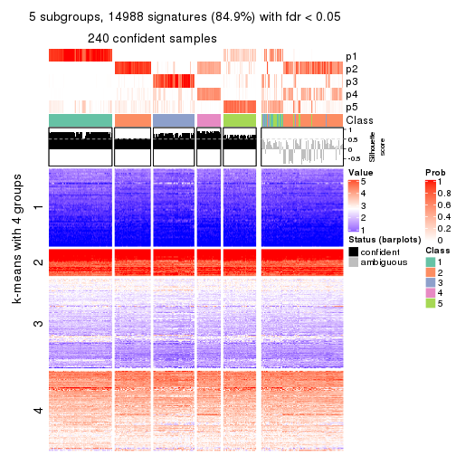</p>

</div>
<div id='tab-SD-mclust-get-signatures-no-scale-5'>
<pre><code class="r">get_signatures(res, k = 6, scale_rows = FALSE)
</code></pre>

<p></p>

</div>
</div>


Compare the overlap of signatures from different k:

```r
compare_signatures(res)
```

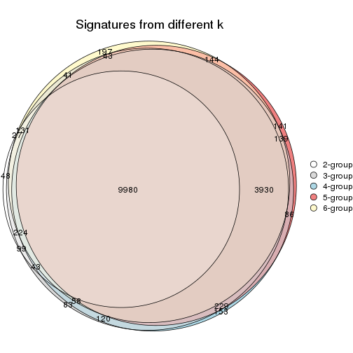

`get_signature()` returns a data frame invisibly. TO get the list of signatures, the function
call should be assigned to a variable explicitly. In following code, if `plot` argument is set
to `FALSE`, no heatmap is plotted while only the differential analysis is performed.

```r
# code only for demonstration
tb = get_signature(res, k = ..., plot = FALSE)
```

An example of the output of `tb` is:

```
#>   which_row         fdr    mean_1    mean_2 scaled_mean_1 scaled_mean_2 km
#> 1        38 0.042760348  8.373488  9.131774    -0.5533452     0.5164555  1
#> 2        40 0.018707592  7.106213  8.469186    -0.6173731     0.5762149  1
#> 3        55 0.019134737 10.221463 11.207825    -0.6159697     0.5749050  1
#> 4        59 0.006059896  5.921854  7.869574    -0.6899429     0.6439467  1
#> 5        60 0.018055526  8.928898 10.211722    -0.6204761     0.5791110  1
#> 6        98 0.009384629 15.714769 14.887706     0.6635654    -0.6193277  2
...
```

The columns in `tb` are:

1. `which_row`: row indices corresponding to the input matrix.
2. `fdr`: FDR for the differential test. 
3. `mean_x`: The mean value in group x.
4. `scaled_mean_x`: The mean value in group x after rows are scaled.
5. `km`: Row groups if k-means clustering is applied to rows.


UMAP plot which shows how samples are separated.


<script>
$( function() {
	$( '#tabs-SD-mclust-dimension-reduction' ).tabs();
} );
</script>
<div id='tabs-SD-mclust-dimension-reduction'>
<ul>
<li><a href='#tab-SD-mclust-dimension-reduction-1'>k = 2</a></li>
<li><a href='#tab-SD-mclust-dimension-reduction-2'>k = 3</a></li>
<li><a href='#tab-SD-mclust-dimension-reduction-3'>k = 4</a></li>
<li><a href='#tab-SD-mclust-dimension-reduction-4'>k = 5</a></li>
<li><a href='#tab-SD-mclust-dimension-reduction-5'>k = 6</a></li>
</ul>
<div id='tab-SD-mclust-dimension-reduction-1'>
<pre><code class="r">dimension_reduction(res, k = 2, method = &quot;UMAP&quot;)
</code></pre>

<p></p>

</div>
<div id='tab-SD-mclust-dimension-reduction-2'>
<pre><code class="r">dimension_reduction(res, k = 3, method = &quot;UMAP&quot;)
</code></pre>

<p></p>

</div>
<div id='tab-SD-mclust-dimension-reduction-3'>
<pre><code class="r">dimension_reduction(res, k = 4, method = &quot;UMAP&quot;)
</code></pre>

<p></p>

</div>
<div id='tab-SD-mclust-dimension-reduction-4'>
<pre><code class="r">dimension_reduction(res, k = 5, method = &quot;UMAP&quot;)
</code></pre>

<p></p>

</div>
<div id='tab-SD-mclust-dimension-reduction-5'>
<pre><code class="r">dimension_reduction(res, k = 6, method = &quot;UMAP&quot;)
</code></pre>

<p></p>

</div>
</div>


Following heatmap shows how subgroups are split when increasing `k`:

```r
collect_classes(res)
```


If matrix rows can be associated to genes, consider to use `GO_Enrichment(res,
...)` to perform function enrichment for the signature genes.


 

---------------------------------------------------


### SD:NMF*


The object with results only for a single top-value method and a single partition method 
can be extracted as:

```r
res = res_list["SD", "NMF"]
# you can also extract it by
# res = res_list["SD:NMF"]
```

A summary of `res` and all the functions that can be applied to it:

```r
res
```

```
#> A 'ConsensusPartition' object with k = 2, 3, 4, 5, 6.
#>   On a matrix with 17654 rows and 335 columns.
#>   Top rows (1000, 2000, 3000, 4000, 5000) are extracted by 'SD' method.
#>   Subgroups are detected by 'NMF' method.
#>   Performed in total 1250 partitions by row resampling.
#>   Best k for subgroups seems to be 3.
#> 
#> Following methods can be applied to this 'ConsensusPartition' object:
#>  [1] "cola_report"             "collect_classes"         "collect_plots"          
#>  [4] "collect_stats"           "colnames"                "compare_signatures"     
#>  [7] "consensus_heatmap"       "dimension_reduction"     "functional_enrichment"  
#> [10] "get_anno_col"            "get_anno"                "get_classes"            
#> [13] "get_consensus"           "get_matrix"              "get_membership"         
#> [16] "get_param"               "get_signatures"          "get_stats"              
#> [19] "is_best_k"               "is_stable_k"             "membership_heatmap"     
#> [22] "ncol"                    "nrow"                    "plot_ecdf"              
#> [25] "rownames"                "select_partition_number" "show"                   
#> [28] "suggest_best_k"          "test_to_known_factors"
```

`collect_plots()` function collects all the plots made from `res` for all `k` (number of partitions)
into one single page to provide an easy and fast comparison between different `k`.

```r
collect_plots(res)
```


The plots are:

- The first row: a plot of the ECDF (Empirical cumulative distribution
  function) curves of the consensus matrix for each `k` and the heatmap of
  predicted classes for each `k`.
- The second row: heatmaps of the consensus matrix for each `k`.
- The third row: heatmaps of the membership matrix for each `k`.
- The fouth row: heatmaps of the signatures for each `k`.

All the plots in panels can be made by individual functions and they are
plotted later in this section.

`select_partition_number()` produces several plots showing different
statistics for choosing "optimized" `k`. There are following statistics:

- ECDF curves of the consensus matrix for each `k`;
- 1-PAC. [The PAC
  score](https://en.wikipedia.org/wiki/Consensus_clustering#Over-interpretation_potential_of_consensus_clustering)
  measures the proportion of the ambiguous subgrouping.
- Mean silhouette score.
- Concordance. The mean probability of fiting the consensus class ids in all
  partitions.
- Area increased. Denote $A_k$ as the area under the ECDF curve for current
  `k`, the area increased is defined as $A_k - A_{k-1}$.
- Rand index. The percent of pairs of samples that are both in a same cluster
  or both are not in a same cluster in the partition of k and k-1.
- Jaccard index. The ratio of pairs of samples are both in a same cluster in
  the partition of k and k-1 and the pairs of samples are both in a same
  cluster in the partition k or k-1.

The detailed explanations of these statistics can be found in [the cola
vignette](http://bioconductor.org/packages/devel/bioc/vignettes/cola/inst/doc/cola.html#toc_13).

Generally speaking, lower PAC score, higher mean silhouette score or higher
concordance corresponds to better partition. Rand index and Jaccard index
measure how similar the current partition is compared to partition with `k-1`.
If they are too similar, we won't accept `k` is better than `k-1`.

```r
select_partition_number(res)
```


The numeric values for all these statistics can be obtained by `get_stats()`.

```r
get_stats(res)
```

```
#>   k 1-PAC mean_silhouette concordance area_increased  Rand Jaccard
#> 2 2 0.879           0.911       0.965         0.4987 0.501   0.501
#> 3 3 0.913           0.905       0.963         0.2831 0.786   0.602
#> 4 4 0.644           0.617       0.801         0.1192 0.885   0.714
#> 5 5 0.602           0.539       0.756         0.0634 0.899   0.715
#> 6 6 0.601           0.505       0.703         0.0369 0.924   0.741
```

`suggest_best_k()` suggests the best $k$ based on these statistics. The rules are as follows:

- All $k$ with Jaccard index larger than 0.95 are removed because the increase of
  the partition number does not provides enough extra information. If all $k$ are removed,
  the best $k$ is assigned by `NA`.
- For $k$ with 1-PAC larger than 0.9, the maximal $k$ is taken as the "best k". Other $k$ is called "optional k".
- If it does not fit the second rule. The $k$ with the highest vote of highest
  1-PAC, mean silhouette and concordance is taken as the "best k".

```r
suggest_best_k(res)
```

```
#> [1] 3
```


Following shows the table of the partitions (You need to click the **show/hide
code output** link to see it). The membership matrix (columns with name `p*`)
is inferred by
[`clue::cl_consensus()`](https://www.rdocumentation.org/link/cl_consensus?package=clue)
function with the `SE` method. Basically the value in the membership matrix
represents the probability to belong to a certain group. The finall class
label for an item is determined with the group with highest probability it
belongs to.

In `get_classes()` function, the entropy is calculated from the membership
matrix and the silhouette score is calculated from the consensus matrix.


<script>
$( function() {
	$( '#tabs-SD-NMF-get-classes' ).tabs();
} );
</script>
<div id='tabs-SD-NMF-get-classes'>
<ul>
<li><a href='#tab-SD-NMF-get-classes-1'>k = 2</a></li>
<li><a href='#tab-SD-NMF-get-classes-2'>k = 3</a></li>
<li><a href='#tab-SD-NMF-get-classes-3'>k = 4</a></li>
<li><a href='#tab-SD-NMF-get-classes-4'>k = 5</a></li>
<li><a href='#tab-SD-NMF-get-classes-5'>k = 6</a></li>
</ul>

<div id='tab-SD-NMF-get-classes-1'>
<p><a id='tab-SD-NMF-get-classes-1-a' style='color:#0366d6' href='#'>show/hide code output</a></p>
<pre><code class="r">cbind(get_classes(res, k = 2), get_membership(res, k = 2))
</code></pre>

<pre><code>#&gt;            class entropy silhouette    p1    p2
#&gt; SRR660306      2  0.0000    0.96044 0.000 1.000
#&gt; SRR1359328     2  0.0000    0.96044 0.000 1.000
#&gt; SRR821124      2  0.0000    0.96044 0.000 1.000
#&gt; SRR1335188     1  0.0000    0.96426 1.000 0.000
#&gt; SRR1075825     2  0.0000    0.96044 0.000 1.000
#&gt; SRR1321921     1  0.0000    0.96426 1.000 0.000
#&gt; SRR1466198     2  0.0000    0.96044 0.000 1.000
#&gt; SRR1384073     1  0.0000    0.96426 1.000 0.000
#&gt; SRR1312802     1  0.0000    0.96426 1.000 0.000
#&gt; SRR1076559     1  0.0000    0.96426 1.000 0.000
#&gt; SRR1370085     1  0.0000    0.96426 1.000 0.000
#&gt; SRR1460363     1  0.0000    0.96426 1.000 0.000
#&gt; SRR1480221     2  0.0000    0.96044 0.000 1.000
#&gt; SRR1476165     1  0.0000    0.96426 1.000 0.000
#&gt; SRR1459631     2  0.0000    0.96044 0.000 1.000
#&gt; SRR1448098     2  0.0000    0.96044 0.000 1.000
#&gt; SRR1321401     2  0.0000    0.96044 0.000 1.000
#&gt; SRR807613      2  0.0000    0.96044 0.000 1.000
#&gt; SRR808086      2  0.0000    0.96044 0.000 1.000
#&gt; SRR613687      2  0.0000    0.96044 0.000 1.000
#&gt; SRR1471011     1  0.0000    0.96426 1.000 0.000
#&gt; SRR1330284     2  0.0000    0.96044 0.000 1.000
#&gt; SRR1320624     2  0.0000    0.96044 0.000 1.000
#&gt; SRR1459519     1  0.0000    0.96426 1.000 0.000
#&gt; SRR1091184     2  0.0000    0.96044 0.000 1.000
#&gt; SRR1390561     1  0.0000    0.96426 1.000 0.000
#&gt; SRR658164      1  0.0000    0.96426 1.000 0.000
#&gt; SRR1087079     2  0.0000    0.96044 0.000 1.000
#&gt; SRR814996      2  0.7376    0.72747 0.208 0.792
#&gt; SRR1407410     2  0.0000    0.96044 0.000 1.000
#&gt; SRR1453392     2  0.0000    0.96044 0.000 1.000
#&gt; SRR1445873     1  0.0000    0.96426 1.000 0.000
#&gt; SRR1419985     2  0.0000    0.96044 0.000 1.000
#&gt; SRR820938      2  0.0000    0.96044 0.000 1.000
#&gt; SRR1476844     1  0.0000    0.96426 1.000 0.000
#&gt; SRR1403526     1  0.0000    0.96426 1.000 0.000
#&gt; SRR1413916     2  0.0000    0.96044 0.000 1.000
#&gt; SRR1441051     2  0.0000    0.96044 0.000 1.000
#&gt; SRR614287      2  0.0000    0.96044 0.000 1.000
#&gt; SRR1092062     2  0.1843    0.93739 0.028 0.972
#&gt; SRR612611      2  0.0000    0.96044 0.000 1.000
#&gt; SRR1376356     2  0.0000    0.96044 0.000 1.000
#&gt; SRR1405078     1  0.8955    0.53121 0.688 0.312
#&gt; SRR1437226     2  0.0000    0.96044 0.000 1.000
#&gt; SRR1326078     1  0.0000    0.96426 1.000 0.000
#&gt; SRR1096806     2  0.0000    0.96044 0.000 1.000
#&gt; SRR1440919     2  0.0000    0.96044 0.000 1.000
#&gt; SRR1452824     1  0.0000    0.96426 1.000 0.000
#&gt; SRR615754      1  0.0000    0.96426 1.000 0.000
#&gt; SRR1341787     2  0.0000    0.96044 0.000 1.000
#&gt; SRR614551      2  0.0000    0.96044 0.000 1.000
#&gt; SRR1380829     2  0.0000    0.96044 0.000 1.000
#&gt; SRR1455761     1  0.0000    0.96426 1.000 0.000
#&gt; SRR1465189     1  0.0000    0.96426 1.000 0.000
#&gt; SRR1376895     1  0.0000    0.96426 1.000 0.000
#&gt; SRR1445002     1  0.0000    0.96426 1.000 0.000
#&gt; SRR1469258     2  0.5178    0.85001 0.116 0.884
#&gt; SRR1409239     1  0.0000    0.96426 1.000 0.000
#&gt; SRR1480200     1  0.0000    0.96426 1.000 0.000
#&gt; SRR1418323     1  0.0000    0.96426 1.000 0.000
#&gt; SRR657540      2  0.0000    0.96044 0.000 1.000
#&gt; SRR821096      2  0.0000    0.96044 0.000 1.000
#&gt; SRR613591      2  0.0000    0.96044 0.000 1.000
#&gt; SRR1344205     2  0.0000    0.96044 0.000 1.000
#&gt; SRR612479      1  0.0000    0.96426 1.000 0.000
#&gt; SRR1399950     1  0.0000    0.96426 1.000 0.000
#&gt; SRR1336048     1  0.0000    0.96426 1.000 0.000
#&gt; SRR1368896     1  0.0000    0.96426 1.000 0.000
#&gt; SRR1379403     2  0.0000    0.96044 0.000 1.000
#&gt; SRR1312464     1  0.0000    0.96426 1.000 0.000
#&gt; SRR1096478     1  0.0000    0.96426 1.000 0.000
#&gt; SRR1459845     1  0.0000    0.96426 1.000 0.000
#&gt; SRR1348138     2  0.6438    0.78861 0.164 0.836
#&gt; SRR811423      1  0.0000    0.96426 1.000 0.000
#&gt; SRR615683      1  0.0000    0.96426 1.000 0.000
#&gt; SRR1380336     2  0.0000    0.96044 0.000 1.000
#&gt; SRR817609      1  0.0000    0.96426 1.000 0.000
#&gt; SRR1074550     2  0.0000    0.96044 0.000 1.000
#&gt; SRR1499236     2  0.0000    0.96044 0.000 1.000
#&gt; SRR656083      1  0.0000    0.96426 1.000 0.000
#&gt; SRR817539      1  0.0000    0.96426 1.000 0.000
#&gt; SRR1410801     1  0.0000    0.96426 1.000 0.000
#&gt; SRR1347190     1  0.0000    0.96426 1.000 0.000
#&gt; SRR1355126     2  0.3114    0.91223 0.056 0.944
#&gt; SRR615165      2  0.0000    0.96044 0.000 1.000
#&gt; SRR1466046     1  0.0000    0.96426 1.000 0.000
#&gt; SRR1097055     2  0.0000    0.96044 0.000 1.000
#&gt; SRR1312370     1  0.9795    0.28478 0.584 0.416
#&gt; SRR655325      1  0.0000    0.96426 1.000 0.000
#&gt; SRR810177      2  0.0938    0.95084 0.012 0.988
#&gt; SRR815685      2  0.0000    0.96044 0.000 1.000
#&gt; SRR817026      2  0.0000    0.96044 0.000 1.000
#&gt; SRR1417224     2  0.0000    0.96044 0.000 1.000
#&gt; SRR661687      2  0.0000    0.96044 0.000 1.000
#&gt; SRR1431804     1  0.6148    0.80131 0.848 0.152
#&gt; SRR664072      2  0.0000    0.96044 0.000 1.000
#&gt; SRR612923      2  0.0000    0.96044 0.000 1.000
#&gt; SRR1315890     1  0.0000    0.96426 1.000 0.000
#&gt; SRR1347726     1  0.0000    0.96426 1.000 0.000
#&gt; SRR1500360     1  0.0000    0.96426 1.000 0.000
#&gt; SRR1468360     2  0.3879    0.89260 0.076 0.924
#&gt; SRR1404084     1  0.0000    0.96426 1.000 0.000
#&gt; SRR615994      2  0.0000    0.96044 0.000 1.000
#&gt; SRR1475718     2  0.0000    0.96044 0.000 1.000
#&gt; SRR1397200     2  0.0000    0.96044 0.000 1.000
#&gt; SRR655519      2  0.0000    0.96044 0.000 1.000
#&gt; SRR1311308     2  0.0000    0.96044 0.000 1.000
#&gt; SRR1368006     2  0.0000    0.96044 0.000 1.000
#&gt; SRR613651      1  0.0000    0.96426 1.000 0.000
#&gt; SRR1362621     2  0.0000    0.96044 0.000 1.000
#&gt; SRR1451718     1  0.0000    0.96426 1.000 0.000
#&gt; SRR1095334     2  0.0000    0.96044 0.000 1.000
#&gt; SRR1079636     2  0.0000    0.96044 0.000 1.000
#&gt; SRR1442549     1  0.2948    0.91579 0.948 0.052
#&gt; SRR1466421     2  0.0000    0.96044 0.000 1.000
#&gt; SRR817397      2  0.0000    0.96044 0.000 1.000
#&gt; SRR1341809     2  0.9710    0.34119 0.400 0.600
#&gt; SRR614623      2  0.0000    0.96044 0.000 1.000
#&gt; SRR1335005     2  0.0000    0.96044 0.000 1.000
#&gt; SRR1407065     2  0.0000    0.96044 0.000 1.000
#&gt; SRR1404483     2  0.0000    0.96044 0.000 1.000
#&gt; SRR1096222     1  0.0000    0.96426 1.000 0.000
#&gt; SRR1401793     1  0.0000    0.96426 1.000 0.000
#&gt; SRR1408615     2  0.0000    0.96044 0.000 1.000
#&gt; SRR1070597     1  0.0000    0.96426 1.000 0.000
#&gt; SRR1332381     1  0.0000    0.96426 1.000 0.000
#&gt; SRR1457015     1  0.0000    0.96426 1.000 0.000
#&gt; SRR1386797     1  0.9580    0.38341 0.620 0.380
#&gt; SRR1098385     2  0.0000    0.96044 0.000 1.000
#&gt; SRR1363947     2  0.0000    0.96044 0.000 1.000
#&gt; SRR820350      2  0.0000    0.96044 0.000 1.000
#&gt; SRR662055      2  0.0000    0.96044 0.000 1.000
#&gt; SRR1310455     1  0.0000    0.96426 1.000 0.000
#&gt; SRR1453639     1  0.0000    0.96426 1.000 0.000
#&gt; SRR662617      2  0.0000    0.96044 0.000 1.000
#&gt; SRR654778      1  0.0000    0.96426 1.000 0.000
#&gt; SRR661782      2  0.0000    0.96044 0.000 1.000
#&gt; SRR1334396     1  0.0000    0.96426 1.000 0.000
#&gt; SRR613867      2  0.0000    0.96044 0.000 1.000
#&gt; SRR1479412     1  0.0000    0.96426 1.000 0.000
#&gt; SRR1331620     1  0.0000    0.96426 1.000 0.000
#&gt; SRR1082809     1  0.0000    0.96426 1.000 0.000
#&gt; SRR1417178     1  0.0000    0.96426 1.000 0.000
#&gt; SRR1335278     1  0.0000    0.96426 1.000 0.000
#&gt; SRR665369      2  0.0000    0.96044 0.000 1.000
#&gt; SRR657552      1  0.0000    0.96426 1.000 0.000
#&gt; SRR812412      1  0.0000    0.96426 1.000 0.000
#&gt; SRR1096500     2  0.2948    0.91595 0.052 0.948
#&gt; SRR1347750     2  0.8555    0.61350 0.280 0.720
#&gt; SRR615153      1  0.9815    0.27337 0.580 0.420
#&gt; SRR1434417     1  0.0000    0.96426 1.000 0.000
#&gt; SRR1070159     2  0.0000    0.96044 0.000 1.000
#&gt; SRR1332508     2  0.0000    0.96044 0.000 1.000
#&gt; SRR1082059     2  0.9710    0.34119 0.400 0.600
#&gt; SRR1402491     1  0.0000    0.96426 1.000 0.000
#&gt; SRR1476595     1  0.9710    0.33057 0.600 0.400
#&gt; SRR1320987     2  0.9209    0.50068 0.336 0.664
#&gt; SRR1086417     1  1.0000    0.00454 0.504 0.496
#&gt; SRR1454095     1  0.0000    0.96426 1.000 0.000
#&gt; SRR614791      2  0.0000    0.96044 0.000 1.000
#&gt; SRR821255      1  0.9661    0.35216 0.608 0.392
#&gt; SRR820402      2  0.0000    0.96044 0.000 1.000
#&gt; SRR1337284     1  0.0376    0.96080 0.996 0.004
#&gt; SRR1333083     2  0.9686    0.34517 0.396 0.604
#&gt; SRR1384883     2  0.0000    0.96044 0.000 1.000
#&gt; SRR614431      1  0.0000    0.96426 1.000 0.000
#&gt; SRR1481106     2  0.0000    0.96044 0.000 1.000
#&gt; SRR1370285     1  0.0000    0.96426 1.000 0.000
#&gt; SRR1446673     2  0.0000    0.96044 0.000 1.000
#&gt; SRR1318046     2  0.0000    0.96044 0.000 1.000
#&gt; SRR1341188     2  0.0000    0.96044 0.000 1.000
#&gt; SRR1384941     1  0.0000    0.96426 1.000 0.000
#&gt; SRR1322864     2  0.0000    0.96044 0.000 1.000
#&gt; SRR1476825     1  0.0000    0.96426 1.000 0.000
#&gt; SRR1443332     2  0.0000    0.96044 0.000 1.000
#&gt; SRR662486      2  0.0000    0.96044 0.000 1.000
#&gt; SRR1447019     1  0.0000    0.96426 1.000 0.000
#&gt; SRR662942      1  0.0000    0.96426 1.000 0.000
#&gt; SRR613102      2  0.0000    0.96044 0.000 1.000
#&gt; SRR1469880     1  0.0000    0.96426 1.000 0.000
#&gt; SRR1464977     1  0.0000    0.96426 1.000 0.000
#&gt; SRR615850      1  0.0376    0.96074 0.996 0.004
#&gt; SRR661949      2  0.0000    0.96044 0.000 1.000
#&gt; SRR1322227     2  0.0000    0.96044 0.000 1.000
#&gt; SRR1441655     1  0.6712    0.76885 0.824 0.176
#&gt; SRR613771      2  0.0000    0.96044 0.000 1.000
#&gt; SRR1479471     1  0.0000    0.96426 1.000 0.000
#&gt; SRR1488918     2  0.0000    0.96044 0.000 1.000
#&gt; SRR1414040     2  0.0000    0.96044 0.000 1.000
#&gt; SRR1079850     1  0.9833    0.26109 0.576 0.424
#&gt; SRR663209      1  0.0000    0.96426 1.000 0.000
#&gt; SRR1364914     2  0.0000    0.96044 0.000 1.000
#&gt; SRR1408267     2  0.7950    0.68249 0.240 0.760
#&gt; SRR1314894     1  0.0000    0.96426 1.000 0.000
#&gt; SRR1414117     2  0.0000    0.96044 0.000 1.000
#&gt; SRR1395975     2  0.0000    0.96044 0.000 1.000
#&gt; SRR1402219     2  0.9209    0.50065 0.336 0.664
#&gt; SRR1433623     1  0.0000    0.96426 1.000 0.000
#&gt; SRR656385      2  0.0000    0.96044 0.000 1.000
#&gt; SRR811213      2  0.0000    0.96044 0.000 1.000
#&gt; SRR663657      2  0.0000    0.96044 0.000 1.000
#&gt; SRR612203      1  0.0000    0.96426 1.000 0.000
#&gt; SRR613987      2  0.8909    0.55978 0.308 0.692
#&gt; SRR613831      2  0.0000    0.96044 0.000 1.000
#&gt; SRR1354180     2  0.0000    0.96044 0.000 1.000
#&gt; SRR1382912     1  0.0000    0.96426 1.000 0.000
#&gt; SRR1475501     1  0.0000    0.96426 1.000 0.000
#&gt; SRR1336930     1  0.0000    0.96426 1.000 0.000
#&gt; SRR613030      2  0.0000    0.96044 0.000 1.000
#&gt; SRR1381459     2  0.0000    0.96044 0.000 1.000
#&gt; SRR1402350     1  0.2423    0.92744 0.960 0.040
#&gt; SRR1419408     1  0.0000    0.96426 1.000 0.000
#&gt; SRR655911      2  0.0000    0.96044 0.000 1.000
#&gt; SRR1418243     1  0.0000    0.96426 1.000 0.000
#&gt; SRR1322573     1  0.0000    0.96426 1.000 0.000
#&gt; SRR613615      2  0.0000    0.96044 0.000 1.000
#&gt; SRR1355284     1  0.0000    0.96426 1.000 0.000
#&gt; SRR1319395     1  0.0000    0.96426 1.000 0.000
#&gt; SRR818939      1  0.0000    0.96426 1.000 0.000
#&gt; SRR1465266     1  0.0000    0.96426 1.000 0.000
#&gt; SRR614888      1  0.0000    0.96426 1.000 0.000
#&gt; SRR1431694     1  0.0000    0.96426 1.000 0.000
#&gt; SRR614347      2  0.0000    0.96044 0.000 1.000
#&gt; SRR1334228     2  0.0000    0.96044 0.000 1.000
#&gt; SRR1096007     2  0.0000    0.96044 0.000 1.000
#&gt; SRR656349      1  0.0000    0.96426 1.000 0.000
#&gt; SRR815422      2  0.0000    0.96044 0.000 1.000
#&gt; SRR1360828     1  0.0000    0.96426 1.000 0.000
#&gt; SRR1359005     2  0.0000    0.96044 0.000 1.000
#&gt; SRR1456652     1  0.0000    0.96426 1.000 0.000
#&gt; SRR1391660     1  0.0000    0.96426 1.000 0.000
#&gt; SRR1441956     1  0.0000    0.96426 1.000 0.000
#&gt; SRR662930      2  0.0000    0.96044 0.000 1.000
#&gt; SRR615790      2  0.0000    0.96044 0.000 1.000
#&gt; SRR614827      2  0.0000    0.96044 0.000 1.000
#&gt; SRR614587      2  0.0000    0.96044 0.000 1.000
#&gt; SRR814052      2  0.2603    0.92332 0.044 0.956
#&gt; SRR1070086     1  0.0000    0.96426 1.000 0.000
#&gt; SRR1481440     1  0.0000    0.96426 1.000 0.000
#&gt; SRR1339296     2  0.0000    0.96044 0.000 1.000
#&gt; SRR1343239     2  0.0000    0.96044 0.000 1.000
#&gt; SRR1432802     2  0.8555    0.61359 0.280 0.720
#&gt; SRR1416911     1  0.0000    0.96426 1.000 0.000
#&gt; SRR1410427     1  0.0000    0.96426 1.000 0.000
#&gt; SRR1401185     1  0.1184    0.95056 0.984 0.016
#&gt; SRR654993      2  0.0000    0.96044 0.000 1.000
#&gt; SRR656397      1  0.0000    0.96426 1.000 0.000
#&gt; SRR809643      2  0.7056    0.75153 0.192 0.808
#&gt; SRR1433819     1  0.0000    0.96426 1.000 0.000
#&gt; SRR1375225     2  0.0000    0.96044 0.000 1.000
#&gt; SRR1367739     2  0.9775    0.30126 0.412 0.588
#&gt; SRR1323336     1  0.5178    0.84585 0.884 0.116
#&gt; SRR663224      2  0.0000    0.96044 0.000 1.000
#&gt; SRR1442840     1  0.0000    0.96426 1.000 0.000
#&gt; SRR1374058     1  0.0000    0.96426 1.000 0.000
#&gt; SRR656994      1  0.0000    0.96426 1.000 0.000
#&gt; SRR1469214     2  0.0000    0.96044 0.000 1.000
#&gt; SRR1456446     1  0.0000    0.96426 1.000 0.000
#&gt; SRR1471879     2  0.6247    0.80230 0.156 0.844
#&gt; SRR612911      2  0.0000    0.96044 0.000 1.000
#&gt; SRR1395720     2  0.0000    0.96044 0.000 1.000
#&gt; SRR1413055     1  0.0000    0.96426 1.000 0.000
#&gt; SRR656770      2  0.0000    0.96044 0.000 1.000
#&gt; SRR812080      2  0.0000    0.96044 0.000 1.000
#&gt; SRR1479328     1  0.0000    0.96426 1.000 0.000
#&gt; SRR661421      2  0.0000    0.96044 0.000 1.000
#&gt; SRR1410286     2  0.0000    0.96044 0.000 1.000
#&gt; SRR1487150     1  0.0000    0.96426 1.000 0.000
#&gt; SRR1467035     1  0.0000    0.96426 1.000 0.000
#&gt; SRR1360607     1  0.9909    0.19720 0.556 0.444
#&gt; SRR1333106     2  0.0000    0.96044 0.000 1.000
#&gt; SRR1088706     2  0.0000    0.96044 0.000 1.000
#&gt; SRR1320053     2  0.0000    0.96044 0.000 1.000
#&gt; SRR1350392     2  0.0000    0.96044 0.000 1.000
#&gt; SRR1385190     1  0.9661    0.34118 0.608 0.392
#&gt; SRR1080093     2  0.0000    0.96044 0.000 1.000
#&gt; SRR1318753     1  0.0000    0.96426 1.000 0.000
#&gt; SRR1345369     2  0.0000    0.96044 0.000 1.000
#&gt; SRR612178      2  0.0000    0.96044 0.000 1.000
#&gt; SRR1354423     1  0.0000    0.96426 1.000 0.000
#&gt; SRR1072724     1  0.0000    0.96426 1.000 0.000
#&gt; SRR1418450     2  0.0000    0.96044 0.000 1.000
#&gt; SRR1326427     2  0.0000    0.96044 0.000 1.000
#&gt; SRR1437412     2  0.9866    0.24621 0.432 0.568
#&gt; SRR1327548     2  0.0000    0.96044 0.000 1.000
#&gt; SRR1395891     1  0.0000    0.96426 1.000 0.000
#&gt; SRR659367      2  0.9286    0.48262 0.344 0.656
#&gt; SRR818961      1  0.0000    0.96426 1.000 0.000
#&gt; SRR813704      1  0.0000    0.96426 1.000 0.000
#&gt; SRR613054      1  0.0000    0.96426 1.000 0.000
#&gt; SRR1476467     1  0.0000    0.96426 1.000 0.000
#&gt; SRR1407988     2  0.0000    0.96044 0.000 1.000
#&gt; SRR1394776     2  0.0000    0.96044 0.000 1.000
#&gt; SRR655578      2  0.0000    0.96044 0.000 1.000
#&gt; SRR1310645     2  0.0000    0.96044 0.000 1.000
#&gt; SRR1345628     1  0.0000    0.96426 1.000 0.000
#&gt; SRR1479740     1  0.0000    0.96426 1.000 0.000
#&gt; SRR1332095     1  0.0000    0.96426 1.000 0.000
#&gt; SRR1444786     2  1.0000    0.01651 0.496 0.504
#&gt; SRR1090070     1  0.0000    0.96426 1.000 0.000
#&gt; SRR662414      2  0.7950    0.68247 0.240 0.760
#&gt; SRR661216      2  0.0000    0.96044 0.000 1.000
#&gt; SRR656313      2  0.0000    0.96044 0.000 1.000
#&gt; SRR615671      2  0.1184    0.94760 0.016 0.984
#&gt; SRR1350196     2  0.0000    0.96044 0.000 1.000
#&gt; SRR1466580     1  0.0000    0.96426 1.000 0.000
#&gt; SRR1408032     2  0.0000    0.96044 0.000 1.000
#&gt; SRR1432913     2  0.0000    0.96044 0.000 1.000
#&gt; SRR1360502     1  0.5946    0.81161 0.856 0.144
#&gt; SRR1391901     2  0.0000    0.96044 0.000 1.000
#&gt; SRR1311131     1  0.0000    0.96426 1.000 0.000
#&gt; SRR1380636     1  0.0000    0.96426 1.000 0.000
#&gt; SRR1332339     1  0.0000    0.96426 1.000 0.000
#&gt; SRR1341563     2  0.0000    0.96044 0.000 1.000
#&gt; SRR1359410     2  0.0000    0.96044 0.000 1.000
#&gt; SRR1473040     2  0.7815    0.68951 0.232 0.768
#&gt; SRR1321444     1  0.0000    0.96426 1.000 0.000
#&gt; SRR1498765     2  0.0000    0.96044 0.000 1.000
#&gt; SRR1312622     2  0.0000    0.96044 0.000 1.000
#&gt; SRR615503      1  0.9460    0.42296 0.636 0.364
#&gt; SRR1453192     1  0.0000    0.96426 1.000 0.000
#&gt; SRR1433107     2  0.0000    0.96044 0.000 1.000
#&gt; SRR1075384     1  0.0000    0.96426 1.000 0.000
#&gt; SRR1356683     1  0.0000    0.96426 1.000 0.000
#&gt; SRR659049      1  0.0000    0.96426 1.000 0.000
#&gt; SRR1368240     1  0.0000    0.96426 1.000 0.000
#&gt; SRR1341739     1  0.0000    0.96426 1.000 0.000
#&gt; SRR613249      2  0.7815    0.68972 0.232 0.768
#&gt; SRR663428      2  0.5946    0.81722 0.144 0.856
#&gt; SRR1341302     2  0.0000    0.96044 0.000 1.000
#&gt; SRR1073553     2  0.0000    0.96044 0.000 1.000
#&gt; SRR1354093     2  0.0000    0.96044 0.000 1.000
#&gt; SRR1406521     2  0.0000    0.96044 0.000 1.000
#&gt; SRR1432049     1  0.0000    0.96426 1.000 0.000
#&gt; SRR1453504     1  0.0000    0.96426 1.000 0.000
</code></pre>

<script>
$('#tab-SD-NMF-get-classes-1-a').parent().next().next().hide();
$('#tab-SD-NMF-get-classes-1-a').click(function(){
  $('#tab-SD-NMF-get-classes-1-a').parent().next().next().toggle();
  return(false);
});
</script>
</div>

<div id='tab-SD-NMF-get-classes-2'>
<p><a id='tab-SD-NMF-get-classes-2-a' style='color:#0366d6' href='#'>show/hide code output</a></p>
<pre><code class="r">cbind(get_classes(res, k = 3), get_membership(res, k = 3))
</code></pre>

<pre><code>#&gt;            class entropy silhouette    p1    p2    p3
#&gt; SRR660306      3  0.6235     0.2794 0.000 0.436 0.564
#&gt; SRR1359328     3  0.0000     0.9222 0.000 0.000 1.000
#&gt; SRR821124      2  0.0000     0.9623 0.000 1.000 0.000
#&gt; SRR1335188     1  0.0000     0.9722 1.000 0.000 0.000
#&gt; SRR1075825     2  0.0000     0.9623 0.000 1.000 0.000
#&gt; SRR1321921     1  0.0000     0.9722 1.000 0.000 0.000
#&gt; SRR1466198     3  0.0000     0.9222 0.000 0.000 1.000
#&gt; SRR1384073     1  0.3038     0.8536 0.896 0.104 0.000
#&gt; SRR1312802     1  0.0000     0.9722 1.000 0.000 0.000
#&gt; SRR1076559     1  0.0000     0.9722 1.000 0.000 0.000
#&gt; SRR1370085     1  0.0000     0.9722 1.000 0.000 0.000
#&gt; SRR1460363     1  0.0000     0.9722 1.000 0.000 0.000
#&gt; SRR1480221     2  0.0000     0.9623 0.000 1.000 0.000
#&gt; SRR1476165     1  0.0000     0.9722 1.000 0.000 0.000
#&gt; SRR1459631     3  0.5948     0.4793 0.000 0.360 0.640
#&gt; SRR1448098     2  0.0000     0.9623 0.000 1.000 0.000
#&gt; SRR1321401     2  0.0000     0.9623 0.000 1.000 0.000
#&gt; SRR807613      2  0.0000     0.9623 0.000 1.000 0.000
#&gt; SRR808086      3  0.0000     0.9222 0.000 0.000 1.000
#&gt; SRR613687      2  0.0000     0.9623 0.000 1.000 0.000
#&gt; SRR1471011     1  0.3816     0.8119 0.852 0.000 0.148
#&gt; SRR1330284     2  0.0000     0.9623 0.000 1.000 0.000
#&gt; SRR1320624     2  0.0000     0.9623 0.000 1.000 0.000
#&gt; SRR1459519     1  0.0000     0.9722 1.000 0.000 0.000
#&gt; SRR1091184     3  0.4235     0.7694 0.000 0.176 0.824
#&gt; SRR1390561     1  0.0000     0.9722 1.000 0.000 0.000
#&gt; SRR658164      1  0.0000     0.9722 1.000 0.000 0.000
#&gt; SRR1087079     2  0.0000     0.9623 0.000 1.000 0.000
#&gt; SRR814996      3  0.0000     0.9222 0.000 0.000 1.000
#&gt; SRR1407410     2  0.0000     0.9623 0.000 1.000 0.000
#&gt; SRR1453392     2  0.0000     0.9623 0.000 1.000 0.000
#&gt; SRR1445873     1  0.0000     0.9722 1.000 0.000 0.000
#&gt; SRR1419985     2  0.0000     0.9623 0.000 1.000 0.000
#&gt; SRR820938      3  0.1031     0.9066 0.000 0.024 0.976
#&gt; SRR1476844     1  0.0000     0.9722 1.000 0.000 0.000
#&gt; SRR1403526     1  0.0000     0.9722 1.000 0.000 0.000
#&gt; SRR1413916     2  0.0000     0.9623 0.000 1.000 0.000
#&gt; SRR1441051     2  0.0000     0.9623 0.000 1.000 0.000
#&gt; SRR614287      2  0.0000     0.9623 0.000 1.000 0.000
#&gt; SRR1092062     2  0.0000     0.9623 0.000 1.000 0.000
#&gt; SRR612611      2  0.0000     0.9623 0.000 1.000 0.000
#&gt; SRR1376356     2  0.0000     0.9623 0.000 1.000 0.000
#&gt; SRR1405078     3  0.5882     0.4395 0.348 0.000 0.652
#&gt; SRR1437226     2  0.0000     0.9623 0.000 1.000 0.000
#&gt; SRR1326078     1  0.0000     0.9722 1.000 0.000 0.000
#&gt; SRR1096806     3  0.0000     0.9222 0.000 0.000 1.000
#&gt; SRR1440919     3  0.4002     0.7874 0.000 0.160 0.840
#&gt; SRR1452824     1  0.0000     0.9722 1.000 0.000 0.000
#&gt; SRR615754      1  0.0000     0.9722 1.000 0.000 0.000
#&gt; SRR1341787     2  0.4887     0.6673 0.000 0.772 0.228
#&gt; SRR614551      2  0.0000     0.9623 0.000 1.000 0.000
#&gt; SRR1380829     3  0.0000     0.9222 0.000 0.000 1.000
#&gt; SRR1455761     1  0.0000     0.9722 1.000 0.000 0.000
#&gt; SRR1465189     3  0.0747     0.9108 0.016 0.000 0.984
#&gt; SRR1376895     1  0.0000     0.9722 1.000 0.000 0.000
#&gt; SRR1445002     1  0.0000     0.9722 1.000 0.000 0.000
#&gt; SRR1469258     2  0.0000     0.9623 0.000 1.000 0.000
#&gt; SRR1409239     1  0.0000     0.9722 1.000 0.000 0.000
#&gt; SRR1480200     1  0.0000     0.9722 1.000 0.000 0.000
#&gt; SRR1418323     1  0.0000     0.9722 1.000 0.000 0.000
#&gt; SRR657540      3  0.0000     0.9222 0.000 0.000 1.000
#&gt; SRR821096      2  0.0000     0.9623 0.000 1.000 0.000
#&gt; SRR613591      2  0.0000     0.9623 0.000 1.000 0.000
#&gt; SRR1344205     3  0.0000     0.9222 0.000 0.000 1.000
#&gt; SRR612479      1  0.0000     0.9722 1.000 0.000 0.000
#&gt; SRR1399950     1  0.0000     0.9722 1.000 0.000 0.000
#&gt; SRR1336048     1  0.5254     0.6338 0.736 0.000 0.264
#&gt; SRR1368896     1  0.0000     0.9722 1.000 0.000 0.000
#&gt; SRR1379403     2  0.0000     0.9623 0.000 1.000 0.000
#&gt; SRR1312464     1  0.0000     0.9722 1.000 0.000 0.000
#&gt; SRR1096478     1  0.0000     0.9722 1.000 0.000 0.000
#&gt; SRR1459845     1  0.0000     0.9722 1.000 0.000 0.000
#&gt; SRR1348138     3  0.0000     0.9222 0.000 0.000 1.000
#&gt; SRR811423      1  0.0000     0.9722 1.000 0.000 0.000
#&gt; SRR615683      1  0.0000     0.9722 1.000 0.000 0.000
#&gt; SRR1380336     2  0.0000     0.9623 0.000 1.000 0.000
#&gt; SRR817609      1  0.6095     0.3602 0.608 0.000 0.392
#&gt; SRR1074550     3  0.0000     0.9222 0.000 0.000 1.000
#&gt; SRR1499236     2  0.0000     0.9623 0.000 1.000 0.000
#&gt; SRR656083      1  0.0000     0.9722 1.000 0.000 0.000
#&gt; SRR817539      1  0.0000     0.9722 1.000 0.000 0.000
#&gt; SRR1410801     1  0.0000     0.9722 1.000 0.000 0.000
#&gt; SRR1347190     1  0.0000     0.9722 1.000 0.000 0.000
#&gt; SRR1355126     2  0.0000     0.9623 0.000 1.000 0.000
#&gt; SRR615165      3  0.0000     0.9222 0.000 0.000 1.000
#&gt; SRR1466046     1  0.0000     0.9722 1.000 0.000 0.000
#&gt; SRR1097055     2  0.0000     0.9623 0.000 1.000 0.000
#&gt; SRR1312370     2  0.0000     0.9623 0.000 1.000 0.000
#&gt; SRR655325      1  0.0000     0.9722 1.000 0.000 0.000
#&gt; SRR810177      2  0.0000     0.9623 0.000 1.000 0.000
#&gt; SRR815685      2  0.0000     0.9623 0.000 1.000 0.000
#&gt; SRR817026      3  0.0000     0.9222 0.000 0.000 1.000
#&gt; SRR1417224     2  0.0000     0.9623 0.000 1.000 0.000
#&gt; SRR661687      3  0.0000     0.9222 0.000 0.000 1.000
#&gt; SRR1431804     3  0.6168     0.2721 0.412 0.000 0.588
#&gt; SRR664072      3  0.0000     0.9222 0.000 0.000 1.000
#&gt; SRR612923      2  0.0000     0.9623 0.000 1.000 0.000
#&gt; SRR1315890     1  0.0000     0.9722 1.000 0.000 0.000
#&gt; SRR1347726     1  0.0000     0.9722 1.000 0.000 0.000
#&gt; SRR1500360     1  0.0892     0.9516 0.980 0.020 0.000
#&gt; SRR1468360     2  0.0000     0.9623 0.000 1.000 0.000
#&gt; SRR1404084     1  0.0000     0.9722 1.000 0.000 0.000
#&gt; SRR615994      3  0.0000     0.9222 0.000 0.000 1.000
#&gt; SRR1475718     2  0.0000     0.9623 0.000 1.000 0.000
#&gt; SRR1397200     3  0.0000     0.9222 0.000 0.000 1.000
#&gt; SRR655519      2  0.0000     0.9623 0.000 1.000 0.000
#&gt; SRR1311308     3  0.0000     0.9222 0.000 0.000 1.000
#&gt; SRR1368006     2  0.0000     0.9623 0.000 1.000 0.000
#&gt; SRR613651      1  0.0000     0.9722 1.000 0.000 0.000
#&gt; SRR1362621     3  0.0000     0.9222 0.000 0.000 1.000
#&gt; SRR1451718     1  0.0000     0.9722 1.000 0.000 0.000
#&gt; SRR1095334     3  0.0000     0.9222 0.000 0.000 1.000
#&gt; SRR1079636     2  0.0000     0.9623 0.000 1.000 0.000
#&gt; SRR1442549     2  0.0237     0.9582 0.004 0.996 0.000
#&gt; SRR1466421     2  0.0000     0.9623 0.000 1.000 0.000
#&gt; SRR817397      2  0.0747     0.9476 0.000 0.984 0.016
#&gt; SRR1341809     2  0.0000     0.9623 0.000 1.000 0.000
#&gt; SRR614623      2  0.0000     0.9623 0.000 1.000 0.000
#&gt; SRR1335005     2  0.0000     0.9623 0.000 1.000 0.000
#&gt; SRR1407065     2  0.4605     0.7084 0.000 0.796 0.204
#&gt; SRR1404483     2  0.0000     0.9623 0.000 1.000 0.000
#&gt; SRR1096222     1  0.0000     0.9722 1.000 0.000 0.000
#&gt; SRR1401793     1  0.0000     0.9722 1.000 0.000 0.000
#&gt; SRR1408615     3  0.0000     0.9222 0.000 0.000 1.000
#&gt; SRR1070597     2  0.5678     0.5386 0.316 0.684 0.000
#&gt; SRR1332381     1  0.0000     0.9722 1.000 0.000 0.000
#&gt; SRR1457015     1  0.0000     0.9722 1.000 0.000 0.000
#&gt; SRR1386797     2  0.1031     0.9365 0.024 0.976 0.000
#&gt; SRR1098385     2  0.0000     0.9623 0.000 1.000 0.000
#&gt; SRR1363947     3  0.0000     0.9222 0.000 0.000 1.000
#&gt; SRR820350      2  0.0000     0.9623 0.000 1.000 0.000
#&gt; SRR662055      2  0.0000     0.9623 0.000 1.000 0.000
#&gt; SRR1310455     1  0.0000     0.9722 1.000 0.000 0.000
#&gt; SRR1453639     2  0.6291     0.1365 0.468 0.532 0.000
#&gt; SRR662617      2  0.0000     0.9623 0.000 1.000 0.000
#&gt; SRR654778      1  0.0000     0.9722 1.000 0.000 0.000
#&gt; SRR661782      2  0.0000     0.9623 0.000 1.000 0.000
#&gt; SRR1334396     1  0.0000     0.9722 1.000 0.000 0.000
#&gt; SRR613867      2  0.0000     0.9623 0.000 1.000 0.000
#&gt; SRR1479412     1  0.0000     0.9722 1.000 0.000 0.000
#&gt; SRR1331620     1  0.0000     0.9722 1.000 0.000 0.000
#&gt; SRR1082809     1  0.0000     0.9722 1.000 0.000 0.000
#&gt; SRR1417178     1  0.0000     0.9722 1.000 0.000 0.000
#&gt; SRR1335278     1  0.0000     0.9722 1.000 0.000 0.000
#&gt; SRR665369      2  0.0000     0.9623 0.000 1.000 0.000
#&gt; SRR657552      1  0.1289     0.9428 0.968 0.000 0.032
#&gt; SRR812412      1  0.0000     0.9722 1.000 0.000 0.000
#&gt; SRR1096500     2  0.0000     0.9623 0.000 1.000 0.000
#&gt; SRR1347750     2  0.0000     0.9623 0.000 1.000 0.000
#&gt; SRR615153      1  0.5497     0.5776 0.708 0.292 0.000
#&gt; SRR1434417     1  0.0000     0.9722 1.000 0.000 0.000
#&gt; SRR1070159     3  0.0000     0.9222 0.000 0.000 1.000
#&gt; SRR1332508     2  0.0000     0.9623 0.000 1.000 0.000
#&gt; SRR1082059     2  0.8877     0.3388 0.184 0.572 0.244
#&gt; SRR1402491     1  0.0000     0.9722 1.000 0.000 0.000
#&gt; SRR1476595     2  0.0000     0.9623 0.000 1.000 0.000
#&gt; SRR1320987     2  0.0000     0.9623 0.000 1.000 0.000
#&gt; SRR1086417     2  0.6950     0.0731 0.476 0.508 0.016
#&gt; SRR1454095     1  0.4121     0.7681 0.832 0.168 0.000
#&gt; SRR614791      2  0.0000     0.9623 0.000 1.000 0.000
#&gt; SRR821255      2  0.0000     0.9623 0.000 1.000 0.000
#&gt; SRR820402      3  0.6111     0.3891 0.000 0.396 0.604
#&gt; SRR1337284     2  0.2066     0.8954 0.060 0.940 0.000
#&gt; SRR1333083     3  0.0000     0.9222 0.000 0.000 1.000
#&gt; SRR1384883     3  0.5706     0.5550 0.000 0.320 0.680
#&gt; SRR614431      1  0.0000     0.9722 1.000 0.000 0.000
#&gt; SRR1481106     2  0.0000     0.9623 0.000 1.000 0.000
#&gt; SRR1370285     1  0.0000     0.9722 1.000 0.000 0.000
#&gt; SRR1446673     3  0.0000     0.9222 0.000 0.000 1.000
#&gt; SRR1318046     2  0.0000     0.9623 0.000 1.000 0.000
#&gt; SRR1341188     3  0.0000     0.9222 0.000 0.000 1.000
#&gt; SRR1384941     1  0.0000     0.9722 1.000 0.000 0.000
#&gt; SRR1322864     2  0.0000     0.9623 0.000 1.000 0.000
#&gt; SRR1476825     1  0.3686     0.8233 0.860 0.000 0.140
#&gt; SRR1443332     2  0.0000     0.9623 0.000 1.000 0.000
#&gt; SRR662486      2  0.0000     0.9623 0.000 1.000 0.000
#&gt; SRR1447019     1  0.0000     0.9722 1.000 0.000 0.000
#&gt; SRR662942      1  0.0000     0.9722 1.000 0.000 0.000
#&gt; SRR613102      3  0.0000     0.9222 0.000 0.000 1.000
#&gt; SRR1469880     1  0.0000     0.9722 1.000 0.000 0.000
#&gt; SRR1464977     2  0.6062     0.3870 0.384 0.616 0.000
#&gt; SRR615850      1  0.5363     0.6108 0.724 0.000 0.276
#&gt; SRR661949      2  0.0000     0.9623 0.000 1.000 0.000
#&gt; SRR1322227     3  0.2878     0.8488 0.000 0.096 0.904
#&gt; SRR1441655     2  0.5178     0.6293 0.256 0.744 0.000
#&gt; SRR613771      3  0.6260     0.2441 0.000 0.448 0.552
#&gt; SRR1479471     1  0.0000     0.9722 1.000 0.000 0.000
#&gt; SRR1488918     2  0.0000     0.9623 0.000 1.000 0.000
#&gt; SRR1414040     2  0.0000     0.9623 0.000 1.000 0.000
#&gt; SRR1079850     2  0.0000     0.9623 0.000 1.000 0.000
#&gt; SRR663209      1  0.0000     0.9722 1.000 0.000 0.000
#&gt; SRR1364914     2  0.0000     0.9623 0.000 1.000 0.000
#&gt; SRR1408267     2  0.0000     0.9623 0.000 1.000 0.000
#&gt; SRR1314894     1  0.0000     0.9722 1.000 0.000 0.000
#&gt; SRR1414117     3  0.0000     0.9222 0.000 0.000 1.000
#&gt; SRR1395975     2  0.0000     0.9623 0.000 1.000 0.000
#&gt; SRR1402219     2  0.0000     0.9623 0.000 1.000 0.000
#&gt; SRR1433623     1  0.0000     0.9722 1.000 0.000 0.000
#&gt; SRR656385      2  0.0000     0.9623 0.000 1.000 0.000
#&gt; SRR811213      2  0.0000     0.9623 0.000 1.000 0.000
#&gt; SRR663657      3  0.0000     0.9222 0.000 0.000 1.000
#&gt; SRR612203      1  0.0000     0.9722 1.000 0.000 0.000
#&gt; SRR613987      2  0.0000     0.9623 0.000 1.000 0.000
#&gt; SRR613831      3  0.0000     0.9222 0.000 0.000 1.000
#&gt; SRR1354180     2  0.0000     0.9623 0.000 1.000 0.000
#&gt; SRR1382912     1  0.0000     0.9722 1.000 0.000 0.000
#&gt; SRR1475501     1  0.0000     0.9722 1.000 0.000 0.000
#&gt; SRR1336930     1  0.0000     0.9722 1.000 0.000 0.000
#&gt; SRR613030      3  0.0000     0.9222 0.000 0.000 1.000
#&gt; SRR1381459     2  0.0000     0.9623 0.000 1.000 0.000
#&gt; SRR1402350     1  0.5621     0.5525 0.692 0.000 0.308
#&gt; SRR1419408     1  0.0000     0.9722 1.000 0.000 0.000
#&gt; SRR655911      3  0.0237     0.9198 0.000 0.004 0.996
#&gt; SRR1418243     1  0.0000     0.9722 1.000 0.000 0.000
#&gt; SRR1322573     1  0.0000     0.9722 1.000 0.000 0.000
#&gt; SRR613615      3  0.0000     0.9222 0.000 0.000 1.000
#&gt; SRR1355284     1  0.0000     0.9722 1.000 0.000 0.000
#&gt; SRR1319395     1  0.0000     0.9722 1.000 0.000 0.000
#&gt; SRR818939      1  0.0000     0.9722 1.000 0.000 0.000
#&gt; SRR1465266     1  0.0000     0.9722 1.000 0.000 0.000
#&gt; SRR614888      1  0.0000     0.9722 1.000 0.000 0.000
#&gt; SRR1431694     1  0.0000     0.9722 1.000 0.000 0.000
#&gt; SRR614347      3  0.1753     0.8896 0.000 0.048 0.952
#&gt; SRR1334228     3  0.0000     0.9222 0.000 0.000 1.000
#&gt; SRR1096007     2  0.0000     0.9623 0.000 1.000 0.000
#&gt; SRR656349      1  0.6307     0.0571 0.512 0.000 0.488
#&gt; SRR815422      3  0.0237     0.9198 0.000 0.004 0.996
#&gt; SRR1360828     1  0.0000     0.9722 1.000 0.000 0.000
#&gt; SRR1359005     2  0.0000     0.9623 0.000 1.000 0.000
#&gt; SRR1456652     1  0.0000     0.9722 1.000 0.000 0.000
#&gt; SRR1391660     1  0.0000     0.9722 1.000 0.000 0.000
#&gt; SRR1441956     1  0.0000     0.9722 1.000 0.000 0.000
#&gt; SRR662930      2  0.0000     0.9623 0.000 1.000 0.000
#&gt; SRR615790      3  0.0000     0.9222 0.000 0.000 1.000
#&gt; SRR614827      2  0.0000     0.9623 0.000 1.000 0.000
#&gt; SRR614587      3  0.4121     0.7731 0.000 0.168 0.832
#&gt; SRR814052      2  0.0000     0.9623 0.000 1.000 0.000
#&gt; SRR1070086     1  0.0000     0.9722 1.000 0.000 0.000
#&gt; SRR1481440     1  0.0000     0.9722 1.000 0.000 0.000
#&gt; SRR1339296     3  0.0000     0.9222 0.000 0.000 1.000
#&gt; SRR1343239     2  0.0592     0.9513 0.000 0.988 0.012
#&gt; SRR1432802     2  0.0000     0.9623 0.000 1.000 0.000
#&gt; SRR1416911     1  0.0000     0.9722 1.000 0.000 0.000
#&gt; SRR1410427     1  0.0000     0.9722 1.000 0.000 0.000
#&gt; SRR1401185     2  0.3267     0.8262 0.116 0.884 0.000
#&gt; SRR654993      2  0.0000     0.9623 0.000 1.000 0.000
#&gt; SRR656397      1  0.0000     0.9722 1.000 0.000 0.000
#&gt; SRR809643      3  0.0000     0.9222 0.000 0.000 1.000
#&gt; SRR1433819     1  0.0000     0.9722 1.000 0.000 0.000
#&gt; SRR1375225     2  0.0000     0.9623 0.000 1.000 0.000
#&gt; SRR1367739     3  0.0000     0.9222 0.000 0.000 1.000
#&gt; SRR1323336     1  0.1289     0.9386 0.968 0.032 0.000
#&gt; SRR663224      2  0.6260     0.1161 0.000 0.552 0.448
#&gt; SRR1442840     1  0.0000     0.9722 1.000 0.000 0.000
#&gt; SRR1374058     1  0.0000     0.9722 1.000 0.000 0.000
#&gt; SRR656994      1  0.0000     0.9722 1.000 0.000 0.000
#&gt; SRR1469214     2  0.0000     0.9623 0.000 1.000 0.000
#&gt; SRR1456446     1  0.0000     0.9722 1.000 0.000 0.000
#&gt; SRR1471879     2  0.0000     0.9623 0.000 1.000 0.000
#&gt; SRR612911      3  0.0000     0.9222 0.000 0.000 1.000
#&gt; SRR1395720     2  0.0000     0.9623 0.000 1.000 0.000
#&gt; SRR1413055     1  0.0000     0.9722 1.000 0.000 0.000
#&gt; SRR656770      2  0.0000     0.9623 0.000 1.000 0.000
#&gt; SRR812080      3  0.0000     0.9222 0.000 0.000 1.000
#&gt; SRR1479328     1  0.0000     0.9722 1.000 0.000 0.000
#&gt; SRR661421      2  0.0000     0.9623 0.000 1.000 0.000
#&gt; SRR1410286     2  0.0000     0.9623 0.000 1.000 0.000
#&gt; SRR1487150     1  0.0000     0.9722 1.000 0.000 0.000
#&gt; SRR1467035     1  0.0000     0.9722 1.000 0.000 0.000
#&gt; SRR1360607     2  0.0000     0.9623 0.000 1.000 0.000
#&gt; SRR1333106     2  0.0000     0.9623 0.000 1.000 0.000
#&gt; SRR1088706     2  0.0000     0.9623 0.000 1.000 0.000
#&gt; SRR1320053     3  0.0000     0.9222 0.000 0.000 1.000
#&gt; SRR1350392     2  0.0000     0.9623 0.000 1.000 0.000
#&gt; SRR1385190     3  0.0000     0.9222 0.000 0.000 1.000
#&gt; SRR1080093     2  0.0000     0.9623 0.000 1.000 0.000
#&gt; SRR1318753     1  0.0000     0.9722 1.000 0.000 0.000
#&gt; SRR1345369     3  0.0000     0.9222 0.000 0.000 1.000
#&gt; SRR612178      2  0.0000     0.9623 0.000 1.000 0.000
#&gt; SRR1354423     1  0.0000     0.9722 1.000 0.000 0.000
#&gt; SRR1072724     1  0.0000     0.9722 1.000 0.000 0.000
#&gt; SRR1418450     2  0.0000     0.9623 0.000 1.000 0.000
#&gt; SRR1326427     3  0.0000     0.9222 0.000 0.000 1.000
#&gt; SRR1437412     3  0.6033     0.4619 0.336 0.004 0.660
#&gt; SRR1327548     3  0.6204     0.3146 0.000 0.424 0.576
#&gt; SRR1395891     1  0.0000     0.9722 1.000 0.000 0.000
#&gt; SRR659367      2  0.0000     0.9623 0.000 1.000 0.000
#&gt; SRR818961      1  0.0000     0.9722 1.000 0.000 0.000
#&gt; SRR813704      1  0.0000     0.9722 1.000 0.000 0.000
#&gt; SRR613054      1  0.0000     0.9722 1.000 0.000 0.000
#&gt; SRR1476467     1  0.0000     0.9722 1.000 0.000 0.000
#&gt; SRR1407988     2  0.0000     0.9623 0.000 1.000 0.000
#&gt; SRR1394776     2  0.0000     0.9623 0.000 1.000 0.000
#&gt; SRR655578      2  0.0000     0.9623 0.000 1.000 0.000
#&gt; SRR1310645     2  0.0000     0.9623 0.000 1.000 0.000
#&gt; SRR1345628     1  0.0000     0.9722 1.000 0.000 0.000
#&gt; SRR1479740     1  0.0000     0.9722 1.000 0.000 0.000
#&gt; SRR1332095     1  0.0424     0.9641 0.992 0.008 0.000
#&gt; SRR1444786     2  0.6487     0.5721 0.268 0.700 0.032
#&gt; SRR1090070     1  0.0000     0.9722 1.000 0.000 0.000
#&gt; SRR662414      2  0.0000     0.9623 0.000 1.000 0.000
#&gt; SRR661216      2  0.0000     0.9623 0.000 1.000 0.000
#&gt; SRR656313      2  0.0000     0.9623 0.000 1.000 0.000
#&gt; SRR615671      2  0.0000     0.9623 0.000 1.000 0.000
#&gt; SRR1350196     3  0.0000     0.9222 0.000 0.000 1.000
#&gt; SRR1466580     1  0.0000     0.9722 1.000 0.000 0.000
#&gt; SRR1408032     2  0.0000     0.9623 0.000 1.000 0.000
#&gt; SRR1432913     2  0.0237     0.9587 0.000 0.996 0.004
#&gt; SRR1360502     1  0.6286     0.1422 0.536 0.000 0.464
#&gt; SRR1391901     2  0.0000     0.9623 0.000 1.000 0.000
#&gt; SRR1311131     1  0.0000     0.9722 1.000 0.000 0.000
#&gt; SRR1380636     1  0.0000     0.9722 1.000 0.000 0.000
#&gt; SRR1332339     1  0.0000     0.9722 1.000 0.000 0.000
#&gt; SRR1341563     2  0.0000     0.9623 0.000 1.000 0.000
#&gt; SRR1359410     2  0.6252     0.1332 0.000 0.556 0.444
#&gt; SRR1473040     3  0.0000     0.9222 0.000 0.000 1.000
#&gt; SRR1321444     1  0.0000     0.9722 1.000 0.000 0.000
#&gt; SRR1498765     2  0.0000     0.9623 0.000 1.000 0.000
#&gt; SRR1312622     2  0.0592     0.9513 0.000 0.988 0.012
#&gt; SRR615503      2  0.0000     0.9623 0.000 1.000 0.000
#&gt; SRR1453192     1  0.0000     0.9722 1.000 0.000 0.000
#&gt; SRR1433107     3  0.5810     0.5159 0.000 0.336 0.664
#&gt; SRR1075384     1  0.0000     0.9722 1.000 0.000 0.000
#&gt; SRR1356683     1  0.0000     0.9722 1.000 0.000 0.000
#&gt; SRR659049      1  0.0000     0.9722 1.000 0.000 0.000
#&gt; SRR1368240     1  0.0000     0.9722 1.000 0.000 0.000
#&gt; SRR1341739     1  0.0000     0.9722 1.000 0.000 0.000
#&gt; SRR613249      3  0.0000     0.9222 0.000 0.000 1.000
#&gt; SRR663428      2  0.0000     0.9623 0.000 1.000 0.000
#&gt; SRR1341302     2  0.0000     0.9623 0.000 1.000 0.000
#&gt; SRR1073553     2  0.0000     0.9623 0.000 1.000 0.000
#&gt; SRR1354093     3  0.0000     0.9222 0.000 0.000 1.000
#&gt; SRR1406521     3  0.5835     0.5194 0.000 0.340 0.660
#&gt; SRR1432049     1  0.0000     0.9722 1.000 0.000 0.000
#&gt; SRR1453504     1  0.5650     0.5370 0.688 0.312 0.000
</code></pre>

<script>
$('#tab-SD-NMF-get-classes-2-a').parent().next().next().hide();
$('#tab-SD-NMF-get-classes-2-a').click(function(){
  $('#tab-SD-NMF-get-classes-2-a').parent().next().next().toggle();
  return(false);
});
</script>
</div>

<div id='tab-SD-NMF-get-classes-3'>
<p><a id='tab-SD-NMF-get-classes-3-a' style='color:#0366d6' href='#'>show/hide code output</a></p>
<pre><code class="r">cbind(get_classes(res, k = 4), get_membership(res, k = 4))
</code></pre>

<pre><code>#&gt;            class entropy silhouette    p1    p2    p3    p4
#&gt; SRR660306      3  0.5915    0.65535 0.032 0.104 0.744 0.120
#&gt; SRR1359328     3  0.0000    0.90315 0.000 0.000 1.000 0.000
#&gt; SRR821124      2  0.2281    0.75032 0.000 0.904 0.000 0.096
#&gt; SRR1335188     1  0.4406    0.55749 0.700 0.000 0.000 0.300
#&gt; SRR1075825     2  0.0817    0.79194 0.000 0.976 0.000 0.024
#&gt; SRR1321921     1  0.1022    0.69277 0.968 0.000 0.000 0.032
#&gt; SRR1466198     3  0.0000    0.90315 0.000 0.000 1.000 0.000
#&gt; SRR1384073     1  0.6926    0.31887 0.496 0.112 0.000 0.392
#&gt; SRR1312802     3  0.4994   -0.02401 0.480 0.000 0.520 0.000
#&gt; SRR1076559     1  0.4830    0.47072 0.608 0.000 0.000 0.392
#&gt; SRR1370085     1  0.2921    0.63390 0.860 0.000 0.000 0.140
#&gt; SRR1460363     1  0.2589    0.65014 0.884 0.000 0.000 0.116
#&gt; SRR1480221     2  0.3764    0.71632 0.000 0.784 0.000 0.216
#&gt; SRR1476165     1  0.2345    0.65930 0.900 0.000 0.000 0.100
#&gt; SRR1459631     2  0.2216    0.75335 0.000 0.908 0.000 0.092
#&gt; SRR1448098     2  0.0000    0.79692 0.000 1.000 0.000 0.000
#&gt; SRR1321401     2  0.0707    0.79718 0.000 0.980 0.000 0.020
#&gt; SRR807613      2  0.0000    0.79692 0.000 1.000 0.000 0.000
#&gt; SRR808086      3  0.0000    0.90315 0.000 0.000 1.000 0.000
#&gt; SRR613687      2  0.0707    0.79732 0.000 0.980 0.000 0.020
#&gt; SRR1471011     3  0.4697    0.37877 0.356 0.000 0.644 0.000
#&gt; SRR1330284     2  0.1792    0.76956 0.000 0.932 0.000 0.068
#&gt; SRR1320624     2  0.3569    0.64481 0.000 0.804 0.000 0.196
#&gt; SRR1459519     1  0.1389    0.68084 0.952 0.000 0.000 0.048
#&gt; SRR1091184     2  0.5657    0.42974 0.000 0.644 0.312 0.044
#&gt; SRR1390561     1  0.4761    0.25799 0.628 0.000 0.000 0.372
#&gt; SRR658164      1  0.2469    0.67705 0.892 0.000 0.000 0.108
#&gt; SRR1087079     2  0.0000    0.79692 0.000 1.000 0.000 0.000
#&gt; SRR814996      3  0.0000    0.90315 0.000 0.000 1.000 0.000
#&gt; SRR1407410     2  0.2149    0.78289 0.000 0.912 0.000 0.088
#&gt; SRR1453392     2  0.1792    0.76978 0.000 0.932 0.000 0.068
#&gt; SRR1445873     1  0.0336    0.69037 0.992 0.000 0.000 0.008
#&gt; SRR1419985     2  0.4661    0.59664 0.000 0.652 0.000 0.348
#&gt; SRR820938      3  0.0817    0.88235 0.000 0.024 0.976 0.000
#&gt; SRR1476844     1  0.3528    0.58576 0.808 0.000 0.000 0.192
#&gt; SRR1403526     1  0.0592    0.68903 0.984 0.000 0.000 0.016
#&gt; SRR1413916     2  0.3024    0.70376 0.000 0.852 0.000 0.148
#&gt; SRR1441051     2  0.2760    0.76735 0.000 0.872 0.000 0.128
#&gt; SRR614287      2  0.2530    0.77466 0.000 0.888 0.000 0.112
#&gt; SRR1092062     2  0.2216    0.78151 0.000 0.908 0.000 0.092
#&gt; SRR612611      2  0.0817    0.79223 0.000 0.976 0.000 0.024
#&gt; SRR1376356     2  0.7009    0.35411 0.120 0.488 0.000 0.392
#&gt; SRR1405078     3  0.2530    0.77929 0.112 0.000 0.888 0.000
#&gt; SRR1437226     2  0.2281    0.75438 0.000 0.904 0.000 0.096
#&gt; SRR1326078     1  0.4382    0.55899 0.704 0.000 0.000 0.296
#&gt; SRR1096806     4  0.6276    0.37188 0.008 0.368 0.048 0.576
#&gt; SRR1440919     2  0.4054    0.64094 0.000 0.796 0.016 0.188
#&gt; SRR1452824     1  0.4989    0.15728 0.528 0.000 0.472 0.000
#&gt; SRR615754      1  0.2921    0.63390 0.860 0.000 0.000 0.140
#&gt; SRR1341787     3  0.6196    0.59728 0.020 0.096 0.704 0.180
#&gt; SRR614551      2  0.4522    0.62787 0.000 0.680 0.000 0.320
#&gt; SRR1380829     3  0.0000    0.90315 0.000 0.000 1.000 0.000
#&gt; SRR1455761     1  0.1867    0.68757 0.928 0.000 0.000 0.072
#&gt; SRR1465189     1  0.7828   -0.18972 0.412 0.000 0.292 0.296
#&gt; SRR1376895     1  0.2408    0.67886 0.896 0.000 0.000 0.104
#&gt; SRR1445002     1  0.3024    0.62751 0.852 0.000 0.000 0.148
#&gt; SRR1469258     2  0.0707    0.79563 0.000 0.980 0.000 0.020
#&gt; SRR1409239     1  0.0188    0.69100 0.996 0.000 0.000 0.004
#&gt; SRR1480200     1  0.2345    0.65928 0.900 0.000 0.000 0.100
#&gt; SRR1418323     1  0.4331    0.56618 0.712 0.000 0.000 0.288
#&gt; SRR657540      3  0.1474    0.86851 0.000 0.000 0.948 0.052
#&gt; SRR821096      2  0.1389    0.79358 0.000 0.952 0.000 0.048
#&gt; SRR613591      2  0.0707    0.79732 0.000 0.980 0.000 0.020
#&gt; SRR1344205     3  0.0000    0.90315 0.000 0.000 1.000 0.000
#&gt; SRR612479      1  0.4761    0.25498 0.628 0.000 0.000 0.372
#&gt; SRR1399950     1  0.6776    0.44780 0.608 0.000 0.216 0.176
#&gt; SRR1336048     3  0.0469    0.89338 0.012 0.000 0.988 0.000
#&gt; SRR1368896     1  0.0592    0.68908 0.984 0.000 0.000 0.016
#&gt; SRR1379403     2  0.3688    0.63029 0.000 0.792 0.000 0.208
#&gt; SRR1312464     1  0.2345    0.65926 0.900 0.000 0.000 0.100
#&gt; SRR1096478     1  0.1792    0.67416 0.932 0.000 0.000 0.068
#&gt; SRR1459845     1  0.1867    0.67232 0.928 0.000 0.000 0.072
#&gt; SRR1348138     4  0.5466   -0.10163 0.016 0.000 0.436 0.548
#&gt; SRR811423      1  0.4250    0.49446 0.724 0.000 0.276 0.000
#&gt; SRR615683      1  0.3356    0.60221 0.824 0.000 0.000 0.176
#&gt; SRR1380336     2  0.0592    0.79406 0.000 0.984 0.000 0.016
#&gt; SRR817609      3  0.3219    0.70617 0.164 0.000 0.836 0.000
#&gt; SRR1074550     3  0.0469    0.89385 0.000 0.012 0.988 0.000
#&gt; SRR1499236     2  0.2149    0.78266 0.000 0.912 0.000 0.088
#&gt; SRR656083      1  0.3123    0.62068 0.844 0.000 0.000 0.156
#&gt; SRR817539      1  0.4761    0.49131 0.628 0.000 0.000 0.372
#&gt; SRR1410801     1  0.2281    0.66134 0.904 0.000 0.000 0.096
#&gt; SRR1347190     1  0.2345    0.67978 0.900 0.000 0.000 0.100
#&gt; SRR1355126     2  0.5638    0.50850 0.028 0.584 0.000 0.388
#&gt; SRR615165      3  0.0000    0.90315 0.000 0.000 1.000 0.000
#&gt; SRR1466046     1  0.3837    0.54653 0.776 0.000 0.000 0.224
#&gt; SRR1097055     2  0.0000    0.79692 0.000 1.000 0.000 0.000
#&gt; SRR1312370     2  0.5969    0.47864 0.044 0.564 0.000 0.392
#&gt; SRR655325      1  0.0817    0.69245 0.976 0.000 0.000 0.024
#&gt; SRR810177      2  0.2973    0.75931 0.000 0.856 0.000 0.144
#&gt; SRR815685      2  0.0921    0.79069 0.000 0.972 0.000 0.028
#&gt; SRR817026      3  0.6124    0.49379 0.004 0.068 0.640 0.288
#&gt; SRR1417224     2  0.3286    0.76493 0.000 0.876 0.080 0.044
#&gt; SRR661687      4  0.4992    0.15390 0.000 0.476 0.000 0.524
#&gt; SRR1431804     4  0.4907    0.33126 0.420 0.000 0.000 0.580
#&gt; SRR664072      3  0.0000    0.90315 0.000 0.000 1.000 0.000
#&gt; SRR612923      2  0.3074    0.69851 0.000 0.848 0.000 0.152
#&gt; SRR1315890     1  0.1389    0.68110 0.952 0.000 0.000 0.048
#&gt; SRR1347726     1  0.5465    0.44737 0.588 0.020 0.000 0.392
#&gt; SRR1500360     1  0.6592    0.36138 0.524 0.084 0.000 0.392
#&gt; SRR1468360     2  0.4543    0.62347 0.000 0.676 0.000 0.324
#&gt; SRR1404084     1  0.3074    0.62926 0.848 0.000 0.000 0.152
#&gt; SRR615994      3  0.0000    0.90315 0.000 0.000 1.000 0.000
#&gt; SRR1475718     2  0.2530    0.77404 0.000 0.888 0.000 0.112
#&gt; SRR1397200     3  0.0000    0.90315 0.000 0.000 1.000 0.000
#&gt; SRR655519      2  0.0817    0.79194 0.000 0.976 0.000 0.024
#&gt; SRR1311308     3  0.5328    0.52144 0.000 0.248 0.704 0.048
#&gt; SRR1368006     2  0.1022    0.78936 0.000 0.968 0.000 0.032
#&gt; SRR613651      1  0.5193    0.42338 0.656 0.000 0.324 0.020
#&gt; SRR1362621     4  0.7829    0.53981 0.204 0.160 0.052 0.584
#&gt; SRR1451718     1  0.5138    0.46162 0.600 0.008 0.000 0.392
#&gt; SRR1095334     3  0.0000    0.90315 0.000 0.000 1.000 0.000
#&gt; SRR1079636     2  0.2814    0.71910 0.000 0.868 0.000 0.132
#&gt; SRR1442549     2  0.6133    0.55358 0.088 0.644 0.000 0.268
#&gt; SRR1466421     2  0.3356    0.74227 0.000 0.824 0.000 0.176
#&gt; SRR817397      2  0.4981    0.01049 0.000 0.536 0.000 0.464
#&gt; SRR1341809     2  0.4356    0.65581 0.000 0.708 0.000 0.292
#&gt; SRR614623      2  0.0921    0.79069 0.000 0.972 0.000 0.028
#&gt; SRR1335005     2  0.3356    0.74224 0.000 0.824 0.000 0.176
#&gt; SRR1407065     2  0.4941    0.11436 0.000 0.564 0.000 0.436
#&gt; SRR1404483     2  0.1022    0.78936 0.000 0.968 0.000 0.032
#&gt; SRR1096222     1  0.1211    0.68580 0.960 0.000 0.000 0.040
#&gt; SRR1401793     1  0.1151    0.69140 0.968 0.000 0.024 0.008
#&gt; SRR1408615     3  0.0000    0.90315 0.000 0.000 1.000 0.000
#&gt; SRR1070597     1  0.7854   -0.00149 0.384 0.344 0.000 0.272
#&gt; SRR1332381     1  0.6013    0.49125 0.624 0.000 0.064 0.312
#&gt; SRR1457015     1  0.0336    0.69207 0.992 0.000 0.000 0.008
#&gt; SRR1386797     4  0.7867   -0.07164 0.292 0.316 0.000 0.392
#&gt; SRR1098385     2  0.3688    0.72202 0.000 0.792 0.000 0.208
#&gt; SRR1363947     3  0.0000    0.90315 0.000 0.000 1.000 0.000
#&gt; SRR820350      2  0.4040    0.69303 0.000 0.752 0.000 0.248
#&gt; SRR662055      2  0.0817    0.79194 0.000 0.976 0.000 0.024
#&gt; SRR1310455     1  0.3074    0.65793 0.848 0.000 0.000 0.152
#&gt; SRR1453639     1  0.6791    0.33754 0.508 0.100 0.000 0.392
#&gt; SRR662617      2  0.0188    0.79740 0.000 0.996 0.000 0.004
#&gt; SRR654778      1  0.1557    0.69053 0.944 0.000 0.000 0.056
#&gt; SRR661782      2  0.4250    0.67068 0.000 0.724 0.000 0.276
#&gt; SRR1334396     1  0.4888    0.14353 0.588 0.000 0.000 0.412
#&gt; SRR613867      2  0.1022    0.78914 0.000 0.968 0.000 0.032
#&gt; SRR1479412     1  0.4522    0.54085 0.680 0.000 0.000 0.320
#&gt; SRR1331620     1  0.1389    0.69238 0.952 0.000 0.000 0.048
#&gt; SRR1082809     1  0.6878    0.34760 0.556 0.000 0.316 0.128
#&gt; SRR1417178     1  0.3528    0.58601 0.808 0.000 0.000 0.192
#&gt; SRR1335278     1  0.3610    0.57672 0.800 0.000 0.000 0.200
#&gt; SRR665369      2  0.1022    0.78914 0.000 0.968 0.000 0.032
#&gt; SRR657552      1  0.3444    0.59727 0.816 0.000 0.000 0.184
#&gt; SRR812412      1  0.1940    0.68739 0.924 0.000 0.000 0.076
#&gt; SRR1096500     2  0.1557    0.79196 0.000 0.944 0.000 0.056
#&gt; SRR1347750     2  0.4222    0.67391 0.000 0.728 0.000 0.272
#&gt; SRR615153      4  0.7597    0.50486 0.224 0.308 0.000 0.468
#&gt; SRR1434417     4  0.4916    0.32424 0.424 0.000 0.000 0.576
#&gt; SRR1070159     3  0.0000    0.90315 0.000 0.000 1.000 0.000
#&gt; SRR1332508     2  0.0921    0.79646 0.000 0.972 0.000 0.028
#&gt; SRR1082059     2  0.9892   -0.08236 0.204 0.320 0.252 0.224
#&gt; SRR1402491     1  0.3837    0.54689 0.776 0.000 0.000 0.224
#&gt; SRR1476595     2  0.4697    0.64068 0.008 0.696 0.000 0.296
#&gt; SRR1320987     2  0.0000    0.79692 0.000 1.000 0.000 0.000
#&gt; SRR1086417     2  0.7401   -0.14282 0.316 0.496 0.000 0.188
#&gt; SRR1454095     1  0.6306    0.39007 0.544 0.064 0.000 0.392
#&gt; SRR614791      2  0.0921    0.79069 0.000 0.972 0.000 0.028
#&gt; SRR821255      2  0.7387    0.27239 0.164 0.444 0.000 0.392
#&gt; SRR820402      2  0.4985   -0.00572 0.000 0.532 0.000 0.468
#&gt; SRR1337284     1  0.7648    0.15730 0.400 0.208 0.000 0.392
#&gt; SRR1333083     3  0.0000    0.90315 0.000 0.000 1.000 0.000
#&gt; SRR1384883     2  0.4994   -0.05268 0.000 0.520 0.000 0.480
#&gt; SRR614431      1  0.2011    0.66883 0.920 0.000 0.000 0.080
#&gt; SRR1481106     2  0.0592    0.79406 0.000 0.984 0.000 0.016
#&gt; SRR1370285     1  0.4679    0.30492 0.648 0.000 0.000 0.352
#&gt; SRR1446673     3  0.0000    0.90315 0.000 0.000 1.000 0.000
#&gt; SRR1318046     2  0.0817    0.79194 0.000 0.976 0.000 0.024
#&gt; SRR1341188     3  0.0000    0.90315 0.000 0.000 1.000 0.000
#&gt; SRR1384941     1  0.1474    0.69091 0.948 0.000 0.000 0.052
#&gt; SRR1322864     2  0.1211    0.79501 0.000 0.960 0.000 0.040
#&gt; SRR1476825     3  0.0000    0.90315 0.000 0.000 1.000 0.000
#&gt; SRR1443332     2  0.4711    0.68905 0.000 0.740 0.024 0.236
#&gt; SRR662486      2  0.0469    0.79760 0.000 0.988 0.000 0.012
#&gt; SRR1447019     1  0.3610    0.57665 0.800 0.000 0.000 0.200
#&gt; SRR662942      1  0.1637    0.67694 0.940 0.000 0.000 0.060
#&gt; SRR613102      3  0.0000    0.90315 0.000 0.000 1.000 0.000
#&gt; SRR1469880     1  0.1211    0.69266 0.960 0.000 0.000 0.040
#&gt; SRR1464977     1  0.7543    0.19185 0.420 0.188 0.000 0.392
#&gt; SRR615850      3  0.3569    0.66235 0.196 0.000 0.804 0.000
#&gt; SRR661949      2  0.0707    0.79732 0.000 0.980 0.000 0.020
#&gt; SRR1322227     3  0.0592    0.89068 0.000 0.016 0.984 0.000
#&gt; SRR1441655     1  0.7566    0.18246 0.416 0.192 0.000 0.392
#&gt; SRR613771      2  0.4094    0.68536 0.000 0.828 0.056 0.116
#&gt; SRR1479471     1  0.5000   -0.17291 0.500 0.000 0.000 0.500
#&gt; SRR1488918     2  0.0817    0.79194 0.000 0.976 0.000 0.024
#&gt; SRR1414040     2  0.4134    0.68409 0.000 0.740 0.000 0.260
#&gt; SRR1079850     2  0.5217    0.54130 0.012 0.608 0.000 0.380
#&gt; SRR663209      1  0.3528    0.59104 0.808 0.000 0.000 0.192
#&gt; SRR1364914     2  0.0817    0.79194 0.000 0.976 0.000 0.024
#&gt; SRR1408267     2  0.0336    0.79609 0.000 0.992 0.000 0.008
#&gt; SRR1314894     1  0.2216    0.68264 0.908 0.000 0.000 0.092
#&gt; SRR1414117     4  0.7444    0.50354 0.244 0.072 0.076 0.608
#&gt; SRR1395975     2  0.0000    0.79692 0.000 1.000 0.000 0.000
#&gt; SRR1402219     2  0.3311    0.74508 0.000 0.828 0.000 0.172
#&gt; SRR1433623     1  0.2760    0.64229 0.872 0.000 0.000 0.128
#&gt; SRR656385      2  0.3528    0.73284 0.000 0.808 0.000 0.192
#&gt; SRR811213      2  0.2011    0.76284 0.000 0.920 0.000 0.080
#&gt; SRR663657      3  0.0000    0.90315 0.000 0.000 1.000 0.000
#&gt; SRR612203      1  0.4916    0.09583 0.576 0.000 0.000 0.424
#&gt; SRR613987      2  0.5482    0.54092 0.024 0.608 0.000 0.368
#&gt; SRR613831      3  0.0000    0.90315 0.000 0.000 1.000 0.000
#&gt; SRR1354180     2  0.0000    0.79692 0.000 1.000 0.000 0.000
#&gt; SRR1382912     1  0.4134    0.49883 0.740 0.000 0.000 0.260
#&gt; SRR1475501     1  0.4898    0.13089 0.584 0.000 0.000 0.416
#&gt; SRR1336930     1  0.0469    0.69195 0.988 0.000 0.000 0.012
#&gt; SRR613030      3  0.0000    0.90315 0.000 0.000 1.000 0.000
#&gt; SRR1381459     2  0.1406    0.79594 0.000 0.960 0.016 0.024
#&gt; SRR1402350     3  0.4996    0.62396 0.192 0.000 0.752 0.056
#&gt; SRR1419408     1  0.3569    0.58123 0.804 0.000 0.000 0.196
#&gt; SRR655911      2  0.6120    0.35358 0.000 0.628 0.296 0.076
#&gt; SRR1418243     1  0.2921    0.66308 0.860 0.000 0.000 0.140
#&gt; SRR1322573     1  0.4585    0.53028 0.668 0.000 0.000 0.332
#&gt; SRR613615      3  0.0000    0.90315 0.000 0.000 1.000 0.000
#&gt; SRR1355284     1  0.0707    0.69269 0.980 0.000 0.000 0.020
#&gt; SRR1319395     1  0.4643    0.51825 0.656 0.000 0.000 0.344
#&gt; SRR818939      1  0.2530    0.65231 0.888 0.000 0.000 0.112
#&gt; SRR1465266     4  0.4998    0.16253 0.488 0.000 0.000 0.512
#&gt; SRR614888      1  0.2704    0.66954 0.876 0.000 0.000 0.124
#&gt; SRR1431694     1  0.3975    0.52566 0.760 0.000 0.000 0.240
#&gt; SRR614347      4  0.5060    0.31372 0.004 0.412 0.000 0.584
#&gt; SRR1334228     3  0.0000    0.90315 0.000 0.000 1.000 0.000
#&gt; SRR1096007     2  0.3801    0.71491 0.000 0.780 0.000 0.220
#&gt; SRR656349      1  0.7613   -0.12354 0.448 0.000 0.212 0.340
#&gt; SRR815422      2  0.4941    0.11455 0.000 0.564 0.000 0.436
#&gt; SRR1360828     1  0.2589    0.65028 0.884 0.000 0.000 0.116
#&gt; SRR1359005     2  0.4193    0.53461 0.000 0.732 0.000 0.268
#&gt; SRR1456652     1  0.4713    0.50365 0.640 0.000 0.000 0.360
#&gt; SRR1391660     1  0.2408    0.67841 0.896 0.000 0.000 0.104
#&gt; SRR1441956     1  0.4746    0.49591 0.632 0.000 0.000 0.368
#&gt; SRR662930      2  0.2647    0.77105 0.000 0.880 0.000 0.120
#&gt; SRR615790      3  0.0000    0.90315 0.000 0.000 1.000 0.000
#&gt; SRR614827      2  0.1302    0.79436 0.000 0.956 0.000 0.044
#&gt; SRR614587      4  0.5000    0.08791 0.000 0.496 0.000 0.504
#&gt; SRR814052      2  0.4222    0.67426 0.000 0.728 0.000 0.272
#&gt; SRR1070086     1  0.1867    0.68757 0.928 0.000 0.000 0.072
#&gt; SRR1481440     1  0.4643    0.32597 0.656 0.000 0.000 0.344
#&gt; SRR1339296     3  0.0000    0.90315 0.000 0.000 1.000 0.000
#&gt; SRR1343239     2  0.2973    0.72481 0.000 0.856 0.144 0.000
#&gt; SRR1432802     2  0.4164    0.68091 0.000 0.736 0.000 0.264
#&gt; SRR1416911     1  0.0817    0.69260 0.976 0.000 0.000 0.024
#&gt; SRR1410427     1  0.4040    0.59262 0.752 0.000 0.000 0.248
#&gt; SRR1401185     1  0.7416    0.22680 0.440 0.168 0.000 0.392
#&gt; SRR654993      2  0.0921    0.79074 0.000 0.972 0.000 0.028
#&gt; SRR656397      1  0.2081    0.66710 0.916 0.000 0.000 0.084
#&gt; SRR809643      4  0.7177    0.47173 0.232 0.020 0.140 0.608
#&gt; SRR1433819     1  0.2589    0.67528 0.884 0.000 0.000 0.116
#&gt; SRR1375225     2  0.2216    0.75458 0.000 0.908 0.000 0.092
#&gt; SRR1367739     3  0.0000    0.90315 0.000 0.000 1.000 0.000
#&gt; SRR1323336     1  0.6343    0.41158 0.556 0.036 0.016 0.392
#&gt; SRR663224      2  0.4049    0.61502 0.000 0.780 0.212 0.008
#&gt; SRR1442840     1  0.4948    0.04800 0.560 0.000 0.000 0.440
#&gt; SRR1374058     1  0.1637    0.68975 0.940 0.000 0.000 0.060
#&gt; SRR656994      1  0.2011    0.68585 0.920 0.000 0.000 0.080
#&gt; SRR1469214     2  0.0000    0.79692 0.000 1.000 0.000 0.000
#&gt; SRR1456446     1  0.3942    0.52929 0.764 0.000 0.000 0.236
#&gt; SRR1471879     2  0.4564    0.61915 0.000 0.672 0.000 0.328
#&gt; SRR612911      3  0.0000    0.90315 0.000 0.000 1.000 0.000
#&gt; SRR1395720     2  0.0000    0.79692 0.000 1.000 0.000 0.000
#&gt; SRR1413055     4  0.4972    0.25186 0.456 0.000 0.000 0.544
#&gt; SRR656770      2  0.3286    0.76355 0.000 0.876 0.080 0.044
#&gt; SRR812080      3  0.3959    0.76409 0.000 0.068 0.840 0.092
#&gt; SRR1479328     1  0.2647    0.67238 0.880 0.000 0.000 0.120
#&gt; SRR661421      2  0.1474    0.79283 0.000 0.948 0.000 0.052
#&gt; SRR1410286     2  0.0000    0.79692 0.000 1.000 0.000 0.000
#&gt; SRR1487150     1  0.0817    0.68951 0.976 0.000 0.000 0.024
#&gt; SRR1467035     4  0.4992    0.19754 0.476 0.000 0.000 0.524
#&gt; SRR1360607     2  0.4800    0.60110 0.004 0.656 0.000 0.340
#&gt; SRR1333106     2  0.0336    0.79574 0.000 0.992 0.000 0.008
#&gt; SRR1088706     2  0.1118    0.78779 0.000 0.964 0.000 0.036
#&gt; SRR1320053     3  0.0000    0.90315 0.000 0.000 1.000 0.000
#&gt; SRR1350392     2  0.0817    0.79755 0.000 0.976 0.000 0.024
#&gt; SRR1385190     3  0.0000    0.90315 0.000 0.000 1.000 0.000
#&gt; SRR1080093     2  0.0000    0.79692 0.000 1.000 0.000 0.000
#&gt; SRR1318753     1  0.0921    0.69241 0.972 0.000 0.000 0.028
#&gt; SRR1345369     3  0.0000    0.90315 0.000 0.000 1.000 0.000
#&gt; SRR612178      2  0.1022    0.78936 0.000 0.968 0.000 0.032
#&gt; SRR1354423     1  0.4830    0.20225 0.608 0.000 0.000 0.392
#&gt; SRR1072724     1  0.2216    0.68248 0.908 0.000 0.000 0.092
#&gt; SRR1418450     2  0.4843    0.23983 0.000 0.604 0.000 0.396
#&gt; SRR1326427     3  0.4925    0.39156 0.000 0.000 0.572 0.428
#&gt; SRR1437412     4  0.7989    0.47464 0.304 0.088 0.076 0.532
#&gt; SRR1327548     2  0.3444    0.66267 0.000 0.816 0.000 0.184
#&gt; SRR1395891     1  0.3172    0.65319 0.840 0.000 0.000 0.160
#&gt; SRR659367      2  0.4188    0.69302 0.004 0.752 0.000 0.244
#&gt; SRR818961      4  0.4916    0.32424 0.424 0.000 0.000 0.576
#&gt; SRR813704      1  0.0336    0.69037 0.992 0.000 0.000 0.008
#&gt; SRR613054      1  0.3688    0.57303 0.792 0.000 0.000 0.208
#&gt; SRR1476467     1  0.3219    0.61381 0.836 0.000 0.000 0.164
#&gt; SRR1407988     2  0.4222    0.67398 0.000 0.728 0.000 0.272
#&gt; SRR1394776     2  0.0188    0.79740 0.000 0.996 0.000 0.004
#&gt; SRR655578      2  0.4382    0.65180 0.000 0.704 0.000 0.296
#&gt; SRR1310645     2  0.4382    0.47888 0.000 0.704 0.000 0.296
#&gt; SRR1345628     1  0.4624    0.33516 0.660 0.000 0.000 0.340
#&gt; SRR1479740     1  0.0921    0.69267 0.972 0.000 0.000 0.028
#&gt; SRR1332095     1  0.6243    0.39559 0.548 0.060 0.000 0.392
#&gt; SRR1444786     4  0.7663    0.11601 0.212 0.380 0.000 0.408
#&gt; SRR1090070     1  0.2149    0.68357 0.912 0.000 0.000 0.088
#&gt; SRR662414      2  0.6791    0.38897 0.100 0.508 0.000 0.392
#&gt; SRR661216      2  0.1211    0.78572 0.000 0.960 0.000 0.040
#&gt; SRR656313      2  0.0707    0.79718 0.000 0.980 0.000 0.020
#&gt; SRR615671      2  0.5712    0.50812 0.032 0.584 0.000 0.384
#&gt; SRR1350196     3  0.0000    0.90315 0.000 0.000 1.000 0.000
#&gt; SRR1466580     1  0.4522    0.54077 0.680 0.000 0.000 0.320
#&gt; SRR1408032     2  0.1118    0.79597 0.000 0.964 0.000 0.036
#&gt; SRR1432913     2  0.2868    0.71608 0.000 0.864 0.000 0.136
#&gt; SRR1360502     1  0.7377    0.10929 0.520 0.000 0.264 0.216
#&gt; SRR1391901     2  0.1211    0.78592 0.000 0.960 0.000 0.040
#&gt; SRR1311131     1  0.2868    0.66593 0.864 0.000 0.000 0.136
#&gt; SRR1380636     1  0.3873    0.60947 0.772 0.000 0.000 0.228
#&gt; SRR1332339     1  0.4830    0.47072 0.608 0.000 0.000 0.392
#&gt; SRR1341563     2  0.2408    0.77719 0.000 0.896 0.000 0.104
#&gt; SRR1359410     3  0.3688    0.64238 0.000 0.208 0.792 0.000
#&gt; SRR1473040     3  0.0000    0.90315 0.000 0.000 1.000 0.000
#&gt; SRR1321444     1  0.1792    0.68862 0.932 0.000 0.000 0.068
#&gt; SRR1498765     2  0.1557    0.77691 0.000 0.944 0.000 0.056
#&gt; SRR1312622     2  0.2647    0.73025 0.000 0.880 0.000 0.120
#&gt; SRR615503      2  0.6791    0.38835 0.100 0.508 0.000 0.392
#&gt; SRR1453192     1  0.1792    0.67405 0.932 0.000 0.000 0.068
#&gt; SRR1433107     3  0.4585    0.42631 0.000 0.332 0.668 0.000
#&gt; SRR1075384     1  0.4040    0.51100 0.752 0.000 0.000 0.248
#&gt; SRR1356683     1  0.2704    0.64488 0.876 0.000 0.000 0.124
#&gt; SRR659049      1  0.1474    0.69087 0.948 0.000 0.000 0.052
#&gt; SRR1368240     1  0.2760    0.64379 0.872 0.000 0.000 0.128
#&gt; SRR1341739     1  0.3123    0.65563 0.844 0.000 0.000 0.156
#&gt; SRR613249      3  0.0000    0.90315 0.000 0.000 1.000 0.000
#&gt; SRR663428      2  0.3528    0.73281 0.000 0.808 0.000 0.192
#&gt; SRR1341302     2  0.2408    0.74493 0.000 0.896 0.000 0.104
#&gt; SRR1073553     2  0.0336    0.79745 0.000 0.992 0.000 0.008
#&gt; SRR1354093     3  0.0469    0.89652 0.000 0.000 0.988 0.012
#&gt; SRR1406521     4  0.4996    0.12927 0.000 0.484 0.000 0.516
#&gt; SRR1432049     1  0.1022    0.69134 0.968 0.000 0.000 0.032
#&gt; SRR1453504     1  0.7060   -0.17682 0.476 0.124 0.000 0.400
</code></pre>

<script>
$('#tab-SD-NMF-get-classes-3-a').parent().next().next().hide();
$('#tab-SD-NMF-get-classes-3-a').click(function(){
  $('#tab-SD-NMF-get-classes-3-a').parent().next().next().toggle();
  return(false);
});
</script>
</div>

<div id='tab-SD-NMF-get-classes-4'>
<p><a id='tab-SD-NMF-get-classes-4-a' style='color:#0366d6' href='#'>show/hide code output</a></p>
<pre><code class="r">cbind(get_classes(res, k = 5), get_membership(res, k = 5))
</code></pre>

<pre><code>#&gt;            class entropy silhouette    p1    p2    p3    p4    p5
#&gt; SRR660306      2  0.8782    -0.2001 0.140 0.348 0.028 0.304 0.180
#&gt; SRR1359328     3  0.1082     0.8331 0.000 0.000 0.964 0.028 0.008
#&gt; SRR821124      2  0.1270     0.7630 0.000 0.948 0.000 0.052 0.000
#&gt; SRR1335188     5  0.4818     0.0241 0.460 0.000 0.000 0.020 0.520
#&gt; SRR1075825     2  0.1117     0.7656 0.000 0.964 0.000 0.016 0.020
#&gt; SRR1321921     1  0.0451     0.6793 0.988 0.000 0.000 0.004 0.008
#&gt; SRR1466198     3  0.0000     0.8512 0.000 0.000 1.000 0.000 0.000
#&gt; SRR1384073     5  0.7275     0.2274 0.304 0.020 0.000 0.308 0.368
#&gt; SRR1312802     3  0.2763     0.7278 0.148 0.000 0.848 0.004 0.000
#&gt; SRR1076559     1  0.6300     0.0636 0.428 0.000 0.000 0.152 0.420
#&gt; SRR1370085     1  0.2233     0.6409 0.892 0.000 0.000 0.104 0.004
#&gt; SRR1460363     1  0.2574     0.6418 0.876 0.000 0.000 0.112 0.012
#&gt; SRR1480221     2  0.3085     0.7336 0.000 0.852 0.000 0.032 0.116
#&gt; SRR1476165     1  0.5979     0.5026 0.588 0.000 0.000 0.192 0.220
#&gt; SRR1459631     2  0.2629     0.7135 0.000 0.860 0.000 0.136 0.004
#&gt; SRR1448098     2  0.0451     0.7667 0.000 0.988 0.000 0.004 0.008
#&gt; SRR1321401     2  0.1012     0.7660 0.000 0.968 0.000 0.012 0.020
#&gt; SRR807613      2  0.0693     0.7661 0.000 0.980 0.000 0.012 0.008
#&gt; SRR808086      3  0.0162     0.8501 0.000 0.000 0.996 0.000 0.004
#&gt; SRR613687      2  0.0693     0.7663 0.000 0.980 0.000 0.012 0.008
#&gt; SRR1471011     3  0.5774     0.4321 0.156 0.000 0.612 0.000 0.232
#&gt; SRR1330284     2  0.1331     0.7609 0.000 0.952 0.000 0.040 0.008
#&gt; SRR1320624     2  0.3838     0.5603 0.000 0.716 0.000 0.280 0.004
#&gt; SRR1459519     1  0.0963     0.6705 0.964 0.000 0.000 0.036 0.000
#&gt; SRR1091184     2  0.5763     0.4881 0.000 0.660 0.224 0.032 0.084
#&gt; SRR1390561     1  0.4291    -0.0727 0.536 0.000 0.000 0.464 0.000
#&gt; SRR658164      1  0.4402     0.5799 0.740 0.000 0.000 0.204 0.056
#&gt; SRR1087079     2  0.0290     0.7668 0.000 0.992 0.000 0.008 0.000
#&gt; SRR814996      3  0.0000     0.8512 0.000 0.000 1.000 0.000 0.000
#&gt; SRR1407410     2  0.4766     0.6297 0.000 0.732 0.000 0.136 0.132
#&gt; SRR1453392     2  0.0671     0.7659 0.000 0.980 0.000 0.016 0.004
#&gt; SRR1445873     1  0.1444     0.6733 0.948 0.000 0.000 0.040 0.012
#&gt; SRR1419985     5  0.5778    -0.1143 0.000 0.452 0.000 0.088 0.460
#&gt; SRR820938      3  0.0162     0.8494 0.000 0.004 0.996 0.000 0.000
#&gt; SRR1476844     1  0.2648     0.6112 0.848 0.000 0.000 0.152 0.000
#&gt; SRR1403526     1  0.0510     0.6756 0.984 0.000 0.000 0.016 0.000
#&gt; SRR1413916     2  0.2488     0.7239 0.000 0.872 0.000 0.124 0.004
#&gt; SRR1441051     2  0.4169     0.6839 0.000 0.784 0.000 0.116 0.100
#&gt; SRR614287      2  0.2813     0.7411 0.000 0.876 0.000 0.040 0.084
#&gt; SRR1092062     2  0.2464     0.7484 0.000 0.888 0.000 0.016 0.096
#&gt; SRR612611      2  0.0451     0.7660 0.000 0.988 0.000 0.008 0.004
#&gt; SRR1376356     5  0.7528     0.2193 0.036 0.324 0.000 0.292 0.348
#&gt; SRR1405078     3  0.1618     0.8222 0.040 0.000 0.944 0.008 0.008
#&gt; SRR1437226     2  0.4291     0.6602 0.000 0.772 0.000 0.136 0.092
#&gt; SRR1326078     1  0.5260     0.4496 0.648 0.000 0.000 0.088 0.264
#&gt; SRR1096806     4  0.4873     0.3489 0.008 0.300 0.032 0.660 0.000
#&gt; SRR1440919     2  0.3509     0.6588 0.000 0.792 0.004 0.196 0.008
#&gt; SRR1452824     3  0.3318     0.6728 0.180 0.000 0.808 0.000 0.012
#&gt; SRR615754      1  0.1892     0.6582 0.916 0.000 0.000 0.080 0.004
#&gt; SRR1341787     3  0.6260     0.4654 0.004 0.016 0.612 0.212 0.156
#&gt; SRR614551      2  0.4547     0.3552 0.000 0.588 0.000 0.012 0.400
#&gt; SRR1380829     3  0.0579     0.8465 0.000 0.000 0.984 0.008 0.008
#&gt; SRR1455761     1  0.1818     0.6775 0.932 0.000 0.000 0.024 0.044
#&gt; SRR1465189     3  0.6598    -0.0967 0.324 0.000 0.448 0.228 0.000
#&gt; SRR1376895     1  0.2770     0.6700 0.880 0.000 0.000 0.044 0.076
#&gt; SRR1445002     1  0.2722     0.6543 0.872 0.000 0.000 0.108 0.020
#&gt; SRR1469258     2  0.1106     0.7671 0.000 0.964 0.000 0.012 0.024
#&gt; SRR1409239     1  0.1907     0.6765 0.928 0.000 0.000 0.044 0.028
#&gt; SRR1480200     1  0.1544     0.6619 0.932 0.000 0.000 0.068 0.000
#&gt; SRR1418323     1  0.3670     0.6434 0.820 0.000 0.000 0.068 0.112
#&gt; SRR657540      3  0.0794     0.8404 0.000 0.000 0.972 0.028 0.000
#&gt; SRR821096      2  0.2864     0.7268 0.000 0.852 0.000 0.012 0.136
#&gt; SRR613591      2  0.2989     0.7370 0.000 0.868 0.000 0.060 0.072
#&gt; SRR1344205     3  0.0000     0.8512 0.000 0.000 1.000 0.000 0.000
#&gt; SRR612479      4  0.4278     0.3089 0.452 0.000 0.000 0.548 0.000
#&gt; SRR1399950     3  0.5117     0.4730 0.276 0.000 0.652 0.000 0.072
#&gt; SRR1336048     3  0.0290     0.8475 0.008 0.000 0.992 0.000 0.000
#&gt; SRR1368896     1  0.1124     0.6767 0.960 0.000 0.000 0.036 0.004
#&gt; SRR1379403     2  0.2439     0.7253 0.000 0.876 0.000 0.120 0.004
#&gt; SRR1312464     1  0.1544     0.6604 0.932 0.000 0.000 0.068 0.000
#&gt; SRR1096478     1  0.3242     0.6536 0.852 0.000 0.000 0.076 0.072
#&gt; SRR1459845     1  0.3888     0.6272 0.800 0.000 0.000 0.136 0.064
#&gt; SRR1348138     4  0.4835     0.0854 0.028 0.000 0.380 0.592 0.000
#&gt; SRR811423      1  0.4251     0.3585 0.624 0.000 0.372 0.004 0.000
#&gt; SRR615683      1  0.3730     0.4315 0.712 0.000 0.000 0.288 0.000
#&gt; SRR1380336     2  0.0451     0.7666 0.000 0.988 0.000 0.008 0.004
#&gt; SRR817609      3  0.2020     0.7735 0.100 0.000 0.900 0.000 0.000
#&gt; SRR1074550     3  0.0579     0.8454 0.000 0.008 0.984 0.008 0.000
#&gt; SRR1499236     2  0.2304     0.7519 0.000 0.908 0.000 0.048 0.044
#&gt; SRR656083      1  0.2233     0.6473 0.892 0.000 0.000 0.104 0.004
#&gt; SRR817539      1  0.4707     0.5214 0.708 0.000 0.000 0.228 0.064
#&gt; SRR1410801     1  0.1430     0.6695 0.944 0.000 0.000 0.052 0.004
#&gt; SRR1347190     1  0.6218     0.2309 0.488 0.000 0.000 0.148 0.364
#&gt; SRR1355126     5  0.3805     0.4719 0.016 0.192 0.000 0.008 0.784
#&gt; SRR615165      3  0.0000     0.8512 0.000 0.000 1.000 0.000 0.000
#&gt; SRR1466046     1  0.4030     0.2950 0.648 0.000 0.000 0.352 0.000
#&gt; SRR1097055     2  0.2843     0.7201 0.000 0.848 0.000 0.008 0.144
#&gt; SRR1312370     2  0.6917     0.0320 0.012 0.444 0.000 0.224 0.320
#&gt; SRR655325      1  0.1282     0.6766 0.952 0.000 0.000 0.044 0.004
#&gt; SRR810177      2  0.2505     0.7488 0.000 0.888 0.000 0.020 0.092
#&gt; SRR815685      2  0.3574     0.6917 0.000 0.804 0.000 0.028 0.168
#&gt; SRR817026      3  0.5294     0.3365 0.008 0.028 0.560 0.400 0.004
#&gt; SRR1417224     2  0.5450     0.6084 0.000 0.712 0.032 0.140 0.116
#&gt; SRR661687      4  0.4161     0.2255 0.000 0.392 0.000 0.608 0.000
#&gt; SRR1431804     1  0.5036     0.1491 0.516 0.000 0.000 0.452 0.032
#&gt; SRR664072      3  0.0000     0.8512 0.000 0.000 1.000 0.000 0.000
#&gt; SRR612923      2  0.3274     0.6559 0.000 0.780 0.000 0.220 0.000
#&gt; SRR1315890     1  0.0703     0.6761 0.976 0.000 0.000 0.024 0.000
#&gt; SRR1347726     1  0.6566     0.1523 0.488 0.004 0.000 0.308 0.200
#&gt; SRR1500360     5  0.3128     0.4655 0.168 0.004 0.000 0.004 0.824
#&gt; SRR1468360     2  0.6781     0.3251 0.036 0.548 0.000 0.256 0.160
#&gt; SRR1404084     1  0.6255     0.3906 0.572 0.000 0.008 0.172 0.248
#&gt; SRR615994      3  0.0000     0.8512 0.000 0.000 1.000 0.000 0.000
#&gt; SRR1475718     2  0.4252     0.5678 0.000 0.700 0.000 0.020 0.280
#&gt; SRR1397200     3  0.0000     0.8512 0.000 0.000 1.000 0.000 0.000
#&gt; SRR655519      2  0.0290     0.7662 0.000 0.992 0.000 0.008 0.000
#&gt; SRR1311308     3  0.4888     0.4686 0.000 0.272 0.676 0.048 0.004
#&gt; SRR1368006     2  0.0579     0.7656 0.000 0.984 0.000 0.008 0.008
#&gt; SRR613651      3  0.4067     0.5086 0.300 0.000 0.692 0.000 0.008
#&gt; SRR1362621     4  0.7417     0.4204 0.144 0.124 0.176 0.552 0.004
#&gt; SRR1451718     1  0.6798    -0.0564 0.400 0.000 0.008 0.200 0.392
#&gt; SRR1095334     3  0.0000     0.8512 0.000 0.000 1.000 0.000 0.000
#&gt; SRR1079636     2  0.3163     0.6885 0.000 0.824 0.000 0.164 0.012
#&gt; SRR1442549     4  0.8513    -0.3562 0.248 0.276 0.000 0.296 0.180
#&gt; SRR1466421     2  0.2850     0.7473 0.000 0.872 0.000 0.036 0.092
#&gt; SRR817397      4  0.4452    -0.0927 0.000 0.496 0.000 0.500 0.004
#&gt; SRR1341809     2  0.5642     0.4765 0.000 0.624 0.000 0.136 0.240
#&gt; SRR614623      2  0.3456     0.6805 0.000 0.800 0.000 0.016 0.184
#&gt; SRR1335005     2  0.2236     0.7578 0.000 0.908 0.000 0.024 0.068
#&gt; SRR1407065     2  0.4383     0.2905 0.000 0.572 0.000 0.424 0.004
#&gt; SRR1404483     2  0.0912     0.7649 0.000 0.972 0.000 0.016 0.012
#&gt; SRR1096222     1  0.4168     0.6131 0.764 0.000 0.000 0.052 0.184
#&gt; SRR1401793     1  0.8066     0.1289 0.408 0.000 0.224 0.116 0.252
#&gt; SRR1408615     3  0.0162     0.8501 0.000 0.000 0.996 0.000 0.004
#&gt; SRR1070597     1  0.8344    -0.2164 0.380 0.192 0.000 0.232 0.196
#&gt; SRR1332381     1  0.6656     0.0935 0.432 0.000 0.008 0.172 0.388
#&gt; SRR1457015     1  0.0579     0.6781 0.984 0.000 0.000 0.008 0.008
#&gt; SRR1386797     5  0.7261     0.4624 0.136 0.148 0.000 0.156 0.560
#&gt; SRR1098385     2  0.4666     0.3088 0.000 0.572 0.000 0.016 0.412
#&gt; SRR1363947     3  0.0000     0.8512 0.000 0.000 1.000 0.000 0.000
#&gt; SRR820350      2  0.5200     0.4700 0.000 0.628 0.000 0.068 0.304
#&gt; SRR662055      2  0.0912     0.7649 0.000 0.972 0.000 0.016 0.012
#&gt; SRR1310455     1  0.3477     0.6485 0.824 0.000 0.000 0.040 0.136
#&gt; SRR1453639     1  0.7242     0.0600 0.460 0.040 0.000 0.308 0.192
#&gt; SRR662617      2  0.2595     0.7388 0.000 0.888 0.000 0.032 0.080
#&gt; SRR654778      1  0.3736     0.6240 0.808 0.000 0.000 0.052 0.140
#&gt; SRR661782      2  0.4361     0.6654 0.000 0.768 0.000 0.124 0.108
#&gt; SRR1334396     1  0.3913     0.3859 0.676 0.000 0.000 0.324 0.000
#&gt; SRR613867      2  0.3043     0.7357 0.000 0.864 0.000 0.056 0.080
#&gt; SRR1479412     1  0.4808     0.3492 0.576 0.000 0.000 0.024 0.400
#&gt; SRR1331620     1  0.4630     0.5752 0.736 0.000 0.000 0.176 0.088
#&gt; SRR1082809     3  0.5615     0.2901 0.360 0.000 0.568 0.008 0.064
#&gt; SRR1417178     1  0.3081     0.5966 0.832 0.000 0.000 0.156 0.012
#&gt; SRR1335278     1  0.4201     0.1031 0.592 0.000 0.000 0.408 0.000
#&gt; SRR665369      2  0.0912     0.7672 0.000 0.972 0.000 0.012 0.016
#&gt; SRR657552      1  0.3724     0.5812 0.776 0.000 0.000 0.204 0.020
#&gt; SRR812412      1  0.2228     0.6776 0.912 0.000 0.000 0.040 0.048
#&gt; SRR1096500     2  0.5555     0.5059 0.000 0.644 0.000 0.204 0.152
#&gt; SRR1347750     2  0.5556     0.4864 0.000 0.616 0.000 0.108 0.276
#&gt; SRR615153      1  0.6894    -0.2393 0.384 0.344 0.000 0.268 0.004
#&gt; SRR1434417     4  0.4015     0.4572 0.348 0.000 0.000 0.652 0.000
#&gt; SRR1070159     3  0.1197     0.8272 0.000 0.000 0.952 0.000 0.048
#&gt; SRR1332508     2  0.3318     0.6832 0.000 0.800 0.000 0.008 0.192
#&gt; SRR1082059     5  0.8402     0.3832 0.108 0.276 0.028 0.160 0.428
#&gt; SRR1402491     1  0.4287    -0.0801 0.540 0.000 0.000 0.460 0.000
#&gt; SRR1476595     2  0.4073     0.6828 0.000 0.792 0.000 0.104 0.104
#&gt; SRR1320987     2  0.3582     0.6414 0.000 0.768 0.000 0.008 0.224
#&gt; SRR1086417     5  0.8058     0.2086 0.100 0.256 0.000 0.260 0.384
#&gt; SRR1454095     5  0.4741     0.4654 0.204 0.004 0.000 0.068 0.724
#&gt; SRR614791      2  0.1830     0.7648 0.000 0.932 0.000 0.040 0.028
#&gt; SRR821255      2  0.7905    -0.1725 0.080 0.376 0.000 0.232 0.312
#&gt; SRR820402      2  0.4225     0.4153 0.000 0.632 0.000 0.364 0.004
#&gt; SRR1337284     5  0.7095     0.2851 0.328 0.040 0.000 0.160 0.472
#&gt; SRR1333083     3  0.0290     0.8485 0.000 0.000 0.992 0.008 0.000
#&gt; SRR1384883     2  0.4437     0.1462 0.000 0.532 0.000 0.464 0.004
#&gt; SRR614431      1  0.1792     0.6574 0.916 0.000 0.000 0.084 0.000
#&gt; SRR1481106     2  0.0290     0.7669 0.000 0.992 0.000 0.008 0.000
#&gt; SRR1370285     1  0.4249     0.0679 0.568 0.000 0.000 0.432 0.000
#&gt; SRR1446673     3  0.0000     0.8512 0.000 0.000 1.000 0.000 0.000
#&gt; SRR1318046     2  0.0290     0.7665 0.000 0.992 0.000 0.008 0.000
#&gt; SRR1341188     3  0.0000     0.8512 0.000 0.000 1.000 0.000 0.000
#&gt; SRR1384941     1  0.2782     0.6665 0.880 0.000 0.000 0.072 0.048
#&gt; SRR1322864     2  0.1831     0.7585 0.000 0.920 0.000 0.004 0.076
#&gt; SRR1476825     3  0.5434     0.3781 0.324 0.000 0.604 0.068 0.004
#&gt; SRR1443332     2  0.4734     0.6893 0.000 0.776 0.052 0.056 0.116
#&gt; SRR662486      2  0.0290     0.7668 0.000 0.992 0.000 0.008 0.000
#&gt; SRR1447019     1  0.2966     0.5800 0.816 0.000 0.000 0.184 0.000
#&gt; SRR662942      1  0.1701     0.6738 0.936 0.000 0.000 0.048 0.016
#&gt; SRR613102      3  0.0000     0.8512 0.000 0.000 1.000 0.000 0.000
#&gt; SRR1469880     1  0.4026     0.5981 0.736 0.000 0.000 0.020 0.244
#&gt; SRR1464977     1  0.7323     0.0252 0.444 0.040 0.000 0.308 0.208
#&gt; SRR615850      3  0.5761     0.5113 0.224 0.000 0.664 0.068 0.044
#&gt; SRR661949      2  0.2304     0.7502 0.000 0.908 0.000 0.044 0.048
#&gt; SRR1322227     3  0.3920     0.6493 0.000 0.148 0.804 0.036 0.012
#&gt; SRR1441655     5  0.7630     0.3495 0.268 0.104 0.000 0.152 0.476
#&gt; SRR613771      2  0.6002     0.5333 0.004 0.652 0.020 0.184 0.140
#&gt; SRR1479471     4  0.4235     0.3551 0.424 0.000 0.000 0.576 0.000
#&gt; SRR1488918     2  0.0807     0.7669 0.000 0.976 0.000 0.012 0.012
#&gt; SRR1414040     2  0.5153     0.1884 0.000 0.524 0.000 0.040 0.436
#&gt; SRR1079850     5  0.3699     0.4681 0.008 0.204 0.000 0.008 0.780
#&gt; SRR663209      1  0.4489     0.0396 0.572 0.000 0.000 0.420 0.008
#&gt; SRR1364914     2  0.0451     0.7666 0.000 0.988 0.000 0.008 0.004
#&gt; SRR1408267     2  0.3419     0.6866 0.000 0.804 0.000 0.016 0.180
#&gt; SRR1314894     1  0.3339     0.6512 0.836 0.000 0.000 0.124 0.040
#&gt; SRR1414117     4  0.5427     0.5043 0.240 0.044 0.040 0.676 0.000
#&gt; SRR1395975     2  0.4454     0.6491 0.000 0.760 0.000 0.112 0.128
#&gt; SRR1402219     2  0.5439     0.3335 0.000 0.560 0.000 0.068 0.372
#&gt; SRR1433623     1  0.1732     0.6567 0.920 0.000 0.000 0.080 0.000
#&gt; SRR656385      2  0.4069     0.6780 0.000 0.792 0.000 0.096 0.112
#&gt; SRR811213      2  0.1478     0.7579 0.000 0.936 0.000 0.064 0.000
#&gt; SRR663657      3  0.1059     0.8408 0.000 0.004 0.968 0.008 0.020
#&gt; SRR612203      4  0.4307     0.1621 0.496 0.000 0.000 0.504 0.000
#&gt; SRR613987      5  0.4975     0.1997 0.016 0.388 0.000 0.012 0.584
#&gt; SRR613831      3  0.0000     0.8512 0.000 0.000 1.000 0.000 0.000
#&gt; SRR1354180     2  0.0807     0.7669 0.000 0.976 0.000 0.012 0.012
#&gt; SRR1382912     1  0.3461     0.5339 0.772 0.000 0.000 0.224 0.004
#&gt; SRR1475501     4  0.4278     0.3206 0.452 0.000 0.000 0.548 0.000
#&gt; SRR1336930     1  0.3958     0.6280 0.780 0.000 0.000 0.176 0.044
#&gt; SRR613030      3  0.0162     0.8495 0.000 0.004 0.996 0.000 0.000
#&gt; SRR1381459     2  0.1443     0.7662 0.000 0.948 0.044 0.004 0.004
#&gt; SRR1402350     3  0.7595     0.1487 0.144 0.000 0.460 0.096 0.300
#&gt; SRR1419408     1  0.3707     0.4322 0.716 0.000 0.000 0.284 0.000
#&gt; SRR655911      2  0.4639     0.3719 0.000 0.632 0.344 0.024 0.000
#&gt; SRR1418243     1  0.3682     0.6457 0.820 0.000 0.000 0.072 0.108
#&gt; SRR1322573     5  0.3554     0.4287 0.216 0.004 0.000 0.004 0.776
#&gt; SRR613615      3  0.0000     0.8512 0.000 0.000 1.000 0.000 0.000
#&gt; SRR1355284     1  0.1117     0.6811 0.964 0.000 0.000 0.020 0.016
#&gt; SRR1319395     1  0.5379     0.4279 0.648 0.000 0.000 0.108 0.244
#&gt; SRR818939      1  0.2020     0.6474 0.900 0.000 0.000 0.100 0.000
#&gt; SRR1465266     4  0.4262     0.3447 0.440 0.000 0.000 0.560 0.000
#&gt; SRR614888      5  0.4537     0.1209 0.396 0.000 0.000 0.012 0.592
#&gt; SRR1431694     1  0.3884     0.4691 0.708 0.000 0.000 0.288 0.004
#&gt; SRR614347      4  0.4118     0.3345 0.004 0.336 0.000 0.660 0.000
#&gt; SRR1334228     3  0.0000     0.8512 0.000 0.000 1.000 0.000 0.000
#&gt; SRR1096007     2  0.4665     0.5699 0.000 0.692 0.000 0.048 0.260
#&gt; SRR656349      1  0.6775     0.2147 0.536 0.000 0.176 0.260 0.028
#&gt; SRR815422      2  0.4192     0.3621 0.000 0.596 0.000 0.404 0.000
#&gt; SRR1360828     1  0.4109     0.4425 0.700 0.000 0.000 0.288 0.012
#&gt; SRR1359005     2  0.2439     0.7350 0.000 0.876 0.000 0.120 0.004
#&gt; SRR1456652     1  0.5790     0.0916 0.500 0.000 0.000 0.092 0.408
#&gt; SRR1391660     1  0.2773     0.6624 0.868 0.000 0.000 0.112 0.020
#&gt; SRR1441956     1  0.5512     0.3648 0.620 0.000 0.000 0.104 0.276
#&gt; SRR662930      2  0.2396     0.7566 0.000 0.904 0.004 0.024 0.068
#&gt; SRR615790      3  0.0000     0.8512 0.000 0.000 1.000 0.000 0.000
#&gt; SRR614827      2  0.5074     0.5881 0.000 0.700 0.000 0.168 0.132
#&gt; SRR614587      4  0.4383     0.1378 0.000 0.424 0.000 0.572 0.004
#&gt; SRR814052      2  0.6121     0.4730 0.020 0.624 0.000 0.196 0.160
#&gt; SRR1070086     1  0.1740     0.6801 0.932 0.000 0.000 0.012 0.056
#&gt; SRR1481440     4  0.4297     0.2775 0.472 0.000 0.000 0.528 0.000
#&gt; SRR1339296     3  0.0000     0.8512 0.000 0.000 1.000 0.000 0.000
#&gt; SRR1343239     2  0.3521     0.6974 0.000 0.824 0.144 0.008 0.024
#&gt; SRR1432802     2  0.5466     0.5271 0.000 0.656 0.000 0.192 0.152
#&gt; SRR1416911     1  0.2300     0.6735 0.904 0.000 0.000 0.072 0.024
#&gt; SRR1410427     1  0.5660     0.3975 0.612 0.000 0.000 0.264 0.124
#&gt; SRR1401185     5  0.6432     0.3744 0.264 0.020 0.004 0.132 0.580
#&gt; SRR654993      2  0.0451     0.7666 0.000 0.988 0.000 0.008 0.004
#&gt; SRR656397      1  0.1341     0.6652 0.944 0.000 0.000 0.056 0.000
#&gt; SRR809643      4  0.6248     0.4935 0.196 0.036 0.124 0.640 0.004
#&gt; SRR1433819     1  0.5865     0.3404 0.552 0.000 0.000 0.116 0.332
#&gt; SRR1375225     2  0.2233     0.7368 0.000 0.892 0.000 0.104 0.004
#&gt; SRR1367739     3  0.0000     0.8512 0.000 0.000 1.000 0.000 0.000
#&gt; SRR1323336     5  0.5957     0.4074 0.212 0.008 0.064 0.048 0.668
#&gt; SRR663224      2  0.5715     0.5049 0.000 0.668 0.224 0.052 0.056
#&gt; SRR1442840     4  0.4256     0.3563 0.436 0.000 0.000 0.564 0.000
#&gt; SRR1374058     1  0.1597     0.6785 0.940 0.000 0.000 0.012 0.048
#&gt; SRR656994      1  0.3526     0.6538 0.832 0.000 0.000 0.072 0.096
#&gt; SRR1469214     2  0.1386     0.7654 0.000 0.952 0.000 0.032 0.016
#&gt; SRR1456446     4  0.4450     0.2268 0.488 0.000 0.000 0.508 0.004
#&gt; SRR1471879     5  0.5911     0.0609 0.000 0.408 0.000 0.104 0.488
#&gt; SRR612911      3  0.0000     0.8512 0.000 0.000 1.000 0.000 0.000
#&gt; SRR1395720     2  0.1597     0.7646 0.000 0.940 0.000 0.012 0.048
#&gt; SRR1413055     1  0.4470     0.2492 0.616 0.000 0.000 0.372 0.012
#&gt; SRR656770      2  0.5304     0.5831 0.000 0.696 0.008 0.168 0.128
#&gt; SRR812080      3  0.2149     0.8031 0.000 0.036 0.916 0.048 0.000
#&gt; SRR1479328     1  0.5149     0.5166 0.680 0.000 0.000 0.216 0.104
#&gt; SRR661421      5  0.5931    -0.0184 0.000 0.436 0.000 0.104 0.460
#&gt; SRR1410286     2  0.0290     0.7667 0.000 0.992 0.000 0.000 0.008
#&gt; SRR1487150     1  0.2871     0.6595 0.872 0.000 0.000 0.088 0.040
#&gt; SRR1467035     4  0.4192     0.4016 0.404 0.000 0.000 0.596 0.000
#&gt; SRR1360607     5  0.6019     0.1485 0.000 0.380 0.000 0.120 0.500
#&gt; SRR1333106     2  0.2535     0.7432 0.000 0.892 0.000 0.032 0.076
#&gt; SRR1088706     2  0.5872     0.4315 0.000 0.600 0.000 0.168 0.232
#&gt; SRR1320053     3  0.0000     0.8512 0.000 0.000 1.000 0.000 0.000
#&gt; SRR1350392     2  0.3934     0.5551 0.000 0.716 0.000 0.008 0.276
#&gt; SRR1385190     3  0.0000     0.8512 0.000 0.000 1.000 0.000 0.000
#&gt; SRR1080093     2  0.0451     0.7673 0.000 0.988 0.000 0.008 0.004
#&gt; SRR1318753     1  0.0955     0.6794 0.968 0.000 0.000 0.004 0.028
#&gt; SRR1345369     3  0.2983     0.7590 0.000 0.000 0.868 0.076 0.056
#&gt; SRR612178      2  0.3180     0.7359 0.000 0.856 0.000 0.068 0.076
#&gt; SRR1354423     4  0.4126     0.4306 0.380 0.000 0.000 0.620 0.000
#&gt; SRR1072724     1  0.3291     0.6532 0.848 0.000 0.000 0.088 0.064
#&gt; SRR1418450     2  0.4331     0.3203 0.000 0.596 0.000 0.400 0.004
#&gt; SRR1326427     3  0.4161     0.4379 0.000 0.000 0.608 0.392 0.000
#&gt; SRR1437412     1  0.7663     0.0392 0.404 0.180 0.004 0.352 0.060
#&gt; SRR1327548     2  0.1851     0.7546 0.000 0.912 0.000 0.088 0.000
#&gt; SRR1395891     1  0.2984     0.6624 0.860 0.000 0.000 0.032 0.108
#&gt; SRR659367      2  0.6034     0.5270 0.036 0.656 0.000 0.168 0.140
#&gt; SRR818961      4  0.3983     0.4632 0.340 0.000 0.000 0.660 0.000
#&gt; SRR813704      1  0.0798     0.6769 0.976 0.000 0.000 0.016 0.008
#&gt; SRR613054      1  0.3141     0.6239 0.832 0.000 0.000 0.152 0.016
#&gt; SRR1476467     1  0.3003     0.5810 0.812 0.000 0.000 0.188 0.000
#&gt; SRR1407988     2  0.5035     0.5353 0.000 0.672 0.000 0.076 0.252
#&gt; SRR1394776     2  0.1638     0.7656 0.000 0.932 0.000 0.004 0.064
#&gt; SRR655578      2  0.5660     0.4353 0.000 0.612 0.000 0.124 0.264
#&gt; SRR1310645     2  0.3689     0.6065 0.000 0.740 0.000 0.256 0.004
#&gt; SRR1345628     1  0.3876     0.3962 0.684 0.000 0.000 0.316 0.000
#&gt; SRR1479740     1  0.3825     0.6320 0.804 0.000 0.000 0.136 0.060
#&gt; SRR1332095     5  0.4467     0.4812 0.164 0.000 0.000 0.084 0.752
#&gt; SRR1444786     4  0.7921    -0.1007 0.176 0.292 0.000 0.420 0.112
#&gt; SRR1090070     1  0.5049     0.4834 0.644 0.000 0.000 0.060 0.296
#&gt; SRR662414      2  0.7991    -0.1536 0.088 0.380 0.000 0.268 0.264
#&gt; SRR661216      2  0.0693     0.7648 0.000 0.980 0.000 0.012 0.008
#&gt; SRR656313      2  0.0798     0.7656 0.000 0.976 0.000 0.016 0.008
#&gt; SRR615671      5  0.7997     0.2583 0.128 0.336 0.000 0.156 0.380
#&gt; SRR1350196     3  0.0000     0.8512 0.000 0.000 1.000 0.000 0.000
#&gt; SRR1466580     5  0.4680    -0.0253 0.448 0.004 0.000 0.008 0.540
#&gt; SRR1408032     2  0.2669     0.7454 0.000 0.876 0.000 0.020 0.104
#&gt; SRR1432913     2  0.4025     0.5514 0.000 0.700 0.000 0.292 0.008
#&gt; SRR1360502     1  0.7578     0.2570 0.504 0.000 0.148 0.228 0.120
#&gt; SRR1391901     2  0.3319     0.6988 0.000 0.820 0.000 0.020 0.160
#&gt; SRR1311131     1  0.3489     0.6391 0.820 0.000 0.000 0.144 0.036
#&gt; SRR1380636     1  0.3909     0.5805 0.760 0.000 0.000 0.216 0.024
#&gt; SRR1332339     1  0.6044     0.3136 0.576 0.000 0.000 0.236 0.188
#&gt; SRR1341563     2  0.2813     0.7418 0.000 0.868 0.000 0.024 0.108
#&gt; SRR1359410     3  0.6942     0.1100 0.000 0.348 0.492 0.096 0.064
#&gt; SRR1473040     3  0.0000     0.8512 0.000 0.000 1.000 0.000 0.000
#&gt; SRR1321444     1  0.1582     0.6769 0.944 0.000 0.000 0.028 0.028
#&gt; SRR1498765     2  0.0798     0.7643 0.000 0.976 0.000 0.016 0.008
#&gt; SRR1312622     2  0.1430     0.7593 0.000 0.944 0.000 0.052 0.004
#&gt; SRR615503      2  0.7222     0.2577 0.072 0.528 0.000 0.240 0.160
#&gt; SRR1453192     1  0.0609     0.6761 0.980 0.000 0.000 0.020 0.000
#&gt; SRR1433107     3  0.4410     0.0886 0.000 0.440 0.556 0.004 0.000
#&gt; SRR1075384     1  0.3707     0.4487 0.716 0.000 0.000 0.284 0.000
#&gt; SRR1356683     1  0.1792     0.6549 0.916 0.000 0.000 0.084 0.000
#&gt; SRR659049      1  0.1626     0.6774 0.940 0.000 0.000 0.044 0.016
#&gt; SRR1368240     1  0.5632     0.4760 0.628 0.000 0.000 0.140 0.232
#&gt; SRR1341739     1  0.4325     0.5938 0.756 0.000 0.000 0.064 0.180
#&gt; SRR613249      3  0.0000     0.8512 0.000 0.000 1.000 0.000 0.000
#&gt; SRR663428      2  0.4654     0.4218 0.000 0.628 0.000 0.024 0.348
#&gt; SRR1341302     2  0.1557     0.7575 0.000 0.940 0.000 0.052 0.008
#&gt; SRR1073553     2  0.2416     0.7468 0.000 0.888 0.000 0.012 0.100
#&gt; SRR1354093     3  0.3210     0.6834 0.000 0.000 0.788 0.212 0.000
#&gt; SRR1406521     4  0.4331     0.2166 0.000 0.400 0.000 0.596 0.004
#&gt; SRR1432049     1  0.6567     0.1418 0.432 0.000 0.000 0.208 0.360
#&gt; SRR1453504     1  0.6100     0.1332 0.564 0.184 0.000 0.252 0.000
</code></pre>

<script>
$('#tab-SD-NMF-get-classes-4-a').parent().next().next().hide();
$('#tab-SD-NMF-get-classes-4-a').click(function(){
  $('#tab-SD-NMF-get-classes-4-a').parent().next().next().toggle();
  return(false);
});
</script>
</div>

<div id='tab-SD-NMF-get-classes-5'>
<p><a id='tab-SD-NMF-get-classes-5-a' style='color:#0366d6' href='#'>show/hide code output</a></p>
<pre><code class="r">cbind(get_classes(res, k = 6), get_membership(res, k = 6))
</code></pre>

<pre><code>#&gt;            class entropy silhouette    p1    p2    p3    p4    p5    p6
#&gt; SRR660306      6  0.4718   0.520862 0.060 0.264 0.000 0.012 0.000 0.664
#&gt; SRR1359328     3  0.1349   0.819874 0.000 0.000 0.940 0.000 0.004 0.056
#&gt; SRR821124      2  0.2565   0.706720 0.000 0.872 0.000 0.104 0.008 0.016
#&gt; SRR1335188     1  0.7160  -0.005201 0.424 0.000 0.000 0.140 0.284 0.152
#&gt; SRR1075825     2  0.1245   0.714037 0.000 0.952 0.000 0.016 0.032 0.000
#&gt; SRR1321921     1  0.1546   0.702105 0.944 0.000 0.000 0.016 0.020 0.020
#&gt; SRR1466198     3  0.0000   0.849958 0.000 0.000 1.000 0.000 0.000 0.000
#&gt; SRR1384073     6  0.4717   0.285866 0.132 0.008 0.000 0.020 0.104 0.736
#&gt; SRR1312802     3  0.2451   0.760534 0.108 0.000 0.876 0.004 0.004 0.008
#&gt; SRR1076559     5  0.6667   0.248956 0.304 0.000 0.000 0.028 0.340 0.328
#&gt; SRR1370085     1  0.1780   0.696008 0.924 0.000 0.000 0.048 0.028 0.000
#&gt; SRR1460363     1  0.3871   0.668715 0.808 0.000 0.000 0.052 0.088 0.052
#&gt; SRR1480221     2  0.3777   0.656295 0.000 0.776 0.000 0.004 0.164 0.056
#&gt; SRR1476165     1  0.6131   0.369433 0.552 0.000 0.000 0.036 0.204 0.208
#&gt; SRR1459631     2  0.3689   0.627617 0.000 0.772 0.016 0.192 0.020 0.000
#&gt; SRR1448098     2  0.1477   0.718197 0.000 0.940 0.000 0.008 0.048 0.004
#&gt; SRR1321401     2  0.1196   0.710022 0.000 0.952 0.000 0.000 0.008 0.040
#&gt; SRR807613      2  0.1010   0.707719 0.000 0.960 0.000 0.004 0.000 0.036
#&gt; SRR808086      3  0.0551   0.847425 0.000 0.000 0.984 0.004 0.004 0.008
#&gt; SRR613687      2  0.1367   0.703445 0.000 0.944 0.000 0.000 0.012 0.044
#&gt; SRR1471011     3  0.4263   0.616154 0.132 0.000 0.744 0.004 0.120 0.000
#&gt; SRR1330284     2  0.2034   0.707392 0.000 0.912 0.000 0.060 0.024 0.004
#&gt; SRR1320624     2  0.4428   0.405270 0.000 0.624 0.000 0.340 0.032 0.004
#&gt; SRR1459519     1  0.0725   0.699686 0.976 0.000 0.000 0.012 0.012 0.000
#&gt; SRR1091184     2  0.5880   0.483333 0.000 0.624 0.108 0.052 0.208 0.008
#&gt; SRR1390561     1  0.3547   0.435117 0.668 0.000 0.000 0.332 0.000 0.000
#&gt; SRR658164      1  0.4697   0.373930 0.568 0.000 0.000 0.012 0.028 0.392
#&gt; SRR1087079     2  0.1757   0.698856 0.000 0.916 0.000 0.008 0.000 0.076
#&gt; SRR814996      3  0.0000   0.849958 0.000 0.000 1.000 0.000 0.000 0.000
#&gt; SRR1407410     6  0.4076   0.346442 0.000 0.428 0.000 0.004 0.004 0.564
#&gt; SRR1453392     2  0.1168   0.712270 0.000 0.956 0.000 0.028 0.000 0.016
#&gt; SRR1445873     1  0.1341   0.703320 0.948 0.000 0.000 0.024 0.028 0.000
#&gt; SRR1419985     2  0.6623   0.054797 0.000 0.408 0.000 0.032 0.304 0.256
#&gt; SRR820938      3  0.0692   0.840425 0.000 0.020 0.976 0.000 0.000 0.004
#&gt; SRR1476844     1  0.1765   0.674107 0.904 0.000 0.000 0.096 0.000 0.000
#&gt; SRR1403526     1  0.0622   0.699767 0.980 0.000 0.000 0.012 0.000 0.008
#&gt; SRR1413916     2  0.1967   0.701083 0.000 0.904 0.000 0.084 0.012 0.000
#&gt; SRR1441051     2  0.4506   0.307768 0.000 0.616 0.000 0.004 0.036 0.344
#&gt; SRR614287      2  0.3322   0.656768 0.000 0.832 0.000 0.012 0.052 0.104
#&gt; SRR1092062     2  0.2404   0.708057 0.000 0.884 0.000 0.000 0.080 0.036
#&gt; SRR612611      2  0.0993   0.711638 0.000 0.964 0.000 0.024 0.000 0.012
#&gt; SRR1376356     6  0.5290   0.454955 0.000 0.196 0.004 0.036 0.092 0.672
#&gt; SRR1405078     3  0.3848   0.749562 0.068 0.000 0.824 0.060 0.028 0.020
#&gt; SRR1437226     6  0.5244   0.296451 0.000 0.436 0.000 0.036 0.032 0.496
#&gt; SRR1326078     1  0.5791   0.496659 0.632 0.000 0.000 0.092 0.188 0.088
#&gt; SRR1096806     4  0.3503   0.440101 0.020 0.180 0.012 0.788 0.000 0.000
#&gt; SRR1440919     2  0.5185   0.381919 0.000 0.580 0.008 0.344 0.060 0.008
#&gt; SRR1452824     3  0.3000   0.693962 0.156 0.000 0.824 0.004 0.016 0.000
#&gt; SRR615754      1  0.1966   0.700767 0.924 0.000 0.000 0.024 0.024 0.028
#&gt; SRR1341787     6  0.5480   0.223600 0.036 0.028 0.276 0.008 0.020 0.632
#&gt; SRR614551      2  0.4956   0.322482 0.004 0.540 0.000 0.008 0.408 0.040
#&gt; SRR1380829     3  0.2258   0.817468 0.000 0.004 0.912 0.020 0.032 0.032
#&gt; SRR1455761     1  0.2274   0.699813 0.908 0.000 0.000 0.028 0.036 0.028
#&gt; SRR1465189     3  0.5867   0.143752 0.316 0.000 0.520 0.152 0.004 0.008
#&gt; SRR1376895     1  0.4402   0.634115 0.768 0.000 0.000 0.100 0.052 0.080
#&gt; SRR1445002     1  0.4303   0.646009 0.772 0.000 0.000 0.040 0.080 0.108
#&gt; SRR1469258     2  0.1890   0.717951 0.000 0.916 0.000 0.024 0.060 0.000
#&gt; SRR1409239     1  0.1590   0.705008 0.936 0.000 0.000 0.008 0.048 0.008
#&gt; SRR1480200     1  0.1411   0.685149 0.936 0.000 0.000 0.060 0.004 0.000
#&gt; SRR1418323     1  0.3465   0.662530 0.828 0.000 0.000 0.020 0.096 0.056
#&gt; SRR657540      3  0.2632   0.757014 0.000 0.004 0.832 0.164 0.000 0.000
#&gt; SRR821096      2  0.3136   0.650655 0.000 0.796 0.000 0.000 0.188 0.016
#&gt; SRR613591      2  0.3244   0.485442 0.000 0.732 0.000 0.000 0.000 0.268
#&gt; SRR1344205     3  0.0000   0.849958 0.000 0.000 1.000 0.000 0.000 0.000
#&gt; SRR612479      4  0.3996   0.296882 0.388 0.000 0.000 0.604 0.004 0.004
#&gt; SRR1399950     3  0.5163   0.554357 0.180 0.000 0.704 0.044 0.052 0.020
#&gt; SRR1336048     3  0.0291   0.848820 0.004 0.000 0.992 0.000 0.004 0.000
#&gt; SRR1368896     1  0.1053   0.697741 0.964 0.000 0.000 0.020 0.004 0.012
#&gt; SRR1379403     2  0.2056   0.701380 0.000 0.904 0.000 0.080 0.012 0.004
#&gt; SRR1312464     1  0.1296   0.703023 0.952 0.000 0.000 0.012 0.032 0.004
#&gt; SRR1096478     1  0.3745   0.647460 0.792 0.000 0.000 0.016 0.148 0.044
#&gt; SRR1459845     1  0.3225   0.677091 0.828 0.000 0.000 0.092 0.080 0.000
#&gt; SRR1348138     4  0.4504   0.145762 0.040 0.000 0.368 0.592 0.000 0.000
#&gt; SRR811423      1  0.3758   0.455171 0.668 0.000 0.324 0.000 0.000 0.008
#&gt; SRR615683      1  0.3874   0.480308 0.704 0.000 0.000 0.276 0.012 0.008
#&gt; SRR1380336     2  0.1148   0.710501 0.000 0.960 0.000 0.016 0.004 0.020
#&gt; SRR817609      3  0.1285   0.818866 0.052 0.000 0.944 0.000 0.000 0.004
#&gt; SRR1074550     3  0.0665   0.846026 0.000 0.008 0.980 0.008 0.000 0.004
#&gt; SRR1499236     2  0.2932   0.617737 0.000 0.820 0.000 0.000 0.016 0.164
#&gt; SRR656083      1  0.2849   0.691901 0.876 0.000 0.000 0.044 0.036 0.044
#&gt; SRR817539      1  0.4884   0.441390 0.608 0.000 0.000 0.008 0.060 0.324
#&gt; SRR1410801     1  0.1452   0.702353 0.948 0.000 0.000 0.020 0.012 0.020
#&gt; SRR1347190     1  0.6619   0.079539 0.432 0.000 0.000 0.036 0.280 0.252
#&gt; SRR1355126     5  0.4013   0.410141 0.008 0.184 0.000 0.012 0.764 0.032
#&gt; SRR615165      3  0.0146   0.849835 0.000 0.000 0.996 0.000 0.000 0.004
#&gt; SRR1466046     1  0.3489   0.497822 0.708 0.000 0.000 0.288 0.000 0.004
#&gt; SRR1097055     2  0.2692   0.674920 0.000 0.840 0.000 0.012 0.148 0.000
#&gt; SRR1312370     6  0.6028   0.377812 0.000 0.332 0.000 0.088 0.056 0.524
#&gt; SRR655325      1  0.1585   0.700153 0.940 0.000 0.000 0.036 0.012 0.012
#&gt; SRR810177      2  0.2488   0.699242 0.000 0.880 0.000 0.000 0.076 0.044
#&gt; SRR815685      2  0.3987   0.604301 0.000 0.732 0.000 0.040 0.224 0.004
#&gt; SRR817026      3  0.4593   0.375999 0.012 0.016 0.584 0.384 0.004 0.000
#&gt; SRR1417224     2  0.4580   0.011764 0.000 0.552 0.012 0.004 0.012 0.420
#&gt; SRR661687      4  0.3221   0.414445 0.000 0.264 0.000 0.736 0.000 0.000
#&gt; SRR1431804     4  0.5969   0.189665 0.368 0.012 0.000 0.504 0.020 0.096
#&gt; SRR664072      3  0.0000   0.849958 0.000 0.000 1.000 0.000 0.000 0.000
#&gt; SRR612923      2  0.4729   0.318560 0.000 0.544 0.000 0.412 0.004 0.040
#&gt; SRR1315890     1  0.2119   0.698913 0.912 0.000 0.000 0.008 0.036 0.044
#&gt; SRR1347726     6  0.3867   0.250342 0.296 0.000 0.000 0.012 0.004 0.688
#&gt; SRR1500360     5  0.3615   0.474730 0.080 0.016 0.000 0.032 0.836 0.036
#&gt; SRR1468360     6  0.4408   0.236267 0.000 0.468 0.000 0.008 0.012 0.512
#&gt; SRR1404084     5  0.6495   0.219702 0.332 0.000 0.000 0.192 0.440 0.036
#&gt; SRR615994      3  0.0146   0.849384 0.000 0.000 0.996 0.004 0.000 0.000
#&gt; SRR1475718     2  0.4933   0.462101 0.000 0.616 0.000 0.004 0.300 0.080
#&gt; SRR1397200     3  0.0000   0.849958 0.000 0.000 1.000 0.000 0.000 0.000
#&gt; SRR655519      2  0.1138   0.711590 0.000 0.960 0.000 0.024 0.004 0.012
#&gt; SRR1311308     3  0.5217   0.296297 0.000 0.348 0.576 0.056 0.016 0.004
#&gt; SRR1368006     2  0.1167   0.713588 0.000 0.960 0.000 0.020 0.012 0.008
#&gt; SRR613651      3  0.4017   0.689938 0.140 0.000 0.788 0.016 0.044 0.012
#&gt; SRR1362621     4  0.7704   0.303693 0.092 0.244 0.160 0.460 0.028 0.016
#&gt; SRR1451718     6  0.6966  -0.112759 0.236 0.000 0.032 0.024 0.256 0.452
#&gt; SRR1095334     3  0.0146   0.849384 0.000 0.000 0.996 0.004 0.000 0.000
#&gt; SRR1079636     2  0.3867   0.649914 0.000 0.780 0.000 0.088 0.128 0.004
#&gt; SRR1442549     6  0.5485   0.514442 0.144 0.244 0.000 0.012 0.000 0.600
#&gt; SRR1466421     2  0.3104   0.682498 0.000 0.844 0.000 0.004 0.084 0.068
#&gt; SRR817397      4  0.3847   0.109757 0.000 0.456 0.000 0.544 0.000 0.000
#&gt; SRR1341809     2  0.5393  -0.061638 0.000 0.496 0.000 0.020 0.064 0.420
#&gt; SRR614623      2  0.3699   0.619442 0.000 0.752 0.000 0.036 0.212 0.000
#&gt; SRR1335005     2  0.3014   0.697546 0.000 0.856 0.000 0.012 0.084 0.048
#&gt; SRR1407065     2  0.3737   0.336721 0.000 0.608 0.000 0.392 0.000 0.000
#&gt; SRR1404483     2  0.1457   0.715798 0.000 0.948 0.004 0.016 0.028 0.004
#&gt; SRR1096222     1  0.4207   0.615383 0.732 0.000 0.000 0.048 0.208 0.012
#&gt; SRR1401793     1  0.7486   0.070326 0.424 0.000 0.136 0.176 0.252 0.012
#&gt; SRR1408615     3  0.0363   0.848141 0.000 0.000 0.988 0.000 0.000 0.012
#&gt; SRR1070597     6  0.6488   0.330165 0.268 0.100 0.000 0.084 0.008 0.540
#&gt; SRR1332381     6  0.6416  -0.065761 0.288 0.000 0.000 0.032 0.208 0.472
#&gt; SRR1457015     1  0.0692   0.701487 0.976 0.000 0.000 0.004 0.000 0.020
#&gt; SRR1386797     5  0.6375   0.266186 0.040 0.092 0.000 0.028 0.540 0.300
#&gt; SRR1098385     2  0.5459   0.366528 0.000 0.536 0.000 0.028 0.372 0.064
#&gt; SRR1363947     3  0.0146   0.849835 0.000 0.000 0.996 0.000 0.000 0.004
#&gt; SRR820350      2  0.5329   0.533365 0.000 0.684 0.000 0.060 0.128 0.128
#&gt; SRR662055      2  0.2147   0.719540 0.000 0.912 0.000 0.032 0.044 0.012
#&gt; SRR1310455     1  0.4164   0.632266 0.772 0.000 0.000 0.024 0.132 0.072
#&gt; SRR1453639     6  0.4289   0.328170 0.264 0.044 0.000 0.004 0.000 0.688
#&gt; SRR662617      2  0.3742   0.579042 0.000 0.772 0.000 0.020 0.020 0.188
#&gt; SRR654778      1  0.6170   0.414278 0.584 0.000 0.000 0.172 0.176 0.068
#&gt; SRR661782      2  0.4015   0.211322 0.000 0.616 0.000 0.000 0.012 0.372
#&gt; SRR1334396     1  0.3198   0.555243 0.740 0.000 0.000 0.260 0.000 0.000
#&gt; SRR613867      2  0.5511   0.406858 0.000 0.616 0.000 0.188 0.016 0.180
#&gt; SRR1479412     1  0.5213   0.361375 0.564 0.000 0.000 0.024 0.360 0.052
#&gt; SRR1331620     1  0.5178   0.261284 0.508 0.000 0.000 0.016 0.052 0.424
#&gt; SRR1082809     1  0.6728   0.143115 0.460 0.000 0.372 0.068 0.060 0.040
#&gt; SRR1417178     1  0.3182   0.664676 0.828 0.000 0.000 0.136 0.012 0.024
#&gt; SRR1335278     1  0.3975   0.112250 0.544 0.000 0.000 0.452 0.004 0.000
#&gt; SRR665369      2  0.2675   0.696995 0.000 0.876 0.000 0.076 0.008 0.040
#&gt; SRR657552      1  0.6019   0.254220 0.464 0.000 0.000 0.232 0.004 0.300
#&gt; SRR812412      1  0.2303   0.698566 0.904 0.000 0.000 0.052 0.020 0.024
#&gt; SRR1096500     6  0.3961   0.339762 0.000 0.440 0.000 0.004 0.000 0.556
#&gt; SRR1347750     2  0.5868  -0.158638 0.000 0.428 0.000 0.004 0.168 0.400
#&gt; SRR615153      1  0.7111  -0.203081 0.380 0.136 0.000 0.368 0.004 0.112
#&gt; SRR1434417     4  0.3742   0.371854 0.348 0.000 0.000 0.648 0.004 0.000
#&gt; SRR1070159     3  0.1387   0.818828 0.000 0.000 0.932 0.000 0.068 0.000
#&gt; SRR1332508     2  0.3483   0.668345 0.000 0.808 0.000 0.012 0.144 0.036
#&gt; SRR1082059     5  0.7457   0.190044 0.060 0.132 0.008 0.040 0.412 0.348
#&gt; SRR1402491     1  0.3976   0.294274 0.612 0.000 0.000 0.380 0.004 0.004
#&gt; SRR1476595     2  0.4216   0.421460 0.000 0.676 0.000 0.012 0.020 0.292
#&gt; SRR1320987     2  0.3778   0.558251 0.000 0.696 0.000 0.016 0.288 0.000
#&gt; SRR1086417     5  0.7264   0.411726 0.060 0.136 0.000 0.136 0.544 0.124
#&gt; SRR1454095     5  0.7516   0.353579 0.168 0.020 0.000 0.152 0.456 0.204
#&gt; SRR614791      2  0.2685   0.713365 0.000 0.880 0.000 0.068 0.036 0.016
#&gt; SRR821255      6  0.6330   0.414209 0.024 0.340 0.000 0.068 0.052 0.516
#&gt; SRR820402      2  0.3756   0.499733 0.000 0.676 0.000 0.316 0.004 0.004
#&gt; SRR1337284     6  0.7458   0.115325 0.240 0.052 0.000 0.048 0.220 0.440
#&gt; SRR1333083     3  0.1152   0.834736 0.000 0.000 0.952 0.044 0.004 0.000
#&gt; SRR1384883     2  0.4118   0.284421 0.000 0.592 0.000 0.396 0.008 0.004
#&gt; SRR614431      1  0.1471   0.684282 0.932 0.000 0.000 0.064 0.004 0.000
#&gt; SRR1481106     2  0.0692   0.708699 0.000 0.976 0.000 0.004 0.000 0.020
#&gt; SRR1370285     1  0.3464   0.470942 0.688 0.000 0.000 0.312 0.000 0.000
#&gt; SRR1446673     3  0.0000   0.849958 0.000 0.000 1.000 0.000 0.000 0.000
#&gt; SRR1318046     2  0.0717   0.711496 0.000 0.976 0.000 0.016 0.000 0.008
#&gt; SRR1341188     3  0.0000   0.849958 0.000 0.000 1.000 0.000 0.000 0.000
#&gt; SRR1384941     1  0.3497   0.679252 0.832 0.000 0.000 0.084 0.036 0.048
#&gt; SRR1322864     2  0.2553   0.692099 0.000 0.848 0.000 0.000 0.144 0.008
#&gt; SRR1476825     3  0.4376   0.532312 0.212 0.000 0.704 0.000 0.000 0.084
#&gt; SRR1443332     2  0.6227   0.437493 0.000 0.608 0.112 0.004 0.128 0.148
#&gt; SRR662486      2  0.3452   0.605433 0.000 0.792 0.000 0.008 0.024 0.176
#&gt; SRR1447019     1  0.2003   0.660294 0.884 0.000 0.000 0.116 0.000 0.000
#&gt; SRR662942      1  0.1942   0.689594 0.916 0.000 0.000 0.064 0.008 0.012
#&gt; SRR613102      3  0.0000   0.849958 0.000 0.000 1.000 0.000 0.000 0.000
#&gt; SRR1469880     1  0.3755   0.633612 0.768 0.000 0.000 0.028 0.192 0.012
#&gt; SRR1464977     6  0.3744   0.306104 0.256 0.016 0.000 0.004 0.000 0.724
#&gt; SRR615850      3  0.5251   0.641039 0.100 0.000 0.732 0.060 0.044 0.064
#&gt; SRR661949      2  0.1897   0.689787 0.000 0.908 0.000 0.004 0.004 0.084
#&gt; SRR1322227     3  0.4909   0.592736 0.000 0.144 0.728 0.008 0.040 0.080
#&gt; SRR1441655     5  0.7018   0.426615 0.176 0.112 0.000 0.028 0.544 0.140
#&gt; SRR613771      2  0.4984  -0.156733 0.000 0.492 0.000 0.068 0.000 0.440
#&gt; SRR1479471     4  0.3862   0.064314 0.476 0.000 0.000 0.524 0.000 0.000
#&gt; SRR1488918     2  0.1750   0.705321 0.000 0.932 0.000 0.016 0.012 0.040
#&gt; SRR1414040     2  0.5860   0.367895 0.000 0.544 0.000 0.032 0.312 0.112
#&gt; SRR1079850     5  0.4781   0.357699 0.012 0.248 0.000 0.020 0.684 0.036
#&gt; SRR663209      1  0.4546   0.235048 0.580 0.000 0.000 0.388 0.020 0.012
#&gt; SRR1364914     2  0.0837   0.711982 0.000 0.972 0.000 0.020 0.004 0.004
#&gt; SRR1408267     2  0.3514   0.624635 0.000 0.768 0.000 0.020 0.208 0.004
#&gt; SRR1314894     1  0.3139   0.682022 0.852 0.000 0.000 0.080 0.020 0.048
#&gt; SRR1414117     4  0.3839   0.461819 0.160 0.040 0.004 0.784 0.000 0.012
#&gt; SRR1395975     2  0.4665   0.033874 0.000 0.552 0.000 0.024 0.012 0.412
#&gt; SRR1402219     2  0.6882  -0.003654 0.000 0.440 0.000 0.080 0.180 0.300
#&gt; SRR1433623     1  0.0937   0.691409 0.960 0.000 0.000 0.040 0.000 0.000
#&gt; SRR656385      2  0.4319   0.327980 0.000 0.648 0.000 0.008 0.024 0.320
#&gt; SRR811213      2  0.2003   0.696835 0.000 0.884 0.000 0.116 0.000 0.000
#&gt; SRR663657      3  0.4381   0.693926 0.000 0.008 0.764 0.064 0.140 0.024
#&gt; SRR612203      4  0.3996   0.063585 0.484 0.000 0.000 0.512 0.004 0.000
#&gt; SRR613987      5  0.4948  -0.022539 0.008 0.416 0.000 0.008 0.536 0.032
#&gt; SRR613831      3  0.0146   0.849835 0.000 0.000 0.996 0.000 0.000 0.004
#&gt; SRR1354180     2  0.1605   0.709853 0.000 0.940 0.000 0.012 0.016 0.032
#&gt; SRR1382912     1  0.4638   0.621501 0.740 0.000 0.000 0.136 0.084 0.040
#&gt; SRR1475501     1  0.4088   0.146387 0.556 0.000 0.000 0.436 0.004 0.004
#&gt; SRR1336930     1  0.3372   0.656469 0.796 0.000 0.000 0.020 0.008 0.176
#&gt; SRR613030      3  0.1313   0.833716 0.000 0.016 0.952 0.028 0.000 0.004
#&gt; SRR1381459     2  0.2510   0.692516 0.000 0.884 0.088 0.004 0.008 0.016
#&gt; SRR1402350     3  0.7543  -0.013336 0.108 0.000 0.424 0.028 0.284 0.156
#&gt; SRR1419408     1  0.3043   0.591899 0.792 0.000 0.000 0.200 0.008 0.000
#&gt; SRR655911      2  0.5945   0.187007 0.000 0.512 0.324 0.144 0.000 0.020
#&gt; SRR1418243     1  0.4041   0.645870 0.788 0.000 0.000 0.028 0.108 0.076
#&gt; SRR1322573     5  0.5187   0.382614 0.308 0.008 0.000 0.016 0.612 0.056
#&gt; SRR613615      3  0.0146   0.849835 0.000 0.000 0.996 0.000 0.000 0.004
#&gt; SRR1355284     1  0.1630   0.705817 0.940 0.000 0.000 0.024 0.016 0.020
#&gt; SRR1319395     1  0.6037   0.480481 0.616 0.000 0.000 0.128 0.156 0.100
#&gt; SRR818939      1  0.1444   0.680376 0.928 0.000 0.000 0.072 0.000 0.000
#&gt; SRR1465266     1  0.4694   0.268871 0.596 0.024 0.000 0.364 0.012 0.004
#&gt; SRR614888      5  0.6835   0.134622 0.384 0.008 0.000 0.084 0.412 0.112
#&gt; SRR1431694     1  0.5974   0.273707 0.484 0.000 0.000 0.268 0.004 0.244
#&gt; SRR614347      4  0.3445   0.428721 0.012 0.244 0.000 0.744 0.000 0.000
#&gt; SRR1334228     3  0.0000   0.849958 0.000 0.000 1.000 0.000 0.000 0.000
#&gt; SRR1096007     2  0.5565   0.396719 0.000 0.588 0.000 0.008 0.204 0.200
#&gt; SRR656349      1  0.7340   0.286325 0.512 0.000 0.156 0.112 0.040 0.180
#&gt; SRR815422      4  0.3851  -0.000673 0.000 0.460 0.000 0.540 0.000 0.000
#&gt; SRR1360828     1  0.4211   0.328087 0.616 0.000 0.000 0.364 0.016 0.004
#&gt; SRR1359005     2  0.2668   0.660736 0.000 0.828 0.000 0.168 0.000 0.004
#&gt; SRR1456652     1  0.7240  -0.117775 0.376 0.000 0.000 0.132 0.328 0.164
#&gt; SRR1391660     1  0.2737   0.690072 0.880 0.000 0.000 0.036 0.024 0.060
#&gt; SRR1441956     1  0.6772   0.268200 0.516 0.000 0.000 0.160 0.204 0.120
#&gt; SRR662930      2  0.3221   0.694507 0.000 0.844 0.004 0.008 0.092 0.052
#&gt; SRR615790      3  0.0405   0.848643 0.000 0.000 0.988 0.000 0.008 0.004
#&gt; SRR614827      2  0.4564  -0.028859 0.000 0.540 0.004 0.004 0.020 0.432
#&gt; SRR614587      4  0.3857   0.065535 0.000 0.468 0.000 0.532 0.000 0.000
#&gt; SRR814052      6  0.5424   0.197278 0.000 0.456 0.000 0.040 0.040 0.464
#&gt; SRR1070086     1  0.3025   0.677687 0.856 0.000 0.000 0.012 0.080 0.052
#&gt; SRR1481440     1  0.3862   0.278257 0.608 0.000 0.000 0.388 0.000 0.004
#&gt; SRR1339296     3  0.0000   0.849958 0.000 0.000 1.000 0.000 0.000 0.000
#&gt; SRR1343239     2  0.2637   0.691547 0.000 0.876 0.088 0.000 0.012 0.024
#&gt; SRR1432802     6  0.4395   0.381656 0.000 0.404 0.000 0.000 0.028 0.568
#&gt; SRR1416911     1  0.3000   0.691475 0.864 0.000 0.000 0.064 0.024 0.048
#&gt; SRR1410427     1  0.4408   0.256696 0.512 0.000 0.000 0.012 0.008 0.468
#&gt; SRR1401185     5  0.7776   0.313949 0.176 0.024 0.000 0.160 0.408 0.232
#&gt; SRR654993      2  0.1552   0.712235 0.000 0.940 0.000 0.036 0.004 0.020
#&gt; SRR656397      1  0.0862   0.697826 0.972 0.000 0.000 0.016 0.008 0.004
#&gt; SRR809643      4  0.5140   0.405445 0.104 0.024 0.144 0.712 0.012 0.004
#&gt; SRR1433819     1  0.6419   0.133864 0.460 0.000 0.000 0.032 0.312 0.196
#&gt; SRR1375225     2  0.1863   0.707535 0.000 0.920 0.000 0.060 0.016 0.004
#&gt; SRR1367739     3  0.0146   0.849835 0.000 0.000 0.996 0.000 0.000 0.004
#&gt; SRR1323336     5  0.6635   0.463736 0.128 0.020 0.096 0.028 0.628 0.100
#&gt; SRR663224      2  0.4840   0.557600 0.000 0.712 0.148 0.016 0.004 0.120
#&gt; SRR1442840     4  0.4126   0.070953 0.480 0.000 0.000 0.512 0.004 0.004
#&gt; SRR1374058     1  0.2744   0.685767 0.876 0.000 0.000 0.012 0.060 0.052
#&gt; SRR656994      1  0.5105   0.587401 0.712 0.000 0.000 0.092 0.084 0.112
#&gt; SRR1469214     2  0.1232   0.712967 0.000 0.956 0.000 0.024 0.016 0.004
#&gt; SRR1456446     1  0.4789  -0.019593 0.500 0.004 0.000 0.460 0.032 0.004
#&gt; SRR1471879     5  0.7268  -0.134804 0.000 0.272 0.000 0.092 0.320 0.316
#&gt; SRR612911      3  0.0146   0.849835 0.000 0.000 0.996 0.000 0.000 0.004
#&gt; SRR1395720     2  0.2604   0.706761 0.000 0.872 0.000 0.028 0.096 0.004
#&gt; SRR1413055     1  0.4074   0.453876 0.656 0.000 0.000 0.324 0.004 0.016
#&gt; SRR656770      2  0.4306  -0.122556 0.000 0.520 0.000 0.004 0.012 0.464
#&gt; SRR812080      3  0.1564   0.819556 0.000 0.040 0.936 0.024 0.000 0.000
#&gt; SRR1479328     1  0.5442   0.307933 0.540 0.000 0.000 0.048 0.040 0.372
#&gt; SRR661421      6  0.7505   0.082230 0.000 0.268 0.000 0.136 0.280 0.316
#&gt; SRR1410286     2  0.1320   0.706880 0.000 0.948 0.000 0.000 0.016 0.036
#&gt; SRR1487150     1  0.4120   0.651475 0.784 0.000 0.000 0.116 0.060 0.040
#&gt; SRR1467035     4  0.4538   0.095941 0.468 0.012 0.000 0.508 0.004 0.008
#&gt; SRR1360607     2  0.7442  -0.053290 0.000 0.376 0.000 0.148 0.248 0.228
#&gt; SRR1333106     2  0.3699   0.602566 0.000 0.788 0.000 0.040 0.012 0.160
#&gt; SRR1088706     2  0.5408   0.378373 0.000 0.560 0.000 0.124 0.312 0.004
#&gt; SRR1320053     3  0.0146   0.849835 0.000 0.000 0.996 0.000 0.000 0.004
#&gt; SRR1350392     2  0.5850   0.416967 0.000 0.592 0.000 0.032 0.200 0.176
#&gt; SRR1385190     3  0.0146   0.849835 0.000 0.000 0.996 0.000 0.000 0.004
#&gt; SRR1080093     2  0.1245   0.712936 0.000 0.952 0.000 0.000 0.016 0.032
#&gt; SRR1318753     1  0.1401   0.703397 0.948 0.000 0.000 0.020 0.028 0.004
#&gt; SRR1345369     3  0.3409   0.556159 0.000 0.000 0.700 0.000 0.000 0.300
#&gt; SRR612178      2  0.5709   0.381477 0.000 0.584 0.000 0.244 0.020 0.152
#&gt; SRR1354423     4  0.3515   0.399021 0.324 0.000 0.000 0.676 0.000 0.000
#&gt; SRR1072724     1  0.3710   0.638943 0.776 0.000 0.000 0.020 0.020 0.184
#&gt; SRR1418450     2  0.4457   0.148933 0.000 0.544 0.000 0.432 0.008 0.016
#&gt; SRR1326427     3  0.4063   0.373303 0.000 0.004 0.572 0.420 0.000 0.004
#&gt; SRR1437412     6  0.6677   0.390081 0.204 0.192 0.000 0.088 0.000 0.516
#&gt; SRR1327548     2  0.2431   0.684139 0.000 0.860 0.000 0.132 0.000 0.008
#&gt; SRR1395891     1  0.3225   0.676219 0.852 0.000 0.000 0.036 0.064 0.048
#&gt; SRR659367      6  0.5257   0.448389 0.024 0.364 0.000 0.032 0.012 0.568
#&gt; SRR818961      4  0.3954   0.334791 0.372 0.000 0.000 0.620 0.004 0.004
#&gt; SRR813704      1  0.1196   0.695275 0.952 0.000 0.000 0.040 0.000 0.008
#&gt; SRR613054      1  0.4226   0.643028 0.772 0.000 0.000 0.056 0.040 0.132
#&gt; SRR1476467     1  0.3023   0.633583 0.808 0.000 0.000 0.180 0.004 0.008
#&gt; SRR1407988     2  0.6429   0.337482 0.000 0.560 0.000 0.096 0.148 0.196
#&gt; SRR1394776     2  0.2872   0.688940 0.000 0.836 0.000 0.000 0.140 0.024
#&gt; SRR655578      2  0.6126   0.299876 0.000 0.576 0.000 0.080 0.104 0.240
#&gt; SRR1310645     2  0.3136   0.617948 0.000 0.768 0.000 0.228 0.004 0.000
#&gt; SRR1345628     1  0.3371   0.519025 0.708 0.000 0.000 0.292 0.000 0.000
#&gt; SRR1479740     1  0.5147   0.600078 0.704 0.000 0.000 0.132 0.068 0.096
#&gt; SRR1332095     5  0.6656   0.371084 0.124 0.012 0.000 0.136 0.572 0.156
#&gt; SRR1444786     6  0.7612   0.260368 0.076 0.184 0.000 0.228 0.056 0.456
#&gt; SRR1090070     1  0.5591   0.437674 0.604 0.000 0.000 0.028 0.252 0.116
#&gt; SRR662414      6  0.5517   0.492656 0.012 0.292 0.000 0.036 0.052 0.608
#&gt; SRR661216      2  0.1124   0.710795 0.000 0.956 0.000 0.036 0.000 0.008
#&gt; SRR656313      2  0.1411   0.698278 0.000 0.936 0.000 0.000 0.004 0.060
#&gt; SRR615671      6  0.7600   0.344276 0.048 0.196 0.008 0.152 0.096 0.500
#&gt; SRR1350196     3  0.0291   0.849031 0.000 0.000 0.992 0.004 0.000 0.004
#&gt; SRR1466580     1  0.5140   0.327449 0.572 0.008 0.000 0.040 0.364 0.016
#&gt; SRR1408032     2  0.3093   0.682150 0.000 0.852 0.000 0.012 0.060 0.076
#&gt; SRR1432913     4  0.6010   0.177288 0.000 0.360 0.000 0.500 0.096 0.044
#&gt; SRR1360502     1  0.7685  -0.032597 0.408 0.012 0.136 0.112 0.312 0.020
#&gt; SRR1391901     2  0.3505   0.665774 0.000 0.808 0.000 0.048 0.136 0.008
#&gt; SRR1311131     1  0.3889   0.665869 0.808 0.000 0.000 0.060 0.052 0.080
#&gt; SRR1380636     1  0.4090   0.640046 0.784 0.000 0.000 0.048 0.044 0.124
#&gt; SRR1332339     1  0.6764   0.244688 0.484 0.000 0.000 0.116 0.120 0.280
#&gt; SRR1341563     2  0.3485   0.666514 0.000 0.800 0.000 0.004 0.152 0.044
#&gt; SRR1359410     3  0.6399  -0.228815 0.000 0.340 0.384 0.004 0.008 0.264
#&gt; SRR1473040     3  0.0000   0.849958 0.000 0.000 1.000 0.000 0.000 0.000
#&gt; SRR1321444     1  0.3316   0.677497 0.844 0.000 0.000 0.072 0.028 0.056
#&gt; SRR1498765     2  0.1138   0.713677 0.000 0.960 0.000 0.024 0.012 0.004
#&gt; SRR1312622     2  0.1434   0.709710 0.000 0.940 0.000 0.048 0.012 0.000
#&gt; SRR615503      6  0.5456   0.426479 0.056 0.388 0.000 0.004 0.024 0.528
#&gt; SRR1453192     1  0.0622   0.698985 0.980 0.000 0.000 0.012 0.000 0.008
#&gt; SRR1433107     3  0.4517   0.018280 0.000 0.444 0.524 0.000 0.000 0.032
#&gt; SRR1075384     1  0.2941   0.582547 0.780 0.000 0.000 0.220 0.000 0.000
#&gt; SRR1356683     1  0.1555   0.690080 0.932 0.000 0.000 0.060 0.004 0.004
#&gt; SRR659049      1  0.2137   0.696382 0.912 0.000 0.000 0.028 0.012 0.048
#&gt; SRR1368240     1  0.6032   0.199891 0.476 0.004 0.000 0.136 0.368 0.016
#&gt; SRR1341739     1  0.5926   0.491745 0.632 0.000 0.000 0.116 0.128 0.124
#&gt; SRR613249      3  0.0146   0.849835 0.000 0.000 0.996 0.000 0.000 0.004
#&gt; SRR663428      2  0.6788   0.109878 0.000 0.436 0.000 0.060 0.300 0.204
#&gt; SRR1341302     2  0.1930   0.708644 0.000 0.916 0.000 0.048 0.036 0.000
#&gt; SRR1073553     2  0.2108   0.714812 0.000 0.912 0.000 0.016 0.056 0.016
#&gt; SRR1354093     3  0.3309   0.628802 0.000 0.000 0.720 0.280 0.000 0.000
#&gt; SRR1406521     4  0.4053   0.342492 0.004 0.360 0.000 0.628 0.004 0.004
#&gt; SRR1432049     5  0.6319   0.346890 0.296 0.008 0.000 0.100 0.536 0.060
#&gt; SRR1453504     1  0.4294   0.486992 0.692 0.060 0.000 0.248 0.000 0.000
</code></pre>

<script>
$('#tab-SD-NMF-get-classes-5-a').parent().next().next().hide();
$('#tab-SD-NMF-get-classes-5-a').click(function(){
  $('#tab-SD-NMF-get-classes-5-a').parent().next().next().toggle();
  return(false);
});
</script>
</div>
</div>

Heatmaps for the consensus matrix. It visualizes the probability of two
samples to be in a same group.


<script>
$( function() {
	$( '#tabs-SD-NMF-consensus-heatmap' ).tabs();
} );
</script>
<div id='tabs-SD-NMF-consensus-heatmap'>
<ul>
<li><a href='#tab-SD-NMF-consensus-heatmap-1'>k = 2</a></li>
<li><a href='#tab-SD-NMF-consensus-heatmap-2'>k = 3</a></li>
<li><a href='#tab-SD-NMF-consensus-heatmap-3'>k = 4</a></li>
<li><a href='#tab-SD-NMF-consensus-heatmap-4'>k = 5</a></li>
<li><a href='#tab-SD-NMF-consensus-heatmap-5'>k = 6</a></li>
</ul>
<div id='tab-SD-NMF-consensus-heatmap-1'>
<pre><code class="r">consensus_heatmap(res, k = 2)
</code></pre>

<p>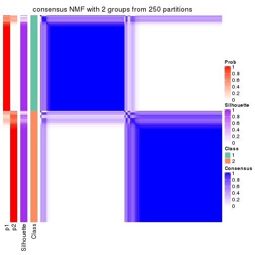</p>

</div>
<div id='tab-SD-NMF-consensus-heatmap-2'>
<pre><code class="r">consensus_heatmap(res, k = 3)
</code></pre>

<p></p>

</div>
<div id='tab-SD-NMF-consensus-heatmap-3'>
<pre><code class="r">consensus_heatmap(res, k = 4)
</code></pre>

<p></p>

</div>
<div id='tab-SD-NMF-consensus-heatmap-4'>
<pre><code class="r">consensus_heatmap(res, k = 5)
</code></pre>

<p></p>

</div>
<div id='tab-SD-NMF-consensus-heatmap-5'>
<pre><code class="r">consensus_heatmap(res, k = 6)
</code></pre>

<p></p>

</div>
</div>

Heatmaps for the membership of samples in all partitions to see how consistent they are:


<script>
$( function() {
	$( '#tabs-SD-NMF-membership-heatmap' ).tabs();
} );
</script>
<div id='tabs-SD-NMF-membership-heatmap'>
<ul>
<li><a href='#tab-SD-NMF-membership-heatmap-1'>k = 2</a></li>
<li><a href='#tab-SD-NMF-membership-heatmap-2'>k = 3</a></li>
<li><a href='#tab-SD-NMF-membership-heatmap-3'>k = 4</a></li>
<li><a href='#tab-SD-NMF-membership-heatmap-4'>k = 5</a></li>
<li><a href='#tab-SD-NMF-membership-heatmap-5'>k = 6</a></li>
</ul>
<div id='tab-SD-NMF-membership-heatmap-1'>
<pre><code class="r">membership_heatmap(res, k = 2)
</code></pre>

<p></p>

</div>
<div id='tab-SD-NMF-membership-heatmap-2'>
<pre><code class="r">membership_heatmap(res, k = 3)
</code></pre>

<p></p>

</div>
<div id='tab-SD-NMF-membership-heatmap-3'>
<pre><code class="r">membership_heatmap(res, k = 4)
</code></pre>

<p></p>

</div>
<div id='tab-SD-NMF-membership-heatmap-4'>
<pre><code class="r">membership_heatmap(res, k = 5)
</code></pre>

<p></p>

</div>
<div id='tab-SD-NMF-membership-heatmap-5'>
<pre><code class="r">membership_heatmap(res, k = 6)
</code></pre>

<p></p>

</div>
</div>

As soon as we have had the classes for columns, we can look for signatures
which are significantly different between classes which can be candidate marks
for certain classes. Following are the heatmaps for signatures.


Signature heatmaps where rows are scaled:


<script>
$( function() {
	$( '#tabs-SD-NMF-get-signatures' ).tabs();
} );
</script>
<div id='tabs-SD-NMF-get-signatures'>
<ul>
<li><a href='#tab-SD-NMF-get-signatures-1'>k = 2</a></li>
<li><a href='#tab-SD-NMF-get-signatures-2'>k = 3</a></li>
<li><a href='#tab-SD-NMF-get-signatures-3'>k = 4</a></li>
<li><a href='#tab-SD-NMF-get-signatures-4'>k = 5</a></li>
<li><a href='#tab-SD-NMF-get-signatures-5'>k = 6</a></li>
</ul>
<div id='tab-SD-NMF-get-signatures-1'>
<pre><code class="r">get_signatures(res, k = 2)
</code></pre>

<p></p>

</div>
<div id='tab-SD-NMF-get-signatures-2'>
<pre><code class="r">get_signatures(res, k = 3)
</code></pre>

<p></p>

</div>
<div id='tab-SD-NMF-get-signatures-3'>
<pre><code class="r">get_signatures(res, k = 4)
</code></pre>

<p></p>

</div>
<div id='tab-SD-NMF-get-signatures-4'>
<pre><code class="r">get_signatures(res, k = 5)
</code></pre>

<p></p>

</div>
<div id='tab-SD-NMF-get-signatures-5'>
<pre><code class="r">get_signatures(res, k = 6)
</code></pre>

<p></p>

</div>
</div>


Signature heatmaps where rows are not scaled:


<script>
$( function() {
	$( '#tabs-SD-NMF-get-signatures-no-scale' ).tabs();
} );
</script>
<div id='tabs-SD-NMF-get-signatures-no-scale'>
<ul>
<li><a href='#tab-SD-NMF-get-signatures-no-scale-1'>k = 2</a></li>
<li><a href='#tab-SD-NMF-get-signatures-no-scale-2'>k = 3</a></li>
<li><a href='#tab-SD-NMF-get-signatures-no-scale-3'>k = 4</a></li>
<li><a href='#tab-SD-NMF-get-signatures-no-scale-4'>k = 5</a></li>
<li><a href='#tab-SD-NMF-get-signatures-no-scale-5'>k = 6</a></li>
</ul>
<div id='tab-SD-NMF-get-signatures-no-scale-1'>
<pre><code class="r">get_signatures(res, k = 2, scale_rows = FALSE)
</code></pre>

<p></p>

</div>
<div id='tab-SD-NMF-get-signatures-no-scale-2'>
<pre><code class="r">get_signatures(res, k = 3, scale_rows = FALSE)
</code></pre>

<p></p>

</div>
<div id='tab-SD-NMF-get-signatures-no-scale-3'>
<pre><code class="r">get_signatures(res, k = 4, scale_rows = FALSE)
</code></pre>

<p></p>

</div>
<div id='tab-SD-NMF-get-signatures-no-scale-4'>
<pre><code class="r">get_signatures(res, k = 5, scale_rows = FALSE)
</code></pre>

<p></p>

</div>
<div id='tab-SD-NMF-get-signatures-no-scale-5'>
<pre><code class="r">get_signatures(res, k = 6, scale_rows = FALSE)
</code></pre>

<p></p>

</div>
</div>


Compare the overlap of signatures from different k:

```r
compare_signatures(res)
```


`get_signature()` returns a data frame invisibly. TO get the list of signatures, the function
call should be assigned to a variable explicitly. In following code, if `plot` argument is set
to `FALSE`, no heatmap is plotted while only the differential analysis is performed.

```r
# code only for demonstration
tb = get_signature(res, k = ..., plot = FALSE)
```

An example of the output of `tb` is:

```
#>   which_row         fdr    mean_1    mean_2 scaled_mean_1 scaled_mean_2 km
#> 1        38 0.042760348  8.373488  9.131774    -0.5533452     0.5164555  1
#> 2        40 0.018707592  7.106213  8.469186    -0.6173731     0.5762149  1
#> 3        55 0.019134737 10.221463 11.207825    -0.6159697     0.5749050  1
#> 4        59 0.006059896  5.921854  7.869574    -0.6899429     0.6439467  1
#> 5        60 0.018055526  8.928898 10.211722    -0.6204761     0.5791110  1
#> 6        98 0.009384629 15.714769 14.887706     0.6635654    -0.6193277  2
...
```

The columns in `tb` are:

1. `which_row`: row indices corresponding to the input matrix.
2. `fdr`: FDR for the differential test. 
3. `mean_x`: The mean value in group x.
4. `scaled_mean_x`: The mean value in group x after rows are scaled.
5. `km`: Row groups if k-means clustering is applied to rows.


UMAP plot which shows how samples are separated.


<script>
$( function() {
	$( '#tabs-SD-NMF-dimension-reduction' ).tabs();
} );
</script>
<div id='tabs-SD-NMF-dimension-reduction'>
<ul>
<li><a href='#tab-SD-NMF-dimension-reduction-1'>k = 2</a></li>
<li><a href='#tab-SD-NMF-dimension-reduction-2'>k = 3</a></li>
<li><a href='#tab-SD-NMF-dimension-reduction-3'>k = 4</a></li>
<li><a href='#tab-SD-NMF-dimension-reduction-4'>k = 5</a></li>
<li><a href='#tab-SD-NMF-dimension-reduction-5'>k = 6</a></li>
</ul>
<div id='tab-SD-NMF-dimension-reduction-1'>
<pre><code class="r">dimension_reduction(res, k = 2, method = &quot;UMAP&quot;)
</code></pre>

<p></p>

</div>
<div id='tab-SD-NMF-dimension-reduction-2'>
<pre><code class="r">dimension_reduction(res, k = 3, method = &quot;UMAP&quot;)
</code></pre>

<p></p>

</div>
<div id='tab-SD-NMF-dimension-reduction-3'>
<pre><code class="r">dimension_reduction(res, k = 4, method = &quot;UMAP&quot;)
</code></pre>

<p></p>

</div>
<div id='tab-SD-NMF-dimension-reduction-4'>
<pre><code class="r">dimension_reduction(res, k = 5, method = &quot;UMAP&quot;)
</code></pre>

<p></p>

</div>
<div id='tab-SD-NMF-dimension-reduction-5'>
<pre><code class="r">dimension_reduction(res, k = 6, method = &quot;UMAP&quot;)
</code></pre>

<p></p>

</div>
</div>


Following heatmap shows how subgroups are split when increasing `k`:

```r
collect_classes(res)
```


If matrix rows can be associated to genes, consider to use `GO_Enrichment(res,
...)` to perform function enrichment for the signature genes.


 

---------------------------------------------------


### CV:hclust


The object with results only for a single top-value method and a single partition method 
can be extracted as:

```r
res = res_list["CV", "hclust"]
# you can also extract it by
# res = res_list["CV:hclust"]
```

A summary of `res` and all the functions that can be applied to it:

```r
res
```

```
#> A 'ConsensusPartition' object with k = 2, 3, 4, 5, 6.
#>   On a matrix with 17654 rows and 335 columns.
#>   Top rows (1000, 2000, 3000, 4000, 5000) are extracted by 'CV' method.
#>   Subgroups are detected by 'hclust' method.
#>   Performed in total 1250 partitions by row resampling.
#>   Best k for subgroups seems to be 5.
#> 
#> Following methods can be applied to this 'ConsensusPartition' object:
#>  [1] "cola_report"             "collect_classes"         "collect_plots"          
#>  [4] "collect_stats"           "colnames"                "compare_signatures"     
#>  [7] "consensus_heatmap"       "dimension_reduction"     "functional_enrichment"  
#> [10] "get_anno_col"            "get_anno"                "get_classes"            
#> [13] "get_consensus"           "get_matrix"              "get_membership"         
#> [16] "get_param"               "get_signatures"          "get_stats"              
#> [19] "is_best_k"               "is_stable_k"             "membership_heatmap"     
#> [22] "ncol"                    "nrow"                    "plot_ecdf"              
#> [25] "rownames"                "select_partition_number" "show"                   
#> [28] "suggest_best_k"          "test_to_known_factors"
```

`collect_plots()` function collects all the plots made from `res` for all `k` (number of partitions)
into one single page to provide an easy and fast comparison between different `k`.

```r
collect_plots(res)
```


The plots are:

- The first row: a plot of the ECDF (Empirical cumulative distribution
  function) curves of the consensus matrix for each `k` and the heatmap of
  predicted classes for each `k`.
- The second row: heatmaps of the consensus matrix for each `k`.
- The third row: heatmaps of the membership matrix for each `k`.
- The fouth row: heatmaps of the signatures for each `k`.

All the plots in panels can be made by individual functions and they are
plotted later in this section.

`select_partition_number()` produces several plots showing different
statistics for choosing "optimized" `k`. There are following statistics:

- ECDF curves of the consensus matrix for each `k`;
- 1-PAC. [The PAC
  score](https://en.wikipedia.org/wiki/Consensus_clustering#Over-interpretation_potential_of_consensus_clustering)
  measures the proportion of the ambiguous subgrouping.
- Mean silhouette score.
- Concordance. The mean probability of fiting the consensus class ids in all
  partitions.
- Area increased. Denote $A_k$ as the area under the ECDF curve for current
  `k`, the area increased is defined as $A_k - A_{k-1}$.
- Rand index. The percent of pairs of samples that are both in a same cluster
  or both are not in a same cluster in the partition of k and k-1.
- Jaccard index. The ratio of pairs of samples are both in a same cluster in
  the partition of k and k-1 and the pairs of samples are both in a same
  cluster in the partition k or k-1.

The detailed explanations of these statistics can be found in [the cola
vignette](http://bioconductor.org/packages/devel/bioc/vignettes/cola/inst/doc/cola.html#toc_13).

Generally speaking, lower PAC score, higher mean silhouette score or higher
concordance corresponds to better partition. Rand index and Jaccard index
measure how similar the current partition is compared to partition with `k-1`.
If they are too similar, we won't accept `k` is better than `k-1`.

```r
select_partition_number(res)
```


The numeric values for all these statistics can be obtained by `get_stats()`.

```r
get_stats(res)
```

```
#>   k 1-PAC mean_silhouette concordance area_increased  Rand Jaccard
#> 2 2 0.208           0.661       0.821         0.2833 0.750   0.750
#> 3 3 0.121           0.175       0.626         0.5776 0.614   0.586
#> 4 4 0.197           0.547       0.669         0.1785 0.599   0.480
#> 5 5 0.261           0.573       0.756         0.1497 0.921   0.819
#> 6 6 0.329           0.539       0.752         0.0914 0.952   0.877
```

`suggest_best_k()` suggests the best $k$ based on these statistics. The rules are as follows:

- All $k$ with Jaccard index larger than 0.95 are removed because the increase of
  the partition number does not provides enough extra information. If all $k$ are removed,
  the best $k$ is assigned by `NA`.
- For $k$ with 1-PAC larger than 0.9, the maximal $k$ is taken as the "best k". Other $k$ is called "optional k".
- If it does not fit the second rule. The $k$ with the highest vote of highest
  1-PAC, mean silhouette and concordance is taken as the "best k".

```r
suggest_best_k(res)
```

```
#> [1] 5
```


Following shows the table of the partitions (You need to click the **show/hide
code output** link to see it). The membership matrix (columns with name `p*`)
is inferred by
[`clue::cl_consensus()`](https://www.rdocumentation.org/link/cl_consensus?package=clue)
function with the `SE` method. Basically the value in the membership matrix
represents the probability to belong to a certain group. The finall class
label for an item is determined with the group with highest probability it
belongs to.

In `get_classes()` function, the entropy is calculated from the membership
matrix and the silhouette score is calculated from the consensus matrix.


<script>
$( function() {
	$( '#tabs-CV-hclust-get-classes' ).tabs();
} );
</script>
<div id='tabs-CV-hclust-get-classes'>
<ul>
<li><a href='#tab-CV-hclust-get-classes-1'>k = 2</a></li>
<li><a href='#tab-CV-hclust-get-classes-2'>k = 3</a></li>
<li><a href='#tab-CV-hclust-get-classes-3'>k = 4</a></li>
<li><a href='#tab-CV-hclust-get-classes-4'>k = 5</a></li>
<li><a href='#tab-CV-hclust-get-classes-5'>k = 6</a></li>
</ul>

<div id='tab-CV-hclust-get-classes-1'>
<p><a id='tab-CV-hclust-get-classes-1-a' style='color:#0366d6' href='#'>show/hide code output</a></p>
<pre><code class="r">cbind(get_classes(res, k = 2), get_membership(res, k = 2))
</code></pre>

<pre><code>#&gt;            class entropy silhouette    p1    p2
#&gt; SRR660306      1  0.7674     0.5510 0.776 0.224
#&gt; SRR1359328     1  0.7139     0.6949 0.804 0.196
#&gt; SRR821124      1  0.9087     0.4595 0.676 0.324
#&gt; SRR1335188     1  0.0672     0.7628 0.992 0.008
#&gt; SRR1075825     1  0.7528     0.7054 0.784 0.216
#&gt; SRR1321921     1  0.0376     0.7575 0.996 0.004
#&gt; SRR1466198     2  0.8713     0.7690 0.292 0.708
#&gt; SRR1384073     1  0.3274     0.7694 0.940 0.060
#&gt; SRR1312802     1  0.5294     0.7430 0.880 0.120
#&gt; SRR1076559     1  0.4431     0.7719 0.908 0.092
#&gt; SRR1370085     1  0.0672     0.7544 0.992 0.008
#&gt; SRR1460363     1  0.0672     0.7544 0.992 0.008
#&gt; SRR1480221     1  0.6973     0.7271 0.812 0.188
#&gt; SRR1476165     1  0.4815     0.7656 0.896 0.104
#&gt; SRR1459631     1  0.9833    -0.0698 0.576 0.424
#&gt; SRR1448098     1  0.6887     0.7292 0.816 0.184
#&gt; SRR1321401     1  0.7376     0.7117 0.792 0.208
#&gt; SRR807613      1  0.7453     0.7063 0.788 0.212
#&gt; SRR808086      1  0.9881    -0.2096 0.564 0.436
#&gt; SRR613687      1  0.9710     0.1230 0.600 0.400
#&gt; SRR1471011     1  0.7602     0.6825 0.780 0.220
#&gt; SRR1330284     1  0.7674     0.6925 0.776 0.224
#&gt; SRR1320624     1  0.9087     0.4595 0.676 0.324
#&gt; SRR1459519     1  0.0376     0.7575 0.996 0.004
#&gt; SRR1091184     1  0.9815    -0.0095 0.580 0.420
#&gt; SRR1390561     1  0.1184     0.7535 0.984 0.016
#&gt; SRR658164      1  0.2778     0.7181 0.952 0.048
#&gt; SRR1087079     1  0.7056     0.7231 0.808 0.192
#&gt; SRR814996      2  0.9988     0.5230 0.480 0.520
#&gt; SRR1407410     1  0.6712     0.7430 0.824 0.176
#&gt; SRR1453392     1  0.8207     0.6439 0.744 0.256
#&gt; SRR1445873     1  0.0000     0.7595 1.000 0.000
#&gt; SRR1419985     1  0.6801     0.7329 0.820 0.180
#&gt; SRR820938      2  0.9580     0.7442 0.380 0.620
#&gt; SRR1476844     1  0.0672     0.7580 0.992 0.008
#&gt; SRR1403526     1  0.0376     0.7575 0.996 0.004
#&gt; SRR1413916     1  0.8016     0.6649 0.756 0.244
#&gt; SRR1441051     1  0.8327     0.6328 0.736 0.264
#&gt; SRR614287      1  0.6801     0.7329 0.820 0.180
#&gt; SRR1092062     1  0.7056     0.7246 0.808 0.192
#&gt; SRR612611      1  0.7299     0.7138 0.796 0.204
#&gt; SRR1376356     1  0.6531     0.7471 0.832 0.168
#&gt; SRR1405078     1  0.9933    -0.3810 0.548 0.452
#&gt; SRR1437226     1  0.8144     0.6586 0.748 0.252
#&gt; SRR1326078     1  0.0000     0.7595 1.000 0.000
#&gt; SRR1096806     2  0.9580     0.7542 0.380 0.620
#&gt; SRR1440919     1  0.9522     0.2536 0.628 0.372
#&gt; SRR1452824     1  0.7674     0.6750 0.776 0.224
#&gt; SRR615754      1  0.2236     0.7313 0.964 0.036
#&gt; SRR1341787     1  0.6712     0.7430 0.824 0.176
#&gt; SRR614551      2  0.9944     0.4547 0.456 0.544
#&gt; SRR1380829     1  0.9522     0.0226 0.628 0.372
#&gt; SRR1455761     1  0.0000     0.7595 1.000 0.000
#&gt; SRR1465189     1  0.5629     0.7267 0.868 0.132
#&gt; SRR1376895     1  0.0000     0.7595 1.000 0.000
#&gt; SRR1445002     1  0.0672     0.7544 0.992 0.008
#&gt; SRR1469258     1  0.7056     0.7246 0.808 0.192
#&gt; SRR1409239     1  0.0000     0.7595 1.000 0.000
#&gt; SRR1480200     1  0.0672     0.7544 0.992 0.008
#&gt; SRR1418323     1  0.0376     0.7572 0.996 0.004
#&gt; SRR657540      2  0.4939     0.5285 0.108 0.892
#&gt; SRR821096      1  0.7453     0.7073 0.788 0.212
#&gt; SRR613591      1  0.9000     0.5093 0.684 0.316
#&gt; SRR1344205     2  0.9286     0.7689 0.344 0.656
#&gt; SRR612479      1  0.2236     0.7545 0.964 0.036
#&gt; SRR1399950     1  0.5294     0.7430 0.880 0.120
#&gt; SRR1336048     1  0.8144     0.5885 0.748 0.252
#&gt; SRR1368896     1  0.0376     0.7575 0.996 0.004
#&gt; SRR1379403     1  0.8081     0.6598 0.752 0.248
#&gt; SRR1312464     1  0.0000     0.7595 1.000 0.000
#&gt; SRR1096478     1  0.1633     0.7637 0.976 0.024
#&gt; SRR1459845     1  0.0376     0.7572 0.996 0.004
#&gt; SRR1348138     2  0.8144     0.6866 0.252 0.748
#&gt; SRR811423      1  0.9358     0.1922 0.648 0.352
#&gt; SRR615683      1  0.2423     0.7292 0.960 0.040
#&gt; SRR1380336     1  0.7376     0.7128 0.792 0.208
#&gt; SRR817609      1  0.5737     0.7216 0.864 0.136
#&gt; SRR1074550     2  0.9608     0.7394 0.384 0.616
#&gt; SRR1499236     1  0.6801     0.7317 0.820 0.180
#&gt; SRR656083      1  0.0672     0.7544 0.992 0.008
#&gt; SRR817539      1  0.3274     0.7694 0.940 0.060
#&gt; SRR1410801     1  0.1633     0.7637 0.976 0.024
#&gt; SRR1347190     1  0.3879     0.7682 0.924 0.076
#&gt; SRR1355126     1  0.6973     0.7333 0.812 0.188
#&gt; SRR615165      2  0.9775     0.7209 0.412 0.588
#&gt; SRR1466046     1  0.1184     0.7592 0.984 0.016
#&gt; SRR1097055     1  0.7299     0.7136 0.796 0.204
#&gt; SRR1312370     1  0.6343     0.7474 0.840 0.160
#&gt; SRR655325      1  0.0376     0.7575 0.996 0.004
#&gt; SRR810177      1  0.7056     0.7246 0.808 0.192
#&gt; SRR815685      1  0.7219     0.7204 0.800 0.200
#&gt; SRR817026      1  0.9993    -0.4477 0.516 0.484
#&gt; SRR1417224     1  0.8144     0.6531 0.748 0.252
#&gt; SRR661687      2  0.9608     0.7528 0.384 0.616
#&gt; SRR1431804     1  0.7139     0.7065 0.804 0.196
#&gt; SRR664072      2  0.8955     0.7735 0.312 0.688
#&gt; SRR612923      1  0.2778     0.7698 0.952 0.048
#&gt; SRR1315890     1  0.0672     0.7544 0.992 0.008
#&gt; SRR1347726     1  0.3274     0.7694 0.940 0.060
#&gt; SRR1500360     1  0.3584     0.7722 0.932 0.068
#&gt; SRR1468360     1  0.4815     0.7680 0.896 0.104
#&gt; SRR1404084     1  0.7139     0.7281 0.804 0.196
#&gt; SRR615994      2  0.8499     0.5897 0.276 0.724
#&gt; SRR1475718     1  0.7056     0.7277 0.808 0.192
#&gt; SRR1397200     2  0.9286     0.7689 0.344 0.656
#&gt; SRR655519      1  0.9323     0.4357 0.652 0.348
#&gt; SRR1311308     2  0.9580     0.7442 0.380 0.620
#&gt; SRR1368006     1  0.8144     0.6519 0.748 0.252
#&gt; SRR613651      1  0.8207     0.3154 0.744 0.256
#&gt; SRR1362621     1  0.9170     0.4226 0.668 0.332
#&gt; SRR1451718     1  0.6343     0.7520 0.840 0.160
#&gt; SRR1095334     2  0.8713     0.7701 0.292 0.708
#&gt; SRR1079636     1  0.8555     0.5967 0.720 0.280
#&gt; SRR1442549     1  0.4690     0.7691 0.900 0.100
#&gt; SRR1466421     1  0.6801     0.7329 0.820 0.180
#&gt; SRR817397      2  0.9996     0.5461 0.488 0.512
#&gt; SRR1341809     1  0.6438     0.7450 0.836 0.164
#&gt; SRR614623      1  0.7219     0.7204 0.800 0.200
#&gt; SRR1335005     1  0.6973     0.7271 0.812 0.188
#&gt; SRR1407065     2  0.9944     0.6422 0.456 0.544
#&gt; SRR1404483     1  0.8144     0.6506 0.748 0.252
#&gt; SRR1096222     1  0.0672     0.7544 0.992 0.008
#&gt; SRR1401793     1  0.5842     0.7481 0.860 0.140
#&gt; SRR1408615     2  0.9993     0.5081 0.484 0.516
#&gt; SRR1070597     1  0.4298     0.7701 0.912 0.088
#&gt; SRR1332381     1  0.2948     0.7605 0.948 0.052
#&gt; SRR1457015     1  0.0376     0.7575 0.996 0.004
#&gt; SRR1386797     1  0.6623     0.7455 0.828 0.172
#&gt; SRR1098385     1  0.7299     0.7145 0.796 0.204
#&gt; SRR1363947     2  0.8713     0.7671 0.292 0.708
#&gt; SRR820350      1  0.6801     0.7329 0.820 0.180
#&gt; SRR662055      1  0.8267     0.3058 0.740 0.260
#&gt; SRR1310455     1  0.5059     0.7448 0.888 0.112
#&gt; SRR1453639     1  0.4562     0.7703 0.904 0.096
#&gt; SRR662617      1  0.6887     0.7292 0.816 0.184
#&gt; SRR654778      1  0.1184     0.7637 0.984 0.016
#&gt; SRR661782      1  0.6887     0.7306 0.816 0.184
#&gt; SRR1334396     1  0.5629     0.7267 0.868 0.132
#&gt; SRR613867      1  0.9866    -0.0160 0.568 0.432
#&gt; SRR1479412     1  0.0672     0.7628 0.992 0.008
#&gt; SRR1331620     1  0.3584     0.7647 0.932 0.068
#&gt; SRR1082809     1  0.6531     0.7254 0.832 0.168
#&gt; SRR1417178     1  0.6623     0.7138 0.828 0.172
#&gt; SRR1335278     1  0.1184     0.7592 0.984 0.016
#&gt; SRR665369      1  0.6887     0.7292 0.816 0.184
#&gt; SRR657552      1  0.5629     0.7413 0.868 0.132
#&gt; SRR812412      1  0.0376     0.7572 0.996 0.004
#&gt; SRR1096500     1  0.8016     0.6671 0.756 0.244
#&gt; SRR1347750     1  0.6712     0.7363 0.824 0.176
#&gt; SRR615153      1  0.8327     0.3166 0.736 0.264
#&gt; SRR1434417     1  0.4161     0.7614 0.916 0.084
#&gt; SRR1070159     2  0.9850     0.6732 0.428 0.572
#&gt; SRR1332508     1  0.7139     0.7208 0.804 0.196
#&gt; SRR1082059     1  0.6712     0.7432 0.824 0.176
#&gt; SRR1402491     1  0.0938     0.7568 0.988 0.012
#&gt; SRR1476595     1  0.6887     0.7441 0.816 0.184
#&gt; SRR1320987     1  0.6887     0.7289 0.816 0.184
#&gt; SRR1086417     1  0.8207     0.6312 0.744 0.256
#&gt; SRR1454095     1  0.1184     0.7649 0.984 0.016
#&gt; SRR614791      1  0.8267     0.3058 0.740 0.260
#&gt; SRR821255      1  0.5946     0.7584 0.856 0.144
#&gt; SRR820402      1  0.9000     0.4445 0.684 0.316
#&gt; SRR1337284     1  0.3274     0.7694 0.940 0.060
#&gt; SRR1333083     2  0.9044     0.7748 0.320 0.680
#&gt; SRR1384883     2  1.0000     0.4865 0.496 0.504
#&gt; SRR614431      1  0.0376     0.7572 0.996 0.004
#&gt; SRR1481106     1  0.7674     0.6957 0.776 0.224
#&gt; SRR1370285     1  0.1184     0.7592 0.984 0.016
#&gt; SRR1446673     2  0.8909     0.7721 0.308 0.692
#&gt; SRR1318046     1  0.6887     0.7370 0.816 0.184
#&gt; SRR1341188     2  0.8713     0.7671 0.292 0.708
#&gt; SRR1384941     1  0.0376     0.7575 0.996 0.004
#&gt; SRR1322864     1  0.6801     0.7317 0.820 0.180
#&gt; SRR1476825     1  0.8081     0.5913 0.752 0.248
#&gt; SRR1443332     1  0.8207     0.6462 0.744 0.256
#&gt; SRR662486      1  0.8861     0.4565 0.696 0.304
#&gt; SRR1447019     1  0.3879     0.7632 0.924 0.076
#&gt; SRR662942      1  0.0672     0.7544 0.992 0.008
#&gt; SRR613102      2  0.9000     0.7733 0.316 0.684
#&gt; SRR1469880     1  0.0000     0.7595 1.000 0.000
#&gt; SRR1464977     1  0.3274     0.7694 0.940 0.060
#&gt; SRR615850      1  0.9933    -0.3810 0.548 0.452
#&gt; SRR661949      1  0.7056     0.7249 0.808 0.192
#&gt; SRR1322227     1  0.9170     0.4497 0.668 0.332
#&gt; SRR1441655     1  0.5842     0.7602 0.860 0.140
#&gt; SRR613771      1  0.4690     0.7687 0.900 0.100
#&gt; SRR1479471     1  0.1184     0.7592 0.984 0.016
#&gt; SRR1488918     1  0.7815     0.6817 0.768 0.232
#&gt; SRR1414040     1  0.7139     0.7220 0.804 0.196
#&gt; SRR1079850     1  0.6343     0.7477 0.840 0.160
#&gt; SRR663209      1  0.0672     0.7597 0.992 0.008
#&gt; SRR1364914     1  0.7883     0.6760 0.764 0.236
#&gt; SRR1408267     1  0.6973     0.7266 0.812 0.188
#&gt; SRR1314894     1  0.0376     0.7575 0.996 0.004
#&gt; SRR1414117     1  0.9993    -0.4363 0.516 0.484
#&gt; SRR1395975     1  0.4939     0.7681 0.892 0.108
#&gt; SRR1402219     1  0.6343     0.7485 0.840 0.160
#&gt; SRR1433623     1  0.0672     0.7544 0.992 0.008
#&gt; SRR656385      1  0.8267     0.3058 0.740 0.260
#&gt; SRR811213      1  0.7299     0.7296 0.796 0.204
#&gt; SRR663657      1  0.9427     0.0857 0.640 0.360
#&gt; SRR612203      1  0.8144     0.3254 0.748 0.252
#&gt; SRR613987      2  0.9944     0.4547 0.456 0.544
#&gt; SRR613831      2  0.9552     0.7538 0.376 0.624
#&gt; SRR1354180     1  0.7745     0.6884 0.772 0.228
#&gt; SRR1382912     1  0.0672     0.7544 0.992 0.008
#&gt; SRR1475501     1  0.1184     0.7535 0.984 0.016
#&gt; SRR1336930     1  0.3584     0.7647 0.932 0.068
#&gt; SRR613030      2  0.8608     0.7110 0.284 0.716
#&gt; SRR1381459     1  0.7219     0.7224 0.800 0.200
#&gt; SRR1402350     1  0.6343     0.7520 0.840 0.160
#&gt; SRR1419408     1  0.1414     0.7564 0.980 0.020
#&gt; SRR655911      2  0.8909     0.5899 0.308 0.692
#&gt; SRR1418243     1  0.0000     0.7595 1.000 0.000
#&gt; SRR1322573     1  0.4690     0.7718 0.900 0.100
#&gt; SRR613615      2  0.8443     0.5906 0.272 0.728
#&gt; SRR1355284     1  0.5059     0.7573 0.888 0.112
#&gt; SRR1319395     1  0.0000     0.7595 1.000 0.000
#&gt; SRR818939      1  0.0672     0.7544 0.992 0.008
#&gt; SRR1465266     1  0.3274     0.7682 0.940 0.060
#&gt; SRR614888      1  0.8081     0.3350 0.752 0.248
#&gt; SRR1431694     1  0.4161     0.7704 0.916 0.084
#&gt; SRR614347      2  0.9323     0.6489 0.348 0.652
#&gt; SRR1334228     2  0.9286     0.7689 0.344 0.656
#&gt; SRR1096007     1  0.7815     0.6850 0.768 0.232
#&gt; SRR656349      1  0.5629     0.7267 0.868 0.132
#&gt; SRR815422      2  0.9944     0.6422 0.456 0.544
#&gt; SRR1360828     1  0.1184     0.7639 0.984 0.016
#&gt; SRR1359005     1  0.9358     0.3379 0.648 0.352
#&gt; SRR1456652     1  0.0000     0.7595 1.000 0.000
#&gt; SRR1391660     1  0.0000     0.7595 1.000 0.000
#&gt; SRR1441956     1  0.0000     0.7595 1.000 0.000
#&gt; SRR662930      1  0.8144     0.3645 0.748 0.252
#&gt; SRR615790      2  0.9552     0.6439 0.376 0.624
#&gt; SRR614827      1  0.8661     0.6050 0.712 0.288
#&gt; SRR614587      2  1.0000     0.4865 0.496 0.504
#&gt; SRR814052      1  0.5629     0.7663 0.868 0.132
#&gt; SRR1070086     1  0.0376     0.7575 0.996 0.004
#&gt; SRR1481440     1  0.5629     0.7267 0.868 0.132
#&gt; SRR1339296     2  0.8713     0.7671 0.292 0.708
#&gt; SRR1343239     1  0.7376     0.7118 0.792 0.208
#&gt; SRR1432802     1  0.6343     0.7485 0.840 0.160
#&gt; SRR1416911     1  0.1843     0.7411 0.972 0.028
#&gt; SRR1410427     1  0.3114     0.7695 0.944 0.056
#&gt; SRR1401185     1  0.6247     0.7547 0.844 0.156
#&gt; SRR654993      1  0.6887     0.7292 0.816 0.184
#&gt; SRR656397      1  0.0376     0.7575 0.996 0.004
#&gt; SRR809643      2  0.8499     0.6790 0.276 0.724
#&gt; SRR1433819     1  0.2423     0.7520 0.960 0.040
#&gt; SRR1375225     1  0.7453     0.7082 0.788 0.212
#&gt; SRR1367739     1  0.9491     0.1240 0.632 0.368
#&gt; SRR1323336     1  0.6148     0.7559 0.848 0.152
#&gt; SRR663224      2  0.8608     0.7110 0.284 0.716
#&gt; SRR1442840     1  0.1184     0.7592 0.984 0.016
#&gt; SRR1374058     1  0.0672     0.7544 0.992 0.008
#&gt; SRR656994      1  0.0376     0.7572 0.996 0.004
#&gt; SRR1469214     1  0.7376     0.7128 0.792 0.208
#&gt; SRR1456446     1  0.1184     0.7639 0.984 0.016
#&gt; SRR1471879     1  0.6712     0.7363 0.824 0.176
#&gt; SRR612911      2  0.9775     0.7209 0.412 0.588
#&gt; SRR1395720     1  0.7674     0.6925 0.776 0.224
#&gt; SRR1413055     1  0.5629     0.7267 0.868 0.132
#&gt; SRR656770      1  0.4815     0.7680 0.896 0.104
#&gt; SRR812080      2  0.9552     0.7481 0.376 0.624
#&gt; SRR1479328     1  0.2948     0.7684 0.948 0.052
#&gt; SRR661421      1  0.8713     0.5779 0.708 0.292
#&gt; SRR1410286     1  0.7376     0.7095 0.792 0.208
#&gt; SRR1487150     1  0.0000     0.7595 1.000 0.000
#&gt; SRR1467035     1  0.1633     0.7546 0.976 0.024
#&gt; SRR1360607     1  0.6973     0.7285 0.812 0.188
#&gt; SRR1333106     1  0.4939     0.7673 0.892 0.108
#&gt; SRR1088706     1  0.7219     0.7204 0.800 0.200
#&gt; SRR1320053     2  0.9580     0.7442 0.380 0.620
#&gt; SRR1350392     1  0.6801     0.7329 0.820 0.180
#&gt; SRR1385190     1  0.9358     0.1922 0.648 0.352
#&gt; SRR1080093     1  0.7674     0.6911 0.776 0.224
#&gt; SRR1318753     1  0.0376     0.7575 0.996 0.004
#&gt; SRR1345369     1  0.6712     0.7251 0.824 0.176
#&gt; SRR612178      1  0.9944    -0.0592 0.544 0.456
#&gt; SRR1354423     1  0.0938     0.7568 0.988 0.012
#&gt; SRR1072724     1  0.3879     0.7701 0.924 0.076
#&gt; SRR1418450     1  0.9087     0.4469 0.676 0.324
#&gt; SRR1326427     2  0.8081     0.6793 0.248 0.752
#&gt; SRR1437412     1  0.6801     0.7078 0.820 0.180
#&gt; SRR1327548     1  0.9358     0.3238 0.648 0.352
#&gt; SRR1395891     1  0.0672     0.7557 0.992 0.008
#&gt; SRR659367      1  0.8144     0.3252 0.748 0.252
#&gt; SRR818961      1  0.4161     0.7614 0.916 0.084
#&gt; SRR813704      1  0.0000     0.7595 1.000 0.000
#&gt; SRR613054      1  0.2236     0.7313 0.964 0.036
#&gt; SRR1476467     1  0.1843     0.7675 0.972 0.028
#&gt; SRR1407988     1  0.6973     0.7271 0.812 0.188
#&gt; SRR1394776     1  0.7453     0.7071 0.788 0.212
#&gt; SRR655578      1  0.6801     0.7329 0.820 0.180
#&gt; SRR1310645     1  0.8955     0.4657 0.688 0.312
#&gt; SRR1345628     1  0.4161     0.7614 0.916 0.084
#&gt; SRR1479740     1  0.0672     0.7597 0.992 0.008
#&gt; SRR1332095     1  0.3584     0.7722 0.932 0.068
#&gt; SRR1444786     1  0.4431     0.7699 0.908 0.092
#&gt; SRR1090070     1  0.2423     0.7520 0.960 0.040
#&gt; SRR662414      1  0.4815     0.7693 0.896 0.104
#&gt; SRR661216      1  0.7453     0.7094 0.788 0.212
#&gt; SRR656313      1  0.8661     0.4129 0.712 0.288
#&gt; SRR615671      1  0.9608     0.0659 0.616 0.384
#&gt; SRR1350196     2  0.9286     0.7689 0.344 0.656
#&gt; SRR1466580     1  0.0672     0.7628 0.992 0.008
#&gt; SRR1408032     1  0.7745     0.6884 0.772 0.228
#&gt; SRR1432913     2  0.9323     0.6290 0.348 0.652
#&gt; SRR1360502     1  0.6973     0.7349 0.812 0.188
#&gt; SRR1391901     1  0.8909     0.5270 0.692 0.308
#&gt; SRR1311131     1  0.1843     0.7411 0.972 0.028
#&gt; SRR1380636     1  0.1414     0.7564 0.980 0.020
#&gt; SRR1332339     1  0.3274     0.7697 0.940 0.060
#&gt; SRR1341563     1  0.7528     0.7026 0.784 0.216
#&gt; SRR1359410     1  0.9129     0.4564 0.672 0.328
#&gt; SRR1473040     2  0.9044     0.7748 0.320 0.680
#&gt; SRR1321444     1  0.0376     0.7575 0.996 0.004
#&gt; SRR1498765     1  0.8016     0.6633 0.756 0.244
#&gt; SRR1312622     1  0.8608     0.5900 0.716 0.284
#&gt; SRR615503      1  0.8016     0.5167 0.756 0.244
#&gt; SRR1453192     1  0.0672     0.7544 0.992 0.008
#&gt; SRR1433107     1  0.8207     0.6471 0.744 0.256
#&gt; SRR1075384     1  0.1184     0.7535 0.984 0.016
#&gt; SRR1356683     1  0.0672     0.7544 0.992 0.008
#&gt; SRR659049      1  0.1414     0.7624 0.980 0.020
#&gt; SRR1368240     1  0.0672     0.7544 0.992 0.008
#&gt; SRR1341739     1  0.0000     0.7595 1.000 0.000
#&gt; SRR613249      2  0.9850     0.6832 0.428 0.572
#&gt; SRR663428      1  0.7815     0.7038 0.768 0.232
#&gt; SRR1341302     1  0.8016     0.6670 0.756 0.244
#&gt; SRR1073553     1  0.7602     0.7009 0.780 0.220
#&gt; SRR1354093     2  0.8661     0.7684 0.288 0.712
#&gt; SRR1406521     2  0.9954     0.6322 0.460 0.540
#&gt; SRR1432049     1  0.1184     0.7639 0.984 0.016
#&gt; SRR1453504     1  0.1843     0.7675 0.972 0.028
</code></pre>

<script>
$('#tab-CV-hclust-get-classes-1-a').parent().next().next().hide();
$('#tab-CV-hclust-get-classes-1-a').click(function(){
  $('#tab-CV-hclust-get-classes-1-a').parent().next().next().toggle();
  return(false);
});
</script>
</div>

<div id='tab-CV-hclust-get-classes-2'>
<p><a id='tab-CV-hclust-get-classes-2-a' style='color:#0366d6' href='#'>show/hide code output</a></p>
<pre><code class="r">cbind(get_classes(res, k = 3), get_membership(res, k = 3))
</code></pre>

<pre><code>#&gt;            class entropy silhouette    p1    p2    p3
#&gt; SRR660306      2  0.8834     0.0540 0.196 0.580 0.224
#&gt; SRR1359328     2  0.5578     0.4162 0.240 0.748 0.012
#&gt; SRR821124      2  0.4925     0.4782 0.076 0.844 0.080
#&gt; SRR1335188     2  0.6140    -0.5275 0.404 0.596 0.000
#&gt; SRR1075825     2  0.1620     0.5001 0.024 0.964 0.012
#&gt; SRR1321921     2  0.6309    -0.7776 0.496 0.504 0.000
#&gt; SRR1466198     2  0.9529    -0.0244 0.356 0.448 0.196
#&gt; SRR1384073     2  0.5016     0.1576 0.240 0.760 0.000
#&gt; SRR1312802     2  0.6647    -0.2232 0.396 0.592 0.012
#&gt; SRR1076559     2  0.5517     0.0714 0.268 0.728 0.004
#&gt; SRR1370085     1  0.6295     0.8208 0.528 0.472 0.000
#&gt; SRR1460363     1  0.6295     0.8208 0.528 0.472 0.000
#&gt; SRR1480221     2  0.0983     0.4860 0.016 0.980 0.004
#&gt; SRR1476165     2  0.6102    -0.1120 0.320 0.672 0.008
#&gt; SRR1459631     2  0.7391     0.4126 0.196 0.696 0.108
#&gt; SRR1448098     2  0.0424     0.4867 0.008 0.992 0.000
#&gt; SRR1321401     2  0.1163     0.4982 0.028 0.972 0.000
#&gt; SRR807613      2  0.1315     0.4980 0.020 0.972 0.008
#&gt; SRR808086      2  0.8016     0.3824 0.260 0.632 0.108
#&gt; SRR613687      2  0.9131     0.0789 0.168 0.520 0.312
#&gt; SRR1471011     2  0.5689     0.4010 0.184 0.780 0.036
#&gt; SRR1330284     2  0.1620     0.5000 0.024 0.964 0.012
#&gt; SRR1320624     2  0.4925     0.4782 0.076 0.844 0.080
#&gt; SRR1459519     2  0.6305    -0.7463 0.484 0.516 0.000
#&gt; SRR1091184     2  0.6719     0.4356 0.160 0.744 0.096
#&gt; SRR1390561     1  0.6509     0.8174 0.524 0.472 0.004
#&gt; SRR658164      1  0.8227     0.6628 0.536 0.384 0.080
#&gt; SRR1087079     2  0.0747     0.4914 0.016 0.984 0.000
#&gt; SRR814996      2  0.8285     0.2887 0.288 0.600 0.112
#&gt; SRR1407410     2  0.2496     0.4677 0.068 0.928 0.004
#&gt; SRR1453392     2  0.2564     0.4995 0.036 0.936 0.028
#&gt; SRR1445873     2  0.6302    -0.7361 0.480 0.520 0.000
#&gt; SRR1419985     2  0.0747     0.4868 0.016 0.984 0.000
#&gt; SRR820938      2  0.9040     0.1345 0.320 0.524 0.156
#&gt; SRR1476844     1  0.6307     0.8085 0.512 0.488 0.000
#&gt; SRR1403526     2  0.6309    -0.7776 0.496 0.504 0.000
#&gt; SRR1413916     2  0.2804     0.5005 0.060 0.924 0.016
#&gt; SRR1441051     2  0.2902     0.5008 0.064 0.920 0.016
#&gt; SRR614287      2  0.0892     0.4817 0.020 0.980 0.000
#&gt; SRR1092062     2  0.0747     0.4919 0.016 0.984 0.000
#&gt; SRR612611      2  0.1015     0.4955 0.012 0.980 0.008
#&gt; SRR1376356     2  0.2537     0.4621 0.080 0.920 0.000
#&gt; SRR1405078     2  0.9173     0.2689 0.304 0.520 0.176
#&gt; SRR1437226     2  0.3528     0.4965 0.092 0.892 0.016
#&gt; SRR1326078     2  0.6299    -0.7291 0.476 0.524 0.000
#&gt; SRR1096806     2  0.9457    -0.0995 0.392 0.428 0.180
#&gt; SRR1440919     2  0.6529     0.4412 0.152 0.756 0.092
#&gt; SRR1452824     2  0.5741     0.4020 0.188 0.776 0.036
#&gt; SRR615754      1  0.7868     0.7353 0.524 0.420 0.056
#&gt; SRR1341787     2  0.2682     0.4673 0.076 0.920 0.004
#&gt; SRR614551      2  0.8550     0.2904 0.176 0.608 0.216
#&gt; SRR1380829     3  0.8173     0.7462 0.264 0.116 0.620
#&gt; SRR1455761     2  0.6302    -0.7361 0.480 0.520 0.000
#&gt; SRR1465189     2  0.8499    -0.2673 0.388 0.516 0.096
#&gt; SRR1376895     2  0.6267    -0.6699 0.452 0.548 0.000
#&gt; SRR1445002     1  0.6286     0.8165 0.536 0.464 0.000
#&gt; SRR1469258     2  0.1525     0.4862 0.032 0.964 0.004
#&gt; SRR1409239     2  0.6299    -0.7477 0.476 0.524 0.000
#&gt; SRR1480200     2  0.6308    -0.7734 0.492 0.508 0.000
#&gt; SRR1418323     2  0.6286    -0.7137 0.464 0.536 0.000
#&gt; SRR657540      3  0.6541     0.5694 0.304 0.024 0.672
#&gt; SRR821096      2  0.1315     0.4982 0.020 0.972 0.008
#&gt; SRR613591      2  0.6208     0.3921 0.076 0.772 0.152
#&gt; SRR1344205     2  0.9335     0.0742 0.324 0.492 0.184
#&gt; SRR612479      2  0.7067    -0.7473 0.468 0.512 0.020
#&gt; SRR1399950     2  0.6647    -0.2232 0.396 0.592 0.012
#&gt; SRR1336048     2  0.6761     0.3919 0.252 0.700 0.048
#&gt; SRR1368896     2  0.6305    -0.7631 0.484 0.516 0.000
#&gt; SRR1379403     2  0.3045     0.4995 0.064 0.916 0.020
#&gt; SRR1312464     2  0.6299    -0.7363 0.476 0.524 0.000
#&gt; SRR1096478     1  0.7186     0.7701 0.500 0.476 0.024
#&gt; SRR1459845     2  0.6309    -0.7841 0.496 0.504 0.000
#&gt; SRR1348138     1  0.9512    -0.5084 0.428 0.188 0.384
#&gt; SRR811423      2  0.8126     0.2553 0.356 0.564 0.080
#&gt; SRR615683      1  0.7397     0.7982 0.484 0.484 0.032
#&gt; SRR1380336     2  0.1525     0.4992 0.032 0.964 0.004
#&gt; SRR817609      2  0.8527    -0.2844 0.400 0.504 0.096
#&gt; SRR1074550     2  0.9062     0.0962 0.336 0.512 0.152
#&gt; SRR1499236     2  0.0592     0.4852 0.012 0.988 0.000
#&gt; SRR656083      1  0.6291     0.8192 0.532 0.468 0.000
#&gt; SRR817539      2  0.5397     0.0112 0.280 0.720 0.000
#&gt; SRR1410801     1  0.7186     0.7701 0.500 0.476 0.024
#&gt; SRR1347190     2  0.6345    -0.4495 0.400 0.596 0.004
#&gt; SRR1355126     2  0.4748     0.4233 0.144 0.832 0.024
#&gt; SRR615165      2  0.9223     0.1025 0.324 0.504 0.172
#&gt; SRR1466046     2  0.6682    -0.7879 0.488 0.504 0.008
#&gt; SRR1097055     2  0.0661     0.4952 0.008 0.988 0.004
#&gt; SRR1312370     2  0.3116     0.4153 0.108 0.892 0.000
#&gt; SRR655325      2  0.6305    -0.7631 0.484 0.516 0.000
#&gt; SRR810177      2  0.0892     0.4926 0.020 0.980 0.000
#&gt; SRR815685      2  0.1711     0.4980 0.032 0.960 0.008
#&gt; SRR817026      2  0.8492     0.3112 0.276 0.592 0.132
#&gt; SRR1417224     2  0.3141     0.4999 0.068 0.912 0.020
#&gt; SRR661687      2  0.9432    -0.0548 0.372 0.448 0.180
#&gt; SRR1431804     2  0.7091     0.2327 0.248 0.688 0.064
#&gt; SRR664072      2  0.9658    -0.0750 0.368 0.420 0.212
#&gt; SRR612923      2  0.5443     0.0392 0.260 0.736 0.004
#&gt; SRR1315890     1  0.6302     0.8195 0.520 0.480 0.000
#&gt; SRR1347726     2  0.5216     0.0989 0.260 0.740 0.000
#&gt; SRR1500360     2  0.5098     0.1117 0.248 0.752 0.000
#&gt; SRR1468360     2  0.4033     0.3870 0.136 0.856 0.008
#&gt; SRR1404084     2  0.3771     0.4643 0.112 0.876 0.012
#&gt; SRR615994      3  0.9083     0.5991 0.280 0.180 0.540
#&gt; SRR1475718     2  0.1129     0.4938 0.020 0.976 0.004
#&gt; SRR1397200     2  0.9350     0.0654 0.328 0.488 0.184
#&gt; SRR655519      2  0.6295     0.4265 0.072 0.764 0.164
#&gt; SRR1311308     2  0.9021     0.1391 0.316 0.528 0.156
#&gt; SRR1368006     2  0.2443     0.5001 0.032 0.940 0.028
#&gt; SRR613651      3  0.8425     0.7489 0.348 0.100 0.552
#&gt; SRR1362621     2  0.6151     0.4515 0.180 0.764 0.056
#&gt; SRR1451718     2  0.3983     0.4243 0.144 0.852 0.004
#&gt; SRR1095334     2  0.9541    -0.0813 0.384 0.424 0.192
#&gt; SRR1079636     2  0.3780     0.4936 0.064 0.892 0.044
#&gt; SRR1442549     2  0.4531     0.3337 0.168 0.824 0.008
#&gt; SRR1466421     2  0.0747     0.4868 0.016 0.984 0.000
#&gt; SRR817397      2  0.8437     0.2560 0.276 0.596 0.128
#&gt; SRR1341809     2  0.1964     0.4723 0.056 0.944 0.000
#&gt; SRR614623      2  0.1711     0.4980 0.032 0.960 0.008
#&gt; SRR1335005     2  0.0661     0.4890 0.008 0.988 0.004
#&gt; SRR1407065     2  0.8752     0.1447 0.320 0.548 0.132
#&gt; SRR1404483     2  0.2564     0.4993 0.036 0.936 0.028
#&gt; SRR1096222     1  0.6307     0.8140 0.512 0.488 0.000
#&gt; SRR1401793     2  0.6625    -0.1079 0.316 0.660 0.024
#&gt; SRR1408615     2  0.8337     0.2947 0.296 0.592 0.112
#&gt; SRR1070597     2  0.4700     0.3033 0.180 0.812 0.008
#&gt; SRR1332381     2  0.6763    -0.5429 0.436 0.552 0.012
#&gt; SRR1457015     2  0.6307    -0.7644 0.488 0.512 0.000
#&gt; SRR1386797     2  0.3192     0.4570 0.112 0.888 0.000
#&gt; SRR1098385     2  0.1399     0.4969 0.028 0.968 0.004
#&gt; SRR1363947     2  0.9556    -0.0484 0.372 0.432 0.196
#&gt; SRR820350      2  0.0747     0.4868 0.016 0.984 0.000
#&gt; SRR662055      3  0.8408     0.7495 0.344 0.100 0.556
#&gt; SRR1310455     2  0.6632    -0.3503 0.392 0.596 0.012
#&gt; SRR1453639     2  0.5072     0.2710 0.196 0.792 0.012
#&gt; SRR662617      2  0.0747     0.4833 0.016 0.984 0.000
#&gt; SRR654778      2  0.6169    -0.3722 0.360 0.636 0.004
#&gt; SRR661782      2  0.1031     0.4844 0.024 0.976 0.000
#&gt; SRR1334396     2  0.8499    -0.2673 0.388 0.516 0.096
#&gt; SRR613867      2  0.9006     0.1048 0.160 0.536 0.304
#&gt; SRR1479412     2  0.6111    -0.5003 0.396 0.604 0.000
#&gt; SRR1331620     2  0.6587    -0.5282 0.424 0.568 0.008
#&gt; SRR1082809     2  0.6313     0.0802 0.308 0.676 0.016
#&gt; SRR1417178     2  0.7797    -0.0736 0.320 0.608 0.072
#&gt; SRR1335278     1  0.6683     0.7911 0.496 0.496 0.008
#&gt; SRR665369      2  0.0424     0.4867 0.008 0.992 0.000
#&gt; SRR657552      2  0.7600    -0.0774 0.328 0.612 0.060
#&gt; SRR812412      2  0.6307    -0.7740 0.488 0.512 0.000
#&gt; SRR1096500     2  0.2902     0.5003 0.064 0.920 0.016
#&gt; SRR1347750     2  0.1289     0.4869 0.032 0.968 0.000
#&gt; SRR615153      3  0.8886     0.7229 0.352 0.132 0.516
#&gt; SRR1434417     2  0.8271    -0.6087 0.444 0.480 0.076
#&gt; SRR1070159     2  0.9074     0.1504 0.328 0.516 0.156
#&gt; SRR1332508     2  0.0892     0.4934 0.020 0.980 0.000
#&gt; SRR1082059     2  0.3340     0.4545 0.120 0.880 0.000
#&gt; SRR1402491     1  0.6521     0.8025 0.504 0.492 0.004
#&gt; SRR1476595     2  0.3532     0.4666 0.108 0.884 0.008
#&gt; SRR1320987     2  0.0892     0.4906 0.020 0.980 0.000
#&gt; SRR1086417     2  0.5407     0.4579 0.156 0.804 0.040
#&gt; SRR1454095     2  0.6140    -0.5192 0.404 0.596 0.000
#&gt; SRR614791      3  0.8408     0.7495 0.344 0.100 0.556
#&gt; SRR821255      2  0.3715     0.4046 0.128 0.868 0.004
#&gt; SRR820402      2  0.6372     0.4522 0.152 0.764 0.084
#&gt; SRR1337284     2  0.4974     0.1687 0.236 0.764 0.000
#&gt; SRR1333083     2  0.9424     0.0146 0.352 0.464 0.184
#&gt; SRR1384883     2  0.8268     0.3031 0.228 0.628 0.144
#&gt; SRR614431      2  0.6309    -0.7841 0.496 0.504 0.000
#&gt; SRR1481106     2  0.1585     0.5003 0.028 0.964 0.008
#&gt; SRR1370285     1  0.6682     0.8048 0.504 0.488 0.008
#&gt; SRR1446673     2  0.9683    -0.0827 0.368 0.416 0.216
#&gt; SRR1318046     2  0.2599     0.4860 0.052 0.932 0.016
#&gt; SRR1341188     2  0.9556    -0.0484 0.372 0.432 0.196
#&gt; SRR1384941     2  0.6305    -0.7631 0.484 0.516 0.000
#&gt; SRR1322864     2  0.0592     0.4852 0.012 0.988 0.000
#&gt; SRR1476825     2  0.7153     0.2354 0.300 0.652 0.048
#&gt; SRR1443332     2  0.3045     0.4998 0.064 0.916 0.020
#&gt; SRR662486      2  0.8220     0.1815 0.152 0.636 0.212
#&gt; SRR1447019     2  0.8132    -0.6063 0.444 0.488 0.068
#&gt; SRR662942      2  0.6309    -0.7928 0.500 0.500 0.000
#&gt; SRR613102      2  0.9702    -0.0795 0.364 0.416 0.220
#&gt; SRR1469880     2  0.6274    -0.6889 0.456 0.544 0.000
#&gt; SRR1464977     2  0.4974     0.1687 0.236 0.764 0.000
#&gt; SRR615850      2  0.9173     0.2689 0.304 0.520 0.176
#&gt; SRR661949      2  0.1525     0.4913 0.032 0.964 0.004
#&gt; SRR1322227     2  0.4489     0.4803 0.108 0.856 0.036
#&gt; SRR1441655     2  0.4409     0.3610 0.172 0.824 0.004
#&gt; SRR613771      2  0.4228     0.3689 0.148 0.844 0.008
#&gt; SRR1479471     1  0.6682     0.8048 0.504 0.488 0.008
#&gt; SRR1488918     2  0.1774     0.4993 0.024 0.960 0.016
#&gt; SRR1414040     2  0.1129     0.4947 0.020 0.976 0.004
#&gt; SRR1079850     2  0.2261     0.4654 0.068 0.932 0.000
#&gt; SRR663209      2  0.6513    -0.7380 0.476 0.520 0.004
#&gt; SRR1364914     2  0.1919     0.4999 0.024 0.956 0.020
#&gt; SRR1408267     2  0.0892     0.4908 0.020 0.980 0.000
#&gt; SRR1314894     2  0.6302    -0.7458 0.480 0.520 0.000
#&gt; SRR1414117     2  0.8349     0.3275 0.264 0.608 0.128
#&gt; SRR1395975     2  0.3755     0.4076 0.120 0.872 0.008
#&gt; SRR1402219     2  0.2165     0.4591 0.064 0.936 0.000
#&gt; SRR1433623     1  0.6302     0.8195 0.520 0.480 0.000
#&gt; SRR656385      3  0.8425     0.7478 0.348 0.100 0.552
#&gt; SRR811213      2  0.3539     0.4807 0.100 0.888 0.012
#&gt; SRR663657      3  0.9281     0.7125 0.340 0.172 0.488
#&gt; SRR612203      3  0.8530     0.7461 0.344 0.108 0.548
#&gt; SRR613987      2  0.8550     0.2904 0.176 0.608 0.216
#&gt; SRR613831      2  0.9385     0.0735 0.328 0.484 0.188
#&gt; SRR1354180     2  0.2031     0.4996 0.032 0.952 0.016
#&gt; SRR1382912     1  0.6291     0.8179 0.532 0.468 0.000
#&gt; SRR1475501     1  0.6521     0.8081 0.504 0.492 0.004
#&gt; SRR1336930     2  0.6587    -0.5282 0.424 0.568 0.008
#&gt; SRR613030      2  0.9895    -0.1693 0.284 0.404 0.312
#&gt; SRR1381459     2  0.2096     0.4956 0.052 0.944 0.004
#&gt; SRR1402350     2  0.3918     0.4372 0.140 0.856 0.004
#&gt; SRR1419408     1  0.6680     0.8110 0.508 0.484 0.008
#&gt; SRR655911      3  0.9268     0.6023 0.300 0.188 0.512
#&gt; SRR1418243     2  0.6299    -0.7291 0.476 0.524 0.000
#&gt; SRR1322573     2  0.5404     0.1169 0.256 0.740 0.004
#&gt; SRR613615      3  0.9106     0.5972 0.284 0.180 0.536
#&gt; SRR1355284     2  0.7015    -0.4288 0.392 0.584 0.024
#&gt; SRR1319395     2  0.6260    -0.6594 0.448 0.552 0.000
#&gt; SRR818939      1  0.6305     0.8185 0.516 0.484 0.000
#&gt; SRR1465266     2  0.6919    -0.6692 0.448 0.536 0.016
#&gt; SRR614888      3  0.8683     0.7295 0.340 0.120 0.540
#&gt; SRR1431694     2  0.4931     0.2394 0.212 0.784 0.004
#&gt; SRR614347      2  0.9746    -0.1684 0.240 0.432 0.328
#&gt; SRR1334228     2  0.9350     0.0654 0.328 0.488 0.184
#&gt; SRR1096007     2  0.2063     0.5015 0.044 0.948 0.008
#&gt; SRR656349      2  0.8499    -0.2673 0.388 0.516 0.096
#&gt; SRR815422      2  0.8690     0.1743 0.308 0.560 0.132
#&gt; SRR1360828     2  0.6386    -0.5792 0.412 0.584 0.004
#&gt; SRR1359005     2  0.5554     0.4657 0.112 0.812 0.076
#&gt; SRR1456652     2  0.6274    -0.6799 0.456 0.544 0.000
#&gt; SRR1391660     2  0.6302    -0.7361 0.480 0.520 0.000
#&gt; SRR1441956     2  0.6274    -0.6799 0.456 0.544 0.000
#&gt; SRR662930      3  0.9159     0.7104 0.328 0.164 0.508
#&gt; SRR615790      2  0.9272     0.1066 0.232 0.528 0.240
#&gt; SRR614827      2  0.4087     0.4954 0.068 0.880 0.052
#&gt; SRR614587      2  0.8268     0.3031 0.228 0.628 0.144
#&gt; SRR814052      2  0.4209     0.4163 0.120 0.860 0.020
#&gt; SRR1070086     2  0.6309    -0.7776 0.496 0.504 0.000
#&gt; SRR1481440     2  0.8499    -0.2673 0.388 0.516 0.096
#&gt; SRR1339296     2  0.9556    -0.0484 0.372 0.432 0.196
#&gt; SRR1343239     2  0.1765     0.4988 0.040 0.956 0.004
#&gt; SRR1432802     2  0.2066     0.4623 0.060 0.940 0.000
#&gt; SRR1416911     2  0.7293    -0.7587 0.476 0.496 0.028
#&gt; SRR1410427     2  0.5291     0.0673 0.268 0.732 0.000
#&gt; SRR1401185     2  0.5493     0.2454 0.232 0.756 0.012
#&gt; SRR654993      2  0.0747     0.4833 0.016 0.984 0.000
#&gt; SRR656397      2  0.6307    -0.7717 0.488 0.512 0.000
#&gt; SRR809643      3  0.8984     0.4971 0.368 0.136 0.496
#&gt; SRR1433819     2  0.6813    -0.6673 0.468 0.520 0.012
#&gt; SRR1375225     2  0.1529     0.5008 0.040 0.960 0.000
#&gt; SRR1367739     2  0.8125     0.2849 0.340 0.576 0.084
#&gt; SRR1323336     2  0.3983     0.4105 0.144 0.852 0.004
#&gt; SRR663224      2  0.9895    -0.1693 0.284 0.404 0.312
#&gt; SRR1442840     1  0.6683     0.7983 0.500 0.492 0.008
#&gt; SRR1374058     1  0.6299     0.8196 0.524 0.476 0.000
#&gt; SRR656994      2  0.6305    -0.7519 0.484 0.516 0.000
#&gt; SRR1469214     2  0.1525     0.4992 0.032 0.964 0.004
#&gt; SRR1456446     2  0.6398    -0.5684 0.416 0.580 0.004
#&gt; SRR1471879     2  0.1411     0.4852 0.036 0.964 0.000
#&gt; SRR612911      2  0.9223     0.1025 0.324 0.504 0.172
#&gt; SRR1395720     2  0.1620     0.5000 0.024 0.964 0.012
#&gt; SRR1413055     2  0.8499    -0.2673 0.388 0.516 0.096
#&gt; SRR656770      2  0.4033     0.3870 0.136 0.856 0.008
#&gt; SRR812080      2  0.9083     0.1286 0.320 0.520 0.160
#&gt; SRR1479328     2  0.6204    -0.5689 0.424 0.576 0.000
#&gt; SRR661421      2  0.5497     0.4489 0.064 0.812 0.124
#&gt; SRR1410286     2  0.1129     0.4969 0.020 0.976 0.004
#&gt; SRR1487150     2  0.6274    -0.6814 0.456 0.544 0.000
#&gt; SRR1467035     1  0.6825     0.8005 0.496 0.492 0.012
#&gt; SRR1360607     2  0.2096     0.4812 0.052 0.944 0.004
#&gt; SRR1333106     2  0.3965     0.3933 0.132 0.860 0.008
#&gt; SRR1088706     2  0.1711     0.4980 0.032 0.960 0.008
#&gt; SRR1320053     2  0.9040     0.1345 0.320 0.524 0.156
#&gt; SRR1350392     2  0.0747     0.4882 0.016 0.984 0.000
#&gt; SRR1385190     2  0.8126     0.2553 0.356 0.564 0.080
#&gt; SRR1080093     2  0.1620     0.4993 0.024 0.964 0.012
#&gt; SRR1318753     2  0.6302    -0.7458 0.480 0.520 0.000
#&gt; SRR1345369     2  0.5122     0.4200 0.200 0.788 0.012
#&gt; SRR612178      2  0.7431     0.3885 0.100 0.688 0.212
#&gt; SRR1354423     2  0.6521    -0.7963 0.496 0.500 0.004
#&gt; SRR1072724     2  0.5024     0.2200 0.220 0.776 0.004
#&gt; SRR1418450     2  0.5538     0.4688 0.116 0.812 0.072
#&gt; SRR1326427     1  0.9425    -0.5112 0.432 0.176 0.392
#&gt; SRR1437412     2  0.7607     0.1111 0.280 0.644 0.076
#&gt; SRR1327548     2  0.5793     0.4615 0.116 0.800 0.084
#&gt; SRR1395891     2  0.6518    -0.7720 0.484 0.512 0.004
#&gt; SRR659367      3  0.8936     0.6960 0.368 0.132 0.500
#&gt; SRR818961      2  0.8271    -0.6087 0.444 0.480 0.076
#&gt; SRR813704      2  0.6308    -0.7683 0.492 0.508 0.000
#&gt; SRR613054      1  0.7868     0.7353 0.524 0.420 0.056
#&gt; SRR1476467     2  0.6148    -0.3963 0.356 0.640 0.004
#&gt; SRR1407988     2  0.0661     0.4890 0.008 0.988 0.004
#&gt; SRR1394776     2  0.1620     0.4992 0.024 0.964 0.012
#&gt; SRR655578      2  0.0892     0.4817 0.020 0.980 0.000
#&gt; SRR1310645     2  0.5375     0.4691 0.128 0.816 0.056
#&gt; SRR1345628     2  0.8271    -0.6087 0.444 0.480 0.076
#&gt; SRR1479740     2  0.6495    -0.7002 0.460 0.536 0.004
#&gt; SRR1332095     2  0.5098     0.1117 0.248 0.752 0.000
#&gt; SRR1444786     2  0.4353     0.3505 0.156 0.836 0.008
#&gt; SRR1090070     1  0.6825     0.7477 0.500 0.488 0.012
#&gt; SRR662414      2  0.4002     0.3606 0.160 0.840 0.000
#&gt; SRR661216      2  0.1751     0.4992 0.028 0.960 0.012
#&gt; SRR656313      2  0.9664    -0.1440 0.224 0.444 0.332
#&gt; SRR615671      2  0.9883    -0.2411 0.264 0.392 0.344
#&gt; SRR1350196     2  0.9350     0.0654 0.328 0.488 0.184
#&gt; SRR1466580     2  0.6168    -0.5525 0.412 0.588 0.000
#&gt; SRR1408032     2  0.2031     0.4996 0.032 0.952 0.016
#&gt; SRR1432913     2  0.9589    -0.1438 0.208 0.448 0.344
#&gt; SRR1360502     2  0.5610     0.3426 0.196 0.776 0.028
#&gt; SRR1391901     2  0.4379     0.4912 0.072 0.868 0.060
#&gt; SRR1311131     2  0.7292    -0.7525 0.472 0.500 0.028
#&gt; SRR1380636     1  0.6676     0.8017 0.516 0.476 0.008
#&gt; SRR1332339     2  0.6527    -0.2058 0.320 0.660 0.020
#&gt; SRR1341563     2  0.1585     0.4993 0.028 0.964 0.008
#&gt; SRR1359410     2  0.4848     0.4831 0.128 0.836 0.036
#&gt; SRR1473040     2  0.9424     0.0146 0.352 0.464 0.184
#&gt; SRR1321444     2  0.6305    -0.7548 0.484 0.516 0.000
#&gt; SRR1498765     2  0.2187     0.4994 0.024 0.948 0.028
#&gt; SRR1312622     2  0.3888     0.4939 0.064 0.888 0.048
#&gt; SRR615503      2  0.9150    -0.0791 0.232 0.544 0.224
#&gt; SRR1453192     1  0.6302     0.8199 0.520 0.480 0.000
#&gt; SRR1433107     2  0.3181     0.4995 0.064 0.912 0.024
#&gt; SRR1075384     1  0.6518     0.8126 0.512 0.484 0.004
#&gt; SRR1356683     1  0.6305     0.8185 0.516 0.484 0.000
#&gt; SRR659049      1  0.7072     0.7758 0.504 0.476 0.020
#&gt; SRR1368240     1  0.6305     0.8155 0.516 0.484 0.000
#&gt; SRR1341739     2  0.6260    -0.6594 0.448 0.552 0.000
#&gt; SRR613249      2  0.9149     0.1289 0.316 0.516 0.168
#&gt; SRR663428      2  0.2743     0.4815 0.020 0.928 0.052
#&gt; SRR1341302     2  0.2947     0.4999 0.060 0.920 0.020
#&gt; SRR1073553     2  0.1647     0.5009 0.036 0.960 0.004
#&gt; SRR1354093     2  0.9544    -0.0891 0.388 0.420 0.192
#&gt; SRR1406521     2  0.8771     0.1427 0.324 0.544 0.132
#&gt; SRR1432049     2  0.6345    -0.5258 0.400 0.596 0.004
#&gt; SRR1453504     2  0.6148    -0.3959 0.356 0.640 0.004
</code></pre>

<script>
$('#tab-CV-hclust-get-classes-2-a').parent().next().next().hide();
$('#tab-CV-hclust-get-classes-2-a').click(function(){
  $('#tab-CV-hclust-get-classes-2-a').parent().next().next().toggle();
  return(false);
});
</script>
</div>

<div id='tab-CV-hclust-get-classes-3'>
<p><a id='tab-CV-hclust-get-classes-3-a' style='color:#0366d6' href='#'>show/hide code output</a></p>
<pre><code class="r">cbind(get_classes(res, k = 4), get_membership(res, k = 4))
</code></pre>

<pre><code>#&gt;            class entropy silhouette    p1    p2    p3    p4
#&gt; SRR660306      2  0.7497   0.237959 0.152 0.528 0.012 0.308
#&gt; SRR1359328     2  0.5991   0.516716 0.132 0.712 0.148 0.008
#&gt; SRR821124      2  0.3441   0.553115 0.004 0.840 0.152 0.004
#&gt; SRR1335188     2  0.5000  -0.650898 0.500 0.500 0.000 0.000
#&gt; SRR1075825     2  0.1396   0.681181 0.004 0.960 0.032 0.004
#&gt; SRR1321921     1  0.4643   0.865902 0.656 0.344 0.000 0.000
#&gt; SRR1466198     3  0.5311   0.775806 0.008 0.392 0.596 0.004
#&gt; SRR1384073     2  0.4452   0.400006 0.260 0.732 0.000 0.008
#&gt; SRR1312802     1  0.7352   0.498131 0.436 0.424 0.136 0.004
#&gt; SRR1076559     2  0.5239   0.217114 0.300 0.676 0.020 0.004
#&gt; SRR1370085     1  0.4769   0.848210 0.684 0.308 0.000 0.008
#&gt; SRR1460363     1  0.4769   0.848511 0.684 0.308 0.000 0.008
#&gt; SRR1480221     2  0.0672   0.687750 0.008 0.984 0.008 0.000
#&gt; SRR1476165     2  0.5994  -0.215683 0.368 0.588 0.040 0.004
#&gt; SRR1459631     2  0.5250  -0.027043 0.012 0.640 0.344 0.004
#&gt; SRR1448098     2  0.0188   0.685713 0.004 0.996 0.000 0.000
#&gt; SRR1321401     2  0.1256   0.681462 0.008 0.964 0.028 0.000
#&gt; SRR807613      2  0.0817   0.678541 0.000 0.976 0.024 0.000
#&gt; SRR808086      2  0.6465  -0.125828 0.076 0.588 0.332 0.004
#&gt; SRR613687      2  0.8069  -0.066603 0.072 0.508 0.092 0.328
#&gt; SRR1471011     2  0.5369   0.572983 0.144 0.744 0.112 0.000
#&gt; SRR1330284     2  0.1305   0.672059 0.004 0.960 0.036 0.000
#&gt; SRR1320624     2  0.3441   0.553115 0.004 0.840 0.152 0.004
#&gt; SRR1459519     1  0.4730   0.858886 0.636 0.364 0.000 0.000
#&gt; SRR1091184     2  0.4630   0.283205 0.016 0.732 0.252 0.000
#&gt; SRR1390561     1  0.4786   0.851359 0.688 0.304 0.004 0.004
#&gt; SRR658164      1  0.5995   0.740248 0.672 0.232 0.000 0.096
#&gt; SRR1087079     2  0.0657   0.685486 0.004 0.984 0.012 0.000
#&gt; SRR814996      2  0.5700  -0.476843 0.028 0.560 0.412 0.000
#&gt; SRR1407410     2  0.2408   0.687122 0.060 0.920 0.016 0.004
#&gt; SRR1453392     2  0.1792   0.647594 0.000 0.932 0.068 0.000
#&gt; SRR1445873     1  0.4761   0.853059 0.628 0.372 0.000 0.000
#&gt; SRR1419985     2  0.0469   0.687766 0.012 0.988 0.000 0.000
#&gt; SRR820938      3  0.5803   0.707183 0.016 0.472 0.504 0.008
#&gt; SRR1476844     1  0.4543   0.864090 0.676 0.324 0.000 0.000
#&gt; SRR1403526     1  0.4643   0.865902 0.656 0.344 0.000 0.000
#&gt; SRR1413916     2  0.2311   0.648855 0.004 0.916 0.076 0.004
#&gt; SRR1441051     2  0.2271   0.648078 0.008 0.916 0.076 0.000
#&gt; SRR614287      2  0.0657   0.688774 0.012 0.984 0.004 0.000
#&gt; SRR1092062     2  0.0657   0.685555 0.004 0.984 0.012 0.000
#&gt; SRR612611      2  0.0592   0.682059 0.000 0.984 0.016 0.000
#&gt; SRR1376356     2  0.2179   0.686570 0.064 0.924 0.012 0.000
#&gt; SRR1405078     2  0.8424  -0.255691 0.128 0.484 0.316 0.072
#&gt; SRR1437226     2  0.3144   0.669665 0.044 0.884 0.072 0.000
#&gt; SRR1326078     1  0.4804   0.844414 0.616 0.384 0.000 0.000
#&gt; SRR1096806     3  0.6118   0.653251 0.032 0.348 0.604 0.016
#&gt; SRR1440919     2  0.4690   0.304960 0.008 0.720 0.268 0.004
#&gt; SRR1452824     2  0.5423   0.568017 0.144 0.740 0.116 0.000
#&gt; SRR615754      1  0.5975   0.788880 0.664 0.264 0.004 0.068
#&gt; SRR1341787     2  0.2599   0.686937 0.064 0.912 0.020 0.004
#&gt; SRR614551      2  0.7246  -0.121245 0.020 0.600 0.236 0.144
#&gt; SRR1380829     4  0.4969   0.699430 0.120 0.032 0.048 0.800
#&gt; SRR1455761     1  0.4761   0.853059 0.628 0.372 0.000 0.000
#&gt; SRR1465189     1  0.8170   0.534776 0.460 0.316 0.200 0.024
#&gt; SRR1376895     1  0.4898   0.808112 0.584 0.416 0.000 0.000
#&gt; SRR1445002     1  0.4697   0.840984 0.696 0.296 0.000 0.008
#&gt; SRR1469258     2  0.1151   0.692678 0.024 0.968 0.008 0.000
#&gt; SRR1409239     1  0.4978   0.853412 0.612 0.384 0.000 0.004
#&gt; SRR1480200     1  0.4679   0.866109 0.648 0.352 0.000 0.000
#&gt; SRR1418323     1  0.4817   0.847800 0.612 0.388 0.000 0.000
#&gt; SRR657540      4  0.7670   0.430949 0.216 0.000 0.364 0.420
#&gt; SRR821096      2  0.1109   0.680638 0.004 0.968 0.028 0.000
#&gt; SRR613591      2  0.5503   0.547781 0.048 0.764 0.040 0.148
#&gt; SRR1344205     3  0.5443   0.741184 0.008 0.456 0.532 0.004
#&gt; SRR612479      1  0.5717   0.856865 0.608 0.360 0.028 0.004
#&gt; SRR1399950     1  0.7352   0.498131 0.436 0.424 0.136 0.004
#&gt; SRR1336048     2  0.6813   0.411741 0.164 0.632 0.196 0.008
#&gt; SRR1368896     1  0.4713   0.865391 0.640 0.360 0.000 0.000
#&gt; SRR1379403     2  0.2528   0.644004 0.008 0.908 0.080 0.004
#&gt; SRR1312464     1  0.4790   0.851921 0.620 0.380 0.000 0.000
#&gt; SRR1096478     1  0.5542   0.808888 0.660 0.308 0.020 0.012
#&gt; SRR1459845     1  0.4837   0.866599 0.648 0.348 0.000 0.004
#&gt; SRR1348138     3  0.4314   0.021204 0.060 0.064 0.844 0.032
#&gt; SRR811423      2  0.8050  -0.005588 0.264 0.424 0.304 0.008
#&gt; SRR615683      1  0.5617   0.862907 0.632 0.336 0.004 0.028
#&gt; SRR1380336     2  0.1488   0.681580 0.012 0.956 0.032 0.000
#&gt; SRR817609      1  0.8134   0.539273 0.468 0.312 0.196 0.024
#&gt; SRR1074550     3  0.5738   0.735348 0.016 0.420 0.556 0.008
#&gt; SRR1499236     2  0.0524   0.687372 0.008 0.988 0.004 0.000
#&gt; SRR656083      1  0.4746   0.845324 0.688 0.304 0.000 0.008
#&gt; SRR817539      2  0.4857   0.174970 0.324 0.668 0.000 0.008
#&gt; SRR1410801     1  0.5542   0.808888 0.660 0.308 0.020 0.012
#&gt; SRR1347190     1  0.5943   0.663105 0.504 0.464 0.028 0.004
#&gt; SRR1355126     2  0.4206   0.640555 0.136 0.816 0.048 0.000
#&gt; SRR615165      3  0.6445   0.719438 0.016 0.468 0.480 0.036
#&gt; SRR1466046     1  0.4990   0.865712 0.640 0.352 0.008 0.000
#&gt; SRR1097055     2  0.0592   0.682909 0.000 0.984 0.016 0.000
#&gt; SRR1312370     2  0.2469   0.664283 0.108 0.892 0.000 0.000
#&gt; SRR655325      1  0.4713   0.865391 0.640 0.360 0.000 0.000
#&gt; SRR810177      2  0.0804   0.685211 0.008 0.980 0.012 0.000
#&gt; SRR815685      2  0.1575   0.685975 0.012 0.956 0.028 0.004
#&gt; SRR817026      2  0.6698  -0.309042 0.072 0.540 0.380 0.008
#&gt; SRR1417224     2  0.2708   0.647977 0.016 0.904 0.076 0.004
#&gt; SRR661687      3  0.6229   0.673291 0.032 0.380 0.572 0.016
#&gt; SRR1431804     2  0.6824   0.239174 0.248 0.616 0.128 0.008
#&gt; SRR664072      3  0.6036   0.768041 0.012 0.380 0.580 0.028
#&gt; SRR612923      2  0.5108   0.121356 0.308 0.672 0.020 0.000
#&gt; SRR1315890     1  0.4792   0.849808 0.680 0.312 0.000 0.008
#&gt; SRR1347726     2  0.4769   0.246071 0.308 0.684 0.000 0.008
#&gt; SRR1500360     2  0.4277   0.304245 0.280 0.720 0.000 0.000
#&gt; SRR1468360     2  0.3662   0.623239 0.148 0.836 0.004 0.012
#&gt; SRR1404084     2  0.3439   0.668985 0.084 0.868 0.048 0.000
#&gt; SRR615994      4  0.7273   0.247681 0.004 0.132 0.380 0.484
#&gt; SRR1475718     2  0.0804   0.687877 0.008 0.980 0.012 0.000
#&gt; SRR1397200     3  0.5548   0.748600 0.012 0.448 0.536 0.004
#&gt; SRR655519      2  0.5531   0.490363 0.016 0.756 0.088 0.140
#&gt; SRR1311308     3  0.5805   0.701464 0.016 0.476 0.500 0.008
#&gt; SRR1368006     2  0.1716   0.652938 0.000 0.936 0.064 0.000
#&gt; SRR613651      4  0.4163   0.742116 0.188 0.020 0.000 0.792
#&gt; SRR1362621     2  0.5525   0.477229 0.076 0.728 0.192 0.004
#&gt; SRR1451718     2  0.3781   0.659454 0.124 0.844 0.028 0.004
#&gt; SRR1095334     3  0.5311   0.712477 0.012 0.328 0.652 0.008
#&gt; SRR1079636     2  0.2654   0.616701 0.004 0.888 0.108 0.000
#&gt; SRR1442549     2  0.4301   0.556634 0.192 0.788 0.008 0.012
#&gt; SRR1466421     2  0.0469   0.687766 0.012 0.988 0.000 0.000
#&gt; SRR817397      2  0.5931  -0.353287 0.028 0.580 0.384 0.008
#&gt; SRR1341809     2  0.1576   0.689756 0.048 0.948 0.004 0.000
#&gt; SRR614623      2  0.1575   0.685975 0.012 0.956 0.028 0.004
#&gt; SRR1335005     2  0.0376   0.685457 0.004 0.992 0.004 0.000
#&gt; SRR1407065     2  0.6071  -0.563363 0.028 0.500 0.464 0.008
#&gt; SRR1404483     2  0.1902   0.650173 0.004 0.932 0.064 0.000
#&gt; SRR1096222     1  0.4897   0.859589 0.660 0.332 0.000 0.008
#&gt; SRR1401793     2  0.6101  -0.321382 0.388 0.560 0.052 0.000
#&gt; SRR1408615     2  0.5989  -0.446795 0.044 0.556 0.400 0.000
#&gt; SRR1070597     2  0.4496   0.511921 0.212 0.768 0.008 0.012
#&gt; SRR1332381     1  0.6168   0.668709 0.516 0.444 0.028 0.012
#&gt; SRR1457015     1  0.4697   0.865365 0.644 0.356 0.000 0.000
#&gt; SRR1386797     2  0.3117   0.675649 0.092 0.880 0.028 0.000
#&gt; SRR1098385     2  0.1042   0.681779 0.008 0.972 0.020 0.000
#&gt; SRR1363947     3  0.5441   0.778429 0.012 0.396 0.588 0.004
#&gt; SRR820350      2  0.0469   0.687766 0.012 0.988 0.000 0.000
#&gt; SRR662055      4  0.4163   0.742044 0.188 0.020 0.000 0.792
#&gt; SRR1310455     2  0.6392  -0.566007 0.452 0.484 0.064 0.000
#&gt; SRR1453639     2  0.4754   0.473618 0.228 0.748 0.008 0.016
#&gt; SRR662617      2  0.0524   0.687597 0.008 0.988 0.004 0.000
#&gt; SRR654778      2  0.5288  -0.578607 0.472 0.520 0.008 0.000
#&gt; SRR661782      2  0.0804   0.688790 0.012 0.980 0.008 0.000
#&gt; SRR1334396     1  0.8170   0.534776 0.460 0.316 0.200 0.024
#&gt; SRR613867      2  0.7971  -0.068422 0.052 0.524 0.116 0.308
#&gt; SRR1479412     2  0.4996  -0.606408 0.484 0.516 0.000 0.000
#&gt; SRR1331620     1  0.5685   0.663247 0.516 0.460 0.024 0.000
#&gt; SRR1082809     2  0.6197   0.043605 0.324 0.604 0.072 0.000
#&gt; SRR1417178     2  0.7463  -0.268078 0.356 0.500 0.132 0.012
#&gt; SRR1335278     1  0.4917   0.866651 0.656 0.336 0.008 0.000
#&gt; SRR665369      2  0.0188   0.685713 0.004 0.996 0.000 0.000
#&gt; SRR657552      2  0.7385  -0.262332 0.384 0.496 0.100 0.020
#&gt; SRR812412      1  0.4936   0.861447 0.624 0.372 0.000 0.004
#&gt; SRR1096500     2  0.2443   0.671282 0.024 0.916 0.060 0.000
#&gt; SRR1347750     2  0.1109   0.690869 0.028 0.968 0.004 0.000
#&gt; SRR615153      4  0.5730   0.718829 0.200 0.068 0.012 0.720
#&gt; SRR1434417     1  0.6896   0.733393 0.596 0.300 0.084 0.020
#&gt; SRR1070159     3  0.6144   0.658917 0.032 0.452 0.508 0.008
#&gt; SRR1332508     2  0.0657   0.684392 0.004 0.984 0.012 0.000
#&gt; SRR1082059     2  0.3279   0.672792 0.096 0.872 0.032 0.000
#&gt; SRR1402491     1  0.4781   0.866917 0.660 0.336 0.004 0.000
#&gt; SRR1476595     2  0.3333   0.675365 0.088 0.876 0.032 0.004
#&gt; SRR1320987     2  0.0779   0.689054 0.016 0.980 0.004 0.000
#&gt; SRR1086417     2  0.4827   0.594116 0.092 0.784 0.124 0.000
#&gt; SRR1454095     2  0.5000  -0.640871 0.500 0.500 0.000 0.000
#&gt; SRR614791      4  0.4163   0.742044 0.188 0.020 0.000 0.792
#&gt; SRR821255      2  0.3196   0.640426 0.136 0.856 0.008 0.000
#&gt; SRR820402      2  0.5428   0.449360 0.060 0.736 0.196 0.008
#&gt; SRR1337284     2  0.4422   0.400056 0.256 0.736 0.000 0.008
#&gt; SRR1333083     3  0.5509   0.775820 0.012 0.424 0.560 0.004
#&gt; SRR1384883     2  0.6214  -0.210207 0.016 0.612 0.332 0.040
#&gt; SRR614431      1  0.4837   0.866599 0.648 0.348 0.000 0.004
#&gt; SRR1481106     2  0.1305   0.675278 0.004 0.960 0.036 0.000
#&gt; SRR1370285     1  0.4877   0.864764 0.664 0.328 0.008 0.000
#&gt; SRR1446673     3  0.6024   0.765060 0.012 0.376 0.584 0.028
#&gt; SRR1318046     2  0.2335   0.689874 0.044 0.928 0.020 0.008
#&gt; SRR1341188     3  0.5441   0.778429 0.012 0.396 0.588 0.004
#&gt; SRR1384941     1  0.4713   0.865391 0.640 0.360 0.000 0.000
#&gt; SRR1322864     2  0.0524   0.687372 0.008 0.988 0.004 0.000
#&gt; SRR1476825     2  0.7180   0.256422 0.280 0.568 0.144 0.008
#&gt; SRR1443332     2  0.2457   0.643495 0.008 0.912 0.076 0.004
#&gt; SRR662486      2  0.6942   0.319118 0.104 0.616 0.020 0.260
#&gt; SRR1447019     1  0.6877   0.735371 0.592 0.308 0.080 0.020
#&gt; SRR662942      1  0.4819   0.866507 0.652 0.344 0.000 0.004
#&gt; SRR613102      3  0.6191   0.763640 0.012 0.376 0.576 0.036
#&gt; SRR1469880     1  0.4916   0.806481 0.576 0.424 0.000 0.000
#&gt; SRR1464977     2  0.4452   0.399233 0.260 0.732 0.000 0.008
#&gt; SRR615850      2  0.8424  -0.255691 0.128 0.484 0.316 0.072
#&gt; SRR661949      2  0.1369   0.689108 0.016 0.964 0.016 0.004
#&gt; SRR1322227     2  0.3300   0.514823 0.008 0.848 0.144 0.000
#&gt; SRR1441655     2  0.4119   0.568992 0.188 0.796 0.012 0.004
#&gt; SRR613771      2  0.3808   0.605561 0.160 0.824 0.004 0.012
#&gt; SRR1479471     1  0.4877   0.864764 0.664 0.328 0.008 0.000
#&gt; SRR1488918     2  0.1302   0.667075 0.000 0.956 0.044 0.000
#&gt; SRR1414040     2  0.0804   0.684403 0.008 0.980 0.012 0.000
#&gt; SRR1079850     2  0.1940   0.687961 0.076 0.924 0.000 0.000
#&gt; SRR663209      1  0.5070   0.855192 0.620 0.372 0.008 0.000
#&gt; SRR1364914     2  0.1389   0.666135 0.000 0.952 0.048 0.000
#&gt; SRR1408267     2  0.0927   0.688659 0.016 0.976 0.008 0.000
#&gt; SRR1314894     1  0.4713   0.862510 0.640 0.360 0.000 0.000
#&gt; SRR1414117     2  0.6605  -0.270318 0.068 0.556 0.368 0.008
#&gt; SRR1395975     2  0.3672   0.636538 0.128 0.848 0.012 0.012
#&gt; SRR1402219     2  0.2164   0.684215 0.068 0.924 0.004 0.004
#&gt; SRR1433623     1  0.4792   0.849808 0.680 0.312 0.000 0.008
#&gt; SRR656385      4  0.4204   0.742273 0.192 0.020 0.000 0.788
#&gt; SRR811213      2  0.3496   0.667538 0.072 0.872 0.052 0.004
#&gt; SRR663657      4  0.7411   0.664230 0.152 0.108 0.092 0.648
#&gt; SRR612203      4  0.4245   0.741787 0.196 0.020 0.000 0.784
#&gt; SRR613987      2  0.7246  -0.121245 0.020 0.600 0.236 0.144
#&gt; SRR613831      3  0.6280   0.742955 0.016 0.452 0.504 0.028
#&gt; SRR1354180     2  0.1722   0.669665 0.008 0.944 0.048 0.000
#&gt; SRR1382912     1  0.4608   0.847715 0.692 0.304 0.000 0.004
#&gt; SRR1475501     1  0.4781   0.866837 0.660 0.336 0.004 0.000
#&gt; SRR1336930     1  0.5685   0.663247 0.516 0.460 0.024 0.000
#&gt; SRR613030      3  0.7805   0.634636 0.008 0.392 0.416 0.184
#&gt; SRR1381459     2  0.1936   0.689362 0.028 0.940 0.032 0.000
#&gt; SRR1402350     2  0.3765   0.665240 0.116 0.848 0.032 0.004
#&gt; SRR1419408     1  0.4857   0.863369 0.668 0.324 0.008 0.000
#&gt; SRR655911      4  0.7665   0.260520 0.016 0.140 0.368 0.476
#&gt; SRR1418243     1  0.4790   0.847913 0.620 0.380 0.000 0.000
#&gt; SRR1322573     2  0.4914   0.155584 0.312 0.676 0.012 0.000
#&gt; SRR613615      4  0.7280   0.240095 0.004 0.132 0.384 0.480
#&gt; SRR1355284     1  0.6275   0.637650 0.484 0.460 0.056 0.000
#&gt; SRR1319395     1  0.4925   0.790591 0.572 0.428 0.000 0.000
#&gt; SRR818939      1  0.4699   0.858863 0.676 0.320 0.000 0.004
#&gt; SRR1465266     1  0.5781   0.813240 0.576 0.396 0.020 0.008
#&gt; SRR614888      4  0.4935   0.735456 0.200 0.040 0.004 0.756
#&gt; SRR1431694     2  0.4800   0.392266 0.264 0.720 0.008 0.008
#&gt; SRR614347      2  0.8082  -0.532903 0.012 0.424 0.336 0.228
#&gt; SRR1334228     3  0.5553   0.747986 0.012 0.452 0.532 0.004
#&gt; SRR1096007     2  0.1807   0.664901 0.008 0.940 0.052 0.000
#&gt; SRR656349      1  0.8170   0.534776 0.460 0.316 0.200 0.024
#&gt; SRR815422      2  0.5951  -0.497907 0.024 0.536 0.432 0.008
#&gt; SRR1360828     1  0.5147   0.738427 0.536 0.460 0.004 0.000
#&gt; SRR1359005     2  0.3907   0.465411 0.008 0.808 0.180 0.004
#&gt; SRR1456652     1  0.4888   0.813093 0.588 0.412 0.000 0.000
#&gt; SRR1391660     1  0.4761   0.853059 0.628 0.372 0.000 0.000
#&gt; SRR1441956     1  0.4907   0.803574 0.580 0.420 0.000 0.000
#&gt; SRR662930      4  0.5795   0.712798 0.180 0.092 0.008 0.720
#&gt; SRR615790      2  0.7637  -0.447950 0.016 0.520 0.308 0.156
#&gt; SRR614827      2  0.3436   0.635074 0.008 0.876 0.080 0.036
#&gt; SRR614587      2  0.6214  -0.210207 0.016 0.612 0.332 0.040
#&gt; SRR814052      2  0.3610   0.659013 0.112 0.856 0.004 0.028
#&gt; SRR1070086     1  0.4643   0.865902 0.656 0.344 0.000 0.000
#&gt; SRR1481440     1  0.8170   0.534776 0.460 0.316 0.200 0.024
#&gt; SRR1339296     3  0.5441   0.778429 0.012 0.396 0.588 0.004
#&gt; SRR1343239     2  0.1610   0.684906 0.016 0.952 0.032 0.000
#&gt; SRR1432802     2  0.2088   0.684788 0.064 0.928 0.004 0.004
#&gt; SRR1416911     1  0.5573   0.846989 0.604 0.368 0.000 0.028
#&gt; SRR1410427     2  0.4836   0.194969 0.320 0.672 0.000 0.008
#&gt; SRR1401185     2  0.5460   0.292750 0.276 0.684 0.036 0.004
#&gt; SRR654993      2  0.0524   0.687597 0.008 0.988 0.004 0.000
#&gt; SRR656397      1  0.4697   0.866135 0.644 0.356 0.000 0.000
#&gt; SRR809643      3  0.8481  -0.375013 0.268 0.036 0.452 0.244
#&gt; SRR1433819     1  0.5954   0.781661 0.572 0.392 0.028 0.008
#&gt; SRR1375225     2  0.1706   0.681914 0.016 0.948 0.036 0.000
#&gt; SRR1367739     2  0.7730  -0.019610 0.220 0.472 0.304 0.004
#&gt; SRR1323336     2  0.3711   0.636278 0.140 0.836 0.024 0.000
#&gt; SRR663224      3  0.7805   0.634636 0.008 0.392 0.416 0.184
#&gt; SRR1442840     1  0.4917   0.866275 0.656 0.336 0.008 0.000
#&gt; SRR1374058     1  0.4769   0.846419 0.684 0.308 0.000 0.008
#&gt; SRR656994      1  0.4730   0.860908 0.636 0.364 0.000 0.000
#&gt; SRR1469214     2  0.1488   0.681580 0.012 0.956 0.032 0.000
#&gt; SRR1456446     1  0.5277   0.723099 0.532 0.460 0.008 0.000
#&gt; SRR1471879     2  0.1209   0.691718 0.032 0.964 0.004 0.000
#&gt; SRR612911      3  0.6445   0.719438 0.016 0.468 0.480 0.036
#&gt; SRR1395720     2  0.1305   0.672059 0.004 0.960 0.036 0.000
#&gt; SRR1413055     1  0.8170   0.534776 0.460 0.316 0.200 0.024
#&gt; SRR656770      2  0.3662   0.623239 0.148 0.836 0.004 0.012
#&gt; SRR812080      3  0.5798   0.715272 0.016 0.464 0.512 0.008
#&gt; SRR1479328     1  0.5653   0.731804 0.532 0.448 0.016 0.004
#&gt; SRR661421      2  0.4958   0.600211 0.032 0.804 0.056 0.108
#&gt; SRR1410286     2  0.0707   0.679377 0.000 0.980 0.020 0.000
#&gt; SRR1487150     1  0.4916   0.802143 0.576 0.424 0.000 0.000
#&gt; SRR1467035     1  0.5266   0.866450 0.640 0.344 0.008 0.008
#&gt; SRR1360607     2  0.1767   0.693334 0.044 0.944 0.012 0.000
#&gt; SRR1333106     2  0.3612   0.629242 0.144 0.840 0.004 0.012
#&gt; SRR1088706     2  0.1575   0.685975 0.012 0.956 0.028 0.004
#&gt; SRR1320053     3  0.5803   0.707183 0.016 0.472 0.504 0.008
#&gt; SRR1350392     2  0.0524   0.688098 0.008 0.988 0.004 0.000
#&gt; SRR1385190     2  0.8050  -0.005588 0.264 0.424 0.304 0.008
#&gt; SRR1080093     2  0.1398   0.670499 0.004 0.956 0.040 0.000
#&gt; SRR1318753     1  0.4713   0.862510 0.640 0.360 0.000 0.000
#&gt; SRR1345369     2  0.5253   0.599271 0.132 0.768 0.092 0.008
#&gt; SRR612178      2  0.6255   0.256132 0.004 0.680 0.164 0.152
#&gt; SRR1354423     1  0.4837   0.867132 0.648 0.348 0.004 0.000
#&gt; SRR1072724     2  0.4690   0.376154 0.268 0.720 0.004 0.008
#&gt; SRR1418450     2  0.3933   0.472337 0.008 0.792 0.200 0.000
#&gt; SRR1326427     3  0.4157   0.000268 0.064 0.052 0.852 0.032
#&gt; SRR1437412     2  0.7382   0.036959 0.292 0.556 0.136 0.016
#&gt; SRR1327548     2  0.4160   0.443270 0.012 0.792 0.192 0.004
#&gt; SRR1395891     1  0.5040   0.864367 0.628 0.364 0.000 0.008
#&gt; SRR659367      4  0.4808   0.726313 0.236 0.028 0.000 0.736
#&gt; SRR818961      1  0.6896   0.733393 0.596 0.300 0.084 0.020
#&gt; SRR813704      1  0.4679   0.865762 0.648 0.352 0.000 0.000
#&gt; SRR613054      1  0.5975   0.788880 0.664 0.264 0.004 0.068
#&gt; SRR1476467     2  0.5277  -0.545499 0.460 0.532 0.008 0.000
#&gt; SRR1407988     2  0.0376   0.685457 0.004 0.992 0.004 0.000
#&gt; SRR1394776     2  0.1452   0.679378 0.008 0.956 0.036 0.000
#&gt; SRR655578      2  0.0657   0.688774 0.012 0.984 0.004 0.000
#&gt; SRR1310645     2  0.3969   0.477669 0.016 0.804 0.180 0.000
#&gt; SRR1345628     1  0.6896   0.733393 0.596 0.300 0.084 0.020
#&gt; SRR1479740     1  0.5138   0.836386 0.600 0.392 0.008 0.000
#&gt; SRR1332095     2  0.4277   0.304245 0.280 0.720 0.000 0.000
#&gt; SRR1444786     2  0.4260   0.559654 0.188 0.792 0.008 0.012
#&gt; SRR1090070     1  0.5835   0.824329 0.608 0.356 0.028 0.008
#&gt; SRR662414      2  0.3636   0.593898 0.172 0.820 0.000 0.008
#&gt; SRR661216      2  0.1296   0.681720 0.004 0.964 0.028 0.004
#&gt; SRR656313      4  0.7466   0.155237 0.136 0.404 0.008 0.452
#&gt; SRR615671      4  0.9149   0.027662 0.148 0.364 0.116 0.372
#&gt; SRR1350196     3  0.5553   0.747986 0.012 0.452 0.532 0.004
#&gt; SRR1466580     1  0.4999   0.664043 0.508 0.492 0.000 0.000
#&gt; SRR1408032     2  0.1722   0.669665 0.008 0.944 0.048 0.000
#&gt; SRR1432913     2  0.8082  -0.500784 0.012 0.440 0.304 0.244
#&gt; SRR1360502     2  0.5497   0.469831 0.196 0.728 0.072 0.004
#&gt; SRR1391901     2  0.3128   0.594174 0.004 0.864 0.128 0.004
#&gt; SRR1311131     1  0.5587   0.844519 0.600 0.372 0.000 0.028
#&gt; SRR1380636     1  0.5304   0.831504 0.672 0.304 0.012 0.012
#&gt; SRR1332339     2  0.5708  -0.355959 0.416 0.556 0.000 0.028
#&gt; SRR1341563     2  0.1452   0.677056 0.008 0.956 0.036 0.000
#&gt; SRR1359410     2  0.3863   0.541274 0.028 0.828 0.144 0.000
#&gt; SRR1473040     3  0.5509   0.775820 0.012 0.424 0.560 0.004
#&gt; SRR1321444     1  0.4713   0.863278 0.640 0.360 0.000 0.000
#&gt; SRR1498765     2  0.1557   0.660172 0.000 0.944 0.056 0.000
#&gt; SRR1312622     2  0.2773   0.615652 0.004 0.880 0.116 0.000
#&gt; SRR615503      2  0.7454   0.141100 0.180 0.516 0.004 0.300
#&gt; SRR1453192     1  0.4655   0.850707 0.684 0.312 0.000 0.004
#&gt; SRR1433107     2  0.2658   0.643413 0.012 0.904 0.080 0.004
#&gt; SRR1075384     1  0.4720   0.863703 0.672 0.324 0.004 0.000
#&gt; SRR1356683     1  0.4699   0.858863 0.676 0.320 0.000 0.004
#&gt; SRR659049      1  0.5438   0.812138 0.664 0.308 0.016 0.012
#&gt; SRR1368240     1  0.4877   0.858607 0.664 0.328 0.000 0.008
#&gt; SRR1341739     1  0.4925   0.790591 0.572 0.428 0.000 0.000
#&gt; SRR613249      2  0.6389  -0.691823 0.024 0.480 0.472 0.024
#&gt; SRR663428      2  0.2125   0.683236 0.012 0.932 0.004 0.052
#&gt; SRR1341302     2  0.2342   0.651575 0.008 0.912 0.080 0.000
#&gt; SRR1073553     2  0.1545   0.674225 0.008 0.952 0.040 0.000
#&gt; SRR1354093     3  0.5290   0.707864 0.012 0.324 0.656 0.008
#&gt; SRR1406521     2  0.6073  -0.560972 0.028 0.496 0.468 0.008
#&gt; SRR1432049     1  0.5292   0.685125 0.512 0.480 0.008 0.000
#&gt; SRR1453504     2  0.5268  -0.520030 0.452 0.540 0.008 0.000
</code></pre>

<script>
$('#tab-CV-hclust-get-classes-3-a').parent().next().next().hide();
$('#tab-CV-hclust-get-classes-3-a').click(function(){
  $('#tab-CV-hclust-get-classes-3-a').parent().next().next().toggle();
  return(false);
});
</script>
</div>

<div id='tab-CV-hclust-get-classes-4'>
<p><a id='tab-CV-hclust-get-classes-4-a' style='color:#0366d6' href='#'>show/hide code output</a></p>
<pre><code class="r">cbind(get_classes(res, k = 5), get_membership(res, k = 5))
</code></pre>

<pre><code>#&gt;            class entropy silhouette    p1    p2    p3    p4    p5
#&gt; SRR660306      2  0.6920    0.13905 0.144 0.492 0.012 0.336 0.016
#&gt; SRR1359328     2  0.5790    0.43413 0.128 0.660 0.196 0.012 0.004
#&gt; SRR821124      2  0.2921    0.61257 0.000 0.844 0.148 0.004 0.004
#&gt; SRR1335188     1  0.4801    0.57065 0.584 0.396 0.012 0.000 0.008
#&gt; SRR1075825     2  0.1412    0.71391 0.008 0.952 0.036 0.004 0.000
#&gt; SRR1321921     1  0.3128    0.81685 0.824 0.168 0.004 0.000 0.004
#&gt; SRR1466198     3  0.4647    0.74825 0.000 0.352 0.628 0.004 0.016
#&gt; SRR1384073     2  0.4692    0.52772 0.260 0.704 0.016 0.012 0.008
#&gt; SRR1312802     1  0.7080    0.52923 0.528 0.268 0.156 0.004 0.044
#&gt; SRR1076559     2  0.5538    0.12902 0.372 0.572 0.040 0.004 0.012
#&gt; SRR1370085     1  0.3019    0.78178 0.864 0.108 0.012 0.000 0.016
#&gt; SRR1460363     1  0.3019    0.78165 0.864 0.108 0.012 0.000 0.016
#&gt; SRR1480221     2  0.0451    0.71569 0.008 0.988 0.000 0.000 0.004
#&gt; SRR1476165     1  0.6047    0.33780 0.464 0.452 0.068 0.004 0.012
#&gt; SRR1459631     2  0.4763   -0.00155 0.000 0.616 0.360 0.004 0.020
#&gt; SRR1448098     2  0.0290    0.71356 0.008 0.992 0.000 0.000 0.000
#&gt; SRR1321401     2  0.1329    0.71338 0.008 0.956 0.032 0.000 0.004
#&gt; SRR807613      2  0.0609    0.71071 0.000 0.980 0.020 0.000 0.000
#&gt; SRR808086      2  0.6655   -0.19183 0.064 0.532 0.344 0.008 0.052
#&gt; SRR613687      2  0.7222   -0.08337 0.048 0.484 0.112 0.344 0.012
#&gt; SRR1471011     2  0.5274    0.49154 0.160 0.700 0.132 0.000 0.008
#&gt; SRR1330284     2  0.1041    0.70644 0.000 0.964 0.032 0.000 0.004
#&gt; SRR1320624     2  0.2921    0.61257 0.000 0.844 0.148 0.004 0.004
#&gt; SRR1459519     1  0.3160    0.81337 0.808 0.188 0.004 0.000 0.000
#&gt; SRR1091184     2  0.4594    0.24615 0.012 0.692 0.280 0.012 0.004
#&gt; SRR1390561     1  0.3010    0.79298 0.860 0.116 0.016 0.000 0.008
#&gt; SRR658164      1  0.4308    0.68580 0.808 0.060 0.008 0.104 0.020
#&gt; SRR1087079     2  0.0693    0.71501 0.008 0.980 0.012 0.000 0.000
#&gt; SRR814996      2  0.4886   -0.49432 0.016 0.512 0.468 0.004 0.000
#&gt; SRR1407410     2  0.2214    0.71044 0.052 0.916 0.028 0.004 0.000
#&gt; SRR1453392     2  0.1478    0.68884 0.000 0.936 0.064 0.000 0.000
#&gt; SRR1445873     1  0.3300    0.80831 0.792 0.204 0.004 0.000 0.000
#&gt; SRR1419985     2  0.0510    0.71537 0.016 0.984 0.000 0.000 0.000
#&gt; SRR820938      3  0.5347    0.67721 0.004 0.432 0.528 0.008 0.028
#&gt; SRR1476844     1  0.2865    0.80454 0.856 0.132 0.004 0.000 0.008
#&gt; SRR1403526     1  0.3128    0.81685 0.824 0.168 0.004 0.000 0.004
#&gt; SRR1413916     2  0.2237    0.69413 0.008 0.904 0.084 0.004 0.000
#&gt; SRR1441051     2  0.2189    0.69236 0.012 0.904 0.084 0.000 0.000
#&gt; SRR614287      2  0.0671    0.71597 0.016 0.980 0.000 0.000 0.004
#&gt; SRR1092062     2  0.0693    0.71537 0.008 0.980 0.012 0.000 0.000
#&gt; SRR612611      2  0.0404    0.71208 0.000 0.988 0.012 0.000 0.000
#&gt; SRR1376356     2  0.2124    0.70731 0.056 0.916 0.028 0.000 0.000
#&gt; SRR1405078     2  0.7496   -0.40631 0.144 0.424 0.356 0.076 0.000
#&gt; SRR1437226     2  0.3033    0.69131 0.052 0.864 0.084 0.000 0.000
#&gt; SRR1326078     1  0.3398    0.80473 0.780 0.216 0.004 0.000 0.000
#&gt; SRR1096806     3  0.5639    0.61953 0.000 0.320 0.596 0.008 0.076
#&gt; SRR1440919     2  0.4244    0.38065 0.000 0.712 0.268 0.004 0.016
#&gt; SRR1452824     2  0.5315    0.48483 0.160 0.696 0.136 0.000 0.008
#&gt; SRR615754      1  0.4312    0.73068 0.820 0.080 0.024 0.056 0.020
#&gt; SRR1341787     2  0.2451    0.70866 0.056 0.904 0.036 0.004 0.000
#&gt; SRR614551      2  0.6605   -0.17581 0.020 0.560 0.264 0.152 0.004
#&gt; SRR1380829     4  0.3309    0.34390 0.016 0.000 0.024 0.852 0.108
#&gt; SRR1455761     1  0.3300    0.80831 0.792 0.204 0.004 0.000 0.000
#&gt; SRR1465189     1  0.7241    0.28883 0.576 0.068 0.236 0.032 0.088
#&gt; SRR1376895     1  0.4037    0.74715 0.704 0.288 0.004 0.000 0.004
#&gt; SRR1445002     1  0.2859    0.77325 0.876 0.096 0.012 0.000 0.016
#&gt; SRR1469258     2  0.0865    0.72016 0.024 0.972 0.004 0.000 0.000
#&gt; SRR1409239     1  0.3948    0.81652 0.768 0.208 0.012 0.000 0.012
#&gt; SRR1480200     1  0.3242    0.81740 0.816 0.172 0.000 0.000 0.012
#&gt; SRR1418323     1  0.3521    0.80595 0.764 0.232 0.004 0.000 0.000
#&gt; SRR657540      5  0.4010    0.72950 0.000 0.000 0.032 0.208 0.760
#&gt; SRR821096      2  0.0865    0.71289 0.004 0.972 0.024 0.000 0.000
#&gt; SRR613591      2  0.5108    0.54212 0.056 0.744 0.040 0.156 0.004
#&gt; SRR1344205     3  0.4341    0.72097 0.000 0.404 0.592 0.004 0.000
#&gt; SRR612479      1  0.4073    0.81360 0.780 0.184 0.024 0.008 0.004
#&gt; SRR1399950     1  0.7080    0.52923 0.528 0.268 0.156 0.004 0.044
#&gt; SRR1336048     2  0.6682    0.16679 0.184 0.552 0.244 0.012 0.008
#&gt; SRR1368896     1  0.3365    0.81796 0.808 0.180 0.004 0.000 0.008
#&gt; SRR1379403     2  0.2455    0.68849 0.008 0.896 0.088 0.004 0.004
#&gt; SRR1312464     1  0.3554    0.80804 0.776 0.216 0.004 0.000 0.004
#&gt; SRR1096478     1  0.4701    0.67068 0.796 0.088 0.068 0.020 0.028
#&gt; SRR1459845     1  0.2930    0.81518 0.832 0.164 0.004 0.000 0.000
#&gt; SRR1348138     3  0.4881   -0.31556 0.020 0.016 0.696 0.008 0.260
#&gt; SRR811423      3  0.7949    0.18981 0.300 0.296 0.348 0.012 0.044
#&gt; SRR615683      1  0.3886    0.81071 0.808 0.152 0.008 0.024 0.008
#&gt; SRR1380336     2  0.1538    0.71477 0.008 0.948 0.036 0.000 0.008
#&gt; SRR817609      1  0.7219    0.29417 0.576 0.072 0.240 0.032 0.080
#&gt; SRR1074550     3  0.5479    0.71424 0.008 0.360 0.588 0.012 0.032
#&gt; SRR1499236     2  0.0566    0.71522 0.012 0.984 0.004 0.000 0.000
#&gt; SRR656083      1  0.3019    0.78171 0.864 0.108 0.012 0.000 0.016
#&gt; SRR817539      2  0.4891    0.37461 0.340 0.632 0.008 0.012 0.008
#&gt; SRR1410801     1  0.4701    0.67068 0.796 0.088 0.068 0.020 0.028
#&gt; SRR1347190     1  0.5803    0.68075 0.608 0.312 0.048 0.004 0.028
#&gt; SRR1355126     2  0.3911    0.63229 0.144 0.796 0.060 0.000 0.000
#&gt; SRR615165      3  0.5346    0.71141 0.004 0.412 0.544 0.036 0.004
#&gt; SRR1466046     1  0.3544    0.81658 0.812 0.164 0.016 0.000 0.008
#&gt; SRR1097055     2  0.0671    0.71310 0.004 0.980 0.016 0.000 0.000
#&gt; SRR1312370     2  0.2462    0.68431 0.112 0.880 0.008 0.000 0.000
#&gt; SRR655325      1  0.3328    0.81778 0.812 0.176 0.004 0.000 0.008
#&gt; SRR810177      2  0.0854    0.71492 0.008 0.976 0.012 0.000 0.004
#&gt; SRR815685      2  0.1630    0.71699 0.016 0.944 0.036 0.004 0.000
#&gt; SRR817026      2  0.6793   -0.35083 0.056 0.488 0.388 0.012 0.056
#&gt; SRR1417224     2  0.2337    0.68522 0.008 0.904 0.080 0.004 0.004
#&gt; SRR661687      3  0.5709    0.64069 0.000 0.356 0.564 0.008 0.072
#&gt; SRR1431804     2  0.7077   -0.01642 0.352 0.456 0.164 0.008 0.020
#&gt; SRR664072      3  0.4558    0.73730 0.000 0.324 0.652 0.024 0.000
#&gt; SRR612923      2  0.4936    0.01648 0.416 0.560 0.016 0.000 0.008
#&gt; SRR1315890     1  0.3010    0.78842 0.860 0.116 0.008 0.000 0.016
#&gt; SRR1347726     2  0.4825    0.42425 0.324 0.648 0.008 0.012 0.008
#&gt; SRR1500360     2  0.4156    0.48868 0.288 0.700 0.008 0.000 0.004
#&gt; SRR1468360     2  0.3730    0.63727 0.156 0.812 0.016 0.012 0.004
#&gt; SRR1404084     2  0.3346    0.67221 0.092 0.844 0.064 0.000 0.000
#&gt; SRR615994      4  0.6230    0.22574 0.000 0.092 0.408 0.484 0.016
#&gt; SRR1475718     2  0.0566    0.71609 0.004 0.984 0.012 0.000 0.000
#&gt; SRR1397200     3  0.4460    0.73129 0.004 0.392 0.600 0.004 0.000
#&gt; SRR655519      2  0.4862    0.52474 0.012 0.752 0.088 0.144 0.004
#&gt; SRR1311308     3  0.5241    0.66942 0.004 0.436 0.528 0.004 0.028
#&gt; SRR1368006     2  0.1410    0.69303 0.000 0.940 0.060 0.000 0.000
#&gt; SRR613651      4  0.1357    0.47644 0.048 0.000 0.000 0.948 0.004
#&gt; SRR1362621     2  0.5372    0.45096 0.084 0.692 0.208 0.004 0.012
#&gt; SRR1451718     2  0.3496    0.66456 0.124 0.832 0.040 0.004 0.000
#&gt; SRR1095334     3  0.4557    0.65670 0.000 0.264 0.700 0.004 0.032
#&gt; SRR1079636     2  0.2286    0.66227 0.000 0.888 0.108 0.000 0.004
#&gt; SRR1442549     2  0.4284    0.60161 0.192 0.768 0.020 0.012 0.008
#&gt; SRR1466421     2  0.0510    0.71537 0.016 0.984 0.000 0.000 0.000
#&gt; SRR817397      2  0.5254   -0.21705 0.004 0.560 0.400 0.004 0.032
#&gt; SRR1341809     2  0.1557    0.71382 0.052 0.940 0.008 0.000 0.000
#&gt; SRR614623      2  0.1630    0.71699 0.016 0.944 0.036 0.004 0.000
#&gt; SRR1335005     2  0.0162    0.71367 0.004 0.996 0.000 0.000 0.000
#&gt; SRR1407065     2  0.5440   -0.48050 0.000 0.476 0.472 0.004 0.048
#&gt; SRR1404483     2  0.1571    0.68995 0.000 0.936 0.060 0.000 0.004
#&gt; SRR1096222     1  0.3234    0.80474 0.836 0.144 0.008 0.000 0.012
#&gt; SRR1401793     1  0.5690    0.40171 0.492 0.436 0.068 0.000 0.004
#&gt; SRR1408615     2  0.5391   -0.48218 0.024 0.508 0.452 0.004 0.012
#&gt; SRR1070597     2  0.4387    0.57741 0.216 0.748 0.016 0.012 0.008
#&gt; SRR1332381     1  0.5405    0.68870 0.672 0.248 0.060 0.004 0.016
#&gt; SRR1457015     1  0.3280    0.81762 0.812 0.176 0.000 0.000 0.012
#&gt; SRR1386797     2  0.2871    0.68877 0.088 0.872 0.040 0.000 0.000
#&gt; SRR1098385     2  0.0833    0.71319 0.004 0.976 0.016 0.000 0.004
#&gt; SRR1363947     3  0.4135    0.75134 0.000 0.340 0.656 0.004 0.000
#&gt; SRR820350      2  0.0510    0.71537 0.016 0.984 0.000 0.000 0.000
#&gt; SRR662055      4  0.1484    0.47442 0.048 0.000 0.000 0.944 0.008
#&gt; SRR1310455     1  0.5804    0.55887 0.548 0.376 0.064 0.004 0.008
#&gt; SRR1453639     2  0.4705    0.55466 0.232 0.724 0.020 0.012 0.012
#&gt; SRR662617      2  0.0566    0.71510 0.012 0.984 0.000 0.000 0.004
#&gt; SRR654778      1  0.4607    0.63351 0.616 0.368 0.012 0.000 0.004
#&gt; SRR661782      2  0.0833    0.71656 0.016 0.976 0.004 0.000 0.004
#&gt; SRR1334396     1  0.7241    0.28883 0.576 0.068 0.236 0.032 0.088
#&gt; SRR613867      2  0.7277   -0.06471 0.044 0.500 0.136 0.308 0.012
#&gt; SRR1479412     1  0.4851    0.51350 0.560 0.420 0.012 0.000 0.008
#&gt; SRR1331620     1  0.4782    0.71561 0.668 0.300 0.020 0.004 0.008
#&gt; SRR1082809     2  0.5803    0.09266 0.380 0.540 0.072 0.004 0.004
#&gt; SRR1417178     1  0.7495    0.37534 0.476 0.312 0.156 0.024 0.032
#&gt; SRR1335278     1  0.3154    0.81243 0.836 0.148 0.012 0.000 0.004
#&gt; SRR665369      2  0.0290    0.71356 0.008 0.992 0.000 0.000 0.000
#&gt; SRR657552      1  0.7289    0.34201 0.492 0.328 0.124 0.024 0.032
#&gt; SRR812412      1  0.3456    0.81603 0.788 0.204 0.004 0.000 0.004
#&gt; SRR1096500     2  0.2144    0.70673 0.020 0.912 0.068 0.000 0.000
#&gt; SRR1347750     2  0.1116    0.71785 0.028 0.964 0.004 0.000 0.004
#&gt; SRR615153      4  0.3585    0.47689 0.076 0.040 0.016 0.856 0.012
#&gt; SRR1434417     1  0.5594    0.57913 0.736 0.080 0.120 0.024 0.040
#&gt; SRR1070159     3  0.5790    0.66808 0.020 0.404 0.536 0.012 0.028
#&gt; SRR1332508     2  0.0693    0.71429 0.008 0.980 0.012 0.000 0.000
#&gt; SRR1082059     2  0.3003    0.68456 0.092 0.864 0.044 0.000 0.000
#&gt; SRR1402491     1  0.3154    0.81313 0.836 0.148 0.012 0.000 0.004
#&gt; SRR1476595     2  0.3960    0.64712 0.124 0.816 0.044 0.012 0.004
#&gt; SRR1320987     2  0.0833    0.71765 0.016 0.976 0.004 0.000 0.004
#&gt; SRR1086417     2  0.4627    0.58433 0.100 0.760 0.132 0.000 0.008
#&gt; SRR1454095     1  0.4613    0.54332 0.580 0.408 0.004 0.000 0.008
#&gt; SRR614791      4  0.1484    0.47454 0.048 0.000 0.000 0.944 0.008
#&gt; SRR821255      2  0.2864    0.66677 0.136 0.852 0.012 0.000 0.000
#&gt; SRR820402      2  0.5910    0.35965 0.084 0.676 0.200 0.020 0.020
#&gt; SRR1337284     2  0.4717    0.51975 0.264 0.700 0.016 0.012 0.008
#&gt; SRR1333083     3  0.4389    0.75265 0.004 0.368 0.624 0.004 0.000
#&gt; SRR1384883     2  0.5429   -0.05933 0.000 0.596 0.348 0.036 0.020
#&gt; SRR614431      1  0.3088    0.81552 0.828 0.164 0.004 0.000 0.004
#&gt; SRR1481106     2  0.1205    0.70829 0.000 0.956 0.040 0.000 0.004
#&gt; SRR1370285     1  0.3067    0.80976 0.844 0.140 0.012 0.000 0.004
#&gt; SRR1446673     3  0.4540    0.73334 0.000 0.320 0.656 0.024 0.000
#&gt; SRR1318046     2  0.2534    0.71015 0.052 0.908 0.020 0.016 0.004
#&gt; SRR1341188     3  0.4135    0.75134 0.000 0.340 0.656 0.004 0.000
#&gt; SRR1384941     1  0.3328    0.81778 0.812 0.176 0.004 0.000 0.008
#&gt; SRR1322864     2  0.0566    0.71522 0.012 0.984 0.004 0.000 0.000
#&gt; SRR1476825     2  0.6956    0.12971 0.316 0.480 0.184 0.012 0.008
#&gt; SRR1443332     2  0.2116    0.68485 0.008 0.912 0.076 0.004 0.000
#&gt; SRR662486      2  0.6212    0.24863 0.072 0.592 0.028 0.300 0.008
#&gt; SRR1447019     1  0.5746    0.58186 0.724 0.088 0.124 0.024 0.040
#&gt; SRR662942      1  0.3047    0.81473 0.832 0.160 0.004 0.000 0.004
#&gt; SRR613102      3  0.4714    0.73579 0.000 0.324 0.644 0.032 0.000
#&gt; SRR1469880     1  0.4122    0.73896 0.688 0.304 0.004 0.000 0.004
#&gt; SRR1464977     2  0.4741    0.51675 0.268 0.696 0.016 0.012 0.008
#&gt; SRR615850      2  0.7496   -0.40631 0.144 0.424 0.356 0.076 0.000
#&gt; SRR661949      2  0.1334    0.71887 0.020 0.960 0.012 0.004 0.004
#&gt; SRR1322227     2  0.2971    0.57928 0.000 0.836 0.156 0.000 0.008
#&gt; SRR1441655     2  0.3912    0.59863 0.208 0.768 0.020 0.004 0.000
#&gt; SRR613771      2  0.3849    0.62676 0.168 0.800 0.016 0.012 0.004
#&gt; SRR1479471     1  0.3067    0.80976 0.844 0.140 0.012 0.000 0.004
#&gt; SRR1488918     2  0.1043    0.70271 0.000 0.960 0.040 0.000 0.000
#&gt; SRR1414040     2  0.0613    0.71450 0.004 0.984 0.008 0.000 0.004
#&gt; SRR1079850     2  0.1991    0.70770 0.076 0.916 0.004 0.000 0.004
#&gt; SRR663209      1  0.3578    0.81232 0.784 0.204 0.008 0.000 0.004
#&gt; SRR1364914     2  0.1121    0.70227 0.000 0.956 0.044 0.000 0.000
#&gt; SRR1408267     2  0.1074    0.71749 0.016 0.968 0.012 0.000 0.004
#&gt; SRR1314894     1  0.3123    0.81681 0.812 0.184 0.000 0.000 0.004
#&gt; SRR1414117     2  0.6654   -0.29022 0.048 0.512 0.372 0.012 0.056
#&gt; SRR1395975     2  0.3702    0.65563 0.132 0.828 0.016 0.012 0.012
#&gt; SRR1402219     2  0.2037    0.70522 0.064 0.920 0.012 0.004 0.000
#&gt; SRR1433623     1  0.3010    0.78842 0.860 0.116 0.008 0.000 0.016
#&gt; SRR656385      4  0.1557    0.47837 0.052 0.000 0.000 0.940 0.008
#&gt; SRR811213      2  0.4176    0.64130 0.104 0.812 0.064 0.012 0.008
#&gt; SRR663657      4  0.4626    0.43589 0.040 0.072 0.092 0.792 0.004
#&gt; SRR612203      4  0.1571    0.47584 0.060 0.000 0.000 0.936 0.004
#&gt; SRR613987      2  0.6605   -0.17581 0.020 0.560 0.264 0.152 0.004
#&gt; SRR613831      3  0.5318    0.72507 0.004 0.400 0.560 0.024 0.012
#&gt; SRR1354180     2  0.1443    0.70446 0.004 0.948 0.044 0.000 0.004
#&gt; SRR1382912     1  0.2856    0.78094 0.872 0.104 0.008 0.000 0.016
#&gt; SRR1475501     1  0.3129    0.81540 0.832 0.156 0.004 0.000 0.008
#&gt; SRR1336930     1  0.4782    0.71561 0.668 0.300 0.020 0.004 0.008
#&gt; SRR613030      3  0.6863    0.61586 0.004 0.348 0.448 0.192 0.008
#&gt; SRR1381459     2  0.1818    0.71696 0.024 0.932 0.044 0.000 0.000
#&gt; SRR1402350     2  0.3474    0.66971 0.116 0.836 0.044 0.004 0.000
#&gt; SRR1419408     1  0.2911    0.80745 0.852 0.136 0.008 0.000 0.004
#&gt; SRR655911      4  0.6435    0.23918 0.004 0.100 0.392 0.488 0.016
#&gt; SRR1418243     1  0.3366    0.80634 0.784 0.212 0.004 0.000 0.000
#&gt; SRR1322573     2  0.4890    0.31915 0.340 0.628 0.024 0.000 0.008
#&gt; SRR613615      4  0.6234    0.22283 0.000 0.092 0.412 0.480 0.016
#&gt; SRR1355284     1  0.6062    0.67998 0.604 0.292 0.072 0.004 0.028
#&gt; SRR1319395     1  0.4081    0.73746 0.696 0.296 0.004 0.000 0.004
#&gt; SRR818939      1  0.3005    0.79550 0.856 0.124 0.008 0.000 0.012
#&gt; SRR1465266     1  0.4475    0.77021 0.716 0.252 0.024 0.004 0.004
#&gt; SRR614888      4  0.2666    0.47872 0.072 0.016 0.004 0.896 0.012
#&gt; SRR1431694     2  0.4682    0.51462 0.276 0.692 0.016 0.008 0.008
#&gt; SRR614347      2  0.7294   -0.47942 0.008 0.400 0.352 0.224 0.016
#&gt; SRR1334228     3  0.4321    0.72928 0.000 0.396 0.600 0.004 0.000
#&gt; SRR1096007     2  0.1788    0.70532 0.008 0.932 0.056 0.000 0.004
#&gt; SRR656349      1  0.7241    0.28883 0.576 0.068 0.236 0.032 0.088
#&gt; SRR815422      2  0.5303   -0.38452 0.000 0.516 0.440 0.004 0.040
#&gt; SRR1360828     1  0.4385    0.72645 0.672 0.312 0.012 0.000 0.004
#&gt; SRR1359005     2  0.3475    0.54441 0.000 0.804 0.180 0.004 0.012
#&gt; SRR1456652     1  0.3992    0.75432 0.712 0.280 0.004 0.000 0.004
#&gt; SRR1391660     1  0.3300    0.80831 0.792 0.204 0.004 0.000 0.000
#&gt; SRR1441956     1  0.4037    0.74700 0.704 0.288 0.004 0.000 0.004
#&gt; SRR662930      4  0.3087    0.46967 0.044 0.076 0.004 0.872 0.004
#&gt; SRR615790      2  0.6956   -0.47221 0.016 0.472 0.344 0.160 0.008
#&gt; SRR614827      2  0.3058    0.67430 0.008 0.876 0.076 0.036 0.004
#&gt; SRR614587      2  0.5429   -0.05933 0.000 0.596 0.348 0.036 0.020
#&gt; SRR814052      2  0.3714    0.66676 0.116 0.832 0.004 0.036 0.012
#&gt; SRR1070086     1  0.3128    0.81685 0.824 0.168 0.004 0.000 0.004
#&gt; SRR1481440     1  0.7241    0.28883 0.576 0.068 0.236 0.032 0.088
#&gt; SRR1339296     3  0.4135    0.75134 0.000 0.340 0.656 0.004 0.000
#&gt; SRR1343239     2  0.1444    0.71569 0.012 0.948 0.040 0.000 0.000
#&gt; SRR1432802     2  0.1970    0.70639 0.060 0.924 0.012 0.004 0.000
#&gt; SRR1416911     1  0.4486    0.79123 0.744 0.216 0.008 0.016 0.016
#&gt; SRR1410427     2  0.4891    0.38071 0.340 0.632 0.008 0.012 0.008
#&gt; SRR1401185     2  0.5135    0.39338 0.308 0.644 0.036 0.008 0.004
#&gt; SRR654993      2  0.0566    0.71510 0.012 0.984 0.000 0.000 0.004
#&gt; SRR656397      1  0.3289    0.81713 0.816 0.172 0.004 0.000 0.008
#&gt; SRR809643      5  0.3123    0.76858 0.004 0.012 0.068 0.040 0.876
#&gt; SRR1433819     1  0.4972    0.74725 0.724 0.196 0.060 0.000 0.020
#&gt; SRR1375225     2  0.1710    0.71477 0.016 0.940 0.040 0.000 0.004
#&gt; SRR1367739     2  0.7868   -0.33922 0.260 0.344 0.344 0.012 0.040
#&gt; SRR1323336     2  0.3452    0.64912 0.148 0.820 0.032 0.000 0.000
#&gt; SRR663224      3  0.6863    0.61586 0.004 0.348 0.448 0.192 0.008
#&gt; SRR1442840     1  0.3154    0.81230 0.836 0.148 0.012 0.000 0.004
#&gt; SRR1374058     1  0.3070    0.78413 0.860 0.112 0.012 0.000 0.016
#&gt; SRR656994      1  0.3317    0.81458 0.804 0.188 0.004 0.000 0.004
#&gt; SRR1469214     2  0.1538    0.71477 0.008 0.948 0.036 0.000 0.008
#&gt; SRR1456446     1  0.4442    0.73101 0.676 0.304 0.016 0.000 0.004
#&gt; SRR1471879     2  0.1202    0.71850 0.032 0.960 0.004 0.000 0.004
#&gt; SRR612911      3  0.5346    0.71141 0.004 0.412 0.544 0.036 0.004
#&gt; SRR1395720     2  0.1041    0.70644 0.000 0.964 0.032 0.000 0.004
#&gt; SRR1413055     1  0.7241    0.28883 0.576 0.068 0.236 0.032 0.088
#&gt; SRR656770      2  0.3730    0.63727 0.156 0.812 0.016 0.012 0.004
#&gt; SRR812080      3  0.5337    0.68666 0.004 0.424 0.536 0.008 0.028
#&gt; SRR1479328     1  0.5261    0.73338 0.656 0.288 0.028 0.004 0.024
#&gt; SRR661421      2  0.4584    0.61862 0.036 0.792 0.064 0.104 0.004
#&gt; SRR1410286     2  0.0510    0.71150 0.000 0.984 0.016 0.000 0.000
#&gt; SRR1487150     1  0.4122    0.73373 0.688 0.304 0.004 0.000 0.004
#&gt; SRR1467035     1  0.3560    0.81543 0.816 0.160 0.012 0.004 0.008
#&gt; SRR1360607     2  0.1605    0.71938 0.040 0.944 0.012 0.000 0.004
#&gt; SRR1333106     2  0.3646    0.64412 0.148 0.820 0.016 0.012 0.004
#&gt; SRR1088706     2  0.1630    0.71699 0.016 0.944 0.036 0.004 0.000
#&gt; SRR1320053     3  0.5347    0.67721 0.004 0.432 0.528 0.008 0.028
#&gt; SRR1350392     2  0.0566    0.71631 0.012 0.984 0.004 0.000 0.000
#&gt; SRR1385190     3  0.7949    0.18981 0.300 0.296 0.348 0.012 0.044
#&gt; SRR1080093     2  0.1124    0.70511 0.000 0.960 0.036 0.000 0.004
#&gt; SRR1318753     1  0.3123    0.81681 0.812 0.184 0.000 0.000 0.004
#&gt; SRR1345369     2  0.5172    0.56420 0.132 0.728 0.124 0.012 0.004
#&gt; SRR612178      2  0.5756    0.32133 0.004 0.660 0.180 0.148 0.008
#&gt; SRR1354423     1  0.3280    0.81700 0.824 0.160 0.012 0.000 0.004
#&gt; SRR1072724     2  0.4607    0.50921 0.280 0.692 0.012 0.008 0.008
#&gt; SRR1418450     2  0.3562    0.54256 0.000 0.788 0.196 0.000 0.016
#&gt; SRR1326427     3  0.4635   -0.33651 0.016 0.008 0.700 0.008 0.268
#&gt; SRR1437412     1  0.7660    0.17706 0.404 0.380 0.156 0.024 0.036
#&gt; SRR1327548     2  0.3718    0.51480 0.000 0.784 0.196 0.004 0.016
#&gt; SRR1395891     1  0.3474    0.81709 0.796 0.192 0.004 0.000 0.008
#&gt; SRR659367      4  0.2575    0.45019 0.100 0.004 0.000 0.884 0.012
#&gt; SRR818961      1  0.5594    0.57913 0.736 0.080 0.120 0.024 0.040
#&gt; SRR813704      1  0.3243    0.81831 0.812 0.180 0.004 0.000 0.004
#&gt; SRR613054      1  0.4312    0.73068 0.820 0.080 0.024 0.056 0.020
#&gt; SRR1476467     1  0.4585    0.57764 0.592 0.396 0.008 0.000 0.004
#&gt; SRR1407988     2  0.0162    0.71367 0.004 0.996 0.000 0.000 0.000
#&gt; SRR1394776     2  0.1202    0.71280 0.004 0.960 0.032 0.000 0.004
#&gt; SRR655578      2  0.0671    0.71597 0.016 0.980 0.000 0.000 0.004
#&gt; SRR1310645     2  0.3550    0.54777 0.000 0.796 0.184 0.000 0.020
#&gt; SRR1345628     1  0.5649    0.58613 0.732 0.084 0.120 0.024 0.040
#&gt; SRR1479740     1  0.3671    0.80018 0.756 0.236 0.008 0.000 0.000
#&gt; SRR1332095     2  0.4156    0.48868 0.288 0.700 0.008 0.000 0.004
#&gt; SRR1444786     2  0.4191    0.60294 0.192 0.772 0.016 0.012 0.008
#&gt; SRR1090070     1  0.4390    0.77055 0.776 0.156 0.052 0.000 0.016
#&gt; SRR662414      2  0.3893    0.63568 0.160 0.804 0.012 0.016 0.008
#&gt; SRR661216      2  0.1412    0.71403 0.008 0.952 0.036 0.004 0.000
#&gt; SRR656313      4  0.5882    0.11753 0.068 0.388 0.004 0.532 0.008
#&gt; SRR615671      4  0.8187   -0.02570 0.104 0.336 0.136 0.404 0.020
#&gt; SRR1350196     3  0.4321    0.72928 0.000 0.396 0.600 0.004 0.000
#&gt; SRR1466580     1  0.4585    0.57784 0.592 0.396 0.004 0.000 0.008
#&gt; SRR1408032     2  0.1443    0.70446 0.004 0.948 0.044 0.000 0.004
#&gt; SRR1432913     2  0.7220   -0.44919 0.008 0.420 0.324 0.236 0.012
#&gt; SRR1360502     2  0.5649    0.38505 0.252 0.636 0.104 0.000 0.008
#&gt; SRR1391901     2  0.3190    0.63224 0.008 0.840 0.140 0.012 0.000
#&gt; SRR1311131     1  0.4516    0.78989 0.740 0.220 0.008 0.016 0.016
#&gt; SRR1380636     1  0.4111    0.77802 0.812 0.128 0.032 0.012 0.016
#&gt; SRR1332339     1  0.5690    0.28237 0.492 0.456 0.012 0.024 0.016
#&gt; SRR1341563     2  0.1285    0.71096 0.004 0.956 0.036 0.000 0.004
#&gt; SRR1359410     2  0.3421    0.58951 0.016 0.816 0.164 0.000 0.004
#&gt; SRR1473040     3  0.4389    0.75265 0.004 0.368 0.624 0.004 0.000
#&gt; SRR1321444     1  0.3123    0.81734 0.812 0.184 0.000 0.000 0.004
#&gt; SRR1498765     2  0.1270    0.69683 0.000 0.948 0.052 0.000 0.000
#&gt; SRR1312622     2  0.2389    0.65802 0.000 0.880 0.116 0.000 0.004
#&gt; SRR615503      2  0.6723    0.08054 0.168 0.472 0.004 0.348 0.008
#&gt; SRR1453192     1  0.3010    0.78788 0.860 0.116 0.008 0.000 0.016
#&gt; SRR1433107     2  0.2337    0.68326 0.008 0.904 0.080 0.004 0.004
#&gt; SRR1075384     1  0.3022    0.80816 0.848 0.136 0.012 0.000 0.004
#&gt; SRR1356683     1  0.3116    0.79519 0.852 0.124 0.012 0.000 0.012
#&gt; SRR659049      1  0.4425    0.68466 0.812 0.084 0.060 0.016 0.028
#&gt; SRR1368240     1  0.3234    0.80515 0.836 0.144 0.008 0.000 0.012
#&gt; SRR1341739     1  0.4081    0.73746 0.696 0.296 0.004 0.000 0.004
#&gt; SRR613249      3  0.5566    0.68797 0.012 0.420 0.532 0.024 0.012
#&gt; SRR663428      2  0.1934    0.70948 0.016 0.928 0.000 0.052 0.004
#&gt; SRR1341302     2  0.2052    0.69300 0.004 0.912 0.080 0.000 0.004
#&gt; SRR1073553     2  0.1569    0.70993 0.008 0.944 0.044 0.000 0.004
#&gt; SRR1354093     3  0.4533    0.65140 0.000 0.260 0.704 0.004 0.032
#&gt; SRR1406521     3  0.5440    0.46143 0.000 0.472 0.476 0.004 0.048
#&gt; SRR1432049     1  0.4553    0.70036 0.652 0.328 0.016 0.000 0.004
#&gt; SRR1453504     1  0.4613    0.55219 0.580 0.408 0.008 0.000 0.004
</code></pre>

<script>
$('#tab-CV-hclust-get-classes-4-a').parent().next().next().hide();
$('#tab-CV-hclust-get-classes-4-a').click(function(){
  $('#tab-CV-hclust-get-classes-4-a').parent().next().next().toggle();
  return(false);
});
</script>
</div>

<div id='tab-CV-hclust-get-classes-5'>
<p><a id='tab-CV-hclust-get-classes-5-a' style='color:#0366d6' href='#'>show/hide code output</a></p>
<pre><code class="r">cbind(get_classes(res, k = 6), get_membership(res, k = 6))
</code></pre>

<pre><code>#&gt;            class entropy silhouette    p1    p2    p3    p4    p5    p6
#&gt; SRR660306      2  0.7633    0.06293 0.096 0.436 0.052 0.312 0.096 0.008
#&gt; SRR1359328     2  0.6208    0.27315 0.096 0.560 0.276 0.008 0.060 0.000
#&gt; SRR821124      2  0.2805    0.64011 0.000 0.828 0.160 0.000 0.012 0.000
#&gt; SRR1335188     1  0.4397    0.50689 0.632 0.336 0.012 0.000 0.020 0.000
#&gt; SRR1075825     2  0.1488    0.72989 0.008 0.948 0.028 0.008 0.008 0.000
#&gt; SRR1321921     1  0.2679    0.73382 0.864 0.096 0.000 0.000 0.040 0.000
#&gt; SRR1466198     3  0.4260    0.68109 0.000 0.268 0.692 0.000 0.016 0.024
#&gt; SRR1384073     2  0.5643    0.48948 0.236 0.636 0.036 0.008 0.080 0.004
#&gt; SRR1312802     1  0.7020   -0.30763 0.396 0.204 0.080 0.000 0.320 0.000
#&gt; SRR1076559     2  0.6015    0.13099 0.348 0.512 0.032 0.000 0.104 0.004
#&gt; SRR1370085     1  0.2412    0.64329 0.880 0.028 0.000 0.000 0.092 0.000
#&gt; SRR1460363     1  0.2487    0.64893 0.876 0.032 0.000 0.000 0.092 0.000
#&gt; SRR1480221     2  0.0767    0.72854 0.008 0.976 0.012 0.000 0.000 0.004
#&gt; SRR1476165     2  0.6665   -0.24747 0.384 0.392 0.040 0.000 0.180 0.004
#&gt; SRR1459631     2  0.4929   -0.00787 0.000 0.556 0.392 0.000 0.024 0.028
#&gt; SRR1448098     2  0.0260    0.72620 0.008 0.992 0.000 0.000 0.000 0.000
#&gt; SRR1321401     2  0.1523    0.72859 0.008 0.940 0.044 0.000 0.008 0.000
#&gt; SRR807613      2  0.0922    0.72681 0.004 0.968 0.024 0.004 0.000 0.000
#&gt; SRR808086      2  0.6882   -0.20447 0.036 0.476 0.304 0.008 0.160 0.016
#&gt; SRR613687      2  0.6971   -0.12470 0.032 0.448 0.140 0.336 0.044 0.000
#&gt; SRR1471011     2  0.5835    0.44365 0.144 0.640 0.148 0.004 0.064 0.000
#&gt; SRR1330284     2  0.1152    0.72133 0.000 0.952 0.044 0.000 0.004 0.000
#&gt; SRR1320624     2  0.2805    0.64011 0.000 0.828 0.160 0.000 0.012 0.000
#&gt; SRR1459519     1  0.2740    0.73613 0.852 0.120 0.000 0.000 0.028 0.000
#&gt; SRR1091184     2  0.5002    0.28807 0.008 0.640 0.292 0.012 0.044 0.004
#&gt; SRR1390561     1  0.2670    0.67176 0.872 0.040 0.004 0.000 0.084 0.000
#&gt; SRR658164      1  0.4218    0.58422 0.804 0.020 0.020 0.076 0.072 0.008
#&gt; SRR1087079     2  0.0717    0.72905 0.008 0.976 0.016 0.000 0.000 0.000
#&gt; SRR814996      3  0.4978    0.57752 0.004 0.388 0.556 0.008 0.044 0.000
#&gt; SRR1407410     2  0.2763    0.71392 0.052 0.884 0.032 0.000 0.028 0.004
#&gt; SRR1453392     2  0.1531    0.71083 0.000 0.928 0.068 0.000 0.004 0.000
#&gt; SRR1445873     1  0.2744    0.72632 0.840 0.144 0.000 0.000 0.016 0.000
#&gt; SRR1419985     2  0.0508    0.72818 0.012 0.984 0.000 0.000 0.004 0.000
#&gt; SRR820938      3  0.5957    0.59833 0.004 0.372 0.516 0.012 0.068 0.028
#&gt; SRR1476844     1  0.2511    0.70247 0.880 0.056 0.000 0.000 0.064 0.000
#&gt; SRR1403526     1  0.2609    0.73492 0.868 0.096 0.000 0.000 0.036 0.000
#&gt; SRR1413916     2  0.2765    0.70154 0.008 0.876 0.088 0.008 0.016 0.004
#&gt; SRR1441051     2  0.2144    0.71104 0.004 0.896 0.092 0.000 0.004 0.004
#&gt; SRR614287      2  0.0653    0.72854 0.012 0.980 0.004 0.000 0.000 0.004
#&gt; SRR1092062     2  0.0717    0.72880 0.008 0.976 0.016 0.000 0.000 0.000
#&gt; SRR612611      2  0.0748    0.72635 0.004 0.976 0.016 0.004 0.000 0.000
#&gt; SRR1376356     2  0.2817    0.71171 0.052 0.884 0.036 0.004 0.020 0.004
#&gt; SRR1405078     3  0.7151    0.45153 0.128 0.312 0.460 0.060 0.040 0.000
#&gt; SRR1437226     2  0.3193    0.70935 0.032 0.852 0.088 0.000 0.024 0.004
#&gt; SRR1326078     1  0.2768    0.72250 0.832 0.156 0.000 0.000 0.012 0.000
#&gt; SRR1096806     3  0.6470    0.52436 0.004 0.260 0.540 0.000 0.108 0.088
#&gt; SRR1440919     2  0.4464    0.40331 0.000 0.672 0.280 0.000 0.032 0.016
#&gt; SRR1452824     2  0.5885    0.43635 0.144 0.636 0.148 0.004 0.068 0.000
#&gt; SRR615754      1  0.3555    0.57538 0.836 0.012 0.008 0.044 0.092 0.008
#&gt; SRR1341787     2  0.2968    0.71142 0.056 0.872 0.040 0.000 0.028 0.004
#&gt; SRR614551      2  0.6922   -0.21208 0.016 0.484 0.296 0.144 0.056 0.004
#&gt; SRR1380829     4  0.4576    0.42097 0.004 0.000 0.016 0.740 0.120 0.120
#&gt; SRR1455761     1  0.2744    0.72632 0.840 0.144 0.000 0.000 0.016 0.000
#&gt; SRR1465189     5  0.4289    0.57702 0.340 0.004 0.024 0.000 0.632 0.000
#&gt; SRR1376895     1  0.3570    0.65895 0.752 0.228 0.004 0.000 0.016 0.000
#&gt; SRR1445002     1  0.2199    0.63346 0.892 0.020 0.000 0.000 0.088 0.000
#&gt; SRR1469258     2  0.1116    0.73338 0.028 0.960 0.008 0.000 0.004 0.000
#&gt; SRR1409239     1  0.3409    0.73042 0.808 0.144 0.004 0.000 0.044 0.000
#&gt; SRR1480200     1  0.2697    0.73205 0.864 0.092 0.000 0.000 0.044 0.000
#&gt; SRR1418323     1  0.3139    0.72258 0.812 0.160 0.000 0.000 0.028 0.000
#&gt; SRR657540      6  0.3092    0.76568 0.000 0.000 0.012 0.120 0.028 0.840
#&gt; SRR821096      2  0.0972    0.72791 0.008 0.964 0.028 0.000 0.000 0.000
#&gt; SRR613591      2  0.5240    0.54056 0.048 0.712 0.056 0.156 0.028 0.000
#&gt; SRR1344205     3  0.3489    0.68106 0.000 0.288 0.708 0.000 0.004 0.000
#&gt; SRR612479      1  0.3571    0.72434 0.812 0.124 0.016 0.000 0.048 0.000
#&gt; SRR1399950     1  0.7020   -0.30763 0.396 0.204 0.080 0.000 0.320 0.000
#&gt; SRR1336048     2  0.7270   -0.13908 0.144 0.428 0.304 0.012 0.112 0.000
#&gt; SRR1368896     1  0.2875    0.73286 0.852 0.096 0.000 0.000 0.052 0.000
#&gt; SRR1379403     2  0.2809    0.69567 0.008 0.868 0.096 0.008 0.020 0.000
#&gt; SRR1312464     1  0.2971    0.72768 0.832 0.144 0.004 0.000 0.020 0.000
#&gt; SRR1096478     1  0.3756    0.08820 0.644 0.004 0.000 0.000 0.352 0.000
#&gt; SRR1459845     1  0.2170    0.73485 0.888 0.100 0.000 0.000 0.012 0.000
#&gt; SRR1348138     3  0.6120   -0.24956 0.008 0.004 0.496 0.000 0.268 0.224
#&gt; SRR811423      5  0.7614    0.23962 0.152 0.236 0.252 0.004 0.356 0.000
#&gt; SRR615683      1  0.3322    0.73137 0.852 0.088 0.012 0.012 0.028 0.008
#&gt; SRR1380336     2  0.1870    0.72689 0.012 0.928 0.044 0.000 0.012 0.004
#&gt; SRR817609      5  0.4563    0.57340 0.340 0.004 0.032 0.000 0.620 0.004
#&gt; SRR1074550     3  0.6543    0.63019 0.008 0.308 0.520 0.012 0.108 0.044
#&gt; SRR1499236     2  0.0653    0.72831 0.012 0.980 0.004 0.000 0.004 0.000
#&gt; SRR656083      1  0.2384    0.65695 0.884 0.032 0.000 0.000 0.084 0.000
#&gt; SRR817539      2  0.5791    0.36233 0.316 0.568 0.024 0.008 0.080 0.004
#&gt; SRR1410801     1  0.3756    0.08820 0.644 0.004 0.000 0.000 0.352 0.000
#&gt; SRR1347190     1  0.6149    0.31156 0.548 0.244 0.028 0.000 0.176 0.004
#&gt; SRR1355126     2  0.4239    0.63804 0.132 0.776 0.052 0.004 0.036 0.000
#&gt; SRR615165      3  0.5173    0.67766 0.000 0.292 0.620 0.016 0.068 0.004
#&gt; SRR1466046     1  0.2986    0.73307 0.852 0.104 0.012 0.000 0.032 0.000
#&gt; SRR1097055     2  0.0508    0.72586 0.000 0.984 0.012 0.004 0.000 0.000
#&gt; SRR1312370     2  0.2900    0.68775 0.112 0.856 0.016 0.000 0.012 0.004
#&gt; SRR655325      1  0.2826    0.73159 0.856 0.092 0.000 0.000 0.052 0.000
#&gt; SRR810177      2  0.1065    0.72834 0.008 0.964 0.020 0.000 0.008 0.000
#&gt; SRR815685      2  0.2006    0.72764 0.016 0.924 0.044 0.004 0.008 0.004
#&gt; SRR817026      2  0.6929   -0.37379 0.028 0.416 0.352 0.004 0.180 0.020
#&gt; SRR1417224     2  0.2274    0.70916 0.008 0.892 0.088 0.000 0.012 0.000
#&gt; SRR661687      3  0.6369    0.54087 0.004 0.296 0.528 0.000 0.092 0.080
#&gt; SRR1431804     2  0.7305   -0.26642 0.240 0.412 0.084 0.004 0.256 0.004
#&gt; SRR664072      3  0.3136    0.64349 0.000 0.188 0.796 0.000 0.016 0.000
#&gt; SRR612923      2  0.4900    0.00766 0.440 0.516 0.028 0.000 0.012 0.004
#&gt; SRR1315890     1  0.2350    0.66810 0.888 0.036 0.000 0.000 0.076 0.000
#&gt; SRR1347726     2  0.5833    0.40978 0.296 0.580 0.028 0.008 0.084 0.004
#&gt; SRR1500360     2  0.4419    0.46382 0.304 0.656 0.012 0.000 0.028 0.000
#&gt; SRR1468360     2  0.4522    0.62554 0.112 0.768 0.040 0.004 0.072 0.004
#&gt; SRR1404084     2  0.3955    0.67689 0.076 0.816 0.064 0.008 0.032 0.004
#&gt; SRR615994      3  0.6502   -0.11141 0.000 0.040 0.472 0.372 0.088 0.028
#&gt; SRR1475718     2  0.0767    0.73054 0.008 0.976 0.012 0.000 0.004 0.000
#&gt; SRR1397200     3  0.3452    0.68098 0.004 0.256 0.736 0.000 0.004 0.000
#&gt; SRR655519      2  0.4968    0.51817 0.004 0.708 0.124 0.140 0.024 0.000
#&gt; SRR1311308     3  0.5851    0.58900 0.004 0.376 0.520 0.012 0.064 0.024
#&gt; SRR1368006     2  0.1674    0.71569 0.004 0.924 0.068 0.000 0.004 0.000
#&gt; SRR613651      4  0.1540    0.64261 0.016 0.000 0.012 0.948 0.012 0.012
#&gt; SRR1362621     2  0.5873    0.45579 0.064 0.652 0.164 0.004 0.108 0.008
#&gt; SRR1451718     2  0.4130    0.66942 0.104 0.800 0.048 0.008 0.036 0.004
#&gt; SRR1095334     3  0.4798    0.61700 0.000 0.180 0.712 0.000 0.072 0.036
#&gt; SRR1079636     2  0.2664    0.66921 0.000 0.848 0.136 0.000 0.016 0.000
#&gt; SRR1442549     2  0.5218    0.57631 0.148 0.712 0.052 0.008 0.076 0.004
#&gt; SRR1466421     2  0.0508    0.72818 0.012 0.984 0.000 0.000 0.004 0.000
#&gt; SRR817397      2  0.5439   -0.16942 0.000 0.504 0.412 0.000 0.052 0.032
#&gt; SRR1341809     2  0.1768    0.72632 0.044 0.932 0.008 0.000 0.012 0.004
#&gt; SRR614623      2  0.2006    0.72764 0.016 0.924 0.044 0.004 0.008 0.004
#&gt; SRR1335005     2  0.0520    0.72703 0.008 0.984 0.008 0.000 0.000 0.000
#&gt; SRR1407065     3  0.5938    0.41169 0.004 0.416 0.468 0.000 0.064 0.048
#&gt; SRR1404483     2  0.1643    0.70911 0.000 0.924 0.068 0.000 0.008 0.000
#&gt; SRR1096222     1  0.2625    0.70825 0.872 0.072 0.000 0.000 0.056 0.000
#&gt; SRR1401793     1  0.5667    0.25270 0.508 0.396 0.052 0.004 0.040 0.000
#&gt; SRR1408615     3  0.5372    0.56970 0.004 0.388 0.524 0.008 0.076 0.000
#&gt; SRR1070597     2  0.5393    0.55452 0.172 0.688 0.044 0.008 0.084 0.004
#&gt; SRR1332381     1  0.5775    0.24743 0.592 0.200 0.016 0.000 0.188 0.004
#&gt; SRR1457015     1  0.2923    0.73501 0.848 0.100 0.000 0.000 0.052 0.000
#&gt; SRR1386797     2  0.3538    0.69366 0.072 0.840 0.052 0.004 0.028 0.004
#&gt; SRR1098385     2  0.1036    0.72725 0.004 0.964 0.024 0.000 0.008 0.000
#&gt; SRR1363947     3  0.3103    0.66319 0.000 0.208 0.784 0.000 0.008 0.000
#&gt; SRR820350      2  0.0508    0.72818 0.012 0.984 0.000 0.000 0.004 0.000
#&gt; SRR662055      4  0.1458    0.64073 0.016 0.000 0.000 0.948 0.016 0.020
#&gt; SRR1310455     1  0.5681    0.41875 0.564 0.316 0.080 0.000 0.040 0.000
#&gt; SRR1453639     2  0.5648    0.52752 0.184 0.668 0.048 0.008 0.084 0.008
#&gt; SRR662617      2  0.0653    0.72845 0.012 0.980 0.004 0.000 0.000 0.004
#&gt; SRR654778      1  0.4347    0.51686 0.656 0.312 0.020 0.000 0.008 0.004
#&gt; SRR661782      2  0.0870    0.72941 0.012 0.972 0.012 0.000 0.000 0.004
#&gt; SRR1334396     5  0.4289    0.57702 0.340 0.004 0.024 0.000 0.632 0.000
#&gt; SRR613867      2  0.6985   -0.09649 0.028 0.464 0.164 0.300 0.044 0.000
#&gt; SRR1479412     1  0.4559    0.45511 0.600 0.364 0.012 0.000 0.024 0.000
#&gt; SRR1331620     1  0.5205    0.50504 0.644 0.236 0.020 0.000 0.100 0.000
#&gt; SRR1082809     2  0.5975    0.09927 0.372 0.492 0.096 0.000 0.040 0.000
#&gt; SRR1417178     1  0.7016   -0.42114 0.344 0.252 0.064 0.000 0.340 0.000
#&gt; SRR1335278     1  0.2639    0.72999 0.876 0.084 0.008 0.000 0.032 0.000
#&gt; SRR665369      2  0.0260    0.72620 0.008 0.992 0.000 0.000 0.000 0.000
#&gt; SRR657552      5  0.6939    0.39907 0.332 0.276 0.032 0.004 0.352 0.004
#&gt; SRR812412      1  0.2744    0.73413 0.840 0.144 0.000 0.000 0.016 0.000
#&gt; SRR1096500     2  0.2257    0.72265 0.012 0.900 0.076 0.000 0.008 0.004
#&gt; SRR1347750     2  0.1346    0.73217 0.024 0.952 0.008 0.000 0.016 0.000
#&gt; SRR615153      4  0.3254    0.62288 0.040 0.028 0.024 0.868 0.036 0.004
#&gt; SRR1434417     1  0.4056   -0.13191 0.576 0.004 0.004 0.000 0.416 0.000
#&gt; SRR1070159     3  0.6482    0.59619 0.012 0.332 0.496 0.012 0.128 0.020
#&gt; SRR1332508     2  0.0767    0.72824 0.008 0.976 0.012 0.000 0.004 0.000
#&gt; SRR1082059     2  0.3612    0.69148 0.072 0.836 0.052 0.004 0.032 0.004
#&gt; SRR1402491     1  0.2750    0.72745 0.868 0.080 0.004 0.000 0.048 0.000
#&gt; SRR1476595     2  0.4303    0.64604 0.108 0.784 0.036 0.004 0.064 0.004
#&gt; SRR1320987     2  0.0862    0.73087 0.016 0.972 0.004 0.000 0.008 0.000
#&gt; SRR1086417     2  0.5064    0.57796 0.088 0.720 0.124 0.004 0.064 0.000
#&gt; SRR1454095     1  0.4411    0.47521 0.612 0.356 0.004 0.000 0.028 0.000
#&gt; SRR614791      4  0.1419    0.64318 0.016 0.000 0.004 0.952 0.012 0.016
#&gt; SRR821255      2  0.3551    0.67258 0.128 0.820 0.016 0.004 0.028 0.004
#&gt; SRR820402      2  0.6316    0.34801 0.056 0.620 0.188 0.012 0.108 0.016
#&gt; SRR1337284     2  0.5618    0.48662 0.240 0.636 0.036 0.008 0.076 0.004
#&gt; SRR1333083     3  0.3519    0.67843 0.008 0.232 0.752 0.000 0.008 0.000
#&gt; SRR1384883     2  0.6012   -0.04709 0.004 0.532 0.356 0.036 0.052 0.020
#&gt; SRR614431      1  0.2301    0.73537 0.884 0.096 0.000 0.000 0.020 0.000
#&gt; SRR1481106     2  0.1524    0.72481 0.000 0.932 0.060 0.000 0.008 0.000
#&gt; SRR1370285     1  0.2294    0.72821 0.896 0.076 0.008 0.000 0.020 0.000
#&gt; SRR1446673     3  0.3189    0.63648 0.000 0.184 0.796 0.000 0.020 0.000
#&gt; SRR1318046     2  0.2674    0.72234 0.048 0.892 0.020 0.012 0.028 0.000
#&gt; SRR1341188     3  0.3103    0.66319 0.000 0.208 0.784 0.000 0.008 0.000
#&gt; SRR1384941     1  0.2826    0.73159 0.856 0.092 0.000 0.000 0.052 0.000
#&gt; SRR1322864     2  0.0653    0.72831 0.012 0.980 0.004 0.000 0.004 0.000
#&gt; SRR1476825     2  0.7482   -0.04478 0.280 0.400 0.196 0.012 0.112 0.000
#&gt; SRR1443332     2  0.2122    0.71047 0.008 0.900 0.084 0.000 0.008 0.000
#&gt; SRR662486      2  0.6331    0.24238 0.048 0.552 0.048 0.300 0.052 0.000
#&gt; SRR1447019     1  0.4088   -0.20107 0.556 0.004 0.004 0.000 0.436 0.000
#&gt; SRR662942      1  0.2333    0.73457 0.884 0.092 0.000 0.000 0.024 0.000
#&gt; SRR613102      3  0.3409    0.64260 0.000 0.184 0.788 0.004 0.024 0.000
#&gt; SRR1469880     1  0.3533    0.65848 0.748 0.236 0.004 0.000 0.012 0.000
#&gt; SRR1464977     2  0.5686    0.47693 0.244 0.628 0.036 0.008 0.080 0.004
#&gt; SRR615850      3  0.7151    0.45153 0.128 0.312 0.460 0.060 0.040 0.000
#&gt; SRR661949      2  0.1437    0.73214 0.016 0.952 0.020 0.004 0.004 0.004
#&gt; SRR1322227     2  0.2989    0.62124 0.000 0.812 0.176 0.000 0.008 0.004
#&gt; SRR1441655     2  0.4581    0.59016 0.208 0.724 0.024 0.008 0.032 0.004
#&gt; SRR613771      2  0.4820    0.60734 0.124 0.748 0.044 0.008 0.072 0.004
#&gt; SRR1479471     1  0.2294    0.72821 0.896 0.076 0.008 0.000 0.020 0.000
#&gt; SRR1488918     2  0.1007    0.71963 0.000 0.956 0.044 0.000 0.000 0.000
#&gt; SRR1414040     2  0.0862    0.72718 0.004 0.972 0.016 0.000 0.008 0.000
#&gt; SRR1079850     2  0.2265    0.71630 0.076 0.896 0.004 0.000 0.024 0.000
#&gt; SRR663209      1  0.2905    0.72829 0.836 0.144 0.012 0.000 0.008 0.000
#&gt; SRR1364914     2  0.1075    0.71971 0.000 0.952 0.048 0.000 0.000 0.000
#&gt; SRR1408267     2  0.1262    0.72984 0.016 0.956 0.020 0.000 0.008 0.000
#&gt; SRR1314894     1  0.2889    0.73771 0.848 0.108 0.000 0.000 0.044 0.000
#&gt; SRR1414117     2  0.6917   -0.28586 0.024 0.448 0.320 0.008 0.180 0.020
#&gt; SRR1395975     2  0.4404    0.64366 0.108 0.776 0.044 0.008 0.064 0.000
#&gt; SRR1402219     2  0.2518    0.70979 0.060 0.892 0.008 0.000 0.036 0.004
#&gt; SRR1433623     1  0.2350    0.66810 0.888 0.036 0.000 0.000 0.076 0.000
#&gt; SRR656385      4  0.1369    0.64301 0.016 0.000 0.000 0.952 0.016 0.016
#&gt; SRR811213      2  0.4443    0.64068 0.088 0.780 0.056 0.004 0.068 0.004
#&gt; SRR663657      4  0.4525    0.51681 0.008 0.048 0.112 0.776 0.048 0.008
#&gt; SRR612203      4  0.1527    0.64117 0.020 0.000 0.008 0.948 0.012 0.012
#&gt; SRR613987      2  0.6922   -0.21208 0.016 0.484 0.296 0.144 0.056 0.004
#&gt; SRR613831      3  0.5154    0.67407 0.004 0.280 0.636 0.016 0.060 0.004
#&gt; SRR1354180     2  0.1542    0.71969 0.004 0.936 0.052 0.000 0.008 0.000
#&gt; SRR1382912     1  0.2361    0.64714 0.884 0.028 0.000 0.000 0.088 0.000
#&gt; SRR1475501     1  0.2631    0.72760 0.876 0.076 0.004 0.000 0.044 0.000
#&gt; SRR1336930     1  0.5205    0.50504 0.644 0.236 0.020 0.000 0.100 0.000
#&gt; SRR613030      3  0.6990    0.58329 0.000 0.284 0.464 0.172 0.068 0.012
#&gt; SRR1381459     2  0.2259    0.72873 0.024 0.908 0.056 0.004 0.004 0.004
#&gt; SRR1402350     2  0.4076    0.67398 0.100 0.804 0.052 0.008 0.032 0.004
#&gt; SRR1419408     1  0.2322    0.72565 0.896 0.072 0.008 0.000 0.024 0.000
#&gt; SRR655911      3  0.6072   -0.15669 0.000 0.044 0.456 0.420 0.072 0.008
#&gt; SRR1418243     1  0.2730    0.72445 0.836 0.152 0.000 0.000 0.012 0.000
#&gt; SRR1322573     2  0.5090    0.31037 0.348 0.588 0.028 0.000 0.032 0.004
#&gt; SRR613615      3  0.6496   -0.10119 0.000 0.040 0.476 0.368 0.088 0.028
#&gt; SRR1355284     1  0.6050    0.38037 0.568 0.240 0.044 0.000 0.148 0.000
#&gt; SRR1319395     1  0.3622    0.65100 0.744 0.236 0.004 0.000 0.016 0.000
#&gt; SRR818939      1  0.2542    0.67724 0.876 0.044 0.000 0.000 0.080 0.000
#&gt; SRR1465266     1  0.3963    0.64688 0.756 0.188 0.008 0.000 0.048 0.000
#&gt; SRR614888      4  0.2221    0.63552 0.040 0.008 0.008 0.916 0.024 0.004
#&gt; SRR1431694     2  0.5706    0.49124 0.236 0.632 0.040 0.008 0.080 0.004
#&gt; SRR614347      3  0.7115    0.42263 0.004 0.348 0.372 0.220 0.048 0.008
#&gt; SRR1334228     3  0.3445    0.68241 0.000 0.260 0.732 0.000 0.008 0.000
#&gt; SRR1096007     2  0.1728    0.72365 0.004 0.924 0.064 0.000 0.008 0.000
#&gt; SRR656349      5  0.4289    0.57702 0.340 0.004 0.024 0.000 0.632 0.000
#&gt; SRR815422      2  0.5744   -0.33614 0.004 0.452 0.448 0.000 0.060 0.036
#&gt; SRR1360828     1  0.3959    0.63312 0.724 0.244 0.020 0.000 0.012 0.000
#&gt; SRR1359005     2  0.3625    0.56150 0.004 0.768 0.204 0.000 0.020 0.004
#&gt; SRR1456652     1  0.3516    0.66618 0.760 0.220 0.004 0.000 0.016 0.000
#&gt; SRR1391660     1  0.2744    0.72632 0.840 0.144 0.000 0.000 0.016 0.000
#&gt; SRR1441956     1  0.3570    0.65887 0.752 0.228 0.004 0.000 0.016 0.000
#&gt; SRR662930      4  0.2816    0.60028 0.012 0.064 0.016 0.884 0.020 0.004
#&gt; SRR615790      2  0.6977   -0.48158 0.008 0.400 0.376 0.152 0.060 0.004
#&gt; SRR614827      2  0.3116    0.69142 0.008 0.852 0.096 0.036 0.008 0.000
#&gt; SRR614587      2  0.6012   -0.04709 0.004 0.532 0.356 0.036 0.052 0.020
#&gt; SRR814052      2  0.4265    0.67124 0.084 0.804 0.036 0.032 0.040 0.004
#&gt; SRR1070086     1  0.2679    0.73382 0.864 0.096 0.000 0.000 0.040 0.000
#&gt; SRR1481440     5  0.4289    0.57702 0.340 0.004 0.024 0.000 0.632 0.000
#&gt; SRR1339296     3  0.3103    0.66319 0.000 0.208 0.784 0.000 0.008 0.000
#&gt; SRR1343239     2  0.1686    0.72923 0.008 0.932 0.052 0.000 0.004 0.004
#&gt; SRR1432802     2  0.2457    0.71113 0.056 0.896 0.008 0.000 0.036 0.004
#&gt; SRR1416911     1  0.4014    0.70271 0.784 0.152 0.004 0.020 0.036 0.004
#&gt; SRR1410427     2  0.5808    0.35498 0.328 0.560 0.028 0.008 0.072 0.004
#&gt; SRR1401185     2  0.4949    0.42576 0.308 0.624 0.036 0.000 0.032 0.000
#&gt; SRR654993      2  0.0653    0.72845 0.012 0.980 0.004 0.000 0.000 0.004
#&gt; SRR656397      1  0.2776    0.72905 0.860 0.088 0.000 0.000 0.052 0.000
#&gt; SRR809643      6  0.1167    0.79611 0.000 0.012 0.020 0.000 0.008 0.960
#&gt; SRR1433819     1  0.5253    0.46110 0.664 0.140 0.016 0.000 0.176 0.004
#&gt; SRR1375225     2  0.1887    0.72724 0.016 0.924 0.048 0.000 0.012 0.000
#&gt; SRR1367739     5  0.7604    0.07452 0.132 0.260 0.292 0.004 0.312 0.000
#&gt; SRR1323336     2  0.4229    0.65343 0.132 0.784 0.040 0.008 0.032 0.004
#&gt; SRR663224      3  0.6990    0.58329 0.000 0.284 0.464 0.172 0.068 0.012
#&gt; SRR1442840     1  0.2711    0.73008 0.872 0.084 0.008 0.000 0.036 0.000
#&gt; SRR1374058     1  0.2436    0.65151 0.880 0.032 0.000 0.000 0.088 0.000
#&gt; SRR656994      1  0.2488    0.73415 0.864 0.124 0.004 0.000 0.008 0.000
#&gt; SRR1469214     2  0.1870    0.72689 0.012 0.928 0.044 0.000 0.012 0.004
#&gt; SRR1456446     1  0.4158    0.63075 0.720 0.236 0.024 0.000 0.020 0.000
#&gt; SRR1471879     2  0.1313    0.73220 0.028 0.952 0.004 0.000 0.016 0.000
#&gt; SRR612911      3  0.5156    0.67823 0.000 0.288 0.624 0.016 0.068 0.004
#&gt; SRR1395720     2  0.1152    0.72133 0.000 0.952 0.044 0.000 0.004 0.000
#&gt; SRR1413055     5  0.4289    0.57702 0.340 0.004 0.024 0.000 0.632 0.000
#&gt; SRR656770      2  0.4522    0.62554 0.112 0.768 0.040 0.004 0.072 0.004
#&gt; SRR812080      3  0.5997    0.61560 0.004 0.360 0.524 0.012 0.068 0.032
#&gt; SRR1479328     1  0.5771    0.41178 0.588 0.228 0.016 0.000 0.164 0.004
#&gt; SRR661421      2  0.4775    0.60178 0.020 0.748 0.100 0.108 0.024 0.000
#&gt; SRR1410286     2  0.0547    0.72502 0.000 0.980 0.020 0.000 0.000 0.000
#&gt; SRR1487150     1  0.3755    0.64269 0.732 0.244 0.004 0.000 0.020 0.000
#&gt; SRR1467035     1  0.2803    0.72554 0.864 0.084 0.004 0.000 0.048 0.000
#&gt; SRR1360607     2  0.1773    0.73294 0.036 0.932 0.016 0.000 0.016 0.000
#&gt; SRR1333106     2  0.4434    0.63281 0.104 0.776 0.040 0.004 0.072 0.004
#&gt; SRR1088706     2  0.2006    0.72764 0.016 0.924 0.044 0.004 0.008 0.004
#&gt; SRR1320053     3  0.5957    0.59833 0.004 0.372 0.516 0.012 0.068 0.028
#&gt; SRR1350392     2  0.0508    0.72894 0.012 0.984 0.004 0.000 0.000 0.000
#&gt; SRR1385190     5  0.7614    0.23962 0.152 0.236 0.252 0.004 0.356 0.000
#&gt; SRR1080093     2  0.1265    0.72072 0.000 0.948 0.044 0.000 0.008 0.000
#&gt; SRR1318753     1  0.2842    0.73733 0.852 0.104 0.000 0.000 0.044 0.000
#&gt; SRR1345369     2  0.5633    0.51213 0.100 0.664 0.168 0.008 0.060 0.000
#&gt; SRR612178      2  0.5522    0.30231 0.000 0.624 0.208 0.144 0.024 0.000
#&gt; SRR1354423     1  0.2875    0.73534 0.852 0.096 0.000 0.000 0.052 0.000
#&gt; SRR1072724     2  0.5665    0.48618 0.240 0.632 0.036 0.008 0.080 0.004
#&gt; SRR1418450     2  0.4116    0.55206 0.004 0.748 0.200 0.000 0.032 0.016
#&gt; SRR1326427     3  0.5952   -0.26903 0.004 0.000 0.488 0.000 0.276 0.232
#&gt; SRR1437412     5  0.7160    0.37120 0.268 0.324 0.064 0.000 0.340 0.004
#&gt; SRR1327548     2  0.3837    0.54225 0.004 0.752 0.212 0.000 0.028 0.004
#&gt; SRR1395891     1  0.2709    0.73622 0.848 0.132 0.000 0.000 0.020 0.000
#&gt; SRR659367      4  0.3395    0.60289 0.048 0.004 0.024 0.852 0.064 0.008
#&gt; SRR818961      1  0.4056   -0.13191 0.576 0.004 0.004 0.000 0.416 0.000
#&gt; SRR813704      1  0.2822    0.73821 0.852 0.108 0.000 0.000 0.040 0.000
#&gt; SRR613054      1  0.3555    0.57538 0.836 0.012 0.008 0.044 0.092 0.008
#&gt; SRR1476467     1  0.4630    0.48094 0.620 0.340 0.020 0.000 0.016 0.004
#&gt; SRR1407988     2  0.0405    0.72684 0.008 0.988 0.004 0.000 0.000 0.000
#&gt; SRR1394776     2  0.1340    0.72536 0.004 0.948 0.040 0.000 0.008 0.000
#&gt; SRR655578      2  0.0653    0.72854 0.012 0.980 0.004 0.000 0.000 0.004
#&gt; SRR1310645     2  0.4031    0.57058 0.004 0.764 0.180 0.000 0.036 0.016
#&gt; SRR1345628     1  0.4127   -0.08497 0.588 0.008 0.004 0.000 0.400 0.000
#&gt; SRR1479740     1  0.3030    0.71459 0.816 0.168 0.008 0.000 0.008 0.000
#&gt; SRR1332095     2  0.4419    0.46382 0.304 0.656 0.012 0.000 0.028 0.000
#&gt; SRR1444786     2  0.5268    0.57810 0.144 0.708 0.048 0.008 0.088 0.004
#&gt; SRR1090070     1  0.4584    0.54451 0.724 0.100 0.008 0.000 0.164 0.004
#&gt; SRR662414      2  0.4609    0.62878 0.124 0.764 0.032 0.012 0.064 0.004
#&gt; SRR661216      2  0.1667    0.72748 0.008 0.940 0.032 0.008 0.012 0.000
#&gt; SRR656313      4  0.6102    0.13886 0.044 0.356 0.028 0.528 0.040 0.004
#&gt; SRR615671      4  0.7714   -0.01262 0.072 0.300 0.164 0.404 0.060 0.000
#&gt; SRR1350196     3  0.3445    0.68241 0.000 0.260 0.732 0.000 0.008 0.000
#&gt; SRR1466580     1  0.4274    0.51207 0.636 0.336 0.004 0.000 0.024 0.000
#&gt; SRR1408032     2  0.1542    0.71969 0.004 0.936 0.052 0.000 0.008 0.000
#&gt; SRR1432913     2  0.7263   -0.45857 0.008 0.356 0.352 0.224 0.052 0.008
#&gt; SRR1360502     2  0.6153    0.40498 0.172 0.616 0.056 0.008 0.144 0.004
#&gt; SRR1391901     2  0.3525    0.65939 0.008 0.816 0.136 0.016 0.024 0.000
#&gt; SRR1311131     1  0.4050    0.70009 0.780 0.156 0.004 0.020 0.036 0.004
#&gt; SRR1380636     1  0.4029    0.59402 0.776 0.056 0.008 0.008 0.152 0.000
#&gt; SRR1332339     1  0.6482    0.22320 0.476 0.380 0.032 0.024 0.080 0.008
#&gt; SRR1341563     2  0.1655    0.72646 0.008 0.932 0.052 0.000 0.008 0.000
#&gt; SRR1359410     2  0.3448    0.62082 0.008 0.788 0.188 0.000 0.008 0.008
#&gt; SRR1473040     3  0.3519    0.67843 0.008 0.232 0.752 0.000 0.008 0.000
#&gt; SRR1321444     1  0.2889    0.73765 0.848 0.108 0.000 0.000 0.044 0.000
#&gt; SRR1498765     2  0.1204    0.71560 0.000 0.944 0.056 0.000 0.000 0.000
#&gt; SRR1312622     2  0.2653    0.67084 0.000 0.844 0.144 0.000 0.012 0.000
#&gt; SRR615503      2  0.7102    0.04194 0.148 0.436 0.032 0.340 0.040 0.004
#&gt; SRR1453192     1  0.2384    0.65700 0.884 0.032 0.000 0.000 0.084 0.000
#&gt; SRR1433107     2  0.2326    0.70755 0.008 0.888 0.092 0.000 0.012 0.000
#&gt; SRR1075384     1  0.2585    0.71971 0.880 0.068 0.004 0.000 0.048 0.000
#&gt; SRR1356683     1  0.2660    0.68038 0.868 0.048 0.000 0.000 0.084 0.000
#&gt; SRR659049      1  0.3547    0.16270 0.668 0.000 0.000 0.000 0.332 0.000
#&gt; SRR1368240     1  0.2740    0.71008 0.864 0.076 0.000 0.000 0.060 0.000
#&gt; SRR1341739     1  0.3622    0.65100 0.744 0.236 0.004 0.000 0.016 0.000
#&gt; SRR613249      3  0.5561    0.64538 0.012 0.304 0.592 0.012 0.076 0.004
#&gt; SRR663428      2  0.2108    0.72074 0.012 0.916 0.008 0.056 0.004 0.004
#&gt; SRR1341302     2  0.2504    0.69818 0.004 0.876 0.104 0.000 0.012 0.004
#&gt; SRR1073553     2  0.1542    0.72742 0.004 0.936 0.052 0.000 0.008 0.000
#&gt; SRR1354093     3  0.4746    0.61578 0.000 0.180 0.716 0.000 0.068 0.036
#&gt; SRR1406521     3  0.5988    0.41505 0.004 0.412 0.468 0.000 0.060 0.056
#&gt; SRR1432049     1  0.4195    0.61053 0.704 0.256 0.024 0.000 0.016 0.000
#&gt; SRR1453504     1  0.4669    0.45918 0.608 0.352 0.020 0.000 0.016 0.004
</code></pre>

<script>
$('#tab-CV-hclust-get-classes-5-a').parent().next().next().hide();
$('#tab-CV-hclust-get-classes-5-a').click(function(){
  $('#tab-CV-hclust-get-classes-5-a').parent().next().next().toggle();
  return(false);
});
</script>
</div>
</div>

Heatmaps for the consensus matrix. It visualizes the probability of two
samples to be in a same group.


<script>
$( function() {
	$( '#tabs-CV-hclust-consensus-heatmap' ).tabs();
} );
</script>
<div id='tabs-CV-hclust-consensus-heatmap'>
<ul>
<li><a href='#tab-CV-hclust-consensus-heatmap-1'>k = 2</a></li>
<li><a href='#tab-CV-hclust-consensus-heatmap-2'>k = 3</a></li>
<li><a href='#tab-CV-hclust-consensus-heatmap-3'>k = 4</a></li>
<li><a href='#tab-CV-hclust-consensus-heatmap-4'>k = 5</a></li>
<li><a href='#tab-CV-hclust-consensus-heatmap-5'>k = 6</a></li>
</ul>
<div id='tab-CV-hclust-consensus-heatmap-1'>
<pre><code class="r">consensus_heatmap(res, k = 2)
</code></pre>

<p></p>

</div>
<div id='tab-CV-hclust-consensus-heatmap-2'>
<pre><code class="r">consensus_heatmap(res, k = 3)
</code></pre>

<p></p>

</div>
<div id='tab-CV-hclust-consensus-heatmap-3'>
<pre><code class="r">consensus_heatmap(res, k = 4)
</code></pre>

<p></p>

</div>
<div id='tab-CV-hclust-consensus-heatmap-4'>
<pre><code class="r">consensus_heatmap(res, k = 5)
</code></pre>

<p></p>

</div>
<div id='tab-CV-hclust-consensus-heatmap-5'>
<pre><code class="r">consensus_heatmap(res, k = 6)
</code></pre>

<p></p>

</div>
</div>

Heatmaps for the membership of samples in all partitions to see how consistent they are:


<script>
$( function() {
	$( '#tabs-CV-hclust-membership-heatmap' ).tabs();
} );
</script>
<div id='tabs-CV-hclust-membership-heatmap'>
<ul>
<li><a href='#tab-CV-hclust-membership-heatmap-1'>k = 2</a></li>
<li><a href='#tab-CV-hclust-membership-heatmap-2'>k = 3</a></li>
<li><a href='#tab-CV-hclust-membership-heatmap-3'>k = 4</a></li>
<li><a href='#tab-CV-hclust-membership-heatmap-4'>k = 5</a></li>
<li><a href='#tab-CV-hclust-membership-heatmap-5'>k = 6</a></li>
</ul>
<div id='tab-CV-hclust-membership-heatmap-1'>
<pre><code class="r">membership_heatmap(res, k = 2)
</code></pre>

<p></p>

</div>
<div id='tab-CV-hclust-membership-heatmap-2'>
<pre><code class="r">membership_heatmap(res, k = 3)
</code></pre>

<p></p>

</div>
<div id='tab-CV-hclust-membership-heatmap-3'>
<pre><code class="r">membership_heatmap(res, k = 4)
</code></pre>

<p></p>

</div>
<div id='tab-CV-hclust-membership-heatmap-4'>
<pre><code class="r">membership_heatmap(res, k = 5)
</code></pre>

<p></p>

</div>
<div id='tab-CV-hclust-membership-heatmap-5'>
<pre><code class="r">membership_heatmap(res, k = 6)
</code></pre>

<p></p>

</div>
</div>

As soon as we have had the classes for columns, we can look for signatures
which are significantly different between classes which can be candidate marks
for certain classes. Following are the heatmaps for signatures.


Signature heatmaps where rows are scaled:


<script>
$( function() {
	$( '#tabs-CV-hclust-get-signatures' ).tabs();
} );
</script>
<div id='tabs-CV-hclust-get-signatures'>
<ul>
<li><a href='#tab-CV-hclust-get-signatures-1'>k = 2</a></li>
<li><a href='#tab-CV-hclust-get-signatures-2'>k = 3</a></li>
<li><a href='#tab-CV-hclust-get-signatures-3'>k = 4</a></li>
<li><a href='#tab-CV-hclust-get-signatures-4'>k = 5</a></li>
<li><a href='#tab-CV-hclust-get-signatures-5'>k = 6</a></li>
</ul>
<div id='tab-CV-hclust-get-signatures-1'>
<pre><code class="r">get_signatures(res, k = 2)
</code></pre>

<p></p>

</div>
<div id='tab-CV-hclust-get-signatures-2'>
<pre><code class="r">get_signatures(res, k = 3)
</code></pre>

<p></p>

</div>
<div id='tab-CV-hclust-get-signatures-3'>
<pre><code class="r">get_signatures(res, k = 4)
</code></pre>

<p></p>

</div>
<div id='tab-CV-hclust-get-signatures-4'>
<pre><code class="r">get_signatures(res, k = 5)
</code></pre>

<p></p>

</div>
<div id='tab-CV-hclust-get-signatures-5'>
<pre><code class="r">get_signatures(res, k = 6)
</code></pre>

<p></p>

</div>
</div>


Signature heatmaps where rows are not scaled:


<script>
$( function() {
	$( '#tabs-CV-hclust-get-signatures-no-scale' ).tabs();
} );
</script>
<div id='tabs-CV-hclust-get-signatures-no-scale'>
<ul>
<li><a href='#tab-CV-hclust-get-signatures-no-scale-1'>k = 2</a></li>
<li><a href='#tab-CV-hclust-get-signatures-no-scale-2'>k = 3</a></li>
<li><a href='#tab-CV-hclust-get-signatures-no-scale-3'>k = 4</a></li>
<li><a href='#tab-CV-hclust-get-signatures-no-scale-4'>k = 5</a></li>
<li><a href='#tab-CV-hclust-get-signatures-no-scale-5'>k = 6</a></li>
</ul>
<div id='tab-CV-hclust-get-signatures-no-scale-1'>
<pre><code class="r">get_signatures(res, k = 2, scale_rows = FALSE)
</code></pre>

<p>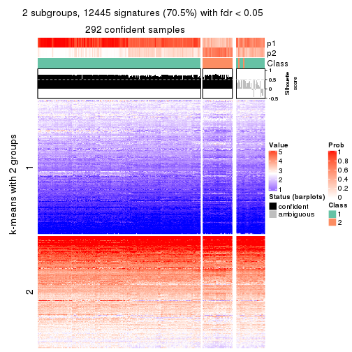</p>

</div>
<div id='tab-CV-hclust-get-signatures-no-scale-2'>
<pre><code class="r">get_signatures(res, k = 3, scale_rows = FALSE)
</code></pre>

<p></p>

</div>
<div id='tab-CV-hclust-get-signatures-no-scale-3'>
<pre><code class="r">get_signatures(res, k = 4, scale_rows = FALSE)
</code></pre>

<p></p>

</div>
<div id='tab-CV-hclust-get-signatures-no-scale-4'>
<pre><code class="r">get_signatures(res, k = 5, scale_rows = FALSE)
</code></pre>

<p></p>

</div>
<div id='tab-CV-hclust-get-signatures-no-scale-5'>
<pre><code class="r">get_signatures(res, k = 6, scale_rows = FALSE)
</code></pre>

<p></p>

</div>
</div>


Compare the overlap of signatures from different k:

```r
compare_signatures(res)
```


`get_signature()` returns a data frame invisibly. TO get the list of signatures, the function
call should be assigned to a variable explicitly. In following code, if `plot` argument is set
to `FALSE`, no heatmap is plotted while only the differential analysis is performed.

```r
# code only for demonstration
tb = get_signature(res, k = ..., plot = FALSE)
```

An example of the output of `tb` is:

```
#>   which_row         fdr    mean_1    mean_2 scaled_mean_1 scaled_mean_2 km
#> 1        38 0.042760348  8.373488  9.131774    -0.5533452     0.5164555  1
#> 2        40 0.018707592  7.106213  8.469186    -0.6173731     0.5762149  1
#> 3        55 0.019134737 10.221463 11.207825    -0.6159697     0.5749050  1
#> 4        59 0.006059896  5.921854  7.869574    -0.6899429     0.6439467  1
#> 5        60 0.018055526  8.928898 10.211722    -0.6204761     0.5791110  1
#> 6        98 0.009384629 15.714769 14.887706     0.6635654    -0.6193277  2
...
```

The columns in `tb` are:

1. `which_row`: row indices corresponding to the input matrix.
2. `fdr`: FDR for the differential test. 
3. `mean_x`: The mean value in group x.
4. `scaled_mean_x`: The mean value in group x after rows are scaled.
5. `km`: Row groups if k-means clustering is applied to rows.


UMAP plot which shows how samples are separated.


<script>
$( function() {
	$( '#tabs-CV-hclust-dimension-reduction' ).tabs();
} );
</script>
<div id='tabs-CV-hclust-dimension-reduction'>
<ul>
<li><a href='#tab-CV-hclust-dimension-reduction-1'>k = 2</a></li>
<li><a href='#tab-CV-hclust-dimension-reduction-2'>k = 3</a></li>
<li><a href='#tab-CV-hclust-dimension-reduction-3'>k = 4</a></li>
<li><a href='#tab-CV-hclust-dimension-reduction-4'>k = 5</a></li>
<li><a href='#tab-CV-hclust-dimension-reduction-5'>k = 6</a></li>
</ul>
<div id='tab-CV-hclust-dimension-reduction-1'>
<pre><code class="r">dimension_reduction(res, k = 2, method = &quot;UMAP&quot;)
</code></pre>

<p></p>

</div>
<div id='tab-CV-hclust-dimension-reduction-2'>
<pre><code class="r">dimension_reduction(res, k = 3, method = &quot;UMAP&quot;)
</code></pre>

<p></p>

</div>
<div id='tab-CV-hclust-dimension-reduction-3'>
<pre><code class="r">dimension_reduction(res, k = 4, method = &quot;UMAP&quot;)
</code></pre>

<p></p>

</div>
<div id='tab-CV-hclust-dimension-reduction-4'>
<pre><code class="r">dimension_reduction(res, k = 5, method = &quot;UMAP&quot;)
</code></pre>

<p></p>

</div>
<div id='tab-CV-hclust-dimension-reduction-5'>
<pre><code class="r">dimension_reduction(res, k = 6, method = &quot;UMAP&quot;)
</code></pre>

<p>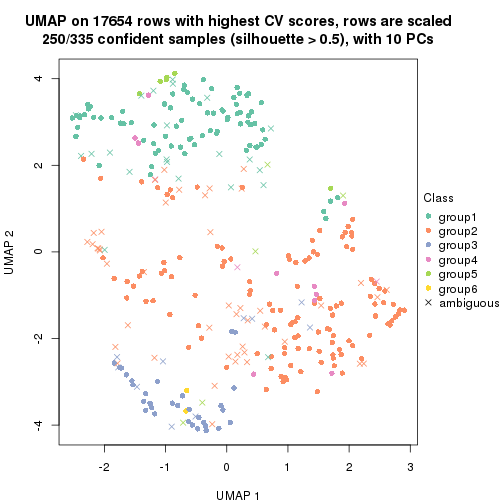</p>

</div>
</div>


Following heatmap shows how subgroups are split when increasing `k`:

```r
collect_classes(res)
```


If matrix rows can be associated to genes, consider to use `GO_Enrichment(res,
...)` to perform function enrichment for the signature genes.


 

---------------------------------------------------


### CV:kmeans**


The object with results only for a single top-value method and a single partition method 
can be extracted as:

```r
res = res_list["CV", "kmeans"]
# you can also extract it by
# res = res_list["CV:kmeans"]
```

A summary of `res` and all the functions that can be applied to it:

```r
res
```

```
#> A 'ConsensusPartition' object with k = 2, 3, 4, 5, 6.
#>   On a matrix with 17654 rows and 335 columns.
#>   Top rows (1000, 2000, 3000, 4000, 5000) are extracted by 'CV' method.
#>   Subgroups are detected by 'kmeans' method.
#>   Performed in total 1250 partitions by row resampling.
#>   Best k for subgroups seems to be 2.
#> 
#> Following methods can be applied to this 'ConsensusPartition' object:
#>  [1] "cola_report"             "collect_classes"         "collect_plots"          
#>  [4] "collect_stats"           "colnames"                "compare_signatures"     
#>  [7] "consensus_heatmap"       "dimension_reduction"     "functional_enrichment"  
#> [10] "get_anno_col"            "get_anno"                "get_classes"            
#> [13] "get_consensus"           "get_matrix"              "get_membership"         
#> [16] "get_param"               "get_signatures"          "get_stats"              
#> [19] "is_best_k"               "is_stable_k"             "membership_heatmap"     
#> [22] "ncol"                    "nrow"                    "plot_ecdf"              
#> [25] "rownames"                "select_partition_number" "show"                   
#> [28] "suggest_best_k"          "test_to_known_factors"
```

`collect_plots()` function collects all the plots made from `res` for all `k` (number of partitions)
into one single page to provide an easy and fast comparison between different `k`.

```r
collect_plots(res)
```


The plots are:

- The first row: a plot of the ECDF (Empirical cumulative distribution
  function) curves of the consensus matrix for each `k` and the heatmap of
  predicted classes for each `k`.
- The second row: heatmaps of the consensus matrix for each `k`.
- The third row: heatmaps of the membership matrix for each `k`.
- The fouth row: heatmaps of the signatures for each `k`.

All the plots in panels can be made by individual functions and they are
plotted later in this section.

`select_partition_number()` produces several plots showing different
statistics for choosing "optimized" `k`. There are following statistics:

- ECDF curves of the consensus matrix for each `k`;
- 1-PAC. [The PAC
  score](https://en.wikipedia.org/wiki/Consensus_clustering#Over-interpretation_potential_of_consensus_clustering)
  measures the proportion of the ambiguous subgrouping.
- Mean silhouette score.
- Concordance. The mean probability of fiting the consensus class ids in all
  partitions.
- Area increased. Denote $A_k$ as the area under the ECDF curve for current
  `k`, the area increased is defined as $A_k - A_{k-1}$.
- Rand index. The percent of pairs of samples that are both in a same cluster
  or both are not in a same cluster in the partition of k and k-1.
- Jaccard index. The ratio of pairs of samples are both in a same cluster in
  the partition of k and k-1 and the pairs of samples are both in a same
  cluster in the partition k or k-1.

The detailed explanations of these statistics can be found in [the cola
vignette](http://bioconductor.org/packages/devel/bioc/vignettes/cola/inst/doc/cola.html#toc_13).

Generally speaking, lower PAC score, higher mean silhouette score or higher
concordance corresponds to better partition. Rand index and Jaccard index
measure how similar the current partition is compared to partition with `k-1`.
If they are too similar, we won't accept `k` is better than `k-1`.

```r
select_partition_number(res)
```


The numeric values for all these statistics can be obtained by `get_stats()`.

```r
get_stats(res)
```

```
#>   k 1-PAC mean_silhouette concordance area_increased  Rand Jaccard
#> 2 2 0.954           0.940       0.970         0.4770 0.520   0.520
#> 3 3 0.807           0.874       0.932         0.3111 0.821   0.666
#> 4 4 0.719           0.776       0.871         0.1058 0.949   0.867
#> 5 5 0.673           0.645       0.808         0.0795 0.921   0.769
#> 6 6 0.669           0.579       0.770         0.0540 0.925   0.737
```

`suggest_best_k()` suggests the best $k$ based on these statistics. The rules are as follows:

- All $k$ with Jaccard index larger than 0.95 are removed because the increase of
  the partition number does not provides enough extra information. If all $k$ are removed,
  the best $k$ is assigned by `NA`.
- For $k$ with 1-PAC larger than 0.9, the maximal $k$ is taken as the "best k". Other $k$ is called "optional k".
- If it does not fit the second rule. The $k$ with the highest vote of highest
  1-PAC, mean silhouette and concordance is taken as the "best k".

```r
suggest_best_k(res)
```

```
#> [1] 2
```


Following shows the table of the partitions (You need to click the **show/hide
code output** link to see it). The membership matrix (columns with name `p*`)
is inferred by
[`clue::cl_consensus()`](https://www.rdocumentation.org/link/cl_consensus?package=clue)
function with the `SE` method. Basically the value in the membership matrix
represents the probability to belong to a certain group. The finall class
label for an item is determined with the group with highest probability it
belongs to.

In `get_classes()` function, the entropy is calculated from the membership
matrix and the silhouette score is calculated from the consensus matrix.


<script>
$( function() {
	$( '#tabs-CV-kmeans-get-classes' ).tabs();
} );
</script>
<div id='tabs-CV-kmeans-get-classes'>
<ul>
<li><a href='#tab-CV-kmeans-get-classes-1'>k = 2</a></li>
<li><a href='#tab-CV-kmeans-get-classes-2'>k = 3</a></li>
<li><a href='#tab-CV-kmeans-get-classes-3'>k = 4</a></li>
<li><a href='#tab-CV-kmeans-get-classes-4'>k = 5</a></li>
<li><a href='#tab-CV-kmeans-get-classes-5'>k = 6</a></li>
</ul>

<div id='tab-CV-kmeans-get-classes-1'>
<p><a id='tab-CV-kmeans-get-classes-1-a' style='color:#0366d6' href='#'>show/hide code output</a></p>
<pre><code class="r">cbind(get_classes(res, k = 2), get_membership(res, k = 2))
</code></pre>

<pre><code>#&gt;            class entropy silhouette    p1    p2
#&gt; SRR660306      2  0.1184      0.966 0.016 0.984
#&gt; SRR1359328     2  0.0000      0.976 0.000 1.000
#&gt; SRR821124      2  0.0000      0.976 0.000 1.000
#&gt; SRR1335188     1  0.1184      0.971 0.984 0.016
#&gt; SRR1075825     2  0.0000      0.976 0.000 1.000
#&gt; SRR1321921     1  0.1184      0.971 0.984 0.016
#&gt; SRR1466198     2  0.0000      0.976 0.000 1.000
#&gt; SRR1384073     1  0.8207      0.673 0.744 0.256
#&gt; SRR1312802     1  0.1184      0.971 0.984 0.016
#&gt; SRR1076559     1  0.4298      0.902 0.912 0.088
#&gt; SRR1370085     1  0.1184      0.971 0.984 0.016
#&gt; SRR1460363     1  0.1184      0.971 0.984 0.016
#&gt; SRR1480221     2  0.0000      0.976 0.000 1.000
#&gt; SRR1476165     1  0.1184      0.971 0.984 0.016
#&gt; SRR1459631     2  0.0000      0.976 0.000 1.000
#&gt; SRR1448098     2  0.0000      0.976 0.000 1.000
#&gt; SRR1321401     2  0.0000      0.976 0.000 1.000
#&gt; SRR807613      2  0.0000      0.976 0.000 1.000
#&gt; SRR808086      2  0.0000      0.976 0.000 1.000
#&gt; SRR613687      2  0.1184      0.966 0.016 0.984
#&gt; SRR1471011     2  0.9044      0.521 0.320 0.680
#&gt; SRR1330284     2  0.0000      0.976 0.000 1.000
#&gt; SRR1320624     2  0.0000      0.976 0.000 1.000
#&gt; SRR1459519     1  0.1184      0.971 0.984 0.016
#&gt; SRR1091184     2  0.0000      0.976 0.000 1.000
#&gt; SRR1390561     1  0.1184      0.971 0.984 0.016
#&gt; SRR658164      1  0.0000      0.957 1.000 0.000
#&gt; SRR1087079     2  0.0000      0.976 0.000 1.000
#&gt; SRR814996      2  0.0000      0.976 0.000 1.000
#&gt; SRR1407410     2  0.0000      0.976 0.000 1.000
#&gt; SRR1453392     2  0.0000      0.976 0.000 1.000
#&gt; SRR1445873     1  0.1184      0.971 0.984 0.016
#&gt; SRR1419985     2  0.0000      0.976 0.000 1.000
#&gt; SRR820938      2  0.0000      0.976 0.000 1.000
#&gt; SRR1476844     1  0.1184      0.971 0.984 0.016
#&gt; SRR1403526     1  0.1184      0.971 0.984 0.016
#&gt; SRR1413916     2  0.0000      0.976 0.000 1.000
#&gt; SRR1441051     2  0.0000      0.976 0.000 1.000
#&gt; SRR614287      2  0.0000      0.976 0.000 1.000
#&gt; SRR1092062     2  0.0000      0.976 0.000 1.000
#&gt; SRR612611      2  0.0000      0.976 0.000 1.000
#&gt; SRR1376356     2  0.0000      0.976 0.000 1.000
#&gt; SRR1405078     2  0.7453      0.746 0.212 0.788
#&gt; SRR1437226     2  0.0000      0.976 0.000 1.000
#&gt; SRR1326078     1  0.1184      0.971 0.984 0.016
#&gt; SRR1096806     2  0.0000      0.976 0.000 1.000
#&gt; SRR1440919     2  0.0000      0.976 0.000 1.000
#&gt; SRR1452824     1  0.9922      0.222 0.552 0.448
#&gt; SRR615754      1  0.0000      0.957 1.000 0.000
#&gt; SRR1341787     2  0.0000      0.976 0.000 1.000
#&gt; SRR614551      2  0.0376      0.974 0.004 0.996
#&gt; SRR1380829     2  0.1184      0.966 0.016 0.984
#&gt; SRR1455761     1  0.1184      0.971 0.984 0.016
#&gt; SRR1465189     1  0.1184      0.971 0.984 0.016
#&gt; SRR1376895     1  0.1184      0.971 0.984 0.016
#&gt; SRR1445002     1  0.1184      0.971 0.984 0.016
#&gt; SRR1469258     2  0.0000      0.976 0.000 1.000
#&gt; SRR1409239     1  0.1184      0.971 0.984 0.016
#&gt; SRR1480200     1  0.1184      0.971 0.984 0.016
#&gt; SRR1418323     1  0.1184      0.971 0.984 0.016
#&gt; SRR657540      2  0.1184      0.966 0.016 0.984
#&gt; SRR821096      2  0.0000      0.976 0.000 1.000
#&gt; SRR613591      2  0.1184      0.966 0.016 0.984
#&gt; SRR1344205     2  0.0000      0.976 0.000 1.000
#&gt; SRR612479      1  0.1184      0.971 0.984 0.016
#&gt; SRR1399950     1  0.1184      0.971 0.984 0.016
#&gt; SRR1336048     1  0.8909      0.578 0.692 0.308
#&gt; SRR1368896     1  0.1184      0.971 0.984 0.016
#&gt; SRR1379403     2  0.0000      0.976 0.000 1.000
#&gt; SRR1312464     1  0.1184      0.971 0.984 0.016
#&gt; SRR1096478     1  0.1184      0.971 0.984 0.016
#&gt; SRR1459845     1  0.1184      0.971 0.984 0.016
#&gt; SRR1348138     2  0.9881      0.202 0.436 0.564
#&gt; SRR811423      1  0.1184      0.971 0.984 0.016
#&gt; SRR615683      1  0.0000      0.957 1.000 0.000
#&gt; SRR1380336     2  0.0000      0.976 0.000 1.000
#&gt; SRR817609      1  0.1184      0.971 0.984 0.016
#&gt; SRR1074550     2  0.0000      0.976 0.000 1.000
#&gt; SRR1499236     2  0.0000      0.976 0.000 1.000
#&gt; SRR656083      1  0.1184      0.971 0.984 0.016
#&gt; SRR817539      1  0.1184      0.971 0.984 0.016
#&gt; SRR1410801     1  0.1184      0.971 0.984 0.016
#&gt; SRR1347190     1  0.1184      0.971 0.984 0.016
#&gt; SRR1355126     2  0.0000      0.976 0.000 1.000
#&gt; SRR615165      2  0.1184      0.966 0.016 0.984
#&gt; SRR1466046     1  0.1184      0.971 0.984 0.016
#&gt; SRR1097055     2  0.0000      0.976 0.000 1.000
#&gt; SRR1312370     2  0.0000      0.976 0.000 1.000
#&gt; SRR655325      1  0.1184      0.971 0.984 0.016
#&gt; SRR810177      2  0.0000      0.976 0.000 1.000
#&gt; SRR815685      2  0.0000      0.976 0.000 1.000
#&gt; SRR817026      2  0.0000      0.976 0.000 1.000
#&gt; SRR1417224     2  0.0000      0.976 0.000 1.000
#&gt; SRR661687      2  0.0000      0.976 0.000 1.000
#&gt; SRR1431804     1  0.1414      0.967 0.980 0.020
#&gt; SRR664072      2  0.1184      0.966 0.016 0.984
#&gt; SRR612923      2  0.0000      0.976 0.000 1.000
#&gt; SRR1315890     1  0.1184      0.971 0.984 0.016
#&gt; SRR1347726     1  0.1184      0.971 0.984 0.016
#&gt; SRR1500360     1  0.9552      0.430 0.624 0.376
#&gt; SRR1468360     2  0.0000      0.976 0.000 1.000
#&gt; SRR1404084     2  0.0672      0.970 0.008 0.992
#&gt; SRR615994      2  0.1184      0.966 0.016 0.984
#&gt; SRR1475718     2  0.0000      0.976 0.000 1.000
#&gt; SRR1397200     2  0.0000      0.976 0.000 1.000
#&gt; SRR655519      2  0.1184      0.966 0.016 0.984
#&gt; SRR1311308     2  0.0000      0.976 0.000 1.000
#&gt; SRR1368006     2  0.0000      0.976 0.000 1.000
#&gt; SRR613651      1  0.0000      0.957 1.000 0.000
#&gt; SRR1362621     2  0.0000      0.976 0.000 1.000
#&gt; SRR1451718     1  0.9491      0.452 0.632 0.368
#&gt; SRR1095334     2  0.0000      0.976 0.000 1.000
#&gt; SRR1079636     2  0.0000      0.976 0.000 1.000
#&gt; SRR1442549     2  0.9710      0.311 0.400 0.600
#&gt; SRR1466421     2  0.0000      0.976 0.000 1.000
#&gt; SRR817397      2  0.0000      0.976 0.000 1.000
#&gt; SRR1341809     2  0.0000      0.976 0.000 1.000
#&gt; SRR614623      2  0.0376      0.974 0.004 0.996
#&gt; SRR1335005     2  0.0000      0.976 0.000 1.000
#&gt; SRR1407065     2  0.0000      0.976 0.000 1.000
#&gt; SRR1404483     2  0.0000      0.976 0.000 1.000
#&gt; SRR1096222     1  0.1184      0.971 0.984 0.016
#&gt; SRR1401793     1  0.1184      0.971 0.984 0.016
#&gt; SRR1408615     2  0.0000      0.976 0.000 1.000
#&gt; SRR1070597     2  0.9044      0.522 0.320 0.680
#&gt; SRR1332381     1  0.1184      0.971 0.984 0.016
#&gt; SRR1457015     1  0.1184      0.971 0.984 0.016
#&gt; SRR1386797     2  0.0000      0.976 0.000 1.000
#&gt; SRR1098385     2  0.0000      0.976 0.000 1.000
#&gt; SRR1363947     2  0.0000      0.976 0.000 1.000
#&gt; SRR820350      2  0.0000      0.976 0.000 1.000
#&gt; SRR662055      2  0.1184      0.966 0.016 0.984
#&gt; SRR1310455     1  0.1184      0.971 0.984 0.016
#&gt; SRR1453639     2  0.0000      0.976 0.000 1.000
#&gt; SRR662617      2  0.0000      0.976 0.000 1.000
#&gt; SRR654778      1  0.1414      0.967 0.980 0.020
#&gt; SRR661782      2  0.0000      0.976 0.000 1.000
#&gt; SRR1334396     1  0.1184      0.971 0.984 0.016
#&gt; SRR613867      2  0.1184      0.966 0.016 0.984
#&gt; SRR1479412     1  0.1184      0.971 0.984 0.016
#&gt; SRR1331620     1  0.1184      0.971 0.984 0.016
#&gt; SRR1082809     1  0.9552      0.427 0.624 0.376
#&gt; SRR1417178     1  0.1184      0.971 0.984 0.016
#&gt; SRR1335278     1  0.1184      0.971 0.984 0.016
#&gt; SRR665369      2  0.0000      0.976 0.000 1.000
#&gt; SRR657552      1  0.1184      0.971 0.984 0.016
#&gt; SRR812412      1  0.1184      0.971 0.984 0.016
#&gt; SRR1096500     2  0.0000      0.976 0.000 1.000
#&gt; SRR1347750     2  0.0000      0.976 0.000 1.000
#&gt; SRR615153      1  0.8861      0.560 0.696 0.304
#&gt; SRR1434417     1  0.1184      0.971 0.984 0.016
#&gt; SRR1070159     2  0.0000      0.976 0.000 1.000
#&gt; SRR1332508     2  0.0000      0.976 0.000 1.000
#&gt; SRR1082059     2  0.0000      0.976 0.000 1.000
#&gt; SRR1402491     1  0.1184      0.971 0.984 0.016
#&gt; SRR1476595     2  0.7376      0.724 0.208 0.792
#&gt; SRR1320987     2  0.0000      0.976 0.000 1.000
#&gt; SRR1086417     2  0.0000      0.976 0.000 1.000
#&gt; SRR1454095     1  0.1633      0.964 0.976 0.024
#&gt; SRR614791      2  0.1184      0.966 0.016 0.984
#&gt; SRR821255      2  0.0000      0.976 0.000 1.000
#&gt; SRR820402      2  0.0000      0.976 0.000 1.000
#&gt; SRR1337284     1  0.9833      0.296 0.576 0.424
#&gt; SRR1333083     2  0.6887      0.765 0.184 0.816
#&gt; SRR1384883     2  0.0000      0.976 0.000 1.000
#&gt; SRR614431      1  0.1184      0.971 0.984 0.016
#&gt; SRR1481106     2  0.0000      0.976 0.000 1.000
#&gt; SRR1370285     1  0.1184      0.971 0.984 0.016
#&gt; SRR1446673     2  0.0000      0.976 0.000 1.000
#&gt; SRR1318046     2  0.0000      0.976 0.000 1.000
#&gt; SRR1341188     2  0.0000      0.976 0.000 1.000
#&gt; SRR1384941     1  0.1184      0.971 0.984 0.016
#&gt; SRR1322864     2  0.0000      0.976 0.000 1.000
#&gt; SRR1476825     1  0.1184      0.971 0.984 0.016
#&gt; SRR1443332     2  0.0000      0.976 0.000 1.000
#&gt; SRR662486      2  0.1184      0.966 0.016 0.984
#&gt; SRR1447019     1  0.1184      0.971 0.984 0.016
#&gt; SRR662942      1  0.1184      0.971 0.984 0.016
#&gt; SRR613102      2  0.1184      0.966 0.016 0.984
#&gt; SRR1469880     1  0.1184      0.971 0.984 0.016
#&gt; SRR1464977     1  0.1184      0.971 0.984 0.016
#&gt; SRR615850      2  0.9580      0.412 0.380 0.620
#&gt; SRR661949      2  0.0000      0.976 0.000 1.000
#&gt; SRR1322227     2  0.0000      0.976 0.000 1.000
#&gt; SRR1441655     2  0.0000      0.976 0.000 1.000
#&gt; SRR613771      2  0.0000      0.976 0.000 1.000
#&gt; SRR1479471     1  0.1184      0.971 0.984 0.016
#&gt; SRR1488918     2  0.0000      0.976 0.000 1.000
#&gt; SRR1414040     2  0.0000      0.976 0.000 1.000
#&gt; SRR1079850     2  0.0000      0.976 0.000 1.000
#&gt; SRR663209      1  0.1184      0.971 0.984 0.016
#&gt; SRR1364914     2  0.0000      0.976 0.000 1.000
#&gt; SRR1408267     2  0.0000      0.976 0.000 1.000
#&gt; SRR1314894     1  0.1184      0.971 0.984 0.016
#&gt; SRR1414117     2  0.0000      0.976 0.000 1.000
#&gt; SRR1395975     2  0.0000      0.976 0.000 1.000
#&gt; SRR1402219     2  0.0000      0.976 0.000 1.000
#&gt; SRR1433623     1  0.1184      0.971 0.984 0.016
#&gt; SRR656385      2  0.1184      0.966 0.016 0.984
#&gt; SRR811213      2  0.0000      0.976 0.000 1.000
#&gt; SRR663657      2  0.1184      0.966 0.016 0.984
#&gt; SRR612203      1  0.0000      0.957 1.000 0.000
#&gt; SRR613987      2  0.0376      0.974 0.004 0.996
#&gt; SRR613831      2  0.0672      0.971 0.008 0.992
#&gt; SRR1354180     2  0.0000      0.976 0.000 1.000
#&gt; SRR1382912     1  0.1184      0.971 0.984 0.016
#&gt; SRR1475501     1  0.1184      0.971 0.984 0.016
#&gt; SRR1336930     1  0.1184      0.971 0.984 0.016
#&gt; SRR613030      2  0.1184      0.966 0.016 0.984
#&gt; SRR1381459     2  0.0000      0.976 0.000 1.000
#&gt; SRR1402350     2  0.0000      0.976 0.000 1.000
#&gt; SRR1419408     1  0.1184      0.971 0.984 0.016
#&gt; SRR655911      2  0.1184      0.966 0.016 0.984
#&gt; SRR1418243     1  0.1184      0.971 0.984 0.016
#&gt; SRR1322573     2  0.6887      0.767 0.184 0.816
#&gt; SRR613615      2  0.1184      0.966 0.016 0.984
#&gt; SRR1355284     1  0.1184      0.971 0.984 0.016
#&gt; SRR1319395     1  0.1184      0.971 0.984 0.016
#&gt; SRR818939      1  0.1184      0.971 0.984 0.016
#&gt; SRR1465266     1  0.1184      0.971 0.984 0.016
#&gt; SRR614888      1  0.4161      0.887 0.916 0.084
#&gt; SRR1431694     1  0.1184      0.971 0.984 0.016
#&gt; SRR614347      2  0.1184      0.966 0.016 0.984
#&gt; SRR1334228     2  0.0000      0.976 0.000 1.000
#&gt; SRR1096007     2  0.0000      0.976 0.000 1.000
#&gt; SRR656349      1  0.1184      0.971 0.984 0.016
#&gt; SRR815422      2  0.0000      0.976 0.000 1.000
#&gt; SRR1360828     1  0.1184      0.971 0.984 0.016
#&gt; SRR1359005     2  0.0000      0.976 0.000 1.000
#&gt; SRR1456652     1  0.1184      0.971 0.984 0.016
#&gt; SRR1391660     1  0.1184      0.971 0.984 0.016
#&gt; SRR1441956     1  0.1184      0.971 0.984 0.016
#&gt; SRR662930      2  0.1184      0.966 0.016 0.984
#&gt; SRR615790      2  0.1184      0.966 0.016 0.984
#&gt; SRR614827      2  0.0376      0.974 0.004 0.996
#&gt; SRR614587      2  0.0376      0.974 0.004 0.996
#&gt; SRR814052      2  0.0000      0.976 0.000 1.000
#&gt; SRR1070086     1  0.1184      0.971 0.984 0.016
#&gt; SRR1481440     1  0.1184      0.971 0.984 0.016
#&gt; SRR1339296     2  0.0000      0.976 0.000 1.000
#&gt; SRR1343239     2  0.0000      0.976 0.000 1.000
#&gt; SRR1432802     2  0.0000      0.976 0.000 1.000
#&gt; SRR1416911     1  0.1184      0.971 0.984 0.016
#&gt; SRR1410427     1  0.1184      0.971 0.984 0.016
#&gt; SRR1401185     2  0.0938      0.967 0.012 0.988
#&gt; SRR654993      2  0.0376      0.974 0.004 0.996
#&gt; SRR656397      1  0.1184      0.971 0.984 0.016
#&gt; SRR809643      2  0.1843      0.952 0.028 0.972
#&gt; SRR1433819     1  0.1184      0.971 0.984 0.016
#&gt; SRR1375225     2  0.0000      0.976 0.000 1.000
#&gt; SRR1367739     2  0.9286      0.464 0.344 0.656
#&gt; SRR1323336     2  0.0000      0.976 0.000 1.000
#&gt; SRR663224      2  0.1184      0.966 0.016 0.984
#&gt; SRR1442840     1  0.1184      0.971 0.984 0.016
#&gt; SRR1374058     1  0.1184      0.971 0.984 0.016
#&gt; SRR656994      1  0.1184      0.971 0.984 0.016
#&gt; SRR1469214     2  0.0000      0.976 0.000 1.000
#&gt; SRR1456446     1  0.1184      0.971 0.984 0.016
#&gt; SRR1471879     2  0.0000      0.976 0.000 1.000
#&gt; SRR612911      2  0.1184      0.966 0.016 0.984
#&gt; SRR1395720     2  0.0000      0.976 0.000 1.000
#&gt; SRR1413055     1  0.1184      0.971 0.984 0.016
#&gt; SRR656770      2  0.0000      0.976 0.000 1.000
#&gt; SRR812080      2  0.0000      0.976 0.000 1.000
#&gt; SRR1479328     1  0.1184      0.971 0.984 0.016
#&gt; SRR661421      2  0.0672      0.971 0.008 0.992
#&gt; SRR1410286     2  0.0000      0.976 0.000 1.000
#&gt; SRR1487150     1  0.1184      0.971 0.984 0.016
#&gt; SRR1467035     1  0.1184      0.971 0.984 0.016
#&gt; SRR1360607     2  0.0000      0.976 0.000 1.000
#&gt; SRR1333106     2  0.0000      0.976 0.000 1.000
#&gt; SRR1088706     2  0.0000      0.976 0.000 1.000
#&gt; SRR1320053     2  0.0000      0.976 0.000 1.000
#&gt; SRR1350392     2  0.0000      0.976 0.000 1.000
#&gt; SRR1385190     1  0.7815      0.712 0.768 0.232
#&gt; SRR1080093     2  0.0000      0.976 0.000 1.000
#&gt; SRR1318753     1  0.1184      0.971 0.984 0.016
#&gt; SRR1345369     2  0.0000      0.976 0.000 1.000
#&gt; SRR612178      2  0.0672      0.971 0.008 0.992
#&gt; SRR1354423     1  0.1184      0.971 0.984 0.016
#&gt; SRR1072724     1  0.1184      0.971 0.984 0.016
#&gt; SRR1418450     2  0.0000      0.976 0.000 1.000
#&gt; SRR1326427     2  0.0000      0.976 0.000 1.000
#&gt; SRR1437412     2  0.0000      0.976 0.000 1.000
#&gt; SRR1327548     2  0.0000      0.976 0.000 1.000
#&gt; SRR1395891     1  0.1184      0.971 0.984 0.016
#&gt; SRR659367      1  0.9933      0.170 0.548 0.452
#&gt; SRR818961      1  0.1184      0.971 0.984 0.016
#&gt; SRR813704      1  0.1184      0.971 0.984 0.016
#&gt; SRR613054      1  0.0000      0.957 1.000 0.000
#&gt; SRR1476467     1  0.1184      0.971 0.984 0.016
#&gt; SRR1407988     2  0.0000      0.976 0.000 1.000
#&gt; SRR1394776     2  0.0000      0.976 0.000 1.000
#&gt; SRR655578      2  0.0000      0.976 0.000 1.000
#&gt; SRR1310645     2  0.0000      0.976 0.000 1.000
#&gt; SRR1345628     1  0.1184      0.971 0.984 0.016
#&gt; SRR1479740     1  0.1184      0.971 0.984 0.016
#&gt; SRR1332095     2  0.2948      0.928 0.052 0.948
#&gt; SRR1444786     2  0.0000      0.976 0.000 1.000
#&gt; SRR1090070     1  0.1184      0.971 0.984 0.016
#&gt; SRR662414      2  0.0000      0.976 0.000 1.000
#&gt; SRR661216      2  0.0000      0.976 0.000 1.000
#&gt; SRR656313      2  0.1184      0.966 0.016 0.984
#&gt; SRR615671      2  0.1184      0.966 0.016 0.984
#&gt; SRR1350196     2  0.0000      0.976 0.000 1.000
#&gt; SRR1466580     1  0.1184      0.971 0.984 0.016
#&gt; SRR1408032     2  0.0000      0.976 0.000 1.000
#&gt; SRR1432913     2  0.1184      0.966 0.016 0.984
#&gt; SRR1360502     2  0.8861      0.555 0.304 0.696
#&gt; SRR1391901     2  0.0376      0.974 0.004 0.996
#&gt; SRR1311131     1  0.0938      0.967 0.988 0.012
#&gt; SRR1380636     1  0.1184      0.971 0.984 0.016
#&gt; SRR1332339     1  0.1184      0.971 0.984 0.016
#&gt; SRR1341563     2  0.0000      0.976 0.000 1.000
#&gt; SRR1359410     2  0.0000      0.976 0.000 1.000
#&gt; SRR1473040     2  0.0000      0.976 0.000 1.000
#&gt; SRR1321444     1  0.1184      0.971 0.984 0.016
#&gt; SRR1498765     2  0.0000      0.976 0.000 1.000
#&gt; SRR1312622     2  0.0000      0.976 0.000 1.000
#&gt; SRR615503      2  0.9000      0.553 0.316 0.684
#&gt; SRR1453192     1  0.1184      0.971 0.984 0.016
#&gt; SRR1433107     2  0.0000      0.976 0.000 1.000
#&gt; SRR1075384     1  0.1184      0.971 0.984 0.016
#&gt; SRR1356683     1  0.1184      0.971 0.984 0.016
#&gt; SRR659049      1  0.1184      0.971 0.984 0.016
#&gt; SRR1368240     1  0.1184      0.971 0.984 0.016
#&gt; SRR1341739     1  0.1184      0.971 0.984 0.016
#&gt; SRR613249      2  0.6438      0.814 0.164 0.836
#&gt; SRR663428      2  0.0000      0.976 0.000 1.000
#&gt; SRR1341302     2  0.0000      0.976 0.000 1.000
#&gt; SRR1073553     2  0.0000      0.976 0.000 1.000
#&gt; SRR1354093     2  0.0000      0.976 0.000 1.000
#&gt; SRR1406521     2  0.0000      0.976 0.000 1.000
#&gt; SRR1432049     1  0.1184      0.971 0.984 0.016
#&gt; SRR1453504     2  0.6973      0.759 0.188 0.812
</code></pre>

<script>
$('#tab-CV-kmeans-get-classes-1-a').parent().next().next().hide();
$('#tab-CV-kmeans-get-classes-1-a').click(function(){
  $('#tab-CV-kmeans-get-classes-1-a').parent().next().next().toggle();
  return(false);
});
</script>
</div>

<div id='tab-CV-kmeans-get-classes-2'>
<p><a id='tab-CV-kmeans-get-classes-2-a' style='color:#0366d6' href='#'>show/hide code output</a></p>
<pre><code class="r">cbind(get_classes(res, k = 3), get_membership(res, k = 3))
</code></pre>

<pre><code>#&gt;            class entropy silhouette    p1    p2    p3
#&gt; SRR660306      2  0.5291     0.6235 0.000 0.732 0.268
#&gt; SRR1359328     3  0.4062     0.8766 0.000 0.164 0.836
#&gt; SRR821124      2  0.0000     0.9478 0.000 1.000 0.000
#&gt; SRR1335188     1  0.3155     0.9038 0.916 0.040 0.044
#&gt; SRR1075825     2  0.0000     0.9478 0.000 1.000 0.000
#&gt; SRR1321921     1  0.0000     0.9459 1.000 0.000 0.000
#&gt; SRR1466198     3  0.4062     0.8766 0.000 0.164 0.836
#&gt; SRR1384073     2  0.3267     0.8715 0.044 0.912 0.044
#&gt; SRR1312802     1  0.1964     0.9291 0.944 0.000 0.056
#&gt; SRR1076559     1  0.7262     0.4445 0.624 0.332 0.044
#&gt; SRR1370085     1  0.0000     0.9459 1.000 0.000 0.000
#&gt; SRR1460363     1  0.0000     0.9459 1.000 0.000 0.000
#&gt; SRR1480221     2  0.0000     0.9478 0.000 1.000 0.000
#&gt; SRR1476165     1  0.1289     0.9422 0.968 0.000 0.032
#&gt; SRR1459631     2  0.4399     0.7243 0.000 0.812 0.188
#&gt; SRR1448098     2  0.0000     0.9478 0.000 1.000 0.000
#&gt; SRR1321401     2  0.0000     0.9478 0.000 1.000 0.000
#&gt; SRR807613      2  0.0000     0.9478 0.000 1.000 0.000
#&gt; SRR808086      3  0.4002     0.8770 0.000 0.160 0.840
#&gt; SRR613687      2  0.3340     0.8354 0.000 0.880 0.120
#&gt; SRR1471011     3  0.4737     0.8382 0.064 0.084 0.852
#&gt; SRR1330284     2  0.0000     0.9478 0.000 1.000 0.000
#&gt; SRR1320624     2  0.0000     0.9478 0.000 1.000 0.000
#&gt; SRR1459519     1  0.0000     0.9459 1.000 0.000 0.000
#&gt; SRR1091184     2  0.5785     0.4025 0.000 0.668 0.332
#&gt; SRR1390561     1  0.0000     0.9459 1.000 0.000 0.000
#&gt; SRR658164      1  0.0892     0.9440 0.980 0.000 0.020
#&gt; SRR1087079     2  0.0000     0.9478 0.000 1.000 0.000
#&gt; SRR814996      3  0.3941     0.8770 0.000 0.156 0.844
#&gt; SRR1407410     2  0.0000     0.9478 0.000 1.000 0.000
#&gt; SRR1453392     2  0.0000     0.9478 0.000 1.000 0.000
#&gt; SRR1445873     1  0.1289     0.9422 0.968 0.000 0.032
#&gt; SRR1419985     2  0.0000     0.9478 0.000 1.000 0.000
#&gt; SRR820938      3  0.4121     0.8735 0.000 0.168 0.832
#&gt; SRR1476844     1  0.0000     0.9459 1.000 0.000 0.000
#&gt; SRR1403526     1  0.0000     0.9459 1.000 0.000 0.000
#&gt; SRR1413916     2  0.0000     0.9478 0.000 1.000 0.000
#&gt; SRR1441051     2  0.0000     0.9478 0.000 1.000 0.000
#&gt; SRR614287      2  0.0000     0.9478 0.000 1.000 0.000
#&gt; SRR1092062     2  0.0000     0.9478 0.000 1.000 0.000
#&gt; SRR612611      2  0.0000     0.9478 0.000 1.000 0.000
#&gt; SRR1376356     2  0.0000     0.9478 0.000 1.000 0.000
#&gt; SRR1405078     3  0.1031     0.8430 0.000 0.024 0.976
#&gt; SRR1437226     2  0.0000     0.9478 0.000 1.000 0.000
#&gt; SRR1326078     1  0.1643     0.9389 0.956 0.000 0.044
#&gt; SRR1096806     3  0.4178     0.8702 0.000 0.172 0.828
#&gt; SRR1440919     2  0.0237     0.9454 0.000 0.996 0.004
#&gt; SRR1452824     3  0.4316     0.8117 0.088 0.044 0.868
#&gt; SRR615754      1  0.0000     0.9459 1.000 0.000 0.000
#&gt; SRR1341787     2  0.0000     0.9478 0.000 1.000 0.000
#&gt; SRR614551      2  0.0000     0.9478 0.000 1.000 0.000
#&gt; SRR1380829     3  0.1643     0.8555 0.000 0.044 0.956
#&gt; SRR1455761     1  0.1643     0.9389 0.956 0.000 0.044
#&gt; SRR1465189     1  0.1529     0.9205 0.960 0.000 0.040
#&gt; SRR1376895     1  0.1643     0.9389 0.956 0.000 0.044
#&gt; SRR1445002     1  0.0000     0.9459 1.000 0.000 0.000
#&gt; SRR1469258     2  0.0000     0.9478 0.000 1.000 0.000
#&gt; SRR1409239     1  0.0237     0.9455 0.996 0.000 0.004
#&gt; SRR1480200     1  0.0000     0.9459 1.000 0.000 0.000
#&gt; SRR1418323     1  0.1643     0.9389 0.956 0.000 0.044
#&gt; SRR657540      3  0.1643     0.8555 0.000 0.044 0.956
#&gt; SRR821096      2  0.0000     0.9478 0.000 1.000 0.000
#&gt; SRR613591      2  0.3412     0.8318 0.000 0.876 0.124
#&gt; SRR1344205     3  0.4062     0.8766 0.000 0.164 0.836
#&gt; SRR612479      1  0.0000     0.9459 1.000 0.000 0.000
#&gt; SRR1399950     1  0.5291     0.6867 0.732 0.000 0.268
#&gt; SRR1336048     3  0.3769     0.7861 0.104 0.016 0.880
#&gt; SRR1368896     1  0.0747     0.9446 0.984 0.000 0.016
#&gt; SRR1379403     2  0.0000     0.9478 0.000 1.000 0.000
#&gt; SRR1312464     1  0.1411     0.9413 0.964 0.000 0.036
#&gt; SRR1096478     1  0.0000     0.9459 1.000 0.000 0.000
#&gt; SRR1459845     1  0.0000     0.9459 1.000 0.000 0.000
#&gt; SRR1348138     3  0.4930     0.8107 0.120 0.044 0.836
#&gt; SRR811423      1  0.0237     0.9455 0.996 0.000 0.004
#&gt; SRR615683      1  0.0000     0.9459 1.000 0.000 0.000
#&gt; SRR1380336     2  0.0000     0.9478 0.000 1.000 0.000
#&gt; SRR817609      1  0.4555     0.7344 0.800 0.000 0.200
#&gt; SRR1074550     3  0.4062     0.8766 0.000 0.164 0.836
#&gt; SRR1499236     2  0.0000     0.9478 0.000 1.000 0.000
#&gt; SRR656083      1  0.0000     0.9459 1.000 0.000 0.000
#&gt; SRR817539      1  0.1643     0.9389 0.956 0.000 0.044
#&gt; SRR1410801     1  0.0000     0.9459 1.000 0.000 0.000
#&gt; SRR1347190     1  0.1643     0.9389 0.956 0.000 0.044
#&gt; SRR1355126     2  0.0424     0.9431 0.000 0.992 0.008
#&gt; SRR615165      3  0.2448     0.8684 0.000 0.076 0.924
#&gt; SRR1466046     1  0.0000     0.9459 1.000 0.000 0.000
#&gt; SRR1097055     2  0.0000     0.9478 0.000 1.000 0.000
#&gt; SRR1312370     2  0.1529     0.9182 0.000 0.960 0.040
#&gt; SRR655325      1  0.0000     0.9459 1.000 0.000 0.000
#&gt; SRR810177      2  0.0000     0.9478 0.000 1.000 0.000
#&gt; SRR815685      2  0.0000     0.9478 0.000 1.000 0.000
#&gt; SRR817026      3  0.3816     0.8785 0.000 0.148 0.852
#&gt; SRR1417224     2  0.0000     0.9478 0.000 1.000 0.000
#&gt; SRR661687      2  0.4121     0.7572 0.000 0.832 0.168
#&gt; SRR1431804     1  0.3500     0.8431 0.880 0.004 0.116
#&gt; SRR664072      3  0.1643     0.8555 0.000 0.044 0.956
#&gt; SRR612923      2  0.0000     0.9478 0.000 1.000 0.000
#&gt; SRR1315890     1  0.0000     0.9459 1.000 0.000 0.000
#&gt; SRR1347726     1  0.1643     0.9389 0.956 0.000 0.044
#&gt; SRR1500360     2  0.2663     0.8931 0.024 0.932 0.044
#&gt; SRR1468360     2  0.0000     0.9478 0.000 1.000 0.000
#&gt; SRR1404084     2  0.3921     0.8354 0.080 0.884 0.036
#&gt; SRR615994      3  0.1643     0.8555 0.000 0.044 0.956
#&gt; SRR1475718     2  0.0000     0.9478 0.000 1.000 0.000
#&gt; SRR1397200     3  0.4002     0.8770 0.000 0.160 0.840
#&gt; SRR655519      2  0.2711     0.8703 0.000 0.912 0.088
#&gt; SRR1311308     3  0.6307     0.2411 0.000 0.488 0.512
#&gt; SRR1368006     2  0.0000     0.9478 0.000 1.000 0.000
#&gt; SRR613651      1  0.6291     0.2353 0.532 0.000 0.468
#&gt; SRR1362621     2  0.6299    -0.1289 0.000 0.524 0.476
#&gt; SRR1451718     1  0.7674     0.0726 0.484 0.472 0.044
#&gt; SRR1095334     3  0.4062     0.8766 0.000 0.164 0.836
#&gt; SRR1079636     2  0.0000     0.9478 0.000 1.000 0.000
#&gt; SRR1442549     2  0.1878     0.9114 0.004 0.952 0.044
#&gt; SRR1466421     2  0.0000     0.9478 0.000 1.000 0.000
#&gt; SRR817397      2  0.0237     0.9454 0.000 0.996 0.004
#&gt; SRR1341809     2  0.0747     0.9376 0.000 0.984 0.016
#&gt; SRR614623      2  0.0000     0.9478 0.000 1.000 0.000
#&gt; SRR1335005     2  0.0000     0.9478 0.000 1.000 0.000
#&gt; SRR1407065     2  0.0237     0.9454 0.000 0.996 0.004
#&gt; SRR1404483     2  0.0000     0.9478 0.000 1.000 0.000
#&gt; SRR1096222     1  0.0000     0.9459 1.000 0.000 0.000
#&gt; SRR1401793     1  0.1529     0.9400 0.960 0.000 0.040
#&gt; SRR1408615     3  0.3941     0.8770 0.000 0.156 0.844
#&gt; SRR1070597     2  0.2918     0.8844 0.032 0.924 0.044
#&gt; SRR1332381     1  0.1643     0.9389 0.956 0.000 0.044
#&gt; SRR1457015     1  0.0000     0.9459 1.000 0.000 0.000
#&gt; SRR1386797     2  0.1163     0.9284 0.000 0.972 0.028
#&gt; SRR1098385     2  0.0000     0.9478 0.000 1.000 0.000
#&gt; SRR1363947     3  0.4062     0.8766 0.000 0.164 0.836
#&gt; SRR820350      2  0.0000     0.9478 0.000 1.000 0.000
#&gt; SRR662055      3  0.5948     0.4964 0.000 0.360 0.640
#&gt; SRR1310455     1  0.1643     0.9389 0.956 0.000 0.044
#&gt; SRR1453639     2  0.1643     0.9147 0.000 0.956 0.044
#&gt; SRR662617      2  0.0000     0.9478 0.000 1.000 0.000
#&gt; SRR654778      1  0.5852     0.7125 0.776 0.180 0.044
#&gt; SRR661782      2  0.0000     0.9478 0.000 1.000 0.000
#&gt; SRR1334396     1  0.0000     0.9459 1.000 0.000 0.000
#&gt; SRR613867      2  0.3340     0.8354 0.000 0.880 0.120
#&gt; SRR1479412     1  0.1643     0.9389 0.956 0.000 0.044
#&gt; SRR1331620     1  0.1289     0.9422 0.968 0.000 0.032
#&gt; SRR1082809     1  0.7250     0.3139 0.572 0.032 0.396
#&gt; SRR1417178     1  0.0237     0.9455 0.996 0.000 0.004
#&gt; SRR1335278     1  0.0000     0.9459 1.000 0.000 0.000
#&gt; SRR665369      2  0.0000     0.9478 0.000 1.000 0.000
#&gt; SRR657552      1  0.4002     0.7981 0.840 0.000 0.160
#&gt; SRR812412      1  0.1289     0.9422 0.968 0.000 0.032
#&gt; SRR1096500     2  0.0000     0.9478 0.000 1.000 0.000
#&gt; SRR1347750     2  0.0592     0.9404 0.000 0.988 0.012
#&gt; SRR615153      3  0.7049    -0.0141 0.452 0.020 0.528
#&gt; SRR1434417     1  0.0000     0.9459 1.000 0.000 0.000
#&gt; SRR1070159     3  0.4062     0.8766 0.000 0.164 0.836
#&gt; SRR1332508     2  0.0000     0.9478 0.000 1.000 0.000
#&gt; SRR1082059     2  0.0000     0.9478 0.000 1.000 0.000
#&gt; SRR1402491     1  0.0000     0.9459 1.000 0.000 0.000
#&gt; SRR1476595     2  0.1453     0.9258 0.008 0.968 0.024
#&gt; SRR1320987     2  0.0237     0.9456 0.000 0.996 0.004
#&gt; SRR1086417     2  0.1031     0.9312 0.000 0.976 0.024
#&gt; SRR1454095     2  0.6007     0.6475 0.192 0.764 0.044
#&gt; SRR614791      3  0.5948     0.4964 0.000 0.360 0.640
#&gt; SRR821255      2  0.1643     0.9147 0.000 0.956 0.044
#&gt; SRR820402      2  0.2356     0.8834 0.000 0.928 0.072
#&gt; SRR1337284     2  0.3481     0.8625 0.052 0.904 0.044
#&gt; SRR1333083     3  0.4749     0.8714 0.040 0.116 0.844
#&gt; SRR1384883     2  0.1529     0.9154 0.000 0.960 0.040
#&gt; SRR614431      1  0.0000     0.9459 1.000 0.000 0.000
#&gt; SRR1481106     2  0.0000     0.9478 0.000 1.000 0.000
#&gt; SRR1370285     1  0.0000     0.9459 1.000 0.000 0.000
#&gt; SRR1446673     3  0.4062     0.8766 0.000 0.164 0.836
#&gt; SRR1318046     2  0.0000     0.9478 0.000 1.000 0.000
#&gt; SRR1341188     3  0.4062     0.8766 0.000 0.164 0.836
#&gt; SRR1384941     1  0.1529     0.9401 0.960 0.000 0.040
#&gt; SRR1322864     2  0.0000     0.9478 0.000 1.000 0.000
#&gt; SRR1476825     3  0.6111     0.2554 0.396 0.000 0.604
#&gt; SRR1443332     2  0.0000     0.9478 0.000 1.000 0.000
#&gt; SRR662486      2  0.4605     0.7245 0.000 0.796 0.204
#&gt; SRR1447019     1  0.0000     0.9459 1.000 0.000 0.000
#&gt; SRR662942      1  0.0000     0.9459 1.000 0.000 0.000
#&gt; SRR613102      3  0.2537     0.8696 0.000 0.080 0.920
#&gt; SRR1469880     1  0.1289     0.9422 0.968 0.000 0.032
#&gt; SRR1464977     1  0.6585     0.6073 0.712 0.244 0.044
#&gt; SRR615850      3  0.0892     0.8403 0.000 0.020 0.980
#&gt; SRR661949      2  0.0000     0.9478 0.000 1.000 0.000
#&gt; SRR1322227     2  0.6111     0.1954 0.000 0.604 0.396
#&gt; SRR1441655     2  0.1643     0.9147 0.000 0.956 0.044
#&gt; SRR613771      2  0.0000     0.9478 0.000 1.000 0.000
#&gt; SRR1479471     1  0.0000     0.9459 1.000 0.000 0.000
#&gt; SRR1488918     2  0.0000     0.9478 0.000 1.000 0.000
#&gt; SRR1414040     2  0.0000     0.9478 0.000 1.000 0.000
#&gt; SRR1079850     2  0.1031     0.9312 0.000 0.976 0.024
#&gt; SRR663209      1  0.0000     0.9459 1.000 0.000 0.000
#&gt; SRR1364914     2  0.0000     0.9478 0.000 1.000 0.000
#&gt; SRR1408267     2  0.0000     0.9478 0.000 1.000 0.000
#&gt; SRR1314894     1  0.1163     0.9430 0.972 0.000 0.028
#&gt; SRR1414117     3  0.4504     0.8463 0.000 0.196 0.804
#&gt; SRR1395975     2  0.0000     0.9478 0.000 1.000 0.000
#&gt; SRR1402219     2  0.0000     0.9478 0.000 1.000 0.000
#&gt; SRR1433623     1  0.0000     0.9459 1.000 0.000 0.000
#&gt; SRR656385      3  0.6079     0.4312 0.000 0.388 0.612
#&gt; SRR811213      2  0.0000     0.9478 0.000 1.000 0.000
#&gt; SRR663657      3  0.1643     0.8555 0.000 0.044 0.956
#&gt; SRR612203      1  0.5621     0.5902 0.692 0.000 0.308
#&gt; SRR613987      2  0.0000     0.9478 0.000 1.000 0.000
#&gt; SRR613831      3  0.3686     0.8785 0.000 0.140 0.860
#&gt; SRR1354180     2  0.0000     0.9478 0.000 1.000 0.000
#&gt; SRR1382912     1  0.0000     0.9459 1.000 0.000 0.000
#&gt; SRR1475501     1  0.0000     0.9459 1.000 0.000 0.000
#&gt; SRR1336930     1  0.1643     0.9389 0.956 0.000 0.044
#&gt; SRR613030      3  0.1643     0.8555 0.000 0.044 0.956
#&gt; SRR1381459     2  0.0000     0.9478 0.000 1.000 0.000
#&gt; SRR1402350     3  0.4121     0.8508 0.000 0.168 0.832
#&gt; SRR1419408     1  0.0000     0.9459 1.000 0.000 0.000
#&gt; SRR655911      3  0.1643     0.8555 0.000 0.044 0.956
#&gt; SRR1418243     1  0.1643     0.9389 0.956 0.000 0.044
#&gt; SRR1322573     2  0.3155     0.8762 0.040 0.916 0.044
#&gt; SRR613615      3  0.1643     0.8555 0.000 0.044 0.956
#&gt; SRR1355284     1  0.1289     0.9422 0.968 0.000 0.032
#&gt; SRR1319395     1  0.1643     0.9389 0.956 0.000 0.044
#&gt; SRR818939      1  0.0000     0.9459 1.000 0.000 0.000
#&gt; SRR1465266     1  0.0000     0.9459 1.000 0.000 0.000
#&gt; SRR614888      1  0.6295     0.2995 0.528 0.000 0.472
#&gt; SRR1431694     1  0.1529     0.9400 0.960 0.000 0.040
#&gt; SRR614347      2  0.5650     0.5445 0.000 0.688 0.312
#&gt; SRR1334228     3  0.4062     0.8766 0.000 0.164 0.836
#&gt; SRR1096007     2  0.0000     0.9478 0.000 1.000 0.000
#&gt; SRR656349      1  0.4504     0.7402 0.804 0.000 0.196
#&gt; SRR815422      2  0.2165     0.8917 0.000 0.936 0.064
#&gt; SRR1360828     1  0.1643     0.9389 0.956 0.000 0.044
#&gt; SRR1359005     2  0.0000     0.9478 0.000 1.000 0.000
#&gt; SRR1456652     1  0.1643     0.9389 0.956 0.000 0.044
#&gt; SRR1391660     1  0.1643     0.9389 0.956 0.000 0.044
#&gt; SRR1441956     1  0.1643     0.9389 0.956 0.000 0.044
#&gt; SRR662930      3  0.6045     0.4496 0.000 0.380 0.620
#&gt; SRR615790      3  0.3192     0.8762 0.000 0.112 0.888
#&gt; SRR614827      2  0.0000     0.9478 0.000 1.000 0.000
#&gt; SRR614587      2  0.3941     0.7758 0.000 0.844 0.156
#&gt; SRR814052      2  0.0592     0.9404 0.000 0.988 0.012
#&gt; SRR1070086     1  0.0000     0.9459 1.000 0.000 0.000
#&gt; SRR1481440     1  0.0000     0.9459 1.000 0.000 0.000
#&gt; SRR1339296     3  0.4062     0.8766 0.000 0.164 0.836
#&gt; SRR1343239     2  0.0000     0.9478 0.000 1.000 0.000
#&gt; SRR1432802     2  0.0592     0.9404 0.000 0.988 0.012
#&gt; SRR1416911     1  0.1643     0.9389 0.956 0.000 0.044
#&gt; SRR1410427     1  0.1643     0.9389 0.956 0.000 0.044
#&gt; SRR1401185     2  0.1643     0.9147 0.000 0.956 0.044
#&gt; SRR654993      2  0.0000     0.9478 0.000 1.000 0.000
#&gt; SRR656397      1  0.0000     0.9459 1.000 0.000 0.000
#&gt; SRR809643      3  0.2414     0.8525 0.020 0.040 0.940
#&gt; SRR1433819     1  0.0892     0.9440 0.980 0.000 0.020
#&gt; SRR1375225     2  0.0000     0.9478 0.000 1.000 0.000
#&gt; SRR1367739     3  0.4925     0.8449 0.080 0.076 0.844
#&gt; SRR1323336     2  0.1643     0.9147 0.000 0.956 0.044
#&gt; SRR663224      3  0.6274     0.3258 0.000 0.456 0.544
#&gt; SRR1442840     1  0.0000     0.9459 1.000 0.000 0.000
#&gt; SRR1374058     1  0.0000     0.9459 1.000 0.000 0.000
#&gt; SRR656994      1  0.1643     0.9389 0.956 0.000 0.044
#&gt; SRR1469214     2  0.0000     0.9478 0.000 1.000 0.000
#&gt; SRR1456446     1  0.1529     0.9400 0.960 0.000 0.040
#&gt; SRR1471879     2  0.0592     0.9404 0.000 0.988 0.012
#&gt; SRR612911      3  0.2537     0.8696 0.000 0.080 0.920
#&gt; SRR1395720     2  0.0000     0.9478 0.000 1.000 0.000
#&gt; SRR1413055     1  0.0000     0.9459 1.000 0.000 0.000
#&gt; SRR656770      2  0.0000     0.9478 0.000 1.000 0.000
#&gt; SRR812080      3  0.4062     0.8766 0.000 0.164 0.836
#&gt; SRR1479328     1  0.1643     0.9389 0.956 0.000 0.044
#&gt; SRR661421      2  0.0000     0.9478 0.000 1.000 0.000
#&gt; SRR1410286     2  0.0000     0.9478 0.000 1.000 0.000
#&gt; SRR1487150     1  0.1643     0.9389 0.956 0.000 0.044
#&gt; SRR1467035     1  0.0000     0.9459 1.000 0.000 0.000
#&gt; SRR1360607     2  0.0747     0.9376 0.000 0.984 0.016
#&gt; SRR1333106     2  0.0000     0.9478 0.000 1.000 0.000
#&gt; SRR1088706     2  0.0000     0.9478 0.000 1.000 0.000
#&gt; SRR1320053     3  0.4062     0.8766 0.000 0.164 0.836
#&gt; SRR1350392     2  0.0000     0.9478 0.000 1.000 0.000
#&gt; SRR1385190     3  0.2772     0.8065 0.080 0.004 0.916
#&gt; SRR1080093     2  0.0000     0.9478 0.000 1.000 0.000
#&gt; SRR1318753     1  0.0237     0.9455 0.996 0.000 0.004
#&gt; SRR1345369     2  0.6274    -0.0641 0.000 0.544 0.456
#&gt; SRR612178      2  0.0000     0.9478 0.000 1.000 0.000
#&gt; SRR1354423     1  0.0000     0.9459 1.000 0.000 0.000
#&gt; SRR1072724     1  0.1411     0.9410 0.964 0.000 0.036
#&gt; SRR1418450     2  0.0000     0.9478 0.000 1.000 0.000
#&gt; SRR1326427     3  0.4068     0.8787 0.016 0.120 0.864
#&gt; SRR1437412     2  0.4087     0.8380 0.068 0.880 0.052
#&gt; SRR1327548     2  0.0424     0.9426 0.000 0.992 0.008
#&gt; SRR1395891     1  0.1289     0.9422 0.968 0.000 0.032
#&gt; SRR659367      1  0.6521     0.2002 0.500 0.004 0.496
#&gt; SRR818961      1  0.0000     0.9459 1.000 0.000 0.000
#&gt; SRR813704      1  0.0000     0.9459 1.000 0.000 0.000
#&gt; SRR613054      1  0.0000     0.9459 1.000 0.000 0.000
#&gt; SRR1476467     1  0.1643     0.9389 0.956 0.000 0.044
#&gt; SRR1407988     2  0.0000     0.9478 0.000 1.000 0.000
#&gt; SRR1394776     2  0.0000     0.9478 0.000 1.000 0.000
#&gt; SRR655578      2  0.0000     0.9478 0.000 1.000 0.000
#&gt; SRR1310645     2  0.0000     0.9478 0.000 1.000 0.000
#&gt; SRR1345628     1  0.0000     0.9459 1.000 0.000 0.000
#&gt; SRR1479740     1  0.1289     0.9419 0.968 0.000 0.032
#&gt; SRR1332095     2  0.1643     0.9147 0.000 0.956 0.044
#&gt; SRR1444786     2  0.0000     0.9478 0.000 1.000 0.000
#&gt; SRR1090070     1  0.0000     0.9459 1.000 0.000 0.000
#&gt; SRR662414      2  0.0592     0.9404 0.000 0.988 0.012
#&gt; SRR661216      2  0.0000     0.9478 0.000 1.000 0.000
#&gt; SRR656313      2  0.3340     0.8354 0.000 0.880 0.120
#&gt; SRR615671      2  0.6192     0.2357 0.000 0.580 0.420
#&gt; SRR1350196     3  0.4062     0.8766 0.000 0.164 0.836
#&gt; SRR1466580     1  0.1643     0.9389 0.956 0.000 0.044
#&gt; SRR1408032     2  0.0000     0.9478 0.000 1.000 0.000
#&gt; SRR1432913     2  0.6267     0.1208 0.000 0.548 0.452
#&gt; SRR1360502     3  0.4399     0.8145 0.092 0.044 0.864
#&gt; SRR1391901     2  0.0237     0.9454 0.000 0.996 0.004
#&gt; SRR1311131     1  0.1643     0.9389 0.956 0.000 0.044
#&gt; SRR1380636     1  0.1163     0.9429 0.972 0.000 0.028
#&gt; SRR1332339     1  0.1643     0.9389 0.956 0.000 0.044
#&gt; SRR1341563     2  0.0000     0.9478 0.000 1.000 0.000
#&gt; SRR1359410     2  0.4178     0.7494 0.000 0.828 0.172
#&gt; SRR1473040     3  0.3941     0.8770 0.000 0.156 0.844
#&gt; SRR1321444     1  0.0592     0.9449 0.988 0.000 0.012
#&gt; SRR1498765     2  0.0000     0.9478 0.000 1.000 0.000
#&gt; SRR1312622     2  0.0237     0.9454 0.000 0.996 0.004
#&gt; SRR615503      2  0.4062     0.8010 0.000 0.836 0.164
#&gt; SRR1453192     1  0.0000     0.9459 1.000 0.000 0.000
#&gt; SRR1433107     2  0.3038     0.8464 0.000 0.896 0.104
#&gt; SRR1075384     1  0.0000     0.9459 1.000 0.000 0.000
#&gt; SRR1356683     1  0.0000     0.9459 1.000 0.000 0.000
#&gt; SRR659049      1  0.0000     0.9459 1.000 0.000 0.000
#&gt; SRR1368240     1  0.0000     0.9459 1.000 0.000 0.000
#&gt; SRR1341739     1  0.1643     0.9389 0.956 0.000 0.044
#&gt; SRR613249      3  0.1411     0.8513 0.000 0.036 0.964
#&gt; SRR663428      2  0.0237     0.9456 0.000 0.996 0.004
#&gt; SRR1341302     2  0.0000     0.9478 0.000 1.000 0.000
#&gt; SRR1073553     2  0.0000     0.9478 0.000 1.000 0.000
#&gt; SRR1354093     3  0.4062     0.8766 0.000 0.164 0.836
#&gt; SRR1406521     2  0.0237     0.9454 0.000 0.996 0.004
#&gt; SRR1432049     1  0.1878     0.9367 0.952 0.004 0.044
#&gt; SRR1453504     2  0.3155     0.8754 0.040 0.916 0.044
</code></pre>

<script>
$('#tab-CV-kmeans-get-classes-2-a').parent().next().next().hide();
$('#tab-CV-kmeans-get-classes-2-a').click(function(){
  $('#tab-CV-kmeans-get-classes-2-a').parent().next().next().toggle();
  return(false);
});
</script>
</div>

<div id='tab-CV-kmeans-get-classes-3'>
<p><a id='tab-CV-kmeans-get-classes-3-a' style='color:#0366d6' href='#'>show/hide code output</a></p>
<pre><code class="r">cbind(get_classes(res, k = 4), get_membership(res, k = 4))
</code></pre>

<pre><code>#&gt;            class entropy silhouette    p1    p2    p3    p4
#&gt; SRR660306      4  0.5321     0.5383 0.000 0.296 0.032 0.672
#&gt; SRR1359328     3  0.3674     0.7671 0.000 0.036 0.848 0.116
#&gt; SRR821124      2  0.0921     0.8912 0.000 0.972 0.000 0.028
#&gt; SRR1335188     1  0.4998     0.7744 0.784 0.044 0.020 0.152
#&gt; SRR1075825     2  0.0707     0.8931 0.000 0.980 0.000 0.020
#&gt; SRR1321921     1  0.0000     0.8703 1.000 0.000 0.000 0.000
#&gt; SRR1466198     3  0.1545     0.8469 0.000 0.040 0.952 0.008
#&gt; SRR1384073     2  0.7199     0.4645 0.144 0.616 0.024 0.216
#&gt; SRR1312802     1  0.7677     0.3771 0.460 0.000 0.268 0.272
#&gt; SRR1076559     1  0.8124     0.2763 0.476 0.256 0.020 0.248
#&gt; SRR1370085     1  0.1854     0.8610 0.940 0.000 0.012 0.048
#&gt; SRR1460363     1  0.2021     0.8586 0.932 0.000 0.012 0.056
#&gt; SRR1480221     2  0.0000     0.8945 0.000 1.000 0.000 0.000
#&gt; SRR1476165     1  0.5321     0.7312 0.672 0.000 0.032 0.296
#&gt; SRR1459631     2  0.3323     0.8297 0.000 0.876 0.064 0.060
#&gt; SRR1448098     2  0.0592     0.8937 0.000 0.984 0.000 0.016
#&gt; SRR1321401     2  0.0000     0.8945 0.000 1.000 0.000 0.000
#&gt; SRR807613      2  0.0000     0.8945 0.000 1.000 0.000 0.000
#&gt; SRR808086      3  0.1510     0.8512 0.000 0.028 0.956 0.016
#&gt; SRR613687      2  0.4994    -0.1691 0.000 0.520 0.000 0.480
#&gt; SRR1471011     3  0.5936     0.5259 0.080 0.004 0.684 0.232
#&gt; SRR1330284     2  0.1004     0.8911 0.000 0.972 0.004 0.024
#&gt; SRR1320624     2  0.1637     0.8764 0.000 0.940 0.000 0.060
#&gt; SRR1459519     1  0.0000     0.8703 1.000 0.000 0.000 0.000
#&gt; SRR1091184     2  0.3935     0.7930 0.000 0.840 0.100 0.060
#&gt; SRR1390561     1  0.1938     0.8599 0.936 0.000 0.012 0.052
#&gt; SRR658164      1  0.3047     0.8568 0.872 0.000 0.012 0.116
#&gt; SRR1087079     2  0.0000     0.8945 0.000 1.000 0.000 0.000
#&gt; SRR814996      3  0.1837     0.8454 0.000 0.028 0.944 0.028
#&gt; SRR1407410     2  0.2888     0.8275 0.000 0.872 0.004 0.124
#&gt; SRR1453392     2  0.0707     0.8930 0.000 0.980 0.000 0.020
#&gt; SRR1445873     1  0.2300     0.8606 0.920 0.000 0.016 0.064
#&gt; SRR1419985     2  0.0000     0.8945 0.000 1.000 0.000 0.000
#&gt; SRR820938      3  0.3081     0.7990 0.000 0.064 0.888 0.048
#&gt; SRR1476844     1  0.1256     0.8663 0.964 0.000 0.008 0.028
#&gt; SRR1403526     1  0.0000     0.8703 1.000 0.000 0.000 0.000
#&gt; SRR1413916     2  0.1824     0.8745 0.000 0.936 0.004 0.060
#&gt; SRR1441051     2  0.0000     0.8945 0.000 1.000 0.000 0.000
#&gt; SRR614287      2  0.0188     0.8938 0.000 0.996 0.000 0.004
#&gt; SRR1092062     2  0.0000     0.8945 0.000 1.000 0.000 0.000
#&gt; SRR612611      2  0.0469     0.8941 0.000 0.988 0.000 0.012
#&gt; SRR1376356     2  0.2048     0.8650 0.000 0.928 0.008 0.064
#&gt; SRR1405078     3  0.3400     0.6459 0.000 0.000 0.820 0.180
#&gt; SRR1437226     2  0.1867     0.8679 0.000 0.928 0.000 0.072
#&gt; SRR1326078     1  0.2376     0.8593 0.916 0.000 0.016 0.068
#&gt; SRR1096806     3  0.3308     0.8058 0.000 0.036 0.872 0.092
#&gt; SRR1440919     2  0.2222     0.8681 0.000 0.924 0.016 0.060
#&gt; SRR1452824     3  0.4364     0.6376 0.016 0.000 0.764 0.220
#&gt; SRR615754      1  0.3161     0.8322 0.864 0.000 0.012 0.124
#&gt; SRR1341787     2  0.6514     0.4738 0.000 0.636 0.212 0.152
#&gt; SRR614551      2  0.0707     0.8930 0.000 0.980 0.000 0.020
#&gt; SRR1380829     4  0.4382     0.5171 0.000 0.000 0.296 0.704
#&gt; SRR1455761     1  0.2300     0.8606 0.920 0.000 0.016 0.064
#&gt; SRR1465189     1  0.6964     0.4944 0.584 0.000 0.228 0.188
#&gt; SRR1376895     1  0.2300     0.8606 0.920 0.000 0.016 0.064
#&gt; SRR1445002     1  0.1938     0.8602 0.936 0.000 0.012 0.052
#&gt; SRR1469258     2  0.0469     0.8949 0.000 0.988 0.000 0.012
#&gt; SRR1409239     1  0.0524     0.8710 0.988 0.000 0.004 0.008
#&gt; SRR1480200     1  0.0592     0.8694 0.984 0.000 0.000 0.016
#&gt; SRR1418323     1  0.2706     0.8534 0.900 0.000 0.020 0.080
#&gt; SRR657540      4  0.4817     0.4342 0.000 0.000 0.388 0.612
#&gt; SRR821096      2  0.0000     0.8945 0.000 1.000 0.000 0.000
#&gt; SRR613591      4  0.5143     0.2874 0.000 0.456 0.004 0.540
#&gt; SRR1344205     3  0.1209     0.8533 0.000 0.032 0.964 0.004
#&gt; SRR612479      1  0.2021     0.8606 0.932 0.000 0.012 0.056
#&gt; SRR1399950     1  0.7307     0.4392 0.524 0.000 0.284 0.192
#&gt; SRR1336048     3  0.3324     0.7395 0.012 0.000 0.852 0.136
#&gt; SRR1368896     1  0.0672     0.8705 0.984 0.000 0.008 0.008
#&gt; SRR1379403     2  0.1824     0.8745 0.000 0.936 0.004 0.060
#&gt; SRR1312464     1  0.2142     0.8624 0.928 0.000 0.016 0.056
#&gt; SRR1096478     1  0.2805     0.8437 0.888 0.000 0.012 0.100
#&gt; SRR1459845     1  0.0000     0.8703 1.000 0.000 0.000 0.000
#&gt; SRR1348138     3  0.1598     0.8252 0.020 0.004 0.956 0.020
#&gt; SRR811423      1  0.4163     0.7918 0.792 0.000 0.020 0.188
#&gt; SRR615683      1  0.1938     0.8599 0.936 0.000 0.012 0.052
#&gt; SRR1380336     2  0.0779     0.8936 0.000 0.980 0.004 0.016
#&gt; SRR817609      1  0.7241     0.4204 0.540 0.000 0.264 0.196
#&gt; SRR1074550     3  0.2578     0.8296 0.000 0.036 0.912 0.052
#&gt; SRR1499236     2  0.0000     0.8945 0.000 1.000 0.000 0.000
#&gt; SRR656083      1  0.1722     0.8623 0.944 0.000 0.008 0.048
#&gt; SRR817539      1  0.4204     0.7820 0.788 0.000 0.020 0.192
#&gt; SRR1410801     1  0.3271     0.8276 0.856 0.000 0.012 0.132
#&gt; SRR1347190     1  0.4642     0.7682 0.740 0.000 0.020 0.240
#&gt; SRR1355126     2  0.1824     0.8709 0.000 0.936 0.004 0.060
#&gt; SRR615165      3  0.1411     0.8455 0.000 0.020 0.960 0.020
#&gt; SRR1466046     1  0.0707     0.8692 0.980 0.000 0.000 0.020
#&gt; SRR1097055     2  0.0469     0.8941 0.000 0.988 0.000 0.012
#&gt; SRR1312370     2  0.2867     0.8383 0.000 0.884 0.012 0.104
#&gt; SRR655325      1  0.0000     0.8703 1.000 0.000 0.000 0.000
#&gt; SRR810177      2  0.0000     0.8945 0.000 1.000 0.000 0.000
#&gt; SRR815685      2  0.1004     0.8911 0.000 0.972 0.004 0.024
#&gt; SRR817026      3  0.3404     0.8016 0.000 0.032 0.864 0.104
#&gt; SRR1417224     2  0.1637     0.8708 0.000 0.940 0.000 0.060
#&gt; SRR661687      2  0.3245     0.8343 0.000 0.880 0.056 0.064
#&gt; SRR1431804     1  0.7593     0.4047 0.476 0.000 0.236 0.288
#&gt; SRR664072      3  0.1211     0.8231 0.000 0.000 0.960 0.040
#&gt; SRR612923      2  0.0592     0.8937 0.000 0.984 0.000 0.016
#&gt; SRR1315890     1  0.0469     0.8698 0.988 0.000 0.000 0.012
#&gt; SRR1347726     1  0.5062     0.7414 0.748 0.016 0.024 0.212
#&gt; SRR1500360     2  0.6703     0.5351 0.148 0.672 0.024 0.156
#&gt; SRR1468360     2  0.2888     0.8275 0.000 0.872 0.004 0.124
#&gt; SRR1404084     2  0.5876     0.6201 0.044 0.692 0.020 0.244
#&gt; SRR615994      4  0.4985     0.3278 0.000 0.000 0.468 0.532
#&gt; SRR1475718     2  0.0000     0.8945 0.000 1.000 0.000 0.000
#&gt; SRR1397200     3  0.1109     0.8528 0.000 0.028 0.968 0.004
#&gt; SRR655519      2  0.4477     0.5051 0.000 0.688 0.000 0.312
#&gt; SRR1311308     3  0.5883     0.3237 0.000 0.300 0.640 0.060
#&gt; SRR1368006     2  0.0592     0.8940 0.000 0.984 0.000 0.016
#&gt; SRR613651      4  0.5700     0.5167 0.164 0.000 0.120 0.716
#&gt; SRR1362621     3  0.6773     0.1844 0.000 0.348 0.544 0.108
#&gt; SRR1451718     1  0.9505     0.0119 0.340 0.108 0.280 0.272
#&gt; SRR1095334     3  0.1022     0.8532 0.000 0.032 0.968 0.000
#&gt; SRR1079636     2  0.1824     0.8745 0.000 0.936 0.004 0.060
#&gt; SRR1442549     2  0.4715     0.7285 0.012 0.776 0.024 0.188
#&gt; SRR1466421     2  0.0000     0.8945 0.000 1.000 0.000 0.000
#&gt; SRR817397      2  0.2048     0.8706 0.000 0.928 0.008 0.064
#&gt; SRR1341809     2  0.0592     0.8911 0.000 0.984 0.000 0.016
#&gt; SRR614623      2  0.0817     0.8921 0.000 0.976 0.000 0.024
#&gt; SRR1335005     2  0.0000     0.8945 0.000 1.000 0.000 0.000
#&gt; SRR1407065     2  0.2101     0.8703 0.000 0.928 0.012 0.060
#&gt; SRR1404483     2  0.1637     0.8764 0.000 0.940 0.000 0.060
#&gt; SRR1096222     1  0.1302     0.8659 0.956 0.000 0.000 0.044
#&gt; SRR1401793     1  0.3108     0.8475 0.872 0.000 0.016 0.112
#&gt; SRR1408615     3  0.1629     0.8467 0.000 0.024 0.952 0.024
#&gt; SRR1070597     2  0.5057     0.7186 0.028 0.768 0.024 0.180
#&gt; SRR1332381     1  0.5583     0.6814 0.648 0.008 0.024 0.320
#&gt; SRR1457015     1  0.0188     0.8706 0.996 0.000 0.004 0.000
#&gt; SRR1386797     2  0.3755     0.7891 0.008 0.836 0.012 0.144
#&gt; SRR1098385     2  0.0188     0.8945 0.000 0.996 0.000 0.004
#&gt; SRR1363947     3  0.1118     0.8519 0.000 0.036 0.964 0.000
#&gt; SRR820350      2  0.0000     0.8945 0.000 1.000 0.000 0.000
#&gt; SRR662055      4  0.5751     0.6219 0.000 0.124 0.164 0.712
#&gt; SRR1310455     1  0.3392     0.8309 0.856 0.000 0.020 0.124
#&gt; SRR1453639     2  0.4267     0.7434 0.000 0.788 0.024 0.188
#&gt; SRR662617      2  0.0336     0.8944 0.000 0.992 0.000 0.008
#&gt; SRR654778      1  0.6648     0.6021 0.672 0.152 0.020 0.156
#&gt; SRR661782      2  0.0000     0.8945 0.000 1.000 0.000 0.000
#&gt; SRR1334396     1  0.3852     0.7940 0.808 0.000 0.012 0.180
#&gt; SRR613867      2  0.5168    -0.2122 0.000 0.500 0.004 0.496
#&gt; SRR1479412     1  0.3606     0.8210 0.840 0.000 0.020 0.140
#&gt; SRR1331620     1  0.4361     0.7995 0.772 0.000 0.020 0.208
#&gt; SRR1082809     1  0.7780     0.1424 0.420 0.004 0.372 0.204
#&gt; SRR1417178     1  0.4253     0.7881 0.776 0.000 0.016 0.208
#&gt; SRR1335278     1  0.1004     0.8679 0.972 0.000 0.004 0.024
#&gt; SRR665369      2  0.0592     0.8937 0.000 0.984 0.000 0.016
#&gt; SRR657552      1  0.7680     0.2959 0.444 0.000 0.232 0.324
#&gt; SRR812412      1  0.2222     0.8616 0.924 0.000 0.016 0.060
#&gt; SRR1096500     2  0.2888     0.8275 0.000 0.872 0.004 0.124
#&gt; SRR1347750     2  0.0188     0.8939 0.000 0.996 0.000 0.004
#&gt; SRR615153      4  0.4995     0.5803 0.068 0.016 0.124 0.792
#&gt; SRR1434417     1  0.3217     0.8264 0.860 0.000 0.012 0.128
#&gt; SRR1070159     3  0.2984     0.8258 0.000 0.028 0.888 0.084
#&gt; SRR1332508     2  0.0000     0.8945 0.000 1.000 0.000 0.000
#&gt; SRR1082059     2  0.2976     0.8250 0.000 0.872 0.008 0.120
#&gt; SRR1402491     1  0.0817     0.8684 0.976 0.000 0.000 0.024
#&gt; SRR1476595     2  0.2665     0.8465 0.004 0.900 0.008 0.088
#&gt; SRR1320987     2  0.0336     0.8944 0.000 0.992 0.000 0.008
#&gt; SRR1086417     2  0.3956     0.7923 0.020 0.836 0.012 0.132
#&gt; SRR1454095     2  0.7067     0.4455 0.196 0.628 0.020 0.156
#&gt; SRR614791      4  0.5396     0.6233 0.000 0.104 0.156 0.740
#&gt; SRR821255      2  0.4359     0.7462 0.008 0.796 0.020 0.176
#&gt; SRR820402      2  0.3743     0.7803 0.000 0.824 0.016 0.160
#&gt; SRR1337284     2  0.6848     0.5255 0.116 0.648 0.024 0.212
#&gt; SRR1333083     3  0.1109     0.8528 0.000 0.028 0.968 0.004
#&gt; SRR1384883     2  0.2222     0.8678 0.000 0.924 0.016 0.060
#&gt; SRR614431      1  0.0707     0.8689 0.980 0.000 0.000 0.020
#&gt; SRR1481106     2  0.0592     0.8940 0.000 0.984 0.000 0.016
#&gt; SRR1370285     1  0.1151     0.8671 0.968 0.000 0.008 0.024
#&gt; SRR1446673     3  0.1356     0.8526 0.000 0.032 0.960 0.008
#&gt; SRR1318046     2  0.0000     0.8945 0.000 1.000 0.000 0.000
#&gt; SRR1341188     3  0.1209     0.8533 0.000 0.032 0.964 0.004
#&gt; SRR1384941     1  0.2021     0.8633 0.932 0.000 0.012 0.056
#&gt; SRR1322864     2  0.0188     0.8945 0.000 0.996 0.000 0.004
#&gt; SRR1476825     3  0.6534     0.4252 0.132 0.000 0.624 0.244
#&gt; SRR1443332     2  0.0000     0.8945 0.000 1.000 0.000 0.000
#&gt; SRR662486      2  0.5400     0.2586 0.000 0.608 0.020 0.372
#&gt; SRR1447019     1  0.3479     0.8161 0.840 0.000 0.012 0.148
#&gt; SRR662942      1  0.0895     0.8685 0.976 0.000 0.004 0.020
#&gt; SRR613102      3  0.1388     0.8512 0.000 0.028 0.960 0.012
#&gt; SRR1469880     1  0.2300     0.8606 0.920 0.000 0.016 0.064
#&gt; SRR1464977     1  0.7038     0.5609 0.632 0.132 0.024 0.212
#&gt; SRR615850      3  0.4866     0.0352 0.000 0.000 0.596 0.404
#&gt; SRR661949      2  0.0000     0.8945 0.000 1.000 0.000 0.000
#&gt; SRR1322227     2  0.6305     0.1298 0.000 0.516 0.424 0.060
#&gt; SRR1441655     2  0.5275     0.6719 0.020 0.732 0.024 0.224
#&gt; SRR613771      2  0.2888     0.8275 0.000 0.872 0.004 0.124
#&gt; SRR1479471     1  0.1938     0.8599 0.936 0.000 0.012 0.052
#&gt; SRR1488918     2  0.0592     0.8937 0.000 0.984 0.000 0.016
#&gt; SRR1414040     2  0.0000     0.8945 0.000 1.000 0.000 0.000
#&gt; SRR1079850     2  0.1909     0.8687 0.004 0.940 0.008 0.048
#&gt; SRR663209      1  0.0707     0.8689 0.980 0.000 0.000 0.020
#&gt; SRR1364914     2  0.0592     0.8937 0.000 0.984 0.000 0.016
#&gt; SRR1408267     2  0.0000     0.8945 0.000 1.000 0.000 0.000
#&gt; SRR1314894     1  0.1584     0.8675 0.952 0.000 0.012 0.036
#&gt; SRR1414117     3  0.4244     0.7335 0.000 0.032 0.800 0.168
#&gt; SRR1395975     2  0.2654     0.8394 0.000 0.888 0.004 0.108
#&gt; SRR1402219     2  0.1557     0.8724 0.000 0.944 0.000 0.056
#&gt; SRR1433623     1  0.0921     0.8680 0.972 0.000 0.000 0.028
#&gt; SRR656385      4  0.5816     0.6275 0.000 0.144 0.148 0.708
#&gt; SRR811213      2  0.2334     0.8611 0.000 0.908 0.004 0.088
#&gt; SRR663657      4  0.4500     0.5034 0.000 0.000 0.316 0.684
#&gt; SRR612203      4  0.5123     0.4636 0.232 0.000 0.044 0.724
#&gt; SRR613987      2  0.2546     0.8509 0.000 0.900 0.008 0.092
#&gt; SRR613831      3  0.1356     0.8526 0.000 0.032 0.960 0.008
#&gt; SRR1354180     2  0.0592     0.8937 0.000 0.984 0.000 0.016
#&gt; SRR1382912     1  0.1938     0.8599 0.936 0.000 0.012 0.052
#&gt; SRR1475501     1  0.1938     0.8599 0.936 0.000 0.012 0.052
#&gt; SRR1336930     1  0.3606     0.8240 0.840 0.000 0.020 0.140
#&gt; SRR613030      4  0.4898     0.3899 0.000 0.000 0.416 0.584
#&gt; SRR1381459     2  0.0000     0.8945 0.000 1.000 0.000 0.000
#&gt; SRR1402350     3  0.4745     0.6392 0.000 0.036 0.756 0.208
#&gt; SRR1419408     1  0.1938     0.8599 0.936 0.000 0.012 0.052
#&gt; SRR655911      4  0.5256     0.4362 0.000 0.012 0.392 0.596
#&gt; SRR1418243     1  0.2300     0.8606 0.920 0.000 0.016 0.064
#&gt; SRR1322573     2  0.6296     0.5967 0.112 0.700 0.020 0.168
#&gt; SRR613615      4  0.4994     0.3008 0.000 0.000 0.480 0.520
#&gt; SRR1355284     1  0.3836     0.8325 0.816 0.000 0.016 0.168
#&gt; SRR1319395     1  0.2563     0.8564 0.908 0.000 0.020 0.072
#&gt; SRR818939      1  0.1854     0.8610 0.940 0.000 0.012 0.048
#&gt; SRR1465266     1  0.3479     0.8238 0.840 0.000 0.012 0.148
#&gt; SRR614888      4  0.5113     0.5124 0.152 0.000 0.088 0.760
#&gt; SRR1431694     1  0.4232     0.7914 0.804 0.004 0.024 0.168
#&gt; SRR614347      4  0.6041     0.5357 0.000 0.332 0.060 0.608
#&gt; SRR1334228     3  0.1209     0.8533 0.000 0.032 0.964 0.004
#&gt; SRR1096007     2  0.0000     0.8945 0.000 1.000 0.000 0.000
#&gt; SRR656349      1  0.7231     0.4160 0.540 0.000 0.268 0.192
#&gt; SRR815422      2  0.2443     0.8630 0.000 0.916 0.024 0.060
#&gt; SRR1360828     1  0.2843     0.8509 0.892 0.000 0.020 0.088
#&gt; SRR1359005     2  0.1824     0.8745 0.000 0.936 0.004 0.060
#&gt; SRR1456652     1  0.2775     0.8520 0.896 0.000 0.020 0.084
#&gt; SRR1391660     1  0.2635     0.8549 0.904 0.000 0.020 0.076
#&gt; SRR1441956     1  0.2635     0.8554 0.904 0.000 0.020 0.076
#&gt; SRR662930      4  0.6675     0.5923 0.000 0.228 0.156 0.616
#&gt; SRR615790      3  0.2313     0.8383 0.000 0.032 0.924 0.044
#&gt; SRR614827      2  0.1557     0.8751 0.000 0.944 0.000 0.056
#&gt; SRR614587      2  0.3168     0.8373 0.000 0.884 0.056 0.060
#&gt; SRR814052      2  0.2530     0.8400 0.000 0.888 0.000 0.112
#&gt; SRR1070086     1  0.0000     0.8703 1.000 0.000 0.000 0.000
#&gt; SRR1481440     1  0.3895     0.7907 0.804 0.000 0.012 0.184
#&gt; SRR1339296     3  0.1209     0.8533 0.000 0.032 0.964 0.004
#&gt; SRR1343239     2  0.0336     0.8945 0.000 0.992 0.000 0.008
#&gt; SRR1432802     2  0.2888     0.8275 0.000 0.872 0.004 0.124
#&gt; SRR1416911     1  0.2222     0.8616 0.924 0.000 0.016 0.060
#&gt; SRR1410427     1  0.5169     0.7367 0.744 0.020 0.024 0.212
#&gt; SRR1401185     2  0.4260     0.7483 0.004 0.796 0.020 0.180
#&gt; SRR654993      2  0.0817     0.8921 0.000 0.976 0.000 0.024
#&gt; SRR656397      1  0.0000     0.8703 1.000 0.000 0.000 0.000
#&gt; SRR809643      4  0.4699     0.5033 0.004 0.000 0.320 0.676
#&gt; SRR1433819     1  0.3695     0.8377 0.828 0.000 0.016 0.156
#&gt; SRR1375225     2  0.0592     0.8937 0.000 0.984 0.000 0.016
#&gt; SRR1367739     3  0.1109     0.8252 0.004 0.000 0.968 0.028
#&gt; SRR1323336     2  0.6821     0.5496 0.032 0.668 0.128 0.172
#&gt; SRR663224      2  0.5454     0.6430 0.000 0.732 0.172 0.096
#&gt; SRR1442840     1  0.1938     0.8599 0.936 0.000 0.012 0.052
#&gt; SRR1374058     1  0.0000     0.8703 1.000 0.000 0.000 0.000
#&gt; SRR656994      1  0.2300     0.8606 0.920 0.000 0.016 0.064
#&gt; SRR1469214     2  0.0524     0.8948 0.000 0.988 0.004 0.008
#&gt; SRR1456446     1  0.2796     0.8512 0.892 0.000 0.016 0.092
#&gt; SRR1471879     2  0.0000     0.8945 0.000 1.000 0.000 0.000
#&gt; SRR612911      3  0.1356     0.8526 0.000 0.032 0.960 0.008
#&gt; SRR1395720     2  0.0817     0.8921 0.000 0.976 0.000 0.024
#&gt; SRR1413055     1  0.3852     0.7940 0.808 0.000 0.012 0.180
#&gt; SRR656770      2  0.2266     0.8553 0.000 0.912 0.004 0.084
#&gt; SRR812080      3  0.2660     0.8264 0.000 0.036 0.908 0.056
#&gt; SRR1479328     1  0.4576     0.7755 0.748 0.000 0.020 0.232
#&gt; SRR661421      2  0.1867     0.8641 0.000 0.928 0.000 0.072
#&gt; SRR1410286     2  0.0592     0.8937 0.000 0.984 0.000 0.016
#&gt; SRR1487150     1  0.2300     0.8606 0.920 0.000 0.016 0.064
#&gt; SRR1467035     1  0.1938     0.8599 0.936 0.000 0.012 0.052
#&gt; SRR1360607     2  0.0000     0.8945 0.000 1.000 0.000 0.000
#&gt; SRR1333106     2  0.1792     0.8658 0.000 0.932 0.000 0.068
#&gt; SRR1088706     2  0.0895     0.8924 0.000 0.976 0.004 0.020
#&gt; SRR1320053     3  0.2578     0.8296 0.000 0.036 0.912 0.052
#&gt; SRR1350392     2  0.0592     0.8937 0.000 0.984 0.000 0.016
#&gt; SRR1385190     3  0.1716     0.8060 0.000 0.000 0.936 0.064
#&gt; SRR1080093     2  0.0188     0.8945 0.000 0.996 0.000 0.004
#&gt; SRR1318753     1  0.0524     0.8710 0.988 0.000 0.004 0.008
#&gt; SRR1345369     3  0.5116     0.6484 0.000 0.108 0.764 0.128
#&gt; SRR612178      2  0.1637     0.8764 0.000 0.940 0.000 0.060
#&gt; SRR1354423     1  0.1938     0.8599 0.936 0.000 0.012 0.052
#&gt; SRR1072724     1  0.2329     0.8602 0.916 0.000 0.012 0.072
#&gt; SRR1418450     2  0.1824     0.8745 0.000 0.936 0.004 0.060
#&gt; SRR1326427     3  0.2586     0.8187 0.008 0.012 0.912 0.068
#&gt; SRR1437412     2  0.8194     0.1035 0.048 0.468 0.132 0.352
#&gt; SRR1327548     2  0.2222     0.8681 0.000 0.924 0.016 0.060
#&gt; SRR1395891     1  0.2222     0.8616 0.924 0.000 0.016 0.060
#&gt; SRR659367      4  0.4601     0.5594 0.072 0.016 0.092 0.820
#&gt; SRR818961      1  0.2473     0.8496 0.908 0.000 0.012 0.080
#&gt; SRR813704      1  0.0000     0.8703 1.000 0.000 0.000 0.000
#&gt; SRR613054      1  0.2329     0.8542 0.916 0.000 0.012 0.072
#&gt; SRR1476467     1  0.2662     0.8538 0.900 0.000 0.016 0.084
#&gt; SRR1407988     2  0.0000     0.8945 0.000 1.000 0.000 0.000
#&gt; SRR1394776     2  0.0592     0.8937 0.000 0.984 0.000 0.016
#&gt; SRR655578      2  0.0000     0.8945 0.000 1.000 0.000 0.000
#&gt; SRR1310645     2  0.1824     0.8745 0.000 0.936 0.004 0.060
#&gt; SRR1345628     1  0.2741     0.8441 0.892 0.000 0.012 0.096
#&gt; SRR1479740     1  0.1661     0.8655 0.944 0.000 0.004 0.052
#&gt; SRR1332095     2  0.6147     0.6175 0.100 0.716 0.024 0.160
#&gt; SRR1444786     2  0.3088     0.8242 0.000 0.864 0.008 0.128
#&gt; SRR1090070     1  0.0469     0.8711 0.988 0.000 0.000 0.012
#&gt; SRR662414      2  0.3479     0.8001 0.000 0.840 0.012 0.148
#&gt; SRR661216      2  0.0817     0.8921 0.000 0.976 0.000 0.024
#&gt; SRR656313      4  0.5143     0.3459 0.000 0.456 0.004 0.540
#&gt; SRR615671      4  0.6422     0.5722 0.000 0.280 0.104 0.616
#&gt; SRR1350196     3  0.1488     0.8524 0.000 0.032 0.956 0.012
#&gt; SRR1466580     1  0.2563     0.8564 0.908 0.000 0.020 0.072
#&gt; SRR1408032     2  0.0188     0.8945 0.000 0.996 0.000 0.004
#&gt; SRR1432913     4  0.6477     0.5771 0.000 0.264 0.116 0.620
#&gt; SRR1360502     3  0.5745     0.5032 0.056 0.000 0.656 0.288
#&gt; SRR1391901     2  0.2048     0.8706 0.000 0.928 0.008 0.064
#&gt; SRR1311131     1  0.3606     0.8363 0.840 0.000 0.020 0.140
#&gt; SRR1380636     1  0.3166     0.8547 0.868 0.000 0.016 0.116
#&gt; SRR1332339     1  0.4947     0.7461 0.752 0.012 0.024 0.212
#&gt; SRR1341563     2  0.0000     0.8945 0.000 1.000 0.000 0.000
#&gt; SRR1359410     2  0.3810     0.8034 0.000 0.848 0.092 0.060
#&gt; SRR1473040     3  0.1209     0.8533 0.000 0.032 0.964 0.004
#&gt; SRR1321444     1  0.0817     0.8698 0.976 0.000 0.000 0.024
#&gt; SRR1498765     2  0.0707     0.8930 0.000 0.980 0.000 0.020
#&gt; SRR1312622     2  0.1970     0.8723 0.000 0.932 0.008 0.060
#&gt; SRR615503      4  0.4664     0.5367 0.004 0.248 0.012 0.736
#&gt; SRR1453192     1  0.1854     0.8610 0.940 0.000 0.012 0.048
#&gt; SRR1433107     2  0.3168     0.8385 0.000 0.884 0.056 0.060
#&gt; SRR1075384     1  0.1256     0.8663 0.964 0.000 0.008 0.028
#&gt; SRR1356683     1  0.1854     0.8610 0.940 0.000 0.012 0.048
#&gt; SRR659049      1  0.3047     0.8367 0.872 0.000 0.012 0.116
#&gt; SRR1368240     1  0.1489     0.8653 0.952 0.000 0.004 0.044
#&gt; SRR1341739     1  0.2376     0.8593 0.916 0.000 0.016 0.068
#&gt; SRR613249      3  0.1118     0.8245 0.000 0.000 0.964 0.036
#&gt; SRR663428      2  0.0188     0.8938 0.000 0.996 0.000 0.004
#&gt; SRR1341302     2  0.1004     0.8911 0.000 0.972 0.004 0.024
#&gt; SRR1073553     2  0.0000     0.8945 0.000 1.000 0.000 0.000
#&gt; SRR1354093     3  0.1356     0.8515 0.000 0.032 0.960 0.008
#&gt; SRR1406521     2  0.1970     0.8723 0.000 0.932 0.008 0.060
#&gt; SRR1432049     1  0.3630     0.8272 0.848 0.004 0.020 0.128
#&gt; SRR1453504     2  0.5239     0.7047 0.064 0.776 0.020 0.140
</code></pre>

<script>
$('#tab-CV-kmeans-get-classes-3-a').parent().next().next().hide();
$('#tab-CV-kmeans-get-classes-3-a').click(function(){
  $('#tab-CV-kmeans-get-classes-3-a').parent().next().next().toggle();
  return(false);
});
</script>
</div>

<div id='tab-CV-kmeans-get-classes-4'>
<p><a id='tab-CV-kmeans-get-classes-4-a' style='color:#0366d6' href='#'>show/hide code output</a></p>
<pre><code class="r">cbind(get_classes(res, k = 5), get_membership(res, k = 5))
</code></pre>

<pre><code>#&gt;            class entropy silhouette    p1    p2    p3    p4    p5
#&gt; SRR660306      4  0.5604    0.58385 0.000 0.084 0.012 0.636 0.268
#&gt; SRR1359328     3  0.3527    0.69035 0.000 0.000 0.804 0.024 0.172
#&gt; SRR821124      2  0.1579    0.84216 0.000 0.944 0.000 0.032 0.024
#&gt; SRR1335188     5  0.6068    0.18450 0.440 0.092 0.000 0.008 0.460
#&gt; SRR1075825     2  0.0865    0.84709 0.000 0.972 0.000 0.004 0.024
#&gt; SRR1321921     1  0.0609    0.73025 0.980 0.000 0.000 0.000 0.020
#&gt; SRR1466198     3  0.2060    0.80800 0.000 0.008 0.924 0.016 0.052
#&gt; SRR1384073     5  0.6160    0.46809 0.124 0.240 0.000 0.024 0.612
#&gt; SRR1312802     5  0.6971    0.23281 0.196 0.000 0.148 0.080 0.576
#&gt; SRR1076559     5  0.5890    0.40926 0.272 0.072 0.000 0.032 0.624
#&gt; SRR1370085     1  0.2540    0.70114 0.888 0.000 0.000 0.024 0.088
#&gt; SRR1460363     1  0.2795    0.69325 0.872 0.000 0.000 0.028 0.100
#&gt; SRR1480221     2  0.1628    0.84205 0.000 0.936 0.000 0.008 0.056
#&gt; SRR1476165     5  0.5469    0.24845 0.224 0.000 0.020 0.080 0.676
#&gt; SRR1459631     2  0.4419    0.75844 0.000 0.800 0.040 0.084 0.076
#&gt; SRR1448098     2  0.0000    0.85039 0.000 1.000 0.000 0.000 0.000
#&gt; SRR1321401     2  0.0880    0.84939 0.000 0.968 0.000 0.000 0.032
#&gt; SRR807613      2  0.1331    0.84740 0.000 0.952 0.000 0.008 0.040
#&gt; SRR808086      3  0.1282    0.82064 0.000 0.000 0.952 0.004 0.044
#&gt; SRR613687      4  0.4709    0.47862 0.000 0.364 0.000 0.612 0.024
#&gt; SRR1471011     3  0.5781    0.17315 0.028 0.000 0.476 0.036 0.460
#&gt; SRR1330284     2  0.1502    0.83781 0.000 0.940 0.000 0.004 0.056
#&gt; SRR1320624     2  0.3120    0.80281 0.000 0.864 0.004 0.084 0.048
#&gt; SRR1459519     1  0.0609    0.73025 0.980 0.000 0.000 0.000 0.020
#&gt; SRR1091184     2  0.4492    0.75570 0.000 0.796 0.044 0.084 0.076
#&gt; SRR1390561     1  0.2628    0.69961 0.884 0.000 0.000 0.028 0.088
#&gt; SRR658164      1  0.4693    0.63184 0.700 0.000 0.000 0.056 0.244
#&gt; SRR1087079     2  0.1041    0.84892 0.000 0.964 0.000 0.004 0.032
#&gt; SRR814996      3  0.0671    0.83009 0.000 0.000 0.980 0.004 0.016
#&gt; SRR1407410     2  0.4442    0.62273 0.000 0.688 0.000 0.028 0.284
#&gt; SRR1453392     2  0.0992    0.84673 0.000 0.968 0.000 0.008 0.024
#&gt; SRR1445873     1  0.3480    0.59406 0.752 0.000 0.000 0.000 0.248
#&gt; SRR1419985     2  0.1628    0.84205 0.000 0.936 0.000 0.008 0.056
#&gt; SRR820938      3  0.4153    0.73542 0.000 0.064 0.820 0.064 0.052
#&gt; SRR1476844     1  0.0798    0.72841 0.976 0.000 0.000 0.008 0.016
#&gt; SRR1403526     1  0.0609    0.73025 0.980 0.000 0.000 0.000 0.020
#&gt; SRR1413916     2  0.3400    0.79284 0.000 0.848 0.004 0.072 0.076
#&gt; SRR1441051     2  0.1628    0.84205 0.000 0.936 0.000 0.008 0.056
#&gt; SRR614287      2  0.1628    0.84205 0.000 0.936 0.000 0.008 0.056
#&gt; SRR1092062     2  0.1357    0.84557 0.000 0.948 0.000 0.004 0.048
#&gt; SRR612611      2  0.0798    0.84982 0.000 0.976 0.000 0.008 0.016
#&gt; SRR1376356     2  0.3141    0.77588 0.000 0.832 0.000 0.016 0.152
#&gt; SRR1405078     3  0.3914    0.65764 0.000 0.000 0.788 0.164 0.048
#&gt; SRR1437226     2  0.3562    0.74799 0.000 0.788 0.000 0.016 0.196
#&gt; SRR1326078     1  0.3661    0.55824 0.724 0.000 0.000 0.000 0.276
#&gt; SRR1096806     3  0.5212    0.67723 0.000 0.068 0.748 0.088 0.096
#&gt; SRR1440919     2  0.3753    0.78326 0.000 0.832 0.012 0.080 0.076
#&gt; SRR1452824     3  0.4779    0.51967 0.000 0.000 0.628 0.032 0.340
#&gt; SRR615754      1  0.3670    0.66103 0.820 0.000 0.000 0.068 0.112
#&gt; SRR1341787     2  0.6771    0.14742 0.000 0.460 0.140 0.024 0.376
#&gt; SRR614551      2  0.1626    0.84800 0.000 0.940 0.000 0.016 0.044
#&gt; SRR1380829     4  0.2770    0.77130 0.000 0.000 0.076 0.880 0.044
#&gt; SRR1455761     1  0.3480    0.59406 0.752 0.000 0.000 0.000 0.248
#&gt; SRR1465189     1  0.7121    0.30082 0.524 0.000 0.096 0.096 0.284
#&gt; SRR1376895     1  0.3480    0.59406 0.752 0.000 0.000 0.000 0.248
#&gt; SRR1445002     1  0.2761    0.69296 0.872 0.000 0.000 0.024 0.104
#&gt; SRR1469258     2  0.1041    0.85010 0.000 0.964 0.000 0.004 0.032
#&gt; SRR1409239     1  0.1544    0.71757 0.932 0.000 0.000 0.000 0.068
#&gt; SRR1480200     1  0.0671    0.73077 0.980 0.000 0.000 0.004 0.016
#&gt; SRR1418323     1  0.3752    0.53608 0.708 0.000 0.000 0.000 0.292
#&gt; SRR657540      4  0.2516    0.75034 0.000 0.000 0.140 0.860 0.000
#&gt; SRR821096      2  0.0880    0.84939 0.000 0.968 0.000 0.000 0.032
#&gt; SRR613591      4  0.5687    0.45863 0.000 0.316 0.000 0.580 0.104
#&gt; SRR1344205     3  0.0324    0.83268 0.000 0.000 0.992 0.004 0.004
#&gt; SRR612479      1  0.0798    0.72847 0.976 0.000 0.000 0.008 0.016
#&gt; SRR1399950     5  0.7136    0.19725 0.336 0.000 0.132 0.056 0.476
#&gt; SRR1336048     3  0.4024    0.67511 0.000 0.000 0.752 0.028 0.220
#&gt; SRR1368896     1  0.1608    0.71474 0.928 0.000 0.000 0.000 0.072
#&gt; SRR1379403     2  0.3338    0.79481 0.000 0.852 0.004 0.068 0.076
#&gt; SRR1312464     1  0.3366    0.60937 0.768 0.000 0.000 0.000 0.232
#&gt; SRR1096478     1  0.4627    0.57845 0.732 0.000 0.000 0.080 0.188
#&gt; SRR1459845     1  0.0609    0.73025 0.980 0.000 0.000 0.000 0.020
#&gt; SRR1348138     3  0.1117    0.82725 0.000 0.000 0.964 0.016 0.020
#&gt; SRR811423      1  0.6174    0.36643 0.560 0.000 0.024 0.088 0.328
#&gt; SRR615683      1  0.1018    0.72710 0.968 0.000 0.000 0.016 0.016
#&gt; SRR1380336     2  0.1430    0.84258 0.000 0.944 0.000 0.004 0.052
#&gt; SRR817609      1  0.7883    0.13230 0.416 0.000 0.196 0.096 0.292
#&gt; SRR1074550     3  0.4253    0.73091 0.000 0.044 0.812 0.064 0.080
#&gt; SRR1499236     2  0.1484    0.84490 0.000 0.944 0.000 0.008 0.048
#&gt; SRR656083      1  0.2540    0.70114 0.888 0.000 0.000 0.024 0.088
#&gt; SRR817539      5  0.4815    0.06953 0.456 0.000 0.000 0.020 0.524
#&gt; SRR1410801     1  0.4986    0.53121 0.688 0.000 0.000 0.084 0.228
#&gt; SRR1347190     5  0.5123    0.12725 0.384 0.000 0.000 0.044 0.572
#&gt; SRR1355126     2  0.2136    0.81830 0.000 0.904 0.000 0.008 0.088
#&gt; SRR615165      3  0.0162    0.83240 0.000 0.000 0.996 0.004 0.000
#&gt; SRR1466046     1  0.0290    0.73050 0.992 0.000 0.000 0.008 0.000
#&gt; SRR1097055     2  0.0566    0.84862 0.000 0.984 0.000 0.004 0.012
#&gt; SRR1312370     2  0.4080    0.66894 0.000 0.728 0.000 0.020 0.252
#&gt; SRR655325      1  0.0609    0.73025 0.980 0.000 0.000 0.000 0.020
#&gt; SRR810177      2  0.1357    0.84557 0.000 0.948 0.000 0.004 0.048
#&gt; SRR815685      2  0.1571    0.83619 0.000 0.936 0.000 0.004 0.060
#&gt; SRR817026      3  0.4386    0.73519 0.000 0.036 0.800 0.096 0.068
#&gt; SRR1417224     2  0.3779    0.72919 0.000 0.776 0.000 0.024 0.200
#&gt; SRR661687      2  0.4264    0.76552 0.000 0.808 0.032 0.084 0.076
#&gt; SRR1431804     5  0.6781    0.09906 0.316 0.000 0.072 0.080 0.532
#&gt; SRR664072      3  0.0162    0.83240 0.000 0.000 0.996 0.004 0.000
#&gt; SRR612923      2  0.1582    0.84600 0.000 0.944 0.000 0.028 0.028
#&gt; SRR1315890     1  0.0771    0.73052 0.976 0.000 0.000 0.004 0.020
#&gt; SRR1347726     5  0.5005    0.35113 0.340 0.016 0.000 0.020 0.624
#&gt; SRR1500360     5  0.6682    0.47288 0.192 0.328 0.000 0.008 0.472
#&gt; SRR1468360     2  0.4442    0.62273 0.000 0.688 0.000 0.028 0.284
#&gt; SRR1404084     5  0.6719    0.22507 0.068 0.424 0.004 0.052 0.452
#&gt; SRR615994      4  0.3336    0.68908 0.000 0.000 0.228 0.772 0.000
#&gt; SRR1475718     2  0.0794    0.84990 0.000 0.972 0.000 0.000 0.028
#&gt; SRR1397200     3  0.0451    0.83214 0.000 0.000 0.988 0.004 0.008
#&gt; SRR655519      2  0.4329    0.50054 0.000 0.672 0.000 0.312 0.016
#&gt; SRR1311308     3  0.6403    0.41201 0.000 0.252 0.604 0.068 0.076
#&gt; SRR1368006     2  0.0671    0.84815 0.000 0.980 0.000 0.004 0.016
#&gt; SRR613651      4  0.3490    0.73496 0.068 0.000 0.048 0.856 0.028
#&gt; SRR1362621     3  0.7554    0.22395 0.000 0.324 0.448 0.092 0.136
#&gt; SRR1451718     5  0.5516    0.47906 0.116 0.084 0.040 0.020 0.740
#&gt; SRR1095334     3  0.0324    0.83228 0.000 0.000 0.992 0.004 0.004
#&gt; SRR1079636     2  0.3142    0.80036 0.000 0.864 0.004 0.056 0.076
#&gt; SRR1442549     5  0.4942    0.09738 0.000 0.432 0.000 0.028 0.540
#&gt; SRR1466421     2  0.1628    0.84205 0.000 0.936 0.000 0.008 0.056
#&gt; SRR817397      2  0.3700    0.78337 0.000 0.832 0.008 0.084 0.076
#&gt; SRR1341809     2  0.1697    0.84120 0.000 0.932 0.000 0.008 0.060
#&gt; SRR614623      2  0.1484    0.84146 0.000 0.944 0.000 0.008 0.048
#&gt; SRR1335005     2  0.1041    0.84892 0.000 0.964 0.000 0.004 0.032
#&gt; SRR1407065     2  0.4007    0.77508 0.000 0.820 0.020 0.084 0.076
#&gt; SRR1404483     2  0.2536    0.81913 0.000 0.900 0.004 0.052 0.044
#&gt; SRR1096222     1  0.2482    0.70376 0.892 0.000 0.000 0.024 0.084
#&gt; SRR1401793     1  0.4016    0.56713 0.716 0.000 0.000 0.012 0.272
#&gt; SRR1408615     3  0.1168    0.82374 0.000 0.000 0.960 0.008 0.032
#&gt; SRR1070597     5  0.5315    0.12256 0.016 0.432 0.000 0.024 0.528
#&gt; SRR1332381     5  0.3535    0.42425 0.164 0.000 0.000 0.028 0.808
#&gt; SRR1457015     1  0.0609    0.73025 0.980 0.000 0.000 0.000 0.020
#&gt; SRR1386797     2  0.4416    0.43595 0.000 0.632 0.000 0.012 0.356
#&gt; SRR1098385     2  0.0794    0.85013 0.000 0.972 0.000 0.000 0.028
#&gt; SRR1363947     3  0.0324    0.83303 0.000 0.000 0.992 0.004 0.004
#&gt; SRR820350      2  0.1557    0.84363 0.000 0.940 0.000 0.008 0.052
#&gt; SRR662055      4  0.2521    0.78759 0.000 0.024 0.068 0.900 0.008
#&gt; SRR1310455     1  0.4182    0.32151 0.600 0.000 0.000 0.000 0.400
#&gt; SRR1453639     5  0.4833    0.17293 0.000 0.412 0.000 0.024 0.564
#&gt; SRR662617      2  0.1331    0.84785 0.000 0.952 0.000 0.008 0.040
#&gt; SRR654778      1  0.5975   -0.03478 0.496 0.076 0.000 0.012 0.416
#&gt; SRR661782      2  0.1628    0.84205 0.000 0.936 0.000 0.008 0.056
#&gt; SRR1334396     1  0.5441    0.44769 0.624 0.000 0.000 0.096 0.280
#&gt; SRR613867      4  0.4467    0.50789 0.000 0.344 0.000 0.640 0.016
#&gt; SRR1479412     1  0.4249    0.24231 0.568 0.000 0.000 0.000 0.432
#&gt; SRR1331620     5  0.4972    0.10277 0.336 0.000 0.000 0.044 0.620
#&gt; SRR1082809     5  0.6859    0.37265 0.200 0.012 0.260 0.008 0.520
#&gt; SRR1417178     1  0.5731    0.25121 0.480 0.000 0.000 0.084 0.436
#&gt; SRR1335278     1  0.0162    0.73037 0.996 0.000 0.000 0.004 0.000
#&gt; SRR665369      2  0.0693    0.84913 0.000 0.980 0.000 0.008 0.012
#&gt; SRR657552      5  0.7305    0.18445 0.256 0.000 0.132 0.092 0.520
#&gt; SRR812412      1  0.3480    0.59449 0.752 0.000 0.000 0.000 0.248
#&gt; SRR1096500     2  0.4526    0.59775 0.000 0.672 0.000 0.028 0.300
#&gt; SRR1347750     2  0.1357    0.84557 0.000 0.948 0.000 0.004 0.048
#&gt; SRR615153      4  0.2502    0.78225 0.012 0.008 0.044 0.912 0.024
#&gt; SRR1434417     1  0.4555    0.57870 0.732 0.000 0.000 0.068 0.200
#&gt; SRR1070159     3  0.2580    0.80383 0.000 0.000 0.892 0.064 0.044
#&gt; SRR1332508     2  0.1408    0.84626 0.000 0.948 0.000 0.008 0.044
#&gt; SRR1082059     2  0.3937    0.65764 0.000 0.736 0.004 0.008 0.252
#&gt; SRR1402491     1  0.0162    0.73037 0.996 0.000 0.000 0.004 0.000
#&gt; SRR1476595     2  0.3496    0.73083 0.000 0.788 0.000 0.012 0.200
#&gt; SRR1320987     2  0.0703    0.85014 0.000 0.976 0.000 0.000 0.024
#&gt; SRR1086417     2  0.4651    0.55105 0.016 0.680 0.004 0.008 0.292
#&gt; SRR1454095     5  0.6799    0.47983 0.232 0.296 0.000 0.008 0.464
#&gt; SRR614791      4  0.2541    0.78676 0.000 0.020 0.068 0.900 0.012
#&gt; SRR821255      2  0.4798    0.15161 0.000 0.540 0.000 0.020 0.440
#&gt; SRR820402      2  0.4248    0.76066 0.000 0.792 0.008 0.104 0.096
#&gt; SRR1337284     5  0.6027    0.44195 0.092 0.280 0.000 0.024 0.604
#&gt; SRR1333083     3  0.0324    0.83224 0.000 0.000 0.992 0.004 0.004
#&gt; SRR1384883     2  0.4007    0.77508 0.000 0.820 0.020 0.084 0.076
#&gt; SRR614431      1  0.0566    0.73085 0.984 0.000 0.000 0.004 0.012
#&gt; SRR1481106     2  0.0771    0.84740 0.000 0.976 0.000 0.004 0.020
#&gt; SRR1370285     1  0.0162    0.73037 0.996 0.000 0.000 0.004 0.000
#&gt; SRR1446673     3  0.0162    0.83240 0.000 0.000 0.996 0.004 0.000
#&gt; SRR1318046     2  0.1251    0.85174 0.000 0.956 0.000 0.008 0.036
#&gt; SRR1341188     3  0.0162    0.83240 0.000 0.000 0.996 0.004 0.000
#&gt; SRR1384941     1  0.3177    0.62906 0.792 0.000 0.000 0.000 0.208
#&gt; SRR1322864     2  0.0880    0.84939 0.000 0.968 0.000 0.000 0.032
#&gt; SRR1476825     5  0.5151   -0.11195 0.000 0.000 0.396 0.044 0.560
#&gt; SRR1443332     2  0.1408    0.84677 0.000 0.948 0.000 0.008 0.044
#&gt; SRR662486      2  0.6466    0.04306 0.000 0.468 0.008 0.380 0.144
#&gt; SRR1447019     1  0.5167    0.50168 0.664 0.000 0.000 0.088 0.248
#&gt; SRR662942      1  0.0451    0.73083 0.988 0.000 0.000 0.004 0.008
#&gt; SRR613102      3  0.0162    0.83240 0.000 0.000 0.996 0.004 0.000
#&gt; SRR1469880     1  0.3586    0.57616 0.736 0.000 0.000 0.000 0.264
#&gt; SRR1464977     5  0.6127    0.46198 0.256 0.112 0.000 0.024 0.608
#&gt; SRR615850      3  0.4546   -0.05299 0.000 0.000 0.532 0.460 0.008
#&gt; SRR661949      2  0.1408    0.84645 0.000 0.948 0.000 0.008 0.044
#&gt; SRR1322227     2  0.6711    0.18739 0.000 0.500 0.364 0.068 0.068
#&gt; SRR1441655     5  0.4696    0.30029 0.000 0.360 0.000 0.024 0.616
#&gt; SRR613771      2  0.4442    0.62273 0.000 0.688 0.000 0.028 0.284
#&gt; SRR1479471     1  0.1701    0.72051 0.936 0.000 0.000 0.016 0.048
#&gt; SRR1488918     2  0.0798    0.84865 0.000 0.976 0.000 0.008 0.016
#&gt; SRR1414040     2  0.1282    0.84680 0.000 0.952 0.000 0.004 0.044
#&gt; SRR1079850     2  0.2753    0.78045 0.000 0.856 0.000 0.008 0.136
#&gt; SRR663209      1  0.0290    0.73050 0.992 0.000 0.000 0.008 0.000
#&gt; SRR1364914     2  0.0693    0.84913 0.000 0.980 0.000 0.008 0.012
#&gt; SRR1408267     2  0.0880    0.84939 0.000 0.968 0.000 0.000 0.032
#&gt; SRR1314894     1  0.2966    0.64950 0.816 0.000 0.000 0.000 0.184
#&gt; SRR1414117     3  0.6877    0.54395 0.000 0.080 0.576 0.116 0.228
#&gt; SRR1395975     2  0.4219    0.65465 0.000 0.716 0.000 0.024 0.260
#&gt; SRR1402219     2  0.2674    0.79197 0.000 0.856 0.000 0.004 0.140
#&gt; SRR1433623     1  0.0290    0.73013 0.992 0.000 0.000 0.008 0.000
#&gt; SRR656385      4  0.2674    0.78977 0.000 0.032 0.060 0.896 0.012
#&gt; SRR811213      2  0.3577    0.78593 0.000 0.836 0.004 0.084 0.076
#&gt; SRR663657      4  0.2669    0.76816 0.000 0.000 0.104 0.876 0.020
#&gt; SRR612203      4  0.3136    0.70831 0.072 0.000 0.008 0.868 0.052
#&gt; SRR613987      2  0.3456    0.73908 0.000 0.800 0.000 0.016 0.184
#&gt; SRR613831      3  0.0324    0.83183 0.000 0.000 0.992 0.004 0.004
#&gt; SRR1354180     2  0.0162    0.85080 0.000 0.996 0.000 0.000 0.004
#&gt; SRR1382912     1  0.2628    0.69961 0.884 0.000 0.000 0.028 0.088
#&gt; SRR1475501     1  0.2628    0.69961 0.884 0.000 0.000 0.028 0.088
#&gt; SRR1336930     1  0.4448    0.13100 0.516 0.000 0.000 0.004 0.480
#&gt; SRR613030      4  0.3727    0.67024 0.000 0.000 0.216 0.768 0.016
#&gt; SRR1381459     2  0.1597    0.84546 0.000 0.940 0.000 0.012 0.048
#&gt; SRR1402350     3  0.4948    0.49896 0.000 0.008 0.612 0.024 0.356
#&gt; SRR1419408     1  0.2769    0.69576 0.876 0.000 0.000 0.032 0.092
#&gt; SRR655911      4  0.2864    0.75213 0.000 0.012 0.136 0.852 0.000
#&gt; SRR1418243     1  0.3480    0.59406 0.752 0.000 0.000 0.000 0.248
#&gt; SRR1322573     5  0.6261    0.37150 0.116 0.396 0.000 0.008 0.480
#&gt; SRR613615      4  0.3895    0.56498 0.000 0.000 0.320 0.680 0.000
#&gt; SRR1355284     5  0.5346   -0.22070 0.452 0.000 0.000 0.052 0.496
#&gt; SRR1319395     1  0.3796    0.52379 0.700 0.000 0.000 0.000 0.300
#&gt; SRR818939      1  0.2540    0.70114 0.888 0.000 0.000 0.024 0.088
#&gt; SRR1465266     1  0.4955    0.58809 0.680 0.000 0.000 0.072 0.248
#&gt; SRR614888      4  0.3380    0.74750 0.052 0.000 0.032 0.864 0.052
#&gt; SRR1431694     1  0.4948    0.13685 0.536 0.000 0.000 0.028 0.436
#&gt; SRR614347      4  0.3827    0.71146 0.000 0.144 0.024 0.812 0.020
#&gt; SRR1334228     3  0.0324    0.83268 0.000 0.000 0.992 0.004 0.004
#&gt; SRR1096007     2  0.1282    0.84680 0.000 0.952 0.000 0.004 0.044
#&gt; SRR656349      1  0.7959    0.10530 0.400 0.000 0.216 0.096 0.288
#&gt; SRR815422      2  0.4097    0.77242 0.000 0.816 0.024 0.084 0.076
#&gt; SRR1360828     1  0.4046    0.52233 0.696 0.000 0.000 0.008 0.296
#&gt; SRR1359005     2  0.3400    0.79284 0.000 0.848 0.004 0.072 0.076
#&gt; SRR1456652     1  0.3857    0.50476 0.688 0.000 0.000 0.000 0.312
#&gt; SRR1391660     1  0.3774    0.53011 0.704 0.000 0.000 0.000 0.296
#&gt; SRR1441956     1  0.3876    0.49805 0.684 0.000 0.000 0.000 0.316
#&gt; SRR662930      4  0.3211    0.78110 0.000 0.064 0.064 0.864 0.008
#&gt; SRR615790      3  0.1845    0.80811 0.000 0.000 0.928 0.056 0.016
#&gt; SRR614827      2  0.3565    0.75476 0.000 0.800 0.000 0.024 0.176
#&gt; SRR614587      2  0.4320    0.76635 0.000 0.804 0.032 0.088 0.076
#&gt; SRR814052      2  0.4301    0.65335 0.000 0.712 0.000 0.028 0.260
#&gt; SRR1070086     1  0.0609    0.73025 0.980 0.000 0.000 0.000 0.020
#&gt; SRR1481440     1  0.5421    0.45523 0.628 0.000 0.000 0.096 0.276
#&gt; SRR1339296     3  0.0162    0.83310 0.000 0.000 0.996 0.000 0.004
#&gt; SRR1343239     2  0.1267    0.85019 0.000 0.960 0.004 0.012 0.024
#&gt; SRR1432802     2  0.4442    0.62273 0.000 0.688 0.000 0.028 0.284
#&gt; SRR1416911     1  0.3424    0.60437 0.760 0.000 0.000 0.000 0.240
#&gt; SRR1410427     5  0.5190    0.34944 0.344 0.024 0.000 0.020 0.612
#&gt; SRR1401185     5  0.4655    0.05490 0.000 0.476 0.000 0.012 0.512
#&gt; SRR654993      2  0.1331    0.84408 0.000 0.952 0.000 0.008 0.040
#&gt; SRR656397      1  0.0609    0.73025 0.980 0.000 0.000 0.000 0.020
#&gt; SRR809643      4  0.3851    0.74063 0.016 0.000 0.108 0.824 0.052
#&gt; SRR1433819     5  0.5508   -0.27829 0.460 0.000 0.000 0.064 0.476
#&gt; SRR1375225     2  0.0671    0.84816 0.000 0.980 0.000 0.004 0.016
#&gt; SRR1367739     3  0.1774    0.81129 0.000 0.000 0.932 0.016 0.052
#&gt; SRR1323336     2  0.6228   -0.15410 0.040 0.460 0.036 0.008 0.456
#&gt; SRR663224      2  0.4940    0.74329 0.000 0.764 0.068 0.112 0.056
#&gt; SRR1442840     1  0.1800    0.71885 0.932 0.000 0.000 0.020 0.048
#&gt; SRR1374058     1  0.0609    0.73025 0.980 0.000 0.000 0.000 0.020
#&gt; SRR656994      1  0.3452    0.59800 0.756 0.000 0.000 0.000 0.244
#&gt; SRR1469214     2  0.1410    0.85109 0.000 0.940 0.000 0.000 0.060
#&gt; SRR1456446     1  0.3779    0.58958 0.752 0.000 0.000 0.012 0.236
#&gt; SRR1471879     2  0.1628    0.84205 0.000 0.936 0.000 0.008 0.056
#&gt; SRR612911      3  0.0162    0.83240 0.000 0.000 0.996 0.004 0.000
#&gt; SRR1395720     2  0.0955    0.84591 0.000 0.968 0.000 0.004 0.028
#&gt; SRR1413055     1  0.5421    0.45351 0.628 0.000 0.000 0.096 0.276
#&gt; SRR656770      2  0.4197    0.67518 0.000 0.728 0.000 0.028 0.244
#&gt; SRR812080      3  0.4107    0.73755 0.000 0.036 0.820 0.068 0.076
#&gt; SRR1479328     5  0.5295    0.07337 0.408 0.000 0.000 0.052 0.540
#&gt; SRR661421      2  0.3929    0.71582 0.000 0.764 0.000 0.028 0.208
#&gt; SRR1410286     2  0.0865    0.84671 0.000 0.972 0.000 0.004 0.024
#&gt; SRR1487150     1  0.3480    0.59406 0.752 0.000 0.000 0.000 0.248
#&gt; SRR1467035     1  0.2079    0.71363 0.916 0.000 0.000 0.020 0.064
#&gt; SRR1360607     2  0.1430    0.84497 0.000 0.944 0.000 0.004 0.052
#&gt; SRR1333106     2  0.3929    0.71280 0.000 0.764 0.000 0.028 0.208
#&gt; SRR1088706     2  0.1502    0.83804 0.000 0.940 0.000 0.004 0.056
#&gt; SRR1320053     3  0.3883    0.74781 0.000 0.028 0.832 0.064 0.076
#&gt; SRR1350392     2  0.0671    0.84870 0.000 0.980 0.000 0.004 0.016
#&gt; SRR1385190     3  0.3535    0.72033 0.000 0.000 0.808 0.028 0.164
#&gt; SRR1080093     2  0.0290    0.85071 0.000 0.992 0.000 0.000 0.008
#&gt; SRR1318753     1  0.1121    0.72545 0.956 0.000 0.000 0.000 0.044
#&gt; SRR1345369     3  0.4805    0.56024 0.000 0.012 0.688 0.032 0.268
#&gt; SRR612178      2  0.3449    0.79458 0.000 0.844 0.004 0.088 0.064
#&gt; SRR1354423     1  0.1872    0.71840 0.928 0.000 0.000 0.020 0.052
#&gt; SRR1072724     1  0.3086    0.64480 0.816 0.000 0.000 0.004 0.180
#&gt; SRR1418450     2  0.3577    0.78593 0.000 0.836 0.004 0.084 0.076
#&gt; SRR1326427     3  0.3303    0.77630 0.000 0.000 0.848 0.076 0.076
#&gt; SRR1437412     5  0.5866    0.29191 0.012 0.172 0.036 0.088 0.692
#&gt; SRR1327548     2  0.3912    0.77813 0.000 0.824 0.016 0.084 0.076
#&gt; SRR1395891     1  0.3480    0.59449 0.752 0.000 0.000 0.000 0.248
#&gt; SRR659367      4  0.3270    0.75523 0.020 0.000 0.036 0.864 0.080
#&gt; SRR818961      1  0.3477    0.65967 0.824 0.000 0.000 0.040 0.136
#&gt; SRR813704      1  0.0609    0.73025 0.980 0.000 0.000 0.000 0.020
#&gt; SRR613054      1  0.3037    0.68792 0.860 0.000 0.000 0.040 0.100
#&gt; SRR1476467     1  0.3636    0.56318 0.728 0.000 0.000 0.000 0.272
#&gt; SRR1407988     2  0.1628    0.84205 0.000 0.936 0.000 0.008 0.056
#&gt; SRR1394776     2  0.0162    0.85013 0.000 0.996 0.000 0.004 0.000
#&gt; SRR655578      2  0.1697    0.84070 0.000 0.932 0.000 0.008 0.060
#&gt; SRR1310645     2  0.3577    0.78593 0.000 0.836 0.004 0.084 0.076
#&gt; SRR1345628     1  0.3958    0.62469 0.780 0.000 0.000 0.044 0.176
#&gt; SRR1479740     1  0.2605    0.66845 0.852 0.000 0.000 0.000 0.148
#&gt; SRR1332095     5  0.6405    0.39369 0.124 0.380 0.000 0.012 0.484
#&gt; SRR1444786     2  0.4445    0.63035 0.000 0.676 0.000 0.024 0.300
#&gt; SRR1090070     1  0.2519    0.71541 0.884 0.000 0.000 0.016 0.100
#&gt; SRR662414      2  0.4761    0.49136 0.000 0.616 0.000 0.028 0.356
#&gt; SRR661216      2  0.1740    0.83789 0.000 0.932 0.000 0.012 0.056
#&gt; SRR656313      4  0.3318    0.70527 0.000 0.192 0.000 0.800 0.008
#&gt; SRR615671      4  0.4598    0.74019 0.000 0.092 0.032 0.784 0.092
#&gt; SRR1350196     3  0.0451    0.83214 0.000 0.000 0.988 0.004 0.008
#&gt; SRR1466580     1  0.3876    0.49790 0.684 0.000 0.000 0.000 0.316
#&gt; SRR1408032     2  0.0880    0.84939 0.000 0.968 0.000 0.000 0.032
#&gt; SRR1432913     4  0.3675    0.73272 0.000 0.124 0.032 0.828 0.016
#&gt; SRR1360502     5  0.6491    0.00835 0.044 0.004 0.372 0.064 0.516
#&gt; SRR1391901     2  0.3634    0.78676 0.000 0.832 0.004 0.088 0.076
#&gt; SRR1311131     1  0.4467    0.44462 0.640 0.000 0.000 0.016 0.344
#&gt; SRR1380636     1  0.5378    0.42457 0.548 0.000 0.000 0.060 0.392
#&gt; SRR1332339     5  0.4714    0.28816 0.372 0.004 0.000 0.016 0.608
#&gt; SRR1341563     2  0.0880    0.84939 0.000 0.968 0.000 0.000 0.032
#&gt; SRR1359410     2  0.4197    0.78687 0.000 0.816 0.052 0.080 0.052
#&gt; SRR1473040     3  0.0324    0.83224 0.000 0.000 0.992 0.004 0.004
#&gt; SRR1321444     1  0.1608    0.71232 0.928 0.000 0.000 0.000 0.072
#&gt; SRR1498765     2  0.1012    0.84833 0.000 0.968 0.000 0.012 0.020
#&gt; SRR1312622     2  0.3577    0.78593 0.000 0.836 0.004 0.084 0.076
#&gt; SRR615503      4  0.5359    0.53539 0.000 0.080 0.000 0.616 0.304
#&gt; SRR1453192     1  0.2540    0.70114 0.888 0.000 0.000 0.024 0.088
#&gt; SRR1433107     2  0.4087    0.77683 0.000 0.820 0.032 0.080 0.068
#&gt; SRR1075384     1  0.0290    0.73013 0.992 0.000 0.000 0.008 0.000
#&gt; SRR1356683     1  0.2423    0.70508 0.896 0.000 0.000 0.024 0.080
#&gt; SRR659049      1  0.4871    0.54860 0.704 0.000 0.000 0.084 0.212
#&gt; SRR1368240     1  0.2597    0.70057 0.884 0.000 0.000 0.024 0.092
#&gt; SRR1341739     1  0.3707    0.54749 0.716 0.000 0.000 0.000 0.284
#&gt; SRR613249      3  0.0324    0.83224 0.000 0.000 0.992 0.004 0.004
#&gt; SRR663428      2  0.1557    0.84379 0.000 0.940 0.000 0.008 0.052
#&gt; SRR1341302     2  0.1571    0.83619 0.000 0.936 0.000 0.004 0.060
#&gt; SRR1073553     2  0.0794    0.84990 0.000 0.972 0.000 0.000 0.028
#&gt; SRR1354093     3  0.1809    0.81086 0.000 0.000 0.928 0.012 0.060
#&gt; SRR1406521     2  0.3759    0.78113 0.000 0.828 0.008 0.084 0.080
#&gt; SRR1432049     1  0.4654    0.39564 0.632 0.012 0.000 0.008 0.348
#&gt; SRR1453504     2  0.4627    0.09573 0.012 0.544 0.000 0.000 0.444
</code></pre>

<script>
$('#tab-CV-kmeans-get-classes-4-a').parent().next().next().hide();
$('#tab-CV-kmeans-get-classes-4-a').click(function(){
  $('#tab-CV-kmeans-get-classes-4-a').parent().next().next().toggle();
  return(false);
});
</script>
</div>

<div id='tab-CV-kmeans-get-classes-5'>
<p><a id='tab-CV-kmeans-get-classes-5-a' style='color:#0366d6' href='#'>show/hide code output</a></p>
<pre><code class="r">cbind(get_classes(res, k = 6), get_membership(res, k = 6))
</code></pre>

<pre><code>#&gt;            class entropy silhouette    p1    p2    p3    p4    p5    p6
#&gt; SRR660306      6  0.5007    -0.2311 0.000 0.040 0.004 0.472 0.008 0.476
#&gt; SRR1359328     3  0.3636     0.5043 0.000 0.000 0.676 0.000 0.004 0.320
#&gt; SRR821124      2  0.2351     0.7714 0.000 0.900 0.000 0.012 0.036 0.052
#&gt; SRR1335188     6  0.6974     0.1418 0.308 0.096 0.000 0.020 0.100 0.476
#&gt; SRR1075825     2  0.1257     0.7782 0.000 0.952 0.000 0.000 0.020 0.028
#&gt; SRR1321921     1  0.0000     0.7319 1.000 0.000 0.000 0.000 0.000 0.000
#&gt; SRR1466198     3  0.2301     0.7886 0.000 0.008 0.908 0.016 0.052 0.016
#&gt; SRR1384073     6  0.3158     0.4493 0.064 0.084 0.000 0.000 0.008 0.844
#&gt; SRR1312802     5  0.4936     0.5284 0.044 0.000 0.080 0.008 0.728 0.140
#&gt; SRR1076559     6  0.6880    -0.0248 0.176 0.040 0.000 0.024 0.280 0.480
#&gt; SRR1370085     1  0.2738     0.6133 0.820 0.000 0.000 0.004 0.176 0.000
#&gt; SRR1460363     1  0.2664     0.6074 0.816 0.000 0.000 0.000 0.184 0.000
#&gt; SRR1480221     2  0.2070     0.7590 0.000 0.892 0.000 0.008 0.000 0.100
#&gt; SRR1476165     5  0.5251     0.4228 0.064 0.000 0.004 0.020 0.608 0.304
#&gt; SRR1459631     2  0.5523     0.6319 0.000 0.696 0.028 0.060 0.144 0.072
#&gt; SRR1448098     2  0.1138     0.7840 0.000 0.960 0.000 0.004 0.012 0.024
#&gt; SRR1321401     2  0.1829     0.7765 0.000 0.920 0.000 0.004 0.012 0.064
#&gt; SRR807613      2  0.1908     0.7636 0.000 0.900 0.000 0.004 0.000 0.096
#&gt; SRR808086      3  0.1793     0.7981 0.000 0.000 0.928 0.004 0.036 0.032
#&gt; SRR613687      4  0.4974     0.3470 0.000 0.380 0.000 0.560 0.012 0.048
#&gt; SRR1471011     6  0.7082    -0.1392 0.028 0.000 0.328 0.020 0.288 0.336
#&gt; SRR1330284     2  0.3039     0.7401 0.000 0.852 0.000 0.008 0.084 0.056
#&gt; SRR1320624     2  0.4214     0.7071 0.000 0.784 0.000 0.060 0.092 0.064
#&gt; SRR1459519     1  0.0363     0.7320 0.988 0.000 0.000 0.000 0.012 0.000
#&gt; SRR1091184     2  0.5754     0.6193 0.000 0.680 0.040 0.056 0.148 0.076
#&gt; SRR1390561     1  0.2879     0.6100 0.816 0.000 0.000 0.004 0.176 0.004
#&gt; SRR658164      1  0.5037     0.4680 0.660 0.000 0.000 0.016 0.228 0.096
#&gt; SRR1087079     2  0.1707     0.7790 0.000 0.928 0.000 0.004 0.012 0.056
#&gt; SRR814996      3  0.0622     0.8156 0.000 0.000 0.980 0.000 0.012 0.008
#&gt; SRR1407410     6  0.3971     0.1965 0.000 0.448 0.000 0.004 0.000 0.548
#&gt; SRR1453392     2  0.1453     0.7773 0.000 0.944 0.000 0.008 0.040 0.008
#&gt; SRR1445873     1  0.4213     0.6234 0.744 0.000 0.000 0.004 0.092 0.160
#&gt; SRR1419985     2  0.2020     0.7587 0.000 0.896 0.000 0.008 0.000 0.096
#&gt; SRR820938      3  0.5047     0.6777 0.000 0.076 0.748 0.048 0.084 0.044
#&gt; SRR1476844     1  0.1082     0.7198 0.956 0.000 0.000 0.004 0.040 0.000
#&gt; SRR1403526     1  0.0000     0.7319 1.000 0.000 0.000 0.000 0.000 0.000
#&gt; SRR1413916     2  0.4774     0.6627 0.000 0.728 0.000 0.048 0.148 0.076
#&gt; SRR1441051     2  0.2118     0.7541 0.000 0.888 0.000 0.008 0.000 0.104
#&gt; SRR614287      2  0.2163     0.7608 0.000 0.892 0.000 0.008 0.004 0.096
#&gt; SRR1092062     2  0.1841     0.7747 0.000 0.920 0.000 0.008 0.008 0.064
#&gt; SRR612611      2  0.1155     0.7824 0.000 0.956 0.000 0.004 0.004 0.036
#&gt; SRR1376356     2  0.4035     0.5087 0.000 0.700 0.000 0.016 0.012 0.272
#&gt; SRR1405078     3  0.3503     0.6866 0.000 0.000 0.808 0.144 0.016 0.032
#&gt; SRR1437226     2  0.4031     0.6240 0.000 0.736 0.000 0.004 0.048 0.212
#&gt; SRR1326078     1  0.4326     0.6098 0.732 0.000 0.000 0.004 0.096 0.168
#&gt; SRR1096806     3  0.6981     0.4948 0.000 0.120 0.564 0.060 0.180 0.076
#&gt; SRR1440919     2  0.5230     0.6539 0.000 0.712 0.012 0.060 0.136 0.080
#&gt; SRR1452824     3  0.6641     0.0597 0.008 0.000 0.424 0.020 0.280 0.268
#&gt; SRR615754      1  0.3813     0.5137 0.744 0.000 0.000 0.024 0.224 0.008
#&gt; SRR1341787     6  0.4687     0.4776 0.000 0.216 0.076 0.004 0.008 0.696
#&gt; SRR614551      2  0.3142     0.7227 0.000 0.832 0.000 0.024 0.012 0.132
#&gt; SRR1380829     4  0.1719     0.8053 0.000 0.000 0.032 0.932 0.032 0.004
#&gt; SRR1455761     1  0.4082     0.6306 0.756 0.000 0.000 0.004 0.084 0.156
#&gt; SRR1465189     5  0.4220     0.6196 0.228 0.000 0.032 0.012 0.724 0.004
#&gt; SRR1376895     1  0.3820     0.6503 0.780 0.000 0.000 0.004 0.072 0.144
#&gt; SRR1445002     1  0.2823     0.5801 0.796 0.000 0.000 0.000 0.204 0.000
#&gt; SRR1469258     2  0.1471     0.7768 0.000 0.932 0.000 0.004 0.000 0.064
#&gt; SRR1409239     1  0.1237     0.7279 0.956 0.000 0.000 0.004 0.020 0.020
#&gt; SRR1480200     1  0.0146     0.7312 0.996 0.000 0.000 0.000 0.004 0.000
#&gt; SRR1418323     1  0.4710     0.5607 0.684 0.000 0.000 0.004 0.104 0.208
#&gt; SRR657540      4  0.1625     0.8059 0.000 0.000 0.060 0.928 0.012 0.000
#&gt; SRR821096      2  0.1668     0.7772 0.000 0.928 0.000 0.004 0.008 0.060
#&gt; SRR613591      4  0.5829     0.3116 0.000 0.352 0.000 0.516 0.028 0.104
#&gt; SRR1344205     3  0.0146     0.8176 0.000 0.000 0.996 0.000 0.000 0.004
#&gt; SRR612479      1  0.1901     0.7176 0.912 0.000 0.000 0.008 0.076 0.004
#&gt; SRR1399950     5  0.7454     0.3475 0.228 0.000 0.084 0.020 0.416 0.252
#&gt; SRR1336048     3  0.4530     0.6029 0.000 0.000 0.716 0.004 0.136 0.144
#&gt; SRR1368896     1  0.1232     0.7274 0.956 0.000 0.000 0.004 0.024 0.016
#&gt; SRR1379403     2  0.4739     0.6657 0.000 0.732 0.000 0.048 0.144 0.076
#&gt; SRR1312464     1  0.3847     0.6516 0.780 0.000 0.000 0.004 0.080 0.136
#&gt; SRR1096478     5  0.4177     0.2729 0.468 0.000 0.000 0.012 0.520 0.000
#&gt; SRR1459845     1  0.0260     0.7324 0.992 0.000 0.000 0.000 0.008 0.000
#&gt; SRR1348138     3  0.2163     0.7877 0.000 0.000 0.892 0.004 0.096 0.008
#&gt; SRR811423      5  0.4495     0.6331 0.212 0.000 0.024 0.012 0.724 0.028
#&gt; SRR615683      1  0.1674     0.7062 0.924 0.000 0.000 0.004 0.068 0.004
#&gt; SRR1380336     2  0.2994     0.7548 0.000 0.852 0.000 0.004 0.080 0.064
#&gt; SRR817609      5  0.4528     0.6164 0.168 0.000 0.084 0.012 0.732 0.004
#&gt; SRR1074550     3  0.5366     0.6475 0.000 0.036 0.712 0.048 0.136 0.068
#&gt; SRR1499236     2  0.1781     0.7745 0.000 0.924 0.000 0.008 0.008 0.060
#&gt; SRR656083      1  0.2562     0.6205 0.828 0.000 0.000 0.000 0.172 0.000
#&gt; SRR817539      6  0.4127     0.1554 0.284 0.000 0.000 0.000 0.036 0.680
#&gt; SRR1410801     5  0.4037     0.4680 0.380 0.000 0.000 0.012 0.608 0.000
#&gt; SRR1347190     5  0.6341     0.3056 0.212 0.000 0.000 0.020 0.432 0.336
#&gt; SRR1355126     2  0.4488     0.5531 0.000 0.736 0.000 0.024 0.072 0.168
#&gt; SRR615165      3  0.0260     0.8178 0.000 0.000 0.992 0.000 0.008 0.000
#&gt; SRR1466046     1  0.1493     0.7282 0.936 0.000 0.000 0.004 0.056 0.004
#&gt; SRR1097055     2  0.0713     0.7830 0.000 0.972 0.000 0.000 0.000 0.028
#&gt; SRR1312370     6  0.4097     0.1322 0.000 0.488 0.000 0.008 0.000 0.504
#&gt; SRR655325      1  0.0000     0.7319 1.000 0.000 0.000 0.000 0.000 0.000
#&gt; SRR810177      2  0.1841     0.7747 0.000 0.920 0.000 0.008 0.008 0.064
#&gt; SRR815685      2  0.3138     0.7325 0.000 0.840 0.000 0.004 0.096 0.060
#&gt; SRR817026      3  0.6118     0.6161 0.000 0.076 0.656 0.064 0.144 0.060
#&gt; SRR1417224     2  0.3955     0.1442 0.000 0.560 0.000 0.004 0.000 0.436
#&gt; SRR661687      2  0.5594     0.6276 0.000 0.692 0.032 0.060 0.144 0.072
#&gt; SRR1431804     5  0.4550     0.5701 0.100 0.000 0.008 0.004 0.728 0.160
#&gt; SRR664072      3  0.0260     0.8172 0.000 0.000 0.992 0.000 0.008 0.000
#&gt; SRR612923      2  0.1908     0.7797 0.000 0.924 0.000 0.012 0.020 0.044
#&gt; SRR1315890     1  0.0363     0.7320 0.988 0.000 0.000 0.000 0.012 0.000
#&gt; SRR1347726     6  0.3855     0.3362 0.144 0.020 0.000 0.000 0.048 0.788
#&gt; SRR1500360     6  0.7458     0.2850 0.184 0.192 0.000 0.028 0.120 0.476
#&gt; SRR1468360     6  0.3955     0.2285 0.000 0.436 0.000 0.004 0.000 0.560
#&gt; SRR1404084     6  0.7022     0.3492 0.040 0.340 0.000 0.032 0.156 0.432
#&gt; SRR615994      4  0.2848     0.7273 0.000 0.000 0.176 0.816 0.008 0.000
#&gt; SRR1475718     2  0.1349     0.7794 0.000 0.940 0.000 0.004 0.000 0.056
#&gt; SRR1397200     3  0.0520     0.8162 0.000 0.000 0.984 0.000 0.008 0.008
#&gt; SRR655519      2  0.4556     0.4687 0.000 0.652 0.000 0.300 0.032 0.016
#&gt; SRR1311308     3  0.7479     0.2970 0.000 0.268 0.460 0.056 0.144 0.072
#&gt; SRR1368006     2  0.1053     0.7814 0.000 0.964 0.000 0.004 0.020 0.012
#&gt; SRR613651      4  0.2133     0.7803 0.020 0.000 0.016 0.912 0.052 0.000
#&gt; SRR1362621     3  0.8520     0.1827 0.000 0.264 0.300 0.080 0.200 0.156
#&gt; SRR1451718     6  0.4604     0.3370 0.024 0.044 0.004 0.012 0.172 0.744
#&gt; SRR1095334     3  0.0665     0.8180 0.000 0.000 0.980 0.004 0.008 0.008
#&gt; SRR1079636     2  0.4402     0.6823 0.000 0.756 0.000 0.032 0.136 0.076
#&gt; SRR1442549     6  0.3329     0.5085 0.000 0.236 0.000 0.004 0.004 0.756
#&gt; SRR1466421     2  0.1970     0.7611 0.000 0.900 0.000 0.008 0.000 0.092
#&gt; SRR817397      2  0.5228     0.6431 0.000 0.704 0.008 0.060 0.152 0.076
#&gt; SRR1341809     2  0.2257     0.7460 0.000 0.876 0.000 0.008 0.000 0.116
#&gt; SRR614623      2  0.2493     0.7648 0.000 0.884 0.000 0.004 0.036 0.076
#&gt; SRR1335005     2  0.1812     0.7692 0.000 0.912 0.000 0.008 0.000 0.080
#&gt; SRR1407065     2  0.5238     0.6436 0.000 0.708 0.012 0.060 0.148 0.072
#&gt; SRR1404483     2  0.3104     0.7451 0.000 0.864 0.004 0.032 0.060 0.040
#&gt; SRR1096222     1  0.2454     0.6552 0.840 0.000 0.000 0.000 0.160 0.000
#&gt; SRR1401793     1  0.6165     0.3025 0.512 0.000 0.000 0.024 0.196 0.268
#&gt; SRR1408615     3  0.1426     0.8050 0.000 0.000 0.948 0.008 0.028 0.016
#&gt; SRR1070597     6  0.3972     0.5055 0.004 0.244 0.000 0.004 0.024 0.724
#&gt; SRR1332381     6  0.4388     0.0812 0.056 0.000 0.000 0.000 0.276 0.668
#&gt; SRR1457015     1  0.0146     0.7320 0.996 0.000 0.000 0.000 0.004 0.000
#&gt; SRR1386797     2  0.6128    -0.2468 0.004 0.424 0.000 0.024 0.124 0.424
#&gt; SRR1098385     2  0.1707     0.7778 0.000 0.928 0.000 0.004 0.012 0.056
#&gt; SRR1363947     3  0.0000     0.8177 0.000 0.000 1.000 0.000 0.000 0.000
#&gt; SRR820350      2  0.2020     0.7587 0.000 0.896 0.000 0.008 0.000 0.096
#&gt; SRR662055      4  0.1409     0.8130 0.000 0.008 0.032 0.948 0.012 0.000
#&gt; SRR1310455     1  0.5920     0.1836 0.460 0.000 0.000 0.012 0.148 0.380
#&gt; SRR1453639     6  0.3401     0.5025 0.000 0.204 0.000 0.004 0.016 0.776
#&gt; SRR662617      2  0.1812     0.7706 0.000 0.912 0.000 0.008 0.000 0.080
#&gt; SRR654778      6  0.6259    -0.1532 0.424 0.032 0.000 0.016 0.092 0.436
#&gt; SRR661782      2  0.2163     0.7633 0.000 0.892 0.000 0.008 0.004 0.096
#&gt; SRR1334396     5  0.3848     0.5836 0.292 0.000 0.000 0.012 0.692 0.004
#&gt; SRR613867      4  0.5255     0.3743 0.000 0.356 0.000 0.564 0.024 0.056
#&gt; SRR1479412     1  0.5867     0.1182 0.436 0.000 0.000 0.012 0.136 0.416
#&gt; SRR1331620     5  0.5980     0.4650 0.264 0.000 0.000 0.000 0.444 0.292
#&gt; SRR1082809     6  0.7962    -0.0481 0.144 0.020 0.128 0.028 0.244 0.436
#&gt; SRR1417178     5  0.4677     0.6320 0.160 0.000 0.000 0.012 0.712 0.116
#&gt; SRR1335278     1  0.1226     0.7259 0.952 0.000 0.000 0.004 0.040 0.004
#&gt; SRR665369      2  0.0865     0.7826 0.000 0.964 0.000 0.000 0.000 0.036
#&gt; SRR657552      5  0.5322     0.5807 0.112 0.000 0.052 0.012 0.704 0.120
#&gt; SRR812412      1  0.3959     0.6360 0.760 0.000 0.000 0.004 0.064 0.172
#&gt; SRR1096500     6  0.3944     0.2474 0.000 0.428 0.000 0.004 0.000 0.568
#&gt; SRR1347750     2  0.1956     0.7686 0.000 0.908 0.000 0.004 0.008 0.080
#&gt; SRR615153      4  0.1521     0.8102 0.004 0.004 0.024 0.948 0.016 0.004
#&gt; SRR1434417     1  0.4308    -0.1619 0.516 0.000 0.000 0.012 0.468 0.004
#&gt; SRR1070159     3  0.3279     0.7695 0.000 0.000 0.848 0.032 0.060 0.060
#&gt; SRR1332508     2  0.1918     0.7657 0.000 0.904 0.000 0.008 0.000 0.088
#&gt; SRR1082059     2  0.5726     0.0318 0.000 0.524 0.000 0.024 0.100 0.352
#&gt; SRR1402491     1  0.0935     0.7236 0.964 0.000 0.000 0.004 0.032 0.000
#&gt; SRR1476595     2  0.4586     0.4716 0.000 0.676 0.000 0.012 0.052 0.260
#&gt; SRR1320987     2  0.1194     0.7826 0.000 0.956 0.000 0.004 0.008 0.032
#&gt; SRR1086417     2  0.6428     0.0496 0.008 0.492 0.000 0.028 0.172 0.300
#&gt; SRR1454095     6  0.7368     0.2476 0.236 0.168 0.000 0.020 0.112 0.464
#&gt; SRR614791      4  0.1434     0.8117 0.000 0.008 0.024 0.948 0.020 0.000
#&gt; SRR821255      6  0.5652     0.3612 0.000 0.372 0.000 0.024 0.088 0.516
#&gt; SRR820402      2  0.5496     0.6180 0.000 0.676 0.008 0.068 0.172 0.076
#&gt; SRR1337284     6  0.3632     0.4853 0.040 0.148 0.000 0.004 0.008 0.800
#&gt; SRR1333083     3  0.0520     0.8162 0.000 0.000 0.984 0.000 0.008 0.008
#&gt; SRR1384883     2  0.5273     0.6402 0.000 0.704 0.012 0.060 0.152 0.072
#&gt; SRR614431      1  0.0291     0.7312 0.992 0.000 0.000 0.000 0.004 0.004
#&gt; SRR1481106     2  0.0767     0.7830 0.000 0.976 0.000 0.004 0.012 0.008
#&gt; SRR1370285     1  0.1080     0.7285 0.960 0.000 0.000 0.004 0.032 0.004
#&gt; SRR1446673     3  0.0000     0.8177 0.000 0.000 1.000 0.000 0.000 0.000
#&gt; SRR1318046     2  0.1511     0.7832 0.000 0.940 0.000 0.004 0.012 0.044
#&gt; SRR1341188     3  0.0000     0.8177 0.000 0.000 1.000 0.000 0.000 0.000
#&gt; SRR1384941     1  0.2701     0.6941 0.864 0.000 0.000 0.004 0.028 0.104
#&gt; SRR1322864     2  0.1707     0.7778 0.000 0.928 0.000 0.004 0.012 0.056
#&gt; SRR1476825     6  0.5809     0.0186 0.000 0.000 0.272 0.000 0.232 0.496
#&gt; SRR1443332     2  0.1970     0.7611 0.000 0.900 0.000 0.008 0.000 0.092
#&gt; SRR662486      2  0.6485     0.1210 0.000 0.452 0.000 0.328 0.040 0.180
#&gt; SRR1447019     5  0.3847     0.5172 0.348 0.000 0.000 0.008 0.644 0.000
#&gt; SRR662942      1  0.0692     0.7289 0.976 0.000 0.000 0.000 0.020 0.004
#&gt; SRR613102      3  0.0000     0.8177 0.000 0.000 1.000 0.000 0.000 0.000
#&gt; SRR1469880     1  0.4573     0.5887 0.712 0.000 0.000 0.008 0.100 0.180
#&gt; SRR1464977     6  0.3419     0.4317 0.096 0.072 0.000 0.000 0.008 0.824
#&gt; SRR615850      3  0.4555     0.0610 0.000 0.000 0.532 0.440 0.012 0.016
#&gt; SRR661949      2  0.2070     0.7623 0.000 0.892 0.000 0.008 0.000 0.100
#&gt; SRR1322227     2  0.7189     0.1854 0.000 0.468 0.308 0.052 0.108 0.064
#&gt; SRR1441655     6  0.4176     0.4316 0.000 0.112 0.000 0.020 0.096 0.772
#&gt; SRR613771      6  0.3961     0.2184 0.000 0.440 0.000 0.004 0.000 0.556
#&gt; SRR1479471     1  0.2001     0.6897 0.900 0.000 0.000 0.004 0.092 0.004
#&gt; SRR1488918     2  0.0862     0.7832 0.000 0.972 0.000 0.004 0.008 0.016
#&gt; SRR1414040     2  0.1555     0.7755 0.000 0.932 0.000 0.004 0.004 0.060
#&gt; SRR1079850     2  0.4478     0.5602 0.000 0.732 0.000 0.016 0.084 0.168
#&gt; SRR663209      1  0.1296     0.7237 0.948 0.000 0.000 0.004 0.044 0.004
#&gt; SRR1364914     2  0.0858     0.7823 0.000 0.968 0.000 0.004 0.000 0.028
#&gt; SRR1408267     2  0.1829     0.7765 0.000 0.920 0.000 0.004 0.012 0.064
#&gt; SRR1314894     1  0.2540     0.6974 0.872 0.000 0.000 0.004 0.020 0.104
#&gt; SRR1414117     5  0.7816    -0.2831 0.000 0.100 0.316 0.072 0.396 0.116
#&gt; SRR1395975     2  0.4227    -0.1027 0.000 0.496 0.000 0.004 0.008 0.492
#&gt; SRR1402219     2  0.3276     0.6081 0.000 0.764 0.000 0.004 0.004 0.228
#&gt; SRR1433623     1  0.0632     0.7265 0.976 0.000 0.000 0.000 0.024 0.000
#&gt; SRR656385      4  0.1498     0.8138 0.000 0.012 0.024 0.948 0.012 0.004
#&gt; SRR811213      2  0.4892     0.6557 0.000 0.720 0.000 0.056 0.148 0.076
#&gt; SRR663657      4  0.1391     0.8096 0.000 0.000 0.040 0.944 0.016 0.000
#&gt; SRR612203      4  0.1858     0.7704 0.012 0.000 0.000 0.912 0.076 0.000
#&gt; SRR613987      2  0.5393     0.2056 0.000 0.576 0.000 0.028 0.068 0.328
#&gt; SRR613831      3  0.0520     0.8164 0.000 0.000 0.984 0.000 0.008 0.008
#&gt; SRR1354180     2  0.1053     0.7842 0.000 0.964 0.000 0.004 0.012 0.020
#&gt; SRR1382912     1  0.2913     0.6054 0.812 0.000 0.000 0.004 0.180 0.004
#&gt; SRR1475501     1  0.2773     0.6248 0.828 0.000 0.000 0.004 0.164 0.004
#&gt; SRR1336930     1  0.6060     0.0249 0.416 0.000 0.000 0.004 0.216 0.364
#&gt; SRR613030      4  0.4441     0.6703 0.000 0.004 0.172 0.744 0.056 0.024
#&gt; SRR1381459     2  0.2100     0.7541 0.000 0.884 0.000 0.004 0.000 0.112
#&gt; SRR1402350     6  0.5246    -0.1091 0.000 0.000 0.428 0.012 0.064 0.496
#&gt; SRR1419408     1  0.2913     0.6054 0.812 0.000 0.000 0.004 0.180 0.004
#&gt; SRR655911      4  0.1606     0.8062 0.000 0.004 0.056 0.932 0.008 0.000
#&gt; SRR1418243     1  0.4166     0.6239 0.748 0.000 0.000 0.004 0.088 0.160
#&gt; SRR1322573     6  0.7231     0.3378 0.108 0.268 0.000 0.028 0.116 0.480
#&gt; SRR613615      4  0.3298     0.6587 0.000 0.000 0.236 0.756 0.008 0.000
#&gt; SRR1355284     5  0.5423     0.4877 0.240 0.000 0.000 0.000 0.576 0.184
#&gt; SRR1319395     1  0.4875     0.5357 0.668 0.000 0.000 0.008 0.100 0.224
#&gt; SRR818939      1  0.2442     0.6478 0.852 0.000 0.000 0.004 0.144 0.000
#&gt; SRR1465266     1  0.5383     0.2324 0.532 0.000 0.000 0.020 0.380 0.068
#&gt; SRR614888      4  0.2044     0.7753 0.032 0.000 0.008 0.924 0.020 0.016
#&gt; SRR1431694     6  0.4741    -0.0954 0.420 0.000 0.000 0.004 0.040 0.536
#&gt; SRR614347      4  0.4474     0.6690 0.000 0.152 0.004 0.752 0.060 0.032
#&gt; SRR1334228     3  0.0260     0.8171 0.000 0.000 0.992 0.000 0.000 0.008
#&gt; SRR1096007     2  0.1728     0.7757 0.000 0.924 0.000 0.004 0.008 0.064
#&gt; SRR656349      5  0.4766     0.6037 0.164 0.000 0.108 0.012 0.712 0.004
#&gt; SRR815422      2  0.5408     0.6364 0.000 0.700 0.020 0.060 0.148 0.072
#&gt; SRR1360828     1  0.4925     0.5543 0.676 0.000 0.000 0.012 0.108 0.204
#&gt; SRR1359005     2  0.4711     0.6662 0.000 0.736 0.000 0.052 0.140 0.072
#&gt; SRR1456652     1  0.4946     0.5191 0.656 0.000 0.000 0.008 0.100 0.236
#&gt; SRR1391660     1  0.4982     0.5242 0.656 0.000 0.000 0.008 0.108 0.228
#&gt; SRR1441956     1  0.4946     0.5221 0.656 0.000 0.000 0.008 0.100 0.236
#&gt; SRR662930      4  0.1629     0.8118 0.000 0.028 0.024 0.940 0.004 0.004
#&gt; SRR615790      3  0.1605     0.8010 0.000 0.000 0.940 0.032 0.016 0.012
#&gt; SRR614827      2  0.4100     0.3062 0.000 0.600 0.000 0.004 0.008 0.388
#&gt; SRR614587      2  0.5692     0.6292 0.000 0.684 0.032 0.060 0.144 0.080
#&gt; SRR814052      6  0.3971     0.1927 0.000 0.448 0.000 0.004 0.000 0.548
#&gt; SRR1070086     1  0.0000     0.7319 1.000 0.000 0.000 0.000 0.000 0.000
#&gt; SRR1481440     5  0.3766     0.5666 0.304 0.000 0.000 0.012 0.684 0.000
#&gt; SRR1339296     3  0.0000     0.8177 0.000 0.000 1.000 0.000 0.000 0.000
#&gt; SRR1343239     2  0.2107     0.7810 0.000 0.916 0.016 0.008 0.008 0.052
#&gt; SRR1432802     6  0.3966     0.2120 0.000 0.444 0.000 0.004 0.000 0.552
#&gt; SRR1416911     1  0.3573     0.6615 0.796 0.000 0.000 0.004 0.052 0.148
#&gt; SRR1410427     6  0.3755     0.3512 0.132 0.024 0.000 0.000 0.044 0.800
#&gt; SRR1401185     6  0.5354     0.4741 0.000 0.328 0.000 0.016 0.084 0.572
#&gt; SRR654993      2  0.2007     0.7748 0.000 0.916 0.000 0.004 0.036 0.044
#&gt; SRR656397      1  0.0000     0.7319 1.000 0.000 0.000 0.000 0.000 0.000
#&gt; SRR809643      4  0.4093     0.7094 0.004 0.016 0.028 0.788 0.144 0.020
#&gt; SRR1433819     5  0.5892     0.5080 0.252 0.000 0.000 0.008 0.524 0.216
#&gt; SRR1375225     2  0.0717     0.7821 0.000 0.976 0.000 0.000 0.016 0.008
#&gt; SRR1367739     3  0.1663     0.7925 0.000 0.000 0.912 0.000 0.088 0.000
#&gt; SRR1323336     6  0.6374     0.3818 0.008 0.336 0.004 0.024 0.140 0.488
#&gt; SRR663224      2  0.5531     0.6675 0.000 0.712 0.044 0.076 0.080 0.088
#&gt; SRR1442840     1  0.2101     0.6865 0.892 0.000 0.000 0.004 0.100 0.004
#&gt; SRR1374058     1  0.0000     0.7319 1.000 0.000 0.000 0.000 0.000 0.000
#&gt; SRR656994      1  0.3691     0.6548 0.788 0.000 0.000 0.004 0.060 0.148
#&gt; SRR1469214     2  0.2740     0.7710 0.000 0.864 0.000 0.000 0.060 0.076
#&gt; SRR1456446     1  0.5378     0.4886 0.616 0.000 0.000 0.012 0.136 0.236
#&gt; SRR1471879     2  0.2070     0.7565 0.000 0.892 0.000 0.008 0.000 0.100
#&gt; SRR612911      3  0.0146     0.8177 0.000 0.000 0.996 0.000 0.004 0.000
#&gt; SRR1395720     2  0.1485     0.7773 0.000 0.944 0.000 0.004 0.024 0.028
#&gt; SRR1413055     5  0.3848     0.5836 0.292 0.000 0.000 0.012 0.692 0.004
#&gt; SRR656770      6  0.3991     0.1222 0.000 0.472 0.000 0.004 0.000 0.524
#&gt; SRR812080      3  0.5344     0.6507 0.000 0.028 0.712 0.056 0.136 0.068
#&gt; SRR1479328     5  0.6460     0.2711 0.244 0.000 0.000 0.020 0.384 0.352
#&gt; SRR661421      2  0.4111     0.0944 0.000 0.536 0.000 0.004 0.004 0.456
#&gt; SRR1410286     2  0.1232     0.7796 0.000 0.956 0.000 0.004 0.016 0.024
#&gt; SRR1487150     1  0.4304     0.6162 0.736 0.000 0.000 0.004 0.100 0.160
#&gt; SRR1467035     1  0.2243     0.6879 0.880 0.000 0.000 0.004 0.112 0.004
#&gt; SRR1360607     2  0.2002     0.7711 0.000 0.908 0.000 0.004 0.012 0.076
#&gt; SRR1333106     2  0.3975     0.1055 0.000 0.544 0.000 0.004 0.000 0.452
#&gt; SRR1088706     2  0.3237     0.7300 0.000 0.836 0.000 0.008 0.100 0.056
#&gt; SRR1320053     3  0.5151     0.6625 0.000 0.028 0.728 0.048 0.128 0.068
#&gt; SRR1350392     2  0.0922     0.7847 0.000 0.968 0.000 0.004 0.004 0.024
#&gt; SRR1385190     3  0.3747     0.4038 0.000 0.000 0.604 0.000 0.396 0.000
#&gt; SRR1080093     2  0.1340     0.7834 0.000 0.948 0.000 0.004 0.008 0.040
#&gt; SRR1318753     1  0.0551     0.7314 0.984 0.000 0.000 0.004 0.008 0.004
#&gt; SRR1345369     6  0.4465    -0.1250 0.000 0.020 0.472 0.004 0.000 0.504
#&gt; SRR612178      2  0.4455     0.6981 0.000 0.764 0.000 0.052 0.096 0.088
#&gt; SRR1354423     1  0.2149     0.6867 0.888 0.000 0.000 0.004 0.104 0.004
#&gt; SRR1072724     1  0.2489     0.6945 0.860 0.000 0.000 0.000 0.012 0.128
#&gt; SRR1418450     2  0.4933     0.6509 0.000 0.716 0.000 0.060 0.152 0.072
#&gt; SRR1326427     3  0.5052     0.6650 0.000 0.000 0.688 0.048 0.196 0.068
#&gt; SRR1437412     5  0.4936     0.3483 0.000 0.064 0.000 0.012 0.624 0.300
#&gt; SRR1327548     2  0.5167     0.6505 0.000 0.716 0.012 0.060 0.140 0.072
#&gt; SRR1395891     1  0.3786     0.6438 0.772 0.000 0.000 0.004 0.052 0.172
#&gt; SRR659367      4  0.2189     0.7863 0.004 0.000 0.008 0.912 0.032 0.044
#&gt; SRR818961      1  0.3756     0.3520 0.676 0.000 0.000 0.004 0.316 0.004
#&gt; SRR813704      1  0.0000     0.7319 1.000 0.000 0.000 0.000 0.000 0.000
#&gt; SRR613054      1  0.2946     0.6024 0.808 0.000 0.000 0.004 0.184 0.004
#&gt; SRR1476467     1  0.3821     0.6457 0.776 0.000 0.000 0.004 0.064 0.156
#&gt; SRR1407988     2  0.2020     0.7587 0.000 0.896 0.000 0.008 0.000 0.096
#&gt; SRR1394776     2  0.0870     0.7836 0.000 0.972 0.000 0.004 0.012 0.012
#&gt; SRR655578      2  0.2118     0.7537 0.000 0.888 0.000 0.008 0.000 0.104
#&gt; SRR1310645     2  0.5036     0.6503 0.000 0.716 0.004 0.060 0.148 0.072
#&gt; SRR1345628     1  0.3930     0.2149 0.628 0.000 0.000 0.004 0.364 0.004
#&gt; SRR1479740     1  0.2679     0.7042 0.868 0.000 0.000 0.004 0.032 0.096
#&gt; SRR1332095     6  0.7279     0.3376 0.136 0.224 0.000 0.028 0.116 0.496
#&gt; SRR1444786     6  0.4913     0.2403 0.000 0.392 0.000 0.004 0.056 0.548
#&gt; SRR1090070     1  0.2234     0.6761 0.872 0.000 0.000 0.000 0.124 0.004
#&gt; SRR662414      6  0.3864     0.4000 0.000 0.344 0.000 0.004 0.004 0.648
#&gt; SRR661216      2  0.2822     0.7591 0.000 0.864 0.000 0.004 0.056 0.076
#&gt; SRR656313      4  0.2425     0.7654 0.000 0.100 0.000 0.880 0.008 0.012
#&gt; SRR615671      4  0.4506     0.6833 0.000 0.104 0.008 0.748 0.012 0.128
#&gt; SRR1350196     3  0.0520     0.8162 0.000 0.000 0.984 0.000 0.008 0.008
#&gt; SRR1466580     1  0.5250     0.4572 0.612 0.000 0.000 0.008 0.116 0.264
#&gt; SRR1408032     2  0.1668     0.7756 0.000 0.928 0.000 0.004 0.008 0.060
#&gt; SRR1432913     4  0.4207     0.7033 0.000 0.128 0.008 0.780 0.060 0.024
#&gt; SRR1360502     5  0.7146     0.2243 0.036 0.004 0.192 0.024 0.408 0.336
#&gt; SRR1391901     2  0.4764     0.6785 0.000 0.740 0.004 0.044 0.128 0.084
#&gt; SRR1311131     1  0.5836     0.3680 0.556 0.000 0.000 0.016 0.176 0.252
#&gt; SRR1380636     5  0.5670     0.2155 0.440 0.000 0.000 0.012 0.440 0.108
#&gt; SRR1332339     6  0.4051     0.2277 0.224 0.000 0.000 0.004 0.044 0.728
#&gt; SRR1341563     2  0.1829     0.7765 0.000 0.920 0.000 0.004 0.012 0.064
#&gt; SRR1359410     2  0.4676     0.7112 0.000 0.776 0.048 0.048 0.052 0.076
#&gt; SRR1473040     3  0.0520     0.8162 0.000 0.000 0.984 0.000 0.008 0.008
#&gt; SRR1321444     1  0.1321     0.7259 0.952 0.000 0.000 0.004 0.024 0.020
#&gt; SRR1498765     2  0.1749     0.7800 0.000 0.932 0.000 0.008 0.024 0.036
#&gt; SRR1312622     2  0.5107     0.6505 0.000 0.716 0.008 0.060 0.144 0.072
#&gt; SRR615503      6  0.5074    -0.1577 0.000 0.056 0.000 0.440 0.008 0.496
#&gt; SRR1453192     1  0.2491     0.6272 0.836 0.000 0.000 0.000 0.164 0.000
#&gt; SRR1433107     2  0.4816     0.6863 0.000 0.764 0.040 0.048 0.088 0.060
#&gt; SRR1075384     1  0.0935     0.7235 0.964 0.000 0.000 0.004 0.032 0.000
#&gt; SRR1356683     1  0.2320     0.6593 0.864 0.000 0.000 0.004 0.132 0.000
#&gt; SRR659049      5  0.4076     0.4433 0.396 0.000 0.000 0.012 0.592 0.000
#&gt; SRR1368240     1  0.2838     0.6285 0.808 0.000 0.000 0.000 0.188 0.004
#&gt; SRR1341739     1  0.4422     0.5967 0.720 0.000 0.000 0.004 0.096 0.180
#&gt; SRR613249      3  0.0363     0.8174 0.000 0.000 0.988 0.000 0.012 0.000
#&gt; SRR663428      2  0.2113     0.7631 0.000 0.896 0.000 0.008 0.004 0.092
#&gt; SRR1341302     2  0.3249     0.7317 0.000 0.836 0.000 0.008 0.096 0.060
#&gt; SRR1073553     2  0.1668     0.7789 0.000 0.928 0.000 0.004 0.008 0.060
#&gt; SRR1354093     3  0.2933     0.7625 0.000 0.000 0.860 0.016 0.092 0.032
#&gt; SRR1406521     2  0.5178     0.6438 0.000 0.708 0.008 0.060 0.152 0.072
#&gt; SRR1432049     1  0.6082     0.3636 0.540 0.020 0.000 0.016 0.116 0.308
#&gt; SRR1453504     6  0.5824     0.2840 0.008 0.420 0.000 0.012 0.100 0.460
</code></pre>

<script>
$('#tab-CV-kmeans-get-classes-5-a').parent().next().next().hide();
$('#tab-CV-kmeans-get-classes-5-a').click(function(){
  $('#tab-CV-kmeans-get-classes-5-a').parent().next().next().toggle();
  return(false);
});
</script>
</div>
</div>

Heatmaps for the consensus matrix. It visualizes the probability of two
samples to be in a same group.


<script>
$( function() {
	$( '#tabs-CV-kmeans-consensus-heatmap' ).tabs();
} );
</script>
<div id='tabs-CV-kmeans-consensus-heatmap'>
<ul>
<li><a href='#tab-CV-kmeans-consensus-heatmap-1'>k = 2</a></li>
<li><a href='#tab-CV-kmeans-consensus-heatmap-2'>k = 3</a></li>
<li><a href='#tab-CV-kmeans-consensus-heatmap-3'>k = 4</a></li>
<li><a href='#tab-CV-kmeans-consensus-heatmap-4'>k = 5</a></li>
<li><a href='#tab-CV-kmeans-consensus-heatmap-5'>k = 6</a></li>
</ul>
<div id='tab-CV-kmeans-consensus-heatmap-1'>
<pre><code class="r">consensus_heatmap(res, k = 2)
</code></pre>

<p></p>

</div>
<div id='tab-CV-kmeans-consensus-heatmap-2'>
<pre><code class="r">consensus_heatmap(res, k = 3)
</code></pre>

<p></p>

</div>
<div id='tab-CV-kmeans-consensus-heatmap-3'>
<pre><code class="r">consensus_heatmap(res, k = 4)
</code></pre>

<p></p>

</div>
<div id='tab-CV-kmeans-consensus-heatmap-4'>
<pre><code class="r">consensus_heatmap(res, k = 5)
</code></pre>

<p></p>

</div>
<div id='tab-CV-kmeans-consensus-heatmap-5'>
<pre><code class="r">consensus_heatmap(res, k = 6)
</code></pre>

<p></p>

</div>
</div>

Heatmaps for the membership of samples in all partitions to see how consistent they are:


<script>
$( function() {
	$( '#tabs-CV-kmeans-membership-heatmap' ).tabs();
} );
</script>
<div id='tabs-CV-kmeans-membership-heatmap'>
<ul>
<li><a href='#tab-CV-kmeans-membership-heatmap-1'>k = 2</a></li>
<li><a href='#tab-CV-kmeans-membership-heatmap-2'>k = 3</a></li>
<li><a href='#tab-CV-kmeans-membership-heatmap-3'>k = 4</a></li>
<li><a href='#tab-CV-kmeans-membership-heatmap-4'>k = 5</a></li>
<li><a href='#tab-CV-kmeans-membership-heatmap-5'>k = 6</a></li>
</ul>
<div id='tab-CV-kmeans-membership-heatmap-1'>
<pre><code class="r">membership_heatmap(res, k = 2)
</code></pre>

<p></p>

</div>
<div id='tab-CV-kmeans-membership-heatmap-2'>
<pre><code class="r">membership_heatmap(res, k = 3)
</code></pre>

<p></p>

</div>
<div id='tab-CV-kmeans-membership-heatmap-3'>
<pre><code class="r">membership_heatmap(res, k = 4)
</code></pre>

<p></p>

</div>
<div id='tab-CV-kmeans-membership-heatmap-4'>
<pre><code class="r">membership_heatmap(res, k = 5)
</code></pre>

<p></p>

</div>
<div id='tab-CV-kmeans-membership-heatmap-5'>
<pre><code class="r">membership_heatmap(res, k = 6)
</code></pre>

<p></p>

</div>
</div>

As soon as we have had the classes for columns, we can look for signatures
which are significantly different between classes which can be candidate marks
for certain classes. Following are the heatmaps for signatures.


Signature heatmaps where rows are scaled:


<script>
$( function() {
	$( '#tabs-CV-kmeans-get-signatures' ).tabs();
} );
</script>
<div id='tabs-CV-kmeans-get-signatures'>
<ul>
<li><a href='#tab-CV-kmeans-get-signatures-1'>k = 2</a></li>
<li><a href='#tab-CV-kmeans-get-signatures-2'>k = 3</a></li>
<li><a href='#tab-CV-kmeans-get-signatures-3'>k = 4</a></li>
<li><a href='#tab-CV-kmeans-get-signatures-4'>k = 5</a></li>
<li><a href='#tab-CV-kmeans-get-signatures-5'>k = 6</a></li>
</ul>
<div id='tab-CV-kmeans-get-signatures-1'>
<pre><code class="r">get_signatures(res, k = 2)
</code></pre>

<p></p>

</div>
<div id='tab-CV-kmeans-get-signatures-2'>
<pre><code class="r">get_signatures(res, k = 3)
</code></pre>

<p></p>

</div>
<div id='tab-CV-kmeans-get-signatures-3'>
<pre><code class="r">get_signatures(res, k = 4)
</code></pre>

<p></p>

</div>
<div id='tab-CV-kmeans-get-signatures-4'>
<pre><code class="r">get_signatures(res, k = 5)
</code></pre>

<p></p>

</div>
<div id='tab-CV-kmeans-get-signatures-5'>
<pre><code class="r">get_signatures(res, k = 6)
</code></pre>

<p></p>

</div>
</div>


Signature heatmaps where rows are not scaled:


<script>
$( function() {
	$( '#tabs-CV-kmeans-get-signatures-no-scale' ).tabs();
} );
</script>
<div id='tabs-CV-kmeans-get-signatures-no-scale'>
<ul>
<li><a href='#tab-CV-kmeans-get-signatures-no-scale-1'>k = 2</a></li>
<li><a href='#tab-CV-kmeans-get-signatures-no-scale-2'>k = 3</a></li>
<li><a href='#tab-CV-kmeans-get-signatures-no-scale-3'>k = 4</a></li>
<li><a href='#tab-CV-kmeans-get-signatures-no-scale-4'>k = 5</a></li>
<li><a href='#tab-CV-kmeans-get-signatures-no-scale-5'>k = 6</a></li>
</ul>
<div id='tab-CV-kmeans-get-signatures-no-scale-1'>
<pre><code class="r">get_signatures(res, k = 2, scale_rows = FALSE)
</code></pre>

<p></p>

</div>
<div id='tab-CV-kmeans-get-signatures-no-scale-2'>
<pre><code class="r">get_signatures(res, k = 3, scale_rows = FALSE)
</code></pre>

<p></p>

</div>
<div id='tab-CV-kmeans-get-signatures-no-scale-3'>
<pre><code class="r">get_signatures(res, k = 4, scale_rows = FALSE)
</code></pre>

<p></p>

</div>
<div id='tab-CV-kmeans-get-signatures-no-scale-4'>
<pre><code class="r">get_signatures(res, k = 5, scale_rows = FALSE)
</code></pre>

<p></p>

</div>
<div id='tab-CV-kmeans-get-signatures-no-scale-5'>
<pre><code class="r">get_signatures(res, k = 6, scale_rows = FALSE)
</code></pre>

<p></p>

</div>
</div>


Compare the overlap of signatures from different k:

```r
compare_signatures(res)
```


`get_signature()` returns a data frame invisibly. TO get the list of signatures, the function
call should be assigned to a variable explicitly. In following code, if `plot` argument is set
to `FALSE`, no heatmap is plotted while only the differential analysis is performed.

```r
# code only for demonstration
tb = get_signature(res, k = ..., plot = FALSE)
```

An example of the output of `tb` is:

```
#>   which_row         fdr    mean_1    mean_2 scaled_mean_1 scaled_mean_2 km
#> 1        38 0.042760348  8.373488  9.131774    -0.5533452     0.5164555  1
#> 2        40 0.018707592  7.106213  8.469186    -0.6173731     0.5762149  1
#> 3        55 0.019134737 10.221463 11.207825    -0.6159697     0.5749050  1
#> 4        59 0.006059896  5.921854  7.869574    -0.6899429     0.6439467  1
#> 5        60 0.018055526  8.928898 10.211722    -0.6204761     0.5791110  1
#> 6        98 0.009384629 15.714769 14.887706     0.6635654    -0.6193277  2
...
```

The columns in `tb` are:

1. `which_row`: row indices corresponding to the input matrix.
2. `fdr`: FDR for the differential test. 
3. `mean_x`: The mean value in group x.
4. `scaled_mean_x`: The mean value in group x after rows are scaled.
5. `km`: Row groups if k-means clustering is applied to rows.


UMAP plot which shows how samples are separated.


<script>
$( function() {
	$( '#tabs-CV-kmeans-dimension-reduction' ).tabs();
} );
</script>
<div id='tabs-CV-kmeans-dimension-reduction'>
<ul>
<li><a href='#tab-CV-kmeans-dimension-reduction-1'>k = 2</a></li>
<li><a href='#tab-CV-kmeans-dimension-reduction-2'>k = 3</a></li>
<li><a href='#tab-CV-kmeans-dimension-reduction-3'>k = 4</a></li>
<li><a href='#tab-CV-kmeans-dimension-reduction-4'>k = 5</a></li>
<li><a href='#tab-CV-kmeans-dimension-reduction-5'>k = 6</a></li>
</ul>
<div id='tab-CV-kmeans-dimension-reduction-1'>
<pre><code class="r">dimension_reduction(res, k = 2, method = &quot;UMAP&quot;)
</code></pre>

<p></p>

</div>
<div id='tab-CV-kmeans-dimension-reduction-2'>
<pre><code class="r">dimension_reduction(res, k = 3, method = &quot;UMAP&quot;)
</code></pre>

<p></p>

</div>
<div id='tab-CV-kmeans-dimension-reduction-3'>
<pre><code class="r">dimension_reduction(res, k = 4, method = &quot;UMAP&quot;)
</code></pre>

<p>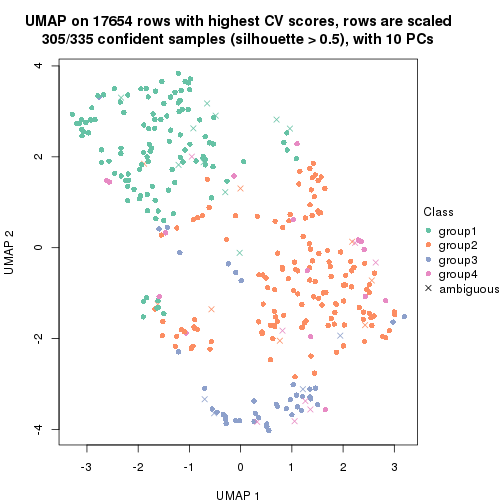</p>

</div>
<div id='tab-CV-kmeans-dimension-reduction-4'>
<pre><code class="r">dimension_reduction(res, k = 5, method = &quot;UMAP&quot;)
</code></pre>

<p></p>

</div>
<div id='tab-CV-kmeans-dimension-reduction-5'>
<pre><code class="r">dimension_reduction(res, k = 6, method = &quot;UMAP&quot;)
</code></pre>

<p></p>

</div>
</div>


Following heatmap shows how subgroups are split when increasing `k`:

```r
collect_classes(res)
```


If matrix rows can be associated to genes, consider to use `GO_Enrichment(res,
...)` to perform function enrichment for the signature genes.


 

---------------------------------------------------


### CV:skmeans**


The object with results only for a single top-value method and a single partition method 
can be extracted as:

```r
res = res_list["CV", "skmeans"]
# you can also extract it by
# res = res_list["CV:skmeans"]
```

A summary of `res` and all the functions that can be applied to it:

```r
res
```

```
#> A 'ConsensusPartition' object with k = 2, 3, 4, 5, 6.
#>   On a matrix with 17654 rows and 335 columns.
#>   Top rows (1000, 2000, 3000, 4000, 5000) are extracted by 'CV' method.
#>   Subgroups are detected by 'skmeans' method.
#>   Performed in total 1250 partitions by row resampling.
#>   Best k for subgroups seems to be 2.
#> 
#> Following methods can be applied to this 'ConsensusPartition' object:
#>  [1] "cola_report"             "collect_classes"         "collect_plots"          
#>  [4] "collect_stats"           "colnames"                "compare_signatures"     
#>  [7] "consensus_heatmap"       "dimension_reduction"     "functional_enrichment"  
#> [10] "get_anno_col"            "get_anno"                "get_classes"            
#> [13] "get_consensus"           "get_matrix"              "get_membership"         
#> [16] "get_param"               "get_signatures"          "get_stats"              
#> [19] "is_best_k"               "is_stable_k"             "membership_heatmap"     
#> [22] "ncol"                    "nrow"                    "plot_ecdf"              
#> [25] "rownames"                "select_partition_number" "show"                   
#> [28] "suggest_best_k"          "test_to_known_factors"
```

`collect_plots()` function collects all the plots made from `res` for all `k` (number of partitions)
into one single page to provide an easy and fast comparison between different `k`.

```r
collect_plots(res)
```


The plots are:

- The first row: a plot of the ECDF (Empirical cumulative distribution
  function) curves of the consensus matrix for each `k` and the heatmap of
  predicted classes for each `k`.
- The second row: heatmaps of the consensus matrix for each `k`.
- The third row: heatmaps of the membership matrix for each `k`.
- The fouth row: heatmaps of the signatures for each `k`.

All the plots in panels can be made by individual functions and they are
plotted later in this section.

`select_partition_number()` produces several plots showing different
statistics for choosing "optimized" `k`. There are following statistics:

- ECDF curves of the consensus matrix for each `k`;
- 1-PAC. [The PAC
  score](https://en.wikipedia.org/wiki/Consensus_clustering#Over-interpretation_potential_of_consensus_clustering)
  measures the proportion of the ambiguous subgrouping.
- Mean silhouette score.
- Concordance. The mean probability of fiting the consensus class ids in all
  partitions.
- Area increased. Denote $A_k$ as the area under the ECDF curve for current
  `k`, the area increased is defined as $A_k - A_{k-1}$.
- Rand index. The percent of pairs of samples that are both in a same cluster
  or both are not in a same cluster in the partition of k and k-1.
- Jaccard index. The ratio of pairs of samples are both in a same cluster in
  the partition of k and k-1 and the pairs of samples are both in a same
  cluster in the partition k or k-1.

The detailed explanations of these statistics can be found in [the cola
vignette](http://bioconductor.org/packages/devel/bioc/vignettes/cola/inst/doc/cola.html#toc_13).

Generally speaking, lower PAC score, higher mean silhouette score or higher
concordance corresponds to better partition. Rand index and Jaccard index
measure how similar the current partition is compared to partition with `k-1`.
If they are too similar, we won't accept `k` is better than `k-1`.

```r
select_partition_number(res)
```


The numeric values for all these statistics can be obtained by `get_stats()`.

```r
get_stats(res)
```

```
#>   k 1-PAC mean_silhouette concordance area_increased  Rand Jaccard
#> 2 2 0.994           0.956       0.983         0.4957 0.505   0.505
#> 3 3 0.863           0.873       0.947         0.3220 0.773   0.578
#> 4 4 0.777           0.703       0.853         0.0946 0.887   0.693
#> 5 5 0.690           0.701       0.829         0.0702 0.932   0.771
#> 6 6 0.706           0.617       0.770         0.0513 0.951   0.806
```

`suggest_best_k()` suggests the best $k$ based on these statistics. The rules are as follows:

- All $k$ with Jaccard index larger than 0.95 are removed because the increase of
  the partition number does not provides enough extra information. If all $k$ are removed,
  the best $k$ is assigned by `NA`.
- For $k$ with 1-PAC larger than 0.9, the maximal $k$ is taken as the "best k". Other $k$ is called "optional k".
- If it does not fit the second rule. The $k$ with the highest vote of highest
  1-PAC, mean silhouette and concordance is taken as the "best k".

```r
suggest_best_k(res)
```

```
#> [1] 2
```


Following shows the table of the partitions (You need to click the **show/hide
code output** link to see it). The membership matrix (columns with name `p*`)
is inferred by
[`clue::cl_consensus()`](https://www.rdocumentation.org/link/cl_consensus?package=clue)
function with the `SE` method. Basically the value in the membership matrix
represents the probability to belong to a certain group. The finall class
label for an item is determined with the group with highest probability it
belongs to.

In `get_classes()` function, the entropy is calculated from the membership
matrix and the silhouette score is calculated from the consensus matrix.


<script>
$( function() {
	$( '#tabs-CV-skmeans-get-classes' ).tabs();
} );
</script>
<div id='tabs-CV-skmeans-get-classes'>
<ul>
<li><a href='#tab-CV-skmeans-get-classes-1'>k = 2</a></li>
<li><a href='#tab-CV-skmeans-get-classes-2'>k = 3</a></li>
<li><a href='#tab-CV-skmeans-get-classes-3'>k = 4</a></li>
<li><a href='#tab-CV-skmeans-get-classes-4'>k = 5</a></li>
<li><a href='#tab-CV-skmeans-get-classes-5'>k = 6</a></li>
</ul>

<div id='tab-CV-skmeans-get-classes-1'>
<p><a id='tab-CV-skmeans-get-classes-1-a' style='color:#0366d6' href='#'>show/hide code output</a></p>
<pre><code class="r">cbind(get_classes(res, k = 2), get_membership(res, k = 2))
</code></pre>

<pre><code>#&gt;            class entropy silhouette    p1    p2
#&gt; SRR660306      2  0.0000    0.98458 0.000 1.000
#&gt; SRR1359328     2  0.0000    0.98458 0.000 1.000
#&gt; SRR821124      2  0.0000    0.98458 0.000 1.000
#&gt; SRR1335188     1  0.0000    0.97894 1.000 0.000
#&gt; SRR1075825     2  0.0000    0.98458 0.000 1.000
#&gt; SRR1321921     1  0.0000    0.97894 1.000 0.000
#&gt; SRR1466198     2  0.0000    0.98458 0.000 1.000
#&gt; SRR1384073     1  0.0000    0.97894 1.000 0.000
#&gt; SRR1312802     1  0.0000    0.97894 1.000 0.000
#&gt; SRR1076559     1  0.0000    0.97894 1.000 0.000
#&gt; SRR1370085     1  0.0000    0.97894 1.000 0.000
#&gt; SRR1460363     1  0.0000    0.97894 1.000 0.000
#&gt; SRR1480221     2  0.0000    0.98458 0.000 1.000
#&gt; SRR1476165     1  0.0000    0.97894 1.000 0.000
#&gt; SRR1459631     2  0.0000    0.98458 0.000 1.000
#&gt; SRR1448098     2  0.0000    0.98458 0.000 1.000
#&gt; SRR1321401     2  0.0000    0.98458 0.000 1.000
#&gt; SRR807613      2  0.0000    0.98458 0.000 1.000
#&gt; SRR808086      2  0.0000    0.98458 0.000 1.000
#&gt; SRR613687      2  0.0000    0.98458 0.000 1.000
#&gt; SRR1471011     1  0.0000    0.97894 1.000 0.000
#&gt; SRR1330284     2  0.0000    0.98458 0.000 1.000
#&gt; SRR1320624     2  0.0000    0.98458 0.000 1.000
#&gt; SRR1459519     1  0.0000    0.97894 1.000 0.000
#&gt; SRR1091184     2  0.0000    0.98458 0.000 1.000
#&gt; SRR1390561     1  0.0000    0.97894 1.000 0.000
#&gt; SRR658164      1  0.0000    0.97894 1.000 0.000
#&gt; SRR1087079     2  0.0000    0.98458 0.000 1.000
#&gt; SRR814996      2  0.0000    0.98458 0.000 1.000
#&gt; SRR1407410     2  0.0000    0.98458 0.000 1.000
#&gt; SRR1453392     2  0.0000    0.98458 0.000 1.000
#&gt; SRR1445873     1  0.0000    0.97894 1.000 0.000
#&gt; SRR1419985     2  0.0000    0.98458 0.000 1.000
#&gt; SRR820938      2  0.0000    0.98458 0.000 1.000
#&gt; SRR1476844     1  0.0000    0.97894 1.000 0.000
#&gt; SRR1403526     1  0.0000    0.97894 1.000 0.000
#&gt; SRR1413916     2  0.0000    0.98458 0.000 1.000
#&gt; SRR1441051     2  0.0000    0.98458 0.000 1.000
#&gt; SRR614287      2  0.0000    0.98458 0.000 1.000
#&gt; SRR1092062     2  0.0000    0.98458 0.000 1.000
#&gt; SRR612611      2  0.0000    0.98458 0.000 1.000
#&gt; SRR1376356     2  0.0000    0.98458 0.000 1.000
#&gt; SRR1405078     1  0.9754    0.31479 0.592 0.408
#&gt; SRR1437226     2  0.0000    0.98458 0.000 1.000
#&gt; SRR1326078     1  0.0000    0.97894 1.000 0.000
#&gt; SRR1096806     2  0.0000    0.98458 0.000 1.000
#&gt; SRR1440919     2  0.0000    0.98458 0.000 1.000
#&gt; SRR1452824     1  0.0000    0.97894 1.000 0.000
#&gt; SRR615754      1  0.0000    0.97894 1.000 0.000
#&gt; SRR1341787     2  0.0000    0.98458 0.000 1.000
#&gt; SRR614551      2  0.0000    0.98458 0.000 1.000
#&gt; SRR1380829     2  0.0000    0.98458 0.000 1.000
#&gt; SRR1455761     1  0.0000    0.97894 1.000 0.000
#&gt; SRR1465189     1  0.0000    0.97894 1.000 0.000
#&gt; SRR1376895     1  0.0000    0.97894 1.000 0.000
#&gt; SRR1445002     1  0.0000    0.97894 1.000 0.000
#&gt; SRR1469258     2  0.0000    0.98458 0.000 1.000
#&gt; SRR1409239     1  0.0000    0.97894 1.000 0.000
#&gt; SRR1480200     1  0.0000    0.97894 1.000 0.000
#&gt; SRR1418323     1  0.0000    0.97894 1.000 0.000
#&gt; SRR657540      2  0.0000    0.98458 0.000 1.000
#&gt; SRR821096      2  0.0000    0.98458 0.000 1.000
#&gt; SRR613591      2  0.0000    0.98458 0.000 1.000
#&gt; SRR1344205     2  0.0000    0.98458 0.000 1.000
#&gt; SRR612479      1  0.0000    0.97894 1.000 0.000
#&gt; SRR1399950     1  0.0000    0.97894 1.000 0.000
#&gt; SRR1336048     1  0.0000    0.97894 1.000 0.000
#&gt; SRR1368896     1  0.0000    0.97894 1.000 0.000
#&gt; SRR1379403     2  0.0000    0.98458 0.000 1.000
#&gt; SRR1312464     1  0.0000    0.97894 1.000 0.000
#&gt; SRR1096478     1  0.0000    0.97894 1.000 0.000
#&gt; SRR1459845     1  0.0000    0.97894 1.000 0.000
#&gt; SRR1348138     1  0.3733    0.90836 0.928 0.072
#&gt; SRR811423      1  0.0000    0.97894 1.000 0.000
#&gt; SRR615683      1  0.0000    0.97894 1.000 0.000
#&gt; SRR1380336     2  0.0000    0.98458 0.000 1.000
#&gt; SRR817609      1  0.0000    0.97894 1.000 0.000
#&gt; SRR1074550     2  0.0000    0.98458 0.000 1.000
#&gt; SRR1499236     2  0.0000    0.98458 0.000 1.000
#&gt; SRR656083      1  0.0000    0.97894 1.000 0.000
#&gt; SRR817539      1  0.0000    0.97894 1.000 0.000
#&gt; SRR1410801     1  0.0000    0.97894 1.000 0.000
#&gt; SRR1347190     1  0.0000    0.97894 1.000 0.000
#&gt; SRR1355126     2  0.0000    0.98458 0.000 1.000
#&gt; SRR615165      2  0.0000    0.98458 0.000 1.000
#&gt; SRR1466046     1  0.0000    0.97894 1.000 0.000
#&gt; SRR1097055     2  0.0000    0.98458 0.000 1.000
#&gt; SRR1312370     2  0.0000    0.98458 0.000 1.000
#&gt; SRR655325      1  0.0000    0.97894 1.000 0.000
#&gt; SRR810177      2  0.0000    0.98458 0.000 1.000
#&gt; SRR815685      2  0.0000    0.98458 0.000 1.000
#&gt; SRR817026      2  0.0000    0.98458 0.000 1.000
#&gt; SRR1417224     2  0.0000    0.98458 0.000 1.000
#&gt; SRR661687      2  0.0000    0.98458 0.000 1.000
#&gt; SRR1431804     1  0.0000    0.97894 1.000 0.000
#&gt; SRR664072      2  0.0000    0.98458 0.000 1.000
#&gt; SRR612923      2  0.0000    0.98458 0.000 1.000
#&gt; SRR1315890     1  0.0000    0.97894 1.000 0.000
#&gt; SRR1347726     1  0.0000    0.97894 1.000 0.000
#&gt; SRR1500360     1  0.0000    0.97894 1.000 0.000
#&gt; SRR1468360     2  0.0000    0.98458 0.000 1.000
#&gt; SRR1404084     1  1.0000    0.00512 0.500 0.500
#&gt; SRR615994      2  0.0000    0.98458 0.000 1.000
#&gt; SRR1475718     2  0.0000    0.98458 0.000 1.000
#&gt; SRR1397200     2  0.0000    0.98458 0.000 1.000
#&gt; SRR655519      2  0.0000    0.98458 0.000 1.000
#&gt; SRR1311308     2  0.0000    0.98458 0.000 1.000
#&gt; SRR1368006     2  0.0000    0.98458 0.000 1.000
#&gt; SRR613651      1  0.0000    0.97894 1.000 0.000
#&gt; SRR1362621     2  0.0000    0.98458 0.000 1.000
#&gt; SRR1451718     1  0.0000    0.97894 1.000 0.000
#&gt; SRR1095334     2  0.0672    0.97709 0.008 0.992
#&gt; SRR1079636     2  0.0000    0.98458 0.000 1.000
#&gt; SRR1442549     1  0.0000    0.97894 1.000 0.000
#&gt; SRR1466421     2  0.0000    0.98458 0.000 1.000
#&gt; SRR817397      2  0.0000    0.98458 0.000 1.000
#&gt; SRR1341809     2  0.0000    0.98458 0.000 1.000
#&gt; SRR614623      2  0.0000    0.98458 0.000 1.000
#&gt; SRR1335005     2  0.0000    0.98458 0.000 1.000
#&gt; SRR1407065     2  0.0000    0.98458 0.000 1.000
#&gt; SRR1404483     2  0.0000    0.98458 0.000 1.000
#&gt; SRR1096222     1  0.0000    0.97894 1.000 0.000
#&gt; SRR1401793     1  0.0000    0.97894 1.000 0.000
#&gt; SRR1408615     2  0.0000    0.98458 0.000 1.000
#&gt; SRR1070597     1  0.0000    0.97894 1.000 0.000
#&gt; SRR1332381     1  0.0000    0.97894 1.000 0.000
#&gt; SRR1457015     1  0.0000    0.97894 1.000 0.000
#&gt; SRR1386797     2  0.0000    0.98458 0.000 1.000
#&gt; SRR1098385     2  0.0000    0.98458 0.000 1.000
#&gt; SRR1363947     2  0.0000    0.98458 0.000 1.000
#&gt; SRR820350      2  0.0000    0.98458 0.000 1.000
#&gt; SRR662055      2  0.0000    0.98458 0.000 1.000
#&gt; SRR1310455     1  0.0000    0.97894 1.000 0.000
#&gt; SRR1453639     2  0.8016    0.67176 0.244 0.756
#&gt; SRR662617      2  0.0000    0.98458 0.000 1.000
#&gt; SRR654778      1  0.0000    0.97894 1.000 0.000
#&gt; SRR661782      2  0.0000    0.98458 0.000 1.000
#&gt; SRR1334396     1  0.0000    0.97894 1.000 0.000
#&gt; SRR613867      2  0.0000    0.98458 0.000 1.000
#&gt; SRR1479412     1  0.0000    0.97894 1.000 0.000
#&gt; SRR1331620     1  0.0000    0.97894 1.000 0.000
#&gt; SRR1082809     1  0.0000    0.97894 1.000 0.000
#&gt; SRR1417178     1  0.0000    0.97894 1.000 0.000
#&gt; SRR1335278     1  0.0000    0.97894 1.000 0.000
#&gt; SRR665369      2  0.0000    0.98458 0.000 1.000
#&gt; SRR657552      1  0.0000    0.97894 1.000 0.000
#&gt; SRR812412      1  0.0000    0.97894 1.000 0.000
#&gt; SRR1096500     2  0.0000    0.98458 0.000 1.000
#&gt; SRR1347750     2  0.0000    0.98458 0.000 1.000
#&gt; SRR615153      1  0.0000    0.97894 1.000 0.000
#&gt; SRR1434417     1  0.0000    0.97894 1.000 0.000
#&gt; SRR1070159     2  0.0000    0.98458 0.000 1.000
#&gt; SRR1332508     2  0.0000    0.98458 0.000 1.000
#&gt; SRR1082059     2  0.0000    0.98458 0.000 1.000
#&gt; SRR1402491     1  0.0000    0.97894 1.000 0.000
#&gt; SRR1476595     2  0.9933    0.16366 0.452 0.548
#&gt; SRR1320987     2  0.0000    0.98458 0.000 1.000
#&gt; SRR1086417     2  0.9754    0.30208 0.408 0.592
#&gt; SRR1454095     1  0.0000    0.97894 1.000 0.000
#&gt; SRR614791      2  0.0000    0.98458 0.000 1.000
#&gt; SRR821255      2  0.5629    0.83852 0.132 0.868
#&gt; SRR820402      2  0.0000    0.98458 0.000 1.000
#&gt; SRR1337284     1  0.0000    0.97894 1.000 0.000
#&gt; SRR1333083     2  0.9661    0.34899 0.392 0.608
#&gt; SRR1384883     2  0.0000    0.98458 0.000 1.000
#&gt; SRR614431      1  0.0000    0.97894 1.000 0.000
#&gt; SRR1481106     2  0.0000    0.98458 0.000 1.000
#&gt; SRR1370285     1  0.0000    0.97894 1.000 0.000
#&gt; SRR1446673     2  0.0000    0.98458 0.000 1.000
#&gt; SRR1318046     2  0.0000    0.98458 0.000 1.000
#&gt; SRR1341188     2  0.0000    0.98458 0.000 1.000
#&gt; SRR1384941     1  0.0000    0.97894 1.000 0.000
#&gt; SRR1322864     2  0.0000    0.98458 0.000 1.000
#&gt; SRR1476825     1  0.0000    0.97894 1.000 0.000
#&gt; SRR1443332     2  0.0000    0.98458 0.000 1.000
#&gt; SRR662486      2  0.0000    0.98458 0.000 1.000
#&gt; SRR1447019     1  0.0000    0.97894 1.000 0.000
#&gt; SRR662942      1  0.0000    0.97894 1.000 0.000
#&gt; SRR613102      2  0.0000    0.98458 0.000 1.000
#&gt; SRR1469880     1  0.0000    0.97894 1.000 0.000
#&gt; SRR1464977     1  0.0000    0.97894 1.000 0.000
#&gt; SRR615850      1  0.7219    0.74695 0.800 0.200
#&gt; SRR661949      2  0.0000    0.98458 0.000 1.000
#&gt; SRR1322227     2  0.0000    0.98458 0.000 1.000
#&gt; SRR1441655     1  0.9580    0.39457 0.620 0.380
#&gt; SRR613771      2  0.0000    0.98458 0.000 1.000
#&gt; SRR1479471     1  0.0000    0.97894 1.000 0.000
#&gt; SRR1488918     2  0.0000    0.98458 0.000 1.000
#&gt; SRR1414040     2  0.0000    0.98458 0.000 1.000
#&gt; SRR1079850     2  0.0376    0.98086 0.004 0.996
#&gt; SRR663209      1  0.0000    0.97894 1.000 0.000
#&gt; SRR1364914     2  0.0000    0.98458 0.000 1.000
#&gt; SRR1408267     2  0.0000    0.98458 0.000 1.000
#&gt; SRR1314894     1  0.0000    0.97894 1.000 0.000
#&gt; SRR1414117     2  0.0000    0.98458 0.000 1.000
#&gt; SRR1395975     2  0.0000    0.98458 0.000 1.000
#&gt; SRR1402219     2  0.0000    0.98458 0.000 1.000
#&gt; SRR1433623     1  0.0000    0.97894 1.000 0.000
#&gt; SRR656385      2  0.0000    0.98458 0.000 1.000
#&gt; SRR811213      2  0.0000    0.98458 0.000 1.000
#&gt; SRR663657      2  0.0000    0.98458 0.000 1.000
#&gt; SRR612203      1  0.0000    0.97894 1.000 0.000
#&gt; SRR613987      2  0.0000    0.98458 0.000 1.000
#&gt; SRR613831      2  0.0000    0.98458 0.000 1.000
#&gt; SRR1354180     2  0.0000    0.98458 0.000 1.000
#&gt; SRR1382912     1  0.0000    0.97894 1.000 0.000
#&gt; SRR1475501     1  0.0000    0.97894 1.000 0.000
#&gt; SRR1336930     1  0.0000    0.97894 1.000 0.000
#&gt; SRR613030      2  0.0000    0.98458 0.000 1.000
#&gt; SRR1381459     2  0.0000    0.98458 0.000 1.000
#&gt; SRR1402350     2  0.2236    0.94948 0.036 0.964
#&gt; SRR1419408     1  0.0000    0.97894 1.000 0.000
#&gt; SRR655911      2  0.0000    0.98458 0.000 1.000
#&gt; SRR1418243     1  0.0000    0.97894 1.000 0.000
#&gt; SRR1322573     1  0.0000    0.97894 1.000 0.000
#&gt; SRR613615      2  0.0000    0.98458 0.000 1.000
#&gt; SRR1355284     1  0.0000    0.97894 1.000 0.000
#&gt; SRR1319395     1  0.0000    0.97894 1.000 0.000
#&gt; SRR818939      1  0.0000    0.97894 1.000 0.000
#&gt; SRR1465266     1  0.0000    0.97894 1.000 0.000
#&gt; SRR614888      1  0.0000    0.97894 1.000 0.000
#&gt; SRR1431694     1  0.0000    0.97894 1.000 0.000
#&gt; SRR614347      2  0.0000    0.98458 0.000 1.000
#&gt; SRR1334228     2  0.0000    0.98458 0.000 1.000
#&gt; SRR1096007     2  0.0000    0.98458 0.000 1.000
#&gt; SRR656349      1  0.0000    0.97894 1.000 0.000
#&gt; SRR815422      2  0.0000    0.98458 0.000 1.000
#&gt; SRR1360828     1  0.0000    0.97894 1.000 0.000
#&gt; SRR1359005     2  0.0000    0.98458 0.000 1.000
#&gt; SRR1456652     1  0.0000    0.97894 1.000 0.000
#&gt; SRR1391660     1  0.0000    0.97894 1.000 0.000
#&gt; SRR1441956     1  0.0000    0.97894 1.000 0.000
#&gt; SRR662930      2  0.0000    0.98458 0.000 1.000
#&gt; SRR615790      2  0.0000    0.98458 0.000 1.000
#&gt; SRR614827      2  0.0000    0.98458 0.000 1.000
#&gt; SRR614587      2  0.0000    0.98458 0.000 1.000
#&gt; SRR814052      2  0.0000    0.98458 0.000 1.000
#&gt; SRR1070086     1  0.0000    0.97894 1.000 0.000
#&gt; SRR1481440     1  0.0000    0.97894 1.000 0.000
#&gt; SRR1339296     2  0.0000    0.98458 0.000 1.000
#&gt; SRR1343239     2  0.0000    0.98458 0.000 1.000
#&gt; SRR1432802     2  0.0000    0.98458 0.000 1.000
#&gt; SRR1416911     1  0.0000    0.97894 1.000 0.000
#&gt; SRR1410427     1  0.0000    0.97894 1.000 0.000
#&gt; SRR1401185     2  0.9044    0.52489 0.320 0.680
#&gt; SRR654993      2  0.0000    0.98458 0.000 1.000
#&gt; SRR656397      1  0.0000    0.97894 1.000 0.000
#&gt; SRR809643      2  0.7139    0.74949 0.196 0.804
#&gt; SRR1433819     1  0.0000    0.97894 1.000 0.000
#&gt; SRR1375225     2  0.0000    0.98458 0.000 1.000
#&gt; SRR1367739     1  0.7139    0.75291 0.804 0.196
#&gt; SRR1323336     2  0.9710    0.32491 0.400 0.600
#&gt; SRR663224      2  0.0000    0.98458 0.000 1.000
#&gt; SRR1442840     1  0.0000    0.97894 1.000 0.000
#&gt; SRR1374058     1  0.0000    0.97894 1.000 0.000
#&gt; SRR656994      1  0.0000    0.97894 1.000 0.000
#&gt; SRR1469214     2  0.0000    0.98458 0.000 1.000
#&gt; SRR1456446     1  0.0000    0.97894 1.000 0.000
#&gt; SRR1471879     2  0.0000    0.98458 0.000 1.000
#&gt; SRR612911      2  0.0000    0.98458 0.000 1.000
#&gt; SRR1395720     2  0.0000    0.98458 0.000 1.000
#&gt; SRR1413055     1  0.0000    0.97894 1.000 0.000
#&gt; SRR656770      2  0.0000    0.98458 0.000 1.000
#&gt; SRR812080      2  0.0000    0.98458 0.000 1.000
#&gt; SRR1479328     1  0.0000    0.97894 1.000 0.000
#&gt; SRR661421      2  0.0000    0.98458 0.000 1.000
#&gt; SRR1410286     2  0.0000    0.98458 0.000 1.000
#&gt; SRR1487150     1  0.0000    0.97894 1.000 0.000
#&gt; SRR1467035     1  0.0000    0.97894 1.000 0.000
#&gt; SRR1360607     2  0.0000    0.98458 0.000 1.000
#&gt; SRR1333106     2  0.0000    0.98458 0.000 1.000
#&gt; SRR1088706     2  0.0000    0.98458 0.000 1.000
#&gt; SRR1320053     2  0.0000    0.98458 0.000 1.000
#&gt; SRR1350392     2  0.0000    0.98458 0.000 1.000
#&gt; SRR1385190     1  0.0000    0.97894 1.000 0.000
#&gt; SRR1080093     2  0.0000    0.98458 0.000 1.000
#&gt; SRR1318753     1  0.0000    0.97894 1.000 0.000
#&gt; SRR1345369     2  0.0000    0.98458 0.000 1.000
#&gt; SRR612178      2  0.0000    0.98458 0.000 1.000
#&gt; SRR1354423     1  0.0000    0.97894 1.000 0.000
#&gt; SRR1072724     1  0.0000    0.97894 1.000 0.000
#&gt; SRR1418450     2  0.0000    0.98458 0.000 1.000
#&gt; SRR1326427     2  0.3733    0.91128 0.072 0.928
#&gt; SRR1437412     1  0.7219    0.74736 0.800 0.200
#&gt; SRR1327548     2  0.0000    0.98458 0.000 1.000
#&gt; SRR1395891     1  0.0000    0.97894 1.000 0.000
#&gt; SRR659367      1  0.7299    0.74139 0.796 0.204
#&gt; SRR818961      1  0.0000    0.97894 1.000 0.000
#&gt; SRR813704      1  0.0000    0.97894 1.000 0.000
#&gt; SRR613054      1  0.0000    0.97894 1.000 0.000
#&gt; SRR1476467     1  0.0000    0.97894 1.000 0.000
#&gt; SRR1407988     2  0.0000    0.98458 0.000 1.000
#&gt; SRR1394776     2  0.0000    0.98458 0.000 1.000
#&gt; SRR655578      2  0.0000    0.98458 0.000 1.000
#&gt; SRR1310645     2  0.0000    0.98458 0.000 1.000
#&gt; SRR1345628     1  0.0000    0.97894 1.000 0.000
#&gt; SRR1479740     1  0.0000    0.97894 1.000 0.000
#&gt; SRR1332095     1  0.2043    0.94936 0.968 0.032
#&gt; SRR1444786     2  0.0000    0.98458 0.000 1.000
#&gt; SRR1090070     1  0.0000    0.97894 1.000 0.000
#&gt; SRR662414      2  0.0000    0.98458 0.000 1.000
#&gt; SRR661216      2  0.0000    0.98458 0.000 1.000
#&gt; SRR656313      2  0.0000    0.98458 0.000 1.000
#&gt; SRR615671      2  0.0000    0.98458 0.000 1.000
#&gt; SRR1350196     2  0.0000    0.98458 0.000 1.000
#&gt; SRR1466580     1  0.0000    0.97894 1.000 0.000
#&gt; SRR1408032     2  0.0000    0.98458 0.000 1.000
#&gt; SRR1432913     2  0.0000    0.98458 0.000 1.000
#&gt; SRR1360502     1  0.0000    0.97894 1.000 0.000
#&gt; SRR1391901     2  0.0000    0.98458 0.000 1.000
#&gt; SRR1311131     1  0.0000    0.97894 1.000 0.000
#&gt; SRR1380636     1  0.0000    0.97894 1.000 0.000
#&gt; SRR1332339     1  0.0000    0.97894 1.000 0.000
#&gt; SRR1341563     2  0.0000    0.98458 0.000 1.000
#&gt; SRR1359410     2  0.0000    0.98458 0.000 1.000
#&gt; SRR1473040     2  0.4431    0.88851 0.092 0.908
#&gt; SRR1321444     1  0.0000    0.97894 1.000 0.000
#&gt; SRR1498765     2  0.0000    0.98458 0.000 1.000
#&gt; SRR1312622     2  0.0000    0.98458 0.000 1.000
#&gt; SRR615503      1  0.9248    0.48987 0.660 0.340
#&gt; SRR1453192     1  0.0000    0.97894 1.000 0.000
#&gt; SRR1433107     2  0.0000    0.98458 0.000 1.000
#&gt; SRR1075384     1  0.0000    0.97894 1.000 0.000
#&gt; SRR1356683     1  0.0000    0.97894 1.000 0.000
#&gt; SRR659049      1  0.0000    0.97894 1.000 0.000
#&gt; SRR1368240     1  0.0000    0.97894 1.000 0.000
#&gt; SRR1341739     1  0.0000    0.97894 1.000 0.000
#&gt; SRR613249      1  0.9286    0.47896 0.656 0.344
#&gt; SRR663428      2  0.0000    0.98458 0.000 1.000
#&gt; SRR1341302     2  0.0000    0.98458 0.000 1.000
#&gt; SRR1073553     2  0.0000    0.98458 0.000 1.000
#&gt; SRR1354093     2  0.0000    0.98458 0.000 1.000
#&gt; SRR1406521     2  0.0000    0.98458 0.000 1.000
#&gt; SRR1432049     1  0.0000    0.97894 1.000 0.000
#&gt; SRR1453504     1  0.6148    0.81401 0.848 0.152
</code></pre>

<script>
$('#tab-CV-skmeans-get-classes-1-a').parent().next().next().hide();
$('#tab-CV-skmeans-get-classes-1-a').click(function(){
  $('#tab-CV-skmeans-get-classes-1-a').parent().next().next().toggle();
  return(false);
});
</script>
</div>

<div id='tab-CV-skmeans-get-classes-2'>
<p><a id='tab-CV-skmeans-get-classes-2-a' style='color:#0366d6' href='#'>show/hide code output</a></p>
<pre><code class="r">cbind(get_classes(res, k = 3), get_membership(res, k = 3))
</code></pre>

<pre><code>#&gt;            class entropy silhouette    p1    p2    p3
#&gt; SRR660306      3  0.0747     0.8976 0.000 0.016 0.984
#&gt; SRR1359328     3  0.0000     0.9067 0.000 0.000 1.000
#&gt; SRR821124      2  0.0000     0.9427 0.000 1.000 0.000
#&gt; SRR1335188     1  0.0000     0.9615 1.000 0.000 0.000
#&gt; SRR1075825     2  0.0000     0.9427 0.000 1.000 0.000
#&gt; SRR1321921     1  0.0000     0.9615 1.000 0.000 0.000
#&gt; SRR1466198     3  0.0000     0.9067 0.000 0.000 1.000
#&gt; SRR1384073     2  0.6252     0.2414 0.444 0.556 0.000
#&gt; SRR1312802     1  0.4399     0.7646 0.812 0.000 0.188
#&gt; SRR1076559     1  0.0000     0.9615 1.000 0.000 0.000
#&gt; SRR1370085     1  0.0000     0.9615 1.000 0.000 0.000
#&gt; SRR1460363     1  0.0000     0.9615 1.000 0.000 0.000
#&gt; SRR1480221     2  0.0000     0.9427 0.000 1.000 0.000
#&gt; SRR1476165     1  0.0892     0.9443 0.980 0.000 0.020
#&gt; SRR1459631     3  0.5988     0.4816 0.000 0.368 0.632
#&gt; SRR1448098     2  0.0000     0.9427 0.000 1.000 0.000
#&gt; SRR1321401     2  0.0000     0.9427 0.000 1.000 0.000
#&gt; SRR807613      2  0.0000     0.9427 0.000 1.000 0.000
#&gt; SRR808086      3  0.0000     0.9067 0.000 0.000 1.000
#&gt; SRR613687      2  0.0000     0.9427 0.000 1.000 0.000
#&gt; SRR1471011     3  0.0000     0.9067 0.000 0.000 1.000
#&gt; SRR1330284     2  0.0000     0.9427 0.000 1.000 0.000
#&gt; SRR1320624     2  0.0000     0.9427 0.000 1.000 0.000
#&gt; SRR1459519     1  0.0000     0.9615 1.000 0.000 0.000
#&gt; SRR1091184     3  0.5650     0.5829 0.000 0.312 0.688
#&gt; SRR1390561     1  0.0000     0.9615 1.000 0.000 0.000
#&gt; SRR658164      1  0.0000     0.9615 1.000 0.000 0.000
#&gt; SRR1087079     2  0.0000     0.9427 0.000 1.000 0.000
#&gt; SRR814996      3  0.0000     0.9067 0.000 0.000 1.000
#&gt; SRR1407410     2  0.0000     0.9427 0.000 1.000 0.000
#&gt; SRR1453392     2  0.0000     0.9427 0.000 1.000 0.000
#&gt; SRR1445873     1  0.0000     0.9615 1.000 0.000 0.000
#&gt; SRR1419985     2  0.0000     0.9427 0.000 1.000 0.000
#&gt; SRR820938      3  0.0000     0.9067 0.000 0.000 1.000
#&gt; SRR1476844     1  0.0000     0.9615 1.000 0.000 0.000
#&gt; SRR1403526     1  0.0000     0.9615 1.000 0.000 0.000
#&gt; SRR1413916     2  0.0000     0.9427 0.000 1.000 0.000
#&gt; SRR1441051     2  0.0000     0.9427 0.000 1.000 0.000
#&gt; SRR614287      2  0.0000     0.9427 0.000 1.000 0.000
#&gt; SRR1092062     2  0.0000     0.9427 0.000 1.000 0.000
#&gt; SRR612611      2  0.0000     0.9427 0.000 1.000 0.000
#&gt; SRR1376356     2  0.0000     0.9427 0.000 1.000 0.000
#&gt; SRR1405078     3  0.0000     0.9067 0.000 0.000 1.000
#&gt; SRR1437226     2  0.0747     0.9293 0.000 0.984 0.016
#&gt; SRR1326078     1  0.0000     0.9615 1.000 0.000 0.000
#&gt; SRR1096806     3  0.1643     0.8789 0.000 0.044 0.956
#&gt; SRR1440919     3  0.6204     0.3521 0.000 0.424 0.576
#&gt; SRR1452824     3  0.0000     0.9067 0.000 0.000 1.000
#&gt; SRR615754      1  0.0000     0.9615 1.000 0.000 0.000
#&gt; SRR1341787     2  0.5859     0.4382 0.000 0.656 0.344
#&gt; SRR614551      2  0.2448     0.8727 0.000 0.924 0.076
#&gt; SRR1380829     3  0.0000     0.9067 0.000 0.000 1.000
#&gt; SRR1455761     1  0.0000     0.9615 1.000 0.000 0.000
#&gt; SRR1465189     1  0.4346     0.7697 0.816 0.000 0.184
#&gt; SRR1376895     1  0.0000     0.9615 1.000 0.000 0.000
#&gt; SRR1445002     1  0.0000     0.9615 1.000 0.000 0.000
#&gt; SRR1469258     2  0.0000     0.9427 0.000 1.000 0.000
#&gt; SRR1409239     1  0.0000     0.9615 1.000 0.000 0.000
#&gt; SRR1480200     1  0.0000     0.9615 1.000 0.000 0.000
#&gt; SRR1418323     1  0.0000     0.9615 1.000 0.000 0.000
#&gt; SRR657540      3  0.0000     0.9067 0.000 0.000 1.000
#&gt; SRR821096      2  0.0000     0.9427 0.000 1.000 0.000
#&gt; SRR613591      2  0.2959     0.8460 0.000 0.900 0.100
#&gt; SRR1344205     3  0.0000     0.9067 0.000 0.000 1.000
#&gt; SRR612479      1  0.0000     0.9615 1.000 0.000 0.000
#&gt; SRR1399950     1  0.5760     0.5461 0.672 0.000 0.328
#&gt; SRR1336048     3  0.0000     0.9067 0.000 0.000 1.000
#&gt; SRR1368896     1  0.0000     0.9615 1.000 0.000 0.000
#&gt; SRR1379403     2  0.0000     0.9427 0.000 1.000 0.000
#&gt; SRR1312464     1  0.0000     0.9615 1.000 0.000 0.000
#&gt; SRR1096478     1  0.0000     0.9615 1.000 0.000 0.000
#&gt; SRR1459845     1  0.0000     0.9615 1.000 0.000 0.000
#&gt; SRR1348138     3  0.0000     0.9067 0.000 0.000 1.000
#&gt; SRR811423      1  0.0000     0.9615 1.000 0.000 0.000
#&gt; SRR615683      1  0.0000     0.9615 1.000 0.000 0.000
#&gt; SRR1380336     2  0.0000     0.9427 0.000 1.000 0.000
#&gt; SRR817609      1  0.5968     0.4741 0.636 0.000 0.364
#&gt; SRR1074550     3  0.0000     0.9067 0.000 0.000 1.000
#&gt; SRR1499236     2  0.0000     0.9427 0.000 1.000 0.000
#&gt; SRR656083      1  0.0000     0.9615 1.000 0.000 0.000
#&gt; SRR817539      1  0.0000     0.9615 1.000 0.000 0.000
#&gt; SRR1410801     1  0.0000     0.9615 1.000 0.000 0.000
#&gt; SRR1347190     1  0.0000     0.9615 1.000 0.000 0.000
#&gt; SRR1355126     2  0.0000     0.9427 0.000 1.000 0.000
#&gt; SRR615165      3  0.0000     0.9067 0.000 0.000 1.000
#&gt; SRR1466046     1  0.0000     0.9615 1.000 0.000 0.000
#&gt; SRR1097055     2  0.0000     0.9427 0.000 1.000 0.000
#&gt; SRR1312370     2  0.0000     0.9427 0.000 1.000 0.000
#&gt; SRR655325      1  0.0000     0.9615 1.000 0.000 0.000
#&gt; SRR810177      2  0.0000     0.9427 0.000 1.000 0.000
#&gt; SRR815685      2  0.0000     0.9427 0.000 1.000 0.000
#&gt; SRR817026      3  0.0000     0.9067 0.000 0.000 1.000
#&gt; SRR1417224     2  0.0000     0.9427 0.000 1.000 0.000
#&gt; SRR661687      3  0.5988     0.4816 0.000 0.368 0.632
#&gt; SRR1431804     1  0.6079     0.4214 0.612 0.000 0.388
#&gt; SRR664072      3  0.0000     0.9067 0.000 0.000 1.000
#&gt; SRR612923      2  0.0000     0.9427 0.000 1.000 0.000
#&gt; SRR1315890     1  0.0000     0.9615 1.000 0.000 0.000
#&gt; SRR1347726     1  0.0000     0.9615 1.000 0.000 0.000
#&gt; SRR1500360     1  0.5882     0.4335 0.652 0.348 0.000
#&gt; SRR1468360     2  0.0000     0.9427 0.000 1.000 0.000
#&gt; SRR1404084     3  0.7975     0.6233 0.204 0.140 0.656
#&gt; SRR615994      3  0.0000     0.9067 0.000 0.000 1.000
#&gt; SRR1475718     2  0.0000     0.9427 0.000 1.000 0.000
#&gt; SRR1397200     3  0.0000     0.9067 0.000 0.000 1.000
#&gt; SRR655519      2  0.0000     0.9427 0.000 1.000 0.000
#&gt; SRR1311308     3  0.5591     0.5954 0.000 0.304 0.696
#&gt; SRR1368006     2  0.0000     0.9427 0.000 1.000 0.000
#&gt; SRR613651      1  0.6140     0.3836 0.596 0.000 0.404
#&gt; SRR1362621     3  0.3879     0.7852 0.000 0.152 0.848
#&gt; SRR1451718     1  0.5138     0.6752 0.748 0.000 0.252
#&gt; SRR1095334     3  0.0000     0.9067 0.000 0.000 1.000
#&gt; SRR1079636     2  0.0000     0.9427 0.000 1.000 0.000
#&gt; SRR1442549     2  0.6008     0.4312 0.372 0.628 0.000
#&gt; SRR1466421     2  0.0000     0.9427 0.000 1.000 0.000
#&gt; SRR817397      2  0.2448     0.8715 0.000 0.924 0.076
#&gt; SRR1341809     2  0.0000     0.9427 0.000 1.000 0.000
#&gt; SRR614623      2  0.0000     0.9427 0.000 1.000 0.000
#&gt; SRR1335005     2  0.0000     0.9427 0.000 1.000 0.000
#&gt; SRR1407065     2  0.4178     0.7481 0.000 0.828 0.172
#&gt; SRR1404483     2  0.0000     0.9427 0.000 1.000 0.000
#&gt; SRR1096222     1  0.0000     0.9615 1.000 0.000 0.000
#&gt; SRR1401793     1  0.0000     0.9615 1.000 0.000 0.000
#&gt; SRR1408615     3  0.0000     0.9067 0.000 0.000 1.000
#&gt; SRR1070597     2  0.6095     0.3831 0.392 0.608 0.000
#&gt; SRR1332381     1  0.0000     0.9615 1.000 0.000 0.000
#&gt; SRR1457015     1  0.0000     0.9615 1.000 0.000 0.000
#&gt; SRR1386797     2  0.0000     0.9427 0.000 1.000 0.000
#&gt; SRR1098385     2  0.0000     0.9427 0.000 1.000 0.000
#&gt; SRR1363947     3  0.0000     0.9067 0.000 0.000 1.000
#&gt; SRR820350      2  0.0000     0.9427 0.000 1.000 0.000
#&gt; SRR662055      3  0.0000     0.9067 0.000 0.000 1.000
#&gt; SRR1310455     1  0.0000     0.9615 1.000 0.000 0.000
#&gt; SRR1453639     2  0.4750     0.6988 0.216 0.784 0.000
#&gt; SRR662617      2  0.0000     0.9427 0.000 1.000 0.000
#&gt; SRR654778      1  0.0000     0.9615 1.000 0.000 0.000
#&gt; SRR661782      2  0.0000     0.9427 0.000 1.000 0.000
#&gt; SRR1334396     1  0.0000     0.9615 1.000 0.000 0.000
#&gt; SRR613867      2  0.0000     0.9427 0.000 1.000 0.000
#&gt; SRR1479412     1  0.0000     0.9615 1.000 0.000 0.000
#&gt; SRR1331620     1  0.0000     0.9615 1.000 0.000 0.000
#&gt; SRR1082809     1  0.5968     0.4054 0.636 0.000 0.364
#&gt; SRR1417178     1  0.0000     0.9615 1.000 0.000 0.000
#&gt; SRR1335278     1  0.0000     0.9615 1.000 0.000 0.000
#&gt; SRR665369      2  0.0000     0.9427 0.000 1.000 0.000
#&gt; SRR657552      1  0.5785     0.5383 0.668 0.000 0.332
#&gt; SRR812412      1  0.0000     0.9615 1.000 0.000 0.000
#&gt; SRR1096500     2  0.0000     0.9427 0.000 1.000 0.000
#&gt; SRR1347750     2  0.0000     0.9427 0.000 1.000 0.000
#&gt; SRR615153      3  0.4346     0.7121 0.184 0.000 0.816
#&gt; SRR1434417     1  0.0000     0.9615 1.000 0.000 0.000
#&gt; SRR1070159     3  0.0000     0.9067 0.000 0.000 1.000
#&gt; SRR1332508     2  0.0000     0.9427 0.000 1.000 0.000
#&gt; SRR1082059     2  0.5591     0.5016 0.000 0.696 0.304
#&gt; SRR1402491     1  0.0000     0.9615 1.000 0.000 0.000
#&gt; SRR1476595     2  0.2711     0.8533 0.088 0.912 0.000
#&gt; SRR1320987     2  0.0000     0.9427 0.000 1.000 0.000
#&gt; SRR1086417     2  0.6798     0.3183 0.400 0.584 0.016
#&gt; SRR1454095     1  0.0592     0.9496 0.988 0.012 0.000
#&gt; SRR614791      3  0.0000     0.9067 0.000 0.000 1.000
#&gt; SRR821255      2  0.0000     0.9427 0.000 1.000 0.000
#&gt; SRR820402      3  0.5706     0.5698 0.000 0.320 0.680
#&gt; SRR1337284     2  0.6095     0.3832 0.392 0.608 0.000
#&gt; SRR1333083     3  0.0000     0.9067 0.000 0.000 1.000
#&gt; SRR1384883     2  0.6305    -0.0808 0.000 0.516 0.484
#&gt; SRR614431      1  0.0000     0.9615 1.000 0.000 0.000
#&gt; SRR1481106     2  0.0000     0.9427 0.000 1.000 0.000
#&gt; SRR1370285     1  0.0000     0.9615 1.000 0.000 0.000
#&gt; SRR1446673     3  0.0000     0.9067 0.000 0.000 1.000
#&gt; SRR1318046     2  0.0000     0.9427 0.000 1.000 0.000
#&gt; SRR1341188     3  0.0000     0.9067 0.000 0.000 1.000
#&gt; SRR1384941     1  0.0000     0.9615 1.000 0.000 0.000
#&gt; SRR1322864     2  0.0000     0.9427 0.000 1.000 0.000
#&gt; SRR1476825     3  0.5138     0.6210 0.252 0.000 0.748
#&gt; SRR1443332     2  0.0000     0.9427 0.000 1.000 0.000
#&gt; SRR662486      3  0.6062     0.3797 0.000 0.384 0.616
#&gt; SRR1447019     1  0.0000     0.9615 1.000 0.000 0.000
#&gt; SRR662942      1  0.0000     0.9615 1.000 0.000 0.000
#&gt; SRR613102      3  0.0000     0.9067 0.000 0.000 1.000
#&gt; SRR1469880     1  0.0000     0.9615 1.000 0.000 0.000
#&gt; SRR1464977     1  0.0000     0.9615 1.000 0.000 0.000
#&gt; SRR615850      3  0.0000     0.9067 0.000 0.000 1.000
#&gt; SRR661949      2  0.0000     0.9427 0.000 1.000 0.000
#&gt; SRR1322227     3  0.6111     0.4210 0.000 0.396 0.604
#&gt; SRR1441655     2  0.3921     0.8210 0.016 0.872 0.112
#&gt; SRR613771      2  0.1163     0.9200 0.000 0.972 0.028
#&gt; SRR1479471     1  0.0000     0.9615 1.000 0.000 0.000
#&gt; SRR1488918     2  0.0000     0.9427 0.000 1.000 0.000
#&gt; SRR1414040     2  0.0000     0.9427 0.000 1.000 0.000
#&gt; SRR1079850     2  0.0000     0.9427 0.000 1.000 0.000
#&gt; SRR663209      1  0.0000     0.9615 1.000 0.000 0.000
#&gt; SRR1364914     2  0.0000     0.9427 0.000 1.000 0.000
#&gt; SRR1408267     2  0.0000     0.9427 0.000 1.000 0.000
#&gt; SRR1314894     1  0.0000     0.9615 1.000 0.000 0.000
#&gt; SRR1414117     3  0.0000     0.9067 0.000 0.000 1.000
#&gt; SRR1395975     2  0.0000     0.9427 0.000 1.000 0.000
#&gt; SRR1402219     2  0.0000     0.9427 0.000 1.000 0.000
#&gt; SRR1433623     1  0.0000     0.9615 1.000 0.000 0.000
#&gt; SRR656385      3  0.1860     0.8713 0.000 0.052 0.948
#&gt; SRR811213      2  0.0000     0.9427 0.000 1.000 0.000
#&gt; SRR663657      3  0.0000     0.9067 0.000 0.000 1.000
#&gt; SRR612203      1  0.5098     0.6796 0.752 0.000 0.248
#&gt; SRR613987      2  0.3551     0.8109 0.000 0.868 0.132
#&gt; SRR613831      3  0.0000     0.9067 0.000 0.000 1.000
#&gt; SRR1354180     2  0.0000     0.9427 0.000 1.000 0.000
#&gt; SRR1382912     1  0.0000     0.9615 1.000 0.000 0.000
#&gt; SRR1475501     1  0.0000     0.9615 1.000 0.000 0.000
#&gt; SRR1336930     1  0.0000     0.9615 1.000 0.000 0.000
#&gt; SRR613030      3  0.0000     0.9067 0.000 0.000 1.000
#&gt; SRR1381459     2  0.0237     0.9395 0.000 0.996 0.004
#&gt; SRR1402350     3  0.0000     0.9067 0.000 0.000 1.000
#&gt; SRR1419408     1  0.0000     0.9615 1.000 0.000 0.000
#&gt; SRR655911      3  0.0000     0.9067 0.000 0.000 1.000
#&gt; SRR1418243     1  0.0000     0.9615 1.000 0.000 0.000
#&gt; SRR1322573     1  0.2356     0.8865 0.928 0.072 0.000
#&gt; SRR613615      3  0.0000     0.9067 0.000 0.000 1.000
#&gt; SRR1355284     1  0.0000     0.9615 1.000 0.000 0.000
#&gt; SRR1319395     1  0.0000     0.9615 1.000 0.000 0.000
#&gt; SRR818939      1  0.0000     0.9615 1.000 0.000 0.000
#&gt; SRR1465266     1  0.0000     0.9615 1.000 0.000 0.000
#&gt; SRR614888      1  0.5560     0.5964 0.700 0.000 0.300
#&gt; SRR1431694     1  0.0000     0.9615 1.000 0.000 0.000
#&gt; SRR614347      3  0.5291     0.6438 0.000 0.268 0.732
#&gt; SRR1334228     3  0.0000     0.9067 0.000 0.000 1.000
#&gt; SRR1096007     2  0.0000     0.9427 0.000 1.000 0.000
#&gt; SRR656349      1  0.6045     0.4395 0.620 0.000 0.380
#&gt; SRR815422      3  0.6062     0.4478 0.000 0.384 0.616
#&gt; SRR1360828     1  0.0000     0.9615 1.000 0.000 0.000
#&gt; SRR1359005     2  0.0000     0.9427 0.000 1.000 0.000
#&gt; SRR1456652     1  0.0000     0.9615 1.000 0.000 0.000
#&gt; SRR1391660     1  0.0000     0.9615 1.000 0.000 0.000
#&gt; SRR1441956     1  0.0000     0.9615 1.000 0.000 0.000
#&gt; SRR662930      3  0.0592     0.9001 0.000 0.012 0.988
#&gt; SRR615790      3  0.0000     0.9067 0.000 0.000 1.000
#&gt; SRR614827      2  0.0000     0.9427 0.000 1.000 0.000
#&gt; SRR614587      3  0.5968     0.4896 0.000 0.364 0.636
#&gt; SRR814052      2  0.0000     0.9427 0.000 1.000 0.000
#&gt; SRR1070086     1  0.0000     0.9615 1.000 0.000 0.000
#&gt; SRR1481440     1  0.0000     0.9615 1.000 0.000 0.000
#&gt; SRR1339296     3  0.0000     0.9067 0.000 0.000 1.000
#&gt; SRR1343239     2  0.0000     0.9427 0.000 1.000 0.000
#&gt; SRR1432802     2  0.0000     0.9427 0.000 1.000 0.000
#&gt; SRR1416911     1  0.0000     0.9615 1.000 0.000 0.000
#&gt; SRR1410427     1  0.0000     0.9615 1.000 0.000 0.000
#&gt; SRR1401185     2  0.4178     0.7549 0.172 0.828 0.000
#&gt; SRR654993      2  0.0000     0.9427 0.000 1.000 0.000
#&gt; SRR656397      1  0.0000     0.9615 1.000 0.000 0.000
#&gt; SRR809643      3  0.0000     0.9067 0.000 0.000 1.000
#&gt; SRR1433819     1  0.0000     0.9615 1.000 0.000 0.000
#&gt; SRR1375225     2  0.0000     0.9427 0.000 1.000 0.000
#&gt; SRR1367739     3  0.0000     0.9067 0.000 0.000 1.000
#&gt; SRR1323336     3  0.9773     0.1631 0.340 0.240 0.420
#&gt; SRR663224      3  0.0592     0.9002 0.000 0.012 0.988
#&gt; SRR1442840     1  0.0000     0.9615 1.000 0.000 0.000
#&gt; SRR1374058     1  0.0000     0.9615 1.000 0.000 0.000
#&gt; SRR656994      1  0.0000     0.9615 1.000 0.000 0.000
#&gt; SRR1469214     2  0.0000     0.9427 0.000 1.000 0.000
#&gt; SRR1456446     1  0.0000     0.9615 1.000 0.000 0.000
#&gt; SRR1471879     2  0.0000     0.9427 0.000 1.000 0.000
#&gt; SRR612911      3  0.0000     0.9067 0.000 0.000 1.000
#&gt; SRR1395720     2  0.0000     0.9427 0.000 1.000 0.000
#&gt; SRR1413055     1  0.0000     0.9615 1.000 0.000 0.000
#&gt; SRR656770      2  0.0000     0.9427 0.000 1.000 0.000
#&gt; SRR812080      3  0.0000     0.9067 0.000 0.000 1.000
#&gt; SRR1479328     1  0.0000     0.9615 1.000 0.000 0.000
#&gt; SRR661421      2  0.0000     0.9427 0.000 1.000 0.000
#&gt; SRR1410286     2  0.0000     0.9427 0.000 1.000 0.000
#&gt; SRR1487150     1  0.0000     0.9615 1.000 0.000 0.000
#&gt; SRR1467035     1  0.0000     0.9615 1.000 0.000 0.000
#&gt; SRR1360607     2  0.0000     0.9427 0.000 1.000 0.000
#&gt; SRR1333106     2  0.0000     0.9427 0.000 1.000 0.000
#&gt; SRR1088706     2  0.0000     0.9427 0.000 1.000 0.000
#&gt; SRR1320053     3  0.0000     0.9067 0.000 0.000 1.000
#&gt; SRR1350392     2  0.0000     0.9427 0.000 1.000 0.000
#&gt; SRR1385190     3  0.0000     0.9067 0.000 0.000 1.000
#&gt; SRR1080093     2  0.0000     0.9427 0.000 1.000 0.000
#&gt; SRR1318753     1  0.0000     0.9615 1.000 0.000 0.000
#&gt; SRR1345369     3  0.0237     0.9046 0.000 0.004 0.996
#&gt; SRR612178      2  0.0000     0.9427 0.000 1.000 0.000
#&gt; SRR1354423     1  0.0000     0.9615 1.000 0.000 0.000
#&gt; SRR1072724     1  0.0000     0.9615 1.000 0.000 0.000
#&gt; SRR1418450     2  0.0000     0.9427 0.000 1.000 0.000
#&gt; SRR1326427     3  0.0000     0.9067 0.000 0.000 1.000
#&gt; SRR1437412     3  0.2846     0.8652 0.020 0.056 0.924
#&gt; SRR1327548     2  0.6192     0.1739 0.000 0.580 0.420
#&gt; SRR1395891     1  0.0000     0.9615 1.000 0.000 0.000
#&gt; SRR659367      1  0.6154     0.3737 0.592 0.000 0.408
#&gt; SRR818961      1  0.0000     0.9615 1.000 0.000 0.000
#&gt; SRR813704      1  0.0000     0.9615 1.000 0.000 0.000
#&gt; SRR613054      1  0.0000     0.9615 1.000 0.000 0.000
#&gt; SRR1476467     1  0.0000     0.9615 1.000 0.000 0.000
#&gt; SRR1407988     2  0.0000     0.9427 0.000 1.000 0.000
#&gt; SRR1394776     2  0.0000     0.9427 0.000 1.000 0.000
#&gt; SRR655578      2  0.0000     0.9427 0.000 1.000 0.000
#&gt; SRR1310645     2  0.0000     0.9427 0.000 1.000 0.000
#&gt; SRR1345628     1  0.0000     0.9615 1.000 0.000 0.000
#&gt; SRR1479740     1  0.0000     0.9615 1.000 0.000 0.000
#&gt; SRR1332095     2  0.5591     0.5764 0.304 0.696 0.000
#&gt; SRR1444786     2  0.0000     0.9427 0.000 1.000 0.000
#&gt; SRR1090070     1  0.0000     0.9615 1.000 0.000 0.000
#&gt; SRR662414      2  0.4452     0.7255 0.000 0.808 0.192
#&gt; SRR661216      2  0.0000     0.9427 0.000 1.000 0.000
#&gt; SRR656313      2  0.0000     0.9427 0.000 1.000 0.000
#&gt; SRR615671      3  0.1031     0.8921 0.000 0.024 0.976
#&gt; SRR1350196     3  0.0000     0.9067 0.000 0.000 1.000
#&gt; SRR1466580     1  0.0000     0.9615 1.000 0.000 0.000
#&gt; SRR1408032     2  0.0000     0.9427 0.000 1.000 0.000
#&gt; SRR1432913     3  0.1163     0.8903 0.000 0.028 0.972
#&gt; SRR1360502     3  0.0000     0.9067 0.000 0.000 1.000
#&gt; SRR1391901     3  0.6299     0.2060 0.000 0.476 0.524
#&gt; SRR1311131     1  0.0000     0.9615 1.000 0.000 0.000
#&gt; SRR1380636     1  0.0000     0.9615 1.000 0.000 0.000
#&gt; SRR1332339     1  0.0000     0.9615 1.000 0.000 0.000
#&gt; SRR1341563     2  0.0000     0.9427 0.000 1.000 0.000
#&gt; SRR1359410     3  0.6111     0.4210 0.000 0.396 0.604
#&gt; SRR1473040     3  0.0000     0.9067 0.000 0.000 1.000
#&gt; SRR1321444     1  0.0000     0.9615 1.000 0.000 0.000
#&gt; SRR1498765     2  0.0000     0.9427 0.000 1.000 0.000
#&gt; SRR1312622     2  0.3752     0.7882 0.000 0.856 0.144
#&gt; SRR615503      2  0.5371     0.7546 0.048 0.812 0.140
#&gt; SRR1453192     1  0.0000     0.9615 1.000 0.000 0.000
#&gt; SRR1433107     3  0.6286     0.2382 0.000 0.464 0.536
#&gt; SRR1075384     1  0.0000     0.9615 1.000 0.000 0.000
#&gt; SRR1356683     1  0.0000     0.9615 1.000 0.000 0.000
#&gt; SRR659049      1  0.0000     0.9615 1.000 0.000 0.000
#&gt; SRR1368240     1  0.0000     0.9615 1.000 0.000 0.000
#&gt; SRR1341739     1  0.0000     0.9615 1.000 0.000 0.000
#&gt; SRR613249      3  0.0000     0.9067 0.000 0.000 1.000
#&gt; SRR663428      2  0.0000     0.9427 0.000 1.000 0.000
#&gt; SRR1341302     2  0.0000     0.9427 0.000 1.000 0.000
#&gt; SRR1073553     2  0.0000     0.9427 0.000 1.000 0.000
#&gt; SRR1354093     3  0.0000     0.9067 0.000 0.000 1.000
#&gt; SRR1406521     2  0.2625     0.8630 0.000 0.916 0.084
#&gt; SRR1432049     1  0.0000     0.9615 1.000 0.000 0.000
#&gt; SRR1453504     2  0.6111     0.3732 0.396 0.604 0.000
</code></pre>

<script>
$('#tab-CV-skmeans-get-classes-2-a').parent().next().next().hide();
$('#tab-CV-skmeans-get-classes-2-a').click(function(){
  $('#tab-CV-skmeans-get-classes-2-a').parent().next().next().toggle();
  return(false);
});
</script>
</div>

<div id='tab-CV-skmeans-get-classes-3'>
<p><a id='tab-CV-skmeans-get-classes-3-a' style='color:#0366d6' href='#'>show/hide code output</a></p>
<pre><code class="r">cbind(get_classes(res, k = 4), get_membership(res, k = 4))
</code></pre>

<pre><code>#&gt;            class entropy silhouette    p1    p2    p3    p4
#&gt; SRR660306      4  0.5576     0.3436 0.000 0.020 0.444 0.536
#&gt; SRR1359328     4  0.1211     0.1438 0.000 0.000 0.040 0.960
#&gt; SRR821124      2  0.0817     0.8559 0.000 0.976 0.024 0.000
#&gt; SRR1335188     1  0.0336     0.9394 0.992 0.000 0.000 0.008
#&gt; SRR1075825     2  0.0817     0.8564 0.000 0.976 0.024 0.000
#&gt; SRR1321921     1  0.0188     0.9407 0.996 0.000 0.000 0.004
#&gt; SRR1466198     3  0.5119     0.7672 0.000 0.004 0.556 0.440
#&gt; SRR1384073     4  0.6806     0.4611 0.344 0.112 0.000 0.544
#&gt; SRR1312802     1  0.4761     0.4176 0.628 0.000 0.000 0.372
#&gt; SRR1076559     1  0.2216     0.8605 0.908 0.000 0.000 0.092
#&gt; SRR1370085     1  0.0336     0.9405 0.992 0.000 0.000 0.008
#&gt; SRR1460363     1  0.0336     0.9405 0.992 0.000 0.000 0.008
#&gt; SRR1480221     2  0.0817     0.8595 0.000 0.976 0.000 0.024
#&gt; SRR1476165     1  0.3266     0.7531 0.832 0.000 0.000 0.168
#&gt; SRR1459631     2  0.6243     0.2221 0.000 0.548 0.392 0.060
#&gt; SRR1448098     2  0.0188     0.8615 0.000 0.996 0.000 0.004
#&gt; SRR1321401     2  0.0817     0.8595 0.000 0.976 0.000 0.024
#&gt; SRR807613      2  0.0817     0.8595 0.000 0.976 0.000 0.024
#&gt; SRR808086      3  0.4961     0.7701 0.000 0.000 0.552 0.448
#&gt; SRR613687      2  0.5366     0.3034 0.000 0.548 0.440 0.012
#&gt; SRR1471011     3  0.4961     0.7701 0.000 0.000 0.552 0.448
#&gt; SRR1330284     2  0.0469     0.8598 0.000 0.988 0.012 0.000
#&gt; SRR1320624     2  0.0921     0.8543 0.000 0.972 0.028 0.000
#&gt; SRR1459519     1  0.0000     0.9411 1.000 0.000 0.000 0.000
#&gt; SRR1091184     3  0.7026     0.4847 0.000 0.248 0.572 0.180
#&gt; SRR1390561     1  0.0336     0.9405 0.992 0.000 0.000 0.008
#&gt; SRR658164      1  0.1004     0.9226 0.972 0.000 0.024 0.004
#&gt; SRR1087079     2  0.0817     0.8595 0.000 0.976 0.000 0.024
#&gt; SRR814996      3  0.4961     0.7701 0.000 0.000 0.552 0.448
#&gt; SRR1407410     4  0.4981     0.2436 0.000 0.464 0.000 0.536
#&gt; SRR1453392     2  0.0188     0.8612 0.000 0.996 0.004 0.000
#&gt; SRR1445873     1  0.0188     0.9407 0.996 0.000 0.000 0.004
#&gt; SRR1419985     2  0.1022     0.8560 0.000 0.968 0.000 0.032
#&gt; SRR820938      3  0.5088     0.7645 0.000 0.004 0.572 0.424
#&gt; SRR1476844     1  0.0188     0.9410 0.996 0.000 0.000 0.004
#&gt; SRR1403526     1  0.0188     0.9407 0.996 0.000 0.000 0.004
#&gt; SRR1413916     2  0.1022     0.8525 0.000 0.968 0.032 0.000
#&gt; SRR1441051     2  0.0817     0.8595 0.000 0.976 0.000 0.024
#&gt; SRR614287      2  0.0817     0.8595 0.000 0.976 0.000 0.024
#&gt; SRR1092062     2  0.1389     0.8456 0.000 0.952 0.000 0.048
#&gt; SRR612611      2  0.0000     0.8614 0.000 1.000 0.000 0.000
#&gt; SRR1376356     2  0.2973     0.7577 0.000 0.856 0.000 0.144
#&gt; SRR1405078     3  0.1637     0.5845 0.000 0.000 0.940 0.060
#&gt; SRR1437226     4  0.5132     0.1581 0.000 0.448 0.004 0.548
#&gt; SRR1326078     1  0.0336     0.9394 0.992 0.000 0.000 0.008
#&gt; SRR1096806     3  0.5671     0.7457 0.000 0.028 0.572 0.400
#&gt; SRR1440919     2  0.5021     0.6215 0.000 0.756 0.180 0.064
#&gt; SRR1452824     3  0.4961     0.7701 0.000 0.000 0.552 0.448
#&gt; SRR615754      1  0.2412     0.8558 0.908 0.000 0.084 0.008
#&gt; SRR1341787     4  0.0804     0.2064 0.000 0.012 0.008 0.980
#&gt; SRR614551      2  0.4576     0.6150 0.000 0.748 0.232 0.020
#&gt; SRR1380829     3  0.0469     0.5625 0.000 0.000 0.988 0.012
#&gt; SRR1455761     1  0.0336     0.9394 0.992 0.000 0.000 0.008
#&gt; SRR1465189     1  0.4897     0.4761 0.660 0.000 0.008 0.332
#&gt; SRR1376895     1  0.0336     0.9394 0.992 0.000 0.000 0.008
#&gt; SRR1445002     1  0.0336     0.9405 0.992 0.000 0.000 0.008
#&gt; SRR1469258     2  0.0188     0.8612 0.000 0.996 0.004 0.000
#&gt; SRR1409239     1  0.0188     0.9410 0.996 0.000 0.000 0.004
#&gt; SRR1480200     1  0.0000     0.9411 1.000 0.000 0.000 0.000
#&gt; SRR1418323     1  0.0336     0.9394 0.992 0.000 0.000 0.008
#&gt; SRR657540      3  0.0000     0.5581 0.000 0.000 1.000 0.000
#&gt; SRR821096      2  0.0817     0.8595 0.000 0.976 0.000 0.024
#&gt; SRR613591      4  0.6752     0.3461 0.000 0.092 0.440 0.468
#&gt; SRR1344205     3  0.4961     0.7701 0.000 0.000 0.552 0.448
#&gt; SRR612479      1  0.0336     0.9405 0.992 0.000 0.000 0.008
#&gt; SRR1399950     1  0.4936     0.4621 0.652 0.000 0.008 0.340
#&gt; SRR1336048     4  0.4977    -0.6909 0.000 0.000 0.460 0.540
#&gt; SRR1368896     1  0.0188     0.9407 0.996 0.000 0.000 0.004
#&gt; SRR1379403     2  0.1022     0.8525 0.000 0.968 0.032 0.000
#&gt; SRR1312464     1  0.0188     0.9407 0.996 0.000 0.000 0.004
#&gt; SRR1096478     1  0.0336     0.9405 0.992 0.000 0.000 0.008
#&gt; SRR1459845     1  0.0188     0.9407 0.996 0.000 0.000 0.004
#&gt; SRR1348138     3  0.4961     0.7701 0.000 0.000 0.552 0.448
#&gt; SRR811423      1  0.0707     0.9324 0.980 0.000 0.000 0.020
#&gt; SRR615683      1  0.0336     0.9405 0.992 0.000 0.000 0.008
#&gt; SRR1380336     2  0.0817     0.8595 0.000 0.976 0.000 0.024
#&gt; SRR817609      1  0.5403     0.4194 0.628 0.000 0.024 0.348
#&gt; SRR1074550     3  0.5097     0.7652 0.000 0.004 0.568 0.428
#&gt; SRR1499236     2  0.1211     0.8512 0.000 0.960 0.000 0.040
#&gt; SRR656083      1  0.0336     0.9405 0.992 0.000 0.000 0.008
#&gt; SRR817539      4  0.4994     0.1945 0.480 0.000 0.000 0.520
#&gt; SRR1410801     1  0.0336     0.9405 0.992 0.000 0.000 0.008
#&gt; SRR1347190     1  0.1211     0.9131 0.960 0.000 0.000 0.040
#&gt; SRR1355126     2  0.0927     0.8578 0.000 0.976 0.016 0.008
#&gt; SRR615165      3  0.4843     0.7551 0.000 0.000 0.604 0.396
#&gt; SRR1466046     1  0.0188     0.9410 0.996 0.000 0.000 0.004
#&gt; SRR1097055     2  0.0000     0.8614 0.000 1.000 0.000 0.000
#&gt; SRR1312370     2  0.4992    -0.0907 0.000 0.524 0.000 0.476
#&gt; SRR655325      1  0.0188     0.9407 0.996 0.000 0.000 0.004
#&gt; SRR810177      2  0.0921     0.8580 0.000 0.972 0.000 0.028
#&gt; SRR815685      2  0.0817     0.8559 0.000 0.976 0.024 0.000
#&gt; SRR817026      3  0.4277     0.7089 0.000 0.000 0.720 0.280
#&gt; SRR1417224     4  0.4985     0.2338 0.000 0.468 0.000 0.532
#&gt; SRR661687      2  0.6197     0.2123 0.000 0.544 0.400 0.056
#&gt; SRR1431804     1  0.5498     0.3160 0.576 0.000 0.020 0.404
#&gt; SRR664072      3  0.4961     0.7701 0.000 0.000 0.552 0.448
#&gt; SRR612923      2  0.1118     0.8505 0.000 0.964 0.036 0.000
#&gt; SRR1315890     1  0.0188     0.9407 0.996 0.000 0.000 0.004
#&gt; SRR1347726     4  0.4981     0.2363 0.464 0.000 0.000 0.536
#&gt; SRR1500360     2  0.6114     0.0576 0.428 0.524 0.000 0.048
#&gt; SRR1468360     4  0.4981     0.2436 0.000 0.464 0.000 0.536
#&gt; SRR1404084     4  0.8356    -0.4913 0.192 0.032 0.352 0.424
#&gt; SRR615994      3  0.0707     0.5656 0.000 0.000 0.980 0.020
#&gt; SRR1475718     2  0.0592     0.8609 0.000 0.984 0.000 0.016
#&gt; SRR1397200     3  0.4961     0.7701 0.000 0.000 0.552 0.448
#&gt; SRR655519      2  0.4925     0.3348 0.000 0.572 0.428 0.000
#&gt; SRR1311308     3  0.6212     0.7243 0.000 0.060 0.560 0.380
#&gt; SRR1368006     2  0.0188     0.8612 0.000 0.996 0.004 0.000
#&gt; SRR613651      1  0.5273     0.2581 0.536 0.000 0.456 0.008
#&gt; SRR1362621     3  0.5250     0.7657 0.000 0.008 0.552 0.440
#&gt; SRR1451718     4  0.1389     0.2478 0.048 0.000 0.000 0.952
#&gt; SRR1095334     3  0.4961     0.7701 0.000 0.000 0.552 0.448
#&gt; SRR1079636     2  0.0921     0.8543 0.000 0.972 0.028 0.000
#&gt; SRR1442549     4  0.6881     0.4680 0.340 0.120 0.000 0.540
#&gt; SRR1466421     2  0.0817     0.8595 0.000 0.976 0.000 0.024
#&gt; SRR817397      2  0.1302     0.8457 0.000 0.956 0.044 0.000
#&gt; SRR1341809     2  0.2408     0.7916 0.000 0.896 0.000 0.104
#&gt; SRR614623      2  0.0921     0.8556 0.000 0.972 0.028 0.000
#&gt; SRR1335005     2  0.0817     0.8595 0.000 0.976 0.000 0.024
#&gt; SRR1407065     2  0.2593     0.7929 0.000 0.892 0.104 0.004
#&gt; SRR1404483     2  0.0707     0.8575 0.000 0.980 0.020 0.000
#&gt; SRR1096222     1  0.0336     0.9405 0.992 0.000 0.000 0.008
#&gt; SRR1401793     1  0.0469     0.9402 0.988 0.000 0.000 0.012
#&gt; SRR1408615     3  0.4961     0.7701 0.000 0.000 0.552 0.448
#&gt; SRR1070597     4  0.6554     0.4159 0.376 0.084 0.000 0.540
#&gt; SRR1332381     4  0.4989     0.2034 0.472 0.000 0.000 0.528
#&gt; SRR1457015     1  0.0188     0.9407 0.996 0.000 0.000 0.004
#&gt; SRR1386797     2  0.3208     0.7614 0.000 0.848 0.004 0.148
#&gt; SRR1098385     2  0.0817     0.8595 0.000 0.976 0.000 0.024
#&gt; SRR1363947     3  0.4961     0.7701 0.000 0.000 0.552 0.448
#&gt; SRR820350      2  0.1022     0.8560 0.000 0.968 0.000 0.032
#&gt; SRR662055      3  0.1004     0.5381 0.000 0.024 0.972 0.004
#&gt; SRR1310455     1  0.0336     0.9394 0.992 0.000 0.000 0.008
#&gt; SRR1453639     4  0.7255     0.4373 0.016 0.108 0.336 0.540
#&gt; SRR662617      2  0.0188     0.8615 0.000 0.996 0.000 0.004
#&gt; SRR654778      1  0.0336     0.9394 0.992 0.000 0.000 0.008
#&gt; SRR661782      2  0.0921     0.8580 0.000 0.972 0.000 0.028
#&gt; SRR1334396     1  0.0336     0.9405 0.992 0.000 0.000 0.008
#&gt; SRR613867      2  0.6384     0.1962 0.000 0.496 0.440 0.064
#&gt; SRR1479412     1  0.0336     0.9394 0.992 0.000 0.000 0.008
#&gt; SRR1331620     1  0.0336     0.9410 0.992 0.000 0.000 0.008
#&gt; SRR1082809     1  0.6398     0.2583 0.576 0.000 0.344 0.080
#&gt; SRR1417178     1  0.0336     0.9405 0.992 0.000 0.000 0.008
#&gt; SRR1335278     1  0.0188     0.9410 0.996 0.000 0.000 0.004
#&gt; SRR665369      2  0.0188     0.8612 0.000 0.996 0.004 0.000
#&gt; SRR657552      4  0.3907     0.2279 0.232 0.000 0.000 0.768
#&gt; SRR812412      1  0.0188     0.9407 0.996 0.000 0.000 0.004
#&gt; SRR1096500     4  0.4981     0.2436 0.000 0.464 0.000 0.536
#&gt; SRR1347750     2  0.1022     0.8560 0.000 0.968 0.000 0.032
#&gt; SRR615153      3  0.4228     0.2281 0.232 0.000 0.760 0.008
#&gt; SRR1434417     1  0.0336     0.9405 0.992 0.000 0.000 0.008
#&gt; SRR1070159     3  0.4961     0.7701 0.000 0.000 0.552 0.448
#&gt; SRR1332508     2  0.1022     0.8563 0.000 0.968 0.000 0.032
#&gt; SRR1082059     2  0.6746     0.2281 0.000 0.552 0.108 0.340
#&gt; SRR1402491     1  0.0188     0.9410 0.996 0.000 0.000 0.004
#&gt; SRR1476595     2  0.5152     0.3846 0.020 0.664 0.000 0.316
#&gt; SRR1320987     2  0.0188     0.8615 0.000 0.996 0.000 0.004
#&gt; SRR1086417     2  0.7379     0.2712 0.244 0.584 0.020 0.152
#&gt; SRR1454095     1  0.3554     0.7381 0.844 0.136 0.000 0.020
#&gt; SRR614791      3  0.1191     0.5352 0.004 0.024 0.968 0.004
#&gt; SRR821255      2  0.5244     0.0395 0.008 0.556 0.000 0.436
#&gt; SRR820402      3  0.4655     0.3026 0.000 0.312 0.684 0.004
#&gt; SRR1337284     4  0.6702     0.4442 0.356 0.100 0.000 0.544
#&gt; SRR1333083     3  0.4961     0.7701 0.000 0.000 0.552 0.448
#&gt; SRR1384883     2  0.3105     0.7559 0.000 0.856 0.140 0.004
#&gt; SRR614431      1  0.0188     0.9410 0.996 0.000 0.000 0.004
#&gt; SRR1481106     2  0.0188     0.8612 0.000 0.996 0.004 0.000
#&gt; SRR1370285     1  0.0188     0.9410 0.996 0.000 0.000 0.004
#&gt; SRR1446673     3  0.4961     0.7701 0.000 0.000 0.552 0.448
#&gt; SRR1318046     2  0.1059     0.8615 0.000 0.972 0.016 0.012
#&gt; SRR1341188     3  0.4961     0.7701 0.000 0.000 0.552 0.448
#&gt; SRR1384941     1  0.0188     0.9407 0.996 0.000 0.000 0.004
#&gt; SRR1322864     2  0.0817     0.8595 0.000 0.976 0.000 0.024
#&gt; SRR1476825     4  0.3239     0.1703 0.052 0.000 0.068 0.880
#&gt; SRR1443332     2  0.0707     0.8603 0.000 0.980 0.000 0.020
#&gt; SRR662486      3  0.5691    -0.2992 0.000 0.024 0.508 0.468
#&gt; SRR1447019     1  0.0336     0.9405 0.992 0.000 0.000 0.008
#&gt; SRR662942      1  0.0336     0.9405 0.992 0.000 0.000 0.008
#&gt; SRR613102      3  0.4961     0.7701 0.000 0.000 0.552 0.448
#&gt; SRR1469880     1  0.0336     0.9394 0.992 0.000 0.000 0.008
#&gt; SRR1464977     4  0.5650     0.3068 0.432 0.024 0.000 0.544
#&gt; SRR615850      3  0.1211     0.5735 0.000 0.000 0.960 0.040
#&gt; SRR661949      2  0.0817     0.8595 0.000 0.976 0.000 0.024
#&gt; SRR1322227     3  0.6783     0.2764 0.000 0.388 0.512 0.100
#&gt; SRR1441655     4  0.7313     0.4592 0.008 0.148 0.300 0.544
#&gt; SRR613771      4  0.4343     0.4548 0.000 0.264 0.004 0.732
#&gt; SRR1479471     1  0.0336     0.9405 0.992 0.000 0.000 0.008
#&gt; SRR1488918     2  0.0000     0.8614 0.000 1.000 0.000 0.000
#&gt; SRR1414040     2  0.0817     0.8595 0.000 0.976 0.000 0.024
#&gt; SRR1079850     2  0.0921     0.8591 0.000 0.972 0.000 0.028
#&gt; SRR663209      1  0.0336     0.9405 0.992 0.000 0.000 0.008
#&gt; SRR1364914     2  0.0000     0.8614 0.000 1.000 0.000 0.000
#&gt; SRR1408267     2  0.0817     0.8595 0.000 0.976 0.000 0.024
#&gt; SRR1314894     1  0.0188     0.9407 0.996 0.000 0.000 0.004
#&gt; SRR1414117     3  0.4866     0.7596 0.000 0.000 0.596 0.404
#&gt; SRR1395975     4  0.4981     0.2436 0.000 0.464 0.000 0.536
#&gt; SRR1402219     2  0.1716     0.8331 0.000 0.936 0.000 0.064
#&gt; SRR1433623     1  0.0188     0.9410 0.996 0.000 0.000 0.004
#&gt; SRR656385      3  0.4238     0.2930 0.000 0.028 0.796 0.176
#&gt; SRR811213      2  0.1940     0.8236 0.000 0.924 0.076 0.000
#&gt; SRR663657      3  0.0188     0.5593 0.000 0.000 0.996 0.004
#&gt; SRR612203      1  0.5220     0.3189 0.568 0.000 0.424 0.008
#&gt; SRR613987      2  0.5352     0.3616 0.000 0.596 0.388 0.016
#&gt; SRR613831      3  0.4961     0.7701 0.000 0.000 0.552 0.448
#&gt; SRR1354180     2  0.0188     0.8615 0.000 0.996 0.000 0.004
#&gt; SRR1382912     1  0.0336     0.9405 0.992 0.000 0.000 0.008
#&gt; SRR1475501     1  0.0336     0.9405 0.992 0.000 0.000 0.008
#&gt; SRR1336930     1  0.0188     0.9407 0.996 0.000 0.000 0.004
#&gt; SRR613030      3  0.0188     0.5605 0.000 0.000 0.996 0.004
#&gt; SRR1381459     2  0.4507     0.6888 0.000 0.788 0.044 0.168
#&gt; SRR1402350     4  0.1940     0.0695 0.000 0.000 0.076 0.924
#&gt; SRR1419408     1  0.0336     0.9405 0.992 0.000 0.000 0.008
#&gt; SRR655911      3  0.0592     0.5472 0.000 0.016 0.984 0.000
#&gt; SRR1418243     1  0.0336     0.9394 0.992 0.000 0.000 0.008
#&gt; SRR1322573     1  0.5152     0.3795 0.664 0.316 0.000 0.020
#&gt; SRR613615      3  0.0592     0.5644 0.000 0.000 0.984 0.016
#&gt; SRR1355284     1  0.0336     0.9405 0.992 0.000 0.000 0.008
#&gt; SRR1319395     1  0.0336     0.9394 0.992 0.000 0.000 0.008
#&gt; SRR818939      1  0.0336     0.9405 0.992 0.000 0.000 0.008
#&gt; SRR1465266     1  0.0336     0.9405 0.992 0.000 0.000 0.008
#&gt; SRR614888      1  0.5268     0.2645 0.540 0.000 0.452 0.008
#&gt; SRR1431694     4  0.5000     0.1565 0.496 0.000 0.000 0.504
#&gt; SRR614347      3  0.3528     0.3315 0.000 0.192 0.808 0.000
#&gt; SRR1334228     3  0.4961     0.7701 0.000 0.000 0.552 0.448
#&gt; SRR1096007     2  0.0921     0.8580 0.000 0.972 0.000 0.028
#&gt; SRR656349      1  0.5414     0.3722 0.604 0.000 0.020 0.376
#&gt; SRR815422      2  0.5476     0.3177 0.000 0.584 0.396 0.020
#&gt; SRR1360828     1  0.0336     0.9394 0.992 0.000 0.000 0.008
#&gt; SRR1359005     2  0.1022     0.8525 0.000 0.968 0.032 0.000
#&gt; SRR1456652     1  0.0336     0.9394 0.992 0.000 0.000 0.008
#&gt; SRR1391660     1  0.0336     0.9394 0.992 0.000 0.000 0.008
#&gt; SRR1441956     1  0.0336     0.9394 0.992 0.000 0.000 0.008
#&gt; SRR662930      3  0.1557     0.5085 0.000 0.056 0.944 0.000
#&gt; SRR615790      3  0.4948     0.7696 0.000 0.000 0.560 0.440
#&gt; SRR614827      4  0.7328     0.4693 0.000 0.200 0.276 0.524
#&gt; SRR614587      2  0.6114     0.1644 0.000 0.524 0.428 0.048
#&gt; SRR814052      4  0.4981     0.2436 0.000 0.464 0.000 0.536
#&gt; SRR1070086     1  0.0188     0.9407 0.996 0.000 0.000 0.004
#&gt; SRR1481440     1  0.0336     0.9405 0.992 0.000 0.000 0.008
#&gt; SRR1339296     3  0.4961     0.7701 0.000 0.000 0.552 0.448
#&gt; SRR1343239     2  0.1820     0.8507 0.000 0.944 0.020 0.036
#&gt; SRR1432802     4  0.4981     0.2436 0.000 0.464 0.000 0.536
#&gt; SRR1416911     1  0.0188     0.9407 0.996 0.000 0.000 0.004
#&gt; SRR1410427     4  0.4981     0.2362 0.464 0.000 0.000 0.536
#&gt; SRR1401185     4  0.7185     0.4727 0.176 0.284 0.000 0.540
#&gt; SRR654993      2  0.1022     0.8525 0.000 0.968 0.032 0.000
#&gt; SRR656397      1  0.0188     0.9407 0.996 0.000 0.000 0.004
#&gt; SRR809643      3  0.0000     0.5581 0.000 0.000 1.000 0.000
#&gt; SRR1433819     1  0.0336     0.9405 0.992 0.000 0.000 0.008
#&gt; SRR1375225     2  0.0336     0.8605 0.000 0.992 0.008 0.000
#&gt; SRR1367739     3  0.4961     0.7701 0.000 0.000 0.552 0.448
#&gt; SRR1323336     4  0.8603    -0.1112 0.156 0.268 0.080 0.496
#&gt; SRR663224      3  0.1004     0.5726 0.000 0.004 0.972 0.024
#&gt; SRR1442840     1  0.0336     0.9405 0.992 0.000 0.000 0.008
#&gt; SRR1374058     1  0.0188     0.9407 0.996 0.000 0.000 0.004
#&gt; SRR656994      1  0.0336     0.9394 0.992 0.000 0.000 0.008
#&gt; SRR1469214     2  0.0817     0.8595 0.000 0.976 0.000 0.024
#&gt; SRR1456446     1  0.0188     0.9410 0.996 0.000 0.000 0.004
#&gt; SRR1471879     2  0.1022     0.8560 0.000 0.968 0.000 0.032
#&gt; SRR612911      3  0.4961     0.7701 0.000 0.000 0.552 0.448
#&gt; SRR1395720     2  0.0336     0.8605 0.000 0.992 0.008 0.000
#&gt; SRR1413055     1  0.0336     0.9405 0.992 0.000 0.000 0.008
#&gt; SRR656770      4  0.5147     0.2502 0.000 0.460 0.004 0.536
#&gt; SRR812080      3  0.5088     0.7645 0.000 0.004 0.572 0.424
#&gt; SRR1479328     1  0.0336     0.9394 0.992 0.000 0.000 0.008
#&gt; SRR661421      4  0.7337     0.4550 0.000 0.272 0.204 0.524
#&gt; SRR1410286     2  0.0469     0.8597 0.000 0.988 0.012 0.000
#&gt; SRR1487150     1  0.0336     0.9394 0.992 0.000 0.000 0.008
#&gt; SRR1467035     1  0.0336     0.9405 0.992 0.000 0.000 0.008
#&gt; SRR1360607     2  0.1302     0.8485 0.000 0.956 0.000 0.044
#&gt; SRR1333106     4  0.4981     0.2436 0.000 0.464 0.000 0.536
#&gt; SRR1088706     2  0.0817     0.8559 0.000 0.976 0.024 0.000
#&gt; SRR1320053     3  0.5088     0.7645 0.000 0.004 0.572 0.424
#&gt; SRR1350392     2  0.0000     0.8614 0.000 1.000 0.000 0.000
#&gt; SRR1385190     3  0.4961     0.7701 0.000 0.000 0.552 0.448
#&gt; SRR1080093     2  0.0707     0.8604 0.000 0.980 0.000 0.020
#&gt; SRR1318753     1  0.0188     0.9407 0.996 0.000 0.000 0.004
#&gt; SRR1345369     4  0.0707     0.1805 0.000 0.000 0.020 0.980
#&gt; SRR612178      2  0.2216     0.8126 0.000 0.908 0.092 0.000
#&gt; SRR1354423     1  0.0336     0.9405 0.992 0.000 0.000 0.008
#&gt; SRR1072724     1  0.0188     0.9407 0.996 0.000 0.000 0.004
#&gt; SRR1418450     2  0.1022     0.8525 0.000 0.968 0.032 0.000
#&gt; SRR1326427     3  0.4925     0.7663 0.000 0.000 0.572 0.428
#&gt; SRR1437412     4  0.2861     0.0108 0.016 0.000 0.096 0.888
#&gt; SRR1327548     2  0.4053     0.6289 0.000 0.768 0.228 0.004
#&gt; SRR1395891     1  0.0336     0.9394 0.992 0.000 0.000 0.008
#&gt; SRR659367      4  0.5928     0.3262 0.036 0.000 0.456 0.508
#&gt; SRR818961      1  0.0336     0.9405 0.992 0.000 0.000 0.008
#&gt; SRR813704      1  0.0188     0.9407 0.996 0.000 0.000 0.004
#&gt; SRR613054      1  0.0336     0.9405 0.992 0.000 0.000 0.008
#&gt; SRR1476467     1  0.0188     0.9407 0.996 0.000 0.000 0.004
#&gt; SRR1407988     2  0.0817     0.8595 0.000 0.976 0.000 0.024
#&gt; SRR1394776     2  0.0000     0.8614 0.000 1.000 0.000 0.000
#&gt; SRR655578      2  0.1118     0.8537 0.000 0.964 0.000 0.036
#&gt; SRR1310645     2  0.0921     0.8543 0.000 0.972 0.028 0.000
#&gt; SRR1345628     1  0.0336     0.9405 0.992 0.000 0.000 0.008
#&gt; SRR1479740     1  0.0188     0.9407 0.996 0.000 0.000 0.004
#&gt; SRR1332095     2  0.6080     0.4617 0.156 0.684 0.000 0.160
#&gt; SRR1444786     4  0.5147     0.2502 0.000 0.460 0.004 0.536
#&gt; SRR1090070     1  0.0336     0.9410 0.992 0.000 0.000 0.008
#&gt; SRR662414      4  0.7145     0.4784 0.000 0.252 0.192 0.556
#&gt; SRR661216      2  0.1118     0.8505 0.000 0.964 0.036 0.000
#&gt; SRR656313      2  0.5472     0.3023 0.000 0.544 0.440 0.016
#&gt; SRR615671      3  0.5110    -0.0608 0.000 0.012 0.636 0.352
#&gt; SRR1350196     3  0.4994     0.7443 0.000 0.000 0.520 0.480
#&gt; SRR1466580     1  0.0336     0.9394 0.992 0.000 0.000 0.008
#&gt; SRR1408032     2  0.0707     0.8604 0.000 0.980 0.000 0.020
#&gt; SRR1432913     3  0.2647     0.4349 0.000 0.120 0.880 0.000
#&gt; SRR1360502     3  0.4961     0.7701 0.000 0.000 0.552 0.448
#&gt; SRR1391901     2  0.4792     0.5370 0.000 0.680 0.312 0.008
#&gt; SRR1311131     1  0.0524     0.9380 0.988 0.000 0.004 0.008
#&gt; SRR1380636     1  0.0336     0.9410 0.992 0.000 0.000 0.008
#&gt; SRR1332339     4  0.5161     0.2029 0.476 0.000 0.004 0.520
#&gt; SRR1341563     2  0.0817     0.8595 0.000 0.976 0.000 0.024
#&gt; SRR1359410     3  0.7178     0.6201 0.000 0.156 0.520 0.324
#&gt; SRR1473040     3  0.4961     0.7701 0.000 0.000 0.552 0.448
#&gt; SRR1321444     1  0.0188     0.9407 0.996 0.000 0.000 0.004
#&gt; SRR1498765     2  0.0188     0.8612 0.000 0.996 0.004 0.000
#&gt; SRR1312622     2  0.1792     0.8300 0.000 0.932 0.068 0.000
#&gt; SRR615503      4  0.6018     0.3673 0.008 0.028 0.420 0.544
#&gt; SRR1453192     1  0.0336     0.9405 0.992 0.000 0.000 0.008
#&gt; SRR1433107     2  0.5696     0.0353 0.000 0.492 0.484 0.024
#&gt; SRR1075384     1  0.0188     0.9410 0.996 0.000 0.000 0.004
#&gt; SRR1356683     1  0.0336     0.9405 0.992 0.000 0.000 0.008
#&gt; SRR659049      1  0.0336     0.9405 0.992 0.000 0.000 0.008
#&gt; SRR1368240     1  0.0336     0.9405 0.992 0.000 0.000 0.008
#&gt; SRR1341739     1  0.0336     0.9394 0.992 0.000 0.000 0.008
#&gt; SRR613249      3  0.4961     0.7701 0.000 0.000 0.552 0.448
#&gt; SRR663428      2  0.2300     0.8212 0.000 0.920 0.064 0.016
#&gt; SRR1341302     2  0.0592     0.8587 0.000 0.984 0.016 0.000
#&gt; SRR1073553     2  0.0592     0.8609 0.000 0.984 0.000 0.016
#&gt; SRR1354093     3  0.4961     0.7701 0.000 0.000 0.552 0.448
#&gt; SRR1406521     2  0.1792     0.8313 0.000 0.932 0.068 0.000
#&gt; SRR1432049     1  0.0336     0.9394 0.992 0.000 0.000 0.008
#&gt; SRR1453504     2  0.5172     0.1450 0.404 0.588 0.000 0.008
</code></pre>

<script>
$('#tab-CV-skmeans-get-classes-3-a').parent().next().next().hide();
$('#tab-CV-skmeans-get-classes-3-a').click(function(){
  $('#tab-CV-skmeans-get-classes-3-a').parent().next().next().toggle();
  return(false);
});
</script>
</div>

<div id='tab-CV-skmeans-get-classes-4'>
<p><a id='tab-CV-skmeans-get-classes-4-a' style='color:#0366d6' href='#'>show/hide code output</a></p>
<pre><code class="r">cbind(get_classes(res, k = 5), get_membership(res, k = 5))
</code></pre>

<pre><code>#&gt;            class entropy silhouette    p1    p2    p3    p4    p5
#&gt; SRR660306      5  0.4264     0.2471 0.000 0.000 0.004 0.376 0.620
#&gt; SRR1359328     5  0.4182     0.3490 0.000 0.000 0.400 0.000 0.600
#&gt; SRR821124      2  0.1943     0.8150 0.000 0.924 0.000 0.056 0.020
#&gt; SRR1335188     1  0.4028     0.7596 0.776 0.000 0.000 0.048 0.176
#&gt; SRR1075825     2  0.1638     0.8083 0.000 0.932 0.000 0.004 0.064
#&gt; SRR1321921     1  0.0290     0.8711 0.992 0.000 0.000 0.000 0.008
#&gt; SRR1466198     3  0.3272     0.6931 0.000 0.060 0.860 0.008 0.072
#&gt; SRR1384073     5  0.2172     0.6937 0.016 0.076 0.000 0.000 0.908
#&gt; SRR1312802     3  0.7563     0.0228 0.348 0.000 0.388 0.212 0.052
#&gt; SRR1076559     1  0.8256     0.3493 0.444 0.020 0.104 0.176 0.256
#&gt; SRR1370085     1  0.1830     0.8615 0.924 0.000 0.000 0.068 0.008
#&gt; SRR1460363     1  0.1956     0.8590 0.916 0.000 0.000 0.076 0.008
#&gt; SRR1480221     2  0.2358     0.8072 0.000 0.888 0.000 0.008 0.104
#&gt; SRR1476165     1  0.7989     0.4139 0.444 0.000 0.164 0.240 0.152
#&gt; SRR1459631     2  0.6608     0.4196 0.000 0.576 0.272 0.076 0.076
#&gt; SRR1448098     2  0.0865     0.8278 0.000 0.972 0.000 0.004 0.024
#&gt; SRR1321401     2  0.2017     0.8157 0.000 0.912 0.000 0.008 0.080
#&gt; SRR807613      2  0.1952     0.8203 0.000 0.912 0.000 0.004 0.084
#&gt; SRR808086      3  0.0912     0.7586 0.000 0.000 0.972 0.016 0.012
#&gt; SRR613687      4  0.3730     0.5516 0.000 0.288 0.000 0.712 0.000
#&gt; SRR1471011     3  0.3340     0.7010 0.008 0.000 0.852 0.096 0.044
#&gt; SRR1330284     2  0.1768     0.8045 0.000 0.924 0.000 0.004 0.072
#&gt; SRR1320624     2  0.2729     0.7956 0.000 0.884 0.000 0.060 0.056
#&gt; SRR1459519     1  0.0000     0.8713 1.000 0.000 0.000 0.000 0.000
#&gt; SRR1091184     3  0.5911     0.3750 0.000 0.276 0.620 0.032 0.072
#&gt; SRR1390561     1  0.1894     0.8604 0.920 0.000 0.000 0.072 0.008
#&gt; SRR658164      1  0.4177     0.8137 0.772 0.000 0.000 0.164 0.064
#&gt; SRR1087079     2  0.1704     0.8242 0.000 0.928 0.000 0.004 0.068
#&gt; SRR814996      3  0.0000     0.7660 0.000 0.000 1.000 0.000 0.000
#&gt; SRR1407410     5  0.3366     0.6738 0.000 0.232 0.000 0.000 0.768
#&gt; SRR1453392     2  0.0162     0.8258 0.000 0.996 0.000 0.004 0.000
#&gt; SRR1445873     1  0.1484     0.8635 0.944 0.000 0.000 0.008 0.048
#&gt; SRR1419985     2  0.2358     0.8072 0.000 0.888 0.000 0.008 0.104
#&gt; SRR820938      3  0.3543     0.6889 0.000 0.068 0.852 0.024 0.056
#&gt; SRR1476844     1  0.0880     0.8702 0.968 0.000 0.000 0.032 0.000
#&gt; SRR1403526     1  0.0290     0.8711 0.992 0.000 0.000 0.000 0.008
#&gt; SRR1413916     2  0.3055     0.7768 0.000 0.864 0.000 0.064 0.072
#&gt; SRR1441051     2  0.2358     0.8082 0.000 0.888 0.000 0.008 0.104
#&gt; SRR614287      2  0.2358     0.8072 0.000 0.888 0.000 0.008 0.104
#&gt; SRR1092062     2  0.2358     0.8054 0.000 0.888 0.000 0.008 0.104
#&gt; SRR612611      2  0.0955     0.8276 0.000 0.968 0.000 0.004 0.028
#&gt; SRR1376356     2  0.5393     0.5215 0.000 0.652 0.060 0.016 0.272
#&gt; SRR1405078     3  0.4305    -0.2702 0.000 0.000 0.512 0.488 0.000
#&gt; SRR1437226     2  0.7887    -0.1347 0.000 0.420 0.160 0.116 0.304
#&gt; SRR1326078     1  0.2712     0.8381 0.880 0.000 0.000 0.032 0.088
#&gt; SRR1096806     3  0.5465     0.5684 0.000 0.112 0.728 0.088 0.072
#&gt; SRR1440919     2  0.6413     0.4405 0.000 0.588 0.276 0.060 0.076
#&gt; SRR1452824     3  0.2654     0.7192 0.000 0.000 0.884 0.084 0.032
#&gt; SRR615754      1  0.3353     0.7950 0.796 0.000 0.000 0.196 0.008
#&gt; SRR1341787     5  0.3969     0.5088 0.000 0.004 0.304 0.000 0.692
#&gt; SRR614551      2  0.4436     0.6390 0.000 0.736 0.012 0.224 0.028
#&gt; SRR1380829     4  0.2690     0.7066 0.000 0.000 0.156 0.844 0.000
#&gt; SRR1455761     1  0.2408     0.8432 0.892 0.000 0.000 0.016 0.092
#&gt; SRR1465189     1  0.6870     0.3684 0.512 0.000 0.264 0.200 0.024
#&gt; SRR1376895     1  0.2408     0.8432 0.892 0.000 0.000 0.016 0.092
#&gt; SRR1445002     1  0.1956     0.8590 0.916 0.000 0.000 0.076 0.008
#&gt; SRR1469258     2  0.1082     0.8274 0.000 0.964 0.000 0.008 0.028
#&gt; SRR1409239     1  0.0324     0.8720 0.992 0.000 0.000 0.004 0.004
#&gt; SRR1480200     1  0.0000     0.8713 1.000 0.000 0.000 0.000 0.000
#&gt; SRR1418323     1  0.2411     0.8395 0.884 0.000 0.000 0.008 0.108
#&gt; SRR657540      4  0.3480     0.6936 0.000 0.000 0.248 0.752 0.000
#&gt; SRR821096      2  0.1956     0.8178 0.000 0.916 0.000 0.008 0.076
#&gt; SRR613591      4  0.3885     0.6241 0.000 0.040 0.000 0.784 0.176
#&gt; SRR1344205     3  0.0000     0.7660 0.000 0.000 1.000 0.000 0.000
#&gt; SRR612479      1  0.1205     0.8697 0.956 0.000 0.000 0.040 0.004
#&gt; SRR1399950     1  0.7617     0.1282 0.420 0.000 0.344 0.152 0.084
#&gt; SRR1336048     3  0.2964     0.6889 0.000 0.000 0.856 0.024 0.120
#&gt; SRR1368896     1  0.1410     0.8628 0.940 0.000 0.000 0.000 0.060
#&gt; SRR1379403     2  0.3119     0.7744 0.000 0.860 0.000 0.068 0.072
#&gt; SRR1312464     1  0.0404     0.8718 0.988 0.000 0.000 0.000 0.012
#&gt; SRR1096478     1  0.2971     0.8181 0.836 0.000 0.000 0.156 0.008
#&gt; SRR1459845     1  0.0451     0.8712 0.988 0.000 0.000 0.004 0.008
#&gt; SRR1348138     3  0.0290     0.7645 0.000 0.000 0.992 0.008 0.000
#&gt; SRR811423      1  0.6012     0.6400 0.648 0.000 0.120 0.200 0.032
#&gt; SRR615683      1  0.1205     0.8683 0.956 0.000 0.000 0.040 0.004
#&gt; SRR1380336     2  0.2286     0.8168 0.000 0.888 0.000 0.004 0.108
#&gt; SRR817609      1  0.7084     0.1877 0.436 0.000 0.340 0.200 0.024
#&gt; SRR1074550     3  0.3613     0.6819 0.000 0.068 0.844 0.016 0.072
#&gt; SRR1499236     2  0.2304     0.8075 0.000 0.892 0.000 0.008 0.100
#&gt; SRR656083      1  0.1894     0.8604 0.920 0.000 0.000 0.072 0.008
#&gt; SRR817539      5  0.3684     0.4887 0.280 0.000 0.000 0.000 0.720
#&gt; SRR1410801     1  0.3280     0.8033 0.812 0.000 0.000 0.176 0.012
#&gt; SRR1347190     1  0.7180     0.5847 0.560 0.000 0.100 0.188 0.152
#&gt; SRR1355126     2  0.2036     0.8142 0.000 0.920 0.000 0.056 0.024
#&gt; SRR615165      3  0.0880     0.7511 0.000 0.000 0.968 0.032 0.000
#&gt; SRR1466046     1  0.0290     0.8716 0.992 0.000 0.000 0.008 0.000
#&gt; SRR1097055     2  0.0671     0.8262 0.000 0.980 0.000 0.004 0.016
#&gt; SRR1312370     5  0.3809     0.6487 0.000 0.256 0.000 0.008 0.736
#&gt; SRR655325      1  0.0510     0.8705 0.984 0.000 0.000 0.000 0.016
#&gt; SRR810177      2  0.2249     0.8096 0.000 0.896 0.000 0.008 0.096
#&gt; SRR815685      2  0.1608     0.8058 0.000 0.928 0.000 0.000 0.072
#&gt; SRR817026      3  0.4669     0.4335 0.000 0.012 0.692 0.272 0.024
#&gt; SRR1417224     5  0.3838     0.6394 0.000 0.280 0.004 0.000 0.716
#&gt; SRR661687      2  0.6759     0.3811 0.000 0.556 0.284 0.084 0.076
#&gt; SRR1431804     3  0.7126     0.0664 0.360 0.000 0.412 0.204 0.024
#&gt; SRR664072      3  0.0000     0.7660 0.000 0.000 1.000 0.000 0.000
#&gt; SRR612923      2  0.3116     0.7886 0.000 0.860 0.000 0.064 0.076
#&gt; SRR1315890     1  0.0000     0.8713 1.000 0.000 0.000 0.000 0.000
#&gt; SRR1347726     5  0.2929     0.5785 0.180 0.000 0.000 0.000 0.820
#&gt; SRR1500360     2  0.7730    -0.1052 0.288 0.376 0.000 0.056 0.280
#&gt; SRR1468360     5  0.3336     0.6762 0.000 0.228 0.000 0.000 0.772
#&gt; SRR1404084     3  0.7604     0.4549 0.104 0.028 0.568 0.168 0.132
#&gt; SRR615994      4  0.3876     0.6415 0.000 0.000 0.316 0.684 0.000
#&gt; SRR1475718     2  0.1082     0.8281 0.000 0.964 0.000 0.008 0.028
#&gt; SRR1397200     3  0.0000     0.7660 0.000 0.000 1.000 0.000 0.000
#&gt; SRR655519      4  0.4015     0.4490 0.000 0.348 0.000 0.652 0.000
#&gt; SRR1311308     3  0.5104     0.5370 0.000 0.180 0.724 0.024 0.072
#&gt; SRR1368006     2  0.0451     0.8264 0.000 0.988 0.000 0.004 0.008
#&gt; SRR613651      4  0.2833     0.5885 0.140 0.000 0.004 0.852 0.004
#&gt; SRR1362621     3  0.2784     0.7168 0.000 0.028 0.888 0.012 0.072
#&gt; SRR1451718     5  0.4540     0.5476 0.004 0.000 0.180 0.068 0.748
#&gt; SRR1095334     3  0.0000     0.7660 0.000 0.000 1.000 0.000 0.000
#&gt; SRR1079636     2  0.2853     0.7837 0.000 0.876 0.000 0.052 0.072
#&gt; SRR1442549     5  0.2233     0.6955 0.016 0.080 0.000 0.000 0.904
#&gt; SRR1466421     2  0.2358     0.8072 0.000 0.888 0.000 0.008 0.104
#&gt; SRR817397      2  0.3890     0.7539 0.000 0.828 0.020 0.080 0.072
#&gt; SRR1341809     2  0.3487     0.6952 0.000 0.780 0.000 0.008 0.212
#&gt; SRR614623      2  0.1952     0.8101 0.000 0.912 0.000 0.004 0.084
#&gt; SRR1335005     2  0.2017     0.8173 0.000 0.912 0.000 0.008 0.080
#&gt; SRR1407065     2  0.5156     0.6810 0.000 0.752 0.100 0.076 0.072
#&gt; SRR1404483     2  0.0854     0.8237 0.000 0.976 0.004 0.008 0.012
#&gt; SRR1096222     1  0.1830     0.8615 0.924 0.000 0.000 0.068 0.008
#&gt; SRR1401793     1  0.1670     0.8627 0.936 0.000 0.000 0.052 0.012
#&gt; SRR1408615     3  0.1168     0.7540 0.000 0.000 0.960 0.032 0.008
#&gt; SRR1070597     5  0.3319     0.6274 0.160 0.020 0.000 0.000 0.820
#&gt; SRR1332381     5  0.5546     0.5232 0.116 0.000 0.064 0.100 0.720
#&gt; SRR1457015     1  0.0609     0.8709 0.980 0.000 0.000 0.000 0.020
#&gt; SRR1386797     2  0.7369     0.3884 0.016 0.564 0.144 0.076 0.200
#&gt; SRR1098385     2  0.1894     0.8186 0.000 0.920 0.000 0.008 0.072
#&gt; SRR1363947     3  0.0000     0.7660 0.000 0.000 1.000 0.000 0.000
#&gt; SRR820350      2  0.2358     0.8072 0.000 0.888 0.000 0.008 0.104
#&gt; SRR662055      4  0.2971     0.7267 0.000 0.008 0.156 0.836 0.000
#&gt; SRR1310455     1  0.3386     0.8084 0.832 0.000 0.000 0.040 0.128
#&gt; SRR1453639     5  0.2804     0.6812 0.000 0.068 0.004 0.044 0.884
#&gt; SRR662617      2  0.1956     0.8198 0.000 0.916 0.000 0.008 0.076
#&gt; SRR654778      1  0.3437     0.8089 0.832 0.000 0.000 0.048 0.120
#&gt; SRR661782      2  0.2358     0.8072 0.000 0.888 0.000 0.008 0.104
#&gt; SRR1334396     1  0.3779     0.7785 0.776 0.000 0.000 0.200 0.024
#&gt; SRR613867      4  0.4364     0.6049 0.000 0.216 0.000 0.736 0.048
#&gt; SRR1479412     1  0.4028     0.7607 0.776 0.000 0.000 0.048 0.176
#&gt; SRR1331620     1  0.4971     0.7649 0.708 0.000 0.000 0.176 0.116
#&gt; SRR1082809     3  0.7318     0.2874 0.264 0.000 0.508 0.076 0.152
#&gt; SRR1417178     1  0.4459     0.7646 0.744 0.000 0.004 0.200 0.052
#&gt; SRR1335278     1  0.0000     0.8713 1.000 0.000 0.000 0.000 0.000
#&gt; SRR665369      2  0.0955     0.8271 0.000 0.968 0.000 0.004 0.028
#&gt; SRR657552      3  0.8355     0.1177 0.236 0.000 0.376 0.200 0.188
#&gt; SRR812412      1  0.1851     0.8515 0.912 0.000 0.000 0.000 0.088
#&gt; SRR1096500     5  0.3305     0.6780 0.000 0.224 0.000 0.000 0.776
#&gt; SRR1347750     2  0.2193     0.8103 0.000 0.900 0.000 0.008 0.092
#&gt; SRR615153      4  0.2284     0.6722 0.056 0.000 0.028 0.912 0.004
#&gt; SRR1434417     1  0.3171     0.8058 0.816 0.000 0.000 0.176 0.008
#&gt; SRR1070159     3  0.0898     0.7587 0.000 0.000 0.972 0.020 0.008
#&gt; SRR1332508     2  0.1965     0.8157 0.000 0.904 0.000 0.000 0.096
#&gt; SRR1082059     3  0.6399     0.3763 0.000 0.284 0.584 0.072 0.060
#&gt; SRR1402491     1  0.0290     0.8716 0.992 0.000 0.000 0.008 0.000
#&gt; SRR1476595     2  0.6328     0.3815 0.012 0.576 0.000 0.180 0.232
#&gt; SRR1320987     2  0.0992     0.8277 0.000 0.968 0.000 0.008 0.024
#&gt; SRR1086417     2  0.8819     0.2063 0.140 0.460 0.184 0.132 0.084
#&gt; SRR1454095     1  0.7409     0.1598 0.476 0.212 0.000 0.056 0.256
#&gt; SRR614791      4  0.2074     0.7191 0.000 0.000 0.104 0.896 0.000
#&gt; SRR821255      5  0.4817     0.5742 0.000 0.264 0.000 0.056 0.680
#&gt; SRR820402      4  0.6919     0.4440 0.000 0.272 0.108 0.548 0.072
#&gt; SRR1337284     5  0.2520     0.6829 0.056 0.048 0.000 0.000 0.896
#&gt; SRR1333083     3  0.0000     0.7660 0.000 0.000 1.000 0.000 0.000
#&gt; SRR1384883     2  0.5003     0.6946 0.000 0.764 0.084 0.080 0.072
#&gt; SRR614431      1  0.0162     0.8716 0.996 0.000 0.000 0.004 0.000
#&gt; SRR1481106     2  0.0324     0.8260 0.000 0.992 0.000 0.004 0.004
#&gt; SRR1370285     1  0.0162     0.8717 0.996 0.000 0.000 0.004 0.000
#&gt; SRR1446673     3  0.0000     0.7660 0.000 0.000 1.000 0.000 0.000
#&gt; SRR1318046     2  0.1697     0.8159 0.000 0.932 0.000 0.060 0.008
#&gt; SRR1341188     3  0.0000     0.7660 0.000 0.000 1.000 0.000 0.000
#&gt; SRR1384941     1  0.1851     0.8519 0.912 0.000 0.000 0.000 0.088
#&gt; SRR1322864     2  0.1894     0.8186 0.000 0.920 0.000 0.008 0.072
#&gt; SRR1476825     5  0.5310     0.1974 0.024 0.000 0.428 0.016 0.532
#&gt; SRR1443332     2  0.2748     0.8099 0.000 0.880 0.016 0.008 0.096
#&gt; SRR662486      4  0.4315     0.5841 0.000 0.012 0.016 0.728 0.244
#&gt; SRR1447019     1  0.3318     0.8004 0.808 0.000 0.000 0.180 0.012
#&gt; SRR662942      1  0.0865     0.8706 0.972 0.000 0.000 0.024 0.004
#&gt; SRR613102      3  0.0000     0.7660 0.000 0.000 1.000 0.000 0.000
#&gt; SRR1469880     1  0.2540     0.8440 0.888 0.000 0.000 0.024 0.088
#&gt; SRR1464977     5  0.2408     0.6596 0.092 0.016 0.000 0.000 0.892
#&gt; SRR615850      4  0.4150     0.5336 0.000 0.000 0.388 0.612 0.000
#&gt; SRR661949      2  0.1830     0.8221 0.000 0.924 0.000 0.008 0.068
#&gt; SRR1322227     3  0.5673     0.3319 0.000 0.316 0.600 0.012 0.072
#&gt; SRR1441655     5  0.2929     0.6846 0.000 0.076 0.004 0.044 0.876
#&gt; SRR613771      5  0.4312     0.6681 0.000 0.104 0.124 0.000 0.772
#&gt; SRR1479471     1  0.1408     0.8672 0.948 0.000 0.000 0.044 0.008
#&gt; SRR1488918     2  0.0865     0.8273 0.000 0.972 0.000 0.004 0.024
#&gt; SRR1414040     2  0.1956     0.8173 0.000 0.916 0.000 0.008 0.076
#&gt; SRR1079850     2  0.3102     0.7912 0.000 0.860 0.000 0.056 0.084
#&gt; SRR663209      1  0.0963     0.8695 0.964 0.000 0.000 0.036 0.000
#&gt; SRR1364914     2  0.0955     0.8271 0.000 0.968 0.000 0.004 0.028
#&gt; SRR1408267     2  0.1697     0.8226 0.000 0.932 0.000 0.008 0.060
#&gt; SRR1314894     1  0.2020     0.8477 0.900 0.000 0.000 0.000 0.100
#&gt; SRR1414117     3  0.4494     0.6585 0.000 0.020 0.784 0.108 0.088
#&gt; SRR1395975     5  0.3684     0.6445 0.000 0.280 0.000 0.000 0.720
#&gt; SRR1402219     2  0.3093     0.7572 0.000 0.824 0.000 0.008 0.168
#&gt; SRR1433623     1  0.0290     0.8716 0.992 0.000 0.000 0.008 0.000
#&gt; SRR656385      4  0.4207     0.7148 0.000 0.024 0.076 0.808 0.092
#&gt; SRR811213      2  0.4490     0.6921 0.000 0.756 0.004 0.168 0.072
#&gt; SRR663657      4  0.3480     0.6933 0.000 0.000 0.248 0.752 0.000
#&gt; SRR612203      4  0.2583     0.5892 0.132 0.000 0.000 0.864 0.004
#&gt; SRR613987      2  0.4909     0.0684 0.000 0.508 0.012 0.472 0.008
#&gt; SRR613831      3  0.0162     0.7651 0.000 0.000 0.996 0.004 0.000
#&gt; SRR1354180     2  0.1571     0.8245 0.000 0.936 0.000 0.004 0.060
#&gt; SRR1382912     1  0.1956     0.8590 0.916 0.000 0.000 0.076 0.008
#&gt; SRR1475501     1  0.1830     0.8615 0.924 0.000 0.000 0.068 0.008
#&gt; SRR1336930     1  0.3061     0.8279 0.844 0.000 0.000 0.020 0.136
#&gt; SRR613030      4  0.3684     0.6682 0.000 0.000 0.280 0.720 0.000
#&gt; SRR1381459     2  0.5660     0.5052 0.000 0.612 0.264 0.000 0.124
#&gt; SRR1402350     3  0.4451     0.4990 0.000 0.000 0.712 0.040 0.248
#&gt; SRR1419408     1  0.1894     0.8605 0.920 0.000 0.000 0.072 0.008
#&gt; SRR655911      4  0.3561     0.6859 0.000 0.000 0.260 0.740 0.000
#&gt; SRR1418243     1  0.2408     0.8432 0.892 0.000 0.000 0.016 0.092
#&gt; SRR1322573     1  0.8163    -0.0538 0.376 0.332 0.016 0.072 0.204
#&gt; SRR613615      4  0.3949     0.6221 0.000 0.000 0.332 0.668 0.000
#&gt; SRR1355284     1  0.3810     0.7997 0.792 0.000 0.000 0.168 0.040
#&gt; SRR1319395     1  0.3437     0.8075 0.832 0.000 0.000 0.048 0.120
#&gt; SRR818939      1  0.1697     0.8636 0.932 0.000 0.000 0.060 0.008
#&gt; SRR1465266     1  0.3209     0.8032 0.812 0.000 0.000 0.180 0.008
#&gt; SRR614888      4  0.2612     0.6259 0.124 0.000 0.000 0.868 0.008
#&gt; SRR1431694     5  0.4150     0.3927 0.388 0.000 0.000 0.000 0.612
#&gt; SRR614347      4  0.4617     0.7084 0.000 0.108 0.148 0.744 0.000
#&gt; SRR1334228     3  0.0000     0.7660 0.000 0.000 1.000 0.000 0.000
#&gt; SRR1096007     2  0.2136     0.8118 0.000 0.904 0.000 0.008 0.088
#&gt; SRR656349      3  0.7121    -0.0369 0.384 0.000 0.392 0.200 0.024
#&gt; SRR815422      2  0.6535     0.4471 0.000 0.596 0.248 0.084 0.072
#&gt; SRR1360828     1  0.1943     0.8562 0.924 0.000 0.000 0.020 0.056
#&gt; SRR1359005     2  0.3055     0.7768 0.000 0.864 0.000 0.064 0.072
#&gt; SRR1456652     1  0.3622     0.7956 0.816 0.000 0.000 0.048 0.136
#&gt; SRR1391660     1  0.2773     0.8310 0.868 0.000 0.000 0.020 0.112
#&gt; SRR1441956     1  0.3622     0.7956 0.816 0.000 0.000 0.048 0.136
#&gt; SRR662930      4  0.4671     0.7115 0.000 0.116 0.144 0.740 0.000
#&gt; SRR615790      3  0.1571     0.7335 0.000 0.004 0.936 0.060 0.000
#&gt; SRR614827      5  0.4918     0.5585 0.000 0.072 0.008 0.204 0.716
#&gt; SRR614587      2  0.6722     0.4186 0.000 0.576 0.256 0.092 0.076
#&gt; SRR814052      5  0.3336     0.6762 0.000 0.228 0.000 0.000 0.772
#&gt; SRR1070086     1  0.0290     0.8711 0.992 0.000 0.000 0.000 0.008
#&gt; SRR1481440     1  0.3656     0.7843 0.784 0.000 0.000 0.196 0.020
#&gt; SRR1339296     3  0.0000     0.7660 0.000 0.000 1.000 0.000 0.000
#&gt; SRR1343239     2  0.3441     0.7437 0.000 0.824 0.148 0.004 0.024
#&gt; SRR1432802     5  0.3366     0.6738 0.000 0.232 0.000 0.000 0.768
#&gt; SRR1416911     1  0.1965     0.8484 0.904 0.000 0.000 0.000 0.096
#&gt; SRR1410427     5  0.3003     0.5725 0.188 0.000 0.000 0.000 0.812
#&gt; SRR1401185     5  0.2445     0.6946 0.004 0.108 0.000 0.004 0.884
#&gt; SRR654993      2  0.2270     0.8093 0.000 0.904 0.000 0.020 0.076
#&gt; SRR656397      1  0.0162     0.8714 0.996 0.000 0.000 0.000 0.004
#&gt; SRR809643      4  0.3734     0.6968 0.004 0.000 0.240 0.752 0.004
#&gt; SRR1433819     1  0.5027     0.7624 0.700 0.000 0.000 0.188 0.112
#&gt; SRR1375225     2  0.0671     0.8252 0.000 0.980 0.000 0.004 0.016
#&gt; SRR1367739     3  0.1106     0.7552 0.000 0.000 0.964 0.024 0.012
#&gt; SRR1323336     3  0.7800     0.4123 0.164 0.104 0.572 0.084 0.076
#&gt; SRR663224      4  0.4812     0.5090 0.000 0.028 0.372 0.600 0.000
#&gt; SRR1442840     1  0.1557     0.8655 0.940 0.000 0.000 0.052 0.008
#&gt; SRR1374058     1  0.0162     0.8714 0.996 0.000 0.000 0.000 0.004
#&gt; SRR656994      1  0.2189     0.8491 0.904 0.000 0.000 0.012 0.084
#&gt; SRR1469214     2  0.2179     0.8196 0.000 0.896 0.000 0.004 0.100
#&gt; SRR1456446     1  0.0162     0.8717 0.996 0.000 0.000 0.004 0.000
#&gt; SRR1471879     2  0.2411     0.8051 0.000 0.884 0.000 0.008 0.108
#&gt; SRR612911      3  0.0000     0.7660 0.000 0.000 1.000 0.000 0.000
#&gt; SRR1395720     2  0.0566     0.8241 0.000 0.984 0.000 0.004 0.012
#&gt; SRR1413055     1  0.3779     0.7785 0.776 0.000 0.000 0.200 0.024
#&gt; SRR656770      5  0.3890     0.6551 0.000 0.252 0.012 0.000 0.736
#&gt; SRR812080      3  0.3799     0.6748 0.000 0.068 0.836 0.024 0.072
#&gt; SRR1479328     1  0.5444     0.7161 0.660 0.000 0.000 0.180 0.160
#&gt; SRR661421      5  0.4933     0.5642 0.000 0.096 0.000 0.200 0.704
#&gt; SRR1410286     2  0.0955     0.8225 0.000 0.968 0.000 0.004 0.028
#&gt; SRR1487150     1  0.2270     0.8494 0.904 0.000 0.000 0.020 0.076
#&gt; SRR1467035     1  0.1830     0.8615 0.924 0.000 0.000 0.068 0.008
#&gt; SRR1360607     2  0.2462     0.7982 0.000 0.880 0.000 0.008 0.112
#&gt; SRR1333106     5  0.3612     0.6446 0.000 0.268 0.000 0.000 0.732
#&gt; SRR1088706     2  0.1608     0.8058 0.000 0.928 0.000 0.000 0.072
#&gt; SRR1320053     3  0.3605     0.6863 0.000 0.056 0.848 0.024 0.072
#&gt; SRR1350392     2  0.1894     0.8238 0.000 0.920 0.000 0.008 0.072
#&gt; SRR1385190     3  0.2573     0.7052 0.000 0.000 0.880 0.104 0.016
#&gt; SRR1080093     2  0.1704     0.8224 0.000 0.928 0.000 0.004 0.068
#&gt; SRR1318753     1  0.1341     0.8643 0.944 0.000 0.000 0.000 0.056
#&gt; SRR1345369     5  0.3857     0.5054 0.000 0.000 0.312 0.000 0.688
#&gt; SRR612178      2  0.4796     0.6421 0.000 0.724 0.020 0.216 0.040
#&gt; SRR1354423     1  0.1764     0.8626 0.928 0.000 0.000 0.064 0.008
#&gt; SRR1072724     1  0.0510     0.8705 0.984 0.000 0.000 0.000 0.016
#&gt; SRR1418450     2  0.3119     0.7744 0.000 0.860 0.000 0.068 0.072
#&gt; SRR1326427     3  0.2236     0.7332 0.000 0.000 0.908 0.024 0.068
#&gt; SRR1437412     3  0.6634     0.1655 0.004 0.000 0.460 0.200 0.336
#&gt; SRR1327548     2  0.6018     0.5465 0.000 0.656 0.208 0.064 0.072
#&gt; SRR1395891     1  0.2411     0.8398 0.884 0.000 0.000 0.008 0.108
#&gt; SRR659367      4  0.2813     0.6164 0.000 0.000 0.000 0.832 0.168
#&gt; SRR818961      1  0.2193     0.8535 0.900 0.000 0.000 0.092 0.008
#&gt; SRR813704      1  0.0290     0.8711 0.992 0.000 0.000 0.000 0.008
#&gt; SRR613054      1  0.2304     0.8498 0.892 0.000 0.000 0.100 0.008
#&gt; SRR1476467     1  0.0510     0.8707 0.984 0.000 0.000 0.000 0.016
#&gt; SRR1407988     2  0.2358     0.8072 0.000 0.888 0.000 0.008 0.104
#&gt; SRR1394776     2  0.1408     0.8261 0.000 0.948 0.000 0.008 0.044
#&gt; SRR655578      2  0.2411     0.8050 0.000 0.884 0.000 0.008 0.108
#&gt; SRR1310645     2  0.3272     0.7749 0.000 0.860 0.008 0.060 0.072
#&gt; SRR1345628     1  0.2522     0.8459 0.880 0.000 0.000 0.108 0.012
#&gt; SRR1479740     1  0.0510     0.8705 0.984 0.000 0.000 0.000 0.016
#&gt; SRR1332095     5  0.7448     0.2930 0.180 0.332 0.000 0.056 0.432
#&gt; SRR1444786     5  0.3487     0.6283 0.000 0.212 0.008 0.000 0.780
#&gt; SRR1090070     1  0.1484     0.8702 0.944 0.000 0.000 0.048 0.008
#&gt; SRR662414      5  0.4615     0.6768 0.000 0.124 0.040 0.056 0.780
#&gt; SRR661216      2  0.3159     0.7862 0.000 0.856 0.000 0.056 0.088
#&gt; SRR656313      4  0.3838     0.5586 0.000 0.280 0.000 0.716 0.004
#&gt; SRR615671      4  0.4276     0.5832 0.000 0.000 0.032 0.724 0.244
#&gt; SRR1350196     3  0.0162     0.7652 0.000 0.000 0.996 0.000 0.004
#&gt; SRR1466580     1  0.3485     0.8045 0.828 0.000 0.000 0.048 0.124
#&gt; SRR1408032     2  0.1894     0.8186 0.000 0.920 0.000 0.008 0.072
#&gt; SRR1432913     4  0.4558     0.7133 0.000 0.088 0.168 0.744 0.000
#&gt; SRR1360502     3  0.3432     0.6760 0.000 0.000 0.828 0.132 0.040
#&gt; SRR1391901     2  0.5867     0.5881 0.000 0.676 0.064 0.188 0.072
#&gt; SRR1311131     1  0.3229     0.8212 0.840 0.000 0.000 0.032 0.128
#&gt; SRR1380636     1  0.4723     0.7949 0.736 0.000 0.000 0.136 0.128
#&gt; SRR1332339     5  0.3551     0.5393 0.220 0.000 0.000 0.008 0.772
#&gt; SRR1341563     2  0.1894     0.8186 0.000 0.920 0.000 0.008 0.072
#&gt; SRR1359410     3  0.3583     0.6054 0.000 0.168 0.808 0.008 0.016
#&gt; SRR1473040     3  0.0000     0.7660 0.000 0.000 1.000 0.000 0.000
#&gt; SRR1321444     1  0.0290     0.8711 0.992 0.000 0.000 0.000 0.008
#&gt; SRR1498765     2  0.0771     0.8267 0.000 0.976 0.000 0.004 0.020
#&gt; SRR1312622     2  0.4198     0.7450 0.000 0.816 0.044 0.068 0.072
#&gt; SRR615503      4  0.4276     0.3569 0.004 0.000 0.000 0.616 0.380
#&gt; SRR1453192     1  0.1894     0.8604 0.920 0.000 0.000 0.072 0.008
#&gt; SRR1433107     2  0.6176     0.1361 0.000 0.488 0.416 0.024 0.072
#&gt; SRR1075384     1  0.0290     0.8716 0.992 0.000 0.000 0.008 0.000
#&gt; SRR1356683     1  0.1357     0.8673 0.948 0.000 0.000 0.048 0.004
#&gt; SRR659049      1  0.3203     0.8088 0.820 0.000 0.000 0.168 0.012
#&gt; SRR1368240     1  0.1956     0.8590 0.916 0.000 0.000 0.076 0.008
#&gt; SRR1341739     1  0.2824     0.8285 0.864 0.000 0.000 0.020 0.116
#&gt; SRR613249      3  0.0324     0.7646 0.000 0.000 0.992 0.004 0.004
#&gt; SRR663428      2  0.3354     0.7916 0.000 0.844 0.000 0.068 0.088
#&gt; SRR1341302     2  0.1768     0.8045 0.000 0.924 0.000 0.004 0.072
#&gt; SRR1073553     2  0.1408     0.8265 0.000 0.948 0.000 0.008 0.044
#&gt; SRR1354093     3  0.1928     0.7335 0.000 0.004 0.920 0.004 0.072
#&gt; SRR1406521     2  0.4376     0.7341 0.000 0.804 0.044 0.080 0.072
#&gt; SRR1432049     1  0.2962     0.8311 0.868 0.000 0.000 0.048 0.084
#&gt; SRR1453504     2  0.6954     0.0759 0.332 0.456 0.000 0.020 0.192
</code></pre>

<script>
$('#tab-CV-skmeans-get-classes-4-a').parent().next().next().hide();
$('#tab-CV-skmeans-get-classes-4-a').click(function(){
  $('#tab-CV-skmeans-get-classes-4-a').parent().next().next().toggle();
  return(false);
});
</script>
</div>

<div id='tab-CV-skmeans-get-classes-5'>
<p><a id='tab-CV-skmeans-get-classes-5-a' style='color:#0366d6' href='#'>show/hide code output</a></p>
<pre><code class="r">cbind(get_classes(res, k = 6), get_membership(res, k = 6))
</code></pre>

<pre><code>#&gt;            class entropy silhouette    p1    p2    p3    p4    p5    p6
#&gt; SRR660306      6  0.3499    0.44979 0.000 0.000 0.000 0.320 0.000 0.680
#&gt; SRR1359328     6  0.3684    0.44779 0.000 0.000 0.372 0.000 0.000 0.628
#&gt; SRR821124      2  0.5373    0.67618 0.000 0.672 0.000 0.088 0.176 0.064
#&gt; SRR1335188     1  0.5128    0.51454 0.652 0.008 0.000 0.000 0.184 0.156
#&gt; SRR1075825     2  0.2896    0.73413 0.000 0.824 0.000 0.000 0.160 0.016
#&gt; SRR1321921     1  0.0260    0.77670 0.992 0.000 0.000 0.000 0.000 0.008
#&gt; SRR1466198     3  0.2805    0.69305 0.000 0.000 0.828 0.012 0.160 0.000
#&gt; SRR1384073     6  0.1930    0.73255 0.012 0.028 0.000 0.000 0.036 0.924
#&gt; SRR1312802     5  0.6404    0.40532 0.188 0.000 0.256 0.020 0.520 0.016
#&gt; SRR1076559     5  0.6577    0.30391 0.244 0.004 0.048 0.004 0.524 0.176
#&gt; SRR1370085     1  0.2482    0.71844 0.848 0.000 0.000 0.004 0.148 0.000
#&gt; SRR1460363     1  0.2805    0.68862 0.812 0.000 0.000 0.004 0.184 0.000
#&gt; SRR1480221     2  0.2118    0.74653 0.000 0.888 0.000 0.000 0.008 0.104
#&gt; SRR1476165     5  0.6531    0.42755 0.184 0.000 0.088 0.020 0.588 0.120
#&gt; SRR1459631     5  0.7807   -0.13302 0.000 0.296 0.240 0.108 0.332 0.024
#&gt; SRR1448098     2  0.0951    0.77669 0.000 0.968 0.000 0.004 0.020 0.008
#&gt; SRR1321401     2  0.1225    0.76840 0.000 0.952 0.000 0.000 0.012 0.036
#&gt; SRR807613      2  0.2888    0.76590 0.000 0.852 0.000 0.000 0.056 0.092
#&gt; SRR808086      3  0.1327    0.72440 0.000 0.000 0.936 0.000 0.064 0.000
#&gt; SRR613687      4  0.2048    0.79114 0.000 0.120 0.000 0.880 0.000 0.000
#&gt; SRR1471011     3  0.4078    0.47409 0.000 0.000 0.656 0.000 0.320 0.024
#&gt; SRR1330284     2  0.3622    0.68761 0.000 0.744 0.000 0.004 0.236 0.016
#&gt; SRR1320624     2  0.5536    0.61871 0.000 0.628 0.004 0.088 0.244 0.036
#&gt; SRR1459519     1  0.0291    0.77679 0.992 0.000 0.000 0.000 0.004 0.004
#&gt; SRR1091184     3  0.6200    0.46259 0.000 0.084 0.552 0.056 0.296 0.012
#&gt; SRR1390561     1  0.2482    0.71844 0.848 0.000 0.000 0.004 0.148 0.000
#&gt; SRR658164      1  0.5549    0.52226 0.616 0.000 0.000 0.036 0.248 0.100
#&gt; SRR1087079     2  0.2776    0.77305 0.000 0.860 0.000 0.000 0.088 0.052
#&gt; SRR814996      3  0.0603    0.74633 0.000 0.000 0.980 0.000 0.016 0.004
#&gt; SRR1407410     6  0.2558    0.73725 0.000 0.156 0.000 0.000 0.004 0.840
#&gt; SRR1453392     2  0.2500    0.75991 0.000 0.868 0.000 0.012 0.116 0.004
#&gt; SRR1445873     1  0.2571    0.74131 0.876 0.000 0.000 0.000 0.060 0.064
#&gt; SRR1419985     2  0.2118    0.74493 0.000 0.888 0.000 0.000 0.008 0.104
#&gt; SRR820938      3  0.3621    0.67797 0.000 0.008 0.796 0.048 0.148 0.000
#&gt; SRR1476844     1  0.1444    0.76064 0.928 0.000 0.000 0.000 0.072 0.000
#&gt; SRR1403526     1  0.0260    0.77670 0.992 0.000 0.000 0.000 0.000 0.008
#&gt; SRR1413916     2  0.5610    0.52212 0.000 0.556 0.004 0.096 0.328 0.016
#&gt; SRR1441051     2  0.2006    0.74806 0.000 0.892 0.000 0.000 0.004 0.104
#&gt; SRR614287      2  0.2070    0.74843 0.000 0.892 0.000 0.000 0.008 0.100
#&gt; SRR1092062     2  0.1411    0.76053 0.000 0.936 0.000 0.000 0.004 0.060
#&gt; SRR612611      2  0.2956    0.76712 0.000 0.848 0.000 0.000 0.088 0.064
#&gt; SRR1376356     2  0.4483    0.60461 0.000 0.724 0.032 0.000 0.044 0.200
#&gt; SRR1405078     3  0.3995   -0.05586 0.000 0.000 0.516 0.480 0.000 0.004
#&gt; SRR1437226     5  0.7593   -0.04442 0.000 0.288 0.076 0.032 0.392 0.212
#&gt; SRR1326078     1  0.3544    0.68925 0.800 0.000 0.000 0.000 0.120 0.080
#&gt; SRR1096806     3  0.6971    0.34924 0.000 0.088 0.456 0.112 0.328 0.016
#&gt; SRR1440919     5  0.7777   -0.13200 0.000 0.296 0.252 0.092 0.332 0.028
#&gt; SRR1452824     3  0.3445    0.56710 0.000 0.000 0.744 0.000 0.244 0.012
#&gt; SRR615754      1  0.4149    0.59116 0.720 0.000 0.000 0.064 0.216 0.000
#&gt; SRR1341787     6  0.3076    0.62474 0.000 0.000 0.240 0.000 0.000 0.760
#&gt; SRR614551      2  0.4957    0.67114 0.000 0.744 0.020 0.112 0.060 0.064
#&gt; SRR1380829     4  0.1995    0.84569 0.000 0.000 0.036 0.912 0.052 0.000
#&gt; SRR1455761     1  0.3376    0.70279 0.816 0.000 0.000 0.000 0.092 0.092
#&gt; SRR1465189     5  0.6313    0.25472 0.388 0.000 0.108 0.028 0.460 0.016
#&gt; SRR1376895     1  0.3376    0.70279 0.816 0.000 0.000 0.000 0.092 0.092
#&gt; SRR1445002     1  0.2964    0.66836 0.792 0.000 0.000 0.004 0.204 0.000
#&gt; SRR1469258     2  0.1765    0.77468 0.000 0.924 0.000 0.000 0.024 0.052
#&gt; SRR1409239     1  0.0405    0.77737 0.988 0.000 0.000 0.000 0.008 0.004
#&gt; SRR1480200     1  0.0260    0.77670 0.992 0.000 0.000 0.000 0.000 0.008
#&gt; SRR1418323     1  0.3277    0.70872 0.824 0.000 0.000 0.000 0.084 0.092
#&gt; SRR657540      4  0.0790    0.86208 0.000 0.000 0.032 0.968 0.000 0.000
#&gt; SRR821096      2  0.1082    0.76746 0.000 0.956 0.000 0.000 0.004 0.040
#&gt; SRR613591      4  0.2262    0.84159 0.000 0.036 0.000 0.908 0.020 0.036
#&gt; SRR1344205     3  0.0146    0.75157 0.000 0.000 0.996 0.000 0.000 0.004
#&gt; SRR612479      1  0.1075    0.76808 0.952 0.000 0.000 0.000 0.048 0.000
#&gt; SRR1399950     5  0.6627    0.31841 0.264 0.000 0.236 0.008 0.464 0.028
#&gt; SRR1336048     3  0.3865    0.57824 0.000 0.000 0.752 0.000 0.192 0.056
#&gt; SRR1368896     1  0.1983    0.75332 0.908 0.000 0.000 0.000 0.020 0.072
#&gt; SRR1379403     2  0.5570    0.52634 0.000 0.560 0.004 0.092 0.328 0.016
#&gt; SRR1312464     1  0.0914    0.77357 0.968 0.000 0.000 0.000 0.016 0.016
#&gt; SRR1096478     1  0.3840    0.53518 0.696 0.000 0.000 0.020 0.284 0.000
#&gt; SRR1459845     1  0.0622    0.77656 0.980 0.000 0.000 0.000 0.012 0.008
#&gt; SRR1348138     3  0.0692    0.74685 0.004 0.000 0.976 0.000 0.020 0.000
#&gt; SRR811423      5  0.5989    0.20581 0.412 0.000 0.084 0.020 0.468 0.016
#&gt; SRR615683      1  0.1219    0.76709 0.948 0.000 0.000 0.004 0.048 0.000
#&gt; SRR1380336     2  0.4204    0.65594 0.000 0.692 0.000 0.016 0.272 0.020
#&gt; SRR817609      5  0.6764    0.40154 0.276 0.000 0.220 0.028 0.460 0.016
#&gt; SRR1074550     3  0.4774    0.60229 0.000 0.024 0.688 0.048 0.236 0.004
#&gt; SRR1499236     2  0.1267    0.76254 0.000 0.940 0.000 0.000 0.000 0.060
#&gt; SRR656083      1  0.2703    0.69929 0.824 0.000 0.000 0.004 0.172 0.000
#&gt; SRR817539      6  0.3500    0.55070 0.204 0.000 0.000 0.000 0.028 0.768
#&gt; SRR1410801     1  0.4301    0.29128 0.584 0.000 0.000 0.024 0.392 0.000
#&gt; SRR1347190     5  0.6309    0.39740 0.184 0.000 0.072 0.016 0.604 0.124
#&gt; SRR1355126     2  0.2848    0.68804 0.000 0.828 0.004 0.000 0.160 0.008
#&gt; SRR615165      3  0.0935    0.74577 0.000 0.000 0.964 0.032 0.000 0.004
#&gt; SRR1466046     1  0.1007    0.76965 0.956 0.000 0.000 0.000 0.044 0.000
#&gt; SRR1097055     2  0.2685    0.77097 0.000 0.868 0.000 0.000 0.072 0.060
#&gt; SRR1312370     6  0.3405    0.63571 0.000 0.272 0.000 0.000 0.004 0.724
#&gt; SRR655325      1  0.0363    0.77640 0.988 0.000 0.000 0.000 0.000 0.012
#&gt; SRR810177      2  0.1588    0.75784 0.000 0.924 0.000 0.000 0.004 0.072
#&gt; SRR815685      2  0.3516    0.69343 0.000 0.760 0.000 0.004 0.220 0.016
#&gt; SRR817026      3  0.4530    0.60316 0.000 0.000 0.692 0.208 0.100 0.000
#&gt; SRR1417224     6  0.3221    0.71834 0.000 0.220 0.004 0.004 0.000 0.772
#&gt; SRR661687      5  0.7806   -0.15498 0.000 0.308 0.224 0.112 0.332 0.024
#&gt; SRR1431804     5  0.6534    0.40988 0.280 0.000 0.160 0.020 0.512 0.028
#&gt; SRR664072      3  0.0146    0.75157 0.000 0.000 0.996 0.000 0.000 0.004
#&gt; SRR612923      2  0.5986    0.60222 0.000 0.580 0.000 0.096 0.256 0.068
#&gt; SRR1315890     1  0.0146    0.77683 0.996 0.000 0.000 0.000 0.000 0.004
#&gt; SRR1347726     6  0.2201    0.69203 0.048 0.000 0.000 0.000 0.052 0.900
#&gt; SRR1500360     2  0.7531   -0.05781 0.248 0.364 0.000 0.000 0.204 0.184
#&gt; SRR1468360     6  0.2662    0.73970 0.000 0.152 0.000 0.004 0.004 0.840
#&gt; SRR1404084     5  0.7345   -0.16994 0.024 0.040 0.388 0.028 0.392 0.128
#&gt; SRR615994      4  0.2454    0.79330 0.000 0.000 0.160 0.840 0.000 0.000
#&gt; SRR1475718     2  0.1524    0.77057 0.000 0.932 0.000 0.000 0.008 0.060
#&gt; SRR1397200     3  0.0291    0.75071 0.000 0.000 0.992 0.000 0.004 0.004
#&gt; SRR655519      4  0.4455    0.51561 0.000 0.232 0.000 0.688 0.080 0.000
#&gt; SRR1311308     3  0.5703    0.49887 0.000 0.048 0.584 0.056 0.304 0.008
#&gt; SRR1368006     2  0.2002    0.77225 0.000 0.908 0.000 0.004 0.076 0.012
#&gt; SRR613651      4  0.2318    0.80520 0.044 0.000 0.000 0.892 0.064 0.000
#&gt; SRR1362621     3  0.4960    0.61112 0.000 0.040 0.696 0.056 0.204 0.004
#&gt; SRR1451718     6  0.5535    0.38402 0.008 0.000 0.124 0.000 0.320 0.548
#&gt; SRR1095334     3  0.0146    0.75157 0.000 0.000 0.996 0.000 0.000 0.004
#&gt; SRR1079636     2  0.5180    0.56474 0.000 0.600 0.004 0.060 0.320 0.016
#&gt; SRR1442549     6  0.2001    0.75349 0.004 0.092 0.000 0.004 0.000 0.900
#&gt; SRR1466421     2  0.2118    0.74640 0.000 0.888 0.000 0.000 0.008 0.104
#&gt; SRR817397      2  0.6243    0.47275 0.000 0.516 0.028 0.112 0.328 0.016
#&gt; SRR1341809     2  0.2631    0.70050 0.000 0.840 0.000 0.000 0.008 0.152
#&gt; SRR614623      2  0.4335    0.72634 0.000 0.744 0.000 0.024 0.176 0.056
#&gt; SRR1335005     2  0.1398    0.76716 0.000 0.940 0.000 0.000 0.008 0.052
#&gt; SRR1407065     2  0.7010    0.37629 0.000 0.452 0.096 0.108 0.328 0.016
#&gt; SRR1404483     2  0.3143    0.74509 0.000 0.836 0.004 0.024 0.128 0.008
#&gt; SRR1096222     1  0.2402    0.72418 0.856 0.000 0.000 0.004 0.140 0.000
#&gt; SRR1401793     1  0.2664    0.69411 0.816 0.000 0.000 0.000 0.184 0.000
#&gt; SRR1408615     3  0.1753    0.71078 0.000 0.000 0.912 0.000 0.084 0.004
#&gt; SRR1070597     6  0.3246    0.69159 0.108 0.036 0.000 0.004 0.012 0.840
#&gt; SRR1332381     6  0.4827    0.25054 0.020 0.000 0.008 0.012 0.412 0.548
#&gt; SRR1457015     1  0.1297    0.76840 0.948 0.000 0.000 0.000 0.012 0.040
#&gt; SRR1386797     2  0.6808    0.31867 0.008 0.528 0.100 0.000 0.216 0.148
#&gt; SRR1098385     2  0.1151    0.76931 0.000 0.956 0.000 0.000 0.012 0.032
#&gt; SRR1363947     3  0.0291    0.75134 0.000 0.000 0.992 0.000 0.004 0.004
#&gt; SRR820350      2  0.2070    0.74613 0.000 0.892 0.000 0.000 0.008 0.100
#&gt; SRR662055      4  0.0508    0.86372 0.000 0.004 0.012 0.984 0.000 0.000
#&gt; SRR1310455     1  0.3828    0.66891 0.776 0.000 0.000 0.000 0.124 0.100
#&gt; SRR1453639     6  0.2457    0.73726 0.004 0.044 0.000 0.016 0.036 0.900
#&gt; SRR662617      2  0.2056    0.76318 0.000 0.904 0.000 0.004 0.012 0.080
#&gt; SRR654778      1  0.3920    0.65425 0.764 0.000 0.000 0.000 0.148 0.088
#&gt; SRR661782      2  0.2118    0.74640 0.000 0.888 0.000 0.000 0.008 0.104
#&gt; SRR1334396     1  0.4797    0.03383 0.500 0.000 0.000 0.024 0.460 0.016
#&gt; SRR613867      4  0.1857    0.85123 0.000 0.028 0.000 0.928 0.012 0.032
#&gt; SRR1479412     1  0.5005    0.50473 0.644 0.000 0.000 0.000 0.192 0.164
#&gt; SRR1331620     5  0.5815    0.14640 0.368 0.000 0.000 0.016 0.492 0.124
#&gt; SRR1082809     3  0.6937    0.08206 0.116 0.000 0.424 0.000 0.332 0.128
#&gt; SRR1417178     5  0.5528    0.10435 0.420 0.000 0.008 0.020 0.496 0.056
#&gt; SRR1335278     1  0.0790    0.77221 0.968 0.000 0.000 0.000 0.032 0.000
#&gt; SRR665369      2  0.3138    0.76570 0.000 0.840 0.000 0.004 0.096 0.060
#&gt; SRR657552      5  0.7479    0.40950 0.188 0.000 0.220 0.028 0.460 0.104
#&gt; SRR812412      1  0.2697    0.73204 0.864 0.000 0.000 0.000 0.044 0.092
#&gt; SRR1096500     6  0.2482    0.74031 0.000 0.148 0.000 0.000 0.004 0.848
#&gt; SRR1347750     2  0.1349    0.76102 0.000 0.940 0.000 0.000 0.004 0.056
#&gt; SRR615153      4  0.0777    0.85975 0.004 0.000 0.000 0.972 0.024 0.000
#&gt; SRR1434417     1  0.3855    0.54875 0.704 0.000 0.000 0.024 0.272 0.000
#&gt; SRR1070159     3  0.1141    0.73277 0.000 0.000 0.948 0.000 0.052 0.000
#&gt; SRR1332508     2  0.3032    0.76201 0.000 0.840 0.000 0.000 0.056 0.104
#&gt; SRR1082059     3  0.6881    0.24683 0.000 0.276 0.456 0.000 0.184 0.084
#&gt; SRR1402491     1  0.0632    0.77373 0.976 0.000 0.000 0.000 0.024 0.000
#&gt; SRR1476595     2  0.5709    0.45318 0.012 0.608 0.000 0.012 0.224 0.144
#&gt; SRR1320987     2  0.0405    0.77538 0.000 0.988 0.000 0.000 0.008 0.004
#&gt; SRR1086417     5  0.6789    0.03317 0.024 0.312 0.160 0.008 0.476 0.020
#&gt; SRR1454095     1  0.7398    0.02909 0.400 0.240 0.000 0.000 0.192 0.168
#&gt; SRR614791      4  0.0837    0.86210 0.000 0.004 0.004 0.972 0.020 0.000
#&gt; SRR821255      6  0.5807    0.21902 0.004 0.412 0.000 0.000 0.156 0.428
#&gt; SRR820402      4  0.6388    0.32061 0.000 0.124 0.036 0.524 0.300 0.016
#&gt; SRR1337284     6  0.1857    0.72712 0.028 0.012 0.000 0.000 0.032 0.928
#&gt; SRR1333083     3  0.0146    0.75157 0.000 0.000 0.996 0.000 0.000 0.004
#&gt; SRR1384883     2  0.6939    0.38951 0.000 0.460 0.088 0.108 0.328 0.016
#&gt; SRR614431      1  0.0405    0.77695 0.988 0.000 0.000 0.000 0.004 0.008
#&gt; SRR1481106     2  0.2420    0.76485 0.000 0.876 0.000 0.008 0.108 0.008
#&gt; SRR1370285     1  0.0790    0.77221 0.968 0.000 0.000 0.000 0.032 0.000
#&gt; SRR1446673     3  0.0146    0.75157 0.000 0.000 0.996 0.000 0.000 0.004
#&gt; SRR1318046     2  0.2911    0.75842 0.000 0.856 0.000 0.036 0.100 0.008
#&gt; SRR1341188     3  0.0146    0.75157 0.000 0.000 0.996 0.000 0.000 0.004
#&gt; SRR1384941     1  0.2384    0.74259 0.884 0.000 0.000 0.000 0.032 0.084
#&gt; SRR1322864     2  0.1049    0.77035 0.000 0.960 0.000 0.000 0.008 0.032
#&gt; SRR1476825     6  0.6033    0.19052 0.004 0.000 0.352 0.000 0.212 0.432
#&gt; SRR1443332     2  0.3011    0.73902 0.000 0.852 0.036 0.000 0.012 0.100
#&gt; SRR662486      4  0.1644    0.83800 0.000 0.004 0.000 0.920 0.000 0.076
#&gt; SRR1447019     1  0.4261    0.25708 0.572 0.000 0.000 0.020 0.408 0.000
#&gt; SRR662942      1  0.0363    0.77582 0.988 0.000 0.000 0.000 0.012 0.000
#&gt; SRR613102      3  0.0146    0.75157 0.000 0.000 0.996 0.000 0.000 0.004
#&gt; SRR1469880     1  0.3514    0.69424 0.804 0.000 0.000 0.000 0.108 0.088
#&gt; SRR1464977     6  0.1930    0.72534 0.028 0.012 0.000 0.000 0.036 0.924
#&gt; SRR615850      4  0.3360    0.65855 0.000 0.000 0.264 0.732 0.000 0.004
#&gt; SRR661949      2  0.2019    0.75937 0.000 0.900 0.000 0.000 0.012 0.088
#&gt; SRR1322227     3  0.5488    0.55371 0.000 0.080 0.636 0.040 0.240 0.004
#&gt; SRR1441655     6  0.2653    0.70692 0.004 0.028 0.000 0.000 0.100 0.868
#&gt; SRR613771      6  0.3268    0.73419 0.000 0.056 0.100 0.004 0.004 0.836
#&gt; SRR1479471     1  0.2100    0.74047 0.884 0.000 0.000 0.004 0.112 0.000
#&gt; SRR1488918     2  0.3065    0.76715 0.000 0.848 0.000 0.008 0.096 0.048
#&gt; SRR1414040     2  0.1225    0.76840 0.000 0.952 0.000 0.000 0.012 0.036
#&gt; SRR1079850     2  0.2826    0.70384 0.000 0.844 0.000 0.000 0.128 0.028
#&gt; SRR663209      1  0.0937    0.77055 0.960 0.000 0.000 0.000 0.040 0.000
#&gt; SRR1364914     2  0.3047    0.76734 0.000 0.848 0.000 0.004 0.084 0.064
#&gt; SRR1408267     2  0.1049    0.77035 0.000 0.960 0.000 0.000 0.008 0.032
#&gt; SRR1314894     1  0.2629    0.73379 0.868 0.000 0.000 0.000 0.040 0.092
#&gt; SRR1414117     3  0.6659    0.44671 0.000 0.056 0.496 0.120 0.312 0.016
#&gt; SRR1395975     6  0.3136    0.71440 0.000 0.228 0.000 0.004 0.000 0.768
#&gt; SRR1402219     2  0.2544    0.72725 0.000 0.852 0.000 0.004 0.004 0.140
#&gt; SRR1433623     1  0.0632    0.77391 0.976 0.000 0.000 0.000 0.024 0.000
#&gt; SRR656385      4  0.1226    0.85730 0.000 0.004 0.004 0.952 0.000 0.040
#&gt; SRR811213      2  0.6472    0.35215 0.000 0.424 0.004 0.244 0.312 0.016
#&gt; SRR663657      4  0.1075    0.86265 0.000 0.000 0.048 0.952 0.000 0.000
#&gt; SRR612203      4  0.2309    0.80518 0.028 0.000 0.000 0.888 0.084 0.000
#&gt; SRR613987      2  0.6084    0.21990 0.000 0.516 0.016 0.336 0.116 0.016
#&gt; SRR613831      3  0.0725    0.74814 0.000 0.000 0.976 0.012 0.012 0.000
#&gt; SRR1354180     2  0.1340    0.77612 0.000 0.948 0.000 0.004 0.040 0.008
#&gt; SRR1382912     1  0.2668    0.70280 0.828 0.000 0.000 0.004 0.168 0.000
#&gt; SRR1475501     1  0.2402    0.72409 0.856 0.000 0.000 0.004 0.140 0.000
#&gt; SRR1336930     1  0.5320    0.31197 0.576 0.000 0.000 0.000 0.280 0.144
#&gt; SRR613030      4  0.2053    0.81926 0.000 0.000 0.108 0.888 0.004 0.000
#&gt; SRR1381459     3  0.6456   -0.07297 0.000 0.400 0.420 0.000 0.064 0.116
#&gt; SRR1402350     3  0.3834    0.61445 0.000 0.000 0.776 0.000 0.108 0.116
#&gt; SRR1419408     1  0.2558    0.71269 0.840 0.000 0.000 0.004 0.156 0.000
#&gt; SRR655911      4  0.0858    0.86118 0.000 0.000 0.028 0.968 0.004 0.000
#&gt; SRR1418243     1  0.3424    0.69965 0.812 0.000 0.000 0.000 0.096 0.092
#&gt; SRR1322573     1  0.7745   -0.15948 0.296 0.292 0.004 0.000 0.228 0.180
#&gt; SRR613615      4  0.2883    0.73540 0.000 0.000 0.212 0.788 0.000 0.000
#&gt; SRR1355284     5  0.5291    0.00844 0.448 0.000 0.000 0.016 0.476 0.060
#&gt; SRR1319395     1  0.4140    0.63480 0.744 0.000 0.000 0.000 0.152 0.104
#&gt; SRR818939      1  0.2362    0.72678 0.860 0.000 0.000 0.004 0.136 0.000
#&gt; SRR1465266     1  0.3743    0.58113 0.724 0.000 0.000 0.024 0.252 0.000
#&gt; SRR614888      4  0.1863    0.83315 0.044 0.000 0.000 0.920 0.036 0.000
#&gt; SRR1431694     6  0.3789    0.44617 0.324 0.000 0.000 0.004 0.004 0.668
#&gt; SRR614347      4  0.1245    0.84987 0.000 0.000 0.016 0.952 0.032 0.000
#&gt; SRR1334228     3  0.0146    0.75157 0.000 0.000 0.996 0.000 0.000 0.004
#&gt; SRR1096007     2  0.1124    0.76802 0.000 0.956 0.000 0.000 0.008 0.036
#&gt; SRR656349      5  0.6763    0.41510 0.260 0.000 0.232 0.028 0.464 0.016
#&gt; SRR815422      5  0.7666   -0.17216 0.000 0.328 0.216 0.112 0.328 0.016
#&gt; SRR1360828     1  0.2846    0.72873 0.856 0.000 0.000 0.000 0.084 0.060
#&gt; SRR1359005     2  0.5610    0.52212 0.000 0.556 0.004 0.096 0.328 0.016
#&gt; SRR1456652     1  0.4295    0.61585 0.728 0.000 0.000 0.000 0.160 0.112
#&gt; SRR1391660     1  0.3424    0.69965 0.812 0.000 0.000 0.000 0.096 0.092
#&gt; SRR1441956     1  0.4295    0.61585 0.728 0.000 0.000 0.000 0.160 0.112
#&gt; SRR662930      4  0.1405    0.86295 0.000 0.024 0.024 0.948 0.004 0.000
#&gt; SRR615790      3  0.1719    0.73545 0.000 0.000 0.924 0.060 0.016 0.000
#&gt; SRR614827      6  0.3597    0.71372 0.000 0.076 0.004 0.104 0.004 0.812
#&gt; SRR614587      5  0.7842   -0.15724 0.000 0.304 0.220 0.120 0.332 0.024
#&gt; SRR814052      6  0.2662    0.73985 0.000 0.152 0.000 0.004 0.004 0.840
#&gt; SRR1070086     1  0.0260    0.77670 0.992 0.000 0.000 0.000 0.000 0.008
#&gt; SRR1481440     1  0.4372    0.17668 0.544 0.000 0.000 0.024 0.432 0.000
#&gt; SRR1339296     3  0.0146    0.75157 0.000 0.000 0.996 0.000 0.000 0.004
#&gt; SRR1343239     2  0.6107    0.46996 0.000 0.548 0.288 0.000 0.100 0.064
#&gt; SRR1432802     6  0.2491    0.73708 0.000 0.164 0.000 0.000 0.000 0.836
#&gt; SRR1416911     1  0.2826    0.72866 0.856 0.000 0.000 0.000 0.052 0.092
#&gt; SRR1410427     6  0.2433    0.67981 0.072 0.000 0.000 0.000 0.044 0.884
#&gt; SRR1401185     6  0.3454    0.71006 0.004 0.124 0.000 0.000 0.060 0.812
#&gt; SRR654993      2  0.4466    0.72696 0.000 0.736 0.000 0.028 0.176 0.060
#&gt; SRR656397      1  0.0260    0.77670 0.992 0.000 0.000 0.000 0.000 0.008
#&gt; SRR809643      4  0.1642    0.85321 0.004 0.000 0.028 0.936 0.032 0.000
#&gt; SRR1433819     5  0.5832    0.13070 0.372 0.000 0.000 0.020 0.492 0.116
#&gt; SRR1375225     2  0.2454    0.75924 0.000 0.876 0.000 0.004 0.104 0.016
#&gt; SRR1367739     3  0.1957    0.69046 0.000 0.000 0.888 0.000 0.112 0.000
#&gt; SRR1323336     3  0.7315    0.22973 0.080 0.148 0.484 0.000 0.248 0.040
#&gt; SRR663224      4  0.4539    0.57264 0.000 0.000 0.216 0.688 0.096 0.000
#&gt; SRR1442840     1  0.2362    0.72662 0.860 0.000 0.000 0.004 0.136 0.000
#&gt; SRR1374058     1  0.0405    0.77701 0.988 0.000 0.000 0.000 0.004 0.008
#&gt; SRR656994      1  0.3020    0.72262 0.844 0.000 0.000 0.000 0.080 0.076
#&gt; SRR1469214     2  0.3374    0.70557 0.000 0.772 0.000 0.000 0.208 0.020
#&gt; SRR1456446     1  0.0937    0.77447 0.960 0.000 0.000 0.000 0.040 0.000
#&gt; SRR1471879     2  0.1908    0.74877 0.000 0.900 0.000 0.000 0.004 0.096
#&gt; SRR612911      3  0.0291    0.75131 0.000 0.000 0.992 0.004 0.000 0.004
#&gt; SRR1395720     2  0.2110    0.76751 0.000 0.900 0.000 0.004 0.084 0.012
#&gt; SRR1413055     1  0.4797    0.03383 0.500 0.000 0.000 0.024 0.460 0.016
#&gt; SRR656770      6  0.2986    0.72837 0.000 0.172 0.004 0.004 0.004 0.816
#&gt; SRR812080      3  0.4468    0.61596 0.000 0.008 0.704 0.052 0.232 0.004
#&gt; SRR1479328     5  0.5665    0.22812 0.288 0.000 0.000 0.016 0.564 0.132
#&gt; SRR661421      6  0.3883    0.63348 0.000 0.044 0.000 0.200 0.004 0.752
#&gt; SRR1410286     2  0.2408    0.76230 0.000 0.876 0.000 0.004 0.108 0.012
#&gt; SRR1487150     1  0.2962    0.72447 0.848 0.000 0.000 0.000 0.084 0.068
#&gt; SRR1467035     1  0.2402    0.72409 0.856 0.000 0.000 0.004 0.140 0.000
#&gt; SRR1360607     2  0.1625    0.76059 0.000 0.928 0.000 0.000 0.012 0.060
#&gt; SRR1333106     6  0.3023    0.72321 0.000 0.180 0.000 0.004 0.008 0.808
#&gt; SRR1088706     2  0.3875    0.66184 0.000 0.716 0.000 0.008 0.260 0.016
#&gt; SRR1320053     3  0.4224    0.63007 0.000 0.004 0.724 0.048 0.220 0.004
#&gt; SRR1350392     2  0.2344    0.77609 0.000 0.892 0.000 0.004 0.076 0.028
#&gt; SRR1385190     3  0.4080    0.49417 0.000 0.000 0.704 0.016 0.264 0.016
#&gt; SRR1080093     2  0.1716    0.77548 0.000 0.932 0.000 0.004 0.028 0.036
#&gt; SRR1318753     1  0.2088    0.75231 0.904 0.000 0.000 0.000 0.028 0.068
#&gt; SRR1345369     6  0.3221    0.60085 0.000 0.000 0.264 0.000 0.000 0.736
#&gt; SRR612178      2  0.7012    0.44003 0.000 0.452 0.024 0.240 0.248 0.036
#&gt; SRR1354423     1  0.2362    0.72662 0.860 0.000 0.000 0.004 0.136 0.000
#&gt; SRR1072724     1  0.0260    0.77670 0.992 0.000 0.000 0.000 0.000 0.008
#&gt; SRR1418450     2  0.5675    0.51517 0.000 0.552 0.004 0.104 0.324 0.016
#&gt; SRR1326427     3  0.3945    0.65054 0.000 0.000 0.748 0.048 0.200 0.004
#&gt; SRR1437412     5  0.7089    0.17251 0.028 0.008 0.232 0.024 0.460 0.248
#&gt; SRR1327548     2  0.7397    0.27396 0.000 0.396 0.152 0.108 0.328 0.016
#&gt; SRR1395891     1  0.3118    0.71668 0.836 0.000 0.000 0.000 0.072 0.092
#&gt; SRR659367      4  0.2070    0.83693 0.000 0.000 0.000 0.908 0.044 0.048
#&gt; SRR818961      1  0.2772    0.69280 0.816 0.000 0.000 0.004 0.180 0.000
#&gt; SRR813704      1  0.0260    0.77670 0.992 0.000 0.000 0.000 0.000 0.008
#&gt; SRR613054      1  0.2838    0.68487 0.808 0.000 0.000 0.004 0.188 0.000
#&gt; SRR1476467     1  0.0363    0.77675 0.988 0.000 0.000 0.000 0.000 0.012
#&gt; SRR1407988     2  0.1858    0.75097 0.000 0.904 0.000 0.000 0.004 0.092
#&gt; SRR1394776     2  0.0653    0.77429 0.000 0.980 0.000 0.004 0.012 0.004
#&gt; SRR655578      2  0.2165    0.74408 0.000 0.884 0.000 0.000 0.008 0.108
#&gt; SRR1310645     2  0.5649    0.51687 0.000 0.552 0.004 0.100 0.328 0.016
#&gt; SRR1345628     1  0.3189    0.63114 0.760 0.000 0.000 0.004 0.236 0.000
#&gt; SRR1479740     1  0.0508    0.77701 0.984 0.000 0.000 0.000 0.004 0.012
#&gt; SRR1332095     2  0.7606   -0.12327 0.212 0.344 0.000 0.000 0.204 0.240
#&gt; SRR1444786     6  0.4057    0.67511 0.000 0.108 0.000 0.004 0.124 0.764
#&gt; SRR1090070     1  0.2624    0.71854 0.844 0.000 0.000 0.004 0.148 0.004
#&gt; SRR662414      6  0.2939    0.74710 0.000 0.072 0.060 0.008 0.000 0.860
#&gt; SRR661216      2  0.5286    0.64191 0.000 0.624 0.000 0.040 0.276 0.060
#&gt; SRR656313      4  0.1957    0.79968 0.000 0.112 0.000 0.888 0.000 0.000
#&gt; SRR615671      4  0.2145    0.83710 0.000 0.000 0.028 0.900 0.000 0.072
#&gt; SRR1350196     3  0.0260    0.75078 0.000 0.000 0.992 0.000 0.000 0.008
#&gt; SRR1466580     1  0.4209    0.62538 0.736 0.000 0.000 0.000 0.160 0.104
#&gt; SRR1408032     2  0.1194    0.77008 0.000 0.956 0.000 0.004 0.008 0.032
#&gt; SRR1432913     4  0.0914    0.85659 0.000 0.000 0.016 0.968 0.016 0.000
#&gt; SRR1360502     3  0.4709    0.31764 0.000 0.000 0.576 0.008 0.380 0.036
#&gt; SRR1391901     2  0.6861    0.39799 0.000 0.444 0.044 0.168 0.328 0.016
#&gt; SRR1311131     1  0.4545    0.59667 0.700 0.000 0.000 0.000 0.176 0.124
#&gt; SRR1380636     1  0.5865    0.09251 0.464 0.000 0.000 0.020 0.400 0.116
#&gt; SRR1332339     6  0.3424    0.62498 0.128 0.000 0.000 0.008 0.048 0.816
#&gt; SRR1341563     2  0.1225    0.76840 0.000 0.952 0.000 0.000 0.012 0.036
#&gt; SRR1359410     3  0.5549    0.59339 0.000 0.112 0.708 0.048 0.068 0.064
#&gt; SRR1473040     3  0.0146    0.75157 0.000 0.000 0.996 0.000 0.000 0.004
#&gt; SRR1321444     1  0.0622    0.77523 0.980 0.000 0.000 0.000 0.012 0.008
#&gt; SRR1498765     2  0.3401    0.76340 0.000 0.824 0.000 0.008 0.104 0.064
#&gt; SRR1312622     2  0.6685    0.43026 0.000 0.488 0.064 0.108 0.324 0.016
#&gt; SRR615503      4  0.2969    0.67495 0.000 0.000 0.000 0.776 0.000 0.224
#&gt; SRR1453192     1  0.2595    0.70991 0.836 0.000 0.000 0.004 0.160 0.000
#&gt; SRR1433107     3  0.6910    0.28233 0.000 0.200 0.436 0.052 0.304 0.008
#&gt; SRR1075384     1  0.0865    0.77132 0.964 0.000 0.000 0.000 0.036 0.000
#&gt; SRR1356683     1  0.1908    0.74869 0.900 0.000 0.000 0.004 0.096 0.000
#&gt; SRR659049      1  0.4167    0.36047 0.612 0.000 0.000 0.020 0.368 0.000
#&gt; SRR1368240     1  0.2838    0.68487 0.808 0.000 0.000 0.004 0.188 0.000
#&gt; SRR1341739     1  0.3612    0.68689 0.796 0.000 0.000 0.000 0.104 0.100
#&gt; SRR613249      3  0.0405    0.74941 0.000 0.000 0.988 0.000 0.008 0.004
#&gt; SRR663428      2  0.2563    0.75540 0.000 0.880 0.000 0.028 0.008 0.084
#&gt; SRR1341302     2  0.4056    0.65154 0.000 0.696 0.000 0.012 0.276 0.016
#&gt; SRR1073553     2  0.1151    0.77638 0.000 0.956 0.000 0.000 0.012 0.032
#&gt; SRR1354093     3  0.2048    0.71582 0.000 0.000 0.880 0.000 0.120 0.000
#&gt; SRR1406521     2  0.6600    0.43874 0.000 0.492 0.056 0.108 0.328 0.016
#&gt; SRR1432049     1  0.3680    0.67203 0.784 0.000 0.000 0.000 0.144 0.072
#&gt; SRR1453504     2  0.7243   -0.03285 0.332 0.392 0.000 0.004 0.132 0.140
</code></pre>

<script>
$('#tab-CV-skmeans-get-classes-5-a').parent().next().next().hide();
$('#tab-CV-skmeans-get-classes-5-a').click(function(){
  $('#tab-CV-skmeans-get-classes-5-a').parent().next().next().toggle();
  return(false);
});
</script>
</div>
</div>

Heatmaps for the consensus matrix. It visualizes the probability of two
samples to be in a same group.


<script>
$( function() {
	$( '#tabs-CV-skmeans-consensus-heatmap' ).tabs();
} );
</script>
<div id='tabs-CV-skmeans-consensus-heatmap'>
<ul>
<li><a href='#tab-CV-skmeans-consensus-heatmap-1'>k = 2</a></li>
<li><a href='#tab-CV-skmeans-consensus-heatmap-2'>k = 3</a></li>
<li><a href='#tab-CV-skmeans-consensus-heatmap-3'>k = 4</a></li>
<li><a href='#tab-CV-skmeans-consensus-heatmap-4'>k = 5</a></li>
<li><a href='#tab-CV-skmeans-consensus-heatmap-5'>k = 6</a></li>
</ul>
<div id='tab-CV-skmeans-consensus-heatmap-1'>
<pre><code class="r">consensus_heatmap(res, k = 2)
</code></pre>

<p></p>

</div>
<div id='tab-CV-skmeans-consensus-heatmap-2'>
<pre><code class="r">consensus_heatmap(res, k = 3)
</code></pre>

<p></p>

</div>
<div id='tab-CV-skmeans-consensus-heatmap-3'>
<pre><code class="r">consensus_heatmap(res, k = 4)
</code></pre>

<p></p>

</div>
<div id='tab-CV-skmeans-consensus-heatmap-4'>
<pre><code class="r">consensus_heatmap(res, k = 5)
</code></pre>

<p></p>

</div>
<div id='tab-CV-skmeans-consensus-heatmap-5'>
<pre><code class="r">consensus_heatmap(res, k = 6)
</code></pre>

<p></p>

</div>
</div>

Heatmaps for the membership of samples in all partitions to see how consistent they are:


<script>
$( function() {
	$( '#tabs-CV-skmeans-membership-heatmap' ).tabs();
} );
</script>
<div id='tabs-CV-skmeans-membership-heatmap'>
<ul>
<li><a href='#tab-CV-skmeans-membership-heatmap-1'>k = 2</a></li>
<li><a href='#tab-CV-skmeans-membership-heatmap-2'>k = 3</a></li>
<li><a href='#tab-CV-skmeans-membership-heatmap-3'>k = 4</a></li>
<li><a href='#tab-CV-skmeans-membership-heatmap-4'>k = 5</a></li>
<li><a href='#tab-CV-skmeans-membership-heatmap-5'>k = 6</a></li>
</ul>
<div id='tab-CV-skmeans-membership-heatmap-1'>
<pre><code class="r">membership_heatmap(res, k = 2)
</code></pre>

<p></p>

</div>
<div id='tab-CV-skmeans-membership-heatmap-2'>
<pre><code class="r">membership_heatmap(res, k = 3)
</code></pre>

<p></p>

</div>
<div id='tab-CV-skmeans-membership-heatmap-3'>
<pre><code class="r">membership_heatmap(res, k = 4)
</code></pre>

<p></p>

</div>
<div id='tab-CV-skmeans-membership-heatmap-4'>
<pre><code class="r">membership_heatmap(res, k = 5)
</code></pre>

<p></p>

</div>
<div id='tab-CV-skmeans-membership-heatmap-5'>
<pre><code class="r">membership_heatmap(res, k = 6)
</code></pre>

<p></p>

</div>
</div>

As soon as we have had the classes for columns, we can look for signatures
which are significantly different between classes which can be candidate marks
for certain classes. Following are the heatmaps for signatures.


Signature heatmaps where rows are scaled:


<script>
$( function() {
	$( '#tabs-CV-skmeans-get-signatures' ).tabs();
} );
</script>
<div id='tabs-CV-skmeans-get-signatures'>
<ul>
<li><a href='#tab-CV-skmeans-get-signatures-1'>k = 2</a></li>
<li><a href='#tab-CV-skmeans-get-signatures-2'>k = 3</a></li>
<li><a href='#tab-CV-skmeans-get-signatures-3'>k = 4</a></li>
<li><a href='#tab-CV-skmeans-get-signatures-4'>k = 5</a></li>
<li><a href='#tab-CV-skmeans-get-signatures-5'>k = 6</a></li>
</ul>
<div id='tab-CV-skmeans-get-signatures-1'>
<pre><code class="r">get_signatures(res, k = 2)
</code></pre>

<p></p>

</div>
<div id='tab-CV-skmeans-get-signatures-2'>
<pre><code class="r">get_signatures(res, k = 3)
</code></pre>

<p></p>

</div>
<div id='tab-CV-skmeans-get-signatures-3'>
<pre><code class="r">get_signatures(res, k = 4)
</code></pre>

<p></p>

</div>
<div id='tab-CV-skmeans-get-signatures-4'>
<pre><code class="r">get_signatures(res, k = 5)
</code></pre>

<p></p>

</div>
<div id='tab-CV-skmeans-get-signatures-5'>
<pre><code class="r">get_signatures(res, k = 6)
</code></pre>

<p></p>

</div>
</div>


Signature heatmaps where rows are not scaled:


<script>
$( function() {
	$( '#tabs-CV-skmeans-get-signatures-no-scale' ).tabs();
} );
</script>
<div id='tabs-CV-skmeans-get-signatures-no-scale'>
<ul>
<li><a href='#tab-CV-skmeans-get-signatures-no-scale-1'>k = 2</a></li>
<li><a href='#tab-CV-skmeans-get-signatures-no-scale-2'>k = 3</a></li>
<li><a href='#tab-CV-skmeans-get-signatures-no-scale-3'>k = 4</a></li>
<li><a href='#tab-CV-skmeans-get-signatures-no-scale-4'>k = 5</a></li>
<li><a href='#tab-CV-skmeans-get-signatures-no-scale-5'>k = 6</a></li>
</ul>
<div id='tab-CV-skmeans-get-signatures-no-scale-1'>
<pre><code class="r">get_signatures(res, k = 2, scale_rows = FALSE)
</code></pre>

<p></p>

</div>
<div id='tab-CV-skmeans-get-signatures-no-scale-2'>
<pre><code class="r">get_signatures(res, k = 3, scale_rows = FALSE)
</code></pre>

<p></p>

</div>
<div id='tab-CV-skmeans-get-signatures-no-scale-3'>
<pre><code class="r">get_signatures(res, k = 4, scale_rows = FALSE)
</code></pre>

<p></p>

</div>
<div id='tab-CV-skmeans-get-signatures-no-scale-4'>
<pre><code class="r">get_signatures(res, k = 5, scale_rows = FALSE)
</code></pre>

<p>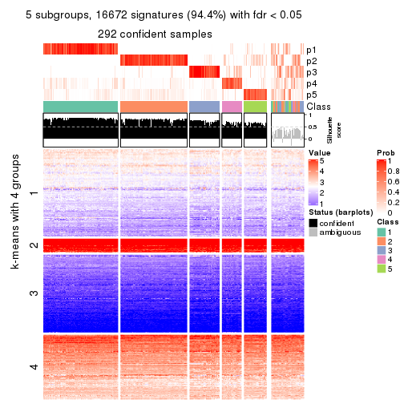</p>

</div>
<div id='tab-CV-skmeans-get-signatures-no-scale-5'>
<pre><code class="r">get_signatures(res, k = 6, scale_rows = FALSE)
</code></pre>

<p></p>

</div>
</div>


Compare the overlap of signatures from different k:

```r
compare_signatures(res)
```


`get_signature()` returns a data frame invisibly. TO get the list of signatures, the function
call should be assigned to a variable explicitly. In following code, if `plot` argument is set
to `FALSE`, no heatmap is plotted while only the differential analysis is performed.

```r
# code only for demonstration
tb = get_signature(res, k = ..., plot = FALSE)
```

An example of the output of `tb` is:

```
#>   which_row         fdr    mean_1    mean_2 scaled_mean_1 scaled_mean_2 km
#> 1        38 0.042760348  8.373488  9.131774    -0.5533452     0.5164555  1
#> 2        40 0.018707592  7.106213  8.469186    -0.6173731     0.5762149  1
#> 3        55 0.019134737 10.221463 11.207825    -0.6159697     0.5749050  1
#> 4        59 0.006059896  5.921854  7.869574    -0.6899429     0.6439467  1
#> 5        60 0.018055526  8.928898 10.211722    -0.6204761     0.5791110  1
#> 6        98 0.009384629 15.714769 14.887706     0.6635654    -0.6193277  2
...
```

The columns in `tb` are:

1. `which_row`: row indices corresponding to the input matrix.
2. `fdr`: FDR for the differential test. 
3. `mean_x`: The mean value in group x.
4. `scaled_mean_x`: The mean value in group x after rows are scaled.
5. `km`: Row groups if k-means clustering is applied to rows.


UMAP plot which shows how samples are separated.


<script>
$( function() {
	$( '#tabs-CV-skmeans-dimension-reduction' ).tabs();
} );
</script>
<div id='tabs-CV-skmeans-dimension-reduction'>
<ul>
<li><a href='#tab-CV-skmeans-dimension-reduction-1'>k = 2</a></li>
<li><a href='#tab-CV-skmeans-dimension-reduction-2'>k = 3</a></li>
<li><a href='#tab-CV-skmeans-dimension-reduction-3'>k = 4</a></li>
<li><a href='#tab-CV-skmeans-dimension-reduction-4'>k = 5</a></li>
<li><a href='#tab-CV-skmeans-dimension-reduction-5'>k = 6</a></li>
</ul>
<div id='tab-CV-skmeans-dimension-reduction-1'>
<pre><code class="r">dimension_reduction(res, k = 2, method = &quot;UMAP&quot;)
</code></pre>

<p></p>

</div>
<div id='tab-CV-skmeans-dimension-reduction-2'>
<pre><code class="r">dimension_reduction(res, k = 3, method = &quot;UMAP&quot;)
</code></pre>

<p></p>

</div>
<div id='tab-CV-skmeans-dimension-reduction-3'>
<pre><code class="r">dimension_reduction(res, k = 4, method = &quot;UMAP&quot;)
</code></pre>

<p></p>

</div>
<div id='tab-CV-skmeans-dimension-reduction-4'>
<pre><code class="r">dimension_reduction(res, k = 5, method = &quot;UMAP&quot;)
</code></pre>

<p></p>

</div>
<div id='tab-CV-skmeans-dimension-reduction-5'>
<pre><code class="r">dimension_reduction(res, k = 6, method = &quot;UMAP&quot;)
</code></pre>

<p></p>

</div>
</div>


Following heatmap shows how subgroups are split when increasing `k`:

```r
collect_classes(res)
```


If matrix rows can be associated to genes, consider to use `GO_Enrichment(res,
...)` to perform function enrichment for the signature genes.


 

---------------------------------------------------


### CV:pam*


The object with results only for a single top-value method and a single partition method 
can be extracted as:

```r
res = res_list["CV", "pam"]
# you can also extract it by
# res = res_list["CV:pam"]
```

A summary of `res` and all the functions that can be applied to it:

```r
res
```

```
#> A 'ConsensusPartition' object with k = 2, 3, 4, 5, 6.
#>   On a matrix with 17654 rows and 335 columns.
#>   Top rows (1000, 2000, 3000, 4000, 5000) are extracted by 'CV' method.
#>   Subgroups are detected by 'pam' method.
#>   Performed in total 1250 partitions by row resampling.
#>   Best k for subgroups seems to be 2.
#> 
#> Following methods can be applied to this 'ConsensusPartition' object:
#>  [1] "cola_report"             "collect_classes"         "collect_plots"          
#>  [4] "collect_stats"           "colnames"                "compare_signatures"     
#>  [7] "consensus_heatmap"       "dimension_reduction"     "functional_enrichment"  
#> [10] "get_anno_col"            "get_anno"                "get_classes"            
#> [13] "get_consensus"           "get_matrix"              "get_membership"         
#> [16] "get_param"               "get_signatures"          "get_stats"              
#> [19] "is_best_k"               "is_stable_k"             "membership_heatmap"     
#> [22] "ncol"                    "nrow"                    "plot_ecdf"              
#> [25] "rownames"                "select_partition_number" "show"                   
#> [28] "suggest_best_k"          "test_to_known_factors"
```

`collect_plots()` function collects all the plots made from `res` for all `k` (number of partitions)
into one single page to provide an easy and fast comparison between different `k`.

```r
collect_plots(res)
```


The plots are:

- The first row: a plot of the ECDF (Empirical cumulative distribution
  function) curves of the consensus matrix for each `k` and the heatmap of
  predicted classes for each `k`.
- The second row: heatmaps of the consensus matrix for each `k`.
- The third row: heatmaps of the membership matrix for each `k`.
- The fouth row: heatmaps of the signatures for each `k`.

All the plots in panels can be made by individual functions and they are
plotted later in this section.

`select_partition_number()` produces several plots showing different
statistics for choosing "optimized" `k`. There are following statistics:

- ECDF curves of the consensus matrix for each `k`;
- 1-PAC. [The PAC
  score](https://en.wikipedia.org/wiki/Consensus_clustering#Over-interpretation_potential_of_consensus_clustering)
  measures the proportion of the ambiguous subgrouping.
- Mean silhouette score.
- Concordance. The mean probability of fiting the consensus class ids in all
  partitions.
- Area increased. Denote $A_k$ as the area under the ECDF curve for current
  `k`, the area increased is defined as $A_k - A_{k-1}$.
- Rand index. The percent of pairs of samples that are both in a same cluster
  or both are not in a same cluster in the partition of k and k-1.
- Jaccard index. The ratio of pairs of samples are both in a same cluster in
  the partition of k and k-1 and the pairs of samples are both in a same
  cluster in the partition k or k-1.

The detailed explanations of these statistics can be found in [the cola
vignette](http://bioconductor.org/packages/devel/bioc/vignettes/cola/inst/doc/cola.html#toc_13).

Generally speaking, lower PAC score, higher mean silhouette score or higher
concordance corresponds to better partition. Rand index and Jaccard index
measure how similar the current partition is compared to partition with `k-1`.
If they are too similar, we won't accept `k` is better than `k-1`.

```r
select_partition_number(res)
```


The numeric values for all these statistics can be obtained by `get_stats()`.

```r
get_stats(res)
```

```
#>   k 1-PAC mean_silhouette concordance area_increased  Rand Jaccard
#> 2 2 0.912           0.912       0.965         0.4639 0.539   0.539
#> 3 3 0.658           0.750       0.887         0.3545 0.787   0.621
#> 4 4 0.779           0.780       0.894         0.1452 0.855   0.638
#> 5 5 0.670           0.601       0.799         0.0681 0.914   0.720
#> 6 6 0.693           0.628       0.789         0.0363 0.935   0.750
```

`suggest_best_k()` suggests the best $k$ based on these statistics. The rules are as follows:

- All $k$ with Jaccard index larger than 0.95 are removed because the increase of
  the partition number does not provides enough extra information. If all $k$ are removed,
  the best $k$ is assigned by `NA`.
- For $k$ with 1-PAC larger than 0.9, the maximal $k$ is taken as the "best k". Other $k$ is called "optional k".
- If it does not fit the second rule. The $k$ with the highest vote of highest
  1-PAC, mean silhouette and concordance is taken as the "best k".

```r
suggest_best_k(res)
```

```
#> [1] 2
```


Following shows the table of the partitions (You need to click the **show/hide
code output** link to see it). The membership matrix (columns with name `p*`)
is inferred by
[`clue::cl_consensus()`](https://www.rdocumentation.org/link/cl_consensus?package=clue)
function with the `SE` method. Basically the value in the membership matrix
represents the probability to belong to a certain group. The finall class
label for an item is determined with the group with highest probability it
belongs to.

In `get_classes()` function, the entropy is calculated from the membership
matrix and the silhouette score is calculated from the consensus matrix.


<script>
$( function() {
	$( '#tabs-CV-pam-get-classes' ).tabs();
} );
</script>
<div id='tabs-CV-pam-get-classes'>
<ul>
<li><a href='#tab-CV-pam-get-classes-1'>k = 2</a></li>
<li><a href='#tab-CV-pam-get-classes-2'>k = 3</a></li>
<li><a href='#tab-CV-pam-get-classes-3'>k = 4</a></li>
<li><a href='#tab-CV-pam-get-classes-4'>k = 5</a></li>
<li><a href='#tab-CV-pam-get-classes-5'>k = 6</a></li>
</ul>

<div id='tab-CV-pam-get-classes-1'>
<p><a id='tab-CV-pam-get-classes-1-a' style='color:#0366d6' href='#'>show/hide code output</a></p>
<pre><code class="r">cbind(get_classes(res, k = 2), get_membership(res, k = 2))
</code></pre>

<pre><code>#&gt;            class entropy silhouette    p1    p2
#&gt; SRR660306      2  0.0000     0.9667 0.000 1.000
#&gt; SRR1359328     2  0.0000     0.9667 0.000 1.000
#&gt; SRR821124      2  0.0000     0.9667 0.000 1.000
#&gt; SRR1335188     1  0.7883     0.6824 0.764 0.236
#&gt; SRR1075825     2  0.0000     0.9667 0.000 1.000
#&gt; SRR1321921     1  0.0000     0.9565 1.000 0.000
#&gt; SRR1466198     2  0.0000     0.9667 0.000 1.000
#&gt; SRR1384073     2  0.5629     0.8375 0.132 0.868
#&gt; SRR1312802     1  0.0672     0.9503 0.992 0.008
#&gt; SRR1076559     2  0.8909     0.5584 0.308 0.692
#&gt; SRR1370085     1  0.0000     0.9565 1.000 0.000
#&gt; SRR1460363     1  0.0000     0.9565 1.000 0.000
#&gt; SRR1480221     2  0.0000     0.9667 0.000 1.000
#&gt; SRR1476165     1  0.0938     0.9469 0.988 0.012
#&gt; SRR1459631     2  0.0000     0.9667 0.000 1.000
#&gt; SRR1448098     2  0.0000     0.9667 0.000 1.000
#&gt; SRR1321401     2  0.0000     0.9667 0.000 1.000
#&gt; SRR807613      2  0.0000     0.9667 0.000 1.000
#&gt; SRR808086      2  0.0000     0.9667 0.000 1.000
#&gt; SRR613687      2  0.0000     0.9667 0.000 1.000
#&gt; SRR1471011     2  0.2778     0.9269 0.048 0.952
#&gt; SRR1330284     2  0.0000     0.9667 0.000 1.000
#&gt; SRR1320624     2  0.0000     0.9667 0.000 1.000
#&gt; SRR1459519     1  0.0000     0.9565 1.000 0.000
#&gt; SRR1091184     2  0.0000     0.9667 0.000 1.000
#&gt; SRR1390561     1  0.0000     0.9565 1.000 0.000
#&gt; SRR658164      1  0.0000     0.9565 1.000 0.000
#&gt; SRR1087079     2  0.0000     0.9667 0.000 1.000
#&gt; SRR814996      2  0.0376     0.9640 0.004 0.996
#&gt; SRR1407410     2  0.0000     0.9667 0.000 1.000
#&gt; SRR1453392     2  0.0000     0.9667 0.000 1.000
#&gt; SRR1445873     1  0.0000     0.9565 1.000 0.000
#&gt; SRR1419985     2  0.0000     0.9667 0.000 1.000
#&gt; SRR820938      2  0.0000     0.9667 0.000 1.000
#&gt; SRR1476844     1  0.0000     0.9565 1.000 0.000
#&gt; SRR1403526     1  0.0000     0.9565 1.000 0.000
#&gt; SRR1413916     2  0.0000     0.9667 0.000 1.000
#&gt; SRR1441051     2  0.0000     0.9667 0.000 1.000
#&gt; SRR614287      2  0.0000     0.9667 0.000 1.000
#&gt; SRR1092062     2  0.0000     0.9667 0.000 1.000
#&gt; SRR612611      2  0.0000     0.9667 0.000 1.000
#&gt; SRR1376356     2  0.0000     0.9667 0.000 1.000
#&gt; SRR1405078     2  0.7883     0.6894 0.236 0.764
#&gt; SRR1437226     2  0.0000     0.9667 0.000 1.000
#&gt; SRR1326078     1  0.0000     0.9565 1.000 0.000
#&gt; SRR1096806     2  0.0000     0.9667 0.000 1.000
#&gt; SRR1440919     2  0.0000     0.9667 0.000 1.000
#&gt; SRR1452824     2  0.9833     0.2694 0.424 0.576
#&gt; SRR615754      1  0.0000     0.9565 1.000 0.000
#&gt; SRR1341787     2  0.0000     0.9667 0.000 1.000
#&gt; SRR614551      2  0.0000     0.9667 0.000 1.000
#&gt; SRR1380829     2  0.0376     0.9639 0.004 0.996
#&gt; SRR1455761     1  0.0000     0.9565 1.000 0.000
#&gt; SRR1465189     1  0.0000     0.9565 1.000 0.000
#&gt; SRR1376895     1  0.0000     0.9565 1.000 0.000
#&gt; SRR1445002     1  0.0000     0.9565 1.000 0.000
#&gt; SRR1469258     2  0.0000     0.9667 0.000 1.000
#&gt; SRR1409239     1  0.0000     0.9565 1.000 0.000
#&gt; SRR1480200     1  0.0000     0.9565 1.000 0.000
#&gt; SRR1418323     1  0.0000     0.9565 1.000 0.000
#&gt; SRR657540      2  0.0000     0.9667 0.000 1.000
#&gt; SRR821096      2  0.0000     0.9667 0.000 1.000
#&gt; SRR613591      2  0.0000     0.9667 0.000 1.000
#&gt; SRR1344205     2  0.0000     0.9667 0.000 1.000
#&gt; SRR612479      1  0.0672     0.9503 0.992 0.008
#&gt; SRR1399950     1  0.0672     0.9503 0.992 0.008
#&gt; SRR1336048     1  0.9983     0.0815 0.524 0.476
#&gt; SRR1368896     1  0.0000     0.9565 1.000 0.000
#&gt; SRR1379403     2  0.0000     0.9667 0.000 1.000
#&gt; SRR1312464     1  0.0000     0.9565 1.000 0.000
#&gt; SRR1096478     1  0.0000     0.9565 1.000 0.000
#&gt; SRR1459845     1  0.0000     0.9565 1.000 0.000
#&gt; SRR1348138     2  0.9754     0.3088 0.408 0.592
#&gt; SRR811423      1  0.0000     0.9565 1.000 0.000
#&gt; SRR615683      1  0.0000     0.9565 1.000 0.000
#&gt; SRR1380336     2  0.0000     0.9667 0.000 1.000
#&gt; SRR817609      1  0.0000     0.9565 1.000 0.000
#&gt; SRR1074550     2  0.0000     0.9667 0.000 1.000
#&gt; SRR1499236     2  0.0000     0.9667 0.000 1.000
#&gt; SRR656083      1  0.0000     0.9565 1.000 0.000
#&gt; SRR817539      1  0.0000     0.9565 1.000 0.000
#&gt; SRR1410801     1  0.0000     0.9565 1.000 0.000
#&gt; SRR1347190     2  0.9795     0.2947 0.416 0.584
#&gt; SRR1355126     2  0.0000     0.9667 0.000 1.000
#&gt; SRR615165      2  0.0000     0.9667 0.000 1.000
#&gt; SRR1466046     1  0.0000     0.9565 1.000 0.000
#&gt; SRR1097055     2  0.0000     0.9667 0.000 1.000
#&gt; SRR1312370     2  0.0376     0.9640 0.004 0.996
#&gt; SRR655325      1  0.0000     0.9565 1.000 0.000
#&gt; SRR810177      2  0.0000     0.9667 0.000 1.000
#&gt; SRR815685      2  0.0000     0.9667 0.000 1.000
#&gt; SRR817026      2  0.0000     0.9667 0.000 1.000
#&gt; SRR1417224     2  0.0000     0.9667 0.000 1.000
#&gt; SRR661687      2  0.0000     0.9667 0.000 1.000
#&gt; SRR1431804     1  0.9977     0.1029 0.528 0.472
#&gt; SRR664072      2  0.0376     0.9640 0.004 0.996
#&gt; SRR612923      2  0.0000     0.9667 0.000 1.000
#&gt; SRR1315890     1  0.0000     0.9565 1.000 0.000
#&gt; SRR1347726     1  0.1843     0.9326 0.972 0.028
#&gt; SRR1500360     2  0.4562     0.8783 0.096 0.904
#&gt; SRR1468360     2  0.0000     0.9667 0.000 1.000
#&gt; SRR1404084     2  0.0376     0.9640 0.004 0.996
#&gt; SRR615994      2  0.0000     0.9667 0.000 1.000
#&gt; SRR1475718     2  0.0000     0.9667 0.000 1.000
#&gt; SRR1397200     2  0.0000     0.9667 0.000 1.000
#&gt; SRR655519      2  0.0000     0.9667 0.000 1.000
#&gt; SRR1311308     2  0.0000     0.9667 0.000 1.000
#&gt; SRR1368006     2  0.0000     0.9667 0.000 1.000
#&gt; SRR613651      1  0.0672     0.9504 0.992 0.008
#&gt; SRR1362621     2  0.0000     0.9667 0.000 1.000
#&gt; SRR1451718     2  0.5842     0.8289 0.140 0.860
#&gt; SRR1095334     2  0.0000     0.9667 0.000 1.000
#&gt; SRR1079636     2  0.0000     0.9667 0.000 1.000
#&gt; SRR1442549     2  0.1184     0.9552 0.016 0.984
#&gt; SRR1466421     2  0.0000     0.9667 0.000 1.000
#&gt; SRR817397      2  0.0000     0.9667 0.000 1.000
#&gt; SRR1341809     2  0.0000     0.9667 0.000 1.000
#&gt; SRR614623      2  0.0000     0.9667 0.000 1.000
#&gt; SRR1335005     2  0.0000     0.9667 0.000 1.000
#&gt; SRR1407065     2  0.0000     0.9667 0.000 1.000
#&gt; SRR1404483     2  0.0000     0.9667 0.000 1.000
#&gt; SRR1096222     1  0.0000     0.9565 1.000 0.000
#&gt; SRR1401793     1  0.0000     0.9565 1.000 0.000
#&gt; SRR1408615     2  0.0000     0.9667 0.000 1.000
#&gt; SRR1070597     2  0.4022     0.8950 0.080 0.920
#&gt; SRR1332381     1  0.9775     0.2904 0.588 0.412
#&gt; SRR1457015     1  0.0000     0.9565 1.000 0.000
#&gt; SRR1386797     2  0.0000     0.9667 0.000 1.000
#&gt; SRR1098385     2  0.0000     0.9667 0.000 1.000
#&gt; SRR1363947     2  0.0000     0.9667 0.000 1.000
#&gt; SRR820350      2  0.0000     0.9667 0.000 1.000
#&gt; SRR662055      2  0.0376     0.9639 0.004 0.996
#&gt; SRR1310455     1  0.0000     0.9565 1.000 0.000
#&gt; SRR1453639     2  0.0938     0.9581 0.012 0.988
#&gt; SRR662617      2  0.0000     0.9667 0.000 1.000
#&gt; SRR654778      2  0.7376     0.7329 0.208 0.792
#&gt; SRR661782      2  0.0000     0.9667 0.000 1.000
#&gt; SRR1334396     1  0.0000     0.9565 1.000 0.000
#&gt; SRR613867      2  0.0000     0.9667 0.000 1.000
#&gt; SRR1479412     1  0.6247     0.7946 0.844 0.156
#&gt; SRR1331620     1  0.0000     0.9565 1.000 0.000
#&gt; SRR1082809     2  0.9170     0.5113 0.332 0.668
#&gt; SRR1417178     1  0.0000     0.9565 1.000 0.000
#&gt; SRR1335278     1  0.0000     0.9565 1.000 0.000
#&gt; SRR665369      2  0.0000     0.9667 0.000 1.000
#&gt; SRR657552      2  0.9635     0.3671 0.388 0.612
#&gt; SRR812412      1  0.0000     0.9565 1.000 0.000
#&gt; SRR1096500     2  0.0000     0.9667 0.000 1.000
#&gt; SRR1347750     2  0.0000     0.9667 0.000 1.000
#&gt; SRR615153      1  0.9044     0.5401 0.680 0.320
#&gt; SRR1434417     1  0.0000     0.9565 1.000 0.000
#&gt; SRR1070159     2  0.0000     0.9667 0.000 1.000
#&gt; SRR1332508     2  0.0000     0.9667 0.000 1.000
#&gt; SRR1082059     2  0.0000     0.9667 0.000 1.000
#&gt; SRR1402491     1  0.0000     0.9565 1.000 0.000
#&gt; SRR1476595     2  0.1184     0.9548 0.016 0.984
#&gt; SRR1320987     2  0.0000     0.9667 0.000 1.000
#&gt; SRR1086417     2  0.4022     0.8954 0.080 0.920
#&gt; SRR1454095     1  0.9795     0.2992 0.584 0.416
#&gt; SRR614791      2  0.4161     0.8906 0.084 0.916
#&gt; SRR821255      2  0.1184     0.9550 0.016 0.984
#&gt; SRR820402      2  0.0000     0.9667 0.000 1.000
#&gt; SRR1337284     2  0.1843     0.9455 0.028 0.972
#&gt; SRR1333083     2  0.5737     0.8313 0.136 0.864
#&gt; SRR1384883     2  0.0000     0.9667 0.000 1.000
#&gt; SRR614431      1  0.0000     0.9565 1.000 0.000
#&gt; SRR1481106     2  0.0000     0.9667 0.000 1.000
#&gt; SRR1370285     1  0.0000     0.9565 1.000 0.000
#&gt; SRR1446673     2  0.0000     0.9667 0.000 1.000
#&gt; SRR1318046     2  0.0000     0.9667 0.000 1.000
#&gt; SRR1341188     2  0.0000     0.9667 0.000 1.000
#&gt; SRR1384941     1  0.0000     0.9565 1.000 0.000
#&gt; SRR1322864     2  0.0000     0.9667 0.000 1.000
#&gt; SRR1476825     1  0.9686     0.3347 0.604 0.396
#&gt; SRR1443332     2  0.0000     0.9667 0.000 1.000
#&gt; SRR662486      2  0.0000     0.9667 0.000 1.000
#&gt; SRR1447019     1  0.0000     0.9565 1.000 0.000
#&gt; SRR662942      1  0.0000     0.9565 1.000 0.000
#&gt; SRR613102      2  0.0000     0.9667 0.000 1.000
#&gt; SRR1469880     1  0.0000     0.9565 1.000 0.000
#&gt; SRR1464977     2  0.9129     0.5219 0.328 0.672
#&gt; SRR615850      2  0.9983     0.0758 0.476 0.524
#&gt; SRR661949      2  0.0000     0.9667 0.000 1.000
#&gt; SRR1322227     2  0.0000     0.9667 0.000 1.000
#&gt; SRR1441655     2  0.0938     0.9581 0.012 0.988
#&gt; SRR613771      2  0.0000     0.9667 0.000 1.000
#&gt; SRR1479471     1  0.0000     0.9565 1.000 0.000
#&gt; SRR1488918     2  0.0000     0.9667 0.000 1.000
#&gt; SRR1414040     2  0.0000     0.9667 0.000 1.000
#&gt; SRR1079850     2  0.0376     0.9640 0.004 0.996
#&gt; SRR663209      1  0.0000     0.9565 1.000 0.000
#&gt; SRR1364914     2  0.0000     0.9667 0.000 1.000
#&gt; SRR1408267     2  0.0000     0.9667 0.000 1.000
#&gt; SRR1314894     1  0.0000     0.9565 1.000 0.000
#&gt; SRR1414117     2  0.0000     0.9667 0.000 1.000
#&gt; SRR1395975     2  0.0000     0.9667 0.000 1.000
#&gt; SRR1402219     2  0.0000     0.9667 0.000 1.000
#&gt; SRR1433623     1  0.0000     0.9565 1.000 0.000
#&gt; SRR656385      2  0.0000     0.9667 0.000 1.000
#&gt; SRR811213      2  0.0000     0.9667 0.000 1.000
#&gt; SRR663657      2  0.0000     0.9667 0.000 1.000
#&gt; SRR612203      1  0.0000     0.9565 1.000 0.000
#&gt; SRR613987      2  0.0000     0.9667 0.000 1.000
#&gt; SRR613831      2  0.0000     0.9667 0.000 1.000
#&gt; SRR1354180     2  0.0000     0.9667 0.000 1.000
#&gt; SRR1382912     1  0.0000     0.9565 1.000 0.000
#&gt; SRR1475501     1  0.0000     0.9565 1.000 0.000
#&gt; SRR1336930     1  0.0000     0.9565 1.000 0.000
#&gt; SRR613030      2  0.0000     0.9667 0.000 1.000
#&gt; SRR1381459     2  0.0000     0.9667 0.000 1.000
#&gt; SRR1402350     2  0.1843     0.9441 0.028 0.972
#&gt; SRR1419408     1  0.0000     0.9565 1.000 0.000
#&gt; SRR655911      2  0.0000     0.9667 0.000 1.000
#&gt; SRR1418243     1  0.0000     0.9565 1.000 0.000
#&gt; SRR1322573     2  0.3114     0.9200 0.056 0.944
#&gt; SRR613615      2  0.0000     0.9667 0.000 1.000
#&gt; SRR1355284     1  0.0000     0.9565 1.000 0.000
#&gt; SRR1319395     1  0.0000     0.9565 1.000 0.000
#&gt; SRR818939      1  0.0000     0.9565 1.000 0.000
#&gt; SRR1465266     1  0.0000     0.9565 1.000 0.000
#&gt; SRR614888      1  0.7815     0.6949 0.768 0.232
#&gt; SRR1431694     2  0.9881     0.2330 0.436 0.564
#&gt; SRR614347      2  0.0000     0.9667 0.000 1.000
#&gt; SRR1334228     2  0.0000     0.9667 0.000 1.000
#&gt; SRR1096007     2  0.0000     0.9667 0.000 1.000
#&gt; SRR656349      1  0.4298     0.8735 0.912 0.088
#&gt; SRR815422      2  0.0000     0.9667 0.000 1.000
#&gt; SRR1360828     1  0.0000     0.9565 1.000 0.000
#&gt; SRR1359005     2  0.0000     0.9667 0.000 1.000
#&gt; SRR1456652     1  0.0000     0.9565 1.000 0.000
#&gt; SRR1391660     1  0.0000     0.9565 1.000 0.000
#&gt; SRR1441956     1  0.0000     0.9565 1.000 0.000
#&gt; SRR662930      2  0.0000     0.9667 0.000 1.000
#&gt; SRR615790      2  0.0000     0.9667 0.000 1.000
#&gt; SRR614827      2  0.0000     0.9667 0.000 1.000
#&gt; SRR614587      2  0.0000     0.9667 0.000 1.000
#&gt; SRR814052      2  0.0000     0.9667 0.000 1.000
#&gt; SRR1070086     1  0.0000     0.9565 1.000 0.000
#&gt; SRR1481440     1  0.0000     0.9565 1.000 0.000
#&gt; SRR1339296     2  0.0000     0.9667 0.000 1.000
#&gt; SRR1343239     2  0.0000     0.9667 0.000 1.000
#&gt; SRR1432802     2  0.0000     0.9667 0.000 1.000
#&gt; SRR1416911     1  0.0000     0.9565 1.000 0.000
#&gt; SRR1410427     1  0.9393     0.4540 0.644 0.356
#&gt; SRR1401185     2  0.3879     0.9011 0.076 0.924
#&gt; SRR654993      2  0.0000     0.9667 0.000 1.000
#&gt; SRR656397      1  0.0000     0.9565 1.000 0.000
#&gt; SRR809643      2  0.0938     0.9582 0.012 0.988
#&gt; SRR1433819     1  0.0000     0.9565 1.000 0.000
#&gt; SRR1375225     2  0.0000     0.9667 0.000 1.000
#&gt; SRR1367739     2  0.9661     0.3546 0.392 0.608
#&gt; SRR1323336     2  0.0376     0.9640 0.004 0.996
#&gt; SRR663224      2  0.0000     0.9667 0.000 1.000
#&gt; SRR1442840     1  0.0000     0.9565 1.000 0.000
#&gt; SRR1374058     1  0.0000     0.9565 1.000 0.000
#&gt; SRR656994      1  0.0000     0.9565 1.000 0.000
#&gt; SRR1469214     2  0.0000     0.9667 0.000 1.000
#&gt; SRR1456446     1  0.9977     0.1206 0.528 0.472
#&gt; SRR1471879     2  0.0000     0.9667 0.000 1.000
#&gt; SRR612911      2  0.0000     0.9667 0.000 1.000
#&gt; SRR1395720     2  0.0000     0.9667 0.000 1.000
#&gt; SRR1413055     1  0.0000     0.9565 1.000 0.000
#&gt; SRR656770      2  0.0000     0.9667 0.000 1.000
#&gt; SRR812080      2  0.0000     0.9667 0.000 1.000
#&gt; SRR1479328     1  0.0672     0.9503 0.992 0.008
#&gt; SRR661421      2  0.0000     0.9667 0.000 1.000
#&gt; SRR1410286     2  0.0000     0.9667 0.000 1.000
#&gt; SRR1487150     1  0.0000     0.9565 1.000 0.000
#&gt; SRR1467035     1  0.0000     0.9565 1.000 0.000
#&gt; SRR1360607     2  0.0000     0.9667 0.000 1.000
#&gt; SRR1333106     2  0.0000     0.9667 0.000 1.000
#&gt; SRR1088706     2  0.0000     0.9667 0.000 1.000
#&gt; SRR1320053     2  0.0000     0.9667 0.000 1.000
#&gt; SRR1350392     2  0.0000     0.9667 0.000 1.000
#&gt; SRR1385190     1  0.9963     0.1247 0.536 0.464
#&gt; SRR1080093     2  0.0000     0.9667 0.000 1.000
#&gt; SRR1318753     1  0.0000     0.9565 1.000 0.000
#&gt; SRR1345369     2  0.0000     0.9667 0.000 1.000
#&gt; SRR612178      2  0.0000     0.9667 0.000 1.000
#&gt; SRR1354423     1  0.0000     0.9565 1.000 0.000
#&gt; SRR1072724     1  0.0000     0.9565 1.000 0.000
#&gt; SRR1418450     2  0.0000     0.9667 0.000 1.000
#&gt; SRR1326427     2  0.4298     0.8852 0.088 0.912
#&gt; SRR1437412     2  0.2236     0.9377 0.036 0.964
#&gt; SRR1327548     2  0.0000     0.9667 0.000 1.000
#&gt; SRR1395891     1  0.0000     0.9565 1.000 0.000
#&gt; SRR659367      2  0.4431     0.8838 0.092 0.908
#&gt; SRR818961      1  0.0000     0.9565 1.000 0.000
#&gt; SRR813704      1  0.0000     0.9565 1.000 0.000
#&gt; SRR613054      1  0.0000     0.9565 1.000 0.000
#&gt; SRR1476467     1  0.0000     0.9565 1.000 0.000
#&gt; SRR1407988     2  0.0000     0.9667 0.000 1.000
#&gt; SRR1394776     2  0.0000     0.9667 0.000 1.000
#&gt; SRR655578      2  0.0000     0.9667 0.000 1.000
#&gt; SRR1310645     2  0.0000     0.9667 0.000 1.000
#&gt; SRR1345628     1  0.0000     0.9565 1.000 0.000
#&gt; SRR1479740     1  0.0000     0.9565 1.000 0.000
#&gt; SRR1332095     2  0.3733     0.9041 0.072 0.928
#&gt; SRR1444786     2  0.0000     0.9667 0.000 1.000
#&gt; SRR1090070     1  0.0000     0.9565 1.000 0.000
#&gt; SRR662414      2  0.0000     0.9667 0.000 1.000
#&gt; SRR661216      2  0.0000     0.9667 0.000 1.000
#&gt; SRR656313      2  0.0000     0.9667 0.000 1.000
#&gt; SRR615671      2  0.0672     0.9611 0.008 0.992
#&gt; SRR1350196     2  0.0000     0.9667 0.000 1.000
#&gt; SRR1466580     1  0.0000     0.9565 1.000 0.000
#&gt; SRR1408032     2  0.0000     0.9667 0.000 1.000
#&gt; SRR1432913     2  0.0000     0.9667 0.000 1.000
#&gt; SRR1360502     2  0.9686     0.3537 0.396 0.604
#&gt; SRR1391901     2  0.0000     0.9667 0.000 1.000
#&gt; SRR1311131     1  0.0000     0.9565 1.000 0.000
#&gt; SRR1380636     1  0.0000     0.9565 1.000 0.000
#&gt; SRR1332339     1  0.0000     0.9565 1.000 0.000
#&gt; SRR1341563     2  0.0000     0.9667 0.000 1.000
#&gt; SRR1359410     2  0.0000     0.9667 0.000 1.000
#&gt; SRR1473040     2  0.0672     0.9612 0.008 0.992
#&gt; SRR1321444     1  0.0000     0.9565 1.000 0.000
#&gt; SRR1498765     2  0.0000     0.9667 0.000 1.000
#&gt; SRR1312622     2  0.0000     0.9667 0.000 1.000
#&gt; SRR615503      2  0.0672     0.9610 0.008 0.992
#&gt; SRR1453192     1  0.0000     0.9565 1.000 0.000
#&gt; SRR1433107     2  0.0000     0.9667 0.000 1.000
#&gt; SRR1075384     1  0.0000     0.9565 1.000 0.000
#&gt; SRR1356683     1  0.0000     0.9565 1.000 0.000
#&gt; SRR659049      1  0.0000     0.9565 1.000 0.000
#&gt; SRR1368240     1  0.0000     0.9565 1.000 0.000
#&gt; SRR1341739     1  0.0000     0.9565 1.000 0.000
#&gt; SRR613249      2  0.9393     0.4484 0.356 0.644
#&gt; SRR663428      2  0.0000     0.9667 0.000 1.000
#&gt; SRR1341302     2  0.0000     0.9667 0.000 1.000
#&gt; SRR1073553     2  0.0000     0.9667 0.000 1.000
#&gt; SRR1354093     2  0.0000     0.9667 0.000 1.000
#&gt; SRR1406521     2  0.0000     0.9667 0.000 1.000
#&gt; SRR1432049     1  0.9209     0.4979 0.664 0.336
#&gt; SRR1453504     2  0.8267     0.6418 0.260 0.740
</code></pre>

<script>
$('#tab-CV-pam-get-classes-1-a').parent().next().next().hide();
$('#tab-CV-pam-get-classes-1-a').click(function(){
  $('#tab-CV-pam-get-classes-1-a').parent().next().next().toggle();
  return(false);
});
</script>
</div>

<div id='tab-CV-pam-get-classes-2'>
<p><a id='tab-CV-pam-get-classes-2-a' style='color:#0366d6' href='#'>show/hide code output</a></p>
<pre><code class="r">cbind(get_classes(res, k = 3), get_membership(res, k = 3))
</code></pre>

<pre><code>#&gt;            class entropy silhouette    p1    p2    p3
#&gt; SRR660306      2  0.5560    0.65038 0.000 0.700 0.300
#&gt; SRR1359328     3  0.2711    0.74687 0.000 0.088 0.912
#&gt; SRR821124      2  0.0424    0.83342 0.000 0.992 0.008
#&gt; SRR1335188     2  0.6299    0.03062 0.476 0.524 0.000
#&gt; SRR1075825     2  0.2356    0.82354 0.000 0.928 0.072
#&gt; SRR1321921     1  0.0000    0.95291 1.000 0.000 0.000
#&gt; SRR1466198     3  0.1964    0.75143 0.000 0.056 0.944
#&gt; SRR1384073     2  0.2772    0.77270 0.080 0.916 0.004
#&gt; SRR1312802     1  0.0000    0.95291 1.000 0.000 0.000
#&gt; SRR1076559     2  0.4834    0.58561 0.204 0.792 0.004
#&gt; SRR1370085     1  0.0000    0.95291 1.000 0.000 0.000
#&gt; SRR1460363     1  0.0000    0.95291 1.000 0.000 0.000
#&gt; SRR1480221     2  0.1529    0.82972 0.000 0.960 0.040
#&gt; SRR1476165     1  0.0237    0.94957 0.996 0.004 0.000
#&gt; SRR1459631     2  0.6267    0.27271 0.000 0.548 0.452
#&gt; SRR1448098     2  0.0592    0.83414 0.000 0.988 0.012
#&gt; SRR1321401     2  0.0424    0.83287 0.000 0.992 0.008
#&gt; SRR807613      2  0.0892    0.83332 0.000 0.980 0.020
#&gt; SRR808086      3  0.3340    0.72988 0.000 0.120 0.880
#&gt; SRR613687      2  0.3551    0.80065 0.000 0.868 0.132
#&gt; SRR1471011     2  0.4353    0.69920 0.008 0.836 0.156
#&gt; SRR1330284     2  0.4399    0.77046 0.000 0.812 0.188
#&gt; SRR1320624     2  0.1643    0.83026 0.000 0.956 0.044
#&gt; SRR1459519     1  0.0000    0.95291 1.000 0.000 0.000
#&gt; SRR1091184     2  0.6267    0.02884 0.000 0.548 0.452
#&gt; SRR1390561     1  0.0000    0.95291 1.000 0.000 0.000
#&gt; SRR658164      1  0.0000    0.95291 1.000 0.000 0.000
#&gt; SRR1087079     2  0.1031    0.83399 0.000 0.976 0.024
#&gt; SRR814996      3  0.4110    0.71232 0.004 0.152 0.844
#&gt; SRR1407410     2  0.0424    0.83287 0.000 0.992 0.008
#&gt; SRR1453392     2  0.2165    0.82305 0.000 0.936 0.064
#&gt; SRR1445873     1  0.0000    0.95291 1.000 0.000 0.000
#&gt; SRR1419985     2  0.0237    0.83288 0.000 0.996 0.004
#&gt; SRR820938      2  0.6302   -0.01576 0.000 0.520 0.480
#&gt; SRR1476844     1  0.0000    0.95291 1.000 0.000 0.000
#&gt; SRR1403526     1  0.0000    0.95291 1.000 0.000 0.000
#&gt; SRR1413916     2  0.4504    0.76688 0.000 0.804 0.196
#&gt; SRR1441051     2  0.0237    0.83288 0.000 0.996 0.004
#&gt; SRR614287      2  0.2959    0.81250 0.000 0.900 0.100
#&gt; SRR1092062     2  0.0237    0.83288 0.000 0.996 0.004
#&gt; SRR612611      2  0.4291    0.77713 0.000 0.820 0.180
#&gt; SRR1376356     2  0.2165    0.82700 0.000 0.936 0.064
#&gt; SRR1405078     3  0.5408    0.70375 0.052 0.136 0.812
#&gt; SRR1437226     2  0.2356    0.79947 0.000 0.928 0.072
#&gt; SRR1326078     1  0.0000    0.95291 1.000 0.000 0.000
#&gt; SRR1096806     3  0.3816    0.72068 0.000 0.148 0.852
#&gt; SRR1440919     2  0.3686    0.79061 0.000 0.860 0.140
#&gt; SRR1452824     1  0.7677    0.49694 0.660 0.244 0.096
#&gt; SRR615754      1  0.0000    0.95291 1.000 0.000 0.000
#&gt; SRR1341787     2  0.5178    0.48485 0.000 0.744 0.256
#&gt; SRR614551      2  0.3340    0.80407 0.000 0.880 0.120
#&gt; SRR1380829     2  0.6062    0.21069 0.000 0.616 0.384
#&gt; SRR1455761     1  0.0000    0.95291 1.000 0.000 0.000
#&gt; SRR1465189     1  0.2261    0.88764 0.932 0.000 0.068
#&gt; SRR1376895     1  0.0000    0.95291 1.000 0.000 0.000
#&gt; SRR1445002     1  0.0000    0.95291 1.000 0.000 0.000
#&gt; SRR1469258     2  0.4002    0.78999 0.000 0.840 0.160
#&gt; SRR1409239     1  0.0000    0.95291 1.000 0.000 0.000
#&gt; SRR1480200     1  0.0000    0.95291 1.000 0.000 0.000
#&gt; SRR1418323     1  0.0000    0.95291 1.000 0.000 0.000
#&gt; SRR657540      3  0.0424    0.73164 0.000 0.008 0.992
#&gt; SRR821096      2  0.0237    0.83288 0.000 0.996 0.004
#&gt; SRR613591      2  0.5058    0.69477 0.000 0.756 0.244
#&gt; SRR1344205     3  0.2261    0.75205 0.000 0.068 0.932
#&gt; SRR612479      1  0.1399    0.92521 0.968 0.004 0.028
#&gt; SRR1399950     1  0.0237    0.94930 0.996 0.004 0.000
#&gt; SRR1336048     3  0.6767    0.56537 0.216 0.064 0.720
#&gt; SRR1368896     1  0.0000    0.95291 1.000 0.000 0.000
#&gt; SRR1379403     2  0.5678    0.48594 0.000 0.684 0.316
#&gt; SRR1312464     1  0.0000    0.95291 1.000 0.000 0.000
#&gt; SRR1096478     1  0.0000    0.95291 1.000 0.000 0.000
#&gt; SRR1459845     1  0.0000    0.95291 1.000 0.000 0.000
#&gt; SRR1348138     3  0.3141    0.74672 0.020 0.068 0.912
#&gt; SRR811423      1  0.1163    0.92799 0.972 0.000 0.028
#&gt; SRR615683      1  0.0000    0.95291 1.000 0.000 0.000
#&gt; SRR1380336     2  0.4002    0.78989 0.000 0.840 0.160
#&gt; SRR817609      1  0.0000    0.95291 1.000 0.000 0.000
#&gt; SRR1074550     3  0.5254    0.61471 0.000 0.264 0.736
#&gt; SRR1499236     2  0.2959    0.81816 0.000 0.900 0.100
#&gt; SRR656083      1  0.0000    0.95291 1.000 0.000 0.000
#&gt; SRR817539      1  0.0000    0.95291 1.000 0.000 0.000
#&gt; SRR1410801     1  0.0000    0.95291 1.000 0.000 0.000
#&gt; SRR1347190     1  0.5618    0.60197 0.732 0.260 0.008
#&gt; SRR1355126     2  0.1031    0.83534 0.000 0.976 0.024
#&gt; SRR615165      3  0.2356    0.75179 0.000 0.072 0.928
#&gt; SRR1466046     1  0.0000    0.95291 1.000 0.000 0.000
#&gt; SRR1097055     2  0.0237    0.83288 0.000 0.996 0.004
#&gt; SRR1312370     2  0.0237    0.83288 0.000 0.996 0.004
#&gt; SRR655325      1  0.0000    0.95291 1.000 0.000 0.000
#&gt; SRR810177      2  0.0237    0.83288 0.000 0.996 0.004
#&gt; SRR815685      2  0.0892    0.83343 0.000 0.980 0.020
#&gt; SRR817026      2  0.6274    0.02619 0.000 0.544 0.456
#&gt; SRR1417224     2  0.6045    0.21785 0.000 0.620 0.380
#&gt; SRR661687      3  0.6267    0.06534 0.000 0.452 0.548
#&gt; SRR1431804     1  0.4945    0.79350 0.840 0.056 0.104
#&gt; SRR664072      3  0.0892    0.74079 0.000 0.020 0.980
#&gt; SRR612923      2  0.4504    0.76636 0.000 0.804 0.196
#&gt; SRR1315890     1  0.0000    0.95291 1.000 0.000 0.000
#&gt; SRR1347726     1  0.5591    0.53994 0.696 0.304 0.000
#&gt; SRR1500360     2  0.0237    0.83288 0.000 0.996 0.004
#&gt; SRR1468360     2  0.0592    0.83407 0.000 0.988 0.012
#&gt; SRR1404084     2  0.0424    0.83287 0.000 0.992 0.008
#&gt; SRR615994      3  0.0237    0.73108 0.000 0.004 0.996
#&gt; SRR1475718     2  0.1031    0.83398 0.000 0.976 0.024
#&gt; SRR1397200     3  0.2261    0.75205 0.000 0.068 0.932
#&gt; SRR655519      2  0.4452    0.76726 0.000 0.808 0.192
#&gt; SRR1311308     3  0.6295    0.08881 0.000 0.472 0.528
#&gt; SRR1368006     2  0.0237    0.83288 0.000 0.996 0.004
#&gt; SRR613651      1  0.3784    0.81418 0.864 0.004 0.132
#&gt; SRR1362621     2  0.5465    0.51764 0.000 0.712 0.288
#&gt; SRR1451718     2  0.3539    0.74568 0.100 0.888 0.012
#&gt; SRR1095334     3  0.2448    0.75039 0.000 0.076 0.924
#&gt; SRR1079636     2  0.3482    0.80772 0.000 0.872 0.128
#&gt; SRR1442549     2  0.0829    0.83463 0.004 0.984 0.012
#&gt; SRR1466421     2  0.0424    0.83412 0.000 0.992 0.008
#&gt; SRR817397      2  0.5138    0.68945 0.000 0.748 0.252
#&gt; SRR1341809     2  0.3340    0.80407 0.000 0.880 0.120
#&gt; SRR614623      2  0.3340    0.80407 0.000 0.880 0.120
#&gt; SRR1335005     2  0.2261    0.81850 0.000 0.932 0.068
#&gt; SRR1407065     2  0.6168    0.38857 0.000 0.588 0.412
#&gt; SRR1404483     2  0.6225    0.19177 0.000 0.568 0.432
#&gt; SRR1096222     1  0.0000    0.95291 1.000 0.000 0.000
#&gt; SRR1401793     1  0.0000    0.95291 1.000 0.000 0.000
#&gt; SRR1408615     3  0.5363    0.60964 0.000 0.276 0.724
#&gt; SRR1070597     2  0.0829    0.83331 0.004 0.984 0.012
#&gt; SRR1332381     1  0.1711    0.91451 0.960 0.032 0.008
#&gt; SRR1457015     1  0.0000    0.95291 1.000 0.000 0.000
#&gt; SRR1386797     2  0.0237    0.83288 0.000 0.996 0.004
#&gt; SRR1098385     2  0.0237    0.83288 0.000 0.996 0.004
#&gt; SRR1363947     3  0.3340    0.73241 0.000 0.120 0.880
#&gt; SRR820350      2  0.0237    0.83288 0.000 0.996 0.004
#&gt; SRR662055      3  0.6235    0.12501 0.000 0.436 0.564
#&gt; SRR1310455     1  0.0000    0.95291 1.000 0.000 0.000
#&gt; SRR1453639     2  0.0592    0.83303 0.000 0.988 0.012
#&gt; SRR662617      2  0.4452    0.76726 0.000 0.808 0.192
#&gt; SRR654778      1  0.9518   -0.10816 0.420 0.392 0.188
#&gt; SRR661782      2  0.3340    0.80407 0.000 0.880 0.120
#&gt; SRR1334396     1  0.0000    0.95291 1.000 0.000 0.000
#&gt; SRR613867      2  0.4452    0.76726 0.000 0.808 0.192
#&gt; SRR1479412     1  0.4002    0.77813 0.840 0.160 0.000
#&gt; SRR1331620     1  0.0000    0.95291 1.000 0.000 0.000
#&gt; SRR1082809     3  0.9956    0.35295 0.336 0.292 0.372
#&gt; SRR1417178     1  0.0424    0.94551 0.992 0.008 0.000
#&gt; SRR1335278     1  0.0000    0.95291 1.000 0.000 0.000
#&gt; SRR665369      2  0.3879    0.79012 0.000 0.848 0.152
#&gt; SRR657552      1  0.7841    0.33014 0.576 0.064 0.360
#&gt; SRR812412      1  0.0000    0.95291 1.000 0.000 0.000
#&gt; SRR1096500     2  0.0237    0.83288 0.000 0.996 0.004
#&gt; SRR1347750     2  0.0424    0.83287 0.000 0.992 0.008
#&gt; SRR615153      2  0.9065    0.22085 0.144 0.492 0.364
#&gt; SRR1434417     1  0.0000    0.95291 1.000 0.000 0.000
#&gt; SRR1070159     3  0.6274    0.34499 0.000 0.456 0.544
#&gt; SRR1332508     2  0.0424    0.83287 0.000 0.992 0.008
#&gt; SRR1082059     2  0.0424    0.83287 0.000 0.992 0.008
#&gt; SRR1402491     1  0.0000    0.95291 1.000 0.000 0.000
#&gt; SRR1476595     2  0.0237    0.83288 0.000 0.996 0.004
#&gt; SRR1320987     2  0.0237    0.83288 0.000 0.996 0.004
#&gt; SRR1086417     2  0.3532    0.73689 0.108 0.884 0.008
#&gt; SRR1454095     2  0.2165    0.80247 0.064 0.936 0.000
#&gt; SRR614791      3  0.6291    0.01348 0.000 0.468 0.532
#&gt; SRR821255      2  0.0661    0.83393 0.004 0.988 0.008
#&gt; SRR820402      2  0.6274    0.03906 0.000 0.544 0.456
#&gt; SRR1337284     2  0.1399    0.82069 0.028 0.968 0.004
#&gt; SRR1333083     3  0.3875    0.73499 0.044 0.068 0.888
#&gt; SRR1384883     3  0.6235    0.12501 0.000 0.436 0.564
#&gt; SRR614431      1  0.0000    0.95291 1.000 0.000 0.000
#&gt; SRR1481106     2  0.3551    0.81034 0.000 0.868 0.132
#&gt; SRR1370285     1  0.0000    0.95291 1.000 0.000 0.000
#&gt; SRR1446673     3  0.2261    0.75205 0.000 0.068 0.932
#&gt; SRR1318046     2  0.0892    0.83353 0.000 0.980 0.020
#&gt; SRR1341188     3  0.2261    0.75205 0.000 0.068 0.932
#&gt; SRR1384941     1  0.0000    0.95291 1.000 0.000 0.000
#&gt; SRR1322864     2  0.0237    0.83402 0.000 0.996 0.004
#&gt; SRR1476825     3  0.7054   -0.00388 0.456 0.020 0.524
#&gt; SRR1443332     2  0.3752    0.72188 0.000 0.856 0.144
#&gt; SRR662486      2  0.4504    0.76636 0.000 0.804 0.196
#&gt; SRR1447019     1  0.0000    0.95291 1.000 0.000 0.000
#&gt; SRR662942      1  0.0000    0.95291 1.000 0.000 0.000
#&gt; SRR613102      3  0.2261    0.75205 0.000 0.068 0.932
#&gt; SRR1469880     1  0.0000    0.95291 1.000 0.000 0.000
#&gt; SRR1464977     2  0.4733    0.61537 0.196 0.800 0.004
#&gt; SRR615850      3  0.1267    0.73084 0.024 0.004 0.972
#&gt; SRR661949      2  0.3412    0.80321 0.000 0.876 0.124
#&gt; SRR1322227     2  0.6026    0.19052 0.000 0.624 0.376
#&gt; SRR1441655     2  0.0000    0.83352 0.000 1.000 0.000
#&gt; SRR613771      3  0.6225    0.25420 0.000 0.432 0.568
#&gt; SRR1479471     1  0.0000    0.95291 1.000 0.000 0.000
#&gt; SRR1488918     2  0.4555    0.76368 0.000 0.800 0.200
#&gt; SRR1414040     2  0.2625    0.82177 0.000 0.916 0.084
#&gt; SRR1079850     2  0.0237    0.83288 0.000 0.996 0.004
#&gt; SRR663209      1  0.0237    0.94949 0.996 0.000 0.004
#&gt; SRR1364914     2  0.2448    0.82400 0.000 0.924 0.076
#&gt; SRR1408267     2  0.0424    0.83287 0.000 0.992 0.008
#&gt; SRR1314894     1  0.0000    0.95291 1.000 0.000 0.000
#&gt; SRR1414117     2  0.5733    0.42820 0.000 0.676 0.324
#&gt; SRR1395975     2  0.0592    0.83303 0.000 0.988 0.012
#&gt; SRR1402219     2  0.0592    0.83303 0.000 0.988 0.012
#&gt; SRR1433623     1  0.0000    0.95291 1.000 0.000 0.000
#&gt; SRR656385      2  0.5016    0.72370 0.000 0.760 0.240
#&gt; SRR811213      2  0.1643    0.82293 0.000 0.956 0.044
#&gt; SRR663657      3  0.6235    0.12501 0.000 0.436 0.564
#&gt; SRR612203      1  0.0000    0.95291 1.000 0.000 0.000
#&gt; SRR613987      2  0.3482    0.80190 0.000 0.872 0.128
#&gt; SRR613831      3  0.1860    0.75044 0.000 0.052 0.948
#&gt; SRR1354180     2  0.3619    0.80481 0.000 0.864 0.136
#&gt; SRR1382912     1  0.0000    0.95291 1.000 0.000 0.000
#&gt; SRR1475501     1  0.0000    0.95291 1.000 0.000 0.000
#&gt; SRR1336930     1  0.0000    0.95291 1.000 0.000 0.000
#&gt; SRR613030      3  0.6235    0.12501 0.000 0.436 0.564
#&gt; SRR1381459     3  0.5254    0.53038 0.000 0.264 0.736
#&gt; SRR1402350     3  0.7674    0.22067 0.044 0.476 0.480
#&gt; SRR1419408     1  0.0000    0.95291 1.000 0.000 0.000
#&gt; SRR655911      3  0.5859    0.37657 0.000 0.344 0.656
#&gt; SRR1418243     1  0.0000    0.95291 1.000 0.000 0.000
#&gt; SRR1322573     2  0.1129    0.82668 0.020 0.976 0.004
#&gt; SRR613615      3  0.0237    0.73108 0.000 0.004 0.996
#&gt; SRR1355284     1  0.0000    0.95291 1.000 0.000 0.000
#&gt; SRR1319395     1  0.0000    0.95291 1.000 0.000 0.000
#&gt; SRR818939      1  0.0000    0.95291 1.000 0.000 0.000
#&gt; SRR1465266     1  0.0000    0.95291 1.000 0.000 0.000
#&gt; SRR614888      1  0.9006    0.24155 0.556 0.256 0.188
#&gt; SRR1431694     1  0.6143    0.49864 0.684 0.304 0.012
#&gt; SRR614347      2  0.4605    0.76073 0.000 0.796 0.204
#&gt; SRR1334228     3  0.2261    0.75205 0.000 0.068 0.932
#&gt; SRR1096007     2  0.0424    0.83287 0.000 0.992 0.008
#&gt; SRR656349      1  0.4056    0.83775 0.876 0.032 0.092
#&gt; SRR815422      2  0.6045    0.40845 0.000 0.620 0.380
#&gt; SRR1360828     1  0.0000    0.95291 1.000 0.000 0.000
#&gt; SRR1359005     2  0.3752    0.79280 0.000 0.856 0.144
#&gt; SRR1456652     1  0.0000    0.95291 1.000 0.000 0.000
#&gt; SRR1391660     1  0.0000    0.95291 1.000 0.000 0.000
#&gt; SRR1441956     1  0.0000    0.95291 1.000 0.000 0.000
#&gt; SRR662930      2  0.6309    0.12056 0.000 0.504 0.496
#&gt; SRR615790      3  0.5291    0.52442 0.000 0.268 0.732
#&gt; SRR614827      2  0.5291    0.65666 0.000 0.732 0.268
#&gt; SRR614587      3  0.6235    0.12501 0.000 0.436 0.564
#&gt; SRR814052      2  0.1643    0.82853 0.000 0.956 0.044
#&gt; SRR1070086     1  0.0000    0.95291 1.000 0.000 0.000
#&gt; SRR1481440     1  0.0000    0.95291 1.000 0.000 0.000
#&gt; SRR1339296     3  0.2261    0.75205 0.000 0.068 0.932
#&gt; SRR1343239     3  0.5621    0.48538 0.000 0.308 0.692
#&gt; SRR1432802     2  0.0237    0.83288 0.000 0.996 0.004
#&gt; SRR1416911     1  0.0000    0.95291 1.000 0.000 0.000
#&gt; SRR1410427     1  0.5363    0.56451 0.724 0.276 0.000
#&gt; SRR1401185     2  0.2749    0.80336 0.012 0.924 0.064
#&gt; SRR654993      2  0.4504    0.76487 0.000 0.804 0.196
#&gt; SRR656397      1  0.0000    0.95291 1.000 0.000 0.000
#&gt; SRR809643      3  0.6309    0.01712 0.000 0.496 0.504
#&gt; SRR1433819     1  0.0000    0.95291 1.000 0.000 0.000
#&gt; SRR1375225     2  0.1643    0.83055 0.000 0.956 0.044
#&gt; SRR1367739     3  0.4288    0.72555 0.060 0.068 0.872
#&gt; SRR1323336     2  0.0424    0.83287 0.000 0.992 0.008
#&gt; SRR663224      3  0.6235    0.12501 0.000 0.436 0.564
#&gt; SRR1442840     1  0.0000    0.95291 1.000 0.000 0.000
#&gt; SRR1374058     1  0.0000    0.95291 1.000 0.000 0.000
#&gt; SRR656994      1  0.0000    0.95291 1.000 0.000 0.000
#&gt; SRR1469214     2  0.3038    0.81739 0.000 0.896 0.104
#&gt; SRR1456446     1  0.6521   -0.03492 0.500 0.496 0.004
#&gt; SRR1471879     2  0.0237    0.83288 0.000 0.996 0.004
#&gt; SRR612911      3  0.0592    0.73793 0.000 0.012 0.988
#&gt; SRR1395720     2  0.2165    0.82966 0.000 0.936 0.064
#&gt; SRR1413055     1  0.0000    0.95291 1.000 0.000 0.000
#&gt; SRR656770      3  0.4291    0.68773 0.000 0.180 0.820
#&gt; SRR812080      3  0.0424    0.73164 0.000 0.008 0.992
#&gt; SRR1479328     1  0.0000    0.95291 1.000 0.000 0.000
#&gt; SRR661421      2  0.4504    0.76487 0.000 0.804 0.196
#&gt; SRR1410286     2  0.3116    0.79864 0.000 0.892 0.108
#&gt; SRR1487150     1  0.0000    0.95291 1.000 0.000 0.000
#&gt; SRR1467035     1  0.0000    0.95291 1.000 0.000 0.000
#&gt; SRR1360607     2  0.0237    0.83288 0.000 0.996 0.004
#&gt; SRR1333106     2  0.2711    0.81478 0.000 0.912 0.088
#&gt; SRR1088706     2  0.1529    0.83153 0.000 0.960 0.040
#&gt; SRR1320053     3  0.4974    0.64703 0.000 0.236 0.764
#&gt; SRR1350392     2  0.0424    0.83287 0.000 0.992 0.008
#&gt; SRR1385190     3  0.5435    0.66180 0.144 0.048 0.808
#&gt; SRR1080093     2  0.0000    0.83352 0.000 1.000 0.000
#&gt; SRR1318753     1  0.0000    0.95291 1.000 0.000 0.000
#&gt; SRR1345369     3  0.3551    0.72385 0.000 0.132 0.868
#&gt; SRR612178      2  0.4555    0.76368 0.000 0.800 0.200
#&gt; SRR1354423     1  0.0000    0.95291 1.000 0.000 0.000
#&gt; SRR1072724     1  0.0000    0.95291 1.000 0.000 0.000
#&gt; SRR1418450     2  0.3482    0.80305 0.000 0.872 0.128
#&gt; SRR1326427     3  0.1860    0.75086 0.000 0.052 0.948
#&gt; SRR1437412     2  0.4228    0.70731 0.008 0.844 0.148
#&gt; SRR1327548     2  0.6295    0.01479 0.000 0.528 0.472
#&gt; SRR1395891     1  0.0000    0.95291 1.000 0.000 0.000
#&gt; SRR659367      2  0.9257    0.30819 0.284 0.520 0.196
#&gt; SRR818961      1  0.0000    0.95291 1.000 0.000 0.000
#&gt; SRR813704      1  0.0000    0.95291 1.000 0.000 0.000
#&gt; SRR613054      1  0.0000    0.95291 1.000 0.000 0.000
#&gt; SRR1476467     1  0.0000    0.95291 1.000 0.000 0.000
#&gt; SRR1407988     2  0.0237    0.83288 0.000 0.996 0.004
#&gt; SRR1394776     2  0.0237    0.83288 0.000 0.996 0.004
#&gt; SRR655578      2  0.3192    0.80800 0.000 0.888 0.112
#&gt; SRR1310645     2  0.3038    0.81221 0.000 0.896 0.104
#&gt; SRR1345628     1  0.0000    0.95291 1.000 0.000 0.000
#&gt; SRR1479740     1  0.0000    0.95291 1.000 0.000 0.000
#&gt; SRR1332095     2  0.0424    0.83287 0.000 0.992 0.008
#&gt; SRR1444786     2  0.4555    0.69594 0.000 0.800 0.200
#&gt; SRR1090070     1  0.0000    0.95291 1.000 0.000 0.000
#&gt; SRR662414      2  0.4399    0.77047 0.000 0.812 0.188
#&gt; SRR661216      2  0.4504    0.76636 0.000 0.804 0.196
#&gt; SRR656313      2  0.4555    0.76375 0.000 0.800 0.200
#&gt; SRR615671      2  0.4452    0.76726 0.000 0.808 0.192
#&gt; SRR1350196     3  0.2261    0.75205 0.000 0.068 0.932
#&gt; SRR1466580     1  0.0000    0.95291 1.000 0.000 0.000
#&gt; SRR1408032     2  0.1031    0.83330 0.000 0.976 0.024
#&gt; SRR1432913     2  0.5291    0.69022 0.000 0.732 0.268
#&gt; SRR1360502     1  0.6082    0.51527 0.692 0.296 0.012
#&gt; SRR1391901     3  0.6280    0.06843 0.000 0.460 0.540
#&gt; SRR1311131     1  0.0000    0.95291 1.000 0.000 0.000
#&gt; SRR1380636     1  0.0000    0.95291 1.000 0.000 0.000
#&gt; SRR1332339     1  0.0424    0.94599 0.992 0.008 0.000
#&gt; SRR1341563     2  0.0237    0.83288 0.000 0.996 0.004
#&gt; SRR1359410     2  0.3816    0.71409 0.000 0.852 0.148
#&gt; SRR1473040     3  0.2496    0.75156 0.004 0.068 0.928
#&gt; SRR1321444     1  0.0000    0.95291 1.000 0.000 0.000
#&gt; SRR1498765     2  0.1031    0.83402 0.000 0.976 0.024
#&gt; SRR1312622     3  0.6308    0.00689 0.000 0.492 0.508
#&gt; SRR615503      2  0.3340    0.80407 0.000 0.880 0.120
#&gt; SRR1453192     1  0.0000    0.95291 1.000 0.000 0.000
#&gt; SRR1433107     2  0.6026    0.19052 0.000 0.624 0.376
#&gt; SRR1075384     1  0.0000    0.95291 1.000 0.000 0.000
#&gt; SRR1356683     1  0.0000    0.95291 1.000 0.000 0.000
#&gt; SRR659049      1  0.0000    0.95291 1.000 0.000 0.000
#&gt; SRR1368240     1  0.0000    0.95291 1.000 0.000 0.000
#&gt; SRR1341739     1  0.0000    0.95291 1.000 0.000 0.000
#&gt; SRR613249      3  0.1267    0.74251 0.004 0.024 0.972
#&gt; SRR663428      2  0.3340    0.80407 0.000 0.880 0.120
#&gt; SRR1341302     2  0.2625    0.81390 0.000 0.916 0.084
#&gt; SRR1073553     2  0.0237    0.83288 0.000 0.996 0.004
#&gt; SRR1354093     3  0.0592    0.73163 0.000 0.012 0.988
#&gt; SRR1406521     2  0.5785    0.44940 0.000 0.668 0.332
#&gt; SRR1432049     1  0.5404    0.61294 0.740 0.256 0.004
#&gt; SRR1453504     2  0.2261    0.79806 0.068 0.932 0.000
</code></pre>

<script>
$('#tab-CV-pam-get-classes-2-a').parent().next().next().hide();
$('#tab-CV-pam-get-classes-2-a').click(function(){
  $('#tab-CV-pam-get-classes-2-a').parent().next().next().toggle();
  return(false);
});
</script>
</div>

<div id='tab-CV-pam-get-classes-3'>
<p><a id='tab-CV-pam-get-classes-3-a' style='color:#0366d6' href='#'>show/hide code output</a></p>
<pre><code class="r">cbind(get_classes(res, k = 4), get_membership(res, k = 4))
</code></pre>

<pre><code>#&gt;            class entropy silhouette    p1    p2    p3    p4
#&gt; SRR660306      4  0.1978     0.7765 0.000 0.004 0.068 0.928
#&gt; SRR1359328     3  0.0376     0.8891 0.000 0.004 0.992 0.004
#&gt; SRR821124      2  0.0188     0.8424 0.000 0.996 0.000 0.004
#&gt; SRR1335188     2  0.4817     0.3573 0.388 0.612 0.000 0.000
#&gt; SRR1075825     2  0.1389     0.8248 0.000 0.952 0.000 0.048
#&gt; SRR1321921     1  0.0188     0.9590 0.996 0.000 0.004 0.000
#&gt; SRR1466198     3  0.4018     0.7435 0.000 0.004 0.772 0.224
#&gt; SRR1384073     2  0.2781     0.8179 0.012 0.912 0.036 0.040
#&gt; SRR1312802     1  0.2867     0.8581 0.884 0.000 0.104 0.012
#&gt; SRR1076559     2  0.1576     0.8321 0.004 0.948 0.000 0.048
#&gt; SRR1370085     1  0.0188     0.9590 0.996 0.000 0.004 0.000
#&gt; SRR1460363     1  0.0188     0.9590 0.996 0.000 0.004 0.000
#&gt; SRR1480221     2  0.0000     0.8426 0.000 1.000 0.000 0.000
#&gt; SRR1476165     1  0.0657     0.9500 0.984 0.004 0.000 0.012
#&gt; SRR1459631     4  0.0592     0.7917 0.000 0.016 0.000 0.984
#&gt; SRR1448098     2  0.0188     0.8424 0.000 0.996 0.000 0.004
#&gt; SRR1321401     2  0.0592     0.8433 0.000 0.984 0.000 0.016
#&gt; SRR807613      2  0.0188     0.8432 0.000 0.996 0.000 0.004
#&gt; SRR808086      3  0.2266     0.8845 0.000 0.004 0.912 0.084
#&gt; SRR613687      2  0.4916     0.2145 0.000 0.576 0.000 0.424
#&gt; SRR1471011     2  0.4677     0.6989 0.000 0.776 0.176 0.048
#&gt; SRR1330284     4  0.2281     0.8077 0.000 0.096 0.000 0.904
#&gt; SRR1320624     2  0.2011     0.7982 0.000 0.920 0.000 0.080
#&gt; SRR1459519     1  0.0000     0.9591 1.000 0.000 0.000 0.000
#&gt; SRR1091184     4  0.4936     0.4016 0.000 0.372 0.004 0.624
#&gt; SRR1390561     1  0.0188     0.9590 0.996 0.000 0.004 0.000
#&gt; SRR658164      1  0.0000     0.9591 1.000 0.000 0.000 0.000
#&gt; SRR1087079     2  0.2773     0.7931 0.000 0.880 0.004 0.116
#&gt; SRR814996      3  0.1305     0.9077 0.000 0.004 0.960 0.036
#&gt; SRR1407410     2  0.2408     0.8248 0.000 0.920 0.036 0.044
#&gt; SRR1453392     2  0.4843     0.1089 0.000 0.604 0.000 0.396
#&gt; SRR1445873     1  0.0000     0.9591 1.000 0.000 0.000 0.000
#&gt; SRR1419985     2  0.0000     0.8426 0.000 1.000 0.000 0.000
#&gt; SRR820938      4  0.3626     0.7501 0.000 0.184 0.004 0.812
#&gt; SRR1476844     1  0.0188     0.9590 0.996 0.000 0.004 0.000
#&gt; SRR1403526     1  0.0188     0.9590 0.996 0.000 0.004 0.000
#&gt; SRR1413916     4  0.2149     0.8064 0.000 0.088 0.000 0.912
#&gt; SRR1441051     2  0.0707     0.8416 0.000 0.980 0.000 0.020
#&gt; SRR614287      2  0.2149     0.7930 0.000 0.912 0.000 0.088
#&gt; SRR1092062     2  0.1118     0.8369 0.000 0.964 0.000 0.036
#&gt; SRR612611      4  0.3074     0.7800 0.000 0.152 0.000 0.848
#&gt; SRR1376356     2  0.7381     0.2460 0.000 0.492 0.180 0.328
#&gt; SRR1405078     3  0.1492     0.9057 0.004 0.004 0.956 0.036
#&gt; SRR1437226     2  0.1474     0.8324 0.000 0.948 0.000 0.052
#&gt; SRR1326078     1  0.0188     0.9590 0.996 0.000 0.004 0.000
#&gt; SRR1096806     4  0.3088     0.7763 0.000 0.052 0.060 0.888
#&gt; SRR1440919     4  0.1474     0.8029 0.000 0.052 0.000 0.948
#&gt; SRR1452824     1  0.7890     0.4114 0.580 0.156 0.208 0.056
#&gt; SRR615754      1  0.0188     0.9590 0.996 0.000 0.004 0.000
#&gt; SRR1341787     2  0.6005     0.1610 0.000 0.500 0.460 0.040
#&gt; SRR614551      2  0.4961     0.2682 0.000 0.552 0.000 0.448
#&gt; SRR1380829     2  0.5102     0.6607 0.000 0.732 0.048 0.220
#&gt; SRR1455761     1  0.0000     0.9591 1.000 0.000 0.000 0.000
#&gt; SRR1465189     1  0.0592     0.9499 0.984 0.000 0.000 0.016
#&gt; SRR1376895     1  0.0000     0.9591 1.000 0.000 0.000 0.000
#&gt; SRR1445002     1  0.0188     0.9590 0.996 0.000 0.004 0.000
#&gt; SRR1469258     4  0.4996     0.0284 0.000 0.484 0.000 0.516
#&gt; SRR1409239     1  0.0000     0.9591 1.000 0.000 0.000 0.000
#&gt; SRR1480200     1  0.0188     0.9590 0.996 0.000 0.004 0.000
#&gt; SRR1418323     1  0.0000     0.9591 1.000 0.000 0.000 0.000
#&gt; SRR657540      4  0.1557     0.7634 0.000 0.000 0.056 0.944
#&gt; SRR821096      2  0.0188     0.8424 0.000 0.996 0.000 0.004
#&gt; SRR613591      2  0.4193     0.6171 0.000 0.732 0.000 0.268
#&gt; SRR1344205     3  0.1305     0.9077 0.000 0.004 0.960 0.036
#&gt; SRR612479      1  0.1302     0.9268 0.956 0.000 0.000 0.044
#&gt; SRR1399950     1  0.3271     0.8266 0.856 0.000 0.132 0.012
#&gt; SRR1336048     3  0.0376     0.8882 0.004 0.000 0.992 0.004
#&gt; SRR1368896     1  0.0188     0.9590 0.996 0.000 0.004 0.000
#&gt; SRR1379403     4  0.4967     0.3237 0.000 0.452 0.000 0.548
#&gt; SRR1312464     1  0.0188     0.9590 0.996 0.000 0.004 0.000
#&gt; SRR1096478     1  0.0000     0.9591 1.000 0.000 0.000 0.000
#&gt; SRR1459845     1  0.0188     0.9590 0.996 0.000 0.004 0.000
#&gt; SRR1348138     3  0.1389     0.9038 0.000 0.000 0.952 0.048
#&gt; SRR811423      1  0.0469     0.9522 0.988 0.000 0.000 0.012
#&gt; SRR615683      1  0.0188     0.9590 0.996 0.000 0.004 0.000
#&gt; SRR1380336     4  0.3895     0.7874 0.000 0.132 0.036 0.832
#&gt; SRR817609      1  0.0657     0.9501 0.984 0.000 0.004 0.012
#&gt; SRR1074550     4  0.3048     0.7267 0.000 0.016 0.108 0.876
#&gt; SRR1499236     2  0.5666     0.2808 0.000 0.616 0.036 0.348
#&gt; SRR656083      1  0.0000     0.9591 1.000 0.000 0.000 0.000
#&gt; SRR817539      1  0.0188     0.9574 0.996 0.000 0.004 0.000
#&gt; SRR1410801     1  0.0188     0.9590 0.996 0.000 0.004 0.000
#&gt; SRR1347190     1  0.5358     0.5958 0.700 0.252 0.000 0.048
#&gt; SRR1355126     2  0.4304     0.6015 0.000 0.716 0.000 0.284
#&gt; SRR615165      3  0.1305     0.9077 0.000 0.004 0.960 0.036
#&gt; SRR1466046     1  0.0188     0.9590 0.996 0.000 0.004 0.000
#&gt; SRR1097055     2  0.0336     0.8418 0.000 0.992 0.000 0.008
#&gt; SRR1312370     2  0.0188     0.8429 0.000 0.996 0.000 0.004
#&gt; SRR655325      1  0.0188     0.9590 0.996 0.000 0.004 0.000
#&gt; SRR810177      2  0.0921     0.8397 0.000 0.972 0.000 0.028
#&gt; SRR815685      2  0.0817     0.8357 0.000 0.976 0.000 0.024
#&gt; SRR817026      4  0.5105     0.3598 0.000 0.432 0.004 0.564
#&gt; SRR1417224     2  0.5793     0.2402 0.000 0.580 0.036 0.384
#&gt; SRR661687      4  0.1474     0.7996 0.000 0.052 0.000 0.948
#&gt; SRR1431804     1  0.5353     0.2705 0.556 0.012 0.000 0.432
#&gt; SRR664072      3  0.1211     0.9059 0.000 0.000 0.960 0.040
#&gt; SRR612923      4  0.2149     0.8064 0.000 0.088 0.000 0.912
#&gt; SRR1315890     1  0.0000     0.9591 1.000 0.000 0.000 0.000
#&gt; SRR1347726     1  0.6097     0.0371 0.504 0.456 0.036 0.004
#&gt; SRR1500360     2  0.0895     0.8419 0.004 0.976 0.000 0.020
#&gt; SRR1468360     2  0.1706     0.8308 0.000 0.948 0.036 0.016
#&gt; SRR1404084     2  0.1389     0.8332 0.000 0.952 0.000 0.048
#&gt; SRR615994      3  0.3123     0.8209 0.000 0.000 0.844 0.156
#&gt; SRR1475718     2  0.3837     0.6859 0.000 0.776 0.000 0.224
#&gt; SRR1397200     3  0.1305     0.9077 0.000 0.004 0.960 0.036
#&gt; SRR655519      4  0.2149     0.8064 0.000 0.088 0.000 0.912
#&gt; SRR1311308     4  0.0779     0.7913 0.000 0.016 0.004 0.980
#&gt; SRR1368006     2  0.0000     0.8426 0.000 1.000 0.000 0.000
#&gt; SRR613651      1  0.4790     0.3978 0.620 0.000 0.000 0.380
#&gt; SRR1362621     4  0.4888     0.3269 0.000 0.412 0.000 0.588
#&gt; SRR1451718     2  0.3637     0.7879 0.004 0.864 0.080 0.052
#&gt; SRR1095334     3  0.1305     0.9077 0.000 0.004 0.960 0.036
#&gt; SRR1079636     4  0.4981     0.3310 0.000 0.464 0.000 0.536
#&gt; SRR1442549     2  0.2739     0.8206 0.000 0.904 0.036 0.060
#&gt; SRR1466421     2  0.0000     0.8426 0.000 1.000 0.000 0.000
#&gt; SRR817397      4  0.3123     0.7885 0.000 0.156 0.000 0.844
#&gt; SRR1341809     2  0.4277     0.5385 0.000 0.720 0.000 0.280
#&gt; SRR614623      2  0.4746     0.3569 0.000 0.632 0.000 0.368
#&gt; SRR1335005     2  0.0188     0.8423 0.000 0.996 0.000 0.004
#&gt; SRR1407065     4  0.1474     0.7996 0.000 0.052 0.000 0.948
#&gt; SRR1404483     4  0.2831     0.7909 0.000 0.120 0.004 0.876
#&gt; SRR1096222     1  0.0000     0.9591 1.000 0.000 0.000 0.000
#&gt; SRR1401793     1  0.0469     0.9522 0.988 0.000 0.000 0.012
#&gt; SRR1408615     3  0.6071     0.4082 0.000 0.324 0.612 0.064
#&gt; SRR1070597     2  0.2317     0.8211 0.004 0.928 0.036 0.032
#&gt; SRR1332381     1  0.2505     0.8951 0.920 0.004 0.036 0.040
#&gt; SRR1457015     1  0.0188     0.9590 0.996 0.000 0.004 0.000
#&gt; SRR1386797     2  0.1389     0.8332 0.000 0.952 0.000 0.048
#&gt; SRR1098385     2  0.0188     0.8424 0.000 0.996 0.000 0.004
#&gt; SRR1363947     3  0.1305     0.9077 0.000 0.004 0.960 0.036
#&gt; SRR820350      2  0.0000     0.8426 0.000 1.000 0.000 0.000
#&gt; SRR662055      4  0.0657     0.7893 0.000 0.012 0.004 0.984
#&gt; SRR1310455     1  0.0336     0.9538 0.992 0.008 0.000 0.000
#&gt; SRR1453639     2  0.2099     0.8301 0.004 0.936 0.040 0.020
#&gt; SRR662617      4  0.2530     0.8028 0.000 0.112 0.000 0.888
#&gt; SRR654778      4  0.3611     0.7816 0.060 0.080 0.000 0.860
#&gt; SRR661782      2  0.4888     0.2779 0.000 0.588 0.000 0.412
#&gt; SRR1334396     1  0.0657     0.9522 0.984 0.000 0.004 0.012
#&gt; SRR613867      4  0.2494     0.7979 0.000 0.048 0.036 0.916
#&gt; SRR1479412     1  0.3123     0.7844 0.844 0.156 0.000 0.000
#&gt; SRR1331620     1  0.0000     0.9591 1.000 0.000 0.000 0.000
#&gt; SRR1082809     2  0.6676     0.2459 0.404 0.516 0.004 0.076
#&gt; SRR1417178     1  0.1284     0.9321 0.964 0.024 0.000 0.012
#&gt; SRR1335278     1  0.0188     0.9590 0.996 0.000 0.004 0.000
#&gt; SRR665369      4  0.2281     0.8073 0.000 0.096 0.000 0.904
#&gt; SRR657552      4  0.6944     0.3761 0.152 0.004 0.248 0.596
#&gt; SRR812412      1  0.0000     0.9591 1.000 0.000 0.000 0.000
#&gt; SRR1096500     2  0.1584     0.8321 0.000 0.952 0.036 0.012
#&gt; SRR1347750     2  0.0188     0.8424 0.000 0.996 0.000 0.004
#&gt; SRR615153      4  0.2505     0.7878 0.036 0.040 0.004 0.920
#&gt; SRR1434417     1  0.0188     0.9590 0.996 0.000 0.004 0.000
#&gt; SRR1070159     2  0.6844     0.0190 0.000 0.456 0.444 0.100
#&gt; SRR1332508     2  0.1118     0.8369 0.000 0.964 0.000 0.036
#&gt; SRR1082059     2  0.1389     0.8332 0.000 0.952 0.000 0.048
#&gt; SRR1402491     1  0.0188     0.9590 0.996 0.000 0.004 0.000
#&gt; SRR1476595     2  0.0707     0.8418 0.000 0.980 0.000 0.020
#&gt; SRR1320987     2  0.0188     0.8424 0.000 0.996 0.000 0.004
#&gt; SRR1086417     2  0.1389     0.8332 0.000 0.952 0.000 0.048
#&gt; SRR1454095     2  0.0188     0.8424 0.004 0.996 0.000 0.000
#&gt; SRR614791      4  0.1576     0.7980 0.000 0.048 0.004 0.948
#&gt; SRR821255      2  0.1398     0.8372 0.004 0.956 0.000 0.040
#&gt; SRR820402      4  0.4936     0.4266 0.000 0.372 0.004 0.624
#&gt; SRR1337284     2  0.2594     0.8249 0.004 0.916 0.036 0.044
#&gt; SRR1333083     3  0.1305     0.9056 0.004 0.000 0.960 0.036
#&gt; SRR1384883     4  0.1576     0.7980 0.000 0.048 0.004 0.948
#&gt; SRR614431      1  0.0188     0.9590 0.996 0.000 0.004 0.000
#&gt; SRR1481106     2  0.4661     0.2742 0.000 0.652 0.000 0.348
#&gt; SRR1370285     1  0.0188     0.9590 0.996 0.000 0.004 0.000
#&gt; SRR1446673     3  0.1305     0.9077 0.000 0.004 0.960 0.036
#&gt; SRR1318046     2  0.0000     0.8426 0.000 1.000 0.000 0.000
#&gt; SRR1341188     3  0.1305     0.9077 0.000 0.004 0.960 0.036
#&gt; SRR1384941     1  0.0188     0.9590 0.996 0.000 0.004 0.000
#&gt; SRR1322864     2  0.0000     0.8426 0.000 1.000 0.000 0.000
#&gt; SRR1476825     3  0.0657     0.8835 0.012 0.000 0.984 0.004
#&gt; SRR1443332     2  0.1305     0.8368 0.000 0.960 0.004 0.036
#&gt; SRR662486      4  0.1557     0.8014 0.000 0.056 0.000 0.944
#&gt; SRR1447019     1  0.0188     0.9590 0.996 0.000 0.004 0.000
#&gt; SRR662942      1  0.0000     0.9591 1.000 0.000 0.000 0.000
#&gt; SRR613102      3  0.1305     0.9077 0.000 0.004 0.960 0.036
#&gt; SRR1469880     1  0.0000     0.9591 1.000 0.000 0.000 0.000
#&gt; SRR1464977     2  0.3763     0.7919 0.052 0.872 0.036 0.040
#&gt; SRR615850      3  0.1890     0.8944 0.008 0.000 0.936 0.056
#&gt; SRR661949      4  0.4996     0.1045 0.000 0.484 0.000 0.516
#&gt; SRR1322227     2  0.1824     0.8270 0.000 0.936 0.004 0.060
#&gt; SRR1441655     2  0.1305     0.8370 0.004 0.960 0.000 0.036
#&gt; SRR613771      3  0.3791     0.7289 0.000 0.004 0.796 0.200
#&gt; SRR1479471     1  0.0188     0.9590 0.996 0.000 0.004 0.000
#&gt; SRR1488918     4  0.2469     0.8041 0.000 0.108 0.000 0.892
#&gt; SRR1414040     2  0.4933     0.2798 0.000 0.568 0.000 0.432
#&gt; SRR1079850     2  0.0000     0.8426 0.000 1.000 0.000 0.000
#&gt; SRR663209      1  0.0592     0.9478 0.984 0.000 0.000 0.016
#&gt; SRR1364914     4  0.4746     0.5503 0.000 0.368 0.000 0.632
#&gt; SRR1408267     2  0.1118     0.8369 0.000 0.964 0.000 0.036
#&gt; SRR1314894     1  0.0000     0.9591 1.000 0.000 0.000 0.000
#&gt; SRR1414117     4  0.3907     0.6516 0.000 0.232 0.000 0.768
#&gt; SRR1395975     2  0.2032     0.8248 0.000 0.936 0.036 0.028
#&gt; SRR1402219     2  0.0188     0.8424 0.000 0.996 0.000 0.004
#&gt; SRR1433623     1  0.0188     0.9590 0.996 0.000 0.004 0.000
#&gt; SRR656385      4  0.2589     0.8022 0.000 0.116 0.000 0.884
#&gt; SRR811213      2  0.1022     0.8328 0.000 0.968 0.000 0.032
#&gt; SRR663657      4  0.0188     0.7816 0.000 0.000 0.004 0.996
#&gt; SRR612203      1  0.0188     0.9574 0.996 0.000 0.000 0.004
#&gt; SRR613987      2  0.4972     0.2381 0.000 0.544 0.000 0.456
#&gt; SRR613831      3  0.1305     0.9077 0.000 0.004 0.960 0.036
#&gt; SRR1354180     2  0.4996    -0.1974 0.000 0.516 0.000 0.484
#&gt; SRR1382912     1  0.0188     0.9590 0.996 0.000 0.004 0.000
#&gt; SRR1475501     1  0.0188     0.9590 0.996 0.000 0.004 0.000
#&gt; SRR1336930     1  0.0188     0.9590 0.996 0.000 0.004 0.000
#&gt; SRR613030      4  0.0188     0.7816 0.000 0.000 0.004 0.996
#&gt; SRR1381459     4  0.2053     0.8026 0.000 0.072 0.004 0.924
#&gt; SRR1402350     3  0.2909     0.8454 0.000 0.020 0.888 0.092
#&gt; SRR1419408     1  0.0188     0.9590 0.996 0.000 0.004 0.000
#&gt; SRR655911      4  0.1576     0.7980 0.000 0.048 0.004 0.948
#&gt; SRR1418243     1  0.0000     0.9591 1.000 0.000 0.000 0.000
#&gt; SRR1322573     2  0.1388     0.8371 0.012 0.960 0.000 0.028
#&gt; SRR613615      3  0.3873     0.7406 0.000 0.000 0.772 0.228
#&gt; SRR1355284     1  0.0000     0.9591 1.000 0.000 0.000 0.000
#&gt; SRR1319395     1  0.0000     0.9591 1.000 0.000 0.000 0.000
#&gt; SRR818939      1  0.0000     0.9591 1.000 0.000 0.000 0.000
#&gt; SRR1465266     1  0.0000     0.9591 1.000 0.000 0.000 0.000
#&gt; SRR614888      4  0.4804     0.5039 0.276 0.016 0.000 0.708
#&gt; SRR1431694     1  0.4866     0.7664 0.808 0.112 0.036 0.044
#&gt; SRR614347      4  0.2081     0.8068 0.000 0.084 0.000 0.916
#&gt; SRR1334228     3  0.1305     0.9077 0.000 0.004 0.960 0.036
#&gt; SRR1096007     2  0.1118     0.8369 0.000 0.964 0.000 0.036
#&gt; SRR656349      1  0.2868     0.8320 0.864 0.000 0.136 0.000
#&gt; SRR815422      4  0.1474     0.8010 0.000 0.052 0.000 0.948
#&gt; SRR1360828     1  0.0000     0.9591 1.000 0.000 0.000 0.000
#&gt; SRR1359005     4  0.2647     0.8052 0.000 0.120 0.000 0.880
#&gt; SRR1456652     1  0.0000     0.9591 1.000 0.000 0.000 0.000
#&gt; SRR1391660     1  0.0000     0.9591 1.000 0.000 0.000 0.000
#&gt; SRR1441956     1  0.0000     0.9591 1.000 0.000 0.000 0.000
#&gt; SRR662930      4  0.3539     0.7580 0.000 0.176 0.004 0.820
#&gt; SRR615790      4  0.1004     0.7871 0.000 0.024 0.004 0.972
#&gt; SRR614827      2  0.5847     0.2438 0.000 0.560 0.036 0.404
#&gt; SRR614587      4  0.1576     0.7980 0.000 0.048 0.004 0.948
#&gt; SRR814052      2  0.1305     0.8317 0.000 0.960 0.036 0.004
#&gt; SRR1070086     1  0.0188     0.9590 0.996 0.000 0.004 0.000
#&gt; SRR1481440     1  0.0000     0.9591 1.000 0.000 0.000 0.000
#&gt; SRR1339296     3  0.1305     0.9077 0.000 0.004 0.960 0.036
#&gt; SRR1343239     4  0.1545     0.7914 0.000 0.040 0.008 0.952
#&gt; SRR1432802     2  0.1452     0.8310 0.000 0.956 0.036 0.008
#&gt; SRR1416911     1  0.0188     0.9590 0.996 0.000 0.004 0.000
#&gt; SRR1410427     1  0.5029     0.7048 0.768 0.180 0.036 0.016
#&gt; SRR1401185     2  0.0188     0.8424 0.004 0.996 0.000 0.000
#&gt; SRR654993      4  0.2011     0.8079 0.000 0.080 0.000 0.920
#&gt; SRR656397      1  0.0188     0.9590 0.996 0.000 0.004 0.000
#&gt; SRR809643      4  0.5269     0.3690 0.004 0.428 0.004 0.564
#&gt; SRR1433819     1  0.0000     0.9591 1.000 0.000 0.000 0.000
#&gt; SRR1375225     2  0.4679     0.2827 0.000 0.648 0.000 0.352
#&gt; SRR1367739     3  0.2125     0.8901 0.000 0.004 0.920 0.076
#&gt; SRR1323336     2  0.1389     0.8332 0.000 0.952 0.000 0.048
#&gt; SRR663224      4  0.3751     0.6975 0.000 0.196 0.004 0.800
#&gt; SRR1442840     1  0.0188     0.9590 0.996 0.000 0.004 0.000
#&gt; SRR1374058     1  0.0000     0.9591 1.000 0.000 0.000 0.000
#&gt; SRR656994      1  0.0000     0.9591 1.000 0.000 0.000 0.000
#&gt; SRR1469214     2  0.3074     0.7217 0.000 0.848 0.000 0.152
#&gt; SRR1456446     1  0.4343     0.6328 0.732 0.264 0.000 0.004
#&gt; SRR1471879     2  0.0188     0.8424 0.000 0.996 0.000 0.004
#&gt; SRR612911      3  0.3528     0.7852 0.000 0.000 0.808 0.192
#&gt; SRR1395720     2  0.4543     0.4804 0.000 0.676 0.000 0.324
#&gt; SRR1413055     1  0.0188     0.9590 0.996 0.000 0.004 0.000
#&gt; SRR656770      3  0.6798     0.1417 0.000 0.100 0.504 0.396
#&gt; SRR812080      4  0.4925     0.1052 0.000 0.000 0.428 0.572
#&gt; SRR1479328     1  0.0000     0.9591 1.000 0.000 0.000 0.000
#&gt; SRR661421      4  0.2816     0.8005 0.000 0.064 0.036 0.900
#&gt; SRR1410286     2  0.5000    -0.2495 0.000 0.504 0.000 0.496
#&gt; SRR1487150     1  0.0000     0.9591 1.000 0.000 0.000 0.000
#&gt; SRR1467035     1  0.0000     0.9591 1.000 0.000 0.000 0.000
#&gt; SRR1360607     2  0.0188     0.8424 0.000 0.996 0.000 0.004
#&gt; SRR1333106     4  0.5921     0.3030 0.000 0.448 0.036 0.516
#&gt; SRR1088706     2  0.1474     0.8285 0.000 0.948 0.000 0.052
#&gt; SRR1320053     4  0.3946     0.6529 0.000 0.020 0.168 0.812
#&gt; SRR1350392     2  0.0188     0.8424 0.000 0.996 0.000 0.004
#&gt; SRR1385190     3  0.1576     0.9036 0.004 0.000 0.948 0.048
#&gt; SRR1080093     2  0.0000     0.8426 0.000 1.000 0.000 0.000
#&gt; SRR1318753     1  0.0000     0.9591 1.000 0.000 0.000 0.000
#&gt; SRR1345369     3  0.1109     0.8866 0.000 0.004 0.968 0.028
#&gt; SRR612178      4  0.2578     0.7996 0.000 0.052 0.036 0.912
#&gt; SRR1354423     1  0.0188     0.9590 0.996 0.000 0.004 0.000
#&gt; SRR1072724     1  0.0188     0.9590 0.996 0.000 0.004 0.000
#&gt; SRR1418450     4  0.3764     0.7461 0.000 0.216 0.000 0.784
#&gt; SRR1326427     3  0.4302     0.7466 0.004 0.004 0.756 0.236
#&gt; SRR1437412     2  0.3219     0.7597 0.000 0.836 0.000 0.164
#&gt; SRR1327548     4  0.3486     0.7559 0.000 0.188 0.000 0.812
#&gt; SRR1395891     1  0.0000     0.9591 1.000 0.000 0.000 0.000
#&gt; SRR659367      4  0.2131     0.7728 0.032 0.000 0.036 0.932
#&gt; SRR818961      1  0.0188     0.9590 0.996 0.000 0.004 0.000
#&gt; SRR813704      1  0.0000     0.9591 1.000 0.000 0.000 0.000
#&gt; SRR613054      1  0.0188     0.9590 0.996 0.000 0.004 0.000
#&gt; SRR1476467     1  0.0188     0.9590 0.996 0.000 0.004 0.000
#&gt; SRR1407988     2  0.0000     0.8426 0.000 1.000 0.000 0.000
#&gt; SRR1394776     2  0.0188     0.8424 0.000 0.996 0.000 0.004
#&gt; SRR655578      2  0.3873     0.6320 0.000 0.772 0.000 0.228
#&gt; SRR1310645     4  0.4679     0.5658 0.000 0.352 0.000 0.648
#&gt; SRR1345628     1  0.0657     0.9522 0.984 0.000 0.004 0.012
#&gt; SRR1479740     1  0.0000     0.9591 1.000 0.000 0.000 0.000
#&gt; SRR1332095     2  0.0657     0.8430 0.004 0.984 0.000 0.012
#&gt; SRR1444786     3  0.5838     0.1240 0.000 0.444 0.524 0.032
#&gt; SRR1090070     1  0.0000     0.9591 1.000 0.000 0.000 0.000
#&gt; SRR662414      4  0.3616     0.7945 0.000 0.112 0.036 0.852
#&gt; SRR661216      4  0.1557     0.8014 0.000 0.056 0.000 0.944
#&gt; SRR656313      4  0.1792     0.8067 0.000 0.068 0.000 0.932
#&gt; SRR615671      4  0.2227     0.7916 0.000 0.036 0.036 0.928
#&gt; SRR1350196     3  0.0376     0.8891 0.000 0.004 0.992 0.004
#&gt; SRR1466580     1  0.0000     0.9591 1.000 0.000 0.000 0.000
#&gt; SRR1408032     2  0.0188     0.8424 0.000 0.996 0.000 0.004
#&gt; SRR1432913     4  0.1940     0.8076 0.000 0.076 0.000 0.924
#&gt; SRR1360502     1  0.7195     0.5503 0.652 0.172 0.120 0.056
#&gt; SRR1391901     4  0.4428     0.5240 0.000 0.276 0.004 0.720
#&gt; SRR1311131     1  0.0000     0.9591 1.000 0.000 0.000 0.000
#&gt; SRR1380636     1  0.0000     0.9591 1.000 0.000 0.000 0.000
#&gt; SRR1332339     1  0.1639     0.9229 0.952 0.008 0.036 0.004
#&gt; SRR1341563     2  0.0188     0.8431 0.000 0.996 0.000 0.004
#&gt; SRR1359410     2  0.1305     0.8368 0.000 0.960 0.004 0.036
#&gt; SRR1473040     3  0.1305     0.9077 0.000 0.004 0.960 0.036
#&gt; SRR1321444     1  0.0000     0.9591 1.000 0.000 0.000 0.000
#&gt; SRR1498765     2  0.0336     0.8423 0.000 0.992 0.000 0.008
#&gt; SRR1312622     4  0.4991     0.4626 0.000 0.388 0.004 0.608
#&gt; SRR615503      2  0.4920     0.4374 0.000 0.628 0.004 0.368
#&gt; SRR1453192     1  0.0188     0.9590 0.996 0.000 0.004 0.000
#&gt; SRR1433107     2  0.2048     0.8147 0.000 0.928 0.008 0.064
#&gt; SRR1075384     1  0.0188     0.9590 0.996 0.000 0.004 0.000
#&gt; SRR1356683     1  0.0188     0.9590 0.996 0.000 0.004 0.000
#&gt; SRR659049      1  0.0000     0.9591 1.000 0.000 0.000 0.000
#&gt; SRR1368240     1  0.0000     0.9591 1.000 0.000 0.000 0.000
#&gt; SRR1341739     1  0.0000     0.9591 1.000 0.000 0.000 0.000
#&gt; SRR613249      3  0.1576     0.9036 0.004 0.000 0.948 0.048
#&gt; SRR663428      2  0.3649     0.6606 0.000 0.796 0.000 0.204
#&gt; SRR1341302     4  0.4989     0.2709 0.000 0.472 0.000 0.528
#&gt; SRR1073553     2  0.1474     0.8360 0.000 0.948 0.000 0.052
#&gt; SRR1354093     4  0.4933     0.0844 0.000 0.000 0.432 0.568
#&gt; SRR1406521     4  0.3726     0.7356 0.000 0.212 0.000 0.788
#&gt; SRR1432049     1  0.4793     0.6733 0.756 0.204 0.000 0.040
#&gt; SRR1453504     2  0.0376     0.8422 0.004 0.992 0.000 0.004
</code></pre>

<script>
$('#tab-CV-pam-get-classes-3-a').parent().next().next().hide();
$('#tab-CV-pam-get-classes-3-a').click(function(){
  $('#tab-CV-pam-get-classes-3-a').parent().next().next().toggle();
  return(false);
});
</script>
</div>

<div id='tab-CV-pam-get-classes-4'>
<p><a id='tab-CV-pam-get-classes-4-a' style='color:#0366d6' href='#'>show/hide code output</a></p>
<pre><code class="r">cbind(get_classes(res, k = 5), get_membership(res, k = 5))
</code></pre>

<pre><code>#&gt;            class entropy silhouette    p1    p2    p3    p4    p5
#&gt; SRR660306      4  0.4273    0.37288 0.000 0.000 0.000 0.552 0.448
#&gt; SRR1359328     3  0.3684    0.58681 0.000 0.000 0.720 0.000 0.280
#&gt; SRR821124      2  0.0880    0.73363 0.000 0.968 0.000 0.032 0.000
#&gt; SRR1335188     2  0.6398   -0.08527 0.200 0.500 0.000 0.000 0.300
#&gt; SRR1075825     2  0.0703    0.73625 0.000 0.976 0.000 0.024 0.000
#&gt; SRR1321921     1  0.0290    0.85805 0.992 0.000 0.000 0.000 0.008
#&gt; SRR1466198     3  0.3305    0.64582 0.000 0.000 0.776 0.224 0.000
#&gt; SRR1384073     5  0.5237    0.22459 0.060 0.304 0.000 0.004 0.632
#&gt; SRR1312802     5  0.5371   -0.01552 0.420 0.000 0.056 0.000 0.524
#&gt; SRR1076559     5  0.5890    0.06174 0.016 0.440 0.036 0.012 0.496
#&gt; SRR1370085     1  0.0404    0.85742 0.988 0.000 0.000 0.000 0.012
#&gt; SRR1460363     1  0.0290    0.85805 0.992 0.000 0.000 0.000 0.008
#&gt; SRR1480221     2  0.0162    0.73757 0.000 0.996 0.000 0.000 0.004
#&gt; SRR1476165     5  0.5242   -0.07256 0.444 0.000 0.036 0.004 0.516
#&gt; SRR1459631     4  0.1197    0.73476 0.000 0.048 0.000 0.952 0.000
#&gt; SRR1448098     2  0.0000    0.73790 0.000 1.000 0.000 0.000 0.000
#&gt; SRR1321401     2  0.0609    0.73701 0.000 0.980 0.000 0.020 0.000
#&gt; SRR807613      2  0.0000    0.73790 0.000 1.000 0.000 0.000 0.000
#&gt; SRR808086      3  0.4602    0.55382 0.000 0.000 0.656 0.028 0.316
#&gt; SRR613687      2  0.4306   -0.16161 0.000 0.508 0.000 0.492 0.000
#&gt; SRR1471011     5  0.6776    0.20152 0.004 0.356 0.136 0.020 0.484
#&gt; SRR1330284     4  0.1671    0.73800 0.000 0.076 0.000 0.924 0.000
#&gt; SRR1320624     2  0.2561    0.67593 0.000 0.856 0.000 0.144 0.000
#&gt; SRR1459519     1  0.1792    0.85803 0.916 0.000 0.000 0.000 0.084
#&gt; SRR1091184     2  0.6264    0.07633 0.000 0.452 0.148 0.400 0.000
#&gt; SRR1390561     1  0.0703    0.85544 0.976 0.000 0.000 0.000 0.024
#&gt; SRR658164      1  0.2020    0.85869 0.900 0.000 0.000 0.000 0.100
#&gt; SRR1087079     2  0.1956    0.72261 0.000 0.916 0.000 0.076 0.008
#&gt; SRR814996      3  0.0000    0.77554 0.000 0.000 1.000 0.000 0.000
#&gt; SRR1407410     2  0.4528    0.27694 0.000 0.548 0.000 0.008 0.444
#&gt; SRR1453392     2  0.3837    0.46671 0.000 0.692 0.000 0.308 0.000
#&gt; SRR1445873     1  0.2280    0.84413 0.880 0.000 0.000 0.000 0.120
#&gt; SRR1419985     2  0.0000    0.73790 0.000 1.000 0.000 0.000 0.000
#&gt; SRR820938      4  0.5049    0.59004 0.000 0.148 0.148 0.704 0.000
#&gt; SRR1476844     1  0.0609    0.85642 0.980 0.000 0.000 0.000 0.020
#&gt; SRR1403526     1  0.0290    0.85805 0.992 0.000 0.000 0.000 0.008
#&gt; SRR1413916     4  0.1410    0.73550 0.000 0.060 0.000 0.940 0.000
#&gt; SRR1441051     2  0.0290    0.73659 0.000 0.992 0.000 0.008 0.000
#&gt; SRR614287      2  0.1952    0.70104 0.000 0.912 0.000 0.084 0.004
#&gt; SRR1092062     2  0.0404    0.73515 0.000 0.988 0.000 0.012 0.000
#&gt; SRR612611      4  0.3242    0.67489 0.000 0.216 0.000 0.784 0.000
#&gt; SRR1376356     4  0.6858    0.27895 0.000 0.340 0.224 0.428 0.008
#&gt; SRR1405078     3  0.4812    0.62986 0.004 0.000 0.736 0.108 0.152
#&gt; SRR1437226     2  0.4677    0.49199 0.000 0.716 0.036 0.012 0.236
#&gt; SRR1326078     1  0.0162    0.85983 0.996 0.000 0.000 0.000 0.004
#&gt; SRR1096806     4  0.3750    0.55870 0.000 0.012 0.232 0.756 0.000
#&gt; SRR1440919     4  0.1197    0.73476 0.000 0.048 0.000 0.952 0.000
#&gt; SRR1452824     5  0.7508    0.21394 0.184 0.048 0.260 0.012 0.496
#&gt; SRR615754      1  0.0404    0.85742 0.988 0.000 0.000 0.000 0.012
#&gt; SRR1341787     5  0.6842   -0.12564 0.000 0.196 0.352 0.012 0.440
#&gt; SRR614551      4  0.5103    0.19388 0.000 0.452 0.036 0.512 0.000
#&gt; SRR1380829     2  0.7694    0.27933 0.000 0.496 0.212 0.140 0.152
#&gt; SRR1455761     1  0.1478    0.86424 0.936 0.000 0.000 0.000 0.064
#&gt; SRR1465189     1  0.5184    0.33041 0.556 0.000 0.036 0.004 0.404
#&gt; SRR1376895     1  0.1792    0.86084 0.916 0.000 0.000 0.000 0.084
#&gt; SRR1445002     1  0.0963    0.85288 0.964 0.000 0.000 0.000 0.036
#&gt; SRR1469258     2  0.4297   -0.05041 0.000 0.528 0.000 0.472 0.000
#&gt; SRR1409239     1  0.2280    0.84413 0.880 0.000 0.000 0.000 0.120
#&gt; SRR1480200     1  0.0703    0.85544 0.976 0.000 0.000 0.000 0.024
#&gt; SRR1418323     1  0.2377    0.84485 0.872 0.000 0.000 0.000 0.128
#&gt; SRR657540      4  0.3013    0.63373 0.000 0.000 0.160 0.832 0.008
#&gt; SRR821096      2  0.0000    0.73790 0.000 1.000 0.000 0.000 0.000
#&gt; SRR613591      2  0.4689    0.48964 0.000 0.688 0.000 0.264 0.048
#&gt; SRR1344205     3  0.0963    0.78230 0.000 0.000 0.964 0.036 0.000
#&gt; SRR612479      1  0.5189    0.39072 0.620 0.000 0.036 0.012 0.332
#&gt; SRR1399950     5  0.5858   -0.06058 0.452 0.000 0.096 0.000 0.452
#&gt; SRR1336048     3  0.4182    0.56232 0.004 0.000 0.644 0.000 0.352
#&gt; SRR1368896     1  0.0703    0.85544 0.976 0.000 0.000 0.000 0.024
#&gt; SRR1379403     2  0.4262    0.20619 0.000 0.560 0.000 0.440 0.000
#&gt; SRR1312464     1  0.1908    0.86246 0.908 0.000 0.000 0.000 0.092
#&gt; SRR1096478     1  0.1851    0.85709 0.912 0.000 0.000 0.000 0.088
#&gt; SRR1459845     1  0.1197    0.86389 0.952 0.000 0.000 0.000 0.048
#&gt; SRR1348138     3  0.3169    0.71593 0.004 0.000 0.840 0.016 0.140
#&gt; SRR811423      1  0.4315    0.64326 0.700 0.000 0.024 0.000 0.276
#&gt; SRR615683      1  0.0404    0.85742 0.988 0.000 0.000 0.000 0.012
#&gt; SRR1380336     4  0.3521    0.71223 0.000 0.140 0.000 0.820 0.040
#&gt; SRR817609      1  0.4576    0.48101 0.608 0.000 0.016 0.000 0.376
#&gt; SRR1074550     4  0.3837    0.45375 0.000 0.000 0.308 0.692 0.000
#&gt; SRR1499236     2  0.5808    0.26299 0.000 0.512 0.000 0.096 0.392
#&gt; SRR656083      1  0.2230    0.84645 0.884 0.000 0.000 0.000 0.116
#&gt; SRR817539      1  0.3074    0.79843 0.804 0.000 0.000 0.000 0.196
#&gt; SRR1410801     1  0.0794    0.86257 0.972 0.000 0.000 0.000 0.028
#&gt; SRR1347190     5  0.6141    0.06860 0.396 0.032 0.036 0.012 0.524
#&gt; SRR1355126     2  0.4734    0.36981 0.000 0.652 0.036 0.312 0.000
#&gt; SRR615165      3  0.1270    0.77951 0.000 0.000 0.948 0.052 0.000
#&gt; SRR1466046     1  0.1792    0.86157 0.916 0.000 0.000 0.000 0.084
#&gt; SRR1097055     2  0.0404    0.73794 0.000 0.988 0.000 0.012 0.000
#&gt; SRR1312370     2  0.1671    0.70795 0.000 0.924 0.000 0.000 0.076
#&gt; SRR655325      1  0.0703    0.85544 0.976 0.000 0.000 0.000 0.024
#&gt; SRR810177      2  0.0290    0.73659 0.000 0.992 0.000 0.008 0.000
#&gt; SRR815685      2  0.2179    0.69266 0.000 0.888 0.000 0.112 0.000
#&gt; SRR817026      2  0.7917    0.10827 0.000 0.416 0.136 0.308 0.140
#&gt; SRR1417224     2  0.5450    0.22059 0.000 0.496 0.000 0.060 0.444
#&gt; SRR661687      4  0.1410    0.73550 0.000 0.060 0.000 0.940 0.000
#&gt; SRR1431804     5  0.7446    0.30369 0.304 0.000 0.036 0.260 0.400
#&gt; SRR664072      3  0.0963    0.78230 0.000 0.000 0.964 0.036 0.000
#&gt; SRR612923      4  0.1792    0.73724 0.000 0.084 0.000 0.916 0.000
#&gt; SRR1315890     1  0.1341    0.86714 0.944 0.000 0.000 0.000 0.056
#&gt; SRR1347726     5  0.4989    0.39388 0.296 0.056 0.000 0.000 0.648
#&gt; SRR1500360     2  0.0693    0.73467 0.000 0.980 0.000 0.008 0.012
#&gt; SRR1468360     2  0.4818    0.23638 0.000 0.520 0.000 0.020 0.460
#&gt; SRR1404084     2  0.5322    0.25186 0.000 0.580 0.036 0.012 0.372
#&gt; SRR615994      3  0.2193    0.75635 0.000 0.000 0.900 0.092 0.008
#&gt; SRR1475718     2  0.3305    0.59026 0.000 0.776 0.000 0.224 0.000
#&gt; SRR1397200     3  0.0000    0.77554 0.000 0.000 1.000 0.000 0.000
#&gt; SRR655519      4  0.1410    0.73550 0.000 0.060 0.000 0.940 0.000
#&gt; SRR1311308     4  0.2886    0.64065 0.000 0.008 0.148 0.844 0.000
#&gt; SRR1368006     2  0.0162    0.73757 0.000 0.996 0.000 0.000 0.004
#&gt; SRR613651      1  0.5099    0.32720 0.612 0.000 0.000 0.336 0.052
#&gt; SRR1362621     4  0.8019    0.00120 0.000 0.332 0.088 0.336 0.244
#&gt; SRR1451718     5  0.6438    0.17300 0.008 0.380 0.100 0.012 0.500
#&gt; SRR1095334     3  0.0794    0.77113 0.000 0.000 0.972 0.028 0.000
#&gt; SRR1079636     4  0.4307   -0.01339 0.000 0.496 0.000 0.504 0.000
#&gt; SRR1442549     5  0.4659    0.33657 0.068 0.168 0.000 0.012 0.752
#&gt; SRR1466421     2  0.0162    0.73757 0.000 0.996 0.000 0.000 0.004
#&gt; SRR817397      4  0.2516    0.71614 0.000 0.140 0.000 0.860 0.000
#&gt; SRR1341809     2  0.4009    0.37525 0.000 0.684 0.000 0.312 0.004
#&gt; SRR614623      2  0.4403    0.01481 0.000 0.560 0.000 0.436 0.004
#&gt; SRR1335005     2  0.0162    0.73757 0.000 0.996 0.000 0.000 0.004
#&gt; SRR1407065     4  0.1410    0.73550 0.000 0.060 0.000 0.940 0.000
#&gt; SRR1404483     4  0.3565    0.70033 0.000 0.144 0.040 0.816 0.000
#&gt; SRR1096222     1  0.2280    0.84413 0.880 0.000 0.000 0.000 0.120
#&gt; SRR1401793     1  0.4934    0.43148 0.600 0.000 0.036 0.000 0.364
#&gt; SRR1408615     3  0.6442    0.38278 0.000 0.144 0.544 0.016 0.296
#&gt; SRR1070597     2  0.5048    0.15698 0.032 0.492 0.000 0.000 0.476
#&gt; SRR1332381     5  0.3916    0.40276 0.256 0.000 0.000 0.012 0.732
#&gt; SRR1457015     1  0.0290    0.85805 0.992 0.000 0.000 0.000 0.008
#&gt; SRR1386797     2  0.4857    0.43771 0.000 0.688 0.036 0.012 0.264
#&gt; SRR1098385     2  0.0000    0.73790 0.000 1.000 0.000 0.000 0.000
#&gt; SRR1363947     3  0.1121    0.78075 0.000 0.000 0.956 0.044 0.000
#&gt; SRR820350      2  0.0000    0.73790 0.000 1.000 0.000 0.000 0.000
#&gt; SRR662055      4  0.1168    0.70721 0.000 0.000 0.032 0.960 0.008
#&gt; SRR1310455     1  0.4442    0.63780 0.676 0.004 0.016 0.000 0.304
#&gt; SRR1453639     2  0.4300    0.22256 0.000 0.524 0.000 0.000 0.476
#&gt; SRR662617      4  0.3003    0.69545 0.000 0.188 0.000 0.812 0.000
#&gt; SRR654778      4  0.6313    0.51470 0.144 0.096 0.000 0.656 0.104
#&gt; SRR661782      4  0.4452    0.16018 0.000 0.496 0.000 0.500 0.004
#&gt; SRR1334396     1  0.4835    0.25985 0.592 0.000 0.028 0.000 0.380
#&gt; SRR613867      4  0.4563    0.62187 0.000 0.048 0.000 0.708 0.244
#&gt; SRR1479412     1  0.5496    0.11972 0.476 0.052 0.004 0.000 0.468
#&gt; SRR1331620     1  0.4582    0.26128 0.572 0.000 0.012 0.000 0.416
#&gt; SRR1082809     5  0.8403    0.26812 0.148 0.184 0.184 0.024 0.460
#&gt; SRR1417178     1  0.5088    0.35965 0.572 0.004 0.032 0.000 0.392
#&gt; SRR1335278     1  0.0703    0.85544 0.976 0.000 0.000 0.000 0.024
#&gt; SRR665369      4  0.1851    0.73678 0.000 0.088 0.000 0.912 0.000
#&gt; SRR657552      5  0.5168    0.16251 0.076 0.000 0.116 0.060 0.748
#&gt; SRR812412      1  0.2280    0.84413 0.880 0.000 0.000 0.000 0.120
#&gt; SRR1096500     5  0.4297   -0.17564 0.000 0.472 0.000 0.000 0.528
#&gt; SRR1347750     2  0.0000    0.73790 0.000 1.000 0.000 0.000 0.000
#&gt; SRR615153      4  0.2682    0.71692 0.016 0.020 0.032 0.908 0.024
#&gt; SRR1434417     1  0.0963    0.85253 0.964 0.000 0.000 0.000 0.036
#&gt; SRR1070159     3  0.6747    0.37083 0.000 0.120 0.524 0.040 0.316
#&gt; SRR1332508     2  0.0671    0.73591 0.000 0.980 0.000 0.016 0.004
#&gt; SRR1082059     2  0.4071    0.63110 0.000 0.808 0.036 0.028 0.128
#&gt; SRR1402491     1  0.0703    0.85544 0.976 0.000 0.000 0.000 0.024
#&gt; SRR1476595     2  0.1638    0.71068 0.000 0.932 0.000 0.004 0.064
#&gt; SRR1320987     2  0.0510    0.73663 0.000 0.984 0.000 0.016 0.000
#&gt; SRR1086417     2  0.4735    0.54194 0.000 0.740 0.036 0.028 0.196
#&gt; SRR1454095     2  0.2612    0.63094 0.008 0.868 0.000 0.000 0.124
#&gt; SRR614791      4  0.1569    0.71090 0.000 0.012 0.032 0.948 0.008
#&gt; SRR821255      2  0.3155    0.62393 0.008 0.848 0.000 0.016 0.128
#&gt; SRR820402      4  0.6158    0.02803 0.000 0.416 0.132 0.452 0.000
#&gt; SRR1337284     5  0.4564    0.06581 0.008 0.388 0.000 0.004 0.600
#&gt; SRR1333083     3  0.0794    0.77919 0.000 0.000 0.972 0.028 0.000
#&gt; SRR1384883     4  0.0404    0.71902 0.000 0.012 0.000 0.988 0.000
#&gt; SRR614431      1  0.1121    0.86423 0.956 0.000 0.000 0.000 0.044
#&gt; SRR1481106     2  0.3424    0.56024 0.000 0.760 0.000 0.240 0.000
#&gt; SRR1370285     1  0.0703    0.86372 0.976 0.000 0.000 0.000 0.024
#&gt; SRR1446673     3  0.0963    0.78230 0.000 0.000 0.964 0.036 0.000
#&gt; SRR1318046     2  0.0000    0.73790 0.000 1.000 0.000 0.000 0.000
#&gt; SRR1341188     3  0.0963    0.78230 0.000 0.000 0.964 0.036 0.000
#&gt; SRR1384941     1  0.0703    0.85544 0.976 0.000 0.000 0.000 0.024
#&gt; SRR1322864     2  0.0162    0.73757 0.000 0.996 0.000 0.000 0.004
#&gt; SRR1476825     3  0.5171    0.54413 0.076 0.000 0.648 0.000 0.276
#&gt; SRR1443332     2  0.1043    0.72597 0.000 0.960 0.000 0.040 0.000
#&gt; SRR662486      4  0.1732    0.73732 0.000 0.080 0.000 0.920 0.000
#&gt; SRR1447019     1  0.1608    0.86328 0.928 0.000 0.000 0.000 0.072
#&gt; SRR662942      1  0.1341    0.86599 0.944 0.000 0.000 0.000 0.056
#&gt; SRR613102      3  0.0963    0.78230 0.000 0.000 0.964 0.036 0.000
#&gt; SRR1469880     1  0.2280    0.84413 0.880 0.000 0.000 0.000 0.120
#&gt; SRR1464977     5  0.5523    0.22292 0.088 0.320 0.000 0.000 0.592
#&gt; SRR615850      3  0.5192    0.60930 0.004 0.000 0.700 0.164 0.132
#&gt; SRR661949      4  0.4375    0.35085 0.000 0.420 0.000 0.576 0.004
#&gt; SRR1322227     2  0.4109    0.60773 0.000 0.788 0.148 0.060 0.004
#&gt; SRR1441655     2  0.1364    0.72558 0.000 0.952 0.000 0.012 0.036
#&gt; SRR613771      3  0.5447    0.35487 0.000 0.000 0.500 0.060 0.440
#&gt; SRR1479471     1  0.1270    0.86337 0.948 0.000 0.000 0.000 0.052
#&gt; SRR1488918     4  0.2561    0.71778 0.000 0.144 0.000 0.856 0.000
#&gt; SRR1414040     4  0.4450    0.16314 0.000 0.488 0.000 0.508 0.004
#&gt; SRR1079850     2  0.0000    0.73790 0.000 1.000 0.000 0.000 0.000
#&gt; SRR663209      1  0.2439    0.84750 0.876 0.000 0.000 0.004 0.120
#&gt; SRR1364914     4  0.4238    0.45756 0.000 0.368 0.000 0.628 0.004
#&gt; SRR1408267     2  0.0794    0.73595 0.000 0.972 0.000 0.028 0.000
#&gt; SRR1314894     1  0.0510    0.86318 0.984 0.000 0.000 0.000 0.016
#&gt; SRR1414117     4  0.7287    0.15599 0.000 0.208 0.036 0.436 0.320
#&gt; SRR1395975     2  0.4268    0.27784 0.000 0.556 0.000 0.000 0.444
#&gt; SRR1402219     2  0.0510    0.73663 0.000 0.984 0.000 0.016 0.000
#&gt; SRR1433623     1  0.0609    0.85657 0.980 0.000 0.000 0.000 0.020
#&gt; SRR656385      4  0.3282    0.69581 0.000 0.188 0.000 0.804 0.008
#&gt; SRR811213      2  0.2179    0.69266 0.000 0.888 0.000 0.112 0.000
#&gt; SRR663657      4  0.1341    0.71361 0.000 0.000 0.056 0.944 0.000
#&gt; SRR612203      1  0.4157    0.68579 0.716 0.000 0.020 0.000 0.264
#&gt; SRR613987      4  0.5103    0.19388 0.000 0.452 0.036 0.512 0.000
#&gt; SRR613831      3  0.1197    0.78004 0.000 0.000 0.952 0.048 0.000
#&gt; SRR1354180     2  0.4242    0.23703 0.000 0.572 0.000 0.428 0.000
#&gt; SRR1382912     1  0.1043    0.85135 0.960 0.000 0.000 0.000 0.040
#&gt; SRR1475501     1  0.0404    0.85742 0.988 0.000 0.000 0.000 0.012
#&gt; SRR1336930     1  0.2605    0.76369 0.852 0.000 0.000 0.000 0.148
#&gt; SRR613030      4  0.2605    0.64008 0.000 0.000 0.148 0.852 0.000
#&gt; SRR1381459     4  0.3411    0.70946 0.000 0.072 0.032 0.860 0.036
#&gt; SRR1402350     3  0.6147    0.51254 0.000 0.028 0.576 0.084 0.312
#&gt; SRR1419408     1  0.1270    0.86337 0.948 0.000 0.000 0.000 0.052
#&gt; SRR655911      4  0.1281    0.71108 0.000 0.012 0.032 0.956 0.000
#&gt; SRR1418243     1  0.1792    0.85803 0.916 0.000 0.000 0.000 0.084
#&gt; SRR1322573     2  0.5712    0.00604 0.012 0.492 0.036 0.008 0.452
#&gt; SRR613615      3  0.3551    0.64923 0.000 0.000 0.772 0.220 0.008
#&gt; SRR1355284     1  0.2930    0.82068 0.832 0.000 0.004 0.000 0.164
#&gt; SRR1319395     1  0.1478    0.86321 0.936 0.000 0.000 0.000 0.064
#&gt; SRR818939      1  0.0880    0.86672 0.968 0.000 0.000 0.000 0.032
#&gt; SRR1465266     1  0.2488    0.84167 0.872 0.000 0.004 0.000 0.124
#&gt; SRR614888      4  0.5953    0.33877 0.264 0.032 0.000 0.624 0.080
#&gt; SRR1431694     5  0.5519    0.36974 0.332 0.084 0.000 0.000 0.584
#&gt; SRR614347      4  0.1410    0.73550 0.000 0.060 0.000 0.940 0.000
#&gt; SRR1334228     3  0.1043    0.78219 0.000 0.000 0.960 0.040 0.000
#&gt; SRR1096007     2  0.0566    0.73477 0.000 0.984 0.000 0.012 0.004
#&gt; SRR656349      1  0.5850    0.06116 0.476 0.000 0.096 0.000 0.428
#&gt; SRR815422      4  0.1341    0.73571 0.000 0.056 0.000 0.944 0.000
#&gt; SRR1360828     1  0.2424    0.84319 0.868 0.000 0.000 0.000 0.132
#&gt; SRR1359005     4  0.1965    0.73270 0.000 0.096 0.000 0.904 0.000
#&gt; SRR1456652     1  0.1478    0.86385 0.936 0.000 0.000 0.000 0.064
#&gt; SRR1391660     1  0.2424    0.84295 0.868 0.000 0.000 0.000 0.132
#&gt; SRR1441956     1  0.2230    0.84639 0.884 0.000 0.000 0.000 0.116
#&gt; SRR662930      4  0.4031    0.68073 0.000 0.160 0.048 0.788 0.004
#&gt; SRR615790      4  0.6892    0.31776 0.000 0.040 0.204 0.548 0.208
#&gt; SRR614827      4  0.5968    0.25380 0.000 0.108 0.000 0.448 0.444
#&gt; SRR614587      4  0.0404    0.71902 0.000 0.012 0.000 0.988 0.000
#&gt; SRR814052      2  0.4268    0.28205 0.000 0.556 0.000 0.000 0.444
#&gt; SRR1070086     1  0.0290    0.85805 0.992 0.000 0.000 0.000 0.008
#&gt; SRR1481440     1  0.2806    0.82900 0.844 0.000 0.004 0.000 0.152
#&gt; SRR1339296     3  0.0963    0.78230 0.000 0.000 0.964 0.036 0.000
#&gt; SRR1343239     4  0.4469    0.63271 0.000 0.096 0.148 0.756 0.000
#&gt; SRR1432802     2  0.4262    0.28439 0.000 0.560 0.000 0.000 0.440
#&gt; SRR1416911     1  0.0963    0.85323 0.964 0.000 0.000 0.000 0.036
#&gt; SRR1410427     5  0.4238    0.40276 0.192 0.052 0.000 0.000 0.756
#&gt; SRR1401185     2  0.3342    0.61342 0.008 0.836 0.000 0.020 0.136
#&gt; SRR654993      4  0.1341    0.73571 0.000 0.056 0.000 0.944 0.000
#&gt; SRR656397      1  0.0703    0.85544 0.976 0.000 0.000 0.000 0.024
#&gt; SRR809643      2  0.7016    0.21058 0.000 0.488 0.132 0.332 0.048
#&gt; SRR1433819     1  0.3534    0.72546 0.744 0.000 0.000 0.000 0.256
#&gt; SRR1375225     2  0.3999    0.42500 0.000 0.656 0.000 0.344 0.000
#&gt; SRR1367739     3  0.4152    0.58594 0.000 0.000 0.692 0.012 0.296
#&gt; SRR1323336     2  0.1074    0.72884 0.000 0.968 0.016 0.012 0.004
#&gt; SRR663224      4  0.5433    0.56727 0.000 0.160 0.148 0.684 0.008
#&gt; SRR1442840     1  0.0794    0.86424 0.972 0.000 0.000 0.000 0.028
#&gt; SRR1374058     1  0.2280    0.84733 0.880 0.000 0.000 0.000 0.120
#&gt; SRR656994      1  0.1121    0.86503 0.956 0.000 0.000 0.000 0.044
#&gt; SRR1469214     2  0.2813    0.65917 0.000 0.832 0.000 0.168 0.000
#&gt; SRR1456446     1  0.5807    0.37652 0.612 0.256 0.000 0.004 0.128
#&gt; SRR1471879     2  0.0162    0.73757 0.000 0.996 0.000 0.000 0.004
#&gt; SRR612911      3  0.2891    0.70301 0.000 0.000 0.824 0.176 0.000
#&gt; SRR1395720     2  0.4288    0.21591 0.000 0.612 0.000 0.384 0.004
#&gt; SRR1413055     1  0.2891    0.73030 0.824 0.000 0.000 0.000 0.176
#&gt; SRR656770      5  0.7743   -0.07042 0.000 0.096 0.168 0.296 0.440
#&gt; SRR812080      4  0.4138    0.33066 0.000 0.000 0.384 0.616 0.000
#&gt; SRR1479328     1  0.3910    0.69702 0.720 0.000 0.008 0.000 0.272
#&gt; SRR661421      4  0.4622    0.38577 0.000 0.012 0.000 0.548 0.440
#&gt; SRR1410286     2  0.3966    0.39595 0.000 0.664 0.000 0.336 0.000
#&gt; SRR1487150     1  0.2280    0.84413 0.880 0.000 0.000 0.000 0.120
#&gt; SRR1467035     1  0.2280    0.84413 0.880 0.000 0.000 0.000 0.120
#&gt; SRR1360607     2  0.0000    0.73790 0.000 1.000 0.000 0.000 0.000
#&gt; SRR1333106     2  0.5895    0.17326 0.000 0.460 0.000 0.100 0.440
#&gt; SRR1088706     2  0.2329    0.68723 0.000 0.876 0.000 0.124 0.000
#&gt; SRR1320053     4  0.4580    0.33794 0.000 0.008 0.356 0.628 0.008
#&gt; SRR1350392     2  0.0162    0.73757 0.000 0.996 0.000 0.000 0.004
#&gt; SRR1385190     3  0.4029    0.57329 0.000 0.000 0.680 0.004 0.316
#&gt; SRR1080093     2  0.0000    0.73790 0.000 1.000 0.000 0.000 0.000
#&gt; SRR1318753     1  0.1043    0.86513 0.960 0.000 0.000 0.000 0.040
#&gt; SRR1345369     3  0.4528    0.38672 0.000 0.000 0.548 0.008 0.444
#&gt; SRR612178      4  0.1410    0.73550 0.000 0.060 0.000 0.940 0.000
#&gt; SRR1354423     1  0.0290    0.86056 0.992 0.000 0.000 0.000 0.008
#&gt; SRR1072724     1  0.0880    0.85488 0.968 0.000 0.000 0.000 0.032
#&gt; SRR1418450     4  0.3003    0.67285 0.000 0.188 0.000 0.812 0.000
#&gt; SRR1326427     3  0.6155    0.50339 0.004 0.000 0.556 0.292 0.148
#&gt; SRR1437412     2  0.4902    0.15873 0.000 0.520 0.008 0.012 0.460
#&gt; SRR1327548     4  0.3655    0.67623 0.000 0.160 0.036 0.804 0.000
#&gt; SRR1395891     1  0.1792    0.85803 0.916 0.000 0.000 0.000 0.084
#&gt; SRR659367      4  0.2966    0.66205 0.000 0.000 0.000 0.816 0.184
#&gt; SRR818961      1  0.0880    0.85389 0.968 0.000 0.000 0.000 0.032
#&gt; SRR813704      1  0.1544    0.86230 0.932 0.000 0.000 0.000 0.068
#&gt; SRR613054      1  0.0404    0.85742 0.988 0.000 0.000 0.000 0.012
#&gt; SRR1476467     1  0.1732    0.86015 0.920 0.000 0.000 0.000 0.080
#&gt; SRR1407988     2  0.0000    0.73790 0.000 1.000 0.000 0.000 0.000
#&gt; SRR1394776     2  0.0290    0.73783 0.000 0.992 0.000 0.008 0.000
#&gt; SRR655578      2  0.3861    0.44214 0.000 0.712 0.000 0.284 0.004
#&gt; SRR1310645     4  0.3966    0.43451 0.000 0.336 0.000 0.664 0.000
#&gt; SRR1345628     1  0.4616    0.44190 0.676 0.000 0.036 0.000 0.288
#&gt; SRR1479740     1  0.2377    0.84921 0.872 0.000 0.000 0.000 0.128
#&gt; SRR1332095     2  0.0833    0.73235 0.004 0.976 0.000 0.004 0.016
#&gt; SRR1444786     2  0.5968    0.11212 0.000 0.452 0.108 0.000 0.440
#&gt; SRR1090070     1  0.1792    0.85803 0.916 0.000 0.000 0.000 0.084
#&gt; SRR662414      4  0.5092    0.36653 0.000 0.036 0.000 0.524 0.440
#&gt; SRR661216      4  0.1478    0.73731 0.000 0.064 0.000 0.936 0.000
#&gt; SRR656313      4  0.1956    0.73867 0.000 0.076 0.000 0.916 0.008
#&gt; SRR615671      4  0.3048    0.66391 0.000 0.004 0.000 0.820 0.176
#&gt; SRR1350196     3  0.2966    0.66670 0.000 0.000 0.816 0.000 0.184
#&gt; SRR1466580     1  0.2179    0.84832 0.888 0.000 0.000 0.000 0.112
#&gt; SRR1408032     2  0.0000    0.73790 0.000 1.000 0.000 0.000 0.000
#&gt; SRR1432913     4  0.1410    0.73550 0.000 0.060 0.000 0.940 0.000
#&gt; SRR1360502     5  0.7997    0.32793 0.288 0.060 0.088 0.076 0.488
#&gt; SRR1391901     4  0.4417    0.62110 0.000 0.092 0.148 0.760 0.000
#&gt; SRR1311131     1  0.2561    0.83694 0.856 0.000 0.000 0.000 0.144
#&gt; SRR1380636     1  0.1270    0.86477 0.948 0.000 0.000 0.000 0.052
#&gt; SRR1332339     5  0.4074    0.25309 0.364 0.000 0.000 0.000 0.636
#&gt; SRR1341563     2  0.0162    0.73746 0.000 0.996 0.000 0.004 0.000
#&gt; SRR1359410     2  0.2989    0.67751 0.000 0.868 0.000 0.060 0.072
#&gt; SRR1473040     3  0.0963    0.78230 0.000 0.000 0.964 0.036 0.000
#&gt; SRR1321444     1  0.1792    0.85803 0.916 0.000 0.000 0.000 0.084
#&gt; SRR1498765     2  0.0771    0.73718 0.000 0.976 0.000 0.020 0.004
#&gt; SRR1312622     4  0.6257    0.13701 0.000 0.392 0.148 0.460 0.000
#&gt; SRR615503      2  0.6140    0.09390 0.000 0.492 0.000 0.372 0.136
#&gt; SRR1453192     1  0.0290    0.85805 0.992 0.000 0.000 0.000 0.008
#&gt; SRR1433107     2  0.4801    0.55996 0.000 0.728 0.148 0.124 0.000
#&gt; SRR1075384     1  0.0703    0.85544 0.976 0.000 0.000 0.000 0.024
#&gt; SRR1356683     1  0.0703    0.85544 0.976 0.000 0.000 0.000 0.024
#&gt; SRR659049      1  0.1410    0.86651 0.940 0.000 0.000 0.000 0.060
#&gt; SRR1368240     1  0.2280    0.84413 0.880 0.000 0.000 0.000 0.120
#&gt; SRR1341739     1  0.2127    0.85161 0.892 0.000 0.000 0.000 0.108
#&gt; SRR613249      3  0.3264    0.70170 0.000 0.000 0.820 0.016 0.164
#&gt; SRR663428      2  0.3231    0.58730 0.000 0.800 0.000 0.196 0.004
#&gt; SRR1341302     2  0.4262    0.20619 0.000 0.560 0.000 0.440 0.000
#&gt; SRR1073553     2  0.1792    0.71679 0.000 0.916 0.000 0.084 0.000
#&gt; SRR1354093     4  0.4138    0.32520 0.000 0.000 0.384 0.616 0.000
#&gt; SRR1406521     4  0.3366    0.62431 0.000 0.232 0.000 0.768 0.000
#&gt; SRR1432049     1  0.6195    0.43293 0.632 0.204 0.000 0.036 0.128
#&gt; SRR1453504     2  0.0898    0.73552 0.000 0.972 0.000 0.008 0.020
</code></pre>

<script>
$('#tab-CV-pam-get-classes-4-a').parent().next().next().hide();
$('#tab-CV-pam-get-classes-4-a').click(function(){
  $('#tab-CV-pam-get-classes-4-a').parent().next().next().toggle();
  return(false);
});
</script>
</div>

<div id='tab-CV-pam-get-classes-5'>
<p><a id='tab-CV-pam-get-classes-5-a' style='color:#0366d6' href='#'>show/hide code output</a></p>
<pre><code class="r">cbind(get_classes(res, k = 6), get_membership(res, k = 6))
</code></pre>

<pre><code>#&gt;            class entropy silhouette    p1    p2    p3    p4    p5    p6
#&gt; SRR660306      6  0.3628     0.6117 0.000 0.000 0.004 0.268 0.008 0.720
#&gt; SRR1359328     3  0.3101     0.5579 0.000 0.000 0.756 0.000 0.000 0.244
#&gt; SRR821124      2  0.1082     0.7799 0.000 0.956 0.000 0.040 0.000 0.004
#&gt; SRR1335188     2  0.6899    -0.1732 0.256 0.436 0.000 0.000 0.240 0.068
#&gt; SRR1075825     2  0.0937     0.7798 0.000 0.960 0.000 0.040 0.000 0.000
#&gt; SRR1321921     1  0.0458     0.8537 0.984 0.000 0.000 0.000 0.000 0.016
#&gt; SRR1466198     3  0.5277     0.5336 0.000 0.000 0.616 0.156 0.224 0.004
#&gt; SRR1384073     6  0.3222     0.7076 0.036 0.036 0.000 0.004 0.068 0.856
#&gt; SRR1312802     5  0.4540     0.4874 0.264 0.000 0.032 0.000 0.680 0.024
#&gt; SRR1076559     5  0.5725     0.2887 0.008 0.376 0.012 0.012 0.528 0.064
#&gt; SRR1370085     1  0.0632     0.8528 0.976 0.000 0.000 0.000 0.000 0.024
#&gt; SRR1460363     1  0.0458     0.8537 0.984 0.000 0.000 0.000 0.000 0.016
#&gt; SRR1480221     2  0.0692     0.7801 0.000 0.976 0.000 0.004 0.000 0.020
#&gt; SRR1476165     5  0.4797     0.3577 0.364 0.000 0.012 0.008 0.592 0.024
#&gt; SRR1459631     4  0.0458     0.7603 0.000 0.016 0.000 0.984 0.000 0.000
#&gt; SRR1448098     2  0.0458     0.7841 0.000 0.984 0.000 0.016 0.000 0.000
#&gt; SRR1321401     2  0.0865     0.7818 0.000 0.964 0.000 0.036 0.000 0.000
#&gt; SRR807613      2  0.0000     0.7832 0.000 1.000 0.000 0.000 0.000 0.000
#&gt; SRR808086      3  0.4488     0.2018 0.000 0.000 0.508 0.008 0.468 0.016
#&gt; SRR613687      4  0.3971     0.2701 0.000 0.448 0.000 0.548 0.000 0.004
#&gt; SRR1471011     5  0.5828     0.3427 0.000 0.316 0.104 0.008 0.552 0.020
#&gt; SRR1330284     4  0.1082     0.7634 0.000 0.040 0.000 0.956 0.000 0.004
#&gt; SRR1320624     2  0.2730     0.7158 0.000 0.836 0.000 0.152 0.000 0.012
#&gt; SRR1459519     1  0.1890     0.8517 0.916 0.000 0.000 0.000 0.060 0.024
#&gt; SRR1091184     2  0.6551     0.2347 0.000 0.476 0.020 0.260 0.232 0.012
#&gt; SRR1390561     1  0.1075     0.8483 0.952 0.000 0.000 0.000 0.000 0.048
#&gt; SRR658164      1  0.2197     0.8583 0.900 0.000 0.000 0.000 0.056 0.044
#&gt; SRR1087079     2  0.1970     0.7607 0.000 0.900 0.000 0.092 0.000 0.008
#&gt; SRR814996      3  0.0260     0.7509 0.000 0.000 0.992 0.000 0.008 0.000
#&gt; SRR1407410     6  0.3507     0.7216 0.000 0.232 0.000 0.012 0.004 0.752
#&gt; SRR1453392     2  0.3563     0.4657 0.000 0.664 0.000 0.336 0.000 0.000
#&gt; SRR1445873     1  0.2376     0.8423 0.888 0.000 0.000 0.000 0.068 0.044
#&gt; SRR1419985     2  0.0363     0.7826 0.000 0.988 0.000 0.000 0.000 0.012
#&gt; SRR820938      4  0.5874     0.6002 0.000 0.120 0.020 0.608 0.232 0.020
#&gt; SRR1476844     1  0.0790     0.8518 0.968 0.000 0.000 0.000 0.000 0.032
#&gt; SRR1403526     1  0.0458     0.8537 0.984 0.000 0.000 0.000 0.000 0.016
#&gt; SRR1413916     4  0.0891     0.7600 0.000 0.024 0.000 0.968 0.000 0.008
#&gt; SRR1441051     2  0.0260     0.7824 0.000 0.992 0.000 0.008 0.000 0.000
#&gt; SRR614287      2  0.2250     0.7396 0.000 0.888 0.000 0.092 0.000 0.020
#&gt; SRR1092062     2  0.0260     0.7824 0.000 0.992 0.000 0.008 0.000 0.000
#&gt; SRR612611      4  0.2631     0.7169 0.000 0.180 0.000 0.820 0.000 0.000
#&gt; SRR1376356     4  0.6634     0.2460 0.000 0.192 0.340 0.428 0.004 0.036
#&gt; SRR1405078     3  0.3256     0.6682 0.008 0.000 0.840 0.012 0.112 0.028
#&gt; SRR1437226     2  0.4699     0.4862 0.000 0.688 0.012 0.016 0.248 0.036
#&gt; SRR1326078     1  0.0603     0.8555 0.980 0.000 0.000 0.000 0.004 0.016
#&gt; SRR1096806     4  0.5171     0.6141 0.000 0.008 0.100 0.692 0.172 0.028
#&gt; SRR1440919     4  0.0820     0.7606 0.000 0.012 0.000 0.972 0.000 0.016
#&gt; SRR1452824     5  0.5803     0.1160 0.036 0.024 0.344 0.008 0.560 0.028
#&gt; SRR615754      1  0.0632     0.8528 0.976 0.000 0.000 0.000 0.000 0.024
#&gt; SRR1341787     3  0.7122     0.1188 0.000 0.072 0.400 0.012 0.168 0.348
#&gt; SRR614551      4  0.4846     0.2755 0.000 0.416 0.012 0.544 0.012 0.016
#&gt; SRR1380829     2  0.7316     0.1388 0.000 0.428 0.072 0.068 0.348 0.084
#&gt; SRR1455761     1  0.1564     0.8581 0.936 0.000 0.000 0.000 0.040 0.024
#&gt; SRR1465189     5  0.3984     0.3655 0.336 0.000 0.000 0.000 0.648 0.016
#&gt; SRR1376895     1  0.2633     0.8482 0.864 0.000 0.000 0.000 0.032 0.104
#&gt; SRR1445002     1  0.1588     0.8381 0.924 0.000 0.000 0.000 0.004 0.072
#&gt; SRR1469258     4  0.4184     0.0686 0.000 0.484 0.000 0.504 0.000 0.012
#&gt; SRR1409239     1  0.2376     0.8423 0.888 0.000 0.000 0.000 0.068 0.044
#&gt; SRR1480200     1  0.1444     0.8393 0.928 0.000 0.000 0.000 0.000 0.072
#&gt; SRR1418323     1  0.2629     0.8396 0.872 0.000 0.000 0.000 0.068 0.060
#&gt; SRR657540      4  0.5311     0.5982 0.000 0.000 0.028 0.636 0.244 0.092
#&gt; SRR821096      2  0.0363     0.7835 0.000 0.988 0.000 0.012 0.000 0.000
#&gt; SRR613591      2  0.3888     0.5518 0.000 0.716 0.000 0.252 0.000 0.032
#&gt; SRR1344205     3  0.0363     0.7557 0.000 0.000 0.988 0.012 0.000 0.000
#&gt; SRR612479      1  0.5929    -0.0723 0.472 0.000 0.012 0.012 0.400 0.104
#&gt; SRR1399950     5  0.5392     0.3369 0.376 0.000 0.084 0.000 0.528 0.012
#&gt; SRR1336048     3  0.3582     0.5673 0.000 0.000 0.732 0.000 0.252 0.016
#&gt; SRR1368896     1  0.1444     0.8393 0.928 0.000 0.000 0.000 0.000 0.072
#&gt; SRR1379403     2  0.4025     0.3144 0.000 0.576 0.000 0.416 0.000 0.008
#&gt; SRR1312464     1  0.2197     0.8589 0.900 0.000 0.000 0.000 0.044 0.056
#&gt; SRR1096478     1  0.2179     0.8508 0.900 0.000 0.000 0.000 0.064 0.036
#&gt; SRR1459845     1  0.0891     0.8582 0.968 0.000 0.000 0.000 0.024 0.008
#&gt; SRR1348138     3  0.3942     0.4859 0.004 0.000 0.624 0.000 0.368 0.004
#&gt; SRR811423      1  0.4629     0.2601 0.524 0.000 0.000 0.000 0.436 0.040
#&gt; SRR615683      1  0.0632     0.8528 0.976 0.000 0.000 0.000 0.000 0.024
#&gt; SRR1380336     4  0.3118     0.7219 0.000 0.092 0.000 0.836 0.000 0.072
#&gt; SRR817609      5  0.4819     0.0586 0.416 0.000 0.000 0.000 0.528 0.056
#&gt; SRR1074550     4  0.5729     0.5049 0.000 0.000 0.144 0.596 0.232 0.028
#&gt; SRR1499236     2  0.4852    -0.1643 0.000 0.492 0.000 0.056 0.000 0.452
#&gt; SRR656083      1  0.2376     0.8423 0.888 0.000 0.000 0.000 0.068 0.044
#&gt; SRR817539      1  0.4062     0.7124 0.736 0.000 0.000 0.000 0.068 0.196
#&gt; SRR1410801     1  0.3269     0.6885 0.792 0.000 0.000 0.000 0.184 0.024
#&gt; SRR1347190     5  0.6017     0.4628 0.308 0.068 0.012 0.008 0.568 0.036
#&gt; SRR1355126     2  0.5060     0.2586 0.000 0.592 0.012 0.344 0.044 0.008
#&gt; SRR615165      3  0.3596     0.6553 0.000 0.000 0.748 0.016 0.232 0.004
#&gt; SRR1466046     1  0.1575     0.8576 0.936 0.000 0.000 0.000 0.032 0.032
#&gt; SRR1097055     2  0.0713     0.7848 0.000 0.972 0.000 0.028 0.000 0.000
#&gt; SRR1312370     2  0.3081     0.6012 0.000 0.776 0.000 0.004 0.000 0.220
#&gt; SRR655325      1  0.1444     0.8393 0.928 0.000 0.000 0.000 0.000 0.072
#&gt; SRR810177      2  0.0622     0.7815 0.000 0.980 0.000 0.008 0.000 0.012
#&gt; SRR815685      2  0.2494     0.7346 0.000 0.864 0.000 0.120 0.000 0.016
#&gt; SRR817026      2  0.6211     0.1318 0.000 0.428 0.020 0.148 0.400 0.004
#&gt; SRR1417224     6  0.4045     0.5833 0.000 0.336 0.000 0.008 0.008 0.648
#&gt; SRR661687      4  0.0692     0.7601 0.000 0.020 0.004 0.976 0.000 0.000
#&gt; SRR1431804     5  0.5460     0.4511 0.176 0.000 0.012 0.116 0.668 0.028
#&gt; SRR664072      3  0.0363     0.7557 0.000 0.000 0.988 0.012 0.000 0.000
#&gt; SRR612923      4  0.0790     0.7626 0.000 0.032 0.000 0.968 0.000 0.000
#&gt; SRR1315890     1  0.1434     0.8603 0.940 0.000 0.000 0.000 0.048 0.012
#&gt; SRR1347726     6  0.3098     0.6686 0.064 0.004 0.000 0.000 0.088 0.844
#&gt; SRR1500360     2  0.1003     0.7805 0.000 0.964 0.000 0.004 0.004 0.028
#&gt; SRR1468360     6  0.3261     0.7362 0.000 0.204 0.000 0.016 0.000 0.780
#&gt; SRR1404084     5  0.5265     0.1437 0.000 0.436 0.012 0.012 0.500 0.040
#&gt; SRR615994      3  0.4489     0.6680 0.000 0.000 0.744 0.044 0.160 0.052
#&gt; SRR1475718     2  0.3688     0.5753 0.000 0.724 0.000 0.256 0.000 0.020
#&gt; SRR1397200     3  0.0146     0.7516 0.000 0.000 0.996 0.000 0.004 0.000
#&gt; SRR655519      4  0.0632     0.7607 0.000 0.024 0.000 0.976 0.000 0.000
#&gt; SRR1311308     4  0.4314     0.6446 0.000 0.012 0.020 0.720 0.232 0.016
#&gt; SRR1368006     2  0.0692     0.7801 0.000 0.976 0.000 0.004 0.000 0.020
#&gt; SRR613651      1  0.5431     0.3900 0.612 0.000 0.000 0.268 0.028 0.092
#&gt; SRR1362621     5  0.6838     0.1968 0.000 0.248 0.016 0.292 0.420 0.024
#&gt; SRR1451718     5  0.6118     0.3689 0.012 0.332 0.056 0.008 0.544 0.048
#&gt; SRR1095334     3  0.0508     0.7521 0.000 0.000 0.984 0.004 0.012 0.000
#&gt; SRR1079636     4  0.3857     0.0193 0.000 0.468 0.000 0.532 0.000 0.000
#&gt; SRR1442549     6  0.3115     0.6901 0.040 0.016 0.000 0.004 0.084 0.856
#&gt; SRR1466421     2  0.0603     0.7815 0.000 0.980 0.000 0.004 0.000 0.016
#&gt; SRR817397      4  0.2163     0.7380 0.000 0.092 0.000 0.892 0.000 0.016
#&gt; SRR1341809     2  0.4135     0.4371 0.000 0.668 0.000 0.300 0.000 0.032
#&gt; SRR614623      2  0.4328    -0.0300 0.000 0.520 0.000 0.460 0.000 0.020
#&gt; SRR1335005     2  0.0692     0.7801 0.000 0.976 0.000 0.004 0.000 0.020
#&gt; SRR1407065     4  0.0632     0.7598 0.000 0.024 0.000 0.976 0.000 0.000
#&gt; SRR1404483     4  0.3698     0.7401 0.000 0.080 0.004 0.824 0.060 0.032
#&gt; SRR1096222     1  0.2376     0.8423 0.888 0.000 0.000 0.000 0.068 0.044
#&gt; SRR1401793     1  0.5019    -0.0610 0.476 0.000 0.012 0.000 0.468 0.044
#&gt; SRR1408615     3  0.4736     0.2409 0.000 0.032 0.528 0.008 0.432 0.000
#&gt; SRR1070597     6  0.3197     0.7388 0.012 0.176 0.000 0.008 0.000 0.804
#&gt; SRR1332381     6  0.5278     0.4623 0.172 0.000 0.000 0.008 0.188 0.632
#&gt; SRR1457015     1  0.0363     0.8550 0.988 0.000 0.000 0.000 0.000 0.012
#&gt; SRR1386797     2  0.5106     0.1910 0.000 0.568 0.012 0.012 0.372 0.036
#&gt; SRR1098385     2  0.0363     0.7835 0.000 0.988 0.000 0.012 0.000 0.000
#&gt; SRR1363947     3  0.3426     0.6638 0.000 0.000 0.764 0.012 0.220 0.004
#&gt; SRR820350      2  0.0363     0.7826 0.000 0.988 0.000 0.000 0.000 0.012
#&gt; SRR662055      4  0.2988     0.7320 0.000 0.000 0.004 0.852 0.060 0.084
#&gt; SRR1310455     1  0.5059     0.6039 0.656 0.008 0.004 0.000 0.232 0.100
#&gt; SRR1453639     6  0.3420     0.7294 0.000 0.240 0.000 0.012 0.000 0.748
#&gt; SRR662617      4  0.2300     0.7239 0.000 0.144 0.000 0.856 0.000 0.000
#&gt; SRR654778      4  0.5731     0.5216 0.152 0.040 0.000 0.680 0.076 0.052
#&gt; SRR661782      4  0.4305     0.2752 0.000 0.436 0.000 0.544 0.000 0.020
#&gt; SRR1334396     5  0.4538     0.4298 0.340 0.000 0.000 0.000 0.612 0.048
#&gt; SRR613867      4  0.4034     0.4263 0.000 0.020 0.000 0.652 0.000 0.328
#&gt; SRR1479412     5  0.5851     0.1369 0.432 0.044 0.000 0.000 0.452 0.072
#&gt; SRR1331620     1  0.5213    -0.0707 0.488 0.000 0.000 0.000 0.420 0.092
#&gt; SRR1082809     5  0.5728     0.3755 0.108 0.084 0.028 0.008 0.700 0.072
#&gt; SRR1417178     5  0.4155     0.3083 0.364 0.000 0.000 0.000 0.616 0.020
#&gt; SRR1335278     1  0.1387     0.8409 0.932 0.000 0.000 0.000 0.000 0.068
#&gt; SRR665369      4  0.1391     0.7634 0.000 0.040 0.000 0.944 0.000 0.016
#&gt; SRR657552      5  0.5756     0.2578 0.040 0.000 0.064 0.032 0.644 0.220
#&gt; SRR812412      1  0.2376     0.8423 0.888 0.000 0.000 0.000 0.068 0.044
#&gt; SRR1096500     6  0.3727     0.7360 0.000 0.188 0.000 0.004 0.040 0.768
#&gt; SRR1347750     2  0.0717     0.7841 0.000 0.976 0.000 0.016 0.000 0.008
#&gt; SRR615153      4  0.2796     0.7504 0.008 0.028 0.008 0.884 0.008 0.064
#&gt; SRR1434417     1  0.4012     0.6564 0.748 0.000 0.000 0.000 0.176 0.076
#&gt; SRR1070159     5  0.5029    -0.0217 0.000 0.044 0.240 0.020 0.676 0.020
#&gt; SRR1332508     2  0.1176     0.7822 0.000 0.956 0.000 0.020 0.000 0.024
#&gt; SRR1082059     2  0.3235     0.7242 0.000 0.852 0.012 0.032 0.088 0.016
#&gt; SRR1402491     1  0.1444     0.8393 0.928 0.000 0.000 0.000 0.000 0.072
#&gt; SRR1476595     2  0.1820     0.7694 0.000 0.928 0.000 0.012 0.016 0.044
#&gt; SRR1320987     2  0.0865     0.7800 0.000 0.964 0.000 0.036 0.000 0.000
#&gt; SRR1086417     2  0.4658     0.4267 0.000 0.660 0.012 0.032 0.288 0.008
#&gt; SRR1454095     2  0.3161     0.6768 0.020 0.852 0.000 0.000 0.068 0.060
#&gt; SRR614791      4  0.3056     0.7357 0.000 0.008 0.004 0.856 0.048 0.084
#&gt; SRR821255      2  0.3441     0.6768 0.016 0.840 0.000 0.008 0.072 0.064
#&gt; SRR820402      2  0.6461     0.1508 0.000 0.460 0.020 0.336 0.172 0.012
#&gt; SRR1337284     6  0.3666     0.7072 0.016 0.092 0.000 0.000 0.080 0.812
#&gt; SRR1333083     3  0.0405     0.7526 0.000 0.000 0.988 0.004 0.008 0.000
#&gt; SRR1384883     4  0.0984     0.7586 0.000 0.012 0.000 0.968 0.008 0.012
#&gt; SRR614431      1  0.0806     0.8585 0.972 0.000 0.000 0.000 0.020 0.008
#&gt; SRR1481106     2  0.3445     0.5908 0.000 0.744 0.000 0.244 0.000 0.012
#&gt; SRR1370285     1  0.0146     0.8579 0.996 0.000 0.000 0.000 0.004 0.000
#&gt; SRR1446673     3  0.0622     0.7549 0.000 0.000 0.980 0.012 0.008 0.000
#&gt; SRR1318046     2  0.0000     0.7832 0.000 1.000 0.000 0.000 0.000 0.000
#&gt; SRR1341188     3  0.0363     0.7557 0.000 0.000 0.988 0.012 0.000 0.000
#&gt; SRR1384941     1  0.1444     0.8393 0.928 0.000 0.000 0.000 0.000 0.072
#&gt; SRR1322864     2  0.0405     0.7830 0.000 0.988 0.000 0.004 0.000 0.008
#&gt; SRR1476825     3  0.4832     0.5891 0.072 0.000 0.712 0.000 0.040 0.176
#&gt; SRR1443332     2  0.1408     0.7765 0.000 0.944 0.000 0.020 0.000 0.036
#&gt; SRR662486      4  0.1285     0.7624 0.000 0.052 0.000 0.944 0.004 0.000
#&gt; SRR1447019     1  0.3511     0.6852 0.760 0.000 0.000 0.000 0.216 0.024
#&gt; SRR662942      1  0.1480     0.8604 0.940 0.000 0.000 0.000 0.040 0.020
#&gt; SRR613102      3  0.0508     0.7554 0.000 0.000 0.984 0.012 0.004 0.000
#&gt; SRR1469880     1  0.2376     0.8423 0.888 0.000 0.000 0.000 0.068 0.044
#&gt; SRR1464977     6  0.3118     0.7081 0.048 0.048 0.000 0.000 0.044 0.860
#&gt; SRR615850      3  0.3577     0.6676 0.012 0.000 0.840 0.048 0.064 0.036
#&gt; SRR661949      4  0.4155     0.4339 0.000 0.364 0.000 0.616 0.000 0.020
#&gt; SRR1322227     2  0.5095     0.5745 0.000 0.680 0.020 0.024 0.228 0.048
#&gt; SRR1441655     2  0.1555     0.7693 0.000 0.940 0.000 0.008 0.040 0.012
#&gt; SRR613771      6  0.4223     0.5815 0.000 0.000 0.204 0.076 0.000 0.720
#&gt; SRR1479471     1  0.0972     0.8577 0.964 0.000 0.000 0.000 0.028 0.008
#&gt; SRR1488918     4  0.1863     0.7452 0.000 0.104 0.000 0.896 0.000 0.000
#&gt; SRR1414040     4  0.4499     0.2674 0.000 0.428 0.000 0.540 0.000 0.032
#&gt; SRR1079850     2  0.0000     0.7832 0.000 1.000 0.000 0.000 0.000 0.000
#&gt; SRR663209      1  0.2594     0.8482 0.880 0.000 0.000 0.004 0.056 0.060
#&gt; SRR1364914     4  0.4087     0.5793 0.000 0.276 0.000 0.688 0.000 0.036
#&gt; SRR1408267     2  0.0790     0.7825 0.000 0.968 0.000 0.032 0.000 0.000
#&gt; SRR1314894     1  0.1168     0.8591 0.956 0.000 0.000 0.000 0.016 0.028
#&gt; SRR1414117     5  0.6597     0.0908 0.000 0.176 0.012 0.384 0.404 0.024
#&gt; SRR1395975     6  0.3483     0.7250 0.000 0.236 0.000 0.016 0.000 0.748
#&gt; SRR1402219     2  0.1124     0.7804 0.000 0.956 0.000 0.036 0.000 0.008
#&gt; SRR1433623     1  0.1007     0.8500 0.956 0.000 0.000 0.000 0.000 0.044
#&gt; SRR656385      4  0.4291     0.7102 0.000 0.152 0.000 0.752 0.016 0.080
#&gt; SRR811213      2  0.2462     0.7270 0.000 0.860 0.000 0.132 0.004 0.004
#&gt; SRR663657      4  0.2247     0.7455 0.000 0.000 0.012 0.904 0.060 0.024
#&gt; SRR612203      1  0.5461     0.2698 0.520 0.000 0.000 0.000 0.344 0.136
#&gt; SRR613987      4  0.4459     0.2656 0.000 0.428 0.012 0.548 0.000 0.012
#&gt; SRR613831      3  0.3596     0.6553 0.000 0.000 0.748 0.016 0.232 0.004
#&gt; SRR1354180     2  0.3797     0.3110 0.000 0.580 0.000 0.420 0.000 0.000
#&gt; SRR1382912     1  0.1327     0.8422 0.936 0.000 0.000 0.000 0.000 0.064
#&gt; SRR1475501     1  0.0547     0.8532 0.980 0.000 0.000 0.000 0.000 0.020
#&gt; SRR1336930     1  0.2997     0.7918 0.844 0.000 0.000 0.000 0.060 0.096
#&gt; SRR613030      4  0.3909     0.6448 0.000 0.000 0.020 0.732 0.236 0.012
#&gt; SRR1381459     4  0.3287     0.7442 0.000 0.056 0.004 0.852 0.060 0.028
#&gt; SRR1402350     3  0.4642     0.3081 0.000 0.004 0.560 0.016 0.408 0.012
#&gt; SRR1419408     1  0.0972     0.8577 0.964 0.000 0.000 0.000 0.028 0.008
#&gt; SRR655911      4  0.1985     0.7493 0.000 0.008 0.004 0.916 0.064 0.008
#&gt; SRR1418243     1  0.1890     0.8517 0.916 0.000 0.000 0.000 0.060 0.024
#&gt; SRR1322573     5  0.5774     0.2714 0.016 0.392 0.012 0.012 0.516 0.052
#&gt; SRR613615      3  0.6185     0.5169 0.000 0.000 0.564 0.116 0.248 0.072
#&gt; SRR1355284     1  0.2803     0.8347 0.864 0.000 0.004 0.000 0.084 0.048
#&gt; SRR1319395     1  0.2586     0.8460 0.868 0.000 0.000 0.000 0.032 0.100
#&gt; SRR818939      1  0.1074     0.8616 0.960 0.000 0.000 0.000 0.028 0.012
#&gt; SRR1465266     1  0.2488     0.8407 0.880 0.000 0.000 0.000 0.076 0.044
#&gt; SRR614888      4  0.6145     0.3819 0.240 0.028 0.000 0.596 0.036 0.100
#&gt; SRR1431694     6  0.3113     0.6541 0.100 0.008 0.000 0.000 0.048 0.844
#&gt; SRR614347      4  0.0692     0.7600 0.000 0.020 0.000 0.976 0.000 0.004
#&gt; SRR1334228     3  0.0363     0.7557 0.000 0.000 0.988 0.012 0.000 0.000
#&gt; SRR1096007     2  0.1225     0.7759 0.000 0.952 0.000 0.012 0.000 0.036
#&gt; SRR656349      5  0.4428     0.4551 0.228 0.000 0.048 0.000 0.708 0.016
#&gt; SRR815422      4  0.1092     0.7604 0.000 0.020 0.000 0.960 0.000 0.020
#&gt; SRR1360828     1  0.2744     0.8383 0.864 0.000 0.000 0.000 0.072 0.064
#&gt; SRR1359005     4  0.1657     0.7545 0.000 0.056 0.000 0.928 0.000 0.016
#&gt; SRR1456652     1  0.2658     0.8461 0.864 0.000 0.000 0.000 0.036 0.100
#&gt; SRR1391660     1  0.2629     0.8426 0.872 0.000 0.000 0.000 0.068 0.060
#&gt; SRR1441956     1  0.2448     0.8453 0.884 0.000 0.000 0.000 0.064 0.052
#&gt; SRR662930      4  0.5174     0.6989 0.000 0.136 0.008 0.712 0.088 0.056
#&gt; SRR615790      5  0.5087    -0.1255 0.000 0.012 0.036 0.408 0.536 0.008
#&gt; SRR614827      6  0.3617     0.6306 0.000 0.020 0.000 0.244 0.000 0.736
#&gt; SRR614587      4  0.0665     0.7583 0.000 0.008 0.000 0.980 0.008 0.004
#&gt; SRR814052      6  0.3290     0.7188 0.000 0.252 0.000 0.004 0.000 0.744
#&gt; SRR1070086     1  0.0547     0.8534 0.980 0.000 0.000 0.000 0.000 0.020
#&gt; SRR1481440     1  0.4284     0.6501 0.688 0.000 0.000 0.000 0.256 0.056
#&gt; SRR1339296     3  0.0363     0.7557 0.000 0.000 0.988 0.012 0.000 0.000
#&gt; SRR1343239     4  0.5030     0.6595 0.000 0.068 0.020 0.696 0.200 0.016
#&gt; SRR1432802     6  0.3494     0.7180 0.000 0.252 0.000 0.012 0.000 0.736
#&gt; SRR1416911     1  0.1663     0.8339 0.912 0.000 0.000 0.000 0.000 0.088
#&gt; SRR1410427     6  0.3358     0.6515 0.052 0.008 0.000 0.000 0.116 0.824
#&gt; SRR1401185     2  0.3546     0.6612 0.016 0.828 0.000 0.004 0.084 0.068
#&gt; SRR654993      4  0.0458     0.7611 0.000 0.016 0.000 0.984 0.000 0.000
#&gt; SRR656397      1  0.1444     0.8393 0.928 0.000 0.000 0.000 0.000 0.072
#&gt; SRR809643      2  0.6432     0.3328 0.000 0.520 0.020 0.228 0.216 0.016
#&gt; SRR1433819     1  0.3354     0.7993 0.812 0.000 0.000 0.000 0.128 0.060
#&gt; SRR1375225     2  0.3563     0.4905 0.000 0.664 0.000 0.336 0.000 0.000
#&gt; SRR1367739     3  0.3866     0.2213 0.000 0.000 0.516 0.000 0.484 0.000
#&gt; SRR1323336     2  0.0912     0.7817 0.000 0.972 0.004 0.008 0.004 0.012
#&gt; SRR663224      4  0.5883     0.5388 0.000 0.172 0.020 0.580 0.224 0.004
#&gt; SRR1442840     1  0.0405     0.8580 0.988 0.000 0.000 0.000 0.004 0.008
#&gt; SRR1374058     1  0.2442     0.8434 0.884 0.000 0.000 0.000 0.068 0.048
#&gt; SRR656994      1  0.1856     0.8606 0.920 0.000 0.000 0.000 0.032 0.048
#&gt; SRR1469214     2  0.2669     0.7124 0.000 0.836 0.000 0.156 0.000 0.008
#&gt; SRR1456446     1  0.6177     0.3704 0.584 0.264 0.000 0.024 0.068 0.060
#&gt; SRR1471879     2  0.1168     0.7821 0.000 0.956 0.000 0.016 0.000 0.028
#&gt; SRR612911      3  0.4853     0.5882 0.000 0.000 0.664 0.108 0.224 0.004
#&gt; SRR1395720     2  0.4561     0.0703 0.000 0.536 0.000 0.428 0.000 0.036
#&gt; SRR1413055     1  0.4827     0.4911 0.632 0.000 0.000 0.000 0.276 0.092
#&gt; SRR656770      6  0.4483     0.7040 0.000 0.092 0.020 0.148 0.000 0.740
#&gt; SRR812080      4  0.5999     0.2591 0.000 0.000 0.292 0.472 0.232 0.004
#&gt; SRR1479328     1  0.4491     0.7132 0.724 0.000 0.008 0.004 0.188 0.076
#&gt; SRR661421      6  0.3448     0.6064 0.000 0.004 0.000 0.280 0.000 0.716
#&gt; SRR1410286     2  0.3531     0.4688 0.000 0.672 0.000 0.328 0.000 0.000
#&gt; SRR1487150     1  0.2376     0.8423 0.888 0.000 0.000 0.000 0.068 0.044
#&gt; SRR1467035     1  0.2376     0.8423 0.888 0.000 0.000 0.000 0.068 0.044
#&gt; SRR1360607     2  0.0363     0.7835 0.000 0.988 0.000 0.012 0.000 0.000
#&gt; SRR1333106     6  0.3734     0.7090 0.000 0.264 0.000 0.020 0.000 0.716
#&gt; SRR1088706     2  0.2389     0.7307 0.000 0.864 0.000 0.128 0.000 0.008
#&gt; SRR1320053     4  0.6369     0.3389 0.000 0.008 0.220 0.504 0.248 0.020
#&gt; SRR1350392     2  0.1320     0.7809 0.000 0.948 0.000 0.016 0.000 0.036
#&gt; SRR1385190     5  0.3868    -0.2344 0.000 0.000 0.492 0.000 0.508 0.000
#&gt; SRR1080093     2  0.0000     0.7832 0.000 1.000 0.000 0.000 0.000 0.000
#&gt; SRR1318753     1  0.1498     0.8608 0.940 0.000 0.000 0.000 0.028 0.032
#&gt; SRR1345369     6  0.3835     0.4427 0.000 0.000 0.320 0.012 0.000 0.668
#&gt; SRR612178      4  0.0547     0.7601 0.000 0.020 0.000 0.980 0.000 0.000
#&gt; SRR1354423     1  0.0146     0.8566 0.996 0.000 0.000 0.000 0.000 0.004
#&gt; SRR1072724     1  0.0937     0.8526 0.960 0.000 0.000 0.000 0.000 0.040
#&gt; SRR1418450     4  0.2831     0.7018 0.000 0.136 0.000 0.840 0.000 0.024
#&gt; SRR1326427     5  0.6104    -0.2946 0.004 0.000 0.336 0.144 0.496 0.020
#&gt; SRR1437412     5  0.4743     0.2720 0.000 0.364 0.000 0.004 0.584 0.048
#&gt; SRR1327548     4  0.4424     0.6935 0.000 0.136 0.008 0.760 0.076 0.020
#&gt; SRR1395891     1  0.1890     0.8517 0.916 0.000 0.000 0.000 0.060 0.024
#&gt; SRR659367      4  0.3596     0.6595 0.008 0.000 0.000 0.760 0.016 0.216
#&gt; SRR818961      1  0.3852     0.6638 0.760 0.000 0.000 0.000 0.176 0.064
#&gt; SRR813704      1  0.1462     0.8564 0.936 0.000 0.000 0.000 0.056 0.008
#&gt; SRR613054      1  0.0632     0.8528 0.976 0.000 0.000 0.000 0.000 0.024
#&gt; SRR1476467     1  0.2282     0.8425 0.888 0.000 0.000 0.000 0.024 0.088
#&gt; SRR1407988     2  0.0603     0.7812 0.000 0.980 0.000 0.004 0.000 0.016
#&gt; SRR1394776     2  0.0547     0.7834 0.000 0.980 0.000 0.020 0.000 0.000
#&gt; SRR655578      2  0.4078     0.3657 0.000 0.640 0.000 0.340 0.000 0.020
#&gt; SRR1310645     4  0.3936     0.4886 0.000 0.288 0.000 0.688 0.000 0.024
#&gt; SRR1345628     1  0.5340    -0.1487 0.480 0.000 0.012 0.000 0.436 0.072
#&gt; SRR1479740     1  0.3103     0.8392 0.836 0.000 0.000 0.000 0.064 0.100
#&gt; SRR1332095     2  0.1223     0.7794 0.004 0.960 0.000 0.012 0.008 0.016
#&gt; SRR1444786     6  0.3809     0.7110 0.000 0.264 0.008 0.012 0.000 0.716
#&gt; SRR1090070     1  0.1890     0.8517 0.916 0.000 0.000 0.000 0.060 0.024
#&gt; SRR662414      6  0.3766     0.6344 0.000 0.024 0.000 0.256 0.000 0.720
#&gt; SRR661216      4  0.0713     0.7621 0.000 0.028 0.000 0.972 0.000 0.000
#&gt; SRR656313      4  0.2627     0.7506 0.000 0.036 0.000 0.884 0.016 0.064
#&gt; SRR615671      4  0.2584     0.6861 0.000 0.004 0.004 0.848 0.000 0.144
#&gt; SRR1350196     3  0.0790     0.7430 0.000 0.000 0.968 0.000 0.000 0.032
#&gt; SRR1466580     1  0.2308     0.8456 0.892 0.000 0.000 0.000 0.068 0.040
#&gt; SRR1408032     2  0.0363     0.7835 0.000 0.988 0.000 0.012 0.000 0.000
#&gt; SRR1432913     4  0.0692     0.7600 0.000 0.020 0.000 0.976 0.000 0.004
#&gt; SRR1360502     5  0.6953     0.4845 0.244 0.056 0.064 0.056 0.560 0.020
#&gt; SRR1391901     4  0.5164     0.6492 0.000 0.080 0.020 0.700 0.176 0.024
#&gt; SRR1311131     1  0.2605     0.8351 0.864 0.000 0.000 0.000 0.108 0.028
#&gt; SRR1380636     1  0.1863     0.8615 0.920 0.000 0.000 0.000 0.036 0.044
#&gt; SRR1332339     6  0.3013     0.6276 0.088 0.000 0.000 0.000 0.068 0.844
#&gt; SRR1341563     2  0.0146     0.7831 0.000 0.996 0.000 0.004 0.000 0.000
#&gt; SRR1359410     2  0.2345     0.7547 0.000 0.904 0.000 0.024 0.036 0.036
#&gt; SRR1473040     3  0.0363     0.7557 0.000 0.000 0.988 0.012 0.000 0.000
#&gt; SRR1321444     1  0.1890     0.8517 0.916 0.000 0.000 0.000 0.060 0.024
#&gt; SRR1498765     2  0.1418     0.7820 0.000 0.944 0.000 0.024 0.000 0.032
#&gt; SRR1312622     2  0.6445    -0.0350 0.000 0.416 0.020 0.360 0.200 0.004
#&gt; SRR615503      2  0.6068    -0.1032 0.000 0.388 0.000 0.268 0.000 0.344
#&gt; SRR1453192     1  0.0458     0.8537 0.984 0.000 0.000 0.000 0.000 0.016
#&gt; SRR1433107     2  0.4769     0.5637 0.000 0.704 0.020 0.068 0.204 0.004
#&gt; SRR1075384     1  0.1267     0.8446 0.940 0.000 0.000 0.000 0.000 0.060
#&gt; SRR1356683     1  0.1444     0.8393 0.928 0.000 0.000 0.000 0.000 0.072
#&gt; SRR659049      1  0.3727     0.6928 0.748 0.000 0.000 0.000 0.216 0.036
#&gt; SRR1368240     1  0.2376     0.8423 0.888 0.000 0.000 0.000 0.068 0.044
#&gt; SRR1341739     1  0.3041     0.8350 0.832 0.000 0.000 0.000 0.040 0.128
#&gt; SRR613249      3  0.3991     0.4320 0.000 0.000 0.524 0.000 0.472 0.004
#&gt; SRR663428      2  0.3345     0.6310 0.000 0.776 0.000 0.204 0.000 0.020
#&gt; SRR1341302     2  0.4212     0.2909 0.000 0.560 0.000 0.424 0.000 0.016
#&gt; SRR1073553     2  0.1958     0.7569 0.000 0.896 0.000 0.100 0.000 0.004
#&gt; SRR1354093     4  0.3672     0.4087 0.000 0.000 0.368 0.632 0.000 0.000
#&gt; SRR1406521     4  0.3583     0.6641 0.000 0.180 0.000 0.784 0.012 0.024
#&gt; SRR1432049     1  0.5939     0.5229 0.660 0.168 0.000 0.052 0.068 0.052
#&gt; SRR1453504     2  0.1176     0.7834 0.000 0.956 0.000 0.020 0.000 0.024
</code></pre>

<script>
$('#tab-CV-pam-get-classes-5-a').parent().next().next().hide();
$('#tab-CV-pam-get-classes-5-a').click(function(){
  $('#tab-CV-pam-get-classes-5-a').parent().next().next().toggle();
  return(false);
});
</script>
</div>
</div>

Heatmaps for the consensus matrix. It visualizes the probability of two
samples to be in a same group.


<script>
$( function() {
	$( '#tabs-CV-pam-consensus-heatmap' ).tabs();
} );
</script>
<div id='tabs-CV-pam-consensus-heatmap'>
<ul>
<li><a href='#tab-CV-pam-consensus-heatmap-1'>k = 2</a></li>
<li><a href='#tab-CV-pam-consensus-heatmap-2'>k = 3</a></li>
<li><a href='#tab-CV-pam-consensus-heatmap-3'>k = 4</a></li>
<li><a href='#tab-CV-pam-consensus-heatmap-4'>k = 5</a></li>
<li><a href='#tab-CV-pam-consensus-heatmap-5'>k = 6</a></li>
</ul>
<div id='tab-CV-pam-consensus-heatmap-1'>
<pre><code class="r">consensus_heatmap(res, k = 2)
</code></pre>

<p></p>

</div>
<div id='tab-CV-pam-consensus-heatmap-2'>
<pre><code class="r">consensus_heatmap(res, k = 3)
</code></pre>

<p></p>

</div>
<div id='tab-CV-pam-consensus-heatmap-3'>
<pre><code class="r">consensus_heatmap(res, k = 4)
</code></pre>

<p></p>

</div>
<div id='tab-CV-pam-consensus-heatmap-4'>
<pre><code class="r">consensus_heatmap(res, k = 5)
</code></pre>

<p></p>

</div>
<div id='tab-CV-pam-consensus-heatmap-5'>
<pre><code class="r">consensus_heatmap(res, k = 6)
</code></pre>

<p></p>

</div>
</div>

Heatmaps for the membership of samples in all partitions to see how consistent they are:


<script>
$( function() {
	$( '#tabs-CV-pam-membership-heatmap' ).tabs();
} );
</script>
<div id='tabs-CV-pam-membership-heatmap'>
<ul>
<li><a href='#tab-CV-pam-membership-heatmap-1'>k = 2</a></li>
<li><a href='#tab-CV-pam-membership-heatmap-2'>k = 3</a></li>
<li><a href='#tab-CV-pam-membership-heatmap-3'>k = 4</a></li>
<li><a href='#tab-CV-pam-membership-heatmap-4'>k = 5</a></li>
<li><a href='#tab-CV-pam-membership-heatmap-5'>k = 6</a></li>
</ul>
<div id='tab-CV-pam-membership-heatmap-1'>
<pre><code class="r">membership_heatmap(res, k = 2)
</code></pre>

<p></p>

</div>
<div id='tab-CV-pam-membership-heatmap-2'>
<pre><code class="r">membership_heatmap(res, k = 3)
</code></pre>

<p></p>

</div>
<div id='tab-CV-pam-membership-heatmap-3'>
<pre><code class="r">membership_heatmap(res, k = 4)
</code></pre>

<p></p>

</div>
<div id='tab-CV-pam-membership-heatmap-4'>
<pre><code class="r">membership_heatmap(res, k = 5)
</code></pre>

<p></p>

</div>
<div id='tab-CV-pam-membership-heatmap-5'>
<pre><code class="r">membership_heatmap(res, k = 6)
</code></pre>

<p></p>

</div>
</div>

As soon as we have had the classes for columns, we can look for signatures
which are significantly different between classes which can be candidate marks
for certain classes. Following are the heatmaps for signatures.


Signature heatmaps where rows are scaled:


<script>
$( function() {
	$( '#tabs-CV-pam-get-signatures' ).tabs();
} );
</script>
<div id='tabs-CV-pam-get-signatures'>
<ul>
<li><a href='#tab-CV-pam-get-signatures-1'>k = 2</a></li>
<li><a href='#tab-CV-pam-get-signatures-2'>k = 3</a></li>
<li><a href='#tab-CV-pam-get-signatures-3'>k = 4</a></li>
<li><a href='#tab-CV-pam-get-signatures-4'>k = 5</a></li>
<li><a href='#tab-CV-pam-get-signatures-5'>k = 6</a></li>
</ul>
<div id='tab-CV-pam-get-signatures-1'>
<pre><code class="r">get_signatures(res, k = 2)
</code></pre>

<p></p>

</div>
<div id='tab-CV-pam-get-signatures-2'>
<pre><code class="r">get_signatures(res, k = 3)
</code></pre>

<p></p>

</div>
<div id='tab-CV-pam-get-signatures-3'>
<pre><code class="r">get_signatures(res, k = 4)
</code></pre>

<p></p>

</div>
<div id='tab-CV-pam-get-signatures-4'>
<pre><code class="r">get_signatures(res, k = 5)
</code></pre>

<p></p>

</div>
<div id='tab-CV-pam-get-signatures-5'>
<pre><code class="r">get_signatures(res, k = 6)
</code></pre>

<p></p>

</div>
</div>


Signature heatmaps where rows are not scaled:


<script>
$( function() {
	$( '#tabs-CV-pam-get-signatures-no-scale' ).tabs();
} );
</script>
<div id='tabs-CV-pam-get-signatures-no-scale'>
<ul>
<li><a href='#tab-CV-pam-get-signatures-no-scale-1'>k = 2</a></li>
<li><a href='#tab-CV-pam-get-signatures-no-scale-2'>k = 3</a></li>
<li><a href='#tab-CV-pam-get-signatures-no-scale-3'>k = 4</a></li>
<li><a href='#tab-CV-pam-get-signatures-no-scale-4'>k = 5</a></li>
<li><a href='#tab-CV-pam-get-signatures-no-scale-5'>k = 6</a></li>
</ul>
<div id='tab-CV-pam-get-signatures-no-scale-1'>
<pre><code class="r">get_signatures(res, k = 2, scale_rows = FALSE)
</code></pre>

<p></p>

</div>
<div id='tab-CV-pam-get-signatures-no-scale-2'>
<pre><code class="r">get_signatures(res, k = 3, scale_rows = FALSE)
</code></pre>

<p></p>

</div>
<div id='tab-CV-pam-get-signatures-no-scale-3'>
<pre><code class="r">get_signatures(res, k = 4, scale_rows = FALSE)
</code></pre>

<p></p>

</div>
<div id='tab-CV-pam-get-signatures-no-scale-4'>
<pre><code class="r">get_signatures(res, k = 5, scale_rows = FALSE)
</code></pre>

<p></p>

</div>
<div id='tab-CV-pam-get-signatures-no-scale-5'>
<pre><code class="r">get_signatures(res, k = 6, scale_rows = FALSE)
</code></pre>

<p></p>

</div>
</div>


Compare the overlap of signatures from different k:

```r
compare_signatures(res)
```


`get_signature()` returns a data frame invisibly. TO get the list of signatures, the function
call should be assigned to a variable explicitly. In following code, if `plot` argument is set
to `FALSE`, no heatmap is plotted while only the differential analysis is performed.

```r
# code only for demonstration
tb = get_signature(res, k = ..., plot = FALSE)
```

An example of the output of `tb` is:

```
#>   which_row         fdr    mean_1    mean_2 scaled_mean_1 scaled_mean_2 km
#> 1        38 0.042760348  8.373488  9.131774    -0.5533452     0.5164555  1
#> 2        40 0.018707592  7.106213  8.469186    -0.6173731     0.5762149  1
#> 3        55 0.019134737 10.221463 11.207825    -0.6159697     0.5749050  1
#> 4        59 0.006059896  5.921854  7.869574    -0.6899429     0.6439467  1
#> 5        60 0.018055526  8.928898 10.211722    -0.6204761     0.5791110  1
#> 6        98 0.009384629 15.714769 14.887706     0.6635654    -0.6193277  2
...
```

The columns in `tb` are:

1. `which_row`: row indices corresponding to the input matrix.
2. `fdr`: FDR for the differential test. 
3. `mean_x`: The mean value in group x.
4. `scaled_mean_x`: The mean value in group x after rows are scaled.
5. `km`: Row groups if k-means clustering is applied to rows.


UMAP plot which shows how samples are separated.


<script>
$( function() {
	$( '#tabs-CV-pam-dimension-reduction' ).tabs();
} );
</script>
<div id='tabs-CV-pam-dimension-reduction'>
<ul>
<li><a href='#tab-CV-pam-dimension-reduction-1'>k = 2</a></li>
<li><a href='#tab-CV-pam-dimension-reduction-2'>k = 3</a></li>
<li><a href='#tab-CV-pam-dimension-reduction-3'>k = 4</a></li>
<li><a href='#tab-CV-pam-dimension-reduction-4'>k = 5</a></li>
<li><a href='#tab-CV-pam-dimension-reduction-5'>k = 6</a></li>
</ul>
<div id='tab-CV-pam-dimension-reduction-1'>
<pre><code class="r">dimension_reduction(res, k = 2, method = &quot;UMAP&quot;)
</code></pre>

<p></p>

</div>
<div id='tab-CV-pam-dimension-reduction-2'>
<pre><code class="r">dimension_reduction(res, k = 3, method = &quot;UMAP&quot;)
</code></pre>

<p></p>

</div>
<div id='tab-CV-pam-dimension-reduction-3'>
<pre><code class="r">dimension_reduction(res, k = 4, method = &quot;UMAP&quot;)
</code></pre>

<p>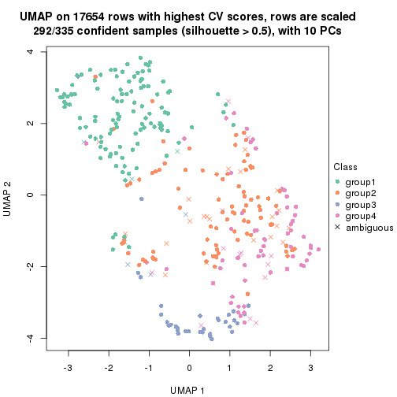</p>

</div>
<div id='tab-CV-pam-dimension-reduction-4'>
<pre><code class="r">dimension_reduction(res, k = 5, method = &quot;UMAP&quot;)
</code></pre>

<p>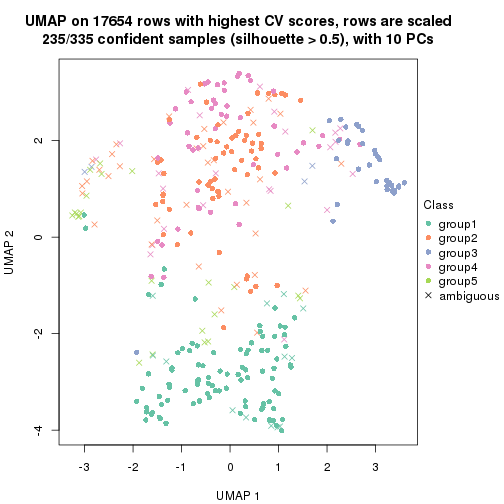</p>

</div>
<div id='tab-CV-pam-dimension-reduction-5'>
<pre><code class="r">dimension_reduction(res, k = 6, method = &quot;UMAP&quot;)
</code></pre>

<p></p>

</div>
</div>


Following heatmap shows how subgroups are split when increasing `k`:

```r
collect_classes(res)
```


If matrix rows can be associated to genes, consider to use `GO_Enrichment(res,
...)` to perform function enrichment for the signature genes.


 

---------------------------------------------------


### CV:mclust


The object with results only for a single top-value method and a single partition method 
can be extracted as:

```r
res = res_list["CV", "mclust"]
# you can also extract it by
# res = res_list["CV:mclust"]
```

A summary of `res` and all the functions that can be applied to it:

```r
res
```

```
#> A 'ConsensusPartition' object with k = 2, 3, 4, 5, 6.
#>   On a matrix with 17654 rows and 335 columns.
#>   Top rows (1000, 2000, 3000, 4000, 5000) are extracted by 'CV' method.
#>   Subgroups are detected by 'mclust' method.
#>   Performed in total 1250 partitions by row resampling.
#>   Best k for subgroups seems to be 3.
#> 
#> Following methods can be applied to this 'ConsensusPartition' object:
#>  [1] "cola_report"             "collect_classes"         "collect_plots"          
#>  [4] "collect_stats"           "colnames"                "compare_signatures"     
#>  [7] "consensus_heatmap"       "dimension_reduction"     "functional_enrichment"  
#> [10] "get_anno_col"            "get_anno"                "get_classes"            
#> [13] "get_consensus"           "get_matrix"              "get_membership"         
#> [16] "get_param"               "get_signatures"          "get_stats"              
#> [19] "is_best_k"               "is_stable_k"             "membership_heatmap"     
#> [22] "ncol"                    "nrow"                    "plot_ecdf"              
#> [25] "rownames"                "select_partition_number" "show"                   
#> [28] "suggest_best_k"          "test_to_known_factors"
```

`collect_plots()` function collects all the plots made from `res` for all `k` (number of partitions)
into one single page to provide an easy and fast comparison between different `k`.

```r
collect_plots(res)
```


The plots are:

- The first row: a plot of the ECDF (Empirical cumulative distribution
  function) curves of the consensus matrix for each `k` and the heatmap of
  predicted classes for each `k`.
- The second row: heatmaps of the consensus matrix for each `k`.
- The third row: heatmaps of the membership matrix for each `k`.
- The fouth row: heatmaps of the signatures for each `k`.

All the plots in panels can be made by individual functions and they are
plotted later in this section.

`select_partition_number()` produces several plots showing different
statistics for choosing "optimized" `k`. There are following statistics:

- ECDF curves of the consensus matrix for each `k`;
- 1-PAC. [The PAC
  score](https://en.wikipedia.org/wiki/Consensus_clustering#Over-interpretation_potential_of_consensus_clustering)
  measures the proportion of the ambiguous subgrouping.
- Mean silhouette score.
- Concordance. The mean probability of fiting the consensus class ids in all
  partitions.
- Area increased. Denote $A_k$ as the area under the ECDF curve for current
  `k`, the area increased is defined as $A_k - A_{k-1}$.
- Rand index. The percent of pairs of samples that are both in a same cluster
  or both are not in a same cluster in the partition of k and k-1.
- Jaccard index. The ratio of pairs of samples are both in a same cluster in
  the partition of k and k-1 and the pairs of samples are both in a same
  cluster in the partition k or k-1.

The detailed explanations of these statistics can be found in [the cola
vignette](http://bioconductor.org/packages/devel/bioc/vignettes/cola/inst/doc/cola.html#toc_13).

Generally speaking, lower PAC score, higher mean silhouette score or higher
concordance corresponds to better partition. Rand index and Jaccard index
measure how similar the current partition is compared to partition with `k-1`.
If they are too similar, we won't accept `k` is better than `k-1`.

```r
select_partition_number(res)
```


The numeric values for all these statistics can be obtained by `get_stats()`.

```r
get_stats(res)
```

```
#>   k 1-PAC mean_silhouette concordance area_increased  Rand Jaccard
#> 2 2 0.578           0.865       0.925         0.4495 0.546   0.546
#> 3 3 0.671           0.773       0.897         0.4748 0.725   0.523
#> 4 4 0.602           0.620       0.808         0.0828 0.928   0.790
#> 5 5 0.618           0.594       0.748         0.0541 0.947   0.818
#> 6 6 0.693           0.620       0.795         0.0578 0.918   0.693
```

`suggest_best_k()` suggests the best $k$ based on these statistics. The rules are as follows:

- All $k$ with Jaccard index larger than 0.95 are removed because the increase of
  the partition number does not provides enough extra information. If all $k$ are removed,
  the best $k$ is assigned by `NA`.
- For $k$ with 1-PAC larger than 0.9, the maximal $k$ is taken as the "best k". Other $k$ is called "optional k".
- If it does not fit the second rule. The $k$ with the highest vote of highest
  1-PAC, mean silhouette and concordance is taken as the "best k".

```r
suggest_best_k(res)
```

```
#> [1] 3
```


Following shows the table of the partitions (You need to click the **show/hide
code output** link to see it). The membership matrix (columns with name `p*`)
is inferred by
[`clue::cl_consensus()`](https://www.rdocumentation.org/link/cl_consensus?package=clue)
function with the `SE` method. Basically the value in the membership matrix
represents the probability to belong to a certain group. The finall class
label for an item is determined with the group with highest probability it
belongs to.

In `get_classes()` function, the entropy is calculated from the membership
matrix and the silhouette score is calculated from the consensus matrix.


<script>
$( function() {
	$( '#tabs-CV-mclust-get-classes' ).tabs();
} );
</script>
<div id='tabs-CV-mclust-get-classes'>
<ul>
<li><a href='#tab-CV-mclust-get-classes-1'>k = 2</a></li>
<li><a href='#tab-CV-mclust-get-classes-2'>k = 3</a></li>
<li><a href='#tab-CV-mclust-get-classes-3'>k = 4</a></li>
<li><a href='#tab-CV-mclust-get-classes-4'>k = 5</a></li>
<li><a href='#tab-CV-mclust-get-classes-5'>k = 6</a></li>
</ul>

<div id='tab-CV-mclust-get-classes-1'>
<p><a id='tab-CV-mclust-get-classes-1-a' style='color:#0366d6' href='#'>show/hide code output</a></p>
<pre><code class="r">cbind(get_classes(res, k = 2), get_membership(res, k = 2))
</code></pre>

<pre><code>#&gt;            class entropy silhouette    p1    p2
#&gt; SRR660306      1  0.8608     0.6749 0.716 0.284
#&gt; SRR1359328     1  0.5059     0.8856 0.888 0.112
#&gt; SRR821124      2  0.0000     0.9229 0.000 1.000
#&gt; SRR1335188     1  0.2778     0.9188 0.952 0.048
#&gt; SRR1075825     2  0.0000     0.9229 0.000 1.000
#&gt; SRR1321921     1  0.1414     0.9215 0.980 0.020
#&gt; SRR1466198     1  0.5737     0.8689 0.864 0.136
#&gt; SRR1384073     1  0.3431     0.9155 0.936 0.064
#&gt; SRR1312802     1  0.0000     0.9145 1.000 0.000
#&gt; SRR1076559     1  0.2948     0.9180 0.948 0.052
#&gt; SRR1370085     1  0.1414     0.9215 0.980 0.020
#&gt; SRR1460363     1  0.1414     0.9215 0.980 0.020
#&gt; SRR1480221     2  0.0000     0.9229 0.000 1.000
#&gt; SRR1476165     1  0.1414     0.9215 0.980 0.020
#&gt; SRR1459631     2  0.2603     0.8969 0.044 0.956
#&gt; SRR1448098     2  0.0000     0.9229 0.000 1.000
#&gt; SRR1321401     2  0.0000     0.9229 0.000 1.000
#&gt; SRR807613      2  0.0000     0.9229 0.000 1.000
#&gt; SRR808086      1  0.5059     0.8856 0.888 0.112
#&gt; SRR613687      2  0.7745     0.7077 0.228 0.772
#&gt; SRR1471011     1  0.3879     0.9038 0.924 0.076
#&gt; SRR1330284     2  0.0000     0.9229 0.000 1.000
#&gt; SRR1320624     2  0.0000     0.9229 0.000 1.000
#&gt; SRR1459519     1  0.1414     0.9215 0.980 0.020
#&gt; SRR1091184     1  0.9970     0.2561 0.532 0.468
#&gt; SRR1390561     1  0.1414     0.9215 0.980 0.020
#&gt; SRR658164      1  0.0000     0.9145 1.000 0.000
#&gt; SRR1087079     2  0.0000     0.9229 0.000 1.000
#&gt; SRR814996      1  0.5059     0.8856 0.888 0.112
#&gt; SRR1407410     2  0.8813     0.5394 0.300 0.700
#&gt; SRR1453392     2  0.0000     0.9229 0.000 1.000
#&gt; SRR1445873     1  0.1414     0.9215 0.980 0.020
#&gt; SRR1419985     2  0.0000     0.9229 0.000 1.000
#&gt; SRR820938      1  0.6623     0.8375 0.828 0.172
#&gt; SRR1476844     1  0.1414     0.9215 0.980 0.020
#&gt; SRR1403526     1  0.1414     0.9215 0.980 0.020
#&gt; SRR1413916     2  0.0000     0.9229 0.000 1.000
#&gt; SRR1441051     2  0.5059     0.8323 0.112 0.888
#&gt; SRR614287      2  0.1184     0.9114 0.016 0.984
#&gt; SRR1092062     2  0.0000     0.9229 0.000 1.000
#&gt; SRR612611      2  0.0000     0.9229 0.000 1.000
#&gt; SRR1376356     1  0.8713     0.6944 0.708 0.292
#&gt; SRR1405078     1  0.4815     0.8913 0.896 0.104
#&gt; SRR1437226     1  0.7883     0.7782 0.764 0.236
#&gt; SRR1326078     1  0.1414     0.9215 0.980 0.020
#&gt; SRR1096806     1  0.9000     0.6131 0.684 0.316
#&gt; SRR1440919     2  0.0000     0.9229 0.000 1.000
#&gt; SRR1452824     1  0.4022     0.9021 0.920 0.080
#&gt; SRR615754      1  0.0000     0.9145 1.000 0.000
#&gt; SRR1341787     1  0.5737     0.8715 0.864 0.136
#&gt; SRR614551      2  0.8555     0.5892 0.280 0.720
#&gt; SRR1380829     1  0.5842     0.8655 0.860 0.140
#&gt; SRR1455761     1  0.1414     0.9215 0.980 0.020
#&gt; SRR1465189     1  0.0000     0.9145 1.000 0.000
#&gt; SRR1376895     1  0.1414     0.9215 0.980 0.020
#&gt; SRR1445002     1  0.1414     0.9215 0.980 0.020
#&gt; SRR1469258     2  0.0000     0.9229 0.000 1.000
#&gt; SRR1409239     1  0.1414     0.9215 0.980 0.020
#&gt; SRR1480200     1  0.1414     0.9215 0.980 0.020
#&gt; SRR1418323     1  0.1414     0.9215 0.980 0.020
#&gt; SRR657540      1  0.7528     0.7825 0.784 0.216
#&gt; SRR821096      2  0.0000     0.9229 0.000 1.000
#&gt; SRR613591      1  0.8207     0.7231 0.744 0.256
#&gt; SRR1344205     1  0.5629     0.8721 0.868 0.132
#&gt; SRR612479      1  0.1414     0.9215 0.980 0.020
#&gt; SRR1399950     1  0.0000     0.9145 1.000 0.000
#&gt; SRR1336048     1  0.4022     0.9021 0.920 0.080
#&gt; SRR1368896     1  0.1414     0.9215 0.980 0.020
#&gt; SRR1379403     2  0.0000     0.9229 0.000 1.000
#&gt; SRR1312464     1  0.1414     0.9215 0.980 0.020
#&gt; SRR1096478     1  0.1414     0.9215 0.980 0.020
#&gt; SRR1459845     1  0.1414     0.9215 0.980 0.020
#&gt; SRR1348138     1  0.4298     0.8986 0.912 0.088
#&gt; SRR811423      1  0.0000     0.9145 1.000 0.000
#&gt; SRR615683      1  0.0000     0.9145 1.000 0.000
#&gt; SRR1380336     2  0.0000     0.9229 0.000 1.000
#&gt; SRR817609      1  0.0000     0.9145 1.000 0.000
#&gt; SRR1074550     1  0.5737     0.8689 0.864 0.136
#&gt; SRR1499236     2  0.0000     0.9229 0.000 1.000
#&gt; SRR656083      1  0.1414     0.9215 0.980 0.020
#&gt; SRR817539      1  0.1414     0.9215 0.980 0.020
#&gt; SRR1410801     1  0.1414     0.9215 0.980 0.020
#&gt; SRR1347190     1  0.1414     0.9215 0.980 0.020
#&gt; SRR1355126     2  0.0672     0.9188 0.008 0.992
#&gt; SRR615165      1  0.5737     0.8689 0.864 0.136
#&gt; SRR1466046     1  0.1414     0.9215 0.980 0.020
#&gt; SRR1097055     2  0.0000     0.9229 0.000 1.000
#&gt; SRR1312370     2  0.5294     0.8273 0.120 0.880
#&gt; SRR655325      1  0.1414     0.9215 0.980 0.020
#&gt; SRR810177      2  0.0000     0.9229 0.000 1.000
#&gt; SRR815685      2  0.0000     0.9229 0.000 1.000
#&gt; SRR817026      1  0.5842     0.8655 0.860 0.140
#&gt; SRR1417224     2  0.9044     0.4938 0.320 0.680
#&gt; SRR661687      2  0.2423     0.9030 0.040 0.960
#&gt; SRR1431804     1  0.1633     0.9168 0.976 0.024
#&gt; SRR664072      1  0.5629     0.8721 0.868 0.132
#&gt; SRR612923      2  0.0938     0.9168 0.012 0.988
#&gt; SRR1315890     1  0.1414     0.9215 0.980 0.020
#&gt; SRR1347726     1  0.1414     0.9215 0.980 0.020
#&gt; SRR1500360     1  0.3431     0.9155 0.936 0.064
#&gt; SRR1468360     2  0.9129     0.4775 0.328 0.672
#&gt; SRR1404084     1  0.4562     0.9058 0.904 0.096
#&gt; SRR615994      1  0.6247     0.8517 0.844 0.156
#&gt; SRR1475718     2  0.3114     0.8847 0.056 0.944
#&gt; SRR1397200     1  0.5059     0.8856 0.888 0.112
#&gt; SRR655519      2  0.7376     0.7357 0.208 0.792
#&gt; SRR1311308     1  0.7745     0.7700 0.772 0.228
#&gt; SRR1368006     2  0.0000     0.9229 0.000 1.000
#&gt; SRR613651      1  0.1843     0.9135 0.972 0.028
#&gt; SRR1362621     1  0.5946     0.8777 0.856 0.144
#&gt; SRR1451718     1  0.4815     0.9020 0.896 0.104
#&gt; SRR1095334     1  0.5059     0.8856 0.888 0.112
#&gt; SRR1079636     2  0.0000     0.9229 0.000 1.000
#&gt; SRR1442549     1  0.3274     0.9163 0.940 0.060
#&gt; SRR1466421     2  0.0000     0.9229 0.000 1.000
#&gt; SRR817397      2  0.0000     0.9229 0.000 1.000
#&gt; SRR1341809     2  0.0000     0.9229 0.000 1.000
#&gt; SRR614623      2  0.0672     0.9176 0.008 0.992
#&gt; SRR1335005     2  0.0000     0.9229 0.000 1.000
#&gt; SRR1407065     2  0.0000     0.9229 0.000 1.000
#&gt; SRR1404483     2  0.0000     0.9229 0.000 1.000
#&gt; SRR1096222     1  0.1414     0.9215 0.980 0.020
#&gt; SRR1401793     1  0.0376     0.9162 0.996 0.004
#&gt; SRR1408615     1  0.5059     0.8856 0.888 0.112
#&gt; SRR1070597     1  0.3431     0.9154 0.936 0.064
#&gt; SRR1332381     1  0.1414     0.9215 0.980 0.020
#&gt; SRR1457015     1  0.1414     0.9215 0.980 0.020
#&gt; SRR1386797     1  0.7139     0.8310 0.804 0.196
#&gt; SRR1098385     2  0.0000     0.9229 0.000 1.000
#&gt; SRR1363947     1  0.5629     0.8721 0.868 0.132
#&gt; SRR820350      2  0.0000     0.9229 0.000 1.000
#&gt; SRR662055      1  0.8608     0.6766 0.716 0.284
#&gt; SRR1310455     1  0.1414     0.9215 0.980 0.020
#&gt; SRR1453639     1  0.4939     0.8996 0.892 0.108
#&gt; SRR662617      2  0.0000     0.9229 0.000 1.000
#&gt; SRR654778      1  0.2778     0.9188 0.952 0.048
#&gt; SRR661782      2  0.0000     0.9229 0.000 1.000
#&gt; SRR1334396     1  0.0000     0.9145 1.000 0.000
#&gt; SRR613867      2  0.7745     0.7077 0.228 0.772
#&gt; SRR1479412     1  0.1414     0.9215 0.980 0.020
#&gt; SRR1331620     1  0.1414     0.9215 0.980 0.020
#&gt; SRR1082809     1  0.4690     0.9032 0.900 0.100
#&gt; SRR1417178     1  0.1414     0.9215 0.980 0.020
#&gt; SRR1335278     1  0.1414     0.9215 0.980 0.020
#&gt; SRR665369      2  0.0000     0.9229 0.000 1.000
#&gt; SRR657552      1  0.0000     0.9145 1.000 0.000
#&gt; SRR812412      1  0.1414     0.9215 0.980 0.020
#&gt; SRR1096500     2  0.9993    -0.0611 0.484 0.516
#&gt; SRR1347750     2  0.0000     0.9229 0.000 1.000
#&gt; SRR615153      1  0.3584     0.9079 0.932 0.068
#&gt; SRR1434417     1  0.1184     0.9203 0.984 0.016
#&gt; SRR1070159     1  0.5059     0.8856 0.888 0.112
#&gt; SRR1332508     2  0.0000     0.9229 0.000 1.000
#&gt; SRR1082059     1  0.7453     0.8071 0.788 0.212
#&gt; SRR1402491     1  0.1414     0.9215 0.980 0.020
#&gt; SRR1476595     1  0.5519     0.8861 0.872 0.128
#&gt; SRR1320987     2  0.0000     0.9229 0.000 1.000
#&gt; SRR1086417     1  0.4690     0.9040 0.900 0.100
#&gt; SRR1454095     1  0.3274     0.9163 0.940 0.060
#&gt; SRR614791      1  0.7528     0.7825 0.784 0.216
#&gt; SRR821255      1  0.7745     0.7895 0.772 0.228
#&gt; SRR820402      1  0.9775     0.4146 0.588 0.412
#&gt; SRR1337284     1  0.3274     0.9163 0.940 0.060
#&gt; SRR1333083     1  0.4939     0.8879 0.892 0.108
#&gt; SRR1384883     2  0.0376     0.9210 0.004 0.996
#&gt; SRR614431      1  0.0938     0.9191 0.988 0.012
#&gt; SRR1481106     2  0.0000     0.9229 0.000 1.000
#&gt; SRR1370285     1  0.1414     0.9215 0.980 0.020
#&gt; SRR1446673     1  0.5629     0.8721 0.868 0.132
#&gt; SRR1318046     2  0.0000     0.9229 0.000 1.000
#&gt; SRR1341188     1  0.5519     0.8750 0.872 0.128
#&gt; SRR1384941     1  0.1414     0.9215 0.980 0.020
#&gt; SRR1322864     2  0.0000     0.9229 0.000 1.000
#&gt; SRR1476825     1  0.4022     0.9021 0.920 0.080
#&gt; SRR1443332     2  0.8713     0.5584 0.292 0.708
#&gt; SRR662486      1  0.8955     0.6166 0.688 0.312
#&gt; SRR1447019     1  0.0000     0.9145 1.000 0.000
#&gt; SRR662942      1  0.1414     0.9215 0.980 0.020
#&gt; SRR613102      1  0.5629     0.8721 0.868 0.132
#&gt; SRR1469880     1  0.1414     0.9215 0.980 0.020
#&gt; SRR1464977     1  0.2778     0.9188 0.952 0.048
#&gt; SRR615850      1  0.4022     0.9021 0.920 0.080
#&gt; SRR661949      2  0.0000     0.9229 0.000 1.000
#&gt; SRR1322227     1  0.9170     0.6174 0.668 0.332
#&gt; SRR1441655     1  0.4815     0.9018 0.896 0.104
#&gt; SRR613771      1  0.6623     0.8564 0.828 0.172
#&gt; SRR1479471     1  0.1414     0.9215 0.980 0.020
#&gt; SRR1488918     2  0.0000     0.9229 0.000 1.000
#&gt; SRR1414040     2  0.0000     0.9229 0.000 1.000
#&gt; SRR1079850     2  0.8207     0.6364 0.256 0.744
#&gt; SRR663209      1  0.1414     0.9215 0.980 0.020
#&gt; SRR1364914     2  0.0000     0.9229 0.000 1.000
#&gt; SRR1408267     2  0.3114     0.8837 0.056 0.944
#&gt; SRR1314894     1  0.1414     0.9215 0.980 0.020
#&gt; SRR1414117     1  0.5629     0.8721 0.868 0.132
#&gt; SRR1395975     2  0.5178     0.8310 0.116 0.884
#&gt; SRR1402219     2  0.1184     0.9137 0.016 0.984
#&gt; SRR1433623     1  0.1414     0.9215 0.980 0.020
#&gt; SRR656385      2  0.9954     0.1275 0.460 0.540
#&gt; SRR811213      2  0.1843     0.9064 0.028 0.972
#&gt; SRR663657      1  0.7376     0.7929 0.792 0.208
#&gt; SRR612203      1  0.1843     0.9135 0.972 0.028
#&gt; SRR613987      2  0.9963     0.0644 0.464 0.536
#&gt; SRR613831      1  0.5629     0.8721 0.868 0.132
#&gt; SRR1354180     2  0.0000     0.9229 0.000 1.000
#&gt; SRR1382912     1  0.1414     0.9215 0.980 0.020
#&gt; SRR1475501     1  0.1414     0.9215 0.980 0.020
#&gt; SRR1336930     1  0.1414     0.9215 0.980 0.020
#&gt; SRR613030      1  0.6148     0.8554 0.848 0.152
#&gt; SRR1381459     1  0.9977     0.2252 0.528 0.472
#&gt; SRR1402350     1  0.5059     0.8856 0.888 0.112
#&gt; SRR1419408     1  0.0376     0.9162 0.996 0.004
#&gt; SRR655911      1  0.9754     0.3797 0.592 0.408
#&gt; SRR1418243     1  0.1414     0.9215 0.980 0.020
#&gt; SRR1322573     1  0.3584     0.9144 0.932 0.068
#&gt; SRR613615      1  0.5842     0.8655 0.860 0.140
#&gt; SRR1355284     1  0.1414     0.9215 0.980 0.020
#&gt; SRR1319395     1  0.1414     0.9215 0.980 0.020
#&gt; SRR818939      1  0.1414     0.9215 0.980 0.020
#&gt; SRR1465266     1  0.1414     0.9215 0.980 0.020
#&gt; SRR614888      1  0.3431     0.9089 0.936 0.064
#&gt; SRR1431694     1  0.1414     0.9215 0.980 0.020
#&gt; SRR614347      2  0.8555     0.6199 0.280 0.720
#&gt; SRR1334228     1  0.5842     0.8662 0.860 0.140
#&gt; SRR1096007     2  0.0000     0.9229 0.000 1.000
#&gt; SRR656349      1  0.0000     0.9145 1.000 0.000
#&gt; SRR815422      2  0.0376     0.9203 0.004 0.996
#&gt; SRR1360828     1  0.1414     0.9215 0.980 0.020
#&gt; SRR1359005     2  0.0000     0.9229 0.000 1.000
#&gt; SRR1456652     1  0.1414     0.9215 0.980 0.020
#&gt; SRR1391660     1  0.1414     0.9215 0.980 0.020
#&gt; SRR1441956     1  0.1414     0.9215 0.980 0.020
#&gt; SRR662930      2  0.8267     0.6579 0.260 0.740
#&gt; SRR615790      1  0.5842     0.8655 0.860 0.140
#&gt; SRR614827      2  0.9000     0.5127 0.316 0.684
#&gt; SRR614587      2  0.4161     0.8715 0.084 0.916
#&gt; SRR814052      2  0.8443     0.6070 0.272 0.728
#&gt; SRR1070086     1  0.1414     0.9215 0.980 0.020
#&gt; SRR1481440     1  0.0000     0.9145 1.000 0.000
#&gt; SRR1339296     1  0.5629     0.8721 0.868 0.132
#&gt; SRR1343239     1  0.8443     0.7233 0.728 0.272
#&gt; SRR1432802     2  0.0376     0.9209 0.004 0.996
#&gt; SRR1416911     1  0.0000     0.9145 1.000 0.000
#&gt; SRR1410427     1  0.1414     0.9215 0.980 0.020
#&gt; SRR1401185     1  0.5178     0.8954 0.884 0.116
#&gt; SRR654993      2  0.0376     0.9203 0.004 0.996
#&gt; SRR656397      1  0.1414     0.9215 0.980 0.020
#&gt; SRR809643      1  0.5737     0.8695 0.864 0.136
#&gt; SRR1433819     1  0.1414     0.9215 0.980 0.020
#&gt; SRR1375225     2  0.0000     0.9229 0.000 1.000
#&gt; SRR1367739     1  0.4298     0.8986 0.912 0.088
#&gt; SRR1323336     1  0.5294     0.8934 0.880 0.120
#&gt; SRR663224      1  0.7139     0.8099 0.804 0.196
#&gt; SRR1442840     1  0.1414     0.9215 0.980 0.020
#&gt; SRR1374058     1  0.1414     0.9215 0.980 0.020
#&gt; SRR656994      1  0.1414     0.9215 0.980 0.020
#&gt; SRR1469214     2  0.0000     0.9229 0.000 1.000
#&gt; SRR1456446     1  0.3274     0.9163 0.940 0.060
#&gt; SRR1471879     2  0.0000     0.9229 0.000 1.000
#&gt; SRR612911      1  0.5737     0.8689 0.864 0.136
#&gt; SRR1395720     2  0.0000     0.9229 0.000 1.000
#&gt; SRR1413055     1  0.1414     0.9215 0.980 0.020
#&gt; SRR656770      2  0.9248     0.4435 0.340 0.660
#&gt; SRR812080      1  0.5737     0.8689 0.864 0.136
#&gt; SRR1479328     1  0.1414     0.9215 0.980 0.020
#&gt; SRR661421      2  0.4815     0.8529 0.104 0.896
#&gt; SRR1410286     2  0.0000     0.9229 0.000 1.000
#&gt; SRR1487150     1  0.1414     0.9215 0.980 0.020
#&gt; SRR1467035     1  0.1414     0.9215 0.980 0.020
#&gt; SRR1360607     2  0.6247     0.7890 0.156 0.844
#&gt; SRR1333106     2  0.0376     0.9210 0.004 0.996
#&gt; SRR1088706     2  0.0000     0.9229 0.000 1.000
#&gt; SRR1320053     1  0.5737     0.8689 0.864 0.136
#&gt; SRR1350392     2  0.0000     0.9229 0.000 1.000
#&gt; SRR1385190     1  0.4161     0.9004 0.916 0.084
#&gt; SRR1080093     2  0.0000     0.9229 0.000 1.000
#&gt; SRR1318753     1  0.1414     0.9215 0.980 0.020
#&gt; SRR1345369     1  0.5408     0.8788 0.876 0.124
#&gt; SRR612178      2  0.1633     0.9078 0.024 0.976
#&gt; SRR1354423     1  0.0938     0.9191 0.988 0.012
#&gt; SRR1072724     1  0.1414     0.9215 0.980 0.020
#&gt; SRR1418450     2  0.0000     0.9229 0.000 1.000
#&gt; SRR1326427     1  0.5519     0.8750 0.872 0.128
#&gt; SRR1437412     1  0.4690     0.9036 0.900 0.100
#&gt; SRR1327548     2  0.0000     0.9229 0.000 1.000
#&gt; SRR1395891     1  0.1414     0.9215 0.980 0.020
#&gt; SRR659367      1  0.3274     0.9092 0.940 0.060
#&gt; SRR818961      1  0.1414     0.9215 0.980 0.020
#&gt; SRR813704      1  0.1414     0.9215 0.980 0.020
#&gt; SRR613054      1  0.0000     0.9145 1.000 0.000
#&gt; SRR1476467     1  0.1414     0.9215 0.980 0.020
#&gt; SRR1407988     2  0.0000     0.9229 0.000 1.000
#&gt; SRR1394776     2  0.0000     0.9229 0.000 1.000
#&gt; SRR655578      2  0.0000     0.9229 0.000 1.000
#&gt; SRR1310645     2  0.0000     0.9229 0.000 1.000
#&gt; SRR1345628     1  0.1414     0.9215 0.980 0.020
#&gt; SRR1479740     1  0.1414     0.9215 0.980 0.020
#&gt; SRR1332095     1  0.4161     0.9099 0.916 0.084
#&gt; SRR1444786     1  0.8327     0.7420 0.736 0.264
#&gt; SRR1090070     1  0.1414     0.9215 0.980 0.020
#&gt; SRR662414      2  0.9998    -0.0832 0.492 0.508
#&gt; SRR661216      2  0.0376     0.9203 0.004 0.996
#&gt; SRR656313      2  0.7745     0.7077 0.228 0.772
#&gt; SRR615671      1  0.9522     0.4727 0.628 0.372
#&gt; SRR1350196     1  0.5519     0.8750 0.872 0.128
#&gt; SRR1466580     1  0.1414     0.9215 0.980 0.020
#&gt; SRR1408032     2  0.0000     0.9229 0.000 1.000
#&gt; SRR1432913     2  0.8081     0.6764 0.248 0.752
#&gt; SRR1360502     1  0.3879     0.9038 0.924 0.076
#&gt; SRR1391901     2  0.5737     0.8239 0.136 0.864
#&gt; SRR1311131     1  0.0000     0.9145 1.000 0.000
#&gt; SRR1380636     1  0.1184     0.9204 0.984 0.016
#&gt; SRR1332339     1  0.0672     0.9178 0.992 0.008
#&gt; SRR1341563     2  0.0000     0.9229 0.000 1.000
#&gt; SRR1359410     1  0.7815     0.7740 0.768 0.232
#&gt; SRR1473040     1  0.5059     0.8856 0.888 0.112
#&gt; SRR1321444     1  0.1414     0.9215 0.980 0.020
#&gt; SRR1498765     2  0.0000     0.9229 0.000 1.000
#&gt; SRR1312622     2  0.0000     0.9229 0.000 1.000
#&gt; SRR615503      1  0.4298     0.8999 0.912 0.088
#&gt; SRR1453192     1  0.1414     0.9215 0.980 0.020
#&gt; SRR1433107     2  0.9286     0.4331 0.344 0.656
#&gt; SRR1075384     1  0.1414     0.9215 0.980 0.020
#&gt; SRR1356683     1  0.1414     0.9215 0.980 0.020
#&gt; SRR659049      1  0.1414     0.9215 0.980 0.020
#&gt; SRR1368240     1  0.1414     0.9215 0.980 0.020
#&gt; SRR1341739     1  0.1414     0.9215 0.980 0.020
#&gt; SRR613249      1  0.5059     0.8856 0.888 0.112
#&gt; SRR663428      2  0.0672     0.9175 0.008 0.992
#&gt; SRR1341302     2  0.0000     0.9229 0.000 1.000
#&gt; SRR1073553     2  0.0000     0.9229 0.000 1.000
#&gt; SRR1354093     1  0.5737     0.8689 0.864 0.136
#&gt; SRR1406521     2  0.0000     0.9229 0.000 1.000
#&gt; SRR1432049     1  0.3274     0.9163 0.940 0.060
#&gt; SRR1453504     1  0.4690     0.9032 0.900 0.100
</code></pre>

<script>
$('#tab-CV-mclust-get-classes-1-a').parent().next().next().hide();
$('#tab-CV-mclust-get-classes-1-a').click(function(){
  $('#tab-CV-mclust-get-classes-1-a').parent().next().next().toggle();
  return(false);
});
</script>
</div>

<div id='tab-CV-mclust-get-classes-2'>
<p><a id='tab-CV-mclust-get-classes-2-a' style='color:#0366d6' href='#'>show/hide code output</a></p>
<pre><code class="r">cbind(get_classes(res, k = 3), get_membership(res, k = 3))
</code></pre>

<pre><code>#&gt;            class entropy silhouette    p1    p2    p3
#&gt; SRR660306      3  0.4931    0.61808 0.000 0.232 0.768
#&gt; SRR1359328     3  0.0237    0.83166 0.000 0.004 0.996
#&gt; SRR821124      2  0.0000    0.89047 0.000 1.000 0.000
#&gt; SRR1335188     1  0.5968    0.38175 0.636 0.000 0.364
#&gt; SRR1075825     2  0.0000    0.89047 0.000 1.000 0.000
#&gt; SRR1321921     1  0.0000    0.93607 1.000 0.000 0.000
#&gt; SRR1466198     3  0.0237    0.83166 0.000 0.004 0.996
#&gt; SRR1384073     3  0.4346    0.72391 0.184 0.000 0.816
#&gt; SRR1312802     3  0.0237    0.83179 0.004 0.000 0.996
#&gt; SRR1076559     3  0.6204    0.35578 0.424 0.000 0.576
#&gt; SRR1370085     1  0.0000    0.93607 1.000 0.000 0.000
#&gt; SRR1460363     1  0.0000    0.93607 1.000 0.000 0.000
#&gt; SRR1480221     2  0.0000    0.89047 0.000 1.000 0.000
#&gt; SRR1476165     3  0.5706    0.55837 0.320 0.000 0.680
#&gt; SRR1459631     2  0.6286    0.00267 0.000 0.536 0.464
#&gt; SRR1448098     2  0.0000    0.89047 0.000 1.000 0.000
#&gt; SRR1321401     2  0.0000    0.89047 0.000 1.000 0.000
#&gt; SRR807613      2  0.0000    0.89047 0.000 1.000 0.000
#&gt; SRR808086      3  0.0000    0.83191 0.000 0.000 1.000
#&gt; SRR613687      2  0.6260    0.11013 0.000 0.552 0.448
#&gt; SRR1471011     3  0.0592    0.83088 0.012 0.000 0.988
#&gt; SRR1330284     2  0.0000    0.89047 0.000 1.000 0.000
#&gt; SRR1320624     2  0.0000    0.89047 0.000 1.000 0.000
#&gt; SRR1459519     1  0.0000    0.93607 1.000 0.000 0.000
#&gt; SRR1091184     3  0.5810    0.50692 0.000 0.336 0.664
#&gt; SRR1390561     1  0.0000    0.93607 1.000 0.000 0.000
#&gt; SRR658164      1  0.4452    0.75705 0.808 0.000 0.192
#&gt; SRR1087079     2  0.0000    0.89047 0.000 1.000 0.000
#&gt; SRR814996      3  0.0000    0.83191 0.000 0.000 1.000
#&gt; SRR1407410     2  0.5529    0.56150 0.000 0.704 0.296
#&gt; SRR1453392     2  0.0000    0.89047 0.000 1.000 0.000
#&gt; SRR1445873     1  0.0000    0.93607 1.000 0.000 0.000
#&gt; SRR1419985     2  0.0000    0.89047 0.000 1.000 0.000
#&gt; SRR820938      3  0.1289    0.82245 0.000 0.032 0.968
#&gt; SRR1476844     1  0.0000    0.93607 1.000 0.000 0.000
#&gt; SRR1403526     1  0.0000    0.93607 1.000 0.000 0.000
#&gt; SRR1413916     2  0.0237    0.88843 0.000 0.996 0.004
#&gt; SRR1441051     2  0.3340    0.79290 0.000 0.880 0.120
#&gt; SRR614287      2  0.0000    0.89047 0.000 1.000 0.000
#&gt; SRR1092062     2  0.0000    0.89047 0.000 1.000 0.000
#&gt; SRR612611      2  0.0000    0.89047 0.000 1.000 0.000
#&gt; SRR1376356     3  0.4555    0.68618 0.000 0.200 0.800
#&gt; SRR1405078     3  0.0000    0.83191 0.000 0.000 1.000
#&gt; SRR1437226     3  0.5098    0.63724 0.000 0.248 0.752
#&gt; SRR1326078     1  0.0000    0.93607 1.000 0.000 0.000
#&gt; SRR1096806     3  0.0747    0.82788 0.000 0.016 0.984
#&gt; SRR1440919     2  0.1163    0.87259 0.000 0.972 0.028
#&gt; SRR1452824     3  0.0592    0.83088 0.012 0.000 0.988
#&gt; SRR615754      1  0.4796    0.71953 0.780 0.000 0.220
#&gt; SRR1341787     3  0.1643    0.81550 0.000 0.044 0.956
#&gt; SRR614551      2  0.2066    0.84998 0.000 0.940 0.060
#&gt; SRR1380829     3  0.0000    0.83191 0.000 0.000 1.000
#&gt; SRR1455761     1  0.0000    0.93607 1.000 0.000 0.000
#&gt; SRR1465189     3  0.0747    0.82916 0.016 0.000 0.984
#&gt; SRR1376895     1  0.0000    0.93607 1.000 0.000 0.000
#&gt; SRR1445002     1  0.0000    0.93607 1.000 0.000 0.000
#&gt; SRR1469258     2  0.0000    0.89047 0.000 1.000 0.000
#&gt; SRR1409239     1  0.0000    0.93607 1.000 0.000 0.000
#&gt; SRR1480200     1  0.0000    0.93607 1.000 0.000 0.000
#&gt; SRR1418323     1  0.0747    0.92840 0.984 0.000 0.016
#&gt; SRR657540      3  0.0237    0.83175 0.000 0.004 0.996
#&gt; SRR821096      2  0.0000    0.89047 0.000 1.000 0.000
#&gt; SRR613591      3  0.5785    0.50882 0.000 0.332 0.668
#&gt; SRR1344205     3  0.0000    0.83191 0.000 0.000 1.000
#&gt; SRR612479      1  0.3412    0.84573 0.876 0.000 0.124
#&gt; SRR1399950     3  0.4974    0.65909 0.236 0.000 0.764
#&gt; SRR1336048     3  0.0237    0.83180 0.004 0.000 0.996
#&gt; SRR1368896     1  0.0000    0.93607 1.000 0.000 0.000
#&gt; SRR1379403     2  0.0000    0.89047 0.000 1.000 0.000
#&gt; SRR1312464     1  0.0000    0.93607 1.000 0.000 0.000
#&gt; SRR1096478     1  0.0000    0.93607 1.000 0.000 0.000
#&gt; SRR1459845     1  0.0000    0.93607 1.000 0.000 0.000
#&gt; SRR1348138     3  0.0000    0.83191 0.000 0.000 1.000
#&gt; SRR811423      3  0.0747    0.83005 0.016 0.000 0.984
#&gt; SRR615683      1  0.4750    0.72699 0.784 0.000 0.216
#&gt; SRR1380336     2  0.0000    0.89047 0.000 1.000 0.000
#&gt; SRR817609      3  0.4504    0.70410 0.196 0.000 0.804
#&gt; SRR1074550     3  0.0237    0.83175 0.000 0.004 0.996
#&gt; SRR1499236     2  0.0000    0.89047 0.000 1.000 0.000
#&gt; SRR656083      1  0.0000    0.93607 1.000 0.000 0.000
#&gt; SRR817539      1  0.0592    0.93058 0.988 0.000 0.012
#&gt; SRR1410801     1  0.0592    0.93087 0.988 0.000 0.012
#&gt; SRR1347190     3  0.6140    0.39046 0.404 0.000 0.596
#&gt; SRR1355126     2  0.0237    0.88852 0.000 0.996 0.004
#&gt; SRR615165      3  0.0000    0.83191 0.000 0.000 1.000
#&gt; SRR1466046     1  0.0000    0.93607 1.000 0.000 0.000
#&gt; SRR1097055     2  0.0000    0.89047 0.000 1.000 0.000
#&gt; SRR1312370     2  0.3253    0.83055 0.052 0.912 0.036
#&gt; SRR655325      1  0.0000    0.93607 1.000 0.000 0.000
#&gt; SRR810177      2  0.0000    0.89047 0.000 1.000 0.000
#&gt; SRR815685      2  0.0000    0.89047 0.000 1.000 0.000
#&gt; SRR817026      3  0.0592    0.83006 0.000 0.012 0.988
#&gt; SRR1417224     2  0.5859    0.47961 0.000 0.656 0.344
#&gt; SRR661687      3  0.6299    0.18856 0.000 0.476 0.524
#&gt; SRR1431804     3  0.4555    0.69977 0.200 0.000 0.800
#&gt; SRR664072      3  0.0000    0.83191 0.000 0.000 1.000
#&gt; SRR612923      2  0.0000    0.89047 0.000 1.000 0.000
#&gt; SRR1315890     1  0.0000    0.93607 1.000 0.000 0.000
#&gt; SRR1347726     1  0.2448    0.88413 0.924 0.000 0.076
#&gt; SRR1500360     3  0.8556    0.60269 0.232 0.164 0.604
#&gt; SRR1468360     2  0.5404    0.62421 0.004 0.740 0.256
#&gt; SRR1404084     3  0.7366    0.62516 0.260 0.072 0.668
#&gt; SRR615994      3  0.0000    0.83191 0.000 0.000 1.000
#&gt; SRR1475718     2  0.1411    0.86755 0.000 0.964 0.036
#&gt; SRR1397200     3  0.0000    0.83191 0.000 0.000 1.000
#&gt; SRR655519      2  0.6260    0.11201 0.000 0.552 0.448
#&gt; SRR1311308     3  0.2165    0.80641 0.000 0.064 0.936
#&gt; SRR1368006     2  0.0000    0.89047 0.000 1.000 0.000
#&gt; SRR613651      3  0.5835    0.48430 0.340 0.000 0.660
#&gt; SRR1362621     3  0.5060    0.77848 0.100 0.064 0.836
#&gt; SRR1451718     3  0.1289    0.82520 0.032 0.000 0.968
#&gt; SRR1095334     3  0.0000    0.83191 0.000 0.000 1.000
#&gt; SRR1079636     2  0.0000    0.89047 0.000 1.000 0.000
#&gt; SRR1442549     3  0.5692    0.64012 0.268 0.008 0.724
#&gt; SRR1466421     2  0.0000    0.89047 0.000 1.000 0.000
#&gt; SRR817397      2  0.6126    0.22639 0.000 0.600 0.400
#&gt; SRR1341809     2  0.0000    0.89047 0.000 1.000 0.000
#&gt; SRR614623      2  0.0000    0.89047 0.000 1.000 0.000
#&gt; SRR1335005     2  0.0000    0.89047 0.000 1.000 0.000
#&gt; SRR1407065     2  0.5016    0.60904 0.000 0.760 0.240
#&gt; SRR1404483     2  0.0000    0.89047 0.000 1.000 0.000
#&gt; SRR1096222     1  0.0000    0.93607 1.000 0.000 0.000
#&gt; SRR1401793     1  0.6154    0.28457 0.592 0.000 0.408
#&gt; SRR1408615     3  0.0000    0.83191 0.000 0.000 1.000
#&gt; SRR1070597     3  0.9072    0.50111 0.192 0.260 0.548
#&gt; SRR1332381     1  0.6095    0.31023 0.608 0.000 0.392
#&gt; SRR1457015     1  0.0000    0.93607 1.000 0.000 0.000
#&gt; SRR1386797     3  0.5178    0.63457 0.000 0.256 0.744
#&gt; SRR1098385     2  0.0000    0.89047 0.000 1.000 0.000
#&gt; SRR1363947     3  0.0000    0.83191 0.000 0.000 1.000
#&gt; SRR820350      2  0.0000    0.89047 0.000 1.000 0.000
#&gt; SRR662055      3  0.3816    0.74943 0.000 0.148 0.852
#&gt; SRR1310455     1  0.2165    0.89817 0.936 0.000 0.064
#&gt; SRR1453639     3  0.9383    0.15753 0.176 0.364 0.460
#&gt; SRR662617      2  0.0000    0.89047 0.000 1.000 0.000
#&gt; SRR654778      1  0.5443    0.62708 0.736 0.004 0.260
#&gt; SRR661782      2  0.0000    0.89047 0.000 1.000 0.000
#&gt; SRR1334396     3  0.5926    0.45904 0.356 0.000 0.644
#&gt; SRR613867      3  0.6309    0.09028 0.000 0.496 0.504
#&gt; SRR1479412     1  0.1964    0.90463 0.944 0.000 0.056
#&gt; SRR1331620     1  0.2625    0.88522 0.916 0.000 0.084
#&gt; SRR1082809     3  0.3879    0.74708 0.152 0.000 0.848
#&gt; SRR1417178     1  0.6168    0.24559 0.588 0.000 0.412
#&gt; SRR1335278     1  0.0000    0.93607 1.000 0.000 0.000
#&gt; SRR665369      2  0.0000    0.89047 0.000 1.000 0.000
#&gt; SRR657552      3  0.4605    0.69705 0.204 0.000 0.796
#&gt; SRR812412      1  0.0000    0.93607 1.000 0.000 0.000
#&gt; SRR1096500     2  0.6380    0.62875 0.044 0.732 0.224
#&gt; SRR1347750     2  0.0000    0.89047 0.000 1.000 0.000
#&gt; SRR615153      3  0.4293    0.73826 0.164 0.004 0.832
#&gt; SRR1434417     1  0.5016    0.65566 0.760 0.000 0.240
#&gt; SRR1070159     3  0.0237    0.83175 0.000 0.004 0.996
#&gt; SRR1332508     2  0.0000    0.89047 0.000 1.000 0.000
#&gt; SRR1082059     3  0.5291    0.61698 0.000 0.268 0.732
#&gt; SRR1402491     1  0.0000    0.93607 1.000 0.000 0.000
#&gt; SRR1476595     2  0.9484    0.23871 0.264 0.496 0.240
#&gt; SRR1320987     2  0.0000    0.89047 0.000 1.000 0.000
#&gt; SRR1086417     3  0.9147    0.49087 0.200 0.260 0.540
#&gt; SRR1454095     3  0.7170    0.49410 0.352 0.036 0.612
#&gt; SRR614791      3  0.3482    0.76514 0.000 0.128 0.872
#&gt; SRR821255      2  0.7372    0.60796 0.128 0.704 0.168
#&gt; SRR820402      3  0.5650    0.55845 0.000 0.312 0.688
#&gt; SRR1337284     3  0.4978    0.69763 0.216 0.004 0.780
#&gt; SRR1333083     3  0.0000    0.83191 0.000 0.000 1.000
#&gt; SRR1384883     2  0.6225    0.11966 0.000 0.568 0.432
#&gt; SRR614431      1  0.0000    0.93607 1.000 0.000 0.000
#&gt; SRR1481106     2  0.0000    0.89047 0.000 1.000 0.000
#&gt; SRR1370285     1  0.0000    0.93607 1.000 0.000 0.000
#&gt; SRR1446673     3  0.0000    0.83191 0.000 0.000 1.000
#&gt; SRR1318046     2  0.0000    0.89047 0.000 1.000 0.000
#&gt; SRR1341188     3  0.0000    0.83191 0.000 0.000 1.000
#&gt; SRR1384941     1  0.0000    0.93607 1.000 0.000 0.000
#&gt; SRR1322864     2  0.0000    0.89047 0.000 1.000 0.000
#&gt; SRR1476825     3  0.0424    0.83126 0.008 0.000 0.992
#&gt; SRR1443332     2  0.5098    0.63334 0.000 0.752 0.248
#&gt; SRR662486      3  0.4750    0.68200 0.000 0.216 0.784
#&gt; SRR1447019     1  0.5882    0.48072 0.652 0.000 0.348
#&gt; SRR662942      1  0.0000    0.93607 1.000 0.000 0.000
#&gt; SRR613102      3  0.0000    0.83191 0.000 0.000 1.000
#&gt; SRR1469880     1  0.0000    0.93607 1.000 0.000 0.000
#&gt; SRR1464977     3  0.6079    0.43645 0.388 0.000 0.612
#&gt; SRR615850      3  0.0000    0.83191 0.000 0.000 1.000
#&gt; SRR661949      2  0.0000    0.89047 0.000 1.000 0.000
#&gt; SRR1322227     3  0.4702    0.66833 0.000 0.212 0.788
#&gt; SRR1441655     3  0.7252    0.67476 0.196 0.100 0.704
#&gt; SRR613771      2  0.7835    0.11099 0.052 0.492 0.456
#&gt; SRR1479471     1  0.0892    0.92636 0.980 0.000 0.020
#&gt; SRR1488918     2  0.0000    0.89047 0.000 1.000 0.000
#&gt; SRR1414040     2  0.0000    0.89047 0.000 1.000 0.000
#&gt; SRR1079850     2  0.1832    0.86442 0.008 0.956 0.036
#&gt; SRR663209      1  0.1860    0.90778 0.948 0.000 0.052
#&gt; SRR1364914     2  0.0000    0.89047 0.000 1.000 0.000
#&gt; SRR1408267     2  0.0592    0.88412 0.000 0.988 0.012
#&gt; SRR1314894     1  0.0000    0.93607 1.000 0.000 0.000
#&gt; SRR1414117     3  0.0237    0.83175 0.000 0.004 0.996
#&gt; SRR1395975     2  0.1163    0.87350 0.000 0.972 0.028
#&gt; SRR1402219     2  0.0424    0.88641 0.000 0.992 0.008
#&gt; SRR1433623     1  0.0000    0.93607 1.000 0.000 0.000
#&gt; SRR656385      3  0.6062    0.40613 0.000 0.384 0.616
#&gt; SRR811213      2  0.6008    0.31571 0.000 0.628 0.372
#&gt; SRR663657      3  0.0237    0.83175 0.000 0.004 0.996
#&gt; SRR612203      3  0.5859    0.47895 0.344 0.000 0.656
#&gt; SRR613987      2  0.2537    0.83843 0.000 0.920 0.080
#&gt; SRR613831      3  0.0000    0.83191 0.000 0.000 1.000
#&gt; SRR1354180     2  0.0000    0.89047 0.000 1.000 0.000
#&gt; SRR1382912     1  0.0000    0.93607 1.000 0.000 0.000
#&gt; SRR1475501     1  0.0000    0.93607 1.000 0.000 0.000
#&gt; SRR1336930     1  0.3686    0.82091 0.860 0.000 0.140
#&gt; SRR613030      3  0.0237    0.83175 0.000 0.004 0.996
#&gt; SRR1381459     2  0.5859    0.47812 0.000 0.656 0.344
#&gt; SRR1402350     3  0.0000    0.83191 0.000 0.000 1.000
#&gt; SRR1419408     1  0.1289    0.92106 0.968 0.000 0.032
#&gt; SRR655911      3  0.2448    0.80194 0.000 0.076 0.924
#&gt; SRR1418243     1  0.0000    0.93607 1.000 0.000 0.000
#&gt; SRR1322573     3  0.8643    0.58224 0.188 0.212 0.600
#&gt; SRR613615      3  0.0000    0.83191 0.000 0.000 1.000
#&gt; SRR1355284     1  0.2066    0.90463 0.940 0.000 0.060
#&gt; SRR1319395     1  0.0000    0.93607 1.000 0.000 0.000
#&gt; SRR818939      1  0.0000    0.93607 1.000 0.000 0.000
#&gt; SRR1465266     1  0.2448    0.89157 0.924 0.000 0.076
#&gt; SRR614888      3  0.5650    0.53661 0.312 0.000 0.688
#&gt; SRR1431694     1  0.2448    0.88774 0.924 0.000 0.076
#&gt; SRR614347      3  0.6045    0.41576 0.000 0.380 0.620
#&gt; SRR1334228     3  0.0424    0.83078 0.000 0.008 0.992
#&gt; SRR1096007     2  0.1031    0.87638 0.000 0.976 0.024
#&gt; SRR656349      3  0.4178    0.72863 0.172 0.000 0.828
#&gt; SRR815422      2  0.6140    0.21339 0.000 0.596 0.404
#&gt; SRR1360828     1  0.1964    0.90393 0.944 0.000 0.056
#&gt; SRR1359005     2  0.0000    0.89047 0.000 1.000 0.000
#&gt; SRR1456652     1  0.0000    0.93607 1.000 0.000 0.000
#&gt; SRR1391660     1  0.0000    0.93607 1.000 0.000 0.000
#&gt; SRR1441956     1  0.0000    0.93607 1.000 0.000 0.000
#&gt; SRR662930      3  0.6111    0.37897 0.000 0.396 0.604
#&gt; SRR615790      3  0.0237    0.83175 0.000 0.004 0.996
#&gt; SRR614827      2  0.5882    0.47199 0.000 0.652 0.348
#&gt; SRR614587      3  0.6267    0.26118 0.000 0.452 0.548
#&gt; SRR814052      2  0.1643    0.86235 0.000 0.956 0.044
#&gt; SRR1070086     1  0.0000    0.93607 1.000 0.000 0.000
#&gt; SRR1481440     3  0.6008    0.42434 0.372 0.000 0.628
#&gt; SRR1339296     3  0.0000    0.83191 0.000 0.000 1.000
#&gt; SRR1343239     3  0.4062    0.72675 0.000 0.164 0.836
#&gt; SRR1432802     2  0.0592    0.88402 0.000 0.988 0.012
#&gt; SRR1416911     1  0.4291    0.77163 0.820 0.000 0.180
#&gt; SRR1410427     1  0.4346    0.76218 0.816 0.000 0.184
#&gt; SRR1401185     2  0.9331    0.14849 0.176 0.480 0.344
#&gt; SRR654993      2  0.0424    0.88610 0.000 0.992 0.008
#&gt; SRR656397      1  0.0000    0.93607 1.000 0.000 0.000
#&gt; SRR809643      3  0.0237    0.83175 0.000 0.004 0.996
#&gt; SRR1433819     1  0.0000    0.93607 1.000 0.000 0.000
#&gt; SRR1375225     2  0.0000    0.89047 0.000 1.000 0.000
#&gt; SRR1367739     3  0.0000    0.83191 0.000 0.000 1.000
#&gt; SRR1323336     3  0.3713    0.80576 0.076 0.032 0.892
#&gt; SRR663224      3  0.1529    0.81996 0.000 0.040 0.960
#&gt; SRR1442840     1  0.0424    0.93269 0.992 0.000 0.008
#&gt; SRR1374058     1  0.0000    0.93607 1.000 0.000 0.000
#&gt; SRR656994      1  0.0000    0.93607 1.000 0.000 0.000
#&gt; SRR1469214     2  0.0000    0.89047 0.000 1.000 0.000
#&gt; SRR1456446     1  0.5016    0.67661 0.760 0.000 0.240
#&gt; SRR1471879     2  0.0000    0.89047 0.000 1.000 0.000
#&gt; SRR612911      3  0.0000    0.83191 0.000 0.000 1.000
#&gt; SRR1395720     2  0.0000    0.89047 0.000 1.000 0.000
#&gt; SRR1413055     1  0.2165    0.89899 0.936 0.000 0.064
#&gt; SRR656770      2  0.6026    0.41956 0.000 0.624 0.376
#&gt; SRR812080      3  0.0237    0.83175 0.000 0.004 0.996
#&gt; SRR1479328     1  0.1411    0.91554 0.964 0.000 0.036
#&gt; SRR661421      2  0.2165    0.84354 0.000 0.936 0.064
#&gt; SRR1410286     2  0.0000    0.89047 0.000 1.000 0.000
#&gt; SRR1487150     1  0.0000    0.93607 1.000 0.000 0.000
#&gt; SRR1467035     1  0.0237    0.93443 0.996 0.000 0.004
#&gt; SRR1360607     2  0.4295    0.77959 0.104 0.864 0.032
#&gt; SRR1333106     2  0.0000    0.89047 0.000 1.000 0.000
#&gt; SRR1088706     2  0.0000    0.89047 0.000 1.000 0.000
#&gt; SRR1320053     3  0.0237    0.83175 0.000 0.004 0.996
#&gt; SRR1350392     2  0.0000    0.89047 0.000 1.000 0.000
#&gt; SRR1385190     3  0.0000    0.83191 0.000 0.000 1.000
#&gt; SRR1080093     2  0.0000    0.89047 0.000 1.000 0.000
#&gt; SRR1318753     1  0.0000    0.93607 1.000 0.000 0.000
#&gt; SRR1345369     3  0.0424    0.83078 0.000 0.008 0.992
#&gt; SRR612178      2  0.1411    0.86678 0.000 0.964 0.036
#&gt; SRR1354423     1  0.1964    0.90678 0.944 0.000 0.056
#&gt; SRR1072724     1  0.0000    0.93607 1.000 0.000 0.000
#&gt; SRR1418450     2  0.2959    0.80782 0.000 0.900 0.100
#&gt; SRR1326427     3  0.0000    0.83191 0.000 0.000 1.000
#&gt; SRR1437412     3  0.1163    0.82662 0.028 0.000 0.972
#&gt; SRR1327548     2  0.2796    0.81410 0.000 0.908 0.092
#&gt; SRR1395891     1  0.0000    0.93607 1.000 0.000 0.000
#&gt; SRR659367      3  0.5760    0.50646 0.328 0.000 0.672
#&gt; SRR818961      1  0.1031    0.92417 0.976 0.000 0.024
#&gt; SRR813704      1  0.0000    0.93607 1.000 0.000 0.000
#&gt; SRR613054      1  0.4504    0.75225 0.804 0.000 0.196
#&gt; SRR1476467     1  0.1411    0.91554 0.964 0.000 0.036
#&gt; SRR1407988     2  0.0000    0.89047 0.000 1.000 0.000
#&gt; SRR1394776     2  0.0000    0.89047 0.000 1.000 0.000
#&gt; SRR655578      2  0.0000    0.89047 0.000 1.000 0.000
#&gt; SRR1310645     2  0.0000    0.89047 0.000 1.000 0.000
#&gt; SRR1345628     1  0.2261    0.89806 0.932 0.000 0.068
#&gt; SRR1479740     1  0.0000    0.93607 1.000 0.000 0.000
#&gt; SRR1332095     3  0.9198    0.45079 0.192 0.280 0.528
#&gt; SRR1444786     2  0.8196    0.33600 0.084 0.560 0.356
#&gt; SRR1090070     1  0.0000    0.93607 1.000 0.000 0.000
#&gt; SRR662414      2  0.6026    0.41658 0.000 0.624 0.376
#&gt; SRR661216      2  0.0000    0.89047 0.000 1.000 0.000
#&gt; SRR656313      3  0.6305    0.13220 0.000 0.484 0.516
#&gt; SRR615671      3  0.6168    0.32307 0.000 0.412 0.588
#&gt; SRR1350196     3  0.0237    0.83166 0.000 0.004 0.996
#&gt; SRR1466580     1  0.1163    0.92264 0.972 0.000 0.028
#&gt; SRR1408032     2  0.0000    0.89047 0.000 1.000 0.000
#&gt; SRR1432913     3  0.6126    0.37049 0.000 0.400 0.600
#&gt; SRR1360502     3  0.0475    0.83189 0.004 0.004 0.992
#&gt; SRR1391901     2  0.6307   -0.08112 0.000 0.512 0.488
#&gt; SRR1311131     1  0.4178    0.78254 0.828 0.000 0.172
#&gt; SRR1380636     1  0.0424    0.93272 0.992 0.000 0.008
#&gt; SRR1332339     1  0.4931    0.71667 0.768 0.000 0.232
#&gt; SRR1341563     2  0.0424    0.88641 0.000 0.992 0.008
#&gt; SRR1359410     3  0.3752    0.74402 0.000 0.144 0.856
#&gt; SRR1473040     3  0.0000    0.83191 0.000 0.000 1.000
#&gt; SRR1321444     1  0.0000    0.93607 1.000 0.000 0.000
#&gt; SRR1498765     2  0.0000    0.89047 0.000 1.000 0.000
#&gt; SRR1312622     2  0.0000    0.89047 0.000 1.000 0.000
#&gt; SRR615503      3  0.7720    0.64794 0.208 0.120 0.672
#&gt; SRR1453192     1  0.0000    0.93607 1.000 0.000 0.000
#&gt; SRR1433107     3  0.6280    0.09141 0.000 0.460 0.540
#&gt; SRR1075384     1  0.0000    0.93607 1.000 0.000 0.000
#&gt; SRR1356683     1  0.0000    0.93607 1.000 0.000 0.000
#&gt; SRR659049      1  0.0424    0.93272 0.992 0.000 0.008
#&gt; SRR1368240     1  0.0000    0.93607 1.000 0.000 0.000
#&gt; SRR1341739     1  0.0000    0.93607 1.000 0.000 0.000
#&gt; SRR613249      3  0.0000    0.83191 0.000 0.000 1.000
#&gt; SRR663428      2  0.0000    0.89047 0.000 1.000 0.000
#&gt; SRR1341302     2  0.0000    0.89047 0.000 1.000 0.000
#&gt; SRR1073553     2  0.0000    0.89047 0.000 1.000 0.000
#&gt; SRR1354093     3  0.0237    0.83175 0.000 0.004 0.996
#&gt; SRR1406521     2  0.5859    0.38761 0.000 0.656 0.344
#&gt; SRR1432049     1  0.5070    0.70162 0.772 0.004 0.224
#&gt; SRR1453504     2  0.8659    0.40644 0.176 0.596 0.228
</code></pre>

<script>
$('#tab-CV-mclust-get-classes-2-a').parent().next().next().hide();
$('#tab-CV-mclust-get-classes-2-a').click(function(){
  $('#tab-CV-mclust-get-classes-2-a').parent().next().next().toggle();
  return(false);
});
</script>
</div>

<div id='tab-CV-mclust-get-classes-3'>
<p><a id='tab-CV-mclust-get-classes-3-a' style='color:#0366d6' href='#'>show/hide code output</a></p>
<pre><code class="r">cbind(get_classes(res, k = 4), get_membership(res, k = 4))
</code></pre>

<pre><code>#&gt;            class entropy silhouette    p1    p2    p3    p4
#&gt; SRR660306      3  0.7841    -0.2546 0.000 0.264 0.380 0.356
#&gt; SRR1359328     3  0.0188     0.6818 0.000 0.000 0.996 0.004
#&gt; SRR821124      2  0.1867     0.7858 0.000 0.928 0.000 0.072
#&gt; SRR1335188     1  0.6176     0.3693 0.568 0.008 0.040 0.384
#&gt; SRR1075825     2  0.1389     0.7893 0.000 0.952 0.000 0.048
#&gt; SRR1321921     1  0.0000     0.8936 1.000 0.000 0.000 0.000
#&gt; SRR1466198     3  0.3024     0.6453 0.000 0.000 0.852 0.148
#&gt; SRR1384073     3  0.8164     0.1754 0.160 0.040 0.496 0.304
#&gt; SRR1312802     3  0.3278     0.6463 0.020 0.000 0.864 0.116
#&gt; SRR1076559     3  0.7887     0.1218 0.308 0.012 0.476 0.204
#&gt; SRR1370085     1  0.0188     0.8933 0.996 0.000 0.000 0.004
#&gt; SRR1460363     1  0.0188     0.8933 0.996 0.000 0.000 0.004
#&gt; SRR1480221     2  0.0336     0.7937 0.000 0.992 0.000 0.008
#&gt; SRR1476165     3  0.6937     0.1930 0.344 0.000 0.532 0.124
#&gt; SRR1459631     2  0.6275     0.4522 0.000 0.660 0.204 0.136
#&gt; SRR1448098     2  0.0000     0.7933 0.000 1.000 0.000 0.000
#&gt; SRR1321401     2  0.0336     0.7937 0.000 0.992 0.000 0.008
#&gt; SRR807613      2  0.1211     0.7894 0.000 0.960 0.000 0.040
#&gt; SRR808086      3  0.0188     0.6818 0.000 0.000 0.996 0.004
#&gt; SRR613687      4  0.5695    -0.0207 0.000 0.476 0.024 0.500
#&gt; SRR1471011     3  0.4086     0.6081 0.008 0.000 0.776 0.216
#&gt; SRR1330284     2  0.1022     0.7846 0.000 0.968 0.000 0.032
#&gt; SRR1320624     2  0.2011     0.7670 0.000 0.920 0.000 0.080
#&gt; SRR1459519     1  0.0000     0.8936 1.000 0.000 0.000 0.000
#&gt; SRR1091184     3  0.7404    -0.0599 0.000 0.348 0.476 0.176
#&gt; SRR1390561     1  0.0469     0.8939 0.988 0.000 0.000 0.012
#&gt; SRR658164      1  0.3539     0.7412 0.820 0.000 0.004 0.176
#&gt; SRR1087079     2  0.1302     0.7901 0.000 0.956 0.000 0.044
#&gt; SRR814996      3  0.0188     0.6818 0.000 0.000 0.996 0.004
#&gt; SRR1407410     2  0.6476     0.4803 0.000 0.616 0.112 0.272
#&gt; SRR1453392     2  0.0000     0.7933 0.000 1.000 0.000 0.000
#&gt; SRR1445873     1  0.0000     0.8936 1.000 0.000 0.000 0.000
#&gt; SRR1419985     2  0.1118     0.7896 0.000 0.964 0.000 0.036
#&gt; SRR820938      3  0.4466     0.5892 0.000 0.036 0.784 0.180
#&gt; SRR1476844     1  0.0188     0.8933 0.996 0.000 0.000 0.004
#&gt; SRR1403526     1  0.0000     0.8936 1.000 0.000 0.000 0.000
#&gt; SRR1413916     2  0.3649     0.6746 0.000 0.796 0.000 0.204
#&gt; SRR1441051     2  0.4927     0.6138 0.000 0.712 0.024 0.264
#&gt; SRR614287      2  0.0000     0.7933 0.000 1.000 0.000 0.000
#&gt; SRR1092062     2  0.1118     0.7903 0.000 0.964 0.000 0.036
#&gt; SRR612611      2  0.0000     0.7933 0.000 1.000 0.000 0.000
#&gt; SRR1376356     3  0.6475     0.3397 0.000 0.172 0.644 0.184
#&gt; SRR1405078     3  0.4103     0.5240 0.000 0.000 0.744 0.256
#&gt; SRR1437226     3  0.7026     0.2360 0.000 0.180 0.572 0.248
#&gt; SRR1326078     1  0.0469     0.8924 0.988 0.000 0.000 0.012
#&gt; SRR1096806     3  0.5161     0.4996 0.000 0.024 0.676 0.300
#&gt; SRR1440919     2  0.4289     0.7141 0.000 0.796 0.032 0.172
#&gt; SRR1452824     3  0.2704     0.6568 0.000 0.000 0.876 0.124
#&gt; SRR615754      1  0.3972     0.7035 0.788 0.000 0.008 0.204
#&gt; SRR1341787     3  0.3377     0.6442 0.000 0.012 0.848 0.140
#&gt; SRR614551      2  0.4983     0.6046 0.000 0.704 0.024 0.272
#&gt; SRR1380829     3  0.4972     0.1894 0.000 0.000 0.544 0.456
#&gt; SRR1455761     1  0.0336     0.8932 0.992 0.000 0.000 0.008
#&gt; SRR1465189     3  0.4655     0.5903 0.088 0.000 0.796 0.116
#&gt; SRR1376895     1  0.0469     0.8924 0.988 0.000 0.000 0.012
#&gt; SRR1445002     1  0.0376     0.8929 0.992 0.000 0.004 0.004
#&gt; SRR1469258     2  0.2216     0.7721 0.000 0.908 0.000 0.092
#&gt; SRR1409239     1  0.0592     0.8907 0.984 0.000 0.016 0.000
#&gt; SRR1480200     1  0.0000     0.8936 1.000 0.000 0.000 0.000
#&gt; SRR1418323     1  0.2530     0.8512 0.888 0.000 0.000 0.112
#&gt; SRR657540      4  0.4981    -0.0725 0.000 0.000 0.464 0.536
#&gt; SRR821096      2  0.0000     0.7933 0.000 1.000 0.000 0.000
#&gt; SRR613591      4  0.7900     0.2593 0.000 0.300 0.332 0.368
#&gt; SRR1344205     3  0.0188     0.6818 0.000 0.000 0.996 0.004
#&gt; SRR612479      1  0.4039     0.8004 0.836 0.000 0.080 0.084
#&gt; SRR1399950     3  0.6617     0.2931 0.280 0.000 0.600 0.120
#&gt; SRR1336048     3  0.0921     0.6819 0.000 0.000 0.972 0.028
#&gt; SRR1368896     1  0.0000     0.8936 1.000 0.000 0.000 0.000
#&gt; SRR1379403     2  0.3486     0.6899 0.000 0.812 0.000 0.188
#&gt; SRR1312464     1  0.0707     0.8926 0.980 0.000 0.000 0.020
#&gt; SRR1096478     1  0.0188     0.8933 0.996 0.000 0.000 0.004
#&gt; SRR1459845     1  0.0000     0.8936 1.000 0.000 0.000 0.000
#&gt; SRR1348138     3  0.1557     0.6809 0.000 0.000 0.944 0.056
#&gt; SRR811423      3  0.3850     0.6295 0.044 0.000 0.840 0.116
#&gt; SRR615683      1  0.3870     0.7091 0.788 0.000 0.004 0.208
#&gt; SRR1380336     2  0.0188     0.7927 0.000 0.996 0.000 0.004
#&gt; SRR817609      3  0.6259     0.3744 0.232 0.000 0.652 0.116
#&gt; SRR1074550     3  0.3400     0.6201 0.000 0.000 0.820 0.180
#&gt; SRR1499236     2  0.0000     0.7933 0.000 1.000 0.000 0.000
#&gt; SRR656083      1  0.0188     0.8933 0.996 0.000 0.000 0.004
#&gt; SRR817539      1  0.2266     0.8647 0.912 0.000 0.004 0.084
#&gt; SRR1410801     1  0.1388     0.8841 0.960 0.000 0.028 0.012
#&gt; SRR1347190     3  0.7253     0.0500 0.428 0.000 0.428 0.144
#&gt; SRR1355126     2  0.3873     0.6783 0.000 0.772 0.000 0.228
#&gt; SRR615165      3  0.1302     0.6668 0.000 0.000 0.956 0.044
#&gt; SRR1466046     1  0.0921     0.8913 0.972 0.000 0.000 0.028
#&gt; SRR1097055     2  0.1022     0.7915 0.000 0.968 0.000 0.032
#&gt; SRR1312370     2  0.6288     0.5361 0.032 0.644 0.036 0.288
#&gt; SRR655325      1  0.0000     0.8936 1.000 0.000 0.000 0.000
#&gt; SRR810177      2  0.1211     0.7896 0.000 0.960 0.000 0.040
#&gt; SRR815685      2  0.2469     0.7512 0.000 0.892 0.000 0.108
#&gt; SRR817026      3  0.5434     0.5223 0.000 0.052 0.696 0.252
#&gt; SRR1417224     2  0.6477     0.4877 0.000 0.620 0.116 0.264
#&gt; SRR661687      2  0.7210     0.2345 0.000 0.540 0.184 0.276
#&gt; SRR1431804     3  0.5772     0.4742 0.176 0.000 0.708 0.116
#&gt; SRR664072      3  0.0707     0.6774 0.000 0.000 0.980 0.020
#&gt; SRR612923      2  0.2699     0.7789 0.000 0.904 0.028 0.068
#&gt; SRR1315890     1  0.0000     0.8936 1.000 0.000 0.000 0.000
#&gt; SRR1347726     1  0.4800     0.7319 0.760 0.000 0.044 0.196
#&gt; SRR1500360     4  0.9322     0.2407 0.168 0.136 0.280 0.416
#&gt; SRR1468360     2  0.5883     0.5261 0.000 0.640 0.060 0.300
#&gt; SRR1404084     3  0.8273     0.1693 0.108 0.076 0.500 0.316
#&gt; SRR615994      3  0.4790     0.2209 0.000 0.000 0.620 0.380
#&gt; SRR1475718     2  0.4511     0.6278 0.000 0.724 0.008 0.268
#&gt; SRR1397200     3  0.0188     0.6818 0.000 0.000 0.996 0.004
#&gt; SRR655519      4  0.5402    -0.0368 0.000 0.472 0.012 0.516
#&gt; SRR1311308     3  0.3925     0.6107 0.000 0.016 0.808 0.176
#&gt; SRR1368006     2  0.0592     0.7892 0.000 0.984 0.000 0.016
#&gt; SRR613651      4  0.7563     0.1409 0.236 0.000 0.280 0.484
#&gt; SRR1362621     3  0.6673     0.4678 0.040 0.076 0.668 0.216
#&gt; SRR1451718     3  0.3552     0.6400 0.024 0.000 0.848 0.128
#&gt; SRR1095334     3  0.0707     0.6845 0.000 0.000 0.980 0.020
#&gt; SRR1079636     2  0.3219     0.7111 0.000 0.836 0.000 0.164
#&gt; SRR1442549     4  0.8895     0.2033 0.248 0.060 0.272 0.420
#&gt; SRR1466421     2  0.0000     0.7933 0.000 1.000 0.000 0.000
#&gt; SRR817397      2  0.4914     0.5403 0.000 0.676 0.012 0.312
#&gt; SRR1341809     2  0.1716     0.7825 0.000 0.936 0.000 0.064
#&gt; SRR614623      2  0.3123     0.7179 0.000 0.844 0.000 0.156
#&gt; SRR1335005     2  0.0000     0.7933 0.000 1.000 0.000 0.000
#&gt; SRR1407065     2  0.4194     0.6562 0.000 0.764 0.008 0.228
#&gt; SRR1404483     2  0.2197     0.7850 0.000 0.916 0.004 0.080
#&gt; SRR1096222     1  0.0188     0.8933 0.996 0.000 0.000 0.004
#&gt; SRR1401793     1  0.6452     0.4885 0.624 0.000 0.260 0.116
#&gt; SRR1408615     3  0.0188     0.6818 0.000 0.000 0.996 0.004
#&gt; SRR1070597     4  0.9349     0.3198 0.272 0.176 0.136 0.416
#&gt; SRR1332381     1  0.6968     0.3102 0.552 0.000 0.308 0.140
#&gt; SRR1457015     1  0.0000     0.8936 1.000 0.000 0.000 0.000
#&gt; SRR1386797     3  0.7432     0.0729 0.000 0.180 0.472 0.348
#&gt; SRR1098385     2  0.0000     0.7933 0.000 1.000 0.000 0.000
#&gt; SRR1363947     3  0.0336     0.6814 0.000 0.000 0.992 0.008
#&gt; SRR820350      2  0.0000     0.7933 0.000 1.000 0.000 0.000
#&gt; SRR662055      4  0.6445     0.2492 0.000 0.096 0.304 0.600
#&gt; SRR1310455     1  0.5708     0.6777 0.716 0.000 0.124 0.160
#&gt; SRR1453639     4  0.8993     0.1655 0.132 0.356 0.112 0.400
#&gt; SRR662617      2  0.0000     0.7933 0.000 1.000 0.000 0.000
#&gt; SRR654778      1  0.6623     0.3278 0.556 0.048 0.020 0.376
#&gt; SRR661782      2  0.2011     0.7751 0.000 0.920 0.000 0.080
#&gt; SRR1334396     3  0.6840     0.1546 0.372 0.000 0.520 0.108
#&gt; SRR613867      4  0.5771     0.0183 0.000 0.460 0.028 0.512
#&gt; SRR1479412     1  0.2867     0.8495 0.884 0.000 0.012 0.104
#&gt; SRR1331620     1  0.5507     0.6757 0.732 0.000 0.156 0.112
#&gt; SRR1082809     3  0.5902     0.4875 0.120 0.000 0.696 0.184
#&gt; SRR1417178     1  0.6729     0.3540 0.572 0.000 0.312 0.116
#&gt; SRR1335278     1  0.0592     0.8935 0.984 0.000 0.000 0.016
#&gt; SRR665369      2  0.0000     0.7933 0.000 1.000 0.000 0.000
#&gt; SRR657552      3  0.5759     0.4644 0.180 0.000 0.708 0.112
#&gt; SRR812412      1  0.0469     0.8924 0.988 0.000 0.000 0.012
#&gt; SRR1096500     2  0.6695     0.4524 0.016 0.596 0.072 0.316
#&gt; SRR1347750     2  0.0921     0.7917 0.000 0.972 0.000 0.028
#&gt; SRR615153      4  0.4781     0.1320 0.004 0.000 0.336 0.660
#&gt; SRR1434417     1  0.3463     0.8152 0.864 0.000 0.096 0.040
#&gt; SRR1070159     3  0.2704     0.6597 0.000 0.000 0.876 0.124
#&gt; SRR1332508     2  0.1389     0.7874 0.000 0.952 0.000 0.048
#&gt; SRR1082059     3  0.7554     0.0108 0.000 0.212 0.472 0.316
#&gt; SRR1402491     1  0.0707     0.8928 0.980 0.000 0.000 0.020
#&gt; SRR1476595     2  0.8530    -0.0196 0.132 0.416 0.068 0.384
#&gt; SRR1320987     2  0.1022     0.7910 0.000 0.968 0.000 0.032
#&gt; SRR1086417     3  0.8952    -0.1182 0.092 0.152 0.388 0.368
#&gt; SRR1454095     4  0.9044     0.2592 0.344 0.088 0.176 0.392
#&gt; SRR614791      4  0.4955     0.1315 0.000 0.008 0.344 0.648
#&gt; SRR821255      2  0.7470     0.2290 0.064 0.500 0.048 0.388
#&gt; SRR820402      4  0.7820     0.1796 0.000 0.256 0.360 0.384
#&gt; SRR1337284     4  0.8870     0.1582 0.192 0.068 0.324 0.416
#&gt; SRR1333083     3  0.0188     0.6834 0.000 0.000 0.996 0.004
#&gt; SRR1384883     2  0.5252     0.4768 0.000 0.644 0.020 0.336
#&gt; SRR614431      1  0.0188     0.8933 0.996 0.000 0.000 0.004
#&gt; SRR1481106     2  0.3725     0.7058 0.000 0.812 0.008 0.180
#&gt; SRR1370285     1  0.0592     0.8935 0.984 0.000 0.000 0.016
#&gt; SRR1446673     3  0.0469     0.6806 0.000 0.000 0.988 0.012
#&gt; SRR1318046     2  0.3032     0.7613 0.000 0.868 0.008 0.124
#&gt; SRR1341188     3  0.0188     0.6818 0.000 0.000 0.996 0.004
#&gt; SRR1384941     1  0.0469     0.8924 0.988 0.000 0.000 0.012
#&gt; SRR1322864     2  0.0000     0.7933 0.000 1.000 0.000 0.000
#&gt; SRR1476825     3  0.1109     0.6821 0.004 0.000 0.968 0.028
#&gt; SRR1443332     2  0.6189     0.5203 0.000 0.640 0.092 0.268
#&gt; SRR662486      4  0.7586     0.2127 0.000 0.200 0.364 0.436
#&gt; SRR1447019     1  0.5565     0.5872 0.684 0.000 0.260 0.056
#&gt; SRR662942      1  0.0188     0.8933 0.996 0.000 0.000 0.004
#&gt; SRR613102      3  0.0817     0.6781 0.000 0.000 0.976 0.024
#&gt; SRR1469880     1  0.0707     0.8930 0.980 0.000 0.000 0.020
#&gt; SRR1464977     1  0.7549     0.2704 0.532 0.008 0.200 0.260
#&gt; SRR615850      3  0.3649     0.5313 0.000 0.000 0.796 0.204
#&gt; SRR661949      2  0.1474     0.7860 0.000 0.948 0.000 0.052
#&gt; SRR1322227     3  0.6503     0.3092 0.000 0.196 0.640 0.164
#&gt; SRR1441655     4  0.9368     0.2635 0.140 0.172 0.276 0.412
#&gt; SRR613771      2  0.8401     0.0171 0.028 0.440 0.284 0.248
#&gt; SRR1479471     1  0.0817     0.8921 0.976 0.000 0.000 0.024
#&gt; SRR1488918     2  0.0817     0.7923 0.000 0.976 0.000 0.024
#&gt; SRR1414040     2  0.0000     0.7933 0.000 1.000 0.000 0.000
#&gt; SRR1079850     2  0.5209     0.6649 0.020 0.752 0.032 0.196
#&gt; SRR663209      1  0.2593     0.8594 0.904 0.000 0.016 0.080
#&gt; SRR1364914     2  0.0000     0.7933 0.000 1.000 0.000 0.000
#&gt; SRR1408267     2  0.3631     0.7251 0.004 0.824 0.004 0.168
#&gt; SRR1314894     1  0.0000     0.8936 1.000 0.000 0.000 0.000
#&gt; SRR1414117     3  0.4579     0.5672 0.004 0.004 0.720 0.272
#&gt; SRR1395975     2  0.4663     0.6263 0.000 0.716 0.012 0.272
#&gt; SRR1402219     2  0.4576     0.6391 0.000 0.728 0.012 0.260
#&gt; SRR1433623     1  0.0188     0.8933 0.996 0.000 0.000 0.004
#&gt; SRR656385      4  0.6862     0.3488 0.000 0.176 0.228 0.596
#&gt; SRR811213      2  0.6374     0.4829 0.000 0.592 0.084 0.324
#&gt; SRR663657      4  0.4877     0.0250 0.000 0.000 0.408 0.592
#&gt; SRR612203      4  0.7760     0.1474 0.288 0.000 0.276 0.436
#&gt; SRR613987      2  0.5062     0.5976 0.000 0.692 0.024 0.284
#&gt; SRR613831      3  0.0469     0.6806 0.000 0.000 0.988 0.012
#&gt; SRR1354180     2  0.0188     0.7935 0.000 0.996 0.000 0.004
#&gt; SRR1382912     1  0.0188     0.8933 0.996 0.000 0.000 0.004
#&gt; SRR1475501     1  0.0469     0.8939 0.988 0.000 0.000 0.012
#&gt; SRR1336930     1  0.5121     0.7246 0.764 0.000 0.116 0.120
#&gt; SRR613030      3  0.4999     0.1150 0.000 0.000 0.508 0.492
#&gt; SRR1381459     2  0.6730     0.4276 0.000 0.592 0.132 0.276
#&gt; SRR1402350     3  0.1118     0.6834 0.000 0.000 0.964 0.036
#&gt; SRR1419408     1  0.1297     0.8887 0.964 0.000 0.016 0.020
#&gt; SRR655911      4  0.5894     0.0969 0.000 0.040 0.392 0.568
#&gt; SRR1418243     1  0.0188     0.8936 0.996 0.000 0.000 0.004
#&gt; SRR1322573     4  0.9146     0.2039 0.152 0.120 0.308 0.420
#&gt; SRR613615      3  0.4761     0.2362 0.000 0.000 0.628 0.372
#&gt; SRR1355284     1  0.4605     0.7676 0.800 0.000 0.092 0.108
#&gt; SRR1319395     1  0.0707     0.8926 0.980 0.000 0.000 0.020
#&gt; SRR818939      1  0.0188     0.8933 0.996 0.000 0.000 0.004
#&gt; SRR1465266     1  0.3691     0.8185 0.856 0.000 0.068 0.076
#&gt; SRR614888      4  0.6613     0.2009 0.116 0.000 0.288 0.596
#&gt; SRR1431694     1  0.4775     0.7080 0.740 0.000 0.028 0.232
#&gt; SRR614347      4  0.7392     0.3375 0.000 0.356 0.172 0.472
#&gt; SRR1334228     3  0.0524     0.6815 0.000 0.004 0.988 0.008
#&gt; SRR1096007     2  0.3873     0.6760 0.000 0.772 0.000 0.228
#&gt; SRR656349      3  0.5375     0.5235 0.140 0.000 0.744 0.116
#&gt; SRR815422      2  0.5393     0.5887 0.000 0.688 0.044 0.268
#&gt; SRR1360828     1  0.4037     0.8039 0.824 0.000 0.040 0.136
#&gt; SRR1359005     2  0.3444     0.6927 0.000 0.816 0.000 0.184
#&gt; SRR1456652     1  0.1716     0.8765 0.936 0.000 0.000 0.064
#&gt; SRR1391660     1  0.1867     0.8716 0.928 0.000 0.000 0.072
#&gt; SRR1441956     1  0.0817     0.8919 0.976 0.000 0.000 0.024
#&gt; SRR662930      4  0.6515     0.3977 0.000 0.248 0.128 0.624
#&gt; SRR615790      3  0.3528     0.6252 0.000 0.000 0.808 0.192
#&gt; SRR614827      2  0.6524     0.4786 0.000 0.616 0.120 0.264
#&gt; SRR614587      2  0.7479     0.0644 0.000 0.504 0.252 0.244
#&gt; SRR814052      2  0.5271     0.5812 0.008 0.676 0.016 0.300
#&gt; SRR1070086     1  0.0000     0.8936 1.000 0.000 0.000 0.000
#&gt; SRR1481440     1  0.6419     0.1457 0.512 0.000 0.420 0.068
#&gt; SRR1339296     3  0.0336     0.6814 0.000 0.000 0.992 0.008
#&gt; SRR1343239     3  0.6167     0.4038 0.000 0.116 0.664 0.220
#&gt; SRR1432802     2  0.4283     0.6493 0.000 0.740 0.004 0.256
#&gt; SRR1416911     1  0.3306     0.7594 0.840 0.000 0.004 0.156
#&gt; SRR1410427     1  0.5787     0.6250 0.680 0.000 0.076 0.244
#&gt; SRR1401185     4  0.8843     0.1424 0.132 0.364 0.096 0.408
#&gt; SRR654993      2  0.2704     0.7349 0.000 0.876 0.000 0.124
#&gt; SRR656397      1  0.0000     0.8936 1.000 0.000 0.000 0.000
#&gt; SRR809643      4  0.4855     0.0290 0.000 0.000 0.400 0.600
#&gt; SRR1433819     1  0.0188     0.8941 0.996 0.000 0.004 0.000
#&gt; SRR1375225     2  0.0592     0.7927 0.000 0.984 0.000 0.016
#&gt; SRR1367739     3  0.0188     0.6834 0.000 0.000 0.996 0.004
#&gt; SRR1323336     3  0.5680     0.3550 0.012 0.012 0.584 0.392
#&gt; SRR663224      3  0.6722     0.2980 0.000 0.184 0.616 0.200
#&gt; SRR1442840     1  0.0707     0.8928 0.980 0.000 0.000 0.020
#&gt; SRR1374058     1  0.0000     0.8936 1.000 0.000 0.000 0.000
#&gt; SRR656994      1  0.0469     0.8940 0.988 0.000 0.000 0.012
#&gt; SRR1469214     2  0.0469     0.7943 0.000 0.988 0.000 0.012
#&gt; SRR1456446     1  0.6106     0.4541 0.604 0.000 0.064 0.332
#&gt; SRR1471879     2  0.0000     0.7933 0.000 1.000 0.000 0.000
#&gt; SRR612911      3  0.0921     0.6768 0.000 0.000 0.972 0.028
#&gt; SRR1395720     2  0.0000     0.7933 0.000 1.000 0.000 0.000
#&gt; SRR1413055     1  0.3587     0.8237 0.860 0.000 0.088 0.052
#&gt; SRR656770      2  0.7016     0.3912 0.000 0.572 0.176 0.252
#&gt; SRR812080      3  0.3123     0.6399 0.000 0.000 0.844 0.156
#&gt; SRR1479328     1  0.4898     0.7449 0.780 0.000 0.104 0.116
#&gt; SRR661421      2  0.1209     0.7904 0.000 0.964 0.004 0.032
#&gt; SRR1410286     2  0.0469     0.7905 0.000 0.988 0.000 0.012
#&gt; SRR1487150     1  0.0921     0.8910 0.972 0.000 0.000 0.028
#&gt; SRR1467035     1  0.0817     0.8921 0.976 0.000 0.000 0.024
#&gt; SRR1360607     2  0.6659     0.5022 0.080 0.632 0.020 0.268
#&gt; SRR1333106     2  0.4008     0.6641 0.000 0.756 0.000 0.244
#&gt; SRR1088706     2  0.2647     0.7428 0.000 0.880 0.000 0.120
#&gt; SRR1320053     3  0.3024     0.6452 0.000 0.000 0.852 0.148
#&gt; SRR1350392     2  0.0000     0.7933 0.000 1.000 0.000 0.000
#&gt; SRR1385190     3  0.0469     0.6814 0.000 0.000 0.988 0.012
#&gt; SRR1080093     2  0.0188     0.7936 0.000 0.996 0.000 0.004
#&gt; SRR1318753     1  0.0000     0.8936 1.000 0.000 0.000 0.000
#&gt; SRR1345369     3  0.0657     0.6822 0.000 0.004 0.984 0.012
#&gt; SRR612178      2  0.3356     0.6971 0.000 0.824 0.000 0.176
#&gt; SRR1354423     1  0.1356     0.8874 0.960 0.000 0.008 0.032
#&gt; SRR1072724     1  0.1489     0.8827 0.952 0.000 0.004 0.044
#&gt; SRR1418450     2  0.3837     0.6529 0.000 0.776 0.000 0.224
#&gt; SRR1326427     3  0.1716     0.6814 0.000 0.000 0.936 0.064
#&gt; SRR1437412     3  0.4375     0.6200 0.032 0.000 0.788 0.180
#&gt; SRR1327548     2  0.5883     0.5485 0.000 0.700 0.128 0.172
#&gt; SRR1395891     1  0.0188     0.8936 0.996 0.000 0.000 0.004
#&gt; SRR659367      4  0.7289     0.1792 0.192 0.000 0.280 0.528
#&gt; SRR818961      1  0.1488     0.8866 0.956 0.000 0.012 0.032
#&gt; SRR813704      1  0.0000     0.8936 1.000 0.000 0.000 0.000
#&gt; SRR613054      1  0.3710     0.7220 0.804 0.000 0.004 0.192
#&gt; SRR1476467     1  0.4188     0.7931 0.812 0.000 0.040 0.148
#&gt; SRR1407988     2  0.0000     0.7933 0.000 1.000 0.000 0.000
#&gt; SRR1394776     2  0.0592     0.7931 0.000 0.984 0.000 0.016
#&gt; SRR655578      2  0.0000     0.7933 0.000 1.000 0.000 0.000
#&gt; SRR1310645     2  0.3172     0.7143 0.000 0.840 0.000 0.160
#&gt; SRR1345628     1  0.3833     0.8177 0.848 0.000 0.080 0.072
#&gt; SRR1479740     1  0.1302     0.8859 0.956 0.000 0.000 0.044
#&gt; SRR1332095     4  0.9468     0.2886 0.152 0.204 0.228 0.416
#&gt; SRR1444786     2  0.7674     0.3193 0.044 0.532 0.096 0.328
#&gt; SRR1090070     1  0.0000     0.8936 1.000 0.000 0.000 0.000
#&gt; SRR662414      2  0.6356     0.4476 0.000 0.596 0.084 0.320
#&gt; SRR661216      2  0.3311     0.6999 0.000 0.828 0.000 0.172
#&gt; SRR656313      4  0.5768     0.0345 0.000 0.456 0.028 0.516
#&gt; SRR615671      4  0.6883     0.3923 0.000 0.260 0.156 0.584
#&gt; SRR1350196     3  0.0188     0.6818 0.000 0.000 0.996 0.004
#&gt; SRR1466580     1  0.2909     0.8533 0.888 0.000 0.020 0.092
#&gt; SRR1408032     2  0.0000     0.7933 0.000 1.000 0.000 0.000
#&gt; SRR1432913     4  0.6465     0.2147 0.000 0.364 0.080 0.556
#&gt; SRR1360502     3  0.4353     0.5901 0.012 0.000 0.756 0.232
#&gt; SRR1391901     2  0.7344     0.0995 0.000 0.512 0.300 0.188
#&gt; SRR1311131     1  0.4214     0.7504 0.780 0.000 0.016 0.204
#&gt; SRR1380636     1  0.2797     0.8567 0.900 0.000 0.032 0.068
#&gt; SRR1332339     1  0.5432     0.6885 0.716 0.000 0.068 0.216
#&gt; SRR1341563     2  0.3975     0.6677 0.000 0.760 0.000 0.240
#&gt; SRR1359410     3  0.5096     0.5448 0.000 0.084 0.760 0.156
#&gt; SRR1473040     3  0.0188     0.6818 0.000 0.000 0.996 0.004
#&gt; SRR1321444     1  0.0336     0.8939 0.992 0.000 0.000 0.008
#&gt; SRR1498765     2  0.0188     0.7938 0.000 0.996 0.000 0.004
#&gt; SRR1312622     2  0.3610     0.6900 0.000 0.800 0.000 0.200
#&gt; SRR615503      4  0.6755     0.3612 0.060 0.080 0.176 0.684
#&gt; SRR1453192     1  0.0188     0.8933 0.996 0.000 0.000 0.004
#&gt; SRR1433107     2  0.7414     0.0218 0.000 0.480 0.340 0.180
#&gt; SRR1075384     1  0.0188     0.8941 0.996 0.000 0.000 0.004
#&gt; SRR1356683     1  0.0188     0.8933 0.996 0.000 0.000 0.004
#&gt; SRR659049      1  0.0895     0.8865 0.976 0.000 0.020 0.004
#&gt; SRR1368240     1  0.0592     0.8928 0.984 0.000 0.000 0.016
#&gt; SRR1341739     1  0.0707     0.8926 0.980 0.000 0.000 0.020
#&gt; SRR613249      3  0.0707     0.6804 0.000 0.000 0.980 0.020
#&gt; SRR663428      2  0.0469     0.7934 0.000 0.988 0.000 0.012
#&gt; SRR1341302     2  0.1557     0.7774 0.000 0.944 0.000 0.056
#&gt; SRR1073553     2  0.2530     0.7598 0.000 0.888 0.000 0.112
#&gt; SRR1354093     3  0.3356     0.6238 0.000 0.000 0.824 0.176
#&gt; SRR1406521     2  0.4328     0.6324 0.000 0.748 0.008 0.244
#&gt; SRR1432049     1  0.5613     0.4238 0.592 0.000 0.028 0.380
#&gt; SRR1453504     2  0.8897    -0.0306 0.148 0.420 0.092 0.340
</code></pre>

<script>
$('#tab-CV-mclust-get-classes-3-a').parent().next().next().hide();
$('#tab-CV-mclust-get-classes-3-a').click(function(){
  $('#tab-CV-mclust-get-classes-3-a').parent().next().next().toggle();
  return(false);
});
</script>
</div>

<div id='tab-CV-mclust-get-classes-4'>
<p><a id='tab-CV-mclust-get-classes-4-a' style='color:#0366d6' href='#'>show/hide code output</a></p>
<pre><code class="r">cbind(get_classes(res, k = 5), get_membership(res, k = 5))
</code></pre>

<pre><code>#&gt;            class entropy silhouette    p1    p2    p3    p4    p5
#&gt; SRR660306      4  0.8068    0.26191 0.000 0.240 0.256 0.396 0.108
#&gt; SRR1359328     3  0.0000    0.69199 0.000 0.000 1.000 0.000 0.000
#&gt; SRR821124      2  0.2514    0.74959 0.000 0.896 0.000 0.060 0.044
#&gt; SRR1335188     5  0.4639    0.44353 0.344 0.000 0.024 0.000 0.632
#&gt; SRR1075825     2  0.2536    0.75155 0.000 0.900 0.004 0.052 0.044
#&gt; SRR1321921     1  0.0000    0.86713 1.000 0.000 0.000 0.000 0.000
#&gt; SRR1466198     3  0.4717    0.62318 0.000 0.004 0.704 0.244 0.048
#&gt; SRR1384073     5  0.5901    0.44708 0.084 0.028 0.216 0.008 0.664
#&gt; SRR1312802     3  0.5300    0.59988 0.040 0.000 0.700 0.048 0.212
#&gt; SRR1076559     5  0.5150    0.37527 0.076 0.000 0.228 0.008 0.688
#&gt; SRR1370085     1  0.0290    0.86650 0.992 0.000 0.000 0.000 0.008
#&gt; SRR1460363     1  0.0290    0.86650 0.992 0.000 0.000 0.000 0.008
#&gt; SRR1480221     2  0.0000    0.76292 0.000 1.000 0.000 0.000 0.000
#&gt; SRR1476165     3  0.7231    0.28205 0.212 0.000 0.508 0.052 0.228
#&gt; SRR1459631     2  0.8102    0.12999 0.000 0.432 0.168 0.180 0.220
#&gt; SRR1448098     2  0.0000    0.76292 0.000 1.000 0.000 0.000 0.000
#&gt; SRR1321401     2  0.0609    0.76423 0.000 0.980 0.000 0.000 0.020
#&gt; SRR807613      2  0.0404    0.76339 0.000 0.988 0.000 0.000 0.012
#&gt; SRR808086      3  0.0000    0.69199 0.000 0.000 1.000 0.000 0.000
#&gt; SRR613687      4  0.6247    0.16112 0.000 0.428 0.000 0.428 0.144
#&gt; SRR1471011     3  0.4794    0.60114 0.020 0.000 0.684 0.020 0.276
#&gt; SRR1330284     2  0.1018    0.75840 0.000 0.968 0.000 0.016 0.016
#&gt; SRR1320624     2  0.3141    0.72251 0.000 0.852 0.000 0.108 0.040
#&gt; SRR1459519     1  0.0000    0.86713 1.000 0.000 0.000 0.000 0.000
#&gt; SRR1091184     3  0.7937    0.17496 0.000 0.240 0.424 0.236 0.100
#&gt; SRR1390561     1  0.1251    0.86422 0.956 0.000 0.000 0.008 0.036
#&gt; SRR658164      1  0.3048    0.72533 0.820 0.000 0.000 0.176 0.004
#&gt; SRR1087079     2  0.1082    0.76360 0.000 0.964 0.000 0.008 0.028
#&gt; SRR814996      3  0.0000    0.69199 0.000 0.000 1.000 0.000 0.000
#&gt; SRR1407410     2  0.6425    0.45474 0.000 0.612 0.044 0.212 0.132
#&gt; SRR1453392     2  0.1012    0.76458 0.000 0.968 0.000 0.020 0.012
#&gt; SRR1445873     1  0.0000    0.86713 1.000 0.000 0.000 0.000 0.000
#&gt; SRR1419985     2  0.0566    0.76554 0.000 0.984 0.004 0.000 0.012
#&gt; SRR820938      3  0.6241    0.54761 0.000 0.064 0.616 0.252 0.068
#&gt; SRR1476844     1  0.0404    0.86793 0.988 0.000 0.000 0.000 0.012
#&gt; SRR1403526     1  0.0000    0.86713 1.000 0.000 0.000 0.000 0.000
#&gt; SRR1413916     2  0.5577    0.50602 0.000 0.644 0.000 0.172 0.184
#&gt; SRR1441051     2  0.5293    0.52096 0.000 0.692 0.016 0.212 0.080
#&gt; SRR614287      2  0.0880    0.76204 0.000 0.968 0.000 0.000 0.032
#&gt; SRR1092062     2  0.0162    0.76312 0.000 0.996 0.000 0.000 0.004
#&gt; SRR612611      2  0.0000    0.76292 0.000 1.000 0.000 0.000 0.000
#&gt; SRR1376356     3  0.7924    0.31460 0.000 0.160 0.460 0.224 0.156
#&gt; SRR1405078     3  0.4984    0.45044 0.000 0.004 0.588 0.380 0.028
#&gt; SRR1437226     3  0.7168    0.39942 0.000 0.040 0.488 0.196 0.276
#&gt; SRR1326078     1  0.1197    0.85311 0.952 0.000 0.000 0.000 0.048
#&gt; SRR1096806     3  0.7196    0.03742 0.000 0.124 0.428 0.388 0.060
#&gt; SRR1440919     2  0.5615    0.62404 0.000 0.708 0.052 0.140 0.100
#&gt; SRR1452824     3  0.4552    0.62018 0.004 0.000 0.716 0.040 0.240
#&gt; SRR615754      1  0.3880    0.68273 0.772 0.000 0.004 0.204 0.020
#&gt; SRR1341787     3  0.5165    0.63741 0.000 0.012 0.708 0.188 0.092
#&gt; SRR614551      2  0.4589    0.64847 0.000 0.764 0.008 0.104 0.124
#&gt; SRR1380829     4  0.4719    0.29550 0.000 0.000 0.248 0.696 0.056
#&gt; SRR1455761     1  0.0510    0.86537 0.984 0.000 0.000 0.000 0.016
#&gt; SRR1465189     3  0.6357    0.55098 0.080 0.000 0.636 0.088 0.196
#&gt; SRR1376895     1  0.0794    0.86171 0.972 0.000 0.000 0.000 0.028
#&gt; SRR1445002     1  0.2149    0.84256 0.924 0.000 0.028 0.036 0.012
#&gt; SRR1469258     2  0.1981    0.75430 0.000 0.920 0.000 0.016 0.064
#&gt; SRR1409239     1  0.0880    0.85854 0.968 0.000 0.032 0.000 0.000
#&gt; SRR1480200     1  0.0000    0.86713 1.000 0.000 0.000 0.000 0.000
#&gt; SRR1418323     1  0.3508    0.66089 0.748 0.000 0.000 0.000 0.252
#&gt; SRR657540      4  0.4354    0.38129 0.000 0.004 0.180 0.760 0.056
#&gt; SRR821096      2  0.0000    0.76292 0.000 1.000 0.000 0.000 0.000
#&gt; SRR613591      2  0.8317   -0.24197 0.000 0.384 0.172 0.224 0.220
#&gt; SRR1344205     3  0.0162    0.69154 0.000 0.000 0.996 0.004 0.000
#&gt; SRR612479      1  0.2866    0.82948 0.884 0.000 0.020 0.020 0.076
#&gt; SRR1399950     3  0.6999    0.35672 0.188 0.000 0.548 0.052 0.212
#&gt; SRR1336048     3  0.0771    0.69026 0.000 0.000 0.976 0.004 0.020
#&gt; SRR1368896     1  0.0290    0.86675 0.992 0.000 0.000 0.000 0.008
#&gt; SRR1379403     2  0.5544    0.51662 0.000 0.648 0.000 0.168 0.184
#&gt; SRR1312464     1  0.0703    0.86600 0.976 0.000 0.000 0.000 0.024
#&gt; SRR1096478     1  0.1173    0.86328 0.964 0.000 0.004 0.020 0.012
#&gt; SRR1459845     1  0.0162    0.86662 0.996 0.000 0.000 0.000 0.004
#&gt; SRR1348138     3  0.4573    0.65846 0.000 0.000 0.744 0.164 0.092
#&gt; SRR811423      3  0.5984    0.56873 0.076 0.000 0.664 0.064 0.196
#&gt; SRR615683      1  0.4423    0.64231 0.728 0.000 0.004 0.232 0.036
#&gt; SRR1380336     2  0.1012    0.75828 0.000 0.968 0.000 0.012 0.020
#&gt; SRR817609      3  0.7383    0.35019 0.184 0.000 0.524 0.088 0.204
#&gt; SRR1074550     3  0.5161    0.60514 0.000 0.016 0.672 0.264 0.048
#&gt; SRR1499236     2  0.0000    0.76292 0.000 1.000 0.000 0.000 0.000
#&gt; SRR656083      1  0.0162    0.86686 0.996 0.000 0.000 0.000 0.004
#&gt; SRR817539      1  0.4029    0.54669 0.680 0.000 0.004 0.000 0.316
#&gt; SRR1410801     1  0.3016    0.82573 0.884 0.000 0.032 0.044 0.040
#&gt; SRR1347190     5  0.7453    0.04477 0.224 0.000 0.360 0.040 0.376
#&gt; SRR1355126     2  0.2920    0.71778 0.000 0.852 0.000 0.016 0.132
#&gt; SRR615165      3  0.0703    0.68782 0.000 0.000 0.976 0.024 0.000
#&gt; SRR1466046     1  0.1041    0.86420 0.964 0.000 0.000 0.004 0.032
#&gt; SRR1097055     2  0.0794    0.76448 0.000 0.972 0.000 0.000 0.028
#&gt; SRR1312370     2  0.4639    0.45974 0.000 0.636 0.012 0.008 0.344
#&gt; SRR655325      1  0.0000    0.86713 1.000 0.000 0.000 0.000 0.000
#&gt; SRR810177      2  0.0609    0.76119 0.000 0.980 0.000 0.000 0.020
#&gt; SRR815685      2  0.4073    0.66001 0.000 0.792 0.000 0.104 0.104
#&gt; SRR817026      3  0.6658    0.46254 0.000 0.112 0.596 0.224 0.068
#&gt; SRR1417224     2  0.6297    0.45997 0.000 0.624 0.048 0.220 0.108
#&gt; SRR661687      2  0.8080    0.05084 0.000 0.412 0.124 0.212 0.252
#&gt; SRR1431804     3  0.6583    0.49167 0.120 0.000 0.608 0.064 0.208
#&gt; SRR664072      3  0.0000    0.69199 0.000 0.000 1.000 0.000 0.000
#&gt; SRR612923      2  0.5852    0.50398 0.000 0.600 0.016 0.084 0.300
#&gt; SRR1315890     1  0.0000    0.86713 1.000 0.000 0.000 0.000 0.000
#&gt; SRR1347726     5  0.4585    0.28921 0.396 0.000 0.008 0.004 0.592
#&gt; SRR1500360     5  0.6222    0.44963 0.040 0.200 0.112 0.004 0.644
#&gt; SRR1468360     2  0.6011    0.33561 0.000 0.544 0.008 0.100 0.348
#&gt; SRR1404084     3  0.7110   -0.01317 0.012 0.160 0.412 0.016 0.400
#&gt; SRR615994      4  0.4425    0.17913 0.000 0.000 0.452 0.544 0.004
#&gt; SRR1475718     2  0.4094    0.66852 0.000 0.788 0.000 0.084 0.128
#&gt; SRR1397200     3  0.0000    0.69199 0.000 0.000 1.000 0.000 0.000
#&gt; SRR655519      4  0.6439    0.13503 0.000 0.404 0.000 0.420 0.176
#&gt; SRR1311308     3  0.5994    0.56997 0.000 0.052 0.640 0.240 0.068
#&gt; SRR1368006     2  0.0000    0.76292 0.000 1.000 0.000 0.000 0.000
#&gt; SRR613651      4  0.6992    0.27416 0.216 0.000 0.096 0.572 0.116
#&gt; SRR1362621     3  0.7298    0.41913 0.000 0.060 0.508 0.208 0.224
#&gt; SRR1451718     3  0.5028    0.40701 0.008 0.000 0.552 0.020 0.420
#&gt; SRR1095334     3  0.2077    0.69052 0.000 0.000 0.908 0.084 0.008
#&gt; SRR1079636     2  0.5120    0.56171 0.000 0.696 0.000 0.164 0.140
#&gt; SRR1442549     5  0.5570    0.52260 0.144 0.064 0.068 0.004 0.720
#&gt; SRR1466421     2  0.0000    0.76292 0.000 1.000 0.000 0.000 0.000
#&gt; SRR817397      2  0.6378    0.36298 0.000 0.540 0.004 0.252 0.204
#&gt; SRR1341809     2  0.1792    0.72864 0.000 0.916 0.000 0.000 0.084
#&gt; SRR614623      2  0.5180    0.58839 0.000 0.684 0.000 0.120 0.196
#&gt; SRR1335005     2  0.0000    0.76292 0.000 1.000 0.000 0.000 0.000
#&gt; SRR1407065     2  0.6078    0.48131 0.000 0.592 0.004 0.192 0.212
#&gt; SRR1404483     2  0.3334    0.72959 0.000 0.852 0.004 0.064 0.080
#&gt; SRR1096222     1  0.0162    0.86686 0.996 0.000 0.000 0.000 0.004
#&gt; SRR1401793     1  0.6265    0.46951 0.628 0.000 0.212 0.044 0.116
#&gt; SRR1408615     3  0.0000    0.69199 0.000 0.000 1.000 0.000 0.000
#&gt; SRR1070597     5  0.6161    0.47869 0.184 0.168 0.016 0.004 0.628
#&gt; SRR1332381     5  0.7350    0.32971 0.288 0.000 0.212 0.044 0.456
#&gt; SRR1457015     1  0.0000    0.86713 1.000 0.000 0.000 0.000 0.000
#&gt; SRR1386797     3  0.7064    0.26656 0.000 0.040 0.440 0.144 0.376
#&gt; SRR1098385     2  0.0880    0.76204 0.000 0.968 0.000 0.000 0.032
#&gt; SRR1363947     3  0.0404    0.69071 0.000 0.000 0.988 0.012 0.000
#&gt; SRR820350      2  0.0000    0.76292 0.000 1.000 0.000 0.000 0.000
#&gt; SRR662055      4  0.6586    0.54794 0.000 0.172 0.148 0.616 0.064
#&gt; SRR1310455     5  0.6172    0.35708 0.316 0.000 0.068 0.040 0.576
#&gt; SRR1453639     5  0.5719    0.42142 0.004 0.196 0.048 0.064 0.688
#&gt; SRR662617      2  0.0000    0.76292 0.000 1.000 0.000 0.000 0.000
#&gt; SRR654778      5  0.4737    0.37513 0.380 0.004 0.016 0.000 0.600
#&gt; SRR661782      2  0.0290    0.76418 0.000 0.992 0.000 0.000 0.008
#&gt; SRR1334396     1  0.7749   -0.02059 0.400 0.000 0.340 0.084 0.176
#&gt; SRR613867      4  0.6261    0.21791 0.000 0.396 0.000 0.456 0.148
#&gt; SRR1479412     1  0.4708    0.17853 0.548 0.000 0.016 0.000 0.436
#&gt; SRR1331620     1  0.5842    0.54366 0.664 0.000 0.080 0.044 0.212
#&gt; SRR1082809     5  0.5049   -0.26807 0.004 0.000 0.472 0.024 0.500
#&gt; SRR1417178     1  0.7329    0.14896 0.484 0.000 0.260 0.052 0.204
#&gt; SRR1335278     1  0.0955    0.86577 0.968 0.000 0.000 0.004 0.028
#&gt; SRR665369      2  0.0000    0.76292 0.000 1.000 0.000 0.000 0.000
#&gt; SRR657552      3  0.6502    0.47086 0.128 0.000 0.604 0.048 0.220
#&gt; SRR812412      1  0.0880    0.86215 0.968 0.000 0.000 0.000 0.032
#&gt; SRR1096500     2  0.6489    0.30781 0.000 0.528 0.032 0.100 0.340
#&gt; SRR1347750     2  0.0510    0.76461 0.000 0.984 0.000 0.000 0.016
#&gt; SRR615153      4  0.7796    0.48250 0.024 0.120 0.152 0.544 0.160
#&gt; SRR1434417     1  0.3991    0.78459 0.828 0.000 0.040 0.076 0.056
#&gt; SRR1070159     3  0.4431    0.64819 0.000 0.000 0.732 0.216 0.052
#&gt; SRR1332508     2  0.0162    0.76355 0.000 0.996 0.000 0.000 0.004
#&gt; SRR1082059     3  0.7959    0.32740 0.000 0.136 0.452 0.212 0.200
#&gt; SRR1402491     1  0.1124    0.86477 0.960 0.000 0.000 0.004 0.036
#&gt; SRR1476595     5  0.5406    0.33566 0.032 0.344 0.016 0.004 0.604
#&gt; SRR1320987     2  0.0963    0.76389 0.000 0.964 0.000 0.000 0.036
#&gt; SRR1086417     5  0.7167    0.23812 0.012 0.208 0.280 0.016 0.484
#&gt; SRR1454095     5  0.5815    0.50660 0.272 0.072 0.028 0.000 0.628
#&gt; SRR614791      4  0.6939    0.53142 0.000 0.156 0.152 0.592 0.100
#&gt; SRR821255      5  0.4927    0.22657 0.000 0.388 0.024 0.004 0.584
#&gt; SRR820402      4  0.7984    0.37410 0.000 0.316 0.168 0.396 0.120
#&gt; SRR1337284     5  0.5886    0.50337 0.080 0.076 0.120 0.012 0.712
#&gt; SRR1333083     3  0.1502    0.69365 0.000 0.000 0.940 0.056 0.004
#&gt; SRR1384883     2  0.6651    0.29013 0.000 0.500 0.008 0.280 0.212
#&gt; SRR614431      1  0.0162    0.86686 0.996 0.000 0.000 0.000 0.004
#&gt; SRR1481106     2  0.4480    0.64887 0.000 0.772 0.008 0.128 0.092
#&gt; SRR1370285     1  0.1041    0.86539 0.964 0.000 0.000 0.004 0.032
#&gt; SRR1446673     3  0.0609    0.68890 0.000 0.000 0.980 0.020 0.000
#&gt; SRR1318046     2  0.4610    0.63600 0.000 0.740 0.000 0.092 0.168
#&gt; SRR1341188     3  0.0000    0.69199 0.000 0.000 1.000 0.000 0.000
#&gt; SRR1384941     1  0.0703    0.86292 0.976 0.000 0.000 0.000 0.024
#&gt; SRR1322864     2  0.0000    0.76292 0.000 1.000 0.000 0.000 0.000
#&gt; SRR1476825     3  0.2249    0.67889 0.000 0.000 0.896 0.008 0.096
#&gt; SRR1443332     2  0.7130    0.34395 0.000 0.552 0.104 0.232 0.112
#&gt; SRR662486      4  0.8428    0.43938 0.000 0.212 0.208 0.360 0.220
#&gt; SRR1447019     1  0.5783    0.55607 0.668 0.000 0.216 0.056 0.060
#&gt; SRR662942      1  0.0162    0.86686 0.996 0.000 0.000 0.000 0.004
#&gt; SRR613102      3  0.0510    0.68990 0.000 0.000 0.984 0.016 0.000
#&gt; SRR1469880     1  0.0703    0.86600 0.976 0.000 0.000 0.000 0.024
#&gt; SRR1464977     5  0.4838    0.45159 0.336 0.000 0.028 0.004 0.632
#&gt; SRR615850      3  0.5088    0.49512 0.000 0.000 0.680 0.228 0.092
#&gt; SRR661949      2  0.0510    0.76257 0.000 0.984 0.000 0.000 0.016
#&gt; SRR1322227     3  0.7597    0.33982 0.000 0.164 0.488 0.248 0.100
#&gt; SRR1441655     5  0.5557    0.45661 0.008 0.140 0.132 0.016 0.704
#&gt; SRR613771      5  0.8547    0.03208 0.000 0.244 0.264 0.196 0.296
#&gt; SRR1479471     1  0.1626    0.85959 0.940 0.000 0.000 0.016 0.044
#&gt; SRR1488918     2  0.0162    0.76312 0.000 0.996 0.000 0.000 0.004
#&gt; SRR1414040     2  0.0880    0.76204 0.000 0.968 0.000 0.000 0.032
#&gt; SRR1079850     2  0.4165    0.50539 0.000 0.672 0.008 0.000 0.320
#&gt; SRR663209      1  0.3001    0.77675 0.844 0.000 0.008 0.004 0.144
#&gt; SRR1364914     2  0.0510    0.76420 0.000 0.984 0.000 0.000 0.016
#&gt; SRR1408267     2  0.3395    0.61715 0.000 0.764 0.000 0.000 0.236
#&gt; SRR1314894     1  0.0000    0.86713 1.000 0.000 0.000 0.000 0.000
#&gt; SRR1414117     3  0.6819    0.46632 0.000 0.068 0.552 0.280 0.100
#&gt; SRR1395975     2  0.4698    0.51752 0.000 0.664 0.004 0.028 0.304
#&gt; SRR1402219     2  0.4283    0.55055 0.000 0.692 0.004 0.012 0.292
#&gt; SRR1433623     1  0.0162    0.86686 0.996 0.000 0.000 0.000 0.004
#&gt; SRR656385      4  0.6037    0.54586 0.000 0.196 0.080 0.660 0.064
#&gt; SRR811213      2  0.6502    0.40924 0.000 0.536 0.008 0.216 0.240
#&gt; SRR663657      4  0.4546    0.39632 0.000 0.012 0.176 0.756 0.056
#&gt; SRR612203      4  0.6793    0.26047 0.284 0.000 0.124 0.544 0.048
#&gt; SRR613987      2  0.3973    0.68180 0.000 0.792 0.008 0.036 0.164
#&gt; SRR613831      3  0.0703    0.68782 0.000 0.000 0.976 0.024 0.000
#&gt; SRR1354180     2  0.0000    0.76292 0.000 1.000 0.000 0.000 0.000
#&gt; SRR1382912     1  0.0162    0.86686 0.996 0.000 0.000 0.000 0.004
#&gt; SRR1475501     1  0.1124    0.86476 0.960 0.000 0.000 0.004 0.036
#&gt; SRR1336930     1  0.6344    0.33544 0.552 0.000 0.072 0.044 0.332
#&gt; SRR613030      4  0.4224    0.32193 0.000 0.000 0.216 0.744 0.040
#&gt; SRR1381459     2  0.7394    0.29504 0.000 0.528 0.124 0.224 0.124
#&gt; SRR1402350     3  0.3112    0.68933 0.000 0.000 0.856 0.044 0.100
#&gt; SRR1419408     1  0.2053    0.85666 0.928 0.000 0.016 0.016 0.040
#&gt; SRR655911      4  0.4865    0.43081 0.000 0.040 0.168 0.748 0.044
#&gt; SRR1418243     1  0.0404    0.86626 0.988 0.000 0.000 0.000 0.012
#&gt; SRR1322573     5  0.5999    0.42447 0.012 0.184 0.160 0.004 0.640
#&gt; SRR613615      3  0.4306   -0.14863 0.000 0.000 0.508 0.492 0.000
#&gt; SRR1355284     1  0.5247    0.61923 0.712 0.000 0.044 0.048 0.196
#&gt; SRR1319395     1  0.2605    0.77652 0.852 0.000 0.000 0.000 0.148
#&gt; SRR818939      1  0.0290    0.86650 0.992 0.000 0.000 0.000 0.008
#&gt; SRR1465266     1  0.2266    0.84785 0.912 0.000 0.008 0.016 0.064
#&gt; SRR614888      4  0.7487    0.30298 0.208 0.004 0.124 0.536 0.128
#&gt; SRR1431694     1  0.4347    0.45055 0.636 0.000 0.004 0.004 0.356
#&gt; SRR614347      4  0.5680    0.52466 0.000 0.284 0.092 0.616 0.008
#&gt; SRR1334228     3  0.0609    0.68928 0.000 0.000 0.980 0.020 0.000
#&gt; SRR1096007     2  0.2722    0.72432 0.000 0.872 0.000 0.020 0.108
#&gt; SRR656349      3  0.6671    0.51350 0.104 0.000 0.608 0.088 0.200
#&gt; SRR815422      2  0.7450    0.26100 0.000 0.460 0.052 0.236 0.252
#&gt; SRR1360828     1  0.3196    0.73871 0.804 0.000 0.004 0.000 0.192
#&gt; SRR1359005     2  0.5532    0.53070 0.000 0.648 0.000 0.156 0.196
#&gt; SRR1456652     1  0.3210    0.71317 0.788 0.000 0.000 0.000 0.212
#&gt; SRR1391660     1  0.2561    0.79205 0.856 0.000 0.000 0.000 0.144
#&gt; SRR1441956     1  0.2773    0.76200 0.836 0.000 0.000 0.000 0.164
#&gt; SRR662930      4  0.6677    0.50111 0.000 0.208 0.044 0.584 0.164
#&gt; SRR615790      3  0.5006    0.60816 0.000 0.008 0.672 0.272 0.048
#&gt; SRR614827      2  0.6635    0.42788 0.000 0.600 0.064 0.216 0.120
#&gt; SRR614587      2  0.8245   -0.01832 0.000 0.392 0.156 0.204 0.248
#&gt; SRR814052      2  0.4403    0.48672 0.000 0.648 0.004 0.008 0.340
#&gt; SRR1070086     1  0.0000    0.86713 1.000 0.000 0.000 0.000 0.000
#&gt; SRR1481440     1  0.6803    0.30164 0.544 0.000 0.296 0.088 0.072
#&gt; SRR1339296     3  0.0510    0.68990 0.000 0.000 0.984 0.016 0.000
#&gt; SRR1343239     3  0.6739    0.51070 0.000 0.064 0.576 0.248 0.112
#&gt; SRR1432802     2  0.2886    0.71089 0.000 0.864 0.004 0.016 0.116
#&gt; SRR1416911     1  0.2890    0.74413 0.836 0.000 0.000 0.160 0.004
#&gt; SRR1410427     5  0.4618    0.41076 0.344 0.000 0.016 0.004 0.636
#&gt; SRR1401185     5  0.5505    0.36363 0.004 0.296 0.044 0.020 0.636
#&gt; SRR654993      2  0.4779    0.61405 0.000 0.716 0.000 0.084 0.200
#&gt; SRR656397      1  0.0000    0.86713 1.000 0.000 0.000 0.000 0.000
#&gt; SRR809643      4  0.6294    0.47687 0.000 0.092 0.188 0.644 0.076
#&gt; SRR1433819     1  0.0880    0.85854 0.968 0.000 0.032 0.000 0.000
#&gt; SRR1375225     2  0.1597    0.75302 0.000 0.940 0.000 0.012 0.048
#&gt; SRR1367739     3  0.0162    0.69337 0.000 0.000 0.996 0.000 0.004
#&gt; SRR1323336     5  0.6380   -0.05606 0.000 0.084 0.412 0.028 0.476
#&gt; SRR663224      3  0.7780    0.25593 0.000 0.196 0.452 0.256 0.096
#&gt; SRR1442840     1  0.1205    0.86372 0.956 0.000 0.000 0.004 0.040
#&gt; SRR1374058     1  0.0000    0.86713 1.000 0.000 0.000 0.000 0.000
#&gt; SRR656994      1  0.0510    0.86744 0.984 0.000 0.000 0.000 0.016
#&gt; SRR1469214     2  0.1830    0.75295 0.000 0.924 0.000 0.008 0.068
#&gt; SRR1456446     5  0.5482    0.18743 0.448 0.044 0.008 0.000 0.500
#&gt; SRR1471879     2  0.0000    0.76292 0.000 1.000 0.000 0.000 0.000
#&gt; SRR612911      3  0.0703    0.68782 0.000 0.000 0.976 0.024 0.000
#&gt; SRR1395720     2  0.0404    0.76440 0.000 0.988 0.000 0.000 0.012
#&gt; SRR1413055     1  0.3738    0.79864 0.844 0.000 0.040 0.052 0.064
#&gt; SRR656770      2  0.7269    0.31847 0.000 0.544 0.132 0.216 0.108
#&gt; SRR812080      3  0.4939    0.61071 0.000 0.008 0.676 0.272 0.044
#&gt; SRR1479328     1  0.5162    0.55107 0.664 0.000 0.044 0.016 0.276
#&gt; SRR661421      2  0.2358    0.74837 0.000 0.888 0.000 0.008 0.104
#&gt; SRR1410286     2  0.0566    0.76499 0.000 0.984 0.000 0.004 0.012
#&gt; SRR1487150     1  0.0880    0.86478 0.968 0.000 0.000 0.000 0.032
#&gt; SRR1467035     1  0.1357    0.86259 0.948 0.000 0.000 0.004 0.048
#&gt; SRR1360607     2  0.4168    0.55861 0.004 0.704 0.004 0.004 0.284
#&gt; SRR1333106     2  0.4096    0.63244 0.000 0.760 0.000 0.040 0.200
#&gt; SRR1088706     2  0.4588    0.61240 0.000 0.748 0.000 0.116 0.136
#&gt; SRR1320053     3  0.4668    0.61703 0.000 0.000 0.684 0.272 0.044
#&gt; SRR1350392     2  0.0794    0.76281 0.000 0.972 0.000 0.000 0.028
#&gt; SRR1385190     3  0.0290    0.69112 0.000 0.000 0.992 0.008 0.000
#&gt; SRR1080093     2  0.0880    0.76259 0.000 0.968 0.000 0.000 0.032
#&gt; SRR1318753     1  0.0000    0.86713 1.000 0.000 0.000 0.000 0.000
#&gt; SRR1345369     3  0.0162    0.69197 0.000 0.000 0.996 0.000 0.004
#&gt; SRR612178      2  0.5602    0.52573 0.000 0.636 0.000 0.148 0.216
#&gt; SRR1354423     1  0.1757    0.85836 0.936 0.000 0.004 0.012 0.048
#&gt; SRR1072724     1  0.1410    0.85627 0.940 0.000 0.000 0.000 0.060
#&gt; SRR1418450     2  0.5577    0.51108 0.000 0.644 0.000 0.172 0.184
#&gt; SRR1326427     3  0.4874    0.57335 0.000 0.000 0.632 0.328 0.040
#&gt; SRR1437412     3  0.5330    0.45584 0.020 0.000 0.564 0.024 0.392
#&gt; SRR1327548     2  0.7144    0.34693 0.000 0.560 0.128 0.208 0.104
#&gt; SRR1395891     1  0.0162    0.86662 0.996 0.000 0.000 0.000 0.004
#&gt; SRR659367      4  0.7122    0.25356 0.264 0.000 0.104 0.536 0.096
#&gt; SRR818961      1  0.1872    0.85514 0.928 0.000 0.000 0.020 0.052
#&gt; SRR813704      1  0.0000    0.86713 1.000 0.000 0.000 0.000 0.000
#&gt; SRR613054      1  0.3474    0.69862 0.796 0.000 0.004 0.192 0.008
#&gt; SRR1476467     1  0.4047    0.53455 0.676 0.000 0.004 0.000 0.320
#&gt; SRR1407988     2  0.0000    0.76292 0.000 1.000 0.000 0.000 0.000
#&gt; SRR1394776     2  0.0162    0.76312 0.000 0.996 0.000 0.000 0.004
#&gt; SRR655578      2  0.0000    0.76292 0.000 1.000 0.000 0.000 0.000
#&gt; SRR1310645     2  0.4953    0.58043 0.000 0.712 0.000 0.164 0.124
#&gt; SRR1345628     1  0.4247    0.76366 0.808 0.000 0.036 0.056 0.100
#&gt; SRR1479740     1  0.2648    0.78726 0.848 0.000 0.000 0.000 0.152
#&gt; SRR1332095     5  0.5756    0.42919 0.008 0.200 0.132 0.004 0.656
#&gt; SRR1444786     2  0.7090    0.09961 0.000 0.444 0.044 0.140 0.372
#&gt; SRR1090070     1  0.0404    0.86624 0.988 0.000 0.012 0.000 0.000
#&gt; SRR662414      2  0.6692    0.41254 0.000 0.568 0.040 0.148 0.244
#&gt; SRR661216      2  0.5565    0.53128 0.000 0.640 0.000 0.144 0.216
#&gt; SRR656313      4  0.6203    0.22892 0.000 0.396 0.000 0.464 0.140
#&gt; SRR615671      4  0.7664    0.35795 0.000 0.328 0.056 0.384 0.232
#&gt; SRR1350196     3  0.0000    0.69199 0.000 0.000 1.000 0.000 0.000
#&gt; SRR1466580     1  0.4375    0.26606 0.576 0.000 0.004 0.000 0.420
#&gt; SRR1408032     2  0.0000    0.76292 0.000 1.000 0.000 0.000 0.000
#&gt; SRR1432913     4  0.6341    0.43493 0.000 0.284 0.028 0.576 0.112
#&gt; SRR1360502     3  0.4902    0.59864 0.020 0.000 0.676 0.024 0.280
#&gt; SRR1391901     2  0.7947    0.16227 0.000 0.440 0.128 0.176 0.256
#&gt; SRR1311131     1  0.4054    0.73075 0.788 0.000 0.000 0.140 0.072
#&gt; SRR1380636     1  0.4719    0.67539 0.756 0.000 0.036 0.040 0.168
#&gt; SRR1332339     1  0.5771    0.12657 0.500 0.000 0.004 0.076 0.420
#&gt; SRR1341563     2  0.2753    0.71851 0.000 0.856 0.000 0.008 0.136
#&gt; SRR1359410     3  0.7170    0.44419 0.000 0.112 0.540 0.248 0.100
#&gt; SRR1473040     3  0.0000    0.69199 0.000 0.000 1.000 0.000 0.000
#&gt; SRR1321444     1  0.0404    0.86788 0.988 0.000 0.000 0.000 0.012
#&gt; SRR1498765     2  0.0290    0.76377 0.000 0.992 0.000 0.008 0.000
#&gt; SRR1312622     2  0.5638    0.53003 0.000 0.636 0.000 0.172 0.192
#&gt; SRR615503      4  0.8981    0.17039 0.084 0.196 0.072 0.348 0.300
#&gt; SRR1453192     1  0.1041    0.86137 0.964 0.000 0.000 0.032 0.004
#&gt; SRR1433107     2  0.7959   -0.00316 0.000 0.416 0.256 0.228 0.100
#&gt; SRR1075384     1  0.0404    0.86759 0.988 0.000 0.000 0.000 0.012
#&gt; SRR1356683     1  0.0162    0.86686 0.996 0.000 0.000 0.000 0.004
#&gt; SRR659049      1  0.2515    0.83283 0.908 0.000 0.032 0.040 0.020
#&gt; SRR1368240     1  0.1041    0.86497 0.964 0.000 0.000 0.004 0.032
#&gt; SRR1341739     1  0.1671    0.84071 0.924 0.000 0.000 0.000 0.076
#&gt; SRR613249      3  0.0324    0.69324 0.000 0.000 0.992 0.004 0.004
#&gt; SRR663428      2  0.1430    0.76138 0.000 0.944 0.000 0.004 0.052
#&gt; SRR1341302     2  0.2325    0.73418 0.000 0.904 0.000 0.068 0.028
#&gt; SRR1073553     2  0.1043    0.75907 0.000 0.960 0.000 0.000 0.040
#&gt; SRR1354093     3  0.5006    0.60816 0.000 0.008 0.672 0.272 0.048
#&gt; SRR1406521     2  0.6105    0.44737 0.000 0.588 0.004 0.212 0.196
#&gt; SRR1432049     5  0.4863    0.36474 0.384 0.016 0.008 0.000 0.592
#&gt; SRR1453504     5  0.6025    0.24128 0.052 0.392 0.024 0.004 0.528
</code></pre>

<script>
$('#tab-CV-mclust-get-classes-4-a').parent().next().next().hide();
$('#tab-CV-mclust-get-classes-4-a').click(function(){
  $('#tab-CV-mclust-get-classes-4-a').parent().next().next().toggle();
  return(false);
});
</script>
</div>

<div id='tab-CV-mclust-get-classes-5'>
<p><a id='tab-CV-mclust-get-classes-5-a' style='color:#0366d6' href='#'>show/hide code output</a></p>
<pre><code class="r">cbind(get_classes(res, k = 6), get_membership(res, k = 6))
</code></pre>

<pre><code>#&gt;            class entropy silhouette    p1    p2    p3    p4    p5    p6
#&gt; SRR660306      3  0.7743    0.05777 0.000 0.084 0.444 0.220 0.192 0.060
#&gt; SRR1359328     3  0.0000    0.76069 0.000 0.000 1.000 0.000 0.000 0.000
#&gt; SRR821124      2  0.3903    0.54926 0.000 0.680 0.000 0.304 0.004 0.012
#&gt; SRR1335188     6  0.1411    0.73248 0.060 0.000 0.000 0.004 0.000 0.936
#&gt; SRR1075825     2  0.3848    0.58195 0.000 0.692 0.000 0.292 0.004 0.012
#&gt; SRR1321921     1  0.0146    0.80807 0.996 0.000 0.000 0.004 0.000 0.000
#&gt; SRR1466198     3  0.2212    0.74058 0.000 0.000 0.880 0.112 0.008 0.000
#&gt; SRR1384073     6  0.0696    0.71939 0.004 0.008 0.004 0.004 0.000 0.980
#&gt; SRR1312802     3  0.3648    0.64014 0.000 0.000 0.776 0.012 0.188 0.024
#&gt; SRR1076559     6  0.1624    0.73142 0.044 0.000 0.012 0.008 0.000 0.936
#&gt; SRR1370085     1  0.0260    0.80876 0.992 0.000 0.000 0.000 0.008 0.000
#&gt; SRR1460363     1  0.0865    0.80698 0.964 0.000 0.000 0.000 0.036 0.000
#&gt; SRR1480221     2  0.0000    0.81926 0.000 1.000 0.000 0.000 0.000 0.000
#&gt; SRR1476165     3  0.5959    0.18057 0.044 0.000 0.536 0.012 0.344 0.064
#&gt; SRR1459631     4  0.3809    0.61662 0.000 0.088 0.084 0.808 0.016 0.004
#&gt; SRR1448098     2  0.0000    0.81926 0.000 1.000 0.000 0.000 0.000 0.000
#&gt; SRR1321401     2  0.0260    0.82038 0.000 0.992 0.000 0.008 0.000 0.000
#&gt; SRR807613      2  0.0000    0.81926 0.000 1.000 0.000 0.000 0.000 0.000
#&gt; SRR808086      3  0.0146    0.76046 0.000 0.000 0.996 0.004 0.000 0.000
#&gt; SRR613687      4  0.6129    0.53270 0.000 0.308 0.000 0.428 0.260 0.004
#&gt; SRR1471011     3  0.3361    0.72073 0.004 0.000 0.844 0.020 0.068 0.064
#&gt; SRR1330284     2  0.0922    0.80982 0.000 0.968 0.000 0.024 0.004 0.004
#&gt; SRR1320624     2  0.3954    0.27969 0.000 0.620 0.000 0.372 0.004 0.004
#&gt; SRR1459519     1  0.0000    0.80847 1.000 0.000 0.000 0.000 0.000 0.000
#&gt; SRR1091184     3  0.4408    0.55635 0.000 0.028 0.668 0.292 0.008 0.004
#&gt; SRR1390561     1  0.3330    0.71505 0.716 0.000 0.000 0.000 0.284 0.000
#&gt; SRR658164      1  0.2482    0.70650 0.848 0.000 0.000 0.004 0.148 0.000
#&gt; SRR1087079     2  0.1267    0.81185 0.000 0.940 0.000 0.060 0.000 0.000
#&gt; SRR814996      3  0.0000    0.76069 0.000 0.000 1.000 0.000 0.000 0.000
#&gt; SRR1407410     2  0.4244    0.68879 0.000 0.744 0.000 0.168 0.008 0.080
#&gt; SRR1453392     2  0.0632    0.82013 0.000 0.976 0.000 0.024 0.000 0.000
#&gt; SRR1445873     1  0.0000    0.80847 1.000 0.000 0.000 0.000 0.000 0.000
#&gt; SRR1419985     2  0.0458    0.81896 0.000 0.984 0.000 0.000 0.000 0.016
#&gt; SRR820938      3  0.3166    0.69833 0.000 0.008 0.800 0.184 0.008 0.000
#&gt; SRR1476844     1  0.0146    0.80872 0.996 0.000 0.000 0.000 0.004 0.000
#&gt; SRR1403526     1  0.0146    0.80807 0.996 0.000 0.000 0.004 0.000 0.000
#&gt; SRR1413916     4  0.3023    0.69632 0.000 0.212 0.000 0.784 0.000 0.004
#&gt; SRR1441051     2  0.2987    0.74007 0.000 0.856 0.000 0.080 0.008 0.056
#&gt; SRR614287      2  0.2260    0.77429 0.000 0.860 0.000 0.140 0.000 0.000
#&gt; SRR1092062     2  0.0000    0.81926 0.000 1.000 0.000 0.000 0.000 0.000
#&gt; SRR612611      2  0.0000    0.81926 0.000 1.000 0.000 0.000 0.000 0.000
#&gt; SRR1376356     3  0.5197    0.56658 0.000 0.032 0.680 0.204 0.008 0.076
#&gt; SRR1405078     3  0.3841    0.65797 0.000 0.004 0.800 0.032 0.132 0.032
#&gt; SRR1437226     3  0.5442    0.54064 0.000 0.044 0.660 0.212 0.008 0.076
#&gt; SRR1326078     1  0.2442    0.73666 0.852 0.000 0.000 0.004 0.000 0.144
#&gt; SRR1096806     3  0.5328    0.50225 0.000 0.020 0.656 0.100 0.216 0.008
#&gt; SRR1440919     2  0.6265   -0.00728 0.000 0.448 0.132 0.388 0.008 0.024
#&gt; SRR1452824     3  0.3105    0.71494 0.004 0.000 0.852 0.012 0.096 0.036
#&gt; SRR615754      1  0.3930    0.51910 0.576 0.000 0.000 0.004 0.420 0.000
#&gt; SRR1341787     3  0.3870    0.70545 0.000 0.020 0.808 0.104 0.008 0.060
#&gt; SRR614551      2  0.4450    0.64840 0.000 0.700 0.012 0.248 0.008 0.032
#&gt; SRR1380829     5  0.5265    0.23431 0.000 0.000 0.404 0.068 0.516 0.012
#&gt; SRR1455761     1  0.0777    0.80358 0.972 0.000 0.000 0.004 0.000 0.024
#&gt; SRR1465189     5  0.5033   -0.00965 0.020 0.000 0.472 0.008 0.480 0.020
#&gt; SRR1376895     1  0.2053    0.76542 0.888 0.000 0.000 0.004 0.000 0.108
#&gt; SRR1445002     1  0.1610    0.79784 0.916 0.000 0.000 0.000 0.084 0.000
#&gt; SRR1469258     2  0.3104    0.73588 0.000 0.800 0.000 0.184 0.000 0.016
#&gt; SRR1409239     1  0.0146    0.80893 0.996 0.000 0.000 0.000 0.004 0.000
#&gt; SRR1480200     1  0.0146    0.80807 0.996 0.000 0.000 0.004 0.000 0.000
#&gt; SRR1418323     6  0.3699    0.45113 0.336 0.000 0.000 0.004 0.000 0.660
#&gt; SRR657540      5  0.5295    0.41068 0.000 0.000 0.292 0.108 0.592 0.008
#&gt; SRR821096      2  0.0000    0.81926 0.000 1.000 0.000 0.000 0.000 0.000
#&gt; SRR613591      4  0.8412    0.17543 0.000 0.176 0.252 0.344 0.144 0.084
#&gt; SRR1344205     3  0.0000    0.76069 0.000 0.000 1.000 0.000 0.000 0.000
#&gt; SRR612479      1  0.4913    0.62354 0.588 0.000 0.000 0.000 0.332 0.080
#&gt; SRR1399950     3  0.6243    0.27944 0.044 0.000 0.572 0.008 0.220 0.156
#&gt; SRR1336048     3  0.0725    0.75712 0.000 0.000 0.976 0.012 0.000 0.012
#&gt; SRR1368896     1  0.0146    0.80807 0.996 0.000 0.000 0.004 0.000 0.000
#&gt; SRR1379403     4  0.3023    0.69862 0.000 0.212 0.000 0.784 0.000 0.004
#&gt; SRR1312464     1  0.2482    0.74318 0.848 0.000 0.000 0.004 0.000 0.148
#&gt; SRR1096478     1  0.3050    0.74187 0.764 0.000 0.000 0.000 0.236 0.000
#&gt; SRR1459845     1  0.0146    0.80807 0.996 0.000 0.000 0.004 0.000 0.000
#&gt; SRR1348138     3  0.3580    0.66615 0.000 0.000 0.808 0.036 0.136 0.020
#&gt; SRR811423      3  0.4871    0.43138 0.024 0.000 0.648 0.012 0.292 0.024
#&gt; SRR615683      1  0.3997    0.44827 0.508 0.000 0.000 0.004 0.488 0.000
#&gt; SRR1380336     2  0.0458    0.81293 0.000 0.984 0.000 0.016 0.000 0.000
#&gt; SRR817609      5  0.5222    0.04965 0.032 0.000 0.448 0.008 0.492 0.020
#&gt; SRR1074550     3  0.2592    0.73651 0.000 0.004 0.864 0.116 0.016 0.000
#&gt; SRR1499236     2  0.0000    0.81926 0.000 1.000 0.000 0.000 0.000 0.000
#&gt; SRR656083      1  0.0000    0.80847 1.000 0.000 0.000 0.000 0.000 0.000
#&gt; SRR817539      6  0.3426    0.56786 0.276 0.000 0.000 0.004 0.000 0.720
#&gt; SRR1410801     1  0.3620    0.67173 0.648 0.000 0.000 0.000 0.352 0.000
#&gt; SRR1347190     6  0.6363    0.37682 0.068 0.000 0.268 0.012 0.096 0.556
#&gt; SRR1355126     2  0.3156    0.73611 0.000 0.800 0.000 0.180 0.000 0.020
#&gt; SRR615165      3  0.0000    0.76069 0.000 0.000 1.000 0.000 0.000 0.000
#&gt; SRR1466046     1  0.3547    0.70679 0.696 0.000 0.000 0.000 0.300 0.004
#&gt; SRR1097055     2  0.0547    0.82005 0.000 0.980 0.000 0.020 0.000 0.000
#&gt; SRR1312370     2  0.4348    0.55009 0.000 0.676 0.000 0.056 0.000 0.268
#&gt; SRR655325      1  0.0146    0.80807 0.996 0.000 0.000 0.004 0.000 0.000
#&gt; SRR810177      2  0.0000    0.81926 0.000 1.000 0.000 0.000 0.000 0.000
#&gt; SRR815685      2  0.3429    0.47444 0.000 0.740 0.000 0.252 0.004 0.004
#&gt; SRR817026      3  0.4115    0.69854 0.000 0.016 0.784 0.124 0.068 0.008
#&gt; SRR1417224     2  0.5832    0.52433 0.000 0.624 0.084 0.224 0.008 0.060
#&gt; SRR661687      4  0.3858    0.58502 0.000 0.084 0.104 0.796 0.016 0.000
#&gt; SRR1431804     3  0.4751    0.14511 0.000 0.000 0.536 0.012 0.424 0.028
#&gt; SRR664072      3  0.0146    0.75990 0.000 0.000 0.996 0.000 0.004 0.000
#&gt; SRR612923      2  0.4227   -0.07031 0.000 0.496 0.000 0.492 0.004 0.008
#&gt; SRR1315890     1  0.0146    0.80807 0.996 0.000 0.000 0.004 0.000 0.000
#&gt; SRR1347726     6  0.1714    0.72656 0.092 0.000 0.000 0.000 0.000 0.908
#&gt; SRR1500360     6  0.1349    0.71263 0.000 0.056 0.000 0.004 0.000 0.940
#&gt; SRR1468360     2  0.4713    0.64323 0.000 0.692 0.000 0.180 0.004 0.124
#&gt; SRR1404084     3  0.6739    0.30144 0.024 0.040 0.524 0.120 0.008 0.284
#&gt; SRR615994      5  0.4315    0.20574 0.000 0.000 0.488 0.012 0.496 0.004
#&gt; SRR1475718     2  0.3613    0.71271 0.000 0.772 0.000 0.196 0.008 0.024
#&gt; SRR1397200     3  0.0000    0.76069 0.000 0.000 1.000 0.000 0.000 0.000
#&gt; SRR655519      4  0.5723    0.56970 0.000 0.224 0.000 0.544 0.228 0.004
#&gt; SRR1311308     3  0.3273    0.69718 0.000 0.008 0.800 0.180 0.008 0.004
#&gt; SRR1368006     2  0.0436    0.81527 0.000 0.988 0.000 0.004 0.004 0.004
#&gt; SRR613651      5  0.1570    0.43467 0.028 0.000 0.016 0.004 0.944 0.008
#&gt; SRR1362621     3  0.4268    0.64654 0.000 0.012 0.732 0.200 0.000 0.056
#&gt; SRR1451718     6  0.5466   -0.04333 0.000 0.004 0.456 0.016 0.064 0.460
#&gt; SRR1095334     3  0.0508    0.76158 0.000 0.000 0.984 0.012 0.000 0.004
#&gt; SRR1079636     4  0.4124    0.40271 0.000 0.476 0.000 0.516 0.004 0.004
#&gt; SRR1442549     6  0.0653    0.72002 0.004 0.012 0.000 0.004 0.000 0.980
#&gt; SRR1466421     2  0.0000    0.81926 0.000 1.000 0.000 0.000 0.000 0.000
#&gt; SRR817397      4  0.2593    0.69654 0.000 0.148 0.000 0.844 0.008 0.000
#&gt; SRR1341809     2  0.0291    0.81952 0.000 0.992 0.000 0.004 0.000 0.004
#&gt; SRR614623      4  0.4024    0.36267 0.000 0.400 0.000 0.592 0.004 0.004
#&gt; SRR1335005     2  0.0000    0.81926 0.000 1.000 0.000 0.000 0.000 0.000
#&gt; SRR1407065     4  0.2595    0.70142 0.000 0.160 0.000 0.836 0.004 0.000
#&gt; SRR1404483     2  0.3968    0.69636 0.000 0.752 0.012 0.208 0.008 0.020
#&gt; SRR1096222     1  0.0146    0.80872 0.996 0.000 0.000 0.000 0.004 0.000
#&gt; SRR1401793     1  0.6467    0.29893 0.428 0.000 0.140 0.012 0.392 0.028
#&gt; SRR1408615     3  0.0000    0.76069 0.000 0.000 1.000 0.000 0.000 0.000
#&gt; SRR1070597     6  0.1542    0.71888 0.008 0.052 0.000 0.004 0.000 0.936
#&gt; SRR1332381     6  0.6061    0.53739 0.096 0.000 0.156 0.012 0.100 0.636
#&gt; SRR1457015     1  0.0146    0.80807 0.996 0.000 0.000 0.004 0.000 0.000
#&gt; SRR1386797     3  0.6951    0.20919 0.000 0.076 0.444 0.176 0.004 0.300
#&gt; SRR1098385     2  0.1858    0.79820 0.000 0.904 0.000 0.092 0.000 0.004
#&gt; SRR1363947     3  0.0000    0.76069 0.000 0.000 1.000 0.000 0.000 0.000
#&gt; SRR820350      2  0.0000    0.81926 0.000 1.000 0.000 0.000 0.000 0.000
#&gt; SRR662055      5  0.6151    0.39562 0.000 0.060 0.200 0.144 0.592 0.004
#&gt; SRR1310455     6  0.3611    0.69086 0.104 0.000 0.000 0.012 0.072 0.812
#&gt; SRR1453639     6  0.1983    0.68710 0.000 0.020 0.000 0.072 0.000 0.908
#&gt; SRR662617      2  0.0000    0.81926 0.000 1.000 0.000 0.000 0.000 0.000
#&gt; SRR654778      6  0.1753    0.72951 0.084 0.000 0.000 0.004 0.000 0.912
#&gt; SRR661782      2  0.1765    0.80103 0.000 0.904 0.000 0.096 0.000 0.000
#&gt; SRR1334396     5  0.6119    0.00406 0.304 0.000 0.184 0.004 0.496 0.012
#&gt; SRR613867      4  0.6105    0.53690 0.000 0.296 0.000 0.440 0.260 0.004
#&gt; SRR1479412     6  0.2003    0.71846 0.116 0.000 0.000 0.000 0.000 0.884
#&gt; SRR1331620     1  0.5450    0.43992 0.576 0.000 0.008 0.004 0.104 0.308
#&gt; SRR1082809     6  0.5681   -0.12116 0.008 0.004 0.424 0.024 0.052 0.488
#&gt; SRR1417178     5  0.6176   -0.29069 0.408 0.000 0.092 0.012 0.456 0.032
#&gt; SRR1335278     1  0.3309    0.71792 0.720 0.000 0.000 0.000 0.280 0.000
#&gt; SRR665369      2  0.0146    0.81785 0.000 0.996 0.000 0.000 0.004 0.000
#&gt; SRR657552      3  0.4906    0.23902 0.012 0.000 0.572 0.008 0.380 0.028
#&gt; SRR812412      1  0.1471    0.78775 0.932 0.000 0.000 0.004 0.000 0.064
#&gt; SRR1096500     2  0.5051    0.59702 0.000 0.660 0.000 0.140 0.008 0.192
#&gt; SRR1347750     2  0.0000    0.81926 0.000 1.000 0.000 0.000 0.000 0.000
#&gt; SRR615153      5  0.4704    0.47487 0.028 0.020 0.108 0.008 0.768 0.068
#&gt; SRR1434417     1  0.3955    0.56206 0.560 0.000 0.004 0.000 0.436 0.000
#&gt; SRR1070159     3  0.2420    0.74034 0.000 0.000 0.876 0.108 0.008 0.008
#&gt; SRR1332508     2  0.0363    0.82085 0.000 0.988 0.000 0.012 0.000 0.000
#&gt; SRR1082059     3  0.6601    0.36701 0.000 0.156 0.552 0.204 0.008 0.080
#&gt; SRR1402491     1  0.4402    0.72219 0.716 0.000 0.000 0.000 0.168 0.116
#&gt; SRR1476595     6  0.3241    0.61943 0.000 0.112 0.000 0.064 0.000 0.824
#&gt; SRR1320987     2  0.0865    0.81889 0.000 0.964 0.000 0.036 0.000 0.000
#&gt; SRR1086417     6  0.3865    0.64332 0.000 0.072 0.080 0.040 0.000 0.808
#&gt; SRR1454095     6  0.1477    0.71860 0.008 0.048 0.000 0.004 0.000 0.940
#&gt; SRR614791      5  0.5946    0.43634 0.000 0.064 0.276 0.060 0.588 0.012
#&gt; SRR821255      6  0.4030    0.52312 0.000 0.140 0.000 0.104 0.000 0.756
#&gt; SRR820402      4  0.7054    0.01153 0.000 0.072 0.252 0.432 0.240 0.004
#&gt; SRR1337284     6  0.0508    0.71750 0.000 0.012 0.000 0.004 0.000 0.984
#&gt; SRR1333083     3  0.0622    0.76108 0.000 0.000 0.980 0.012 0.000 0.008
#&gt; SRR1384883     4  0.2581    0.68451 0.000 0.128 0.000 0.856 0.016 0.000
#&gt; SRR614431      1  0.0146    0.80872 0.996 0.000 0.000 0.000 0.004 0.000
#&gt; SRR1481106     2  0.3703    0.71032 0.000 0.768 0.004 0.200 0.008 0.020
#&gt; SRR1370285     1  0.3309    0.71757 0.720 0.000 0.000 0.000 0.280 0.000
#&gt; SRR1446673     3  0.0000    0.76069 0.000 0.000 1.000 0.000 0.000 0.000
#&gt; SRR1318046     4  0.4127    0.42732 0.000 0.400 0.000 0.588 0.004 0.008
#&gt; SRR1341188     3  0.0000    0.76069 0.000 0.000 1.000 0.000 0.000 0.000
#&gt; SRR1384941     1  0.1152    0.79690 0.952 0.000 0.000 0.004 0.000 0.044
#&gt; SRR1322864     2  0.0000    0.81926 0.000 1.000 0.000 0.000 0.000 0.000
#&gt; SRR1476825     3  0.1425    0.75204 0.008 0.000 0.952 0.012 0.008 0.020
#&gt; SRR1443332     2  0.5050    0.62207 0.000 0.680 0.028 0.224 0.008 0.060
#&gt; SRR662486      4  0.7788    0.06466 0.000 0.088 0.256 0.416 0.188 0.052
#&gt; SRR1447019     1  0.5258    0.46360 0.500 0.000 0.084 0.000 0.412 0.004
#&gt; SRR662942      1  0.0260    0.80876 0.992 0.000 0.000 0.000 0.008 0.000
#&gt; SRR613102      3  0.0000    0.76069 0.000 0.000 1.000 0.000 0.000 0.000
#&gt; SRR1469880     1  0.1082    0.79846 0.956 0.000 0.000 0.004 0.000 0.040
#&gt; SRR1464977     6  0.1285    0.73247 0.052 0.000 0.000 0.004 0.000 0.944
#&gt; SRR615850      3  0.3648    0.57484 0.000 0.000 0.776 0.012 0.188 0.024
#&gt; SRR661949      2  0.0000    0.81926 0.000 1.000 0.000 0.000 0.000 0.000
#&gt; SRR1322227     3  0.4643    0.56135 0.000 0.048 0.680 0.256 0.004 0.012
#&gt; SRR1441655     6  0.2060    0.68325 0.000 0.016 0.000 0.084 0.000 0.900
#&gt; SRR613771      3  0.7184    0.18160 0.000 0.244 0.440 0.224 0.008 0.084
#&gt; SRR1479471     1  0.3592    0.67530 0.656 0.000 0.000 0.000 0.344 0.000
#&gt; SRR1488918     2  0.1204    0.81420 0.000 0.944 0.000 0.056 0.000 0.000
#&gt; SRR1414040     2  0.2118    0.79232 0.000 0.888 0.000 0.104 0.000 0.008
#&gt; SRR1079850     2  0.4174    0.67273 0.000 0.736 0.000 0.092 0.000 0.172
#&gt; SRR663209      1  0.5208    0.45386 0.556 0.000 0.000 0.000 0.108 0.336
#&gt; SRR1364914     2  0.0146    0.81993 0.000 0.996 0.000 0.004 0.000 0.000
#&gt; SRR1408267     2  0.1950    0.80706 0.000 0.912 0.000 0.064 0.000 0.024
#&gt; SRR1314894     1  0.0146    0.80807 0.996 0.000 0.000 0.004 0.000 0.000
#&gt; SRR1414117     3  0.4593    0.63975 0.000 0.000 0.728 0.120 0.136 0.016
#&gt; SRR1395975     2  0.3065    0.75823 0.000 0.820 0.000 0.152 0.000 0.028
#&gt; SRR1402219     2  0.3176    0.74950 0.000 0.812 0.000 0.156 0.000 0.032
#&gt; SRR1433623     1  0.0000    0.80847 1.000 0.000 0.000 0.000 0.000 0.000
#&gt; SRR656385      5  0.6038   -0.09363 0.000 0.140 0.020 0.288 0.544 0.008
#&gt; SRR811213      4  0.2872    0.69860 0.000 0.152 0.004 0.832 0.012 0.000
#&gt; SRR663657      5  0.5317    0.41487 0.000 0.000 0.288 0.112 0.592 0.008
#&gt; SRR612203      5  0.2149    0.43254 0.080 0.000 0.016 0.004 0.900 0.000
#&gt; SRR613987      2  0.4177    0.67246 0.000 0.720 0.004 0.232 0.004 0.040
#&gt; SRR613831      3  0.0146    0.76070 0.000 0.000 0.996 0.000 0.000 0.004
#&gt; SRR1354180     2  0.0000    0.81926 0.000 1.000 0.000 0.000 0.000 0.000
#&gt; SRR1382912     1  0.0260    0.80876 0.992 0.000 0.000 0.000 0.008 0.000
#&gt; SRR1475501     1  0.3330    0.71505 0.716 0.000 0.000 0.000 0.284 0.000
#&gt; SRR1336930     6  0.5422    0.02489 0.436 0.000 0.000 0.004 0.100 0.460
#&gt; SRR613030      5  0.5584    0.11146 0.000 0.000 0.432 0.108 0.452 0.008
#&gt; SRR1381459     2  0.6876    0.20333 0.000 0.480 0.228 0.224 0.008 0.060
#&gt; SRR1402350     3  0.1409    0.75776 0.000 0.000 0.948 0.012 0.008 0.032
#&gt; SRR1419408     1  0.3578    0.67974 0.660 0.000 0.000 0.000 0.340 0.000
#&gt; SRR655911      5  0.5447    0.43104 0.000 0.004 0.264 0.152 0.580 0.000
#&gt; SRR1418243     1  0.0146    0.80807 0.996 0.000 0.000 0.004 0.000 0.000
#&gt; SRR1322573     6  0.1349    0.71306 0.000 0.056 0.000 0.004 0.000 0.940
#&gt; SRR613615      3  0.3986   -0.15368 0.000 0.000 0.532 0.000 0.464 0.004
#&gt; SRR1355284     1  0.5066    0.64793 0.608 0.000 0.000 0.000 0.276 0.116
#&gt; SRR1319395     1  0.3915    0.28527 0.584 0.000 0.000 0.004 0.000 0.412
#&gt; SRR818939      1  0.0260    0.80876 0.992 0.000 0.000 0.000 0.008 0.000
#&gt; SRR1465266     1  0.5147    0.60597 0.568 0.000 0.000 0.000 0.328 0.104
#&gt; SRR614888      5  0.3469    0.43627 0.064 0.004 0.024 0.004 0.844 0.060
#&gt; SRR1431694     6  0.3634    0.39098 0.356 0.000 0.000 0.000 0.000 0.644
#&gt; SRR614347      5  0.5681   -0.04195 0.000 0.104 0.028 0.300 0.568 0.000
#&gt; SRR1334228     3  0.0000    0.76069 0.000 0.000 1.000 0.000 0.000 0.000
#&gt; SRR1096007     2  0.2418    0.79667 0.000 0.884 0.000 0.092 0.008 0.016
#&gt; SRR656349      5  0.5032    0.00167 0.020 0.000 0.468 0.008 0.484 0.020
#&gt; SRR815422      4  0.2418    0.65716 0.000 0.092 0.008 0.884 0.016 0.000
#&gt; SRR1360828     6  0.3756    0.27254 0.400 0.000 0.000 0.000 0.000 0.600
#&gt; SRR1359005     4  0.3221    0.69860 0.000 0.220 0.000 0.772 0.004 0.004
#&gt; SRR1456652     6  0.3890    0.29950 0.400 0.000 0.000 0.004 0.000 0.596
#&gt; SRR1391660     1  0.3930    0.29127 0.576 0.000 0.000 0.004 0.000 0.420
#&gt; SRR1441956     1  0.3986    0.12108 0.532 0.000 0.000 0.004 0.000 0.464
#&gt; SRR662930      4  0.5420    0.45906 0.000 0.120 0.008 0.576 0.296 0.000
#&gt; SRR615790      3  0.2451    0.74002 0.000 0.004 0.876 0.108 0.008 0.004
#&gt; SRR614827      2  0.6411    0.37232 0.000 0.544 0.132 0.260 0.008 0.056
#&gt; SRR614587      4  0.4074    0.56590 0.000 0.084 0.116 0.780 0.020 0.000
#&gt; SRR814052      2  0.3626    0.73871 0.000 0.788 0.000 0.144 0.000 0.068
#&gt; SRR1070086     1  0.0146    0.80807 0.996 0.000 0.000 0.004 0.000 0.000
#&gt; SRR1481440     1  0.5355    0.36746 0.456 0.000 0.092 0.000 0.448 0.004
#&gt; SRR1339296     3  0.0000    0.76069 0.000 0.000 1.000 0.000 0.000 0.000
#&gt; SRR1343239     3  0.4274    0.59770 0.000 0.020 0.704 0.256 0.008 0.012
#&gt; SRR1432802     2  0.0508    0.82132 0.000 0.984 0.000 0.012 0.000 0.004
#&gt; SRR1416911     1  0.2122    0.77091 0.900 0.000 0.000 0.000 0.076 0.024
#&gt; SRR1410427     6  0.1267    0.73189 0.060 0.000 0.000 0.000 0.000 0.940
#&gt; SRR1401185     6  0.2070    0.68328 0.000 0.048 0.000 0.044 0.000 0.908
#&gt; SRR654993      4  0.3804    0.34935 0.000 0.424 0.000 0.576 0.000 0.000
#&gt; SRR656397      1  0.0146    0.80807 0.996 0.000 0.000 0.004 0.000 0.000
#&gt; SRR809643      5  0.5515    0.36988 0.000 0.004 0.328 0.104 0.556 0.008
#&gt; SRR1433819     1  0.0458    0.80529 0.984 0.000 0.000 0.000 0.000 0.016
#&gt; SRR1375225     2  0.0653    0.81261 0.000 0.980 0.000 0.012 0.004 0.004
#&gt; SRR1367739     3  0.0653    0.75759 0.000 0.000 0.980 0.012 0.004 0.004
#&gt; SRR1323336     6  0.5295    0.11752 0.000 0.016 0.412 0.052 0.004 0.516
#&gt; SRR663224      3  0.4027    0.56897 0.000 0.012 0.672 0.308 0.008 0.000
#&gt; SRR1442840     1  0.3390    0.70708 0.704 0.000 0.000 0.000 0.296 0.000
#&gt; SRR1374058     1  0.0146    0.80807 0.996 0.000 0.000 0.004 0.000 0.000
#&gt; SRR656994      1  0.2320    0.75499 0.864 0.000 0.000 0.004 0.000 0.132
#&gt; SRR1469214     2  0.1003    0.81384 0.000 0.964 0.000 0.028 0.004 0.004
#&gt; SRR1456446     6  0.3089    0.67677 0.188 0.008 0.000 0.004 0.000 0.800
#&gt; SRR1471879     2  0.0000    0.81926 0.000 1.000 0.000 0.000 0.000 0.000
#&gt; SRR612911      3  0.0000    0.76069 0.000 0.000 1.000 0.000 0.000 0.000
#&gt; SRR1395720     2  0.0260    0.82038 0.000 0.992 0.000 0.008 0.000 0.000
#&gt; SRR1413055     1  0.3717    0.63673 0.616 0.000 0.000 0.000 0.384 0.000
#&gt; SRR656770      2  0.6978    0.13147 0.000 0.452 0.256 0.224 0.008 0.060
#&gt; SRR812080      3  0.2643    0.73755 0.000 0.004 0.868 0.108 0.016 0.004
#&gt; SRR1479328     1  0.4892    0.14147 0.500 0.000 0.000 0.000 0.060 0.440
#&gt; SRR661421      2  0.3050    0.69290 0.000 0.764 0.000 0.236 0.000 0.000
#&gt; SRR1410286     2  0.2219    0.77313 0.000 0.864 0.000 0.136 0.000 0.000
#&gt; SRR1487150     1  0.2772    0.71919 0.816 0.000 0.000 0.004 0.000 0.180
#&gt; SRR1467035     1  0.4253    0.69690 0.672 0.000 0.000 0.000 0.284 0.044
#&gt; SRR1360607     2  0.3672    0.70544 0.000 0.776 0.000 0.056 0.000 0.168
#&gt; SRR1333106     2  0.1701    0.80718 0.000 0.920 0.000 0.072 0.000 0.008
#&gt; SRR1088706     2  0.3905    0.13117 0.000 0.636 0.000 0.356 0.004 0.004
#&gt; SRR1320053     3  0.2551    0.73856 0.000 0.004 0.872 0.108 0.012 0.004
#&gt; SRR1350392     2  0.2300    0.76743 0.000 0.856 0.000 0.144 0.000 0.000
#&gt; SRR1385190     3  0.1888    0.72068 0.000 0.000 0.916 0.012 0.068 0.004
#&gt; SRR1080093     2  0.1010    0.81810 0.000 0.960 0.000 0.036 0.000 0.004
#&gt; SRR1318753     1  0.0000    0.80847 1.000 0.000 0.000 0.000 0.000 0.000
#&gt; SRR1345369     3  0.0622    0.76015 0.000 0.000 0.980 0.012 0.000 0.008
#&gt; SRR612178      4  0.3499    0.64432 0.000 0.264 0.000 0.728 0.004 0.004
#&gt; SRR1354423     1  0.4101    0.68694 0.664 0.000 0.000 0.000 0.308 0.028
#&gt; SRR1072724     1  0.3023    0.68230 0.784 0.000 0.000 0.004 0.000 0.212
#&gt; SRR1418450     4  0.3360    0.66955 0.000 0.264 0.000 0.732 0.000 0.004
#&gt; SRR1326427     3  0.4255    0.57584 0.000 0.000 0.732 0.064 0.196 0.008
#&gt; SRR1437412     3  0.3821    0.71396 0.000 0.000 0.812 0.052 0.084 0.052
#&gt; SRR1327548     4  0.6772    0.20927 0.000 0.324 0.304 0.344 0.012 0.016
#&gt; SRR1395891     1  0.0146    0.80807 0.996 0.000 0.000 0.004 0.000 0.000
#&gt; SRR659367      5  0.4696    0.32052 0.076 0.000 0.020 0.004 0.720 0.180
#&gt; SRR818961      1  0.3684    0.64868 0.628 0.000 0.000 0.000 0.372 0.000
#&gt; SRR813704      1  0.0146    0.80807 0.996 0.000 0.000 0.004 0.000 0.000
#&gt; SRR613054      1  0.3684    0.58873 0.664 0.000 0.000 0.004 0.332 0.000
#&gt; SRR1476467     6  0.3601    0.49590 0.312 0.000 0.000 0.004 0.000 0.684
#&gt; SRR1407988     2  0.0000    0.81926 0.000 1.000 0.000 0.000 0.000 0.000
#&gt; SRR1394776     2  0.0000    0.81926 0.000 1.000 0.000 0.000 0.000 0.000
#&gt; SRR655578      2  0.0000    0.81926 0.000 1.000 0.000 0.000 0.000 0.000
#&gt; SRR1310645     4  0.3991    0.40014 0.000 0.472 0.000 0.524 0.000 0.004
#&gt; SRR1345628     1  0.3923    0.59813 0.580 0.000 0.000 0.000 0.416 0.004
#&gt; SRR1479740     1  0.3966    0.25026 0.552 0.000 0.000 0.004 0.000 0.444
#&gt; SRR1332095     6  0.1074    0.71794 0.000 0.028 0.000 0.012 0.000 0.960
#&gt; SRR1444786     2  0.6528    0.40455 0.000 0.544 0.056 0.204 0.008 0.188
#&gt; SRR1090070     1  0.0000    0.80847 1.000 0.000 0.000 0.000 0.000 0.000
#&gt; SRR662414      2  0.6261    0.37521 0.000 0.528 0.020 0.212 0.008 0.232
#&gt; SRR661216      4  0.2773    0.70148 0.000 0.164 0.000 0.828 0.004 0.004
#&gt; SRR656313      4  0.6125    0.53327 0.000 0.300 0.000 0.432 0.264 0.004
#&gt; SRR615671      4  0.7384    0.40447 0.000 0.340 0.016 0.352 0.220 0.072
#&gt; SRR1350196     3  0.0000    0.76069 0.000 0.000 1.000 0.000 0.000 0.000
#&gt; SRR1466580     6  0.2260    0.70748 0.140 0.000 0.000 0.000 0.000 0.860
#&gt; SRR1408032     2  0.0000    0.81926 0.000 1.000 0.000 0.000 0.000 0.000
#&gt; SRR1432913     4  0.5052    0.42588 0.000 0.088 0.004 0.600 0.308 0.000
#&gt; SRR1360502     3  0.3736    0.72064 0.004 0.004 0.828 0.032 0.064 0.068
#&gt; SRR1391901     4  0.3142    0.63988 0.000 0.088 0.044 0.852 0.012 0.004
#&gt; SRR1311131     1  0.4204    0.69420 0.740 0.000 0.000 0.000 0.132 0.128
#&gt; SRR1380636     1  0.2867    0.76036 0.848 0.000 0.000 0.000 0.112 0.040
#&gt; SRR1332339     6  0.4085    0.58108 0.252 0.000 0.000 0.000 0.044 0.704
#&gt; SRR1341563     2  0.2312    0.78615 0.000 0.876 0.000 0.112 0.000 0.012
#&gt; SRR1359410     3  0.4149    0.62155 0.000 0.028 0.728 0.228 0.004 0.012
#&gt; SRR1473040     3  0.0000    0.76069 0.000 0.000 1.000 0.000 0.000 0.000
#&gt; SRR1321444     1  0.0146    0.80872 0.996 0.000 0.000 0.000 0.000 0.004
#&gt; SRR1498765     2  0.0000    0.81926 0.000 1.000 0.000 0.000 0.000 0.000
#&gt; SRR1312622     4  0.2838    0.70434 0.000 0.188 0.000 0.808 0.004 0.000
#&gt; SRR615503      6  0.6544    0.41242 0.020 0.048 0.028 0.064 0.268 0.572
#&gt; SRR1453192     1  0.1007    0.80342 0.956 0.000 0.000 0.000 0.044 0.000
#&gt; SRR1433107     3  0.6030    0.38562 0.000 0.144 0.564 0.260 0.008 0.024
#&gt; SRR1075384     1  0.0603    0.80918 0.980 0.000 0.000 0.004 0.016 0.000
#&gt; SRR1356683     1  0.0146    0.80872 0.996 0.000 0.000 0.000 0.004 0.000
#&gt; SRR659049      1  0.3023    0.74544 0.768 0.000 0.000 0.000 0.232 0.000
#&gt; SRR1368240     1  0.3799    0.71538 0.704 0.000 0.000 0.000 0.276 0.020
#&gt; SRR1341739     1  0.3081    0.66552 0.776 0.000 0.000 0.004 0.000 0.220
#&gt; SRR613249      3  0.1268    0.74570 0.000 0.000 0.952 0.008 0.036 0.004
#&gt; SRR663428      2  0.2664    0.74545 0.000 0.816 0.000 0.184 0.000 0.000
#&gt; SRR1341302     2  0.1843    0.75629 0.000 0.912 0.000 0.080 0.004 0.004
#&gt; SRR1073553     2  0.0146    0.81993 0.000 0.996 0.000 0.004 0.000 0.000
#&gt; SRR1354093     3  0.2500    0.73722 0.000 0.004 0.868 0.116 0.012 0.000
#&gt; SRR1406521     4  0.2778    0.70244 0.000 0.168 0.000 0.824 0.008 0.000
#&gt; SRR1432049     6  0.1923    0.73407 0.064 0.016 0.000 0.004 0.000 0.916
#&gt; SRR1453504     6  0.3314    0.41821 0.000 0.256 0.000 0.004 0.000 0.740
</code></pre>

<script>
$('#tab-CV-mclust-get-classes-5-a').parent().next().next().hide();
$('#tab-CV-mclust-get-classes-5-a').click(function(){
  $('#tab-CV-mclust-get-classes-5-a').parent().next().next().toggle();
  return(false);
});
</script>
</div>
</div>

Heatmaps for the consensus matrix. It visualizes the probability of two
samples to be in a same group.


<script>
$( function() {
	$( '#tabs-CV-mclust-consensus-heatmap' ).tabs();
} );
</script>
<div id='tabs-CV-mclust-consensus-heatmap'>
<ul>
<li><a href='#tab-CV-mclust-consensus-heatmap-1'>k = 2</a></li>
<li><a href='#tab-CV-mclust-consensus-heatmap-2'>k = 3</a></li>
<li><a href='#tab-CV-mclust-consensus-heatmap-3'>k = 4</a></li>
<li><a href='#tab-CV-mclust-consensus-heatmap-4'>k = 5</a></li>
<li><a href='#tab-CV-mclust-consensus-heatmap-5'>k = 6</a></li>
</ul>
<div id='tab-CV-mclust-consensus-heatmap-1'>
<pre><code class="r">consensus_heatmap(res, k = 2)
</code></pre>

<p></p>

</div>
<div id='tab-CV-mclust-consensus-heatmap-2'>
<pre><code class="r">consensus_heatmap(res, k = 3)
</code></pre>

<p></p>

</div>
<div id='tab-CV-mclust-consensus-heatmap-3'>
<pre><code class="r">consensus_heatmap(res, k = 4)
</code></pre>

<p></p>

</div>
<div id='tab-CV-mclust-consensus-heatmap-4'>
<pre><code class="r">consensus_heatmap(res, k = 5)
</code></pre>

<p></p>

</div>
<div id='tab-CV-mclust-consensus-heatmap-5'>
<pre><code class="r">consensus_heatmap(res, k = 6)
</code></pre>

<p></p>

</div>
</div>

Heatmaps for the membership of samples in all partitions to see how consistent they are:


<script>
$( function() {
	$( '#tabs-CV-mclust-membership-heatmap' ).tabs();
} );
</script>
<div id='tabs-CV-mclust-membership-heatmap'>
<ul>
<li><a href='#tab-CV-mclust-membership-heatmap-1'>k = 2</a></li>
<li><a href='#tab-CV-mclust-membership-heatmap-2'>k = 3</a></li>
<li><a href='#tab-CV-mclust-membership-heatmap-3'>k = 4</a></li>
<li><a href='#tab-CV-mclust-membership-heatmap-4'>k = 5</a></li>
<li><a href='#tab-CV-mclust-membership-heatmap-5'>k = 6</a></li>
</ul>
<div id='tab-CV-mclust-membership-heatmap-1'>
<pre><code class="r">membership_heatmap(res, k = 2)
</code></pre>

<p></p>

</div>
<div id='tab-CV-mclust-membership-heatmap-2'>
<pre><code class="r">membership_heatmap(res, k = 3)
</code></pre>

<p></p>

</div>
<div id='tab-CV-mclust-membership-heatmap-3'>
<pre><code class="r">membership_heatmap(res, k = 4)
</code></pre>

<p></p>

</div>
<div id='tab-CV-mclust-membership-heatmap-4'>
<pre><code class="r">membership_heatmap(res, k = 5)
</code></pre>

<p></p>

</div>
<div id='tab-CV-mclust-membership-heatmap-5'>
<pre><code class="r">membership_heatmap(res, k = 6)
</code></pre>

<p></p>

</div>
</div>

As soon as we have had the classes for columns, we can look for signatures
which are significantly different between classes which can be candidate marks
for certain classes. Following are the heatmaps for signatures.


Signature heatmaps where rows are scaled:


<script>
$( function() {
	$( '#tabs-CV-mclust-get-signatures' ).tabs();
} );
</script>
<div id='tabs-CV-mclust-get-signatures'>
<ul>
<li><a href='#tab-CV-mclust-get-signatures-1'>k = 2</a></li>
<li><a href='#tab-CV-mclust-get-signatures-2'>k = 3</a></li>
<li><a href='#tab-CV-mclust-get-signatures-3'>k = 4</a></li>
<li><a href='#tab-CV-mclust-get-signatures-4'>k = 5</a></li>
<li><a href='#tab-CV-mclust-get-signatures-5'>k = 6</a></li>
</ul>
<div id='tab-CV-mclust-get-signatures-1'>
<pre><code class="r">get_signatures(res, k = 2)
</code></pre>

<p></p>

</div>
<div id='tab-CV-mclust-get-signatures-2'>
<pre><code class="r">get_signatures(res, k = 3)
</code></pre>

<p></p>

</div>
<div id='tab-CV-mclust-get-signatures-3'>
<pre><code class="r">get_signatures(res, k = 4)
</code></pre>

<p></p>

</div>
<div id='tab-CV-mclust-get-signatures-4'>
<pre><code class="r">get_signatures(res, k = 5)
</code></pre>

<p></p>

</div>
<div id='tab-CV-mclust-get-signatures-5'>
<pre><code class="r">get_signatures(res, k = 6)
</code></pre>

<p></p>

</div>
</div>


Signature heatmaps where rows are not scaled:


<script>
$( function() {
	$( '#tabs-CV-mclust-get-signatures-no-scale' ).tabs();
} );
</script>
<div id='tabs-CV-mclust-get-signatures-no-scale'>
<ul>
<li><a href='#tab-CV-mclust-get-signatures-no-scale-1'>k = 2</a></li>
<li><a href='#tab-CV-mclust-get-signatures-no-scale-2'>k = 3</a></li>
<li><a href='#tab-CV-mclust-get-signatures-no-scale-3'>k = 4</a></li>
<li><a href='#tab-CV-mclust-get-signatures-no-scale-4'>k = 5</a></li>
<li><a href='#tab-CV-mclust-get-signatures-no-scale-5'>k = 6</a></li>
</ul>
<div id='tab-CV-mclust-get-signatures-no-scale-1'>
<pre><code class="r">get_signatures(res, k = 2, scale_rows = FALSE)
</code></pre>

<p></p>

</div>
<div id='tab-CV-mclust-get-signatures-no-scale-2'>
<pre><code class="r">get_signatures(res, k = 3, scale_rows = FALSE)
</code></pre>

<p></p>

</div>
<div id='tab-CV-mclust-get-signatures-no-scale-3'>
<pre><code class="r">get_signatures(res, k = 4, scale_rows = FALSE)
</code></pre>

<p>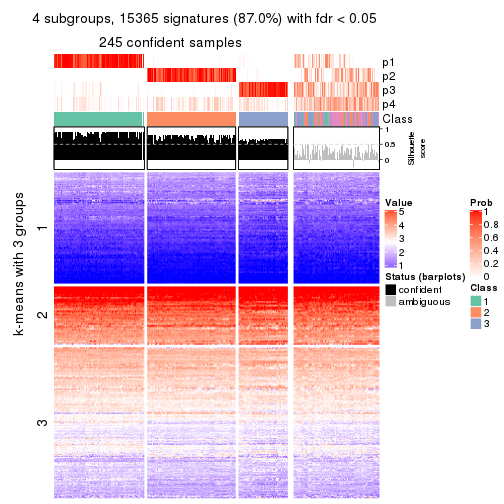</p>

</div>
<div id='tab-CV-mclust-get-signatures-no-scale-4'>
<pre><code class="r">get_signatures(res, k = 5, scale_rows = FALSE)
</code></pre>

<p></p>

</div>
<div id='tab-CV-mclust-get-signatures-no-scale-5'>
<pre><code class="r">get_signatures(res, k = 6, scale_rows = FALSE)
</code></pre>

<p></p>

</div>
</div>


Compare the overlap of signatures from different k:

```r
compare_signatures(res)
```


`get_signature()` returns a data frame invisibly. TO get the list of signatures, the function
call should be assigned to a variable explicitly. In following code, if `plot` argument is set
to `FALSE`, no heatmap is plotted while only the differential analysis is performed.

```r
# code only for demonstration
tb = get_signature(res, k = ..., plot = FALSE)
```

An example of the output of `tb` is:

```
#>   which_row         fdr    mean_1    mean_2 scaled_mean_1 scaled_mean_2 km
#> 1        38 0.042760348  8.373488  9.131774    -0.5533452     0.5164555  1
#> 2        40 0.018707592  7.106213  8.469186    -0.6173731     0.5762149  1
#> 3        55 0.019134737 10.221463 11.207825    -0.6159697     0.5749050  1
#> 4        59 0.006059896  5.921854  7.869574    -0.6899429     0.6439467  1
#> 5        60 0.018055526  8.928898 10.211722    -0.6204761     0.5791110  1
#> 6        98 0.009384629 15.714769 14.887706     0.6635654    -0.6193277  2
...
```

The columns in `tb` are:

1. `which_row`: row indices corresponding to the input matrix.
2. `fdr`: FDR for the differential test. 
3. `mean_x`: The mean value in group x.
4. `scaled_mean_x`: The mean value in group x after rows are scaled.
5. `km`: Row groups if k-means clustering is applied to rows.


UMAP plot which shows how samples are separated.


<script>
$( function() {
	$( '#tabs-CV-mclust-dimension-reduction' ).tabs();
} );
</script>
<div id='tabs-CV-mclust-dimension-reduction'>
<ul>
<li><a href='#tab-CV-mclust-dimension-reduction-1'>k = 2</a></li>
<li><a href='#tab-CV-mclust-dimension-reduction-2'>k = 3</a></li>
<li><a href='#tab-CV-mclust-dimension-reduction-3'>k = 4</a></li>
<li><a href='#tab-CV-mclust-dimension-reduction-4'>k = 5</a></li>
<li><a href='#tab-CV-mclust-dimension-reduction-5'>k = 6</a></li>
</ul>
<div id='tab-CV-mclust-dimension-reduction-1'>
<pre><code class="r">dimension_reduction(res, k = 2, method = &quot;UMAP&quot;)
</code></pre>

<p></p>

</div>
<div id='tab-CV-mclust-dimension-reduction-2'>
<pre><code class="r">dimension_reduction(res, k = 3, method = &quot;UMAP&quot;)
</code></pre>

<p></p>

</div>
<div id='tab-CV-mclust-dimension-reduction-3'>
<pre><code class="r">dimension_reduction(res, k = 4, method = &quot;UMAP&quot;)
</code></pre>

<p></p>

</div>
<div id='tab-CV-mclust-dimension-reduction-4'>
<pre><code class="r">dimension_reduction(res, k = 5, method = &quot;UMAP&quot;)
</code></pre>

<p></p>

</div>
<div id='tab-CV-mclust-dimension-reduction-5'>
<pre><code class="r">dimension_reduction(res, k = 6, method = &quot;UMAP&quot;)
</code></pre>

<p></p>

</div>
</div>


Following heatmap shows how subgroups are split when increasing `k`:

```r
collect_classes(res)
```


If matrix rows can be associated to genes, consider to use `GO_Enrichment(res,
...)` to perform function enrichment for the signature genes.


 

---------------------------------------------------


### CV:NMF**


The object with results only for a single top-value method and a single partition method 
can be extracted as:

```r
res = res_list["CV", "NMF"]
# you can also extract it by
# res = res_list["CV:NMF"]
```

A summary of `res` and all the functions that can be applied to it:

```r
res
```

```
#> A 'ConsensusPartition' object with k = 2, 3, 4, 5, 6.
#>   On a matrix with 17654 rows and 335 columns.
#>   Top rows (1000, 2000, 3000, 4000, 5000) are extracted by 'CV' method.
#>   Subgroups are detected by 'NMF' method.
#>   Performed in total 1250 partitions by row resampling.
#>   Best k for subgroups seems to be 2.
#> 
#> Following methods can be applied to this 'ConsensusPartition' object:
#>  [1] "cola_report"             "collect_classes"         "collect_plots"          
#>  [4] "collect_stats"           "colnames"                "compare_signatures"     
#>  [7] "consensus_heatmap"       "dimension_reduction"     "functional_enrichment"  
#> [10] "get_anno_col"            "get_anno"                "get_classes"            
#> [13] "get_consensus"           "get_matrix"              "get_membership"         
#> [16] "get_param"               "get_signatures"          "get_stats"              
#> [19] "is_best_k"               "is_stable_k"             "membership_heatmap"     
#> [22] "ncol"                    "nrow"                    "plot_ecdf"              
#> [25] "rownames"                "select_partition_number" "show"                   
#> [28] "suggest_best_k"          "test_to_known_factors"
```

`collect_plots()` function collects all the plots made from `res` for all `k` (number of partitions)
into one single page to provide an easy and fast comparison between different `k`.

```r
collect_plots(res)
```


The plots are:

- The first row: a plot of the ECDF (Empirical cumulative distribution
  function) curves of the consensus matrix for each `k` and the heatmap of
  predicted classes for each `k`.
- The second row: heatmaps of the consensus matrix for each `k`.
- The third row: heatmaps of the membership matrix for each `k`.
- The fouth row: heatmaps of the signatures for each `k`.

All the plots in panels can be made by individual functions and they are
plotted later in this section.

`select_partition_number()` produces several plots showing different
statistics for choosing "optimized" `k`. There are following statistics:

- ECDF curves of the consensus matrix for each `k`;
- 1-PAC. [The PAC
  score](https://en.wikipedia.org/wiki/Consensus_clustering#Over-interpretation_potential_of_consensus_clustering)
  measures the proportion of the ambiguous subgrouping.
- Mean silhouette score.
- Concordance. The mean probability of fiting the consensus class ids in all
  partitions.
- Area increased. Denote $A_k$ as the area under the ECDF curve for current
  `k`, the area increased is defined as $A_k - A_{k-1}$.
- Rand index. The percent of pairs of samples that are both in a same cluster
  or both are not in a same cluster in the partition of k and k-1.
- Jaccard index. The ratio of pairs of samples are both in a same cluster in
  the partition of k and k-1 and the pairs of samples are both in a same
  cluster in the partition k or k-1.

The detailed explanations of these statistics can be found in [the cola
vignette](http://bioconductor.org/packages/devel/bioc/vignettes/cola/inst/doc/cola.html#toc_13).

Generally speaking, lower PAC score, higher mean silhouette score or higher
concordance corresponds to better partition. Rand index and Jaccard index
measure how similar the current partition is compared to partition with `k-1`.
If they are too similar, we won't accept `k` is better than `k-1`.

```r
select_partition_number(res)
```


The numeric values for all these statistics can be obtained by `get_stats()`.

```r
get_stats(res)
```

```
#>   k 1-PAC mean_silhouette concordance area_increased  Rand Jaccard
#> 2 2 0.969           0.950       0.980         0.4963 0.503   0.503
#> 3 3 0.867           0.890       0.952         0.3094 0.783   0.595
#> 4 4 0.617           0.600       0.804         0.1091 0.926   0.802
#> 5 5 0.617           0.507       0.718         0.0546 0.859   0.601
#> 6 6 0.662           0.591       0.756         0.0350 0.890   0.624
```

`suggest_best_k()` suggests the best $k$ based on these statistics. The rules are as follows:

- All $k$ with Jaccard index larger than 0.95 are removed because the increase of
  the partition number does not provides enough extra information. If all $k$ are removed,
  the best $k$ is assigned by `NA`.
- For $k$ with 1-PAC larger than 0.9, the maximal $k$ is taken as the "best k". Other $k$ is called "optional k".
- If it does not fit the second rule. The $k$ with the highest vote of highest
  1-PAC, mean silhouette and concordance is taken as the "best k".

```r
suggest_best_k(res)
```

```
#> [1] 2
```


Following shows the table of the partitions (You need to click the **show/hide
code output** link to see it). The membership matrix (columns with name `p*`)
is inferred by
[`clue::cl_consensus()`](https://www.rdocumentation.org/link/cl_consensus?package=clue)
function with the `SE` method. Basically the value in the membership matrix
represents the probability to belong to a certain group. The finall class
label for an item is determined with the group with highest probability it
belongs to.

In `get_classes()` function, the entropy is calculated from the membership
matrix and the silhouette score is calculated from the consensus matrix.


<script>
$( function() {
	$( '#tabs-CV-NMF-get-classes' ).tabs();
} );
</script>
<div id='tabs-CV-NMF-get-classes'>
<ul>
<li><a href='#tab-CV-NMF-get-classes-1'>k = 2</a></li>
<li><a href='#tab-CV-NMF-get-classes-2'>k = 3</a></li>
<li><a href='#tab-CV-NMF-get-classes-3'>k = 4</a></li>
<li><a href='#tab-CV-NMF-get-classes-4'>k = 5</a></li>
<li><a href='#tab-CV-NMF-get-classes-5'>k = 6</a></li>
</ul>

<div id='tab-CV-NMF-get-classes-1'>
<p><a id='tab-CV-NMF-get-classes-1-a' style='color:#0366d6' href='#'>show/hide code output</a></p>
<pre><code class="r">cbind(get_classes(res, k = 2), get_membership(res, k = 2))
</code></pre>

<pre><code>#&gt;            class entropy silhouette    p1    p2
#&gt; SRR660306      2  0.0000      0.986 0.000 1.000
#&gt; SRR1359328     2  0.0000      0.986 0.000 1.000
#&gt; SRR821124      2  0.0000      0.986 0.000 1.000
#&gt; SRR1335188     1  0.0000      0.971 1.000 0.000
#&gt; SRR1075825     2  0.0000      0.986 0.000 1.000
#&gt; SRR1321921     1  0.0000      0.971 1.000 0.000
#&gt; SRR1466198     2  0.0000      0.986 0.000 1.000
#&gt; SRR1384073     1  0.0000      0.971 1.000 0.000
#&gt; SRR1312802     1  0.0000      0.971 1.000 0.000
#&gt; SRR1076559     1  0.0000      0.971 1.000 0.000
#&gt; SRR1370085     1  0.0000      0.971 1.000 0.000
#&gt; SRR1460363     1  0.0000      0.971 1.000 0.000
#&gt; SRR1480221     2  0.0000      0.986 0.000 1.000
#&gt; SRR1476165     1  0.0000      0.971 1.000 0.000
#&gt; SRR1459631     2  0.0000      0.986 0.000 1.000
#&gt; SRR1448098     2  0.0000      0.986 0.000 1.000
#&gt; SRR1321401     2  0.0000      0.986 0.000 1.000
#&gt; SRR807613      2  0.0000      0.986 0.000 1.000
#&gt; SRR808086      2  0.0000      0.986 0.000 1.000
#&gt; SRR613687      2  0.0000      0.986 0.000 1.000
#&gt; SRR1471011     1  0.0000      0.971 1.000 0.000
#&gt; SRR1330284     2  0.0000      0.986 0.000 1.000
#&gt; SRR1320624     2  0.0000      0.986 0.000 1.000
#&gt; SRR1459519     1  0.0000      0.971 1.000 0.000
#&gt; SRR1091184     2  0.0000      0.986 0.000 1.000
#&gt; SRR1390561     1  0.0000      0.971 1.000 0.000
#&gt; SRR658164      1  0.0000      0.971 1.000 0.000
#&gt; SRR1087079     2  0.0000      0.986 0.000 1.000
#&gt; SRR814996      2  0.0000      0.986 0.000 1.000
#&gt; SRR1407410     2  0.0000      0.986 0.000 1.000
#&gt; SRR1453392     2  0.0000      0.986 0.000 1.000
#&gt; SRR1445873     1  0.0000      0.971 1.000 0.000
#&gt; SRR1419985     2  0.0000      0.986 0.000 1.000
#&gt; SRR820938      2  0.0000      0.986 0.000 1.000
#&gt; SRR1476844     1  0.0000      0.971 1.000 0.000
#&gt; SRR1403526     1  0.0000      0.971 1.000 0.000
#&gt; SRR1413916     2  0.0000      0.986 0.000 1.000
#&gt; SRR1441051     2  0.0000      0.986 0.000 1.000
#&gt; SRR614287      2  0.0000      0.986 0.000 1.000
#&gt; SRR1092062     2  0.0000      0.986 0.000 1.000
#&gt; SRR612611      2  0.0000      0.986 0.000 1.000
#&gt; SRR1376356     2  0.0000      0.986 0.000 1.000
#&gt; SRR1405078     1  0.9044      0.542 0.680 0.320
#&gt; SRR1437226     2  0.0000      0.986 0.000 1.000
#&gt; SRR1326078     1  0.0000      0.971 1.000 0.000
#&gt; SRR1096806     2  0.0000      0.986 0.000 1.000
#&gt; SRR1440919     2  0.0000      0.986 0.000 1.000
#&gt; SRR1452824     1  0.0000      0.971 1.000 0.000
#&gt; SRR615754      1  0.0000      0.971 1.000 0.000
#&gt; SRR1341787     2  0.0000      0.986 0.000 1.000
#&gt; SRR614551      2  0.0000      0.986 0.000 1.000
#&gt; SRR1380829     2  0.0000      0.986 0.000 1.000
#&gt; SRR1455761     1  0.0000      0.971 1.000 0.000
#&gt; SRR1465189     1  0.0000      0.971 1.000 0.000
#&gt; SRR1376895     1  0.0000      0.971 1.000 0.000
#&gt; SRR1445002     1  0.0000      0.971 1.000 0.000
#&gt; SRR1469258     2  0.0000      0.986 0.000 1.000
#&gt; SRR1409239     1  0.0000      0.971 1.000 0.000
#&gt; SRR1480200     1  0.0000      0.971 1.000 0.000
#&gt; SRR1418323     1  0.0000      0.971 1.000 0.000
#&gt; SRR657540      2  0.0000      0.986 0.000 1.000
#&gt; SRR821096      2  0.0000      0.986 0.000 1.000
#&gt; SRR613591      2  0.0000      0.986 0.000 1.000
#&gt; SRR1344205     2  0.0000      0.986 0.000 1.000
#&gt; SRR612479      1  0.0000      0.971 1.000 0.000
#&gt; SRR1399950     1  0.0000      0.971 1.000 0.000
#&gt; SRR1336048     1  0.0000      0.971 1.000 0.000
#&gt; SRR1368896     1  0.0000      0.971 1.000 0.000
#&gt; SRR1379403     2  0.0000      0.986 0.000 1.000
#&gt; SRR1312464     1  0.0000      0.971 1.000 0.000
#&gt; SRR1096478     1  0.0000      0.971 1.000 0.000
#&gt; SRR1459845     1  0.0000      0.971 1.000 0.000
#&gt; SRR1348138     1  0.9710      0.353 0.600 0.400
#&gt; SRR811423      1  0.0000      0.971 1.000 0.000
#&gt; SRR615683      1  0.0000      0.971 1.000 0.000
#&gt; SRR1380336     2  0.0000      0.986 0.000 1.000
#&gt; SRR817609      1  0.0000      0.971 1.000 0.000
#&gt; SRR1074550     2  0.0000      0.986 0.000 1.000
#&gt; SRR1499236     2  0.0000      0.986 0.000 1.000
#&gt; SRR656083      1  0.0000      0.971 1.000 0.000
#&gt; SRR817539      1  0.0000      0.971 1.000 0.000
#&gt; SRR1410801     1  0.0000      0.971 1.000 0.000
#&gt; SRR1347190     1  0.0000      0.971 1.000 0.000
#&gt; SRR1355126     2  0.0000      0.986 0.000 1.000
#&gt; SRR615165      2  0.0000      0.986 0.000 1.000
#&gt; SRR1466046     1  0.0000      0.971 1.000 0.000
#&gt; SRR1097055     2  0.0000      0.986 0.000 1.000
#&gt; SRR1312370     1  0.2778      0.928 0.952 0.048
#&gt; SRR655325      1  0.0000      0.971 1.000 0.000
#&gt; SRR810177      2  0.0000      0.986 0.000 1.000
#&gt; SRR815685      2  0.0000      0.986 0.000 1.000
#&gt; SRR817026      2  0.0000      0.986 0.000 1.000
#&gt; SRR1417224     2  0.0000      0.986 0.000 1.000
#&gt; SRR661687      2  0.0000      0.986 0.000 1.000
#&gt; SRR1431804     1  0.0000      0.971 1.000 0.000
#&gt; SRR664072      2  0.0000      0.986 0.000 1.000
#&gt; SRR612923      2  0.0000      0.986 0.000 1.000
#&gt; SRR1315890     1  0.0000      0.971 1.000 0.000
#&gt; SRR1347726     1  0.0000      0.971 1.000 0.000
#&gt; SRR1500360     1  0.0000      0.971 1.000 0.000
#&gt; SRR1468360     2  0.0000      0.986 0.000 1.000
#&gt; SRR1404084     1  0.6887      0.771 0.816 0.184
#&gt; SRR615994      2  0.0000      0.986 0.000 1.000
#&gt; SRR1475718     2  0.0000      0.986 0.000 1.000
#&gt; SRR1397200     2  0.0000      0.986 0.000 1.000
#&gt; SRR655519      2  0.0000      0.986 0.000 1.000
#&gt; SRR1311308     2  0.0000      0.986 0.000 1.000
#&gt; SRR1368006     2  0.0000      0.986 0.000 1.000
#&gt; SRR613651      2  0.9170      0.492 0.332 0.668
#&gt; SRR1362621     2  0.0000      0.986 0.000 1.000
#&gt; SRR1451718     1  0.0000      0.971 1.000 0.000
#&gt; SRR1095334     2  0.0000      0.986 0.000 1.000
#&gt; SRR1079636     2  0.0000      0.986 0.000 1.000
#&gt; SRR1442549     1  0.0000      0.971 1.000 0.000
#&gt; SRR1466421     2  0.0000      0.986 0.000 1.000
#&gt; SRR817397      2  0.0000      0.986 0.000 1.000
#&gt; SRR1341809     2  0.4939      0.868 0.108 0.892
#&gt; SRR614623      2  0.0000      0.986 0.000 1.000
#&gt; SRR1335005     2  0.0000      0.986 0.000 1.000
#&gt; SRR1407065     2  0.0000      0.986 0.000 1.000
#&gt; SRR1404483     2  0.0000      0.986 0.000 1.000
#&gt; SRR1096222     1  0.0000      0.971 1.000 0.000
#&gt; SRR1401793     1  0.0000      0.971 1.000 0.000
#&gt; SRR1408615     2  0.0000      0.986 0.000 1.000
#&gt; SRR1070597     1  0.0000      0.971 1.000 0.000
#&gt; SRR1332381     1  0.0000      0.971 1.000 0.000
#&gt; SRR1457015     1  0.0000      0.971 1.000 0.000
#&gt; SRR1386797     1  0.9580      0.405 0.620 0.380
#&gt; SRR1098385     2  0.0000      0.986 0.000 1.000
#&gt; SRR1363947     2  0.0000      0.986 0.000 1.000
#&gt; SRR820350      2  0.0000      0.986 0.000 1.000
#&gt; SRR662055      2  0.0000      0.986 0.000 1.000
#&gt; SRR1310455     1  0.0000      0.971 1.000 0.000
#&gt; SRR1453639     1  0.4161      0.892 0.916 0.084
#&gt; SRR662617      2  0.0000      0.986 0.000 1.000
#&gt; SRR654778      1  0.0000      0.971 1.000 0.000
#&gt; SRR661782      2  0.0000      0.986 0.000 1.000
#&gt; SRR1334396     1  0.0000      0.971 1.000 0.000
#&gt; SRR613867      2  0.0000      0.986 0.000 1.000
#&gt; SRR1479412     1  0.0000      0.971 1.000 0.000
#&gt; SRR1331620     1  0.0000      0.971 1.000 0.000
#&gt; SRR1082809     1  0.0000      0.971 1.000 0.000
#&gt; SRR1417178     1  0.0000      0.971 1.000 0.000
#&gt; SRR1335278     1  0.0000      0.971 1.000 0.000
#&gt; SRR665369      2  0.0000      0.986 0.000 1.000
#&gt; SRR657552      1  0.0000      0.971 1.000 0.000
#&gt; SRR812412      1  0.0000      0.971 1.000 0.000
#&gt; SRR1096500     2  0.2948      0.934 0.052 0.948
#&gt; SRR1347750     2  0.0000      0.986 0.000 1.000
#&gt; SRR615153      2  0.0000      0.986 0.000 1.000
#&gt; SRR1434417     1  0.0000      0.971 1.000 0.000
#&gt; SRR1070159     2  0.0000      0.986 0.000 1.000
#&gt; SRR1332508     2  0.0000      0.986 0.000 1.000
#&gt; SRR1082059     2  0.5946      0.821 0.144 0.856
#&gt; SRR1402491     1  0.0000      0.971 1.000 0.000
#&gt; SRR1476595     1  0.9044      0.542 0.680 0.320
#&gt; SRR1320987     2  0.0376      0.982 0.004 0.996
#&gt; SRR1086417     2  0.8661      0.585 0.288 0.712
#&gt; SRR1454095     1  0.0000      0.971 1.000 0.000
#&gt; SRR614791      2  0.0000      0.986 0.000 1.000
#&gt; SRR821255      1  0.9661      0.374 0.608 0.392
#&gt; SRR820402      2  0.0000      0.986 0.000 1.000
#&gt; SRR1337284     1  0.0000      0.971 1.000 0.000
#&gt; SRR1333083     2  0.9833      0.241 0.424 0.576
#&gt; SRR1384883     2  0.0000      0.986 0.000 1.000
#&gt; SRR614431      1  0.0000      0.971 1.000 0.000
#&gt; SRR1481106     2  0.0000      0.986 0.000 1.000
#&gt; SRR1370285     1  0.0000      0.971 1.000 0.000
#&gt; SRR1446673     2  0.0000      0.986 0.000 1.000
#&gt; SRR1318046     2  0.0000      0.986 0.000 1.000
#&gt; SRR1341188     2  0.0000      0.986 0.000 1.000
#&gt; SRR1384941     1  0.0000      0.971 1.000 0.000
#&gt; SRR1322864     2  0.0000      0.986 0.000 1.000
#&gt; SRR1476825     1  0.0000      0.971 1.000 0.000
#&gt; SRR1443332     2  0.0000      0.986 0.000 1.000
#&gt; SRR662486      2  0.0000      0.986 0.000 1.000
#&gt; SRR1447019     1  0.0000      0.971 1.000 0.000
#&gt; SRR662942      1  0.0000      0.971 1.000 0.000
#&gt; SRR613102      2  0.0000      0.986 0.000 1.000
#&gt; SRR1469880     1  0.0000      0.971 1.000 0.000
#&gt; SRR1464977     1  0.0000      0.971 1.000 0.000
#&gt; SRR615850      1  0.6801      0.779 0.820 0.180
#&gt; SRR661949      2  0.0000      0.986 0.000 1.000
#&gt; SRR1322227     2  0.0000      0.986 0.000 1.000
#&gt; SRR1441655     1  0.8443      0.634 0.728 0.272
#&gt; SRR613771      2  0.0000      0.986 0.000 1.000
#&gt; SRR1479471     1  0.0000      0.971 1.000 0.000
#&gt; SRR1488918     2  0.0000      0.986 0.000 1.000
#&gt; SRR1414040     2  0.0000      0.986 0.000 1.000
#&gt; SRR1079850     1  0.9922      0.210 0.552 0.448
#&gt; SRR663209      1  0.0000      0.971 1.000 0.000
#&gt; SRR1364914     2  0.0000      0.986 0.000 1.000
#&gt; SRR1408267     2  0.0000      0.986 0.000 1.000
#&gt; SRR1314894     1  0.0000      0.971 1.000 0.000
#&gt; SRR1414117     2  0.0000      0.986 0.000 1.000
#&gt; SRR1395975     2  0.0000      0.986 0.000 1.000
#&gt; SRR1402219     2  0.0000      0.986 0.000 1.000
#&gt; SRR1433623     1  0.0000      0.971 1.000 0.000
#&gt; SRR656385      2  0.0000      0.986 0.000 1.000
#&gt; SRR811213      2  0.0000      0.986 0.000 1.000
#&gt; SRR663657      2  0.0000      0.986 0.000 1.000
#&gt; SRR612203      1  0.0376      0.967 0.996 0.004
#&gt; SRR613987      2  0.0672      0.978 0.008 0.992
#&gt; SRR613831      2  0.0000      0.986 0.000 1.000
#&gt; SRR1354180     2  0.0000      0.986 0.000 1.000
#&gt; SRR1382912     1  0.0000      0.971 1.000 0.000
#&gt; SRR1475501     1  0.0000      0.971 1.000 0.000
#&gt; SRR1336930     1  0.0000      0.971 1.000 0.000
#&gt; SRR613030      2  0.0000      0.986 0.000 1.000
#&gt; SRR1381459     2  0.0000      0.986 0.000 1.000
#&gt; SRR1402350     1  0.9248      0.499 0.660 0.340
#&gt; SRR1419408     1  0.0000      0.971 1.000 0.000
#&gt; SRR655911      2  0.0000      0.986 0.000 1.000
#&gt; SRR1418243     1  0.0000      0.971 1.000 0.000
#&gt; SRR1322573     1  0.0000      0.971 1.000 0.000
#&gt; SRR613615      2  0.0000      0.986 0.000 1.000
#&gt; SRR1355284     1  0.0000      0.971 1.000 0.000
#&gt; SRR1319395     1  0.0000      0.971 1.000 0.000
#&gt; SRR818939      1  0.0000      0.971 1.000 0.000
#&gt; SRR1465266     1  0.0000      0.971 1.000 0.000
#&gt; SRR614888      2  0.9580      0.373 0.380 0.620
#&gt; SRR1431694     1  0.0000      0.971 1.000 0.000
#&gt; SRR614347      2  0.0000      0.986 0.000 1.000
#&gt; SRR1334228     2  0.0000      0.986 0.000 1.000
#&gt; SRR1096007     2  0.0000      0.986 0.000 1.000
#&gt; SRR656349      1  0.0000      0.971 1.000 0.000
#&gt; SRR815422      2  0.0000      0.986 0.000 1.000
#&gt; SRR1360828     1  0.0000      0.971 1.000 0.000
#&gt; SRR1359005     2  0.0000      0.986 0.000 1.000
#&gt; SRR1456652     1  0.0000      0.971 1.000 0.000
#&gt; SRR1391660     1  0.0000      0.971 1.000 0.000
#&gt; SRR1441956     1  0.0000      0.971 1.000 0.000
#&gt; SRR662930      2  0.0000      0.986 0.000 1.000
#&gt; SRR615790      2  0.0000      0.986 0.000 1.000
#&gt; SRR614827      2  0.0000      0.986 0.000 1.000
#&gt; SRR614587      2  0.0000      0.986 0.000 1.000
#&gt; SRR814052      2  0.0000      0.986 0.000 1.000
#&gt; SRR1070086     1  0.0000      0.971 1.000 0.000
#&gt; SRR1481440     1  0.0000      0.971 1.000 0.000
#&gt; SRR1339296     2  0.0000      0.986 0.000 1.000
#&gt; SRR1343239     2  0.0000      0.986 0.000 1.000
#&gt; SRR1432802     2  0.0000      0.986 0.000 1.000
#&gt; SRR1416911     1  0.0000      0.971 1.000 0.000
#&gt; SRR1410427     1  0.0000      0.971 1.000 0.000
#&gt; SRR1401185     1  0.0000      0.971 1.000 0.000
#&gt; SRR654993      2  0.0000      0.986 0.000 1.000
#&gt; SRR656397      1  0.0000      0.971 1.000 0.000
#&gt; SRR809643      2  0.0000      0.986 0.000 1.000
#&gt; SRR1433819     1  0.0000      0.971 1.000 0.000
#&gt; SRR1375225     2  0.0000      0.986 0.000 1.000
#&gt; SRR1367739     1  0.6712      0.782 0.824 0.176
#&gt; SRR1323336     1  0.9866      0.261 0.568 0.432
#&gt; SRR663224      2  0.0000      0.986 0.000 1.000
#&gt; SRR1442840     1  0.0000      0.971 1.000 0.000
#&gt; SRR1374058     1  0.0000      0.971 1.000 0.000
#&gt; SRR656994      1  0.0000      0.971 1.000 0.000
#&gt; SRR1469214     2  0.0000      0.986 0.000 1.000
#&gt; SRR1456446     1  0.0000      0.971 1.000 0.000
#&gt; SRR1471879     2  0.0000      0.986 0.000 1.000
#&gt; SRR612911      2  0.0000      0.986 0.000 1.000
#&gt; SRR1395720     2  0.0000      0.986 0.000 1.000
#&gt; SRR1413055     1  0.0000      0.971 1.000 0.000
#&gt; SRR656770      2  0.0000      0.986 0.000 1.000
#&gt; SRR812080      2  0.0000      0.986 0.000 1.000
#&gt; SRR1479328     1  0.0000      0.971 1.000 0.000
#&gt; SRR661421      2  0.0000      0.986 0.000 1.000
#&gt; SRR1410286     2  0.0000      0.986 0.000 1.000
#&gt; SRR1487150     1  0.0000      0.971 1.000 0.000
#&gt; SRR1467035     1  0.0000      0.971 1.000 0.000
#&gt; SRR1360607     2  0.9661      0.340 0.392 0.608
#&gt; SRR1333106     2  0.0000      0.986 0.000 1.000
#&gt; SRR1088706     2  0.0000      0.986 0.000 1.000
#&gt; SRR1320053     2  0.0000      0.986 0.000 1.000
#&gt; SRR1350392     2  0.0000      0.986 0.000 1.000
#&gt; SRR1385190     1  0.7139      0.756 0.804 0.196
#&gt; SRR1080093     2  0.0000      0.986 0.000 1.000
#&gt; SRR1318753     1  0.0000      0.971 1.000 0.000
#&gt; SRR1345369     2  0.0000      0.986 0.000 1.000
#&gt; SRR612178      2  0.0000      0.986 0.000 1.000
#&gt; SRR1354423     1  0.0000      0.971 1.000 0.000
#&gt; SRR1072724     1  0.0000      0.971 1.000 0.000
#&gt; SRR1418450     2  0.0000      0.986 0.000 1.000
#&gt; SRR1326427     2  0.0000      0.986 0.000 1.000
#&gt; SRR1437412     1  0.5629      0.838 0.868 0.132
#&gt; SRR1327548     2  0.0000      0.986 0.000 1.000
#&gt; SRR1395891     1  0.0000      0.971 1.000 0.000
#&gt; SRR659367      2  0.0000      0.986 0.000 1.000
#&gt; SRR818961      1  0.0000      0.971 1.000 0.000
#&gt; SRR813704      1  0.0000      0.971 1.000 0.000
#&gt; SRR613054      1  0.0000      0.971 1.000 0.000
#&gt; SRR1476467     1  0.0000      0.971 1.000 0.000
#&gt; SRR1407988     2  0.0000      0.986 0.000 1.000
#&gt; SRR1394776     2  0.0000      0.986 0.000 1.000
#&gt; SRR655578      2  0.0000      0.986 0.000 1.000
#&gt; SRR1310645     2  0.0000      0.986 0.000 1.000
#&gt; SRR1345628     1  0.0000      0.971 1.000 0.000
#&gt; SRR1479740     1  0.0000      0.971 1.000 0.000
#&gt; SRR1332095     1  0.0376      0.967 0.996 0.004
#&gt; SRR1444786     2  0.0000      0.986 0.000 1.000
#&gt; SRR1090070     1  0.0000      0.971 1.000 0.000
#&gt; SRR662414      2  0.0000      0.986 0.000 1.000
#&gt; SRR661216      2  0.0000      0.986 0.000 1.000
#&gt; SRR656313      2  0.0000      0.986 0.000 1.000
#&gt; SRR615671      2  0.0000      0.986 0.000 1.000
#&gt; SRR1350196     2  0.0000      0.986 0.000 1.000
#&gt; SRR1466580     1  0.0000      0.971 1.000 0.000
#&gt; SRR1408032     2  0.0000      0.986 0.000 1.000
#&gt; SRR1432913     2  0.0000      0.986 0.000 1.000
#&gt; SRR1360502     1  0.0000      0.971 1.000 0.000
#&gt; SRR1391901     2  0.0000      0.986 0.000 1.000
#&gt; SRR1311131     1  0.0000      0.971 1.000 0.000
#&gt; SRR1380636     1  0.0000      0.971 1.000 0.000
#&gt; SRR1332339     1  0.0000      0.971 1.000 0.000
#&gt; SRR1341563     2  0.0000      0.986 0.000 1.000
#&gt; SRR1359410     2  0.0000      0.986 0.000 1.000
#&gt; SRR1473040     2  0.0000      0.986 0.000 1.000
#&gt; SRR1321444     1  0.0000      0.971 1.000 0.000
#&gt; SRR1498765     2  0.0000      0.986 0.000 1.000
#&gt; SRR1312622     2  0.0000      0.986 0.000 1.000
#&gt; SRR615503      2  0.9358      0.444 0.352 0.648
#&gt; SRR1453192     1  0.0000      0.971 1.000 0.000
#&gt; SRR1433107     2  0.0000      0.986 0.000 1.000
#&gt; SRR1075384     1  0.0000      0.971 1.000 0.000
#&gt; SRR1356683     1  0.0000      0.971 1.000 0.000
#&gt; SRR659049      1  0.0000      0.971 1.000 0.000
#&gt; SRR1368240     1  0.0000      0.971 1.000 0.000
#&gt; SRR1341739     1  0.0000      0.971 1.000 0.000
#&gt; SRR613249      2  0.1414      0.966 0.020 0.980
#&gt; SRR663428      2  0.0000      0.986 0.000 1.000
#&gt; SRR1341302     2  0.0000      0.986 0.000 1.000
#&gt; SRR1073553     2  0.0000      0.986 0.000 1.000
#&gt; SRR1354093     2  0.0000      0.986 0.000 1.000
#&gt; SRR1406521     2  0.0000      0.986 0.000 1.000
#&gt; SRR1432049     1  0.0000      0.971 1.000 0.000
#&gt; SRR1453504     1  0.0000      0.971 1.000 0.000
</code></pre>

<script>
$('#tab-CV-NMF-get-classes-1-a').parent().next().next().hide();
$('#tab-CV-NMF-get-classes-1-a').click(function(){
  $('#tab-CV-NMF-get-classes-1-a').parent().next().next().toggle();
  return(false);
});
</script>
</div>

<div id='tab-CV-NMF-get-classes-2'>
<p><a id='tab-CV-NMF-get-classes-2-a' style='color:#0366d6' href='#'>show/hide code output</a></p>
<pre><code class="r">cbind(get_classes(res, k = 3), get_membership(res, k = 3))
</code></pre>

<pre><code>#&gt;            class entropy silhouette    p1    p2    p3
#&gt; SRR660306      3  0.5926     0.4390 0.000 0.356 0.644
#&gt; SRR1359328     3  0.0424     0.9115 0.000 0.008 0.992
#&gt; SRR821124      2  0.0000     0.9417 0.000 1.000 0.000
#&gt; SRR1335188     1  0.0000     0.9696 1.000 0.000 0.000
#&gt; SRR1075825     2  0.0000     0.9417 0.000 1.000 0.000
#&gt; SRR1321921     1  0.0000     0.9696 1.000 0.000 0.000
#&gt; SRR1466198     3  0.0000     0.9134 0.000 0.000 1.000
#&gt; SRR1384073     1  0.3412     0.8331 0.876 0.124 0.000
#&gt; SRR1312802     1  0.0424     0.9635 0.992 0.000 0.008
#&gt; SRR1076559     1  0.0000     0.9696 1.000 0.000 0.000
#&gt; SRR1370085     1  0.0000     0.9696 1.000 0.000 0.000
#&gt; SRR1460363     1  0.0000     0.9696 1.000 0.000 0.000
#&gt; SRR1480221     2  0.0000     0.9417 0.000 1.000 0.000
#&gt; SRR1476165     1  0.0000     0.9696 1.000 0.000 0.000
#&gt; SRR1459631     3  0.5216     0.6497 0.000 0.260 0.740
#&gt; SRR1448098     2  0.0000     0.9417 0.000 1.000 0.000
#&gt; SRR1321401     2  0.0424     0.9381 0.000 0.992 0.008
#&gt; SRR807613      2  0.0000     0.9417 0.000 1.000 0.000
#&gt; SRR808086      3  0.0000     0.9134 0.000 0.000 1.000
#&gt; SRR613687      2  0.4002     0.8107 0.000 0.840 0.160
#&gt; SRR1471011     1  0.2066     0.9133 0.940 0.000 0.060
#&gt; SRR1330284     2  0.0000     0.9417 0.000 1.000 0.000
#&gt; SRR1320624     2  0.0000     0.9417 0.000 1.000 0.000
#&gt; SRR1459519     1  0.0000     0.9696 1.000 0.000 0.000
#&gt; SRR1091184     2  0.5948     0.4063 0.000 0.640 0.360
#&gt; SRR1390561     1  0.0000     0.9696 1.000 0.000 0.000
#&gt; SRR658164      1  0.0000     0.9696 1.000 0.000 0.000
#&gt; SRR1087079     2  0.0000     0.9417 0.000 1.000 0.000
#&gt; SRR814996      3  0.0000     0.9134 0.000 0.000 1.000
#&gt; SRR1407410     2  0.1031     0.9308 0.000 0.976 0.024
#&gt; SRR1453392     2  0.0000     0.9417 0.000 1.000 0.000
#&gt; SRR1445873     1  0.0000     0.9696 1.000 0.000 0.000
#&gt; SRR1419985     2  0.0000     0.9417 0.000 1.000 0.000
#&gt; SRR820938      3  0.0000     0.9134 0.000 0.000 1.000
#&gt; SRR1476844     1  0.0000     0.9696 1.000 0.000 0.000
#&gt; SRR1403526     1  0.0000     0.9696 1.000 0.000 0.000
#&gt; SRR1413916     2  0.0000     0.9417 0.000 1.000 0.000
#&gt; SRR1441051     2  0.0000     0.9417 0.000 1.000 0.000
#&gt; SRR614287      2  0.0747     0.9351 0.000 0.984 0.016
#&gt; SRR1092062     2  0.0000     0.9417 0.000 1.000 0.000
#&gt; SRR612611      2  0.0424     0.9388 0.000 0.992 0.008
#&gt; SRR1376356     2  0.4178     0.7972 0.000 0.828 0.172
#&gt; SRR1405078     3  0.1163     0.8991 0.028 0.000 0.972
#&gt; SRR1437226     2  0.1643     0.9198 0.000 0.956 0.044
#&gt; SRR1326078     1  0.0000     0.9696 1.000 0.000 0.000
#&gt; SRR1096806     3  0.4346     0.7579 0.000 0.184 0.816
#&gt; SRR1440919     2  0.2066     0.9117 0.000 0.940 0.060
#&gt; SRR1452824     1  0.0424     0.9635 0.992 0.000 0.008
#&gt; SRR615754      1  0.0000     0.9696 1.000 0.000 0.000
#&gt; SRR1341787     2  0.5254     0.6721 0.000 0.736 0.264
#&gt; SRR614551      2  0.4504     0.7684 0.000 0.804 0.196
#&gt; SRR1380829     3  0.0424     0.9123 0.000 0.008 0.992
#&gt; SRR1455761     1  0.0000     0.9696 1.000 0.000 0.000
#&gt; SRR1465189     3  0.5678     0.5250 0.316 0.000 0.684
#&gt; SRR1376895     1  0.0000     0.9696 1.000 0.000 0.000
#&gt; SRR1445002     1  0.0000     0.9696 1.000 0.000 0.000
#&gt; SRR1469258     2  0.1031     0.9308 0.000 0.976 0.024
#&gt; SRR1409239     1  0.0000     0.9696 1.000 0.000 0.000
#&gt; SRR1480200     1  0.0000     0.9696 1.000 0.000 0.000
#&gt; SRR1418323     1  0.0000     0.9696 1.000 0.000 0.000
#&gt; SRR657540      3  0.0424     0.9123 0.000 0.008 0.992
#&gt; SRR821096      2  0.0000     0.9417 0.000 1.000 0.000
#&gt; SRR613591      2  0.5138     0.6866 0.000 0.748 0.252
#&gt; SRR1344205     3  0.0000     0.9134 0.000 0.000 1.000
#&gt; SRR612479      1  0.0000     0.9696 1.000 0.000 0.000
#&gt; SRR1399950     1  0.0424     0.9632 0.992 0.000 0.008
#&gt; SRR1336048     1  0.5905     0.4481 0.648 0.000 0.352
#&gt; SRR1368896     1  0.0000     0.9696 1.000 0.000 0.000
#&gt; SRR1379403     2  0.0000     0.9417 0.000 1.000 0.000
#&gt; SRR1312464     1  0.0000     0.9696 1.000 0.000 0.000
#&gt; SRR1096478     1  0.0000     0.9696 1.000 0.000 0.000
#&gt; SRR1459845     1  0.0000     0.9696 1.000 0.000 0.000
#&gt; SRR1348138     3  0.0424     0.9099 0.008 0.000 0.992
#&gt; SRR811423      1  0.0000     0.9696 1.000 0.000 0.000
#&gt; SRR615683      1  0.0000     0.9696 1.000 0.000 0.000
#&gt; SRR1380336     2  0.0000     0.9417 0.000 1.000 0.000
#&gt; SRR817609      3  0.3816     0.7920 0.148 0.000 0.852
#&gt; SRR1074550     3  0.0424     0.9112 0.000 0.008 0.992
#&gt; SRR1499236     2  0.0000     0.9417 0.000 1.000 0.000
#&gt; SRR656083      1  0.0000     0.9696 1.000 0.000 0.000
#&gt; SRR817539      1  0.0000     0.9696 1.000 0.000 0.000
#&gt; SRR1410801     1  0.0000     0.9696 1.000 0.000 0.000
#&gt; SRR1347190     1  0.0424     0.9635 0.992 0.000 0.008
#&gt; SRR1355126     2  0.0000     0.9417 0.000 1.000 0.000
#&gt; SRR615165      3  0.0237     0.9130 0.000 0.004 0.996
#&gt; SRR1466046     1  0.0000     0.9696 1.000 0.000 0.000
#&gt; SRR1097055     2  0.0000     0.9417 0.000 1.000 0.000
#&gt; SRR1312370     2  0.0000     0.9417 0.000 1.000 0.000
#&gt; SRR655325      1  0.0000     0.9696 1.000 0.000 0.000
#&gt; SRR810177      2  0.0000     0.9417 0.000 1.000 0.000
#&gt; SRR815685      2  0.0000     0.9417 0.000 1.000 0.000
#&gt; SRR817026      3  0.0424     0.9111 0.000 0.008 0.992
#&gt; SRR1417224     2  0.0424     0.9388 0.000 0.992 0.008
#&gt; SRR661687      3  0.2625     0.8619 0.000 0.084 0.916
#&gt; SRR1431804     1  0.5465     0.5860 0.712 0.000 0.288
#&gt; SRR664072      3  0.0000     0.9134 0.000 0.000 1.000
#&gt; SRR612923      2  0.1753     0.9157 0.000 0.952 0.048
#&gt; SRR1315890     1  0.0000     0.9696 1.000 0.000 0.000
#&gt; SRR1347726     1  0.0000     0.9696 1.000 0.000 0.000
#&gt; SRR1500360     1  0.6192     0.3027 0.580 0.420 0.000
#&gt; SRR1468360     2  0.0983     0.9316 0.016 0.980 0.004
#&gt; SRR1404084     1  0.2625     0.8874 0.916 0.000 0.084
#&gt; SRR615994      3  0.0424     0.9123 0.000 0.008 0.992
#&gt; SRR1475718     2  0.0000     0.9417 0.000 1.000 0.000
#&gt; SRR1397200     3  0.0000     0.9134 0.000 0.000 1.000
#&gt; SRR655519      2  0.4235     0.7924 0.000 0.824 0.176
#&gt; SRR1311308     3  0.4702     0.7226 0.000 0.212 0.788
#&gt; SRR1368006     2  0.0000     0.9417 0.000 1.000 0.000
#&gt; SRR613651      3  0.0661     0.9116 0.004 0.008 0.988
#&gt; SRR1362621     3  0.4452     0.7481 0.000 0.192 0.808
#&gt; SRR1451718     1  0.0000     0.9696 1.000 0.000 0.000
#&gt; SRR1095334     3  0.0000     0.9134 0.000 0.000 1.000
#&gt; SRR1079636     2  0.0000     0.9417 0.000 1.000 0.000
#&gt; SRR1442549     1  0.1753     0.9226 0.952 0.048 0.000
#&gt; SRR1466421     2  0.0000     0.9417 0.000 1.000 0.000
#&gt; SRR817397      2  0.1031     0.9298 0.000 0.976 0.024
#&gt; SRR1341809     2  0.0000     0.9417 0.000 1.000 0.000
#&gt; SRR614623      2  0.1860     0.9129 0.000 0.948 0.052
#&gt; SRR1335005     2  0.0000     0.9417 0.000 1.000 0.000
#&gt; SRR1407065     2  0.1031     0.9291 0.000 0.976 0.024
#&gt; SRR1404483     2  0.0237     0.9400 0.000 0.996 0.004
#&gt; SRR1096222     1  0.0000     0.9696 1.000 0.000 0.000
#&gt; SRR1401793     1  0.0424     0.9635 0.992 0.000 0.008
#&gt; SRR1408615     3  0.0000     0.9134 0.000 0.000 1.000
#&gt; SRR1070597     2  0.0424     0.9366 0.008 0.992 0.000
#&gt; SRR1332381     1  0.0000     0.9696 1.000 0.000 0.000
#&gt; SRR1457015     1  0.0000     0.9696 1.000 0.000 0.000
#&gt; SRR1386797     2  0.5529     0.5644 0.296 0.704 0.000
#&gt; SRR1098385     2  0.0424     0.9381 0.000 0.992 0.008
#&gt; SRR1363947     3  0.0000     0.9134 0.000 0.000 1.000
#&gt; SRR820350      2  0.0000     0.9417 0.000 1.000 0.000
#&gt; SRR662055      3  0.0424     0.9123 0.000 0.008 0.992
#&gt; SRR1310455     1  0.0000     0.9696 1.000 0.000 0.000
#&gt; SRR1453639     2  0.0237     0.9397 0.004 0.996 0.000
#&gt; SRR662617      2  0.0892     0.9330 0.000 0.980 0.020
#&gt; SRR654778      1  0.0000     0.9696 1.000 0.000 0.000
#&gt; SRR661782      2  0.1411     0.9237 0.000 0.964 0.036
#&gt; SRR1334396     1  0.0000     0.9696 1.000 0.000 0.000
#&gt; SRR613867      2  0.4452     0.7725 0.000 0.808 0.192
#&gt; SRR1479412     1  0.0000     0.9696 1.000 0.000 0.000
#&gt; SRR1331620     1  0.0000     0.9696 1.000 0.000 0.000
#&gt; SRR1082809     1  0.0000     0.9696 1.000 0.000 0.000
#&gt; SRR1417178     1  0.0000     0.9696 1.000 0.000 0.000
#&gt; SRR1335278     1  0.0000     0.9696 1.000 0.000 0.000
#&gt; SRR665369      2  0.0000     0.9417 0.000 1.000 0.000
#&gt; SRR657552      1  0.4291     0.7639 0.820 0.000 0.180
#&gt; SRR812412      1  0.0000     0.9696 1.000 0.000 0.000
#&gt; SRR1096500     2  0.0000     0.9417 0.000 1.000 0.000
#&gt; SRR1347750     2  0.0000     0.9417 0.000 1.000 0.000
#&gt; SRR615153      3  0.0424     0.9123 0.000 0.008 0.992
#&gt; SRR1434417     1  0.0000     0.9696 1.000 0.000 0.000
#&gt; SRR1070159     3  0.0000     0.9134 0.000 0.000 1.000
#&gt; SRR1332508     2  0.0000     0.9417 0.000 1.000 0.000
#&gt; SRR1082059     2  0.0661     0.9364 0.004 0.988 0.008
#&gt; SRR1402491     1  0.0000     0.9696 1.000 0.000 0.000
#&gt; SRR1476595     2  0.0000     0.9417 0.000 1.000 0.000
#&gt; SRR1320987     2  0.0000     0.9417 0.000 1.000 0.000
#&gt; SRR1086417     2  0.1170     0.9275 0.016 0.976 0.008
#&gt; SRR1454095     1  0.1964     0.9165 0.944 0.056 0.000
#&gt; SRR614791      3  0.0424     0.9123 0.000 0.008 0.992
#&gt; SRR821255      2  0.0000     0.9417 0.000 1.000 0.000
#&gt; SRR820402      3  0.6140     0.3702 0.000 0.404 0.596
#&gt; SRR1337284     1  0.6235     0.2034 0.564 0.436 0.000
#&gt; SRR1333083     3  0.1860     0.8799 0.052 0.000 0.948
#&gt; SRR1384883     2  0.6026     0.3522 0.000 0.624 0.376
#&gt; SRR614431      1  0.0000     0.9696 1.000 0.000 0.000
#&gt; SRR1481106     2  0.0000     0.9417 0.000 1.000 0.000
#&gt; SRR1370285     1  0.0000     0.9696 1.000 0.000 0.000
#&gt; SRR1446673     3  0.0000     0.9134 0.000 0.000 1.000
#&gt; SRR1318046     2  0.0000     0.9417 0.000 1.000 0.000
#&gt; SRR1341188     3  0.0000     0.9134 0.000 0.000 1.000
#&gt; SRR1384941     1  0.0000     0.9696 1.000 0.000 0.000
#&gt; SRR1322864     2  0.0000     0.9417 0.000 1.000 0.000
#&gt; SRR1476825     1  0.0237     0.9665 0.996 0.000 0.004
#&gt; SRR1443332     2  0.0000     0.9417 0.000 1.000 0.000
#&gt; SRR662486      2  0.5882     0.5027 0.000 0.652 0.348
#&gt; SRR1447019     1  0.0000     0.9696 1.000 0.000 0.000
#&gt; SRR662942      1  0.0000     0.9696 1.000 0.000 0.000
#&gt; SRR613102      3  0.0000     0.9134 0.000 0.000 1.000
#&gt; SRR1469880     1  0.0000     0.9696 1.000 0.000 0.000
#&gt; SRR1464977     1  0.2356     0.8964 0.928 0.072 0.000
#&gt; SRR615850      3  0.1031     0.9019 0.024 0.000 0.976
#&gt; SRR661949      2  0.0892     0.9330 0.000 0.980 0.020
#&gt; SRR1322227     3  0.6062     0.4167 0.000 0.384 0.616
#&gt; SRR1441655     2  0.0237     0.9397 0.004 0.996 0.000
#&gt; SRR613771      2  0.4605     0.7571 0.000 0.796 0.204
#&gt; SRR1479471     1  0.0000     0.9696 1.000 0.000 0.000
#&gt; SRR1488918     2  0.0000     0.9417 0.000 1.000 0.000
#&gt; SRR1414040     2  0.0000     0.9417 0.000 1.000 0.000
#&gt; SRR1079850     2  0.0424     0.9381 0.000 0.992 0.008
#&gt; SRR663209      1  0.0000     0.9696 1.000 0.000 0.000
#&gt; SRR1364914     2  0.0000     0.9417 0.000 1.000 0.000
#&gt; SRR1408267     2  0.0424     0.9381 0.000 0.992 0.008
#&gt; SRR1314894     1  0.0000     0.9696 1.000 0.000 0.000
#&gt; SRR1414117     3  0.4452     0.7481 0.000 0.192 0.808
#&gt; SRR1395975     2  0.0000     0.9417 0.000 1.000 0.000
#&gt; SRR1402219     2  0.0000     0.9417 0.000 1.000 0.000
#&gt; SRR1433623     1  0.0000     0.9696 1.000 0.000 0.000
#&gt; SRR656385      3  0.5882     0.4566 0.000 0.348 0.652
#&gt; SRR811213      2  0.0000     0.9417 0.000 1.000 0.000
#&gt; SRR663657      3  0.0424     0.9123 0.000 0.008 0.992
#&gt; SRR612203      3  0.2301     0.8762 0.060 0.004 0.936
#&gt; SRR613987      2  0.5560     0.5992 0.000 0.700 0.300
#&gt; SRR613831      3  0.0000     0.9134 0.000 0.000 1.000
#&gt; SRR1354180     2  0.0000     0.9417 0.000 1.000 0.000
#&gt; SRR1382912     1  0.0000     0.9696 1.000 0.000 0.000
#&gt; SRR1475501     1  0.0000     0.9696 1.000 0.000 0.000
#&gt; SRR1336930     1  0.0000     0.9696 1.000 0.000 0.000
#&gt; SRR613030      3  0.0424     0.9123 0.000 0.008 0.992
#&gt; SRR1381459     2  0.4235     0.7923 0.000 0.824 0.176
#&gt; SRR1402350     1  0.6299     0.0886 0.524 0.000 0.476
#&gt; SRR1419408     1  0.0000     0.9696 1.000 0.000 0.000
#&gt; SRR655911      3  0.0424     0.9123 0.000 0.008 0.992
#&gt; SRR1418243     1  0.0000     0.9696 1.000 0.000 0.000
#&gt; SRR1322573     1  0.0000     0.9696 1.000 0.000 0.000
#&gt; SRR613615      3  0.0424     0.9123 0.000 0.008 0.992
#&gt; SRR1355284     1  0.0000     0.9696 1.000 0.000 0.000
#&gt; SRR1319395     1  0.0000     0.9696 1.000 0.000 0.000
#&gt; SRR818939      1  0.0000     0.9696 1.000 0.000 0.000
#&gt; SRR1465266     1  0.0424     0.9631 0.992 0.008 0.000
#&gt; SRR614888      3  0.6398     0.3917 0.372 0.008 0.620
#&gt; SRR1431694     1  0.1529     0.9334 0.960 0.040 0.000
#&gt; SRR614347      3  0.0592     0.9108 0.000 0.012 0.988
#&gt; SRR1334228     3  0.0000     0.9134 0.000 0.000 1.000
#&gt; SRR1096007     2  0.0000     0.9417 0.000 1.000 0.000
#&gt; SRR656349      3  0.2959     0.8429 0.100 0.000 0.900
#&gt; SRR815422      2  0.6180     0.2329 0.000 0.584 0.416
#&gt; SRR1360828     1  0.0592     0.9596 0.988 0.012 0.000
#&gt; SRR1359005     2  0.0000     0.9417 0.000 1.000 0.000
#&gt; SRR1456652     1  0.0000     0.9696 1.000 0.000 0.000
#&gt; SRR1391660     1  0.0000     0.9696 1.000 0.000 0.000
#&gt; SRR1441956     1  0.0000     0.9696 1.000 0.000 0.000
#&gt; SRR662930      3  0.6062     0.3642 0.000 0.384 0.616
#&gt; SRR615790      3  0.0237     0.9130 0.000 0.004 0.996
#&gt; SRR614827      2  0.4504     0.7675 0.000 0.804 0.196
#&gt; SRR614587      3  0.0424     0.9123 0.000 0.008 0.992
#&gt; SRR814052      2  0.1525     0.9248 0.004 0.964 0.032
#&gt; SRR1070086     1  0.0000     0.9696 1.000 0.000 0.000
#&gt; SRR1481440     1  0.0000     0.9696 1.000 0.000 0.000
#&gt; SRR1339296     3  0.0000     0.9134 0.000 0.000 1.000
#&gt; SRR1343239     2  0.3482     0.8475 0.000 0.872 0.128
#&gt; SRR1432802     2  0.0000     0.9417 0.000 1.000 0.000
#&gt; SRR1416911     1  0.0000     0.9696 1.000 0.000 0.000
#&gt; SRR1410427     1  0.0000     0.9696 1.000 0.000 0.000
#&gt; SRR1401185     2  0.5178     0.6411 0.256 0.744 0.000
#&gt; SRR654993      2  0.3619     0.8364 0.000 0.864 0.136
#&gt; SRR656397      1  0.0000     0.9696 1.000 0.000 0.000
#&gt; SRR809643      3  0.1529     0.8928 0.000 0.040 0.960
#&gt; SRR1433819     1  0.0000     0.9696 1.000 0.000 0.000
#&gt; SRR1375225     2  0.0000     0.9417 0.000 1.000 0.000
#&gt; SRR1367739     3  0.0000     0.9134 0.000 0.000 1.000
#&gt; SRR1323336     1  0.8716     0.2899 0.532 0.348 0.120
#&gt; SRR663224      3  0.0424     0.9123 0.000 0.008 0.992
#&gt; SRR1442840     1  0.0000     0.9696 1.000 0.000 0.000
#&gt; SRR1374058     1  0.0000     0.9696 1.000 0.000 0.000
#&gt; SRR656994      1  0.0000     0.9696 1.000 0.000 0.000
#&gt; SRR1469214     2  0.0000     0.9417 0.000 1.000 0.000
#&gt; SRR1456446     1  0.1163     0.9450 0.972 0.028 0.000
#&gt; SRR1471879     2  0.0000     0.9417 0.000 1.000 0.000
#&gt; SRR612911      3  0.0000     0.9134 0.000 0.000 1.000
#&gt; SRR1395720     2  0.0000     0.9417 0.000 1.000 0.000
#&gt; SRR1413055     1  0.0000     0.9696 1.000 0.000 0.000
#&gt; SRR656770      2  0.1643     0.9185 0.000 0.956 0.044
#&gt; SRR812080      3  0.0000     0.9134 0.000 0.000 1.000
#&gt; SRR1479328     1  0.0000     0.9696 1.000 0.000 0.000
#&gt; SRR661421      2  0.3192     0.8608 0.000 0.888 0.112
#&gt; SRR1410286     2  0.0000     0.9417 0.000 1.000 0.000
#&gt; SRR1487150     1  0.0237     0.9664 0.996 0.004 0.000
#&gt; SRR1467035     1  0.0000     0.9696 1.000 0.000 0.000
#&gt; SRR1360607     2  0.0237     0.9400 0.000 0.996 0.004
#&gt; SRR1333106     2  0.0000     0.9417 0.000 1.000 0.000
#&gt; SRR1088706     2  0.0000     0.9417 0.000 1.000 0.000
#&gt; SRR1320053     3  0.0000     0.9134 0.000 0.000 1.000
#&gt; SRR1350392     2  0.0000     0.9417 0.000 1.000 0.000
#&gt; SRR1385190     3  0.0000     0.9134 0.000 0.000 1.000
#&gt; SRR1080093     2  0.0000     0.9417 0.000 1.000 0.000
#&gt; SRR1318753     1  0.0000     0.9696 1.000 0.000 0.000
#&gt; SRR1345369     3  0.5678     0.5201 0.000 0.316 0.684
#&gt; SRR612178      2  0.3482     0.8461 0.000 0.872 0.128
#&gt; SRR1354423     1  0.0000     0.9696 1.000 0.000 0.000
#&gt; SRR1072724     1  0.0000     0.9696 1.000 0.000 0.000
#&gt; SRR1418450     2  0.0000     0.9417 0.000 1.000 0.000
#&gt; SRR1326427     3  0.0000     0.9134 0.000 0.000 1.000
#&gt; SRR1437412     1  0.4346     0.7662 0.816 0.000 0.184
#&gt; SRR1327548     2  0.1529     0.9183 0.000 0.960 0.040
#&gt; SRR1395891     1  0.0000     0.9696 1.000 0.000 0.000
#&gt; SRR659367      3  0.3192     0.8317 0.000 0.112 0.888
#&gt; SRR818961      1  0.0000     0.9696 1.000 0.000 0.000
#&gt; SRR813704      1  0.0000     0.9696 1.000 0.000 0.000
#&gt; SRR613054      1  0.0000     0.9696 1.000 0.000 0.000
#&gt; SRR1476467     1  0.0000     0.9696 1.000 0.000 0.000
#&gt; SRR1407988     2  0.0000     0.9417 0.000 1.000 0.000
#&gt; SRR1394776     2  0.0000     0.9417 0.000 1.000 0.000
#&gt; SRR655578      2  0.0000     0.9417 0.000 1.000 0.000
#&gt; SRR1310645     2  0.0000     0.9417 0.000 1.000 0.000
#&gt; SRR1345628     1  0.0000     0.9696 1.000 0.000 0.000
#&gt; SRR1479740     1  0.0000     0.9696 1.000 0.000 0.000
#&gt; SRR1332095     2  0.4589     0.7373 0.172 0.820 0.008
#&gt; SRR1444786     2  0.0424     0.9381 0.000 0.992 0.008
#&gt; SRR1090070     1  0.0000     0.9696 1.000 0.000 0.000
#&gt; SRR662414      2  0.4452     0.7725 0.000 0.808 0.192
#&gt; SRR661216      2  0.1860     0.9128 0.000 0.948 0.052
#&gt; SRR656313      2  0.1860     0.9131 0.000 0.948 0.052
#&gt; SRR615671      3  0.6126     0.3206 0.000 0.400 0.600
#&gt; SRR1350196     3  0.0000     0.9134 0.000 0.000 1.000
#&gt; SRR1466580     1  0.0000     0.9696 1.000 0.000 0.000
#&gt; SRR1408032     2  0.0000     0.9417 0.000 1.000 0.000
#&gt; SRR1432913     3  0.2711     0.8567 0.000 0.088 0.912
#&gt; SRR1360502     3  0.6244     0.2034 0.440 0.000 0.560
#&gt; SRR1391901     2  0.6095     0.3913 0.000 0.608 0.392
#&gt; SRR1311131     1  0.0000     0.9696 1.000 0.000 0.000
#&gt; SRR1380636     1  0.0000     0.9696 1.000 0.000 0.000
#&gt; SRR1332339     1  0.0000     0.9696 1.000 0.000 0.000
#&gt; SRR1341563     2  0.0424     0.9381 0.000 0.992 0.008
#&gt; SRR1359410     3  0.1964     0.8837 0.000 0.056 0.944
#&gt; SRR1473040     3  0.0000     0.9134 0.000 0.000 1.000
#&gt; SRR1321444     1  0.0000     0.9696 1.000 0.000 0.000
#&gt; SRR1498765     2  0.0000     0.9417 0.000 1.000 0.000
#&gt; SRR1312622     2  0.0592     0.9363 0.000 0.988 0.012
#&gt; SRR615503      2  0.4452     0.7725 0.000 0.808 0.192
#&gt; SRR1453192     1  0.0000     0.9696 1.000 0.000 0.000
#&gt; SRR1433107     2  0.3038     0.8594 0.000 0.896 0.104
#&gt; SRR1075384     1  0.0000     0.9696 1.000 0.000 0.000
#&gt; SRR1356683     1  0.0000     0.9696 1.000 0.000 0.000
#&gt; SRR659049      1  0.0000     0.9696 1.000 0.000 0.000
#&gt; SRR1368240     1  0.0000     0.9696 1.000 0.000 0.000
#&gt; SRR1341739     1  0.0000     0.9696 1.000 0.000 0.000
#&gt; SRR613249      3  0.0000     0.9134 0.000 0.000 1.000
#&gt; SRR663428      2  0.1964     0.9098 0.000 0.944 0.056
#&gt; SRR1341302     2  0.0000     0.9417 0.000 1.000 0.000
#&gt; SRR1073553     2  0.0000     0.9417 0.000 1.000 0.000
#&gt; SRR1354093     3  0.0000     0.9134 0.000 0.000 1.000
#&gt; SRR1406521     2  0.0892     0.9329 0.000 0.980 0.020
#&gt; SRR1432049     1  0.3619     0.8235 0.864 0.136 0.000
#&gt; SRR1453504     1  0.2878     0.8682 0.904 0.096 0.000
</code></pre>

<script>
$('#tab-CV-NMF-get-classes-2-a').parent().next().next().hide();
$('#tab-CV-NMF-get-classes-2-a').click(function(){
  $('#tab-CV-NMF-get-classes-2-a').parent().next().next().toggle();
  return(false);
});
</script>
</div>

<div id='tab-CV-NMF-get-classes-3'>
<p><a id='tab-CV-NMF-get-classes-3-a' style='color:#0366d6' href='#'>show/hide code output</a></p>
<pre><code class="r">cbind(get_classes(res, k = 4), get_membership(res, k = 4))
</code></pre>

<pre><code>#&gt;            class entropy silhouette    p1    p2    p3    p4
#&gt; SRR660306      4  0.7960   -0.07315 0.004 0.248 0.368 0.380
#&gt; SRR1359328     3  0.2647    0.72181 0.000 0.000 0.880 0.120
#&gt; SRR821124      2  0.1557    0.66894 0.000 0.944 0.000 0.056
#&gt; SRR1335188     1  0.2216    0.82068 0.908 0.000 0.000 0.092
#&gt; SRR1075825     2  0.0921    0.68260 0.000 0.972 0.000 0.028
#&gt; SRR1321921     1  0.0336    0.84123 0.992 0.000 0.000 0.008
#&gt; SRR1466198     3  0.0188    0.79410 0.000 0.000 0.996 0.004
#&gt; SRR1384073     1  0.6820    0.33362 0.528 0.108 0.000 0.364
#&gt; SRR1312802     1  0.4761    0.44025 0.628 0.000 0.372 0.000
#&gt; SRR1076559     1  0.2921    0.79371 0.860 0.000 0.000 0.140
#&gt; SRR1370085     1  0.1302    0.83311 0.956 0.000 0.000 0.044
#&gt; SRR1460363     1  0.0921    0.83732 0.972 0.000 0.000 0.028
#&gt; SRR1480221     2  0.1940    0.67155 0.000 0.924 0.000 0.076
#&gt; SRR1476165     1  0.1022    0.84209 0.968 0.000 0.000 0.032
#&gt; SRR1459631     2  0.4853    0.42663 0.000 0.744 0.036 0.220
#&gt; SRR1448098     2  0.0921    0.68392 0.000 0.972 0.000 0.028
#&gt; SRR1321401     2  0.3751    0.57938 0.000 0.800 0.004 0.196
#&gt; SRR807613      2  0.0707    0.68529 0.000 0.980 0.000 0.020
#&gt; SRR808086      3  0.0000    0.79474 0.000 0.000 1.000 0.000
#&gt; SRR613687      2  0.1637    0.68177 0.000 0.940 0.000 0.060
#&gt; SRR1471011     1  0.4678    0.64891 0.744 0.000 0.232 0.024
#&gt; SRR1330284     2  0.2081    0.66801 0.000 0.916 0.000 0.084
#&gt; SRR1320624     2  0.3975    0.45320 0.000 0.760 0.000 0.240
#&gt; SRR1459519     1  0.0707    0.83890 0.980 0.000 0.000 0.020
#&gt; SRR1091184     2  0.5280    0.53085 0.000 0.752 0.124 0.124
#&gt; SRR1390561     1  0.2973    0.78431 0.856 0.000 0.000 0.144
#&gt; SRR658164      1  0.4008    0.69946 0.756 0.000 0.000 0.244
#&gt; SRR1087079     2  0.1022    0.68688 0.000 0.968 0.000 0.032
#&gt; SRR814996      3  0.0000    0.79474 0.000 0.000 1.000 0.000
#&gt; SRR1407410     2  0.4679    0.38681 0.000 0.648 0.000 0.352
#&gt; SRR1453392     2  0.2149    0.66583 0.000 0.912 0.000 0.088
#&gt; SRR1445873     1  0.0000    0.84115 1.000 0.000 0.000 0.000
#&gt; SRR1419985     2  0.3649    0.57567 0.000 0.796 0.000 0.204
#&gt; SRR820938      3  0.0469    0.79036 0.000 0.012 0.988 0.000
#&gt; SRR1476844     1  0.1389    0.83194 0.952 0.000 0.000 0.048
#&gt; SRR1403526     1  0.0707    0.84042 0.980 0.000 0.000 0.020
#&gt; SRR1413916     2  0.4522    0.40957 0.000 0.680 0.000 0.320
#&gt; SRR1441051     2  0.1637    0.67740 0.000 0.940 0.000 0.060
#&gt; SRR614287      2  0.2408    0.65774 0.000 0.896 0.000 0.104
#&gt; SRR1092062     2  0.2011    0.67332 0.000 0.920 0.000 0.080
#&gt; SRR612611      2  0.0188    0.68552 0.000 0.996 0.000 0.004
#&gt; SRR1376356     2  0.6622    0.27654 0.040 0.568 0.028 0.364
#&gt; SRR1405078     3  0.4323    0.62484 0.184 0.000 0.788 0.028
#&gt; SRR1437226     2  0.3168    0.65721 0.000 0.884 0.056 0.060
#&gt; SRR1326078     1  0.2408    0.81481 0.896 0.000 0.000 0.104
#&gt; SRR1096806     4  0.6242    0.33674 0.020 0.316 0.040 0.624
#&gt; SRR1440919     2  0.5535    0.43116 0.000 0.720 0.088 0.192
#&gt; SRR1452824     1  0.5203    0.45584 0.636 0.000 0.348 0.016
#&gt; SRR615754      1  0.0817    0.84142 0.976 0.000 0.000 0.024
#&gt; SRR1341787     4  0.8901    0.10144 0.056 0.228 0.352 0.364
#&gt; SRR614551      2  0.3612    0.61416 0.000 0.856 0.100 0.044
#&gt; SRR1380829     3  0.0937    0.78983 0.000 0.012 0.976 0.012
#&gt; SRR1455761     1  0.1716    0.83103 0.936 0.000 0.000 0.064
#&gt; SRR1465189     4  0.7916   -0.01479 0.336 0.000 0.312 0.352
#&gt; SRR1376895     1  0.1302    0.83627 0.956 0.000 0.000 0.044
#&gt; SRR1445002     1  0.1022    0.83646 0.968 0.000 0.000 0.032
#&gt; SRR1469258     2  0.0188    0.68583 0.000 0.996 0.000 0.004
#&gt; SRR1409239     1  0.0188    0.84129 0.996 0.000 0.000 0.004
#&gt; SRR1480200     1  0.0469    0.84008 0.988 0.000 0.000 0.012
#&gt; SRR1418323     1  0.2589    0.80866 0.884 0.000 0.000 0.116
#&gt; SRR657540      3  0.4931    0.66973 0.000 0.132 0.776 0.092
#&gt; SRR821096      2  0.0817    0.68774 0.000 0.976 0.000 0.024
#&gt; SRR613591      2  0.7309    0.20485 0.004 0.536 0.164 0.296
#&gt; SRR1344205     3  0.0000    0.79474 0.000 0.000 1.000 0.000
#&gt; SRR612479      1  0.3356    0.76127 0.824 0.000 0.000 0.176
#&gt; SRR1399950     1  0.5866    0.48370 0.624 0.000 0.324 0.052
#&gt; SRR1336048     3  0.1059    0.78700 0.012 0.000 0.972 0.016
#&gt; SRR1368896     1  0.0469    0.84129 0.988 0.000 0.000 0.012
#&gt; SRR1379403     2  0.4072    0.52197 0.000 0.748 0.000 0.252
#&gt; SRR1312464     1  0.1118    0.83578 0.964 0.000 0.000 0.036
#&gt; SRR1096478     1  0.1118    0.83541 0.964 0.000 0.000 0.036
#&gt; SRR1459845     1  0.1118    0.83541 0.964 0.000 0.000 0.036
#&gt; SRR1348138     3  0.6265    0.40416 0.072 0.000 0.588 0.340
#&gt; SRR811423      1  0.2335    0.82185 0.920 0.000 0.060 0.020
#&gt; SRR615683      1  0.1474    0.83055 0.948 0.000 0.000 0.052
#&gt; SRR1380336     2  0.3569    0.58398 0.000 0.804 0.000 0.196
#&gt; SRR817609      3  0.0188    0.79368 0.004 0.000 0.996 0.000
#&gt; SRR1074550     3  0.6215    0.38248 0.000 0.208 0.664 0.128
#&gt; SRR1499236     2  0.3219    0.61315 0.000 0.836 0.000 0.164
#&gt; SRR656083      1  0.0469    0.84024 0.988 0.000 0.000 0.012
#&gt; SRR817539      1  0.4661    0.56945 0.652 0.000 0.000 0.348
#&gt; SRR1410801     1  0.1118    0.83541 0.964 0.000 0.000 0.036
#&gt; SRR1347190     1  0.1902    0.83427 0.932 0.000 0.004 0.064
#&gt; SRR1355126     2  0.3448    0.60928 0.000 0.828 0.004 0.168
#&gt; SRR615165      3  0.0188    0.79405 0.000 0.004 0.996 0.000
#&gt; SRR1466046     1  0.4356    0.64235 0.708 0.000 0.000 0.292
#&gt; SRR1097055     2  0.2011    0.66915 0.000 0.920 0.000 0.080
#&gt; SRR1312370     2  0.5728    0.31893 0.036 0.600 0.000 0.364
#&gt; SRR655325      1  0.1867    0.82798 0.928 0.000 0.000 0.072
#&gt; SRR810177      2  0.2589    0.67280 0.000 0.884 0.000 0.116
#&gt; SRR815685      2  0.3649    0.57972 0.000 0.796 0.000 0.204
#&gt; SRR817026      4  0.7368   -0.00156 0.004 0.140 0.396 0.460
#&gt; SRR1417224     2  0.3837    0.55417 0.000 0.776 0.000 0.224
#&gt; SRR661687      2  0.6607   -0.13847 0.000 0.516 0.084 0.400
#&gt; SRR1431804     1  0.7297    0.36754 0.536 0.000 0.220 0.244
#&gt; SRR664072      3  0.0000    0.79474 0.000 0.000 1.000 0.000
#&gt; SRR612923      2  0.2149    0.64456 0.000 0.912 0.000 0.088
#&gt; SRR1315890     1  0.0592    0.84184 0.984 0.000 0.000 0.016
#&gt; SRR1347726     1  0.5040    0.53298 0.628 0.008 0.000 0.364
#&gt; SRR1500360     4  0.7156    0.13536 0.328 0.152 0.000 0.520
#&gt; SRR1468360     2  0.5630    0.32359 0.032 0.608 0.000 0.360
#&gt; SRR1404084     1  0.4756    0.72396 0.784 0.072 0.000 0.144
#&gt; SRR615994      3  0.1929    0.77671 0.000 0.024 0.940 0.036
#&gt; SRR1475718     2  0.1545    0.68873 0.000 0.952 0.008 0.040
#&gt; SRR1397200     3  0.0000    0.79474 0.000 0.000 1.000 0.000
#&gt; SRR655519      2  0.2149    0.65421 0.000 0.912 0.000 0.088
#&gt; SRR1311308     2  0.7003   -0.06048 0.000 0.508 0.368 0.124
#&gt; SRR1368006     2  0.0592    0.68473 0.000 0.984 0.000 0.016
#&gt; SRR613651      3  0.5022    0.66659 0.004 0.140 0.776 0.080
#&gt; SRR1362621     4  0.7953    0.39560 0.152 0.204 0.064 0.580
#&gt; SRR1451718     1  0.6249    0.48064 0.584 0.008 0.048 0.360
#&gt; SRR1095334     3  0.0000    0.79474 0.000 0.000 1.000 0.000
#&gt; SRR1079636     2  0.4134    0.50966 0.000 0.740 0.000 0.260
#&gt; SRR1442549     1  0.5884    0.46945 0.592 0.044 0.000 0.364
#&gt; SRR1466421     2  0.1557    0.67875 0.000 0.944 0.000 0.056
#&gt; SRR817397      4  0.4967    0.18023 0.000 0.452 0.000 0.548
#&gt; SRR1341809     2  0.3764    0.58824 0.000 0.784 0.000 0.216
#&gt; SRR614623      2  0.1557    0.66766 0.000 0.944 0.000 0.056
#&gt; SRR1335005     2  0.0707    0.68529 0.000 0.980 0.000 0.020
#&gt; SRR1407065     2  0.4989   -0.03584 0.000 0.528 0.000 0.472
#&gt; SRR1404483     2  0.3626    0.59637 0.000 0.812 0.004 0.184
#&gt; SRR1096222     1  0.1389    0.83608 0.952 0.000 0.000 0.048
#&gt; SRR1401793     1  0.4920    0.50931 0.628 0.000 0.004 0.368
#&gt; SRR1408615     3  0.0000    0.79474 0.000 0.000 1.000 0.000
#&gt; SRR1070597     4  0.6305   -0.16255 0.060 0.424 0.000 0.516
#&gt; SRR1332381     1  0.4697    0.55791 0.644 0.000 0.000 0.356
#&gt; SRR1457015     1  0.0817    0.83969 0.976 0.000 0.000 0.024
#&gt; SRR1386797     2  0.8458   -0.12310 0.304 0.356 0.020 0.320
#&gt; SRR1098385     2  0.3448    0.61013 0.000 0.828 0.004 0.168
#&gt; SRR1363947     3  0.0000    0.79474 0.000 0.000 1.000 0.000
#&gt; SRR820350      2  0.2868    0.64371 0.000 0.864 0.000 0.136
#&gt; SRR662055      3  0.5434    0.61078 0.000 0.188 0.728 0.084
#&gt; SRR1310455     1  0.1867    0.82852 0.928 0.000 0.000 0.072
#&gt; SRR1453639     2  0.7001    0.11926 0.116 0.464 0.000 0.420
#&gt; SRR662617      2  0.0921    0.68481 0.000 0.972 0.000 0.028
#&gt; SRR654778      1  0.1474    0.83488 0.948 0.000 0.000 0.052
#&gt; SRR661782      2  0.3975    0.53650 0.000 0.760 0.000 0.240
#&gt; SRR1334396     1  0.2973    0.78406 0.856 0.000 0.000 0.144
#&gt; SRR613867      2  0.2921    0.64470 0.000 0.860 0.000 0.140
#&gt; SRR1479412     1  0.2760    0.80109 0.872 0.000 0.000 0.128
#&gt; SRR1331620     1  0.2647    0.80646 0.880 0.000 0.000 0.120
#&gt; SRR1082809     1  0.0707    0.84200 0.980 0.000 0.000 0.020
#&gt; SRR1417178     1  0.1940    0.82127 0.924 0.000 0.000 0.076
#&gt; SRR1335278     1  0.2647    0.79896 0.880 0.000 0.000 0.120
#&gt; SRR665369      2  0.0336    0.68484 0.000 0.992 0.000 0.008
#&gt; SRR657552      3  0.5295   -0.01488 0.488 0.000 0.504 0.008
#&gt; SRR812412      1  0.2149    0.82189 0.912 0.000 0.000 0.088
#&gt; SRR1096500     2  0.5143    0.35629 0.012 0.628 0.000 0.360
#&gt; SRR1347750     2  0.3610    0.63046 0.000 0.800 0.000 0.200
#&gt; SRR615153      3  0.6130    0.63158 0.032 0.152 0.724 0.092
#&gt; SRR1434417     1  0.4040    0.68913 0.752 0.000 0.000 0.248
#&gt; SRR1070159     3  0.1118    0.78179 0.000 0.000 0.964 0.036
#&gt; SRR1332508     2  0.2345    0.66030 0.000 0.900 0.000 0.100
#&gt; SRR1082059     2  0.6110    0.51568 0.016 0.704 0.092 0.188
#&gt; SRR1402491     1  0.2216    0.81426 0.908 0.000 0.000 0.092
#&gt; SRR1476595     2  0.4004    0.62158 0.024 0.812 0.000 0.164
#&gt; SRR1320987     2  0.0188    0.68507 0.000 0.996 0.000 0.004
#&gt; SRR1086417     2  0.5163   -0.06786 0.000 0.516 0.004 0.480
#&gt; SRR1454095     1  0.4983    0.63661 0.704 0.024 0.000 0.272
#&gt; SRR614791      3  0.5050    0.65141 0.000 0.152 0.764 0.084
#&gt; SRR821255      2  0.6277    0.25935 0.068 0.572 0.000 0.360
#&gt; SRR820402      4  0.5137    0.18102 0.000 0.452 0.004 0.544
#&gt; SRR1337284     1  0.6993    0.29471 0.512 0.124 0.000 0.364
#&gt; SRR1333083     3  0.0000    0.79474 0.000 0.000 1.000 0.000
#&gt; SRR1384883     4  0.4916    0.22348 0.000 0.424 0.000 0.576
#&gt; SRR614431      1  0.0000    0.84115 1.000 0.000 0.000 0.000
#&gt; SRR1481106     2  0.0592    0.68626 0.000 0.984 0.000 0.016
#&gt; SRR1370285     1  0.2760    0.79429 0.872 0.000 0.000 0.128
#&gt; SRR1446673     3  0.0000    0.79474 0.000 0.000 1.000 0.000
#&gt; SRR1318046     2  0.0188    0.68552 0.000 0.996 0.000 0.004
#&gt; SRR1341188     3  0.0000    0.79474 0.000 0.000 1.000 0.000
#&gt; SRR1384941     1  0.1474    0.83423 0.948 0.000 0.000 0.052
#&gt; SRR1322864     2  0.3074    0.62250 0.000 0.848 0.000 0.152
#&gt; SRR1476825     3  0.6069    0.34825 0.356 0.000 0.588 0.056
#&gt; SRR1443332     2  0.1635    0.68350 0.000 0.948 0.008 0.044
#&gt; SRR662486      2  0.6332    0.06524 0.000 0.532 0.404 0.064
#&gt; SRR1447019     1  0.2011    0.81947 0.920 0.000 0.000 0.080
#&gt; SRR662942      1  0.0592    0.83996 0.984 0.000 0.000 0.016
#&gt; SRR613102      3  0.0000    0.79474 0.000 0.000 1.000 0.000
#&gt; SRR1469880     1  0.0469    0.84188 0.988 0.000 0.000 0.012
#&gt; SRR1464977     1  0.6409    0.40508 0.560 0.076 0.000 0.364
#&gt; SRR615850      3  0.3577    0.66423 0.156 0.000 0.832 0.012
#&gt; SRR661949      2  0.1022    0.68414 0.000 0.968 0.000 0.032
#&gt; SRR1322227     3  0.7641   -0.16215 0.000 0.324 0.452 0.224
#&gt; SRR1441655     2  0.7498    0.07518 0.160 0.464 0.004 0.372
#&gt; SRR613771      2  0.7666    0.16244 0.056 0.508 0.072 0.364
#&gt; SRR1479471     1  0.3942    0.70159 0.764 0.000 0.000 0.236
#&gt; SRR1488918     2  0.0188    0.68507 0.000 0.996 0.000 0.004
#&gt; SRR1414040     2  0.2888    0.67164 0.000 0.872 0.004 0.124
#&gt; SRR1079850     2  0.3945    0.57256 0.000 0.780 0.004 0.216
#&gt; SRR663209      1  0.2704    0.79945 0.876 0.000 0.000 0.124
#&gt; SRR1364914     2  0.0188    0.68507 0.000 0.996 0.000 0.004
#&gt; SRR1408267     2  0.3831    0.57059 0.000 0.792 0.004 0.204
#&gt; SRR1314894     1  0.2408    0.81441 0.896 0.000 0.000 0.104
#&gt; SRR1414117     4  0.7514    0.30532 0.196 0.068 0.112 0.624
#&gt; SRR1395975     2  0.4991    0.46248 0.000 0.608 0.004 0.388
#&gt; SRR1402219     2  0.3668    0.64207 0.000 0.808 0.004 0.188
#&gt; SRR1433623     1  0.1118    0.83541 0.964 0.000 0.000 0.036
#&gt; SRR656385      3  0.5454    0.61757 0.000 0.172 0.732 0.096
#&gt; SRR811213      2  0.4804    0.24811 0.000 0.616 0.000 0.384
#&gt; SRR663657      3  0.4955    0.66037 0.000 0.144 0.772 0.084
#&gt; SRR612203      3  0.8301    0.31657 0.320 0.060 0.488 0.132
#&gt; SRR613987      2  0.7332    0.29706 0.028 0.608 0.148 0.216
#&gt; SRR613831      3  0.0188    0.79415 0.000 0.000 0.996 0.004
#&gt; SRR1354180     2  0.3123    0.61608 0.000 0.844 0.000 0.156
#&gt; SRR1382912     1  0.1557    0.82941 0.944 0.000 0.000 0.056
#&gt; SRR1475501     1  0.3356    0.75991 0.824 0.000 0.000 0.176
#&gt; SRR1336930     1  0.2281    0.81839 0.904 0.000 0.000 0.096
#&gt; SRR613030      3  0.4364    0.68532 0.000 0.136 0.808 0.056
#&gt; SRR1381459     2  0.6852    0.36211 0.000 0.600 0.208 0.192
#&gt; SRR1402350     3  0.6075    0.44030 0.076 0.000 0.636 0.288
#&gt; SRR1419408     1  0.2149    0.81578 0.912 0.000 0.000 0.088
#&gt; SRR655911      3  0.5050    0.65141 0.000 0.152 0.764 0.084
#&gt; SRR1418243     1  0.1940    0.82699 0.924 0.000 0.000 0.076
#&gt; SRR1322573     1  0.1474    0.83365 0.948 0.000 0.000 0.052
#&gt; SRR613615      3  0.0524    0.79314 0.000 0.004 0.988 0.008
#&gt; SRR1355284     1  0.0188    0.84098 0.996 0.000 0.000 0.004
#&gt; SRR1319395     1  0.2868    0.79575 0.864 0.000 0.000 0.136
#&gt; SRR818939      1  0.1211    0.83431 0.960 0.000 0.000 0.040
#&gt; SRR1465266     1  0.5132    0.36527 0.548 0.004 0.000 0.448
#&gt; SRR614888      3  0.8353    0.44517 0.184 0.152 0.560 0.104
#&gt; SRR1431694     1  0.4855    0.52592 0.600 0.000 0.000 0.400
#&gt; SRR614347      2  0.6510   -0.06753 0.000 0.540 0.080 0.380
#&gt; SRR1334228     3  0.0000    0.79474 0.000 0.000 1.000 0.000
#&gt; SRR1096007     2  0.3157    0.66441 0.000 0.852 0.004 0.144
#&gt; SRR656349      3  0.4423    0.61167 0.176 0.000 0.788 0.036
#&gt; SRR815422      4  0.4992    0.12206 0.000 0.476 0.000 0.524
#&gt; SRR1360828     1  0.3400    0.75414 0.820 0.000 0.000 0.180
#&gt; SRR1359005     2  0.3444    0.59793 0.000 0.816 0.000 0.184
#&gt; SRR1456652     1  0.3400    0.76224 0.820 0.000 0.000 0.180
#&gt; SRR1391660     1  0.1211    0.83713 0.960 0.000 0.000 0.040
#&gt; SRR1441956     1  0.3266    0.77285 0.832 0.000 0.000 0.168
#&gt; SRR662930      3  0.5662    0.53396 0.000 0.236 0.692 0.072
#&gt; SRR615790      3  0.0376    0.79373 0.000 0.004 0.992 0.004
#&gt; SRR614827      2  0.6971    0.25826 0.000 0.568 0.156 0.276
#&gt; SRR614587      2  0.6529   -0.10611 0.000 0.532 0.080 0.388
#&gt; SRR814052      2  0.5452    0.33700 0.024 0.616 0.000 0.360
#&gt; SRR1070086     1  0.1211    0.83732 0.960 0.000 0.000 0.040
#&gt; SRR1481440     1  0.4164    0.67031 0.736 0.000 0.000 0.264
#&gt; SRR1339296     3  0.0000    0.79474 0.000 0.000 1.000 0.000
#&gt; SRR1343239     2  0.3392    0.61806 0.000 0.856 0.124 0.020
#&gt; SRR1432802     2  0.4331    0.47708 0.000 0.712 0.000 0.288
#&gt; SRR1416911     1  0.2011    0.82520 0.920 0.000 0.000 0.080
#&gt; SRR1410427     1  0.4679    0.56365 0.648 0.000 0.000 0.352
#&gt; SRR1401185     1  0.7608    0.07710 0.432 0.204 0.000 0.364
#&gt; SRR654993      2  0.0707    0.68216 0.000 0.980 0.000 0.020
#&gt; SRR656397      1  0.0188    0.84095 0.996 0.000 0.000 0.004
#&gt; SRR809643      4  0.6410    0.08586 0.048 0.024 0.300 0.628
#&gt; SRR1433819     1  0.1118    0.83938 0.964 0.000 0.000 0.036
#&gt; SRR1375225     2  0.3942    0.54101 0.000 0.764 0.000 0.236
#&gt; SRR1367739     3  0.0000    0.79474 0.000 0.000 1.000 0.000
#&gt; SRR1323336     1  0.9207    0.04672 0.380 0.080 0.280 0.260
#&gt; SRR663224      3  0.3808    0.67129 0.000 0.176 0.812 0.012
#&gt; SRR1442840     1  0.4382    0.63119 0.704 0.000 0.000 0.296
#&gt; SRR1374058     1  0.1792    0.82955 0.932 0.000 0.000 0.068
#&gt; SRR656994      1  0.2530    0.81040 0.888 0.000 0.000 0.112
#&gt; SRR1469214     2  0.3172    0.61374 0.000 0.840 0.000 0.160
#&gt; SRR1456446     1  0.4989    0.31803 0.528 0.000 0.000 0.472
#&gt; SRR1471879     2  0.3400    0.60917 0.000 0.820 0.000 0.180
#&gt; SRR612911      3  0.0188    0.79415 0.000 0.000 0.996 0.004
#&gt; SRR1395720     2  0.3356    0.60529 0.000 0.824 0.000 0.176
#&gt; SRR1413055     1  0.3219    0.76869 0.836 0.000 0.000 0.164
#&gt; SRR656770      2  0.5233    0.39091 0.000 0.648 0.020 0.332
#&gt; SRR812080      3  0.4609    0.66168 0.000 0.056 0.788 0.156
#&gt; SRR1479328     1  0.1022    0.83866 0.968 0.000 0.000 0.032
#&gt; SRR661421      2  0.4040    0.53137 0.000 0.752 0.000 0.248
#&gt; SRR1410286     2  0.0592    0.68507 0.000 0.984 0.000 0.016
#&gt; SRR1487150     1  0.2921    0.78243 0.860 0.000 0.000 0.140
#&gt; SRR1467035     1  0.4992    0.31448 0.524 0.000 0.000 0.476
#&gt; SRR1360607     2  0.4535    0.54894 0.000 0.704 0.004 0.292
#&gt; SRR1333106     2  0.3311    0.62479 0.000 0.828 0.000 0.172
#&gt; SRR1088706     2  0.3528    0.59172 0.000 0.808 0.000 0.192
#&gt; SRR1320053     3  0.0927    0.78742 0.000 0.008 0.976 0.016
#&gt; SRR1350392     2  0.0469    0.68510 0.000 0.988 0.000 0.012
#&gt; SRR1385190     3  0.0000    0.79474 0.000 0.000 1.000 0.000
#&gt; SRR1080093     2  0.3402    0.60824 0.000 0.832 0.004 0.164
#&gt; SRR1318753     1  0.0336    0.84139 0.992 0.000 0.000 0.008
#&gt; SRR1345369     3  0.4123    0.61147 0.000 0.008 0.772 0.220
#&gt; SRR612178      2  0.2530    0.63306 0.000 0.888 0.000 0.112
#&gt; SRR1354423     1  0.4222    0.66229 0.728 0.000 0.000 0.272
#&gt; SRR1072724     1  0.3219    0.77580 0.836 0.000 0.000 0.164
#&gt; SRR1418450     4  0.4996    0.09838 0.000 0.484 0.000 0.516
#&gt; SRR1326427     3  0.5771    0.27909 0.020 0.004 0.504 0.472
#&gt; SRR1437412     3  0.5299    0.31890 0.388 0.004 0.600 0.008
#&gt; SRR1327548     2  0.4800    0.36005 0.000 0.656 0.004 0.340
#&gt; SRR1395891     1  0.2647    0.80612 0.880 0.000 0.000 0.120
#&gt; SRR659367      3  0.7728    0.25465 0.012 0.160 0.460 0.368
#&gt; SRR818961      1  0.4382    0.63017 0.704 0.000 0.000 0.296
#&gt; SRR813704      1  0.0000    0.84115 1.000 0.000 0.000 0.000
#&gt; SRR613054      1  0.0592    0.84082 0.984 0.000 0.000 0.016
#&gt; SRR1476467     1  0.0592    0.83971 0.984 0.000 0.000 0.016
#&gt; SRR1407988     2  0.1474    0.67997 0.000 0.948 0.000 0.052
#&gt; SRR1394776     2  0.3649    0.57782 0.000 0.796 0.000 0.204
#&gt; SRR655578      2  0.4164    0.50810 0.000 0.736 0.000 0.264
#&gt; SRR1310645     2  0.4985   -0.00403 0.000 0.532 0.000 0.468
#&gt; SRR1345628     1  0.2973    0.78383 0.856 0.000 0.000 0.144
#&gt; SRR1479740     1  0.0707    0.84208 0.980 0.000 0.000 0.020
#&gt; SRR1332095     4  0.7284    0.12219 0.172 0.276 0.004 0.548
#&gt; SRR1444786     4  0.5680   -0.14848 0.020 0.408 0.004 0.568
#&gt; SRR1090070     1  0.0817    0.84113 0.976 0.000 0.000 0.024
#&gt; SRR662414      2  0.6409    0.23933 0.076 0.560 0.000 0.364
#&gt; SRR661216      2  0.0469    0.68526 0.000 0.988 0.000 0.012
#&gt; SRR656313      2  0.1792    0.68077 0.000 0.932 0.000 0.068
#&gt; SRR615671      4  0.7830   -0.17918 0.008 0.188 0.400 0.404
#&gt; SRR1350196     3  0.0336    0.79270 0.000 0.000 0.992 0.008
#&gt; SRR1466580     1  0.2011    0.82951 0.920 0.000 0.000 0.080
#&gt; SRR1408032     2  0.3172    0.62556 0.000 0.840 0.000 0.160
#&gt; SRR1432913     2  0.6477    0.14653 0.000 0.620 0.116 0.264
#&gt; SRR1360502     3  0.5183    0.26877 0.408 0.000 0.584 0.008
#&gt; SRR1391901     2  0.2408    0.63478 0.000 0.896 0.000 0.104
#&gt; SRR1311131     1  0.2589    0.80827 0.884 0.000 0.000 0.116
#&gt; SRR1380636     1  0.3311    0.76964 0.828 0.000 0.000 0.172
#&gt; SRR1332339     1  0.4889    0.54554 0.636 0.004 0.000 0.360
#&gt; SRR1341563     2  0.3945    0.55740 0.000 0.780 0.004 0.216
#&gt; SRR1359410     3  0.3402    0.63169 0.000 0.164 0.832 0.004
#&gt; SRR1473040     3  0.0000    0.79474 0.000 0.000 1.000 0.000
#&gt; SRR1321444     1  0.0336    0.84123 0.992 0.000 0.000 0.008
#&gt; SRR1498765     2  0.0817    0.68155 0.000 0.976 0.000 0.024
#&gt; SRR1312622     2  0.4500    0.41770 0.000 0.684 0.000 0.316
#&gt; SRR615503      2  0.6757    0.17938 0.100 0.524 0.000 0.376
#&gt; SRR1453192     1  0.0188    0.84098 0.996 0.000 0.000 0.004
#&gt; SRR1433107     2  0.5128    0.57086 0.000 0.760 0.092 0.148
#&gt; SRR1075384     1  0.2216    0.81395 0.908 0.000 0.000 0.092
#&gt; SRR1356683     1  0.1118    0.83541 0.964 0.000 0.000 0.036
#&gt; SRR659049      1  0.0188    0.84098 0.996 0.000 0.000 0.004
#&gt; SRR1368240     1  0.1474    0.83067 0.948 0.000 0.000 0.052
#&gt; SRR1341739     1  0.1557    0.83367 0.944 0.000 0.000 0.056
#&gt; SRR613249      3  0.0188    0.79415 0.000 0.000 0.996 0.004
#&gt; SRR663428      2  0.1022    0.68414 0.000 0.968 0.000 0.032
#&gt; SRR1341302     2  0.3907    0.54559 0.000 0.768 0.000 0.232
#&gt; SRR1073553     2  0.1118    0.68336 0.000 0.964 0.000 0.036
#&gt; SRR1354093     3  0.5018    0.50735 0.000 0.012 0.656 0.332
#&gt; SRR1406521     4  0.4961    0.18806 0.000 0.448 0.000 0.552
#&gt; SRR1432049     1  0.4855    0.51855 0.644 0.004 0.000 0.352
#&gt; SRR1453504     1  0.3718    0.69947 0.820 0.168 0.000 0.012
</code></pre>

<script>
$('#tab-CV-NMF-get-classes-3-a').parent().next().next().hide();
$('#tab-CV-NMF-get-classes-3-a').click(function(){
  $('#tab-CV-NMF-get-classes-3-a').parent().next().next().toggle();
  return(false);
});
</script>
</div>

<div id='tab-CV-NMF-get-classes-4'>
<p><a id='tab-CV-NMF-get-classes-4-a' style='color:#0366d6' href='#'>show/hide code output</a></p>
<pre><code class="r">cbind(get_classes(res, k = 5), get_membership(res, k = 5))
</code></pre>

<pre><code>#&gt;            class entropy silhouette    p1    p2    p3    p4    p5
#&gt; SRR660306      2  0.5267   -0.43931 0.000 0.524 0.048 0.000 0.428
#&gt; SRR1359328     3  0.4126    0.37102 0.000 0.380 0.620 0.000 0.000
#&gt; SRR821124      4  0.4798    0.60401 0.000 0.440 0.000 0.540 0.020
#&gt; SRR1335188     1  0.3339    0.78961 0.840 0.048 0.000 0.000 0.112
#&gt; SRR1075825     4  0.4504    0.60964 0.000 0.428 0.000 0.564 0.008
#&gt; SRR1321921     1  0.0290    0.82731 0.992 0.000 0.000 0.000 0.008
#&gt; SRR1466198     3  0.0162    0.78972 0.000 0.000 0.996 0.000 0.004
#&gt; SRR1384073     2  0.4528   -0.21746 0.444 0.548 0.000 0.000 0.008
#&gt; SRR1312802     3  0.3722    0.62075 0.176 0.004 0.796 0.000 0.024
#&gt; SRR1076559     1  0.4642    0.76493 0.780 0.068 0.004 0.024 0.124
#&gt; SRR1370085     1  0.1740    0.81838 0.932 0.012 0.000 0.000 0.056
#&gt; SRR1460363     1  0.2124    0.81729 0.916 0.028 0.000 0.000 0.056
#&gt; SRR1480221     4  0.5048    0.54316 0.000 0.476 0.000 0.492 0.032
#&gt; SRR1476165     1  0.2378    0.82811 0.908 0.016 0.012 0.000 0.064
#&gt; SRR1459631     4  0.5651    0.54310 0.000 0.288 0.008 0.616 0.088
#&gt; SRR1448098     4  0.4273    0.60405 0.000 0.448 0.000 0.552 0.000
#&gt; SRR1321401     4  0.4066    0.57950 0.000 0.324 0.000 0.672 0.004
#&gt; SRR807613      4  0.4448    0.57600 0.000 0.480 0.000 0.516 0.004
#&gt; SRR808086      3  0.0290    0.78993 0.000 0.000 0.992 0.000 0.008
#&gt; SRR613687      5  0.6542    0.12995 0.000 0.200 0.000 0.372 0.428
#&gt; SRR1471011     3  0.6105    0.31423 0.340 0.004 0.544 0.004 0.108
#&gt; SRR1330284     4  0.4517    0.60873 0.000 0.436 0.000 0.556 0.008
#&gt; SRR1320624     4  0.5006    0.57853 0.000 0.328 0.000 0.624 0.048
#&gt; SRR1459519     1  0.0566    0.82737 0.984 0.004 0.000 0.000 0.012
#&gt; SRR1091184     4  0.6693    0.38087 0.000 0.336 0.212 0.448 0.004
#&gt; SRR1390561     1  0.4652    0.70779 0.736 0.012 0.000 0.048 0.204
#&gt; SRR658164      1  0.3491    0.72735 0.768 0.228 0.000 0.000 0.004
#&gt; SRR1087079     2  0.4448   -0.53836 0.000 0.516 0.000 0.480 0.004
#&gt; SRR814996      3  0.0162    0.79110 0.000 0.000 0.996 0.000 0.004
#&gt; SRR1407410     2  0.0963    0.39709 0.000 0.964 0.000 0.036 0.000
#&gt; SRR1453392     4  0.4273    0.60512 0.000 0.448 0.000 0.552 0.000
#&gt; SRR1445873     1  0.1571    0.82381 0.936 0.004 0.000 0.000 0.060
#&gt; SRR1419985     2  0.5703   -0.38351 0.000 0.508 0.000 0.408 0.084
#&gt; SRR820938      3  0.0162    0.79030 0.000 0.000 0.996 0.004 0.000
#&gt; SRR1476844     1  0.2172    0.81167 0.908 0.016 0.000 0.000 0.076
#&gt; SRR1403526     1  0.0162    0.82704 0.996 0.000 0.000 0.000 0.004
#&gt; SRR1413916     4  0.5064    0.50848 0.000 0.232 0.000 0.680 0.088
#&gt; SRR1441051     4  0.4302    0.57053 0.000 0.480 0.000 0.520 0.000
#&gt; SRR614287      2  0.4528   -0.47406 0.000 0.548 0.000 0.444 0.008
#&gt; SRR1092062     2  0.4306   -0.55398 0.000 0.508 0.000 0.492 0.000
#&gt; SRR612611      4  0.4552    0.58709 0.000 0.468 0.000 0.524 0.008
#&gt; SRR1376356     2  0.6541    0.19994 0.036 0.656 0.040 0.172 0.096
#&gt; SRR1405078     5  0.6284    0.44165 0.060 0.044 0.368 0.000 0.528
#&gt; SRR1437226     2  0.7055    0.04142 0.004 0.516 0.236 0.216 0.028
#&gt; SRR1326078     1  0.2722    0.80228 0.872 0.020 0.000 0.000 0.108
#&gt; SRR1096806     4  0.5067   -0.24206 0.000 0.016 0.012 0.536 0.436
#&gt; SRR1440919     4  0.5544    0.56085 0.000 0.288 0.028 0.636 0.048
#&gt; SRR1452824     3  0.4040    0.51235 0.260 0.000 0.724 0.000 0.016
#&gt; SRR615754      1  0.5423    0.55110 0.644 0.112 0.000 0.000 0.244
#&gt; SRR1341787     2  0.4723   -0.25334 0.004 0.532 0.456 0.004 0.004
#&gt; SRR614551      2  0.7817   -0.29599 0.024 0.420 0.052 0.356 0.148
#&gt; SRR1380829     3  0.3305    0.53678 0.000 0.000 0.776 0.000 0.224
#&gt; SRR1455761     1  0.2077    0.81398 0.908 0.008 0.000 0.000 0.084
#&gt; SRR1465189     3  0.7840    0.32282 0.144 0.012 0.516 0.192 0.136
#&gt; SRR1376895     1  0.1831    0.81694 0.920 0.004 0.000 0.000 0.076
#&gt; SRR1445002     1  0.2193    0.81814 0.912 0.028 0.000 0.000 0.060
#&gt; SRR1469258     4  0.4708    0.60458 0.000 0.436 0.000 0.548 0.016
#&gt; SRR1409239     1  0.0162    0.82712 0.996 0.000 0.000 0.000 0.004
#&gt; SRR1480200     1  0.0880    0.82494 0.968 0.000 0.000 0.000 0.032
#&gt; SRR1418323     1  0.2300    0.81530 0.904 0.024 0.000 0.000 0.072
#&gt; SRR657540      5  0.5163    0.56214 0.000 0.068 0.296 0.000 0.636
#&gt; SRR821096      4  0.4283    0.59700 0.000 0.456 0.000 0.544 0.000
#&gt; SRR613591      2  0.4046    0.21341 0.000 0.780 0.008 0.032 0.180
#&gt; SRR1344205     3  0.0162    0.79024 0.000 0.004 0.996 0.000 0.000
#&gt; SRR612479      1  0.4465    0.70717 0.732 0.012 0.000 0.028 0.228
#&gt; SRR1399950     1  0.6142    0.06399 0.456 0.004 0.428 0.000 0.112
#&gt; SRR1336048     3  0.0162    0.79045 0.000 0.004 0.996 0.000 0.000
#&gt; SRR1368896     1  0.0703    0.82587 0.976 0.000 0.000 0.000 0.024
#&gt; SRR1379403     4  0.4779    0.59720 0.000 0.340 0.000 0.628 0.032
#&gt; SRR1312464     1  0.0807    0.82717 0.976 0.012 0.000 0.000 0.012
#&gt; SRR1096478     1  0.2104    0.82107 0.916 0.024 0.000 0.000 0.060
#&gt; SRR1459845     1  0.1597    0.82777 0.940 0.012 0.000 0.000 0.048
#&gt; SRR1348138     3  0.6626    0.33387 0.024 0.012 0.548 0.100 0.316
#&gt; SRR811423      1  0.4544    0.65992 0.728 0.012 0.228 0.000 0.032
#&gt; SRR615683      1  0.2966    0.75934 0.816 0.000 0.000 0.000 0.184
#&gt; SRR1380336     4  0.4558    0.53850 0.000 0.324 0.000 0.652 0.024
#&gt; SRR817609      3  0.0671    0.78633 0.000 0.004 0.980 0.000 0.016
#&gt; SRR1074550     3  0.2189    0.72629 0.000 0.000 0.904 0.084 0.012
#&gt; SRR1499236     2  0.4359   -0.39592 0.000 0.584 0.000 0.412 0.004
#&gt; SRR656083      1  0.1522    0.82248 0.944 0.012 0.000 0.000 0.044
#&gt; SRR817539      1  0.4489    0.47869 0.572 0.420 0.000 0.000 0.008
#&gt; SRR1410801     1  0.2344    0.81481 0.904 0.032 0.000 0.000 0.064
#&gt; SRR1347190     1  0.3634    0.80295 0.844 0.020 0.008 0.024 0.104
#&gt; SRR1355126     4  0.6524    0.37791 0.036 0.304 0.000 0.552 0.108
#&gt; SRR615165      3  0.0000    0.79149 0.000 0.000 1.000 0.000 0.000
#&gt; SRR1466046     1  0.5980    0.57017 0.612 0.012 0.000 0.248 0.128
#&gt; SRR1097055     4  0.4262    0.60795 0.000 0.440 0.000 0.560 0.000
#&gt; SRR1312370     2  0.3203    0.31650 0.020 0.848 0.000 0.124 0.008
#&gt; SRR655325      1  0.1310    0.82819 0.956 0.024 0.000 0.000 0.020
#&gt; SRR810177      4  0.4437    0.58228 0.000 0.464 0.000 0.532 0.004
#&gt; SRR815685      4  0.3790    0.56901 0.000 0.272 0.000 0.724 0.004
#&gt; SRR817026      4  0.7186   -0.45377 0.004 0.012 0.360 0.376 0.248
#&gt; SRR1417224     2  0.2338    0.32347 0.000 0.884 0.000 0.112 0.004
#&gt; SRR661687      4  0.6601   -0.20534 0.000 0.044 0.080 0.448 0.428
#&gt; SRR1431804     1  0.7632    0.33994 0.484 0.016 0.216 0.044 0.240
#&gt; SRR664072      3  0.0000    0.79149 0.000 0.000 1.000 0.000 0.000
#&gt; SRR612923      2  0.6356   -0.44168 0.000 0.452 0.000 0.384 0.164
#&gt; SRR1315890     1  0.0566    0.82702 0.984 0.004 0.000 0.000 0.012
#&gt; SRR1347726     1  0.4450    0.36051 0.508 0.488 0.000 0.000 0.004
#&gt; SRR1500360     1  0.8087    0.07370 0.360 0.212 0.000 0.320 0.108
#&gt; SRR1468360     2  0.0693    0.40970 0.008 0.980 0.000 0.012 0.000
#&gt; SRR1404084     1  0.4959    0.75693 0.764 0.056 0.004 0.048 0.128
#&gt; SRR615994      5  0.5371    0.38733 0.000 0.056 0.420 0.000 0.524
#&gt; SRR1475718     4  0.4718    0.59199 0.000 0.444 0.000 0.540 0.016
#&gt; SRR1397200     3  0.0000    0.79149 0.000 0.000 1.000 0.000 0.000
#&gt; SRR655519      5  0.6478    0.30606 0.000 0.220 0.000 0.292 0.488
#&gt; SRR1311308     3  0.5065    0.09568 0.000 0.008 0.524 0.448 0.020
#&gt; SRR1368006     4  0.4420    0.60231 0.000 0.448 0.000 0.548 0.004
#&gt; SRR613651      5  0.6445    0.59081 0.020 0.144 0.276 0.000 0.560
#&gt; SRR1362621     4  0.6271   -0.12663 0.064 0.012 0.084 0.668 0.172
#&gt; SRR1451718     1  0.6784    0.57481 0.604 0.224 0.040 0.020 0.112
#&gt; SRR1095334     3  0.0162    0.79098 0.000 0.000 0.996 0.000 0.004
#&gt; SRR1079636     4  0.4420    0.57014 0.000 0.280 0.000 0.692 0.028
#&gt; SRR1442549     2  0.4273   -0.25273 0.448 0.552 0.000 0.000 0.000
#&gt; SRR1466421     4  0.4659    0.56021 0.000 0.488 0.000 0.500 0.012
#&gt; SRR817397      4  0.3530    0.23253 0.000 0.012 0.000 0.784 0.204
#&gt; SRR1341809     2  0.4470   -0.30673 0.000 0.616 0.000 0.372 0.012
#&gt; SRR614623      4  0.5811    0.53643 0.000 0.340 0.000 0.552 0.108
#&gt; SRR1335005     4  0.4434    0.59285 0.000 0.460 0.000 0.536 0.004
#&gt; SRR1407065     4  0.5901    0.21054 0.000 0.132 0.000 0.568 0.300
#&gt; SRR1404483     4  0.4218    0.59347 0.000 0.332 0.000 0.660 0.008
#&gt; SRR1096222     1  0.1074    0.82822 0.968 0.012 0.000 0.004 0.016
#&gt; SRR1401793     1  0.6314    0.43341 0.504 0.012 0.000 0.368 0.116
#&gt; SRR1408615     3  0.0510    0.78742 0.000 0.000 0.984 0.000 0.016
#&gt; SRR1070597     2  0.4902    0.22174 0.100 0.724 0.000 0.172 0.004
#&gt; SRR1332381     1  0.5298    0.48001 0.556 0.396 0.004 0.000 0.044
#&gt; SRR1457015     1  0.0324    0.82741 0.992 0.004 0.000 0.000 0.004
#&gt; SRR1386797     2  0.8654    0.08811 0.184 0.424 0.036 0.232 0.124
#&gt; SRR1098385     4  0.4613    0.58544 0.000 0.360 0.000 0.620 0.020
#&gt; SRR1363947     3  0.0000    0.79149 0.000 0.000 1.000 0.000 0.000
#&gt; SRR820350      2  0.4546   -0.50179 0.000 0.532 0.000 0.460 0.008
#&gt; SRR662055      5  0.6780    0.64631 0.000 0.148 0.216 0.056 0.580
#&gt; SRR1310455     1  0.2331    0.81344 0.900 0.020 0.000 0.000 0.080
#&gt; SRR1453639     2  0.4009    0.27431 0.160 0.792 0.000 0.040 0.008
#&gt; SRR662617      4  0.4446    0.58196 0.000 0.476 0.000 0.520 0.004
#&gt; SRR654778      1  0.2124    0.81419 0.900 0.004 0.000 0.000 0.096
#&gt; SRR661782      2  0.4047   -0.15495 0.000 0.676 0.000 0.320 0.004
#&gt; SRR1334396     1  0.3446    0.78012 0.828 0.016 0.000 0.012 0.144
#&gt; SRR613867      5  0.5757    0.49583 0.000 0.336 0.000 0.104 0.560
#&gt; SRR1479412     1  0.3339    0.78961 0.840 0.048 0.000 0.000 0.112
#&gt; SRR1331620     1  0.2818    0.79994 0.860 0.128 0.004 0.000 0.008
#&gt; SRR1082809     1  0.3727    0.78853 0.832 0.008 0.008 0.036 0.116
#&gt; SRR1417178     1  0.2550    0.81618 0.892 0.020 0.004 0.000 0.084
#&gt; SRR1335278     1  0.4234    0.74299 0.776 0.012 0.000 0.040 0.172
#&gt; SRR665369      4  0.4538    0.59863 0.000 0.452 0.000 0.540 0.008
#&gt; SRR657552      3  0.6814    0.29934 0.296 0.172 0.508 0.000 0.024
#&gt; SRR812412      1  0.1750    0.82343 0.936 0.028 0.000 0.000 0.036
#&gt; SRR1096500     2  0.1195    0.40237 0.012 0.960 0.000 0.028 0.000
#&gt; SRR1347750     4  0.5185    0.53854 0.000 0.384 0.000 0.568 0.048
#&gt; SRR615153      5  0.6598    0.63328 0.080 0.148 0.148 0.000 0.624
#&gt; SRR1434417     1  0.5704    0.54135 0.592 0.012 0.000 0.072 0.324
#&gt; SRR1070159     3  0.0898    0.78379 0.000 0.000 0.972 0.008 0.020
#&gt; SRR1332508     2  0.4415   -0.46804 0.000 0.552 0.000 0.444 0.004
#&gt; SRR1082059     4  0.8937    0.04587 0.076 0.148 0.228 0.424 0.124
#&gt; SRR1402491     1  0.3541    0.77433 0.824 0.012 0.000 0.020 0.144
#&gt; SRR1476595     2  0.5807   -0.50363 0.020 0.488 0.000 0.444 0.048
#&gt; SRR1320987     4  0.4590    0.60601 0.000 0.420 0.000 0.568 0.012
#&gt; SRR1086417     4  0.3939    0.17434 0.036 0.024 0.000 0.816 0.124
#&gt; SRR1454095     1  0.5055    0.73496 0.756 0.084 0.000 0.052 0.108
#&gt; SRR614791      5  0.6305    0.62742 0.000 0.168 0.244 0.012 0.576
#&gt; SRR821255      2  0.7004    0.06625 0.104 0.568 0.000 0.224 0.104
#&gt; SRR820402      4  0.4550    0.06260 0.000 0.036 0.000 0.688 0.276
#&gt; SRR1337284     2  0.4350   -0.10469 0.408 0.588 0.000 0.004 0.000
#&gt; SRR1333083     3  0.0290    0.78795 0.000 0.000 0.992 0.000 0.008
#&gt; SRR1384883     4  0.4298   -0.05869 0.000 0.008 0.000 0.640 0.352
#&gt; SRR614431      1  0.0162    0.82751 0.996 0.000 0.000 0.000 0.004
#&gt; SRR1481106     4  0.4437    0.59132 0.000 0.464 0.000 0.532 0.004
#&gt; SRR1370285     1  0.3429    0.78853 0.848 0.012 0.000 0.040 0.100
#&gt; SRR1446673     3  0.0000    0.79149 0.000 0.000 1.000 0.000 0.000
#&gt; SRR1318046     4  0.4440    0.58820 0.000 0.468 0.000 0.528 0.004
#&gt; SRR1341188     3  0.0000    0.79149 0.000 0.000 1.000 0.000 0.000
#&gt; SRR1384941     1  0.0404    0.82788 0.988 0.012 0.000 0.000 0.000
#&gt; SRR1322864     4  0.4375    0.60281 0.000 0.420 0.000 0.576 0.004
#&gt; SRR1476825     3  0.6779    0.03801 0.360 0.276 0.364 0.000 0.000
#&gt; SRR1443332     4  0.4746    0.56474 0.000 0.480 0.000 0.504 0.016
#&gt; SRR662486      2  0.5448   -0.19795 0.000 0.600 0.016 0.044 0.340
#&gt; SRR1447019     1  0.2248    0.81215 0.900 0.012 0.000 0.000 0.088
#&gt; SRR662942      1  0.0609    0.82745 0.980 0.000 0.000 0.000 0.020
#&gt; SRR613102      3  0.0000    0.79149 0.000 0.000 1.000 0.000 0.000
#&gt; SRR1469880     1  0.1908    0.81618 0.908 0.000 0.000 0.000 0.092
#&gt; SRR1464977     2  0.4448   -0.31784 0.480 0.516 0.000 0.000 0.004
#&gt; SRR615850      5  0.6994    0.48045 0.032 0.164 0.328 0.000 0.476
#&gt; SRR661949      4  0.4451    0.56070 0.000 0.492 0.000 0.504 0.004
#&gt; SRR1322227     3  0.5087    0.37570 0.000 0.036 0.624 0.332 0.008
#&gt; SRR1441655     2  0.6385    0.30271 0.180 0.640 0.000 0.088 0.092
#&gt; SRR613771      2  0.1200    0.41547 0.012 0.964 0.016 0.000 0.008
#&gt; SRR1479471     1  0.5540    0.62434 0.656 0.012 0.000 0.092 0.240
#&gt; SRR1488918     4  0.4546    0.59287 0.000 0.460 0.000 0.532 0.008
#&gt; SRR1414040     4  0.4958    0.57865 0.000 0.400 0.000 0.568 0.032
#&gt; SRR1079850     4  0.6184    0.41298 0.016 0.316 0.000 0.560 0.108
#&gt; SRR663209      1  0.4076    0.73887 0.768 0.012 0.000 0.020 0.200
#&gt; SRR1364914     4  0.4434    0.59499 0.000 0.460 0.000 0.536 0.004
#&gt; SRR1408267     4  0.3300    0.49559 0.000 0.204 0.000 0.792 0.004
#&gt; SRR1314894     1  0.1549    0.82493 0.944 0.040 0.000 0.000 0.016
#&gt; SRR1414117     4  0.7313   -0.35186 0.124 0.012 0.044 0.448 0.372
#&gt; SRR1395975     2  0.2377    0.35294 0.000 0.872 0.000 0.128 0.000
#&gt; SRR1402219     4  0.4917    0.55350 0.000 0.416 0.000 0.556 0.028
#&gt; SRR1433623     1  0.1522    0.82089 0.944 0.012 0.000 0.000 0.044
#&gt; SRR656385      5  0.6338    0.62909 0.000 0.292 0.172 0.004 0.532
#&gt; SRR811213      4  0.4645    0.48955 0.000 0.204 0.000 0.724 0.072
#&gt; SRR663657      5  0.5396    0.48193 0.000 0.064 0.376 0.000 0.560
#&gt; SRR612203      5  0.6039    0.53649 0.156 0.040 0.144 0.000 0.660
#&gt; SRR613987      5  0.7704    0.30169 0.096 0.128 0.016 0.244 0.516
#&gt; SRR613831      3  0.0000    0.79149 0.000 0.000 1.000 0.000 0.000
#&gt; SRR1354180     4  0.4171    0.61071 0.000 0.396 0.000 0.604 0.000
#&gt; SRR1382912     1  0.2573    0.80300 0.880 0.016 0.000 0.000 0.104
#&gt; SRR1475501     1  0.4967    0.68148 0.708 0.012 0.000 0.060 0.220
#&gt; SRR1336930     1  0.2179    0.80919 0.888 0.112 0.000 0.000 0.000
#&gt; SRR613030      3  0.4756    0.26701 0.000 0.044 0.668 0.000 0.288
#&gt; SRR1381459     2  0.6043    0.15068 0.000 0.572 0.252 0.176 0.000
#&gt; SRR1402350     3  0.2661    0.74031 0.008 0.052 0.896 0.000 0.044
#&gt; SRR1419408     1  0.2305    0.80811 0.896 0.012 0.000 0.000 0.092
#&gt; SRR655911      5  0.6318    0.60002 0.000 0.124 0.288 0.020 0.568
#&gt; SRR1418243     1  0.2408    0.80992 0.892 0.016 0.000 0.000 0.092
#&gt; SRR1322573     1  0.3496    0.79333 0.832 0.004 0.000 0.040 0.124
#&gt; SRR613615      3  0.3838    0.40208 0.000 0.004 0.716 0.000 0.280
#&gt; SRR1355284     1  0.0671    0.82863 0.980 0.004 0.000 0.000 0.016
#&gt; SRR1319395     1  0.3289    0.79018 0.844 0.048 0.000 0.000 0.108
#&gt; SRR818939      1  0.1281    0.82358 0.956 0.012 0.000 0.000 0.032
#&gt; SRR1465266     1  0.6351    0.49022 0.556 0.012 0.000 0.280 0.152
#&gt; SRR614888      5  0.6869    0.62562 0.092 0.192 0.124 0.000 0.592
#&gt; SRR1431694     1  0.6474    0.25465 0.432 0.428 0.000 0.128 0.012
#&gt; SRR614347      5  0.4250    0.57837 0.000 0.084 0.004 0.128 0.784
#&gt; SRR1334228     3  0.0000    0.79149 0.000 0.000 1.000 0.000 0.000
#&gt; SRR1096007     4  0.4893    0.58746 0.000 0.404 0.000 0.568 0.028
#&gt; SRR656349      3  0.4489    0.62796 0.120 0.016 0.780 0.000 0.084
#&gt; SRR815422      4  0.4671   -0.03186 0.000 0.028 0.000 0.640 0.332
#&gt; SRR1360828     1  0.4793    0.74916 0.752 0.012 0.000 0.124 0.112
#&gt; SRR1359005     4  0.4874    0.58941 0.000 0.368 0.000 0.600 0.032
#&gt; SRR1456652     1  0.3442    0.78608 0.836 0.060 0.000 0.000 0.104
#&gt; SRR1391660     1  0.1831    0.81694 0.920 0.004 0.000 0.000 0.076
#&gt; SRR1441956     1  0.3359    0.78826 0.840 0.052 0.000 0.000 0.108
#&gt; SRR662930      5  0.7027    0.64237 0.000 0.212 0.212 0.044 0.532
#&gt; SRR615790      3  0.0162    0.78972 0.000 0.000 0.996 0.000 0.004
#&gt; SRR614827      2  0.2228    0.37034 0.000 0.908 0.012 0.004 0.076
#&gt; SRR614587      5  0.4752    0.29508 0.000 0.020 0.000 0.412 0.568
#&gt; SRR814052      2  0.1059    0.40640 0.008 0.968 0.000 0.020 0.004
#&gt; SRR1070086     1  0.1041    0.82609 0.964 0.004 0.000 0.000 0.032
#&gt; SRR1481440     1  0.5329    0.66356 0.684 0.012 0.000 0.088 0.216
#&gt; SRR1339296     3  0.0000    0.79149 0.000 0.000 1.000 0.000 0.000
#&gt; SRR1343239     2  0.6317   -0.29459 0.000 0.496 0.172 0.332 0.000
#&gt; SRR1432802     2  0.1792    0.35905 0.000 0.916 0.000 0.084 0.000
#&gt; SRR1416911     1  0.1117    0.83039 0.964 0.020 0.000 0.000 0.016
#&gt; SRR1410427     1  0.4390    0.46962 0.568 0.428 0.000 0.000 0.004
#&gt; SRR1401185     1  0.6547    0.25208 0.492 0.388 0.000 0.056 0.064
#&gt; SRR654993      4  0.5320    0.56972 0.000 0.424 0.000 0.524 0.052
#&gt; SRR656397      1  0.0609    0.82676 0.980 0.000 0.000 0.000 0.020
#&gt; SRR809643      5  0.4376    0.50925 0.060 0.008 0.036 0.084 0.812
#&gt; SRR1433819     1  0.3018    0.80512 0.860 0.012 0.000 0.012 0.116
#&gt; SRR1375225     4  0.3171    0.47871 0.000 0.176 0.000 0.816 0.008
#&gt; SRR1367739     3  0.0510    0.78754 0.000 0.000 0.984 0.000 0.016
#&gt; SRR1323336     3  0.9078    0.15270 0.264 0.084 0.388 0.140 0.124
#&gt; SRR663224      3  0.5376    0.42167 0.000 0.132 0.708 0.020 0.140
#&gt; SRR1442840     1  0.6705    0.40565 0.504 0.012 0.000 0.204 0.280
#&gt; SRR1374058     1  0.0609    0.82801 0.980 0.020 0.000 0.000 0.000
#&gt; SRR656994      1  0.2473    0.81369 0.896 0.032 0.000 0.000 0.072
#&gt; SRR1469214     4  0.4138    0.60800 0.000 0.384 0.000 0.616 0.000
#&gt; SRR1456446     1  0.7018    0.22513 0.408 0.012 0.000 0.336 0.244
#&gt; SRR1471879     2  0.5171   -0.47517 0.000 0.504 0.000 0.456 0.040
#&gt; SRR612911      3  0.0162    0.79110 0.000 0.000 0.996 0.000 0.004
#&gt; SRR1395720     4  0.4211    0.60701 0.000 0.360 0.000 0.636 0.004
#&gt; SRR1413055     1  0.3888    0.76049 0.796 0.016 0.000 0.020 0.168
#&gt; SRR656770      2  0.1059    0.40896 0.000 0.968 0.008 0.020 0.004
#&gt; SRR812080      3  0.2989    0.70523 0.000 0.000 0.868 0.060 0.072
#&gt; SRR1479328     1  0.2068    0.81552 0.904 0.004 0.000 0.000 0.092
#&gt; SRR661421      2  0.5420   -0.33659 0.000 0.524 0.000 0.060 0.416
#&gt; SRR1410286     4  0.4420    0.60231 0.000 0.448 0.000 0.548 0.004
#&gt; SRR1487150     1  0.4851    0.73487 0.744 0.012 0.000 0.148 0.096
#&gt; SRR1467035     1  0.6980    0.22516 0.408 0.012 0.000 0.352 0.228
#&gt; SRR1360607     4  0.4482    0.54486 0.000 0.348 0.000 0.636 0.016
#&gt; SRR1333106     2  0.2439    0.31274 0.000 0.876 0.000 0.120 0.004
#&gt; SRR1088706     4  0.5418    0.60845 0.000 0.364 0.000 0.568 0.068
#&gt; SRR1320053     3  0.0324    0.79078 0.000 0.000 0.992 0.004 0.004
#&gt; SRR1350392     4  0.4383    0.60985 0.000 0.424 0.000 0.572 0.004
#&gt; SRR1385190     3  0.0162    0.79110 0.000 0.000 0.996 0.000 0.004
#&gt; SRR1080093     4  0.4331    0.60865 0.000 0.400 0.000 0.596 0.004
#&gt; SRR1318753     1  0.1043    0.82642 0.960 0.000 0.000 0.000 0.040
#&gt; SRR1345369     2  0.4451   -0.34204 0.004 0.504 0.492 0.000 0.000
#&gt; SRR612178      5  0.5931    0.47712 0.000 0.204 0.000 0.200 0.596
#&gt; SRR1354423     1  0.6641    0.40111 0.500 0.012 0.000 0.176 0.312
#&gt; SRR1072724     1  0.3508    0.70078 0.748 0.252 0.000 0.000 0.000
#&gt; SRR1418450     4  0.2462    0.27088 0.000 0.008 0.000 0.880 0.112
#&gt; SRR1326427     5  0.7143   -0.00459 0.000 0.012 0.332 0.312 0.344
#&gt; SRR1437412     3  0.5252    0.58201 0.152 0.096 0.724 0.000 0.028
#&gt; SRR1327548     4  0.4923    0.43781 0.000 0.212 0.000 0.700 0.088
#&gt; SRR1395891     1  0.2473    0.81294 0.896 0.032 0.000 0.000 0.072
#&gt; SRR659367      5  0.5399    0.49948 0.000 0.448 0.056 0.000 0.496
#&gt; SRR818961      1  0.6465    0.42946 0.520 0.012 0.000 0.148 0.320
#&gt; SRR813704      1  0.0290    0.82757 0.992 0.000 0.000 0.000 0.008
#&gt; SRR613054      1  0.3442    0.78567 0.836 0.060 0.000 0.000 0.104
#&gt; SRR1476467     1  0.1571    0.81936 0.936 0.004 0.000 0.000 0.060
#&gt; SRR1407988     4  0.4747    0.55309 0.000 0.488 0.000 0.496 0.016
#&gt; SRR1394776     4  0.3388    0.49346 0.000 0.200 0.000 0.792 0.008
#&gt; SRR655578      2  0.3730   -0.06113 0.000 0.712 0.000 0.288 0.000
#&gt; SRR1310645     4  0.4334    0.40387 0.000 0.140 0.000 0.768 0.092
#&gt; SRR1345628     1  0.3759    0.76652 0.812 0.012 0.000 0.028 0.148
#&gt; SRR1479740     1  0.0880    0.82512 0.968 0.000 0.000 0.000 0.032
#&gt; SRR1332095     4  0.8110   -0.18559 0.220 0.316 0.000 0.356 0.108
#&gt; SRR1444786     2  0.4338    0.18313 0.008 0.684 0.000 0.300 0.008
#&gt; SRR1090070     1  0.2011    0.81501 0.908 0.004 0.000 0.000 0.088
#&gt; SRR662414      2  0.0932    0.41321 0.020 0.972 0.004 0.004 0.000
#&gt; SRR661216      4  0.4648    0.58863 0.000 0.464 0.000 0.524 0.012
#&gt; SRR656313      5  0.6596    0.29590 0.000 0.256 0.000 0.280 0.464
#&gt; SRR615671      5  0.6262    0.58943 0.016 0.356 0.104 0.000 0.524
#&gt; SRR1350196     3  0.0794    0.77677 0.000 0.028 0.972 0.000 0.000
#&gt; SRR1466580     1  0.3556    0.79084 0.836 0.012 0.000 0.036 0.116
#&gt; SRR1408032     4  0.4288    0.59795 0.000 0.384 0.000 0.612 0.004
#&gt; SRR1432913     5  0.5833    0.54986 0.000 0.088 0.036 0.216 0.660
#&gt; SRR1360502     3  0.3621    0.59626 0.192 0.000 0.788 0.000 0.020
#&gt; SRR1391901     4  0.5657    0.57424 0.000 0.380 0.004 0.544 0.072
#&gt; SRR1311131     1  0.2595    0.81044 0.888 0.032 0.000 0.000 0.080
#&gt; SRR1380636     1  0.2932    0.80067 0.864 0.104 0.000 0.000 0.032
#&gt; SRR1332339     1  0.4528    0.42405 0.548 0.444 0.000 0.000 0.008
#&gt; SRR1341563     4  0.3551    0.50244 0.000 0.220 0.000 0.772 0.008
#&gt; SRR1359410     3  0.3113    0.68397 0.000 0.048 0.872 0.068 0.012
#&gt; SRR1473040     3  0.0000    0.79149 0.000 0.000 1.000 0.000 0.000
#&gt; SRR1321444     1  0.0404    0.82712 0.988 0.000 0.000 0.000 0.012
#&gt; SRR1498765     4  0.4533    0.60102 0.000 0.448 0.000 0.544 0.008
#&gt; SRR1312622     4  0.3106    0.42860 0.000 0.132 0.000 0.844 0.024
#&gt; SRR615503      2  0.4581   -0.28472 0.012 0.624 0.000 0.004 0.360
#&gt; SRR1453192     1  0.0865    0.82598 0.972 0.004 0.000 0.000 0.024
#&gt; SRR1433107     2  0.6552   -0.37427 0.000 0.432 0.172 0.392 0.004
#&gt; SRR1075384     1  0.2864    0.79810 0.872 0.012 0.000 0.012 0.104
#&gt; SRR1356683     1  0.2046    0.81403 0.916 0.016 0.000 0.000 0.068
#&gt; SRR659049      1  0.1568    0.82673 0.944 0.020 0.000 0.000 0.036
#&gt; SRR1368240     1  0.1444    0.82812 0.948 0.012 0.000 0.000 0.040
#&gt; SRR1341739     1  0.1357    0.82322 0.948 0.004 0.000 0.000 0.048
#&gt; SRR613249      3  0.0000    0.79149 0.000 0.000 1.000 0.000 0.000
#&gt; SRR663428      4  0.4829    0.56202 0.000 0.480 0.000 0.500 0.020
#&gt; SRR1341302     4  0.4306    0.60320 0.000 0.328 0.000 0.660 0.012
#&gt; SRR1073553     4  0.4283    0.59913 0.000 0.456 0.000 0.544 0.000
#&gt; SRR1354093     3  0.5904    0.36675 0.000 0.000 0.600 0.196 0.204
#&gt; SRR1406521     4  0.3838    0.10765 0.000 0.004 0.000 0.716 0.280
#&gt; SRR1432049     1  0.6369    0.35471 0.464 0.012 0.000 0.408 0.116
#&gt; SRR1453504     1  0.2813    0.78141 0.868 0.000 0.000 0.108 0.024
</code></pre>

<script>
$('#tab-CV-NMF-get-classes-4-a').parent().next().next().hide();
$('#tab-CV-NMF-get-classes-4-a').click(function(){
  $('#tab-CV-NMF-get-classes-4-a').parent().next().next().toggle();
  return(false);
});
</script>
</div>

<div id='tab-CV-NMF-get-classes-5'>
<p><a id='tab-CV-NMF-get-classes-5-a' style='color:#0366d6' href='#'>show/hide code output</a></p>
<pre><code class="r">cbind(get_classes(res, k = 6), get_membership(res, k = 6))
</code></pre>

<pre><code>#&gt;            class entropy silhouette    p1    p2    p3    p4    p5    p6
#&gt; SRR660306      5  0.4446    0.37338 0.000 0.016 0.008 0.000 0.552 0.424
#&gt; SRR1359328     3  0.4297    0.24327 0.000 0.004 0.532 0.000 0.012 0.452
#&gt; SRR821124      2  0.1080    0.79683 0.000 0.960 0.000 0.032 0.004 0.004
#&gt; SRR1335188     1  0.4750    0.62561 0.696 0.000 0.000 0.176 0.008 0.120
#&gt; SRR1075825     2  0.0551    0.79908 0.000 0.984 0.000 0.008 0.004 0.004
#&gt; SRR1321921     1  0.0748    0.75458 0.976 0.000 0.000 0.016 0.004 0.004
#&gt; SRR1466198     3  0.0458    0.81560 0.000 0.000 0.984 0.000 0.016 0.000
#&gt; SRR1384073     6  0.4921    0.36728 0.352 0.056 0.000 0.000 0.008 0.584
#&gt; SRR1312802     3  0.3366    0.73929 0.064 0.000 0.852 0.012 0.044 0.028
#&gt; SRR1076559     1  0.6293    0.56539 0.596 0.000 0.016 0.164 0.052 0.172
#&gt; SRR1370085     1  0.2165    0.72070 0.884 0.000 0.000 0.108 0.000 0.008
#&gt; SRR1460363     1  0.3587    0.70162 0.816 0.000 0.000 0.116 0.024 0.044
#&gt; SRR1480221     2  0.1857    0.78772 0.000 0.924 0.000 0.044 0.004 0.028
#&gt; SRR1476165     1  0.4536    0.70740 0.784 0.000 0.044 0.040 0.052 0.080
#&gt; SRR1459631     2  0.3489    0.51512 0.000 0.708 0.004 0.288 0.000 0.000
#&gt; SRR1448098     2  0.0146    0.79878 0.000 0.996 0.000 0.004 0.000 0.000
#&gt; SRR1321401     2  0.2618    0.76087 0.000 0.872 0.000 0.052 0.000 0.076
#&gt; SRR807613      2  0.0935    0.79389 0.000 0.964 0.000 0.000 0.004 0.032
#&gt; SRR808086      3  0.0146    0.81362 0.000 0.000 0.996 0.000 0.004 0.000
#&gt; SRR613687      5  0.3923    0.22473 0.000 0.416 0.000 0.000 0.580 0.004
#&gt; SRR1471011     3  0.4692    0.59290 0.176 0.000 0.736 0.036 0.024 0.028
#&gt; SRR1330284     2  0.1010    0.79446 0.000 0.960 0.000 0.036 0.004 0.000
#&gt; SRR1320624     2  0.2454    0.71634 0.000 0.840 0.000 0.160 0.000 0.000
#&gt; SRR1459519     1  0.0458    0.75345 0.984 0.000 0.000 0.016 0.000 0.000
#&gt; SRR1091184     2  0.3485    0.63301 0.000 0.772 0.204 0.020 0.004 0.000
#&gt; SRR1390561     1  0.3862    0.35724 0.608 0.000 0.000 0.388 0.000 0.004
#&gt; SRR658164      1  0.3748    0.62565 0.748 0.000 0.000 0.012 0.016 0.224
#&gt; SRR1087079     2  0.1644    0.77492 0.000 0.920 0.000 0.000 0.004 0.076
#&gt; SRR814996      3  0.0146    0.81509 0.000 0.000 0.996 0.000 0.004 0.000
#&gt; SRR1407410     6  0.4123    0.32123 0.000 0.420 0.000 0.000 0.012 0.568
#&gt; SRR1453392     2  0.0508    0.79879 0.000 0.984 0.000 0.012 0.004 0.000
#&gt; SRR1445873     1  0.2609    0.73508 0.868 0.000 0.000 0.096 0.000 0.036
#&gt; SRR1419985     2  0.3929    0.66519 0.000 0.776 0.000 0.144 0.008 0.072
#&gt; SRR820938      3  0.0820    0.81303 0.000 0.012 0.972 0.000 0.016 0.000
#&gt; SRR1476844     1  0.2362    0.70690 0.860 0.000 0.000 0.136 0.000 0.004
#&gt; SRR1403526     1  0.0260    0.75405 0.992 0.000 0.000 0.008 0.000 0.000
#&gt; SRR1413916     2  0.3426    0.54223 0.000 0.720 0.000 0.276 0.004 0.000
#&gt; SRR1441051     2  0.1124    0.79562 0.000 0.956 0.000 0.000 0.008 0.036
#&gt; SRR614287      2  0.1977    0.78701 0.000 0.920 0.000 0.032 0.008 0.040
#&gt; SRR1092062     2  0.1152    0.79094 0.000 0.952 0.000 0.004 0.000 0.044
#&gt; SRR612611      2  0.0653    0.79823 0.000 0.980 0.000 0.004 0.004 0.012
#&gt; SRR1376356     2  0.6485    0.34725 0.036 0.576 0.012 0.164 0.012 0.200
#&gt; SRR1405078     5  0.2795    0.78764 0.044 0.000 0.100 0.000 0.856 0.000
#&gt; SRR1437226     2  0.5957   -0.08812 0.000 0.488 0.028 0.024 0.056 0.404
#&gt; SRR1326078     1  0.4466    0.63839 0.716 0.000 0.000 0.180 0.004 0.100
#&gt; SRR1096806     4  0.4499    0.49614 0.000 0.208 0.020 0.724 0.040 0.008
#&gt; SRR1440919     2  0.2809    0.70651 0.000 0.824 0.004 0.168 0.004 0.000
#&gt; SRR1452824     3  0.2288    0.72784 0.116 0.000 0.876 0.000 0.004 0.004
#&gt; SRR615754      1  0.5147    0.52590 0.652 0.000 0.000 0.040 0.248 0.060
#&gt; SRR1341787     6  0.5292    0.20790 0.004 0.104 0.332 0.000 0.000 0.560
#&gt; SRR614551      2  0.7036    0.39876 0.048 0.588 0.040 0.188 0.048 0.088
#&gt; SRR1380829     3  0.3782    0.26361 0.000 0.000 0.588 0.000 0.412 0.000
#&gt; SRR1455761     1  0.3821    0.68337 0.776 0.000 0.000 0.156 0.004 0.064
#&gt; SRR1465189     3  0.7174    0.20186 0.172 0.000 0.492 0.240 0.052 0.044
#&gt; SRR1376895     1  0.3000    0.71844 0.840 0.000 0.000 0.124 0.004 0.032
#&gt; SRR1445002     1  0.4392    0.67412 0.772 0.000 0.008 0.108 0.028 0.084
#&gt; SRR1469258     2  0.2404    0.77303 0.000 0.884 0.000 0.036 0.000 0.080
#&gt; SRR1409239     1  0.0405    0.75450 0.988 0.000 0.000 0.008 0.000 0.004
#&gt; SRR1480200     1  0.1141    0.74495 0.948 0.000 0.000 0.052 0.000 0.000
#&gt; SRR1418323     1  0.2999    0.72076 0.840 0.000 0.000 0.112 0.000 0.048
#&gt; SRR657540      5  0.1895    0.81436 0.000 0.000 0.072 0.016 0.912 0.000
#&gt; SRR821096      2  0.0622    0.79931 0.000 0.980 0.000 0.012 0.000 0.008
#&gt; SRR613591      2  0.6061    0.04965 0.000 0.512 0.004 0.012 0.180 0.292
#&gt; SRR1344205     3  0.0458    0.81560 0.000 0.000 0.984 0.000 0.016 0.000
#&gt; SRR612479      1  0.4101    0.50074 0.664 0.000 0.000 0.308 0.028 0.000
#&gt; SRR1399950     3  0.7027    0.07223 0.336 0.000 0.416 0.168 0.008 0.072
#&gt; SRR1336048     3  0.0508    0.81568 0.000 0.000 0.984 0.000 0.012 0.004
#&gt; SRR1368896     1  0.1398    0.74594 0.940 0.000 0.000 0.052 0.000 0.008
#&gt; SRR1379403     2  0.2006    0.75904 0.000 0.892 0.000 0.104 0.004 0.000
#&gt; SRR1312464     1  0.1176    0.75861 0.956 0.000 0.000 0.024 0.000 0.020
#&gt; SRR1096478     1  0.3860    0.70849 0.812 0.000 0.008 0.104 0.036 0.040
#&gt; SRR1459845     1  0.2356    0.75132 0.884 0.000 0.000 0.096 0.004 0.016
#&gt; SRR1348138     4  0.3819    0.14296 0.000 0.000 0.372 0.624 0.004 0.000
#&gt; SRR811423      1  0.5808    0.30226 0.532 0.000 0.368 0.024 0.044 0.032
#&gt; SRR615683      1  0.3107    0.71474 0.832 0.000 0.000 0.052 0.116 0.000
#&gt; SRR1380336     2  0.2129    0.77967 0.000 0.904 0.000 0.040 0.000 0.056
#&gt; SRR817609      3  0.2216    0.77955 0.000 0.000 0.908 0.016 0.052 0.024
#&gt; SRR1074550     3  0.2171    0.78536 0.000 0.040 0.912 0.032 0.016 0.000
#&gt; SRR1499236     2  0.2178    0.73376 0.000 0.868 0.000 0.000 0.000 0.132
#&gt; SRR656083      1  0.2916    0.72165 0.860 0.000 0.000 0.096 0.020 0.024
#&gt; SRR817539      6  0.4070    0.19535 0.424 0.004 0.000 0.000 0.004 0.568
#&gt; SRR1410801     1  0.4494    0.68130 0.768 0.000 0.012 0.116 0.032 0.072
#&gt; SRR1347190     1  0.5004    0.69086 0.736 0.000 0.028 0.104 0.028 0.104
#&gt; SRR1355126     2  0.7243    0.13493 0.048 0.412 0.000 0.236 0.024 0.280
#&gt; SRR615165      3  0.0458    0.81563 0.000 0.000 0.984 0.000 0.016 0.000
#&gt; SRR1466046     1  0.5699    0.36001 0.588 0.000 0.000 0.236 0.020 0.156
#&gt; SRR1097055     2  0.0291    0.79825 0.000 0.992 0.000 0.004 0.004 0.000
#&gt; SRR1312370     2  0.4756   -0.02726 0.040 0.524 0.000 0.000 0.004 0.432
#&gt; SRR655325      1  0.0909    0.75472 0.968 0.000 0.000 0.012 0.000 0.020
#&gt; SRR810177      2  0.0790    0.79457 0.000 0.968 0.000 0.000 0.000 0.032
#&gt; SRR815685      2  0.2994    0.75881 0.000 0.856 0.000 0.060 0.008 0.076
#&gt; SRR817026      3  0.6690    0.45231 0.000 0.032 0.572 0.208 0.080 0.108
#&gt; SRR1417224     2  0.4161   -0.01887 0.000 0.540 0.000 0.000 0.012 0.448
#&gt; SRR661687      4  0.4065    0.50553 0.000 0.300 0.000 0.672 0.028 0.000
#&gt; SRR1431804     4  0.6294    0.32584 0.324 0.000 0.052 0.536 0.048 0.040
#&gt; SRR664072      3  0.0458    0.81560 0.000 0.000 0.984 0.000 0.016 0.000
#&gt; SRR612923      2  0.2222    0.77818 0.000 0.896 0.000 0.084 0.012 0.008
#&gt; SRR1315890     1  0.0632    0.75264 0.976 0.000 0.000 0.024 0.000 0.000
#&gt; SRR1347726     6  0.4238    0.24291 0.404 0.008 0.000 0.000 0.008 0.580
#&gt; SRR1500360     6  0.6869   -0.09784 0.320 0.032 0.000 0.228 0.012 0.408
#&gt; SRR1468360     6  0.4370    0.30873 0.008 0.428 0.000 0.000 0.012 0.552
#&gt; SRR1404084     1  0.7136    0.47300 0.544 0.060 0.028 0.212 0.020 0.136
#&gt; SRR615994      5  0.1957    0.80303 0.000 0.000 0.112 0.000 0.888 0.000
#&gt; SRR1475718     2  0.0862    0.79958 0.000 0.972 0.000 0.004 0.008 0.016
#&gt; SRR1397200     3  0.0458    0.81560 0.000 0.000 0.984 0.000 0.016 0.000
#&gt; SRR655519      2  0.4135    0.29907 0.000 0.584 0.000 0.008 0.404 0.004
#&gt; SRR1311308     3  0.4597    0.24152 0.000 0.376 0.584 0.036 0.004 0.000
#&gt; SRR1368006     2  0.0291    0.79825 0.000 0.992 0.000 0.004 0.004 0.000
#&gt; SRR613651      5  0.1956    0.81808 0.004 0.000 0.080 0.000 0.908 0.008
#&gt; SRR1362621     4  0.8167    0.21202 0.012 0.124 0.244 0.332 0.024 0.264
#&gt; SRR1451718     1  0.7467    0.33290 0.460 0.004 0.112 0.188 0.016 0.220
#&gt; SRR1095334     3  0.0508    0.81567 0.000 0.000 0.984 0.004 0.012 0.000
#&gt; SRR1079636     2  0.2257    0.74690 0.000 0.876 0.000 0.116 0.000 0.008
#&gt; SRR1442549     6  0.5352    0.43124 0.312 0.084 0.004 0.000 0.012 0.588
#&gt; SRR1466421     2  0.1297    0.79275 0.000 0.948 0.000 0.012 0.000 0.040
#&gt; SRR817397      4  0.3979    0.22654 0.000 0.456 0.000 0.540 0.000 0.004
#&gt; SRR1341809     2  0.2980    0.67364 0.000 0.800 0.000 0.008 0.000 0.192
#&gt; SRR614623      2  0.2322    0.78036 0.000 0.896 0.000 0.024 0.008 0.072
#&gt; SRR1335005     2  0.0767    0.79973 0.000 0.976 0.000 0.012 0.004 0.008
#&gt; SRR1407065     4  0.3756    0.37629 0.000 0.400 0.000 0.600 0.000 0.000
#&gt; SRR1404483     2  0.3095    0.75292 0.000 0.844 0.000 0.044 0.008 0.104
#&gt; SRR1096222     1  0.1010    0.75415 0.960 0.000 0.000 0.036 0.000 0.004
#&gt; SRR1401793     1  0.6317    0.30479 0.444 0.004 0.000 0.216 0.012 0.324
#&gt; SRR1408615     3  0.0520    0.81127 0.000 0.000 0.984 0.008 0.008 0.000
#&gt; SRR1070597     6  0.5794    0.49245 0.248 0.140 0.000 0.008 0.016 0.588
#&gt; SRR1332381     6  0.5240    0.15490 0.404 0.004 0.012 0.012 0.032 0.536
#&gt; SRR1457015     1  0.0881    0.75561 0.972 0.000 0.000 0.008 0.008 0.012
#&gt; SRR1386797     2  0.8096   -0.06820 0.200 0.388 0.012 0.204 0.020 0.176
#&gt; SRR1098385     2  0.2113    0.78759 0.000 0.912 0.000 0.048 0.008 0.032
#&gt; SRR1363947     3  0.0458    0.81560 0.000 0.000 0.984 0.000 0.016 0.000
#&gt; SRR820350      2  0.1563    0.78371 0.000 0.932 0.000 0.012 0.000 0.056
#&gt; SRR662055      5  0.1812    0.81803 0.000 0.008 0.080 0.000 0.912 0.000
#&gt; SRR1310455     1  0.3220    0.71987 0.832 0.000 0.000 0.108 0.004 0.056
#&gt; SRR1453639     6  0.5306    0.49042 0.240 0.116 0.000 0.000 0.016 0.628
#&gt; SRR662617      2  0.0748    0.79801 0.000 0.976 0.000 0.004 0.004 0.016
#&gt; SRR654778      1  0.4298    0.65133 0.732 0.000 0.000 0.176 0.004 0.088
#&gt; SRR661782      2  0.3056    0.66045 0.000 0.804 0.000 0.008 0.004 0.184
#&gt; SRR1334396     1  0.5356    0.54822 0.656 0.000 0.016 0.240 0.048 0.040
#&gt; SRR613867      5  0.2294    0.77117 0.000 0.072 0.000 0.000 0.892 0.036
#&gt; SRR1479412     1  0.4913    0.61357 0.684 0.000 0.000 0.180 0.012 0.124
#&gt; SRR1331620     1  0.4880    0.52224 0.656 0.000 0.012 0.020 0.032 0.280
#&gt; SRR1082809     1  0.5362    0.57480 0.640 0.000 0.008 0.208 0.008 0.136
#&gt; SRR1417178     1  0.4697    0.68371 0.760 0.000 0.016 0.112 0.048 0.064
#&gt; SRR1335278     1  0.4199    0.22776 0.568 0.000 0.000 0.416 0.016 0.000
#&gt; SRR665369      2  0.0551    0.79837 0.000 0.984 0.000 0.008 0.004 0.004
#&gt; SRR657552      6  0.7322    0.14873 0.232 0.000 0.296 0.028 0.048 0.396
#&gt; SRR812412      1  0.1867    0.74480 0.916 0.000 0.000 0.064 0.000 0.020
#&gt; SRR1096500     6  0.3937    0.31361 0.000 0.424 0.000 0.000 0.004 0.572
#&gt; SRR1347750     2  0.4635    0.61417 0.000 0.712 0.000 0.148 0.008 0.132
#&gt; SRR615153      5  0.1977    0.81027 0.032 0.000 0.040 0.008 0.920 0.000
#&gt; SRR1434417     4  0.4010    0.25131 0.408 0.000 0.000 0.584 0.000 0.008
#&gt; SRR1070159     3  0.1088    0.80649 0.000 0.000 0.960 0.000 0.024 0.016
#&gt; SRR1332508     2  0.2558    0.70181 0.000 0.840 0.000 0.000 0.004 0.156
#&gt; SRR1082059     3  0.8796    0.08469 0.056 0.236 0.336 0.212 0.036 0.124
#&gt; SRR1402491     1  0.3558    0.60257 0.736 0.000 0.000 0.248 0.016 0.000
#&gt; SRR1476595     2  0.3614    0.72906 0.008 0.832 0.004 0.016 0.052 0.088
#&gt; SRR1320987     2  0.2666    0.76378 0.000 0.872 0.000 0.028 0.008 0.092
#&gt; SRR1086417     6  0.6972   -0.10219 0.016 0.300 0.000 0.272 0.028 0.384
#&gt; SRR1454095     1  0.5658    0.54119 0.620 0.016 0.000 0.196 0.008 0.160
#&gt; SRR614791      5  0.1787    0.82003 0.000 0.004 0.068 0.000 0.920 0.008
#&gt; SRR821255      2  0.6854    0.26093 0.108 0.540 0.000 0.180 0.012 0.160
#&gt; SRR820402      4  0.4335    0.16253 0.000 0.472 0.000 0.508 0.020 0.000
#&gt; SRR1337284     6  0.5503    0.46425 0.300 0.128 0.000 0.000 0.008 0.564
#&gt; SRR1333083     3  0.0937    0.80661 0.000 0.000 0.960 0.000 0.040 0.000
#&gt; SRR1384883     4  0.4138    0.42902 0.000 0.368 0.000 0.616 0.012 0.004
#&gt; SRR614431      1  0.0632    0.75272 0.976 0.000 0.000 0.024 0.000 0.000
#&gt; SRR1481106     2  0.0291    0.79843 0.000 0.992 0.000 0.000 0.004 0.004
#&gt; SRR1370285     1  0.3046    0.68008 0.800 0.000 0.000 0.188 0.012 0.000
#&gt; SRR1446673     3  0.0458    0.81560 0.000 0.000 0.984 0.000 0.016 0.000
#&gt; SRR1318046     2  0.0603    0.79751 0.000 0.980 0.000 0.000 0.004 0.016
#&gt; SRR1341188     3  0.0458    0.81560 0.000 0.000 0.984 0.000 0.016 0.000
#&gt; SRR1384941     1  0.0508    0.75466 0.984 0.000 0.000 0.004 0.000 0.012
#&gt; SRR1322864     2  0.0291    0.79891 0.000 0.992 0.000 0.004 0.000 0.004
#&gt; SRR1476825     6  0.6201    0.28387 0.296 0.000 0.260 0.000 0.008 0.436
#&gt; SRR1443332     2  0.1065    0.79748 0.000 0.964 0.008 0.008 0.000 0.020
#&gt; SRR662486      2  0.5666   -0.12206 0.000 0.472 0.000 0.004 0.136 0.388
#&gt; SRR1447019     1  0.3668    0.70987 0.824 0.000 0.012 0.104 0.036 0.024
#&gt; SRR662942      1  0.0547    0.75339 0.980 0.000 0.000 0.020 0.000 0.000
#&gt; SRR613102      3  0.0458    0.81560 0.000 0.000 0.984 0.000 0.016 0.000
#&gt; SRR1469880     1  0.3842    0.68326 0.768 0.000 0.000 0.156 0.000 0.076
#&gt; SRR1464977     6  0.4868    0.36376 0.352 0.052 0.000 0.000 0.008 0.588
#&gt; SRR615850      5  0.2829    0.80723 0.024 0.000 0.096 0.000 0.864 0.016
#&gt; SRR661949      2  0.0692    0.79628 0.000 0.976 0.000 0.000 0.004 0.020
#&gt; SRR1322227     3  0.5335    0.51753 0.000 0.164 0.664 0.008 0.016 0.148
#&gt; SRR1441655     6  0.7598    0.15635 0.328 0.172 0.004 0.116 0.012 0.368
#&gt; SRR613771      6  0.4493    0.34364 0.004 0.404 0.004 0.004 0.012 0.572
#&gt; SRR1479471     1  0.4109    0.29113 0.576 0.000 0.000 0.412 0.012 0.000
#&gt; SRR1488918     2  0.0436    0.79914 0.000 0.988 0.000 0.004 0.004 0.004
#&gt; SRR1414040     2  0.3158    0.75057 0.000 0.844 0.000 0.084 0.008 0.064
#&gt; SRR1079850     2  0.6284    0.36493 0.012 0.544 0.000 0.236 0.024 0.184
#&gt; SRR663209      4  0.3999    0.02191 0.496 0.000 0.000 0.500 0.000 0.004
#&gt; SRR1364914     2  0.0291    0.79805 0.000 0.992 0.000 0.000 0.004 0.004
#&gt; SRR1408267     2  0.3232    0.70665 0.000 0.812 0.000 0.020 0.008 0.160
#&gt; SRR1314894     1  0.1777    0.75142 0.932 0.000 0.000 0.024 0.012 0.032
#&gt; SRR1414117     4  0.6816    0.42671 0.120 0.040 0.020 0.580 0.036 0.204
#&gt; SRR1395975     6  0.4185    0.14895 0.000 0.492 0.000 0.000 0.012 0.496
#&gt; SRR1402219     2  0.3949    0.70247 0.008 0.788 0.000 0.088 0.004 0.112
#&gt; SRR1433623     1  0.1556    0.73537 0.920 0.000 0.000 0.080 0.000 0.000
#&gt; SRR656385      5  0.2113    0.81908 0.000 0.004 0.060 0.000 0.908 0.028
#&gt; SRR811213      2  0.2948    0.67602 0.000 0.804 0.000 0.188 0.008 0.000
#&gt; SRR663657      5  0.1814    0.80932 0.000 0.000 0.100 0.000 0.900 0.000
#&gt; SRR612203      5  0.2152    0.80488 0.036 0.000 0.040 0.012 0.912 0.000
#&gt; SRR613987      5  0.7760    0.30222 0.176 0.060 0.008 0.192 0.480 0.084
#&gt; SRR613831      3  0.0363    0.81572 0.000 0.000 0.988 0.000 0.012 0.000
#&gt; SRR1354180     2  0.0909    0.80217 0.000 0.968 0.000 0.012 0.000 0.020
#&gt; SRR1382912     1  0.3608    0.56488 0.716 0.000 0.000 0.272 0.000 0.012
#&gt; SRR1475501     1  0.4015    0.33350 0.596 0.000 0.000 0.396 0.004 0.004
#&gt; SRR1336930     1  0.3636    0.64473 0.764 0.000 0.000 0.016 0.012 0.208
#&gt; SRR613030      3  0.3329    0.63429 0.000 0.008 0.768 0.004 0.220 0.000
#&gt; SRR1381459     2  0.5344    0.30570 0.000 0.588 0.172 0.000 0.000 0.240
#&gt; SRR1402350     3  0.1152    0.80073 0.000 0.000 0.952 0.000 0.004 0.044
#&gt; SRR1419408     1  0.2442    0.70524 0.852 0.000 0.000 0.144 0.000 0.004
#&gt; SRR655911      5  0.1866    0.81697 0.000 0.008 0.084 0.000 0.908 0.000
#&gt; SRR1418243     1  0.4033    0.67426 0.760 0.000 0.000 0.156 0.004 0.080
#&gt; SRR1322573     1  0.5581    0.59313 0.632 0.008 0.004 0.212 0.012 0.132
#&gt; SRR613615      3  0.2340    0.71926 0.000 0.000 0.852 0.000 0.148 0.000
#&gt; SRR1355284     1  0.2127    0.75246 0.920 0.000 0.008 0.016 0.024 0.032
#&gt; SRR1319395     1  0.4593    0.62846 0.704 0.000 0.000 0.180 0.004 0.112
#&gt; SRR818939      1  0.1501    0.73743 0.924 0.000 0.000 0.076 0.000 0.000
#&gt; SRR1465266     1  0.4653    0.54443 0.664 0.012 0.004 0.288 0.024 0.008
#&gt; SRR614888      5  0.2007    0.80342 0.044 0.000 0.036 0.000 0.916 0.004
#&gt; SRR1431694     1  0.4874   -0.05801 0.484 0.000 0.000 0.024 0.020 0.472
#&gt; SRR614347      5  0.3807    0.65058 0.000 0.052 0.000 0.192 0.756 0.000
#&gt; SRR1334228     3  0.0458    0.81560 0.000 0.000 0.984 0.000 0.016 0.000
#&gt; SRR1096007     2  0.1555    0.79704 0.000 0.940 0.000 0.008 0.012 0.040
#&gt; SRR656349      3  0.6956    0.32539 0.220 0.000 0.548 0.108 0.052 0.072
#&gt; SRR815422      4  0.4333    0.40583 0.000 0.376 0.000 0.596 0.028 0.000
#&gt; SRR1360828     1  0.5125    0.57782 0.640 0.004 0.000 0.204 0.000 0.152
#&gt; SRR1359005     2  0.1958    0.76885 0.000 0.896 0.000 0.100 0.004 0.000
#&gt; SRR1456652     1  0.4509    0.63518 0.712 0.000 0.000 0.180 0.004 0.104
#&gt; SRR1391660     1  0.2909    0.71619 0.836 0.000 0.000 0.136 0.000 0.028
#&gt; SRR1441956     1  0.4750    0.61443 0.688 0.000 0.000 0.180 0.004 0.128
#&gt; SRR662930      5  0.2013    0.81964 0.000 0.008 0.076 0.000 0.908 0.008
#&gt; SRR615790      3  0.0458    0.81560 0.000 0.000 0.984 0.000 0.016 0.000
#&gt; SRR614827      6  0.4587    0.23466 0.000 0.456 0.000 0.000 0.036 0.508
#&gt; SRR614587      4  0.4420    0.44513 0.000 0.360 0.000 0.604 0.036 0.000
#&gt; SRR814052      6  0.4165    0.25863 0.000 0.452 0.000 0.000 0.012 0.536
#&gt; SRR1070086     1  0.0790    0.75383 0.968 0.000 0.000 0.032 0.000 0.000
#&gt; SRR1481440     1  0.5360    0.13811 0.500 0.000 0.008 0.428 0.048 0.016
#&gt; SRR1339296     3  0.0458    0.81560 0.000 0.000 0.984 0.000 0.016 0.000
#&gt; SRR1343239     2  0.2870    0.73634 0.000 0.856 0.100 0.000 0.004 0.040
#&gt; SRR1432802     6  0.4184    0.16961 0.000 0.484 0.000 0.000 0.012 0.504
#&gt; SRR1416911     1  0.2239    0.75002 0.908 0.000 0.000 0.048 0.024 0.020
#&gt; SRR1410427     6  0.3937    0.20057 0.424 0.004 0.000 0.000 0.000 0.572
#&gt; SRR1401185     1  0.5937    0.43848 0.596 0.064 0.000 0.108 0.000 0.232
#&gt; SRR654993      2  0.0767    0.79855 0.000 0.976 0.000 0.012 0.008 0.004
#&gt; SRR656397      1  0.1082    0.74867 0.956 0.000 0.000 0.040 0.000 0.004
#&gt; SRR809643      5  0.4016    0.56348 0.020 0.000 0.004 0.292 0.684 0.000
#&gt; SRR1433819     1  0.5647    0.63730 0.664 0.000 0.016 0.148 0.036 0.136
#&gt; SRR1375225     2  0.4640    0.52985 0.000 0.676 0.000 0.080 0.004 0.240
#&gt; SRR1367739     3  0.0790    0.80576 0.000 0.000 0.968 0.000 0.032 0.000
#&gt; SRR1323336     3  0.8529    0.09888 0.240 0.036 0.344 0.208 0.024 0.148
#&gt; SRR663224      3  0.5777    0.35922 0.000 0.272 0.564 0.012 0.148 0.004
#&gt; SRR1442840     4  0.3784    0.43810 0.308 0.000 0.000 0.680 0.012 0.000
#&gt; SRR1374058     1  0.1053    0.75530 0.964 0.000 0.000 0.004 0.012 0.020
#&gt; SRR656994      1  0.3456    0.69810 0.800 0.000 0.000 0.156 0.004 0.040
#&gt; SRR1469214     2  0.0291    0.79895 0.000 0.992 0.000 0.004 0.004 0.000
#&gt; SRR1456446     4  0.4411    0.39085 0.340 0.000 0.000 0.628 0.020 0.012
#&gt; SRR1471879     2  0.4409    0.63201 0.000 0.736 0.000 0.136 0.008 0.120
#&gt; SRR612911      3  0.0363    0.81572 0.000 0.000 0.988 0.000 0.012 0.000
#&gt; SRR1395720     2  0.2737    0.76628 0.000 0.868 0.000 0.044 0.004 0.084
#&gt; SRR1413055     1  0.5695    0.44691 0.596 0.000 0.012 0.292 0.048 0.052
#&gt; SRR656770      6  0.4172    0.24056 0.000 0.460 0.000 0.000 0.012 0.528
#&gt; SRR812080      3  0.3151    0.73144 0.000 0.064 0.848 0.076 0.012 0.000
#&gt; SRR1479328     1  0.4560    0.69868 0.752 0.000 0.004 0.112 0.028 0.104
#&gt; SRR661421      5  0.6051    0.00741 0.000 0.260 0.000 0.000 0.396 0.344
#&gt; SRR1410286     2  0.0146    0.79878 0.000 0.996 0.000 0.004 0.000 0.000
#&gt; SRR1487150     1  0.5073    0.59375 0.648 0.000 0.000 0.196 0.004 0.152
#&gt; SRR1467035     4  0.4389    0.08800 0.444 0.000 0.000 0.536 0.008 0.012
#&gt; SRR1360607     2  0.1829    0.78603 0.000 0.920 0.000 0.024 0.000 0.056
#&gt; SRR1333106     2  0.4165   -0.04695 0.000 0.536 0.000 0.000 0.012 0.452
#&gt; SRR1088706     2  0.1644    0.77791 0.000 0.920 0.000 0.076 0.000 0.004
#&gt; SRR1320053     3  0.0993    0.81055 0.000 0.012 0.964 0.000 0.024 0.000
#&gt; SRR1350392     2  0.1924    0.79101 0.000 0.920 0.000 0.028 0.004 0.048
#&gt; SRR1385190     3  0.0291    0.81291 0.000 0.000 0.992 0.004 0.004 0.000
#&gt; SRR1080093     2  0.0405    0.79819 0.000 0.988 0.000 0.000 0.004 0.008
#&gt; SRR1318753     1  0.1850    0.75347 0.924 0.000 0.000 0.052 0.016 0.008
#&gt; SRR1345369     6  0.5522    0.18273 0.004 0.092 0.340 0.000 0.012 0.552
#&gt; SRR612178      2  0.4866    0.12230 0.000 0.508 0.000 0.040 0.444 0.008
#&gt; SRR1354423     4  0.4165    0.45614 0.292 0.000 0.000 0.676 0.028 0.004
#&gt; SRR1072724     1  0.3899    0.34615 0.628 0.000 0.000 0.000 0.008 0.364
#&gt; SRR1418450     2  0.6373   -0.03603 0.000 0.472 0.000 0.288 0.028 0.212
#&gt; SRR1326427     4  0.3989    0.30361 0.000 0.012 0.280 0.696 0.012 0.000
#&gt; SRR1437412     3  0.7350    0.17852 0.180 0.004 0.436 0.032 0.052 0.296
#&gt; SRR1327548     2  0.2340    0.73870 0.000 0.852 0.000 0.148 0.000 0.000
#&gt; SRR1395891     1  0.2912    0.72145 0.844 0.000 0.000 0.116 0.000 0.040
#&gt; SRR659367      5  0.2462    0.80226 0.008 0.008 0.024 0.000 0.896 0.064
#&gt; SRR818961      4  0.3619    0.43593 0.316 0.000 0.000 0.680 0.000 0.004
#&gt; SRR813704      1  0.0363    0.75513 0.988 0.000 0.000 0.012 0.000 0.000
#&gt; SRR613054      1  0.4327    0.67345 0.772 0.000 0.000 0.072 0.048 0.108
#&gt; SRR1476467     1  0.2053    0.72137 0.888 0.000 0.000 0.108 0.000 0.004
#&gt; SRR1407988     2  0.2066    0.78113 0.000 0.908 0.000 0.052 0.000 0.040
#&gt; SRR1394776     2  0.5349    0.37558 0.000 0.560 0.000 0.088 0.012 0.340
#&gt; SRR655578      2  0.2848    0.67916 0.000 0.816 0.000 0.008 0.000 0.176
#&gt; SRR1310645     2  0.3360    0.57734 0.000 0.732 0.000 0.264 0.000 0.004
#&gt; SRR1345628     1  0.3547    0.53476 0.696 0.000 0.000 0.300 0.000 0.004
#&gt; SRR1479740     1  0.1700    0.73506 0.916 0.000 0.000 0.080 0.000 0.004
#&gt; SRR1332095     6  0.7173   -0.03536 0.288 0.052 0.000 0.216 0.020 0.424
#&gt; SRR1444786     6  0.4009    0.37536 0.016 0.168 0.000 0.024 0.016 0.776
#&gt; SRR1090070     1  0.3104    0.73527 0.844 0.000 0.000 0.112 0.020 0.024
#&gt; SRR662414      6  0.4592    0.34056 0.016 0.408 0.000 0.000 0.016 0.560
#&gt; SRR661216      2  0.0964    0.79809 0.000 0.968 0.000 0.012 0.004 0.016
#&gt; SRR656313      5  0.2573    0.73470 0.000 0.112 0.000 0.000 0.864 0.024
#&gt; SRR615671      5  0.2332    0.81252 0.020 0.000 0.036 0.000 0.904 0.040
#&gt; SRR1350196     3  0.0508    0.81555 0.000 0.000 0.984 0.000 0.012 0.004
#&gt; SRR1466580     1  0.5088    0.60327 0.672 0.004 0.000 0.196 0.012 0.116
#&gt; SRR1408032     2  0.2134    0.78654 0.000 0.904 0.000 0.052 0.000 0.044
#&gt; SRR1432913     5  0.2401    0.79333 0.000 0.028 0.024 0.048 0.900 0.000
#&gt; SRR1360502     3  0.3306    0.73313 0.076 0.000 0.852 0.012 0.040 0.020
#&gt; SRR1391901     2  0.1503    0.79539 0.000 0.944 0.008 0.032 0.016 0.000
#&gt; SRR1311131     1  0.4431    0.67841 0.756 0.000 0.000 0.140 0.048 0.056
#&gt; SRR1380636     1  0.3819    0.68615 0.788 0.000 0.000 0.032 0.028 0.152
#&gt; SRR1332339     1  0.4161    0.31613 0.608 0.004 0.000 0.000 0.012 0.376
#&gt; SRR1341563     2  0.5028    0.42426 0.000 0.616 0.000 0.056 0.020 0.308
#&gt; SRR1359410     3  0.3833    0.68867 0.000 0.120 0.808 0.012 0.040 0.020
#&gt; SRR1473040     3  0.0458    0.81560 0.000 0.000 0.984 0.000 0.016 0.000
#&gt; SRR1321444     1  0.0632    0.75386 0.976 0.000 0.000 0.024 0.000 0.000
#&gt; SRR1498765     2  0.0405    0.79853 0.000 0.988 0.000 0.008 0.004 0.000
#&gt; SRR1312622     2  0.4345    0.59335 0.000 0.728 0.000 0.092 0.004 0.176
#&gt; SRR615503      5  0.4835    0.44991 0.012 0.044 0.000 0.000 0.596 0.348
#&gt; SRR1453192     1  0.2001    0.73753 0.912 0.000 0.000 0.068 0.008 0.012
#&gt; SRR1433107     2  0.2890    0.71906 0.000 0.848 0.124 0.000 0.012 0.016
#&gt; SRR1075384     1  0.2562    0.68476 0.828 0.000 0.000 0.172 0.000 0.000
#&gt; SRR1356683     1  0.2442    0.70170 0.852 0.000 0.000 0.144 0.000 0.004
#&gt; SRR659049      1  0.4038    0.70572 0.804 0.000 0.008 0.088 0.036 0.064
#&gt; SRR1368240     1  0.3024    0.73419 0.856 0.000 0.000 0.088 0.040 0.016
#&gt; SRR1341739     1  0.2398    0.73226 0.876 0.000 0.000 0.104 0.000 0.020
#&gt; SRR613249      3  0.0363    0.81572 0.000 0.000 0.988 0.000 0.012 0.000
#&gt; SRR663428      2  0.1321    0.79855 0.000 0.952 0.000 0.024 0.004 0.020
#&gt; SRR1341302     2  0.1267    0.78768 0.000 0.940 0.000 0.060 0.000 0.000
#&gt; SRR1073553     2  0.0363    0.79814 0.000 0.988 0.000 0.000 0.000 0.012
#&gt; SRR1354093     3  0.4376    0.57399 0.000 0.004 0.692 0.248 0.056 0.000
#&gt; SRR1406521     4  0.3930    0.43735 0.000 0.364 0.000 0.628 0.004 0.004
#&gt; SRR1432049     1  0.6841    0.15903 0.360 0.020 0.000 0.248 0.016 0.356
#&gt; SRR1453504     1  0.3513    0.72562 0.840 0.048 0.000 0.056 0.004 0.052
</code></pre>

<script>
$('#tab-CV-NMF-get-classes-5-a').parent().next().next().hide();
$('#tab-CV-NMF-get-classes-5-a').click(function(){
  $('#tab-CV-NMF-get-classes-5-a').parent().next().next().toggle();
  return(false);
});
</script>
</div>
</div>

Heatmaps for the consensus matrix. It visualizes the probability of two
samples to be in a same group.


<script>
$( function() {
	$( '#tabs-CV-NMF-consensus-heatmap' ).tabs();
} );
</script>
<div id='tabs-CV-NMF-consensus-heatmap'>
<ul>
<li><a href='#tab-CV-NMF-consensus-heatmap-1'>k = 2</a></li>
<li><a href='#tab-CV-NMF-consensus-heatmap-2'>k = 3</a></li>
<li><a href='#tab-CV-NMF-consensus-heatmap-3'>k = 4</a></li>
<li><a href='#tab-CV-NMF-consensus-heatmap-4'>k = 5</a></li>
<li><a href='#tab-CV-NMF-consensus-heatmap-5'>k = 6</a></li>
</ul>
<div id='tab-CV-NMF-consensus-heatmap-1'>
<pre><code class="r">consensus_heatmap(res, k = 2)
</code></pre>

<p></p>

</div>
<div id='tab-CV-NMF-consensus-heatmap-2'>
<pre><code class="r">consensus_heatmap(res, k = 3)
</code></pre>

<p></p>

</div>
<div id='tab-CV-NMF-consensus-heatmap-3'>
<pre><code class="r">consensus_heatmap(res, k = 4)
</code></pre>

<p></p>

</div>
<div id='tab-CV-NMF-consensus-heatmap-4'>
<pre><code class="r">consensus_heatmap(res, k = 5)
</code></pre>

<p></p>

</div>
<div id='tab-CV-NMF-consensus-heatmap-5'>
<pre><code class="r">consensus_heatmap(res, k = 6)
</code></pre>

<p></p>

</div>
</div>

Heatmaps for the membership of samples in all partitions to see how consistent they are:


<script>
$( function() {
	$( '#tabs-CV-NMF-membership-heatmap' ).tabs();
} );
</script>
<div id='tabs-CV-NMF-membership-heatmap'>
<ul>
<li><a href='#tab-CV-NMF-membership-heatmap-1'>k = 2</a></li>
<li><a href='#tab-CV-NMF-membership-heatmap-2'>k = 3</a></li>
<li><a href='#tab-CV-NMF-membership-heatmap-3'>k = 4</a></li>
<li><a href='#tab-CV-NMF-membership-heatmap-4'>k = 5</a></li>
<li><a href='#tab-CV-NMF-membership-heatmap-5'>k = 6</a></li>
</ul>
<div id='tab-CV-NMF-membership-heatmap-1'>
<pre><code class="r">membership_heatmap(res, k = 2)
</code></pre>

<p></p>

</div>
<div id='tab-CV-NMF-membership-heatmap-2'>
<pre><code class="r">membership_heatmap(res, k = 3)
</code></pre>

<p></p>

</div>
<div id='tab-CV-NMF-membership-heatmap-3'>
<pre><code class="r">membership_heatmap(res, k = 4)
</code></pre>

<p></p>

</div>
<div id='tab-CV-NMF-membership-heatmap-4'>
<pre><code class="r">membership_heatmap(res, k = 5)
</code></pre>

<p></p>

</div>
<div id='tab-CV-NMF-membership-heatmap-5'>
<pre><code class="r">membership_heatmap(res, k = 6)
</code></pre>

<p></p>

</div>
</div>

As soon as we have had the classes for columns, we can look for signatures
which are significantly different between classes which can be candidate marks
for certain classes. Following are the heatmaps for signatures.


Signature heatmaps where rows are scaled:


<script>
$( function() {
	$( '#tabs-CV-NMF-get-signatures' ).tabs();
} );
</script>
<div id='tabs-CV-NMF-get-signatures'>
<ul>
<li><a href='#tab-CV-NMF-get-signatures-1'>k = 2</a></li>
<li><a href='#tab-CV-NMF-get-signatures-2'>k = 3</a></li>
<li><a href='#tab-CV-NMF-get-signatures-3'>k = 4</a></li>
<li><a href='#tab-CV-NMF-get-signatures-4'>k = 5</a></li>
<li><a href='#tab-CV-NMF-get-signatures-5'>k = 6</a></li>
</ul>
<div id='tab-CV-NMF-get-signatures-1'>
<pre><code class="r">get_signatures(res, k = 2)
</code></pre>

<p></p>

</div>
<div id='tab-CV-NMF-get-signatures-2'>
<pre><code class="r">get_signatures(res, k = 3)
</code></pre>

<p></p>

</div>
<div id='tab-CV-NMF-get-signatures-3'>
<pre><code class="r">get_signatures(res, k = 4)
</code></pre>

<p></p>

</div>
<div id='tab-CV-NMF-get-signatures-4'>
<pre><code class="r">get_signatures(res, k = 5)
</code></pre>

<p></p>

</div>
<div id='tab-CV-NMF-get-signatures-5'>
<pre><code class="r">get_signatures(res, k = 6)
</code></pre>

<p></p>

</div>
</div>


Signature heatmaps where rows are not scaled:


<script>
$( function() {
	$( '#tabs-CV-NMF-get-signatures-no-scale' ).tabs();
} );
</script>
<div id='tabs-CV-NMF-get-signatures-no-scale'>
<ul>
<li><a href='#tab-CV-NMF-get-signatures-no-scale-1'>k = 2</a></li>
<li><a href='#tab-CV-NMF-get-signatures-no-scale-2'>k = 3</a></li>
<li><a href='#tab-CV-NMF-get-signatures-no-scale-3'>k = 4</a></li>
<li><a href='#tab-CV-NMF-get-signatures-no-scale-4'>k = 5</a></li>
<li><a href='#tab-CV-NMF-get-signatures-no-scale-5'>k = 6</a></li>
</ul>
<div id='tab-CV-NMF-get-signatures-no-scale-1'>
<pre><code class="r">get_signatures(res, k = 2, scale_rows = FALSE)
</code></pre>

<p></p>

</div>
<div id='tab-CV-NMF-get-signatures-no-scale-2'>
<pre><code class="r">get_signatures(res, k = 3, scale_rows = FALSE)
</code></pre>

<p></p>

</div>
<div id='tab-CV-NMF-get-signatures-no-scale-3'>
<pre><code class="r">get_signatures(res, k = 4, scale_rows = FALSE)
</code></pre>

<p></p>

</div>
<div id='tab-CV-NMF-get-signatures-no-scale-4'>
<pre><code class="r">get_signatures(res, k = 5, scale_rows = FALSE)
</code></pre>

<p></p>

</div>
<div id='tab-CV-NMF-get-signatures-no-scale-5'>
<pre><code class="r">get_signatures(res, k = 6, scale_rows = FALSE)
</code></pre>

<p></p>

</div>
</div>


Compare the overlap of signatures from different k:

```r
compare_signatures(res)
```


`get_signature()` returns a data frame invisibly. TO get the list of signatures, the function
call should be assigned to a variable explicitly. In following code, if `plot` argument is set
to `FALSE`, no heatmap is plotted while only the differential analysis is performed.

```r
# code only for demonstration
tb = get_signature(res, k = ..., plot = FALSE)
```

An example of the output of `tb` is:

```
#>   which_row         fdr    mean_1    mean_2 scaled_mean_1 scaled_mean_2 km
#> 1        38 0.042760348  8.373488  9.131774    -0.5533452     0.5164555  1
#> 2        40 0.018707592  7.106213  8.469186    -0.6173731     0.5762149  1
#> 3        55 0.019134737 10.221463 11.207825    -0.6159697     0.5749050  1
#> 4        59 0.006059896  5.921854  7.869574    -0.6899429     0.6439467  1
#> 5        60 0.018055526  8.928898 10.211722    -0.6204761     0.5791110  1
#> 6        98 0.009384629 15.714769 14.887706     0.6635654    -0.6193277  2
...
```

The columns in `tb` are:

1. `which_row`: row indices corresponding to the input matrix.
2. `fdr`: FDR for the differential test. 
3. `mean_x`: The mean value in group x.
4. `scaled_mean_x`: The mean value in group x after rows are scaled.
5. `km`: Row groups if k-means clustering is applied to rows.


UMAP plot which shows how samples are separated.


<script>
$( function() {
	$( '#tabs-CV-NMF-dimension-reduction' ).tabs();
} );
</script>
<div id='tabs-CV-NMF-dimension-reduction'>
<ul>
<li><a href='#tab-CV-NMF-dimension-reduction-1'>k = 2</a></li>
<li><a href='#tab-CV-NMF-dimension-reduction-2'>k = 3</a></li>
<li><a href='#tab-CV-NMF-dimension-reduction-3'>k = 4</a></li>
<li><a href='#tab-CV-NMF-dimension-reduction-4'>k = 5</a></li>
<li><a href='#tab-CV-NMF-dimension-reduction-5'>k = 6</a></li>
</ul>
<div id='tab-CV-NMF-dimension-reduction-1'>
<pre><code class="r">dimension_reduction(res, k = 2, method = &quot;UMAP&quot;)
</code></pre>

<p></p>

</div>
<div id='tab-CV-NMF-dimension-reduction-2'>
<pre><code class="r">dimension_reduction(res, k = 3, method = &quot;UMAP&quot;)
</code></pre>

<p></p>

</div>
<div id='tab-CV-NMF-dimension-reduction-3'>
<pre><code class="r">dimension_reduction(res, k = 4, method = &quot;UMAP&quot;)
</code></pre>

<p></p>

</div>
<div id='tab-CV-NMF-dimension-reduction-4'>
<pre><code class="r">dimension_reduction(res, k = 5, method = &quot;UMAP&quot;)
</code></pre>

<p></p>

</div>
<div id='tab-CV-NMF-dimension-reduction-5'>
<pre><code class="r">dimension_reduction(res, k = 6, method = &quot;UMAP&quot;)
</code></pre>

<p></p>

</div>
</div>


Following heatmap shows how subgroups are split when increasing `k`:

```r
collect_classes(res)
```


If matrix rows can be associated to genes, consider to use `GO_Enrichment(res,
...)` to perform function enrichment for the signature genes.


 

---------------------------------------------------


### MAD:hclust


The object with results only for a single top-value method and a single partition method 
can be extracted as:

```r
res = res_list["MAD", "hclust"]
# you can also extract it by
# res = res_list["MAD:hclust"]
```

A summary of `res` and all the functions that can be applied to it:

```r
res
```

```
#> A 'ConsensusPartition' object with k = 2, 3, 4, 5, 6.
#>   On a matrix with 17654 rows and 335 columns.
#>   Top rows (1000, 2000, 3000, 4000, 5000) are extracted by 'MAD' method.
#>   Subgroups are detected by 'hclust' method.
#>   Performed in total 1250 partitions by row resampling.
#>   Best k for subgroups seems to be 5.
#> 
#> Following methods can be applied to this 'ConsensusPartition' object:
#>  [1] "cola_report"             "collect_classes"         "collect_plots"          
#>  [4] "collect_stats"           "colnames"                "compare_signatures"     
#>  [7] "consensus_heatmap"       "dimension_reduction"     "functional_enrichment"  
#> [10] "get_anno_col"            "get_anno"                "get_classes"            
#> [13] "get_consensus"           "get_matrix"              "get_membership"         
#> [16] "get_param"               "get_signatures"          "get_stats"              
#> [19] "is_best_k"               "is_stable_k"             "membership_heatmap"     
#> [22] "ncol"                    "nrow"                    "plot_ecdf"              
#> [25] "rownames"                "select_partition_number" "show"                   
#> [28] "suggest_best_k"          "test_to_known_factors"
```

`collect_plots()` function collects all the plots made from `res` for all `k` (number of partitions)
into one single page to provide an easy and fast comparison between different `k`.

```r
collect_plots(res)
```


The plots are:

- The first row: a plot of the ECDF (Empirical cumulative distribution
  function) curves of the consensus matrix for each `k` and the heatmap of
  predicted classes for each `k`.
- The second row: heatmaps of the consensus matrix for each `k`.
- The third row: heatmaps of the membership matrix for each `k`.
- The fouth row: heatmaps of the signatures for each `k`.

All the plots in panels can be made by individual functions and they are
plotted later in this section.

`select_partition_number()` produces several plots showing different
statistics for choosing "optimized" `k`. There are following statistics:

- ECDF curves of the consensus matrix for each `k`;
- 1-PAC. [The PAC
  score](https://en.wikipedia.org/wiki/Consensus_clustering#Over-interpretation_potential_of_consensus_clustering)
  measures the proportion of the ambiguous subgrouping.
- Mean silhouette score.
- Concordance. The mean probability of fiting the consensus class ids in all
  partitions.
- Area increased. Denote $A_k$ as the area under the ECDF curve for current
  `k`, the area increased is defined as $A_k - A_{k-1}$.
- Rand index. The percent of pairs of samples that are both in a same cluster
  or both are not in a same cluster in the partition of k and k-1.
- Jaccard index. The ratio of pairs of samples are both in a same cluster in
  the partition of k and k-1 and the pairs of samples are both in a same
  cluster in the partition k or k-1.

The detailed explanations of these statistics can be found in [the cola
vignette](http://bioconductor.org/packages/devel/bioc/vignettes/cola/inst/doc/cola.html#toc_13).

Generally speaking, lower PAC score, higher mean silhouette score or higher
concordance corresponds to better partition. Rand index and Jaccard index
measure how similar the current partition is compared to partition with `k-1`.
If they are too similar, we won't accept `k` is better than `k-1`.

```r
select_partition_number(res)
```


The numeric values for all these statistics can be obtained by `get_stats()`.

```r
get_stats(res)
```

```
#>   k 1-PAC mean_silhouette concordance area_increased  Rand Jaccard
#> 2 2 0.354           0.752       0.867         0.3242 0.679   0.679
#> 3 3 0.188           0.391       0.612         0.6409 0.622   0.486
#> 4 4 0.260           0.534       0.684         0.1770 0.773   0.547
#> 5 5 0.448           0.576       0.748         0.1165 0.901   0.745
#> 6 6 0.538           0.537       0.749         0.0604 0.930   0.789
```

`suggest_best_k()` suggests the best $k$ based on these statistics. The rules are as follows:

- All $k$ with Jaccard index larger than 0.95 are removed because the increase of
  the partition number does not provides enough extra information. If all $k$ are removed,
  the best $k$ is assigned by `NA`.
- For $k$ with 1-PAC larger than 0.9, the maximal $k$ is taken as the "best k". Other $k$ is called "optional k".
- If it does not fit the second rule. The $k$ with the highest vote of highest
  1-PAC, mean silhouette and concordance is taken as the "best k".

```r
suggest_best_k(res)
```

```
#> [1] 5
```


Following shows the table of the partitions (You need to click the **show/hide
code output** link to see it). The membership matrix (columns with name `p*`)
is inferred by
[`clue::cl_consensus()`](https://www.rdocumentation.org/link/cl_consensus?package=clue)
function with the `SE` method. Basically the value in the membership matrix
represents the probability to belong to a certain group. The finall class
label for an item is determined with the group with highest probability it
belongs to.

In `get_classes()` function, the entropy is calculated from the membership
matrix and the silhouette score is calculated from the consensus matrix.


<script>
$( function() {
	$( '#tabs-MAD-hclust-get-classes' ).tabs();
} );
</script>
<div id='tabs-MAD-hclust-get-classes'>
<ul>
<li><a href='#tab-MAD-hclust-get-classes-1'>k = 2</a></li>
<li><a href='#tab-MAD-hclust-get-classes-2'>k = 3</a></li>
<li><a href='#tab-MAD-hclust-get-classes-3'>k = 4</a></li>
<li><a href='#tab-MAD-hclust-get-classes-4'>k = 5</a></li>
<li><a href='#tab-MAD-hclust-get-classes-5'>k = 6</a></li>
</ul>

<div id='tab-MAD-hclust-get-classes-1'>
<p><a id='tab-MAD-hclust-get-classes-1-a' style='color:#0366d6' href='#'>show/hide code output</a></p>
<pre><code class="r">cbind(get_classes(res, k = 2), get_membership(res, k = 2))
</code></pre>

<pre><code>#&gt;            class entropy silhouette    p1    p2
#&gt; SRR660306      1  0.9933    -0.0117 0.548 0.452
#&gt; SRR1359328     2  0.9323     0.6413 0.348 0.652
#&gt; SRR821124      1  0.9983    -0.1570 0.524 0.476
#&gt; SRR1335188     1  0.0000     0.8634 1.000 0.000
#&gt; SRR1075825     1  0.5737     0.8319 0.864 0.136
#&gt; SRR1321921     1  0.0000     0.8634 1.000 0.000
#&gt; SRR1466198     2  0.2236     0.7238 0.036 0.964
#&gt; SRR1384073     1  0.0000     0.8634 1.000 0.000
#&gt; SRR1312802     1  0.3114     0.8526 0.944 0.056
#&gt; SRR1076559     1  0.1414     0.8674 0.980 0.020
#&gt; SRR1370085     1  0.2236     0.8629 0.964 0.036
#&gt; SRR1460363     1  0.1184     0.8671 0.984 0.016
#&gt; SRR1480221     1  0.3114     0.8651 0.944 0.056
#&gt; SRR1476165     1  0.2603     0.8594 0.956 0.044
#&gt; SRR1459631     2  0.9896     0.4373 0.440 0.560
#&gt; SRR1448098     1  0.3431     0.8652 0.936 0.064
#&gt; SRR1321401     1  0.4431     0.8581 0.908 0.092
#&gt; SRR807613      1  0.4939     0.8497 0.892 0.108
#&gt; SRR808086      2  0.9732     0.5187 0.404 0.596
#&gt; SRR613687      1  0.3114     0.8651 0.944 0.056
#&gt; SRR1471011     1  0.3114     0.8528 0.944 0.056
#&gt; SRR1330284     1  0.5842     0.8293 0.860 0.140
#&gt; SRR1320624     1  0.9996    -0.2105 0.512 0.488
#&gt; SRR1459519     1  0.0000     0.8634 1.000 0.000
#&gt; SRR1091184     2  0.9491     0.5871 0.368 0.632
#&gt; SRR1390561     1  0.4431     0.8409 0.908 0.092
#&gt; SRR658164      1  0.0000     0.8634 1.000 0.000
#&gt; SRR1087079     1  0.5294     0.8438 0.880 0.120
#&gt; SRR814996      2  0.8327     0.6921 0.264 0.736
#&gt; SRR1407410     1  0.3879     0.8662 0.924 0.076
#&gt; SRR1453392     1  0.8207     0.6661 0.744 0.256
#&gt; SRR1445873     1  0.0000     0.8634 1.000 0.000
#&gt; SRR1419985     1  0.3114     0.8651 0.944 0.056
#&gt; SRR820938      2  0.5946     0.7396 0.144 0.856
#&gt; SRR1476844     1  0.4562     0.8402 0.904 0.096
#&gt; SRR1403526     1  0.0000     0.8634 1.000 0.000
#&gt; SRR1413916     1  0.6247     0.8176 0.844 0.156
#&gt; SRR1441051     1  0.6801     0.7829 0.820 0.180
#&gt; SRR614287      1  0.3114     0.8651 0.944 0.056
#&gt; SRR1092062     1  0.3879     0.8610 0.924 0.076
#&gt; SRR612611      1  0.4939     0.8497 0.892 0.108
#&gt; SRR1376356     1  0.3431     0.8663 0.936 0.064
#&gt; SRR1405078     2  0.9795     0.5262 0.416 0.584
#&gt; SRR1437226     1  0.7883     0.7065 0.764 0.236
#&gt; SRR1326078     1  0.0000     0.8634 1.000 0.000
#&gt; SRR1096806     2  0.8813     0.6680 0.300 0.700
#&gt; SRR1440919     2  0.9896     0.4373 0.440 0.560
#&gt; SRR1452824     1  0.3114     0.8528 0.944 0.056
#&gt; SRR615754      1  0.1843     0.8663 0.972 0.028
#&gt; SRR1341787     1  0.3879     0.8674 0.924 0.076
#&gt; SRR614551      1  0.1633     0.8687 0.976 0.024
#&gt; SRR1380829     2  0.8081     0.7146 0.248 0.752
#&gt; SRR1455761     1  0.0000     0.8634 1.000 0.000
#&gt; SRR1465189     1  0.8955     0.5395 0.688 0.312
#&gt; SRR1376895     1  0.0000     0.8634 1.000 0.000
#&gt; SRR1445002     1  0.1843     0.8663 0.972 0.028
#&gt; SRR1469258     1  0.5737     0.8319 0.864 0.136
#&gt; SRR1409239     1  0.0000     0.8634 1.000 0.000
#&gt; SRR1480200     1  0.0000     0.8634 1.000 0.000
#&gt; SRR1418323     1  0.0376     0.8638 0.996 0.004
#&gt; SRR657540      2  0.0672     0.7052 0.008 0.992
#&gt; SRR821096      1  0.3733     0.8632 0.928 0.072
#&gt; SRR613591      1  0.4022     0.8613 0.920 0.080
#&gt; SRR1344205     2  0.5519     0.7403 0.128 0.872
#&gt; SRR612479      1  0.7299     0.7309 0.796 0.204
#&gt; SRR1399950     1  0.3274     0.8480 0.940 0.060
#&gt; SRR1336048     2  0.9933     0.4417 0.452 0.548
#&gt; SRR1368896     1  0.0000     0.8634 1.000 0.000
#&gt; SRR1379403     1  0.6247     0.8176 0.844 0.156
#&gt; SRR1312464     1  0.1843     0.8663 0.972 0.028
#&gt; SRR1096478     1  0.1184     0.8660 0.984 0.016
#&gt; SRR1459845     1  0.0000     0.8634 1.000 0.000
#&gt; SRR1348138     2  0.0376     0.7022 0.004 0.996
#&gt; SRR811423      1  0.3114     0.8526 0.944 0.056
#&gt; SRR615683      1  0.0938     0.8656 0.988 0.012
#&gt; SRR1380336     1  0.6148     0.8182 0.848 0.152
#&gt; SRR817609      1  0.8608     0.6041 0.716 0.284
#&gt; SRR1074550     2  0.2778     0.7301 0.048 0.952
#&gt; SRR1499236     1  0.4298     0.8583 0.912 0.088
#&gt; SRR656083      1  0.1843     0.8663 0.972 0.028
#&gt; SRR817539      1  0.0376     0.8638 0.996 0.004
#&gt; SRR1410801     1  0.5408     0.8265 0.876 0.124
#&gt; SRR1347190     1  0.2603     0.8594 0.956 0.044
#&gt; SRR1355126     1  0.2778     0.8712 0.952 0.048
#&gt; SRR615165      2  0.2778     0.7312 0.048 0.952
#&gt; SRR1466046     1  0.4690     0.8342 0.900 0.100
#&gt; SRR1097055     1  0.5842     0.8292 0.860 0.140
#&gt; SRR1312370     1  0.3274     0.8654 0.940 0.060
#&gt; SRR655325      1  0.0000     0.8634 1.000 0.000
#&gt; SRR810177      1  0.3733     0.8620 0.928 0.072
#&gt; SRR815685      1  0.5737     0.8332 0.864 0.136
#&gt; SRR817026      1  1.0000    -0.2732 0.500 0.500
#&gt; SRR1417224     1  0.6247     0.8133 0.844 0.156
#&gt; SRR661687      2  0.8813     0.6680 0.300 0.700
#&gt; SRR1431804     2  0.9732     0.5187 0.404 0.596
#&gt; SRR664072      2  0.3114     0.7333 0.056 0.944
#&gt; SRR612923      1  0.7376     0.7397 0.792 0.208
#&gt; SRR1315890     1  0.0672     0.8655 0.992 0.008
#&gt; SRR1347726     1  0.0000     0.8634 1.000 0.000
#&gt; SRR1500360     1  0.0000     0.8634 1.000 0.000
#&gt; SRR1468360     1  0.7745     0.7041 0.772 0.228
#&gt; SRR1404084     1  0.8555     0.5704 0.720 0.280
#&gt; SRR615994      2  0.5519     0.7403 0.128 0.872
#&gt; SRR1475718     1  0.3431     0.8663 0.936 0.064
#&gt; SRR1397200     2  0.8555     0.6998 0.280 0.720
#&gt; SRR655519      1  0.5946     0.8266 0.856 0.144
#&gt; SRR1311308     2  0.2948     0.7318 0.052 0.948
#&gt; SRR1368006     1  0.8081     0.6815 0.752 0.248
#&gt; SRR613651      1  0.1843     0.8658 0.972 0.028
#&gt; SRR1362621     1  0.8955     0.4805 0.688 0.312
#&gt; SRR1451718     1  0.2778     0.8664 0.952 0.048
#&gt; SRR1095334     2  0.3733     0.7375 0.072 0.928
#&gt; SRR1079636     1  0.9286     0.4614 0.656 0.344
#&gt; SRR1442549     1  0.7376     0.7372 0.792 0.208
#&gt; SRR1466421     1  0.3114     0.8651 0.944 0.056
#&gt; SRR817397      2  0.9209     0.6326 0.336 0.664
#&gt; SRR1341809     1  0.3274     0.8654 0.940 0.060
#&gt; SRR614623      1  0.5737     0.8332 0.864 0.136
#&gt; SRR1335005     1  0.3114     0.8651 0.944 0.056
#&gt; SRR1407065     2  0.9209     0.6326 0.336 0.664
#&gt; SRR1404483     1  0.8267     0.6586 0.740 0.260
#&gt; SRR1096222     1  0.0376     0.8646 0.996 0.004
#&gt; SRR1401793     1  0.2236     0.8633 0.964 0.036
#&gt; SRR1408615     2  0.8909     0.6599 0.308 0.692
#&gt; SRR1070597     1  0.3431     0.8686 0.936 0.064
#&gt; SRR1332381     1  0.2948     0.8662 0.948 0.052
#&gt; SRR1457015     1  0.0000     0.8634 1.000 0.000
#&gt; SRR1386797     1  0.1414     0.8674 0.980 0.020
#&gt; SRR1098385     1  0.3274     0.8645 0.940 0.060
#&gt; SRR1363947     2  0.3114     0.7333 0.056 0.944
#&gt; SRR820350      1  0.3114     0.8651 0.944 0.056
#&gt; SRR662055      1  0.7299     0.7548 0.796 0.204
#&gt; SRR1310455     1  0.0000     0.8634 1.000 0.000
#&gt; SRR1453639     1  0.9732     0.2111 0.596 0.404
#&gt; SRR662617      1  0.3879     0.8633 0.924 0.076
#&gt; SRR654778      1  0.0376     0.8640 0.996 0.004
#&gt; SRR661782      1  0.3274     0.8661 0.940 0.060
#&gt; SRR1334396     1  0.8955     0.5395 0.688 0.312
#&gt; SRR613867      1  0.5629     0.8392 0.868 0.132
#&gt; SRR1479412     1  0.0672     0.8642 0.992 0.008
#&gt; SRR1331620     1  0.1633     0.8652 0.976 0.024
#&gt; SRR1082809     1  0.4161     0.8362 0.916 0.084
#&gt; SRR1417178     1  0.7883     0.6944 0.764 0.236
#&gt; SRR1335278     1  0.4690     0.8355 0.900 0.100
#&gt; SRR665369      1  0.4298     0.8611 0.912 0.088
#&gt; SRR657552      1  0.9686     0.2853 0.604 0.396
#&gt; SRR812412      1  0.0000     0.8634 1.000 0.000
#&gt; SRR1096500     1  0.8555     0.6074 0.720 0.280
#&gt; SRR1347750     1  0.3274     0.8654 0.940 0.060
#&gt; SRR615153      1  0.7376     0.7397 0.792 0.208
#&gt; SRR1434417     1  0.8144     0.6721 0.748 0.252
#&gt; SRR1070159     2  0.5946     0.7374 0.144 0.856
#&gt; SRR1332508     1  0.5178     0.8442 0.884 0.116
#&gt; SRR1082059     1  0.9427     0.3443 0.640 0.360
#&gt; SRR1402491     1  0.3431     0.8572 0.936 0.064
#&gt; SRR1476595     1  0.2778     0.8670 0.952 0.048
#&gt; SRR1320987     1  0.5737     0.8332 0.864 0.136
#&gt; SRR1086417     1  0.8499     0.5907 0.724 0.276
#&gt; SRR1454095     1  0.0000     0.8634 1.000 0.000
#&gt; SRR614791      1  0.7299     0.7548 0.796 0.204
#&gt; SRR821255      1  0.2423     0.8713 0.960 0.040
#&gt; SRR820402      1  0.9993    -0.1356 0.516 0.484
#&gt; SRR1337284     1  0.0376     0.8638 0.996 0.004
#&gt; SRR1333083     2  0.9795     0.5262 0.416 0.584
#&gt; SRR1384883     2  0.9427     0.6009 0.360 0.640
#&gt; SRR614431      1  0.0000     0.8634 1.000 0.000
#&gt; SRR1481106     1  0.5519     0.8393 0.872 0.128
#&gt; SRR1370285     1  0.7299     0.7391 0.796 0.204
#&gt; SRR1446673     2  0.5408     0.7393 0.124 0.876
#&gt; SRR1318046     1  0.4431     0.8575 0.908 0.092
#&gt; SRR1341188     2  0.3114     0.7333 0.056 0.944
#&gt; SRR1384941     1  0.0000     0.8634 1.000 0.000
#&gt; SRR1322864     1  0.3733     0.8620 0.928 0.072
#&gt; SRR1476825     2  0.9933     0.4417 0.452 0.548
#&gt; SRR1443332     1  0.5178     0.8479 0.884 0.116
#&gt; SRR662486      1  0.6438     0.8131 0.836 0.164
#&gt; SRR1447019     1  0.7299     0.7391 0.796 0.204
#&gt; SRR662942      1  0.0000     0.8634 1.000 0.000
#&gt; SRR613102      2  0.2236     0.7240 0.036 0.964
#&gt; SRR1469880     1  0.0000     0.8634 1.000 0.000
#&gt; SRR1464977     1  0.0000     0.8634 1.000 0.000
#&gt; SRR615850      2  0.9795     0.5262 0.416 0.584
#&gt; SRR661949      1  0.3431     0.8646 0.936 0.064
#&gt; SRR1322227     2  0.9491     0.6027 0.368 0.632
#&gt; SRR1441655     1  0.2423     0.8680 0.960 0.040
#&gt; SRR613771      1  0.9460     0.3703 0.636 0.364
#&gt; SRR1479471     1  0.7299     0.7391 0.796 0.204
#&gt; SRR1488918     1  0.4431     0.8599 0.908 0.092
#&gt; SRR1414040     1  0.3114     0.8664 0.944 0.056
#&gt; SRR1079850     1  0.0672     0.8659 0.992 0.008
#&gt; SRR663209      1  0.0000     0.8634 1.000 0.000
#&gt; SRR1364914     1  0.5178     0.8502 0.884 0.116
#&gt; SRR1408267     1  0.5737     0.8332 0.864 0.136
#&gt; SRR1314894     1  0.0000     0.8634 1.000 0.000
#&gt; SRR1414117     2  0.9580     0.5695 0.380 0.620
#&gt; SRR1395975     1  0.7376     0.7372 0.792 0.208
#&gt; SRR1402219     1  0.5059     0.8521 0.888 0.112
#&gt; SRR1433623     1  0.0672     0.8655 0.992 0.008
#&gt; SRR656385      1  0.4690     0.8533 0.900 0.100
#&gt; SRR811213      1  0.3114     0.8686 0.944 0.056
#&gt; SRR663657      1  0.9963    -0.1260 0.536 0.464
#&gt; SRR612203      1  0.7453     0.7183 0.788 0.212
#&gt; SRR613987      1  0.1633     0.8687 0.976 0.024
#&gt; SRR613831      2  0.2603     0.7290 0.044 0.956
#&gt; SRR1354180     1  0.4562     0.8582 0.904 0.096
#&gt; SRR1382912     1  0.1843     0.8663 0.972 0.028
#&gt; SRR1475501     1  0.3879     0.8515 0.924 0.076
#&gt; SRR1336930     1  0.1633     0.8652 0.976 0.024
#&gt; SRR613030      2  0.2423     0.7274 0.040 0.960
#&gt; SRR1381459     1  0.6801     0.7975 0.820 0.180
#&gt; SRR1402350     1  0.4815     0.8249 0.896 0.104
#&gt; SRR1419408     1  0.4562     0.8375 0.904 0.096
#&gt; SRR655911      2  0.9933     0.4045 0.452 0.548
#&gt; SRR1418243     1  0.0000     0.8634 1.000 0.000
#&gt; SRR1322573     1  0.0376     0.8639 0.996 0.004
#&gt; SRR613615      2  0.2236     0.7240 0.036 0.964
#&gt; SRR1355284     1  0.0000     0.8634 1.000 0.000
#&gt; SRR1319395     1  0.0000     0.8634 1.000 0.000
#&gt; SRR818939      1  0.1633     0.8650 0.976 0.024
#&gt; SRR1465266     1  0.3431     0.8606 0.936 0.064
#&gt; SRR614888      1  0.0000     0.8634 1.000 0.000
#&gt; SRR1431694     1  0.8763     0.5534 0.704 0.296
#&gt; SRR614347      2  0.8813     0.6680 0.300 0.700
#&gt; SRR1334228     2  0.5408     0.7393 0.124 0.876
#&gt; SRR1096007     1  0.4161     0.8622 0.916 0.084
#&gt; SRR656349      1  0.9686     0.2853 0.604 0.396
#&gt; SRR815422      2  0.9087     0.6480 0.324 0.676
#&gt; SRR1360828     1  0.2423     0.8622 0.960 0.040
#&gt; SRR1359005     2  0.9993     0.2879 0.484 0.516
#&gt; SRR1456652     1  0.0000     0.8634 1.000 0.000
#&gt; SRR1391660     1  0.0000     0.8634 1.000 0.000
#&gt; SRR1441956     1  0.0000     0.8634 1.000 0.000
#&gt; SRR662930      1  0.4815     0.8530 0.896 0.104
#&gt; SRR615790      2  0.5946     0.7374 0.144 0.856
#&gt; SRR614827      1  0.6247     0.8147 0.844 0.156
#&gt; SRR614587      2  0.9427     0.6009 0.360 0.640
#&gt; SRR814052      1  0.4298     0.8625 0.912 0.088
#&gt; SRR1070086     1  0.0000     0.8634 1.000 0.000
#&gt; SRR1481440     1  0.8763     0.5766 0.704 0.296
#&gt; SRR1339296     2  0.3114     0.7333 0.056 0.944
#&gt; SRR1343239     1  0.5519     0.8393 0.872 0.128
#&gt; SRR1432802     1  0.4815     0.8562 0.896 0.104
#&gt; SRR1416911     1  0.0000     0.8634 1.000 0.000
#&gt; SRR1410427     1  0.2603     0.8722 0.956 0.044
#&gt; SRR1401185     1  0.4161     0.8427 0.916 0.084
#&gt; SRR654993      1  0.4298     0.8611 0.912 0.088
#&gt; SRR656397      1  0.0000     0.8634 1.000 0.000
#&gt; SRR809643      2  0.1184     0.7113 0.016 0.984
#&gt; SRR1433819     1  0.0672     0.8642 0.992 0.008
#&gt; SRR1375225     1  0.9427     0.3989 0.640 0.360
#&gt; SRR1367739     2  0.9795     0.5205 0.416 0.584
#&gt; SRR1323336     1  0.2423     0.8680 0.960 0.040
#&gt; SRR663224      1  0.7883     0.7065 0.764 0.236
#&gt; SRR1442840     1  0.4562     0.8375 0.904 0.096
#&gt; SRR1374058     1  0.0000     0.8634 1.000 0.000
#&gt; SRR656994      1  0.0000     0.8634 1.000 0.000
#&gt; SRR1469214     1  0.6148     0.8182 0.848 0.152
#&gt; SRR1456446     1  0.2236     0.8627 0.964 0.036
#&gt; SRR1471879     1  0.3274     0.8654 0.940 0.060
#&gt; SRR612911      2  0.2778     0.7312 0.048 0.952
#&gt; SRR1395720     1  0.5946     0.8270 0.856 0.144
#&gt; SRR1413055     1  0.9552     0.3627 0.624 0.376
#&gt; SRR656770      1  0.8267     0.6564 0.740 0.260
#&gt; SRR812080      2  0.2948     0.7322 0.052 0.948
#&gt; SRR1479328     1  0.2603     0.8594 0.956 0.044
#&gt; SRR661421      1  0.5946     0.8260 0.856 0.144
#&gt; SRR1410286     1  0.4939     0.8525 0.892 0.108
#&gt; SRR1487150     1  0.0000     0.8634 1.000 0.000
#&gt; SRR1467035     1  0.2948     0.8594 0.948 0.052
#&gt; SRR1360607     1  0.2603     0.8679 0.956 0.044
#&gt; SRR1333106     1  0.6148     0.8182 0.848 0.152
#&gt; SRR1088706     1  0.5737     0.8332 0.864 0.136
#&gt; SRR1320053     2  0.2948     0.7318 0.052 0.948
#&gt; SRR1350392     1  0.3274     0.8662 0.940 0.060
#&gt; SRR1385190     2  0.9795     0.5205 0.416 0.584
#&gt; SRR1080093     1  0.5408     0.8398 0.876 0.124
#&gt; SRR1318753     1  0.0000     0.8634 1.000 0.000
#&gt; SRR1345369     2  0.9323     0.6413 0.348 0.652
#&gt; SRR612178      1  0.9686     0.2280 0.604 0.396
#&gt; SRR1354423     1  0.6531     0.7763 0.832 0.168
#&gt; SRR1072724     1  0.1184     0.8659 0.984 0.016
#&gt; SRR1418450     1  0.9993    -0.1588 0.516 0.484
#&gt; SRR1326427     2  0.0000     0.6990 0.000 1.000
#&gt; SRR1437412     1  0.9754     0.2430 0.592 0.408
#&gt; SRR1327548     2  0.9710     0.5343 0.400 0.600
#&gt; SRR1395891     1  0.0000     0.8634 1.000 0.000
#&gt; SRR659367      1  0.4161     0.8662 0.916 0.084
#&gt; SRR818961      1  0.8144     0.6721 0.748 0.252
#&gt; SRR813704      1  0.0000     0.8634 1.000 0.000
#&gt; SRR613054      1  0.1843     0.8663 0.972 0.028
#&gt; SRR1476467     1  0.2778     0.8643 0.952 0.048
#&gt; SRR1407988     1  0.3114     0.8651 0.944 0.056
#&gt; SRR1394776     1  0.4161     0.8632 0.916 0.084
#&gt; SRR655578      1  0.3114     0.8651 0.944 0.056
#&gt; SRR1310645     2  0.9393     0.6101 0.356 0.644
#&gt; SRR1345628     1  0.7528     0.7214 0.784 0.216
#&gt; SRR1479740     1  0.0000     0.8634 1.000 0.000
#&gt; SRR1332095     1  0.0000     0.8634 1.000 0.000
#&gt; SRR1444786     1  0.9754     0.1922 0.592 0.408
#&gt; SRR1090070     1  0.0376     0.8646 0.996 0.004
#&gt; SRR662414      1  0.4298     0.8644 0.912 0.088
#&gt; SRR661216      1  0.5946     0.8271 0.856 0.144
#&gt; SRR656313      1  0.4161     0.8590 0.916 0.084
#&gt; SRR615671      1  0.7815     0.7039 0.768 0.232
#&gt; SRR1350196     2  0.8955     0.6766 0.312 0.688
#&gt; SRR1466580     1  0.0000     0.8634 1.000 0.000
#&gt; SRR1408032     1  0.4298     0.8611 0.912 0.088
#&gt; SRR1432913     2  0.9944     0.3927 0.456 0.544
#&gt; SRR1360502     1  0.3733     0.8515 0.928 0.072
#&gt; SRR1391901     1  0.5842     0.8292 0.860 0.140
#&gt; SRR1311131     1  0.0000     0.8634 1.000 0.000
#&gt; SRR1380636     1  0.0000     0.8634 1.000 0.000
#&gt; SRR1332339     1  0.0000     0.8634 1.000 0.000
#&gt; SRR1341563     1  0.4431     0.8598 0.908 0.092
#&gt; SRR1359410     2  0.9661     0.5676 0.392 0.608
#&gt; SRR1473040     2  0.9795     0.5262 0.416 0.584
#&gt; SRR1321444     1  0.0000     0.8634 1.000 0.000
#&gt; SRR1498765     1  0.8207     0.6668 0.744 0.256
#&gt; SRR1312622     2  0.9933     0.3967 0.452 0.548
#&gt; SRR615503      1  0.2423     0.8713 0.960 0.040
#&gt; SRR1453192     1  0.0672     0.8645 0.992 0.008
#&gt; SRR1433107     1  0.6247     0.8133 0.844 0.156
#&gt; SRR1075384     1  0.3733     0.8548 0.928 0.072
#&gt; SRR1356683     1  0.1633     0.8650 0.976 0.024
#&gt; SRR659049      1  0.0000     0.8634 1.000 0.000
#&gt; SRR1368240     1  0.0376     0.8646 0.996 0.004
#&gt; SRR1341739     1  0.0000     0.8634 1.000 0.000
#&gt; SRR613249      2  0.7453     0.7182 0.212 0.788
#&gt; SRR663428      1  0.3114     0.8651 0.944 0.056
#&gt; SRR1341302     1  0.9881     0.0883 0.564 0.436
#&gt; SRR1073553     1  0.4431     0.8581 0.908 0.092
#&gt; SRR1354093     2  0.3584     0.7365 0.068 0.932
#&gt; SRR1406521     2  0.9686     0.5337 0.396 0.604
#&gt; SRR1432049     1  0.2043     0.8636 0.968 0.032
#&gt; SRR1453504     1  0.2778     0.8643 0.952 0.048
</code></pre>

<script>
$('#tab-MAD-hclust-get-classes-1-a').parent().next().next().hide();
$('#tab-MAD-hclust-get-classes-1-a').click(function(){
  $('#tab-MAD-hclust-get-classes-1-a').parent().next().next().toggle();
  return(false);
});
</script>
</div>

<div id='tab-MAD-hclust-get-classes-2'>
<p><a id='tab-MAD-hclust-get-classes-2-a' style='color:#0366d6' href='#'>show/hide code output</a></p>
<pre><code class="r">cbind(get_classes(res, k = 3), get_membership(res, k = 3))
</code></pre>

<pre><code>#&gt;            class entropy silhouette    p1    p2    p3
#&gt; SRR660306      2  0.9431    0.04534 0.280 0.500 0.220
#&gt; SRR1359328     3  0.9771    0.59100 0.256 0.308 0.436
#&gt; SRR821124      2  0.9256   -0.12038 0.344 0.488 0.168
#&gt; SRR1335188     2  0.6140   -0.26063 0.404 0.596 0.000
#&gt; SRR1075825     2  0.3181    0.61996 0.064 0.912 0.024
#&gt; SRR1321921     1  0.6280    0.57070 0.540 0.460 0.000
#&gt; SRR1466198     3  0.4295    0.83174 0.032 0.104 0.864
#&gt; SRR1384073     2  0.5785    0.00331 0.332 0.668 0.000
#&gt; SRR1312802     2  0.7493   -0.48216 0.480 0.484 0.036
#&gt; SRR1076559     2  0.5928    0.14900 0.296 0.696 0.008
#&gt; SRR1370085     1  0.6386    0.57309 0.584 0.412 0.004
#&gt; SRR1460363     1  0.6225    0.57550 0.568 0.432 0.000
#&gt; SRR1480221     2  0.1529    0.60769 0.040 0.960 0.000
#&gt; SRR1476165     1  0.7292    0.50980 0.500 0.472 0.028
#&gt; SRR1459631     2  0.9773   -0.27215 0.352 0.412 0.236
#&gt; SRR1448098     2  0.1878    0.61139 0.044 0.952 0.004
#&gt; SRR1321401     2  0.2176    0.62564 0.032 0.948 0.020
#&gt; SRR807613      2  0.2313    0.62479 0.032 0.944 0.024
#&gt; SRR808086      1  0.9889   -0.40237 0.408 0.292 0.300
#&gt; SRR613687      2  0.1529    0.60769 0.040 0.960 0.000
#&gt; SRR1471011     2  0.7641   -0.39015 0.436 0.520 0.044
#&gt; SRR1330284     2  0.3276    0.61908 0.068 0.908 0.024
#&gt; SRR1320624     2  0.9367   -0.14513 0.344 0.476 0.180
#&gt; SRR1459519     1  0.6299    0.55659 0.524 0.476 0.000
#&gt; SRR1091184     3  0.8644    0.38736 0.104 0.400 0.496
#&gt; SRR1390561     1  0.6510    0.53481 0.624 0.364 0.012
#&gt; SRR658164      1  0.6307    0.54122 0.512 0.488 0.000
#&gt; SRR1087079     2  0.2313    0.62473 0.032 0.944 0.024
#&gt; SRR814996      3  0.7159    0.70537 0.052 0.288 0.660
#&gt; SRR1407410     2  0.3587    0.58397 0.088 0.892 0.020
#&gt; SRR1453392     2  0.6004    0.52327 0.156 0.780 0.064
#&gt; SRR1445873     1  0.6299    0.55659 0.524 0.476 0.000
#&gt; SRR1419985     2  0.1529    0.60839 0.040 0.960 0.000
#&gt; SRR820938      3  0.6588    0.80167 0.060 0.208 0.732
#&gt; SRR1476844     1  0.6796    0.53320 0.612 0.368 0.020
#&gt; SRR1403526     1  0.6280    0.57045 0.540 0.460 0.000
#&gt; SRR1413916     2  0.3669    0.61389 0.064 0.896 0.040
#&gt; SRR1441051     2  0.5319    0.58858 0.104 0.824 0.072
#&gt; SRR614287      2  0.1529    0.60769 0.040 0.960 0.000
#&gt; SRR1092062     2  0.1453    0.62214 0.024 0.968 0.008
#&gt; SRR612611      2  0.2313    0.62479 0.032 0.944 0.024
#&gt; SRR1376356     2  0.3459    0.56747 0.096 0.892 0.012
#&gt; SRR1405078     1  0.9901   -0.52042 0.384 0.268 0.348
#&gt; SRR1437226     2  0.6176    0.55159 0.120 0.780 0.100
#&gt; SRR1326078     1  0.6308    0.52919 0.508 0.492 0.000
#&gt; SRR1096806     1  0.9887   -0.51587 0.396 0.268 0.336
#&gt; SRR1440919     2  0.9773   -0.27215 0.352 0.412 0.236
#&gt; SRR1452824     2  0.7641   -0.39015 0.436 0.520 0.044
#&gt; SRR615754      1  0.6180    0.57491 0.584 0.416 0.000
#&gt; SRR1341787     2  0.3966    0.57247 0.100 0.876 0.024
#&gt; SRR614551      2  0.4974    0.30252 0.236 0.764 0.000
#&gt; SRR1380829     3  0.8703    0.67601 0.160 0.256 0.584
#&gt; SRR1455761     1  0.6302    0.55212 0.520 0.480 0.000
#&gt; SRR1465189     1  0.8388    0.31873 0.612 0.248 0.140
#&gt; SRR1376895     1  0.6302    0.55254 0.520 0.480 0.000
#&gt; SRR1445002     1  0.6180    0.57491 0.584 0.416 0.000
#&gt; SRR1469258     2  0.3181    0.61996 0.064 0.912 0.024
#&gt; SRR1409239     1  0.6299    0.56235 0.524 0.476 0.000
#&gt; SRR1480200     1  0.6280    0.57243 0.540 0.460 0.000
#&gt; SRR1418323     2  0.6495   -0.43247 0.460 0.536 0.004
#&gt; SRR657540      3  0.5253    0.75411 0.188 0.020 0.792
#&gt; SRR821096      2  0.1399    0.62242 0.028 0.968 0.004
#&gt; SRR613591      2  0.0983    0.62374 0.016 0.980 0.004
#&gt; SRR1344205     3  0.5467    0.82414 0.032 0.176 0.792
#&gt; SRR612479      1  0.7308    0.43168 0.648 0.296 0.056
#&gt; SRR1399950     2  0.7584   -0.47004 0.472 0.488 0.040
#&gt; SRR1336048     1  0.9925   -0.45221 0.384 0.280 0.336
#&gt; SRR1368896     1  0.6280    0.57243 0.540 0.460 0.000
#&gt; SRR1379403     2  0.3669    0.61389 0.064 0.896 0.040
#&gt; SRR1312464     1  0.6192    0.57287 0.580 0.420 0.000
#&gt; SRR1096478     1  0.6235    0.57739 0.564 0.436 0.000
#&gt; SRR1459845     1  0.6291    0.56716 0.532 0.468 0.000
#&gt; SRR1348138     3  0.4931    0.72092 0.232 0.000 0.768
#&gt; SRR811423      2  0.7493   -0.48216 0.480 0.484 0.036
#&gt; SRR615683      1  0.6267    0.57431 0.548 0.452 0.000
#&gt; SRR1380336     2  0.3141    0.61309 0.068 0.912 0.020
#&gt; SRR817609      1  0.8293    0.33193 0.608 0.272 0.120
#&gt; SRR1074550     3  0.4892    0.83148 0.048 0.112 0.840
#&gt; SRR1499236     2  0.1399    0.62508 0.028 0.968 0.004
#&gt; SRR656083      1  0.6180    0.57491 0.584 0.416 0.000
#&gt; SRR817539      2  0.6209   -0.13710 0.368 0.628 0.004
#&gt; SRR1410801     1  0.7044    0.47318 0.620 0.348 0.032
#&gt; SRR1347190     1  0.7292    0.50980 0.500 0.472 0.028
#&gt; SRR1355126     2  0.5831    0.24134 0.284 0.708 0.008
#&gt; SRR615165      3  0.3682    0.83771 0.008 0.116 0.876
#&gt; SRR1466046     1  0.6777    0.53002 0.616 0.364 0.020
#&gt; SRR1097055     2  0.3310    0.61932 0.064 0.908 0.028
#&gt; SRR1312370     2  0.1989    0.60519 0.048 0.948 0.004
#&gt; SRR655325      1  0.6280    0.57243 0.540 0.460 0.000
#&gt; SRR810177      2  0.1267    0.62092 0.024 0.972 0.004
#&gt; SRR815685      2  0.3213    0.61973 0.060 0.912 0.028
#&gt; SRR817026      2  0.9599   -0.21426 0.388 0.412 0.200
#&gt; SRR1417224     2  0.3713    0.60562 0.076 0.892 0.032
#&gt; SRR661687      1  0.9887   -0.51587 0.396 0.268 0.336
#&gt; SRR1431804     1  0.9889   -0.40237 0.408 0.292 0.300
#&gt; SRR664072      3  0.3989    0.83686 0.012 0.124 0.864
#&gt; SRR612923      2  0.6927    0.47563 0.240 0.700 0.060
#&gt; SRR1315890     1  0.6235    0.57787 0.564 0.436 0.000
#&gt; SRR1347726     2  0.5785    0.00331 0.332 0.668 0.000
#&gt; SRR1500360     2  0.5733    0.03068 0.324 0.676 0.000
#&gt; SRR1468360     2  0.7078    0.48630 0.200 0.712 0.088
#&gt; SRR1404084     2  0.8915    0.08922 0.404 0.472 0.124
#&gt; SRR615994      3  0.5467    0.82414 0.032 0.176 0.792
#&gt; SRR1475718     2  0.2939    0.59299 0.072 0.916 0.012
#&gt; SRR1397200     3  0.9324    0.67944 0.212 0.272 0.516
#&gt; SRR655519      2  0.3148    0.61912 0.048 0.916 0.036
#&gt; SRR1311308     3  0.5357    0.82808 0.064 0.116 0.820
#&gt; SRR1368006     2  0.5816    0.52857 0.156 0.788 0.056
#&gt; SRR613651      1  0.7072    0.52872 0.504 0.476 0.020
#&gt; SRR1362621     2  0.9144    0.10051 0.408 0.448 0.144
#&gt; SRR1451718     2  0.6772    0.11338 0.304 0.664 0.032
#&gt; SRR1095334     3  0.4891    0.83979 0.040 0.124 0.836
#&gt; SRR1079636     2  0.7825    0.43464 0.172 0.672 0.156
#&gt; SRR1442549     2  0.6758    0.49998 0.200 0.728 0.072
#&gt; SRR1466421     2  0.1411    0.60977 0.036 0.964 0.000
#&gt; SRR817397      1  0.9963   -0.48163 0.376 0.308 0.316
#&gt; SRR1341809     2  0.1989    0.60519 0.048 0.948 0.004
#&gt; SRR614623      2  0.3213    0.61973 0.060 0.912 0.028
#&gt; SRR1335005     2  0.1529    0.60769 0.040 0.960 0.000
#&gt; SRR1407065     1  0.9963   -0.48163 0.376 0.308 0.316
#&gt; SRR1404483     2  0.6093    0.52064 0.156 0.776 0.068
#&gt; SRR1096222     1  0.6286    0.56815 0.536 0.464 0.000
#&gt; SRR1401793     1  0.7187    0.51614 0.496 0.480 0.024
#&gt; SRR1408615     3  0.7577    0.65109 0.060 0.324 0.616
#&gt; SRR1070597     2  0.5597    0.42332 0.216 0.764 0.020
#&gt; SRR1332381     2  0.6714    0.13018 0.296 0.672 0.032
#&gt; SRR1457015     1  0.6291    0.56586 0.532 0.468 0.000
#&gt; SRR1386797     2  0.5928    0.14900 0.296 0.696 0.008
#&gt; SRR1098385     2  0.1163    0.61371 0.028 0.972 0.000
#&gt; SRR1363947     3  0.3989    0.83686 0.012 0.124 0.864
#&gt; SRR820350      2  0.1411    0.60977 0.036 0.964 0.000
#&gt; SRR662055      2  0.4665    0.57667 0.100 0.852 0.048
#&gt; SRR1310455     1  0.6299    0.56235 0.524 0.476 0.000
#&gt; SRR1453639     2  0.9073    0.17177 0.272 0.544 0.184
#&gt; SRR662617      2  0.1878    0.61605 0.044 0.952 0.004
#&gt; SRR654778      2  0.6518   -0.51272 0.484 0.512 0.004
#&gt; SRR661782      2  0.1860    0.60687 0.052 0.948 0.000
#&gt; SRR1334396     1  0.8388    0.31873 0.612 0.248 0.140
#&gt; SRR613867      2  0.3141    0.62265 0.068 0.912 0.020
#&gt; SRR1479412     2  0.6587   -0.33913 0.424 0.568 0.008
#&gt; SRR1331620     1  0.6819    0.53591 0.512 0.476 0.012
#&gt; SRR1082809     2  0.8141   -0.44963 0.460 0.472 0.068
#&gt; SRR1417178     1  0.7831    0.37849 0.632 0.280 0.088
#&gt; SRR1335278     1  0.6629    0.53001 0.624 0.360 0.016
#&gt; SRR665369      2  0.2280    0.62010 0.052 0.940 0.008
#&gt; SRR657552      1  0.9191    0.20595 0.536 0.256 0.208
#&gt; SRR812412      1  0.6302    0.55981 0.520 0.480 0.000
#&gt; SRR1096500     2  0.7458    0.46384 0.196 0.692 0.112
#&gt; SRR1347750     2  0.1989    0.60519 0.048 0.948 0.004
#&gt; SRR615153      2  0.6927    0.47563 0.240 0.700 0.060
#&gt; SRR1434417     1  0.7530    0.37878 0.664 0.252 0.084
#&gt; SRR1070159     3  0.6007    0.81574 0.048 0.184 0.768
#&gt; SRR1332508     2  0.2550    0.62365 0.040 0.936 0.024
#&gt; SRR1082059     2  0.9515    0.17336 0.304 0.480 0.216
#&gt; SRR1402491     1  0.6498    0.55507 0.596 0.396 0.008
#&gt; SRR1476595     2  0.2537    0.57401 0.080 0.920 0.000
#&gt; SRR1320987     2  0.3213    0.61973 0.060 0.912 0.028
#&gt; SRR1086417     2  0.8814    0.26202 0.312 0.548 0.140
#&gt; SRR1454095     2  0.6140   -0.25741 0.404 0.596 0.000
#&gt; SRR614791      2  0.4665    0.57667 0.100 0.852 0.048
#&gt; SRR821255      2  0.4931    0.35259 0.212 0.784 0.004
#&gt; SRR820402      2  0.9290    0.13378 0.220 0.524 0.256
#&gt; SRR1337284     2  0.6189   -0.12322 0.364 0.632 0.004
#&gt; SRR1333083     1  0.9901   -0.52042 0.384 0.268 0.348
#&gt; SRR1384883     1  0.9964   -0.46101 0.368 0.336 0.296
#&gt; SRR614431      1  0.6295    0.56366 0.528 0.472 0.000
#&gt; SRR1481106     2  0.2806    0.62274 0.040 0.928 0.032
#&gt; SRR1370285     1  0.7213    0.41859 0.668 0.272 0.060
#&gt; SRR1446673     3  0.5200    0.82324 0.020 0.184 0.796
#&gt; SRR1318046     2  0.1453    0.62582 0.024 0.968 0.008
#&gt; SRR1341188     3  0.3989    0.83686 0.012 0.124 0.864
#&gt; SRR1384941     1  0.6299    0.55679 0.524 0.476 0.000
#&gt; SRR1322864     2  0.1267    0.62092 0.024 0.972 0.004
#&gt; SRR1476825     1  0.9925   -0.45221 0.384 0.280 0.336
#&gt; SRR1443332     2  0.2663    0.62555 0.044 0.932 0.024
#&gt; SRR662486      2  0.3694    0.61147 0.052 0.896 0.052
#&gt; SRR1447019     1  0.7213    0.41859 0.668 0.272 0.060
#&gt; SRR662942      1  0.6295    0.56760 0.528 0.472 0.000
#&gt; SRR613102      3  0.3618    0.83426 0.012 0.104 0.884
#&gt; SRR1469880     1  0.6299    0.56062 0.524 0.476 0.000
#&gt; SRR1464977     2  0.5785    0.00331 0.332 0.668 0.000
#&gt; SRR615850      1  0.9901   -0.52042 0.384 0.268 0.348
#&gt; SRR661949      2  0.1753    0.60860 0.048 0.952 0.000
#&gt; SRR1322227     3  0.8808    0.49841 0.116 0.400 0.484
#&gt; SRR1441655     2  0.6527    0.09726 0.320 0.660 0.020
#&gt; SRR613771      2  0.8668    0.24981 0.304 0.564 0.132
#&gt; SRR1479471     1  0.7213    0.41859 0.668 0.272 0.060
#&gt; SRR1488918     2  0.1878    0.62421 0.044 0.952 0.004
#&gt; SRR1414040     2  0.2400    0.59744 0.064 0.932 0.004
#&gt; SRR1079850     2  0.5431    0.16963 0.284 0.716 0.000
#&gt; SRR663209      2  0.6302   -0.49764 0.480 0.520 0.000
#&gt; SRR1364914     2  0.2743    0.62619 0.052 0.928 0.020
#&gt; SRR1408267     2  0.3213    0.61973 0.060 0.912 0.028
#&gt; SRR1314894     1  0.6302    0.55234 0.520 0.480 0.000
#&gt; SRR1414117     1  0.9899   -0.43395 0.400 0.280 0.320
#&gt; SRR1395975     2  0.6710    0.50267 0.196 0.732 0.072
#&gt; SRR1402219     2  0.4249    0.59238 0.108 0.864 0.028
#&gt; SRR1433623     1  0.6235    0.57787 0.564 0.436 0.000
#&gt; SRR656385      2  0.2152    0.62575 0.036 0.948 0.016
#&gt; SRR811213      2  0.2400    0.58834 0.064 0.932 0.004
#&gt; SRR663657      2  0.9898    0.12009 0.308 0.404 0.288
#&gt; SRR612203      1  0.7022    0.41672 0.684 0.260 0.056
#&gt; SRR613987      2  0.4974    0.30252 0.236 0.764 0.000
#&gt; SRR613831      3  0.3607    0.83683 0.008 0.112 0.880
#&gt; SRR1354180     2  0.2063    0.62475 0.044 0.948 0.008
#&gt; SRR1382912     1  0.6180    0.57491 0.584 0.416 0.000
#&gt; SRR1475501     1  0.6600    0.54507 0.604 0.384 0.012
#&gt; SRR1336930     1  0.6819    0.53795 0.512 0.476 0.012
#&gt; SRR613030      3  0.4371    0.83509 0.032 0.108 0.860
#&gt; SRR1381459     2  0.4097    0.60366 0.060 0.880 0.060
#&gt; SRR1402350     2  0.7728    0.13347 0.276 0.640 0.084
#&gt; SRR1419408     1  0.6667    0.53468 0.616 0.368 0.016
#&gt; SRR655911      2  0.9217   -0.14432 0.164 0.492 0.344
#&gt; SRR1418243     1  0.6308    0.53434 0.508 0.492 0.000
#&gt; SRR1322573     2  0.6468   -0.38618 0.444 0.552 0.004
#&gt; SRR613615      3  0.3618    0.83426 0.012 0.104 0.884
#&gt; SRR1355284     1  0.6299    0.55605 0.524 0.476 0.000
#&gt; SRR1319395     1  0.6308    0.52919 0.508 0.492 0.000
#&gt; SRR818939      1  0.6432    0.57601 0.568 0.428 0.004
#&gt; SRR1465266     1  0.6836    0.54435 0.572 0.412 0.016
#&gt; SRR614888      2  0.6140   -0.26063 0.404 0.596 0.000
#&gt; SRR1431694     2  0.8574    0.18464 0.432 0.472 0.096
#&gt; SRR614347      1  0.9887   -0.51587 0.396 0.268 0.336
#&gt; SRR1334228     3  0.5331    0.82355 0.024 0.184 0.792
#&gt; SRR1096007     2  0.2383    0.62307 0.044 0.940 0.016
#&gt; SRR656349      1  0.9128    0.21186 0.544 0.252 0.204
#&gt; SRR815422      1  0.9934   -0.49903 0.388 0.292 0.320
#&gt; SRR1360828     1  0.6799    0.54114 0.532 0.456 0.012
#&gt; SRR1359005     2  0.9436   -0.15468 0.344 0.468 0.188
#&gt; SRR1456652     1  0.6308    0.52919 0.508 0.492 0.000
#&gt; SRR1391660     1  0.6308    0.53434 0.508 0.492 0.000
#&gt; SRR1441956     1  0.6308    0.52919 0.508 0.492 0.000
#&gt; SRR662930      2  0.2176    0.62579 0.032 0.948 0.020
#&gt; SRR615790      3  0.6007    0.81574 0.048 0.184 0.768
#&gt; SRR614827      2  0.3802    0.60718 0.080 0.888 0.032
#&gt; SRR614587      1  0.9964   -0.46101 0.368 0.336 0.296
#&gt; SRR814052      2  0.3207    0.60781 0.084 0.904 0.012
#&gt; SRR1070086     1  0.6280    0.57047 0.540 0.460 0.000
#&gt; SRR1481440     1  0.8255    0.33466 0.620 0.252 0.128
#&gt; SRR1339296     3  0.3989    0.83686 0.012 0.124 0.864
#&gt; SRR1343239     2  0.2806    0.62274 0.040 0.928 0.032
#&gt; SRR1432802     2  0.3987    0.59535 0.108 0.872 0.020
#&gt; SRR1416911     1  0.6305    0.54671 0.516 0.484 0.000
#&gt; SRR1410427     2  0.6018    0.16163 0.308 0.684 0.008
#&gt; SRR1401185     2  0.7213    0.25813 0.252 0.680 0.068
#&gt; SRR654993      2  0.2280    0.62010 0.052 0.940 0.008
#&gt; SRR656397      1  0.6260    0.57599 0.552 0.448 0.000
#&gt; SRR809643      3  0.5356    0.75103 0.196 0.020 0.784
#&gt; SRR1433819     2  0.6598   -0.33826 0.428 0.564 0.008
#&gt; SRR1375225     2  0.7849    0.31464 0.248 0.648 0.104
#&gt; SRR1367739     3  0.9501    0.43355 0.288 0.224 0.488
#&gt; SRR1323336     2  0.6553    0.08143 0.324 0.656 0.020
#&gt; SRR663224      2  0.6176    0.55159 0.120 0.780 0.100
#&gt; SRR1442840     1  0.6667    0.53468 0.616 0.368 0.016
#&gt; SRR1374058     1  0.6286    0.56940 0.536 0.464 0.000
#&gt; SRR656994      1  0.6295    0.56067 0.528 0.472 0.000
#&gt; SRR1469214     2  0.3141    0.61309 0.068 0.912 0.020
#&gt; SRR1456446     1  0.6793    0.55449 0.536 0.452 0.012
#&gt; SRR1471879     2  0.1989    0.60519 0.048 0.948 0.004
#&gt; SRR612911      3  0.3682    0.83771 0.008 0.116 0.876
#&gt; SRR1395720     2  0.3406    0.61835 0.068 0.904 0.028
#&gt; SRR1413055     1  0.9072    0.23306 0.548 0.260 0.192
#&gt; SRR656770      2  0.7079    0.48865 0.176 0.720 0.104
#&gt; SRR812080      3  0.4749    0.83417 0.040 0.116 0.844
#&gt; SRR1479328     1  0.7292    0.49712 0.500 0.472 0.028
#&gt; SRR661421      2  0.3183    0.61590 0.076 0.908 0.016
#&gt; SRR1410286     2  0.2269    0.62666 0.040 0.944 0.016
#&gt; SRR1487150     1  0.6299    0.56173 0.524 0.476 0.000
#&gt; SRR1467035     1  0.6359    0.56467 0.592 0.404 0.004
#&gt; SRR1360607     2  0.2625    0.57135 0.084 0.916 0.000
#&gt; SRR1333106     2  0.3141    0.61309 0.068 0.912 0.020
#&gt; SRR1088706     2  0.3213    0.61973 0.060 0.912 0.028
#&gt; SRR1320053     3  0.5357    0.82808 0.064 0.116 0.820
#&gt; SRR1350392     2  0.1765    0.60812 0.040 0.956 0.004
#&gt; SRR1385190     3  0.9491    0.42857 0.292 0.220 0.488
#&gt; SRR1080093     2  0.2339    0.62079 0.048 0.940 0.012
#&gt; SRR1318753     1  0.6291    0.56536 0.532 0.468 0.000
#&gt; SRR1345369     3  0.9771    0.59100 0.256 0.308 0.436
#&gt; SRR612178      2  0.8404    0.12055 0.288 0.592 0.120
#&gt; SRR1354423     1  0.6714    0.44779 0.672 0.296 0.032
#&gt; SRR1072724     2  0.6598   -0.31774 0.428 0.564 0.008
#&gt; SRR1418450     2  0.9323   -0.04560 0.312 0.500 0.188
#&gt; SRR1326427     3  0.4796    0.72530 0.220 0.000 0.780
#&gt; SRR1437412     1  0.9376    0.18489 0.512 0.260 0.228
#&gt; SRR1327548     2  0.9941   -0.31130 0.340 0.376 0.284
#&gt; SRR1395891     2  0.6307   -0.50675 0.488 0.512 0.000
#&gt; SRR659367      2  0.4994    0.50970 0.160 0.816 0.024
#&gt; SRR818961      1  0.7530    0.37878 0.664 0.252 0.084
#&gt; SRR813704      1  0.6280    0.57045 0.540 0.460 0.000
#&gt; SRR613054      1  0.6180    0.57491 0.584 0.416 0.000
#&gt; SRR1476467     2  0.7072   -0.40668 0.476 0.504 0.020
#&gt; SRR1407988     2  0.1411    0.60977 0.036 0.964 0.000
#&gt; SRR1394776     2  0.2116    0.61616 0.040 0.948 0.012
#&gt; SRR655578      2  0.1753    0.60324 0.048 0.952 0.000
#&gt; SRR1310645     1  0.9961   -0.46537 0.372 0.332 0.296
#&gt; SRR1345628     1  0.7384    0.40563 0.660 0.272 0.068
#&gt; SRR1479740     1  0.6307    0.54946 0.512 0.488 0.000
#&gt; SRR1332095     2  0.5733    0.03068 0.324 0.676 0.000
#&gt; SRR1444786     2  0.9112    0.16265 0.272 0.540 0.188
#&gt; SRR1090070     1  0.6295    0.55491 0.528 0.472 0.000
#&gt; SRR662414      2  0.4136    0.57309 0.116 0.864 0.020
#&gt; SRR661216      2  0.3237    0.62017 0.056 0.912 0.032
#&gt; SRR656313      2  0.1315    0.62334 0.020 0.972 0.008
#&gt; SRR615671      2  0.7607    0.41157 0.280 0.644 0.076
#&gt; SRR1350196     3  0.9574    0.63458 0.232 0.292 0.476
#&gt; SRR1466580     2  0.6192   -0.31525 0.420 0.580 0.000
#&gt; SRR1408032     2  0.1765    0.62340 0.040 0.956 0.004
#&gt; SRR1432913     2  0.9700   -0.24656 0.348 0.428 0.224
#&gt; SRR1360502     1  0.7585    0.42247 0.484 0.476 0.040
#&gt; SRR1391901     2  0.3310    0.61932 0.064 0.908 0.028
#&gt; SRR1311131     1  0.6299    0.55605 0.524 0.476 0.000
#&gt; SRR1380636     1  0.6299    0.55980 0.524 0.476 0.000
#&gt; SRR1332339     2  0.6307   -0.49632 0.488 0.512 0.000
#&gt; SRR1341563     2  0.2269    0.62299 0.040 0.944 0.016
#&gt; SRR1359410     3  0.8932    0.45087 0.124 0.420 0.456
#&gt; SRR1473040     1  0.9901   -0.52042 0.384 0.268 0.348
#&gt; SRR1321444     1  0.6295    0.56131 0.528 0.472 0.000
#&gt; SRR1498765     2  0.5970    0.52327 0.160 0.780 0.060
#&gt; SRR1312622     2  0.9757   -0.19530 0.324 0.432 0.244
#&gt; SRR615503      2  0.4883    0.36119 0.208 0.788 0.004
#&gt; SRR1453192     1  0.6267    0.57535 0.548 0.452 0.000
#&gt; SRR1433107     2  0.3713    0.60562 0.076 0.892 0.032
#&gt; SRR1075384     1  0.6600    0.54462 0.604 0.384 0.012
#&gt; SRR1356683     1  0.6410    0.57543 0.576 0.420 0.004
#&gt; SRR659049      1  0.6291    0.56733 0.532 0.468 0.000
#&gt; SRR1368240     1  0.6291    0.56516 0.532 0.468 0.000
#&gt; SRR1341739     1  0.6305    0.54671 0.516 0.484 0.000
#&gt; SRR613249      3  0.7345    0.76719 0.108 0.192 0.700
#&gt; SRR663428      2  0.1529    0.60769 0.040 0.960 0.000
#&gt; SRR1341302     2  0.8896    0.15183 0.252 0.568 0.180
#&gt; SRR1073553     2  0.2176    0.62564 0.032 0.948 0.020
#&gt; SRR1354093     3  0.4821    0.83899 0.040 0.120 0.840
#&gt; SRR1406521     2  0.9956   -0.29899 0.328 0.376 0.296
#&gt; SRR1432049     1  0.6641    0.56162 0.544 0.448 0.008
#&gt; SRR1453504     2  0.7069   -0.39512 0.472 0.508 0.020
</code></pre>

<script>
$('#tab-MAD-hclust-get-classes-2-a').parent().next().next().hide();
$('#tab-MAD-hclust-get-classes-2-a').click(function(){
  $('#tab-MAD-hclust-get-classes-2-a').parent().next().next().toggle();
  return(false);
});
</script>
</div>

<div id='tab-MAD-hclust-get-classes-3'>
<p><a id='tab-MAD-hclust-get-classes-3-a' style='color:#0366d6' href='#'>show/hide code output</a></p>
<pre><code class="r">cbind(get_classes(res, k = 4), get_membership(res, k = 4))
</code></pre>

<pre><code>#&gt;            class entropy silhouette    p1    p2    p3    p4
#&gt; SRR660306      2  0.7947    -0.3271 0.048 0.552 0.144 0.256
#&gt; SRR1359328     3  0.8100     0.1606 0.036 0.328 0.484 0.152
#&gt; SRR821124      2  0.7006    -0.2116 0.036 0.588 0.064 0.312
#&gt; SRR1335188     1  0.5321     0.5328 0.672 0.296 0.000 0.032
#&gt; SRR1075825     2  0.4999     0.7594 0.172 0.772 0.012 0.044
#&gt; SRR1321921     1  0.1970     0.7637 0.932 0.060 0.000 0.008
#&gt; SRR1466198     3  0.3557     0.5899 0.000 0.036 0.856 0.108
#&gt; SRR1384073     1  0.6265     0.1043 0.500 0.444 0.000 0.056
#&gt; SRR1312802     1  0.4802     0.7419 0.816 0.096 0.044 0.044
#&gt; SRR1076559     1  0.6776     0.0875 0.500 0.424 0.012 0.064
#&gt; SRR1370085     1  0.1520     0.7491 0.956 0.020 0.000 0.024
#&gt; SRR1460363     1  0.1820     0.7589 0.944 0.036 0.000 0.020
#&gt; SRR1480221     2  0.3972     0.7500 0.204 0.788 0.000 0.008
#&gt; SRR1476165     1  0.4671     0.7459 0.812 0.120 0.020 0.048
#&gt; SRR1459631     2  0.7345    -0.4535 0.020 0.528 0.104 0.348
#&gt; SRR1448098     2  0.4214     0.7530 0.204 0.780 0.000 0.016
#&gt; SRR1321401     2  0.5298     0.7680 0.196 0.748 0.020 0.036
#&gt; SRR807613      2  0.4871     0.7652 0.188 0.768 0.008 0.036
#&gt; SRR808086      4  0.9180     0.4283 0.132 0.264 0.160 0.444
#&gt; SRR613687      2  0.3972     0.7500 0.204 0.788 0.000 0.008
#&gt; SRR1471011     1  0.5848     0.6709 0.724 0.196 0.040 0.040
#&gt; SRR1330284     2  0.5081     0.7586 0.172 0.768 0.012 0.048
#&gt; SRR1320624     2  0.7148    -0.2489 0.036 0.576 0.072 0.316
#&gt; SRR1459519     1  0.2401     0.7601 0.904 0.092 0.000 0.004
#&gt; SRR1091184     3  0.9180    -0.0208 0.132 0.264 0.444 0.160
#&gt; SRR1390561     1  0.3241     0.6999 0.884 0.040 0.004 0.072
#&gt; SRR658164      1  0.3280     0.7574 0.860 0.124 0.000 0.016
#&gt; SRR1087079     2  0.5096     0.7652 0.176 0.768 0.020 0.036
#&gt; SRR814996      3  0.5081     0.5242 0.012 0.172 0.768 0.048
#&gt; SRR1407410     2  0.5677     0.7252 0.232 0.708 0.016 0.044
#&gt; SRR1453392     2  0.6568     0.6325 0.136 0.696 0.036 0.132
#&gt; SRR1445873     1  0.2401     0.7601 0.904 0.092 0.000 0.004
#&gt; SRR1419985     2  0.4059     0.7526 0.200 0.788 0.000 0.012
#&gt; SRR820938      3  0.5496     0.5059 0.000 0.160 0.732 0.108
#&gt; SRR1476844     1  0.3567     0.7080 0.868 0.052 0.004 0.076
#&gt; SRR1403526     1  0.1970     0.7639 0.932 0.060 0.000 0.008
#&gt; SRR1413916     2  0.5372     0.7530 0.164 0.760 0.020 0.056
#&gt; SRR1441051     2  0.7123     0.7049 0.188 0.656 0.068 0.088
#&gt; SRR614287      2  0.3972     0.7500 0.204 0.788 0.000 0.008
#&gt; SRR1092062     2  0.4381     0.7612 0.200 0.780 0.008 0.012
#&gt; SRR612611      2  0.4871     0.7652 0.188 0.768 0.008 0.036
#&gt; SRR1376356     2  0.5423     0.7154 0.240 0.712 0.008 0.040
#&gt; SRR1405078     3  0.9586     0.0790 0.156 0.308 0.356 0.180
#&gt; SRR1437226     2  0.7418     0.6506 0.176 0.636 0.064 0.124
#&gt; SRR1326078     1  0.4012     0.7038 0.800 0.184 0.000 0.016
#&gt; SRR1096806     4  0.7326     0.5677 0.016 0.408 0.100 0.476
#&gt; SRR1440919     2  0.7345    -0.4535 0.020 0.528 0.104 0.348
#&gt; SRR1452824     1  0.5848     0.6709 0.724 0.196 0.040 0.040
#&gt; SRR615754      1  0.1520     0.7507 0.956 0.024 0.000 0.020
#&gt; SRR1341787     2  0.5864     0.7163 0.236 0.696 0.016 0.052
#&gt; SRR614551      2  0.5678     0.1772 0.452 0.524 0.000 0.024
#&gt; SRR1380829     3  0.7962     0.2302 0.040 0.164 0.544 0.252
#&gt; SRR1455761     1  0.2542     0.7618 0.904 0.084 0.000 0.012
#&gt; SRR1465189     1  0.7716     0.3211 0.576 0.124 0.048 0.252
#&gt; SRR1376895     1  0.2676     0.7593 0.896 0.092 0.000 0.012
#&gt; SRR1445002     1  0.1520     0.7507 0.956 0.024 0.000 0.020
#&gt; SRR1469258     2  0.4999     0.7594 0.172 0.772 0.012 0.044
#&gt; SRR1409239     1  0.2593     0.7603 0.892 0.104 0.000 0.004
#&gt; SRR1480200     1  0.1635     0.7627 0.948 0.044 0.000 0.008
#&gt; SRR1418323     1  0.5141     0.5990 0.700 0.268 0.000 0.032
#&gt; SRR657540      4  0.5492     0.0439 0.000 0.032 0.328 0.640
#&gt; SRR821096      2  0.4497     0.7626 0.200 0.776 0.008 0.016
#&gt; SRR613591      2  0.4077     0.7660 0.184 0.800 0.004 0.012
#&gt; SRR1344205     3  0.3442     0.6122 0.012 0.084 0.876 0.028
#&gt; SRR612479      1  0.6107     0.5432 0.708 0.100 0.016 0.176
#&gt; SRR1399950     1  0.4946     0.7397 0.808 0.100 0.048 0.044
#&gt; SRR1336048     3  0.9673     0.0636 0.200 0.308 0.336 0.156
#&gt; SRR1368896     1  0.1635     0.7627 0.948 0.044 0.000 0.008
#&gt; SRR1379403     2  0.5372     0.7530 0.164 0.760 0.020 0.056
#&gt; SRR1312464     1  0.1820     0.7544 0.944 0.036 0.000 0.020
#&gt; SRR1096478     1  0.1722     0.7613 0.944 0.048 0.000 0.008
#&gt; SRR1459845     1  0.1978     0.7640 0.928 0.068 0.000 0.004
#&gt; SRR1348138     4  0.5018     0.0401 0.012 0.000 0.332 0.656
#&gt; SRR811423      1  0.4802     0.7419 0.816 0.096 0.044 0.044
#&gt; SRR615683      1  0.2089     0.7628 0.932 0.048 0.000 0.020
#&gt; SRR1380336     2  0.4687     0.7501 0.152 0.796 0.012 0.040
#&gt; SRR817609      1  0.7688     0.3733 0.584 0.140 0.044 0.232
#&gt; SRR1074550     3  0.4286     0.5739 0.000 0.052 0.812 0.136
#&gt; SRR1499236     2  0.4505     0.7662 0.180 0.788 0.008 0.024
#&gt; SRR656083      1  0.1520     0.7507 0.956 0.024 0.000 0.020
#&gt; SRR817539      1  0.5989     0.2808 0.556 0.400 0.000 0.044
#&gt; SRR1410801     1  0.5277     0.6166 0.768 0.108 0.008 0.116
#&gt; SRR1347190     1  0.4671     0.7459 0.812 0.120 0.020 0.048
#&gt; SRR1355126     1  0.6688    -0.0920 0.464 0.464 0.008 0.064
#&gt; SRR615165      3  0.2773     0.6042 0.000 0.028 0.900 0.072
#&gt; SRR1466046     1  0.3637     0.7044 0.864 0.052 0.004 0.080
#&gt; SRR1097055     2  0.5202     0.7587 0.176 0.760 0.012 0.052
#&gt; SRR1312370     2  0.4098     0.7488 0.204 0.784 0.000 0.012
#&gt; SRR655325      1  0.1635     0.7627 0.948 0.044 0.000 0.008
#&gt; SRR810177      2  0.4420     0.7588 0.204 0.776 0.008 0.012
#&gt; SRR815685      2  0.5165     0.7585 0.180 0.760 0.012 0.048
#&gt; SRR817026      2  0.8141    -0.4161 0.080 0.500 0.088 0.332
#&gt; SRR1417224     2  0.5589     0.7380 0.152 0.752 0.020 0.076
#&gt; SRR661687      4  0.7326     0.5677 0.016 0.408 0.100 0.476
#&gt; SRR1431804     4  0.9180     0.4283 0.132 0.264 0.160 0.444
#&gt; SRR664072      3  0.0592     0.6034 0.000 0.016 0.984 0.000
#&gt; SRR612923      2  0.7299     0.5494 0.256 0.592 0.024 0.128
#&gt; SRR1315890     1  0.1406     0.7580 0.960 0.024 0.000 0.016
#&gt; SRR1347726     1  0.6265     0.1043 0.500 0.444 0.000 0.056
#&gt; SRR1500360     1  0.6016     0.2309 0.544 0.412 0.000 0.044
#&gt; SRR1468360     2  0.5662     0.4478 0.080 0.756 0.028 0.136
#&gt; SRR1404084     1  0.9055     0.0713 0.372 0.328 0.068 0.232
#&gt; SRR615994      3  0.3442     0.6122 0.012 0.084 0.876 0.028
#&gt; SRR1475718     2  0.5013     0.7395 0.228 0.736 0.004 0.032
#&gt; SRR1397200     3  0.7252     0.3112 0.020 0.272 0.584 0.124
#&gt; SRR655519      2  0.5561     0.7594 0.172 0.748 0.024 0.056
#&gt; SRR1311308     3  0.4614     0.5615 0.000 0.064 0.792 0.144
#&gt; SRR1368006     2  0.6390     0.6416 0.136 0.704 0.028 0.132
#&gt; SRR613651      1  0.4365     0.7408 0.812 0.148 0.012 0.028
#&gt; SRR1362621     1  0.9151    -0.0755 0.336 0.324 0.068 0.272
#&gt; SRR1451718     1  0.7619     0.2160 0.508 0.368 0.056 0.068
#&gt; SRR1095334     3  0.3726     0.6074 0.008 0.060 0.864 0.068
#&gt; SRR1079636     2  0.8100     0.4788 0.172 0.560 0.060 0.208
#&gt; SRR1442549     2  0.5439     0.4875 0.092 0.772 0.024 0.112
#&gt; SRR1466421     2  0.3933     0.7525 0.200 0.792 0.000 0.008
#&gt; SRR817397      4  0.7480     0.5497 0.024 0.440 0.096 0.440
#&gt; SRR1341809     2  0.4098     0.7488 0.204 0.784 0.000 0.012
#&gt; SRR614623      2  0.5165     0.7585 0.180 0.760 0.012 0.048
#&gt; SRR1335005     2  0.3972     0.7500 0.204 0.788 0.000 0.008
#&gt; SRR1407065     4  0.7480     0.5497 0.024 0.440 0.096 0.440
#&gt; SRR1404483     2  0.6652     0.6283 0.136 0.692 0.040 0.132
#&gt; SRR1096222     1  0.2198     0.7648 0.920 0.072 0.000 0.008
#&gt; SRR1401793     1  0.4577     0.7348 0.804 0.148 0.016 0.032
#&gt; SRR1408615     3  0.5502     0.4751 0.008 0.212 0.724 0.056
#&gt; SRR1070597     2  0.6557     0.4847 0.328 0.596 0.016 0.060
#&gt; SRR1332381     1  0.7678     0.1679 0.492 0.380 0.048 0.080
#&gt; SRR1457015     1  0.1978     0.7638 0.928 0.068 0.000 0.004
#&gt; SRR1386797     1  0.6776     0.0875 0.500 0.424 0.012 0.064
#&gt; SRR1098385     2  0.3852     0.7568 0.192 0.800 0.000 0.008
#&gt; SRR1363947     3  0.0592     0.6034 0.000 0.016 0.984 0.000
#&gt; SRR820350      2  0.3933     0.7525 0.200 0.792 0.000 0.008
#&gt; SRR662055      2  0.5849     0.7075 0.144 0.740 0.024 0.092
#&gt; SRR1310455     1  0.2593     0.7603 0.892 0.104 0.000 0.004
#&gt; SRR1453639     2  0.7913    -0.1731 0.068 0.580 0.128 0.224
#&gt; SRR662617      2  0.4276     0.7603 0.192 0.788 0.004 0.016
#&gt; SRR654778      1  0.3632     0.7334 0.832 0.156 0.004 0.008
#&gt; SRR661782      2  0.4361     0.7489 0.208 0.772 0.000 0.020
#&gt; SRR1334396     1  0.7716     0.3211 0.576 0.124 0.048 0.252
#&gt; SRR613867      2  0.5236     0.7614 0.172 0.760 0.012 0.056
#&gt; SRR1479412     1  0.4756     0.6559 0.756 0.216 0.008 0.020
#&gt; SRR1331620     1  0.4001     0.7569 0.840 0.116 0.008 0.036
#&gt; SRR1082809     1  0.6048     0.6979 0.732 0.156 0.068 0.044
#&gt; SRR1417178     1  0.7122     0.4455 0.632 0.140 0.028 0.200
#&gt; SRR1335278     1  0.3382     0.6937 0.876 0.040 0.004 0.080
#&gt; SRR665369      2  0.4680     0.7641 0.192 0.772 0.004 0.032
#&gt; SRR657552      1  0.8511     0.0538 0.448 0.128 0.072 0.352
#&gt; SRR812412      1  0.2737     0.7602 0.888 0.104 0.000 0.008
#&gt; SRR1096500     2  0.6036     0.3676 0.052 0.732 0.056 0.160
#&gt; SRR1347750     2  0.4098     0.7488 0.204 0.784 0.000 0.012
#&gt; SRR615153      2  0.7299     0.5494 0.256 0.592 0.024 0.128
#&gt; SRR1434417     1  0.6541     0.4162 0.648 0.116 0.008 0.228
#&gt; SRR1070159     3  0.3927     0.6043 0.012 0.072 0.856 0.060
#&gt; SRR1332508     2  0.4906     0.7636 0.188 0.768 0.012 0.032
#&gt; SRR1082059     1  0.9549     0.0607 0.392 0.224 0.144 0.240
#&gt; SRR1402491     1  0.2408     0.7271 0.920 0.036 0.000 0.044
#&gt; SRR1476595     2  0.4535     0.7157 0.240 0.744 0.000 0.016
#&gt; SRR1320987     2  0.5165     0.7585 0.180 0.760 0.012 0.048
#&gt; SRR1086417     1  0.8876    -0.1268 0.392 0.364 0.076 0.168
#&gt; SRR1454095     1  0.5389     0.5017 0.660 0.308 0.000 0.032
#&gt; SRR614791      2  0.5849     0.7075 0.144 0.740 0.024 0.092
#&gt; SRR821255      2  0.6020     0.4020 0.376 0.580 0.004 0.040
#&gt; SRR820402      2  0.8642     0.0703 0.128 0.476 0.092 0.304
#&gt; SRR1337284     1  0.6016     0.2453 0.544 0.412 0.000 0.044
#&gt; SRR1333083     3  0.9586     0.0790 0.156 0.308 0.356 0.180
#&gt; SRR1384883     2  0.7587    -0.5884 0.032 0.460 0.092 0.416
#&gt; SRR614431      1  0.2053     0.7634 0.924 0.072 0.000 0.004
#&gt; SRR1481106     2  0.5199     0.7612 0.168 0.768 0.024 0.040
#&gt; SRR1370285     1  0.6060     0.4896 0.700 0.108 0.008 0.184
#&gt; SRR1446673     3  0.2949     0.6109 0.000 0.088 0.888 0.024
#&gt; SRR1318046     2  0.4406     0.7677 0.184 0.788 0.004 0.024
#&gt; SRR1341188     3  0.0592     0.6034 0.000 0.016 0.984 0.000
#&gt; SRR1384941     1  0.2542     0.7626 0.904 0.084 0.000 0.012
#&gt; SRR1322864     2  0.4420     0.7588 0.204 0.776 0.008 0.012
#&gt; SRR1476825     3  0.9673     0.0636 0.200 0.308 0.336 0.156
#&gt; SRR1443332     2  0.5393     0.7659 0.176 0.752 0.016 0.056
#&gt; SRR662486      2  0.5895     0.7542 0.172 0.732 0.032 0.064
#&gt; SRR1447019     1  0.6060     0.4896 0.700 0.108 0.008 0.184
#&gt; SRR662942      1  0.2048     0.7668 0.928 0.064 0.000 0.008
#&gt; SRR613102      3  0.2413     0.6014 0.000 0.020 0.916 0.064
#&gt; SRR1469880     1  0.2266     0.7621 0.912 0.084 0.000 0.004
#&gt; SRR1464977     1  0.6207     0.0940 0.496 0.452 0.000 0.052
#&gt; SRR615850      3  0.9586     0.0790 0.156 0.308 0.356 0.180
#&gt; SRR661949      2  0.4098     0.7512 0.204 0.784 0.000 0.012
#&gt; SRR1322227     3  0.7521     0.1006 0.008 0.368 0.476 0.148
#&gt; SRR1441655     1  0.6841     0.3066 0.556 0.360 0.020 0.064
#&gt; SRR613771      2  0.7012    -0.0349 0.068 0.644 0.060 0.228
#&gt; SRR1479471     1  0.6060     0.4896 0.700 0.108 0.008 0.184
#&gt; SRR1488918     2  0.4321     0.7669 0.176 0.796 0.004 0.024
#&gt; SRR1414040     2  0.4319     0.7389 0.228 0.760 0.000 0.012
#&gt; SRR1079850     1  0.6005     0.0384 0.500 0.460 0.000 0.040
#&gt; SRR663209      1  0.3636     0.7213 0.820 0.172 0.000 0.008
#&gt; SRR1364914     2  0.4958     0.7669 0.176 0.772 0.012 0.040
#&gt; SRR1408267     2  0.5165     0.7585 0.180 0.760 0.012 0.048
#&gt; SRR1314894     1  0.2334     0.7615 0.908 0.088 0.000 0.004
#&gt; SRR1414117     4  0.9113     0.4394 0.120 0.260 0.168 0.452
#&gt; SRR1395975     2  0.5377     0.4900 0.088 0.776 0.024 0.112
#&gt; SRR1402219     2  0.5740     0.7210 0.204 0.720 0.016 0.060
#&gt; SRR1433623     1  0.1406     0.7580 0.960 0.024 0.000 0.016
#&gt; SRR656385      2  0.4427     0.7649 0.164 0.800 0.008 0.028
#&gt; SRR811213      2  0.4499     0.7277 0.228 0.756 0.004 0.012
#&gt; SRR663657      1  0.9921    -0.2448 0.312 0.216 0.224 0.248
#&gt; SRR612203      1  0.6236     0.4900 0.692 0.112 0.012 0.184
#&gt; SRR613987      2  0.5678     0.1772 0.452 0.524 0.000 0.024
#&gt; SRR613831      3  0.2670     0.6026 0.000 0.024 0.904 0.072
#&gt; SRR1354180     2  0.4321     0.7669 0.176 0.796 0.004 0.024
#&gt; SRR1382912     1  0.1520     0.7507 0.956 0.024 0.000 0.020
#&gt; SRR1475501     1  0.2936     0.7187 0.900 0.040 0.004 0.056
#&gt; SRR1336930     1  0.3763     0.7622 0.856 0.100 0.008 0.036
#&gt; SRR613030      3  0.3793     0.5917 0.000 0.044 0.844 0.112
#&gt; SRR1381459     2  0.5968     0.7441 0.164 0.732 0.036 0.068
#&gt; SRR1402350     1  0.8330     0.1802 0.476 0.340 0.112 0.072
#&gt; SRR1419408     1  0.3222     0.7018 0.884 0.036 0.004 0.076
#&gt; SRR655911      2  0.9072    -0.1903 0.092 0.440 0.260 0.208
#&gt; SRR1418243     1  0.2988     0.7532 0.876 0.112 0.000 0.012
#&gt; SRR1322573     1  0.5200     0.5875 0.704 0.264 0.004 0.028
#&gt; SRR613615      3  0.2413     0.6014 0.000 0.020 0.916 0.064
#&gt; SRR1355284     1  0.2741     0.7603 0.892 0.096 0.000 0.012
#&gt; SRR1319395     1  0.4012     0.7038 0.800 0.184 0.000 0.016
#&gt; SRR818939      1  0.2032     0.7558 0.936 0.036 0.000 0.028
#&gt; SRR1465266     1  0.4043     0.7450 0.848 0.088 0.012 0.052
#&gt; SRR614888      1  0.5321     0.5328 0.672 0.296 0.000 0.032
#&gt; SRR1431694     2  0.8361    -0.0262 0.300 0.464 0.036 0.200
#&gt; SRR614347      4  0.7326     0.5677 0.016 0.408 0.100 0.476
#&gt; SRR1334228     3  0.3051     0.6102 0.000 0.088 0.884 0.028
#&gt; SRR1096007     2  0.5353     0.7628 0.204 0.740 0.016 0.040
#&gt; SRR656349      1  0.8427     0.0584 0.452 0.124 0.068 0.356
#&gt; SRR815422      4  0.7299     0.5580 0.016 0.432 0.096 0.456
#&gt; SRR1360828     1  0.3970     0.7499 0.836 0.124 0.004 0.036
#&gt; SRR1359005     2  0.6829    -0.2534 0.024 0.592 0.068 0.316
#&gt; SRR1456652     1  0.4012     0.7038 0.800 0.184 0.000 0.016
#&gt; SRR1391660     1  0.2988     0.7537 0.876 0.112 0.000 0.012
#&gt; SRR1441956     1  0.4012     0.7038 0.800 0.184 0.000 0.016
#&gt; SRR662930      2  0.4455     0.7647 0.164 0.800 0.012 0.024
#&gt; SRR615790      3  0.3927     0.6043 0.012 0.072 0.856 0.060
#&gt; SRR614827      2  0.5909     0.7377 0.160 0.732 0.024 0.084
#&gt; SRR614587      2  0.7587    -0.5884 0.032 0.460 0.092 0.416
#&gt; SRR814052      2  0.4872     0.7467 0.212 0.752 0.004 0.032
#&gt; SRR1070086     1  0.1890     0.7635 0.936 0.056 0.000 0.008
#&gt; SRR1481440     1  0.7438     0.3523 0.596 0.124 0.036 0.244
#&gt; SRR1339296     3  0.0592     0.6034 0.000 0.016 0.984 0.000
#&gt; SRR1343239     2  0.5199     0.7612 0.168 0.768 0.024 0.040
#&gt; SRR1432802     2  0.5503     0.7251 0.204 0.728 0.008 0.060
#&gt; SRR1416911     1  0.2987     0.7565 0.880 0.104 0.000 0.016
#&gt; SRR1410427     2  0.6563     0.0924 0.448 0.488 0.008 0.056
#&gt; SRR1401185     1  0.7205     0.1527 0.500 0.404 0.064 0.032
#&gt; SRR654993      2  0.4680     0.7641 0.192 0.772 0.004 0.032
#&gt; SRR656397      1  0.1584     0.7609 0.952 0.036 0.000 0.012
#&gt; SRR809643      4  0.5521     0.0811 0.004 0.032 0.300 0.664
#&gt; SRR1433819     1  0.4822     0.6576 0.756 0.212 0.008 0.024
#&gt; SRR1375225     2  0.6489     0.3593 0.076 0.684 0.036 0.204
#&gt; SRR1367739     3  0.8754     0.2641 0.264 0.116 0.492 0.128
#&gt; SRR1323336     1  0.6815     0.3292 0.564 0.352 0.020 0.064
#&gt; SRR663224      2  0.7418     0.6506 0.176 0.636 0.064 0.124
#&gt; SRR1442840     1  0.3222     0.7018 0.884 0.036 0.004 0.076
#&gt; SRR1374058     1  0.1743     0.7631 0.940 0.056 0.000 0.004
#&gt; SRR656994      1  0.2737     0.7645 0.888 0.104 0.000 0.008
#&gt; SRR1469214     2  0.4687     0.7501 0.152 0.796 0.012 0.040
#&gt; SRR1456446     1  0.3765     0.7549 0.848 0.116 0.004 0.032
#&gt; SRR1471879     2  0.4098     0.7488 0.204 0.784 0.000 0.012
#&gt; SRR612911      3  0.2773     0.6042 0.000 0.028 0.900 0.072
#&gt; SRR1395720     2  0.5196     0.7576 0.172 0.764 0.016 0.048
#&gt; SRR1413055     1  0.8095     0.1390 0.484 0.116 0.052 0.348
#&gt; SRR656770      2  0.6091     0.4381 0.064 0.732 0.052 0.152
#&gt; SRR812080      3  0.3934     0.5868 0.000 0.048 0.836 0.116
#&gt; SRR1479328     1  0.4696     0.7465 0.812 0.116 0.020 0.052
#&gt; SRR661421      2  0.4413     0.7519 0.152 0.808 0.012 0.028
#&gt; SRR1410286     2  0.5116     0.7682 0.180 0.764 0.016 0.040
#&gt; SRR1487150     1  0.2676     0.7631 0.896 0.092 0.000 0.012
#&gt; SRR1467035     1  0.1913     0.7407 0.940 0.020 0.000 0.040
#&gt; SRR1360607     2  0.4485     0.7121 0.248 0.740 0.000 0.012
#&gt; SRR1333106     2  0.4687     0.7501 0.152 0.796 0.012 0.040
#&gt; SRR1088706     2  0.5165     0.7585 0.180 0.760 0.012 0.048
#&gt; SRR1320053     3  0.4614     0.5615 0.000 0.064 0.792 0.144
#&gt; SRR1350392     2  0.4153     0.7503 0.204 0.784 0.004 0.008
#&gt; SRR1385190     3  0.8772     0.2598 0.268 0.116 0.488 0.128
#&gt; SRR1080093     2  0.4827     0.7608 0.164 0.784 0.012 0.040
#&gt; SRR1318753     1  0.1978     0.7642 0.928 0.068 0.000 0.004
#&gt; SRR1345369     3  0.8100     0.1606 0.036 0.328 0.484 0.152
#&gt; SRR612178      2  0.6025     0.1054 0.028 0.696 0.048 0.228
#&gt; SRR1354423     1  0.5519     0.5604 0.748 0.100 0.008 0.144
#&gt; SRR1072724     1  0.5827     0.4998 0.632 0.316 0.000 0.052
#&gt; SRR1418450     2  0.7293    -0.1196 0.052 0.584 0.068 0.296
#&gt; SRR1326427     4  0.4605     0.0359 0.000 0.000 0.336 0.664
#&gt; SRR1437412     1  0.8689     0.0183 0.436 0.132 0.084 0.348
#&gt; SRR1327548     2  0.7767    -0.5180 0.036 0.472 0.104 0.388
#&gt; SRR1395891     1  0.3142     0.7446 0.860 0.132 0.000 0.008
#&gt; SRR659367      2  0.6288     0.6212 0.288 0.640 0.016 0.056
#&gt; SRR818961      1  0.6541     0.4162 0.648 0.116 0.008 0.228
#&gt; SRR813704      1  0.1970     0.7639 0.932 0.060 0.000 0.008
#&gt; SRR613054      1  0.1520     0.7507 0.956 0.024 0.000 0.020
#&gt; SRR1476467     1  0.5231     0.7029 0.764 0.168 0.016 0.052
#&gt; SRR1407988     2  0.3933     0.7525 0.200 0.792 0.000 0.008
#&gt; SRR1394776     2  0.4770     0.7590 0.204 0.764 0.012 0.020
#&gt; SRR655578      2  0.4253     0.7461 0.208 0.776 0.000 0.016
#&gt; SRR1310645     2  0.7430    -0.6012 0.024 0.460 0.092 0.424
#&gt; SRR1345628     1  0.6225     0.4696 0.684 0.112 0.008 0.196
#&gt; SRR1479740     1  0.2799     0.7593 0.884 0.108 0.000 0.008
#&gt; SRR1332095     1  0.6016     0.2309 0.544 0.412 0.000 0.044
#&gt; SRR1444786     2  0.7940    -0.1852 0.068 0.576 0.128 0.228
#&gt; SRR1090070     1  0.2988     0.7583 0.876 0.112 0.000 0.012
#&gt; SRR662414      2  0.5819     0.7049 0.240 0.696 0.016 0.048
#&gt; SRR661216      2  0.5196     0.7601 0.172 0.764 0.016 0.048
#&gt; SRR656313      2  0.4709     0.7637 0.200 0.768 0.008 0.024
#&gt; SRR615671      2  0.7806     0.4652 0.280 0.540 0.032 0.148
#&gt; SRR1350196     3  0.7626     0.1998 0.020 0.308 0.528 0.144
#&gt; SRR1466580     1  0.4838     0.6057 0.724 0.252 0.000 0.024
#&gt; SRR1408032     2  0.3990     0.7653 0.176 0.808 0.004 0.012
#&gt; SRR1432913     2  0.7222    -0.4195 0.020 0.544 0.096 0.340
#&gt; SRR1360502     1  0.5549     0.7072 0.760 0.140 0.024 0.076
#&gt; SRR1391901     2  0.5202     0.7587 0.176 0.760 0.012 0.052
#&gt; SRR1311131     1  0.2924     0.7585 0.884 0.100 0.000 0.016
#&gt; SRR1380636     1  0.2473     0.7666 0.908 0.080 0.000 0.012
#&gt; SRR1332339     1  0.4808     0.6488 0.736 0.236 0.000 0.028
#&gt; SRR1341563     2  0.4970     0.7622 0.204 0.756 0.012 0.028
#&gt; SRR1359410     3  0.7661     0.0638 0.012 0.388 0.452 0.148
#&gt; SRR1473040     3  0.9586     0.0790 0.156 0.308 0.356 0.180
#&gt; SRR1321444     1  0.2334     0.7620 0.908 0.088 0.000 0.004
#&gt; SRR1498765     2  0.6529     0.6349 0.136 0.696 0.032 0.136
#&gt; SRR1312622     2  0.7783    -0.3649 0.048 0.516 0.096 0.340
#&gt; SRR615503      2  0.6007     0.4142 0.372 0.584 0.004 0.040
#&gt; SRR1453192     1  0.1545     0.7624 0.952 0.040 0.000 0.008
#&gt; SRR1433107     2  0.5589     0.7380 0.152 0.752 0.020 0.076
#&gt; SRR1075384     1  0.3025     0.7140 0.896 0.044 0.004 0.056
#&gt; SRR1356683     1  0.1837     0.7524 0.944 0.028 0.000 0.028
#&gt; SRR659049      1  0.2255     0.7658 0.920 0.068 0.000 0.012
#&gt; SRR1368240     1  0.2271     0.7655 0.916 0.076 0.000 0.008
#&gt; SRR1341739     1  0.2988     0.7514 0.876 0.112 0.000 0.012
#&gt; SRR613249      3  0.5630     0.5584 0.080 0.096 0.772 0.052
#&gt; SRR663428      2  0.3972     0.7500 0.204 0.788 0.000 0.008
#&gt; SRR1341302     2  0.7434     0.1417 0.076 0.604 0.068 0.252
#&gt; SRR1073553     2  0.5298     0.7680 0.196 0.748 0.020 0.036
#&gt; SRR1354093     3  0.3862     0.6020 0.004 0.060 0.852 0.084
#&gt; SRR1406521     2  0.8040    -0.4962 0.052 0.456 0.104 0.388
#&gt; SRR1432049     1  0.3610     0.7577 0.856 0.112 0.004 0.028
#&gt; SRR1453504     1  0.5231     0.7017 0.764 0.168 0.016 0.052
</code></pre>

<script>
$('#tab-MAD-hclust-get-classes-3-a').parent().next().next().hide();
$('#tab-MAD-hclust-get-classes-3-a').click(function(){
  $('#tab-MAD-hclust-get-classes-3-a').parent().next().next().toggle();
  return(false);
});
</script>
</div>

<div id='tab-MAD-hclust-get-classes-4'>
<p><a id='tab-MAD-hclust-get-classes-4-a' style='color:#0366d6' href='#'>show/hide code output</a></p>
<pre><code class="r">cbind(get_classes(res, k = 5), get_membership(res, k = 5))
</code></pre>

<pre><code>#&gt;            class entropy silhouette    p1    p2    p3    p4    p5
#&gt; SRR660306      4  0.6983    0.47791 0.000 0.268 0.056 0.536 0.140
#&gt; SRR1359328     3  0.6986    0.21944 0.024 0.056 0.480 0.388 0.052
#&gt; SRR821124      4  0.5294    0.55682 0.012 0.344 0.020 0.612 0.012
#&gt; SRR1335188     1  0.5503    0.59533 0.644 0.276 0.000 0.020 0.060
#&gt; SRR1075825     2  0.2519    0.75185 0.016 0.884 0.000 0.100 0.000
#&gt; SRR1321921     1  0.2270    0.77510 0.908 0.072 0.000 0.004 0.016
#&gt; SRR1466198     3  0.3407    0.62232 0.000 0.012 0.836 0.132 0.020
#&gt; SRR1384073     2  0.6832   -0.15551 0.420 0.436 0.000 0.052 0.092
#&gt; SRR1312802     1  0.4949    0.72959 0.792 0.056 0.040 0.048 0.064
#&gt; SRR1076559     2  0.6941   -0.12644 0.412 0.436 0.000 0.064 0.088
#&gt; SRR1370085     1  0.2931    0.75032 0.888 0.028 0.000 0.040 0.044
#&gt; SRR1460363     1  0.2529    0.76061 0.908 0.036 0.000 0.024 0.032
#&gt; SRR1480221     2  0.0833    0.76221 0.016 0.976 0.000 0.004 0.004
#&gt; SRR1476165     1  0.4937    0.74909 0.768 0.112 0.004 0.040 0.076
#&gt; SRR1459631     4  0.4916    0.58257 0.000 0.268 0.044 0.680 0.008
#&gt; SRR1448098     2  0.1074    0.76453 0.016 0.968 0.000 0.012 0.004
#&gt; SRR1321401     2  0.2409    0.76774 0.020 0.908 0.000 0.060 0.012
#&gt; SRR807613      2  0.2110    0.76289 0.016 0.912 0.000 0.072 0.000
#&gt; SRR808086      4  0.7212    0.21058 0.056 0.080 0.052 0.592 0.220
#&gt; SRR613687      2  0.0833    0.76221 0.016 0.976 0.000 0.004 0.004
#&gt; SRR1471011     1  0.6099    0.69087 0.692 0.164 0.028 0.060 0.056
#&gt; SRR1330284     2  0.2573    0.75031 0.016 0.880 0.000 0.104 0.000
#&gt; SRR1320624     4  0.5410    0.57860 0.012 0.328 0.024 0.620 0.016
#&gt; SRR1459519     1  0.2408    0.77220 0.892 0.092 0.000 0.000 0.016
#&gt; SRR1091184     3  0.7730   -0.06301 0.016 0.320 0.404 0.228 0.032
#&gt; SRR1390561     1  0.4393    0.68948 0.792 0.020 0.000 0.100 0.088
#&gt; SRR658164      1  0.3827    0.76207 0.820 0.120 0.000 0.012 0.048
#&gt; SRR1087079     2  0.2116    0.76011 0.004 0.912 0.008 0.076 0.000
#&gt; SRR814996      3  0.4987    0.53832 0.012 0.092 0.776 0.044 0.076
#&gt; SRR1407410     2  0.3807    0.71536 0.056 0.844 0.004 0.064 0.032
#&gt; SRR1453392     2  0.4172    0.55096 0.004 0.732 0.012 0.248 0.004
#&gt; SRR1445873     1  0.2408    0.77220 0.892 0.092 0.000 0.000 0.016
#&gt; SRR1419985     2  0.0833    0.76327 0.016 0.976 0.000 0.004 0.004
#&gt; SRR820938      3  0.5337    0.51785 0.000 0.124 0.716 0.136 0.024
#&gt; SRR1476844     1  0.4319    0.69975 0.800 0.024 0.000 0.096 0.080
#&gt; SRR1403526     1  0.2270    0.77518 0.908 0.072 0.000 0.004 0.016
#&gt; SRR1413916     2  0.2722    0.73992 0.008 0.868 0.004 0.120 0.000
#&gt; SRR1441051     2  0.5213    0.64778 0.036 0.760 0.044 0.128 0.032
#&gt; SRR614287      2  0.0833    0.76221 0.016 0.976 0.000 0.004 0.004
#&gt; SRR1092062     2  0.1579    0.76692 0.024 0.944 0.000 0.032 0.000
#&gt; SRR612611      2  0.2110    0.76289 0.016 0.912 0.000 0.072 0.000
#&gt; SRR1376356     2  0.3536    0.72026 0.056 0.860 0.004 0.048 0.032
#&gt; SRR1405078     4  0.8111   -0.03436 0.140 0.040 0.348 0.412 0.060
#&gt; SRR1437226     2  0.5585    0.54871 0.028 0.704 0.036 0.200 0.032
#&gt; SRR1326078     1  0.4496    0.70894 0.756 0.188 0.000 0.020 0.036
#&gt; SRR1096806     4  0.4820    0.47589 0.000 0.156 0.048 0.756 0.040
#&gt; SRR1440919     4  0.4916    0.58257 0.000 0.268 0.044 0.680 0.008
#&gt; SRR1452824     1  0.6099    0.69087 0.692 0.164 0.028 0.060 0.056
#&gt; SRR615754      1  0.2917    0.74916 0.888 0.028 0.000 0.032 0.052
#&gt; SRR1341787     2  0.3916    0.70833 0.060 0.836 0.004 0.072 0.028
#&gt; SRR614551      2  0.5862    0.18930 0.372 0.552 0.000 0.032 0.044
#&gt; SRR1380829     3  0.7430    0.19686 0.004 0.100 0.476 0.324 0.096
#&gt; SRR1455761     1  0.2595    0.77328 0.888 0.080 0.000 0.000 0.032
#&gt; SRR1465189     1  0.6806    0.24658 0.500 0.004 0.008 0.252 0.236
#&gt; SRR1376895     1  0.2881    0.77132 0.876 0.092 0.000 0.008 0.024
#&gt; SRR1445002     1  0.2917    0.74916 0.888 0.028 0.000 0.032 0.052
#&gt; SRR1469258     2  0.2519    0.75185 0.016 0.884 0.000 0.100 0.000
#&gt; SRR1409239     1  0.2802    0.77635 0.876 0.100 0.000 0.016 0.008
#&gt; SRR1480200     1  0.2580    0.77480 0.900 0.064 0.000 0.016 0.020
#&gt; SRR1418323     1  0.5702    0.60628 0.636 0.276 0.000 0.040 0.048
#&gt; SRR657540      5  0.5770    0.88941 0.000 0.000 0.140 0.256 0.604
#&gt; SRR821096      2  0.1725    0.76984 0.020 0.936 0.000 0.044 0.000
#&gt; SRR613591      2  0.1168    0.76692 0.008 0.960 0.000 0.032 0.000
#&gt; SRR1344205     3  0.2804    0.63830 0.004 0.020 0.892 0.068 0.016
#&gt; SRR612479      1  0.5939    0.51040 0.640 0.016 0.000 0.188 0.156
#&gt; SRR1399950     1  0.5161    0.72569 0.780 0.056 0.048 0.052 0.064
#&gt; SRR1336048     4  0.8413   -0.00191 0.188 0.048 0.324 0.384 0.056
#&gt; SRR1368896     1  0.2580    0.77480 0.900 0.064 0.000 0.016 0.020
#&gt; SRR1379403     2  0.2722    0.73992 0.008 0.868 0.004 0.120 0.000
#&gt; SRR1312464     1  0.2937    0.75390 0.888 0.032 0.000 0.036 0.044
#&gt; SRR1096478     1  0.2507    0.76740 0.908 0.044 0.000 0.020 0.028
#&gt; SRR1459845     1  0.2332    0.77655 0.904 0.076 0.000 0.004 0.016
#&gt; SRR1348138     5  0.5327    0.89878 0.000 0.000 0.120 0.216 0.664
#&gt; SRR811423      1  0.4949    0.72959 0.792 0.056 0.040 0.048 0.064
#&gt; SRR615683      1  0.3091    0.76524 0.880 0.044 0.000 0.044 0.032
#&gt; SRR1380336     2  0.2338    0.73708 0.004 0.884 0.000 0.112 0.000
#&gt; SRR817609      1  0.7158    0.30438 0.508 0.016 0.016 0.240 0.220
#&gt; SRR1074550     3  0.4082    0.60212 0.000 0.024 0.792 0.160 0.024
#&gt; SRR1499236     2  0.1557    0.76504 0.008 0.940 0.000 0.052 0.000
#&gt; SRR656083      1  0.2917    0.74916 0.888 0.028 0.000 0.032 0.052
#&gt; SRR817539      1  0.6586    0.30924 0.484 0.392 0.000 0.048 0.076
#&gt; SRR1410801     1  0.4753    0.58103 0.740 0.004 0.000 0.156 0.100
#&gt; SRR1347190     1  0.4937    0.74909 0.768 0.112 0.004 0.040 0.076
#&gt; SRR1355126     2  0.6907    0.06777 0.368 0.480 0.000 0.080 0.072
#&gt; SRR615165      3  0.2995    0.63687 0.000 0.008 0.872 0.088 0.032
#&gt; SRR1466046     1  0.4422    0.69357 0.792 0.024 0.000 0.104 0.080
#&gt; SRR1097055     2  0.2573    0.75119 0.016 0.880 0.000 0.104 0.000
#&gt; SRR1312370     2  0.1200    0.76118 0.016 0.964 0.000 0.012 0.008
#&gt; SRR655325      1  0.2580    0.77480 0.900 0.064 0.000 0.016 0.020
#&gt; SRR810177      2  0.1493    0.76675 0.024 0.948 0.000 0.028 0.000
#&gt; SRR815685      2  0.2616    0.75147 0.020 0.880 0.000 0.100 0.000
#&gt; SRR817026      4  0.6557    0.55876 0.056 0.240 0.044 0.624 0.036
#&gt; SRR1417224     2  0.3286    0.69978 0.004 0.828 0.004 0.156 0.008
#&gt; SRR661687      4  0.4820    0.47589 0.000 0.156 0.048 0.756 0.040
#&gt; SRR1431804     4  0.7212    0.21058 0.056 0.080 0.052 0.592 0.220
#&gt; SRR664072      3  0.0912    0.63093 0.000 0.000 0.972 0.012 0.016
#&gt; SRR612923      2  0.6558    0.31183 0.140 0.604 0.012 0.220 0.024
#&gt; SRR1315890     1  0.2529    0.76064 0.908 0.036 0.000 0.024 0.032
#&gt; SRR1347726     2  0.6832   -0.15551 0.420 0.436 0.000 0.052 0.092
#&gt; SRR1500360     1  0.6503    0.24767 0.472 0.412 0.000 0.044 0.072
#&gt; SRR1468360     2  0.6069    0.15821 0.020 0.580 0.004 0.320 0.076
#&gt; SRR1404084     1  0.9026   -0.19055 0.312 0.216 0.044 0.304 0.124
#&gt; SRR615994      3  0.2804    0.63830 0.004 0.020 0.892 0.068 0.016
#&gt; SRR1475718     2  0.2654    0.75135 0.044 0.900 0.000 0.040 0.016
#&gt; SRR1397200     3  0.6141    0.34335 0.008 0.052 0.588 0.316 0.036
#&gt; SRR655519      2  0.2570    0.74828 0.004 0.880 0.008 0.108 0.000
#&gt; SRR1311308     3  0.4367    0.58929 0.000 0.028 0.772 0.172 0.028
#&gt; SRR1368006     2  0.4037    0.56594 0.004 0.740 0.008 0.244 0.004
#&gt; SRR613651      1  0.4536    0.75005 0.780 0.132 0.000 0.060 0.028
#&gt; SRR1362621     4  0.8957    0.20103 0.288 0.196 0.044 0.348 0.124
#&gt; SRR1451718     1  0.8068    0.30806 0.436 0.336 0.044 0.068 0.116
#&gt; SRR1095334     3  0.3309    0.64130 0.000 0.016 0.852 0.108 0.024
#&gt; SRR1079636     2  0.5034    0.30762 0.020 0.616 0.016 0.348 0.000
#&gt; SRR1442549     2  0.6239    0.22190 0.032 0.592 0.004 0.292 0.080
#&gt; SRR1466421     2  0.0671    0.76282 0.016 0.980 0.000 0.004 0.000
#&gt; SRR817397      4  0.5054    0.52841 0.000 0.208 0.044 0.716 0.032
#&gt; SRR1341809     2  0.1200    0.76118 0.016 0.964 0.000 0.012 0.008
#&gt; SRR614623      2  0.2616    0.75147 0.020 0.880 0.000 0.100 0.000
#&gt; SRR1335005     2  0.0833    0.76221 0.016 0.976 0.000 0.004 0.004
#&gt; SRR1407065     4  0.5054    0.52841 0.000 0.208 0.044 0.716 0.032
#&gt; SRR1404483     2  0.4318    0.54002 0.004 0.724 0.012 0.252 0.008
#&gt; SRR1096222     1  0.2444    0.77701 0.904 0.068 0.000 0.012 0.016
#&gt; SRR1401793     1  0.4754    0.74341 0.772 0.132 0.004 0.064 0.028
#&gt; SRR1408615     3  0.5504    0.49609 0.012 0.120 0.732 0.036 0.100
#&gt; SRR1070597     2  0.6616    0.37867 0.224 0.600 0.000 0.108 0.068
#&gt; SRR1332381     1  0.8049    0.26713 0.416 0.348 0.028 0.076 0.132
#&gt; SRR1457015     1  0.2110    0.77411 0.912 0.072 0.000 0.000 0.016
#&gt; SRR1386797     2  0.6941   -0.12644 0.412 0.436 0.000 0.064 0.088
#&gt; SRR1098385     2  0.0404    0.76381 0.012 0.988 0.000 0.000 0.000
#&gt; SRR1363947     3  0.0912    0.63093 0.000 0.000 0.972 0.012 0.016
#&gt; SRR820350      2  0.0671    0.76282 0.016 0.980 0.000 0.004 0.000
#&gt; SRR662055      2  0.3485    0.66712 0.004 0.808 0.008 0.176 0.004
#&gt; SRR1310455     1  0.2802    0.77635 0.876 0.100 0.000 0.016 0.008
#&gt; SRR1453639     4  0.7267    0.49118 0.012 0.324 0.052 0.496 0.116
#&gt; SRR662617      2  0.1854    0.76256 0.020 0.936 0.000 0.036 0.008
#&gt; SRR654778      1  0.3964    0.73832 0.788 0.176 0.000 0.016 0.020
#&gt; SRR661782      2  0.1908    0.75904 0.024 0.936 0.000 0.024 0.016
#&gt; SRR1334396     1  0.6806    0.24658 0.500 0.004 0.008 0.252 0.236
#&gt; SRR613867      2  0.2295    0.74958 0.008 0.900 0.004 0.088 0.000
#&gt; SRR1479412     1  0.4939    0.69918 0.728 0.200 0.004 0.016 0.052
#&gt; SRR1331620     1  0.4395    0.76327 0.800 0.112 0.004 0.028 0.056
#&gt; SRR1082809     1  0.6147    0.69888 0.700 0.140 0.064 0.036 0.060
#&gt; SRR1417178     1  0.6541    0.38434 0.564 0.012 0.004 0.224 0.196
#&gt; SRR1335278     1  0.4406    0.67988 0.788 0.016 0.000 0.100 0.096
#&gt; SRR665369      2  0.2158    0.76391 0.020 0.920 0.000 0.052 0.008
#&gt; SRR657552      1  0.7167   -0.07227 0.364 0.004 0.008 0.336 0.288
#&gt; SRR812412      1  0.2917    0.77478 0.868 0.108 0.000 0.012 0.012
#&gt; SRR1096500     2  0.5973   -0.04142 0.000 0.516 0.008 0.388 0.088
#&gt; SRR1347750     2  0.1200    0.76118 0.016 0.964 0.000 0.012 0.008
#&gt; SRR615153      2  0.6558    0.31183 0.140 0.604 0.012 0.220 0.024
#&gt; SRR1434417     1  0.6192    0.36412 0.572 0.004 0.000 0.236 0.188
#&gt; SRR1070159     3  0.3807    0.61976 0.008 0.036 0.848 0.060 0.048
#&gt; SRR1332508     2  0.2208    0.76190 0.020 0.908 0.000 0.072 0.000
#&gt; SRR1082059     4  0.9121    0.17315 0.288 0.200 0.064 0.336 0.112
#&gt; SRR1402491     1  0.3791    0.72483 0.836 0.024 0.000 0.080 0.060
#&gt; SRR1476595     2  0.2173    0.74287 0.052 0.920 0.000 0.016 0.012
#&gt; SRR1320987     2  0.2616    0.75147 0.020 0.880 0.000 0.100 0.000
#&gt; SRR1086417     2  0.8474   -0.15641 0.296 0.336 0.028 0.272 0.068
#&gt; SRR1454095     1  0.5713    0.53039 0.604 0.316 0.000 0.024 0.056
#&gt; SRR614791      2  0.3485    0.66712 0.004 0.808 0.008 0.176 0.004
#&gt; SRR821255      2  0.5969    0.42921 0.236 0.644 0.000 0.052 0.068
#&gt; SRR820402      4  0.5961    0.23818 0.008 0.464 0.036 0.468 0.024
#&gt; SRR1337284     1  0.6599    0.27476 0.472 0.404 0.000 0.048 0.076
#&gt; SRR1333083     4  0.8111   -0.03436 0.140 0.040 0.348 0.412 0.060
#&gt; SRR1384883     4  0.5159    0.54961 0.000 0.244 0.040 0.688 0.028
#&gt; SRR614431      1  0.2228    0.77617 0.908 0.076 0.000 0.004 0.012
#&gt; SRR1481106     2  0.2407    0.75507 0.004 0.896 0.012 0.088 0.000
#&gt; SRR1370285     1  0.5831    0.44994 0.624 0.004 0.000 0.212 0.160
#&gt; SRR1446673     3  0.2745    0.63928 0.000 0.028 0.896 0.052 0.024
#&gt; SRR1318046     2  0.1408    0.76785 0.008 0.948 0.000 0.044 0.000
#&gt; SRR1341188     3  0.0912    0.63093 0.000 0.000 0.972 0.012 0.016
#&gt; SRR1384941     1  0.2747    0.77438 0.884 0.088 0.000 0.012 0.016
#&gt; SRR1322864     2  0.1493    0.76675 0.024 0.948 0.000 0.028 0.000
#&gt; SRR1476825     4  0.8413   -0.00191 0.188 0.048 0.324 0.384 0.056
#&gt; SRR1443332     2  0.2271    0.75701 0.004 0.904 0.004 0.084 0.004
#&gt; SRR662486      2  0.3269    0.74247 0.016 0.852 0.020 0.112 0.000
#&gt; SRR1447019     1  0.5831    0.44994 0.624 0.004 0.000 0.212 0.160
#&gt; SRR662942      1  0.2736    0.77762 0.892 0.068 0.000 0.024 0.016
#&gt; SRR613102      3  0.2595    0.63213 0.000 0.000 0.888 0.080 0.032
#&gt; SRR1469880     1  0.2390    0.77661 0.896 0.084 0.000 0.000 0.020
#&gt; SRR1464977     2  0.6792   -0.15321 0.420 0.440 0.000 0.052 0.088
#&gt; SRR615850      4  0.8111   -0.03436 0.140 0.040 0.348 0.412 0.060
#&gt; SRR661949      2  0.1617    0.76065 0.020 0.948 0.000 0.020 0.012
#&gt; SRR1322227     3  0.7443    0.02201 0.000 0.288 0.444 0.220 0.048
#&gt; SRR1441655     1  0.7344    0.37803 0.484 0.332 0.008 0.076 0.100
#&gt; SRR613771      4  0.6767    0.48515 0.028 0.352 0.016 0.516 0.088
#&gt; SRR1479471     1  0.5831    0.44994 0.624 0.004 0.000 0.212 0.160
#&gt; SRR1488918     2  0.1597    0.76566 0.012 0.940 0.000 0.048 0.000
#&gt; SRR1414040     2  0.2104    0.75381 0.044 0.924 0.000 0.024 0.008
#&gt; SRR1079850     2  0.6276   -0.07224 0.424 0.476 0.000 0.032 0.068
#&gt; SRR663209      1  0.4072    0.72872 0.776 0.188 0.000 0.016 0.020
#&gt; SRR1364914     2  0.2102    0.76251 0.012 0.916 0.004 0.068 0.000
#&gt; SRR1408267     2  0.2616    0.75147 0.020 0.880 0.000 0.100 0.000
#&gt; SRR1314894     1  0.2635    0.77318 0.888 0.088 0.000 0.008 0.016
#&gt; SRR1414117     4  0.7089    0.19662 0.052 0.076 0.048 0.596 0.228
#&gt; SRR1395975     2  0.6170    0.24460 0.032 0.600 0.004 0.288 0.076
#&gt; SRR1402219     2  0.4497    0.67020 0.044 0.800 0.008 0.108 0.040
#&gt; SRR1433623     1  0.2529    0.76064 0.908 0.036 0.000 0.024 0.032
#&gt; SRR656385      2  0.1731    0.76461 0.004 0.932 0.000 0.060 0.004
#&gt; SRR811213      2  0.1996    0.75402 0.040 0.932 0.004 0.016 0.008
#&gt; SRR663657      4  0.9459    0.17320 0.208 0.172 0.140 0.364 0.116
#&gt; SRR612203      1  0.6117    0.46242 0.616 0.016 0.000 0.208 0.160
#&gt; SRR613987      2  0.5862    0.18930 0.372 0.552 0.000 0.032 0.044
#&gt; SRR613831      3  0.2871    0.63432 0.000 0.004 0.876 0.088 0.032
#&gt; SRR1354180     2  0.1597    0.76568 0.012 0.940 0.000 0.048 0.000
#&gt; SRR1382912     1  0.2917    0.74916 0.888 0.028 0.000 0.032 0.052
#&gt; SRR1475501     1  0.4093    0.71000 0.816 0.024 0.000 0.088 0.072
#&gt; SRR1336930     1  0.4381    0.76856 0.808 0.092 0.004 0.044 0.052
#&gt; SRR613030      3  0.3822    0.62231 0.000 0.012 0.816 0.132 0.040
#&gt; SRR1381459     2  0.3506    0.72993 0.016 0.836 0.024 0.124 0.000
#&gt; SRR1402350     1  0.8697    0.25808 0.392 0.324 0.108 0.080 0.096
#&gt; SRR1419408     1  0.4395    0.68962 0.792 0.020 0.000 0.096 0.092
#&gt; SRR655911      2  0.7252   -0.37552 0.004 0.404 0.220 0.352 0.020
#&gt; SRR1418243     1  0.2984    0.76893 0.860 0.108 0.000 0.000 0.032
#&gt; SRR1322573     1  0.5532    0.60935 0.652 0.272 0.004 0.024 0.048
#&gt; SRR613615      3  0.2595    0.63213 0.000 0.000 0.888 0.080 0.032
#&gt; SRR1355284     1  0.2889    0.77737 0.880 0.084 0.000 0.016 0.020
#&gt; SRR1319395     1  0.4496    0.70894 0.756 0.188 0.000 0.020 0.036
#&gt; SRR818939      1  0.2701    0.75695 0.900 0.032 0.000 0.036 0.032
#&gt; SRR1465266     1  0.5363    0.73077 0.744 0.100 0.004 0.084 0.068
#&gt; SRR614888      1  0.5503    0.59533 0.644 0.276 0.000 0.020 0.060
#&gt; SRR1431694     4  0.8230    0.34513 0.248 0.260 0.016 0.400 0.076
#&gt; SRR614347      4  0.4820    0.47589 0.000 0.156 0.048 0.756 0.040
#&gt; SRR1334228     3  0.2815    0.63826 0.000 0.028 0.892 0.056 0.024
#&gt; SRR1096007     2  0.2302    0.76674 0.020 0.916 0.000 0.048 0.016
#&gt; SRR656349      1  0.7157   -0.06524 0.368 0.004 0.008 0.340 0.280
#&gt; SRR815422      4  0.4858    0.51430 0.000 0.184 0.044 0.740 0.032
#&gt; SRR1360828     1  0.4694    0.75642 0.772 0.132 0.000 0.060 0.036
#&gt; SRR1359005     4  0.4763    0.53594 0.000 0.360 0.020 0.616 0.004
#&gt; SRR1456652     1  0.4496    0.70894 0.756 0.188 0.000 0.020 0.036
#&gt; SRR1391660     1  0.3059    0.76915 0.860 0.108 0.000 0.004 0.028
#&gt; SRR1441956     1  0.4496    0.70894 0.756 0.188 0.000 0.020 0.036
#&gt; SRR662930      2  0.1662    0.76378 0.004 0.936 0.004 0.056 0.000
#&gt; SRR615790      3  0.3807    0.61976 0.008 0.036 0.848 0.060 0.048
#&gt; SRR614827      2  0.3497    0.69694 0.004 0.820 0.004 0.156 0.016
#&gt; SRR614587      4  0.5159    0.54961 0.000 0.244 0.040 0.688 0.028
#&gt; SRR814052      2  0.2984    0.74002 0.040 0.888 0.004 0.048 0.020
#&gt; SRR1070086     1  0.2026    0.77197 0.924 0.056 0.000 0.008 0.012
#&gt; SRR1481440     1  0.6618    0.28314 0.520 0.004 0.004 0.248 0.224
#&gt; SRR1339296     3  0.0912    0.63093 0.000 0.000 0.972 0.012 0.016
#&gt; SRR1343239     2  0.2407    0.75507 0.004 0.896 0.012 0.088 0.000
#&gt; SRR1432802     2  0.4324    0.67771 0.044 0.808 0.004 0.104 0.040
#&gt; SRR1416911     1  0.3395    0.76904 0.848 0.108 0.000 0.016 0.028
#&gt; SRR1410427     2  0.7022    0.14533 0.340 0.492 0.000 0.096 0.072
#&gt; SRR1401185     1  0.7082    0.19579 0.460 0.404 0.060 0.044 0.032
#&gt; SRR654993      2  0.2158    0.76391 0.020 0.920 0.000 0.052 0.008
#&gt; SRR656397      1  0.2693    0.77319 0.896 0.060 0.000 0.016 0.028
#&gt; SRR809643      5  0.5449    0.90001 0.000 0.000 0.104 0.264 0.632
#&gt; SRR1433819     1  0.5016    0.70790 0.736 0.180 0.004 0.024 0.056
#&gt; SRR1375225     2  0.4516    0.09714 0.000 0.576 0.004 0.416 0.004
#&gt; SRR1367739     3  0.8125    0.12377 0.244 0.024 0.480 0.120 0.132
#&gt; SRR1323336     1  0.7325    0.39729 0.492 0.324 0.008 0.076 0.100
#&gt; SRR663224      2  0.5585    0.54871 0.028 0.704 0.036 0.200 0.032
#&gt; SRR1442840     1  0.4395    0.68962 0.792 0.020 0.000 0.096 0.092
#&gt; SRR1374058     1  0.1914    0.77148 0.928 0.056 0.000 0.008 0.008
#&gt; SRR656994      1  0.3317    0.77047 0.848 0.112 0.000 0.008 0.032
#&gt; SRR1469214     2  0.2338    0.73708 0.004 0.884 0.000 0.112 0.000
#&gt; SRR1456446     1  0.4540    0.76211 0.784 0.124 0.000 0.056 0.036
#&gt; SRR1471879     2  0.1200    0.76118 0.016 0.964 0.000 0.012 0.008
#&gt; SRR612911      3  0.2995    0.63687 0.000 0.008 0.872 0.088 0.032
#&gt; SRR1395720     2  0.2625    0.74869 0.016 0.876 0.000 0.108 0.000
#&gt; SRR1413055     1  0.7097    0.01519 0.404 0.004 0.008 0.324 0.260
#&gt; SRR656770      2  0.5905    0.12281 0.004 0.560 0.012 0.356 0.068
#&gt; SRR812080      3  0.3907    0.61785 0.000 0.020 0.812 0.136 0.032
#&gt; SRR1479328     1  0.4868    0.73527 0.780 0.076 0.004 0.064 0.076
#&gt; SRR661421      2  0.2408    0.73959 0.008 0.892 0.004 0.096 0.000
#&gt; SRR1410286     2  0.2179    0.76544 0.008 0.912 0.008 0.072 0.000
#&gt; SRR1487150     1  0.2859    0.77638 0.876 0.096 0.000 0.012 0.016
#&gt; SRR1467035     1  0.3536    0.73433 0.852 0.024 0.000 0.052 0.072
#&gt; SRR1360607     2  0.1924    0.74359 0.064 0.924 0.000 0.004 0.008
#&gt; SRR1333106     2  0.2338    0.73708 0.004 0.884 0.000 0.112 0.000
#&gt; SRR1088706     2  0.2616    0.75147 0.020 0.880 0.000 0.100 0.000
#&gt; SRR1320053     3  0.4367    0.58929 0.000 0.028 0.772 0.172 0.028
#&gt; SRR1350392     2  0.0994    0.76253 0.016 0.972 0.004 0.004 0.004
#&gt; SRR1385190     3  0.8142    0.11924 0.248 0.024 0.476 0.120 0.132
#&gt; SRR1080093     2  0.2068    0.74989 0.004 0.904 0.000 0.092 0.000
#&gt; SRR1318753     1  0.2300    0.77472 0.904 0.072 0.000 0.000 0.024
#&gt; SRR1345369     3  0.6986    0.21944 0.024 0.056 0.480 0.388 0.052
#&gt; SRR612178      4  0.4740    0.32406 0.000 0.468 0.016 0.516 0.000
#&gt; SRR1354423     1  0.5753    0.53612 0.660 0.016 0.000 0.188 0.136
#&gt; SRR1072724     1  0.6381    0.50801 0.560 0.320 0.000 0.060 0.060
#&gt; SRR1418450     4  0.4830    0.41268 0.000 0.420 0.016 0.560 0.004
#&gt; SRR1326427     5  0.5369    0.90819 0.000 0.000 0.124 0.216 0.660
#&gt; SRR1437412     1  0.7269   -0.10974 0.352 0.004 0.012 0.332 0.300
#&gt; SRR1327548     4  0.5228    0.56335 0.000 0.276 0.048 0.660 0.016
#&gt; SRR1395891     1  0.3146    0.76381 0.844 0.128 0.000 0.000 0.028
#&gt; SRR659367      2  0.5211    0.59783 0.124 0.752 0.008 0.072 0.044
#&gt; SRR818961      1  0.6192    0.36412 0.572 0.004 0.000 0.236 0.188
#&gt; SRR813704      1  0.2270    0.77518 0.908 0.072 0.000 0.004 0.016
#&gt; SRR613054      1  0.2917    0.74916 0.888 0.028 0.000 0.032 0.052
#&gt; SRR1476467     1  0.5959    0.68649 0.688 0.156 0.004 0.088 0.064
#&gt; SRR1407988     2  0.0671    0.76282 0.016 0.980 0.000 0.004 0.000
#&gt; SRR1394776     2  0.2376    0.76792 0.024 0.916 0.004 0.044 0.012
#&gt; SRR655578      2  0.1612    0.75728 0.024 0.948 0.000 0.016 0.012
#&gt; SRR1310645     4  0.5107    0.55098 0.000 0.236 0.040 0.696 0.028
#&gt; SRR1345628     1  0.5955    0.42433 0.608 0.004 0.000 0.216 0.172
#&gt; SRR1479740     1  0.3069    0.77535 0.864 0.104 0.000 0.016 0.016
#&gt; SRR1332095     1  0.6503    0.24767 0.472 0.412 0.000 0.044 0.072
#&gt; SRR1444786     4  0.7292    0.48935 0.012 0.320 0.052 0.496 0.120
#&gt; SRR1090070     1  0.3241    0.77601 0.856 0.104 0.000 0.012 0.028
#&gt; SRR662414      2  0.4224    0.68751 0.068 0.824 0.008 0.056 0.044
#&gt; SRR661216      2  0.2522    0.74990 0.012 0.880 0.000 0.108 0.000
#&gt; SRR656313      2  0.1800    0.76792 0.020 0.932 0.000 0.048 0.000
#&gt; SRR615671      2  0.7332    0.13137 0.164 0.532 0.016 0.244 0.044
#&gt; SRR1350196     3  0.6376    0.25424 0.008 0.052 0.528 0.372 0.040
#&gt; SRR1466580     1  0.5064    0.64257 0.688 0.248 0.000 0.016 0.048
#&gt; SRR1408032     2  0.1364    0.76507 0.012 0.952 0.000 0.036 0.000
#&gt; SRR1432913     4  0.5005    0.58238 0.000 0.284 0.044 0.664 0.008
#&gt; SRR1360502     1  0.6440    0.67451 0.664 0.140 0.012 0.108 0.076
#&gt; SRR1391901     2  0.2573    0.75119 0.016 0.880 0.000 0.104 0.000
#&gt; SRR1311131     1  0.3038    0.77634 0.872 0.088 0.000 0.016 0.024
#&gt; SRR1380636     1  0.2379    0.77091 0.912 0.048 0.000 0.012 0.028
#&gt; SRR1332339     1  0.5509    0.64120 0.664 0.248 0.000 0.028 0.060
#&gt; SRR1341563     2  0.2816    0.76429 0.028 0.892 0.004 0.064 0.012
#&gt; SRR1359410     3  0.7505   -0.04209 0.000 0.308 0.420 0.224 0.048
#&gt; SRR1473040     4  0.8111   -0.03436 0.140 0.040 0.348 0.412 0.060
#&gt; SRR1321444     1  0.2664    0.77285 0.884 0.092 0.000 0.004 0.020
#&gt; SRR1498765     2  0.4092    0.55547 0.004 0.732 0.008 0.252 0.004
#&gt; SRR1312622     4  0.5383    0.55166 0.000 0.348 0.044 0.596 0.012
#&gt; SRR615503      2  0.5944    0.43543 0.232 0.648 0.000 0.052 0.068
#&gt; SRR1453192     1  0.2249    0.76652 0.920 0.040 0.000 0.020 0.020
#&gt; SRR1433107     2  0.3286    0.69978 0.004 0.828 0.004 0.156 0.008
#&gt; SRR1075384     1  0.3934    0.70771 0.824 0.020 0.000 0.092 0.064
#&gt; SRR1356683     1  0.2861    0.75386 0.892 0.032 0.000 0.036 0.040
#&gt; SRR659049      1  0.2130    0.76919 0.924 0.044 0.000 0.016 0.016
#&gt; SRR1368240     1  0.2541    0.77778 0.900 0.068 0.000 0.012 0.020
#&gt; SRR1341739     1  0.3344    0.76185 0.848 0.112 0.000 0.012 0.028
#&gt; SRR613249      3  0.5154    0.54290 0.060 0.032 0.776 0.048 0.084
#&gt; SRR663428      2  0.0833    0.76221 0.016 0.976 0.000 0.004 0.004
#&gt; SRR1341302     2  0.4892   -0.21263 0.000 0.496 0.016 0.484 0.004
#&gt; SRR1073553     2  0.2409    0.76774 0.020 0.908 0.000 0.060 0.012
#&gt; SRR1354093     3  0.3627    0.63224 0.000 0.016 0.832 0.120 0.032
#&gt; SRR1406521     4  0.5005    0.56179 0.000 0.284 0.044 0.664 0.008
#&gt; SRR1432049     1  0.4405    0.76454 0.792 0.124 0.000 0.048 0.036
#&gt; SRR1453504     1  0.5944    0.68398 0.688 0.160 0.004 0.084 0.064
</code></pre>

<script>
$('#tab-MAD-hclust-get-classes-4-a').parent().next().next().hide();
$('#tab-MAD-hclust-get-classes-4-a').click(function(){
  $('#tab-MAD-hclust-get-classes-4-a').parent().next().next().toggle();
  return(false);
});
</script>
</div>

<div id='tab-MAD-hclust-get-classes-5'>
<p><a id='tab-MAD-hclust-get-classes-5-a' style='color:#0366d6' href='#'>show/hide code output</a></p>
<pre><code class="r">cbind(get_classes(res, k = 6), get_membership(res, k = 6))
</code></pre>

<pre><code>#&gt;            class entropy silhouette    p1    p2    p3    p4    p5    p6
#&gt; SRR660306      4  0.6985     0.3984 0.000 0.184 0.032 0.548 0.140 0.096
#&gt; SRR1359328     3  0.7055     0.2281 0.020 0.004 0.428 0.364 0.068 0.116
#&gt; SRR821124      4  0.4886     0.5566 0.012 0.280 0.004 0.656 0.040 0.008
#&gt; SRR1335188     1  0.4956     0.5114 0.684 0.124 0.000 0.004 0.180 0.008
#&gt; SRR1075825     2  0.2313     0.7914 0.012 0.884 0.000 0.100 0.004 0.000
#&gt; SRR1321921     1  0.1074     0.6471 0.960 0.012 0.000 0.000 0.028 0.000
#&gt; SRR1466198     3  0.2714     0.6353 0.000 0.004 0.848 0.136 0.000 0.012
#&gt; SRR1384073     1  0.6908     0.2683 0.456 0.248 0.000 0.024 0.244 0.028
#&gt; SRR1312802     1  0.4216     0.4858 0.764 0.004 0.024 0.016 0.176 0.016
#&gt; SRR1076559     1  0.7102     0.2478 0.444 0.236 0.000 0.020 0.252 0.048
#&gt; SRR1370085     1  0.2260     0.5509 0.860 0.000 0.000 0.000 0.140 0.000
#&gt; SRR1460363     1  0.2053     0.5879 0.888 0.004 0.000 0.000 0.108 0.000
#&gt; SRR1480221     2  0.0767     0.7995 0.012 0.976 0.000 0.008 0.004 0.000
#&gt; SRR1476165     1  0.4178     0.5666 0.760 0.028 0.000 0.012 0.180 0.020
#&gt; SRR1459631     4  0.4342     0.5681 0.000 0.212 0.020 0.732 0.024 0.012
#&gt; SRR1448098     2  0.0964     0.8021 0.012 0.968 0.000 0.016 0.004 0.000
#&gt; SRR1321401     2  0.2133     0.8087 0.016 0.912 0.000 0.052 0.020 0.000
#&gt; SRR807613      2  0.1888     0.8015 0.012 0.916 0.000 0.068 0.004 0.000
#&gt; SRR808086      4  0.7088     0.0370 0.020 0.036 0.032 0.452 0.356 0.104
#&gt; SRR613687      2  0.0767     0.7995 0.012 0.976 0.000 0.008 0.004 0.000
#&gt; SRR1471011     1  0.5261     0.5502 0.724 0.060 0.024 0.024 0.148 0.020
#&gt; SRR1330284     2  0.2361     0.7898 0.012 0.880 0.000 0.104 0.004 0.000
#&gt; SRR1320624     4  0.4974     0.5628 0.012 0.264 0.008 0.664 0.044 0.008
#&gt; SRR1459519     1  0.1225     0.6523 0.952 0.012 0.000 0.000 0.036 0.000
#&gt; SRR1091184     3  0.7064    -0.0415 0.016 0.308 0.404 0.240 0.008 0.024
#&gt; SRR1390561     1  0.3426     0.2661 0.720 0.000 0.000 0.004 0.276 0.000
#&gt; SRR658164      1  0.2781     0.6435 0.872 0.032 0.000 0.008 0.084 0.004
#&gt; SRR1087079     2  0.1732     0.8007 0.000 0.920 0.004 0.072 0.004 0.000
#&gt; SRR814996      3  0.5359     0.5419 0.016 0.028 0.724 0.024 0.100 0.108
#&gt; SRR1407410     2  0.4147     0.7248 0.040 0.800 0.000 0.060 0.088 0.012
#&gt; SRR1453392     2  0.3672     0.5966 0.000 0.712 0.008 0.276 0.000 0.004
#&gt; SRR1445873     1  0.1225     0.6523 0.952 0.012 0.000 0.000 0.036 0.000
#&gt; SRR1419985     2  0.0881     0.7999 0.012 0.972 0.000 0.008 0.008 0.000
#&gt; SRR820938      3  0.4816     0.5160 0.000 0.112 0.712 0.152 0.000 0.024
#&gt; SRR1476844     1  0.3476     0.3101 0.732 0.004 0.000 0.004 0.260 0.000
#&gt; SRR1403526     1  0.1074     0.6474 0.960 0.012 0.000 0.000 0.028 0.000
#&gt; SRR1413916     2  0.2377     0.7814 0.004 0.868 0.000 0.124 0.004 0.000
#&gt; SRR1441051     2  0.4912     0.6879 0.024 0.752 0.040 0.128 0.048 0.008
#&gt; SRR614287      2  0.0767     0.7995 0.012 0.976 0.000 0.008 0.004 0.000
#&gt; SRR1092062     2  0.1321     0.8051 0.020 0.952 0.000 0.024 0.004 0.000
#&gt; SRR612611      2  0.1888     0.8015 0.012 0.916 0.000 0.068 0.004 0.000
#&gt; SRR1376356     2  0.4155     0.7157 0.044 0.800 0.000 0.044 0.096 0.016
#&gt; SRR1405078     4  0.8081    -0.0613 0.128 0.000 0.304 0.372 0.104 0.092
#&gt; SRR1437226     2  0.5357     0.5904 0.016 0.688 0.028 0.204 0.048 0.016
#&gt; SRR1326078     1  0.3408     0.6024 0.800 0.048 0.000 0.000 0.152 0.000
#&gt; SRR1096806     4  0.3278     0.4822 0.000 0.096 0.020 0.848 0.016 0.020
#&gt; SRR1440919     4  0.4342     0.5681 0.000 0.212 0.020 0.732 0.024 0.012
#&gt; SRR1452824     1  0.5261     0.5502 0.724 0.060 0.024 0.024 0.148 0.020
#&gt; SRR615754      1  0.2378     0.5388 0.848 0.000 0.000 0.000 0.152 0.000
#&gt; SRR1341787     2  0.4471     0.7019 0.048 0.780 0.000 0.064 0.092 0.016
#&gt; SRR614551      2  0.6226    -0.1047 0.396 0.424 0.000 0.012 0.160 0.008
#&gt; SRR1380829     3  0.7400     0.1500 0.000 0.048 0.440 0.316 0.104 0.092
#&gt; SRR1455761     1  0.1367     0.6533 0.944 0.012 0.000 0.000 0.044 0.000
#&gt; SRR1465189     5  0.5292     0.7401 0.360 0.000 0.004 0.024 0.564 0.048
#&gt; SRR1376895     1  0.1625     0.6532 0.928 0.012 0.000 0.000 0.060 0.000
#&gt; SRR1445002     1  0.2378     0.5388 0.848 0.000 0.000 0.000 0.152 0.000
#&gt; SRR1469258     2  0.2313     0.7914 0.012 0.884 0.000 0.100 0.004 0.000
#&gt; SRR1409239     1  0.1563     0.6536 0.932 0.012 0.000 0.000 0.056 0.000
#&gt; SRR1480200     1  0.1462     0.6345 0.936 0.008 0.000 0.000 0.056 0.000
#&gt; SRR1418323     1  0.5187     0.5096 0.684 0.116 0.000 0.020 0.172 0.008
#&gt; SRR657540      6  0.5020     0.8714 0.000 0.000 0.116 0.172 0.024 0.688
#&gt; SRR821096      2  0.1577     0.8092 0.016 0.940 0.000 0.036 0.008 0.000
#&gt; SRR613591      2  0.0858     0.8051 0.004 0.968 0.000 0.028 0.000 0.000
#&gt; SRR1344205     3  0.3023     0.6476 0.000 0.004 0.868 0.048 0.024 0.056
#&gt; SRR612479      1  0.4442    -0.4565 0.536 0.000 0.000 0.020 0.440 0.004
#&gt; SRR1399950     1  0.4436     0.4924 0.752 0.004 0.032 0.012 0.176 0.024
#&gt; SRR1336048     4  0.8240    -0.0308 0.188 0.004 0.280 0.360 0.088 0.080
#&gt; SRR1368896     1  0.1462     0.6345 0.936 0.008 0.000 0.000 0.056 0.000
#&gt; SRR1379403     2  0.2377     0.7814 0.004 0.868 0.000 0.124 0.004 0.000
#&gt; SRR1312464     1  0.2573     0.5619 0.856 0.004 0.000 0.008 0.132 0.000
#&gt; SRR1096478     1  0.2006     0.6063 0.892 0.004 0.000 0.000 0.104 0.000
#&gt; SRR1459845     1  0.0935     0.6430 0.964 0.004 0.000 0.000 0.032 0.000
#&gt; SRR1348138     6  0.5961     0.8799 0.000 0.000 0.092 0.140 0.144 0.624
#&gt; SRR811423      1  0.4216     0.4858 0.764 0.004 0.024 0.016 0.176 0.016
#&gt; SRR615683      1  0.2135     0.5804 0.872 0.000 0.000 0.000 0.128 0.000
#&gt; SRR1380336     2  0.2048     0.7853 0.000 0.880 0.000 0.120 0.000 0.000
#&gt; SRR817609      5  0.5402     0.7155 0.384 0.008 0.012 0.024 0.548 0.024
#&gt; SRR1074550     3  0.3436     0.6132 0.000 0.012 0.796 0.172 0.000 0.020
#&gt; SRR1499236     2  0.1296     0.8045 0.004 0.948 0.000 0.044 0.004 0.000
#&gt; SRR656083      1  0.2340     0.5406 0.852 0.000 0.000 0.000 0.148 0.000
#&gt; SRR817539      1  0.6512     0.3313 0.524 0.212 0.000 0.028 0.220 0.016
#&gt; SRR1410801     1  0.3923    -0.2539 0.620 0.000 0.000 0.008 0.372 0.000
#&gt; SRR1347190     1  0.4178     0.5666 0.760 0.028 0.000 0.012 0.180 0.020
#&gt; SRR1355126     1  0.7197     0.1843 0.416 0.312 0.000 0.036 0.200 0.036
#&gt; SRR615165      3  0.2432     0.6517 0.000 0.008 0.888 0.080 0.000 0.024
#&gt; SRR1466046     1  0.3521     0.2873 0.724 0.004 0.000 0.004 0.268 0.000
#&gt; SRR1097055     2  0.2361     0.7897 0.012 0.880 0.000 0.104 0.004 0.000
#&gt; SRR1312370     2  0.1877     0.7932 0.012 0.932 0.000 0.024 0.024 0.008
#&gt; SRR655325      1  0.1462     0.6345 0.936 0.008 0.000 0.000 0.056 0.000
#&gt; SRR810177      2  0.1237     0.8048 0.020 0.956 0.000 0.020 0.004 0.000
#&gt; SRR815685      2  0.2405     0.7903 0.016 0.880 0.000 0.100 0.004 0.000
#&gt; SRR817026      4  0.5935     0.5374 0.052 0.180 0.028 0.664 0.064 0.012
#&gt; SRR1417224     2  0.3087     0.7409 0.000 0.820 0.004 0.160 0.012 0.004
#&gt; SRR661687      4  0.3278     0.4822 0.000 0.096 0.020 0.848 0.016 0.020
#&gt; SRR1431804     4  0.7088     0.0370 0.020 0.036 0.032 0.452 0.356 0.104
#&gt; SRR664072      3  0.0806     0.6500 0.000 0.000 0.972 0.008 0.000 0.020
#&gt; SRR612923      2  0.6860     0.2686 0.120 0.552 0.000 0.200 0.104 0.024
#&gt; SRR1315890     1  0.1814     0.5896 0.900 0.000 0.000 0.000 0.100 0.000
#&gt; SRR1347726     1  0.6908     0.2683 0.456 0.248 0.000 0.024 0.244 0.028
#&gt; SRR1500360     1  0.6390     0.3282 0.512 0.232 0.000 0.008 0.224 0.024
#&gt; SRR1468360     2  0.6505     0.0997 0.028 0.500 0.004 0.344 0.092 0.032
#&gt; SRR1404084     5  0.8523     0.2463 0.296 0.128 0.032 0.220 0.296 0.028
#&gt; SRR615994      3  0.3023     0.6476 0.000 0.004 0.868 0.048 0.024 0.056
#&gt; SRR1475718     2  0.3160     0.7748 0.032 0.864 0.000 0.052 0.044 0.008
#&gt; SRR1397200     3  0.6241     0.3478 0.004 0.004 0.536 0.304 0.044 0.108
#&gt; SRR655519      2  0.2196     0.7891 0.000 0.884 0.004 0.108 0.004 0.000
#&gt; SRR1311308     3  0.3737     0.5975 0.000 0.016 0.772 0.188 0.000 0.024
#&gt; SRR1368006     2  0.3543     0.6102 0.000 0.720 0.004 0.272 0.000 0.004
#&gt; SRR613651      1  0.3493     0.6269 0.832 0.028 0.000 0.016 0.108 0.016
#&gt; SRR1362621     5  0.8626     0.1687 0.264 0.132 0.032 0.256 0.284 0.032
#&gt; SRR1451718     1  0.7292     0.2750 0.476 0.120 0.024 0.016 0.296 0.068
#&gt; SRR1095334     3  0.3116     0.6540 0.000 0.008 0.852 0.096 0.008 0.036
#&gt; SRR1079636     2  0.4492     0.3399 0.016 0.592 0.004 0.380 0.008 0.000
#&gt; SRR1442549     2  0.6666     0.1512 0.040 0.508 0.004 0.316 0.104 0.028
#&gt; SRR1466421     2  0.0767     0.7996 0.012 0.976 0.000 0.008 0.004 0.000
#&gt; SRR817397      4  0.3275     0.5254 0.000 0.148 0.016 0.820 0.004 0.012
#&gt; SRR1341809     2  0.1877     0.7932 0.012 0.932 0.000 0.024 0.024 0.008
#&gt; SRR614623      2  0.2405     0.7903 0.016 0.880 0.000 0.100 0.004 0.000
#&gt; SRR1335005     2  0.0767     0.7995 0.012 0.976 0.000 0.008 0.004 0.000
#&gt; SRR1407065     4  0.3275     0.5254 0.000 0.148 0.016 0.820 0.004 0.012
#&gt; SRR1404483     2  0.3830     0.5847 0.000 0.704 0.008 0.280 0.004 0.004
#&gt; SRR1096222     1  0.1471     0.6411 0.932 0.004 0.000 0.000 0.064 0.000
#&gt; SRR1401793     1  0.3874     0.6184 0.816 0.032 0.004 0.024 0.108 0.016
#&gt; SRR1408615     3  0.5826     0.5106 0.016 0.036 0.684 0.024 0.124 0.116
#&gt; SRR1070597     2  0.7387     0.1047 0.268 0.448 0.000 0.096 0.164 0.024
#&gt; SRR1332381     1  0.7228     0.2489 0.452 0.140 0.008 0.024 0.316 0.060
#&gt; SRR1457015     1  0.0993     0.6491 0.964 0.012 0.000 0.000 0.024 0.000
#&gt; SRR1386797     1  0.7102     0.2478 0.444 0.236 0.000 0.020 0.252 0.048
#&gt; SRR1098385     2  0.0551     0.8011 0.008 0.984 0.000 0.004 0.004 0.000
#&gt; SRR1363947     3  0.0806     0.6500 0.000 0.000 0.972 0.008 0.000 0.020
#&gt; SRR820350      2  0.0767     0.7996 0.012 0.976 0.000 0.008 0.004 0.000
#&gt; SRR662055      2  0.2838     0.7235 0.000 0.808 0.000 0.188 0.000 0.004
#&gt; SRR1310455     1  0.1563     0.6536 0.932 0.012 0.000 0.000 0.056 0.000
#&gt; SRR1453639     4  0.7442     0.4152 0.020 0.224 0.032 0.512 0.136 0.076
#&gt; SRR662617      2  0.2476     0.7923 0.020 0.900 0.000 0.052 0.020 0.008
#&gt; SRR654778      1  0.3398     0.6151 0.836 0.084 0.000 0.012 0.064 0.004
#&gt; SRR661782      2  0.2176     0.7935 0.024 0.916 0.000 0.036 0.020 0.004
#&gt; SRR1334396     5  0.5292     0.7401 0.360 0.000 0.004 0.024 0.564 0.048
#&gt; SRR613867      2  0.2850     0.7825 0.004 0.864 0.004 0.104 0.016 0.008
#&gt; SRR1479412     1  0.3925     0.5952 0.784 0.088 0.000 0.004 0.120 0.004
#&gt; SRR1331620     1  0.3491     0.6148 0.816 0.020 0.000 0.012 0.140 0.012
#&gt; SRR1082809     1  0.5520     0.5161 0.696 0.040 0.048 0.020 0.176 0.020
#&gt; SRR1417178     5  0.4665     0.6762 0.432 0.004 0.000 0.020 0.536 0.008
#&gt; SRR1335278     1  0.3468     0.2379 0.712 0.000 0.000 0.004 0.284 0.000
#&gt; SRR665369      2  0.2774     0.7935 0.020 0.880 0.000 0.072 0.020 0.008
#&gt; SRR657552      5  0.6048     0.6052 0.240 0.000 0.000 0.096 0.584 0.080
#&gt; SRR812412      1  0.1682     0.6550 0.928 0.020 0.000 0.000 0.052 0.000
#&gt; SRR1096500     2  0.6084    -0.0487 0.000 0.460 0.004 0.404 0.096 0.036
#&gt; SRR1347750     2  0.1877     0.7932 0.012 0.932 0.000 0.024 0.024 0.008
#&gt; SRR615153      2  0.6860     0.2686 0.120 0.552 0.000 0.200 0.104 0.024
#&gt; SRR1434417     5  0.4310     0.6859 0.440 0.000 0.000 0.020 0.540 0.000
#&gt; SRR1070159     3  0.3941     0.6248 0.008 0.012 0.824 0.064 0.032 0.060
#&gt; SRR1332508     2  0.1923     0.8018 0.016 0.916 0.000 0.064 0.004 0.000
#&gt; SRR1082059     4  0.8804    -0.0421 0.304 0.076 0.040 0.308 0.180 0.092
#&gt; SRR1402491     1  0.2883     0.4435 0.788 0.000 0.000 0.000 0.212 0.000
#&gt; SRR1476595     2  0.2669     0.7656 0.056 0.888 0.000 0.012 0.036 0.008
#&gt; SRR1320987     2  0.2405     0.7903 0.016 0.880 0.000 0.100 0.004 0.000
#&gt; SRR1086417     1  0.8345    -0.1442 0.316 0.220 0.012 0.264 0.160 0.028
#&gt; SRR1454095     1  0.5267     0.4698 0.648 0.160 0.000 0.004 0.180 0.008
#&gt; SRR614791      2  0.2838     0.7235 0.000 0.808 0.000 0.188 0.000 0.004
#&gt; SRR821255      2  0.6493     0.2856 0.248 0.544 0.000 0.044 0.148 0.016
#&gt; SRR820402      4  0.5086     0.2043 0.008 0.432 0.012 0.520 0.020 0.008
#&gt; SRR1337284     1  0.6627     0.3190 0.512 0.220 0.000 0.028 0.220 0.020
#&gt; SRR1333083     4  0.8081    -0.0613 0.128 0.000 0.304 0.372 0.104 0.092
#&gt; SRR1384883     4  0.3546     0.5464 0.000 0.196 0.016 0.776 0.000 0.012
#&gt; SRR614431      1  0.0858     0.6438 0.968 0.004 0.000 0.000 0.028 0.000
#&gt; SRR1481106     2  0.2113     0.7968 0.000 0.896 0.008 0.092 0.004 0.000
#&gt; SRR1370285     1  0.4098    -0.6068 0.496 0.000 0.000 0.008 0.496 0.000
#&gt; SRR1446673     3  0.2842     0.6445 0.000 0.004 0.876 0.032 0.020 0.068
#&gt; SRR1318046     2  0.1082     0.8065 0.004 0.956 0.000 0.040 0.000 0.000
#&gt; SRR1341188     3  0.0806     0.6500 0.000 0.000 0.972 0.008 0.000 0.020
#&gt; SRR1384941     1  0.1434     0.6543 0.940 0.012 0.000 0.000 0.048 0.000
#&gt; SRR1322864     2  0.1237     0.8048 0.020 0.956 0.000 0.020 0.004 0.000
#&gt; SRR1476825     4  0.8240    -0.0308 0.188 0.004 0.280 0.360 0.088 0.080
#&gt; SRR1443332     2  0.2040     0.7982 0.000 0.904 0.004 0.084 0.004 0.004
#&gt; SRR662486      2  0.2890     0.7848 0.012 0.848 0.016 0.124 0.000 0.000
#&gt; SRR1447019     5  0.4098     0.5754 0.496 0.000 0.000 0.008 0.496 0.000
#&gt; SRR662942      1  0.1462     0.6371 0.936 0.008 0.000 0.000 0.056 0.000
#&gt; SRR613102      3  0.2066     0.6492 0.000 0.000 0.904 0.072 0.000 0.024
#&gt; SRR1469880     1  0.1124     0.6501 0.956 0.008 0.000 0.000 0.036 0.000
#&gt; SRR1464977     1  0.6857     0.2620 0.456 0.248 0.000 0.024 0.248 0.024
#&gt; SRR615850      4  0.8081    -0.0613 0.128 0.000 0.304 0.372 0.104 0.092
#&gt; SRR661949      2  0.2019     0.7940 0.020 0.924 0.000 0.032 0.020 0.004
#&gt; SRR1322227     3  0.7348     0.0308 0.000 0.252 0.416 0.252 0.044 0.036
#&gt; SRR1441655     1  0.6789     0.3030 0.512 0.212 0.004 0.024 0.220 0.028
#&gt; SRR613771      4  0.6977     0.4428 0.020 0.272 0.012 0.516 0.120 0.060
#&gt; SRR1479471     1  0.4098    -0.6068 0.496 0.000 0.000 0.008 0.496 0.000
#&gt; SRR1488918     2  0.2037     0.8033 0.008 0.916 0.000 0.060 0.008 0.008
#&gt; SRR1414040     2  0.2497     0.7838 0.032 0.900 0.000 0.032 0.032 0.004
#&gt; SRR1079850     1  0.6391     0.2560 0.468 0.316 0.000 0.004 0.188 0.024
#&gt; SRR663209      1  0.3616     0.6099 0.824 0.088 0.000 0.012 0.068 0.008
#&gt; SRR1364914     2  0.2520     0.7990 0.008 0.888 0.004 0.084 0.008 0.008
#&gt; SRR1408267     2  0.2405     0.7903 0.016 0.880 0.000 0.100 0.004 0.000
#&gt; SRR1314894     1  0.1297     0.6530 0.948 0.012 0.000 0.000 0.040 0.000
#&gt; SRR1414117     4  0.7024     0.0313 0.016 0.036 0.032 0.468 0.340 0.108
#&gt; SRR1395975     2  0.6619     0.1761 0.040 0.516 0.004 0.312 0.100 0.028
#&gt; SRR1402219     2  0.4916     0.6584 0.044 0.744 0.004 0.124 0.072 0.012
#&gt; SRR1433623     1  0.1814     0.5896 0.900 0.000 0.000 0.000 0.100 0.000
#&gt; SRR656385      2  0.1411     0.8063 0.000 0.936 0.000 0.060 0.004 0.000
#&gt; SRR811213      2  0.2399     0.7836 0.044 0.904 0.000 0.024 0.024 0.004
#&gt; SRR663657      4  0.9281     0.0205 0.228 0.084 0.108 0.332 0.152 0.096
#&gt; SRR612203      1  0.4596    -0.5907 0.496 0.004 0.000 0.020 0.476 0.004
#&gt; SRR613987      2  0.6226    -0.1047 0.396 0.424 0.000 0.012 0.160 0.008
#&gt; SRR613831      3  0.2320     0.6511 0.000 0.004 0.892 0.080 0.000 0.024
#&gt; SRR1354180     2  0.2037     0.8037 0.008 0.916 0.000 0.060 0.008 0.008
#&gt; SRR1382912     1  0.2340     0.5406 0.852 0.000 0.000 0.000 0.148 0.000
#&gt; SRR1475501     1  0.3126     0.3495 0.752 0.000 0.000 0.000 0.248 0.000
#&gt; SRR1336930     1  0.3606     0.5932 0.804 0.020 0.000 0.012 0.152 0.012
#&gt; SRR613030      3  0.3294     0.6367 0.000 0.008 0.828 0.128 0.004 0.032
#&gt; SRR1381459     2  0.3101     0.7748 0.012 0.832 0.020 0.136 0.000 0.000
#&gt; SRR1402350     1  0.8146     0.1923 0.424 0.132 0.080 0.024 0.272 0.068
#&gt; SRR1419408     1  0.3426     0.2667 0.720 0.000 0.000 0.004 0.276 0.000
#&gt; SRR655911      2  0.6318    -0.3073 0.000 0.392 0.216 0.376 0.000 0.016
#&gt; SRR1418243     1  0.1657     0.6537 0.928 0.016 0.000 0.000 0.056 0.000
#&gt; SRR1322573     1  0.4695     0.5189 0.696 0.132 0.000 0.004 0.168 0.000
#&gt; SRR613615      3  0.2066     0.6492 0.000 0.000 0.904 0.072 0.000 0.024
#&gt; SRR1355284     1  0.2019     0.6487 0.900 0.012 0.000 0.000 0.088 0.000
#&gt; SRR1319395     1  0.3408     0.6024 0.800 0.048 0.000 0.000 0.152 0.000
#&gt; SRR818939      1  0.2302     0.5819 0.872 0.008 0.000 0.000 0.120 0.000
#&gt; SRR1465266     1  0.4322     0.4725 0.720 0.052 0.000 0.012 0.216 0.000
#&gt; SRR614888      1  0.4956     0.5114 0.684 0.124 0.000 0.004 0.180 0.008
#&gt; SRR1431694     4  0.8242     0.2615 0.228 0.184 0.008 0.380 0.160 0.040
#&gt; SRR614347      4  0.3278     0.4822 0.000 0.096 0.020 0.848 0.016 0.020
#&gt; SRR1334228     3  0.2915     0.6438 0.000 0.004 0.872 0.036 0.020 0.068
#&gt; SRR1096007     2  0.2016     0.8070 0.016 0.920 0.000 0.040 0.024 0.000
#&gt; SRR656349      5  0.6062     0.6114 0.244 0.000 0.000 0.100 0.580 0.076
#&gt; SRR815422      4  0.3199     0.5115 0.000 0.120 0.016 0.840 0.012 0.012
#&gt; SRR1360828     1  0.3483     0.6240 0.820 0.040 0.000 0.020 0.120 0.000
#&gt; SRR1359005     4  0.3703     0.5448 0.000 0.304 0.004 0.688 0.004 0.000
#&gt; SRR1456652     1  0.3408     0.6024 0.800 0.048 0.000 0.000 0.152 0.000
#&gt; SRR1391660     1  0.1838     0.6547 0.916 0.016 0.000 0.000 0.068 0.000
#&gt; SRR1441956     1  0.3408     0.6024 0.800 0.048 0.000 0.000 0.152 0.000
#&gt; SRR662930      2  0.1285     0.8039 0.000 0.944 0.004 0.052 0.000 0.000
#&gt; SRR615790      3  0.3941     0.6248 0.008 0.012 0.824 0.064 0.032 0.060
#&gt; SRR614827      2  0.3454     0.7370 0.000 0.804 0.004 0.160 0.024 0.008
#&gt; SRR614587      4  0.3546     0.5464 0.000 0.196 0.016 0.776 0.000 0.012
#&gt; SRR814052      2  0.3515     0.7606 0.032 0.848 0.004 0.064 0.040 0.012
#&gt; SRR1070086     1  0.1010     0.6375 0.960 0.004 0.000 0.000 0.036 0.000
#&gt; SRR1481440     5  0.5210     0.7331 0.380 0.000 0.004 0.020 0.552 0.044
#&gt; SRR1339296     3  0.0806     0.6500 0.000 0.000 0.972 0.008 0.000 0.020
#&gt; SRR1343239     2  0.2113     0.7968 0.000 0.896 0.008 0.092 0.004 0.000
#&gt; SRR1432802     2  0.4924     0.6631 0.044 0.748 0.004 0.116 0.072 0.016
#&gt; SRR1416911     1  0.2006     0.6536 0.904 0.016 0.000 0.000 0.080 0.000
#&gt; SRR1410427     1  0.7529     0.0750 0.372 0.336 0.000 0.092 0.176 0.024
#&gt; SRR1401185     1  0.7334     0.1472 0.452 0.320 0.044 0.036 0.132 0.016
#&gt; SRR654993      2  0.2774     0.7935 0.020 0.880 0.000 0.072 0.020 0.008
#&gt; SRR656397      1  0.1643     0.6281 0.924 0.008 0.000 0.000 0.068 0.000
#&gt; SRR809643      6  0.4511     0.8848 0.000 0.000 0.068 0.168 0.028 0.736
#&gt; SRR1433819     1  0.4052     0.5945 0.772 0.068 0.000 0.004 0.148 0.008
#&gt; SRR1375225     2  0.3966     0.1684 0.000 0.552 0.000 0.444 0.004 0.000
#&gt; SRR1367739     3  0.7307     0.1374 0.192 0.000 0.444 0.024 0.268 0.072
#&gt; SRR1323336     1  0.6746     0.3165 0.520 0.200 0.004 0.024 0.224 0.028
#&gt; SRR663224      2  0.5357     0.5904 0.016 0.688 0.028 0.204 0.048 0.016
#&gt; SRR1442840     1  0.3426     0.2667 0.720 0.000 0.000 0.004 0.276 0.000
#&gt; SRR1374058     1  0.0935     0.6354 0.964 0.004 0.000 0.000 0.032 0.000
#&gt; SRR656994      1  0.2257     0.6519 0.904 0.028 0.000 0.004 0.060 0.004
#&gt; SRR1469214     2  0.2048     0.7853 0.000 0.880 0.000 0.120 0.000 0.000
#&gt; SRR1456446     1  0.3344     0.6265 0.828 0.032 0.000 0.020 0.120 0.000
#&gt; SRR1471879     2  0.1877     0.7932 0.012 0.932 0.000 0.024 0.024 0.008
#&gt; SRR612911      3  0.2432     0.6517 0.000 0.008 0.888 0.080 0.000 0.024
#&gt; SRR1395720     2  0.2408     0.7884 0.012 0.876 0.000 0.108 0.004 0.000
#&gt; SRR1413055     5  0.5948     0.6671 0.276 0.000 0.000 0.084 0.572 0.068
#&gt; SRR656770      2  0.6080     0.1074 0.004 0.504 0.008 0.372 0.076 0.036
#&gt; SRR812080      3  0.3201     0.6294 0.000 0.008 0.820 0.148 0.000 0.024
#&gt; SRR1479328     1  0.4458     0.4702 0.724 0.024 0.000 0.016 0.216 0.020
#&gt; SRR661421      2  0.2404     0.7894 0.000 0.880 0.004 0.104 0.008 0.004
#&gt; SRR1410286     2  0.1988     0.8066 0.004 0.912 0.004 0.072 0.008 0.000
#&gt; SRR1487150     1  0.1500     0.6538 0.936 0.012 0.000 0.000 0.052 0.000
#&gt; SRR1467035     1  0.2730     0.4882 0.808 0.000 0.000 0.000 0.192 0.000
#&gt; SRR1360607     2  0.2177     0.7753 0.060 0.908 0.000 0.004 0.024 0.004
#&gt; SRR1333106     2  0.2048     0.7853 0.000 0.880 0.000 0.120 0.000 0.000
#&gt; SRR1088706     2  0.2405     0.7903 0.016 0.880 0.000 0.100 0.004 0.000
#&gt; SRR1320053     3  0.3737     0.5975 0.000 0.016 0.772 0.188 0.000 0.024
#&gt; SRR1350392     2  0.0964     0.8007 0.012 0.968 0.000 0.016 0.004 0.000
#&gt; SRR1385190     3  0.7325     0.1284 0.196 0.000 0.440 0.024 0.268 0.072
#&gt; SRR1080093     2  0.1765     0.7943 0.000 0.904 0.000 0.096 0.000 0.000
#&gt; SRR1318753     1  0.1151     0.6498 0.956 0.012 0.000 0.000 0.032 0.000
#&gt; SRR1345369     3  0.7055     0.2281 0.020 0.004 0.428 0.364 0.068 0.116
#&gt; SRR612178      4  0.4371     0.3597 0.000 0.404 0.008 0.576 0.004 0.008
#&gt; SRR1354423     1  0.4129    -0.4031 0.564 0.000 0.000 0.012 0.424 0.000
#&gt; SRR1072724     1  0.5996     0.4110 0.604 0.172 0.000 0.036 0.180 0.008
#&gt; SRR1418450     4  0.3976     0.3903 0.000 0.380 0.004 0.612 0.004 0.000
#&gt; SRR1326427     6  0.5789     0.8962 0.000 0.000 0.096 0.144 0.116 0.644
#&gt; SRR1437412     5  0.6070     0.5710 0.228 0.000 0.000 0.100 0.588 0.084
#&gt; SRR1327548     4  0.3925     0.5515 0.000 0.220 0.024 0.744 0.004 0.008
#&gt; SRR1395891     1  0.2106     0.6527 0.904 0.032 0.000 0.000 0.064 0.000
#&gt; SRR659367      2  0.5768     0.5623 0.120 0.688 0.004 0.084 0.080 0.024
#&gt; SRR818961      5  0.4310     0.6859 0.440 0.000 0.000 0.020 0.540 0.000
#&gt; SRR813704      1  0.1074     0.6474 0.960 0.012 0.000 0.000 0.028 0.000
#&gt; SRR613054      1  0.2378     0.5388 0.848 0.000 0.000 0.000 0.152 0.000
#&gt; SRR1476467     1  0.5131     0.4676 0.680 0.104 0.000 0.032 0.184 0.000
#&gt; SRR1407988     2  0.0653     0.8000 0.012 0.980 0.000 0.004 0.004 0.000
#&gt; SRR1394776     2  0.2276     0.8050 0.020 0.912 0.000 0.040 0.020 0.008
#&gt; SRR655578      2  0.2026     0.7899 0.024 0.924 0.000 0.028 0.020 0.004
#&gt; SRR1310645     4  0.3436     0.5461 0.000 0.176 0.012 0.796 0.004 0.012
#&gt; SRR1345628     5  0.4093     0.6220 0.476 0.000 0.000 0.008 0.516 0.000
#&gt; SRR1479740     1  0.1838     0.6545 0.916 0.016 0.000 0.000 0.068 0.000
#&gt; SRR1332095     1  0.6390     0.3282 0.512 0.232 0.000 0.008 0.224 0.024
#&gt; SRR1444786     4  0.7465     0.4117 0.020 0.220 0.032 0.512 0.136 0.080
#&gt; SRR1090070     1  0.2264     0.6529 0.888 0.012 0.000 0.000 0.096 0.004
#&gt; SRR662414      2  0.4734     0.6868 0.064 0.772 0.004 0.072 0.068 0.020
#&gt; SRR661216      2  0.2308     0.7903 0.008 0.880 0.000 0.108 0.004 0.000
#&gt; SRR656313      2  0.1577     0.8064 0.016 0.940 0.000 0.036 0.008 0.000
#&gt; SRR615671      2  0.7431     0.0872 0.144 0.484 0.004 0.224 0.120 0.024
#&gt; SRR1350196     3  0.6416     0.2659 0.004 0.000 0.476 0.352 0.056 0.112
#&gt; SRR1466580     1  0.4533     0.5492 0.732 0.108 0.000 0.004 0.148 0.008
#&gt; SRR1408032     2  0.1847     0.8025 0.008 0.928 0.000 0.048 0.008 0.008
#&gt; SRR1432913     4  0.4423     0.5667 0.000 0.224 0.020 0.720 0.024 0.012
#&gt; SRR1360502     1  0.5784     0.4364 0.648 0.080 0.004 0.052 0.204 0.012
#&gt; SRR1391901     2  0.2361     0.7897 0.012 0.880 0.000 0.104 0.004 0.000
#&gt; SRR1311131     1  0.2214     0.6495 0.888 0.016 0.000 0.000 0.096 0.000
#&gt; SRR1380636     1  0.1958     0.6233 0.896 0.004 0.000 0.000 0.100 0.000
#&gt; SRR1332339     1  0.5002     0.5234 0.700 0.112 0.000 0.016 0.164 0.008
#&gt; SRR1341563     2  0.2704     0.8016 0.024 0.888 0.000 0.056 0.024 0.008
#&gt; SRR1359410     3  0.7357    -0.0217 0.000 0.272 0.396 0.256 0.040 0.036
#&gt; SRR1473040     4  0.8081    -0.0613 0.128 0.000 0.304 0.372 0.104 0.092
#&gt; SRR1321444     1  0.1367     0.6537 0.944 0.012 0.000 0.000 0.044 0.000
#&gt; SRR1498765     2  0.3586     0.5997 0.000 0.712 0.004 0.280 0.000 0.004
#&gt; SRR1312622     4  0.4253     0.5326 0.000 0.304 0.024 0.664 0.000 0.008
#&gt; SRR615503      2  0.6475     0.2930 0.244 0.548 0.000 0.044 0.148 0.016
#&gt; SRR1453192     1  0.1812     0.6160 0.912 0.008 0.000 0.000 0.080 0.000
#&gt; SRR1433107     2  0.3087     0.7409 0.000 0.820 0.004 0.160 0.012 0.004
#&gt; SRR1075384     1  0.3101     0.3544 0.756 0.000 0.000 0.000 0.244 0.000
#&gt; SRR1356683     1  0.2389     0.5727 0.864 0.008 0.000 0.000 0.128 0.000
#&gt; SRR659049      1  0.1806     0.6131 0.908 0.004 0.000 0.000 0.088 0.000
#&gt; SRR1368240     1  0.1588     0.6424 0.924 0.004 0.000 0.000 0.072 0.000
#&gt; SRR1341739     1  0.2039     0.6472 0.904 0.020 0.000 0.000 0.076 0.000
#&gt; SRR613249      3  0.5283     0.5449 0.064 0.004 0.736 0.036 0.072 0.088
#&gt; SRR663428      2  0.0767     0.7995 0.012 0.976 0.000 0.008 0.004 0.000
#&gt; SRR1341302     4  0.4114     0.1606 0.000 0.460 0.004 0.532 0.004 0.000
#&gt; SRR1073553     2  0.2133     0.8087 0.016 0.912 0.000 0.052 0.020 0.000
#&gt; SRR1354093     3  0.3283     0.6471 0.000 0.008 0.836 0.108 0.004 0.044
#&gt; SRR1406521     4  0.3570     0.5488 0.000 0.228 0.016 0.752 0.004 0.000
#&gt; SRR1432049     1  0.3170     0.6326 0.840 0.032 0.000 0.016 0.112 0.000
#&gt; SRR1453504     1  0.5102     0.4630 0.680 0.108 0.000 0.028 0.184 0.000
</code></pre>

<script>
$('#tab-MAD-hclust-get-classes-5-a').parent().next().next().hide();
$('#tab-MAD-hclust-get-classes-5-a').click(function(){
  $('#tab-MAD-hclust-get-classes-5-a').parent().next().next().toggle();
  return(false);
});
</script>
</div>
</div>

Heatmaps for the consensus matrix. It visualizes the probability of two
samples to be in a same group.


<script>
$( function() {
	$( '#tabs-MAD-hclust-consensus-heatmap' ).tabs();
} );
</script>
<div id='tabs-MAD-hclust-consensus-heatmap'>
<ul>
<li><a href='#tab-MAD-hclust-consensus-heatmap-1'>k = 2</a></li>
<li><a href='#tab-MAD-hclust-consensus-heatmap-2'>k = 3</a></li>
<li><a href='#tab-MAD-hclust-consensus-heatmap-3'>k = 4</a></li>
<li><a href='#tab-MAD-hclust-consensus-heatmap-4'>k = 5</a></li>
<li><a href='#tab-MAD-hclust-consensus-heatmap-5'>k = 6</a></li>
</ul>
<div id='tab-MAD-hclust-consensus-heatmap-1'>
<pre><code class="r">consensus_heatmap(res, k = 2)
</code></pre>

<p></p>

</div>
<div id='tab-MAD-hclust-consensus-heatmap-2'>
<pre><code class="r">consensus_heatmap(res, k = 3)
</code></pre>

<p></p>

</div>
<div id='tab-MAD-hclust-consensus-heatmap-3'>
<pre><code class="r">consensus_heatmap(res, k = 4)
</code></pre>

<p></p>

</div>
<div id='tab-MAD-hclust-consensus-heatmap-4'>
<pre><code class="r">consensus_heatmap(res, k = 5)
</code></pre>

<p></p>

</div>
<div id='tab-MAD-hclust-consensus-heatmap-5'>
<pre><code class="r">consensus_heatmap(res, k = 6)
</code></pre>

<p></p>

</div>
</div>

Heatmaps for the membership of samples in all partitions to see how consistent they are:


<script>
$( function() {
	$( '#tabs-MAD-hclust-membership-heatmap' ).tabs();
} );
</script>
<div id='tabs-MAD-hclust-membership-heatmap'>
<ul>
<li><a href='#tab-MAD-hclust-membership-heatmap-1'>k = 2</a></li>
<li><a href='#tab-MAD-hclust-membership-heatmap-2'>k = 3</a></li>
<li><a href='#tab-MAD-hclust-membership-heatmap-3'>k = 4</a></li>
<li><a href='#tab-MAD-hclust-membership-heatmap-4'>k = 5</a></li>
<li><a href='#tab-MAD-hclust-membership-heatmap-5'>k = 6</a></li>
</ul>
<div id='tab-MAD-hclust-membership-heatmap-1'>
<pre><code class="r">membership_heatmap(res, k = 2)
</code></pre>

<p></p>

</div>
<div id='tab-MAD-hclust-membership-heatmap-2'>
<pre><code class="r">membership_heatmap(res, k = 3)
</code></pre>

<p></p>

</div>
<div id='tab-MAD-hclust-membership-heatmap-3'>
<pre><code class="r">membership_heatmap(res, k = 4)
</code></pre>

<p></p>

</div>
<div id='tab-MAD-hclust-membership-heatmap-4'>
<pre><code class="r">membership_heatmap(res, k = 5)
</code></pre>

<p></p>

</div>
<div id='tab-MAD-hclust-membership-heatmap-5'>
<pre><code class="r">membership_heatmap(res, k = 6)
</code></pre>

<p></p>

</div>
</div>

As soon as we have had the classes for columns, we can look for signatures
which are significantly different between classes which can be candidate marks
for certain classes. Following are the heatmaps for signatures.


Signature heatmaps where rows are scaled:


<script>
$( function() {
	$( '#tabs-MAD-hclust-get-signatures' ).tabs();
} );
</script>
<div id='tabs-MAD-hclust-get-signatures'>
<ul>
<li><a href='#tab-MAD-hclust-get-signatures-1'>k = 2</a></li>
<li><a href='#tab-MAD-hclust-get-signatures-2'>k = 3</a></li>
<li><a href='#tab-MAD-hclust-get-signatures-3'>k = 4</a></li>
<li><a href='#tab-MAD-hclust-get-signatures-4'>k = 5</a></li>
<li><a href='#tab-MAD-hclust-get-signatures-5'>k = 6</a></li>
</ul>
<div id='tab-MAD-hclust-get-signatures-1'>
<pre><code class="r">get_signatures(res, k = 2)
</code></pre>

<p></p>

</div>
<div id='tab-MAD-hclust-get-signatures-2'>
<pre><code class="r">get_signatures(res, k = 3)
</code></pre>

<p></p>

</div>
<div id='tab-MAD-hclust-get-signatures-3'>
<pre><code class="r">get_signatures(res, k = 4)
</code></pre>

<p></p>

</div>
<div id='tab-MAD-hclust-get-signatures-4'>
<pre><code class="r">get_signatures(res, k = 5)
</code></pre>

<p></p>

</div>
<div id='tab-MAD-hclust-get-signatures-5'>
<pre><code class="r">get_signatures(res, k = 6)
</code></pre>

<p></p>

</div>
</div>


Signature heatmaps where rows are not scaled:


<script>
$( function() {
	$( '#tabs-MAD-hclust-get-signatures-no-scale' ).tabs();
} );
</script>
<div id='tabs-MAD-hclust-get-signatures-no-scale'>
<ul>
<li><a href='#tab-MAD-hclust-get-signatures-no-scale-1'>k = 2</a></li>
<li><a href='#tab-MAD-hclust-get-signatures-no-scale-2'>k = 3</a></li>
<li><a href='#tab-MAD-hclust-get-signatures-no-scale-3'>k = 4</a></li>
<li><a href='#tab-MAD-hclust-get-signatures-no-scale-4'>k = 5</a></li>
<li><a href='#tab-MAD-hclust-get-signatures-no-scale-5'>k = 6</a></li>
</ul>
<div id='tab-MAD-hclust-get-signatures-no-scale-1'>
<pre><code class="r">get_signatures(res, k = 2, scale_rows = FALSE)
</code></pre>

<p></p>

</div>
<div id='tab-MAD-hclust-get-signatures-no-scale-2'>
<pre><code class="r">get_signatures(res, k = 3, scale_rows = FALSE)
</code></pre>

<p></p>

</div>
<div id='tab-MAD-hclust-get-signatures-no-scale-3'>
<pre><code class="r">get_signatures(res, k = 4, scale_rows = FALSE)
</code></pre>

<p></p>

</div>
<div id='tab-MAD-hclust-get-signatures-no-scale-4'>
<pre><code class="r">get_signatures(res, k = 5, scale_rows = FALSE)
</code></pre>

<p></p>

</div>
<div id='tab-MAD-hclust-get-signatures-no-scale-5'>
<pre><code class="r">get_signatures(res, k = 6, scale_rows = FALSE)
</code></pre>

<p></p>

</div>
</div>


Compare the overlap of signatures from different k:

```r
compare_signatures(res)
```


`get_signature()` returns a data frame invisibly. TO get the list of signatures, the function
call should be assigned to a variable explicitly. In following code, if `plot` argument is set
to `FALSE`, no heatmap is plotted while only the differential analysis is performed.

```r
# code only for demonstration
tb = get_signature(res, k = ..., plot = FALSE)
```

An example of the output of `tb` is:

```
#>   which_row         fdr    mean_1    mean_2 scaled_mean_1 scaled_mean_2 km
#> 1        38 0.042760348  8.373488  9.131774    -0.5533452     0.5164555  1
#> 2        40 0.018707592  7.106213  8.469186    -0.6173731     0.5762149  1
#> 3        55 0.019134737 10.221463 11.207825    -0.6159697     0.5749050  1
#> 4        59 0.006059896  5.921854  7.869574    -0.6899429     0.6439467  1
#> 5        60 0.018055526  8.928898 10.211722    -0.6204761     0.5791110  1
#> 6        98 0.009384629 15.714769 14.887706     0.6635654    -0.6193277  2
...
```

The columns in `tb` are:

1. `which_row`: row indices corresponding to the input matrix.
2. `fdr`: FDR for the differential test. 
3. `mean_x`: The mean value in group x.
4. `scaled_mean_x`: The mean value in group x after rows are scaled.
5. `km`: Row groups if k-means clustering is applied to rows.


UMAP plot which shows how samples are separated.


<script>
$( function() {
	$( '#tabs-MAD-hclust-dimension-reduction' ).tabs();
} );
</script>
<div id='tabs-MAD-hclust-dimension-reduction'>
<ul>
<li><a href='#tab-MAD-hclust-dimension-reduction-1'>k = 2</a></li>
<li><a href='#tab-MAD-hclust-dimension-reduction-2'>k = 3</a></li>
<li><a href='#tab-MAD-hclust-dimension-reduction-3'>k = 4</a></li>
<li><a href='#tab-MAD-hclust-dimension-reduction-4'>k = 5</a></li>
<li><a href='#tab-MAD-hclust-dimension-reduction-5'>k = 6</a></li>
</ul>
<div id='tab-MAD-hclust-dimension-reduction-1'>
<pre><code class="r">dimension_reduction(res, k = 2, method = &quot;UMAP&quot;)
</code></pre>

<p></p>

</div>
<div id='tab-MAD-hclust-dimension-reduction-2'>
<pre><code class="r">dimension_reduction(res, k = 3, method = &quot;UMAP&quot;)
</code></pre>

<p></p>

</div>
<div id='tab-MAD-hclust-dimension-reduction-3'>
<pre><code class="r">dimension_reduction(res, k = 4, method = &quot;UMAP&quot;)
</code></pre>

<p></p>

</div>
<div id='tab-MAD-hclust-dimension-reduction-4'>
<pre><code class="r">dimension_reduction(res, k = 5, method = &quot;UMAP&quot;)
</code></pre>

<p></p>

</div>
<div id='tab-MAD-hclust-dimension-reduction-5'>
<pre><code class="r">dimension_reduction(res, k = 6, method = &quot;UMAP&quot;)
</code></pre>

<p>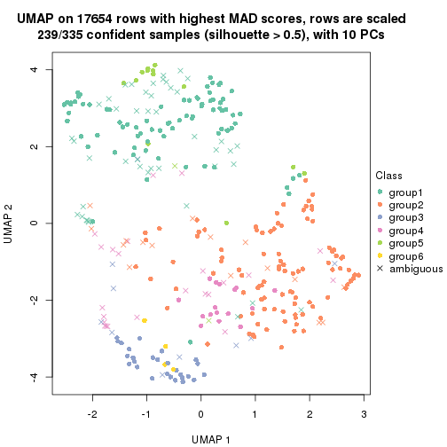</p>

</div>
</div>


Following heatmap shows how subgroups are split when increasing `k`:

```r
collect_classes(res)
```


If matrix rows can be associated to genes, consider to use `GO_Enrichment(res,
...)` to perform function enrichment for the signature genes.


 

---------------------------------------------------


### MAD:kmeans*


The object with results only for a single top-value method and a single partition method 
can be extracted as:

```r
res = res_list["MAD", "kmeans"]
# you can also extract it by
# res = res_list["MAD:kmeans"]
```

A summary of `res` and all the functions that can be applied to it:

```r
res
```

```
#> A 'ConsensusPartition' object with k = 2, 3, 4, 5, 6.
#>   On a matrix with 17654 rows and 335 columns.
#>   Top rows (1000, 2000, 3000, 4000, 5000) are extracted by 'MAD' method.
#>   Subgroups are detected by 'kmeans' method.
#>   Performed in total 1250 partitions by row resampling.
#>   Best k for subgroups seems to be 3.
#> 
#> Following methods can be applied to this 'ConsensusPartition' object:
#>  [1] "cola_report"             "collect_classes"         "collect_plots"          
#>  [4] "collect_stats"           "colnames"                "compare_signatures"     
#>  [7] "consensus_heatmap"       "dimension_reduction"     "functional_enrichment"  
#> [10] "get_anno_col"            "get_anno"                "get_classes"            
#> [13] "get_consensus"           "get_matrix"              "get_membership"         
#> [16] "get_param"               "get_signatures"          "get_stats"              
#> [19] "is_best_k"               "is_stable_k"             "membership_heatmap"     
#> [22] "ncol"                    "nrow"                    "plot_ecdf"              
#> [25] "rownames"                "select_partition_number" "show"                   
#> [28] "suggest_best_k"          "test_to_known_factors"
```

`collect_plots()` function collects all the plots made from `res` for all `k` (number of partitions)
into one single page to provide an easy and fast comparison between different `k`.

```r
collect_plots(res)
```


The plots are:

- The first row: a plot of the ECDF (Empirical cumulative distribution
  function) curves of the consensus matrix for each `k` and the heatmap of
  predicted classes for each `k`.
- The second row: heatmaps of the consensus matrix for each `k`.
- The third row: heatmaps of the membership matrix for each `k`.
- The fouth row: heatmaps of the signatures for each `k`.

All the plots in panels can be made by individual functions and they are
plotted later in this section.

`select_partition_number()` produces several plots showing different
statistics for choosing "optimized" `k`. There are following statistics:

- ECDF curves of the consensus matrix for each `k`;
- 1-PAC. [The PAC
  score](https://en.wikipedia.org/wiki/Consensus_clustering#Over-interpretation_potential_of_consensus_clustering)
  measures the proportion of the ambiguous subgrouping.
- Mean silhouette score.
- Concordance. The mean probability of fiting the consensus class ids in all
  partitions.
- Area increased. Denote $A_k$ as the area under the ECDF curve for current
  `k`, the area increased is defined as $A_k - A_{k-1}$.
- Rand index. The percent of pairs of samples that are both in a same cluster
  or both are not in a same cluster in the partition of k and k-1.
- Jaccard index. The ratio of pairs of samples are both in a same cluster in
  the partition of k and k-1 and the pairs of samples are both in a same
  cluster in the partition k or k-1.

The detailed explanations of these statistics can be found in [the cola
vignette](http://bioconductor.org/packages/devel/bioc/vignettes/cola/inst/doc/cola.html#toc_13).

Generally speaking, lower PAC score, higher mean silhouette score or higher
concordance corresponds to better partition. Rand index and Jaccard index
measure how similar the current partition is compared to partition with `k-1`.
If they are too similar, we won't accept `k` is better than `k-1`.

```r
select_partition_number(res)
```


The numeric values for all these statistics can be obtained by `get_stats()`.

```r
get_stats(res)
```

```
#>   k 1-PAC mean_silhouette concordance area_increased  Rand Jaccard
#> 2 2 1.000           0.962       0.985         0.4920 0.509   0.509
#> 3 3 0.934           0.923       0.965         0.2770 0.840   0.695
#> 4 4 0.647           0.650       0.787         0.1343 0.934   0.826
#> 5 5 0.633           0.490       0.722         0.0826 0.839   0.548
#> 6 6 0.667           0.511       0.722         0.0513 0.894   0.593
```

`suggest_best_k()` suggests the best $k$ based on these statistics. The rules are as follows:

- All $k$ with Jaccard index larger than 0.95 are removed because the increase of
  the partition number does not provides enough extra information. If all $k$ are removed,
  the best $k$ is assigned by `NA`.
- For $k$ with 1-PAC larger than 0.9, the maximal $k$ is taken as the "best k". Other $k$ is called "optional k".
- If it does not fit the second rule. The $k$ with the highest vote of highest
  1-PAC, mean silhouette and concordance is taken as the "best k".

```r
suggest_best_k(res)
```

```
#> [1] 3
#> attr(,"optional")
#> [1] 2
```

There is also optional best $k$ = 2 that is worth to check.

Following shows the table of the partitions (You need to click the **show/hide
code output** link to see it). The membership matrix (columns with name `p*`)
is inferred by
[`clue::cl_consensus()`](https://www.rdocumentation.org/link/cl_consensus?package=clue)
function with the `SE` method. Basically the value in the membership matrix
represents the probability to belong to a certain group. The finall class
label for an item is determined with the group with highest probability it
belongs to.

In `get_classes()` function, the entropy is calculated from the membership
matrix and the silhouette score is calculated from the consensus matrix.


<script>
$( function() {
	$( '#tabs-MAD-kmeans-get-classes' ).tabs();
} );
</script>
<div id='tabs-MAD-kmeans-get-classes'>
<ul>
<li><a href='#tab-MAD-kmeans-get-classes-1'>k = 2</a></li>
<li><a href='#tab-MAD-kmeans-get-classes-2'>k = 3</a></li>
<li><a href='#tab-MAD-kmeans-get-classes-3'>k = 4</a></li>
<li><a href='#tab-MAD-kmeans-get-classes-4'>k = 5</a></li>
<li><a href='#tab-MAD-kmeans-get-classes-5'>k = 6</a></li>
</ul>

<div id='tab-MAD-kmeans-get-classes-1'>
<p><a id='tab-MAD-kmeans-get-classes-1-a' style='color:#0366d6' href='#'>show/hide code output</a></p>
<pre><code class="r">cbind(get_classes(res, k = 2), get_membership(res, k = 2))
</code></pre>

<pre><code>#&gt;            class entropy silhouette    p1    p2
#&gt; SRR660306      2  0.0000     0.9835 0.000 1.000
#&gt; SRR1359328     2  0.0000     0.9835 0.000 1.000
#&gt; SRR821124      2  0.0000     0.9835 0.000 1.000
#&gt; SRR1335188     1  0.0000     0.9855 1.000 0.000
#&gt; SRR1075825     2  0.0000     0.9835 0.000 1.000
#&gt; SRR1321921     1  0.0000     0.9855 1.000 0.000
#&gt; SRR1466198     2  0.0000     0.9835 0.000 1.000
#&gt; SRR1384073     1  0.0000     0.9855 1.000 0.000
#&gt; SRR1312802     1  0.0000     0.9855 1.000 0.000
#&gt; SRR1076559     1  0.0000     0.9855 1.000 0.000
#&gt; SRR1370085     1  0.0000     0.9855 1.000 0.000
#&gt; SRR1460363     1  0.0000     0.9855 1.000 0.000
#&gt; SRR1480221     2  0.0000     0.9835 0.000 1.000
#&gt; SRR1476165     1  0.0000     0.9855 1.000 0.000
#&gt; SRR1459631     2  0.0000     0.9835 0.000 1.000
#&gt; SRR1448098     2  0.0000     0.9835 0.000 1.000
#&gt; SRR1321401     2  0.0000     0.9835 0.000 1.000
#&gt; SRR807613      2  0.0000     0.9835 0.000 1.000
#&gt; SRR808086      2  0.0000     0.9835 0.000 1.000
#&gt; SRR613687      2  0.0000     0.9835 0.000 1.000
#&gt; SRR1471011     1  0.0000     0.9855 1.000 0.000
#&gt; SRR1330284     2  0.0000     0.9835 0.000 1.000
#&gt; SRR1320624     2  0.0000     0.9835 0.000 1.000
#&gt; SRR1459519     1  0.0000     0.9855 1.000 0.000
#&gt; SRR1091184     2  0.0000     0.9835 0.000 1.000
#&gt; SRR1390561     1  0.0000     0.9855 1.000 0.000
#&gt; SRR658164      1  0.0000     0.9855 1.000 0.000
#&gt; SRR1087079     2  0.0000     0.9835 0.000 1.000
#&gt; SRR814996      2  0.8763     0.5778 0.296 0.704
#&gt; SRR1407410     2  0.0000     0.9835 0.000 1.000
#&gt; SRR1453392     2  0.0000     0.9835 0.000 1.000
#&gt; SRR1445873     1  0.0000     0.9855 1.000 0.000
#&gt; SRR1419985     2  0.0000     0.9835 0.000 1.000
#&gt; SRR820938      2  0.0000     0.9835 0.000 1.000
#&gt; SRR1476844     1  0.0000     0.9855 1.000 0.000
#&gt; SRR1403526     1  0.0000     0.9855 1.000 0.000
#&gt; SRR1413916     2  0.0000     0.9835 0.000 1.000
#&gt; SRR1441051     2  0.0000     0.9835 0.000 1.000
#&gt; SRR614287      2  0.0000     0.9835 0.000 1.000
#&gt; SRR1092062     2  0.0000     0.9835 0.000 1.000
#&gt; SRR612611      2  0.0000     0.9835 0.000 1.000
#&gt; SRR1376356     2  0.0000     0.9835 0.000 1.000
#&gt; SRR1405078     1  0.9909     0.1988 0.556 0.444
#&gt; SRR1437226     2  0.0000     0.9835 0.000 1.000
#&gt; SRR1326078     1  0.0000     0.9855 1.000 0.000
#&gt; SRR1096806     2  0.0000     0.9835 0.000 1.000
#&gt; SRR1440919     2  0.0000     0.9835 0.000 1.000
#&gt; SRR1452824     1  0.0000     0.9855 1.000 0.000
#&gt; SRR615754      1  0.0000     0.9855 1.000 0.000
#&gt; SRR1341787     2  0.0000     0.9835 0.000 1.000
#&gt; SRR614551      2  0.0000     0.9835 0.000 1.000
#&gt; SRR1380829     2  0.0000     0.9835 0.000 1.000
#&gt; SRR1455761     1  0.0000     0.9855 1.000 0.000
#&gt; SRR1465189     1  0.0000     0.9855 1.000 0.000
#&gt; SRR1376895     1  0.0000     0.9855 1.000 0.000
#&gt; SRR1445002     1  0.0000     0.9855 1.000 0.000
#&gt; SRR1469258     2  0.0000     0.9835 0.000 1.000
#&gt; SRR1409239     1  0.0000     0.9855 1.000 0.000
#&gt; SRR1480200     1  0.0000     0.9855 1.000 0.000
#&gt; SRR1418323     1  0.0000     0.9855 1.000 0.000
#&gt; SRR657540      2  0.0000     0.9835 0.000 1.000
#&gt; SRR821096      2  0.0000     0.9835 0.000 1.000
#&gt; SRR613591      2  0.0000     0.9835 0.000 1.000
#&gt; SRR1344205     2  0.0000     0.9835 0.000 1.000
#&gt; SRR612479      1  0.0000     0.9855 1.000 0.000
#&gt; SRR1399950     1  0.0000     0.9855 1.000 0.000
#&gt; SRR1336048     1  0.0000     0.9855 1.000 0.000
#&gt; SRR1368896     1  0.0000     0.9855 1.000 0.000
#&gt; SRR1379403     2  0.0000     0.9835 0.000 1.000
#&gt; SRR1312464     1  0.0000     0.9855 1.000 0.000
#&gt; SRR1096478     1  0.0000     0.9855 1.000 0.000
#&gt; SRR1459845     1  0.0000     0.9855 1.000 0.000
#&gt; SRR1348138     2  0.9988     0.0745 0.480 0.520
#&gt; SRR811423      1  0.0000     0.9855 1.000 0.000
#&gt; SRR615683      1  0.0000     0.9855 1.000 0.000
#&gt; SRR1380336     2  0.0000     0.9835 0.000 1.000
#&gt; SRR817609      1  0.0000     0.9855 1.000 0.000
#&gt; SRR1074550     2  0.0000     0.9835 0.000 1.000
#&gt; SRR1499236     2  0.0000     0.9835 0.000 1.000
#&gt; SRR656083      1  0.0000     0.9855 1.000 0.000
#&gt; SRR817539      1  0.0000     0.9855 1.000 0.000
#&gt; SRR1410801     1  0.0000     0.9855 1.000 0.000
#&gt; SRR1347190     1  0.0000     0.9855 1.000 0.000
#&gt; SRR1355126     2  0.0000     0.9835 0.000 1.000
#&gt; SRR615165      2  0.0000     0.9835 0.000 1.000
#&gt; SRR1466046     1  0.0000     0.9855 1.000 0.000
#&gt; SRR1097055     2  0.0000     0.9835 0.000 1.000
#&gt; SRR1312370     2  0.0000     0.9835 0.000 1.000
#&gt; SRR655325      1  0.0000     0.9855 1.000 0.000
#&gt; SRR810177      2  0.0000     0.9835 0.000 1.000
#&gt; SRR815685      2  0.0000     0.9835 0.000 1.000
#&gt; SRR817026      2  0.0000     0.9835 0.000 1.000
#&gt; SRR1417224     2  0.0000     0.9835 0.000 1.000
#&gt; SRR661687      2  0.0000     0.9835 0.000 1.000
#&gt; SRR1431804     1  0.4815     0.8772 0.896 0.104
#&gt; SRR664072      2  0.0000     0.9835 0.000 1.000
#&gt; SRR612923      2  0.0000     0.9835 0.000 1.000
#&gt; SRR1315890     1  0.0000     0.9855 1.000 0.000
#&gt; SRR1347726     1  0.0000     0.9855 1.000 0.000
#&gt; SRR1500360     1  0.0000     0.9855 1.000 0.000
#&gt; SRR1468360     2  0.0000     0.9835 0.000 1.000
#&gt; SRR1404084     1  0.3431     0.9224 0.936 0.064
#&gt; SRR615994      2  0.0000     0.9835 0.000 1.000
#&gt; SRR1475718     2  0.0000     0.9835 0.000 1.000
#&gt; SRR1397200     2  0.0000     0.9835 0.000 1.000
#&gt; SRR655519      2  0.0000     0.9835 0.000 1.000
#&gt; SRR1311308     2  0.0000     0.9835 0.000 1.000
#&gt; SRR1368006     2  0.0000     0.9835 0.000 1.000
#&gt; SRR613651      1  0.0000     0.9855 1.000 0.000
#&gt; SRR1362621     2  0.0000     0.9835 0.000 1.000
#&gt; SRR1451718     1  0.0000     0.9855 1.000 0.000
#&gt; SRR1095334     2  0.0000     0.9835 0.000 1.000
#&gt; SRR1079636     2  0.0000     0.9835 0.000 1.000
#&gt; SRR1442549     2  0.0000     0.9835 0.000 1.000
#&gt; SRR1466421     2  0.0000     0.9835 0.000 1.000
#&gt; SRR817397      2  0.0000     0.9835 0.000 1.000
#&gt; SRR1341809     2  0.0000     0.9835 0.000 1.000
#&gt; SRR614623      2  0.0000     0.9835 0.000 1.000
#&gt; SRR1335005     2  0.0000     0.9835 0.000 1.000
#&gt; SRR1407065     2  0.0000     0.9835 0.000 1.000
#&gt; SRR1404483     2  0.0000     0.9835 0.000 1.000
#&gt; SRR1096222     1  0.0000     0.9855 1.000 0.000
#&gt; SRR1401793     1  0.0000     0.9855 1.000 0.000
#&gt; SRR1408615     2  0.0376     0.9800 0.004 0.996
#&gt; SRR1070597     1  0.3114     0.9319 0.944 0.056
#&gt; SRR1332381     1  0.0000     0.9855 1.000 0.000
#&gt; SRR1457015     1  0.0000     0.9855 1.000 0.000
#&gt; SRR1386797     2  0.6887     0.7708 0.184 0.816
#&gt; SRR1098385     2  0.0000     0.9835 0.000 1.000
#&gt; SRR1363947     2  0.0000     0.9835 0.000 1.000
#&gt; SRR820350      2  0.0000     0.9835 0.000 1.000
#&gt; SRR662055      2  0.0000     0.9835 0.000 1.000
#&gt; SRR1310455     1  0.0000     0.9855 1.000 0.000
#&gt; SRR1453639     2  0.2423     0.9456 0.040 0.960
#&gt; SRR662617      2  0.0000     0.9835 0.000 1.000
#&gt; SRR654778      1  0.0000     0.9855 1.000 0.000
#&gt; SRR661782      2  0.0000     0.9835 0.000 1.000
#&gt; SRR1334396     1  0.0000     0.9855 1.000 0.000
#&gt; SRR613867      2  0.0000     0.9835 0.000 1.000
#&gt; SRR1479412     1  0.0000     0.9855 1.000 0.000
#&gt; SRR1331620     1  0.0000     0.9855 1.000 0.000
#&gt; SRR1082809     1  0.0000     0.9855 1.000 0.000
#&gt; SRR1417178     1  0.0000     0.9855 1.000 0.000
#&gt; SRR1335278     1  0.0000     0.9855 1.000 0.000
#&gt; SRR665369      2  0.0000     0.9835 0.000 1.000
#&gt; SRR657552      1  0.0000     0.9855 1.000 0.000
#&gt; SRR812412      1  0.0000     0.9855 1.000 0.000
#&gt; SRR1096500     2  0.0000     0.9835 0.000 1.000
#&gt; SRR1347750     2  0.0000     0.9835 0.000 1.000
#&gt; SRR615153      2  0.0672     0.9764 0.008 0.992
#&gt; SRR1434417     1  0.0000     0.9855 1.000 0.000
#&gt; SRR1070159     2  0.0000     0.9835 0.000 1.000
#&gt; SRR1332508     2  0.0000     0.9835 0.000 1.000
#&gt; SRR1082059     2  0.0000     0.9835 0.000 1.000
#&gt; SRR1402491     1  0.0000     0.9855 1.000 0.000
#&gt; SRR1476595     2  0.4022     0.9034 0.080 0.920
#&gt; SRR1320987     2  0.0000     0.9835 0.000 1.000
#&gt; SRR1086417     2  0.8813     0.5721 0.300 0.700
#&gt; SRR1454095     1  0.0000     0.9855 1.000 0.000
#&gt; SRR614791      2  0.0000     0.9835 0.000 1.000
#&gt; SRR821255      2  0.4562     0.8853 0.096 0.904
#&gt; SRR820402      2  0.0000     0.9835 0.000 1.000
#&gt; SRR1337284     1  0.0000     0.9855 1.000 0.000
#&gt; SRR1333083     2  0.9710     0.3342 0.400 0.600
#&gt; SRR1384883     2  0.0000     0.9835 0.000 1.000
#&gt; SRR614431      1  0.0000     0.9855 1.000 0.000
#&gt; SRR1481106     2  0.0000     0.9835 0.000 1.000
#&gt; SRR1370285     1  0.0000     0.9855 1.000 0.000
#&gt; SRR1446673     2  0.0000     0.9835 0.000 1.000
#&gt; SRR1318046     2  0.0000     0.9835 0.000 1.000
#&gt; SRR1341188     2  0.0000     0.9835 0.000 1.000
#&gt; SRR1384941     1  0.0000     0.9855 1.000 0.000
#&gt; SRR1322864     2  0.0000     0.9835 0.000 1.000
#&gt; SRR1476825     1  0.0000     0.9855 1.000 0.000
#&gt; SRR1443332     2  0.0000     0.9835 0.000 1.000
#&gt; SRR662486      2  0.0000     0.9835 0.000 1.000
#&gt; SRR1447019     1  0.0000     0.9855 1.000 0.000
#&gt; SRR662942      1  0.0000     0.9855 1.000 0.000
#&gt; SRR613102      2  0.0000     0.9835 0.000 1.000
#&gt; SRR1469880     1  0.0000     0.9855 1.000 0.000
#&gt; SRR1464977     1  0.0000     0.9855 1.000 0.000
#&gt; SRR615850      1  0.7453     0.7283 0.788 0.212
#&gt; SRR661949      2  0.0000     0.9835 0.000 1.000
#&gt; SRR1322227     2  0.0000     0.9835 0.000 1.000
#&gt; SRR1441655     2  0.2778     0.9380 0.048 0.952
#&gt; SRR613771      2  0.0000     0.9835 0.000 1.000
#&gt; SRR1479471     1  0.0000     0.9855 1.000 0.000
#&gt; SRR1488918     2  0.0000     0.9835 0.000 1.000
#&gt; SRR1414040     2  0.0000     0.9835 0.000 1.000
#&gt; SRR1079850     2  0.1414     0.9651 0.020 0.980
#&gt; SRR663209      1  0.0000     0.9855 1.000 0.000
#&gt; SRR1364914     2  0.0000     0.9835 0.000 1.000
#&gt; SRR1408267     2  0.0000     0.9835 0.000 1.000
#&gt; SRR1314894     1  0.0000     0.9855 1.000 0.000
#&gt; SRR1414117     2  0.0000     0.9835 0.000 1.000
#&gt; SRR1395975     2  0.0000     0.9835 0.000 1.000
#&gt; SRR1402219     2  0.0000     0.9835 0.000 1.000
#&gt; SRR1433623     1  0.0000     0.9855 1.000 0.000
#&gt; SRR656385      2  0.0000     0.9835 0.000 1.000
#&gt; SRR811213      2  0.0000     0.9835 0.000 1.000
#&gt; SRR663657      2  0.0000     0.9835 0.000 1.000
#&gt; SRR612203      1  0.0000     0.9855 1.000 0.000
#&gt; SRR613987      2  0.0000     0.9835 0.000 1.000
#&gt; SRR613831      2  0.0000     0.9835 0.000 1.000
#&gt; SRR1354180     2  0.0000     0.9835 0.000 1.000
#&gt; SRR1382912     1  0.0000     0.9855 1.000 0.000
#&gt; SRR1475501     1  0.0000     0.9855 1.000 0.000
#&gt; SRR1336930     1  0.0000     0.9855 1.000 0.000
#&gt; SRR613030      2  0.0000     0.9835 0.000 1.000
#&gt; SRR1381459     2  0.0000     0.9835 0.000 1.000
#&gt; SRR1402350     1  0.2043     0.9552 0.968 0.032
#&gt; SRR1419408     1  0.0000     0.9855 1.000 0.000
#&gt; SRR655911      2  0.0000     0.9835 0.000 1.000
#&gt; SRR1418243     1  0.0000     0.9855 1.000 0.000
#&gt; SRR1322573     1  0.0000     0.9855 1.000 0.000
#&gt; SRR613615      2  0.0000     0.9835 0.000 1.000
#&gt; SRR1355284     1  0.0000     0.9855 1.000 0.000
#&gt; SRR1319395     1  0.0000     0.9855 1.000 0.000
#&gt; SRR818939      1  0.0000     0.9855 1.000 0.000
#&gt; SRR1465266     1  0.0000     0.9855 1.000 0.000
#&gt; SRR614888      1  0.0000     0.9855 1.000 0.000
#&gt; SRR1431694     1  0.0000     0.9855 1.000 0.000
#&gt; SRR614347      2  0.0000     0.9835 0.000 1.000
#&gt; SRR1334228     2  0.0000     0.9835 0.000 1.000
#&gt; SRR1096007     2  0.0000     0.9835 0.000 1.000
#&gt; SRR656349      1  0.0000     0.9855 1.000 0.000
#&gt; SRR815422      2  0.0000     0.9835 0.000 1.000
#&gt; SRR1360828     1  0.0000     0.9855 1.000 0.000
#&gt; SRR1359005     2  0.0000     0.9835 0.000 1.000
#&gt; SRR1456652     1  0.0000     0.9855 1.000 0.000
#&gt; SRR1391660     1  0.0000     0.9855 1.000 0.000
#&gt; SRR1441956     1  0.0000     0.9855 1.000 0.000
#&gt; SRR662930      2  0.0000     0.9835 0.000 1.000
#&gt; SRR615790      2  0.0000     0.9835 0.000 1.000
#&gt; SRR614827      2  0.0000     0.9835 0.000 1.000
#&gt; SRR614587      2  0.0000     0.9835 0.000 1.000
#&gt; SRR814052      2  0.0000     0.9835 0.000 1.000
#&gt; SRR1070086     1  0.0000     0.9855 1.000 0.000
#&gt; SRR1481440     1  0.0000     0.9855 1.000 0.000
#&gt; SRR1339296     2  0.0000     0.9835 0.000 1.000
#&gt; SRR1343239     2  0.0000     0.9835 0.000 1.000
#&gt; SRR1432802     2  0.0000     0.9835 0.000 1.000
#&gt; SRR1416911     1  0.0000     0.9855 1.000 0.000
#&gt; SRR1410427     1  0.0000     0.9855 1.000 0.000
#&gt; SRR1401185     2  0.5946     0.8249 0.144 0.856
#&gt; SRR654993      2  0.0000     0.9835 0.000 1.000
#&gt; SRR656397      1  0.0000     0.9855 1.000 0.000
#&gt; SRR809643      2  0.0000     0.9835 0.000 1.000
#&gt; SRR1433819     1  0.0000     0.9855 1.000 0.000
#&gt; SRR1375225     2  0.0000     0.9835 0.000 1.000
#&gt; SRR1367739     1  0.9710     0.3326 0.600 0.400
#&gt; SRR1323336     1  0.5519     0.8473 0.872 0.128
#&gt; SRR663224      2  0.0000     0.9835 0.000 1.000
#&gt; SRR1442840     1  0.0000     0.9855 1.000 0.000
#&gt; SRR1374058     1  0.0000     0.9855 1.000 0.000
#&gt; SRR656994      1  0.0000     0.9855 1.000 0.000
#&gt; SRR1469214     2  0.0000     0.9835 0.000 1.000
#&gt; SRR1456446     1  0.0000     0.9855 1.000 0.000
#&gt; SRR1471879     2  0.0000     0.9835 0.000 1.000
#&gt; SRR612911      2  0.0000     0.9835 0.000 1.000
#&gt; SRR1395720     2  0.0000     0.9835 0.000 1.000
#&gt; SRR1413055     1  0.0000     0.9855 1.000 0.000
#&gt; SRR656770      2  0.0000     0.9835 0.000 1.000
#&gt; SRR812080      2  0.0000     0.9835 0.000 1.000
#&gt; SRR1479328     1  0.0000     0.9855 1.000 0.000
#&gt; SRR661421      2  0.0000     0.9835 0.000 1.000
#&gt; SRR1410286     2  0.0000     0.9835 0.000 1.000
#&gt; SRR1487150     1  0.0000     0.9855 1.000 0.000
#&gt; SRR1467035     1  0.0000     0.9855 1.000 0.000
#&gt; SRR1360607     2  0.0000     0.9835 0.000 1.000
#&gt; SRR1333106     2  0.0000     0.9835 0.000 1.000
#&gt; SRR1088706     2  0.0000     0.9835 0.000 1.000
#&gt; SRR1320053     2  0.0000     0.9835 0.000 1.000
#&gt; SRR1350392     2  0.0000     0.9835 0.000 1.000
#&gt; SRR1385190     1  0.6343     0.8052 0.840 0.160
#&gt; SRR1080093     2  0.0000     0.9835 0.000 1.000
#&gt; SRR1318753     1  0.0000     0.9855 1.000 0.000
#&gt; SRR1345369     2  0.0000     0.9835 0.000 1.000
#&gt; SRR612178      2  0.0000     0.9835 0.000 1.000
#&gt; SRR1354423     1  0.0000     0.9855 1.000 0.000
#&gt; SRR1072724     1  0.0000     0.9855 1.000 0.000
#&gt; SRR1418450     2  0.0000     0.9835 0.000 1.000
#&gt; SRR1326427     2  0.0000     0.9835 0.000 1.000
#&gt; SRR1437412     2  0.0000     0.9835 0.000 1.000
#&gt; SRR1327548     2  0.0000     0.9835 0.000 1.000
#&gt; SRR1395891     1  0.0000     0.9855 1.000 0.000
#&gt; SRR659367      2  0.0000     0.9835 0.000 1.000
#&gt; SRR818961      1  0.0000     0.9855 1.000 0.000
#&gt; SRR813704      1  0.0000     0.9855 1.000 0.000
#&gt; SRR613054      1  0.0000     0.9855 1.000 0.000
#&gt; SRR1476467     1  0.0000     0.9855 1.000 0.000
#&gt; SRR1407988     2  0.0000     0.9835 0.000 1.000
#&gt; SRR1394776     2  0.0000     0.9835 0.000 1.000
#&gt; SRR655578      2  0.0000     0.9835 0.000 1.000
#&gt; SRR1310645     2  0.0000     0.9835 0.000 1.000
#&gt; SRR1345628     1  0.0000     0.9855 1.000 0.000
#&gt; SRR1479740     1  0.0000     0.9855 1.000 0.000
#&gt; SRR1332095     1  0.0000     0.9855 1.000 0.000
#&gt; SRR1444786     2  0.0000     0.9835 0.000 1.000
#&gt; SRR1090070     1  0.0000     0.9855 1.000 0.000
#&gt; SRR662414      2  0.0000     0.9835 0.000 1.000
#&gt; SRR661216      2  0.0000     0.9835 0.000 1.000
#&gt; SRR656313      2  0.0000     0.9835 0.000 1.000
#&gt; SRR615671      2  0.0000     0.9835 0.000 1.000
#&gt; SRR1350196     2  0.0000     0.9835 0.000 1.000
#&gt; SRR1466580     1  0.0000     0.9855 1.000 0.000
#&gt; SRR1408032     2  0.0000     0.9835 0.000 1.000
#&gt; SRR1432913     2  0.0000     0.9835 0.000 1.000
#&gt; SRR1360502     1  0.0376     0.9818 0.996 0.004
#&gt; SRR1391901     2  0.0000     0.9835 0.000 1.000
#&gt; SRR1311131     1  0.0000     0.9855 1.000 0.000
#&gt; SRR1380636     1  0.0000     0.9855 1.000 0.000
#&gt; SRR1332339     1  0.0000     0.9855 1.000 0.000
#&gt; SRR1341563     2  0.0000     0.9835 0.000 1.000
#&gt; SRR1359410     2  0.0000     0.9835 0.000 1.000
#&gt; SRR1473040     2  0.9710     0.3342 0.400 0.600
#&gt; SRR1321444     1  0.0000     0.9855 1.000 0.000
#&gt; SRR1498765     2  0.0000     0.9835 0.000 1.000
#&gt; SRR1312622     2  0.0000     0.9835 0.000 1.000
#&gt; SRR615503      2  0.5519     0.8465 0.128 0.872
#&gt; SRR1453192     1  0.0000     0.9855 1.000 0.000
#&gt; SRR1433107     2  0.0000     0.9835 0.000 1.000
#&gt; SRR1075384     1  0.0000     0.9855 1.000 0.000
#&gt; SRR1356683     1  0.0000     0.9855 1.000 0.000
#&gt; SRR659049      1  0.0000     0.9855 1.000 0.000
#&gt; SRR1368240     1  0.0000     0.9855 1.000 0.000
#&gt; SRR1341739     1  0.0000     0.9855 1.000 0.000
#&gt; SRR613249      2  0.9866     0.2396 0.432 0.568
#&gt; SRR663428      2  0.0000     0.9835 0.000 1.000
#&gt; SRR1341302     2  0.0000     0.9835 0.000 1.000
#&gt; SRR1073553     2  0.0000     0.9835 0.000 1.000
#&gt; SRR1354093     2  0.0000     0.9835 0.000 1.000
#&gt; SRR1406521     2  0.0000     0.9835 0.000 1.000
#&gt; SRR1432049     1  0.0000     0.9855 1.000 0.000
#&gt; SRR1453504     1  0.9732     0.3213 0.596 0.404
</code></pre>

<script>
$('#tab-MAD-kmeans-get-classes-1-a').parent().next().next().hide();
$('#tab-MAD-kmeans-get-classes-1-a').click(function(){
  $('#tab-MAD-kmeans-get-classes-1-a').parent().next().next().toggle();
  return(false);
});
</script>
</div>

<div id='tab-MAD-kmeans-get-classes-2'>
<p><a id='tab-MAD-kmeans-get-classes-2-a' style='color:#0366d6' href='#'>show/hide code output</a></p>
<pre><code class="r">cbind(get_classes(res, k = 3), get_membership(res, k = 3))
</code></pre>

<pre><code>#&gt;            class entropy silhouette    p1    p2    p3
#&gt; SRR660306      2  0.6168     0.3248 0.000 0.588 0.412
#&gt; SRR1359328     3  0.0592     0.9419 0.000 0.012 0.988
#&gt; SRR821124      2  0.0000     0.9646 0.000 1.000 0.000
#&gt; SRR1335188     1  0.0747     0.9701 0.984 0.000 0.016
#&gt; SRR1075825     2  0.0000     0.9646 0.000 1.000 0.000
#&gt; SRR1321921     1  0.0000     0.9726 1.000 0.000 0.000
#&gt; SRR1466198     3  0.0747     0.9439 0.000 0.016 0.984
#&gt; SRR1384073     1  0.0747     0.9701 0.984 0.000 0.016
#&gt; SRR1312802     1  0.0424     0.9713 0.992 0.000 0.008
#&gt; SRR1076559     1  0.0747     0.9701 0.984 0.000 0.016
#&gt; SRR1370085     1  0.0000     0.9726 1.000 0.000 0.000
#&gt; SRR1460363     1  0.0000     0.9726 1.000 0.000 0.000
#&gt; SRR1480221     2  0.0000     0.9646 0.000 1.000 0.000
#&gt; SRR1476165     1  0.0424     0.9713 0.992 0.000 0.008
#&gt; SRR1459631     2  0.1860     0.9233 0.000 0.948 0.052
#&gt; SRR1448098     2  0.0000     0.9646 0.000 1.000 0.000
#&gt; SRR1321401     2  0.0000     0.9646 0.000 1.000 0.000
#&gt; SRR807613      2  0.0000     0.9646 0.000 1.000 0.000
#&gt; SRR808086      3  0.0424     0.9394 0.000 0.008 0.992
#&gt; SRR613687      2  0.0000     0.9646 0.000 1.000 0.000
#&gt; SRR1471011     1  0.4452     0.7760 0.808 0.000 0.192
#&gt; SRR1330284     2  0.0000     0.9646 0.000 1.000 0.000
#&gt; SRR1320624     2  0.0000     0.9646 0.000 1.000 0.000
#&gt; SRR1459519     1  0.0000     0.9726 1.000 0.000 0.000
#&gt; SRR1091184     2  0.2261     0.9089 0.000 0.932 0.068
#&gt; SRR1390561     1  0.0000     0.9726 1.000 0.000 0.000
#&gt; SRR658164      1  0.0424     0.9718 0.992 0.000 0.008
#&gt; SRR1087079     2  0.0000     0.9646 0.000 1.000 0.000
#&gt; SRR814996      3  0.0237     0.9364 0.000 0.004 0.996
#&gt; SRR1407410     2  0.0000     0.9646 0.000 1.000 0.000
#&gt; SRR1453392     2  0.0000     0.9646 0.000 1.000 0.000
#&gt; SRR1445873     1  0.0000     0.9726 1.000 0.000 0.000
#&gt; SRR1419985     2  0.0000     0.9646 0.000 1.000 0.000
#&gt; SRR820938      3  0.4974     0.6931 0.000 0.236 0.764
#&gt; SRR1476844     1  0.0000     0.9726 1.000 0.000 0.000
#&gt; SRR1403526     1  0.0000     0.9726 1.000 0.000 0.000
#&gt; SRR1413916     2  0.0000     0.9646 0.000 1.000 0.000
#&gt; SRR1441051     2  0.0000     0.9646 0.000 1.000 0.000
#&gt; SRR614287      2  0.0000     0.9646 0.000 1.000 0.000
#&gt; SRR1092062     2  0.0000     0.9646 0.000 1.000 0.000
#&gt; SRR612611      2  0.0000     0.9646 0.000 1.000 0.000
#&gt; SRR1376356     2  0.0237     0.9616 0.000 0.996 0.004
#&gt; SRR1405078     3  0.4912     0.7281 0.196 0.008 0.796
#&gt; SRR1437226     2  0.0000     0.9646 0.000 1.000 0.000
#&gt; SRR1326078     1  0.0747     0.9701 0.984 0.000 0.016
#&gt; SRR1096806     3  0.0747     0.9439 0.000 0.016 0.984
#&gt; SRR1440919     2  0.2356     0.9053 0.000 0.928 0.072
#&gt; SRR1452824     1  0.0747     0.9701 0.984 0.000 0.016
#&gt; SRR615754      1  0.0000     0.9726 1.000 0.000 0.000
#&gt; SRR1341787     2  0.5016     0.6869 0.000 0.760 0.240
#&gt; SRR614551      2  0.0000     0.9646 0.000 1.000 0.000
#&gt; SRR1380829     3  0.0747     0.9439 0.000 0.016 0.984
#&gt; SRR1455761     1  0.0424     0.9718 0.992 0.000 0.008
#&gt; SRR1465189     3  0.1289     0.9208 0.032 0.000 0.968
#&gt; SRR1376895     1  0.0424     0.9718 0.992 0.000 0.008
#&gt; SRR1445002     1  0.0000     0.9726 1.000 0.000 0.000
#&gt; SRR1469258     2  0.0000     0.9646 0.000 1.000 0.000
#&gt; SRR1409239     1  0.0000     0.9726 1.000 0.000 0.000
#&gt; SRR1480200     1  0.0000     0.9726 1.000 0.000 0.000
#&gt; SRR1418323     1  0.0747     0.9701 0.984 0.000 0.016
#&gt; SRR657540      3  0.0747     0.9439 0.000 0.016 0.984
#&gt; SRR821096      2  0.0000     0.9646 0.000 1.000 0.000
#&gt; SRR613591      2  0.0000     0.9646 0.000 1.000 0.000
#&gt; SRR1344205     3  0.0747     0.9439 0.000 0.016 0.984
#&gt; SRR612479      1  0.0000     0.9726 1.000 0.000 0.000
#&gt; SRR1399950     1  0.0747     0.9701 0.984 0.000 0.016
#&gt; SRR1336048     3  0.5882     0.4449 0.348 0.000 0.652
#&gt; SRR1368896     1  0.0000     0.9726 1.000 0.000 0.000
#&gt; SRR1379403     2  0.0000     0.9646 0.000 1.000 0.000
#&gt; SRR1312464     1  0.0000     0.9726 1.000 0.000 0.000
#&gt; SRR1096478     1  0.0000     0.9726 1.000 0.000 0.000
#&gt; SRR1459845     1  0.0000     0.9726 1.000 0.000 0.000
#&gt; SRR1348138     3  0.0829     0.9357 0.012 0.004 0.984
#&gt; SRR811423      1  0.0000     0.9726 1.000 0.000 0.000
#&gt; SRR615683      1  0.0000     0.9726 1.000 0.000 0.000
#&gt; SRR1380336     2  0.0000     0.9646 0.000 1.000 0.000
#&gt; SRR817609      1  0.4974     0.6996 0.764 0.000 0.236
#&gt; SRR1074550     3  0.0747     0.9439 0.000 0.016 0.984
#&gt; SRR1499236     2  0.0000     0.9646 0.000 1.000 0.000
#&gt; SRR656083      1  0.0000     0.9726 1.000 0.000 0.000
#&gt; SRR817539      1  0.0747     0.9701 0.984 0.000 0.016
#&gt; SRR1410801     1  0.0000     0.9726 1.000 0.000 0.000
#&gt; SRR1347190     1  0.0747     0.9701 0.984 0.000 0.016
#&gt; SRR1355126     2  0.0592     0.9554 0.000 0.988 0.012
#&gt; SRR615165      3  0.0747     0.9439 0.000 0.016 0.984
#&gt; SRR1466046     1  0.0000     0.9726 1.000 0.000 0.000
#&gt; SRR1097055     2  0.0000     0.9646 0.000 1.000 0.000
#&gt; SRR1312370     2  0.0592     0.9554 0.000 0.988 0.012
#&gt; SRR655325      1  0.0000     0.9726 1.000 0.000 0.000
#&gt; SRR810177      2  0.0000     0.9646 0.000 1.000 0.000
#&gt; SRR815685      2  0.0000     0.9646 0.000 1.000 0.000
#&gt; SRR817026      3  0.0747     0.9439 0.000 0.016 0.984
#&gt; SRR1417224     2  0.0000     0.9646 0.000 1.000 0.000
#&gt; SRR661687      2  0.5948     0.4499 0.000 0.640 0.360
#&gt; SRR1431804     1  0.6154     0.3319 0.592 0.000 0.408
#&gt; SRR664072      3  0.0747     0.9439 0.000 0.016 0.984
#&gt; SRR612923      2  0.0000     0.9646 0.000 1.000 0.000
#&gt; SRR1315890     1  0.0000     0.9726 1.000 0.000 0.000
#&gt; SRR1347726     1  0.0747     0.9701 0.984 0.000 0.016
#&gt; SRR1500360     1  0.0747     0.9701 0.984 0.000 0.016
#&gt; SRR1468360     2  0.0000     0.9646 0.000 1.000 0.000
#&gt; SRR1404084     1  0.4702     0.7472 0.788 0.000 0.212
#&gt; SRR615994      3  0.0747     0.9439 0.000 0.016 0.984
#&gt; SRR1475718     2  0.0000     0.9646 0.000 1.000 0.000
#&gt; SRR1397200     3  0.0592     0.9419 0.000 0.012 0.988
#&gt; SRR655519      2  0.0000     0.9646 0.000 1.000 0.000
#&gt; SRR1311308     3  0.3619     0.8269 0.000 0.136 0.864
#&gt; SRR1368006     2  0.0000     0.9646 0.000 1.000 0.000
#&gt; SRR613651      1  0.0747     0.9701 0.984 0.000 0.016
#&gt; SRR1362621     3  0.0747     0.9439 0.000 0.016 0.984
#&gt; SRR1451718     1  0.0747     0.9701 0.984 0.000 0.016
#&gt; SRR1095334     3  0.0747     0.9439 0.000 0.016 0.984
#&gt; SRR1079636     2  0.0000     0.9646 0.000 1.000 0.000
#&gt; SRR1442549     2  0.0000     0.9646 0.000 1.000 0.000
#&gt; SRR1466421     2  0.0000     0.9646 0.000 1.000 0.000
#&gt; SRR817397      2  0.0000     0.9646 0.000 1.000 0.000
#&gt; SRR1341809     2  0.0237     0.9615 0.000 0.996 0.004
#&gt; SRR614623      2  0.0000     0.9646 0.000 1.000 0.000
#&gt; SRR1335005     2  0.0000     0.9646 0.000 1.000 0.000
#&gt; SRR1407065     2  0.2066     0.9162 0.000 0.940 0.060
#&gt; SRR1404483     2  0.0000     0.9646 0.000 1.000 0.000
#&gt; SRR1096222     1  0.0000     0.9726 1.000 0.000 0.000
#&gt; SRR1401793     1  0.0747     0.9701 0.984 0.000 0.016
#&gt; SRR1408615     3  0.0000     0.9328 0.000 0.000 1.000
#&gt; SRR1070597     2  0.3618     0.8423 0.104 0.884 0.012
#&gt; SRR1332381     1  0.3941     0.8237 0.844 0.000 0.156
#&gt; SRR1457015     1  0.0000     0.9726 1.000 0.000 0.000
#&gt; SRR1386797     2  0.4209     0.8008 0.128 0.856 0.016
#&gt; SRR1098385     2  0.0000     0.9646 0.000 1.000 0.000
#&gt; SRR1363947     3  0.0747     0.9439 0.000 0.016 0.984
#&gt; SRR820350      2  0.0000     0.9646 0.000 1.000 0.000
#&gt; SRR662055      2  0.0000     0.9646 0.000 1.000 0.000
#&gt; SRR1310455     1  0.0747     0.9701 0.984 0.000 0.016
#&gt; SRR1453639     2  0.3375     0.8497 0.100 0.892 0.008
#&gt; SRR662617      2  0.0000     0.9646 0.000 1.000 0.000
#&gt; SRR654778      1  0.0747     0.9701 0.984 0.000 0.016
#&gt; SRR661782      2  0.0000     0.9646 0.000 1.000 0.000
#&gt; SRR1334396     1  0.0000     0.9726 1.000 0.000 0.000
#&gt; SRR613867      2  0.0000     0.9646 0.000 1.000 0.000
#&gt; SRR1479412     1  0.0747     0.9701 0.984 0.000 0.016
#&gt; SRR1331620     1  0.0424     0.9713 0.992 0.000 0.008
#&gt; SRR1082809     1  0.0747     0.9701 0.984 0.000 0.016
#&gt; SRR1417178     1  0.0000     0.9726 1.000 0.000 0.000
#&gt; SRR1335278     1  0.0000     0.9726 1.000 0.000 0.000
#&gt; SRR665369      2  0.0000     0.9646 0.000 1.000 0.000
#&gt; SRR657552      1  0.4504     0.7504 0.804 0.000 0.196
#&gt; SRR812412      1  0.0424     0.9718 0.992 0.000 0.008
#&gt; SRR1096500     2  0.0000     0.9646 0.000 1.000 0.000
#&gt; SRR1347750     2  0.0000     0.9646 0.000 1.000 0.000
#&gt; SRR615153      2  0.0237     0.9615 0.004 0.996 0.000
#&gt; SRR1434417     1  0.0000     0.9726 1.000 0.000 0.000
#&gt; SRR1070159     3  0.0424     0.9394 0.000 0.008 0.992
#&gt; SRR1332508     2  0.0000     0.9646 0.000 1.000 0.000
#&gt; SRR1082059     2  0.5968     0.4583 0.000 0.636 0.364
#&gt; SRR1402491     1  0.0000     0.9726 1.000 0.000 0.000
#&gt; SRR1476595     2  0.0592     0.9554 0.000 0.988 0.012
#&gt; SRR1320987     2  0.0000     0.9646 0.000 1.000 0.000
#&gt; SRR1086417     2  0.8261     0.2046 0.396 0.524 0.080
#&gt; SRR1454095     1  0.0747     0.9701 0.984 0.000 0.016
#&gt; SRR614791      2  0.0000     0.9646 0.000 1.000 0.000
#&gt; SRR821255      2  0.0747     0.9521 0.000 0.984 0.016
#&gt; SRR820402      2  0.2261     0.9089 0.000 0.932 0.068
#&gt; SRR1337284     2  0.4602     0.7721 0.152 0.832 0.016
#&gt; SRR1333083     3  0.0829     0.9418 0.004 0.012 0.984
#&gt; SRR1384883     2  0.2261     0.9089 0.000 0.932 0.068
#&gt; SRR614431      1  0.0000     0.9726 1.000 0.000 0.000
#&gt; SRR1481106     2  0.0000     0.9646 0.000 1.000 0.000
#&gt; SRR1370285     1  0.0000     0.9726 1.000 0.000 0.000
#&gt; SRR1446673     3  0.0747     0.9439 0.000 0.016 0.984
#&gt; SRR1318046     2  0.0000     0.9646 0.000 1.000 0.000
#&gt; SRR1341188     3  0.0747     0.9439 0.000 0.016 0.984
#&gt; SRR1384941     1  0.0237     0.9723 0.996 0.000 0.004
#&gt; SRR1322864     2  0.0000     0.9646 0.000 1.000 0.000
#&gt; SRR1476825     1  0.6302     0.0455 0.520 0.000 0.480
#&gt; SRR1443332     2  0.0000     0.9646 0.000 1.000 0.000
#&gt; SRR662486      2  0.0000     0.9646 0.000 1.000 0.000
#&gt; SRR1447019     1  0.0000     0.9726 1.000 0.000 0.000
#&gt; SRR662942      1  0.0000     0.9726 1.000 0.000 0.000
#&gt; SRR613102      3  0.0747     0.9439 0.000 0.016 0.984
#&gt; SRR1469880     1  0.0424     0.9718 0.992 0.000 0.008
#&gt; SRR1464977     1  0.2152     0.9336 0.948 0.036 0.016
#&gt; SRR615850      3  0.6111     0.3265 0.396 0.000 0.604
#&gt; SRR661949      2  0.0000     0.9646 0.000 1.000 0.000
#&gt; SRR1322227     3  0.4605     0.7406 0.000 0.204 0.796
#&gt; SRR1441655     2  0.0747     0.9521 0.000 0.984 0.016
#&gt; SRR613771      2  0.3941     0.8126 0.000 0.844 0.156
#&gt; SRR1479471     1  0.0000     0.9726 1.000 0.000 0.000
#&gt; SRR1488918     2  0.0000     0.9646 0.000 1.000 0.000
#&gt; SRR1414040     2  0.0000     0.9646 0.000 1.000 0.000
#&gt; SRR1079850     2  0.0747     0.9521 0.000 0.984 0.016
#&gt; SRR663209      1  0.0424     0.9718 0.992 0.000 0.008
#&gt; SRR1364914     2  0.0000     0.9646 0.000 1.000 0.000
#&gt; SRR1408267     2  0.0000     0.9646 0.000 1.000 0.000
#&gt; SRR1314894     1  0.0424     0.9718 0.992 0.000 0.008
#&gt; SRR1414117     3  0.0829     0.9418 0.004 0.012 0.984
#&gt; SRR1395975     2  0.0000     0.9646 0.000 1.000 0.000
#&gt; SRR1402219     2  0.0000     0.9646 0.000 1.000 0.000
#&gt; SRR1433623     1  0.0000     0.9726 1.000 0.000 0.000
#&gt; SRR656385      2  0.0000     0.9646 0.000 1.000 0.000
#&gt; SRR811213      2  0.0000     0.9646 0.000 1.000 0.000
#&gt; SRR663657      3  0.0747     0.9439 0.000 0.016 0.984
#&gt; SRR612203      1  0.0000     0.9726 1.000 0.000 0.000
#&gt; SRR613987      2  0.0424     0.9585 0.000 0.992 0.008
#&gt; SRR613831      3  0.0747     0.9439 0.000 0.016 0.984
#&gt; SRR1354180     2  0.0000     0.9646 0.000 1.000 0.000
#&gt; SRR1382912     1  0.0000     0.9726 1.000 0.000 0.000
#&gt; SRR1475501     1  0.0000     0.9726 1.000 0.000 0.000
#&gt; SRR1336930     1  0.0000     0.9726 1.000 0.000 0.000
#&gt; SRR613030      3  0.0747     0.9439 0.000 0.016 0.984
#&gt; SRR1381459     2  0.0000     0.9646 0.000 1.000 0.000
#&gt; SRR1402350     3  0.6280     0.0707 0.460 0.000 0.540
#&gt; SRR1419408     1  0.0000     0.9726 1.000 0.000 0.000
#&gt; SRR655911      3  0.5216     0.6551 0.000 0.260 0.740
#&gt; SRR1418243     1  0.0747     0.9701 0.984 0.000 0.016
#&gt; SRR1322573     1  0.0747     0.9701 0.984 0.000 0.016
#&gt; SRR613615      3  0.0747     0.9439 0.000 0.016 0.984
#&gt; SRR1355284     1  0.0592     0.9708 0.988 0.000 0.012
#&gt; SRR1319395     1  0.0747     0.9701 0.984 0.000 0.016
#&gt; SRR818939      1  0.0000     0.9726 1.000 0.000 0.000
#&gt; SRR1465266     1  0.0000     0.9726 1.000 0.000 0.000
#&gt; SRR614888      1  0.0747     0.9701 0.984 0.000 0.016
#&gt; SRR1431694     1  0.0000     0.9726 1.000 0.000 0.000
#&gt; SRR614347      2  0.2261     0.9089 0.000 0.932 0.068
#&gt; SRR1334228     3  0.0747     0.9439 0.000 0.016 0.984
#&gt; SRR1096007     2  0.0000     0.9646 0.000 1.000 0.000
#&gt; SRR656349      1  0.6095     0.3586 0.608 0.000 0.392
#&gt; SRR815422      2  0.5465     0.6054 0.000 0.712 0.288
#&gt; SRR1360828     1  0.0747     0.9701 0.984 0.000 0.016
#&gt; SRR1359005     2  0.0000     0.9646 0.000 1.000 0.000
#&gt; SRR1456652     1  0.0747     0.9701 0.984 0.000 0.016
#&gt; SRR1391660     1  0.0747     0.9701 0.984 0.000 0.016
#&gt; SRR1441956     1  0.0747     0.9701 0.984 0.000 0.016
#&gt; SRR662930      2  0.0000     0.9646 0.000 1.000 0.000
#&gt; SRR615790      3  0.0747     0.9439 0.000 0.016 0.984
#&gt; SRR614827      2  0.0000     0.9646 0.000 1.000 0.000
#&gt; SRR614587      2  0.2261     0.9089 0.000 0.932 0.068
#&gt; SRR814052      2  0.0000     0.9646 0.000 1.000 0.000
#&gt; SRR1070086     1  0.0237     0.9723 0.996 0.000 0.004
#&gt; SRR1481440     1  0.0000     0.9726 1.000 0.000 0.000
#&gt; SRR1339296     3  0.0747     0.9439 0.000 0.016 0.984
#&gt; SRR1343239     2  0.0000     0.9646 0.000 1.000 0.000
#&gt; SRR1432802     2  0.0000     0.9646 0.000 1.000 0.000
#&gt; SRR1416911     1  0.0424     0.9718 0.992 0.000 0.008
#&gt; SRR1410427     1  0.0747     0.9701 0.984 0.000 0.016
#&gt; SRR1401185     2  0.1337     0.9423 0.012 0.972 0.016
#&gt; SRR654993      2  0.0000     0.9646 0.000 1.000 0.000
#&gt; SRR656397      1  0.0000     0.9726 1.000 0.000 0.000
#&gt; SRR809643      3  0.0829     0.9418 0.004 0.012 0.984
#&gt; SRR1433819     1  0.0747     0.9701 0.984 0.000 0.016
#&gt; SRR1375225     2  0.0000     0.9646 0.000 1.000 0.000
#&gt; SRR1367739     3  0.0424     0.9337 0.008 0.000 0.992
#&gt; SRR1323336     1  0.4504     0.7703 0.804 0.000 0.196
#&gt; SRR663224      2  0.0000     0.9646 0.000 1.000 0.000
#&gt; SRR1442840     1  0.0000     0.9726 1.000 0.000 0.000
#&gt; SRR1374058     1  0.0237     0.9723 0.996 0.000 0.004
#&gt; SRR656994      1  0.0424     0.9718 0.992 0.000 0.008
#&gt; SRR1469214     2  0.0000     0.9646 0.000 1.000 0.000
#&gt; SRR1456446     1  0.0592     0.9710 0.988 0.000 0.012
#&gt; SRR1471879     2  0.0000     0.9646 0.000 1.000 0.000
#&gt; SRR612911      3  0.0747     0.9439 0.000 0.016 0.984
#&gt; SRR1395720     2  0.0000     0.9646 0.000 1.000 0.000
#&gt; SRR1413055     1  0.0000     0.9726 1.000 0.000 0.000
#&gt; SRR656770      2  0.0000     0.9646 0.000 1.000 0.000
#&gt; SRR812080      3  0.0747     0.9439 0.000 0.016 0.984
#&gt; SRR1479328     1  0.0747     0.9701 0.984 0.000 0.016
#&gt; SRR661421      2  0.0000     0.9646 0.000 1.000 0.000
#&gt; SRR1410286     2  0.0000     0.9646 0.000 1.000 0.000
#&gt; SRR1487150     1  0.0424     0.9718 0.992 0.000 0.008
#&gt; SRR1467035     1  0.0000     0.9726 1.000 0.000 0.000
#&gt; SRR1360607     2  0.0424     0.9585 0.000 0.992 0.008
#&gt; SRR1333106     2  0.0000     0.9646 0.000 1.000 0.000
#&gt; SRR1088706     2  0.0000     0.9646 0.000 1.000 0.000
#&gt; SRR1320053     3  0.0747     0.9439 0.000 0.016 0.984
#&gt; SRR1350392     2  0.0000     0.9646 0.000 1.000 0.000
#&gt; SRR1385190     3  0.0424     0.9337 0.008 0.000 0.992
#&gt; SRR1080093     2  0.0000     0.9646 0.000 1.000 0.000
#&gt; SRR1318753     1  0.0000     0.9726 1.000 0.000 0.000
#&gt; SRR1345369     3  0.0747     0.9439 0.000 0.016 0.984
#&gt; SRR612178      2  0.0000     0.9646 0.000 1.000 0.000
#&gt; SRR1354423     1  0.0000     0.9726 1.000 0.000 0.000
#&gt; SRR1072724     1  0.0424     0.9718 0.992 0.000 0.008
#&gt; SRR1418450     2  0.0000     0.9646 0.000 1.000 0.000
#&gt; SRR1326427     3  0.0747     0.9439 0.000 0.016 0.984
#&gt; SRR1437412     2  0.6126     0.3578 0.000 0.600 0.400
#&gt; SRR1327548     2  0.2261     0.9089 0.000 0.932 0.068
#&gt; SRR1395891     1  0.0424     0.9718 0.992 0.000 0.008
#&gt; SRR659367      2  0.0000     0.9646 0.000 1.000 0.000
#&gt; SRR818961      1  0.0000     0.9726 1.000 0.000 0.000
#&gt; SRR813704      1  0.0000     0.9726 1.000 0.000 0.000
#&gt; SRR613054      1  0.0000     0.9726 1.000 0.000 0.000
#&gt; SRR1476467     1  0.0000     0.9726 1.000 0.000 0.000
#&gt; SRR1407988     2  0.0000     0.9646 0.000 1.000 0.000
#&gt; SRR1394776     2  0.0000     0.9646 0.000 1.000 0.000
#&gt; SRR655578      2  0.0000     0.9646 0.000 1.000 0.000
#&gt; SRR1310645     2  0.0000     0.9646 0.000 1.000 0.000
#&gt; SRR1345628     1  0.0000     0.9726 1.000 0.000 0.000
#&gt; SRR1479740     1  0.0424     0.9718 0.992 0.000 0.008
#&gt; SRR1332095     1  0.0747     0.9701 0.984 0.000 0.016
#&gt; SRR1444786     2  0.5098     0.6762 0.000 0.752 0.248
#&gt; SRR1090070     1  0.0747     0.9701 0.984 0.000 0.016
#&gt; SRR662414      2  0.0000     0.9646 0.000 1.000 0.000
#&gt; SRR661216      2  0.0000     0.9646 0.000 1.000 0.000
#&gt; SRR656313      2  0.0000     0.9646 0.000 1.000 0.000
#&gt; SRR615671      2  0.0000     0.9646 0.000 1.000 0.000
#&gt; SRR1350196     3  0.0747     0.9439 0.000 0.016 0.984
#&gt; SRR1466580     1  0.0747     0.9701 0.984 0.000 0.016
#&gt; SRR1408032     2  0.0000     0.9646 0.000 1.000 0.000
#&gt; SRR1432913     2  0.0237     0.9619 0.000 0.996 0.004
#&gt; SRR1360502     1  0.5591     0.5761 0.696 0.000 0.304
#&gt; SRR1391901     2  0.0000     0.9646 0.000 1.000 0.000
#&gt; SRR1311131     1  0.0747     0.9701 0.984 0.000 0.016
#&gt; SRR1380636     1  0.0747     0.9701 0.984 0.000 0.016
#&gt; SRR1332339     1  0.0747     0.9701 0.984 0.000 0.016
#&gt; SRR1341563     2  0.0000     0.9646 0.000 1.000 0.000
#&gt; SRR1359410     2  0.3686     0.8313 0.000 0.860 0.140
#&gt; SRR1473040     3  0.0424     0.9394 0.000 0.008 0.992
#&gt; SRR1321444     1  0.0237     0.9723 0.996 0.000 0.004
#&gt; SRR1498765     2  0.0000     0.9646 0.000 1.000 0.000
#&gt; SRR1312622     2  0.0000     0.9646 0.000 1.000 0.000
#&gt; SRR615503      2  0.0747     0.9521 0.000 0.984 0.016
#&gt; SRR1453192     1  0.0000     0.9726 1.000 0.000 0.000
#&gt; SRR1433107     3  0.6244     0.2292 0.000 0.440 0.560
#&gt; SRR1075384     1  0.0000     0.9726 1.000 0.000 0.000
#&gt; SRR1356683     1  0.0000     0.9726 1.000 0.000 0.000
#&gt; SRR659049      1  0.0000     0.9726 1.000 0.000 0.000
#&gt; SRR1368240     1  0.0000     0.9726 1.000 0.000 0.000
#&gt; SRR1341739     1  0.0747     0.9701 0.984 0.000 0.016
#&gt; SRR613249      3  0.0475     0.9369 0.004 0.004 0.992
#&gt; SRR663428      2  0.0000     0.9646 0.000 1.000 0.000
#&gt; SRR1341302     2  0.0000     0.9646 0.000 1.000 0.000
#&gt; SRR1073553     2  0.0000     0.9646 0.000 1.000 0.000
#&gt; SRR1354093     3  0.0747     0.9439 0.000 0.016 0.984
#&gt; SRR1406521     2  0.2261     0.9089 0.000 0.932 0.068
#&gt; SRR1432049     1  0.0747     0.9701 0.984 0.000 0.016
#&gt; SRR1453504     2  0.6075     0.5245 0.316 0.676 0.008
</code></pre>

<script>
$('#tab-MAD-kmeans-get-classes-2-a').parent().next().next().hide();
$('#tab-MAD-kmeans-get-classes-2-a').click(function(){
  $('#tab-MAD-kmeans-get-classes-2-a').parent().next().next().toggle();
  return(false);
});
</script>
</div>

<div id='tab-MAD-kmeans-get-classes-3'>
<p><a id='tab-MAD-kmeans-get-classes-3-a' style='color:#0366d6' href='#'>show/hide code output</a></p>
<pre><code class="r">cbind(get_classes(res, k = 4), get_membership(res, k = 4))
</code></pre>

<pre><code>#&gt;            class entropy silhouette    p1    p2    p3    p4
#&gt; SRR660306      4  0.7862   -0.09078 0.000 0.364 0.272 0.364
#&gt; SRR1359328     3  0.2216    0.82600 0.000 0.000 0.908 0.092
#&gt; SRR821124      2  0.0817    0.77310 0.000 0.976 0.000 0.024
#&gt; SRR1335188     1  0.3726    0.66100 0.788 0.000 0.000 0.212
#&gt; SRR1075825     2  0.0188    0.78235 0.000 0.996 0.000 0.004
#&gt; SRR1321921     1  0.0000    0.74443 1.000 0.000 0.000 0.000
#&gt; SRR1466198     3  0.1733    0.84834 0.000 0.024 0.948 0.028
#&gt; SRR1384073     4  0.6430    0.42756 0.312 0.092 0.000 0.596
#&gt; SRR1312802     1  0.5558    0.49383 0.548 0.000 0.020 0.432
#&gt; SRR1076559     1  0.4941    0.26971 0.564 0.000 0.000 0.436
#&gt; SRR1370085     1  0.2345    0.73098 0.900 0.000 0.000 0.100
#&gt; SRR1460363     1  0.2345    0.73098 0.900 0.000 0.000 0.100
#&gt; SRR1480221     2  0.3837    0.75967 0.000 0.776 0.000 0.224
#&gt; SRR1476165     1  0.5285    0.47041 0.524 0.000 0.008 0.468
#&gt; SRR1459631     2  0.4352    0.65123 0.000 0.816 0.080 0.104
#&gt; SRR1448098     2  0.3172    0.77891 0.000 0.840 0.000 0.160
#&gt; SRR1321401     2  0.3610    0.76876 0.000 0.800 0.000 0.200
#&gt; SRR807613      2  0.2530    0.78567 0.000 0.888 0.000 0.112
#&gt; SRR808086      3  0.2281    0.82784 0.000 0.000 0.904 0.096
#&gt; SRR613687      2  0.3649    0.76746 0.000 0.796 0.000 0.204
#&gt; SRR1471011     4  0.6655   -0.29123 0.440 0.000 0.084 0.476
#&gt; SRR1330284     2  0.0592    0.77645 0.000 0.984 0.000 0.016
#&gt; SRR1320624     2  0.2345    0.72703 0.000 0.900 0.000 0.100
#&gt; SRR1459519     1  0.0921    0.74304 0.972 0.000 0.000 0.028
#&gt; SRR1091184     2  0.4426    0.64427 0.000 0.812 0.092 0.096
#&gt; SRR1390561     1  0.3801    0.67839 0.780 0.000 0.000 0.220
#&gt; SRR658164      1  0.3444    0.68675 0.816 0.000 0.000 0.184
#&gt; SRR1087079     2  0.0817    0.78601 0.000 0.976 0.000 0.024
#&gt; SRR814996      3  0.1940    0.83461 0.000 0.000 0.924 0.076
#&gt; SRR1407410     2  0.4661    0.65122 0.000 0.652 0.000 0.348
#&gt; SRR1453392     2  0.2345    0.72703 0.000 0.900 0.000 0.100
#&gt; SRR1445873     1  0.0921    0.74181 0.972 0.000 0.000 0.028
#&gt; SRR1419985     2  0.3942    0.75354 0.000 0.764 0.000 0.236
#&gt; SRR820938      3  0.6055    0.59854 0.000 0.240 0.664 0.096
#&gt; SRR1476844     1  0.3801    0.67839 0.780 0.000 0.000 0.220
#&gt; SRR1403526     1  0.0000    0.74443 1.000 0.000 0.000 0.000
#&gt; SRR1413916     2  0.1474    0.75896 0.000 0.948 0.000 0.052
#&gt; SRR1441051     2  0.4103    0.74055 0.000 0.744 0.000 0.256
#&gt; SRR614287      2  0.3873    0.75819 0.000 0.772 0.000 0.228
#&gt; SRR1092062     2  0.3801    0.76148 0.000 0.780 0.000 0.220
#&gt; SRR612611      2  0.0000    0.78137 0.000 1.000 0.000 0.000
#&gt; SRR1376356     2  0.4830    0.58582 0.000 0.608 0.000 0.392
#&gt; SRR1405078     3  0.4920    0.68770 0.088 0.000 0.776 0.136
#&gt; SRR1437226     2  0.3958    0.71618 0.000 0.816 0.024 0.160
#&gt; SRR1326078     1  0.3569    0.67553 0.804 0.000 0.000 0.196
#&gt; SRR1096806     3  0.5910    0.64670 0.000 0.208 0.688 0.104
#&gt; SRR1440919     2  0.4483    0.64241 0.000 0.808 0.088 0.104
#&gt; SRR1452824     1  0.5776    0.41605 0.504 0.000 0.028 0.468
#&gt; SRR615754      1  0.2704    0.72350 0.876 0.000 0.000 0.124
#&gt; SRR1341787     4  0.7343   -0.15993 0.000 0.420 0.156 0.424
#&gt; SRR614551      2  0.3837    0.76076 0.000 0.776 0.000 0.224
#&gt; SRR1380829     3  0.2345    0.84286 0.000 0.000 0.900 0.100
#&gt; SRR1455761     1  0.2589    0.72002 0.884 0.000 0.000 0.116
#&gt; SRR1465189     1  0.7923   -0.01083 0.340 0.000 0.336 0.324
#&gt; SRR1376895     1  0.3172    0.70131 0.840 0.000 0.000 0.160
#&gt; SRR1445002     1  0.2973    0.71697 0.856 0.000 0.000 0.144
#&gt; SRR1469258     2  0.0707    0.78553 0.000 0.980 0.000 0.020
#&gt; SRR1409239     1  0.0592    0.74541 0.984 0.000 0.000 0.016
#&gt; SRR1480200     1  0.1940    0.73499 0.924 0.000 0.000 0.076
#&gt; SRR1418323     1  0.3726    0.66100 0.788 0.000 0.000 0.212
#&gt; SRR657540      3  0.1940    0.84224 0.000 0.000 0.924 0.076
#&gt; SRR821096      2  0.3569    0.76987 0.000 0.804 0.000 0.196
#&gt; SRR613591      2  0.3907    0.75608 0.000 0.768 0.000 0.232
#&gt; SRR1344205     3  0.0592    0.85341 0.000 0.000 0.984 0.016
#&gt; SRR612479      1  0.3837    0.67611 0.776 0.000 0.000 0.224
#&gt; SRR1399950     1  0.4543    0.54451 0.676 0.000 0.000 0.324
#&gt; SRR1336048     3  0.6217    0.49024 0.084 0.000 0.624 0.292
#&gt; SRR1368896     1  0.0000    0.74443 1.000 0.000 0.000 0.000
#&gt; SRR1379403     2  0.2011    0.74115 0.000 0.920 0.000 0.080
#&gt; SRR1312464     1  0.2081    0.73532 0.916 0.000 0.000 0.084
#&gt; SRR1096478     1  0.2281    0.73183 0.904 0.000 0.000 0.096
#&gt; SRR1459845     1  0.0000    0.74443 1.000 0.000 0.000 0.000
#&gt; SRR1348138     3  0.3356    0.78853 0.000 0.000 0.824 0.176
#&gt; SRR811423      1  0.4406    0.61252 0.700 0.000 0.000 0.300
#&gt; SRR615683      1  0.2345    0.73098 0.900 0.000 0.000 0.100
#&gt; SRR1380336     2  0.0188    0.78053 0.000 0.996 0.000 0.004
#&gt; SRR817609      1  0.7379    0.26543 0.468 0.000 0.168 0.364
#&gt; SRR1074550     3  0.2892    0.83088 0.000 0.036 0.896 0.068
#&gt; SRR1499236     2  0.3801    0.76230 0.000 0.780 0.000 0.220
#&gt; SRR656083      1  0.2921    0.71860 0.860 0.000 0.000 0.140
#&gt; SRR817539      1  0.4431    0.53732 0.696 0.000 0.000 0.304
#&gt; SRR1410801     1  0.3610    0.68890 0.800 0.000 0.000 0.200
#&gt; SRR1347190     1  0.4746    0.47994 0.632 0.000 0.000 0.368
#&gt; SRR1355126     2  0.4877    0.64857 0.008 0.664 0.000 0.328
#&gt; SRR615165      3  0.0000    0.85394 0.000 0.000 1.000 0.000
#&gt; SRR1466046     1  0.3801    0.67839 0.780 0.000 0.000 0.220
#&gt; SRR1097055     2  0.1716    0.78758 0.000 0.936 0.000 0.064
#&gt; SRR1312370     2  0.4804    0.59882 0.000 0.616 0.000 0.384
#&gt; SRR655325      1  0.0000    0.74443 1.000 0.000 0.000 0.000
#&gt; SRR810177      2  0.3801    0.76148 0.000 0.780 0.000 0.220
#&gt; SRR815685      2  0.0188    0.78235 0.000 0.996 0.000 0.004
#&gt; SRR817026      3  0.5929    0.71224 0.000 0.108 0.688 0.204
#&gt; SRR1417224     2  0.4103    0.74500 0.000 0.744 0.000 0.256
#&gt; SRR661687      2  0.5977    0.45890 0.000 0.680 0.216 0.104
#&gt; SRR1431804     4  0.7697    0.00669 0.316 0.000 0.240 0.444
#&gt; SRR664072      3  0.0592    0.85341 0.000 0.000 0.984 0.016
#&gt; SRR612923      2  0.0592    0.77679 0.000 0.984 0.000 0.016
#&gt; SRR1315890     1  0.0817    0.74297 0.976 0.000 0.000 0.024
#&gt; SRR1347726     4  0.4981    0.13439 0.464 0.000 0.000 0.536
#&gt; SRR1500360     4  0.5643    0.23666 0.428 0.024 0.000 0.548
#&gt; SRR1468360     2  0.4661    0.65122 0.000 0.652 0.000 0.348
#&gt; SRR1404084     4  0.6357   -0.20923 0.388 0.000 0.068 0.544
#&gt; SRR615994      3  0.0592    0.85341 0.000 0.000 0.984 0.016
#&gt; SRR1475718     2  0.3074    0.78076 0.000 0.848 0.000 0.152
#&gt; SRR1397200     3  0.1637    0.84030 0.000 0.000 0.940 0.060
#&gt; SRR655519      2  0.0469    0.77795 0.000 0.988 0.000 0.012
#&gt; SRR1311308     3  0.6194    0.58241 0.000 0.260 0.644 0.096
#&gt; SRR1368006     2  0.0817    0.77310 0.000 0.976 0.000 0.024
#&gt; SRR613651      1  0.4477    0.60305 0.688 0.000 0.000 0.312
#&gt; SRR1362621     3  0.6993    0.54697 0.000 0.132 0.532 0.336
#&gt; SRR1451718     4  0.5859   -0.03914 0.472 0.000 0.032 0.496
#&gt; SRR1095334     3  0.0592    0.85341 0.000 0.000 0.984 0.016
#&gt; SRR1079636     2  0.1557    0.75657 0.000 0.944 0.000 0.056
#&gt; SRR1442549     2  0.4866    0.56748 0.000 0.596 0.000 0.404
#&gt; SRR1466421     2  0.3801    0.76148 0.000 0.780 0.000 0.220
#&gt; SRR817397      2  0.3919    0.67520 0.000 0.840 0.056 0.104
#&gt; SRR1341809     2  0.4661    0.65043 0.000 0.652 0.000 0.348
#&gt; SRR614623      2  0.0188    0.78235 0.000 0.996 0.000 0.004
#&gt; SRR1335005     2  0.3837    0.75967 0.000 0.776 0.000 0.224
#&gt; SRR1407065     2  0.4483    0.64241 0.000 0.808 0.088 0.104
#&gt; SRR1404483     2  0.2345    0.72703 0.000 0.900 0.000 0.100
#&gt; SRR1096222     1  0.0000    0.74443 1.000 0.000 0.000 0.000
#&gt; SRR1401793     1  0.4888    0.53154 0.588 0.000 0.000 0.412
#&gt; SRR1408615     3  0.3266    0.77250 0.000 0.000 0.832 0.168
#&gt; SRR1070597     4  0.5378   -0.19922 0.012 0.448 0.000 0.540
#&gt; SRR1332381     4  0.6451   -0.04231 0.456 0.000 0.068 0.476
#&gt; SRR1457015     1  0.0000    0.74443 1.000 0.000 0.000 0.000
#&gt; SRR1386797     4  0.6339    0.50137 0.196 0.148 0.000 0.656
#&gt; SRR1098385     2  0.3726    0.76447 0.000 0.788 0.000 0.212
#&gt; SRR1363947     3  0.0000    0.85394 0.000 0.000 1.000 0.000
#&gt; SRR820350      2  0.3907    0.75608 0.000 0.768 0.000 0.232
#&gt; SRR662055      2  0.0336    0.77930 0.000 0.992 0.000 0.008
#&gt; SRR1310455     1  0.3688    0.66488 0.792 0.000 0.000 0.208
#&gt; SRR1453639     4  0.5119   -0.21202 0.000 0.440 0.004 0.556
#&gt; SRR662617      2  0.3764    0.76401 0.000 0.784 0.000 0.216
#&gt; SRR654778      1  0.3764    0.65751 0.784 0.000 0.000 0.216
#&gt; SRR661782      2  0.3942    0.75354 0.000 0.764 0.000 0.236
#&gt; SRR1334396     1  0.4222    0.63923 0.728 0.000 0.000 0.272
#&gt; SRR613867      2  0.2921    0.78499 0.000 0.860 0.000 0.140
#&gt; SRR1479412     1  0.4072    0.62023 0.748 0.000 0.000 0.252
#&gt; SRR1331620     1  0.4382    0.67322 0.704 0.000 0.000 0.296
#&gt; SRR1082809     1  0.4679    0.54964 0.648 0.000 0.000 0.352
#&gt; SRR1417178     1  0.4250    0.63566 0.724 0.000 0.000 0.276
#&gt; SRR1335278     1  0.3801    0.67839 0.780 0.000 0.000 0.220
#&gt; SRR665369      2  0.0817    0.78560 0.000 0.976 0.000 0.024
#&gt; SRR657552      4  0.7021   -0.13180 0.400 0.000 0.120 0.480
#&gt; SRR812412      1  0.3172    0.70126 0.840 0.000 0.000 0.160
#&gt; SRR1096500     2  0.4661    0.65122 0.000 0.652 0.000 0.348
#&gt; SRR1347750     2  0.4679    0.64532 0.000 0.648 0.000 0.352
#&gt; SRR615153      2  0.5289    0.51615 0.020 0.636 0.000 0.344
#&gt; SRR1434417     1  0.3873    0.67376 0.772 0.000 0.000 0.228
#&gt; SRR1070159     3  0.2647    0.83061 0.000 0.000 0.880 0.120
#&gt; SRR1332508     2  0.2216    0.78643 0.000 0.908 0.000 0.092
#&gt; SRR1082059     4  0.7929    0.13077 0.008 0.308 0.232 0.452
#&gt; SRR1402491     1  0.2469    0.72891 0.892 0.000 0.000 0.108
#&gt; SRR1476595     2  0.4790    0.60546 0.000 0.620 0.000 0.380
#&gt; SRR1320987     2  0.2011    0.78717 0.000 0.920 0.000 0.080
#&gt; SRR1086417     4  0.8287    0.43524 0.184 0.256 0.048 0.512
#&gt; SRR1454095     1  0.6277   -0.18170 0.476 0.056 0.000 0.468
#&gt; SRR614791      2  0.0188    0.78052 0.000 0.996 0.000 0.004
#&gt; SRR821255      4  0.5398   -0.04303 0.016 0.404 0.000 0.580
#&gt; SRR820402      2  0.4483    0.64241 0.000 0.808 0.088 0.104
#&gt; SRR1337284     4  0.7034    0.45180 0.220 0.204 0.000 0.576
#&gt; SRR1333083     3  0.1867    0.83789 0.000 0.000 0.928 0.072
#&gt; SRR1384883     2  0.4483    0.64241 0.000 0.808 0.088 0.104
#&gt; SRR614431      1  0.0000    0.74443 1.000 0.000 0.000 0.000
#&gt; SRR1481106     2  0.1118    0.76744 0.000 0.964 0.000 0.036
#&gt; SRR1370285     1  0.3837    0.67611 0.776 0.000 0.000 0.224
#&gt; SRR1446673     3  0.0592    0.85341 0.000 0.000 0.984 0.016
#&gt; SRR1318046     2  0.0000    0.78137 0.000 1.000 0.000 0.000
#&gt; SRR1341188     3  0.0592    0.85341 0.000 0.000 0.984 0.016
#&gt; SRR1384941     1  0.2345    0.72564 0.900 0.000 0.000 0.100
#&gt; SRR1322864     2  0.3311    0.77623 0.000 0.828 0.000 0.172
#&gt; SRR1476825     4  0.7282    0.03574 0.164 0.000 0.336 0.500
#&gt; SRR1443332     2  0.3837    0.75978 0.000 0.776 0.000 0.224
#&gt; SRR662486      2  0.2469    0.78574 0.000 0.892 0.000 0.108
#&gt; SRR1447019     1  0.3837    0.67611 0.776 0.000 0.000 0.224
#&gt; SRR662942      1  0.0000    0.74443 1.000 0.000 0.000 0.000
#&gt; SRR613102      3  0.0000    0.85394 0.000 0.000 1.000 0.000
#&gt; SRR1469880     1  0.3219    0.69901 0.836 0.000 0.000 0.164
#&gt; SRR1464977     4  0.6813    0.45215 0.292 0.132 0.000 0.576
#&gt; SRR615850      3  0.6656    0.41100 0.188 0.000 0.624 0.188
#&gt; SRR661949      2  0.3764    0.76401 0.000 0.784 0.000 0.216
#&gt; SRR1322227     3  0.4844    0.74119 0.000 0.108 0.784 0.108
#&gt; SRR1441655     4  0.5890    0.33284 0.072 0.268 0.000 0.660
#&gt; SRR613771      2  0.6637    0.50821 0.000 0.608 0.132 0.260
#&gt; SRR1479471     1  0.3837    0.67611 0.776 0.000 0.000 0.224
#&gt; SRR1488918     2  0.0336    0.77935 0.000 0.992 0.000 0.008
#&gt; SRR1414040     2  0.3907    0.75608 0.000 0.768 0.000 0.232
#&gt; SRR1079850     2  0.5075    0.60806 0.012 0.644 0.000 0.344
#&gt; SRR663209      1  0.3311    0.69523 0.828 0.000 0.000 0.172
#&gt; SRR1364914     2  0.0336    0.77935 0.000 0.992 0.000 0.008
#&gt; SRR1408267     2  0.1940    0.78731 0.000 0.924 0.000 0.076
#&gt; SRR1314894     1  0.2345    0.72564 0.900 0.000 0.000 0.100
#&gt; SRR1414117     3  0.6500    0.57466 0.000 0.092 0.580 0.328
#&gt; SRR1395975     2  0.4661    0.65489 0.000 0.652 0.000 0.348
#&gt; SRR1402219     2  0.4855    0.57377 0.000 0.600 0.000 0.400
#&gt; SRR1433623     1  0.2408    0.72993 0.896 0.000 0.000 0.104
#&gt; SRR656385      2  0.3907    0.75608 0.000 0.768 0.000 0.232
#&gt; SRR811213      2  0.0188    0.78235 0.000 0.996 0.000 0.004
#&gt; SRR663657      3  0.3479    0.81812 0.000 0.012 0.840 0.148
#&gt; SRR612203      1  0.3975    0.66584 0.760 0.000 0.000 0.240
#&gt; SRR613987      2  0.4564    0.67046 0.000 0.672 0.000 0.328
#&gt; SRR613831      3  0.1474    0.84931 0.000 0.000 0.948 0.052
#&gt; SRR1354180     2  0.0707    0.78356 0.000 0.980 0.000 0.020
#&gt; SRR1382912     1  0.3266    0.70622 0.832 0.000 0.000 0.168
#&gt; SRR1475501     1  0.3801    0.67839 0.780 0.000 0.000 0.220
#&gt; SRR1336930     1  0.3123    0.72069 0.844 0.000 0.000 0.156
#&gt; SRR613030      3  0.2611    0.83088 0.000 0.008 0.896 0.096
#&gt; SRR1381459     2  0.0592    0.78503 0.000 0.984 0.000 0.016
#&gt; SRR1402350     4  0.7844    0.12708 0.264 0.000 0.368 0.368
#&gt; SRR1419408     1  0.3837    0.67611 0.776 0.000 0.000 0.224
#&gt; SRR655911      3  0.6857    0.34147 0.000 0.404 0.492 0.104
#&gt; SRR1418243     1  0.3444    0.68525 0.816 0.000 0.000 0.184
#&gt; SRR1322573     1  0.4277    0.60013 0.720 0.000 0.000 0.280
#&gt; SRR613615      3  0.0469    0.85342 0.000 0.000 0.988 0.012
#&gt; SRR1355284     1  0.3486    0.71601 0.812 0.000 0.000 0.188
#&gt; SRR1319395     1  0.3528    0.67892 0.808 0.000 0.000 0.192
#&gt; SRR818939      1  0.2345    0.73098 0.900 0.000 0.000 0.100
#&gt; SRR1465266     1  0.3975    0.66584 0.760 0.000 0.000 0.240
#&gt; SRR614888      1  0.3726    0.66100 0.788 0.000 0.000 0.212
#&gt; SRR1431694     1  0.4804    0.53742 0.616 0.000 0.000 0.384
#&gt; SRR614347      2  0.4483    0.64241 0.000 0.808 0.088 0.104
#&gt; SRR1334228     3  0.0592    0.85341 0.000 0.000 0.984 0.016
#&gt; SRR1096007     2  0.3907    0.75594 0.000 0.768 0.000 0.232
#&gt; SRR656349      1  0.7686    0.18097 0.436 0.000 0.228 0.336
#&gt; SRR815422      2  0.5875    0.48004 0.000 0.692 0.204 0.104
#&gt; SRR1360828     1  0.4008    0.67487 0.756 0.000 0.000 0.244
#&gt; SRR1359005     2  0.2408    0.72397 0.000 0.896 0.000 0.104
#&gt; SRR1456652     1  0.3569    0.67553 0.804 0.000 0.000 0.196
#&gt; SRR1391660     1  0.3266    0.69664 0.832 0.000 0.000 0.168
#&gt; SRR1441956     1  0.3444    0.68525 0.816 0.000 0.000 0.184
#&gt; SRR662930      2  0.3569    0.77003 0.000 0.804 0.000 0.196
#&gt; SRR615790      3  0.1474    0.84931 0.000 0.000 0.948 0.052
#&gt; SRR614827      2  0.4103    0.74500 0.000 0.744 0.000 0.256
#&gt; SRR614587      2  0.4608    0.63278 0.000 0.800 0.096 0.104
#&gt; SRR814052      2  0.4605    0.66545 0.000 0.664 0.000 0.336
#&gt; SRR1070086     1  0.2530    0.72148 0.888 0.000 0.000 0.112
#&gt; SRR1481440     1  0.3975    0.66584 0.760 0.000 0.000 0.240
#&gt; SRR1339296     3  0.0000    0.85394 0.000 0.000 1.000 0.000
#&gt; SRR1343239     2  0.0707    0.77509 0.000 0.980 0.000 0.020
#&gt; SRR1432802     2  0.4830    0.58582 0.000 0.608 0.000 0.392
#&gt; SRR1416911     1  0.2149    0.72944 0.912 0.000 0.000 0.088
#&gt; SRR1410427     1  0.4661    0.45079 0.652 0.000 0.000 0.348
#&gt; SRR1401185     4  0.6347   -0.01801 0.064 0.412 0.000 0.524
#&gt; SRR654993      2  0.0336    0.77935 0.000 0.992 0.000 0.008
#&gt; SRR656397      1  0.2011    0.73461 0.920 0.000 0.000 0.080
#&gt; SRR809643      3  0.2149    0.83777 0.000 0.000 0.912 0.088
#&gt; SRR1433819     1  0.4454    0.56337 0.692 0.000 0.000 0.308
#&gt; SRR1375225     2  0.0188    0.78045 0.000 0.996 0.000 0.004
#&gt; SRR1367739     3  0.2011    0.83501 0.000 0.000 0.920 0.080
#&gt; SRR1323336     4  0.5960    0.25274 0.380 0.016 0.020 0.584
#&gt; SRR663224      2  0.3581    0.70359 0.000 0.852 0.032 0.116
#&gt; SRR1442840     1  0.3837    0.67611 0.776 0.000 0.000 0.224
#&gt; SRR1374058     1  0.2216    0.72830 0.908 0.000 0.000 0.092
#&gt; SRR656994      1  0.2647    0.71860 0.880 0.000 0.000 0.120
#&gt; SRR1469214     2  0.0469    0.78404 0.000 0.988 0.000 0.012
#&gt; SRR1456446     1  0.4679    0.66478 0.648 0.000 0.000 0.352
#&gt; SRR1471879     2  0.4406    0.70321 0.000 0.700 0.000 0.300
#&gt; SRR612911      3  0.1474    0.84931 0.000 0.000 0.948 0.052
#&gt; SRR1395720     2  0.0469    0.77795 0.000 0.988 0.000 0.012
#&gt; SRR1413055     1  0.4222    0.63923 0.728 0.000 0.000 0.272
#&gt; SRR656770      2  0.4543    0.67706 0.000 0.676 0.000 0.324
#&gt; SRR812080      3  0.3463    0.81340 0.000 0.040 0.864 0.096
#&gt; SRR1479328     1  0.4898    0.38032 0.584 0.000 0.000 0.416
#&gt; SRR661421      2  0.3801    0.76527 0.000 0.780 0.000 0.220
#&gt; SRR1410286     2  0.0188    0.78053 0.000 0.996 0.000 0.004
#&gt; SRR1487150     1  0.2589    0.72053 0.884 0.000 0.000 0.116
#&gt; SRR1467035     1  0.3801    0.67839 0.780 0.000 0.000 0.220
#&gt; SRR1360607     2  0.4134    0.73793 0.000 0.740 0.000 0.260
#&gt; SRR1333106     2  0.0817    0.78499 0.000 0.976 0.000 0.024
#&gt; SRR1088706     2  0.0188    0.78235 0.000 0.996 0.000 0.004
#&gt; SRR1320053     3  0.3215    0.82077 0.000 0.032 0.876 0.092
#&gt; SRR1350392     2  0.3569    0.76986 0.000 0.804 0.000 0.196
#&gt; SRR1385190     3  0.2011    0.83391 0.000 0.000 0.920 0.080
#&gt; SRR1080093     2  0.1716    0.78811 0.000 0.936 0.000 0.064
#&gt; SRR1318753     1  0.0000    0.74443 1.000 0.000 0.000 0.000
#&gt; SRR1345369     3  0.3486    0.74384 0.000 0.000 0.812 0.188
#&gt; SRR612178      2  0.2589    0.73196 0.000 0.884 0.000 0.116
#&gt; SRR1354423     1  0.3837    0.67611 0.776 0.000 0.000 0.224
#&gt; SRR1072724     1  0.3219    0.69901 0.836 0.000 0.000 0.164
#&gt; SRR1418450     2  0.2408    0.72397 0.000 0.896 0.000 0.104
#&gt; SRR1326427     3  0.1637    0.84752 0.000 0.000 0.940 0.060
#&gt; SRR1437412     4  0.7516    0.02206 0.000 0.264 0.240 0.496
#&gt; SRR1327548     2  0.4483    0.64241 0.000 0.808 0.088 0.104
#&gt; SRR1395891     1  0.3266    0.69664 0.832 0.000 0.000 0.168
#&gt; SRR659367      2  0.4866    0.56748 0.000 0.596 0.000 0.404
#&gt; SRR818961      1  0.3837    0.67611 0.776 0.000 0.000 0.224
#&gt; SRR813704      1  0.0000    0.74443 1.000 0.000 0.000 0.000
#&gt; SRR613054      1  0.2973    0.71697 0.856 0.000 0.000 0.144
#&gt; SRR1476467     1  0.3801    0.67839 0.780 0.000 0.000 0.220
#&gt; SRR1407988     2  0.3907    0.75608 0.000 0.768 0.000 0.232
#&gt; SRR1394776     2  0.2973    0.78222 0.000 0.856 0.000 0.144
#&gt; SRR655578      2  0.3907    0.75608 0.000 0.768 0.000 0.232
#&gt; SRR1310645     2  0.2408    0.72397 0.000 0.896 0.000 0.104
#&gt; SRR1345628     1  0.4164    0.64650 0.736 0.000 0.000 0.264
#&gt; SRR1479740     1  0.3074    0.70553 0.848 0.000 0.000 0.152
#&gt; SRR1332095     4  0.5565    0.37262 0.344 0.032 0.000 0.624
#&gt; SRR1444786     2  0.7358    0.24046 0.000 0.448 0.160 0.392
#&gt; SRR1090070     1  0.3266    0.69664 0.832 0.000 0.000 0.168
#&gt; SRR662414      2  0.4866    0.56748 0.000 0.596 0.000 0.404
#&gt; SRR661216      2  0.0000    0.78137 0.000 1.000 0.000 0.000
#&gt; SRR656313      2  0.3688    0.76608 0.000 0.792 0.000 0.208
#&gt; SRR615671      2  0.4955    0.47856 0.000 0.556 0.000 0.444
#&gt; SRR1350196     3  0.1302    0.84649 0.000 0.000 0.956 0.044
#&gt; SRR1466580     1  0.3528    0.67898 0.808 0.000 0.000 0.192
#&gt; SRR1408032     2  0.3764    0.76401 0.000 0.784 0.000 0.216
#&gt; SRR1432913     2  0.3443    0.72564 0.000 0.848 0.016 0.136
#&gt; SRR1360502     4  0.7475   -0.20449 0.404 0.000 0.176 0.420
#&gt; SRR1391901     2  0.0921    0.77153 0.000 0.972 0.000 0.028
#&gt; SRR1311131     1  0.3266    0.69664 0.832 0.000 0.000 0.168
#&gt; SRR1380636     1  0.3266    0.69664 0.832 0.000 0.000 0.168
#&gt; SRR1332339     1  0.4500    0.51544 0.684 0.000 0.000 0.316
#&gt; SRR1341563     2  0.3837    0.75978 0.000 0.776 0.000 0.224
#&gt; SRR1359410     2  0.5783    0.65096 0.000 0.692 0.088 0.220
#&gt; SRR1473040     3  0.1716    0.83942 0.000 0.000 0.936 0.064
#&gt; SRR1321444     1  0.2345    0.72564 0.900 0.000 0.000 0.100
#&gt; SRR1498765     2  0.1716    0.75175 0.000 0.936 0.000 0.064
#&gt; SRR1312622     2  0.2408    0.72397 0.000 0.896 0.000 0.104
#&gt; SRR615503      2  0.4907    0.53512 0.000 0.580 0.000 0.420
#&gt; SRR1453192     1  0.2011    0.73461 0.920 0.000 0.000 0.080
#&gt; SRR1433107     3  0.6842    0.23580 0.000 0.436 0.464 0.100
#&gt; SRR1075384     1  0.3688    0.68453 0.792 0.000 0.000 0.208
#&gt; SRR1356683     1  0.2408    0.72993 0.896 0.000 0.000 0.104
#&gt; SRR659049      1  0.0000    0.74443 1.000 0.000 0.000 0.000
#&gt; SRR1368240     1  0.2281    0.74477 0.904 0.000 0.000 0.096
#&gt; SRR1341739     1  0.3444    0.68525 0.816 0.000 0.000 0.184
#&gt; SRR613249      3  0.1474    0.84374 0.000 0.000 0.948 0.052
#&gt; SRR663428      2  0.3907    0.75608 0.000 0.768 0.000 0.232
#&gt; SRR1341302     2  0.1118    0.76773 0.000 0.964 0.000 0.036
#&gt; SRR1073553     2  0.2281    0.78631 0.000 0.904 0.000 0.096
#&gt; SRR1354093     3  0.1557    0.84842 0.000 0.000 0.944 0.056
#&gt; SRR1406521     2  0.4483    0.64241 0.000 0.808 0.088 0.104
#&gt; SRR1432049     1  0.3764    0.65771 0.784 0.000 0.000 0.216
#&gt; SRR1453504     2  0.7159    0.05511 0.188 0.552 0.000 0.260
</code></pre>

<script>
$('#tab-MAD-kmeans-get-classes-3-a').parent().next().next().hide();
$('#tab-MAD-kmeans-get-classes-3-a').click(function(){
  $('#tab-MAD-kmeans-get-classes-3-a').parent().next().next().toggle();
  return(false);
});
</script>
</div>

<div id='tab-MAD-kmeans-get-classes-4'>
<p><a id='tab-MAD-kmeans-get-classes-4-a' style='color:#0366d6' href='#'>show/hide code output</a></p>
<pre><code class="r">cbind(get_classes(res, k = 5), get_membership(res, k = 5))
</code></pre>

<pre><code>#&gt;            class entropy silhouette    p1    p2    p3    p4    p5
#&gt; SRR660306      4  0.8058    0.01201 0.000 0.336 0.100 0.344 0.220
#&gt; SRR1359328     3  0.2291    0.79222 0.000 0.000 0.908 0.036 0.056
#&gt; SRR821124      2  0.4192    0.29082 0.000 0.596 0.000 0.404 0.000
#&gt; SRR1335188     5  0.4290    0.55757 0.304 0.000 0.000 0.016 0.680
#&gt; SRR1075825     2  0.3837    0.44110 0.000 0.692 0.000 0.308 0.000
#&gt; SRR1321921     1  0.4268    0.11046 0.556 0.000 0.000 0.000 0.444
#&gt; SRR1466198     3  0.3246    0.76774 0.000 0.000 0.808 0.184 0.008
#&gt; SRR1384073     5  0.5779    0.33364 0.004 0.220 0.000 0.148 0.628
#&gt; SRR1312802     5  0.7072    0.08952 0.400 0.000 0.076 0.088 0.436
#&gt; SRR1076559     5  0.4380    0.44214 0.068 0.012 0.000 0.140 0.780
#&gt; SRR1370085     1  0.3210    0.55751 0.788 0.000 0.000 0.000 0.212
#&gt; SRR1460363     1  0.3109    0.56573 0.800 0.000 0.000 0.000 0.200
#&gt; SRR1480221     2  0.0451    0.65094 0.000 0.988 0.000 0.008 0.004
#&gt; SRR1476165     1  0.6339    0.21789 0.568 0.000 0.020 0.128 0.284
#&gt; SRR1459631     4  0.3809    0.65277 0.000 0.256 0.008 0.736 0.000
#&gt; SRR1448098     2  0.1410    0.63983 0.000 0.940 0.000 0.060 0.000
#&gt; SRR1321401     2  0.0955    0.64930 0.000 0.968 0.000 0.028 0.004
#&gt; SRR807613      2  0.2389    0.61224 0.000 0.880 0.000 0.116 0.004
#&gt; SRR808086      3  0.3572    0.75707 0.008 0.000 0.840 0.064 0.088
#&gt; SRR613687      2  0.0510    0.65053 0.000 0.984 0.000 0.016 0.000
#&gt; SRR1471011     5  0.7248    0.13780 0.360 0.000 0.064 0.128 0.448
#&gt; SRR1330284     2  0.4060    0.36609 0.000 0.640 0.000 0.360 0.000
#&gt; SRR1320624     4  0.3999    0.53094 0.000 0.344 0.000 0.656 0.000
#&gt; SRR1459519     1  0.4045    0.33736 0.644 0.000 0.000 0.000 0.356
#&gt; SRR1091184     4  0.4885    0.57419 0.000 0.332 0.016 0.636 0.016
#&gt; SRR1390561     1  0.0510    0.64211 0.984 0.000 0.000 0.000 0.016
#&gt; SRR658164      5  0.3966    0.53737 0.336 0.000 0.000 0.000 0.664
#&gt; SRR1087079     2  0.3861    0.47481 0.000 0.712 0.000 0.284 0.004
#&gt; SRR814996      3  0.1331    0.80938 0.000 0.000 0.952 0.008 0.040
#&gt; SRR1407410     2  0.5236    0.47230 0.000 0.684 0.000 0.164 0.152
#&gt; SRR1453392     4  0.3999    0.53601 0.000 0.344 0.000 0.656 0.000
#&gt; SRR1445873     5  0.4294    0.23486 0.468 0.000 0.000 0.000 0.532
#&gt; SRR1419985     2  0.0955    0.64279 0.000 0.968 0.000 0.028 0.004
#&gt; SRR820938      4  0.5826    0.08870 0.000 0.068 0.384 0.536 0.012
#&gt; SRR1476844     1  0.0510    0.64211 0.984 0.000 0.000 0.000 0.016
#&gt; SRR1403526     1  0.4242    0.16939 0.572 0.000 0.000 0.000 0.428
#&gt; SRR1413916     2  0.4283    0.07822 0.000 0.544 0.000 0.456 0.000
#&gt; SRR1441051     2  0.2726    0.61079 0.000 0.884 0.000 0.064 0.052
#&gt; SRR614287      2  0.0290    0.65108 0.000 0.992 0.000 0.008 0.000
#&gt; SRR1092062     2  0.0703    0.65162 0.000 0.976 0.000 0.024 0.000
#&gt; SRR612611      2  0.3949    0.41221 0.000 0.668 0.000 0.332 0.000
#&gt; SRR1376356     2  0.4835    0.48566 0.000 0.724 0.000 0.156 0.120
#&gt; SRR1405078     3  0.3640    0.74486 0.028 0.000 0.832 0.020 0.120
#&gt; SRR1437226     4  0.6427    0.09738 0.000 0.392 0.004 0.452 0.152
#&gt; SRR1326078     5  0.3913    0.54788 0.324 0.000 0.000 0.000 0.676
#&gt; SRR1096806     4  0.3934    0.30134 0.000 0.008 0.276 0.716 0.000
#&gt; SRR1440919     4  0.3756    0.65658 0.000 0.248 0.008 0.744 0.000
#&gt; SRR1452824     5  0.7156    0.14445 0.364 0.000 0.064 0.116 0.456
#&gt; SRR615754      1  0.2690    0.59541 0.844 0.000 0.000 0.000 0.156
#&gt; SRR1341787     2  0.8138    0.13201 0.000 0.392 0.120 0.248 0.240
#&gt; SRR614551      2  0.1597    0.64533 0.000 0.940 0.000 0.048 0.012
#&gt; SRR1380829     3  0.4725    0.73792 0.000 0.000 0.720 0.200 0.080
#&gt; SRR1455761     5  0.4201    0.41319 0.408 0.000 0.000 0.000 0.592
#&gt; SRR1465189     1  0.5680    0.39077 0.692 0.000 0.156 0.036 0.116
#&gt; SRR1376895     5  0.3999    0.52873 0.344 0.000 0.000 0.000 0.656
#&gt; SRR1445002     1  0.2230    0.61713 0.884 0.000 0.000 0.000 0.116
#&gt; SRR1469258     2  0.3636    0.48624 0.000 0.728 0.000 0.272 0.000
#&gt; SRR1409239     1  0.4268    0.11100 0.556 0.000 0.000 0.000 0.444
#&gt; SRR1480200     1  0.3752    0.45941 0.708 0.000 0.000 0.000 0.292
#&gt; SRR1418323     5  0.4309    0.55630 0.308 0.000 0.000 0.016 0.676
#&gt; SRR657540      3  0.4193    0.67640 0.000 0.000 0.684 0.304 0.012
#&gt; SRR821096      2  0.0880    0.64802 0.000 0.968 0.000 0.032 0.000
#&gt; SRR613591      2  0.1082    0.64824 0.000 0.964 0.000 0.028 0.008
#&gt; SRR1344205     3  0.0898    0.81681 0.000 0.000 0.972 0.020 0.008
#&gt; SRR612479      1  0.0880    0.63117 0.968 0.000 0.000 0.032 0.000
#&gt; SRR1399950     5  0.4813    0.50225 0.180 0.000 0.028 0.048 0.744
#&gt; SRR1336048     3  0.6621    0.56488 0.052 0.000 0.588 0.124 0.236
#&gt; SRR1368896     1  0.4227    0.19036 0.580 0.000 0.000 0.000 0.420
#&gt; SRR1379403     4  0.4305    0.13430 0.000 0.488 0.000 0.512 0.000
#&gt; SRR1312464     1  0.3730    0.46609 0.712 0.000 0.000 0.000 0.288
#&gt; SRR1096478     1  0.3424    0.52795 0.760 0.000 0.000 0.000 0.240
#&gt; SRR1459845     1  0.4249    0.15821 0.568 0.000 0.000 0.000 0.432
#&gt; SRR1348138     3  0.6227    0.61522 0.180 0.000 0.580 0.232 0.008
#&gt; SRR811423      1  0.3561    0.53131 0.844 0.000 0.024 0.032 0.100
#&gt; SRR615683      1  0.3534    0.51426 0.744 0.000 0.000 0.000 0.256
#&gt; SRR1380336     2  0.3966    0.41729 0.000 0.664 0.000 0.336 0.000
#&gt; SRR817609      1  0.6448    0.34365 0.640 0.000 0.132 0.080 0.148
#&gt; SRR1074550     3  0.4193    0.67435 0.000 0.000 0.684 0.304 0.012
#&gt; SRR1499236     2  0.0404    0.65108 0.000 0.988 0.000 0.012 0.000
#&gt; SRR656083      1  0.2329    0.61336 0.876 0.000 0.000 0.000 0.124
#&gt; SRR817539      5  0.3845    0.54043 0.208 0.000 0.000 0.024 0.768
#&gt; SRR1410801     1  0.1341    0.63705 0.944 0.000 0.000 0.000 0.056
#&gt; SRR1347190     5  0.5352    0.40065 0.160 0.000 0.004 0.152 0.684
#&gt; SRR1355126     2  0.3857    0.54196 0.000 0.808 0.000 0.084 0.108
#&gt; SRR615165      3  0.1557    0.81325 0.000 0.000 0.940 0.052 0.008
#&gt; SRR1466046     1  0.0290    0.64153 0.992 0.000 0.000 0.000 0.008
#&gt; SRR1097055     2  0.3231    0.55735 0.000 0.800 0.000 0.196 0.004
#&gt; SRR1312370     2  0.4630    0.50214 0.000 0.744 0.000 0.140 0.116
#&gt; SRR655325      1  0.4235    0.18029 0.576 0.000 0.000 0.000 0.424
#&gt; SRR810177      2  0.0510    0.65053 0.000 0.984 0.000 0.016 0.000
#&gt; SRR815685      2  0.4029    0.42536 0.000 0.680 0.000 0.316 0.004
#&gt; SRR817026      4  0.5732   -0.07097 0.048 0.000 0.356 0.572 0.024
#&gt; SRR1417224     2  0.3980    0.56377 0.000 0.796 0.000 0.128 0.076
#&gt; SRR661687      4  0.4170    0.65481 0.000 0.192 0.048 0.760 0.000
#&gt; SRR1431804     1  0.7471    0.09067 0.440 0.000 0.064 0.328 0.168
#&gt; SRR664072      3  0.0324    0.81585 0.000 0.000 0.992 0.004 0.004
#&gt; SRR612923      2  0.4227    0.26256 0.000 0.580 0.000 0.420 0.000
#&gt; SRR1315890     1  0.4171    0.25234 0.604 0.000 0.000 0.000 0.396
#&gt; SRR1347726     5  0.5366    0.40475 0.028 0.112 0.000 0.144 0.716
#&gt; SRR1500360     5  0.4692    0.46005 0.036 0.144 0.000 0.052 0.768
#&gt; SRR1468360     2  0.5123    0.48180 0.000 0.696 0.000 0.160 0.144
#&gt; SRR1404084     5  0.7220    0.13433 0.324 0.008 0.028 0.172 0.468
#&gt; SRR615994      3  0.0898    0.81681 0.000 0.000 0.972 0.020 0.008
#&gt; SRR1475718     2  0.1638    0.64424 0.000 0.932 0.000 0.064 0.004
#&gt; SRR1397200     3  0.0609    0.81406 0.000 0.000 0.980 0.000 0.020
#&gt; SRR655519      2  0.4045    0.37290 0.000 0.644 0.000 0.356 0.000
#&gt; SRR1311308     4  0.5243    0.24050 0.000 0.040 0.328 0.620 0.012
#&gt; SRR1368006     2  0.4088    0.34637 0.000 0.632 0.000 0.368 0.000
#&gt; SRR613651      5  0.5641    0.49093 0.268 0.000 0.032 0.056 0.644
#&gt; SRR1362621     4  0.6442    0.12583 0.160 0.000 0.084 0.640 0.116
#&gt; SRR1451718     5  0.4742    0.40151 0.052 0.004 0.012 0.188 0.744
#&gt; SRR1095334     3  0.0451    0.81550 0.000 0.000 0.988 0.004 0.008
#&gt; SRR1079636     2  0.4403    0.12822 0.000 0.560 0.000 0.436 0.004
#&gt; SRR1442549     2  0.5642    0.42957 0.000 0.636 0.000 0.184 0.180
#&gt; SRR1466421     2  0.0404    0.65090 0.000 0.988 0.000 0.012 0.000
#&gt; SRR817397      4  0.3452    0.65783 0.000 0.244 0.000 0.756 0.000
#&gt; SRR1341809     2  0.4020    0.54411 0.000 0.796 0.000 0.108 0.096
#&gt; SRR614623      2  0.4029    0.42536 0.000 0.680 0.000 0.316 0.004
#&gt; SRR1335005     2  0.0451    0.65094 0.000 0.988 0.000 0.008 0.004
#&gt; SRR1407065     4  0.3607    0.65853 0.000 0.244 0.004 0.752 0.000
#&gt; SRR1404483     4  0.4015    0.53349 0.000 0.348 0.000 0.652 0.000
#&gt; SRR1096222     1  0.4262    0.12948 0.560 0.000 0.000 0.000 0.440
#&gt; SRR1401793     5  0.6366    0.26831 0.360 0.000 0.032 0.084 0.524
#&gt; SRR1408615     3  0.4094    0.72159 0.000 0.000 0.788 0.084 0.128
#&gt; SRR1070597     2  0.6287    0.27658 0.000 0.512 0.000 0.176 0.312
#&gt; SRR1332381     5  0.5154    0.39091 0.060 0.008 0.016 0.196 0.720
#&gt; SRR1457015     1  0.4235    0.18175 0.576 0.000 0.000 0.000 0.424
#&gt; SRR1386797     5  0.6497    0.12849 0.000 0.308 0.004 0.188 0.500
#&gt; SRR1098385     2  0.0609    0.65010 0.000 0.980 0.000 0.020 0.000
#&gt; SRR1363947     3  0.1168    0.81597 0.000 0.000 0.960 0.032 0.008
#&gt; SRR820350      2  0.0451    0.64879 0.000 0.988 0.000 0.008 0.004
#&gt; SRR662055      2  0.4015    0.38413 0.000 0.652 0.000 0.348 0.000
#&gt; SRR1310455     5  0.3949    0.55667 0.300 0.000 0.000 0.004 0.696
#&gt; SRR1453639     2  0.6758    0.22743 0.000 0.460 0.008 0.208 0.324
#&gt; SRR662617      2  0.1408    0.64116 0.000 0.948 0.000 0.044 0.008
#&gt; SRR654778      5  0.4380    0.55728 0.304 0.000 0.000 0.020 0.676
#&gt; SRR661782      2  0.0771    0.64559 0.000 0.976 0.000 0.020 0.004
#&gt; SRR1334396     1  0.2554    0.57344 0.892 0.000 0.000 0.036 0.072
#&gt; SRR613867      2  0.2825    0.61238 0.000 0.860 0.000 0.124 0.016
#&gt; SRR1479412     5  0.4223    0.55537 0.248 0.000 0.000 0.028 0.724
#&gt; SRR1331620     5  0.5984    0.09002 0.416 0.000 0.004 0.096 0.484
#&gt; SRR1082809     5  0.5448    0.45509 0.248 0.000 0.028 0.056 0.668
#&gt; SRR1417178     1  0.2450    0.57565 0.896 0.000 0.000 0.028 0.076
#&gt; SRR1335278     1  0.0609    0.64232 0.980 0.000 0.000 0.000 0.020
#&gt; SRR665369      2  0.3932    0.42887 0.000 0.672 0.000 0.328 0.000
#&gt; SRR657552      1  0.7377    0.20693 0.508 0.000 0.084 0.152 0.256
#&gt; SRR812412      5  0.3999    0.52873 0.344 0.000 0.000 0.000 0.656
#&gt; SRR1096500     2  0.5087    0.48636 0.000 0.700 0.000 0.152 0.148
#&gt; SRR1347750     2  0.3970    0.54649 0.000 0.800 0.000 0.104 0.096
#&gt; SRR615153      2  0.8139    0.12561 0.172 0.416 0.000 0.248 0.164
#&gt; SRR1434417     1  0.0880    0.63117 0.968 0.000 0.000 0.032 0.000
#&gt; SRR1070159     3  0.4194    0.75476 0.016 0.000 0.804 0.088 0.092
#&gt; SRR1332508     2  0.3132    0.57583 0.000 0.820 0.000 0.172 0.008
#&gt; SRR1082059     4  0.8320    0.07443 0.008 0.268 0.092 0.320 0.312
#&gt; SRR1402491     1  0.3143    0.56473 0.796 0.000 0.000 0.000 0.204
#&gt; SRR1476595     2  0.4630    0.50150 0.000 0.744 0.000 0.140 0.116
#&gt; SRR1320987     2  0.3398    0.54069 0.000 0.780 0.000 0.216 0.004
#&gt; SRR1086417     5  0.8850    0.05116 0.232 0.172 0.020 0.228 0.348
#&gt; SRR1454095     5  0.5164    0.47392 0.084 0.168 0.000 0.024 0.724
#&gt; SRR614791      2  0.3999    0.39021 0.000 0.656 0.000 0.344 0.000
#&gt; SRR821255      2  0.6300    0.22965 0.000 0.488 0.000 0.164 0.348
#&gt; SRR820402      4  0.3642    0.66165 0.000 0.232 0.008 0.760 0.000
#&gt; SRR1337284     5  0.6208   -0.00715 0.000 0.376 0.000 0.144 0.480
#&gt; SRR1333083     3  0.1596    0.80832 0.012 0.000 0.948 0.012 0.028
#&gt; SRR1384883     4  0.3700    0.66016 0.000 0.240 0.008 0.752 0.000
#&gt; SRR614431      1  0.4242    0.17116 0.572 0.000 0.000 0.000 0.428
#&gt; SRR1481106     2  0.4359    0.25424 0.000 0.584 0.000 0.412 0.004
#&gt; SRR1370285     1  0.0162    0.63941 0.996 0.000 0.000 0.004 0.000
#&gt; SRR1446673     3  0.0609    0.81674 0.000 0.000 0.980 0.020 0.000
#&gt; SRR1318046     2  0.3913    0.42484 0.000 0.676 0.000 0.324 0.000
#&gt; SRR1341188     3  0.0609    0.81674 0.000 0.000 0.980 0.020 0.000
#&gt; SRR1384941     5  0.4219    0.39473 0.416 0.000 0.000 0.000 0.584
#&gt; SRR1322864     2  0.1121    0.64530 0.000 0.956 0.000 0.044 0.000
#&gt; SRR1476825     3  0.8220    0.34989 0.216 0.000 0.392 0.144 0.248
#&gt; SRR1443332     2  0.0798    0.65145 0.000 0.976 0.000 0.016 0.008
#&gt; SRR662486      2  0.2536    0.60757 0.000 0.868 0.000 0.128 0.004
#&gt; SRR1447019     1  0.0771    0.63363 0.976 0.000 0.000 0.020 0.004
#&gt; SRR662942      1  0.4235    0.18232 0.576 0.000 0.000 0.000 0.424
#&gt; SRR613102      3  0.1557    0.81297 0.000 0.000 0.940 0.052 0.008
#&gt; SRR1469880     5  0.3966    0.53799 0.336 0.000 0.000 0.000 0.664
#&gt; SRR1464977     5  0.6035    0.28906 0.004 0.272 0.000 0.144 0.580
#&gt; SRR615850      3  0.4910    0.65709 0.036 0.000 0.724 0.032 0.208
#&gt; SRR661949      2  0.0290    0.65108 0.000 0.992 0.000 0.008 0.000
#&gt; SRR1322227     3  0.6264    0.47755 0.000 0.096 0.552 0.328 0.024
#&gt; SRR1441655     5  0.6530    0.06817 0.000 0.296 0.004 0.200 0.500
#&gt; SRR613771      4  0.6912    0.04737 0.000 0.364 0.028 0.456 0.152
#&gt; SRR1479471     1  0.0880    0.63117 0.968 0.000 0.000 0.032 0.000
#&gt; SRR1488918     2  0.4150    0.32720 0.000 0.612 0.000 0.388 0.000
#&gt; SRR1414040     2  0.0451    0.64879 0.000 0.988 0.000 0.008 0.004
#&gt; SRR1079850     2  0.3159    0.58584 0.000 0.856 0.000 0.056 0.088
#&gt; SRR663209      5  0.4402    0.52580 0.352 0.000 0.000 0.012 0.636
#&gt; SRR1364914     2  0.4126    0.34340 0.000 0.620 0.000 0.380 0.000
#&gt; SRR1408267     2  0.3461    0.53354 0.000 0.772 0.000 0.224 0.004
#&gt; SRR1314894     5  0.4219    0.39473 0.416 0.000 0.000 0.000 0.584
#&gt; SRR1414117     4  0.7404   -0.09772 0.244 0.000 0.192 0.496 0.068
#&gt; SRR1395975     2  0.5273    0.47181 0.000 0.680 0.000 0.164 0.156
#&gt; SRR1402219     2  0.5334    0.45437 0.000 0.672 0.000 0.180 0.148
#&gt; SRR1433623     1  0.3242    0.55466 0.784 0.000 0.000 0.000 0.216
#&gt; SRR656385      2  0.0451    0.64887 0.000 0.988 0.000 0.008 0.004
#&gt; SRR811213      2  0.3774    0.45679 0.000 0.704 0.000 0.296 0.000
#&gt; SRR663657      3  0.5988    0.50678 0.004 0.000 0.480 0.420 0.096
#&gt; SRR612203      1  0.1485    0.61911 0.948 0.000 0.000 0.032 0.020
#&gt; SRR613987      2  0.4970    0.48047 0.000 0.712 0.000 0.140 0.148
#&gt; SRR613831      3  0.3659    0.74414 0.000 0.000 0.768 0.220 0.012
#&gt; SRR1354180     2  0.3983    0.41566 0.000 0.660 0.000 0.340 0.000
#&gt; SRR1382912     1  0.1908    0.62620 0.908 0.000 0.000 0.000 0.092
#&gt; SRR1475501     1  0.0510    0.64211 0.984 0.000 0.000 0.000 0.016
#&gt; SRR1336930     1  0.2890    0.58944 0.836 0.000 0.000 0.004 0.160
#&gt; SRR613030      3  0.4371    0.62756 0.000 0.000 0.644 0.344 0.012
#&gt; SRR1381459     2  0.3928    0.46193 0.000 0.700 0.000 0.296 0.004
#&gt; SRR1402350     5  0.7232   -0.09109 0.044 0.000 0.328 0.172 0.456
#&gt; SRR1419408     1  0.0324    0.64049 0.992 0.000 0.000 0.004 0.004
#&gt; SRR655911      4  0.4541    0.53749 0.000 0.084 0.172 0.744 0.000
#&gt; SRR1418243     5  0.3932    0.54532 0.328 0.000 0.000 0.000 0.672
#&gt; SRR1322573     5  0.4394    0.53704 0.220 0.000 0.000 0.048 0.732
#&gt; SRR613615      3  0.1956    0.80740 0.000 0.000 0.916 0.076 0.008
#&gt; SRR1355284     5  0.4331    0.48126 0.400 0.000 0.000 0.004 0.596
#&gt; SRR1319395     5  0.3932    0.54532 0.328 0.000 0.000 0.000 0.672
#&gt; SRR818939      1  0.3534    0.51267 0.744 0.000 0.000 0.000 0.256
#&gt; SRR1465266     1  0.1195    0.62655 0.960 0.000 0.000 0.028 0.012
#&gt; SRR614888      5  0.4400    0.55657 0.308 0.000 0.000 0.020 0.672
#&gt; SRR1431694     1  0.4832    0.39690 0.720 0.000 0.000 0.104 0.176
#&gt; SRR614347      4  0.3642    0.66165 0.000 0.232 0.008 0.760 0.000
#&gt; SRR1334228     3  0.0451    0.81580 0.000 0.000 0.988 0.004 0.008
#&gt; SRR1096007     2  0.1124    0.64558 0.000 0.960 0.000 0.036 0.004
#&gt; SRR656349      1  0.6625    0.33173 0.624 0.000 0.140 0.088 0.148
#&gt; SRR815422      4  0.4204    0.65572 0.000 0.196 0.048 0.756 0.000
#&gt; SRR1360828     5  0.4800    0.51504 0.368 0.000 0.000 0.028 0.604
#&gt; SRR1359005     4  0.3857    0.58778 0.000 0.312 0.000 0.688 0.000
#&gt; SRR1456652     5  0.3913    0.54788 0.324 0.000 0.000 0.000 0.676
#&gt; SRR1391660     5  0.3932    0.54532 0.328 0.000 0.000 0.000 0.672
#&gt; SRR1441956     5  0.3932    0.54532 0.328 0.000 0.000 0.000 0.672
#&gt; SRR662930      2  0.0880    0.64802 0.000 0.968 0.000 0.032 0.000
#&gt; SRR615790      3  0.3690    0.74158 0.000 0.000 0.764 0.224 0.012
#&gt; SRR614827      2  0.3526    0.58509 0.000 0.832 0.000 0.096 0.072
#&gt; SRR614587      4  0.3750    0.66160 0.000 0.232 0.012 0.756 0.000
#&gt; SRR814052      2  0.4624    0.51925 0.000 0.744 0.000 0.144 0.112
#&gt; SRR1070086     5  0.4210    0.40600 0.412 0.000 0.000 0.000 0.588
#&gt; SRR1481440     1  0.1485    0.61911 0.948 0.000 0.000 0.032 0.020
#&gt; SRR1339296     3  0.1168    0.81597 0.000 0.000 0.960 0.032 0.008
#&gt; SRR1343239     2  0.4581    0.32505 0.000 0.624 0.004 0.360 0.012
#&gt; SRR1432802     2  0.5372    0.45395 0.000 0.668 0.000 0.180 0.152
#&gt; SRR1416911     5  0.4249    0.35048 0.432 0.000 0.000 0.000 0.568
#&gt; SRR1410427     5  0.5123    0.45512 0.140 0.004 0.000 0.148 0.708
#&gt; SRR1401185     2  0.5976    0.21550 0.000 0.508 0.000 0.116 0.376
#&gt; SRR654993      2  0.4171    0.31639 0.000 0.604 0.000 0.396 0.000
#&gt; SRR656397      1  0.3561    0.50341 0.740 0.000 0.000 0.000 0.260
#&gt; SRR809643      3  0.4251    0.66787 0.000 0.000 0.672 0.316 0.012
#&gt; SRR1433819     5  0.4630    0.49103 0.176 0.000 0.000 0.088 0.736
#&gt; SRR1375225     2  0.4045    0.37459 0.000 0.644 0.000 0.356 0.000
#&gt; SRR1367739     3  0.2502    0.79823 0.012 0.000 0.904 0.024 0.060
#&gt; SRR1323336     5  0.5955    0.36556 0.040 0.072 0.016 0.188 0.684
#&gt; SRR663224      4  0.4722    0.52943 0.000 0.368 0.000 0.608 0.024
#&gt; SRR1442840     1  0.0324    0.64049 0.992 0.000 0.000 0.004 0.004
#&gt; SRR1374058     5  0.4235    0.37663 0.424 0.000 0.000 0.000 0.576
#&gt; SRR656994      5  0.4201    0.41319 0.408 0.000 0.000 0.000 0.592
#&gt; SRR1469214     2  0.3684    0.47660 0.000 0.720 0.000 0.280 0.000
#&gt; SRR1456446     1  0.4329    0.18679 0.672 0.000 0.000 0.016 0.312
#&gt; SRR1471879     2  0.1942    0.62166 0.000 0.920 0.000 0.068 0.012
#&gt; SRR612911      3  0.3628    0.74707 0.000 0.000 0.772 0.216 0.012
#&gt; SRR1395720     2  0.4030    0.37829 0.000 0.648 0.000 0.352 0.000
#&gt; SRR1413055     1  0.2793    0.55861 0.876 0.000 0.000 0.036 0.088
#&gt; SRR656770      2  0.4671    0.52163 0.000 0.740 0.000 0.144 0.116
#&gt; SRR812080      3  0.4457    0.59639 0.000 0.000 0.620 0.368 0.012
#&gt; SRR1479328     5  0.5221    0.38329 0.128 0.000 0.004 0.172 0.696
#&gt; SRR661421      2  0.2554    0.62245 0.000 0.892 0.000 0.072 0.036
#&gt; SRR1410286     2  0.3983    0.40144 0.000 0.660 0.000 0.340 0.000
#&gt; SRR1487150     5  0.4126    0.47028 0.380 0.000 0.000 0.000 0.620
#&gt; SRR1467035     1  0.0324    0.64049 0.992 0.000 0.000 0.004 0.004
#&gt; SRR1360607     2  0.1774    0.62835 0.000 0.932 0.000 0.052 0.016
#&gt; SRR1333106     2  0.4638    0.42776 0.000 0.648 0.000 0.324 0.028
#&gt; SRR1088706     2  0.4009    0.43166 0.000 0.684 0.000 0.312 0.004
#&gt; SRR1320053     3  0.4339    0.63649 0.000 0.000 0.652 0.336 0.012
#&gt; SRR1350392     2  0.0609    0.65010 0.000 0.980 0.000 0.020 0.000
#&gt; SRR1385190     3  0.1934    0.80186 0.004 0.000 0.928 0.016 0.052
#&gt; SRR1080093     2  0.3366    0.52227 0.000 0.768 0.000 0.232 0.000
#&gt; SRR1318753     1  0.4278    0.08507 0.548 0.000 0.000 0.000 0.452
#&gt; SRR1345369     3  0.4603    0.68561 0.000 0.016 0.772 0.116 0.096
#&gt; SRR612178      4  0.4161    0.51607 0.000 0.392 0.000 0.608 0.000
#&gt; SRR1354423     1  0.0880    0.63117 0.968 0.000 0.000 0.032 0.000
#&gt; SRR1072724     5  0.4060    0.50551 0.360 0.000 0.000 0.000 0.640
#&gt; SRR1418450     4  0.3857    0.58778 0.000 0.312 0.000 0.688 0.000
#&gt; SRR1326427     3  0.4040    0.70957 0.000 0.000 0.712 0.276 0.012
#&gt; SRR1437412     4  0.8076    0.02008 0.192 0.032 0.064 0.472 0.240
#&gt; SRR1327548     4  0.3756    0.65658 0.000 0.248 0.008 0.744 0.000
#&gt; SRR1395891     5  0.3949    0.54176 0.332 0.000 0.000 0.000 0.668
#&gt; SRR659367      2  0.5605    0.42844 0.000 0.640 0.000 0.192 0.168
#&gt; SRR818961      1  0.0880    0.63117 0.968 0.000 0.000 0.032 0.000
#&gt; SRR813704      1  0.4273    0.10034 0.552 0.000 0.000 0.000 0.448
#&gt; SRR613054      1  0.2230    0.61713 0.884 0.000 0.000 0.000 0.116
#&gt; SRR1476467     1  0.0566    0.64177 0.984 0.000 0.000 0.004 0.012
#&gt; SRR1407988     2  0.0162    0.65012 0.000 0.996 0.000 0.000 0.004
#&gt; SRR1394776     2  0.2020    0.62033 0.000 0.900 0.000 0.100 0.000
#&gt; SRR655578      2  0.0898    0.64480 0.000 0.972 0.000 0.020 0.008
#&gt; SRR1310645     4  0.3774    0.60992 0.000 0.296 0.000 0.704 0.000
#&gt; SRR1345628     1  0.1836    0.60727 0.932 0.000 0.000 0.032 0.036
#&gt; SRR1479740     5  0.4030    0.51743 0.352 0.000 0.000 0.000 0.648
#&gt; SRR1332095     5  0.4722    0.43667 0.016 0.136 0.000 0.088 0.760
#&gt; SRR1444786     2  0.7624    0.08743 0.000 0.396 0.056 0.328 0.220
#&gt; SRR1090070     5  0.4047    0.54966 0.320 0.000 0.000 0.004 0.676
#&gt; SRR662414      2  0.5510    0.44086 0.000 0.652 0.000 0.184 0.164
#&gt; SRR661216      2  0.3999    0.39176 0.000 0.656 0.000 0.344 0.000
#&gt; SRR656313      2  0.0510    0.65053 0.000 0.984 0.000 0.016 0.000
#&gt; SRR615671      2  0.5913    0.40510 0.000 0.616 0.004 0.188 0.192
#&gt; SRR1350196     3  0.0703    0.81417 0.000 0.000 0.976 0.000 0.024
#&gt; SRR1466580     5  0.3895    0.54958 0.320 0.000 0.000 0.000 0.680
#&gt; SRR1408032     2  0.0290    0.65108 0.000 0.992 0.000 0.008 0.000
#&gt; SRR1432913     4  0.4236    0.60016 0.000 0.328 0.004 0.664 0.004
#&gt; SRR1360502     1  0.7584    0.17788 0.488 0.000 0.096 0.168 0.248
#&gt; SRR1391901     2  0.4367    0.31763 0.000 0.620 0.000 0.372 0.008
#&gt; SRR1311131     5  0.3932    0.54532 0.328 0.000 0.000 0.000 0.672
#&gt; SRR1380636     5  0.3932    0.54532 0.328 0.000 0.000 0.000 0.672
#&gt; SRR1332339     5  0.4186    0.51760 0.184 0.004 0.000 0.044 0.768
#&gt; SRR1341563     2  0.0898    0.65121 0.000 0.972 0.000 0.020 0.008
#&gt; SRR1359410     4  0.6577    0.45254 0.000 0.332 0.072 0.536 0.060
#&gt; SRR1473040     3  0.1356    0.80958 0.004 0.000 0.956 0.012 0.028
#&gt; SRR1321444     5  0.4219    0.39473 0.416 0.000 0.000 0.000 0.584
#&gt; SRR1498765     2  0.4306   -0.04202 0.000 0.508 0.000 0.492 0.000
#&gt; SRR1312622     4  0.3966    0.55889 0.000 0.336 0.000 0.664 0.000
#&gt; SRR615503      2  0.4964    0.47474 0.000 0.712 0.000 0.156 0.132
#&gt; SRR1453192     1  0.3636    0.48836 0.728 0.000 0.000 0.000 0.272
#&gt; SRR1433107     4  0.6103    0.32628 0.000 0.112 0.308 0.568 0.012
#&gt; SRR1075384     1  0.0703    0.64177 0.976 0.000 0.000 0.000 0.024
#&gt; SRR1356683     1  0.3210    0.55751 0.788 0.000 0.000 0.000 0.212
#&gt; SRR659049      1  0.4268    0.11155 0.556 0.000 0.000 0.000 0.444
#&gt; SRR1368240     1  0.4448   -0.07925 0.516 0.000 0.000 0.004 0.480
#&gt; SRR1341739     5  0.3932    0.54532 0.328 0.000 0.000 0.000 0.672
#&gt; SRR613249      3  0.0566    0.81532 0.000 0.000 0.984 0.004 0.012
#&gt; SRR663428      2  0.0404    0.65116 0.000 0.988 0.000 0.012 0.000
#&gt; SRR1341302     2  0.4126    0.31825 0.000 0.620 0.000 0.380 0.000
#&gt; SRR1073553     2  0.2753    0.59976 0.000 0.856 0.000 0.136 0.008
#&gt; SRR1354093     3  0.3430    0.75021 0.000 0.000 0.776 0.220 0.004
#&gt; SRR1406521     4  0.3671    0.66110 0.000 0.236 0.008 0.756 0.000
#&gt; SRR1432049     5  0.4464    0.55708 0.288 0.000 0.000 0.028 0.684
#&gt; SRR1453504     2  0.8383    0.00430 0.140 0.300 0.000 0.284 0.276
</code></pre>

<script>
$('#tab-MAD-kmeans-get-classes-4-a').parent().next().next().hide();
$('#tab-MAD-kmeans-get-classes-4-a').click(function(){
  $('#tab-MAD-kmeans-get-classes-4-a').parent().next().next().toggle();
  return(false);
});
</script>
</div>

<div id='tab-MAD-kmeans-get-classes-5'>
<p><a id='tab-MAD-kmeans-get-classes-5-a' style='color:#0366d6' href='#'>show/hide code output</a></p>
<pre><code class="r">cbind(get_classes(res, k = 6), get_membership(res, k = 6))
</code></pre>

<pre><code>#&gt;            class entropy silhouette    p1    p2    p3    p4    p5    p6
#&gt; SRR660306      6  0.4924    0.49906 0.000 0.168 0.032 0.068 0.012 0.720
#&gt; SRR1359328     3  0.3576    0.69967 0.000 0.000 0.800 0.004 0.060 0.136
#&gt; SRR821124      4  0.4126   -0.11378 0.000 0.480 0.000 0.512 0.004 0.004
#&gt; SRR1335188     1  0.1918    0.71512 0.904 0.000 0.000 0.008 0.000 0.088
#&gt; SRR1075825     2  0.3758    0.47853 0.000 0.668 0.000 0.324 0.008 0.000
#&gt; SRR1321921     1  0.3126    0.53165 0.752 0.000 0.000 0.000 0.248 0.000
#&gt; SRR1466198     3  0.3370    0.69194 0.000 0.000 0.772 0.212 0.004 0.012
#&gt; SRR1384073     6  0.5364    0.24382 0.420 0.084 0.000 0.008 0.000 0.488
#&gt; SRR1312802     6  0.7964    0.19240 0.272 0.000 0.072 0.056 0.288 0.312
#&gt; SRR1076559     6  0.5930    0.12731 0.420 0.000 0.000 0.036 0.092 0.452
#&gt; SRR1370085     5  0.3774    0.52984 0.408 0.000 0.000 0.000 0.592 0.000
#&gt; SRR1460363     5  0.3695    0.58116 0.376 0.000 0.000 0.000 0.624 0.000
#&gt; SRR1480221     2  0.0363    0.66260 0.000 0.988 0.000 0.000 0.000 0.012
#&gt; SRR1476165     5  0.6394   -0.05349 0.092 0.000 0.012 0.048 0.436 0.412
#&gt; SRR1459631     4  0.2062    0.73629 0.000 0.088 0.000 0.900 0.004 0.008
#&gt; SRR1448098     2  0.0713    0.67398 0.000 0.972 0.000 0.028 0.000 0.000
#&gt; SRR1321401     2  0.0665    0.67050 0.000 0.980 0.000 0.008 0.008 0.004
#&gt; SRR807613      2  0.2009    0.65663 0.000 0.904 0.000 0.084 0.008 0.004
#&gt; SRR808086      3  0.5544    0.52716 0.000 0.000 0.612 0.040 0.088 0.260
#&gt; SRR613687      2  0.0000    0.66709 0.000 1.000 0.000 0.000 0.000 0.000
#&gt; SRR1471011     6  0.7644    0.23014 0.264 0.000 0.064 0.040 0.248 0.384
#&gt; SRR1330284     2  0.4189    0.29394 0.000 0.552 0.000 0.436 0.008 0.004
#&gt; SRR1320624     4  0.2994    0.62400 0.000 0.208 0.000 0.788 0.004 0.000
#&gt; SRR1459519     1  0.3563    0.33102 0.664 0.000 0.000 0.000 0.336 0.000
#&gt; SRR1091184     4  0.4675    0.61234 0.000 0.220 0.040 0.708 0.012 0.020
#&gt; SRR1390561     5  0.2730    0.75967 0.192 0.000 0.000 0.000 0.808 0.000
#&gt; SRR658164      1  0.0508    0.74462 0.984 0.000 0.000 0.000 0.012 0.004
#&gt; SRR1087079     2  0.3940    0.46891 0.000 0.652 0.000 0.336 0.008 0.004
#&gt; SRR814996      3  0.3038    0.73169 0.000 0.000 0.856 0.012 0.072 0.060
#&gt; SRR1407410     6  0.4218    0.29321 0.000 0.428 0.000 0.016 0.000 0.556
#&gt; SRR1453392     4  0.3192    0.61799 0.000 0.216 0.000 0.776 0.004 0.004
#&gt; SRR1445873     1  0.2340    0.65979 0.852 0.000 0.000 0.000 0.148 0.000
#&gt; SRR1419985     2  0.0865    0.65011 0.000 0.964 0.000 0.000 0.000 0.036
#&gt; SRR820938      4  0.4360    0.21305 0.000 0.004 0.336 0.636 0.008 0.016
#&gt; SRR1476844     5  0.2823    0.75677 0.204 0.000 0.000 0.000 0.796 0.000
#&gt; SRR1403526     1  0.3151    0.52356 0.748 0.000 0.000 0.000 0.252 0.000
#&gt; SRR1413916     4  0.4111   -0.02553 0.000 0.456 0.000 0.536 0.004 0.004
#&gt; SRR1441051     2  0.3189    0.40179 0.000 0.760 0.000 0.000 0.004 0.236
#&gt; SRR614287      2  0.0363    0.66401 0.000 0.988 0.000 0.000 0.000 0.012
#&gt; SRR1092062     2  0.0291    0.66633 0.000 0.992 0.000 0.000 0.004 0.004
#&gt; SRR612611      2  0.3983    0.45065 0.000 0.640 0.000 0.348 0.008 0.004
#&gt; SRR1376356     2  0.3854   -0.16744 0.000 0.536 0.000 0.000 0.000 0.464
#&gt; SRR1405078     3  0.4789    0.68188 0.072 0.000 0.756 0.012 0.080 0.080
#&gt; SRR1437226     6  0.6603    0.17156 0.000 0.276 0.000 0.208 0.048 0.468
#&gt; SRR1326078     1  0.0622    0.74354 0.980 0.000 0.000 0.008 0.000 0.012
#&gt; SRR1096806     4  0.2678    0.57982 0.000 0.000 0.116 0.860 0.004 0.020
#&gt; SRR1440919     4  0.2290    0.73537 0.000 0.084 0.000 0.892 0.004 0.020
#&gt; SRR1452824     6  0.7650    0.18171 0.300 0.000 0.060 0.040 0.244 0.356
#&gt; SRR615754      5  0.3578    0.63497 0.340 0.000 0.000 0.000 0.660 0.000
#&gt; SRR1341787     6  0.3471    0.50496 0.000 0.120 0.036 0.016 0.004 0.824
#&gt; SRR614551      2  0.2039    0.62773 0.000 0.908 0.000 0.016 0.004 0.072
#&gt; SRR1380829     3  0.6442    0.47243 0.000 0.000 0.520 0.128 0.076 0.276
#&gt; SRR1455761     1  0.1204    0.72898 0.944 0.000 0.000 0.000 0.056 0.000
#&gt; SRR1465189     5  0.3411    0.55376 0.012 0.000 0.040 0.028 0.848 0.072
#&gt; SRR1376895     1  0.0806    0.74348 0.972 0.000 0.000 0.008 0.020 0.000
#&gt; SRR1445002     5  0.3390    0.68680 0.296 0.000 0.000 0.000 0.704 0.000
#&gt; SRR1469258     2  0.3634    0.51198 0.000 0.696 0.000 0.296 0.008 0.000
#&gt; SRR1409239     1  0.3023    0.55992 0.768 0.000 0.000 0.000 0.232 0.000
#&gt; SRR1480200     1  0.3838   -0.11158 0.552 0.000 0.000 0.000 0.448 0.000
#&gt; SRR1418323     1  0.1701    0.72302 0.920 0.000 0.000 0.008 0.000 0.072
#&gt; SRR657540      3  0.4490    0.56297 0.000 0.000 0.616 0.348 0.008 0.028
#&gt; SRR821096      2  0.0777    0.67269 0.000 0.972 0.000 0.024 0.004 0.000
#&gt; SRR613591      2  0.1333    0.64836 0.000 0.944 0.000 0.000 0.008 0.048
#&gt; SRR1344205     3  0.1262    0.76343 0.000 0.000 0.956 0.016 0.020 0.008
#&gt; SRR612479      5  0.3691    0.75611 0.172 0.000 0.000 0.020 0.784 0.024
#&gt; SRR1399950     1  0.6253    0.38704 0.628 0.000 0.048 0.040 0.132 0.152
#&gt; SRR1336048     3  0.6775    0.43352 0.052 0.000 0.536 0.036 0.124 0.252
#&gt; SRR1368896     1  0.3244    0.49493 0.732 0.000 0.000 0.000 0.268 0.000
#&gt; SRR1379403     4  0.3830    0.26762 0.000 0.376 0.000 0.620 0.004 0.000
#&gt; SRR1312464     1  0.3857   -0.17812 0.532 0.000 0.000 0.000 0.468 0.000
#&gt; SRR1096478     5  0.3804    0.49407 0.424 0.000 0.000 0.000 0.576 0.000
#&gt; SRR1459845     1  0.3266    0.48944 0.728 0.000 0.000 0.000 0.272 0.000
#&gt; SRR1348138     3  0.6900    0.45195 0.000 0.000 0.436 0.252 0.244 0.068
#&gt; SRR811423      5  0.4121    0.64921 0.080 0.000 0.016 0.024 0.800 0.080
#&gt; SRR615683      1  0.3868   -0.29236 0.504 0.000 0.000 0.000 0.496 0.000
#&gt; SRR1380336     2  0.4049    0.35810 0.000 0.580 0.000 0.412 0.004 0.004
#&gt; SRR817609      5  0.6019    0.24321 0.028 0.000 0.064 0.048 0.600 0.260
#&gt; SRR1074550     3  0.4432    0.55601 0.000 0.000 0.616 0.352 0.008 0.024
#&gt; SRR1499236     2  0.0458    0.66439 0.000 0.984 0.000 0.000 0.000 0.016
#&gt; SRR656083      5  0.3409    0.68182 0.300 0.000 0.000 0.000 0.700 0.000
#&gt; SRR817539      1  0.2118    0.70572 0.888 0.000 0.000 0.008 0.000 0.104
#&gt; SRR1410801     5  0.3126    0.73364 0.248 0.000 0.000 0.000 0.752 0.000
#&gt; SRR1347190     6  0.6287    0.26495 0.332 0.000 0.008 0.044 0.108 0.508
#&gt; SRR1355126     2  0.5399    0.32028 0.036 0.688 0.008 0.036 0.032 0.200
#&gt; SRR615165      3  0.1268    0.76287 0.000 0.000 0.952 0.036 0.004 0.008
#&gt; SRR1466046     5  0.2762    0.75876 0.196 0.000 0.000 0.000 0.804 0.000
#&gt; SRR1097055     2  0.3245    0.57357 0.000 0.764 0.000 0.228 0.008 0.000
#&gt; SRR1312370     2  0.3841    0.04037 0.000 0.616 0.000 0.004 0.000 0.380
#&gt; SRR655325      1  0.3151    0.52356 0.748 0.000 0.000 0.000 0.252 0.000
#&gt; SRR810177      2  0.0291    0.66633 0.000 0.992 0.000 0.000 0.004 0.004
#&gt; SRR815685      2  0.3774    0.47330 0.000 0.664 0.000 0.328 0.008 0.000
#&gt; SRR817026      4  0.4890    0.32113 0.000 0.000 0.196 0.700 0.048 0.056
#&gt; SRR1417224     2  0.4979   -0.17155 0.000 0.492 0.000 0.056 0.004 0.448
#&gt; SRR661687      4  0.2189    0.71517 0.000 0.052 0.016 0.912 0.004 0.016
#&gt; SRR1431804     5  0.6511   -0.05901 0.028 0.000 0.012 0.148 0.428 0.384
#&gt; SRR664072      3  0.0964    0.76364 0.000 0.000 0.968 0.012 0.016 0.004
#&gt; SRR612923      4  0.4446   -0.02947 0.000 0.444 0.000 0.532 0.004 0.020
#&gt; SRR1315890     1  0.3390    0.43616 0.704 0.000 0.000 0.000 0.296 0.000
#&gt; SRR1347726     1  0.4413   -0.07086 0.492 0.012 0.000 0.008 0.000 0.488
#&gt; SRR1500360     1  0.5272    0.45919 0.692 0.064 0.000 0.024 0.032 0.188
#&gt; SRR1468360     6  0.4256    0.24456 0.000 0.464 0.000 0.016 0.000 0.520
#&gt; SRR1404084     6  0.6459    0.34070 0.152 0.000 0.012 0.048 0.240 0.548
#&gt; SRR615994      3  0.1262    0.76343 0.000 0.000 0.956 0.016 0.020 0.008
#&gt; SRR1475718     2  0.2249    0.66748 0.000 0.900 0.000 0.064 0.004 0.032
#&gt; SRR1397200     3  0.2860    0.73726 0.000 0.000 0.868 0.012 0.068 0.052
#&gt; SRR655519      2  0.4056    0.34483 0.000 0.576 0.000 0.416 0.004 0.004
#&gt; SRR1311308     4  0.3970    0.39694 0.000 0.000 0.260 0.712 0.012 0.016
#&gt; SRR1368006     2  0.4222    0.18484 0.000 0.516 0.000 0.472 0.008 0.004
#&gt; SRR613651      1  0.5629    0.47924 0.660 0.000 0.020 0.036 0.092 0.192
#&gt; SRR1362621     4  0.5342    0.23822 0.000 0.000 0.012 0.608 0.116 0.264
#&gt; SRR1451718     6  0.5880    0.28991 0.336 0.000 0.000 0.036 0.100 0.528
#&gt; SRR1095334     3  0.2046    0.75617 0.000 0.000 0.916 0.008 0.044 0.032
#&gt; SRR1079636     2  0.4097    0.11830 0.000 0.500 0.000 0.492 0.008 0.000
#&gt; SRR1442549     6  0.4150    0.36278 0.000 0.392 0.000 0.016 0.000 0.592
#&gt; SRR1466421     2  0.0146    0.66571 0.000 0.996 0.000 0.000 0.000 0.004
#&gt; SRR817397      4  0.1556    0.73567 0.000 0.080 0.000 0.920 0.000 0.000
#&gt; SRR1341809     2  0.3390    0.26722 0.000 0.704 0.000 0.000 0.000 0.296
#&gt; SRR614623      2  0.3774    0.47330 0.000 0.664 0.000 0.328 0.008 0.000
#&gt; SRR1335005     2  0.0363    0.66260 0.000 0.988 0.000 0.000 0.000 0.012
#&gt; SRR1407065     4  0.1897    0.73649 0.000 0.084 0.000 0.908 0.004 0.004
#&gt; SRR1404483     4  0.3052    0.61821 0.000 0.216 0.000 0.780 0.004 0.000
#&gt; SRR1096222     1  0.3244    0.50278 0.732 0.000 0.000 0.000 0.268 0.000
#&gt; SRR1401793     1  0.6753    0.20481 0.504 0.000 0.016 0.044 0.192 0.244
#&gt; SRR1408615     3  0.5383    0.56017 0.000 0.000 0.652 0.040 0.100 0.208
#&gt; SRR1070597     6  0.5213    0.46849 0.076 0.292 0.000 0.020 0.000 0.612
#&gt; SRR1332381     6  0.5850    0.36788 0.280 0.000 0.004 0.040 0.096 0.580
#&gt; SRR1457015     1  0.3175    0.51690 0.744 0.000 0.000 0.000 0.256 0.000
#&gt; SRR1386797     6  0.7067    0.48108 0.152 0.176 0.008 0.036 0.072 0.556
#&gt; SRR1098385     2  0.0146    0.66571 0.000 0.996 0.000 0.000 0.000 0.004
#&gt; SRR1363947     3  0.0717    0.76389 0.000 0.000 0.976 0.016 0.000 0.008
#&gt; SRR820350      2  0.0632    0.65767 0.000 0.976 0.000 0.000 0.000 0.024
#&gt; SRR662055      2  0.3934    0.40787 0.000 0.616 0.000 0.376 0.008 0.000
#&gt; SRR1310455     1  0.1590    0.73115 0.936 0.000 0.000 0.008 0.008 0.048
#&gt; SRR1453639     6  0.4102    0.52430 0.028 0.208 0.000 0.016 0.004 0.744
#&gt; SRR662617      2  0.2249    0.62732 0.000 0.900 0.000 0.032 0.004 0.064
#&gt; SRR654778      1  0.1918    0.71512 0.904 0.000 0.000 0.008 0.000 0.088
#&gt; SRR661782      2  0.1141    0.63662 0.000 0.948 0.000 0.000 0.000 0.052
#&gt; SRR1334396     5  0.3564    0.71896 0.120 0.000 0.000 0.024 0.816 0.040
#&gt; SRR613867      2  0.4733    0.37818 0.000 0.668 0.000 0.088 0.004 0.240
#&gt; SRR1479412     1  0.2658    0.69255 0.864 0.000 0.000 0.008 0.016 0.112
#&gt; SRR1331620     1  0.6182    0.07347 0.440 0.000 0.000 0.008 0.304 0.248
#&gt; SRR1082809     1  0.6340    0.32653 0.588 0.000 0.020 0.044 0.164 0.184
#&gt; SRR1417178     5  0.3576    0.68862 0.088 0.000 0.008 0.024 0.832 0.048
#&gt; SRR1335278     5  0.2854    0.75559 0.208 0.000 0.000 0.000 0.792 0.000
#&gt; SRR665369      2  0.4006    0.39411 0.000 0.600 0.000 0.392 0.004 0.004
#&gt; SRR657552      6  0.5203    0.09133 0.008 0.000 0.016 0.036 0.440 0.500
#&gt; SRR812412      1  0.0806    0.74335 0.972 0.000 0.000 0.008 0.020 0.000
#&gt; SRR1096500     6  0.4246    0.26221 0.000 0.452 0.000 0.016 0.000 0.532
#&gt; SRR1347750     2  0.3309    0.29959 0.000 0.720 0.000 0.000 0.000 0.280
#&gt; SRR615153      6  0.7160    0.41481 0.004 0.252 0.000 0.164 0.124 0.456
#&gt; SRR1434417     5  0.3733    0.75380 0.168 0.000 0.000 0.020 0.784 0.028
#&gt; SRR1070159     3  0.5858    0.56380 0.004 0.000 0.624 0.056 0.116 0.200
#&gt; SRR1332508     2  0.3217    0.57670 0.000 0.768 0.000 0.224 0.008 0.000
#&gt; SRR1082059     6  0.6810    0.42222 0.052 0.108 0.044 0.064 0.096 0.636
#&gt; SRR1402491     5  0.3747    0.54973 0.396 0.000 0.000 0.000 0.604 0.000
#&gt; SRR1476595     2  0.3634    0.11025 0.000 0.644 0.000 0.000 0.000 0.356
#&gt; SRR1320987     2  0.3445    0.54680 0.000 0.732 0.000 0.260 0.008 0.000
#&gt; SRR1086417     6  0.6570    0.41341 0.100 0.048 0.008 0.048 0.188 0.608
#&gt; SRR1454095     1  0.3719    0.60623 0.800 0.088 0.000 0.008 0.000 0.104
#&gt; SRR614791      2  0.3887    0.43236 0.000 0.632 0.000 0.360 0.008 0.000
#&gt; SRR821255      6  0.5491    0.43768 0.108 0.356 0.000 0.008 0.000 0.528
#&gt; SRR820402      4  0.2203    0.73641 0.000 0.084 0.000 0.896 0.004 0.016
#&gt; SRR1337284     6  0.5950    0.48977 0.232 0.248 0.000 0.008 0.000 0.512
#&gt; SRR1333083     3  0.2961    0.74385 0.000 0.000 0.860 0.012 0.080 0.048
#&gt; SRR1384883     4  0.1988    0.73337 0.000 0.072 0.008 0.912 0.004 0.004
#&gt; SRR614431      1  0.3266    0.48944 0.728 0.000 0.000 0.000 0.272 0.000
#&gt; SRR1481106     2  0.4222    0.20558 0.000 0.516 0.000 0.472 0.008 0.004
#&gt; SRR1370285     5  0.3245    0.76013 0.184 0.000 0.000 0.016 0.796 0.004
#&gt; SRR1446673     3  0.0717    0.76429 0.000 0.000 0.976 0.016 0.008 0.000
#&gt; SRR1318046     2  0.3983    0.45065 0.000 0.640 0.000 0.348 0.008 0.004
#&gt; SRR1341188     3  0.0862    0.76429 0.000 0.000 0.972 0.016 0.008 0.004
#&gt; SRR1384941     1  0.1327    0.72442 0.936 0.000 0.000 0.000 0.064 0.000
#&gt; SRR1322864     2  0.1124    0.67063 0.000 0.956 0.000 0.036 0.008 0.000
#&gt; SRR1476825     6  0.6960    0.00542 0.036 0.000 0.268 0.016 0.248 0.432
#&gt; SRR1443332     2  0.1124    0.65255 0.000 0.956 0.000 0.000 0.008 0.036
#&gt; SRR662486      2  0.3043    0.63100 0.000 0.832 0.000 0.140 0.008 0.020
#&gt; SRR1447019     5  0.3317    0.75834 0.168 0.000 0.000 0.012 0.804 0.016
#&gt; SRR662942      1  0.3266    0.48944 0.728 0.000 0.000 0.000 0.272 0.000
#&gt; SRR613102      3  0.1116    0.76320 0.000 0.000 0.960 0.028 0.004 0.008
#&gt; SRR1469880     1  0.0260    0.74466 0.992 0.000 0.000 0.008 0.000 0.000
#&gt; SRR1464977     6  0.5811    0.46711 0.276 0.184 0.000 0.008 0.000 0.532
#&gt; SRR615850      3  0.5697    0.59267 0.104 0.000 0.668 0.008 0.080 0.140
#&gt; SRR661949      2  0.0603    0.66575 0.000 0.980 0.000 0.000 0.004 0.016
#&gt; SRR1322227     3  0.6552    0.41126 0.000 0.064 0.480 0.340 0.008 0.108
#&gt; SRR1441655     6  0.6570    0.47214 0.168 0.096 0.008 0.036 0.076 0.616
#&gt; SRR613771      6  0.5679    0.34047 0.000 0.208 0.000 0.236 0.004 0.552
#&gt; SRR1479471     5  0.3645    0.75768 0.176 0.000 0.000 0.020 0.784 0.020
#&gt; SRR1488918     2  0.4126    0.19728 0.000 0.512 0.000 0.480 0.004 0.004
#&gt; SRR1414040     2  0.0458    0.66166 0.000 0.984 0.000 0.000 0.000 0.016
#&gt; SRR1079850     2  0.3381    0.52863 0.032 0.828 0.000 0.024 0.000 0.116
#&gt; SRR663209      1  0.2226    0.73583 0.904 0.000 0.000 0.008 0.028 0.060
#&gt; SRR1364914     2  0.4114    0.24889 0.000 0.532 0.000 0.460 0.004 0.004
#&gt; SRR1408267     2  0.3490    0.54005 0.000 0.724 0.000 0.268 0.008 0.000
#&gt; SRR1314894     1  0.1204    0.72860 0.944 0.000 0.000 0.000 0.056 0.000
#&gt; SRR1414117     4  0.6697    0.05781 0.000 0.000 0.084 0.504 0.236 0.176
#&gt; SRR1395975     6  0.4250    0.25286 0.000 0.456 0.000 0.016 0.000 0.528
#&gt; SRR1402219     6  0.4262    0.24048 0.000 0.476 0.000 0.016 0.000 0.508
#&gt; SRR1433623     5  0.3774    0.53241 0.408 0.000 0.000 0.000 0.592 0.000
#&gt; SRR656385      2  0.0937    0.65106 0.000 0.960 0.000 0.000 0.000 0.040
#&gt; SRR811213      2  0.3360    0.55127 0.000 0.732 0.000 0.264 0.000 0.004
#&gt; SRR663657      4  0.7282   -0.33922 0.000 0.004 0.312 0.316 0.076 0.292
#&gt; SRR612203      5  0.3736    0.74908 0.160 0.000 0.000 0.020 0.788 0.032
#&gt; SRR613987      2  0.5886   -0.12325 0.016 0.508 0.008 0.040 0.032 0.396
#&gt; SRR613831      3  0.4012    0.65134 0.000 0.000 0.712 0.256 0.008 0.024
#&gt; SRR1354180     2  0.4079    0.40681 0.000 0.608 0.000 0.380 0.004 0.008
#&gt; SRR1382912     5  0.3221    0.71561 0.264 0.000 0.000 0.000 0.736 0.000
#&gt; SRR1475501     5  0.2730    0.75967 0.192 0.000 0.000 0.000 0.808 0.000
#&gt; SRR1336930     5  0.3954    0.58418 0.372 0.000 0.000 0.004 0.620 0.004
#&gt; SRR613030      3  0.4720    0.47492 0.000 0.000 0.556 0.404 0.012 0.028
#&gt; SRR1381459     2  0.3925    0.47449 0.000 0.656 0.000 0.332 0.008 0.004
#&gt; SRR1402350     6  0.7640    0.20043 0.152 0.000 0.208 0.044 0.128 0.468
#&gt; SRR1419408     5  0.2730    0.75967 0.192 0.000 0.000 0.000 0.808 0.000
#&gt; SRR655911      4  0.2067    0.67130 0.000 0.016 0.064 0.912 0.004 0.004
#&gt; SRR1418243     1  0.0520    0.74396 0.984 0.000 0.000 0.008 0.000 0.008
#&gt; SRR1322573     1  0.4886    0.53750 0.720 0.000 0.008 0.040 0.060 0.172
#&gt; SRR613615      3  0.2095    0.75131 0.000 0.000 0.904 0.076 0.004 0.016
#&gt; SRR1355284     1  0.1327    0.72927 0.936 0.000 0.000 0.000 0.064 0.000
#&gt; SRR1319395     1  0.0622    0.74354 0.980 0.000 0.000 0.008 0.000 0.012
#&gt; SRR818939      5  0.3857    0.38604 0.468 0.000 0.000 0.000 0.532 0.000
#&gt; SRR1465266     5  0.3687    0.75148 0.164 0.000 0.000 0.016 0.788 0.032
#&gt; SRR614888      1  0.1918    0.71512 0.904 0.000 0.000 0.008 0.000 0.088
#&gt; SRR1431694     5  0.5210    0.32182 0.084 0.000 0.000 0.004 0.532 0.380
#&gt; SRR614347      4  0.2179    0.72509 0.000 0.064 0.008 0.908 0.004 0.016
#&gt; SRR1334228     3  0.1269    0.76253 0.000 0.000 0.956 0.012 0.020 0.012
#&gt; SRR1096007     2  0.0865    0.65160 0.000 0.964 0.000 0.000 0.000 0.036
#&gt; SRR656349      5  0.5260    0.31826 0.024 0.000 0.032 0.032 0.648 0.264
#&gt; SRR815422      4  0.2189    0.71517 0.000 0.052 0.016 0.912 0.004 0.016
#&gt; SRR1360828     1  0.2094    0.72375 0.908 0.000 0.000 0.008 0.016 0.068
#&gt; SRR1359005     4  0.2504    0.70277 0.000 0.136 0.000 0.856 0.004 0.004
#&gt; SRR1456652     1  0.0622    0.74354 0.980 0.000 0.000 0.008 0.000 0.012
#&gt; SRR1391660     1  0.0260    0.74452 0.992 0.000 0.000 0.000 0.008 0.000
#&gt; SRR1441956     1  0.0622    0.74354 0.980 0.000 0.000 0.008 0.000 0.012
#&gt; SRR662930      2  0.0951    0.67182 0.000 0.968 0.000 0.020 0.008 0.004
#&gt; SRR615790      3  0.4034    0.64814 0.000 0.000 0.708 0.260 0.008 0.024
#&gt; SRR614827      2  0.4631   -0.06787 0.000 0.536 0.000 0.032 0.004 0.428
#&gt; SRR614587      4  0.1872    0.72956 0.000 0.064 0.008 0.920 0.004 0.004
#&gt; SRR814052      2  0.4238   -0.09222 0.000 0.540 0.000 0.016 0.000 0.444
#&gt; SRR1070086     1  0.1765    0.70605 0.904 0.000 0.000 0.000 0.096 0.000
#&gt; SRR1481440     5  0.3816    0.74776 0.160 0.000 0.000 0.024 0.784 0.032
#&gt; SRR1339296     3  0.0717    0.76389 0.000 0.000 0.976 0.016 0.000 0.008
#&gt; SRR1343239     2  0.4814    0.38089 0.000 0.592 0.020 0.364 0.012 0.012
#&gt; SRR1432802     6  0.4192    0.34273 0.000 0.412 0.000 0.016 0.000 0.572
#&gt; SRR1416911     1  0.1387    0.72194 0.932 0.000 0.000 0.000 0.068 0.000
#&gt; SRR1410427     1  0.4093   -0.00290 0.516 0.000 0.000 0.008 0.000 0.476
#&gt; SRR1401185     2  0.6329   -0.31299 0.252 0.428 0.000 0.008 0.004 0.308
#&gt; SRR654993      2  0.4117    0.24341 0.000 0.528 0.000 0.464 0.004 0.004
#&gt; SRR656397      5  0.3851    0.40885 0.460 0.000 0.000 0.000 0.540 0.000
#&gt; SRR809643      3  0.5119    0.54385 0.000 0.000 0.576 0.352 0.020 0.052
#&gt; SRR1433819     1  0.5558    0.31577 0.588 0.000 0.000 0.028 0.096 0.288
#&gt; SRR1375225     2  0.4158    0.33797 0.000 0.572 0.000 0.416 0.008 0.004
#&gt; SRR1367739     3  0.3514    0.72953 0.000 0.000 0.824 0.016 0.084 0.076
#&gt; SRR1323336     6  0.6373    0.33988 0.300 0.016 0.008 0.036 0.096 0.544
#&gt; SRR663224      4  0.5685    0.54579 0.000 0.252 0.020 0.604 0.008 0.116
#&gt; SRR1442840     5  0.2697    0.76028 0.188 0.000 0.000 0.000 0.812 0.000
#&gt; SRR1374058     1  0.1863    0.69972 0.896 0.000 0.000 0.000 0.104 0.000
#&gt; SRR656994      1  0.1265    0.73651 0.948 0.000 0.000 0.008 0.044 0.000
#&gt; SRR1469214     2  0.3690    0.49870 0.000 0.684 0.000 0.308 0.008 0.000
#&gt; SRR1456446     1  0.5279    0.18814 0.564 0.000 0.000 0.016 0.348 0.072
#&gt; SRR1471879     2  0.2219    0.54699 0.000 0.864 0.000 0.000 0.000 0.136
#&gt; SRR612911      3  0.4086    0.64928 0.000 0.000 0.708 0.256 0.008 0.028
#&gt; SRR1395720     2  0.4010    0.35474 0.000 0.584 0.000 0.408 0.008 0.000
#&gt; SRR1413055     5  0.3671    0.70255 0.100 0.000 0.000 0.028 0.816 0.056
#&gt; SRR656770      2  0.4566   -0.18838 0.000 0.488 0.000 0.020 0.008 0.484
#&gt; SRR812080      3  0.4662    0.44612 0.000 0.000 0.540 0.424 0.008 0.028
#&gt; SRR1479328     6  0.6170    0.30142 0.324 0.000 0.000 0.044 0.124 0.508
#&gt; SRR661421      2  0.3907    0.34898 0.000 0.704 0.000 0.028 0.000 0.268
#&gt; SRR1410286     2  0.3905    0.44419 0.000 0.636 0.000 0.356 0.004 0.004
#&gt; SRR1487150     1  0.1049    0.74069 0.960 0.000 0.000 0.008 0.032 0.000
#&gt; SRR1467035     5  0.2697    0.76028 0.188 0.000 0.000 0.000 0.812 0.000
#&gt; SRR1360607     2  0.2020    0.58845 0.000 0.896 0.000 0.008 0.000 0.096
#&gt; SRR1333106     2  0.5834    0.32865 0.000 0.496 0.000 0.316 0.004 0.184
#&gt; SRR1088706     2  0.3789    0.46997 0.000 0.660 0.000 0.332 0.008 0.000
#&gt; SRR1320053     3  0.4591    0.52055 0.000 0.000 0.588 0.376 0.012 0.024
#&gt; SRR1350392     2  0.0508    0.66920 0.000 0.984 0.000 0.012 0.000 0.004
#&gt; SRR1385190     3  0.3014    0.73530 0.000 0.000 0.860 0.016 0.068 0.056
#&gt; SRR1080093     2  0.2809    0.61167 0.000 0.824 0.000 0.168 0.004 0.004
#&gt; SRR1318753     1  0.3126    0.53076 0.752 0.000 0.000 0.000 0.248 0.000
#&gt; SRR1345369     3  0.4648    0.41138 0.000 0.000 0.584 0.004 0.040 0.372
#&gt; SRR612178      4  0.4473    0.54995 0.000 0.252 0.000 0.676 0.000 0.072
#&gt; SRR1354423     5  0.3691    0.75611 0.172 0.000 0.000 0.020 0.784 0.024
#&gt; SRR1072724     1  0.0891    0.74348 0.968 0.000 0.000 0.000 0.024 0.008
#&gt; SRR1418450     4  0.2362    0.70413 0.000 0.136 0.000 0.860 0.004 0.000
#&gt; SRR1326427     3  0.4617    0.58250 0.000 0.000 0.624 0.328 0.008 0.040
#&gt; SRR1437412     6  0.5305    0.37162 0.000 0.012 0.012 0.140 0.168 0.668
#&gt; SRR1327548     4  0.1845    0.73446 0.000 0.072 0.008 0.916 0.000 0.004
#&gt; SRR1395891     1  0.0405    0.74473 0.988 0.000 0.000 0.008 0.004 0.000
#&gt; SRR659367      6  0.4039    0.41333 0.000 0.352 0.000 0.016 0.000 0.632
#&gt; SRR818961      5  0.3767    0.75492 0.172 0.000 0.000 0.020 0.780 0.028
#&gt; SRR813704      1  0.3126    0.53076 0.752 0.000 0.000 0.000 0.248 0.000
#&gt; SRR613054      5  0.3371    0.68999 0.292 0.000 0.000 0.000 0.708 0.000
#&gt; SRR1476467     5  0.3243    0.75702 0.208 0.000 0.000 0.004 0.780 0.008
#&gt; SRR1407988     2  0.0547    0.66016 0.000 0.980 0.000 0.000 0.000 0.020
#&gt; SRR1394776     2  0.1411    0.66402 0.000 0.936 0.000 0.060 0.000 0.004
#&gt; SRR655578      2  0.1387    0.62219 0.000 0.932 0.000 0.000 0.000 0.068
#&gt; SRR1310645     4  0.2135    0.71205 0.000 0.128 0.000 0.872 0.000 0.000
#&gt; SRR1345628     5  0.3499    0.72857 0.128 0.000 0.000 0.020 0.816 0.036
#&gt; SRR1479740     1  0.0891    0.74255 0.968 0.000 0.000 0.008 0.024 0.000
#&gt; SRR1332095     1  0.5419    0.40228 0.664 0.048 0.000 0.024 0.040 0.224
#&gt; SRR1444786     6  0.4143    0.52928 0.000 0.172 0.008 0.052 0.008 0.760
#&gt; SRR1090070     1  0.0935    0.74351 0.964 0.000 0.000 0.000 0.032 0.004
#&gt; SRR662414      6  0.4168    0.35627 0.000 0.400 0.000 0.016 0.000 0.584
#&gt; SRR661216      2  0.4046    0.42211 0.000 0.620 0.000 0.368 0.008 0.004
#&gt; SRR656313      2  0.0405    0.66953 0.000 0.988 0.000 0.004 0.008 0.000
#&gt; SRR615671      6  0.4368    0.38709 0.004 0.372 0.000 0.016 0.004 0.604
#&gt; SRR1350196     3  0.2841    0.73673 0.000 0.000 0.864 0.012 0.032 0.092
#&gt; SRR1466580     1  0.1196    0.73559 0.952 0.000 0.000 0.008 0.000 0.040
#&gt; SRR1408032     2  0.0260    0.66585 0.000 0.992 0.000 0.000 0.000 0.008
#&gt; SRR1432913     4  0.3493    0.68958 0.000 0.148 0.000 0.796 0.000 0.056
#&gt; SRR1360502     5  0.6347   -0.09821 0.060 0.000 0.024 0.052 0.432 0.432
#&gt; SRR1391901     2  0.4026    0.40388 0.000 0.612 0.000 0.376 0.012 0.000
#&gt; SRR1311131     1  0.0363    0.74457 0.988 0.000 0.000 0.000 0.000 0.012
#&gt; SRR1380636     1  0.0405    0.74491 0.988 0.000 0.000 0.000 0.008 0.004
#&gt; SRR1332339     1  0.3161    0.57766 0.776 0.000 0.000 0.008 0.000 0.216
#&gt; SRR1341563     2  0.1049    0.65153 0.000 0.960 0.000 0.000 0.008 0.032
#&gt; SRR1359410     4  0.7098    0.24391 0.000 0.224 0.060 0.436 0.012 0.268
#&gt; SRR1473040     3  0.2916    0.74379 0.000 0.000 0.864 0.012 0.072 0.052
#&gt; SRR1321444     1  0.1141    0.73044 0.948 0.000 0.000 0.000 0.052 0.000
#&gt; SRR1498765     4  0.4178    0.08187 0.000 0.428 0.000 0.560 0.008 0.004
#&gt; SRR1312622     4  0.2814    0.67365 0.000 0.172 0.000 0.820 0.008 0.000
#&gt; SRR615503      2  0.4323   -0.21247 0.008 0.508 0.000 0.008 0.000 0.476
#&gt; SRR1453192     5  0.3867    0.32591 0.488 0.000 0.000 0.000 0.512 0.000
#&gt; SRR1433107     4  0.5473    0.37263 0.000 0.060 0.288 0.608 0.004 0.040
#&gt; SRR1075384     5  0.3081    0.75106 0.220 0.000 0.000 0.004 0.776 0.000
#&gt; SRR1356683     5  0.3765    0.53937 0.404 0.000 0.000 0.000 0.596 0.000
#&gt; SRR659049      1  0.3076    0.54146 0.760 0.000 0.000 0.000 0.240 0.000
#&gt; SRR1368240     1  0.3665    0.53458 0.728 0.000 0.000 0.000 0.252 0.020
#&gt; SRR1341739     1  0.0622    0.74354 0.980 0.000 0.000 0.008 0.000 0.012
#&gt; SRR613249      3  0.1933    0.75750 0.000 0.000 0.920 0.004 0.044 0.032
#&gt; SRR663428      2  0.0363    0.66260 0.000 0.988 0.000 0.000 0.000 0.012
#&gt; SRR1341302     2  0.4204    0.25693 0.000 0.540 0.000 0.448 0.008 0.004
#&gt; SRR1073553     2  0.2810    0.62142 0.000 0.832 0.000 0.156 0.008 0.004
#&gt; SRR1354093     3  0.4321    0.62768 0.000 0.000 0.668 0.296 0.016 0.020
#&gt; SRR1406521     4  0.1788    0.73608 0.000 0.076 0.000 0.916 0.004 0.004
#&gt; SRR1432049     1  0.2566    0.69784 0.868 0.000 0.000 0.008 0.012 0.112
#&gt; SRR1453504     6  0.7405    0.36168 0.144 0.144 0.000 0.224 0.020 0.468
</code></pre>

<script>
$('#tab-MAD-kmeans-get-classes-5-a').parent().next().next().hide();
$('#tab-MAD-kmeans-get-classes-5-a').click(function(){
  $('#tab-MAD-kmeans-get-classes-5-a').parent().next().next().toggle();
  return(false);
});
</script>
</div>
</div>

Heatmaps for the consensus matrix. It visualizes the probability of two
samples to be in a same group.


<script>
$( function() {
	$( '#tabs-MAD-kmeans-consensus-heatmap' ).tabs();
} );
</script>
<div id='tabs-MAD-kmeans-consensus-heatmap'>
<ul>
<li><a href='#tab-MAD-kmeans-consensus-heatmap-1'>k = 2</a></li>
<li><a href='#tab-MAD-kmeans-consensus-heatmap-2'>k = 3</a></li>
<li><a href='#tab-MAD-kmeans-consensus-heatmap-3'>k = 4</a></li>
<li><a href='#tab-MAD-kmeans-consensus-heatmap-4'>k = 5</a></li>
<li><a href='#tab-MAD-kmeans-consensus-heatmap-5'>k = 6</a></li>
</ul>
<div id='tab-MAD-kmeans-consensus-heatmap-1'>
<pre><code class="r">consensus_heatmap(res, k = 2)
</code></pre>

<p></p>

</div>
<div id='tab-MAD-kmeans-consensus-heatmap-2'>
<pre><code class="r">consensus_heatmap(res, k = 3)
</code></pre>

<p></p>

</div>
<div id='tab-MAD-kmeans-consensus-heatmap-3'>
<pre><code class="r">consensus_heatmap(res, k = 4)
</code></pre>

<p></p>

</div>
<div id='tab-MAD-kmeans-consensus-heatmap-4'>
<pre><code class="r">consensus_heatmap(res, k = 5)
</code></pre>

<p></p>

</div>
<div id='tab-MAD-kmeans-consensus-heatmap-5'>
<pre><code class="r">consensus_heatmap(res, k = 6)
</code></pre>

<p>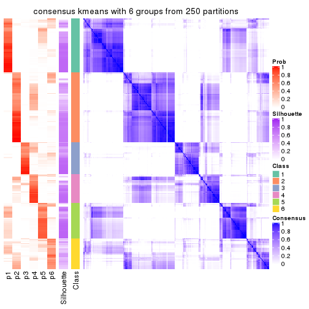</p>

</div>
</div>

Heatmaps for the membership of samples in all partitions to see how consistent they are:


<script>
$( function() {
	$( '#tabs-MAD-kmeans-membership-heatmap' ).tabs();
} );
</script>
<div id='tabs-MAD-kmeans-membership-heatmap'>
<ul>
<li><a href='#tab-MAD-kmeans-membership-heatmap-1'>k = 2</a></li>
<li><a href='#tab-MAD-kmeans-membership-heatmap-2'>k = 3</a></li>
<li><a href='#tab-MAD-kmeans-membership-heatmap-3'>k = 4</a></li>
<li><a href='#tab-MAD-kmeans-membership-heatmap-4'>k = 5</a></li>
<li><a href='#tab-MAD-kmeans-membership-heatmap-5'>k = 6</a></li>
</ul>
<div id='tab-MAD-kmeans-membership-heatmap-1'>
<pre><code class="r">membership_heatmap(res, k = 2)
</code></pre>

<p></p>

</div>
<div id='tab-MAD-kmeans-membership-heatmap-2'>
<pre><code class="r">membership_heatmap(res, k = 3)
</code></pre>

<p></p>

</div>
<div id='tab-MAD-kmeans-membership-heatmap-3'>
<pre><code class="r">membership_heatmap(res, k = 4)
</code></pre>

<p></p>

</div>
<div id='tab-MAD-kmeans-membership-heatmap-4'>
<pre><code class="r">membership_heatmap(res, k = 5)
</code></pre>

<p></p>

</div>
<div id='tab-MAD-kmeans-membership-heatmap-5'>
<pre><code class="r">membership_heatmap(res, k = 6)
</code></pre>

<p>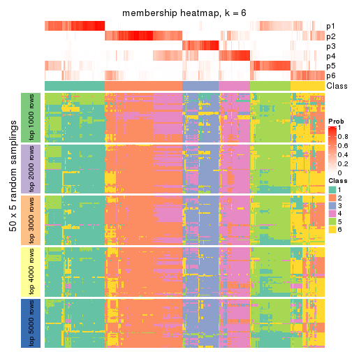</p>

</div>
</div>

As soon as we have had the classes for columns, we can look for signatures
which are significantly different between classes which can be candidate marks
for certain classes. Following are the heatmaps for signatures.


Signature heatmaps where rows are scaled:


<script>
$( function() {
	$( '#tabs-MAD-kmeans-get-signatures' ).tabs();
} );
</script>
<div id='tabs-MAD-kmeans-get-signatures'>
<ul>
<li><a href='#tab-MAD-kmeans-get-signatures-1'>k = 2</a></li>
<li><a href='#tab-MAD-kmeans-get-signatures-2'>k = 3</a></li>
<li><a href='#tab-MAD-kmeans-get-signatures-3'>k = 4</a></li>
<li><a href='#tab-MAD-kmeans-get-signatures-4'>k = 5</a></li>
<li><a href='#tab-MAD-kmeans-get-signatures-5'>k = 6</a></li>
</ul>
<div id='tab-MAD-kmeans-get-signatures-1'>
<pre><code class="r">get_signatures(res, k = 2)
</code></pre>

<p></p>

</div>
<div id='tab-MAD-kmeans-get-signatures-2'>
<pre><code class="r">get_signatures(res, k = 3)
</code></pre>

<p></p>

</div>
<div id='tab-MAD-kmeans-get-signatures-3'>
<pre><code class="r">get_signatures(res, k = 4)
</code></pre>

<p></p>

</div>
<div id='tab-MAD-kmeans-get-signatures-4'>
<pre><code class="r">get_signatures(res, k = 5)
</code></pre>

<p>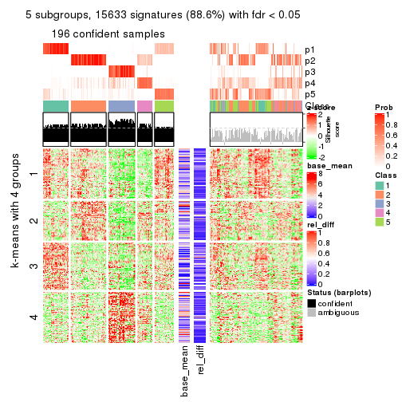</p>

</div>
<div id='tab-MAD-kmeans-get-signatures-5'>
<pre><code class="r">get_signatures(res, k = 6)
</code></pre>

<p></p>

</div>
</div>


Signature heatmaps where rows are not scaled:


<script>
$( function() {
	$( '#tabs-MAD-kmeans-get-signatures-no-scale' ).tabs();
} );
</script>
<div id='tabs-MAD-kmeans-get-signatures-no-scale'>
<ul>
<li><a href='#tab-MAD-kmeans-get-signatures-no-scale-1'>k = 2</a></li>
<li><a href='#tab-MAD-kmeans-get-signatures-no-scale-2'>k = 3</a></li>
<li><a href='#tab-MAD-kmeans-get-signatures-no-scale-3'>k = 4</a></li>
<li><a href='#tab-MAD-kmeans-get-signatures-no-scale-4'>k = 5</a></li>
<li><a href='#tab-MAD-kmeans-get-signatures-no-scale-5'>k = 6</a></li>
</ul>
<div id='tab-MAD-kmeans-get-signatures-no-scale-1'>
<pre><code class="r">get_signatures(res, k = 2, scale_rows = FALSE)
</code></pre>

<p></p>

</div>
<div id='tab-MAD-kmeans-get-signatures-no-scale-2'>
<pre><code class="r">get_signatures(res, k = 3, scale_rows = FALSE)
</code></pre>

<p>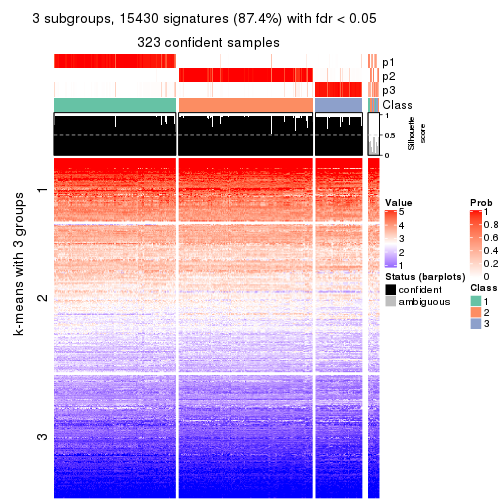</p>

</div>
<div id='tab-MAD-kmeans-get-signatures-no-scale-3'>
<pre><code class="r">get_signatures(res, k = 4, scale_rows = FALSE)
</code></pre>

<p></p>

</div>
<div id='tab-MAD-kmeans-get-signatures-no-scale-4'>
<pre><code class="r">get_signatures(res, k = 5, scale_rows = FALSE)
</code></pre>

<p></p>

</div>
<div id='tab-MAD-kmeans-get-signatures-no-scale-5'>
<pre><code class="r">get_signatures(res, k = 6, scale_rows = FALSE)
</code></pre>

<p></p>

</div>
</div>


Compare the overlap of signatures from different k:

```r
compare_signatures(res)
```


`get_signature()` returns a data frame invisibly. TO get the list of signatures, the function
call should be assigned to a variable explicitly. In following code, if `plot` argument is set
to `FALSE`, no heatmap is plotted while only the differential analysis is performed.

```r
# code only for demonstration
tb = get_signature(res, k = ..., plot = FALSE)
```

An example of the output of `tb` is:

```
#>   which_row         fdr    mean_1    mean_2 scaled_mean_1 scaled_mean_2 km
#> 1        38 0.042760348  8.373488  9.131774    -0.5533452     0.5164555  1
#> 2        40 0.018707592  7.106213  8.469186    -0.6173731     0.5762149  1
#> 3        55 0.019134737 10.221463 11.207825    -0.6159697     0.5749050  1
#> 4        59 0.006059896  5.921854  7.869574    -0.6899429     0.6439467  1
#> 5        60 0.018055526  8.928898 10.211722    -0.6204761     0.5791110  1
#> 6        98 0.009384629 15.714769 14.887706     0.6635654    -0.6193277  2
...
```

The columns in `tb` are:

1. `which_row`: row indices corresponding to the input matrix.
2. `fdr`: FDR for the differential test. 
3. `mean_x`: The mean value in group x.
4. `scaled_mean_x`: The mean value in group x after rows are scaled.
5. `km`: Row groups if k-means clustering is applied to rows.


UMAP plot which shows how samples are separated.


<script>
$( function() {
	$( '#tabs-MAD-kmeans-dimension-reduction' ).tabs();
} );
</script>
<div id='tabs-MAD-kmeans-dimension-reduction'>
<ul>
<li><a href='#tab-MAD-kmeans-dimension-reduction-1'>k = 2</a></li>
<li><a href='#tab-MAD-kmeans-dimension-reduction-2'>k = 3</a></li>
<li><a href='#tab-MAD-kmeans-dimension-reduction-3'>k = 4</a></li>
<li><a href='#tab-MAD-kmeans-dimension-reduction-4'>k = 5</a></li>
<li><a href='#tab-MAD-kmeans-dimension-reduction-5'>k = 6</a></li>
</ul>
<div id='tab-MAD-kmeans-dimension-reduction-1'>
<pre><code class="r">dimension_reduction(res, k = 2, method = &quot;UMAP&quot;)
</code></pre>

<p></p>

</div>
<div id='tab-MAD-kmeans-dimension-reduction-2'>
<pre><code class="r">dimension_reduction(res, k = 3, method = &quot;UMAP&quot;)
</code></pre>

<p></p>

</div>
<div id='tab-MAD-kmeans-dimension-reduction-3'>
<pre><code class="r">dimension_reduction(res, k = 4, method = &quot;UMAP&quot;)
</code></pre>

<p></p>

</div>
<div id='tab-MAD-kmeans-dimension-reduction-4'>
<pre><code class="r">dimension_reduction(res, k = 5, method = &quot;UMAP&quot;)
</code></pre>

<p></p>

</div>
<div id='tab-MAD-kmeans-dimension-reduction-5'>
<pre><code class="r">dimension_reduction(res, k = 6, method = &quot;UMAP&quot;)
</code></pre>

<p></p>

</div>
</div>


Following heatmap shows how subgroups are split when increasing `k`:

```r
collect_classes(res)
```


If matrix rows can be associated to genes, consider to use `GO_Enrichment(res,
...)` to perform function enrichment for the signature genes.


 

---------------------------------------------------


### MAD:skmeans**


The object with results only for a single top-value method and a single partition method 
can be extracted as:

```r
res = res_list["MAD", "skmeans"]
# you can also extract it by
# res = res_list["MAD:skmeans"]
```

A summary of `res` and all the functions that can be applied to it:

```r
res
```

```
#> A 'ConsensusPartition' object with k = 2, 3, 4, 5, 6.
#>   On a matrix with 17654 rows and 335 columns.
#>   Top rows (1000, 2000, 3000, 4000, 5000) are extracted by 'MAD' method.
#>   Subgroups are detected by 'skmeans' method.
#>   Performed in total 1250 partitions by row resampling.
#>   Best k for subgroups seems to be 2.
#> 
#> Following methods can be applied to this 'ConsensusPartition' object:
#>  [1] "cola_report"             "collect_classes"         "collect_plots"          
#>  [4] "collect_stats"           "colnames"                "compare_signatures"     
#>  [7] "consensus_heatmap"       "dimension_reduction"     "functional_enrichment"  
#> [10] "get_anno_col"            "get_anno"                "get_classes"            
#> [13] "get_consensus"           "get_matrix"              "get_membership"         
#> [16] "get_param"               "get_signatures"          "get_stats"              
#> [19] "is_best_k"               "is_stable_k"             "membership_heatmap"     
#> [22] "ncol"                    "nrow"                    "plot_ecdf"              
#> [25] "rownames"                "select_partition_number" "show"                   
#> [28] "suggest_best_k"          "test_to_known_factors"
```

`collect_plots()` function collects all the plots made from `res` for all `k` (number of partitions)
into one single page to provide an easy and fast comparison between different `k`.

```r
collect_plots(res)
```


The plots are:

- The first row: a plot of the ECDF (Empirical cumulative distribution
  function) curves of the consensus matrix for each `k` and the heatmap of
  predicted classes for each `k`.
- The second row: heatmaps of the consensus matrix for each `k`.
- The third row: heatmaps of the membership matrix for each `k`.
- The fouth row: heatmaps of the signatures for each `k`.

All the plots in panels can be made by individual functions and they are
plotted later in this section.

`select_partition_number()` produces several plots showing different
statistics for choosing "optimized" `k`. There are following statistics:

- ECDF curves of the consensus matrix for each `k`;
- 1-PAC. [The PAC
  score](https://en.wikipedia.org/wiki/Consensus_clustering#Over-interpretation_potential_of_consensus_clustering)
  measures the proportion of the ambiguous subgrouping.
- Mean silhouette score.
- Concordance. The mean probability of fiting the consensus class ids in all
  partitions.
- Area increased. Denote $A_k$ as the area under the ECDF curve for current
  `k`, the area increased is defined as $A_k - A_{k-1}$.
- Rand index. The percent of pairs of samples that are both in a same cluster
  or both are not in a same cluster in the partition of k and k-1.
- Jaccard index. The ratio of pairs of samples are both in a same cluster in
  the partition of k and k-1 and the pairs of samples are both in a same
  cluster in the partition k or k-1.

The detailed explanations of these statistics can be found in [the cola
vignette](http://bioconductor.org/packages/devel/bioc/vignettes/cola/inst/doc/cola.html#toc_13).

Generally speaking, lower PAC score, higher mean silhouette score or higher
concordance corresponds to better partition. Rand index and Jaccard index
measure how similar the current partition is compared to partition with `k-1`.
If they are too similar, we won't accept `k` is better than `k-1`.

```r
select_partition_number(res)
```


The numeric values for all these statistics can be obtained by `get_stats()`.

```r
get_stats(res)
```

```
#>   k 1-PAC mean_silhouette concordance area_increased  Rand Jaccard
#> 2 2 1.000           0.966       0.986         0.4987 0.501   0.501
#> 3 3 0.881           0.901       0.958         0.3111 0.782   0.590
#> 4 4 0.773           0.846       0.900         0.1198 0.866   0.640
#> 5 5 0.747           0.750       0.860         0.0846 0.890   0.618
#> 6 6 0.718           0.592       0.740         0.0351 0.921   0.650
```

`suggest_best_k()` suggests the best $k$ based on these statistics. The rules are as follows:

- All $k$ with Jaccard index larger than 0.95 are removed because the increase of
  the partition number does not provides enough extra information. If all $k$ are removed,
  the best $k$ is assigned by `NA`.
- For $k$ with 1-PAC larger than 0.9, the maximal $k$ is taken as the "best k". Other $k$ is called "optional k".
- If it does not fit the second rule. The $k$ with the highest vote of highest
  1-PAC, mean silhouette and concordance is taken as the "best k".

```r
suggest_best_k(res)
```

```
#> [1] 2
```


Following shows the table of the partitions (You need to click the **show/hide
code output** link to see it). The membership matrix (columns with name `p*`)
is inferred by
[`clue::cl_consensus()`](https://www.rdocumentation.org/link/cl_consensus?package=clue)
function with the `SE` method. Basically the value in the membership matrix
represents the probability to belong to a certain group. The finall class
label for an item is determined with the group with highest probability it
belongs to.

In `get_classes()` function, the entropy is calculated from the membership
matrix and the silhouette score is calculated from the consensus matrix.


<script>
$( function() {
	$( '#tabs-MAD-skmeans-get-classes' ).tabs();
} );
</script>
<div id='tabs-MAD-skmeans-get-classes'>
<ul>
<li><a href='#tab-MAD-skmeans-get-classes-1'>k = 2</a></li>
<li><a href='#tab-MAD-skmeans-get-classes-2'>k = 3</a></li>
<li><a href='#tab-MAD-skmeans-get-classes-3'>k = 4</a></li>
<li><a href='#tab-MAD-skmeans-get-classes-4'>k = 5</a></li>
<li><a href='#tab-MAD-skmeans-get-classes-5'>k = 6</a></li>
</ul>

<div id='tab-MAD-skmeans-get-classes-1'>
<p><a id='tab-MAD-skmeans-get-classes-1-a' style='color:#0366d6' href='#'>show/hide code output</a></p>
<pre><code class="r">cbind(get_classes(res, k = 2), get_membership(res, k = 2))
</code></pre>

<pre><code>#&gt;            class entropy silhouette    p1    p2
#&gt; SRR660306      2  0.0000      0.992 0.000 1.000
#&gt; SRR1359328     2  0.0000      0.992 0.000 1.000
#&gt; SRR821124      2  0.0000      0.992 0.000 1.000
#&gt; SRR1335188     1  0.0000      0.978 1.000 0.000
#&gt; SRR1075825     2  0.0000      0.992 0.000 1.000
#&gt; SRR1321921     1  0.0000      0.978 1.000 0.000
#&gt; SRR1466198     2  0.0000      0.992 0.000 1.000
#&gt; SRR1384073     1  0.0000      0.978 1.000 0.000
#&gt; SRR1312802     1  0.0000      0.978 1.000 0.000
#&gt; SRR1076559     1  0.0000      0.978 1.000 0.000
#&gt; SRR1370085     1  0.0000      0.978 1.000 0.000
#&gt; SRR1460363     1  0.0000      0.978 1.000 0.000
#&gt; SRR1480221     2  0.0000      0.992 0.000 1.000
#&gt; SRR1476165     1  0.0000      0.978 1.000 0.000
#&gt; SRR1459631     2  0.0000      0.992 0.000 1.000
#&gt; SRR1448098     2  0.0000      0.992 0.000 1.000
#&gt; SRR1321401     2  0.0000      0.992 0.000 1.000
#&gt; SRR807613      2  0.0000      0.992 0.000 1.000
#&gt; SRR808086      1  0.9881      0.253 0.564 0.436
#&gt; SRR613687      2  0.0000      0.992 0.000 1.000
#&gt; SRR1471011     1  0.0000      0.978 1.000 0.000
#&gt; SRR1330284     2  0.0000      0.992 0.000 1.000
#&gt; SRR1320624     2  0.0000      0.992 0.000 1.000
#&gt; SRR1459519     1  0.0000      0.978 1.000 0.000
#&gt; SRR1091184     2  0.0000      0.992 0.000 1.000
#&gt; SRR1390561     1  0.0000      0.978 1.000 0.000
#&gt; SRR658164      1  0.0000      0.978 1.000 0.000
#&gt; SRR1087079     2  0.0000      0.992 0.000 1.000
#&gt; SRR814996      1  0.7056      0.763 0.808 0.192
#&gt; SRR1407410     2  0.0000      0.992 0.000 1.000
#&gt; SRR1453392     2  0.0000      0.992 0.000 1.000
#&gt; SRR1445873     1  0.0000      0.978 1.000 0.000
#&gt; SRR1419985     2  0.0000      0.992 0.000 1.000
#&gt; SRR820938      2  0.0000      0.992 0.000 1.000
#&gt; SRR1476844     1  0.0000      0.978 1.000 0.000
#&gt; SRR1403526     1  0.0000      0.978 1.000 0.000
#&gt; SRR1413916     2  0.0000      0.992 0.000 1.000
#&gt; SRR1441051     2  0.0000      0.992 0.000 1.000
#&gt; SRR614287      2  0.0000      0.992 0.000 1.000
#&gt; SRR1092062     2  0.0000      0.992 0.000 1.000
#&gt; SRR612611      2  0.0000      0.992 0.000 1.000
#&gt; SRR1376356     2  0.0000      0.992 0.000 1.000
#&gt; SRR1405078     1  0.7219      0.751 0.800 0.200
#&gt; SRR1437226     2  0.0000      0.992 0.000 1.000
#&gt; SRR1326078     1  0.0000      0.978 1.000 0.000
#&gt; SRR1096806     2  0.0000      0.992 0.000 1.000
#&gt; SRR1440919     2  0.0000      0.992 0.000 1.000
#&gt; SRR1452824     1  0.0000      0.978 1.000 0.000
#&gt; SRR615754      1  0.0000      0.978 1.000 0.000
#&gt; SRR1341787     2  0.0000      0.992 0.000 1.000
#&gt; SRR614551      2  0.0000      0.992 0.000 1.000
#&gt; SRR1380829     2  0.0000      0.992 0.000 1.000
#&gt; SRR1455761     1  0.0000      0.978 1.000 0.000
#&gt; SRR1465189     1  0.0000      0.978 1.000 0.000
#&gt; SRR1376895     1  0.0000      0.978 1.000 0.000
#&gt; SRR1445002     1  0.0000      0.978 1.000 0.000
#&gt; SRR1469258     2  0.0000      0.992 0.000 1.000
#&gt; SRR1409239     1  0.0000      0.978 1.000 0.000
#&gt; SRR1480200     1  0.0000      0.978 1.000 0.000
#&gt; SRR1418323     1  0.0000      0.978 1.000 0.000
#&gt; SRR657540      2  0.0000      0.992 0.000 1.000
#&gt; SRR821096      2  0.0000      0.992 0.000 1.000
#&gt; SRR613591      2  0.0000      0.992 0.000 1.000
#&gt; SRR1344205     2  0.0000      0.992 0.000 1.000
#&gt; SRR612479      1  0.0000      0.978 1.000 0.000
#&gt; SRR1399950     1  0.0000      0.978 1.000 0.000
#&gt; SRR1336048     1  0.0000      0.978 1.000 0.000
#&gt; SRR1368896     1  0.0000      0.978 1.000 0.000
#&gt; SRR1379403     2  0.0000      0.992 0.000 1.000
#&gt; SRR1312464     1  0.0000      0.978 1.000 0.000
#&gt; SRR1096478     1  0.0000      0.978 1.000 0.000
#&gt; SRR1459845     1  0.0000      0.978 1.000 0.000
#&gt; SRR1348138     1  0.0000      0.978 1.000 0.000
#&gt; SRR811423      1  0.0000      0.978 1.000 0.000
#&gt; SRR615683      1  0.0000      0.978 1.000 0.000
#&gt; SRR1380336     2  0.0000      0.992 0.000 1.000
#&gt; SRR817609      1  0.0000      0.978 1.000 0.000
#&gt; SRR1074550     2  0.0000      0.992 0.000 1.000
#&gt; SRR1499236     2  0.0000      0.992 0.000 1.000
#&gt; SRR656083      1  0.0000      0.978 1.000 0.000
#&gt; SRR817539      1  0.0000      0.978 1.000 0.000
#&gt; SRR1410801     1  0.0000      0.978 1.000 0.000
#&gt; SRR1347190     1  0.0000      0.978 1.000 0.000
#&gt; SRR1355126     2  0.0000      0.992 0.000 1.000
#&gt; SRR615165      2  0.0000      0.992 0.000 1.000
#&gt; SRR1466046     1  0.0000      0.978 1.000 0.000
#&gt; SRR1097055     2  0.0000      0.992 0.000 1.000
#&gt; SRR1312370     2  0.0000      0.992 0.000 1.000
#&gt; SRR655325      1  0.0000      0.978 1.000 0.000
#&gt; SRR810177      2  0.0000      0.992 0.000 1.000
#&gt; SRR815685      2  0.0000      0.992 0.000 1.000
#&gt; SRR817026      2  0.0000      0.992 0.000 1.000
#&gt; SRR1417224     2  0.0000      0.992 0.000 1.000
#&gt; SRR661687      2  0.0000      0.992 0.000 1.000
#&gt; SRR1431804     1  0.0000      0.978 1.000 0.000
#&gt; SRR664072      2  0.2778      0.944 0.048 0.952
#&gt; SRR612923      2  0.0000      0.992 0.000 1.000
#&gt; SRR1315890     1  0.0000      0.978 1.000 0.000
#&gt; SRR1347726     1  0.0000      0.978 1.000 0.000
#&gt; SRR1500360     1  0.0000      0.978 1.000 0.000
#&gt; SRR1468360     2  0.0000      0.992 0.000 1.000
#&gt; SRR1404084     1  0.0000      0.978 1.000 0.000
#&gt; SRR615994      2  0.0000      0.992 0.000 1.000
#&gt; SRR1475718     2  0.0000      0.992 0.000 1.000
#&gt; SRR1397200     2  0.0000      0.992 0.000 1.000
#&gt; SRR655519      2  0.0000      0.992 0.000 1.000
#&gt; SRR1311308     2  0.0000      0.992 0.000 1.000
#&gt; SRR1368006     2  0.0000      0.992 0.000 1.000
#&gt; SRR613651      1  0.0000      0.978 1.000 0.000
#&gt; SRR1362621     2  0.0000      0.992 0.000 1.000
#&gt; SRR1451718     1  0.0000      0.978 1.000 0.000
#&gt; SRR1095334     2  0.0000      0.992 0.000 1.000
#&gt; SRR1079636     2  0.0000      0.992 0.000 1.000
#&gt; SRR1442549     2  0.0938      0.981 0.012 0.988
#&gt; SRR1466421     2  0.0000      0.992 0.000 1.000
#&gt; SRR817397      2  0.0000      0.992 0.000 1.000
#&gt; SRR1341809     2  0.0000      0.992 0.000 1.000
#&gt; SRR614623      2  0.0000      0.992 0.000 1.000
#&gt; SRR1335005     2  0.0000      0.992 0.000 1.000
#&gt; SRR1407065     2  0.0000      0.992 0.000 1.000
#&gt; SRR1404483     2  0.0000      0.992 0.000 1.000
#&gt; SRR1096222     1  0.0000      0.978 1.000 0.000
#&gt; SRR1401793     1  0.0000      0.978 1.000 0.000
#&gt; SRR1408615     1  0.7219      0.753 0.800 0.200
#&gt; SRR1070597     1  0.0000      0.978 1.000 0.000
#&gt; SRR1332381     1  0.0000      0.978 1.000 0.000
#&gt; SRR1457015     1  0.0000      0.978 1.000 0.000
#&gt; SRR1386797     1  0.9815      0.288 0.580 0.420
#&gt; SRR1098385     2  0.0000      0.992 0.000 1.000
#&gt; SRR1363947     2  0.0000      0.992 0.000 1.000
#&gt; SRR820350      2  0.0000      0.992 0.000 1.000
#&gt; SRR662055      2  0.0000      0.992 0.000 1.000
#&gt; SRR1310455     1  0.0000      0.978 1.000 0.000
#&gt; SRR1453639     2  0.8499      0.609 0.276 0.724
#&gt; SRR662617      2  0.0000      0.992 0.000 1.000
#&gt; SRR654778      1  0.0000      0.978 1.000 0.000
#&gt; SRR661782      2  0.0000      0.992 0.000 1.000
#&gt; SRR1334396     1  0.0000      0.978 1.000 0.000
#&gt; SRR613867      2  0.0000      0.992 0.000 1.000
#&gt; SRR1479412     1  0.0000      0.978 1.000 0.000
#&gt; SRR1331620     1  0.0000      0.978 1.000 0.000
#&gt; SRR1082809     1  0.0000      0.978 1.000 0.000
#&gt; SRR1417178     1  0.0000      0.978 1.000 0.000
#&gt; SRR1335278     1  0.0000      0.978 1.000 0.000
#&gt; SRR665369      2  0.0000      0.992 0.000 1.000
#&gt; SRR657552      1  0.0000      0.978 1.000 0.000
#&gt; SRR812412      1  0.0000      0.978 1.000 0.000
#&gt; SRR1096500     2  0.0000      0.992 0.000 1.000
#&gt; SRR1347750     2  0.0000      0.992 0.000 1.000
#&gt; SRR615153      1  0.1633      0.957 0.976 0.024
#&gt; SRR1434417     1  0.0000      0.978 1.000 0.000
#&gt; SRR1070159     2  0.3431      0.927 0.064 0.936
#&gt; SRR1332508     2  0.0000      0.992 0.000 1.000
#&gt; SRR1082059     2  0.5294      0.860 0.120 0.880
#&gt; SRR1402491     1  0.0000      0.978 1.000 0.000
#&gt; SRR1476595     2  0.7056      0.760 0.192 0.808
#&gt; SRR1320987     2  0.0000      0.992 0.000 1.000
#&gt; SRR1086417     1  0.9710      0.344 0.600 0.400
#&gt; SRR1454095     1  0.0000      0.978 1.000 0.000
#&gt; SRR614791      2  0.0000      0.992 0.000 1.000
#&gt; SRR821255      1  0.9608      0.387 0.616 0.384
#&gt; SRR820402      2  0.0000      0.992 0.000 1.000
#&gt; SRR1337284     1  0.0000      0.978 1.000 0.000
#&gt; SRR1333083     1  0.9795      0.312 0.584 0.416
#&gt; SRR1384883     2  0.0000      0.992 0.000 1.000
#&gt; SRR614431      1  0.0000      0.978 1.000 0.000
#&gt; SRR1481106     2  0.0000      0.992 0.000 1.000
#&gt; SRR1370285     1  0.0000      0.978 1.000 0.000
#&gt; SRR1446673     2  0.0000      0.992 0.000 1.000
#&gt; SRR1318046     2  0.0000      0.992 0.000 1.000
#&gt; SRR1341188     2  0.0000      0.992 0.000 1.000
#&gt; SRR1384941     1  0.0000      0.978 1.000 0.000
#&gt; SRR1322864     2  0.0000      0.992 0.000 1.000
#&gt; SRR1476825     1  0.0000      0.978 1.000 0.000
#&gt; SRR1443332     2  0.0000      0.992 0.000 1.000
#&gt; SRR662486      2  0.0000      0.992 0.000 1.000
#&gt; SRR1447019     1  0.0000      0.978 1.000 0.000
#&gt; SRR662942      1  0.0000      0.978 1.000 0.000
#&gt; SRR613102      2  0.0000      0.992 0.000 1.000
#&gt; SRR1469880     1  0.0000      0.978 1.000 0.000
#&gt; SRR1464977     1  0.0000      0.978 1.000 0.000
#&gt; SRR615850      1  0.0000      0.978 1.000 0.000
#&gt; SRR661949      2  0.0000      0.992 0.000 1.000
#&gt; SRR1322227     2  0.0000      0.992 0.000 1.000
#&gt; SRR1441655     1  0.2603      0.937 0.956 0.044
#&gt; SRR613771      2  0.0000      0.992 0.000 1.000
#&gt; SRR1479471     1  0.0000      0.978 1.000 0.000
#&gt; SRR1488918     2  0.0000      0.992 0.000 1.000
#&gt; SRR1414040     2  0.0000      0.992 0.000 1.000
#&gt; SRR1079850     2  0.7815      0.696 0.232 0.768
#&gt; SRR663209      1  0.0000      0.978 1.000 0.000
#&gt; SRR1364914     2  0.0000      0.992 0.000 1.000
#&gt; SRR1408267     2  0.0000      0.992 0.000 1.000
#&gt; SRR1314894     1  0.0000      0.978 1.000 0.000
#&gt; SRR1414117     2  0.0000      0.992 0.000 1.000
#&gt; SRR1395975     2  0.0000      0.992 0.000 1.000
#&gt; SRR1402219     2  0.0000      0.992 0.000 1.000
#&gt; SRR1433623     1  0.0000      0.978 1.000 0.000
#&gt; SRR656385      2  0.0000      0.992 0.000 1.000
#&gt; SRR811213      2  0.0000      0.992 0.000 1.000
#&gt; SRR663657      2  0.0000      0.992 0.000 1.000
#&gt; SRR612203      1  0.0000      0.978 1.000 0.000
#&gt; SRR613987      2  0.0000      0.992 0.000 1.000
#&gt; SRR613831      2  0.0000      0.992 0.000 1.000
#&gt; SRR1354180     2  0.0000      0.992 0.000 1.000
#&gt; SRR1382912     1  0.0000      0.978 1.000 0.000
#&gt; SRR1475501     1  0.0000      0.978 1.000 0.000
#&gt; SRR1336930     1  0.0000      0.978 1.000 0.000
#&gt; SRR613030      2  0.0000      0.992 0.000 1.000
#&gt; SRR1381459     2  0.0000      0.992 0.000 1.000
#&gt; SRR1402350     1  0.0000      0.978 1.000 0.000
#&gt; SRR1419408     1  0.0000      0.978 1.000 0.000
#&gt; SRR655911      2  0.0000      0.992 0.000 1.000
#&gt; SRR1418243     1  0.0000      0.978 1.000 0.000
#&gt; SRR1322573     1  0.0000      0.978 1.000 0.000
#&gt; SRR613615      2  0.0000      0.992 0.000 1.000
#&gt; SRR1355284     1  0.0000      0.978 1.000 0.000
#&gt; SRR1319395     1  0.0000      0.978 1.000 0.000
#&gt; SRR818939      1  0.0000      0.978 1.000 0.000
#&gt; SRR1465266     1  0.0000      0.978 1.000 0.000
#&gt; SRR614888      1  0.0000      0.978 1.000 0.000
#&gt; SRR1431694     1  0.0000      0.978 1.000 0.000
#&gt; SRR614347      2  0.0000      0.992 0.000 1.000
#&gt; SRR1334228     2  0.0000      0.992 0.000 1.000
#&gt; SRR1096007     2  0.0000      0.992 0.000 1.000
#&gt; SRR656349      1  0.0000      0.978 1.000 0.000
#&gt; SRR815422      2  0.0000      0.992 0.000 1.000
#&gt; SRR1360828     1  0.0000      0.978 1.000 0.000
#&gt; SRR1359005     2  0.0000      0.992 0.000 1.000
#&gt; SRR1456652     1  0.0000      0.978 1.000 0.000
#&gt; SRR1391660     1  0.0000      0.978 1.000 0.000
#&gt; SRR1441956     1  0.0000      0.978 1.000 0.000
#&gt; SRR662930      2  0.0000      0.992 0.000 1.000
#&gt; SRR615790      2  0.0000      0.992 0.000 1.000
#&gt; SRR614827      2  0.0000      0.992 0.000 1.000
#&gt; SRR614587      2  0.0000      0.992 0.000 1.000
#&gt; SRR814052      2  0.0000      0.992 0.000 1.000
#&gt; SRR1070086     1  0.0000      0.978 1.000 0.000
#&gt; SRR1481440     1  0.0000      0.978 1.000 0.000
#&gt; SRR1339296     2  0.0000      0.992 0.000 1.000
#&gt; SRR1343239     2  0.0000      0.992 0.000 1.000
#&gt; SRR1432802     2  0.0000      0.992 0.000 1.000
#&gt; SRR1416911     1  0.0000      0.978 1.000 0.000
#&gt; SRR1410427     1  0.0000      0.978 1.000 0.000
#&gt; SRR1401185     1  0.6247      0.812 0.844 0.156
#&gt; SRR654993      2  0.0000      0.992 0.000 1.000
#&gt; SRR656397      1  0.0000      0.978 1.000 0.000
#&gt; SRR809643      2  0.5946      0.827 0.144 0.856
#&gt; SRR1433819     1  0.0000      0.978 1.000 0.000
#&gt; SRR1375225     2  0.0000      0.992 0.000 1.000
#&gt; SRR1367739     1  0.0000      0.978 1.000 0.000
#&gt; SRR1323336     1  0.0000      0.978 1.000 0.000
#&gt; SRR663224      2  0.0000      0.992 0.000 1.000
#&gt; SRR1442840     1  0.0000      0.978 1.000 0.000
#&gt; SRR1374058     1  0.0000      0.978 1.000 0.000
#&gt; SRR656994      1  0.0000      0.978 1.000 0.000
#&gt; SRR1469214     2  0.0000      0.992 0.000 1.000
#&gt; SRR1456446     1  0.0000      0.978 1.000 0.000
#&gt; SRR1471879     2  0.0000      0.992 0.000 1.000
#&gt; SRR612911      2  0.0000      0.992 0.000 1.000
#&gt; SRR1395720     2  0.0000      0.992 0.000 1.000
#&gt; SRR1413055     1  0.0000      0.978 1.000 0.000
#&gt; SRR656770      2  0.0000      0.992 0.000 1.000
#&gt; SRR812080      2  0.0000      0.992 0.000 1.000
#&gt; SRR1479328     1  0.0000      0.978 1.000 0.000
#&gt; SRR661421      2  0.0000      0.992 0.000 1.000
#&gt; SRR1410286     2  0.0000      0.992 0.000 1.000
#&gt; SRR1487150     1  0.0000      0.978 1.000 0.000
#&gt; SRR1467035     1  0.0000      0.978 1.000 0.000
#&gt; SRR1360607     2  0.0000      0.992 0.000 1.000
#&gt; SRR1333106     2  0.0000      0.992 0.000 1.000
#&gt; SRR1088706     2  0.0000      0.992 0.000 1.000
#&gt; SRR1320053     2  0.0000      0.992 0.000 1.000
#&gt; SRR1350392     2  0.0000      0.992 0.000 1.000
#&gt; SRR1385190     1  0.0000      0.978 1.000 0.000
#&gt; SRR1080093     2  0.0000      0.992 0.000 1.000
#&gt; SRR1318753     1  0.0000      0.978 1.000 0.000
#&gt; SRR1345369     2  0.0000      0.992 0.000 1.000
#&gt; SRR612178      2  0.0000      0.992 0.000 1.000
#&gt; SRR1354423     1  0.0000      0.978 1.000 0.000
#&gt; SRR1072724     1  0.0000      0.978 1.000 0.000
#&gt; SRR1418450     2  0.0000      0.992 0.000 1.000
#&gt; SRR1326427     2  0.0000      0.992 0.000 1.000
#&gt; SRR1437412     2  0.0000      0.992 0.000 1.000
#&gt; SRR1327548     2  0.0000      0.992 0.000 1.000
#&gt; SRR1395891     1  0.0000      0.978 1.000 0.000
#&gt; SRR659367      2  0.0000      0.992 0.000 1.000
#&gt; SRR818961      1  0.0000      0.978 1.000 0.000
#&gt; SRR813704      1  0.0000      0.978 1.000 0.000
#&gt; SRR613054      1  0.0000      0.978 1.000 0.000
#&gt; SRR1476467     1  0.0000      0.978 1.000 0.000
#&gt; SRR1407988     2  0.0000      0.992 0.000 1.000
#&gt; SRR1394776     2  0.0000      0.992 0.000 1.000
#&gt; SRR655578      2  0.0000      0.992 0.000 1.000
#&gt; SRR1310645     2  0.0000      0.992 0.000 1.000
#&gt; SRR1345628     1  0.0000      0.978 1.000 0.000
#&gt; SRR1479740     1  0.0000      0.978 1.000 0.000
#&gt; SRR1332095     1  0.0000      0.978 1.000 0.000
#&gt; SRR1444786     2  0.0000      0.992 0.000 1.000
#&gt; SRR1090070     1  0.0000      0.978 1.000 0.000
#&gt; SRR662414      2  0.0000      0.992 0.000 1.000
#&gt; SRR661216      2  0.0000      0.992 0.000 1.000
#&gt; SRR656313      2  0.0000      0.992 0.000 1.000
#&gt; SRR615671      2  0.0000      0.992 0.000 1.000
#&gt; SRR1350196     2  0.0000      0.992 0.000 1.000
#&gt; SRR1466580     1  0.0000      0.978 1.000 0.000
#&gt; SRR1408032     2  0.0000      0.992 0.000 1.000
#&gt; SRR1432913     2  0.0000      0.992 0.000 1.000
#&gt; SRR1360502     1  0.0000      0.978 1.000 0.000
#&gt; SRR1391901     2  0.0000      0.992 0.000 1.000
#&gt; SRR1311131     1  0.0000      0.978 1.000 0.000
#&gt; SRR1380636     1  0.0000      0.978 1.000 0.000
#&gt; SRR1332339     1  0.0000      0.978 1.000 0.000
#&gt; SRR1341563     2  0.0000      0.992 0.000 1.000
#&gt; SRR1359410     2  0.0000      0.992 0.000 1.000
#&gt; SRR1473040     1  0.9686      0.366 0.604 0.396
#&gt; SRR1321444     1  0.0000      0.978 1.000 0.000
#&gt; SRR1498765     2  0.0000      0.992 0.000 1.000
#&gt; SRR1312622     2  0.0000      0.992 0.000 1.000
#&gt; SRR615503      2  0.8267      0.646 0.260 0.740
#&gt; SRR1453192     1  0.0000      0.978 1.000 0.000
#&gt; SRR1433107     2  0.0000      0.992 0.000 1.000
#&gt; SRR1075384     1  0.0000      0.978 1.000 0.000
#&gt; SRR1356683     1  0.0000      0.978 1.000 0.000
#&gt; SRR659049      1  0.0000      0.978 1.000 0.000
#&gt; SRR1368240     1  0.0000      0.978 1.000 0.000
#&gt; SRR1341739     1  0.0000      0.978 1.000 0.000
#&gt; SRR613249      1  0.4815      0.873 0.896 0.104
#&gt; SRR663428      2  0.0000      0.992 0.000 1.000
#&gt; SRR1341302     2  0.0000      0.992 0.000 1.000
#&gt; SRR1073553     2  0.0000      0.992 0.000 1.000
#&gt; SRR1354093     2  0.0000      0.992 0.000 1.000
#&gt; SRR1406521     2  0.0000      0.992 0.000 1.000
#&gt; SRR1432049     1  0.0000      0.978 1.000 0.000
#&gt; SRR1453504     1  0.0000      0.978 1.000 0.000
</code></pre>

<script>
$('#tab-MAD-skmeans-get-classes-1-a').parent().next().next().hide();
$('#tab-MAD-skmeans-get-classes-1-a').click(function(){
  $('#tab-MAD-skmeans-get-classes-1-a').parent().next().next().toggle();
  return(false);
});
</script>
</div>

<div id='tab-MAD-skmeans-get-classes-2'>
<p><a id='tab-MAD-skmeans-get-classes-2-a' style='color:#0366d6' href='#'>show/hide code output</a></p>
<pre><code class="r">cbind(get_classes(res, k = 3), get_membership(res, k = 3))
</code></pre>

<pre><code>#&gt;            class entropy silhouette    p1    p2    p3
#&gt; SRR660306      3  0.0000      0.901 0.000 0.000 1.000
#&gt; SRR1359328     3  0.0000      0.901 0.000 0.000 1.000
#&gt; SRR821124      2  0.0000      0.961 0.000 1.000 0.000
#&gt; SRR1335188     1  0.0000      0.978 1.000 0.000 0.000
#&gt; SRR1075825     2  0.0000      0.961 0.000 1.000 0.000
#&gt; SRR1321921     1  0.0000      0.978 1.000 0.000 0.000
#&gt; SRR1466198     3  0.0000      0.901 0.000 0.000 1.000
#&gt; SRR1384073     1  0.0000      0.978 1.000 0.000 0.000
#&gt; SRR1312802     1  0.0000      0.978 1.000 0.000 0.000
#&gt; SRR1076559     1  0.0000      0.978 1.000 0.000 0.000
#&gt; SRR1370085     1  0.0000      0.978 1.000 0.000 0.000
#&gt; SRR1460363     1  0.0000      0.978 1.000 0.000 0.000
#&gt; SRR1480221     2  0.0000      0.961 0.000 1.000 0.000
#&gt; SRR1476165     1  0.0000      0.978 1.000 0.000 0.000
#&gt; SRR1459631     3  0.4555      0.746 0.000 0.200 0.800
#&gt; SRR1448098     2  0.0000      0.961 0.000 1.000 0.000
#&gt; SRR1321401     2  0.0000      0.961 0.000 1.000 0.000
#&gt; SRR807613      2  0.0000      0.961 0.000 1.000 0.000
#&gt; SRR808086      3  0.0000      0.901 0.000 0.000 1.000
#&gt; SRR613687      2  0.0000      0.961 0.000 1.000 0.000
#&gt; SRR1471011     1  0.4399      0.762 0.812 0.000 0.188
#&gt; SRR1330284     2  0.0000      0.961 0.000 1.000 0.000
#&gt; SRR1320624     2  0.0000      0.961 0.000 1.000 0.000
#&gt; SRR1459519     1  0.0000      0.978 1.000 0.000 0.000
#&gt; SRR1091184     3  0.2261      0.864 0.000 0.068 0.932
#&gt; SRR1390561     1  0.0000      0.978 1.000 0.000 0.000
#&gt; SRR658164      1  0.0000      0.978 1.000 0.000 0.000
#&gt; SRR1087079     2  0.0000      0.961 0.000 1.000 0.000
#&gt; SRR814996      3  0.0000      0.901 0.000 0.000 1.000
#&gt; SRR1407410     2  0.0000      0.961 0.000 1.000 0.000
#&gt; SRR1453392     2  0.5835      0.463 0.000 0.660 0.340
#&gt; SRR1445873     1  0.0000      0.978 1.000 0.000 0.000
#&gt; SRR1419985     2  0.0000      0.961 0.000 1.000 0.000
#&gt; SRR820938      3  0.2537      0.856 0.000 0.080 0.920
#&gt; SRR1476844     1  0.0000      0.978 1.000 0.000 0.000
#&gt; SRR1403526     1  0.0000      0.978 1.000 0.000 0.000
#&gt; SRR1413916     2  0.0000      0.961 0.000 1.000 0.000
#&gt; SRR1441051     2  0.0000      0.961 0.000 1.000 0.000
#&gt; SRR614287      2  0.0000      0.961 0.000 1.000 0.000
#&gt; SRR1092062     2  0.0000      0.961 0.000 1.000 0.000
#&gt; SRR612611      2  0.0000      0.961 0.000 1.000 0.000
#&gt; SRR1376356     2  0.0000      0.961 0.000 1.000 0.000
#&gt; SRR1405078     3  0.4974      0.687 0.236 0.000 0.764
#&gt; SRR1437226     3  0.6280      0.232 0.000 0.460 0.540
#&gt; SRR1326078     1  0.0000      0.978 1.000 0.000 0.000
#&gt; SRR1096806     3  0.0000      0.901 0.000 0.000 1.000
#&gt; SRR1440919     3  0.1529      0.882 0.000 0.040 0.960
#&gt; SRR1452824     1  0.0000      0.978 1.000 0.000 0.000
#&gt; SRR615754      1  0.0000      0.978 1.000 0.000 0.000
#&gt; SRR1341787     3  0.4931      0.675 0.000 0.232 0.768
#&gt; SRR614551      2  0.0000      0.961 0.000 1.000 0.000
#&gt; SRR1380829     3  0.0000      0.901 0.000 0.000 1.000
#&gt; SRR1455761     1  0.0000      0.978 1.000 0.000 0.000
#&gt; SRR1465189     3  0.1753      0.870 0.048 0.000 0.952
#&gt; SRR1376895     1  0.0000      0.978 1.000 0.000 0.000
#&gt; SRR1445002     1  0.0000      0.978 1.000 0.000 0.000
#&gt; SRR1469258     2  0.0000      0.961 0.000 1.000 0.000
#&gt; SRR1409239     1  0.0000      0.978 1.000 0.000 0.000
#&gt; SRR1480200     1  0.0000      0.978 1.000 0.000 0.000
#&gt; SRR1418323     1  0.0000      0.978 1.000 0.000 0.000
#&gt; SRR657540      3  0.0000      0.901 0.000 0.000 1.000
#&gt; SRR821096      2  0.0000      0.961 0.000 1.000 0.000
#&gt; SRR613591      2  0.0000      0.961 0.000 1.000 0.000
#&gt; SRR1344205     3  0.0000      0.901 0.000 0.000 1.000
#&gt; SRR612479      1  0.0000      0.978 1.000 0.000 0.000
#&gt; SRR1399950     1  0.0000      0.978 1.000 0.000 0.000
#&gt; SRR1336048     3  0.6095      0.393 0.392 0.000 0.608
#&gt; SRR1368896     1  0.0000      0.978 1.000 0.000 0.000
#&gt; SRR1379403     2  0.0000      0.961 0.000 1.000 0.000
#&gt; SRR1312464     1  0.0000      0.978 1.000 0.000 0.000
#&gt; SRR1096478     1  0.0000      0.978 1.000 0.000 0.000
#&gt; SRR1459845     1  0.0000      0.978 1.000 0.000 0.000
#&gt; SRR1348138     3  0.0000      0.901 0.000 0.000 1.000
#&gt; SRR811423      1  0.0000      0.978 1.000 0.000 0.000
#&gt; SRR615683      1  0.0000      0.978 1.000 0.000 0.000
#&gt; SRR1380336     2  0.0000      0.961 0.000 1.000 0.000
#&gt; SRR817609      1  0.4452      0.756 0.808 0.000 0.192
#&gt; SRR1074550     3  0.0000      0.901 0.000 0.000 1.000
#&gt; SRR1499236     2  0.0000      0.961 0.000 1.000 0.000
#&gt; SRR656083      1  0.0000      0.978 1.000 0.000 0.000
#&gt; SRR817539      1  0.0000      0.978 1.000 0.000 0.000
#&gt; SRR1410801     1  0.0000      0.978 1.000 0.000 0.000
#&gt; SRR1347190     1  0.0000      0.978 1.000 0.000 0.000
#&gt; SRR1355126     2  0.0000      0.961 0.000 1.000 0.000
#&gt; SRR615165      3  0.0000      0.901 0.000 0.000 1.000
#&gt; SRR1466046     1  0.0000      0.978 1.000 0.000 0.000
#&gt; SRR1097055     2  0.0000      0.961 0.000 1.000 0.000
#&gt; SRR1312370     2  0.0000      0.961 0.000 1.000 0.000
#&gt; SRR655325      1  0.0000      0.978 1.000 0.000 0.000
#&gt; SRR810177      2  0.0000      0.961 0.000 1.000 0.000
#&gt; SRR815685      2  0.0000      0.961 0.000 1.000 0.000
#&gt; SRR817026      3  0.0000      0.901 0.000 0.000 1.000
#&gt; SRR1417224     3  0.6215      0.288 0.000 0.428 0.572
#&gt; SRR661687      3  0.1163      0.888 0.000 0.028 0.972
#&gt; SRR1431804     3  0.5058      0.649 0.244 0.000 0.756
#&gt; SRR664072      3  0.0000      0.901 0.000 0.000 1.000
#&gt; SRR612923      2  0.0000      0.961 0.000 1.000 0.000
#&gt; SRR1315890     1  0.0000      0.978 1.000 0.000 0.000
#&gt; SRR1347726     1  0.0000      0.978 1.000 0.000 0.000
#&gt; SRR1500360     1  0.0000      0.978 1.000 0.000 0.000
#&gt; SRR1468360     2  0.0000      0.961 0.000 1.000 0.000
#&gt; SRR1404084     1  0.5948      0.431 0.640 0.000 0.360
#&gt; SRR615994      3  0.0000      0.901 0.000 0.000 1.000
#&gt; SRR1475718     2  0.0000      0.961 0.000 1.000 0.000
#&gt; SRR1397200     3  0.0000      0.901 0.000 0.000 1.000
#&gt; SRR655519      2  0.0000      0.961 0.000 1.000 0.000
#&gt; SRR1311308     3  0.0592      0.896 0.000 0.012 0.988
#&gt; SRR1368006     2  0.0000      0.961 0.000 1.000 0.000
#&gt; SRR613651      1  0.0000      0.978 1.000 0.000 0.000
#&gt; SRR1362621     3  0.0000      0.901 0.000 0.000 1.000
#&gt; SRR1451718     1  0.0000      0.978 1.000 0.000 0.000
#&gt; SRR1095334     3  0.0000      0.901 0.000 0.000 1.000
#&gt; SRR1079636     2  0.0000      0.961 0.000 1.000 0.000
#&gt; SRR1442549     2  0.0000      0.961 0.000 1.000 0.000
#&gt; SRR1466421     2  0.0000      0.961 0.000 1.000 0.000
#&gt; SRR817397      3  0.6079      0.398 0.000 0.388 0.612
#&gt; SRR1341809     2  0.0000      0.961 0.000 1.000 0.000
#&gt; SRR614623      2  0.0000      0.961 0.000 1.000 0.000
#&gt; SRR1335005     2  0.0000      0.961 0.000 1.000 0.000
#&gt; SRR1407065     3  0.4654      0.736 0.000 0.208 0.792
#&gt; SRR1404483     2  0.6180      0.256 0.000 0.584 0.416
#&gt; SRR1096222     1  0.0000      0.978 1.000 0.000 0.000
#&gt; SRR1401793     1  0.0000      0.978 1.000 0.000 0.000
#&gt; SRR1408615     3  0.0000      0.901 0.000 0.000 1.000
#&gt; SRR1070597     1  0.5706      0.530 0.680 0.320 0.000
#&gt; SRR1332381     1  0.3686      0.826 0.860 0.000 0.140
#&gt; SRR1457015     1  0.0000      0.978 1.000 0.000 0.000
#&gt; SRR1386797     2  0.4994      0.749 0.160 0.816 0.024
#&gt; SRR1098385     2  0.0000      0.961 0.000 1.000 0.000
#&gt; SRR1363947     3  0.0000      0.901 0.000 0.000 1.000
#&gt; SRR820350      2  0.0000      0.961 0.000 1.000 0.000
#&gt; SRR662055      2  0.0000      0.961 0.000 1.000 0.000
#&gt; SRR1310455     1  0.0000      0.978 1.000 0.000 0.000
#&gt; SRR1453639     2  0.5325      0.637 0.248 0.748 0.004
#&gt; SRR662617      2  0.0000      0.961 0.000 1.000 0.000
#&gt; SRR654778      1  0.0000      0.978 1.000 0.000 0.000
#&gt; SRR661782      2  0.0000      0.961 0.000 1.000 0.000
#&gt; SRR1334396     1  0.0000      0.978 1.000 0.000 0.000
#&gt; SRR613867      2  0.0000      0.961 0.000 1.000 0.000
#&gt; SRR1479412     1  0.0000      0.978 1.000 0.000 0.000
#&gt; SRR1331620     1  0.0000      0.978 1.000 0.000 0.000
#&gt; SRR1082809     1  0.0000      0.978 1.000 0.000 0.000
#&gt; SRR1417178     1  0.0000      0.978 1.000 0.000 0.000
#&gt; SRR1335278     1  0.0000      0.978 1.000 0.000 0.000
#&gt; SRR665369      2  0.0000      0.961 0.000 1.000 0.000
#&gt; SRR657552      1  0.5397      0.606 0.720 0.000 0.280
#&gt; SRR812412      1  0.0000      0.978 1.000 0.000 0.000
#&gt; SRR1096500     2  0.0000      0.961 0.000 1.000 0.000
#&gt; SRR1347750     2  0.0000      0.961 0.000 1.000 0.000
#&gt; SRR615153      1  0.7164      0.525 0.680 0.064 0.256
#&gt; SRR1434417     1  0.0000      0.978 1.000 0.000 0.000
#&gt; SRR1070159     3  0.0000      0.901 0.000 0.000 1.000
#&gt; SRR1332508     2  0.0000      0.961 0.000 1.000 0.000
#&gt; SRR1082059     3  0.6295      0.719 0.072 0.164 0.764
#&gt; SRR1402491     1  0.0000      0.978 1.000 0.000 0.000
#&gt; SRR1476595     2  0.0000      0.961 0.000 1.000 0.000
#&gt; SRR1320987     2  0.0000      0.961 0.000 1.000 0.000
#&gt; SRR1086417     3  0.6286      0.133 0.464 0.000 0.536
#&gt; SRR1454095     1  0.0000      0.978 1.000 0.000 0.000
#&gt; SRR614791      2  0.0000      0.961 0.000 1.000 0.000
#&gt; SRR821255      2  0.0000      0.961 0.000 1.000 0.000
#&gt; SRR820402      3  0.3267      0.828 0.000 0.116 0.884
#&gt; SRR1337284     2  0.5835      0.474 0.340 0.660 0.000
#&gt; SRR1333083     3  0.0000      0.901 0.000 0.000 1.000
#&gt; SRR1384883     3  0.4555      0.746 0.000 0.200 0.800
#&gt; SRR614431      1  0.0000      0.978 1.000 0.000 0.000
#&gt; SRR1481106     2  0.0000      0.961 0.000 1.000 0.000
#&gt; SRR1370285     1  0.0000      0.978 1.000 0.000 0.000
#&gt; SRR1446673     3  0.0000      0.901 0.000 0.000 1.000
#&gt; SRR1318046     2  0.0000      0.961 0.000 1.000 0.000
#&gt; SRR1341188     3  0.0000      0.901 0.000 0.000 1.000
#&gt; SRR1384941     1  0.0000      0.978 1.000 0.000 0.000
#&gt; SRR1322864     2  0.0000      0.961 0.000 1.000 0.000
#&gt; SRR1476825     3  0.6140      0.367 0.404 0.000 0.596
#&gt; SRR1443332     2  0.0000      0.961 0.000 1.000 0.000
#&gt; SRR662486      2  0.0000      0.961 0.000 1.000 0.000
#&gt; SRR1447019     1  0.0000      0.978 1.000 0.000 0.000
#&gt; SRR662942      1  0.0000      0.978 1.000 0.000 0.000
#&gt; SRR613102      3  0.0000      0.901 0.000 0.000 1.000
#&gt; SRR1469880     1  0.0000      0.978 1.000 0.000 0.000
#&gt; SRR1464977     1  0.0000      0.978 1.000 0.000 0.000
#&gt; SRR615850      3  0.6140      0.367 0.404 0.000 0.596
#&gt; SRR661949      2  0.0000      0.961 0.000 1.000 0.000
#&gt; SRR1322227     3  0.1163      0.889 0.000 0.028 0.972
#&gt; SRR1441655     1  0.6111      0.347 0.604 0.396 0.000
#&gt; SRR613771      3  0.0000      0.901 0.000 0.000 1.000
#&gt; SRR1479471     1  0.0000      0.978 1.000 0.000 0.000
#&gt; SRR1488918     2  0.0000      0.961 0.000 1.000 0.000
#&gt; SRR1414040     2  0.0000      0.961 0.000 1.000 0.000
#&gt; SRR1079850     2  0.0000      0.961 0.000 1.000 0.000
#&gt; SRR663209      1  0.0000      0.978 1.000 0.000 0.000
#&gt; SRR1364914     2  0.0000      0.961 0.000 1.000 0.000
#&gt; SRR1408267     2  0.0000      0.961 0.000 1.000 0.000
#&gt; SRR1314894     1  0.0000      0.978 1.000 0.000 0.000
#&gt; SRR1414117     3  0.0000      0.901 0.000 0.000 1.000
#&gt; SRR1395975     2  0.0000      0.961 0.000 1.000 0.000
#&gt; SRR1402219     2  0.0000      0.961 0.000 1.000 0.000
#&gt; SRR1433623     1  0.0000      0.978 1.000 0.000 0.000
#&gt; SRR656385      2  0.0000      0.961 0.000 1.000 0.000
#&gt; SRR811213      2  0.0000      0.961 0.000 1.000 0.000
#&gt; SRR663657      3  0.0000      0.901 0.000 0.000 1.000
#&gt; SRR612203      1  0.0000      0.978 1.000 0.000 0.000
#&gt; SRR613987      2  0.0000      0.961 0.000 1.000 0.000
#&gt; SRR613831      3  0.0000      0.901 0.000 0.000 1.000
#&gt; SRR1354180     2  0.0000      0.961 0.000 1.000 0.000
#&gt; SRR1382912     1  0.0000      0.978 1.000 0.000 0.000
#&gt; SRR1475501     1  0.0000      0.978 1.000 0.000 0.000
#&gt; SRR1336930     1  0.0000      0.978 1.000 0.000 0.000
#&gt; SRR613030      3  0.0000      0.901 0.000 0.000 1.000
#&gt; SRR1381459     2  0.5016      0.664 0.000 0.760 0.240
#&gt; SRR1402350     3  0.5810      0.481 0.336 0.000 0.664
#&gt; SRR1419408     1  0.0000      0.978 1.000 0.000 0.000
#&gt; SRR655911      3  0.1753      0.877 0.000 0.048 0.952
#&gt; SRR1418243     1  0.0000      0.978 1.000 0.000 0.000
#&gt; SRR1322573     1  0.0000      0.978 1.000 0.000 0.000
#&gt; SRR613615      3  0.0000      0.901 0.000 0.000 1.000
#&gt; SRR1355284     1  0.0000      0.978 1.000 0.000 0.000
#&gt; SRR1319395     1  0.0000      0.978 1.000 0.000 0.000
#&gt; SRR818939      1  0.0000      0.978 1.000 0.000 0.000
#&gt; SRR1465266     1  0.0000      0.978 1.000 0.000 0.000
#&gt; SRR614888      1  0.0000      0.978 1.000 0.000 0.000
#&gt; SRR1431694     1  0.0000      0.978 1.000 0.000 0.000
#&gt; SRR614347      3  0.4235      0.773 0.000 0.176 0.824
#&gt; SRR1334228     3  0.0000      0.901 0.000 0.000 1.000
#&gt; SRR1096007     2  0.0000      0.961 0.000 1.000 0.000
#&gt; SRR656349      3  0.6225      0.237 0.432 0.000 0.568
#&gt; SRR815422      3  0.1031      0.890 0.000 0.024 0.976
#&gt; SRR1360828     1  0.0000      0.978 1.000 0.000 0.000
#&gt; SRR1359005     2  0.0000      0.961 0.000 1.000 0.000
#&gt; SRR1456652     1  0.0000      0.978 1.000 0.000 0.000
#&gt; SRR1391660     1  0.0000      0.978 1.000 0.000 0.000
#&gt; SRR1441956     1  0.0000      0.978 1.000 0.000 0.000
#&gt; SRR662930      2  0.0000      0.961 0.000 1.000 0.000
#&gt; SRR615790      3  0.0000      0.901 0.000 0.000 1.000
#&gt; SRR614827      2  0.4842      0.690 0.000 0.776 0.224
#&gt; SRR614587      3  0.4555      0.746 0.000 0.200 0.800
#&gt; SRR814052      2  0.0000      0.961 0.000 1.000 0.000
#&gt; SRR1070086     1  0.0000      0.978 1.000 0.000 0.000
#&gt; SRR1481440     1  0.0000      0.978 1.000 0.000 0.000
#&gt; SRR1339296     3  0.0000      0.901 0.000 0.000 1.000
#&gt; SRR1343239     2  0.4974      0.671 0.000 0.764 0.236
#&gt; SRR1432802     2  0.0000      0.961 0.000 1.000 0.000
#&gt; SRR1416911     1  0.0000      0.978 1.000 0.000 0.000
#&gt; SRR1410427     1  0.0000      0.978 1.000 0.000 0.000
#&gt; SRR1401185     2  0.6314      0.340 0.392 0.604 0.004
#&gt; SRR654993      2  0.0000      0.961 0.000 1.000 0.000
#&gt; SRR656397      1  0.0000      0.978 1.000 0.000 0.000
#&gt; SRR809643      3  0.0000      0.901 0.000 0.000 1.000
#&gt; SRR1433819     1  0.0000      0.978 1.000 0.000 0.000
#&gt; SRR1375225     2  0.0000      0.961 0.000 1.000 0.000
#&gt; SRR1367739     3  0.0000      0.901 0.000 0.000 1.000
#&gt; SRR1323336     1  0.4399      0.762 0.812 0.000 0.188
#&gt; SRR663224      3  0.4504      0.751 0.000 0.196 0.804
#&gt; SRR1442840     1  0.0000      0.978 1.000 0.000 0.000
#&gt; SRR1374058     1  0.0000      0.978 1.000 0.000 0.000
#&gt; SRR656994      1  0.0000      0.978 1.000 0.000 0.000
#&gt; SRR1469214     2  0.0000      0.961 0.000 1.000 0.000
#&gt; SRR1456446     1  0.0000      0.978 1.000 0.000 0.000
#&gt; SRR1471879     2  0.0000      0.961 0.000 1.000 0.000
#&gt; SRR612911      3  0.0000      0.901 0.000 0.000 1.000
#&gt; SRR1395720     2  0.0000      0.961 0.000 1.000 0.000
#&gt; SRR1413055     1  0.0000      0.978 1.000 0.000 0.000
#&gt; SRR656770      2  0.4974      0.671 0.000 0.764 0.236
#&gt; SRR812080      3  0.0000      0.901 0.000 0.000 1.000
#&gt; SRR1479328     1  0.0000      0.978 1.000 0.000 0.000
#&gt; SRR661421      2  0.0000      0.961 0.000 1.000 0.000
#&gt; SRR1410286     2  0.0000      0.961 0.000 1.000 0.000
#&gt; SRR1487150     1  0.0000      0.978 1.000 0.000 0.000
#&gt; SRR1467035     1  0.0000      0.978 1.000 0.000 0.000
#&gt; SRR1360607     2  0.0000      0.961 0.000 1.000 0.000
#&gt; SRR1333106     2  0.0000      0.961 0.000 1.000 0.000
#&gt; SRR1088706     2  0.0000      0.961 0.000 1.000 0.000
#&gt; SRR1320053     3  0.0000      0.901 0.000 0.000 1.000
#&gt; SRR1350392     2  0.0000      0.961 0.000 1.000 0.000
#&gt; SRR1385190     3  0.0000      0.901 0.000 0.000 1.000
#&gt; SRR1080093     2  0.0000      0.961 0.000 1.000 0.000
#&gt; SRR1318753     1  0.0000      0.978 1.000 0.000 0.000
#&gt; SRR1345369     3  0.0000      0.901 0.000 0.000 1.000
#&gt; SRR612178      2  0.4750      0.702 0.000 0.784 0.216
#&gt; SRR1354423     1  0.0000      0.978 1.000 0.000 0.000
#&gt; SRR1072724     1  0.0000      0.978 1.000 0.000 0.000
#&gt; SRR1418450     2  0.0000      0.961 0.000 1.000 0.000
#&gt; SRR1326427     3  0.0000      0.901 0.000 0.000 1.000
#&gt; SRR1437412     3  0.0000      0.901 0.000 0.000 1.000
#&gt; SRR1327548     3  0.4555      0.746 0.000 0.200 0.800
#&gt; SRR1395891     1  0.0000      0.978 1.000 0.000 0.000
#&gt; SRR659367      2  0.0000      0.961 0.000 1.000 0.000
#&gt; SRR818961      1  0.0000      0.978 1.000 0.000 0.000
#&gt; SRR813704      1  0.0000      0.978 1.000 0.000 0.000
#&gt; SRR613054      1  0.0000      0.978 1.000 0.000 0.000
#&gt; SRR1476467     1  0.0000      0.978 1.000 0.000 0.000
#&gt; SRR1407988     2  0.0000      0.961 0.000 1.000 0.000
#&gt; SRR1394776     2  0.0000      0.961 0.000 1.000 0.000
#&gt; SRR655578      2  0.0000      0.961 0.000 1.000 0.000
#&gt; SRR1310645     2  0.5859      0.454 0.000 0.656 0.344
#&gt; SRR1345628     1  0.0000      0.978 1.000 0.000 0.000
#&gt; SRR1479740     1  0.0000      0.978 1.000 0.000 0.000
#&gt; SRR1332095     1  0.0000      0.978 1.000 0.000 0.000
#&gt; SRR1444786     3  0.0000      0.901 0.000 0.000 1.000
#&gt; SRR1090070     1  0.0000      0.978 1.000 0.000 0.000
#&gt; SRR662414      2  0.0000      0.961 0.000 1.000 0.000
#&gt; SRR661216      2  0.0000      0.961 0.000 1.000 0.000
#&gt; SRR656313      2  0.0000      0.961 0.000 1.000 0.000
#&gt; SRR615671      2  0.4750      0.702 0.000 0.784 0.216
#&gt; SRR1350196     3  0.0000      0.901 0.000 0.000 1.000
#&gt; SRR1466580     1  0.0000      0.978 1.000 0.000 0.000
#&gt; SRR1408032     2  0.0000      0.961 0.000 1.000 0.000
#&gt; SRR1432913     3  0.4504      0.751 0.000 0.196 0.804
#&gt; SRR1360502     3  0.5098      0.643 0.248 0.000 0.752
#&gt; SRR1391901     2  0.0000      0.961 0.000 1.000 0.000
#&gt; SRR1311131     1  0.0000      0.978 1.000 0.000 0.000
#&gt; SRR1380636     1  0.0000      0.978 1.000 0.000 0.000
#&gt; SRR1332339     1  0.0000      0.978 1.000 0.000 0.000
#&gt; SRR1341563     2  0.0000      0.961 0.000 1.000 0.000
#&gt; SRR1359410     3  0.4121      0.781 0.000 0.168 0.832
#&gt; SRR1473040     3  0.0000      0.901 0.000 0.000 1.000
#&gt; SRR1321444     1  0.0000      0.978 1.000 0.000 0.000
#&gt; SRR1498765     2  0.0000      0.961 0.000 1.000 0.000
#&gt; SRR1312622     2  0.5948      0.415 0.000 0.640 0.360
#&gt; SRR615503      2  0.0000      0.961 0.000 1.000 0.000
#&gt; SRR1453192     1  0.0000      0.978 1.000 0.000 0.000
#&gt; SRR1433107     3  0.4555      0.746 0.000 0.200 0.800
#&gt; SRR1075384     1  0.0000      0.978 1.000 0.000 0.000
#&gt; SRR1356683     1  0.0000      0.978 1.000 0.000 0.000
#&gt; SRR659049      1  0.0000      0.978 1.000 0.000 0.000
#&gt; SRR1368240     1  0.0000      0.978 1.000 0.000 0.000
#&gt; SRR1341739     1  0.0000      0.978 1.000 0.000 0.000
#&gt; SRR613249      3  0.0000      0.901 0.000 0.000 1.000
#&gt; SRR663428      2  0.0000      0.961 0.000 1.000 0.000
#&gt; SRR1341302     2  0.0000      0.961 0.000 1.000 0.000
#&gt; SRR1073553     2  0.0000      0.961 0.000 1.000 0.000
#&gt; SRR1354093     3  0.0000      0.901 0.000 0.000 1.000
#&gt; SRR1406521     3  0.4121      0.781 0.000 0.168 0.832
#&gt; SRR1432049     1  0.0000      0.978 1.000 0.000 0.000
#&gt; SRR1453504     1  0.5138      0.659 0.748 0.252 0.000
</code></pre>

<script>
$('#tab-MAD-skmeans-get-classes-2-a').parent().next().next().hide();
$('#tab-MAD-skmeans-get-classes-2-a').click(function(){
  $('#tab-MAD-skmeans-get-classes-2-a').parent().next().next().toggle();
  return(false);
});
</script>
</div>

<div id='tab-MAD-skmeans-get-classes-3'>
<p><a id='tab-MAD-skmeans-get-classes-3-a' style='color:#0366d6' href='#'>show/hide code output</a></p>
<pre><code class="r">cbind(get_classes(res, k = 4), get_membership(res, k = 4))
</code></pre>

<pre><code>#&gt;            class entropy silhouette    p1    p2    p3    p4
#&gt; SRR660306      3  0.3831     0.7361 0.000 0.204 0.792 0.004
#&gt; SRR1359328     3  0.0469     0.8893 0.000 0.012 0.988 0.000
#&gt; SRR821124      4  0.0188     0.9038 0.000 0.004 0.000 0.996
#&gt; SRR1335188     1  0.2408     0.9165 0.896 0.104 0.000 0.000
#&gt; SRR1075825     4  0.0336     0.9038 0.000 0.008 0.000 0.992
#&gt; SRR1321921     1  0.2149     0.9209 0.912 0.088 0.000 0.000
#&gt; SRR1466198     3  0.3400     0.7247 0.000 0.000 0.820 0.180
#&gt; SRR1384073     2  0.0469     0.8113 0.012 0.988 0.000 0.000
#&gt; SRR1312802     1  0.2976     0.8213 0.872 0.008 0.120 0.000
#&gt; SRR1076559     1  0.2408     0.9165 0.896 0.104 0.000 0.000
#&gt; SRR1370085     1  0.0000     0.9231 1.000 0.000 0.000 0.000
#&gt; SRR1460363     1  0.0000     0.9231 1.000 0.000 0.000 0.000
#&gt; SRR1480221     2  0.3444     0.8994 0.000 0.816 0.000 0.184
#&gt; SRR1476165     1  0.1824     0.8820 0.936 0.004 0.060 0.000
#&gt; SRR1459631     4  0.2760     0.8312 0.000 0.000 0.128 0.872
#&gt; SRR1448098     2  0.4790     0.6467 0.000 0.620 0.000 0.380
#&gt; SRR1321401     2  0.3649     0.8871 0.000 0.796 0.000 0.204
#&gt; SRR807613      4  0.2149     0.8238 0.000 0.088 0.000 0.912
#&gt; SRR808086      3  0.0000     0.8937 0.000 0.000 1.000 0.000
#&gt; SRR613687      2  0.3528     0.8950 0.000 0.808 0.000 0.192
#&gt; SRR1471011     1  0.5028     0.2876 0.596 0.004 0.400 0.000
#&gt; SRR1330284     4  0.0336     0.9038 0.000 0.008 0.000 0.992
#&gt; SRR1320624     4  0.0188     0.9038 0.000 0.004 0.000 0.996
#&gt; SRR1459519     1  0.0000     0.9231 1.000 0.000 0.000 0.000
#&gt; SRR1091184     4  0.4730     0.4849 0.000 0.000 0.364 0.636
#&gt; SRR1390561     1  0.0188     0.9222 0.996 0.004 0.000 0.000
#&gt; SRR658164      1  0.2408     0.9165 0.896 0.104 0.000 0.000
#&gt; SRR1087079     4  0.0336     0.9038 0.000 0.008 0.000 0.992
#&gt; SRR814996      3  0.0000     0.8937 0.000 0.000 1.000 0.000
#&gt; SRR1407410     2  0.2530     0.8941 0.000 0.888 0.000 0.112
#&gt; SRR1453392     4  0.1576     0.8889 0.000 0.004 0.048 0.948
#&gt; SRR1445873     1  0.1940     0.9227 0.924 0.076 0.000 0.000
#&gt; SRR1419985     2  0.3356     0.9010 0.000 0.824 0.000 0.176
#&gt; SRR820938      4  0.4998     0.1413 0.000 0.000 0.488 0.512
#&gt; SRR1476844     1  0.0188     0.9222 0.996 0.004 0.000 0.000
#&gt; SRR1403526     1  0.2011     0.9222 0.920 0.080 0.000 0.000
#&gt; SRR1413916     4  0.0188     0.9038 0.000 0.004 0.000 0.996
#&gt; SRR1441051     2  0.3444     0.8994 0.000 0.816 0.000 0.184
#&gt; SRR614287      2  0.3400     0.9006 0.000 0.820 0.000 0.180
#&gt; SRR1092062     2  0.3444     0.8994 0.000 0.816 0.000 0.184
#&gt; SRR612611      4  0.0336     0.9038 0.000 0.008 0.000 0.992
#&gt; SRR1376356     2  0.2469     0.8945 0.000 0.892 0.000 0.108
#&gt; SRR1405078     3  0.3873     0.7040 0.228 0.000 0.772 0.000
#&gt; SRR1437226     4  0.1792     0.8760 0.000 0.000 0.068 0.932
#&gt; SRR1326078     1  0.2408     0.9165 0.896 0.104 0.000 0.000
#&gt; SRR1096806     4  0.3569     0.7528 0.000 0.000 0.196 0.804
#&gt; SRR1440919     4  0.3219     0.7920 0.000 0.000 0.164 0.836
#&gt; SRR1452824     1  0.5263     0.0937 0.544 0.008 0.448 0.000
#&gt; SRR615754      1  0.0000     0.9231 1.000 0.000 0.000 0.000
#&gt; SRR1341787     3  0.4973     0.4852 0.000 0.348 0.644 0.008
#&gt; SRR614551      2  0.3907     0.8625 0.000 0.768 0.000 0.232
#&gt; SRR1380829     3  0.0000     0.8937 0.000 0.000 1.000 0.000
#&gt; SRR1455761     1  0.2281     0.9187 0.904 0.096 0.000 0.000
#&gt; SRR1465189     3  0.2530     0.8294 0.100 0.004 0.896 0.000
#&gt; SRR1376895     1  0.2408     0.9165 0.896 0.104 0.000 0.000
#&gt; SRR1445002     1  0.0188     0.9222 0.996 0.004 0.000 0.000
#&gt; SRR1469258     4  0.0336     0.9038 0.000 0.008 0.000 0.992
#&gt; SRR1409239     1  0.0000     0.9231 1.000 0.000 0.000 0.000
#&gt; SRR1480200     1  0.0000     0.9231 1.000 0.000 0.000 0.000
#&gt; SRR1418323     1  0.2408     0.9165 0.896 0.104 0.000 0.000
#&gt; SRR657540      3  0.0188     0.8931 0.000 0.000 0.996 0.004
#&gt; SRR821096      2  0.4072     0.8419 0.000 0.748 0.000 0.252
#&gt; SRR613591      2  0.3400     0.9006 0.000 0.820 0.000 0.180
#&gt; SRR1344205     3  0.0000     0.8937 0.000 0.000 1.000 0.000
#&gt; SRR612479      1  0.0188     0.9222 0.996 0.004 0.000 0.000
#&gt; SRR1399950     1  0.2593     0.9154 0.892 0.104 0.004 0.000
#&gt; SRR1336048     3  0.2048     0.8553 0.064 0.008 0.928 0.000
#&gt; SRR1368896     1  0.2011     0.9222 0.920 0.080 0.000 0.000
#&gt; SRR1379403     4  0.0336     0.9038 0.000 0.008 0.000 0.992
#&gt; SRR1312464     1  0.0000     0.9231 1.000 0.000 0.000 0.000
#&gt; SRR1096478     1  0.0000     0.9231 1.000 0.000 0.000 0.000
#&gt; SRR1459845     1  0.1389     0.9245 0.952 0.048 0.000 0.000
#&gt; SRR1348138     3  0.0376     0.8926 0.000 0.004 0.992 0.004
#&gt; SRR811423      1  0.0524     0.9188 0.988 0.004 0.008 0.000
#&gt; SRR615683      1  0.0000     0.9231 1.000 0.000 0.000 0.000
#&gt; SRR1380336     4  0.0188     0.9038 0.000 0.004 0.000 0.996
#&gt; SRR817609      3  0.4872     0.4891 0.356 0.004 0.640 0.000
#&gt; SRR1074550     3  0.3444     0.7191 0.000 0.000 0.816 0.184
#&gt; SRR1499236     2  0.3444     0.8995 0.000 0.816 0.000 0.184
#&gt; SRR656083      1  0.0188     0.9222 0.996 0.004 0.000 0.000
#&gt; SRR817539      1  0.2973     0.8928 0.856 0.144 0.000 0.000
#&gt; SRR1410801     1  0.0188     0.9222 0.996 0.004 0.000 0.000
#&gt; SRR1347190     1  0.2408     0.9165 0.896 0.104 0.000 0.000
#&gt; SRR1355126     2  0.3837     0.8700 0.000 0.776 0.000 0.224
#&gt; SRR615165      3  0.0000     0.8937 0.000 0.000 1.000 0.000
#&gt; SRR1466046     1  0.0188     0.9222 0.996 0.004 0.000 0.000
#&gt; SRR1097055     4  0.0336     0.9038 0.000 0.008 0.000 0.992
#&gt; SRR1312370     2  0.2469     0.8945 0.000 0.892 0.000 0.108
#&gt; SRR655325      1  0.2011     0.9222 0.920 0.080 0.000 0.000
#&gt; SRR810177      2  0.3444     0.8994 0.000 0.816 0.000 0.184
#&gt; SRR815685      4  0.0336     0.9038 0.000 0.008 0.000 0.992
#&gt; SRR817026      3  0.0188     0.8931 0.000 0.000 0.996 0.004
#&gt; SRR1417224     2  0.4194     0.7424 0.000 0.800 0.172 0.028
#&gt; SRR661687      4  0.3266     0.7872 0.000 0.000 0.168 0.832
#&gt; SRR1431804     3  0.5212     0.3451 0.404 0.004 0.588 0.004
#&gt; SRR664072      3  0.0000     0.8937 0.000 0.000 1.000 0.000
#&gt; SRR612923      4  0.0188     0.9038 0.000 0.004 0.000 0.996
#&gt; SRR1315890     1  0.1637     0.9239 0.940 0.060 0.000 0.000
#&gt; SRR1347726     1  0.4933     0.4756 0.568 0.432 0.000 0.000
#&gt; SRR1500360     2  0.3219     0.6777 0.164 0.836 0.000 0.000
#&gt; SRR1468360     2  0.2530     0.8941 0.000 0.888 0.000 0.112
#&gt; SRR1404084     1  0.4889     0.3879 0.636 0.004 0.360 0.000
#&gt; SRR615994      3  0.0000     0.8937 0.000 0.000 1.000 0.000
#&gt; SRR1475718     2  0.4925     0.5389 0.000 0.572 0.000 0.428
#&gt; SRR1397200     3  0.0000     0.8937 0.000 0.000 1.000 0.000
#&gt; SRR655519      4  0.0336     0.9038 0.000 0.008 0.000 0.992
#&gt; SRR1311308     4  0.4981     0.2210 0.000 0.000 0.464 0.536
#&gt; SRR1368006     4  0.0336     0.9038 0.000 0.008 0.000 0.992
#&gt; SRR613651      1  0.0921     0.9248 0.972 0.028 0.000 0.000
#&gt; SRR1362621     3  0.0188     0.8931 0.000 0.000 0.996 0.004
#&gt; SRR1451718     1  0.6075     0.7116 0.684 0.148 0.168 0.000
#&gt; SRR1095334     3  0.0000     0.8937 0.000 0.000 1.000 0.000
#&gt; SRR1079636     4  0.0336     0.9038 0.000 0.008 0.000 0.992
#&gt; SRR1442549     2  0.2530     0.8941 0.000 0.888 0.000 0.112
#&gt; SRR1466421     2  0.3444     0.8994 0.000 0.816 0.000 0.184
#&gt; SRR817397      4  0.2081     0.8660 0.000 0.000 0.084 0.916
#&gt; SRR1341809     2  0.2469     0.8945 0.000 0.892 0.000 0.108
#&gt; SRR614623      4  0.0336     0.9038 0.000 0.008 0.000 0.992
#&gt; SRR1335005     2  0.3444     0.8994 0.000 0.816 0.000 0.184
#&gt; SRR1407065     4  0.2530     0.8432 0.000 0.000 0.112 0.888
#&gt; SRR1404483     4  0.1824     0.8834 0.000 0.004 0.060 0.936
#&gt; SRR1096222     1  0.1389     0.9245 0.952 0.048 0.000 0.000
#&gt; SRR1401793     1  0.0188     0.9222 0.996 0.004 0.000 0.000
#&gt; SRR1408615     3  0.0336     0.8908 0.000 0.008 0.992 0.000
#&gt; SRR1070597     2  0.2714     0.7145 0.112 0.884 0.000 0.004
#&gt; SRR1332381     1  0.6303     0.6739 0.660 0.148 0.192 0.000
#&gt; SRR1457015     1  0.1557     0.9241 0.944 0.056 0.000 0.000
#&gt; SRR1386797     2  0.1443     0.8091 0.028 0.960 0.004 0.008
#&gt; SRR1098385     2  0.3528     0.8950 0.000 0.808 0.000 0.192
#&gt; SRR1363947     3  0.0000     0.8937 0.000 0.000 1.000 0.000
#&gt; SRR820350      2  0.3400     0.9006 0.000 0.820 0.000 0.180
#&gt; SRR662055      4  0.0336     0.9038 0.000 0.008 0.000 0.992
#&gt; SRR1310455     1  0.2408     0.9165 0.896 0.104 0.000 0.000
#&gt; SRR1453639     2  0.1059     0.8267 0.000 0.972 0.012 0.016
#&gt; SRR662617      2  0.3219     0.9010 0.000 0.836 0.000 0.164
#&gt; SRR654778      1  0.2408     0.9165 0.896 0.104 0.000 0.000
#&gt; SRR661782      2  0.3311     0.9012 0.000 0.828 0.000 0.172
#&gt; SRR1334396     1  0.0188     0.9222 0.996 0.004 0.000 0.000
#&gt; SRR613867      4  0.4999    -0.2617 0.000 0.492 0.000 0.508
#&gt; SRR1479412     1  0.2408     0.9165 0.896 0.104 0.000 0.000
#&gt; SRR1331620     1  0.0469     0.9237 0.988 0.012 0.000 0.000
#&gt; SRR1082809     1  0.6275     0.6011 0.640 0.104 0.256 0.000
#&gt; SRR1417178     1  0.0188     0.9222 0.996 0.004 0.000 0.000
#&gt; SRR1335278     1  0.0188     0.9222 0.996 0.004 0.000 0.000
#&gt; SRR665369      4  0.0188     0.9038 0.000 0.004 0.000 0.996
#&gt; SRR657552      1  0.5970     0.3371 0.600 0.052 0.348 0.000
#&gt; SRR812412      1  0.2149     0.9209 0.912 0.088 0.000 0.000
#&gt; SRR1096500     2  0.2530     0.8941 0.000 0.888 0.000 0.112
#&gt; SRR1347750     2  0.2530     0.8955 0.000 0.888 0.000 0.112
#&gt; SRR615153      1  0.5415     0.7098 0.768 0.060 0.028 0.144
#&gt; SRR1434417     1  0.0188     0.9222 0.996 0.004 0.000 0.000
#&gt; SRR1070159     3  0.0000     0.8937 0.000 0.000 1.000 0.000
#&gt; SRR1332508     4  0.2408     0.8063 0.000 0.104 0.000 0.896
#&gt; SRR1082059     3  0.3519     0.8102 0.004 0.120 0.856 0.020
#&gt; SRR1402491     1  0.0000     0.9231 1.000 0.000 0.000 0.000
#&gt; SRR1476595     2  0.2530     0.8955 0.000 0.888 0.000 0.112
#&gt; SRR1320987     4  0.0336     0.9038 0.000 0.008 0.000 0.992
#&gt; SRR1086417     3  0.5741     0.2225 0.440 0.004 0.536 0.020
#&gt; SRR1454095     2  0.4277     0.4806 0.280 0.720 0.000 0.000
#&gt; SRR614791      4  0.0336     0.9038 0.000 0.008 0.000 0.992
#&gt; SRR821255      2  0.0188     0.8218 0.000 0.996 0.000 0.004
#&gt; SRR820402      4  0.2589     0.8396 0.000 0.000 0.116 0.884
#&gt; SRR1337284     2  0.0336     0.8146 0.008 0.992 0.000 0.000
#&gt; SRR1333083     3  0.0000     0.8937 0.000 0.000 1.000 0.000
#&gt; SRR1384883     4  0.2530     0.8432 0.000 0.000 0.112 0.888
#&gt; SRR614431      1  0.1389     0.9245 0.952 0.048 0.000 0.000
#&gt; SRR1481106     4  0.0188     0.9038 0.000 0.004 0.000 0.996
#&gt; SRR1370285     1  0.0188     0.9222 0.996 0.004 0.000 0.000
#&gt; SRR1446673     3  0.0000     0.8937 0.000 0.000 1.000 0.000
#&gt; SRR1318046     4  0.0336     0.9038 0.000 0.008 0.000 0.992
#&gt; SRR1341188     3  0.0000     0.8937 0.000 0.000 1.000 0.000
#&gt; SRR1384941     1  0.2149     0.9209 0.912 0.088 0.000 0.000
#&gt; SRR1322864     2  0.4134     0.8332 0.000 0.740 0.000 0.260
#&gt; SRR1476825     3  0.4059     0.7451 0.200 0.012 0.788 0.000
#&gt; SRR1443332     2  0.3528     0.8950 0.000 0.808 0.000 0.192
#&gt; SRR662486      4  0.2647     0.7842 0.000 0.120 0.000 0.880
#&gt; SRR1447019     1  0.0188     0.9222 0.996 0.004 0.000 0.000
#&gt; SRR662942      1  0.0336     0.9241 0.992 0.008 0.000 0.000
#&gt; SRR613102      3  0.0000     0.8937 0.000 0.000 1.000 0.000
#&gt; SRR1469880     1  0.2149     0.9209 0.912 0.088 0.000 0.000
#&gt; SRR1464977     2  0.0469     0.8113 0.012 0.988 0.000 0.000
#&gt; SRR615850      3  0.4699     0.5434 0.320 0.004 0.676 0.000
#&gt; SRR661949      2  0.3400     0.9006 0.000 0.820 0.000 0.180
#&gt; SRR1322227     3  0.3356     0.7304 0.000 0.000 0.824 0.176
#&gt; SRR1441655     2  0.1771     0.8041 0.036 0.948 0.004 0.012
#&gt; SRR613771      3  0.5902     0.6815 0.000 0.184 0.696 0.120
#&gt; SRR1479471     1  0.0188     0.9222 0.996 0.004 0.000 0.000
#&gt; SRR1488918     4  0.0188     0.9038 0.000 0.004 0.000 0.996
#&gt; SRR1414040     2  0.3400     0.9006 0.000 0.820 0.000 0.180
#&gt; SRR1079850     2  0.3486     0.8974 0.000 0.812 0.000 0.188
#&gt; SRR663209      1  0.2149     0.9209 0.912 0.088 0.000 0.000
#&gt; SRR1364914     4  0.0188     0.9038 0.000 0.004 0.000 0.996
#&gt; SRR1408267     4  0.0336     0.9038 0.000 0.008 0.000 0.992
#&gt; SRR1314894     1  0.2345     0.9177 0.900 0.100 0.000 0.000
#&gt; SRR1414117     3  0.0524     0.8916 0.000 0.004 0.988 0.008
#&gt; SRR1395975     2  0.2530     0.8941 0.000 0.888 0.000 0.112
#&gt; SRR1402219     2  0.2530     0.8941 0.000 0.888 0.000 0.112
#&gt; SRR1433623     1  0.0000     0.9231 1.000 0.000 0.000 0.000
#&gt; SRR656385      2  0.3400     0.9006 0.000 0.820 0.000 0.180
#&gt; SRR811213      4  0.0336     0.9038 0.000 0.008 0.000 0.992
#&gt; SRR663657      3  0.0188     0.8931 0.000 0.000 0.996 0.004
#&gt; SRR612203      1  0.0188     0.9222 0.996 0.004 0.000 0.000
#&gt; SRR613987      2  0.3942     0.8587 0.000 0.764 0.000 0.236
#&gt; SRR613831      3  0.0188     0.8931 0.000 0.000 0.996 0.004
#&gt; SRR1354180     4  0.0188     0.9038 0.000 0.004 0.000 0.996
#&gt; SRR1382912     1  0.0188     0.9222 0.996 0.004 0.000 0.000
#&gt; SRR1475501     1  0.0188     0.9222 0.996 0.004 0.000 0.000
#&gt; SRR1336930     1  0.0469     0.9237 0.988 0.012 0.000 0.000
#&gt; SRR613030      3  0.0188     0.8931 0.000 0.000 0.996 0.004
#&gt; SRR1381459     4  0.2048     0.8842 0.000 0.008 0.064 0.928
#&gt; SRR1402350     3  0.2949     0.8343 0.024 0.088 0.888 0.000
#&gt; SRR1419408     1  0.0188     0.9222 0.996 0.004 0.000 0.000
#&gt; SRR655911      4  0.3266     0.7880 0.000 0.000 0.168 0.832
#&gt; SRR1418243     1  0.2408     0.9165 0.896 0.104 0.000 0.000
#&gt; SRR1322573     1  0.2408     0.9165 0.896 0.104 0.000 0.000
#&gt; SRR613615      3  0.0188     0.8931 0.000 0.000 0.996 0.004
#&gt; SRR1355284     1  0.0592     0.9242 0.984 0.016 0.000 0.000
#&gt; SRR1319395     1  0.2408     0.9165 0.896 0.104 0.000 0.000
#&gt; SRR818939      1  0.0000     0.9231 1.000 0.000 0.000 0.000
#&gt; SRR1465266     1  0.0188     0.9222 0.996 0.004 0.000 0.000
#&gt; SRR614888      1  0.2408     0.9165 0.896 0.104 0.000 0.000
#&gt; SRR1431694     1  0.2125     0.8794 0.920 0.076 0.000 0.004
#&gt; SRR614347      4  0.3074     0.8061 0.000 0.000 0.152 0.848
#&gt; SRR1334228     3  0.0000     0.8937 0.000 0.000 1.000 0.000
#&gt; SRR1096007     2  0.3444     0.8994 0.000 0.816 0.000 0.184
#&gt; SRR656349      3  0.5137     0.2371 0.452 0.004 0.544 0.000
#&gt; SRR815422      4  0.3266     0.7872 0.000 0.000 0.168 0.832
#&gt; SRR1360828     1  0.0707     0.9247 0.980 0.020 0.000 0.000
#&gt; SRR1359005     4  0.0000     0.9032 0.000 0.000 0.000 1.000
#&gt; SRR1456652     1  0.2408     0.9165 0.896 0.104 0.000 0.000
#&gt; SRR1391660     1  0.2281     0.9187 0.904 0.096 0.000 0.000
#&gt; SRR1441956     1  0.2408     0.9165 0.896 0.104 0.000 0.000
#&gt; SRR662930      2  0.4134     0.8332 0.000 0.740 0.000 0.260
#&gt; SRR615790      3  0.0188     0.8931 0.000 0.000 0.996 0.004
#&gt; SRR614827      2  0.3674     0.8890 0.000 0.848 0.036 0.116
#&gt; SRR614587      4  0.3074     0.8061 0.000 0.000 0.152 0.848
#&gt; SRR814052      2  0.2530     0.8941 0.000 0.888 0.000 0.112
#&gt; SRR1070086     1  0.2149     0.9209 0.912 0.088 0.000 0.000
#&gt; SRR1481440     1  0.0188     0.9222 0.996 0.004 0.000 0.000
#&gt; SRR1339296     3  0.0000     0.8937 0.000 0.000 1.000 0.000
#&gt; SRR1343239     4  0.2048     0.8844 0.000 0.008 0.064 0.928
#&gt; SRR1432802     2  0.2530     0.8941 0.000 0.888 0.000 0.112
#&gt; SRR1416911     1  0.2216     0.9199 0.908 0.092 0.000 0.000
#&gt; SRR1410427     1  0.3356     0.8693 0.824 0.176 0.000 0.000
#&gt; SRR1401185     2  0.1575     0.8225 0.004 0.956 0.028 0.012
#&gt; SRR654993      4  0.0188     0.9038 0.000 0.004 0.000 0.996
#&gt; SRR656397      1  0.0000     0.9231 1.000 0.000 0.000 0.000
#&gt; SRR809643      3  0.0188     0.8931 0.000 0.000 0.996 0.004
#&gt; SRR1433819     1  0.2408     0.9165 0.896 0.104 0.000 0.000
#&gt; SRR1375225     4  0.0188     0.9038 0.000 0.004 0.000 0.996
#&gt; SRR1367739     3  0.0000     0.8937 0.000 0.000 1.000 0.000
#&gt; SRR1323336     1  0.7103     0.4456 0.544 0.160 0.296 0.000
#&gt; SRR663224      4  0.4661     0.5182 0.000 0.000 0.348 0.652
#&gt; SRR1442840     1  0.0188     0.9222 0.996 0.004 0.000 0.000
#&gt; SRR1374058     1  0.2149     0.9209 0.912 0.088 0.000 0.000
#&gt; SRR656994      1  0.2149     0.9209 0.912 0.088 0.000 0.000
#&gt; SRR1469214     4  0.0336     0.9038 0.000 0.008 0.000 0.992
#&gt; SRR1456446     1  0.0188     0.9222 0.996 0.004 0.000 0.000
#&gt; SRR1471879     2  0.2647     0.8973 0.000 0.880 0.000 0.120
#&gt; SRR612911      3  0.0188     0.8931 0.000 0.000 0.996 0.004
#&gt; SRR1395720     4  0.0336     0.9038 0.000 0.008 0.000 0.992
#&gt; SRR1413055     1  0.0188     0.9222 0.996 0.004 0.000 0.000
#&gt; SRR656770      2  0.3634     0.8600 0.000 0.856 0.048 0.096
#&gt; SRR812080      3  0.3356     0.7302 0.000 0.000 0.824 0.176
#&gt; SRR1479328     1  0.2408     0.9165 0.896 0.104 0.000 0.000
#&gt; SRR661421      2  0.3074     0.9001 0.000 0.848 0.000 0.152
#&gt; SRR1410286     4  0.0336     0.9038 0.000 0.008 0.000 0.992
#&gt; SRR1487150     1  0.2149     0.9209 0.912 0.088 0.000 0.000
#&gt; SRR1467035     1  0.0188     0.9222 0.996 0.004 0.000 0.000
#&gt; SRR1360607     2  0.3074     0.9008 0.000 0.848 0.000 0.152
#&gt; SRR1333106     4  0.1118     0.8878 0.000 0.036 0.000 0.964
#&gt; SRR1088706     4  0.0336     0.9038 0.000 0.008 0.000 0.992
#&gt; SRR1320053     3  0.3356     0.7302 0.000 0.000 0.824 0.176
#&gt; SRR1350392     2  0.4277     0.8111 0.000 0.720 0.000 0.280
#&gt; SRR1385190     3  0.0000     0.8937 0.000 0.000 1.000 0.000
#&gt; SRR1080093     4  0.3688     0.6209 0.000 0.208 0.000 0.792
#&gt; SRR1318753     1  0.2011     0.9222 0.920 0.080 0.000 0.000
#&gt; SRR1345369     3  0.1474     0.8704 0.000 0.052 0.948 0.000
#&gt; SRR612178      4  0.2376     0.8628 0.000 0.068 0.016 0.916
#&gt; SRR1354423     1  0.0188     0.9222 0.996 0.004 0.000 0.000
#&gt; SRR1072724     1  0.2149     0.9209 0.912 0.088 0.000 0.000
#&gt; SRR1418450     4  0.0000     0.9032 0.000 0.000 0.000 1.000
#&gt; SRR1326427     3  0.0188     0.8931 0.000 0.000 0.996 0.004
#&gt; SRR1437412     3  0.2198     0.8594 0.000 0.072 0.920 0.008
#&gt; SRR1327548     4  0.3172     0.7971 0.000 0.000 0.160 0.840
#&gt; SRR1395891     1  0.2408     0.9165 0.896 0.104 0.000 0.000
#&gt; SRR659367      2  0.2530     0.8941 0.000 0.888 0.000 0.112
#&gt; SRR818961      1  0.0188     0.9222 0.996 0.004 0.000 0.000
#&gt; SRR813704      1  0.2011     0.9222 0.920 0.080 0.000 0.000
#&gt; SRR613054      1  0.0188     0.9222 0.996 0.004 0.000 0.000
#&gt; SRR1476467     1  0.0188     0.9222 0.996 0.004 0.000 0.000
#&gt; SRR1407988     2  0.3400     0.9006 0.000 0.820 0.000 0.180
#&gt; SRR1394776     2  0.4994     0.4081 0.000 0.520 0.000 0.480
#&gt; SRR655578      2  0.3074     0.9008 0.000 0.848 0.000 0.152
#&gt; SRR1310645     4  0.1389     0.8875 0.000 0.000 0.048 0.952
#&gt; SRR1345628     1  0.0188     0.9222 0.996 0.004 0.000 0.000
#&gt; SRR1479740     1  0.2149     0.9209 0.912 0.088 0.000 0.000
#&gt; SRR1332095     2  0.3649     0.6019 0.204 0.796 0.000 0.000
#&gt; SRR1444786     3  0.3725     0.7652 0.000 0.180 0.812 0.008
#&gt; SRR1090070     1  0.2408     0.9165 0.896 0.104 0.000 0.000
#&gt; SRR662414      2  0.2530     0.8941 0.000 0.888 0.000 0.112
#&gt; SRR661216      4  0.0336     0.9038 0.000 0.008 0.000 0.992
#&gt; SRR656313      2  0.3569     0.8924 0.000 0.804 0.000 0.196
#&gt; SRR615671      2  0.2654     0.8924 0.000 0.888 0.004 0.108
#&gt; SRR1350196     3  0.0188     0.8926 0.000 0.004 0.996 0.000
#&gt; SRR1466580     1  0.2408     0.9165 0.896 0.104 0.000 0.000
#&gt; SRR1408032     2  0.3400     0.9006 0.000 0.820 0.000 0.180
#&gt; SRR1432913     4  0.3024     0.8106 0.000 0.000 0.148 0.852
#&gt; SRR1360502     3  0.2999     0.8056 0.132 0.004 0.864 0.000
#&gt; SRR1391901     4  0.0336     0.9038 0.000 0.008 0.000 0.992
#&gt; SRR1311131     1  0.2408     0.9165 0.896 0.104 0.000 0.000
#&gt; SRR1380636     1  0.2408     0.9165 0.896 0.104 0.000 0.000
#&gt; SRR1332339     1  0.3486     0.8589 0.812 0.188 0.000 0.000
#&gt; SRR1341563     2  0.3486     0.8974 0.000 0.812 0.000 0.188
#&gt; SRR1359410     3  0.4605     0.7431 0.000 0.132 0.796 0.072
#&gt; SRR1473040     3  0.0000     0.8937 0.000 0.000 1.000 0.000
#&gt; SRR1321444     1  0.2149     0.9209 0.912 0.088 0.000 0.000
#&gt; SRR1498765     4  0.0188     0.9038 0.000 0.004 0.000 0.996
#&gt; SRR1312622     4  0.1557     0.8837 0.000 0.000 0.056 0.944
#&gt; SRR615503      2  0.2408     0.8931 0.000 0.896 0.000 0.104
#&gt; SRR1453192     1  0.0000     0.9231 1.000 0.000 0.000 0.000
#&gt; SRR1433107     3  0.4977     0.0329 0.000 0.000 0.540 0.460
#&gt; SRR1075384     1  0.0188     0.9222 0.996 0.004 0.000 0.000
#&gt; SRR1356683     1  0.0000     0.9231 1.000 0.000 0.000 0.000
#&gt; SRR659049      1  0.2011     0.9222 0.920 0.080 0.000 0.000
#&gt; SRR1368240     1  0.0592     0.9246 0.984 0.016 0.000 0.000
#&gt; SRR1341739     1  0.2408     0.9165 0.896 0.104 0.000 0.000
#&gt; SRR613249      3  0.0000     0.8937 0.000 0.000 1.000 0.000
#&gt; SRR663428      2  0.3400     0.9006 0.000 0.820 0.000 0.180
#&gt; SRR1341302     4  0.0336     0.9038 0.000 0.008 0.000 0.992
#&gt; SRR1073553     4  0.2408     0.8063 0.000 0.104 0.000 0.896
#&gt; SRR1354093     3  0.0188     0.8931 0.000 0.000 0.996 0.004
#&gt; SRR1406521     4  0.2530     0.8432 0.000 0.000 0.112 0.888
#&gt; SRR1432049     1  0.2216     0.9199 0.908 0.092 0.000 0.000
#&gt; SRR1453504     1  0.5407     0.5196 0.668 0.036 0.000 0.296
</code></pre>

<script>
$('#tab-MAD-skmeans-get-classes-3-a').parent().next().next().hide();
$('#tab-MAD-skmeans-get-classes-3-a').click(function(){
  $('#tab-MAD-skmeans-get-classes-3-a').parent().next().next().toggle();
  return(false);
});
</script>
</div>

<div id='tab-MAD-skmeans-get-classes-4'>
<p><a id='tab-MAD-skmeans-get-classes-4-a' style='color:#0366d6' href='#'>show/hide code output</a></p>
<pre><code class="r">cbind(get_classes(res, k = 5), get_membership(res, k = 5))
</code></pre>

<pre><code>#&gt;            class entropy silhouette    p1    p2    p3    p4    p5
#&gt; SRR660306      3  0.5705     0.6710 0.000 0.192 0.684 0.076 0.048
#&gt; SRR1359328     3  0.1012     0.8842 0.000 0.012 0.968 0.000 0.020
#&gt; SRR821124      4  0.1270     0.8898 0.000 0.052 0.000 0.948 0.000
#&gt; SRR1335188     5  0.1544     0.7775 0.068 0.000 0.000 0.000 0.932
#&gt; SRR1075825     4  0.2561     0.8709 0.000 0.144 0.000 0.856 0.000
#&gt; SRR1321921     5  0.4060     0.6225 0.360 0.000 0.000 0.000 0.640
#&gt; SRR1466198     3  0.2516     0.8272 0.000 0.000 0.860 0.140 0.000
#&gt; SRR1384073     5  0.3561     0.4530 0.000 0.260 0.000 0.000 0.740
#&gt; SRR1312802     1  0.5232     0.5023 0.648 0.000 0.084 0.000 0.268
#&gt; SRR1076559     5  0.1270     0.7716 0.052 0.000 0.000 0.000 0.948
#&gt; SRR1370085     1  0.3003     0.6622 0.812 0.000 0.000 0.000 0.188
#&gt; SRR1460363     1  0.3003     0.6622 0.812 0.000 0.000 0.000 0.188
#&gt; SRR1480221     2  0.1270     0.8829 0.000 0.948 0.000 0.052 0.000
#&gt; SRR1476165     1  0.0955     0.7871 0.968 0.000 0.004 0.000 0.028
#&gt; SRR1459631     4  0.1043     0.8696 0.000 0.000 0.040 0.960 0.000
#&gt; SRR1448098     2  0.2732     0.7959 0.000 0.840 0.000 0.160 0.000
#&gt; SRR1321401     2  0.1410     0.8798 0.000 0.940 0.000 0.060 0.000
#&gt; SRR807613      4  0.4300     0.2095 0.000 0.476 0.000 0.524 0.000
#&gt; SRR808086      3  0.0290     0.8910 0.000 0.000 0.992 0.000 0.008
#&gt; SRR613687      2  0.1341     0.8812 0.000 0.944 0.000 0.056 0.000
#&gt; SRR1471011     1  0.6545     0.2648 0.460 0.000 0.324 0.000 0.216
#&gt; SRR1330284     4  0.1908     0.8901 0.000 0.092 0.000 0.908 0.000
#&gt; SRR1320624     4  0.0404     0.8849 0.000 0.012 0.000 0.988 0.000
#&gt; SRR1459519     1  0.4182     0.1072 0.600 0.000 0.000 0.000 0.400
#&gt; SRR1091184     4  0.3857     0.5230 0.000 0.000 0.312 0.688 0.000
#&gt; SRR1390561     1  0.0000     0.8017 1.000 0.000 0.000 0.000 0.000
#&gt; SRR658164      5  0.1544     0.7775 0.068 0.000 0.000 0.000 0.932
#&gt; SRR1087079     4  0.2648     0.8668 0.000 0.152 0.000 0.848 0.000
#&gt; SRR814996      3  0.0290     0.8910 0.000 0.000 0.992 0.000 0.008
#&gt; SRR1407410     2  0.2228     0.8611 0.000 0.912 0.000 0.040 0.048
#&gt; SRR1453392     4  0.0693     0.8835 0.000 0.012 0.008 0.980 0.000
#&gt; SRR1445873     5  0.4030     0.6327 0.352 0.000 0.000 0.000 0.648
#&gt; SRR1419985     2  0.0703     0.8869 0.000 0.976 0.000 0.024 0.000
#&gt; SRR820938      3  0.4171     0.3758 0.000 0.000 0.604 0.396 0.000
#&gt; SRR1476844     1  0.0000     0.8017 1.000 0.000 0.000 0.000 0.000
#&gt; SRR1403526     5  0.4114     0.5987 0.376 0.000 0.000 0.000 0.624
#&gt; SRR1413916     4  0.1544     0.8927 0.000 0.068 0.000 0.932 0.000
#&gt; SRR1441051     2  0.1043     0.8864 0.000 0.960 0.000 0.040 0.000
#&gt; SRR614287      2  0.0963     0.8870 0.000 0.964 0.000 0.036 0.000
#&gt; SRR1092062     2  0.1270     0.8829 0.000 0.948 0.000 0.052 0.000
#&gt; SRR612611      4  0.2329     0.8808 0.000 0.124 0.000 0.876 0.000
#&gt; SRR1376356     2  0.0880     0.8779 0.000 0.968 0.000 0.000 0.032
#&gt; SRR1405078     3  0.3536     0.7228 0.156 0.000 0.812 0.000 0.032
#&gt; SRR1437226     4  0.1173     0.8784 0.000 0.020 0.012 0.964 0.004
#&gt; SRR1326078     5  0.1544     0.7775 0.068 0.000 0.000 0.000 0.932
#&gt; SRR1096806     4  0.1908     0.8170 0.000 0.000 0.092 0.908 0.000
#&gt; SRR1440919     4  0.0880     0.8662 0.000 0.000 0.032 0.968 0.000
#&gt; SRR1452824     1  0.6585     0.2052 0.428 0.000 0.212 0.000 0.360
#&gt; SRR615754      1  0.2377     0.7305 0.872 0.000 0.000 0.000 0.128
#&gt; SRR1341787     3  0.5584     0.5112 0.000 0.292 0.628 0.020 0.060
#&gt; SRR614551      2  0.2536     0.8251 0.000 0.868 0.000 0.128 0.004
#&gt; SRR1380829     3  0.0671     0.8917 0.000 0.000 0.980 0.016 0.004
#&gt; SRR1455761     5  0.3480     0.7124 0.248 0.000 0.000 0.000 0.752
#&gt; SRR1465189     1  0.4003     0.4802 0.704 0.000 0.288 0.000 0.008
#&gt; SRR1376895     5  0.1671     0.7763 0.076 0.000 0.000 0.000 0.924
#&gt; SRR1445002     1  0.2127     0.7461 0.892 0.000 0.000 0.000 0.108
#&gt; SRR1469258     4  0.2516     0.8733 0.000 0.140 0.000 0.860 0.000
#&gt; SRR1409239     1  0.4304    -0.2283 0.516 0.000 0.000 0.000 0.484
#&gt; SRR1480200     1  0.3837     0.4169 0.692 0.000 0.000 0.000 0.308
#&gt; SRR1418323     5  0.1544     0.7775 0.068 0.000 0.000 0.000 0.932
#&gt; SRR657540      3  0.1270     0.8846 0.000 0.000 0.948 0.052 0.000
#&gt; SRR821096      2  0.2516     0.8153 0.000 0.860 0.000 0.140 0.000
#&gt; SRR613591      2  0.0880     0.8872 0.000 0.968 0.000 0.032 0.000
#&gt; SRR1344205     3  0.0162     0.8919 0.000 0.000 0.996 0.000 0.004
#&gt; SRR612479      1  0.0000     0.8017 1.000 0.000 0.000 0.000 0.000
#&gt; SRR1399950     5  0.1597     0.7682 0.048 0.000 0.012 0.000 0.940
#&gt; SRR1336048     3  0.1646     0.8723 0.020 0.004 0.944 0.000 0.032
#&gt; SRR1368896     5  0.4114     0.5987 0.376 0.000 0.000 0.000 0.624
#&gt; SRR1379403     4  0.1544     0.8928 0.000 0.068 0.000 0.932 0.000
#&gt; SRR1312464     1  0.3395     0.5832 0.764 0.000 0.000 0.000 0.236
#&gt; SRR1096478     1  0.3336     0.5991 0.772 0.000 0.000 0.000 0.228
#&gt; SRR1459845     5  0.4219     0.5235 0.416 0.000 0.000 0.000 0.584
#&gt; SRR1348138     3  0.3224     0.7754 0.160 0.000 0.824 0.016 0.000
#&gt; SRR811423      1  0.0290     0.7972 0.992 0.000 0.008 0.000 0.000
#&gt; SRR615683      1  0.3109     0.6445 0.800 0.000 0.000 0.000 0.200
#&gt; SRR1380336     4  0.1671     0.8882 0.000 0.076 0.000 0.924 0.000
#&gt; SRR817609      1  0.4206     0.4852 0.696 0.000 0.288 0.000 0.016
#&gt; SRR1074550     3  0.2690     0.8106 0.000 0.000 0.844 0.156 0.000
#&gt; SRR1499236     2  0.0963     0.8874 0.000 0.964 0.000 0.036 0.000
#&gt; SRR656083      1  0.2280     0.7372 0.880 0.000 0.000 0.000 0.120
#&gt; SRR817539      5  0.0794     0.7567 0.028 0.000 0.000 0.000 0.972
#&gt; SRR1410801     1  0.0000     0.8017 1.000 0.000 0.000 0.000 0.000
#&gt; SRR1347190     5  0.1270     0.7716 0.052 0.000 0.000 0.000 0.948
#&gt; SRR1355126     2  0.3754     0.8038 0.000 0.816 0.000 0.100 0.084
#&gt; SRR615165      3  0.0290     0.8921 0.000 0.000 0.992 0.008 0.000
#&gt; SRR1466046     1  0.0000     0.8017 1.000 0.000 0.000 0.000 0.000
#&gt; SRR1097055     4  0.2732     0.8604 0.000 0.160 0.000 0.840 0.000
#&gt; SRR1312370     2  0.0703     0.8797 0.000 0.976 0.000 0.000 0.024
#&gt; SRR655325      5  0.4088     0.6113 0.368 0.000 0.000 0.000 0.632
#&gt; SRR810177      2  0.1270     0.8829 0.000 0.948 0.000 0.052 0.000
#&gt; SRR815685      4  0.2732     0.8604 0.000 0.160 0.000 0.840 0.000
#&gt; SRR817026      3  0.1704     0.8814 0.000 0.000 0.928 0.068 0.004
#&gt; SRR1417224     2  0.4280     0.7640 0.000 0.796 0.076 0.112 0.016
#&gt; SRR661687      4  0.1197     0.8541 0.000 0.000 0.048 0.952 0.000
#&gt; SRR1431804     1  0.5254     0.3834 0.640 0.000 0.300 0.048 0.012
#&gt; SRR664072      3  0.0162     0.8919 0.000 0.000 0.996 0.000 0.004
#&gt; SRR612923      4  0.1341     0.8880 0.000 0.056 0.000 0.944 0.000
#&gt; SRR1315890     5  0.4235     0.5061 0.424 0.000 0.000 0.000 0.576
#&gt; SRR1347726     5  0.1670     0.7152 0.012 0.052 0.000 0.000 0.936
#&gt; SRR1500360     5  0.1485     0.7519 0.020 0.032 0.000 0.000 0.948
#&gt; SRR1468360     2  0.2228     0.8611 0.000 0.912 0.000 0.040 0.048
#&gt; SRR1404084     1  0.5150     0.4576 0.652 0.000 0.272 0.000 0.076
#&gt; SRR615994      3  0.0162     0.8919 0.000 0.000 0.996 0.000 0.004
#&gt; SRR1475718     2  0.3895     0.5146 0.000 0.680 0.000 0.320 0.000
#&gt; SRR1397200     3  0.0162     0.8919 0.000 0.000 0.996 0.000 0.004
#&gt; SRR655519      4  0.2020     0.8885 0.000 0.100 0.000 0.900 0.000
#&gt; SRR1311308     4  0.4287     0.1006 0.000 0.000 0.460 0.540 0.000
#&gt; SRR1368006     4  0.2020     0.8889 0.000 0.100 0.000 0.900 0.000
#&gt; SRR613651      5  0.4610     0.5351 0.388 0.000 0.016 0.000 0.596
#&gt; SRR1362621     3  0.3517     0.8237 0.100 0.000 0.832 0.068 0.000
#&gt; SRR1451718     5  0.0290     0.7451 0.008 0.000 0.000 0.000 0.992
#&gt; SRR1095334     3  0.0162     0.8919 0.000 0.000 0.996 0.000 0.004
#&gt; SRR1079636     4  0.1908     0.8900 0.000 0.092 0.000 0.908 0.000
#&gt; SRR1442549     2  0.2228     0.8611 0.000 0.912 0.000 0.040 0.048
#&gt; SRR1466421     2  0.1270     0.8829 0.000 0.948 0.000 0.052 0.000
#&gt; SRR817397      4  0.0404     0.8771 0.000 0.000 0.012 0.988 0.000
#&gt; SRR1341809     2  0.0609     0.8805 0.000 0.980 0.000 0.000 0.020
#&gt; SRR614623      4  0.2732     0.8604 0.000 0.160 0.000 0.840 0.000
#&gt; SRR1335005     2  0.1270     0.8829 0.000 0.948 0.000 0.052 0.000
#&gt; SRR1407065     4  0.0404     0.8771 0.000 0.000 0.012 0.988 0.000
#&gt; SRR1404483     4  0.0798     0.8848 0.000 0.016 0.008 0.976 0.000
#&gt; SRR1096222     5  0.4273     0.4455 0.448 0.000 0.000 0.000 0.552
#&gt; SRR1401793     1  0.4331     0.1644 0.596 0.000 0.004 0.000 0.400
#&gt; SRR1408615     3  0.0703     0.8869 0.000 0.000 0.976 0.000 0.024
#&gt; SRR1070597     2  0.6174     0.3925 0.088 0.560 0.000 0.024 0.328
#&gt; SRR1332381     5  0.0798     0.7403 0.008 0.000 0.016 0.000 0.976
#&gt; SRR1457015     5  0.4161     0.5704 0.392 0.000 0.000 0.000 0.608
#&gt; SRR1386797     2  0.4300     0.2298 0.000 0.524 0.000 0.000 0.476
#&gt; SRR1098385     2  0.1671     0.8698 0.000 0.924 0.000 0.076 0.000
#&gt; SRR1363947     3  0.0162     0.8922 0.000 0.000 0.996 0.004 0.000
#&gt; SRR820350      2  0.0963     0.8870 0.000 0.964 0.000 0.036 0.000
#&gt; SRR662055      4  0.2127     0.8866 0.000 0.108 0.000 0.892 0.000
#&gt; SRR1310455     5  0.1544     0.7775 0.068 0.000 0.000 0.000 0.932
#&gt; SRR1453639     2  0.5246     0.6375 0.000 0.664 0.024 0.040 0.272
#&gt; SRR662617      2  0.2020     0.8624 0.000 0.900 0.000 0.100 0.000
#&gt; SRR654778      5  0.1544     0.7775 0.068 0.000 0.000 0.000 0.932
#&gt; SRR661782      2  0.0510     0.8862 0.000 0.984 0.000 0.016 0.000
#&gt; SRR1334396     1  0.0000     0.8017 1.000 0.000 0.000 0.000 0.000
#&gt; SRR613867      2  0.2690     0.8078 0.000 0.844 0.000 0.156 0.000
#&gt; SRR1479412     5  0.1341     0.7733 0.056 0.000 0.000 0.000 0.944
#&gt; SRR1331620     1  0.2648     0.7110 0.848 0.000 0.000 0.000 0.152
#&gt; SRR1082809     5  0.3521     0.5376 0.004 0.000 0.232 0.000 0.764
#&gt; SRR1417178     1  0.0162     0.7998 0.996 0.000 0.000 0.000 0.004
#&gt; SRR1335278     1  0.0000     0.8017 1.000 0.000 0.000 0.000 0.000
#&gt; SRR665369      4  0.2329     0.8647 0.000 0.124 0.000 0.876 0.000
#&gt; SRR657552      1  0.4555     0.5610 0.732 0.004 0.212 0.000 0.052
#&gt; SRR812412      5  0.3895     0.6660 0.320 0.000 0.000 0.000 0.680
#&gt; SRR1096500     2  0.2228     0.8611 0.000 0.912 0.000 0.040 0.048
#&gt; SRR1347750     2  0.0671     0.8823 0.000 0.980 0.000 0.004 0.016
#&gt; SRR615153      1  0.2011     0.7429 0.908 0.004 0.000 0.088 0.000
#&gt; SRR1434417     1  0.0000     0.8017 1.000 0.000 0.000 0.000 0.000
#&gt; SRR1070159     3  0.0609     0.8884 0.000 0.000 0.980 0.000 0.020
#&gt; SRR1332508     4  0.3636     0.7243 0.000 0.272 0.000 0.728 0.000
#&gt; SRR1082059     3  0.6738     0.7134 0.052 0.080 0.668 0.088 0.112
#&gt; SRR1402491     1  0.2471     0.7235 0.864 0.000 0.000 0.000 0.136
#&gt; SRR1476595     2  0.0671     0.8823 0.000 0.980 0.000 0.004 0.016
#&gt; SRR1320987     4  0.2732     0.8604 0.000 0.160 0.000 0.840 0.000
#&gt; SRR1086417     1  0.6671     0.2221 0.532 0.000 0.328 0.068 0.072
#&gt; SRR1454095     5  0.1830     0.7555 0.028 0.040 0.000 0.000 0.932
#&gt; SRR614791      4  0.2230     0.8838 0.000 0.116 0.000 0.884 0.000
#&gt; SRR821255      2  0.3366     0.7203 0.000 0.768 0.000 0.000 0.232
#&gt; SRR820402      4  0.0510     0.8757 0.000 0.000 0.016 0.984 0.000
#&gt; SRR1337284     5  0.4138     0.1648 0.000 0.384 0.000 0.000 0.616
#&gt; SRR1333083     3  0.0162     0.8919 0.000 0.000 0.996 0.000 0.004
#&gt; SRR1384883     4  0.0404     0.8771 0.000 0.000 0.012 0.988 0.000
#&gt; SRR614431      5  0.4249     0.4875 0.432 0.000 0.000 0.000 0.568
#&gt; SRR1481106     4  0.1478     0.8910 0.000 0.064 0.000 0.936 0.000
#&gt; SRR1370285     1  0.0000     0.8017 1.000 0.000 0.000 0.000 0.000
#&gt; SRR1446673     3  0.0162     0.8919 0.000 0.000 0.996 0.000 0.004
#&gt; SRR1318046     4  0.2280     0.8823 0.000 0.120 0.000 0.880 0.000
#&gt; SRR1341188     3  0.0162     0.8919 0.000 0.000 0.996 0.000 0.004
#&gt; SRR1384941     5  0.3949     0.6551 0.332 0.000 0.000 0.000 0.668
#&gt; SRR1322864     2  0.2648     0.8020 0.000 0.848 0.000 0.152 0.000
#&gt; SRR1476825     3  0.4540     0.5661 0.268 0.008 0.700 0.000 0.024
#&gt; SRR1443332     2  0.1845     0.8769 0.000 0.928 0.016 0.056 0.000
#&gt; SRR662486      4  0.4060     0.5647 0.000 0.360 0.000 0.640 0.000
#&gt; SRR1447019     1  0.0000     0.8017 1.000 0.000 0.000 0.000 0.000
#&gt; SRR662942      5  0.4302     0.3556 0.480 0.000 0.000 0.000 0.520
#&gt; SRR613102      3  0.0290     0.8921 0.000 0.000 0.992 0.008 0.000
#&gt; SRR1469880     5  0.3707     0.6911 0.284 0.000 0.000 0.000 0.716
#&gt; SRR1464977     5  0.4114     0.1775 0.000 0.376 0.000 0.000 0.624
#&gt; SRR615850      3  0.4528     0.6625 0.160 0.004 0.756 0.000 0.080
#&gt; SRR661949      2  0.0963     0.8870 0.000 0.964 0.000 0.036 0.000
#&gt; SRR1322227     3  0.2971     0.8074 0.000 0.008 0.836 0.156 0.000
#&gt; SRR1441655     5  0.0963     0.7278 0.000 0.036 0.000 0.000 0.964
#&gt; SRR613771      3  0.5974     0.6765 0.000 0.176 0.668 0.108 0.048
#&gt; SRR1479471     1  0.0000     0.8017 1.000 0.000 0.000 0.000 0.000
#&gt; SRR1488918     4  0.1732     0.8858 0.000 0.080 0.000 0.920 0.000
#&gt; SRR1414040     2  0.0963     0.8870 0.000 0.964 0.000 0.036 0.000
#&gt; SRR1079850     2  0.3459     0.8114 0.000 0.832 0.000 0.052 0.116
#&gt; SRR663209      5  0.4088     0.6117 0.368 0.000 0.000 0.000 0.632
#&gt; SRR1364914     4  0.1608     0.8897 0.000 0.072 0.000 0.928 0.000
#&gt; SRR1408267     4  0.2732     0.8604 0.000 0.160 0.000 0.840 0.000
#&gt; SRR1314894     5  0.2230     0.7649 0.116 0.000 0.000 0.000 0.884
#&gt; SRR1414117     3  0.5624     0.3486 0.388 0.000 0.532 0.080 0.000
#&gt; SRR1395975     2  0.2304     0.8611 0.000 0.908 0.000 0.044 0.048
#&gt; SRR1402219     2  0.2228     0.8611 0.000 0.912 0.000 0.040 0.048
#&gt; SRR1433623     1  0.2561     0.7152 0.856 0.000 0.000 0.000 0.144
#&gt; SRR656385      2  0.0510     0.8862 0.000 0.984 0.000 0.016 0.000
#&gt; SRR811213      4  0.2605     0.8686 0.000 0.148 0.000 0.852 0.000
#&gt; SRR663657      3  0.1357     0.8863 0.000 0.000 0.948 0.048 0.004
#&gt; SRR612203      1  0.0000     0.8017 1.000 0.000 0.000 0.000 0.000
#&gt; SRR613987      2  0.3506     0.8013 0.000 0.824 0.000 0.132 0.044
#&gt; SRR613831      3  0.1121     0.8865 0.000 0.000 0.956 0.044 0.000
#&gt; SRR1354180     4  0.3003     0.7961 0.000 0.188 0.000 0.812 0.000
#&gt; SRR1382912     1  0.1410     0.7759 0.940 0.000 0.000 0.000 0.060
#&gt; SRR1475501     1  0.0000     0.8017 1.000 0.000 0.000 0.000 0.000
#&gt; SRR1336930     1  0.2377     0.7327 0.872 0.000 0.000 0.000 0.128
#&gt; SRR613030      3  0.1410     0.8823 0.000 0.000 0.940 0.060 0.000
#&gt; SRR1381459     4  0.4334     0.7997 0.000 0.080 0.156 0.764 0.000
#&gt; SRR1402350     3  0.2516     0.8060 0.000 0.000 0.860 0.000 0.140
#&gt; SRR1419408     1  0.0000     0.8017 1.000 0.000 0.000 0.000 0.000
#&gt; SRR655911      4  0.1410     0.8440 0.000 0.000 0.060 0.940 0.000
#&gt; SRR1418243     5  0.1544     0.7775 0.068 0.000 0.000 0.000 0.932
#&gt; SRR1322573     5  0.1270     0.7716 0.052 0.000 0.000 0.000 0.948
#&gt; SRR613615      3  0.1043     0.8874 0.000 0.000 0.960 0.040 0.000
#&gt; SRR1355284     5  0.4242     0.4844 0.428 0.000 0.000 0.000 0.572
#&gt; SRR1319395     5  0.1544     0.7775 0.068 0.000 0.000 0.000 0.932
#&gt; SRR818939      1  0.3003     0.6622 0.812 0.000 0.000 0.000 0.188
#&gt; SRR1465266     1  0.0000     0.8017 1.000 0.000 0.000 0.000 0.000
#&gt; SRR614888      5  0.1544     0.7775 0.068 0.000 0.000 0.000 0.932
#&gt; SRR1431694     1  0.2036     0.7618 0.920 0.024 0.000 0.000 0.056
#&gt; SRR614347      4  0.0703     0.8716 0.000 0.000 0.024 0.976 0.000
#&gt; SRR1334228     3  0.0162     0.8919 0.000 0.000 0.996 0.000 0.004
#&gt; SRR1096007     2  0.1121     0.8855 0.000 0.956 0.000 0.044 0.000
#&gt; SRR656349      1  0.3916     0.5442 0.732 0.000 0.256 0.000 0.012
#&gt; SRR815422      4  0.1197     0.8541 0.000 0.000 0.048 0.952 0.000
#&gt; SRR1360828     5  0.4268     0.4523 0.444 0.000 0.000 0.000 0.556
#&gt; SRR1359005     4  0.0162     0.8827 0.000 0.004 0.000 0.996 0.000
#&gt; SRR1456652     5  0.1544     0.7775 0.068 0.000 0.000 0.000 0.932
#&gt; SRR1391660     5  0.3109     0.7352 0.200 0.000 0.000 0.000 0.800
#&gt; SRR1441956     5  0.1544     0.7775 0.068 0.000 0.000 0.000 0.932
#&gt; SRR662930      2  0.2424     0.8226 0.000 0.868 0.000 0.132 0.000
#&gt; SRR615790      3  0.1043     0.8874 0.000 0.000 0.960 0.040 0.000
#&gt; SRR614827      2  0.2046     0.8618 0.000 0.916 0.000 0.068 0.016
#&gt; SRR614587      4  0.0609     0.8734 0.000 0.000 0.020 0.980 0.000
#&gt; SRR814052      2  0.2228     0.8611 0.000 0.912 0.000 0.040 0.048
#&gt; SRR1070086     5  0.3837     0.6756 0.308 0.000 0.000 0.000 0.692
#&gt; SRR1481440     1  0.0000     0.8017 1.000 0.000 0.000 0.000 0.000
#&gt; SRR1339296     3  0.0162     0.8922 0.000 0.000 0.996 0.004 0.000
#&gt; SRR1343239     4  0.4210     0.8248 0.000 0.096 0.124 0.780 0.000
#&gt; SRR1432802     2  0.2228     0.8611 0.000 0.912 0.000 0.040 0.048
#&gt; SRR1416911     5  0.3949     0.6555 0.332 0.000 0.000 0.000 0.668
#&gt; SRR1410427     5  0.0798     0.7474 0.016 0.008 0.000 0.000 0.976
#&gt; SRR1401185     5  0.4744    -0.0777 0.000 0.476 0.016 0.000 0.508
#&gt; SRR654993      4  0.1478     0.8899 0.000 0.064 0.000 0.936 0.000
#&gt; SRR656397      1  0.3242     0.6189 0.784 0.000 0.000 0.000 0.216
#&gt; SRR809643      3  0.1197     0.8857 0.000 0.000 0.952 0.048 0.000
#&gt; SRR1433819     5  0.1270     0.7716 0.052 0.000 0.000 0.000 0.948
#&gt; SRR1375225     4  0.1732     0.8917 0.000 0.080 0.000 0.920 0.000
#&gt; SRR1367739     3  0.0162     0.8919 0.000 0.000 0.996 0.000 0.004
#&gt; SRR1323336     5  0.1197     0.7697 0.048 0.000 0.000 0.000 0.952
#&gt; SRR663224      4  0.3969     0.5316 0.000 0.004 0.304 0.692 0.000
#&gt; SRR1442840     1  0.0000     0.8017 1.000 0.000 0.000 0.000 0.000
#&gt; SRR1374058     5  0.3857     0.6723 0.312 0.000 0.000 0.000 0.688
#&gt; SRR656994      5  0.3774     0.6836 0.296 0.000 0.000 0.000 0.704
#&gt; SRR1469214     4  0.2690     0.8633 0.000 0.156 0.000 0.844 0.000
#&gt; SRR1456446     1  0.0510     0.7962 0.984 0.000 0.000 0.000 0.016
#&gt; SRR1471879     2  0.0290     0.8850 0.000 0.992 0.000 0.008 0.000
#&gt; SRR612911      3  0.1121     0.8865 0.000 0.000 0.956 0.044 0.000
#&gt; SRR1395720     4  0.2230     0.8838 0.000 0.116 0.000 0.884 0.000
#&gt; SRR1413055     1  0.0000     0.8017 1.000 0.000 0.000 0.000 0.000
#&gt; SRR656770      2  0.3138     0.8471 0.000 0.876 0.024 0.052 0.048
#&gt; SRR812080      3  0.2516     0.8294 0.000 0.000 0.860 0.140 0.000
#&gt; SRR1479328     5  0.1341     0.7707 0.056 0.000 0.000 0.000 0.944
#&gt; SRR661421      2  0.2144     0.8603 0.000 0.912 0.000 0.068 0.020
#&gt; SRR1410286     4  0.2230     0.8843 0.000 0.116 0.000 0.884 0.000
#&gt; SRR1487150     5  0.3895     0.6660 0.320 0.000 0.000 0.000 0.680
#&gt; SRR1467035     1  0.0000     0.8017 1.000 0.000 0.000 0.000 0.000
#&gt; SRR1360607     2  0.0404     0.8856 0.000 0.988 0.000 0.012 0.000
#&gt; SRR1333106     4  0.2891     0.8203 0.000 0.176 0.000 0.824 0.000
#&gt; SRR1088706     4  0.2648     0.8658 0.000 0.152 0.000 0.848 0.000
#&gt; SRR1320053     3  0.2424     0.8365 0.000 0.000 0.868 0.132 0.000
#&gt; SRR1350392     2  0.2020     0.8545 0.000 0.900 0.000 0.100 0.000
#&gt; SRR1385190     3  0.0290     0.8910 0.000 0.000 0.992 0.000 0.008
#&gt; SRR1080093     2  0.4307    -0.0146 0.000 0.504 0.000 0.496 0.000
#&gt; SRR1318753     5  0.3999     0.6422 0.344 0.000 0.000 0.000 0.656
#&gt; SRR1345369     3  0.1981     0.8638 0.000 0.028 0.924 0.000 0.048
#&gt; SRR612178      2  0.4659     0.1216 0.000 0.496 0.012 0.492 0.000
#&gt; SRR1354423     1  0.0000     0.8017 1.000 0.000 0.000 0.000 0.000
#&gt; SRR1072724     5  0.3983     0.6466 0.340 0.000 0.000 0.000 0.660
#&gt; SRR1418450     4  0.0000     0.8813 0.000 0.000 0.000 1.000 0.000
#&gt; SRR1326427     3  0.1197     0.8857 0.000 0.000 0.952 0.048 0.000
#&gt; SRR1437412     3  0.6870     0.4974 0.288 0.012 0.556 0.100 0.044
#&gt; SRR1327548     4  0.1121     0.8576 0.000 0.000 0.044 0.956 0.000
#&gt; SRR1395891     5  0.1544     0.7775 0.068 0.000 0.000 0.000 0.932
#&gt; SRR659367      2  0.2228     0.8611 0.000 0.912 0.000 0.040 0.048
#&gt; SRR818961      1  0.0000     0.8017 1.000 0.000 0.000 0.000 0.000
#&gt; SRR813704      5  0.4045     0.6277 0.356 0.000 0.000 0.000 0.644
#&gt; SRR613054      1  0.2127     0.7461 0.892 0.000 0.000 0.000 0.108
#&gt; SRR1476467     1  0.0000     0.8017 1.000 0.000 0.000 0.000 0.000
#&gt; SRR1407988     2  0.0963     0.8870 0.000 0.964 0.000 0.036 0.000
#&gt; SRR1394776     2  0.3932     0.5062 0.000 0.672 0.000 0.328 0.000
#&gt; SRR655578      2  0.0404     0.8856 0.000 0.988 0.000 0.012 0.000
#&gt; SRR1310645     4  0.0451     0.8805 0.000 0.004 0.008 0.988 0.000
#&gt; SRR1345628     1  0.0000     0.8017 1.000 0.000 0.000 0.000 0.000
#&gt; SRR1479740     5  0.3913     0.6624 0.324 0.000 0.000 0.000 0.676
#&gt; SRR1332095     5  0.0794     0.7389 0.000 0.028 0.000 0.000 0.972
#&gt; SRR1444786     3  0.5355     0.7259 0.000 0.152 0.724 0.076 0.048
#&gt; SRR1090070     5  0.1544     0.7775 0.068 0.000 0.000 0.000 0.932
#&gt; SRR662414      2  0.2228     0.8611 0.000 0.912 0.000 0.040 0.048
#&gt; SRR661216      4  0.2280     0.8826 0.000 0.120 0.000 0.880 0.000
#&gt; SRR656313      2  0.1341     0.8818 0.000 0.944 0.000 0.056 0.000
#&gt; SRR615671      2  0.3005     0.8438 0.000 0.884 0.028 0.040 0.048
#&gt; SRR1350196     3  0.0324     0.8912 0.000 0.004 0.992 0.000 0.004
#&gt; SRR1466580     5  0.1544     0.7775 0.068 0.000 0.000 0.000 0.932
#&gt; SRR1408032     2  0.0963     0.8870 0.000 0.964 0.000 0.036 0.000
#&gt; SRR1432913     4  0.1750     0.8628 0.000 0.036 0.028 0.936 0.000
#&gt; SRR1360502     1  0.4599     0.3208 0.624 0.000 0.356 0.000 0.020
#&gt; SRR1391901     4  0.2424     0.8776 0.000 0.132 0.000 0.868 0.000
#&gt; SRR1311131     5  0.1544     0.7775 0.068 0.000 0.000 0.000 0.932
#&gt; SRR1380636     5  0.1544     0.7775 0.068 0.000 0.000 0.000 0.932
#&gt; SRR1332339     5  0.0912     0.7434 0.016 0.012 0.000 0.000 0.972
#&gt; SRR1341563     2  0.1478     0.8772 0.000 0.936 0.000 0.064 0.000
#&gt; SRR1359410     3  0.4317     0.7472 0.000 0.160 0.764 0.076 0.000
#&gt; SRR1473040     3  0.0162     0.8919 0.000 0.000 0.996 0.000 0.004
#&gt; SRR1321444     5  0.3895     0.6660 0.320 0.000 0.000 0.000 0.680
#&gt; SRR1498765     4  0.1341     0.8907 0.000 0.056 0.000 0.944 0.000
#&gt; SRR1312622     4  0.0579     0.8821 0.000 0.008 0.008 0.984 0.000
#&gt; SRR615503      2  0.1197     0.8733 0.000 0.952 0.000 0.000 0.048
#&gt; SRR1453192     1  0.3424     0.5759 0.760 0.000 0.000 0.000 0.240
#&gt; SRR1433107     3  0.4101     0.4469 0.000 0.000 0.628 0.372 0.000
#&gt; SRR1075384     1  0.0000     0.8017 1.000 0.000 0.000 0.000 0.000
#&gt; SRR1356683     1  0.2561     0.7152 0.856 0.000 0.000 0.000 0.144
#&gt; SRR659049      5  0.4088     0.6113 0.368 0.000 0.000 0.000 0.632
#&gt; SRR1368240     1  0.4192     0.0983 0.596 0.000 0.000 0.000 0.404
#&gt; SRR1341739     5  0.1544     0.7775 0.068 0.000 0.000 0.000 0.932
#&gt; SRR613249      3  0.0162     0.8919 0.000 0.000 0.996 0.000 0.004
#&gt; SRR663428      2  0.0963     0.8870 0.000 0.964 0.000 0.036 0.000
#&gt; SRR1341302     4  0.2020     0.8885 0.000 0.100 0.000 0.900 0.000
#&gt; SRR1073553     4  0.3774     0.6856 0.000 0.296 0.000 0.704 0.000
#&gt; SRR1354093     3  0.1121     0.8869 0.000 0.000 0.956 0.044 0.000
#&gt; SRR1406521     4  0.0404     0.8771 0.000 0.000 0.012 0.988 0.000
#&gt; SRR1432049     5  0.3636     0.6984 0.272 0.000 0.000 0.000 0.728
#&gt; SRR1453504     1  0.3720     0.6173 0.760 0.012 0.000 0.228 0.000
</code></pre>

<script>
$('#tab-MAD-skmeans-get-classes-4-a').parent().next().next().hide();
$('#tab-MAD-skmeans-get-classes-4-a').click(function(){
  $('#tab-MAD-skmeans-get-classes-4-a').parent().next().next().toggle();
  return(false);
});
</script>
</div>

<div id='tab-MAD-skmeans-get-classes-5'>
<p><a id='tab-MAD-skmeans-get-classes-5-a' style='color:#0366d6' href='#'>show/hide code output</a></p>
<pre><code class="r">cbind(get_classes(res, k = 6), get_membership(res, k = 6))
</code></pre>

<pre><code>#&gt;            class entropy silhouette    p1    p2    p3    p4    p5    p6
#&gt; SRR660306      6  0.5241    0.31267 0.000 0.160 0.196 0.008 0.000 0.636
#&gt; SRR1359328     3  0.1970    0.75097 0.000 0.028 0.912 0.000 0.000 0.060
#&gt; SRR821124      4  0.2491    0.71199 0.000 0.164 0.000 0.836 0.000 0.000
#&gt; SRR1335188     1  0.0547    0.78975 0.980 0.000 0.000 0.000 0.020 0.000
#&gt; SRR1075825     4  0.3982    0.34365 0.000 0.460 0.000 0.536 0.000 0.004
#&gt; SRR1321921     1  0.2823    0.76560 0.796 0.000 0.000 0.000 0.204 0.000
#&gt; SRR1466198     3  0.4444    0.74773 0.000 0.108 0.708 0.184 0.000 0.000
#&gt; SRR1384073     6  0.3864    0.12710 0.480 0.000 0.000 0.000 0.000 0.520
#&gt; SRR1312802     5  0.7017    0.11310 0.068 0.248 0.300 0.000 0.384 0.000
#&gt; SRR1076559     1  0.3748    0.61472 0.748 0.224 0.000 0.000 0.012 0.016
#&gt; SRR1370085     5  0.3151    0.60398 0.252 0.000 0.000 0.000 0.748 0.000
#&gt; SRR1460363     5  0.3175    0.59771 0.256 0.000 0.000 0.000 0.744 0.000
#&gt; SRR1480221     2  0.3774    0.62941 0.000 0.592 0.000 0.000 0.000 0.408
#&gt; SRR1476165     5  0.4283    0.60436 0.032 0.280 0.000 0.000 0.680 0.008
#&gt; SRR1459631     4  0.0935    0.68798 0.000 0.032 0.004 0.964 0.000 0.000
#&gt; SRR1448098     2  0.5249    0.59082 0.000 0.600 0.000 0.156 0.000 0.244
#&gt; SRR1321401     2  0.4619    0.63084 0.000 0.600 0.000 0.052 0.000 0.348
#&gt; SRR807613      2  0.4835    0.24261 0.000 0.580 0.000 0.352 0.000 0.068
#&gt; SRR808086      3  0.2734    0.74526 0.000 0.148 0.840 0.000 0.008 0.004
#&gt; SRR613687      2  0.3890    0.63223 0.000 0.596 0.000 0.004 0.000 0.400
#&gt; SRR1471011     3  0.7214    0.12310 0.076 0.268 0.380 0.000 0.272 0.004
#&gt; SRR1330284     4  0.3101    0.68636 0.000 0.244 0.000 0.756 0.000 0.000
#&gt; SRR1320624     4  0.1075    0.71497 0.000 0.048 0.000 0.952 0.000 0.000
#&gt; SRR1459519     1  0.3774    0.42287 0.592 0.000 0.000 0.000 0.408 0.000
#&gt; SRR1091184     4  0.5528   -0.10517 0.000 0.144 0.348 0.508 0.000 0.000
#&gt; SRR1390561     5  0.0363    0.79182 0.012 0.000 0.000 0.000 0.988 0.000
#&gt; SRR658164      1  0.0790    0.79131 0.968 0.000 0.000 0.000 0.032 0.000
#&gt; SRR1087079     4  0.4084    0.47386 0.000 0.400 0.000 0.588 0.000 0.012
#&gt; SRR814996      3  0.0865    0.77307 0.000 0.036 0.964 0.000 0.000 0.000
#&gt; SRR1407410     6  0.0603    0.64699 0.000 0.016 0.000 0.004 0.000 0.980
#&gt; SRR1453392     4  0.1075    0.71497 0.000 0.048 0.000 0.952 0.000 0.000
#&gt; SRR1445873     1  0.2762    0.76989 0.804 0.000 0.000 0.000 0.196 0.000
#&gt; SRR1419985     2  0.3862    0.54367 0.000 0.524 0.000 0.000 0.000 0.476
#&gt; SRR820938      3  0.4975    0.63669 0.000 0.092 0.596 0.312 0.000 0.000
#&gt; SRR1476844     5  0.0363    0.79182 0.012 0.000 0.000 0.000 0.988 0.000
#&gt; SRR1403526     1  0.2823    0.76454 0.796 0.000 0.000 0.000 0.204 0.000
#&gt; SRR1413916     4  0.2730    0.70663 0.000 0.192 0.000 0.808 0.000 0.000
#&gt; SRR1441051     6  0.3756   -0.17217 0.000 0.400 0.000 0.000 0.000 0.600
#&gt; SRR614287      2  0.3823    0.60993 0.000 0.564 0.000 0.000 0.000 0.436
#&gt; SRR1092062     2  0.3765    0.63082 0.000 0.596 0.000 0.000 0.000 0.404
#&gt; SRR612611      4  0.3830    0.53293 0.000 0.376 0.000 0.620 0.000 0.004
#&gt; SRR1376356     6  0.2793    0.45052 0.000 0.200 0.000 0.000 0.000 0.800
#&gt; SRR1405078     3  0.1679    0.76540 0.012 0.036 0.936 0.000 0.016 0.000
#&gt; SRR1437226     4  0.6129    0.38148 0.000 0.292 0.028 0.540 0.008 0.132
#&gt; SRR1326078     1  0.0547    0.78975 0.980 0.000 0.000 0.000 0.020 0.000
#&gt; SRR1096806     4  0.3611    0.50306 0.000 0.108 0.096 0.796 0.000 0.000
#&gt; SRR1440919     4  0.2358    0.61854 0.000 0.108 0.016 0.876 0.000 0.000
#&gt; SRR1452824     3  0.7242    0.16577 0.084 0.264 0.392 0.000 0.256 0.004
#&gt; SRR615754      5  0.2969    0.64235 0.224 0.000 0.000 0.000 0.776 0.000
#&gt; SRR1341787     6  0.5058    0.39500 0.000 0.200 0.164 0.000 0.000 0.636
#&gt; SRR614551      2  0.3607    0.60591 0.000 0.652 0.000 0.000 0.000 0.348
#&gt; SRR1380829     3  0.4302    0.74833 0.000 0.232 0.712 0.048 0.004 0.004
#&gt; SRR1455761     1  0.2454    0.78381 0.840 0.000 0.000 0.000 0.160 0.000
#&gt; SRR1465189     5  0.3163    0.64453 0.000 0.040 0.140 0.000 0.820 0.000
#&gt; SRR1376895     1  0.0865    0.79175 0.964 0.000 0.000 0.000 0.036 0.000
#&gt; SRR1445002     5  0.2762    0.67171 0.196 0.000 0.000 0.000 0.804 0.000
#&gt; SRR1469258     4  0.3961    0.39127 0.000 0.440 0.000 0.556 0.000 0.004
#&gt; SRR1409239     1  0.3221    0.69963 0.736 0.000 0.000 0.000 0.264 0.000
#&gt; SRR1480200     1  0.3862    0.20892 0.524 0.000 0.000 0.000 0.476 0.000
#&gt; SRR1418323     1  0.0632    0.79057 0.976 0.000 0.000 0.000 0.024 0.000
#&gt; SRR657540      3  0.4486    0.74629 0.000 0.112 0.704 0.184 0.000 0.000
#&gt; SRR821096      2  0.4873    0.62577 0.000 0.600 0.000 0.080 0.000 0.320
#&gt; SRR613591      2  0.3864    0.55127 0.000 0.520 0.000 0.000 0.000 0.480
#&gt; SRR1344205     3  0.0000    0.77998 0.000 0.000 1.000 0.000 0.000 0.000
#&gt; SRR612479      5  0.0725    0.79138 0.012 0.012 0.000 0.000 0.976 0.000
#&gt; SRR1399950     1  0.4581    0.63312 0.728 0.116 0.144 0.000 0.008 0.004
#&gt; SRR1336048     3  0.1610    0.75870 0.000 0.084 0.916 0.000 0.000 0.000
#&gt; SRR1368896     1  0.2883    0.75874 0.788 0.000 0.000 0.000 0.212 0.000
#&gt; SRR1379403     4  0.2491    0.71252 0.000 0.164 0.000 0.836 0.000 0.000
#&gt; SRR1312464     5  0.3765    0.24674 0.404 0.000 0.000 0.000 0.596 0.000
#&gt; SRR1096478     5  0.3499    0.47724 0.320 0.000 0.000 0.000 0.680 0.000
#&gt; SRR1459845     1  0.2823    0.76432 0.796 0.000 0.000 0.000 0.204 0.000
#&gt; SRR1348138     3  0.6092    0.58872 0.000 0.096 0.580 0.084 0.240 0.000
#&gt; SRR811423      5  0.1856    0.76408 0.000 0.048 0.032 0.000 0.920 0.000
#&gt; SRR615683      5  0.3499    0.48316 0.320 0.000 0.000 0.000 0.680 0.000
#&gt; SRR1380336     4  0.3240    0.68341 0.000 0.244 0.000 0.752 0.000 0.004
#&gt; SRR817609      5  0.5465    0.39675 0.020 0.108 0.272 0.000 0.600 0.000
#&gt; SRR1074550     3  0.4503    0.74427 0.000 0.108 0.700 0.192 0.000 0.000
#&gt; SRR1499236     2  0.3823    0.60993 0.000 0.564 0.000 0.000 0.000 0.436
#&gt; SRR656083      5  0.2823    0.66373 0.204 0.000 0.000 0.000 0.796 0.000
#&gt; SRR817539      1  0.0725    0.78559 0.976 0.000 0.000 0.000 0.012 0.012
#&gt; SRR1410801     5  0.0458    0.79087 0.016 0.000 0.000 0.000 0.984 0.000
#&gt; SRR1347190     1  0.3876    0.60061 0.728 0.244 0.000 0.000 0.016 0.012
#&gt; SRR1355126     2  0.4003    0.47628 0.032 0.716 0.000 0.000 0.004 0.248
#&gt; SRR615165      3  0.2605    0.78004 0.000 0.108 0.864 0.028 0.000 0.000
#&gt; SRR1466046     5  0.0363    0.79182 0.012 0.000 0.000 0.000 0.988 0.000
#&gt; SRR1097055     2  0.4018    0.06005 0.000 0.580 0.000 0.412 0.000 0.008
#&gt; SRR1312370     6  0.2793    0.45507 0.000 0.200 0.000 0.000 0.000 0.800
#&gt; SRR655325      1  0.2793    0.76748 0.800 0.000 0.000 0.000 0.200 0.000
#&gt; SRR810177      2  0.3774    0.62941 0.000 0.592 0.000 0.000 0.000 0.408
#&gt; SRR815685      2  0.3961   -0.04298 0.000 0.556 0.000 0.440 0.000 0.004
#&gt; SRR817026      3  0.4238    0.60368 0.000 0.028 0.628 0.344 0.000 0.000
#&gt; SRR1417224     6  0.4540    0.53983 0.000 0.076 0.092 0.072 0.000 0.760
#&gt; SRR661687      4  0.2053    0.63128 0.000 0.108 0.004 0.888 0.000 0.000
#&gt; SRR1431804     5  0.6799    0.25551 0.020 0.300 0.056 0.116 0.504 0.004
#&gt; SRR664072      3  0.0363    0.77789 0.000 0.012 0.988 0.000 0.000 0.000
#&gt; SRR612923      4  0.2416    0.71319 0.000 0.156 0.000 0.844 0.000 0.000
#&gt; SRR1315890     1  0.2969    0.74767 0.776 0.000 0.000 0.000 0.224 0.000
#&gt; SRR1347726     1  0.3810    0.16007 0.572 0.000 0.000 0.000 0.000 0.428
#&gt; SRR1500360     1  0.1588    0.74316 0.924 0.072 0.000 0.000 0.000 0.004
#&gt; SRR1468360     6  0.0405    0.64916 0.000 0.008 0.000 0.004 0.000 0.988
#&gt; SRR1404084     5  0.6867    0.31880 0.040 0.296 0.156 0.004 0.484 0.020
#&gt; SRR615994      3  0.0000    0.77998 0.000 0.000 1.000 0.000 0.000 0.000
#&gt; SRR1475718     2  0.5336    0.57633 0.000 0.592 0.000 0.180 0.000 0.228
#&gt; SRR1397200     3  0.0790    0.77367 0.000 0.032 0.968 0.000 0.000 0.000
#&gt; SRR655519      4  0.3290    0.67770 0.000 0.252 0.000 0.744 0.000 0.004
#&gt; SRR1311308     3  0.5223    0.48109 0.000 0.096 0.508 0.396 0.000 0.000
#&gt; SRR1368006     4  0.2883    0.70075 0.000 0.212 0.000 0.788 0.000 0.000
#&gt; SRR613651      1  0.4818    0.69454 0.720 0.032 0.136 0.000 0.112 0.000
#&gt; SRR1362621     3  0.7105    0.58194 0.000 0.160 0.448 0.256 0.136 0.000
#&gt; SRR1451718     1  0.5330    0.52154 0.648 0.252 0.052 0.000 0.012 0.036
#&gt; SRR1095334     3  0.0458    0.77743 0.000 0.016 0.984 0.000 0.000 0.000
#&gt; SRR1079636     4  0.3288    0.66775 0.000 0.276 0.000 0.724 0.000 0.000
#&gt; SRR1442549     6  0.0291    0.65021 0.004 0.000 0.000 0.004 0.000 0.992
#&gt; SRR1466421     2  0.3774    0.62941 0.000 0.592 0.000 0.000 0.000 0.408
#&gt; SRR817397      4  0.0146    0.70045 0.000 0.004 0.000 0.996 0.000 0.000
#&gt; SRR1341809     6  0.2912    0.42774 0.000 0.216 0.000 0.000 0.000 0.784
#&gt; SRR614623      2  0.3961   -0.04298 0.000 0.556 0.000 0.440 0.000 0.004
#&gt; SRR1335005     2  0.3774    0.62941 0.000 0.592 0.000 0.000 0.000 0.408
#&gt; SRR1407065     4  0.0146    0.70045 0.000 0.004 0.000 0.996 0.000 0.000
#&gt; SRR1404483     4  0.1075    0.71497 0.000 0.048 0.000 0.952 0.000 0.000
#&gt; SRR1096222     1  0.3244    0.69494 0.732 0.000 0.000 0.000 0.268 0.000
#&gt; SRR1401793     1  0.7402    0.08847 0.360 0.200 0.116 0.000 0.320 0.004
#&gt; SRR1408615     3  0.3680    0.63804 0.020 0.232 0.744 0.000 0.000 0.004
#&gt; SRR1070597     6  0.4006    0.52249 0.200 0.000 0.000 0.004 0.052 0.744
#&gt; SRR1332381     1  0.6149    0.43621 0.580 0.256 0.052 0.000 0.012 0.100
#&gt; SRR1457015     1  0.2854    0.76133 0.792 0.000 0.000 0.000 0.208 0.000
#&gt; SRR1386797     2  0.5929   -0.13534 0.216 0.532 0.000 0.000 0.012 0.240
#&gt; SRR1098385     2  0.3774    0.62941 0.000 0.592 0.000 0.000 0.000 0.408
#&gt; SRR1363947     3  0.2445    0.78101 0.000 0.108 0.872 0.020 0.000 0.000
#&gt; SRR820350      2  0.3823    0.60993 0.000 0.564 0.000 0.000 0.000 0.436
#&gt; SRR662055      4  0.3309    0.65986 0.000 0.280 0.000 0.720 0.000 0.000
#&gt; SRR1310455     1  0.0458    0.78827 0.984 0.000 0.000 0.000 0.016 0.000
#&gt; SRR1453639     6  0.3096    0.59596 0.096 0.048 0.004 0.004 0.000 0.848
#&gt; SRR662617      6  0.5705   -0.24146 0.000 0.308 0.000 0.188 0.000 0.504
#&gt; SRR654778      1  0.0632    0.79084 0.976 0.000 0.000 0.000 0.024 0.000
#&gt; SRR661782      2  0.3866    0.52547 0.000 0.516 0.000 0.000 0.000 0.484
#&gt; SRR1334396     5  0.0632    0.78479 0.000 0.024 0.000 0.000 0.976 0.000
#&gt; SRR613867      6  0.5012    0.16795 0.000 0.132 0.000 0.236 0.000 0.632
#&gt; SRR1479412     1  0.0000    0.78073 1.000 0.000 0.000 0.000 0.000 0.000
#&gt; SRR1331620     5  0.4515    0.52797 0.280 0.064 0.000 0.000 0.656 0.000
#&gt; SRR1082809     1  0.4951    0.35169 0.620 0.104 0.276 0.000 0.000 0.000
#&gt; SRR1417178     5  0.0632    0.78479 0.000 0.024 0.000 0.000 0.976 0.000
#&gt; SRR1335278     5  0.0363    0.79182 0.012 0.000 0.000 0.000 0.988 0.000
#&gt; SRR665369      4  0.3342    0.68950 0.000 0.228 0.000 0.760 0.000 0.012
#&gt; SRR657552      5  0.4494    0.64650 0.000 0.080 0.084 0.000 0.764 0.072
#&gt; SRR812412      1  0.2664    0.77664 0.816 0.000 0.000 0.000 0.184 0.000
#&gt; SRR1096500     6  0.0291    0.64996 0.000 0.004 0.000 0.004 0.000 0.992
#&gt; SRR1347750     6  0.3288    0.28178 0.000 0.276 0.000 0.000 0.000 0.724
#&gt; SRR615153      5  0.2734    0.74005 0.000 0.020 0.000 0.088 0.872 0.020
#&gt; SRR1434417     5  0.0909    0.79020 0.012 0.020 0.000 0.000 0.968 0.000
#&gt; SRR1070159     3  0.3546    0.67090 0.020 0.180 0.788 0.000 0.008 0.004
#&gt; SRR1332508     2  0.4116    0.04570 0.000 0.572 0.000 0.416 0.000 0.012
#&gt; SRR1082059     2  0.7427   -0.22105 0.032 0.548 0.152 0.084 0.032 0.152
#&gt; SRR1402491     5  0.3023    0.63227 0.232 0.000 0.000 0.000 0.768 0.000
#&gt; SRR1476595     6  0.3446    0.18696 0.000 0.308 0.000 0.000 0.000 0.692
#&gt; SRR1320987     2  0.4032    0.03274 0.000 0.572 0.000 0.420 0.000 0.008
#&gt; SRR1086417     2  0.7572   -0.34310 0.032 0.396 0.076 0.128 0.356 0.012
#&gt; SRR1454095     1  0.0603    0.78258 0.980 0.016 0.000 0.000 0.004 0.000
#&gt; SRR614791      4  0.3841    0.52619 0.000 0.380 0.000 0.616 0.000 0.004
#&gt; SRR821255      6  0.3558    0.56256 0.088 0.112 0.000 0.000 0.000 0.800
#&gt; SRR820402      4  0.1910    0.63550 0.000 0.108 0.000 0.892 0.000 0.000
#&gt; SRR1337284     6  0.3860    0.16173 0.472 0.000 0.000 0.000 0.000 0.528
#&gt; SRR1333083     3  0.0865    0.77311 0.000 0.036 0.964 0.000 0.000 0.000
#&gt; SRR1384883     4  0.0260    0.69915 0.000 0.008 0.000 0.992 0.000 0.000
#&gt; SRR614431      1  0.3023    0.73957 0.768 0.000 0.000 0.000 0.232 0.000
#&gt; SRR1481106     4  0.3136    0.69317 0.000 0.228 0.000 0.768 0.000 0.004
#&gt; SRR1370285     5  0.0508    0.79183 0.012 0.004 0.000 0.000 0.984 0.000
#&gt; SRR1446673     3  0.0790    0.78348 0.000 0.032 0.968 0.000 0.000 0.000
#&gt; SRR1318046     4  0.3830    0.53293 0.000 0.376 0.000 0.620 0.000 0.004
#&gt; SRR1341188     3  0.0713    0.78297 0.000 0.028 0.972 0.000 0.000 0.000
#&gt; SRR1384941     1  0.2664    0.77664 0.816 0.000 0.000 0.000 0.184 0.000
#&gt; SRR1322864     2  0.5058    0.61540 0.000 0.600 0.000 0.108 0.000 0.292
#&gt; SRR1476825     3  0.3798    0.70353 0.000 0.088 0.812 0.000 0.040 0.060
#&gt; SRR1443332     2  0.4051    0.59388 0.000 0.560 0.008 0.000 0.000 0.432
#&gt; SRR662486      2  0.4932    0.18168 0.000 0.556 0.000 0.372 0.000 0.072
#&gt; SRR1447019     5  0.0909    0.79020 0.012 0.020 0.000 0.000 0.968 0.000
#&gt; SRR662942      1  0.3126    0.72023 0.752 0.000 0.000 0.000 0.248 0.000
#&gt; SRR613102      3  0.2605    0.78004 0.000 0.108 0.864 0.028 0.000 0.000
#&gt; SRR1469880     1  0.2527    0.78136 0.832 0.000 0.000 0.000 0.168 0.000
#&gt; SRR1464977     6  0.3659    0.40198 0.364 0.000 0.000 0.000 0.000 0.636
#&gt; SRR615850      3  0.2467    0.74260 0.048 0.036 0.896 0.000 0.020 0.000
#&gt; SRR661949      2  0.3817    0.61314 0.000 0.568 0.000 0.000 0.000 0.432
#&gt; SRR1322227     3  0.4951    0.74029 0.000 0.128 0.680 0.180 0.000 0.012
#&gt; SRR1441655     1  0.5936    0.26755 0.516 0.352 0.016 0.000 0.012 0.104
#&gt; SRR613771      6  0.5882    0.17279 0.000 0.112 0.256 0.048 0.000 0.584
#&gt; SRR1479471     5  0.0725    0.79138 0.012 0.012 0.000 0.000 0.976 0.000
#&gt; SRR1488918     4  0.3103    0.69948 0.000 0.208 0.000 0.784 0.000 0.008
#&gt; SRR1414040     2  0.3823    0.60993 0.000 0.564 0.000 0.000 0.000 0.436
#&gt; SRR1079850     2  0.4052    0.60459 0.016 0.628 0.000 0.000 0.000 0.356
#&gt; SRR663209      1  0.3050    0.73671 0.764 0.000 0.000 0.000 0.236 0.000
#&gt; SRR1364914     4  0.3189    0.68819 0.000 0.236 0.000 0.760 0.000 0.004
#&gt; SRR1408267     2  0.4045    0.00286 0.000 0.564 0.000 0.428 0.000 0.008
#&gt; SRR1314894     1  0.1075    0.79244 0.952 0.000 0.000 0.000 0.048 0.000
#&gt; SRR1414117     5  0.7620   -0.25528 0.000 0.148 0.252 0.248 0.348 0.004
#&gt; SRR1395975     6  0.0405    0.64916 0.000 0.008 0.000 0.004 0.000 0.988
#&gt; SRR1402219     6  0.1531    0.61667 0.000 0.068 0.000 0.004 0.000 0.928
#&gt; SRR1433623     5  0.3050    0.62683 0.236 0.000 0.000 0.000 0.764 0.000
#&gt; SRR656385      2  0.3860    0.55204 0.000 0.528 0.000 0.000 0.000 0.472
#&gt; SRR811213      4  0.4238    0.26743 0.000 0.444 0.000 0.540 0.000 0.016
#&gt; SRR663657      3  0.6087    0.68239 0.008 0.260 0.552 0.164 0.008 0.008
#&gt; SRR612203      5  0.0909    0.79020 0.012 0.020 0.000 0.000 0.968 0.000
#&gt; SRR613987      2  0.3978    0.44618 0.032 0.700 0.000 0.000 0.000 0.268
#&gt; SRR613831      3  0.4361    0.75221 0.000 0.112 0.720 0.168 0.000 0.000
#&gt; SRR1354180     4  0.4134    0.64231 0.000 0.240 0.000 0.708 0.000 0.052
#&gt; SRR1382912     5  0.2527    0.69741 0.168 0.000 0.000 0.000 0.832 0.000
#&gt; SRR1475501     5  0.0363    0.79182 0.012 0.000 0.000 0.000 0.988 0.000
#&gt; SRR1336930     5  0.3189    0.62931 0.236 0.004 0.000 0.000 0.760 0.000
#&gt; SRR613030      3  0.4545    0.74253 0.000 0.112 0.696 0.192 0.000 0.000
#&gt; SRR1381459     4  0.5783    0.51010 0.000 0.260 0.208 0.528 0.000 0.004
#&gt; SRR1402350     3  0.5159    0.55722 0.060 0.268 0.644 0.000 0.012 0.016
#&gt; SRR1419408     5  0.0363    0.79182 0.012 0.000 0.000 0.000 0.988 0.000
#&gt; SRR655911      4  0.2826    0.59095 0.000 0.092 0.052 0.856 0.000 0.000
#&gt; SRR1418243     1  0.0547    0.78975 0.980 0.000 0.000 0.000 0.020 0.000
#&gt; SRR1322573     1  0.1843    0.73613 0.912 0.080 0.000 0.000 0.004 0.004
#&gt; SRR613615      3  0.4079    0.76225 0.000 0.112 0.752 0.136 0.000 0.000
#&gt; SRR1355284     1  0.2883    0.75895 0.788 0.000 0.000 0.000 0.212 0.000
#&gt; SRR1319395     1  0.0547    0.78975 0.980 0.000 0.000 0.000 0.020 0.000
#&gt; SRR818939      5  0.3409    0.52064 0.300 0.000 0.000 0.000 0.700 0.000
#&gt; SRR1465266     5  0.0909    0.79020 0.012 0.020 0.000 0.000 0.968 0.000
#&gt; SRR614888      1  0.0632    0.79084 0.976 0.000 0.000 0.000 0.024 0.000
#&gt; SRR1431694     5  0.3565    0.54219 0.004 0.000 0.000 0.000 0.692 0.304
#&gt; SRR614347      4  0.1814    0.64333 0.000 0.100 0.000 0.900 0.000 0.000
#&gt; SRR1334228     3  0.0146    0.77934 0.000 0.004 0.996 0.000 0.000 0.000
#&gt; SRR1096007     2  0.3847    0.56547 0.000 0.544 0.000 0.000 0.000 0.456
#&gt; SRR656349      5  0.4650    0.58839 0.016 0.136 0.112 0.000 0.732 0.004
#&gt; SRR815422      4  0.2445    0.61409 0.000 0.108 0.020 0.872 0.000 0.000
#&gt; SRR1360828     1  0.3050    0.73522 0.764 0.000 0.000 0.000 0.236 0.000
#&gt; SRR1359005     4  0.0790    0.71192 0.000 0.032 0.000 0.968 0.000 0.000
#&gt; SRR1456652     1  0.0547    0.78975 0.980 0.000 0.000 0.000 0.020 0.000
#&gt; SRR1391660     1  0.2135    0.78855 0.872 0.000 0.000 0.000 0.128 0.000
#&gt; SRR1441956     1  0.0547    0.78975 0.980 0.000 0.000 0.000 0.020 0.000
#&gt; SRR662930      2  0.4652    0.63316 0.000 0.600 0.004 0.044 0.000 0.352
#&gt; SRR615790      3  0.4117    0.76141 0.000 0.112 0.748 0.140 0.000 0.000
#&gt; SRR614827      6  0.1155    0.63544 0.000 0.036 0.004 0.004 0.000 0.956
#&gt; SRR614587      4  0.0260    0.69915 0.000 0.008 0.000 0.992 0.000 0.000
#&gt; SRR814052      6  0.0935    0.64010 0.000 0.032 0.000 0.004 0.000 0.964
#&gt; SRR1070086     1  0.2631    0.77818 0.820 0.000 0.000 0.000 0.180 0.000
#&gt; SRR1481440     5  0.0993    0.78910 0.012 0.024 0.000 0.000 0.964 0.000
#&gt; SRR1339296     3  0.2445    0.78101 0.000 0.108 0.872 0.020 0.000 0.000
#&gt; SRR1343239     4  0.5681    0.42529 0.000 0.360 0.144 0.492 0.000 0.004
#&gt; SRR1432802     6  0.0508    0.64894 0.000 0.012 0.000 0.004 0.000 0.984
#&gt; SRR1416911     1  0.2597    0.77975 0.824 0.000 0.000 0.000 0.176 0.000
#&gt; SRR1410427     1  0.2793    0.62911 0.800 0.000 0.000 0.000 0.000 0.200
#&gt; SRR1401185     1  0.6605   -0.03731 0.512 0.188 0.072 0.000 0.000 0.228
#&gt; SRR654993      4  0.3023    0.69270 0.000 0.232 0.000 0.768 0.000 0.000
#&gt; SRR656397      5  0.3428    0.51158 0.304 0.000 0.000 0.000 0.696 0.000
#&gt; SRR809643      3  0.4425    0.74965 0.000 0.112 0.712 0.176 0.000 0.000
#&gt; SRR1433819     1  0.3370    0.63361 0.772 0.212 0.000 0.000 0.012 0.004
#&gt; SRR1375225     4  0.3101    0.68636 0.000 0.244 0.000 0.756 0.000 0.000
#&gt; SRR1367739     3  0.1075    0.77110 0.000 0.048 0.952 0.000 0.000 0.000
#&gt; SRR1323336     1  0.5022    0.53703 0.664 0.252 0.056 0.000 0.012 0.016
#&gt; SRR663224      4  0.6132   -0.18680 0.000 0.136 0.344 0.488 0.000 0.032
#&gt; SRR1442840     5  0.0363    0.79182 0.012 0.000 0.000 0.000 0.988 0.000
#&gt; SRR1374058     1  0.2664    0.77664 0.816 0.000 0.000 0.000 0.184 0.000
#&gt; SRR656994      1  0.2664    0.77664 0.816 0.000 0.000 0.000 0.184 0.000
#&gt; SRR1469214     2  0.3998   -0.23315 0.000 0.504 0.000 0.492 0.000 0.004
#&gt; SRR1456446     5  0.1204    0.77488 0.056 0.000 0.000 0.000 0.944 0.000
#&gt; SRR1471879     6  0.3634   -0.00247 0.000 0.356 0.000 0.000 0.000 0.644
#&gt; SRR612911      3  0.4328    0.75374 0.000 0.112 0.724 0.164 0.000 0.000
#&gt; SRR1395720     4  0.3290    0.67770 0.000 0.252 0.000 0.744 0.000 0.004
#&gt; SRR1413055     5  0.0777    0.78335 0.000 0.024 0.000 0.000 0.972 0.004
#&gt; SRR656770      6  0.1059    0.64581 0.000 0.016 0.016 0.004 0.000 0.964
#&gt; SRR812080      3  0.4780    0.72199 0.000 0.112 0.660 0.228 0.000 0.000
#&gt; SRR1479328     1  0.3909    0.60897 0.732 0.236 0.000 0.000 0.020 0.012
#&gt; SRR661421      6  0.3377    0.38971 0.000 0.188 0.000 0.028 0.000 0.784
#&gt; SRR1410286     4  0.3512    0.65924 0.000 0.272 0.000 0.720 0.000 0.008
#&gt; SRR1487150     1  0.2664    0.77664 0.816 0.000 0.000 0.000 0.184 0.000
#&gt; SRR1467035     5  0.0363    0.79182 0.012 0.000 0.000 0.000 0.988 0.000
#&gt; SRR1360607     2  0.3851    0.57539 0.000 0.540 0.000 0.000 0.000 0.460
#&gt; SRR1333106     4  0.5254    0.56436 0.000 0.196 0.000 0.608 0.000 0.196
#&gt; SRR1088706     2  0.3975   -0.08976 0.000 0.544 0.000 0.452 0.000 0.004
#&gt; SRR1320053     3  0.4545    0.74247 0.000 0.112 0.696 0.192 0.000 0.000
#&gt; SRR1350392     2  0.5303    0.60186 0.000 0.548 0.000 0.120 0.000 0.332
#&gt; SRR1385190     3  0.1007    0.77178 0.000 0.044 0.956 0.000 0.000 0.000
#&gt; SRR1080093     4  0.5946   -0.04287 0.000 0.336 0.000 0.436 0.000 0.228
#&gt; SRR1318753     1  0.2730    0.77231 0.808 0.000 0.000 0.000 0.192 0.000
#&gt; SRR1345369     3  0.3565    0.47921 0.000 0.004 0.692 0.000 0.000 0.304
#&gt; SRR612178      4  0.4603    0.26287 0.000 0.068 0.000 0.644 0.000 0.288
#&gt; SRR1354423     5  0.0622    0.79165 0.012 0.008 0.000 0.000 0.980 0.000
#&gt; SRR1072724     1  0.2697    0.77466 0.812 0.000 0.000 0.000 0.188 0.000
#&gt; SRR1418450     4  0.0790    0.71192 0.000 0.032 0.000 0.968 0.000 0.000
#&gt; SRR1326427     3  0.4513    0.75189 0.000 0.124 0.704 0.172 0.000 0.000
#&gt; SRR1437412     6  0.8859   -0.14228 0.000 0.204 0.128 0.192 0.232 0.244
#&gt; SRR1327548     4  0.1444    0.66724 0.000 0.072 0.000 0.928 0.000 0.000
#&gt; SRR1395891     1  0.0632    0.79057 0.976 0.000 0.000 0.000 0.024 0.000
#&gt; SRR659367      6  0.0603    0.64998 0.000 0.016 0.000 0.004 0.000 0.980
#&gt; SRR818961      5  0.0909    0.79020 0.012 0.020 0.000 0.000 0.968 0.000
#&gt; SRR813704      1  0.2762    0.76989 0.804 0.000 0.000 0.000 0.196 0.000
#&gt; SRR613054      5  0.2762    0.67171 0.196 0.000 0.000 0.000 0.804 0.000
#&gt; SRR1476467     5  0.0458    0.79087 0.016 0.000 0.000 0.000 0.984 0.000
#&gt; SRR1407988     2  0.3828    0.60504 0.000 0.560 0.000 0.000 0.000 0.440
#&gt; SRR1394776     2  0.5586    0.56977 0.000 0.544 0.000 0.196 0.000 0.260
#&gt; SRR655578      2  0.3851    0.57590 0.000 0.540 0.000 0.000 0.000 0.460
#&gt; SRR1310645     4  0.0790    0.71192 0.000 0.032 0.000 0.968 0.000 0.000
#&gt; SRR1345628     5  0.0632    0.78479 0.000 0.024 0.000 0.000 0.976 0.000
#&gt; SRR1479740     1  0.2664    0.77664 0.816 0.000 0.000 0.000 0.184 0.000
#&gt; SRR1332095     1  0.1643    0.74353 0.924 0.068 0.000 0.000 0.000 0.008
#&gt; SRR1444786     6  0.6082    0.14261 0.000 0.140 0.248 0.048 0.000 0.564
#&gt; SRR1090070     1  0.0260    0.78518 0.992 0.000 0.000 0.000 0.008 0.000
#&gt; SRR662414      6  0.0508    0.64894 0.000 0.012 0.000 0.004 0.000 0.984
#&gt; SRR661216      4  0.3830    0.53293 0.000 0.376 0.000 0.620 0.000 0.004
#&gt; SRR656313      2  0.3756    0.63200 0.000 0.600 0.000 0.000 0.000 0.400
#&gt; SRR615671      6  0.0551    0.64984 0.000 0.008 0.004 0.004 0.000 0.984
#&gt; SRR1350196     3  0.0291    0.78037 0.000 0.004 0.992 0.000 0.000 0.004
#&gt; SRR1466580     1  0.0547    0.78975 0.980 0.000 0.000 0.000 0.020 0.000
#&gt; SRR1408032     2  0.4300    0.60124 0.000 0.548 0.000 0.020 0.000 0.432
#&gt; SRR1432913     4  0.2587    0.61554 0.000 0.108 0.020 0.868 0.000 0.004
#&gt; SRR1360502     5  0.6314    0.35666 0.028 0.232 0.196 0.000 0.536 0.008
#&gt; SRR1391901     4  0.3961    0.39180 0.000 0.440 0.000 0.556 0.000 0.004
#&gt; SRR1311131     1  0.0790    0.79131 0.968 0.000 0.000 0.000 0.032 0.000
#&gt; SRR1380636     1  0.0790    0.79131 0.968 0.000 0.000 0.000 0.032 0.000
#&gt; SRR1332339     1  0.2048    0.71907 0.880 0.000 0.000 0.000 0.000 0.120
#&gt; SRR1341563     2  0.3782    0.62657 0.000 0.588 0.000 0.000 0.000 0.412
#&gt; SRR1359410     3  0.6179    0.68167 0.000 0.128 0.592 0.188 0.000 0.092
#&gt; SRR1473040     3  0.0865    0.77311 0.000 0.036 0.964 0.000 0.000 0.000
#&gt; SRR1321444     1  0.2664    0.77664 0.816 0.000 0.000 0.000 0.184 0.000
#&gt; SRR1498765     4  0.2527    0.71138 0.000 0.168 0.000 0.832 0.000 0.000
#&gt; SRR1312622     4  0.1007    0.71435 0.000 0.044 0.000 0.956 0.000 0.000
#&gt; SRR615503      6  0.2191    0.56475 0.004 0.120 0.000 0.000 0.000 0.876
#&gt; SRR1453192     5  0.3672    0.35202 0.368 0.000 0.000 0.000 0.632 0.000
#&gt; SRR1433107     3  0.5405    0.65146 0.000 0.092 0.592 0.296 0.000 0.020
#&gt; SRR1075384     5  0.0363    0.79182 0.012 0.000 0.000 0.000 0.988 0.000
#&gt; SRR1356683     5  0.3050    0.62683 0.236 0.000 0.000 0.000 0.764 0.000
#&gt; SRR659049      1  0.2969    0.74845 0.776 0.000 0.000 0.000 0.224 0.000
#&gt; SRR1368240     1  0.3854    0.23354 0.536 0.000 0.000 0.000 0.464 0.000
#&gt; SRR1341739     1  0.0790    0.79131 0.968 0.000 0.000 0.000 0.032 0.000
#&gt; SRR613249      3  0.0790    0.77367 0.000 0.032 0.968 0.000 0.000 0.000
#&gt; SRR663428      2  0.3823    0.60993 0.000 0.564 0.000 0.000 0.000 0.436
#&gt; SRR1341302     4  0.3266    0.67128 0.000 0.272 0.000 0.728 0.000 0.000
#&gt; SRR1073553     2  0.4319    0.09980 0.000 0.576 0.000 0.400 0.000 0.024
#&gt; SRR1354093     3  0.4302    0.75757 0.000 0.116 0.728 0.156 0.000 0.000
#&gt; SRR1406521     4  0.0260    0.69915 0.000 0.008 0.000 0.992 0.000 0.000
#&gt; SRR1432049     1  0.2491    0.78253 0.836 0.000 0.000 0.000 0.164 0.000
#&gt; SRR1453504     5  0.4344    0.53133 0.044 0.000 0.000 0.304 0.652 0.000
</code></pre>

<script>
$('#tab-MAD-skmeans-get-classes-5-a').parent().next().next().hide();
$('#tab-MAD-skmeans-get-classes-5-a').click(function(){
  $('#tab-MAD-skmeans-get-classes-5-a').parent().next().next().toggle();
  return(false);
});
</script>
</div>
</div>

Heatmaps for the consensus matrix. It visualizes the probability of two
samples to be in a same group.


<script>
$( function() {
	$( '#tabs-MAD-skmeans-consensus-heatmap' ).tabs();
} );
</script>
<div id='tabs-MAD-skmeans-consensus-heatmap'>
<ul>
<li><a href='#tab-MAD-skmeans-consensus-heatmap-1'>k = 2</a></li>
<li><a href='#tab-MAD-skmeans-consensus-heatmap-2'>k = 3</a></li>
<li><a href='#tab-MAD-skmeans-consensus-heatmap-3'>k = 4</a></li>
<li><a href='#tab-MAD-skmeans-consensus-heatmap-4'>k = 5</a></li>
<li><a href='#tab-MAD-skmeans-consensus-heatmap-5'>k = 6</a></li>
</ul>
<div id='tab-MAD-skmeans-consensus-heatmap-1'>
<pre><code class="r">consensus_heatmap(res, k = 2)
</code></pre>

<p></p>

</div>
<div id='tab-MAD-skmeans-consensus-heatmap-2'>
<pre><code class="r">consensus_heatmap(res, k = 3)
</code></pre>

<p></p>

</div>
<div id='tab-MAD-skmeans-consensus-heatmap-3'>
<pre><code class="r">consensus_heatmap(res, k = 4)
</code></pre>

<p></p>

</div>
<div id='tab-MAD-skmeans-consensus-heatmap-4'>
<pre><code class="r">consensus_heatmap(res, k = 5)
</code></pre>

<p></p>

</div>
<div id='tab-MAD-skmeans-consensus-heatmap-5'>
<pre><code class="r">consensus_heatmap(res, k = 6)
</code></pre>

<p></p>

</div>
</div>

Heatmaps for the membership of samples in all partitions to see how consistent they are:


<script>
$( function() {
	$( '#tabs-MAD-skmeans-membership-heatmap' ).tabs();
} );
</script>
<div id='tabs-MAD-skmeans-membership-heatmap'>
<ul>
<li><a href='#tab-MAD-skmeans-membership-heatmap-1'>k = 2</a></li>
<li><a href='#tab-MAD-skmeans-membership-heatmap-2'>k = 3</a></li>
<li><a href='#tab-MAD-skmeans-membership-heatmap-3'>k = 4</a></li>
<li><a href='#tab-MAD-skmeans-membership-heatmap-4'>k = 5</a></li>
<li><a href='#tab-MAD-skmeans-membership-heatmap-5'>k = 6</a></li>
</ul>
<div id='tab-MAD-skmeans-membership-heatmap-1'>
<pre><code class="r">membership_heatmap(res, k = 2)
</code></pre>

<p></p>

</div>
<div id='tab-MAD-skmeans-membership-heatmap-2'>
<pre><code class="r">membership_heatmap(res, k = 3)
</code></pre>

<p></p>

</div>
<div id='tab-MAD-skmeans-membership-heatmap-3'>
<pre><code class="r">membership_heatmap(res, k = 4)
</code></pre>

<p></p>

</div>
<div id='tab-MAD-skmeans-membership-heatmap-4'>
<pre><code class="r">membership_heatmap(res, k = 5)
</code></pre>

<p></p>

</div>
<div id='tab-MAD-skmeans-membership-heatmap-5'>
<pre><code class="r">membership_heatmap(res, k = 6)
</code></pre>

<p></p>

</div>
</div>

As soon as we have had the classes for columns, we can look for signatures
which are significantly different between classes which can be candidate marks
for certain classes. Following are the heatmaps for signatures.


Signature heatmaps where rows are scaled:


<script>
$( function() {
	$( '#tabs-MAD-skmeans-get-signatures' ).tabs();
} );
</script>
<div id='tabs-MAD-skmeans-get-signatures'>
<ul>
<li><a href='#tab-MAD-skmeans-get-signatures-1'>k = 2</a></li>
<li><a href='#tab-MAD-skmeans-get-signatures-2'>k = 3</a></li>
<li><a href='#tab-MAD-skmeans-get-signatures-3'>k = 4</a></li>
<li><a href='#tab-MAD-skmeans-get-signatures-4'>k = 5</a></li>
<li><a href='#tab-MAD-skmeans-get-signatures-5'>k = 6</a></li>
</ul>
<div id='tab-MAD-skmeans-get-signatures-1'>
<pre><code class="r">get_signatures(res, k = 2)
</code></pre>

<p></p>

</div>
<div id='tab-MAD-skmeans-get-signatures-2'>
<pre><code class="r">get_signatures(res, k = 3)
</code></pre>

<p></p>

</div>
<div id='tab-MAD-skmeans-get-signatures-3'>
<pre><code class="r">get_signatures(res, k = 4)
</code></pre>

<p></p>

</div>
<div id='tab-MAD-skmeans-get-signatures-4'>
<pre><code class="r">get_signatures(res, k = 5)
</code></pre>

<p></p>

</div>
<div id='tab-MAD-skmeans-get-signatures-5'>
<pre><code class="r">get_signatures(res, k = 6)
</code></pre>

<p></p>

</div>
</div>


Signature heatmaps where rows are not scaled:


<script>
$( function() {
	$( '#tabs-MAD-skmeans-get-signatures-no-scale' ).tabs();
} );
</script>
<div id='tabs-MAD-skmeans-get-signatures-no-scale'>
<ul>
<li><a href='#tab-MAD-skmeans-get-signatures-no-scale-1'>k = 2</a></li>
<li><a href='#tab-MAD-skmeans-get-signatures-no-scale-2'>k = 3</a></li>
<li><a href='#tab-MAD-skmeans-get-signatures-no-scale-3'>k = 4</a></li>
<li><a href='#tab-MAD-skmeans-get-signatures-no-scale-4'>k = 5</a></li>
<li><a href='#tab-MAD-skmeans-get-signatures-no-scale-5'>k = 6</a></li>
</ul>
<div id='tab-MAD-skmeans-get-signatures-no-scale-1'>
<pre><code class="r">get_signatures(res, k = 2, scale_rows = FALSE)
</code></pre>

<p></p>

</div>
<div id='tab-MAD-skmeans-get-signatures-no-scale-2'>
<pre><code class="r">get_signatures(res, k = 3, scale_rows = FALSE)
</code></pre>

<p></p>

</div>
<div id='tab-MAD-skmeans-get-signatures-no-scale-3'>
<pre><code class="r">get_signatures(res, k = 4, scale_rows = FALSE)
</code></pre>

<p></p>

</div>
<div id='tab-MAD-skmeans-get-signatures-no-scale-4'>
<pre><code class="r">get_signatures(res, k = 5, scale_rows = FALSE)
</code></pre>

<p></p>

</div>
<div id='tab-MAD-skmeans-get-signatures-no-scale-5'>
<pre><code class="r">get_signatures(res, k = 6, scale_rows = FALSE)
</code></pre>

<p></p>

</div>
</div>


Compare the overlap of signatures from different k:

```r
compare_signatures(res)
```


`get_signature()` returns a data frame invisibly. TO get the list of signatures, the function
call should be assigned to a variable explicitly. In following code, if `plot` argument is set
to `FALSE`, no heatmap is plotted while only the differential analysis is performed.

```r
# code only for demonstration
tb = get_signature(res, k = ..., plot = FALSE)
```

An example of the output of `tb` is:

```
#>   which_row         fdr    mean_1    mean_2 scaled_mean_1 scaled_mean_2 km
#> 1        38 0.042760348  8.373488  9.131774    -0.5533452     0.5164555  1
#> 2        40 0.018707592  7.106213  8.469186    -0.6173731     0.5762149  1
#> 3        55 0.019134737 10.221463 11.207825    -0.6159697     0.5749050  1
#> 4        59 0.006059896  5.921854  7.869574    -0.6899429     0.6439467  1
#> 5        60 0.018055526  8.928898 10.211722    -0.6204761     0.5791110  1
#> 6        98 0.009384629 15.714769 14.887706     0.6635654    -0.6193277  2
...
```

The columns in `tb` are:

1. `which_row`: row indices corresponding to the input matrix.
2. `fdr`: FDR for the differential test. 
3. `mean_x`: The mean value in group x.
4. `scaled_mean_x`: The mean value in group x after rows are scaled.
5. `km`: Row groups if k-means clustering is applied to rows.


UMAP plot which shows how samples are separated.


<script>
$( function() {
	$( '#tabs-MAD-skmeans-dimension-reduction' ).tabs();
} );
</script>
<div id='tabs-MAD-skmeans-dimension-reduction'>
<ul>
<li><a href='#tab-MAD-skmeans-dimension-reduction-1'>k = 2</a></li>
<li><a href='#tab-MAD-skmeans-dimension-reduction-2'>k = 3</a></li>
<li><a href='#tab-MAD-skmeans-dimension-reduction-3'>k = 4</a></li>
<li><a href='#tab-MAD-skmeans-dimension-reduction-4'>k = 5</a></li>
<li><a href='#tab-MAD-skmeans-dimension-reduction-5'>k = 6</a></li>
</ul>
<div id='tab-MAD-skmeans-dimension-reduction-1'>
<pre><code class="r">dimension_reduction(res, k = 2, method = &quot;UMAP&quot;)
</code></pre>

<p></p>

</div>
<div id='tab-MAD-skmeans-dimension-reduction-2'>
<pre><code class="r">dimension_reduction(res, k = 3, method = &quot;UMAP&quot;)
</code></pre>

<p></p>

</div>
<div id='tab-MAD-skmeans-dimension-reduction-3'>
<pre><code class="r">dimension_reduction(res, k = 4, method = &quot;UMAP&quot;)
</code></pre>

<p></p>

</div>
<div id='tab-MAD-skmeans-dimension-reduction-4'>
<pre><code class="r">dimension_reduction(res, k = 5, method = &quot;UMAP&quot;)
</code></pre>

<p></p>

</div>
<div id='tab-MAD-skmeans-dimension-reduction-5'>
<pre><code class="r">dimension_reduction(res, k = 6, method = &quot;UMAP&quot;)
</code></pre>

<p></p>

</div>
</div>


Following heatmap shows how subgroups are split when increasing `k`:

```r
collect_classes(res)
```


If matrix rows can be associated to genes, consider to use `GO_Enrichment(res,
...)` to perform function enrichment for the signature genes.


 

---------------------------------------------------


### MAD:pam


The object with results only for a single top-value method and a single partition method 
can be extracted as:

```r
res = res_list["MAD", "pam"]
# you can also extract it by
# res = res_list["MAD:pam"]
```

A summary of `res` and all the functions that can be applied to it:

```r
res
```

```
#> A 'ConsensusPartition' object with k = 2, 3, 4, 5, 6.
#>   On a matrix with 17654 rows and 335 columns.
#>   Top rows (1000, 2000, 3000, 4000, 5000) are extracted by 'MAD' method.
#>   Subgroups are detected by 'pam' method.
#>   Performed in total 1250 partitions by row resampling.
#>   Best k for subgroups seems to be 2.
#> 
#> Following methods can be applied to this 'ConsensusPartition' object:
#>  [1] "cola_report"             "collect_classes"         "collect_plots"          
#>  [4] "collect_stats"           "colnames"                "compare_signatures"     
#>  [7] "consensus_heatmap"       "dimension_reduction"     "functional_enrichment"  
#> [10] "get_anno_col"            "get_anno"                "get_classes"            
#> [13] "get_consensus"           "get_matrix"              "get_membership"         
#> [16] "get_param"               "get_signatures"          "get_stats"              
#> [19] "is_best_k"               "is_stable_k"             "membership_heatmap"     
#> [22] "ncol"                    "nrow"                    "plot_ecdf"              
#> [25] "rownames"                "select_partition_number" "show"                   
#> [28] "suggest_best_k"          "test_to_known_factors"
```

`collect_plots()` function collects all the plots made from `res` for all `k` (number of partitions)
into one single page to provide an easy and fast comparison between different `k`.

```r
collect_plots(res)
```


The plots are:

- The first row: a plot of the ECDF (Empirical cumulative distribution
  function) curves of the consensus matrix for each `k` and the heatmap of
  predicted classes for each `k`.
- The second row: heatmaps of the consensus matrix for each `k`.
- The third row: heatmaps of the membership matrix for each `k`.
- The fouth row: heatmaps of the signatures for each `k`.

All the plots in panels can be made by individual functions and they are
plotted later in this section.

`select_partition_number()` produces several plots showing different
statistics for choosing "optimized" `k`. There are following statistics:

- ECDF curves of the consensus matrix for each `k`;
- 1-PAC. [The PAC
  score](https://en.wikipedia.org/wiki/Consensus_clustering#Over-interpretation_potential_of_consensus_clustering)
  measures the proportion of the ambiguous subgrouping.
- Mean silhouette score.
- Concordance. The mean probability of fiting the consensus class ids in all
  partitions.
- Area increased. Denote $A_k$ as the area under the ECDF curve for current
  `k`, the area increased is defined as $A_k - A_{k-1}$.
- Rand index. The percent of pairs of samples that are both in a same cluster
  or both are not in a same cluster in the partition of k and k-1.
- Jaccard index. The ratio of pairs of samples are both in a same cluster in
  the partition of k and k-1 and the pairs of samples are both in a same
  cluster in the partition k or k-1.

The detailed explanations of these statistics can be found in [the cola
vignette](http://bioconductor.org/packages/devel/bioc/vignettes/cola/inst/doc/cola.html#toc_13).

Generally speaking, lower PAC score, higher mean silhouette score or higher
concordance corresponds to better partition. Rand index and Jaccard index
measure how similar the current partition is compared to partition with `k-1`.
If they are too similar, we won't accept `k` is better than `k-1`.

```r
select_partition_number(res)
```


The numeric values for all these statistics can be obtained by `get_stats()`.

```r
get_stats(res)
```

```
#>   k 1-PAC mean_silhouette concordance area_increased  Rand Jaccard
#> 2 2 0.890           0.926       0.969         0.4911 0.507   0.507
#> 3 3 0.776           0.823       0.926         0.2909 0.800   0.625
#> 4 4 0.774           0.841       0.911         0.1288 0.824   0.572
#> 5 5 0.739           0.666       0.833         0.0634 0.949   0.827
#> 6 6 0.762           0.721       0.839         0.0391 0.937   0.765
```

`suggest_best_k()` suggests the best $k$ based on these statistics. The rules are as follows:

- All $k$ with Jaccard index larger than 0.95 are removed because the increase of
  the partition number does not provides enough extra information. If all $k$ are removed,
  the best $k$ is assigned by `NA`.
- For $k$ with 1-PAC larger than 0.9, the maximal $k$ is taken as the "best k". Other $k$ is called "optional k".
- If it does not fit the second rule. The $k$ with the highest vote of highest
  1-PAC, mean silhouette and concordance is taken as the "best k".

```r
suggest_best_k(res)
```

```
#> [1] 2
```


Following shows the table of the partitions (You need to click the **show/hide
code output** link to see it). The membership matrix (columns with name `p*`)
is inferred by
[`clue::cl_consensus()`](https://www.rdocumentation.org/link/cl_consensus?package=clue)
function with the `SE` method. Basically the value in the membership matrix
represents the probability to belong to a certain group. The finall class
label for an item is determined with the group with highest probability it
belongs to.

In `get_classes()` function, the entropy is calculated from the membership
matrix and the silhouette score is calculated from the consensus matrix.


<script>
$( function() {
	$( '#tabs-MAD-pam-get-classes' ).tabs();
} );
</script>
<div id='tabs-MAD-pam-get-classes'>
<ul>
<li><a href='#tab-MAD-pam-get-classes-1'>k = 2</a></li>
<li><a href='#tab-MAD-pam-get-classes-2'>k = 3</a></li>
<li><a href='#tab-MAD-pam-get-classes-3'>k = 4</a></li>
<li><a href='#tab-MAD-pam-get-classes-4'>k = 5</a></li>
<li><a href='#tab-MAD-pam-get-classes-5'>k = 6</a></li>
</ul>

<div id='tab-MAD-pam-get-classes-1'>
<p><a id='tab-MAD-pam-get-classes-1-a' style='color:#0366d6' href='#'>show/hide code output</a></p>
<pre><code class="r">cbind(get_classes(res, k = 2), get_membership(res, k = 2))
</code></pre>

<pre><code>#&gt;            class entropy silhouette    p1    p2
#&gt; SRR660306      2  0.0000     0.9783 0.000 1.000
#&gt; SRR1359328     2  0.0000     0.9783 0.000 1.000
#&gt; SRR821124      2  0.0000     0.9783 0.000 1.000
#&gt; SRR1335188     1  0.2603     0.9195 0.956 0.044
#&gt; SRR1075825     2  0.0000     0.9783 0.000 1.000
#&gt; SRR1321921     1  0.0000     0.9541 1.000 0.000
#&gt; SRR1466198     2  0.0000     0.9783 0.000 1.000
#&gt; SRR1384073     1  0.6438     0.7967 0.836 0.164
#&gt; SRR1312802     1  0.0000     0.9541 1.000 0.000
#&gt; SRR1076559     1  0.0938     0.9455 0.988 0.012
#&gt; SRR1370085     1  0.0000     0.9541 1.000 0.000
#&gt; SRR1460363     1  0.0000     0.9541 1.000 0.000
#&gt; SRR1480221     2  0.0000     0.9783 0.000 1.000
#&gt; SRR1476165     1  0.0000     0.9541 1.000 0.000
#&gt; SRR1459631     2  0.0000     0.9783 0.000 1.000
#&gt; SRR1448098     2  0.0000     0.9783 0.000 1.000
#&gt; SRR1321401     2  0.0000     0.9783 0.000 1.000
#&gt; SRR807613      2  0.0000     0.9783 0.000 1.000
#&gt; SRR808086      2  0.8386     0.6288 0.268 0.732
#&gt; SRR613687      2  0.0000     0.9783 0.000 1.000
#&gt; SRR1471011     1  0.0000     0.9541 1.000 0.000
#&gt; SRR1330284     2  0.0000     0.9783 0.000 1.000
#&gt; SRR1320624     2  0.0000     0.9783 0.000 1.000
#&gt; SRR1459519     1  0.0000     0.9541 1.000 0.000
#&gt; SRR1091184     2  0.0000     0.9783 0.000 1.000
#&gt; SRR1390561     1  0.0000     0.9541 1.000 0.000
#&gt; SRR658164      1  0.0000     0.9541 1.000 0.000
#&gt; SRR1087079     2  0.0000     0.9783 0.000 1.000
#&gt; SRR814996      2  0.9460     0.4182 0.364 0.636
#&gt; SRR1407410     2  0.0000     0.9783 0.000 1.000
#&gt; SRR1453392     2  0.0000     0.9783 0.000 1.000
#&gt; SRR1445873     1  0.0000     0.9541 1.000 0.000
#&gt; SRR1419985     2  0.0000     0.9783 0.000 1.000
#&gt; SRR820938      2  0.0000     0.9783 0.000 1.000
#&gt; SRR1476844     1  0.0000     0.9541 1.000 0.000
#&gt; SRR1403526     1  0.0000     0.9541 1.000 0.000
#&gt; SRR1413916     2  0.0000     0.9783 0.000 1.000
#&gt; SRR1441051     2  0.0000     0.9783 0.000 1.000
#&gt; SRR614287      2  0.0000     0.9783 0.000 1.000
#&gt; SRR1092062     2  0.0000     0.9783 0.000 1.000
#&gt; SRR612611      2  0.0000     0.9783 0.000 1.000
#&gt; SRR1376356     2  0.0000     0.9783 0.000 1.000
#&gt; SRR1405078     1  0.9850     0.2790 0.572 0.428
#&gt; SRR1437226     2  0.0000     0.9783 0.000 1.000
#&gt; SRR1326078     1  0.0000     0.9541 1.000 0.000
#&gt; SRR1096806     2  0.0000     0.9783 0.000 1.000
#&gt; SRR1440919     2  0.0000     0.9783 0.000 1.000
#&gt; SRR1452824     1  0.0000     0.9541 1.000 0.000
#&gt; SRR615754      1  0.0000     0.9541 1.000 0.000
#&gt; SRR1341787     2  0.0000     0.9783 0.000 1.000
#&gt; SRR614551      2  0.0000     0.9783 0.000 1.000
#&gt; SRR1380829     2  0.0000     0.9783 0.000 1.000
#&gt; SRR1455761     1  0.0000     0.9541 1.000 0.000
#&gt; SRR1465189     1  0.0000     0.9541 1.000 0.000
#&gt; SRR1376895     1  0.0000     0.9541 1.000 0.000
#&gt; SRR1445002     1  0.0000     0.9541 1.000 0.000
#&gt; SRR1469258     2  0.0000     0.9783 0.000 1.000
#&gt; SRR1409239     1  0.0000     0.9541 1.000 0.000
#&gt; SRR1480200     1  0.0000     0.9541 1.000 0.000
#&gt; SRR1418323     1  0.0000     0.9541 1.000 0.000
#&gt; SRR657540      2  0.0000     0.9783 0.000 1.000
#&gt; SRR821096      2  0.0000     0.9783 0.000 1.000
#&gt; SRR613591      2  0.0000     0.9783 0.000 1.000
#&gt; SRR1344205     2  0.0000     0.9783 0.000 1.000
#&gt; SRR612479      1  0.0000     0.9541 1.000 0.000
#&gt; SRR1399950     1  0.0000     0.9541 1.000 0.000
#&gt; SRR1336048     1  0.0000     0.9541 1.000 0.000
#&gt; SRR1368896     1  0.0000     0.9541 1.000 0.000
#&gt; SRR1379403     2  0.0000     0.9783 0.000 1.000
#&gt; SRR1312464     1  0.0000     0.9541 1.000 0.000
#&gt; SRR1096478     1  0.0000     0.9541 1.000 0.000
#&gt; SRR1459845     1  0.0000     0.9541 1.000 0.000
#&gt; SRR1348138     1  0.9922     0.2046 0.552 0.448
#&gt; SRR811423      1  0.0000     0.9541 1.000 0.000
#&gt; SRR615683      1  0.0000     0.9541 1.000 0.000
#&gt; SRR1380336     2  0.0000     0.9783 0.000 1.000
#&gt; SRR817609      1  0.0000     0.9541 1.000 0.000
#&gt; SRR1074550     2  0.0000     0.9783 0.000 1.000
#&gt; SRR1499236     2  0.0000     0.9783 0.000 1.000
#&gt; SRR656083      1  0.0000     0.9541 1.000 0.000
#&gt; SRR817539      1  0.0000     0.9541 1.000 0.000
#&gt; SRR1410801     1  0.0000     0.9541 1.000 0.000
#&gt; SRR1347190     1  0.0000     0.9541 1.000 0.000
#&gt; SRR1355126     2  0.0000     0.9783 0.000 1.000
#&gt; SRR615165      2  0.0000     0.9783 0.000 1.000
#&gt; SRR1466046     1  0.0000     0.9541 1.000 0.000
#&gt; SRR1097055     2  0.0000     0.9783 0.000 1.000
#&gt; SRR1312370     2  0.0672     0.9715 0.008 0.992
#&gt; SRR655325      1  0.0000     0.9541 1.000 0.000
#&gt; SRR810177      2  0.0000     0.9783 0.000 1.000
#&gt; SRR815685      2  0.0000     0.9783 0.000 1.000
#&gt; SRR817026      2  0.0000     0.9783 0.000 1.000
#&gt; SRR1417224     2  0.0000     0.9783 0.000 1.000
#&gt; SRR661687      2  0.0000     0.9783 0.000 1.000
#&gt; SRR1431804     1  0.9491     0.4376 0.632 0.368
#&gt; SRR664072      2  0.6048     0.8164 0.148 0.852
#&gt; SRR612923      2  0.0000     0.9783 0.000 1.000
#&gt; SRR1315890     1  0.0000     0.9541 1.000 0.000
#&gt; SRR1347726     1  0.1184     0.9426 0.984 0.016
#&gt; SRR1500360     1  0.6801     0.7794 0.820 0.180
#&gt; SRR1468360     2  0.0000     0.9783 0.000 1.000
#&gt; SRR1404084     1  0.4939     0.8605 0.892 0.108
#&gt; SRR615994      2  0.0000     0.9783 0.000 1.000
#&gt; SRR1475718     2  0.0000     0.9783 0.000 1.000
#&gt; SRR1397200     2  0.0672     0.9714 0.008 0.992
#&gt; SRR655519      2  0.0000     0.9783 0.000 1.000
#&gt; SRR1311308     2  0.0000     0.9783 0.000 1.000
#&gt; SRR1368006     2  0.0000     0.9783 0.000 1.000
#&gt; SRR613651      1  0.0000     0.9541 1.000 0.000
#&gt; SRR1362621     2  0.0000     0.9783 0.000 1.000
#&gt; SRR1451718     1  0.0000     0.9541 1.000 0.000
#&gt; SRR1095334     2  0.0000     0.9783 0.000 1.000
#&gt; SRR1079636     2  0.0000     0.9783 0.000 1.000
#&gt; SRR1442549     2  0.1843     0.9528 0.028 0.972
#&gt; SRR1466421     2  0.0000     0.9783 0.000 1.000
#&gt; SRR817397      2  0.0000     0.9783 0.000 1.000
#&gt; SRR1341809     2  0.0000     0.9783 0.000 1.000
#&gt; SRR614623      2  0.0000     0.9783 0.000 1.000
#&gt; SRR1335005     2  0.0000     0.9783 0.000 1.000
#&gt; SRR1407065     2  0.0000     0.9783 0.000 1.000
#&gt; SRR1404483     2  0.0000     0.9783 0.000 1.000
#&gt; SRR1096222     1  0.0000     0.9541 1.000 0.000
#&gt; SRR1401793     1  0.0000     0.9541 1.000 0.000
#&gt; SRR1408615     2  0.9710     0.3052 0.400 0.600
#&gt; SRR1070597     2  0.9983     0.0280 0.476 0.524
#&gt; SRR1332381     1  0.2603     0.9195 0.956 0.044
#&gt; SRR1457015     1  0.0000     0.9541 1.000 0.000
#&gt; SRR1386797     1  1.0000     0.0718 0.504 0.496
#&gt; SRR1098385     2  0.0000     0.9783 0.000 1.000
#&gt; SRR1363947     2  0.0000     0.9783 0.000 1.000
#&gt; SRR820350      2  0.0000     0.9783 0.000 1.000
#&gt; SRR662055      2  0.0000     0.9783 0.000 1.000
#&gt; SRR1310455     1  0.0000     0.9541 1.000 0.000
#&gt; SRR1453639     2  0.4815     0.8706 0.104 0.896
#&gt; SRR662617      2  0.0000     0.9783 0.000 1.000
#&gt; SRR654778      1  0.0000     0.9541 1.000 0.000
#&gt; SRR661782      2  0.0000     0.9783 0.000 1.000
#&gt; SRR1334396     1  0.0000     0.9541 1.000 0.000
#&gt; SRR613867      2  0.0000     0.9783 0.000 1.000
#&gt; SRR1479412     1  0.0000     0.9541 1.000 0.000
#&gt; SRR1331620     1  0.0000     0.9541 1.000 0.000
#&gt; SRR1082809     1  0.5737     0.8269 0.864 0.136
#&gt; SRR1417178     1  0.0000     0.9541 1.000 0.000
#&gt; SRR1335278     1  0.0000     0.9541 1.000 0.000
#&gt; SRR665369      2  0.0000     0.9783 0.000 1.000
#&gt; SRR657552      1  0.0376     0.9513 0.996 0.004
#&gt; SRR812412      1  0.0000     0.9541 1.000 0.000
#&gt; SRR1096500     2  0.0000     0.9783 0.000 1.000
#&gt; SRR1347750     2  0.0000     0.9783 0.000 1.000
#&gt; SRR615153      2  0.3879     0.9036 0.076 0.924
#&gt; SRR1434417     1  0.0000     0.9541 1.000 0.000
#&gt; SRR1070159     2  0.0938     0.9679 0.012 0.988
#&gt; SRR1332508     2  0.0000     0.9783 0.000 1.000
#&gt; SRR1082059     2  0.0000     0.9783 0.000 1.000
#&gt; SRR1402491     1  0.0000     0.9541 1.000 0.000
#&gt; SRR1476595     2  0.0376     0.9749 0.004 0.996
#&gt; SRR1320987     2  0.0000     0.9783 0.000 1.000
#&gt; SRR1086417     1  0.9754     0.3501 0.592 0.408
#&gt; SRR1454095     1  0.9000     0.5582 0.684 0.316
#&gt; SRR614791      2  0.0000     0.9783 0.000 1.000
#&gt; SRR821255      2  0.4690     0.8749 0.100 0.900
#&gt; SRR820402      2  0.0000     0.9783 0.000 1.000
#&gt; SRR1337284     1  0.9754     0.3552 0.592 0.408
#&gt; SRR1333083     2  0.8763     0.5744 0.296 0.704
#&gt; SRR1384883     2  0.0000     0.9783 0.000 1.000
#&gt; SRR614431      1  0.0000     0.9541 1.000 0.000
#&gt; SRR1481106     2  0.0000     0.9783 0.000 1.000
#&gt; SRR1370285     1  0.0000     0.9541 1.000 0.000
#&gt; SRR1446673     2  0.0000     0.9783 0.000 1.000
#&gt; SRR1318046     2  0.0000     0.9783 0.000 1.000
#&gt; SRR1341188     2  0.0938     0.9678 0.012 0.988
#&gt; SRR1384941     1  0.0000     0.9541 1.000 0.000
#&gt; SRR1322864     2  0.0000     0.9783 0.000 1.000
#&gt; SRR1476825     1  0.0000     0.9541 1.000 0.000
#&gt; SRR1443332     2  0.0000     0.9783 0.000 1.000
#&gt; SRR662486      2  0.0000     0.9783 0.000 1.000
#&gt; SRR1447019     1  0.0000     0.9541 1.000 0.000
#&gt; SRR662942      1  0.0000     0.9541 1.000 0.000
#&gt; SRR613102      2  0.0000     0.9783 0.000 1.000
#&gt; SRR1469880     1  0.0000     0.9541 1.000 0.000
#&gt; SRR1464977     1  0.6531     0.7925 0.832 0.168
#&gt; SRR615850      1  0.6048     0.8146 0.852 0.148
#&gt; SRR661949      2  0.0000     0.9783 0.000 1.000
#&gt; SRR1322227     2  0.0000     0.9783 0.000 1.000
#&gt; SRR1441655     2  0.9323     0.4374 0.348 0.652
#&gt; SRR613771      2  0.0000     0.9783 0.000 1.000
#&gt; SRR1479471     1  0.0000     0.9541 1.000 0.000
#&gt; SRR1488918     2  0.0000     0.9783 0.000 1.000
#&gt; SRR1414040     2  0.0000     0.9783 0.000 1.000
#&gt; SRR1079850     2  0.4815     0.8700 0.104 0.896
#&gt; SRR663209      1  0.1184     0.9424 0.984 0.016
#&gt; SRR1364914     2  0.0000     0.9783 0.000 1.000
#&gt; SRR1408267     2  0.0000     0.9783 0.000 1.000
#&gt; SRR1314894     1  0.0000     0.9541 1.000 0.000
#&gt; SRR1414117     2  0.2948     0.9293 0.052 0.948
#&gt; SRR1395975     2  0.0000     0.9783 0.000 1.000
#&gt; SRR1402219     2  0.0000     0.9783 0.000 1.000
#&gt; SRR1433623     1  0.0000     0.9541 1.000 0.000
#&gt; SRR656385      2  0.0000     0.9783 0.000 1.000
#&gt; SRR811213      2  0.0000     0.9783 0.000 1.000
#&gt; SRR663657      2  0.0000     0.9783 0.000 1.000
#&gt; SRR612203      1  0.0000     0.9541 1.000 0.000
#&gt; SRR613987      2  0.0000     0.9783 0.000 1.000
#&gt; SRR613831      2  0.0000     0.9783 0.000 1.000
#&gt; SRR1354180     2  0.0000     0.9783 0.000 1.000
#&gt; SRR1382912     1  0.0000     0.9541 1.000 0.000
#&gt; SRR1475501     1  0.0000     0.9541 1.000 0.000
#&gt; SRR1336930     1  0.0000     0.9541 1.000 0.000
#&gt; SRR613030      2  0.0000     0.9783 0.000 1.000
#&gt; SRR1381459     2  0.0000     0.9783 0.000 1.000
#&gt; SRR1402350     1  0.6148     0.8109 0.848 0.152
#&gt; SRR1419408     1  0.0000     0.9541 1.000 0.000
#&gt; SRR655911      2  0.0000     0.9783 0.000 1.000
#&gt; SRR1418243     1  0.0000     0.9541 1.000 0.000
#&gt; SRR1322573     1  0.8661     0.6107 0.712 0.288
#&gt; SRR613615      2  0.0000     0.9783 0.000 1.000
#&gt; SRR1355284     1  0.0000     0.9541 1.000 0.000
#&gt; SRR1319395     1  0.0000     0.9541 1.000 0.000
#&gt; SRR818939      1  0.0000     0.9541 1.000 0.000
#&gt; SRR1465266     1  0.0000     0.9541 1.000 0.000
#&gt; SRR614888      1  0.8861     0.5813 0.696 0.304
#&gt; SRR1431694     1  0.2236     0.9264 0.964 0.036
#&gt; SRR614347      2  0.0000     0.9783 0.000 1.000
#&gt; SRR1334228     2  0.0000     0.9783 0.000 1.000
#&gt; SRR1096007     2  0.0000     0.9783 0.000 1.000
#&gt; SRR656349      1  0.0000     0.9541 1.000 0.000
#&gt; SRR815422      2  0.0000     0.9783 0.000 1.000
#&gt; SRR1360828     1  0.0000     0.9541 1.000 0.000
#&gt; SRR1359005     2  0.0000     0.9783 0.000 1.000
#&gt; SRR1456652     1  0.0000     0.9541 1.000 0.000
#&gt; SRR1391660     1  0.0000     0.9541 1.000 0.000
#&gt; SRR1441956     1  0.0000     0.9541 1.000 0.000
#&gt; SRR662930      2  0.0000     0.9783 0.000 1.000
#&gt; SRR615790      2  0.0000     0.9783 0.000 1.000
#&gt; SRR614827      2  0.0000     0.9783 0.000 1.000
#&gt; SRR614587      2  0.0000     0.9783 0.000 1.000
#&gt; SRR814052      2  0.0000     0.9783 0.000 1.000
#&gt; SRR1070086     1  0.0000     0.9541 1.000 0.000
#&gt; SRR1481440     1  0.0000     0.9541 1.000 0.000
#&gt; SRR1339296     2  0.0000     0.9783 0.000 1.000
#&gt; SRR1343239     2  0.0000     0.9783 0.000 1.000
#&gt; SRR1432802     2  0.0376     0.9749 0.004 0.996
#&gt; SRR1416911     1  0.0000     0.9541 1.000 0.000
#&gt; SRR1410427     1  0.0376     0.9513 0.996 0.004
#&gt; SRR1401185     2  0.9393     0.4285 0.356 0.644
#&gt; SRR654993      2  0.0000     0.9783 0.000 1.000
#&gt; SRR656397      1  0.0000     0.9541 1.000 0.000
#&gt; SRR809643      2  0.6623     0.7828 0.172 0.828
#&gt; SRR1433819     1  0.0000     0.9541 1.000 0.000
#&gt; SRR1375225     2  0.0000     0.9783 0.000 1.000
#&gt; SRR1367739     1  0.7950     0.6901 0.760 0.240
#&gt; SRR1323336     1  0.8608     0.6238 0.716 0.284
#&gt; SRR663224      2  0.0000     0.9783 0.000 1.000
#&gt; SRR1442840     1  0.0000     0.9541 1.000 0.000
#&gt; SRR1374058     1  0.0000     0.9541 1.000 0.000
#&gt; SRR656994      1  0.0000     0.9541 1.000 0.000
#&gt; SRR1469214     2  0.0000     0.9783 0.000 1.000
#&gt; SRR1456446     1  0.1414     0.9391 0.980 0.020
#&gt; SRR1471879     2  0.0000     0.9783 0.000 1.000
#&gt; SRR612911      2  0.0000     0.9783 0.000 1.000
#&gt; SRR1395720     2  0.0000     0.9783 0.000 1.000
#&gt; SRR1413055     1  0.0000     0.9541 1.000 0.000
#&gt; SRR656770      2  0.0000     0.9783 0.000 1.000
#&gt; SRR812080      2  0.0000     0.9783 0.000 1.000
#&gt; SRR1479328     1  0.0000     0.9541 1.000 0.000
#&gt; SRR661421      2  0.0000     0.9783 0.000 1.000
#&gt; SRR1410286     2  0.0000     0.9783 0.000 1.000
#&gt; SRR1487150     1  0.0000     0.9541 1.000 0.000
#&gt; SRR1467035     1  0.0000     0.9541 1.000 0.000
#&gt; SRR1360607     2  0.0000     0.9783 0.000 1.000
#&gt; SRR1333106     2  0.0000     0.9783 0.000 1.000
#&gt; SRR1088706     2  0.0000     0.9783 0.000 1.000
#&gt; SRR1320053     2  0.0000     0.9783 0.000 1.000
#&gt; SRR1350392     2  0.0000     0.9783 0.000 1.000
#&gt; SRR1385190     1  0.0000     0.9541 1.000 0.000
#&gt; SRR1080093     2  0.0000     0.9783 0.000 1.000
#&gt; SRR1318753     1  0.0000     0.9541 1.000 0.000
#&gt; SRR1345369     2  0.0000     0.9783 0.000 1.000
#&gt; SRR612178      2  0.0000     0.9783 0.000 1.000
#&gt; SRR1354423     1  0.0000     0.9541 1.000 0.000
#&gt; SRR1072724     1  0.0000     0.9541 1.000 0.000
#&gt; SRR1418450     2  0.0000     0.9783 0.000 1.000
#&gt; SRR1326427     2  0.6048     0.8157 0.148 0.852
#&gt; SRR1437412     2  0.0672     0.9714 0.008 0.992
#&gt; SRR1327548     2  0.0000     0.9783 0.000 1.000
#&gt; SRR1395891     1  0.0000     0.9541 1.000 0.000
#&gt; SRR659367      2  0.0000     0.9783 0.000 1.000
#&gt; SRR818961      1  0.0000     0.9541 1.000 0.000
#&gt; SRR813704      1  0.0000     0.9541 1.000 0.000
#&gt; SRR613054      1  0.0000     0.9541 1.000 0.000
#&gt; SRR1476467     1  0.0000     0.9541 1.000 0.000
#&gt; SRR1407988     2  0.0000     0.9783 0.000 1.000
#&gt; SRR1394776     2  0.0000     0.9783 0.000 1.000
#&gt; SRR655578      2  0.0000     0.9783 0.000 1.000
#&gt; SRR1310645     2  0.0000     0.9783 0.000 1.000
#&gt; SRR1345628     1  0.0000     0.9541 1.000 0.000
#&gt; SRR1479740     1  0.0000     0.9541 1.000 0.000
#&gt; SRR1332095     1  0.9358     0.4851 0.648 0.352
#&gt; SRR1444786     2  0.0000     0.9783 0.000 1.000
#&gt; SRR1090070     1  0.0000     0.9541 1.000 0.000
#&gt; SRR662414      2  0.0000     0.9783 0.000 1.000
#&gt; SRR661216      2  0.0000     0.9783 0.000 1.000
#&gt; SRR656313      2  0.0000     0.9783 0.000 1.000
#&gt; SRR615671      2  0.0000     0.9783 0.000 1.000
#&gt; SRR1350196     2  0.0000     0.9783 0.000 1.000
#&gt; SRR1466580     1  0.0000     0.9541 1.000 0.000
#&gt; SRR1408032     2  0.0000     0.9783 0.000 1.000
#&gt; SRR1432913     2  0.0000     0.9783 0.000 1.000
#&gt; SRR1360502     1  0.0000     0.9541 1.000 0.000
#&gt; SRR1391901     2  0.0000     0.9783 0.000 1.000
#&gt; SRR1311131     1  0.0000     0.9541 1.000 0.000
#&gt; SRR1380636     1  0.0000     0.9541 1.000 0.000
#&gt; SRR1332339     1  0.0000     0.9541 1.000 0.000
#&gt; SRR1341563     2  0.0000     0.9783 0.000 1.000
#&gt; SRR1359410     2  0.0000     0.9783 0.000 1.000
#&gt; SRR1473040     2  0.8763     0.5745 0.296 0.704
#&gt; SRR1321444     1  0.0000     0.9541 1.000 0.000
#&gt; SRR1498765     2  0.0000     0.9783 0.000 1.000
#&gt; SRR1312622     2  0.0000     0.9783 0.000 1.000
#&gt; SRR615503      2  0.2778     0.9328 0.048 0.952
#&gt; SRR1453192     1  0.0000     0.9541 1.000 0.000
#&gt; SRR1433107     2  0.0000     0.9783 0.000 1.000
#&gt; SRR1075384     1  0.0000     0.9541 1.000 0.000
#&gt; SRR1356683     1  0.0000     0.9541 1.000 0.000
#&gt; SRR659049      1  0.0000     0.9541 1.000 0.000
#&gt; SRR1368240     1  0.0000     0.9541 1.000 0.000
#&gt; SRR1341739     1  0.0000     0.9541 1.000 0.000
#&gt; SRR613249      1  0.9635     0.3904 0.612 0.388
#&gt; SRR663428      2  0.0000     0.9783 0.000 1.000
#&gt; SRR1341302     2  0.0000     0.9783 0.000 1.000
#&gt; SRR1073553     2  0.0000     0.9783 0.000 1.000
#&gt; SRR1354093     2  0.0000     0.9783 0.000 1.000
#&gt; SRR1406521     2  0.0000     0.9783 0.000 1.000
#&gt; SRR1432049     1  0.0000     0.9541 1.000 0.000
#&gt; SRR1453504     1  0.9909     0.2385 0.556 0.444
</code></pre>

<script>
$('#tab-MAD-pam-get-classes-1-a').parent().next().next().hide();
$('#tab-MAD-pam-get-classes-1-a').click(function(){
  $('#tab-MAD-pam-get-classes-1-a').parent().next().next().toggle();
  return(false);
});
</script>
</div>

<div id='tab-MAD-pam-get-classes-2'>
<p><a id='tab-MAD-pam-get-classes-2-a' style='color:#0366d6' href='#'>show/hide code output</a></p>
<pre><code class="r">cbind(get_classes(res, k = 3), get_membership(res, k = 3))
</code></pre>

<pre><code>#&gt;            class entropy silhouette    p1    p2    p3
#&gt; SRR660306      2  0.6126     0.3222 0.000 0.600 0.400
#&gt; SRR1359328     3  0.4178     0.7181 0.000 0.172 0.828
#&gt; SRR821124      2  0.3551     0.7942 0.000 0.868 0.132
#&gt; SRR1335188     1  0.0237     0.9665 0.996 0.004 0.000
#&gt; SRR1075825     2  0.0000     0.8942 0.000 1.000 0.000
#&gt; SRR1321921     1  0.0000     0.9703 1.000 0.000 0.000
#&gt; SRR1466198     3  0.0000     0.8108 0.000 0.000 1.000
#&gt; SRR1384073     1  0.6045     0.3992 0.620 0.380 0.000
#&gt; SRR1312802     1  0.0000     0.9703 1.000 0.000 0.000
#&gt; SRR1076559     1  0.2165     0.9033 0.936 0.064 0.000
#&gt; SRR1370085     1  0.0000     0.9703 1.000 0.000 0.000
#&gt; SRR1460363     1  0.0000     0.9703 1.000 0.000 0.000
#&gt; SRR1480221     2  0.0000     0.8942 0.000 1.000 0.000
#&gt; SRR1476165     1  0.0000     0.9703 1.000 0.000 0.000
#&gt; SRR1459631     3  0.5733     0.5843 0.000 0.324 0.676
#&gt; SRR1448098     2  0.0000     0.8942 0.000 1.000 0.000
#&gt; SRR1321401     2  0.0000     0.8942 0.000 1.000 0.000
#&gt; SRR807613      2  0.0000     0.8942 0.000 1.000 0.000
#&gt; SRR808086      3  0.0000     0.8108 0.000 0.000 1.000
#&gt; SRR613687      2  0.0000     0.8942 0.000 1.000 0.000
#&gt; SRR1471011     1  0.0000     0.9703 1.000 0.000 0.000
#&gt; SRR1330284     2  0.0000     0.8942 0.000 1.000 0.000
#&gt; SRR1320624     2  0.4121     0.7558 0.000 0.832 0.168
#&gt; SRR1459519     1  0.0000     0.9703 1.000 0.000 0.000
#&gt; SRR1091184     3  0.5810     0.5684 0.000 0.336 0.664
#&gt; SRR1390561     1  0.0000     0.9703 1.000 0.000 0.000
#&gt; SRR658164      1  0.0000     0.9703 1.000 0.000 0.000
#&gt; SRR1087079     2  0.2165     0.8551 0.000 0.936 0.064
#&gt; SRR814996      3  0.4121     0.7467 0.024 0.108 0.868
#&gt; SRR1407410     2  0.0000     0.8942 0.000 1.000 0.000
#&gt; SRR1453392     2  0.4178     0.7511 0.000 0.828 0.172
#&gt; SRR1445873     1  0.0000     0.9703 1.000 0.000 0.000
#&gt; SRR1419985     2  0.0000     0.8942 0.000 1.000 0.000
#&gt; SRR820938      3  0.5621     0.6039 0.000 0.308 0.692
#&gt; SRR1476844     1  0.0000     0.9703 1.000 0.000 0.000
#&gt; SRR1403526     1  0.0000     0.9703 1.000 0.000 0.000
#&gt; SRR1413916     2  0.2356     0.8490 0.000 0.928 0.072
#&gt; SRR1441051     2  0.0000     0.8942 0.000 1.000 0.000
#&gt; SRR614287      2  0.0000     0.8942 0.000 1.000 0.000
#&gt; SRR1092062     2  0.0000     0.8942 0.000 1.000 0.000
#&gt; SRR612611      2  0.0000     0.8942 0.000 1.000 0.000
#&gt; SRR1376356     2  0.0000     0.8942 0.000 1.000 0.000
#&gt; SRR1405078     3  0.4121     0.6967 0.168 0.000 0.832
#&gt; SRR1437226     2  0.1411     0.8713 0.000 0.964 0.036
#&gt; SRR1326078     1  0.0000     0.9703 1.000 0.000 0.000
#&gt; SRR1096806     3  0.0000     0.8108 0.000 0.000 1.000
#&gt; SRR1440919     2  0.4555     0.7139 0.000 0.800 0.200
#&gt; SRR1452824     1  0.0000     0.9703 1.000 0.000 0.000
#&gt; SRR615754      1  0.0000     0.9703 1.000 0.000 0.000
#&gt; SRR1341787     2  0.0000     0.8942 0.000 1.000 0.000
#&gt; SRR614551      2  0.0000     0.8942 0.000 1.000 0.000
#&gt; SRR1380829     3  0.1529     0.8018 0.000 0.040 0.960
#&gt; SRR1455761     1  0.0000     0.9703 1.000 0.000 0.000
#&gt; SRR1465189     1  0.3619     0.8286 0.864 0.000 0.136
#&gt; SRR1376895     1  0.0000     0.9703 1.000 0.000 0.000
#&gt; SRR1445002     1  0.0000     0.9703 1.000 0.000 0.000
#&gt; SRR1469258     2  0.0000     0.8942 0.000 1.000 0.000
#&gt; SRR1409239     1  0.0000     0.9703 1.000 0.000 0.000
#&gt; SRR1480200     1  0.0000     0.9703 1.000 0.000 0.000
#&gt; SRR1418323     1  0.0000     0.9703 1.000 0.000 0.000
#&gt; SRR657540      3  0.0000     0.8108 0.000 0.000 1.000
#&gt; SRR821096      2  0.0000     0.8942 0.000 1.000 0.000
#&gt; SRR613591      2  0.0000     0.8942 0.000 1.000 0.000
#&gt; SRR1344205     3  0.0000     0.8108 0.000 0.000 1.000
#&gt; SRR612479      1  0.0000     0.9703 1.000 0.000 0.000
#&gt; SRR1399950     1  0.0000     0.9703 1.000 0.000 0.000
#&gt; SRR1336048     1  0.5431     0.6225 0.716 0.000 0.284
#&gt; SRR1368896     1  0.0000     0.9703 1.000 0.000 0.000
#&gt; SRR1379403     2  0.4121     0.7565 0.000 0.832 0.168
#&gt; SRR1312464     1  0.0000     0.9703 1.000 0.000 0.000
#&gt; SRR1096478     1  0.0000     0.9703 1.000 0.000 0.000
#&gt; SRR1459845     1  0.0000     0.9703 1.000 0.000 0.000
#&gt; SRR1348138     3  0.0000     0.8108 0.000 0.000 1.000
#&gt; SRR811423      1  0.0000     0.9703 1.000 0.000 0.000
#&gt; SRR615683      1  0.0000     0.9703 1.000 0.000 0.000
#&gt; SRR1380336     2  0.0747     0.8860 0.000 0.984 0.016
#&gt; SRR817609      1  0.0424     0.9636 0.992 0.000 0.008
#&gt; SRR1074550     3  0.0000     0.8108 0.000 0.000 1.000
#&gt; SRR1499236     2  0.0000     0.8942 0.000 1.000 0.000
#&gt; SRR656083      1  0.0000     0.9703 1.000 0.000 0.000
#&gt; SRR817539      1  0.0000     0.9703 1.000 0.000 0.000
#&gt; SRR1410801     1  0.0000     0.9703 1.000 0.000 0.000
#&gt; SRR1347190     1  0.0000     0.9703 1.000 0.000 0.000
#&gt; SRR1355126     2  0.0000     0.8942 0.000 1.000 0.000
#&gt; SRR615165      3  0.0000     0.8108 0.000 0.000 1.000
#&gt; SRR1466046     1  0.0000     0.9703 1.000 0.000 0.000
#&gt; SRR1097055     2  0.0000     0.8942 0.000 1.000 0.000
#&gt; SRR1312370     2  0.0000     0.8942 0.000 1.000 0.000
#&gt; SRR655325      1  0.0000     0.9703 1.000 0.000 0.000
#&gt; SRR810177      2  0.0000     0.8942 0.000 1.000 0.000
#&gt; SRR815685      2  0.0000     0.8942 0.000 1.000 0.000
#&gt; SRR817026      3  0.4796     0.6921 0.000 0.220 0.780
#&gt; SRR1417224     3  0.6260     0.3296 0.000 0.448 0.552
#&gt; SRR661687      3  0.6260     0.2787 0.000 0.448 0.552
#&gt; SRR1431804     1  0.6351     0.6864 0.760 0.072 0.168
#&gt; SRR664072      3  0.0000     0.8108 0.000 0.000 1.000
#&gt; SRR612923      2  0.3619     0.7913 0.000 0.864 0.136
#&gt; SRR1315890     1  0.0000     0.9703 1.000 0.000 0.000
#&gt; SRR1347726     1  0.0892     0.9505 0.980 0.020 0.000
#&gt; SRR1500360     1  0.6309     0.0178 0.504 0.496 0.000
#&gt; SRR1468360     2  0.0000     0.8942 0.000 1.000 0.000
#&gt; SRR1404084     1  0.6140     0.3126 0.596 0.404 0.000
#&gt; SRR615994      3  0.0000     0.8108 0.000 0.000 1.000
#&gt; SRR1475718     2  0.0000     0.8942 0.000 1.000 0.000
#&gt; SRR1397200     3  0.0000     0.8108 0.000 0.000 1.000
#&gt; SRR655519      2  0.0000     0.8942 0.000 1.000 0.000
#&gt; SRR1311308     3  0.5650     0.5992 0.000 0.312 0.688
#&gt; SRR1368006     2  0.0000     0.8942 0.000 1.000 0.000
#&gt; SRR613651      1  0.0000     0.9703 1.000 0.000 0.000
#&gt; SRR1362621     3  0.6286     0.2824 0.000 0.464 0.536
#&gt; SRR1451718     1  0.1163     0.9428 0.972 0.028 0.000
#&gt; SRR1095334     3  0.0000     0.8108 0.000 0.000 1.000
#&gt; SRR1079636     2  0.1289     0.8769 0.000 0.968 0.032
#&gt; SRR1442549     2  0.0000     0.8942 0.000 1.000 0.000
#&gt; SRR1466421     2  0.0000     0.8942 0.000 1.000 0.000
#&gt; SRR817397      2  0.4399     0.7313 0.000 0.812 0.188
#&gt; SRR1341809     2  0.0000     0.8942 0.000 1.000 0.000
#&gt; SRR614623      2  0.0000     0.8942 0.000 1.000 0.000
#&gt; SRR1335005     2  0.0000     0.8942 0.000 1.000 0.000
#&gt; SRR1407065     2  0.5397     0.5823 0.000 0.720 0.280
#&gt; SRR1404483     3  0.6302     0.2248 0.000 0.480 0.520
#&gt; SRR1096222     1  0.0000     0.9703 1.000 0.000 0.000
#&gt; SRR1401793     1  0.0000     0.9703 1.000 0.000 0.000
#&gt; SRR1408615     3  0.5588     0.6024 0.004 0.276 0.720
#&gt; SRR1070597     2  0.3941     0.7309 0.156 0.844 0.000
#&gt; SRR1332381     1  0.4002     0.7736 0.840 0.160 0.000
#&gt; SRR1457015     1  0.0000     0.9703 1.000 0.000 0.000
#&gt; SRR1386797     2  0.0000     0.8942 0.000 1.000 0.000
#&gt; SRR1098385     2  0.0000     0.8942 0.000 1.000 0.000
#&gt; SRR1363947     3  0.0000     0.8108 0.000 0.000 1.000
#&gt; SRR820350      2  0.0000     0.8942 0.000 1.000 0.000
#&gt; SRR662055      2  0.1643     0.8686 0.000 0.956 0.044
#&gt; SRR1310455     1  0.0000     0.9703 1.000 0.000 0.000
#&gt; SRR1453639     2  0.0000     0.8942 0.000 1.000 0.000
#&gt; SRR662617      2  0.0000     0.8942 0.000 1.000 0.000
#&gt; SRR654778      1  0.0000     0.9703 1.000 0.000 0.000
#&gt; SRR661782      2  0.0000     0.8942 0.000 1.000 0.000
#&gt; SRR1334396     1  0.0000     0.9703 1.000 0.000 0.000
#&gt; SRR613867      2  0.1753     0.8670 0.000 0.952 0.048
#&gt; SRR1479412     1  0.0000     0.9703 1.000 0.000 0.000
#&gt; SRR1331620     1  0.0000     0.9703 1.000 0.000 0.000
#&gt; SRR1082809     1  0.6540     0.2626 0.584 0.008 0.408
#&gt; SRR1417178     1  0.0000     0.9703 1.000 0.000 0.000
#&gt; SRR1335278     1  0.0000     0.9703 1.000 0.000 0.000
#&gt; SRR665369      2  0.0000     0.8942 0.000 1.000 0.000
#&gt; SRR657552      1  0.1289     0.9415 0.968 0.000 0.032
#&gt; SRR812412      1  0.0000     0.9703 1.000 0.000 0.000
#&gt; SRR1096500     2  0.0000     0.8942 0.000 1.000 0.000
#&gt; SRR1347750     2  0.0000     0.8942 0.000 1.000 0.000
#&gt; SRR615153      2  0.2066     0.8404 0.060 0.940 0.000
#&gt; SRR1434417     1  0.0000     0.9703 1.000 0.000 0.000
#&gt; SRR1070159     3  0.5431     0.6429 0.000 0.284 0.716
#&gt; SRR1332508     2  0.0000     0.8942 0.000 1.000 0.000
#&gt; SRR1082059     2  0.0237     0.8922 0.000 0.996 0.004
#&gt; SRR1402491     1  0.0000     0.9703 1.000 0.000 0.000
#&gt; SRR1476595     2  0.0000     0.8942 0.000 1.000 0.000
#&gt; SRR1320987     2  0.0000     0.8942 0.000 1.000 0.000
#&gt; SRR1086417     2  0.6286     0.1135 0.464 0.536 0.000
#&gt; SRR1454095     2  0.5216     0.5500 0.260 0.740 0.000
#&gt; SRR614791      2  0.1529     0.8677 0.000 0.960 0.040
#&gt; SRR821255      2  0.0000     0.8942 0.000 1.000 0.000
#&gt; SRR820402      2  0.5363     0.5900 0.000 0.724 0.276
#&gt; SRR1337284     2  0.4887     0.5941 0.228 0.772 0.000
#&gt; SRR1333083     3  0.3267     0.7451 0.116 0.000 0.884
#&gt; SRR1384883     3  0.5835     0.5618 0.000 0.340 0.660
#&gt; SRR614431      1  0.0000     0.9703 1.000 0.000 0.000
#&gt; SRR1481106     2  0.5178     0.6256 0.000 0.744 0.256
#&gt; SRR1370285     1  0.0000     0.9703 1.000 0.000 0.000
#&gt; SRR1446673     3  0.0000     0.8108 0.000 0.000 1.000
#&gt; SRR1318046     2  0.0000     0.8942 0.000 1.000 0.000
#&gt; SRR1341188     3  0.0000     0.8108 0.000 0.000 1.000
#&gt; SRR1384941     1  0.0000     0.9703 1.000 0.000 0.000
#&gt; SRR1322864     2  0.0000     0.8942 0.000 1.000 0.000
#&gt; SRR1476825     1  0.0237     0.9672 0.996 0.000 0.004
#&gt; SRR1443332     2  0.6045     0.1775 0.000 0.620 0.380
#&gt; SRR662486      2  0.0000     0.8942 0.000 1.000 0.000
#&gt; SRR1447019     1  0.0000     0.9703 1.000 0.000 0.000
#&gt; SRR662942      1  0.0000     0.9703 1.000 0.000 0.000
#&gt; SRR613102      3  0.0000     0.8108 0.000 0.000 1.000
#&gt; SRR1469880     1  0.0000     0.9703 1.000 0.000 0.000
#&gt; SRR1464977     1  0.5926     0.4578 0.644 0.356 0.000
#&gt; SRR615850      3  0.5678     0.4491 0.316 0.000 0.684
#&gt; SRR661949      2  0.0000     0.8942 0.000 1.000 0.000
#&gt; SRR1322227     3  0.5810     0.5684 0.000 0.336 0.664
#&gt; SRR1441655     2  0.0000     0.8942 0.000 1.000 0.000
#&gt; SRR613771      2  0.6308     0.0281 0.000 0.508 0.492
#&gt; SRR1479471     1  0.0000     0.9703 1.000 0.000 0.000
#&gt; SRR1488918     2  0.3816     0.7777 0.000 0.852 0.148
#&gt; SRR1414040     2  0.0000     0.8942 0.000 1.000 0.000
#&gt; SRR1079850     2  0.0000     0.8942 0.000 1.000 0.000
#&gt; SRR663209      1  0.0000     0.9703 1.000 0.000 0.000
#&gt; SRR1364914     2  0.3941     0.7693 0.000 0.844 0.156
#&gt; SRR1408267     2  0.0000     0.8942 0.000 1.000 0.000
#&gt; SRR1314894     1  0.0000     0.9703 1.000 0.000 0.000
#&gt; SRR1414117     3  0.6305     0.0713 0.000 0.484 0.516
#&gt; SRR1395975     2  0.2448     0.8456 0.000 0.924 0.076
#&gt; SRR1402219     2  0.0000     0.8942 0.000 1.000 0.000
#&gt; SRR1433623     1  0.0000     0.9703 1.000 0.000 0.000
#&gt; SRR656385      2  0.0000     0.8942 0.000 1.000 0.000
#&gt; SRR811213      2  0.0000     0.8942 0.000 1.000 0.000
#&gt; SRR663657      3  0.5650     0.5992 0.000 0.312 0.688
#&gt; SRR612203      1  0.0000     0.9703 1.000 0.000 0.000
#&gt; SRR613987      2  0.0000     0.8942 0.000 1.000 0.000
#&gt; SRR613831      3  0.0000     0.8108 0.000 0.000 1.000
#&gt; SRR1354180     2  0.1753     0.8674 0.000 0.952 0.048
#&gt; SRR1382912     1  0.0000     0.9703 1.000 0.000 0.000
#&gt; SRR1475501     1  0.0000     0.9703 1.000 0.000 0.000
#&gt; SRR1336930     1  0.0000     0.9703 1.000 0.000 0.000
#&gt; SRR613030      3  0.2448     0.7870 0.000 0.076 0.924
#&gt; SRR1381459     3  0.6215     0.3865 0.000 0.428 0.572
#&gt; SRR1402350     1  0.6510     0.6919 0.756 0.156 0.088
#&gt; SRR1419408     1  0.0000     0.9703 1.000 0.000 0.000
#&gt; SRR655911      3  0.0000     0.8108 0.000 0.000 1.000
#&gt; SRR1418243     1  0.0000     0.9703 1.000 0.000 0.000
#&gt; SRR1322573     2  0.6225     0.2727 0.432 0.568 0.000
#&gt; SRR613615      3  0.0000     0.8108 0.000 0.000 1.000
#&gt; SRR1355284     1  0.0000     0.9703 1.000 0.000 0.000
#&gt; SRR1319395     1  0.0000     0.9703 1.000 0.000 0.000
#&gt; SRR818939      1  0.0000     0.9703 1.000 0.000 0.000
#&gt; SRR1465266     1  0.0000     0.9703 1.000 0.000 0.000
#&gt; SRR614888      2  0.6095     0.3529 0.392 0.608 0.000
#&gt; SRR1431694     1  0.0424     0.9625 0.992 0.008 0.000
#&gt; SRR614347      2  0.5465     0.5684 0.000 0.712 0.288
#&gt; SRR1334228     3  0.0237     0.8101 0.000 0.004 0.996
#&gt; SRR1096007     2  0.0000     0.8942 0.000 1.000 0.000
#&gt; SRR656349      1  0.3192     0.8593 0.888 0.000 0.112
#&gt; SRR815422      3  0.6280     0.2567 0.000 0.460 0.540
#&gt; SRR1360828     1  0.0000     0.9703 1.000 0.000 0.000
#&gt; SRR1359005     2  0.4178     0.7511 0.000 0.828 0.172
#&gt; SRR1456652     1  0.0000     0.9703 1.000 0.000 0.000
#&gt; SRR1391660     1  0.0000     0.9703 1.000 0.000 0.000
#&gt; SRR1441956     1  0.0000     0.9703 1.000 0.000 0.000
#&gt; SRR662930      2  0.6026     0.1795 0.000 0.624 0.376
#&gt; SRR615790      3  0.3752     0.7486 0.000 0.144 0.856
#&gt; SRR614827      3  0.6307     0.2192 0.000 0.488 0.512
#&gt; SRR614587      3  0.5810     0.5684 0.000 0.336 0.664
#&gt; SRR814052      2  0.0000     0.8942 0.000 1.000 0.000
#&gt; SRR1070086     1  0.0000     0.9703 1.000 0.000 0.000
#&gt; SRR1481440     1  0.0000     0.9703 1.000 0.000 0.000
#&gt; SRR1339296     3  0.0000     0.8108 0.000 0.000 1.000
#&gt; SRR1343239     2  0.6260    -0.0901 0.000 0.552 0.448
#&gt; SRR1432802     2  0.0000     0.8942 0.000 1.000 0.000
#&gt; SRR1416911     1  0.0000     0.9703 1.000 0.000 0.000
#&gt; SRR1410427     1  0.0000     0.9703 1.000 0.000 0.000
#&gt; SRR1401185     2  0.5473     0.7009 0.052 0.808 0.140
#&gt; SRR654993      2  0.4121     0.7558 0.000 0.832 0.168
#&gt; SRR656397      1  0.0000     0.9703 1.000 0.000 0.000
#&gt; SRR809643      3  0.1751     0.8020 0.028 0.012 0.960
#&gt; SRR1433819     1  0.0000     0.9703 1.000 0.000 0.000
#&gt; SRR1375225     2  0.1964     0.8611 0.000 0.944 0.056
#&gt; SRR1367739     3  0.1163     0.7981 0.028 0.000 0.972
#&gt; SRR1323336     2  0.5948     0.3665 0.360 0.640 0.000
#&gt; SRR663224      3  0.5810     0.5684 0.000 0.336 0.664
#&gt; SRR1442840     1  0.0000     0.9703 1.000 0.000 0.000
#&gt; SRR1374058     1  0.0000     0.9703 1.000 0.000 0.000
#&gt; SRR656994      1  0.0000     0.9703 1.000 0.000 0.000
#&gt; SRR1469214     2  0.0000     0.8942 0.000 1.000 0.000
#&gt; SRR1456446     1  0.1031     0.9455 0.976 0.024 0.000
#&gt; SRR1471879     2  0.0000     0.8942 0.000 1.000 0.000
#&gt; SRR612911      3  0.0000     0.8108 0.000 0.000 1.000
#&gt; SRR1395720     2  0.0000     0.8942 0.000 1.000 0.000
#&gt; SRR1413055     1  0.0000     0.9703 1.000 0.000 0.000
#&gt; SRR656770      3  0.6291     0.2803 0.000 0.468 0.532
#&gt; SRR812080      3  0.0000     0.8108 0.000 0.000 1.000
#&gt; SRR1479328     1  0.0000     0.9703 1.000 0.000 0.000
#&gt; SRR661421      2  0.2165     0.8559 0.000 0.936 0.064
#&gt; SRR1410286     2  0.0000     0.8942 0.000 1.000 0.000
#&gt; SRR1487150     1  0.0000     0.9703 1.000 0.000 0.000
#&gt; SRR1467035     1  0.0000     0.9703 1.000 0.000 0.000
#&gt; SRR1360607     2  0.0000     0.8942 0.000 1.000 0.000
#&gt; SRR1333106     2  0.3619     0.7901 0.000 0.864 0.136
#&gt; SRR1088706     2  0.0000     0.8942 0.000 1.000 0.000
#&gt; SRR1320053     3  0.1411     0.8027 0.000 0.036 0.964
#&gt; SRR1350392     2  0.0000     0.8942 0.000 1.000 0.000
#&gt; SRR1385190     3  0.4002     0.6802 0.160 0.000 0.840
#&gt; SRR1080093     2  0.0000     0.8942 0.000 1.000 0.000
#&gt; SRR1318753     1  0.0000     0.9703 1.000 0.000 0.000
#&gt; SRR1345369     3  0.1529     0.8010 0.000 0.040 0.960
#&gt; SRR612178      2  0.4178     0.7511 0.000 0.828 0.172
#&gt; SRR1354423     1  0.0000     0.9703 1.000 0.000 0.000
#&gt; SRR1072724     1  0.0000     0.9703 1.000 0.000 0.000
#&gt; SRR1418450     2  0.4178     0.7511 0.000 0.828 0.172
#&gt; SRR1326427     3  0.0000     0.8108 0.000 0.000 1.000
#&gt; SRR1437412     2  0.5397     0.5855 0.000 0.720 0.280
#&gt; SRR1327548     3  0.5810     0.5684 0.000 0.336 0.664
#&gt; SRR1395891     1  0.0000     0.9703 1.000 0.000 0.000
#&gt; SRR659367      2  0.0000     0.8942 0.000 1.000 0.000
#&gt; SRR818961      1  0.0000     0.9703 1.000 0.000 0.000
#&gt; SRR813704      1  0.0000     0.9703 1.000 0.000 0.000
#&gt; SRR613054      1  0.0000     0.9703 1.000 0.000 0.000
#&gt; SRR1476467     1  0.0000     0.9703 1.000 0.000 0.000
#&gt; SRR1407988     2  0.0000     0.8942 0.000 1.000 0.000
#&gt; SRR1394776     2  0.0000     0.8942 0.000 1.000 0.000
#&gt; SRR655578      2  0.0000     0.8942 0.000 1.000 0.000
#&gt; SRR1310645     2  0.4504     0.7192 0.000 0.804 0.196
#&gt; SRR1345628     1  0.0000     0.9703 1.000 0.000 0.000
#&gt; SRR1479740     1  0.0000     0.9703 1.000 0.000 0.000
#&gt; SRR1332095     2  0.3192     0.7749 0.112 0.888 0.000
#&gt; SRR1444786     2  0.3619     0.7901 0.000 0.864 0.136
#&gt; SRR1090070     1  0.0000     0.9703 1.000 0.000 0.000
#&gt; SRR662414      2  0.0000     0.8942 0.000 1.000 0.000
#&gt; SRR661216      2  0.0000     0.8942 0.000 1.000 0.000
#&gt; SRR656313      2  0.0000     0.8942 0.000 1.000 0.000
#&gt; SRR615671      2  0.2356     0.8507 0.000 0.928 0.072
#&gt; SRR1350196     3  0.0000     0.8108 0.000 0.000 1.000
#&gt; SRR1466580     1  0.0000     0.9703 1.000 0.000 0.000
#&gt; SRR1408032     2  0.0000     0.8942 0.000 1.000 0.000
#&gt; SRR1432913     2  0.4178     0.7511 0.000 0.828 0.172
#&gt; SRR1360502     1  0.0000     0.9703 1.000 0.000 0.000
#&gt; SRR1391901     2  0.4842     0.6215 0.000 0.776 0.224
#&gt; SRR1311131     1  0.0000     0.9703 1.000 0.000 0.000
#&gt; SRR1380636     1  0.0000     0.9703 1.000 0.000 0.000
#&gt; SRR1332339     1  0.0000     0.9703 1.000 0.000 0.000
#&gt; SRR1341563     2  0.0000     0.8942 0.000 1.000 0.000
#&gt; SRR1359410     2  0.6299    -0.1802 0.000 0.524 0.476
#&gt; SRR1473040     3  0.1529     0.7946 0.040 0.000 0.960
#&gt; SRR1321444     1  0.0000     0.9703 1.000 0.000 0.000
#&gt; SRR1498765     2  0.0000     0.8942 0.000 1.000 0.000
#&gt; SRR1312622     3  0.5810     0.5684 0.000 0.336 0.664
#&gt; SRR615503      2  0.0000     0.8942 0.000 1.000 0.000
#&gt; SRR1453192     1  0.0000     0.9703 1.000 0.000 0.000
#&gt; SRR1433107     3  0.5810     0.5684 0.000 0.336 0.664
#&gt; SRR1075384     1  0.0000     0.9703 1.000 0.000 0.000
#&gt; SRR1356683     1  0.0000     0.9703 1.000 0.000 0.000
#&gt; SRR659049      1  0.0000     0.9703 1.000 0.000 0.000
#&gt; SRR1368240     1  0.0000     0.9703 1.000 0.000 0.000
#&gt; SRR1341739     1  0.0000     0.9703 1.000 0.000 0.000
#&gt; SRR613249      3  0.0592     0.8061 0.012 0.000 0.988
#&gt; SRR663428      2  0.0000     0.8942 0.000 1.000 0.000
#&gt; SRR1341302     2  0.2165     0.8551 0.000 0.936 0.064
#&gt; SRR1073553     2  0.0000     0.8942 0.000 1.000 0.000
#&gt; SRR1354093     3  0.0000     0.8108 0.000 0.000 1.000
#&gt; SRR1406521     2  0.5216     0.6203 0.000 0.740 0.260
#&gt; SRR1432049     1  0.0000     0.9703 1.000 0.000 0.000
#&gt; SRR1453504     2  0.6286     0.1744 0.464 0.536 0.000
</code></pre>

<script>
$('#tab-MAD-pam-get-classes-2-a').parent().next().next().hide();
$('#tab-MAD-pam-get-classes-2-a').click(function(){
  $('#tab-MAD-pam-get-classes-2-a').parent().next().next().toggle();
  return(false);
});
</script>
</div>

<div id='tab-MAD-pam-get-classes-3'>
<p><a id='tab-MAD-pam-get-classes-3-a' style='color:#0366d6' href='#'>show/hide code output</a></p>
<pre><code class="r">cbind(get_classes(res, k = 4), get_membership(res, k = 4))
</code></pre>

<pre><code>#&gt;            class entropy silhouette    p1    p2    p3    p4
#&gt; SRR660306      3  0.6370     0.5485 0.000 0.100 0.620 0.280
#&gt; SRR1359328     3  0.0000     0.8938 0.000 0.000 1.000 0.000
#&gt; SRR821124      4  0.3688     0.8277 0.000 0.208 0.000 0.792
#&gt; SRR1335188     1  0.0000     0.9530 1.000 0.000 0.000 0.000
#&gt; SRR1075825     2  0.4998    -0.2276 0.000 0.512 0.000 0.488
#&gt; SRR1321921     1  0.0000     0.9530 1.000 0.000 0.000 0.000
#&gt; SRR1466198     3  0.3486     0.8549 0.000 0.000 0.812 0.188
#&gt; SRR1384073     2  0.4624     0.4666 0.340 0.660 0.000 0.000
#&gt; SRR1312802     1  0.2469     0.8879 0.892 0.000 0.108 0.000
#&gt; SRR1076559     1  0.5266     0.7347 0.752 0.140 0.108 0.000
#&gt; SRR1370085     1  0.0000     0.9530 1.000 0.000 0.000 0.000
#&gt; SRR1460363     1  0.0000     0.9530 1.000 0.000 0.000 0.000
#&gt; SRR1480221     2  0.0000     0.8950 0.000 1.000 0.000 0.000
#&gt; SRR1476165     1  0.2469     0.8879 0.892 0.000 0.108 0.000
#&gt; SRR1459631     4  0.0336     0.8246 0.000 0.008 0.000 0.992
#&gt; SRR1448098     2  0.0188     0.8927 0.000 0.996 0.000 0.004
#&gt; SRR1321401     2  0.2704     0.7853 0.000 0.876 0.000 0.124
#&gt; SRR807613      2  0.0000     0.8950 0.000 1.000 0.000 0.000
#&gt; SRR808086      3  0.0000     0.8938 0.000 0.000 1.000 0.000
#&gt; SRR613687      2  0.0000     0.8950 0.000 1.000 0.000 0.000
#&gt; SRR1471011     1  0.3978     0.7961 0.796 0.012 0.192 0.000
#&gt; SRR1330284     4  0.3172     0.8501 0.000 0.160 0.000 0.840
#&gt; SRR1320624     4  0.1557     0.8475 0.000 0.056 0.000 0.944
#&gt; SRR1459519     1  0.0000     0.9530 1.000 0.000 0.000 0.000
#&gt; SRR1091184     4  0.1118     0.8312 0.000 0.036 0.000 0.964
#&gt; SRR1390561     1  0.0000     0.9530 1.000 0.000 0.000 0.000
#&gt; SRR658164      1  0.0000     0.9530 1.000 0.000 0.000 0.000
#&gt; SRR1087079     4  0.3610     0.8324 0.000 0.200 0.000 0.800
#&gt; SRR814996      3  0.0000     0.8938 0.000 0.000 1.000 0.000
#&gt; SRR1407410     2  0.0000     0.8950 0.000 1.000 0.000 0.000
#&gt; SRR1453392     4  0.2408     0.8548 0.000 0.104 0.000 0.896
#&gt; SRR1445873     1  0.0000     0.9530 1.000 0.000 0.000 0.000
#&gt; SRR1419985     2  0.0000     0.8950 0.000 1.000 0.000 0.000
#&gt; SRR820938      4  0.0000     0.8184 0.000 0.000 0.000 1.000
#&gt; SRR1476844     1  0.0000     0.9530 1.000 0.000 0.000 0.000
#&gt; SRR1403526     1  0.0000     0.9530 1.000 0.000 0.000 0.000
#&gt; SRR1413916     4  0.3172     0.8501 0.000 0.160 0.000 0.840
#&gt; SRR1441051     2  0.0000     0.8950 0.000 1.000 0.000 0.000
#&gt; SRR614287      2  0.0000     0.8950 0.000 1.000 0.000 0.000
#&gt; SRR1092062     2  0.0000     0.8950 0.000 1.000 0.000 0.000
#&gt; SRR612611      4  0.3172     0.8501 0.000 0.160 0.000 0.840
#&gt; SRR1376356     2  0.0000     0.8950 0.000 1.000 0.000 0.000
#&gt; SRR1405078     3  0.0817     0.8802 0.024 0.000 0.976 0.000
#&gt; SRR1437226     4  0.4697     0.6496 0.000 0.356 0.000 0.644
#&gt; SRR1326078     1  0.0000     0.9530 1.000 0.000 0.000 0.000
#&gt; SRR1096806     4  0.0000     0.8184 0.000 0.000 0.000 1.000
#&gt; SRR1440919     4  0.1557     0.8475 0.000 0.056 0.000 0.944
#&gt; SRR1452824     1  0.3726     0.7825 0.788 0.000 0.212 0.000
#&gt; SRR615754      1  0.0000     0.9530 1.000 0.000 0.000 0.000
#&gt; SRR1341787     2  0.4552     0.7286 0.000 0.784 0.172 0.044
#&gt; SRR614551      2  0.0592     0.8864 0.000 0.984 0.000 0.016
#&gt; SRR1380829     4  0.5228     0.5761 0.000 0.036 0.268 0.696
#&gt; SRR1455761     1  0.0000     0.9530 1.000 0.000 0.000 0.000
#&gt; SRR1465189     1  0.2469     0.8879 0.892 0.000 0.108 0.000
#&gt; SRR1376895     1  0.0000     0.9530 1.000 0.000 0.000 0.000
#&gt; SRR1445002     1  0.0000     0.9530 1.000 0.000 0.000 0.000
#&gt; SRR1469258     4  0.3400     0.8435 0.000 0.180 0.000 0.820
#&gt; SRR1409239     1  0.0188     0.9510 0.996 0.000 0.004 0.000
#&gt; SRR1480200     1  0.0000     0.9530 1.000 0.000 0.000 0.000
#&gt; SRR1418323     1  0.0000     0.9530 1.000 0.000 0.000 0.000
#&gt; SRR657540      3  0.3764     0.8299 0.000 0.000 0.784 0.216
#&gt; SRR821096      2  0.0000     0.8950 0.000 1.000 0.000 0.000
#&gt; SRR613591      2  0.0000     0.8950 0.000 1.000 0.000 0.000
#&gt; SRR1344205     3  0.2345     0.8985 0.000 0.000 0.900 0.100
#&gt; SRR612479      1  0.2149     0.9021 0.912 0.000 0.088 0.000
#&gt; SRR1399950     1  0.3172     0.8423 0.840 0.000 0.160 0.000
#&gt; SRR1336048     3  0.0817     0.8802 0.024 0.000 0.976 0.000
#&gt; SRR1368896     1  0.0000     0.9530 1.000 0.000 0.000 0.000
#&gt; SRR1379403     4  0.3123     0.8515 0.000 0.156 0.000 0.844
#&gt; SRR1312464     1  0.0000     0.9530 1.000 0.000 0.000 0.000
#&gt; SRR1096478     1  0.0000     0.9530 1.000 0.000 0.000 0.000
#&gt; SRR1459845     1  0.0000     0.9530 1.000 0.000 0.000 0.000
#&gt; SRR1348138     3  0.1474     0.9002 0.000 0.000 0.948 0.052
#&gt; SRR811423      1  0.0592     0.9450 0.984 0.000 0.016 0.000
#&gt; SRR615683      1  0.0000     0.9530 1.000 0.000 0.000 0.000
#&gt; SRR1380336     4  0.3610     0.8324 0.000 0.200 0.000 0.800
#&gt; SRR817609      1  0.3074     0.8503 0.848 0.000 0.152 0.000
#&gt; SRR1074550     4  0.1211     0.7993 0.000 0.000 0.040 0.960
#&gt; SRR1499236     2  0.0469     0.8890 0.000 0.988 0.000 0.012
#&gt; SRR656083      1  0.0000     0.9530 1.000 0.000 0.000 0.000
#&gt; SRR817539      1  0.0000     0.9530 1.000 0.000 0.000 0.000
#&gt; SRR1410801     1  0.0000     0.9530 1.000 0.000 0.000 0.000
#&gt; SRR1347190     1  0.2469     0.8879 0.892 0.000 0.108 0.000
#&gt; SRR1355126     2  0.0000     0.8950 0.000 1.000 0.000 0.000
#&gt; SRR615165      3  0.2469     0.8969 0.000 0.000 0.892 0.108
#&gt; SRR1466046     1  0.0000     0.9530 1.000 0.000 0.000 0.000
#&gt; SRR1097055     2  0.0000     0.8950 0.000 1.000 0.000 0.000
#&gt; SRR1312370     2  0.0000     0.8950 0.000 1.000 0.000 0.000
#&gt; SRR655325      1  0.0000     0.9530 1.000 0.000 0.000 0.000
#&gt; SRR810177      2  0.0000     0.8950 0.000 1.000 0.000 0.000
#&gt; SRR815685      4  0.4193     0.7771 0.000 0.268 0.000 0.732
#&gt; SRR817026      4  0.3400     0.7375 0.000 0.000 0.180 0.820
#&gt; SRR1417224     2  0.4331     0.6026 0.000 0.712 0.000 0.288
#&gt; SRR661687      4  0.0000     0.8184 0.000 0.000 0.000 1.000
#&gt; SRR1431804     4  0.3818     0.7608 0.048 0.000 0.108 0.844
#&gt; SRR664072      3  0.1557     0.8994 0.000 0.000 0.944 0.056
#&gt; SRR612923      4  0.2469     0.8546 0.000 0.108 0.000 0.892
#&gt; SRR1315890     1  0.0000     0.9530 1.000 0.000 0.000 0.000
#&gt; SRR1347726     1  0.0921     0.9316 0.972 0.028 0.000 0.000
#&gt; SRR1500360     2  0.2131     0.8497 0.032 0.932 0.036 0.000
#&gt; SRR1468360     2  0.0000     0.8950 0.000 1.000 0.000 0.000
#&gt; SRR1404084     1  0.6830     0.2789 0.524 0.368 0.108 0.000
#&gt; SRR615994      3  0.2469     0.8969 0.000 0.000 0.892 0.108
#&gt; SRR1475718     2  0.3528     0.7128 0.000 0.808 0.000 0.192
#&gt; SRR1397200     3  0.0000     0.8938 0.000 0.000 1.000 0.000
#&gt; SRR655519      4  0.3172     0.8501 0.000 0.160 0.000 0.840
#&gt; SRR1311308     4  0.0000     0.8184 0.000 0.000 0.000 1.000
#&gt; SRR1368006     4  0.4830     0.6097 0.000 0.392 0.000 0.608
#&gt; SRR613651      1  0.2868     0.8650 0.864 0.000 0.136 0.000
#&gt; SRR1362621     4  0.2469     0.7926 0.000 0.000 0.108 0.892
#&gt; SRR1451718     1  0.4149     0.8081 0.804 0.028 0.168 0.000
#&gt; SRR1095334     3  0.0000     0.8938 0.000 0.000 1.000 0.000
#&gt; SRR1079636     4  0.3569     0.8349 0.000 0.196 0.000 0.804
#&gt; SRR1442549     2  0.0000     0.8950 0.000 1.000 0.000 0.000
#&gt; SRR1466421     2  0.0000     0.8950 0.000 1.000 0.000 0.000
#&gt; SRR817397      4  0.1389     0.8447 0.000 0.048 0.000 0.952
#&gt; SRR1341809     2  0.0000     0.8950 0.000 1.000 0.000 0.000
#&gt; SRR614623      2  0.4585     0.3776 0.000 0.668 0.000 0.332
#&gt; SRR1335005     2  0.0000     0.8950 0.000 1.000 0.000 0.000
#&gt; SRR1407065     4  0.0336     0.8246 0.000 0.008 0.000 0.992
#&gt; SRR1404483     4  0.1557     0.8475 0.000 0.056 0.000 0.944
#&gt; SRR1096222     1  0.0000     0.9530 1.000 0.000 0.000 0.000
#&gt; SRR1401793     1  0.2469     0.8879 0.892 0.000 0.108 0.000
#&gt; SRR1408615     2  0.4643     0.5035 0.000 0.656 0.344 0.000
#&gt; SRR1070597     1  0.4793     0.6763 0.756 0.204 0.000 0.040
#&gt; SRR1332381     1  0.4205     0.8250 0.820 0.056 0.124 0.000
#&gt; SRR1457015     1  0.0000     0.9530 1.000 0.000 0.000 0.000
#&gt; SRR1386797     2  0.0000     0.8950 0.000 1.000 0.000 0.000
#&gt; SRR1098385     2  0.0000     0.8950 0.000 1.000 0.000 0.000
#&gt; SRR1363947     3  0.2469     0.8969 0.000 0.000 0.892 0.108
#&gt; SRR820350      2  0.0000     0.8950 0.000 1.000 0.000 0.000
#&gt; SRR662055      4  0.3172     0.8501 0.000 0.160 0.000 0.840
#&gt; SRR1310455     1  0.0000     0.9530 1.000 0.000 0.000 0.000
#&gt; SRR1453639     2  0.0000     0.8950 0.000 1.000 0.000 0.000
#&gt; SRR662617      4  0.4382     0.7387 0.000 0.296 0.000 0.704
#&gt; SRR654778      1  0.0000     0.9530 1.000 0.000 0.000 0.000
#&gt; SRR661782      2  0.0000     0.8950 0.000 1.000 0.000 0.000
#&gt; SRR1334396     1  0.2281     0.8964 0.904 0.000 0.096 0.000
#&gt; SRR613867      4  0.4356     0.7437 0.000 0.292 0.000 0.708
#&gt; SRR1479412     1  0.2345     0.8939 0.900 0.000 0.100 0.000
#&gt; SRR1331620     1  0.2011     0.9073 0.920 0.000 0.080 0.000
#&gt; SRR1082809     1  0.6903     0.2251 0.508 0.380 0.112 0.000
#&gt; SRR1417178     1  0.0188     0.9509 0.996 0.000 0.004 0.000
#&gt; SRR1335278     1  0.0000     0.9530 1.000 0.000 0.000 0.000
#&gt; SRR665369      4  0.3311     0.8463 0.000 0.172 0.000 0.828
#&gt; SRR657552      1  0.2469     0.8879 0.892 0.000 0.108 0.000
#&gt; SRR812412      1  0.0000     0.9530 1.000 0.000 0.000 0.000
#&gt; SRR1096500     2  0.0000     0.8950 0.000 1.000 0.000 0.000
#&gt; SRR1347750     2  0.0000     0.8950 0.000 1.000 0.000 0.000
#&gt; SRR615153      4  0.6499     0.3155 0.016 0.436 0.040 0.508
#&gt; SRR1434417     1  0.0000     0.9530 1.000 0.000 0.000 0.000
#&gt; SRR1070159     2  0.4916     0.3346 0.000 0.576 0.424 0.000
#&gt; SRR1332508     4  0.4382     0.7459 0.000 0.296 0.000 0.704
#&gt; SRR1082059     2  0.2888     0.7848 0.000 0.872 0.004 0.124
#&gt; SRR1402491     1  0.0000     0.9530 1.000 0.000 0.000 0.000
#&gt; SRR1476595     2  0.0000     0.8950 0.000 1.000 0.000 0.000
#&gt; SRR1320987     4  0.4250     0.7696 0.000 0.276 0.000 0.724
#&gt; SRR1086417     2  0.7591     0.4645 0.224 0.596 0.044 0.136
#&gt; SRR1454095     2  0.3610     0.6711 0.200 0.800 0.000 0.000
#&gt; SRR614791      4  0.3172     0.8501 0.000 0.160 0.000 0.840
#&gt; SRR821255      2  0.0000     0.8950 0.000 1.000 0.000 0.000
#&gt; SRR820402      4  0.0336     0.8246 0.000 0.008 0.000 0.992
#&gt; SRR1337284     2  0.0707     0.8811 0.020 0.980 0.000 0.000
#&gt; SRR1333083     3  0.0000     0.8938 0.000 0.000 1.000 0.000
#&gt; SRR1384883     4  0.0336     0.8246 0.000 0.008 0.000 0.992
#&gt; SRR614431      1  0.0000     0.9530 1.000 0.000 0.000 0.000
#&gt; SRR1481106     4  0.1557     0.8475 0.000 0.056 0.000 0.944
#&gt; SRR1370285     1  0.0000     0.9530 1.000 0.000 0.000 0.000
#&gt; SRR1446673     3  0.2469     0.8969 0.000 0.000 0.892 0.108
#&gt; SRR1318046     2  0.2921     0.7785 0.000 0.860 0.000 0.140
#&gt; SRR1341188     3  0.2469     0.8969 0.000 0.000 0.892 0.108
#&gt; SRR1384941     1  0.0000     0.9530 1.000 0.000 0.000 0.000
#&gt; SRR1322864     2  0.0000     0.8950 0.000 1.000 0.000 0.000
#&gt; SRR1476825     3  0.5000    -0.1286 0.500 0.000 0.500 0.000
#&gt; SRR1443332     2  0.1716     0.8514 0.000 0.936 0.000 0.064
#&gt; SRR662486      4  0.4477     0.7312 0.000 0.312 0.000 0.688
#&gt; SRR1447019     1  0.0000     0.9530 1.000 0.000 0.000 0.000
#&gt; SRR662942      1  0.0000     0.9530 1.000 0.000 0.000 0.000
#&gt; SRR613102      3  0.2469     0.8969 0.000 0.000 0.892 0.108
#&gt; SRR1469880     1  0.0000     0.9530 1.000 0.000 0.000 0.000
#&gt; SRR1464977     2  0.4817     0.3486 0.388 0.612 0.000 0.000
#&gt; SRR615850      3  0.1716     0.8689 0.064 0.000 0.936 0.000
#&gt; SRR661949      2  0.1302     0.8679 0.000 0.956 0.000 0.044
#&gt; SRR1322227     2  0.3172     0.7619 0.000 0.840 0.000 0.160
#&gt; SRR1441655     2  0.0000     0.8950 0.000 1.000 0.000 0.000
#&gt; SRR613771      3  0.4916     0.7726 0.000 0.056 0.760 0.184
#&gt; SRR1479471     1  0.0000     0.9530 1.000 0.000 0.000 0.000
#&gt; SRR1488918     4  0.3172     0.8501 0.000 0.160 0.000 0.840
#&gt; SRR1414040     2  0.0000     0.8950 0.000 1.000 0.000 0.000
#&gt; SRR1079850     2  0.0000     0.8950 0.000 1.000 0.000 0.000
#&gt; SRR663209      1  0.0000     0.9530 1.000 0.000 0.000 0.000
#&gt; SRR1364914     4  0.3074     0.8527 0.000 0.152 0.000 0.848
#&gt; SRR1408267     4  0.4193     0.7771 0.000 0.268 0.000 0.732
#&gt; SRR1314894     1  0.0000     0.9530 1.000 0.000 0.000 0.000
#&gt; SRR1414117     4  0.1389     0.8147 0.000 0.000 0.048 0.952
#&gt; SRR1395975     4  0.4585     0.7022 0.000 0.332 0.000 0.668
#&gt; SRR1402219     2  0.2530     0.7983 0.000 0.888 0.000 0.112
#&gt; SRR1433623     1  0.0000     0.9530 1.000 0.000 0.000 0.000
#&gt; SRR656385      2  0.0000     0.8950 0.000 1.000 0.000 0.000
#&gt; SRR811213      4  0.4855     0.5957 0.000 0.400 0.000 0.600
#&gt; SRR663657      4  0.0188     0.8188 0.000 0.000 0.004 0.996
#&gt; SRR612203      1  0.2469     0.8879 0.892 0.000 0.108 0.000
#&gt; SRR613987      2  0.0000     0.8950 0.000 1.000 0.000 0.000
#&gt; SRR613831      3  0.3172     0.8740 0.000 0.000 0.840 0.160
#&gt; SRR1354180     4  0.3726     0.8257 0.000 0.212 0.000 0.788
#&gt; SRR1382912     1  0.0000     0.9530 1.000 0.000 0.000 0.000
#&gt; SRR1475501     1  0.0000     0.9530 1.000 0.000 0.000 0.000
#&gt; SRR1336930     1  0.0000     0.9530 1.000 0.000 0.000 0.000
#&gt; SRR613030      4  0.0000     0.8184 0.000 0.000 0.000 1.000
#&gt; SRR1381459     4  0.3123     0.8292 0.000 0.156 0.000 0.844
#&gt; SRR1402350     1  0.4516     0.7140 0.736 0.012 0.252 0.000
#&gt; SRR1419408     1  0.0000     0.9530 1.000 0.000 0.000 0.000
#&gt; SRR655911      4  0.2647     0.7151 0.000 0.000 0.120 0.880
#&gt; SRR1418243     1  0.0000     0.9530 1.000 0.000 0.000 0.000
#&gt; SRR1322573     2  0.6882     0.1807 0.392 0.500 0.108 0.000
#&gt; SRR613615      3  0.3123     0.8759 0.000 0.000 0.844 0.156
#&gt; SRR1355284     1  0.0000     0.9530 1.000 0.000 0.000 0.000
#&gt; SRR1319395     1  0.0000     0.9530 1.000 0.000 0.000 0.000
#&gt; SRR818939      1  0.0000     0.9530 1.000 0.000 0.000 0.000
#&gt; SRR1465266     1  0.2124     0.9124 0.924 0.000 0.068 0.008
#&gt; SRR614888      1  0.5016     0.3106 0.600 0.396 0.004 0.000
#&gt; SRR1431694     1  0.2662     0.8962 0.900 0.000 0.084 0.016
#&gt; SRR614347      4  0.0188     0.8216 0.000 0.004 0.000 0.996
#&gt; SRR1334228     3  0.1474     0.9008 0.000 0.000 0.948 0.052
#&gt; SRR1096007     2  0.0000     0.8950 0.000 1.000 0.000 0.000
#&gt; SRR656349      1  0.2589     0.8820 0.884 0.000 0.116 0.000
#&gt; SRR815422      4  0.0000     0.8184 0.000 0.000 0.000 1.000
#&gt; SRR1360828     1  0.2408     0.8908 0.896 0.000 0.104 0.000
#&gt; SRR1359005     4  0.1557     0.8475 0.000 0.056 0.000 0.944
#&gt; SRR1456652     1  0.0000     0.9530 1.000 0.000 0.000 0.000
#&gt; SRR1391660     1  0.0000     0.9530 1.000 0.000 0.000 0.000
#&gt; SRR1441956     1  0.0000     0.9530 1.000 0.000 0.000 0.000
#&gt; SRR662930      2  0.0000     0.8950 0.000 1.000 0.000 0.000
#&gt; SRR615790      4  0.4072     0.5606 0.000 0.000 0.252 0.748
#&gt; SRR614827      2  0.2281     0.8274 0.000 0.904 0.000 0.096
#&gt; SRR614587      4  0.0336     0.8246 0.000 0.008 0.000 0.992
#&gt; SRR814052      2  0.0000     0.8950 0.000 1.000 0.000 0.000
#&gt; SRR1070086     1  0.0000     0.9530 1.000 0.000 0.000 0.000
#&gt; SRR1481440     1  0.0188     0.9509 0.996 0.000 0.004 0.000
#&gt; SRR1339296     3  0.2469     0.8969 0.000 0.000 0.892 0.108
#&gt; SRR1343239     2  0.3764     0.7156 0.000 0.784 0.000 0.216
#&gt; SRR1432802     2  0.0000     0.8950 0.000 1.000 0.000 0.000
#&gt; SRR1416911     1  0.0000     0.9530 1.000 0.000 0.000 0.000
#&gt; SRR1410427     1  0.0000     0.9530 1.000 0.000 0.000 0.000
#&gt; SRR1401185     2  0.2578     0.8318 0.036 0.912 0.052 0.000
#&gt; SRR654993      4  0.1557     0.8475 0.000 0.056 0.000 0.944
#&gt; SRR656397      1  0.0000     0.9530 1.000 0.000 0.000 0.000
#&gt; SRR809643      4  0.2973     0.7385 0.020 0.000 0.096 0.884
#&gt; SRR1433819     1  0.1389     0.9279 0.952 0.000 0.048 0.000
#&gt; SRR1375225     4  0.3444     0.8412 0.000 0.184 0.000 0.816
#&gt; SRR1367739     3  0.0000     0.8938 0.000 0.000 1.000 0.000
#&gt; SRR1323336     2  0.2345     0.8151 0.000 0.900 0.100 0.000
#&gt; SRR663224      4  0.4998     0.0412 0.000 0.488 0.000 0.512
#&gt; SRR1442840     1  0.0000     0.9530 1.000 0.000 0.000 0.000
#&gt; SRR1374058     1  0.0000     0.9530 1.000 0.000 0.000 0.000
#&gt; SRR656994      1  0.0000     0.9530 1.000 0.000 0.000 0.000
#&gt; SRR1469214     4  0.4193     0.7771 0.000 0.268 0.000 0.732
#&gt; SRR1456446     1  0.1637     0.9200 0.940 0.000 0.060 0.000
#&gt; SRR1471879     2  0.0000     0.8950 0.000 1.000 0.000 0.000
#&gt; SRR612911      3  0.3444     0.8586 0.000 0.000 0.816 0.184
#&gt; SRR1395720     4  0.3356     0.8456 0.000 0.176 0.000 0.824
#&gt; SRR1413055     1  0.2011     0.9073 0.920 0.000 0.080 0.000
#&gt; SRR656770      2  0.7481     0.2405 0.000 0.488 0.308 0.204
#&gt; SRR812080      3  0.4222     0.7713 0.000 0.000 0.728 0.272
#&gt; SRR1479328     1  0.1211     0.9318 0.960 0.000 0.040 0.000
#&gt; SRR661421      2  0.3024     0.7740 0.000 0.852 0.000 0.148
#&gt; SRR1410286     4  0.3975     0.7978 0.000 0.240 0.000 0.760
#&gt; SRR1487150     1  0.0000     0.9530 1.000 0.000 0.000 0.000
#&gt; SRR1467035     1  0.0000     0.9530 1.000 0.000 0.000 0.000
#&gt; SRR1360607     2  0.0000     0.8950 0.000 1.000 0.000 0.000
#&gt; SRR1333106     4  0.3610     0.8324 0.000 0.200 0.000 0.800
#&gt; SRR1088706     4  0.4193     0.7771 0.000 0.268 0.000 0.732
#&gt; SRR1320053     4  0.0469     0.8128 0.000 0.000 0.012 0.988
#&gt; SRR1350392     2  0.0000     0.8950 0.000 1.000 0.000 0.000
#&gt; SRR1385190     3  0.0000     0.8938 0.000 0.000 1.000 0.000
#&gt; SRR1080093     2  0.0469     0.8879 0.000 0.988 0.000 0.012
#&gt; SRR1318753     1  0.0000     0.9530 1.000 0.000 0.000 0.000
#&gt; SRR1345369     3  0.2742     0.8927 0.000 0.024 0.900 0.076
#&gt; SRR612178      4  0.1792     0.8489 0.000 0.068 0.000 0.932
#&gt; SRR1354423     1  0.0000     0.9530 1.000 0.000 0.000 0.000
#&gt; SRR1072724     1  0.0000     0.9530 1.000 0.000 0.000 0.000
#&gt; SRR1418450     4  0.1557     0.8475 0.000 0.056 0.000 0.944
#&gt; SRR1326427     3  0.3266     0.8677 0.000 0.000 0.832 0.168
#&gt; SRR1437412     4  0.2888     0.7749 0.000 0.124 0.004 0.872
#&gt; SRR1327548     4  0.0336     0.8246 0.000 0.008 0.000 0.992
#&gt; SRR1395891     1  0.0000     0.9530 1.000 0.000 0.000 0.000
#&gt; SRR659367      2  0.4877     0.0966 0.000 0.592 0.000 0.408
#&gt; SRR818961      1  0.0000     0.9530 1.000 0.000 0.000 0.000
#&gt; SRR813704      1  0.0000     0.9530 1.000 0.000 0.000 0.000
#&gt; SRR613054      1  0.0000     0.9530 1.000 0.000 0.000 0.000
#&gt; SRR1476467     1  0.0000     0.9530 1.000 0.000 0.000 0.000
#&gt; SRR1407988     2  0.0000     0.8950 0.000 1.000 0.000 0.000
#&gt; SRR1394776     2  0.0000     0.8950 0.000 1.000 0.000 0.000
#&gt; SRR655578      2  0.0000     0.8950 0.000 1.000 0.000 0.000
#&gt; SRR1310645     4  0.1557     0.8475 0.000 0.056 0.000 0.944
#&gt; SRR1345628     1  0.2149     0.9019 0.912 0.000 0.088 0.000
#&gt; SRR1479740     1  0.0000     0.9530 1.000 0.000 0.000 0.000
#&gt; SRR1332095     2  0.4055     0.7486 0.060 0.832 0.108 0.000
#&gt; SRR1444786     4  0.4669     0.8259 0.000 0.200 0.036 0.764
#&gt; SRR1090070     1  0.0000     0.9530 1.000 0.000 0.000 0.000
#&gt; SRR662414      2  0.2469     0.8119 0.000 0.892 0.000 0.108
#&gt; SRR661216      4  0.3172     0.8501 0.000 0.160 0.000 0.840
#&gt; SRR656313      2  0.3444     0.7238 0.000 0.816 0.000 0.184
#&gt; SRR615671      2  0.5705     0.6648 0.000 0.712 0.108 0.180
#&gt; SRR1350196     3  0.0469     0.8963 0.000 0.000 0.988 0.012
#&gt; SRR1466580     1  0.0000     0.9530 1.000 0.000 0.000 0.000
#&gt; SRR1408032     2  0.0707     0.8832 0.000 0.980 0.000 0.020
#&gt; SRR1432913     4  0.1792     0.8497 0.000 0.068 0.000 0.932
#&gt; SRR1360502     1  0.2973     0.8577 0.856 0.000 0.144 0.000
#&gt; SRR1391901     4  0.3172     0.8500 0.000 0.160 0.000 0.840
#&gt; SRR1311131     1  0.0000     0.9530 1.000 0.000 0.000 0.000
#&gt; SRR1380636     1  0.0000     0.9530 1.000 0.000 0.000 0.000
#&gt; SRR1332339     1  0.0000     0.9530 1.000 0.000 0.000 0.000
#&gt; SRR1341563     2  0.0000     0.8950 0.000 1.000 0.000 0.000
#&gt; SRR1359410     2  0.2589     0.8071 0.000 0.884 0.000 0.116
#&gt; SRR1473040     3  0.0000     0.8938 0.000 0.000 1.000 0.000
#&gt; SRR1321444     1  0.0000     0.9530 1.000 0.000 0.000 0.000
#&gt; SRR1498765     4  0.4072     0.7920 0.000 0.252 0.000 0.748
#&gt; SRR1312622     4  0.0336     0.8246 0.000 0.008 0.000 0.992
#&gt; SRR615503      2  0.0000     0.8950 0.000 1.000 0.000 0.000
#&gt; SRR1453192     1  0.0000     0.9530 1.000 0.000 0.000 0.000
#&gt; SRR1433107     4  0.2530     0.7925 0.000 0.112 0.000 0.888
#&gt; SRR1075384     1  0.0000     0.9530 1.000 0.000 0.000 0.000
#&gt; SRR1356683     1  0.0000     0.9530 1.000 0.000 0.000 0.000
#&gt; SRR659049      1  0.0000     0.9530 1.000 0.000 0.000 0.000
#&gt; SRR1368240     1  0.0000     0.9530 1.000 0.000 0.000 0.000
#&gt; SRR1341739     1  0.0000     0.9530 1.000 0.000 0.000 0.000
#&gt; SRR613249      3  0.0188     0.8945 0.000 0.000 0.996 0.004
#&gt; SRR663428      2  0.0000     0.8950 0.000 1.000 0.000 0.000
#&gt; SRR1341302     4  0.3172     0.8501 0.000 0.160 0.000 0.840
#&gt; SRR1073553     4  0.4250     0.7701 0.000 0.276 0.000 0.724
#&gt; SRR1354093     3  0.2868     0.8770 0.000 0.000 0.864 0.136
#&gt; SRR1406521     4  0.0707     0.8317 0.000 0.020 0.000 0.980
#&gt; SRR1432049     1  0.0000     0.9530 1.000 0.000 0.000 0.000
#&gt; SRR1453504     1  0.7172     0.2449 0.532 0.304 0.000 0.164
</code></pre>

<script>
$('#tab-MAD-pam-get-classes-3-a').parent().next().next().hide();
$('#tab-MAD-pam-get-classes-3-a').click(function(){
  $('#tab-MAD-pam-get-classes-3-a').parent().next().next().toggle();
  return(false);
});
</script>
</div>

<div id='tab-MAD-pam-get-classes-4'>
<p><a id='tab-MAD-pam-get-classes-4-a' style='color:#0366d6' href='#'>show/hide code output</a></p>
<pre><code class="r">cbind(get_classes(res, k = 5), get_membership(res, k = 5))
</code></pre>

<pre><code>#&gt;            class entropy silhouette    p1    p2    p3    p4    p5
#&gt; SRR660306      5  0.7366    -0.1148 0.000 0.084 0.112 0.388 0.416
#&gt; SRR1359328     5  0.3905     0.2965 0.000 0.012 0.232 0.004 0.752
#&gt; SRR821124      4  0.3177     0.7373 0.000 0.208 0.000 0.792 0.000
#&gt; SRR1335188     1  0.0703     0.8800 0.976 0.000 0.000 0.000 0.024
#&gt; SRR1075825     2  0.4294    -0.0818 0.000 0.532 0.000 0.468 0.000
#&gt; SRR1321921     1  0.0324     0.8849 0.992 0.000 0.004 0.000 0.004
#&gt; SRR1466198     3  0.1197     0.6576 0.000 0.000 0.952 0.048 0.000
#&gt; SRR1384073     2  0.6253     0.3325 0.188 0.532 0.000 0.000 0.280
#&gt; SRR1312802     1  0.4291     0.3079 0.536 0.000 0.000 0.000 0.464
#&gt; SRR1076559     5  0.5896    -0.0872 0.448 0.100 0.000 0.000 0.452
#&gt; SRR1370085     1  0.0451     0.8848 0.988 0.000 0.008 0.000 0.004
#&gt; SRR1460363     1  0.0162     0.8850 0.996 0.000 0.004 0.000 0.000
#&gt; SRR1480221     2  0.0000     0.8441 0.000 1.000 0.000 0.000 0.000
#&gt; SRR1476165     1  0.4256     0.3830 0.564 0.000 0.000 0.000 0.436
#&gt; SRR1459631     4  0.0000     0.7873 0.000 0.000 0.000 1.000 0.000
#&gt; SRR1448098     2  0.0000     0.8441 0.000 1.000 0.000 0.000 0.000
#&gt; SRR1321401     2  0.1792     0.7875 0.000 0.916 0.000 0.084 0.000
#&gt; SRR807613      2  0.0000     0.8441 0.000 1.000 0.000 0.000 0.000
#&gt; SRR808086      5  0.3816     0.2568 0.000 0.000 0.304 0.000 0.696
#&gt; SRR613687      2  0.0000     0.8441 0.000 1.000 0.000 0.000 0.000
#&gt; SRR1471011     5  0.5224     0.0389 0.428 0.004 0.036 0.000 0.532
#&gt; SRR1330284     4  0.1341     0.7979 0.000 0.056 0.000 0.944 0.000
#&gt; SRR1320624     4  0.0000     0.7873 0.000 0.000 0.000 1.000 0.000
#&gt; SRR1459519     1  0.0162     0.8850 0.996 0.000 0.000 0.000 0.004
#&gt; SRR1091184     4  0.4755     0.5399 0.000 0.060 0.244 0.696 0.000
#&gt; SRR1390561     1  0.0451     0.8848 0.988 0.000 0.008 0.000 0.004
#&gt; SRR658164      1  0.1851     0.8479 0.912 0.000 0.000 0.000 0.088
#&gt; SRR1087079     4  0.2813     0.7586 0.000 0.168 0.000 0.832 0.000
#&gt; SRR814996      5  0.4249     0.1519 0.000 0.000 0.432 0.000 0.568
#&gt; SRR1407410     2  0.3452     0.6730 0.000 0.756 0.000 0.000 0.244
#&gt; SRR1453392     4  0.1792     0.7880 0.000 0.084 0.000 0.916 0.000
#&gt; SRR1445873     1  0.0510     0.8832 0.984 0.000 0.000 0.000 0.016
#&gt; SRR1419985     2  0.0000     0.8441 0.000 1.000 0.000 0.000 0.000
#&gt; SRR820938      3  0.4249     0.3050 0.000 0.000 0.568 0.432 0.000
#&gt; SRR1476844     1  0.0290     0.8843 0.992 0.000 0.008 0.000 0.000
#&gt; SRR1403526     1  0.0324     0.8849 0.992 0.000 0.004 0.000 0.004
#&gt; SRR1413916     4  0.1341     0.7979 0.000 0.056 0.000 0.944 0.000
#&gt; SRR1441051     2  0.0000     0.8441 0.000 1.000 0.000 0.000 0.000
#&gt; SRR614287      2  0.0000     0.8441 0.000 1.000 0.000 0.000 0.000
#&gt; SRR1092062     2  0.0000     0.8441 0.000 1.000 0.000 0.000 0.000
#&gt; SRR612611      4  0.1341     0.7979 0.000 0.056 0.000 0.944 0.000
#&gt; SRR1376356     2  0.0000     0.8441 0.000 1.000 0.000 0.000 0.000
#&gt; SRR1405078     5  0.3530     0.3304 0.012 0.000 0.204 0.000 0.784
#&gt; SRR1437226     4  0.4697     0.4755 0.000 0.388 0.000 0.592 0.020
#&gt; SRR1326078     1  0.0703     0.8800 0.976 0.000 0.000 0.000 0.024
#&gt; SRR1096806     4  0.3074     0.6351 0.000 0.000 0.196 0.804 0.000
#&gt; SRR1440919     4  0.0000     0.7873 0.000 0.000 0.000 1.000 0.000
#&gt; SRR1452824     5  0.4547     0.3682 0.252 0.000 0.044 0.000 0.704
#&gt; SRR615754      1  0.0162     0.8850 0.996 0.000 0.004 0.000 0.000
#&gt; SRR1341787     5  0.6326     0.1799 0.000 0.228 0.044 0.112 0.616
#&gt; SRR614551      2  0.1043     0.8224 0.000 0.960 0.000 0.040 0.000
#&gt; SRR1380829     3  0.5264     0.4141 0.000 0.000 0.556 0.052 0.392
#&gt; SRR1455761     1  0.0290     0.8849 0.992 0.000 0.000 0.000 0.008
#&gt; SRR1465189     5  0.5968     0.0943 0.108 0.000 0.444 0.000 0.448
#&gt; SRR1376895     1  0.0451     0.8853 0.988 0.000 0.004 0.000 0.008
#&gt; SRR1445002     1  0.0290     0.8843 0.992 0.000 0.008 0.000 0.000
#&gt; SRR1469258     4  0.1792     0.7945 0.000 0.084 0.000 0.916 0.000
#&gt; SRR1409239     1  0.0324     0.8852 0.992 0.000 0.004 0.000 0.004
#&gt; SRR1480200     1  0.0162     0.8850 0.996 0.000 0.004 0.000 0.000
#&gt; SRR1418323     1  0.0794     0.8794 0.972 0.000 0.000 0.000 0.028
#&gt; SRR657540      3  0.1544     0.6553 0.000 0.000 0.932 0.068 0.000
#&gt; SRR821096      2  0.0000     0.8441 0.000 1.000 0.000 0.000 0.000
#&gt; SRR613591      2  0.0000     0.8441 0.000 1.000 0.000 0.000 0.000
#&gt; SRR1344205     3  0.3707     0.5036 0.000 0.000 0.716 0.000 0.284
#&gt; SRR612479      1  0.3934     0.6156 0.716 0.000 0.008 0.000 0.276
#&gt; SRR1399950     1  0.4537     0.3972 0.592 0.000 0.012 0.000 0.396
#&gt; SRR1336048     5  0.1768     0.3759 0.004 0.000 0.072 0.000 0.924
#&gt; SRR1368896     1  0.0162     0.8850 0.996 0.000 0.004 0.000 0.000
#&gt; SRR1379403     4  0.1270     0.7979 0.000 0.052 0.000 0.948 0.000
#&gt; SRR1312464     1  0.0703     0.8805 0.976 0.000 0.000 0.000 0.024
#&gt; SRR1096478     1  0.0324     0.8850 0.992 0.000 0.004 0.000 0.004
#&gt; SRR1459845     1  0.0000     0.8852 1.000 0.000 0.000 0.000 0.000
#&gt; SRR1348138     3  0.3366     0.5568 0.000 0.000 0.768 0.000 0.232
#&gt; SRR811423      1  0.3949     0.5428 0.668 0.000 0.000 0.000 0.332
#&gt; SRR615683      1  0.0290     0.8843 0.992 0.000 0.008 0.000 0.000
#&gt; SRR1380336     4  0.2852     0.7570 0.000 0.172 0.000 0.828 0.000
#&gt; SRR817609      1  0.4735     0.2659 0.524 0.000 0.016 0.000 0.460
#&gt; SRR1074550     3  0.3210     0.5731 0.000 0.000 0.788 0.212 0.000
#&gt; SRR1499236     2  0.2153     0.8099 0.000 0.916 0.000 0.044 0.040
#&gt; SRR656083      1  0.0290     0.8843 0.992 0.000 0.008 0.000 0.000
#&gt; SRR817539      1  0.1851     0.8505 0.912 0.000 0.000 0.000 0.088
#&gt; SRR1410801     1  0.0290     0.8853 0.992 0.000 0.000 0.000 0.008
#&gt; SRR1347190     1  0.4045     0.5390 0.644 0.000 0.000 0.000 0.356
#&gt; SRR1355126     2  0.0000     0.8441 0.000 1.000 0.000 0.000 0.000
#&gt; SRR615165      3  0.0290     0.6431 0.000 0.000 0.992 0.000 0.008
#&gt; SRR1466046     1  0.0324     0.8850 0.992 0.000 0.004 0.000 0.004
#&gt; SRR1097055     2  0.0000     0.8441 0.000 1.000 0.000 0.000 0.000
#&gt; SRR1312370     2  0.0000     0.8441 0.000 1.000 0.000 0.000 0.000
#&gt; SRR655325      1  0.0324     0.8849 0.992 0.000 0.004 0.000 0.004
#&gt; SRR810177      2  0.0000     0.8441 0.000 1.000 0.000 0.000 0.000
#&gt; SRR815685      4  0.3857     0.6273 0.000 0.312 0.000 0.688 0.000
#&gt; SRR817026      4  0.4613     0.3811 0.000 0.000 0.020 0.620 0.360
#&gt; SRR1417224     2  0.6521     0.3540 0.000 0.484 0.000 0.272 0.244
#&gt; SRR661687      4  0.0000     0.7873 0.000 0.000 0.000 1.000 0.000
#&gt; SRR1431804     4  0.4894     0.2394 0.024 0.000 0.000 0.520 0.456
#&gt; SRR664072      3  0.3707     0.5036 0.000 0.000 0.716 0.000 0.284
#&gt; SRR612923      4  0.0703     0.7943 0.000 0.024 0.000 0.976 0.000
#&gt; SRR1315890     1  0.0162     0.8850 0.996 0.000 0.004 0.000 0.000
#&gt; SRR1347726     1  0.4687     0.4828 0.636 0.028 0.000 0.000 0.336
#&gt; SRR1500360     2  0.1830     0.7910 0.008 0.924 0.000 0.000 0.068
#&gt; SRR1468360     2  0.3452     0.6730 0.000 0.756 0.000 0.000 0.244
#&gt; SRR1404084     5  0.6233     0.0720 0.396 0.144 0.000 0.000 0.460
#&gt; SRR615994      3  0.3707     0.5036 0.000 0.000 0.716 0.000 0.284
#&gt; SRR1475718     2  0.3366     0.6393 0.000 0.768 0.000 0.232 0.000
#&gt; SRR1397200     5  0.4278     0.1273 0.000 0.000 0.452 0.000 0.548
#&gt; SRR655519      4  0.1341     0.7979 0.000 0.056 0.000 0.944 0.000
#&gt; SRR1311308     4  0.4256     0.0710 0.000 0.000 0.436 0.564 0.000
#&gt; SRR1368006     4  0.4182     0.4894 0.000 0.400 0.000 0.600 0.000
#&gt; SRR613651      1  0.4150     0.4321 0.612 0.000 0.000 0.000 0.388
#&gt; SRR1362621     4  0.4088     0.3956 0.000 0.000 0.000 0.632 0.368
#&gt; SRR1451718     1  0.5238     0.1793 0.484 0.044 0.000 0.000 0.472
#&gt; SRR1095334     5  0.4278     0.1273 0.000 0.000 0.452 0.000 0.548
#&gt; SRR1079636     4  0.2690     0.7656 0.000 0.156 0.000 0.844 0.000
#&gt; SRR1442549     2  0.3752     0.6303 0.000 0.708 0.000 0.000 0.292
#&gt; SRR1466421     2  0.0000     0.8441 0.000 1.000 0.000 0.000 0.000
#&gt; SRR817397      4  0.0000     0.7873 0.000 0.000 0.000 1.000 0.000
#&gt; SRR1341809     2  0.0000     0.8441 0.000 1.000 0.000 0.000 0.000
#&gt; SRR614623      2  0.3752     0.4824 0.000 0.708 0.000 0.292 0.000
#&gt; SRR1335005     2  0.0000     0.8441 0.000 1.000 0.000 0.000 0.000
#&gt; SRR1407065     4  0.0000     0.7873 0.000 0.000 0.000 1.000 0.000
#&gt; SRR1404483     4  0.0000     0.7873 0.000 0.000 0.000 1.000 0.000
#&gt; SRR1096222     1  0.0000     0.8852 1.000 0.000 0.000 0.000 0.000
#&gt; SRR1401793     1  0.4150     0.4321 0.612 0.000 0.000 0.000 0.388
#&gt; SRR1408615     5  0.5336     0.2936 0.000 0.252 0.100 0.000 0.648
#&gt; SRR1070597     1  0.6533     0.2293 0.540 0.192 0.000 0.012 0.256
#&gt; SRR1332381     1  0.4065     0.6731 0.720 0.016 0.000 0.000 0.264
#&gt; SRR1457015     1  0.0162     0.8850 0.996 0.000 0.004 0.000 0.000
#&gt; SRR1386797     2  0.0000     0.8441 0.000 1.000 0.000 0.000 0.000
#&gt; SRR1098385     2  0.0000     0.8441 0.000 1.000 0.000 0.000 0.000
#&gt; SRR1363947     3  0.0290     0.6431 0.000 0.000 0.992 0.000 0.008
#&gt; SRR820350      2  0.0000     0.8441 0.000 1.000 0.000 0.000 0.000
#&gt; SRR662055      4  0.1410     0.7978 0.000 0.060 0.000 0.940 0.000
#&gt; SRR1310455     1  0.0865     0.8806 0.972 0.000 0.004 0.000 0.024
#&gt; SRR1453639     2  0.3857     0.6090 0.000 0.688 0.000 0.000 0.312
#&gt; SRR662617      4  0.2690     0.7590 0.000 0.156 0.000 0.844 0.000
#&gt; SRR654778      1  0.0865     0.8806 0.972 0.000 0.004 0.000 0.024
#&gt; SRR661782      2  0.0000     0.8441 0.000 1.000 0.000 0.000 0.000
#&gt; SRR1334396     1  0.4481     0.3955 0.576 0.000 0.008 0.000 0.416
#&gt; SRR613867      4  0.5844     0.5299 0.000 0.156 0.000 0.600 0.244
#&gt; SRR1479412     1  0.3003     0.7707 0.812 0.000 0.000 0.000 0.188
#&gt; SRR1331620     1  0.2471     0.8058 0.864 0.000 0.000 0.000 0.136
#&gt; SRR1082809     5  0.7787     0.3018 0.292 0.200 0.084 0.000 0.424
#&gt; SRR1417178     1  0.3661     0.6090 0.724 0.000 0.000 0.000 0.276
#&gt; SRR1335278     1  0.0324     0.8852 0.992 0.000 0.004 0.000 0.004
#&gt; SRR665369      4  0.1544     0.7964 0.000 0.068 0.000 0.932 0.000
#&gt; SRR657552      1  0.4440     0.2697 0.528 0.000 0.004 0.000 0.468
#&gt; SRR812412      1  0.0290     0.8849 0.992 0.000 0.000 0.000 0.008
#&gt; SRR1096500     2  0.3452     0.6730 0.000 0.756 0.000 0.000 0.244
#&gt; SRR1347750     2  0.0000     0.8441 0.000 1.000 0.000 0.000 0.000
#&gt; SRR615153      4  0.6080     0.4547 0.000 0.272 0.000 0.560 0.168
#&gt; SRR1434417     1  0.2017     0.8474 0.912 0.000 0.008 0.000 0.080
#&gt; SRR1070159     5  0.4638     0.2469 0.000 0.028 0.324 0.000 0.648
#&gt; SRR1332508     4  0.3966     0.5982 0.000 0.336 0.000 0.664 0.000
#&gt; SRR1082059     2  0.4877     0.5406 0.000 0.692 0.000 0.072 0.236
#&gt; SRR1402491     1  0.0451     0.8848 0.988 0.000 0.008 0.000 0.004
#&gt; SRR1476595     2  0.0000     0.8441 0.000 1.000 0.000 0.000 0.000
#&gt; SRR1320987     4  0.3949     0.6026 0.000 0.332 0.000 0.668 0.000
#&gt; SRR1086417     2  0.7357     0.0901 0.172 0.488 0.000 0.064 0.276
#&gt; SRR1454095     2  0.3574     0.6181 0.168 0.804 0.000 0.000 0.028
#&gt; SRR614791      4  0.1341     0.7979 0.000 0.056 0.000 0.944 0.000
#&gt; SRR821255      2  0.0000     0.8441 0.000 1.000 0.000 0.000 0.000
#&gt; SRR820402      4  0.0324     0.7878 0.000 0.004 0.004 0.992 0.000
#&gt; SRR1337284     2  0.3508     0.6674 0.000 0.748 0.000 0.000 0.252
#&gt; SRR1333083     5  0.4278     0.1273 0.000 0.000 0.452 0.000 0.548
#&gt; SRR1384883     4  0.0000     0.7873 0.000 0.000 0.000 1.000 0.000
#&gt; SRR614431      1  0.0162     0.8850 0.996 0.000 0.004 0.000 0.000
#&gt; SRR1481106     4  0.0510     0.7890 0.000 0.016 0.000 0.984 0.000
#&gt; SRR1370285     1  0.0324     0.8850 0.992 0.000 0.004 0.000 0.004
#&gt; SRR1446673     3  0.3707     0.5036 0.000 0.000 0.716 0.000 0.284
#&gt; SRR1318046     2  0.2329     0.7682 0.000 0.876 0.000 0.124 0.000
#&gt; SRR1341188     3  0.3684     0.5072 0.000 0.000 0.720 0.000 0.280
#&gt; SRR1384941     1  0.0324     0.8849 0.992 0.000 0.004 0.000 0.004
#&gt; SRR1322864     2  0.0000     0.8441 0.000 1.000 0.000 0.000 0.000
#&gt; SRR1476825     5  0.2300     0.3810 0.052 0.000 0.040 0.000 0.908
#&gt; SRR1443332     2  0.1121     0.8164 0.000 0.956 0.000 0.044 0.000
#&gt; SRR662486      4  0.3480     0.7152 0.000 0.248 0.000 0.752 0.000
#&gt; SRR1447019     1  0.0693     0.8808 0.980 0.000 0.008 0.000 0.012
#&gt; SRR662942      1  0.0162     0.8850 0.996 0.000 0.004 0.000 0.000
#&gt; SRR613102      3  0.3661     0.5105 0.000 0.000 0.724 0.000 0.276
#&gt; SRR1469880     1  0.0162     0.8850 0.996 0.000 0.000 0.000 0.004
#&gt; SRR1464977     2  0.6262     0.2847 0.164 0.504 0.000 0.000 0.332
#&gt; SRR615850      5  0.4819     0.3072 0.092 0.000 0.192 0.000 0.716
#&gt; SRR661949      2  0.2424     0.7460 0.000 0.868 0.000 0.132 0.000
#&gt; SRR1322227     3  0.5315     0.2790 0.000 0.332 0.600 0.068 0.000
#&gt; SRR1441655     2  0.0162     0.8425 0.000 0.996 0.000 0.000 0.004
#&gt; SRR613771      4  0.5754     0.3901 0.000 0.000 0.136 0.604 0.260
#&gt; SRR1479471     1  0.0798     0.8812 0.976 0.000 0.008 0.000 0.016
#&gt; SRR1488918     4  0.1341     0.7979 0.000 0.056 0.000 0.944 0.000
#&gt; SRR1414040     2  0.0000     0.8441 0.000 1.000 0.000 0.000 0.000
#&gt; SRR1079850     2  0.0000     0.8441 0.000 1.000 0.000 0.000 0.000
#&gt; SRR663209      1  0.0324     0.8853 0.992 0.000 0.004 0.000 0.004
#&gt; SRR1364914     4  0.1270     0.7979 0.000 0.052 0.000 0.948 0.000
#&gt; SRR1408267     4  0.3837     0.6331 0.000 0.308 0.000 0.692 0.000
#&gt; SRR1314894     1  0.0162     0.8850 0.996 0.000 0.004 0.000 0.000
#&gt; SRR1414117     4  0.5088     0.4838 0.000 0.000 0.252 0.668 0.080
#&gt; SRR1395975     4  0.6442     0.4465 0.000 0.252 0.000 0.504 0.244
#&gt; SRR1402219     2  0.1544     0.7991 0.000 0.932 0.000 0.068 0.000
#&gt; SRR1433623     1  0.0290     0.8843 0.992 0.000 0.008 0.000 0.000
#&gt; SRR656385      2  0.0290     0.8405 0.000 0.992 0.000 0.008 0.000
#&gt; SRR811213      4  0.4182     0.4914 0.000 0.400 0.000 0.600 0.000
#&gt; SRR663657      4  0.5673     0.3313 0.000 0.000 0.292 0.596 0.112
#&gt; SRR612203      1  0.4375     0.3686 0.576 0.000 0.004 0.000 0.420
#&gt; SRR613987      2  0.0000     0.8441 0.000 1.000 0.000 0.000 0.000
#&gt; SRR613831      3  0.1270     0.6572 0.000 0.000 0.948 0.052 0.000
#&gt; SRR1354180     4  0.3003     0.7513 0.000 0.188 0.000 0.812 0.000
#&gt; SRR1382912     1  0.1557     0.8612 0.940 0.000 0.008 0.000 0.052
#&gt; SRR1475501     1  0.0290     0.8843 0.992 0.000 0.008 0.000 0.000
#&gt; SRR1336930     1  0.1478     0.8537 0.936 0.000 0.000 0.000 0.064
#&gt; SRR613030      3  0.3424     0.5524 0.000 0.000 0.760 0.240 0.000
#&gt; SRR1381459     4  0.1571     0.7871 0.000 0.060 0.004 0.936 0.000
#&gt; SRR1402350     5  0.5172     0.3845 0.204 0.040 0.044 0.000 0.712
#&gt; SRR1419408     1  0.0290     0.8843 0.992 0.000 0.008 0.000 0.000
#&gt; SRR655911      4  0.3966     0.3829 0.000 0.000 0.336 0.664 0.000
#&gt; SRR1418243     1  0.0703     0.8800 0.976 0.000 0.000 0.000 0.024
#&gt; SRR1322573     5  0.6647     0.2055 0.224 0.384 0.000 0.000 0.392
#&gt; SRR613615      3  0.1043     0.6559 0.000 0.000 0.960 0.040 0.000
#&gt; SRR1355284     1  0.0703     0.8805 0.976 0.000 0.000 0.000 0.024
#&gt; SRR1319395     1  0.0865     0.8806 0.972 0.000 0.004 0.000 0.024
#&gt; SRR818939      1  0.0162     0.8850 0.996 0.000 0.004 0.000 0.000
#&gt; SRR1465266     1  0.3845     0.6812 0.760 0.000 0.004 0.012 0.224
#&gt; SRR614888      1  0.5382     0.2668 0.580 0.352 0.000 0.000 0.068
#&gt; SRR1431694     1  0.3969     0.5991 0.692 0.000 0.004 0.000 0.304
#&gt; SRR614347      4  0.0000     0.7873 0.000 0.000 0.000 1.000 0.000
#&gt; SRR1334228     3  0.6152     0.2863 0.000 0.000 0.524 0.152 0.324
#&gt; SRR1096007     2  0.0000     0.8441 0.000 1.000 0.000 0.000 0.000
#&gt; SRR656349      1  0.4565     0.3949 0.580 0.000 0.012 0.000 0.408
#&gt; SRR815422      4  0.0000     0.7873 0.000 0.000 0.000 1.000 0.000
#&gt; SRR1360828     1  0.2424     0.8074 0.868 0.000 0.000 0.000 0.132
#&gt; SRR1359005     4  0.0000     0.7873 0.000 0.000 0.000 1.000 0.000
#&gt; SRR1456652     1  0.0865     0.8806 0.972 0.000 0.004 0.000 0.024
#&gt; SRR1391660     1  0.0794     0.8794 0.972 0.000 0.000 0.000 0.028
#&gt; SRR1441956     1  0.0794     0.8794 0.972 0.000 0.000 0.000 0.028
#&gt; SRR662930      2  0.0000     0.8441 0.000 1.000 0.000 0.000 0.000
#&gt; SRR615790      3  0.4216     0.5732 0.000 0.000 0.780 0.120 0.100
#&gt; SRR614827      2  0.5091     0.6031 0.000 0.672 0.000 0.084 0.244
#&gt; SRR614587      4  0.0000     0.7873 0.000 0.000 0.000 1.000 0.000
#&gt; SRR814052      2  0.3452     0.6730 0.000 0.756 0.000 0.000 0.244
#&gt; SRR1070086     1  0.0162     0.8850 0.996 0.000 0.000 0.000 0.004
#&gt; SRR1481440     1  0.2843     0.7803 0.848 0.000 0.008 0.000 0.144
#&gt; SRR1339296     3  0.3684     0.5072 0.000 0.000 0.720 0.000 0.280
#&gt; SRR1343239     2  0.6707     0.0949 0.000 0.424 0.268 0.308 0.000
#&gt; SRR1432802     2  0.3452     0.6730 0.000 0.756 0.000 0.000 0.244
#&gt; SRR1416911     1  0.0771     0.8820 0.976 0.000 0.004 0.000 0.020
#&gt; SRR1410427     1  0.2516     0.8061 0.860 0.000 0.000 0.000 0.140
#&gt; SRR1401185     2  0.1942     0.7861 0.012 0.920 0.000 0.000 0.068
#&gt; SRR654993      4  0.0000     0.7873 0.000 0.000 0.000 1.000 0.000
#&gt; SRR656397      1  0.0162     0.8850 0.996 0.000 0.004 0.000 0.000
#&gt; SRR809643      3  0.5036     0.2164 0.000 0.000 0.560 0.404 0.036
#&gt; SRR1433819     1  0.2773     0.7956 0.836 0.000 0.000 0.000 0.164
#&gt; SRR1375225     4  0.2471     0.7757 0.000 0.136 0.000 0.864 0.000
#&gt; SRR1367739     5  0.4192     0.1768 0.000 0.000 0.404 0.000 0.596
#&gt; SRR1323336     2  0.4047     0.4444 0.004 0.676 0.000 0.000 0.320
#&gt; SRR663224      2  0.6721     0.0359 0.000 0.420 0.276 0.304 0.000
#&gt; SRR1442840     1  0.0324     0.8850 0.992 0.000 0.004 0.000 0.004
#&gt; SRR1374058     1  0.0162     0.8850 0.996 0.000 0.000 0.000 0.004
#&gt; SRR656994      1  0.0324     0.8849 0.992 0.000 0.004 0.000 0.004
#&gt; SRR1469214     4  0.3857     0.6273 0.000 0.312 0.000 0.688 0.000
#&gt; SRR1456446     1  0.2852     0.7678 0.828 0.000 0.000 0.000 0.172
#&gt; SRR1471879     2  0.0000     0.8441 0.000 1.000 0.000 0.000 0.000
#&gt; SRR612911      3  0.1341     0.6573 0.000 0.000 0.944 0.056 0.000
#&gt; SRR1395720     4  0.1608     0.7967 0.000 0.072 0.000 0.928 0.000
#&gt; SRR1413055     1  0.2843     0.7981 0.848 0.000 0.008 0.000 0.144
#&gt; SRR656770      2  0.6831     0.3662 0.000 0.500 0.016 0.240 0.244
#&gt; SRR812080      3  0.2127     0.6401 0.000 0.000 0.892 0.108 0.000
#&gt; SRR1479328     1  0.2605     0.8095 0.852 0.000 0.000 0.000 0.148
#&gt; SRR661421      2  0.6535     0.3452 0.000 0.480 0.000 0.276 0.244
#&gt; SRR1410286     4  0.2516     0.7678 0.000 0.140 0.000 0.860 0.000
#&gt; SRR1487150     1  0.0162     0.8850 0.996 0.000 0.000 0.000 0.004
#&gt; SRR1467035     1  0.0162     0.8850 0.996 0.000 0.004 0.000 0.000
#&gt; SRR1360607     2  0.0000     0.8441 0.000 1.000 0.000 0.000 0.000
#&gt; SRR1333106     4  0.5877     0.5659 0.000 0.160 0.000 0.596 0.244
#&gt; SRR1088706     4  0.3837     0.6329 0.000 0.308 0.000 0.692 0.000
#&gt; SRR1320053     3  0.3424     0.5524 0.000 0.000 0.760 0.240 0.000
#&gt; SRR1350392     2  0.0000     0.8441 0.000 1.000 0.000 0.000 0.000
#&gt; SRR1385190     5  0.4045     0.2263 0.000 0.000 0.356 0.000 0.644
#&gt; SRR1080093     2  0.0609     0.8352 0.000 0.980 0.000 0.020 0.000
#&gt; SRR1318753     1  0.0162     0.8850 0.996 0.000 0.004 0.000 0.000
#&gt; SRR1345369     5  0.6056     0.1640 0.000 0.164 0.208 0.012 0.616
#&gt; SRR612178      4  0.0404     0.7860 0.000 0.000 0.000 0.988 0.012
#&gt; SRR1354423     1  0.0693     0.8824 0.980 0.000 0.008 0.000 0.012
#&gt; SRR1072724     1  0.1478     0.8537 0.936 0.000 0.000 0.000 0.064
#&gt; SRR1418450     4  0.0000     0.7873 0.000 0.000 0.000 1.000 0.000
#&gt; SRR1326427     3  0.1740     0.6537 0.000 0.000 0.932 0.056 0.012
#&gt; SRR1437412     4  0.5669     0.4340 0.000 0.044 0.024 0.576 0.356
#&gt; SRR1327548     4  0.0000     0.7873 0.000 0.000 0.000 1.000 0.000
#&gt; SRR1395891     1  0.0703     0.8811 0.976 0.000 0.000 0.000 0.024
#&gt; SRR659367      2  0.6660     0.1706 0.000 0.432 0.000 0.324 0.244
#&gt; SRR818961      1  0.0693     0.8808 0.980 0.000 0.008 0.000 0.012
#&gt; SRR813704      1  0.0000     0.8852 1.000 0.000 0.000 0.000 0.000
#&gt; SRR613054      1  0.0955     0.8752 0.968 0.000 0.004 0.000 0.028
#&gt; SRR1476467     1  0.1341     0.8591 0.944 0.000 0.000 0.000 0.056
#&gt; SRR1407988     2  0.0000     0.8441 0.000 1.000 0.000 0.000 0.000
#&gt; SRR1394776     2  0.0000     0.8441 0.000 1.000 0.000 0.000 0.000
#&gt; SRR655578      2  0.0000     0.8441 0.000 1.000 0.000 0.000 0.000
#&gt; SRR1310645     4  0.0000     0.7873 0.000 0.000 0.000 1.000 0.000
#&gt; SRR1345628     1  0.4108     0.5965 0.684 0.000 0.008 0.000 0.308
#&gt; SRR1479740     1  0.0451     0.8853 0.988 0.000 0.004 0.000 0.008
#&gt; SRR1332095     2  0.4491     0.3983 0.020 0.652 0.000 0.000 0.328
#&gt; SRR1444786     4  0.6364     0.5428 0.000 0.176 0.012 0.568 0.244
#&gt; SRR1090070     1  0.1043     0.8768 0.960 0.000 0.000 0.000 0.040
#&gt; SRR662414      2  0.6388     0.3987 0.000 0.516 0.000 0.240 0.244
#&gt; SRR661216      4  0.1341     0.7979 0.000 0.056 0.000 0.944 0.000
#&gt; SRR656313      2  0.3274     0.6548 0.000 0.780 0.000 0.220 0.000
#&gt; SRR615671      5  0.7287    -0.0546 0.000 0.328 0.024 0.260 0.388
#&gt; SRR1350196     5  0.4273    -0.1254 0.000 0.000 0.448 0.000 0.552
#&gt; SRR1466580     1  0.0794     0.8794 0.972 0.000 0.000 0.000 0.028
#&gt; SRR1408032     2  0.0703     0.8325 0.000 0.976 0.000 0.024 0.000
#&gt; SRR1432913     4  0.1270     0.7913 0.000 0.052 0.000 0.948 0.000
#&gt; SRR1360502     1  0.4949     0.2826 0.532 0.000 0.020 0.004 0.444
#&gt; SRR1391901     4  0.2471     0.7723 0.000 0.136 0.000 0.864 0.000
#&gt; SRR1311131     1  0.0703     0.8805 0.976 0.000 0.000 0.000 0.024
#&gt; SRR1380636     1  0.0794     0.8794 0.972 0.000 0.000 0.000 0.028
#&gt; SRR1332339     1  0.3636     0.5913 0.728 0.000 0.000 0.000 0.272
#&gt; SRR1341563     2  0.0000     0.8441 0.000 1.000 0.000 0.000 0.000
#&gt; SRR1359410     2  0.1357     0.8087 0.000 0.948 0.004 0.048 0.000
#&gt; SRR1473040     5  0.4278     0.1273 0.000 0.000 0.452 0.000 0.548
#&gt; SRR1321444     1  0.0162     0.8850 0.996 0.000 0.000 0.000 0.004
#&gt; SRR1498765     4  0.3707     0.6622 0.000 0.284 0.000 0.716 0.000
#&gt; SRR1312622     4  0.0162     0.7859 0.000 0.000 0.004 0.996 0.000
#&gt; SRR615503      2  0.0000     0.8441 0.000 1.000 0.000 0.000 0.000
#&gt; SRR1453192     1  0.0162     0.8850 0.996 0.000 0.004 0.000 0.000
#&gt; SRR1433107     4  0.5421     0.4316 0.000 0.096 0.276 0.628 0.000
#&gt; SRR1075384     1  0.0451     0.8848 0.988 0.000 0.008 0.000 0.004
#&gt; SRR1356683     1  0.0290     0.8843 0.992 0.000 0.008 0.000 0.000
#&gt; SRR659049      1  0.0162     0.8850 0.996 0.000 0.004 0.000 0.000
#&gt; SRR1368240     1  0.0324     0.8850 0.992 0.000 0.004 0.000 0.004
#&gt; SRR1341739     1  0.0955     0.8802 0.968 0.000 0.004 0.000 0.028
#&gt; SRR613249      3  0.3895     0.2308 0.000 0.000 0.680 0.000 0.320
#&gt; SRR663428      2  0.0000     0.8441 0.000 1.000 0.000 0.000 0.000
#&gt; SRR1341302     4  0.1410     0.7980 0.000 0.060 0.000 0.940 0.000
#&gt; SRR1073553     4  0.3816     0.6418 0.000 0.304 0.000 0.696 0.000
#&gt; SRR1354093     3  0.4878     0.5412 0.000 0.000 0.676 0.060 0.264
#&gt; SRR1406521     4  0.0000     0.7873 0.000 0.000 0.000 1.000 0.000
#&gt; SRR1432049     1  0.0794     0.8794 0.972 0.000 0.000 0.000 0.028
#&gt; SRR1453504     1  0.7182     0.1217 0.496 0.296 0.000 0.152 0.056
</code></pre>

<script>
$('#tab-MAD-pam-get-classes-4-a').parent().next().next().hide();
$('#tab-MAD-pam-get-classes-4-a').click(function(){
  $('#tab-MAD-pam-get-classes-4-a').parent().next().next().toggle();
  return(false);
});
</script>
</div>

<div id='tab-MAD-pam-get-classes-5'>
<p><a id='tab-MAD-pam-get-classes-5-a' style='color:#0366d6' href='#'>show/hide code output</a></p>
<pre><code class="r">cbind(get_classes(res, k = 6), get_membership(res, k = 6))
</code></pre>

<pre><code>#&gt;            class entropy silhouette    p1    p2    p3    p4    p5    p6
#&gt; SRR660306      6  0.3425     0.6591 0.000 0.028 0.008 0.164 0.000 0.800
#&gt; SRR1359328     3  0.3727     0.5995 0.000 0.000 0.748 0.000 0.036 0.216
#&gt; SRR821124      4  0.2562     0.7564 0.000 0.172 0.000 0.828 0.000 0.000
#&gt; SRR1335188     1  0.1765     0.8564 0.904 0.000 0.000 0.000 0.000 0.096
#&gt; SRR1075825     2  0.3868    -0.1042 0.000 0.508 0.000 0.492 0.000 0.000
#&gt; SRR1321921     1  0.0146     0.8747 0.996 0.000 0.000 0.000 0.000 0.004
#&gt; SRR1466198     5  0.2145     0.7171 0.000 0.000 0.072 0.028 0.900 0.000
#&gt; SRR1384073     6  0.2623     0.6799 0.016 0.132 0.000 0.000 0.000 0.852
#&gt; SRR1312802     1  0.6417     0.4051 0.496 0.000 0.320 0.000 0.080 0.104
#&gt; SRR1076559     1  0.7113     0.3097 0.428 0.100 0.224 0.000 0.000 0.248
#&gt; SRR1370085     1  0.0260     0.8745 0.992 0.000 0.000 0.000 0.008 0.000
#&gt; SRR1460363     1  0.0000     0.8748 1.000 0.000 0.000 0.000 0.000 0.000
#&gt; SRR1480221     2  0.0000     0.8911 0.000 1.000 0.000 0.000 0.000 0.000
#&gt; SRR1476165     1  0.5811     0.4539 0.512 0.000 0.292 0.000 0.004 0.192
#&gt; SRR1459631     4  0.0146     0.8259 0.000 0.000 0.000 0.996 0.004 0.000
#&gt; SRR1448098     2  0.0146     0.8908 0.000 0.996 0.000 0.004 0.000 0.000
#&gt; SRR1321401     2  0.2320     0.7635 0.000 0.864 0.000 0.132 0.000 0.004
#&gt; SRR807613      2  0.0146     0.8903 0.000 0.996 0.000 0.000 0.000 0.004
#&gt; SRR808086      3  0.0547     0.6877 0.000 0.000 0.980 0.000 0.000 0.020
#&gt; SRR613687      2  0.0146     0.8908 0.000 0.996 0.000 0.004 0.000 0.000
#&gt; SRR1471011     3  0.5414    -0.0514 0.388 0.004 0.504 0.000 0.000 0.104
#&gt; SRR1330284     4  0.0713     0.8308 0.000 0.028 0.000 0.972 0.000 0.000
#&gt; SRR1320624     4  0.0000     0.8264 0.000 0.000 0.000 1.000 0.000 0.000
#&gt; SRR1459519     1  0.0000     0.8748 1.000 0.000 0.000 0.000 0.000 0.000
#&gt; SRR1091184     4  0.4774     0.0656 0.000 0.052 0.000 0.528 0.420 0.000
#&gt; SRR1390561     1  0.0820     0.8722 0.972 0.000 0.000 0.000 0.016 0.012
#&gt; SRR658164      1  0.2793     0.7937 0.800 0.000 0.000 0.000 0.000 0.200
#&gt; SRR1087079     4  0.2320     0.7834 0.000 0.132 0.000 0.864 0.000 0.004
#&gt; SRR814996      3  0.0909     0.6983 0.000 0.000 0.968 0.000 0.020 0.012
#&gt; SRR1407410     6  0.3647     0.5958 0.000 0.360 0.000 0.000 0.000 0.640
#&gt; SRR1453392     4  0.1556     0.8112 0.000 0.080 0.000 0.920 0.000 0.000
#&gt; SRR1445873     1  0.0790     0.8718 0.968 0.000 0.000 0.000 0.000 0.032
#&gt; SRR1419985     2  0.0146     0.8903 0.000 0.996 0.000 0.000 0.000 0.004
#&gt; SRR820938      5  0.2969     0.6569 0.000 0.000 0.000 0.224 0.776 0.000
#&gt; SRR1476844     1  0.0000     0.8748 1.000 0.000 0.000 0.000 0.000 0.000
#&gt; SRR1403526     1  0.0146     0.8747 0.996 0.000 0.000 0.000 0.000 0.004
#&gt; SRR1413916     4  0.0713     0.8308 0.000 0.028 0.000 0.972 0.000 0.000
#&gt; SRR1441051     2  0.0146     0.8903 0.000 0.996 0.000 0.000 0.000 0.004
#&gt; SRR614287      2  0.0146     0.8908 0.000 0.996 0.000 0.004 0.000 0.000
#&gt; SRR1092062     2  0.0146     0.8903 0.000 0.996 0.000 0.000 0.000 0.004
#&gt; SRR612611      4  0.0713     0.8308 0.000 0.028 0.000 0.972 0.000 0.000
#&gt; SRR1376356     2  0.0146     0.8903 0.000 0.996 0.000 0.000 0.000 0.004
#&gt; SRR1405078     3  0.0551     0.6924 0.004 0.000 0.984 0.000 0.008 0.004
#&gt; SRR1437226     4  0.5701     0.4057 0.000 0.288 0.000 0.544 0.008 0.160
#&gt; SRR1326078     1  0.1387     0.8633 0.932 0.000 0.000 0.000 0.000 0.068
#&gt; SRR1096806     4  0.2854     0.6595 0.000 0.000 0.000 0.792 0.208 0.000
#&gt; SRR1440919     4  0.0146     0.8259 0.000 0.000 0.000 0.996 0.004 0.000
#&gt; SRR1452824     3  0.1845     0.6547 0.008 0.000 0.916 0.000 0.004 0.072
#&gt; SRR615754      1  0.0000     0.8748 1.000 0.000 0.000 0.000 0.000 0.000
#&gt; SRR1341787     3  0.5829     0.2399 0.000 0.052 0.548 0.076 0.000 0.324
#&gt; SRR614551      2  0.0790     0.8728 0.000 0.968 0.000 0.032 0.000 0.000
#&gt; SRR1380829     3  0.3888     0.5442 0.000 0.000 0.672 0.000 0.312 0.016
#&gt; SRR1455761     1  0.0458     0.8745 0.984 0.000 0.000 0.000 0.000 0.016
#&gt; SRR1465189     5  0.5230     0.2741 0.004 0.000 0.292 0.000 0.592 0.112
#&gt; SRR1376895     1  0.0146     0.8747 0.996 0.000 0.000 0.000 0.000 0.004
#&gt; SRR1445002     1  0.0000     0.8748 1.000 0.000 0.000 0.000 0.000 0.000
#&gt; SRR1469258     4  0.1501     0.8176 0.000 0.076 0.000 0.924 0.000 0.000
#&gt; SRR1409239     1  0.0260     0.8753 0.992 0.000 0.000 0.000 0.000 0.008
#&gt; SRR1480200     1  0.0000     0.8748 1.000 0.000 0.000 0.000 0.000 0.000
#&gt; SRR1418323     1  0.2416     0.8201 0.844 0.000 0.000 0.000 0.000 0.156
#&gt; SRR657540      5  0.2088     0.7187 0.000 0.000 0.068 0.028 0.904 0.000
#&gt; SRR821096      2  0.0000     0.8911 0.000 1.000 0.000 0.000 0.000 0.000
#&gt; SRR613591      2  0.0146     0.8903 0.000 0.996 0.000 0.000 0.000 0.004
#&gt; SRR1344205     3  0.3802     0.5602 0.000 0.000 0.676 0.000 0.312 0.012
#&gt; SRR612479      1  0.5610     0.5740 0.612 0.000 0.256 0.000 0.052 0.080
#&gt; SRR1399950     1  0.4847     0.5277 0.588 0.000 0.340 0.000 0.000 0.072
#&gt; SRR1336048     3  0.0547     0.6880 0.000 0.000 0.980 0.000 0.000 0.020
#&gt; SRR1368896     1  0.0000     0.8748 1.000 0.000 0.000 0.000 0.000 0.000
#&gt; SRR1379403     4  0.0632     0.8312 0.000 0.024 0.000 0.976 0.000 0.000
#&gt; SRR1312464     1  0.1387     0.8643 0.932 0.000 0.000 0.000 0.000 0.068
#&gt; SRR1096478     1  0.0000     0.8748 1.000 0.000 0.000 0.000 0.000 0.000
#&gt; SRR1459845     1  0.0000     0.8748 1.000 0.000 0.000 0.000 0.000 0.000
#&gt; SRR1348138     5  0.4894    -0.1075 0.000 0.000 0.376 0.000 0.556 0.068
#&gt; SRR811423      1  0.5847     0.5816 0.620 0.000 0.204 0.000 0.080 0.096
#&gt; SRR615683      1  0.0000     0.8748 1.000 0.000 0.000 0.000 0.000 0.000
#&gt; SRR1380336     4  0.2260     0.7811 0.000 0.140 0.000 0.860 0.000 0.000
#&gt; SRR817609      1  0.6452     0.3961 0.492 0.000 0.320 0.000 0.080 0.108
#&gt; SRR1074550     5  0.2350     0.7284 0.000 0.000 0.036 0.076 0.888 0.000
#&gt; SRR1499236     2  0.2129     0.8243 0.000 0.904 0.000 0.040 0.000 0.056
#&gt; SRR656083      1  0.0692     0.8744 0.976 0.000 0.000 0.000 0.020 0.004
#&gt; SRR817539      1  0.2762     0.7966 0.804 0.000 0.000 0.000 0.000 0.196
#&gt; SRR1410801     1  0.1334     0.8633 0.948 0.000 0.000 0.000 0.032 0.020
#&gt; SRR1347190     1  0.5420     0.5754 0.572 0.000 0.172 0.000 0.000 0.256
#&gt; SRR1355126     2  0.1151     0.8665 0.000 0.956 0.012 0.000 0.000 0.032
#&gt; SRR615165      5  0.1814     0.6882 0.000 0.000 0.100 0.000 0.900 0.000
#&gt; SRR1466046     1  0.1082     0.8675 0.956 0.000 0.000 0.000 0.004 0.040
#&gt; SRR1097055     2  0.0146     0.8908 0.000 0.996 0.000 0.004 0.000 0.000
#&gt; SRR1312370     2  0.1714     0.8227 0.000 0.908 0.000 0.000 0.000 0.092
#&gt; SRR655325      1  0.0146     0.8747 0.996 0.000 0.000 0.000 0.000 0.004
#&gt; SRR810177      2  0.0146     0.8903 0.000 0.996 0.000 0.000 0.000 0.004
#&gt; SRR815685      4  0.3288     0.6465 0.000 0.276 0.000 0.724 0.000 0.000
#&gt; SRR817026      4  0.4840     0.4357 0.000 0.000 0.324 0.616 0.016 0.044
#&gt; SRR1417224     6  0.4836     0.6567 0.000 0.104 0.000 0.228 0.004 0.664
#&gt; SRR661687      4  0.0146     0.8259 0.000 0.000 0.000 0.996 0.004 0.000
#&gt; SRR1431804     4  0.6452     0.3416 0.004 0.000 0.264 0.520 0.048 0.164
#&gt; SRR664072      3  0.3802     0.5602 0.000 0.000 0.676 0.000 0.312 0.012
#&gt; SRR612923      4  0.0820     0.8298 0.000 0.016 0.000 0.972 0.000 0.012
#&gt; SRR1315890     1  0.0000     0.8748 1.000 0.000 0.000 0.000 0.000 0.000
#&gt; SRR1347726     6  0.2092     0.5645 0.124 0.000 0.000 0.000 0.000 0.876
#&gt; SRR1500360     2  0.3023     0.6863 0.000 0.784 0.004 0.000 0.000 0.212
#&gt; SRR1468360     6  0.3330     0.6746 0.000 0.284 0.000 0.000 0.000 0.716
#&gt; SRR1404084     1  0.7287     0.1288 0.372 0.148 0.324 0.000 0.000 0.156
#&gt; SRR615994      3  0.3802     0.5602 0.000 0.000 0.676 0.000 0.312 0.012
#&gt; SRR1475718     2  0.3426     0.5592 0.000 0.720 0.000 0.276 0.000 0.004
#&gt; SRR1397200     3  0.1225     0.6992 0.000 0.000 0.952 0.000 0.036 0.012
#&gt; SRR655519      4  0.0790     0.8308 0.000 0.032 0.000 0.968 0.000 0.000
#&gt; SRR1311308     5  0.3727     0.4623 0.000 0.000 0.000 0.388 0.612 0.000
#&gt; SRR1368006     4  0.3774     0.4702 0.000 0.408 0.000 0.592 0.000 0.000
#&gt; SRR613651      1  0.4961     0.5415 0.592 0.000 0.320 0.000 0.000 0.088
#&gt; SRR1362621     4  0.4559     0.4494 0.000 0.000 0.324 0.628 0.004 0.044
#&gt; SRR1451718     1  0.6499     0.4062 0.492 0.048 0.268 0.000 0.000 0.192
#&gt; SRR1095334     3  0.1225     0.6992 0.000 0.000 0.952 0.000 0.036 0.012
#&gt; SRR1079636     4  0.2135     0.7880 0.000 0.128 0.000 0.872 0.000 0.000
#&gt; SRR1442549     6  0.2854     0.6919 0.000 0.208 0.000 0.000 0.000 0.792
#&gt; SRR1466421     2  0.0000     0.8911 0.000 1.000 0.000 0.000 0.000 0.000
#&gt; SRR817397      4  0.0146     0.8259 0.000 0.000 0.000 0.996 0.004 0.000
#&gt; SRR1341809     2  0.0000     0.8911 0.000 1.000 0.000 0.000 0.000 0.000
#&gt; SRR614623      2  0.3499     0.4832 0.000 0.680 0.000 0.320 0.000 0.000
#&gt; SRR1335005     2  0.0146     0.8908 0.000 0.996 0.000 0.004 0.000 0.000
#&gt; SRR1407065     4  0.0146     0.8259 0.000 0.000 0.000 0.996 0.004 0.000
#&gt; SRR1404483     4  0.0405     0.8258 0.000 0.008 0.000 0.988 0.004 0.000
#&gt; SRR1096222     1  0.0000     0.8748 1.000 0.000 0.000 0.000 0.000 0.000
#&gt; SRR1401793     1  0.4961     0.5415 0.592 0.000 0.320 0.000 0.000 0.088
#&gt; SRR1408615     3  0.1334     0.6709 0.000 0.032 0.948 0.000 0.000 0.020
#&gt; SRR1070597     6  0.3366     0.6599 0.080 0.092 0.000 0.004 0.000 0.824
#&gt; SRR1332381     1  0.4570     0.6610 0.644 0.012 0.036 0.000 0.000 0.308
#&gt; SRR1457015     1  0.0000     0.8748 1.000 0.000 0.000 0.000 0.000 0.000
#&gt; SRR1386797     2  0.1951     0.8302 0.000 0.908 0.016 0.000 0.000 0.076
#&gt; SRR1098385     2  0.0000     0.8911 0.000 1.000 0.000 0.000 0.000 0.000
#&gt; SRR1363947     5  0.2218     0.6771 0.000 0.000 0.104 0.000 0.884 0.012
#&gt; SRR820350      2  0.0000     0.8911 0.000 1.000 0.000 0.000 0.000 0.000
#&gt; SRR662055      4  0.0790     0.8303 0.000 0.032 0.000 0.968 0.000 0.000
#&gt; SRR1310455     1  0.2300     0.8301 0.856 0.000 0.000 0.000 0.000 0.144
#&gt; SRR1453639     6  0.2362     0.6888 0.000 0.136 0.004 0.000 0.000 0.860
#&gt; SRR662617      4  0.2491     0.7436 0.000 0.164 0.000 0.836 0.000 0.000
#&gt; SRR654778      1  0.2340     0.8341 0.852 0.000 0.000 0.000 0.000 0.148
#&gt; SRR661782      2  0.0146     0.8903 0.000 0.996 0.000 0.000 0.000 0.004
#&gt; SRR1334396     1  0.6539     0.4276 0.508 0.000 0.284 0.000 0.096 0.112
#&gt; SRR613867      6  0.4686     0.6419 0.000 0.092 0.000 0.248 0.000 0.660
#&gt; SRR1479412     1  0.4062     0.7599 0.736 0.000 0.068 0.000 0.000 0.196
#&gt; SRR1331620     1  0.2768     0.8062 0.832 0.000 0.012 0.000 0.000 0.156
#&gt; SRR1082809     3  0.7705     0.0738 0.272 0.028 0.376 0.000 0.232 0.092
#&gt; SRR1417178     1  0.5203     0.6415 0.680 0.000 0.188 0.000 0.080 0.052
#&gt; SRR1335278     1  0.0000     0.8748 1.000 0.000 0.000 0.000 0.000 0.000
#&gt; SRR665369      4  0.0790     0.8303 0.000 0.032 0.000 0.968 0.000 0.000
#&gt; SRR657552      6  0.6780     0.1671 0.264 0.000 0.148 0.000 0.100 0.488
#&gt; SRR812412      1  0.0146     0.8747 0.996 0.000 0.000 0.000 0.000 0.004
#&gt; SRR1096500     6  0.3390     0.6683 0.000 0.296 0.000 0.000 0.000 0.704
#&gt; SRR1347750     2  0.0000     0.8911 0.000 1.000 0.000 0.000 0.000 0.000
#&gt; SRR615153      4  0.5613     0.0239 0.000 0.128 0.004 0.476 0.000 0.392
#&gt; SRR1434417     1  0.3611     0.7832 0.796 0.000 0.000 0.000 0.096 0.108
#&gt; SRR1070159     3  0.1333     0.6709 0.000 0.000 0.944 0.000 0.008 0.048
#&gt; SRR1332508     4  0.3489     0.6323 0.000 0.288 0.000 0.708 0.000 0.004
#&gt; SRR1082059     2  0.5533     0.5411 0.000 0.656 0.180 0.100 0.000 0.064
#&gt; SRR1402491     1  0.0405     0.8743 0.988 0.000 0.000 0.000 0.008 0.004
#&gt; SRR1476595     2  0.0146     0.8908 0.000 0.996 0.000 0.004 0.000 0.000
#&gt; SRR1320987     4  0.3426     0.6438 0.000 0.276 0.000 0.720 0.000 0.004
#&gt; SRR1086417     2  0.7712     0.1617 0.160 0.456 0.232 0.080 0.000 0.072
#&gt; SRR1454095     2  0.3426     0.6702 0.124 0.808 0.000 0.000 0.000 0.068
#&gt; SRR614791      4  0.0713     0.8308 0.000 0.028 0.000 0.972 0.000 0.000
#&gt; SRR821255      2  0.1863     0.8223 0.000 0.896 0.000 0.000 0.000 0.104
#&gt; SRR820402      4  0.1082     0.8138 0.000 0.004 0.000 0.956 0.040 0.000
#&gt; SRR1337284     6  0.3126     0.6869 0.000 0.248 0.000 0.000 0.000 0.752
#&gt; SRR1333083     3  0.1625     0.6957 0.000 0.000 0.928 0.000 0.060 0.012
#&gt; SRR1384883     4  0.0146     0.8259 0.000 0.000 0.000 0.996 0.004 0.000
#&gt; SRR614431      1  0.0000     0.8748 1.000 0.000 0.000 0.000 0.000 0.000
#&gt; SRR1481106     4  0.1429     0.8125 0.000 0.052 0.000 0.940 0.004 0.004
#&gt; SRR1370285     1  0.0725     0.8727 0.976 0.000 0.000 0.000 0.012 0.012
#&gt; SRR1446673     3  0.3802     0.5602 0.000 0.000 0.676 0.000 0.312 0.012
#&gt; SRR1318046     2  0.2092     0.7920 0.000 0.876 0.000 0.124 0.000 0.000
#&gt; SRR1341188     3  0.3867     0.5458 0.000 0.000 0.660 0.000 0.328 0.012
#&gt; SRR1384941     1  0.0146     0.8747 0.996 0.000 0.000 0.000 0.000 0.004
#&gt; SRR1322864     2  0.0000     0.8911 0.000 1.000 0.000 0.000 0.000 0.000
#&gt; SRR1476825     3  0.4328     0.5810 0.100 0.000 0.720 0.000 0.000 0.180
#&gt; SRR1443332     2  0.1003     0.8706 0.000 0.964 0.000 0.028 0.004 0.004
#&gt; SRR662486      4  0.3136     0.7106 0.000 0.228 0.000 0.768 0.000 0.004
#&gt; SRR1447019     1  0.2672     0.8201 0.868 0.000 0.000 0.000 0.080 0.052
#&gt; SRR662942      1  0.0000     0.8748 1.000 0.000 0.000 0.000 0.000 0.000
#&gt; SRR613102      3  0.3967     0.5088 0.000 0.000 0.632 0.000 0.356 0.012
#&gt; SRR1469880     1  0.0146     0.8747 0.996 0.000 0.000 0.000 0.000 0.004
#&gt; SRR1464977     6  0.2260     0.6773 0.000 0.140 0.000 0.000 0.000 0.860
#&gt; SRR615850      3  0.3904     0.6430 0.076 0.000 0.800 0.000 0.028 0.096
#&gt; SRR661949      2  0.2135     0.7659 0.000 0.872 0.000 0.128 0.000 0.000
#&gt; SRR1322227     5  0.3932     0.5444 0.000 0.248 0.000 0.028 0.720 0.004
#&gt; SRR1441655     2  0.0937     0.8650 0.000 0.960 0.000 0.000 0.000 0.040
#&gt; SRR613771      6  0.4678     0.5960 0.000 0.000 0.068 0.180 0.032 0.720
#&gt; SRR1479471     1  0.2846     0.8162 0.856 0.000 0.000 0.000 0.084 0.060
#&gt; SRR1488918     4  0.0858     0.8306 0.000 0.028 0.000 0.968 0.000 0.004
#&gt; SRR1414040     2  0.0000     0.8911 0.000 1.000 0.000 0.000 0.000 0.000
#&gt; SRR1079850     2  0.0146     0.8908 0.000 0.996 0.000 0.004 0.000 0.000
#&gt; SRR663209      1  0.1411     0.8661 0.936 0.000 0.000 0.000 0.004 0.060
#&gt; SRR1364914     4  0.0713     0.8312 0.000 0.028 0.000 0.972 0.000 0.000
#&gt; SRR1408267     4  0.3383     0.6525 0.000 0.268 0.000 0.728 0.000 0.004
#&gt; SRR1314894     1  0.0000     0.8748 1.000 0.000 0.000 0.000 0.000 0.000
#&gt; SRR1414117     4  0.5487     0.4743 0.000 0.000 0.048 0.624 0.252 0.076
#&gt; SRR1395975     6  0.4569     0.6931 0.000 0.144 0.000 0.156 0.000 0.700
#&gt; SRR1402219     2  0.1806     0.8162 0.000 0.908 0.004 0.088 0.000 0.000
#&gt; SRR1433623     1  0.0000     0.8748 1.000 0.000 0.000 0.000 0.000 0.000
#&gt; SRR656385      2  0.0260     0.8884 0.000 0.992 0.000 0.008 0.000 0.000
#&gt; SRR811213      4  0.3659     0.5390 0.000 0.364 0.000 0.636 0.000 0.000
#&gt; SRR663657      4  0.5219     0.3352 0.000 0.000 0.124 0.580 0.296 0.000
#&gt; SRR612203      1  0.6435     0.4291 0.512 0.000 0.296 0.000 0.096 0.096
#&gt; SRR613987      2  0.0146     0.8908 0.000 0.996 0.000 0.004 0.000 0.000
#&gt; SRR613831      5  0.2145     0.7171 0.000 0.000 0.072 0.028 0.900 0.000
#&gt; SRR1354180     4  0.2219     0.7840 0.000 0.136 0.000 0.864 0.000 0.000
#&gt; SRR1382912     1  0.1168     0.8707 0.956 0.000 0.000 0.000 0.016 0.028
#&gt; SRR1475501     1  0.0820     0.8722 0.972 0.000 0.000 0.000 0.016 0.012
#&gt; SRR1336930     1  0.1007     0.8654 0.956 0.000 0.000 0.000 0.000 0.044
#&gt; SRR613030      5  0.2178     0.7139 0.000 0.000 0.000 0.132 0.868 0.000
#&gt; SRR1381459     4  0.2457     0.7629 0.000 0.036 0.000 0.880 0.000 0.084
#&gt; SRR1402350     3  0.1663     0.6519 0.000 0.000 0.912 0.000 0.000 0.088
#&gt; SRR1419408     1  0.0260     0.8745 0.992 0.000 0.000 0.000 0.008 0.000
#&gt; SRR655911      4  0.3868    -0.1848 0.000 0.000 0.000 0.504 0.496 0.000
#&gt; SRR1418243     1  0.1387     0.8633 0.932 0.000 0.000 0.000 0.000 0.068
#&gt; SRR1322573     2  0.7349    -0.0339 0.200 0.368 0.320 0.004 0.000 0.108
#&gt; SRR613615      5  0.2145     0.7171 0.000 0.000 0.072 0.028 0.900 0.000
#&gt; SRR1355284     1  0.0790     0.8715 0.968 0.000 0.000 0.000 0.000 0.032
#&gt; SRR1319395     1  0.1501     0.8620 0.924 0.000 0.000 0.000 0.000 0.076
#&gt; SRR818939      1  0.0000     0.8748 1.000 0.000 0.000 0.000 0.000 0.000
#&gt; SRR1465266     1  0.5486     0.6201 0.648 0.000 0.208 0.000 0.088 0.056
#&gt; SRR614888      1  0.5659     0.2852 0.528 0.356 0.024 0.000 0.000 0.092
#&gt; SRR1431694     1  0.4161     0.4976 0.612 0.000 0.008 0.000 0.008 0.372
#&gt; SRR614347      4  0.0146     0.8259 0.000 0.000 0.000 0.996 0.004 0.000
#&gt; SRR1334228     3  0.4488     0.5803 0.000 0.000 0.704 0.060 0.224 0.012
#&gt; SRR1096007     2  0.0146     0.8903 0.000 0.996 0.000 0.000 0.000 0.004
#&gt; SRR656349      1  0.6479     0.4943 0.540 0.000 0.240 0.000 0.108 0.112
#&gt; SRR815422      4  0.0146     0.8259 0.000 0.000 0.000 0.996 0.004 0.000
#&gt; SRR1360828     1  0.3518     0.7987 0.804 0.000 0.092 0.000 0.000 0.104
#&gt; SRR1359005     4  0.0146     0.8259 0.000 0.000 0.000 0.996 0.004 0.000
#&gt; SRR1456652     1  0.1387     0.8633 0.932 0.000 0.000 0.000 0.000 0.068
#&gt; SRR1391660     1  0.1387     0.8633 0.932 0.000 0.000 0.000 0.000 0.068
#&gt; SRR1441956     1  0.1075     0.8681 0.952 0.000 0.000 0.000 0.000 0.048
#&gt; SRR662930      2  0.0146     0.8908 0.000 0.996 0.000 0.004 0.000 0.000
#&gt; SRR615790      5  0.2679     0.7216 0.000 0.000 0.040 0.096 0.864 0.000
#&gt; SRR614827      6  0.4488     0.6632 0.000 0.280 0.000 0.052 0.004 0.664
#&gt; SRR614587      4  0.0146     0.8259 0.000 0.000 0.000 0.996 0.004 0.000
#&gt; SRR814052      6  0.3547     0.6389 0.000 0.332 0.000 0.000 0.000 0.668
#&gt; SRR1070086     1  0.0260     0.8750 0.992 0.000 0.000 0.000 0.000 0.008
#&gt; SRR1481440     1  0.4533     0.7468 0.760 0.000 0.076 0.000 0.096 0.068
#&gt; SRR1339296     3  0.3867     0.5458 0.000 0.000 0.660 0.000 0.328 0.012
#&gt; SRR1343239     5  0.5853     0.4172 0.000 0.216 0.000 0.268 0.512 0.004
#&gt; SRR1432802     6  0.3428     0.6657 0.000 0.304 0.000 0.000 0.000 0.696
#&gt; SRR1416911     1  0.1501     0.8620 0.924 0.000 0.000 0.000 0.000 0.076
#&gt; SRR1410427     1  0.3288     0.7131 0.724 0.000 0.000 0.000 0.000 0.276
#&gt; SRR1401185     2  0.2062     0.8130 0.000 0.900 0.008 0.004 0.000 0.088
#&gt; SRR654993      4  0.0000     0.8264 0.000 0.000 0.000 1.000 0.000 0.000
#&gt; SRR656397      1  0.0000     0.8748 1.000 0.000 0.000 0.000 0.000 0.000
#&gt; SRR809643      5  0.3521     0.6861 0.000 0.000 0.008 0.120 0.812 0.060
#&gt; SRR1433819     1  0.3421     0.7557 0.736 0.000 0.008 0.000 0.000 0.256
#&gt; SRR1375225     4  0.2100     0.7959 0.000 0.112 0.000 0.884 0.000 0.004
#&gt; SRR1367739     3  0.3699     0.3369 0.000 0.000 0.660 0.000 0.336 0.004
#&gt; SRR1323336     2  0.4884     0.5104 0.000 0.652 0.220 0.000 0.000 0.128
#&gt; SRR663224      5  0.5242     0.4119 0.000 0.316 0.000 0.104 0.576 0.004
#&gt; SRR1442840     1  0.0820     0.8722 0.972 0.000 0.000 0.000 0.016 0.012
#&gt; SRR1374058     1  0.0000     0.8748 1.000 0.000 0.000 0.000 0.000 0.000
#&gt; SRR656994      1  0.0146     0.8747 0.996 0.000 0.000 0.000 0.000 0.004
#&gt; SRR1469214     4  0.3288     0.6480 0.000 0.276 0.000 0.724 0.000 0.000
#&gt; SRR1456446     1  0.3947     0.7645 0.764 0.000 0.136 0.000 0.000 0.100
#&gt; SRR1471879     2  0.0000     0.8911 0.000 1.000 0.000 0.000 0.000 0.000
#&gt; SRR612911      5  0.2088     0.7187 0.000 0.000 0.068 0.028 0.904 0.000
#&gt; SRR1395720     4  0.1075     0.8277 0.000 0.048 0.000 0.952 0.000 0.000
#&gt; SRR1413055     1  0.4742     0.7207 0.704 0.000 0.016 0.000 0.096 0.184
#&gt; SRR656770      6  0.4765     0.6804 0.000 0.152 0.000 0.172 0.000 0.676
#&gt; SRR812080      5  0.2197     0.7248 0.000 0.000 0.056 0.044 0.900 0.000
#&gt; SRR1479328     1  0.3617     0.7553 0.736 0.000 0.020 0.000 0.000 0.244
#&gt; SRR661421      6  0.4663     0.6380 0.000 0.088 0.000 0.252 0.000 0.660
#&gt; SRR1410286     4  0.1814     0.7988 0.000 0.100 0.000 0.900 0.000 0.000
#&gt; SRR1487150     1  0.0000     0.8748 1.000 0.000 0.000 0.000 0.000 0.000
#&gt; SRR1467035     1  0.1594     0.8630 0.932 0.000 0.000 0.000 0.016 0.052
#&gt; SRR1360607     2  0.0146     0.8908 0.000 0.996 0.000 0.004 0.000 0.000
#&gt; SRR1333106     6  0.4810     0.6556 0.000 0.120 0.000 0.220 0.000 0.660
#&gt; SRR1088706     4  0.3266     0.6506 0.000 0.272 0.000 0.728 0.000 0.000
#&gt; SRR1320053     5  0.2178     0.7139 0.000 0.000 0.000 0.132 0.868 0.000
#&gt; SRR1350392     2  0.0146     0.8908 0.000 0.996 0.000 0.004 0.000 0.000
#&gt; SRR1385190     3  0.0603     0.6915 0.000 0.000 0.980 0.000 0.016 0.004
#&gt; SRR1080093     2  0.0363     0.8884 0.000 0.988 0.000 0.012 0.000 0.000
#&gt; SRR1318753     1  0.0000     0.8748 1.000 0.000 0.000 0.000 0.000 0.000
#&gt; SRR1345369     6  0.4148     0.5282 0.000 0.024 0.192 0.000 0.036 0.748
#&gt; SRR612178      4  0.0291     0.8264 0.000 0.004 0.000 0.992 0.004 0.000
#&gt; SRR1354423     1  0.0914     0.8720 0.968 0.000 0.000 0.000 0.016 0.016
#&gt; SRR1072724     1  0.2135     0.8231 0.872 0.000 0.000 0.000 0.000 0.128
#&gt; SRR1418450     4  0.0146     0.8259 0.000 0.000 0.000 0.996 0.004 0.000
#&gt; SRR1326427     5  0.0858     0.6801 0.000 0.000 0.004 0.000 0.968 0.028
#&gt; SRR1437412     6  0.3214     0.6011 0.000 0.000 0.008 0.068 0.084 0.840
#&gt; SRR1327548     4  0.0146     0.8259 0.000 0.000 0.000 0.996 0.004 0.000
#&gt; SRR1395891     1  0.1007     0.8691 0.956 0.000 0.000 0.000 0.000 0.044
#&gt; SRR659367      6  0.4908     0.6709 0.000 0.124 0.004 0.208 0.000 0.664
#&gt; SRR818961      1  0.3055     0.8066 0.840 0.000 0.000 0.000 0.096 0.064
#&gt; SRR813704      1  0.0000     0.8748 1.000 0.000 0.000 0.000 0.000 0.000
#&gt; SRR613054      1  0.1088     0.8707 0.960 0.000 0.000 0.000 0.016 0.024
#&gt; SRR1476467     1  0.1007     0.8654 0.956 0.000 0.000 0.000 0.000 0.044
#&gt; SRR1407988     2  0.0000     0.8911 0.000 1.000 0.000 0.000 0.000 0.000
#&gt; SRR1394776     2  0.0146     0.8908 0.000 0.996 0.000 0.004 0.000 0.000
#&gt; SRR655578      2  0.0000     0.8911 0.000 1.000 0.000 0.000 0.000 0.000
#&gt; SRR1310645     4  0.0146     0.8259 0.000 0.000 0.000 0.996 0.004 0.000
#&gt; SRR1345628     1  0.6363     0.5181 0.556 0.000 0.232 0.000 0.096 0.116
#&gt; SRR1479740     1  0.0937     0.8706 0.960 0.000 0.000 0.000 0.000 0.040
#&gt; SRR1332095     2  0.5123     0.4816 0.000 0.628 0.184 0.000 0.000 0.188
#&gt; SRR1444786     6  0.5071     0.6868 0.000 0.136 0.024 0.088 0.028 0.724
#&gt; SRR1090070     1  0.1444     0.8631 0.928 0.000 0.000 0.000 0.000 0.072
#&gt; SRR662414      6  0.4594     0.6569 0.000 0.092 0.000 0.232 0.000 0.676
#&gt; SRR661216      4  0.0713     0.8308 0.000 0.028 0.000 0.972 0.000 0.000
#&gt; SRR656313      2  0.3383     0.5716 0.000 0.728 0.000 0.268 0.000 0.004
#&gt; SRR615671      6  0.4125     0.6219 0.000 0.016 0.024 0.244 0.000 0.716
#&gt; SRR1350196     3  0.4516     0.5792 0.000 0.000 0.700 0.000 0.112 0.188
#&gt; SRR1466580     1  0.1075     0.8681 0.952 0.000 0.000 0.000 0.000 0.048
#&gt; SRR1408032     2  0.0632     0.8783 0.000 0.976 0.000 0.024 0.000 0.000
#&gt; SRR1432913     4  0.1349     0.8227 0.000 0.056 0.000 0.940 0.004 0.000
#&gt; SRR1360502     1  0.5469     0.4456 0.536 0.000 0.356 0.000 0.012 0.096
#&gt; SRR1391901     4  0.2257     0.7875 0.000 0.116 0.000 0.876 0.008 0.000
#&gt; SRR1311131     1  0.1444     0.8645 0.928 0.000 0.000 0.000 0.000 0.072
#&gt; SRR1380636     1  0.1075     0.8681 0.952 0.000 0.000 0.000 0.000 0.048
#&gt; SRR1332339     6  0.3659     0.2823 0.364 0.000 0.000 0.000 0.000 0.636
#&gt; SRR1341563     2  0.0146     0.8903 0.000 0.996 0.000 0.000 0.000 0.004
#&gt; SRR1359410     2  0.1313     0.8584 0.000 0.952 0.000 0.028 0.016 0.004
#&gt; SRR1473040     3  0.1225     0.6992 0.000 0.000 0.952 0.000 0.036 0.012
#&gt; SRR1321444     1  0.0000     0.8748 1.000 0.000 0.000 0.000 0.000 0.000
#&gt; SRR1498765     4  0.3126     0.6747 0.000 0.248 0.000 0.752 0.000 0.000
#&gt; SRR1312622     4  0.0146     0.8259 0.000 0.000 0.000 0.996 0.004 0.000
#&gt; SRR615503      2  0.0260     0.8892 0.000 0.992 0.000 0.000 0.000 0.008
#&gt; SRR1453192     1  0.0000     0.8748 1.000 0.000 0.000 0.000 0.000 0.000
#&gt; SRR1433107     5  0.5932     0.4815 0.000 0.044 0.000 0.256 0.576 0.124
#&gt; SRR1075384     1  0.0622     0.8731 0.980 0.000 0.000 0.000 0.008 0.012
#&gt; SRR1356683     1  0.0000     0.8748 1.000 0.000 0.000 0.000 0.000 0.000
#&gt; SRR659049      1  0.0000     0.8748 1.000 0.000 0.000 0.000 0.000 0.000
#&gt; SRR1368240     1  0.1082     0.8676 0.956 0.000 0.000 0.000 0.004 0.040
#&gt; SRR1341739     1  0.1327     0.8651 0.936 0.000 0.000 0.000 0.000 0.064
#&gt; SRR613249      5  0.3782     0.3403 0.000 0.000 0.412 0.000 0.588 0.000
#&gt; SRR663428      2  0.0146     0.8908 0.000 0.996 0.000 0.004 0.000 0.000
#&gt; SRR1341302     4  0.0865     0.8309 0.000 0.036 0.000 0.964 0.000 0.000
#&gt; SRR1073553     4  0.3360     0.6598 0.000 0.264 0.000 0.732 0.000 0.004
#&gt; SRR1354093     3  0.5137     0.4605 0.000 0.000 0.588 0.072 0.328 0.012
#&gt; SRR1406521     4  0.0146     0.8259 0.000 0.000 0.000 0.996 0.004 0.000
#&gt; SRR1432049     1  0.1910     0.8511 0.892 0.000 0.000 0.000 0.000 0.108
#&gt; SRR1453504     6  0.7253     0.2423 0.180 0.284 0.000 0.132 0.000 0.404
</code></pre>

<script>
$('#tab-MAD-pam-get-classes-5-a').parent().next().next().hide();
$('#tab-MAD-pam-get-classes-5-a').click(function(){
  $('#tab-MAD-pam-get-classes-5-a').parent().next().next().toggle();
  return(false);
});
</script>
</div>
</div>

Heatmaps for the consensus matrix. It visualizes the probability of two
samples to be in a same group.


<script>
$( function() {
	$( '#tabs-MAD-pam-consensus-heatmap' ).tabs();
} );
</script>
<div id='tabs-MAD-pam-consensus-heatmap'>
<ul>
<li><a href='#tab-MAD-pam-consensus-heatmap-1'>k = 2</a></li>
<li><a href='#tab-MAD-pam-consensus-heatmap-2'>k = 3</a></li>
<li><a href='#tab-MAD-pam-consensus-heatmap-3'>k = 4</a></li>
<li><a href='#tab-MAD-pam-consensus-heatmap-4'>k = 5</a></li>
<li><a href='#tab-MAD-pam-consensus-heatmap-5'>k = 6</a></li>
</ul>
<div id='tab-MAD-pam-consensus-heatmap-1'>
<pre><code class="r">consensus_heatmap(res, k = 2)
</code></pre>

<p></p>

</div>
<div id='tab-MAD-pam-consensus-heatmap-2'>
<pre><code class="r">consensus_heatmap(res, k = 3)
</code></pre>

<p></p>

</div>
<div id='tab-MAD-pam-consensus-heatmap-3'>
<pre><code class="r">consensus_heatmap(res, k = 4)
</code></pre>

<p></p>

</div>
<div id='tab-MAD-pam-consensus-heatmap-4'>
<pre><code class="r">consensus_heatmap(res, k = 5)
</code></pre>

<p></p>

</div>
<div id='tab-MAD-pam-consensus-heatmap-5'>
<pre><code class="r">consensus_heatmap(res, k = 6)
</code></pre>

<p></p>

</div>
</div>

Heatmaps for the membership of samples in all partitions to see how consistent they are:


<script>
$( function() {
	$( '#tabs-MAD-pam-membership-heatmap' ).tabs();
} );
</script>
<div id='tabs-MAD-pam-membership-heatmap'>
<ul>
<li><a href='#tab-MAD-pam-membership-heatmap-1'>k = 2</a></li>
<li><a href='#tab-MAD-pam-membership-heatmap-2'>k = 3</a></li>
<li><a href='#tab-MAD-pam-membership-heatmap-3'>k = 4</a></li>
<li><a href='#tab-MAD-pam-membership-heatmap-4'>k = 5</a></li>
<li><a href='#tab-MAD-pam-membership-heatmap-5'>k = 6</a></li>
</ul>
<div id='tab-MAD-pam-membership-heatmap-1'>
<pre><code class="r">membership_heatmap(res, k = 2)
</code></pre>

<p></p>

</div>
<div id='tab-MAD-pam-membership-heatmap-2'>
<pre><code class="r">membership_heatmap(res, k = 3)
</code></pre>

<p></p>

</div>
<div id='tab-MAD-pam-membership-heatmap-3'>
<pre><code class="r">membership_heatmap(res, k = 4)
</code></pre>

<p></p>

</div>
<div id='tab-MAD-pam-membership-heatmap-4'>
<pre><code class="r">membership_heatmap(res, k = 5)
</code></pre>

<p></p>

</div>
<div id='tab-MAD-pam-membership-heatmap-5'>
<pre><code class="r">membership_heatmap(res, k = 6)
</code></pre>

<p></p>

</div>
</div>

As soon as we have had the classes for columns, we can look for signatures
which are significantly different between classes which can be candidate marks
for certain classes. Following are the heatmaps for signatures.


Signature heatmaps where rows are scaled:


<script>
$( function() {
	$( '#tabs-MAD-pam-get-signatures' ).tabs();
} );
</script>
<div id='tabs-MAD-pam-get-signatures'>
<ul>
<li><a href='#tab-MAD-pam-get-signatures-1'>k = 2</a></li>
<li><a href='#tab-MAD-pam-get-signatures-2'>k = 3</a></li>
<li><a href='#tab-MAD-pam-get-signatures-3'>k = 4</a></li>
<li><a href='#tab-MAD-pam-get-signatures-4'>k = 5</a></li>
<li><a href='#tab-MAD-pam-get-signatures-5'>k = 6</a></li>
</ul>
<div id='tab-MAD-pam-get-signatures-1'>
<pre><code class="r">get_signatures(res, k = 2)
</code></pre>

<p></p>

</div>
<div id='tab-MAD-pam-get-signatures-2'>
<pre><code class="r">get_signatures(res, k = 3)
</code></pre>

<p></p>

</div>
<div id='tab-MAD-pam-get-signatures-3'>
<pre><code class="r">get_signatures(res, k = 4)
</code></pre>

<p></p>

</div>
<div id='tab-MAD-pam-get-signatures-4'>
<pre><code class="r">get_signatures(res, k = 5)
</code></pre>

<p></p>

</div>
<div id='tab-MAD-pam-get-signatures-5'>
<pre><code class="r">get_signatures(res, k = 6)
</code></pre>

<p></p>

</div>
</div>


Signature heatmaps where rows are not scaled:


<script>
$( function() {
	$( '#tabs-MAD-pam-get-signatures-no-scale' ).tabs();
} );
</script>
<div id='tabs-MAD-pam-get-signatures-no-scale'>
<ul>
<li><a href='#tab-MAD-pam-get-signatures-no-scale-1'>k = 2</a></li>
<li><a href='#tab-MAD-pam-get-signatures-no-scale-2'>k = 3</a></li>
<li><a href='#tab-MAD-pam-get-signatures-no-scale-3'>k = 4</a></li>
<li><a href='#tab-MAD-pam-get-signatures-no-scale-4'>k = 5</a></li>
<li><a href='#tab-MAD-pam-get-signatures-no-scale-5'>k = 6</a></li>
</ul>
<div id='tab-MAD-pam-get-signatures-no-scale-1'>
<pre><code class="r">get_signatures(res, k = 2, scale_rows = FALSE)
</code></pre>

<p></p>

</div>
<div id='tab-MAD-pam-get-signatures-no-scale-2'>
<pre><code class="r">get_signatures(res, k = 3, scale_rows = FALSE)
</code></pre>

<p></p>

</div>
<div id='tab-MAD-pam-get-signatures-no-scale-3'>
<pre><code class="r">get_signatures(res, k = 4, scale_rows = FALSE)
</code></pre>

<p></p>

</div>
<div id='tab-MAD-pam-get-signatures-no-scale-4'>
<pre><code class="r">get_signatures(res, k = 5, scale_rows = FALSE)
</code></pre>

<p></p>

</div>
<div id='tab-MAD-pam-get-signatures-no-scale-5'>
<pre><code class="r">get_signatures(res, k = 6, scale_rows = FALSE)
</code></pre>

<p></p>

</div>
</div>


Compare the overlap of signatures from different k:

```r
compare_signatures(res)
```


`get_signature()` returns a data frame invisibly. TO get the list of signatures, the function
call should be assigned to a variable explicitly. In following code, if `plot` argument is set
to `FALSE`, no heatmap is plotted while only the differential analysis is performed.

```r
# code only for demonstration
tb = get_signature(res, k = ..., plot = FALSE)
```

An example of the output of `tb` is:

```
#>   which_row         fdr    mean_1    mean_2 scaled_mean_1 scaled_mean_2 km
#> 1        38 0.042760348  8.373488  9.131774    -0.5533452     0.5164555  1
#> 2        40 0.018707592  7.106213  8.469186    -0.6173731     0.5762149  1
#> 3        55 0.019134737 10.221463 11.207825    -0.6159697     0.5749050  1
#> 4        59 0.006059896  5.921854  7.869574    -0.6899429     0.6439467  1
#> 5        60 0.018055526  8.928898 10.211722    -0.6204761     0.5791110  1
#> 6        98 0.009384629 15.714769 14.887706     0.6635654    -0.6193277  2
...
```

The columns in `tb` are:

1. `which_row`: row indices corresponding to the input matrix.
2. `fdr`: FDR for the differential test. 
3. `mean_x`: The mean value in group x.
4. `scaled_mean_x`: The mean value in group x after rows are scaled.
5. `km`: Row groups if k-means clustering is applied to rows.


UMAP plot which shows how samples are separated.


<script>
$( function() {
	$( '#tabs-MAD-pam-dimension-reduction' ).tabs();
} );
</script>
<div id='tabs-MAD-pam-dimension-reduction'>
<ul>
<li><a href='#tab-MAD-pam-dimension-reduction-1'>k = 2</a></li>
<li><a href='#tab-MAD-pam-dimension-reduction-2'>k = 3</a></li>
<li><a href='#tab-MAD-pam-dimension-reduction-3'>k = 4</a></li>
<li><a href='#tab-MAD-pam-dimension-reduction-4'>k = 5</a></li>
<li><a href='#tab-MAD-pam-dimension-reduction-5'>k = 6</a></li>
</ul>
<div id='tab-MAD-pam-dimension-reduction-1'>
<pre><code class="r">dimension_reduction(res, k = 2, method = &quot;UMAP&quot;)
</code></pre>

<p></p>

</div>
<div id='tab-MAD-pam-dimension-reduction-2'>
<pre><code class="r">dimension_reduction(res, k = 3, method = &quot;UMAP&quot;)
</code></pre>

<p></p>

</div>
<div id='tab-MAD-pam-dimension-reduction-3'>
<pre><code class="r">dimension_reduction(res, k = 4, method = &quot;UMAP&quot;)
</code></pre>

<p></p>

</div>
<div id='tab-MAD-pam-dimension-reduction-4'>
<pre><code class="r">dimension_reduction(res, k = 5, method = &quot;UMAP&quot;)
</code></pre>

<p></p>

</div>
<div id='tab-MAD-pam-dimension-reduction-5'>
<pre><code class="r">dimension_reduction(res, k = 6, method = &quot;UMAP&quot;)
</code></pre>

<p></p>

</div>
</div>


Following heatmap shows how subgroups are split when increasing `k`:

```r
collect_classes(res)
```


If matrix rows can be associated to genes, consider to use `GO_Enrichment(res,
...)` to perform function enrichment for the signature genes.


 

---------------------------------------------------


### MAD:mclust


The object with results only for a single top-value method and a single partition method 
can be extracted as:

```r
res = res_list["MAD", "mclust"]
# you can also extract it by
# res = res_list["MAD:mclust"]
```

A summary of `res` and all the functions that can be applied to it:

```r
res
```

```
#> A 'ConsensusPartition' object with k = 2, 3, 4, 5, 6.
#>   On a matrix with 17654 rows and 335 columns.
#>   Top rows (1000, 2000, 3000, 4000, 5000) are extracted by 'MAD' method.
#>   Subgroups are detected by 'mclust' method.
#>   Performed in total 1250 partitions by row resampling.
#>   Best k for subgroups seems to be 2.
#> 
#> Following methods can be applied to this 'ConsensusPartition' object:
#>  [1] "cola_report"             "collect_classes"         "collect_plots"          
#>  [4] "collect_stats"           "colnames"                "compare_signatures"     
#>  [7] "consensus_heatmap"       "dimension_reduction"     "functional_enrichment"  
#> [10] "get_anno_col"            "get_anno"                "get_classes"            
#> [13] "get_consensus"           "get_matrix"              "get_membership"         
#> [16] "get_param"               "get_signatures"          "get_stats"              
#> [19] "is_best_k"               "is_stable_k"             "membership_heatmap"     
#> [22] "ncol"                    "nrow"                    "plot_ecdf"              
#> [25] "rownames"                "select_partition_number" "show"                   
#> [28] "suggest_best_k"          "test_to_known_factors"
```

`collect_plots()` function collects all the plots made from `res` for all `k` (number of partitions)
into one single page to provide an easy and fast comparison between different `k`.

```r
collect_plots(res)
```


The plots are:

- The first row: a plot of the ECDF (Empirical cumulative distribution
  function) curves of the consensus matrix for each `k` and the heatmap of
  predicted classes for each `k`.
- The second row: heatmaps of the consensus matrix for each `k`.
- The third row: heatmaps of the membership matrix for each `k`.
- The fouth row: heatmaps of the signatures for each `k`.

All the plots in panels can be made by individual functions and they are
plotted later in this section.

`select_partition_number()` produces several plots showing different
statistics for choosing "optimized" `k`. There are following statistics:

- ECDF curves of the consensus matrix for each `k`;
- 1-PAC. [The PAC
  score](https://en.wikipedia.org/wiki/Consensus_clustering#Over-interpretation_potential_of_consensus_clustering)
  measures the proportion of the ambiguous subgrouping.
- Mean silhouette score.
- Concordance. The mean probability of fiting the consensus class ids in all
  partitions.
- Area increased. Denote $A_k$ as the area under the ECDF curve for current
  `k`, the area increased is defined as $A_k - A_{k-1}$.
- Rand index. The percent of pairs of samples that are both in a same cluster
  or both are not in a same cluster in the partition of k and k-1.
- Jaccard index. The ratio of pairs of samples are both in a same cluster in
  the partition of k and k-1 and the pairs of samples are both in a same
  cluster in the partition k or k-1.

The detailed explanations of these statistics can be found in [the cola
vignette](http://bioconductor.org/packages/devel/bioc/vignettes/cola/inst/doc/cola.html#toc_13).

Generally speaking, lower PAC score, higher mean silhouette score or higher
concordance corresponds to better partition. Rand index and Jaccard index
measure how similar the current partition is compared to partition with `k-1`.
If they are too similar, we won't accept `k` is better than `k-1`.

```r
select_partition_number(res)
```


The numeric values for all these statistics can be obtained by `get_stats()`.

```r
get_stats(res)
```

```
#>   k 1-PAC mean_silhouette concordance area_increased  Rand Jaccard
#> 2 2 0.674           0.903       0.950         0.4824 0.515   0.515
#> 3 3 0.787           0.854       0.936         0.3458 0.814   0.646
#> 4 4 0.657           0.662       0.826         0.1290 0.873   0.660
#> 5 5 0.640           0.525       0.714         0.0262 0.848   0.517
#> 6 6 0.639           0.622       0.746         0.0308 0.891   0.626
```

`suggest_best_k()` suggests the best $k$ based on these statistics. The rules are as follows:

- All $k$ with Jaccard index larger than 0.95 are removed because the increase of
  the partition number does not provides enough extra information. If all $k$ are removed,
  the best $k$ is assigned by `NA`.
- For $k$ with 1-PAC larger than 0.9, the maximal $k$ is taken as the "best k". Other $k$ is called "optional k".
- If it does not fit the second rule. The $k$ with the highest vote of highest
  1-PAC, mean silhouette and concordance is taken as the "best k".

```r
suggest_best_k(res)
```

```
#> [1] 2
```


Following shows the table of the partitions (You need to click the **show/hide
code output** link to see it). The membership matrix (columns with name `p*`)
is inferred by
[`clue::cl_consensus()`](https://www.rdocumentation.org/link/cl_consensus?package=clue)
function with the `SE` method. Basically the value in the membership matrix
represents the probability to belong to a certain group. The finall class
label for an item is determined with the group with highest probability it
belongs to.

In `get_classes()` function, the entropy is calculated from the membership
matrix and the silhouette score is calculated from the consensus matrix.


<script>
$( function() {
	$( '#tabs-MAD-mclust-get-classes' ).tabs();
} );
</script>
<div id='tabs-MAD-mclust-get-classes'>
<ul>
<li><a href='#tab-MAD-mclust-get-classes-1'>k = 2</a></li>
<li><a href='#tab-MAD-mclust-get-classes-2'>k = 3</a></li>
<li><a href='#tab-MAD-mclust-get-classes-3'>k = 4</a></li>
<li><a href='#tab-MAD-mclust-get-classes-4'>k = 5</a></li>
<li><a href='#tab-MAD-mclust-get-classes-5'>k = 6</a></li>
</ul>

<div id='tab-MAD-mclust-get-classes-1'>
<p><a id='tab-MAD-mclust-get-classes-1-a' style='color:#0366d6' href='#'>show/hide code output</a></p>
<pre><code class="r">cbind(get_classes(res, k = 2), get_membership(res, k = 2))
</code></pre>

<pre><code>#&gt;            class entropy silhouette    p1    p2
#&gt; SRR660306      1  0.7602     0.7867 0.780 0.220
#&gt; SRR1359328     1  0.7602     0.7867 0.780 0.220
#&gt; SRR821124      2  0.0000     0.9694 0.000 1.000
#&gt; SRR1335188     1  0.0000     0.9285 1.000 0.000
#&gt; SRR1075825     2  0.0000     0.9694 0.000 1.000
#&gt; SRR1321921     1  0.0000     0.9285 1.000 0.000
#&gt; SRR1466198     1  0.9393     0.5597 0.644 0.356
#&gt; SRR1384073     1  0.0000     0.9285 1.000 0.000
#&gt; SRR1312802     1  0.0672     0.9251 0.992 0.008
#&gt; SRR1076559     1  0.0000     0.9285 1.000 0.000
#&gt; SRR1370085     1  0.0000     0.9285 1.000 0.000
#&gt; SRR1460363     1  0.0000     0.9285 1.000 0.000
#&gt; SRR1480221     2  0.0000     0.9694 0.000 1.000
#&gt; SRR1476165     1  0.0000     0.9285 1.000 0.000
#&gt; SRR1459631     2  0.0000     0.9694 0.000 1.000
#&gt; SRR1448098     2  0.0000     0.9694 0.000 1.000
#&gt; SRR1321401     2  0.0000     0.9694 0.000 1.000
#&gt; SRR807613      2  0.0000     0.9694 0.000 1.000
#&gt; SRR808086      1  0.7376     0.7984 0.792 0.208
#&gt; SRR613687      2  0.0000     0.9694 0.000 1.000
#&gt; SRR1471011     1  0.0000     0.9285 1.000 0.000
#&gt; SRR1330284     2  0.0000     0.9694 0.000 1.000
#&gt; SRR1320624     2  0.0000     0.9694 0.000 1.000
#&gt; SRR1459519     1  0.0000     0.9285 1.000 0.000
#&gt; SRR1091184     2  0.5059     0.8551 0.112 0.888
#&gt; SRR1390561     1  0.0000     0.9285 1.000 0.000
#&gt; SRR658164      1  0.0000     0.9285 1.000 0.000
#&gt; SRR1087079     2  0.0000     0.9694 0.000 1.000
#&gt; SRR814996      1  0.7453     0.7945 0.788 0.212
#&gt; SRR1407410     2  0.0000     0.9694 0.000 1.000
#&gt; SRR1453392     2  0.0000     0.9694 0.000 1.000
#&gt; SRR1445873     1  0.0000     0.9285 1.000 0.000
#&gt; SRR1419985     2  0.0000     0.9694 0.000 1.000
#&gt; SRR820938      2  0.8555     0.5736 0.280 0.720
#&gt; SRR1476844     1  0.0000     0.9285 1.000 0.000
#&gt; SRR1403526     1  0.0000     0.9285 1.000 0.000
#&gt; SRR1413916     2  0.0000     0.9694 0.000 1.000
#&gt; SRR1441051     2  0.0000     0.9694 0.000 1.000
#&gt; SRR614287      2  0.0000     0.9694 0.000 1.000
#&gt; SRR1092062     2  0.0000     0.9694 0.000 1.000
#&gt; SRR612611      2  0.0000     0.9694 0.000 1.000
#&gt; SRR1376356     2  0.4431     0.8787 0.092 0.908
#&gt; SRR1405078     1  0.5178     0.8703 0.884 0.116
#&gt; SRR1437226     2  0.6623     0.7731 0.172 0.828
#&gt; SRR1326078     1  0.0000     0.9285 1.000 0.000
#&gt; SRR1096806     2  0.0000     0.9694 0.000 1.000
#&gt; SRR1440919     2  0.0000     0.9694 0.000 1.000
#&gt; SRR1452824     1  0.0000     0.9285 1.000 0.000
#&gt; SRR615754      1  0.0000     0.9285 1.000 0.000
#&gt; SRR1341787     1  0.7602     0.7867 0.780 0.220
#&gt; SRR614551      2  0.3584     0.9058 0.068 0.932
#&gt; SRR1380829     1  0.7602     0.7867 0.780 0.220
#&gt; SRR1455761     1  0.0000     0.9285 1.000 0.000
#&gt; SRR1465189     1  0.0376     0.9268 0.996 0.004
#&gt; SRR1376895     1  0.0000     0.9285 1.000 0.000
#&gt; SRR1445002     1  0.0000     0.9285 1.000 0.000
#&gt; SRR1469258     2  0.0000     0.9694 0.000 1.000
#&gt; SRR1409239     1  0.0000     0.9285 1.000 0.000
#&gt; SRR1480200     1  0.0000     0.9285 1.000 0.000
#&gt; SRR1418323     1  0.0000     0.9285 1.000 0.000
#&gt; SRR657540      1  0.7602     0.7867 0.780 0.220
#&gt; SRR821096      2  0.0000     0.9694 0.000 1.000
#&gt; SRR613591      2  0.0000     0.9694 0.000 1.000
#&gt; SRR1344205     1  0.7602     0.7867 0.780 0.220
#&gt; SRR612479      1  0.0000     0.9285 1.000 0.000
#&gt; SRR1399950     1  0.0000     0.9285 1.000 0.000
#&gt; SRR1336048     1  0.5178     0.8703 0.884 0.116
#&gt; SRR1368896     1  0.0000     0.9285 1.000 0.000
#&gt; SRR1379403     2  0.0000     0.9694 0.000 1.000
#&gt; SRR1312464     1  0.0000     0.9285 1.000 0.000
#&gt; SRR1096478     1  0.0000     0.9285 1.000 0.000
#&gt; SRR1459845     1  0.0000     0.9285 1.000 0.000
#&gt; SRR1348138     1  0.5178     0.8703 0.884 0.116
#&gt; SRR811423      1  0.0376     0.9268 0.996 0.004
#&gt; SRR615683      1  0.0000     0.9285 1.000 0.000
#&gt; SRR1380336     2  0.0000     0.9694 0.000 1.000
#&gt; SRR817609      1  0.0000     0.9285 1.000 0.000
#&gt; SRR1074550     2  0.9896     0.0980 0.440 0.560
#&gt; SRR1499236     2  0.0000     0.9694 0.000 1.000
#&gt; SRR656083      1  0.0000     0.9285 1.000 0.000
#&gt; SRR817539      1  0.0000     0.9285 1.000 0.000
#&gt; SRR1410801     1  0.0000     0.9285 1.000 0.000
#&gt; SRR1347190     1  0.0000     0.9285 1.000 0.000
#&gt; SRR1355126     2  0.8267     0.6162 0.260 0.740
#&gt; SRR615165      1  0.7602     0.7867 0.780 0.220
#&gt; SRR1466046     1  0.0000     0.9285 1.000 0.000
#&gt; SRR1097055     2  0.0000     0.9694 0.000 1.000
#&gt; SRR1312370     2  0.0000     0.9694 0.000 1.000
#&gt; SRR655325      1  0.0000     0.9285 1.000 0.000
#&gt; SRR810177      2  0.0000     0.9694 0.000 1.000
#&gt; SRR815685      2  0.0000     0.9694 0.000 1.000
#&gt; SRR817026      1  0.7602     0.7867 0.780 0.220
#&gt; SRR1417224     2  0.1633     0.9491 0.024 0.976
#&gt; SRR661687      2  0.0000     0.9694 0.000 1.000
#&gt; SRR1431804     1  0.0000     0.9285 1.000 0.000
#&gt; SRR664072      1  0.7602     0.7867 0.780 0.220
#&gt; SRR612923      2  0.0000     0.9694 0.000 1.000
#&gt; SRR1315890     1  0.0000     0.9285 1.000 0.000
#&gt; SRR1347726     1  0.0000     0.9285 1.000 0.000
#&gt; SRR1500360     1  0.0000     0.9285 1.000 0.000
#&gt; SRR1468360     2  0.0000     0.9694 0.000 1.000
#&gt; SRR1404084     1  0.0000     0.9285 1.000 0.000
#&gt; SRR615994      1  0.7602     0.7867 0.780 0.220
#&gt; SRR1475718     2  0.0000     0.9694 0.000 1.000
#&gt; SRR1397200     1  0.7602     0.7867 0.780 0.220
#&gt; SRR655519      2  0.0000     0.9694 0.000 1.000
#&gt; SRR1311308     2  0.6712     0.7663 0.176 0.824
#&gt; SRR1368006     2  0.0000     0.9694 0.000 1.000
#&gt; SRR613651      1  0.0000     0.9285 1.000 0.000
#&gt; SRR1362621     1  0.7602     0.7867 0.780 0.220
#&gt; SRR1451718     1  0.0000     0.9285 1.000 0.000
#&gt; SRR1095334     1  0.7602     0.7867 0.780 0.220
#&gt; SRR1079636     2  0.0000     0.9694 0.000 1.000
#&gt; SRR1442549     1  0.9129     0.6227 0.672 0.328
#&gt; SRR1466421     2  0.0000     0.9694 0.000 1.000
#&gt; SRR817397      2  0.0000     0.9694 0.000 1.000
#&gt; SRR1341809     2  0.0000     0.9694 0.000 1.000
#&gt; SRR614623      2  0.0000     0.9694 0.000 1.000
#&gt; SRR1335005     2  0.0000     0.9694 0.000 1.000
#&gt; SRR1407065     2  0.0000     0.9694 0.000 1.000
#&gt; SRR1404483     2  0.0000     0.9694 0.000 1.000
#&gt; SRR1096222     1  0.0000     0.9285 1.000 0.000
#&gt; SRR1401793     1  0.0000     0.9285 1.000 0.000
#&gt; SRR1408615     1  0.7602     0.7867 0.780 0.220
#&gt; SRR1070597     1  0.5294     0.8679 0.880 0.120
#&gt; SRR1332381     1  0.0000     0.9285 1.000 0.000
#&gt; SRR1457015     1  0.0000     0.9285 1.000 0.000
#&gt; SRR1386797     1  0.7299     0.8022 0.796 0.204
#&gt; SRR1098385     2  0.0000     0.9694 0.000 1.000
#&gt; SRR1363947     1  0.7602     0.7867 0.780 0.220
#&gt; SRR820350      2  0.0000     0.9694 0.000 1.000
#&gt; SRR662055      2  0.0000     0.9694 0.000 1.000
#&gt; SRR1310455     1  0.0000     0.9285 1.000 0.000
#&gt; SRR1453639     1  0.6712     0.8266 0.824 0.176
#&gt; SRR662617      2  0.0000     0.9694 0.000 1.000
#&gt; SRR654778      1  0.0000     0.9285 1.000 0.000
#&gt; SRR661782      2  0.0000     0.9694 0.000 1.000
#&gt; SRR1334396     1  0.0000     0.9285 1.000 0.000
#&gt; SRR613867      2  0.0000     0.9694 0.000 1.000
#&gt; SRR1479412     1  0.0000     0.9285 1.000 0.000
#&gt; SRR1331620     1  0.0000     0.9285 1.000 0.000
#&gt; SRR1082809     1  0.3733     0.8945 0.928 0.072
#&gt; SRR1417178     1  0.0000     0.9285 1.000 0.000
#&gt; SRR1335278     1  0.0000     0.9285 1.000 0.000
#&gt; SRR665369      2  0.0000     0.9694 0.000 1.000
#&gt; SRR657552      1  0.0000     0.9285 1.000 0.000
#&gt; SRR812412      1  0.0000     0.9285 1.000 0.000
#&gt; SRR1096500     2  0.0000     0.9694 0.000 1.000
#&gt; SRR1347750     2  0.0000     0.9694 0.000 1.000
#&gt; SRR615153      1  0.6343     0.8396 0.840 0.160
#&gt; SRR1434417     1  0.0000     0.9285 1.000 0.000
#&gt; SRR1070159     1  0.7602     0.7867 0.780 0.220
#&gt; SRR1332508     2  0.0000     0.9694 0.000 1.000
#&gt; SRR1082059     1  0.7602     0.7867 0.780 0.220
#&gt; SRR1402491     1  0.0000     0.9285 1.000 0.000
#&gt; SRR1476595     2  0.3584     0.9062 0.068 0.932
#&gt; SRR1320987     2  0.0000     0.9694 0.000 1.000
#&gt; SRR1086417     1  0.4815     0.8749 0.896 0.104
#&gt; SRR1454095     1  0.0000     0.9285 1.000 0.000
#&gt; SRR614791      2  0.0000     0.9694 0.000 1.000
#&gt; SRR821255      1  0.7602     0.7867 0.780 0.220
#&gt; SRR820402      2  0.0000     0.9694 0.000 1.000
#&gt; SRR1337284     1  0.5294     0.8679 0.880 0.120
#&gt; SRR1333083     1  0.5408     0.8652 0.876 0.124
#&gt; SRR1384883     2  0.0000     0.9694 0.000 1.000
#&gt; SRR614431      1  0.0000     0.9285 1.000 0.000
#&gt; SRR1481106     2  0.0000     0.9694 0.000 1.000
#&gt; SRR1370285     1  0.0000     0.9285 1.000 0.000
#&gt; SRR1446673     1  0.7602     0.7867 0.780 0.220
#&gt; SRR1318046     2  0.0000     0.9694 0.000 1.000
#&gt; SRR1341188     1  0.7602     0.7867 0.780 0.220
#&gt; SRR1384941     1  0.0000     0.9285 1.000 0.000
#&gt; SRR1322864     2  0.0000     0.9694 0.000 1.000
#&gt; SRR1476825     1  0.5178     0.8703 0.884 0.116
#&gt; SRR1443332     2  0.1633     0.9490 0.024 0.976
#&gt; SRR662486      2  0.0000     0.9694 0.000 1.000
#&gt; SRR1447019     1  0.0000     0.9285 1.000 0.000
#&gt; SRR662942      1  0.0000     0.9285 1.000 0.000
#&gt; SRR613102      1  0.7602     0.7867 0.780 0.220
#&gt; SRR1469880     1  0.0000     0.9285 1.000 0.000
#&gt; SRR1464977     1  0.0000     0.9285 1.000 0.000
#&gt; SRR615850      1  0.5178     0.8703 0.884 0.116
#&gt; SRR661949      2  0.0000     0.9694 0.000 1.000
#&gt; SRR1322227     1  0.9170     0.6095 0.668 0.332
#&gt; SRR1441655     1  0.6623     0.8301 0.828 0.172
#&gt; SRR613771      2  0.6048     0.8053 0.148 0.852
#&gt; SRR1479471     1  0.0000     0.9285 1.000 0.000
#&gt; SRR1488918     2  0.0000     0.9694 0.000 1.000
#&gt; SRR1414040     2  0.0000     0.9694 0.000 1.000
#&gt; SRR1079850     2  0.2043     0.9416 0.032 0.968
#&gt; SRR663209      1  0.0000     0.9285 1.000 0.000
#&gt; SRR1364914     2  0.0000     0.9694 0.000 1.000
#&gt; SRR1408267     2  0.0000     0.9694 0.000 1.000
#&gt; SRR1314894     1  0.0000     0.9285 1.000 0.000
#&gt; SRR1414117     1  0.5294     0.8680 0.880 0.120
#&gt; SRR1395975     2  0.0000     0.9694 0.000 1.000
#&gt; SRR1402219     2  0.4022     0.8921 0.080 0.920
#&gt; SRR1433623     1  0.0000     0.9285 1.000 0.000
#&gt; SRR656385      2  0.0000     0.9694 0.000 1.000
#&gt; SRR811213      2  0.0000     0.9694 0.000 1.000
#&gt; SRR663657      1  0.7602     0.7867 0.780 0.220
#&gt; SRR612203      1  0.0000     0.9285 1.000 0.000
#&gt; SRR613987      1  0.9427     0.5472 0.640 0.360
#&gt; SRR613831      1  0.7602     0.7867 0.780 0.220
#&gt; SRR1354180     2  0.0000     0.9694 0.000 1.000
#&gt; SRR1382912     1  0.0000     0.9285 1.000 0.000
#&gt; SRR1475501     1  0.0000     0.9285 1.000 0.000
#&gt; SRR1336930     1  0.0000     0.9285 1.000 0.000
#&gt; SRR613030      1  0.8499     0.7080 0.724 0.276
#&gt; SRR1381459     2  0.0000     0.9694 0.000 1.000
#&gt; SRR1402350     1  0.2603     0.9086 0.956 0.044
#&gt; SRR1419408     1  0.0000     0.9285 1.000 0.000
#&gt; SRR655911      2  0.0000     0.9694 0.000 1.000
#&gt; SRR1418243     1  0.0000     0.9285 1.000 0.000
#&gt; SRR1322573     1  0.0000     0.9285 1.000 0.000
#&gt; SRR613615      1  0.7602     0.7867 0.780 0.220
#&gt; SRR1355284     1  0.0000     0.9285 1.000 0.000
#&gt; SRR1319395     1  0.0000     0.9285 1.000 0.000
#&gt; SRR818939      1  0.0000     0.9285 1.000 0.000
#&gt; SRR1465266     1  0.0000     0.9285 1.000 0.000
#&gt; SRR614888      1  0.0000     0.9285 1.000 0.000
#&gt; SRR1431694     1  0.0000     0.9285 1.000 0.000
#&gt; SRR614347      2  0.0000     0.9694 0.000 1.000
#&gt; SRR1334228     1  0.7602     0.7867 0.780 0.220
#&gt; SRR1096007     2  0.0000     0.9694 0.000 1.000
#&gt; SRR656349      1  0.0000     0.9285 1.000 0.000
#&gt; SRR815422      2  0.0000     0.9694 0.000 1.000
#&gt; SRR1360828     1  0.0000     0.9285 1.000 0.000
#&gt; SRR1359005     2  0.0000     0.9694 0.000 1.000
#&gt; SRR1456652     1  0.0000     0.9285 1.000 0.000
#&gt; SRR1391660     1  0.0000     0.9285 1.000 0.000
#&gt; SRR1441956     1  0.0000     0.9285 1.000 0.000
#&gt; SRR662930      2  0.0000     0.9694 0.000 1.000
#&gt; SRR615790      1  0.7602     0.7867 0.780 0.220
#&gt; SRR614827      2  0.0000     0.9694 0.000 1.000
#&gt; SRR614587      2  0.0000     0.9694 0.000 1.000
#&gt; SRR814052      2  0.0000     0.9694 0.000 1.000
#&gt; SRR1070086     1  0.0000     0.9285 1.000 0.000
#&gt; SRR1481440     1  0.0000     0.9285 1.000 0.000
#&gt; SRR1339296     1  0.7602     0.7867 0.780 0.220
#&gt; SRR1343239     2  0.0000     0.9694 0.000 1.000
#&gt; SRR1432802     2  0.0000     0.9694 0.000 1.000
#&gt; SRR1416911     1  0.0000     0.9285 1.000 0.000
#&gt; SRR1410427     1  0.0000     0.9285 1.000 0.000
#&gt; SRR1401185     1  0.6438     0.8363 0.836 0.164
#&gt; SRR654993      2  0.0000     0.9694 0.000 1.000
#&gt; SRR656397      1  0.0000     0.9285 1.000 0.000
#&gt; SRR809643      1  0.7056     0.8129 0.808 0.192
#&gt; SRR1433819     1  0.0000     0.9285 1.000 0.000
#&gt; SRR1375225     2  0.0000     0.9694 0.000 1.000
#&gt; SRR1367739     1  0.5178     0.8703 0.884 0.116
#&gt; SRR1323336     1  0.0000     0.9285 1.000 0.000
#&gt; SRR663224      2  0.5629     0.8293 0.132 0.868
#&gt; SRR1442840     1  0.0000     0.9285 1.000 0.000
#&gt; SRR1374058     1  0.0000     0.9285 1.000 0.000
#&gt; SRR656994      1  0.0000     0.9285 1.000 0.000
#&gt; SRR1469214     2  0.0000     0.9694 0.000 1.000
#&gt; SRR1456446     1  0.0000     0.9285 1.000 0.000
#&gt; SRR1471879     2  0.0000     0.9694 0.000 1.000
#&gt; SRR612911      1  0.7602     0.7867 0.780 0.220
#&gt; SRR1395720     2  0.0000     0.9694 0.000 1.000
#&gt; SRR1413055     1  0.0000     0.9285 1.000 0.000
#&gt; SRR656770      2  0.0938     0.9595 0.012 0.988
#&gt; SRR812080      2  0.9795     0.1892 0.416 0.584
#&gt; SRR1479328     1  0.0000     0.9285 1.000 0.000
#&gt; SRR661421      2  0.0000     0.9694 0.000 1.000
#&gt; SRR1410286     2  0.0000     0.9694 0.000 1.000
#&gt; SRR1487150     1  0.0000     0.9285 1.000 0.000
#&gt; SRR1467035     1  0.0000     0.9285 1.000 0.000
#&gt; SRR1360607     2  0.0000     0.9694 0.000 1.000
#&gt; SRR1333106     2  0.0000     0.9694 0.000 1.000
#&gt; SRR1088706     2  0.0000     0.9694 0.000 1.000
#&gt; SRR1320053     1  0.9635     0.4862 0.612 0.388
#&gt; SRR1350392     2  0.0000     0.9694 0.000 1.000
#&gt; SRR1385190     1  0.5178     0.8703 0.884 0.116
#&gt; SRR1080093     2  0.0000     0.9694 0.000 1.000
#&gt; SRR1318753     1  0.0000     0.9285 1.000 0.000
#&gt; SRR1345369     1  0.7602     0.7867 0.780 0.220
#&gt; SRR612178      2  0.0000     0.9694 0.000 1.000
#&gt; SRR1354423     1  0.0000     0.9285 1.000 0.000
#&gt; SRR1072724     1  0.0000     0.9285 1.000 0.000
#&gt; SRR1418450     2  0.0000     0.9694 0.000 1.000
#&gt; SRR1326427     1  0.6887     0.8199 0.816 0.184
#&gt; SRR1437412     1  0.7602     0.7867 0.780 0.220
#&gt; SRR1327548     2  0.0000     0.9694 0.000 1.000
#&gt; SRR1395891     1  0.0000     0.9285 1.000 0.000
#&gt; SRR659367      2  0.6801     0.7603 0.180 0.820
#&gt; SRR818961      1  0.0000     0.9285 1.000 0.000
#&gt; SRR813704      1  0.0000     0.9285 1.000 0.000
#&gt; SRR613054      1  0.0000     0.9285 1.000 0.000
#&gt; SRR1476467     1  0.0000     0.9285 1.000 0.000
#&gt; SRR1407988     2  0.0000     0.9694 0.000 1.000
#&gt; SRR1394776     2  0.0000     0.9694 0.000 1.000
#&gt; SRR655578      2  0.0000     0.9694 0.000 1.000
#&gt; SRR1310645     2  0.0000     0.9694 0.000 1.000
#&gt; SRR1345628     1  0.0000     0.9285 1.000 0.000
#&gt; SRR1479740     1  0.0000     0.9285 1.000 0.000
#&gt; SRR1332095     1  0.0000     0.9285 1.000 0.000
#&gt; SRR1444786     1  0.7602     0.7867 0.780 0.220
#&gt; SRR1090070     1  0.0000     0.9285 1.000 0.000
#&gt; SRR662414      2  0.4161     0.8874 0.084 0.916
#&gt; SRR661216      2  0.0000     0.9694 0.000 1.000
#&gt; SRR656313      2  0.0000     0.9694 0.000 1.000
#&gt; SRR615671      1  0.7602     0.7867 0.780 0.220
#&gt; SRR1350196     1  0.7602     0.7867 0.780 0.220
#&gt; SRR1466580     1  0.0000     0.9285 1.000 0.000
#&gt; SRR1408032     2  0.0000     0.9694 0.000 1.000
#&gt; SRR1432913     2  0.0000     0.9694 0.000 1.000
#&gt; SRR1360502     1  0.0000     0.9285 1.000 0.000
#&gt; SRR1391901     2  0.0000     0.9694 0.000 1.000
#&gt; SRR1311131     1  0.0000     0.9285 1.000 0.000
#&gt; SRR1380636     1  0.0000     0.9285 1.000 0.000
#&gt; SRR1332339     1  0.0000     0.9285 1.000 0.000
#&gt; SRR1341563     2  0.0000     0.9694 0.000 1.000
#&gt; SRR1359410     2  0.9993    -0.0878 0.484 0.516
#&gt; SRR1473040     1  0.5629     0.8598 0.868 0.132
#&gt; SRR1321444     1  0.0000     0.9285 1.000 0.000
#&gt; SRR1498765     2  0.0000     0.9694 0.000 1.000
#&gt; SRR1312622     2  0.0000     0.9694 0.000 1.000
#&gt; SRR615503      2  0.5519     0.8359 0.128 0.872
#&gt; SRR1453192     1  0.0000     0.9285 1.000 0.000
#&gt; SRR1433107     2  0.8327     0.6079 0.264 0.736
#&gt; SRR1075384     1  0.0000     0.9285 1.000 0.000
#&gt; SRR1356683     1  0.0000     0.9285 1.000 0.000
#&gt; SRR659049      1  0.0000     0.9285 1.000 0.000
#&gt; SRR1368240     1  0.0000     0.9285 1.000 0.000
#&gt; SRR1341739     1  0.0000     0.9285 1.000 0.000
#&gt; SRR613249      1  0.5178     0.8703 0.884 0.116
#&gt; SRR663428      2  0.0000     0.9694 0.000 1.000
#&gt; SRR1341302     2  0.0000     0.9694 0.000 1.000
#&gt; SRR1073553     2  0.0000     0.9694 0.000 1.000
#&gt; SRR1354093     1  0.7602     0.7867 0.780 0.220
#&gt; SRR1406521     2  0.0000     0.9694 0.000 1.000
#&gt; SRR1432049     1  0.0000     0.9285 1.000 0.000
#&gt; SRR1453504     1  0.5519     0.8626 0.872 0.128
</code></pre>

<script>
$('#tab-MAD-mclust-get-classes-1-a').parent().next().next().hide();
$('#tab-MAD-mclust-get-classes-1-a').click(function(){
  $('#tab-MAD-mclust-get-classes-1-a').parent().next().next().toggle();
  return(false);
});
</script>
</div>

<div id='tab-MAD-mclust-get-classes-2'>
<p><a id='tab-MAD-mclust-get-classes-2-a' style='color:#0366d6' href='#'>show/hide code output</a></p>
<pre><code class="r">cbind(get_classes(res, k = 3), get_membership(res, k = 3))
</code></pre>

<pre><code>#&gt;            class entropy silhouette    p1    p2    p3
#&gt; SRR660306      3  0.2448     0.8351 0.000 0.076 0.924
#&gt; SRR1359328     3  0.0000     0.8881 0.000 0.000 1.000
#&gt; SRR821124      2  0.0000     0.9646 0.000 1.000 0.000
#&gt; SRR1335188     1  0.4002     0.8074 0.840 0.000 0.160
#&gt; SRR1075825     2  0.0000     0.9646 0.000 1.000 0.000
#&gt; SRR1321921     1  0.0000     0.9091 1.000 0.000 0.000
#&gt; SRR1466198     3  0.2537     0.8268 0.000 0.080 0.920
#&gt; SRR1384073     1  0.4399     0.7790 0.812 0.000 0.188
#&gt; SRR1312802     3  0.0000     0.8881 0.000 0.000 1.000
#&gt; SRR1076559     1  0.4702     0.7531 0.788 0.000 0.212
#&gt; SRR1370085     1  0.0000     0.9091 1.000 0.000 0.000
#&gt; SRR1460363     1  0.0000     0.9091 1.000 0.000 0.000
#&gt; SRR1480221     2  0.0000     0.9646 0.000 1.000 0.000
#&gt; SRR1476165     1  0.6286     0.2173 0.536 0.000 0.464
#&gt; SRR1459631     2  0.0000     0.9646 0.000 1.000 0.000
#&gt; SRR1448098     2  0.0000     0.9646 0.000 1.000 0.000
#&gt; SRR1321401     2  0.0000     0.9646 0.000 1.000 0.000
#&gt; SRR807613      2  0.0000     0.9646 0.000 1.000 0.000
#&gt; SRR808086      3  0.0000     0.8881 0.000 0.000 1.000
#&gt; SRR613687      2  0.0000     0.9646 0.000 1.000 0.000
#&gt; SRR1471011     3  0.5178     0.6073 0.256 0.000 0.744
#&gt; SRR1330284     2  0.0000     0.9646 0.000 1.000 0.000
#&gt; SRR1320624     2  0.0000     0.9646 0.000 1.000 0.000
#&gt; SRR1459519     1  0.0000     0.9091 1.000 0.000 0.000
#&gt; SRR1091184     2  0.2448     0.8992 0.000 0.924 0.076
#&gt; SRR1390561     1  0.0000     0.9091 1.000 0.000 0.000
#&gt; SRR658164      1  0.0000     0.9091 1.000 0.000 0.000
#&gt; SRR1087079     2  0.0000     0.9646 0.000 1.000 0.000
#&gt; SRR814996      3  0.0000     0.8881 0.000 0.000 1.000
#&gt; SRR1407410     2  0.0000     0.9646 0.000 1.000 0.000
#&gt; SRR1453392     2  0.0000     0.9646 0.000 1.000 0.000
#&gt; SRR1445873     1  0.0000     0.9091 1.000 0.000 0.000
#&gt; SRR1419985     2  0.0000     0.9646 0.000 1.000 0.000
#&gt; SRR820938      2  0.6026     0.4304 0.000 0.624 0.376
#&gt; SRR1476844     1  0.0000     0.9091 1.000 0.000 0.000
#&gt; SRR1403526     1  0.0000     0.9091 1.000 0.000 0.000
#&gt; SRR1413916     2  0.0000     0.9646 0.000 1.000 0.000
#&gt; SRR1441051     2  0.0000     0.9646 0.000 1.000 0.000
#&gt; SRR614287      2  0.0000     0.9646 0.000 1.000 0.000
#&gt; SRR1092062     2  0.0000     0.9646 0.000 1.000 0.000
#&gt; SRR612611      2  0.0000     0.9646 0.000 1.000 0.000
#&gt; SRR1376356     2  0.4062     0.7824 0.000 0.836 0.164
#&gt; SRR1405078     3  0.0000     0.8881 0.000 0.000 1.000
#&gt; SRR1437226     2  0.0892     0.9481 0.000 0.980 0.020
#&gt; SRR1326078     1  0.0000     0.9091 1.000 0.000 0.000
#&gt; SRR1096806     2  0.0892     0.9500 0.000 0.980 0.020
#&gt; SRR1440919     2  0.0000     0.9646 0.000 1.000 0.000
#&gt; SRR1452824     3  0.0892     0.8759 0.020 0.000 0.980
#&gt; SRR615754      1  0.0000     0.9091 1.000 0.000 0.000
#&gt; SRR1341787     3  0.5291     0.6003 0.000 0.268 0.732
#&gt; SRR614551      2  0.0000     0.9646 0.000 1.000 0.000
#&gt; SRR1380829     3  0.0000     0.8881 0.000 0.000 1.000
#&gt; SRR1455761     1  0.0000     0.9091 1.000 0.000 0.000
#&gt; SRR1465189     3  0.0000     0.8881 0.000 0.000 1.000
#&gt; SRR1376895     1  0.0000     0.9091 1.000 0.000 0.000
#&gt; SRR1445002     1  0.0000     0.9091 1.000 0.000 0.000
#&gt; SRR1469258     2  0.0000     0.9646 0.000 1.000 0.000
#&gt; SRR1409239     1  0.0000     0.9091 1.000 0.000 0.000
#&gt; SRR1480200     1  0.0000     0.9091 1.000 0.000 0.000
#&gt; SRR1418323     1  0.3412     0.8371 0.876 0.000 0.124
#&gt; SRR657540      3  0.0000     0.8881 0.000 0.000 1.000
#&gt; SRR821096      2  0.0000     0.9646 0.000 1.000 0.000
#&gt; SRR613591      2  0.0000     0.9646 0.000 1.000 0.000
#&gt; SRR1344205     3  0.0000     0.8881 0.000 0.000 1.000
#&gt; SRR612479      1  0.0000     0.9091 1.000 0.000 0.000
#&gt; SRR1399950     3  0.0892     0.8759 0.020 0.000 0.980
#&gt; SRR1336048     3  0.0000     0.8881 0.000 0.000 1.000
#&gt; SRR1368896     1  0.0000     0.9091 1.000 0.000 0.000
#&gt; SRR1379403     2  0.0000     0.9646 0.000 1.000 0.000
#&gt; SRR1312464     1  0.0000     0.9091 1.000 0.000 0.000
#&gt; SRR1096478     1  0.0000     0.9091 1.000 0.000 0.000
#&gt; SRR1459845     1  0.0000     0.9091 1.000 0.000 0.000
#&gt; SRR1348138     3  0.0000     0.8881 0.000 0.000 1.000
#&gt; SRR811423      3  0.0000     0.8881 0.000 0.000 1.000
#&gt; SRR615683      1  0.0000     0.9091 1.000 0.000 0.000
#&gt; SRR1380336     2  0.0000     0.9646 0.000 1.000 0.000
#&gt; SRR817609      3  0.0892     0.8759 0.020 0.000 0.980
#&gt; SRR1074550     3  0.6260     0.1321 0.000 0.448 0.552
#&gt; SRR1499236     2  0.0000     0.9646 0.000 1.000 0.000
#&gt; SRR656083      1  0.0000     0.9091 1.000 0.000 0.000
#&gt; SRR817539      1  0.3340     0.8400 0.880 0.000 0.120
#&gt; SRR1410801     1  0.0000     0.9091 1.000 0.000 0.000
#&gt; SRR1347190     1  0.6307     0.1342 0.512 0.000 0.488
#&gt; SRR1355126     2  0.0000     0.9646 0.000 1.000 0.000
#&gt; SRR615165      3  0.0000     0.8881 0.000 0.000 1.000
#&gt; SRR1466046     1  0.0000     0.9091 1.000 0.000 0.000
#&gt; SRR1097055     2  0.0000     0.9646 0.000 1.000 0.000
#&gt; SRR1312370     2  0.1753     0.9214 0.000 0.952 0.048
#&gt; SRR655325      1  0.0000     0.9091 1.000 0.000 0.000
#&gt; SRR810177      2  0.0000     0.9646 0.000 1.000 0.000
#&gt; SRR815685      2  0.0000     0.9646 0.000 1.000 0.000
#&gt; SRR817026      3  0.0000     0.8881 0.000 0.000 1.000
#&gt; SRR1417224     2  0.5291     0.6493 0.000 0.732 0.268
#&gt; SRR661687      2  0.0000     0.9646 0.000 1.000 0.000
#&gt; SRR1431804     3  0.5678     0.4957 0.316 0.000 0.684
#&gt; SRR664072      3  0.0000     0.8881 0.000 0.000 1.000
#&gt; SRR612923      2  0.0000     0.9646 0.000 1.000 0.000
#&gt; SRR1315890     1  0.0000     0.9091 1.000 0.000 0.000
#&gt; SRR1347726     1  0.4235     0.7916 0.824 0.000 0.176
#&gt; SRR1500360     1  0.4399     0.7790 0.812 0.000 0.188
#&gt; SRR1468360     2  0.0237     0.9613 0.000 0.996 0.004
#&gt; SRR1404084     1  0.6260     0.2715 0.552 0.000 0.448
#&gt; SRR615994      3  0.0000     0.8881 0.000 0.000 1.000
#&gt; SRR1475718     2  0.0000     0.9646 0.000 1.000 0.000
#&gt; SRR1397200     3  0.0000     0.8881 0.000 0.000 1.000
#&gt; SRR655519      2  0.0000     0.9646 0.000 1.000 0.000
#&gt; SRR1311308     2  0.5591     0.5836 0.000 0.696 0.304
#&gt; SRR1368006     2  0.0000     0.9646 0.000 1.000 0.000
#&gt; SRR613651      3  0.5706     0.4870 0.320 0.000 0.680
#&gt; SRR1362621     3  0.0000     0.8881 0.000 0.000 1.000
#&gt; SRR1451718     3  0.4291     0.7177 0.180 0.000 0.820
#&gt; SRR1095334     3  0.0000     0.8881 0.000 0.000 1.000
#&gt; SRR1079636     2  0.0000     0.9646 0.000 1.000 0.000
#&gt; SRR1442549     2  0.9520    -0.1012 0.396 0.416 0.188
#&gt; SRR1466421     2  0.0000     0.9646 0.000 1.000 0.000
#&gt; SRR817397      2  0.0000     0.9646 0.000 1.000 0.000
#&gt; SRR1341809     2  0.0000     0.9646 0.000 1.000 0.000
#&gt; SRR614623      2  0.0000     0.9646 0.000 1.000 0.000
#&gt; SRR1335005     2  0.0000     0.9646 0.000 1.000 0.000
#&gt; SRR1407065     2  0.0000     0.9646 0.000 1.000 0.000
#&gt; SRR1404483     2  0.0000     0.9646 0.000 1.000 0.000
#&gt; SRR1096222     1  0.0000     0.9091 1.000 0.000 0.000
#&gt; SRR1401793     3  0.5529     0.5354 0.296 0.000 0.704
#&gt; SRR1408615     3  0.0000     0.8881 0.000 0.000 1.000
#&gt; SRR1070597     1  0.5842     0.7414 0.768 0.036 0.196
#&gt; SRR1332381     3  0.5882     0.4226 0.348 0.000 0.652
#&gt; SRR1457015     1  0.0000     0.9091 1.000 0.000 0.000
#&gt; SRR1386797     3  0.7748     0.0360 0.452 0.048 0.500
#&gt; SRR1098385     2  0.0000     0.9646 0.000 1.000 0.000
#&gt; SRR1363947     3  0.0000     0.8881 0.000 0.000 1.000
#&gt; SRR820350      2  0.0000     0.9646 0.000 1.000 0.000
#&gt; SRR662055      2  0.0000     0.9646 0.000 1.000 0.000
#&gt; SRR1310455     1  0.3619     0.8291 0.864 0.000 0.136
#&gt; SRR1453639     3  0.8936     0.2217 0.368 0.132 0.500
#&gt; SRR662617      2  0.0000     0.9646 0.000 1.000 0.000
#&gt; SRR654778      1  0.2165     0.8763 0.936 0.000 0.064
#&gt; SRR661782      2  0.0000     0.9646 0.000 1.000 0.000
#&gt; SRR1334396     1  0.5650     0.5539 0.688 0.000 0.312
#&gt; SRR613867      2  0.0000     0.9646 0.000 1.000 0.000
#&gt; SRR1479412     1  0.3551     0.8310 0.868 0.000 0.132
#&gt; SRR1331620     1  0.5465     0.6432 0.712 0.000 0.288
#&gt; SRR1082809     3  0.0000     0.8881 0.000 0.000 1.000
#&gt; SRR1417178     1  0.5058     0.6633 0.756 0.000 0.244
#&gt; SRR1335278     1  0.0000     0.9091 1.000 0.000 0.000
#&gt; SRR665369      2  0.0000     0.9646 0.000 1.000 0.000
#&gt; SRR657552      3  0.6180     0.2234 0.416 0.000 0.584
#&gt; SRR812412      1  0.0000     0.9091 1.000 0.000 0.000
#&gt; SRR1096500     2  0.0000     0.9646 0.000 1.000 0.000
#&gt; SRR1347750     2  0.0000     0.9646 0.000 1.000 0.000
#&gt; SRR615153      1  0.6387     0.5982 0.680 0.020 0.300
#&gt; SRR1434417     1  0.0000     0.9091 1.000 0.000 0.000
#&gt; SRR1070159     3  0.0000     0.8881 0.000 0.000 1.000
#&gt; SRR1332508     2  0.0000     0.9646 0.000 1.000 0.000
#&gt; SRR1082059     3  0.7337     0.4961 0.300 0.056 0.644
#&gt; SRR1402491     1  0.0000     0.9091 1.000 0.000 0.000
#&gt; SRR1476595     2  0.1170     0.9458 0.008 0.976 0.016
#&gt; SRR1320987     2  0.0000     0.9646 0.000 1.000 0.000
#&gt; SRR1086417     1  0.6244     0.2949 0.560 0.000 0.440
#&gt; SRR1454095     1  0.4399     0.7790 0.812 0.000 0.188
#&gt; SRR614791      2  0.0000     0.9646 0.000 1.000 0.000
#&gt; SRR821255      1  0.7368     0.6499 0.696 0.104 0.200
#&gt; SRR820402      2  0.0000     0.9646 0.000 1.000 0.000
#&gt; SRR1337284     1  0.5406     0.7509 0.780 0.020 0.200
#&gt; SRR1333083     3  0.0000     0.8881 0.000 0.000 1.000
#&gt; SRR1384883     2  0.0000     0.9646 0.000 1.000 0.000
#&gt; SRR614431      1  0.0000     0.9091 1.000 0.000 0.000
#&gt; SRR1481106     2  0.0000     0.9646 0.000 1.000 0.000
#&gt; SRR1370285     1  0.0000     0.9091 1.000 0.000 0.000
#&gt; SRR1446673     3  0.0000     0.8881 0.000 0.000 1.000
#&gt; SRR1318046     2  0.0000     0.9646 0.000 1.000 0.000
#&gt; SRR1341188     3  0.0000     0.8881 0.000 0.000 1.000
#&gt; SRR1384941     1  0.0000     0.9091 1.000 0.000 0.000
#&gt; SRR1322864     2  0.0000     0.9646 0.000 1.000 0.000
#&gt; SRR1476825     3  0.0000     0.8881 0.000 0.000 1.000
#&gt; SRR1443332     2  0.3412     0.8488 0.000 0.876 0.124
#&gt; SRR662486      2  0.0000     0.9646 0.000 1.000 0.000
#&gt; SRR1447019     1  0.0892     0.8987 0.980 0.000 0.020
#&gt; SRR662942      1  0.0000     0.9091 1.000 0.000 0.000
#&gt; SRR613102      3  0.0000     0.8881 0.000 0.000 1.000
#&gt; SRR1469880     1  0.0000     0.9091 1.000 0.000 0.000
#&gt; SRR1464977     1  0.4399     0.7790 0.812 0.000 0.188
#&gt; SRR615850      3  0.0000     0.8881 0.000 0.000 1.000
#&gt; SRR661949      2  0.0000     0.9646 0.000 1.000 0.000
#&gt; SRR1322227     3  0.4002     0.7526 0.000 0.160 0.840
#&gt; SRR1441655     1  0.6018     0.5982 0.684 0.008 0.308
#&gt; SRR613771      2  0.4121     0.7796 0.000 0.832 0.168
#&gt; SRR1479471     1  0.0000     0.9091 1.000 0.000 0.000
#&gt; SRR1488918     2  0.0000     0.9646 0.000 1.000 0.000
#&gt; SRR1414040     2  0.0000     0.9646 0.000 1.000 0.000
#&gt; SRR1079850     2  0.1129     0.9454 0.004 0.976 0.020
#&gt; SRR663209      1  0.3879     0.8152 0.848 0.000 0.152
#&gt; SRR1364914     2  0.0000     0.9646 0.000 1.000 0.000
#&gt; SRR1408267     2  0.0000     0.9646 0.000 1.000 0.000
#&gt; SRR1314894     1  0.0000     0.9091 1.000 0.000 0.000
#&gt; SRR1414117     3  0.0592     0.8810 0.012 0.000 0.988
#&gt; SRR1395975     2  0.0000     0.9646 0.000 1.000 0.000
#&gt; SRR1402219     2  0.3192     0.8495 0.000 0.888 0.112
#&gt; SRR1433623     1  0.0000     0.9091 1.000 0.000 0.000
#&gt; SRR656385      2  0.0000     0.9646 0.000 1.000 0.000
#&gt; SRR811213      2  0.0000     0.9646 0.000 1.000 0.000
#&gt; SRR663657      3  0.0000     0.8881 0.000 0.000 1.000
#&gt; SRR612203      1  0.0747     0.9021 0.984 0.000 0.016
#&gt; SRR613987      2  0.4346     0.7531 0.000 0.816 0.184
#&gt; SRR613831      3  0.0000     0.8881 0.000 0.000 1.000
#&gt; SRR1354180     2  0.0000     0.9646 0.000 1.000 0.000
#&gt; SRR1382912     1  0.0000     0.9091 1.000 0.000 0.000
#&gt; SRR1475501     1  0.0000     0.9091 1.000 0.000 0.000
#&gt; SRR1336930     1  0.0592     0.9031 0.988 0.000 0.012
#&gt; SRR613030      3  0.0892     0.8746 0.000 0.020 0.980
#&gt; SRR1381459     2  0.0000     0.9646 0.000 1.000 0.000
#&gt; SRR1402350     3  0.0000     0.8881 0.000 0.000 1.000
#&gt; SRR1419408     1  0.0000     0.9091 1.000 0.000 0.000
#&gt; SRR655911      2  0.4555     0.7520 0.000 0.800 0.200
#&gt; SRR1418243     1  0.0000     0.9091 1.000 0.000 0.000
#&gt; SRR1322573     1  0.4291     0.7874 0.820 0.000 0.180
#&gt; SRR613615      3  0.0000     0.8881 0.000 0.000 1.000
#&gt; SRR1355284     1  0.0424     0.9051 0.992 0.000 0.008
#&gt; SRR1319395     1  0.0000     0.9091 1.000 0.000 0.000
#&gt; SRR818939      1  0.0000     0.9091 1.000 0.000 0.000
#&gt; SRR1465266     1  0.1529     0.8899 0.960 0.000 0.040
#&gt; SRR614888      1  0.4178     0.7958 0.828 0.000 0.172
#&gt; SRR1431694     1  0.3619     0.8292 0.864 0.000 0.136
#&gt; SRR614347      2  0.0000     0.9646 0.000 1.000 0.000
#&gt; SRR1334228     3  0.0000     0.8881 0.000 0.000 1.000
#&gt; SRR1096007     2  0.0000     0.9646 0.000 1.000 0.000
#&gt; SRR656349      3  0.5621     0.5125 0.308 0.000 0.692
#&gt; SRR815422      2  0.0000     0.9646 0.000 1.000 0.000
#&gt; SRR1360828     1  0.2066     0.8788 0.940 0.000 0.060
#&gt; SRR1359005     2  0.0000     0.9646 0.000 1.000 0.000
#&gt; SRR1456652     1  0.0000     0.9091 1.000 0.000 0.000
#&gt; SRR1391660     1  0.0000     0.9091 1.000 0.000 0.000
#&gt; SRR1441956     1  0.0000     0.9091 1.000 0.000 0.000
#&gt; SRR662930      2  0.0000     0.9646 0.000 1.000 0.000
#&gt; SRR615790      3  0.0000     0.8881 0.000 0.000 1.000
#&gt; SRR614827      2  0.0000     0.9646 0.000 1.000 0.000
#&gt; SRR614587      2  0.0000     0.9646 0.000 1.000 0.000
#&gt; SRR814052      2  0.0000     0.9646 0.000 1.000 0.000
#&gt; SRR1070086     1  0.0000     0.9091 1.000 0.000 0.000
#&gt; SRR1481440     1  0.0892     0.8987 0.980 0.000 0.020
#&gt; SRR1339296     3  0.0000     0.8881 0.000 0.000 1.000
#&gt; SRR1343239     2  0.5291     0.6475 0.000 0.732 0.268
#&gt; SRR1432802     2  0.0000     0.9646 0.000 1.000 0.000
#&gt; SRR1416911     1  0.0000     0.9091 1.000 0.000 0.000
#&gt; SRR1410427     1  0.4062     0.8036 0.836 0.000 0.164
#&gt; SRR1401185     1  0.6229     0.5362 0.652 0.008 0.340
#&gt; SRR654993      2  0.0000     0.9646 0.000 1.000 0.000
#&gt; SRR656397      1  0.0000     0.9091 1.000 0.000 0.000
#&gt; SRR809643      3  0.0000     0.8881 0.000 0.000 1.000
#&gt; SRR1433819     1  0.4002     0.8102 0.840 0.000 0.160
#&gt; SRR1375225     2  0.0000     0.9646 0.000 1.000 0.000
#&gt; SRR1367739     3  0.0000     0.8881 0.000 0.000 1.000
#&gt; SRR1323336     1  0.6305     0.1490 0.516 0.000 0.484
#&gt; SRR663224      2  0.2959     0.8755 0.000 0.900 0.100
#&gt; SRR1442840     1  0.0000     0.9091 1.000 0.000 0.000
#&gt; SRR1374058     1  0.0000     0.9091 1.000 0.000 0.000
#&gt; SRR656994      1  0.0000     0.9091 1.000 0.000 0.000
#&gt; SRR1469214     2  0.0000     0.9646 0.000 1.000 0.000
#&gt; SRR1456446     1  0.3941     0.8129 0.844 0.000 0.156
#&gt; SRR1471879     2  0.0000     0.9646 0.000 1.000 0.000
#&gt; SRR612911      3  0.0000     0.8881 0.000 0.000 1.000
#&gt; SRR1395720     2  0.0000     0.9646 0.000 1.000 0.000
#&gt; SRR1413055     1  0.3752     0.8051 0.856 0.000 0.144
#&gt; SRR656770      2  0.3941     0.8108 0.000 0.844 0.156
#&gt; SRR812080      3  0.4974     0.6402 0.000 0.236 0.764
#&gt; SRR1479328     3  0.5859     0.4320 0.344 0.000 0.656
#&gt; SRR661421      2  0.0000     0.9646 0.000 1.000 0.000
#&gt; SRR1410286     2  0.0000     0.9646 0.000 1.000 0.000
#&gt; SRR1487150     1  0.0000     0.9091 1.000 0.000 0.000
#&gt; SRR1467035     1  0.0000     0.9091 1.000 0.000 0.000
#&gt; SRR1360607     2  0.2261     0.9006 0.000 0.932 0.068
#&gt; SRR1333106     2  0.0000     0.9646 0.000 1.000 0.000
#&gt; SRR1088706     2  0.0000     0.9646 0.000 1.000 0.000
#&gt; SRR1320053     3  0.3551     0.7815 0.000 0.132 0.868
#&gt; SRR1350392     2  0.0000     0.9646 0.000 1.000 0.000
#&gt; SRR1385190     3  0.0000     0.8881 0.000 0.000 1.000
#&gt; SRR1080093     2  0.0000     0.9646 0.000 1.000 0.000
#&gt; SRR1318753     1  0.0000     0.9091 1.000 0.000 0.000
#&gt; SRR1345369     3  0.0000     0.8881 0.000 0.000 1.000
#&gt; SRR612178      2  0.0000     0.9646 0.000 1.000 0.000
#&gt; SRR1354423     1  0.0000     0.9091 1.000 0.000 0.000
#&gt; SRR1072724     1  0.0000     0.9091 1.000 0.000 0.000
#&gt; SRR1418450     2  0.0000     0.9646 0.000 1.000 0.000
#&gt; SRR1326427     3  0.0000     0.8881 0.000 0.000 1.000
#&gt; SRR1437412     3  0.5202     0.6596 0.220 0.008 0.772
#&gt; SRR1327548     2  0.0000     0.9646 0.000 1.000 0.000
#&gt; SRR1395891     1  0.0000     0.9091 1.000 0.000 0.000
#&gt; SRR659367      2  0.3038     0.8605 0.000 0.896 0.104
#&gt; SRR818961      1  0.0000     0.9091 1.000 0.000 0.000
#&gt; SRR813704      1  0.0000     0.9091 1.000 0.000 0.000
#&gt; SRR613054      1  0.0000     0.9091 1.000 0.000 0.000
#&gt; SRR1476467     1  0.0000     0.9091 1.000 0.000 0.000
#&gt; SRR1407988     2  0.0000     0.9646 0.000 1.000 0.000
#&gt; SRR1394776     2  0.0000     0.9646 0.000 1.000 0.000
#&gt; SRR655578      2  0.0000     0.9646 0.000 1.000 0.000
#&gt; SRR1310645     2  0.0000     0.9646 0.000 1.000 0.000
#&gt; SRR1345628     1  0.6008     0.4557 0.628 0.000 0.372
#&gt; SRR1479740     1  0.0000     0.9091 1.000 0.000 0.000
#&gt; SRR1332095     1  0.4504     0.7698 0.804 0.000 0.196
#&gt; SRR1444786     3  0.7749     0.5336 0.076 0.300 0.624
#&gt; SRR1090070     1  0.0000     0.9091 1.000 0.000 0.000
#&gt; SRR662414      2  0.3619     0.8188 0.000 0.864 0.136
#&gt; SRR661216      2  0.0000     0.9646 0.000 1.000 0.000
#&gt; SRR656313      2  0.0000     0.9646 0.000 1.000 0.000
#&gt; SRR615671      2  0.5940     0.6786 0.036 0.760 0.204
#&gt; SRR1350196     3  0.0000     0.8881 0.000 0.000 1.000
#&gt; SRR1466580     1  0.3752     0.8214 0.856 0.000 0.144
#&gt; SRR1408032     2  0.0000     0.9646 0.000 1.000 0.000
#&gt; SRR1432913     2  0.0000     0.9646 0.000 1.000 0.000
#&gt; SRR1360502     3  0.5465     0.5502 0.288 0.000 0.712
#&gt; SRR1391901     2  0.0000     0.9646 0.000 1.000 0.000
#&gt; SRR1311131     1  0.0000     0.9091 1.000 0.000 0.000
#&gt; SRR1380636     1  0.6026     0.3935 0.624 0.000 0.376
#&gt; SRR1332339     1  0.4062     0.8046 0.836 0.000 0.164
#&gt; SRR1341563     2  0.0000     0.9646 0.000 1.000 0.000
#&gt; SRR1359410     3  0.6299     0.0305 0.000 0.476 0.524
#&gt; SRR1473040     3  0.0000     0.8881 0.000 0.000 1.000
#&gt; SRR1321444     1  0.0000     0.9091 1.000 0.000 0.000
#&gt; SRR1498765     2  0.0000     0.9646 0.000 1.000 0.000
#&gt; SRR1312622     2  0.0000     0.9646 0.000 1.000 0.000
#&gt; SRR615503      2  0.8105     0.4958 0.196 0.648 0.156
#&gt; SRR1453192     1  0.0000     0.9091 1.000 0.000 0.000
#&gt; SRR1433107     2  0.5859     0.5027 0.000 0.656 0.344
#&gt; SRR1075384     1  0.0000     0.9091 1.000 0.000 0.000
#&gt; SRR1356683     1  0.0000     0.9091 1.000 0.000 0.000
#&gt; SRR659049      1  0.0000     0.9091 1.000 0.000 0.000
#&gt; SRR1368240     1  0.0000     0.9091 1.000 0.000 0.000
#&gt; SRR1341739     1  0.0000     0.9091 1.000 0.000 0.000
#&gt; SRR613249      3  0.0000     0.8881 0.000 0.000 1.000
#&gt; SRR663428      2  0.0000     0.9646 0.000 1.000 0.000
#&gt; SRR1341302     2  0.0000     0.9646 0.000 1.000 0.000
#&gt; SRR1073553     2  0.0000     0.9646 0.000 1.000 0.000
#&gt; SRR1354093     3  0.0000     0.8881 0.000 0.000 1.000
#&gt; SRR1406521     2  0.0000     0.9646 0.000 1.000 0.000
#&gt; SRR1432049     1  0.3412     0.8374 0.876 0.000 0.124
#&gt; SRR1453504     1  0.8562     0.5014 0.608 0.184 0.208
</code></pre>

<script>
$('#tab-MAD-mclust-get-classes-2-a').parent().next().next().hide();
$('#tab-MAD-mclust-get-classes-2-a').click(function(){
  $('#tab-MAD-mclust-get-classes-2-a').parent().next().next().toggle();
  return(false);
});
</script>
</div>

<div id='tab-MAD-mclust-get-classes-3'>
<p><a id='tab-MAD-mclust-get-classes-3-a' style='color:#0366d6' href='#'>show/hide code output</a></p>
<pre><code class="r">cbind(get_classes(res, k = 4), get_membership(res, k = 4))
</code></pre>

<pre><code>#&gt;            class entropy silhouette    p1    p2    p3    p4
#&gt; SRR660306      3  0.5292     0.6016 0.000 0.064 0.728 0.208
#&gt; SRR1359328     3  0.0000     0.8045 0.000 0.000 1.000 0.000
#&gt; SRR821124      2  0.3024     0.7568 0.000 0.852 0.000 0.148
#&gt; SRR1335188     1  0.5112     0.6129 0.608 0.000 0.008 0.384
#&gt; SRR1075825     2  0.0000     0.8105 0.000 1.000 0.000 0.000
#&gt; SRR1321921     1  0.0000     0.8514 1.000 0.000 0.000 0.000
#&gt; SRR1466198     3  0.4049     0.6620 0.000 0.008 0.780 0.212
#&gt; SRR1384073     1  0.6354     0.5068 0.520 0.000 0.064 0.416
#&gt; SRR1312802     3  0.3486     0.7277 0.000 0.000 0.812 0.188
#&gt; SRR1076559     1  0.7466     0.4046 0.436 0.000 0.176 0.388
#&gt; SRR1370085     1  0.0000     0.8514 1.000 0.000 0.000 0.000
#&gt; SRR1460363     1  0.0000     0.8514 1.000 0.000 0.000 0.000
#&gt; SRR1480221     2  0.2081     0.7973 0.000 0.916 0.000 0.084
#&gt; SRR1476165     1  0.7883     0.2177 0.384 0.000 0.300 0.316
#&gt; SRR1459631     2  0.5659     0.4309 0.000 0.600 0.032 0.368
#&gt; SRR1448098     2  0.0000     0.8105 0.000 1.000 0.000 0.000
#&gt; SRR1321401     2  0.0000     0.8105 0.000 1.000 0.000 0.000
#&gt; SRR807613      2  0.0000     0.8105 0.000 1.000 0.000 0.000
#&gt; SRR808086      3  0.0000     0.8045 0.000 0.000 1.000 0.000
#&gt; SRR613687      2  0.0000     0.8105 0.000 1.000 0.000 0.000
#&gt; SRR1471011     3  0.7355     0.3799 0.172 0.000 0.488 0.340
#&gt; SRR1330284     2  0.0000     0.8105 0.000 1.000 0.000 0.000
#&gt; SRR1320624     2  0.2345     0.7960 0.000 0.900 0.000 0.100
#&gt; SRR1459519     1  0.0000     0.8514 1.000 0.000 0.000 0.000
#&gt; SRR1091184     4  0.6684     0.3879 0.000 0.336 0.104 0.560
#&gt; SRR1390561     1  0.0000     0.8514 1.000 0.000 0.000 0.000
#&gt; SRR658164      1  0.0000     0.8514 1.000 0.000 0.000 0.000
#&gt; SRR1087079     2  0.4500     0.5677 0.000 0.684 0.000 0.316
#&gt; SRR814996      3  0.0000     0.8045 0.000 0.000 1.000 0.000
#&gt; SRR1407410     4  0.4855     0.3009 0.000 0.400 0.000 0.600
#&gt; SRR1453392     2  0.4746     0.4797 0.000 0.632 0.000 0.368
#&gt; SRR1445873     1  0.0000     0.8514 1.000 0.000 0.000 0.000
#&gt; SRR1419985     2  0.4331     0.6193 0.000 0.712 0.000 0.288
#&gt; SRR820938      3  0.6446     0.3467 0.000 0.088 0.584 0.328
#&gt; SRR1476844     1  0.0000     0.8514 1.000 0.000 0.000 0.000
#&gt; SRR1403526     1  0.0000     0.8514 1.000 0.000 0.000 0.000
#&gt; SRR1413916     2  0.0000     0.8105 0.000 1.000 0.000 0.000
#&gt; SRR1441051     4  0.4877     0.2798 0.000 0.408 0.000 0.592
#&gt; SRR614287      2  0.0469     0.8114 0.000 0.988 0.000 0.012
#&gt; SRR1092062     2  0.0000     0.8105 0.000 1.000 0.000 0.000
#&gt; SRR612611      2  0.0000     0.8105 0.000 1.000 0.000 0.000
#&gt; SRR1376356     4  0.4636     0.6400 0.000 0.188 0.040 0.772
#&gt; SRR1405078     3  0.2255     0.7888 0.012 0.000 0.920 0.068
#&gt; SRR1437226     4  0.3444     0.6457 0.000 0.184 0.000 0.816
#&gt; SRR1326078     1  0.2704     0.8060 0.876 0.000 0.000 0.124
#&gt; SRR1096806     2  0.7092     0.2856 0.000 0.532 0.320 0.148
#&gt; SRR1440919     2  0.5576     0.2261 0.000 0.536 0.020 0.444
#&gt; SRR1452824     3  0.5220     0.5543 0.016 0.000 0.632 0.352
#&gt; SRR615754      1  0.0000     0.8514 1.000 0.000 0.000 0.000
#&gt; SRR1341787     3  0.6443     0.2626 0.000 0.072 0.528 0.400
#&gt; SRR614551      4  0.3444     0.6457 0.000 0.184 0.000 0.816
#&gt; SRR1380829     3  0.0000     0.8045 0.000 0.000 1.000 0.000
#&gt; SRR1455761     1  0.0000     0.8514 1.000 0.000 0.000 0.000
#&gt; SRR1465189     3  0.3266     0.7400 0.000 0.000 0.832 0.168
#&gt; SRR1376895     1  0.0000     0.8514 1.000 0.000 0.000 0.000
#&gt; SRR1445002     1  0.0000     0.8514 1.000 0.000 0.000 0.000
#&gt; SRR1469258     4  0.4500     0.5009 0.000 0.316 0.000 0.684
#&gt; SRR1409239     1  0.1118     0.8361 0.964 0.000 0.036 0.000
#&gt; SRR1480200     1  0.0000     0.8514 1.000 0.000 0.000 0.000
#&gt; SRR1418323     1  0.5112     0.6129 0.608 0.000 0.008 0.384
#&gt; SRR657540      3  0.3355     0.7143 0.000 0.004 0.836 0.160
#&gt; SRR821096      2  0.0000     0.8105 0.000 1.000 0.000 0.000
#&gt; SRR613591      4  0.4040     0.5966 0.000 0.248 0.000 0.752
#&gt; SRR1344205     3  0.0000     0.8045 0.000 0.000 1.000 0.000
#&gt; SRR612479      1  0.3610     0.7658 0.800 0.000 0.000 0.200
#&gt; SRR1399950     3  0.5596     0.5561 0.036 0.000 0.632 0.332
#&gt; SRR1336048     3  0.2345     0.7767 0.000 0.000 0.900 0.100
#&gt; SRR1368896     1  0.0000     0.8514 1.000 0.000 0.000 0.000
#&gt; SRR1379403     2  0.0000     0.8105 0.000 1.000 0.000 0.000
#&gt; SRR1312464     1  0.0817     0.8460 0.976 0.000 0.000 0.024
#&gt; SRR1096478     1  0.0000     0.8514 1.000 0.000 0.000 0.000
#&gt; SRR1459845     1  0.0000     0.8514 1.000 0.000 0.000 0.000
#&gt; SRR1348138     3  0.1637     0.7921 0.000 0.000 0.940 0.060
#&gt; SRR811423      3  0.3972     0.7131 0.008 0.000 0.788 0.204
#&gt; SRR615683      1  0.0000     0.8514 1.000 0.000 0.000 0.000
#&gt; SRR1380336     2  0.0000     0.8105 0.000 1.000 0.000 0.000
#&gt; SRR817609      3  0.3945     0.7047 0.004 0.000 0.780 0.216
#&gt; SRR1074550     3  0.5282     0.5386 0.000 0.036 0.688 0.276
#&gt; SRR1499236     2  0.4040     0.6660 0.000 0.752 0.000 0.248
#&gt; SRR656083      1  0.0000     0.8514 1.000 0.000 0.000 0.000
#&gt; SRR817539      1  0.5085     0.6203 0.616 0.000 0.008 0.376
#&gt; SRR1410801     1  0.2345     0.7919 0.900 0.000 0.100 0.000
#&gt; SRR1347190     1  0.7583     0.3824 0.420 0.000 0.196 0.384
#&gt; SRR1355126     4  0.3400     0.6464 0.000 0.180 0.000 0.820
#&gt; SRR615165      3  0.0000     0.8045 0.000 0.000 1.000 0.000
#&gt; SRR1466046     1  0.0000     0.8514 1.000 0.000 0.000 0.000
#&gt; SRR1097055     2  0.1022     0.8075 0.000 0.968 0.000 0.032
#&gt; SRR1312370     4  0.3726     0.6321 0.000 0.212 0.000 0.788
#&gt; SRR655325      1  0.0000     0.8514 1.000 0.000 0.000 0.000
#&gt; SRR810177      2  0.0000     0.8105 0.000 1.000 0.000 0.000
#&gt; SRR815685      2  0.0000     0.8105 0.000 1.000 0.000 0.000
#&gt; SRR817026      3  0.4767     0.6484 0.000 0.020 0.724 0.256
#&gt; SRR1417224     4  0.6770     0.4710 0.000 0.268 0.140 0.592
#&gt; SRR661687      2  0.3443     0.7676 0.000 0.848 0.016 0.136
#&gt; SRR1431804     3  0.7170     0.4560 0.184 0.000 0.548 0.268
#&gt; SRR664072      3  0.0000     0.8045 0.000 0.000 1.000 0.000
#&gt; SRR612923      2  0.3975     0.6836 0.000 0.760 0.000 0.240
#&gt; SRR1315890     1  0.0000     0.8514 1.000 0.000 0.000 0.000
#&gt; SRR1347726     1  0.5138     0.6048 0.600 0.000 0.008 0.392
#&gt; SRR1500360     1  0.6024     0.5320 0.540 0.000 0.044 0.416
#&gt; SRR1468360     4  0.3907     0.6120 0.000 0.232 0.000 0.768
#&gt; SRR1404084     4  0.7818    -0.2210 0.256 0.000 0.356 0.388
#&gt; SRR615994      3  0.0000     0.8045 0.000 0.000 1.000 0.000
#&gt; SRR1475718     4  0.4605     0.4672 0.000 0.336 0.000 0.664
#&gt; SRR1397200     3  0.0000     0.8045 0.000 0.000 1.000 0.000
#&gt; SRR655519      2  0.0000     0.8105 0.000 1.000 0.000 0.000
#&gt; SRR1311308     3  0.7606    -0.0465 0.000 0.208 0.444 0.348
#&gt; SRR1368006     2  0.0000     0.8105 0.000 1.000 0.000 0.000
#&gt; SRR613651      4  0.7788    -0.3475 0.376 0.000 0.244 0.380
#&gt; SRR1362621     3  0.4941     0.5252 0.000 0.000 0.564 0.436
#&gt; SRR1451718     3  0.7181     0.4084 0.152 0.000 0.512 0.336
#&gt; SRR1095334     3  0.0000     0.8045 0.000 0.000 1.000 0.000
#&gt; SRR1079636     2  0.0000     0.8105 0.000 1.000 0.000 0.000
#&gt; SRR1442549     4  0.3272     0.6360 0.004 0.128 0.008 0.860
#&gt; SRR1466421     2  0.0817     0.8110 0.000 0.976 0.000 0.024
#&gt; SRR817397      2  0.2469     0.7879 0.000 0.892 0.000 0.108
#&gt; SRR1341809     4  0.4193     0.5838 0.000 0.268 0.000 0.732
#&gt; SRR614623      2  0.0000     0.8105 0.000 1.000 0.000 0.000
#&gt; SRR1335005     2  0.2281     0.7959 0.000 0.904 0.000 0.096
#&gt; SRR1407065     2  0.2469     0.7879 0.000 0.892 0.000 0.108
#&gt; SRR1404483     2  0.4925     0.3315 0.000 0.572 0.000 0.428
#&gt; SRR1096222     1  0.0000     0.8514 1.000 0.000 0.000 0.000
#&gt; SRR1401793     1  0.7634     0.3780 0.424 0.000 0.208 0.368
#&gt; SRR1408615     3  0.0000     0.8045 0.000 0.000 1.000 0.000
#&gt; SRR1070597     4  0.1635     0.5284 0.044 0.000 0.008 0.948
#&gt; SRR1332381     3  0.7681     0.2467 0.224 0.000 0.432 0.344
#&gt; SRR1457015     1  0.0000     0.8514 1.000 0.000 0.000 0.000
#&gt; SRR1386797     4  0.7324    -0.1974 0.140 0.004 0.368 0.488
#&gt; SRR1098385     2  0.4843     0.4167 0.000 0.604 0.000 0.396
#&gt; SRR1363947     3  0.0000     0.8045 0.000 0.000 1.000 0.000
#&gt; SRR820350      2  0.2281     0.7936 0.000 0.904 0.000 0.096
#&gt; SRR662055      2  0.4790     0.4531 0.000 0.620 0.000 0.380
#&gt; SRR1310455     1  0.7082     0.5112 0.500 0.000 0.132 0.368
#&gt; SRR1453639     4  0.3380     0.3868 0.008 0.004 0.136 0.852
#&gt; SRR662617      2  0.0000     0.8105 0.000 1.000 0.000 0.000
#&gt; SRR654778      1  0.5099     0.6170 0.612 0.000 0.008 0.380
#&gt; SRR661782      2  0.3172     0.7547 0.000 0.840 0.000 0.160
#&gt; SRR1334396     1  0.3400     0.7142 0.820 0.000 0.180 0.000
#&gt; SRR613867      2  0.1022     0.8093 0.000 0.968 0.000 0.032
#&gt; SRR1479412     1  0.4647     0.7009 0.704 0.000 0.008 0.288
#&gt; SRR1331620     1  0.6869     0.5897 0.596 0.000 0.180 0.224
#&gt; SRR1082809     3  0.6089     0.5824 0.080 0.000 0.640 0.280
#&gt; SRR1417178     1  0.7102     0.5464 0.548 0.000 0.164 0.288
#&gt; SRR1335278     1  0.0000     0.8514 1.000 0.000 0.000 0.000
#&gt; SRR665369      2  0.0000     0.8105 0.000 1.000 0.000 0.000
#&gt; SRR657552      3  0.7790     0.1721 0.252 0.000 0.408 0.340
#&gt; SRR812412      1  0.1211     0.8407 0.960 0.000 0.000 0.040
#&gt; SRR1096500     4  0.4661     0.4545 0.000 0.348 0.000 0.652
#&gt; SRR1347750     2  0.3907     0.6915 0.000 0.768 0.000 0.232
#&gt; SRR615153      4  0.1284     0.5358 0.024 0.000 0.012 0.964
#&gt; SRR1434417     1  0.0000     0.8514 1.000 0.000 0.000 0.000
#&gt; SRR1070159     3  0.0188     0.8043 0.000 0.000 0.996 0.004
#&gt; SRR1332508     2  0.1118     0.8100 0.000 0.964 0.000 0.036
#&gt; SRR1082059     4  0.4936    -0.0412 0.000 0.008 0.340 0.652
#&gt; SRR1402491     1  0.0000     0.8514 1.000 0.000 0.000 0.000
#&gt; SRR1476595     4  0.3444     0.6458 0.000 0.184 0.000 0.816
#&gt; SRR1320987     2  0.4790     0.3503 0.000 0.620 0.000 0.380
#&gt; SRR1086417     4  0.3105     0.4427 0.120 0.000 0.012 0.868
#&gt; SRR1454095     4  0.5281    -0.3883 0.464 0.000 0.008 0.528
#&gt; SRR614791      2  0.4605     0.5194 0.000 0.664 0.000 0.336
#&gt; SRR821255      4  0.0524     0.5552 0.000 0.004 0.008 0.988
#&gt; SRR820402      2  0.3791     0.7201 0.000 0.796 0.004 0.200
#&gt; SRR1337284     4  0.1938     0.5179 0.052 0.000 0.012 0.936
#&gt; SRR1333083     3  0.0817     0.8019 0.000 0.000 0.976 0.024
#&gt; SRR1384883     2  0.2469     0.7879 0.000 0.892 0.000 0.108
#&gt; SRR614431      1  0.0000     0.8514 1.000 0.000 0.000 0.000
#&gt; SRR1481106     2  0.4830     0.4287 0.000 0.608 0.000 0.392
#&gt; SRR1370285     1  0.0000     0.8514 1.000 0.000 0.000 0.000
#&gt; SRR1446673     3  0.0000     0.8045 0.000 0.000 1.000 0.000
#&gt; SRR1318046     2  0.0000     0.8105 0.000 1.000 0.000 0.000
#&gt; SRR1341188     3  0.0000     0.8045 0.000 0.000 1.000 0.000
#&gt; SRR1384941     1  0.0000     0.8514 1.000 0.000 0.000 0.000
#&gt; SRR1322864     2  0.0469     0.8117 0.000 0.988 0.000 0.012
#&gt; SRR1476825     3  0.3266     0.7400 0.000 0.000 0.832 0.168
#&gt; SRR1443332     4  0.6202     0.4571 0.000 0.312 0.076 0.612
#&gt; SRR662486      4  0.4730     0.4120 0.000 0.364 0.000 0.636
#&gt; SRR1447019     1  0.2973     0.7527 0.856 0.000 0.144 0.000
#&gt; SRR662942      1  0.0000     0.8514 1.000 0.000 0.000 0.000
#&gt; SRR613102      3  0.0000     0.8045 0.000 0.000 1.000 0.000
#&gt; SRR1469880     1  0.0000     0.8514 1.000 0.000 0.000 0.000
#&gt; SRR1464977     4  0.5288    -0.3903 0.472 0.000 0.008 0.520
#&gt; SRR615850      3  0.2334     0.7829 0.004 0.000 0.908 0.088
#&gt; SRR661949      2  0.0000     0.8105 0.000 1.000 0.000 0.000
#&gt; SRR1322227     3  0.4059     0.6721 0.000 0.012 0.788 0.200
#&gt; SRR1441655     4  0.0469     0.5503 0.000 0.000 0.012 0.988
#&gt; SRR613771      4  0.7004     0.4886 0.000 0.220 0.200 0.580
#&gt; SRR1479471     1  0.0000     0.8514 1.000 0.000 0.000 0.000
#&gt; SRR1488918     2  0.1557     0.8040 0.000 0.944 0.000 0.056
#&gt; SRR1414040     2  0.4830     0.4262 0.000 0.608 0.000 0.392
#&gt; SRR1079850     4  0.3444     0.6458 0.000 0.184 0.000 0.816
#&gt; SRR663209      1  0.5257     0.5306 0.548 0.000 0.008 0.444
#&gt; SRR1364914     2  0.0000     0.8105 0.000 1.000 0.000 0.000
#&gt; SRR1408267     2  0.4972     0.0977 0.000 0.544 0.000 0.456
#&gt; SRR1314894     1  0.0000     0.8514 1.000 0.000 0.000 0.000
#&gt; SRR1414117     3  0.3266     0.7423 0.000 0.000 0.832 0.168
#&gt; SRR1395975     4  0.4564     0.4930 0.000 0.328 0.000 0.672
#&gt; SRR1402219     4  0.3400     0.6465 0.000 0.180 0.000 0.820
#&gt; SRR1433623     1  0.0000     0.8514 1.000 0.000 0.000 0.000
#&gt; SRR656385      2  0.4907     0.3546 0.000 0.580 0.000 0.420
#&gt; SRR811213      4  0.5000    -0.0457 0.000 0.500 0.000 0.500
#&gt; SRR663657      3  0.3257     0.7259 0.000 0.004 0.844 0.152
#&gt; SRR612203      1  0.2329     0.8261 0.916 0.000 0.012 0.072
#&gt; SRR613987      4  0.3356     0.6465 0.000 0.176 0.000 0.824
#&gt; SRR613831      3  0.0000     0.8045 0.000 0.000 1.000 0.000
#&gt; SRR1354180     2  0.0000     0.8105 0.000 1.000 0.000 0.000
#&gt; SRR1382912     1  0.0000     0.8514 1.000 0.000 0.000 0.000
#&gt; SRR1475501     1  0.0000     0.8514 1.000 0.000 0.000 0.000
#&gt; SRR1336930     1  0.5731     0.6742 0.712 0.000 0.172 0.116
#&gt; SRR613030      3  0.3591     0.7044 0.000 0.008 0.824 0.168
#&gt; SRR1381459     4  0.4920     0.3941 0.000 0.368 0.004 0.628
#&gt; SRR1402350     3  0.3907     0.6894 0.000 0.000 0.768 0.232
#&gt; SRR1419408     1  0.0000     0.8514 1.000 0.000 0.000 0.000
#&gt; SRR655911      2  0.7441     0.1876 0.000 0.488 0.320 0.192
#&gt; SRR1418243     1  0.0000     0.8514 1.000 0.000 0.000 0.000
#&gt; SRR1322573     1  0.5125     0.6089 0.604 0.000 0.008 0.388
#&gt; SRR613615      3  0.0000     0.8045 0.000 0.000 1.000 0.000
#&gt; SRR1355284     1  0.6964     0.5694 0.584 0.000 0.188 0.228
#&gt; SRR1319395     1  0.2921     0.7974 0.860 0.000 0.000 0.140
#&gt; SRR818939      1  0.0000     0.8514 1.000 0.000 0.000 0.000
#&gt; SRR1465266     1  0.5070     0.6246 0.620 0.000 0.008 0.372
#&gt; SRR614888      1  0.5203     0.5754 0.576 0.000 0.008 0.416
#&gt; SRR1431694     1  0.5099     0.6170 0.612 0.000 0.008 0.380
#&gt; SRR614347      2  0.2530     0.7867 0.000 0.888 0.000 0.112
#&gt; SRR1334228     3  0.0000     0.8045 0.000 0.000 1.000 0.000
#&gt; SRR1096007     2  0.4877     0.3863 0.000 0.592 0.000 0.408
#&gt; SRR656349      3  0.6975     0.4739 0.216 0.000 0.584 0.200
#&gt; SRR815422      2  0.6595     0.4803 0.000 0.628 0.212 0.160
#&gt; SRR1360828     1  0.5055     0.6289 0.624 0.000 0.008 0.368
#&gt; SRR1359005     2  0.2149     0.7956 0.000 0.912 0.000 0.088
#&gt; SRR1456652     1  0.2589     0.8093 0.884 0.000 0.000 0.116
#&gt; SRR1391660     1  0.0469     0.8491 0.988 0.000 0.000 0.012
#&gt; SRR1441956     1  0.1022     0.8436 0.968 0.000 0.000 0.032
#&gt; SRR662930      2  0.4989     0.1752 0.000 0.528 0.000 0.472
#&gt; SRR615790      3  0.3208     0.7235 0.000 0.004 0.848 0.148
#&gt; SRR614827      4  0.5204     0.3599 0.000 0.376 0.012 0.612
#&gt; SRR614587      2  0.2469     0.7879 0.000 0.892 0.000 0.108
#&gt; SRR814052      4  0.4713     0.4283 0.000 0.360 0.000 0.640
#&gt; SRR1070086     1  0.0000     0.8514 1.000 0.000 0.000 0.000
#&gt; SRR1481440     1  0.2814     0.7641 0.868 0.000 0.132 0.000
#&gt; SRR1339296     3  0.0000     0.8045 0.000 0.000 1.000 0.000
#&gt; SRR1343239     4  0.6937     0.3557 0.000 0.344 0.124 0.532
#&gt; SRR1432802     4  0.3942     0.6108 0.000 0.236 0.000 0.764
#&gt; SRR1416911     1  0.0000     0.8514 1.000 0.000 0.000 0.000
#&gt; SRR1410427     1  0.5112     0.6129 0.608 0.000 0.008 0.384
#&gt; SRR1401185     4  0.1182     0.5377 0.016 0.000 0.016 0.968
#&gt; SRR654993      2  0.2149     0.7968 0.000 0.912 0.000 0.088
#&gt; SRR656397      1  0.0000     0.8514 1.000 0.000 0.000 0.000
#&gt; SRR809643      3  0.2081     0.7812 0.000 0.000 0.916 0.084
#&gt; SRR1433819     1  0.5058     0.7487 0.768 0.000 0.104 0.128
#&gt; SRR1375225     2  0.0469     0.8112 0.000 0.988 0.000 0.012
#&gt; SRR1367739     3  0.0707     0.8024 0.000 0.000 0.980 0.020
#&gt; SRR1323336     4  0.7695    -0.2394 0.220 0.000 0.372 0.408
#&gt; SRR663224      4  0.6845     0.4891 0.000 0.236 0.168 0.596
#&gt; SRR1442840     1  0.0000     0.8514 1.000 0.000 0.000 0.000
#&gt; SRR1374058     1  0.0000     0.8514 1.000 0.000 0.000 0.000
#&gt; SRR656994      1  0.0000     0.8514 1.000 0.000 0.000 0.000
#&gt; SRR1469214     2  0.0592     0.8109 0.000 0.984 0.000 0.016
#&gt; SRR1456446     1  0.5112     0.6133 0.608 0.000 0.008 0.384
#&gt; SRR1471879     2  0.2281     0.7942 0.000 0.904 0.000 0.096
#&gt; SRR612911      3  0.2011     0.7712 0.000 0.000 0.920 0.080
#&gt; SRR1395720     2  0.0336     0.8115 0.000 0.992 0.000 0.008
#&gt; SRR1413055     1  0.2918     0.7768 0.876 0.000 0.116 0.008
#&gt; SRR656770      4  0.6299     0.4361 0.000 0.320 0.080 0.600
#&gt; SRR812080      3  0.4248     0.6495 0.000 0.012 0.768 0.220
#&gt; SRR1479328     1  0.7583     0.3831 0.420 0.000 0.196 0.384
#&gt; SRR661421      2  0.4776     0.4485 0.000 0.624 0.000 0.376
#&gt; SRR1410286     2  0.4713     0.4881 0.000 0.640 0.000 0.360
#&gt; SRR1487150     1  0.0000     0.8514 1.000 0.000 0.000 0.000
#&gt; SRR1467035     1  0.0000     0.8514 1.000 0.000 0.000 0.000
#&gt; SRR1360607     4  0.3610     0.6391 0.000 0.200 0.000 0.800
#&gt; SRR1333106     2  0.2216     0.7933 0.000 0.908 0.000 0.092
#&gt; SRR1088706     2  0.0000     0.8105 0.000 1.000 0.000 0.000
#&gt; SRR1320053     3  0.3937     0.6834 0.000 0.012 0.800 0.188
#&gt; SRR1350392     2  0.4103     0.6351 0.000 0.744 0.000 0.256
#&gt; SRR1385190     3  0.0707     0.8024 0.000 0.000 0.980 0.020
#&gt; SRR1080093     2  0.0000     0.8105 0.000 1.000 0.000 0.000
#&gt; SRR1318753     1  0.0000     0.8514 1.000 0.000 0.000 0.000
#&gt; SRR1345369     3  0.0188     0.8042 0.000 0.000 0.996 0.004
#&gt; SRR612178      2  0.4790     0.4544 0.000 0.620 0.000 0.380
#&gt; SRR1354423     1  0.0188     0.8500 0.996 0.000 0.004 0.000
#&gt; SRR1072724     1  0.3123     0.7913 0.844 0.000 0.000 0.156
#&gt; SRR1418450     2  0.0000     0.8105 0.000 1.000 0.000 0.000
#&gt; SRR1326427     3  0.0000     0.8045 0.000 0.000 1.000 0.000
#&gt; SRR1437412     3  0.5000     0.4481 0.000 0.000 0.504 0.496
#&gt; SRR1327548     2  0.6740     0.4602 0.000 0.600 0.144 0.256
#&gt; SRR1395891     1  0.0336     0.8494 0.992 0.000 0.008 0.000
#&gt; SRR659367      4  0.3400     0.6464 0.000 0.180 0.000 0.820
#&gt; SRR818961      1  0.0000     0.8514 1.000 0.000 0.000 0.000
#&gt; SRR813704      1  0.0000     0.8514 1.000 0.000 0.000 0.000
#&gt; SRR613054      1  0.0000     0.8514 1.000 0.000 0.000 0.000
#&gt; SRR1476467     1  0.4072     0.7328 0.748 0.000 0.000 0.252
#&gt; SRR1407988     2  0.2149     0.7956 0.000 0.912 0.000 0.088
#&gt; SRR1394776     2  0.3311     0.7370 0.000 0.828 0.000 0.172
#&gt; SRR655578      2  0.2149     0.7956 0.000 0.912 0.000 0.088
#&gt; SRR1310645     2  0.0592     0.8093 0.000 0.984 0.000 0.016
#&gt; SRR1345628     1  0.3688     0.6843 0.792 0.000 0.208 0.000
#&gt; SRR1479740     1  0.4539     0.7131 0.720 0.000 0.008 0.272
#&gt; SRR1332095     1  0.6727     0.4772 0.496 0.000 0.092 0.412
#&gt; SRR1444786     4  0.2773     0.6158 0.000 0.072 0.028 0.900
#&gt; SRR1090070     1  0.0817     0.8421 0.976 0.000 0.024 0.000
#&gt; SRR662414      4  0.3486     0.6438 0.000 0.188 0.000 0.812
#&gt; SRR661216      2  0.0000     0.8105 0.000 1.000 0.000 0.000
#&gt; SRR656313      2  0.0000     0.8105 0.000 1.000 0.000 0.000
#&gt; SRR615671      4  0.3672     0.6450 0.000 0.164 0.012 0.824
#&gt; SRR1350196     3  0.0000     0.8045 0.000 0.000 1.000 0.000
#&gt; SRR1466580     1  0.4673     0.6987 0.700 0.000 0.008 0.292
#&gt; SRR1408032     2  0.0000     0.8105 0.000 1.000 0.000 0.000
#&gt; SRR1432913     4  0.4989     0.0426 0.000 0.472 0.000 0.528
#&gt; SRR1360502     3  0.7261     0.3970 0.160 0.000 0.500 0.340
#&gt; SRR1391901     2  0.4830     0.4257 0.000 0.608 0.000 0.392
#&gt; SRR1311131     1  0.5742     0.6625 0.648 0.000 0.052 0.300
#&gt; SRR1380636     1  0.7330     0.4977 0.508 0.000 0.180 0.312
#&gt; SRR1332339     1  0.5099     0.6170 0.612 0.000 0.008 0.380
#&gt; SRR1341563     4  0.4522     0.4945 0.000 0.320 0.000 0.680
#&gt; SRR1359410     3  0.5691     0.4739 0.000 0.048 0.648 0.304
#&gt; SRR1473040     3  0.0592     0.8028 0.000 0.000 0.984 0.016
#&gt; SRR1321444     1  0.0188     0.8506 0.996 0.000 0.000 0.004
#&gt; SRR1498765     2  0.0000     0.8105 0.000 1.000 0.000 0.000
#&gt; SRR1312622     2  0.3649     0.6775 0.000 0.796 0.000 0.204
#&gt; SRR615503      4  0.3444     0.6458 0.000 0.184 0.000 0.816
#&gt; SRR1453192     1  0.0000     0.8514 1.000 0.000 0.000 0.000
#&gt; SRR1433107     3  0.6726     0.2288 0.000 0.100 0.536 0.364
#&gt; SRR1075384     1  0.0000     0.8514 1.000 0.000 0.000 0.000
#&gt; SRR1356683     1  0.0000     0.8514 1.000 0.000 0.000 0.000
#&gt; SRR659049      1  0.1474     0.8259 0.948 0.000 0.052 0.000
#&gt; SRR1368240     1  0.2401     0.8170 0.904 0.000 0.004 0.092
#&gt; SRR1341739     1  0.0921     0.8450 0.972 0.000 0.000 0.028
#&gt; SRR613249      3  0.0188     0.8043 0.000 0.000 0.996 0.004
#&gt; SRR663428      2  0.2216     0.7949 0.000 0.908 0.000 0.092
#&gt; SRR1341302     2  0.0000     0.8105 0.000 1.000 0.000 0.000
#&gt; SRR1073553     2  0.1940     0.7893 0.000 0.924 0.000 0.076
#&gt; SRR1354093     3  0.1474     0.7859 0.000 0.000 0.948 0.052
#&gt; SRR1406521     2  0.2530     0.7867 0.000 0.888 0.000 0.112
#&gt; SRR1432049     1  0.5112     0.6129 0.608 0.000 0.008 0.384
#&gt; SRR1453504     4  0.3703     0.4795 0.140 0.012 0.008 0.840
</code></pre>

<script>
$('#tab-MAD-mclust-get-classes-3-a').parent().next().next().hide();
$('#tab-MAD-mclust-get-classes-3-a').click(function(){
  $('#tab-MAD-mclust-get-classes-3-a').parent().next().next().toggle();
  return(false);
});
</script>
</div>

<div id='tab-MAD-mclust-get-classes-4'>
<p><a id='tab-MAD-mclust-get-classes-4-a' style='color:#0366d6' href='#'>show/hide code output</a></p>
<pre><code class="r">cbind(get_classes(res, k = 5), get_membership(res, k = 5))
</code></pre>

<pre><code>#&gt;            class entropy silhouette    p1    p2    p3    p4    p5
#&gt; SRR660306      3  0.4496    0.73729 0.000 0.040 0.724 0.232 0.004
#&gt; SRR1359328     3  0.0000    0.83735 0.000 0.000 1.000 0.000 0.000
#&gt; SRR821124      2  0.4397   -0.08887 0.000 0.564 0.000 0.432 0.004
#&gt; SRR1335188     5  0.3707    0.67641 0.284 0.000 0.000 0.000 0.716
#&gt; SRR1075825     2  0.0566    0.57939 0.000 0.984 0.000 0.004 0.012
#&gt; SRR1321921     1  0.0000    0.88485 1.000 0.000 0.000 0.000 0.000
#&gt; SRR1466198     3  0.2770    0.78670 0.000 0.004 0.864 0.124 0.008
#&gt; SRR1384073     5  0.4799    0.68595 0.220 0.000 0.008 0.056 0.716
#&gt; SRR1312802     5  0.5245    0.26060 0.000 0.000 0.280 0.080 0.640
#&gt; SRR1076559     5  0.4387    0.68381 0.272 0.000 0.008 0.016 0.704
#&gt; SRR1370085     1  0.0000    0.88485 1.000 0.000 0.000 0.000 0.000
#&gt; SRR1460363     1  0.0000    0.88485 1.000 0.000 0.000 0.000 0.000
#&gt; SRR1480221     2  0.3194    0.54965 0.000 0.832 0.000 0.148 0.020
#&gt; SRR1476165     5  0.5511    0.51467 0.408 0.000 0.032 0.020 0.540
#&gt; SRR1459631     2  0.5087   -0.25462 0.000 0.516 0.012 0.456 0.016
#&gt; SRR1448098     2  0.0162    0.57914 0.000 0.996 0.000 0.004 0.000
#&gt; SRR1321401     2  0.0798    0.58383 0.000 0.976 0.000 0.016 0.008
#&gt; SRR807613      2  0.0162    0.58074 0.000 0.996 0.000 0.004 0.000
#&gt; SRR808086      3  0.3966    0.79319 0.000 0.000 0.796 0.072 0.132
#&gt; SRR613687      2  0.1216    0.58016 0.000 0.960 0.000 0.020 0.020
#&gt; SRR1471011     5  0.6074    0.64742 0.288 0.000 0.060 0.048 0.604
#&gt; SRR1330284     2  0.0566    0.57533 0.000 0.984 0.000 0.004 0.012
#&gt; SRR1320624     2  0.3999    0.25028 0.000 0.656 0.000 0.344 0.000
#&gt; SRR1459519     1  0.0000    0.88485 1.000 0.000 0.000 0.000 0.000
#&gt; SRR1091184     4  0.4539    0.54309 0.000 0.320 0.012 0.660 0.008
#&gt; SRR1390561     1  0.1197    0.86199 0.952 0.000 0.000 0.000 0.048
#&gt; SRR658164      1  0.1410    0.84959 0.940 0.000 0.000 0.000 0.060
#&gt; SRR1087079     2  0.4210    0.00646 0.000 0.588 0.000 0.412 0.000
#&gt; SRR814996      3  0.3535    0.80507 0.000 0.000 0.832 0.080 0.088
#&gt; SRR1407410     4  0.4420    0.46704 0.000 0.448 0.000 0.548 0.004
#&gt; SRR1453392     2  0.4735   -0.23288 0.000 0.524 0.000 0.460 0.016
#&gt; SRR1445873     1  0.0000    0.88485 1.000 0.000 0.000 0.000 0.000
#&gt; SRR1419985     2  0.4227   -0.05437 0.000 0.580 0.000 0.420 0.000
#&gt; SRR820938      4  0.6035    0.15921 0.000 0.092 0.352 0.544 0.012
#&gt; SRR1476844     1  0.0510    0.88042 0.984 0.000 0.000 0.000 0.016
#&gt; SRR1403526     1  0.0000    0.88485 1.000 0.000 0.000 0.000 0.000
#&gt; SRR1413916     2  0.0566    0.57533 0.000 0.984 0.000 0.004 0.012
#&gt; SRR1441051     4  0.4410    0.47927 0.000 0.440 0.000 0.556 0.004
#&gt; SRR614287      2  0.3106    0.55572 0.000 0.840 0.000 0.140 0.020
#&gt; SRR1092062     2  0.2722    0.57357 0.000 0.872 0.000 0.108 0.020
#&gt; SRR612611      2  0.0566    0.57533 0.000 0.984 0.000 0.004 0.012
#&gt; SRR1376356     4  0.5163    0.48710 0.000 0.224 0.088 0.684 0.004
#&gt; SRR1405078     5  0.5668   -0.15230 0.000 0.000 0.416 0.080 0.504
#&gt; SRR1437226     4  0.5149    0.50596 0.000 0.424 0.004 0.540 0.032
#&gt; SRR1326078     1  0.4126    0.13662 0.620 0.000 0.000 0.000 0.380
#&gt; SRR1096806     4  0.7057    0.25028 0.000 0.192 0.312 0.468 0.028
#&gt; SRR1440919     4  0.4986    0.47057 0.000 0.444 0.012 0.532 0.012
#&gt; SRR1452824     5  0.5938    0.53486 0.096 0.000 0.136 0.080 0.688
#&gt; SRR615754      1  0.0000    0.88485 1.000 0.000 0.000 0.000 0.000
#&gt; SRR1341787     3  0.5443    0.59415 0.000 0.028 0.596 0.348 0.028
#&gt; SRR614551      4  0.4958    0.53194 0.000 0.400 0.000 0.568 0.032
#&gt; SRR1380829     3  0.2770    0.83261 0.000 0.000 0.880 0.044 0.076
#&gt; SRR1455761     1  0.0162    0.88375 0.996 0.000 0.000 0.000 0.004
#&gt; SRR1465189     5  0.5680   -0.19206 0.000 0.000 0.428 0.080 0.492
#&gt; SRR1376895     1  0.0162    0.88375 0.996 0.000 0.000 0.000 0.004
#&gt; SRR1445002     1  0.0000    0.88485 1.000 0.000 0.000 0.000 0.000
#&gt; SRR1469258     2  0.5048   -0.34873 0.000 0.492 0.000 0.476 0.032
#&gt; SRR1409239     1  0.0703    0.87541 0.976 0.000 0.000 0.000 0.024
#&gt; SRR1480200     1  0.0000    0.88485 1.000 0.000 0.000 0.000 0.000
#&gt; SRR1418323     5  0.3707    0.67641 0.284 0.000 0.000 0.000 0.716
#&gt; SRR657540      3  0.2818    0.81774 0.000 0.000 0.856 0.132 0.012
#&gt; SRR821096      2  0.2331    0.58297 0.000 0.900 0.000 0.080 0.020
#&gt; SRR613591      4  0.5028    0.46981 0.000 0.444 0.000 0.524 0.032
#&gt; SRR1344205     3  0.0000    0.83735 0.000 0.000 1.000 0.000 0.000
#&gt; SRR612479      5  0.4304    0.33810 0.484 0.000 0.000 0.000 0.516
#&gt; SRR1399950     5  0.5770    0.44749 0.052 0.000 0.192 0.076 0.680
#&gt; SRR1336048     5  0.5668   -0.15179 0.000 0.000 0.416 0.080 0.504
#&gt; SRR1368896     1  0.0000    0.88485 1.000 0.000 0.000 0.000 0.000
#&gt; SRR1379403     2  0.2208    0.56465 0.000 0.908 0.000 0.072 0.020
#&gt; SRR1312464     1  0.2020    0.81126 0.900 0.000 0.000 0.000 0.100
#&gt; SRR1096478     1  0.0000    0.88485 1.000 0.000 0.000 0.000 0.000
#&gt; SRR1459845     1  0.0000    0.88485 1.000 0.000 0.000 0.000 0.000
#&gt; SRR1348138     3  0.5470    0.58528 0.000 0.000 0.588 0.080 0.332
#&gt; SRR811423      5  0.5234    0.30850 0.004 0.000 0.260 0.076 0.660
#&gt; SRR615683      1  0.0000    0.88485 1.000 0.000 0.000 0.000 0.000
#&gt; SRR1380336     2  0.0566    0.57533 0.000 0.984 0.000 0.004 0.012
#&gt; SRR817609      5  0.6169    0.36679 0.060 0.000 0.240 0.072 0.628
#&gt; SRR1074550     3  0.5115    0.55059 0.000 0.028 0.608 0.352 0.012
#&gt; SRR1499236     2  0.4045    0.19467 0.000 0.644 0.000 0.356 0.000
#&gt; SRR656083      1  0.0404    0.87955 0.988 0.000 0.000 0.000 0.012
#&gt; SRR817539      5  0.3752    0.67180 0.292 0.000 0.000 0.000 0.708
#&gt; SRR1410801     1  0.0510    0.88001 0.984 0.000 0.000 0.000 0.016
#&gt; SRR1347190     5  0.5102    0.62558 0.336 0.000 0.036 0.008 0.620
#&gt; SRR1355126     4  0.5735    0.50787 0.000 0.376 0.000 0.532 0.092
#&gt; SRR615165      3  0.0000    0.83735 0.000 0.000 1.000 0.000 0.000
#&gt; SRR1466046     1  0.0963    0.87093 0.964 0.000 0.000 0.000 0.036
#&gt; SRR1097055     2  0.2230    0.54382 0.000 0.884 0.000 0.116 0.000
#&gt; SRR1312370     2  0.5042   -0.30532 0.000 0.508 0.000 0.460 0.032
#&gt; SRR655325      1  0.0000    0.88485 1.000 0.000 0.000 0.000 0.000
#&gt; SRR810177      2  0.2669    0.57625 0.000 0.876 0.000 0.104 0.020
#&gt; SRR815685      2  0.0566    0.57533 0.000 0.984 0.000 0.004 0.012
#&gt; SRR817026      3  0.5629    0.63738 0.000 0.000 0.588 0.312 0.100
#&gt; SRR1417224     4  0.4577    0.53800 0.000 0.296 0.024 0.676 0.004
#&gt; SRR661687      4  0.6392    0.06109 0.000 0.376 0.040 0.512 0.072
#&gt; SRR1431804     5  0.6616    0.59154 0.296 0.000 0.180 0.012 0.512
#&gt; SRR664072      3  0.0609    0.83582 0.000 0.000 0.980 0.020 0.000
#&gt; SRR612923      2  0.4504   -0.06067 0.000 0.564 0.000 0.428 0.008
#&gt; SRR1315890     1  0.0000    0.88485 1.000 0.000 0.000 0.000 0.000
#&gt; SRR1347726     5  0.4016    0.68145 0.272 0.000 0.000 0.012 0.716
#&gt; SRR1500360     5  0.4347    0.68562 0.256 0.000 0.004 0.024 0.716
#&gt; SRR1468360     4  0.5103    0.45920 0.000 0.452 0.000 0.512 0.036
#&gt; SRR1404084     5  0.4900    0.66838 0.300 0.000 0.028 0.012 0.660
#&gt; SRR615994      3  0.0000    0.83735 0.000 0.000 1.000 0.000 0.000
#&gt; SRR1475718     4  0.4249    0.49072 0.000 0.432 0.000 0.568 0.000
#&gt; SRR1397200     3  0.0510    0.83623 0.000 0.000 0.984 0.016 0.000
#&gt; SRR655519      2  0.1211    0.57813 0.000 0.960 0.000 0.024 0.016
#&gt; SRR1311308     4  0.6421    0.37301 0.000 0.204 0.220 0.564 0.012
#&gt; SRR1368006     2  0.0566    0.57533 0.000 0.984 0.000 0.004 0.012
#&gt; SRR613651      5  0.5055    0.65336 0.308 0.000 0.040 0.008 0.644
#&gt; SRR1362621     5  0.6782   -0.09175 0.004 0.000 0.352 0.228 0.416
#&gt; SRR1451718     5  0.5712    0.48171 0.064 0.000 0.176 0.068 0.692
#&gt; SRR1095334     3  0.3389    0.81056 0.000 0.000 0.836 0.048 0.116
#&gt; SRR1079636     2  0.1012    0.57917 0.000 0.968 0.000 0.020 0.012
#&gt; SRR1442549     5  0.6439    0.02360 0.000 0.236 0.000 0.260 0.504
#&gt; SRR1466421     2  0.3194    0.54965 0.000 0.832 0.000 0.148 0.020
#&gt; SRR817397      2  0.5549    0.09542 0.000 0.480 0.004 0.460 0.056
#&gt; SRR1341809     2  0.4798   -0.19356 0.000 0.540 0.000 0.440 0.020
#&gt; SRR614623      2  0.0566    0.57533 0.000 0.984 0.000 0.004 0.012
#&gt; SRR1335005     2  0.3236    0.54736 0.000 0.828 0.000 0.152 0.020
#&gt; SRR1407065     2  0.5700    0.07559 0.000 0.468 0.004 0.460 0.068
#&gt; SRR1404483     4  0.4877    0.43808 0.000 0.456 0.004 0.524 0.016
#&gt; SRR1096222     1  0.0000    0.88485 1.000 0.000 0.000 0.000 0.000
#&gt; SRR1401793     5  0.5321    0.53705 0.392 0.000 0.028 0.016 0.564
#&gt; SRR1408615     3  0.1845    0.82588 0.000 0.000 0.928 0.056 0.016
#&gt; SRR1070597     5  0.5380    0.51913 0.024 0.164 0.000 0.104 0.708
#&gt; SRR1332381     5  0.5608    0.65719 0.292 0.000 0.056 0.024 0.628
#&gt; SRR1457015     1  0.0000    0.88485 1.000 0.000 0.000 0.000 0.000
#&gt; SRR1386797     5  0.7084    0.36705 0.056 0.000 0.208 0.196 0.540
#&gt; SRR1098385     2  0.4300   -0.24873 0.000 0.524 0.000 0.476 0.000
#&gt; SRR1363947     3  0.0000    0.83735 0.000 0.000 1.000 0.000 0.000
#&gt; SRR820350      2  0.3476    0.52659 0.000 0.804 0.000 0.176 0.020
#&gt; SRR662055      2  0.4305   -0.29868 0.000 0.512 0.000 0.488 0.000
#&gt; SRR1310455     5  0.4278    0.42987 0.452 0.000 0.000 0.000 0.548
#&gt; SRR1453639     5  0.4834    0.49243 0.000 0.020 0.024 0.268 0.688
#&gt; SRR662617      2  0.0963    0.58996 0.000 0.964 0.000 0.036 0.000
#&gt; SRR654778      5  0.3707    0.67641 0.284 0.000 0.000 0.000 0.716
#&gt; SRR661782      2  0.4229    0.36850 0.000 0.704 0.000 0.276 0.020
#&gt; SRR1334396     1  0.2674    0.81433 0.868 0.000 0.012 0.000 0.120
#&gt; SRR613867      2  0.3690    0.47398 0.000 0.764 0.000 0.224 0.012
#&gt; SRR1479412     5  0.4101    0.58413 0.372 0.000 0.000 0.000 0.628
#&gt; SRR1331620     5  0.4560    0.35242 0.484 0.000 0.008 0.000 0.508
#&gt; SRR1082809     5  0.5216    0.32900 0.004 0.000 0.248 0.080 0.668
#&gt; SRR1417178     1  0.4302   -0.24987 0.520 0.000 0.000 0.000 0.480
#&gt; SRR1335278     1  0.0510    0.88184 0.984 0.000 0.000 0.000 0.016
#&gt; SRR665369      2  0.0566    0.57533 0.000 0.984 0.000 0.004 0.012
#&gt; SRR657552      5  0.5235    0.65843 0.304 0.000 0.040 0.016 0.640
#&gt; SRR812412      1  0.3452    0.57283 0.756 0.000 0.000 0.000 0.244
#&gt; SRR1096500     2  0.4827   -0.31715 0.000 0.504 0.000 0.476 0.020
#&gt; SRR1347750     2  0.4491    0.24991 0.000 0.652 0.000 0.328 0.020
#&gt; SRR615153      5  0.5896    0.60665 0.080 0.080 0.012 0.116 0.712
#&gt; SRR1434417     1  0.1197    0.86199 0.952 0.000 0.000 0.000 0.048
#&gt; SRR1070159     3  0.3734    0.80258 0.000 0.000 0.812 0.060 0.128
#&gt; SRR1332508     2  0.2179    0.57845 0.000 0.888 0.000 0.112 0.000
#&gt; SRR1082059     3  0.7933    0.20229 0.056 0.008 0.388 0.276 0.272
#&gt; SRR1402491     1  0.1608    0.84015 0.928 0.000 0.000 0.000 0.072
#&gt; SRR1476595     4  0.5733    0.42867 0.000 0.440 0.000 0.476 0.084
#&gt; SRR1320987     2  0.4464   -0.03035 0.000 0.584 0.000 0.408 0.008
#&gt; SRR1086417     5  0.5945    0.65610 0.204 0.004 0.016 0.128 0.648
#&gt; SRR1454095     5  0.5362    0.67435 0.176 0.028 0.004 0.076 0.716
#&gt; SRR614791      2  0.4307   -0.33371 0.000 0.504 0.000 0.496 0.000
#&gt; SRR821255      5  0.6506    0.10175 0.012 0.164 0.000 0.296 0.528
#&gt; SRR820402      2  0.5257   -0.23010 0.000 0.512 0.016 0.452 0.020
#&gt; SRR1337284     5  0.5504    0.54031 0.032 0.144 0.004 0.104 0.716
#&gt; SRR1333083     3  0.5409    0.58819 0.000 0.000 0.604 0.080 0.316
#&gt; SRR1384883     2  0.5747    0.06824 0.000 0.464 0.004 0.460 0.072
#&gt; SRR614431      1  0.0000    0.88485 1.000 0.000 0.000 0.000 0.000
#&gt; SRR1481106     2  0.4591   -0.26777 0.000 0.516 0.004 0.476 0.004
#&gt; SRR1370285     1  0.1197    0.86199 0.952 0.000 0.000 0.000 0.048
#&gt; SRR1446673     3  0.0000    0.83735 0.000 0.000 1.000 0.000 0.000
#&gt; SRR1318046     2  0.0566    0.57533 0.000 0.984 0.000 0.004 0.012
#&gt; SRR1341188     3  0.0000    0.83735 0.000 0.000 1.000 0.000 0.000
#&gt; SRR1384941     1  0.0000    0.88485 1.000 0.000 0.000 0.000 0.000
#&gt; SRR1322864     2  0.3016    0.56287 0.000 0.848 0.000 0.132 0.020
#&gt; SRR1476825     5  0.5409    0.16999 0.000 0.000 0.316 0.080 0.604
#&gt; SRR1443332     4  0.3876    0.54691 0.000 0.316 0.000 0.684 0.000
#&gt; SRR662486      4  0.4872    0.48849 0.000 0.436 0.000 0.540 0.024
#&gt; SRR1447019     1  0.1121    0.86841 0.956 0.000 0.000 0.000 0.044
#&gt; SRR662942      1  0.0000    0.88485 1.000 0.000 0.000 0.000 0.000
#&gt; SRR613102      3  0.0000    0.83735 0.000 0.000 1.000 0.000 0.000
#&gt; SRR1469880     1  0.0794    0.87463 0.972 0.000 0.000 0.000 0.028
#&gt; SRR1464977     5  0.4830    0.68242 0.208 0.000 0.004 0.072 0.716
#&gt; SRR615850      5  0.5547    0.05178 0.000 0.000 0.356 0.080 0.564
#&gt; SRR661949      2  0.1364    0.58821 0.000 0.952 0.000 0.036 0.012
#&gt; SRR1322227     3  0.4015    0.72730 0.000 0.004 0.724 0.264 0.008
#&gt; SRR1441655     5  0.5291    0.67063 0.164 0.004 0.008 0.116 0.708
#&gt; SRR613771      4  0.5554    0.53201 0.000 0.304 0.044 0.624 0.028
#&gt; SRR1479471     1  0.1197    0.86199 0.952 0.000 0.000 0.000 0.048
#&gt; SRR1488918     2  0.2873    0.55958 0.000 0.856 0.000 0.128 0.016
#&gt; SRR1414040     2  0.4291   -0.23051 0.000 0.536 0.000 0.464 0.000
#&gt; SRR1079850     4  0.5548    0.45512 0.000 0.440 0.000 0.492 0.068
#&gt; SRR663209      5  0.3838    0.67881 0.280 0.000 0.000 0.004 0.716
#&gt; SRR1364914     2  0.0566    0.57533 0.000 0.984 0.000 0.004 0.012
#&gt; SRR1408267     2  0.4268   -0.15078 0.000 0.556 0.000 0.444 0.000
#&gt; SRR1314894     1  0.0000    0.88485 1.000 0.000 0.000 0.000 0.000
#&gt; SRR1414117     3  0.6756    0.30332 0.148 0.000 0.564 0.044 0.244
#&gt; SRR1395975     2  0.4976   -0.31716 0.000 0.504 0.000 0.468 0.028
#&gt; SRR1402219     4  0.5211    0.49026 0.000 0.432 0.000 0.524 0.044
#&gt; SRR1433623     1  0.0000    0.88485 1.000 0.000 0.000 0.000 0.000
#&gt; SRR656385      4  0.4273    0.46255 0.000 0.448 0.000 0.552 0.000
#&gt; SRR811213      2  0.4294   -0.22872 0.000 0.532 0.000 0.468 0.000
#&gt; SRR663657      3  0.4238    0.77417 0.000 0.000 0.756 0.192 0.052
#&gt; SRR612203      5  0.4307    0.21385 0.496 0.000 0.000 0.000 0.504
#&gt; SRR613987      4  0.5949    0.49228 0.000 0.348 0.000 0.532 0.120
#&gt; SRR613831      3  0.0162    0.83683 0.000 0.000 0.996 0.000 0.004
#&gt; SRR1354180     2  0.0404    0.57710 0.000 0.988 0.000 0.000 0.012
#&gt; SRR1382912     1  0.0510    0.88055 0.984 0.000 0.000 0.000 0.016
#&gt; SRR1475501     1  0.1197    0.86199 0.952 0.000 0.000 0.000 0.048
#&gt; SRR1336930     1  0.2773    0.72108 0.836 0.000 0.000 0.000 0.164
#&gt; SRR613030      3  0.3039    0.81098 0.000 0.000 0.836 0.152 0.012
#&gt; SRR1381459     4  0.4491    0.55342 0.000 0.336 0.004 0.648 0.012
#&gt; SRR1402350     3  0.5896    0.39530 0.008 0.000 0.516 0.080 0.396
#&gt; SRR1419408     1  0.1121    0.86503 0.956 0.000 0.000 0.000 0.044
#&gt; SRR655911      4  0.6320    0.42741 0.000 0.316 0.132 0.540 0.012
#&gt; SRR1418243     1  0.0510    0.88033 0.984 0.000 0.000 0.000 0.016
#&gt; SRR1322573     5  0.4090    0.68231 0.268 0.000 0.000 0.016 0.716
#&gt; SRR613615      3  0.0000    0.83735 0.000 0.000 1.000 0.000 0.000
#&gt; SRR1355284     1  0.3966    0.32482 0.664 0.000 0.000 0.000 0.336
#&gt; SRR1319395     1  0.3932    0.32568 0.672 0.000 0.000 0.000 0.328
#&gt; SRR818939      1  0.0000    0.88485 1.000 0.000 0.000 0.000 0.000
#&gt; SRR1465266     5  0.3932    0.64199 0.328 0.000 0.000 0.000 0.672
#&gt; SRR614888      5  0.4157    0.68340 0.264 0.000 0.000 0.020 0.716
#&gt; SRR1431694     5  0.3928    0.66949 0.296 0.000 0.000 0.004 0.700
#&gt; SRR614347      4  0.5752   -0.07619 0.000 0.452 0.012 0.480 0.056
#&gt; SRR1334228     3  0.0000    0.83735 0.000 0.000 1.000 0.000 0.000
#&gt; SRR1096007     4  0.4297    0.42381 0.000 0.472 0.000 0.528 0.000
#&gt; SRR656349      5  0.7278    0.48439 0.344 0.000 0.212 0.032 0.412
#&gt; SRR815422      4  0.6007    0.26776 0.000 0.420 0.048 0.500 0.032
#&gt; SRR1360828     5  0.3999    0.62338 0.344 0.000 0.000 0.000 0.656
#&gt; SRR1359005     2  0.4668    0.35601 0.000 0.684 0.000 0.272 0.044
#&gt; SRR1456652     1  0.3949    0.29970 0.668 0.000 0.000 0.000 0.332
#&gt; SRR1391660     1  0.2230    0.78841 0.884 0.000 0.000 0.000 0.116
#&gt; SRR1441956     1  0.3395    0.56515 0.764 0.000 0.000 0.000 0.236
#&gt; SRR662930      4  0.4138    0.53525 0.000 0.384 0.000 0.616 0.000
#&gt; SRR615790      3  0.2624    0.82190 0.000 0.000 0.872 0.116 0.012
#&gt; SRR614827      4  0.4456    0.55179 0.000 0.320 0.000 0.660 0.020
#&gt; SRR614587      4  0.5747   -0.09179 0.000 0.460 0.004 0.464 0.072
#&gt; SRR814052      2  0.4897   -0.28522 0.000 0.516 0.000 0.460 0.024
#&gt; SRR1070086     1  0.0000    0.88485 1.000 0.000 0.000 0.000 0.000
#&gt; SRR1481440     1  0.2280    0.82435 0.880 0.000 0.000 0.000 0.120
#&gt; SRR1339296     3  0.0000    0.83735 0.000 0.000 1.000 0.000 0.000
#&gt; SRR1343239     4  0.4502    0.54576 0.000 0.312 0.012 0.668 0.008
#&gt; SRR1432802     4  0.5049    0.36431 0.000 0.484 0.000 0.484 0.032
#&gt; SRR1416911     1  0.0162    0.88375 0.996 0.000 0.000 0.000 0.004
#&gt; SRR1410427     5  0.4016    0.68145 0.272 0.000 0.000 0.012 0.716
#&gt; SRR1401185     5  0.4548    0.50804 0.000 0.008 0.028 0.256 0.708
#&gt; SRR654993      2  0.3596    0.49422 0.000 0.776 0.000 0.212 0.012
#&gt; SRR656397      1  0.0000    0.88485 1.000 0.000 0.000 0.000 0.000
#&gt; SRR809643      3  0.4970    0.72853 0.000 0.000 0.712 0.140 0.148
#&gt; SRR1433819     1  0.4744   -0.30498 0.508 0.000 0.016 0.000 0.476
#&gt; SRR1375225     2  0.2069    0.58883 0.000 0.912 0.000 0.076 0.012
#&gt; SRR1367739     3  0.5323    0.62337 0.000 0.000 0.624 0.080 0.296
#&gt; SRR1323336     5  0.5103    0.69126 0.248 0.000 0.040 0.024 0.688
#&gt; SRR663224      4  0.4280    0.54595 0.000 0.312 0.008 0.676 0.004
#&gt; SRR1442840     1  0.1197    0.86199 0.952 0.000 0.000 0.000 0.048
#&gt; SRR1374058     1  0.0000    0.88485 1.000 0.000 0.000 0.000 0.000
#&gt; SRR656994      1  0.0404    0.88185 0.988 0.000 0.000 0.000 0.012
#&gt; SRR1469214     2  0.1364    0.57941 0.000 0.952 0.000 0.036 0.012
#&gt; SRR1456446     5  0.4016    0.68149 0.272 0.000 0.000 0.012 0.716
#&gt; SRR1471879     2  0.3621    0.50864 0.000 0.788 0.000 0.192 0.020
#&gt; SRR612911      3  0.2513    0.82267 0.000 0.000 0.876 0.116 0.008
#&gt; SRR1395720     2  0.1544    0.58790 0.000 0.932 0.000 0.068 0.000
#&gt; SRR1413055     1  0.3039    0.72689 0.808 0.000 0.000 0.000 0.192
#&gt; SRR656770      4  0.4500    0.55081 0.000 0.316 0.004 0.664 0.016
#&gt; SRR812080      3  0.4469    0.71622 0.000 0.016 0.704 0.268 0.012
#&gt; SRR1479328     5  0.5224    0.62921 0.332 0.000 0.028 0.020 0.620
#&gt; SRR661421      2  0.4430   -0.20788 0.000 0.540 0.000 0.456 0.004
#&gt; SRR1410286     2  0.4367   -0.01648 0.000 0.580 0.000 0.416 0.004
#&gt; SRR1487150     1  0.0703    0.87708 0.976 0.000 0.000 0.000 0.024
#&gt; SRR1467035     1  0.2377    0.79487 0.872 0.000 0.000 0.000 0.128
#&gt; SRR1360607     2  0.5295   -0.36695 0.000 0.488 0.000 0.464 0.048
#&gt; SRR1333106     2  0.4225    0.15639 0.000 0.632 0.000 0.364 0.004
#&gt; SRR1088706     2  0.0807    0.57901 0.000 0.976 0.000 0.012 0.012
#&gt; SRR1320053     3  0.3807    0.76251 0.000 0.000 0.748 0.240 0.012
#&gt; SRR1350392     2  0.3913    0.27449 0.000 0.676 0.000 0.324 0.000
#&gt; SRR1385190     3  0.5039    0.69558 0.000 0.000 0.676 0.080 0.244
#&gt; SRR1080093     2  0.0566    0.57939 0.000 0.984 0.000 0.004 0.012
#&gt; SRR1318753     1  0.0000    0.88485 1.000 0.000 0.000 0.000 0.000
#&gt; SRR1345369     3  0.2127    0.82615 0.000 0.000 0.892 0.108 0.000
#&gt; SRR612178      2  0.4546   -0.21069 0.000 0.532 0.000 0.460 0.008
#&gt; SRR1354423     1  0.2280    0.82205 0.880 0.000 0.000 0.000 0.120
#&gt; SRR1072724     1  0.4161    0.12360 0.608 0.000 0.000 0.000 0.392
#&gt; SRR1418450     2  0.3152    0.53958 0.000 0.840 0.000 0.136 0.024
#&gt; SRR1326427     3  0.3262    0.81675 0.000 0.000 0.840 0.036 0.124
#&gt; SRR1437412     5  0.7026   -0.14845 0.008 0.004 0.372 0.224 0.392
#&gt; SRR1327548     2  0.5087   -0.25255 0.000 0.516 0.012 0.456 0.016
#&gt; SRR1395891     1  0.1043    0.86458 0.960 0.000 0.000 0.000 0.040
#&gt; SRR659367      4  0.5519    0.49526 0.000 0.412 0.000 0.520 0.068
#&gt; SRR818961      1  0.1197    0.86199 0.952 0.000 0.000 0.000 0.048
#&gt; SRR813704      1  0.0000    0.88485 1.000 0.000 0.000 0.000 0.000
#&gt; SRR613054      1  0.0162    0.88322 0.996 0.000 0.000 0.000 0.004
#&gt; SRR1476467     5  0.4287    0.41187 0.460 0.000 0.000 0.000 0.540
#&gt; SRR1407988     2  0.3236    0.54674 0.000 0.828 0.000 0.152 0.020
#&gt; SRR1394776     2  0.4045    0.17770 0.000 0.644 0.000 0.356 0.000
#&gt; SRR655578      2  0.3194    0.54965 0.000 0.832 0.000 0.148 0.020
#&gt; SRR1310645     2  0.4583    0.39596 0.000 0.740 0.004 0.192 0.064
#&gt; SRR1345628     1  0.3238    0.77234 0.836 0.000 0.028 0.000 0.136
#&gt; SRR1479740     5  0.4138    0.56469 0.384 0.000 0.000 0.000 0.616
#&gt; SRR1332095     5  0.4479    0.68753 0.240 0.000 0.004 0.036 0.720
#&gt; SRR1444786     5  0.6259    0.21805 0.000 0.052 0.044 0.424 0.480
#&gt; SRR1090070     1  0.1121    0.86160 0.956 0.000 0.000 0.000 0.044
#&gt; SRR662414      4  0.5088    0.48700 0.000 0.436 0.000 0.528 0.036
#&gt; SRR661216      2  0.0566    0.57533 0.000 0.984 0.000 0.004 0.012
#&gt; SRR656313      2  0.1800    0.58560 0.000 0.932 0.000 0.048 0.020
#&gt; SRR615671      4  0.6068    0.45124 0.000 0.308 0.000 0.544 0.148
#&gt; SRR1350196     3  0.0000    0.83735 0.000 0.000 1.000 0.000 0.000
#&gt; SRR1466580     5  0.3816    0.66331 0.304 0.000 0.000 0.000 0.696
#&gt; SRR1408032     2  0.2012    0.58542 0.000 0.920 0.000 0.060 0.020
#&gt; SRR1432913     4  0.4945    0.48554 0.000 0.440 0.004 0.536 0.020
#&gt; SRR1360502     5  0.4967    0.67150 0.280 0.000 0.060 0.000 0.660
#&gt; SRR1391901     4  0.4302    0.39425 0.000 0.480 0.000 0.520 0.000
#&gt; SRR1311131     1  0.4283   -0.15714 0.544 0.000 0.000 0.000 0.456
#&gt; SRR1380636     1  0.4297   -0.21963 0.528 0.000 0.000 0.000 0.472
#&gt; SRR1332339     5  0.4135    0.62802 0.340 0.000 0.000 0.004 0.656
#&gt; SRR1341563     4  0.4861    0.49803 0.000 0.428 0.000 0.548 0.024
#&gt; SRR1359410     4  0.5061   -0.18516 0.000 0.016 0.432 0.540 0.012
#&gt; SRR1473040     3  0.5112    0.68117 0.000 0.000 0.664 0.080 0.256
#&gt; SRR1321444     1  0.0404    0.88196 0.988 0.000 0.000 0.000 0.012
#&gt; SRR1498765     2  0.1956    0.55990 0.000 0.916 0.000 0.076 0.008
#&gt; SRR1312622     2  0.4309    0.24804 0.000 0.676 0.000 0.308 0.016
#&gt; SRR615503      4  0.6032    0.41811 0.000 0.424 0.000 0.460 0.116
#&gt; SRR1453192     1  0.0000    0.88485 1.000 0.000 0.000 0.000 0.000
#&gt; SRR1433107     4  0.6062    0.34634 0.000 0.132 0.256 0.600 0.012
#&gt; SRR1075384     1  0.1121    0.86533 0.956 0.000 0.000 0.000 0.044
#&gt; SRR1356683     1  0.0000    0.88485 1.000 0.000 0.000 0.000 0.000
#&gt; SRR659049      1  0.0404    0.88114 0.988 0.000 0.000 0.000 0.012
#&gt; SRR1368240     1  0.4283   -0.17799 0.544 0.000 0.000 0.000 0.456
#&gt; SRR1341739     1  0.3143    0.63807 0.796 0.000 0.000 0.000 0.204
#&gt; SRR613249      3  0.4170    0.78480 0.000 0.000 0.780 0.080 0.140
#&gt; SRR663428      2  0.4054    0.43178 0.000 0.732 0.000 0.248 0.020
#&gt; SRR1341302     2  0.0566    0.57533 0.000 0.984 0.000 0.004 0.012
#&gt; SRR1073553     2  0.1478    0.58213 0.000 0.936 0.000 0.064 0.000
#&gt; SRR1354093     3  0.2723    0.81938 0.000 0.000 0.864 0.124 0.012
#&gt; SRR1406521     4  0.5752   -0.07619 0.000 0.452 0.012 0.480 0.056
#&gt; SRR1432049     5  0.3707    0.67641 0.284 0.000 0.000 0.000 0.716
#&gt; SRR1453504     5  0.5339    0.47889 0.004 0.168 0.004 0.128 0.696
</code></pre>

<script>
$('#tab-MAD-mclust-get-classes-4-a').parent().next().next().hide();
$('#tab-MAD-mclust-get-classes-4-a').click(function(){
  $('#tab-MAD-mclust-get-classes-4-a').parent().next().next().toggle();
  return(false);
});
</script>
</div>

<div id='tab-MAD-mclust-get-classes-5'>
<p><a id='tab-MAD-mclust-get-classes-5-a' style='color:#0366d6' href='#'>show/hide code output</a></p>
<pre><code class="r">cbind(get_classes(res, k = 6), get_membership(res, k = 6))
</code></pre>

<pre><code>#&gt;            class entropy silhouette    p1    p2    p3 p4    p5    p6
#&gt; SRR660306      3  0.2656    0.49009 0.000 0.120 0.860 NA 0.008 0.000
#&gt; SRR1359328     3  0.3993    0.48313 0.000 0.000 0.592 NA 0.008 0.000
#&gt; SRR821124      2  0.3050    0.76930 0.000 0.764 0.000 NA 0.000 0.000
#&gt; SRR1335188     6  0.2135    0.75814 0.128 0.000 0.000 NA 0.000 0.872
#&gt; SRR1075825     2  0.3795    0.70613 0.000 0.632 0.000 NA 0.004 0.000
#&gt; SRR1321921     1  0.0000    0.80833 1.000 0.000 0.000 NA 0.000 0.000
#&gt; SRR1466198     3  0.0914    0.52810 0.000 0.016 0.968 NA 0.016 0.000
#&gt; SRR1384073     6  0.2278    0.75803 0.128 0.000 0.000 NA 0.000 0.868
#&gt; SRR1312802     5  0.6502    0.71040 0.040 0.000 0.256 NA 0.480 0.224
#&gt; SRR1076559     6  0.2320    0.75664 0.132 0.000 0.000 NA 0.000 0.864
#&gt; SRR1370085     1  0.0000    0.80833 1.000 0.000 0.000 NA 0.000 0.000
#&gt; SRR1460363     1  0.0363    0.80897 0.988 0.000 0.000 NA 0.012 0.000
#&gt; SRR1480221     2  0.1594    0.78404 0.000 0.932 0.000 NA 0.052 0.000
#&gt; SRR1476165     1  0.5983    0.27675 0.512 0.000 0.028 NA 0.128 0.332
#&gt; SRR1459631     2  0.5268    0.66490 0.000 0.692 0.144 NA 0.084 0.000
#&gt; SRR1448098     2  0.2981    0.76551 0.000 0.820 0.000 NA 0.020 0.000
#&gt; SRR1321401     2  0.2384    0.78196 0.000 0.884 0.000 NA 0.032 0.000
#&gt; SRR807613      2  0.2790    0.77859 0.000 0.840 0.000 NA 0.020 0.000
#&gt; SRR808086      3  0.4783    0.07091 0.000 0.000 0.520 NA 0.428 0.000
#&gt; SRR613687      2  0.2506    0.78086 0.000 0.880 0.000 NA 0.052 0.000
#&gt; SRR1471011     5  0.6631    0.35924 0.148 0.000 0.064 NA 0.436 0.352
#&gt; SRR1330284     2  0.3684    0.70012 0.000 0.628 0.000 NA 0.000 0.000
#&gt; SRR1320624     2  0.3841    0.74708 0.000 0.724 0.000 NA 0.032 0.000
#&gt; SRR1459519     1  0.0000    0.80833 1.000 0.000 0.000 NA 0.000 0.000
#&gt; SRR1091184     3  0.5078    0.30857 0.000 0.316 0.608 NA 0.052 0.000
#&gt; SRR1390561     1  0.4768    0.69799 0.688 0.000 0.000 NA 0.168 0.140
#&gt; SRR658164      1  0.3101    0.68882 0.756 0.000 0.000 NA 0.000 0.244
#&gt; SRR1087079     2  0.3487    0.77568 0.000 0.788 0.000 NA 0.044 0.000
#&gt; SRR814996      3  0.5235    0.14745 0.000 0.000 0.520 NA 0.380 0.000
#&gt; SRR1407410     2  0.2658    0.75244 0.000 0.888 0.052 NA 0.040 0.004
#&gt; SRR1453392     2  0.4046    0.75813 0.000 0.748 0.000 NA 0.084 0.000
#&gt; SRR1445873     1  0.0000    0.80833 1.000 0.000 0.000 NA 0.000 0.000
#&gt; SRR1419985     2  0.1923    0.77916 0.000 0.916 0.000 NA 0.064 0.004
#&gt; SRR820938      3  0.4327    0.41536 0.000 0.204 0.728 NA 0.052 0.000
#&gt; SRR1476844     1  0.4449    0.70753 0.712 0.000 0.000 NA 0.164 0.124
#&gt; SRR1403526     1  0.0000    0.80833 1.000 0.000 0.000 NA 0.000 0.000
#&gt; SRR1413916     2  0.3717    0.69371 0.000 0.616 0.000 NA 0.000 0.000
#&gt; SRR1441051     2  0.2681    0.75275 0.000 0.888 0.048 NA 0.040 0.004
#&gt; SRR614287      2  0.1765    0.78512 0.000 0.924 0.000 NA 0.052 0.000
#&gt; SRR1092062     2  0.1594    0.78481 0.000 0.932 0.000 NA 0.052 0.000
#&gt; SRR612611      2  0.3684    0.70012 0.000 0.628 0.000 NA 0.000 0.000
#&gt; SRR1376356     2  0.5349    0.05894 0.000 0.476 0.452 NA 0.048 0.004
#&gt; SRR1405078     5  0.5841    0.65994 0.000 0.000 0.300 NA 0.480 0.220
#&gt; SRR1437226     2  0.5191    0.54430 0.000 0.644 0.264 NA 0.012 0.016
#&gt; SRR1326078     1  0.3531    0.58178 0.672 0.000 0.000 NA 0.000 0.328
#&gt; SRR1096806     3  0.5962    0.35451 0.000 0.248 0.588 NA 0.084 0.000
#&gt; SRR1440919     2  0.5876    0.54197 0.000 0.600 0.240 NA 0.084 0.000
#&gt; SRR1452824     5  0.6472    0.46820 0.124 0.000 0.068 NA 0.480 0.328
#&gt; SRR615754      1  0.0547    0.80883 0.980 0.000 0.000 NA 0.020 0.000
#&gt; SRR1341787     3  0.3755    0.44203 0.000 0.168 0.788 NA 0.016 0.016
#&gt; SRR614551      2  0.2655    0.74873 0.000 0.876 0.060 NA 0.000 0.004
#&gt; SRR1380829     3  0.3572    0.50956 0.000 0.000 0.764 NA 0.032 0.000
#&gt; SRR1455761     1  0.1075    0.80329 0.952 0.000 0.000 NA 0.000 0.048
#&gt; SRR1465189     5  0.5673    0.56670 0.000 0.000 0.356 NA 0.480 0.164
#&gt; SRR1376895     1  0.1863    0.78830 0.896 0.000 0.000 NA 0.000 0.104
#&gt; SRR1445002     1  0.1155    0.80831 0.956 0.000 0.000 NA 0.036 0.004
#&gt; SRR1469258     2  0.1285    0.78076 0.000 0.944 0.000 NA 0.000 0.004
#&gt; SRR1409239     1  0.1141    0.80250 0.948 0.000 0.000 NA 0.000 0.052
#&gt; SRR1480200     1  0.0000    0.80833 1.000 0.000 0.000 NA 0.000 0.000
#&gt; SRR1418323     6  0.2135    0.75814 0.128 0.000 0.000 NA 0.000 0.872
#&gt; SRR657540      3  0.0547    0.52800 0.000 0.000 0.980 NA 0.020 0.000
#&gt; SRR821096      2  0.1500    0.78527 0.000 0.936 0.000 NA 0.052 0.000
#&gt; SRR613591      2  0.1349    0.77558 0.000 0.940 0.000 NA 0.000 0.004
#&gt; SRR1344205     3  0.3993    0.48313 0.000 0.000 0.592 NA 0.008 0.000
#&gt; SRR612479      1  0.5025    0.60883 0.560 0.000 0.000 NA 0.084 0.356
#&gt; SRR1399950     5  0.6570    0.49018 0.124 0.000 0.080 NA 0.480 0.316
#&gt; SRR1336048     5  0.5787    0.64473 0.000 0.000 0.324 NA 0.480 0.196
#&gt; SRR1368896     1  0.0000    0.80833 1.000 0.000 0.000 NA 0.000 0.000
#&gt; SRR1379403     2  0.4419    0.66999 0.000 0.584 0.000 NA 0.032 0.000
#&gt; SRR1312464     1  0.2562    0.75321 0.828 0.000 0.000 NA 0.000 0.172
#&gt; SRR1096478     1  0.0000    0.80833 1.000 0.000 0.000 NA 0.000 0.000
#&gt; SRR1459845     1  0.0000    0.80833 1.000 0.000 0.000 NA 0.000 0.000
#&gt; SRR1348138     3  0.4407   -0.12125 0.000 0.000 0.496 NA 0.480 0.024
#&gt; SRR811423      5  0.6681    0.71205 0.060 0.000 0.228 NA 0.480 0.232
#&gt; SRR615683      1  0.0146    0.80906 0.996 0.000 0.000 NA 0.000 0.004
#&gt; SRR1380336     2  0.4131    0.70456 0.000 0.624 0.000 NA 0.020 0.000
#&gt; SRR817609      5  0.6047    0.63152 0.012 0.000 0.328 NA 0.476 0.184
#&gt; SRR1074550     3  0.2583    0.50419 0.000 0.056 0.884 NA 0.052 0.000
#&gt; SRR1499236     2  0.2002    0.78400 0.000 0.908 0.000 NA 0.076 0.004
#&gt; SRR656083      1  0.1320    0.80304 0.948 0.000 0.000 NA 0.036 0.016
#&gt; SRR817539      6  0.2135    0.75814 0.128 0.000 0.000 NA 0.000 0.872
#&gt; SRR1410801     1  0.1267    0.80159 0.940 0.000 0.000 NA 0.000 0.060
#&gt; SRR1347190     6  0.5004    0.49606 0.272 0.000 0.008 NA 0.088 0.632
#&gt; SRR1355126     2  0.4359    0.63186 0.000 0.752 0.036 NA 0.000 0.160
#&gt; SRR615165      3  0.3923    0.49166 0.000 0.000 0.620 NA 0.008 0.000
#&gt; SRR1466046     1  0.4558    0.70664 0.700 0.000 0.000 NA 0.168 0.132
#&gt; SRR1097055     2  0.3345    0.76807 0.000 0.776 0.000 NA 0.020 0.000
#&gt; SRR1312370     2  0.1477    0.77939 0.000 0.940 0.000 NA 0.008 0.004
#&gt; SRR655325      1  0.0000    0.80833 1.000 0.000 0.000 NA 0.000 0.000
#&gt; SRR810177      2  0.1594    0.78481 0.000 0.932 0.000 NA 0.052 0.000
#&gt; SRR815685      2  0.3695    0.70001 0.000 0.624 0.000 NA 0.000 0.000
#&gt; SRR817026      3  0.2407    0.47945 0.000 0.008 0.896 NA 0.016 0.072
#&gt; SRR1417224     3  0.5354    0.10501 0.000 0.400 0.524 NA 0.052 0.004
#&gt; SRR661687      2  0.6838    0.43161 0.000 0.456 0.092 NA 0.300 0.000
#&gt; SRR1431804     6  0.6070    0.03742 0.040 0.000 0.212 NA 0.180 0.568
#&gt; SRR664072      3  0.4388    0.47178 0.000 0.000 0.572 NA 0.028 0.000
#&gt; SRR612923      2  0.3163    0.76998 0.000 0.764 0.000 NA 0.000 0.004
#&gt; SRR1315890     1  0.0000    0.80833 1.000 0.000 0.000 NA 0.000 0.000
#&gt; SRR1347726     6  0.2278    0.75803 0.128 0.000 0.000 NA 0.000 0.868
#&gt; SRR1500360     6  0.2278    0.75803 0.128 0.000 0.000 NA 0.000 0.868
#&gt; SRR1468360     2  0.1349    0.77558 0.000 0.940 0.000 NA 0.000 0.004
#&gt; SRR1404084     6  0.4373    0.68364 0.120 0.000 0.056 NA 0.048 0.772
#&gt; SRR615994      3  0.3993    0.48313 0.000 0.000 0.592 NA 0.008 0.000
#&gt; SRR1475718     2  0.2815    0.75083 0.000 0.880 0.048 NA 0.048 0.004
#&gt; SRR1397200     3  0.4319    0.47442 0.000 0.000 0.576 NA 0.024 0.000
#&gt; SRR655519      2  0.4039    0.70804 0.000 0.632 0.000 NA 0.016 0.000
#&gt; SRR1311308     3  0.4765    0.38293 0.000 0.248 0.676 NA 0.052 0.000
#&gt; SRR1368006     2  0.3634    0.70829 0.000 0.644 0.000 NA 0.000 0.000
#&gt; SRR613651      6  0.4762    0.59430 0.200 0.000 0.008 NA 0.104 0.688
#&gt; SRR1362621     6  0.4325   -0.12547 0.000 0.000 0.480 NA 0.008 0.504
#&gt; SRR1451718     5  0.6795    0.54713 0.124 0.000 0.116 NA 0.480 0.280
#&gt; SRR1095334     3  0.3979    0.02503 0.000 0.000 0.540 NA 0.456 0.000
#&gt; SRR1079636     2  0.3841    0.69421 0.000 0.616 0.000 NA 0.004 0.000
#&gt; SRR1442549     6  0.3742    0.34287 0.000 0.348 0.000 NA 0.000 0.648
#&gt; SRR1466421     2  0.1594    0.78481 0.000 0.932 0.000 NA 0.052 0.000
#&gt; SRR817397      2  0.6290    0.51758 0.000 0.540 0.060 NA 0.260 0.000
#&gt; SRR1341809     2  0.1760    0.78019 0.000 0.928 0.000 NA 0.020 0.004
#&gt; SRR614623      2  0.3695    0.70001 0.000 0.624 0.000 NA 0.000 0.000
#&gt; SRR1335005     2  0.1594    0.78404 0.000 0.932 0.000 NA 0.052 0.000
#&gt; SRR1407065     2  0.6277    0.52711 0.000 0.544 0.064 NA 0.260 0.000
#&gt; SRR1404483     2  0.4672    0.70960 0.000 0.744 0.124 NA 0.072 0.000
#&gt; SRR1096222     1  0.0000    0.80833 1.000 0.000 0.000 NA 0.000 0.000
#&gt; SRR1401793     1  0.5487    0.26088 0.508 0.000 0.000 NA 0.136 0.356
#&gt; SRR1408615     3  0.5640    0.35640 0.000 0.000 0.532 NA 0.200 0.000
#&gt; SRR1070597     6  0.3204    0.68483 0.068 0.092 0.000 NA 0.000 0.836
#&gt; SRR1332381     6  0.6851    0.08746 0.204 0.000 0.076 NA 0.260 0.460
#&gt; SRR1457015     1  0.0000    0.80833 1.000 0.000 0.000 NA 0.000 0.000
#&gt; SRR1386797     6  0.6397    0.37687 0.080 0.028 0.276 NA 0.008 0.568
#&gt; SRR1098385     2  0.1442    0.77552 0.000 0.944 0.000 NA 0.040 0.004
#&gt; SRR1363947     3  0.3756    0.48586 0.000 0.000 0.600 NA 0.000 0.000
#&gt; SRR820350      2  0.1682    0.78429 0.000 0.928 0.000 NA 0.052 0.000
#&gt; SRR662055      2  0.3456    0.77236 0.000 0.788 0.000 NA 0.040 0.000
#&gt; SRR1310455     1  0.3634    0.53238 0.644 0.000 0.000 NA 0.000 0.356
#&gt; SRR1453639     6  0.3296    0.54048 0.000 0.180 0.020 NA 0.000 0.796
#&gt; SRR662617      2  0.2740    0.77930 0.000 0.852 0.000 NA 0.028 0.000
#&gt; SRR654778      6  0.2135    0.75814 0.128 0.000 0.000 NA 0.000 0.872
#&gt; SRR661782      2  0.1644    0.78400 0.000 0.932 0.000 NA 0.052 0.004
#&gt; SRR1334396     1  0.5522    0.67594 0.648 0.000 0.028 NA 0.168 0.152
#&gt; SRR613867      2  0.3620    0.73424 0.000 0.648 0.000 NA 0.000 0.000
#&gt; SRR1479412     6  0.3499    0.49721 0.320 0.000 0.000 NA 0.000 0.680
#&gt; SRR1331620     1  0.4206    0.49577 0.620 0.000 0.000 NA 0.024 0.356
#&gt; SRR1082809     5  0.6548    0.66823 0.052 0.000 0.176 NA 0.476 0.296
#&gt; SRR1417178     1  0.4466    0.65731 0.672 0.000 0.000 NA 0.068 0.260
#&gt; SRR1335278     1  0.3422    0.76568 0.792 0.000 0.000 NA 0.168 0.040
#&gt; SRR665369      2  0.3684    0.70012 0.000 0.628 0.000 NA 0.000 0.000
#&gt; SRR657552      6  0.5798    0.51830 0.140 0.000 0.100 NA 0.116 0.644
#&gt; SRR812412      1  0.3309    0.65664 0.720 0.000 0.000 NA 0.000 0.280
#&gt; SRR1096500     2  0.1152    0.77812 0.000 0.952 0.000 NA 0.000 0.004
#&gt; SRR1347750     2  0.1367    0.78505 0.000 0.944 0.000 NA 0.044 0.000
#&gt; SRR615153      6  0.3773    0.69164 0.084 0.048 0.044 NA 0.000 0.820
#&gt; SRR1434417     1  0.4768    0.69799 0.688 0.000 0.000 NA 0.168 0.140
#&gt; SRR1070159     3  0.4649    0.16796 0.000 0.000 0.572 NA 0.380 0.000
#&gt; SRR1332508     2  0.2868    0.78787 0.000 0.840 0.000 NA 0.028 0.000
#&gt; SRR1082059     6  0.5978   -0.00602 0.004 0.084 0.440 NA 0.016 0.444
#&gt; SRR1402491     1  0.3307    0.78526 0.820 0.000 0.000 NA 0.108 0.072
#&gt; SRR1476595     2  0.2066    0.76929 0.000 0.908 0.000 NA 0.000 0.052
#&gt; SRR1320987     2  0.1908    0.79250 0.000 0.900 0.000 NA 0.004 0.000
#&gt; SRR1086417     6  0.5113    0.61848 0.100 0.012 0.124 NA 0.000 0.720
#&gt; SRR1454095     6  0.2278    0.75803 0.128 0.000 0.000 NA 0.000 0.868
#&gt; SRR614791      2  0.2912    0.77126 0.000 0.784 0.000 NA 0.000 0.000
#&gt; SRR821255      6  0.4370    0.39892 0.004 0.280 0.000 NA 0.000 0.672
#&gt; SRR820402      2  0.5824    0.62930 0.000 0.640 0.140 NA 0.128 0.000
#&gt; SRR1337284     6  0.2728    0.66708 0.032 0.100 0.000 NA 0.000 0.864
#&gt; SRR1333083     5  0.4856    0.18915 0.000 0.000 0.464 NA 0.480 0.056
#&gt; SRR1384883     2  0.6431    0.48686 0.000 0.520 0.060 NA 0.260 0.000
#&gt; SRR614431      1  0.0000    0.80833 1.000 0.000 0.000 NA 0.000 0.000
#&gt; SRR1481106     2  0.3314    0.77854 0.000 0.828 0.008 NA 0.052 0.000
#&gt; SRR1370285     1  0.4768    0.69799 0.688 0.000 0.000 NA 0.168 0.140
#&gt; SRR1446673     3  0.3756    0.48586 0.000 0.000 0.600 NA 0.000 0.000
#&gt; SRR1318046     2  0.3672    0.70253 0.000 0.632 0.000 NA 0.000 0.000
#&gt; SRR1341188     3  0.3993    0.48313 0.000 0.000 0.592 NA 0.008 0.000
#&gt; SRR1384941     1  0.0458    0.80782 0.984 0.000 0.000 NA 0.000 0.016
#&gt; SRR1322864     2  0.1682    0.78591 0.000 0.928 0.000 NA 0.052 0.000
#&gt; SRR1476825     5  0.5848    0.67965 0.000 0.000 0.296 NA 0.480 0.224
#&gt; SRR1443332     2  0.5359    0.17953 0.000 0.520 0.404 NA 0.052 0.004
#&gt; SRR662486      2  0.1387    0.77755 0.000 0.932 0.000 NA 0.000 0.000
#&gt; SRR1447019     1  0.4695    0.70453 0.696 0.000 0.000 NA 0.168 0.132
#&gt; SRR662942      1  0.0000    0.80833 1.000 0.000 0.000 NA 0.000 0.000
#&gt; SRR613102      3  0.3756    0.48586 0.000 0.000 0.600 NA 0.000 0.000
#&gt; SRR1469880     1  0.2527    0.75583 0.832 0.000 0.000 NA 0.000 0.168
#&gt; SRR1464977     6  0.2278    0.75803 0.128 0.000 0.000 NA 0.000 0.868
#&gt; SRR615850      5  0.6204    0.69124 0.016 0.000 0.272 NA 0.480 0.232
#&gt; SRR661949      2  0.2134    0.78362 0.000 0.904 0.000 NA 0.052 0.000
#&gt; SRR1322227     3  0.1549    0.52326 0.000 0.020 0.936 NA 0.044 0.000
#&gt; SRR1441655     6  0.3602    0.68491 0.060 0.068 0.000 NA 0.000 0.828
#&gt; SRR613771      3  0.5328    0.09401 0.000 0.392 0.524 NA 0.016 0.000
#&gt; SRR1479471     1  0.4768    0.69799 0.688 0.000 0.000 NA 0.168 0.140
#&gt; SRR1488918     2  0.3734    0.75211 0.000 0.716 0.000 NA 0.020 0.000
#&gt; SRR1414040     2  0.1863    0.77888 0.000 0.920 0.000 NA 0.060 0.004
#&gt; SRR1079850     2  0.1934    0.77289 0.000 0.916 0.000 NA 0.000 0.040
#&gt; SRR663209      6  0.2135    0.75814 0.128 0.000 0.000 NA 0.000 0.872
#&gt; SRR1364914     2  0.4131    0.70456 0.000 0.624 0.000 NA 0.020 0.000
#&gt; SRR1408267     2  0.1863    0.78988 0.000 0.896 0.000 NA 0.000 0.000
#&gt; SRR1314894     1  0.1663    0.79426 0.912 0.000 0.000 NA 0.000 0.088
#&gt; SRR1414117     3  0.5502   -0.08466 0.000 0.000 0.500 NA 0.136 0.364
#&gt; SRR1395975     2  0.1152    0.77812 0.000 0.952 0.000 NA 0.000 0.004
#&gt; SRR1402219     2  0.2240    0.76417 0.000 0.904 0.032 NA 0.000 0.008
#&gt; SRR1433623     1  0.0146    0.80780 0.996 0.000 0.000 NA 0.000 0.000
#&gt; SRR656385      2  0.1693    0.77337 0.000 0.932 0.000 NA 0.044 0.004
#&gt; SRR811213      2  0.2838    0.77967 0.000 0.808 0.000 NA 0.000 0.004
#&gt; SRR663657      3  0.1409    0.51383 0.000 0.000 0.948 NA 0.012 0.032
#&gt; SRR612203      1  0.5451    0.60609 0.544 0.000 0.000 NA 0.148 0.308
#&gt; SRR613987      2  0.6254    0.15788 0.000 0.504 0.096 NA 0.004 0.340
#&gt; SRR613831      3  0.3756    0.48586 0.000 0.000 0.600 NA 0.000 0.000
#&gt; SRR1354180     2  0.4118    0.70440 0.000 0.628 0.000 NA 0.020 0.000
#&gt; SRR1382912     1  0.2558    0.78953 0.868 0.000 0.000 NA 0.104 0.028
#&gt; SRR1475501     1  0.4768    0.69799 0.688 0.000 0.000 NA 0.168 0.140
#&gt; SRR1336930     1  0.2912    0.71823 0.784 0.000 0.000 NA 0.000 0.216
#&gt; SRR613030      3  0.1075    0.52441 0.000 0.000 0.952 NA 0.048 0.000
#&gt; SRR1381459     2  0.4504    0.60880 0.000 0.716 0.212 NA 0.032 0.000
#&gt; SRR1402350     5  0.6324    0.57810 0.040 0.000 0.328 NA 0.480 0.152
#&gt; SRR1419408     1  0.4558    0.70664 0.700 0.000 0.000 NA 0.168 0.132
#&gt; SRR655911      3  0.5385    0.06203 0.000 0.412 0.504 NA 0.064 0.000
#&gt; SRR1418243     1  0.3076    0.69623 0.760 0.000 0.000 NA 0.000 0.240
#&gt; SRR1322573     6  0.2278    0.75803 0.128 0.000 0.000 NA 0.000 0.868
#&gt; SRR613615      3  0.3756    0.48586 0.000 0.000 0.600 NA 0.000 0.000
#&gt; SRR1355284     1  0.3371    0.63515 0.708 0.000 0.000 NA 0.000 0.292
#&gt; SRR1319395     1  0.3499    0.59308 0.680 0.000 0.000 NA 0.000 0.320
#&gt; SRR818939      1  0.0000    0.80833 1.000 0.000 0.000 NA 0.000 0.000
#&gt; SRR1465266     6  0.3608    0.70479 0.148 0.000 0.000 NA 0.064 0.788
#&gt; SRR614888      6  0.2135    0.75814 0.128 0.000 0.000 NA 0.000 0.872
#&gt; SRR1431694     6  0.2300    0.75015 0.144 0.000 0.000 NA 0.000 0.856
#&gt; SRR614347      2  0.6425    0.49021 0.000 0.524 0.064 NA 0.260 0.000
#&gt; SRR1334228     3  0.3756    0.48586 0.000 0.000 0.600 NA 0.000 0.000
#&gt; SRR1096007     2  0.1442    0.77552 0.000 0.944 0.000 NA 0.040 0.004
#&gt; SRR656349      5  0.7544    0.39687 0.228 0.000 0.172 NA 0.356 0.244
#&gt; SRR815422      2  0.6413    0.55471 0.000 0.572 0.152 NA 0.160 0.000
#&gt; SRR1360828     6  0.2340    0.74392 0.148 0.000 0.000 NA 0.000 0.852
#&gt; SRR1359005     2  0.4581    0.71729 0.000 0.672 0.004 NA 0.068 0.000
#&gt; SRR1456652     1  0.3515    0.58761 0.676 0.000 0.000 NA 0.000 0.324
#&gt; SRR1391660     1  0.3101    0.69273 0.756 0.000 0.000 NA 0.000 0.244
#&gt; SRR1441956     1  0.3482    0.59995 0.684 0.000 0.000 NA 0.000 0.316
#&gt; SRR662930      2  0.1624    0.77357 0.000 0.936 0.000 NA 0.040 0.004
#&gt; SRR615790      3  0.0000    0.52635 0.000 0.000 1.000 NA 0.000 0.000
#&gt; SRR614827      2  0.5262    0.29047 0.000 0.564 0.364 NA 0.032 0.004
#&gt; SRR614587      2  0.6425    0.49021 0.000 0.524 0.064 NA 0.260 0.000
#&gt; SRR814052      2  0.1578    0.77973 0.000 0.936 0.000 NA 0.012 0.004
#&gt; SRR1070086     1  0.0146    0.80792 0.996 0.000 0.000 NA 0.000 0.004
#&gt; SRR1481440     1  0.4595    0.70629 0.696 0.000 0.000 NA 0.168 0.136
#&gt; SRR1339296     3  0.3756    0.48586 0.000 0.000 0.600 NA 0.000 0.000
#&gt; SRR1343239     2  0.5266    0.27334 0.000 0.540 0.384 NA 0.052 0.000
#&gt; SRR1432802     2  0.1707    0.77291 0.000 0.928 0.012 NA 0.000 0.004
#&gt; SRR1416911     1  0.0363    0.80802 0.988 0.000 0.000 NA 0.000 0.012
#&gt; SRR1410427     6  0.2135    0.75814 0.128 0.000 0.000 NA 0.000 0.872
#&gt; SRR1401185     6  0.2865    0.61266 0.012 0.140 0.000 NA 0.000 0.840
#&gt; SRR654993      2  0.4022    0.75786 0.000 0.708 0.000 NA 0.040 0.000
#&gt; SRR656397      1  0.0000    0.80833 1.000 0.000 0.000 NA 0.000 0.000
#&gt; SRR809643      3  0.2009    0.47842 0.000 0.000 0.908 NA 0.068 0.024
#&gt; SRR1433819     1  0.4371    0.48282 0.620 0.000 0.000 NA 0.036 0.344
#&gt; SRR1375225     2  0.3684    0.70277 0.000 0.628 0.000 NA 0.000 0.000
#&gt; SRR1367739     3  0.4473   -0.13775 0.000 0.000 0.492 NA 0.480 0.028
#&gt; SRR1323336     6  0.4239    0.70533 0.128 0.000 0.052 NA 0.032 0.780
#&gt; SRR663224      3  0.5092    0.31175 0.000 0.320 0.604 NA 0.052 0.000
#&gt; SRR1442840     1  0.4768    0.69799 0.688 0.000 0.000 NA 0.168 0.140
#&gt; SRR1374058     1  0.0146    0.80792 0.996 0.000 0.000 NA 0.000 0.004
#&gt; SRR656994      1  0.1957    0.78399 0.888 0.000 0.000 NA 0.000 0.112
#&gt; SRR1469214     2  0.3993    0.71061 0.000 0.592 0.000 NA 0.008 0.000
#&gt; SRR1456446     6  0.2135    0.75814 0.128 0.000 0.000 NA 0.000 0.872
#&gt; SRR1471879     2  0.1594    0.78404 0.000 0.932 0.000 NA 0.052 0.000
#&gt; SRR612911      3  0.2092    0.52410 0.000 0.000 0.876 NA 0.000 0.000
#&gt; SRR1395720     2  0.3547    0.73790 0.000 0.696 0.000 NA 0.004 0.000
#&gt; SRR1413055     1  0.5640    0.66237 0.620 0.000 0.020 NA 0.168 0.188
#&gt; SRR656770      2  0.5338    0.16658 0.000 0.508 0.416 NA 0.032 0.000
#&gt; SRR812080      3  0.1682    0.52027 0.000 0.020 0.928 NA 0.052 0.000
#&gt; SRR1479328     6  0.5270    0.44319 0.180 0.000 0.000 NA 0.216 0.604
#&gt; SRR661421      2  0.1152    0.77812 0.000 0.952 0.000 NA 0.000 0.004
#&gt; SRR1410286     2  0.2190    0.78565 0.000 0.900 0.000 NA 0.040 0.000
#&gt; SRR1487150     1  0.2260    0.77218 0.860 0.000 0.000 NA 0.000 0.140
#&gt; SRR1467035     1  0.4631    0.70545 0.692 0.000 0.000 NA 0.168 0.140
#&gt; SRR1360607     2  0.1265    0.77910 0.000 0.948 0.000 NA 0.000 0.008
#&gt; SRR1333106     2  0.3288    0.76142 0.000 0.724 0.000 NA 0.000 0.000
#&gt; SRR1088706     2  0.3672    0.70196 0.000 0.632 0.000 NA 0.000 0.000
#&gt; SRR1320053     3  0.1500    0.52213 0.000 0.012 0.936 NA 0.052 0.000
#&gt; SRR1350392     2  0.0603    0.78578 0.000 0.980 0.000 NA 0.016 0.000
#&gt; SRR1385190     3  0.4095   -0.06028 0.000 0.000 0.512 NA 0.480 0.008
#&gt; SRR1080093     2  0.3860    0.75465 0.000 0.728 0.000 NA 0.036 0.000
#&gt; SRR1318753     1  0.0146    0.80792 0.996 0.000 0.000 NA 0.000 0.004
#&gt; SRR1345369     3  0.0260    0.52441 0.000 0.000 0.992 NA 0.008 0.000
#&gt; SRR612178      2  0.3334    0.77732 0.000 0.820 0.004 NA 0.052 0.000
#&gt; SRR1354423     1  0.4595    0.70633 0.696 0.000 0.000 NA 0.168 0.136
#&gt; SRR1072724     1  0.3464    0.61113 0.688 0.000 0.000 NA 0.000 0.312
#&gt; SRR1418450     2  0.4541    0.67380 0.000 0.596 0.000 NA 0.044 0.000
#&gt; SRR1326427     3  0.3817    0.07030 0.000 0.000 0.568 NA 0.432 0.000
#&gt; SRR1437412     3  0.4594    0.00768 0.000 0.016 0.536 NA 0.008 0.436
#&gt; SRR1327548     2  0.5349    0.63011 0.000 0.676 0.172 NA 0.084 0.000
#&gt; SRR1395891     1  0.3244    0.67033 0.732 0.000 0.000 NA 0.000 0.268
#&gt; SRR659367      2  0.5477    0.54579 0.000 0.680 0.108 NA 0.008 0.152
#&gt; SRR818961      1  0.4768    0.69799 0.688 0.000 0.000 NA 0.168 0.140
#&gt; SRR813704      1  0.0000    0.80833 1.000 0.000 0.000 NA 0.000 0.000
#&gt; SRR613054      1  0.1779    0.79977 0.920 0.000 0.000 NA 0.064 0.016
#&gt; SRR1476467     1  0.3647    0.52419 0.640 0.000 0.000 NA 0.000 0.360
#&gt; SRR1407988     2  0.1682    0.78429 0.000 0.928 0.000 NA 0.052 0.000
#&gt; SRR1394776     2  0.1429    0.78361 0.000 0.940 0.000 NA 0.004 0.004
#&gt; SRR655578      2  0.1682    0.78429 0.000 0.928 0.000 NA 0.052 0.000
#&gt; SRR1310645     2  0.5616    0.63159 0.000 0.572 0.016 NA 0.128 0.000
#&gt; SRR1345628     1  0.5712    0.65934 0.636 0.000 0.040 NA 0.176 0.144
#&gt; SRR1479740     6  0.3823    0.15937 0.436 0.000 0.000 NA 0.000 0.564
#&gt; SRR1332095     6  0.2278    0.75803 0.128 0.000 0.000 NA 0.000 0.868
#&gt; SRR1444786     6  0.6501    0.18528 0.000 0.212 0.224 NA 0.004 0.516
#&gt; SRR1090070     1  0.2378    0.76466 0.848 0.000 0.000 NA 0.000 0.152
#&gt; SRR662414      2  0.3265    0.71111 0.000 0.828 0.112 NA 0.000 0.004
#&gt; SRR661216      2  0.3684    0.70012 0.000 0.628 0.000 NA 0.000 0.000
#&gt; SRR656313      2  0.2265    0.78349 0.000 0.896 0.000 NA 0.052 0.000
#&gt; SRR615671      2  0.6594    0.00846 0.000 0.440 0.112 NA 0.008 0.380
#&gt; SRR1350196     3  0.3993    0.48313 0.000 0.000 0.592 NA 0.008 0.000
#&gt; SRR1466580     6  0.2135    0.75814 0.128 0.000 0.000 NA 0.000 0.872
#&gt; SRR1408032     2  0.2201    0.78349 0.000 0.900 0.000 NA 0.052 0.000
#&gt; SRR1432913     2  0.5745    0.66710 0.000 0.644 0.132 NA 0.076 0.000
#&gt; SRR1360502     6  0.5186    0.20360 0.036 0.000 0.268 NA 0.060 0.636
#&gt; SRR1391901     2  0.3460    0.77435 0.000 0.796 0.004 NA 0.036 0.000
#&gt; SRR1311131     1  0.3464    0.60438 0.688 0.000 0.000 NA 0.000 0.312
#&gt; SRR1380636     1  0.3499    0.59138 0.680 0.000 0.000 NA 0.000 0.320
#&gt; SRR1332339     6  0.2491    0.72982 0.164 0.000 0.000 NA 0.000 0.836
#&gt; SRR1341563     2  0.1411    0.77498 0.000 0.936 0.000 NA 0.000 0.004
#&gt; SRR1359410     3  0.3633    0.46655 0.000 0.124 0.808 NA 0.052 0.000
#&gt; SRR1473040     3  0.4183   -0.07412 0.000 0.000 0.508 NA 0.480 0.012
#&gt; SRR1321444     1  0.1387    0.79864 0.932 0.000 0.000 NA 0.000 0.068
#&gt; SRR1498765     2  0.4234    0.70989 0.000 0.644 0.000 NA 0.032 0.000
#&gt; SRR1312622     2  0.4131    0.73209 0.000 0.688 0.000 NA 0.040 0.000
#&gt; SRR615503      2  0.2629    0.75485 0.000 0.868 0.000 NA 0.000 0.092
#&gt; SRR1453192     1  0.0146    0.80780 0.996 0.000 0.000 NA 0.000 0.000
#&gt; SRR1433107     3  0.4584    0.39171 0.000 0.244 0.688 NA 0.052 0.000
#&gt; SRR1075384     1  0.4520    0.70274 0.704 0.000 0.000 NA 0.168 0.128
#&gt; SRR1356683     1  0.0146    0.80780 0.996 0.000 0.000 NA 0.000 0.000
#&gt; SRR659049      1  0.0713    0.80803 0.972 0.000 0.000 NA 0.000 0.028
#&gt; SRR1368240     1  0.3795    0.51617 0.632 0.000 0.000 NA 0.004 0.364
#&gt; SRR1341739     1  0.3409    0.62431 0.700 0.000 0.000 NA 0.000 0.300
#&gt; SRR613249      3  0.3864   -0.02972 0.000 0.000 0.520 NA 0.480 0.000
#&gt; SRR663428      2  0.2066    0.78347 0.000 0.908 0.000 NA 0.052 0.000
#&gt; SRR1341302     2  0.3684    0.70012 0.000 0.628 0.000 NA 0.000 0.000
#&gt; SRR1073553     2  0.3141    0.76882 0.000 0.788 0.000 NA 0.012 0.000
#&gt; SRR1354093     3  0.0520    0.52522 0.000 0.000 0.984 NA 0.008 0.000
#&gt; SRR1406521     2  0.6368    0.50270 0.000 0.532 0.064 NA 0.260 0.000
#&gt; SRR1432049     6  0.2135    0.75814 0.128 0.000 0.000 NA 0.000 0.872
#&gt; SRR1453504     6  0.3642    0.65601 0.080 0.116 0.000 NA 0.000 0.800
</code></pre>

<script>
$('#tab-MAD-mclust-get-classes-5-a').parent().next().next().hide();
$('#tab-MAD-mclust-get-classes-5-a').click(function(){
  $('#tab-MAD-mclust-get-classes-5-a').parent().next().next().toggle();
  return(false);
});
</script>
</div>
</div>

Heatmaps for the consensus matrix. It visualizes the probability of two
samples to be in a same group.


<script>
$( function() {
	$( '#tabs-MAD-mclust-consensus-heatmap' ).tabs();
} );
</script>
<div id='tabs-MAD-mclust-consensus-heatmap'>
<ul>
<li><a href='#tab-MAD-mclust-consensus-heatmap-1'>k = 2</a></li>
<li><a href='#tab-MAD-mclust-consensus-heatmap-2'>k = 3</a></li>
<li><a href='#tab-MAD-mclust-consensus-heatmap-3'>k = 4</a></li>
<li><a href='#tab-MAD-mclust-consensus-heatmap-4'>k = 5</a></li>
<li><a href='#tab-MAD-mclust-consensus-heatmap-5'>k = 6</a></li>
</ul>
<div id='tab-MAD-mclust-consensus-heatmap-1'>
<pre><code class="r">consensus_heatmap(res, k = 2)
</code></pre>

<p></p>

</div>
<div id='tab-MAD-mclust-consensus-heatmap-2'>
<pre><code class="r">consensus_heatmap(res, k = 3)
</code></pre>

<p></p>

</div>
<div id='tab-MAD-mclust-consensus-heatmap-3'>
<pre><code class="r">consensus_heatmap(res, k = 4)
</code></pre>

<p></p>

</div>
<div id='tab-MAD-mclust-consensus-heatmap-4'>
<pre><code class="r">consensus_heatmap(res, k = 5)
</code></pre>

<p></p>

</div>
<div id='tab-MAD-mclust-consensus-heatmap-5'>
<pre><code class="r">consensus_heatmap(res, k = 6)
</code></pre>

<p></p>

</div>
</div>

Heatmaps for the membership of samples in all partitions to see how consistent they are:


<script>
$( function() {
	$( '#tabs-MAD-mclust-membership-heatmap' ).tabs();
} );
</script>
<div id='tabs-MAD-mclust-membership-heatmap'>
<ul>
<li><a href='#tab-MAD-mclust-membership-heatmap-1'>k = 2</a></li>
<li><a href='#tab-MAD-mclust-membership-heatmap-2'>k = 3</a></li>
<li><a href='#tab-MAD-mclust-membership-heatmap-3'>k = 4</a></li>
<li><a href='#tab-MAD-mclust-membership-heatmap-4'>k = 5</a></li>
<li><a href='#tab-MAD-mclust-membership-heatmap-5'>k = 6</a></li>
</ul>
<div id='tab-MAD-mclust-membership-heatmap-1'>
<pre><code class="r">membership_heatmap(res, k = 2)
</code></pre>

<p></p>

</div>
<div id='tab-MAD-mclust-membership-heatmap-2'>
<pre><code class="r">membership_heatmap(res, k = 3)
</code></pre>

<p></p>

</div>
<div id='tab-MAD-mclust-membership-heatmap-3'>
<pre><code class="r">membership_heatmap(res, k = 4)
</code></pre>

<p></p>

</div>
<div id='tab-MAD-mclust-membership-heatmap-4'>
<pre><code class="r">membership_heatmap(res, k = 5)
</code></pre>

<p></p>

</div>
<div id='tab-MAD-mclust-membership-heatmap-5'>
<pre><code class="r">membership_heatmap(res, k = 6)
</code></pre>

<p></p>

</div>
</div>

As soon as we have had the classes for columns, we can look for signatures
which are significantly different between classes which can be candidate marks
for certain classes. Following are the heatmaps for signatures.


Signature heatmaps where rows are scaled:


<script>
$( function() {
	$( '#tabs-MAD-mclust-get-signatures' ).tabs();
} );
</script>
<div id='tabs-MAD-mclust-get-signatures'>
<ul>
<li><a href='#tab-MAD-mclust-get-signatures-1'>k = 2</a></li>
<li><a href='#tab-MAD-mclust-get-signatures-2'>k = 3</a></li>
<li><a href='#tab-MAD-mclust-get-signatures-3'>k = 4</a></li>
<li><a href='#tab-MAD-mclust-get-signatures-4'>k = 5</a></li>
<li><a href='#tab-MAD-mclust-get-signatures-5'>k = 6</a></li>
</ul>
<div id='tab-MAD-mclust-get-signatures-1'>
<pre><code class="r">get_signatures(res, k = 2)
</code></pre>

<p></p>

</div>
<div id='tab-MAD-mclust-get-signatures-2'>
<pre><code class="r">get_signatures(res, k = 3)
</code></pre>

<p></p>

</div>
<div id='tab-MAD-mclust-get-signatures-3'>
<pre><code class="r">get_signatures(res, k = 4)
</code></pre>

<p></p>

</div>
<div id='tab-MAD-mclust-get-signatures-4'>
<pre><code class="r">get_signatures(res, k = 5)
</code></pre>

<p></p>

</div>
<div id='tab-MAD-mclust-get-signatures-5'>
<pre><code class="r">get_signatures(res, k = 6)
</code></pre>

<p></p>

</div>
</div>


Signature heatmaps where rows are not scaled:


<script>
$( function() {
	$( '#tabs-MAD-mclust-get-signatures-no-scale' ).tabs();
} );
</script>
<div id='tabs-MAD-mclust-get-signatures-no-scale'>
<ul>
<li><a href='#tab-MAD-mclust-get-signatures-no-scale-1'>k = 2</a></li>
<li><a href='#tab-MAD-mclust-get-signatures-no-scale-2'>k = 3</a></li>
<li><a href='#tab-MAD-mclust-get-signatures-no-scale-3'>k = 4</a></li>
<li><a href='#tab-MAD-mclust-get-signatures-no-scale-4'>k = 5</a></li>
<li><a href='#tab-MAD-mclust-get-signatures-no-scale-5'>k = 6</a></li>
</ul>
<div id='tab-MAD-mclust-get-signatures-no-scale-1'>
<pre><code class="r">get_signatures(res, k = 2, scale_rows = FALSE)
</code></pre>

<p></p>

</div>
<div id='tab-MAD-mclust-get-signatures-no-scale-2'>
<pre><code class="r">get_signatures(res, k = 3, scale_rows = FALSE)
</code></pre>

<p></p>

</div>
<div id='tab-MAD-mclust-get-signatures-no-scale-3'>
<pre><code class="r">get_signatures(res, k = 4, scale_rows = FALSE)
</code></pre>

<p></p>

</div>
<div id='tab-MAD-mclust-get-signatures-no-scale-4'>
<pre><code class="r">get_signatures(res, k = 5, scale_rows = FALSE)
</code></pre>

<p></p>

</div>
<div id='tab-MAD-mclust-get-signatures-no-scale-5'>
<pre><code class="r">get_signatures(res, k = 6, scale_rows = FALSE)
</code></pre>

<p></p>

</div>
</div>


Compare the overlap of signatures from different k:

```r
compare_signatures(res)
```


`get_signature()` returns a data frame invisibly. TO get the list of signatures, the function
call should be assigned to a variable explicitly. In following code, if `plot` argument is set
to `FALSE`, no heatmap is plotted while only the differential analysis is performed.

```r
# code only for demonstration
tb = get_signature(res, k = ..., plot = FALSE)
```

An example of the output of `tb` is:

```
#>   which_row         fdr    mean_1    mean_2 scaled_mean_1 scaled_mean_2 km
#> 1        38 0.042760348  8.373488  9.131774    -0.5533452     0.5164555  1
#> 2        40 0.018707592  7.106213  8.469186    -0.6173731     0.5762149  1
#> 3        55 0.019134737 10.221463 11.207825    -0.6159697     0.5749050  1
#> 4        59 0.006059896  5.921854  7.869574    -0.6899429     0.6439467  1
#> 5        60 0.018055526  8.928898 10.211722    -0.6204761     0.5791110  1
#> 6        98 0.009384629 15.714769 14.887706     0.6635654    -0.6193277  2
...
```

The columns in `tb` are:

1. `which_row`: row indices corresponding to the input matrix.
2. `fdr`: FDR for the differential test. 
3. `mean_x`: The mean value in group x.
4. `scaled_mean_x`: The mean value in group x after rows are scaled.
5. `km`: Row groups if k-means clustering is applied to rows.


UMAP plot which shows how samples are separated.


<script>
$( function() {
	$( '#tabs-MAD-mclust-dimension-reduction' ).tabs();
} );
</script>
<div id='tabs-MAD-mclust-dimension-reduction'>
<ul>
<li><a href='#tab-MAD-mclust-dimension-reduction-1'>k = 2</a></li>
<li><a href='#tab-MAD-mclust-dimension-reduction-2'>k = 3</a></li>
<li><a href='#tab-MAD-mclust-dimension-reduction-3'>k = 4</a></li>
<li><a href='#tab-MAD-mclust-dimension-reduction-4'>k = 5</a></li>
<li><a href='#tab-MAD-mclust-dimension-reduction-5'>k = 6</a></li>
</ul>
<div id='tab-MAD-mclust-dimension-reduction-1'>
<pre><code class="r">dimension_reduction(res, k = 2, method = &quot;UMAP&quot;)
</code></pre>

<p></p>

</div>
<div id='tab-MAD-mclust-dimension-reduction-2'>
<pre><code class="r">dimension_reduction(res, k = 3, method = &quot;UMAP&quot;)
</code></pre>

<p></p>

</div>
<div id='tab-MAD-mclust-dimension-reduction-3'>
<pre><code class="r">dimension_reduction(res, k = 4, method = &quot;UMAP&quot;)
</code></pre>

<p></p>

</div>
<div id='tab-MAD-mclust-dimension-reduction-4'>
<pre><code class="r">dimension_reduction(res, k = 5, method = &quot;UMAP&quot;)
</code></pre>

<p></p>

</div>
<div id='tab-MAD-mclust-dimension-reduction-5'>
<pre><code class="r">dimension_reduction(res, k = 6, method = &quot;UMAP&quot;)
</code></pre>

<p></p>

</div>
</div>


Following heatmap shows how subgroups are split when increasing `k`:

```r
collect_classes(res)
```

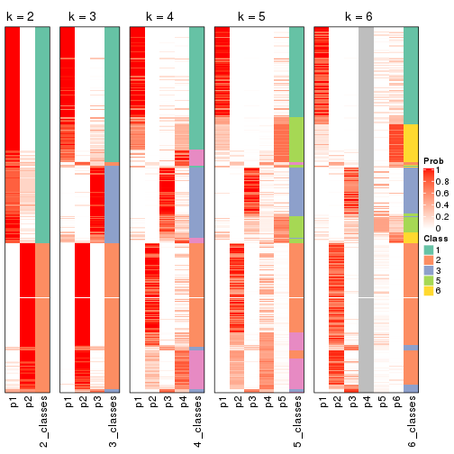


If matrix rows can be associated to genes, consider to use `GO_Enrichment(res,
...)` to perform function enrichment for the signature genes.


 

---------------------------------------------------


### MAD:NMF*


The object with results only for a single top-value method and a single partition method 
can be extracted as:

```r
res = res_list["MAD", "NMF"]
# you can also extract it by
# res = res_list["MAD:NMF"]
```

A summary of `res` and all the functions that can be applied to it:

```r
res
```

```
#> A 'ConsensusPartition' object with k = 2, 3, 4, 5, 6.
#>   On a matrix with 17654 rows and 335 columns.
#>   Top rows (1000, 2000, 3000, 4000, 5000) are extracted by 'MAD' method.
#>   Subgroups are detected by 'NMF' method.
#>   Performed in total 1250 partitions by row resampling.
#>   Best k for subgroups seems to be 3.
#> 
#> Following methods can be applied to this 'ConsensusPartition' object:
#>  [1] "cola_report"             "collect_classes"         "collect_plots"          
#>  [4] "collect_stats"           "colnames"                "compare_signatures"     
#>  [7] "consensus_heatmap"       "dimension_reduction"     "functional_enrichment"  
#> [10] "get_anno_col"            "get_anno"                "get_classes"            
#> [13] "get_consensus"           "get_matrix"              "get_membership"         
#> [16] "get_param"               "get_signatures"          "get_stats"              
#> [19] "is_best_k"               "is_stable_k"             "membership_heatmap"     
#> [22] "ncol"                    "nrow"                    "plot_ecdf"              
#> [25] "rownames"                "select_partition_number" "show"                   
#> [28] "suggest_best_k"          "test_to_known_factors"
```

`collect_plots()` function collects all the plots made from `res` for all `k` (number of partitions)
into one single page to provide an easy and fast comparison between different `k`.

```r
collect_plots(res)
```


The plots are:

- The first row: a plot of the ECDF (Empirical cumulative distribution
  function) curves of the consensus matrix for each `k` and the heatmap of
  predicted classes for each `k`.
- The second row: heatmaps of the consensus matrix for each `k`.
- The third row: heatmaps of the membership matrix for each `k`.
- The fouth row: heatmaps of the signatures for each `k`.

All the plots in panels can be made by individual functions and they are
plotted later in this section.

`select_partition_number()` produces several plots showing different
statistics for choosing "optimized" `k`. There are following statistics:

- ECDF curves of the consensus matrix for each `k`;
- 1-PAC. [The PAC
  score](https://en.wikipedia.org/wiki/Consensus_clustering#Over-interpretation_potential_of_consensus_clustering)
  measures the proportion of the ambiguous subgrouping.
- Mean silhouette score.
- Concordance. The mean probability of fiting the consensus class ids in all
  partitions.
- Area increased. Denote $A_k$ as the area under the ECDF curve for current
  `k`, the area increased is defined as $A_k - A_{k-1}$.
- Rand index. The percent of pairs of samples that are both in a same cluster
  or both are not in a same cluster in the partition of k and k-1.
- Jaccard index. The ratio of pairs of samples are both in a same cluster in
  the partition of k and k-1 and the pairs of samples are both in a same
  cluster in the partition k or k-1.

The detailed explanations of these statistics can be found in [the cola
vignette](http://bioconductor.org/packages/devel/bioc/vignettes/cola/inst/doc/cola.html#toc_13).

Generally speaking, lower PAC score, higher mean silhouette score or higher
concordance corresponds to better partition. Rand index and Jaccard index
measure how similar the current partition is compared to partition with `k-1`.
If they are too similar, we won't accept `k` is better than `k-1`.

```r
select_partition_number(res)
```


The numeric values for all these statistics can be obtained by `get_stats()`.

```r
get_stats(res)
```

```
#>   k 1-PAC mean_silhouette concordance area_increased  Rand Jaccard
#> 2 2 0.920           0.922       0.970         0.4995 0.501   0.501
#> 3 3 0.927           0.918       0.967         0.2854 0.785   0.599
#> 4 4 0.642           0.602       0.759         0.1137 0.797   0.516
#> 5 5 0.610           0.539       0.732         0.0610 0.876   0.639
#> 6 6 0.612           0.507       0.720         0.0425 0.909   0.706
```

`suggest_best_k()` suggests the best $k$ based on these statistics. The rules are as follows:

- All $k$ with Jaccard index larger than 0.95 are removed because the increase of
  the partition number does not provides enough extra information. If all $k$ are removed,
  the best $k$ is assigned by `NA`.
- For $k$ with 1-PAC larger than 0.9, the maximal $k$ is taken as the "best k". Other $k$ is called "optional k".
- If it does not fit the second rule. The $k$ with the highest vote of highest
  1-PAC, mean silhouette and concordance is taken as the "best k".

```r
suggest_best_k(res)
```

```
#> [1] 3
#> attr(,"optional")
#> [1] 2
```

There is also optional best $k$ = 2 that is worth to check.

Following shows the table of the partitions (You need to click the **show/hide
code output** link to see it). The membership matrix (columns with name `p*`)
is inferred by
[`clue::cl_consensus()`](https://www.rdocumentation.org/link/cl_consensus?package=clue)
function with the `SE` method. Basically the value in the membership matrix
represents the probability to belong to a certain group. The finall class
label for an item is determined with the group with highest probability it
belongs to.

In `get_classes()` function, the entropy is calculated from the membership
matrix and the silhouette score is calculated from the consensus matrix.


<script>
$( function() {
	$( '#tabs-MAD-NMF-get-classes' ).tabs();
} );
</script>
<div id='tabs-MAD-NMF-get-classes'>
<ul>
<li><a href='#tab-MAD-NMF-get-classes-1'>k = 2</a></li>
<li><a href='#tab-MAD-NMF-get-classes-2'>k = 3</a></li>
<li><a href='#tab-MAD-NMF-get-classes-3'>k = 4</a></li>
<li><a href='#tab-MAD-NMF-get-classes-4'>k = 5</a></li>
<li><a href='#tab-MAD-NMF-get-classes-5'>k = 6</a></li>
</ul>

<div id='tab-MAD-NMF-get-classes-1'>
<p><a id='tab-MAD-NMF-get-classes-1-a' style='color:#0366d6' href='#'>show/hide code output</a></p>
<pre><code class="r">cbind(get_classes(res, k = 2), get_membership(res, k = 2))
</code></pre>

<pre><code>#&gt;            class entropy silhouette    p1    p2
#&gt; SRR660306      2  0.0000    0.96568 0.000 1.000
#&gt; SRR1359328     2  0.0000    0.96568 0.000 1.000
#&gt; SRR821124      2  0.0000    0.96568 0.000 1.000
#&gt; SRR1335188     1  0.0000    0.97063 1.000 0.000
#&gt; SRR1075825     2  0.0000    0.96568 0.000 1.000
#&gt; SRR1321921     1  0.0000    0.97063 1.000 0.000
#&gt; SRR1466198     2  0.0000    0.96568 0.000 1.000
#&gt; SRR1384073     1  0.0000    0.97063 1.000 0.000
#&gt; SRR1312802     1  0.0000    0.97063 1.000 0.000
#&gt; SRR1076559     1  0.0000    0.97063 1.000 0.000
#&gt; SRR1370085     1  0.0000    0.97063 1.000 0.000
#&gt; SRR1460363     1  0.0000    0.97063 1.000 0.000
#&gt; SRR1480221     2  0.0000    0.96568 0.000 1.000
#&gt; SRR1476165     1  0.0000    0.97063 1.000 0.000
#&gt; SRR1459631     2  0.0000    0.96568 0.000 1.000
#&gt; SRR1448098     2  0.0000    0.96568 0.000 1.000
#&gt; SRR1321401     2  0.0000    0.96568 0.000 1.000
#&gt; SRR807613      2  0.0000    0.96568 0.000 1.000
#&gt; SRR808086      2  0.4022    0.88885 0.080 0.920
#&gt; SRR613687      2  0.0000    0.96568 0.000 1.000
#&gt; SRR1471011     1  0.0000    0.97063 1.000 0.000
#&gt; SRR1330284     2  0.0000    0.96568 0.000 1.000
#&gt; SRR1320624     2  0.0000    0.96568 0.000 1.000
#&gt; SRR1459519     1  0.0000    0.97063 1.000 0.000
#&gt; SRR1091184     2  0.0000    0.96568 0.000 1.000
#&gt; SRR1390561     1  0.0000    0.97063 1.000 0.000
#&gt; SRR658164      1  0.0000    0.97063 1.000 0.000
#&gt; SRR1087079     2  0.0000    0.96568 0.000 1.000
#&gt; SRR814996      1  0.9963    0.13223 0.536 0.464
#&gt; SRR1407410     2  0.0000    0.96568 0.000 1.000
#&gt; SRR1453392     2  0.0000    0.96568 0.000 1.000
#&gt; SRR1445873     1  0.0000    0.97063 1.000 0.000
#&gt; SRR1419985     2  0.0000    0.96568 0.000 1.000
#&gt; SRR820938      2  0.0000    0.96568 0.000 1.000
#&gt; SRR1476844     1  0.0000    0.97063 1.000 0.000
#&gt; SRR1403526     1  0.0000    0.97063 1.000 0.000
#&gt; SRR1413916     2  0.0000    0.96568 0.000 1.000
#&gt; SRR1441051     2  0.0000    0.96568 0.000 1.000
#&gt; SRR614287      2  0.0000    0.96568 0.000 1.000
#&gt; SRR1092062     2  0.0000    0.96568 0.000 1.000
#&gt; SRR612611      2  0.0000    0.96568 0.000 1.000
#&gt; SRR1376356     2  0.0000    0.96568 0.000 1.000
#&gt; SRR1405078     1  0.5408    0.83927 0.876 0.124
#&gt; SRR1437226     2  0.0000    0.96568 0.000 1.000
#&gt; SRR1326078     1  0.0000    0.97063 1.000 0.000
#&gt; SRR1096806     2  0.0000    0.96568 0.000 1.000
#&gt; SRR1440919     2  0.0000    0.96568 0.000 1.000
#&gt; SRR1452824     1  0.0000    0.97063 1.000 0.000
#&gt; SRR615754      1  0.0000    0.97063 1.000 0.000
#&gt; SRR1341787     2  0.0000    0.96568 0.000 1.000
#&gt; SRR614551      2  0.0000    0.96568 0.000 1.000
#&gt; SRR1380829     2  0.0000    0.96568 0.000 1.000
#&gt; SRR1455761     1  0.0000    0.97063 1.000 0.000
#&gt; SRR1465189     1  0.0000    0.97063 1.000 0.000
#&gt; SRR1376895     1  0.0000    0.97063 1.000 0.000
#&gt; SRR1445002     1  0.0000    0.97063 1.000 0.000
#&gt; SRR1469258     2  0.0000    0.96568 0.000 1.000
#&gt; SRR1409239     1  0.0000    0.97063 1.000 0.000
#&gt; SRR1480200     1  0.0000    0.97063 1.000 0.000
#&gt; SRR1418323     1  0.0000    0.97063 1.000 0.000
#&gt; SRR657540      2  0.0000    0.96568 0.000 1.000
#&gt; SRR821096      2  0.0000    0.96568 0.000 1.000
#&gt; SRR613591      2  0.0000    0.96568 0.000 1.000
#&gt; SRR1344205     2  0.0000    0.96568 0.000 1.000
#&gt; SRR612479      1  0.0000    0.97063 1.000 0.000
#&gt; SRR1399950     1  0.0000    0.97063 1.000 0.000
#&gt; SRR1336048     1  0.0000    0.97063 1.000 0.000
#&gt; SRR1368896     1  0.0000    0.97063 1.000 0.000
#&gt; SRR1379403     2  0.0000    0.96568 0.000 1.000
#&gt; SRR1312464     1  0.0000    0.97063 1.000 0.000
#&gt; SRR1096478     1  0.0000    0.97063 1.000 0.000
#&gt; SRR1459845     1  0.0000    0.97063 1.000 0.000
#&gt; SRR1348138     1  0.9833    0.26089 0.576 0.424
#&gt; SRR811423      1  0.0000    0.97063 1.000 0.000
#&gt; SRR615683      1  0.0000    0.97063 1.000 0.000
#&gt; SRR1380336     2  0.0000    0.96568 0.000 1.000
#&gt; SRR817609      1  0.0000    0.97063 1.000 0.000
#&gt; SRR1074550     2  0.0000    0.96568 0.000 1.000
#&gt; SRR1499236     2  0.0000    0.96568 0.000 1.000
#&gt; SRR656083      1  0.0000    0.97063 1.000 0.000
#&gt; SRR817539      1  0.0000    0.97063 1.000 0.000
#&gt; SRR1410801     1  0.0000    0.97063 1.000 0.000
#&gt; SRR1347190     1  0.0000    0.97063 1.000 0.000
#&gt; SRR1355126     2  0.0376    0.96230 0.004 0.996
#&gt; SRR615165      2  0.0000    0.96568 0.000 1.000
#&gt; SRR1466046     1  0.0000    0.97063 1.000 0.000
#&gt; SRR1097055     2  0.0000    0.96568 0.000 1.000
#&gt; SRR1312370     2  0.9608    0.38598 0.384 0.616
#&gt; SRR655325      1  0.0000    0.97063 1.000 0.000
#&gt; SRR810177      2  0.0000    0.96568 0.000 1.000
#&gt; SRR815685      2  0.0000    0.96568 0.000 1.000
#&gt; SRR817026      2  0.0000    0.96568 0.000 1.000
#&gt; SRR1417224     2  0.0000    0.96568 0.000 1.000
#&gt; SRR661687      2  0.0000    0.96568 0.000 1.000
#&gt; SRR1431804     1  0.0376    0.96709 0.996 0.004
#&gt; SRR664072      2  0.0000    0.96568 0.000 1.000
#&gt; SRR612923      2  0.0000    0.96568 0.000 1.000
#&gt; SRR1315890     1  0.0000    0.97063 1.000 0.000
#&gt; SRR1347726     1  0.0000    0.97063 1.000 0.000
#&gt; SRR1500360     1  0.0000    0.97063 1.000 0.000
#&gt; SRR1468360     2  0.0000    0.96568 0.000 1.000
#&gt; SRR1404084     1  0.0000    0.97063 1.000 0.000
#&gt; SRR615994      2  0.0000    0.96568 0.000 1.000
#&gt; SRR1475718     2  0.0000    0.96568 0.000 1.000
#&gt; SRR1397200     2  0.0000    0.96568 0.000 1.000
#&gt; SRR655519      2  0.0000    0.96568 0.000 1.000
#&gt; SRR1311308     2  0.0000    0.96568 0.000 1.000
#&gt; SRR1368006     2  0.0000    0.96568 0.000 1.000
#&gt; SRR613651      1  0.0000    0.97063 1.000 0.000
#&gt; SRR1362621     2  0.0000    0.96568 0.000 1.000
#&gt; SRR1451718     1  0.0000    0.97063 1.000 0.000
#&gt; SRR1095334     2  0.0000    0.96568 0.000 1.000
#&gt; SRR1079636     2  0.0000    0.96568 0.000 1.000
#&gt; SRR1442549     1  0.5178    0.84872 0.884 0.116
#&gt; SRR1466421     2  0.0000    0.96568 0.000 1.000
#&gt; SRR817397      2  0.0000    0.96568 0.000 1.000
#&gt; SRR1341809     2  0.7815    0.69300 0.232 0.768
#&gt; SRR614623      2  0.0000    0.96568 0.000 1.000
#&gt; SRR1335005     2  0.0000    0.96568 0.000 1.000
#&gt; SRR1407065     2  0.0000    0.96568 0.000 1.000
#&gt; SRR1404483     2  0.0000    0.96568 0.000 1.000
#&gt; SRR1096222     1  0.0000    0.97063 1.000 0.000
#&gt; SRR1401793     1  0.0000    0.97063 1.000 0.000
#&gt; SRR1408615     2  0.6148    0.80433 0.152 0.848
#&gt; SRR1070597     1  0.0000    0.97063 1.000 0.000
#&gt; SRR1332381     1  0.0000    0.97063 1.000 0.000
#&gt; SRR1457015     1  0.0000    0.97063 1.000 0.000
#&gt; SRR1386797     1  0.9248    0.46982 0.660 0.340
#&gt; SRR1098385     2  0.0000    0.96568 0.000 1.000
#&gt; SRR1363947     2  0.0000    0.96568 0.000 1.000
#&gt; SRR820350      2  0.0000    0.96568 0.000 1.000
#&gt; SRR662055      2  0.0000    0.96568 0.000 1.000
#&gt; SRR1310455     1  0.0000    0.97063 1.000 0.000
#&gt; SRR1453639     1  0.0000    0.97063 1.000 0.000
#&gt; SRR662617      2  0.0000    0.96568 0.000 1.000
#&gt; SRR654778      1  0.0000    0.97063 1.000 0.000
#&gt; SRR661782      2  0.0000    0.96568 0.000 1.000
#&gt; SRR1334396     1  0.0000    0.97063 1.000 0.000
#&gt; SRR613867      2  0.0000    0.96568 0.000 1.000
#&gt; SRR1479412     1  0.0000    0.97063 1.000 0.000
#&gt; SRR1331620     1  0.0000    0.97063 1.000 0.000
#&gt; SRR1082809     1  0.0000    0.97063 1.000 0.000
#&gt; SRR1417178     1  0.0000    0.97063 1.000 0.000
#&gt; SRR1335278     1  0.0000    0.97063 1.000 0.000
#&gt; SRR665369      2  0.0000    0.96568 0.000 1.000
#&gt; SRR657552      1  0.0000    0.97063 1.000 0.000
#&gt; SRR812412      1  0.0000    0.97063 1.000 0.000
#&gt; SRR1096500     2  0.0000    0.96568 0.000 1.000
#&gt; SRR1347750     2  0.2778    0.92235 0.048 0.952
#&gt; SRR615153      1  0.8608    0.58920 0.716 0.284
#&gt; SRR1434417     1  0.0000    0.97063 1.000 0.000
#&gt; SRR1070159     2  0.0000    0.96568 0.000 1.000
#&gt; SRR1332508     2  0.0000    0.96568 0.000 1.000
#&gt; SRR1082059     2  0.9710    0.34383 0.400 0.600
#&gt; SRR1402491     1  0.0000    0.97063 1.000 0.000
#&gt; SRR1476595     1  0.9998    0.00435 0.508 0.492
#&gt; SRR1320987     2  0.7056    0.75303 0.192 0.808
#&gt; SRR1086417     2  0.9998    0.04736 0.492 0.508
#&gt; SRR1454095     1  0.0000    0.97063 1.000 0.000
#&gt; SRR614791      2  0.0000    0.96568 0.000 1.000
#&gt; SRR821255      1  0.9608    0.36062 0.616 0.384
#&gt; SRR820402      2  0.0000    0.96568 0.000 1.000
#&gt; SRR1337284     1  0.0938    0.95981 0.988 0.012
#&gt; SRR1333083     2  0.9795    0.28040 0.416 0.584
#&gt; SRR1384883     2  0.0000    0.96568 0.000 1.000
#&gt; SRR614431      1  0.0000    0.97063 1.000 0.000
#&gt; SRR1481106     2  0.0000    0.96568 0.000 1.000
#&gt; SRR1370285     1  0.0000    0.97063 1.000 0.000
#&gt; SRR1446673     2  0.0000    0.96568 0.000 1.000
#&gt; SRR1318046     2  0.0000    0.96568 0.000 1.000
#&gt; SRR1341188     2  0.0000    0.96568 0.000 1.000
#&gt; SRR1384941     1  0.0000    0.97063 1.000 0.000
#&gt; SRR1322864     2  0.0000    0.96568 0.000 1.000
#&gt; SRR1476825     1  0.0000    0.97063 1.000 0.000
#&gt; SRR1443332     2  0.0000    0.96568 0.000 1.000
#&gt; SRR662486      2  0.0000    0.96568 0.000 1.000
#&gt; SRR1447019     1  0.0000    0.97063 1.000 0.000
#&gt; SRR662942      1  0.0000    0.97063 1.000 0.000
#&gt; SRR613102      2  0.0000    0.96568 0.000 1.000
#&gt; SRR1469880     1  0.0000    0.97063 1.000 0.000
#&gt; SRR1464977     1  0.0000    0.97063 1.000 0.000
#&gt; SRR615850      1  0.0000    0.97063 1.000 0.000
#&gt; SRR661949      2  0.0000    0.96568 0.000 1.000
#&gt; SRR1322227     2  0.0000    0.96568 0.000 1.000
#&gt; SRR1441655     1  0.7056    0.74558 0.808 0.192
#&gt; SRR613771      2  0.0000    0.96568 0.000 1.000
#&gt; SRR1479471     1  0.0000    0.97063 1.000 0.000
#&gt; SRR1488918     2  0.0000    0.96568 0.000 1.000
#&gt; SRR1414040     2  0.0000    0.96568 0.000 1.000
#&gt; SRR1079850     2  0.9963    0.14897 0.464 0.536
#&gt; SRR663209      1  0.0000    0.97063 1.000 0.000
#&gt; SRR1364914     2  0.0000    0.96568 0.000 1.000
#&gt; SRR1408267     2  0.6531    0.78585 0.168 0.832
#&gt; SRR1314894     1  0.0000    0.97063 1.000 0.000
#&gt; SRR1414117     2  0.0000    0.96568 0.000 1.000
#&gt; SRR1395975     2  0.0000    0.96568 0.000 1.000
#&gt; SRR1402219     2  0.3274    0.91049 0.060 0.940
#&gt; SRR1433623     1  0.0000    0.97063 1.000 0.000
#&gt; SRR656385      2  0.0000    0.96568 0.000 1.000
#&gt; SRR811213      2  0.0000    0.96568 0.000 1.000
#&gt; SRR663657      2  0.0000    0.96568 0.000 1.000
#&gt; SRR612203      1  0.0000    0.97063 1.000 0.000
#&gt; SRR613987      2  0.7674    0.70586 0.224 0.776
#&gt; SRR613831      2  0.0000    0.96568 0.000 1.000
#&gt; SRR1354180     2  0.0000    0.96568 0.000 1.000
#&gt; SRR1382912     1  0.0000    0.97063 1.000 0.000
#&gt; SRR1475501     1  0.0000    0.97063 1.000 0.000
#&gt; SRR1336930     1  0.0000    0.97063 1.000 0.000
#&gt; SRR613030      2  0.0000    0.96568 0.000 1.000
#&gt; SRR1381459     2  0.0000    0.96568 0.000 1.000
#&gt; SRR1402350     1  0.0000    0.97063 1.000 0.000
#&gt; SRR1419408     1  0.0000    0.97063 1.000 0.000
#&gt; SRR655911      2  0.0000    0.96568 0.000 1.000
#&gt; SRR1418243     1  0.0000    0.97063 1.000 0.000
#&gt; SRR1322573     1  0.0000    0.97063 1.000 0.000
#&gt; SRR613615      2  0.0000    0.96568 0.000 1.000
#&gt; SRR1355284     1  0.0000    0.97063 1.000 0.000
#&gt; SRR1319395     1  0.0000    0.97063 1.000 0.000
#&gt; SRR818939      1  0.0000    0.97063 1.000 0.000
#&gt; SRR1465266     1  0.0000    0.97063 1.000 0.000
#&gt; SRR614888      1  0.0000    0.97063 1.000 0.000
#&gt; SRR1431694     1  0.0000    0.97063 1.000 0.000
#&gt; SRR614347      2  0.0000    0.96568 0.000 1.000
#&gt; SRR1334228     2  0.0000    0.96568 0.000 1.000
#&gt; SRR1096007     2  0.0000    0.96568 0.000 1.000
#&gt; SRR656349      1  0.0000    0.97063 1.000 0.000
#&gt; SRR815422      2  0.0000    0.96568 0.000 1.000
#&gt; SRR1360828     1  0.0000    0.97063 1.000 0.000
#&gt; SRR1359005     2  0.0000    0.96568 0.000 1.000
#&gt; SRR1456652     1  0.0000    0.97063 1.000 0.000
#&gt; SRR1391660     1  0.0000    0.97063 1.000 0.000
#&gt; SRR1441956     1  0.0000    0.97063 1.000 0.000
#&gt; SRR662930      2  0.0000    0.96568 0.000 1.000
#&gt; SRR615790      2  0.0000    0.96568 0.000 1.000
#&gt; SRR614827      2  0.0000    0.96568 0.000 1.000
#&gt; SRR614587      2  0.0000    0.96568 0.000 1.000
#&gt; SRR814052      2  0.0000    0.96568 0.000 1.000
#&gt; SRR1070086     1  0.0000    0.97063 1.000 0.000
#&gt; SRR1481440     1  0.0000    0.97063 1.000 0.000
#&gt; SRR1339296     2  0.0000    0.96568 0.000 1.000
#&gt; SRR1343239     2  0.0000    0.96568 0.000 1.000
#&gt; SRR1432802     2  0.2423    0.92997 0.040 0.960
#&gt; SRR1416911     1  0.0000    0.97063 1.000 0.000
#&gt; SRR1410427     1  0.0000    0.97063 1.000 0.000
#&gt; SRR1401185     1  0.3274    0.91377 0.940 0.060
#&gt; SRR654993      2  0.0000    0.96568 0.000 1.000
#&gt; SRR656397      1  0.0000    0.97063 1.000 0.000
#&gt; SRR809643      2  0.9491    0.41105 0.368 0.632
#&gt; SRR1433819     1  0.0000    0.97063 1.000 0.000
#&gt; SRR1375225     2  0.0000    0.96568 0.000 1.000
#&gt; SRR1367739     1  0.9491    0.41109 0.632 0.368
#&gt; SRR1323336     1  0.0000    0.97063 1.000 0.000
#&gt; SRR663224      2  0.0000    0.96568 0.000 1.000
#&gt; SRR1442840     1  0.0000    0.97063 1.000 0.000
#&gt; SRR1374058     1  0.0000    0.97063 1.000 0.000
#&gt; SRR656994      1  0.0000    0.97063 1.000 0.000
#&gt; SRR1469214     2  0.0000    0.96568 0.000 1.000
#&gt; SRR1456446     1  0.0000    0.97063 1.000 0.000
#&gt; SRR1471879     2  0.0000    0.96568 0.000 1.000
#&gt; SRR612911      2  0.0000    0.96568 0.000 1.000
#&gt; SRR1395720     2  0.0000    0.96568 0.000 1.000
#&gt; SRR1413055     1  0.0000    0.97063 1.000 0.000
#&gt; SRR656770      2  0.0000    0.96568 0.000 1.000
#&gt; SRR812080      2  0.0000    0.96568 0.000 1.000
#&gt; SRR1479328     1  0.0000    0.97063 1.000 0.000
#&gt; SRR661421      2  0.0000    0.96568 0.000 1.000
#&gt; SRR1410286     2  0.0000    0.96568 0.000 1.000
#&gt; SRR1487150     1  0.0000    0.97063 1.000 0.000
#&gt; SRR1467035     1  0.0000    0.97063 1.000 0.000
#&gt; SRR1360607     2  0.9000    0.54138 0.316 0.684
#&gt; SRR1333106     2  0.0000    0.96568 0.000 1.000
#&gt; SRR1088706     2  0.0000    0.96568 0.000 1.000
#&gt; SRR1320053     2  0.0000    0.96568 0.000 1.000
#&gt; SRR1350392     2  0.0000    0.96568 0.000 1.000
#&gt; SRR1385190     1  0.5737    0.82417 0.864 0.136
#&gt; SRR1080093     2  0.0000    0.96568 0.000 1.000
#&gt; SRR1318753     1  0.0000    0.97063 1.000 0.000
#&gt; SRR1345369     2  0.0000    0.96568 0.000 1.000
#&gt; SRR612178      2  0.0000    0.96568 0.000 1.000
#&gt; SRR1354423     1  0.0000    0.97063 1.000 0.000
#&gt; SRR1072724     1  0.0000    0.97063 1.000 0.000
#&gt; SRR1418450     2  0.0000    0.96568 0.000 1.000
#&gt; SRR1326427     2  0.0000    0.96568 0.000 1.000
#&gt; SRR1437412     2  0.9661    0.36515 0.392 0.608
#&gt; SRR1327548     2  0.0000    0.96568 0.000 1.000
#&gt; SRR1395891     1  0.0000    0.97063 1.000 0.000
#&gt; SRR659367      2  0.9087    0.52495 0.324 0.676
#&gt; SRR818961      1  0.0000    0.97063 1.000 0.000
#&gt; SRR813704      1  0.0000    0.97063 1.000 0.000
#&gt; SRR613054      1  0.0000    0.97063 1.000 0.000
#&gt; SRR1476467     1  0.0000    0.97063 1.000 0.000
#&gt; SRR1407988     2  0.0000    0.96568 0.000 1.000
#&gt; SRR1394776     2  0.0000    0.96568 0.000 1.000
#&gt; SRR655578      2  0.0000    0.96568 0.000 1.000
#&gt; SRR1310645     2  0.0000    0.96568 0.000 1.000
#&gt; SRR1345628     1  0.0000    0.97063 1.000 0.000
#&gt; SRR1479740     1  0.0000    0.97063 1.000 0.000
#&gt; SRR1332095     1  0.0000    0.97063 1.000 0.000
#&gt; SRR1444786     2  1.0000    0.01616 0.500 0.500
#&gt; SRR1090070     1  0.0000    0.97063 1.000 0.000
#&gt; SRR662414      2  0.6247    0.80145 0.156 0.844
#&gt; SRR661216      2  0.0000    0.96568 0.000 1.000
#&gt; SRR656313      2  0.0000    0.96568 0.000 1.000
#&gt; SRR615671      2  0.0672    0.95887 0.008 0.992
#&gt; SRR1350196     2  0.0000    0.96568 0.000 1.000
#&gt; SRR1466580     1  0.0000    0.97063 1.000 0.000
#&gt; SRR1408032     2  0.0000    0.96568 0.000 1.000
#&gt; SRR1432913     2  0.0000    0.96568 0.000 1.000
#&gt; SRR1360502     1  0.0672    0.96350 0.992 0.008
#&gt; SRR1391901     2  0.0000    0.96568 0.000 1.000
#&gt; SRR1311131     1  0.0000    0.97063 1.000 0.000
#&gt; SRR1380636     1  0.0000    0.97063 1.000 0.000
#&gt; SRR1332339     1  0.0000    0.97063 1.000 0.000
#&gt; SRR1341563     2  0.0000    0.96568 0.000 1.000
#&gt; SRR1359410     2  0.0000    0.96568 0.000 1.000
#&gt; SRR1473040     2  0.9754    0.30372 0.408 0.592
#&gt; SRR1321444     1  0.0000    0.97063 1.000 0.000
#&gt; SRR1498765     2  0.0000    0.96568 0.000 1.000
#&gt; SRR1312622     2  0.0000    0.96568 0.000 1.000
#&gt; SRR615503      1  0.9608    0.36042 0.616 0.384
#&gt; SRR1453192     1  0.0000    0.97063 1.000 0.000
#&gt; SRR1433107     2  0.0000    0.96568 0.000 1.000
#&gt; SRR1075384     1  0.0000    0.97063 1.000 0.000
#&gt; SRR1356683     1  0.0000    0.97063 1.000 0.000
#&gt; SRR659049      1  0.0000    0.97063 1.000 0.000
#&gt; SRR1368240     1  0.0000    0.97063 1.000 0.000
#&gt; SRR1341739     1  0.0000    0.97063 1.000 0.000
#&gt; SRR613249      1  0.9983    0.08972 0.524 0.476
#&gt; SRR663428      2  0.0000    0.96568 0.000 1.000
#&gt; SRR1341302     2  0.0000    0.96568 0.000 1.000
#&gt; SRR1073553     2  0.0000    0.96568 0.000 1.000
#&gt; SRR1354093     2  0.0000    0.96568 0.000 1.000
#&gt; SRR1406521     2  0.0000    0.96568 0.000 1.000
#&gt; SRR1432049     1  0.0000    0.97063 1.000 0.000
#&gt; SRR1453504     1  0.0000    0.97063 1.000 0.000
</code></pre>

<script>
$('#tab-MAD-NMF-get-classes-1-a').parent().next().next().hide();
$('#tab-MAD-NMF-get-classes-1-a').click(function(){
  $('#tab-MAD-NMF-get-classes-1-a').parent().next().next().toggle();
  return(false);
});
</script>
</div>

<div id='tab-MAD-NMF-get-classes-2'>
<p><a id='tab-MAD-NMF-get-classes-2-a' style='color:#0366d6' href='#'>show/hide code output</a></p>
<pre><code class="r">cbind(get_classes(res, k = 3), get_membership(res, k = 3))
</code></pre>

<pre><code>#&gt;            class entropy silhouette    p1    p2    p3
#&gt; SRR660306      2  0.6299     0.0597 0.000 0.524 0.476
#&gt; SRR1359328     3  0.0000     0.9371 0.000 0.000 1.000
#&gt; SRR821124      2  0.0000     0.9668 0.000 1.000 0.000
#&gt; SRR1335188     1  0.0000     0.9735 1.000 0.000 0.000
#&gt; SRR1075825     2  0.0000     0.9668 0.000 1.000 0.000
#&gt; SRR1321921     1  0.0000     0.9735 1.000 0.000 0.000
#&gt; SRR1466198     3  0.0000     0.9371 0.000 0.000 1.000
#&gt; SRR1384073     1  0.4887     0.6952 0.772 0.228 0.000
#&gt; SRR1312802     1  0.0000     0.9735 1.000 0.000 0.000
#&gt; SRR1076559     1  0.0000     0.9735 1.000 0.000 0.000
#&gt; SRR1370085     1  0.0000     0.9735 1.000 0.000 0.000
#&gt; SRR1460363     1  0.0000     0.9735 1.000 0.000 0.000
#&gt; SRR1480221     2  0.0000     0.9668 0.000 1.000 0.000
#&gt; SRR1476165     1  0.0000     0.9735 1.000 0.000 0.000
#&gt; SRR1459631     3  0.4178     0.7841 0.000 0.172 0.828
#&gt; SRR1448098     2  0.0000     0.9668 0.000 1.000 0.000
#&gt; SRR1321401     2  0.0000     0.9668 0.000 1.000 0.000
#&gt; SRR807613      2  0.0000     0.9668 0.000 1.000 0.000
#&gt; SRR808086      3  0.0000     0.9371 0.000 0.000 1.000
#&gt; SRR613687      2  0.0000     0.9668 0.000 1.000 0.000
#&gt; SRR1471011     1  0.1289     0.9447 0.968 0.000 0.032
#&gt; SRR1330284     2  0.0000     0.9668 0.000 1.000 0.000
#&gt; SRR1320624     2  0.0747     0.9541 0.000 0.984 0.016
#&gt; SRR1459519     1  0.0000     0.9735 1.000 0.000 0.000
#&gt; SRR1091184     3  0.4121     0.7870 0.000 0.168 0.832
#&gt; SRR1390561     1  0.0000     0.9735 1.000 0.000 0.000
#&gt; SRR658164      1  0.0000     0.9735 1.000 0.000 0.000
#&gt; SRR1087079     2  0.0000     0.9668 0.000 1.000 0.000
#&gt; SRR814996      3  0.0592     0.9300 0.012 0.000 0.988
#&gt; SRR1407410     2  0.0000     0.9668 0.000 1.000 0.000
#&gt; SRR1453392     2  0.0892     0.9506 0.000 0.980 0.020
#&gt; SRR1445873     1  0.0000     0.9735 1.000 0.000 0.000
#&gt; SRR1419985     2  0.0000     0.9668 0.000 1.000 0.000
#&gt; SRR820938      3  0.1753     0.9058 0.000 0.048 0.952
#&gt; SRR1476844     1  0.0000     0.9735 1.000 0.000 0.000
#&gt; SRR1403526     1  0.0000     0.9735 1.000 0.000 0.000
#&gt; SRR1413916     2  0.0000     0.9668 0.000 1.000 0.000
#&gt; SRR1441051     2  0.0000     0.9668 0.000 1.000 0.000
#&gt; SRR614287      2  0.0000     0.9668 0.000 1.000 0.000
#&gt; SRR1092062     2  0.0000     0.9668 0.000 1.000 0.000
#&gt; SRR612611      2  0.0000     0.9668 0.000 1.000 0.000
#&gt; SRR1376356     2  0.0000     0.9668 0.000 1.000 0.000
#&gt; SRR1405078     3  0.6235     0.2389 0.436 0.000 0.564
#&gt; SRR1437226     2  0.0747     0.9543 0.000 0.984 0.016
#&gt; SRR1326078     1  0.0000     0.9735 1.000 0.000 0.000
#&gt; SRR1096806     3  0.0000     0.9371 0.000 0.000 1.000
#&gt; SRR1440919     3  0.1163     0.9205 0.000 0.028 0.972
#&gt; SRR1452824     1  0.0000     0.9735 1.000 0.000 0.000
#&gt; SRR615754      1  0.0000     0.9735 1.000 0.000 0.000
#&gt; SRR1341787     2  0.3340     0.8418 0.000 0.880 0.120
#&gt; SRR614551      2  0.0000     0.9668 0.000 1.000 0.000
#&gt; SRR1380829     3  0.0000     0.9371 0.000 0.000 1.000
#&gt; SRR1455761     1  0.0000     0.9735 1.000 0.000 0.000
#&gt; SRR1465189     3  0.3482     0.8241 0.128 0.000 0.872
#&gt; SRR1376895     1  0.0000     0.9735 1.000 0.000 0.000
#&gt; SRR1445002     1  0.0000     0.9735 1.000 0.000 0.000
#&gt; SRR1469258     2  0.0000     0.9668 0.000 1.000 0.000
#&gt; SRR1409239     1  0.0000     0.9735 1.000 0.000 0.000
#&gt; SRR1480200     1  0.0000     0.9735 1.000 0.000 0.000
#&gt; SRR1418323     1  0.0000     0.9735 1.000 0.000 0.000
#&gt; SRR657540      3  0.0000     0.9371 0.000 0.000 1.000
#&gt; SRR821096      2  0.0000     0.9668 0.000 1.000 0.000
#&gt; SRR613591      2  0.0000     0.9668 0.000 1.000 0.000
#&gt; SRR1344205     3  0.0000     0.9371 0.000 0.000 1.000
#&gt; SRR612479      1  0.0000     0.9735 1.000 0.000 0.000
#&gt; SRR1399950     1  0.0000     0.9735 1.000 0.000 0.000
#&gt; SRR1336048     1  0.2066     0.9166 0.940 0.000 0.060
#&gt; SRR1368896     1  0.0000     0.9735 1.000 0.000 0.000
#&gt; SRR1379403     2  0.0237     0.9638 0.000 0.996 0.004
#&gt; SRR1312464     1  0.0000     0.9735 1.000 0.000 0.000
#&gt; SRR1096478     1  0.0000     0.9735 1.000 0.000 0.000
#&gt; SRR1459845     1  0.0000     0.9735 1.000 0.000 0.000
#&gt; SRR1348138     3  0.0000     0.9371 0.000 0.000 1.000
#&gt; SRR811423      1  0.0000     0.9735 1.000 0.000 0.000
#&gt; SRR615683      1  0.0000     0.9735 1.000 0.000 0.000
#&gt; SRR1380336     2  0.0000     0.9668 0.000 1.000 0.000
#&gt; SRR817609      1  0.3038     0.8681 0.896 0.000 0.104
#&gt; SRR1074550     3  0.0000     0.9371 0.000 0.000 1.000
#&gt; SRR1499236     2  0.0000     0.9668 0.000 1.000 0.000
#&gt; SRR656083      1  0.0000     0.9735 1.000 0.000 0.000
#&gt; SRR817539      1  0.0000     0.9735 1.000 0.000 0.000
#&gt; SRR1410801     1  0.0000     0.9735 1.000 0.000 0.000
#&gt; SRR1347190     1  0.0000     0.9735 1.000 0.000 0.000
#&gt; SRR1355126     2  0.0000     0.9668 0.000 1.000 0.000
#&gt; SRR615165      3  0.0000     0.9371 0.000 0.000 1.000
#&gt; SRR1466046     1  0.0000     0.9735 1.000 0.000 0.000
#&gt; SRR1097055     2  0.0000     0.9668 0.000 1.000 0.000
#&gt; SRR1312370     2  0.0000     0.9668 0.000 1.000 0.000
#&gt; SRR655325      1  0.0000     0.9735 1.000 0.000 0.000
#&gt; SRR810177      2  0.0000     0.9668 0.000 1.000 0.000
#&gt; SRR815685      2  0.0000     0.9668 0.000 1.000 0.000
#&gt; SRR817026      3  0.0000     0.9371 0.000 0.000 1.000
#&gt; SRR1417224     2  0.0424     0.9607 0.000 0.992 0.008
#&gt; SRR661687      3  0.0000     0.9371 0.000 0.000 1.000
#&gt; SRR1431804     3  0.6079     0.3712 0.388 0.000 0.612
#&gt; SRR664072      3  0.0000     0.9371 0.000 0.000 1.000
#&gt; SRR612923      2  0.0000     0.9668 0.000 1.000 0.000
#&gt; SRR1315890     1  0.0000     0.9735 1.000 0.000 0.000
#&gt; SRR1347726     1  0.0424     0.9659 0.992 0.008 0.000
#&gt; SRR1500360     1  0.2959     0.8648 0.900 0.100 0.000
#&gt; SRR1468360     2  0.0000     0.9668 0.000 1.000 0.000
#&gt; SRR1404084     1  0.0000     0.9735 1.000 0.000 0.000
#&gt; SRR615994      3  0.0000     0.9371 0.000 0.000 1.000
#&gt; SRR1475718     2  0.0000     0.9668 0.000 1.000 0.000
#&gt; SRR1397200     3  0.0000     0.9371 0.000 0.000 1.000
#&gt; SRR655519      2  0.0000     0.9668 0.000 1.000 0.000
#&gt; SRR1311308     3  0.0237     0.9352 0.000 0.004 0.996
#&gt; SRR1368006     2  0.0000     0.9668 0.000 1.000 0.000
#&gt; SRR613651      1  0.0000     0.9735 1.000 0.000 0.000
#&gt; SRR1362621     3  0.0000     0.9371 0.000 0.000 1.000
#&gt; SRR1451718     1  0.0000     0.9735 1.000 0.000 0.000
#&gt; SRR1095334     3  0.0000     0.9371 0.000 0.000 1.000
#&gt; SRR1079636     2  0.0000     0.9668 0.000 1.000 0.000
#&gt; SRR1442549     2  0.0592     0.9554 0.012 0.988 0.000
#&gt; SRR1466421     2  0.0000     0.9668 0.000 1.000 0.000
#&gt; SRR817397      3  0.6168     0.3257 0.000 0.412 0.588
#&gt; SRR1341809     2  0.0000     0.9668 0.000 1.000 0.000
#&gt; SRR614623      2  0.0000     0.9668 0.000 1.000 0.000
#&gt; SRR1335005     2  0.0000     0.9668 0.000 1.000 0.000
#&gt; SRR1407065     3  0.4842     0.7128 0.000 0.224 0.776
#&gt; SRR1404483     2  0.1289     0.9399 0.000 0.968 0.032
#&gt; SRR1096222     1  0.0000     0.9735 1.000 0.000 0.000
#&gt; SRR1401793     1  0.0000     0.9735 1.000 0.000 0.000
#&gt; SRR1408615     3  0.1289     0.9159 0.032 0.000 0.968
#&gt; SRR1070597     2  0.6295     0.0934 0.472 0.528 0.000
#&gt; SRR1332381     1  0.0000     0.9735 1.000 0.000 0.000
#&gt; SRR1457015     1  0.0000     0.9735 1.000 0.000 0.000
#&gt; SRR1386797     2  0.1860     0.9117 0.052 0.948 0.000
#&gt; SRR1098385     2  0.0000     0.9668 0.000 1.000 0.000
#&gt; SRR1363947     3  0.0000     0.9371 0.000 0.000 1.000
#&gt; SRR820350      2  0.0000     0.9668 0.000 1.000 0.000
#&gt; SRR662055      2  0.0000     0.9668 0.000 1.000 0.000
#&gt; SRR1310455     1  0.0000     0.9735 1.000 0.000 0.000
#&gt; SRR1453639     1  0.6291     0.1214 0.532 0.468 0.000
#&gt; SRR662617      2  0.0000     0.9668 0.000 1.000 0.000
#&gt; SRR654778      1  0.0000     0.9735 1.000 0.000 0.000
#&gt; SRR661782      2  0.0000     0.9668 0.000 1.000 0.000
#&gt; SRR1334396     1  0.0237     0.9702 0.996 0.000 0.004
#&gt; SRR613867      2  0.0000     0.9668 0.000 1.000 0.000
#&gt; SRR1479412     1  0.0000     0.9735 1.000 0.000 0.000
#&gt; SRR1331620     1  0.0000     0.9735 1.000 0.000 0.000
#&gt; SRR1082809     1  0.0000     0.9735 1.000 0.000 0.000
#&gt; SRR1417178     1  0.0000     0.9735 1.000 0.000 0.000
#&gt; SRR1335278     1  0.0000     0.9735 1.000 0.000 0.000
#&gt; SRR665369      2  0.0000     0.9668 0.000 1.000 0.000
#&gt; SRR657552      1  0.0892     0.9559 0.980 0.000 0.020
#&gt; SRR812412      1  0.0000     0.9735 1.000 0.000 0.000
#&gt; SRR1096500     2  0.0000     0.9668 0.000 1.000 0.000
#&gt; SRR1347750     2  0.0000     0.9668 0.000 1.000 0.000
#&gt; SRR615153      1  0.3192     0.8482 0.888 0.112 0.000
#&gt; SRR1434417     1  0.0237     0.9702 0.996 0.000 0.004
#&gt; SRR1070159     3  0.0000     0.9371 0.000 0.000 1.000
#&gt; SRR1332508     2  0.0000     0.9668 0.000 1.000 0.000
#&gt; SRR1082059     2  0.9268     0.2792 0.268 0.524 0.208
#&gt; SRR1402491     1  0.0000     0.9735 1.000 0.000 0.000
#&gt; SRR1476595     2  0.0000     0.9668 0.000 1.000 0.000
#&gt; SRR1320987     2  0.0000     0.9668 0.000 1.000 0.000
#&gt; SRR1086417     1  0.7726     0.3272 0.572 0.372 0.056
#&gt; SRR1454095     1  0.4887     0.6952 0.772 0.228 0.000
#&gt; SRR614791      2  0.0000     0.9668 0.000 1.000 0.000
#&gt; SRR821255      2  0.0000     0.9668 0.000 1.000 0.000
#&gt; SRR820402      3  0.1753     0.9055 0.000 0.048 0.952
#&gt; SRR1337284     2  0.2356     0.8888 0.072 0.928 0.000
#&gt; SRR1333083     3  0.0237     0.9349 0.004 0.000 0.996
#&gt; SRR1384883     3  0.3752     0.8146 0.000 0.144 0.856
#&gt; SRR614431      1  0.0000     0.9735 1.000 0.000 0.000
#&gt; SRR1481106     2  0.0237     0.9638 0.000 0.996 0.004
#&gt; SRR1370285     1  0.0000     0.9735 1.000 0.000 0.000
#&gt; SRR1446673     3  0.0000     0.9371 0.000 0.000 1.000
#&gt; SRR1318046     2  0.0000     0.9668 0.000 1.000 0.000
#&gt; SRR1341188     3  0.0000     0.9371 0.000 0.000 1.000
#&gt; SRR1384941     1  0.0000     0.9735 1.000 0.000 0.000
#&gt; SRR1322864     2  0.0000     0.9668 0.000 1.000 0.000
#&gt; SRR1476825     1  0.1289     0.9450 0.968 0.000 0.032
#&gt; SRR1443332     2  0.0000     0.9668 0.000 1.000 0.000
#&gt; SRR662486      2  0.0000     0.9668 0.000 1.000 0.000
#&gt; SRR1447019     1  0.0000     0.9735 1.000 0.000 0.000
#&gt; SRR662942      1  0.0000     0.9735 1.000 0.000 0.000
#&gt; SRR613102      3  0.0000     0.9371 0.000 0.000 1.000
#&gt; SRR1469880     1  0.0000     0.9735 1.000 0.000 0.000
#&gt; SRR1464977     2  0.5327     0.6134 0.272 0.728 0.000
#&gt; SRR615850      1  0.0592     0.9632 0.988 0.000 0.012
#&gt; SRR661949      2  0.0000     0.9668 0.000 1.000 0.000
#&gt; SRR1322227     3  0.4974     0.6906 0.000 0.236 0.764
#&gt; SRR1441655     2  0.5926     0.4403 0.356 0.644 0.000
#&gt; SRR613771      3  0.6111     0.3545 0.000 0.396 0.604
#&gt; SRR1479471     1  0.0000     0.9735 1.000 0.000 0.000
#&gt; SRR1488918     2  0.0000     0.9668 0.000 1.000 0.000
#&gt; SRR1414040     2  0.0000     0.9668 0.000 1.000 0.000
#&gt; SRR1079850     2  0.0000     0.9668 0.000 1.000 0.000
#&gt; SRR663209      1  0.0000     0.9735 1.000 0.000 0.000
#&gt; SRR1364914     2  0.0000     0.9668 0.000 1.000 0.000
#&gt; SRR1408267     2  0.0000     0.9668 0.000 1.000 0.000
#&gt; SRR1314894     1  0.0000     0.9735 1.000 0.000 0.000
#&gt; SRR1414117     3  0.0000     0.9371 0.000 0.000 1.000
#&gt; SRR1395975     2  0.0000     0.9668 0.000 1.000 0.000
#&gt; SRR1402219     2  0.0000     0.9668 0.000 1.000 0.000
#&gt; SRR1433623     1  0.0000     0.9735 1.000 0.000 0.000
#&gt; SRR656385      2  0.0000     0.9668 0.000 1.000 0.000
#&gt; SRR811213      2  0.0000     0.9668 0.000 1.000 0.000
#&gt; SRR663657      3  0.0000     0.9371 0.000 0.000 1.000
#&gt; SRR612203      1  0.0000     0.9735 1.000 0.000 0.000
#&gt; SRR613987      2  0.0000     0.9668 0.000 1.000 0.000
#&gt; SRR613831      3  0.0000     0.9371 0.000 0.000 1.000
#&gt; SRR1354180     2  0.0000     0.9668 0.000 1.000 0.000
#&gt; SRR1382912     1  0.0000     0.9735 1.000 0.000 0.000
#&gt; SRR1475501     1  0.0000     0.9735 1.000 0.000 0.000
#&gt; SRR1336930     1  0.0000     0.9735 1.000 0.000 0.000
#&gt; SRR613030      3  0.0000     0.9371 0.000 0.000 1.000
#&gt; SRR1381459     2  0.0000     0.9668 0.000 1.000 0.000
#&gt; SRR1402350     1  0.4555     0.7350 0.800 0.000 0.200
#&gt; SRR1419408     1  0.0000     0.9735 1.000 0.000 0.000
#&gt; SRR655911      3  0.0237     0.9352 0.000 0.004 0.996
#&gt; SRR1418243     1  0.0000     0.9735 1.000 0.000 0.000
#&gt; SRR1322573     1  0.0000     0.9735 1.000 0.000 0.000
#&gt; SRR613615      3  0.0000     0.9371 0.000 0.000 1.000
#&gt; SRR1355284     1  0.0000     0.9735 1.000 0.000 0.000
#&gt; SRR1319395     1  0.0000     0.9735 1.000 0.000 0.000
#&gt; SRR818939      1  0.0000     0.9735 1.000 0.000 0.000
#&gt; SRR1465266     1  0.0000     0.9735 1.000 0.000 0.000
#&gt; SRR614888      1  0.0000     0.9735 1.000 0.000 0.000
#&gt; SRR1431694     1  0.0000     0.9735 1.000 0.000 0.000
#&gt; SRR614347      3  0.0237     0.9352 0.000 0.004 0.996
#&gt; SRR1334228     3  0.0000     0.9371 0.000 0.000 1.000
#&gt; SRR1096007     2  0.0000     0.9668 0.000 1.000 0.000
#&gt; SRR656349      1  0.6260     0.1650 0.552 0.000 0.448
#&gt; SRR815422      3  0.0000     0.9371 0.000 0.000 1.000
#&gt; SRR1360828     1  0.0000     0.9735 1.000 0.000 0.000
#&gt; SRR1359005     2  0.1411     0.9363 0.000 0.964 0.036
#&gt; SRR1456652     1  0.0000     0.9735 1.000 0.000 0.000
#&gt; SRR1391660     1  0.0000     0.9735 1.000 0.000 0.000
#&gt; SRR1441956     1  0.0000     0.9735 1.000 0.000 0.000
#&gt; SRR662930      2  0.0000     0.9668 0.000 1.000 0.000
#&gt; SRR615790      3  0.0000     0.9371 0.000 0.000 1.000
#&gt; SRR614827      2  0.0000     0.9668 0.000 1.000 0.000
#&gt; SRR614587      3  0.1860     0.9019 0.000 0.052 0.948
#&gt; SRR814052      2  0.0000     0.9668 0.000 1.000 0.000
#&gt; SRR1070086     1  0.0000     0.9735 1.000 0.000 0.000
#&gt; SRR1481440     1  0.0000     0.9735 1.000 0.000 0.000
#&gt; SRR1339296     3  0.0000     0.9371 0.000 0.000 1.000
#&gt; SRR1343239     2  0.1964     0.9164 0.000 0.944 0.056
#&gt; SRR1432802     2  0.0000     0.9668 0.000 1.000 0.000
#&gt; SRR1416911     1  0.0000     0.9735 1.000 0.000 0.000
#&gt; SRR1410427     1  0.0000     0.9735 1.000 0.000 0.000
#&gt; SRR1401185     2  0.3686     0.8019 0.140 0.860 0.000
#&gt; SRR654993      2  0.0000     0.9668 0.000 1.000 0.000
#&gt; SRR656397      1  0.0000     0.9735 1.000 0.000 0.000
#&gt; SRR809643      3  0.0000     0.9371 0.000 0.000 1.000
#&gt; SRR1433819     1  0.0000     0.9735 1.000 0.000 0.000
#&gt; SRR1375225     2  0.0000     0.9668 0.000 1.000 0.000
#&gt; SRR1367739     3  0.0000     0.9371 0.000 0.000 1.000
#&gt; SRR1323336     1  0.0000     0.9735 1.000 0.000 0.000
#&gt; SRR663224      2  0.6225     0.2134 0.000 0.568 0.432
#&gt; SRR1442840     1  0.0000     0.9735 1.000 0.000 0.000
#&gt; SRR1374058     1  0.0000     0.9735 1.000 0.000 0.000
#&gt; SRR656994      1  0.0000     0.9735 1.000 0.000 0.000
#&gt; SRR1469214     2  0.0000     0.9668 0.000 1.000 0.000
#&gt; SRR1456446     1  0.0000     0.9735 1.000 0.000 0.000
#&gt; SRR1471879     2  0.0000     0.9668 0.000 1.000 0.000
#&gt; SRR612911      3  0.0000     0.9371 0.000 0.000 1.000
#&gt; SRR1395720     2  0.0000     0.9668 0.000 1.000 0.000
#&gt; SRR1413055     1  0.0000     0.9735 1.000 0.000 0.000
#&gt; SRR656770      2  0.0000     0.9668 0.000 1.000 0.000
#&gt; SRR812080      3  0.0000     0.9371 0.000 0.000 1.000
#&gt; SRR1479328     1  0.0000     0.9735 1.000 0.000 0.000
#&gt; SRR661421      2  0.0000     0.9668 0.000 1.000 0.000
#&gt; SRR1410286     2  0.0000     0.9668 0.000 1.000 0.000
#&gt; SRR1487150     1  0.0000     0.9735 1.000 0.000 0.000
#&gt; SRR1467035     1  0.0000     0.9735 1.000 0.000 0.000
#&gt; SRR1360607     2  0.0000     0.9668 0.000 1.000 0.000
#&gt; SRR1333106     2  0.0000     0.9668 0.000 1.000 0.000
#&gt; SRR1088706     2  0.0000     0.9668 0.000 1.000 0.000
#&gt; SRR1320053     3  0.0000     0.9371 0.000 0.000 1.000
#&gt; SRR1350392     2  0.0000     0.9668 0.000 1.000 0.000
#&gt; SRR1385190     3  0.0592     0.9300 0.012 0.000 0.988
#&gt; SRR1080093     2  0.0000     0.9668 0.000 1.000 0.000
#&gt; SRR1318753     1  0.0000     0.9735 1.000 0.000 0.000
#&gt; SRR1345369     3  0.0000     0.9371 0.000 0.000 1.000
#&gt; SRR612178      2  0.0424     0.9607 0.000 0.992 0.008
#&gt; SRR1354423     1  0.0000     0.9735 1.000 0.000 0.000
#&gt; SRR1072724     1  0.0000     0.9735 1.000 0.000 0.000
#&gt; SRR1418450     2  0.0237     0.9638 0.000 0.996 0.004
#&gt; SRR1326427     3  0.0000     0.9371 0.000 0.000 1.000
#&gt; SRR1437412     3  0.5016     0.6714 0.240 0.000 0.760
#&gt; SRR1327548     3  0.3340     0.8411 0.000 0.120 0.880
#&gt; SRR1395891     1  0.0000     0.9735 1.000 0.000 0.000
#&gt; SRR659367      2  0.0000     0.9668 0.000 1.000 0.000
#&gt; SRR818961      1  0.0000     0.9735 1.000 0.000 0.000
#&gt; SRR813704      1  0.0000     0.9735 1.000 0.000 0.000
#&gt; SRR613054      1  0.0000     0.9735 1.000 0.000 0.000
#&gt; SRR1476467     1  0.0000     0.9735 1.000 0.000 0.000
#&gt; SRR1407988     2  0.0000     0.9668 0.000 1.000 0.000
#&gt; SRR1394776     2  0.0000     0.9668 0.000 1.000 0.000
#&gt; SRR655578      2  0.0000     0.9668 0.000 1.000 0.000
#&gt; SRR1310645     2  0.2796     0.8775 0.000 0.908 0.092
#&gt; SRR1345628     1  0.0000     0.9735 1.000 0.000 0.000
#&gt; SRR1479740     1  0.0000     0.9735 1.000 0.000 0.000
#&gt; SRR1332095     1  0.2625     0.8836 0.916 0.084 0.000
#&gt; SRR1444786     1  0.9191     0.3095 0.536 0.256 0.208
#&gt; SRR1090070     1  0.0000     0.9735 1.000 0.000 0.000
#&gt; SRR662414      2  0.0000     0.9668 0.000 1.000 0.000
#&gt; SRR661216      2  0.0000     0.9668 0.000 1.000 0.000
#&gt; SRR656313      2  0.0000     0.9668 0.000 1.000 0.000
#&gt; SRR615671      2  0.0000     0.9668 0.000 1.000 0.000
#&gt; SRR1350196     3  0.0000     0.9371 0.000 0.000 1.000
#&gt; SRR1466580     1  0.0000     0.9735 1.000 0.000 0.000
#&gt; SRR1408032     2  0.0000     0.9668 0.000 1.000 0.000
#&gt; SRR1432913     2  0.2537     0.8908 0.000 0.920 0.080
#&gt; SRR1360502     3  0.6180     0.2946 0.416 0.000 0.584
#&gt; SRR1391901     2  0.0000     0.9668 0.000 1.000 0.000
#&gt; SRR1311131     1  0.0000     0.9735 1.000 0.000 0.000
#&gt; SRR1380636     1  0.0000     0.9735 1.000 0.000 0.000
#&gt; SRR1332339     1  0.0000     0.9735 1.000 0.000 0.000
#&gt; SRR1341563     2  0.0000     0.9668 0.000 1.000 0.000
#&gt; SRR1359410     2  0.6225     0.2133 0.000 0.568 0.432
#&gt; SRR1473040     3  0.0000     0.9371 0.000 0.000 1.000
#&gt; SRR1321444     1  0.0000     0.9735 1.000 0.000 0.000
#&gt; SRR1498765     2  0.0000     0.9668 0.000 1.000 0.000
#&gt; SRR1312622     2  0.2959     0.8678 0.000 0.900 0.100
#&gt; SRR615503      2  0.0000     0.9668 0.000 1.000 0.000
#&gt; SRR1453192     1  0.0000     0.9735 1.000 0.000 0.000
#&gt; SRR1433107     3  0.5431     0.6087 0.000 0.284 0.716
#&gt; SRR1075384     1  0.0000     0.9735 1.000 0.000 0.000
#&gt; SRR1356683     1  0.0000     0.9735 1.000 0.000 0.000
#&gt; SRR659049      1  0.0000     0.9735 1.000 0.000 0.000
#&gt; SRR1368240     1  0.0000     0.9735 1.000 0.000 0.000
#&gt; SRR1341739     1  0.0000     0.9735 1.000 0.000 0.000
#&gt; SRR613249      3  0.0000     0.9371 0.000 0.000 1.000
#&gt; SRR663428      2  0.0000     0.9668 0.000 1.000 0.000
#&gt; SRR1341302     2  0.0000     0.9668 0.000 1.000 0.000
#&gt; SRR1073553     2  0.0000     0.9668 0.000 1.000 0.000
#&gt; SRR1354093     3  0.0000     0.9371 0.000 0.000 1.000
#&gt; SRR1406521     3  0.0237     0.9352 0.000 0.004 0.996
#&gt; SRR1432049     1  0.0000     0.9735 1.000 0.000 0.000
#&gt; SRR1453504     1  0.4796     0.7049 0.780 0.220 0.000
</code></pre>

<script>
$('#tab-MAD-NMF-get-classes-2-a').parent().next().next().hide();
$('#tab-MAD-NMF-get-classes-2-a').click(function(){
  $('#tab-MAD-NMF-get-classes-2-a').parent().next().next().toggle();
  return(false);
});
</script>
</div>

<div id='tab-MAD-NMF-get-classes-3'>
<p><a id='tab-MAD-NMF-get-classes-3-a' style='color:#0366d6' href='#'>show/hide code output</a></p>
<pre><code class="r">cbind(get_classes(res, k = 4), get_membership(res, k = 4))
</code></pre>

<pre><code>#&gt;            class entropy silhouette    p1    p2    p3    p4
#&gt; SRR660306      3  0.6546    0.56835 0.172 0.192 0.636 0.000
#&gt; SRR1359328     3  0.0188    0.88990 0.004 0.000 0.996 0.000
#&gt; SRR821124      2  0.2149    0.83462 0.000 0.912 0.000 0.088
#&gt; SRR1335188     1  0.2469    0.53970 0.892 0.000 0.000 0.108
#&gt; SRR1075825     2  0.0188    0.86705 0.000 0.996 0.000 0.004
#&gt; SRR1321921     1  0.4855    0.36904 0.600 0.000 0.000 0.400
#&gt; SRR1466198     3  0.0000    0.89127 0.000 0.000 1.000 0.000
#&gt; SRR1384073     1  0.2408    0.42692 0.896 0.104 0.000 0.000
#&gt; SRR1312802     3  0.6143   -0.07020 0.456 0.000 0.496 0.048
#&gt; SRR1076559     1  0.0336    0.51006 0.992 0.000 0.000 0.008
#&gt; SRR1370085     4  0.4898    0.29813 0.416 0.000 0.000 0.584
#&gt; SRR1460363     4  0.4977    0.15618 0.460 0.000 0.000 0.540
#&gt; SRR1480221     2  0.3649    0.79737 0.204 0.796 0.000 0.000
#&gt; SRR1476165     4  0.4967    0.18883 0.452 0.000 0.000 0.548
#&gt; SRR1459631     2  0.2216    0.83217 0.000 0.908 0.000 0.092
#&gt; SRR1448098     2  0.0188    0.86743 0.004 0.996 0.000 0.000
#&gt; SRR1321401     2  0.0592    0.86712 0.016 0.984 0.000 0.000
#&gt; SRR807613      2  0.0188    0.86743 0.004 0.996 0.000 0.000
#&gt; SRR808086      3  0.0000    0.89127 0.000 0.000 1.000 0.000
#&gt; SRR613687      2  0.0817    0.86669 0.024 0.976 0.000 0.000
#&gt; SRR1471011     3  0.5254    0.45409 0.300 0.000 0.672 0.028
#&gt; SRR1330284     2  0.2011    0.83831 0.000 0.920 0.000 0.080
#&gt; SRR1320624     2  0.3311    0.77835 0.000 0.828 0.000 0.172
#&gt; SRR1459519     1  0.4972    0.20894 0.544 0.000 0.000 0.456
#&gt; SRR1091184     2  0.5022    0.60532 0.000 0.708 0.264 0.028
#&gt; SRR1390561     4  0.3266    0.54887 0.168 0.000 0.000 0.832
#&gt; SRR658164      1  0.4277    0.51531 0.720 0.000 0.000 0.280
#&gt; SRR1087079     2  0.0000    0.86729 0.000 1.000 0.000 0.000
#&gt; SRR814996      3  0.0188    0.88990 0.004 0.000 0.996 0.000
#&gt; SRR1407410     2  0.2216    0.85052 0.092 0.908 0.000 0.000
#&gt; SRR1453392     2  0.1211    0.85653 0.000 0.960 0.000 0.040
#&gt; SRR1445873     1  0.4933    0.28956 0.568 0.000 0.000 0.432
#&gt; SRR1419985     2  0.4661    0.67318 0.348 0.652 0.000 0.000
#&gt; SRR820938      3  0.2868    0.78513 0.000 0.136 0.864 0.000
#&gt; SRR1476844     4  0.4605    0.45357 0.336 0.000 0.000 0.664
#&gt; SRR1403526     1  0.4933    0.28986 0.568 0.000 0.000 0.432
#&gt; SRR1413916     2  0.2589    0.81824 0.000 0.884 0.000 0.116
#&gt; SRR1441051     2  0.2921    0.83213 0.140 0.860 0.000 0.000
#&gt; SRR614287      2  0.2149    0.85196 0.088 0.912 0.000 0.000
#&gt; SRR1092062     2  0.2469    0.84510 0.108 0.892 0.000 0.000
#&gt; SRR612611      2  0.0188    0.86705 0.000 0.996 0.000 0.004
#&gt; SRR1376356     1  0.4972   -0.33788 0.544 0.456 0.000 0.000
#&gt; SRR1405078     3  0.2888    0.77931 0.124 0.000 0.872 0.004
#&gt; SRR1437226     2  0.1474    0.85171 0.000 0.948 0.000 0.052
#&gt; SRR1326078     1  0.2011    0.53594 0.920 0.000 0.000 0.080
#&gt; SRR1096806     4  0.6735   -0.13261 0.000 0.388 0.096 0.516
#&gt; SRR1440919     2  0.2944    0.80872 0.000 0.868 0.004 0.128
#&gt; SRR1452824     3  0.5478    0.09591 0.444 0.000 0.540 0.016
#&gt; SRR615754      4  0.4916    0.27549 0.424 0.000 0.000 0.576
#&gt; SRR1341787     3  0.5356    0.68805 0.200 0.072 0.728 0.000
#&gt; SRR614551      2  0.4500    0.70799 0.316 0.684 0.000 0.000
#&gt; SRR1380829     3  0.0000    0.89127 0.000 0.000 1.000 0.000
#&gt; SRR1455761     1  0.4605    0.47273 0.664 0.000 0.000 0.336
#&gt; SRR1465189     4  0.4656    0.48362 0.056 0.000 0.160 0.784
#&gt; SRR1376895     1  0.4382    0.50570 0.704 0.000 0.000 0.296
#&gt; SRR1445002     4  0.4907    0.28663 0.420 0.000 0.000 0.580
#&gt; SRR1469258     2  0.0188    0.86705 0.000 0.996 0.000 0.004
#&gt; SRR1409239     1  0.4933    0.28542 0.568 0.000 0.000 0.432
#&gt; SRR1480200     4  0.4981    0.14297 0.464 0.000 0.000 0.536
#&gt; SRR1418323     1  0.2973    0.54222 0.856 0.000 0.000 0.144
#&gt; SRR657540      3  0.2149    0.84918 0.000 0.000 0.912 0.088
#&gt; SRR821096      2  0.1302    0.86365 0.044 0.956 0.000 0.000
#&gt; SRR613591      2  0.0707    0.86690 0.020 0.980 0.000 0.000
#&gt; SRR1344205     3  0.0000    0.89127 0.000 0.000 1.000 0.000
#&gt; SRR612479      4  0.3444    0.54721 0.184 0.000 0.000 0.816
#&gt; SRR1399950     1  0.3108    0.48718 0.872 0.000 0.112 0.016
#&gt; SRR1336048     3  0.1557    0.85474 0.056 0.000 0.944 0.000
#&gt; SRR1368896     1  0.4948    0.26513 0.560 0.000 0.000 0.440
#&gt; SRR1379403     2  0.3219    0.78523 0.000 0.836 0.000 0.164
#&gt; SRR1312464     4  0.4977    0.15913 0.460 0.000 0.000 0.540
#&gt; SRR1096478     1  0.4985    0.16107 0.532 0.000 0.000 0.468
#&gt; SRR1459845     1  0.4994    0.10823 0.520 0.000 0.000 0.480
#&gt; SRR1348138     4  0.4877   -0.27039 0.000 0.000 0.408 0.592
#&gt; SRR811423      1  0.7846    0.05141 0.404 0.000 0.296 0.300
#&gt; SRR615683      4  0.4830    0.35596 0.392 0.000 0.000 0.608
#&gt; SRR1380336     2  0.0188    0.86705 0.000 0.996 0.000 0.004
#&gt; SRR817609      3  0.4039    0.72755 0.080 0.000 0.836 0.084
#&gt; SRR1074550     3  0.0895    0.87966 0.000 0.020 0.976 0.004
#&gt; SRR1499236     2  0.2469    0.84479 0.108 0.892 0.000 0.000
#&gt; SRR656083      4  0.4817    0.36063 0.388 0.000 0.000 0.612
#&gt; SRR817539      1  0.1302    0.52580 0.956 0.000 0.000 0.044
#&gt; SRR1410801     4  0.4981    0.14320 0.464 0.000 0.000 0.536
#&gt; SRR1347190     1  0.4356    0.50891 0.708 0.000 0.000 0.292
#&gt; SRR1355126     2  0.4989    0.48357 0.472 0.528 0.000 0.000
#&gt; SRR615165      3  0.0000    0.89127 0.000 0.000 1.000 0.000
#&gt; SRR1466046     4  0.4277    0.50904 0.280 0.000 0.000 0.720
#&gt; SRR1097055     2  0.0000    0.86729 0.000 1.000 0.000 0.000
#&gt; SRR1312370     2  0.4955    0.53523 0.444 0.556 0.000 0.000
#&gt; SRR655325      1  0.4916    0.31156 0.576 0.000 0.000 0.424
#&gt; SRR810177      2  0.2760    0.83670 0.128 0.872 0.000 0.000
#&gt; SRR815685      2  0.0188    0.86705 0.000 0.996 0.000 0.004
#&gt; SRR817026      3  0.6242    0.58215 0.000 0.080 0.612 0.308
#&gt; SRR1417224     2  0.2816    0.84451 0.036 0.900 0.064 0.000
#&gt; SRR661687      4  0.4999   -0.32266 0.000 0.492 0.000 0.508
#&gt; SRR1431804     4  0.0524    0.49021 0.008 0.000 0.004 0.988
#&gt; SRR664072      3  0.0000    0.89127 0.000 0.000 1.000 0.000
#&gt; SRR612923      2  0.2868    0.80532 0.000 0.864 0.000 0.136
#&gt; SRR1315890     1  0.4972    0.20936 0.544 0.000 0.000 0.456
#&gt; SRR1347726     1  0.0188    0.50330 0.996 0.004 0.000 0.000
#&gt; SRR1500360     1  0.1792    0.45721 0.932 0.068 0.000 0.000
#&gt; SRR1468360     2  0.4277    0.74090 0.280 0.720 0.000 0.000
#&gt; SRR1404084     4  0.4978    0.37685 0.384 0.000 0.004 0.612
#&gt; SRR615994      3  0.0000    0.89127 0.000 0.000 1.000 0.000
#&gt; SRR1475718     2  0.2647    0.84031 0.120 0.880 0.000 0.000
#&gt; SRR1397200     3  0.0000    0.89127 0.000 0.000 1.000 0.000
#&gt; SRR655519      2  0.0188    0.86705 0.000 0.996 0.000 0.004
#&gt; SRR1311308     3  0.5730    0.41441 0.000 0.344 0.616 0.040
#&gt; SRR1368006     2  0.0469    0.86546 0.000 0.988 0.000 0.012
#&gt; SRR613651      1  0.6159    0.44423 0.676 0.000 0.152 0.172
#&gt; SRR1362621     4  0.3984    0.37582 0.000 0.132 0.040 0.828
#&gt; SRR1451718     1  0.0188    0.50330 0.996 0.004 0.000 0.000
#&gt; SRR1095334     3  0.0000    0.89127 0.000 0.000 1.000 0.000
#&gt; SRR1079636     2  0.2589    0.81824 0.000 0.884 0.000 0.116
#&gt; SRR1442549     2  0.3908    0.78932 0.212 0.784 0.000 0.004
#&gt; SRR1466421     2  0.2973    0.82991 0.144 0.856 0.000 0.000
#&gt; SRR817397      2  0.4790    0.54767 0.000 0.620 0.000 0.380
#&gt; SRR1341809     2  0.4331    0.73380 0.288 0.712 0.000 0.000
#&gt; SRR614623      2  0.0336    0.86637 0.000 0.992 0.000 0.008
#&gt; SRR1335005     2  0.3074    0.82605 0.152 0.848 0.000 0.000
#&gt; SRR1407065     2  0.4661    0.59228 0.000 0.652 0.000 0.348
#&gt; SRR1404483     2  0.0469    0.86546 0.000 0.988 0.000 0.012
#&gt; SRR1096222     1  0.4941    0.27806 0.564 0.000 0.000 0.436
#&gt; SRR1401793     1  0.4978    0.39159 0.612 0.000 0.004 0.384
#&gt; SRR1408615     3  0.0469    0.88667 0.012 0.000 0.988 0.000
#&gt; SRR1070597     1  0.6426    0.29483 0.628 0.256 0.000 0.116
#&gt; SRR1332381     1  0.1388    0.51171 0.960 0.000 0.028 0.012
#&gt; SRR1457015     1  0.4925    0.30098 0.572 0.000 0.000 0.428
#&gt; SRR1386797     1  0.4008    0.29284 0.756 0.244 0.000 0.000
#&gt; SRR1098385     2  0.3486    0.80665 0.188 0.812 0.000 0.000
#&gt; SRR1363947     3  0.0000    0.89127 0.000 0.000 1.000 0.000
#&gt; SRR820350      2  0.3837    0.78425 0.224 0.776 0.000 0.000
#&gt; SRR662055      2  0.0188    0.86705 0.000 0.996 0.000 0.004
#&gt; SRR1310455     1  0.3801    0.53507 0.780 0.000 0.000 0.220
#&gt; SRR1453639     1  0.2011    0.44740 0.920 0.080 0.000 0.000
#&gt; SRR662617      2  0.0469    0.86754 0.012 0.988 0.000 0.000
#&gt; SRR654778      1  0.4585    0.47682 0.668 0.000 0.000 0.332
#&gt; SRR661782      2  0.3942    0.77585 0.236 0.764 0.000 0.000
#&gt; SRR1334396     4  0.3074    0.54783 0.152 0.000 0.000 0.848
#&gt; SRR613867      2  0.0188    0.86705 0.000 0.996 0.000 0.004
#&gt; SRR1479412     1  0.2216    0.53750 0.908 0.000 0.000 0.092
#&gt; SRR1331620     1  0.4790    0.40803 0.620 0.000 0.000 0.380
#&gt; SRR1082809     1  0.5646    0.33107 0.672 0.000 0.272 0.056
#&gt; SRR1417178     4  0.4605    0.45397 0.336 0.000 0.000 0.664
#&gt; SRR1335278     4  0.4661    0.43622 0.348 0.000 0.000 0.652
#&gt; SRR665369      2  0.0336    0.86638 0.000 0.992 0.000 0.008
#&gt; SRR657552      4  0.4776    0.38812 0.376 0.000 0.000 0.624
#&gt; SRR812412      1  0.4643    0.46198 0.656 0.000 0.000 0.344
#&gt; SRR1096500     2  0.1474    0.86201 0.052 0.948 0.000 0.000
#&gt; SRR1347750     2  0.4304    0.73747 0.284 0.716 0.000 0.000
#&gt; SRR615153      4  0.4464    0.36071 0.024 0.208 0.000 0.768
#&gt; SRR1434417     4  0.0592    0.49718 0.016 0.000 0.000 0.984
#&gt; SRR1070159     3  0.0000    0.89127 0.000 0.000 1.000 0.000
#&gt; SRR1332508     2  0.1118    0.86540 0.036 0.964 0.000 0.000
#&gt; SRR1082059     1  0.7382    0.05450 0.516 0.208 0.276 0.000
#&gt; SRR1402491     4  0.4134    0.52102 0.260 0.000 0.000 0.740
#&gt; SRR1476595     2  0.4522    0.70134 0.320 0.680 0.000 0.000
#&gt; SRR1320987     2  0.0000    0.86729 0.000 1.000 0.000 0.000
#&gt; SRR1086417     2  0.7676   -0.02898 0.276 0.460 0.000 0.264
#&gt; SRR1454095     1  0.1389    0.47265 0.952 0.048 0.000 0.000
#&gt; SRR614791      2  0.0188    0.86705 0.000 0.996 0.000 0.004
#&gt; SRR821255      1  0.4661   -0.01685 0.652 0.348 0.000 0.000
#&gt; SRR820402      2  0.4866    0.51014 0.000 0.596 0.000 0.404
#&gt; SRR1337284     1  0.2973    0.38875 0.856 0.144 0.000 0.000
#&gt; SRR1333083     3  0.0000    0.89127 0.000 0.000 1.000 0.000
#&gt; SRR1384883     2  0.4877    0.50395 0.000 0.592 0.000 0.408
#&gt; SRR614431      4  0.4999    0.00881 0.492 0.000 0.000 0.508
#&gt; SRR1481106     2  0.0188    0.86705 0.000 0.996 0.000 0.004
#&gt; SRR1370285     4  0.3528    0.54654 0.192 0.000 0.000 0.808
#&gt; SRR1446673     3  0.0000    0.89127 0.000 0.000 1.000 0.000
#&gt; SRR1318046     2  0.0188    0.86705 0.000 0.996 0.000 0.004
#&gt; SRR1341188     3  0.0000    0.89127 0.000 0.000 1.000 0.000
#&gt; SRR1384941     1  0.4746    0.42761 0.632 0.000 0.000 0.368
#&gt; SRR1322864     2  0.1118    0.86518 0.036 0.964 0.000 0.000
#&gt; SRR1476825     3  0.1978    0.83758 0.068 0.000 0.928 0.004
#&gt; SRR1443332     2  0.4245    0.79223 0.196 0.784 0.020 0.000
#&gt; SRR662486      2  0.0592    0.86712 0.016 0.984 0.000 0.000
#&gt; SRR1447019     4  0.4500    0.47763 0.316 0.000 0.000 0.684
#&gt; SRR662942      1  0.4985    0.16028 0.532 0.000 0.000 0.468
#&gt; SRR613102      3  0.0000    0.89127 0.000 0.000 1.000 0.000
#&gt; SRR1469880     1  0.4730    0.43254 0.636 0.000 0.000 0.364
#&gt; SRR1464977     1  0.2704    0.40844 0.876 0.124 0.000 0.000
#&gt; SRR615850      3  0.4482    0.58965 0.264 0.000 0.728 0.008
#&gt; SRR661949      2  0.0817    0.86669 0.024 0.976 0.000 0.000
#&gt; SRR1322227     3  0.2334    0.82694 0.004 0.088 0.908 0.000
#&gt; SRR1441655     1  0.2408    0.42678 0.896 0.104 0.000 0.000
#&gt; SRR613771      2  0.3301    0.81572 0.000 0.876 0.048 0.076
#&gt; SRR1479471     4  0.1940    0.52698 0.076 0.000 0.000 0.924
#&gt; SRR1488918     2  0.0188    0.86705 0.000 0.996 0.000 0.004
#&gt; SRR1414040     2  0.4072    0.76447 0.252 0.748 0.000 0.000
#&gt; SRR1079850     2  0.4941    0.54724 0.436 0.564 0.000 0.000
#&gt; SRR663209      4  0.4761    0.37877 0.372 0.000 0.000 0.628
#&gt; SRR1364914     2  0.0188    0.86705 0.000 0.996 0.000 0.004
#&gt; SRR1408267     2  0.0188    0.86705 0.000 0.996 0.000 0.004
#&gt; SRR1314894     1  0.4454    0.49777 0.692 0.000 0.000 0.308
#&gt; SRR1414117     4  0.4150    0.37712 0.000 0.056 0.120 0.824
#&gt; SRR1395975     2  0.0188    0.86743 0.004 0.996 0.000 0.000
#&gt; SRR1402219     2  0.3219    0.82037 0.164 0.836 0.000 0.000
#&gt; SRR1433623     4  0.4916    0.27704 0.424 0.000 0.000 0.576
#&gt; SRR656385      2  0.3356    0.81388 0.176 0.824 0.000 0.000
#&gt; SRR811213      2  0.1716    0.84705 0.000 0.936 0.000 0.064
#&gt; SRR663657      3  0.0000    0.89127 0.000 0.000 1.000 0.000
#&gt; SRR612203      4  0.2973    0.54619 0.144 0.000 0.000 0.856
#&gt; SRR613987      2  0.4955    0.52124 0.444 0.556 0.000 0.000
#&gt; SRR613831      3  0.0000    0.89127 0.000 0.000 1.000 0.000
#&gt; SRR1354180     2  0.0188    0.86705 0.000 0.996 0.000 0.004
#&gt; SRR1382912     4  0.4164    0.51599 0.264 0.000 0.000 0.736
#&gt; SRR1475501     4  0.3024    0.54719 0.148 0.000 0.000 0.852
#&gt; SRR1336930     1  0.4941    0.27792 0.564 0.000 0.000 0.436
#&gt; SRR613030      3  0.0188    0.88959 0.000 0.004 0.996 0.000
#&gt; SRR1381459     2  0.1209    0.86576 0.032 0.964 0.004 0.000
#&gt; SRR1402350     3  0.4304    0.58641 0.284 0.000 0.716 0.000
#&gt; SRR1419408     4  0.4543    0.46912 0.324 0.000 0.000 0.676
#&gt; SRR655911      2  0.4419    0.75868 0.000 0.812 0.104 0.084
#&gt; SRR1418243     1  0.3764    0.53668 0.784 0.000 0.000 0.216
#&gt; SRR1322573     1  0.1637    0.53083 0.940 0.000 0.000 0.060
#&gt; SRR613615      3  0.0000    0.89127 0.000 0.000 1.000 0.000
#&gt; SRR1355284     1  0.4830    0.38190 0.608 0.000 0.000 0.392
#&gt; SRR1319395     1  0.1389    0.52760 0.952 0.000 0.000 0.048
#&gt; SRR818939      4  0.4977    0.15918 0.460 0.000 0.000 0.540
#&gt; SRR1465266     4  0.1557    0.51871 0.056 0.000 0.000 0.944
#&gt; SRR614888      1  0.4500    0.48203 0.684 0.000 0.000 0.316
#&gt; SRR1431694     4  0.4193    0.51495 0.268 0.000 0.000 0.732
#&gt; SRR614347      4  0.4941   -0.19236 0.000 0.436 0.000 0.564
#&gt; SRR1334228     3  0.0000    0.89127 0.000 0.000 1.000 0.000
#&gt; SRR1096007     2  0.3907    0.77916 0.232 0.768 0.000 0.000
#&gt; SRR656349      4  0.5839    0.45260 0.104 0.000 0.200 0.696
#&gt; SRR815422      2  0.5271    0.57625 0.000 0.640 0.020 0.340
#&gt; SRR1360828     4  0.4961    0.20266 0.448 0.000 0.000 0.552
#&gt; SRR1359005     2  0.3400    0.77159 0.000 0.820 0.000 0.180
#&gt; SRR1456652     1  0.1118    0.52296 0.964 0.000 0.000 0.036
#&gt; SRR1391660     1  0.4477    0.49548 0.688 0.000 0.000 0.312
#&gt; SRR1441956     1  0.1302    0.52619 0.956 0.000 0.000 0.044
#&gt; SRR662930      2  0.2530    0.84334 0.112 0.888 0.000 0.000
#&gt; SRR615790      3  0.0000    0.89127 0.000 0.000 1.000 0.000
#&gt; SRR614827      2  0.1022    0.86575 0.032 0.968 0.000 0.000
#&gt; SRR614587      2  0.4967    0.42445 0.000 0.548 0.000 0.452
#&gt; SRR814052      2  0.3801    0.78713 0.220 0.780 0.000 0.000
#&gt; SRR1070086     1  0.4643    0.46349 0.656 0.000 0.000 0.344
#&gt; SRR1481440     4  0.3726    0.54143 0.212 0.000 0.000 0.788
#&gt; SRR1339296     3  0.0000    0.89127 0.000 0.000 1.000 0.000
#&gt; SRR1343239     2  0.2081    0.84011 0.000 0.916 0.084 0.000
#&gt; SRR1432802     2  0.4072    0.76474 0.252 0.748 0.000 0.000
#&gt; SRR1416911     1  0.4898    0.33229 0.584 0.000 0.000 0.416
#&gt; SRR1410427     1  0.2868    0.54183 0.864 0.000 0.000 0.136
#&gt; SRR1401185     1  0.2589    0.41617 0.884 0.116 0.000 0.000
#&gt; SRR654993      2  0.0188    0.86705 0.000 0.996 0.000 0.004
#&gt; SRR656397      4  0.4992    0.08540 0.476 0.000 0.000 0.524
#&gt; SRR809643      4  0.3525    0.40005 0.000 0.040 0.100 0.860
#&gt; SRR1433819     1  0.4134    0.52230 0.740 0.000 0.000 0.260
#&gt; SRR1375225     2  0.2216    0.83223 0.000 0.908 0.000 0.092
#&gt; SRR1367739     3  0.0000    0.89127 0.000 0.000 1.000 0.000
#&gt; SRR1323336     1  0.0524    0.50360 0.988 0.008 0.000 0.004
#&gt; SRR663224      2  0.2760    0.79240 0.000 0.872 0.128 0.000
#&gt; SRR1442840     4  0.2814    0.54376 0.132 0.000 0.000 0.868
#&gt; SRR1374058     1  0.4643    0.46293 0.656 0.000 0.000 0.344
#&gt; SRR656994      1  0.4543    0.48532 0.676 0.000 0.000 0.324
#&gt; SRR1469214     2  0.0188    0.86705 0.000 0.996 0.000 0.004
#&gt; SRR1456446     4  0.4522    0.47348 0.320 0.000 0.000 0.680
#&gt; SRR1471879     2  0.4500    0.70803 0.316 0.684 0.000 0.000
#&gt; SRR612911      3  0.0000    0.89127 0.000 0.000 1.000 0.000
#&gt; SRR1395720     2  0.0188    0.86705 0.000 0.996 0.000 0.004
#&gt; SRR1413055     4  0.1302    0.51274 0.044 0.000 0.000 0.956
#&gt; SRR656770      2  0.2376    0.85537 0.068 0.916 0.016 0.000
#&gt; SRR812080      3  0.4898    0.75390 0.000 0.104 0.780 0.116
#&gt; SRR1479328     1  0.4040    0.52895 0.752 0.000 0.000 0.248
#&gt; SRR661421      2  0.1389    0.86290 0.048 0.952 0.000 0.000
#&gt; SRR1410286     2  0.0336    0.86745 0.008 0.992 0.000 0.000
#&gt; SRR1487150     1  0.4955    0.24952 0.556 0.000 0.000 0.444
#&gt; SRR1467035     4  0.1792    0.52355 0.068 0.000 0.000 0.932
#&gt; SRR1360607     2  0.4564    0.69574 0.328 0.672 0.000 0.000
#&gt; SRR1333106     2  0.0188    0.86705 0.000 0.996 0.000 0.004
#&gt; SRR1088706     2  0.0817    0.86214 0.000 0.976 0.000 0.024
#&gt; SRR1320053     3  0.0188    0.88959 0.000 0.004 0.996 0.000
#&gt; SRR1350392     2  0.0817    0.86669 0.024 0.976 0.000 0.000
#&gt; SRR1385190     3  0.0000    0.89127 0.000 0.000 1.000 0.000
#&gt; SRR1080093     2  0.0188    0.86705 0.000 0.996 0.000 0.004
#&gt; SRR1318753     1  0.4843    0.37745 0.604 0.000 0.000 0.396
#&gt; SRR1345369     3  0.0000    0.89127 0.000 0.000 1.000 0.000
#&gt; SRR612178      2  0.0592    0.86454 0.000 0.984 0.000 0.016
#&gt; SRR1354423     4  0.3219    0.54882 0.164 0.000 0.000 0.836
#&gt; SRR1072724     1  0.4564    0.48176 0.672 0.000 0.000 0.328
#&gt; SRR1418450     2  0.4277    0.67369 0.000 0.720 0.000 0.280
#&gt; SRR1326427     3  0.4761    0.61185 0.000 0.000 0.628 0.372
#&gt; SRR1437412     4  0.4312    0.43255 0.000 0.056 0.132 0.812
#&gt; SRR1327548     2  0.2921    0.80248 0.000 0.860 0.000 0.140
#&gt; SRR1395891     1  0.4008    0.53003 0.756 0.000 0.000 0.244
#&gt; SRR659367      2  0.4406    0.72300 0.300 0.700 0.000 0.000
#&gt; SRR818961      4  0.0469    0.49471 0.012 0.000 0.000 0.988
#&gt; SRR813704      1  0.4941    0.27763 0.564 0.000 0.000 0.436
#&gt; SRR613054      4  0.4564    0.45231 0.328 0.000 0.000 0.672
#&gt; SRR1476467     4  0.4761    0.39664 0.372 0.000 0.000 0.628
#&gt; SRR1407988     2  0.3975    0.77417 0.240 0.760 0.000 0.000
#&gt; SRR1394776     2  0.0336    0.86790 0.008 0.992 0.000 0.000
#&gt; SRR655578      2  0.4072    0.76382 0.252 0.748 0.000 0.000
#&gt; SRR1310645     2  0.3610    0.75408 0.000 0.800 0.000 0.200
#&gt; SRR1345628     4  0.3649    0.54381 0.204 0.000 0.000 0.796
#&gt; SRR1479740     1  0.4855    0.36846 0.600 0.000 0.000 0.400
#&gt; SRR1332095     1  0.0921    0.48735 0.972 0.028 0.000 0.000
#&gt; SRR1444786     1  0.7900    0.01935 0.372 0.308 0.000 0.320
#&gt; SRR1090070     1  0.4500    0.49186 0.684 0.000 0.000 0.316
#&gt; SRR662414      2  0.5000    0.42678 0.500 0.500 0.000 0.000
#&gt; SRR661216      2  0.0592    0.86485 0.000 0.984 0.000 0.016
#&gt; SRR656313      2  0.0707    0.86690 0.020 0.980 0.000 0.000
#&gt; SRR615671      2  0.4925    0.55971 0.428 0.572 0.000 0.000
#&gt; SRR1350196     3  0.0000    0.89127 0.000 0.000 1.000 0.000
#&gt; SRR1466580     1  0.2469    0.54063 0.892 0.000 0.000 0.108
#&gt; SRR1408032     2  0.0817    0.86669 0.024 0.976 0.000 0.000
#&gt; SRR1432913     2  0.2408    0.82662 0.000 0.896 0.000 0.104
#&gt; SRR1360502     4  0.6936    0.36560 0.144 0.000 0.292 0.564
#&gt; SRR1391901     2  0.0817    0.86226 0.000 0.976 0.000 0.024
#&gt; SRR1311131     1  0.3975    0.52993 0.760 0.000 0.000 0.240
#&gt; SRR1380636     1  0.3123    0.54177 0.844 0.000 0.000 0.156
#&gt; SRR1332339     1  0.0336    0.51009 0.992 0.000 0.000 0.008
#&gt; SRR1341563     2  0.2408    0.84626 0.104 0.896 0.000 0.000
#&gt; SRR1359410     3  0.3710    0.71843 0.004 0.192 0.804 0.000
#&gt; SRR1473040     3  0.0000    0.89127 0.000 0.000 1.000 0.000
#&gt; SRR1321444     1  0.4605    0.47192 0.664 0.000 0.000 0.336
#&gt; SRR1498765     2  0.1118    0.85784 0.000 0.964 0.000 0.036
#&gt; SRR1312622     2  0.2589    0.81835 0.000 0.884 0.000 0.116
#&gt; SRR615503      1  0.4961   -0.31332 0.552 0.448 0.000 0.000
#&gt; SRR1453192     1  0.4989    0.14399 0.528 0.000 0.000 0.472
#&gt; SRR1433107     3  0.4624    0.45493 0.000 0.340 0.660 0.000
#&gt; SRR1075384     4  0.4250    0.51168 0.276 0.000 0.000 0.724
#&gt; SRR1356683     4  0.4925    0.26551 0.428 0.000 0.000 0.572
#&gt; SRR659049      1  0.4730    0.43464 0.636 0.000 0.000 0.364
#&gt; SRR1368240     4  0.4981    0.13631 0.464 0.000 0.000 0.536
#&gt; SRR1341739     1  0.3726    0.53647 0.788 0.000 0.000 0.212
#&gt; SRR613249      3  0.0000    0.89127 0.000 0.000 1.000 0.000
#&gt; SRR663428      2  0.3444    0.80910 0.184 0.816 0.000 0.000
#&gt; SRR1341302     2  0.2216    0.83223 0.000 0.908 0.000 0.092
#&gt; SRR1073553     2  0.0000    0.86729 0.000 1.000 0.000 0.000
#&gt; SRR1354093     3  0.1867    0.85780 0.000 0.000 0.928 0.072
#&gt; SRR1406521     4  0.5000   -0.33983 0.000 0.500 0.000 0.500
#&gt; SRR1432049     1  0.4877    0.35143 0.592 0.000 0.000 0.408
#&gt; SRR1453504     4  0.5151    0.47380 0.140 0.100 0.000 0.760
</code></pre>

<script>
$('#tab-MAD-NMF-get-classes-3-a').parent().next().next().hide();
$('#tab-MAD-NMF-get-classes-3-a').click(function(){
  $('#tab-MAD-NMF-get-classes-3-a').parent().next().next().toggle();
  return(false);
});
</script>
</div>

<div id='tab-MAD-NMF-get-classes-4'>
<p><a id='tab-MAD-NMF-get-classes-4-a' style='color:#0366d6' href='#'>show/hide code output</a></p>
<pre><code class="r">cbind(get_classes(res, k = 5), get_membership(res, k = 5))
</code></pre>

<pre><code>#&gt;            class entropy silhouette    p1    p2    p3    p4    p5
#&gt; SRR660306      2  0.9244   -0.16801 0.144 0.324 0.060 0.196 0.276
#&gt; SRR1359328     3  0.1041    0.82572 0.000 0.000 0.964 0.032 0.004
#&gt; SRR821124      2  0.1270    0.79813 0.000 0.948 0.000 0.052 0.000
#&gt; SRR1335188     1  0.6121    0.09320 0.528 0.000 0.000 0.148 0.324
#&gt; SRR1075825     2  0.0898    0.80176 0.000 0.972 0.000 0.020 0.008
#&gt; SRR1321921     1  0.1444    0.63497 0.948 0.000 0.000 0.012 0.040
#&gt; SRR1466198     3  0.0000    0.84343 0.000 0.000 1.000 0.000 0.000
#&gt; SRR1384073     5  0.7154    0.18813 0.328 0.024 0.000 0.220 0.428
#&gt; SRR1312802     3  0.4640    0.26266 0.400 0.000 0.584 0.000 0.016
#&gt; SRR1076559     5  0.4491    0.35240 0.364 0.004 0.000 0.008 0.624
#&gt; SRR1370085     1  0.2966    0.58353 0.848 0.000 0.000 0.136 0.016
#&gt; SRR1460363     1  0.3719    0.59935 0.816 0.000 0.000 0.116 0.068
#&gt; SRR1480221     2  0.2017    0.79371 0.000 0.912 0.000 0.008 0.080
#&gt; SRR1476165     1  0.5766    0.18249 0.516 0.000 0.000 0.092 0.392
#&gt; SRR1459631     2  0.1965    0.77905 0.000 0.904 0.000 0.096 0.000
#&gt; SRR1448098     2  0.0912    0.80384 0.000 0.972 0.000 0.012 0.016
#&gt; SRR1321401     2  0.0510    0.80258 0.000 0.984 0.000 0.000 0.016
#&gt; SRR807613      2  0.0162    0.80210 0.000 0.996 0.000 0.000 0.004
#&gt; SRR808086      3  0.0162    0.84217 0.000 0.000 0.996 0.000 0.004
#&gt; SRR613687      2  0.0579    0.80210 0.000 0.984 0.000 0.008 0.008
#&gt; SRR1471011     3  0.5910    0.26016 0.128 0.000 0.560 0.000 0.312
#&gt; SRR1330284     2  0.1043    0.79817 0.000 0.960 0.000 0.040 0.000
#&gt; SRR1320624     2  0.3707    0.57697 0.000 0.716 0.000 0.284 0.000
#&gt; SRR1459519     1  0.1408    0.63520 0.948 0.000 0.000 0.044 0.008
#&gt; SRR1091184     2  0.5978    0.54279 0.000 0.644 0.132 0.024 0.200
#&gt; SRR1390561     1  0.4307   -0.21173 0.504 0.000 0.000 0.496 0.000
#&gt; SRR658164      1  0.5150    0.45654 0.692 0.000 0.000 0.136 0.172
#&gt; SRR1087079     2  0.0290    0.80231 0.000 0.992 0.000 0.000 0.008
#&gt; SRR814996      3  0.0000    0.84343 0.000 0.000 1.000 0.000 0.000
#&gt; SRR1407410     2  0.3681    0.74054 0.000 0.808 0.000 0.044 0.148
#&gt; SRR1453392     2  0.0510    0.80132 0.000 0.984 0.000 0.016 0.000
#&gt; SRR1445873     1  0.1915    0.63867 0.928 0.000 0.000 0.040 0.032
#&gt; SRR1419985     2  0.5703    0.56911 0.000 0.616 0.000 0.140 0.244
#&gt; SRR820938      3  0.0963    0.82007 0.000 0.036 0.964 0.000 0.000
#&gt; SRR1476844     1  0.3086    0.55518 0.816 0.000 0.000 0.180 0.004
#&gt; SRR1403526     1  0.0703    0.63918 0.976 0.000 0.000 0.024 0.000
#&gt; SRR1413916     2  0.1544    0.79069 0.000 0.932 0.000 0.068 0.000
#&gt; SRR1441051     2  0.3359    0.73999 0.000 0.816 0.000 0.020 0.164
#&gt; SRR614287      2  0.1981    0.79612 0.000 0.924 0.000 0.048 0.028
#&gt; SRR1092062     2  0.2230    0.78081 0.000 0.884 0.000 0.000 0.116
#&gt; SRR612611      2  0.0404    0.80113 0.000 0.988 0.000 0.012 0.000
#&gt; SRR1376356     5  0.7160   -0.02326 0.024 0.360 0.000 0.212 0.404
#&gt; SRR1405078     3  0.2992    0.75843 0.092 0.000 0.872 0.012 0.024
#&gt; SRR1437226     2  0.3449    0.73690 0.000 0.812 0.000 0.024 0.164
#&gt; SRR1326078     1  0.5263    0.35235 0.660 0.000 0.000 0.100 0.240
#&gt; SRR1096806     4  0.5912    0.38870 0.036 0.284 0.064 0.616 0.000
#&gt; SRR1440919     2  0.3239    0.72805 0.000 0.828 0.012 0.156 0.004
#&gt; SRR1452824     3  0.2953    0.70629 0.144 0.000 0.844 0.000 0.012
#&gt; SRR615754      1  0.2513    0.60563 0.876 0.000 0.000 0.116 0.008
#&gt; SRR1341787     3  0.5683    0.52910 0.000 0.024 0.660 0.088 0.228
#&gt; SRR614551      2  0.4546    0.27186 0.000 0.532 0.000 0.008 0.460
#&gt; SRR1380829     3  0.0703    0.83559 0.000 0.000 0.976 0.000 0.024
#&gt; SRR1455761     1  0.1981    0.61826 0.924 0.000 0.000 0.048 0.028
#&gt; SRR1465189     1  0.6793   -0.08857 0.440 0.000 0.300 0.256 0.004
#&gt; SRR1376895     1  0.3844    0.56745 0.804 0.000 0.000 0.132 0.064
#&gt; SRR1445002     1  0.3339    0.61102 0.840 0.000 0.000 0.112 0.048
#&gt; SRR1469258     2  0.1403    0.80290 0.000 0.952 0.000 0.024 0.024
#&gt; SRR1409239     1  0.2228    0.63870 0.912 0.000 0.000 0.048 0.040
#&gt; SRR1480200     1  0.2179    0.61373 0.896 0.000 0.000 0.100 0.004
#&gt; SRR1418323     1  0.3723    0.52990 0.804 0.000 0.000 0.044 0.152
#&gt; SRR657540      3  0.2074    0.78893 0.000 0.000 0.896 0.104 0.000
#&gt; SRR821096      2  0.1544    0.79608 0.000 0.932 0.000 0.000 0.068
#&gt; SRR613591      2  0.1626    0.79971 0.000 0.940 0.000 0.016 0.044
#&gt; SRR1344205     3  0.0000    0.84343 0.000 0.000 1.000 0.000 0.000
#&gt; SRR612479      1  0.4307   -0.22015 0.500 0.000 0.000 0.500 0.000
#&gt; SRR1399950     3  0.6634    0.16452 0.352 0.000 0.516 0.064 0.068
#&gt; SRR1336048     3  0.0963    0.82187 0.036 0.000 0.964 0.000 0.000
#&gt; SRR1368896     1  0.2006    0.63837 0.916 0.000 0.000 0.072 0.012
#&gt; SRR1379403     2  0.2074    0.77309 0.000 0.896 0.000 0.104 0.000
#&gt; SRR1312464     1  0.2006    0.62601 0.916 0.000 0.000 0.072 0.012
#&gt; SRR1096478     1  0.4350    0.57405 0.764 0.000 0.000 0.084 0.152
#&gt; SRR1459845     1  0.4864    0.52738 0.720 0.000 0.000 0.164 0.116
#&gt; SRR1348138     4  0.5204    0.15409 0.052 0.000 0.368 0.580 0.000
#&gt; SRR811423      1  0.4628    0.42211 0.688 0.000 0.276 0.004 0.032
#&gt; SRR615683      1  0.4235    0.28326 0.656 0.000 0.000 0.336 0.008
#&gt; SRR1380336     2  0.0290    0.80162 0.000 0.992 0.000 0.008 0.000
#&gt; SRR817609      3  0.1851    0.77474 0.088 0.000 0.912 0.000 0.000
#&gt; SRR1074550     3  0.0693    0.83612 0.000 0.008 0.980 0.012 0.000
#&gt; SRR1499236     2  0.1485    0.79888 0.000 0.948 0.000 0.032 0.020
#&gt; SRR656083      1  0.2798    0.58762 0.852 0.000 0.000 0.140 0.008
#&gt; SRR817539      1  0.5169    0.39904 0.688 0.000 0.000 0.128 0.184
#&gt; SRR1410801     1  0.1697    0.62990 0.932 0.000 0.000 0.060 0.008
#&gt; SRR1347190     5  0.4397    0.20268 0.432 0.000 0.000 0.004 0.564
#&gt; SRR1355126     5  0.5645    0.46541 0.032 0.176 0.000 0.104 0.688
#&gt; SRR615165      3  0.0000    0.84343 0.000 0.000 1.000 0.000 0.000
#&gt; SRR1466046     1  0.4126    0.20203 0.620 0.000 0.000 0.380 0.000
#&gt; SRR1097055     2  0.2249    0.78593 0.000 0.896 0.000 0.008 0.096
#&gt; SRR1312370     2  0.6540    0.39438 0.008 0.528 0.000 0.248 0.216
#&gt; SRR655325      1  0.2304    0.63690 0.892 0.000 0.000 0.100 0.008
#&gt; SRR810177      2  0.1956    0.79451 0.000 0.916 0.000 0.008 0.076
#&gt; SRR815685      2  0.2951    0.77137 0.000 0.860 0.000 0.028 0.112
#&gt; SRR817026      3  0.5253    0.32328 0.016 0.024 0.564 0.396 0.000
#&gt; SRR1417224     2  0.5255    0.68272 0.000 0.736 0.044 0.128 0.092
#&gt; SRR661687      4  0.4278    0.07877 0.000 0.452 0.000 0.548 0.000
#&gt; SRR1431804     1  0.6613    0.20265 0.528 0.012 0.008 0.316 0.136
#&gt; SRR664072      3  0.0000    0.84343 0.000 0.000 1.000 0.000 0.000
#&gt; SRR612923      2  0.3231    0.70350 0.000 0.800 0.000 0.196 0.004
#&gt; SRR1315890     1  0.1668    0.64121 0.940 0.000 0.000 0.028 0.032
#&gt; SRR1347726     1  0.6712    0.08183 0.484 0.008 0.000 0.216 0.292
#&gt; SRR1500360     5  0.4796    0.51333 0.152 0.000 0.000 0.120 0.728
#&gt; SRR1468360     2  0.6732    0.42363 0.028 0.552 0.000 0.216 0.204
#&gt; SRR1404084     1  0.6526    0.11678 0.484 0.000 0.008 0.160 0.348
#&gt; SRR615994      3  0.0000    0.84343 0.000 0.000 1.000 0.000 0.000
#&gt; SRR1475718     2  0.3895    0.57185 0.000 0.680 0.000 0.000 0.320
#&gt; SRR1397200     3  0.0000    0.84343 0.000 0.000 1.000 0.000 0.000
#&gt; SRR655519      2  0.0404    0.80113 0.000 0.988 0.000 0.012 0.000
#&gt; SRR1311308     3  0.4708    0.43275 0.000 0.292 0.668 0.040 0.000
#&gt; SRR1368006     2  0.0404    0.80202 0.000 0.988 0.000 0.012 0.000
#&gt; SRR613651      3  0.5778    0.17059 0.376 0.000 0.528 0.000 0.096
#&gt; SRR1362621     4  0.7209    0.47627 0.192 0.084 0.176 0.548 0.000
#&gt; SRR1451718     5  0.5649    0.32489 0.360 0.004 0.004 0.064 0.568
#&gt; SRR1095334     3  0.0000    0.84343 0.000 0.000 1.000 0.000 0.000
#&gt; SRR1079636     2  0.2771    0.75658 0.000 0.860 0.000 0.128 0.012
#&gt; SRR1442549     2  0.8575   -0.24617 0.236 0.296 0.000 0.220 0.248
#&gt; SRR1466421     2  0.2139    0.79736 0.000 0.916 0.000 0.032 0.052
#&gt; SRR817397      2  0.4291    0.15358 0.000 0.536 0.000 0.464 0.000
#&gt; SRR1341809     2  0.5496    0.59346 0.000 0.652 0.000 0.196 0.152
#&gt; SRR614623      2  0.3454    0.74101 0.000 0.816 0.000 0.028 0.156
#&gt; SRR1335005     2  0.1701    0.79991 0.000 0.936 0.000 0.016 0.048
#&gt; SRR1407065     2  0.4088    0.42635 0.000 0.632 0.000 0.368 0.000
#&gt; SRR1404483     2  0.0727    0.80303 0.000 0.980 0.004 0.012 0.004
#&gt; SRR1096222     1  0.4735    0.41932 0.680 0.000 0.000 0.048 0.272
#&gt; SRR1401793     1  0.7392   -0.03867 0.436 0.000 0.108 0.092 0.364
#&gt; SRR1408615     3  0.0794    0.83390 0.000 0.000 0.972 0.000 0.028
#&gt; SRR1070597     1  0.7819    0.00389 0.452 0.172 0.000 0.264 0.112
#&gt; SRR1332381     5  0.4327    0.35458 0.360 0.000 0.000 0.008 0.632
#&gt; SRR1457015     1  0.0798    0.64127 0.976 0.000 0.000 0.016 0.008
#&gt; SRR1386797     5  0.4634    0.53879 0.136 0.120 0.000 0.000 0.744
#&gt; SRR1098385     2  0.4681    0.67792 0.000 0.728 0.000 0.084 0.188
#&gt; SRR1363947     3  0.0000    0.84343 0.000 0.000 1.000 0.000 0.000
#&gt; SRR820350      2  0.4686    0.69218 0.000 0.736 0.000 0.160 0.104
#&gt; SRR662055      2  0.1310    0.80244 0.000 0.956 0.000 0.024 0.020
#&gt; SRR1310455     1  0.3488    0.52541 0.808 0.000 0.000 0.024 0.168
#&gt; SRR1453639     1  0.7133    0.02932 0.464 0.028 0.000 0.220 0.288
#&gt; SRR662617      2  0.1403    0.80029 0.000 0.952 0.000 0.024 0.024
#&gt; SRR654778      1  0.4138    0.57666 0.776 0.000 0.000 0.064 0.160
#&gt; SRR661782      2  0.3169    0.76619 0.000 0.856 0.000 0.084 0.060
#&gt; SRR1334396     1  0.4264    0.23978 0.620 0.000 0.000 0.376 0.004
#&gt; SRR613867      2  0.2344    0.79744 0.000 0.904 0.000 0.064 0.032
#&gt; SRR1479412     1  0.5616   -0.10406 0.512 0.000 0.000 0.076 0.412
#&gt; SRR1331620     1  0.4313    0.48882 0.732 0.000 0.000 0.040 0.228
#&gt; SRR1082809     3  0.6029    0.14426 0.400 0.000 0.512 0.068 0.020
#&gt; SRR1417178     1  0.3496    0.52238 0.788 0.000 0.000 0.200 0.012
#&gt; SRR1335278     1  0.4256   -0.01805 0.564 0.000 0.000 0.436 0.000
#&gt; SRR665369      2  0.0510    0.80168 0.000 0.984 0.000 0.016 0.000
#&gt; SRR657552      1  0.3612    0.57121 0.800 0.000 0.000 0.172 0.028
#&gt; SRR812412      1  0.2824    0.62634 0.872 0.000 0.000 0.096 0.032
#&gt; SRR1096500     2  0.4289    0.70276 0.000 0.760 0.000 0.064 0.176
#&gt; SRR1347750     2  0.4953    0.67652 0.000 0.712 0.000 0.124 0.164
#&gt; SRR615153      1  0.6538   -0.10897 0.480 0.248 0.000 0.272 0.000
#&gt; SRR1434417     4  0.4088    0.48387 0.368 0.000 0.000 0.632 0.000
#&gt; SRR1070159     3  0.1908    0.78949 0.000 0.000 0.908 0.000 0.092
#&gt; SRR1332508     2  0.3661    0.62538 0.000 0.724 0.000 0.000 0.276
#&gt; SRR1082059     5  0.5809    0.47566 0.124 0.212 0.016 0.000 0.648
#&gt; SRR1402491     1  0.4268   -0.02706 0.556 0.000 0.000 0.444 0.000
#&gt; SRR1476595     2  0.3967    0.73351 0.000 0.800 0.000 0.108 0.092
#&gt; SRR1320987     2  0.4161    0.61710 0.000 0.704 0.000 0.016 0.280
#&gt; SRR1086417     5  0.7472    0.33579 0.108 0.308 0.000 0.112 0.472
#&gt; SRR1454095     5  0.6627    0.37638 0.216 0.004 0.000 0.300 0.480
#&gt; SRR614791      2  0.1549    0.80090 0.000 0.944 0.000 0.040 0.016
#&gt; SRR821255      2  0.8067    0.01067 0.104 0.384 0.000 0.232 0.280
#&gt; SRR820402      2  0.3857    0.53302 0.000 0.688 0.000 0.312 0.000
#&gt; SRR1337284     1  0.7613   -0.12677 0.404 0.060 0.000 0.332 0.204
#&gt; SRR1333083     3  0.0404    0.83984 0.000 0.000 0.988 0.012 0.000
#&gt; SRR1384883     2  0.4297    0.12548 0.000 0.528 0.000 0.472 0.000
#&gt; SRR614431      1  0.2233    0.61337 0.892 0.000 0.000 0.104 0.004
#&gt; SRR1481106     2  0.0162    0.80174 0.000 0.996 0.000 0.004 0.000
#&gt; SRR1370285     1  0.4291   -0.08749 0.536 0.000 0.000 0.464 0.000
#&gt; SRR1446673     3  0.0000    0.84343 0.000 0.000 1.000 0.000 0.000
#&gt; SRR1318046     2  0.0290    0.80155 0.000 0.992 0.000 0.008 0.000
#&gt; SRR1341188     3  0.0000    0.84343 0.000 0.000 1.000 0.000 0.000
#&gt; SRR1384941     1  0.3906    0.57205 0.800 0.000 0.000 0.132 0.068
#&gt; SRR1322864     2  0.1410    0.79859 0.000 0.940 0.000 0.000 0.060
#&gt; SRR1476825     3  0.5933    0.07105 0.432 0.000 0.492 0.024 0.052
#&gt; SRR1443332     2  0.3996    0.75998 0.000 0.816 0.052 0.020 0.112
#&gt; SRR662486      2  0.0404    0.80245 0.000 0.988 0.000 0.000 0.012
#&gt; SRR1447019     1  0.3579    0.48100 0.756 0.000 0.000 0.240 0.004
#&gt; SRR662942      1  0.1768    0.62596 0.924 0.000 0.000 0.072 0.004
#&gt; SRR613102      3  0.0000    0.84343 0.000 0.000 1.000 0.000 0.000
#&gt; SRR1469880     1  0.4728    0.42629 0.664 0.000 0.000 0.040 0.296
#&gt; SRR1464977     1  0.7307   -0.01791 0.440 0.036 0.000 0.220 0.304
#&gt; SRR615850      3  0.7657    0.09252 0.292 0.000 0.456 0.156 0.096
#&gt; SRR661949      2  0.0865    0.80165 0.000 0.972 0.000 0.024 0.004
#&gt; SRR1322227     3  0.3794    0.63886 0.000 0.152 0.800 0.000 0.048
#&gt; SRR1441655     5  0.5669    0.44510 0.328 0.076 0.000 0.008 0.588
#&gt; SRR613771      2  0.6092    0.56879 0.000 0.628 0.020 0.192 0.160
#&gt; SRR1479471     4  0.4161    0.45545 0.392 0.000 0.000 0.608 0.000
#&gt; SRR1488918     2  0.0671    0.80315 0.000 0.980 0.000 0.016 0.004
#&gt; SRR1414040     2  0.5399    0.61408 0.000 0.664 0.000 0.148 0.188
#&gt; SRR1079850     5  0.5704    0.45756 0.028 0.176 0.000 0.116 0.680
#&gt; SRR663209      1  0.4415    0.13880 0.604 0.000 0.000 0.388 0.008
#&gt; SRR1364914     2  0.0404    0.80113 0.000 0.988 0.000 0.012 0.000
#&gt; SRR1408267     2  0.3550    0.72058 0.000 0.796 0.000 0.020 0.184
#&gt; SRR1314894     1  0.3946    0.55074 0.800 0.000 0.000 0.120 0.080
#&gt; SRR1414117     4  0.5427    0.52370 0.264 0.032 0.044 0.660 0.000
#&gt; SRR1395975     2  0.4577    0.68838 0.000 0.748 0.000 0.144 0.108
#&gt; SRR1402219     2  0.5240    0.61846 0.000 0.660 0.000 0.096 0.244
#&gt; SRR1433623     1  0.2233    0.61138 0.892 0.000 0.000 0.104 0.004
#&gt; SRR656385      2  0.3169    0.76619 0.000 0.856 0.000 0.084 0.060
#&gt; SRR811213      2  0.0880    0.79938 0.000 0.968 0.000 0.032 0.000
#&gt; SRR663657      3  0.3962    0.62803 0.000 0.004 0.744 0.012 0.240
#&gt; SRR612203      4  0.4256    0.39080 0.436 0.000 0.000 0.564 0.000
#&gt; SRR613987      5  0.5959    0.26886 0.044 0.336 0.000 0.044 0.576
#&gt; SRR613831      3  0.0000    0.84343 0.000 0.000 1.000 0.000 0.000
#&gt; SRR1354180     2  0.1012    0.80384 0.000 0.968 0.000 0.020 0.012
#&gt; SRR1382912     1  0.4184    0.40910 0.700 0.000 0.000 0.284 0.016
#&gt; SRR1475501     4  0.4273    0.35453 0.448 0.000 0.000 0.552 0.000
#&gt; SRR1336930     1  0.4469    0.55710 0.756 0.000 0.000 0.096 0.148
#&gt; SRR613030      3  0.0693    0.83650 0.000 0.008 0.980 0.012 0.000
#&gt; SRR1381459     2  0.1095    0.80515 0.000 0.968 0.012 0.008 0.012
#&gt; SRR1402350     5  0.5983    0.14886 0.116 0.000 0.380 0.000 0.504
#&gt; SRR1419408     1  0.4288    0.14940 0.612 0.000 0.000 0.384 0.004
#&gt; SRR655911      2  0.4163    0.61801 0.000 0.740 0.228 0.032 0.000
#&gt; SRR1418243     1  0.3844    0.52900 0.792 0.000 0.000 0.044 0.164
#&gt; SRR1322573     5  0.5158    0.48444 0.224 0.000 0.000 0.100 0.676
#&gt; SRR613615      3  0.0000    0.84343 0.000 0.000 1.000 0.000 0.000
#&gt; SRR1355284     1  0.1701    0.62496 0.936 0.000 0.000 0.016 0.048
#&gt; SRR1319395     1  0.5779    0.29914 0.616 0.000 0.000 0.212 0.172
#&gt; SRR818939      1  0.2338    0.60774 0.884 0.000 0.000 0.112 0.004
#&gt; SRR1465266     4  0.4201    0.44675 0.408 0.000 0.000 0.592 0.000
#&gt; SRR614888      5  0.5744    0.23948 0.380 0.000 0.000 0.092 0.528
#&gt; SRR1431694     1  0.3837    0.45211 0.692 0.000 0.000 0.308 0.000
#&gt; SRR614347      4  0.4804    0.38250 0.036 0.328 0.000 0.636 0.000
#&gt; SRR1334228     3  0.0000    0.84343 0.000 0.000 1.000 0.000 0.000
#&gt; SRR1096007     2  0.3607    0.68740 0.000 0.752 0.000 0.004 0.244
#&gt; SRR656349      1  0.7062    0.28122 0.560 0.000 0.096 0.228 0.116
#&gt; SRR815422      2  0.4227    0.56190 0.000 0.692 0.016 0.292 0.000
#&gt; SRR1360828     1  0.4108    0.34509 0.684 0.000 0.000 0.308 0.008
#&gt; SRR1359005     2  0.2020    0.78020 0.000 0.900 0.000 0.100 0.000
#&gt; SRR1456652     1  0.6569    0.00380 0.472 0.000 0.000 0.256 0.272
#&gt; SRR1391660     1  0.3535    0.57015 0.832 0.000 0.000 0.088 0.080
#&gt; SRR1441956     1  0.5888    0.22506 0.576 0.000 0.000 0.288 0.136
#&gt; SRR662930      2  0.1845    0.79874 0.000 0.928 0.000 0.016 0.056
#&gt; SRR615790      3  0.0000    0.84343 0.000 0.000 1.000 0.000 0.000
#&gt; SRR614827      2  0.4996    0.65464 0.000 0.708 0.000 0.128 0.164
#&gt; SRR614587      4  0.4304   -0.02746 0.000 0.484 0.000 0.516 0.000
#&gt; SRR814052      2  0.6145    0.51840 0.020 0.612 0.000 0.232 0.136
#&gt; SRR1070086     1  0.2536    0.58877 0.868 0.000 0.000 0.004 0.128
#&gt; SRR1481440     4  0.4291    0.31235 0.464 0.000 0.000 0.536 0.000
#&gt; SRR1339296     3  0.0000    0.84343 0.000 0.000 1.000 0.000 0.000
#&gt; SRR1343239     2  0.2006    0.79018 0.000 0.916 0.072 0.000 0.012
#&gt; SRR1432802     2  0.5792    0.53607 0.000 0.616 0.000 0.192 0.192
#&gt; SRR1416911     1  0.3459    0.60867 0.832 0.000 0.000 0.116 0.052
#&gt; SRR1410427     1  0.5998    0.29445 0.584 0.000 0.000 0.188 0.228
#&gt; SRR1401185     5  0.7215    0.22605 0.300 0.016 0.000 0.336 0.348
#&gt; SRR654993      2  0.0404    0.80113 0.000 0.988 0.000 0.012 0.000
#&gt; SRR656397      1  0.1768    0.62582 0.924 0.000 0.000 0.072 0.004
#&gt; SRR809643      4  0.5897    0.50954 0.200 0.024 0.124 0.652 0.000
#&gt; SRR1433819     5  0.4304    0.10829 0.484 0.000 0.000 0.000 0.516
#&gt; SRR1375225     2  0.1544    0.79152 0.000 0.932 0.000 0.068 0.000
#&gt; SRR1367739     3  0.0000    0.84343 0.000 0.000 1.000 0.000 0.000
#&gt; SRR1323336     5  0.5957    0.50754 0.224 0.000 0.060 0.064 0.652
#&gt; SRR663224      2  0.4123    0.72176 0.000 0.796 0.108 0.004 0.092
#&gt; SRR1442840     4  0.4235    0.42094 0.424 0.000 0.000 0.576 0.000
#&gt; SRR1374058     1  0.2144    0.60913 0.912 0.000 0.000 0.020 0.068
#&gt; SRR656994      1  0.4545    0.55797 0.752 0.000 0.000 0.132 0.116
#&gt; SRR1469214     2  0.0771    0.80256 0.000 0.976 0.000 0.020 0.004
#&gt; SRR1456446     1  0.4440   -0.14698 0.528 0.000 0.000 0.468 0.004
#&gt; SRR1471879     2  0.6345    0.40889 0.000 0.524 0.000 0.224 0.252
#&gt; SRR612911      3  0.0000    0.84343 0.000 0.000 1.000 0.000 0.000
#&gt; SRR1395720     2  0.1216    0.80318 0.000 0.960 0.000 0.020 0.020
#&gt; SRR1413055     1  0.4425    0.19237 0.600 0.000 0.000 0.392 0.008
#&gt; SRR656770      2  0.5192    0.63331 0.000 0.696 0.004 0.184 0.116
#&gt; SRR812080      3  0.2793    0.77362 0.000 0.036 0.876 0.088 0.000
#&gt; SRR1479328     1  0.5595    0.34875 0.624 0.000 0.000 0.124 0.252
#&gt; SRR661421      2  0.6402    0.36955 0.000 0.504 0.000 0.208 0.288
#&gt; SRR1410286     2  0.0693    0.80256 0.000 0.980 0.000 0.008 0.012
#&gt; SRR1487150     1  0.3090    0.60753 0.856 0.000 0.000 0.104 0.040
#&gt; SRR1467035     4  0.4350    0.44253 0.408 0.000 0.000 0.588 0.004
#&gt; SRR1360607     2  0.6649    0.23914 0.000 0.448 0.000 0.284 0.268
#&gt; SRR1333106     2  0.1386    0.80260 0.000 0.952 0.000 0.032 0.016
#&gt; SRR1088706     2  0.5199    0.53688 0.000 0.636 0.000 0.072 0.292
#&gt; SRR1320053     3  0.0000    0.84343 0.000 0.000 1.000 0.000 0.000
#&gt; SRR1350392     2  0.3655    0.73337 0.000 0.804 0.000 0.036 0.160
#&gt; SRR1385190     3  0.0000    0.84343 0.000 0.000 1.000 0.000 0.000
#&gt; SRR1080093     2  0.0693    0.80330 0.000 0.980 0.000 0.008 0.012
#&gt; SRR1318753     1  0.0865    0.63456 0.972 0.000 0.000 0.004 0.024
#&gt; SRR1345369     3  0.2409    0.78113 0.000 0.000 0.900 0.068 0.032
#&gt; SRR612178      2  0.2260    0.79761 0.000 0.908 0.000 0.064 0.028
#&gt; SRR1354423     4  0.4227    0.40973 0.420 0.000 0.000 0.580 0.000
#&gt; SRR1072724     1  0.3950    0.55729 0.796 0.000 0.000 0.136 0.068
#&gt; SRR1418450     2  0.4060    0.42554 0.000 0.640 0.000 0.360 0.000
#&gt; SRR1326427     3  0.4273    0.32128 0.000 0.000 0.552 0.448 0.000
#&gt; SRR1437412     1  0.7766    0.17333 0.492 0.156 0.000 0.168 0.184
#&gt; SRR1327548     2  0.1732    0.79091 0.000 0.920 0.000 0.080 0.000
#&gt; SRR1395891     1  0.3061    0.55910 0.844 0.000 0.000 0.020 0.136
#&gt; SRR659367      2  0.6067    0.57095 0.028 0.644 0.000 0.160 0.168
#&gt; SRR818961      4  0.4088    0.48489 0.368 0.000 0.000 0.632 0.000
#&gt; SRR813704      1  0.0609    0.63997 0.980 0.000 0.000 0.020 0.000
#&gt; SRR613054      1  0.3586    0.54972 0.792 0.000 0.000 0.188 0.020
#&gt; SRR1476467     1  0.2966    0.56098 0.816 0.000 0.000 0.184 0.000
#&gt; SRR1407988     2  0.4648    0.69404 0.000 0.740 0.000 0.156 0.104
#&gt; SRR1394776     2  0.1041    0.80522 0.000 0.964 0.000 0.004 0.032
#&gt; SRR655578      2  0.4901    0.65825 0.000 0.708 0.000 0.196 0.096
#&gt; SRR1310645     2  0.2852    0.72947 0.000 0.828 0.000 0.172 0.000
#&gt; SRR1345628     1  0.4060    0.27907 0.640 0.000 0.000 0.360 0.000
#&gt; SRR1479740     1  0.4836    0.56134 0.716 0.000 0.000 0.188 0.096
#&gt; SRR1332095     5  0.6233    0.41257 0.168 0.000 0.000 0.312 0.520
#&gt; SRR1444786     4  0.7985   -0.07460 0.252 0.304 0.000 0.360 0.084
#&gt; SRR1090070     1  0.4256    0.06255 0.564 0.000 0.000 0.000 0.436
#&gt; SRR662414      2  0.7928    0.12075 0.096 0.420 0.000 0.240 0.244
#&gt; SRR661216      2  0.0510    0.80082 0.000 0.984 0.000 0.016 0.000
#&gt; SRR656313      2  0.0451    0.80191 0.000 0.988 0.000 0.008 0.004
#&gt; SRR615671      2  0.8327   -0.14334 0.140 0.324 0.000 0.308 0.228
#&gt; SRR1350196     3  0.0000    0.84343 0.000 0.000 1.000 0.000 0.000
#&gt; SRR1466580     1  0.5672    0.04153 0.544 0.000 0.000 0.088 0.368
#&gt; SRR1408032     2  0.1753    0.80000 0.000 0.936 0.000 0.032 0.032
#&gt; SRR1432913     2  0.3967    0.60801 0.000 0.724 0.000 0.264 0.012
#&gt; SRR1360502     1  0.8217    0.05681 0.412 0.000 0.184 0.212 0.192
#&gt; SRR1391901     2  0.3413    0.75500 0.000 0.832 0.000 0.044 0.124
#&gt; SRR1311131     1  0.4020    0.53278 0.796 0.000 0.000 0.096 0.108
#&gt; SRR1380636     1  0.4781    0.45651 0.728 0.000 0.000 0.160 0.112
#&gt; SRR1332339     1  0.5993    0.25820 0.584 0.000 0.000 0.232 0.184
#&gt; SRR1341563     2  0.1571    0.79909 0.000 0.936 0.000 0.004 0.060
#&gt; SRR1359410     3  0.5961    0.25424 0.000 0.316 0.552 0.000 0.132
#&gt; SRR1473040     3  0.0000    0.84343 0.000 0.000 1.000 0.000 0.000
#&gt; SRR1321444     1  0.2331    0.62377 0.900 0.000 0.000 0.080 0.020
#&gt; SRR1498765     2  0.0609    0.80021 0.000 0.980 0.000 0.020 0.000
#&gt; SRR1312622     2  0.1197    0.79634 0.000 0.952 0.000 0.048 0.000
#&gt; SRR615503      2  0.6533    0.50829 0.048 0.608 0.000 0.192 0.152
#&gt; SRR1453192     1  0.1408    0.63714 0.948 0.000 0.000 0.044 0.008
#&gt; SRR1433107     2  0.4306    0.13951 0.000 0.508 0.492 0.000 0.000
#&gt; SRR1075384     1  0.4030    0.28428 0.648 0.000 0.000 0.352 0.000
#&gt; SRR1356683     1  0.2127    0.60945 0.892 0.000 0.000 0.108 0.000
#&gt; SRR659049      1  0.2654    0.60502 0.888 0.000 0.000 0.064 0.048
#&gt; SRR1368240     1  0.6107    0.08306 0.496 0.000 0.000 0.132 0.372
#&gt; SRR1341739     1  0.5177    0.45730 0.688 0.000 0.000 0.180 0.132
#&gt; SRR613249      3  0.0000    0.84343 0.000 0.000 1.000 0.000 0.000
#&gt; SRR663428      2  0.4844    0.66864 0.000 0.720 0.000 0.108 0.172
#&gt; SRR1341302     2  0.1410    0.79331 0.000 0.940 0.000 0.060 0.000
#&gt; SRR1073553     2  0.1892    0.79382 0.000 0.916 0.000 0.004 0.080
#&gt; SRR1354093     3  0.3109    0.70474 0.000 0.000 0.800 0.200 0.000
#&gt; SRR1406521     4  0.4383    0.18137 0.004 0.424 0.000 0.572 0.000
#&gt; SRR1432049     5  0.6396    0.06225 0.412 0.000 0.000 0.168 0.420
#&gt; SRR1453504     1  0.5827    0.19919 0.596 0.144 0.000 0.260 0.000
</code></pre>

<script>
$('#tab-MAD-NMF-get-classes-4-a').parent().next().next().hide();
$('#tab-MAD-NMF-get-classes-4-a').click(function(){
  $('#tab-MAD-NMF-get-classes-4-a').parent().next().next().toggle();
  return(false);
});
</script>
</div>

<div id='tab-MAD-NMF-get-classes-5'>
<p><a id='tab-MAD-NMF-get-classes-5-a' style='color:#0366d6' href='#'>show/hide code output</a></p>
<pre><code class="r">cbind(get_classes(res, k = 6), get_membership(res, k = 6))
</code></pre>

<pre><code>#&gt;            class entropy silhouette    p1    p2    p3    p4    p5    p6
#&gt; SRR660306      6  0.5155    0.47592 0.068 0.232 0.000 0.016 0.016 0.668
#&gt; SRR1359328     3  0.1556    0.81908 0.000 0.000 0.920 0.000 0.000 0.080
#&gt; SRR821124      2  0.2408    0.72371 0.000 0.876 0.000 0.108 0.004 0.012
#&gt; SRR1335188     1  0.7410   -0.00054 0.404 0.000 0.000 0.216 0.200 0.180
#&gt; SRR1075825     2  0.0777    0.74090 0.000 0.972 0.000 0.000 0.024 0.004
#&gt; SRR1321921     1  0.2677    0.66422 0.884 0.000 0.000 0.024 0.036 0.056
#&gt; SRR1466198     3  0.0146    0.86207 0.000 0.000 0.996 0.000 0.000 0.004
#&gt; SRR1384073     6  0.3707    0.32464 0.064 0.004 0.000 0.024 0.088 0.820
#&gt; SRR1312802     3  0.3642    0.55796 0.236 0.000 0.744 0.000 0.012 0.008
#&gt; SRR1076559     5  0.6547    0.31471 0.232 0.000 0.000 0.028 0.396 0.344
#&gt; SRR1370085     1  0.2220    0.66989 0.908 0.000 0.000 0.044 0.036 0.012
#&gt; SRR1460363     1  0.3634    0.63316 0.808 0.000 0.000 0.020 0.128 0.044
#&gt; SRR1480221     2  0.3000    0.71929 0.000 0.852 0.000 0.008 0.096 0.044
#&gt; SRR1476165     1  0.6000    0.25728 0.528 0.000 0.000 0.016 0.252 0.204
#&gt; SRR1459631     2  0.3381    0.67908 0.000 0.816 0.008 0.144 0.028 0.004
#&gt; SRR1448098     2  0.1092    0.74168 0.000 0.960 0.000 0.000 0.020 0.020
#&gt; SRR1321401     2  0.0551    0.74008 0.000 0.984 0.000 0.004 0.004 0.008
#&gt; SRR807613      2  0.0508    0.73918 0.000 0.984 0.000 0.004 0.000 0.012
#&gt; SRR808086      3  0.1483    0.84461 0.000 0.000 0.944 0.012 0.008 0.036
#&gt; SRR613687      2  0.0520    0.73917 0.000 0.984 0.000 0.000 0.008 0.008
#&gt; SRR1471011     3  0.3864    0.70128 0.092 0.000 0.796 0.016 0.096 0.000
#&gt; SRR1330284     2  0.0891    0.74279 0.000 0.968 0.000 0.008 0.024 0.000
#&gt; SRR1320624     2  0.4238    0.22574 0.000 0.580 0.000 0.404 0.008 0.008
#&gt; SRR1459519     1  0.0748    0.67339 0.976 0.000 0.000 0.004 0.016 0.004
#&gt; SRR1091184     2  0.5132    0.47683 0.000 0.628 0.048 0.028 0.292 0.004
#&gt; SRR1390561     1  0.3383    0.51098 0.728 0.000 0.000 0.268 0.004 0.000
#&gt; SRR658164      1  0.5025    0.34614 0.548 0.000 0.000 0.016 0.044 0.392
#&gt; SRR1087079     2  0.1168    0.73920 0.000 0.956 0.000 0.016 0.000 0.028
#&gt; SRR814996      3  0.0146    0.86181 0.004 0.000 0.996 0.000 0.000 0.000
#&gt; SRR1407410     6  0.4412    0.09988 0.000 0.480 0.000 0.008 0.012 0.500
#&gt; SRR1453392     2  0.0622    0.74059 0.000 0.980 0.000 0.008 0.000 0.012
#&gt; SRR1445873     1  0.1575    0.67289 0.936 0.000 0.000 0.032 0.032 0.000
#&gt; SRR1419985     2  0.7158   -0.02779 0.000 0.396 0.000 0.100 0.204 0.300
#&gt; SRR820938      3  0.2048    0.74937 0.000 0.120 0.880 0.000 0.000 0.000
#&gt; SRR1476844     1  0.1787    0.66689 0.920 0.000 0.000 0.068 0.004 0.008
#&gt; SRR1403526     1  0.0972    0.67461 0.964 0.000 0.000 0.000 0.008 0.028
#&gt; SRR1413916     2  0.1327    0.73488 0.000 0.936 0.000 0.064 0.000 0.000
#&gt; SRR1441051     2  0.4504    0.36889 0.000 0.628 0.000 0.008 0.032 0.332
#&gt; SRR614287      2  0.2924    0.71235 0.000 0.864 0.000 0.024 0.028 0.084
#&gt; SRR1092062     2  0.1866    0.73875 0.000 0.908 0.000 0.000 0.084 0.008
#&gt; SRR612611      2  0.0363    0.73781 0.000 0.988 0.000 0.012 0.000 0.000
#&gt; SRR1376356     6  0.4925    0.39487 0.004 0.100 0.000 0.056 0.108 0.732
#&gt; SRR1405078     3  0.4724    0.71168 0.044 0.000 0.772 0.076 0.044 0.064
#&gt; SRR1437226     2  0.4832    0.04047 0.000 0.532 0.000 0.016 0.028 0.424
#&gt; SRR1326078     1  0.6688    0.26905 0.528 0.000 0.000 0.128 0.208 0.136
#&gt; SRR1096806     4  0.4523    0.49317 0.044 0.240 0.020 0.696 0.000 0.000
#&gt; SRR1440919     2  0.5209    0.14173 0.000 0.524 0.004 0.408 0.052 0.012
#&gt; SRR1452824     3  0.2964    0.74948 0.100 0.000 0.856 0.020 0.024 0.000
#&gt; SRR615754      1  0.2380    0.67136 0.900 0.000 0.000 0.036 0.016 0.048
#&gt; SRR1341787     6  0.5844    0.24914 0.008 0.040 0.236 0.016 0.068 0.632
#&gt; SRR614551      2  0.4864    0.24465 0.000 0.508 0.000 0.020 0.448 0.024
#&gt; SRR1380829     3  0.3030    0.78771 0.000 0.004 0.856 0.004 0.068 0.068
#&gt; SRR1455761     1  0.2878    0.65554 0.872 0.000 0.000 0.064 0.032 0.032
#&gt; SRR1465189     1  0.5629    0.27053 0.556 0.000 0.308 0.124 0.004 0.008
#&gt; SRR1376895     1  0.5190    0.53221 0.684 0.000 0.000 0.184 0.064 0.068
#&gt; SRR1445002     1  0.3994    0.63901 0.796 0.000 0.000 0.036 0.072 0.096
#&gt; SRR1469258     2  0.2039    0.74004 0.000 0.916 0.000 0.020 0.052 0.012
#&gt; SRR1409239     1  0.2691    0.66752 0.872 0.000 0.000 0.032 0.088 0.008
#&gt; SRR1480200     1  0.1010    0.67178 0.960 0.000 0.000 0.036 0.004 0.000
#&gt; SRR1418323     1  0.4298    0.60334 0.776 0.000 0.000 0.048 0.092 0.084
#&gt; SRR657540      3  0.2969    0.69383 0.000 0.000 0.776 0.224 0.000 0.000
#&gt; SRR821096      2  0.2538    0.70892 0.000 0.860 0.000 0.000 0.124 0.016
#&gt; SRR613591      2  0.2706    0.66383 0.000 0.832 0.000 0.008 0.000 0.160
#&gt; SRR1344205     3  0.0146    0.86207 0.000 0.000 0.996 0.000 0.000 0.004
#&gt; SRR612479      4  0.3890    0.32911 0.400 0.000 0.000 0.596 0.004 0.000
#&gt; SRR1399950     3  0.6071    0.45578 0.156 0.000 0.636 0.128 0.060 0.020
#&gt; SRR1336048     3  0.0260    0.86173 0.000 0.000 0.992 0.000 0.000 0.008
#&gt; SRR1368896     1  0.1401    0.67578 0.948 0.000 0.000 0.020 0.004 0.028
#&gt; SRR1379403     2  0.1152    0.73854 0.000 0.952 0.000 0.044 0.004 0.000
#&gt; SRR1312464     1  0.1693    0.67227 0.936 0.000 0.000 0.020 0.032 0.012
#&gt; SRR1096478     1  0.3986    0.59080 0.756 0.000 0.000 0.016 0.192 0.036
#&gt; SRR1459845     1  0.3716    0.63371 0.792 0.000 0.000 0.076 0.128 0.004
#&gt; SRR1348138     4  0.4873    0.38438 0.100 0.000 0.268 0.632 0.000 0.000
#&gt; SRR811423      1  0.4159    0.42812 0.672 0.000 0.300 0.000 0.008 0.020
#&gt; SRR615683      1  0.3667    0.52077 0.740 0.000 0.000 0.240 0.012 0.008
#&gt; SRR1380336     2  0.0909    0.73827 0.000 0.968 0.000 0.020 0.000 0.012
#&gt; SRR817609      3  0.1147    0.84673 0.028 0.000 0.960 0.004 0.004 0.004
#&gt; SRR1074550     3  0.1237    0.84982 0.000 0.020 0.956 0.020 0.004 0.000
#&gt; SRR1499236     2  0.2531    0.68786 0.000 0.860 0.000 0.004 0.008 0.128
#&gt; SRR656083      1  0.2563    0.66725 0.892 0.000 0.000 0.028 0.036 0.044
#&gt; SRR817539      1  0.5253    0.35723 0.560 0.000 0.000 0.012 0.076 0.352
#&gt; SRR1410801     1  0.1307    0.67510 0.952 0.000 0.000 0.008 0.008 0.032
#&gt; SRR1347190     1  0.6428   -0.21959 0.372 0.000 0.000 0.016 0.352 0.260
#&gt; SRR1355126     5  0.3820    0.38425 0.000 0.144 0.000 0.004 0.780 0.072
#&gt; SRR615165      3  0.0146    0.86201 0.000 0.000 0.996 0.004 0.000 0.000
#&gt; SRR1466046     1  0.3309    0.49179 0.720 0.000 0.000 0.280 0.000 0.000
#&gt; SRR1097055     2  0.2266    0.71839 0.000 0.880 0.000 0.000 0.108 0.012
#&gt; SRR1312370     6  0.5747    0.43315 0.000 0.208 0.000 0.132 0.044 0.616
#&gt; SRR655325      1  0.1851    0.67613 0.928 0.000 0.000 0.024 0.012 0.036
#&gt; SRR810177      2  0.2350    0.73150 0.000 0.888 0.000 0.000 0.076 0.036
#&gt; SRR815685      2  0.3900    0.60107 0.000 0.724 0.000 0.016 0.248 0.012
#&gt; SRR817026      3  0.4927    0.06873 0.044 0.008 0.496 0.452 0.000 0.000
#&gt; SRR1417224     2  0.4440    0.24827 0.000 0.588 0.008 0.008 0.008 0.388
#&gt; SRR661687      4  0.3789    0.43134 0.008 0.332 0.000 0.660 0.000 0.000
#&gt; SRR1431804     1  0.6465   -0.08465 0.416 0.004 0.004 0.400 0.028 0.148
#&gt; SRR664072      3  0.0000    0.86243 0.000 0.000 1.000 0.000 0.000 0.000
#&gt; SRR612923      2  0.4576    0.46630 0.004 0.616 0.000 0.344 0.004 0.032
#&gt; SRR1315890     1  0.2787    0.66114 0.872 0.000 0.000 0.012 0.044 0.072
#&gt; SRR1347726     6  0.3583    0.30522 0.260 0.000 0.000 0.008 0.004 0.728
#&gt; SRR1500360     5  0.4423    0.43769 0.048 0.004 0.000 0.104 0.772 0.072
#&gt; SRR1468360     6  0.4392    0.10772 0.004 0.476 0.000 0.016 0.000 0.504
#&gt; SRR1404084     5  0.6823    0.47107 0.208 0.004 0.004 0.128 0.536 0.120
#&gt; SRR615994      3  0.0146    0.86207 0.000 0.000 0.996 0.000 0.000 0.004
#&gt; SRR1475718     2  0.5133    0.35178 0.000 0.564 0.000 0.000 0.336 0.100
#&gt; SRR1397200     3  0.0000    0.86243 0.000 0.000 1.000 0.000 0.000 0.000
#&gt; SRR655519      2  0.0363    0.73839 0.000 0.988 0.000 0.012 0.000 0.000
#&gt; SRR1311308     3  0.5069    0.22507 0.000 0.396 0.548 0.024 0.028 0.004
#&gt; SRR1368006     2  0.0603    0.74018 0.000 0.980 0.000 0.000 0.004 0.016
#&gt; SRR613651      3  0.5640    0.47294 0.156 0.000 0.640 0.016 0.172 0.016
#&gt; SRR1362621     4  0.7320    0.43384 0.200 0.176 0.120 0.484 0.020 0.000
#&gt; SRR1451718     6  0.5891   -0.07465 0.140 0.000 0.004 0.012 0.324 0.520
#&gt; SRR1095334     3  0.0405    0.86121 0.000 0.000 0.988 0.008 0.000 0.004
#&gt; SRR1079636     2  0.3732    0.65930 0.000 0.780 0.000 0.076 0.144 0.000
#&gt; SRR1442549     6  0.5885    0.47866 0.152 0.232 0.000 0.020 0.008 0.588
#&gt; SRR1466421     2  0.2922    0.72239 0.000 0.864 0.000 0.012 0.056 0.068
#&gt; SRR817397      4  0.3857    0.06085 0.000 0.468 0.000 0.532 0.000 0.000
#&gt; SRR1341809     6  0.5195    0.01626 0.000 0.460 0.000 0.032 0.032 0.476
#&gt; SRR614623      2  0.4035    0.57087 0.000 0.700 0.000 0.016 0.272 0.012
#&gt; SRR1335005     2  0.2147    0.73803 0.000 0.912 0.000 0.012 0.044 0.032
#&gt; SRR1407065     2  0.3409    0.54564 0.000 0.700 0.000 0.300 0.000 0.000
#&gt; SRR1404483     2  0.0909    0.74117 0.000 0.968 0.000 0.000 0.020 0.012
#&gt; SRR1096222     1  0.4170    0.45415 0.648 0.000 0.000 0.020 0.328 0.004
#&gt; SRR1401793     1  0.7305   -0.14916 0.368 0.000 0.052 0.216 0.340 0.024
#&gt; SRR1408615     3  0.0964    0.85490 0.000 0.000 0.968 0.004 0.016 0.012
#&gt; SRR1070597     6  0.6121    0.34908 0.244 0.064 0.000 0.080 0.016 0.596
#&gt; SRR1332381     6  0.6238   -0.11591 0.184 0.000 0.004 0.016 0.320 0.476
#&gt; SRR1457015     1  0.1606    0.67105 0.932 0.000 0.000 0.004 0.008 0.056
#&gt; SRR1386797     5  0.5200    0.36415 0.028 0.016 0.004 0.020 0.612 0.320
#&gt; SRR1098385     2  0.5968    0.47039 0.000 0.596 0.000 0.064 0.224 0.116
#&gt; SRR1363947     3  0.0000    0.86243 0.000 0.000 1.000 0.000 0.000 0.000
#&gt; SRR820350      2  0.5288    0.57100 0.000 0.688 0.000 0.084 0.076 0.152
#&gt; SRR662055      2  0.1410    0.74269 0.000 0.944 0.000 0.004 0.044 0.008
#&gt; SRR1310455     1  0.4531    0.57131 0.744 0.000 0.000 0.036 0.148 0.072
#&gt; SRR1453639     6  0.4226    0.31575 0.280 0.016 0.000 0.008 0.008 0.688
#&gt; SRR662617      2  0.2996    0.67144 0.000 0.832 0.000 0.016 0.008 0.144
#&gt; SRR654778      1  0.6673    0.24447 0.500 0.000 0.000 0.168 0.252 0.080
#&gt; SRR661782      2  0.3690    0.49104 0.000 0.700 0.000 0.000 0.012 0.288
#&gt; SRR1334396     1  0.2989    0.61359 0.812 0.000 0.000 0.176 0.004 0.008
#&gt; SRR613867      2  0.4651    0.55447 0.000 0.700 0.000 0.124 0.004 0.172
#&gt; SRR1479412     5  0.5023    0.11713 0.416 0.000 0.000 0.020 0.528 0.036
#&gt; SRR1331620     1  0.5438    0.26884 0.500 0.000 0.000 0.016 0.076 0.408
#&gt; SRR1082809     1  0.7415    0.05176 0.424 0.000 0.316 0.144 0.080 0.036
#&gt; SRR1417178     1  0.2262    0.66882 0.896 0.000 0.000 0.080 0.008 0.016
#&gt; SRR1335278     1  0.3854    0.02361 0.536 0.000 0.000 0.464 0.000 0.000
#&gt; SRR665369      2  0.2322    0.72698 0.000 0.896 0.000 0.064 0.004 0.036
#&gt; SRR657552      1  0.5570    0.43331 0.564 0.000 0.000 0.172 0.004 0.260
#&gt; SRR812412      1  0.3078    0.65907 0.860 0.000 0.000 0.064 0.028 0.048
#&gt; SRR1096500     2  0.4411   -0.07687 0.000 0.504 0.000 0.012 0.008 0.476
#&gt; SRR1347750     6  0.5744    0.30679 0.000 0.344 0.000 0.024 0.104 0.528
#&gt; SRR615153      1  0.6417    0.08813 0.504 0.132 0.000 0.300 0.000 0.064
#&gt; SRR1434417     4  0.3810    0.26602 0.428 0.000 0.000 0.572 0.000 0.000
#&gt; SRR1070159     3  0.1082    0.84822 0.000 0.000 0.956 0.004 0.040 0.000
#&gt; SRR1332508     2  0.2933    0.66316 0.000 0.796 0.000 0.004 0.200 0.000
#&gt; SRR1082059     5  0.6042    0.30300 0.036 0.052 0.012 0.016 0.560 0.324
#&gt; SRR1402491     1  0.3835    0.37575 0.656 0.000 0.000 0.336 0.004 0.004
#&gt; SRR1476595     2  0.3875    0.53811 0.000 0.700 0.000 0.004 0.016 0.280
#&gt; SRR1320987     2  0.3807    0.46569 0.000 0.628 0.000 0.004 0.368 0.000
#&gt; SRR1086417     5  0.6393    0.39821 0.028 0.108 0.004 0.148 0.628 0.084
#&gt; SRR1454095     5  0.7595    0.23109 0.120 0.008 0.000 0.252 0.352 0.268
#&gt; SRR614791      2  0.2362    0.73210 0.000 0.892 0.000 0.016 0.080 0.012
#&gt; SRR821255      6  0.5901    0.44264 0.016 0.180 0.000 0.100 0.060 0.644
#&gt; SRR820402      2  0.3445    0.59402 0.000 0.732 0.000 0.260 0.008 0.000
#&gt; SRR1337284     6  0.7561    0.17909 0.248 0.056 0.000 0.096 0.132 0.468
#&gt; SRR1333083     3  0.1700    0.82506 0.000 0.000 0.916 0.080 0.000 0.004
#&gt; SRR1384883     2  0.3563    0.45001 0.000 0.664 0.000 0.336 0.000 0.000
#&gt; SRR614431      1  0.1801    0.66969 0.924 0.000 0.000 0.056 0.016 0.004
#&gt; SRR1481106     2  0.0146    0.73822 0.000 0.996 0.000 0.000 0.000 0.004
#&gt; SRR1370285     1  0.3482    0.43742 0.684 0.000 0.000 0.316 0.000 0.000
#&gt; SRR1446673     3  0.0000    0.86243 0.000 0.000 1.000 0.000 0.000 0.000
#&gt; SRR1318046     2  0.0717    0.73895 0.000 0.976 0.000 0.016 0.000 0.008
#&gt; SRR1341188     3  0.0000    0.86243 0.000 0.000 1.000 0.000 0.000 0.000
#&gt; SRR1384941     1  0.3777    0.64294 0.804 0.000 0.000 0.108 0.020 0.068
#&gt; SRR1322864     2  0.1814    0.72819 0.000 0.900 0.000 0.000 0.100 0.000
#&gt; SRR1476825     3  0.5665    0.21960 0.284 0.000 0.540 0.004 0.000 0.172
#&gt; SRR1443332     2  0.5787    0.52640 0.000 0.648 0.120 0.004 0.072 0.156
#&gt; SRR662486      2  0.2663    0.71417 0.000 0.880 0.000 0.012 0.040 0.068
#&gt; SRR1447019     1  0.2053    0.65153 0.888 0.000 0.000 0.108 0.004 0.000
#&gt; SRR662942      1  0.1483    0.67419 0.944 0.000 0.000 0.036 0.008 0.012
#&gt; SRR613102      3  0.0000    0.86243 0.000 0.000 1.000 0.000 0.000 0.000
#&gt; SRR1469880     1  0.4906    0.51126 0.684 0.000 0.000 0.064 0.220 0.032
#&gt; SRR1464977     6  0.3866    0.32550 0.248 0.008 0.000 0.008 0.008 0.728
#&gt; SRR615850      3  0.6422    0.51103 0.088 0.000 0.636 0.100 0.060 0.116
#&gt; SRR661949      2  0.1387    0.72763 0.000 0.932 0.000 0.000 0.000 0.068
#&gt; SRR1322227     3  0.4729    0.66796 0.000 0.072 0.748 0.004 0.060 0.116
#&gt; SRR1441655     5  0.5706    0.48008 0.128 0.052 0.004 0.008 0.668 0.140
#&gt; SRR613771      2  0.4993    0.02131 0.000 0.516 0.004 0.048 0.004 0.428
#&gt; SRR1479471     1  0.3843    0.09256 0.548 0.000 0.000 0.452 0.000 0.000
#&gt; SRR1488918     2  0.1806    0.73183 0.000 0.928 0.000 0.020 0.008 0.044
#&gt; SRR1414040     2  0.6650    0.23158 0.000 0.480 0.000 0.056 0.236 0.228
#&gt; SRR1079850     5  0.5168    0.32887 0.004 0.184 0.000 0.060 0.692 0.060
#&gt; SRR663209      1  0.4207    0.41441 0.664 0.000 0.000 0.308 0.016 0.012
#&gt; SRR1364914     2  0.0405    0.73850 0.000 0.988 0.000 0.004 0.000 0.008
#&gt; SRR1408267     2  0.3023    0.63762 0.000 0.768 0.000 0.000 0.232 0.000
#&gt; SRR1314894     1  0.4056    0.61417 0.780 0.000 0.000 0.124 0.020 0.076
#&gt; SRR1414117     4  0.3853    0.50766 0.272 0.012 0.008 0.708 0.000 0.000
#&gt; SRR1395975     2  0.4234    0.30158 0.000 0.608 0.000 0.016 0.004 0.372
#&gt; SRR1402219     2  0.6717   -0.11610 0.000 0.400 0.000 0.064 0.160 0.376
#&gt; SRR1433623     1  0.1151    0.67185 0.956 0.000 0.000 0.032 0.000 0.012
#&gt; SRR656385      2  0.3571    0.56347 0.000 0.744 0.000 0.008 0.008 0.240
#&gt; SRR811213      2  0.1411    0.73925 0.000 0.936 0.000 0.060 0.000 0.004
#&gt; SRR663657      3  0.6798    0.06301 0.000 0.032 0.436 0.068 0.388 0.076
#&gt; SRR612203      1  0.3881    0.25254 0.600 0.000 0.000 0.396 0.004 0.000
#&gt; SRR613987      5  0.4265    0.08776 0.004 0.384 0.000 0.000 0.596 0.016
#&gt; SRR613831      3  0.0000    0.86243 0.000 0.000 1.000 0.000 0.000 0.000
#&gt; SRR1354180     2  0.1453    0.73554 0.000 0.944 0.000 0.008 0.008 0.040
#&gt; SRR1382912     1  0.4148    0.62436 0.780 0.000 0.000 0.104 0.088 0.028
#&gt; SRR1475501     1  0.3620    0.36705 0.648 0.000 0.000 0.352 0.000 0.000
#&gt; SRR1336930     1  0.3702    0.60312 0.760 0.000 0.000 0.024 0.008 0.208
#&gt; SRR613030      3  0.1837    0.83129 0.000 0.044 0.928 0.020 0.004 0.004
#&gt; SRR1381459     2  0.1887    0.74289 0.000 0.932 0.028 0.012 0.016 0.012
#&gt; SRR1402350     5  0.6946    0.23763 0.068 0.000 0.344 0.016 0.440 0.132
#&gt; SRR1419408     1  0.3371    0.56481 0.780 0.000 0.000 0.200 0.016 0.004
#&gt; SRR655911      2  0.3511    0.64579 0.000 0.800 0.148 0.048 0.000 0.004
#&gt; SRR1418243     1  0.4772    0.56500 0.728 0.000 0.000 0.036 0.120 0.116
#&gt; SRR1322573     5  0.5977    0.48395 0.232 0.016 0.000 0.092 0.612 0.048
#&gt; SRR613615      3  0.0000    0.86243 0.000 0.000 1.000 0.000 0.000 0.000
#&gt; SRR1355284     1  0.2351    0.66616 0.904 0.000 0.000 0.036 0.028 0.032
#&gt; SRR1319395     1  0.6981    0.20909 0.480 0.000 0.000 0.216 0.124 0.180
#&gt; SRR818939      1  0.1411    0.66839 0.936 0.000 0.000 0.060 0.004 0.000
#&gt; SRR1465266     1  0.4426    0.40788 0.664 0.008 0.000 0.296 0.028 0.004
#&gt; SRR614888      5  0.7157    0.21565 0.360 0.008 0.000 0.120 0.392 0.120
#&gt; SRR1431694     1  0.6164    0.27060 0.452 0.000 0.000 0.276 0.008 0.264
#&gt; SRR614347      4  0.3840    0.47634 0.020 0.284 0.000 0.696 0.000 0.000
#&gt; SRR1334228     3  0.0146    0.86207 0.000 0.000 0.996 0.000 0.000 0.004
#&gt; SRR1096007     2  0.5228    0.43920 0.000 0.612 0.000 0.000 0.192 0.196
#&gt; SRR656349      1  0.6917    0.39843 0.580 0.000 0.108 0.088 0.064 0.160
#&gt; SRR815422      2  0.3867    0.08872 0.000 0.512 0.000 0.488 0.000 0.000
#&gt; SRR1360828     1  0.4434    0.08314 0.544 0.000 0.000 0.428 0.028 0.000
#&gt; SRR1359005     2  0.2219    0.70667 0.000 0.864 0.000 0.136 0.000 0.000
#&gt; SRR1456652     1  0.7707   -0.25176 0.276 0.000 0.000 0.224 0.276 0.224
#&gt; SRR1391660     1  0.3776    0.62097 0.796 0.000 0.000 0.056 0.016 0.132
#&gt; SRR1441956     1  0.7295    0.08412 0.424 0.000 0.000 0.236 0.168 0.172
#&gt; SRR662930      2  0.3077    0.72237 0.000 0.852 0.000 0.012 0.084 0.052
#&gt; SRR615790      3  0.0363    0.86086 0.000 0.000 0.988 0.000 0.012 0.000
#&gt; SRR614827      2  0.4167    0.36446 0.000 0.636 0.000 0.012 0.008 0.344
#&gt; SRR614587      2  0.3982    0.13426 0.004 0.536 0.000 0.460 0.000 0.000
#&gt; SRR814052      2  0.5469   -0.04896 0.004 0.476 0.000 0.072 0.012 0.436
#&gt; SRR1070086     1  0.3982    0.61120 0.784 0.000 0.000 0.016 0.120 0.080
#&gt; SRR1481440     1  0.3584    0.44526 0.688 0.000 0.000 0.308 0.004 0.000
#&gt; SRR1339296     3  0.0146    0.86210 0.000 0.000 0.996 0.000 0.004 0.000
#&gt; SRR1343239     2  0.1390    0.74152 0.000 0.948 0.032 0.000 0.016 0.004
#&gt; SRR1432802     6  0.4763    0.31770 0.000 0.384 0.000 0.016 0.028 0.572
#&gt; SRR1416911     1  0.2985    0.66672 0.864 0.000 0.000 0.056 0.020 0.060
#&gt; SRR1410427     1  0.4569    0.25175 0.516 0.000 0.000 0.016 0.012 0.456
#&gt; SRR1401185     5  0.7747    0.20685 0.144 0.008 0.000 0.264 0.296 0.288
#&gt; SRR654993      2  0.0993    0.73841 0.000 0.964 0.000 0.024 0.000 0.012
#&gt; SRR656397      1  0.0767    0.67281 0.976 0.000 0.000 0.008 0.004 0.012
#&gt; SRR809643      4  0.5063    0.48821 0.248 0.008 0.092 0.648 0.000 0.004
#&gt; SRR1433819     5  0.6300    0.24783 0.348 0.000 0.000 0.016 0.420 0.216
#&gt; SRR1375225     2  0.0993    0.74259 0.000 0.964 0.000 0.024 0.012 0.000
#&gt; SRR1367739     3  0.0291    0.86159 0.000 0.000 0.992 0.004 0.000 0.004
#&gt; SRR1323336     5  0.5021    0.49809 0.096 0.012 0.040 0.004 0.736 0.112
#&gt; SRR663224      2  0.3606    0.68055 0.000 0.820 0.100 0.008 0.008 0.064
#&gt; SRR1442840     1  0.3996   -0.04463 0.512 0.000 0.000 0.484 0.004 0.000
#&gt; SRR1374058     1  0.3765    0.62500 0.804 0.000 0.000 0.016 0.096 0.084
#&gt; SRR656994      1  0.5682    0.51125 0.648 0.000 0.000 0.136 0.068 0.148
#&gt; SRR1469214     2  0.0632    0.74259 0.000 0.976 0.000 0.000 0.024 0.000
#&gt; SRR1456446     4  0.4229    0.24890 0.436 0.000 0.000 0.548 0.016 0.000
#&gt; SRR1471879     6  0.7098    0.26979 0.000 0.220 0.000 0.148 0.168 0.464
#&gt; SRR612911      3  0.0291    0.86129 0.000 0.000 0.992 0.004 0.004 0.000
#&gt; SRR1395720     2  0.1923    0.73487 0.000 0.916 0.000 0.004 0.064 0.016
#&gt; SRR1413055     1  0.3596    0.55907 0.748 0.000 0.000 0.232 0.004 0.016
#&gt; SRR656770      2  0.4376    0.25163 0.000 0.592 0.000 0.012 0.012 0.384
#&gt; SRR812080      3  0.1793    0.83350 0.000 0.032 0.928 0.036 0.000 0.004
#&gt; SRR1479328     6  0.5668   -0.05865 0.416 0.000 0.000 0.048 0.052 0.484
#&gt; SRR661421      6  0.7439    0.24399 0.000 0.280 0.000 0.172 0.176 0.372
#&gt; SRR1410286     2  0.1340    0.73839 0.000 0.948 0.000 0.004 0.008 0.040
#&gt; SRR1487150     1  0.4519    0.61286 0.748 0.000 0.000 0.144 0.064 0.044
#&gt; SRR1467035     1  0.4429    0.11784 0.548 0.000 0.000 0.424 0.028 0.000
#&gt; SRR1360607     2  0.7320   -0.02457 0.004 0.408 0.000 0.220 0.108 0.260
#&gt; SRR1333106     2  0.2826    0.69235 0.000 0.856 0.000 0.024 0.008 0.112
#&gt; SRR1088706     2  0.5037    0.33796 0.000 0.540 0.000 0.080 0.380 0.000
#&gt; SRR1320053     3  0.0653    0.85871 0.000 0.012 0.980 0.004 0.000 0.004
#&gt; SRR1350392     2  0.5449    0.51498 0.000 0.652 0.000 0.060 0.080 0.208
#&gt; SRR1385190     3  0.0000    0.86243 0.000 0.000 1.000 0.000 0.000 0.000
#&gt; SRR1080093     2  0.1500    0.73705 0.000 0.936 0.000 0.000 0.012 0.052
#&gt; SRR1318753     1  0.2116    0.66571 0.916 0.000 0.000 0.036 0.024 0.024
#&gt; SRR1345369     3  0.3464    0.54339 0.000 0.000 0.688 0.000 0.000 0.312
#&gt; SRR612178      2  0.5237    0.45843 0.000 0.616 0.000 0.240 0.004 0.140
#&gt; SRR1354423     4  0.3547    0.44591 0.332 0.000 0.000 0.668 0.000 0.000
#&gt; SRR1072724     1  0.4634    0.55436 0.688 0.000 0.000 0.040 0.028 0.244
#&gt; SRR1418450     2  0.3833    0.16025 0.000 0.556 0.000 0.444 0.000 0.000
#&gt; SRR1326427     4  0.3866   -0.16794 0.000 0.000 0.484 0.516 0.000 0.000
#&gt; SRR1437412     6  0.6576    0.31813 0.256 0.120 0.000 0.080 0.008 0.536
#&gt; SRR1327548     2  0.1970    0.72915 0.000 0.900 0.000 0.092 0.000 0.008
#&gt; SRR1395891     1  0.4394    0.59519 0.768 0.000 0.000 0.056 0.108 0.068
#&gt; SRR659367      6  0.4493    0.40010 0.004 0.348 0.000 0.012 0.016 0.620
#&gt; SRR818961      4  0.3817    0.25267 0.432 0.000 0.000 0.568 0.000 0.000
#&gt; SRR813704      1  0.1230    0.67207 0.956 0.000 0.000 0.028 0.008 0.008
#&gt; SRR613054      1  0.4252    0.63518 0.776 0.000 0.000 0.056 0.052 0.116
#&gt; SRR1476467     1  0.3000    0.64145 0.824 0.000 0.000 0.156 0.004 0.016
#&gt; SRR1407988     2  0.6522    0.29308 0.000 0.528 0.000 0.164 0.076 0.232
#&gt; SRR1394776     2  0.2644    0.73104 0.000 0.880 0.000 0.008 0.060 0.052
#&gt; SRR655578      2  0.5862    0.35166 0.000 0.580 0.000 0.132 0.036 0.252
#&gt; SRR1310645     2  0.2854    0.65187 0.000 0.792 0.000 0.208 0.000 0.000
#&gt; SRR1345628     1  0.2941    0.58184 0.780 0.000 0.000 0.220 0.000 0.000
#&gt; SRR1479740     1  0.6047    0.45668 0.612 0.000 0.000 0.152 0.088 0.148
#&gt; SRR1332095     5  0.7138    0.22592 0.088 0.000 0.000 0.244 0.396 0.272
#&gt; SRR1444786     6  0.7638    0.20849 0.172 0.088 0.000 0.320 0.036 0.384
#&gt; SRR1090070     1  0.5646    0.10343 0.484 0.000 0.000 0.008 0.388 0.120
#&gt; SRR662414      6  0.4922    0.48757 0.008 0.224 0.000 0.056 0.024 0.688
#&gt; SRR661216      2  0.0363    0.73781 0.000 0.988 0.000 0.012 0.000 0.000
#&gt; SRR656313      2  0.1219    0.73418 0.000 0.948 0.000 0.004 0.000 0.048
#&gt; SRR615671      6  0.6578    0.40750 0.036 0.172 0.004 0.152 0.044 0.592
#&gt; SRR1350196     3  0.0632    0.85598 0.000 0.000 0.976 0.000 0.000 0.024
#&gt; SRR1466580     1  0.6068    0.24215 0.536 0.004 0.000 0.124 0.304 0.032
#&gt; SRR1408032     2  0.2986    0.70462 0.000 0.852 0.000 0.012 0.032 0.104
#&gt; SRR1432913     4  0.5808    0.20554 0.000 0.392 0.000 0.492 0.076 0.040
#&gt; SRR1360502     5  0.7152    0.22258 0.368 0.008 0.180 0.048 0.384 0.012
#&gt; SRR1391901     2  0.3036    0.70240 0.000 0.840 0.000 0.028 0.124 0.008
#&gt; SRR1311131     1  0.5165    0.54700 0.696 0.000 0.000 0.108 0.052 0.144
#&gt; SRR1380636     1  0.5216    0.51864 0.672 0.000 0.000 0.084 0.044 0.200
#&gt; SRR1332339     1  0.6679    0.20784 0.460 0.000 0.000 0.144 0.076 0.320
#&gt; SRR1341563     2  0.1857    0.74097 0.000 0.924 0.000 0.004 0.044 0.028
#&gt; SRR1359410     2  0.6356   -0.12695 0.000 0.376 0.372 0.008 0.004 0.240
#&gt; SRR1473040     3  0.0146    0.86207 0.000 0.000 0.996 0.000 0.000 0.004
#&gt; SRR1321444     1  0.4506    0.58449 0.744 0.000 0.000 0.156 0.040 0.060
#&gt; SRR1498765     2  0.0508    0.73980 0.000 0.984 0.000 0.000 0.004 0.012
#&gt; SRR1312622     2  0.0603    0.73988 0.000 0.980 0.000 0.016 0.004 0.000
#&gt; SRR615503      6  0.5293    0.18115 0.048 0.448 0.000 0.008 0.012 0.484
#&gt; SRR1453192     1  0.1477    0.67341 0.940 0.000 0.000 0.008 0.004 0.048
#&gt; SRR1433107     2  0.4793    0.21030 0.000 0.528 0.428 0.008 0.000 0.036
#&gt; SRR1075384     1  0.2883    0.57459 0.788 0.000 0.000 0.212 0.000 0.000
#&gt; SRR1356683     1  0.1370    0.67186 0.948 0.000 0.000 0.036 0.004 0.012
#&gt; SRR659049      1  0.3386    0.64262 0.832 0.000 0.000 0.040 0.024 0.104
#&gt; SRR1368240     5  0.5322    0.20568 0.376 0.000 0.000 0.096 0.524 0.004
#&gt; SRR1341739     1  0.7116    0.17129 0.460 0.000 0.000 0.216 0.140 0.184
#&gt; SRR613249      3  0.0000    0.86243 0.000 0.000 1.000 0.000 0.000 0.000
#&gt; SRR663428      2  0.7045    0.15621 0.000 0.460 0.000 0.136 0.152 0.252
#&gt; SRR1341302     2  0.1245    0.73973 0.000 0.952 0.000 0.032 0.016 0.000
#&gt; SRR1073553     2  0.1218    0.74396 0.000 0.956 0.000 0.004 0.028 0.012
#&gt; SRR1354093     3  0.3841    0.42663 0.000 0.000 0.616 0.380 0.000 0.004
#&gt; SRR1406521     4  0.3620    0.39703 0.000 0.352 0.000 0.648 0.000 0.000
#&gt; SRR1432049     5  0.5166    0.41414 0.292 0.004 0.000 0.092 0.608 0.004
#&gt; SRR1453504     1  0.3798    0.55837 0.748 0.032 0.000 0.216 0.004 0.000
</code></pre>

<script>
$('#tab-MAD-NMF-get-classes-5-a').parent().next().next().hide();
$('#tab-MAD-NMF-get-classes-5-a').click(function(){
  $('#tab-MAD-NMF-get-classes-5-a').parent().next().next().toggle();
  return(false);
});
</script>
</div>
</div>

Heatmaps for the consensus matrix. It visualizes the probability of two
samples to be in a same group.


<script>
$( function() {
	$( '#tabs-MAD-NMF-consensus-heatmap' ).tabs();
} );
</script>
<div id='tabs-MAD-NMF-consensus-heatmap'>
<ul>
<li><a href='#tab-MAD-NMF-consensus-heatmap-1'>k = 2</a></li>
<li><a href='#tab-MAD-NMF-consensus-heatmap-2'>k = 3</a></li>
<li><a href='#tab-MAD-NMF-consensus-heatmap-3'>k = 4</a></li>
<li><a href='#tab-MAD-NMF-consensus-heatmap-4'>k = 5</a></li>
<li><a href='#tab-MAD-NMF-consensus-heatmap-5'>k = 6</a></li>
</ul>
<div id='tab-MAD-NMF-consensus-heatmap-1'>
<pre><code class="r">consensus_heatmap(res, k = 2)
</code></pre>

<p></p>

</div>
<div id='tab-MAD-NMF-consensus-heatmap-2'>
<pre><code class="r">consensus_heatmap(res, k = 3)
</code></pre>

<p></p>

</div>
<div id='tab-MAD-NMF-consensus-heatmap-3'>
<pre><code class="r">consensus_heatmap(res, k = 4)
</code></pre>

<p></p>

</div>
<div id='tab-MAD-NMF-consensus-heatmap-4'>
<pre><code class="r">consensus_heatmap(res, k = 5)
</code></pre>

<p></p>

</div>
<div id='tab-MAD-NMF-consensus-heatmap-5'>
<pre><code class="r">consensus_heatmap(res, k = 6)
</code></pre>

<p></p>

</div>
</div>

Heatmaps for the membership of samples in all partitions to see how consistent they are:


<script>
$( function() {
	$( '#tabs-MAD-NMF-membership-heatmap' ).tabs();
} );
</script>
<div id='tabs-MAD-NMF-membership-heatmap'>
<ul>
<li><a href='#tab-MAD-NMF-membership-heatmap-1'>k = 2</a></li>
<li><a href='#tab-MAD-NMF-membership-heatmap-2'>k = 3</a></li>
<li><a href='#tab-MAD-NMF-membership-heatmap-3'>k = 4</a></li>
<li><a href='#tab-MAD-NMF-membership-heatmap-4'>k = 5</a></li>
<li><a href='#tab-MAD-NMF-membership-heatmap-5'>k = 6</a></li>
</ul>
<div id='tab-MAD-NMF-membership-heatmap-1'>
<pre><code class="r">membership_heatmap(res, k = 2)
</code></pre>

<p></p>

</div>
<div id='tab-MAD-NMF-membership-heatmap-2'>
<pre><code class="r">membership_heatmap(res, k = 3)
</code></pre>

<p></p>

</div>
<div id='tab-MAD-NMF-membership-heatmap-3'>
<pre><code class="r">membership_heatmap(res, k = 4)
</code></pre>

<p></p>

</div>
<div id='tab-MAD-NMF-membership-heatmap-4'>
<pre><code class="r">membership_heatmap(res, k = 5)
</code></pre>

<p></p>

</div>
<div id='tab-MAD-NMF-membership-heatmap-5'>
<pre><code class="r">membership_heatmap(res, k = 6)
</code></pre>

<p></p>

</div>
</div>

As soon as we have had the classes for columns, we can look for signatures
which are significantly different between classes which can be candidate marks
for certain classes. Following are the heatmaps for signatures.


Signature heatmaps where rows are scaled:


<script>
$( function() {
	$( '#tabs-MAD-NMF-get-signatures' ).tabs();
} );
</script>
<div id='tabs-MAD-NMF-get-signatures'>
<ul>
<li><a href='#tab-MAD-NMF-get-signatures-1'>k = 2</a></li>
<li><a href='#tab-MAD-NMF-get-signatures-2'>k = 3</a></li>
<li><a href='#tab-MAD-NMF-get-signatures-3'>k = 4</a></li>
<li><a href='#tab-MAD-NMF-get-signatures-4'>k = 5</a></li>
<li><a href='#tab-MAD-NMF-get-signatures-5'>k = 6</a></li>
</ul>
<div id='tab-MAD-NMF-get-signatures-1'>
<pre><code class="r">get_signatures(res, k = 2)
</code></pre>

<p></p>

</div>
<div id='tab-MAD-NMF-get-signatures-2'>
<pre><code class="r">get_signatures(res, k = 3)
</code></pre>

<p></p>

</div>
<div id='tab-MAD-NMF-get-signatures-3'>
<pre><code class="r">get_signatures(res, k = 4)
</code></pre>

<p></p>

</div>
<div id='tab-MAD-NMF-get-signatures-4'>
<pre><code class="r">get_signatures(res, k = 5)
</code></pre>

<p></p>

</div>
<div id='tab-MAD-NMF-get-signatures-5'>
<pre><code class="r">get_signatures(res, k = 6)
</code></pre>

<p></p>

</div>
</div>


Signature heatmaps where rows are not scaled:


<script>
$( function() {
	$( '#tabs-MAD-NMF-get-signatures-no-scale' ).tabs();
} );
</script>
<div id='tabs-MAD-NMF-get-signatures-no-scale'>
<ul>
<li><a href='#tab-MAD-NMF-get-signatures-no-scale-1'>k = 2</a></li>
<li><a href='#tab-MAD-NMF-get-signatures-no-scale-2'>k = 3</a></li>
<li><a href='#tab-MAD-NMF-get-signatures-no-scale-3'>k = 4</a></li>
<li><a href='#tab-MAD-NMF-get-signatures-no-scale-4'>k = 5</a></li>
<li><a href='#tab-MAD-NMF-get-signatures-no-scale-5'>k = 6</a></li>
</ul>
<div id='tab-MAD-NMF-get-signatures-no-scale-1'>
<pre><code class="r">get_signatures(res, k = 2, scale_rows = FALSE)
</code></pre>

<p></p>

</div>
<div id='tab-MAD-NMF-get-signatures-no-scale-2'>
<pre><code class="r">get_signatures(res, k = 3, scale_rows = FALSE)
</code></pre>

<p></p>

</div>
<div id='tab-MAD-NMF-get-signatures-no-scale-3'>
<pre><code class="r">get_signatures(res, k = 4, scale_rows = FALSE)
</code></pre>

<p></p>

</div>
<div id='tab-MAD-NMF-get-signatures-no-scale-4'>
<pre><code class="r">get_signatures(res, k = 5, scale_rows = FALSE)
</code></pre>

<p></p>

</div>
<div id='tab-MAD-NMF-get-signatures-no-scale-5'>
<pre><code class="r">get_signatures(res, k = 6, scale_rows = FALSE)
</code></pre>

<p></p>

</div>
</div>


Compare the overlap of signatures from different k:

```r
compare_signatures(res)
```


`get_signature()` returns a data frame invisibly. TO get the list of signatures, the function
call should be assigned to a variable explicitly. In following code, if `plot` argument is set
to `FALSE`, no heatmap is plotted while only the differential analysis is performed.

```r
# code only for demonstration
tb = get_signature(res, k = ..., plot = FALSE)
```

An example of the output of `tb` is:

```
#>   which_row         fdr    mean_1    mean_2 scaled_mean_1 scaled_mean_2 km
#> 1        38 0.042760348  8.373488  9.131774    -0.5533452     0.5164555  1
#> 2        40 0.018707592  7.106213  8.469186    -0.6173731     0.5762149  1
#> 3        55 0.019134737 10.221463 11.207825    -0.6159697     0.5749050  1
#> 4        59 0.006059896  5.921854  7.869574    -0.6899429     0.6439467  1
#> 5        60 0.018055526  8.928898 10.211722    -0.6204761     0.5791110  1
#> 6        98 0.009384629 15.714769 14.887706     0.6635654    -0.6193277  2
...
```

The columns in `tb` are:

1. `which_row`: row indices corresponding to the input matrix.
2. `fdr`: FDR for the differential test. 
3. `mean_x`: The mean value in group x.
4. `scaled_mean_x`: The mean value in group x after rows are scaled.
5. `km`: Row groups if k-means clustering is applied to rows.


UMAP plot which shows how samples are separated.


<script>
$( function() {
	$( '#tabs-MAD-NMF-dimension-reduction' ).tabs();
} );
</script>
<div id='tabs-MAD-NMF-dimension-reduction'>
<ul>
<li><a href='#tab-MAD-NMF-dimension-reduction-1'>k = 2</a></li>
<li><a href='#tab-MAD-NMF-dimension-reduction-2'>k = 3</a></li>
<li><a href='#tab-MAD-NMF-dimension-reduction-3'>k = 4</a></li>
<li><a href='#tab-MAD-NMF-dimension-reduction-4'>k = 5</a></li>
<li><a href='#tab-MAD-NMF-dimension-reduction-5'>k = 6</a></li>
</ul>
<div id='tab-MAD-NMF-dimension-reduction-1'>
<pre><code class="r">dimension_reduction(res, k = 2, method = &quot;UMAP&quot;)
</code></pre>

<p></p>

</div>
<div id='tab-MAD-NMF-dimension-reduction-2'>
<pre><code class="r">dimension_reduction(res, k = 3, method = &quot;UMAP&quot;)
</code></pre>

<p></p>

</div>
<div id='tab-MAD-NMF-dimension-reduction-3'>
<pre><code class="r">dimension_reduction(res, k = 4, method = &quot;UMAP&quot;)
</code></pre>

<p></p>

</div>
<div id='tab-MAD-NMF-dimension-reduction-4'>
<pre><code class="r">dimension_reduction(res, k = 5, method = &quot;UMAP&quot;)
</code></pre>

<p></p>

</div>
<div id='tab-MAD-NMF-dimension-reduction-5'>
<pre><code class="r">dimension_reduction(res, k = 6, method = &quot;UMAP&quot;)
</code></pre>

<p></p>

</div>
</div>


Following heatmap shows how subgroups are split when increasing `k`:

```r
collect_classes(res)
```


If matrix rows can be associated to genes, consider to use `GO_Enrichment(res,
...)` to perform function enrichment for the signature genes.


 

---------------------------------------------------


### ATC:hclust


The object with results only for a single top-value method and a single partition method 
can be extracted as:

```r
res = res_list["ATC", "hclust"]
# you can also extract it by
# res = res_list["ATC:hclust"]
```

A summary of `res` and all the functions that can be applied to it:

```r
res
```

```
#> A 'ConsensusPartition' object with k = 2, 3, 4, 5, 6.
#>   On a matrix with 17654 rows and 335 columns.
#>   Top rows (1000, 2000, 3000, 4000, 5000) are extracted by 'ATC' method.
#>   Subgroups are detected by 'hclust' method.
#>   Performed in total 1250 partitions by row resampling.
#>   Best k for subgroups seems to be 2.
#> 
#> Following methods can be applied to this 'ConsensusPartition' object:
#>  [1] "cola_report"             "collect_classes"         "collect_plots"          
#>  [4] "collect_stats"           "colnames"                "compare_signatures"     
#>  [7] "consensus_heatmap"       "dimension_reduction"     "functional_enrichment"  
#> [10] "get_anno_col"            "get_anno"                "get_classes"            
#> [13] "get_consensus"           "get_matrix"              "get_membership"         
#> [16] "get_param"               "get_signatures"          "get_stats"              
#> [19] "is_best_k"               "is_stable_k"             "membership_heatmap"     
#> [22] "ncol"                    "nrow"                    "plot_ecdf"              
#> [25] "rownames"                "select_partition_number" "show"                   
#> [28] "suggest_best_k"          "test_to_known_factors"
```

`collect_plots()` function collects all the plots made from `res` for all `k` (number of partitions)
into one single page to provide an easy and fast comparison between different `k`.

```r
collect_plots(res)
```


The plots are:

- The first row: a plot of the ECDF (Empirical cumulative distribution
  function) curves of the consensus matrix for each `k` and the heatmap of
  predicted classes for each `k`.
- The second row: heatmaps of the consensus matrix for each `k`.
- The third row: heatmaps of the membership matrix for each `k`.
- The fouth row: heatmaps of the signatures for each `k`.

All the plots in panels can be made by individual functions and they are
plotted later in this section.

`select_partition_number()` produces several plots showing different
statistics for choosing "optimized" `k`. There are following statistics:

- ECDF curves of the consensus matrix for each `k`;
- 1-PAC. [The PAC
  score](https://en.wikipedia.org/wiki/Consensus_clustering#Over-interpretation_potential_of_consensus_clustering)
  measures the proportion of the ambiguous subgrouping.
- Mean silhouette score.
- Concordance. The mean probability of fiting the consensus class ids in all
  partitions.
- Area increased. Denote $A_k$ as the area under the ECDF curve for current
  `k`, the area increased is defined as $A_k - A_{k-1}$.
- Rand index. The percent of pairs of samples that are both in a same cluster
  or both are not in a same cluster in the partition of k and k-1.
- Jaccard index. The ratio of pairs of samples are both in a same cluster in
  the partition of k and k-1 and the pairs of samples are both in a same
  cluster in the partition k or k-1.

The detailed explanations of these statistics can be found in [the cola
vignette](http://bioconductor.org/packages/devel/bioc/vignettes/cola/inst/doc/cola.html#toc_13).

Generally speaking, lower PAC score, higher mean silhouette score or higher
concordance corresponds to better partition. Rand index and Jaccard index
measure how similar the current partition is compared to partition with `k-1`.
If they are too similar, we won't accept `k` is better than `k-1`.

```r
select_partition_number(res)
```


The numeric values for all these statistics can be obtained by `get_stats()`.

```r
get_stats(res)
```

```
#>   k 1-PAC mean_silhouette concordance area_increased  Rand Jaccard
#> 2 2 0.443           0.758       0.885         0.4367 0.541   0.541
#> 3 3 0.372           0.598       0.785         0.4177 0.703   0.497
#> 4 4 0.409           0.477       0.715         0.1055 0.853   0.636
#> 5 5 0.436           0.460       0.642         0.0817 0.819   0.514
#> 6 6 0.493           0.455       0.622         0.0427 0.896   0.625
```

`suggest_best_k()` suggests the best $k$ based on these statistics. The rules are as follows:

- All $k$ with Jaccard index larger than 0.95 are removed because the increase of
  the partition number does not provides enough extra information. If all $k$ are removed,
  the best $k$ is assigned by `NA`.
- For $k$ with 1-PAC larger than 0.9, the maximal $k$ is taken as the "best k". Other $k$ is called "optional k".
- If it does not fit the second rule. The $k$ with the highest vote of highest
  1-PAC, mean silhouette and concordance is taken as the "best k".

```r
suggest_best_k(res)
```

```
#> [1] 2
```


Following shows the table of the partitions (You need to click the **show/hide
code output** link to see it). The membership matrix (columns with name `p*`)
is inferred by
[`clue::cl_consensus()`](https://www.rdocumentation.org/link/cl_consensus?package=clue)
function with the `SE` method. Basically the value in the membership matrix
represents the probability to belong to a certain group. The finall class
label for an item is determined with the group with highest probability it
belongs to.

In `get_classes()` function, the entropy is calculated from the membership
matrix and the silhouette score is calculated from the consensus matrix.


<script>
$( function() {
	$( '#tabs-ATC-hclust-get-classes' ).tabs();
} );
</script>
<div id='tabs-ATC-hclust-get-classes'>
<ul>
<li><a href='#tab-ATC-hclust-get-classes-1'>k = 2</a></li>
<li><a href='#tab-ATC-hclust-get-classes-2'>k = 3</a></li>
<li><a href='#tab-ATC-hclust-get-classes-3'>k = 4</a></li>
<li><a href='#tab-ATC-hclust-get-classes-4'>k = 5</a></li>
<li><a href='#tab-ATC-hclust-get-classes-5'>k = 6</a></li>
</ul>

<div id='tab-ATC-hclust-get-classes-1'>
<p><a id='tab-ATC-hclust-get-classes-1-a' style='color:#0366d6' href='#'>show/hide code output</a></p>
<pre><code class="r">cbind(get_classes(res, k = 2), get_membership(res, k = 2))
</code></pre>

<pre><code>#&gt;            class entropy silhouette    p1    p2
#&gt; SRR660306      1  0.9286   5.04e-01 0.656 0.344
#&gt; SRR1359328     2  0.9635   4.51e-01 0.388 0.612
#&gt; SRR821124      2  0.9983   1.47e-01 0.476 0.524
#&gt; SRR1335188     1  0.0376   8.78e-01 0.996 0.004
#&gt; SRR1075825     2  0.9795   3.76e-01 0.416 0.584
#&gt; SRR1321921     1  0.0000   8.78e-01 1.000 0.000
#&gt; SRR1466198     2  0.0000   8.25e-01 0.000 1.000
#&gt; SRR1384073     1  0.0000   8.78e-01 1.000 0.000
#&gt; SRR1312802     1  0.2043   8.74e-01 0.968 0.032
#&gt; SRR1076559     1  0.2423   8.72e-01 0.960 0.040
#&gt; SRR1370085     1  0.0000   8.78e-01 1.000 0.000
#&gt; SRR1460363     1  0.0000   8.78e-01 1.000 0.000
#&gt; SRR1480221     1  0.9833   2.66e-01 0.576 0.424
#&gt; SRR1476165     1  0.1843   8.76e-01 0.972 0.028
#&gt; SRR1459631     2  0.8267   6.83e-01 0.260 0.740
#&gt; SRR1448098     1  0.9044   5.59e-01 0.680 0.320
#&gt; SRR1321401     1  0.7674   7.14e-01 0.776 0.224
#&gt; SRR807613      1  0.8443   6.46e-01 0.728 0.272
#&gt; SRR808086      2  0.2423   8.23e-01 0.040 0.960
#&gt; SRR613687      1  0.9552   4.24e-01 0.624 0.376
#&gt; SRR1471011     1  0.3584   8.60e-01 0.932 0.068
#&gt; SRR1330284     2  0.9427   5.17e-01 0.360 0.640
#&gt; SRR1320624     2  0.0672   8.27e-01 0.008 0.992
#&gt; SRR1459519     1  0.0000   8.78e-01 1.000 0.000
#&gt; SRR1091184     2  0.6148   7.81e-01 0.152 0.848
#&gt; SRR1390561     1  0.0000   8.78e-01 1.000 0.000
#&gt; SRR658164      1  0.0000   8.78e-01 1.000 0.000
#&gt; SRR1087079     1  0.8144   6.75e-01 0.748 0.252
#&gt; SRR814996      2  0.5737   7.89e-01 0.136 0.864
#&gt; SRR1407410     1  0.8713   6.08e-01 0.708 0.292
#&gt; SRR1453392     2  0.0376   8.26e-01 0.004 0.996
#&gt; SRR1445873     1  0.0000   8.78e-01 1.000 0.000
#&gt; SRR1419985     1  0.9087   5.44e-01 0.676 0.324
#&gt; SRR820938      2  0.0000   8.25e-01 0.000 1.000
#&gt; SRR1476844     1  0.1843   8.76e-01 0.972 0.028
#&gt; SRR1403526     1  0.0000   8.78e-01 1.000 0.000
#&gt; SRR1413916     1  0.9710   3.58e-01 0.600 0.400
#&gt; SRR1441051     2  0.7056   7.54e-01 0.192 0.808
#&gt; SRR614287      1  0.9635   3.89e-01 0.612 0.388
#&gt; SRR1092062     1  0.4431   8.44e-01 0.908 0.092
#&gt; SRR612611      1  0.8144   6.76e-01 0.748 0.252
#&gt; SRR1376356     1  0.7056   7.51e-01 0.808 0.192
#&gt; SRR1405078     2  0.0000   8.25e-01 0.000 1.000
#&gt; SRR1437226     1  0.8909   5.82e-01 0.692 0.308
#&gt; SRR1326078     1  0.0000   8.78e-01 1.000 0.000
#&gt; SRR1096806     2  0.0672   8.27e-01 0.008 0.992
#&gt; SRR1440919     2  0.8267   6.83e-01 0.260 0.740
#&gt; SRR1452824     1  0.9248   4.89e-01 0.660 0.340
#&gt; SRR615754      1  0.0000   8.78e-01 1.000 0.000
#&gt; SRR1341787     1  0.8661   6.16e-01 0.712 0.288
#&gt; SRR614551      2  0.9580   4.80e-01 0.380 0.620
#&gt; SRR1380829     2  0.0000   8.25e-01 0.000 1.000
#&gt; SRR1455761     1  0.0000   8.78e-01 1.000 0.000
#&gt; SRR1465189     1  0.7299   7.42e-01 0.796 0.204
#&gt; SRR1376895     1  0.0000   8.78e-01 1.000 0.000
#&gt; SRR1445002     1  0.0000   8.78e-01 1.000 0.000
#&gt; SRR1469258     1  0.8499   6.42e-01 0.724 0.276
#&gt; SRR1409239     1  0.0000   8.78e-01 1.000 0.000
#&gt; SRR1480200     1  0.0000   8.78e-01 1.000 0.000
#&gt; SRR1418323     1  0.1843   8.76e-01 0.972 0.028
#&gt; SRR657540      2  0.0000   8.25e-01 0.000 1.000
#&gt; SRR821096      2  0.9850   3.40e-01 0.428 0.572
#&gt; SRR613591      1  0.9129   5.38e-01 0.672 0.328
#&gt; SRR1344205     2  0.0000   8.25e-01 0.000 1.000
#&gt; SRR612479      1  0.0938   8.78e-01 0.988 0.012
#&gt; SRR1399950     1  0.2778   8.69e-01 0.952 0.048
#&gt; SRR1336048     2  0.2778   8.20e-01 0.048 0.952
#&gt; SRR1368896     1  0.0000   8.78e-01 1.000 0.000
#&gt; SRR1379403     2  0.8443   6.67e-01 0.272 0.728
#&gt; SRR1312464     1  0.2043   8.75e-01 0.968 0.032
#&gt; SRR1096478     1  0.0000   8.78e-01 1.000 0.000
#&gt; SRR1459845     1  0.0000   8.78e-01 1.000 0.000
#&gt; SRR1348138     2  0.1843   8.25e-01 0.028 0.972
#&gt; SRR811423      1  0.5408   8.17e-01 0.876 0.124
#&gt; SRR615683      1  0.0000   8.78e-01 1.000 0.000
#&gt; SRR1380336     2  0.9922   2.63e-01 0.448 0.552
#&gt; SRR817609      1  0.6148   7.98e-01 0.848 0.152
#&gt; SRR1074550     2  0.0000   8.25e-01 0.000 1.000
#&gt; SRR1499236     1  0.8081   6.80e-01 0.752 0.248
#&gt; SRR656083      1  0.0000   8.78e-01 1.000 0.000
#&gt; SRR817539      1  0.0000   8.78e-01 1.000 0.000
#&gt; SRR1410801     1  0.1843   8.76e-01 0.972 0.028
#&gt; SRR1347190     1  0.2423   8.72e-01 0.960 0.040
#&gt; SRR1355126     1  0.2603   8.70e-01 0.956 0.044
#&gt; SRR615165      2  0.0376   8.26e-01 0.004 0.996
#&gt; SRR1466046     1  0.1843   8.76e-01 0.972 0.028
#&gt; SRR1097055     2  0.9686   4.34e-01 0.396 0.604
#&gt; SRR1312370     1  0.7528   7.23e-01 0.784 0.216
#&gt; SRR655325      1  0.0000   8.78e-01 1.000 0.000
#&gt; SRR810177      1  0.4431   8.44e-01 0.908 0.092
#&gt; SRR815685      2  0.9580   4.80e-01 0.380 0.620
#&gt; SRR817026      2  0.0672   8.27e-01 0.008 0.992
#&gt; SRR1417224     2  0.0938   8.27e-01 0.012 0.988
#&gt; SRR661687      2  0.0672   8.27e-01 0.008 0.992
#&gt; SRR1431804     1  0.1414   8.78e-01 0.980 0.020
#&gt; SRR664072      2  0.0000   8.25e-01 0.000 1.000
#&gt; SRR612923      1  0.9998  -7.70e-03 0.508 0.492
#&gt; SRR1315890     1  0.0000   8.78e-01 1.000 0.000
#&gt; SRR1347726     1  0.0000   8.78e-01 1.000 0.000
#&gt; SRR1500360     1  0.1843   8.76e-01 0.972 0.028
#&gt; SRR1468360     1  0.8016   6.89e-01 0.756 0.244
#&gt; SRR1404084     1  0.2043   8.75e-01 0.968 0.032
#&gt; SRR615994      2  0.0000   8.25e-01 0.000 1.000
#&gt; SRR1475718     1  0.7674   7.14e-01 0.776 0.224
#&gt; SRR1397200     2  0.1633   8.25e-01 0.024 0.976
#&gt; SRR655519      2  0.7299   7.43e-01 0.204 0.796
#&gt; SRR1311308     2  0.0376   8.26e-01 0.004 0.996
#&gt; SRR1368006     2  0.0376   8.26e-01 0.004 0.996
#&gt; SRR613651      1  0.2236   8.73e-01 0.964 0.036
#&gt; SRR1362621     2  0.7376   7.40e-01 0.208 0.792
#&gt; SRR1451718     1  0.0000   8.78e-01 1.000 0.000
#&gt; SRR1095334     2  0.5946   7.85e-01 0.144 0.856
#&gt; SRR1079636     1  0.5178   8.26e-01 0.884 0.116
#&gt; SRR1442549     1  0.8016   6.89e-01 0.756 0.244
#&gt; SRR1466421     1  0.9044   5.52e-01 0.680 0.320
#&gt; SRR817397      2  0.9522   4.81e-01 0.372 0.628
#&gt; SRR1341809     1  0.7528   7.23e-01 0.784 0.216
#&gt; SRR614623      2  0.9580   4.80e-01 0.380 0.620
#&gt; SRR1335005     1  0.9850   2.53e-01 0.572 0.428
#&gt; SRR1407065     2  0.6048   7.81e-01 0.148 0.852
#&gt; SRR1404483     2  0.0376   8.26e-01 0.004 0.996
#&gt; SRR1096222     1  0.0000   8.78e-01 1.000 0.000
#&gt; SRR1401793     1  0.3584   8.60e-01 0.932 0.068
#&gt; SRR1408615     2  0.7528   7.34e-01 0.216 0.784
#&gt; SRR1070597     1  0.7376   7.34e-01 0.792 0.208
#&gt; SRR1332381     1  0.0000   8.78e-01 1.000 0.000
#&gt; SRR1457015     1  0.0000   8.78e-01 1.000 0.000
#&gt; SRR1386797     1  0.2948   8.67e-01 0.948 0.052
#&gt; SRR1098385     2  0.7056   7.52e-01 0.192 0.808
#&gt; SRR1363947     2  0.0000   8.25e-01 0.000 1.000
#&gt; SRR820350      1  0.9087   5.44e-01 0.676 0.324
#&gt; SRR662055      2  0.9608   4.61e-01 0.384 0.616
#&gt; SRR1310455     1  0.1184   8.78e-01 0.984 0.016
#&gt; SRR1453639     1  0.9286   5.03e-01 0.656 0.344
#&gt; SRR662617      1  0.0000   8.78e-01 1.000 0.000
#&gt; SRR654778      1  0.0000   8.78e-01 1.000 0.000
#&gt; SRR661782      1  0.0672   8.78e-01 0.992 0.008
#&gt; SRR1334396     1  0.3431   8.61e-01 0.936 0.064
#&gt; SRR613867      1  0.9909   1.95e-01 0.556 0.444
#&gt; SRR1479412     1  0.0000   8.78e-01 1.000 0.000
#&gt; SRR1331620     1  0.0000   8.78e-01 1.000 0.000
#&gt; SRR1082809     2  0.0000   8.25e-01 0.000 1.000
#&gt; SRR1417178     2  0.0672   8.26e-01 0.008 0.992
#&gt; SRR1335278     1  0.0938   8.78e-01 0.988 0.012
#&gt; SRR665369      1  0.0672   8.78e-01 0.992 0.008
#&gt; SRR657552      1  0.0000   8.78e-01 1.000 0.000
#&gt; SRR812412      1  0.0000   8.78e-01 1.000 0.000
#&gt; SRR1096500     1  0.8016   6.86e-01 0.756 0.244
#&gt; SRR1347750     1  0.0000   8.78e-01 1.000 0.000
#&gt; SRR615153      1  0.9460   4.57e-01 0.636 0.364
#&gt; SRR1434417     1  0.2043   8.75e-01 0.968 0.032
#&gt; SRR1070159     2  0.7528   7.34e-01 0.216 0.784
#&gt; SRR1332508     1  0.5178   8.26e-01 0.884 0.116
#&gt; SRR1082059     1  0.2603   8.70e-01 0.956 0.044
#&gt; SRR1402491     1  0.0000   8.78e-01 1.000 0.000
#&gt; SRR1476595     1  0.0000   8.78e-01 1.000 0.000
#&gt; SRR1320987     1  0.4431   8.44e-01 0.908 0.092
#&gt; SRR1086417     1  0.2603   8.70e-01 0.956 0.044
#&gt; SRR1454095     1  0.1633   8.77e-01 0.976 0.024
#&gt; SRR614791      2  0.7139   7.49e-01 0.196 0.804
#&gt; SRR821255      1  0.4022   8.50e-01 0.920 0.080
#&gt; SRR820402      1  0.7815   7.06e-01 0.768 0.232
#&gt; SRR1337284     1  0.3274   8.62e-01 0.940 0.060
#&gt; SRR1333083     2  0.0000   8.25e-01 0.000 1.000
#&gt; SRR1384883     2  0.0672   8.27e-01 0.008 0.992
#&gt; SRR614431      1  0.0000   8.78e-01 1.000 0.000
#&gt; SRR1481106     2  0.4939   8.02e-01 0.108 0.892
#&gt; SRR1370285     1  0.0672   8.78e-01 0.992 0.008
#&gt; SRR1446673     2  0.0000   8.25e-01 0.000 1.000
#&gt; SRR1318046     1  0.9209   5.20e-01 0.664 0.336
#&gt; SRR1341188     2  0.0000   8.25e-01 0.000 1.000
#&gt; SRR1384941     1  0.0000   8.78e-01 1.000 0.000
#&gt; SRR1322864     1  0.9000   5.67e-01 0.684 0.316
#&gt; SRR1476825     2  0.2778   8.20e-01 0.048 0.952
#&gt; SRR1443332     2  0.6531   7.70e-01 0.168 0.832
#&gt; SRR662486      1  0.7745   7.08e-01 0.772 0.228
#&gt; SRR1447019     1  0.0938   8.78e-01 0.988 0.012
#&gt; SRR662942      1  0.0000   8.78e-01 1.000 0.000
#&gt; SRR613102      2  0.0000   8.25e-01 0.000 1.000
#&gt; SRR1469880     1  0.0000   8.78e-01 1.000 0.000
#&gt; SRR1464977     1  0.0000   8.78e-01 1.000 0.000
#&gt; SRR615850      2  0.2236   8.22e-01 0.036 0.964
#&gt; SRR661949      1  0.0000   8.78e-01 1.000 0.000
#&gt; SRR1322227     2  0.0000   8.25e-01 0.000 1.000
#&gt; SRR1441655     1  0.5294   8.25e-01 0.880 0.120
#&gt; SRR613771      2  0.9710   4.19e-01 0.400 0.600
#&gt; SRR1479471     1  0.0672   8.78e-01 0.992 0.008
#&gt; SRR1488918     2  0.9170   5.71e-01 0.332 0.668
#&gt; SRR1414040     1  0.9000   5.61e-01 0.684 0.316
#&gt; SRR1079850     1  0.5519   8.19e-01 0.872 0.128
#&gt; SRR663209      1  0.0000   8.78e-01 1.000 0.000
#&gt; SRR1364914     2  0.8763   6.30e-01 0.296 0.704
#&gt; SRR1408267     1  0.4431   8.44e-01 0.908 0.092
#&gt; SRR1314894     1  0.0000   8.78e-01 1.000 0.000
#&gt; SRR1414117     1  0.9552   4.36e-01 0.624 0.376
#&gt; SRR1395975     1  0.9522   4.25e-01 0.628 0.372
#&gt; SRR1402219     1  0.8713   6.13e-01 0.708 0.292
#&gt; SRR1433623     1  0.0000   8.78e-01 1.000 0.000
#&gt; SRR656385      1  0.9686   3.59e-01 0.604 0.396
#&gt; SRR811213      1  0.7219   7.42e-01 0.800 0.200
#&gt; SRR663657      1  0.8327   6.63e-01 0.736 0.264
#&gt; SRR612203      1  0.1414   8.77e-01 0.980 0.020
#&gt; SRR613987      2  0.9580   4.80e-01 0.380 0.620
#&gt; SRR613831      2  0.0000   8.25e-01 0.000 1.000
#&gt; SRR1354180     2  0.8763   6.30e-01 0.296 0.704
#&gt; SRR1382912     1  0.0000   8.78e-01 1.000 0.000
#&gt; SRR1475501     1  0.0000   8.78e-01 1.000 0.000
#&gt; SRR1336930     1  0.1843   8.76e-01 0.972 0.028
#&gt; SRR613030      2  0.0000   8.25e-01 0.000 1.000
#&gt; SRR1381459     2  0.8499   6.64e-01 0.276 0.724
#&gt; SRR1402350     1  0.2043   8.75e-01 0.968 0.032
#&gt; SRR1419408     1  0.0938   8.78e-01 0.988 0.012
#&gt; SRR655911      2  0.0672   8.27e-01 0.008 0.992
#&gt; SRR1418243     1  0.0000   8.78e-01 1.000 0.000
#&gt; SRR1322573     1  0.3274   8.63e-01 0.940 0.060
#&gt; SRR613615      2  0.0000   8.25e-01 0.000 1.000
#&gt; SRR1355284     1  0.1843   8.76e-01 0.972 0.028
#&gt; SRR1319395     1  0.0000   8.78e-01 1.000 0.000
#&gt; SRR818939      1  0.0000   8.78e-01 1.000 0.000
#&gt; SRR1465266     1  0.1843   8.76e-01 0.972 0.028
#&gt; SRR614888      1  0.3431   8.62e-01 0.936 0.064
#&gt; SRR1431694     1  0.1633   8.76e-01 0.976 0.024
#&gt; SRR614347      2  0.2423   8.23e-01 0.040 0.960
#&gt; SRR1334228     2  0.0000   8.25e-01 0.000 1.000
#&gt; SRR1096007     1  0.9866   2.37e-01 0.568 0.432
#&gt; SRR656349      1  0.0000   8.78e-01 1.000 0.000
#&gt; SRR815422      2  0.0672   8.27e-01 0.008 0.992
#&gt; SRR1360828     1  0.0000   8.78e-01 1.000 0.000
#&gt; SRR1359005     2  0.7219   7.45e-01 0.200 0.800
#&gt; SRR1456652     1  0.0000   8.78e-01 1.000 0.000
#&gt; SRR1391660     1  0.0000   8.78e-01 1.000 0.000
#&gt; SRR1441956     1  0.0000   8.78e-01 1.000 0.000
#&gt; SRR662930      2  0.7056   7.52e-01 0.192 0.808
#&gt; SRR615790      2  0.0000   8.25e-01 0.000 1.000
#&gt; SRR614827      2  0.0672   8.27e-01 0.008 0.992
#&gt; SRR614587      2  0.0672   8.27e-01 0.008 0.992
#&gt; SRR814052      1  0.0938   8.77e-01 0.988 0.012
#&gt; SRR1070086     1  0.0000   8.78e-01 1.000 0.000
#&gt; SRR1481440     1  0.3431   8.61e-01 0.936 0.064
#&gt; SRR1339296     2  0.0000   8.25e-01 0.000 1.000
#&gt; SRR1343239     2  0.0376   8.26e-01 0.004 0.996
#&gt; SRR1432802     1  0.8327   6.59e-01 0.736 0.264
#&gt; SRR1416911     1  0.0000   8.78e-01 1.000 0.000
#&gt; SRR1410427     1  0.0376   8.78e-01 0.996 0.004
#&gt; SRR1401185     2  0.4690   8.05e-01 0.100 0.900
#&gt; SRR654993      1  0.4690   8.31e-01 0.900 0.100
#&gt; SRR656397      1  0.0000   8.78e-01 1.000 0.000
#&gt; SRR809643      2  0.0000   8.25e-01 0.000 1.000
#&gt; SRR1433819     1  0.0000   8.78e-01 1.000 0.000
#&gt; SRR1375225     1  0.8955   5.75e-01 0.688 0.312
#&gt; SRR1367739     2  0.0000   8.25e-01 0.000 1.000
#&gt; SRR1323336     1  0.2236   8.74e-01 0.964 0.036
#&gt; SRR663224      2  0.6531   7.70e-01 0.168 0.832
#&gt; SRR1442840     1  0.0938   8.78e-01 0.988 0.012
#&gt; SRR1374058     1  0.0000   8.78e-01 1.000 0.000
#&gt; SRR656994      1  0.0000   8.78e-01 1.000 0.000
#&gt; SRR1469214     2  0.9977   1.78e-01 0.472 0.528
#&gt; SRR1456446     1  0.9686   3.70e-01 0.604 0.396
#&gt; SRR1471879     1  0.7139   7.47e-01 0.804 0.196
#&gt; SRR612911      2  0.6048   7.83e-01 0.148 0.852
#&gt; SRR1395720     2  0.8443   6.67e-01 0.272 0.728
#&gt; SRR1413055     1  0.2043   8.75e-01 0.968 0.032
#&gt; SRR656770      2  0.9732   4.12e-01 0.404 0.596
#&gt; SRR812080      2  0.0000   8.25e-01 0.000 1.000
#&gt; SRR1479328     1  0.0000   8.78e-01 1.000 0.000
#&gt; SRR661421      2  0.9661   4.41e-01 0.392 0.608
#&gt; SRR1410286     2  0.8763   6.33e-01 0.296 0.704
#&gt; SRR1487150     1  0.1184   8.78e-01 0.984 0.016
#&gt; SRR1467035     1  0.0000   8.78e-01 1.000 0.000
#&gt; SRR1360607     2  1.0000   8.19e-05 0.500 0.500
#&gt; SRR1333106     2  0.9732   4.12e-01 0.404 0.596
#&gt; SRR1088706     1  0.5178   8.26e-01 0.884 0.116
#&gt; SRR1320053     2  0.0000   8.25e-01 0.000 1.000
#&gt; SRR1350392     2  0.7883   7.08e-01 0.236 0.764
#&gt; SRR1385190     2  0.5629   7.91e-01 0.132 0.868
#&gt; SRR1080093     2  0.0376   8.26e-01 0.004 0.996
#&gt; SRR1318753     1  0.0000   8.78e-01 1.000 0.000
#&gt; SRR1345369     2  0.9686   4.31e-01 0.396 0.604
#&gt; SRR612178      2  0.0938   8.27e-01 0.012 0.988
#&gt; SRR1354423     1  0.1633   8.77e-01 0.976 0.024
#&gt; SRR1072724     1  0.0000   8.78e-01 1.000 0.000
#&gt; SRR1418450     1  0.9635   3.95e-01 0.612 0.388
#&gt; SRR1326427     2  0.0000   8.25e-01 0.000 1.000
#&gt; SRR1437412     1  0.4022   8.51e-01 0.920 0.080
#&gt; SRR1327548     2  0.0938   8.27e-01 0.012 0.988
#&gt; SRR1395891     1  0.0000   8.78e-01 1.000 0.000
#&gt; SRR659367      1  0.0000   8.78e-01 1.000 0.000
#&gt; SRR818961      1  0.2043   8.75e-01 0.968 0.032
#&gt; SRR813704      1  0.0000   8.78e-01 1.000 0.000
#&gt; SRR613054      1  0.0000   8.78e-01 1.000 0.000
#&gt; SRR1476467     1  0.1843   8.76e-01 0.972 0.028
#&gt; SRR1407988     2  0.6623   7.67e-01 0.172 0.828
#&gt; SRR1394776     2  0.9460   4.92e-01 0.364 0.636
#&gt; SRR655578      1  0.0672   8.78e-01 0.992 0.008
#&gt; SRR1310645     2  0.0672   8.27e-01 0.008 0.992
#&gt; SRR1345628     1  0.0672   8.78e-01 0.992 0.008
#&gt; SRR1479740     1  0.0000   8.78e-01 1.000 0.000
#&gt; SRR1332095     1  0.1843   8.76e-01 0.972 0.028
#&gt; SRR1444786     1  0.9286   5.03e-01 0.656 0.344
#&gt; SRR1090070     1  0.0000   8.78e-01 1.000 0.000
#&gt; SRR662414      1  0.0000   8.78e-01 1.000 0.000
#&gt; SRR661216      1  0.8499   6.39e-01 0.724 0.276
#&gt; SRR656313      1  0.7674   7.12e-01 0.776 0.224
#&gt; SRR615671      1  0.7950   6.90e-01 0.760 0.240
#&gt; SRR1350196     2  0.1414   8.25e-01 0.020 0.980
#&gt; SRR1466580     1  0.0000   8.78e-01 1.000 0.000
#&gt; SRR1408032     2  0.9988   1.35e-01 0.480 0.520
#&gt; SRR1432913     2  0.1843   8.25e-01 0.028 0.972
#&gt; SRR1360502     1  0.7453   7.33e-01 0.788 0.212
#&gt; SRR1391901     2  0.9686   4.34e-01 0.396 0.604
#&gt; SRR1311131     1  0.1843   8.76e-01 0.972 0.028
#&gt; SRR1380636     1  0.0000   8.78e-01 1.000 0.000
#&gt; SRR1332339     1  0.1843   8.75e-01 0.972 0.028
#&gt; SRR1341563     2  0.9833   3.53e-01 0.424 0.576
#&gt; SRR1359410     2  0.0000   8.25e-01 0.000 1.000
#&gt; SRR1473040     2  0.0000   8.25e-01 0.000 1.000
#&gt; SRR1321444     1  0.1843   8.76e-01 0.972 0.028
#&gt; SRR1498765     2  0.0376   8.26e-01 0.004 0.996
#&gt; SRR1312622     2  0.5294   7.96e-01 0.120 0.880
#&gt; SRR615503      1  0.0672   8.78e-01 0.992 0.008
#&gt; SRR1453192     1  0.0000   8.78e-01 1.000 0.000
#&gt; SRR1433107     2  0.0376   8.26e-01 0.004 0.996
#&gt; SRR1075384     1  0.1843   8.76e-01 0.972 0.028
#&gt; SRR1356683     1  0.0000   8.78e-01 1.000 0.000
#&gt; SRR659049      1  0.0000   8.78e-01 1.000 0.000
#&gt; SRR1368240     1  0.0000   8.78e-01 1.000 0.000
#&gt; SRR1341739     1  0.0000   8.78e-01 1.000 0.000
#&gt; SRR613249      2  0.0000   8.25e-01 0.000 1.000
#&gt; SRR663428      1  0.6247   7.87e-01 0.844 0.156
#&gt; SRR1341302     1  0.8955   5.74e-01 0.688 0.312
#&gt; SRR1073553     1  0.7674   7.14e-01 0.776 0.224
#&gt; SRR1354093     2  0.5519   7.93e-01 0.128 0.872
#&gt; SRR1406521     2  0.9922   2.64e-01 0.448 0.552
#&gt; SRR1432049     1  0.0000   8.78e-01 1.000 0.000
#&gt; SRR1453504     1  0.9686   3.70e-01 0.604 0.396
</code></pre>

<script>
$('#tab-ATC-hclust-get-classes-1-a').parent().next().next().hide();
$('#tab-ATC-hclust-get-classes-1-a').click(function(){
  $('#tab-ATC-hclust-get-classes-1-a').parent().next().next().toggle();
  return(false);
});
</script>
</div>

<div id='tab-ATC-hclust-get-classes-2'>
<p><a id='tab-ATC-hclust-get-classes-2-a' style='color:#0366d6' href='#'>show/hide code output</a></p>
<pre><code class="r">cbind(get_classes(res, k = 3), get_membership(res, k = 3))
</code></pre>

<pre><code>#&gt;            class entropy silhouette    p1    p2    p3
#&gt; SRR660306      2  0.1753    0.66660 0.048 0.952 0.000
#&gt; SRR1359328     2  0.5363    0.28805 0.000 0.724 0.276
#&gt; SRR821124      2  0.6201    0.53646 0.044 0.748 0.208
#&gt; SRR1335188     1  0.4346    0.74860 0.816 0.184 0.000
#&gt; SRR1075825     2  0.6730    0.40013 0.036 0.680 0.284
#&gt; SRR1321921     1  0.0747    0.77623 0.984 0.016 0.000
#&gt; SRR1466198     3  0.0000    0.81457 0.000 0.000 1.000
#&gt; SRR1384073     1  0.2959    0.78195 0.900 0.100 0.000
#&gt; SRR1312802     1  0.6126    0.47359 0.600 0.400 0.000
#&gt; SRR1076559     1  0.6308    0.22344 0.508 0.492 0.000
#&gt; SRR1370085     1  0.1753    0.78224 0.952 0.048 0.000
#&gt; SRR1460363     1  0.0000    0.77044 1.000 0.000 0.000
#&gt; SRR1480221     2  0.5357    0.64156 0.064 0.820 0.116
#&gt; SRR1476165     1  0.6274    0.33002 0.544 0.456 0.000
#&gt; SRR1459631     2  0.6654   -0.20460 0.008 0.536 0.456
#&gt; SRR1448098     2  0.5944    0.67212 0.152 0.784 0.064
#&gt; SRR1321401     2  0.5247    0.59545 0.224 0.768 0.008
#&gt; SRR807613      2  0.5635    0.64796 0.180 0.784 0.036
#&gt; SRR808086      3  0.5216    0.75937 0.000 0.260 0.740
#&gt; SRR613687      2  0.4556    0.67987 0.080 0.860 0.060
#&gt; SRR1471011     2  0.6598    0.07693 0.428 0.564 0.008
#&gt; SRR1330284     2  0.6603    0.25134 0.020 0.648 0.332
#&gt; SRR1320624     3  0.4346    0.81283 0.000 0.184 0.816
#&gt; SRR1459519     1  0.3551    0.77495 0.868 0.132 0.000
#&gt; SRR1091184     3  0.6359    0.55904 0.004 0.404 0.592
#&gt; SRR1390561     1  0.3482    0.77567 0.872 0.128 0.000
#&gt; SRR658164      1  0.0000    0.77044 1.000 0.000 0.000
#&gt; SRR1087079     2  0.5171    0.62184 0.204 0.784 0.012
#&gt; SRR814996      3  0.6026    0.60624 0.000 0.376 0.624
#&gt; SRR1407410     2  0.3500    0.66165 0.116 0.880 0.004
#&gt; SRR1453392     3  0.3192    0.82879 0.000 0.112 0.888
#&gt; SRR1445873     1  0.4062    0.76008 0.836 0.164 0.000
#&gt; SRR1419985     2  0.4731    0.67356 0.128 0.840 0.032
#&gt; SRR820938      3  0.0592    0.81741 0.000 0.012 0.988
#&gt; SRR1476844     1  0.6267    0.35297 0.548 0.452 0.000
#&gt; SRR1403526     1  0.0000    0.77044 1.000 0.000 0.000
#&gt; SRR1413916     2  0.6250    0.67353 0.104 0.776 0.120
#&gt; SRR1441051     3  0.6587    0.51508 0.008 0.424 0.568
#&gt; SRR614287      2  0.4475    0.67233 0.072 0.864 0.064
#&gt; SRR1092062     2  0.6026    0.28264 0.376 0.624 0.000
#&gt; SRR612611      2  0.5122    0.62552 0.200 0.788 0.012
#&gt; SRR1376356     2  0.5588    0.52402 0.276 0.720 0.004
#&gt; SRR1405078     3  0.2796    0.82889 0.000 0.092 0.908
#&gt; SRR1437226     2  0.4995    0.66830 0.144 0.824 0.032
#&gt; SRR1326078     1  0.0000    0.77044 1.000 0.000 0.000
#&gt; SRR1096806     3  0.4504    0.80913 0.000 0.196 0.804
#&gt; SRR1440919     2  0.6654   -0.20460 0.008 0.536 0.456
#&gt; SRR1452824     2  0.8748    0.55466 0.244 0.584 0.172
#&gt; SRR615754      1  0.1964    0.78394 0.944 0.056 0.000
#&gt; SRR1341787     2  0.3573    0.66066 0.120 0.876 0.004
#&gt; SRR614551      2  0.6769    0.28725 0.028 0.652 0.320
#&gt; SRR1380829     3  0.0237    0.81505 0.000 0.004 0.996
#&gt; SRR1455761     1  0.4062    0.76008 0.836 0.164 0.000
#&gt; SRR1465189     2  0.8125    0.37417 0.340 0.576 0.084
#&gt; SRR1376895     1  0.1289    0.78102 0.968 0.032 0.000
#&gt; SRR1445002     1  0.1753    0.78224 0.952 0.048 0.000
#&gt; SRR1469258     2  0.5689    0.64505 0.184 0.780 0.036
#&gt; SRR1409239     1  0.1860    0.78322 0.948 0.052 0.000
#&gt; SRR1480200     1  0.1163    0.77997 0.972 0.028 0.000
#&gt; SRR1418323     1  0.6111    0.47117 0.604 0.396 0.000
#&gt; SRR657540      3  0.0000    0.81457 0.000 0.000 1.000
#&gt; SRR821096      2  0.6301    0.42235 0.028 0.712 0.260
#&gt; SRR613591      2  0.4821    0.67686 0.120 0.840 0.040
#&gt; SRR1344205     3  0.0000    0.81457 0.000 0.000 1.000
#&gt; SRR612479      1  0.5859    0.58185 0.656 0.344 0.000
#&gt; SRR1399950     1  0.6308    0.21571 0.508 0.492 0.000
#&gt; SRR1336048     3  0.5363    0.74849 0.000 0.276 0.724
#&gt; SRR1368896     1  0.3116    0.78277 0.892 0.108 0.000
#&gt; SRR1379403     2  0.6617   -0.13711 0.008 0.556 0.436
#&gt; SRR1312464     1  0.6267    0.34739 0.548 0.452 0.000
#&gt; SRR1096478     1  0.0000    0.77044 1.000 0.000 0.000
#&gt; SRR1459845     1  0.2711    0.78324 0.912 0.088 0.000
#&gt; SRR1348138     3  0.4062    0.81837 0.000 0.164 0.836
#&gt; SRR811423      1  0.7619    0.29286 0.532 0.424 0.044
#&gt; SRR615683      1  0.3038    0.78254 0.896 0.104 0.000
#&gt; SRR1380336     2  0.6067    0.48001 0.028 0.736 0.236
#&gt; SRR817609      2  0.7104    0.32172 0.360 0.608 0.032
#&gt; SRR1074550     3  0.1163    0.82193 0.000 0.028 0.972
#&gt; SRR1499236     2  0.5012    0.61886 0.204 0.788 0.008
#&gt; SRR656083      1  0.0000    0.77044 1.000 0.000 0.000
#&gt; SRR817539      1  0.2537    0.78362 0.920 0.080 0.000
#&gt; SRR1410801     1  0.6267    0.35297 0.548 0.452 0.000
#&gt; SRR1347190     1  0.6308    0.22344 0.508 0.492 0.000
#&gt; SRR1355126     2  0.6286   -0.06281 0.464 0.536 0.000
#&gt; SRR615165      3  0.1964    0.82439 0.000 0.056 0.944
#&gt; SRR1466046     1  0.6252    0.37001 0.556 0.444 0.000
#&gt; SRR1097055     2  0.7039    0.35423 0.040 0.648 0.312
#&gt; SRR1312370     2  0.5138    0.56030 0.252 0.748 0.000
#&gt; SRR655325      1  0.0000    0.77044 1.000 0.000 0.000
#&gt; SRR810177      2  0.6026    0.28264 0.376 0.624 0.000
#&gt; SRR815685      2  0.6769    0.28725 0.028 0.652 0.320
#&gt; SRR817026      3  0.4235    0.81553 0.000 0.176 0.824
#&gt; SRR1417224     3  0.3816    0.82406 0.000 0.148 0.852
#&gt; SRR661687      3  0.4504    0.80913 0.000 0.196 0.804
#&gt; SRR1431804     1  0.5760    0.59587 0.672 0.328 0.000
#&gt; SRR664072      3  0.0000    0.81457 0.000 0.000 1.000
#&gt; SRR612923      2  0.6245    0.58697 0.060 0.760 0.180
#&gt; SRR1315890     1  0.0000    0.77044 1.000 0.000 0.000
#&gt; SRR1347726     1  0.2959    0.78195 0.900 0.100 0.000
#&gt; SRR1500360     1  0.5926    0.54720 0.644 0.356 0.000
#&gt; SRR1468360     2  0.4062    0.62632 0.164 0.836 0.000
#&gt; SRR1404084     1  0.6286    0.30628 0.536 0.464 0.000
#&gt; SRR615994      3  0.0000    0.81457 0.000 0.000 1.000
#&gt; SRR1475718     2  0.5247    0.59545 0.224 0.768 0.008
#&gt; SRR1397200     3  0.4605    0.79450 0.000 0.204 0.796
#&gt; SRR655519      3  0.6451    0.48852 0.004 0.436 0.560
#&gt; SRR1311308     3  0.1964    0.82439 0.000 0.056 0.944
#&gt; SRR1368006     3  0.3192    0.82879 0.000 0.112 0.888
#&gt; SRR613651      1  0.6267    0.33822 0.548 0.452 0.000
#&gt; SRR1362621     3  0.6513    0.40073 0.004 0.476 0.520
#&gt; SRR1451718     1  0.0000    0.77044 1.000 0.000 0.000
#&gt; SRR1095334     3  0.6095    0.58436 0.000 0.392 0.608
#&gt; SRR1079636     2  0.5859    0.36663 0.344 0.656 0.000
#&gt; SRR1442549     2  0.4062    0.62632 0.164 0.836 0.000
#&gt; SRR1466421     2  0.4609    0.67238 0.128 0.844 0.028
#&gt; SRR817397      2  0.7683    0.27179 0.064 0.608 0.328
#&gt; SRR1341809     2  0.5291    0.54248 0.268 0.732 0.000
#&gt; SRR614623      2  0.6769    0.28725 0.028 0.652 0.320
#&gt; SRR1335005     2  0.5428    0.63906 0.064 0.816 0.120
#&gt; SRR1407065     3  0.6527    0.57792 0.008 0.404 0.588
#&gt; SRR1404483     3  0.3116    0.82901 0.000 0.108 0.892
#&gt; SRR1096222     1  0.0237    0.77198 0.996 0.004 0.000
#&gt; SRR1401793     2  0.6598    0.07693 0.428 0.564 0.008
#&gt; SRR1408615     3  0.6804    0.40317 0.012 0.460 0.528
#&gt; SRR1070597     2  0.5497    0.47955 0.292 0.708 0.000
#&gt; SRR1332381     1  0.0000    0.77044 1.000 0.000 0.000
#&gt; SRR1457015     1  0.0424    0.77362 0.992 0.008 0.000
#&gt; SRR1386797     2  0.6302   -0.13437 0.480 0.520 0.000
#&gt; SRR1098385     3  0.6386    0.52653 0.004 0.412 0.584
#&gt; SRR1363947     3  0.0000    0.81457 0.000 0.000 1.000
#&gt; SRR820350      2  0.4731    0.67356 0.128 0.840 0.032
#&gt; SRR662055      2  0.6855    0.32873 0.032 0.652 0.316
#&gt; SRR1310455     1  0.4605    0.73679 0.796 0.204 0.000
#&gt; SRR1453639     2  0.1753    0.66654 0.048 0.952 0.000
#&gt; SRR662617      1  0.4121    0.75127 0.832 0.168 0.000
#&gt; SRR654778      1  0.2165    0.78198 0.936 0.064 0.000
#&gt; SRR661782      1  0.4504    0.73619 0.804 0.196 0.000
#&gt; SRR1334396     2  0.6291   -0.09281 0.468 0.532 0.000
#&gt; SRR613867      2  0.4945    0.63578 0.056 0.840 0.104
#&gt; SRR1479412     1  0.0000    0.77044 1.000 0.000 0.000
#&gt; SRR1331620     1  0.0000    0.77044 1.000 0.000 0.000
#&gt; SRR1082809     3  0.1289    0.82102 0.000 0.032 0.968
#&gt; SRR1417178     3  0.2448    0.82185 0.000 0.076 0.924
#&gt; SRR1335278     1  0.5178    0.67763 0.744 0.256 0.000
#&gt; SRR665369      1  0.4504    0.73619 0.804 0.196 0.000
#&gt; SRR657552      1  0.2165    0.78184 0.936 0.064 0.000
#&gt; SRR812412      1  0.1031    0.77932 0.976 0.024 0.000
#&gt; SRR1096500     2  0.4834    0.61312 0.204 0.792 0.004
#&gt; SRR1347750     1  0.3340    0.77109 0.880 0.120 0.000
#&gt; SRR615153      2  0.7011    0.64671 0.188 0.720 0.092
#&gt; SRR1434417     1  0.6299    0.28864 0.524 0.476 0.000
#&gt; SRR1070159     3  0.6804    0.40317 0.012 0.460 0.528
#&gt; SRR1332508     2  0.5859    0.36663 0.344 0.656 0.000
#&gt; SRR1082059     2  0.6291   -0.07669 0.468 0.532 0.000
#&gt; SRR1402491     1  0.3412    0.77714 0.876 0.124 0.000
#&gt; SRR1476595     1  0.2625    0.78008 0.916 0.084 0.000
#&gt; SRR1320987     2  0.6026    0.28264 0.376 0.624 0.000
#&gt; SRR1086417     2  0.6286   -0.06281 0.464 0.536 0.000
#&gt; SRR1454095     1  0.5733    0.60725 0.676 0.324 0.000
#&gt; SRR614791      3  0.6476    0.45672 0.004 0.448 0.548
#&gt; SRR821255      1  0.6260    0.32832 0.552 0.448 0.000
#&gt; SRR820402      2  0.6025    0.60026 0.232 0.740 0.028
#&gt; SRR1337284     1  0.5859    0.56582 0.656 0.344 0.000
#&gt; SRR1333083     3  0.2796    0.82889 0.000 0.092 0.908
#&gt; SRR1384883     3  0.3879    0.82192 0.000 0.152 0.848
#&gt; SRR614431      1  0.2537    0.78459 0.920 0.080 0.000
#&gt; SRR1481106     3  0.5902    0.69271 0.004 0.316 0.680
#&gt; SRR1370285     1  0.5621    0.62738 0.692 0.308 0.000
#&gt; SRR1446673     3  0.0000    0.81457 0.000 0.000 1.000
#&gt; SRR1318046     2  0.5036    0.67880 0.120 0.832 0.048
#&gt; SRR1341188     3  0.0000    0.81457 0.000 0.000 1.000
#&gt; SRR1384941     1  0.0592    0.77530 0.988 0.012 0.000
#&gt; SRR1322864     2  0.6062    0.66836 0.160 0.776 0.064
#&gt; SRR1476825     3  0.5363    0.74849 0.000 0.276 0.724
#&gt; SRR1443332     3  0.6126    0.56554 0.000 0.400 0.600
#&gt; SRR662486      2  0.5024    0.59892 0.220 0.776 0.004
#&gt; SRR1447019     1  0.5138    0.68108 0.748 0.252 0.000
#&gt; SRR662942      1  0.1643    0.78345 0.956 0.044 0.000
#&gt; SRR613102      3  0.0000    0.81457 0.000 0.000 1.000
#&gt; SRR1469880     1  0.3879    0.76498 0.848 0.152 0.000
#&gt; SRR1464977     1  0.2959    0.78195 0.900 0.100 0.000
#&gt; SRR615850      3  0.4931    0.78187 0.000 0.232 0.768
#&gt; SRR661949      1  0.4121    0.75127 0.832 0.168 0.000
#&gt; SRR1322227     3  0.0237    0.81505 0.000 0.004 0.996
#&gt; SRR1441655     2  0.6228    0.27196 0.372 0.624 0.004
#&gt; SRR613771      2  0.5138    0.34256 0.000 0.748 0.252
#&gt; SRR1479471     1  0.5621    0.62738 0.692 0.308 0.000
#&gt; SRR1488918     2  0.6252    0.16415 0.008 0.648 0.344
#&gt; SRR1414040     2  0.4744    0.67045 0.136 0.836 0.028
#&gt; SRR1079850     2  0.6339    0.31149 0.360 0.632 0.008
#&gt; SRR663209      1  0.2165    0.78198 0.936 0.064 0.000
#&gt; SRR1364914     2  0.6498    0.00812 0.008 0.596 0.396
#&gt; SRR1408267     2  0.6026    0.28264 0.376 0.624 0.000
#&gt; SRR1314894     1  0.0592    0.77530 0.988 0.012 0.000
#&gt; SRR1414117     2  0.7843    0.59972 0.192 0.668 0.140
#&gt; SRR1395975     2  0.4458    0.66470 0.080 0.864 0.056
#&gt; SRR1402219     2  0.5692    0.65291 0.176 0.784 0.040
#&gt; SRR1433623     1  0.0000    0.77044 1.000 0.000 0.000
#&gt; SRR656385      2  0.5815    0.66741 0.096 0.800 0.104
#&gt; SRR811213      2  0.5902    0.45825 0.316 0.680 0.004
#&gt; SRR663657      2  0.7941    0.53846 0.276 0.628 0.096
#&gt; SRR612203      1  0.6180    0.44073 0.584 0.416 0.000
#&gt; SRR613987      2  0.6769    0.28725 0.028 0.652 0.320
#&gt; SRR613831      3  0.0000    0.81457 0.000 0.000 1.000
#&gt; SRR1354180     2  0.6483    0.01574 0.008 0.600 0.392
#&gt; SRR1382912     1  0.0000    0.77044 1.000 0.000 0.000
#&gt; SRR1475501     1  0.3412    0.77656 0.876 0.124 0.000
#&gt; SRR1336930     1  0.6244    0.37944 0.560 0.440 0.000
#&gt; SRR613030      3  0.0592    0.81741 0.000 0.012 0.988
#&gt; SRR1381459     2  0.7389   -0.21856 0.032 0.504 0.464
#&gt; SRR1402350     1  0.5706    0.59384 0.680 0.320 0.000
#&gt; SRR1419408     1  0.5098    0.68529 0.752 0.248 0.000
#&gt; SRR655911      3  0.4504    0.80913 0.000 0.196 0.804
#&gt; SRR1418243     1  0.0000    0.77044 1.000 0.000 0.000
#&gt; SRR1322573     2  0.6489   -0.03872 0.456 0.540 0.004
#&gt; SRR613615      3  0.0000    0.81457 0.000 0.000 1.000
#&gt; SRR1355284     1  0.6252    0.37001 0.556 0.444 0.000
#&gt; SRR1319395     1  0.0000    0.77044 1.000 0.000 0.000
#&gt; SRR818939      1  0.0000    0.77044 1.000 0.000 0.000
#&gt; SRR1465266     1  0.6252    0.37367 0.556 0.444 0.000
#&gt; SRR614888      2  0.6299   -0.10776 0.476 0.524 0.000
#&gt; SRR1431694     1  0.5363    0.67122 0.724 0.276 0.000
#&gt; SRR614347      3  0.5138    0.77990 0.000 0.252 0.748
#&gt; SRR1334228     3  0.0000    0.81457 0.000 0.000 1.000
#&gt; SRR1096007     2  0.5471    0.63411 0.060 0.812 0.128
#&gt; SRR656349      1  0.0592    0.77488 0.988 0.012 0.000
#&gt; SRR815422      3  0.4504    0.80913 0.000 0.196 0.804
#&gt; SRR1360828     1  0.4346    0.74858 0.816 0.184 0.000
#&gt; SRR1359005     3  0.6518    0.39826 0.004 0.484 0.512
#&gt; SRR1456652     1  0.0000    0.77044 1.000 0.000 0.000
#&gt; SRR1391660     1  0.4062    0.76008 0.836 0.164 0.000
#&gt; SRR1441956     1  0.0000    0.77044 1.000 0.000 0.000
#&gt; SRR662930      3  0.6386    0.52653 0.004 0.412 0.584
#&gt; SRR615790      3  0.1529    0.82357 0.000 0.040 0.960
#&gt; SRR614827      3  0.3752    0.82431 0.000 0.144 0.856
#&gt; SRR614587      3  0.4062    0.81823 0.000 0.164 0.836
#&gt; SRR814052      1  0.4399    0.74129 0.812 0.188 0.000
#&gt; SRR1070086     1  0.1163    0.77806 0.972 0.028 0.000
#&gt; SRR1481440     2  0.6291   -0.09281 0.468 0.532 0.000
#&gt; SRR1339296     3  0.0000    0.81457 0.000 0.000 1.000
#&gt; SRR1343239     3  0.1964    0.82439 0.000 0.056 0.944
#&gt; SRR1432802     2  0.3752    0.64635 0.144 0.856 0.000
#&gt; SRR1416911     1  0.1860    0.78457 0.948 0.052 0.000
#&gt; SRR1410427     1  0.2959    0.78153 0.900 0.100 0.000
#&gt; SRR1401185     3  0.5815    0.71391 0.004 0.304 0.692
#&gt; SRR654993      1  0.6095    0.44139 0.608 0.392 0.000
#&gt; SRR656397      1  0.0747    0.77623 0.984 0.016 0.000
#&gt; SRR809643      3  0.0237    0.81505 0.000 0.004 0.996
#&gt; SRR1433819     1  0.0000    0.77044 1.000 0.000 0.000
#&gt; SRR1375225     2  0.5435    0.67257 0.144 0.808 0.048
#&gt; SRR1367739     3  0.1289    0.82102 0.000 0.032 0.968
#&gt; SRR1323336     1  0.6225    0.39061 0.568 0.432 0.000
#&gt; SRR663224      3  0.6095    0.57898 0.000 0.392 0.608
#&gt; SRR1442840     1  0.5098    0.68529 0.752 0.248 0.000
#&gt; SRR1374058     1  0.0000    0.77044 1.000 0.000 0.000
#&gt; SRR656994      1  0.0000    0.77044 1.000 0.000 0.000
#&gt; SRR1469214     2  0.6523    0.51605 0.048 0.724 0.228
#&gt; SRR1456446     2  0.5663    0.67413 0.096 0.808 0.096
#&gt; SRR1471879     2  0.5431    0.51542 0.284 0.716 0.000
#&gt; SRR612911      3  0.6140    0.56555 0.000 0.404 0.596
#&gt; SRR1395720     2  0.6617   -0.13711 0.008 0.556 0.436
#&gt; SRR1413055     1  0.6299    0.28864 0.524 0.476 0.000
#&gt; SRR656770      2  0.5656    0.32835 0.008 0.728 0.264
#&gt; SRR812080      3  0.0000    0.81457 0.000 0.000 1.000
#&gt; SRR1479328     1  0.3816    0.75921 0.852 0.148 0.000
#&gt; SRR661421      2  0.5216    0.32953 0.000 0.740 0.260
#&gt; SRR1410286     2  0.6527   -0.02604 0.008 0.588 0.404
#&gt; SRR1487150     1  0.5291    0.67541 0.732 0.268 0.000
#&gt; SRR1467035     1  0.2711    0.78324 0.912 0.088 0.000
#&gt; SRR1360607     2  0.6794    0.58785 0.076 0.728 0.196
#&gt; SRR1333106     2  0.5656    0.32835 0.008 0.728 0.264
#&gt; SRR1088706     2  0.5859    0.36663 0.344 0.656 0.000
#&gt; SRR1320053     3  0.0592    0.81741 0.000 0.012 0.988
#&gt; SRR1350392     2  0.6823   -0.30123 0.012 0.504 0.484
#&gt; SRR1385190     3  0.5968    0.62734 0.000 0.364 0.636
#&gt; SRR1080093     3  0.3879    0.82306 0.000 0.152 0.848
#&gt; SRR1318753     1  0.0747    0.77623 0.984 0.016 0.000
#&gt; SRR1345369     2  0.5254    0.31926 0.000 0.736 0.264
#&gt; SRR612178      3  0.4555    0.80789 0.000 0.200 0.800
#&gt; SRR1354423     1  0.6244    0.38252 0.560 0.440 0.000
#&gt; SRR1072724     1  0.4002    0.76120 0.840 0.160 0.000
#&gt; SRR1418450     2  0.6325    0.68079 0.112 0.772 0.116
#&gt; SRR1326427     3  0.0000    0.81457 0.000 0.000 1.000
#&gt; SRR1437412     1  0.6307    0.24317 0.512 0.488 0.000
#&gt; SRR1327548     3  0.3879    0.82263 0.000 0.152 0.848
#&gt; SRR1395891     1  0.0000    0.77044 1.000 0.000 0.000
#&gt; SRR659367      1  0.3038    0.77697 0.896 0.104 0.000
#&gt; SRR818961      1  0.6299    0.28864 0.524 0.476 0.000
#&gt; SRR813704      1  0.1163    0.77997 0.972 0.028 0.000
#&gt; SRR613054      1  0.2066    0.78378 0.940 0.060 0.000
#&gt; SRR1476467     1  0.6252    0.37001 0.556 0.444 0.000
#&gt; SRR1407988     3  0.6451    0.50653 0.004 0.436 0.560
#&gt; SRR1394776     2  0.7580    0.31255 0.056 0.604 0.340
#&gt; SRR655578      1  0.4504    0.73619 0.804 0.196 0.000
#&gt; SRR1310645     3  0.4062    0.81823 0.000 0.164 0.836
#&gt; SRR1345628     1  0.5363    0.66288 0.724 0.276 0.000
#&gt; SRR1479740     1  0.2261    0.78621 0.932 0.068 0.000
#&gt; SRR1332095     1  0.5926    0.54720 0.644 0.356 0.000
#&gt; SRR1444786     2  0.1753    0.66654 0.048 0.952 0.000
#&gt; SRR1090070     1  0.0000    0.77044 1.000 0.000 0.000
#&gt; SRR662414      1  0.3941    0.75522 0.844 0.156 0.000
#&gt; SRR661216      2  0.5348    0.64940 0.176 0.796 0.028
#&gt; SRR656313      2  0.5070    0.59340 0.224 0.772 0.004
#&gt; SRR615671      2  0.4931    0.60684 0.212 0.784 0.004
#&gt; SRR1350196     3  0.4291    0.81305 0.000 0.180 0.820
#&gt; SRR1466580     1  0.3879    0.76498 0.848 0.152 0.000
#&gt; SRR1408032     2  0.5746    0.55461 0.040 0.780 0.180
#&gt; SRR1432913     3  0.5058    0.77958 0.000 0.244 0.756
#&gt; SRR1360502     2  0.7698    0.46662 0.304 0.624 0.072
#&gt; SRR1391901     2  0.7039    0.35423 0.040 0.648 0.312
#&gt; SRR1311131     1  0.6252    0.37001 0.556 0.444 0.000
#&gt; SRR1380636     1  0.0424    0.77389 0.992 0.008 0.000
#&gt; SRR1332339     1  0.5529    0.64016 0.704 0.296 0.000
#&gt; SRR1341563     2  0.6217    0.41182 0.024 0.712 0.264
#&gt; SRR1359410     3  0.0237    0.81505 0.000 0.004 0.996
#&gt; SRR1473040     3  0.2796    0.82889 0.000 0.092 0.908
#&gt; SRR1321444     1  0.6252    0.37001 0.556 0.444 0.000
#&gt; SRR1498765     3  0.2165    0.82766 0.000 0.064 0.936
#&gt; SRR1312622     3  0.5529    0.70389 0.000 0.296 0.704
#&gt; SRR615503      1  0.3941    0.76585 0.844 0.156 0.000
#&gt; SRR1453192     1  0.0000    0.77044 1.000 0.000 0.000
#&gt; SRR1433107     3  0.3267    0.82729 0.000 0.116 0.884
#&gt; SRR1075384     1  0.6280    0.33442 0.540 0.460 0.000
#&gt; SRR1356683     1  0.0000    0.77044 1.000 0.000 0.000
#&gt; SRR659049      1  0.0000    0.77044 1.000 0.000 0.000
#&gt; SRR1368240     1  0.0592    0.77575 0.988 0.012 0.000
#&gt; SRR1341739     1  0.3551    0.77755 0.868 0.132 0.000
#&gt; SRR613249      3  0.1411    0.82315 0.000 0.036 0.964
#&gt; SRR663428      2  0.6111    0.24564 0.396 0.604 0.000
#&gt; SRR1341302     2  0.5346    0.66986 0.152 0.808 0.040
#&gt; SRR1073553     2  0.5247    0.59545 0.224 0.768 0.008
#&gt; SRR1354093     3  0.5835    0.64916 0.000 0.340 0.660
#&gt; SRR1406521     2  0.6414    0.47442 0.036 0.716 0.248
#&gt; SRR1432049     1  0.4235    0.75329 0.824 0.176 0.000
#&gt; SRR1453504     2  0.5663    0.67413 0.096 0.808 0.096
</code></pre>

<script>
$('#tab-ATC-hclust-get-classes-2-a').parent().next().next().hide();
$('#tab-ATC-hclust-get-classes-2-a').click(function(){
  $('#tab-ATC-hclust-get-classes-2-a').parent().next().next().toggle();
  return(false);
});
</script>
</div>

<div id='tab-ATC-hclust-get-classes-3'>
<p><a id='tab-ATC-hclust-get-classes-3-a' style='color:#0366d6' href='#'>show/hide code output</a></p>
<pre><code class="r">cbind(get_classes(res, k = 4), get_membership(res, k = 4))
</code></pre>

<pre><code>#&gt;            class entropy silhouette    p1    p2    p3    p4
#&gt; SRR660306      4  0.6442   5.92e-01 0.000 0.440 0.068 0.492
#&gt; SRR1359328     4  0.7582   7.10e-01 0.000 0.208 0.336 0.456
#&gt; SRR821124      2  0.6188   3.34e-02 0.008 0.648 0.276 0.068
#&gt; SRR1335188     1  0.5106   6.75e-01 0.720 0.240 0.000 0.040
#&gt; SRR1075825     2  0.6405  -3.06e-03 0.004 0.592 0.332 0.072
#&gt; SRR1321921     1  0.1677   7.96e-01 0.948 0.040 0.000 0.012
#&gt; SRR1466198     3  0.4564   5.72e-01 0.000 0.000 0.672 0.328
#&gt; SRR1384073     1  0.3787   7.77e-01 0.840 0.124 0.000 0.036
#&gt; SRR1312802     1  0.6081   8.97e-02 0.484 0.472 0.000 0.044
#&gt; SRR1076559     2  0.6042   2.79e-01 0.368 0.580 0.000 0.052
#&gt; SRR1370085     1  0.2342   7.91e-01 0.912 0.080 0.000 0.008
#&gt; SRR1460363     1  0.0804   7.88e-01 0.980 0.008 0.000 0.012
#&gt; SRR1480221     2  0.4624   2.49e-01 0.000 0.784 0.164 0.052
#&gt; SRR1476165     2  0.6130   2.06e-01 0.400 0.548 0.000 0.052
#&gt; SRR1459631     3  0.6514   1.99e-01 0.000 0.408 0.516 0.076
#&gt; SRR1448098     2  0.5450   3.73e-01 0.056 0.784 0.088 0.072
#&gt; SRR1321401     2  0.4068   4.72e-01 0.100 0.844 0.012 0.044
#&gt; SRR807613      2  0.4419   4.36e-01 0.064 0.840 0.040 0.056
#&gt; SRR808086      3  0.6159   5.77e-01 0.000 0.152 0.676 0.172
#&gt; SRR613687      2  0.4743   2.65e-01 0.008 0.804 0.104 0.084
#&gt; SRR1471011     2  0.5921   4.28e-01 0.288 0.652 0.004 0.056
#&gt; SRR1330284     2  0.6596  -9.90e-02 0.004 0.532 0.392 0.072
#&gt; SRR1320624     3  0.2522   6.14e-01 0.000 0.076 0.908 0.016
#&gt; SRR1459519     1  0.4459   7.35e-01 0.780 0.188 0.000 0.032
#&gt; SRR1091184     3  0.7220   4.03e-01 0.000 0.292 0.532 0.176
#&gt; SRR1390561     1  0.4348   7.31e-01 0.780 0.196 0.000 0.024
#&gt; SRR658164      1  0.0592   7.84e-01 0.984 0.000 0.000 0.016
#&gt; SRR1087079     2  0.5103   4.22e-01 0.096 0.792 0.020 0.092
#&gt; SRR814996      3  0.7271   4.35e-01 0.000 0.276 0.532 0.192
#&gt; SRR1407410     2  0.6298  -1.90e-02 0.032 0.652 0.040 0.276
#&gt; SRR1453392     3  0.3525   6.41e-01 0.000 0.040 0.860 0.100
#&gt; SRR1445873     1  0.4888   6.97e-01 0.740 0.224 0.000 0.036
#&gt; SRR1419985     2  0.4784   3.35e-01 0.040 0.820 0.064 0.076
#&gt; SRR820938      3  0.4428   6.03e-01 0.000 0.004 0.720 0.276
#&gt; SRR1476844     2  0.6070   1.86e-01 0.404 0.548 0.000 0.048
#&gt; SRR1403526     1  0.0592   7.84e-01 0.984 0.000 0.000 0.016
#&gt; SRR1413916     2  0.5423   3.05e-01 0.028 0.756 0.172 0.044
#&gt; SRR1441051     3  0.5473   3.69e-01 0.000 0.324 0.644 0.032
#&gt; SRR614287      2  0.4858   2.50e-01 0.008 0.796 0.112 0.084
#&gt; SRR1092062     2  0.5458   4.99e-01 0.236 0.704 0.000 0.060
#&gt; SRR612611      2  0.4191   4.54e-01 0.088 0.844 0.020 0.048
#&gt; SRR1376356     2  0.5586   4.40e-01 0.160 0.744 0.012 0.084
#&gt; SRR1405078     3  0.3441   6.28e-01 0.000 0.024 0.856 0.120
#&gt; SRR1437226     2  0.4008   3.98e-01 0.044 0.860 0.060 0.036
#&gt; SRR1326078     1  0.0592   7.84e-01 0.984 0.000 0.000 0.016
#&gt; SRR1096806     3  0.2845   6.09e-01 0.000 0.076 0.896 0.028
#&gt; SRR1440919     3  0.6514   1.99e-01 0.000 0.408 0.516 0.076
#&gt; SRR1452824     2  0.8282   3.47e-01 0.144 0.572 0.168 0.116
#&gt; SRR615754      1  0.2610   7.90e-01 0.900 0.088 0.000 0.012
#&gt; SRR1341787     2  0.6383  -3.30e-03 0.036 0.648 0.040 0.276
#&gt; SRR614551      2  0.6909  -9.90e-02 0.000 0.520 0.364 0.116
#&gt; SRR1380829     3  0.4456   5.99e-01 0.000 0.004 0.716 0.280
#&gt; SRR1455761     1  0.4888   6.97e-01 0.740 0.224 0.000 0.036
#&gt; SRR1465189     2  0.7624   4.84e-01 0.228 0.604 0.092 0.076
#&gt; SRR1376895     1  0.1938   7.98e-01 0.936 0.052 0.000 0.012
#&gt; SRR1445002     1  0.2342   7.91e-01 0.912 0.080 0.000 0.008
#&gt; SRR1469258     2  0.4890   4.18e-01 0.072 0.816 0.052 0.060
#&gt; SRR1409239     1  0.2662   7.91e-01 0.900 0.084 0.000 0.016
#&gt; SRR1480200     1  0.1854   7.97e-01 0.940 0.048 0.000 0.012
#&gt; SRR1418323     2  0.6149  -6.29e-02 0.472 0.480 0.000 0.048
#&gt; SRR657540      3  0.4585   5.72e-01 0.000 0.000 0.668 0.332
#&gt; SRR821096      2  0.6179   1.48e-03 0.004 0.612 0.324 0.060
#&gt; SRR613591      2  0.3918   3.55e-01 0.020 0.860 0.072 0.048
#&gt; SRR1344205     3  0.4564   5.72e-01 0.000 0.000 0.672 0.328
#&gt; SRR612479      1  0.6094   2.84e-01 0.536 0.416 0.000 0.048
#&gt; SRR1399950     2  0.6042   2.80e-01 0.368 0.580 0.000 0.052
#&gt; SRR1336048     3  0.5352   4.94e-01 0.000 0.092 0.740 0.168
#&gt; SRR1368896     1  0.4199   7.60e-01 0.804 0.164 0.000 0.032
#&gt; SRR1379403     3  0.6591   1.61e-01 0.000 0.424 0.496 0.080
#&gt; SRR1312464     2  0.6139   1.75e-01 0.404 0.544 0.000 0.052
#&gt; SRR1096478     1  0.0804   7.88e-01 0.980 0.008 0.000 0.012
#&gt; SRR1459845     1  0.3443   7.74e-01 0.848 0.136 0.000 0.016
#&gt; SRR1348138     3  0.4869   6.21e-01 0.000 0.088 0.780 0.132
#&gt; SRR811423      2  0.7571   6.58e-02 0.424 0.460 0.048 0.068
#&gt; SRR615683      1  0.4004   7.58e-01 0.812 0.164 0.000 0.024
#&gt; SRR1380336     2  0.6078  -2.16e-02 0.000 0.620 0.312 0.068
#&gt; SRR817609      2  0.6873   5.07e-01 0.240 0.644 0.044 0.072
#&gt; SRR1074550     3  0.4744   6.05e-01 0.000 0.012 0.704 0.284
#&gt; SRR1499236     2  0.4994   4.24e-01 0.096 0.796 0.016 0.092
#&gt; SRR656083      1  0.0592   7.84e-01 0.984 0.000 0.000 0.016
#&gt; SRR817539      1  0.3404   7.86e-01 0.864 0.104 0.000 0.032
#&gt; SRR1410801     2  0.6070   1.86e-01 0.404 0.548 0.000 0.048
#&gt; SRR1347190     2  0.6042   2.79e-01 0.368 0.580 0.000 0.052
#&gt; SRR1355126     2  0.6071   3.60e-01 0.324 0.612 0.000 0.064
#&gt; SRR615165      3  0.5282   6.10e-01 0.000 0.036 0.688 0.276
#&gt; SRR1466046     2  0.6016   1.59e-01 0.412 0.544 0.000 0.044
#&gt; SRR1097055     2  0.6505  -2.54e-02 0.008 0.572 0.356 0.064
#&gt; SRR1312370     2  0.5468   4.47e-01 0.140 0.760 0.016 0.084
#&gt; SRR655325      1  0.0592   7.84e-01 0.984 0.000 0.000 0.016
#&gt; SRR810177      2  0.5458   4.99e-01 0.236 0.704 0.000 0.060
#&gt; SRR815685      2  0.6909  -9.90e-02 0.000 0.520 0.364 0.116
#&gt; SRR817026      3  0.2413   6.18e-01 0.000 0.064 0.916 0.020
#&gt; SRR1417224     3  0.2197   6.26e-01 0.000 0.048 0.928 0.024
#&gt; SRR661687      3  0.2845   6.09e-01 0.000 0.076 0.896 0.028
#&gt; SRR1431804     1  0.6119   3.51e-01 0.568 0.384 0.004 0.044
#&gt; SRR664072      3  0.4564   5.72e-01 0.000 0.000 0.672 0.328
#&gt; SRR612923      2  0.5874   1.02e-01 0.008 0.688 0.240 0.064
#&gt; SRR1315890     1  0.0592   7.84e-01 0.984 0.000 0.000 0.016
#&gt; SRR1347726     1  0.3787   7.77e-01 0.840 0.124 0.000 0.036
#&gt; SRR1500360     1  0.6050   2.43e-01 0.524 0.432 0.000 0.044
#&gt; SRR1468360     2  0.7589  -2.40e-01 0.076 0.480 0.044 0.400
#&gt; SRR1404084     2  0.6111   2.26e-01 0.392 0.556 0.000 0.052
#&gt; SRR615994      3  0.4564   5.72e-01 0.000 0.000 0.672 0.328
#&gt; SRR1475718     2  0.4068   4.72e-01 0.100 0.844 0.012 0.044
#&gt; SRR1397200     3  0.5772   6.06e-01 0.000 0.116 0.708 0.176
#&gt; SRR655519      3  0.5733   3.42e-01 0.000 0.312 0.640 0.048
#&gt; SRR1311308     3  0.5282   6.10e-01 0.000 0.036 0.688 0.276
#&gt; SRR1368006     3  0.3525   6.41e-01 0.000 0.040 0.860 0.100
#&gt; SRR613651      2  0.6102   1.57e-01 0.420 0.532 0.000 0.048
#&gt; SRR1362621     3  0.6561   3.18e-01 0.000 0.344 0.564 0.092
#&gt; SRR1451718     1  0.0779   7.88e-01 0.980 0.004 0.000 0.016
#&gt; SRR1095334     3  0.7260   4.20e-01 0.000 0.280 0.532 0.188
#&gt; SRR1079636     2  0.5256   5.21e-01 0.204 0.732 0.000 0.064
#&gt; SRR1442549     2  0.7589  -2.40e-01 0.076 0.480 0.044 0.400
#&gt; SRR1466421     2  0.4710   3.35e-01 0.040 0.824 0.060 0.076
#&gt; SRR817397      2  0.7566  -2.30e-01 0.040 0.484 0.396 0.080
#&gt; SRR1341809     2  0.5681   4.47e-01 0.164 0.740 0.016 0.080
#&gt; SRR614623      2  0.6909  -9.90e-02 0.000 0.520 0.364 0.116
#&gt; SRR1335005     2  0.4669   2.43e-01 0.000 0.780 0.168 0.052
#&gt; SRR1407065     3  0.5669   3.88e-01 0.004 0.260 0.684 0.052
#&gt; SRR1404483     3  0.3587   6.41e-01 0.000 0.040 0.856 0.104
#&gt; SRR1096222     1  0.0937   7.90e-01 0.976 0.012 0.000 0.012
#&gt; SRR1401793     2  0.5921   4.28e-01 0.288 0.652 0.004 0.056
#&gt; SRR1408615     3  0.7544   2.89e-01 0.000 0.352 0.452 0.196
#&gt; SRR1070597     2  0.8219   5.07e-02 0.184 0.472 0.032 0.312
#&gt; SRR1332381     1  0.0469   7.85e-01 0.988 0.000 0.000 0.012
#&gt; SRR1457015     1  0.1388   7.95e-01 0.960 0.028 0.000 0.012
#&gt; SRR1386797     2  0.5903   3.45e-01 0.332 0.616 0.000 0.052
#&gt; SRR1098385     3  0.5535   3.89e-01 0.000 0.304 0.656 0.040
#&gt; SRR1363947     3  0.4564   5.72e-01 0.000 0.000 0.672 0.328
#&gt; SRR820350      2  0.4784   3.35e-01 0.040 0.820 0.064 0.076
#&gt; SRR662055      2  0.6409  -4.95e-02 0.000 0.560 0.364 0.076
#&gt; SRR1310455     1  0.5172   6.54e-01 0.704 0.260 0.000 0.036
#&gt; SRR1453639     4  0.6609   5.94e-01 0.004 0.440 0.068 0.488
#&gt; SRR662617      1  0.5109   6.86e-01 0.736 0.212 0.000 0.052
#&gt; SRR654778      1  0.2861   7.83e-01 0.888 0.096 0.000 0.016
#&gt; SRR661782      1  0.5417   6.50e-01 0.704 0.240 0.000 0.056
#&gt; SRR1334396     2  0.6071   3.56e-01 0.324 0.612 0.000 0.064
#&gt; SRR613867      2  0.5504   1.51e-01 0.004 0.740 0.160 0.096
#&gt; SRR1479412     1  0.0469   7.85e-01 0.988 0.000 0.000 0.012
#&gt; SRR1331620     1  0.0779   7.88e-01 0.980 0.004 0.000 0.016
#&gt; SRR1082809     3  0.4295   6.20e-01 0.000 0.008 0.752 0.240
#&gt; SRR1417178     3  0.4706   6.18e-01 0.000 0.020 0.732 0.248
#&gt; SRR1335278     1  0.5632   4.94e-01 0.624 0.340 0.000 0.036
#&gt; SRR665369      1  0.5417   6.50e-01 0.704 0.240 0.000 0.056
#&gt; SRR657552      1  0.3143   7.81e-01 0.876 0.100 0.000 0.024
#&gt; SRR812412      1  0.1452   7.98e-01 0.956 0.036 0.000 0.008
#&gt; SRR1096500     2  0.6854   2.05e-01 0.100 0.636 0.024 0.240
#&gt; SRR1347750     1  0.4104   7.39e-01 0.808 0.164 0.000 0.028
#&gt; SRR615153      2  0.6458   3.47e-01 0.108 0.712 0.132 0.048
#&gt; SRR1434417     2  0.6079   2.37e-01 0.380 0.568 0.000 0.052
#&gt; SRR1070159     3  0.7544   2.89e-01 0.000 0.352 0.452 0.196
#&gt; SRR1332508     2  0.5256   5.21e-01 0.204 0.732 0.000 0.064
#&gt; SRR1082059     2  0.6089   3.53e-01 0.328 0.608 0.000 0.064
#&gt; SRR1402491     1  0.4267   7.39e-01 0.788 0.188 0.000 0.024
#&gt; SRR1476595     1  0.3447   7.69e-01 0.852 0.128 0.000 0.020
#&gt; SRR1320987     2  0.5458   4.99e-01 0.236 0.704 0.000 0.060
#&gt; SRR1086417     2  0.6071   3.60e-01 0.324 0.612 0.000 0.064
#&gt; SRR1454095     1  0.5989   3.45e-01 0.556 0.400 0.000 0.044
#&gt; SRR614791      3  0.6071   3.46e-01 0.000 0.324 0.612 0.064
#&gt; SRR821255      2  0.6233   7.78e-02 0.444 0.508 0.004 0.044
#&gt; SRR820402      2  0.5140   4.76e-01 0.120 0.792 0.036 0.052
#&gt; SRR1337284     1  0.6282   3.38e-01 0.552 0.392 0.004 0.052
#&gt; SRR1333083     3  0.3441   6.28e-01 0.000 0.024 0.856 0.120
#&gt; SRR1384883     3  0.2996   6.30e-01 0.000 0.064 0.892 0.044
#&gt; SRR614431      1  0.3324   7.77e-01 0.852 0.136 0.000 0.012
#&gt; SRR1481106     3  0.4524   5.06e-01 0.000 0.204 0.768 0.028
#&gt; SRR1370285     1  0.5997   3.86e-01 0.576 0.376 0.000 0.048
#&gt; SRR1446673     3  0.4585   5.72e-01 0.000 0.000 0.668 0.332
#&gt; SRR1318046     2  0.4071   3.54e-01 0.020 0.852 0.076 0.052
#&gt; SRR1341188     3  0.4585   5.72e-01 0.000 0.000 0.668 0.332
#&gt; SRR1384941     1  0.1256   7.96e-01 0.964 0.028 0.000 0.008
#&gt; SRR1322864     2  0.5474   4.22e-01 0.068 0.784 0.076 0.072
#&gt; SRR1476825     3  0.5352   4.94e-01 0.000 0.092 0.740 0.168
#&gt; SRR1443332     3  0.5791   4.28e-01 0.000 0.284 0.656 0.060
#&gt; SRR662486      2  0.4928   4.42e-01 0.108 0.796 0.012 0.084
#&gt; SRR1447019     1  0.5530   5.04e-01 0.632 0.336 0.000 0.032
#&gt; SRR662942      1  0.2329   7.96e-01 0.916 0.072 0.000 0.012
#&gt; SRR613102      3  0.4585   5.72e-01 0.000 0.000 0.668 0.332
#&gt; SRR1469880     1  0.4745   7.14e-01 0.756 0.208 0.000 0.036
#&gt; SRR1464977     1  0.3787   7.77e-01 0.840 0.124 0.000 0.036
#&gt; SRR615850      3  0.5032   5.45e-01 0.000 0.080 0.764 0.156
#&gt; SRR661949      1  0.5109   6.86e-01 0.736 0.212 0.000 0.052
#&gt; SRR1322227     3  0.4456   5.99e-01 0.000 0.004 0.716 0.280
#&gt; SRR1441655     2  0.6373   4.89e-01 0.248 0.656 0.012 0.084
#&gt; SRR613771      4  0.7609   7.40e-01 0.000 0.224 0.312 0.464
#&gt; SRR1479471     1  0.5997   3.86e-01 0.576 0.376 0.000 0.048
#&gt; SRR1488918     2  0.6745  -2.80e-01 0.000 0.480 0.428 0.092
#&gt; SRR1414040     2  0.4884   3.48e-01 0.048 0.816 0.064 0.072
#&gt; SRR1079850     2  0.6403   5.01e-01 0.236 0.660 0.012 0.092
#&gt; SRR663209      1  0.2861   7.83e-01 0.888 0.096 0.000 0.016
#&gt; SRR1364914     3  0.6214   1.02e-02 0.000 0.468 0.480 0.052
#&gt; SRR1408267     2  0.5458   4.99e-01 0.236 0.704 0.000 0.060
#&gt; SRR1314894     1  0.1256   7.96e-01 0.964 0.028 0.000 0.008
#&gt; SRR1414117     2  0.7350   2.85e-01 0.108 0.644 0.176 0.072
#&gt; SRR1395975     4  0.7946   5.61e-01 0.040 0.420 0.112 0.428
#&gt; SRR1402219     2  0.5334   3.94e-01 0.072 0.792 0.064 0.072
#&gt; SRR1433623     1  0.0592   7.84e-01 0.984 0.000 0.000 0.016
#&gt; SRR656385      2  0.5988   2.36e-01 0.036 0.736 0.148 0.080
#&gt; SRR811213      2  0.5063   4.75e-01 0.204 0.752 0.012 0.032
#&gt; SRR663657      2  0.7217   4.44e-01 0.160 0.660 0.084 0.096
#&gt; SRR612203      2  0.6060   6.58e-02 0.440 0.516 0.000 0.044
#&gt; SRR613987      2  0.6909  -9.90e-02 0.000 0.520 0.364 0.116
#&gt; SRR613831      3  0.4564   5.72e-01 0.000 0.000 0.672 0.328
#&gt; SRR1354180     3  0.6277   9.35e-05 0.000 0.468 0.476 0.056
#&gt; SRR1382912     1  0.0804   7.88e-01 0.980 0.008 0.000 0.012
#&gt; SRR1475501     1  0.4267   7.37e-01 0.788 0.188 0.000 0.024
#&gt; SRR1336930     2  0.6024   1.50e-01 0.416 0.540 0.000 0.044
#&gt; SRR613030      3  0.4428   6.03e-01 0.000 0.004 0.720 0.276
#&gt; SRR1381459     3  0.7693   1.31e-01 0.012 0.388 0.448 0.152
#&gt; SRR1402350     1  0.5742   4.07e-01 0.596 0.368 0.000 0.036
#&gt; SRR1419408     1  0.5511   5.14e-01 0.636 0.332 0.000 0.032
#&gt; SRR655911      3  0.2943   6.08e-01 0.000 0.076 0.892 0.032
#&gt; SRR1418243     1  0.0592   7.84e-01 0.984 0.000 0.000 0.016
#&gt; SRR1322573     2  0.5966   3.82e-01 0.316 0.624 0.000 0.060
#&gt; SRR613615      3  0.4564   5.72e-01 0.000 0.000 0.672 0.328
#&gt; SRR1355284     2  0.6016   1.59e-01 0.412 0.544 0.000 0.044
#&gt; SRR1319395     1  0.0592   7.84e-01 0.984 0.000 0.000 0.016
#&gt; SRR818939      1  0.0657   7.87e-01 0.984 0.004 0.000 0.012
#&gt; SRR1465266     2  0.6087   1.63e-01 0.412 0.540 0.000 0.048
#&gt; SRR614888      2  0.5990   3.53e-01 0.336 0.608 0.000 0.056
#&gt; SRR1431694     1  0.6477   5.51e-01 0.620 0.264 0.000 0.116
#&gt; SRR614347      3  0.3907   5.76e-01 0.000 0.120 0.836 0.044
#&gt; SRR1334228     3  0.4543   5.75e-01 0.000 0.000 0.676 0.324
#&gt; SRR1096007     2  0.4893   2.42e-01 0.004 0.772 0.172 0.052
#&gt; SRR656349      1  0.1510   7.91e-01 0.956 0.016 0.000 0.028
#&gt; SRR815422      3  0.2871   6.10e-01 0.000 0.072 0.896 0.032
#&gt; SRR1360828     1  0.4995   6.68e-01 0.720 0.248 0.000 0.032
#&gt; SRR1359005     3  0.5793   2.71e-01 0.000 0.360 0.600 0.040
#&gt; SRR1456652     1  0.0592   7.84e-01 0.984 0.000 0.000 0.016
#&gt; SRR1391660     1  0.4888   6.97e-01 0.740 0.224 0.000 0.036
#&gt; SRR1441956     1  0.0592   7.84e-01 0.984 0.000 0.000 0.016
#&gt; SRR662930      3  0.5535   3.89e-01 0.000 0.304 0.656 0.040
#&gt; SRR615790      3  0.4983   6.11e-01 0.000 0.024 0.704 0.272
#&gt; SRR614827      3  0.2089   6.27e-01 0.000 0.048 0.932 0.020
#&gt; SRR614587      3  0.2048   6.21e-01 0.000 0.064 0.928 0.008
#&gt; SRR814052      1  0.5288   6.69e-01 0.720 0.224 0.000 0.056
#&gt; SRR1070086     1  0.1677   7.94e-01 0.948 0.040 0.000 0.012
#&gt; SRR1481440     2  0.6071   3.56e-01 0.324 0.612 0.000 0.064
#&gt; SRR1339296     3  0.4564   5.72e-01 0.000 0.000 0.672 0.328
#&gt; SRR1343239     3  0.5282   6.10e-01 0.000 0.036 0.688 0.276
#&gt; SRR1432802     2  0.7261  -2.61e-01 0.056 0.520 0.044 0.380
#&gt; SRR1416911     1  0.2949   7.95e-01 0.888 0.088 0.000 0.024
#&gt; SRR1410427     1  0.3764   7.80e-01 0.844 0.116 0.000 0.040
#&gt; SRR1401185     3  0.5070   5.37e-01 0.000 0.192 0.748 0.060
#&gt; SRR654993      1  0.6055   1.74e-01 0.520 0.436 0.000 0.044
#&gt; SRR656397      1  0.1545   7.96e-01 0.952 0.040 0.000 0.008
#&gt; SRR809643      3  0.4283   6.07e-01 0.000 0.004 0.740 0.256
#&gt; SRR1433819     1  0.0469   7.85e-01 0.988 0.000 0.000 0.012
#&gt; SRR1375225     2  0.4247   4.03e-01 0.044 0.844 0.084 0.028
#&gt; SRR1367739     3  0.4295   6.20e-01 0.000 0.008 0.752 0.240
#&gt; SRR1323336     2  0.6376   6.83e-02 0.432 0.504 0.000 0.064
#&gt; SRR663224      3  0.5624   4.38e-01 0.000 0.280 0.668 0.052
#&gt; SRR1442840     1  0.5511   5.14e-01 0.636 0.332 0.000 0.032
#&gt; SRR1374058     1  0.0592   7.84e-01 0.984 0.000 0.000 0.016
#&gt; SRR656994      1  0.0592   7.84e-01 0.984 0.000 0.000 0.016
#&gt; SRR1469214     2  0.6127   6.09e-02 0.008 0.644 0.288 0.060
#&gt; SRR1456446     2  0.5510   2.88e-01 0.028 0.760 0.152 0.060
#&gt; SRR1471879     2  0.5494   4.58e-01 0.176 0.744 0.012 0.068
#&gt; SRR612911      3  0.7235   4.08e-01 0.000 0.288 0.532 0.180
#&gt; SRR1395720     3  0.6591   1.61e-01 0.000 0.424 0.496 0.080
#&gt; SRR1413055     2  0.6079   2.37e-01 0.380 0.568 0.000 0.052
#&gt; SRR656770      4  0.7631   7.38e-01 0.000 0.224 0.320 0.456
#&gt; SRR812080      3  0.4522   5.77e-01 0.000 0.000 0.680 0.320
#&gt; SRR1479328     1  0.4755   7.06e-01 0.760 0.200 0.000 0.040
#&gt; SRR661421      4  0.7689   7.35e-01 0.000 0.236 0.320 0.444
#&gt; SRR1410286     3  0.6392   1.71e-02 0.000 0.452 0.484 0.064
#&gt; SRR1487150     1  0.5698   4.75e-01 0.608 0.356 0.000 0.036
#&gt; SRR1467035     1  0.3443   7.74e-01 0.848 0.136 0.000 0.016
#&gt; SRR1360607     2  0.5204   1.50e-01 0.004 0.712 0.252 0.032
#&gt; SRR1333106     4  0.7631   7.38e-01 0.000 0.224 0.320 0.456
#&gt; SRR1088706     2  0.5256   5.21e-01 0.204 0.732 0.000 0.064
#&gt; SRR1320053     3  0.4428   6.03e-01 0.000 0.004 0.720 0.276
#&gt; SRR1350392     3  0.6179   1.94e-01 0.000 0.392 0.552 0.056
#&gt; SRR1385190     3  0.7128   4.58e-01 0.000 0.260 0.556 0.184
#&gt; SRR1080093     3  0.2443   6.28e-01 0.000 0.060 0.916 0.024
#&gt; SRR1318753     1  0.1677   7.96e-01 0.948 0.040 0.000 0.012
#&gt; SRR1345369     4  0.7576   7.28e-01 0.000 0.212 0.324 0.464
#&gt; SRR612178      3  0.2871   6.09e-01 0.000 0.072 0.896 0.032
#&gt; SRR1354423     2  0.6024   1.52e-01 0.416 0.540 0.000 0.044
#&gt; SRR1072724     1  0.4877   7.16e-01 0.752 0.204 0.000 0.044
#&gt; SRR1418450     2  0.5544   3.13e-01 0.032 0.756 0.160 0.052
#&gt; SRR1326427     3  0.4564   5.75e-01 0.000 0.000 0.672 0.328
#&gt; SRR1437412     2  0.6692   1.67e-01 0.408 0.520 0.012 0.060
#&gt; SRR1327548     3  0.2197   6.23e-01 0.000 0.048 0.928 0.024
#&gt; SRR1395891     1  0.0592   7.84e-01 0.984 0.000 0.000 0.016
#&gt; SRR659367      1  0.3862   7.54e-01 0.824 0.152 0.000 0.024
#&gt; SRR818961      2  0.6079   2.37e-01 0.380 0.568 0.000 0.052
#&gt; SRR813704      1  0.1854   7.97e-01 0.940 0.048 0.000 0.012
#&gt; SRR613054      1  0.2546   7.90e-01 0.900 0.092 0.000 0.008
#&gt; SRR1476467     2  0.6016   1.59e-01 0.412 0.544 0.000 0.044
#&gt; SRR1407988     3  0.5404   3.46e-01 0.000 0.328 0.644 0.028
#&gt; SRR1394776     2  0.6344  -9.27e-02 0.008 0.552 0.392 0.048
#&gt; SRR655578      1  0.5417   6.50e-01 0.704 0.240 0.000 0.056
#&gt; SRR1310645     3  0.2048   6.21e-01 0.000 0.064 0.928 0.008
#&gt; SRR1345628     1  0.5865   4.68e-01 0.612 0.340 0.000 0.048
#&gt; SRR1479740     1  0.3205   7.92e-01 0.872 0.104 0.000 0.024
#&gt; SRR1332095     1  0.6055   2.30e-01 0.520 0.436 0.000 0.044
#&gt; SRR1444786     4  0.6609   5.94e-01 0.004 0.440 0.068 0.488
#&gt; SRR1090070     1  0.0469   7.85e-01 0.988 0.000 0.000 0.012
#&gt; SRR662414      1  0.4877   6.97e-01 0.752 0.204 0.000 0.044
#&gt; SRR661216      2  0.4339   4.32e-01 0.064 0.844 0.040 0.052
#&gt; SRR656313      2  0.4381   4.59e-01 0.108 0.824 0.008 0.060
#&gt; SRR615671      2  0.5348   4.03e-01 0.112 0.772 0.016 0.100
#&gt; SRR1350196     3  0.4206   5.91e-01 0.000 0.048 0.816 0.136
#&gt; SRR1466580     1  0.4745   7.14e-01 0.756 0.208 0.000 0.036
#&gt; SRR1408032     2  0.6027   1.61e-02 0.000 0.664 0.244 0.092
#&gt; SRR1432913     3  0.3501   5.79e-01 0.000 0.132 0.848 0.020
#&gt; SRR1360502     2  0.7451   4.83e-01 0.192 0.632 0.076 0.100
#&gt; SRR1391901     2  0.6505  -2.54e-02 0.008 0.572 0.356 0.064
#&gt; SRR1311131     2  0.6016   1.59e-01 0.412 0.544 0.000 0.044
#&gt; SRR1380636     1  0.0804   7.90e-01 0.980 0.008 0.000 0.012
#&gt; SRR1332339     1  0.6951   5.55e-01 0.620 0.224 0.012 0.144
#&gt; SRR1341563     2  0.6197  -7.36e-03 0.004 0.608 0.328 0.060
#&gt; SRR1359410     3  0.4456   5.99e-01 0.000 0.004 0.716 0.280
#&gt; SRR1473040     3  0.3441   6.28e-01 0.000 0.024 0.856 0.120
#&gt; SRR1321444     2  0.6016   1.59e-01 0.412 0.544 0.000 0.044
#&gt; SRR1498765     3  0.4004   6.35e-01 0.000 0.024 0.812 0.164
#&gt; SRR1312622     3  0.5148   5.39e-01 0.000 0.208 0.736 0.056
#&gt; SRR615503      1  0.4579   7.32e-01 0.768 0.200 0.000 0.032
#&gt; SRR1453192     1  0.0592   7.84e-01 0.984 0.000 0.000 0.016
#&gt; SRR1433107     3  0.3612   6.35e-01 0.000 0.044 0.856 0.100
#&gt; SRR1075384     2  0.6052   1.96e-01 0.396 0.556 0.000 0.048
#&gt; SRR1356683     1  0.0592   7.84e-01 0.984 0.000 0.000 0.016
#&gt; SRR659049      1  0.0592   7.84e-01 0.984 0.000 0.000 0.016
#&gt; SRR1368240     1  0.1042   7.94e-01 0.972 0.020 0.000 0.008
#&gt; SRR1341739     1  0.4406   7.38e-01 0.780 0.192 0.000 0.028
#&gt; SRR613249      3  0.4882   6.11e-01 0.000 0.020 0.708 0.272
#&gt; SRR663428      2  0.5366   4.71e-01 0.276 0.684 0.000 0.040
#&gt; SRR1341302     2  0.4345   4.05e-01 0.052 0.840 0.080 0.028
#&gt; SRR1073553     2  0.4068   4.72e-01 0.100 0.844 0.012 0.044
#&gt; SRR1354093     3  0.7201   4.70e-01 0.000 0.268 0.544 0.188
#&gt; SRR1406521     2  0.6295   4.51e-03 0.004 0.616 0.308 0.072
#&gt; SRR1432049     1  0.4900   6.84e-01 0.732 0.236 0.000 0.032
#&gt; SRR1453504     2  0.5510   2.88e-01 0.028 0.760 0.152 0.060
</code></pre>

<script>
$('#tab-ATC-hclust-get-classes-3-a').parent().next().next().hide();
$('#tab-ATC-hclust-get-classes-3-a').click(function(){
  $('#tab-ATC-hclust-get-classes-3-a').parent().next().next().toggle();
  return(false);
});
</script>
</div>

<div id='tab-ATC-hclust-get-classes-4'>
<p><a id='tab-ATC-hclust-get-classes-4-a' style='color:#0366d6' href='#'>show/hide code output</a></p>
<pre><code class="r">cbind(get_classes(res, k = 5), get_membership(res, k = 5))
</code></pre>

<pre><code>#&gt;            class entropy silhouette    p1    p2    p3    p4    p5
#&gt; SRR660306      5  0.3359    0.66639 0.000 0.084 0.000 0.072 0.844
#&gt; SRR1359328     5  0.4622    0.52902 0.000 0.000 0.040 0.276 0.684
#&gt; SRR821124      4  0.6788    0.26651 0.000 0.300 0.028 0.516 0.156
#&gt; SRR1335188     2  0.4307   -0.35656 0.496 0.504 0.000 0.000 0.000
#&gt; SRR1075825     4  0.6367    0.40745 0.000 0.304 0.052 0.572 0.072
#&gt; SRR1321921     1  0.2230    0.75341 0.884 0.116 0.000 0.000 0.000
#&gt; SRR1466198     3  0.0162    0.77996 0.000 0.000 0.996 0.004 0.000
#&gt; SRR1384073     1  0.4268    0.67356 0.708 0.268 0.000 0.000 0.024
#&gt; SRR1312802     2  0.5088    0.38443 0.256 0.684 0.000 0.028 0.032
#&gt; SRR1076559     2  0.3694    0.57964 0.140 0.820 0.000 0.020 0.020
#&gt; SRR1370085     1  0.3336    0.70529 0.772 0.228 0.000 0.000 0.000
#&gt; SRR1460363     1  0.0510    0.75152 0.984 0.016 0.000 0.000 0.000
#&gt; SRR1480221     4  0.6408    0.05544 0.000 0.416 0.008 0.444 0.132
#&gt; SRR1476165     2  0.3489    0.57439 0.144 0.820 0.000 0.036 0.000
#&gt; SRR1459631     4  0.5737    0.54261 0.000 0.180 0.116 0.676 0.028
#&gt; SRR1448098     2  0.7016    0.22469 0.024 0.464 0.000 0.316 0.196
#&gt; SRR1321401     2  0.6472    0.38616 0.032 0.596 0.000 0.208 0.164
#&gt; SRR807613      2  0.6881    0.32402 0.024 0.528 0.004 0.268 0.176
#&gt; SRR808086      4  0.5975    0.07126 0.000 0.020 0.352 0.556 0.072
#&gt; SRR613687      2  0.6622    0.09998 0.000 0.416 0.000 0.364 0.220
#&gt; SRR1471011     2  0.3584    0.57695 0.060 0.852 0.000 0.056 0.032
#&gt; SRR1330284     4  0.6561    0.45922 0.000 0.244 0.072 0.596 0.088
#&gt; SRR1320624     4  0.4734    0.12044 0.000 0.000 0.372 0.604 0.024
#&gt; SRR1459519     1  0.4268    0.47278 0.556 0.444 0.000 0.000 0.000
#&gt; SRR1091184     4  0.6771    0.33456 0.000 0.104 0.240 0.580 0.076
#&gt; SRR1390561     1  0.4262    0.47417 0.560 0.440 0.000 0.000 0.000
#&gt; SRR658164      1  0.0854    0.73631 0.976 0.008 0.000 0.012 0.004
#&gt; SRR1087079     2  0.7072    0.28909 0.040 0.516 0.000 0.228 0.216
#&gt; SRR814996      4  0.6741    0.28428 0.000 0.096 0.272 0.564 0.068
#&gt; SRR1407410     5  0.6242    0.40762 0.008 0.312 0.000 0.136 0.544
#&gt; SRR1453392     3  0.4702    0.32039 0.000 0.000 0.552 0.432 0.016
#&gt; SRR1445873     1  0.4307    0.36332 0.504 0.496 0.000 0.000 0.000
#&gt; SRR1419985     2  0.7083    0.18011 0.020 0.440 0.000 0.312 0.228
#&gt; SRR820938      3  0.3194    0.75989 0.000 0.000 0.832 0.148 0.020
#&gt; SRR1476844     2  0.2629    0.55031 0.136 0.860 0.000 0.000 0.004
#&gt; SRR1403526     1  0.0000    0.74762 1.000 0.000 0.000 0.000 0.000
#&gt; SRR1413916     2  0.6889    0.03945 0.000 0.428 0.020 0.384 0.168
#&gt; SRR1441051     4  0.6120    0.51491 0.000 0.144 0.204 0.628 0.024
#&gt; SRR614287      2  0.6657    0.06740 0.000 0.400 0.000 0.372 0.228
#&gt; SRR1092062     2  0.4128    0.55116 0.052 0.816 0.000 0.096 0.036
#&gt; SRR612611      2  0.6800    0.34703 0.032 0.540 0.000 0.256 0.172
#&gt; SRR1376356     2  0.7545    0.27714 0.096 0.500 0.000 0.176 0.228
#&gt; SRR1405078     3  0.5541    0.28957 0.000 0.004 0.496 0.444 0.056
#&gt; SRR1437226     2  0.7056    0.27667 0.020 0.496 0.008 0.292 0.184
#&gt; SRR1326078     1  0.0000    0.74762 1.000 0.000 0.000 0.000 0.000
#&gt; SRR1096806     4  0.4735    0.13544 0.000 0.004 0.352 0.624 0.020
#&gt; SRR1440919     4  0.5737    0.54261 0.000 0.180 0.116 0.676 0.028
#&gt; SRR1452824     2  0.5730    0.33462 0.020 0.616 0.004 0.304 0.056
#&gt; SRR615754      1  0.3534    0.68980 0.744 0.256 0.000 0.000 0.000
#&gt; SRR1341787     5  0.6255    0.40034 0.008 0.316 0.000 0.136 0.540
#&gt; SRR614551      4  0.5673    0.44089 0.000 0.276 0.020 0.632 0.072
#&gt; SRR1380829     3  0.2909    0.75590 0.000 0.000 0.848 0.140 0.012
#&gt; SRR1455761     1  0.4307    0.36332 0.504 0.496 0.000 0.000 0.000
#&gt; SRR1465189     2  0.4557    0.49677 0.024 0.780 0.008 0.148 0.040
#&gt; SRR1376895     1  0.2732    0.74294 0.840 0.160 0.000 0.000 0.000
#&gt; SRR1445002     1  0.3336    0.70529 0.772 0.228 0.000 0.000 0.000
#&gt; SRR1469258     2  0.6956    0.29303 0.028 0.508 0.000 0.256 0.208
#&gt; SRR1409239     1  0.3452    0.69890 0.756 0.244 0.000 0.000 0.000
#&gt; SRR1480200     1  0.2690    0.74387 0.844 0.156 0.000 0.000 0.000
#&gt; SRR1418323     2  0.3970    0.45148 0.224 0.752 0.000 0.024 0.000
#&gt; SRR657540      3  0.0963    0.77874 0.000 0.000 0.964 0.036 0.000
#&gt; SRR821096      4  0.6178    0.39700 0.000 0.296 0.036 0.588 0.080
#&gt; SRR613591      2  0.6793    0.22987 0.012 0.472 0.000 0.316 0.200
#&gt; SRR1344205     3  0.0162    0.77996 0.000 0.000 0.996 0.004 0.000
#&gt; SRR612479      2  0.4985    0.26262 0.296 0.660 0.000 0.020 0.024
#&gt; SRR1399950     2  0.4002    0.57738 0.144 0.804 0.000 0.028 0.024
#&gt; SRR1336048     4  0.6513   -0.02135 0.000 0.004 0.344 0.476 0.176
#&gt; SRR1368896     1  0.4171    0.55286 0.604 0.396 0.000 0.000 0.000
#&gt; SRR1379403     4  0.5682    0.53462 0.000 0.196 0.100 0.676 0.028
#&gt; SRR1312464     2  0.2629    0.55146 0.136 0.860 0.000 0.004 0.000
#&gt; SRR1096478     1  0.0510    0.75152 0.984 0.016 0.000 0.000 0.000
#&gt; SRR1459845     1  0.3999    0.61238 0.656 0.344 0.000 0.000 0.000
#&gt; SRR1348138     4  0.6025   -0.14469 0.000 0.024 0.416 0.500 0.060
#&gt; SRR811423      2  0.6542    0.37951 0.236 0.596 0.000 0.116 0.052
#&gt; SRR615683      1  0.4161    0.55705 0.608 0.392 0.000 0.000 0.000
#&gt; SRR1380336     4  0.6792    0.33188 0.000 0.280 0.036 0.536 0.148
#&gt; SRR817609      2  0.3913    0.54148 0.032 0.824 0.000 0.108 0.036
#&gt; SRR1074550     3  0.3454    0.75232 0.000 0.000 0.816 0.156 0.028
#&gt; SRR1499236     2  0.7073    0.28887 0.040 0.516 0.000 0.224 0.220
#&gt; SRR656083      1  0.0000    0.74762 1.000 0.000 0.000 0.000 0.000
#&gt; SRR817539      1  0.4014    0.68693 0.728 0.256 0.000 0.000 0.016
#&gt; SRR1410801     2  0.2629    0.55031 0.136 0.860 0.000 0.000 0.004
#&gt; SRR1347190     2  0.3694    0.57964 0.140 0.820 0.000 0.020 0.020
#&gt; SRR1355126     2  0.2899    0.58084 0.076 0.880 0.000 0.036 0.008
#&gt; SRR615165      3  0.3876    0.72572 0.000 0.000 0.776 0.192 0.032
#&gt; SRR1466046     2  0.2516    0.54771 0.140 0.860 0.000 0.000 0.000
#&gt; SRR1097055     4  0.6559    0.42857 0.000 0.284 0.068 0.572 0.076
#&gt; SRR1312370     2  0.7092    0.32363 0.060 0.540 0.000 0.172 0.228
#&gt; SRR655325      1  0.0162    0.74912 0.996 0.004 0.000 0.000 0.000
#&gt; SRR810177      2  0.4128    0.55116 0.052 0.816 0.000 0.096 0.036
#&gt; SRR815685      4  0.5673    0.44089 0.000 0.276 0.020 0.632 0.072
#&gt; SRR817026      4  0.4576    0.10074 0.000 0.000 0.376 0.608 0.016
#&gt; SRR1417224     4  0.4930   -0.04905 0.000 0.000 0.424 0.548 0.028
#&gt; SRR661687      4  0.4735    0.13544 0.000 0.004 0.352 0.624 0.020
#&gt; SRR1431804     2  0.5469    0.14164 0.356 0.588 0.000 0.028 0.028
#&gt; SRR664072      3  0.0290    0.78180 0.000 0.000 0.992 0.008 0.000
#&gt; SRR612923      4  0.6905    0.20707 0.000 0.328 0.024 0.476 0.172
#&gt; SRR1315890     1  0.0000    0.74762 1.000 0.000 0.000 0.000 0.000
#&gt; SRR1347726     1  0.4268    0.67356 0.708 0.268 0.000 0.000 0.024
#&gt; SRR1500360     2  0.4086    0.34350 0.284 0.704 0.000 0.012 0.000
#&gt; SRR1468360     5  0.5112    0.57869 0.008 0.292 0.000 0.048 0.652
#&gt; SRR1404084     2  0.3309    0.58129 0.128 0.836 0.000 0.036 0.000
#&gt; SRR615994      3  0.0162    0.77996 0.000 0.000 0.996 0.004 0.000
#&gt; SRR1475718     2  0.6472    0.38616 0.032 0.596 0.000 0.208 0.164
#&gt; SRR1397200     4  0.5805   -0.09296 0.000 0.016 0.412 0.516 0.056
#&gt; SRR655519      4  0.6091    0.52049 0.000 0.140 0.184 0.644 0.032
#&gt; SRR1311308     3  0.3876    0.72572 0.000 0.000 0.776 0.192 0.032
#&gt; SRR1368006     3  0.4702    0.32039 0.000 0.000 0.552 0.432 0.016
#&gt; SRR613651      2  0.3128    0.54723 0.168 0.824 0.000 0.004 0.004
#&gt; SRR1362621     4  0.6201    0.53045 0.000 0.152 0.144 0.652 0.052
#&gt; SRR1451718     1  0.0880    0.75501 0.968 0.032 0.000 0.000 0.000
#&gt; SRR1095334     4  0.6811    0.30204 0.000 0.100 0.256 0.568 0.076
#&gt; SRR1079636     2  0.4060    0.53166 0.032 0.812 0.000 0.120 0.036
#&gt; SRR1442549     5  0.5112    0.57869 0.008 0.292 0.000 0.048 0.652
#&gt; SRR1466421     2  0.7074    0.18563 0.020 0.444 0.000 0.308 0.228
#&gt; SRR817397      4  0.7579    0.29765 0.024 0.248 0.064 0.528 0.136
#&gt; SRR1341809     2  0.7244    0.32470 0.080 0.536 0.000 0.164 0.220
#&gt; SRR614623      4  0.5673    0.44089 0.000 0.276 0.020 0.632 0.072
#&gt; SRR1335005     4  0.6404    0.07207 0.000 0.408 0.008 0.452 0.132
#&gt; SRR1407065     4  0.6461    0.42152 0.000 0.068 0.228 0.612 0.092
#&gt; SRR1404483     3  0.4696    0.32961 0.000 0.000 0.556 0.428 0.016
#&gt; SRR1096222     1  0.0703    0.75264 0.976 0.024 0.000 0.000 0.000
#&gt; SRR1401793     2  0.3584    0.57695 0.060 0.852 0.000 0.056 0.032
#&gt; SRR1408615     4  0.6945    0.37915 0.000 0.156 0.176 0.584 0.084
#&gt; SRR1070597     5  0.6619    0.39679 0.112 0.320 0.000 0.036 0.532
#&gt; SRR1332381     1  0.0404    0.75019 0.988 0.012 0.000 0.000 0.000
#&gt; SRR1457015     1  0.1965    0.75548 0.904 0.096 0.000 0.000 0.000
#&gt; SRR1386797     2  0.3387    0.58577 0.100 0.852 0.000 0.020 0.028
#&gt; SRR1098385     4  0.5614    0.50702 0.000 0.136 0.196 0.660 0.008
#&gt; SRR1363947     3  0.0162    0.77996 0.000 0.000 0.996 0.004 0.000
#&gt; SRR820350      2  0.7083    0.18011 0.020 0.440 0.000 0.312 0.228
#&gt; SRR662055      4  0.6491    0.44104 0.000 0.280 0.072 0.580 0.068
#&gt; SRR1310455     1  0.4562    0.32204 0.500 0.492 0.000 0.000 0.008
#&gt; SRR1453639     5  0.3517    0.67190 0.000 0.100 0.000 0.068 0.832
#&gt; SRR662617      1  0.5880    0.47479 0.568 0.352 0.000 0.040 0.040
#&gt; SRR654778      1  0.4230    0.68282 0.764 0.192 0.000 0.036 0.008
#&gt; SRR661782      1  0.6152    0.42916 0.544 0.360 0.000 0.044 0.052
#&gt; SRR1334396     2  0.2429    0.58111 0.068 0.904 0.000 0.020 0.008
#&gt; SRR613867      4  0.6626    0.09139 0.000 0.352 0.000 0.424 0.224
#&gt; SRR1479412     1  0.0290    0.74931 0.992 0.008 0.000 0.000 0.000
#&gt; SRR1331620     1  0.0880    0.75501 0.968 0.032 0.000 0.000 0.000
#&gt; SRR1082809     3  0.4477    0.67784 0.000 0.000 0.708 0.252 0.040
#&gt; SRR1417178     3  0.5205    0.59921 0.000 0.008 0.632 0.312 0.048
#&gt; SRR1335278     2  0.4101    0.08018 0.372 0.628 0.000 0.000 0.000
#&gt; SRR665369      1  0.6152    0.42916 0.544 0.360 0.000 0.044 0.052
#&gt; SRR657552      1  0.4229    0.68597 0.756 0.208 0.000 0.024 0.012
#&gt; SRR812412      1  0.1671    0.75815 0.924 0.076 0.000 0.000 0.000
#&gt; SRR1096500     5  0.6880    0.24534 0.044 0.384 0.000 0.112 0.460
#&gt; SRR1347750     1  0.5050    0.58923 0.652 0.300 0.000 0.036 0.012
#&gt; SRR615153      2  0.7335    0.20835 0.044 0.444 0.004 0.348 0.160
#&gt; SRR1434417     2  0.2681    0.56909 0.108 0.876 0.000 0.004 0.012
#&gt; SRR1070159     4  0.6945    0.37915 0.000 0.156 0.176 0.584 0.084
#&gt; SRR1332508     2  0.4060    0.53166 0.032 0.812 0.000 0.120 0.036
#&gt; SRR1082059     2  0.2960    0.58207 0.080 0.876 0.000 0.036 0.008
#&gt; SRR1402491     1  0.4242    0.49859 0.572 0.428 0.000 0.000 0.000
#&gt; SRR1476595     1  0.4677    0.64286 0.704 0.252 0.000 0.036 0.008
#&gt; SRR1320987     2  0.4128    0.55116 0.052 0.816 0.000 0.096 0.036
#&gt; SRR1086417     2  0.2899    0.58084 0.076 0.880 0.000 0.036 0.008
#&gt; SRR1454095     2  0.4491    0.24216 0.328 0.652 0.000 0.020 0.000
#&gt; SRR614791      4  0.5632    0.52700 0.000 0.140 0.180 0.668 0.012
#&gt; SRR821255      2  0.6809    0.39674 0.288 0.548 0.000 0.068 0.096
#&gt; SRR820402      2  0.6413    0.39356 0.040 0.600 0.000 0.240 0.120
#&gt; SRR1337284     2  0.6536    0.03519 0.392 0.484 0.000 0.036 0.088
#&gt; SRR1333083     3  0.5541    0.28957 0.000 0.004 0.496 0.444 0.056
#&gt; SRR1384883     4  0.4497    0.00574 0.000 0.000 0.424 0.568 0.008
#&gt; SRR614431      1  0.3983    0.62143 0.660 0.340 0.000 0.000 0.000
#&gt; SRR1481106     4  0.5418    0.40132 0.000 0.068 0.256 0.660 0.016
#&gt; SRR1370285     2  0.4774    0.18124 0.328 0.644 0.000 0.016 0.012
#&gt; SRR1446673     3  0.0671    0.78420 0.000 0.000 0.980 0.016 0.004
#&gt; SRR1318046     2  0.6769    0.22343 0.012 0.472 0.000 0.324 0.192
#&gt; SRR1341188     3  0.0671    0.78420 0.000 0.000 0.980 0.016 0.004
#&gt; SRR1384941     1  0.2286    0.75495 0.888 0.108 0.000 0.004 0.000
#&gt; SRR1322864     2  0.6236    0.33430 0.012 0.568 0.004 0.304 0.112
#&gt; SRR1476825     4  0.6513   -0.02135 0.000 0.004 0.344 0.476 0.176
#&gt; SRR1443332     4  0.5682    0.48858 0.000 0.112 0.212 0.660 0.016
#&gt; SRR662486      2  0.7007    0.30524 0.040 0.528 0.000 0.208 0.224
#&gt; SRR1447019     2  0.4150    0.04237 0.388 0.612 0.000 0.000 0.000
#&gt; SRR662942      1  0.3177    0.72361 0.792 0.208 0.000 0.000 0.000
#&gt; SRR613102      3  0.0671    0.78420 0.000 0.000 0.980 0.016 0.004
#&gt; SRR1469880     1  0.4297    0.41799 0.528 0.472 0.000 0.000 0.000
#&gt; SRR1464977     1  0.4268    0.67356 0.708 0.268 0.000 0.000 0.024
#&gt; SRR615850      4  0.6458   -0.08881 0.000 0.004 0.372 0.464 0.160
#&gt; SRR661949      1  0.5880    0.47479 0.568 0.352 0.000 0.040 0.040
#&gt; SRR1322227     3  0.2909    0.75590 0.000 0.000 0.848 0.140 0.012
#&gt; SRR1441655     2  0.3825    0.55852 0.044 0.832 0.000 0.096 0.028
#&gt; SRR613771      5  0.4503    0.55295 0.000 0.000 0.036 0.268 0.696
#&gt; SRR1479471     2  0.4774    0.18124 0.328 0.644 0.000 0.016 0.012
#&gt; SRR1488918     4  0.6933    0.39706 0.000 0.188 0.076 0.580 0.156
#&gt; SRR1414040     2  0.7226    0.19038 0.028 0.436 0.000 0.304 0.232
#&gt; SRR1079850     2  0.3989    0.55296 0.040 0.820 0.000 0.108 0.032
#&gt; SRR663209      1  0.4230    0.68282 0.764 0.192 0.000 0.036 0.008
#&gt; SRR1364914     4  0.6966    0.47017 0.000 0.192 0.116 0.584 0.108
#&gt; SRR1408267     2  0.4128    0.55116 0.052 0.816 0.000 0.096 0.036
#&gt; SRR1314894     1  0.2286    0.75495 0.888 0.108 0.000 0.004 0.000
#&gt; SRR1414117     2  0.7483    0.17012 0.040 0.504 0.032 0.300 0.124
#&gt; SRR1395975     5  0.5310    0.66887 0.008 0.164 0.000 0.132 0.696
#&gt; SRR1402219     2  0.7081    0.24766 0.028 0.480 0.000 0.272 0.220
#&gt; SRR1433623     1  0.0000    0.74762 1.000 0.000 0.000 0.000 0.000
#&gt; SRR656385      4  0.7275   -0.03637 0.020 0.380 0.008 0.396 0.196
#&gt; SRR811213      2  0.7242    0.39233 0.120 0.560 0.000 0.160 0.160
#&gt; SRR663657      2  0.6282    0.40805 0.048 0.616 0.004 0.256 0.076
#&gt; SRR612203      2  0.3399    0.51156 0.172 0.812 0.000 0.004 0.012
#&gt; SRR613987      4  0.5673    0.44089 0.000 0.276 0.020 0.632 0.072
#&gt; SRR613831      3  0.0510    0.78348 0.000 0.000 0.984 0.016 0.000
#&gt; SRR1354180     4  0.6967    0.46806 0.000 0.192 0.112 0.584 0.112
#&gt; SRR1382912     1  0.0510    0.75152 0.984 0.016 0.000 0.000 0.000
#&gt; SRR1475501     1  0.4242    0.49494 0.572 0.428 0.000 0.000 0.000
#&gt; SRR1336930     2  0.2561    0.54471 0.144 0.856 0.000 0.000 0.000
#&gt; SRR613030      3  0.3194    0.75989 0.000 0.000 0.832 0.148 0.020
#&gt; SRR1381459     4  0.7601    0.37566 0.000 0.192 0.164 0.512 0.132
#&gt; SRR1402350     2  0.4836    0.05721 0.412 0.568 0.000 0.012 0.008
#&gt; SRR1419408     2  0.4161    0.02583 0.392 0.608 0.000 0.000 0.000
#&gt; SRR655911      4  0.4804    0.13998 0.000 0.004 0.348 0.624 0.024
#&gt; SRR1418243     1  0.0000    0.74762 1.000 0.000 0.000 0.000 0.000
#&gt; SRR1322573     2  0.3696    0.58291 0.076 0.844 0.000 0.048 0.032
#&gt; SRR613615      3  0.0404    0.78302 0.000 0.000 0.988 0.012 0.000
#&gt; SRR1355284     2  0.2516    0.54771 0.140 0.860 0.000 0.000 0.000
#&gt; SRR1319395     1  0.0000    0.74762 1.000 0.000 0.000 0.000 0.000
#&gt; SRR818939      1  0.0703    0.75272 0.976 0.024 0.000 0.000 0.000
#&gt; SRR1465266     2  0.3320    0.54544 0.152 0.828 0.000 0.012 0.008
#&gt; SRR614888      2  0.3209    0.58749 0.088 0.864 0.000 0.032 0.016
#&gt; SRR1431694     1  0.6437    0.33490 0.472 0.380 0.000 0.008 0.140
#&gt; SRR614347      4  0.5165    0.24165 0.000 0.016 0.304 0.644 0.036
#&gt; SRR1334228     3  0.0290    0.78190 0.000 0.000 0.992 0.008 0.000
#&gt; SRR1096007     4  0.6585    0.05844 0.000 0.408 0.012 0.436 0.144
#&gt; SRR656349      1  0.2429    0.74498 0.900 0.076 0.000 0.020 0.004
#&gt; SRR815422      4  0.4819    0.12800 0.000 0.004 0.352 0.620 0.024
#&gt; SRR1360828     2  0.4304   -0.31824 0.484 0.516 0.000 0.000 0.000
#&gt; SRR1359005     4  0.6395    0.52417 0.000 0.120 0.168 0.640 0.072
#&gt; SRR1456652     1  0.0000    0.74762 1.000 0.000 0.000 0.000 0.000
#&gt; SRR1391660     1  0.4307    0.36332 0.504 0.496 0.000 0.000 0.000
#&gt; SRR1441956     1  0.0000    0.74762 1.000 0.000 0.000 0.000 0.000
#&gt; SRR662930      4  0.5614    0.50702 0.000 0.136 0.196 0.660 0.008
#&gt; SRR615790      3  0.3977    0.72359 0.000 0.000 0.764 0.204 0.032
#&gt; SRR614827      4  0.4774   -0.04039 0.000 0.000 0.424 0.556 0.020
#&gt; SRR614587      4  0.4537    0.06579 0.000 0.000 0.396 0.592 0.012
#&gt; SRR814052      1  0.6188    0.45482 0.548 0.352 0.000 0.044 0.056
#&gt; SRR1070086     1  0.2377    0.74885 0.872 0.128 0.000 0.000 0.000
#&gt; SRR1481440     2  0.2429    0.58111 0.068 0.904 0.000 0.020 0.008
#&gt; SRR1339296     3  0.0162    0.77996 0.000 0.000 0.996 0.004 0.000
#&gt; SRR1343239     3  0.3876    0.72572 0.000 0.000 0.776 0.192 0.032
#&gt; SRR1432802     5  0.5176    0.57764 0.008 0.280 0.000 0.056 0.656
#&gt; SRR1416911     1  0.3790    0.69351 0.724 0.272 0.000 0.004 0.000
#&gt; SRR1410427     1  0.4243    0.68202 0.712 0.264 0.000 0.000 0.024
#&gt; SRR1401185     4  0.5988    0.33578 0.000 0.056 0.296 0.604 0.044
#&gt; SRR654993      1  0.7813   -0.06125 0.396 0.344 0.000 0.100 0.160
#&gt; SRR656397      1  0.2471    0.74981 0.864 0.136 0.000 0.000 0.000
#&gt; SRR809643      3  0.3359    0.74145 0.000 0.000 0.816 0.164 0.020
#&gt; SRR1433819     1  0.0290    0.74931 0.992 0.008 0.000 0.000 0.000
#&gt; SRR1375225     2  0.6420    0.28595 0.008 0.524 0.000 0.308 0.160
#&gt; SRR1367739     3  0.4477    0.67784 0.000 0.000 0.708 0.252 0.040
#&gt; SRR1323336     2  0.3997    0.51607 0.188 0.776 0.000 0.032 0.004
#&gt; SRR663224      4  0.5921    0.48020 0.000 0.116 0.228 0.636 0.020
#&gt; SRR1442840     2  0.4161    0.02583 0.392 0.608 0.000 0.000 0.000
#&gt; SRR1374058     1  0.0000    0.74762 1.000 0.000 0.000 0.000 0.000
#&gt; SRR656994      1  0.0854    0.73631 0.976 0.008 0.000 0.012 0.004
#&gt; SRR1469214     4  0.6672    0.31925 0.004 0.312 0.024 0.532 0.128
#&gt; SRR1456446     2  0.6596    0.06993 0.004 0.424 0.000 0.392 0.180
#&gt; SRR1471879     2  0.7350    0.33748 0.100 0.536 0.000 0.164 0.200
#&gt; SRR612911      4  0.6749    0.32926 0.000 0.100 0.244 0.580 0.076
#&gt; SRR1395720     4  0.5682    0.53462 0.000 0.196 0.100 0.676 0.028
#&gt; SRR1413055     2  0.2681    0.56909 0.108 0.876 0.000 0.004 0.012
#&gt; SRR656770      5  0.5140    0.54886 0.000 0.016 0.044 0.272 0.668
#&gt; SRR812080      3  0.0703    0.78516 0.000 0.000 0.976 0.024 0.000
#&gt; SRR1479328     1  0.5565    0.51084 0.592 0.344 0.000 0.040 0.024
#&gt; SRR661421      5  0.4550    0.54762 0.000 0.000 0.036 0.276 0.688
#&gt; SRR1410286     4  0.6525    0.48739 0.000 0.192 0.092 0.624 0.092
#&gt; SRR1487150     2  0.4327    0.10652 0.360 0.632 0.000 0.008 0.000
#&gt; SRR1467035     1  0.3999    0.61238 0.656 0.344 0.000 0.000 0.000
#&gt; SRR1360607     4  0.7294    0.14309 0.000 0.364 0.060 0.436 0.140
#&gt; SRR1333106     5  0.5140    0.54886 0.000 0.016 0.044 0.272 0.668
#&gt; SRR1088706     2  0.4060    0.53166 0.032 0.812 0.000 0.120 0.036
#&gt; SRR1320053     3  0.3194    0.75989 0.000 0.000 0.832 0.148 0.020
#&gt; SRR1350392     4  0.5944    0.53179 0.000 0.160 0.124 0.672 0.044
#&gt; SRR1385190     4  0.6765    0.27109 0.000 0.092 0.288 0.552 0.068
#&gt; SRR1080093     4  0.4590    0.01795 0.000 0.000 0.420 0.568 0.012
#&gt; SRR1318753     1  0.2230    0.75341 0.884 0.116 0.000 0.000 0.000
#&gt; SRR1345369     5  0.4599    0.54188 0.000 0.000 0.040 0.272 0.688
#&gt; SRR612178      4  0.4911    0.11726 0.000 0.004 0.356 0.612 0.028
#&gt; SRR1354423     2  0.3111    0.54383 0.144 0.840 0.000 0.004 0.012
#&gt; SRR1072724     1  0.5068    0.53531 0.592 0.364 0.000 0.000 0.044
#&gt; SRR1418450     2  0.6849    0.07799 0.000 0.432 0.016 0.376 0.176
#&gt; SRR1326427     3  0.0671    0.78398 0.000 0.000 0.980 0.016 0.004
#&gt; SRR1437412     2  0.6430    0.42294 0.240 0.608 0.000 0.064 0.088
#&gt; SRR1327548     4  0.4825   -0.01459 0.000 0.000 0.408 0.568 0.024
#&gt; SRR1395891     1  0.0000    0.74762 1.000 0.000 0.000 0.000 0.000
#&gt; SRR659367      1  0.4669    0.62877 0.692 0.272 0.000 0.024 0.012
#&gt; SRR818961      2  0.2681    0.56909 0.108 0.876 0.000 0.004 0.012
#&gt; SRR813704      1  0.2690    0.74387 0.844 0.156 0.000 0.000 0.000
#&gt; SRR613054      1  0.3508    0.69050 0.748 0.252 0.000 0.000 0.000
#&gt; SRR1476467     2  0.2516    0.54771 0.140 0.860 0.000 0.000 0.000
#&gt; SRR1407988     4  0.6138    0.50994 0.000 0.128 0.196 0.640 0.036
#&gt; SRR1394776     4  0.7034    0.38296 0.004 0.260 0.088 0.556 0.092
#&gt; SRR655578      1  0.6152    0.42916 0.544 0.360 0.000 0.044 0.052
#&gt; SRR1310645     4  0.4537    0.06579 0.000 0.000 0.396 0.592 0.012
#&gt; SRR1345628     2  0.4906    0.07400 0.364 0.608 0.000 0.016 0.012
#&gt; SRR1479740     1  0.3969    0.66945 0.692 0.304 0.000 0.004 0.000
#&gt; SRR1332095     2  0.4063    0.35300 0.280 0.708 0.000 0.012 0.000
#&gt; SRR1444786     5  0.3517    0.67190 0.000 0.100 0.000 0.068 0.832
#&gt; SRR1090070     1  0.0290    0.74931 0.992 0.008 0.000 0.000 0.000
#&gt; SRR662414      1  0.5717    0.49622 0.584 0.344 0.000 0.040 0.032
#&gt; SRR661216      2  0.6881    0.31978 0.024 0.528 0.004 0.268 0.176
#&gt; SRR656313      2  0.6833    0.34928 0.040 0.556 0.000 0.220 0.184
#&gt; SRR615671      2  0.7318    0.22521 0.052 0.488 0.000 0.208 0.252
#&gt; SRR1350196     4  0.6136   -0.17367 0.000 0.004 0.416 0.468 0.112
#&gt; SRR1466580     1  0.4297    0.41799 0.528 0.472 0.000 0.000 0.000
#&gt; SRR1408032     4  0.6714    0.21504 0.000 0.296 0.012 0.496 0.196
#&gt; SRR1432913     4  0.4888    0.25560 0.000 0.016 0.312 0.652 0.020
#&gt; SRR1360502     2  0.4549    0.48873 0.024 0.756 0.000 0.184 0.036
#&gt; SRR1391901     4  0.6559    0.42857 0.000 0.284 0.068 0.572 0.076
#&gt; SRR1311131     2  0.2516    0.54771 0.140 0.860 0.000 0.000 0.000
#&gt; SRR1380636     1  0.1043    0.75488 0.960 0.040 0.000 0.000 0.000
#&gt; SRR1332339     1  0.6677    0.38726 0.468 0.336 0.000 0.008 0.188
#&gt; SRR1341563     4  0.6161    0.40255 0.000 0.292 0.036 0.592 0.080
#&gt; SRR1359410     3  0.2909    0.75590 0.000 0.000 0.848 0.140 0.012
#&gt; SRR1473040     3  0.5541    0.28957 0.000 0.004 0.496 0.444 0.056
#&gt; SRR1321444     2  0.2516    0.54771 0.140 0.860 0.000 0.000 0.000
#&gt; SRR1498765     3  0.4288    0.55312 0.000 0.000 0.664 0.324 0.012
#&gt; SRR1312622     4  0.5854    0.34308 0.000 0.084 0.324 0.580 0.012
#&gt; SRR615503      1  0.4789    0.54473 0.608 0.368 0.000 0.004 0.020
#&gt; SRR1453192     1  0.0162    0.74912 0.996 0.004 0.000 0.000 0.000
#&gt; SRR1433107     3  0.4522    0.29222 0.000 0.000 0.552 0.440 0.008
#&gt; SRR1075384     2  0.2881    0.55734 0.124 0.860 0.000 0.004 0.012
#&gt; SRR1356683     1  0.0000    0.74762 1.000 0.000 0.000 0.000 0.000
#&gt; SRR659049      1  0.0000    0.74762 1.000 0.000 0.000 0.000 0.000
#&gt; SRR1368240     1  0.1197    0.75706 0.952 0.048 0.000 0.000 0.000
#&gt; SRR1341739     1  0.4383    0.50918 0.572 0.424 0.000 0.004 0.000
#&gt; SRR613249      3  0.3944    0.72774 0.000 0.000 0.768 0.200 0.032
#&gt; SRR663428      2  0.7051    0.41521 0.176 0.576 0.000 0.096 0.152
#&gt; SRR1341302     2  0.6475    0.29750 0.012 0.528 0.000 0.304 0.156
#&gt; SRR1073553     2  0.6472    0.38616 0.032 0.596 0.000 0.208 0.164
#&gt; SRR1354093     4  0.6734    0.24587 0.000 0.092 0.308 0.540 0.060
#&gt; SRR1406521     4  0.6690    0.35122 0.000 0.288 0.036 0.544 0.132
#&gt; SRR1432049     2  0.4306   -0.34272 0.492 0.508 0.000 0.000 0.000
#&gt; SRR1453504     2  0.6617    0.06587 0.004 0.420 0.000 0.392 0.184
</code></pre>

<script>
$('#tab-ATC-hclust-get-classes-4-a').parent().next().next().hide();
$('#tab-ATC-hclust-get-classes-4-a').click(function(){
  $('#tab-ATC-hclust-get-classes-4-a').parent().next().next().toggle();
  return(false);
});
</script>
</div>

<div id='tab-ATC-hclust-get-classes-5'>
<p><a id='tab-ATC-hclust-get-classes-5-a' style='color:#0366d6' href='#'>show/hide code output</a></p>
<pre><code class="r">cbind(get_classes(res, k = 6), get_membership(res, k = 6))
</code></pre>

<pre><code>#&gt;            class entropy silhouette    p1    p2    p3    p4    p5    p6
#&gt; SRR660306      6  0.4267   0.719202 0.000 0.312 0.008 0.016 0.004 0.660
#&gt; SRR1359328     6  0.5076   0.676921 0.000 0.132 0.000 0.248 0.000 0.620
#&gt; SRR821124      2  0.6628   0.486884 0.000 0.420 0.000 0.308 0.236 0.036
#&gt; SRR1335188     5  0.4117  -0.113087 0.464 0.004 0.000 0.000 0.528 0.004
#&gt; SRR1075825     4  0.7017  -0.331467 0.000 0.340 0.012 0.352 0.260 0.036
#&gt; SRR1321921     1  0.2234   0.715947 0.872 0.004 0.000 0.000 0.124 0.000
#&gt; SRR1466198     3  0.2048   0.819173 0.000 0.000 0.880 0.120 0.000 0.000
#&gt; SRR1384073     1  0.4299   0.608481 0.696 0.024 0.000 0.000 0.260 0.020
#&gt; SRR1312802     5  0.5870   0.490125 0.120 0.188 0.004 0.000 0.628 0.060
#&gt; SRR1076559     5  0.4057   0.594936 0.092 0.092 0.000 0.000 0.788 0.028
#&gt; SRR1370085     1  0.3215   0.637616 0.756 0.000 0.000 0.000 0.240 0.004
#&gt; SRR1460363     1  0.0692   0.724772 0.976 0.000 0.000 0.000 0.020 0.004
#&gt; SRR1480221     2  0.6431   0.631817 0.000 0.448 0.000 0.192 0.328 0.032
#&gt; SRR1476165     5  0.3513   0.623641 0.100 0.056 0.000 0.000 0.824 0.020
#&gt; SRR1459631     4  0.6510   0.278239 0.000 0.260 0.016 0.528 0.160 0.036
#&gt; SRR1448098     2  0.6117   0.638828 0.012 0.488 0.000 0.104 0.372 0.024
#&gt; SRR1321401     5  0.4622  -0.418232 0.016 0.480 0.000 0.008 0.492 0.004
#&gt; SRR807613      2  0.5425   0.570617 0.008 0.496 0.000 0.060 0.424 0.012
#&gt; SRR808086      4  0.6914   0.320551 0.000 0.196 0.192 0.516 0.012 0.084
#&gt; SRR613687      2  0.5961   0.674163 0.000 0.528 0.000 0.132 0.312 0.028
#&gt; SRR1471011     5  0.3508   0.527850 0.020 0.112 0.000 0.008 0.828 0.032
#&gt; SRR1330284     4  0.6790  -0.161681 0.000 0.336 0.008 0.412 0.208 0.036
#&gt; SRR1320624     4  0.2863   0.518929 0.000 0.036 0.088 0.864 0.000 0.012
#&gt; SRR1459519     1  0.3991   0.286766 0.524 0.000 0.000 0.000 0.472 0.004
#&gt; SRR1091184     4  0.8119   0.307120 0.000 0.324 0.172 0.332 0.076 0.096
#&gt; SRR1390561     1  0.3982   0.302137 0.536 0.000 0.000 0.000 0.460 0.004
#&gt; SRR658164      1  0.1624   0.699672 0.936 0.044 0.000 0.000 0.008 0.012
#&gt; SRR1087079     2  0.5576   0.527764 0.012 0.504 0.000 0.024 0.412 0.048
#&gt; SRR814996      4  0.8172   0.285490 0.000 0.312 0.200 0.320 0.072 0.096
#&gt; SRR1407410     2  0.6296  -0.085052 0.000 0.440 0.000 0.020 0.200 0.340
#&gt; SRR1453392     4  0.4752   0.298995 0.000 0.056 0.236 0.684 0.000 0.024
#&gt; SRR1445873     5  0.4124  -0.153795 0.476 0.004 0.000 0.000 0.516 0.004
#&gt; SRR1419985     2  0.5377   0.656727 0.000 0.584 0.000 0.076 0.316 0.024
#&gt; SRR820938      3  0.4088   0.770889 0.000 0.044 0.744 0.200 0.000 0.012
#&gt; SRR1476844     5  0.2525   0.629827 0.100 0.012 0.000 0.000 0.876 0.012
#&gt; SRR1403526     1  0.0146   0.722368 0.996 0.004 0.000 0.000 0.000 0.000
#&gt; SRR1413916     2  0.6103   0.649786 0.000 0.452 0.000 0.188 0.348 0.012
#&gt; SRR1441051     4  0.5853   0.469372 0.000 0.168 0.052 0.644 0.124 0.012
#&gt; SRR614287      2  0.5954   0.665844 0.000 0.536 0.000 0.136 0.300 0.028
#&gt; SRR1092062     5  0.3969   0.414148 0.032 0.188 0.000 0.000 0.760 0.020
#&gt; SRR612611      2  0.4983   0.514890 0.008 0.500 0.000 0.032 0.452 0.008
#&gt; SRR1376356     2  0.5703   0.408901 0.052 0.512 0.000 0.008 0.392 0.036
#&gt; SRR1405078     4  0.4941   0.221447 0.000 0.008 0.228 0.660 0.000 0.104
#&gt; SRR1437226     2  0.5210   0.623559 0.008 0.524 0.000 0.072 0.396 0.000
#&gt; SRR1326078     1  0.0146   0.722368 0.996 0.004 0.000 0.000 0.000 0.000
#&gt; SRR1096806     4  0.2828   0.521056 0.000 0.040 0.080 0.868 0.000 0.012
#&gt; SRR1440919     4  0.6510   0.278239 0.000 0.260 0.016 0.528 0.160 0.036
#&gt; SRR1452824     5  0.6608   0.003746 0.012 0.180 0.012 0.152 0.584 0.060
#&gt; SRR615754      1  0.3383   0.616796 0.728 0.000 0.000 0.000 0.268 0.004
#&gt; SRR1341787     2  0.6290  -0.081351 0.000 0.444 0.000 0.020 0.200 0.336
#&gt; SRR614551      2  0.7476   0.173020 0.000 0.332 0.008 0.316 0.248 0.096
#&gt; SRR1380829     3  0.5113   0.640336 0.000 0.064 0.680 0.204 0.000 0.052
#&gt; SRR1455761     5  0.4124  -0.153795 0.476 0.004 0.000 0.000 0.516 0.004
#&gt; SRR1465189     5  0.4800   0.408791 0.012 0.104 0.000 0.076 0.752 0.056
#&gt; SRR1376895     1  0.2703   0.692759 0.824 0.000 0.000 0.000 0.172 0.004
#&gt; SRR1445002     1  0.3215   0.637616 0.756 0.000 0.000 0.000 0.240 0.004
#&gt; SRR1469258     2  0.5533   0.578633 0.012 0.504 0.000 0.056 0.412 0.016
#&gt; SRR1409239     1  0.3314   0.626228 0.740 0.000 0.000 0.000 0.256 0.004
#&gt; SRR1480200     1  0.2668   0.694762 0.828 0.000 0.000 0.000 0.168 0.004
#&gt; SRR1418323     5  0.3660   0.594085 0.188 0.036 0.000 0.000 0.772 0.004
#&gt; SRR657540      3  0.3206   0.787572 0.000 0.028 0.816 0.152 0.000 0.004
#&gt; SRR821096      2  0.7002   0.349732 0.000 0.360 0.012 0.340 0.252 0.036
#&gt; SRR613591      2  0.5806   0.652810 0.008 0.512 0.000 0.096 0.368 0.016
#&gt; SRR1344205     3  0.2048   0.819173 0.000 0.000 0.880 0.120 0.000 0.000
#&gt; SRR612479      5  0.5747   0.452494 0.152 0.156 0.004 0.000 0.640 0.048
#&gt; SRR1399950     5  0.4433   0.562391 0.072 0.124 0.000 0.000 0.760 0.044
#&gt; SRR1336048     4  0.5921   0.253394 0.000 0.072 0.124 0.616 0.000 0.188
#&gt; SRR1368896     1  0.3930   0.402125 0.576 0.000 0.000 0.000 0.420 0.004
#&gt; SRR1379403     4  0.6531   0.229652 0.000 0.260 0.012 0.516 0.176 0.036
#&gt; SRR1312464     5  0.2213   0.628898 0.100 0.008 0.000 0.000 0.888 0.004
#&gt; SRR1096478     1  0.0692   0.724772 0.976 0.000 0.000 0.000 0.020 0.004
#&gt; SRR1459845     1  0.3769   0.505017 0.640 0.000 0.000 0.000 0.356 0.004
#&gt; SRR1348138     4  0.6057   0.295967 0.000 0.080 0.192 0.628 0.016 0.084
#&gt; SRR811423      5  0.7004   0.402258 0.112 0.212 0.004 0.040 0.552 0.080
#&gt; SRR615683      1  0.3907   0.422545 0.588 0.000 0.000 0.000 0.408 0.004
#&gt; SRR1380336     2  0.6437   0.394044 0.000 0.416 0.004 0.344 0.220 0.016
#&gt; SRR817609      5  0.4199   0.442323 0.012 0.120 0.000 0.044 0.788 0.036
#&gt; SRR1074550     3  0.4323   0.767377 0.000 0.048 0.744 0.180 0.000 0.028
#&gt; SRR1499236     2  0.5506   0.524849 0.012 0.508 0.000 0.020 0.412 0.048
#&gt; SRR656083      1  0.0146   0.722368 0.996 0.004 0.000 0.000 0.000 0.000
#&gt; SRR817539      1  0.3875   0.616654 0.716 0.016 0.000 0.000 0.260 0.008
#&gt; SRR1410801     5  0.2525   0.629827 0.100 0.012 0.000 0.000 0.876 0.012
#&gt; SRR1347190     5  0.4057   0.594936 0.092 0.092 0.000 0.000 0.788 0.028
#&gt; SRR1355126     5  0.3331   0.575198 0.056 0.092 0.000 0.000 0.836 0.016
#&gt; SRR615165      3  0.4857   0.725036 0.000 0.084 0.688 0.208 0.000 0.020
#&gt; SRR1466046     5  0.2149   0.629115 0.104 0.004 0.000 0.000 0.888 0.004
#&gt; SRR1097055     4  0.6930  -0.261675 0.000 0.336 0.012 0.376 0.244 0.032
#&gt; SRR1312370     5  0.5699  -0.376575 0.032 0.452 0.000 0.016 0.460 0.040
#&gt; SRR655325      1  0.0291   0.723574 0.992 0.004 0.000 0.000 0.004 0.000
#&gt; SRR810177      5  0.3969   0.414148 0.032 0.188 0.000 0.000 0.760 0.020
#&gt; SRR815685      2  0.7476   0.173020 0.000 0.332 0.008 0.316 0.248 0.096
#&gt; SRR817026      4  0.2790   0.512605 0.000 0.032 0.088 0.868 0.000 0.012
#&gt; SRR1417224     4  0.3441   0.464826 0.000 0.016 0.124 0.820 0.000 0.040
#&gt; SRR661687      4  0.2828   0.521056 0.000 0.040 0.080 0.868 0.000 0.012
#&gt; SRR1431804     5  0.6113   0.342777 0.244 0.144 0.004 0.000 0.568 0.040
#&gt; SRR664072      3  0.2092   0.819787 0.000 0.000 0.876 0.124 0.000 0.000
#&gt; SRR612923      2  0.6441   0.551856 0.000 0.444 0.000 0.276 0.256 0.024
#&gt; SRR1315890     1  0.0146   0.722368 0.996 0.004 0.000 0.000 0.000 0.000
#&gt; SRR1347726     1  0.4299   0.608481 0.696 0.024 0.000 0.000 0.260 0.020
#&gt; SRR1500360     5  0.3688   0.511978 0.256 0.020 0.000 0.000 0.724 0.000
#&gt; SRR1468360     6  0.6098   0.597481 0.004 0.284 0.000 0.008 0.208 0.496
#&gt; SRR1404084     5  0.3316   0.621666 0.084 0.056 0.000 0.000 0.840 0.020
#&gt; SRR615994      3  0.2048   0.819173 0.000 0.000 0.880 0.120 0.000 0.000
#&gt; SRR1475718     5  0.4622  -0.418232 0.016 0.480 0.000 0.008 0.492 0.004
#&gt; SRR1397200     4  0.6765   0.264802 0.000 0.168 0.220 0.524 0.008 0.080
#&gt; SRR655519      4  0.6175   0.458475 0.000 0.196 0.052 0.612 0.120 0.020
#&gt; SRR1311308     3  0.4857   0.725036 0.000 0.084 0.688 0.208 0.000 0.020
#&gt; SRR1368006     4  0.4752   0.298995 0.000 0.056 0.236 0.684 0.000 0.024
#&gt; SRR613651      5  0.2704   0.625008 0.140 0.016 0.000 0.000 0.844 0.000
#&gt; SRR1362621     4  0.6918   0.354820 0.000 0.240 0.036 0.532 0.124 0.068
#&gt; SRR1451718     1  0.0935   0.727055 0.964 0.000 0.000 0.000 0.032 0.004
#&gt; SRR1095334     4  0.8153   0.299385 0.000 0.316 0.184 0.328 0.072 0.100
#&gt; SRR1079636     5  0.4193   0.344423 0.024 0.220 0.000 0.004 0.732 0.020
#&gt; SRR1442549     6  0.6098   0.597481 0.004 0.284 0.000 0.008 0.208 0.496
#&gt; SRR1466421     2  0.5345   0.654762 0.000 0.584 0.000 0.072 0.320 0.024
#&gt; SRR817397      4  0.6673  -0.060977 0.012 0.324 0.000 0.444 0.192 0.028
#&gt; SRR1341809     5  0.5912  -0.314916 0.048 0.428 0.000 0.016 0.468 0.040
#&gt; SRR614623      2  0.7476   0.173020 0.000 0.332 0.008 0.316 0.248 0.096
#&gt; SRR1335005     2  0.6507   0.627437 0.000 0.440 0.000 0.196 0.328 0.036
#&gt; SRR1407065     4  0.5196   0.512307 0.000 0.204 0.044 0.688 0.048 0.016
#&gt; SRR1404483     4  0.4799   0.286896 0.000 0.056 0.244 0.676 0.000 0.024
#&gt; SRR1096222     1  0.0858   0.724883 0.968 0.000 0.000 0.000 0.028 0.004
#&gt; SRR1401793     5  0.3508   0.527850 0.020 0.112 0.000 0.008 0.828 0.032
#&gt; SRR1408615     2  0.8468  -0.223476 0.000 0.328 0.148 0.280 0.132 0.112
#&gt; SRR1070597     6  0.7484   0.441741 0.104 0.260 0.000 0.008 0.256 0.372
#&gt; SRR1332381     1  0.0508   0.723918 0.984 0.000 0.000 0.000 0.012 0.004
#&gt; SRR1457015     1  0.2006   0.718675 0.892 0.000 0.000 0.000 0.104 0.004
#&gt; SRR1386797     5  0.3594   0.579531 0.056 0.100 0.000 0.000 0.820 0.024
#&gt; SRR1098385     4  0.6193   0.472627 0.000 0.172 0.052 0.620 0.132 0.024
#&gt; SRR1363947     3  0.2048   0.819173 0.000 0.000 0.880 0.120 0.000 0.000
#&gt; SRR820350      2  0.5377   0.656727 0.000 0.584 0.000 0.076 0.316 0.024
#&gt; SRR662055      4  0.6960  -0.235177 0.000 0.332 0.012 0.384 0.236 0.036
#&gt; SRR1310455     5  0.4222  -0.118616 0.472 0.008 0.000 0.000 0.516 0.004
#&gt; SRR1453639     6  0.4493   0.721786 0.000 0.304 0.004 0.016 0.020 0.656
#&gt; SRR662617      1  0.7254   0.203997 0.384 0.224 0.004 0.000 0.300 0.088
#&gt; SRR654778      1  0.5990   0.485839 0.592 0.184 0.000 0.000 0.176 0.048
#&gt; SRR661782      1  0.7244   0.153609 0.364 0.240 0.004 0.000 0.312 0.080
#&gt; SRR1334396     5  0.2610   0.593523 0.036 0.048 0.000 0.004 0.892 0.020
#&gt; SRR613867      2  0.6186   0.609595 0.000 0.520 0.000 0.196 0.256 0.028
#&gt; SRR1479412     1  0.0405   0.723466 0.988 0.000 0.000 0.000 0.008 0.004
#&gt; SRR1331620     1  0.0935   0.727055 0.964 0.000 0.000 0.000 0.032 0.004
#&gt; SRR1082809     3  0.6199   0.515534 0.000 0.084 0.544 0.284 0.000 0.088
#&gt; SRR1417178     3  0.6587   0.424317 0.000 0.100 0.484 0.312 0.000 0.104
#&gt; SRR1335278     5  0.3699   0.321607 0.336 0.000 0.000 0.000 0.660 0.004
#&gt; SRR665369      1  0.7244   0.153609 0.364 0.240 0.004 0.000 0.312 0.080
#&gt; SRR657552      1  0.5757   0.520451 0.616 0.136 0.000 0.000 0.204 0.044
#&gt; SRR812412      1  0.1556   0.725121 0.920 0.000 0.000 0.000 0.080 0.000
#&gt; SRR1096500     2  0.6748  -0.051355 0.016 0.412 0.000 0.016 0.288 0.268
#&gt; SRR1347750     1  0.6671   0.337055 0.472 0.192 0.000 0.000 0.276 0.060
#&gt; SRR615153      2  0.6703   0.581511 0.012 0.416 0.004 0.160 0.380 0.028
#&gt; SRR1434417     5  0.2257   0.617960 0.060 0.020 0.000 0.000 0.904 0.016
#&gt; SRR1070159     2  0.8468  -0.223476 0.000 0.328 0.148 0.280 0.132 0.112
#&gt; SRR1332508     5  0.4193   0.344423 0.024 0.220 0.000 0.004 0.732 0.020
#&gt; SRR1082059     5  0.3281   0.577562 0.056 0.088 0.000 0.000 0.840 0.016
#&gt; SRR1402491     1  0.3971   0.336299 0.548 0.000 0.000 0.000 0.448 0.004
#&gt; SRR1476595     1  0.6345   0.415503 0.528 0.184 0.000 0.000 0.240 0.048
#&gt; SRR1320987     5  0.3969   0.414148 0.032 0.188 0.000 0.000 0.760 0.020
#&gt; SRR1086417     5  0.3331   0.575198 0.056 0.092 0.000 0.000 0.836 0.016
#&gt; SRR1454095     5  0.4882   0.484361 0.244 0.068 0.000 0.000 0.668 0.020
#&gt; SRR614791      4  0.5963   0.442050 0.000 0.200 0.036 0.624 0.120 0.020
#&gt; SRR821255      5  0.6037   0.422351 0.244 0.208 0.000 0.004 0.532 0.012
#&gt; SRR820402      5  0.5618  -0.370581 0.012 0.404 0.000 0.052 0.508 0.024
#&gt; SRR1337284     5  0.6082   0.167451 0.368 0.116 0.000 0.000 0.480 0.036
#&gt; SRR1333083     4  0.4941   0.221447 0.000 0.008 0.228 0.660 0.000 0.104
#&gt; SRR1384883     4  0.3065   0.472965 0.000 0.028 0.152 0.820 0.000 0.000
#&gt; SRR614431      1  0.3634   0.514175 0.644 0.000 0.000 0.000 0.356 0.000
#&gt; SRR1481106     4  0.5056   0.572524 0.000 0.136 0.064 0.728 0.056 0.016
#&gt; SRR1370285     5  0.5725   0.407862 0.200 0.120 0.004 0.000 0.632 0.044
#&gt; SRR1446673     3  0.2320   0.820457 0.000 0.004 0.864 0.132 0.000 0.000
#&gt; SRR1318046     2  0.5879   0.655540 0.008 0.504 0.000 0.104 0.368 0.016
#&gt; SRR1341188     3  0.2320   0.820457 0.000 0.004 0.864 0.132 0.000 0.000
#&gt; SRR1384941     1  0.2400   0.715713 0.872 0.008 0.000 0.000 0.116 0.004
#&gt; SRR1322864     5  0.5977  -0.470760 0.008 0.392 0.000 0.088 0.484 0.028
#&gt; SRR1476825     4  0.5921   0.253394 0.000 0.072 0.124 0.616 0.000 0.188
#&gt; SRR1443332     4  0.6151   0.494521 0.000 0.172 0.060 0.632 0.108 0.028
#&gt; SRR662486      2  0.5310   0.492754 0.012 0.508 0.000 0.012 0.424 0.044
#&gt; SRR1447019     5  0.3892   0.298558 0.352 0.004 0.000 0.000 0.640 0.004
#&gt; SRR662942      1  0.3052   0.664758 0.780 0.000 0.000 0.000 0.216 0.004
#&gt; SRR613102      3  0.2320   0.820457 0.000 0.004 0.864 0.132 0.000 0.000
#&gt; SRR1469880     1  0.4128   0.216503 0.504 0.004 0.000 0.000 0.488 0.004
#&gt; SRR1464977     1  0.4299   0.608481 0.696 0.024 0.000 0.000 0.260 0.020
#&gt; SRR615850      4  0.5724   0.292163 0.000 0.052 0.144 0.632 0.000 0.172
#&gt; SRR661949      1  0.7254   0.203997 0.384 0.224 0.004 0.000 0.300 0.088
#&gt; SRR1322227     3  0.5140   0.642885 0.000 0.064 0.676 0.208 0.000 0.052
#&gt; SRR1441655     5  0.3922   0.476059 0.024 0.124 0.000 0.024 0.804 0.024
#&gt; SRR613771      6  0.5069   0.694716 0.000 0.144 0.000 0.228 0.000 0.628
#&gt; SRR1479471     5  0.5725   0.407862 0.200 0.120 0.004 0.000 0.632 0.044
#&gt; SRR1488918     4  0.6808   0.000781 0.000 0.364 0.028 0.432 0.144 0.032
#&gt; SRR1414040     2  0.5431   0.650557 0.004 0.584 0.000 0.068 0.320 0.024
#&gt; SRR1079850     5  0.4033   0.458629 0.020 0.128 0.000 0.024 0.796 0.032
#&gt; SRR663209      1  0.5990   0.485839 0.592 0.184 0.000 0.000 0.176 0.048
#&gt; SRR1364914     4  0.6216   0.104738 0.000 0.324 0.016 0.500 0.148 0.012
#&gt; SRR1408267     5  0.3969   0.414148 0.032 0.188 0.000 0.000 0.760 0.020
#&gt; SRR1314894     1  0.2400   0.715713 0.872 0.008 0.000 0.000 0.116 0.004
#&gt; SRR1414117     5  0.6922  -0.325472 0.016 0.316 0.000 0.208 0.424 0.036
#&gt; SRR1395975     6  0.6302   0.699089 0.004 0.300 0.000 0.080 0.084 0.532
#&gt; SRR1402219     2  0.5754   0.604915 0.012 0.512 0.000 0.072 0.384 0.020
#&gt; SRR1433623     1  0.0146   0.722368 0.996 0.004 0.000 0.000 0.000 0.000
#&gt; SRR656385      2  0.6096   0.646811 0.000 0.528 0.000 0.168 0.276 0.028
#&gt; SRR811213      5  0.5853  -0.251222 0.052 0.420 0.000 0.020 0.480 0.028
#&gt; SRR663657      5  0.6288   0.003426 0.008 0.336 0.016 0.040 0.528 0.072
#&gt; SRR612203      5  0.3068   0.627903 0.124 0.020 0.000 0.000 0.840 0.016
#&gt; SRR613987      2  0.7476   0.173020 0.000 0.332 0.008 0.316 0.248 0.096
#&gt; SRR613831      3  0.2219   0.820890 0.000 0.000 0.864 0.136 0.000 0.000
#&gt; SRR1354180     4  0.6216   0.100464 0.000 0.324 0.012 0.500 0.148 0.016
#&gt; SRR1382912     1  0.0692   0.724772 0.976 0.000 0.000 0.000 0.020 0.004
#&gt; SRR1475501     1  0.3971   0.332032 0.548 0.000 0.000 0.000 0.448 0.004
#&gt; SRR1336930     5  0.2196   0.629368 0.108 0.004 0.000 0.000 0.884 0.004
#&gt; SRR613030      3  0.4088   0.770889 0.000 0.044 0.744 0.200 0.000 0.012
#&gt; SRR1381459     2  0.8360  -0.141107 0.000 0.348 0.112 0.280 0.144 0.116
#&gt; SRR1402350     5  0.5080   0.249407 0.392 0.048 0.000 0.000 0.544 0.016
#&gt; SRR1419408     5  0.3769   0.283295 0.356 0.000 0.000 0.000 0.640 0.004
#&gt; SRR655911      4  0.2881   0.521325 0.000 0.040 0.084 0.864 0.000 0.012
#&gt; SRR1418243     1  0.0146   0.722368 0.996 0.004 0.000 0.000 0.000 0.000
#&gt; SRR1322573     5  0.3529   0.551979 0.028 0.116 0.000 0.000 0.820 0.036
#&gt; SRR613615      3  0.2178   0.821209 0.000 0.000 0.868 0.132 0.000 0.000
#&gt; SRR1355284     5  0.2149   0.629115 0.104 0.004 0.000 0.000 0.888 0.004
#&gt; SRR1319395     1  0.0146   0.722368 0.996 0.004 0.000 0.000 0.000 0.000
#&gt; SRR818939      1  0.0858   0.726292 0.968 0.004 0.000 0.000 0.028 0.000
#&gt; SRR1465266     5  0.3089   0.627417 0.104 0.028 0.000 0.000 0.848 0.020
#&gt; SRR614888      5  0.2745   0.594030 0.056 0.056 0.000 0.000 0.876 0.012
#&gt; SRR1431694     1  0.6520   0.252393 0.456 0.080 0.000 0.000 0.356 0.108
#&gt; SRR614347      4  0.3392   0.554306 0.000 0.080 0.048 0.844 0.008 0.020
#&gt; SRR1334228     3  0.2092   0.819707 0.000 0.000 0.876 0.124 0.000 0.000
#&gt; SRR1096007     2  0.6299   0.630001 0.000 0.460 0.000 0.192 0.324 0.024
#&gt; SRR656349      1  0.3246   0.687193 0.844 0.072 0.000 0.000 0.068 0.016
#&gt; SRR815422      4  0.2811   0.518289 0.000 0.036 0.084 0.868 0.000 0.012
#&gt; SRR1360828     5  0.4211  -0.075239 0.456 0.008 0.000 0.000 0.532 0.004
#&gt; SRR1359005     4  0.5465   0.408321 0.000 0.264 0.020 0.624 0.080 0.012
#&gt; SRR1456652     1  0.0146   0.722368 0.996 0.004 0.000 0.000 0.000 0.000
#&gt; SRR1391660     5  0.4124  -0.153795 0.476 0.004 0.000 0.000 0.516 0.004
#&gt; SRR1441956     1  0.0146   0.722368 0.996 0.004 0.000 0.000 0.000 0.000
#&gt; SRR662930      4  0.6193   0.472627 0.000 0.172 0.052 0.620 0.132 0.024
#&gt; SRR615790      3  0.4927   0.731757 0.000 0.080 0.700 0.184 0.000 0.036
#&gt; SRR614827      4  0.3372   0.468571 0.000 0.016 0.124 0.824 0.000 0.036
#&gt; SRR614587      4  0.2781   0.500321 0.000 0.024 0.108 0.860 0.000 0.008
#&gt; SRR814052      1  0.7379   0.184653 0.364 0.240 0.004 0.000 0.292 0.100
#&gt; SRR1070086     1  0.2362   0.706341 0.860 0.000 0.000 0.000 0.136 0.004
#&gt; SRR1481440     5  0.2610   0.593523 0.036 0.048 0.000 0.004 0.892 0.020
#&gt; SRR1339296     3  0.2048   0.819173 0.000 0.000 0.880 0.120 0.000 0.000
#&gt; SRR1343239     3  0.4857   0.725036 0.000 0.084 0.688 0.208 0.000 0.020
#&gt; SRR1432802     6  0.6114   0.546379 0.004 0.320 0.000 0.008 0.192 0.476
#&gt; SRR1416911     1  0.3626   0.613194 0.704 0.004 0.000 0.000 0.288 0.004
#&gt; SRR1410427     1  0.4217   0.616107 0.700 0.024 0.000 0.000 0.260 0.016
#&gt; SRR1401185     4  0.5175   0.575567 0.000 0.116 0.068 0.732 0.044 0.040
#&gt; SRR654993      2  0.6938  -0.066855 0.224 0.448 0.004 0.000 0.260 0.064
#&gt; SRR656397      1  0.2340   0.706745 0.852 0.000 0.000 0.000 0.148 0.000
#&gt; SRR809643      3  0.5406   0.601817 0.000 0.068 0.636 0.244 0.000 0.052
#&gt; SRR1433819     1  0.0405   0.723466 0.988 0.000 0.000 0.000 0.008 0.004
#&gt; SRR1375225     2  0.5758   0.615750 0.004 0.464 0.000 0.104 0.416 0.012
#&gt; SRR1367739     3  0.6199   0.515534 0.000 0.084 0.544 0.284 0.000 0.088
#&gt; SRR1323336     5  0.3792   0.616761 0.160 0.052 0.000 0.000 0.780 0.008
#&gt; SRR663224      4  0.5966   0.506593 0.000 0.160 0.064 0.648 0.108 0.020
#&gt; SRR1442840     5  0.3769   0.283295 0.356 0.000 0.000 0.000 0.640 0.004
#&gt; SRR1374058     1  0.0146   0.722368 0.996 0.004 0.000 0.000 0.000 0.000
#&gt; SRR656994      1  0.1624   0.699672 0.936 0.044 0.000 0.000 0.008 0.012
#&gt; SRR1469214     2  0.6507   0.456620 0.004 0.404 0.000 0.328 0.248 0.016
#&gt; SRR1456446     2  0.6293   0.660694 0.004 0.468 0.000 0.176 0.332 0.020
#&gt; SRR1471879     5  0.5949  -0.335700 0.072 0.436 0.000 0.016 0.452 0.024
#&gt; SRR612911      4  0.8100   0.311070 0.000 0.324 0.176 0.332 0.072 0.096
#&gt; SRR1395720     4  0.6531   0.229652 0.000 0.260 0.012 0.516 0.176 0.036
#&gt; SRR1413055     5  0.2257   0.617960 0.060 0.020 0.000 0.000 0.904 0.016
#&gt; SRR656770      6  0.5268   0.693417 0.000 0.152 0.000 0.228 0.004 0.616
#&gt; SRR812080      3  0.2402   0.820546 0.000 0.004 0.856 0.140 0.000 0.000
#&gt; SRR1479328     1  0.7123   0.239540 0.404 0.216 0.004 0.000 0.300 0.076
#&gt; SRR661421      6  0.5229   0.687758 0.000 0.156 0.000 0.240 0.000 0.604
#&gt; SRR1410286     4  0.6526   0.149753 0.000 0.308 0.024 0.492 0.156 0.020
#&gt; SRR1487150     5  0.3955   0.359782 0.316 0.012 0.000 0.000 0.668 0.004
#&gt; SRR1467035     1  0.3769   0.505017 0.640 0.000 0.000 0.000 0.356 0.004
#&gt; SRR1360607     2  0.6204   0.562462 0.000 0.436 0.000 0.292 0.264 0.008
#&gt; SRR1333106     6  0.5268   0.693417 0.000 0.152 0.000 0.228 0.004 0.616
#&gt; SRR1088706     5  0.4193   0.344423 0.024 0.220 0.000 0.004 0.732 0.020
#&gt; SRR1320053     3  0.4088   0.770889 0.000 0.044 0.744 0.200 0.000 0.012
#&gt; SRR1350392     4  0.5994   0.305802 0.000 0.244 0.016 0.584 0.136 0.020
#&gt; SRR1385190     4  0.8201   0.277448 0.000 0.292 0.204 0.332 0.072 0.100
#&gt; SRR1080093     4  0.3219   0.491566 0.000 0.028 0.132 0.828 0.000 0.012
#&gt; SRR1318753     1  0.2234   0.715947 0.872 0.004 0.000 0.000 0.124 0.000
#&gt; SRR1345369     6  0.5047   0.686320 0.000 0.136 0.000 0.236 0.000 0.628
#&gt; SRR612178      4  0.2990   0.515422 0.000 0.036 0.084 0.860 0.000 0.020
#&gt; SRR1354423     5  0.2747   0.626876 0.096 0.020 0.000 0.000 0.868 0.016
#&gt; SRR1072724     1  0.4994   0.433444 0.576 0.036 0.000 0.000 0.364 0.024
#&gt; SRR1418450     2  0.6069   0.658017 0.000 0.456 0.000 0.180 0.352 0.012
#&gt; SRR1326427     3  0.2673   0.821769 0.000 0.012 0.852 0.132 0.000 0.004
#&gt; SRR1437412     5  0.6369   0.352504 0.136 0.260 0.004 0.004 0.548 0.048
#&gt; SRR1327548     4  0.3265   0.476534 0.000 0.016 0.108 0.836 0.000 0.040
#&gt; SRR1395891     1  0.0146   0.722368 0.996 0.004 0.000 0.000 0.000 0.000
#&gt; SRR659367      1  0.6409   0.414144 0.528 0.164 0.000 0.000 0.248 0.060
#&gt; SRR818961      5  0.2257   0.617960 0.060 0.020 0.000 0.000 0.904 0.016
#&gt; SRR813704      1  0.2668   0.694762 0.828 0.000 0.000 0.000 0.168 0.004
#&gt; SRR613054      1  0.3360   0.616808 0.732 0.000 0.000 0.000 0.264 0.004
#&gt; SRR1476467     5  0.2149   0.629115 0.104 0.004 0.000 0.000 0.888 0.004
#&gt; SRR1407988     4  0.5676   0.456075 0.000 0.204 0.048 0.644 0.096 0.008
#&gt; SRR1394776     4  0.6202  -0.247459 0.004 0.348 0.000 0.440 0.200 0.008
#&gt; SRR655578      1  0.7244   0.153609 0.364 0.240 0.004 0.000 0.312 0.080
#&gt; SRR1310645     4  0.2781   0.500321 0.000 0.024 0.108 0.860 0.000 0.008
#&gt; SRR1345628     5  0.5843   0.327193 0.252 0.108 0.004 0.000 0.596 0.040
#&gt; SRR1479740     1  0.3772   0.578352 0.672 0.004 0.000 0.000 0.320 0.004
#&gt; SRR1332095     5  0.3665   0.519345 0.252 0.020 0.000 0.000 0.728 0.000
#&gt; SRR1444786     6  0.4493   0.721786 0.000 0.304 0.004 0.016 0.020 0.656
#&gt; SRR1090070     1  0.0508   0.723846 0.984 0.000 0.000 0.000 0.012 0.004
#&gt; SRR662414      1  0.7160   0.228890 0.400 0.216 0.004 0.000 0.300 0.080
#&gt; SRR661216      2  0.5381   0.568580 0.008 0.496 0.000 0.056 0.428 0.012
#&gt; SRR656313      2  0.4807   0.479222 0.012 0.508 0.000 0.012 0.456 0.012
#&gt; SRR615671      2  0.5170   0.515540 0.012 0.572 0.000 0.016 0.364 0.036
#&gt; SRR1350196     4  0.5517   0.284574 0.000 0.036 0.172 0.644 0.000 0.148
#&gt; SRR1466580     1  0.4128   0.216503 0.504 0.004 0.000 0.000 0.488 0.004
#&gt; SRR1408032     2  0.6355   0.504266 0.000 0.480 0.000 0.276 0.216 0.028
#&gt; SRR1432913     4  0.3540   0.557561 0.000 0.072 0.064 0.836 0.012 0.016
#&gt; SRR1360502     5  0.5091   0.311649 0.012 0.136 0.000 0.088 0.720 0.044
#&gt; SRR1391901     4  0.6930  -0.261675 0.000 0.336 0.012 0.376 0.244 0.032
#&gt; SRR1311131     5  0.2149   0.629115 0.104 0.004 0.000 0.000 0.888 0.004
#&gt; SRR1380636     1  0.1082   0.725700 0.956 0.004 0.000 0.000 0.040 0.000
#&gt; SRR1332339     1  0.6743   0.327012 0.460 0.076 0.000 0.000 0.304 0.160
#&gt; SRR1341563     2  0.6995   0.337038 0.000 0.360 0.012 0.344 0.248 0.036
#&gt; SRR1359410     3  0.5140   0.642885 0.000 0.064 0.676 0.208 0.000 0.052
#&gt; SRR1473040     4  0.4941   0.221447 0.000 0.008 0.228 0.660 0.000 0.104
#&gt; SRR1321444     5  0.2149   0.629115 0.104 0.004 0.000 0.000 0.888 0.004
#&gt; SRR1498765     4  0.5347  -0.080899 0.000 0.052 0.360 0.556 0.000 0.032
#&gt; SRR1312622     4  0.5701   0.557067 0.000 0.108 0.148 0.660 0.080 0.004
#&gt; SRR615503      1  0.4500   0.435536 0.592 0.024 0.000 0.000 0.376 0.008
#&gt; SRR1453192     1  0.0291   0.723574 0.992 0.004 0.000 0.000 0.004 0.000
#&gt; SRR1433107     4  0.3915   0.284660 0.000 0.008 0.284 0.696 0.000 0.012
#&gt; SRR1075384     5  0.2449   0.624949 0.080 0.020 0.000 0.000 0.888 0.012
#&gt; SRR1356683     1  0.0146   0.722368 0.996 0.004 0.000 0.000 0.000 0.000
#&gt; SRR659049      1  0.0146   0.722368 0.996 0.004 0.000 0.000 0.000 0.000
#&gt; SRR1368240     1  0.1285   0.726669 0.944 0.000 0.000 0.000 0.052 0.004
#&gt; SRR1341739     1  0.4107   0.334723 0.540 0.004 0.000 0.000 0.452 0.004
#&gt; SRR613249      3  0.4908   0.735596 0.000 0.076 0.700 0.188 0.000 0.036
#&gt; SRR663428      5  0.5873   0.024892 0.108 0.356 0.000 0.000 0.508 0.028
#&gt; SRR1341302     2  0.5662   0.601995 0.004 0.460 0.000 0.092 0.432 0.012
#&gt; SRR1073553     5  0.4622  -0.418232 0.016 0.480 0.000 0.008 0.492 0.004
#&gt; SRR1354093     4  0.8168   0.272332 0.000 0.284 0.228 0.328 0.072 0.088
#&gt; SRR1406521     2  0.6659   0.394798 0.000 0.388 0.000 0.344 0.232 0.036
#&gt; SRR1432049     5  0.4217  -0.106227 0.464 0.008 0.000 0.000 0.524 0.004
#&gt; SRR1453504     2  0.6285   0.660497 0.004 0.472 0.000 0.176 0.328 0.020
</code></pre>

<script>
$('#tab-ATC-hclust-get-classes-5-a').parent().next().next().hide();
$('#tab-ATC-hclust-get-classes-5-a').click(function(){
  $('#tab-ATC-hclust-get-classes-5-a').parent().next().next().toggle();
  return(false);
});
</script>
</div>
</div>

Heatmaps for the consensus matrix. It visualizes the probability of two
samples to be in a same group.


<script>
$( function() {
	$( '#tabs-ATC-hclust-consensus-heatmap' ).tabs();
} );
</script>
<div id='tabs-ATC-hclust-consensus-heatmap'>
<ul>
<li><a href='#tab-ATC-hclust-consensus-heatmap-1'>k = 2</a></li>
<li><a href='#tab-ATC-hclust-consensus-heatmap-2'>k = 3</a></li>
<li><a href='#tab-ATC-hclust-consensus-heatmap-3'>k = 4</a></li>
<li><a href='#tab-ATC-hclust-consensus-heatmap-4'>k = 5</a></li>
<li><a href='#tab-ATC-hclust-consensus-heatmap-5'>k = 6</a></li>
</ul>
<div id='tab-ATC-hclust-consensus-heatmap-1'>
<pre><code class="r">consensus_heatmap(res, k = 2)
</code></pre>

<p></p>

</div>
<div id='tab-ATC-hclust-consensus-heatmap-2'>
<pre><code class="r">consensus_heatmap(res, k = 3)
</code></pre>

<p></p>

</div>
<div id='tab-ATC-hclust-consensus-heatmap-3'>
<pre><code class="r">consensus_heatmap(res, k = 4)
</code></pre>

<p></p>

</div>
<div id='tab-ATC-hclust-consensus-heatmap-4'>
<pre><code class="r">consensus_heatmap(res, k = 5)
</code></pre>

<p></p>

</div>
<div id='tab-ATC-hclust-consensus-heatmap-5'>
<pre><code class="r">consensus_heatmap(res, k = 6)
</code></pre>

<p></p>

</div>
</div>

Heatmaps for the membership of samples in all partitions to see how consistent they are:


<script>
$( function() {
	$( '#tabs-ATC-hclust-membership-heatmap' ).tabs();
} );
</script>
<div id='tabs-ATC-hclust-membership-heatmap'>
<ul>
<li><a href='#tab-ATC-hclust-membership-heatmap-1'>k = 2</a></li>
<li><a href='#tab-ATC-hclust-membership-heatmap-2'>k = 3</a></li>
<li><a href='#tab-ATC-hclust-membership-heatmap-3'>k = 4</a></li>
<li><a href='#tab-ATC-hclust-membership-heatmap-4'>k = 5</a></li>
<li><a href='#tab-ATC-hclust-membership-heatmap-5'>k = 6</a></li>
</ul>
<div id='tab-ATC-hclust-membership-heatmap-1'>
<pre><code class="r">membership_heatmap(res, k = 2)
</code></pre>

<p></p>

</div>
<div id='tab-ATC-hclust-membership-heatmap-2'>
<pre><code class="r">membership_heatmap(res, k = 3)
</code></pre>

<p></p>

</div>
<div id='tab-ATC-hclust-membership-heatmap-3'>
<pre><code class="r">membership_heatmap(res, k = 4)
</code></pre>

<p></p>

</div>
<div id='tab-ATC-hclust-membership-heatmap-4'>
<pre><code class="r">membership_heatmap(res, k = 5)
</code></pre>

<p></p>

</div>
<div id='tab-ATC-hclust-membership-heatmap-5'>
<pre><code class="r">membership_heatmap(res, k = 6)
</code></pre>

<p></p>

</div>
</div>

As soon as we have had the classes for columns, we can look for signatures
which are significantly different between classes which can be candidate marks
for certain classes. Following are the heatmaps for signatures.


Signature heatmaps where rows are scaled:


<script>
$( function() {
	$( '#tabs-ATC-hclust-get-signatures' ).tabs();
} );
</script>
<div id='tabs-ATC-hclust-get-signatures'>
<ul>
<li><a href='#tab-ATC-hclust-get-signatures-1'>k = 2</a></li>
<li><a href='#tab-ATC-hclust-get-signatures-2'>k = 3</a></li>
<li><a href='#tab-ATC-hclust-get-signatures-3'>k = 4</a></li>
<li><a href='#tab-ATC-hclust-get-signatures-4'>k = 5</a></li>
<li><a href='#tab-ATC-hclust-get-signatures-5'>k = 6</a></li>
</ul>
<div id='tab-ATC-hclust-get-signatures-1'>
<pre><code class="r">get_signatures(res, k = 2)
</code></pre>

<p></p>

</div>
<div id='tab-ATC-hclust-get-signatures-2'>
<pre><code class="r">get_signatures(res, k = 3)
</code></pre>

<p></p>

</div>
<div id='tab-ATC-hclust-get-signatures-3'>
<pre><code class="r">get_signatures(res, k = 4)
</code></pre>

<p></p>

</div>
<div id='tab-ATC-hclust-get-signatures-4'>
<pre><code class="r">get_signatures(res, k = 5)
</code></pre>

<p></p>

</div>
<div id='tab-ATC-hclust-get-signatures-5'>
<pre><code class="r">get_signatures(res, k = 6)
</code></pre>

<p></p>

</div>
</div>


Signature heatmaps where rows are not scaled:


<script>
$( function() {
	$( '#tabs-ATC-hclust-get-signatures-no-scale' ).tabs();
} );
</script>
<div id='tabs-ATC-hclust-get-signatures-no-scale'>
<ul>
<li><a href='#tab-ATC-hclust-get-signatures-no-scale-1'>k = 2</a></li>
<li><a href='#tab-ATC-hclust-get-signatures-no-scale-2'>k = 3</a></li>
<li><a href='#tab-ATC-hclust-get-signatures-no-scale-3'>k = 4</a></li>
<li><a href='#tab-ATC-hclust-get-signatures-no-scale-4'>k = 5</a></li>
<li><a href='#tab-ATC-hclust-get-signatures-no-scale-5'>k = 6</a></li>
</ul>
<div id='tab-ATC-hclust-get-signatures-no-scale-1'>
<pre><code class="r">get_signatures(res, k = 2, scale_rows = FALSE)
</code></pre>

<p></p>

</div>
<div id='tab-ATC-hclust-get-signatures-no-scale-2'>
<pre><code class="r">get_signatures(res, k = 3, scale_rows = FALSE)
</code></pre>

<p></p>

</div>
<div id='tab-ATC-hclust-get-signatures-no-scale-3'>
<pre><code class="r">get_signatures(res, k = 4, scale_rows = FALSE)
</code></pre>

<p></p>

</div>
<div id='tab-ATC-hclust-get-signatures-no-scale-4'>
<pre><code class="r">get_signatures(res, k = 5, scale_rows = FALSE)
</code></pre>

<p></p>

</div>
<div id='tab-ATC-hclust-get-signatures-no-scale-5'>
<pre><code class="r">get_signatures(res, k = 6, scale_rows = FALSE)
</code></pre>

<p></p>

</div>
</div>


Compare the overlap of signatures from different k:

```r
compare_signatures(res)
```


`get_signature()` returns a data frame invisibly. TO get the list of signatures, the function
call should be assigned to a variable explicitly. In following code, if `plot` argument is set
to `FALSE`, no heatmap is plotted while only the differential analysis is performed.

```r
# code only for demonstration
tb = get_signature(res, k = ..., plot = FALSE)
```

An example of the output of `tb` is:

```
#>   which_row         fdr    mean_1    mean_2 scaled_mean_1 scaled_mean_2 km
#> 1        38 0.042760348  8.373488  9.131774    -0.5533452     0.5164555  1
#> 2        40 0.018707592  7.106213  8.469186    -0.6173731     0.5762149  1
#> 3        55 0.019134737 10.221463 11.207825    -0.6159697     0.5749050  1
#> 4        59 0.006059896  5.921854  7.869574    -0.6899429     0.6439467  1
#> 5        60 0.018055526  8.928898 10.211722    -0.6204761     0.5791110  1
#> 6        98 0.009384629 15.714769 14.887706     0.6635654    -0.6193277  2
...
```

The columns in `tb` are:

1. `which_row`: row indices corresponding to the input matrix.
2. `fdr`: FDR for the differential test. 
3. `mean_x`: The mean value in group x.
4. `scaled_mean_x`: The mean value in group x after rows are scaled.
5. `km`: Row groups if k-means clustering is applied to rows.


UMAP plot which shows how samples are separated.


<script>
$( function() {
	$( '#tabs-ATC-hclust-dimension-reduction' ).tabs();
} );
</script>
<div id='tabs-ATC-hclust-dimension-reduction'>
<ul>
<li><a href='#tab-ATC-hclust-dimension-reduction-1'>k = 2</a></li>
<li><a href='#tab-ATC-hclust-dimension-reduction-2'>k = 3</a></li>
<li><a href='#tab-ATC-hclust-dimension-reduction-3'>k = 4</a></li>
<li><a href='#tab-ATC-hclust-dimension-reduction-4'>k = 5</a></li>
<li><a href='#tab-ATC-hclust-dimension-reduction-5'>k = 6</a></li>
</ul>
<div id='tab-ATC-hclust-dimension-reduction-1'>
<pre><code class="r">dimension_reduction(res, k = 2, method = &quot;UMAP&quot;)
</code></pre>

<p></p>

</div>
<div id='tab-ATC-hclust-dimension-reduction-2'>
<pre><code class="r">dimension_reduction(res, k = 3, method = &quot;UMAP&quot;)
</code></pre>

<p></p>

</div>
<div id='tab-ATC-hclust-dimension-reduction-3'>
<pre><code class="r">dimension_reduction(res, k = 4, method = &quot;UMAP&quot;)
</code></pre>

<p></p>

</div>
<div id='tab-ATC-hclust-dimension-reduction-4'>
<pre><code class="r">dimension_reduction(res, k = 5, method = &quot;UMAP&quot;)
</code></pre>

<p>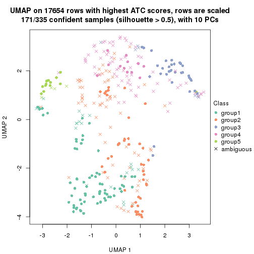</p>

</div>
<div id='tab-ATC-hclust-dimension-reduction-5'>
<pre><code class="r">dimension_reduction(res, k = 6, method = &quot;UMAP&quot;)
</code></pre>

<p></p>

</div>
</div>


Following heatmap shows how subgroups are split when increasing `k`:

```r
collect_classes(res)
```


If matrix rows can be associated to genes, consider to use `GO_Enrichment(res,
...)` to perform function enrichment for the signature genes.


 

---------------------------------------------------


### ATC:kmeans*


The object with results only for a single top-value method and a single partition method 
can be extracted as:

```r
res = res_list["ATC", "kmeans"]
# you can also extract it by
# res = res_list["ATC:kmeans"]
```

A summary of `res` and all the functions that can be applied to it:

```r
res
```

```
#> A 'ConsensusPartition' object with k = 2, 3, 4, 5, 6.
#>   On a matrix with 17654 rows and 335 columns.
#>   Top rows (1000, 2000, 3000, 4000, 5000) are extracted by 'ATC' method.
#>   Subgroups are detected by 'kmeans' method.
#>   Performed in total 1250 partitions by row resampling.
#>   Best k for subgroups seems to be 3.
#> 
#> Following methods can be applied to this 'ConsensusPartition' object:
#>  [1] "cola_report"             "collect_classes"         "collect_plots"          
#>  [4] "collect_stats"           "colnames"                "compare_signatures"     
#>  [7] "consensus_heatmap"       "dimension_reduction"     "functional_enrichment"  
#> [10] "get_anno_col"            "get_anno"                "get_classes"            
#> [13] "get_consensus"           "get_matrix"              "get_membership"         
#> [16] "get_param"               "get_signatures"          "get_stats"              
#> [19] "is_best_k"               "is_stable_k"             "membership_heatmap"     
#> [22] "ncol"                    "nrow"                    "plot_ecdf"              
#> [25] "rownames"                "select_partition_number" "show"                   
#> [28] "suggest_best_k"          "test_to_known_factors"
```

`collect_plots()` function collects all the plots made from `res` for all `k` (number of partitions)
into one single page to provide an easy and fast comparison between different `k`.

```r
collect_plots(res)
```


The plots are:

- The first row: a plot of the ECDF (Empirical cumulative distribution
  function) curves of the consensus matrix for each `k` and the heatmap of
  predicted classes for each `k`.
- The second row: heatmaps of the consensus matrix for each `k`.
- The third row: heatmaps of the membership matrix for each `k`.
- The fouth row: heatmaps of the signatures for each `k`.

All the plots in panels can be made by individual functions and they are
plotted later in this section.

`select_partition_number()` produces several plots showing different
statistics for choosing "optimized" `k`. There are following statistics:

- ECDF curves of the consensus matrix for each `k`;
- 1-PAC. [The PAC
  score](https://en.wikipedia.org/wiki/Consensus_clustering#Over-interpretation_potential_of_consensus_clustering)
  measures the proportion of the ambiguous subgrouping.
- Mean silhouette score.
- Concordance. The mean probability of fiting the consensus class ids in all
  partitions.
- Area increased. Denote $A_k$ as the area under the ECDF curve for current
  `k`, the area increased is defined as $A_k - A_{k-1}$.
- Rand index. The percent of pairs of samples that are both in a same cluster
  or both are not in a same cluster in the partition of k and k-1.
- Jaccard index. The ratio of pairs of samples are both in a same cluster in
  the partition of k and k-1 and the pairs of samples are both in a same
  cluster in the partition k or k-1.

The detailed explanations of these statistics can be found in [the cola
vignette](http://bioconductor.org/packages/devel/bioc/vignettes/cola/inst/doc/cola.html#toc_13).

Generally speaking, lower PAC score, higher mean silhouette score or higher
concordance corresponds to better partition. Rand index and Jaccard index
measure how similar the current partition is compared to partition with `k-1`.
If they are too similar, we won't accept `k` is better than `k-1`.

```r
select_partition_number(res)
```

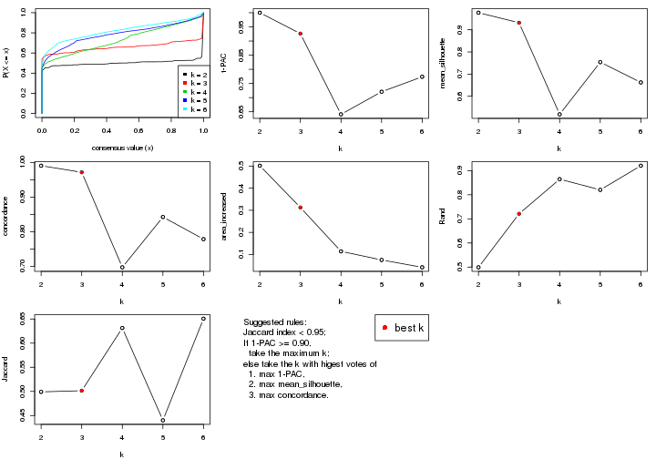

The numeric values for all these statistics can be obtained by `get_stats()`.

```r
get_stats(res)
```

```
#>   k 1-PAC mean_silhouette concordance area_increased  Rand Jaccard
#> 2 2 1.000           0.977       0.991         0.5013 0.499   0.499
#> 3 3 0.926           0.932       0.972         0.3125 0.721   0.501
#> 4 4 0.641           0.519       0.697         0.1144 0.865   0.631
#> 5 5 0.721           0.754       0.842         0.0755 0.820   0.440
#> 6 6 0.774           0.662       0.778         0.0423 0.920   0.651
```

`suggest_best_k()` suggests the best $k$ based on these statistics. The rules are as follows:

- All $k$ with Jaccard index larger than 0.95 are removed because the increase of
  the partition number does not provides enough extra information. If all $k$ are removed,
  the best $k$ is assigned by `NA`.
- For $k$ with 1-PAC larger than 0.9, the maximal $k$ is taken as the "best k". Other $k$ is called "optional k".
- If it does not fit the second rule. The $k$ with the highest vote of highest
  1-PAC, mean silhouette and concordance is taken as the "best k".

```r
suggest_best_k(res)
```

```
#> [1] 3
#> attr(,"optional")
#> [1] 2
```

There is also optional best $k$ = 2 that is worth to check.

Following shows the table of the partitions (You need to click the **show/hide
code output** link to see it). The membership matrix (columns with name `p*`)
is inferred by
[`clue::cl_consensus()`](https://www.rdocumentation.org/link/cl_consensus?package=clue)
function with the `SE` method. Basically the value in the membership matrix
represents the probability to belong to a certain group. The finall class
label for an item is determined with the group with highest probability it
belongs to.

In `get_classes()` function, the entropy is calculated from the membership
matrix and the silhouette score is calculated from the consensus matrix.


<script>
$( function() {
	$( '#tabs-ATC-kmeans-get-classes' ).tabs();
} );
</script>
<div id='tabs-ATC-kmeans-get-classes'>
<ul>
<li><a href='#tab-ATC-kmeans-get-classes-1'>k = 2</a></li>
<li><a href='#tab-ATC-kmeans-get-classes-2'>k = 3</a></li>
<li><a href='#tab-ATC-kmeans-get-classes-3'>k = 4</a></li>
<li><a href='#tab-ATC-kmeans-get-classes-4'>k = 5</a></li>
<li><a href='#tab-ATC-kmeans-get-classes-5'>k = 6</a></li>
</ul>

<div id='tab-ATC-kmeans-get-classes-1'>
<p><a id='tab-ATC-kmeans-get-classes-1-a' style='color:#0366d6' href='#'>show/hide code output</a></p>
<pre><code class="r">cbind(get_classes(res, k = 2), get_membership(res, k = 2))
</code></pre>

<pre><code>#&gt;            class entropy silhouette    p1    p2
#&gt; SRR660306      2  0.0000     0.9904 0.000 1.000
#&gt; SRR1359328     2  0.0000     0.9904 0.000 1.000
#&gt; SRR821124      2  0.0000     0.9904 0.000 1.000
#&gt; SRR1335188     1  0.0000     0.9903 1.000 0.000
#&gt; SRR1075825     2  0.0000     0.9904 0.000 1.000
#&gt; SRR1321921     1  0.0000     0.9903 1.000 0.000
#&gt; SRR1466198     2  0.0000     0.9904 0.000 1.000
#&gt; SRR1384073     1  0.0000     0.9903 1.000 0.000
#&gt; SRR1312802     1  0.0000     0.9903 1.000 0.000
#&gt; SRR1076559     1  0.0000     0.9903 1.000 0.000
#&gt; SRR1370085     1  0.0000     0.9903 1.000 0.000
#&gt; SRR1460363     1  0.0000     0.9903 1.000 0.000
#&gt; SRR1480221     2  0.0376     0.9869 0.004 0.996
#&gt; SRR1476165     1  0.0000     0.9903 1.000 0.000
#&gt; SRR1459631     2  0.0000     0.9904 0.000 1.000
#&gt; SRR1448098     2  0.0000     0.9904 0.000 1.000
#&gt; SRR1321401     2  0.8016     0.6760 0.244 0.756
#&gt; SRR807613      2  0.0000     0.9904 0.000 1.000
#&gt; SRR808086      2  0.0000     0.9904 0.000 1.000
#&gt; SRR613687      2  0.0376     0.9869 0.004 0.996
#&gt; SRR1471011     2  0.6973     0.7675 0.188 0.812
#&gt; SRR1330284     2  0.0000     0.9904 0.000 1.000
#&gt; SRR1320624     2  0.0000     0.9904 0.000 1.000
#&gt; SRR1459519     1  0.0000     0.9903 1.000 0.000
#&gt; SRR1091184     2  0.0000     0.9904 0.000 1.000
#&gt; SRR1390561     1  0.0000     0.9903 1.000 0.000
#&gt; SRR658164      1  0.0000     0.9903 1.000 0.000
#&gt; SRR1087079     2  0.0000     0.9904 0.000 1.000
#&gt; SRR814996      2  0.0000     0.9904 0.000 1.000
#&gt; SRR1407410     2  0.0000     0.9904 0.000 1.000
#&gt; SRR1453392     2  0.0000     0.9904 0.000 1.000
#&gt; SRR1445873     1  0.0000     0.9903 1.000 0.000
#&gt; SRR1419985     2  0.9661     0.3527 0.392 0.608
#&gt; SRR820938      2  0.0000     0.9904 0.000 1.000
#&gt; SRR1476844     1  0.0000     0.9903 1.000 0.000
#&gt; SRR1403526     1  0.0000     0.9903 1.000 0.000
#&gt; SRR1413916     2  0.0000     0.9904 0.000 1.000
#&gt; SRR1441051     2  0.0000     0.9904 0.000 1.000
#&gt; SRR614287      2  0.0000     0.9904 0.000 1.000
#&gt; SRR1092062     1  0.0000     0.9903 1.000 0.000
#&gt; SRR612611      1  0.7745     0.7070 0.772 0.228
#&gt; SRR1376356     1  0.3114     0.9370 0.944 0.056
#&gt; SRR1405078     2  0.0000     0.9904 0.000 1.000
#&gt; SRR1437226     2  0.0376     0.9869 0.004 0.996
#&gt; SRR1326078     1  0.0000     0.9903 1.000 0.000
#&gt; SRR1096806     2  0.0000     0.9904 0.000 1.000
#&gt; SRR1440919     2  0.0000     0.9904 0.000 1.000
#&gt; SRR1452824     2  0.0000     0.9904 0.000 1.000
#&gt; SRR615754      1  0.0000     0.9903 1.000 0.000
#&gt; SRR1341787     2  0.5294     0.8601 0.120 0.880
#&gt; SRR614551      2  0.0000     0.9904 0.000 1.000
#&gt; SRR1380829     2  0.0000     0.9904 0.000 1.000
#&gt; SRR1455761     1  0.0000     0.9903 1.000 0.000
#&gt; SRR1465189     2  0.0000     0.9904 0.000 1.000
#&gt; SRR1376895     1  0.0000     0.9903 1.000 0.000
#&gt; SRR1445002     1  0.0000     0.9903 1.000 0.000
#&gt; SRR1469258     1  0.0000     0.9903 1.000 0.000
#&gt; SRR1409239     1  0.0000     0.9903 1.000 0.000
#&gt; SRR1480200     1  0.0000     0.9903 1.000 0.000
#&gt; SRR1418323     1  0.0000     0.9903 1.000 0.000
#&gt; SRR657540      2  0.0000     0.9904 0.000 1.000
#&gt; SRR821096      2  0.0000     0.9904 0.000 1.000
#&gt; SRR613591      2  0.1414     0.9717 0.020 0.980
#&gt; SRR1344205     2  0.0000     0.9904 0.000 1.000
#&gt; SRR612479      1  0.0000     0.9903 1.000 0.000
#&gt; SRR1399950     1  0.0000     0.9903 1.000 0.000
#&gt; SRR1336048     2  0.0000     0.9904 0.000 1.000
#&gt; SRR1368896     1  0.0000     0.9903 1.000 0.000
#&gt; SRR1379403     2  0.0000     0.9904 0.000 1.000
#&gt; SRR1312464     1  0.0000     0.9903 1.000 0.000
#&gt; SRR1096478     1  0.0000     0.9903 1.000 0.000
#&gt; SRR1459845     1  0.0000     0.9903 1.000 0.000
#&gt; SRR1348138     2  0.0000     0.9904 0.000 1.000
#&gt; SRR811423      1  0.9795     0.2857 0.584 0.416
#&gt; SRR615683      1  0.0000     0.9903 1.000 0.000
#&gt; SRR1380336     2  0.0000     0.9904 0.000 1.000
#&gt; SRR817609      1  0.0000     0.9903 1.000 0.000
#&gt; SRR1074550     2  0.0000     0.9904 0.000 1.000
#&gt; SRR1499236     2  0.0000     0.9904 0.000 1.000
#&gt; SRR656083      1  0.0000     0.9903 1.000 0.000
#&gt; SRR817539      1  0.0000     0.9903 1.000 0.000
#&gt; SRR1410801     1  0.0000     0.9903 1.000 0.000
#&gt; SRR1347190     1  0.0000     0.9903 1.000 0.000
#&gt; SRR1355126     1  0.0000     0.9903 1.000 0.000
#&gt; SRR615165      2  0.0000     0.9904 0.000 1.000
#&gt; SRR1466046     1  0.0000     0.9903 1.000 0.000
#&gt; SRR1097055     2  0.0000     0.9904 0.000 1.000
#&gt; SRR1312370     1  0.0000     0.9903 1.000 0.000
#&gt; SRR655325      1  0.0000     0.9903 1.000 0.000
#&gt; SRR810177      1  0.0000     0.9903 1.000 0.000
#&gt; SRR815685      2  0.0000     0.9904 0.000 1.000
#&gt; SRR817026      2  0.0000     0.9904 0.000 1.000
#&gt; SRR1417224     2  0.0000     0.9904 0.000 1.000
#&gt; SRR661687      2  0.0000     0.9904 0.000 1.000
#&gt; SRR1431804     1  0.0000     0.9903 1.000 0.000
#&gt; SRR664072      2  0.0000     0.9904 0.000 1.000
#&gt; SRR612923      2  0.0000     0.9904 0.000 1.000
#&gt; SRR1315890     1  0.0000     0.9903 1.000 0.000
#&gt; SRR1347726     1  0.0000     0.9903 1.000 0.000
#&gt; SRR1500360     1  0.0000     0.9903 1.000 0.000
#&gt; SRR1468360     1  0.3431     0.9284 0.936 0.064
#&gt; SRR1404084     1  0.0000     0.9903 1.000 0.000
#&gt; SRR615994      2  0.0000     0.9904 0.000 1.000
#&gt; SRR1475718     2  0.2603     0.9472 0.044 0.956
#&gt; SRR1397200     2  0.0000     0.9904 0.000 1.000
#&gt; SRR655519      2  0.0000     0.9904 0.000 1.000
#&gt; SRR1311308     2  0.0000     0.9904 0.000 1.000
#&gt; SRR1368006     2  0.0000     0.9904 0.000 1.000
#&gt; SRR613651      1  0.0000     0.9903 1.000 0.000
#&gt; SRR1362621     2  0.0000     0.9904 0.000 1.000
#&gt; SRR1451718     1  0.0000     0.9903 1.000 0.000
#&gt; SRR1095334     2  0.0000     0.9904 0.000 1.000
#&gt; SRR1079636     2  0.0000     0.9904 0.000 1.000
#&gt; SRR1442549     1  0.0000     0.9903 1.000 0.000
#&gt; SRR1466421     2  0.0000     0.9904 0.000 1.000
#&gt; SRR817397      2  0.0000     0.9904 0.000 1.000
#&gt; SRR1341809     1  0.0000     0.9903 1.000 0.000
#&gt; SRR614623      2  0.0000     0.9904 0.000 1.000
#&gt; SRR1335005     2  0.0000     0.9904 0.000 1.000
#&gt; SRR1407065     2  0.0000     0.9904 0.000 1.000
#&gt; SRR1404483     2  0.0000     0.9904 0.000 1.000
#&gt; SRR1096222     1  0.0000     0.9903 1.000 0.000
#&gt; SRR1401793     1  0.0000     0.9903 1.000 0.000
#&gt; SRR1408615     2  0.0000     0.9904 0.000 1.000
#&gt; SRR1070597     1  0.0000     0.9903 1.000 0.000
#&gt; SRR1332381     1  0.0000     0.9903 1.000 0.000
#&gt; SRR1457015     1  0.0000     0.9903 1.000 0.000
#&gt; SRR1386797     1  0.0000     0.9903 1.000 0.000
#&gt; SRR1098385     2  0.0000     0.9904 0.000 1.000
#&gt; SRR1363947     2  0.0000     0.9904 0.000 1.000
#&gt; SRR820350      2  0.0000     0.9904 0.000 1.000
#&gt; SRR662055      2  0.0000     0.9904 0.000 1.000
#&gt; SRR1310455     1  0.0000     0.9903 1.000 0.000
#&gt; SRR1453639     1  0.0672     0.9834 0.992 0.008
#&gt; SRR662617      1  0.0000     0.9903 1.000 0.000
#&gt; SRR654778      1  0.0000     0.9903 1.000 0.000
#&gt; SRR661782      1  0.0000     0.9903 1.000 0.000
#&gt; SRR1334396     1  0.0000     0.9903 1.000 0.000
#&gt; SRR613867      2  0.0000     0.9904 0.000 1.000
#&gt; SRR1479412     1  0.0000     0.9903 1.000 0.000
#&gt; SRR1331620     1  0.0000     0.9903 1.000 0.000
#&gt; SRR1082809     2  0.0000     0.9904 0.000 1.000
#&gt; SRR1417178     2  0.0000     0.9904 0.000 1.000
#&gt; SRR1335278     1  0.0000     0.9903 1.000 0.000
#&gt; SRR665369      1  0.0000     0.9903 1.000 0.000
#&gt; SRR657552      1  0.0000     0.9903 1.000 0.000
#&gt; SRR812412      1  0.0000     0.9903 1.000 0.000
#&gt; SRR1096500     1  0.1184     0.9763 0.984 0.016
#&gt; SRR1347750     1  0.0000     0.9903 1.000 0.000
#&gt; SRR615153      2  0.0000     0.9904 0.000 1.000
#&gt; SRR1434417     1  0.0000     0.9903 1.000 0.000
#&gt; SRR1070159     2  0.0000     0.9904 0.000 1.000
#&gt; SRR1332508     1  0.2948     0.9412 0.948 0.052
#&gt; SRR1082059     1  0.0000     0.9903 1.000 0.000
#&gt; SRR1402491     1  0.0000     0.9903 1.000 0.000
#&gt; SRR1476595     1  0.0000     0.9903 1.000 0.000
#&gt; SRR1320987     1  0.0000     0.9903 1.000 0.000
#&gt; SRR1086417     1  0.0000     0.9903 1.000 0.000
#&gt; SRR1454095     1  0.0000     0.9903 1.000 0.000
#&gt; SRR614791      2  0.0000     0.9904 0.000 1.000
#&gt; SRR821255      1  0.0000     0.9903 1.000 0.000
#&gt; SRR820402      2  0.9977     0.0992 0.472 0.528
#&gt; SRR1337284     1  0.0000     0.9903 1.000 0.000
#&gt; SRR1333083     2  0.0000     0.9904 0.000 1.000
#&gt; SRR1384883     2  0.0000     0.9904 0.000 1.000
#&gt; SRR614431      1  0.0000     0.9903 1.000 0.000
#&gt; SRR1481106     2  0.0000     0.9904 0.000 1.000
#&gt; SRR1370285     1  0.0000     0.9903 1.000 0.000
#&gt; SRR1446673     2  0.0000     0.9904 0.000 1.000
#&gt; SRR1318046     2  0.0000     0.9904 0.000 1.000
#&gt; SRR1341188     2  0.0000     0.9904 0.000 1.000
#&gt; SRR1384941     1  0.0000     0.9903 1.000 0.000
#&gt; SRR1322864     2  0.0000     0.9904 0.000 1.000
#&gt; SRR1476825     2  0.0000     0.9904 0.000 1.000
#&gt; SRR1443332     2  0.0000     0.9904 0.000 1.000
#&gt; SRR662486      1  0.3114     0.9370 0.944 0.056
#&gt; SRR1447019     1  0.0000     0.9903 1.000 0.000
#&gt; SRR662942      1  0.0000     0.9903 1.000 0.000
#&gt; SRR613102      2  0.0000     0.9904 0.000 1.000
#&gt; SRR1469880     1  0.0000     0.9903 1.000 0.000
#&gt; SRR1464977     1  0.0000     0.9903 1.000 0.000
#&gt; SRR615850      2  0.0000     0.9904 0.000 1.000
#&gt; SRR661949      1  0.0000     0.9903 1.000 0.000
#&gt; SRR1322227     2  0.0000     0.9904 0.000 1.000
#&gt; SRR1441655     1  0.2603     0.9494 0.956 0.044
#&gt; SRR613771      2  0.0000     0.9904 0.000 1.000
#&gt; SRR1479471     1  0.0000     0.9903 1.000 0.000
#&gt; SRR1488918     2  0.0000     0.9904 0.000 1.000
#&gt; SRR1414040     2  0.0376     0.9869 0.004 0.996
#&gt; SRR1079850     1  0.0000     0.9903 1.000 0.000
#&gt; SRR663209      1  0.0000     0.9903 1.000 0.000
#&gt; SRR1364914     2  0.0000     0.9904 0.000 1.000
#&gt; SRR1408267     1  0.0000     0.9903 1.000 0.000
#&gt; SRR1314894     1  0.0000     0.9903 1.000 0.000
#&gt; SRR1414117     2  0.0000     0.9904 0.000 1.000
#&gt; SRR1395975     2  0.0000     0.9904 0.000 1.000
#&gt; SRR1402219     1  0.9775     0.2991 0.588 0.412
#&gt; SRR1433623     1  0.0000     0.9903 1.000 0.000
#&gt; SRR656385      2  0.0000     0.9904 0.000 1.000
#&gt; SRR811213      1  0.0000     0.9903 1.000 0.000
#&gt; SRR663657      2  0.0000     0.9904 0.000 1.000
#&gt; SRR612203      1  0.0000     0.9903 1.000 0.000
#&gt; SRR613987      2  0.0000     0.9904 0.000 1.000
#&gt; SRR613831      2  0.0000     0.9904 0.000 1.000
#&gt; SRR1354180     2  0.0000     0.9904 0.000 1.000
#&gt; SRR1382912     1  0.0000     0.9903 1.000 0.000
#&gt; SRR1475501     1  0.0000     0.9903 1.000 0.000
#&gt; SRR1336930     1  0.0000     0.9903 1.000 0.000
#&gt; SRR613030      2  0.0000     0.9904 0.000 1.000
#&gt; SRR1381459     2  0.0000     0.9904 0.000 1.000
#&gt; SRR1402350     1  0.0000     0.9903 1.000 0.000
#&gt; SRR1419408     1  0.0000     0.9903 1.000 0.000
#&gt; SRR655911      2  0.0000     0.9904 0.000 1.000
#&gt; SRR1418243     1  0.0000     0.9903 1.000 0.000
#&gt; SRR1322573     1  0.0000     0.9903 1.000 0.000
#&gt; SRR613615      2  0.0000     0.9904 0.000 1.000
#&gt; SRR1355284     1  0.0000     0.9903 1.000 0.000
#&gt; SRR1319395     1  0.0000     0.9903 1.000 0.000
#&gt; SRR818939      1  0.0000     0.9903 1.000 0.000
#&gt; SRR1465266     1  0.0000     0.9903 1.000 0.000
#&gt; SRR614888      1  0.0000     0.9903 1.000 0.000
#&gt; SRR1431694     1  0.0000     0.9903 1.000 0.000
#&gt; SRR614347      2  0.0000     0.9904 0.000 1.000
#&gt; SRR1334228     2  0.0000     0.9904 0.000 1.000
#&gt; SRR1096007     2  0.0000     0.9904 0.000 1.000
#&gt; SRR656349      1  0.0000     0.9903 1.000 0.000
#&gt; SRR815422      2  0.0000     0.9904 0.000 1.000
#&gt; SRR1360828     1  0.0000     0.9903 1.000 0.000
#&gt; SRR1359005     2  0.0000     0.9904 0.000 1.000
#&gt; SRR1456652     1  0.0000     0.9903 1.000 0.000
#&gt; SRR1391660     1  0.0000     0.9903 1.000 0.000
#&gt; SRR1441956     1  0.0000     0.9903 1.000 0.000
#&gt; SRR662930      2  0.0000     0.9904 0.000 1.000
#&gt; SRR615790      2  0.0000     0.9904 0.000 1.000
#&gt; SRR614827      2  0.0000     0.9904 0.000 1.000
#&gt; SRR614587      2  0.0000     0.9904 0.000 1.000
#&gt; SRR814052      1  0.0000     0.9903 1.000 0.000
#&gt; SRR1070086     1  0.0000     0.9903 1.000 0.000
#&gt; SRR1481440     1  0.0000     0.9903 1.000 0.000
#&gt; SRR1339296     2  0.0000     0.9904 0.000 1.000
#&gt; SRR1343239     2  0.0000     0.9904 0.000 1.000
#&gt; SRR1432802     1  0.1184     0.9763 0.984 0.016
#&gt; SRR1416911     1  0.0000     0.9903 1.000 0.000
#&gt; SRR1410427     1  0.0000     0.9903 1.000 0.000
#&gt; SRR1401185     2  0.0000     0.9904 0.000 1.000
#&gt; SRR654993      2  0.0000     0.9904 0.000 1.000
#&gt; SRR656397      1  0.0000     0.9903 1.000 0.000
#&gt; SRR809643      2  0.0000     0.9904 0.000 1.000
#&gt; SRR1433819     1  0.0000     0.9903 1.000 0.000
#&gt; SRR1375225     1  0.6973     0.7689 0.812 0.188
#&gt; SRR1367739     2  0.0000     0.9904 0.000 1.000
#&gt; SRR1323336     1  0.0000     0.9903 1.000 0.000
#&gt; SRR663224      2  0.0000     0.9904 0.000 1.000
#&gt; SRR1442840     1  0.0000     0.9903 1.000 0.000
#&gt; SRR1374058     1  0.0000     0.9903 1.000 0.000
#&gt; SRR656994      1  0.0000     0.9903 1.000 0.000
#&gt; SRR1469214     2  0.0000     0.9904 0.000 1.000
#&gt; SRR1456446     1  0.2778     0.9455 0.952 0.048
#&gt; SRR1471879     1  0.0000     0.9903 1.000 0.000
#&gt; SRR612911      2  0.0000     0.9904 0.000 1.000
#&gt; SRR1395720     2  0.0000     0.9904 0.000 1.000
#&gt; SRR1413055     1  0.0000     0.9903 1.000 0.000
#&gt; SRR656770      2  0.0000     0.9904 0.000 1.000
#&gt; SRR812080      2  0.0000     0.9904 0.000 1.000
#&gt; SRR1479328     1  0.0000     0.9903 1.000 0.000
#&gt; SRR661421      2  0.0000     0.9904 0.000 1.000
#&gt; SRR1410286     2  0.0000     0.9904 0.000 1.000
#&gt; SRR1487150     1  0.0000     0.9903 1.000 0.000
#&gt; SRR1467035     1  0.0000     0.9903 1.000 0.000
#&gt; SRR1360607     2  0.0000     0.9904 0.000 1.000
#&gt; SRR1333106     2  0.0000     0.9904 0.000 1.000
#&gt; SRR1088706     1  0.0000     0.9903 1.000 0.000
#&gt; SRR1320053     2  0.0000     0.9904 0.000 1.000
#&gt; SRR1350392     2  0.0000     0.9904 0.000 1.000
#&gt; SRR1385190     2  0.0000     0.9904 0.000 1.000
#&gt; SRR1080093     2  0.0000     0.9904 0.000 1.000
#&gt; SRR1318753     1  0.0000     0.9903 1.000 0.000
#&gt; SRR1345369     2  0.0000     0.9904 0.000 1.000
#&gt; SRR612178      2  0.0000     0.9904 0.000 1.000
#&gt; SRR1354423     1  0.0000     0.9903 1.000 0.000
#&gt; SRR1072724     1  0.0000     0.9903 1.000 0.000
#&gt; SRR1418450     2  0.0000     0.9904 0.000 1.000
#&gt; SRR1326427     2  0.0000     0.9904 0.000 1.000
#&gt; SRR1437412     1  0.0000     0.9903 1.000 0.000
#&gt; SRR1327548     2  0.0000     0.9904 0.000 1.000
#&gt; SRR1395891     1  0.0000     0.9903 1.000 0.000
#&gt; SRR659367      1  0.0000     0.9903 1.000 0.000
#&gt; SRR818961      1  0.0000     0.9903 1.000 0.000
#&gt; SRR813704      1  0.0000     0.9903 1.000 0.000
#&gt; SRR613054      1  0.0000     0.9903 1.000 0.000
#&gt; SRR1476467     1  0.0000     0.9903 1.000 0.000
#&gt; SRR1407988     2  0.0000     0.9904 0.000 1.000
#&gt; SRR1394776     2  0.0000     0.9904 0.000 1.000
#&gt; SRR655578      1  0.1414     0.9726 0.980 0.020
#&gt; SRR1310645     2  0.0000     0.9904 0.000 1.000
#&gt; SRR1345628     1  0.0000     0.9903 1.000 0.000
#&gt; SRR1479740     1  0.0000     0.9903 1.000 0.000
#&gt; SRR1332095     1  0.0000     0.9903 1.000 0.000
#&gt; SRR1444786     2  0.1414     0.9717 0.020 0.980
#&gt; SRR1090070     1  0.0000     0.9903 1.000 0.000
#&gt; SRR662414      1  0.0000     0.9903 1.000 0.000
#&gt; SRR661216      2  0.0000     0.9904 0.000 1.000
#&gt; SRR656313      1  0.0000     0.9903 1.000 0.000
#&gt; SRR615671      2  0.0000     0.9904 0.000 1.000
#&gt; SRR1350196     2  0.0000     0.9904 0.000 1.000
#&gt; SRR1466580     1  0.0000     0.9903 1.000 0.000
#&gt; SRR1408032     2  0.0000     0.9904 0.000 1.000
#&gt; SRR1432913     2  0.0000     0.9904 0.000 1.000
#&gt; SRR1360502     2  0.0000     0.9904 0.000 1.000
#&gt; SRR1391901     2  0.0000     0.9904 0.000 1.000
#&gt; SRR1311131     1  0.0000     0.9903 1.000 0.000
#&gt; SRR1380636     1  0.0000     0.9903 1.000 0.000
#&gt; SRR1332339     1  0.0000     0.9903 1.000 0.000
#&gt; SRR1341563     2  0.0000     0.9904 0.000 1.000
#&gt; SRR1359410     2  0.0000     0.9904 0.000 1.000
#&gt; SRR1473040     2  0.0000     0.9904 0.000 1.000
#&gt; SRR1321444     1  0.0000     0.9903 1.000 0.000
#&gt; SRR1498765     2  0.0000     0.9904 0.000 1.000
#&gt; SRR1312622     2  0.0000     0.9904 0.000 1.000
#&gt; SRR615503      1  0.0000     0.9903 1.000 0.000
#&gt; SRR1453192     1  0.0000     0.9903 1.000 0.000
#&gt; SRR1433107     2  0.0000     0.9904 0.000 1.000
#&gt; SRR1075384     1  0.0000     0.9903 1.000 0.000
#&gt; SRR1356683     1  0.0000     0.9903 1.000 0.000
#&gt; SRR659049      1  0.0000     0.9903 1.000 0.000
#&gt; SRR1368240     1  0.0000     0.9903 1.000 0.000
#&gt; SRR1341739     1  0.0000     0.9903 1.000 0.000
#&gt; SRR613249      2  0.0000     0.9904 0.000 1.000
#&gt; SRR663428      1  0.0000     0.9903 1.000 0.000
#&gt; SRR1341302     2  0.0000     0.9904 0.000 1.000
#&gt; SRR1073553     1  0.1184     0.9763 0.984 0.016
#&gt; SRR1354093     2  0.0000     0.9904 0.000 1.000
#&gt; SRR1406521     2  0.0000     0.9904 0.000 1.000
#&gt; SRR1432049     1  0.0000     0.9903 1.000 0.000
#&gt; SRR1453504     2  0.0000     0.9904 0.000 1.000
</code></pre>

<script>
$('#tab-ATC-kmeans-get-classes-1-a').parent().next().next().hide();
$('#tab-ATC-kmeans-get-classes-1-a').click(function(){
  $('#tab-ATC-kmeans-get-classes-1-a').parent().next().next().toggle();
  return(false);
});
</script>
</div>

<div id='tab-ATC-kmeans-get-classes-2'>
<p><a id='tab-ATC-kmeans-get-classes-2-a' style='color:#0366d6' href='#'>show/hide code output</a></p>
<pre><code class="r">cbind(get_classes(res, k = 3), get_membership(res, k = 3))
</code></pre>

<pre><code>#&gt;            class entropy silhouette    p1    p2    p3
#&gt; SRR660306      2  0.0000     0.9658 0.000 1.000 0.000
#&gt; SRR1359328     3  0.0000     0.9668 0.000 0.000 1.000
#&gt; SRR821124      2  0.0000     0.9658 0.000 1.000 0.000
#&gt; SRR1335188     1  0.0000     0.9732 1.000 0.000 0.000
#&gt; SRR1075825     2  0.0000     0.9658 0.000 1.000 0.000
#&gt; SRR1321921     1  0.0000     0.9732 1.000 0.000 0.000
#&gt; SRR1466198     3  0.0000     0.9668 0.000 0.000 1.000
#&gt; SRR1384073     1  0.0000     0.9732 1.000 0.000 0.000
#&gt; SRR1312802     1  0.4887     0.7186 0.772 0.228 0.000
#&gt; SRR1076559     1  0.0000     0.9732 1.000 0.000 0.000
#&gt; SRR1370085     1  0.0000     0.9732 1.000 0.000 0.000
#&gt; SRR1460363     1  0.0000     0.9732 1.000 0.000 0.000
#&gt; SRR1480221     2  0.0000     0.9658 0.000 1.000 0.000
#&gt; SRR1476165     1  0.0000     0.9732 1.000 0.000 0.000
#&gt; SRR1459631     3  0.0000     0.9668 0.000 0.000 1.000
#&gt; SRR1448098     2  0.0000     0.9658 0.000 1.000 0.000
#&gt; SRR1321401     2  0.0000     0.9658 0.000 1.000 0.000
#&gt; SRR807613      2  0.0000     0.9658 0.000 1.000 0.000
#&gt; SRR808086      3  0.0424     0.9623 0.000 0.008 0.992
#&gt; SRR613687      2  0.0000     0.9658 0.000 1.000 0.000
#&gt; SRR1471011     2  0.4178     0.7751 0.172 0.828 0.000
#&gt; SRR1330284     2  0.0000     0.9658 0.000 1.000 0.000
#&gt; SRR1320624     3  0.1163     0.9481 0.000 0.028 0.972
#&gt; SRR1459519     1  0.0000     0.9732 1.000 0.000 0.000
#&gt; SRR1091184     2  0.0000     0.9658 0.000 1.000 0.000
#&gt; SRR1390561     1  0.0000     0.9732 1.000 0.000 0.000
#&gt; SRR658164      1  0.0000     0.9732 1.000 0.000 0.000
#&gt; SRR1087079     2  0.0000     0.9658 0.000 1.000 0.000
#&gt; SRR814996      3  0.0000     0.9668 0.000 0.000 1.000
#&gt; SRR1407410     2  0.0000     0.9658 0.000 1.000 0.000
#&gt; SRR1453392     3  0.0000     0.9668 0.000 0.000 1.000
#&gt; SRR1445873     1  0.0000     0.9732 1.000 0.000 0.000
#&gt; SRR1419985     2  0.0000     0.9658 0.000 1.000 0.000
#&gt; SRR820938      3  0.0000     0.9668 0.000 0.000 1.000
#&gt; SRR1476844     1  0.0424     0.9663 0.992 0.008 0.000
#&gt; SRR1403526     1  0.0000     0.9732 1.000 0.000 0.000
#&gt; SRR1413916     2  0.0000     0.9658 0.000 1.000 0.000
#&gt; SRR1441051     3  0.4555     0.7598 0.000 0.200 0.800
#&gt; SRR614287      2  0.0000     0.9658 0.000 1.000 0.000
#&gt; SRR1092062     2  0.0000     0.9658 0.000 1.000 0.000
#&gt; SRR612611      2  0.0000     0.9658 0.000 1.000 0.000
#&gt; SRR1376356     2  0.0000     0.9658 0.000 1.000 0.000
#&gt; SRR1405078     3  0.0000     0.9668 0.000 0.000 1.000
#&gt; SRR1437226     2  0.0000     0.9658 0.000 1.000 0.000
#&gt; SRR1326078     1  0.0000     0.9732 1.000 0.000 0.000
#&gt; SRR1096806     3  0.0000     0.9668 0.000 0.000 1.000
#&gt; SRR1440919     3  0.1753     0.9313 0.000 0.048 0.952
#&gt; SRR1452824     2  0.4654     0.7243 0.000 0.792 0.208
#&gt; SRR615754      1  0.0000     0.9732 1.000 0.000 0.000
#&gt; SRR1341787     2  0.0000     0.9658 0.000 1.000 0.000
#&gt; SRR614551      2  0.0000     0.9658 0.000 1.000 0.000
#&gt; SRR1380829     3  0.0000     0.9668 0.000 0.000 1.000
#&gt; SRR1455761     1  0.0000     0.9732 1.000 0.000 0.000
#&gt; SRR1465189     3  0.6154     0.3203 0.000 0.408 0.592
#&gt; SRR1376895     1  0.0000     0.9732 1.000 0.000 0.000
#&gt; SRR1445002     1  0.0000     0.9732 1.000 0.000 0.000
#&gt; SRR1469258     2  0.0000     0.9658 0.000 1.000 0.000
#&gt; SRR1409239     1  0.0000     0.9732 1.000 0.000 0.000
#&gt; SRR1480200     1  0.0000     0.9732 1.000 0.000 0.000
#&gt; SRR1418323     1  0.0000     0.9732 1.000 0.000 0.000
#&gt; SRR657540      3  0.0000     0.9668 0.000 0.000 1.000
#&gt; SRR821096      2  0.0000     0.9658 0.000 1.000 0.000
#&gt; SRR613591      2  0.0000     0.9658 0.000 1.000 0.000
#&gt; SRR1344205     3  0.0000     0.9668 0.000 0.000 1.000
#&gt; SRR612479      1  0.5098     0.6869 0.752 0.248 0.000
#&gt; SRR1399950     1  0.0000     0.9732 1.000 0.000 0.000
#&gt; SRR1336048     3  0.0424     0.9623 0.000 0.008 0.992
#&gt; SRR1368896     1  0.0000     0.9732 1.000 0.000 0.000
#&gt; SRR1379403     3  0.6192     0.3155 0.000 0.420 0.580
#&gt; SRR1312464     1  0.0000     0.9732 1.000 0.000 0.000
#&gt; SRR1096478     1  0.0000     0.9732 1.000 0.000 0.000
#&gt; SRR1459845     1  0.0000     0.9732 1.000 0.000 0.000
#&gt; SRR1348138     3  0.0424     0.9623 0.000 0.008 0.992
#&gt; SRR811423      2  0.6126     0.3045 0.400 0.600 0.000
#&gt; SRR615683      1  0.0000     0.9732 1.000 0.000 0.000
#&gt; SRR1380336     2  0.0000     0.9658 0.000 1.000 0.000
#&gt; SRR817609      2  0.6286     0.0933 0.464 0.536 0.000
#&gt; SRR1074550     3  0.0000     0.9668 0.000 0.000 1.000
#&gt; SRR1499236     2  0.0000     0.9658 0.000 1.000 0.000
#&gt; SRR656083      1  0.0000     0.9732 1.000 0.000 0.000
#&gt; SRR817539      1  0.0000     0.9732 1.000 0.000 0.000
#&gt; SRR1410801     1  0.0000     0.9732 1.000 0.000 0.000
#&gt; SRR1347190     1  0.0000     0.9732 1.000 0.000 0.000
#&gt; SRR1355126     2  0.0000     0.9658 0.000 1.000 0.000
#&gt; SRR615165      3  0.0000     0.9668 0.000 0.000 1.000
#&gt; SRR1466046     1  0.0000     0.9732 1.000 0.000 0.000
#&gt; SRR1097055     2  0.0000     0.9658 0.000 1.000 0.000
#&gt; SRR1312370     2  0.0000     0.9658 0.000 1.000 0.000
#&gt; SRR655325      1  0.0000     0.9732 1.000 0.000 0.000
#&gt; SRR810177      2  0.0000     0.9658 0.000 1.000 0.000
#&gt; SRR815685      2  0.0000     0.9658 0.000 1.000 0.000
#&gt; SRR817026      3  0.0000     0.9668 0.000 0.000 1.000
#&gt; SRR1417224     3  0.0424     0.9622 0.000 0.008 0.992
#&gt; SRR661687      3  0.3116     0.8709 0.000 0.108 0.892
#&gt; SRR1431804     1  0.0000     0.9732 1.000 0.000 0.000
#&gt; SRR664072      3  0.0000     0.9668 0.000 0.000 1.000
#&gt; SRR612923      2  0.0000     0.9658 0.000 1.000 0.000
#&gt; SRR1315890     1  0.0000     0.9732 1.000 0.000 0.000
#&gt; SRR1347726     1  0.0000     0.9732 1.000 0.000 0.000
#&gt; SRR1500360     1  0.0000     0.9732 1.000 0.000 0.000
#&gt; SRR1468360     2  0.0000     0.9658 0.000 1.000 0.000
#&gt; SRR1404084     1  0.0000     0.9732 1.000 0.000 0.000
#&gt; SRR615994      3  0.0000     0.9668 0.000 0.000 1.000
#&gt; SRR1475718     2  0.0000     0.9658 0.000 1.000 0.000
#&gt; SRR1397200     3  0.0000     0.9668 0.000 0.000 1.000
#&gt; SRR655519      3  0.6225     0.2734 0.000 0.432 0.568
#&gt; SRR1311308     3  0.0000     0.9668 0.000 0.000 1.000
#&gt; SRR1368006     3  0.0000     0.9668 0.000 0.000 1.000
#&gt; SRR613651      1  0.6079     0.3959 0.612 0.388 0.000
#&gt; SRR1362621     3  0.3116     0.8713 0.000 0.108 0.892
#&gt; SRR1451718     1  0.0000     0.9732 1.000 0.000 0.000
#&gt; SRR1095334     3  0.0000     0.9668 0.000 0.000 1.000
#&gt; SRR1079636     2  0.0000     0.9658 0.000 1.000 0.000
#&gt; SRR1442549     2  0.0000     0.9658 0.000 1.000 0.000
#&gt; SRR1466421     2  0.0000     0.9658 0.000 1.000 0.000
#&gt; SRR817397      2  0.0000     0.9658 0.000 1.000 0.000
#&gt; SRR1341809     2  0.0000     0.9658 0.000 1.000 0.000
#&gt; SRR614623      2  0.0892     0.9486 0.000 0.980 0.020
#&gt; SRR1335005     2  0.0000     0.9658 0.000 1.000 0.000
#&gt; SRR1407065     2  0.4452     0.7371 0.000 0.808 0.192
#&gt; SRR1404483     3  0.0000     0.9668 0.000 0.000 1.000
#&gt; SRR1096222     1  0.0000     0.9732 1.000 0.000 0.000
#&gt; SRR1401793     1  0.4605     0.7532 0.796 0.204 0.000
#&gt; SRR1408615     3  0.0000     0.9668 0.000 0.000 1.000
#&gt; SRR1070597     2  0.0000     0.9658 0.000 1.000 0.000
#&gt; SRR1332381     1  0.0000     0.9732 1.000 0.000 0.000
#&gt; SRR1457015     1  0.0000     0.9732 1.000 0.000 0.000
#&gt; SRR1386797     1  0.5138     0.6806 0.748 0.252 0.000
#&gt; SRR1098385     3  0.0424     0.9622 0.000 0.008 0.992
#&gt; SRR1363947     3  0.0000     0.9668 0.000 0.000 1.000
#&gt; SRR820350      2  0.0000     0.9658 0.000 1.000 0.000
#&gt; SRR662055      2  0.0000     0.9658 0.000 1.000 0.000
#&gt; SRR1310455     1  0.0000     0.9732 1.000 0.000 0.000
#&gt; SRR1453639     2  0.0000     0.9658 0.000 1.000 0.000
#&gt; SRR662617      2  0.0000     0.9658 0.000 1.000 0.000
#&gt; SRR654778      1  0.0000     0.9732 1.000 0.000 0.000
#&gt; SRR661782      2  0.0000     0.9658 0.000 1.000 0.000
#&gt; SRR1334396     1  0.4235     0.7903 0.824 0.176 0.000
#&gt; SRR613867      2  0.0000     0.9658 0.000 1.000 0.000
#&gt; SRR1479412     1  0.0000     0.9732 1.000 0.000 0.000
#&gt; SRR1331620     1  0.0000     0.9732 1.000 0.000 0.000
#&gt; SRR1082809     3  0.0000     0.9668 0.000 0.000 1.000
#&gt; SRR1417178     3  0.1031     0.9512 0.000 0.024 0.976
#&gt; SRR1335278     1  0.0000     0.9732 1.000 0.000 0.000
#&gt; SRR665369      2  0.0000     0.9658 0.000 1.000 0.000
#&gt; SRR657552      1  0.0000     0.9732 1.000 0.000 0.000
#&gt; SRR812412      1  0.0000     0.9732 1.000 0.000 0.000
#&gt; SRR1096500     2  0.0000     0.9658 0.000 1.000 0.000
#&gt; SRR1347750     2  0.5760     0.5179 0.328 0.672 0.000
#&gt; SRR615153      2  0.0000     0.9658 0.000 1.000 0.000
#&gt; SRR1434417     1  0.0237     0.9698 0.996 0.004 0.000
#&gt; SRR1070159     3  0.1289     0.9451 0.000 0.032 0.968
#&gt; SRR1332508     2  0.0000     0.9658 0.000 1.000 0.000
#&gt; SRR1082059     1  0.2448     0.9035 0.924 0.076 0.000
#&gt; SRR1402491     1  0.0000     0.9732 1.000 0.000 0.000
#&gt; SRR1476595     1  0.0000     0.9732 1.000 0.000 0.000
#&gt; SRR1320987     2  0.6235     0.2164 0.436 0.564 0.000
#&gt; SRR1086417     1  0.0237     0.9698 0.996 0.004 0.000
#&gt; SRR1454095     1  0.0000     0.9732 1.000 0.000 0.000
#&gt; SRR614791      3  0.0892     0.9541 0.000 0.020 0.980
#&gt; SRR821255      2  0.1289     0.9354 0.032 0.968 0.000
#&gt; SRR820402      2  0.0000     0.9658 0.000 1.000 0.000
#&gt; SRR1337284     2  0.0747     0.9510 0.016 0.984 0.000
#&gt; SRR1333083     3  0.0000     0.9668 0.000 0.000 1.000
#&gt; SRR1384883     3  0.0000     0.9668 0.000 0.000 1.000
#&gt; SRR614431      1  0.0000     0.9732 1.000 0.000 0.000
#&gt; SRR1481106     3  0.0000     0.9668 0.000 0.000 1.000
#&gt; SRR1370285     1  0.0000     0.9732 1.000 0.000 0.000
#&gt; SRR1446673     3  0.0000     0.9668 0.000 0.000 1.000
#&gt; SRR1318046     2  0.0000     0.9658 0.000 1.000 0.000
#&gt; SRR1341188     3  0.0000     0.9668 0.000 0.000 1.000
#&gt; SRR1384941     1  0.0000     0.9732 1.000 0.000 0.000
#&gt; SRR1322864     2  0.0000     0.9658 0.000 1.000 0.000
#&gt; SRR1476825     2  0.0000     0.9658 0.000 1.000 0.000
#&gt; SRR1443332     3  0.0000     0.9668 0.000 0.000 1.000
#&gt; SRR662486      2  0.0000     0.9658 0.000 1.000 0.000
#&gt; SRR1447019     1  0.0000     0.9732 1.000 0.000 0.000
#&gt; SRR662942      1  0.0000     0.9732 1.000 0.000 0.000
#&gt; SRR613102      3  0.0000     0.9668 0.000 0.000 1.000
#&gt; SRR1469880     1  0.0000     0.9732 1.000 0.000 0.000
#&gt; SRR1464977     1  0.0000     0.9732 1.000 0.000 0.000
#&gt; SRR615850      3  0.0000     0.9668 0.000 0.000 1.000
#&gt; SRR661949      2  0.0000     0.9658 0.000 1.000 0.000
#&gt; SRR1322227     3  0.0000     0.9668 0.000 0.000 1.000
#&gt; SRR1441655     2  0.0000     0.9658 0.000 1.000 0.000
#&gt; SRR613771      2  0.0237     0.9625 0.000 0.996 0.004
#&gt; SRR1479471     1  0.0000     0.9732 1.000 0.000 0.000
#&gt; SRR1488918     2  0.0237     0.9625 0.000 0.996 0.004
#&gt; SRR1414040     2  0.0000     0.9658 0.000 1.000 0.000
#&gt; SRR1079850     2  0.0000     0.9658 0.000 1.000 0.000
#&gt; SRR663209      1  0.0000     0.9732 1.000 0.000 0.000
#&gt; SRR1364914     2  0.0237     0.9625 0.000 0.996 0.004
#&gt; SRR1408267     2  0.0747     0.9511 0.016 0.984 0.000
#&gt; SRR1314894     1  0.0000     0.9732 1.000 0.000 0.000
#&gt; SRR1414117     2  0.0000     0.9658 0.000 1.000 0.000
#&gt; SRR1395975     2  0.0000     0.9658 0.000 1.000 0.000
#&gt; SRR1402219     2  0.0000     0.9658 0.000 1.000 0.000
#&gt; SRR1433623     1  0.0000     0.9732 1.000 0.000 0.000
#&gt; SRR656385      2  0.0000     0.9658 0.000 1.000 0.000
#&gt; SRR811213      2  0.0000     0.9658 0.000 1.000 0.000
#&gt; SRR663657      2  0.0000     0.9658 0.000 1.000 0.000
#&gt; SRR612203      1  0.0592     0.9628 0.988 0.012 0.000
#&gt; SRR613987      2  0.0000     0.9658 0.000 1.000 0.000
#&gt; SRR613831      3  0.0000     0.9668 0.000 0.000 1.000
#&gt; SRR1354180     2  0.0000     0.9658 0.000 1.000 0.000
#&gt; SRR1382912     1  0.0000     0.9732 1.000 0.000 0.000
#&gt; SRR1475501     1  0.0000     0.9732 1.000 0.000 0.000
#&gt; SRR1336930     1  0.0000     0.9732 1.000 0.000 0.000
#&gt; SRR613030      3  0.0000     0.9668 0.000 0.000 1.000
#&gt; SRR1381459     2  0.0000     0.9658 0.000 1.000 0.000
#&gt; SRR1402350     1  0.0000     0.9732 1.000 0.000 0.000
#&gt; SRR1419408     1  0.0000     0.9732 1.000 0.000 0.000
#&gt; SRR655911      3  0.0000     0.9668 0.000 0.000 1.000
#&gt; SRR1418243     1  0.0000     0.9732 1.000 0.000 0.000
#&gt; SRR1322573     1  0.6180     0.3198 0.584 0.416 0.000
#&gt; SRR613615      3  0.0000     0.9668 0.000 0.000 1.000
#&gt; SRR1355284     1  0.4750     0.7363 0.784 0.216 0.000
#&gt; SRR1319395     1  0.0000     0.9732 1.000 0.000 0.000
#&gt; SRR818939      1  0.0000     0.9732 1.000 0.000 0.000
#&gt; SRR1465266     1  0.5431     0.6249 0.716 0.284 0.000
#&gt; SRR614888      2  0.3619     0.8199 0.136 0.864 0.000
#&gt; SRR1431694     2  0.3116     0.8560 0.108 0.892 0.000
#&gt; SRR614347      3  0.3412     0.8569 0.000 0.124 0.876
#&gt; SRR1334228     3  0.0000     0.9668 0.000 0.000 1.000
#&gt; SRR1096007     2  0.0000     0.9658 0.000 1.000 0.000
#&gt; SRR656349      1  0.0000     0.9732 1.000 0.000 0.000
#&gt; SRR815422      3  0.3116     0.8709 0.000 0.108 0.892
#&gt; SRR1360828     1  0.0000     0.9732 1.000 0.000 0.000
#&gt; SRR1359005     2  0.0000     0.9658 0.000 1.000 0.000
#&gt; SRR1456652     1  0.0000     0.9732 1.000 0.000 0.000
#&gt; SRR1391660     1  0.0000     0.9732 1.000 0.000 0.000
#&gt; SRR1441956     1  0.0000     0.9732 1.000 0.000 0.000
#&gt; SRR662930      3  0.0000     0.9668 0.000 0.000 1.000
#&gt; SRR615790      3  0.0000     0.9668 0.000 0.000 1.000
#&gt; SRR614827      3  0.0424     0.9622 0.000 0.008 0.992
#&gt; SRR614587      3  0.0000     0.9668 0.000 0.000 1.000
#&gt; SRR814052      2  0.0000     0.9658 0.000 1.000 0.000
#&gt; SRR1070086     1  0.0000     0.9732 1.000 0.000 0.000
#&gt; SRR1481440     1  0.4750     0.7363 0.784 0.216 0.000
#&gt; SRR1339296     3  0.0000     0.9668 0.000 0.000 1.000
#&gt; SRR1343239     3  0.0000     0.9668 0.000 0.000 1.000
#&gt; SRR1432802     2  0.0000     0.9658 0.000 1.000 0.000
#&gt; SRR1416911     1  0.0000     0.9732 1.000 0.000 0.000
#&gt; SRR1410427     1  0.0000     0.9732 1.000 0.000 0.000
#&gt; SRR1401185     3  0.1289     0.9457 0.000 0.032 0.968
#&gt; SRR654993      2  0.0000     0.9658 0.000 1.000 0.000
#&gt; SRR656397      1  0.0000     0.9732 1.000 0.000 0.000
#&gt; SRR809643      3  0.0000     0.9668 0.000 0.000 1.000
#&gt; SRR1433819     1  0.0000     0.9732 1.000 0.000 0.000
#&gt; SRR1375225     2  0.0000     0.9658 0.000 1.000 0.000
#&gt; SRR1367739     3  0.0000     0.9668 0.000 0.000 1.000
#&gt; SRR1323336     1  0.0000     0.9732 1.000 0.000 0.000
#&gt; SRR663224      3  0.0000     0.9668 0.000 0.000 1.000
#&gt; SRR1442840     1  0.0000     0.9732 1.000 0.000 0.000
#&gt; SRR1374058     1  0.0000     0.9732 1.000 0.000 0.000
#&gt; SRR656994      1  0.0000     0.9732 1.000 0.000 0.000
#&gt; SRR1469214     2  0.0000     0.9658 0.000 1.000 0.000
#&gt; SRR1456446     2  0.0000     0.9658 0.000 1.000 0.000
#&gt; SRR1471879     2  0.0000     0.9658 0.000 1.000 0.000
#&gt; SRR612911      3  0.0000     0.9668 0.000 0.000 1.000
#&gt; SRR1395720     2  0.5397     0.5880 0.000 0.720 0.280
#&gt; SRR1413055     1  0.0000     0.9732 1.000 0.000 0.000
#&gt; SRR656770      2  0.5327     0.6086 0.000 0.728 0.272
#&gt; SRR812080      3  0.0000     0.9668 0.000 0.000 1.000
#&gt; SRR1479328     1  0.0000     0.9732 1.000 0.000 0.000
#&gt; SRR661421      2  0.4605     0.7195 0.000 0.796 0.204
#&gt; SRR1410286     2  0.0000     0.9658 0.000 1.000 0.000
#&gt; SRR1487150     1  0.0000     0.9732 1.000 0.000 0.000
#&gt; SRR1467035     1  0.0000     0.9732 1.000 0.000 0.000
#&gt; SRR1360607     2  0.0000     0.9658 0.000 1.000 0.000
#&gt; SRR1333106     2  0.0237     0.9625 0.000 0.996 0.004
#&gt; SRR1088706     2  0.0000     0.9658 0.000 1.000 0.000
#&gt; SRR1320053     3  0.0000     0.9668 0.000 0.000 1.000
#&gt; SRR1350392     2  0.5529     0.5533 0.000 0.704 0.296
#&gt; SRR1385190     3  0.0000     0.9668 0.000 0.000 1.000
#&gt; SRR1080093     3  0.0000     0.9668 0.000 0.000 1.000
#&gt; SRR1318753     1  0.0000     0.9732 1.000 0.000 0.000
#&gt; SRR1345369     3  0.4842     0.7201 0.000 0.224 0.776
#&gt; SRR612178      3  0.5760     0.5321 0.000 0.328 0.672
#&gt; SRR1354423     1  0.0000     0.9732 1.000 0.000 0.000
#&gt; SRR1072724     1  0.0000     0.9732 1.000 0.000 0.000
#&gt; SRR1418450     2  0.0000     0.9658 0.000 1.000 0.000
#&gt; SRR1326427     3  0.0000     0.9668 0.000 0.000 1.000
#&gt; SRR1437412     2  0.0000     0.9658 0.000 1.000 0.000
#&gt; SRR1327548     3  0.0000     0.9668 0.000 0.000 1.000
#&gt; SRR1395891     1  0.0000     0.9732 1.000 0.000 0.000
#&gt; SRR659367      1  0.0000     0.9732 1.000 0.000 0.000
#&gt; SRR818961      1  0.4702     0.7420 0.788 0.212 0.000
#&gt; SRR813704      1  0.0000     0.9732 1.000 0.000 0.000
#&gt; SRR613054      1  0.0000     0.9732 1.000 0.000 0.000
#&gt; SRR1476467     1  0.4796     0.7304 0.780 0.220 0.000
#&gt; SRR1407988     2  0.0000     0.9658 0.000 1.000 0.000
#&gt; SRR1394776     2  0.0000     0.9658 0.000 1.000 0.000
#&gt; SRR655578      2  0.0000     0.9658 0.000 1.000 0.000
#&gt; SRR1310645     3  0.0000     0.9668 0.000 0.000 1.000
#&gt; SRR1345628     1  0.0000     0.9732 1.000 0.000 0.000
#&gt; SRR1479740     1  0.0000     0.9732 1.000 0.000 0.000
#&gt; SRR1332095     1  0.0000     0.9732 1.000 0.000 0.000
#&gt; SRR1444786     2  0.0000     0.9658 0.000 1.000 0.000
#&gt; SRR1090070     1  0.0000     0.9732 1.000 0.000 0.000
#&gt; SRR662414      2  0.1529     0.9279 0.040 0.960 0.000
#&gt; SRR661216      2  0.0000     0.9658 0.000 1.000 0.000
#&gt; SRR656313      2  0.0000     0.9658 0.000 1.000 0.000
#&gt; SRR615671      2  0.0000     0.9658 0.000 1.000 0.000
#&gt; SRR1350196     3  0.0000     0.9668 0.000 0.000 1.000
#&gt; SRR1466580     1  0.0000     0.9732 1.000 0.000 0.000
#&gt; SRR1408032     2  0.0000     0.9658 0.000 1.000 0.000
#&gt; SRR1432913     3  0.1031     0.9512 0.000 0.024 0.976
#&gt; SRR1360502     2  0.0000     0.9658 0.000 1.000 0.000
#&gt; SRR1391901     2  0.0000     0.9658 0.000 1.000 0.000
#&gt; SRR1311131     1  0.0000     0.9732 1.000 0.000 0.000
#&gt; SRR1380636     1  0.0000     0.9732 1.000 0.000 0.000
#&gt; SRR1332339     1  0.0000     0.9732 1.000 0.000 0.000
#&gt; SRR1341563     2  0.0000     0.9658 0.000 1.000 0.000
#&gt; SRR1359410     3  0.0000     0.9668 0.000 0.000 1.000
#&gt; SRR1473040     3  0.0000     0.9668 0.000 0.000 1.000
#&gt; SRR1321444     1  0.0000     0.9732 1.000 0.000 0.000
#&gt; SRR1498765     3  0.0000     0.9668 0.000 0.000 1.000
#&gt; SRR1312622     3  0.0000     0.9668 0.000 0.000 1.000
#&gt; SRR615503      1  0.0000     0.9732 1.000 0.000 0.000
#&gt; SRR1453192     1  0.0000     0.9732 1.000 0.000 0.000
#&gt; SRR1433107     3  0.0000     0.9668 0.000 0.000 1.000
#&gt; SRR1075384     1  0.0000     0.9732 1.000 0.000 0.000
#&gt; SRR1356683     1  0.0000     0.9732 1.000 0.000 0.000
#&gt; SRR659049      1  0.0000     0.9732 1.000 0.000 0.000
#&gt; SRR1368240     1  0.0000     0.9732 1.000 0.000 0.000
#&gt; SRR1341739     1  0.0000     0.9732 1.000 0.000 0.000
#&gt; SRR613249      3  0.0000     0.9668 0.000 0.000 1.000
#&gt; SRR663428      2  0.0000     0.9658 0.000 1.000 0.000
#&gt; SRR1341302     2  0.0000     0.9658 0.000 1.000 0.000
#&gt; SRR1073553     2  0.0000     0.9658 0.000 1.000 0.000
#&gt; SRR1354093     3  0.0000     0.9668 0.000 0.000 1.000
#&gt; SRR1406521     2  0.0000     0.9658 0.000 1.000 0.000
#&gt; SRR1432049     1  0.0000     0.9732 1.000 0.000 0.000
#&gt; SRR1453504     2  0.0000     0.9658 0.000 1.000 0.000
</code></pre>

<script>
$('#tab-ATC-kmeans-get-classes-2-a').parent().next().next().hide();
$('#tab-ATC-kmeans-get-classes-2-a').click(function(){
  $('#tab-ATC-kmeans-get-classes-2-a').parent().next().next().toggle();
  return(false);
});
</script>
</div>

<div id='tab-ATC-kmeans-get-classes-3'>
<p><a id='tab-ATC-kmeans-get-classes-3-a' style='color:#0366d6' href='#'>show/hide code output</a></p>
<pre><code class="r">cbind(get_classes(res, k = 4), get_membership(res, k = 4))
</code></pre>

<pre><code>#&gt;            class entropy silhouette    p1    p2    p3    p4
#&gt; SRR660306      2  0.1389    0.74121 0.000 0.952 0.000 0.048
#&gt; SRR1359328     3  0.3447    0.80126 0.000 0.020 0.852 0.128
#&gt; SRR821124      4  0.5000   -0.43528 0.000 0.496 0.000 0.504
#&gt; SRR1335188     1  0.5277    0.48123 0.532 0.008 0.000 0.460
#&gt; SRR1075825     2  0.4998    0.44092 0.000 0.512 0.000 0.488
#&gt; SRR1321921     1  0.0000    0.78328 1.000 0.000 0.000 0.000
#&gt; SRR1466198     3  0.0000    0.83353 0.000 0.000 1.000 0.000
#&gt; SRR1384073     1  0.1716    0.72606 0.936 0.064 0.000 0.000
#&gt; SRR1312802     4  0.7559   -0.04812 0.336 0.204 0.000 0.460
#&gt; SRR1076559     1  0.4977    0.49184 0.540 0.000 0.000 0.460
#&gt; SRR1370085     1  0.0000    0.78328 1.000 0.000 0.000 0.000
#&gt; SRR1460363     1  0.0000    0.78328 1.000 0.000 0.000 0.000
#&gt; SRR1480221     2  0.3907    0.68118 0.000 0.768 0.000 0.232
#&gt; SRR1476165     1  0.5147    0.48673 0.536 0.004 0.000 0.460
#&gt; SRR1459631     4  0.5511   -0.45701 0.000 0.016 0.484 0.500
#&gt; SRR1448098     2  0.3486    0.72054 0.000 0.812 0.000 0.188
#&gt; SRR1321401     2  0.1302    0.75178 0.000 0.956 0.000 0.044
#&gt; SRR807613      2  0.3074    0.73195 0.000 0.848 0.000 0.152
#&gt; SRR808086      3  0.5069    0.69315 0.000 0.016 0.664 0.320
#&gt; SRR613687      2  0.3172    0.72848 0.000 0.840 0.000 0.160
#&gt; SRR1471011     4  0.4008    0.22902 0.000 0.244 0.000 0.756
#&gt; SRR1330284     4  0.5000   -0.43823 0.000 0.500 0.000 0.500
#&gt; SRR1320624     4  0.5695   -0.44325 0.000 0.024 0.476 0.500
#&gt; SRR1459519     1  0.4961    0.50160 0.552 0.000 0.000 0.448
#&gt; SRR1091184     2  0.4941    0.51320 0.000 0.564 0.000 0.436
#&gt; SRR1390561     1  0.4977    0.49184 0.540 0.000 0.000 0.460
#&gt; SRR658164      1  0.0000    0.78328 1.000 0.000 0.000 0.000
#&gt; SRR1087079     2  0.2647    0.74920 0.000 0.880 0.000 0.120
#&gt; SRR814996      3  0.0336    0.83187 0.000 0.000 0.992 0.008
#&gt; SRR1407410     2  0.1557    0.74198 0.000 0.944 0.000 0.056
#&gt; SRR1453392     3  0.4605    0.69409 0.000 0.000 0.664 0.336
#&gt; SRR1445873     1  0.4972    0.49523 0.544 0.000 0.000 0.456
#&gt; SRR1419985     2  0.0707    0.74962 0.000 0.980 0.000 0.020
#&gt; SRR820938      3  0.0000    0.83353 0.000 0.000 1.000 0.000
#&gt; SRR1476844     4  0.7040   -0.24822 0.420 0.120 0.000 0.460
#&gt; SRR1403526     1  0.0000    0.78328 1.000 0.000 0.000 0.000
#&gt; SRR1413916     2  0.4998    0.44032 0.000 0.512 0.000 0.488
#&gt; SRR1441051     4  0.6482   -0.35797 0.000 0.072 0.424 0.504
#&gt; SRR614287      2  0.2469    0.74893 0.000 0.892 0.000 0.108
#&gt; SRR1092062     2  0.1211    0.74369 0.000 0.960 0.000 0.040
#&gt; SRR612611      2  0.1302    0.75178 0.000 0.956 0.000 0.044
#&gt; SRR1376356     2  0.0592    0.73943 0.000 0.984 0.000 0.016
#&gt; SRR1405078     3  0.3074    0.80295 0.000 0.000 0.848 0.152
#&gt; SRR1437226     2  0.3219    0.72265 0.000 0.836 0.000 0.164
#&gt; SRR1326078     1  0.0000    0.78328 1.000 0.000 0.000 0.000
#&gt; SRR1096806     3  0.4697    0.67988 0.000 0.000 0.644 0.356
#&gt; SRR1440919     4  0.6586   -0.34418 0.000 0.080 0.420 0.500
#&gt; SRR1452824     4  0.3893    0.18702 0.000 0.196 0.008 0.796
#&gt; SRR615754      1  0.0000    0.78328 1.000 0.000 0.000 0.000
#&gt; SRR1341787     2  0.0000    0.74664 0.000 1.000 0.000 0.000
#&gt; SRR614551      4  0.4985   -0.41105 0.000 0.468 0.000 0.532
#&gt; SRR1380829     3  0.0188    0.83272 0.000 0.000 0.996 0.004
#&gt; SRR1455761     1  0.2149    0.75235 0.912 0.000 0.000 0.088
#&gt; SRR1465189     4  0.4274    0.21556 0.000 0.148 0.044 0.808
#&gt; SRR1376895     1  0.0000    0.78328 1.000 0.000 0.000 0.000
#&gt; SRR1445002     1  0.0000    0.78328 1.000 0.000 0.000 0.000
#&gt; SRR1469258     2  0.3311    0.72365 0.000 0.828 0.000 0.172
#&gt; SRR1409239     1  0.0000    0.78328 1.000 0.000 0.000 0.000
#&gt; SRR1480200     1  0.0000    0.78328 1.000 0.000 0.000 0.000
#&gt; SRR1418323     1  0.5594    0.46243 0.520 0.020 0.000 0.460
#&gt; SRR657540      3  0.0000    0.83353 0.000 0.000 1.000 0.000
#&gt; SRR821096      4  0.5000   -0.43823 0.000 0.500 0.000 0.500
#&gt; SRR613591      2  0.3123    0.72862 0.000 0.844 0.000 0.156
#&gt; SRR1344205     3  0.0336    0.83187 0.000 0.000 0.992 0.008
#&gt; SRR612479      4  0.7559   -0.04812 0.336 0.204 0.000 0.460
#&gt; SRR1399950     1  0.6005    0.42546 0.500 0.040 0.000 0.460
#&gt; SRR1336048     3  0.5615    0.66624 0.000 0.032 0.612 0.356
#&gt; SRR1368896     1  0.1637    0.76420 0.940 0.000 0.000 0.060
#&gt; SRR1379403     4  0.7433   -0.08975 0.000 0.208 0.288 0.504
#&gt; SRR1312464     1  0.6452    0.36424 0.472 0.068 0.000 0.460
#&gt; SRR1096478     1  0.0000    0.78328 1.000 0.000 0.000 0.000
#&gt; SRR1459845     1  0.2216    0.75004 0.908 0.000 0.000 0.092
#&gt; SRR1348138     3  0.5026    0.70309 0.000 0.016 0.672 0.312
#&gt; SRR811423      4  0.6308    0.29012 0.136 0.208 0.000 0.656
#&gt; SRR615683      1  0.3688    0.68815 0.792 0.000 0.000 0.208
#&gt; SRR1380336     2  0.4543    0.60180 0.000 0.676 0.000 0.324
#&gt; SRR817609      4  0.6834    0.24355 0.176 0.224 0.000 0.600
#&gt; SRR1074550     3  0.0000    0.83353 0.000 0.000 1.000 0.000
#&gt; SRR1499236     2  0.1557    0.74368 0.000 0.944 0.000 0.056
#&gt; SRR656083      1  0.0000    0.78328 1.000 0.000 0.000 0.000
#&gt; SRR817539      1  0.0000    0.78328 1.000 0.000 0.000 0.000
#&gt; SRR1410801     1  0.5685    0.45558 0.516 0.024 0.000 0.460
#&gt; SRR1347190     1  0.6395    0.37357 0.476 0.064 0.000 0.460
#&gt; SRR1355126     4  0.4800    0.16481 0.004 0.340 0.000 0.656
#&gt; SRR615165      3  0.0000    0.83353 0.000 0.000 1.000 0.000
#&gt; SRR1466046     4  0.6661   -0.34035 0.456 0.084 0.000 0.460
#&gt; SRR1097055     2  0.4998    0.44092 0.000 0.512 0.000 0.488
#&gt; SRR1312370     2  0.0469    0.74176 0.000 0.988 0.000 0.012
#&gt; SRR655325      1  0.0000    0.78328 1.000 0.000 0.000 0.000
#&gt; SRR810177      2  0.1302    0.74469 0.000 0.956 0.000 0.044
#&gt; SRR815685      2  0.4955    0.50449 0.000 0.556 0.000 0.444
#&gt; SRR817026      3  0.5138    0.62477 0.000 0.008 0.600 0.392
#&gt; SRR1417224     3  0.5543    0.66853 0.000 0.028 0.612 0.360
#&gt; SRR661687      3  0.6969    0.41528 0.000 0.112 0.448 0.440
#&gt; SRR1431804     1  0.6395    0.37779 0.476 0.064 0.000 0.460
#&gt; SRR664072      3  0.0336    0.83187 0.000 0.000 0.992 0.008
#&gt; SRR612923      2  0.4999    0.43768 0.000 0.508 0.000 0.492
#&gt; SRR1315890     1  0.0000    0.78328 1.000 0.000 0.000 0.000
#&gt; SRR1347726     1  0.1637    0.73008 0.940 0.060 0.000 0.000
#&gt; SRR1500360     1  0.4843    0.54195 0.604 0.000 0.000 0.396
#&gt; SRR1468360     2  0.1022    0.73926 0.000 0.968 0.000 0.032
#&gt; SRR1404084     1  0.6077    0.41745 0.496 0.044 0.000 0.460
#&gt; SRR615994      3  0.0336    0.83187 0.000 0.000 0.992 0.008
#&gt; SRR1475718     2  0.3123    0.72651 0.000 0.844 0.000 0.156
#&gt; SRR1397200     3  0.0336    0.83187 0.000 0.000 0.992 0.008
#&gt; SRR655519      4  0.7456   -0.04143 0.000 0.236 0.256 0.508
#&gt; SRR1311308     3  0.0000    0.83353 0.000 0.000 1.000 0.000
#&gt; SRR1368006     4  0.5511   -0.45701 0.000 0.016 0.484 0.500
#&gt; SRR613651      4  0.7646    0.02779 0.304 0.236 0.000 0.460
#&gt; SRR1362621     4  0.6380   -0.37299 0.000 0.064 0.436 0.500
#&gt; SRR1451718     1  0.0000    0.78328 1.000 0.000 0.000 0.000
#&gt; SRR1095334     3  0.3726    0.77781 0.000 0.000 0.788 0.212
#&gt; SRR1079636     2  0.3907    0.68263 0.000 0.768 0.000 0.232
#&gt; SRR1442549     2  0.1389    0.72852 0.000 0.952 0.000 0.048
#&gt; SRR1466421     2  0.2345    0.75160 0.000 0.900 0.000 0.100
#&gt; SRR817397      4  0.5000   -0.44024 0.000 0.500 0.000 0.500
#&gt; SRR1341809     2  0.0707    0.73723 0.000 0.980 0.000 0.020
#&gt; SRR614623      4  0.7417   -0.09384 0.000 0.284 0.208 0.508
#&gt; SRR1335005     4  0.5000   -0.43823 0.000 0.500 0.000 0.500
#&gt; SRR1407065     2  0.5155    0.45956 0.000 0.528 0.004 0.468
#&gt; SRR1404483     3  0.4072    0.75678 0.000 0.000 0.748 0.252
#&gt; SRR1096222     1  0.0000    0.78328 1.000 0.000 0.000 0.000
#&gt; SRR1401793     4  0.7535   -0.03795 0.336 0.200 0.000 0.464
#&gt; SRR1408615     3  0.3024    0.80261 0.000 0.000 0.852 0.148
#&gt; SRR1070597     2  0.1302    0.73114 0.000 0.956 0.000 0.044
#&gt; SRR1332381     1  0.0000    0.78328 1.000 0.000 0.000 0.000
#&gt; SRR1457015     1  0.0000    0.78328 1.000 0.000 0.000 0.000
#&gt; SRR1386797     4  0.7256    0.20096 0.204 0.256 0.000 0.540
#&gt; SRR1098385     4  0.5695   -0.44373 0.000 0.024 0.476 0.500
#&gt; SRR1363947     3  0.0000    0.83353 0.000 0.000 1.000 0.000
#&gt; SRR820350      2  0.2149    0.75398 0.000 0.912 0.000 0.088
#&gt; SRR662055      2  0.5000    0.42935 0.000 0.504 0.000 0.496
#&gt; SRR1310455     1  0.4830    0.55099 0.608 0.000 0.000 0.392
#&gt; SRR1453639     2  0.1022    0.73926 0.000 0.968 0.000 0.032
#&gt; SRR662617      2  0.1118    0.73433 0.000 0.964 0.000 0.036
#&gt; SRR654778      1  0.0000    0.78328 1.000 0.000 0.000 0.000
#&gt; SRR661782      2  0.0592    0.73943 0.000 0.984 0.000 0.016
#&gt; SRR1334396     4  0.7362   -0.12606 0.372 0.164 0.000 0.464
#&gt; SRR613867      2  0.4624    0.59160 0.000 0.660 0.000 0.340
#&gt; SRR1479412     1  0.0000    0.78328 1.000 0.000 0.000 0.000
#&gt; SRR1331620     1  0.0000    0.78328 1.000 0.000 0.000 0.000
#&gt; SRR1082809     3  0.2469    0.81644 0.000 0.000 0.892 0.108
#&gt; SRR1417178     3  0.5510    0.48887 0.000 0.016 0.504 0.480
#&gt; SRR1335278     1  0.4977    0.49184 0.540 0.000 0.000 0.460
#&gt; SRR665369      2  0.0592    0.73943 0.000 0.984 0.000 0.016
#&gt; SRR657552      1  0.2011    0.71068 0.920 0.080 0.000 0.000
#&gt; SRR812412      1  0.0000    0.78328 1.000 0.000 0.000 0.000
#&gt; SRR1096500     2  0.0921    0.74003 0.000 0.972 0.000 0.028
#&gt; SRR1347750     2  0.2593    0.66378 0.016 0.904 0.000 0.080
#&gt; SRR615153      4  0.4967   -0.31958 0.000 0.452 0.000 0.548
#&gt; SRR1434417     4  0.7003   -0.25858 0.424 0.116 0.000 0.460
#&gt; SRR1070159     3  0.5576    0.52219 0.000 0.020 0.536 0.444
#&gt; SRR1332508     2  0.2868    0.73465 0.000 0.864 0.000 0.136
#&gt; SRR1082059     4  0.7283    0.19546 0.208 0.256 0.000 0.536
#&gt; SRR1402491     1  0.3123    0.71907 0.844 0.000 0.000 0.156
#&gt; SRR1476595     1  0.1798    0.76612 0.944 0.016 0.000 0.040
#&gt; SRR1320987     4  0.7392    0.23861 0.172 0.356 0.000 0.472
#&gt; SRR1086417     4  0.7620    0.00377 0.316 0.224 0.000 0.460
#&gt; SRR1454095     1  0.5277    0.48123 0.532 0.008 0.000 0.460
#&gt; SRR614791      4  0.5606   -0.45025 0.000 0.020 0.480 0.500
#&gt; SRR821255      2  0.5161   -0.07736 0.004 0.520 0.000 0.476
#&gt; SRR820402      2  0.2530    0.74270 0.000 0.888 0.000 0.112
#&gt; SRR1337284     2  0.2345    0.65715 0.000 0.900 0.000 0.100
#&gt; SRR1333083     3  0.0336    0.83187 0.000 0.000 0.992 0.008
#&gt; SRR1384883     3  0.4193    0.74757 0.000 0.000 0.732 0.268
#&gt; SRR614431      1  0.0000    0.78328 1.000 0.000 0.000 0.000
#&gt; SRR1481106     3  0.4877    0.61869 0.000 0.000 0.592 0.408
#&gt; SRR1370285     1  0.4977    0.49184 0.540 0.000 0.000 0.460
#&gt; SRR1446673     3  0.0336    0.83187 0.000 0.000 0.992 0.008
#&gt; SRR1318046     2  0.3400    0.71904 0.000 0.820 0.000 0.180
#&gt; SRR1341188     3  0.0000    0.83353 0.000 0.000 1.000 0.000
#&gt; SRR1384941     1  0.0000    0.78328 1.000 0.000 0.000 0.000
#&gt; SRR1322864     2  0.4907    0.53242 0.000 0.580 0.000 0.420
#&gt; SRR1476825     2  0.4605    0.54756 0.000 0.664 0.000 0.336
#&gt; SRR1443332     3  0.4994    0.50726 0.000 0.000 0.520 0.480
#&gt; SRR662486      2  0.0000    0.74664 0.000 1.000 0.000 0.000
#&gt; SRR1447019     1  0.4977    0.49184 0.540 0.000 0.000 0.460
#&gt; SRR662942      1  0.0000    0.78328 1.000 0.000 0.000 0.000
#&gt; SRR613102      3  0.0188    0.83284 0.000 0.000 0.996 0.004
#&gt; SRR1469880     1  0.4977    0.49184 0.540 0.000 0.000 0.460
#&gt; SRR1464977     1  0.1716    0.72606 0.936 0.064 0.000 0.000
#&gt; SRR615850      3  0.4910    0.73712 0.000 0.020 0.704 0.276
#&gt; SRR661949      2  0.0469    0.74453 0.000 0.988 0.000 0.012
#&gt; SRR1322227     3  0.0000    0.83353 0.000 0.000 1.000 0.000
#&gt; SRR1441655     4  0.4961   -0.08490 0.000 0.448 0.000 0.552
#&gt; SRR613771      2  0.4193    0.60322 0.000 0.732 0.000 0.268
#&gt; SRR1479471     1  0.5594    0.46245 0.520 0.020 0.000 0.460
#&gt; SRR1488918     2  0.4804    0.54771 0.000 0.616 0.000 0.384
#&gt; SRR1414040     2  0.0592    0.75059 0.000 0.984 0.000 0.016
#&gt; SRR1079850     4  0.4277    0.20494 0.000 0.280 0.000 0.720
#&gt; SRR663209      1  0.0000    0.78328 1.000 0.000 0.000 0.000
#&gt; SRR1364914     4  0.4999   -0.43883 0.000 0.492 0.000 0.508
#&gt; SRR1408267     2  0.5996    0.04914 0.040 0.512 0.000 0.448
#&gt; SRR1314894     1  0.0000    0.78328 1.000 0.000 0.000 0.000
#&gt; SRR1414117     2  0.4916    0.46244 0.000 0.576 0.000 0.424
#&gt; SRR1395975     2  0.1716    0.73965 0.000 0.936 0.000 0.064
#&gt; SRR1402219     2  0.1211    0.75214 0.000 0.960 0.000 0.040
#&gt; SRR1433623     1  0.0000    0.78328 1.000 0.000 0.000 0.000
#&gt; SRR656385      2  0.4776    0.54917 0.000 0.624 0.000 0.376
#&gt; SRR811213      2  0.3123    0.73009 0.000 0.844 0.000 0.156
#&gt; SRR663657      2  0.4730    0.51074 0.000 0.636 0.000 0.364
#&gt; SRR612203      4  0.7175   -0.20734 0.404 0.136 0.000 0.460
#&gt; SRR613987      4  0.4790   -0.07202 0.000 0.380 0.000 0.620
#&gt; SRR613831      3  0.0000    0.83353 0.000 0.000 1.000 0.000
#&gt; SRR1354180     2  0.4746    0.56538 0.000 0.632 0.000 0.368
#&gt; SRR1382912     1  0.0000    0.78328 1.000 0.000 0.000 0.000
#&gt; SRR1475501     1  0.0000    0.78328 1.000 0.000 0.000 0.000
#&gt; SRR1336930     1  0.5594    0.46245 0.520 0.020 0.000 0.460
#&gt; SRR613030      3  0.0000    0.83353 0.000 0.000 1.000 0.000
#&gt; SRR1381459     2  0.4933    0.51753 0.000 0.568 0.000 0.432
#&gt; SRR1402350     4  0.7423   -0.19846 0.404 0.168 0.000 0.428
#&gt; SRR1419408     1  0.5685    0.45558 0.516 0.024 0.000 0.460
#&gt; SRR655911      3  0.4585    0.70912 0.000 0.000 0.668 0.332
#&gt; SRR1418243     1  0.0000    0.78328 1.000 0.000 0.000 0.000
#&gt; SRR1322573     4  0.6903    0.23518 0.184 0.224 0.000 0.592
#&gt; SRR613615      3  0.0000    0.83353 0.000 0.000 1.000 0.000
#&gt; SRR1355284     4  0.7345   -0.07158 0.348 0.168 0.000 0.484
#&gt; SRR1319395     1  0.0000    0.78328 1.000 0.000 0.000 0.000
#&gt; SRR818939      1  0.0000    0.78328 1.000 0.000 0.000 0.000
#&gt; SRR1465266     4  0.7412    0.04801 0.296 0.200 0.000 0.504
#&gt; SRR614888      4  0.5900    0.27450 0.076 0.260 0.000 0.664
#&gt; SRR1431694     2  0.3257    0.60201 0.004 0.844 0.000 0.152
#&gt; SRR614347      4  0.6507   -0.33827 0.000 0.076 0.404 0.520
#&gt; SRR1334228     3  0.0336    0.83187 0.000 0.000 0.992 0.008
#&gt; SRR1096007     2  0.4164    0.66640 0.000 0.736 0.000 0.264
#&gt; SRR656349      1  0.0000    0.78328 1.000 0.000 0.000 0.000
#&gt; SRR815422      3  0.7008    0.42487 0.000 0.116 0.448 0.436
#&gt; SRR1360828     4  0.7175   -0.20750 0.404 0.136 0.000 0.460
#&gt; SRR1359005     4  0.4998   -0.43388 0.000 0.488 0.000 0.512
#&gt; SRR1456652     1  0.0000    0.78328 1.000 0.000 0.000 0.000
#&gt; SRR1391660     1  0.4977    0.49184 0.540 0.000 0.000 0.460
#&gt; SRR1441956     1  0.0000    0.78328 1.000 0.000 0.000 0.000
#&gt; SRR662930      3  0.2760    0.81070 0.000 0.000 0.872 0.128
#&gt; SRR615790      3  0.0000    0.83353 0.000 0.000 1.000 0.000
#&gt; SRR614827      3  0.5906    0.55956 0.000 0.036 0.528 0.436
#&gt; SRR614587      3  0.4193    0.74757 0.000 0.000 0.732 0.268
#&gt; SRR814052      2  0.1302    0.73306 0.000 0.956 0.000 0.044
#&gt; SRR1070086     1  0.0000    0.78328 1.000 0.000 0.000 0.000
#&gt; SRR1481440     4  0.7408   -0.10609 0.364 0.172 0.000 0.464
#&gt; SRR1339296     3  0.0000    0.83353 0.000 0.000 1.000 0.000
#&gt; SRR1343239     3  0.0000    0.83353 0.000 0.000 1.000 0.000
#&gt; SRR1432802     2  0.1211    0.73390 0.000 0.960 0.000 0.040
#&gt; SRR1416911     1  0.1940    0.75776 0.924 0.000 0.000 0.076
#&gt; SRR1410427     1  0.0000    0.78328 1.000 0.000 0.000 0.000
#&gt; SRR1401185     4  0.5510   -0.45320 0.000 0.016 0.480 0.504
#&gt; SRR654993      2  0.0817    0.74913 0.000 0.976 0.000 0.024
#&gt; SRR656397      1  0.0000    0.78328 1.000 0.000 0.000 0.000
#&gt; SRR809643      3  0.1022    0.82949 0.000 0.000 0.968 0.032
#&gt; SRR1433819     1  0.0000    0.78328 1.000 0.000 0.000 0.000
#&gt; SRR1375225     2  0.2973    0.73218 0.000 0.856 0.000 0.144
#&gt; SRR1367739     3  0.0000    0.83353 0.000 0.000 1.000 0.000
#&gt; SRR1323336     1  0.6077    0.41769 0.496 0.044 0.000 0.460
#&gt; SRR663224      3  0.5500    0.50709 0.000 0.016 0.520 0.464
#&gt; SRR1442840     1  0.4977    0.49184 0.540 0.000 0.000 0.460
#&gt; SRR1374058     1  0.0000    0.78328 1.000 0.000 0.000 0.000
#&gt; SRR656994      1  0.0000    0.78328 1.000 0.000 0.000 0.000
#&gt; SRR1469214     2  0.4955    0.50407 0.000 0.556 0.000 0.444
#&gt; SRR1456446     4  0.4697    0.06921 0.000 0.356 0.000 0.644
#&gt; SRR1471879     2  0.0592    0.73943 0.000 0.984 0.000 0.016
#&gt; SRR612911      3  0.3649    0.78019 0.000 0.000 0.796 0.204
#&gt; SRR1395720     4  0.7486   -0.07063 0.000 0.272 0.228 0.500
#&gt; SRR1413055     1  0.5147    0.48673 0.536 0.004 0.000 0.460
#&gt; SRR656770      2  0.5759    0.53282 0.000 0.668 0.064 0.268
#&gt; SRR812080      3  0.0000    0.83353 0.000 0.000 1.000 0.000
#&gt; SRR1479328     1  0.6211    0.41316 0.488 0.052 0.000 0.460
#&gt; SRR661421      2  0.4999    0.54929 0.000 0.660 0.012 0.328
#&gt; SRR1410286     4  0.5000   -0.44024 0.000 0.500 0.000 0.500
#&gt; SRR1487150     1  0.4977    0.49184 0.540 0.000 0.000 0.460
#&gt; SRR1467035     1  0.4164    0.64165 0.736 0.000 0.000 0.264
#&gt; SRR1360607     2  0.2011    0.75337 0.000 0.920 0.000 0.080
#&gt; SRR1333106     2  0.4193    0.60923 0.000 0.732 0.000 0.268
#&gt; SRR1088706     2  0.4955    0.33230 0.000 0.556 0.000 0.444
#&gt; SRR1320053     3  0.0000    0.83353 0.000 0.000 1.000 0.000
#&gt; SRR1350392     4  0.6946   -0.26464 0.000 0.380 0.116 0.504
#&gt; SRR1385190     3  0.0000    0.83353 0.000 0.000 1.000 0.000
#&gt; SRR1080093     3  0.4941    0.57477 0.000 0.000 0.564 0.436
#&gt; SRR1318753     1  0.0000    0.78328 1.000 0.000 0.000 0.000
#&gt; SRR1345369     2  0.7820   -0.01457 0.000 0.412 0.312 0.276
#&gt; SRR612178      4  0.7778   -0.11173 0.000 0.324 0.256 0.420
#&gt; SRR1354423     4  0.7003   -0.25902 0.424 0.116 0.000 0.460
#&gt; SRR1072724     1  0.2921    0.72718 0.860 0.000 0.000 0.140
#&gt; SRR1418450     2  0.3266    0.72874 0.000 0.832 0.000 0.168
#&gt; SRR1326427     3  0.0000    0.83353 0.000 0.000 1.000 0.000
#&gt; SRR1437412     2  0.1389    0.72751 0.000 0.952 0.000 0.048
#&gt; SRR1327548     3  0.3873    0.77234 0.000 0.000 0.772 0.228
#&gt; SRR1395891     1  0.0000    0.78328 1.000 0.000 0.000 0.000
#&gt; SRR659367      1  0.4103    0.47091 0.744 0.256 0.000 0.000
#&gt; SRR818961      4  0.7368   -0.13558 0.376 0.164 0.000 0.460
#&gt; SRR813704      1  0.0000    0.78328 1.000 0.000 0.000 0.000
#&gt; SRR613054      1  0.1302    0.77016 0.956 0.000 0.000 0.044
#&gt; SRR1476467     4  0.7494   -0.07682 0.352 0.188 0.000 0.460
#&gt; SRR1407988     4  0.5000   -0.43528 0.000 0.496 0.000 0.504
#&gt; SRR1394776     2  0.4877    0.53716 0.000 0.592 0.000 0.408
#&gt; SRR655578      2  0.0921    0.74003 0.000 0.972 0.000 0.028
#&gt; SRR1310645     3  0.4193    0.74757 0.000 0.000 0.732 0.268
#&gt; SRR1345628     1  0.4961    0.50332 0.552 0.000 0.000 0.448
#&gt; SRR1479740     1  0.3123    0.71907 0.844 0.000 0.000 0.156
#&gt; SRR1332095     4  0.7638    0.01465 0.308 0.232 0.000 0.460
#&gt; SRR1444786     2  0.1022    0.73926 0.000 0.968 0.000 0.032
#&gt; SRR1090070     1  0.0000    0.78328 1.000 0.000 0.000 0.000
#&gt; SRR662414      2  0.1389    0.72852 0.000 0.952 0.000 0.048
#&gt; SRR661216      2  0.3486    0.72350 0.000 0.812 0.000 0.188
#&gt; SRR656313      2  0.0592    0.74888 0.000 0.984 0.000 0.016
#&gt; SRR615671      2  0.1118    0.74034 0.000 0.964 0.000 0.036
#&gt; SRR1350196     3  0.4576    0.76358 0.000 0.020 0.748 0.232
#&gt; SRR1466580     1  0.4977    0.49184 0.540 0.000 0.000 0.460
#&gt; SRR1408032     2  0.3172    0.73368 0.000 0.840 0.000 0.160
#&gt; SRR1432913     4  0.5604   -0.44625 0.000 0.020 0.476 0.504
#&gt; SRR1360502     4  0.4605    0.08114 0.000 0.336 0.000 0.664
#&gt; SRR1391901     2  0.4804    0.56097 0.000 0.616 0.000 0.384
#&gt; SRR1311131     4  0.6755   -0.32022 0.448 0.092 0.000 0.460
#&gt; SRR1380636     1  0.0000    0.78328 1.000 0.000 0.000 0.000
#&gt; SRR1332339     1  0.5355    0.58446 0.736 0.180 0.000 0.084
#&gt; SRR1341563     2  0.5000    0.42345 0.000 0.500 0.000 0.500
#&gt; SRR1359410     3  0.1211    0.82752 0.000 0.000 0.960 0.040
#&gt; SRR1473040     3  0.0336    0.83187 0.000 0.000 0.992 0.008
#&gt; SRR1321444     4  0.6661   -0.33999 0.456 0.084 0.000 0.460
#&gt; SRR1498765     3  0.1867    0.82125 0.000 0.000 0.928 0.072
#&gt; SRR1312622     3  0.4193    0.74757 0.000 0.000 0.732 0.268
#&gt; SRR615503      1  0.5859    0.59632 0.704 0.156 0.000 0.140
#&gt; SRR1453192     1  0.0000    0.78328 1.000 0.000 0.000 0.000
#&gt; SRR1433107     3  0.0188    0.83284 0.000 0.000 0.996 0.004
#&gt; SRR1075384     1  0.6506    0.35396 0.468 0.072 0.000 0.460
#&gt; SRR1356683     1  0.0000    0.78328 1.000 0.000 0.000 0.000
#&gt; SRR659049      1  0.0000    0.78328 1.000 0.000 0.000 0.000
#&gt; SRR1368240     1  0.0000    0.78328 1.000 0.000 0.000 0.000
#&gt; SRR1341739     1  0.4977    0.49184 0.540 0.000 0.000 0.460
#&gt; SRR613249      3  0.0000    0.83353 0.000 0.000 1.000 0.000
#&gt; SRR663428      2  0.1211    0.74369 0.000 0.960 0.000 0.040
#&gt; SRR1341302     2  0.3610    0.70826 0.000 0.800 0.000 0.200
#&gt; SRR1073553     2  0.2921    0.73333 0.000 0.860 0.000 0.140
#&gt; SRR1354093     3  0.0336    0.83360 0.000 0.000 0.992 0.008
#&gt; SRR1406521     2  0.5000    0.42345 0.000 0.500 0.000 0.500
#&gt; SRR1432049     1  0.5277    0.48123 0.532 0.008 0.000 0.460
#&gt; SRR1453504     2  0.4679    0.58101 0.000 0.648 0.000 0.352
</code></pre>

<script>
$('#tab-ATC-kmeans-get-classes-3-a').parent().next().next().hide();
$('#tab-ATC-kmeans-get-classes-3-a').click(function(){
  $('#tab-ATC-kmeans-get-classes-3-a').parent().next().next().toggle();
  return(false);
});
</script>
</div>

<div id='tab-ATC-kmeans-get-classes-4'>
<p><a id='tab-ATC-kmeans-get-classes-4-a' style='color:#0366d6' href='#'>show/hide code output</a></p>
<pre><code class="r">cbind(get_classes(res, k = 5), get_membership(res, k = 5))
</code></pre>

<pre><code>#&gt;            class entropy silhouette    p1    p2    p3    p4    p5
#&gt; SRR660306      2  0.2209     0.8022 0.000 0.912 0.000 0.032 0.056
#&gt; SRR1359328     3  0.5927     0.6203 0.000 0.096 0.676 0.172 0.056
#&gt; SRR821124      4  0.2331     0.7870 0.000 0.080 0.000 0.900 0.020
#&gt; SRR1335188     5  0.3427     0.8351 0.192 0.000 0.000 0.012 0.796
#&gt; SRR1075825     4  0.3644     0.7502 0.000 0.080 0.000 0.824 0.096
#&gt; SRR1321921     1  0.0000     0.9186 1.000 0.000 0.000 0.000 0.000
#&gt; SRR1466198     3  0.0000     0.9246 0.000 0.000 1.000 0.000 0.000
#&gt; SRR1384073     1  0.1970     0.8572 0.924 0.060 0.000 0.004 0.012
#&gt; SRR1312802     5  0.3531     0.8412 0.152 0.016 0.000 0.012 0.820
#&gt; SRR1076559     5  0.3398     0.8210 0.216 0.000 0.000 0.004 0.780
#&gt; SRR1370085     1  0.0510     0.9156 0.984 0.000 0.000 0.016 0.000
#&gt; SRR1460363     1  0.0510     0.9156 0.984 0.000 0.000 0.016 0.000
#&gt; SRR1480221     2  0.5932     0.4950 0.000 0.560 0.000 0.308 0.132
#&gt; SRR1476165     5  0.2929     0.8415 0.180 0.000 0.000 0.000 0.820
#&gt; SRR1459631     4  0.3058     0.7760 0.000 0.000 0.096 0.860 0.044
#&gt; SRR1448098     2  0.3752     0.8191 0.000 0.812 0.000 0.124 0.064
#&gt; SRR1321401     2  0.2992     0.8476 0.000 0.868 0.000 0.064 0.068
#&gt; SRR807613      2  0.3579     0.8325 0.000 0.828 0.000 0.100 0.072
#&gt; SRR808086      4  0.4969     0.4589 0.000 0.000 0.376 0.588 0.036
#&gt; SRR613687      2  0.3639     0.8312 0.000 0.824 0.000 0.100 0.076
#&gt; SRR1471011     5  0.2411     0.7328 0.000 0.008 0.000 0.108 0.884
#&gt; SRR1330284     4  0.2580     0.7818 0.000 0.064 0.000 0.892 0.044
#&gt; SRR1320624     4  0.2511     0.7799 0.000 0.004 0.088 0.892 0.016
#&gt; SRR1459519     5  0.3300     0.8280 0.204 0.000 0.000 0.004 0.792
#&gt; SRR1091184     4  0.4781     0.6779 0.000 0.160 0.000 0.728 0.112
#&gt; SRR1390561     5  0.3300     0.8280 0.204 0.000 0.000 0.004 0.792
#&gt; SRR658164      1  0.0290     0.9149 0.992 0.000 0.000 0.000 0.008
#&gt; SRR1087079     2  0.3075     0.8398 0.000 0.860 0.000 0.092 0.048
#&gt; SRR814996      3  0.0290     0.9228 0.000 0.000 0.992 0.000 0.008
#&gt; SRR1407410     2  0.1992     0.8055 0.000 0.924 0.000 0.032 0.044
#&gt; SRR1453392     4  0.3300     0.6911 0.000 0.000 0.204 0.792 0.004
#&gt; SRR1445873     5  0.3630     0.8242 0.204 0.000 0.000 0.016 0.780
#&gt; SRR1419985     2  0.2446     0.8529 0.000 0.900 0.000 0.056 0.044
#&gt; SRR820938      3  0.0162     0.9242 0.000 0.000 0.996 0.000 0.004
#&gt; SRR1476844     5  0.3399     0.8432 0.172 0.004 0.000 0.012 0.812
#&gt; SRR1403526     1  0.0162     0.9184 0.996 0.000 0.000 0.004 0.000
#&gt; SRR1413916     4  0.4212     0.7329 0.000 0.144 0.000 0.776 0.080
#&gt; SRR1441051     4  0.2507     0.7854 0.000 0.016 0.072 0.900 0.012
#&gt; SRR614287      2  0.3159     0.8434 0.000 0.856 0.000 0.088 0.056
#&gt; SRR1092062     2  0.3759     0.8299 0.000 0.816 0.000 0.092 0.092
#&gt; SRR612611      2  0.2992     0.8475 0.000 0.868 0.000 0.068 0.064
#&gt; SRR1376356     2  0.1364     0.8512 0.000 0.952 0.000 0.012 0.036
#&gt; SRR1405078     3  0.4275     0.5451 0.000 0.000 0.696 0.284 0.020
#&gt; SRR1437226     2  0.4317     0.7968 0.000 0.772 0.000 0.116 0.112
#&gt; SRR1326078     1  0.0000     0.9186 1.000 0.000 0.000 0.000 0.000
#&gt; SRR1096806     4  0.3530     0.6885 0.000 0.000 0.204 0.784 0.012
#&gt; SRR1440919     4  0.2921     0.7870 0.000 0.020 0.068 0.884 0.028
#&gt; SRR1452824     5  0.4383     0.0979 0.000 0.004 0.000 0.424 0.572
#&gt; SRR615754      1  0.0609     0.9150 0.980 0.000 0.000 0.020 0.000
#&gt; SRR1341787     2  0.0992     0.8503 0.000 0.968 0.000 0.008 0.024
#&gt; SRR614551      4  0.3705     0.7523 0.000 0.064 0.000 0.816 0.120
#&gt; SRR1380829     3  0.0671     0.9151 0.000 0.000 0.980 0.016 0.004
#&gt; SRR1455761     1  0.4106     0.5527 0.724 0.000 0.000 0.020 0.256
#&gt; SRR1465189     5  0.4390     0.0747 0.000 0.000 0.004 0.428 0.568
#&gt; SRR1376895     1  0.0162     0.9177 0.996 0.000 0.000 0.004 0.000
#&gt; SRR1445002     1  0.0510     0.9156 0.984 0.000 0.000 0.016 0.000
#&gt; SRR1469258     2  0.4444     0.7916 0.000 0.760 0.000 0.136 0.104
#&gt; SRR1409239     1  0.0510     0.9156 0.984 0.000 0.000 0.016 0.000
#&gt; SRR1480200     1  0.0000     0.9186 1.000 0.000 0.000 0.000 0.000
#&gt; SRR1418323     5  0.3242     0.8422 0.172 0.000 0.000 0.012 0.816
#&gt; SRR657540      3  0.0000     0.9246 0.000 0.000 1.000 0.000 0.000
#&gt; SRR821096      4  0.3464     0.7585 0.000 0.068 0.000 0.836 0.096
#&gt; SRR613591      2  0.3639     0.8312 0.000 0.824 0.000 0.100 0.076
#&gt; SRR1344205     3  0.0000     0.9246 0.000 0.000 1.000 0.000 0.000
#&gt; SRR612479      5  0.3541     0.8393 0.144 0.020 0.000 0.012 0.824
#&gt; SRR1399950     5  0.2966     0.8414 0.184 0.000 0.000 0.000 0.816
#&gt; SRR1336048     4  0.6342     0.5221 0.000 0.080 0.252 0.608 0.060
#&gt; SRR1368896     1  0.4029     0.4269 0.680 0.000 0.000 0.004 0.316
#&gt; SRR1379403     4  0.2730     0.7912 0.000 0.044 0.044 0.896 0.016
#&gt; SRR1312464     5  0.3209     0.8410 0.180 0.000 0.000 0.008 0.812
#&gt; SRR1096478     1  0.0510     0.9156 0.984 0.000 0.000 0.016 0.000
#&gt; SRR1459845     1  0.3727     0.6315 0.768 0.000 0.000 0.016 0.216
#&gt; SRR1348138     4  0.4686     0.4442 0.000 0.000 0.384 0.596 0.020
#&gt; SRR811423      5  0.3171     0.8143 0.084 0.008 0.000 0.044 0.864
#&gt; SRR615683      5  0.4740     0.2943 0.468 0.000 0.000 0.016 0.516
#&gt; SRR1380336     4  0.5295     0.1817 0.000 0.464 0.000 0.488 0.048
#&gt; SRR817609      5  0.2234     0.7855 0.032 0.012 0.000 0.036 0.920
#&gt; SRR1074550     3  0.0162     0.9242 0.000 0.000 0.996 0.000 0.004
#&gt; SRR1499236     2  0.0898     0.8460 0.000 0.972 0.000 0.020 0.008
#&gt; SRR656083      1  0.0162     0.9184 0.996 0.000 0.000 0.004 0.000
#&gt; SRR817539      1  0.0510     0.9156 0.984 0.000 0.000 0.016 0.000
#&gt; SRR1410801     5  0.3427     0.8376 0.192 0.000 0.000 0.012 0.796
#&gt; SRR1347190     5  0.2813     0.8440 0.168 0.000 0.000 0.000 0.832
#&gt; SRR1355126     5  0.5117     0.4966 0.004 0.204 0.000 0.096 0.696
#&gt; SRR615165      3  0.0162     0.9242 0.000 0.000 0.996 0.000 0.004
#&gt; SRR1466046     5  0.2929     0.8413 0.180 0.000 0.000 0.000 0.820
#&gt; SRR1097055     4  0.3800     0.7437 0.000 0.080 0.000 0.812 0.108
#&gt; SRR1312370     2  0.1579     0.8530 0.000 0.944 0.000 0.024 0.032
#&gt; SRR655325      1  0.0000     0.9186 1.000 0.000 0.000 0.000 0.000
#&gt; SRR810177      2  0.3759     0.8299 0.000 0.816 0.000 0.092 0.092
#&gt; SRR815685      4  0.3791     0.7442 0.000 0.076 0.000 0.812 0.112
#&gt; SRR817026      4  0.3318     0.6983 0.000 0.000 0.192 0.800 0.008
#&gt; SRR1417224     4  0.5006     0.7058 0.000 0.084 0.104 0.760 0.052
#&gt; SRR661687      4  0.3216     0.7720 0.000 0.048 0.068 0.868 0.016
#&gt; SRR1431804     5  0.2930     0.8434 0.164 0.004 0.000 0.000 0.832
#&gt; SRR664072      3  0.0000     0.9246 0.000 0.000 1.000 0.000 0.000
#&gt; SRR612923      4  0.2625     0.7783 0.000 0.108 0.000 0.876 0.016
#&gt; SRR1315890     1  0.0162     0.9184 0.996 0.000 0.000 0.004 0.000
#&gt; SRR1347726     1  0.1970     0.8572 0.924 0.060 0.000 0.004 0.012
#&gt; SRR1500360     5  0.4885     0.4900 0.400 0.000 0.000 0.028 0.572
#&gt; SRR1468360     2  0.1992     0.8058 0.000 0.924 0.000 0.032 0.044
#&gt; SRR1404084     5  0.2732     0.8440 0.160 0.000 0.000 0.000 0.840
#&gt; SRR615994      3  0.0000     0.9246 0.000 0.000 1.000 0.000 0.000
#&gt; SRR1475718     2  0.4676     0.7724 0.000 0.740 0.000 0.140 0.120
#&gt; SRR1397200     3  0.0290     0.9222 0.000 0.000 0.992 0.000 0.008
#&gt; SRR655519      4  0.2504     0.7923 0.000 0.064 0.032 0.900 0.004
#&gt; SRR1311308     3  0.0162     0.9242 0.000 0.000 0.996 0.000 0.004
#&gt; SRR1368006     4  0.2511     0.7799 0.000 0.004 0.088 0.892 0.016
#&gt; SRR613651      5  0.3163     0.7877 0.052 0.036 0.000 0.036 0.876
#&gt; SRR1362621     4  0.3392     0.7805 0.000 0.008 0.080 0.852 0.060
#&gt; SRR1451718     1  0.0290     0.9182 0.992 0.000 0.000 0.008 0.000
#&gt; SRR1095334     3  0.4613     0.2945 0.000 0.000 0.620 0.360 0.020
#&gt; SRR1079636     2  0.5975     0.4191 0.000 0.532 0.000 0.344 0.124
#&gt; SRR1442549     2  0.2074     0.8187 0.000 0.920 0.000 0.036 0.044
#&gt; SRR1466421     2  0.3281     0.8397 0.000 0.848 0.000 0.092 0.060
#&gt; SRR817397      4  0.2249     0.7833 0.000 0.096 0.000 0.896 0.008
#&gt; SRR1341809     2  0.1364     0.8512 0.000 0.952 0.000 0.012 0.036
#&gt; SRR614623      4  0.3707     0.7597 0.000 0.056 0.008 0.828 0.108
#&gt; SRR1335005     4  0.2962     0.7795 0.000 0.084 0.000 0.868 0.048
#&gt; SRR1407065     4  0.2900     0.7669 0.000 0.108 0.000 0.864 0.028
#&gt; SRR1404483     4  0.4430     0.4767 0.000 0.000 0.360 0.628 0.012
#&gt; SRR1096222     1  0.0510     0.9156 0.984 0.000 0.000 0.016 0.000
#&gt; SRR1401793     5  0.2518     0.8160 0.080 0.016 0.000 0.008 0.896
#&gt; SRR1408615     3  0.4477     0.5682 0.000 0.000 0.708 0.252 0.040
#&gt; SRR1070597     2  0.1915     0.8210 0.000 0.928 0.000 0.032 0.040
#&gt; SRR1332381     1  0.0404     0.9169 0.988 0.000 0.000 0.012 0.000
#&gt; SRR1457015     1  0.0000     0.9186 1.000 0.000 0.000 0.000 0.000
#&gt; SRR1386797     5  0.2589     0.7562 0.008 0.048 0.000 0.044 0.900
#&gt; SRR1098385     4  0.2635     0.7802 0.000 0.008 0.088 0.888 0.016
#&gt; SRR1363947     3  0.0000     0.9246 0.000 0.000 1.000 0.000 0.000
#&gt; SRR820350      2  0.2654     0.8487 0.000 0.884 0.000 0.084 0.032
#&gt; SRR662055      4  0.3464     0.7578 0.000 0.068 0.000 0.836 0.096
#&gt; SRR1310455     5  0.4132     0.7589 0.260 0.000 0.000 0.020 0.720
#&gt; SRR1453639     2  0.2209     0.8022 0.000 0.912 0.000 0.032 0.056
#&gt; SRR662617      2  0.1331     0.8501 0.000 0.952 0.000 0.008 0.040
#&gt; SRR654778      1  0.0613     0.9118 0.984 0.004 0.000 0.004 0.008
#&gt; SRR661782      2  0.1444     0.8509 0.000 0.948 0.000 0.012 0.040
#&gt; SRR1334396     5  0.3190     0.8391 0.140 0.008 0.000 0.012 0.840
#&gt; SRR613867      4  0.5271     0.2579 0.000 0.432 0.000 0.520 0.048
#&gt; SRR1479412     1  0.0290     0.9179 0.992 0.000 0.000 0.008 0.000
#&gt; SRR1331620     1  0.0162     0.9184 0.996 0.000 0.000 0.004 0.000
#&gt; SRR1082809     3  0.3812     0.6929 0.000 0.000 0.772 0.204 0.024
#&gt; SRR1417178     4  0.4266     0.7369 0.000 0.000 0.104 0.776 0.120
#&gt; SRR1335278     5  0.3300     0.8280 0.204 0.000 0.000 0.004 0.792
#&gt; SRR665369      2  0.1444     0.8509 0.000 0.948 0.000 0.012 0.040
#&gt; SRR657552      1  0.2228     0.8425 0.908 0.076 0.000 0.004 0.012
#&gt; SRR812412      1  0.0162     0.9177 0.996 0.000 0.000 0.004 0.000
#&gt; SRR1096500     2  0.1310     0.8328 0.000 0.956 0.000 0.024 0.020
#&gt; SRR1347750     2  0.2026     0.8432 0.016 0.928 0.000 0.012 0.044
#&gt; SRR615153      4  0.3692     0.7579 0.000 0.052 0.000 0.812 0.136
#&gt; SRR1434417     5  0.3399     0.8432 0.172 0.004 0.000 0.012 0.812
#&gt; SRR1070159     4  0.5438     0.5955 0.000 0.004 0.260 0.644 0.092
#&gt; SRR1332508     2  0.4428     0.7935 0.000 0.760 0.000 0.144 0.096
#&gt; SRR1082059     5  0.2901     0.7659 0.020 0.048 0.000 0.044 0.888
#&gt; SRR1402491     1  0.4448    -0.1703 0.516 0.000 0.000 0.004 0.480
#&gt; SRR1476595     1  0.2429     0.8377 0.900 0.076 0.000 0.004 0.020
#&gt; SRR1320987     5  0.5848     0.2297 0.012 0.352 0.000 0.076 0.560
#&gt; SRR1086417     5  0.3250     0.7812 0.044 0.044 0.000 0.040 0.872
#&gt; SRR1454095     5  0.3456     0.8310 0.204 0.004 0.000 0.004 0.788
#&gt; SRR614791      4  0.3120     0.7802 0.000 0.004 0.084 0.864 0.048
#&gt; SRR821255      5  0.3074     0.6835 0.000 0.196 0.000 0.000 0.804
#&gt; SRR820402      2  0.3471     0.8363 0.000 0.836 0.000 0.092 0.072
#&gt; SRR1337284     2  0.1444     0.8474 0.000 0.948 0.000 0.012 0.040
#&gt; SRR1333083     3  0.0162     0.9233 0.000 0.000 0.996 0.000 0.004
#&gt; SRR1384883     4  0.4046     0.5800 0.000 0.000 0.296 0.696 0.008
#&gt; SRR614431      1  0.0510     0.9156 0.984 0.000 0.000 0.016 0.000
#&gt; SRR1481106     4  0.3053     0.7563 0.000 0.008 0.128 0.852 0.012
#&gt; SRR1370285     5  0.3333     0.8262 0.208 0.000 0.000 0.004 0.788
#&gt; SRR1446673     3  0.0000     0.9246 0.000 0.000 1.000 0.000 0.000
#&gt; SRR1318046     2  0.4127     0.8033 0.000 0.784 0.000 0.136 0.080
#&gt; SRR1341188     3  0.0000     0.9246 0.000 0.000 1.000 0.000 0.000
#&gt; SRR1384941     1  0.0162     0.9177 0.996 0.000 0.000 0.004 0.000
#&gt; SRR1322864     4  0.4981     0.6412 0.000 0.188 0.000 0.704 0.108
#&gt; SRR1476825     4  0.5389     0.2951 0.000 0.436 0.000 0.508 0.056
#&gt; SRR1443332     4  0.3359     0.7692 0.000 0.000 0.108 0.840 0.052
#&gt; SRR662486      2  0.1364     0.8532 0.000 0.952 0.000 0.012 0.036
#&gt; SRR1447019     5  0.3143     0.8291 0.204 0.000 0.000 0.000 0.796
#&gt; SRR662942      1  0.0162     0.9177 0.996 0.000 0.000 0.004 0.000
#&gt; SRR613102      3  0.0000     0.9246 0.000 0.000 1.000 0.000 0.000
#&gt; SRR1469880     5  0.3530     0.8258 0.204 0.000 0.000 0.012 0.784
#&gt; SRR1464977     1  0.2095     0.8571 0.920 0.060 0.000 0.008 0.012
#&gt; SRR615850      4  0.6845     0.2877 0.000 0.096 0.352 0.496 0.056
#&gt; SRR661949      2  0.1444     0.8509 0.000 0.948 0.000 0.012 0.040
#&gt; SRR1322227     3  0.0000     0.9246 0.000 0.000 1.000 0.000 0.000
#&gt; SRR1441655     5  0.5958     0.2068 0.000 0.288 0.000 0.144 0.568
#&gt; SRR613771      2  0.5320    -0.0583 0.000 0.524 0.000 0.424 0.052
#&gt; SRR1479471     5  0.3074     0.8351 0.196 0.000 0.000 0.000 0.804
#&gt; SRR1488918     4  0.4622     0.6097 0.000 0.264 0.000 0.692 0.044
#&gt; SRR1414040     2  0.2370     0.8532 0.000 0.904 0.000 0.056 0.040
#&gt; SRR1079850     5  0.4017     0.6505 0.000 0.064 0.000 0.148 0.788
#&gt; SRR663209      1  0.0613     0.9118 0.984 0.004 0.000 0.004 0.008
#&gt; SRR1364914     4  0.2361     0.7830 0.000 0.096 0.000 0.892 0.012
#&gt; SRR1408267     2  0.5410     0.4955 0.000 0.584 0.000 0.072 0.344
#&gt; SRR1314894     1  0.0000     0.9186 1.000 0.000 0.000 0.000 0.000
#&gt; SRR1414117     4  0.6778    -0.0504 0.000 0.356 0.000 0.368 0.276
#&gt; SRR1395975     2  0.2067     0.8039 0.000 0.920 0.000 0.032 0.048
#&gt; SRR1402219     2  0.2370     0.8537 0.000 0.904 0.000 0.056 0.040
#&gt; SRR1433623     1  0.0000     0.9186 1.000 0.000 0.000 0.000 0.000
#&gt; SRR656385      4  0.4227     0.6086 0.000 0.292 0.000 0.692 0.016
#&gt; SRR811213      2  0.3590     0.8384 0.000 0.828 0.000 0.092 0.080
#&gt; SRR663657      2  0.6535     0.4307 0.000 0.480 0.000 0.244 0.276
#&gt; SRR612203      5  0.3211     0.8441 0.164 0.008 0.000 0.004 0.824
#&gt; SRR613987      4  0.4584     0.6532 0.000 0.056 0.000 0.716 0.228
#&gt; SRR613831      3  0.0000     0.9246 0.000 0.000 1.000 0.000 0.000
#&gt; SRR1354180     4  0.5016     0.4653 0.000 0.348 0.000 0.608 0.044
#&gt; SRR1382912     1  0.0510     0.9156 0.984 0.000 0.000 0.016 0.000
#&gt; SRR1475501     1  0.0404     0.9177 0.988 0.000 0.000 0.012 0.000
#&gt; SRR1336930     5  0.3427     0.8359 0.192 0.000 0.000 0.012 0.796
#&gt; SRR613030      3  0.0162     0.9242 0.000 0.000 0.996 0.000 0.004
#&gt; SRR1381459     4  0.5102     0.6331 0.000 0.216 0.000 0.684 0.100
#&gt; SRR1402350     5  0.5790     0.6658 0.120 0.148 0.000 0.044 0.688
#&gt; SRR1419408     5  0.3132     0.8429 0.172 0.000 0.000 0.008 0.820
#&gt; SRR655911      4  0.4325     0.7100 0.000 0.024 0.168 0.776 0.032
#&gt; SRR1418243     1  0.0000     0.9186 1.000 0.000 0.000 0.000 0.000
#&gt; SRR1322573     5  0.2351     0.7832 0.028 0.020 0.000 0.036 0.916
#&gt; SRR613615      3  0.0000     0.9246 0.000 0.000 1.000 0.000 0.000
#&gt; SRR1355284     5  0.2856     0.8266 0.104 0.008 0.000 0.016 0.872
#&gt; SRR1319395     1  0.0000     0.9186 1.000 0.000 0.000 0.000 0.000
#&gt; SRR818939      1  0.0000     0.9186 1.000 0.000 0.000 0.000 0.000
#&gt; SRR1465266     5  0.2747     0.8197 0.088 0.012 0.000 0.016 0.884
#&gt; SRR614888      5  0.2853     0.7498 0.004 0.040 0.000 0.076 0.880
#&gt; SRR1431694     2  0.2359     0.8115 0.000 0.904 0.000 0.036 0.060
#&gt; SRR614347      4  0.2341     0.7832 0.000 0.020 0.056 0.912 0.012
#&gt; SRR1334228     3  0.0000     0.9246 0.000 0.000 1.000 0.000 0.000
#&gt; SRR1096007     2  0.6004     0.3480 0.000 0.508 0.000 0.372 0.120
#&gt; SRR656349      1  0.0290     0.9149 0.992 0.000 0.000 0.000 0.008
#&gt; SRR815422      4  0.3553     0.7646 0.000 0.048 0.072 0.852 0.028
#&gt; SRR1360828     5  0.2886     0.8431 0.148 0.008 0.000 0.000 0.844
#&gt; SRR1359005     4  0.2361     0.7830 0.000 0.096 0.000 0.892 0.012
#&gt; SRR1456652     1  0.0000     0.9186 1.000 0.000 0.000 0.000 0.000
#&gt; SRR1391660     5  0.3300     0.8280 0.204 0.000 0.000 0.004 0.792
#&gt; SRR1441956     1  0.0000     0.9186 1.000 0.000 0.000 0.000 0.000
#&gt; SRR662930      3  0.4014     0.6107 0.000 0.000 0.728 0.256 0.016
#&gt; SRR615790      3  0.0162     0.9242 0.000 0.000 0.996 0.000 0.004
#&gt; SRR614827      4  0.3779     0.7526 0.000 0.040 0.092 0.836 0.032
#&gt; SRR614587      4  0.3928     0.5837 0.000 0.000 0.296 0.700 0.004
#&gt; SRR814052      2  0.1992     0.8203 0.000 0.924 0.000 0.032 0.044
#&gt; SRR1070086     1  0.0510     0.9156 0.984 0.000 0.000 0.016 0.000
#&gt; SRR1481440     5  0.3190     0.8391 0.140 0.008 0.000 0.012 0.840
#&gt; SRR1339296     3  0.0000     0.9246 0.000 0.000 1.000 0.000 0.000
#&gt; SRR1343239     3  0.0162     0.9242 0.000 0.000 0.996 0.000 0.004
#&gt; SRR1432802     2  0.1915     0.8210 0.000 0.928 0.000 0.032 0.040
#&gt; SRR1416911     1  0.4029     0.4255 0.680 0.000 0.000 0.004 0.316
#&gt; SRR1410427     1  0.1179     0.8994 0.964 0.016 0.000 0.004 0.016
#&gt; SRR1401185     4  0.2642     0.7809 0.000 0.004 0.084 0.888 0.024
#&gt; SRR654993      2  0.1012     0.8510 0.000 0.968 0.000 0.020 0.012
#&gt; SRR656397      1  0.0000     0.9186 1.000 0.000 0.000 0.000 0.000
#&gt; SRR809643      3  0.1270     0.8870 0.000 0.000 0.948 0.052 0.000
#&gt; SRR1433819     1  0.0290     0.9179 0.992 0.000 0.000 0.008 0.000
#&gt; SRR1375225     2  0.3800     0.8259 0.000 0.812 0.000 0.108 0.080
#&gt; SRR1367739     3  0.0162     0.9242 0.000 0.000 0.996 0.000 0.004
#&gt; SRR1323336     5  0.3299     0.8141 0.108 0.004 0.000 0.040 0.848
#&gt; SRR663224      4  0.2773     0.7664 0.000 0.000 0.112 0.868 0.020
#&gt; SRR1442840     5  0.3630     0.8237 0.204 0.000 0.000 0.016 0.780
#&gt; SRR1374058     1  0.0290     0.9179 0.992 0.000 0.000 0.008 0.000
#&gt; SRR656994      1  0.0451     0.9123 0.988 0.004 0.000 0.000 0.008
#&gt; SRR1469214     4  0.4573     0.6970 0.000 0.164 0.000 0.744 0.092
#&gt; SRR1456446     5  0.4803     0.5247 0.000 0.184 0.000 0.096 0.720
#&gt; SRR1471879     2  0.1364     0.8512 0.000 0.952 0.000 0.012 0.036
#&gt; SRR612911      3  0.4354     0.2966 0.000 0.000 0.624 0.368 0.008
#&gt; SRR1395720     4  0.2927     0.7910 0.000 0.048 0.036 0.888 0.028
#&gt; SRR1413055     5  0.3318     0.8366 0.192 0.000 0.000 0.008 0.800
#&gt; SRR656770      2  0.5320    -0.0583 0.000 0.524 0.000 0.424 0.052
#&gt; SRR812080      3  0.0000     0.9246 0.000 0.000 1.000 0.000 0.000
#&gt; SRR1479328     5  0.3613     0.8388 0.160 0.016 0.000 0.012 0.812
#&gt; SRR661421      4  0.5246     0.4178 0.000 0.384 0.000 0.564 0.052
#&gt; SRR1410286     4  0.2124     0.7838 0.000 0.096 0.000 0.900 0.004
#&gt; SRR1487150     5  0.3333     0.8262 0.208 0.000 0.000 0.004 0.788
#&gt; SRR1467035     1  0.4821    -0.1757 0.516 0.000 0.000 0.020 0.464
#&gt; SRR1360607     2  0.2554     0.8515 0.000 0.892 0.000 0.072 0.036
#&gt; SRR1333106     2  0.5329    -0.0796 0.000 0.516 0.000 0.432 0.052
#&gt; SRR1088706     5  0.6344    -0.2262 0.000 0.400 0.000 0.160 0.440
#&gt; SRR1320053     3  0.0162     0.9242 0.000 0.000 0.996 0.000 0.004
#&gt; SRR1350392     4  0.2672     0.7931 0.000 0.064 0.024 0.896 0.016
#&gt; SRR1385190     3  0.0290     0.9228 0.000 0.000 0.992 0.000 0.008
#&gt; SRR1080093     4  0.2646     0.7594 0.000 0.004 0.124 0.868 0.004
#&gt; SRR1318753     1  0.0000     0.9186 1.000 0.000 0.000 0.000 0.000
#&gt; SRR1345369     4  0.6365     0.3019 0.000 0.416 0.048 0.480 0.056
#&gt; SRR612178      4  0.4320     0.7329 0.000 0.132 0.024 0.792 0.052
#&gt; SRR1354423     5  0.3289     0.8434 0.172 0.004 0.000 0.008 0.816
#&gt; SRR1072724     1  0.4585     0.3103 0.628 0.000 0.000 0.020 0.352
#&gt; SRR1418450     2  0.3608     0.8272 0.000 0.824 0.000 0.112 0.064
#&gt; SRR1326427     3  0.0000     0.9246 0.000 0.000 1.000 0.000 0.000
#&gt; SRR1437412     2  0.1981     0.8379 0.000 0.924 0.000 0.028 0.048
#&gt; SRR1327548     4  0.4588     0.4137 0.000 0.000 0.380 0.604 0.016
#&gt; SRR1395891     1  0.0290     0.9179 0.992 0.000 0.000 0.008 0.000
#&gt; SRR659367      1  0.3905     0.6517 0.752 0.232 0.000 0.004 0.012
#&gt; SRR818961      5  0.3277     0.8412 0.148 0.008 0.000 0.012 0.832
#&gt; SRR813704      1  0.0162     0.9177 0.996 0.000 0.000 0.004 0.000
#&gt; SRR613054      1  0.3476     0.7002 0.804 0.000 0.000 0.020 0.176
#&gt; SRR1476467     5  0.3403     0.8427 0.160 0.008 0.000 0.012 0.820
#&gt; SRR1407988     4  0.2351     0.7858 0.000 0.088 0.000 0.896 0.016
#&gt; SRR1394776     4  0.3966     0.7455 0.000 0.132 0.000 0.796 0.072
#&gt; SRR655578      2  0.0865     0.8451 0.000 0.972 0.000 0.004 0.024
#&gt; SRR1310645     4  0.3928     0.5837 0.000 0.000 0.296 0.700 0.004
#&gt; SRR1345628     5  0.3333     0.8262 0.208 0.000 0.000 0.004 0.788
#&gt; SRR1479740     1  0.4443    -0.1309 0.524 0.000 0.000 0.004 0.472
#&gt; SRR1332095     5  0.3191     0.7964 0.052 0.084 0.000 0.004 0.860
#&gt; SRR1444786     2  0.2067     0.8039 0.000 0.920 0.000 0.032 0.048
#&gt; SRR1090070     1  0.0510     0.9156 0.984 0.000 0.000 0.016 0.000
#&gt; SRR662414      2  0.2352     0.8152 0.008 0.912 0.000 0.032 0.048
#&gt; SRR661216      2  0.3798     0.8164 0.000 0.808 0.000 0.128 0.064
#&gt; SRR656313      2  0.2522     0.8526 0.000 0.896 0.000 0.052 0.052
#&gt; SRR615671      2  0.1992     0.8191 0.000 0.924 0.000 0.032 0.044
#&gt; SRR1350196     4  0.6884     0.0656 0.000 0.092 0.424 0.428 0.056
#&gt; SRR1466580     5  0.3630     0.8242 0.204 0.000 0.000 0.016 0.780
#&gt; SRR1408032     2  0.2411     0.8324 0.000 0.884 0.000 0.108 0.008
#&gt; SRR1432913     4  0.2177     0.7812 0.000 0.008 0.080 0.908 0.004
#&gt; SRR1360502     5  0.6023     0.2995 0.000 0.168 0.000 0.260 0.572
#&gt; SRR1391901     4  0.4624     0.6790 0.000 0.144 0.000 0.744 0.112
#&gt; SRR1311131     5  0.3242     0.8432 0.172 0.000 0.000 0.012 0.816
#&gt; SRR1380636     1  0.0000     0.9186 1.000 0.000 0.000 0.000 0.000
#&gt; SRR1332339     1  0.6207     0.4562 0.568 0.244 0.000 0.004 0.184
#&gt; SRR1341563     4  0.2654     0.7809 0.000 0.064 0.000 0.888 0.048
#&gt; SRR1359410     3  0.3305     0.6889 0.000 0.000 0.776 0.224 0.000
#&gt; SRR1473040     3  0.0162     0.9233 0.000 0.000 0.996 0.000 0.004
#&gt; SRR1321444     5  0.3280     0.8425 0.176 0.000 0.000 0.012 0.812
#&gt; SRR1498765     3  0.3661     0.5939 0.000 0.000 0.724 0.276 0.000
#&gt; SRR1312622     4  0.4025     0.5861 0.000 0.000 0.292 0.700 0.008
#&gt; SRR615503      5  0.7260     0.1587 0.276 0.344 0.000 0.020 0.360
#&gt; SRR1453192     1  0.0000     0.9186 1.000 0.000 0.000 0.000 0.000
#&gt; SRR1433107     3  0.0000     0.9246 0.000 0.000 1.000 0.000 0.000
#&gt; SRR1075384     5  0.3280     0.8425 0.176 0.000 0.000 0.012 0.812
#&gt; SRR1356683     1  0.0000     0.9186 1.000 0.000 0.000 0.000 0.000
#&gt; SRR659049      1  0.0000     0.9186 1.000 0.000 0.000 0.000 0.000
#&gt; SRR1368240     1  0.0671     0.9136 0.980 0.000 0.000 0.016 0.004
#&gt; SRR1341739     5  0.3333     0.8262 0.208 0.000 0.000 0.004 0.788
#&gt; SRR613249      3  0.0162     0.9242 0.000 0.000 0.996 0.000 0.004
#&gt; SRR663428      2  0.2661     0.8521 0.000 0.888 0.000 0.056 0.056
#&gt; SRR1341302     2  0.4704     0.7642 0.000 0.736 0.000 0.152 0.112
#&gt; SRR1073553     2  0.4343     0.7972 0.000 0.768 0.000 0.136 0.096
#&gt; SRR1354093     3  0.0579     0.9182 0.000 0.000 0.984 0.008 0.008
#&gt; SRR1406521     4  0.3535     0.7591 0.000 0.080 0.000 0.832 0.088
#&gt; SRR1432049     5  0.3280     0.8402 0.176 0.000 0.000 0.012 0.812
#&gt; SRR1453504     4  0.5128     0.5011 0.000 0.268 0.000 0.656 0.076
</code></pre>

<script>
$('#tab-ATC-kmeans-get-classes-4-a').parent().next().next().hide();
$('#tab-ATC-kmeans-get-classes-4-a').click(function(){
  $('#tab-ATC-kmeans-get-classes-4-a').parent().next().next().toggle();
  return(false);
});
</script>
</div>

<div id='tab-ATC-kmeans-get-classes-5'>
<p><a id='tab-ATC-kmeans-get-classes-5-a' style='color:#0366d6' href='#'>show/hide code output</a></p>
<pre><code class="r">cbind(get_classes(res, k = 6), get_membership(res, k = 6))
</code></pre>

<pre><code>#&gt;            class entropy silhouette    p1    p2    p3    p4    p5    p6
#&gt; SRR660306      6  0.3155     0.5613 0.000 0.160 0.000 0.012 0.012 0.816
#&gt; SRR1359328     4  0.7442     0.3006 0.000 0.200 0.232 0.440 0.016 0.112
#&gt; SRR821124      4  0.3089     0.6349 0.000 0.188 0.000 0.800 0.008 0.004
#&gt; SRR1335188     5  0.2201     0.8690 0.076 0.028 0.000 0.000 0.896 0.000
#&gt; SRR1075825     2  0.4321     0.3648 0.000 0.580 0.000 0.400 0.008 0.012
#&gt; SRR1321921     1  0.0520     0.9350 0.984 0.008 0.000 0.000 0.008 0.000
#&gt; SRR1466198     3  0.0146     0.9139 0.000 0.000 0.996 0.004 0.000 0.000
#&gt; SRR1384073     1  0.2501     0.8454 0.872 0.016 0.000 0.000 0.004 0.108
#&gt; SRR1312802     5  0.2259     0.8567 0.044 0.044 0.000 0.000 0.904 0.008
#&gt; SRR1076559     5  0.2949     0.8362 0.140 0.028 0.000 0.000 0.832 0.000
#&gt; SRR1370085     1  0.1168     0.9292 0.956 0.028 0.000 0.000 0.016 0.000
#&gt; SRR1460363     1  0.1124     0.9313 0.956 0.036 0.000 0.000 0.008 0.000
#&gt; SRR1480221     2  0.4403     0.4161 0.000 0.648 0.000 0.048 0.000 0.304
#&gt; SRR1476165     5  0.2122     0.8711 0.076 0.024 0.000 0.000 0.900 0.000
#&gt; SRR1459631     4  0.2968     0.7103 0.000 0.128 0.000 0.840 0.028 0.004
#&gt; SRR1448098     6  0.4234     0.2165 0.000 0.440 0.000 0.016 0.000 0.544
#&gt; SRR1321401     6  0.4057     0.3483 0.000 0.388 0.000 0.012 0.000 0.600
#&gt; SRR807613      6  0.4250     0.1614 0.000 0.456 0.000 0.016 0.000 0.528
#&gt; SRR808086      4  0.5555     0.5134 0.000 0.116 0.232 0.620 0.032 0.000
#&gt; SRR613687      2  0.4250     0.0863 0.000 0.528 0.000 0.016 0.000 0.456
#&gt; SRR1471011     2  0.4128    -0.0948 0.000 0.500 0.000 0.004 0.492 0.004
#&gt; SRR1330284     4  0.3844     0.4144 0.000 0.312 0.000 0.676 0.008 0.004
#&gt; SRR1320624     4  0.1888     0.7428 0.000 0.068 0.004 0.916 0.012 0.000
#&gt; SRR1459519     5  0.2019     0.8678 0.088 0.012 0.000 0.000 0.900 0.000
#&gt; SRR1091184     2  0.4882     0.5295 0.000 0.692 0.000 0.180 0.016 0.112
#&gt; SRR1390561     5  0.1757     0.8707 0.076 0.008 0.000 0.000 0.916 0.000
#&gt; SRR658164      1  0.0717     0.9248 0.976 0.008 0.000 0.000 0.016 0.000
#&gt; SRR1087079     6  0.4238     0.2122 0.000 0.444 0.000 0.016 0.000 0.540
#&gt; SRR814996      3  0.2339     0.8890 0.000 0.072 0.896 0.012 0.020 0.000
#&gt; SRR1407410     6  0.3948     0.5628 0.000 0.272 0.000 0.012 0.012 0.704
#&gt; SRR1453392     4  0.0922     0.7555 0.000 0.004 0.024 0.968 0.004 0.000
#&gt; SRR1445873     5  0.2147     0.8679 0.084 0.020 0.000 0.000 0.896 0.000
#&gt; SRR1419985     6  0.3690     0.5203 0.000 0.288 0.000 0.012 0.000 0.700
#&gt; SRR820938      3  0.1321     0.9108 0.000 0.024 0.952 0.004 0.020 0.000
#&gt; SRR1476844     5  0.2209     0.8693 0.072 0.024 0.000 0.000 0.900 0.004
#&gt; SRR1403526     1  0.0717     0.9351 0.976 0.016 0.000 0.000 0.008 0.000
#&gt; SRR1413916     4  0.4529    -0.0996 0.000 0.460 0.000 0.508 0.000 0.032
#&gt; SRR1441051     4  0.1155     0.7510 0.000 0.036 0.000 0.956 0.004 0.004
#&gt; SRR614287      6  0.4212     0.2622 0.000 0.424 0.000 0.016 0.000 0.560
#&gt; SRR1092062     6  0.3995     0.0746 0.000 0.480 0.000 0.004 0.000 0.516
#&gt; SRR612611      6  0.4047     0.3577 0.000 0.384 0.000 0.012 0.000 0.604
#&gt; SRR1376356     6  0.1787     0.6650 0.000 0.068 0.000 0.008 0.004 0.920
#&gt; SRR1405078     4  0.5191     0.2066 0.000 0.056 0.396 0.532 0.016 0.000
#&gt; SRR1437226     2  0.4253     0.0734 0.000 0.524 0.000 0.016 0.000 0.460
#&gt; SRR1326078     1  0.0520     0.9350 0.984 0.008 0.000 0.000 0.008 0.000
#&gt; SRR1096806     4  0.1065     0.7555 0.000 0.008 0.020 0.964 0.008 0.000
#&gt; SRR1440919     4  0.2361     0.7212 0.000 0.104 0.000 0.880 0.012 0.004
#&gt; SRR1452824     2  0.5437     0.2280 0.000 0.508 0.000 0.108 0.380 0.004
#&gt; SRR615754      1  0.1320     0.9264 0.948 0.036 0.000 0.000 0.016 0.000
#&gt; SRR1341787     6  0.2362     0.6500 0.000 0.136 0.000 0.000 0.004 0.860
#&gt; SRR614551      2  0.4109     0.4548 0.000 0.652 0.000 0.328 0.012 0.008
#&gt; SRR1380829     3  0.2024     0.9017 0.000 0.036 0.920 0.016 0.028 0.000
#&gt; SRR1455761     1  0.4310     0.0567 0.540 0.020 0.000 0.000 0.440 0.000
#&gt; SRR1465189     5  0.5395     0.2432 0.000 0.308 0.000 0.124 0.564 0.004
#&gt; SRR1376895     1  0.0717     0.9321 0.976 0.008 0.000 0.000 0.016 0.000
#&gt; SRR1445002     1  0.1168     0.9292 0.956 0.028 0.000 0.000 0.016 0.000
#&gt; SRR1469258     2  0.4049     0.2115 0.000 0.580 0.000 0.004 0.004 0.412
#&gt; SRR1409239     1  0.1245     0.9279 0.952 0.032 0.000 0.000 0.016 0.000
#&gt; SRR1480200     1  0.0405     0.9345 0.988 0.004 0.000 0.000 0.008 0.000
#&gt; SRR1418323     5  0.2554     0.8632 0.076 0.048 0.000 0.000 0.876 0.000
#&gt; SRR657540      3  0.0146     0.9139 0.000 0.000 0.996 0.004 0.000 0.000
#&gt; SRR821096      2  0.4267     0.3208 0.000 0.564 0.000 0.420 0.008 0.008
#&gt; SRR613591      6  0.4238     0.2035 0.000 0.444 0.000 0.016 0.000 0.540
#&gt; SRR1344205     3  0.0146     0.9134 0.000 0.000 0.996 0.004 0.000 0.000
#&gt; SRR612479      5  0.2259     0.8497 0.032 0.040 0.000 0.000 0.908 0.020
#&gt; SRR1399950     5  0.2094     0.8720 0.080 0.020 0.000 0.000 0.900 0.000
#&gt; SRR1336048     4  0.6405     0.5454 0.000 0.200 0.092 0.596 0.020 0.092
#&gt; SRR1368896     5  0.4015     0.5009 0.372 0.012 0.000 0.000 0.616 0.000
#&gt; SRR1379403     4  0.2213     0.7232 0.000 0.100 0.000 0.888 0.008 0.004
#&gt; SRR1312464     5  0.1946     0.8723 0.072 0.012 0.000 0.000 0.912 0.004
#&gt; SRR1096478     1  0.1320     0.9296 0.948 0.036 0.000 0.000 0.016 0.000
#&gt; SRR1459845     1  0.3808     0.6391 0.736 0.036 0.000 0.000 0.228 0.000
#&gt; SRR1348138     4  0.5292     0.5203 0.000 0.088 0.236 0.644 0.032 0.000
#&gt; SRR811423      5  0.2526     0.8183 0.024 0.096 0.000 0.000 0.876 0.004
#&gt; SRR615683      5  0.3816     0.6407 0.296 0.016 0.000 0.000 0.688 0.000
#&gt; SRR1380336     4  0.5879     0.3480 0.000 0.180 0.000 0.508 0.008 0.304
#&gt; SRR817609      5  0.3243     0.6935 0.004 0.208 0.000 0.000 0.780 0.008
#&gt; SRR1074550     3  0.1434     0.9098 0.000 0.024 0.948 0.008 0.020 0.000
#&gt; SRR1499236     6  0.2946     0.6259 0.000 0.176 0.000 0.012 0.000 0.812
#&gt; SRR656083      1  0.0717     0.9351 0.976 0.016 0.000 0.000 0.008 0.000
#&gt; SRR817539      1  0.1268     0.9297 0.952 0.036 0.000 0.000 0.008 0.004
#&gt; SRR1410801     5  0.2122     0.8696 0.076 0.024 0.000 0.000 0.900 0.000
#&gt; SRR1347190     5  0.2231     0.8697 0.068 0.028 0.000 0.000 0.900 0.004
#&gt; SRR1355126     2  0.4918     0.4454 0.000 0.656 0.000 0.000 0.160 0.184
#&gt; SRR615165      3  0.1908     0.9055 0.000 0.044 0.924 0.012 0.020 0.000
#&gt; SRR1466046     5  0.1845     0.8717 0.072 0.008 0.000 0.000 0.916 0.004
#&gt; SRR1097055     2  0.4242     0.4065 0.000 0.612 0.000 0.368 0.008 0.012
#&gt; SRR1312370     6  0.2118     0.6582 0.000 0.104 0.000 0.008 0.000 0.888
#&gt; SRR655325      1  0.0260     0.9349 0.992 0.000 0.000 0.000 0.008 0.000
#&gt; SRR810177      6  0.3993     0.0790 0.000 0.476 0.000 0.004 0.000 0.520
#&gt; SRR815685      2  0.4224     0.4606 0.000 0.640 0.000 0.336 0.008 0.016
#&gt; SRR817026      4  0.1167     0.7558 0.000 0.008 0.020 0.960 0.012 0.000
#&gt; SRR1417224     4  0.4022     0.6536 0.000 0.188 0.000 0.756 0.016 0.040
#&gt; SRR661687      4  0.0767     0.7560 0.000 0.012 0.004 0.976 0.008 0.000
#&gt; SRR1431804     5  0.1950     0.8619 0.064 0.024 0.000 0.000 0.912 0.000
#&gt; SRR664072      3  0.0146     0.9134 0.000 0.000 0.996 0.004 0.000 0.000
#&gt; SRR612923      4  0.3735     0.5608 0.000 0.224 0.000 0.748 0.008 0.020
#&gt; SRR1315890     1  0.0717     0.9351 0.976 0.016 0.000 0.000 0.008 0.000
#&gt; SRR1347726     1  0.2501     0.8454 0.872 0.016 0.000 0.000 0.004 0.108
#&gt; SRR1500360     5  0.5408     0.2928 0.408 0.116 0.000 0.000 0.476 0.000
#&gt; SRR1468360     6  0.2773     0.5770 0.000 0.152 0.000 0.004 0.008 0.836
#&gt; SRR1404084     5  0.2221     0.8699 0.072 0.032 0.000 0.000 0.896 0.000
#&gt; SRR615994      3  0.0146     0.9134 0.000 0.000 0.996 0.004 0.000 0.000
#&gt; SRR1475718     2  0.4109     0.2193 0.000 0.576 0.000 0.012 0.000 0.412
#&gt; SRR1397200     3  0.1938     0.8943 0.000 0.052 0.920 0.008 0.020 0.000
#&gt; SRR655519      4  0.0767     0.7537 0.000 0.012 0.000 0.976 0.004 0.008
#&gt; SRR1311308     3  0.1666     0.9065 0.000 0.036 0.936 0.008 0.020 0.000
#&gt; SRR1368006     4  0.1657     0.7512 0.000 0.040 0.012 0.936 0.012 0.000
#&gt; SRR613651      5  0.3973     0.5904 0.008 0.296 0.000 0.000 0.684 0.012
#&gt; SRR1362621     4  0.3453     0.6710 0.000 0.180 0.004 0.788 0.028 0.000
#&gt; SRR1451718     1  0.1010     0.9293 0.960 0.036 0.000 0.000 0.000 0.004
#&gt; SRR1095334     3  0.5809     0.3445 0.000 0.116 0.532 0.328 0.024 0.000
#&gt; SRR1079636     2  0.4449     0.4408 0.000 0.664 0.000 0.048 0.004 0.284
#&gt; SRR1442549     6  0.2261     0.6105 0.000 0.104 0.000 0.004 0.008 0.884
#&gt; SRR1466421     6  0.4212     0.2606 0.000 0.424 0.000 0.016 0.000 0.560
#&gt; SRR817397      4  0.2308     0.7066 0.000 0.108 0.000 0.880 0.004 0.008
#&gt; SRR1341809     6  0.1862     0.6660 0.004 0.044 0.000 0.008 0.016 0.928
#&gt; SRR614623      2  0.4161     0.3637 0.000 0.608 0.000 0.376 0.012 0.004
#&gt; SRR1335005     4  0.4180     0.3077 0.000 0.348 0.000 0.632 0.008 0.012
#&gt; SRR1407065     4  0.1226     0.7521 0.000 0.040 0.000 0.952 0.004 0.004
#&gt; SRR1404483     4  0.2149     0.7313 0.000 0.004 0.104 0.888 0.004 0.000
#&gt; SRR1096222     1  0.1245     0.9297 0.952 0.032 0.000 0.000 0.016 0.000
#&gt; SRR1401793     5  0.2510     0.8353 0.028 0.080 0.000 0.000 0.884 0.008
#&gt; SRR1408615     3  0.5437     0.6135 0.000 0.136 0.648 0.184 0.032 0.000
#&gt; SRR1070597     6  0.2308     0.6139 0.000 0.108 0.000 0.004 0.008 0.880
#&gt; SRR1332381     1  0.1010     0.9288 0.960 0.036 0.000 0.000 0.000 0.004
#&gt; SRR1457015     1  0.0260     0.9349 0.992 0.000 0.000 0.000 0.008 0.000
#&gt; SRR1386797     5  0.4109     0.3805 0.004 0.392 0.000 0.000 0.596 0.008
#&gt; SRR1098385     4  0.1787     0.7401 0.000 0.068 0.000 0.920 0.008 0.004
#&gt; SRR1363947     3  0.0146     0.9139 0.000 0.000 0.996 0.004 0.000 0.000
#&gt; SRR820350      6  0.3998     0.4404 0.000 0.340 0.000 0.016 0.000 0.644
#&gt; SRR662055      2  0.4321     0.3648 0.000 0.580 0.000 0.400 0.008 0.012
#&gt; SRR1310455     5  0.3896     0.7562 0.204 0.052 0.000 0.000 0.744 0.000
#&gt; SRR1453639     6  0.2994     0.5652 0.000 0.164 0.000 0.008 0.008 0.820
#&gt; SRR662617      6  0.2258     0.6639 0.008 0.056 0.000 0.008 0.020 0.908
#&gt; SRR654778      1  0.0909     0.9205 0.968 0.012 0.000 0.000 0.020 0.000
#&gt; SRR661782      6  0.2258     0.6639 0.008 0.056 0.000 0.008 0.020 0.908
#&gt; SRR1334396     5  0.2177     0.8616 0.052 0.032 0.000 0.000 0.908 0.008
#&gt; SRR613867      4  0.6035     0.2986 0.000 0.204 0.000 0.472 0.008 0.316
#&gt; SRR1479412     1  0.0972     0.9336 0.964 0.028 0.000 0.000 0.008 0.000
#&gt; SRR1331620     1  0.0622     0.9352 0.980 0.012 0.000 0.000 0.008 0.000
#&gt; SRR1082809     3  0.5260     0.5424 0.000 0.068 0.624 0.276 0.032 0.000
#&gt; SRR1417178     4  0.5249     0.5512 0.000 0.200 0.016 0.648 0.136 0.000
#&gt; SRR1335278     5  0.1757     0.8707 0.076 0.008 0.000 0.000 0.916 0.000
#&gt; SRR665369      6  0.2258     0.6639 0.008 0.056 0.000 0.008 0.020 0.908
#&gt; SRR657552      1  0.3630     0.7690 0.796 0.024 0.000 0.000 0.024 0.156
#&gt; SRR812412      1  0.0405     0.9347 0.988 0.004 0.000 0.000 0.008 0.000
#&gt; SRR1096500     6  0.0922     0.6616 0.000 0.024 0.000 0.004 0.004 0.968
#&gt; SRR1347750     6  0.2508     0.6594 0.012 0.068 0.000 0.004 0.024 0.892
#&gt; SRR615153      4  0.5720     0.2801 0.000 0.284 0.000 0.552 0.152 0.012
#&gt; SRR1434417     5  0.2209     0.8693 0.072 0.024 0.000 0.000 0.900 0.004
#&gt; SRR1070159     2  0.6346     0.2309 0.000 0.496 0.212 0.260 0.032 0.000
#&gt; SRR1332508     2  0.3872     0.2455 0.000 0.604 0.000 0.004 0.000 0.392
#&gt; SRR1082059     5  0.4268     0.3170 0.004 0.428 0.000 0.000 0.556 0.012
#&gt; SRR1402491     5  0.3784     0.6258 0.308 0.012 0.000 0.000 0.680 0.000
#&gt; SRR1476595     1  0.4528     0.7166 0.736 0.032 0.000 0.000 0.064 0.168
#&gt; SRR1320987     2  0.5734     0.2807 0.000 0.516 0.000 0.000 0.228 0.256
#&gt; SRR1086417     5  0.4351     0.3379 0.008 0.416 0.000 0.000 0.564 0.012
#&gt; SRR1454095     5  0.2831     0.8401 0.136 0.024 0.000 0.000 0.840 0.000
#&gt; SRR614791      4  0.2588     0.7138 0.000 0.124 0.000 0.860 0.012 0.004
#&gt; SRR821255      5  0.4812     0.4557 0.000 0.096 0.000 0.000 0.640 0.264
#&gt; SRR820402      6  0.4175     0.1403 0.000 0.464 0.000 0.012 0.000 0.524
#&gt; SRR1337284     6  0.1588     0.6657 0.000 0.072 0.000 0.000 0.004 0.924
#&gt; SRR1333083     3  0.0653     0.9094 0.000 0.012 0.980 0.004 0.004 0.000
#&gt; SRR1384883     4  0.1429     0.7506 0.000 0.004 0.052 0.940 0.004 0.000
#&gt; SRR614431      1  0.1320     0.9264 0.948 0.036 0.000 0.000 0.016 0.000
#&gt; SRR1481106     4  0.0767     0.7561 0.000 0.008 0.012 0.976 0.004 0.000
#&gt; SRR1370285     5  0.1812     0.8703 0.080 0.008 0.000 0.000 0.912 0.000
#&gt; SRR1446673     3  0.0291     0.9139 0.000 0.000 0.992 0.004 0.004 0.000
#&gt; SRR1318046     2  0.4205     0.1982 0.000 0.564 0.000 0.016 0.000 0.420
#&gt; SRR1341188     3  0.0291     0.9139 0.000 0.000 0.992 0.004 0.004 0.000
#&gt; SRR1384941     1  0.0622     0.9328 0.980 0.008 0.000 0.000 0.012 0.000
#&gt; SRR1322864     2  0.4996     0.5231 0.000 0.644 0.000 0.200 0.000 0.156
#&gt; SRR1476825     4  0.6152     0.4436 0.000 0.208 0.004 0.520 0.016 0.252
#&gt; SRR1443332     4  0.3167     0.7222 0.000 0.120 0.012 0.836 0.032 0.000
#&gt; SRR662486      6  0.2703     0.6283 0.000 0.172 0.000 0.004 0.000 0.824
#&gt; SRR1447019     5  0.1501     0.8713 0.076 0.000 0.000 0.000 0.924 0.000
#&gt; SRR662942      1  0.0717     0.9321 0.976 0.008 0.000 0.000 0.016 0.000
#&gt; SRR613102      3  0.0146     0.9134 0.000 0.000 0.996 0.004 0.000 0.000
#&gt; SRR1469880     5  0.2122     0.8695 0.076 0.024 0.000 0.000 0.900 0.000
#&gt; SRR1464977     1  0.2501     0.8463 0.872 0.016 0.000 0.000 0.004 0.108
#&gt; SRR615850      4  0.6951     0.4717 0.000 0.200 0.132 0.532 0.016 0.120
#&gt; SRR661949      6  0.2258     0.6639 0.008 0.056 0.000 0.008 0.020 0.908
#&gt; SRR1322227     3  0.0405     0.9139 0.000 0.000 0.988 0.004 0.008 0.000
#&gt; SRR1441655     2  0.5131     0.4559 0.000 0.652 0.000 0.008 0.180 0.160
#&gt; SRR613771      4  0.6359     0.1925 0.000 0.208 0.000 0.396 0.020 0.376
#&gt; SRR1479471     5  0.2006     0.8713 0.080 0.016 0.000 0.000 0.904 0.000
#&gt; SRR1488918     4  0.2461     0.7273 0.000 0.044 0.000 0.888 0.004 0.064
#&gt; SRR1414040     6  0.3629     0.5373 0.000 0.276 0.000 0.012 0.000 0.712
#&gt; SRR1079850     2  0.4053     0.4265 0.000 0.676 0.000 0.004 0.300 0.020
#&gt; SRR663209      1  0.1350     0.9133 0.952 0.020 0.000 0.000 0.020 0.008
#&gt; SRR1364914     4  0.0862     0.7536 0.000 0.016 0.000 0.972 0.004 0.008
#&gt; SRR1408267     2  0.5242     0.1844 0.000 0.516 0.000 0.000 0.100 0.384
#&gt; SRR1314894     1  0.0405     0.9345 0.988 0.004 0.000 0.000 0.008 0.000
#&gt; SRR1414117     2  0.7402     0.3272 0.000 0.348 0.000 0.268 0.264 0.120
#&gt; SRR1395975     6  0.3147     0.5629 0.000 0.160 0.000 0.016 0.008 0.816
#&gt; SRR1402219     6  0.3670     0.5278 0.000 0.284 0.000 0.012 0.000 0.704
#&gt; SRR1433623     1  0.0520     0.9350 0.984 0.008 0.000 0.000 0.008 0.000
#&gt; SRR656385      4  0.3596     0.6463 0.000 0.040 0.000 0.784 0.004 0.172
#&gt; SRR811213      6  0.4577     0.2978 0.000 0.400 0.000 0.016 0.016 0.568
#&gt; SRR663657      2  0.4749     0.4588 0.000 0.676 0.000 0.040 0.032 0.252
#&gt; SRR612203      5  0.2302     0.8651 0.060 0.032 0.000 0.000 0.900 0.008
#&gt; SRR613987      2  0.4412     0.5104 0.000 0.688 0.000 0.256 0.048 0.008
#&gt; SRR613831      3  0.0405     0.9139 0.000 0.000 0.988 0.004 0.008 0.000
#&gt; SRR1354180     4  0.3457     0.6705 0.000 0.052 0.000 0.808 0.004 0.136
#&gt; SRR1382912     1  0.1124     0.9313 0.956 0.036 0.000 0.000 0.008 0.000
#&gt; SRR1475501     1  0.1003     0.9312 0.964 0.016 0.000 0.000 0.020 0.000
#&gt; SRR1336930     5  0.2094     0.8714 0.080 0.020 0.000 0.000 0.900 0.000
#&gt; SRR613030      3  0.1515     0.9088 0.000 0.028 0.944 0.008 0.020 0.000
#&gt; SRR1381459     2  0.5063     0.5099 0.000 0.660 0.000 0.184 0.008 0.148
#&gt; SRR1402350     2  0.6611     0.2647 0.068 0.476 0.000 0.000 0.304 0.152
#&gt; SRR1419408     5  0.1757     0.8715 0.076 0.008 0.000 0.000 0.916 0.000
#&gt; SRR655911      4  0.1340     0.7514 0.000 0.040 0.008 0.948 0.004 0.000
#&gt; SRR1418243     1  0.0520     0.9350 0.984 0.008 0.000 0.000 0.008 0.000
#&gt; SRR1322573     5  0.2257     0.7985 0.000 0.116 0.000 0.000 0.876 0.008
#&gt; SRR613615      3  0.0146     0.9139 0.000 0.000 0.996 0.004 0.000 0.000
#&gt; SRR1355284     5  0.2257     0.8519 0.040 0.048 0.000 0.000 0.904 0.008
#&gt; SRR1319395     1  0.0405     0.9345 0.988 0.004 0.000 0.000 0.008 0.000
#&gt; SRR818939      1  0.0520     0.9350 0.984 0.008 0.000 0.000 0.008 0.000
#&gt; SRR1465266     5  0.2314     0.8476 0.036 0.056 0.000 0.000 0.900 0.008
#&gt; SRR614888      5  0.3725     0.5547 0.000 0.316 0.000 0.000 0.676 0.008
#&gt; SRR1431694     6  0.2723     0.6025 0.000 0.120 0.000 0.004 0.020 0.856
#&gt; SRR614347      4  0.0551     0.7554 0.000 0.008 0.004 0.984 0.004 0.000
#&gt; SRR1334228     3  0.0405     0.9118 0.000 0.008 0.988 0.004 0.000 0.000
#&gt; SRR1096007     2  0.4517     0.4305 0.000 0.648 0.000 0.060 0.000 0.292
#&gt; SRR656349      1  0.0914     0.9236 0.968 0.016 0.000 0.000 0.016 0.000
#&gt; SRR815422      4  0.1080     0.7535 0.000 0.032 0.004 0.960 0.004 0.000
#&gt; SRR1360828     5  0.2285     0.8686 0.064 0.028 0.000 0.000 0.900 0.008
#&gt; SRR1359005     4  0.0862     0.7536 0.000 0.016 0.000 0.972 0.004 0.008
#&gt; SRR1456652     1  0.0520     0.9350 0.984 0.008 0.000 0.000 0.008 0.000
#&gt; SRR1391660     5  0.1967     0.8687 0.084 0.012 0.000 0.000 0.904 0.000
#&gt; SRR1441956     1  0.0622     0.9347 0.980 0.012 0.000 0.000 0.008 0.000
#&gt; SRR662930      3  0.4876     0.6211 0.000 0.060 0.668 0.248 0.024 0.000
#&gt; SRR615790      3  0.1675     0.9063 0.000 0.032 0.936 0.008 0.024 0.000
#&gt; SRR614827      4  0.1429     0.7483 0.000 0.052 0.000 0.940 0.004 0.004
#&gt; SRR614587      4  0.1364     0.7513 0.000 0.004 0.048 0.944 0.004 0.000
#&gt; SRR814052      6  0.2627     0.6234 0.008 0.084 0.000 0.004 0.024 0.880
#&gt; SRR1070086     1  0.1168     0.9292 0.956 0.028 0.000 0.000 0.016 0.000
#&gt; SRR1481440     5  0.2177     0.8616 0.052 0.032 0.000 0.000 0.908 0.008
#&gt; SRR1339296     3  0.0146     0.9139 0.000 0.000 0.996 0.004 0.000 0.000
#&gt; SRR1343239     3  0.1321     0.9108 0.000 0.024 0.952 0.004 0.020 0.000
#&gt; SRR1432802     6  0.2051     0.6217 0.000 0.096 0.000 0.004 0.004 0.896
#&gt; SRR1416911     5  0.3979     0.5264 0.360 0.012 0.000 0.000 0.628 0.000
#&gt; SRR1410427     1  0.2698     0.8543 0.872 0.016 0.000 0.000 0.020 0.092
#&gt; SRR1401185     4  0.1410     0.7501 0.000 0.044 0.004 0.944 0.008 0.000
#&gt; SRR654993      6  0.3043     0.6442 0.000 0.140 0.000 0.008 0.020 0.832
#&gt; SRR656397      1  0.0603     0.9334 0.980 0.004 0.000 0.000 0.016 0.000
#&gt; SRR809643      3  0.3087     0.7592 0.000 0.004 0.808 0.176 0.012 0.000
#&gt; SRR1433819     1  0.0891     0.9343 0.968 0.024 0.000 0.000 0.008 0.000
#&gt; SRR1375225     2  0.4253     0.0774 0.000 0.524 0.000 0.016 0.000 0.460
#&gt; SRR1367739     3  0.1078     0.9128 0.000 0.012 0.964 0.008 0.016 0.000
#&gt; SRR1323336     5  0.4136     0.6502 0.032 0.272 0.000 0.000 0.692 0.004
#&gt; SRR663224      4  0.2747     0.7312 0.000 0.096 0.016 0.868 0.020 0.000
#&gt; SRR1442840     5  0.1951     0.8704 0.076 0.016 0.000 0.000 0.908 0.000
#&gt; SRR1374058     1  0.0717     0.9351 0.976 0.016 0.000 0.000 0.008 0.000
#&gt; SRR656994      1  0.0717     0.9248 0.976 0.008 0.000 0.000 0.016 0.000
#&gt; SRR1469214     2  0.4859     0.4668 0.000 0.584 0.000 0.344 0.000 0.072
#&gt; SRR1456446     5  0.4508     0.4028 0.000 0.316 0.000 0.000 0.632 0.052
#&gt; SRR1471879     6  0.1845     0.6643 0.000 0.072 0.000 0.008 0.004 0.916
#&gt; SRR612911      3  0.5695     0.3772 0.000 0.096 0.548 0.328 0.028 0.000
#&gt; SRR1395720     4  0.2213     0.7232 0.000 0.100 0.000 0.888 0.008 0.004
#&gt; SRR1413055     5  0.1858     0.8712 0.076 0.012 0.000 0.000 0.912 0.000
#&gt; SRR656770      4  0.6374     0.1901 0.000 0.212 0.000 0.392 0.020 0.376
#&gt; SRR812080      3  0.0405     0.9139 0.000 0.000 0.988 0.004 0.008 0.000
#&gt; SRR1479328     5  0.3597     0.7980 0.068 0.028 0.000 0.000 0.824 0.080
#&gt; SRR661421      4  0.5836     0.5053 0.000 0.192 0.000 0.572 0.020 0.216
#&gt; SRR1410286     4  0.0862     0.7536 0.000 0.016 0.000 0.972 0.004 0.008
#&gt; SRR1487150     5  0.1913     0.8709 0.080 0.012 0.000 0.000 0.908 0.000
#&gt; SRR1467035     1  0.4639    -0.0201 0.512 0.040 0.000 0.000 0.448 0.000
#&gt; SRR1360607     6  0.4408     0.5101 0.000 0.244 0.000 0.060 0.004 0.692
#&gt; SRR1333106     4  0.6311     0.2135 0.000 0.196 0.000 0.412 0.020 0.372
#&gt; SRR1088706     2  0.4274     0.4162 0.000 0.676 0.000 0.000 0.048 0.276
#&gt; SRR1320053     3  0.0870     0.9134 0.000 0.012 0.972 0.004 0.012 0.000
#&gt; SRR1350392     4  0.1845     0.7396 0.000 0.072 0.000 0.916 0.008 0.004
#&gt; SRR1385190     3  0.2123     0.8983 0.000 0.052 0.912 0.012 0.024 0.000
#&gt; SRR1080093     4  0.0951     0.7558 0.000 0.008 0.020 0.968 0.004 0.000
#&gt; SRR1318753     1  0.0603     0.9334 0.980 0.004 0.000 0.000 0.016 0.000
#&gt; SRR1345369     4  0.6529     0.3771 0.000 0.208 0.016 0.476 0.016 0.284
#&gt; SRR612178      4  0.2715     0.7170 0.000 0.112 0.000 0.860 0.004 0.024
#&gt; SRR1354423     5  0.1946     0.8711 0.072 0.012 0.000 0.000 0.912 0.004
#&gt; SRR1072724     5  0.4780     0.1444 0.472 0.040 0.000 0.000 0.484 0.004
#&gt; SRR1418450     6  0.4250     0.1614 0.000 0.456 0.000 0.016 0.000 0.528
#&gt; SRR1326427     3  0.0405     0.9139 0.000 0.000 0.988 0.004 0.008 0.000
#&gt; SRR1437412     6  0.2044     0.6607 0.004 0.040 0.000 0.008 0.028 0.920
#&gt; SRR1327548     4  0.2900     0.7209 0.000 0.044 0.088 0.860 0.008 0.000
#&gt; SRR1395891     1  0.0717     0.9351 0.976 0.016 0.000 0.000 0.008 0.000
#&gt; SRR659367      1  0.4929     0.3470 0.556 0.028 0.000 0.000 0.024 0.392
#&gt; SRR818961      5  0.2240     0.8636 0.056 0.032 0.000 0.000 0.904 0.008
#&gt; SRR813704      1  0.1049     0.9225 0.960 0.008 0.000 0.000 0.032 0.000
#&gt; SRR613054      1  0.4165     0.5027 0.672 0.036 0.000 0.000 0.292 0.000
#&gt; SRR1476467     5  0.2302     0.8651 0.060 0.032 0.000 0.000 0.900 0.008
#&gt; SRR1407988     4  0.1477     0.7470 0.000 0.048 0.000 0.940 0.008 0.004
#&gt; SRR1394776     4  0.4830     0.0358 0.000 0.412 0.000 0.540 0.008 0.040
#&gt; SRR655578      6  0.2082     0.6647 0.004 0.052 0.000 0.008 0.020 0.916
#&gt; SRR1310645     4  0.1364     0.7513 0.000 0.004 0.048 0.944 0.004 0.000
#&gt; SRR1345628     5  0.1918     0.8689 0.088 0.008 0.000 0.000 0.904 0.000
#&gt; SRR1479740     5  0.3819     0.6146 0.316 0.012 0.000 0.000 0.672 0.000
#&gt; SRR1332095     5  0.3050     0.8077 0.016 0.108 0.000 0.000 0.848 0.028
#&gt; SRR1444786     6  0.2994     0.5742 0.000 0.164 0.000 0.008 0.008 0.820
#&gt; SRR1090070     1  0.1124     0.9313 0.956 0.036 0.000 0.000 0.008 0.000
#&gt; SRR662414      6  0.2679     0.6216 0.008 0.088 0.000 0.004 0.024 0.876
#&gt; SRR661216      2  0.4246     0.1001 0.000 0.532 0.000 0.016 0.000 0.452
#&gt; SRR656313      6  0.3445     0.5639 0.000 0.244 0.000 0.012 0.000 0.744
#&gt; SRR615671      6  0.2062     0.6223 0.000 0.088 0.000 0.008 0.004 0.900
#&gt; SRR1350196     4  0.6795     0.4754 0.000 0.196 0.148 0.548 0.016 0.092
#&gt; SRR1466580     5  0.2309     0.8671 0.084 0.028 0.000 0.000 0.888 0.000
#&gt; SRR1408032     6  0.4921     0.4726 0.000 0.216 0.000 0.120 0.004 0.660
#&gt; SRR1432913     4  0.0717     0.7558 0.000 0.016 0.008 0.976 0.000 0.000
#&gt; SRR1360502     2  0.5700     0.3784 0.000 0.552 0.000 0.084 0.328 0.036
#&gt; SRR1391901     2  0.4600     0.5023 0.000 0.648 0.000 0.300 0.012 0.040
#&gt; SRR1311131     5  0.2231     0.8684 0.068 0.028 0.000 0.000 0.900 0.004
#&gt; SRR1380636     1  0.0405     0.9345 0.988 0.004 0.000 0.000 0.008 0.000
#&gt; SRR1332339     6  0.6281     0.3052 0.248 0.084 0.000 0.000 0.112 0.556
#&gt; SRR1341563     4  0.3089     0.6428 0.000 0.188 0.000 0.800 0.008 0.004
#&gt; SRR1359410     3  0.4172     0.2163 0.000 0.004 0.564 0.424 0.008 0.000
#&gt; SRR1473040     3  0.0922     0.9066 0.000 0.024 0.968 0.004 0.004 0.000
#&gt; SRR1321444     5  0.2209     0.8693 0.072 0.024 0.000 0.000 0.900 0.004
#&gt; SRR1498765     4  0.4128     0.0170 0.000 0.004 0.492 0.500 0.004 0.000
#&gt; SRR1312622     4  0.1410     0.7520 0.000 0.008 0.044 0.944 0.004 0.000
#&gt; SRR615503      6  0.7326     0.1063 0.276 0.112 0.000 0.000 0.244 0.368
#&gt; SRR1453192     1  0.0260     0.9349 0.992 0.000 0.000 0.000 0.008 0.000
#&gt; SRR1433107     3  0.0146     0.9139 0.000 0.000 0.996 0.004 0.000 0.000
#&gt; SRR1075384     5  0.2209     0.8693 0.072 0.024 0.000 0.000 0.900 0.004
#&gt; SRR1356683     1  0.0520     0.9350 0.984 0.008 0.000 0.000 0.008 0.000
#&gt; SRR659049      1  0.0520     0.9350 0.984 0.008 0.000 0.000 0.008 0.000
#&gt; SRR1368240     1  0.1391     0.9289 0.944 0.040 0.000 0.000 0.016 0.000
#&gt; SRR1341739     5  0.2070     0.8665 0.092 0.012 0.000 0.000 0.896 0.000
#&gt; SRR613249      3  0.1749     0.9049 0.000 0.036 0.932 0.008 0.024 0.000
#&gt; SRR663428      6  0.3559     0.5671 0.000 0.240 0.000 0.012 0.004 0.744
#&gt; SRR1341302     2  0.4178     0.3077 0.000 0.608 0.000 0.020 0.000 0.372
#&gt; SRR1073553     2  0.3907     0.2249 0.000 0.588 0.000 0.004 0.000 0.408
#&gt; SRR1354093     3  0.2889     0.8631 0.000 0.068 0.868 0.048 0.016 0.000
#&gt; SRR1406521     2  0.4385     0.2658 0.000 0.540 0.000 0.440 0.008 0.012
#&gt; SRR1432049     5  0.2856     0.8569 0.076 0.068 0.000 0.000 0.856 0.000
#&gt; SRR1453504     4  0.5530     0.2901 0.000 0.296 0.000 0.588 0.032 0.084
</code></pre>

<script>
$('#tab-ATC-kmeans-get-classes-5-a').parent().next().next().hide();
$('#tab-ATC-kmeans-get-classes-5-a').click(function(){
  $('#tab-ATC-kmeans-get-classes-5-a').parent().next().next().toggle();
  return(false);
});
</script>
</div>
</div>

Heatmaps for the consensus matrix. It visualizes the probability of two
samples to be in a same group.


<script>
$( function() {
	$( '#tabs-ATC-kmeans-consensus-heatmap' ).tabs();
} );
</script>
<div id='tabs-ATC-kmeans-consensus-heatmap'>
<ul>
<li><a href='#tab-ATC-kmeans-consensus-heatmap-1'>k = 2</a></li>
<li><a href='#tab-ATC-kmeans-consensus-heatmap-2'>k = 3</a></li>
<li><a href='#tab-ATC-kmeans-consensus-heatmap-3'>k = 4</a></li>
<li><a href='#tab-ATC-kmeans-consensus-heatmap-4'>k = 5</a></li>
<li><a href='#tab-ATC-kmeans-consensus-heatmap-5'>k = 6</a></li>
</ul>
<div id='tab-ATC-kmeans-consensus-heatmap-1'>
<pre><code class="r">consensus_heatmap(res, k = 2)
</code></pre>

<p></p>

</div>
<div id='tab-ATC-kmeans-consensus-heatmap-2'>
<pre><code class="r">consensus_heatmap(res, k = 3)
</code></pre>

<p></p>

</div>
<div id='tab-ATC-kmeans-consensus-heatmap-3'>
<pre><code class="r">consensus_heatmap(res, k = 4)
</code></pre>

<p></p>

</div>
<div id='tab-ATC-kmeans-consensus-heatmap-4'>
<pre><code class="r">consensus_heatmap(res, k = 5)
</code></pre>

<p>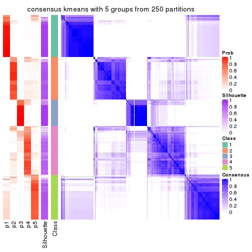</p>

</div>
<div id='tab-ATC-kmeans-consensus-heatmap-5'>
<pre><code class="r">consensus_heatmap(res, k = 6)
</code></pre>

<p></p>

</div>
</div>

Heatmaps for the membership of samples in all partitions to see how consistent they are:


<script>
$( function() {
	$( '#tabs-ATC-kmeans-membership-heatmap' ).tabs();
} );
</script>
<div id='tabs-ATC-kmeans-membership-heatmap'>
<ul>
<li><a href='#tab-ATC-kmeans-membership-heatmap-1'>k = 2</a></li>
<li><a href='#tab-ATC-kmeans-membership-heatmap-2'>k = 3</a></li>
<li><a href='#tab-ATC-kmeans-membership-heatmap-3'>k = 4</a></li>
<li><a href='#tab-ATC-kmeans-membership-heatmap-4'>k = 5</a></li>
<li><a href='#tab-ATC-kmeans-membership-heatmap-5'>k = 6</a></li>
</ul>
<div id='tab-ATC-kmeans-membership-heatmap-1'>
<pre><code class="r">membership_heatmap(res, k = 2)
</code></pre>

<p></p>

</div>
<div id='tab-ATC-kmeans-membership-heatmap-2'>
<pre><code class="r">membership_heatmap(res, k = 3)
</code></pre>

<p></p>

</div>
<div id='tab-ATC-kmeans-membership-heatmap-3'>
<pre><code class="r">membership_heatmap(res, k = 4)
</code></pre>

<p></p>

</div>
<div id='tab-ATC-kmeans-membership-heatmap-4'>
<pre><code class="r">membership_heatmap(res, k = 5)
</code></pre>

<p></p>

</div>
<div id='tab-ATC-kmeans-membership-heatmap-5'>
<pre><code class="r">membership_heatmap(res, k = 6)
</code></pre>

<p></p>

</div>
</div>

As soon as we have had the classes for columns, we can look for signatures
which are significantly different between classes which can be candidate marks
for certain classes. Following are the heatmaps for signatures.


Signature heatmaps where rows are scaled:


<script>
$( function() {
	$( '#tabs-ATC-kmeans-get-signatures' ).tabs();
} );
</script>
<div id='tabs-ATC-kmeans-get-signatures'>
<ul>
<li><a href='#tab-ATC-kmeans-get-signatures-1'>k = 2</a></li>
<li><a href='#tab-ATC-kmeans-get-signatures-2'>k = 3</a></li>
<li><a href='#tab-ATC-kmeans-get-signatures-3'>k = 4</a></li>
<li><a href='#tab-ATC-kmeans-get-signatures-4'>k = 5</a></li>
<li><a href='#tab-ATC-kmeans-get-signatures-5'>k = 6</a></li>
</ul>
<div id='tab-ATC-kmeans-get-signatures-1'>
<pre><code class="r">get_signatures(res, k = 2)
</code></pre>

<p></p>

</div>
<div id='tab-ATC-kmeans-get-signatures-2'>
<pre><code class="r">get_signatures(res, k = 3)
</code></pre>

<p></p>

</div>
<div id='tab-ATC-kmeans-get-signatures-3'>
<pre><code class="r">get_signatures(res, k = 4)
</code></pre>

<p></p>

</div>
<div id='tab-ATC-kmeans-get-signatures-4'>
<pre><code class="r">get_signatures(res, k = 5)
</code></pre>

<p></p>

</div>
<div id='tab-ATC-kmeans-get-signatures-5'>
<pre><code class="r">get_signatures(res, k = 6)
</code></pre>

<p></p>

</div>
</div>


Signature heatmaps where rows are not scaled:


<script>
$( function() {
	$( '#tabs-ATC-kmeans-get-signatures-no-scale' ).tabs();
} );
</script>
<div id='tabs-ATC-kmeans-get-signatures-no-scale'>
<ul>
<li><a href='#tab-ATC-kmeans-get-signatures-no-scale-1'>k = 2</a></li>
<li><a href='#tab-ATC-kmeans-get-signatures-no-scale-2'>k = 3</a></li>
<li><a href='#tab-ATC-kmeans-get-signatures-no-scale-3'>k = 4</a></li>
<li><a href='#tab-ATC-kmeans-get-signatures-no-scale-4'>k = 5</a></li>
<li><a href='#tab-ATC-kmeans-get-signatures-no-scale-5'>k = 6</a></li>
</ul>
<div id='tab-ATC-kmeans-get-signatures-no-scale-1'>
<pre><code class="r">get_signatures(res, k = 2, scale_rows = FALSE)
</code></pre>

<p></p>

</div>
<div id='tab-ATC-kmeans-get-signatures-no-scale-2'>
<pre><code class="r">get_signatures(res, k = 3, scale_rows = FALSE)
</code></pre>

<p>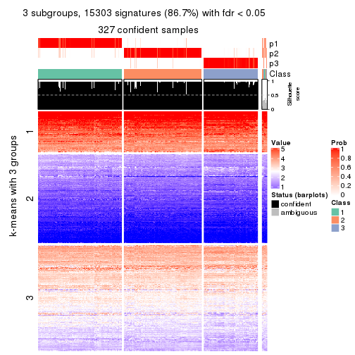</p>

</div>
<div id='tab-ATC-kmeans-get-signatures-no-scale-3'>
<pre><code class="r">get_signatures(res, k = 4, scale_rows = FALSE)
</code></pre>

<p></p>

</div>
<div id='tab-ATC-kmeans-get-signatures-no-scale-4'>
<pre><code class="r">get_signatures(res, k = 5, scale_rows = FALSE)
</code></pre>

<p></p>

</div>
<div id='tab-ATC-kmeans-get-signatures-no-scale-5'>
<pre><code class="r">get_signatures(res, k = 6, scale_rows = FALSE)
</code></pre>

<p></p>

</div>
</div>


Compare the overlap of signatures from different k:

```r
compare_signatures(res)
```


`get_signature()` returns a data frame invisibly. TO get the list of signatures, the function
call should be assigned to a variable explicitly. In following code, if `plot` argument is set
to `FALSE`, no heatmap is plotted while only the differential analysis is performed.

```r
# code only for demonstration
tb = get_signature(res, k = ..., plot = FALSE)
```

An example of the output of `tb` is:

```
#>   which_row         fdr    mean_1    mean_2 scaled_mean_1 scaled_mean_2 km
#> 1        38 0.042760348  8.373488  9.131774    -0.5533452     0.5164555  1
#> 2        40 0.018707592  7.106213  8.469186    -0.6173731     0.5762149  1
#> 3        55 0.019134737 10.221463 11.207825    -0.6159697     0.5749050  1
#> 4        59 0.006059896  5.921854  7.869574    -0.6899429     0.6439467  1
#> 5        60 0.018055526  8.928898 10.211722    -0.6204761     0.5791110  1
#> 6        98 0.009384629 15.714769 14.887706     0.6635654    -0.6193277  2
...
```

The columns in `tb` are:

1. `which_row`: row indices corresponding to the input matrix.
2. `fdr`: FDR for the differential test. 
3. `mean_x`: The mean value in group x.
4. `scaled_mean_x`: The mean value in group x after rows are scaled.
5. `km`: Row groups if k-means clustering is applied to rows.


UMAP plot which shows how samples are separated.


<script>
$( function() {
	$( '#tabs-ATC-kmeans-dimension-reduction' ).tabs();
} );
</script>
<div id='tabs-ATC-kmeans-dimension-reduction'>
<ul>
<li><a href='#tab-ATC-kmeans-dimension-reduction-1'>k = 2</a></li>
<li><a href='#tab-ATC-kmeans-dimension-reduction-2'>k = 3</a></li>
<li><a href='#tab-ATC-kmeans-dimension-reduction-3'>k = 4</a></li>
<li><a href='#tab-ATC-kmeans-dimension-reduction-4'>k = 5</a></li>
<li><a href='#tab-ATC-kmeans-dimension-reduction-5'>k = 6</a></li>
</ul>
<div id='tab-ATC-kmeans-dimension-reduction-1'>
<pre><code class="r">dimension_reduction(res, k = 2, method = &quot;UMAP&quot;)
</code></pre>

<p>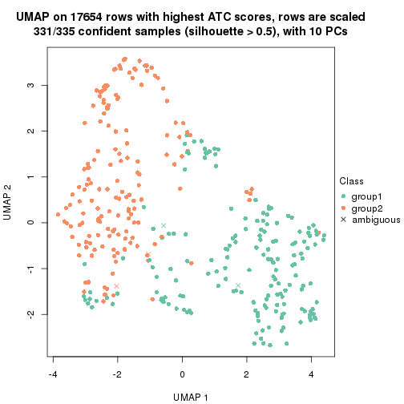</p>

</div>
<div id='tab-ATC-kmeans-dimension-reduction-2'>
<pre><code class="r">dimension_reduction(res, k = 3, method = &quot;UMAP&quot;)
</code></pre>

<p></p>

</div>
<div id='tab-ATC-kmeans-dimension-reduction-3'>
<pre><code class="r">dimension_reduction(res, k = 4, method = &quot;UMAP&quot;)
</code></pre>

<p></p>

</div>
<div id='tab-ATC-kmeans-dimension-reduction-4'>
<pre><code class="r">dimension_reduction(res, k = 5, method = &quot;UMAP&quot;)
</code></pre>

<p></p>

</div>
<div id='tab-ATC-kmeans-dimension-reduction-5'>
<pre><code class="r">dimension_reduction(res, k = 6, method = &quot;UMAP&quot;)
</code></pre>

<p></p>

</div>
</div>


Following heatmap shows how subgroups are split when increasing `k`:

```r
collect_classes(res)
```


If matrix rows can be associated to genes, consider to use `GO_Enrichment(res,
...)` to perform function enrichment for the signature genes.


 

---------------------------------------------------


### ATC:skmeans**


The object with results only for a single top-value method and a single partition method 
can be extracted as:

```r
res = res_list["ATC", "skmeans"]
# you can also extract it by
# res = res_list["ATC:skmeans"]
```

A summary of `res` and all the functions that can be applied to it:

```r
res
```

```
#> A 'ConsensusPartition' object with k = 2, 3, 4, 5, 6.
#>   On a matrix with 17654 rows and 335 columns.
#>   Top rows (1000, 2000, 3000, 4000, 5000) are extracted by 'ATC' method.
#>   Subgroups are detected by 'skmeans' method.
#>   Performed in total 1250 partitions by row resampling.
#>   Best k for subgroups seems to be 3.
#> 
#> Following methods can be applied to this 'ConsensusPartition' object:
#>  [1] "cola_report"             "collect_classes"         "collect_plots"          
#>  [4] "collect_stats"           "colnames"                "compare_signatures"     
#>  [7] "consensus_heatmap"       "dimension_reduction"     "functional_enrichment"  
#> [10] "get_anno_col"            "get_anno"                "get_classes"            
#> [13] "get_consensus"           "get_matrix"              "get_membership"         
#> [16] "get_param"               "get_signatures"          "get_stats"              
#> [19] "is_best_k"               "is_stable_k"             "membership_heatmap"     
#> [22] "ncol"                    "nrow"                    "plot_ecdf"              
#> [25] "rownames"                "select_partition_number" "show"                   
#> [28] "suggest_best_k"          "test_to_known_factors"
```

`collect_plots()` function collects all the plots made from `res` for all `k` (number of partitions)
into one single page to provide an easy and fast comparison between different `k`.

```r
collect_plots(res)
```


The plots are:

- The first row: a plot of the ECDF (Empirical cumulative distribution
  function) curves of the consensus matrix for each `k` and the heatmap of
  predicted classes for each `k`.
- The second row: heatmaps of the consensus matrix for each `k`.
- The third row: heatmaps of the membership matrix for each `k`.
- The fouth row: heatmaps of the signatures for each `k`.

All the plots in panels can be made by individual functions and they are
plotted later in this section.

`select_partition_number()` produces several plots showing different
statistics for choosing "optimized" `k`. There are following statistics:

- ECDF curves of the consensus matrix for each `k`;
- 1-PAC. [The PAC
  score](https://en.wikipedia.org/wiki/Consensus_clustering#Over-interpretation_potential_of_consensus_clustering)
  measures the proportion of the ambiguous subgrouping.
- Mean silhouette score.
- Concordance. The mean probability of fiting the consensus class ids in all
  partitions.
- Area increased. Denote $A_k$ as the area under the ECDF curve for current
  `k`, the area increased is defined as $A_k - A_{k-1}$.
- Rand index. The percent of pairs of samples that are both in a same cluster
  or both are not in a same cluster in the partition of k and k-1.
- Jaccard index. The ratio of pairs of samples are both in a same cluster in
  the partition of k and k-1 and the pairs of samples are both in a same
  cluster in the partition k or k-1.

The detailed explanations of these statistics can be found in [the cola
vignette](http://bioconductor.org/packages/devel/bioc/vignettes/cola/inst/doc/cola.html#toc_13).

Generally speaking, lower PAC score, higher mean silhouette score or higher
concordance corresponds to better partition. Rand index and Jaccard index
measure how similar the current partition is compared to partition with `k-1`.
If they are too similar, we won't accept `k` is better than `k-1`.

```r
select_partition_number(res)
```


The numeric values for all these statistics can be obtained by `get_stats()`.

```r
get_stats(res)
```

```
#>   k 1-PAC mean_silhouette concordance area_increased  Rand Jaccard
#> 2 2 1.000           0.971       0.989         0.5019 0.499   0.499
#> 3 3 0.984           0.954       0.982         0.2815 0.807   0.632
#> 4 4 0.836           0.723       0.879         0.1033 0.911   0.757
#> 5 5 0.759           0.652       0.787         0.0753 0.884   0.634
#> 6 6 0.851           0.775       0.893         0.0525 0.927   0.702
```

`suggest_best_k()` suggests the best $k$ based on these statistics. The rules are as follows:

- All $k$ with Jaccard index larger than 0.95 are removed because the increase of
  the partition number does not provides enough extra information. If all $k$ are removed,
  the best $k$ is assigned by `NA`.
- For $k$ with 1-PAC larger than 0.9, the maximal $k$ is taken as the "best k". Other $k$ is called "optional k".
- If it does not fit the second rule. The $k$ with the highest vote of highest
  1-PAC, mean silhouette and concordance is taken as the "best k".

```r
suggest_best_k(res)
```

```
#> [1] 3
#> attr(,"optional")
#> [1] 2
```

There is also optional best $k$ = 2 that is worth to check.

Following shows the table of the partitions (You need to click the **show/hide
code output** link to see it). The membership matrix (columns with name `p*`)
is inferred by
[`clue::cl_consensus()`](https://www.rdocumentation.org/link/cl_consensus?package=clue)
function with the `SE` method. Basically the value in the membership matrix
represents the probability to belong to a certain group. The finall class
label for an item is determined with the group with highest probability it
belongs to.

In `get_classes()` function, the entropy is calculated from the membership
matrix and the silhouette score is calculated from the consensus matrix.


<script>
$( function() {
	$( '#tabs-ATC-skmeans-get-classes' ).tabs();
} );
</script>
<div id='tabs-ATC-skmeans-get-classes'>
<ul>
<li><a href='#tab-ATC-skmeans-get-classes-1'>k = 2</a></li>
<li><a href='#tab-ATC-skmeans-get-classes-2'>k = 3</a></li>
<li><a href='#tab-ATC-skmeans-get-classes-3'>k = 4</a></li>
<li><a href='#tab-ATC-skmeans-get-classes-4'>k = 5</a></li>
<li><a href='#tab-ATC-skmeans-get-classes-5'>k = 6</a></li>
</ul>

<div id='tab-ATC-skmeans-get-classes-1'>
<p><a id='tab-ATC-skmeans-get-classes-1-a' style='color:#0366d6' href='#'>show/hide code output</a></p>
<pre><code class="r">cbind(get_classes(res, k = 2), get_membership(res, k = 2))
</code></pre>

<pre><code>#&gt;            class entropy silhouette    p1    p2
#&gt; SRR660306      2  0.0000      0.996 0.000 1.000
#&gt; SRR1359328     2  0.0000      0.996 0.000 1.000
#&gt; SRR821124      2  0.0000      0.996 0.000 1.000
#&gt; SRR1335188     1  0.0000      0.981 1.000 0.000
#&gt; SRR1075825     2  0.0000      0.996 0.000 1.000
#&gt; SRR1321921     1  0.0000      0.981 1.000 0.000
#&gt; SRR1466198     2  0.0000      0.996 0.000 1.000
#&gt; SRR1384073     1  0.0000      0.981 1.000 0.000
#&gt; SRR1312802     1  0.0000      0.981 1.000 0.000
#&gt; SRR1076559     1  0.0000      0.981 1.000 0.000
#&gt; SRR1370085     1  0.0000      0.981 1.000 0.000
#&gt; SRR1460363     1  0.0000      0.981 1.000 0.000
#&gt; SRR1480221     2  0.0000      0.996 0.000 1.000
#&gt; SRR1476165     1  0.0000      0.981 1.000 0.000
#&gt; SRR1459631     2  0.0000      0.996 0.000 1.000
#&gt; SRR1448098     2  0.0000      0.996 0.000 1.000
#&gt; SRR1321401     2  0.0000      0.996 0.000 1.000
#&gt; SRR807613      2  0.0000      0.996 0.000 1.000
#&gt; SRR808086      2  0.0000      0.996 0.000 1.000
#&gt; SRR613687      2  0.0000      0.996 0.000 1.000
#&gt; SRR1471011     1  0.9983      0.110 0.524 0.476
#&gt; SRR1330284     2  0.0000      0.996 0.000 1.000
#&gt; SRR1320624     2  0.0000      0.996 0.000 1.000
#&gt; SRR1459519     1  0.0000      0.981 1.000 0.000
#&gt; SRR1091184     2  0.0000      0.996 0.000 1.000
#&gt; SRR1390561     1  0.0000      0.981 1.000 0.000
#&gt; SRR658164      1  0.0000      0.981 1.000 0.000
#&gt; SRR1087079     2  0.0000      0.996 0.000 1.000
#&gt; SRR814996      2  0.0000      0.996 0.000 1.000
#&gt; SRR1407410     2  0.0000      0.996 0.000 1.000
#&gt; SRR1453392     2  0.0000      0.996 0.000 1.000
#&gt; SRR1445873     1  0.0000      0.981 1.000 0.000
#&gt; SRR1419985     2  0.0000      0.996 0.000 1.000
#&gt; SRR820938      2  0.0000      0.996 0.000 1.000
#&gt; SRR1476844     1  0.0000      0.981 1.000 0.000
#&gt; SRR1403526     1  0.0000      0.981 1.000 0.000
#&gt; SRR1413916     2  0.0000      0.996 0.000 1.000
#&gt; SRR1441051     2  0.0000      0.996 0.000 1.000
#&gt; SRR614287      2  0.0000      0.996 0.000 1.000
#&gt; SRR1092062     1  0.0000      0.981 1.000 0.000
#&gt; SRR612611      2  0.0376      0.992 0.004 0.996
#&gt; SRR1376356     1  0.9754      0.327 0.592 0.408
#&gt; SRR1405078     2  0.0000      0.996 0.000 1.000
#&gt; SRR1437226     2  0.0000      0.996 0.000 1.000
#&gt; SRR1326078     1  0.0000      0.981 1.000 0.000
#&gt; SRR1096806     2  0.0000      0.996 0.000 1.000
#&gt; SRR1440919     2  0.0000      0.996 0.000 1.000
#&gt; SRR1452824     2  0.0000      0.996 0.000 1.000
#&gt; SRR615754      1  0.0000      0.981 1.000 0.000
#&gt; SRR1341787     2  0.0000      0.996 0.000 1.000
#&gt; SRR614551      2  0.0000      0.996 0.000 1.000
#&gt; SRR1380829     2  0.0000      0.996 0.000 1.000
#&gt; SRR1455761     1  0.0000      0.981 1.000 0.000
#&gt; SRR1465189     2  0.0000      0.996 0.000 1.000
#&gt; SRR1376895     1  0.0000      0.981 1.000 0.000
#&gt; SRR1445002     1  0.0000      0.981 1.000 0.000
#&gt; SRR1469258     1  0.0000      0.981 1.000 0.000
#&gt; SRR1409239     1  0.0000      0.981 1.000 0.000
#&gt; SRR1480200     1  0.0000      0.981 1.000 0.000
#&gt; SRR1418323     1  0.0000      0.981 1.000 0.000
#&gt; SRR657540      2  0.0000      0.996 0.000 1.000
#&gt; SRR821096      2  0.0000      0.996 0.000 1.000
#&gt; SRR613591      2  0.0000      0.996 0.000 1.000
#&gt; SRR1344205     2  0.0000      0.996 0.000 1.000
#&gt; SRR612479      1  0.0000      0.981 1.000 0.000
#&gt; SRR1399950     1  0.0000      0.981 1.000 0.000
#&gt; SRR1336048     2  0.0000      0.996 0.000 1.000
#&gt; SRR1368896     1  0.0000      0.981 1.000 0.000
#&gt; SRR1379403     2  0.0000      0.996 0.000 1.000
#&gt; SRR1312464     1  0.0000      0.981 1.000 0.000
#&gt; SRR1096478     1  0.0000      0.981 1.000 0.000
#&gt; SRR1459845     1  0.0000      0.981 1.000 0.000
#&gt; SRR1348138     2  0.0000      0.996 0.000 1.000
#&gt; SRR811423      1  0.9087      0.531 0.676 0.324
#&gt; SRR615683      1  0.0000      0.981 1.000 0.000
#&gt; SRR1380336     2  0.0000      0.996 0.000 1.000
#&gt; SRR817609      1  0.0000      0.981 1.000 0.000
#&gt; SRR1074550     2  0.0000      0.996 0.000 1.000
#&gt; SRR1499236     2  0.0000      0.996 0.000 1.000
#&gt; SRR656083      1  0.0000      0.981 1.000 0.000
#&gt; SRR817539      1  0.0000      0.981 1.000 0.000
#&gt; SRR1410801     1  0.0000      0.981 1.000 0.000
#&gt; SRR1347190     1  0.0000      0.981 1.000 0.000
#&gt; SRR1355126     1  0.0000      0.981 1.000 0.000
#&gt; SRR615165      2  0.0000      0.996 0.000 1.000
#&gt; SRR1466046     1  0.0000      0.981 1.000 0.000
#&gt; SRR1097055     2  0.0000      0.996 0.000 1.000
#&gt; SRR1312370     1  0.0000      0.981 1.000 0.000
#&gt; SRR655325      1  0.0000      0.981 1.000 0.000
#&gt; SRR810177      1  0.0000      0.981 1.000 0.000
#&gt; SRR815685      2  0.0000      0.996 0.000 1.000
#&gt; SRR817026      2  0.0000      0.996 0.000 1.000
#&gt; SRR1417224     2  0.0000      0.996 0.000 1.000
#&gt; SRR661687      2  0.0000      0.996 0.000 1.000
#&gt; SRR1431804     1  0.0000      0.981 1.000 0.000
#&gt; SRR664072      2  0.0000      0.996 0.000 1.000
#&gt; SRR612923      2  0.0000      0.996 0.000 1.000
#&gt; SRR1315890     1  0.0000      0.981 1.000 0.000
#&gt; SRR1347726     1  0.0000      0.981 1.000 0.000
#&gt; SRR1500360     1  0.0000      0.981 1.000 0.000
#&gt; SRR1468360     2  0.7883      0.685 0.236 0.764
#&gt; SRR1404084     1  0.0000      0.981 1.000 0.000
#&gt; SRR615994      2  0.0000      0.996 0.000 1.000
#&gt; SRR1475718     2  0.0000      0.996 0.000 1.000
#&gt; SRR1397200     2  0.0000      0.996 0.000 1.000
#&gt; SRR655519      2  0.0000      0.996 0.000 1.000
#&gt; SRR1311308     2  0.0000      0.996 0.000 1.000
#&gt; SRR1368006     2  0.0000      0.996 0.000 1.000
#&gt; SRR613651      1  0.0000      0.981 1.000 0.000
#&gt; SRR1362621     2  0.0000      0.996 0.000 1.000
#&gt; SRR1451718     1  0.0000      0.981 1.000 0.000
#&gt; SRR1095334     2  0.0000      0.996 0.000 1.000
#&gt; SRR1079636     2  0.0000      0.996 0.000 1.000
#&gt; SRR1442549     1  0.0000      0.981 1.000 0.000
#&gt; SRR1466421     2  0.0000      0.996 0.000 1.000
#&gt; SRR817397      2  0.0000      0.996 0.000 1.000
#&gt; SRR1341809     1  0.0000      0.981 1.000 0.000
#&gt; SRR614623      2  0.0000      0.996 0.000 1.000
#&gt; SRR1335005     2  0.0000      0.996 0.000 1.000
#&gt; SRR1407065     2  0.0000      0.996 0.000 1.000
#&gt; SRR1404483     2  0.0000      0.996 0.000 1.000
#&gt; SRR1096222     1  0.0000      0.981 1.000 0.000
#&gt; SRR1401793     1  0.0000      0.981 1.000 0.000
#&gt; SRR1408615     2  0.0000      0.996 0.000 1.000
#&gt; SRR1070597     1  0.0000      0.981 1.000 0.000
#&gt; SRR1332381     1  0.0000      0.981 1.000 0.000
#&gt; SRR1457015     1  0.0000      0.981 1.000 0.000
#&gt; SRR1386797     1  0.0000      0.981 1.000 0.000
#&gt; SRR1098385     2  0.0000      0.996 0.000 1.000
#&gt; SRR1363947     2  0.0000      0.996 0.000 1.000
#&gt; SRR820350      2  0.0000      0.996 0.000 1.000
#&gt; SRR662055      2  0.0000      0.996 0.000 1.000
#&gt; SRR1310455     1  0.0000      0.981 1.000 0.000
#&gt; SRR1453639     1  0.0376      0.978 0.996 0.004
#&gt; SRR662617      1  0.0000      0.981 1.000 0.000
#&gt; SRR654778      1  0.0000      0.981 1.000 0.000
#&gt; SRR661782      1  0.0000      0.981 1.000 0.000
#&gt; SRR1334396     1  0.0000      0.981 1.000 0.000
#&gt; SRR613867      2  0.0000      0.996 0.000 1.000
#&gt; SRR1479412     1  0.0000      0.981 1.000 0.000
#&gt; SRR1331620     1  0.0000      0.981 1.000 0.000
#&gt; SRR1082809     2  0.0000      0.996 0.000 1.000
#&gt; SRR1417178     2  0.0000      0.996 0.000 1.000
#&gt; SRR1335278     1  0.0000      0.981 1.000 0.000
#&gt; SRR665369      1  0.0000      0.981 1.000 0.000
#&gt; SRR657552      1  0.0000      0.981 1.000 0.000
#&gt; SRR812412      1  0.0000      0.981 1.000 0.000
#&gt; SRR1096500     1  0.5294      0.856 0.880 0.120
#&gt; SRR1347750     1  0.0000      0.981 1.000 0.000
#&gt; SRR615153      2  0.0000      0.996 0.000 1.000
#&gt; SRR1434417     1  0.0000      0.981 1.000 0.000
#&gt; SRR1070159     2  0.0000      0.996 0.000 1.000
#&gt; SRR1332508     1  0.9754      0.327 0.592 0.408
#&gt; SRR1082059     1  0.0000      0.981 1.000 0.000
#&gt; SRR1402491     1  0.0000      0.981 1.000 0.000
#&gt; SRR1476595     1  0.0000      0.981 1.000 0.000
#&gt; SRR1320987     1  0.0000      0.981 1.000 0.000
#&gt; SRR1086417     1  0.0000      0.981 1.000 0.000
#&gt; SRR1454095     1  0.0000      0.981 1.000 0.000
#&gt; SRR614791      2  0.0000      0.996 0.000 1.000
#&gt; SRR821255      1  0.0000      0.981 1.000 0.000
#&gt; SRR820402      2  0.0000      0.996 0.000 1.000
#&gt; SRR1337284     1  0.0000      0.981 1.000 0.000
#&gt; SRR1333083     2  0.0000      0.996 0.000 1.000
#&gt; SRR1384883     2  0.0000      0.996 0.000 1.000
#&gt; SRR614431      1  0.0000      0.981 1.000 0.000
#&gt; SRR1481106     2  0.0000      0.996 0.000 1.000
#&gt; SRR1370285     1  0.0000      0.981 1.000 0.000
#&gt; SRR1446673     2  0.0000      0.996 0.000 1.000
#&gt; SRR1318046     2  0.0000      0.996 0.000 1.000
#&gt; SRR1341188     2  0.0000      0.996 0.000 1.000
#&gt; SRR1384941     1  0.0000      0.981 1.000 0.000
#&gt; SRR1322864     2  0.0000      0.996 0.000 1.000
#&gt; SRR1476825     2  0.0000      0.996 0.000 1.000
#&gt; SRR1443332     2  0.0000      0.996 0.000 1.000
#&gt; SRR662486      1  0.9248      0.501 0.660 0.340
#&gt; SRR1447019     1  0.0000      0.981 1.000 0.000
#&gt; SRR662942      1  0.0000      0.981 1.000 0.000
#&gt; SRR613102      2  0.0000      0.996 0.000 1.000
#&gt; SRR1469880     1  0.0000      0.981 1.000 0.000
#&gt; SRR1464977     1  0.0000      0.981 1.000 0.000
#&gt; SRR615850      2  0.0000      0.996 0.000 1.000
#&gt; SRR661949      1  0.0000      0.981 1.000 0.000
#&gt; SRR1322227     2  0.0000      0.996 0.000 1.000
#&gt; SRR1441655     1  0.1184      0.967 0.984 0.016
#&gt; SRR613771      2  0.0000      0.996 0.000 1.000
#&gt; SRR1479471     1  0.0000      0.981 1.000 0.000
#&gt; SRR1488918     2  0.0000      0.996 0.000 1.000
#&gt; SRR1414040     2  0.0000      0.996 0.000 1.000
#&gt; SRR1079850     1  0.0000      0.981 1.000 0.000
#&gt; SRR663209      1  0.0000      0.981 1.000 0.000
#&gt; SRR1364914     2  0.0000      0.996 0.000 1.000
#&gt; SRR1408267     1  0.0000      0.981 1.000 0.000
#&gt; SRR1314894     1  0.0000      0.981 1.000 0.000
#&gt; SRR1414117     2  0.0000      0.996 0.000 1.000
#&gt; SRR1395975     2  0.0000      0.996 0.000 1.000
#&gt; SRR1402219     2  0.6887      0.769 0.184 0.816
#&gt; SRR1433623     1  0.0000      0.981 1.000 0.000
#&gt; SRR656385      2  0.0000      0.996 0.000 1.000
#&gt; SRR811213      1  0.0000      0.981 1.000 0.000
#&gt; SRR663657      2  0.0000      0.996 0.000 1.000
#&gt; SRR612203      1  0.0000      0.981 1.000 0.000
#&gt; SRR613987      2  0.0000      0.996 0.000 1.000
#&gt; SRR613831      2  0.0000      0.996 0.000 1.000
#&gt; SRR1354180     2  0.0000      0.996 0.000 1.000
#&gt; SRR1382912     1  0.0000      0.981 1.000 0.000
#&gt; SRR1475501     1  0.0000      0.981 1.000 0.000
#&gt; SRR1336930     1  0.0000      0.981 1.000 0.000
#&gt; SRR613030      2  0.0000      0.996 0.000 1.000
#&gt; SRR1381459     2  0.0000      0.996 0.000 1.000
#&gt; SRR1402350     1  0.0000      0.981 1.000 0.000
#&gt; SRR1419408     1  0.0000      0.981 1.000 0.000
#&gt; SRR655911      2  0.0000      0.996 0.000 1.000
#&gt; SRR1418243     1  0.0000      0.981 1.000 0.000
#&gt; SRR1322573     1  0.0000      0.981 1.000 0.000
#&gt; SRR613615      2  0.0000      0.996 0.000 1.000
#&gt; SRR1355284     1  0.0000      0.981 1.000 0.000
#&gt; SRR1319395     1  0.0000      0.981 1.000 0.000
#&gt; SRR818939      1  0.0000      0.981 1.000 0.000
#&gt; SRR1465266     1  0.0000      0.981 1.000 0.000
#&gt; SRR614888      1  0.0000      0.981 1.000 0.000
#&gt; SRR1431694     1  0.0000      0.981 1.000 0.000
#&gt; SRR614347      2  0.0000      0.996 0.000 1.000
#&gt; SRR1334228     2  0.0000      0.996 0.000 1.000
#&gt; SRR1096007     2  0.0000      0.996 0.000 1.000
#&gt; SRR656349      1  0.0000      0.981 1.000 0.000
#&gt; SRR815422      2  0.0000      0.996 0.000 1.000
#&gt; SRR1360828     1  0.0000      0.981 1.000 0.000
#&gt; SRR1359005     2  0.0000      0.996 0.000 1.000
#&gt; SRR1456652     1  0.0000      0.981 1.000 0.000
#&gt; SRR1391660     1  0.0000      0.981 1.000 0.000
#&gt; SRR1441956     1  0.0000      0.981 1.000 0.000
#&gt; SRR662930      2  0.0000      0.996 0.000 1.000
#&gt; SRR615790      2  0.0000      0.996 0.000 1.000
#&gt; SRR614827      2  0.0000      0.996 0.000 1.000
#&gt; SRR614587      2  0.0000      0.996 0.000 1.000
#&gt; SRR814052      1  0.0000      0.981 1.000 0.000
#&gt; SRR1070086     1  0.0000      0.981 1.000 0.000
#&gt; SRR1481440     1  0.0000      0.981 1.000 0.000
#&gt; SRR1339296     2  0.0000      0.996 0.000 1.000
#&gt; SRR1343239     2  0.0000      0.996 0.000 1.000
#&gt; SRR1432802     1  0.2423      0.943 0.960 0.040
#&gt; SRR1416911     1  0.0000      0.981 1.000 0.000
#&gt; SRR1410427     1  0.0000      0.981 1.000 0.000
#&gt; SRR1401185     2  0.0000      0.996 0.000 1.000
#&gt; SRR654993      2  0.0000      0.996 0.000 1.000
#&gt; SRR656397      1  0.0000      0.981 1.000 0.000
#&gt; SRR809643      2  0.0000      0.996 0.000 1.000
#&gt; SRR1433819     1  0.0000      0.981 1.000 0.000
#&gt; SRR1375225     2  0.8207      0.649 0.256 0.744
#&gt; SRR1367739     2  0.0000      0.996 0.000 1.000
#&gt; SRR1323336     1  0.0000      0.981 1.000 0.000
#&gt; SRR663224      2  0.0000      0.996 0.000 1.000
#&gt; SRR1442840     1  0.0000      0.981 1.000 0.000
#&gt; SRR1374058     1  0.0000      0.981 1.000 0.000
#&gt; SRR656994      1  0.0000      0.981 1.000 0.000
#&gt; SRR1469214     2  0.0000      0.996 0.000 1.000
#&gt; SRR1456446     1  0.5178      0.861 0.884 0.116
#&gt; SRR1471879     1  0.0000      0.981 1.000 0.000
#&gt; SRR612911      2  0.0000      0.996 0.000 1.000
#&gt; SRR1395720     2  0.0000      0.996 0.000 1.000
#&gt; SRR1413055     1  0.0000      0.981 1.000 0.000
#&gt; SRR656770      2  0.0000      0.996 0.000 1.000
#&gt; SRR812080      2  0.0000      0.996 0.000 1.000
#&gt; SRR1479328     1  0.0000      0.981 1.000 0.000
#&gt; SRR661421      2  0.0000      0.996 0.000 1.000
#&gt; SRR1410286     2  0.0000      0.996 0.000 1.000
#&gt; SRR1487150     1  0.0000      0.981 1.000 0.000
#&gt; SRR1467035     1  0.0000      0.981 1.000 0.000
#&gt; SRR1360607     2  0.0000      0.996 0.000 1.000
#&gt; SRR1333106     2  0.0000      0.996 0.000 1.000
#&gt; SRR1088706     1  0.0000      0.981 1.000 0.000
#&gt; SRR1320053     2  0.0000      0.996 0.000 1.000
#&gt; SRR1350392     2  0.0000      0.996 0.000 1.000
#&gt; SRR1385190     2  0.0000      0.996 0.000 1.000
#&gt; SRR1080093     2  0.0000      0.996 0.000 1.000
#&gt; SRR1318753     1  0.0000      0.981 1.000 0.000
#&gt; SRR1345369     2  0.0000      0.996 0.000 1.000
#&gt; SRR612178      2  0.0000      0.996 0.000 1.000
#&gt; SRR1354423     1  0.0000      0.981 1.000 0.000
#&gt; SRR1072724     1  0.0000      0.981 1.000 0.000
#&gt; SRR1418450     2  0.0000      0.996 0.000 1.000
#&gt; SRR1326427     2  0.0000      0.996 0.000 1.000
#&gt; SRR1437412     1  0.0000      0.981 1.000 0.000
#&gt; SRR1327548     2  0.0000      0.996 0.000 1.000
#&gt; SRR1395891     1  0.0000      0.981 1.000 0.000
#&gt; SRR659367      1  0.0000      0.981 1.000 0.000
#&gt; SRR818961      1  0.0000      0.981 1.000 0.000
#&gt; SRR813704      1  0.0000      0.981 1.000 0.000
#&gt; SRR613054      1  0.0000      0.981 1.000 0.000
#&gt; SRR1476467     1  0.0000      0.981 1.000 0.000
#&gt; SRR1407988     2  0.0000      0.996 0.000 1.000
#&gt; SRR1394776     2  0.0000      0.996 0.000 1.000
#&gt; SRR655578      1  0.9963      0.154 0.536 0.464
#&gt; SRR1310645     2  0.0000      0.996 0.000 1.000
#&gt; SRR1345628     1  0.0000      0.981 1.000 0.000
#&gt; SRR1479740     1  0.0000      0.981 1.000 0.000
#&gt; SRR1332095     1  0.0000      0.981 1.000 0.000
#&gt; SRR1444786     2  0.0000      0.996 0.000 1.000
#&gt; SRR1090070     1  0.0000      0.981 1.000 0.000
#&gt; SRR662414      1  0.0000      0.981 1.000 0.000
#&gt; SRR661216      2  0.0000      0.996 0.000 1.000
#&gt; SRR656313      1  0.4690      0.879 0.900 0.100
#&gt; SRR615671      2  0.0000      0.996 0.000 1.000
#&gt; SRR1350196     2  0.0000      0.996 0.000 1.000
#&gt; SRR1466580     1  0.0000      0.981 1.000 0.000
#&gt; SRR1408032     2  0.0000      0.996 0.000 1.000
#&gt; SRR1432913     2  0.0000      0.996 0.000 1.000
#&gt; SRR1360502     2  0.0000      0.996 0.000 1.000
#&gt; SRR1391901     2  0.0000      0.996 0.000 1.000
#&gt; SRR1311131     1  0.0000      0.981 1.000 0.000
#&gt; SRR1380636     1  0.0000      0.981 1.000 0.000
#&gt; SRR1332339     1  0.0000      0.981 1.000 0.000
#&gt; SRR1341563     2  0.0000      0.996 0.000 1.000
#&gt; SRR1359410     2  0.0000      0.996 0.000 1.000
#&gt; SRR1473040     2  0.0000      0.996 0.000 1.000
#&gt; SRR1321444     1  0.0000      0.981 1.000 0.000
#&gt; SRR1498765     2  0.0000      0.996 0.000 1.000
#&gt; SRR1312622     2  0.0000      0.996 0.000 1.000
#&gt; SRR615503      1  0.0000      0.981 1.000 0.000
#&gt; SRR1453192     1  0.0000      0.981 1.000 0.000
#&gt; SRR1433107     2  0.0000      0.996 0.000 1.000
#&gt; SRR1075384     1  0.0000      0.981 1.000 0.000
#&gt; SRR1356683     1  0.0000      0.981 1.000 0.000
#&gt; SRR659049      1  0.0000      0.981 1.000 0.000
#&gt; SRR1368240     1  0.0000      0.981 1.000 0.000
#&gt; SRR1341739     1  0.0000      0.981 1.000 0.000
#&gt; SRR613249      2  0.0000      0.996 0.000 1.000
#&gt; SRR663428      1  0.0000      0.981 1.000 0.000
#&gt; SRR1341302     2  0.0000      0.996 0.000 1.000
#&gt; SRR1073553     1  0.9087      0.532 0.676 0.324
#&gt; SRR1354093     2  0.0000      0.996 0.000 1.000
#&gt; SRR1406521     2  0.0000      0.996 0.000 1.000
#&gt; SRR1432049     1  0.0000      0.981 1.000 0.000
#&gt; SRR1453504     2  0.0000      0.996 0.000 1.000
</code></pre>

<script>
$('#tab-ATC-skmeans-get-classes-1-a').parent().next().next().hide();
$('#tab-ATC-skmeans-get-classes-1-a').click(function(){
  $('#tab-ATC-skmeans-get-classes-1-a').parent().next().next().toggle();
  return(false);
});
</script>
</div>

<div id='tab-ATC-skmeans-get-classes-2'>
<p><a id='tab-ATC-skmeans-get-classes-2-a' style='color:#0366d6' href='#'>show/hide code output</a></p>
<pre><code class="r">cbind(get_classes(res, k = 3), get_membership(res, k = 3))
</code></pre>

<pre><code>#&gt;            class entropy silhouette    p1    p2    p3
#&gt; SRR660306      2  0.0000      0.957 0.000 1.000 0.000
#&gt; SRR1359328     3  0.0000      0.976 0.000 0.000 1.000
#&gt; SRR821124      3  0.0000      0.976 0.000 0.000 1.000
#&gt; SRR1335188     1  0.0000      0.995 1.000 0.000 0.000
#&gt; SRR1075825     3  0.0000      0.976 0.000 0.000 1.000
#&gt; SRR1321921     1  0.0000      0.995 1.000 0.000 0.000
#&gt; SRR1466198     3  0.0000      0.976 0.000 0.000 1.000
#&gt; SRR1384073     1  0.0000      0.995 1.000 0.000 0.000
#&gt; SRR1312802     1  0.0000      0.995 1.000 0.000 0.000
#&gt; SRR1076559     1  0.0000      0.995 1.000 0.000 0.000
#&gt; SRR1370085     1  0.0000      0.995 1.000 0.000 0.000
#&gt; SRR1460363     1  0.0000      0.995 1.000 0.000 0.000
#&gt; SRR1480221     2  0.0000      0.957 0.000 1.000 0.000
#&gt; SRR1476165     1  0.0000      0.995 1.000 0.000 0.000
#&gt; SRR1459631     3  0.0000      0.976 0.000 0.000 1.000
#&gt; SRR1448098     2  0.0000      0.957 0.000 1.000 0.000
#&gt; SRR1321401     2  0.0000      0.957 0.000 1.000 0.000
#&gt; SRR807613      2  0.0000      0.957 0.000 1.000 0.000
#&gt; SRR808086      3  0.0000      0.976 0.000 0.000 1.000
#&gt; SRR613687      2  0.0000      0.957 0.000 1.000 0.000
#&gt; SRR1471011     3  0.3551      0.811 0.132 0.000 0.868
#&gt; SRR1330284     3  0.0000      0.976 0.000 0.000 1.000
#&gt; SRR1320624     3  0.0000      0.976 0.000 0.000 1.000
#&gt; SRR1459519     1  0.0000      0.995 1.000 0.000 0.000
#&gt; SRR1091184     3  0.0000      0.976 0.000 0.000 1.000
#&gt; SRR1390561     1  0.0000      0.995 1.000 0.000 0.000
#&gt; SRR658164      1  0.0000      0.995 1.000 0.000 0.000
#&gt; SRR1087079     2  0.0000      0.957 0.000 1.000 0.000
#&gt; SRR814996      3  0.0000      0.976 0.000 0.000 1.000
#&gt; SRR1407410     2  0.0000      0.957 0.000 1.000 0.000
#&gt; SRR1453392     3  0.0000      0.976 0.000 0.000 1.000
#&gt; SRR1445873     1  0.0000      0.995 1.000 0.000 0.000
#&gt; SRR1419985     2  0.0000      0.957 0.000 1.000 0.000
#&gt; SRR820938      3  0.0000      0.976 0.000 0.000 1.000
#&gt; SRR1476844     1  0.0000      0.995 1.000 0.000 0.000
#&gt; SRR1403526     1  0.0000      0.995 1.000 0.000 0.000
#&gt; SRR1413916     3  0.1643      0.934 0.000 0.044 0.956
#&gt; SRR1441051     3  0.0000      0.976 0.000 0.000 1.000
#&gt; SRR614287      2  0.0000      0.957 0.000 1.000 0.000
#&gt; SRR1092062     2  0.0000      0.957 0.000 1.000 0.000
#&gt; SRR612611      2  0.0000      0.957 0.000 1.000 0.000
#&gt; SRR1376356     2  0.0000      0.957 0.000 1.000 0.000
#&gt; SRR1405078     3  0.0000      0.976 0.000 0.000 1.000
#&gt; SRR1437226     2  0.1964      0.909 0.000 0.944 0.056
#&gt; SRR1326078     1  0.0000      0.995 1.000 0.000 0.000
#&gt; SRR1096806     3  0.0000      0.976 0.000 0.000 1.000
#&gt; SRR1440919     3  0.0000      0.976 0.000 0.000 1.000
#&gt; SRR1452824     3  0.0000      0.976 0.000 0.000 1.000
#&gt; SRR615754      1  0.0000      0.995 1.000 0.000 0.000
#&gt; SRR1341787     2  0.0000      0.957 0.000 1.000 0.000
#&gt; SRR614551      3  0.0000      0.976 0.000 0.000 1.000
#&gt; SRR1380829     3  0.0000      0.976 0.000 0.000 1.000
#&gt; SRR1455761     1  0.0000      0.995 1.000 0.000 0.000
#&gt; SRR1465189     3  0.0000      0.976 0.000 0.000 1.000
#&gt; SRR1376895     1  0.0000      0.995 1.000 0.000 0.000
#&gt; SRR1445002     1  0.0000      0.995 1.000 0.000 0.000
#&gt; SRR1469258     2  0.0237      0.954 0.004 0.996 0.000
#&gt; SRR1409239     1  0.0000      0.995 1.000 0.000 0.000
#&gt; SRR1480200     1  0.0000      0.995 1.000 0.000 0.000
#&gt; SRR1418323     1  0.0000      0.995 1.000 0.000 0.000
#&gt; SRR657540      3  0.0000      0.976 0.000 0.000 1.000
#&gt; SRR821096      3  0.0000      0.976 0.000 0.000 1.000
#&gt; SRR613591      2  0.0000      0.957 0.000 1.000 0.000
#&gt; SRR1344205     3  0.0000      0.976 0.000 0.000 1.000
#&gt; SRR612479      1  0.0000      0.995 1.000 0.000 0.000
#&gt; SRR1399950     1  0.0000      0.995 1.000 0.000 0.000
#&gt; SRR1336048     3  0.0000      0.976 0.000 0.000 1.000
#&gt; SRR1368896     1  0.0000      0.995 1.000 0.000 0.000
#&gt; SRR1379403     3  0.0000      0.976 0.000 0.000 1.000
#&gt; SRR1312464     1  0.0000      0.995 1.000 0.000 0.000
#&gt; SRR1096478     1  0.0000      0.995 1.000 0.000 0.000
#&gt; SRR1459845     1  0.0000      0.995 1.000 0.000 0.000
#&gt; SRR1348138     3  0.0000      0.976 0.000 0.000 1.000
#&gt; SRR811423      3  0.6299      0.108 0.476 0.000 0.524
#&gt; SRR615683      1  0.0000      0.995 1.000 0.000 0.000
#&gt; SRR1380336     2  0.4555      0.747 0.000 0.800 0.200
#&gt; SRR817609      1  0.0000      0.995 1.000 0.000 0.000
#&gt; SRR1074550     3  0.0000      0.976 0.000 0.000 1.000
#&gt; SRR1499236     2  0.0000      0.957 0.000 1.000 0.000
#&gt; SRR656083      1  0.0000      0.995 1.000 0.000 0.000
#&gt; SRR817539      1  0.0000      0.995 1.000 0.000 0.000
#&gt; SRR1410801     1  0.0000      0.995 1.000 0.000 0.000
#&gt; SRR1347190     1  0.0000      0.995 1.000 0.000 0.000
#&gt; SRR1355126     1  0.0000      0.995 1.000 0.000 0.000
#&gt; SRR615165      3  0.0000      0.976 0.000 0.000 1.000
#&gt; SRR1466046     1  0.0000      0.995 1.000 0.000 0.000
#&gt; SRR1097055     3  0.0000      0.976 0.000 0.000 1.000
#&gt; SRR1312370     2  0.0000      0.957 0.000 1.000 0.000
#&gt; SRR655325      1  0.0000      0.995 1.000 0.000 0.000
#&gt; SRR810177      2  0.0000      0.957 0.000 1.000 0.000
#&gt; SRR815685      3  0.0000      0.976 0.000 0.000 1.000
#&gt; SRR817026      3  0.0000      0.976 0.000 0.000 1.000
#&gt; SRR1417224     3  0.0000      0.976 0.000 0.000 1.000
#&gt; SRR661687      3  0.0000      0.976 0.000 0.000 1.000
#&gt; SRR1431804     1  0.0000      0.995 1.000 0.000 0.000
#&gt; SRR664072      3  0.0000      0.976 0.000 0.000 1.000
#&gt; SRR612923      3  0.0000      0.976 0.000 0.000 1.000
#&gt; SRR1315890     1  0.0000      0.995 1.000 0.000 0.000
#&gt; SRR1347726     1  0.0000      0.995 1.000 0.000 0.000
#&gt; SRR1500360     1  0.0000      0.995 1.000 0.000 0.000
#&gt; SRR1468360     2  0.0000      0.957 0.000 1.000 0.000
#&gt; SRR1404084     1  0.0000      0.995 1.000 0.000 0.000
#&gt; SRR615994      3  0.0000      0.976 0.000 0.000 1.000
#&gt; SRR1475718     2  0.0000      0.957 0.000 1.000 0.000
#&gt; SRR1397200     3  0.0000      0.976 0.000 0.000 1.000
#&gt; SRR655519      3  0.0000      0.976 0.000 0.000 1.000
#&gt; SRR1311308     3  0.0000      0.976 0.000 0.000 1.000
#&gt; SRR1368006     3  0.0000      0.976 0.000 0.000 1.000
#&gt; SRR613651      1  0.0000      0.995 1.000 0.000 0.000
#&gt; SRR1362621     3  0.0000      0.976 0.000 0.000 1.000
#&gt; SRR1451718     1  0.0000      0.995 1.000 0.000 0.000
#&gt; SRR1095334     3  0.0000      0.976 0.000 0.000 1.000
#&gt; SRR1079636     3  0.5905      0.453 0.000 0.352 0.648
#&gt; SRR1442549     2  0.0000      0.957 0.000 1.000 0.000
#&gt; SRR1466421     2  0.0000      0.957 0.000 1.000 0.000
#&gt; SRR817397      3  0.0000      0.976 0.000 0.000 1.000
#&gt; SRR1341809     2  0.0000      0.957 0.000 1.000 0.000
#&gt; SRR614623      3  0.0000      0.976 0.000 0.000 1.000
#&gt; SRR1335005     3  0.0000      0.976 0.000 0.000 1.000
#&gt; SRR1407065     3  0.0000      0.976 0.000 0.000 1.000
#&gt; SRR1404483     3  0.0000      0.976 0.000 0.000 1.000
#&gt; SRR1096222     1  0.0000      0.995 1.000 0.000 0.000
#&gt; SRR1401793     1  0.0000      0.995 1.000 0.000 0.000
#&gt; SRR1408615     3  0.0000      0.976 0.000 0.000 1.000
#&gt; SRR1070597     2  0.0000      0.957 0.000 1.000 0.000
#&gt; SRR1332381     1  0.0000      0.995 1.000 0.000 0.000
#&gt; SRR1457015     1  0.0000      0.995 1.000 0.000 0.000
#&gt; SRR1386797     1  0.0000      0.995 1.000 0.000 0.000
#&gt; SRR1098385     3  0.0000      0.976 0.000 0.000 1.000
#&gt; SRR1363947     3  0.0000      0.976 0.000 0.000 1.000
#&gt; SRR820350      2  0.0000      0.957 0.000 1.000 0.000
#&gt; SRR662055      3  0.0000      0.976 0.000 0.000 1.000
#&gt; SRR1310455     1  0.0000      0.995 1.000 0.000 0.000
#&gt; SRR1453639     2  0.0000      0.957 0.000 1.000 0.000
#&gt; SRR662617      2  0.0000      0.957 0.000 1.000 0.000
#&gt; SRR654778      1  0.0000      0.995 1.000 0.000 0.000
#&gt; SRR661782      2  0.0000      0.957 0.000 1.000 0.000
#&gt; SRR1334396     1  0.0000      0.995 1.000 0.000 0.000
#&gt; SRR613867      2  0.4654      0.736 0.000 0.792 0.208
#&gt; SRR1479412     1  0.0000      0.995 1.000 0.000 0.000
#&gt; SRR1331620     1  0.0000      0.995 1.000 0.000 0.000
#&gt; SRR1082809     3  0.0000      0.976 0.000 0.000 1.000
#&gt; SRR1417178     3  0.0000      0.976 0.000 0.000 1.000
#&gt; SRR1335278     1  0.0000      0.995 1.000 0.000 0.000
#&gt; SRR665369      2  0.0000      0.957 0.000 1.000 0.000
#&gt; SRR657552      1  0.0000      0.995 1.000 0.000 0.000
#&gt; SRR812412      1  0.0000      0.995 1.000 0.000 0.000
#&gt; SRR1096500     2  0.0000      0.957 0.000 1.000 0.000
#&gt; SRR1347750     2  0.0000      0.957 0.000 1.000 0.000
#&gt; SRR615153      3  0.0000      0.976 0.000 0.000 1.000
#&gt; SRR1434417     1  0.0000      0.995 1.000 0.000 0.000
#&gt; SRR1070159     3  0.0000      0.976 0.000 0.000 1.000
#&gt; SRR1332508     2  0.0000      0.957 0.000 1.000 0.000
#&gt; SRR1082059     1  0.0000      0.995 1.000 0.000 0.000
#&gt; SRR1402491     1  0.0000      0.995 1.000 0.000 0.000
#&gt; SRR1476595     1  0.0000      0.995 1.000 0.000 0.000
#&gt; SRR1320987     1  0.0000      0.995 1.000 0.000 0.000
#&gt; SRR1086417     1  0.0000      0.995 1.000 0.000 0.000
#&gt; SRR1454095     1  0.0000      0.995 1.000 0.000 0.000
#&gt; SRR614791      3  0.0000      0.976 0.000 0.000 1.000
#&gt; SRR821255      1  0.0000      0.995 1.000 0.000 0.000
#&gt; SRR820402      2  0.0000      0.957 0.000 1.000 0.000
#&gt; SRR1337284     2  0.6154      0.327 0.408 0.592 0.000
#&gt; SRR1333083     3  0.0000      0.976 0.000 0.000 1.000
#&gt; SRR1384883     3  0.0000      0.976 0.000 0.000 1.000
#&gt; SRR614431      1  0.0000      0.995 1.000 0.000 0.000
#&gt; SRR1481106     3  0.0000      0.976 0.000 0.000 1.000
#&gt; SRR1370285     1  0.0000      0.995 1.000 0.000 0.000
#&gt; SRR1446673     3  0.0000      0.976 0.000 0.000 1.000
#&gt; SRR1318046     2  0.0000      0.957 0.000 1.000 0.000
#&gt; SRR1341188     3  0.0000      0.976 0.000 0.000 1.000
#&gt; SRR1384941     1  0.0000      0.995 1.000 0.000 0.000
#&gt; SRR1322864     3  0.3412      0.843 0.000 0.124 0.876
#&gt; SRR1476825     3  0.0000      0.976 0.000 0.000 1.000
#&gt; SRR1443332     3  0.0000      0.976 0.000 0.000 1.000
#&gt; SRR662486      2  0.0000      0.957 0.000 1.000 0.000
#&gt; SRR1447019     1  0.0000      0.995 1.000 0.000 0.000
#&gt; SRR662942      1  0.0000      0.995 1.000 0.000 0.000
#&gt; SRR613102      3  0.0000      0.976 0.000 0.000 1.000
#&gt; SRR1469880     1  0.0000      0.995 1.000 0.000 0.000
#&gt; SRR1464977     1  0.0000      0.995 1.000 0.000 0.000
#&gt; SRR615850      3  0.0000      0.976 0.000 0.000 1.000
#&gt; SRR661949      2  0.0000      0.957 0.000 1.000 0.000
#&gt; SRR1322227     3  0.0000      0.976 0.000 0.000 1.000
#&gt; SRR1441655     1  0.1529      0.949 0.960 0.000 0.040
#&gt; SRR613771      2  0.4555      0.747 0.000 0.800 0.200
#&gt; SRR1479471     1  0.0000      0.995 1.000 0.000 0.000
#&gt; SRR1488918     2  0.5905      0.474 0.000 0.648 0.352
#&gt; SRR1414040     2  0.0000      0.957 0.000 1.000 0.000
#&gt; SRR1079850     1  0.0000      0.995 1.000 0.000 0.000
#&gt; SRR663209      1  0.0000      0.995 1.000 0.000 0.000
#&gt; SRR1364914     3  0.0000      0.976 0.000 0.000 1.000
#&gt; SRR1408267     1  0.0000      0.995 1.000 0.000 0.000
#&gt; SRR1314894     1  0.0000      0.995 1.000 0.000 0.000
#&gt; SRR1414117     3  0.0000      0.976 0.000 0.000 1.000
#&gt; SRR1395975     2  0.0000      0.957 0.000 1.000 0.000
#&gt; SRR1402219     2  0.0000      0.957 0.000 1.000 0.000
#&gt; SRR1433623     1  0.0000      0.995 1.000 0.000 0.000
#&gt; SRR656385      3  0.6126      0.312 0.000 0.400 0.600
#&gt; SRR811213      2  0.0000      0.957 0.000 1.000 0.000
#&gt; SRR663657      3  0.0000      0.976 0.000 0.000 1.000
#&gt; SRR612203      1  0.0000      0.995 1.000 0.000 0.000
#&gt; SRR613987      3  0.0000      0.976 0.000 0.000 1.000
#&gt; SRR613831      3  0.0000      0.976 0.000 0.000 1.000
#&gt; SRR1354180     2  0.4555      0.747 0.000 0.800 0.200
#&gt; SRR1382912     1  0.0000      0.995 1.000 0.000 0.000
#&gt; SRR1475501     1  0.0000      0.995 1.000 0.000 0.000
#&gt; SRR1336930     1  0.0000      0.995 1.000 0.000 0.000
#&gt; SRR613030      3  0.0000      0.976 0.000 0.000 1.000
#&gt; SRR1381459     3  0.0000      0.976 0.000 0.000 1.000
#&gt; SRR1402350     1  0.0000      0.995 1.000 0.000 0.000
#&gt; SRR1419408     1  0.0000      0.995 1.000 0.000 0.000
#&gt; SRR655911      3  0.0000      0.976 0.000 0.000 1.000
#&gt; SRR1418243     1  0.0000      0.995 1.000 0.000 0.000
#&gt; SRR1322573     1  0.0000      0.995 1.000 0.000 0.000
#&gt; SRR613615      3  0.0000      0.976 0.000 0.000 1.000
#&gt; SRR1355284     1  0.0000      0.995 1.000 0.000 0.000
#&gt; SRR1319395     1  0.0000      0.995 1.000 0.000 0.000
#&gt; SRR818939      1  0.0000      0.995 1.000 0.000 0.000
#&gt; SRR1465266     1  0.0000      0.995 1.000 0.000 0.000
#&gt; SRR614888      1  0.0000      0.995 1.000 0.000 0.000
#&gt; SRR1431694     1  0.5926      0.422 0.644 0.356 0.000
#&gt; SRR614347      3  0.0000      0.976 0.000 0.000 1.000
#&gt; SRR1334228     3  0.0000      0.976 0.000 0.000 1.000
#&gt; SRR1096007     3  0.5948      0.427 0.000 0.360 0.640
#&gt; SRR656349      1  0.0000      0.995 1.000 0.000 0.000
#&gt; SRR815422      3  0.0000      0.976 0.000 0.000 1.000
#&gt; SRR1360828     1  0.0000      0.995 1.000 0.000 0.000
#&gt; SRR1359005     3  0.0000      0.976 0.000 0.000 1.000
#&gt; SRR1456652     1  0.0000      0.995 1.000 0.000 0.000
#&gt; SRR1391660     1  0.0000      0.995 1.000 0.000 0.000
#&gt; SRR1441956     1  0.0000      0.995 1.000 0.000 0.000
#&gt; SRR662930      3  0.0000      0.976 0.000 0.000 1.000
#&gt; SRR615790      3  0.0000      0.976 0.000 0.000 1.000
#&gt; SRR614827      3  0.0000      0.976 0.000 0.000 1.000
#&gt; SRR614587      3  0.0000      0.976 0.000 0.000 1.000
#&gt; SRR814052      2  0.0000      0.957 0.000 1.000 0.000
#&gt; SRR1070086     1  0.0000      0.995 1.000 0.000 0.000
#&gt; SRR1481440     1  0.0000      0.995 1.000 0.000 0.000
#&gt; SRR1339296     3  0.0000      0.976 0.000 0.000 1.000
#&gt; SRR1343239     3  0.0000      0.976 0.000 0.000 1.000
#&gt; SRR1432802     2  0.0000      0.957 0.000 1.000 0.000
#&gt; SRR1416911     1  0.0000      0.995 1.000 0.000 0.000
#&gt; SRR1410427     1  0.0000      0.995 1.000 0.000 0.000
#&gt; SRR1401185     3  0.0000      0.976 0.000 0.000 1.000
#&gt; SRR654993      2  0.0000      0.957 0.000 1.000 0.000
#&gt; SRR656397      1  0.0000      0.995 1.000 0.000 0.000
#&gt; SRR809643      3  0.0000      0.976 0.000 0.000 1.000
#&gt; SRR1433819     1  0.0000      0.995 1.000 0.000 0.000
#&gt; SRR1375225     2  0.0000      0.957 0.000 1.000 0.000
#&gt; SRR1367739     3  0.0000      0.976 0.000 0.000 1.000
#&gt; SRR1323336     1  0.0000      0.995 1.000 0.000 0.000
#&gt; SRR663224      3  0.0000      0.976 0.000 0.000 1.000
#&gt; SRR1442840     1  0.0000      0.995 1.000 0.000 0.000
#&gt; SRR1374058     1  0.0000      0.995 1.000 0.000 0.000
#&gt; SRR656994      1  0.0000      0.995 1.000 0.000 0.000
#&gt; SRR1469214     3  0.5560      0.558 0.000 0.300 0.700
#&gt; SRR1456446     1  0.3752      0.814 0.856 0.000 0.144
#&gt; SRR1471879     2  0.0000      0.957 0.000 1.000 0.000
#&gt; SRR612911      3  0.0000      0.976 0.000 0.000 1.000
#&gt; SRR1395720     3  0.0000      0.976 0.000 0.000 1.000
#&gt; SRR1413055     1  0.0000      0.995 1.000 0.000 0.000
#&gt; SRR656770      2  0.6111      0.365 0.000 0.604 0.396
#&gt; SRR812080      3  0.0000      0.976 0.000 0.000 1.000
#&gt; SRR1479328     1  0.0000      0.995 1.000 0.000 0.000
#&gt; SRR661421      3  0.6140      0.301 0.000 0.404 0.596
#&gt; SRR1410286     3  0.0000      0.976 0.000 0.000 1.000
#&gt; SRR1487150     1  0.0000      0.995 1.000 0.000 0.000
#&gt; SRR1467035     1  0.0000      0.995 1.000 0.000 0.000
#&gt; SRR1360607     2  0.0000      0.957 0.000 1.000 0.000
#&gt; SRR1333106     2  0.5968      0.446 0.000 0.636 0.364
#&gt; SRR1088706     1  0.3038      0.881 0.896 0.104 0.000
#&gt; SRR1320053     3  0.0000      0.976 0.000 0.000 1.000
#&gt; SRR1350392     3  0.0000      0.976 0.000 0.000 1.000
#&gt; SRR1385190     3  0.0000      0.976 0.000 0.000 1.000
#&gt; SRR1080093     3  0.0000      0.976 0.000 0.000 1.000
#&gt; SRR1318753     1  0.0000      0.995 1.000 0.000 0.000
#&gt; SRR1345369     3  0.3038      0.867 0.000 0.104 0.896
#&gt; SRR612178      3  0.1753      0.929 0.000 0.048 0.952
#&gt; SRR1354423     1  0.0000      0.995 1.000 0.000 0.000
#&gt; SRR1072724     1  0.0000      0.995 1.000 0.000 0.000
#&gt; SRR1418450     2  0.0000      0.957 0.000 1.000 0.000
#&gt; SRR1326427     3  0.0000      0.976 0.000 0.000 1.000
#&gt; SRR1437412     2  0.0237      0.954 0.004 0.996 0.000
#&gt; SRR1327548     3  0.0000      0.976 0.000 0.000 1.000
#&gt; SRR1395891     1  0.0000      0.995 1.000 0.000 0.000
#&gt; SRR659367      2  0.6079      0.380 0.388 0.612 0.000
#&gt; SRR818961      1  0.0000      0.995 1.000 0.000 0.000
#&gt; SRR813704      1  0.0000      0.995 1.000 0.000 0.000
#&gt; SRR613054      1  0.0000      0.995 1.000 0.000 0.000
#&gt; SRR1476467     1  0.0000      0.995 1.000 0.000 0.000
#&gt; SRR1407988     3  0.0000      0.976 0.000 0.000 1.000
#&gt; SRR1394776     3  0.0000      0.976 0.000 0.000 1.000
#&gt; SRR655578      2  0.0000      0.957 0.000 1.000 0.000
#&gt; SRR1310645     3  0.0000      0.976 0.000 0.000 1.000
#&gt; SRR1345628     1  0.0000      0.995 1.000 0.000 0.000
#&gt; SRR1479740     1  0.0000      0.995 1.000 0.000 0.000
#&gt; SRR1332095     1  0.0000      0.995 1.000 0.000 0.000
#&gt; SRR1444786     2  0.0000      0.957 0.000 1.000 0.000
#&gt; SRR1090070     1  0.0000      0.995 1.000 0.000 0.000
#&gt; SRR662414      2  0.0000      0.957 0.000 1.000 0.000
#&gt; SRR661216      2  0.0000      0.957 0.000 1.000 0.000
#&gt; SRR656313      2  0.0000      0.957 0.000 1.000 0.000
#&gt; SRR615671      2  0.0000      0.957 0.000 1.000 0.000
#&gt; SRR1350196     3  0.0000      0.976 0.000 0.000 1.000
#&gt; SRR1466580     1  0.0000      0.995 1.000 0.000 0.000
#&gt; SRR1408032     2  0.0000      0.957 0.000 1.000 0.000
#&gt; SRR1432913     3  0.0000      0.976 0.000 0.000 1.000
#&gt; SRR1360502     3  0.0000      0.976 0.000 0.000 1.000
#&gt; SRR1391901     3  0.0000      0.976 0.000 0.000 1.000
#&gt; SRR1311131     1  0.0000      0.995 1.000 0.000 0.000
#&gt; SRR1380636     1  0.0000      0.995 1.000 0.000 0.000
#&gt; SRR1332339     1  0.0000      0.995 1.000 0.000 0.000
#&gt; SRR1341563     3  0.0000      0.976 0.000 0.000 1.000
#&gt; SRR1359410     3  0.0000      0.976 0.000 0.000 1.000
#&gt; SRR1473040     3  0.0000      0.976 0.000 0.000 1.000
#&gt; SRR1321444     1  0.0000      0.995 1.000 0.000 0.000
#&gt; SRR1498765     3  0.0000      0.976 0.000 0.000 1.000
#&gt; SRR1312622     3  0.0000      0.976 0.000 0.000 1.000
#&gt; SRR615503      1  0.0000      0.995 1.000 0.000 0.000
#&gt; SRR1453192     1  0.0000      0.995 1.000 0.000 0.000
#&gt; SRR1433107     3  0.0000      0.976 0.000 0.000 1.000
#&gt; SRR1075384     1  0.0000      0.995 1.000 0.000 0.000
#&gt; SRR1356683     1  0.0000      0.995 1.000 0.000 0.000
#&gt; SRR659049      1  0.0000      0.995 1.000 0.000 0.000
#&gt; SRR1368240     1  0.0000      0.995 1.000 0.000 0.000
#&gt; SRR1341739     1  0.0000      0.995 1.000 0.000 0.000
#&gt; SRR613249      3  0.0000      0.976 0.000 0.000 1.000
#&gt; SRR663428      2  0.0000      0.957 0.000 1.000 0.000
#&gt; SRR1341302     2  0.0000      0.957 0.000 1.000 0.000
#&gt; SRR1073553     2  0.0000      0.957 0.000 1.000 0.000
#&gt; SRR1354093     3  0.0000      0.976 0.000 0.000 1.000
#&gt; SRR1406521     3  0.0000      0.976 0.000 0.000 1.000
#&gt; SRR1432049     1  0.0000      0.995 1.000 0.000 0.000
#&gt; SRR1453504     3  0.0000      0.976 0.000 0.000 1.000
</code></pre>

<script>
$('#tab-ATC-skmeans-get-classes-2-a').parent().next().next().hide();
$('#tab-ATC-skmeans-get-classes-2-a').click(function(){
  $('#tab-ATC-skmeans-get-classes-2-a').parent().next().next().toggle();
  return(false);
});
</script>
</div>

<div id='tab-ATC-skmeans-get-classes-3'>
<p><a id='tab-ATC-skmeans-get-classes-3-a' style='color:#0366d6' href='#'>show/hide code output</a></p>
<pre><code class="r">cbind(get_classes(res, k = 4), get_membership(res, k = 4))
</code></pre>

<pre><code>#&gt;            class entropy silhouette    p1    p2    p3    p4
#&gt; SRR660306      2  0.0336     0.8417 0.000 0.992 0.000 0.008
#&gt; SRR1359328     3  0.1042     0.8296 0.000 0.020 0.972 0.008
#&gt; SRR821124      4  0.4985     0.3511 0.000 0.000 0.468 0.532
#&gt; SRR1335188     1  0.0000     0.9591 1.000 0.000 0.000 0.000
#&gt; SRR1075825     4  0.2704     0.5613 0.000 0.000 0.124 0.876
#&gt; SRR1321921     1  0.0000     0.9591 1.000 0.000 0.000 0.000
#&gt; SRR1466198     3  0.0000     0.8510 0.000 0.000 1.000 0.000
#&gt; SRR1384073     1  0.1302     0.9237 0.956 0.044 0.000 0.000
#&gt; SRR1312802     1  0.0188     0.9575 0.996 0.000 0.000 0.004
#&gt; SRR1076559     1  0.0000     0.9591 1.000 0.000 0.000 0.000
#&gt; SRR1370085     1  0.0000     0.9591 1.000 0.000 0.000 0.000
#&gt; SRR1460363     1  0.0000     0.9591 1.000 0.000 0.000 0.000
#&gt; SRR1480221     4  0.0817     0.4760 0.000 0.024 0.000 0.976
#&gt; SRR1476165     1  0.0000     0.9591 1.000 0.000 0.000 0.000
#&gt; SRR1459631     3  0.0000     0.8510 0.000 0.000 1.000 0.000
#&gt; SRR1448098     4  0.4955     0.2122 0.000 0.444 0.000 0.556
#&gt; SRR1321401     2  0.1716     0.8227 0.000 0.936 0.000 0.064
#&gt; SRR807613      4  0.4948     0.1733 0.000 0.440 0.000 0.560
#&gt; SRR808086      3  0.0000     0.8510 0.000 0.000 1.000 0.000
#&gt; SRR613687      4  0.4564     0.2966 0.000 0.328 0.000 0.672
#&gt; SRR1471011     3  0.5376     0.2969 0.016 0.000 0.588 0.396
#&gt; SRR1330284     4  0.4804     0.4496 0.000 0.000 0.384 0.616
#&gt; SRR1320624     4  0.4996     0.3159 0.000 0.000 0.484 0.516
#&gt; SRR1459519     1  0.0000     0.9591 1.000 0.000 0.000 0.000
#&gt; SRR1091184     3  0.4843     0.3067 0.000 0.000 0.604 0.396
#&gt; SRR1390561     1  0.0188     0.9575 0.996 0.000 0.000 0.004
#&gt; SRR658164      1  0.0000     0.9591 1.000 0.000 0.000 0.000
#&gt; SRR1087079     2  0.4866     0.3019 0.000 0.596 0.000 0.404
#&gt; SRR814996      3  0.0000     0.8510 0.000 0.000 1.000 0.000
#&gt; SRR1407410     2  0.0469     0.8411 0.000 0.988 0.000 0.012
#&gt; SRR1453392     4  0.4994     0.3254 0.000 0.000 0.480 0.520
#&gt; SRR1445873     1  0.0000     0.9591 1.000 0.000 0.000 0.000
#&gt; SRR1419985     2  0.0921     0.8423 0.000 0.972 0.000 0.028
#&gt; SRR820938      3  0.0000     0.8510 0.000 0.000 1.000 0.000
#&gt; SRR1476844     1  0.0592     0.9521 0.984 0.000 0.000 0.016
#&gt; SRR1403526     1  0.0000     0.9591 1.000 0.000 0.000 0.000
#&gt; SRR1413916     4  0.4990     0.4805 0.000 0.008 0.352 0.640
#&gt; SRR1441051     3  0.4746     0.1728 0.000 0.000 0.632 0.368
#&gt; SRR614287      4  0.4998     0.1087 0.000 0.488 0.000 0.512
#&gt; SRR1092062     2  0.4948     0.4500 0.000 0.560 0.000 0.440
#&gt; SRR612611      2  0.1474     0.8305 0.000 0.948 0.000 0.052
#&gt; SRR1376356     2  0.0817     0.8432 0.000 0.976 0.000 0.024
#&gt; SRR1405078     3  0.0000     0.8510 0.000 0.000 1.000 0.000
#&gt; SRR1437226     2  0.6323     0.4798 0.000 0.640 0.112 0.248
#&gt; SRR1326078     1  0.0000     0.9591 1.000 0.000 0.000 0.000
#&gt; SRR1096806     3  0.4992    -0.2282 0.000 0.000 0.524 0.476
#&gt; SRR1440919     3  0.1557     0.8056 0.000 0.000 0.944 0.056
#&gt; SRR1452824     3  0.1474     0.8131 0.000 0.000 0.948 0.052
#&gt; SRR615754      1  0.0000     0.9591 1.000 0.000 0.000 0.000
#&gt; SRR1341787     2  0.0336     0.8417 0.000 0.992 0.000 0.008
#&gt; SRR614551      3  0.4830     0.3214 0.000 0.000 0.608 0.392
#&gt; SRR1380829     3  0.0336     0.8457 0.000 0.000 0.992 0.008
#&gt; SRR1455761     1  0.0000     0.9591 1.000 0.000 0.000 0.000
#&gt; SRR1465189     3  0.0592     0.8386 0.000 0.000 0.984 0.016
#&gt; SRR1376895     1  0.0000     0.9591 1.000 0.000 0.000 0.000
#&gt; SRR1445002     1  0.0000     0.9591 1.000 0.000 0.000 0.000
#&gt; SRR1469258     2  0.5372     0.4356 0.012 0.544 0.000 0.444
#&gt; SRR1409239     1  0.0000     0.9591 1.000 0.000 0.000 0.000
#&gt; SRR1480200     1  0.0000     0.9591 1.000 0.000 0.000 0.000
#&gt; SRR1418323     1  0.0000     0.9591 1.000 0.000 0.000 0.000
#&gt; SRR657540      3  0.0000     0.8510 0.000 0.000 1.000 0.000
#&gt; SRR821096      4  0.2011     0.5382 0.000 0.000 0.080 0.920
#&gt; SRR613591      4  0.4996     0.1145 0.000 0.484 0.000 0.516
#&gt; SRR1344205     3  0.0000     0.8510 0.000 0.000 1.000 0.000
#&gt; SRR612479      1  0.0592     0.9521 0.984 0.000 0.000 0.016
#&gt; SRR1399950     1  0.0000     0.9591 1.000 0.000 0.000 0.000
#&gt; SRR1336048     3  0.0524     0.8429 0.000 0.004 0.988 0.008
#&gt; SRR1368896     1  0.0000     0.9591 1.000 0.000 0.000 0.000
#&gt; SRR1379403     4  0.5000     0.2818 0.000 0.000 0.496 0.504
#&gt; SRR1312464     1  0.0188     0.9575 0.996 0.000 0.000 0.004
#&gt; SRR1096478     1  0.0000     0.9591 1.000 0.000 0.000 0.000
#&gt; SRR1459845     1  0.0000     0.9591 1.000 0.000 0.000 0.000
#&gt; SRR1348138     3  0.0000     0.8510 0.000 0.000 1.000 0.000
#&gt; SRR811423      3  0.5130     0.3164 0.332 0.000 0.652 0.016
#&gt; SRR615683      1  0.0000     0.9591 1.000 0.000 0.000 0.000
#&gt; SRR1380336     4  0.5277     0.2243 0.000 0.460 0.008 0.532
#&gt; SRR817609      1  0.0592     0.9521 0.984 0.000 0.000 0.016
#&gt; SRR1074550     3  0.0000     0.8510 0.000 0.000 1.000 0.000
#&gt; SRR1499236     2  0.0921     0.8423 0.000 0.972 0.000 0.028
#&gt; SRR656083      1  0.0000     0.9591 1.000 0.000 0.000 0.000
#&gt; SRR817539      1  0.0000     0.9591 1.000 0.000 0.000 0.000
#&gt; SRR1410801     1  0.0592     0.9521 0.984 0.000 0.000 0.016
#&gt; SRR1347190     1  0.0000     0.9591 1.000 0.000 0.000 0.000
#&gt; SRR1355126     1  0.5250     0.4076 0.552 0.008 0.000 0.440
#&gt; SRR615165      3  0.0000     0.8510 0.000 0.000 1.000 0.000
#&gt; SRR1466046     1  0.0592     0.9521 0.984 0.000 0.000 0.016
#&gt; SRR1097055     4  0.2081     0.5378 0.000 0.000 0.084 0.916
#&gt; SRR1312370     2  0.0000     0.8424 0.000 1.000 0.000 0.000
#&gt; SRR655325      1  0.0000     0.9591 1.000 0.000 0.000 0.000
#&gt; SRR810177      2  0.4948     0.4500 0.000 0.560 0.000 0.440
#&gt; SRR815685      4  0.1389     0.5154 0.000 0.000 0.048 0.952
#&gt; SRR817026      3  0.0000     0.8510 0.000 0.000 1.000 0.000
#&gt; SRR1417224     3  0.0524     0.8429 0.000 0.004 0.988 0.008
#&gt; SRR661687      3  0.4996    -0.2416 0.000 0.000 0.516 0.484
#&gt; SRR1431804     1  0.0000     0.9591 1.000 0.000 0.000 0.000
#&gt; SRR664072      3  0.0000     0.8510 0.000 0.000 1.000 0.000
#&gt; SRR612923      4  0.4972     0.3673 0.000 0.000 0.456 0.544
#&gt; SRR1315890     1  0.0000     0.9591 1.000 0.000 0.000 0.000
#&gt; SRR1347726     1  0.1302     0.9237 0.956 0.044 0.000 0.000
#&gt; SRR1500360     1  0.0000     0.9591 1.000 0.000 0.000 0.000
#&gt; SRR1468360     2  0.0336     0.8417 0.000 0.992 0.000 0.008
#&gt; SRR1404084     1  0.0000     0.9591 1.000 0.000 0.000 0.000
#&gt; SRR615994      3  0.0000     0.8510 0.000 0.000 1.000 0.000
#&gt; SRR1475718     2  0.4961     0.4441 0.000 0.552 0.000 0.448
#&gt; SRR1397200     3  0.0000     0.8510 0.000 0.000 1.000 0.000
#&gt; SRR655519      4  0.4985     0.3511 0.000 0.000 0.468 0.532
#&gt; SRR1311308     3  0.0000     0.8510 0.000 0.000 1.000 0.000
#&gt; SRR1368006     4  0.4996     0.3159 0.000 0.000 0.484 0.516
#&gt; SRR613651      1  0.0000     0.9591 1.000 0.000 0.000 0.000
#&gt; SRR1362621     3  0.0000     0.8510 0.000 0.000 1.000 0.000
#&gt; SRR1451718     1  0.0000     0.9591 1.000 0.000 0.000 0.000
#&gt; SRR1095334     3  0.0000     0.8510 0.000 0.000 1.000 0.000
#&gt; SRR1079636     4  0.0937     0.4886 0.000 0.012 0.012 0.976
#&gt; SRR1442549     2  0.0336     0.8417 0.000 0.992 0.000 0.008
#&gt; SRR1466421     2  0.4855     0.2729 0.000 0.600 0.000 0.400
#&gt; SRR817397      4  0.4972     0.3673 0.000 0.000 0.456 0.544
#&gt; SRR1341809     2  0.0592     0.8434 0.000 0.984 0.000 0.016
#&gt; SRR614623      4  0.1637     0.5232 0.000 0.000 0.060 0.940
#&gt; SRR1335005     4  0.4972     0.3702 0.000 0.000 0.456 0.544
#&gt; SRR1407065     3  0.4996    -0.2416 0.000 0.000 0.516 0.484
#&gt; SRR1404483     3  0.1389     0.8111 0.000 0.000 0.952 0.048
#&gt; SRR1096222     1  0.0000     0.9591 1.000 0.000 0.000 0.000
#&gt; SRR1401793     1  0.0336     0.9559 0.992 0.000 0.000 0.008
#&gt; SRR1408615     3  0.0000     0.8510 0.000 0.000 1.000 0.000
#&gt; SRR1070597     2  0.0336     0.8417 0.000 0.992 0.000 0.008
#&gt; SRR1332381     1  0.0000     0.9591 1.000 0.000 0.000 0.000
#&gt; SRR1457015     1  0.0000     0.9591 1.000 0.000 0.000 0.000
#&gt; SRR1386797     1  0.4730     0.5475 0.636 0.000 0.000 0.364
#&gt; SRR1098385     3  0.4989    -0.2060 0.000 0.000 0.528 0.472
#&gt; SRR1363947     3  0.0000     0.8510 0.000 0.000 1.000 0.000
#&gt; SRR820350      2  0.5000    -0.1055 0.000 0.500 0.000 0.500
#&gt; SRR662055      4  0.4500     0.5039 0.000 0.000 0.316 0.684
#&gt; SRR1310455     1  0.0000     0.9591 1.000 0.000 0.000 0.000
#&gt; SRR1453639     2  0.0336     0.8417 0.000 0.992 0.000 0.008
#&gt; SRR662617      2  0.0817     0.8432 0.000 0.976 0.000 0.024
#&gt; SRR654778      1  0.0000     0.9591 1.000 0.000 0.000 0.000
#&gt; SRR661782      2  0.0817     0.8432 0.000 0.976 0.000 0.024
#&gt; SRR1334396     1  0.0592     0.9521 0.984 0.000 0.000 0.016
#&gt; SRR613867      4  0.5277     0.2243 0.000 0.460 0.008 0.532
#&gt; SRR1479412     1  0.0000     0.9591 1.000 0.000 0.000 0.000
#&gt; SRR1331620     1  0.0000     0.9591 1.000 0.000 0.000 0.000
#&gt; SRR1082809     3  0.0000     0.8510 0.000 0.000 1.000 0.000
#&gt; SRR1417178     3  0.0921     0.8346 0.000 0.000 0.972 0.028
#&gt; SRR1335278     1  0.0188     0.9575 0.996 0.000 0.000 0.004
#&gt; SRR665369      2  0.0817     0.8432 0.000 0.976 0.000 0.024
#&gt; SRR657552      1  0.4193     0.6248 0.732 0.268 0.000 0.000
#&gt; SRR812412      1  0.0000     0.9591 1.000 0.000 0.000 0.000
#&gt; SRR1096500     2  0.0336     0.8417 0.000 0.992 0.000 0.008
#&gt; SRR1347750     2  0.0817     0.8432 0.000 0.976 0.000 0.024
#&gt; SRR615153      3  0.0592     0.8386 0.000 0.000 0.984 0.016
#&gt; SRR1434417     1  0.0592     0.9521 0.984 0.000 0.000 0.016
#&gt; SRR1070159     3  0.2011     0.7730 0.000 0.000 0.920 0.080
#&gt; SRR1332508     2  0.4967     0.4399 0.000 0.548 0.000 0.452
#&gt; SRR1082059     1  0.4866     0.4840 0.596 0.000 0.000 0.404
#&gt; SRR1402491     1  0.0000     0.9591 1.000 0.000 0.000 0.000
#&gt; SRR1476595     1  0.1211     0.9274 0.960 0.040 0.000 0.000
#&gt; SRR1320987     1  0.5250     0.4076 0.552 0.008 0.000 0.440
#&gt; SRR1086417     1  0.4855     0.4907 0.600 0.000 0.000 0.400
#&gt; SRR1454095     1  0.0000     0.9591 1.000 0.000 0.000 0.000
#&gt; SRR614791      3  0.0469     0.8429 0.000 0.000 0.988 0.012
#&gt; SRR821255      1  0.0921     0.9381 0.972 0.028 0.000 0.000
#&gt; SRR820402      2  0.3024     0.7607 0.000 0.852 0.000 0.148
#&gt; SRR1337284     2  0.2011     0.7647 0.080 0.920 0.000 0.000
#&gt; SRR1333083     3  0.0000     0.8510 0.000 0.000 1.000 0.000
#&gt; SRR1384883     3  0.1302     0.8140 0.000 0.000 0.956 0.044
#&gt; SRR614431      1  0.0000     0.9591 1.000 0.000 0.000 0.000
#&gt; SRR1481106     3  0.4998    -0.2557 0.000 0.000 0.512 0.488
#&gt; SRR1370285     1  0.0188     0.9575 0.996 0.000 0.000 0.004
#&gt; SRR1446673     3  0.0000     0.8510 0.000 0.000 1.000 0.000
#&gt; SRR1318046     4  0.2408     0.4603 0.000 0.104 0.000 0.896
#&gt; SRR1341188     3  0.0000     0.8510 0.000 0.000 1.000 0.000
#&gt; SRR1384941     1  0.0000     0.9591 1.000 0.000 0.000 0.000
#&gt; SRR1322864     4  0.0927     0.4923 0.000 0.008 0.016 0.976
#&gt; SRR1476825     3  0.1151     0.8258 0.000 0.024 0.968 0.008
#&gt; SRR1443332     3  0.0000     0.8510 0.000 0.000 1.000 0.000
#&gt; SRR662486      2  0.0921     0.8421 0.000 0.972 0.000 0.028
#&gt; SRR1447019     1  0.0469     0.9540 0.988 0.000 0.000 0.012
#&gt; SRR662942      1  0.0000     0.9591 1.000 0.000 0.000 0.000
#&gt; SRR613102      3  0.0000     0.8510 0.000 0.000 1.000 0.000
#&gt; SRR1469880     1  0.0000     0.9591 1.000 0.000 0.000 0.000
#&gt; SRR1464977     1  0.1474     0.9159 0.948 0.052 0.000 0.000
#&gt; SRR615850      3  0.1042     0.8296 0.000 0.020 0.972 0.008
#&gt; SRR661949      2  0.0817     0.8432 0.000 0.976 0.000 0.024
#&gt; SRR1322227     3  0.0000     0.8510 0.000 0.000 1.000 0.000
#&gt; SRR1441655     1  0.5383     0.3748 0.536 0.000 0.012 0.452
#&gt; SRR613771      2  0.5475     0.3421 0.000 0.656 0.036 0.308
#&gt; SRR1479471     1  0.0592     0.9521 0.984 0.000 0.000 0.016
#&gt; SRR1488918     4  0.5581     0.2478 0.000 0.448 0.020 0.532
#&gt; SRR1414040     2  0.0921     0.8423 0.000 0.972 0.000 0.028
#&gt; SRR1079850     1  0.5161     0.3488 0.520 0.000 0.004 0.476
#&gt; SRR663209      1  0.0000     0.9591 1.000 0.000 0.000 0.000
#&gt; SRR1364914     4  0.4977     0.3604 0.000 0.000 0.460 0.540
#&gt; SRR1408267     1  0.5250     0.4076 0.552 0.008 0.000 0.440
#&gt; SRR1314894     1  0.0000     0.9591 1.000 0.000 0.000 0.000
#&gt; SRR1414117     3  0.4985    -0.1698 0.000 0.000 0.532 0.468
#&gt; SRR1395975     2  0.0336     0.8417 0.000 0.992 0.000 0.008
#&gt; SRR1402219     2  0.0336     0.8417 0.000 0.992 0.000 0.008
#&gt; SRR1433623     1  0.0000     0.9591 1.000 0.000 0.000 0.000
#&gt; SRR656385      4  0.7520     0.4064 0.000 0.340 0.196 0.464
#&gt; SRR811213      2  0.0817     0.8432 0.000 0.976 0.000 0.024
#&gt; SRR663657      3  0.2814     0.7096 0.000 0.000 0.868 0.132
#&gt; SRR612203      1  0.0592     0.9521 0.984 0.000 0.000 0.016
#&gt; SRR613987      3  0.4977     0.2051 0.000 0.000 0.540 0.460
#&gt; SRR613831      3  0.0000     0.8510 0.000 0.000 1.000 0.000
#&gt; SRR1354180     4  0.5277     0.2243 0.000 0.460 0.008 0.532
#&gt; SRR1382912     1  0.0000     0.9591 1.000 0.000 0.000 0.000
#&gt; SRR1475501     1  0.0000     0.9591 1.000 0.000 0.000 0.000
#&gt; SRR1336930     1  0.0592     0.9521 0.984 0.000 0.000 0.016
#&gt; SRR613030      3  0.0000     0.8510 0.000 0.000 1.000 0.000
#&gt; SRR1381459     3  0.0000     0.8510 0.000 0.000 1.000 0.000
#&gt; SRR1402350     1  0.4855     0.4907 0.600 0.000 0.000 0.400
#&gt; SRR1419408     1  0.0592     0.9521 0.984 0.000 0.000 0.016
#&gt; SRR655911      3  0.4776     0.1455 0.000 0.000 0.624 0.376
#&gt; SRR1418243     1  0.0000     0.9591 1.000 0.000 0.000 0.000
#&gt; SRR1322573     1  0.1211     0.9364 0.960 0.000 0.000 0.040
#&gt; SRR613615      3  0.0000     0.8510 0.000 0.000 1.000 0.000
#&gt; SRR1355284     1  0.0592     0.9521 0.984 0.000 0.000 0.016
#&gt; SRR1319395     1  0.0000     0.9591 1.000 0.000 0.000 0.000
#&gt; SRR818939      1  0.0000     0.9591 1.000 0.000 0.000 0.000
#&gt; SRR1465266     1  0.0592     0.9521 0.984 0.000 0.000 0.016
#&gt; SRR614888      1  0.4866     0.4964 0.596 0.000 0.000 0.404
#&gt; SRR1431694     2  0.4621     0.4791 0.284 0.708 0.000 0.008
#&gt; SRR614347      4  0.4989     0.3360 0.000 0.000 0.472 0.528
#&gt; SRR1334228     3  0.0000     0.8510 0.000 0.000 1.000 0.000
#&gt; SRR1096007     4  0.0937     0.4888 0.000 0.012 0.012 0.976
#&gt; SRR656349      1  0.0000     0.9591 1.000 0.000 0.000 0.000
#&gt; SRR815422      3  0.4996    -0.2416 0.000 0.000 0.516 0.484
#&gt; SRR1360828     1  0.0000     0.9591 1.000 0.000 0.000 0.000
#&gt; SRR1359005     4  0.4972     0.3673 0.000 0.000 0.456 0.544
#&gt; SRR1456652     1  0.0000     0.9591 1.000 0.000 0.000 0.000
#&gt; SRR1391660     1  0.0000     0.9591 1.000 0.000 0.000 0.000
#&gt; SRR1441956     1  0.0000     0.9591 1.000 0.000 0.000 0.000
#&gt; SRR662930      3  0.0000     0.8510 0.000 0.000 1.000 0.000
#&gt; SRR615790      3  0.0000     0.8510 0.000 0.000 1.000 0.000
#&gt; SRR614827      3  0.0336     0.8455 0.000 0.000 0.992 0.008
#&gt; SRR614587      3  0.3688     0.5775 0.000 0.000 0.792 0.208
#&gt; SRR814052      2  0.0336     0.8417 0.000 0.992 0.000 0.008
#&gt; SRR1070086     1  0.0000     0.9591 1.000 0.000 0.000 0.000
#&gt; SRR1481440     1  0.0592     0.9521 0.984 0.000 0.000 0.016
#&gt; SRR1339296     3  0.0000     0.8510 0.000 0.000 1.000 0.000
#&gt; SRR1343239     3  0.0000     0.8510 0.000 0.000 1.000 0.000
#&gt; SRR1432802     2  0.0336     0.8417 0.000 0.992 0.000 0.008
#&gt; SRR1416911     1  0.0000     0.9591 1.000 0.000 0.000 0.000
#&gt; SRR1410427     1  0.0000     0.9591 1.000 0.000 0.000 0.000
#&gt; SRR1401185     3  0.0000     0.8510 0.000 0.000 1.000 0.000
#&gt; SRR654993      2  0.0921     0.8423 0.000 0.972 0.000 0.028
#&gt; SRR656397      1  0.0000     0.9591 1.000 0.000 0.000 0.000
#&gt; SRR809643      3  0.0000     0.8510 0.000 0.000 1.000 0.000
#&gt; SRR1433819     1  0.0000     0.9591 1.000 0.000 0.000 0.000
#&gt; SRR1375225     4  0.4998    -0.3278 0.000 0.488 0.000 0.512
#&gt; SRR1367739     3  0.0000     0.8510 0.000 0.000 1.000 0.000
#&gt; SRR1323336     1  0.1022     0.9370 0.968 0.000 0.000 0.032
#&gt; SRR663224      3  0.0000     0.8510 0.000 0.000 1.000 0.000
#&gt; SRR1442840     1  0.0000     0.9591 1.000 0.000 0.000 0.000
#&gt; SRR1374058     1  0.0000     0.9591 1.000 0.000 0.000 0.000
#&gt; SRR656994      1  0.0000     0.9591 1.000 0.000 0.000 0.000
#&gt; SRR1469214     4  0.2676     0.5476 0.000 0.012 0.092 0.896
#&gt; SRR1456446     1  0.3497     0.8241 0.860 0.000 0.104 0.036
#&gt; SRR1471879     2  0.0817     0.8432 0.000 0.976 0.000 0.024
#&gt; SRR612911      3  0.0000     0.8510 0.000 0.000 1.000 0.000
#&gt; SRR1395720     4  0.4996     0.3159 0.000 0.000 0.484 0.516
#&gt; SRR1413055     1  0.0592     0.9521 0.984 0.000 0.000 0.016
#&gt; SRR656770      2  0.5138     0.2880 0.000 0.600 0.392 0.008
#&gt; SRR812080      3  0.0000     0.8510 0.000 0.000 1.000 0.000
#&gt; SRR1479328     1  0.0000     0.9591 1.000 0.000 0.000 0.000
#&gt; SRR661421      4  0.6817     0.3210 0.000 0.408 0.100 0.492
#&gt; SRR1410286     4  0.4992     0.3345 0.000 0.000 0.476 0.524
#&gt; SRR1487150     1  0.0188     0.9575 0.996 0.000 0.000 0.004
#&gt; SRR1467035     1  0.0000     0.9591 1.000 0.000 0.000 0.000
#&gt; SRR1360607     4  0.4989     0.1981 0.000 0.472 0.000 0.528
#&gt; SRR1333106     2  0.6994     0.1452 0.000 0.560 0.152 0.288
#&gt; SRR1088706     4  0.5229    -0.1256 0.428 0.008 0.000 0.564
#&gt; SRR1320053     3  0.0000     0.8510 0.000 0.000 1.000 0.000
#&gt; SRR1350392     3  0.2868     0.7004 0.000 0.000 0.864 0.136
#&gt; SRR1385190     3  0.0000     0.8510 0.000 0.000 1.000 0.000
#&gt; SRR1080093     4  0.4996     0.3159 0.000 0.000 0.484 0.516
#&gt; SRR1318753     1  0.0000     0.9591 1.000 0.000 0.000 0.000
#&gt; SRR1345369     3  0.3401     0.6544 0.000 0.152 0.840 0.008
#&gt; SRR612178      4  0.7323     0.4533 0.000 0.164 0.352 0.484
#&gt; SRR1354423     1  0.0469     0.9540 0.988 0.000 0.000 0.012
#&gt; SRR1072724     1  0.0000     0.9591 1.000 0.000 0.000 0.000
#&gt; SRR1418450     4  0.4888     0.2432 0.000 0.412 0.000 0.588
#&gt; SRR1326427     3  0.0000     0.8510 0.000 0.000 1.000 0.000
#&gt; SRR1437412     2  0.0336     0.8417 0.000 0.992 0.000 0.008
#&gt; SRR1327548     3  0.0000     0.8510 0.000 0.000 1.000 0.000
#&gt; SRR1395891     1  0.0000     0.9591 1.000 0.000 0.000 0.000
#&gt; SRR659367      2  0.1557     0.7983 0.056 0.944 0.000 0.000
#&gt; SRR818961      1  0.0592     0.9521 0.984 0.000 0.000 0.016
#&gt; SRR813704      1  0.0000     0.9591 1.000 0.000 0.000 0.000
#&gt; SRR613054      1  0.0000     0.9591 1.000 0.000 0.000 0.000
#&gt; SRR1476467     1  0.0592     0.9521 0.984 0.000 0.000 0.016
#&gt; SRR1407988     4  0.4985     0.3511 0.000 0.000 0.468 0.532
#&gt; SRR1394776     3  0.4933    -0.0659 0.000 0.000 0.568 0.432
#&gt; SRR655578      2  0.0707     0.8434 0.000 0.980 0.000 0.020
#&gt; SRR1310645     3  0.4998    -0.2557 0.000 0.000 0.512 0.488
#&gt; SRR1345628     1  0.0000     0.9591 1.000 0.000 0.000 0.000
#&gt; SRR1479740     1  0.0000     0.9591 1.000 0.000 0.000 0.000
#&gt; SRR1332095     1  0.0000     0.9591 1.000 0.000 0.000 0.000
#&gt; SRR1444786     2  0.0336     0.8417 0.000 0.992 0.000 0.008
#&gt; SRR1090070     1  0.0000     0.9591 1.000 0.000 0.000 0.000
#&gt; SRR662414      2  0.0336     0.8417 0.000 0.992 0.000 0.008
#&gt; SRR661216      4  0.4679     0.2755 0.000 0.352 0.000 0.648
#&gt; SRR656313      2  0.1211     0.8365 0.000 0.960 0.000 0.040
#&gt; SRR615671      2  0.0336     0.8417 0.000 0.992 0.000 0.008
#&gt; SRR1350196     3  0.1042     0.8296 0.000 0.020 0.972 0.008
#&gt; SRR1466580     1  0.0000     0.9591 1.000 0.000 0.000 0.000
#&gt; SRR1408032     4  0.4972     0.2062 0.000 0.456 0.000 0.544
#&gt; SRR1432913     3  0.5000    -0.2914 0.000 0.000 0.500 0.500
#&gt; SRR1360502     4  0.4304     0.3358 0.000 0.000 0.284 0.716
#&gt; SRR1391901     3  0.4855     0.3049 0.000 0.000 0.600 0.400
#&gt; SRR1311131     1  0.0592     0.9521 0.984 0.000 0.000 0.016
#&gt; SRR1380636     1  0.0000     0.9591 1.000 0.000 0.000 0.000
#&gt; SRR1332339     1  0.4304     0.6044 0.716 0.284 0.000 0.000
#&gt; SRR1341563     3  0.3356     0.6423 0.000 0.000 0.824 0.176
#&gt; SRR1359410     3  0.0000     0.8510 0.000 0.000 1.000 0.000
#&gt; SRR1473040     3  0.0000     0.8510 0.000 0.000 1.000 0.000
#&gt; SRR1321444     1  0.0592     0.9521 0.984 0.000 0.000 0.016
#&gt; SRR1498765     3  0.4193     0.4574 0.000 0.000 0.732 0.268
#&gt; SRR1312622     3  0.0000     0.8510 0.000 0.000 1.000 0.000
#&gt; SRR615503      1  0.1302     0.9237 0.956 0.044 0.000 0.000
#&gt; SRR1453192     1  0.0000     0.9591 1.000 0.000 0.000 0.000
#&gt; SRR1433107     3  0.0000     0.8510 0.000 0.000 1.000 0.000
#&gt; SRR1075384     1  0.0592     0.9521 0.984 0.000 0.000 0.016
#&gt; SRR1356683     1  0.0000     0.9591 1.000 0.000 0.000 0.000
#&gt; SRR659049      1  0.0000     0.9591 1.000 0.000 0.000 0.000
#&gt; SRR1368240     1  0.0000     0.9591 1.000 0.000 0.000 0.000
#&gt; SRR1341739     1  0.0000     0.9591 1.000 0.000 0.000 0.000
#&gt; SRR613249      3  0.0000     0.8510 0.000 0.000 1.000 0.000
#&gt; SRR663428      2  0.0817     0.8432 0.000 0.976 0.000 0.024
#&gt; SRR1341302     4  0.0817     0.4760 0.000 0.024 0.000 0.976
#&gt; SRR1073553     2  0.4961     0.4441 0.000 0.552 0.000 0.448
#&gt; SRR1354093     3  0.0000     0.8510 0.000 0.000 1.000 0.000
#&gt; SRR1406521     4  0.4454     0.5092 0.000 0.000 0.308 0.692
#&gt; SRR1432049     1  0.0000     0.9591 1.000 0.000 0.000 0.000
#&gt; SRR1453504     4  0.4948     0.3783 0.000 0.000 0.440 0.560
</code></pre>

<script>
$('#tab-ATC-skmeans-get-classes-3-a').parent().next().next().hide();
$('#tab-ATC-skmeans-get-classes-3-a').click(function(){
  $('#tab-ATC-skmeans-get-classes-3-a').parent().next().next().toggle();
  return(false);
});
</script>
</div>

<div id='tab-ATC-skmeans-get-classes-4'>
<p><a id='tab-ATC-skmeans-get-classes-4-a' style='color:#0366d6' href='#'>show/hide code output</a></p>
<pre><code class="r">cbind(get_classes(res, k = 5), get_membership(res, k = 5))
</code></pre>

<pre><code>#&gt;            class entropy silhouette    p1    p2    p3    p4    p5
#&gt; SRR660306      2  0.4974     0.7074 0.000 0.508 0.000 0.028 0.464
#&gt; SRR1359328     3  0.0955     0.8637 0.000 0.000 0.968 0.028 0.004
#&gt; SRR821124      4  0.3586     0.6779 0.000 0.000 0.264 0.736 0.000
#&gt; SRR1335188     1  0.0290     0.8868 0.992 0.000 0.000 0.000 0.008
#&gt; SRR1075825     4  0.2592     0.6364 0.000 0.052 0.056 0.892 0.000
#&gt; SRR1321921     1  0.0162     0.8878 0.996 0.000 0.000 0.000 0.004
#&gt; SRR1466198     3  0.0000     0.8850 0.000 0.000 1.000 0.000 0.000
#&gt; SRR1384073     1  0.2424     0.6959 0.868 0.000 0.000 0.000 0.132
#&gt; SRR1312802     1  0.0609     0.8770 0.980 0.000 0.000 0.000 0.020
#&gt; SRR1076559     1  0.0000     0.8881 1.000 0.000 0.000 0.000 0.000
#&gt; SRR1370085     1  0.0290     0.8871 0.992 0.000 0.000 0.000 0.008
#&gt; SRR1460363     1  0.0000     0.8881 1.000 0.000 0.000 0.000 0.000
#&gt; SRR1480221     4  0.3913     0.3918 0.000 0.324 0.000 0.676 0.000
#&gt; SRR1476165     1  0.0510     0.8820 0.984 0.000 0.000 0.000 0.016
#&gt; SRR1459631     3  0.0000     0.8850 0.000 0.000 1.000 0.000 0.000
#&gt; SRR1448098     4  0.3561     0.5756 0.000 0.260 0.000 0.740 0.000
#&gt; SRR1321401     2  0.5490     0.6050 0.000 0.592 0.000 0.084 0.324
#&gt; SRR807613      4  0.5409     0.3682 0.000 0.316 0.000 0.604 0.080
#&gt; SRR808086      3  0.0000     0.8850 0.000 0.000 1.000 0.000 0.000
#&gt; SRR613687      4  0.4874     0.4058 0.000 0.328 0.000 0.632 0.040
#&gt; SRR1471011     5  0.7485     0.1324 0.000 0.272 0.216 0.056 0.456
#&gt; SRR1330284     4  0.2230     0.6905 0.000 0.000 0.116 0.884 0.000
#&gt; SRR1320624     4  0.3707     0.6656 0.000 0.000 0.284 0.716 0.000
#&gt; SRR1459519     1  0.1043     0.8579 0.960 0.000 0.000 0.000 0.040
#&gt; SRR1091184     3  0.5654     0.4508 0.000 0.148 0.628 0.224 0.000
#&gt; SRR1390561     1  0.4101    -0.1893 0.628 0.000 0.000 0.000 0.372
#&gt; SRR658164      1  0.0000     0.8881 1.000 0.000 0.000 0.000 0.000
#&gt; SRR1087079     4  0.6150     0.0475 0.000 0.404 0.000 0.464 0.132
#&gt; SRR814996      3  0.0000     0.8850 0.000 0.000 1.000 0.000 0.000
#&gt; SRR1407410     2  0.5106     0.7038 0.000 0.508 0.000 0.036 0.456
#&gt; SRR1453392     4  0.3707     0.6656 0.000 0.000 0.284 0.716 0.000
#&gt; SRR1445873     1  0.1043     0.8572 0.960 0.000 0.000 0.000 0.040
#&gt; SRR1419985     2  0.4235     0.7058 0.000 0.576 0.000 0.000 0.424
#&gt; SRR820938      3  0.0000     0.8850 0.000 0.000 1.000 0.000 0.000
#&gt; SRR1476844     5  0.4294     0.6949 0.468 0.000 0.000 0.000 0.532
#&gt; SRR1403526     1  0.0000     0.8881 1.000 0.000 0.000 0.000 0.000
#&gt; SRR1413916     4  0.2561     0.6835 0.000 0.020 0.096 0.884 0.000
#&gt; SRR1441051     4  0.4182     0.4784 0.000 0.000 0.400 0.600 0.000
#&gt; SRR614287      4  0.5878     0.3256 0.000 0.336 0.000 0.548 0.116
#&gt; SRR1092062     2  0.3676     0.2817 0.004 0.760 0.000 0.232 0.004
#&gt; SRR612611      2  0.5370     0.6326 0.000 0.584 0.000 0.068 0.348
#&gt; SRR1376356     2  0.4268     0.7099 0.000 0.556 0.000 0.000 0.444
#&gt; SRR1405078     3  0.0162     0.8826 0.000 0.000 0.996 0.004 0.000
#&gt; SRR1437226     4  0.7709    -0.0160 0.000 0.372 0.100 0.388 0.140
#&gt; SRR1326078     1  0.0000     0.8881 1.000 0.000 0.000 0.000 0.000
#&gt; SRR1096806     4  0.3857     0.6396 0.000 0.000 0.312 0.688 0.000
#&gt; SRR1440919     3  0.0880     0.8637 0.000 0.000 0.968 0.032 0.000
#&gt; SRR1452824     3  0.4397     0.3469 0.000 0.000 0.564 0.004 0.432
#&gt; SRR615754      1  0.0162     0.8879 0.996 0.000 0.000 0.000 0.004
#&gt; SRR1341787     2  0.4974     0.7074 0.000 0.508 0.000 0.028 0.464
#&gt; SRR614551      3  0.5928     0.4080 0.000 0.192 0.596 0.212 0.000
#&gt; SRR1380829     3  0.0162     0.8826 0.000 0.000 0.996 0.004 0.000
#&gt; SRR1455761     1  0.0703     0.8759 0.976 0.000 0.000 0.000 0.024
#&gt; SRR1465189     3  0.4268     0.3267 0.000 0.000 0.556 0.000 0.444
#&gt; SRR1376895     1  0.0290     0.8868 0.992 0.000 0.000 0.000 0.008
#&gt; SRR1445002     1  0.0290     0.8871 0.992 0.000 0.000 0.000 0.008
#&gt; SRR1469258     2  0.4820     0.2455 0.056 0.700 0.000 0.240 0.004
#&gt; SRR1409239     1  0.0162     0.8873 0.996 0.000 0.000 0.000 0.004
#&gt; SRR1480200     1  0.0290     0.8868 0.992 0.000 0.000 0.000 0.008
#&gt; SRR1418323     1  0.0510     0.8838 0.984 0.000 0.000 0.000 0.016
#&gt; SRR657540      3  0.0000     0.8850 0.000 0.000 1.000 0.000 0.000
#&gt; SRR821096      4  0.3459     0.5954 0.000 0.116 0.052 0.832 0.000
#&gt; SRR613591      4  0.5852     0.3402 0.000 0.328 0.000 0.556 0.116
#&gt; SRR1344205     3  0.0000     0.8850 0.000 0.000 1.000 0.000 0.000
#&gt; SRR612479      5  0.4297     0.6897 0.472 0.000 0.000 0.000 0.528
#&gt; SRR1399950     1  0.0162     0.8878 0.996 0.000 0.000 0.000 0.004
#&gt; SRR1336048     3  0.0162     0.8824 0.000 0.000 0.996 0.004 0.000
#&gt; SRR1368896     1  0.0290     0.8868 0.992 0.000 0.000 0.000 0.008
#&gt; SRR1379403     4  0.3730     0.6621 0.000 0.000 0.288 0.712 0.000
#&gt; SRR1312464     1  0.4201    -0.3441 0.592 0.000 0.000 0.000 0.408
#&gt; SRR1096478     1  0.0290     0.8855 0.992 0.000 0.000 0.000 0.008
#&gt; SRR1459845     1  0.0609     0.8824 0.980 0.000 0.000 0.000 0.020
#&gt; SRR1348138     3  0.0000     0.8850 0.000 0.000 1.000 0.000 0.000
#&gt; SRR811423      3  0.4560     0.2215 0.008 0.000 0.508 0.000 0.484
#&gt; SRR615683      1  0.0794     0.8691 0.972 0.000 0.000 0.000 0.028
#&gt; SRR1380336     4  0.3508     0.5605 0.000 0.252 0.000 0.748 0.000
#&gt; SRR817609      5  0.4637     0.6859 0.452 0.012 0.000 0.000 0.536
#&gt; SRR1074550     3  0.0000     0.8850 0.000 0.000 1.000 0.000 0.000
#&gt; SRR1499236     2  0.4375     0.7034 0.000 0.576 0.000 0.004 0.420
#&gt; SRR656083      1  0.0000     0.8881 1.000 0.000 0.000 0.000 0.000
#&gt; SRR817539      1  0.0000     0.8881 1.000 0.000 0.000 0.000 0.000
#&gt; SRR1410801     5  0.4294     0.6949 0.468 0.000 0.000 0.000 0.532
#&gt; SRR1347190     1  0.0290     0.8855 0.992 0.000 0.000 0.000 0.008
#&gt; SRR1355126     2  0.6717     0.0952 0.276 0.488 0.000 0.228 0.008
#&gt; SRR615165      3  0.0000     0.8850 0.000 0.000 1.000 0.000 0.000
#&gt; SRR1466046     5  0.4300     0.6806 0.476 0.000 0.000 0.000 0.524
#&gt; SRR1097055     4  0.4412     0.5610 0.000 0.164 0.080 0.756 0.000
#&gt; SRR1312370     2  0.4974     0.7074 0.000 0.508 0.000 0.028 0.464
#&gt; SRR655325      1  0.0290     0.8868 0.992 0.000 0.000 0.000 0.008
#&gt; SRR810177      2  0.3905     0.2787 0.012 0.752 0.000 0.232 0.004
#&gt; SRR815685      4  0.4428     0.4487 0.000 0.268 0.032 0.700 0.000
#&gt; SRR817026      3  0.2329     0.7700 0.000 0.000 0.876 0.124 0.000
#&gt; SRR1417224     3  0.2605     0.7420 0.000 0.000 0.852 0.148 0.000
#&gt; SRR661687      4  0.3857     0.6396 0.000 0.000 0.312 0.688 0.000
#&gt; SRR1431804     1  0.0000     0.8881 1.000 0.000 0.000 0.000 0.000
#&gt; SRR664072      3  0.0000     0.8850 0.000 0.000 1.000 0.000 0.000
#&gt; SRR612923      4  0.3480     0.6843 0.000 0.000 0.248 0.752 0.000
#&gt; SRR1315890     1  0.0000     0.8881 1.000 0.000 0.000 0.000 0.000
#&gt; SRR1347726     1  0.2424     0.6959 0.868 0.000 0.000 0.000 0.132
#&gt; SRR1500360     1  0.0992     0.8618 0.968 0.024 0.000 0.000 0.008
#&gt; SRR1468360     2  0.4974     0.7074 0.000 0.508 0.000 0.028 0.464
#&gt; SRR1404084     1  0.0798     0.8754 0.976 0.008 0.000 0.000 0.016
#&gt; SRR615994      3  0.0000     0.8850 0.000 0.000 1.000 0.000 0.000
#&gt; SRR1475718     2  0.3607     0.2721 0.000 0.752 0.000 0.244 0.004
#&gt; SRR1397200     3  0.0000     0.8850 0.000 0.000 1.000 0.000 0.000
#&gt; SRR655519      4  0.3661     0.6711 0.000 0.000 0.276 0.724 0.000
#&gt; SRR1311308     3  0.0000     0.8850 0.000 0.000 1.000 0.000 0.000
#&gt; SRR1368006     4  0.3707     0.6656 0.000 0.000 0.284 0.716 0.000
#&gt; SRR613651      1  0.2612     0.7084 0.868 0.124 0.000 0.000 0.008
#&gt; SRR1362621     3  0.0000     0.8850 0.000 0.000 1.000 0.000 0.000
#&gt; SRR1451718     1  0.0162     0.8864 0.996 0.000 0.000 0.000 0.004
#&gt; SRR1095334     3  0.0000     0.8850 0.000 0.000 1.000 0.000 0.000
#&gt; SRR1079636     4  0.4451     0.1693 0.000 0.492 0.000 0.504 0.004
#&gt; SRR1442549     2  0.4974     0.7074 0.000 0.508 0.000 0.028 0.464
#&gt; SRR1466421     2  0.6153     0.0398 0.000 0.484 0.000 0.380 0.136
#&gt; SRR817397      4  0.3534     0.6815 0.000 0.000 0.256 0.744 0.000
#&gt; SRR1341809     2  0.4538     0.7098 0.000 0.540 0.000 0.008 0.452
#&gt; SRR614623      4  0.4536     0.4781 0.000 0.240 0.048 0.712 0.000
#&gt; SRR1335005     4  0.3074     0.6988 0.000 0.000 0.196 0.804 0.000
#&gt; SRR1407065     4  0.3857     0.6396 0.000 0.000 0.312 0.688 0.000
#&gt; SRR1404483     3  0.3109     0.6581 0.000 0.000 0.800 0.200 0.000
#&gt; SRR1096222     1  0.0290     0.8855 0.992 0.000 0.000 0.000 0.008
#&gt; SRR1401793     1  0.4522    -0.4650 0.552 0.008 0.000 0.000 0.440
#&gt; SRR1408615     3  0.0000     0.8850 0.000 0.000 1.000 0.000 0.000
#&gt; SRR1070597     2  0.4974     0.7074 0.000 0.508 0.000 0.028 0.464
#&gt; SRR1332381     1  0.0324     0.8839 0.992 0.004 0.000 0.000 0.004
#&gt; SRR1457015     1  0.0290     0.8868 0.992 0.000 0.000 0.000 0.008
#&gt; SRR1386797     1  0.5901     0.1261 0.548 0.356 0.000 0.088 0.008
#&gt; SRR1098385     4  0.4060     0.5638 0.000 0.000 0.360 0.640 0.000
#&gt; SRR1363947     3  0.0000     0.8850 0.000 0.000 1.000 0.000 0.000
#&gt; SRR820350      4  0.6272     0.2076 0.000 0.348 0.000 0.492 0.160
#&gt; SRR662055      4  0.2727     0.6853 0.000 0.016 0.116 0.868 0.000
#&gt; SRR1310455     1  0.0000     0.8881 1.000 0.000 0.000 0.000 0.000
#&gt; SRR1453639     2  0.4974     0.7074 0.000 0.508 0.000 0.028 0.464
#&gt; SRR662617      2  0.4268     0.7099 0.000 0.556 0.000 0.000 0.444
#&gt; SRR654778      1  0.0000     0.8881 1.000 0.000 0.000 0.000 0.000
#&gt; SRR661782      2  0.4268     0.7099 0.000 0.556 0.000 0.000 0.444
#&gt; SRR1334396     5  0.4294     0.6949 0.468 0.000 0.000 0.000 0.532
#&gt; SRR613867      4  0.3508     0.5605 0.000 0.252 0.000 0.748 0.000
#&gt; SRR1479412     1  0.0162     0.8864 0.996 0.000 0.000 0.000 0.004
#&gt; SRR1331620     1  0.0000     0.8881 1.000 0.000 0.000 0.000 0.000
#&gt; SRR1082809     3  0.0000     0.8850 0.000 0.000 1.000 0.000 0.000
#&gt; SRR1417178     3  0.4390     0.3550 0.000 0.000 0.568 0.004 0.428
#&gt; SRR1335278     1  0.3999    -0.0535 0.656 0.000 0.000 0.000 0.344
#&gt; SRR665369      2  0.4268     0.7099 0.000 0.556 0.000 0.000 0.444
#&gt; SRR657552      1  0.4268     0.2703 0.648 0.008 0.000 0.000 0.344
#&gt; SRR812412      1  0.0000     0.8881 1.000 0.000 0.000 0.000 0.000
#&gt; SRR1096500     2  0.4974     0.7074 0.000 0.508 0.000 0.028 0.464
#&gt; SRR1347750     2  0.4268     0.7099 0.000 0.556 0.000 0.000 0.444
#&gt; SRR615153      5  0.6554    -0.2409 0.000 0.000 0.396 0.200 0.404
#&gt; SRR1434417     5  0.4294     0.6949 0.468 0.000 0.000 0.000 0.532
#&gt; SRR1070159     3  0.1197     0.8457 0.000 0.000 0.952 0.048 0.000
#&gt; SRR1332508     2  0.3762     0.2702 0.004 0.748 0.000 0.244 0.004
#&gt; SRR1082059     2  0.6876    -0.0371 0.364 0.424 0.000 0.200 0.012
#&gt; SRR1402491     1  0.0290     0.8868 0.992 0.000 0.000 0.000 0.008
#&gt; SRR1476595     1  0.2377     0.7028 0.872 0.000 0.000 0.000 0.128
#&gt; SRR1320987     2  0.6731     0.0874 0.280 0.484 0.000 0.228 0.008
#&gt; SRR1086417     2  0.6547    -0.0873 0.416 0.424 0.000 0.152 0.008
#&gt; SRR1454095     1  0.0162     0.8878 0.996 0.000 0.000 0.000 0.004
#&gt; SRR614791      3  0.0404     0.8778 0.000 0.000 0.988 0.012 0.000
#&gt; SRR821255      1  0.2280     0.7163 0.880 0.000 0.000 0.000 0.120
#&gt; SRR820402      2  0.6148     0.5398 0.000 0.536 0.000 0.160 0.304
#&gt; SRR1337284     5  0.6990    -0.4539 0.252 0.304 0.000 0.012 0.432
#&gt; SRR1333083     3  0.0000     0.8850 0.000 0.000 1.000 0.000 0.000
#&gt; SRR1384883     3  0.3003     0.6775 0.000 0.000 0.812 0.188 0.000
#&gt; SRR614431      1  0.0404     0.8855 0.988 0.000 0.000 0.000 0.012
#&gt; SRR1481106     4  0.3774     0.6547 0.000 0.000 0.296 0.704 0.000
#&gt; SRR1370285     1  0.3913     0.0428 0.676 0.000 0.000 0.000 0.324
#&gt; SRR1446673     3  0.0000     0.8850 0.000 0.000 1.000 0.000 0.000
#&gt; SRR1318046     4  0.3242     0.5423 0.000 0.216 0.000 0.784 0.000
#&gt; SRR1341188     3  0.0000     0.8850 0.000 0.000 1.000 0.000 0.000
#&gt; SRR1384941     1  0.0290     0.8868 0.992 0.000 0.000 0.000 0.008
#&gt; SRR1322864     4  0.3966     0.3778 0.000 0.336 0.000 0.664 0.000
#&gt; SRR1476825     3  0.1485     0.8494 0.000 0.000 0.948 0.032 0.020
#&gt; SRR1443332     3  0.0000     0.8850 0.000 0.000 1.000 0.000 0.000
#&gt; SRR662486      2  0.4359     0.7012 0.000 0.584 0.000 0.004 0.412
#&gt; SRR1447019     1  0.4291    -0.5340 0.536 0.000 0.000 0.000 0.464
#&gt; SRR662942      1  0.0290     0.8868 0.992 0.000 0.000 0.000 0.008
#&gt; SRR613102      3  0.0000     0.8850 0.000 0.000 1.000 0.000 0.000
#&gt; SRR1469880     1  0.1732     0.8045 0.920 0.000 0.000 0.000 0.080
#&gt; SRR1464977     1  0.2471     0.6889 0.864 0.000 0.000 0.000 0.136
#&gt; SRR615850      3  0.0794     0.8660 0.000 0.000 0.972 0.028 0.000
#&gt; SRR661949      2  0.4268     0.7099 0.000 0.556 0.000 0.000 0.444
#&gt; SRR1322227     3  0.0000     0.8850 0.000 0.000 1.000 0.000 0.000
#&gt; SRR1441655     2  0.7177     0.0423 0.288 0.440 0.000 0.248 0.024
#&gt; SRR613771      2  0.7595     0.3699 0.000 0.352 0.044 0.260 0.344
#&gt; SRR1479471     5  0.4302     0.6761 0.480 0.000 0.000 0.000 0.520
#&gt; SRR1488918     4  0.3508     0.5605 0.000 0.252 0.000 0.748 0.000
#&gt; SRR1414040     2  0.4235     0.7058 0.000 0.576 0.000 0.000 0.424
#&gt; SRR1079850     2  0.7549     0.0589 0.056 0.444 0.000 0.248 0.252
#&gt; SRR663209      1  0.0000     0.8881 1.000 0.000 0.000 0.000 0.000
#&gt; SRR1364914     4  0.3586     0.6779 0.000 0.000 0.264 0.736 0.000
#&gt; SRR1408267     2  0.6648     0.0812 0.288 0.480 0.000 0.228 0.004
#&gt; SRR1314894     1  0.0290     0.8868 0.992 0.000 0.000 0.000 0.008
#&gt; SRR1414117     4  0.4651     0.4593 0.000 0.000 0.020 0.608 0.372
#&gt; SRR1395975     2  0.4974     0.7074 0.000 0.508 0.000 0.028 0.464
#&gt; SRR1402219     2  0.4974     0.7074 0.000 0.508 0.000 0.028 0.464
#&gt; SRR1433623     1  0.0290     0.8868 0.992 0.000 0.000 0.000 0.008
#&gt; SRR656385      4  0.5732     0.6258 0.000 0.192 0.184 0.624 0.000
#&gt; SRR811213      2  0.4510     0.7066 0.000 0.560 0.000 0.008 0.432
#&gt; SRR663657      3  0.1571     0.8317 0.000 0.004 0.936 0.060 0.000
#&gt; SRR612203      5  0.4294     0.6949 0.468 0.000 0.000 0.000 0.532
#&gt; SRR613987      3  0.6991     0.0377 0.000 0.348 0.380 0.264 0.008
#&gt; SRR613831      3  0.0000     0.8850 0.000 0.000 1.000 0.000 0.000
#&gt; SRR1354180     4  0.3508     0.5605 0.000 0.252 0.000 0.748 0.000
#&gt; SRR1382912     1  0.0000     0.8881 1.000 0.000 0.000 0.000 0.000
#&gt; SRR1475501     1  0.0290     0.8868 0.992 0.000 0.000 0.000 0.008
#&gt; SRR1336930     5  0.4307     0.6382 0.496 0.000 0.000 0.000 0.504
#&gt; SRR613030      3  0.0000     0.8850 0.000 0.000 1.000 0.000 0.000
#&gt; SRR1381459     3  0.0000     0.8850 0.000 0.000 1.000 0.000 0.000
#&gt; SRR1402350     1  0.6060     0.0261 0.476 0.424 0.000 0.092 0.008
#&gt; SRR1419408     5  0.4294     0.6893 0.468 0.000 0.000 0.000 0.532
#&gt; SRR655911      3  0.4305    -0.1987 0.000 0.000 0.512 0.488 0.000
#&gt; SRR1418243     1  0.0000     0.8881 1.000 0.000 0.000 0.000 0.000
#&gt; SRR1322573     5  0.4542     0.6884 0.456 0.008 0.000 0.000 0.536
#&gt; SRR613615      3  0.0000     0.8850 0.000 0.000 1.000 0.000 0.000
#&gt; SRR1355284     5  0.4294     0.6949 0.468 0.000 0.000 0.000 0.532
#&gt; SRR1319395     1  0.0000     0.8881 1.000 0.000 0.000 0.000 0.000
#&gt; SRR818939      1  0.0000     0.8881 1.000 0.000 0.000 0.000 0.000
#&gt; SRR1465266     5  0.4294     0.6949 0.468 0.000 0.000 0.000 0.532
#&gt; SRR614888      5  0.6170     0.3389 0.116 0.348 0.000 0.008 0.528
#&gt; SRR1431694     5  0.7322    -0.3444 0.312 0.256 0.000 0.028 0.404
#&gt; SRR614347      4  0.3730     0.6628 0.000 0.000 0.288 0.712 0.000
#&gt; SRR1334228     3  0.0000     0.8850 0.000 0.000 1.000 0.000 0.000
#&gt; SRR1096007     4  0.3774     0.4213 0.000 0.296 0.000 0.704 0.000
#&gt; SRR656349      1  0.0000     0.8881 1.000 0.000 0.000 0.000 0.000
#&gt; SRR815422      4  0.3857     0.6396 0.000 0.000 0.312 0.688 0.000
#&gt; SRR1360828     1  0.2230     0.7347 0.884 0.000 0.000 0.000 0.116
#&gt; SRR1359005     4  0.3534     0.6815 0.000 0.000 0.256 0.744 0.000
#&gt; SRR1456652     1  0.0000     0.8881 1.000 0.000 0.000 0.000 0.000
#&gt; SRR1391660     1  0.0963     0.8622 0.964 0.000 0.000 0.000 0.036
#&gt; SRR1441956     1  0.0000     0.8881 1.000 0.000 0.000 0.000 0.000
#&gt; SRR662930      3  0.0000     0.8850 0.000 0.000 1.000 0.000 0.000
#&gt; SRR615790      3  0.0000     0.8850 0.000 0.000 1.000 0.000 0.000
#&gt; SRR614827      3  0.2280     0.7736 0.000 0.000 0.880 0.120 0.000
#&gt; SRR614587      3  0.4297    -0.1328 0.000 0.000 0.528 0.472 0.000
#&gt; SRR814052      2  0.4974     0.7074 0.000 0.508 0.000 0.028 0.464
#&gt; SRR1070086     1  0.0000     0.8881 1.000 0.000 0.000 0.000 0.000
#&gt; SRR1481440     5  0.4294     0.6949 0.468 0.000 0.000 0.000 0.532
#&gt; SRR1339296     3  0.0000     0.8850 0.000 0.000 1.000 0.000 0.000
#&gt; SRR1343239     3  0.0000     0.8850 0.000 0.000 1.000 0.000 0.000
#&gt; SRR1432802     2  0.4974     0.7074 0.000 0.508 0.000 0.028 0.464
#&gt; SRR1416911     1  0.0510     0.8813 0.984 0.000 0.000 0.000 0.016
#&gt; SRR1410427     1  0.0162     0.8860 0.996 0.000 0.000 0.000 0.004
#&gt; SRR1401185     3  0.0162     0.8828 0.000 0.000 0.996 0.004 0.000
#&gt; SRR654993      2  0.4397     0.7068 0.000 0.564 0.000 0.004 0.432
#&gt; SRR656397      1  0.0290     0.8868 0.992 0.000 0.000 0.000 0.008
#&gt; SRR809643      3  0.0162     0.8827 0.000 0.000 0.996 0.004 0.000
#&gt; SRR1433819     1  0.0162     0.8864 0.996 0.000 0.000 0.000 0.004
#&gt; SRR1375225     2  0.4047     0.1479 0.000 0.676 0.000 0.320 0.004
#&gt; SRR1367739     3  0.0000     0.8850 0.000 0.000 1.000 0.000 0.000
#&gt; SRR1323336     1  0.3421     0.5641 0.788 0.204 0.000 0.000 0.008
#&gt; SRR663224      3  0.0000     0.8850 0.000 0.000 1.000 0.000 0.000
#&gt; SRR1442840     1  0.0703     0.8764 0.976 0.000 0.000 0.000 0.024
#&gt; SRR1374058     1  0.0000     0.8881 1.000 0.000 0.000 0.000 0.000
#&gt; SRR656994      1  0.0000     0.8881 1.000 0.000 0.000 0.000 0.000
#&gt; SRR1469214     4  0.2228     0.6502 0.000 0.040 0.048 0.912 0.000
#&gt; SRR1456446     5  0.5071     0.6751 0.440 0.000 0.016 0.012 0.532
#&gt; SRR1471879     2  0.4268     0.7099 0.000 0.556 0.000 0.000 0.444
#&gt; SRR612911      3  0.0000     0.8850 0.000 0.000 1.000 0.000 0.000
#&gt; SRR1395720     4  0.3730     0.6636 0.000 0.000 0.288 0.712 0.000
#&gt; SRR1413055     5  0.4297     0.6884 0.472 0.000 0.000 0.000 0.528
#&gt; SRR656770      3  0.7292    -0.0891 0.000 0.280 0.440 0.032 0.248
#&gt; SRR812080      3  0.0000     0.8850 0.000 0.000 1.000 0.000 0.000
#&gt; SRR1479328     1  0.0162     0.8878 0.996 0.000 0.000 0.000 0.004
#&gt; SRR661421      4  0.5051     0.5766 0.000 0.236 0.052 0.696 0.016
#&gt; SRR1410286     4  0.3636     0.6736 0.000 0.000 0.272 0.728 0.000
#&gt; SRR1487150     1  0.4060    -0.1440 0.640 0.000 0.000 0.000 0.360
#&gt; SRR1467035     1  0.0510     0.8838 0.984 0.000 0.000 0.000 0.016
#&gt; SRR1360607     4  0.4301     0.5267 0.000 0.260 0.000 0.712 0.028
#&gt; SRR1333106     4  0.8122     0.1215 0.000 0.288 0.132 0.392 0.188
#&gt; SRR1088706     2  0.6755     0.1063 0.208 0.492 0.000 0.288 0.012
#&gt; SRR1320053     3  0.0000     0.8850 0.000 0.000 1.000 0.000 0.000
#&gt; SRR1350392     3  0.3661     0.5110 0.000 0.000 0.724 0.276 0.000
#&gt; SRR1385190     3  0.0000     0.8850 0.000 0.000 1.000 0.000 0.000
#&gt; SRR1080093     4  0.3707     0.6656 0.000 0.000 0.284 0.716 0.000
#&gt; SRR1318753     1  0.0290     0.8868 0.992 0.000 0.000 0.000 0.008
#&gt; SRR1345369     3  0.2737     0.7942 0.000 0.052 0.896 0.032 0.020
#&gt; SRR612178      4  0.4766     0.6803 0.000 0.072 0.220 0.708 0.000
#&gt; SRR1354423     1  0.4256    -0.4511 0.564 0.000 0.000 0.000 0.436
#&gt; SRR1072724     1  0.0162     0.8879 0.996 0.000 0.000 0.000 0.004
#&gt; SRR1418450     4  0.3305     0.5759 0.000 0.224 0.000 0.776 0.000
#&gt; SRR1326427     3  0.0000     0.8850 0.000 0.000 1.000 0.000 0.000
#&gt; SRR1437412     2  0.4974     0.7074 0.000 0.508 0.000 0.028 0.464
#&gt; SRR1327548     3  0.2377     0.7641 0.000 0.000 0.872 0.128 0.000
#&gt; SRR1395891     1  0.0000     0.8881 1.000 0.000 0.000 0.000 0.000
#&gt; SRR659367      5  0.6132    -0.6346 0.128 0.428 0.000 0.000 0.444
#&gt; SRR818961      5  0.4294     0.6949 0.468 0.000 0.000 0.000 0.532
#&gt; SRR813704      1  0.0510     0.8813 0.984 0.000 0.000 0.000 0.016
#&gt; SRR613054      1  0.0404     0.8855 0.988 0.000 0.000 0.000 0.012
#&gt; SRR1476467     5  0.4294     0.6949 0.468 0.000 0.000 0.000 0.532
#&gt; SRR1407988     4  0.3586     0.6779 0.000 0.000 0.264 0.736 0.000
#&gt; SRR1394776     4  0.3913     0.6184 0.000 0.000 0.324 0.676 0.000
#&gt; SRR655578      2  0.4528     0.7100 0.000 0.548 0.000 0.008 0.444
#&gt; SRR1310645     4  0.3796     0.6509 0.000 0.000 0.300 0.700 0.000
#&gt; SRR1345628     1  0.0510     0.8822 0.984 0.000 0.000 0.000 0.016
#&gt; SRR1479740     1  0.0290     0.8868 0.992 0.000 0.000 0.000 0.008
#&gt; SRR1332095     1  0.0324     0.8839 0.992 0.004 0.000 0.000 0.004
#&gt; SRR1444786     2  0.4974     0.7074 0.000 0.508 0.000 0.028 0.464
#&gt; SRR1090070     1  0.0162     0.8864 0.996 0.000 0.000 0.000 0.004
#&gt; SRR662414      2  0.4974     0.7074 0.000 0.508 0.000 0.028 0.464
#&gt; SRR661216      4  0.5203     0.3605 0.000 0.332 0.000 0.608 0.060
#&gt; SRR656313      2  0.4470     0.6797 0.000 0.616 0.000 0.012 0.372
#&gt; SRR615671      2  0.4974     0.7074 0.000 0.508 0.000 0.028 0.464
#&gt; SRR1350196     3  0.1041     0.8623 0.000 0.000 0.964 0.032 0.004
#&gt; SRR1466580     1  0.1544     0.8173 0.932 0.000 0.000 0.000 0.068
#&gt; SRR1408032     4  0.3508     0.5605 0.000 0.252 0.000 0.748 0.000
#&gt; SRR1432913     4  0.3796     0.6509 0.000 0.000 0.300 0.700 0.000
#&gt; SRR1360502     5  0.7890     0.0212 0.000 0.312 0.124 0.148 0.416
#&gt; SRR1391901     3  0.5909     0.3999 0.000 0.164 0.592 0.244 0.000
#&gt; SRR1311131     5  0.4294     0.6949 0.468 0.000 0.000 0.000 0.532
#&gt; SRR1380636     1  0.0162     0.8878 0.996 0.000 0.000 0.000 0.004
#&gt; SRR1332339     1  0.5847     0.1276 0.572 0.080 0.000 0.012 0.336
#&gt; SRR1341563     3  0.4210     0.1231 0.000 0.000 0.588 0.412 0.000
#&gt; SRR1359410     3  0.2179     0.7827 0.000 0.000 0.888 0.112 0.000
#&gt; SRR1473040     3  0.0000     0.8850 0.000 0.000 1.000 0.000 0.000
#&gt; SRR1321444     5  0.4294     0.6949 0.468 0.000 0.000 0.000 0.532
#&gt; SRR1498765     4  0.4300     0.2809 0.000 0.000 0.476 0.524 0.000
#&gt; SRR1312622     3  0.0880     0.8618 0.000 0.000 0.968 0.032 0.000
#&gt; SRR615503      1  0.2583     0.6950 0.864 0.004 0.000 0.000 0.132
#&gt; SRR1453192     1  0.0290     0.8868 0.992 0.000 0.000 0.000 0.008
#&gt; SRR1433107     3  0.0162     0.8828 0.000 0.000 0.996 0.004 0.000
#&gt; SRR1075384     5  0.4294     0.6949 0.468 0.000 0.000 0.000 0.532
#&gt; SRR1356683     1  0.0000     0.8881 1.000 0.000 0.000 0.000 0.000
#&gt; SRR659049      1  0.0000     0.8881 1.000 0.000 0.000 0.000 0.000
#&gt; SRR1368240     1  0.0451     0.8828 0.988 0.004 0.000 0.000 0.008
#&gt; SRR1341739     1  0.1270     0.8377 0.948 0.000 0.000 0.000 0.052
#&gt; SRR613249      3  0.0000     0.8850 0.000 0.000 1.000 0.000 0.000
#&gt; SRR663428      2  0.4268     0.7099 0.000 0.556 0.000 0.000 0.444
#&gt; SRR1341302     4  0.4304     0.1856 0.000 0.484 0.000 0.516 0.000
#&gt; SRR1073553     2  0.3607     0.2721 0.000 0.752 0.000 0.244 0.004
#&gt; SRR1354093     3  0.0000     0.8850 0.000 0.000 1.000 0.000 0.000
#&gt; SRR1406521     4  0.2127     0.6875 0.000 0.000 0.108 0.892 0.000
#&gt; SRR1432049     1  0.0693     0.8752 0.980 0.012 0.000 0.000 0.008
#&gt; SRR1453504     4  0.3612     0.5703 0.000 0.000 0.000 0.732 0.268
</code></pre>

<script>
$('#tab-ATC-skmeans-get-classes-4-a').parent().next().next().hide();
$('#tab-ATC-skmeans-get-classes-4-a').click(function(){
  $('#tab-ATC-skmeans-get-classes-4-a').parent().next().next().toggle();
  return(false);
});
</script>
</div>

<div id='tab-ATC-skmeans-get-classes-5'>
<p><a id='tab-ATC-skmeans-get-classes-5-a' style='color:#0366d6' href='#'>show/hide code output</a></p>
<pre><code class="r">cbind(get_classes(res, k = 6), get_membership(res, k = 6))
</code></pre>

<pre><code>#&gt;            class entropy silhouette    p1    p2    p3    p4    p5    p6
#&gt; SRR660306      6  0.0622     0.7590 0.000 0.000 0.000 0.008 0.012 0.980
#&gt; SRR1359328     3  0.2039     0.8714 0.000 0.000 0.904 0.020 0.000 0.076
#&gt; SRR821124      4  0.0632     0.8559 0.000 0.000 0.024 0.976 0.000 0.000
#&gt; SRR1335188     1  0.0291     0.9635 0.992 0.004 0.000 0.000 0.004 0.000
#&gt; SRR1075825     4  0.1644     0.8067 0.000 0.076 0.004 0.920 0.000 0.000
#&gt; SRR1321921     1  0.0260     0.9639 0.992 0.000 0.000 0.000 0.008 0.000
#&gt; SRR1466198     3  0.0000     0.9363 0.000 0.000 1.000 0.000 0.000 0.000
#&gt; SRR1384073     1  0.0790     0.9474 0.968 0.000 0.000 0.000 0.000 0.032
#&gt; SRR1312802     1  0.1444     0.9189 0.928 0.000 0.000 0.000 0.072 0.000
#&gt; SRR1076559     1  0.0146     0.9639 0.996 0.000 0.000 0.000 0.004 0.000
#&gt; SRR1370085     1  0.0692     0.9581 0.976 0.004 0.000 0.000 0.020 0.000
#&gt; SRR1460363     1  0.0291     0.9620 0.992 0.004 0.000 0.000 0.004 0.000
#&gt; SRR1480221     2  0.3756     0.3035 0.000 0.600 0.000 0.400 0.000 0.000
#&gt; SRR1476165     1  0.1152     0.9464 0.952 0.004 0.000 0.000 0.044 0.000
#&gt; SRR1459631     3  0.0000     0.9363 0.000 0.000 1.000 0.000 0.000 0.000
#&gt; SRR1448098     4  0.1194     0.8309 0.000 0.032 0.000 0.956 0.004 0.008
#&gt; SRR1321401     6  0.4315     0.2812 0.000 0.492 0.000 0.012 0.004 0.492
#&gt; SRR807613      2  0.5752     0.2768 0.000 0.472 0.000 0.372 0.004 0.152
#&gt; SRR808086      3  0.0000     0.9363 0.000 0.000 1.000 0.000 0.000 0.000
#&gt; SRR613687      2  0.5430     0.2459 0.000 0.492 0.000 0.400 0.004 0.104
#&gt; SRR1471011     5  0.5342     0.4164 0.000 0.248 0.148 0.004 0.600 0.000
#&gt; SRR1330284     4  0.0603     0.8544 0.000 0.004 0.016 0.980 0.000 0.000
#&gt; SRR1320624     4  0.0790     0.8557 0.000 0.000 0.032 0.968 0.000 0.000
#&gt; SRR1459519     1  0.2006     0.8925 0.892 0.004 0.000 0.000 0.104 0.000
#&gt; SRR1091184     3  0.3371     0.5997 0.000 0.292 0.708 0.000 0.000 0.000
#&gt; SRR1390561     5  0.3515     0.5263 0.324 0.000 0.000 0.000 0.676 0.000
#&gt; SRR658164      1  0.0260     0.9639 0.992 0.000 0.000 0.000 0.008 0.000
#&gt; SRR1087079     2  0.5996     0.2130 0.000 0.500 0.000 0.232 0.008 0.260
#&gt; SRR814996      3  0.0000     0.9363 0.000 0.000 1.000 0.000 0.000 0.000
#&gt; SRR1407410     6  0.1218     0.7503 0.000 0.004 0.000 0.028 0.012 0.956
#&gt; SRR1453392     4  0.0790     0.8557 0.000 0.000 0.032 0.968 0.000 0.000
#&gt; SRR1445873     1  0.2053     0.8853 0.888 0.004 0.000 0.000 0.108 0.000
#&gt; SRR1419985     6  0.3921     0.6151 0.000 0.308 0.000 0.012 0.004 0.676
#&gt; SRR820938      3  0.0000     0.9363 0.000 0.000 1.000 0.000 0.000 0.000
#&gt; SRR1476844     5  0.0790     0.8002 0.032 0.000 0.000 0.000 0.968 0.000
#&gt; SRR1403526     1  0.0146     0.9639 0.996 0.000 0.000 0.000 0.004 0.000
#&gt; SRR1413916     4  0.0520     0.8499 0.000 0.008 0.008 0.984 0.000 0.000
#&gt; SRR1441051     4  0.1814     0.7983 0.000 0.000 0.100 0.900 0.000 0.000
#&gt; SRR614287      4  0.5817     0.1415 0.000 0.236 0.000 0.524 0.004 0.236
#&gt; SRR1092062     2  0.1138     0.6378 0.000 0.960 0.000 0.012 0.004 0.024
#&gt; SRR612611      6  0.4289     0.3929 0.000 0.444 0.000 0.012 0.004 0.540
#&gt; SRR1376356     6  0.2738     0.7325 0.000 0.176 0.000 0.000 0.004 0.820
#&gt; SRR1405078     3  0.0363     0.9297 0.000 0.000 0.988 0.012 0.000 0.000
#&gt; SRR1437226     2  0.6856     0.0574 0.000 0.428 0.060 0.180 0.004 0.328
#&gt; SRR1326078     1  0.0146     0.9639 0.996 0.000 0.000 0.000 0.004 0.000
#&gt; SRR1096806     4  0.0790     0.8557 0.000 0.000 0.032 0.968 0.000 0.000
#&gt; SRR1440919     3  0.1910     0.8513 0.000 0.000 0.892 0.108 0.000 0.000
#&gt; SRR1452824     5  0.4553     0.3290 0.000 0.032 0.384 0.004 0.580 0.000
#&gt; SRR615754      1  0.0146     0.9639 0.996 0.000 0.000 0.000 0.004 0.000
#&gt; SRR1341787     6  0.0622     0.7590 0.000 0.000 0.000 0.008 0.012 0.980
#&gt; SRR614551      3  0.3835     0.5073 0.000 0.336 0.656 0.004 0.004 0.000
#&gt; SRR1380829     3  0.0146     0.9338 0.000 0.004 0.996 0.000 0.000 0.000
#&gt; SRR1455761     1  0.1219     0.9393 0.948 0.004 0.000 0.000 0.048 0.000
#&gt; SRR1465189     5  0.3126     0.5736 0.000 0.000 0.248 0.000 0.752 0.000
#&gt; SRR1376895     1  0.0363     0.9634 0.988 0.000 0.000 0.000 0.012 0.000
#&gt; SRR1445002     1  0.0508     0.9599 0.984 0.004 0.000 0.000 0.012 0.000
#&gt; SRR1469258     2  0.0798     0.6489 0.004 0.976 0.000 0.012 0.004 0.004
#&gt; SRR1409239     1  0.0405     0.9612 0.988 0.004 0.000 0.000 0.008 0.000
#&gt; SRR1480200     1  0.0363     0.9634 0.988 0.000 0.000 0.000 0.012 0.000
#&gt; SRR1418323     1  0.1152     0.9461 0.952 0.004 0.000 0.000 0.044 0.000
#&gt; SRR657540      3  0.0000     0.9363 0.000 0.000 1.000 0.000 0.000 0.000
#&gt; SRR821096      4  0.2653     0.7368 0.000 0.144 0.012 0.844 0.000 0.000
#&gt; SRR613591      4  0.5799     0.1555 0.000 0.232 0.000 0.528 0.004 0.236
#&gt; SRR1344205     3  0.0000     0.9363 0.000 0.000 1.000 0.000 0.000 0.000
#&gt; SRR612479      5  0.1007     0.7956 0.044 0.000 0.000 0.000 0.956 0.000
#&gt; SRR1399950     1  0.0632     0.9583 0.976 0.000 0.000 0.000 0.024 0.000
#&gt; SRR1336048     3  0.0146     0.9337 0.000 0.000 0.996 0.004 0.000 0.000
#&gt; SRR1368896     1  0.0363     0.9634 0.988 0.000 0.000 0.000 0.012 0.000
#&gt; SRR1379403     4  0.1007     0.8508 0.000 0.000 0.044 0.956 0.000 0.000
#&gt; SRR1312464     5  0.3428     0.5571 0.304 0.000 0.000 0.000 0.696 0.000
#&gt; SRR1096478     1  0.0508     0.9599 0.984 0.004 0.000 0.000 0.012 0.000
#&gt; SRR1459845     1  0.1349     0.9375 0.940 0.004 0.000 0.000 0.056 0.000
#&gt; SRR1348138     3  0.0000     0.9363 0.000 0.000 1.000 0.000 0.000 0.000
#&gt; SRR811423      5  0.2320     0.6962 0.004 0.000 0.132 0.000 0.864 0.000
#&gt; SRR615683      1  0.1204     0.9369 0.944 0.000 0.000 0.000 0.056 0.000
#&gt; SRR1380336     4  0.1501     0.8069 0.000 0.000 0.000 0.924 0.000 0.076
#&gt; SRR817609      5  0.0632     0.7875 0.024 0.000 0.000 0.000 0.976 0.000
#&gt; SRR1074550     3  0.0000     0.9363 0.000 0.000 1.000 0.000 0.000 0.000
#&gt; SRR1499236     6  0.4067     0.6377 0.000 0.296 0.000 0.012 0.012 0.680
#&gt; SRR656083      1  0.0146     0.9639 0.996 0.000 0.000 0.000 0.004 0.000
#&gt; SRR817539      1  0.0291     0.9620 0.992 0.004 0.000 0.000 0.004 0.000
#&gt; SRR1410801     5  0.0790     0.8002 0.032 0.000 0.000 0.000 0.968 0.000
#&gt; SRR1347190     1  0.1010     0.9510 0.960 0.004 0.000 0.000 0.036 0.000
#&gt; SRR1355126     2  0.1844     0.6368 0.048 0.924 0.000 0.004 0.024 0.000
#&gt; SRR615165      3  0.0000     0.9363 0.000 0.000 1.000 0.000 0.000 0.000
#&gt; SRR1466046     5  0.1007     0.7972 0.044 0.000 0.000 0.000 0.956 0.000
#&gt; SRR1097055     4  0.4029     0.5044 0.000 0.292 0.028 0.680 0.000 0.000
#&gt; SRR1312370     6  0.0508     0.7595 0.000 0.000 0.000 0.004 0.012 0.984
#&gt; SRR655325      1  0.0260     0.9639 0.992 0.000 0.000 0.000 0.008 0.000
#&gt; SRR810177      2  0.1138     0.6378 0.000 0.960 0.000 0.012 0.004 0.024
#&gt; SRR815685      4  0.3993     0.0446 0.000 0.476 0.000 0.520 0.004 0.000
#&gt; SRR817026      3  0.3592     0.5004 0.000 0.000 0.656 0.344 0.000 0.000
#&gt; SRR1417224     3  0.2948     0.7633 0.000 0.000 0.804 0.188 0.000 0.008
#&gt; SRR661687      4  0.0790     0.8557 0.000 0.000 0.032 0.968 0.000 0.000
#&gt; SRR1431804     1  0.0632     0.9583 0.976 0.000 0.000 0.000 0.024 0.000
#&gt; SRR664072      3  0.0000     0.9363 0.000 0.000 1.000 0.000 0.000 0.000
#&gt; SRR612923      4  0.0458     0.8551 0.000 0.000 0.016 0.984 0.000 0.000
#&gt; SRR1315890     1  0.0146     0.9639 0.996 0.000 0.000 0.000 0.004 0.000
#&gt; SRR1347726     1  0.0935     0.9474 0.964 0.000 0.000 0.000 0.004 0.032
#&gt; SRR1500360     1  0.1003     0.9506 0.964 0.016 0.000 0.000 0.020 0.000
#&gt; SRR1468360     6  0.0622     0.7590 0.000 0.000 0.000 0.008 0.012 0.980
#&gt; SRR1404084     1  0.1297     0.9439 0.948 0.012 0.000 0.000 0.040 0.000
#&gt; SRR615994      3  0.0000     0.9363 0.000 0.000 1.000 0.000 0.000 0.000
#&gt; SRR1475718     2  0.0363     0.6503 0.000 0.988 0.000 0.012 0.000 0.000
#&gt; SRR1397200     3  0.0000     0.9363 0.000 0.000 1.000 0.000 0.000 0.000
#&gt; SRR655519      4  0.0458     0.8551 0.000 0.000 0.016 0.984 0.000 0.000
#&gt; SRR1311308     3  0.0000     0.9363 0.000 0.000 1.000 0.000 0.000 0.000
#&gt; SRR1368006     4  0.0790     0.8557 0.000 0.000 0.032 0.968 0.000 0.000
#&gt; SRR613651      1  0.1970     0.9094 0.912 0.060 0.000 0.000 0.028 0.000
#&gt; SRR1362621     3  0.0000     0.9363 0.000 0.000 1.000 0.000 0.000 0.000
#&gt; SRR1451718     1  0.0146     0.9626 0.996 0.000 0.000 0.000 0.004 0.000
#&gt; SRR1095334     3  0.0000     0.9363 0.000 0.000 1.000 0.000 0.000 0.000
#&gt; SRR1079636     2  0.0508     0.6495 0.000 0.984 0.000 0.012 0.004 0.000
#&gt; SRR1442549     6  0.0622     0.7590 0.000 0.000 0.000 0.008 0.012 0.980
#&gt; SRR1466421     2  0.5934     0.0257 0.000 0.460 0.000 0.192 0.004 0.344
#&gt; SRR817397      4  0.0458     0.8551 0.000 0.000 0.016 0.984 0.000 0.000
#&gt; SRR1341809     6  0.2053     0.7489 0.000 0.108 0.000 0.000 0.004 0.888
#&gt; SRR614623      4  0.4536     0.1942 0.000 0.408 0.028 0.560 0.004 0.000
#&gt; SRR1335005     4  0.0458     0.8551 0.000 0.000 0.016 0.984 0.000 0.000
#&gt; SRR1407065     4  0.0713     0.8560 0.000 0.000 0.028 0.972 0.000 0.000
#&gt; SRR1404483     3  0.3823     0.2527 0.000 0.000 0.564 0.436 0.000 0.000
#&gt; SRR1096222     1  0.0508     0.9599 0.984 0.004 0.000 0.000 0.012 0.000
#&gt; SRR1401793     5  0.3558     0.6632 0.184 0.032 0.000 0.004 0.780 0.000
#&gt; SRR1408615     3  0.0508     0.9252 0.000 0.012 0.984 0.004 0.000 0.000
#&gt; SRR1070597     6  0.0622     0.7590 0.000 0.000 0.000 0.008 0.012 0.980
#&gt; SRR1332381     1  0.0291     0.9620 0.992 0.004 0.000 0.000 0.004 0.000
#&gt; SRR1457015     1  0.0260     0.9639 0.992 0.000 0.000 0.000 0.008 0.000
#&gt; SRR1386797     1  0.4529     0.0687 0.512 0.460 0.000 0.004 0.024 0.000
#&gt; SRR1098385     4  0.1610     0.8197 0.000 0.000 0.084 0.916 0.000 0.000
#&gt; SRR1363947     3  0.0000     0.9363 0.000 0.000 1.000 0.000 0.000 0.000
#&gt; SRR820350      4  0.5987     0.0426 0.000 0.244 0.000 0.480 0.004 0.272
#&gt; SRR662055      4  0.1176     0.8469 0.000 0.024 0.020 0.956 0.000 0.000
#&gt; SRR1310455     1  0.0291     0.9620 0.992 0.004 0.000 0.000 0.004 0.000
#&gt; SRR1453639     6  0.0622     0.7590 0.000 0.000 0.000 0.008 0.012 0.980
#&gt; SRR662617      6  0.2738     0.7325 0.000 0.176 0.000 0.000 0.004 0.820
#&gt; SRR654778      1  0.0260     0.9639 0.992 0.000 0.000 0.000 0.008 0.000
#&gt; SRR661782      6  0.2772     0.7304 0.000 0.180 0.000 0.000 0.004 0.816
#&gt; SRR1334396     5  0.0790     0.8002 0.032 0.000 0.000 0.000 0.968 0.000
#&gt; SRR613867      4  0.2053     0.7839 0.000 0.000 0.004 0.888 0.000 0.108
#&gt; SRR1479412     1  0.0291     0.9620 0.992 0.004 0.000 0.000 0.004 0.000
#&gt; SRR1331620     1  0.0000     0.9634 1.000 0.000 0.000 0.000 0.000 0.000
#&gt; SRR1082809     3  0.0000     0.9363 0.000 0.000 1.000 0.000 0.000 0.000
#&gt; SRR1417178     5  0.3993     0.3137 0.000 0.000 0.400 0.008 0.592 0.000
#&gt; SRR1335278     5  0.3890     0.3856 0.400 0.004 0.000 0.000 0.596 0.000
#&gt; SRR665369      6  0.2738     0.7325 0.000 0.176 0.000 0.000 0.004 0.820
#&gt; SRR657552      1  0.3508     0.5747 0.704 0.000 0.000 0.000 0.004 0.292
#&gt; SRR812412      1  0.0260     0.9639 0.992 0.000 0.000 0.000 0.008 0.000
#&gt; SRR1096500     6  0.0622     0.7590 0.000 0.000 0.000 0.008 0.012 0.980
#&gt; SRR1347750     6  0.2845     0.7330 0.004 0.172 0.000 0.000 0.004 0.820
#&gt; SRR615153      5  0.5228     0.4527 0.000 0.000 0.196 0.192 0.612 0.000
#&gt; SRR1434417     5  0.0790     0.8002 0.032 0.000 0.000 0.000 0.968 0.000
#&gt; SRR1070159     3  0.1080     0.9094 0.000 0.032 0.960 0.004 0.004 0.000
#&gt; SRR1332508     2  0.0363     0.6503 0.000 0.988 0.000 0.012 0.000 0.000
#&gt; SRR1082059     2  0.4182     0.4142 0.312 0.660 0.000 0.004 0.024 0.000
#&gt; SRR1402491     1  0.0363     0.9634 0.988 0.000 0.000 0.000 0.012 0.000
#&gt; SRR1476595     1  0.0806     0.9541 0.972 0.000 0.000 0.000 0.008 0.020
#&gt; SRR1320987     2  0.2212     0.6130 0.112 0.880 0.000 0.000 0.008 0.000
#&gt; SRR1086417     2  0.4198     0.4096 0.316 0.656 0.000 0.004 0.024 0.000
#&gt; SRR1454095     1  0.0260     0.9639 0.992 0.000 0.000 0.000 0.008 0.000
#&gt; SRR614791      3  0.0547     0.9252 0.000 0.000 0.980 0.020 0.000 0.000
#&gt; SRR821255      1  0.0547     0.9560 0.980 0.000 0.000 0.000 0.000 0.020
#&gt; SRR820402      6  0.5032     0.2597 0.000 0.464 0.000 0.060 0.004 0.472
#&gt; SRR1337284     6  0.3642     0.4755 0.236 0.000 0.000 0.008 0.012 0.744
#&gt; SRR1333083     3  0.0000     0.9363 0.000 0.000 1.000 0.000 0.000 0.000
#&gt; SRR1384883     3  0.3717     0.4015 0.000 0.000 0.616 0.384 0.000 0.000
#&gt; SRR614431      1  0.0692     0.9581 0.976 0.004 0.000 0.000 0.020 0.000
#&gt; SRR1481106     4  0.0790     0.8557 0.000 0.000 0.032 0.968 0.000 0.000
#&gt; SRR1370285     5  0.3838     0.2630 0.448 0.000 0.000 0.000 0.552 0.000
#&gt; SRR1446673     3  0.0000     0.9363 0.000 0.000 1.000 0.000 0.000 0.000
#&gt; SRR1318046     4  0.3782     0.3565 0.000 0.360 0.000 0.636 0.004 0.000
#&gt; SRR1341188     3  0.0000     0.9363 0.000 0.000 1.000 0.000 0.000 0.000
#&gt; SRR1384941     1  0.0363     0.9634 0.988 0.000 0.000 0.000 0.012 0.000
#&gt; SRR1322864     2  0.3714     0.4144 0.000 0.656 0.004 0.340 0.000 0.000
#&gt; SRR1476825     3  0.3436     0.7584 0.000 0.000 0.796 0.020 0.012 0.172
#&gt; SRR1443332     3  0.0000     0.9363 0.000 0.000 1.000 0.000 0.000 0.000
#&gt; SRR662486      6  0.3619     0.6167 0.000 0.316 0.000 0.000 0.004 0.680
#&gt; SRR1447019     5  0.1910     0.7567 0.108 0.000 0.000 0.000 0.892 0.000
#&gt; SRR662942      1  0.0260     0.9639 0.992 0.000 0.000 0.000 0.008 0.000
#&gt; SRR613102      3  0.0000     0.9363 0.000 0.000 1.000 0.000 0.000 0.000
#&gt; SRR1469880     1  0.2520     0.8321 0.844 0.004 0.000 0.000 0.152 0.000
#&gt; SRR1464977     1  0.0865     0.9441 0.964 0.000 0.000 0.000 0.000 0.036
#&gt; SRR615850      3  0.1461     0.9004 0.000 0.000 0.940 0.016 0.000 0.044
#&gt; SRR661949      6  0.2738     0.7325 0.000 0.176 0.000 0.000 0.004 0.820
#&gt; SRR1322227     3  0.0000     0.9363 0.000 0.000 1.000 0.000 0.000 0.000
#&gt; SRR1441655     2  0.4184     0.5383 0.188 0.748 0.000 0.040 0.024 0.000
#&gt; SRR613771      6  0.4037     0.4940 0.000 0.000 0.024 0.244 0.012 0.720
#&gt; SRR1479471     5  0.1387     0.7865 0.068 0.000 0.000 0.000 0.932 0.000
#&gt; SRR1488918     4  0.0520     0.8512 0.000 0.000 0.008 0.984 0.000 0.008
#&gt; SRR1414040     6  0.3921     0.6151 0.000 0.308 0.000 0.012 0.004 0.676
#&gt; SRR1079850     2  0.3987     0.4659 0.040 0.732 0.000 0.004 0.224 0.000
#&gt; SRR663209      1  0.0260     0.9639 0.992 0.000 0.000 0.000 0.008 0.000
#&gt; SRR1364914     4  0.0458     0.8551 0.000 0.000 0.016 0.984 0.000 0.000
#&gt; SRR1408267     2  0.2146     0.6094 0.116 0.880 0.000 0.000 0.004 0.000
#&gt; SRR1314894     1  0.0260     0.9639 0.992 0.000 0.000 0.000 0.008 0.000
#&gt; SRR1414117     5  0.3823     0.1837 0.000 0.000 0.000 0.436 0.564 0.000
#&gt; SRR1395975     6  0.0622     0.7590 0.000 0.000 0.000 0.008 0.012 0.980
#&gt; SRR1402219     6  0.0551     0.7605 0.000 0.004 0.000 0.004 0.008 0.984
#&gt; SRR1433623     1  0.0260     0.9639 0.992 0.000 0.000 0.000 0.008 0.000
#&gt; SRR656385      4  0.2571     0.8030 0.000 0.000 0.060 0.876 0.000 0.064
#&gt; SRR811213      6  0.3370     0.7037 0.000 0.212 0.000 0.012 0.004 0.772
#&gt; SRR663657      3  0.1949     0.8630 0.000 0.088 0.904 0.004 0.000 0.004
#&gt; SRR612203      5  0.0790     0.8002 0.032 0.000 0.000 0.000 0.968 0.000
#&gt; SRR613987      2  0.4997    -0.0250 0.000 0.492 0.456 0.032 0.020 0.000
#&gt; SRR613831      3  0.0000     0.9363 0.000 0.000 1.000 0.000 0.000 0.000
#&gt; SRR1354180     4  0.0363     0.8452 0.000 0.000 0.000 0.988 0.000 0.012
#&gt; SRR1382912     1  0.0291     0.9620 0.992 0.004 0.000 0.000 0.004 0.000
#&gt; SRR1475501     1  0.0363     0.9634 0.988 0.000 0.000 0.000 0.012 0.000
#&gt; SRR1336930     5  0.2003     0.7523 0.116 0.000 0.000 0.000 0.884 0.000
#&gt; SRR613030      3  0.0000     0.9363 0.000 0.000 1.000 0.000 0.000 0.000
#&gt; SRR1381459     3  0.0000     0.9363 0.000 0.000 1.000 0.000 0.000 0.000
#&gt; SRR1402350     2  0.4131     0.3707 0.356 0.624 0.000 0.000 0.020 0.000
#&gt; SRR1419408     5  0.1082     0.7911 0.040 0.004 0.000 0.000 0.956 0.000
#&gt; SRR655911      4  0.3101     0.6167 0.000 0.000 0.244 0.756 0.000 0.000
#&gt; SRR1418243     1  0.0146     0.9639 0.996 0.000 0.000 0.000 0.004 0.000
#&gt; SRR1322573     5  0.1708     0.7746 0.024 0.040 0.000 0.004 0.932 0.000
#&gt; SRR613615      3  0.0000     0.9363 0.000 0.000 1.000 0.000 0.000 0.000
#&gt; SRR1355284     5  0.0547     0.7929 0.020 0.000 0.000 0.000 0.980 0.000
#&gt; SRR1319395     1  0.0260     0.9639 0.992 0.000 0.000 0.000 0.008 0.000
#&gt; SRR818939      1  0.0260     0.9639 0.992 0.000 0.000 0.000 0.008 0.000
#&gt; SRR1465266     5  0.0713     0.7985 0.028 0.000 0.000 0.000 0.972 0.000
#&gt; SRR614888      5  0.1913     0.7366 0.012 0.080 0.000 0.000 0.908 0.000
#&gt; SRR1431694     6  0.3895     0.4081 0.280 0.000 0.000 0.008 0.012 0.700
#&gt; SRR614347      4  0.0713     0.8560 0.000 0.000 0.028 0.972 0.000 0.000
#&gt; SRR1334228     3  0.0000     0.9363 0.000 0.000 1.000 0.000 0.000 0.000
#&gt; SRR1096007     2  0.3843     0.1732 0.000 0.548 0.000 0.452 0.000 0.000
#&gt; SRR656349      1  0.0260     0.9639 0.992 0.000 0.000 0.000 0.008 0.000
#&gt; SRR815422      4  0.0790     0.8557 0.000 0.000 0.032 0.968 0.000 0.000
#&gt; SRR1360828     1  0.2964     0.7530 0.792 0.004 0.000 0.000 0.204 0.000
#&gt; SRR1359005     4  0.0458     0.8551 0.000 0.000 0.016 0.984 0.000 0.000
#&gt; SRR1456652     1  0.0146     0.9639 0.996 0.000 0.000 0.000 0.004 0.000
#&gt; SRR1391660     1  0.1610     0.9132 0.916 0.000 0.000 0.000 0.084 0.000
#&gt; SRR1441956     1  0.0260     0.9639 0.992 0.000 0.000 0.000 0.008 0.000
#&gt; SRR662930      3  0.0000     0.9363 0.000 0.000 1.000 0.000 0.000 0.000
#&gt; SRR615790      3  0.0000     0.9363 0.000 0.000 1.000 0.000 0.000 0.000
#&gt; SRR614827      3  0.2219     0.8248 0.000 0.000 0.864 0.136 0.000 0.000
#&gt; SRR614587      4  0.2730     0.6846 0.000 0.000 0.192 0.808 0.000 0.000
#&gt; SRR814052      6  0.0000     0.7599 0.000 0.000 0.000 0.000 0.000 1.000
#&gt; SRR1070086     1  0.0291     0.9620 0.992 0.004 0.000 0.000 0.004 0.000
#&gt; SRR1481440     5  0.0790     0.8002 0.032 0.000 0.000 0.000 0.968 0.000
#&gt; SRR1339296     3  0.0000     0.9363 0.000 0.000 1.000 0.000 0.000 0.000
#&gt; SRR1343239     3  0.0000     0.9363 0.000 0.000 1.000 0.000 0.000 0.000
#&gt; SRR1432802     6  0.0622     0.7590 0.000 0.000 0.000 0.008 0.012 0.980
#&gt; SRR1416911     1  0.0458     0.9623 0.984 0.000 0.000 0.000 0.016 0.000
#&gt; SRR1410427     1  0.0291     0.9634 0.992 0.000 0.000 0.000 0.004 0.004
#&gt; SRR1401185     3  0.0790     0.9172 0.000 0.000 0.968 0.032 0.000 0.000
#&gt; SRR654993      6  0.3693     0.6503 0.000 0.280 0.000 0.008 0.004 0.708
#&gt; SRR656397      1  0.0260     0.9639 0.992 0.000 0.000 0.000 0.008 0.000
#&gt; SRR809643      3  0.0790     0.9148 0.000 0.000 0.968 0.032 0.000 0.000
#&gt; SRR1433819     1  0.0291     0.9620 0.992 0.004 0.000 0.000 0.004 0.000
#&gt; SRR1375225     2  0.2800     0.6052 0.000 0.860 0.000 0.100 0.004 0.036
#&gt; SRR1367739     3  0.0000     0.9363 0.000 0.000 1.000 0.000 0.000 0.000
#&gt; SRR1323336     1  0.2945     0.7965 0.824 0.156 0.000 0.000 0.020 0.000
#&gt; SRR663224      3  0.0000     0.9363 0.000 0.000 1.000 0.000 0.000 0.000
#&gt; SRR1442840     1  0.2006     0.8896 0.892 0.004 0.000 0.000 0.104 0.000
#&gt; SRR1374058     1  0.0146     0.9626 0.996 0.000 0.000 0.000 0.004 0.000
#&gt; SRR656994      1  0.0260     0.9639 0.992 0.000 0.000 0.000 0.008 0.000
#&gt; SRR1469214     4  0.1152     0.8307 0.000 0.044 0.004 0.952 0.000 0.000
#&gt; SRR1456446     5  0.0777     0.7957 0.024 0.000 0.000 0.004 0.972 0.000
#&gt; SRR1471879     6  0.2738     0.7325 0.000 0.176 0.000 0.000 0.004 0.820
#&gt; SRR612911      3  0.0000     0.9363 0.000 0.000 1.000 0.000 0.000 0.000
#&gt; SRR1395720     4  0.1007     0.8509 0.000 0.000 0.044 0.956 0.000 0.000
#&gt; SRR1413055     5  0.0937     0.7986 0.040 0.000 0.000 0.000 0.960 0.000
#&gt; SRR656770      6  0.4494     0.2049 0.000 0.000 0.400 0.016 0.012 0.572
#&gt; SRR812080      3  0.0000     0.9363 0.000 0.000 1.000 0.000 0.000 0.000
#&gt; SRR1479328     1  0.1168     0.9493 0.956 0.000 0.000 0.000 0.028 0.016
#&gt; SRR661421      4  0.2989     0.7120 0.000 0.000 0.008 0.812 0.004 0.176
#&gt; SRR1410286     4  0.0458     0.8551 0.000 0.000 0.016 0.984 0.000 0.000
#&gt; SRR1487150     5  0.3765     0.3895 0.404 0.000 0.000 0.000 0.596 0.000
#&gt; SRR1467035     1  0.0858     0.9546 0.968 0.004 0.000 0.000 0.028 0.000
#&gt; SRR1360607     4  0.2491     0.7269 0.000 0.000 0.000 0.836 0.000 0.164
#&gt; SRR1333106     6  0.5658     0.2423 0.000 0.000 0.124 0.332 0.012 0.532
#&gt; SRR1088706     2  0.0653     0.6473 0.004 0.980 0.000 0.004 0.012 0.000
#&gt; SRR1320053     3  0.0000     0.9363 0.000 0.000 1.000 0.000 0.000 0.000
#&gt; SRR1350392     4  0.3843     0.1412 0.000 0.000 0.452 0.548 0.000 0.000
#&gt; SRR1385190     3  0.0000     0.9363 0.000 0.000 1.000 0.000 0.000 0.000
#&gt; SRR1080093     4  0.0790     0.8557 0.000 0.000 0.032 0.968 0.000 0.000
#&gt; SRR1318753     1  0.0363     0.9634 0.988 0.000 0.000 0.000 0.012 0.000
#&gt; SRR1345369     3  0.3536     0.7439 0.000 0.000 0.784 0.020 0.012 0.184
#&gt; SRR612178      4  0.0909     0.8542 0.000 0.000 0.020 0.968 0.000 0.012
#&gt; SRR1354423     5  0.2969     0.6459 0.224 0.000 0.000 0.000 0.776 0.000
#&gt; SRR1072724     1  0.0000     0.9634 1.000 0.000 0.000 0.000 0.000 0.000
#&gt; SRR1418450     4  0.4127     0.3087 0.000 0.364 0.000 0.620 0.004 0.012
#&gt; SRR1326427     3  0.0000     0.9363 0.000 0.000 1.000 0.000 0.000 0.000
#&gt; SRR1437412     6  0.0146     0.7597 0.000 0.000 0.000 0.004 0.000 0.996
#&gt; SRR1327548     3  0.2340     0.8117 0.000 0.000 0.852 0.148 0.000 0.000
#&gt; SRR1395891     1  0.0146     0.9626 0.996 0.000 0.000 0.000 0.004 0.000
#&gt; SRR659367      6  0.3176     0.6269 0.156 0.032 0.000 0.000 0.000 0.812
#&gt; SRR818961      5  0.0790     0.8002 0.032 0.000 0.000 0.000 0.968 0.000
#&gt; SRR813704      1  0.0790     0.9540 0.968 0.000 0.000 0.000 0.032 0.000
#&gt; SRR613054      1  0.0858     0.9546 0.968 0.004 0.000 0.000 0.028 0.000
#&gt; SRR1476467     5  0.0790     0.8002 0.032 0.000 0.000 0.000 0.968 0.000
#&gt; SRR1407988     4  0.0458     0.8551 0.000 0.000 0.016 0.984 0.000 0.000
#&gt; SRR1394776     4  0.1007     0.8482 0.000 0.000 0.044 0.956 0.000 0.000
#&gt; SRR655578      6  0.2632     0.7362 0.000 0.164 0.000 0.000 0.004 0.832
#&gt; SRR1310645     4  0.0790     0.8557 0.000 0.000 0.032 0.968 0.000 0.000
#&gt; SRR1345628     1  0.1141     0.9383 0.948 0.000 0.000 0.000 0.052 0.000
#&gt; SRR1479740     1  0.0260     0.9639 0.992 0.000 0.000 0.000 0.008 0.000
#&gt; SRR1332095     1  0.0363     0.9603 0.988 0.000 0.000 0.000 0.012 0.000
#&gt; SRR1444786     6  0.0622     0.7590 0.000 0.000 0.000 0.008 0.012 0.980
#&gt; SRR1090070     1  0.0291     0.9620 0.992 0.004 0.000 0.000 0.004 0.000
#&gt; SRR662414      6  0.0146     0.7601 0.000 0.004 0.000 0.000 0.000 0.996
#&gt; SRR661216      2  0.5523     0.3828 0.000 0.548 0.000 0.308 0.004 0.140
#&gt; SRR656313      6  0.4249     0.4489 0.000 0.416 0.000 0.012 0.004 0.568
#&gt; SRR615671      6  0.0622     0.7590 0.000 0.000 0.000 0.008 0.012 0.980
#&gt; SRR1350196     3  0.2039     0.8714 0.000 0.000 0.904 0.020 0.000 0.076
#&gt; SRR1466580     1  0.2191     0.8725 0.876 0.004 0.000 0.000 0.120 0.000
#&gt; SRR1408032     4  0.1340     0.8248 0.000 0.008 0.000 0.948 0.004 0.040
#&gt; SRR1432913     4  0.0790     0.8557 0.000 0.000 0.032 0.968 0.000 0.000
#&gt; SRR1360502     5  0.6049     0.3336 0.000 0.308 0.092 0.060 0.540 0.000
#&gt; SRR1391901     3  0.3748     0.5729 0.000 0.300 0.688 0.012 0.000 0.000
#&gt; SRR1311131     5  0.0713     0.7985 0.028 0.000 0.000 0.000 0.972 0.000
#&gt; SRR1380636     1  0.0260     0.9639 0.992 0.000 0.000 0.000 0.008 0.000
#&gt; SRR1332339     6  0.3982     0.0953 0.460 0.000 0.000 0.000 0.004 0.536
#&gt; SRR1341563     4  0.3330     0.5584 0.000 0.000 0.284 0.716 0.000 0.000
#&gt; SRR1359410     3  0.3330     0.6182 0.000 0.000 0.716 0.284 0.000 0.000
#&gt; SRR1473040     3  0.0000     0.9363 0.000 0.000 1.000 0.000 0.000 0.000
#&gt; SRR1321444     5  0.0713     0.7985 0.028 0.000 0.000 0.000 0.972 0.000
#&gt; SRR1498765     4  0.2260     0.7519 0.000 0.000 0.140 0.860 0.000 0.000
#&gt; SRR1312622     3  0.1075     0.9054 0.000 0.000 0.952 0.048 0.000 0.000
#&gt; SRR615503      1  0.0748     0.9562 0.976 0.004 0.000 0.000 0.004 0.016
#&gt; SRR1453192     1  0.0260     0.9639 0.992 0.000 0.000 0.000 0.008 0.000
#&gt; SRR1433107     3  0.0713     0.9199 0.000 0.000 0.972 0.028 0.000 0.000
#&gt; SRR1075384     5  0.0790     0.8002 0.032 0.000 0.000 0.000 0.968 0.000
#&gt; SRR1356683     1  0.0260     0.9639 0.992 0.000 0.000 0.000 0.008 0.000
#&gt; SRR659049      1  0.0260     0.9639 0.992 0.000 0.000 0.000 0.008 0.000
#&gt; SRR1368240     1  0.0692     0.9562 0.976 0.004 0.000 0.000 0.020 0.000
#&gt; SRR1341739     1  0.1267     0.9326 0.940 0.000 0.000 0.000 0.060 0.000
#&gt; SRR613249      3  0.0000     0.9363 0.000 0.000 1.000 0.000 0.000 0.000
#&gt; SRR663428      6  0.3104     0.7131 0.000 0.204 0.000 0.004 0.004 0.788
#&gt; SRR1341302     2  0.0547     0.6503 0.000 0.980 0.000 0.020 0.000 0.000
#&gt; SRR1073553     2  0.0363     0.6503 0.000 0.988 0.000 0.012 0.000 0.000
#&gt; SRR1354093     3  0.0000     0.9363 0.000 0.000 1.000 0.000 0.000 0.000
#&gt; SRR1406521     4  0.0622     0.8525 0.000 0.008 0.012 0.980 0.000 0.000
#&gt; SRR1432049     1  0.0891     0.9534 0.968 0.008 0.000 0.000 0.024 0.000
#&gt; SRR1453504     4  0.0713     0.8428 0.000 0.000 0.000 0.972 0.028 0.000
</code></pre>

<script>
$('#tab-ATC-skmeans-get-classes-5-a').parent().next().next().hide();
$('#tab-ATC-skmeans-get-classes-5-a').click(function(){
  $('#tab-ATC-skmeans-get-classes-5-a').parent().next().next().toggle();
  return(false);
});
</script>
</div>
</div>

Heatmaps for the consensus matrix. It visualizes the probability of two
samples to be in a same group.


<script>
$( function() {
	$( '#tabs-ATC-skmeans-consensus-heatmap' ).tabs();
} );
</script>
<div id='tabs-ATC-skmeans-consensus-heatmap'>
<ul>
<li><a href='#tab-ATC-skmeans-consensus-heatmap-1'>k = 2</a></li>
<li><a href='#tab-ATC-skmeans-consensus-heatmap-2'>k = 3</a></li>
<li><a href='#tab-ATC-skmeans-consensus-heatmap-3'>k = 4</a></li>
<li><a href='#tab-ATC-skmeans-consensus-heatmap-4'>k = 5</a></li>
<li><a href='#tab-ATC-skmeans-consensus-heatmap-5'>k = 6</a></li>
</ul>
<div id='tab-ATC-skmeans-consensus-heatmap-1'>
<pre><code class="r">consensus_heatmap(res, k = 2)
</code></pre>

<p></p>

</div>
<div id='tab-ATC-skmeans-consensus-heatmap-2'>
<pre><code class="r">consensus_heatmap(res, k = 3)
</code></pre>

<p></p>

</div>
<div id='tab-ATC-skmeans-consensus-heatmap-3'>
<pre><code class="r">consensus_heatmap(res, k = 4)
</code></pre>

<p></p>

</div>
<div id='tab-ATC-skmeans-consensus-heatmap-4'>
<pre><code class="r">consensus_heatmap(res, k = 5)
</code></pre>

<p></p>

</div>
<div id='tab-ATC-skmeans-consensus-heatmap-5'>
<pre><code class="r">consensus_heatmap(res, k = 6)
</code></pre>

<p>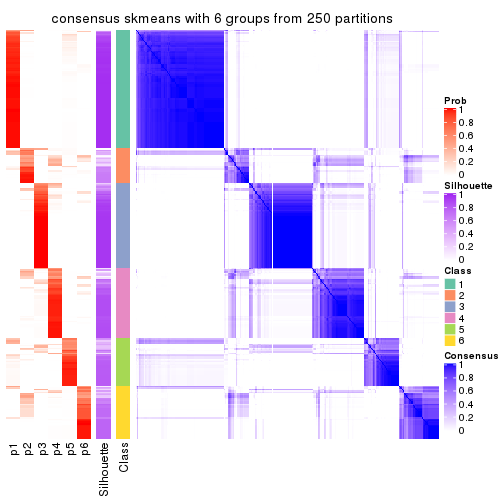</p>

</div>
</div>

Heatmaps for the membership of samples in all partitions to see how consistent they are:


<script>
$( function() {
	$( '#tabs-ATC-skmeans-membership-heatmap' ).tabs();
} );
</script>
<div id='tabs-ATC-skmeans-membership-heatmap'>
<ul>
<li><a href='#tab-ATC-skmeans-membership-heatmap-1'>k = 2</a></li>
<li><a href='#tab-ATC-skmeans-membership-heatmap-2'>k = 3</a></li>
<li><a href='#tab-ATC-skmeans-membership-heatmap-3'>k = 4</a></li>
<li><a href='#tab-ATC-skmeans-membership-heatmap-4'>k = 5</a></li>
<li><a href='#tab-ATC-skmeans-membership-heatmap-5'>k = 6</a></li>
</ul>
<div id='tab-ATC-skmeans-membership-heatmap-1'>
<pre><code class="r">membership_heatmap(res, k = 2)
</code></pre>

<p></p>

</div>
<div id='tab-ATC-skmeans-membership-heatmap-2'>
<pre><code class="r">membership_heatmap(res, k = 3)
</code></pre>

<p></p>

</div>
<div id='tab-ATC-skmeans-membership-heatmap-3'>
<pre><code class="r">membership_heatmap(res, k = 4)
</code></pre>

<p></p>

</div>
<div id='tab-ATC-skmeans-membership-heatmap-4'>
<pre><code class="r">membership_heatmap(res, k = 5)
</code></pre>

<p></p>

</div>
<div id='tab-ATC-skmeans-membership-heatmap-5'>
<pre><code class="r">membership_heatmap(res, k = 6)
</code></pre>

<p></p>

</div>
</div>

As soon as we have had the classes for columns, we can look for signatures
which are significantly different between classes which can be candidate marks
for certain classes. Following are the heatmaps for signatures.


Signature heatmaps where rows are scaled:


<script>
$( function() {
	$( '#tabs-ATC-skmeans-get-signatures' ).tabs();
} );
</script>
<div id='tabs-ATC-skmeans-get-signatures'>
<ul>
<li><a href='#tab-ATC-skmeans-get-signatures-1'>k = 2</a></li>
<li><a href='#tab-ATC-skmeans-get-signatures-2'>k = 3</a></li>
<li><a href='#tab-ATC-skmeans-get-signatures-3'>k = 4</a></li>
<li><a href='#tab-ATC-skmeans-get-signatures-4'>k = 5</a></li>
<li><a href='#tab-ATC-skmeans-get-signatures-5'>k = 6</a></li>
</ul>
<div id='tab-ATC-skmeans-get-signatures-1'>
<pre><code class="r">get_signatures(res, k = 2)
</code></pre>

<p></p>

</div>
<div id='tab-ATC-skmeans-get-signatures-2'>
<pre><code class="r">get_signatures(res, k = 3)
</code></pre>

<p></p>

</div>
<div id='tab-ATC-skmeans-get-signatures-3'>
<pre><code class="r">get_signatures(res, k = 4)
</code></pre>

<p></p>

</div>
<div id='tab-ATC-skmeans-get-signatures-4'>
<pre><code class="r">get_signatures(res, k = 5)
</code></pre>

<p>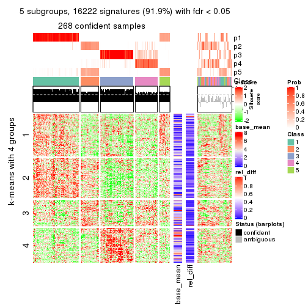</p>

</div>
<div id='tab-ATC-skmeans-get-signatures-5'>
<pre><code class="r">get_signatures(res, k = 6)
</code></pre>

<p></p>

</div>
</div>


Signature heatmaps where rows are not scaled:


<script>
$( function() {
	$( '#tabs-ATC-skmeans-get-signatures-no-scale' ).tabs();
} );
</script>
<div id='tabs-ATC-skmeans-get-signatures-no-scale'>
<ul>
<li><a href='#tab-ATC-skmeans-get-signatures-no-scale-1'>k = 2</a></li>
<li><a href='#tab-ATC-skmeans-get-signatures-no-scale-2'>k = 3</a></li>
<li><a href='#tab-ATC-skmeans-get-signatures-no-scale-3'>k = 4</a></li>
<li><a href='#tab-ATC-skmeans-get-signatures-no-scale-4'>k = 5</a></li>
<li><a href='#tab-ATC-skmeans-get-signatures-no-scale-5'>k = 6</a></li>
</ul>
<div id='tab-ATC-skmeans-get-signatures-no-scale-1'>
<pre><code class="r">get_signatures(res, k = 2, scale_rows = FALSE)
</code></pre>

<p></p>

</div>
<div id='tab-ATC-skmeans-get-signatures-no-scale-2'>
<pre><code class="r">get_signatures(res, k = 3, scale_rows = FALSE)
</code></pre>

<p></p>

</div>
<div id='tab-ATC-skmeans-get-signatures-no-scale-3'>
<pre><code class="r">get_signatures(res, k = 4, scale_rows = FALSE)
</code></pre>

<p></p>

</div>
<div id='tab-ATC-skmeans-get-signatures-no-scale-4'>
<pre><code class="r">get_signatures(res, k = 5, scale_rows = FALSE)
</code></pre>

<p></p>

</div>
<div id='tab-ATC-skmeans-get-signatures-no-scale-5'>
<pre><code class="r">get_signatures(res, k = 6, scale_rows = FALSE)
</code></pre>

<p></p>

</div>
</div>


Compare the overlap of signatures from different k:

```r
compare_signatures(res)
```


`get_signature()` returns a data frame invisibly. TO get the list of signatures, the function
call should be assigned to a variable explicitly. In following code, if `plot` argument is set
to `FALSE`, no heatmap is plotted while only the differential analysis is performed.

```r
# code only for demonstration
tb = get_signature(res, k = ..., plot = FALSE)
```

An example of the output of `tb` is:

```
#>   which_row         fdr    mean_1    mean_2 scaled_mean_1 scaled_mean_2 km
#> 1        38 0.042760348  8.373488  9.131774    -0.5533452     0.5164555  1
#> 2        40 0.018707592  7.106213  8.469186    -0.6173731     0.5762149  1
#> 3        55 0.019134737 10.221463 11.207825    -0.6159697     0.5749050  1
#> 4        59 0.006059896  5.921854  7.869574    -0.6899429     0.6439467  1
#> 5        60 0.018055526  8.928898 10.211722    -0.6204761     0.5791110  1
#> 6        98 0.009384629 15.714769 14.887706     0.6635654    -0.6193277  2
...
```

The columns in `tb` are:

1. `which_row`: row indices corresponding to the input matrix.
2. `fdr`: FDR for the differential test. 
3. `mean_x`: The mean value in group x.
4. `scaled_mean_x`: The mean value in group x after rows are scaled.
5. `km`: Row groups if k-means clustering is applied to rows.


UMAP plot which shows how samples are separated.


<script>
$( function() {
	$( '#tabs-ATC-skmeans-dimension-reduction' ).tabs();
} );
</script>
<div id='tabs-ATC-skmeans-dimension-reduction'>
<ul>
<li><a href='#tab-ATC-skmeans-dimension-reduction-1'>k = 2</a></li>
<li><a href='#tab-ATC-skmeans-dimension-reduction-2'>k = 3</a></li>
<li><a href='#tab-ATC-skmeans-dimension-reduction-3'>k = 4</a></li>
<li><a href='#tab-ATC-skmeans-dimension-reduction-4'>k = 5</a></li>
<li><a href='#tab-ATC-skmeans-dimension-reduction-5'>k = 6</a></li>
</ul>
<div id='tab-ATC-skmeans-dimension-reduction-1'>
<pre><code class="r">dimension_reduction(res, k = 2, method = &quot;UMAP&quot;)
</code></pre>

<p></p>

</div>
<div id='tab-ATC-skmeans-dimension-reduction-2'>
<pre><code class="r">dimension_reduction(res, k = 3, method = &quot;UMAP&quot;)
</code></pre>

<p></p>

</div>
<div id='tab-ATC-skmeans-dimension-reduction-3'>
<pre><code class="r">dimension_reduction(res, k = 4, method = &quot;UMAP&quot;)
</code></pre>

<p></p>

</div>
<div id='tab-ATC-skmeans-dimension-reduction-4'>
<pre><code class="r">dimension_reduction(res, k = 5, method = &quot;UMAP&quot;)
</code></pre>

<p></p>

</div>
<div id='tab-ATC-skmeans-dimension-reduction-5'>
<pre><code class="r">dimension_reduction(res, k = 6, method = &quot;UMAP&quot;)
</code></pre>

<p></p>

</div>
</div>


Following heatmap shows how subgroups are split when increasing `k`:

```r
collect_classes(res)
```


If matrix rows can be associated to genes, consider to use `GO_Enrichment(res,
...)` to perform function enrichment for the signature genes.


 

---------------------------------------------------


### ATC:pam


The object with results only for a single top-value method and a single partition method 
can be extracted as:

```r
res = res_list["ATC", "pam"]
# you can also extract it by
# res = res_list["ATC:pam"]
```

A summary of `res` and all the functions that can be applied to it:

```r
res
```

```
#> A 'ConsensusPartition' object with k = 2, 3, 4, 5, 6.
#>   On a matrix with 17654 rows and 335 columns.
#>   Top rows (1000, 2000, 3000, 4000, 5000) are extracted by 'ATC' method.
#>   Subgroups are detected by 'pam' method.
#>   Performed in total 1250 partitions by row resampling.
#>   Best k for subgroups seems to be 2.
#> 
#> Following methods can be applied to this 'ConsensusPartition' object:
#>  [1] "cola_report"             "collect_classes"         "collect_plots"          
#>  [4] "collect_stats"           "colnames"                "compare_signatures"     
#>  [7] "consensus_heatmap"       "dimension_reduction"     "functional_enrichment"  
#> [10] "get_anno_col"            "get_anno"                "get_classes"            
#> [13] "get_consensus"           "get_matrix"              "get_membership"         
#> [16] "get_param"               "get_signatures"          "get_stats"              
#> [19] "is_best_k"               "is_stable_k"             "membership_heatmap"     
#> [22] "ncol"                    "nrow"                    "plot_ecdf"              
#> [25] "rownames"                "select_partition_number" "show"                   
#> [28] "suggest_best_k"          "test_to_known_factors"
```

`collect_plots()` function collects all the plots made from `res` for all `k` (number of partitions)
into one single page to provide an easy and fast comparison between different `k`.

```r
collect_plots(res)
```


The plots are:

- The first row: a plot of the ECDF (Empirical cumulative distribution
  function) curves of the consensus matrix for each `k` and the heatmap of
  predicted classes for each `k`.
- The second row: heatmaps of the consensus matrix for each `k`.
- The third row: heatmaps of the membership matrix for each `k`.
- The fouth row: heatmaps of the signatures for each `k`.

All the plots in panels can be made by individual functions and they are
plotted later in this section.

`select_partition_number()` produces several plots showing different
statistics for choosing "optimized" `k`. There are following statistics:

- ECDF curves of the consensus matrix for each `k`;
- 1-PAC. [The PAC
  score](https://en.wikipedia.org/wiki/Consensus_clustering#Over-interpretation_potential_of_consensus_clustering)
  measures the proportion of the ambiguous subgrouping.
- Mean silhouette score.
- Concordance. The mean probability of fiting the consensus class ids in all
  partitions.
- Area increased. Denote $A_k$ as the area under the ECDF curve for current
  `k`, the area increased is defined as $A_k - A_{k-1}$.
- Rand index. The percent of pairs of samples that are both in a same cluster
  or both are not in a same cluster in the partition of k and k-1.
- Jaccard index. The ratio of pairs of samples are both in a same cluster in
  the partition of k and k-1 and the pairs of samples are both in a same
  cluster in the partition k or k-1.

The detailed explanations of these statistics can be found in [the cola
vignette](http://bioconductor.org/packages/devel/bioc/vignettes/cola/inst/doc/cola.html#toc_13).

Generally speaking, lower PAC score, higher mean silhouette score or higher
concordance corresponds to better partition. Rand index and Jaccard index
measure how similar the current partition is compared to partition with `k-1`.
If they are too similar, we won't accept `k` is better than `k-1`.

```r
select_partition_number(res)
```


The numeric values for all these statistics can be obtained by `get_stats()`.

```r
get_stats(res)
```

```
#>   k 1-PAC mean_silhouette concordance area_increased  Rand Jaccard
#> 2 2 0.545           0.881       0.923         0.4704 0.500   0.500
#> 3 3 0.779           0.863       0.936         0.3885 0.687   0.456
#> 4 4 0.837           0.855       0.935         0.0945 0.934   0.809
#> 5 5 0.793           0.737       0.848         0.0738 0.941   0.801
#> 6 6 0.779           0.750       0.795         0.0493 0.923   0.700
```

`suggest_best_k()` suggests the best $k$ based on these statistics. The rules are as follows:

- All $k$ with Jaccard index larger than 0.95 are removed because the increase of
  the partition number does not provides enough extra information. If all $k$ are removed,
  the best $k$ is assigned by `NA`.
- For $k$ with 1-PAC larger than 0.9, the maximal $k$ is taken as the "best k". Other $k$ is called "optional k".
- If it does not fit the second rule. The $k$ with the highest vote of highest
  1-PAC, mean silhouette and concordance is taken as the "best k".

```r
suggest_best_k(res)
```

```
#> [1] 2
```


Following shows the table of the partitions (You need to click the **show/hide
code output** link to see it). The membership matrix (columns with name `p*`)
is inferred by
[`clue::cl_consensus()`](https://www.rdocumentation.org/link/cl_consensus?package=clue)
function with the `SE` method. Basically the value in the membership matrix
represents the probability to belong to a certain group. The finall class
label for an item is determined with the group with highest probability it
belongs to.

In `get_classes()` function, the entropy is calculated from the membership
matrix and the silhouette score is calculated from the consensus matrix.


<script>
$( function() {
	$( '#tabs-ATC-pam-get-classes' ).tabs();
} );
</script>
<div id='tabs-ATC-pam-get-classes'>
<ul>
<li><a href='#tab-ATC-pam-get-classes-1'>k = 2</a></li>
<li><a href='#tab-ATC-pam-get-classes-2'>k = 3</a></li>
<li><a href='#tab-ATC-pam-get-classes-3'>k = 4</a></li>
<li><a href='#tab-ATC-pam-get-classes-4'>k = 5</a></li>
<li><a href='#tab-ATC-pam-get-classes-5'>k = 6</a></li>
</ul>

<div id='tab-ATC-pam-get-classes-1'>
<p><a id='tab-ATC-pam-get-classes-1-a' style='color:#0366d6' href='#'>show/hide code output</a></p>
<pre><code class="r">cbind(get_classes(res, k = 2), get_membership(res, k = 2))
</code></pre>

<pre><code>#&gt;            class entropy silhouette    p1    p2
#&gt; SRR660306      2  0.7883      0.831 0.236 0.764
#&gt; SRR1359328     2  0.0000      0.873 0.000 1.000
#&gt; SRR821124      2  0.7299      0.869 0.204 0.796
#&gt; SRR1335188     1  0.0000      0.952 1.000 0.000
#&gt; SRR1075825     2  0.7299      0.869 0.204 0.796
#&gt; SRR1321921     1  0.0000      0.952 1.000 0.000
#&gt; SRR1466198     2  0.0000      0.873 0.000 1.000
#&gt; SRR1384073     1  0.0000      0.952 1.000 0.000
#&gt; SRR1312802     1  0.0000      0.952 1.000 0.000
#&gt; SRR1076559     1  0.0000      0.952 1.000 0.000
#&gt; SRR1370085     1  0.0000      0.952 1.000 0.000
#&gt; SRR1460363     1  0.0000      0.952 1.000 0.000
#&gt; SRR1480221     2  0.7299      0.869 0.204 0.796
#&gt; SRR1476165     1  0.0000      0.952 1.000 0.000
#&gt; SRR1459631     2  0.0000      0.873 0.000 1.000
#&gt; SRR1448098     2  0.7299      0.869 0.204 0.796
#&gt; SRR1321401     2  0.7299      0.869 0.204 0.796
#&gt; SRR807613      2  0.7299      0.869 0.204 0.796
#&gt; SRR808086      2  0.2043      0.879 0.032 0.968
#&gt; SRR613687      2  0.7299      0.869 0.204 0.796
#&gt; SRR1471011     2  0.7299      0.869 0.204 0.796
#&gt; SRR1330284     2  0.7299      0.869 0.204 0.796
#&gt; SRR1320624     2  0.4161      0.886 0.084 0.916
#&gt; SRR1459519     1  0.0000      0.952 1.000 0.000
#&gt; SRR1091184     2  0.0000      0.873 0.000 1.000
#&gt; SRR1390561     1  0.0000      0.952 1.000 0.000
#&gt; SRR658164      1  0.0000      0.952 1.000 0.000
#&gt; SRR1087079     2  0.7299      0.869 0.204 0.796
#&gt; SRR814996      2  0.0000      0.873 0.000 1.000
#&gt; SRR1407410     2  0.7299      0.869 0.204 0.796
#&gt; SRR1453392     2  0.0000      0.873 0.000 1.000
#&gt; SRR1445873     1  0.0000      0.952 1.000 0.000
#&gt; SRR1419985     2  0.7299      0.869 0.204 0.796
#&gt; SRR820938      2  0.0000      0.873 0.000 1.000
#&gt; SRR1476844     1  0.0000      0.952 1.000 0.000
#&gt; SRR1403526     1  0.0000      0.952 1.000 0.000
#&gt; SRR1413916     2  0.7299      0.869 0.204 0.796
#&gt; SRR1441051     2  0.4161      0.886 0.084 0.916
#&gt; SRR614287      2  0.7299      0.869 0.204 0.796
#&gt; SRR1092062     1  0.8327      0.601 0.736 0.264
#&gt; SRR612611      2  0.7299      0.869 0.204 0.796
#&gt; SRR1376356     2  0.8909      0.721 0.308 0.692
#&gt; SRR1405078     2  0.0000      0.873 0.000 1.000
#&gt; SRR1437226     2  0.7299      0.869 0.204 0.796
#&gt; SRR1326078     1  0.0000      0.952 1.000 0.000
#&gt; SRR1096806     2  0.0000      0.873 0.000 1.000
#&gt; SRR1440919     2  0.4161      0.886 0.084 0.916
#&gt; SRR1452824     2  0.7299      0.869 0.204 0.796
#&gt; SRR615754      1  0.0000      0.952 1.000 0.000
#&gt; SRR1341787     2  0.7299      0.869 0.204 0.796
#&gt; SRR614551      2  0.7299      0.869 0.204 0.796
#&gt; SRR1380829     2  0.0000      0.873 0.000 1.000
#&gt; SRR1455761     1  0.0000      0.952 1.000 0.000
#&gt; SRR1465189     2  0.7745      0.844 0.228 0.772
#&gt; SRR1376895     1  0.0000      0.952 1.000 0.000
#&gt; SRR1445002     1  0.0000      0.952 1.000 0.000
#&gt; SRR1469258     2  0.7453      0.861 0.212 0.788
#&gt; SRR1409239     1  0.0000      0.952 1.000 0.000
#&gt; SRR1480200     1  0.0000      0.952 1.000 0.000
#&gt; SRR1418323     1  0.0000      0.952 1.000 0.000
#&gt; SRR657540      2  0.0000      0.873 0.000 1.000
#&gt; SRR821096      2  0.7299      0.869 0.204 0.796
#&gt; SRR613591      2  0.7299      0.869 0.204 0.796
#&gt; SRR1344205     2  0.0000      0.873 0.000 1.000
#&gt; SRR612479      1  0.0000      0.952 1.000 0.000
#&gt; SRR1399950     1  0.0000      0.952 1.000 0.000
#&gt; SRR1336048     2  0.5842      0.880 0.140 0.860
#&gt; SRR1368896     1  0.0000      0.952 1.000 0.000
#&gt; SRR1379403     2  0.4161      0.886 0.084 0.916
#&gt; SRR1312464     1  0.0000      0.952 1.000 0.000
#&gt; SRR1096478     1  0.0000      0.952 1.000 0.000
#&gt; SRR1459845     1  0.0000      0.952 1.000 0.000
#&gt; SRR1348138     2  0.0000      0.873 0.000 1.000
#&gt; SRR811423      1  0.7299      0.688 0.796 0.204
#&gt; SRR615683      1  0.0000      0.952 1.000 0.000
#&gt; SRR1380336     2  0.7299      0.869 0.204 0.796
#&gt; SRR817609      1  0.3274      0.891 0.940 0.060
#&gt; SRR1074550     2  0.0000      0.873 0.000 1.000
#&gt; SRR1499236     2  0.7299      0.869 0.204 0.796
#&gt; SRR656083      1  0.0000      0.952 1.000 0.000
#&gt; SRR817539      1  0.0000      0.952 1.000 0.000
#&gt; SRR1410801     1  0.0000      0.952 1.000 0.000
#&gt; SRR1347190     1  0.0000      0.952 1.000 0.000
#&gt; SRR1355126     2  0.9661      0.544 0.392 0.608
#&gt; SRR615165      2  0.0000      0.873 0.000 1.000
#&gt; SRR1466046     1  0.0000      0.952 1.000 0.000
#&gt; SRR1097055     2  0.7299      0.869 0.204 0.796
#&gt; SRR1312370     1  0.8016      0.638 0.756 0.244
#&gt; SRR655325      1  0.0000      0.952 1.000 0.000
#&gt; SRR810177      1  0.8327      0.601 0.736 0.264
#&gt; SRR815685      2  0.7299      0.869 0.204 0.796
#&gt; SRR817026      2  0.0000      0.873 0.000 1.000
#&gt; SRR1417224     2  0.0000      0.873 0.000 1.000
#&gt; SRR661687      2  0.4161      0.886 0.084 0.916
#&gt; SRR1431804     1  0.0000      0.952 1.000 0.000
#&gt; SRR664072      2  0.0000      0.873 0.000 1.000
#&gt; SRR612923      2  0.7299      0.869 0.204 0.796
#&gt; SRR1315890     1  0.0000      0.952 1.000 0.000
#&gt; SRR1347726     1  0.0000      0.952 1.000 0.000
#&gt; SRR1500360     1  0.0000      0.952 1.000 0.000
#&gt; SRR1468360     1  0.8909      0.498 0.692 0.308
#&gt; SRR1404084     1  0.0000      0.952 1.000 0.000
#&gt; SRR615994      2  0.0000      0.873 0.000 1.000
#&gt; SRR1475718     2  0.7299      0.869 0.204 0.796
#&gt; SRR1397200     2  0.0000      0.873 0.000 1.000
#&gt; SRR655519      2  0.4161      0.886 0.084 0.916
#&gt; SRR1311308     2  0.0000      0.873 0.000 1.000
#&gt; SRR1368006     2  0.4161      0.886 0.084 0.916
#&gt; SRR613651      1  0.0000      0.952 1.000 0.000
#&gt; SRR1362621     2  0.4161      0.886 0.084 0.916
#&gt; SRR1451718     1  0.0000      0.952 1.000 0.000
#&gt; SRR1095334     2  0.0000      0.873 0.000 1.000
#&gt; SRR1079636     2  0.7299      0.869 0.204 0.796
#&gt; SRR1442549     1  0.0000      0.952 1.000 0.000
#&gt; SRR1466421     2  0.7299      0.869 0.204 0.796
#&gt; SRR817397      2  0.7299      0.869 0.204 0.796
#&gt; SRR1341809     1  0.8327      0.601 0.736 0.264
#&gt; SRR614623      2  0.7299      0.869 0.204 0.796
#&gt; SRR1335005     2  0.7299      0.869 0.204 0.796
#&gt; SRR1407065     2  0.4161      0.886 0.084 0.916
#&gt; SRR1404483     2  0.0000      0.873 0.000 1.000
#&gt; SRR1096222     1  0.0000      0.952 1.000 0.000
#&gt; SRR1401793     1  0.0000      0.952 1.000 0.000
#&gt; SRR1408615     2  0.0000      0.873 0.000 1.000
#&gt; SRR1070597     1  0.0000      0.952 1.000 0.000
#&gt; SRR1332381     1  0.0000      0.952 1.000 0.000
#&gt; SRR1457015     1  0.0000      0.952 1.000 0.000
#&gt; SRR1386797     1  0.0000      0.952 1.000 0.000
#&gt; SRR1098385     2  0.0000      0.873 0.000 1.000
#&gt; SRR1363947     2  0.0000      0.873 0.000 1.000
#&gt; SRR820350      2  0.7299      0.869 0.204 0.796
#&gt; SRR662055      2  0.7299      0.869 0.204 0.796
#&gt; SRR1310455     1  0.0000      0.952 1.000 0.000
#&gt; SRR1453639     1  0.8267      0.608 0.740 0.260
#&gt; SRR662617      1  0.8327      0.601 0.736 0.264
#&gt; SRR654778      1  0.0000      0.952 1.000 0.000
#&gt; SRR661782      1  0.8327      0.601 0.736 0.264
#&gt; SRR1334396     1  0.0000      0.952 1.000 0.000
#&gt; SRR613867      2  0.7299      0.869 0.204 0.796
#&gt; SRR1479412     1  0.0000      0.952 1.000 0.000
#&gt; SRR1331620     1  0.0000      0.952 1.000 0.000
#&gt; SRR1082809     2  0.0000      0.873 0.000 1.000
#&gt; SRR1417178     2  0.6801      0.874 0.180 0.820
#&gt; SRR1335278     1  0.0000      0.952 1.000 0.000
#&gt; SRR665369      1  0.8327      0.601 0.736 0.264
#&gt; SRR657552      1  0.0000      0.952 1.000 0.000
#&gt; SRR812412      1  0.0000      0.952 1.000 0.000
#&gt; SRR1096500     1  0.9795      0.150 0.584 0.416
#&gt; SRR1347750     1  0.0000      0.952 1.000 0.000
#&gt; SRR615153      2  0.7299      0.869 0.204 0.796
#&gt; SRR1434417     1  0.0000      0.952 1.000 0.000
#&gt; SRR1070159     2  0.3114      0.880 0.056 0.944
#&gt; SRR1332508     2  0.7299      0.869 0.204 0.796
#&gt; SRR1082059     1  0.8327      0.601 0.736 0.264
#&gt; SRR1402491     1  0.0000      0.952 1.000 0.000
#&gt; SRR1476595     1  0.0000      0.952 1.000 0.000
#&gt; SRR1320987     1  0.8327      0.601 0.736 0.264
#&gt; SRR1086417     1  0.7528      0.686 0.784 0.216
#&gt; SRR1454095     1  0.0000      0.952 1.000 0.000
#&gt; SRR614791      2  0.0000      0.873 0.000 1.000
#&gt; SRR821255      1  0.2778      0.905 0.952 0.048
#&gt; SRR820402      2  0.7299      0.869 0.204 0.796
#&gt; SRR1337284     1  0.0000      0.952 1.000 0.000
#&gt; SRR1333083     2  0.0000      0.873 0.000 1.000
#&gt; SRR1384883     2  0.0000      0.873 0.000 1.000
#&gt; SRR614431      1  0.0000      0.952 1.000 0.000
#&gt; SRR1481106     2  0.3584      0.884 0.068 0.932
#&gt; SRR1370285     1  0.0000      0.952 1.000 0.000
#&gt; SRR1446673     2  0.0000      0.873 0.000 1.000
#&gt; SRR1318046     2  0.7299      0.869 0.204 0.796
#&gt; SRR1341188     2  0.0000      0.873 0.000 1.000
#&gt; SRR1384941     1  0.0000      0.952 1.000 0.000
#&gt; SRR1322864     2  0.7299      0.869 0.204 0.796
#&gt; SRR1476825     2  0.7299      0.869 0.204 0.796
#&gt; SRR1443332     2  0.0000      0.873 0.000 1.000
#&gt; SRR662486      2  0.7299      0.869 0.204 0.796
#&gt; SRR1447019     1  0.0000      0.952 1.000 0.000
#&gt; SRR662942      1  0.0000      0.952 1.000 0.000
#&gt; SRR613102      2  0.0000      0.873 0.000 1.000
#&gt; SRR1469880     1  0.0000      0.952 1.000 0.000
#&gt; SRR1464977     1  0.0000      0.952 1.000 0.000
#&gt; SRR615850      2  0.0000      0.873 0.000 1.000
#&gt; SRR661949      2  0.7299      0.869 0.204 0.796
#&gt; SRR1322227     2  0.0000      0.873 0.000 1.000
#&gt; SRR1441655     2  0.7376      0.865 0.208 0.792
#&gt; SRR613771      2  0.7299      0.869 0.204 0.796
#&gt; SRR1479471     1  0.0000      0.952 1.000 0.000
#&gt; SRR1488918     2  0.4161      0.886 0.084 0.916
#&gt; SRR1414040     2  0.7299      0.869 0.204 0.796
#&gt; SRR1079850     2  0.8499      0.775 0.276 0.724
#&gt; SRR663209      1  0.0000      0.952 1.000 0.000
#&gt; SRR1364914     2  0.4161      0.886 0.084 0.916
#&gt; SRR1408267     1  0.8499      0.575 0.724 0.276
#&gt; SRR1314894     1  0.0000      0.952 1.000 0.000
#&gt; SRR1414117     2  0.7299      0.869 0.204 0.796
#&gt; SRR1395975     2  0.7299      0.869 0.204 0.796
#&gt; SRR1402219     2  0.7453      0.860 0.212 0.788
#&gt; SRR1433623     1  0.0000      0.952 1.000 0.000
#&gt; SRR656385      2  0.6438      0.877 0.164 0.836
#&gt; SRR811213      2  0.7299      0.869 0.204 0.796
#&gt; SRR663657      2  0.7219      0.870 0.200 0.800
#&gt; SRR612203      1  0.0000      0.952 1.000 0.000
#&gt; SRR613987      2  0.7299      0.869 0.204 0.796
#&gt; SRR613831      2  0.0000      0.873 0.000 1.000
#&gt; SRR1354180     2  0.7299      0.869 0.204 0.796
#&gt; SRR1382912     1  0.0000      0.952 1.000 0.000
#&gt; SRR1475501     1  0.0000      0.952 1.000 0.000
#&gt; SRR1336930     1  0.0000      0.952 1.000 0.000
#&gt; SRR613030      2  0.0000      0.873 0.000 1.000
#&gt; SRR1381459     2  0.4298      0.886 0.088 0.912
#&gt; SRR1402350     1  0.0000      0.952 1.000 0.000
#&gt; SRR1419408     1  0.0000      0.952 1.000 0.000
#&gt; SRR655911      2  0.0000      0.873 0.000 1.000
#&gt; SRR1418243     1  0.0000      0.952 1.000 0.000
#&gt; SRR1322573     1  0.0000      0.952 1.000 0.000
#&gt; SRR613615      2  0.0000      0.873 0.000 1.000
#&gt; SRR1355284     1  0.0000      0.952 1.000 0.000
#&gt; SRR1319395     1  0.0000      0.952 1.000 0.000
#&gt; SRR818939      1  0.0000      0.952 1.000 0.000
#&gt; SRR1465266     1  0.0000      0.952 1.000 0.000
#&gt; SRR614888      1  0.8386      0.592 0.732 0.268
#&gt; SRR1431694     1  0.0000      0.952 1.000 0.000
#&gt; SRR614347      2  0.4161      0.886 0.084 0.916
#&gt; SRR1334228     2  0.0000      0.873 0.000 1.000
#&gt; SRR1096007     2  0.7299      0.869 0.204 0.796
#&gt; SRR656349      1  0.0000      0.952 1.000 0.000
#&gt; SRR815422      2  0.3879      0.885 0.076 0.924
#&gt; SRR1360828     1  0.0000      0.952 1.000 0.000
#&gt; SRR1359005     2  0.7299      0.869 0.204 0.796
#&gt; SRR1456652     1  0.0000      0.952 1.000 0.000
#&gt; SRR1391660     1  0.0000      0.952 1.000 0.000
#&gt; SRR1441956     1  0.0000      0.952 1.000 0.000
#&gt; SRR662930      2  0.0000      0.873 0.000 1.000
#&gt; SRR615790      2  0.0000      0.873 0.000 1.000
#&gt; SRR614827      2  0.0000      0.873 0.000 1.000
#&gt; SRR614587      2  0.0000      0.873 0.000 1.000
#&gt; SRR814052      1  0.8267      0.608 0.740 0.260
#&gt; SRR1070086     1  0.0000      0.952 1.000 0.000
#&gt; SRR1481440     1  0.0000      0.952 1.000 0.000
#&gt; SRR1339296     2  0.0000      0.873 0.000 1.000
#&gt; SRR1343239     2  0.0000      0.873 0.000 1.000
#&gt; SRR1432802     1  0.8327      0.601 0.736 0.264
#&gt; SRR1416911     1  0.0000      0.952 1.000 0.000
#&gt; SRR1410427     1  0.0000      0.952 1.000 0.000
#&gt; SRR1401185     2  0.0000      0.873 0.000 1.000
#&gt; SRR654993      2  0.7299      0.869 0.204 0.796
#&gt; SRR656397      1  0.0000      0.952 1.000 0.000
#&gt; SRR809643      2  0.0000      0.873 0.000 1.000
#&gt; SRR1433819     1  0.0000      0.952 1.000 0.000
#&gt; SRR1375225     2  0.7299      0.869 0.204 0.796
#&gt; SRR1367739     2  0.0000      0.873 0.000 1.000
#&gt; SRR1323336     1  0.0000      0.952 1.000 0.000
#&gt; SRR663224      2  0.0000      0.873 0.000 1.000
#&gt; SRR1442840     1  0.0000      0.952 1.000 0.000
#&gt; SRR1374058     1  0.0000      0.952 1.000 0.000
#&gt; SRR656994      1  0.0000      0.952 1.000 0.000
#&gt; SRR1469214     2  0.7299      0.869 0.204 0.796
#&gt; SRR1456446     1  0.9998     -0.211 0.508 0.492
#&gt; SRR1471879     1  0.8327      0.601 0.736 0.264
#&gt; SRR612911      2  0.0000      0.873 0.000 1.000
#&gt; SRR1395720     2  0.4161      0.886 0.084 0.916
#&gt; SRR1413055     1  0.0000      0.952 1.000 0.000
#&gt; SRR656770      2  0.0000      0.873 0.000 1.000
#&gt; SRR812080      2  0.0000      0.873 0.000 1.000
#&gt; SRR1479328     1  0.0000      0.952 1.000 0.000
#&gt; SRR661421      2  0.4161      0.886 0.084 0.916
#&gt; SRR1410286     2  0.4161      0.886 0.084 0.916
#&gt; SRR1487150     1  0.0000      0.952 1.000 0.000
#&gt; SRR1467035     1  0.0000      0.952 1.000 0.000
#&gt; SRR1360607     2  0.7299      0.869 0.204 0.796
#&gt; SRR1333106     2  0.4431      0.885 0.092 0.908
#&gt; SRR1088706     2  0.7299      0.869 0.204 0.796
#&gt; SRR1320053     2  0.0000      0.873 0.000 1.000
#&gt; SRR1350392     2  0.4161      0.886 0.084 0.916
#&gt; SRR1385190     2  0.0000      0.873 0.000 1.000
#&gt; SRR1080093     2  0.3584      0.884 0.068 0.932
#&gt; SRR1318753     1  0.0000      0.952 1.000 0.000
#&gt; SRR1345369     2  0.0000      0.873 0.000 1.000
#&gt; SRR612178      2  0.4161      0.886 0.084 0.916
#&gt; SRR1354423     1  0.0000      0.952 1.000 0.000
#&gt; SRR1072724     1  0.0000      0.952 1.000 0.000
#&gt; SRR1418450     2  0.7299      0.869 0.204 0.796
#&gt; SRR1326427     2  0.0000      0.873 0.000 1.000
#&gt; SRR1437412     1  0.8327      0.601 0.736 0.264
#&gt; SRR1327548     2  0.0000      0.873 0.000 1.000
#&gt; SRR1395891     1  0.0000      0.952 1.000 0.000
#&gt; SRR659367      1  0.0000      0.952 1.000 0.000
#&gt; SRR818961      1  0.0000      0.952 1.000 0.000
#&gt; SRR813704      1  0.0000      0.952 1.000 0.000
#&gt; SRR613054      1  0.0000      0.952 1.000 0.000
#&gt; SRR1476467     1  0.0000      0.952 1.000 0.000
#&gt; SRR1407988     2  0.6801      0.874 0.180 0.820
#&gt; SRR1394776     2  0.7299      0.869 0.204 0.796
#&gt; SRR655578      2  0.7299      0.869 0.204 0.796
#&gt; SRR1310645     2  0.0000      0.873 0.000 1.000
#&gt; SRR1345628     1  0.0000      0.952 1.000 0.000
#&gt; SRR1479740     1  0.0000      0.952 1.000 0.000
#&gt; SRR1332095     1  0.0000      0.952 1.000 0.000
#&gt; SRR1444786     2  0.7299      0.869 0.204 0.796
#&gt; SRR1090070     1  0.0000      0.952 1.000 0.000
#&gt; SRR662414      1  0.0376      0.948 0.996 0.004
#&gt; SRR661216      2  0.7299      0.869 0.204 0.796
#&gt; SRR656313      2  0.7299      0.869 0.204 0.796
#&gt; SRR615671      2  0.7299      0.869 0.204 0.796
#&gt; SRR1350196     2  0.0000      0.873 0.000 1.000
#&gt; SRR1466580     1  0.0000      0.952 1.000 0.000
#&gt; SRR1408032     2  0.7299      0.869 0.204 0.796
#&gt; SRR1432913     2  0.4161      0.886 0.084 0.916
#&gt; SRR1360502     2  0.7299      0.869 0.204 0.796
#&gt; SRR1391901     2  0.7299      0.869 0.204 0.796
#&gt; SRR1311131     1  0.0000      0.952 1.000 0.000
#&gt; SRR1380636     1  0.0000      0.952 1.000 0.000
#&gt; SRR1332339     1  0.0000      0.952 1.000 0.000
#&gt; SRR1341563     2  0.7139      0.871 0.196 0.804
#&gt; SRR1359410     2  0.0000      0.873 0.000 1.000
#&gt; SRR1473040     2  0.0000      0.873 0.000 1.000
#&gt; SRR1321444     1  0.0000      0.952 1.000 0.000
#&gt; SRR1498765     2  0.0000      0.873 0.000 1.000
#&gt; SRR1312622     2  0.0000      0.873 0.000 1.000
#&gt; SRR615503      1  0.0000      0.952 1.000 0.000
#&gt; SRR1453192     1  0.0000      0.952 1.000 0.000
#&gt; SRR1433107     2  0.0000      0.873 0.000 1.000
#&gt; SRR1075384     1  0.0000      0.952 1.000 0.000
#&gt; SRR1356683     1  0.0000      0.952 1.000 0.000
#&gt; SRR659049      1  0.0000      0.952 1.000 0.000
#&gt; SRR1368240     1  0.0000      0.952 1.000 0.000
#&gt; SRR1341739     1  0.0000      0.952 1.000 0.000
#&gt; SRR613249      2  0.0000      0.873 0.000 1.000
#&gt; SRR663428      1  0.8327      0.601 0.736 0.264
#&gt; SRR1341302     2  0.7299      0.869 0.204 0.796
#&gt; SRR1073553     2  0.7299      0.869 0.204 0.796
#&gt; SRR1354093     2  0.0000      0.873 0.000 1.000
#&gt; SRR1406521     2  0.7299      0.869 0.204 0.796
#&gt; SRR1432049     1  0.0000      0.952 1.000 0.000
#&gt; SRR1453504     2  0.7299      0.869 0.204 0.796
</code></pre>

<script>
$('#tab-ATC-pam-get-classes-1-a').parent().next().next().hide();
$('#tab-ATC-pam-get-classes-1-a').click(function(){
  $('#tab-ATC-pam-get-classes-1-a').parent().next().next().toggle();
  return(false);
});
</script>
</div>

<div id='tab-ATC-pam-get-classes-2'>
<p><a id='tab-ATC-pam-get-classes-2-a' style='color:#0366d6' href='#'>show/hide code output</a></p>
<pre><code class="r">cbind(get_classes(res, k = 3), get_membership(res, k = 3))
</code></pre>

<pre><code>#&gt;            class entropy silhouette    p1    p2    p3
#&gt; SRR660306      2  0.0000      0.938 0.000 1.000 0.000
#&gt; SRR1359328     3  0.0000      0.872 0.000 0.000 1.000
#&gt; SRR821124      3  0.6274      0.366 0.000 0.456 0.544
#&gt; SRR1335188     2  0.1163      0.927 0.028 0.972 0.000
#&gt; SRR1075825     2  0.3412      0.806 0.000 0.876 0.124
#&gt; SRR1321921     1  0.0000      0.985 1.000 0.000 0.000
#&gt; SRR1466198     3  0.0000      0.872 0.000 0.000 1.000
#&gt; SRR1384073     1  0.0000      0.985 1.000 0.000 0.000
#&gt; SRR1312802     2  0.1163      0.927 0.028 0.972 0.000
#&gt; SRR1076559     1  0.0000      0.985 1.000 0.000 0.000
#&gt; SRR1370085     1  0.0000      0.985 1.000 0.000 0.000
#&gt; SRR1460363     1  0.0000      0.985 1.000 0.000 0.000
#&gt; SRR1480221     2  0.0000      0.938 0.000 1.000 0.000
#&gt; SRR1476165     2  0.5905      0.493 0.352 0.648 0.000
#&gt; SRR1459631     3  0.0892      0.871 0.000 0.020 0.980
#&gt; SRR1448098     2  0.0000      0.938 0.000 1.000 0.000
#&gt; SRR1321401     2  0.0000      0.938 0.000 1.000 0.000
#&gt; SRR807613      2  0.0000      0.938 0.000 1.000 0.000
#&gt; SRR808086      3  0.2537      0.851 0.000 0.080 0.920
#&gt; SRR613687      2  0.0000      0.938 0.000 1.000 0.000
#&gt; SRR1471011     2  0.0000      0.938 0.000 1.000 0.000
#&gt; SRR1330284     3  0.6274      0.366 0.000 0.456 0.544
#&gt; SRR1320624     3  0.4002      0.812 0.000 0.160 0.840
#&gt; SRR1459519     1  0.0000      0.985 1.000 0.000 0.000
#&gt; SRR1091184     3  0.0892      0.871 0.000 0.020 0.980
#&gt; SRR1390561     1  0.0000      0.985 1.000 0.000 0.000
#&gt; SRR658164      1  0.0000      0.985 1.000 0.000 0.000
#&gt; SRR1087079     2  0.0424      0.933 0.000 0.992 0.008
#&gt; SRR814996      3  0.0000      0.872 0.000 0.000 1.000
#&gt; SRR1407410     2  0.0000      0.938 0.000 1.000 0.000
#&gt; SRR1453392     3  0.0892      0.871 0.000 0.020 0.980
#&gt; SRR1445873     1  0.0000      0.985 1.000 0.000 0.000
#&gt; SRR1419985     2  0.0000      0.938 0.000 1.000 0.000
#&gt; SRR820938      3  0.0000      0.872 0.000 0.000 1.000
#&gt; SRR1476844     1  0.6095      0.318 0.608 0.392 0.000
#&gt; SRR1403526     1  0.0000      0.985 1.000 0.000 0.000
#&gt; SRR1413916     3  0.6280      0.356 0.000 0.460 0.540
#&gt; SRR1441051     3  0.4002      0.812 0.000 0.160 0.840
#&gt; SRR614287      2  0.0000      0.938 0.000 1.000 0.000
#&gt; SRR1092062     2  0.0000      0.938 0.000 1.000 0.000
#&gt; SRR612611      2  0.0000      0.938 0.000 1.000 0.000
#&gt; SRR1376356     2  0.0000      0.938 0.000 1.000 0.000
#&gt; SRR1405078     3  0.0892      0.871 0.000 0.020 0.980
#&gt; SRR1437226     2  0.0000      0.938 0.000 1.000 0.000
#&gt; SRR1326078     1  0.0000      0.985 1.000 0.000 0.000
#&gt; SRR1096806     3  0.0892      0.871 0.000 0.020 0.980
#&gt; SRR1440919     3  0.4002      0.812 0.000 0.160 0.840
#&gt; SRR1452824     2  0.0237      0.936 0.000 0.996 0.004
#&gt; SRR615754      1  0.0000      0.985 1.000 0.000 0.000
#&gt; SRR1341787     2  0.0000      0.938 0.000 1.000 0.000
#&gt; SRR614551      3  0.6280      0.356 0.000 0.460 0.540
#&gt; SRR1380829     3  0.0000      0.872 0.000 0.000 1.000
#&gt; SRR1455761     1  0.0000      0.985 1.000 0.000 0.000
#&gt; SRR1465189     3  0.6489      0.355 0.004 0.456 0.540
#&gt; SRR1376895     1  0.0000      0.985 1.000 0.000 0.000
#&gt; SRR1445002     1  0.0000      0.985 1.000 0.000 0.000
#&gt; SRR1469258     2  0.0000      0.938 0.000 1.000 0.000
#&gt; SRR1409239     1  0.0000      0.985 1.000 0.000 0.000
#&gt; SRR1480200     1  0.0000      0.985 1.000 0.000 0.000
#&gt; SRR1418323     1  0.0747      0.969 0.984 0.016 0.000
#&gt; SRR657540      3  0.0000      0.872 0.000 0.000 1.000
#&gt; SRR821096      3  0.6274      0.366 0.000 0.456 0.544
#&gt; SRR613591      2  0.0000      0.938 0.000 1.000 0.000
#&gt; SRR1344205     3  0.0000      0.872 0.000 0.000 1.000
#&gt; SRR612479      2  0.1163      0.927 0.028 0.972 0.000
#&gt; SRR1399950     2  0.5905      0.478 0.352 0.648 0.000
#&gt; SRR1336048     3  0.5733      0.627 0.000 0.324 0.676
#&gt; SRR1368896     1  0.0000      0.985 1.000 0.000 0.000
#&gt; SRR1379403     3  0.4002      0.812 0.000 0.160 0.840
#&gt; SRR1312464     2  0.4750      0.723 0.216 0.784 0.000
#&gt; SRR1096478     1  0.0000      0.985 1.000 0.000 0.000
#&gt; SRR1459845     1  0.0000      0.985 1.000 0.000 0.000
#&gt; SRR1348138     3  0.0892      0.871 0.000 0.020 0.980
#&gt; SRR811423      2  0.1129      0.931 0.020 0.976 0.004
#&gt; SRR615683      1  0.0000      0.985 1.000 0.000 0.000
#&gt; SRR1380336     3  0.6274      0.366 0.000 0.456 0.544
#&gt; SRR817609      2  0.0892      0.931 0.020 0.980 0.000
#&gt; SRR1074550     3  0.0000      0.872 0.000 0.000 1.000
#&gt; SRR1499236     2  0.0000      0.938 0.000 1.000 0.000
#&gt; SRR656083      1  0.0000      0.985 1.000 0.000 0.000
#&gt; SRR817539      1  0.0000      0.985 1.000 0.000 0.000
#&gt; SRR1410801     1  0.0000      0.985 1.000 0.000 0.000
#&gt; SRR1347190     2  0.1163      0.927 0.028 0.972 0.000
#&gt; SRR1355126     2  0.0000      0.938 0.000 1.000 0.000
#&gt; SRR615165      3  0.0000      0.872 0.000 0.000 1.000
#&gt; SRR1466046     2  0.4702      0.726 0.212 0.788 0.000
#&gt; SRR1097055     3  0.6280      0.356 0.000 0.460 0.540
#&gt; SRR1312370     2  0.0000      0.938 0.000 1.000 0.000
#&gt; SRR655325      1  0.0000      0.985 1.000 0.000 0.000
#&gt; SRR810177      2  0.0000      0.938 0.000 1.000 0.000
#&gt; SRR815685      3  0.6280      0.356 0.000 0.460 0.540
#&gt; SRR817026      3  0.0892      0.871 0.000 0.020 0.980
#&gt; SRR1417224     3  0.0000      0.872 0.000 0.000 1.000
#&gt; SRR661687      3  0.4002      0.812 0.000 0.160 0.840
#&gt; SRR1431804     2  0.1163      0.927 0.028 0.972 0.000
#&gt; SRR664072      3  0.0000      0.872 0.000 0.000 1.000
#&gt; SRR612923      2  0.2796      0.848 0.000 0.908 0.092
#&gt; SRR1315890     1  0.0000      0.985 1.000 0.000 0.000
#&gt; SRR1347726     1  0.0000      0.985 1.000 0.000 0.000
#&gt; SRR1500360     2  0.5178      0.675 0.256 0.744 0.000
#&gt; SRR1468360     2  0.0000      0.938 0.000 1.000 0.000
#&gt; SRR1404084     2  0.0892      0.931 0.020 0.980 0.000
#&gt; SRR615994      3  0.0000      0.872 0.000 0.000 1.000
#&gt; SRR1475718     2  0.0000      0.938 0.000 1.000 0.000
#&gt; SRR1397200     3  0.0000      0.872 0.000 0.000 1.000
#&gt; SRR655519      3  0.4002      0.812 0.000 0.160 0.840
#&gt; SRR1311308     3  0.0000      0.872 0.000 0.000 1.000
#&gt; SRR1368006     3  0.4002      0.812 0.000 0.160 0.840
#&gt; SRR613651      2  0.0892      0.931 0.020 0.980 0.000
#&gt; SRR1362621     3  0.4002      0.812 0.000 0.160 0.840
#&gt; SRR1451718     1  0.0000      0.985 1.000 0.000 0.000
#&gt; SRR1095334     3  0.0237      0.871 0.000 0.004 0.996
#&gt; SRR1079636     2  0.0000      0.938 0.000 1.000 0.000
#&gt; SRR1442549     2  0.0892      0.931 0.020 0.980 0.000
#&gt; SRR1466421     2  0.0000      0.938 0.000 1.000 0.000
#&gt; SRR817397      3  0.6274      0.366 0.000 0.456 0.544
#&gt; SRR1341809     2  0.0000      0.938 0.000 1.000 0.000
#&gt; SRR614623      3  0.6274      0.366 0.000 0.456 0.544
#&gt; SRR1335005     3  0.6274      0.366 0.000 0.456 0.544
#&gt; SRR1407065     3  0.4002      0.812 0.000 0.160 0.840
#&gt; SRR1404483     3  0.0000      0.872 0.000 0.000 1.000
#&gt; SRR1096222     1  0.0000      0.985 1.000 0.000 0.000
#&gt; SRR1401793     2  0.0892      0.931 0.020 0.980 0.000
#&gt; SRR1408615     3  0.0000      0.872 0.000 0.000 1.000
#&gt; SRR1070597     2  0.0892      0.931 0.020 0.980 0.000
#&gt; SRR1332381     1  0.0000      0.985 1.000 0.000 0.000
#&gt; SRR1457015     1  0.0000      0.985 1.000 0.000 0.000
#&gt; SRR1386797     2  0.0892      0.931 0.020 0.980 0.000
#&gt; SRR1098385     3  0.0892      0.871 0.000 0.020 0.980
#&gt; SRR1363947     3  0.0000      0.872 0.000 0.000 1.000
#&gt; SRR820350      2  0.0000      0.938 0.000 1.000 0.000
#&gt; SRR662055      2  0.5785      0.376 0.000 0.668 0.332
#&gt; SRR1310455     1  0.0000      0.985 1.000 0.000 0.000
#&gt; SRR1453639     2  0.0000      0.938 0.000 1.000 0.000
#&gt; SRR662617      2  0.0000      0.938 0.000 1.000 0.000
#&gt; SRR654778      1  0.0000      0.985 1.000 0.000 0.000
#&gt; SRR661782      2  0.0000      0.938 0.000 1.000 0.000
#&gt; SRR1334396     2  0.4235      0.776 0.176 0.824 0.000
#&gt; SRR613867      2  0.3551      0.795 0.000 0.868 0.132
#&gt; SRR1479412     1  0.0000      0.985 1.000 0.000 0.000
#&gt; SRR1331620     1  0.0000      0.985 1.000 0.000 0.000
#&gt; SRR1082809     3  0.0000      0.872 0.000 0.000 1.000
#&gt; SRR1417178     3  0.6126      0.489 0.000 0.400 0.600
#&gt; SRR1335278     1  0.0000      0.985 1.000 0.000 0.000
#&gt; SRR665369      2  0.0000      0.938 0.000 1.000 0.000
#&gt; SRR657552      1  0.0424      0.976 0.992 0.008 0.000
#&gt; SRR812412      1  0.0000      0.985 1.000 0.000 0.000
#&gt; SRR1096500     2  0.0000      0.938 0.000 1.000 0.000
#&gt; SRR1347750     2  0.0892      0.932 0.020 0.980 0.000
#&gt; SRR615153      2  0.5678      0.421 0.000 0.684 0.316
#&gt; SRR1434417     2  0.6140      0.351 0.404 0.596 0.000
#&gt; SRR1070159     3  0.2711      0.833 0.000 0.088 0.912
#&gt; SRR1332508     2  0.0000      0.938 0.000 1.000 0.000
#&gt; SRR1082059     2  0.0000      0.938 0.000 1.000 0.000
#&gt; SRR1402491     1  0.0000      0.985 1.000 0.000 0.000
#&gt; SRR1476595     2  0.3412      0.841 0.124 0.876 0.000
#&gt; SRR1320987     2  0.0000      0.938 0.000 1.000 0.000
#&gt; SRR1086417     2  0.0000      0.938 0.000 1.000 0.000
#&gt; SRR1454095     2  0.1163      0.927 0.028 0.972 0.000
#&gt; SRR614791      3  0.0892      0.871 0.000 0.020 0.980
#&gt; SRR821255      2  0.0747      0.933 0.016 0.984 0.000
#&gt; SRR820402      2  0.0000      0.938 0.000 1.000 0.000
#&gt; SRR1337284     2  0.0892      0.931 0.020 0.980 0.000
#&gt; SRR1333083     3  0.0000      0.872 0.000 0.000 1.000
#&gt; SRR1384883     3  0.0000      0.872 0.000 0.000 1.000
#&gt; SRR614431      1  0.0000      0.985 1.000 0.000 0.000
#&gt; SRR1481106     3  0.3752      0.821 0.000 0.144 0.856
#&gt; SRR1370285     1  0.0000      0.985 1.000 0.000 0.000
#&gt; SRR1446673     3  0.0000      0.872 0.000 0.000 1.000
#&gt; SRR1318046     2  0.0000      0.938 0.000 1.000 0.000
#&gt; SRR1341188     3  0.0000      0.872 0.000 0.000 1.000
#&gt; SRR1384941     1  0.0000      0.985 1.000 0.000 0.000
#&gt; SRR1322864     2  0.3816      0.772 0.000 0.852 0.148
#&gt; SRR1476825     2  0.3686      0.784 0.000 0.860 0.140
#&gt; SRR1443332     3  0.0000      0.872 0.000 0.000 1.000
#&gt; SRR662486      2  0.0000      0.938 0.000 1.000 0.000
#&gt; SRR1447019     1  0.0000      0.985 1.000 0.000 0.000
#&gt; SRR662942      1  0.0000      0.985 1.000 0.000 0.000
#&gt; SRR613102      3  0.0000      0.872 0.000 0.000 1.000
#&gt; SRR1469880     1  0.0000      0.985 1.000 0.000 0.000
#&gt; SRR1464977     1  0.0000      0.985 1.000 0.000 0.000
#&gt; SRR615850      3  0.0237      0.871 0.000 0.004 0.996
#&gt; SRR661949      2  0.0000      0.938 0.000 1.000 0.000
#&gt; SRR1322227     3  0.0000      0.872 0.000 0.000 1.000
#&gt; SRR1441655     2  0.0000      0.938 0.000 1.000 0.000
#&gt; SRR613771      2  0.5016      0.620 0.000 0.760 0.240
#&gt; SRR1479471     1  0.1031      0.961 0.976 0.024 0.000
#&gt; SRR1488918     3  0.4002      0.812 0.000 0.160 0.840
#&gt; SRR1414040     2  0.0000      0.938 0.000 1.000 0.000
#&gt; SRR1079850     2  0.0000      0.938 0.000 1.000 0.000
#&gt; SRR663209      1  0.0000      0.985 1.000 0.000 0.000
#&gt; SRR1364914     3  0.4002      0.812 0.000 0.160 0.840
#&gt; SRR1408267     2  0.0000      0.938 0.000 1.000 0.000
#&gt; SRR1314894     1  0.0000      0.985 1.000 0.000 0.000
#&gt; SRR1414117     2  0.0000      0.938 0.000 1.000 0.000
#&gt; SRR1395975     2  0.0000      0.938 0.000 1.000 0.000
#&gt; SRR1402219     2  0.0000      0.938 0.000 1.000 0.000
#&gt; SRR1433623     1  0.0000      0.985 1.000 0.000 0.000
#&gt; SRR656385      3  0.5988      0.554 0.000 0.368 0.632
#&gt; SRR811213      2  0.0000      0.938 0.000 1.000 0.000
#&gt; SRR663657      2  0.0424      0.933 0.000 0.992 0.008
#&gt; SRR612203      2  0.0892      0.931 0.020 0.980 0.000
#&gt; SRR613987      2  0.0000      0.938 0.000 1.000 0.000
#&gt; SRR613831      3  0.0000      0.872 0.000 0.000 1.000
#&gt; SRR1354180     2  0.5733      0.399 0.000 0.676 0.324
#&gt; SRR1382912     1  0.0000      0.985 1.000 0.000 0.000
#&gt; SRR1475501     1  0.0000      0.985 1.000 0.000 0.000
#&gt; SRR1336930     1  0.0000      0.985 1.000 0.000 0.000
#&gt; SRR613030      3  0.0000      0.872 0.000 0.000 1.000
#&gt; SRR1381459     3  0.4178      0.803 0.000 0.172 0.828
#&gt; SRR1402350     2  0.0892      0.931 0.020 0.980 0.000
#&gt; SRR1419408     2  0.4974      0.691 0.236 0.764 0.000
#&gt; SRR655911      3  0.0892      0.871 0.000 0.020 0.980
#&gt; SRR1418243     1  0.0000      0.985 1.000 0.000 0.000
#&gt; SRR1322573     2  0.0892      0.931 0.020 0.980 0.000
#&gt; SRR613615      3  0.0000      0.872 0.000 0.000 1.000
#&gt; SRR1355284     2  0.1031      0.929 0.024 0.976 0.000
#&gt; SRR1319395     1  0.0000      0.985 1.000 0.000 0.000
#&gt; SRR818939      1  0.0000      0.985 1.000 0.000 0.000
#&gt; SRR1465266     2  0.0892      0.931 0.020 0.980 0.000
#&gt; SRR614888      2  0.0000      0.938 0.000 1.000 0.000
#&gt; SRR1431694     2  0.0892      0.931 0.020 0.980 0.000
#&gt; SRR614347      3  0.4002      0.812 0.000 0.160 0.840
#&gt; SRR1334228     3  0.0000      0.872 0.000 0.000 1.000
#&gt; SRR1096007     2  0.0000      0.938 0.000 1.000 0.000
#&gt; SRR656349      1  0.0000      0.985 1.000 0.000 0.000
#&gt; SRR815422      3  0.3879      0.817 0.000 0.152 0.848
#&gt; SRR1360828     2  0.0892      0.931 0.020 0.980 0.000
#&gt; SRR1359005     3  0.6274      0.366 0.000 0.456 0.544
#&gt; SRR1456652     1  0.0000      0.985 1.000 0.000 0.000
#&gt; SRR1391660     1  0.0000      0.985 1.000 0.000 0.000
#&gt; SRR1441956     1  0.0000      0.985 1.000 0.000 0.000
#&gt; SRR662930      3  0.0000      0.872 0.000 0.000 1.000
#&gt; SRR615790      3  0.0000      0.872 0.000 0.000 1.000
#&gt; SRR614827      3  0.0892      0.871 0.000 0.020 0.980
#&gt; SRR614587      3  0.0892      0.871 0.000 0.020 0.980
#&gt; SRR814052      2  0.0000      0.938 0.000 1.000 0.000
#&gt; SRR1070086     1  0.0000      0.985 1.000 0.000 0.000
#&gt; SRR1481440     2  0.0892      0.931 0.020 0.980 0.000
#&gt; SRR1339296     3  0.0000      0.872 0.000 0.000 1.000
#&gt; SRR1343239     3  0.0000      0.872 0.000 0.000 1.000
#&gt; SRR1432802     2  0.0000      0.938 0.000 1.000 0.000
#&gt; SRR1416911     1  0.0000      0.985 1.000 0.000 0.000
#&gt; SRR1410427     1  0.0000      0.985 1.000 0.000 0.000
#&gt; SRR1401185     3  0.0000      0.872 0.000 0.000 1.000
#&gt; SRR654993      2  0.0000      0.938 0.000 1.000 0.000
#&gt; SRR656397      1  0.0000      0.985 1.000 0.000 0.000
#&gt; SRR809643      3  0.0892      0.871 0.000 0.020 0.980
#&gt; SRR1433819     1  0.0000      0.985 1.000 0.000 0.000
#&gt; SRR1375225     2  0.0000      0.938 0.000 1.000 0.000
#&gt; SRR1367739     3  0.0000      0.872 0.000 0.000 1.000
#&gt; SRR1323336     2  0.0892      0.931 0.020 0.980 0.000
#&gt; SRR663224      3  0.0000      0.872 0.000 0.000 1.000
#&gt; SRR1442840     1  0.0000      0.985 1.000 0.000 0.000
#&gt; SRR1374058     1  0.0000      0.985 1.000 0.000 0.000
#&gt; SRR656994      1  0.0000      0.985 1.000 0.000 0.000
#&gt; SRR1469214     3  0.6274      0.366 0.000 0.456 0.544
#&gt; SRR1456446     2  0.0747      0.933 0.016 0.984 0.000
#&gt; SRR1471879     2  0.0000      0.938 0.000 1.000 0.000
#&gt; SRR612911      3  0.0000      0.872 0.000 0.000 1.000
#&gt; SRR1395720     3  0.4002      0.812 0.000 0.160 0.840
#&gt; SRR1413055     1  0.0000      0.985 1.000 0.000 0.000
#&gt; SRR656770      3  0.0892      0.871 0.000 0.020 0.980
#&gt; SRR812080      3  0.0000      0.872 0.000 0.000 1.000
#&gt; SRR1479328     2  0.6225      0.288 0.432 0.568 0.000
#&gt; SRR661421      3  0.4002      0.812 0.000 0.160 0.840
#&gt; SRR1410286     3  0.4002      0.812 0.000 0.160 0.840
#&gt; SRR1487150     1  0.0000      0.985 1.000 0.000 0.000
#&gt; SRR1467035     1  0.0000      0.985 1.000 0.000 0.000
#&gt; SRR1360607     2  0.0000      0.938 0.000 1.000 0.000
#&gt; SRR1333106     3  0.6026      0.521 0.000 0.376 0.624
#&gt; SRR1088706     2  0.0000      0.938 0.000 1.000 0.000
#&gt; SRR1320053     3  0.0000      0.872 0.000 0.000 1.000
#&gt; SRR1350392     3  0.4002      0.812 0.000 0.160 0.840
#&gt; SRR1385190     3  0.0000      0.872 0.000 0.000 1.000
#&gt; SRR1080093     3  0.3752      0.821 0.000 0.144 0.856
#&gt; SRR1318753     1  0.0000      0.985 1.000 0.000 0.000
#&gt; SRR1345369     3  0.1643      0.863 0.000 0.044 0.956
#&gt; SRR612178      3  0.4002      0.812 0.000 0.160 0.840
#&gt; SRR1354423     2  0.1163      0.927 0.028 0.972 0.000
#&gt; SRR1072724     1  0.0000      0.985 1.000 0.000 0.000
#&gt; SRR1418450     2  0.2448      0.868 0.000 0.924 0.076
#&gt; SRR1326427     3  0.0000      0.872 0.000 0.000 1.000
#&gt; SRR1437412     2  0.0000      0.938 0.000 1.000 0.000
#&gt; SRR1327548     3  0.0000      0.872 0.000 0.000 1.000
#&gt; SRR1395891     1  0.0000      0.985 1.000 0.000 0.000
#&gt; SRR659367      2  0.5254      0.662 0.264 0.736 0.000
#&gt; SRR818961      2  0.1031      0.929 0.024 0.976 0.000
#&gt; SRR813704      1  0.0000      0.985 1.000 0.000 0.000
#&gt; SRR613054      1  0.0000      0.985 1.000 0.000 0.000
#&gt; SRR1476467     2  0.0892      0.931 0.020 0.980 0.000
#&gt; SRR1407988     3  0.5621      0.644 0.000 0.308 0.692
#&gt; SRR1394776     2  0.6299     -0.159 0.000 0.524 0.476
#&gt; SRR655578      2  0.0000      0.938 0.000 1.000 0.000
#&gt; SRR1310645     3  0.0892      0.871 0.000 0.020 0.980
#&gt; SRR1345628     1  0.0000      0.985 1.000 0.000 0.000
#&gt; SRR1479740     1  0.0000      0.985 1.000 0.000 0.000
#&gt; SRR1332095     2  0.0892      0.931 0.020 0.980 0.000
#&gt; SRR1444786     2  0.0000      0.938 0.000 1.000 0.000
#&gt; SRR1090070     1  0.0000      0.985 1.000 0.000 0.000
#&gt; SRR662414      2  0.0592      0.934 0.012 0.988 0.000
#&gt; SRR661216      2  0.3116      0.828 0.000 0.892 0.108
#&gt; SRR656313      2  0.0000      0.938 0.000 1.000 0.000
#&gt; SRR615671      2  0.0000      0.938 0.000 1.000 0.000
#&gt; SRR1350196     3  0.0892      0.871 0.000 0.020 0.980
#&gt; SRR1466580     1  0.0000      0.985 1.000 0.000 0.000
#&gt; SRR1408032     2  0.2261      0.875 0.000 0.932 0.068
#&gt; SRR1432913     3  0.4002      0.812 0.000 0.160 0.840
#&gt; SRR1360502     2  0.0000      0.938 0.000 1.000 0.000
#&gt; SRR1391901     3  0.6280      0.356 0.000 0.460 0.540
#&gt; SRR1311131     2  0.5835      0.505 0.340 0.660 0.000
#&gt; SRR1380636     1  0.0000      0.985 1.000 0.000 0.000
#&gt; SRR1332339     1  0.0000      0.985 1.000 0.000 0.000
#&gt; SRR1341563     3  0.6062      0.518 0.000 0.384 0.616
#&gt; SRR1359410     3  0.0000      0.872 0.000 0.000 1.000
#&gt; SRR1473040     3  0.0000      0.872 0.000 0.000 1.000
#&gt; SRR1321444     1  0.6045      0.352 0.620 0.380 0.000
#&gt; SRR1498765     3  0.0424      0.872 0.000 0.008 0.992
#&gt; SRR1312622     3  0.0000      0.872 0.000 0.000 1.000
#&gt; SRR615503      2  0.1163      0.927 0.028 0.972 0.000
#&gt; SRR1453192     1  0.0000      0.985 1.000 0.000 0.000
#&gt; SRR1433107     3  0.0000      0.872 0.000 0.000 1.000
#&gt; SRR1075384     1  0.6095      0.318 0.608 0.392 0.000
#&gt; SRR1356683     1  0.0000      0.985 1.000 0.000 0.000
#&gt; SRR659049      1  0.0000      0.985 1.000 0.000 0.000
#&gt; SRR1368240     1  0.0000      0.985 1.000 0.000 0.000
#&gt; SRR1341739     1  0.0000      0.985 1.000 0.000 0.000
#&gt; SRR613249      3  0.0000      0.872 0.000 0.000 1.000
#&gt; SRR663428      2  0.0000      0.938 0.000 1.000 0.000
#&gt; SRR1341302     2  0.0000      0.938 0.000 1.000 0.000
#&gt; SRR1073553     2  0.0000      0.938 0.000 1.000 0.000
#&gt; SRR1354093     3  0.0000      0.872 0.000 0.000 1.000
#&gt; SRR1406521     3  0.6274      0.366 0.000 0.456 0.544
#&gt; SRR1432049     2  0.1163      0.927 0.028 0.972 0.000
#&gt; SRR1453504     2  0.0000      0.938 0.000 1.000 0.000
</code></pre>

<script>
$('#tab-ATC-pam-get-classes-2-a').parent().next().next().hide();
$('#tab-ATC-pam-get-classes-2-a').click(function(){
  $('#tab-ATC-pam-get-classes-2-a').parent().next().next().toggle();
  return(false);
});
</script>
</div>

<div id='tab-ATC-pam-get-classes-3'>
<p><a id='tab-ATC-pam-get-classes-3-a' style='color:#0366d6' href='#'>show/hide code output</a></p>
<pre><code class="r">cbind(get_classes(res, k = 4), get_membership(res, k = 4))
</code></pre>

<pre><code>#&gt;            class entropy silhouette    p1    p2    p3    p4
#&gt; SRR660306      2  0.2921   0.808110 0.000 0.860 0.000 0.140
#&gt; SRR1359328     4  0.3610   0.701663 0.000 0.000 0.200 0.800
#&gt; SRR821124      4  0.0000   0.846566 0.000 0.000 0.000 1.000
#&gt; SRR1335188     2  0.0336   0.924430 0.008 0.992 0.000 0.000
#&gt; SRR1075825     2  0.4730   0.367581 0.000 0.636 0.000 0.364
#&gt; SRR1321921     1  0.0000   0.982241 1.000 0.000 0.000 0.000
#&gt; SRR1466198     3  0.0000   0.910446 0.000 0.000 1.000 0.000
#&gt; SRR1384073     1  0.0000   0.982241 1.000 0.000 0.000 0.000
#&gt; SRR1312802     2  0.0592   0.918967 0.016 0.984 0.000 0.000
#&gt; SRR1076559     1  0.0000   0.982241 1.000 0.000 0.000 0.000
#&gt; SRR1370085     1  0.0000   0.982241 1.000 0.000 0.000 0.000
#&gt; SRR1460363     1  0.0000   0.982241 1.000 0.000 0.000 0.000
#&gt; SRR1480221     2  0.0000   0.928948 0.000 1.000 0.000 0.000
#&gt; SRR1476165     2  0.4679   0.496181 0.352 0.648 0.000 0.000
#&gt; SRR1459631     4  0.3444   0.730754 0.000 0.000 0.184 0.816
#&gt; SRR1448098     2  0.0000   0.928948 0.000 1.000 0.000 0.000
#&gt; SRR1321401     2  0.0000   0.928948 0.000 1.000 0.000 0.000
#&gt; SRR807613      2  0.0000   0.928948 0.000 1.000 0.000 0.000
#&gt; SRR808086      4  0.4030   0.764610 0.000 0.072 0.092 0.836
#&gt; SRR613687      2  0.0000   0.928948 0.000 1.000 0.000 0.000
#&gt; SRR1471011     2  0.0000   0.928948 0.000 1.000 0.000 0.000
#&gt; SRR1330284     4  0.0000   0.846566 0.000 0.000 0.000 1.000
#&gt; SRR1320624     4  0.0000   0.846566 0.000 0.000 0.000 1.000
#&gt; SRR1459519     1  0.0000   0.982241 1.000 0.000 0.000 0.000
#&gt; SRR1091184     4  0.4323   0.714790 0.000 0.028 0.184 0.788
#&gt; SRR1390561     1  0.0000   0.982241 1.000 0.000 0.000 0.000
#&gt; SRR658164      1  0.0000   0.982241 1.000 0.000 0.000 0.000
#&gt; SRR1087079     2  0.4222   0.644888 0.000 0.728 0.000 0.272
#&gt; SRR814996      4  0.4999   0.257897 0.000 0.000 0.492 0.508
#&gt; SRR1407410     2  0.4193   0.651005 0.000 0.732 0.000 0.268
#&gt; SRR1453392     4  0.0000   0.846566 0.000 0.000 0.000 1.000
#&gt; SRR1445873     1  0.0000   0.982241 1.000 0.000 0.000 0.000
#&gt; SRR1419985     2  0.0000   0.928948 0.000 1.000 0.000 0.000
#&gt; SRR820938      3  0.3610   0.807610 0.000 0.000 0.800 0.200
#&gt; SRR1476844     1  0.4830   0.328545 0.608 0.392 0.000 0.000
#&gt; SRR1403526     1  0.0000   0.982241 1.000 0.000 0.000 0.000
#&gt; SRR1413916     4  0.0000   0.846566 0.000 0.000 0.000 1.000
#&gt; SRR1441051     4  0.0000   0.846566 0.000 0.000 0.000 1.000
#&gt; SRR614287      2  0.3649   0.737086 0.000 0.796 0.000 0.204
#&gt; SRR1092062     2  0.0000   0.928948 0.000 1.000 0.000 0.000
#&gt; SRR612611      2  0.0000   0.928948 0.000 1.000 0.000 0.000
#&gt; SRR1376356     2  0.0000   0.928948 0.000 1.000 0.000 0.000
#&gt; SRR1405078     4  0.3610   0.701663 0.000 0.000 0.200 0.800
#&gt; SRR1437226     2  0.0000   0.928948 0.000 1.000 0.000 0.000
#&gt; SRR1326078     1  0.0000   0.982241 1.000 0.000 0.000 0.000
#&gt; SRR1096806     4  0.0000   0.846566 0.000 0.000 0.000 1.000
#&gt; SRR1440919     4  0.0000   0.846566 0.000 0.000 0.000 1.000
#&gt; SRR1452824     2  0.0000   0.928948 0.000 1.000 0.000 0.000
#&gt; SRR615754      1  0.0000   0.982241 1.000 0.000 0.000 0.000
#&gt; SRR1341787     2  0.0000   0.928948 0.000 1.000 0.000 0.000
#&gt; SRR614551      4  0.4072   0.618439 0.000 0.252 0.000 0.748
#&gt; SRR1380829     3  0.3610   0.807610 0.000 0.000 0.800 0.200
#&gt; SRR1455761     1  0.0000   0.982241 1.000 0.000 0.000 0.000
#&gt; SRR1465189     4  0.4343   0.598774 0.004 0.264 0.000 0.732
#&gt; SRR1376895     1  0.0000   0.982241 1.000 0.000 0.000 0.000
#&gt; SRR1445002     1  0.0000   0.982241 1.000 0.000 0.000 0.000
#&gt; SRR1469258     2  0.0000   0.928948 0.000 1.000 0.000 0.000
#&gt; SRR1409239     1  0.0000   0.982241 1.000 0.000 0.000 0.000
#&gt; SRR1480200     1  0.0000   0.982241 1.000 0.000 0.000 0.000
#&gt; SRR1418323     1  0.0592   0.962849 0.984 0.016 0.000 0.000
#&gt; SRR657540      3  0.0000   0.910446 0.000 0.000 1.000 0.000
#&gt; SRR821096      4  0.0000   0.846566 0.000 0.000 0.000 1.000
#&gt; SRR613591      2  0.0000   0.928948 0.000 1.000 0.000 0.000
#&gt; SRR1344205     3  0.0000   0.910446 0.000 0.000 1.000 0.000
#&gt; SRR612479      2  0.0592   0.918967 0.016 0.984 0.000 0.000
#&gt; SRR1399950     2  0.4679   0.483328 0.352 0.648 0.000 0.000
#&gt; SRR1336048     4  0.3610   0.701663 0.000 0.000 0.200 0.800
#&gt; SRR1368896     1  0.0000   0.982241 1.000 0.000 0.000 0.000
#&gt; SRR1379403     4  0.0000   0.846566 0.000 0.000 0.000 1.000
#&gt; SRR1312464     2  0.3764   0.708439 0.216 0.784 0.000 0.000
#&gt; SRR1096478     1  0.0000   0.982241 1.000 0.000 0.000 0.000
#&gt; SRR1459845     1  0.0000   0.982241 1.000 0.000 0.000 0.000
#&gt; SRR1348138     4  0.3895   0.724611 0.000 0.012 0.184 0.804
#&gt; SRR811423      2  0.0524   0.922854 0.008 0.988 0.000 0.004
#&gt; SRR615683      1  0.0000   0.982241 1.000 0.000 0.000 0.000
#&gt; SRR1380336     4  0.0000   0.846566 0.000 0.000 0.000 1.000
#&gt; SRR817609      2  0.0000   0.928948 0.000 1.000 0.000 0.000
#&gt; SRR1074550     3  0.1940   0.885959 0.000 0.000 0.924 0.076
#&gt; SRR1499236     2  0.4164   0.657132 0.000 0.736 0.000 0.264
#&gt; SRR656083      1  0.0000   0.982241 1.000 0.000 0.000 0.000
#&gt; SRR817539      1  0.0000   0.982241 1.000 0.000 0.000 0.000
#&gt; SRR1410801     1  0.0000   0.982241 1.000 0.000 0.000 0.000
#&gt; SRR1347190     2  0.0592   0.918967 0.016 0.984 0.000 0.000
#&gt; SRR1355126     2  0.0000   0.928948 0.000 1.000 0.000 0.000
#&gt; SRR615165      3  0.1118   0.901636 0.000 0.000 0.964 0.036
#&gt; SRR1466046     2  0.3726   0.713216 0.212 0.788 0.000 0.000
#&gt; SRR1097055     4  0.3975   0.634258 0.000 0.240 0.000 0.760
#&gt; SRR1312370     2  0.0000   0.928948 0.000 1.000 0.000 0.000
#&gt; SRR655325      1  0.0000   0.982241 1.000 0.000 0.000 0.000
#&gt; SRR810177      2  0.0000   0.928948 0.000 1.000 0.000 0.000
#&gt; SRR815685      4  0.4193   0.596723 0.000 0.268 0.000 0.732
#&gt; SRR817026      4  0.0000   0.846566 0.000 0.000 0.000 1.000
#&gt; SRR1417224     4  0.0000   0.846566 0.000 0.000 0.000 1.000
#&gt; SRR661687      4  0.0000   0.846566 0.000 0.000 0.000 1.000
#&gt; SRR1431804     2  0.0336   0.924430 0.008 0.992 0.000 0.000
#&gt; SRR664072      3  0.0000   0.910446 0.000 0.000 1.000 0.000
#&gt; SRR612923      2  0.4304   0.581561 0.000 0.716 0.000 0.284
#&gt; SRR1315890     1  0.0000   0.982241 1.000 0.000 0.000 0.000
#&gt; SRR1347726     1  0.0000   0.982241 1.000 0.000 0.000 0.000
#&gt; SRR1500360     2  0.3942   0.676108 0.236 0.764 0.000 0.000
#&gt; SRR1468360     2  0.3528   0.750310 0.000 0.808 0.000 0.192
#&gt; SRR1404084     2  0.0000   0.928948 0.000 1.000 0.000 0.000
#&gt; SRR615994      3  0.0000   0.910446 0.000 0.000 1.000 0.000
#&gt; SRR1475718     2  0.0000   0.928948 0.000 1.000 0.000 0.000
#&gt; SRR1397200     4  0.4981   0.339193 0.000 0.000 0.464 0.536
#&gt; SRR655519      4  0.0000   0.846566 0.000 0.000 0.000 1.000
#&gt; SRR1311308     4  0.4304   0.602084 0.000 0.000 0.284 0.716
#&gt; SRR1368006     4  0.0000   0.846566 0.000 0.000 0.000 1.000
#&gt; SRR613651      2  0.0000   0.928948 0.000 1.000 0.000 0.000
#&gt; SRR1362621     4  0.3024   0.741937 0.000 0.148 0.000 0.852
#&gt; SRR1451718     1  0.0000   0.982241 1.000 0.000 0.000 0.000
#&gt; SRR1095334     4  0.5112   0.506695 0.000 0.008 0.384 0.608
#&gt; SRR1079636     2  0.0000   0.928948 0.000 1.000 0.000 0.000
#&gt; SRR1442549     2  0.0000   0.928948 0.000 1.000 0.000 0.000
#&gt; SRR1466421     2  0.0000   0.928948 0.000 1.000 0.000 0.000
#&gt; SRR817397      4  0.0000   0.846566 0.000 0.000 0.000 1.000
#&gt; SRR1341809     2  0.0000   0.928948 0.000 1.000 0.000 0.000
#&gt; SRR614623      4  0.2216   0.793082 0.000 0.092 0.000 0.908
#&gt; SRR1335005     4  0.0000   0.846566 0.000 0.000 0.000 1.000
#&gt; SRR1407065     4  0.0000   0.846566 0.000 0.000 0.000 1.000
#&gt; SRR1404483     4  0.3444   0.730754 0.000 0.000 0.184 0.816
#&gt; SRR1096222     1  0.0000   0.982241 1.000 0.000 0.000 0.000
#&gt; SRR1401793     2  0.0000   0.928948 0.000 1.000 0.000 0.000
#&gt; SRR1408615     4  0.4418   0.711785 0.000 0.032 0.184 0.784
#&gt; SRR1070597     2  0.0000   0.928948 0.000 1.000 0.000 0.000
#&gt; SRR1332381     1  0.0000   0.982241 1.000 0.000 0.000 0.000
#&gt; SRR1457015     1  0.0000   0.982241 1.000 0.000 0.000 0.000
#&gt; SRR1386797     2  0.0000   0.928948 0.000 1.000 0.000 0.000
#&gt; SRR1098385     4  0.0000   0.846566 0.000 0.000 0.000 1.000
#&gt; SRR1363947     3  0.0000   0.910446 0.000 0.000 1.000 0.000
#&gt; SRR820350      2  0.0000   0.928948 0.000 1.000 0.000 0.000
#&gt; SRR662055      4  0.4817   0.449416 0.000 0.388 0.000 0.612
#&gt; SRR1310455     1  0.0000   0.982241 1.000 0.000 0.000 0.000
#&gt; SRR1453639     2  0.0000   0.928948 0.000 1.000 0.000 0.000
#&gt; SRR662617      2  0.0000   0.928948 0.000 1.000 0.000 0.000
#&gt; SRR654778      1  0.0000   0.982241 1.000 0.000 0.000 0.000
#&gt; SRR661782      2  0.0000   0.928948 0.000 1.000 0.000 0.000
#&gt; SRR1334396     2  0.3356   0.757474 0.176 0.824 0.000 0.000
#&gt; SRR613867      4  0.4898   0.250922 0.000 0.416 0.000 0.584
#&gt; SRR1479412     1  0.0000   0.982241 1.000 0.000 0.000 0.000
#&gt; SRR1331620     1  0.0000   0.982241 1.000 0.000 0.000 0.000
#&gt; SRR1082809     4  0.3444   0.730754 0.000 0.000 0.184 0.816
#&gt; SRR1417178     4  0.3172   0.729325 0.000 0.160 0.000 0.840
#&gt; SRR1335278     1  0.0000   0.982241 1.000 0.000 0.000 0.000
#&gt; SRR665369      2  0.0000   0.928948 0.000 1.000 0.000 0.000
#&gt; SRR657552      1  0.0336   0.972476 0.992 0.008 0.000 0.000
#&gt; SRR812412      1  0.0000   0.982241 1.000 0.000 0.000 0.000
#&gt; SRR1096500     2  0.0000   0.928948 0.000 1.000 0.000 0.000
#&gt; SRR1347750     2  0.0188   0.926735 0.004 0.996 0.000 0.000
#&gt; SRR615153      2  0.4985  -0.000174 0.000 0.532 0.000 0.468
#&gt; SRR1434417     2  0.4866   0.354019 0.404 0.596 0.000 0.000
#&gt; SRR1070159     4  0.5395   0.658839 0.000 0.084 0.184 0.732
#&gt; SRR1332508     2  0.0000   0.928948 0.000 1.000 0.000 0.000
#&gt; SRR1082059     2  0.0000   0.928948 0.000 1.000 0.000 0.000
#&gt; SRR1402491     1  0.0000   0.982241 1.000 0.000 0.000 0.000
#&gt; SRR1476595     2  0.2408   0.836684 0.104 0.896 0.000 0.000
#&gt; SRR1320987     2  0.0000   0.928948 0.000 1.000 0.000 0.000
#&gt; SRR1086417     2  0.0000   0.928948 0.000 1.000 0.000 0.000
#&gt; SRR1454095     2  0.0336   0.924430 0.008 0.992 0.000 0.000
#&gt; SRR614791      4  0.0000   0.846566 0.000 0.000 0.000 1.000
#&gt; SRR821255      2  0.0000   0.928948 0.000 1.000 0.000 0.000
#&gt; SRR820402      2  0.0000   0.928948 0.000 1.000 0.000 0.000
#&gt; SRR1337284     2  0.0000   0.928948 0.000 1.000 0.000 0.000
#&gt; SRR1333083     3  0.0000   0.910446 0.000 0.000 1.000 0.000
#&gt; SRR1384883     4  0.3444   0.730754 0.000 0.000 0.184 0.816
#&gt; SRR614431      1  0.0000   0.982241 1.000 0.000 0.000 0.000
#&gt; SRR1481106     4  0.0000   0.846566 0.000 0.000 0.000 1.000
#&gt; SRR1370285     1  0.0000   0.982241 1.000 0.000 0.000 0.000
#&gt; SRR1446673     3  0.0000   0.910446 0.000 0.000 1.000 0.000
#&gt; SRR1318046     2  0.0000   0.928948 0.000 1.000 0.000 0.000
#&gt; SRR1341188     3  0.0000   0.910446 0.000 0.000 1.000 0.000
#&gt; SRR1384941     1  0.0000   0.982241 1.000 0.000 0.000 0.000
#&gt; SRR1322864     2  0.4624   0.457932 0.000 0.660 0.000 0.340
#&gt; SRR1476825     4  0.4967   0.132027 0.000 0.452 0.000 0.548
#&gt; SRR1443332     4  0.3444   0.730754 0.000 0.000 0.184 0.816
#&gt; SRR662486      2  0.0000   0.928948 0.000 1.000 0.000 0.000
#&gt; SRR1447019     1  0.0000   0.982241 1.000 0.000 0.000 0.000
#&gt; SRR662942      1  0.0000   0.982241 1.000 0.000 0.000 0.000
#&gt; SRR613102      3  0.0000   0.910446 0.000 0.000 1.000 0.000
#&gt; SRR1469880     1  0.0000   0.982241 1.000 0.000 0.000 0.000
#&gt; SRR1464977     1  0.0000   0.982241 1.000 0.000 0.000 0.000
#&gt; SRR615850      4  0.3610   0.701663 0.000 0.000 0.200 0.800
#&gt; SRR661949      2  0.0000   0.928948 0.000 1.000 0.000 0.000
#&gt; SRR1322227     3  0.0188   0.909814 0.000 0.000 0.996 0.004
#&gt; SRR1441655     2  0.0000   0.928948 0.000 1.000 0.000 0.000
#&gt; SRR613771      4  0.5614   0.466630 0.000 0.304 0.044 0.652
#&gt; SRR1479471     1  0.0817   0.952810 0.976 0.024 0.000 0.000
#&gt; SRR1488918     4  0.0000   0.846566 0.000 0.000 0.000 1.000
#&gt; SRR1414040     2  0.0000   0.928948 0.000 1.000 0.000 0.000
#&gt; SRR1079850     2  0.0000   0.928948 0.000 1.000 0.000 0.000
#&gt; SRR663209      1  0.0000   0.982241 1.000 0.000 0.000 0.000
#&gt; SRR1364914     4  0.0000   0.846566 0.000 0.000 0.000 1.000
#&gt; SRR1408267     2  0.0000   0.928948 0.000 1.000 0.000 0.000
#&gt; SRR1314894     1  0.0000   0.982241 1.000 0.000 0.000 0.000
#&gt; SRR1414117     2  0.0000   0.928948 0.000 1.000 0.000 0.000
#&gt; SRR1395975     2  0.4193   0.651005 0.000 0.732 0.000 0.268
#&gt; SRR1402219     2  0.0000   0.928948 0.000 1.000 0.000 0.000
#&gt; SRR1433623     1  0.0000   0.982241 1.000 0.000 0.000 0.000
#&gt; SRR656385      4  0.1637   0.808042 0.000 0.060 0.000 0.940
#&gt; SRR811213      2  0.0000   0.928948 0.000 1.000 0.000 0.000
#&gt; SRR663657      2  0.0188   0.926360 0.000 0.996 0.000 0.004
#&gt; SRR612203      2  0.0000   0.928948 0.000 1.000 0.000 0.000
#&gt; SRR613987      2  0.0000   0.928948 0.000 1.000 0.000 0.000
#&gt; SRR613831      3  0.0000   0.910446 0.000 0.000 1.000 0.000
#&gt; SRR1354180     4  0.3569   0.661483 0.000 0.196 0.000 0.804
#&gt; SRR1382912     1  0.0000   0.982241 1.000 0.000 0.000 0.000
#&gt; SRR1475501     1  0.0000   0.982241 1.000 0.000 0.000 0.000
#&gt; SRR1336930     1  0.0000   0.982241 1.000 0.000 0.000 0.000
#&gt; SRR613030      3  0.3610   0.807610 0.000 0.000 0.800 0.200
#&gt; SRR1381459     4  0.0469   0.841588 0.000 0.012 0.000 0.988
#&gt; SRR1402350     2  0.0000   0.928948 0.000 1.000 0.000 0.000
#&gt; SRR1419408     2  0.3942   0.682011 0.236 0.764 0.000 0.000
#&gt; SRR655911      4  0.0000   0.846566 0.000 0.000 0.000 1.000
#&gt; SRR1418243     1  0.0000   0.982241 1.000 0.000 0.000 0.000
#&gt; SRR1322573     2  0.0000   0.928948 0.000 1.000 0.000 0.000
#&gt; SRR613615      3  0.0000   0.910446 0.000 0.000 1.000 0.000
#&gt; SRR1355284     2  0.0469   0.921822 0.012 0.988 0.000 0.000
#&gt; SRR1319395     1  0.0000   0.982241 1.000 0.000 0.000 0.000
#&gt; SRR818939      1  0.0000   0.982241 1.000 0.000 0.000 0.000
#&gt; SRR1465266     2  0.0000   0.928948 0.000 1.000 0.000 0.000
#&gt; SRR614888      2  0.0000   0.928948 0.000 1.000 0.000 0.000
#&gt; SRR1431694     2  0.0000   0.928948 0.000 1.000 0.000 0.000
#&gt; SRR614347      4  0.0000   0.846566 0.000 0.000 0.000 1.000
#&gt; SRR1334228     3  0.0000   0.910446 0.000 0.000 1.000 0.000
#&gt; SRR1096007     2  0.0188   0.926630 0.000 0.996 0.000 0.004
#&gt; SRR656349      1  0.0000   0.982241 1.000 0.000 0.000 0.000
#&gt; SRR815422      4  0.0000   0.846566 0.000 0.000 0.000 1.000
#&gt; SRR1360828     2  0.0000   0.928948 0.000 1.000 0.000 0.000
#&gt; SRR1359005     4  0.0000   0.846566 0.000 0.000 0.000 1.000
#&gt; SRR1456652     1  0.0000   0.982241 1.000 0.000 0.000 0.000
#&gt; SRR1391660     1  0.0000   0.982241 1.000 0.000 0.000 0.000
#&gt; SRR1441956     1  0.0000   0.982241 1.000 0.000 0.000 0.000
#&gt; SRR662930      4  0.3444   0.730754 0.000 0.000 0.184 0.816
#&gt; SRR615790      3  0.3610   0.807610 0.000 0.000 0.800 0.200
#&gt; SRR614827      4  0.0000   0.846566 0.000 0.000 0.000 1.000
#&gt; SRR614587      4  0.0000   0.846566 0.000 0.000 0.000 1.000
#&gt; SRR814052      2  0.0000   0.928948 0.000 1.000 0.000 0.000
#&gt; SRR1070086     1  0.0000   0.982241 1.000 0.000 0.000 0.000
#&gt; SRR1481440     2  0.0336   0.924239 0.008 0.992 0.000 0.000
#&gt; SRR1339296     3  0.0000   0.910446 0.000 0.000 1.000 0.000
#&gt; SRR1343239     3  0.2530   0.867407 0.000 0.000 0.888 0.112
#&gt; SRR1432802     2  0.0000   0.928948 0.000 1.000 0.000 0.000
#&gt; SRR1416911     1  0.0000   0.982241 1.000 0.000 0.000 0.000
#&gt; SRR1410427     1  0.0000   0.982241 1.000 0.000 0.000 0.000
#&gt; SRR1401185     4  0.0000   0.846566 0.000 0.000 0.000 1.000
#&gt; SRR654993      2  0.0000   0.928948 0.000 1.000 0.000 0.000
#&gt; SRR656397      1  0.0000   0.982241 1.000 0.000 0.000 0.000
#&gt; SRR809643      4  0.1557   0.818502 0.000 0.000 0.056 0.944
#&gt; SRR1433819     1  0.0000   0.982241 1.000 0.000 0.000 0.000
#&gt; SRR1375225     2  0.0000   0.928948 0.000 1.000 0.000 0.000
#&gt; SRR1367739     3  0.3610   0.807610 0.000 0.000 0.800 0.200
#&gt; SRR1323336     2  0.0000   0.928948 0.000 1.000 0.000 0.000
#&gt; SRR663224      4  0.3444   0.730754 0.000 0.000 0.184 0.816
#&gt; SRR1442840     1  0.0000   0.982241 1.000 0.000 0.000 0.000
#&gt; SRR1374058     1  0.0000   0.982241 1.000 0.000 0.000 0.000
#&gt; SRR656994      1  0.0000   0.982241 1.000 0.000 0.000 0.000
#&gt; SRR1469214     4  0.0000   0.846566 0.000 0.000 0.000 1.000
#&gt; SRR1456446     2  0.0000   0.928948 0.000 1.000 0.000 0.000
#&gt; SRR1471879     2  0.0000   0.928948 0.000 1.000 0.000 0.000
#&gt; SRR612911      4  0.3528   0.722694 0.000 0.000 0.192 0.808
#&gt; SRR1395720     4  0.0000   0.846566 0.000 0.000 0.000 1.000
#&gt; SRR1413055     1  0.0000   0.982241 1.000 0.000 0.000 0.000
#&gt; SRR656770      4  0.2814   0.765833 0.000 0.000 0.132 0.868
#&gt; SRR812080      3  0.3528   0.814068 0.000 0.000 0.808 0.192
#&gt; SRR1479328     2  0.4916   0.299439 0.424 0.576 0.000 0.000
#&gt; SRR661421      4  0.0000   0.846566 0.000 0.000 0.000 1.000
#&gt; SRR1410286     4  0.0000   0.846566 0.000 0.000 0.000 1.000
#&gt; SRR1487150     1  0.0000   0.982241 1.000 0.000 0.000 0.000
#&gt; SRR1467035     1  0.0000   0.982241 1.000 0.000 0.000 0.000
#&gt; SRR1360607     2  0.4193   0.651005 0.000 0.732 0.000 0.268
#&gt; SRR1333106     4  0.3486   0.671769 0.000 0.188 0.000 0.812
#&gt; SRR1088706     2  0.0000   0.928948 0.000 1.000 0.000 0.000
#&gt; SRR1320053     3  0.3610   0.807610 0.000 0.000 0.800 0.200
#&gt; SRR1350392     4  0.0000   0.846566 0.000 0.000 0.000 1.000
#&gt; SRR1385190     4  0.4356   0.590108 0.000 0.000 0.292 0.708
#&gt; SRR1080093     4  0.0000   0.846566 0.000 0.000 0.000 1.000
#&gt; SRR1318753     1  0.0000   0.982241 1.000 0.000 0.000 0.000
#&gt; SRR1345369     4  0.3610   0.701663 0.000 0.000 0.200 0.800
#&gt; SRR612178      4  0.0000   0.846566 0.000 0.000 0.000 1.000
#&gt; SRR1354423     2  0.0592   0.918967 0.016 0.984 0.000 0.000
#&gt; SRR1072724     1  0.0000   0.982241 1.000 0.000 0.000 0.000
#&gt; SRR1418450     2  0.1867   0.866186 0.000 0.928 0.000 0.072
#&gt; SRR1326427     3  0.3610   0.807610 0.000 0.000 0.800 0.200
#&gt; SRR1437412     2  0.0000   0.928948 0.000 1.000 0.000 0.000
#&gt; SRR1327548     4  0.0000   0.846566 0.000 0.000 0.000 1.000
#&gt; SRR1395891     1  0.0000   0.982241 1.000 0.000 0.000 0.000
#&gt; SRR659367      2  0.4008   0.664664 0.244 0.756 0.000 0.000
#&gt; SRR818961      2  0.0469   0.921798 0.012 0.988 0.000 0.000
#&gt; SRR813704      1  0.0000   0.982241 1.000 0.000 0.000 0.000
#&gt; SRR613054      1  0.0000   0.982241 1.000 0.000 0.000 0.000
#&gt; SRR1476467     2  0.0336   0.924239 0.008 0.992 0.000 0.000
#&gt; SRR1407988     4  0.0000   0.846566 0.000 0.000 0.000 1.000
#&gt; SRR1394776     4  0.2704   0.762493 0.000 0.124 0.000 0.876
#&gt; SRR655578      2  0.0188   0.926632 0.000 0.996 0.000 0.004
#&gt; SRR1310645     4  0.0000   0.846566 0.000 0.000 0.000 1.000
#&gt; SRR1345628     1  0.0000   0.982241 1.000 0.000 0.000 0.000
#&gt; SRR1479740     1  0.0000   0.982241 1.000 0.000 0.000 0.000
#&gt; SRR1332095     2  0.0000   0.928948 0.000 1.000 0.000 0.000
#&gt; SRR1444786     2  0.0000   0.928948 0.000 1.000 0.000 0.000
#&gt; SRR1090070     1  0.0000   0.982241 1.000 0.000 0.000 0.000
#&gt; SRR662414      2  0.0000   0.928948 0.000 1.000 0.000 0.000
#&gt; SRR661216      2  0.3975   0.637898 0.000 0.760 0.000 0.240
#&gt; SRR656313      2  0.0000   0.928948 0.000 1.000 0.000 0.000
#&gt; SRR615671      2  0.0000   0.928948 0.000 1.000 0.000 0.000
#&gt; SRR1350196     4  0.3610   0.701663 0.000 0.000 0.200 0.800
#&gt; SRR1466580     1  0.0000   0.982241 1.000 0.000 0.000 0.000
#&gt; SRR1408032     2  0.4643   0.512747 0.000 0.656 0.000 0.344
#&gt; SRR1432913     4  0.0000   0.846566 0.000 0.000 0.000 1.000
#&gt; SRR1360502     2  0.0000   0.928948 0.000 1.000 0.000 0.000
#&gt; SRR1391901     4  0.4193   0.596723 0.000 0.268 0.000 0.732
#&gt; SRR1311131     2  0.4624   0.508899 0.340 0.660 0.000 0.000
#&gt; SRR1380636     1  0.0000   0.982241 1.000 0.000 0.000 0.000
#&gt; SRR1332339     1  0.0000   0.982241 1.000 0.000 0.000 0.000
#&gt; SRR1341563     4  0.0000   0.846566 0.000 0.000 0.000 1.000
#&gt; SRR1359410     4  0.4925   0.252318 0.000 0.000 0.428 0.572
#&gt; SRR1473040     3  0.1474   0.882023 0.000 0.000 0.948 0.052
#&gt; SRR1321444     1  0.4790   0.361518 0.620 0.380 0.000 0.000
#&gt; SRR1498765     4  0.2589   0.772603 0.000 0.000 0.116 0.884
#&gt; SRR1312622     4  0.3444   0.730754 0.000 0.000 0.184 0.816
#&gt; SRR615503      2  0.0336   0.924430 0.008 0.992 0.000 0.000
#&gt; SRR1453192     1  0.0000   0.982241 1.000 0.000 0.000 0.000
#&gt; SRR1433107     3  0.0000   0.910446 0.000 0.000 1.000 0.000
#&gt; SRR1075384     1  0.4830   0.328313 0.608 0.392 0.000 0.000
#&gt; SRR1356683     1  0.0000   0.982241 1.000 0.000 0.000 0.000
#&gt; SRR659049      1  0.0000   0.982241 1.000 0.000 0.000 0.000
#&gt; SRR1368240     1  0.0000   0.982241 1.000 0.000 0.000 0.000
#&gt; SRR1341739     1  0.0000   0.982241 1.000 0.000 0.000 0.000
#&gt; SRR613249      3  0.3610   0.807610 0.000 0.000 0.800 0.200
#&gt; SRR663428      2  0.0000   0.928948 0.000 1.000 0.000 0.000
#&gt; SRR1341302     2  0.0000   0.928948 0.000 1.000 0.000 0.000
#&gt; SRR1073553     2  0.0000   0.928948 0.000 1.000 0.000 0.000
#&gt; SRR1354093     4  0.4888   0.462223 0.000 0.000 0.412 0.588
#&gt; SRR1406521     4  0.0000   0.846566 0.000 0.000 0.000 1.000
#&gt; SRR1432049     2  0.0336   0.924430 0.008 0.992 0.000 0.000
#&gt; SRR1453504     2  0.0000   0.928948 0.000 1.000 0.000 0.000
</code></pre>

<script>
$('#tab-ATC-pam-get-classes-3-a').parent().next().next().hide();
$('#tab-ATC-pam-get-classes-3-a').click(function(){
  $('#tab-ATC-pam-get-classes-3-a').parent().next().next().toggle();
  return(false);
});
</script>
</div>

<div id='tab-ATC-pam-get-classes-4'>
<p><a id='tab-ATC-pam-get-classes-4-a' style='color:#0366d6' href='#'>show/hide code output</a></p>
<pre><code class="r">cbind(get_classes(res, k = 5), get_membership(res, k = 5))
</code></pre>

<pre><code>#&gt;            class entropy silhouette    p1    p2    p3    p4    p5
#&gt; SRR660306      5  0.1408     0.7477 0.000 0.044 0.000 0.008 0.948
#&gt; SRR1359328     5  0.4192     0.3406 0.000 0.000 0.000 0.404 0.596
#&gt; SRR821124      4  0.0000     0.9162 0.000 0.000 0.000 1.000 0.000
#&gt; SRR1335188     2  0.0609     0.6715 0.000 0.980 0.000 0.000 0.020
#&gt; SRR1075825     2  0.4219     0.2755 0.000 0.584 0.000 0.416 0.000
#&gt; SRR1321921     1  0.0000     0.8218 1.000 0.000 0.000 0.000 0.000
#&gt; SRR1466198     3  0.0000     0.9741 0.000 0.000 1.000 0.000 0.000
#&gt; SRR1384073     1  0.1408     0.8167 0.948 0.008 0.000 0.000 0.044
#&gt; SRR1312802     2  0.1121     0.6542 0.000 0.956 0.000 0.000 0.044
#&gt; SRR1076559     1  0.5043     0.6874 0.600 0.356 0.000 0.000 0.044
#&gt; SRR1370085     1  0.0000     0.8218 1.000 0.000 0.000 0.000 0.000
#&gt; SRR1460363     1  0.0000     0.8218 1.000 0.000 0.000 0.000 0.000
#&gt; SRR1480221     2  0.4045     0.6579 0.000 0.644 0.000 0.000 0.356
#&gt; SRR1476165     2  0.4100     0.3998 0.192 0.764 0.000 0.000 0.044
#&gt; SRR1459631     4  0.0510     0.9110 0.000 0.000 0.016 0.984 0.000
#&gt; SRR1448098     2  0.4592     0.6478 0.000 0.644 0.000 0.024 0.332
#&gt; SRR1321401     2  0.4045     0.6579 0.000 0.644 0.000 0.000 0.356
#&gt; SRR807613      2  0.4045     0.6579 0.000 0.644 0.000 0.000 0.356
#&gt; SRR808086      4  0.0854     0.9083 0.000 0.012 0.004 0.976 0.008
#&gt; SRR613687      2  0.4045     0.6579 0.000 0.644 0.000 0.000 0.356
#&gt; SRR1471011     2  0.0000     0.6823 0.000 1.000 0.000 0.000 0.000
#&gt; SRR1330284     4  0.0000     0.9162 0.000 0.000 0.000 1.000 0.000
#&gt; SRR1320624     4  0.0000     0.9162 0.000 0.000 0.000 1.000 0.000
#&gt; SRR1459519     1  0.5002     0.6943 0.612 0.344 0.000 0.000 0.044
#&gt; SRR1091184     4  0.4298     0.3241 0.000 0.000 0.008 0.640 0.352
#&gt; SRR1390561     1  0.5043     0.6874 0.600 0.356 0.000 0.000 0.044
#&gt; SRR658164      1  0.0000     0.8218 1.000 0.000 0.000 0.000 0.000
#&gt; SRR1087079     2  0.4599     0.6406 0.000 0.624 0.000 0.020 0.356
#&gt; SRR814996      4  0.4538     0.2278 0.000 0.000 0.452 0.540 0.008
#&gt; SRR1407410     5  0.1485     0.7499 0.000 0.032 0.000 0.020 0.948
#&gt; SRR1453392     4  0.0000     0.9162 0.000 0.000 0.000 1.000 0.000
#&gt; SRR1445873     1  0.5030     0.6898 0.604 0.352 0.000 0.000 0.044
#&gt; SRR1419985     2  0.4045     0.6579 0.000 0.644 0.000 0.000 0.356
#&gt; SRR820938      3  0.0290     0.9718 0.000 0.000 0.992 0.000 0.008
#&gt; SRR1476844     1  0.5151     0.6320 0.560 0.396 0.000 0.000 0.044
#&gt; SRR1403526     1  0.0000     0.8218 1.000 0.000 0.000 0.000 0.000
#&gt; SRR1413916     4  0.0000     0.9162 0.000 0.000 0.000 1.000 0.000
#&gt; SRR1441051     4  0.0000     0.9162 0.000 0.000 0.000 1.000 0.000
#&gt; SRR614287      2  0.4402     0.6505 0.000 0.636 0.000 0.012 0.352
#&gt; SRR1092062     2  0.4045     0.6579 0.000 0.644 0.000 0.000 0.356
#&gt; SRR612611      2  0.4045     0.6579 0.000 0.644 0.000 0.000 0.356
#&gt; SRR1376356     2  0.4045     0.6579 0.000 0.644 0.000 0.000 0.356
#&gt; SRR1405078     4  0.0162     0.9153 0.000 0.000 0.000 0.996 0.004
#&gt; SRR1437226     2  0.4045     0.6579 0.000 0.644 0.000 0.000 0.356
#&gt; SRR1326078     1  0.0000     0.8218 1.000 0.000 0.000 0.000 0.000
#&gt; SRR1096806     4  0.0000     0.9162 0.000 0.000 0.000 1.000 0.000
#&gt; SRR1440919     4  0.0000     0.9162 0.000 0.000 0.000 1.000 0.000
#&gt; SRR1452824     2  0.0609     0.6774 0.000 0.980 0.000 0.020 0.000
#&gt; SRR615754      1  0.1121     0.8179 0.956 0.000 0.000 0.000 0.044
#&gt; SRR1341787     2  0.4045     0.6579 0.000 0.644 0.000 0.000 0.356
#&gt; SRR614551      4  0.0912     0.9000 0.000 0.016 0.000 0.972 0.012
#&gt; SRR1380829     3  0.0290     0.9718 0.000 0.000 0.992 0.000 0.008
#&gt; SRR1455761     1  0.4908     0.7047 0.636 0.320 0.000 0.000 0.044
#&gt; SRR1465189     4  0.1205     0.8866 0.000 0.040 0.000 0.956 0.004
#&gt; SRR1376895     1  0.1121     0.8179 0.956 0.000 0.000 0.000 0.044
#&gt; SRR1445002     1  0.0000     0.8218 1.000 0.000 0.000 0.000 0.000
#&gt; SRR1469258     2  0.4015     0.6596 0.000 0.652 0.000 0.000 0.348
#&gt; SRR1409239     1  0.0162     0.8216 0.996 0.000 0.000 0.000 0.004
#&gt; SRR1480200     1  0.0000     0.8218 1.000 0.000 0.000 0.000 0.000
#&gt; SRR1418323     1  0.5043     0.6874 0.600 0.356 0.000 0.000 0.044
#&gt; SRR657540      3  0.0000     0.9741 0.000 0.000 1.000 0.000 0.000
#&gt; SRR821096      4  0.0000     0.9162 0.000 0.000 0.000 1.000 0.000
#&gt; SRR613591      2  0.4045     0.6579 0.000 0.644 0.000 0.000 0.356
#&gt; SRR1344205     3  0.0000     0.9741 0.000 0.000 1.000 0.000 0.000
#&gt; SRR612479      2  0.1121     0.6542 0.000 0.956 0.000 0.000 0.044
#&gt; SRR1399950     2  0.4941    -0.0308 0.328 0.628 0.000 0.000 0.044
#&gt; SRR1336048     4  0.3074     0.6646 0.000 0.196 0.000 0.804 0.000
#&gt; SRR1368896     1  0.4972     0.6981 0.620 0.336 0.000 0.000 0.044
#&gt; SRR1379403     4  0.0000     0.9162 0.000 0.000 0.000 1.000 0.000
#&gt; SRR1312464     2  0.3988     0.4031 0.196 0.768 0.000 0.000 0.036
#&gt; SRR1096478     1  0.0000     0.8218 1.000 0.000 0.000 0.000 0.000
#&gt; SRR1459845     1  0.1478     0.8086 0.936 0.064 0.000 0.000 0.000
#&gt; SRR1348138     4  0.0510     0.9110 0.000 0.000 0.016 0.984 0.000
#&gt; SRR811423      2  0.1697     0.6594 0.000 0.932 0.000 0.060 0.008
#&gt; SRR615683      1  0.5043     0.6874 0.600 0.356 0.000 0.000 0.044
#&gt; SRR1380336     5  0.3857     0.5421 0.000 0.000 0.000 0.312 0.688
#&gt; SRR817609      2  0.0000     0.6823 0.000 1.000 0.000 0.000 0.000
#&gt; SRR1074550     3  0.0290     0.9718 0.000 0.000 0.992 0.000 0.008
#&gt; SRR1499236     5  0.1485     0.7499 0.000 0.032 0.000 0.020 0.948
#&gt; SRR656083      1  0.0000     0.8218 1.000 0.000 0.000 0.000 0.000
#&gt; SRR817539      1  0.0000     0.8218 1.000 0.000 0.000 0.000 0.000
#&gt; SRR1410801     1  0.5043     0.6874 0.600 0.356 0.000 0.000 0.044
#&gt; SRR1347190     2  0.1121     0.6542 0.000 0.956 0.000 0.000 0.044
#&gt; SRR1355126     2  0.0000     0.6823 0.000 1.000 0.000 0.000 0.000
#&gt; SRR615165      3  0.0290     0.9718 0.000 0.000 0.992 0.000 0.008
#&gt; SRR1466046     2  0.3910     0.4096 0.196 0.772 0.000 0.000 0.032
#&gt; SRR1097055     4  0.0912     0.8997 0.000 0.016 0.000 0.972 0.012
#&gt; SRR1312370     2  0.4045     0.6579 0.000 0.644 0.000 0.000 0.356
#&gt; SRR655325      1  0.0000     0.8218 1.000 0.000 0.000 0.000 0.000
#&gt; SRR810177      2  0.4045     0.6579 0.000 0.644 0.000 0.000 0.356
#&gt; SRR815685      4  0.1310     0.8860 0.000 0.020 0.000 0.956 0.024
#&gt; SRR817026      4  0.0000     0.9162 0.000 0.000 0.000 1.000 0.000
#&gt; SRR1417224     4  0.0162     0.9144 0.000 0.000 0.000 0.996 0.004
#&gt; SRR661687      4  0.0000     0.9162 0.000 0.000 0.000 1.000 0.000
#&gt; SRR1431804     2  0.0510     0.6739 0.000 0.984 0.000 0.000 0.016
#&gt; SRR664072      3  0.0000     0.9741 0.000 0.000 1.000 0.000 0.000
#&gt; SRR612923      2  0.4150     0.3223 0.000 0.612 0.000 0.388 0.000
#&gt; SRR1315890     1  0.0000     0.8218 1.000 0.000 0.000 0.000 0.000
#&gt; SRR1347726     1  0.1818     0.8129 0.932 0.024 0.000 0.000 0.044
#&gt; SRR1500360     2  0.0963     0.6602 0.000 0.964 0.000 0.000 0.036
#&gt; SRR1468360     5  0.1408     0.7477 0.000 0.044 0.000 0.008 0.948
#&gt; SRR1404084     2  0.0000     0.6823 0.000 1.000 0.000 0.000 0.000
#&gt; SRR615994      3  0.0000     0.9741 0.000 0.000 1.000 0.000 0.000
#&gt; SRR1475718     2  0.4045     0.6579 0.000 0.644 0.000 0.000 0.356
#&gt; SRR1397200     4  0.1557     0.8819 0.000 0.000 0.052 0.940 0.008
#&gt; SRR655519      4  0.0000     0.9162 0.000 0.000 0.000 1.000 0.000
#&gt; SRR1311308     4  0.4425     0.3948 0.000 0.000 0.392 0.600 0.008
#&gt; SRR1368006     4  0.0000     0.9162 0.000 0.000 0.000 1.000 0.000
#&gt; SRR613651      2  0.0000     0.6823 0.000 1.000 0.000 0.000 0.000
#&gt; SRR1362621     4  0.0290     0.9126 0.000 0.008 0.000 0.992 0.000
#&gt; SRR1451718     1  0.0880     0.8195 0.968 0.000 0.000 0.000 0.032
#&gt; SRR1095334     4  0.4780     0.5968 0.000 0.060 0.016 0.740 0.184
#&gt; SRR1079636     2  0.4045     0.6579 0.000 0.644 0.000 0.000 0.356
#&gt; SRR1442549     5  0.1270     0.7451 0.000 0.052 0.000 0.000 0.948
#&gt; SRR1466421     2  0.4045     0.6579 0.000 0.644 0.000 0.000 0.356
#&gt; SRR817397      4  0.0000     0.9162 0.000 0.000 0.000 1.000 0.000
#&gt; SRR1341809     2  0.4030     0.6589 0.000 0.648 0.000 0.000 0.352
#&gt; SRR614623      4  0.0579     0.9112 0.000 0.008 0.000 0.984 0.008
#&gt; SRR1335005     4  0.0000     0.9162 0.000 0.000 0.000 1.000 0.000
#&gt; SRR1407065     4  0.0000     0.9162 0.000 0.000 0.000 1.000 0.000
#&gt; SRR1404483     4  0.0510     0.9110 0.000 0.000 0.016 0.984 0.000
#&gt; SRR1096222     1  0.0000     0.8218 1.000 0.000 0.000 0.000 0.000
#&gt; SRR1401793     2  0.0000     0.6823 0.000 1.000 0.000 0.000 0.000
#&gt; SRR1408615     4  0.0798     0.9079 0.000 0.000 0.016 0.976 0.008
#&gt; SRR1070597     5  0.1270     0.7451 0.000 0.052 0.000 0.000 0.948
#&gt; SRR1332381     1  0.0000     0.8218 1.000 0.000 0.000 0.000 0.000
#&gt; SRR1457015     1  0.0000     0.8218 1.000 0.000 0.000 0.000 0.000
#&gt; SRR1386797     2  0.0000     0.6823 0.000 1.000 0.000 0.000 0.000
#&gt; SRR1098385     4  0.0290     0.9140 0.000 0.000 0.000 0.992 0.008
#&gt; SRR1363947     3  0.0000     0.9741 0.000 0.000 1.000 0.000 0.000
#&gt; SRR820350      2  0.4182     0.6566 0.000 0.644 0.000 0.004 0.352
#&gt; SRR662055      4  0.4060     0.3668 0.000 0.360 0.000 0.640 0.000
#&gt; SRR1310455     1  0.5043     0.6874 0.600 0.356 0.000 0.000 0.044
#&gt; SRR1453639     5  0.1270     0.7451 0.000 0.052 0.000 0.000 0.948
#&gt; SRR662617      2  0.4045     0.6579 0.000 0.644 0.000 0.000 0.356
#&gt; SRR654778      1  0.0000     0.8218 1.000 0.000 0.000 0.000 0.000
#&gt; SRR661782      2  0.4045     0.6579 0.000 0.644 0.000 0.000 0.356
#&gt; SRR1334396     2  0.3804     0.4678 0.160 0.796 0.000 0.000 0.044
#&gt; SRR613867      5  0.2230     0.7164 0.000 0.000 0.000 0.116 0.884
#&gt; SRR1479412     1  0.0000     0.8218 1.000 0.000 0.000 0.000 0.000
#&gt; SRR1331620     1  0.0000     0.8218 1.000 0.000 0.000 0.000 0.000
#&gt; SRR1082809     4  0.0798     0.9079 0.000 0.000 0.016 0.976 0.008
#&gt; SRR1417178     4  0.0798     0.9073 0.000 0.016 0.000 0.976 0.008
#&gt; SRR1335278     1  0.5043     0.6874 0.600 0.356 0.000 0.000 0.044
#&gt; SRR665369      2  0.4045     0.6579 0.000 0.644 0.000 0.000 0.356
#&gt; SRR657552      1  0.3177     0.6546 0.792 0.000 0.000 0.000 0.208
#&gt; SRR812412      1  0.0404     0.8212 0.988 0.000 0.000 0.000 0.012
#&gt; SRR1096500     5  0.1270     0.7451 0.000 0.052 0.000 0.000 0.948
#&gt; SRR1347750     5  0.3661     0.2662 0.000 0.276 0.000 0.000 0.724
#&gt; SRR615153      4  0.3837     0.4819 0.000 0.308 0.000 0.692 0.000
#&gt; SRR1434417     2  0.5113    -0.2162 0.380 0.576 0.000 0.000 0.044
#&gt; SRR1070159     4  0.1200     0.9024 0.000 0.008 0.016 0.964 0.012
#&gt; SRR1332508     2  0.4045     0.6579 0.000 0.644 0.000 0.000 0.356
#&gt; SRR1082059     2  0.0000     0.6823 0.000 1.000 0.000 0.000 0.000
#&gt; SRR1402491     1  0.5016     0.6921 0.608 0.348 0.000 0.000 0.044
#&gt; SRR1476595     2  0.2446     0.6604 0.044 0.900 0.000 0.000 0.056
#&gt; SRR1320987     2  0.2891     0.6753 0.000 0.824 0.000 0.000 0.176
#&gt; SRR1086417     2  0.0000     0.6823 0.000 1.000 0.000 0.000 0.000
#&gt; SRR1454095     2  0.0880     0.6633 0.000 0.968 0.000 0.000 0.032
#&gt; SRR614791      4  0.0290     0.9140 0.000 0.000 0.000 0.992 0.008
#&gt; SRR821255      2  0.0000     0.6823 0.000 1.000 0.000 0.000 0.000
#&gt; SRR820402      2  0.4045     0.6579 0.000 0.644 0.000 0.000 0.356
#&gt; SRR1337284     2  0.0162     0.6827 0.000 0.996 0.000 0.000 0.004
#&gt; SRR1333083     3  0.0000     0.9741 0.000 0.000 1.000 0.000 0.000
#&gt; SRR1384883     4  0.0510     0.9110 0.000 0.000 0.016 0.984 0.000
#&gt; SRR614431      1  0.0000     0.8218 1.000 0.000 0.000 0.000 0.000
#&gt; SRR1481106     4  0.0000     0.9162 0.000 0.000 0.000 1.000 0.000
#&gt; SRR1370285     1  0.5016     0.6921 0.608 0.348 0.000 0.000 0.044
#&gt; SRR1446673     3  0.0000     0.9741 0.000 0.000 1.000 0.000 0.000
#&gt; SRR1318046     2  0.4045     0.6579 0.000 0.644 0.000 0.000 0.356
#&gt; SRR1341188     3  0.0000     0.9741 0.000 0.000 1.000 0.000 0.000
#&gt; SRR1384941     1  0.1121     0.8179 0.956 0.000 0.000 0.000 0.044
#&gt; SRR1322864     2  0.5447     0.5766 0.000 0.572 0.000 0.072 0.356
#&gt; SRR1476825     5  0.4505     0.3856 0.000 0.012 0.000 0.384 0.604
#&gt; SRR1443332     4  0.0798     0.9079 0.000 0.000 0.016 0.976 0.008
#&gt; SRR662486      2  0.4045     0.6579 0.000 0.644 0.000 0.000 0.356
#&gt; SRR1447019     1  0.5043     0.6874 0.600 0.356 0.000 0.000 0.044
#&gt; SRR662942      1  0.1121     0.8179 0.956 0.000 0.000 0.000 0.044
#&gt; SRR613102      3  0.0000     0.9741 0.000 0.000 1.000 0.000 0.000
#&gt; SRR1469880     1  0.5043     0.6874 0.600 0.356 0.000 0.000 0.044
#&gt; SRR1464977     1  0.0609     0.8206 0.980 0.000 0.000 0.000 0.020
#&gt; SRR615850      5  0.4268     0.2419 0.000 0.000 0.000 0.444 0.556
#&gt; SRR661949      2  0.4045     0.6579 0.000 0.644 0.000 0.000 0.356
#&gt; SRR1322227     3  0.0000     0.9741 0.000 0.000 1.000 0.000 0.000
#&gt; SRR1441655     2  0.1608     0.6843 0.000 0.928 0.000 0.000 0.072
#&gt; SRR613771      5  0.1732     0.7346 0.000 0.000 0.000 0.080 0.920
#&gt; SRR1479471     1  0.5043     0.6874 0.600 0.356 0.000 0.000 0.044
#&gt; SRR1488918     4  0.0000     0.9162 0.000 0.000 0.000 1.000 0.000
#&gt; SRR1414040     2  0.4045     0.6579 0.000 0.644 0.000 0.000 0.356
#&gt; SRR1079850     2  0.0000     0.6823 0.000 1.000 0.000 0.000 0.000
#&gt; SRR663209      1  0.0963     0.8190 0.964 0.000 0.000 0.000 0.036
#&gt; SRR1364914     4  0.0000     0.9162 0.000 0.000 0.000 1.000 0.000
#&gt; SRR1408267     2  0.4045     0.6579 0.000 0.644 0.000 0.000 0.356
#&gt; SRR1314894     1  0.1121     0.8179 0.956 0.000 0.000 0.000 0.044
#&gt; SRR1414117     2  0.3565     0.6723 0.000 0.800 0.000 0.024 0.176
#&gt; SRR1395975     5  0.1992     0.7488 0.000 0.032 0.000 0.044 0.924
#&gt; SRR1402219     2  0.4045     0.6579 0.000 0.644 0.000 0.000 0.356
#&gt; SRR1433623     1  0.0000     0.8218 1.000 0.000 0.000 0.000 0.000
#&gt; SRR656385      4  0.4832     0.5199 0.000 0.200 0.000 0.712 0.088
#&gt; SRR811213      2  0.4045     0.6579 0.000 0.644 0.000 0.000 0.356
#&gt; SRR663657      2  0.4196     0.6545 0.000 0.640 0.000 0.004 0.356
#&gt; SRR612203      2  0.0000     0.6823 0.000 1.000 0.000 0.000 0.000
#&gt; SRR613987      2  0.3795     0.6701 0.000 0.780 0.000 0.028 0.192
#&gt; SRR613831      3  0.0000     0.9741 0.000 0.000 1.000 0.000 0.000
#&gt; SRR1354180     4  0.5707     0.1665 0.000 0.364 0.000 0.544 0.092
#&gt; SRR1382912     1  0.0000     0.8218 1.000 0.000 0.000 0.000 0.000
#&gt; SRR1475501     1  0.1121     0.8179 0.956 0.000 0.000 0.000 0.044
#&gt; SRR1336930     1  0.5043     0.6874 0.600 0.356 0.000 0.000 0.044
#&gt; SRR613030      3  0.0290     0.9718 0.000 0.000 0.992 0.000 0.008
#&gt; SRR1381459     4  0.5188     0.2520 0.000 0.060 0.000 0.612 0.328
#&gt; SRR1402350     2  0.1544     0.6839 0.000 0.932 0.000 0.000 0.068
#&gt; SRR1419408     2  0.3993     0.3684 0.216 0.756 0.000 0.000 0.028
#&gt; SRR655911      4  0.0000     0.9162 0.000 0.000 0.000 1.000 0.000
#&gt; SRR1418243     1  0.0000     0.8218 1.000 0.000 0.000 0.000 0.000
#&gt; SRR1322573     2  0.0000     0.6823 0.000 1.000 0.000 0.000 0.000
#&gt; SRR613615      3  0.0000     0.9741 0.000 0.000 1.000 0.000 0.000
#&gt; SRR1355284     2  0.0880     0.6636 0.000 0.968 0.000 0.000 0.032
#&gt; SRR1319395     1  0.0000     0.8218 1.000 0.000 0.000 0.000 0.000
#&gt; SRR818939      1  0.0000     0.8218 1.000 0.000 0.000 0.000 0.000
#&gt; SRR1465266     2  0.0000     0.6823 0.000 1.000 0.000 0.000 0.000
#&gt; SRR614888      2  0.0000     0.6823 0.000 1.000 0.000 0.000 0.000
#&gt; SRR1431694     5  0.4201     0.3810 0.000 0.408 0.000 0.000 0.592
#&gt; SRR614347      4  0.0000     0.9162 0.000 0.000 0.000 1.000 0.000
#&gt; SRR1334228     3  0.0000     0.9741 0.000 0.000 1.000 0.000 0.000
#&gt; SRR1096007     2  0.4196     0.6551 0.000 0.640 0.000 0.004 0.356
#&gt; SRR656349      1  0.0000     0.8218 1.000 0.000 0.000 0.000 0.000
#&gt; SRR815422      4  0.0000     0.9162 0.000 0.000 0.000 1.000 0.000
#&gt; SRR1360828     2  0.0000     0.6823 0.000 1.000 0.000 0.000 0.000
#&gt; SRR1359005     4  0.0000     0.9162 0.000 0.000 0.000 1.000 0.000
#&gt; SRR1456652     1  0.0000     0.8218 1.000 0.000 0.000 0.000 0.000
#&gt; SRR1391660     1  0.5043     0.6874 0.600 0.356 0.000 0.000 0.044
#&gt; SRR1441956     1  0.0000     0.8218 1.000 0.000 0.000 0.000 0.000
#&gt; SRR662930      4  0.0798     0.9079 0.000 0.000 0.016 0.976 0.008
#&gt; SRR615790      3  0.0290     0.9718 0.000 0.000 0.992 0.000 0.008
#&gt; SRR614827      4  0.0000     0.9162 0.000 0.000 0.000 1.000 0.000
#&gt; SRR614587      4  0.0000     0.9162 0.000 0.000 0.000 1.000 0.000
#&gt; SRR814052      5  0.1270     0.7451 0.000 0.052 0.000 0.000 0.948
#&gt; SRR1070086     1  0.0000     0.8218 1.000 0.000 0.000 0.000 0.000
#&gt; SRR1481440     2  0.0290     0.6783 0.000 0.992 0.000 0.000 0.008
#&gt; SRR1339296     3  0.0000     0.9741 0.000 0.000 1.000 0.000 0.000
#&gt; SRR1343239     3  0.0290     0.9718 0.000 0.000 0.992 0.000 0.008
#&gt; SRR1432802     5  0.1270     0.7451 0.000 0.052 0.000 0.000 0.948
#&gt; SRR1416911     1  0.4957     0.6999 0.624 0.332 0.000 0.000 0.044
#&gt; SRR1410427     1  0.3995     0.7565 0.776 0.180 0.000 0.000 0.044
#&gt; SRR1401185     4  0.0000     0.9162 0.000 0.000 0.000 1.000 0.000
#&gt; SRR654993      2  0.4045     0.6579 0.000 0.644 0.000 0.000 0.356
#&gt; SRR656397      1  0.1121     0.8179 0.956 0.000 0.000 0.000 0.044
#&gt; SRR809643      4  0.0898     0.9041 0.000 0.000 0.020 0.972 0.008
#&gt; SRR1433819     1  0.0000     0.8218 1.000 0.000 0.000 0.000 0.000
#&gt; SRR1375225     2  0.4045     0.6579 0.000 0.644 0.000 0.000 0.356
#&gt; SRR1367739     3  0.0290     0.9718 0.000 0.000 0.992 0.000 0.008
#&gt; SRR1323336     2  0.0000     0.6823 0.000 1.000 0.000 0.000 0.000
#&gt; SRR663224      4  0.0510     0.9110 0.000 0.000 0.016 0.984 0.000
#&gt; SRR1442840     1  0.4908     0.6894 0.608 0.356 0.000 0.000 0.036
#&gt; SRR1374058     1  0.0000     0.8218 1.000 0.000 0.000 0.000 0.000
#&gt; SRR656994      1  0.0000     0.8218 1.000 0.000 0.000 0.000 0.000
#&gt; SRR1469214     4  0.0000     0.9162 0.000 0.000 0.000 1.000 0.000
#&gt; SRR1456446     2  0.0000     0.6823 0.000 1.000 0.000 0.000 0.000
#&gt; SRR1471879     2  0.4045     0.6579 0.000 0.644 0.000 0.000 0.356
#&gt; SRR612911      4  0.3013     0.7762 0.000 0.000 0.160 0.832 0.008
#&gt; SRR1395720     4  0.0000     0.9162 0.000 0.000 0.000 1.000 0.000
#&gt; SRR1413055     1  0.5043     0.6874 0.600 0.356 0.000 0.000 0.044
#&gt; SRR656770      5  0.1544     0.7388 0.000 0.000 0.000 0.068 0.932
#&gt; SRR812080      3  0.0000     0.9741 0.000 0.000 1.000 0.000 0.000
#&gt; SRR1479328     2  0.3995     0.4282 0.180 0.776 0.000 0.000 0.044
#&gt; SRR661421      5  0.4201     0.3308 0.000 0.000 0.000 0.408 0.592
#&gt; SRR1410286     4  0.0000     0.9162 0.000 0.000 0.000 1.000 0.000
#&gt; SRR1487150     1  0.5043     0.6874 0.600 0.356 0.000 0.000 0.044
#&gt; SRR1467035     1  0.4166     0.6971 0.648 0.348 0.000 0.000 0.004
#&gt; SRR1360607     2  0.4957     0.6291 0.000 0.624 0.000 0.044 0.332
#&gt; SRR1333106     5  0.3336     0.6390 0.000 0.000 0.000 0.228 0.772
#&gt; SRR1088706     2  0.4045     0.6579 0.000 0.644 0.000 0.000 0.356
#&gt; SRR1320053     3  0.0000     0.9741 0.000 0.000 1.000 0.000 0.000
#&gt; SRR1350392     4  0.0000     0.9162 0.000 0.000 0.000 1.000 0.000
#&gt; SRR1385190     4  0.4517     0.2786 0.000 0.000 0.436 0.556 0.008
#&gt; SRR1080093     4  0.0162     0.9153 0.000 0.000 0.000 0.996 0.004
#&gt; SRR1318753     1  0.0000     0.8218 1.000 0.000 0.000 0.000 0.000
#&gt; SRR1345369     5  0.3752     0.5600 0.000 0.000 0.000 0.292 0.708
#&gt; SRR612178      4  0.2732     0.7501 0.000 0.000 0.000 0.840 0.160
#&gt; SRR1354423     2  0.1121     0.6542 0.000 0.956 0.000 0.000 0.044
#&gt; SRR1072724     1  0.5043     0.6874 0.600 0.356 0.000 0.000 0.044
#&gt; SRR1418450     2  0.6342     0.4092 0.000 0.476 0.000 0.168 0.356
#&gt; SRR1326427     3  0.0000     0.9741 0.000 0.000 1.000 0.000 0.000
#&gt; SRR1437412     2  0.4045     0.6579 0.000 0.644 0.000 0.000 0.356
#&gt; SRR1327548     4  0.0000     0.9162 0.000 0.000 0.000 1.000 0.000
#&gt; SRR1395891     1  0.0000     0.8218 1.000 0.000 0.000 0.000 0.000
#&gt; SRR659367      5  0.4774     0.3686 0.360 0.028 0.000 0.000 0.612
#&gt; SRR818961      2  0.0963     0.6606 0.000 0.964 0.000 0.000 0.036
#&gt; SRR813704      1  0.1121     0.8179 0.956 0.000 0.000 0.000 0.044
#&gt; SRR613054      1  0.4957     0.7000 0.624 0.332 0.000 0.000 0.044
#&gt; SRR1476467     2  0.0290     0.6783 0.000 0.992 0.000 0.000 0.008
#&gt; SRR1407988     4  0.0000     0.9162 0.000 0.000 0.000 1.000 0.000
#&gt; SRR1394776     4  0.2424     0.7666 0.000 0.132 0.000 0.868 0.000
#&gt; SRR655578      5  0.1270     0.7451 0.000 0.052 0.000 0.000 0.948
#&gt; SRR1310645     4  0.0000     0.9162 0.000 0.000 0.000 1.000 0.000
#&gt; SRR1345628     1  0.4972     0.6981 0.620 0.336 0.000 0.000 0.044
#&gt; SRR1479740     1  0.5002     0.6943 0.612 0.344 0.000 0.000 0.044
#&gt; SRR1332095     2  0.0000     0.6823 0.000 1.000 0.000 0.000 0.000
#&gt; SRR1444786     5  0.1270     0.7451 0.000 0.052 0.000 0.000 0.948
#&gt; SRR1090070     1  0.0000     0.8218 1.000 0.000 0.000 0.000 0.000
#&gt; SRR662414      5  0.1270     0.7451 0.000 0.052 0.000 0.000 0.948
#&gt; SRR661216      2  0.5043     0.6121 0.000 0.600 0.000 0.044 0.356
#&gt; SRR656313      2  0.4045     0.6579 0.000 0.644 0.000 0.000 0.356
#&gt; SRR615671      5  0.2020     0.6830 0.000 0.100 0.000 0.000 0.900
#&gt; SRR1350196     5  0.4201     0.3308 0.000 0.000 0.000 0.408 0.592
#&gt; SRR1466580     1  0.5043     0.6874 0.600 0.356 0.000 0.000 0.044
#&gt; SRR1408032     2  0.5069     0.3889 0.000 0.620 0.000 0.328 0.052
#&gt; SRR1432913     4  0.0000     0.9162 0.000 0.000 0.000 1.000 0.000
#&gt; SRR1360502     2  0.0000     0.6823 0.000 1.000 0.000 0.000 0.000
#&gt; SRR1391901     4  0.1310     0.8860 0.000 0.020 0.000 0.956 0.024
#&gt; SRR1311131     2  0.4891     0.0168 0.316 0.640 0.000 0.000 0.044
#&gt; SRR1380636     1  0.1121     0.8179 0.956 0.000 0.000 0.000 0.044
#&gt; SRR1332339     5  0.4555     0.3653 0.020 0.344 0.000 0.000 0.636
#&gt; SRR1341563     4  0.0000     0.9162 0.000 0.000 0.000 1.000 0.000
#&gt; SRR1359410     4  0.3642     0.6657 0.000 0.000 0.232 0.760 0.008
#&gt; SRR1473040     3  0.3796     0.5605 0.000 0.000 0.700 0.300 0.000
#&gt; SRR1321444     1  0.5133     0.6443 0.568 0.388 0.000 0.000 0.044
#&gt; SRR1498765     4  0.1956     0.8538 0.000 0.000 0.076 0.916 0.008
#&gt; SRR1312622     4  0.0510     0.9110 0.000 0.000 0.016 0.984 0.000
#&gt; SRR615503      2  0.0609     0.6715 0.000 0.980 0.000 0.000 0.020
#&gt; SRR1453192     1  0.0000     0.8218 1.000 0.000 0.000 0.000 0.000
#&gt; SRR1433107     3  0.3039     0.7232 0.000 0.000 0.808 0.192 0.000
#&gt; SRR1075384     1  0.5151     0.6320 0.560 0.396 0.000 0.000 0.044
#&gt; SRR1356683     1  0.0000     0.8218 1.000 0.000 0.000 0.000 0.000
#&gt; SRR659049      1  0.0000     0.8218 1.000 0.000 0.000 0.000 0.000
#&gt; SRR1368240     1  0.0000     0.8218 1.000 0.000 0.000 0.000 0.000
#&gt; SRR1341739     1  0.5043     0.6874 0.600 0.356 0.000 0.000 0.044
#&gt; SRR613249      3  0.0290     0.9718 0.000 0.000 0.992 0.000 0.008
#&gt; SRR663428      2  0.3913     0.6630 0.000 0.676 0.000 0.000 0.324
#&gt; SRR1341302     2  0.4045     0.6579 0.000 0.644 0.000 0.000 0.356
#&gt; SRR1073553     2  0.4045     0.6579 0.000 0.644 0.000 0.000 0.356
#&gt; SRR1354093     4  0.0798     0.9079 0.000 0.000 0.016 0.976 0.008
#&gt; SRR1406521     4  0.0000     0.9162 0.000 0.000 0.000 1.000 0.000
#&gt; SRR1432049     2  0.0609     0.6715 0.000 0.980 0.000 0.000 0.020
#&gt; SRR1453504     2  0.3949     0.3998 0.000 0.668 0.000 0.332 0.000
</code></pre>

<script>
$('#tab-ATC-pam-get-classes-4-a').parent().next().next().hide();
$('#tab-ATC-pam-get-classes-4-a').click(function(){
  $('#tab-ATC-pam-get-classes-4-a').parent().next().next().toggle();
  return(false);
});
</script>
</div>

<div id='tab-ATC-pam-get-classes-5'>
<p><a id='tab-ATC-pam-get-classes-5-a' style='color:#0366d6' href='#'>show/hide code output</a></p>
<pre><code class="r">cbind(get_classes(res, k = 6), get_membership(res, k = 6))
</code></pre>

<pre><code>#&gt;            class entropy silhouette    p1    p2    p3    p4    p5    p6
#&gt; SRR660306      6  0.1531     0.7424 0.000 0.068 0.000 0.004 0.000 0.928
#&gt; SRR1359328     6  0.5663     0.3448 0.000 0.000 0.020 0.340 0.104 0.536
#&gt; SRR821124      4  0.0000     0.9033 0.000 0.000 0.000 1.000 0.000 0.000
#&gt; SRR1335188     2  0.2300     0.5815 0.144 0.856 0.000 0.000 0.000 0.000
#&gt; SRR1075825     2  0.3864     0.1290 0.000 0.520 0.000 0.480 0.000 0.000
#&gt; SRR1321921     5  0.1910     0.9776 0.108 0.000 0.000 0.000 0.892 0.000
#&gt; SRR1466198     3  0.0865     0.9361 0.000 0.000 0.964 0.000 0.000 0.036
#&gt; SRR1384073     1  0.1957     0.7100 0.888 0.000 0.000 0.000 0.112 0.000
#&gt; SRR1312802     1  0.2762     0.7074 0.804 0.196 0.000 0.000 0.000 0.000
#&gt; SRR1076559     1  0.0000     0.7889 1.000 0.000 0.000 0.000 0.000 0.000
#&gt; SRR1370085     5  0.1910     0.9776 0.108 0.000 0.000 0.000 0.892 0.000
#&gt; SRR1460363     5  0.1910     0.9776 0.108 0.000 0.000 0.000 0.892 0.000
#&gt; SRR1480221     2  0.3390     0.7093 0.000 0.704 0.000 0.000 0.000 0.296
#&gt; SRR1476165     1  0.3578     0.6837 0.660 0.340 0.000 0.000 0.000 0.000
#&gt; SRR1459631     4  0.0000     0.9033 0.000 0.000 0.000 1.000 0.000 0.000
#&gt; SRR1448098     2  0.4371     0.6760 0.000 0.664 0.000 0.052 0.000 0.284
#&gt; SRR1321401     2  0.3390     0.7093 0.000 0.704 0.000 0.000 0.000 0.296
#&gt; SRR807613      2  0.3390     0.7093 0.000 0.704 0.000 0.000 0.000 0.296
#&gt; SRR808086      4  0.0405     0.9012 0.000 0.000 0.000 0.988 0.004 0.008
#&gt; SRR613687      2  0.3390     0.7093 0.000 0.704 0.000 0.000 0.000 0.296
#&gt; SRR1471011     2  0.2003     0.6171 0.116 0.884 0.000 0.000 0.000 0.000
#&gt; SRR1330284     4  0.0000     0.9033 0.000 0.000 0.000 1.000 0.000 0.000
#&gt; SRR1320624     4  0.0000     0.9033 0.000 0.000 0.000 1.000 0.000 0.000
#&gt; SRR1459519     1  0.0363     0.7853 0.988 0.000 0.000 0.000 0.012 0.000
#&gt; SRR1091184     4  0.5096     0.2148 0.000 0.112 0.000 0.596 0.000 0.292
#&gt; SRR1390561     1  0.0000     0.7889 1.000 0.000 0.000 0.000 0.000 0.000
#&gt; SRR658164      5  0.1910     0.9776 0.108 0.000 0.000 0.000 0.892 0.000
#&gt; SRR1087079     2  0.3653     0.6998 0.000 0.692 0.000 0.008 0.000 0.300
#&gt; SRR814996      4  0.6034     0.1447 0.000 0.000 0.380 0.476 0.108 0.036
#&gt; SRR1407410     6  0.2257     0.7119 0.000 0.116 0.000 0.008 0.000 0.876
#&gt; SRR1453392     4  0.0000     0.9033 0.000 0.000 0.000 1.000 0.000 0.000
#&gt; SRR1445873     1  0.3337     0.7313 0.736 0.260 0.000 0.000 0.004 0.000
#&gt; SRR1419985     2  0.3390     0.7093 0.000 0.704 0.000 0.000 0.000 0.296
#&gt; SRR820938      3  0.0935     0.9339 0.000 0.000 0.964 0.004 0.000 0.032
#&gt; SRR1476844     1  0.2562     0.7628 0.828 0.172 0.000 0.000 0.000 0.000
#&gt; SRR1403526     5  0.1910     0.9776 0.108 0.000 0.000 0.000 0.892 0.000
#&gt; SRR1413916     4  0.0000     0.9033 0.000 0.000 0.000 1.000 0.000 0.000
#&gt; SRR1441051     4  0.0000     0.9033 0.000 0.000 0.000 1.000 0.000 0.000
#&gt; SRR614287      2  0.3634     0.7045 0.000 0.696 0.000 0.008 0.000 0.296
#&gt; SRR1092062     2  0.3390     0.7093 0.000 0.704 0.000 0.000 0.000 0.296
#&gt; SRR612611      2  0.3390     0.7093 0.000 0.704 0.000 0.000 0.000 0.296
#&gt; SRR1376356     2  0.3390     0.7093 0.000 0.704 0.000 0.000 0.000 0.296
#&gt; SRR1405078     4  0.2308     0.8276 0.000 0.000 0.004 0.880 0.108 0.008
#&gt; SRR1437226     2  0.3390     0.7093 0.000 0.704 0.000 0.000 0.000 0.296
#&gt; SRR1326078     5  0.1910     0.9776 0.108 0.000 0.000 0.000 0.892 0.000
#&gt; SRR1096806     4  0.0000     0.9033 0.000 0.000 0.000 1.000 0.000 0.000
#&gt; SRR1440919     4  0.0000     0.9033 0.000 0.000 0.000 1.000 0.000 0.000
#&gt; SRR1452824     2  0.2573     0.6100 0.112 0.864 0.000 0.024 0.000 0.000
#&gt; SRR615754      1  0.2003     0.7057 0.884 0.000 0.000 0.000 0.116 0.000
#&gt; SRR1341787     2  0.3390     0.7093 0.000 0.704 0.000 0.000 0.000 0.296
#&gt; SRR614551      4  0.0777     0.8885 0.000 0.024 0.000 0.972 0.000 0.004
#&gt; SRR1380829     3  0.0935     0.9339 0.000 0.000 0.964 0.004 0.000 0.032
#&gt; SRR1455761     1  0.0790     0.7763 0.968 0.000 0.000 0.000 0.032 0.000
#&gt; SRR1465189     4  0.1480     0.8604 0.040 0.020 0.000 0.940 0.000 0.000
#&gt; SRR1376895     1  0.2003     0.7057 0.884 0.000 0.000 0.000 0.116 0.000
#&gt; SRR1445002     5  0.1910     0.9776 0.108 0.000 0.000 0.000 0.892 0.000
#&gt; SRR1469258     2  0.3508     0.7090 0.004 0.704 0.000 0.000 0.000 0.292
#&gt; SRR1409239     5  0.2416     0.9290 0.156 0.000 0.000 0.000 0.844 0.000
#&gt; SRR1480200     5  0.1910     0.9776 0.108 0.000 0.000 0.000 0.892 0.000
#&gt; SRR1418323     1  0.3390     0.7154 0.704 0.296 0.000 0.000 0.000 0.000
#&gt; SRR657540      3  0.0865     0.9361 0.000 0.000 0.964 0.000 0.000 0.036
#&gt; SRR821096      4  0.0000     0.9033 0.000 0.000 0.000 1.000 0.000 0.000
#&gt; SRR613591      2  0.3390     0.7093 0.000 0.704 0.000 0.000 0.000 0.296
#&gt; SRR1344205     3  0.2706     0.9009 0.000 0.000 0.860 0.000 0.104 0.036
#&gt; SRR612479      1  0.3076     0.6961 0.760 0.240 0.000 0.000 0.000 0.000
#&gt; SRR1399950     1  0.3390     0.7154 0.704 0.296 0.000 0.000 0.000 0.000
#&gt; SRR1336048     4  0.4188     0.7166 0.000 0.096 0.004 0.776 0.108 0.016
#&gt; SRR1368896     1  0.0865     0.7740 0.964 0.000 0.000 0.000 0.036 0.000
#&gt; SRR1379403     4  0.0000     0.9033 0.000 0.000 0.000 1.000 0.000 0.000
#&gt; SRR1312464     1  0.3547     0.6920 0.668 0.332 0.000 0.000 0.000 0.000
#&gt; SRR1096478     5  0.1910     0.9776 0.108 0.000 0.000 0.000 0.892 0.000
#&gt; SRR1459845     5  0.3316     0.8976 0.136 0.052 0.000 0.000 0.812 0.000
#&gt; SRR1348138     4  0.0146     0.9028 0.000 0.000 0.000 0.996 0.004 0.000
#&gt; SRR811423      1  0.3952     0.5967 0.672 0.308 0.000 0.020 0.000 0.000
#&gt; SRR615683      1  0.0146     0.7881 0.996 0.000 0.000 0.000 0.004 0.000
#&gt; SRR1380336     6  0.4291     0.6044 0.000 0.052 0.000 0.268 0.000 0.680
#&gt; SRR817609      2  0.2003     0.6171 0.116 0.884 0.000 0.000 0.000 0.000
#&gt; SRR1074550     3  0.0790     0.9343 0.000 0.000 0.968 0.000 0.000 0.032
#&gt; SRR1499236     6  0.2257     0.7119 0.000 0.116 0.000 0.008 0.000 0.876
#&gt; SRR656083      5  0.1910     0.9776 0.108 0.000 0.000 0.000 0.892 0.000
#&gt; SRR817539      5  0.1910     0.9776 0.108 0.000 0.000 0.000 0.892 0.000
#&gt; SRR1410801     1  0.0000     0.7889 1.000 0.000 0.000 0.000 0.000 0.000
#&gt; SRR1347190     1  0.3531     0.6555 0.672 0.328 0.000 0.000 0.000 0.000
#&gt; SRR1355126     2  0.2003     0.6171 0.116 0.884 0.000 0.000 0.000 0.000
#&gt; SRR615165      3  0.0865     0.9337 0.000 0.000 0.964 0.000 0.000 0.036
#&gt; SRR1466046     1  0.3592     0.6804 0.656 0.344 0.000 0.000 0.000 0.000
#&gt; SRR1097055     4  0.1049     0.8791 0.000 0.032 0.000 0.960 0.000 0.008
#&gt; SRR1312370     2  0.3390     0.7093 0.000 0.704 0.000 0.000 0.000 0.296
#&gt; SRR655325      5  0.2003     0.9703 0.116 0.000 0.000 0.000 0.884 0.000
#&gt; SRR810177      2  0.3390     0.7093 0.000 0.704 0.000 0.000 0.000 0.296
#&gt; SRR815685      4  0.1434     0.8612 0.000 0.048 0.000 0.940 0.000 0.012
#&gt; SRR817026      4  0.0000     0.9033 0.000 0.000 0.000 1.000 0.000 0.000
#&gt; SRR1417224     4  0.0790     0.8916 0.000 0.000 0.000 0.968 0.000 0.032
#&gt; SRR661687      4  0.0000     0.9033 0.000 0.000 0.000 1.000 0.000 0.000
#&gt; SRR1431804     2  0.2260     0.5869 0.140 0.860 0.000 0.000 0.000 0.000
#&gt; SRR664072      3  0.2706     0.9009 0.000 0.000 0.860 0.000 0.104 0.036
#&gt; SRR612923      2  0.3971     0.2245 0.000 0.548 0.000 0.448 0.000 0.004
#&gt; SRR1315890     5  0.1910     0.9776 0.108 0.000 0.000 0.000 0.892 0.000
#&gt; SRR1347726     1  0.1958     0.7199 0.896 0.000 0.000 0.000 0.100 0.004
#&gt; SRR1500360     2  0.3221     0.3495 0.264 0.736 0.000 0.000 0.000 0.000
#&gt; SRR1468360     6  0.1444     0.7414 0.000 0.072 0.000 0.000 0.000 0.928
#&gt; SRR1404084     2  0.2003     0.6171 0.116 0.884 0.000 0.000 0.000 0.000
#&gt; SRR615994      3  0.2706     0.9009 0.000 0.000 0.860 0.000 0.104 0.036
#&gt; SRR1475718     2  0.3390     0.7093 0.000 0.704 0.000 0.000 0.000 0.296
#&gt; SRR1397200     4  0.4022     0.7647 0.000 0.000 0.064 0.792 0.108 0.036
#&gt; SRR655519      4  0.0000     0.9033 0.000 0.000 0.000 1.000 0.000 0.000
#&gt; SRR1311308     4  0.4488     0.3012 0.000 0.000 0.420 0.548 0.000 0.032
#&gt; SRR1368006     4  0.0000     0.9033 0.000 0.000 0.000 1.000 0.000 0.000
#&gt; SRR613651      2  0.2003     0.6171 0.116 0.884 0.000 0.000 0.000 0.000
#&gt; SRR1362621     4  0.0000     0.9033 0.000 0.000 0.000 1.000 0.000 0.000
#&gt; SRR1451718     1  0.3869    -0.2778 0.500 0.000 0.000 0.000 0.500 0.000
#&gt; SRR1095334     4  0.6793     0.3610 0.000 0.088 0.036 0.568 0.108 0.200
#&gt; SRR1079636     2  0.3390     0.7093 0.000 0.704 0.000 0.000 0.000 0.296
#&gt; SRR1442549     6  0.1501     0.7404 0.000 0.076 0.000 0.000 0.000 0.924
#&gt; SRR1466421     2  0.3409     0.7066 0.000 0.700 0.000 0.000 0.000 0.300
#&gt; SRR817397      4  0.0146     0.9023 0.000 0.000 0.000 0.996 0.000 0.004
#&gt; SRR1341809     2  0.3371     0.7093 0.000 0.708 0.000 0.000 0.000 0.292
#&gt; SRR614623      4  0.0260     0.9017 0.000 0.000 0.000 0.992 0.000 0.008
#&gt; SRR1335005     4  0.0000     0.9033 0.000 0.000 0.000 1.000 0.000 0.000
#&gt; SRR1407065     4  0.0146     0.9023 0.000 0.000 0.000 0.996 0.000 0.004
#&gt; SRR1404483     4  0.1010     0.8863 0.000 0.000 0.036 0.960 0.000 0.004
#&gt; SRR1096222     5  0.1910     0.9776 0.108 0.000 0.000 0.000 0.892 0.000
#&gt; SRR1401793     2  0.2003     0.6171 0.116 0.884 0.000 0.000 0.000 0.000
#&gt; SRR1408615     4  0.1793     0.8691 0.000 0.000 0.036 0.928 0.004 0.032
#&gt; SRR1070597     6  0.1501     0.7404 0.000 0.076 0.000 0.000 0.000 0.924
#&gt; SRR1332381     5  0.1910     0.9776 0.108 0.000 0.000 0.000 0.892 0.000
#&gt; SRR1457015     5  0.1910     0.9776 0.108 0.000 0.000 0.000 0.892 0.000
#&gt; SRR1386797     2  0.2003     0.6171 0.116 0.884 0.000 0.000 0.000 0.000
#&gt; SRR1098385     4  0.0260     0.9017 0.000 0.000 0.000 0.992 0.000 0.008
#&gt; SRR1363947     3  0.0865     0.9361 0.000 0.000 0.964 0.000 0.000 0.036
#&gt; SRR820350      2  0.3409     0.7066 0.000 0.700 0.000 0.000 0.000 0.300
#&gt; SRR662055      4  0.3620     0.3944 0.000 0.352 0.000 0.648 0.000 0.000
#&gt; SRR1310455     1  0.0000     0.7889 1.000 0.000 0.000 0.000 0.000 0.000
#&gt; SRR1453639     6  0.1501     0.7404 0.000 0.076 0.000 0.000 0.000 0.924
#&gt; SRR662617      2  0.3390     0.7093 0.000 0.704 0.000 0.000 0.000 0.296
#&gt; SRR654778      5  0.1910     0.9776 0.108 0.000 0.000 0.000 0.892 0.000
#&gt; SRR661782      2  0.3390     0.7093 0.000 0.704 0.000 0.000 0.000 0.296
#&gt; SRR1334396     1  0.3428     0.7118 0.696 0.304 0.000 0.000 0.000 0.000
#&gt; SRR613867      6  0.2163     0.7303 0.000 0.016 0.000 0.092 0.000 0.892
#&gt; SRR1479412     5  0.1910     0.9776 0.108 0.000 0.000 0.000 0.892 0.000
#&gt; SRR1331620     5  0.1910     0.9776 0.108 0.000 0.000 0.000 0.892 0.000
#&gt; SRR1082809     4  0.1225     0.8823 0.000 0.000 0.036 0.952 0.000 0.012
#&gt; SRR1417178     4  0.0260     0.9017 0.000 0.000 0.000 0.992 0.000 0.008
#&gt; SRR1335278     1  0.3330     0.7212 0.716 0.284 0.000 0.000 0.000 0.000
#&gt; SRR665369      2  0.3390     0.7093 0.000 0.704 0.000 0.000 0.000 0.296
#&gt; SRR657552      1  0.3602     0.6823 0.796 0.000 0.000 0.000 0.116 0.088
#&gt; SRR812412      5  0.2378     0.9319 0.152 0.000 0.000 0.000 0.848 0.000
#&gt; SRR1096500     6  0.2135     0.7015 0.000 0.128 0.000 0.000 0.000 0.872
#&gt; SRR1347750     6  0.4178     0.0952 0.020 0.372 0.000 0.000 0.000 0.608
#&gt; SRR615153      4  0.3512     0.5433 0.008 0.272 0.000 0.720 0.000 0.000
#&gt; SRR1434417     1  0.2378     0.7673 0.848 0.152 0.000 0.000 0.000 0.000
#&gt; SRR1070159     4  0.1503     0.8792 0.000 0.008 0.032 0.944 0.000 0.016
#&gt; SRR1332508     2  0.3390     0.7093 0.000 0.704 0.000 0.000 0.000 0.296
#&gt; SRR1082059     2  0.2003     0.6171 0.116 0.884 0.000 0.000 0.000 0.000
#&gt; SRR1402491     1  0.0260     0.7867 0.992 0.000 0.000 0.000 0.008 0.000
#&gt; SRR1476595     1  0.3934     0.4462 0.676 0.304 0.000 0.000 0.020 0.000
#&gt; SRR1320987     2  0.3771     0.6714 0.056 0.764 0.000 0.000 0.000 0.180
#&gt; SRR1086417     2  0.2003     0.6171 0.116 0.884 0.000 0.000 0.000 0.000
#&gt; SRR1454095     2  0.3864     0.2745 0.480 0.520 0.000 0.000 0.000 0.000
#&gt; SRR614791      4  0.0260     0.9017 0.000 0.000 0.000 0.992 0.000 0.008
#&gt; SRR821255      2  0.2003     0.6171 0.116 0.884 0.000 0.000 0.000 0.000
#&gt; SRR820402      2  0.3390     0.7093 0.000 0.704 0.000 0.000 0.000 0.296
#&gt; SRR1337284     2  0.2019     0.6245 0.088 0.900 0.000 0.000 0.000 0.012
#&gt; SRR1333083     3  0.2752     0.8988 0.000 0.000 0.856 0.000 0.108 0.036
#&gt; SRR1384883     4  0.1010     0.8863 0.000 0.000 0.036 0.960 0.000 0.004
#&gt; SRR614431      5  0.1910     0.9776 0.108 0.000 0.000 0.000 0.892 0.000
#&gt; SRR1481106     4  0.0000     0.9033 0.000 0.000 0.000 1.000 0.000 0.000
#&gt; SRR1370285     1  0.0520     0.7888 0.984 0.008 0.000 0.000 0.008 0.000
#&gt; SRR1446673     3  0.2445     0.8957 0.000 0.000 0.872 0.000 0.108 0.020
#&gt; SRR1318046     2  0.3390     0.7093 0.000 0.704 0.000 0.000 0.000 0.296
#&gt; SRR1341188     3  0.0000     0.9374 0.000 0.000 1.000 0.000 0.000 0.000
#&gt; SRR1384941     1  0.2003     0.7057 0.884 0.000 0.000 0.000 0.116 0.000
#&gt; SRR1322864     2  0.4498     0.6454 0.000 0.644 0.000 0.056 0.000 0.300
#&gt; SRR1476825     6  0.3634     0.4105 0.000 0.000 0.000 0.356 0.000 0.644
#&gt; SRR1443332     4  0.0363     0.9004 0.000 0.000 0.000 0.988 0.000 0.012
#&gt; SRR662486      2  0.3390     0.7093 0.000 0.704 0.000 0.000 0.000 0.296
#&gt; SRR1447019     1  0.3390     0.7154 0.704 0.296 0.000 0.000 0.000 0.000
#&gt; SRR662942      1  0.2003     0.7057 0.884 0.000 0.000 0.000 0.116 0.000
#&gt; SRR613102      3  0.0865     0.9361 0.000 0.000 0.964 0.000 0.000 0.036
#&gt; SRR1469880     1  0.3390     0.7154 0.704 0.296 0.000 0.000 0.000 0.000
#&gt; SRR1464977     5  0.3499     0.6904 0.320 0.000 0.000 0.000 0.680 0.000
#&gt; SRR615850      6  0.5469     0.2085 0.000 0.000 0.004 0.404 0.108 0.484
#&gt; SRR661949      2  0.3390     0.7093 0.000 0.704 0.000 0.000 0.000 0.296
#&gt; SRR1322227     3  0.0865     0.9361 0.000 0.000 0.964 0.000 0.000 0.036
#&gt; SRR1441655     2  0.2923     0.6356 0.100 0.848 0.000 0.000 0.000 0.052
#&gt; SRR613771      6  0.1807     0.7432 0.000 0.020 0.000 0.060 0.000 0.920
#&gt; SRR1479471     1  0.3371     0.7175 0.708 0.292 0.000 0.000 0.000 0.000
#&gt; SRR1488918     4  0.0146     0.9023 0.000 0.000 0.000 0.996 0.000 0.004
#&gt; SRR1414040     2  0.3390     0.7093 0.000 0.704 0.000 0.000 0.000 0.296
#&gt; SRR1079850     2  0.2003     0.6171 0.116 0.884 0.000 0.000 0.000 0.000
#&gt; SRR663209      1  0.2854     0.5879 0.792 0.000 0.000 0.000 0.208 0.000
#&gt; SRR1364914     4  0.0146     0.9023 0.000 0.000 0.000 0.996 0.000 0.004
#&gt; SRR1408267     2  0.3390     0.7093 0.000 0.704 0.000 0.000 0.000 0.296
#&gt; SRR1314894     1  0.2003     0.7057 0.884 0.000 0.000 0.000 0.116 0.000
#&gt; SRR1414117     2  0.3809     0.6550 0.064 0.800 0.000 0.020 0.000 0.116
#&gt; SRR1395975     6  0.1890     0.7438 0.000 0.024 0.000 0.060 0.000 0.916
#&gt; SRR1402219     2  0.3390     0.7093 0.000 0.704 0.000 0.000 0.000 0.296
#&gt; SRR1433623     5  0.1910     0.9776 0.108 0.000 0.000 0.000 0.892 0.000
#&gt; SRR656385      4  0.4875     0.3833 0.000 0.260 0.000 0.636 0.000 0.104
#&gt; SRR811213      2  0.3390     0.7093 0.000 0.704 0.000 0.000 0.000 0.296
#&gt; SRR663657      2  0.3528     0.7061 0.000 0.700 0.000 0.004 0.000 0.296
#&gt; SRR612203      2  0.2003     0.6171 0.116 0.884 0.000 0.000 0.000 0.000
#&gt; SRR613987      2  0.4056     0.6611 0.056 0.780 0.000 0.028 0.000 0.136
#&gt; SRR613831      3  0.0865     0.9361 0.000 0.000 0.964 0.000 0.000 0.036
#&gt; SRR1354180     4  0.5343    -0.0179 0.000 0.408 0.000 0.484 0.000 0.108
#&gt; SRR1382912     5  0.1910     0.9776 0.108 0.000 0.000 0.000 0.892 0.000
#&gt; SRR1475501     1  0.2003     0.7057 0.884 0.000 0.000 0.000 0.116 0.000
#&gt; SRR1336930     1  0.0000     0.7889 1.000 0.000 0.000 0.000 0.000 0.000
#&gt; SRR613030      3  0.0935     0.9339 0.000 0.000 0.964 0.004 0.000 0.032
#&gt; SRR1381459     4  0.5461     0.1449 0.000 0.168 0.000 0.560 0.000 0.272
#&gt; SRR1402350     2  0.2745     0.6472 0.068 0.864 0.000 0.000 0.000 0.068
#&gt; SRR1419408     1  0.3847     0.5034 0.544 0.456 0.000 0.000 0.000 0.000
#&gt; SRR655911      4  0.0146     0.9026 0.000 0.000 0.000 0.996 0.000 0.004
#&gt; SRR1418243     5  0.1910     0.9776 0.108 0.000 0.000 0.000 0.892 0.000
#&gt; SRR1322573     2  0.2003     0.6171 0.116 0.884 0.000 0.000 0.000 0.000
#&gt; SRR613615      3  0.0865     0.9361 0.000 0.000 0.964 0.000 0.000 0.036
#&gt; SRR1355284     1  0.3810     0.5521 0.572 0.428 0.000 0.000 0.000 0.000
#&gt; SRR1319395     5  0.1910     0.9776 0.108 0.000 0.000 0.000 0.892 0.000
#&gt; SRR818939      5  0.1910     0.9776 0.108 0.000 0.000 0.000 0.892 0.000
#&gt; SRR1465266     2  0.2003     0.6171 0.116 0.884 0.000 0.000 0.000 0.000
#&gt; SRR614888      2  0.2003     0.6171 0.116 0.884 0.000 0.000 0.000 0.000
#&gt; SRR1431694     6  0.4637     0.3671 0.064 0.308 0.000 0.000 0.000 0.628
#&gt; SRR614347      4  0.0000     0.9033 0.000 0.000 0.000 1.000 0.000 0.000
#&gt; SRR1334228     3  0.2752     0.8988 0.000 0.000 0.856 0.000 0.108 0.036
#&gt; SRR1096007     2  0.3390     0.7093 0.000 0.704 0.000 0.000 0.000 0.296
#&gt; SRR656349      5  0.1910     0.9776 0.108 0.000 0.000 0.000 0.892 0.000
#&gt; SRR815422      4  0.0146     0.9026 0.000 0.000 0.000 0.996 0.000 0.004
#&gt; SRR1360828     2  0.2003     0.6171 0.116 0.884 0.000 0.000 0.000 0.000
#&gt; SRR1359005     4  0.0146     0.9023 0.000 0.000 0.000 0.996 0.000 0.004
#&gt; SRR1456652     5  0.1910     0.9776 0.108 0.000 0.000 0.000 0.892 0.000
#&gt; SRR1391660     1  0.0000     0.7889 1.000 0.000 0.000 0.000 0.000 0.000
#&gt; SRR1441956     5  0.1910     0.9776 0.108 0.000 0.000 0.000 0.892 0.000
#&gt; SRR662930      4  0.1649     0.8707 0.000 0.000 0.036 0.932 0.000 0.032
#&gt; SRR615790      3  0.0935     0.9339 0.000 0.000 0.964 0.004 0.000 0.032
#&gt; SRR614827      4  0.0146     0.9026 0.000 0.000 0.000 0.996 0.000 0.004
#&gt; SRR614587      4  0.0000     0.9033 0.000 0.000 0.000 1.000 0.000 0.000
#&gt; SRR814052      6  0.1444     0.7414 0.000 0.072 0.000 0.000 0.000 0.928
#&gt; SRR1070086     5  0.1910     0.9776 0.108 0.000 0.000 0.000 0.892 0.000
#&gt; SRR1481440     2  0.2883     0.4607 0.212 0.788 0.000 0.000 0.000 0.000
#&gt; SRR1339296     3  0.0865     0.9361 0.000 0.000 0.964 0.000 0.000 0.036
#&gt; SRR1343239     3  0.0790     0.9343 0.000 0.000 0.968 0.000 0.000 0.032
#&gt; SRR1432802     6  0.1501     0.7404 0.000 0.076 0.000 0.000 0.000 0.924
#&gt; SRR1416911     1  0.0937     0.7714 0.960 0.000 0.000 0.000 0.040 0.000
#&gt; SRR1410427     1  0.1327     0.7537 0.936 0.000 0.000 0.000 0.064 0.000
#&gt; SRR1401185     4  0.0146     0.9026 0.000 0.000 0.000 0.996 0.000 0.004
#&gt; SRR654993      2  0.3409     0.7066 0.000 0.700 0.000 0.000 0.000 0.300
#&gt; SRR656397      1  0.2003     0.7057 0.884 0.000 0.000 0.000 0.116 0.000
#&gt; SRR809643      4  0.0909     0.8922 0.000 0.000 0.020 0.968 0.000 0.012
#&gt; SRR1433819     5  0.1910     0.9776 0.108 0.000 0.000 0.000 0.892 0.000
#&gt; SRR1375225     2  0.3390     0.7093 0.000 0.704 0.000 0.000 0.000 0.296
#&gt; SRR1367739     3  0.0935     0.9339 0.000 0.000 0.964 0.004 0.000 0.032
#&gt; SRR1323336     2  0.2003     0.6171 0.116 0.884 0.000 0.000 0.000 0.000
#&gt; SRR663224      4  0.0547     0.8967 0.000 0.000 0.020 0.980 0.000 0.000
#&gt; SRR1442840     1  0.5624     0.5145 0.524 0.296 0.000 0.000 0.180 0.000
#&gt; SRR1374058     5  0.1910     0.9776 0.108 0.000 0.000 0.000 0.892 0.000
#&gt; SRR656994      5  0.1910     0.9776 0.108 0.000 0.000 0.000 0.892 0.000
#&gt; SRR1469214     4  0.0146     0.9023 0.000 0.000 0.000 0.996 0.000 0.004
#&gt; SRR1456446     2  0.2003     0.6171 0.116 0.884 0.000 0.000 0.000 0.000
#&gt; SRR1471879     2  0.3390     0.7093 0.000 0.704 0.000 0.000 0.000 0.296
#&gt; SRR612911      4  0.3139     0.7645 0.000 0.000 0.152 0.816 0.000 0.032
#&gt; SRR1395720     4  0.0000     0.9033 0.000 0.000 0.000 1.000 0.000 0.000
#&gt; SRR1413055     1  0.0000     0.7889 1.000 0.000 0.000 0.000 0.000 0.000
#&gt; SRR656770      6  0.1267     0.7351 0.000 0.000 0.000 0.060 0.000 0.940
#&gt; SRR812080      3  0.1010     0.9352 0.000 0.000 0.960 0.004 0.000 0.036
#&gt; SRR1479328     1  0.1814     0.7231 0.900 0.100 0.000 0.000 0.000 0.000
#&gt; SRR661421      6  0.3659     0.3918 0.000 0.000 0.000 0.364 0.000 0.636
#&gt; SRR1410286     4  0.0000     0.9033 0.000 0.000 0.000 1.000 0.000 0.000
#&gt; SRR1487150     1  0.0260     0.7893 0.992 0.008 0.000 0.000 0.000 0.000
#&gt; SRR1467035     5  0.5848     0.2564 0.224 0.296 0.000 0.000 0.480 0.000
#&gt; SRR1360607     2  0.4499     0.6646 0.000 0.652 0.000 0.060 0.000 0.288
#&gt; SRR1333106     6  0.2597     0.6681 0.000 0.000 0.000 0.176 0.000 0.824
#&gt; SRR1088706     2  0.3390     0.7093 0.000 0.704 0.000 0.000 0.000 0.296
#&gt; SRR1320053     3  0.0777     0.9353 0.000 0.000 0.972 0.004 0.000 0.024
#&gt; SRR1350392     4  0.0000     0.9033 0.000 0.000 0.000 1.000 0.000 0.000
#&gt; SRR1385190     4  0.4529     0.1804 0.000 0.000 0.460 0.508 0.000 0.032
#&gt; SRR1080093     4  0.0146     0.9027 0.000 0.000 0.000 0.996 0.000 0.004
#&gt; SRR1318753     5  0.1910     0.9776 0.108 0.000 0.000 0.000 0.892 0.000
#&gt; SRR1345369     6  0.3023     0.6176 0.000 0.000 0.004 0.212 0.000 0.784
#&gt; SRR612178      4  0.2597     0.7389 0.000 0.000 0.000 0.824 0.000 0.176
#&gt; SRR1354423     1  0.3765     0.5906 0.596 0.404 0.000 0.000 0.000 0.000
#&gt; SRR1072724     1  0.2793     0.7506 0.800 0.200 0.000 0.000 0.000 0.000
#&gt; SRR1418450     2  0.5562     0.4464 0.000 0.532 0.000 0.168 0.000 0.300
#&gt; SRR1326427     3  0.0146     0.9370 0.000 0.000 0.996 0.004 0.000 0.000
#&gt; SRR1437412     2  0.3499     0.6953 0.000 0.680 0.000 0.000 0.000 0.320
#&gt; SRR1327548     4  0.0146     0.9026 0.000 0.000 0.000 0.996 0.000 0.004
#&gt; SRR1395891     5  0.1910     0.9776 0.108 0.000 0.000 0.000 0.892 0.000
#&gt; SRR659367      6  0.5568     0.3502 0.236 0.000 0.000 0.000 0.212 0.552
#&gt; SRR818961      1  0.3782     0.5794 0.588 0.412 0.000 0.000 0.000 0.000
#&gt; SRR813704      1  0.2003     0.7057 0.884 0.000 0.000 0.000 0.116 0.000
#&gt; SRR613054      1  0.0632     0.7803 0.976 0.000 0.000 0.000 0.024 0.000
#&gt; SRR1476467     2  0.3175     0.3608 0.256 0.744 0.000 0.000 0.000 0.000
#&gt; SRR1407988     4  0.0146     0.9023 0.000 0.000 0.000 0.996 0.000 0.004
#&gt; SRR1394776     4  0.2135     0.7710 0.000 0.128 0.000 0.872 0.000 0.000
#&gt; SRR655578      6  0.2092     0.7055 0.000 0.124 0.000 0.000 0.000 0.876
#&gt; SRR1310645     4  0.0000     0.9033 0.000 0.000 0.000 1.000 0.000 0.000
#&gt; SRR1345628     1  0.0865     0.7740 0.964 0.000 0.000 0.000 0.036 0.000
#&gt; SRR1479740     1  0.0363     0.7853 0.988 0.000 0.000 0.000 0.012 0.000
#&gt; SRR1332095     2  0.2003     0.6171 0.116 0.884 0.000 0.000 0.000 0.000
#&gt; SRR1444786     6  0.1501     0.7404 0.000 0.076 0.000 0.000 0.000 0.924
#&gt; SRR1090070     5  0.1910     0.9776 0.108 0.000 0.000 0.000 0.892 0.000
#&gt; SRR662414      6  0.1501     0.7404 0.000 0.076 0.000 0.000 0.000 0.924
#&gt; SRR661216      2  0.4309     0.6638 0.000 0.660 0.000 0.044 0.000 0.296
#&gt; SRR656313      2  0.3390     0.7093 0.000 0.704 0.000 0.000 0.000 0.296
#&gt; SRR615671      6  0.2597     0.6303 0.000 0.176 0.000 0.000 0.000 0.824
#&gt; SRR1350196     6  0.5391     0.3295 0.000 0.000 0.004 0.356 0.108 0.532
#&gt; SRR1466580     1  0.3390     0.7154 0.704 0.296 0.000 0.000 0.000 0.000
#&gt; SRR1408032     2  0.4598     0.3522 0.000 0.592 0.000 0.360 0.000 0.048
#&gt; SRR1432913     4  0.0000     0.9033 0.000 0.000 0.000 1.000 0.000 0.000
#&gt; SRR1360502     2  0.2003     0.6171 0.116 0.884 0.000 0.000 0.000 0.000
#&gt; SRR1391901     4  0.1434     0.8612 0.000 0.048 0.000 0.940 0.000 0.012
#&gt; SRR1311131     1  0.3390     0.7154 0.704 0.296 0.000 0.000 0.000 0.000
#&gt; SRR1380636     1  0.2003     0.7057 0.884 0.000 0.000 0.000 0.116 0.000
#&gt; SRR1332339     6  0.4045     0.2002 0.428 0.000 0.000 0.000 0.008 0.564
#&gt; SRR1341563     4  0.0000     0.9033 0.000 0.000 0.000 1.000 0.000 0.000
#&gt; SRR1359410     4  0.3500     0.6990 0.000 0.000 0.204 0.768 0.000 0.028
#&gt; SRR1473040     3  0.5220     0.6187 0.000 0.000 0.656 0.212 0.108 0.024
#&gt; SRR1321444     1  0.3390     0.7154 0.704 0.296 0.000 0.000 0.000 0.000
#&gt; SRR1498765     4  0.2134     0.8454 0.000 0.000 0.052 0.904 0.000 0.044
#&gt; SRR1312622     4  0.1010     0.8863 0.000 0.000 0.036 0.960 0.000 0.004
#&gt; SRR615503      2  0.2234     0.6064 0.124 0.872 0.000 0.000 0.000 0.004
#&gt; SRR1453192     5  0.1910     0.9776 0.108 0.000 0.000 0.000 0.892 0.000
#&gt; SRR1433107     3  0.4452     0.8037 0.000 0.000 0.760 0.096 0.104 0.040
#&gt; SRR1075384     1  0.0260     0.7894 0.992 0.008 0.000 0.000 0.000 0.000
#&gt; SRR1356683     5  0.1910     0.9776 0.108 0.000 0.000 0.000 0.892 0.000
#&gt; SRR659049      5  0.1910     0.9776 0.108 0.000 0.000 0.000 0.892 0.000
#&gt; SRR1368240     5  0.1910     0.9776 0.108 0.000 0.000 0.000 0.892 0.000
#&gt; SRR1341739     1  0.0000     0.7889 1.000 0.000 0.000 0.000 0.000 0.000
#&gt; SRR613249      3  0.0935     0.9339 0.000 0.000 0.964 0.004 0.000 0.032
#&gt; SRR663428      2  0.3512     0.7051 0.008 0.720 0.000 0.000 0.000 0.272
#&gt; SRR1341302     2  0.3390     0.7093 0.000 0.704 0.000 0.000 0.000 0.296
#&gt; SRR1073553     2  0.3390     0.7093 0.000 0.704 0.000 0.000 0.000 0.296
#&gt; SRR1354093     4  0.3583     0.7895 0.000 0.000 0.040 0.820 0.108 0.032
#&gt; SRR1406521     4  0.0000     0.9033 0.000 0.000 0.000 1.000 0.000 0.000
#&gt; SRR1432049     2  0.2300     0.5815 0.144 0.856 0.000 0.000 0.000 0.000
#&gt; SRR1453504     2  0.4273     0.3399 0.024 0.596 0.000 0.380 0.000 0.000
</code></pre>

<script>
$('#tab-ATC-pam-get-classes-5-a').parent().next().next().hide();
$('#tab-ATC-pam-get-classes-5-a').click(function(){
  $('#tab-ATC-pam-get-classes-5-a').parent().next().next().toggle();
  return(false);
});
</script>
</div>
</div>

Heatmaps for the consensus matrix. It visualizes the probability of two
samples to be in a same group.


<script>
$( function() {
	$( '#tabs-ATC-pam-consensus-heatmap' ).tabs();
} );
</script>
<div id='tabs-ATC-pam-consensus-heatmap'>
<ul>
<li><a href='#tab-ATC-pam-consensus-heatmap-1'>k = 2</a></li>
<li><a href='#tab-ATC-pam-consensus-heatmap-2'>k = 3</a></li>
<li><a href='#tab-ATC-pam-consensus-heatmap-3'>k = 4</a></li>
<li><a href='#tab-ATC-pam-consensus-heatmap-4'>k = 5</a></li>
<li><a href='#tab-ATC-pam-consensus-heatmap-5'>k = 6</a></li>
</ul>
<div id='tab-ATC-pam-consensus-heatmap-1'>
<pre><code class="r">consensus_heatmap(res, k = 2)
</code></pre>

<p></p>

</div>
<div id='tab-ATC-pam-consensus-heatmap-2'>
<pre><code class="r">consensus_heatmap(res, k = 3)
</code></pre>

<p></p>

</div>
<div id='tab-ATC-pam-consensus-heatmap-3'>
<pre><code class="r">consensus_heatmap(res, k = 4)
</code></pre>

<p></p>

</div>
<div id='tab-ATC-pam-consensus-heatmap-4'>
<pre><code class="r">consensus_heatmap(res, k = 5)
</code></pre>

<p></p>

</div>
<div id='tab-ATC-pam-consensus-heatmap-5'>
<pre><code class="r">consensus_heatmap(res, k = 6)
</code></pre>

<p></p>

</div>
</div>

Heatmaps for the membership of samples in all partitions to see how consistent they are:


<script>
$( function() {
	$( '#tabs-ATC-pam-membership-heatmap' ).tabs();
} );
</script>
<div id='tabs-ATC-pam-membership-heatmap'>
<ul>
<li><a href='#tab-ATC-pam-membership-heatmap-1'>k = 2</a></li>
<li><a href='#tab-ATC-pam-membership-heatmap-2'>k = 3</a></li>
<li><a href='#tab-ATC-pam-membership-heatmap-3'>k = 4</a></li>
<li><a href='#tab-ATC-pam-membership-heatmap-4'>k = 5</a></li>
<li><a href='#tab-ATC-pam-membership-heatmap-5'>k = 6</a></li>
</ul>
<div id='tab-ATC-pam-membership-heatmap-1'>
<pre><code class="r">membership_heatmap(res, k = 2)
</code></pre>

<p></p>

</div>
<div id='tab-ATC-pam-membership-heatmap-2'>
<pre><code class="r">membership_heatmap(res, k = 3)
</code></pre>

<p>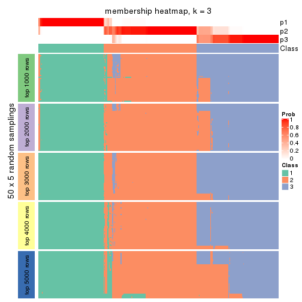</p>

</div>
<div id='tab-ATC-pam-membership-heatmap-3'>
<pre><code class="r">membership_heatmap(res, k = 4)
</code></pre>

<p></p>

</div>
<div id='tab-ATC-pam-membership-heatmap-4'>
<pre><code class="r">membership_heatmap(res, k = 5)
</code></pre>

<p></p>

</div>
<div id='tab-ATC-pam-membership-heatmap-5'>
<pre><code class="r">membership_heatmap(res, k = 6)
</code></pre>

<p></p>

</div>
</div>

As soon as we have had the classes for columns, we can look for signatures
which are significantly different between classes which can be candidate marks
for certain classes. Following are the heatmaps for signatures.


Signature heatmaps where rows are scaled:


<script>
$( function() {
	$( '#tabs-ATC-pam-get-signatures' ).tabs();
} );
</script>
<div id='tabs-ATC-pam-get-signatures'>
<ul>
<li><a href='#tab-ATC-pam-get-signatures-1'>k = 2</a></li>
<li><a href='#tab-ATC-pam-get-signatures-2'>k = 3</a></li>
<li><a href='#tab-ATC-pam-get-signatures-3'>k = 4</a></li>
<li><a href='#tab-ATC-pam-get-signatures-4'>k = 5</a></li>
<li><a href='#tab-ATC-pam-get-signatures-5'>k = 6</a></li>
</ul>
<div id='tab-ATC-pam-get-signatures-1'>
<pre><code class="r">get_signatures(res, k = 2)
</code></pre>

<p></p>

</div>
<div id='tab-ATC-pam-get-signatures-2'>
<pre><code class="r">get_signatures(res, k = 3)
</code></pre>

<p></p>

</div>
<div id='tab-ATC-pam-get-signatures-3'>
<pre><code class="r">get_signatures(res, k = 4)
</code></pre>

<p></p>

</div>
<div id='tab-ATC-pam-get-signatures-4'>
<pre><code class="r">get_signatures(res, k = 5)
</code></pre>

<p></p>

</div>
<div id='tab-ATC-pam-get-signatures-5'>
<pre><code class="r">get_signatures(res, k = 6)
</code></pre>

<p></p>

</div>
</div>


Signature heatmaps where rows are not scaled:


<script>
$( function() {
	$( '#tabs-ATC-pam-get-signatures-no-scale' ).tabs();
} );
</script>
<div id='tabs-ATC-pam-get-signatures-no-scale'>
<ul>
<li><a href='#tab-ATC-pam-get-signatures-no-scale-1'>k = 2</a></li>
<li><a href='#tab-ATC-pam-get-signatures-no-scale-2'>k = 3</a></li>
<li><a href='#tab-ATC-pam-get-signatures-no-scale-3'>k = 4</a></li>
<li><a href='#tab-ATC-pam-get-signatures-no-scale-4'>k = 5</a></li>
<li><a href='#tab-ATC-pam-get-signatures-no-scale-5'>k = 6</a></li>
</ul>
<div id='tab-ATC-pam-get-signatures-no-scale-1'>
<pre><code class="r">get_signatures(res, k = 2, scale_rows = FALSE)
</code></pre>

<p></p>

</div>
<div id='tab-ATC-pam-get-signatures-no-scale-2'>
<pre><code class="r">get_signatures(res, k = 3, scale_rows = FALSE)
</code></pre>

<p></p>

</div>
<div id='tab-ATC-pam-get-signatures-no-scale-3'>
<pre><code class="r">get_signatures(res, k = 4, scale_rows = FALSE)
</code></pre>

<p></p>

</div>
<div id='tab-ATC-pam-get-signatures-no-scale-4'>
<pre><code class="r">get_signatures(res, k = 5, scale_rows = FALSE)
</code></pre>

<p></p>

</div>
<div id='tab-ATC-pam-get-signatures-no-scale-5'>
<pre><code class="r">get_signatures(res, k = 6, scale_rows = FALSE)
</code></pre>

<p></p>

</div>
</div>


Compare the overlap of signatures from different k:

```r
compare_signatures(res)
```


`get_signature()` returns a data frame invisibly. TO get the list of signatures, the function
call should be assigned to a variable explicitly. In following code, if `plot` argument is set
to `FALSE`, no heatmap is plotted while only the differential analysis is performed.

```r
# code only for demonstration
tb = get_signature(res, k = ..., plot = FALSE)
```

An example of the output of `tb` is:

```
#>   which_row         fdr    mean_1    mean_2 scaled_mean_1 scaled_mean_2 km
#> 1        38 0.042760348  8.373488  9.131774    -0.5533452     0.5164555  1
#> 2        40 0.018707592  7.106213  8.469186    -0.6173731     0.5762149  1
#> 3        55 0.019134737 10.221463 11.207825    -0.6159697     0.5749050  1
#> 4        59 0.006059896  5.921854  7.869574    -0.6899429     0.6439467  1
#> 5        60 0.018055526  8.928898 10.211722    -0.6204761     0.5791110  1
#> 6        98 0.009384629 15.714769 14.887706     0.6635654    -0.6193277  2
...
```

The columns in `tb` are:

1. `which_row`: row indices corresponding to the input matrix.
2. `fdr`: FDR for the differential test. 
3. `mean_x`: The mean value in group x.
4. `scaled_mean_x`: The mean value in group x after rows are scaled.
5. `km`: Row groups if k-means clustering is applied to rows.


UMAP plot which shows how samples are separated.


<script>
$( function() {
	$( '#tabs-ATC-pam-dimension-reduction' ).tabs();
} );
</script>
<div id='tabs-ATC-pam-dimension-reduction'>
<ul>
<li><a href='#tab-ATC-pam-dimension-reduction-1'>k = 2</a></li>
<li><a href='#tab-ATC-pam-dimension-reduction-2'>k = 3</a></li>
<li><a href='#tab-ATC-pam-dimension-reduction-3'>k = 4</a></li>
<li><a href='#tab-ATC-pam-dimension-reduction-4'>k = 5</a></li>
<li><a href='#tab-ATC-pam-dimension-reduction-5'>k = 6</a></li>
</ul>
<div id='tab-ATC-pam-dimension-reduction-1'>
<pre><code class="r">dimension_reduction(res, k = 2, method = &quot;UMAP&quot;)
</code></pre>

<p></p>

</div>
<div id='tab-ATC-pam-dimension-reduction-2'>
<pre><code class="r">dimension_reduction(res, k = 3, method = &quot;UMAP&quot;)
</code></pre>

<p></p>

</div>
<div id='tab-ATC-pam-dimension-reduction-3'>
<pre><code class="r">dimension_reduction(res, k = 4, method = &quot;UMAP&quot;)
</code></pre>

<p></p>

</div>
<div id='tab-ATC-pam-dimension-reduction-4'>
<pre><code class="r">dimension_reduction(res, k = 5, method = &quot;UMAP&quot;)
</code></pre>

<p></p>

</div>
<div id='tab-ATC-pam-dimension-reduction-5'>
<pre><code class="r">dimension_reduction(res, k = 6, method = &quot;UMAP&quot;)
</code></pre>

<p></p>

</div>
</div>


Following heatmap shows how subgroups are split when increasing `k`:

```r
collect_classes(res)
```


If matrix rows can be associated to genes, consider to use `GO_Enrichment(res,
...)` to perform function enrichment for the signature genes.


 

---------------------------------------------------


### ATC:mclust**


The object with results only for a single top-value method and a single partition method 
can be extracted as:

```r
res = res_list["ATC", "mclust"]
# you can also extract it by
# res = res_list["ATC:mclust"]
```

A summary of `res` and all the functions that can be applied to it:

```r
res
```

```
#> A 'ConsensusPartition' object with k = 2, 3, 4, 5, 6.
#>   On a matrix with 17654 rows and 335 columns.
#>   Top rows (1000, 2000, 3000, 4000, 5000) are extracted by 'ATC' method.
#>   Subgroups are detected by 'mclust' method.
#>   Performed in total 1250 partitions by row resampling.
#>   Best k for subgroups seems to be 2.
#> 
#> Following methods can be applied to this 'ConsensusPartition' object:
#>  [1] "cola_report"             "collect_classes"         "collect_plots"          
#>  [4] "collect_stats"           "colnames"                "compare_signatures"     
#>  [7] "consensus_heatmap"       "dimension_reduction"     "functional_enrichment"  
#> [10] "get_anno_col"            "get_anno"                "get_classes"            
#> [13] "get_consensus"           "get_matrix"              "get_membership"         
#> [16] "get_param"               "get_signatures"          "get_stats"              
#> [19] "is_best_k"               "is_stable_k"             "membership_heatmap"     
#> [22] "ncol"                    "nrow"                    "plot_ecdf"              
#> [25] "rownames"                "select_partition_number" "show"                   
#> [28] "suggest_best_k"          "test_to_known_factors"
```

`collect_plots()` function collects all the plots made from `res` for all `k` (number of partitions)
into one single page to provide an easy and fast comparison between different `k`.

```r
collect_plots(res)
```


The plots are:

- The first row: a plot of the ECDF (Empirical cumulative distribution
  function) curves of the consensus matrix for each `k` and the heatmap of
  predicted classes for each `k`.
- The second row: heatmaps of the consensus matrix for each `k`.
- The third row: heatmaps of the membership matrix for each `k`.
- The fouth row: heatmaps of the signatures for each `k`.

All the plots in panels can be made by individual functions and they are
plotted later in this section.

`select_partition_number()` produces several plots showing different
statistics for choosing "optimized" `k`. There are following statistics:

- ECDF curves of the consensus matrix for each `k`;
- 1-PAC. [The PAC
  score](https://en.wikipedia.org/wiki/Consensus_clustering#Over-interpretation_potential_of_consensus_clustering)
  measures the proportion of the ambiguous subgrouping.
- Mean silhouette score.
- Concordance. The mean probability of fiting the consensus class ids in all
  partitions.
- Area increased. Denote $A_k$ as the area under the ECDF curve for current
  `k`, the area increased is defined as $A_k - A_{k-1}$.
- Rand index. The percent of pairs of samples that are both in a same cluster
  or both are not in a same cluster in the partition of k and k-1.
- Jaccard index. The ratio of pairs of samples are both in a same cluster in
  the partition of k and k-1 and the pairs of samples are both in a same
  cluster in the partition k or k-1.

The detailed explanations of these statistics can be found in [the cola
vignette](http://bioconductor.org/packages/devel/bioc/vignettes/cola/inst/doc/cola.html#toc_13).

Generally speaking, lower PAC score, higher mean silhouette score or higher
concordance corresponds to better partition. Rand index and Jaccard index
measure how similar the current partition is compared to partition with `k-1`.
If they are too similar, we won't accept `k` is better than `k-1`.

```r
select_partition_number(res)
```


The numeric values for all these statistics can be obtained by `get_stats()`.

```r
get_stats(res)
```

```
#>   k 1-PAC mean_silhouette concordance area_increased  Rand Jaccard
#> 2 2 0.965           0.951       0.974         0.4469 0.548   0.548
#> 3 3 0.618           0.718       0.835         0.3829 0.811   0.664
#> 4 4 0.546           0.613       0.764         0.1184 0.794   0.533
#> 5 5 0.581           0.572       0.707         0.1118 0.874   0.591
#> 6 6 0.602           0.391       0.659         0.0433 0.865   0.497
```

`suggest_best_k()` suggests the best $k$ based on these statistics. The rules are as follows:

- All $k$ with Jaccard index larger than 0.95 are removed because the increase of
  the partition number does not provides enough extra information. If all $k$ are removed,
  the best $k$ is assigned by `NA`.
- For $k$ with 1-PAC larger than 0.9, the maximal $k$ is taken as the "best k". Other $k$ is called "optional k".
- If it does not fit the second rule. The $k$ with the highest vote of highest
  1-PAC, mean silhouette and concordance is taken as the "best k".

```r
suggest_best_k(res)
```

```
#> [1] 2
```


Following shows the table of the partitions (You need to click the **show/hide
code output** link to see it). The membership matrix (columns with name `p*`)
is inferred by
[`clue::cl_consensus()`](https://www.rdocumentation.org/link/cl_consensus?package=clue)
function with the `SE` method. Basically the value in the membership matrix
represents the probability to belong to a certain group. The finall class
label for an item is determined with the group with highest probability it
belongs to.

In `get_classes()` function, the entropy is calculated from the membership
matrix and the silhouette score is calculated from the consensus matrix.


<script>
$( function() {
	$( '#tabs-ATC-mclust-get-classes' ).tabs();
} );
</script>
<div id='tabs-ATC-mclust-get-classes'>
<ul>
<li><a href='#tab-ATC-mclust-get-classes-1'>k = 2</a></li>
<li><a href='#tab-ATC-mclust-get-classes-2'>k = 3</a></li>
<li><a href='#tab-ATC-mclust-get-classes-3'>k = 4</a></li>
<li><a href='#tab-ATC-mclust-get-classes-4'>k = 5</a></li>
<li><a href='#tab-ATC-mclust-get-classes-5'>k = 6</a></li>
</ul>

<div id='tab-ATC-mclust-get-classes-1'>
<p><a id='tab-ATC-mclust-get-classes-1-a' style='color:#0366d6' href='#'>show/hide code output</a></p>
<pre><code class="r">cbind(get_classes(res, k = 2), get_membership(res, k = 2))
</code></pre>

<pre><code>#&gt;            class entropy silhouette    p1    p2
#&gt; SRR660306      2  0.0376      0.982 0.004 0.996
#&gt; SRR1359328     2  0.0376      0.982 0.004 0.996
#&gt; SRR821124      2  0.0938      0.984 0.012 0.988
#&gt; SRR1335188     1  0.0000      0.962 1.000 0.000
#&gt; SRR1075825     2  0.0938      0.984 0.012 0.988
#&gt; SRR1321921     1  0.0000      0.962 1.000 0.000
#&gt; SRR1466198     2  0.0672      0.984 0.008 0.992
#&gt; SRR1384073     2  0.1843      0.968 0.028 0.972
#&gt; SRR1312802     1  0.8081      0.686 0.752 0.248
#&gt; SRR1076559     1  0.0000      0.962 1.000 0.000
#&gt; SRR1370085     1  0.0000      0.962 1.000 0.000
#&gt; SRR1460363     1  0.0000      0.962 1.000 0.000
#&gt; SRR1480221     2  0.0938      0.984 0.012 0.988
#&gt; SRR1476165     1  0.0000      0.962 1.000 0.000
#&gt; SRR1459631     2  0.0672      0.984 0.008 0.992
#&gt; SRR1448098     2  0.0938      0.984 0.012 0.988
#&gt; SRR1321401     2  0.0672      0.984 0.008 0.992
#&gt; SRR807613      2  0.0938      0.984 0.012 0.988
#&gt; SRR808086      2  0.0672      0.984 0.008 0.992
#&gt; SRR613687      2  0.0938      0.984 0.012 0.988
#&gt; SRR1471011     2  0.9775      0.288 0.412 0.588
#&gt; SRR1330284     2  0.0938      0.984 0.012 0.988
#&gt; SRR1320624     2  0.0938      0.984 0.012 0.988
#&gt; SRR1459519     1  0.0000      0.962 1.000 0.000
#&gt; SRR1091184     2  0.0672      0.984 0.008 0.992
#&gt; SRR1390561     1  0.0000      0.962 1.000 0.000
#&gt; SRR658164      1  0.1843      0.942 0.972 0.028
#&gt; SRR1087079     2  0.0376      0.982 0.004 0.996
#&gt; SRR814996      2  0.0672      0.984 0.008 0.992
#&gt; SRR1407410     2  0.0376      0.982 0.004 0.996
#&gt; SRR1453392     2  0.0672      0.984 0.008 0.992
#&gt; SRR1445873     1  0.0000      0.962 1.000 0.000
#&gt; SRR1419985     2  0.0376      0.982 0.004 0.996
#&gt; SRR820938      2  0.0672      0.984 0.008 0.992
#&gt; SRR1476844     1  0.0000      0.962 1.000 0.000
#&gt; SRR1403526     1  0.0000      0.962 1.000 0.000
#&gt; SRR1413916     2  0.0938      0.984 0.012 0.988
#&gt; SRR1441051     2  0.0938      0.984 0.012 0.988
#&gt; SRR614287      2  0.0938      0.984 0.012 0.988
#&gt; SRR1092062     2  0.0938      0.984 0.012 0.988
#&gt; SRR612611      2  0.0376      0.982 0.004 0.996
#&gt; SRR1376356     2  0.0376      0.982 0.004 0.996
#&gt; SRR1405078     2  0.0672      0.984 0.008 0.992
#&gt; SRR1437226     2  0.0938      0.984 0.012 0.988
#&gt; SRR1326078     1  0.0000      0.962 1.000 0.000
#&gt; SRR1096806     2  0.0672      0.984 0.008 0.992
#&gt; SRR1440919     2  0.0672      0.984 0.008 0.992
#&gt; SRR1452824     1  0.8955      0.569 0.688 0.312
#&gt; SRR615754      1  0.0000      0.962 1.000 0.000
#&gt; SRR1341787     2  0.0672      0.984 0.008 0.992
#&gt; SRR614551      2  0.1184      0.981 0.016 0.984
#&gt; SRR1380829     2  0.0672      0.984 0.008 0.992
#&gt; SRR1455761     1  0.0000      0.962 1.000 0.000
#&gt; SRR1465189     1  0.5178      0.863 0.884 0.116
#&gt; SRR1376895     1  0.0000      0.962 1.000 0.000
#&gt; SRR1445002     1  0.0000      0.962 1.000 0.000
#&gt; SRR1469258     2  0.0938      0.984 0.012 0.988
#&gt; SRR1409239     1  0.0000      0.962 1.000 0.000
#&gt; SRR1480200     1  0.0000      0.962 1.000 0.000
#&gt; SRR1418323     1  0.0000      0.962 1.000 0.000
#&gt; SRR657540      2  0.0672      0.984 0.008 0.992
#&gt; SRR821096      2  0.0938      0.984 0.012 0.988
#&gt; SRR613591      2  0.0938      0.984 0.012 0.988
#&gt; SRR1344205     2  0.0672      0.984 0.008 0.992
#&gt; SRR612479      1  0.0376      0.959 0.996 0.004
#&gt; SRR1399950     1  0.5059      0.867 0.888 0.112
#&gt; SRR1336048     2  0.0938      0.984 0.012 0.988
#&gt; SRR1368896     1  0.0000      0.962 1.000 0.000
#&gt; SRR1379403     2  0.0672      0.984 0.008 0.992
#&gt; SRR1312464     1  0.0000      0.962 1.000 0.000
#&gt; SRR1096478     1  0.0000      0.962 1.000 0.000
#&gt; SRR1459845     1  0.0000      0.962 1.000 0.000
#&gt; SRR1348138     2  0.0938      0.984 0.012 0.988
#&gt; SRR811423      1  0.5059      0.867 0.888 0.112
#&gt; SRR615683      1  0.0000      0.962 1.000 0.000
#&gt; SRR1380336     2  0.0376      0.982 0.004 0.996
#&gt; SRR817609      1  0.8661      0.616 0.712 0.288
#&gt; SRR1074550     2  0.0672      0.984 0.008 0.992
#&gt; SRR1499236     2  0.0376      0.982 0.004 0.996
#&gt; SRR656083      1  0.0000      0.962 1.000 0.000
#&gt; SRR817539      2  0.4815      0.895 0.104 0.896
#&gt; SRR1410801     1  0.0000      0.962 1.000 0.000
#&gt; SRR1347190     1  0.5059      0.867 0.888 0.112
#&gt; SRR1355126     2  0.2236      0.964 0.036 0.964
#&gt; SRR615165      2  0.0672      0.984 0.008 0.992
#&gt; SRR1466046     1  0.0000      0.962 1.000 0.000
#&gt; SRR1097055     2  0.0672      0.984 0.008 0.992
#&gt; SRR1312370     2  0.0376      0.982 0.004 0.996
#&gt; SRR655325      1  0.0000      0.962 1.000 0.000
#&gt; SRR810177      2  0.0938      0.984 0.012 0.988
#&gt; SRR815685      2  0.1184      0.982 0.016 0.984
#&gt; SRR817026      2  0.0938      0.984 0.012 0.988
#&gt; SRR1417224     2  0.0376      0.982 0.004 0.996
#&gt; SRR661687      2  0.0938      0.984 0.012 0.988
#&gt; SRR1431804     1  0.9977      0.131 0.528 0.472
#&gt; SRR664072      2  0.0672      0.984 0.008 0.992
#&gt; SRR612923      2  0.0938      0.984 0.012 0.988
#&gt; SRR1315890     1  0.0000      0.962 1.000 0.000
#&gt; SRR1347726     2  0.2043      0.964 0.032 0.968
#&gt; SRR1500360     1  0.9815      0.284 0.580 0.420
#&gt; SRR1468360     2  0.0376      0.982 0.004 0.996
#&gt; SRR1404084     1  0.0000      0.962 1.000 0.000
#&gt; SRR615994      2  0.0672      0.984 0.008 0.992
#&gt; SRR1475718     2  0.0672      0.984 0.008 0.992
#&gt; SRR1397200     2  0.0672      0.984 0.008 0.992
#&gt; SRR655519      2  0.0672      0.984 0.008 0.992
#&gt; SRR1311308     2  0.0672      0.984 0.008 0.992
#&gt; SRR1368006     2  0.0672      0.984 0.008 0.992
#&gt; SRR613651      2  0.2423      0.963 0.040 0.960
#&gt; SRR1362621     2  0.0672      0.984 0.008 0.992
#&gt; SRR1451718     2  0.3879      0.927 0.076 0.924
#&gt; SRR1095334     2  0.0672      0.984 0.008 0.992
#&gt; SRR1079636     2  0.0938      0.984 0.012 0.988
#&gt; SRR1442549     2  0.0376      0.982 0.004 0.996
#&gt; SRR1466421     2  0.0376      0.982 0.004 0.996
#&gt; SRR817397      2  0.0938      0.984 0.012 0.988
#&gt; SRR1341809     2  0.0376      0.982 0.004 0.996
#&gt; SRR614623      2  0.1414      0.978 0.020 0.980
#&gt; SRR1335005     2  0.0938      0.984 0.012 0.988
#&gt; SRR1407065     2  0.0376      0.982 0.004 0.996
#&gt; SRR1404483     2  0.0672      0.984 0.008 0.992
#&gt; SRR1096222     1  0.0000      0.962 1.000 0.000
#&gt; SRR1401793     1  0.5408      0.854 0.876 0.124
#&gt; SRR1408615     2  0.0672      0.984 0.008 0.992
#&gt; SRR1070597     2  0.0376      0.982 0.004 0.996
#&gt; SRR1332381     2  0.2948      0.952 0.052 0.948
#&gt; SRR1457015     1  0.0000      0.962 1.000 0.000
#&gt; SRR1386797     2  0.2948      0.952 0.052 0.948
#&gt; SRR1098385     2  0.0672      0.984 0.008 0.992
#&gt; SRR1363947     2  0.0672      0.984 0.008 0.992
#&gt; SRR820350      2  0.0376      0.982 0.004 0.996
#&gt; SRR662055      2  0.0672      0.984 0.008 0.992
#&gt; SRR1310455     1  0.3584      0.908 0.932 0.068
#&gt; SRR1453639     2  0.0376      0.982 0.004 0.996
#&gt; SRR662617      2  0.0376      0.982 0.004 0.996
#&gt; SRR654778      2  0.9580      0.383 0.380 0.620
#&gt; SRR661782      2  0.0376      0.982 0.004 0.996
#&gt; SRR1334396     1  0.0000      0.962 1.000 0.000
#&gt; SRR613867      2  0.0376      0.982 0.004 0.996
#&gt; SRR1479412     1  0.0000      0.962 1.000 0.000
#&gt; SRR1331620     1  0.0000      0.962 1.000 0.000
#&gt; SRR1082809     1  0.9909      0.229 0.556 0.444
#&gt; SRR1417178     1  0.5059      0.867 0.888 0.112
#&gt; SRR1335278     1  0.0000      0.962 1.000 0.000
#&gt; SRR665369      2  0.0376      0.982 0.004 0.996
#&gt; SRR657552      2  0.0376      0.982 0.004 0.996
#&gt; SRR812412      1  0.0000      0.962 1.000 0.000
#&gt; SRR1096500     2  0.0376      0.982 0.004 0.996
#&gt; SRR1347750     2  0.0376      0.982 0.004 0.996
#&gt; SRR615153      2  0.8861      0.565 0.304 0.696
#&gt; SRR1434417     1  0.0000      0.962 1.000 0.000
#&gt; SRR1070159     2  0.1414      0.978 0.020 0.980
#&gt; SRR1332508     2  0.0672      0.984 0.008 0.992
#&gt; SRR1082059     2  0.2603      0.960 0.044 0.956
#&gt; SRR1402491     1  0.0000      0.962 1.000 0.000
#&gt; SRR1476595     2  0.2423      0.963 0.040 0.960
#&gt; SRR1320987     2  0.2423      0.963 0.040 0.960
#&gt; SRR1086417     2  0.2423      0.963 0.040 0.960
#&gt; SRR1454095     1  0.0000      0.962 1.000 0.000
#&gt; SRR614791      2  0.0672      0.984 0.008 0.992
#&gt; SRR821255      2  0.2043      0.970 0.032 0.968
#&gt; SRR820402      2  0.0938      0.984 0.012 0.988
#&gt; SRR1337284     2  0.0376      0.982 0.004 0.996
#&gt; SRR1333083     2  0.0672      0.984 0.008 0.992
#&gt; SRR1384883     2  0.0672      0.984 0.008 0.992
#&gt; SRR614431      1  0.0000      0.962 1.000 0.000
#&gt; SRR1481106     2  0.0672      0.984 0.008 0.992
#&gt; SRR1370285     1  0.0000      0.962 1.000 0.000
#&gt; SRR1446673     2  0.0672      0.984 0.008 0.992
#&gt; SRR1318046     2  0.0938      0.984 0.012 0.988
#&gt; SRR1341188     2  0.0672      0.984 0.008 0.992
#&gt; SRR1384941     1  0.0000      0.962 1.000 0.000
#&gt; SRR1322864     2  0.0672      0.984 0.008 0.992
#&gt; SRR1476825     2  0.0938      0.984 0.012 0.988
#&gt; SRR1443332     2  0.0672      0.984 0.008 0.992
#&gt; SRR662486      2  0.0938      0.984 0.012 0.988
#&gt; SRR1447019     1  0.0000      0.962 1.000 0.000
#&gt; SRR662942      1  0.0000      0.962 1.000 0.000
#&gt; SRR613102      2  0.0672      0.984 0.008 0.992
#&gt; SRR1469880     1  0.0000      0.962 1.000 0.000
#&gt; SRR1464977     2  0.0376      0.982 0.004 0.996
#&gt; SRR615850      2  0.0938      0.984 0.012 0.988
#&gt; SRR661949      2  0.0376      0.982 0.004 0.996
#&gt; SRR1322227     2  0.0672      0.984 0.008 0.992
#&gt; SRR1441655     2  0.2043      0.970 0.032 0.968
#&gt; SRR613771      2  0.0376      0.982 0.004 0.996
#&gt; SRR1479471     1  0.0000      0.962 1.000 0.000
#&gt; SRR1488918     2  0.0376      0.982 0.004 0.996
#&gt; SRR1414040     2  0.0376      0.982 0.004 0.996
#&gt; SRR1079850     2  0.3114      0.948 0.056 0.944
#&gt; SRR663209      2  0.9815      0.265 0.420 0.580
#&gt; SRR1364914     2  0.0938      0.984 0.012 0.988
#&gt; SRR1408267     2  0.1633      0.977 0.024 0.976
#&gt; SRR1314894     1  0.0000      0.962 1.000 0.000
#&gt; SRR1414117     2  0.0938      0.984 0.012 0.988
#&gt; SRR1395975     2  0.0376      0.982 0.004 0.996
#&gt; SRR1402219     2  0.0938      0.984 0.012 0.988
#&gt; SRR1433623     1  0.0000      0.962 1.000 0.000
#&gt; SRR656385      2  0.0938      0.984 0.012 0.988
#&gt; SRR811213      2  0.0938      0.984 0.012 0.988
#&gt; SRR663657      2  0.0672      0.984 0.008 0.992
#&gt; SRR612203      1  0.0000      0.962 1.000 0.000
#&gt; SRR613987      2  0.2423      0.963 0.040 0.960
#&gt; SRR613831      2  0.0672      0.984 0.008 0.992
#&gt; SRR1354180     2  0.0376      0.982 0.004 0.996
#&gt; SRR1382912     1  0.0000      0.962 1.000 0.000
#&gt; SRR1475501     1  0.0000      0.962 1.000 0.000
#&gt; SRR1336930     1  0.0000      0.962 1.000 0.000
#&gt; SRR613030      2  0.0672      0.984 0.008 0.992
#&gt; SRR1381459     2  0.0672      0.984 0.008 0.992
#&gt; SRR1402350     2  0.2236      0.964 0.036 0.964
#&gt; SRR1419408     1  0.0000      0.962 1.000 0.000
#&gt; SRR655911      2  0.0376      0.982 0.004 0.996
#&gt; SRR1418243     1  0.0000      0.962 1.000 0.000
#&gt; SRR1322573     1  0.4690      0.879 0.900 0.100
#&gt; SRR613615      2  0.0672      0.984 0.008 0.992
#&gt; SRR1355284     1  0.0000      0.962 1.000 0.000
#&gt; SRR1319395     1  0.0000      0.962 1.000 0.000
#&gt; SRR818939      1  0.0000      0.962 1.000 0.000
#&gt; SRR1465266     1  0.0000      0.962 1.000 0.000
#&gt; SRR614888      1  0.7815      0.700 0.768 0.232
#&gt; SRR1431694     2  0.0376      0.982 0.004 0.996
#&gt; SRR614347      2  0.0938      0.984 0.012 0.988
#&gt; SRR1334228     2  0.0672      0.984 0.008 0.992
#&gt; SRR1096007     2  0.0938      0.984 0.012 0.988
#&gt; SRR656349      1  0.9552      0.421 0.624 0.376
#&gt; SRR815422      2  0.0376      0.982 0.004 0.996
#&gt; SRR1360828     1  0.0000      0.962 1.000 0.000
#&gt; SRR1359005     2  0.0938      0.984 0.012 0.988
#&gt; SRR1456652     1  0.0000      0.962 1.000 0.000
#&gt; SRR1391660     1  0.0000      0.962 1.000 0.000
#&gt; SRR1441956     1  0.0000      0.962 1.000 0.000
#&gt; SRR662930      2  0.0672      0.984 0.008 0.992
#&gt; SRR615790      2  0.0672      0.984 0.008 0.992
#&gt; SRR614827      2  0.0672      0.984 0.008 0.992
#&gt; SRR614587      2  0.0672      0.984 0.008 0.992
#&gt; SRR814052      2  0.0376      0.982 0.004 0.996
#&gt; SRR1070086     1  0.0000      0.962 1.000 0.000
#&gt; SRR1481440     1  0.0000      0.962 1.000 0.000
#&gt; SRR1339296     2  0.0672      0.984 0.008 0.992
#&gt; SRR1343239     2  0.0672      0.984 0.008 0.992
#&gt; SRR1432802     2  0.0376      0.982 0.004 0.996
#&gt; SRR1416911     1  0.0000      0.962 1.000 0.000
#&gt; SRR1410427     2  0.2423      0.963 0.040 0.960
#&gt; SRR1401185     2  0.0938      0.984 0.012 0.988
#&gt; SRR654993      2  0.0376      0.982 0.004 0.996
#&gt; SRR656397      1  0.0000      0.962 1.000 0.000
#&gt; SRR809643      2  0.0672      0.984 0.008 0.992
#&gt; SRR1433819     1  0.0000      0.962 1.000 0.000
#&gt; SRR1375225     2  0.0376      0.982 0.004 0.996
#&gt; SRR1367739     2  0.0938      0.983 0.012 0.988
#&gt; SRR1323336     2  0.3431      0.940 0.064 0.936
#&gt; SRR663224      2  0.0672      0.984 0.008 0.992
#&gt; SRR1442840     1  0.0000      0.962 1.000 0.000
#&gt; SRR1374058     1  0.0000      0.962 1.000 0.000
#&gt; SRR656994      1  0.6048      0.826 0.852 0.148
#&gt; SRR1469214     2  0.0938      0.984 0.012 0.988
#&gt; SRR1456446     2  0.6973      0.776 0.188 0.812
#&gt; SRR1471879     2  0.0376      0.982 0.004 0.996
#&gt; SRR612911      2  0.0672      0.984 0.008 0.992
#&gt; SRR1395720     2  0.0672      0.984 0.008 0.992
#&gt; SRR1413055     1  0.0000      0.962 1.000 0.000
#&gt; SRR656770      2  0.0376      0.982 0.004 0.996
#&gt; SRR812080      2  0.0672      0.984 0.008 0.992
#&gt; SRR1479328     1  0.8144      0.679 0.748 0.252
#&gt; SRR661421      2  0.0376      0.982 0.004 0.996
#&gt; SRR1410286     2  0.0938      0.984 0.012 0.988
#&gt; SRR1487150     1  0.0000      0.962 1.000 0.000
#&gt; SRR1467035     1  0.0000      0.962 1.000 0.000
#&gt; SRR1360607     2  0.0938      0.984 0.012 0.988
#&gt; SRR1333106     2  0.0376      0.982 0.004 0.996
#&gt; SRR1088706     2  0.2043      0.968 0.032 0.968
#&gt; SRR1320053     2  0.0672      0.984 0.008 0.992
#&gt; SRR1350392     2  0.0672      0.984 0.008 0.992
#&gt; SRR1385190     2  0.0672      0.984 0.008 0.992
#&gt; SRR1080093     2  0.0672      0.984 0.008 0.992
#&gt; SRR1318753     1  0.0000      0.962 1.000 0.000
#&gt; SRR1345369     2  0.0376      0.982 0.004 0.996
#&gt; SRR612178      2  0.0376      0.982 0.004 0.996
#&gt; SRR1354423     1  0.0000      0.962 1.000 0.000
#&gt; SRR1072724     1  0.4161      0.895 0.916 0.084
#&gt; SRR1418450     2  0.0376      0.982 0.004 0.996
#&gt; SRR1326427     2  0.0672      0.984 0.008 0.992
#&gt; SRR1437412     2  0.0376      0.982 0.004 0.996
#&gt; SRR1327548     2  0.0672      0.984 0.008 0.992
#&gt; SRR1395891     1  0.0000      0.962 1.000 0.000
#&gt; SRR659367      2  0.0376      0.982 0.004 0.996
#&gt; SRR818961      1  0.0000      0.962 1.000 0.000
#&gt; SRR813704      1  0.0000      0.962 1.000 0.000
#&gt; SRR613054      1  0.0000      0.962 1.000 0.000
#&gt; SRR1476467     1  0.0000      0.962 1.000 0.000
#&gt; SRR1407988     2  0.0938      0.984 0.012 0.988
#&gt; SRR1394776     2  0.0938      0.984 0.012 0.988
#&gt; SRR655578      2  0.0376      0.982 0.004 0.996
#&gt; SRR1310645     2  0.0672      0.984 0.008 0.992
#&gt; SRR1345628     1  0.0376      0.959 0.996 0.004
#&gt; SRR1479740     1  0.0000      0.962 1.000 0.000
#&gt; SRR1332095     2  0.2423      0.963 0.040 0.960
#&gt; SRR1444786     2  0.0376      0.982 0.004 0.996
#&gt; SRR1090070     1  0.0000      0.962 1.000 0.000
#&gt; SRR662414      2  0.0376      0.982 0.004 0.996
#&gt; SRR661216      2  0.0938      0.984 0.012 0.988
#&gt; SRR656313      2  0.0672      0.984 0.008 0.992
#&gt; SRR615671      2  0.0376      0.982 0.004 0.996
#&gt; SRR1350196     2  0.0376      0.982 0.004 0.996
#&gt; SRR1466580     1  0.0000      0.962 1.000 0.000
#&gt; SRR1408032     2  0.0376      0.982 0.004 0.996
#&gt; SRR1432913     2  0.0938      0.984 0.012 0.988
#&gt; SRR1360502     2  0.2423      0.963 0.040 0.960
#&gt; SRR1391901     2  0.0672      0.984 0.008 0.992
#&gt; SRR1311131     1  0.0000      0.962 1.000 0.000
#&gt; SRR1380636     1  0.0000      0.962 1.000 0.000
#&gt; SRR1332339     2  0.0376      0.982 0.004 0.996
#&gt; SRR1341563     2  0.0938      0.984 0.012 0.988
#&gt; SRR1359410     2  0.0672      0.984 0.008 0.992
#&gt; SRR1473040     2  0.0672      0.984 0.008 0.992
#&gt; SRR1321444     1  0.0000      0.962 1.000 0.000
#&gt; SRR1498765     2  0.0672      0.984 0.008 0.992
#&gt; SRR1312622     2  0.0672      0.984 0.008 0.992
#&gt; SRR615503      2  0.1633      0.977 0.024 0.976
#&gt; SRR1453192     1  0.0000      0.962 1.000 0.000
#&gt; SRR1433107     2  0.0672      0.984 0.008 0.992
#&gt; SRR1075384     1  0.0000      0.962 1.000 0.000
#&gt; SRR1356683     1  0.0000      0.962 1.000 0.000
#&gt; SRR659049      1  0.0000      0.962 1.000 0.000
#&gt; SRR1368240     1  0.0000      0.962 1.000 0.000
#&gt; SRR1341739     1  0.0000      0.962 1.000 0.000
#&gt; SRR613249      2  0.0938      0.983 0.012 0.988
#&gt; SRR663428      2  0.0938      0.984 0.012 0.988
#&gt; SRR1341302     2  0.0672      0.984 0.008 0.992
#&gt; SRR1073553     2  0.0938      0.984 0.012 0.988
#&gt; SRR1354093     2  0.0672      0.984 0.008 0.992
#&gt; SRR1406521     2  0.0938      0.984 0.012 0.988
#&gt; SRR1432049     1  0.1184      0.950 0.984 0.016
#&gt; SRR1453504     2  0.2043      0.970 0.032 0.968
</code></pre>

<script>
$('#tab-ATC-mclust-get-classes-1-a').parent().next().next().hide();
$('#tab-ATC-mclust-get-classes-1-a').click(function(){
  $('#tab-ATC-mclust-get-classes-1-a').parent().next().next().toggle();
  return(false);
});
</script>
</div>

<div id='tab-ATC-mclust-get-classes-2'>
<p><a id='tab-ATC-mclust-get-classes-2-a' style='color:#0366d6' href='#'>show/hide code output</a></p>
<pre><code class="r">cbind(get_classes(res, k = 3), get_membership(res, k = 3))
</code></pre>

<pre><code>#&gt;            class entropy silhouette    p1    p2    p3
#&gt; SRR660306      2  0.4931    0.91756 0.000 0.768 0.232
#&gt; SRR1359328     2  0.4931    0.91756 0.000 0.768 0.232
#&gt; SRR821124      3  0.3619    0.67290 0.000 0.136 0.864
#&gt; SRR1335188     1  0.1031    0.95587 0.976 0.024 0.000
#&gt; SRR1075825     3  0.3482    0.66868 0.000 0.128 0.872
#&gt; SRR1321921     1  0.0000    0.96077 1.000 0.000 0.000
#&gt; SRR1466198     3  0.4399    0.63113 0.000 0.188 0.812
#&gt; SRR1384073     3  0.9573    0.12819 0.200 0.364 0.436
#&gt; SRR1312802     1  0.2866    0.89600 0.916 0.008 0.076
#&gt; SRR1076559     1  0.0747    0.95853 0.984 0.016 0.000
#&gt; SRR1370085     1  0.0424    0.96011 0.992 0.008 0.000
#&gt; SRR1460363     1  0.0424    0.96011 0.992 0.008 0.000
#&gt; SRR1480221     3  0.3752    0.65795 0.000 0.144 0.856
#&gt; SRR1476165     1  0.0747    0.95853 0.984 0.016 0.000
#&gt; SRR1459631     3  0.5098    0.64851 0.000 0.248 0.752
#&gt; SRR1448098     3  0.6154    0.07803 0.000 0.408 0.592
#&gt; SRR1321401     3  0.6252   -0.10314 0.000 0.444 0.556
#&gt; SRR807613      3  0.6225   -0.03839 0.000 0.432 0.568
#&gt; SRR808086      3  0.1529    0.69256 0.000 0.040 0.960
#&gt; SRR613687      3  0.6140    0.09477 0.000 0.404 0.596
#&gt; SRR1471011     1  0.4137    0.86078 0.872 0.032 0.096
#&gt; SRR1330284     3  0.3482    0.66868 0.000 0.128 0.872
#&gt; SRR1320624     3  0.1860    0.69513 0.000 0.052 0.948
#&gt; SRR1459519     1  0.0237    0.96075 0.996 0.004 0.000
#&gt; SRR1091184     3  0.5397    0.64428 0.000 0.280 0.720
#&gt; SRR1390561     1  0.0424    0.96041 0.992 0.008 0.000
#&gt; SRR658164      1  0.0747    0.95853 0.984 0.016 0.000
#&gt; SRR1087079     3  0.5560    0.41730 0.000 0.300 0.700
#&gt; SRR814996      3  0.4399    0.63113 0.000 0.188 0.812
#&gt; SRR1407410     2  0.5098    0.90580 0.000 0.752 0.248
#&gt; SRR1453392     3  0.2165    0.68909 0.000 0.064 0.936
#&gt; SRR1445873     1  0.0237    0.96075 0.996 0.004 0.000
#&gt; SRR1419985     2  0.6140    0.64589 0.000 0.596 0.404
#&gt; SRR820938      3  0.4399    0.63113 0.000 0.188 0.812
#&gt; SRR1476844     1  0.0424    0.96041 0.992 0.008 0.000
#&gt; SRR1403526     1  0.0424    0.96011 0.992 0.008 0.000
#&gt; SRR1413916     3  0.5216    0.50664 0.000 0.260 0.740
#&gt; SRR1441051     3  0.3752    0.65876 0.000 0.144 0.856
#&gt; SRR614287      2  0.6244    0.55217 0.000 0.560 0.440
#&gt; SRR1092062     3  0.4062    0.64095 0.000 0.164 0.836
#&gt; SRR612611      2  0.6302    0.41709 0.000 0.520 0.480
#&gt; SRR1376356     2  0.5397    0.86841 0.000 0.720 0.280
#&gt; SRR1405078     3  0.1964    0.69151 0.000 0.056 0.944
#&gt; SRR1437226     3  0.4346    0.61980 0.000 0.184 0.816
#&gt; SRR1326078     1  0.0424    0.96011 0.992 0.008 0.000
#&gt; SRR1096806     3  0.3551    0.64197 0.000 0.132 0.868
#&gt; SRR1440919     3  0.1753    0.69918 0.000 0.048 0.952
#&gt; SRR1452824     1  0.3850    0.86861 0.884 0.028 0.088
#&gt; SRR615754      1  0.0424    0.96011 0.992 0.008 0.000
#&gt; SRR1341787     3  0.6302   -0.27120 0.000 0.480 0.520
#&gt; SRR614551      3  0.2711    0.69678 0.000 0.088 0.912
#&gt; SRR1380829     3  0.4555    0.62737 0.000 0.200 0.800
#&gt; SRR1455761     1  0.0237    0.96075 0.996 0.004 0.000
#&gt; SRR1465189     1  0.2682    0.89606 0.920 0.004 0.076
#&gt; SRR1376895     1  0.0424    0.96041 0.992 0.008 0.000
#&gt; SRR1445002     1  0.0424    0.96011 0.992 0.008 0.000
#&gt; SRR1469258     3  0.4399    0.63405 0.000 0.188 0.812
#&gt; SRR1409239     1  0.0592    0.95952 0.988 0.012 0.000
#&gt; SRR1480200     1  0.0424    0.96041 0.992 0.008 0.000
#&gt; SRR1418323     1  0.1031    0.95587 0.976 0.024 0.000
#&gt; SRR657540      3  0.4399    0.63113 0.000 0.188 0.812
#&gt; SRR821096      3  0.3267    0.67604 0.000 0.116 0.884
#&gt; SRR613591      3  0.5905    0.28164 0.000 0.352 0.648
#&gt; SRR1344205     3  0.4399    0.63113 0.000 0.188 0.812
#&gt; SRR612479      1  0.0424    0.96041 0.992 0.008 0.000
#&gt; SRR1399950     1  0.2384    0.91680 0.936 0.008 0.056
#&gt; SRR1336048     3  0.2625    0.68165 0.000 0.084 0.916
#&gt; SRR1368896     1  0.0424    0.96041 0.992 0.008 0.000
#&gt; SRR1379403     3  0.1753    0.69591 0.000 0.048 0.952
#&gt; SRR1312464     1  0.0592    0.96009 0.988 0.012 0.000
#&gt; SRR1096478     1  0.0747    0.95853 0.984 0.016 0.000
#&gt; SRR1459845     1  0.0424    0.96011 0.992 0.008 0.000
#&gt; SRR1348138     3  0.4556    0.65640 0.080 0.060 0.860
#&gt; SRR811423      1  0.2774    0.89927 0.920 0.008 0.072
#&gt; SRR615683      1  0.0237    0.96075 0.996 0.004 0.000
#&gt; SRR1380336     2  0.4931    0.91756 0.000 0.768 0.232
#&gt; SRR817609      1  0.3325    0.89096 0.904 0.020 0.076
#&gt; SRR1074550     3  0.4399    0.63113 0.000 0.188 0.812
#&gt; SRR1499236     2  0.4974    0.91262 0.000 0.764 0.236
#&gt; SRR656083      1  0.0424    0.96011 0.992 0.008 0.000
#&gt; SRR817539      1  0.8425    0.12054 0.540 0.096 0.364
#&gt; SRR1410801     1  0.0424    0.96041 0.992 0.008 0.000
#&gt; SRR1347190     1  0.2703    0.91489 0.928 0.016 0.056
#&gt; SRR1355126     3  0.3715    0.68999 0.004 0.128 0.868
#&gt; SRR615165      3  0.4399    0.63113 0.000 0.188 0.812
#&gt; SRR1466046     1  0.0424    0.96041 0.992 0.008 0.000
#&gt; SRR1097055     3  0.2878    0.68878 0.000 0.096 0.904
#&gt; SRR1312370     3  0.6291   -0.20861 0.000 0.468 0.532
#&gt; SRR655325      1  0.0237    0.96075 0.996 0.004 0.000
#&gt; SRR810177      3  0.3752    0.65844 0.000 0.144 0.856
#&gt; SRR815685      3  0.2796    0.69335 0.000 0.092 0.908
#&gt; SRR817026      3  0.2261    0.69431 0.000 0.068 0.932
#&gt; SRR1417224     2  0.4931    0.91756 0.000 0.768 0.232
#&gt; SRR661687      3  0.6045    0.06720 0.000 0.380 0.620
#&gt; SRR1431804     1  0.2527    0.92314 0.936 0.020 0.044
#&gt; SRR664072      3  0.4399    0.63113 0.000 0.188 0.812
#&gt; SRR612923      3  0.5529    0.43235 0.000 0.296 0.704
#&gt; SRR1315890     1  0.0424    0.96011 0.992 0.008 0.000
#&gt; SRR1347726     3  0.9901    0.13834 0.276 0.328 0.396
#&gt; SRR1500360     1  0.6698    0.52175 0.684 0.036 0.280
#&gt; SRR1468360     2  0.4931    0.91756 0.000 0.768 0.232
#&gt; SRR1404084     1  0.0747    0.95853 0.984 0.016 0.000
#&gt; SRR615994      3  0.4399    0.63113 0.000 0.188 0.812
#&gt; SRR1475718     3  0.3038    0.68373 0.000 0.104 0.896
#&gt; SRR1397200     3  0.4399    0.63113 0.000 0.188 0.812
#&gt; SRR655519      3  0.4062    0.64197 0.000 0.164 0.836
#&gt; SRR1311308     3  0.4399    0.63113 0.000 0.188 0.812
#&gt; SRR1368006     3  0.1643    0.69393 0.000 0.044 0.956
#&gt; SRR613651      3  0.5497    0.61664 0.148 0.048 0.804
#&gt; SRR1362621     3  0.1289    0.69380 0.000 0.032 0.968
#&gt; SRR1451718     3  0.7263    0.33840 0.400 0.032 0.568
#&gt; SRR1095334     3  0.5397    0.64428 0.000 0.280 0.720
#&gt; SRR1079636     3  0.2959    0.68512 0.000 0.100 0.900
#&gt; SRR1442549     2  0.4931    0.91756 0.000 0.768 0.232
#&gt; SRR1466421     2  0.6274    0.50706 0.000 0.544 0.456
#&gt; SRR817397      3  0.6140    0.09719 0.000 0.404 0.596
#&gt; SRR1341809     2  0.6235    0.56266 0.000 0.564 0.436
#&gt; SRR614623      3  0.1411    0.69505 0.000 0.036 0.964
#&gt; SRR1335005     3  0.4235    0.62881 0.000 0.176 0.824
#&gt; SRR1407065     2  0.4931    0.91756 0.000 0.768 0.232
#&gt; SRR1404483     3  0.1031    0.69595 0.000 0.024 0.976
#&gt; SRR1096222     1  0.0747    0.95853 0.984 0.016 0.000
#&gt; SRR1401793     1  0.2703    0.91489 0.928 0.016 0.056
#&gt; SRR1408615     3  0.4555    0.62737 0.000 0.200 0.800
#&gt; SRR1070597     3  0.6225   -0.03229 0.000 0.432 0.568
#&gt; SRR1332381     3  0.7633    0.56880 0.184 0.132 0.684
#&gt; SRR1457015     1  0.0237    0.96075 0.996 0.004 0.000
#&gt; SRR1386797     3  0.6906    0.43097 0.324 0.032 0.644
#&gt; SRR1098385     3  0.2625    0.69052 0.000 0.084 0.916
#&gt; SRR1363947     3  0.4399    0.63113 0.000 0.188 0.812
#&gt; SRR820350      2  0.5178    0.89774 0.000 0.744 0.256
#&gt; SRR662055      3  0.3412    0.67117 0.000 0.124 0.876
#&gt; SRR1310455     1  0.1482    0.95122 0.968 0.020 0.012
#&gt; SRR1453639     2  0.4931    0.91756 0.000 0.768 0.232
#&gt; SRR662617      2  0.4931    0.91756 0.000 0.768 0.232
#&gt; SRR654778      1  0.6562    0.55479 0.700 0.036 0.264
#&gt; SRR661782      2  0.4931    0.91756 0.000 0.768 0.232
#&gt; SRR1334396     1  0.0424    0.96041 0.992 0.008 0.000
#&gt; SRR613867      2  0.5431    0.86294 0.000 0.716 0.284
#&gt; SRR1479412     1  0.1163    0.95412 0.972 0.028 0.000
#&gt; SRR1331620     1  0.0747    0.95853 0.984 0.016 0.000
#&gt; SRR1082809     1  0.6341    0.64856 0.716 0.032 0.252
#&gt; SRR1417178     1  0.3031    0.89437 0.912 0.012 0.076
#&gt; SRR1335278     1  0.0424    0.96041 0.992 0.008 0.000
#&gt; SRR665369      2  0.4931    0.91756 0.000 0.768 0.232
#&gt; SRR657552      3  0.7601   -0.01893 0.044 0.416 0.540
#&gt; SRR812412      1  0.0747    0.95853 0.984 0.016 0.000
#&gt; SRR1096500     2  0.5098    0.90580 0.000 0.752 0.248
#&gt; SRR1347750     2  0.4931    0.91756 0.000 0.768 0.232
#&gt; SRR615153      1  0.4810    0.80743 0.832 0.028 0.140
#&gt; SRR1434417     1  0.0424    0.96041 0.992 0.008 0.000
#&gt; SRR1070159     3  0.4605    0.62531 0.000 0.204 0.796
#&gt; SRR1332508     3  0.3340    0.69026 0.000 0.120 0.880
#&gt; SRR1082059     3  0.6960    0.60538 0.152 0.116 0.732
#&gt; SRR1402491     1  0.0424    0.96041 0.992 0.008 0.000
#&gt; SRR1476595     3  0.9818    0.14983 0.248 0.344 0.408
#&gt; SRR1320987     3  0.4708    0.67788 0.036 0.120 0.844
#&gt; SRR1086417     3  0.6726    0.62007 0.132 0.120 0.748
#&gt; SRR1454095     1  0.1163    0.95407 0.972 0.028 0.000
#&gt; SRR614791      3  0.0592    0.69316 0.000 0.012 0.988
#&gt; SRR821255      3  0.8556    0.46788 0.232 0.164 0.604
#&gt; SRR820402      3  0.6062    0.17617 0.000 0.384 0.616
#&gt; SRR1337284     3  0.6192    0.02556 0.000 0.420 0.580
#&gt; SRR1333083     3  0.1964    0.69472 0.000 0.056 0.944
#&gt; SRR1384883     3  0.1529    0.69487 0.000 0.040 0.960
#&gt; SRR614431      1  0.0424    0.96011 0.992 0.008 0.000
#&gt; SRR1481106     3  0.3879    0.65448 0.000 0.152 0.848
#&gt; SRR1370285     1  0.0424    0.96041 0.992 0.008 0.000
#&gt; SRR1446673     3  0.4399    0.63113 0.000 0.188 0.812
#&gt; SRR1318046     3  0.4842    0.56760 0.000 0.224 0.776
#&gt; SRR1341188     3  0.4399    0.63113 0.000 0.188 0.812
#&gt; SRR1384941     1  0.0424    0.96041 0.992 0.008 0.000
#&gt; SRR1322864     3  0.2959    0.68502 0.000 0.100 0.900
#&gt; SRR1476825     3  0.5882    0.31827 0.000 0.348 0.652
#&gt; SRR1443332     3  0.4702    0.64986 0.000 0.212 0.788
#&gt; SRR662486      3  0.6126    0.11175 0.000 0.400 0.600
#&gt; SRR1447019     1  0.0237    0.96075 0.996 0.004 0.000
#&gt; SRR662942      1  0.0237    0.96075 0.996 0.004 0.000
#&gt; SRR613102      3  0.4399    0.63113 0.000 0.188 0.812
#&gt; SRR1469880     1  0.0000    0.96077 1.000 0.000 0.000
#&gt; SRR1464977     3  0.8271   -0.00553 0.076 0.444 0.480
#&gt; SRR615850      3  0.6126    0.03094 0.000 0.400 0.600
#&gt; SRR661949      2  0.4931    0.91756 0.000 0.768 0.232
#&gt; SRR1322227     3  0.4346    0.63326 0.000 0.184 0.816
#&gt; SRR1441655     3  0.4209    0.68108 0.016 0.128 0.856
#&gt; SRR613771      2  0.4931    0.91756 0.000 0.768 0.232
#&gt; SRR1479471     1  0.0424    0.96041 0.992 0.008 0.000
#&gt; SRR1488918     2  0.4931    0.91756 0.000 0.768 0.232
#&gt; SRR1414040     2  0.5138    0.90197 0.000 0.748 0.252
#&gt; SRR1079850     3  0.7788    0.45671 0.284 0.084 0.632
#&gt; SRR663209      1  0.4056    0.86130 0.876 0.032 0.092
#&gt; SRR1364914     2  0.6252    0.54291 0.000 0.556 0.444
#&gt; SRR1408267     3  0.3816    0.67079 0.000 0.148 0.852
#&gt; SRR1314894     1  0.0424    0.96041 0.992 0.008 0.000
#&gt; SRR1414117     3  0.6567    0.59160 0.088 0.160 0.752
#&gt; SRR1395975     2  0.4931    0.91756 0.000 0.768 0.232
#&gt; SRR1402219     3  0.6140    0.09719 0.000 0.404 0.596
#&gt; SRR1433623     1  0.0237    0.96075 0.996 0.004 0.000
#&gt; SRR656385      2  0.5138    0.90242 0.000 0.748 0.252
#&gt; SRR811213      3  0.5621    0.45808 0.000 0.308 0.692
#&gt; SRR663657      3  0.5431    0.64738 0.000 0.284 0.716
#&gt; SRR612203      1  0.0000    0.96077 1.000 0.000 0.000
#&gt; SRR613987      3  0.5000    0.63879 0.124 0.044 0.832
#&gt; SRR613831      3  0.4399    0.63113 0.000 0.188 0.812
#&gt; SRR1354180     2  0.4931    0.91756 0.000 0.768 0.232
#&gt; SRR1382912     1  0.0747    0.95853 0.984 0.016 0.000
#&gt; SRR1475501     1  0.0237    0.96075 0.996 0.004 0.000
#&gt; SRR1336930     1  0.0424    0.96041 0.992 0.008 0.000
#&gt; SRR613030      3  0.4291    0.63524 0.000 0.180 0.820
#&gt; SRR1381459     3  0.3412    0.69050 0.000 0.124 0.876
#&gt; SRR1402350     3  0.3816    0.69047 0.000 0.148 0.852
#&gt; SRR1419408     1  0.0424    0.96011 0.992 0.008 0.000
#&gt; SRR655911      2  0.4931    0.91756 0.000 0.768 0.232
#&gt; SRR1418243     1  0.0424    0.96011 0.992 0.008 0.000
#&gt; SRR1322573     1  0.2703    0.91489 0.928 0.016 0.056
#&gt; SRR613615      3  0.4399    0.63113 0.000 0.188 0.812
#&gt; SRR1355284     1  0.0424    0.96041 0.992 0.008 0.000
#&gt; SRR1319395     1  0.0237    0.96056 0.996 0.004 0.000
#&gt; SRR818939      1  0.0424    0.96011 0.992 0.008 0.000
#&gt; SRR1465266     1  0.0424    0.96041 0.992 0.008 0.000
#&gt; SRR614888      1  0.3910    0.84941 0.876 0.020 0.104
#&gt; SRR1431694     3  0.6235   -0.03046 0.000 0.436 0.564
#&gt; SRR614347      3  0.3752    0.63370 0.000 0.144 0.856
#&gt; SRR1334228     3  0.4399    0.63113 0.000 0.188 0.812
#&gt; SRR1096007     3  0.3551    0.66628 0.000 0.132 0.868
#&gt; SRR656349      1  0.2663    0.92283 0.932 0.024 0.044
#&gt; SRR815422      2  0.4931    0.91756 0.000 0.768 0.232
#&gt; SRR1360828     1  0.0983    0.95737 0.980 0.016 0.004
#&gt; SRR1359005     3  0.6168    0.05859 0.000 0.412 0.588
#&gt; SRR1456652     1  0.0592    0.95952 0.988 0.012 0.000
#&gt; SRR1391660     1  0.0424    0.96041 0.992 0.008 0.000
#&gt; SRR1441956     1  0.0237    0.96056 0.996 0.004 0.000
#&gt; SRR662930      3  0.4346    0.63326 0.000 0.184 0.816
#&gt; SRR615790      3  0.4399    0.63327 0.000 0.188 0.812
#&gt; SRR614827      3  0.5621    0.40407 0.000 0.308 0.692
#&gt; SRR614587      3  0.2165    0.68909 0.000 0.064 0.936
#&gt; SRR814052      2  0.4931    0.91756 0.000 0.768 0.232
#&gt; SRR1070086     1  0.0424    0.96011 0.992 0.008 0.000
#&gt; SRR1481440     1  0.0424    0.96041 0.992 0.008 0.000
#&gt; SRR1339296     3  0.4399    0.63113 0.000 0.188 0.812
#&gt; SRR1343239     3  0.4654    0.63702 0.000 0.208 0.792
#&gt; SRR1432802     2  0.4931    0.91756 0.000 0.768 0.232
#&gt; SRR1416911     1  0.0424    0.96041 0.992 0.008 0.000
#&gt; SRR1410427     3  0.9347    0.25837 0.364 0.172 0.464
#&gt; SRR1401185     3  0.2356    0.69393 0.000 0.072 0.928
#&gt; SRR654993      2  0.4931    0.91756 0.000 0.768 0.232
#&gt; SRR656397      1  0.0237    0.96075 0.996 0.004 0.000
#&gt; SRR809643      3  0.1753    0.69564 0.000 0.048 0.952
#&gt; SRR1433819     1  0.0747    0.95853 0.984 0.016 0.000
#&gt; SRR1375225     3  0.6045    0.18957 0.000 0.380 0.620
#&gt; SRR1367739     3  0.4682    0.64002 0.004 0.192 0.804
#&gt; SRR1323336     3  0.7395    0.37053 0.380 0.040 0.580
#&gt; SRR663224      3  0.1031    0.69584 0.000 0.024 0.976
#&gt; SRR1442840     1  0.0424    0.96011 0.992 0.008 0.000
#&gt; SRR1374058     1  0.0424    0.96011 0.992 0.008 0.000
#&gt; SRR656994      1  0.1491    0.95069 0.968 0.016 0.016
#&gt; SRR1469214     3  0.4504    0.60581 0.000 0.196 0.804
#&gt; SRR1456446     1  0.5874    0.69960 0.760 0.032 0.208
#&gt; SRR1471879     2  0.6140    0.64507 0.000 0.596 0.404
#&gt; SRR612911      3  0.5178    0.64434 0.000 0.256 0.744
#&gt; SRR1395720     3  0.2959    0.68443 0.000 0.100 0.900
#&gt; SRR1413055     1  0.0424    0.96041 0.992 0.008 0.000
#&gt; SRR656770      2  0.4931    0.91756 0.000 0.768 0.232
#&gt; SRR812080      3  0.4399    0.63113 0.000 0.188 0.812
#&gt; SRR1479328     1  0.1267    0.94779 0.972 0.004 0.024
#&gt; SRR661421      2  0.4931    0.91756 0.000 0.768 0.232
#&gt; SRR1410286     2  0.6291    0.47125 0.000 0.532 0.468
#&gt; SRR1487150     1  0.0424    0.96041 0.992 0.008 0.000
#&gt; SRR1467035     1  0.0747    0.95853 0.984 0.016 0.000
#&gt; SRR1360607     3  0.6168    0.06238 0.000 0.412 0.588
#&gt; SRR1333106     2  0.4931    0.91756 0.000 0.768 0.232
#&gt; SRR1088706     3  0.3573    0.69055 0.004 0.120 0.876
#&gt; SRR1320053     3  0.4291    0.63524 0.000 0.180 0.820
#&gt; SRR1350392     3  0.3686    0.66089 0.000 0.140 0.860
#&gt; SRR1385190     3  0.4883    0.62079 0.004 0.208 0.788
#&gt; SRR1080093     3  0.1753    0.69313 0.000 0.048 0.952
#&gt; SRR1318753     1  0.0237    0.96075 0.996 0.004 0.000
#&gt; SRR1345369     2  0.4931    0.91756 0.000 0.768 0.232
#&gt; SRR612178      2  0.4931    0.91756 0.000 0.768 0.232
#&gt; SRR1354423     1  0.0424    0.96041 0.992 0.008 0.000
#&gt; SRR1072724     1  0.2176    0.94002 0.948 0.032 0.020
#&gt; SRR1418450     3  0.6215   -0.01423 0.000 0.428 0.572
#&gt; SRR1326427     3  0.4399    0.63848 0.000 0.188 0.812
#&gt; SRR1437412     3  0.6267   -0.03317 0.000 0.452 0.548
#&gt; SRR1327548     3  0.2537    0.68447 0.000 0.080 0.920
#&gt; SRR1395891     1  0.0747    0.95853 0.984 0.016 0.000
#&gt; SRR659367      2  0.4931    0.91756 0.000 0.768 0.232
#&gt; SRR818961      1  0.0424    0.96041 0.992 0.008 0.000
#&gt; SRR813704      1  0.0424    0.96041 0.992 0.008 0.000
#&gt; SRR613054      1  0.0424    0.96011 0.992 0.008 0.000
#&gt; SRR1476467     1  0.0747    0.95972 0.984 0.016 0.000
#&gt; SRR1407988     3  0.4974    0.54861 0.000 0.236 0.764
#&gt; SRR1394776     3  0.4002    0.64467 0.000 0.160 0.840
#&gt; SRR655578      2  0.4931    0.91756 0.000 0.768 0.232
#&gt; SRR1310645     3  0.2066    0.69038 0.000 0.060 0.940
#&gt; SRR1345628     1  0.0000    0.96077 1.000 0.000 0.000
#&gt; SRR1479740     1  0.0747    0.95972 0.984 0.016 0.000
#&gt; SRR1332095     1  0.8398   -0.13532 0.476 0.084 0.440
#&gt; SRR1444786     2  0.5968    0.72967 0.000 0.636 0.364
#&gt; SRR1090070     1  0.0747    0.95853 0.984 0.016 0.000
#&gt; SRR662414      2  0.4931    0.91756 0.000 0.768 0.232
#&gt; SRR661216      3  0.4842    0.57249 0.000 0.224 0.776
#&gt; SRR656313      2  0.6291    0.47907 0.000 0.532 0.468
#&gt; SRR615671      2  0.4931    0.91756 0.000 0.768 0.232
#&gt; SRR1350196     2  0.4931    0.91756 0.000 0.768 0.232
#&gt; SRR1466580     1  0.0237    0.96075 0.996 0.004 0.000
#&gt; SRR1408032     2  0.5058    0.90903 0.000 0.756 0.244
#&gt; SRR1432913     3  0.3038    0.67357 0.000 0.104 0.896
#&gt; SRR1360502     3  0.6715    0.43134 0.312 0.028 0.660
#&gt; SRR1391901     3  0.2959    0.69369 0.000 0.100 0.900
#&gt; SRR1311131     1  0.0424    0.96041 0.992 0.008 0.000
#&gt; SRR1380636     1  0.0237    0.96075 0.996 0.004 0.000
#&gt; SRR1332339     3  0.8909    0.00647 0.124 0.400 0.476
#&gt; SRR1341563     3  0.3116    0.68066 0.000 0.108 0.892
#&gt; SRR1359410     3  0.1643    0.69393 0.000 0.044 0.956
#&gt; SRR1473040     3  0.1643    0.69393 0.000 0.044 0.956
#&gt; SRR1321444     1  0.0424    0.96041 0.992 0.008 0.000
#&gt; SRR1498765     3  0.1411    0.69500 0.000 0.036 0.964
#&gt; SRR1312622     3  0.0592    0.69553 0.000 0.012 0.988
#&gt; SRR615503      3  0.8796    0.24799 0.120 0.372 0.508
#&gt; SRR1453192     1  0.0237    0.96075 0.996 0.004 0.000
#&gt; SRR1433107     3  0.3619    0.68106 0.000 0.136 0.864
#&gt; SRR1075384     1  0.0424    0.96041 0.992 0.008 0.000
#&gt; SRR1356683     1  0.0424    0.96011 0.992 0.008 0.000
#&gt; SRR659049      1  0.0237    0.96056 0.996 0.004 0.000
#&gt; SRR1368240     1  0.1411    0.94968 0.964 0.036 0.000
#&gt; SRR1341739     1  0.0424    0.96041 0.992 0.008 0.000
#&gt; SRR613249      3  0.4555    0.62737 0.000 0.200 0.800
#&gt; SRR663428      3  0.6180    0.04400 0.000 0.416 0.584
#&gt; SRR1341302     3  0.3192    0.67740 0.000 0.112 0.888
#&gt; SRR1073553     3  0.3267    0.67541 0.000 0.116 0.884
#&gt; SRR1354093     3  0.4399    0.63113 0.000 0.188 0.812
#&gt; SRR1406521     3  0.3752    0.65795 0.000 0.144 0.856
#&gt; SRR1432049     1  0.2152    0.94031 0.948 0.036 0.016
#&gt; SRR1453504     3  0.7534    0.24236 0.428 0.040 0.532
</code></pre>

<script>
$('#tab-ATC-mclust-get-classes-2-a').parent().next().next().hide();
$('#tab-ATC-mclust-get-classes-2-a').click(function(){
  $('#tab-ATC-mclust-get-classes-2-a').parent().next().next().toggle();
  return(false);
});
</script>
</div>

<div id='tab-ATC-mclust-get-classes-3'>
<p><a id='tab-ATC-mclust-get-classes-3-a' style='color:#0366d6' href='#'>show/hide code output</a></p>
<pre><code class="r">cbind(get_classes(res, k = 4), get_membership(res, k = 4))
</code></pre>

<pre><code>#&gt;            class entropy silhouette    p1    p2    p3    p4
#&gt; SRR660306      2  0.0188    0.71654 0.000 0.996 0.000 0.004
#&gt; SRR1359328     2  0.0779    0.71728 0.000 0.980 0.016 0.004
#&gt; SRR821124      3  0.6669    0.35330 0.000 0.332 0.564 0.104
#&gt; SRR1335188     1  0.2081    0.84296 0.916 0.000 0.000 0.084
#&gt; SRR1075825     4  0.7889    0.36575 0.000 0.288 0.348 0.364
#&gt; SRR1321921     1  0.2345    0.86750 0.900 0.000 0.000 0.100
#&gt; SRR1466198     3  0.1474    0.50514 0.000 0.000 0.948 0.052
#&gt; SRR1384073     2  0.9221    0.11580 0.264 0.432 0.188 0.116
#&gt; SRR1312802     1  0.3587    0.82620 0.860 0.052 0.000 0.088
#&gt; SRR1076559     1  0.0336    0.86587 0.992 0.000 0.000 0.008
#&gt; SRR1370085     1  0.0188    0.86624 0.996 0.000 0.000 0.004
#&gt; SRR1460363     1  0.0188    0.86624 0.996 0.000 0.000 0.004
#&gt; SRR1480221     4  0.7851    0.41349 0.000 0.280 0.324 0.396
#&gt; SRR1476165     1  0.0188    0.86624 0.996 0.000 0.000 0.004
#&gt; SRR1459631     3  0.3308    0.41892 0.000 0.036 0.872 0.092
#&gt; SRR1448098     2  0.5328    0.68818 0.000 0.724 0.212 0.064
#&gt; SRR1321401     2  0.5279    0.67457 0.000 0.716 0.232 0.052
#&gt; SRR807613      2  0.5184    0.69947 0.000 0.736 0.204 0.060
#&gt; SRR808086      3  0.6286   -0.01462 0.000 0.064 0.552 0.384
#&gt; SRR613687      2  0.5466    0.67587 0.000 0.712 0.220 0.068
#&gt; SRR1471011     1  0.7873    0.21981 0.504 0.052 0.096 0.348
#&gt; SRR1330284     3  0.7857   -0.18368 0.000 0.348 0.380 0.272
#&gt; SRR1320624     3  0.7203    0.31698 0.000 0.288 0.536 0.176
#&gt; SRR1459519     1  0.1867    0.87062 0.928 0.000 0.000 0.072
#&gt; SRR1091184     3  0.5866   -0.14432 0.000 0.052 0.624 0.324
#&gt; SRR1390561     1  0.3942    0.83202 0.764 0.000 0.000 0.236
#&gt; SRR658164      1  0.2281    0.83314 0.904 0.000 0.000 0.096
#&gt; SRR1087079     2  0.5392    0.61444 0.000 0.680 0.280 0.040
#&gt; SRR814996      3  0.2921    0.38527 0.000 0.000 0.860 0.140
#&gt; SRR1407410     2  0.2197    0.73953 0.000 0.916 0.080 0.004
#&gt; SRR1453392     3  0.5865    0.40075 0.000 0.340 0.612 0.048
#&gt; SRR1445873     1  0.0817    0.86879 0.976 0.000 0.000 0.024
#&gt; SRR1419985     2  0.4008    0.74082 0.000 0.820 0.148 0.032
#&gt; SRR820938      3  0.0000    0.51877 0.000 0.000 1.000 0.000
#&gt; SRR1476844     1  0.3942    0.83202 0.764 0.000 0.000 0.236
#&gt; SRR1403526     1  0.0000    0.86678 1.000 0.000 0.000 0.000
#&gt; SRR1413916     2  0.5627    0.64515 0.000 0.692 0.240 0.068
#&gt; SRR1441051     3  0.6503    0.07959 0.000 0.448 0.480 0.072
#&gt; SRR614287      2  0.4589    0.73065 0.000 0.784 0.168 0.048
#&gt; SRR1092062     4  0.7912    0.38880 0.000 0.312 0.328 0.360
#&gt; SRR612611      2  0.4719    0.72414 0.000 0.772 0.180 0.048
#&gt; SRR1376356     2  0.2999    0.74351 0.000 0.864 0.132 0.004
#&gt; SRR1405078     3  0.6280    0.39604 0.000 0.316 0.604 0.080
#&gt; SRR1437226     2  0.7719    0.03500 0.000 0.448 0.284 0.268
#&gt; SRR1326078     1  0.0188    0.86624 0.996 0.000 0.000 0.004
#&gt; SRR1096806     3  0.6042    0.31497 0.000 0.392 0.560 0.048
#&gt; SRR1440919     3  0.6975    0.16941 0.000 0.200 0.584 0.216
#&gt; SRR1452824     1  0.5879    0.70448 0.748 0.052 0.060 0.140
#&gt; SRR615754      1  0.0188    0.86624 0.996 0.000 0.000 0.004
#&gt; SRR1341787     2  0.5298    0.66601 0.000 0.708 0.244 0.048
#&gt; SRR614551      4  0.5716    0.63235 0.000 0.060 0.272 0.668
#&gt; SRR1380829     3  0.4008    0.28613 0.000 0.000 0.756 0.244
#&gt; SRR1455761     1  0.1792    0.87114 0.932 0.000 0.000 0.068
#&gt; SRR1465189     1  0.4207    0.83401 0.844 0.052 0.020 0.084
#&gt; SRR1376895     1  0.3837    0.83670 0.776 0.000 0.000 0.224
#&gt; SRR1445002     1  0.0188    0.86624 0.996 0.000 0.000 0.004
#&gt; SRR1469258     4  0.7803    0.37902 0.000 0.316 0.268 0.416
#&gt; SRR1409239     1  0.0336    0.86617 0.992 0.000 0.000 0.008
#&gt; SRR1480200     1  0.3942    0.83202 0.764 0.000 0.000 0.236
#&gt; SRR1418323     1  0.1474    0.85526 0.948 0.000 0.000 0.052
#&gt; SRR657540      3  0.1022    0.51389 0.000 0.000 0.968 0.032
#&gt; SRR821096      4  0.7625    0.48021 0.000 0.208 0.360 0.432
#&gt; SRR613591      2  0.5627    0.64892 0.000 0.692 0.240 0.068
#&gt; SRR1344205     3  0.1474    0.50514 0.000 0.000 0.948 0.052
#&gt; SRR612479      1  0.4477    0.80495 0.688 0.000 0.000 0.312
#&gt; SRR1399950     1  0.2586    0.84222 0.912 0.048 0.000 0.040
#&gt; SRR1336048     3  0.6584    0.36160 0.000 0.336 0.568 0.096
#&gt; SRR1368896     1  0.3311    0.85163 0.828 0.000 0.000 0.172
#&gt; SRR1379403     3  0.6028    0.40392 0.000 0.280 0.644 0.076
#&gt; SRR1312464     1  0.1940    0.87008 0.924 0.000 0.000 0.076
#&gt; SRR1096478     1  0.0336    0.86587 0.992 0.000 0.000 0.008
#&gt; SRR1459845     1  0.0188    0.86624 0.996 0.000 0.000 0.004
#&gt; SRR1348138     3  0.9363   -0.22916 0.180 0.120 0.352 0.348
#&gt; SRR811423      1  0.4798    0.82416 0.768 0.052 0.000 0.180
#&gt; SRR615683      1  0.3024    0.85907 0.852 0.000 0.000 0.148
#&gt; SRR1380336     2  0.0188    0.71654 0.000 0.996 0.000 0.004
#&gt; SRR817609      1  0.4519    0.74665 0.804 0.052 0.004 0.140
#&gt; SRR1074550     3  0.0000    0.51877 0.000 0.000 1.000 0.000
#&gt; SRR1499236     2  0.3355    0.69553 0.000 0.836 0.160 0.004
#&gt; SRR656083      1  0.0000    0.86678 1.000 0.000 0.000 0.000
#&gt; SRR817539      1  0.7151    0.24647 0.532 0.008 0.116 0.344
#&gt; SRR1410801     1  0.3400    0.84957 0.820 0.000 0.000 0.180
#&gt; SRR1347190     1  0.2578    0.83849 0.912 0.052 0.000 0.036
#&gt; SRR1355126     4  0.5744    0.64209 0.000 0.068 0.256 0.676
#&gt; SRR615165      3  0.0000    0.51877 0.000 0.000 1.000 0.000
#&gt; SRR1466046     1  0.3942    0.83202 0.764 0.000 0.000 0.236
#&gt; SRR1097055     4  0.6446    0.61043 0.000 0.088 0.328 0.584
#&gt; SRR1312370     2  0.4590    0.72335 0.000 0.772 0.192 0.036
#&gt; SRR655325      1  0.2469    0.86803 0.892 0.000 0.000 0.108
#&gt; SRR810177      4  0.7778    0.47536 0.000 0.252 0.332 0.416
#&gt; SRR815685      4  0.5966    0.64330 0.000 0.072 0.280 0.648
#&gt; SRR817026      3  0.7283    0.30260 0.000 0.292 0.524 0.184
#&gt; SRR1417224     2  0.0376    0.71803 0.000 0.992 0.004 0.004
#&gt; SRR661687      2  0.3873    0.71137 0.000 0.772 0.228 0.000
#&gt; SRR1431804     1  0.2593    0.82717 0.892 0.004 0.000 0.104
#&gt; SRR664072      3  0.1474    0.50514 0.000 0.000 0.948 0.052
#&gt; SRR612923      2  0.5590    0.64709 0.000 0.692 0.244 0.064
#&gt; SRR1315890     1  0.0000    0.86678 1.000 0.000 0.000 0.000
#&gt; SRR1347726     2  0.9401   -0.03046 0.344 0.356 0.140 0.160
#&gt; SRR1500360     1  0.4012    0.75430 0.800 0.000 0.016 0.184
#&gt; SRR1468360     2  0.0188    0.71654 0.000 0.996 0.000 0.004
#&gt; SRR1404084     1  0.0469    0.86590 0.988 0.000 0.000 0.012
#&gt; SRR615994      3  0.1474    0.50514 0.000 0.000 0.948 0.052
#&gt; SRR1475718     4  0.7559    0.52166 0.000 0.204 0.336 0.460
#&gt; SRR1397200     3  0.0000    0.51877 0.000 0.000 1.000 0.000
#&gt; SRR655519      2  0.5861    0.55660 0.000 0.644 0.296 0.060
#&gt; SRR1311308     3  0.0000    0.51877 0.000 0.000 1.000 0.000
#&gt; SRR1368006     3  0.6158    0.41079 0.000 0.292 0.628 0.080
#&gt; SRR613651      4  0.6759    0.60888 0.044 0.060 0.252 0.644
#&gt; SRR1362621     3  0.6340   -0.09136 0.000 0.064 0.528 0.408
#&gt; SRR1451718     1  0.7829    0.40303 0.588 0.056 0.156 0.200
#&gt; SRR1095334     3  0.5235    0.09224 0.000 0.048 0.716 0.236
#&gt; SRR1079636     4  0.6712    0.58102 0.000 0.104 0.344 0.552
#&gt; SRR1442549     2  0.0188    0.71654 0.000 0.996 0.000 0.004
#&gt; SRR1466421     2  0.4919    0.70819 0.000 0.752 0.200 0.048
#&gt; SRR817397      2  0.4307    0.72666 0.000 0.784 0.192 0.024
#&gt; SRR1341809     2  0.3591    0.73815 0.000 0.824 0.168 0.008
#&gt; SRR614623      4  0.5839    0.62228 0.000 0.060 0.292 0.648
#&gt; SRR1335005     2  0.7254    0.30898 0.000 0.524 0.300 0.176
#&gt; SRR1407065     2  0.0657    0.72241 0.000 0.984 0.012 0.004
#&gt; SRR1404483     3  0.5810    0.42545 0.000 0.276 0.660 0.064
#&gt; SRR1096222     1  0.0336    0.86587 0.992 0.000 0.000 0.008
#&gt; SRR1401793     1  0.2844    0.83567 0.900 0.052 0.000 0.048
#&gt; SRR1408615     3  0.4776   -0.00909 0.000 0.000 0.624 0.376
#&gt; SRR1070597     2  0.4307    0.72760 0.000 0.784 0.192 0.024
#&gt; SRR1332381     4  0.9011    0.33067 0.292 0.068 0.236 0.404
#&gt; SRR1457015     1  0.3219    0.85396 0.836 0.000 0.000 0.164
#&gt; SRR1386797     4  0.8321    0.37865 0.244 0.052 0.188 0.516
#&gt; SRR1098385     3  0.7077    0.16290 0.000 0.316 0.536 0.148
#&gt; SRR1363947     3  0.1474    0.50514 0.000 0.000 0.948 0.052
#&gt; SRR820350      2  0.2480    0.74374 0.000 0.904 0.088 0.008
#&gt; SRR662055      4  0.7808    0.41647 0.000 0.252 0.360 0.388
#&gt; SRR1310455     1  0.1792    0.84898 0.932 0.000 0.000 0.068
#&gt; SRR1453639     2  0.0188    0.71654 0.000 0.996 0.000 0.004
#&gt; SRR662617      2  0.0188    0.71654 0.000 0.996 0.000 0.004
#&gt; SRR654778      1  0.3552    0.79867 0.848 0.000 0.024 0.128
#&gt; SRR661782      2  0.0188    0.71654 0.000 0.996 0.000 0.004
#&gt; SRR1334396     1  0.3942    0.83202 0.764 0.000 0.000 0.236
#&gt; SRR613867      2  0.2704    0.74453 0.000 0.876 0.124 0.000
#&gt; SRR1479412     1  0.2589    0.82189 0.884 0.000 0.000 0.116
#&gt; SRR1331620     1  0.2281    0.83357 0.904 0.000 0.000 0.096
#&gt; SRR1082809     1  0.7866    0.40836 0.576 0.060 0.128 0.236
#&gt; SRR1417178     1  0.4174    0.82000 0.852 0.052 0.060 0.036
#&gt; SRR1335278     1  0.3649    0.84462 0.796 0.000 0.000 0.204
#&gt; SRR665369      2  0.0188    0.71654 0.000 0.996 0.000 0.004
#&gt; SRR657552      2  0.5825    0.67488 0.020 0.736 0.156 0.088
#&gt; SRR812412      1  0.2281    0.83630 0.904 0.000 0.000 0.096
#&gt; SRR1096500     2  0.2281    0.74156 0.000 0.904 0.096 0.000
#&gt; SRR1347750     2  0.0376    0.71863 0.000 0.992 0.004 0.004
#&gt; SRR615153      1  0.7176    0.55745 0.664 0.072 0.144 0.120
#&gt; SRR1434417     1  0.3942    0.83202 0.764 0.000 0.000 0.236
#&gt; SRR1070159     4  0.5889    0.34458 0.008 0.020 0.456 0.516
#&gt; SRR1332508     4  0.7122    0.56636 0.000 0.144 0.340 0.516
#&gt; SRR1082059     4  0.6570    0.61923 0.036 0.060 0.248 0.656
#&gt; SRR1402491     1  0.3311    0.85283 0.828 0.000 0.000 0.172
#&gt; SRR1476595     2  0.9509   -0.05029 0.332 0.348 0.144 0.176
#&gt; SRR1320987     4  0.6334    0.65163 0.008 0.084 0.260 0.648
#&gt; SRR1086417     4  0.6232    0.63044 0.020 0.060 0.252 0.668
#&gt; SRR1454095     1  0.2530    0.82198 0.888 0.000 0.000 0.112
#&gt; SRR614791      3  0.6162    0.11538 0.000 0.076 0.620 0.304
#&gt; SRR821255      1  0.9762   -0.30508 0.320 0.296 0.160 0.224
#&gt; SRR820402      2  0.5394    0.67349 0.000 0.712 0.228 0.060
#&gt; SRR1337284     2  0.4994    0.70471 0.000 0.744 0.208 0.048
#&gt; SRR1333083     3  0.5814    0.42476 0.000 0.300 0.644 0.056
#&gt; SRR1384883     3  0.5836    0.41770 0.000 0.304 0.640 0.056
#&gt; SRR614431      1  0.0188    0.86624 0.996 0.000 0.000 0.004
#&gt; SRR1481106     2  0.6070    0.28441 0.000 0.548 0.404 0.048
#&gt; SRR1370285     1  0.3942    0.83202 0.764 0.000 0.000 0.236
#&gt; SRR1446673     3  0.1489    0.50957 0.000 0.004 0.952 0.044
#&gt; SRR1318046     2  0.7072    0.39592 0.000 0.560 0.268 0.172
#&gt; SRR1341188     3  0.1474    0.50514 0.000 0.000 0.948 0.052
#&gt; SRR1384941     1  0.3942    0.83202 0.764 0.000 0.000 0.236
#&gt; SRR1322864     4  0.7761    0.46885 0.000 0.244 0.340 0.416
#&gt; SRR1476825     2  0.5512    0.59576 0.000 0.660 0.300 0.040
#&gt; SRR1443332     3  0.4182    0.32836 0.000 0.024 0.796 0.180
#&gt; SRR662486      2  0.5599    0.59326 0.000 0.664 0.288 0.048
#&gt; SRR1447019     1  0.2408    0.86771 0.896 0.000 0.000 0.104
#&gt; SRR662942      1  0.3311    0.85163 0.828 0.000 0.000 0.172
#&gt; SRR613102      3  0.1474    0.50514 0.000 0.000 0.948 0.052
#&gt; SRR1469880     1  0.0336    0.86702 0.992 0.000 0.000 0.008
#&gt; SRR1464977     2  0.8595    0.31929 0.200 0.524 0.184 0.092
#&gt; SRR615850      2  0.4364    0.70897 0.000 0.764 0.220 0.016
#&gt; SRR661949      2  0.0188    0.71654 0.000 0.996 0.000 0.004
#&gt; SRR1322227     3  0.0000    0.51877 0.000 0.000 1.000 0.000
#&gt; SRR1441655     4  0.5781    0.64457 0.000 0.072 0.252 0.676
#&gt; SRR613771      2  0.0188    0.71654 0.000 0.996 0.000 0.004
#&gt; SRR1479471     1  0.3942    0.83202 0.764 0.000 0.000 0.236
#&gt; SRR1488918     2  0.0188    0.71654 0.000 0.996 0.000 0.004
#&gt; SRR1414040     2  0.2888    0.74520 0.000 0.872 0.124 0.004
#&gt; SRR1079850     4  0.7173    0.54652 0.104 0.052 0.200 0.644
#&gt; SRR663209      1  0.3231    0.81471 0.868 0.004 0.012 0.116
#&gt; SRR1364914     2  0.3881    0.73534 0.000 0.812 0.172 0.016
#&gt; SRR1408267     4  0.6148    0.64660 0.000 0.084 0.280 0.636
#&gt; SRR1314894     1  0.3873    0.83500 0.772 0.000 0.000 0.228
#&gt; SRR1414117     2  0.9656   -0.09112 0.264 0.372 0.196 0.168
#&gt; SRR1395975     2  0.0376    0.71886 0.000 0.992 0.004 0.004
#&gt; SRR1402219     2  0.5257    0.69246 0.000 0.728 0.212 0.060
#&gt; SRR1433623     1  0.3219    0.85396 0.836 0.000 0.000 0.164
#&gt; SRR656385      2  0.3117    0.74377 0.000 0.880 0.092 0.028
#&gt; SRR811213      2  0.6655    0.52597 0.000 0.624 0.192 0.184
#&gt; SRR663657      4  0.5453    0.49694 0.000 0.020 0.388 0.592
#&gt; SRR612203      1  0.0817    0.86959 0.976 0.000 0.000 0.024
#&gt; SRR613987      4  0.5886    0.62818 0.008 0.052 0.272 0.668
#&gt; SRR613831      3  0.1389    0.50736 0.000 0.000 0.952 0.048
#&gt; SRR1354180     2  0.0188    0.71654 0.000 0.996 0.000 0.004
#&gt; SRR1382912     1  0.0336    0.86587 0.992 0.000 0.000 0.008
#&gt; SRR1475501     1  0.2704    0.86374 0.876 0.000 0.000 0.124
#&gt; SRR1336930     1  0.3942    0.83202 0.764 0.000 0.000 0.236
#&gt; SRR613030      3  0.0188    0.51747 0.000 0.000 0.996 0.004
#&gt; SRR1381459     3  0.7832   -0.22151 0.000 0.360 0.380 0.260
#&gt; SRR1402350     4  0.5935    0.64796 0.000 0.080 0.256 0.664
#&gt; SRR1419408     1  0.0336    0.86690 0.992 0.000 0.000 0.008
#&gt; SRR655911      2  0.0524    0.71869 0.000 0.988 0.008 0.004
#&gt; SRR1418243     1  0.0336    0.86587 0.992 0.000 0.000 0.008
#&gt; SRR1322573     1  0.2089    0.84917 0.932 0.048 0.000 0.020
#&gt; SRR613615      3  0.1474    0.50514 0.000 0.000 0.948 0.052
#&gt; SRR1355284     1  0.3942    0.83202 0.764 0.000 0.000 0.236
#&gt; SRR1319395     1  0.0817    0.86971 0.976 0.000 0.000 0.024
#&gt; SRR818939      1  0.2011    0.86978 0.920 0.000 0.000 0.080
#&gt; SRR1465266     1  0.2081    0.87077 0.916 0.000 0.000 0.084
#&gt; SRR614888      1  0.2973    0.83119 0.856 0.000 0.000 0.144
#&gt; SRR1431694     2  0.4793    0.71478 0.000 0.756 0.204 0.040
#&gt; SRR614347      3  0.6101    0.31438 0.000 0.388 0.560 0.052
#&gt; SRR1334228     3  0.1938    0.50351 0.000 0.012 0.936 0.052
#&gt; SRR1096007     4  0.7919    0.33602 0.000 0.320 0.328 0.352
#&gt; SRR656349      1  0.2654    0.82682 0.888 0.004 0.000 0.108
#&gt; SRR815422      2  0.0707    0.72662 0.000 0.980 0.020 0.000
#&gt; SRR1360828     1  0.0592    0.86501 0.984 0.000 0.000 0.016
#&gt; SRR1359005     2  0.4446    0.72171 0.000 0.776 0.196 0.028
#&gt; SRR1456652     1  0.0336    0.86587 0.992 0.000 0.000 0.008
#&gt; SRR1391660     1  0.2647    0.86713 0.880 0.000 0.000 0.120
#&gt; SRR1441956     1  0.1792    0.87123 0.932 0.000 0.000 0.068
#&gt; SRR662930      3  0.0524    0.51534 0.000 0.004 0.988 0.008
#&gt; SRR615790      3  0.2704    0.39985 0.000 0.000 0.876 0.124
#&gt; SRR614827      2  0.4956    0.68335 0.000 0.732 0.232 0.036
#&gt; SRR614587      3  0.6052    0.40546 0.000 0.320 0.616 0.064
#&gt; SRR814052      2  0.0188    0.71654 0.000 0.996 0.000 0.004
#&gt; SRR1070086     1  0.0188    0.86624 0.996 0.000 0.000 0.004
#&gt; SRR1481440     1  0.3942    0.83202 0.764 0.000 0.000 0.236
#&gt; SRR1339296     3  0.1474    0.50514 0.000 0.000 0.948 0.052
#&gt; SRR1343239     3  0.1833    0.50752 0.000 0.024 0.944 0.032
#&gt; SRR1432802     2  0.1661    0.73252 0.000 0.944 0.052 0.004
#&gt; SRR1416911     1  0.3942    0.83202 0.764 0.000 0.000 0.236
#&gt; SRR1410427     1  0.8271    0.38876 0.572 0.112 0.144 0.172
#&gt; SRR1401185     3  0.7300    0.30185 0.000 0.304 0.516 0.180
#&gt; SRR654993      2  0.0188    0.71654 0.000 0.996 0.000 0.004
#&gt; SRR656397      1  0.2469    0.86647 0.892 0.000 0.000 0.108
#&gt; SRR809643      3  0.7277    0.25431 0.000 0.228 0.540 0.232
#&gt; SRR1433819     1  0.0469    0.86527 0.988 0.000 0.000 0.012
#&gt; SRR1375225     2  0.5247    0.68139 0.000 0.720 0.228 0.052
#&gt; SRR1367739     3  0.6500    0.09661 0.020 0.048 0.592 0.340
#&gt; SRR1323336     4  0.8444    0.27905 0.368 0.048 0.160 0.424
#&gt; SRR663224      3  0.6220    0.39253 0.000 0.248 0.648 0.104
#&gt; SRR1442840     1  0.0336    0.86690 0.992 0.000 0.000 0.008
#&gt; SRR1374058     1  0.0336    0.86587 0.992 0.000 0.000 0.008
#&gt; SRR656994      1  0.2281    0.83314 0.904 0.000 0.000 0.096
#&gt; SRR1469214     2  0.7417    0.23481 0.000 0.508 0.284 0.208
#&gt; SRR1456446     1  0.6936    0.58522 0.680 0.060 0.132 0.128
#&gt; SRR1471879     2  0.3625    0.73984 0.000 0.828 0.160 0.012
#&gt; SRR612911      3  0.4579    0.19973 0.000 0.032 0.768 0.200
#&gt; SRR1395720     3  0.6783    0.27017 0.000 0.304 0.572 0.124
#&gt; SRR1413055     1  0.3942    0.83202 0.764 0.000 0.000 0.236
#&gt; SRR656770      2  0.0524    0.71624 0.000 0.988 0.008 0.004
#&gt; SRR812080      3  0.0592    0.51734 0.000 0.000 0.984 0.016
#&gt; SRR1479328     1  0.4175    0.83914 0.784 0.016 0.000 0.200
#&gt; SRR661421      2  0.0188    0.71654 0.000 0.996 0.000 0.004
#&gt; SRR1410286     2  0.4323    0.72684 0.000 0.788 0.184 0.028
#&gt; SRR1487150     1  0.3942    0.83202 0.764 0.000 0.000 0.236
#&gt; SRR1467035     1  0.0336    0.86587 0.992 0.000 0.000 0.008
#&gt; SRR1360607     2  0.4635    0.71038 0.000 0.756 0.216 0.028
#&gt; SRR1333106     2  0.0188    0.71654 0.000 0.996 0.000 0.004
#&gt; SRR1088706     4  0.6022    0.65098 0.000 0.084 0.260 0.656
#&gt; SRR1320053     3  0.0000    0.51877 0.000 0.000 1.000 0.000
#&gt; SRR1350392     2  0.6635    0.26421 0.000 0.524 0.388 0.088
#&gt; SRR1385190     3  0.4551    0.25359 0.004 0.004 0.724 0.268
#&gt; SRR1080093     3  0.6078    0.40714 0.000 0.312 0.620 0.068
#&gt; SRR1318753     1  0.2530    0.86593 0.888 0.000 0.000 0.112
#&gt; SRR1345369     2  0.0524    0.71869 0.000 0.988 0.008 0.004
#&gt; SRR612178      2  0.0188    0.71654 0.000 0.996 0.000 0.004
#&gt; SRR1354423     1  0.3123    0.85712 0.844 0.000 0.000 0.156
#&gt; SRR1072724     1  0.2647    0.81662 0.880 0.000 0.000 0.120
#&gt; SRR1418450     2  0.4677    0.72631 0.000 0.776 0.176 0.048
#&gt; SRR1326427     3  0.3271    0.41113 0.000 0.012 0.856 0.132
#&gt; SRR1437412     2  0.5226    0.69339 0.000 0.744 0.180 0.076
#&gt; SRR1327548     3  0.5873    0.27425 0.000 0.416 0.548 0.036
#&gt; SRR1395891     1  0.0336    0.86587 0.992 0.000 0.000 0.008
#&gt; SRR659367      2  0.2053    0.73886 0.000 0.924 0.072 0.004
#&gt; SRR818961      1  0.3942    0.83202 0.764 0.000 0.000 0.236
#&gt; SRR813704      1  0.3873    0.83528 0.772 0.000 0.000 0.228
#&gt; SRR613054      1  0.0188    0.86624 0.996 0.000 0.000 0.004
#&gt; SRR1476467     1  0.4008    0.83662 0.756 0.000 0.000 0.244
#&gt; SRR1407988     2  0.5901    0.58919 0.000 0.652 0.280 0.068
#&gt; SRR1394776     2  0.7188    0.35311 0.000 0.528 0.308 0.164
#&gt; SRR655578      2  0.0188    0.71654 0.000 0.996 0.000 0.004
#&gt; SRR1310645     3  0.5936    0.40814 0.000 0.324 0.620 0.056
#&gt; SRR1345628     1  0.2469    0.86640 0.892 0.000 0.000 0.108
#&gt; SRR1479740     1  0.3688    0.84087 0.792 0.000 0.000 0.208
#&gt; SRR1332095     1  0.7829    0.38733 0.584 0.060 0.132 0.224
#&gt; SRR1444786     2  0.3658    0.74278 0.000 0.836 0.144 0.020
#&gt; SRR1090070     1  0.0469    0.86527 0.988 0.000 0.000 0.012
#&gt; SRR662414      2  0.0188    0.71654 0.000 0.996 0.000 0.004
#&gt; SRR661216      2  0.5949    0.56714 0.000 0.644 0.288 0.068
#&gt; SRR656313      2  0.5387    0.64675 0.000 0.696 0.256 0.048
#&gt; SRR615671      2  0.1867    0.73769 0.000 0.928 0.072 0.000
#&gt; SRR1350196     2  0.0524    0.71869 0.000 0.988 0.008 0.004
#&gt; SRR1466580     1  0.2216    0.86877 0.908 0.000 0.000 0.092
#&gt; SRR1408032     2  0.0336    0.72191 0.000 0.992 0.008 0.000
#&gt; SRR1432913     3  0.6039    0.38428 0.000 0.348 0.596 0.056
#&gt; SRR1360502     1  0.8518   -0.14271 0.400 0.052 0.160 0.388
#&gt; SRR1391901     4  0.6141    0.63650 0.000 0.076 0.300 0.624
#&gt; SRR1311131     1  0.3942    0.83202 0.764 0.000 0.000 0.236
#&gt; SRR1380636     1  0.3123    0.85623 0.844 0.000 0.000 0.156
#&gt; SRR1332339     2  0.8624    0.26653 0.200 0.532 0.144 0.124
#&gt; SRR1341563     3  0.7529    0.04640 0.000 0.288 0.488 0.224
#&gt; SRR1359410     3  0.6004    0.42349 0.000 0.276 0.648 0.076
#&gt; SRR1473040     3  0.6052    0.41890 0.000 0.284 0.640 0.076
#&gt; SRR1321444     1  0.3942    0.83202 0.764 0.000 0.000 0.236
#&gt; SRR1498765     3  0.5781    0.42964 0.000 0.252 0.676 0.072
#&gt; SRR1312622     3  0.5358    0.43406 0.000 0.252 0.700 0.048
#&gt; SRR615503      2  0.9774   -0.09770 0.212 0.360 0.232 0.196
#&gt; SRR1453192     1  0.3400    0.84970 0.820 0.000 0.000 0.180
#&gt; SRR1433107     3  0.4706    0.46824 0.000 0.248 0.732 0.020
#&gt; SRR1075384     1  0.3942    0.83202 0.764 0.000 0.000 0.236
#&gt; SRR1356683     1  0.1474    0.87100 0.948 0.000 0.000 0.052
#&gt; SRR659049      1  0.2760    0.86280 0.872 0.000 0.000 0.128
#&gt; SRR1368240     1  0.2647    0.82028 0.880 0.000 0.000 0.120
#&gt; SRR1341739     1  0.3942    0.83202 0.764 0.000 0.000 0.236
#&gt; SRR613249      3  0.3801    0.30436 0.000 0.000 0.780 0.220
#&gt; SRR663428      2  0.4951    0.70381 0.000 0.744 0.212 0.044
#&gt; SRR1341302     4  0.7811    0.44955 0.000 0.260 0.336 0.404
#&gt; SRR1073553     4  0.7459    0.53536 0.000 0.188 0.336 0.476
#&gt; SRR1354093     3  0.0188    0.51809 0.000 0.004 0.996 0.000
#&gt; SRR1406521     3  0.7896   -0.21298 0.000 0.336 0.368 0.296
#&gt; SRR1432049     1  0.2814    0.81041 0.868 0.000 0.000 0.132
#&gt; SRR1453504     1  0.8850    0.17308 0.504 0.172 0.204 0.120
</code></pre>

<script>
$('#tab-ATC-mclust-get-classes-3-a').parent().next().next().hide();
$('#tab-ATC-mclust-get-classes-3-a').click(function(){
  $('#tab-ATC-mclust-get-classes-3-a').parent().next().next().toggle();
  return(false);
});
</script>
</div>

<div id='tab-ATC-mclust-get-classes-4'>
<p><a id='tab-ATC-mclust-get-classes-4-a' style='color:#0366d6' href='#'>show/hide code output</a></p>
<pre><code class="r">cbind(get_classes(res, k = 5), get_membership(res, k = 5))
</code></pre>

<pre><code>#&gt;            class entropy silhouette    p1    p2    p3    p4    p5
#&gt; SRR660306      2  0.0162    0.77521 0.000 0.996 0.000 0.000 0.004
#&gt; SRR1359328     2  0.2112    0.79207 0.000 0.908 0.004 0.084 0.004
#&gt; SRR821124      3  0.6679    0.52956 0.000 0.080 0.580 0.256 0.084
#&gt; SRR1335188     5  0.4341    0.72991 0.364 0.000 0.008 0.000 0.628
#&gt; SRR1075825     4  0.2973    0.55496 0.000 0.052 0.044 0.884 0.020
#&gt; SRR1321921     1  0.3796    0.42149 0.700 0.000 0.000 0.000 0.300
#&gt; SRR1466198     3  0.2127    0.59004 0.000 0.000 0.892 0.108 0.000
#&gt; SRR1384073     2  0.7882    0.37689 0.152 0.512 0.020 0.100 0.216
#&gt; SRR1312802     1  0.4713    0.49929 0.676 0.000 0.000 0.044 0.280
#&gt; SRR1076559     5  0.3895    0.77976 0.320 0.000 0.000 0.000 0.680
#&gt; SRR1370085     5  0.4161    0.69835 0.392 0.000 0.000 0.000 0.608
#&gt; SRR1460363     5  0.3876    0.77874 0.316 0.000 0.000 0.000 0.684
#&gt; SRR1480221     4  0.2694    0.56492 0.000 0.068 0.032 0.892 0.008
#&gt; SRR1476165     5  0.3999    0.75815 0.344 0.000 0.000 0.000 0.656
#&gt; SRR1459631     4  0.4555    0.21030 0.000 0.008 0.472 0.520 0.000
#&gt; SRR1448098     2  0.4229    0.73491 0.000 0.704 0.020 0.276 0.000
#&gt; SRR1321401     2  0.4182    0.65488 0.000 0.644 0.004 0.352 0.000
#&gt; SRR807613      2  0.4090    0.74482 0.000 0.716 0.016 0.268 0.000
#&gt; SRR808086      3  0.6325    0.42592 0.000 0.008 0.476 0.392 0.124
#&gt; SRR613687      2  0.4418    0.68450 0.000 0.652 0.016 0.332 0.000
#&gt; SRR1471011     5  0.5588    0.46204 0.168 0.000 0.016 0.136 0.680
#&gt; SRR1330284     4  0.4642    0.46618 0.000 0.092 0.084 0.784 0.040
#&gt; SRR1320624     3  0.6715    0.52058 0.000 0.064 0.584 0.236 0.116
#&gt; SRR1459519     1  0.2732    0.68620 0.840 0.000 0.000 0.000 0.160
#&gt; SRR1091184     4  0.4520    0.40198 0.000 0.008 0.340 0.644 0.008
#&gt; SRR1390561     1  0.0404    0.73478 0.988 0.000 0.000 0.000 0.012
#&gt; SRR658164      5  0.4194    0.75665 0.276 0.000 0.012 0.004 0.708
#&gt; SRR1087079     2  0.4252    0.68838 0.000 0.700 0.020 0.280 0.000
#&gt; SRR814996      4  0.4816    0.17943 0.000 0.008 0.488 0.496 0.008
#&gt; SRR1407410     2  0.2886    0.79456 0.000 0.844 0.008 0.148 0.000
#&gt; SRR1453392     3  0.6714    0.54894 0.000 0.088 0.548 0.300 0.064
#&gt; SRR1445873     1  0.4126    0.15318 0.620 0.000 0.000 0.000 0.380
#&gt; SRR1419985     2  0.3814    0.73933 0.000 0.720 0.004 0.276 0.000
#&gt; SRR820938      3  0.2513    0.58847 0.000 0.008 0.876 0.116 0.000
#&gt; SRR1476844     1  0.0162    0.73075 0.996 0.000 0.000 0.000 0.004
#&gt; SRR1403526     5  0.4201    0.68000 0.408 0.000 0.000 0.000 0.592
#&gt; SRR1413916     2  0.4807    0.65862 0.000 0.632 0.020 0.340 0.008
#&gt; SRR1441051     3  0.7199    0.48220 0.000 0.160 0.500 0.284 0.056
#&gt; SRR614287      2  0.3819    0.76525 0.000 0.756 0.016 0.228 0.000
#&gt; SRR1092062     4  0.3474    0.56291 0.000 0.148 0.020 0.824 0.008
#&gt; SRR612611      2  0.3715    0.75578 0.000 0.736 0.004 0.260 0.000
#&gt; SRR1376356     2  0.2771    0.79629 0.000 0.860 0.012 0.128 0.000
#&gt; SRR1405078     3  0.6206    0.56000 0.000 0.076 0.632 0.228 0.064
#&gt; SRR1437226     4  0.5351    0.18927 0.000 0.324 0.032 0.620 0.024
#&gt; SRR1326078     5  0.3999    0.76472 0.344 0.000 0.000 0.000 0.656
#&gt; SRR1096806     3  0.6351    0.55324 0.000 0.104 0.624 0.216 0.056
#&gt; SRR1440919     4  0.5571    0.13569 0.000 0.044 0.264 0.652 0.040
#&gt; SRR1452824     1  0.5443    0.42412 0.620 0.000 0.020 0.044 0.316
#&gt; SRR615754      5  0.4088    0.73877 0.368 0.000 0.000 0.000 0.632
#&gt; SRR1341787     2  0.4101    0.67947 0.000 0.664 0.004 0.332 0.000
#&gt; SRR614551      4  0.3639    0.57029 0.000 0.000 0.024 0.792 0.184
#&gt; SRR1380829     3  0.5744    0.28708 0.000 0.000 0.572 0.320 0.108
#&gt; SRR1455761     1  0.3684    0.47145 0.720 0.000 0.000 0.000 0.280
#&gt; SRR1465189     1  0.3771    0.63011 0.804 0.000 0.004 0.036 0.156
#&gt; SRR1376895     1  0.2813    0.65419 0.832 0.000 0.000 0.000 0.168
#&gt; SRR1445002     5  0.4150    0.70415 0.388 0.000 0.000 0.000 0.612
#&gt; SRR1469258     4  0.4530    0.53247 0.000 0.136 0.032 0.780 0.052
#&gt; SRR1409239     5  0.3876    0.77803 0.316 0.000 0.000 0.000 0.684
#&gt; SRR1480200     1  0.0794    0.73572 0.972 0.000 0.000 0.000 0.028
#&gt; SRR1418323     5  0.3949    0.78243 0.300 0.000 0.004 0.000 0.696
#&gt; SRR657540      3  0.2411    0.59104 0.000 0.008 0.884 0.108 0.000
#&gt; SRR821096      4  0.2139    0.57310 0.000 0.032 0.052 0.916 0.000
#&gt; SRR613591      2  0.4602    0.68021 0.000 0.656 0.028 0.316 0.000
#&gt; SRR1344205     3  0.2127    0.59004 0.000 0.000 0.892 0.108 0.000
#&gt; SRR612479      1  0.1518    0.69367 0.944 0.000 0.004 0.004 0.048
#&gt; SRR1399950     5  0.4905    0.06732 0.476 0.000 0.000 0.024 0.500
#&gt; SRR1336048     3  0.6829    0.52412 0.000 0.088 0.576 0.240 0.096
#&gt; SRR1368896     1  0.2230    0.71201 0.884 0.000 0.000 0.000 0.116
#&gt; SRR1379403     3  0.6712    0.52169 0.000 0.076 0.516 0.344 0.064
#&gt; SRR1312464     1  0.4166    0.25353 0.648 0.000 0.004 0.000 0.348
#&gt; SRR1096478     5  0.3857    0.77871 0.312 0.000 0.000 0.000 0.688
#&gt; SRR1459845     5  0.4161    0.69826 0.392 0.000 0.000 0.000 0.608
#&gt; SRR1348138     3  0.9037    0.29622 0.156 0.056 0.384 0.248 0.156
#&gt; SRR811423      1  0.3355    0.65094 0.832 0.000 0.000 0.036 0.132
#&gt; SRR615683      1  0.3039    0.63982 0.808 0.000 0.000 0.000 0.192
#&gt; SRR1380336     2  0.1502    0.79203 0.000 0.940 0.000 0.056 0.004
#&gt; SRR817609      5  0.5435    0.25603 0.404 0.000 0.004 0.052 0.540
#&gt; SRR1074550     3  0.3728    0.44341 0.000 0.008 0.748 0.244 0.000
#&gt; SRR1499236     2  0.3317    0.73572 0.000 0.804 0.004 0.188 0.004
#&gt; SRR656083      5  0.4045    0.75447 0.356 0.000 0.000 0.000 0.644
#&gt; SRR817539      5  0.6165    0.52413 0.192 0.000 0.016 0.180 0.612
#&gt; SRR1410801     1  0.1043    0.73504 0.960 0.000 0.000 0.000 0.040
#&gt; SRR1347190     5  0.4243    0.66441 0.264 0.000 0.000 0.024 0.712
#&gt; SRR1355126     4  0.3300    0.56923 0.000 0.000 0.004 0.792 0.204
#&gt; SRR615165      3  0.2929    0.56129 0.000 0.008 0.840 0.152 0.000
#&gt; SRR1466046     1  0.0404    0.73478 0.988 0.000 0.000 0.000 0.012
#&gt; SRR1097055     4  0.2925    0.58189 0.000 0.016 0.036 0.884 0.064
#&gt; SRR1312370     2  0.3488    0.77425 0.000 0.808 0.024 0.168 0.000
#&gt; SRR655325      1  0.4074    0.16095 0.636 0.000 0.000 0.000 0.364
#&gt; SRR810177      4  0.3265    0.57747 0.000 0.120 0.020 0.848 0.012
#&gt; SRR815685      4  0.3476    0.57443 0.000 0.000 0.020 0.804 0.176
#&gt; SRR817026      3  0.6738    0.51308 0.000 0.060 0.580 0.236 0.124
#&gt; SRR1417224     2  0.2077    0.79131 0.000 0.908 0.000 0.084 0.008
#&gt; SRR661687      2  0.5951    0.27902 0.000 0.540 0.352 0.104 0.004
#&gt; SRR1431804     5  0.4604    0.70790 0.292 0.000 0.016 0.012 0.680
#&gt; SRR664072      3  0.2411    0.59104 0.000 0.008 0.884 0.108 0.000
#&gt; SRR612923      2  0.5532    0.65852 0.000 0.644 0.092 0.256 0.008
#&gt; SRR1315890     5  0.3999    0.76513 0.344 0.000 0.000 0.000 0.656
#&gt; SRR1347726     2  0.8178    0.19181 0.176 0.436 0.020 0.088 0.280
#&gt; SRR1500360     5  0.4421    0.72000 0.220 0.000 0.016 0.024 0.740
#&gt; SRR1468360     2  0.0162    0.77521 0.000 0.996 0.000 0.000 0.004
#&gt; SRR1404084     5  0.3932    0.77198 0.328 0.000 0.000 0.000 0.672
#&gt; SRR615994      3  0.2127    0.59004 0.000 0.000 0.892 0.108 0.000
#&gt; SRR1475718     4  0.2364    0.59573 0.000 0.064 0.020 0.908 0.008
#&gt; SRR1397200     3  0.2462    0.59046 0.000 0.008 0.880 0.112 0.000
#&gt; SRR655519      2  0.5433    0.57880 0.000 0.596 0.048 0.344 0.012
#&gt; SRR1311308     3  0.3910    0.39544 0.000 0.008 0.720 0.272 0.000
#&gt; SRR1368006     3  0.6196    0.56041 0.000 0.068 0.624 0.244 0.064
#&gt; SRR613651      4  0.4618    0.47760 0.004 0.000 0.016 0.636 0.344
#&gt; SRR1362621     4  0.6478   -0.13093 0.000 0.000 0.368 0.444 0.188
#&gt; SRR1451718     5  0.5397    0.63787 0.212 0.000 0.016 0.088 0.684
#&gt; SRR1095334     4  0.4425    0.34747 0.000 0.008 0.392 0.600 0.000
#&gt; SRR1079636     4  0.2445    0.59566 0.000 0.016 0.020 0.908 0.056
#&gt; SRR1442549     2  0.0162    0.77521 0.000 0.996 0.000 0.000 0.004
#&gt; SRR1466421     2  0.4009    0.70543 0.000 0.684 0.004 0.312 0.000
#&gt; SRR817397      2  0.5055    0.70156 0.000 0.704 0.096 0.196 0.004
#&gt; SRR1341809     2  0.2669    0.79238 0.000 0.876 0.020 0.104 0.000
#&gt; SRR614623      4  0.3883    0.56494 0.000 0.000 0.036 0.780 0.184
#&gt; SRR1335005     4  0.5979    0.13099 0.000 0.328 0.072 0.576 0.024
#&gt; SRR1407065     2  0.2068    0.79430 0.000 0.904 0.004 0.092 0.000
#&gt; SRR1404483     3  0.6643    0.54260 0.000 0.076 0.540 0.320 0.064
#&gt; SRR1096222     5  0.3857    0.77871 0.312 0.000 0.000 0.000 0.688
#&gt; SRR1401793     5  0.4948    0.23401 0.436 0.000 0.000 0.028 0.536
#&gt; SRR1408615     4  0.6003   -0.00505 0.000 0.000 0.440 0.448 0.112
#&gt; SRR1070597     2  0.3326    0.78033 0.000 0.824 0.024 0.152 0.000
#&gt; SRR1332381     4  0.6666    0.09032 0.156 0.000 0.016 0.488 0.340
#&gt; SRR1457015     1  0.3143    0.62492 0.796 0.000 0.000 0.000 0.204
#&gt; SRR1386797     5  0.4996    0.17460 0.028 0.000 0.016 0.300 0.656
#&gt; SRR1098385     4  0.5366    0.36446 0.000 0.064 0.172 0.716 0.048
#&gt; SRR1363947     3  0.2127    0.59004 0.000 0.000 0.892 0.108 0.000
#&gt; SRR820350      2  0.2674    0.79485 0.000 0.856 0.004 0.140 0.000
#&gt; SRR662055      4  0.2390    0.56947 0.000 0.044 0.044 0.908 0.004
#&gt; SRR1310455     5  0.3861    0.77799 0.284 0.000 0.000 0.004 0.712
#&gt; SRR1453639     2  0.0162    0.77521 0.000 0.996 0.000 0.000 0.004
#&gt; SRR662617      2  0.0162    0.77521 0.000 0.996 0.000 0.000 0.004
#&gt; SRR654778      5  0.3944    0.72346 0.224 0.000 0.016 0.004 0.756
#&gt; SRR661782      2  0.0566    0.78521 0.000 0.984 0.004 0.012 0.000
#&gt; SRR1334396     1  0.0162    0.73075 0.996 0.000 0.000 0.000 0.004
#&gt; SRR613867      2  0.1845    0.79653 0.000 0.928 0.016 0.056 0.000
#&gt; SRR1479412     5  0.3910    0.77250 0.272 0.000 0.008 0.000 0.720
#&gt; SRR1331620     5  0.3992    0.77610 0.280 0.000 0.004 0.004 0.712
#&gt; SRR1082809     1  0.6246    0.38223 0.600 0.000 0.028 0.116 0.256
#&gt; SRR1417178     1  0.3920    0.61345 0.804 0.000 0.012 0.036 0.148
#&gt; SRR1335278     1  0.1544    0.73149 0.932 0.000 0.000 0.000 0.068
#&gt; SRR665369      2  0.0566    0.78521 0.000 0.984 0.004 0.012 0.000
#&gt; SRR657552      2  0.3787    0.76104 0.000 0.836 0.028 0.048 0.088
#&gt; SRR812412      5  0.4317    0.75714 0.320 0.000 0.008 0.004 0.668
#&gt; SRR1096500     2  0.2233    0.79489 0.000 0.904 0.016 0.080 0.000
#&gt; SRR1347750     2  0.0671    0.78662 0.000 0.980 0.004 0.016 0.000
#&gt; SRR615153      1  0.5151    0.53382 0.744 0.004 0.028 0.092 0.132
#&gt; SRR1434417     1  0.0162    0.72897 0.996 0.000 0.000 0.000 0.004
#&gt; SRR1070159     4  0.6353    0.12609 0.008 0.000 0.388 0.476 0.128
#&gt; SRR1332508     4  0.3833    0.59554 0.000 0.096 0.032 0.832 0.040
#&gt; SRR1082059     4  0.4313    0.52532 0.008 0.000 0.012 0.704 0.276
#&gt; SRR1402491     1  0.2813    0.66959 0.832 0.000 0.000 0.000 0.168
#&gt; SRR1476595     2  0.8123    0.20244 0.168 0.436 0.020 0.084 0.292
#&gt; SRR1320987     4  0.3366    0.56391 0.000 0.000 0.000 0.768 0.232
#&gt; SRR1086417     4  0.4194    0.52901 0.004 0.000 0.012 0.708 0.276
#&gt; SRR1454095     5  0.4220    0.75611 0.300 0.000 0.008 0.004 0.688
#&gt; SRR614791      4  0.5757   -0.18530 0.000 0.012 0.356 0.564 0.068
#&gt; SRR821255      2  0.8930   -0.01168 0.160 0.304 0.024 0.220 0.292
#&gt; SRR820402      2  0.4157    0.74086 0.000 0.716 0.020 0.264 0.000
#&gt; SRR1337284     2  0.3684    0.77076 0.000 0.800 0.024 0.172 0.004
#&gt; SRR1333083     3  0.6226    0.56678 0.000 0.080 0.628 0.232 0.060
#&gt; SRR1384883     3  0.6657    0.54794 0.000 0.084 0.544 0.312 0.060
#&gt; SRR614431      5  0.4219    0.66286 0.416 0.000 0.000 0.000 0.584
#&gt; SRR1481106     2  0.7115    0.21225 0.000 0.444 0.216 0.316 0.024
#&gt; SRR1370285     1  0.0162    0.73262 0.996 0.000 0.000 0.000 0.004
#&gt; SRR1446673     3  0.3282    0.52066 0.000 0.008 0.804 0.188 0.000
#&gt; SRR1318046     4  0.4633    0.12097 0.000 0.348 0.016 0.632 0.004
#&gt; SRR1341188     3  0.2605    0.56202 0.000 0.000 0.852 0.148 0.000
#&gt; SRR1384941     1  0.0290    0.73380 0.992 0.000 0.000 0.000 0.008
#&gt; SRR1322864     4  0.2754    0.58721 0.000 0.080 0.032 0.884 0.004
#&gt; SRR1476825     2  0.7336    0.03964 0.000 0.396 0.380 0.180 0.044
#&gt; SRR1443332     4  0.4497    0.26920 0.000 0.008 0.424 0.568 0.000
#&gt; SRR662486      2  0.4182    0.65152 0.000 0.644 0.004 0.352 0.000
#&gt; SRR1447019     1  0.2074    0.71933 0.896 0.000 0.000 0.000 0.104
#&gt; SRR662942      1  0.2329    0.70663 0.876 0.000 0.000 0.000 0.124
#&gt; SRR613102      3  0.2127    0.59004 0.000 0.000 0.892 0.108 0.000
#&gt; SRR1469880     5  0.4306    0.45341 0.492 0.000 0.000 0.000 0.508
#&gt; SRR1464977     2  0.6454    0.62171 0.084 0.680 0.028 0.088 0.120
#&gt; SRR615850      2  0.6190    0.37887 0.000 0.536 0.320 0.140 0.004
#&gt; SRR661949      2  0.0162    0.77955 0.000 0.996 0.000 0.004 0.000
#&gt; SRR1322227     3  0.2338    0.59006 0.000 0.004 0.884 0.112 0.000
#&gt; SRR1441655     4  0.3456    0.56714 0.000 0.000 0.016 0.800 0.184
#&gt; SRR613771      2  0.0162    0.77521 0.000 0.996 0.000 0.000 0.004
#&gt; SRR1479471     1  0.0000    0.73107 1.000 0.000 0.000 0.000 0.000
#&gt; SRR1488918     2  0.1430    0.79172 0.000 0.944 0.000 0.052 0.004
#&gt; SRR1414040     2  0.3521    0.77142 0.000 0.764 0.004 0.232 0.000
#&gt; SRR1079850     4  0.5445    0.41613 0.036 0.000 0.016 0.564 0.384
#&gt; SRR663209      5  0.4359    0.71542 0.288 0.000 0.016 0.004 0.692
#&gt; SRR1364914     2  0.4074    0.76850 0.000 0.772 0.036 0.188 0.004
#&gt; SRR1408267     4  0.2886    0.59373 0.000 0.008 0.000 0.844 0.148
#&gt; SRR1314894     1  0.0963    0.73613 0.964 0.000 0.000 0.000 0.036
#&gt; SRR1414117     3  0.9545    0.11604 0.128 0.276 0.280 0.216 0.100
#&gt; SRR1395975     2  0.0162    0.77521 0.000 0.996 0.000 0.000 0.004
#&gt; SRR1402219     2  0.4054    0.75453 0.000 0.732 0.020 0.248 0.000
#&gt; SRR1433623     1  0.2732    0.67903 0.840 0.000 0.000 0.000 0.160
#&gt; SRR656385      2  0.2886    0.78836 0.000 0.844 0.008 0.148 0.000
#&gt; SRR811213      2  0.5802    0.61284 0.000 0.620 0.032 0.288 0.060
#&gt; SRR663657      4  0.4832    0.50662 0.000 0.000 0.176 0.720 0.104
#&gt; SRR612203      1  0.3274    0.60643 0.780 0.000 0.000 0.000 0.220
#&gt; SRR613987      4  0.3910    0.56186 0.000 0.000 0.032 0.772 0.196
#&gt; SRR613831      3  0.2127    0.59004 0.000 0.000 0.892 0.108 0.000
#&gt; SRR1354180     2  0.0324    0.77733 0.000 0.992 0.000 0.004 0.004
#&gt; SRR1382912     5  0.3895    0.77842 0.320 0.000 0.000 0.000 0.680
#&gt; SRR1475501     1  0.3274    0.60167 0.780 0.000 0.000 0.000 0.220
#&gt; SRR1336930     1  0.0000    0.73107 1.000 0.000 0.000 0.000 0.000
#&gt; SRR613030      3  0.3488    0.55572 0.000 0.008 0.804 0.180 0.008
#&gt; SRR1381459     4  0.4194    0.54033 0.000 0.132 0.088 0.780 0.000
#&gt; SRR1402350     4  0.4061    0.56839 0.000 0.012 0.024 0.776 0.188
#&gt; SRR1419408     1  0.4045    0.25104 0.644 0.000 0.000 0.000 0.356
#&gt; SRR655911      2  0.2077    0.79131 0.000 0.908 0.000 0.084 0.008
#&gt; SRR1418243     5  0.3932    0.77591 0.328 0.000 0.000 0.000 0.672
#&gt; SRR1322573     1  0.4789    0.31046 0.584 0.000 0.000 0.024 0.392
#&gt; SRR613615      3  0.2127    0.59004 0.000 0.000 0.892 0.108 0.000
#&gt; SRR1355284     1  0.0162    0.73075 0.996 0.000 0.000 0.000 0.004
#&gt; SRR1319395     1  0.4302   -0.37097 0.520 0.000 0.000 0.000 0.480
#&gt; SRR818939      1  0.4015    0.25882 0.652 0.000 0.000 0.000 0.348
#&gt; SRR1465266     1  0.2136    0.72153 0.904 0.000 0.000 0.008 0.088
#&gt; SRR614888      5  0.4444    0.69109 0.364 0.000 0.012 0.000 0.624
#&gt; SRR1431694     2  0.4079    0.77307 0.000 0.812 0.028 0.116 0.044
#&gt; SRR614347      3  0.6498    0.53915 0.000 0.104 0.600 0.240 0.056
#&gt; SRR1334228     3  0.2286    0.59036 0.000 0.000 0.888 0.108 0.004
#&gt; SRR1096007     4  0.2110    0.57048 0.000 0.072 0.016 0.912 0.000
#&gt; SRR656349      5  0.4231    0.73356 0.232 0.000 0.016 0.012 0.740
#&gt; SRR815422      2  0.2011    0.79306 0.000 0.908 0.000 0.088 0.004
#&gt; SRR1360828     5  0.4375    0.63475 0.420 0.000 0.004 0.000 0.576
#&gt; SRR1359005     2  0.4387    0.75699 0.000 0.744 0.044 0.208 0.004
#&gt; SRR1456652     5  0.3913    0.77776 0.324 0.000 0.000 0.000 0.676
#&gt; SRR1391660     1  0.3395    0.56675 0.764 0.000 0.000 0.000 0.236
#&gt; SRR1441956     1  0.4161    0.03416 0.608 0.000 0.000 0.000 0.392
#&gt; SRR662930      3  0.4541    0.21013 0.000 0.008 0.608 0.380 0.004
#&gt; SRR615790      3  0.5382    0.34941 0.000 0.000 0.644 0.252 0.104
#&gt; SRR614827      2  0.7083   -0.05718 0.000 0.392 0.360 0.232 0.016
#&gt; SRR614587      3  0.6309    0.56132 0.000 0.084 0.624 0.228 0.064
#&gt; SRR814052      2  0.0162    0.77521 0.000 0.996 0.000 0.000 0.004
#&gt; SRR1070086     5  0.3932    0.77545 0.328 0.000 0.000 0.000 0.672
#&gt; SRR1481440     1  0.0162    0.72897 0.996 0.000 0.000 0.000 0.004
#&gt; SRR1339296     3  0.2127    0.59004 0.000 0.000 0.892 0.108 0.000
#&gt; SRR1343239     3  0.4510   -0.04416 0.000 0.008 0.560 0.432 0.000
#&gt; SRR1432802     2  0.1251    0.79271 0.000 0.956 0.008 0.036 0.000
#&gt; SRR1416911     1  0.0290    0.73380 0.992 0.000 0.000 0.000 0.008
#&gt; SRR1410427     5  0.6269    0.56151 0.176 0.024 0.020 0.124 0.656
#&gt; SRR1401185     3  0.6899    0.51194 0.000 0.072 0.568 0.236 0.124
#&gt; SRR654993      2  0.1792    0.79249 0.000 0.916 0.000 0.084 0.000
#&gt; SRR656397      1  0.3074    0.64458 0.804 0.000 0.000 0.000 0.196
#&gt; SRR809643      3  0.6626    0.50729 0.000 0.048 0.580 0.248 0.124
#&gt; SRR1433819     5  0.3857    0.77912 0.312 0.000 0.000 0.000 0.688
#&gt; SRR1375225     2  0.4400    0.66882 0.000 0.672 0.020 0.308 0.000
#&gt; SRR1367739     3  0.7868    0.30169 0.144 0.000 0.472 0.204 0.180
#&gt; SRR1323336     5  0.6123    0.31013 0.108 0.000 0.016 0.300 0.576
#&gt; SRR663224      3  0.6656    0.53721 0.000 0.076 0.536 0.324 0.064
#&gt; SRR1442840     1  0.4304   -0.32803 0.516 0.000 0.000 0.000 0.484
#&gt; SRR1374058     5  0.3913    0.77741 0.324 0.000 0.000 0.000 0.676
#&gt; SRR656994      5  0.4070    0.74583 0.256 0.000 0.012 0.004 0.728
#&gt; SRR1469214     4  0.4477    0.30281 0.000 0.288 0.016 0.688 0.008
#&gt; SRR1456446     1  0.6410    0.19982 0.488 0.000 0.024 0.096 0.392
#&gt; SRR1471879     2  0.2629    0.79360 0.000 0.860 0.004 0.136 0.000
#&gt; SRR612911      4  0.4489    0.31227 0.000 0.008 0.420 0.572 0.000
#&gt; SRR1395720     4  0.6594   -0.19346 0.000 0.076 0.340 0.528 0.056
#&gt; SRR1413055     1  0.0162    0.73262 0.996 0.000 0.000 0.000 0.004
#&gt; SRR656770      2  0.2179    0.78954 0.000 0.896 0.000 0.100 0.004
#&gt; SRR812080      3  0.2411    0.59104 0.000 0.008 0.884 0.108 0.000
#&gt; SRR1479328     1  0.3239    0.65848 0.828 0.000 0.004 0.012 0.156
#&gt; SRR661421      2  0.0162    0.77521 0.000 0.996 0.000 0.000 0.004
#&gt; SRR1410286     2  0.4132    0.76290 0.000 0.760 0.032 0.204 0.004
#&gt; SRR1487150     1  0.0290    0.73132 0.992 0.000 0.000 0.000 0.008
#&gt; SRR1467035     5  0.3949    0.77074 0.332 0.000 0.000 0.000 0.668
#&gt; SRR1360607     2  0.4495    0.73974 0.000 0.768 0.056 0.160 0.016
#&gt; SRR1333106     2  0.1952    0.79148 0.000 0.912 0.000 0.084 0.004
#&gt; SRR1088706     4  0.3074    0.57322 0.000 0.000 0.000 0.804 0.196
#&gt; SRR1320053     3  0.2462    0.59046 0.000 0.008 0.880 0.112 0.000
#&gt; SRR1350392     4  0.7558   -0.06401 0.000 0.356 0.224 0.372 0.048
#&gt; SRR1385190     3  0.6277    0.40828 0.028 0.000 0.604 0.240 0.128
#&gt; SRR1080093     3  0.6404    0.56048 0.000 0.084 0.608 0.244 0.064
#&gt; SRR1318753     1  0.2561    0.69350 0.856 0.000 0.000 0.000 0.144
#&gt; SRR1345369     2  0.2068    0.79117 0.000 0.904 0.000 0.092 0.004
#&gt; SRR612178      2  0.0566    0.78100 0.000 0.984 0.000 0.012 0.004
#&gt; SRR1354423     1  0.1965    0.72047 0.904 0.000 0.000 0.000 0.096
#&gt; SRR1072724     5  0.4305    0.75630 0.296 0.000 0.012 0.004 0.688
#&gt; SRR1418450     2  0.3942    0.76091 0.000 0.748 0.020 0.232 0.000
#&gt; SRR1326427     3  0.4846    0.54922 0.000 0.028 0.760 0.084 0.128
#&gt; SRR1437412     2  0.3980    0.76204 0.000 0.828 0.036 0.060 0.076
#&gt; SRR1327548     3  0.6897    0.49270 0.000 0.192 0.528 0.248 0.032
#&gt; SRR1395891     5  0.3895    0.77842 0.320 0.000 0.000 0.000 0.680
#&gt; SRR659367      2  0.0992    0.79025 0.000 0.968 0.008 0.024 0.000
#&gt; SRR818961      1  0.0162    0.72897 0.996 0.000 0.000 0.000 0.004
#&gt; SRR813704      1  0.1121    0.73525 0.956 0.000 0.000 0.000 0.044
#&gt; SRR613054      5  0.4126    0.71769 0.380 0.000 0.000 0.000 0.620
#&gt; SRR1476467     1  0.1697    0.70716 0.932 0.000 0.008 0.000 0.060
#&gt; SRR1407988     3  0.7708    0.23958 0.000 0.292 0.400 0.248 0.060
#&gt; SRR1394776     4  0.7978   -0.05240 0.000 0.316 0.244 0.356 0.084
#&gt; SRR655578      2  0.0162    0.77521 0.000 0.996 0.000 0.000 0.004
#&gt; SRR1310645     3  0.6333    0.56113 0.000 0.084 0.620 0.232 0.064
#&gt; SRR1345628     1  0.2966    0.65775 0.816 0.000 0.000 0.000 0.184
#&gt; SRR1479740     1  0.4449    0.25533 0.636 0.000 0.008 0.004 0.352
#&gt; SRR1332095     5  0.5970    0.57399 0.180 0.004 0.020 0.140 0.656
#&gt; SRR1444786     2  0.3160    0.78862 0.000 0.808 0.004 0.188 0.000
#&gt; SRR1090070     5  0.3857    0.77912 0.312 0.000 0.000 0.000 0.688
#&gt; SRR662414      2  0.0162    0.77521 0.000 0.996 0.000 0.000 0.004
#&gt; SRR661216      2  0.4517    0.48828 0.000 0.556 0.008 0.436 0.000
#&gt; SRR656313      2  0.4101    0.67809 0.000 0.664 0.004 0.332 0.000
#&gt; SRR615671      2  0.1168    0.79328 0.000 0.960 0.008 0.032 0.000
#&gt; SRR1350196     2  0.2077    0.79131 0.000 0.908 0.000 0.084 0.008
#&gt; SRR1466580     1  0.4256   -0.19595 0.564 0.000 0.000 0.000 0.436
#&gt; SRR1408032     2  0.0955    0.79061 0.000 0.968 0.004 0.028 0.000
#&gt; SRR1432913     3  0.6931    0.52338 0.000 0.132 0.540 0.272 0.056
#&gt; SRR1360502     5  0.5979    0.29514 0.104 0.000 0.020 0.260 0.616
#&gt; SRR1391901     4  0.2439    0.58916 0.000 0.000 0.004 0.876 0.120
#&gt; SRR1311131     1  0.0162    0.73075 0.996 0.000 0.000 0.000 0.004
#&gt; SRR1380636     1  0.3210    0.62096 0.788 0.000 0.000 0.000 0.212
#&gt; SRR1332339     2  0.6127    0.60699 0.104 0.696 0.024 0.048 0.128
#&gt; SRR1341563     4  0.5988    0.22232 0.000 0.072 0.212 0.656 0.060
#&gt; SRR1359410     3  0.6198    0.56336 0.000 0.076 0.628 0.236 0.060
#&gt; SRR1473040     3  0.6250    0.56493 0.000 0.080 0.624 0.236 0.060
#&gt; SRR1321444     1  0.0290    0.72811 0.992 0.000 0.000 0.000 0.008
#&gt; SRR1498765     3  0.6274    0.56456 0.000 0.080 0.620 0.240 0.060
#&gt; SRR1312622     3  0.6589    0.54458 0.000 0.076 0.544 0.320 0.060
#&gt; SRR615503      4  0.8463    0.05144 0.128 0.336 0.020 0.364 0.152
#&gt; SRR1453192     1  0.2471    0.69638 0.864 0.000 0.000 0.000 0.136
#&gt; SRR1433107     3  0.6100    0.57993 0.000 0.076 0.648 0.212 0.064
#&gt; SRR1075384     1  0.0162    0.72897 0.996 0.000 0.000 0.000 0.004
#&gt; SRR1356683     1  0.4227   -0.09253 0.580 0.000 0.000 0.000 0.420
#&gt; SRR659049      1  0.3816    0.40604 0.696 0.000 0.000 0.000 0.304
#&gt; SRR1368240     5  0.3942    0.76730 0.260 0.000 0.012 0.000 0.728
#&gt; SRR1341739     1  0.0794    0.73577 0.972 0.000 0.000 0.000 0.028
#&gt; SRR613249      3  0.5687    0.26196 0.000 0.000 0.580 0.316 0.104
#&gt; SRR663428      2  0.3722    0.76947 0.000 0.796 0.024 0.176 0.004
#&gt; SRR1341302     4  0.2784    0.58027 0.000 0.108 0.016 0.872 0.004
#&gt; SRR1073553     4  0.2047    0.59501 0.000 0.040 0.020 0.928 0.012
#&gt; SRR1354093     3  0.3246    0.52817 0.000 0.008 0.808 0.184 0.000
#&gt; SRR1406521     4  0.4404    0.48503 0.000 0.096 0.080 0.796 0.028
#&gt; SRR1432049     5  0.3779    0.74774 0.236 0.000 0.012 0.000 0.752
#&gt; SRR1453504     1  0.7943    0.28020 0.560 0.060 0.128 0.120 0.132
</code></pre>

<script>
$('#tab-ATC-mclust-get-classes-4-a').parent().next().next().hide();
$('#tab-ATC-mclust-get-classes-4-a').click(function(){
  $('#tab-ATC-mclust-get-classes-4-a').parent().next().next().toggle();
  return(false);
});
</script>
</div>

<div id='tab-ATC-mclust-get-classes-5'>
<p><a id='tab-ATC-mclust-get-classes-5-a' style='color:#0366d6' href='#'>show/hide code output</a></p>
<pre><code class="r">cbind(get_classes(res, k = 6), get_membership(res, k = 6))
</code></pre>

<pre><code>#&gt;            class entropy silhouette    p1    p2    p3    p4    p5    p6
#&gt; SRR660306      6  0.3996    0.38828 0.000 0.484 0.000 0.000 0.004 0.512
#&gt; SRR1359328     2  0.3756   -0.12242 0.000 0.600 0.000 0.000 0.000 0.400
#&gt; SRR821124      4  0.6487   -0.00277 0.000 0.344 0.208 0.424 0.008 0.016
#&gt; SRR1335188     1  0.3642    0.67966 0.760 0.000 0.000 0.036 0.204 0.000
#&gt; SRR1075825     2  0.5697    0.27876 0.000 0.548 0.040 0.076 0.000 0.336
#&gt; SRR1321921     5  0.4217    0.35179 0.464 0.000 0.000 0.004 0.524 0.008
#&gt; SRR1466198     3  0.0405    0.55995 0.000 0.000 0.988 0.008 0.000 0.004
#&gt; SRR1384073     2  0.6389    0.09969 0.388 0.476 0.008 0.076 0.028 0.024
#&gt; SRR1312802     5  0.5065    0.56494 0.200 0.004 0.000 0.132 0.660 0.004
#&gt; SRR1076559     1  0.2053    0.74715 0.888 0.000 0.000 0.004 0.108 0.000
#&gt; SRR1370085     1  0.2431    0.72867 0.860 0.000 0.000 0.000 0.132 0.008
#&gt; SRR1460363     1  0.1787    0.74605 0.920 0.000 0.000 0.004 0.068 0.008
#&gt; SRR1480221     2  0.5355    0.30780 0.000 0.568 0.012 0.092 0.000 0.328
#&gt; SRR1476165     1  0.2053    0.74517 0.888 0.000 0.000 0.004 0.108 0.000
#&gt; SRR1459631     3  0.6845   -0.04574 0.000 0.308 0.360 0.044 0.000 0.288
#&gt; SRR1448098     2  0.1078    0.47456 0.000 0.964 0.008 0.012 0.000 0.016
#&gt; SRR1321401     2  0.2952    0.46143 0.004 0.828 0.008 0.004 0.000 0.156
#&gt; SRR807613      2  0.1701    0.47127 0.000 0.920 0.000 0.008 0.000 0.072
#&gt; SRR808086      4  0.6755    0.06415 0.004 0.140 0.244 0.524 0.004 0.084
#&gt; SRR613687      2  0.2581    0.47487 0.000 0.860 0.000 0.020 0.000 0.120
#&gt; SRR1471011     1  0.5641    0.57571 0.628 0.004 0.000 0.236 0.080 0.052
#&gt; SRR1330284     2  0.6289    0.24500 0.000 0.524 0.080 0.096 0.000 0.300
#&gt; SRR1320624     4  0.6323   -0.14377 0.000 0.184 0.360 0.436 0.012 0.008
#&gt; SRR1459519     5  0.4018    0.51235 0.412 0.000 0.000 0.000 0.580 0.008
#&gt; SRR1091184     6  0.7414   -0.26748 0.000 0.184 0.268 0.164 0.000 0.384
#&gt; SRR1390561     5  0.2135    0.78294 0.128 0.000 0.000 0.000 0.872 0.000
#&gt; SRR658164      1  0.3520    0.71161 0.816 0.000 0.000 0.076 0.100 0.008
#&gt; SRR1087079     2  0.3969    0.40898 0.000 0.668 0.020 0.000 0.000 0.312
#&gt; SRR814996      3  0.6769   -0.02028 0.000 0.060 0.452 0.272 0.000 0.216
#&gt; SRR1407410     2  0.1897    0.42723 0.004 0.908 0.000 0.004 0.000 0.084
#&gt; SRR1453392     3  0.6264    0.26807 0.000 0.200 0.512 0.264 0.012 0.012
#&gt; SRR1445873     1  0.4100    0.16818 0.600 0.000 0.000 0.004 0.388 0.008
#&gt; SRR1419985     2  0.1759    0.46841 0.004 0.924 0.004 0.004 0.000 0.064
#&gt; SRR820938      3  0.0622    0.55969 0.000 0.008 0.980 0.012 0.000 0.000
#&gt; SRR1476844     5  0.2053    0.78332 0.108 0.000 0.000 0.000 0.888 0.004
#&gt; SRR1403526     1  0.3384    0.63902 0.760 0.000 0.000 0.004 0.228 0.008
#&gt; SRR1413916     2  0.1750    0.48096 0.000 0.932 0.012 0.016 0.000 0.040
#&gt; SRR1441051     2  0.6442   -0.11577 0.000 0.456 0.312 0.208 0.012 0.012
#&gt; SRR614287      2  0.2540    0.43164 0.004 0.872 0.000 0.020 0.000 0.104
#&gt; SRR1092062     2  0.5087    0.25667 0.000 0.520 0.020 0.040 0.000 0.420
#&gt; SRR612611      2  0.0798    0.47128 0.004 0.976 0.004 0.004 0.000 0.012
#&gt; SRR1376356     2  0.2804    0.37995 0.004 0.836 0.004 0.004 0.000 0.152
#&gt; SRR1405078     3  0.6376    0.16448 0.000 0.192 0.396 0.392 0.012 0.008
#&gt; SRR1437226     2  0.3331    0.47759 0.004 0.840 0.012 0.056 0.000 0.088
#&gt; SRR1326078     1  0.2212    0.74250 0.880 0.000 0.000 0.000 0.112 0.008
#&gt; SRR1096806     4  0.6616   -0.19580 0.000 0.180 0.392 0.392 0.012 0.024
#&gt; SRR1440919     2  0.6586    0.16005 0.000 0.472 0.152 0.064 0.000 0.312
#&gt; SRR1452824     1  0.6448    0.16034 0.380 0.008 0.000 0.240 0.364 0.008
#&gt; SRR615754      1  0.2631    0.72455 0.840 0.000 0.000 0.000 0.152 0.008
#&gt; SRR1341787     2  0.1812    0.48038 0.004 0.924 0.008 0.004 0.000 0.060
#&gt; SRR614551      4  0.6146    0.38449 0.012 0.048 0.064 0.528 0.004 0.344
#&gt; SRR1380829     3  0.4226    0.18508 0.000 0.004 0.580 0.404 0.000 0.012
#&gt; SRR1455761     1  0.4227   -0.24666 0.496 0.000 0.000 0.004 0.492 0.008
#&gt; SRR1465189     5  0.3477    0.68798 0.056 0.004 0.000 0.132 0.808 0.000
#&gt; SRR1376895     5  0.3163    0.75163 0.212 0.000 0.000 0.004 0.780 0.004
#&gt; SRR1445002     1  0.2553    0.72077 0.848 0.000 0.000 0.000 0.144 0.008
#&gt; SRR1469258     2  0.5038    0.41207 0.004 0.668 0.012 0.096 0.000 0.220
#&gt; SRR1409239     1  0.1643    0.74803 0.924 0.000 0.000 0.008 0.068 0.000
#&gt; SRR1480200     5  0.2504    0.78149 0.136 0.000 0.000 0.004 0.856 0.004
#&gt; SRR1418323     1  0.2237    0.75040 0.896 0.000 0.000 0.036 0.068 0.000
#&gt; SRR657540      3  0.0146    0.56163 0.000 0.004 0.996 0.000 0.000 0.000
#&gt; SRR821096      2  0.6795    0.05690 0.000 0.416 0.068 0.172 0.000 0.344
#&gt; SRR613591      2  0.2716    0.46356 0.000 0.868 0.008 0.028 0.000 0.096
#&gt; SRR1344205     3  0.0405    0.55995 0.000 0.000 0.988 0.008 0.000 0.004
#&gt; SRR612479      5  0.1788    0.73450 0.028 0.000 0.000 0.040 0.928 0.004
#&gt; SRR1399950     1  0.5256    0.48282 0.580 0.000 0.000 0.132 0.288 0.000
#&gt; SRR1336048     4  0.6513   -0.13006 0.004 0.224 0.344 0.412 0.008 0.008
#&gt; SRR1368896     5  0.3121    0.76642 0.192 0.000 0.000 0.004 0.796 0.008
#&gt; SRR1379403     2  0.7261   -0.28748 0.000 0.332 0.324 0.276 0.012 0.056
#&gt; SRR1312464     5  0.4062    0.28660 0.440 0.000 0.000 0.008 0.552 0.000
#&gt; SRR1096478     1  0.1615    0.74627 0.928 0.000 0.000 0.004 0.064 0.004
#&gt; SRR1459845     1  0.2212    0.73791 0.880 0.000 0.000 0.000 0.112 0.008
#&gt; SRR1348138     4  0.6951    0.12142 0.000 0.156 0.092 0.508 0.232 0.012
#&gt; SRR811423      5  0.3511    0.70465 0.064 0.004 0.000 0.124 0.808 0.000
#&gt; SRR615683      5  0.3878    0.64440 0.320 0.000 0.000 0.004 0.668 0.008
#&gt; SRR1380336     2  0.3854   -0.30257 0.000 0.536 0.000 0.000 0.000 0.464
#&gt; SRR817609      1  0.5761    0.57033 0.604 0.000 0.000 0.160 0.204 0.032
#&gt; SRR1074550     3  0.3020    0.44684 0.000 0.012 0.824 0.156 0.000 0.008
#&gt; SRR1499236     2  0.3819    0.15318 0.000 0.624 0.004 0.000 0.000 0.372
#&gt; SRR656083      1  0.2810    0.72332 0.832 0.000 0.000 0.004 0.156 0.008
#&gt; SRR817539      1  0.4369    0.61961 0.744 0.020 0.000 0.180 0.004 0.052
#&gt; SRR1410801     5  0.2738    0.77376 0.176 0.000 0.000 0.000 0.820 0.004
#&gt; SRR1347190     1  0.4041    0.68049 0.764 0.000 0.000 0.136 0.096 0.004
#&gt; SRR1355126     4  0.5583    0.36354 0.024 0.044 0.008 0.488 0.004 0.432
#&gt; SRR615165      3  0.1313    0.55198 0.000 0.016 0.952 0.028 0.000 0.004
#&gt; SRR1466046     5  0.2053    0.78372 0.108 0.000 0.000 0.000 0.888 0.004
#&gt; SRR1097055     6  0.7260   -0.27921 0.004 0.264 0.064 0.300 0.004 0.364
#&gt; SRR1312370     2  0.2573    0.40854 0.000 0.856 0.008 0.004 0.000 0.132
#&gt; SRR655325      5  0.4100    0.50388 0.388 0.000 0.000 0.004 0.600 0.008
#&gt; SRR810177      2  0.5312    0.17601 0.000 0.488 0.020 0.056 0.000 0.436
#&gt; SRR815685      4  0.6220    0.36565 0.004 0.076 0.056 0.504 0.004 0.356
#&gt; SRR817026      4  0.6373   -0.09772 0.004 0.180 0.324 0.472 0.012 0.008
#&gt; SRR1417224     2  0.3890   -0.11809 0.000 0.596 0.000 0.004 0.000 0.400
#&gt; SRR661687      4  0.7593   -0.05363 0.000 0.164 0.244 0.312 0.000 0.280
#&gt; SRR1431804     1  0.4364    0.59095 0.720 0.008 0.000 0.052 0.216 0.004
#&gt; SRR664072      3  0.0551    0.56112 0.000 0.004 0.984 0.008 0.000 0.004
#&gt; SRR612923      2  0.4426    0.45064 0.000 0.768 0.064 0.096 0.000 0.072
#&gt; SRR1315890     1  0.2773    0.72594 0.836 0.000 0.000 0.004 0.152 0.008
#&gt; SRR1347726     1  0.6223    0.26162 0.492 0.364 0.000 0.088 0.048 0.008
#&gt; SRR1500360     1  0.3403    0.69156 0.816 0.004 0.000 0.144 0.024 0.012
#&gt; SRR1468360     6  0.3995    0.39246 0.000 0.480 0.000 0.000 0.004 0.516
#&gt; SRR1404084     1  0.2266    0.74793 0.880 0.000 0.000 0.012 0.108 0.000
#&gt; SRR615994      3  0.0405    0.55995 0.000 0.000 0.988 0.008 0.000 0.004
#&gt; SRR1475718     2  0.5492    0.15887 0.000 0.472 0.020 0.072 0.000 0.436
#&gt; SRR1397200     3  0.0820    0.55910 0.000 0.016 0.972 0.012 0.000 0.000
#&gt; SRR655519      2  0.3789    0.47243 0.000 0.808 0.044 0.040 0.000 0.108
#&gt; SRR1311308     3  0.4426    0.39540 0.000 0.100 0.752 0.124 0.000 0.024
#&gt; SRR1368006     4  0.6392   -0.19203 0.000 0.196 0.388 0.396 0.012 0.008
#&gt; SRR613651      4  0.6171    0.36838 0.212 0.004 0.004 0.484 0.004 0.292
#&gt; SRR1362621     4  0.4189    0.26237 0.004 0.028 0.092 0.792 0.004 0.080
#&gt; SRR1451718     1  0.2810    0.67778 0.832 0.004 0.000 0.156 0.000 0.008
#&gt; SRR1095334     3  0.7374   -0.06750 0.000 0.240 0.340 0.116 0.000 0.304
#&gt; SRR1079636     6  0.6446   -0.30106 0.000 0.208 0.020 0.332 0.004 0.436
#&gt; SRR1442549     6  0.3995    0.39246 0.000 0.480 0.000 0.000 0.004 0.516
#&gt; SRR1466421     2  0.2292    0.47587 0.004 0.884 0.004 0.004 0.000 0.104
#&gt; SRR817397      2  0.4589    0.41200 0.000 0.752 0.088 0.052 0.000 0.108
#&gt; SRR1341809     2  0.2706    0.37845 0.000 0.832 0.008 0.000 0.000 0.160
#&gt; SRR614623      4  0.6164    0.37154 0.004 0.068 0.060 0.516 0.004 0.348
#&gt; SRR1335005     2  0.4401    0.45003 0.000 0.756 0.028 0.128 0.000 0.088
#&gt; SRR1407065     2  0.3747   -0.11432 0.000 0.604 0.000 0.000 0.000 0.396
#&gt; SRR1404483     3  0.6337    0.22704 0.000 0.200 0.460 0.320 0.012 0.008
#&gt; SRR1096222     1  0.1471    0.74675 0.932 0.000 0.000 0.004 0.064 0.000
#&gt; SRR1401793     1  0.5215    0.60151 0.644 0.000 0.000 0.136 0.208 0.012
#&gt; SRR1408615     4  0.6165    0.15320 0.000 0.004 0.332 0.404 0.000 0.260
#&gt; SRR1070597     2  0.2716    0.40059 0.004 0.852 0.008 0.004 0.000 0.132
#&gt; SRR1332381     1  0.6774    0.19816 0.504 0.076 0.004 0.184 0.000 0.232
#&gt; SRR1457015     5  0.3955    0.61370 0.340 0.000 0.000 0.004 0.648 0.008
#&gt; SRR1386797     4  0.6311    0.08263 0.372 0.004 0.000 0.392 0.008 0.224
#&gt; SRR1098385     2  0.7135    0.14671 0.000 0.460 0.140 0.104 0.012 0.284
#&gt; SRR1363947     3  0.0405    0.55995 0.000 0.000 0.988 0.008 0.000 0.004
#&gt; SRR820350      2  0.2386    0.41278 0.004 0.876 0.004 0.004 0.000 0.112
#&gt; SRR662055      2  0.6152    0.21201 0.000 0.504 0.064 0.088 0.000 0.344
#&gt; SRR1310455     1  0.2282    0.74976 0.888 0.000 0.000 0.024 0.088 0.000
#&gt; SRR1453639     6  0.3995    0.39246 0.000 0.480 0.000 0.000 0.004 0.516
#&gt; SRR662617      6  0.3995    0.39246 0.000 0.480 0.000 0.000 0.004 0.516
#&gt; SRR654778      1  0.4466    0.66961 0.772 0.040 0.000 0.096 0.084 0.008
#&gt; SRR661782      2  0.3288    0.21688 0.000 0.724 0.000 0.000 0.000 0.276
#&gt; SRR1334396     5  0.2006    0.78321 0.104 0.000 0.000 0.000 0.892 0.004
#&gt; SRR613867      2  0.3966   -0.25426 0.000 0.552 0.000 0.004 0.000 0.444
#&gt; SRR1479412     1  0.1921    0.74678 0.916 0.000 0.000 0.032 0.052 0.000
#&gt; SRR1331620     1  0.2800    0.74814 0.860 0.000 0.000 0.036 0.100 0.004
#&gt; SRR1082809     4  0.5170   -0.10141 0.040 0.008 0.000 0.512 0.428 0.012
#&gt; SRR1417178     5  0.3991    0.64152 0.052 0.004 0.000 0.180 0.760 0.004
#&gt; SRR1335278     5  0.3190    0.75384 0.220 0.000 0.000 0.000 0.772 0.008
#&gt; SRR665369      2  0.3714    0.06383 0.000 0.656 0.000 0.000 0.004 0.340
#&gt; SRR657552      2  0.5392    0.32012 0.084 0.688 0.000 0.076 0.004 0.148
#&gt; SRR812412      1  0.4132    0.64213 0.728 0.000 0.000 0.044 0.220 0.008
#&gt; SRR1096500     2  0.3161    0.31492 0.000 0.776 0.008 0.000 0.000 0.216
#&gt; SRR1347750     2  0.3699    0.07093 0.000 0.660 0.000 0.000 0.004 0.336
#&gt; SRR615153      5  0.5513    0.61144 0.168 0.024 0.000 0.136 0.660 0.012
#&gt; SRR1434417     5  0.1219    0.76455 0.048 0.000 0.000 0.000 0.948 0.004
#&gt; SRR1070159     4  0.6827    0.24948 0.032 0.004 0.244 0.420 0.004 0.296
#&gt; SRR1332508     6  0.6601   -0.22504 0.004 0.312 0.032 0.208 0.000 0.444
#&gt; SRR1082059     4  0.5478    0.37371 0.044 0.024 0.004 0.500 0.004 0.424
#&gt; SRR1402491     5  0.2933    0.76508 0.200 0.000 0.000 0.004 0.796 0.000
#&gt; SRR1476595     1  0.6215    0.31235 0.524 0.332 0.000 0.088 0.040 0.016
#&gt; SRR1320987     6  0.6254   -0.37792 0.036 0.100 0.004 0.424 0.004 0.432
#&gt; SRR1086417     4  0.5311    0.37620 0.048 0.012 0.004 0.504 0.004 0.428
#&gt; SRR1454095     1  0.3758    0.67603 0.772 0.000 0.000 0.048 0.176 0.004
#&gt; SRR614791      2  0.7643   -0.14605 0.000 0.328 0.240 0.148 0.004 0.280
#&gt; SRR821255      1  0.6406    0.26186 0.512 0.328 0.000 0.092 0.016 0.052
#&gt; SRR820402      2  0.2163    0.46289 0.000 0.892 0.008 0.004 0.000 0.096
#&gt; SRR1337284     2  0.2655    0.41013 0.004 0.848 0.008 0.000 0.000 0.140
#&gt; SRR1333083     3  0.6376    0.16733 0.000 0.192 0.400 0.388 0.012 0.008
#&gt; SRR1384883     3  0.6346    0.21875 0.000 0.244 0.456 0.284 0.008 0.008
#&gt; SRR614431      1  0.2743    0.70430 0.828 0.000 0.000 0.000 0.164 0.008
#&gt; SRR1481106     2  0.5670    0.30897 0.000 0.616 0.260 0.068 0.008 0.048
#&gt; SRR1370285     5  0.1714    0.78287 0.092 0.000 0.000 0.000 0.908 0.000
#&gt; SRR1446673     3  0.1218    0.55080 0.000 0.012 0.956 0.028 0.000 0.004
#&gt; SRR1318046     2  0.3263    0.46422 0.000 0.816 0.016 0.016 0.000 0.152
#&gt; SRR1341188     3  0.0508    0.55933 0.000 0.004 0.984 0.012 0.000 0.000
#&gt; SRR1384941     5  0.1364    0.76563 0.048 0.000 0.000 0.004 0.944 0.004
#&gt; SRR1322864     2  0.5534    0.14045 0.000 0.464 0.020 0.076 0.000 0.440
#&gt; SRR1476825     2  0.6753   -0.11514 0.016 0.404 0.256 0.308 0.000 0.016
#&gt; SRR1443332     3  0.7425   -0.07903 0.000 0.236 0.344 0.128 0.000 0.292
#&gt; SRR662486      2  0.4108    0.36888 0.004 0.660 0.012 0.004 0.000 0.320
#&gt; SRR1447019     5  0.3672    0.68850 0.304 0.000 0.000 0.000 0.688 0.008
#&gt; SRR662942      5  0.3437    0.73906 0.236 0.000 0.000 0.004 0.752 0.008
#&gt; SRR613102      3  0.0000    0.56046 0.000 0.000 1.000 0.000 0.000 0.000
#&gt; SRR1469880     1  0.3411    0.61496 0.756 0.000 0.000 0.004 0.232 0.008
#&gt; SRR1464977     2  0.6109    0.25950 0.220 0.600 0.008 0.064 0.000 0.108
#&gt; SRR615850      2  0.7557   -0.11662 0.000 0.360 0.260 0.240 0.004 0.136
#&gt; SRR661949      6  0.3996    0.38498 0.000 0.484 0.000 0.000 0.004 0.512
#&gt; SRR1322227     3  0.0508    0.55777 0.000 0.004 0.984 0.012 0.000 0.000
#&gt; SRR1441655     4  0.6003    0.37995 0.052 0.044 0.012 0.516 0.004 0.372
#&gt; SRR613771      6  0.3866    0.38736 0.000 0.484 0.000 0.000 0.000 0.516
#&gt; SRR1479471     5  0.1082    0.75939 0.040 0.000 0.000 0.000 0.956 0.004
#&gt; SRR1488918     2  0.3860   -0.31908 0.000 0.528 0.000 0.000 0.000 0.472
#&gt; SRR1414040     2  0.1876    0.43626 0.004 0.916 0.004 0.004 0.000 0.072
#&gt; SRR1079850     4  0.6505    0.28117 0.260 0.008 0.000 0.452 0.016 0.264
#&gt; SRR663209      1  0.5746    0.53329 0.640 0.056 0.000 0.092 0.204 0.008
#&gt; SRR1364914     2  0.2624    0.45129 0.000 0.884 0.028 0.020 0.000 0.068
#&gt; SRR1408267     6  0.6261   -0.29298 0.004 0.208 0.004 0.344 0.004 0.436
#&gt; SRR1314894     5  0.1700    0.78009 0.080 0.000 0.000 0.004 0.916 0.000
#&gt; SRR1414117     4  0.8009    0.06342 0.036 0.280 0.152 0.420 0.028 0.084
#&gt; SRR1395975     6  0.4126    0.39039 0.000 0.480 0.000 0.004 0.004 0.512
#&gt; SRR1402219     2  0.1901    0.46653 0.000 0.912 0.008 0.004 0.000 0.076
#&gt; SRR1433623     5  0.3384    0.74382 0.228 0.000 0.000 0.004 0.760 0.008
#&gt; SRR656385      2  0.2809    0.35047 0.000 0.824 0.004 0.004 0.000 0.168
#&gt; SRR811213      2  0.4379    0.42883 0.032 0.776 0.008 0.092 0.000 0.092
#&gt; SRR663657      6  0.6817   -0.39217 0.020 0.036 0.156 0.384 0.000 0.404
#&gt; SRR612203      5  0.3769    0.59670 0.356 0.000 0.000 0.004 0.640 0.000
#&gt; SRR613987      4  0.6152    0.38916 0.032 0.024 0.064 0.528 0.004 0.348
#&gt; SRR613831      3  0.0146    0.56163 0.000 0.004 0.996 0.000 0.000 0.000
#&gt; SRR1354180     6  0.3867    0.38158 0.000 0.488 0.000 0.000 0.000 0.512
#&gt; SRR1382912     1  0.2213    0.74684 0.888 0.000 0.000 0.004 0.100 0.008
#&gt; SRR1475501     5  0.3910    0.63125 0.328 0.000 0.000 0.004 0.660 0.008
#&gt; SRR1336930     5  0.1268    0.75776 0.036 0.000 0.000 0.008 0.952 0.004
#&gt; SRR613030      3  0.2070    0.52080 0.000 0.012 0.896 0.092 0.000 0.000
#&gt; SRR1381459     2  0.4963    0.25113 0.000 0.536 0.028 0.024 0.000 0.412
#&gt; SRR1402350     4  0.5783    0.36102 0.020 0.052 0.016 0.476 0.004 0.432
#&gt; SRR1419408     1  0.3101    0.61942 0.756 0.000 0.000 0.000 0.244 0.000
#&gt; SRR655911      2  0.3747   -0.11432 0.000 0.604 0.000 0.000 0.000 0.396
#&gt; SRR1418243     1  0.2118    0.74517 0.888 0.000 0.000 0.000 0.104 0.008
#&gt; SRR1322573     1  0.5421    0.38402 0.528 0.000 0.000 0.132 0.340 0.000
#&gt; SRR613615      3  0.0291    0.56034 0.000 0.000 0.992 0.004 0.000 0.004
#&gt; SRR1355284     5  0.1908    0.78244 0.096 0.000 0.000 0.000 0.900 0.004
#&gt; SRR1319395     1  0.4212    0.20603 0.592 0.000 0.000 0.008 0.392 0.008
#&gt; SRR818939      5  0.4158    0.45950 0.416 0.000 0.000 0.004 0.572 0.008
#&gt; SRR1465266     5  0.2902    0.76594 0.196 0.000 0.000 0.004 0.800 0.000
#&gt; SRR614888      1  0.4433    0.67180 0.724 0.004 0.000 0.112 0.160 0.000
#&gt; SRR1431694     2  0.3331    0.40107 0.008 0.828 0.008 0.028 0.000 0.128
#&gt; SRR614347      4  0.6845   -0.17761 0.000 0.160 0.384 0.396 0.012 0.048
#&gt; SRR1334228     3  0.0665    0.56174 0.000 0.008 0.980 0.004 0.000 0.008
#&gt; SRR1096007     2  0.5328    0.26779 0.000 0.540 0.020 0.064 0.000 0.376
#&gt; SRR656349      1  0.3192    0.72687 0.852 0.008 0.000 0.060 0.072 0.008
#&gt; SRR815422      2  0.4076   -0.10262 0.000 0.592 0.000 0.012 0.000 0.396
#&gt; SRR1360828     1  0.3424    0.68303 0.772 0.000 0.000 0.024 0.204 0.000
#&gt; SRR1359005     2  0.2841    0.46558 0.000 0.872 0.028 0.028 0.000 0.072
#&gt; SRR1456652     1  0.2355    0.74446 0.876 0.000 0.000 0.004 0.112 0.008
#&gt; SRR1391660     5  0.3996    0.58727 0.352 0.000 0.000 0.004 0.636 0.008
#&gt; SRR1441956     5  0.4315    0.32442 0.460 0.000 0.000 0.008 0.524 0.008
#&gt; SRR662930      3  0.4955    0.36274 0.000 0.116 0.712 0.132 0.000 0.040
#&gt; SRR615790      3  0.3996    0.21027 0.000 0.004 0.604 0.388 0.000 0.004
#&gt; SRR614827      3  0.6475    0.14012 0.000 0.376 0.384 0.220 0.012 0.008
#&gt; SRR614587      3  0.6376    0.16448 0.000 0.192 0.396 0.392 0.012 0.008
#&gt; SRR814052      6  0.3995    0.39246 0.000 0.480 0.000 0.000 0.004 0.516
#&gt; SRR1070086     1  0.1812    0.74661 0.912 0.000 0.000 0.000 0.080 0.008
#&gt; SRR1481440     5  0.1471    0.77296 0.064 0.000 0.000 0.000 0.932 0.004
#&gt; SRR1339296     3  0.0405    0.55995 0.000 0.000 0.988 0.008 0.000 0.004
#&gt; SRR1343239     3  0.4271    0.38984 0.000 0.136 0.768 0.044 0.000 0.052
#&gt; SRR1432802     2  0.3428    0.15811 0.000 0.696 0.000 0.000 0.000 0.304
#&gt; SRR1416911     5  0.1226    0.76007 0.040 0.000 0.000 0.004 0.952 0.004
#&gt; SRR1410427     1  0.5721    0.39687 0.596 0.272 0.000 0.100 0.016 0.016
#&gt; SRR1401185     4  0.6543   -0.11705 0.004 0.212 0.336 0.428 0.012 0.008
#&gt; SRR654993      2  0.3607   -0.02020 0.000 0.652 0.000 0.000 0.000 0.348
#&gt; SRR656397      5  0.4144    0.50786 0.408 0.000 0.000 0.004 0.580 0.008
#&gt; SRR809643      4  0.6136   -0.08177 0.000 0.168 0.308 0.504 0.012 0.008
#&gt; SRR1433819     1  0.1858    0.74897 0.912 0.000 0.000 0.012 0.076 0.000
#&gt; SRR1375225     2  0.3328    0.44884 0.000 0.788 0.012 0.008 0.000 0.192
#&gt; SRR1367739     4  0.6224    0.06155 0.000 0.016 0.216 0.524 0.236 0.008
#&gt; SRR1323336     1  0.5242    0.49377 0.636 0.004 0.000 0.236 0.008 0.116
#&gt; SRR663224      3  0.6466    0.19822 0.000 0.200 0.428 0.348 0.012 0.012
#&gt; SRR1442840     1  0.3329    0.64555 0.768 0.000 0.000 0.004 0.220 0.008
#&gt; SRR1374058     1  0.2113    0.74709 0.896 0.000 0.000 0.004 0.092 0.008
#&gt; SRR656994      1  0.3794    0.69179 0.792 0.000 0.000 0.080 0.120 0.008
#&gt; SRR1469214     2  0.3771    0.45368 0.000 0.784 0.020 0.032 0.000 0.164
#&gt; SRR1456446     1  0.6370    0.19916 0.436 0.020 0.000 0.184 0.356 0.004
#&gt; SRR1471879     2  0.2646    0.39392 0.004 0.852 0.004 0.004 0.000 0.136
#&gt; SRR612911      3  0.7129    0.05293 0.000 0.204 0.452 0.128 0.000 0.216
#&gt; SRR1395720     2  0.6792    0.20615 0.000 0.508 0.156 0.116 0.000 0.220
#&gt; SRR1413055     5  0.1700    0.77885 0.080 0.000 0.000 0.000 0.916 0.004
#&gt; SRR656770      2  0.3756   -0.12242 0.000 0.600 0.000 0.000 0.000 0.400
#&gt; SRR812080      3  0.0146    0.56163 0.000 0.004 0.996 0.000 0.000 0.000
#&gt; SRR1479328     5  0.3596    0.75558 0.172 0.000 0.000 0.040 0.784 0.004
#&gt; SRR661421      6  0.3996    0.38534 0.000 0.484 0.000 0.004 0.000 0.512
#&gt; SRR1410286     2  0.2094    0.44964 0.000 0.908 0.016 0.008 0.000 0.068
#&gt; SRR1487150     5  0.1082    0.75939 0.040 0.000 0.000 0.000 0.956 0.004
#&gt; SRR1467035     1  0.2062    0.74606 0.900 0.000 0.000 0.004 0.088 0.008
#&gt; SRR1360607     2  0.4464    0.40346 0.000 0.736 0.012 0.116 0.000 0.136
#&gt; SRR1333106     2  0.3756   -0.12242 0.000 0.600 0.000 0.000 0.000 0.400
#&gt; SRR1088706     4  0.5567    0.35066 0.008 0.068 0.008 0.476 0.004 0.436
#&gt; SRR1320053     3  0.0520    0.56028 0.000 0.008 0.984 0.008 0.000 0.000
#&gt; SRR1350392     2  0.4033    0.43457 0.000 0.776 0.088 0.124 0.000 0.012
#&gt; SRR1385190     4  0.6777    0.07359 0.000 0.008 0.288 0.496 0.116 0.092
#&gt; SRR1080093     3  0.6440    0.22555 0.000 0.204 0.452 0.320 0.012 0.012
#&gt; SRR1318753     5  0.4151    0.49686 0.412 0.000 0.000 0.004 0.576 0.008
#&gt; SRR1345369     2  0.3756   -0.12242 0.000 0.600 0.000 0.000 0.000 0.400
#&gt; SRR612178      6  0.3997    0.37747 0.000 0.488 0.000 0.004 0.000 0.508
#&gt; SRR1354423     5  0.2871    0.76745 0.192 0.000 0.000 0.004 0.804 0.000
#&gt; SRR1072724     1  0.4150    0.63163 0.732 0.000 0.000 0.060 0.204 0.004
#&gt; SRR1418450     2  0.0909    0.47200 0.000 0.968 0.012 0.000 0.000 0.020
#&gt; SRR1326427     3  0.4896    0.23565 0.000 0.036 0.508 0.444 0.012 0.000
#&gt; SRR1437412     2  0.5688    0.34692 0.036 0.676 0.020 0.128 0.004 0.136
#&gt; SRR1327548     3  0.6089    0.15703 0.000 0.412 0.432 0.136 0.012 0.008
#&gt; SRR1395891     1  0.1901    0.74622 0.912 0.000 0.000 0.004 0.076 0.008
#&gt; SRR659367      2  0.3716    0.26025 0.000 0.732 0.008 0.012 0.000 0.248
#&gt; SRR818961      5  0.1152    0.76242 0.044 0.000 0.000 0.000 0.952 0.004
#&gt; SRR813704      5  0.3213    0.75943 0.204 0.000 0.000 0.004 0.784 0.008
#&gt; SRR613054      1  0.2513    0.72425 0.852 0.000 0.000 0.000 0.140 0.008
#&gt; SRR1476467     5  0.2563    0.76030 0.076 0.000 0.000 0.040 0.880 0.004
#&gt; SRR1407988     4  0.7405   -0.09999 0.000 0.284 0.296 0.336 0.012 0.072
#&gt; SRR1394776     2  0.5347    0.27891 0.004 0.600 0.080 0.300 0.000 0.016
#&gt; SRR655578      6  0.3995    0.39246 0.000 0.480 0.000 0.000 0.004 0.516
#&gt; SRR1310645     3  0.6400    0.18608 0.000 0.200 0.412 0.368 0.012 0.008
#&gt; SRR1345628     5  0.3383    0.72177 0.268 0.000 0.000 0.004 0.728 0.000
#&gt; SRR1479740     5  0.4191    0.63970 0.284 0.000 0.000 0.040 0.676 0.000
#&gt; SRR1332095     1  0.5371    0.46723 0.648 0.228 0.000 0.096 0.012 0.016
#&gt; SRR1444786     2  0.1493    0.45408 0.004 0.936 0.000 0.004 0.000 0.056
#&gt; SRR1090070     1  0.1728    0.74766 0.924 0.000 0.000 0.008 0.064 0.004
#&gt; SRR662414      6  0.3995    0.39246 0.000 0.480 0.000 0.000 0.004 0.516
#&gt; SRR661216      2  0.3925    0.40011 0.004 0.700 0.012 0.004 0.000 0.280
#&gt; SRR656313      2  0.3672    0.43067 0.004 0.744 0.012 0.004 0.000 0.236
#&gt; SRR615671      2  0.3945   -0.05386 0.000 0.612 0.008 0.000 0.000 0.380
#&gt; SRR1350196     2  0.3993   -0.12406 0.000 0.592 0.008 0.000 0.000 0.400
#&gt; SRR1466580     1  0.4118    0.19268 0.592 0.000 0.000 0.004 0.396 0.008
#&gt; SRR1408032     2  0.3843   -0.25698 0.000 0.548 0.000 0.000 0.000 0.452
#&gt; SRR1432913     3  0.6637    0.17348 0.000 0.276 0.400 0.300 0.012 0.012
#&gt; SRR1360502     4  0.6439   -0.08037 0.388 0.008 0.000 0.444 0.044 0.116
#&gt; SRR1391901     4  0.6616    0.34518 0.004 0.108 0.064 0.460 0.004 0.360
#&gt; SRR1311131     5  0.1753    0.77998 0.084 0.000 0.000 0.000 0.912 0.004
#&gt; SRR1380636     5  0.3512    0.72828 0.248 0.000 0.000 0.004 0.740 0.008
#&gt; SRR1332339     2  0.7788    0.17723 0.212 0.464 0.000 0.084 0.092 0.148
#&gt; SRR1341563     2  0.6798    0.18892 0.000 0.516 0.108 0.232 0.004 0.140
#&gt; SRR1359410     3  0.6360    0.16217 0.000 0.188 0.396 0.396 0.012 0.008
#&gt; SRR1473040     3  0.6392    0.16498 0.000 0.196 0.396 0.388 0.012 0.008
#&gt; SRR1321444     5  0.1411    0.77107 0.060 0.000 0.000 0.000 0.936 0.004
#&gt; SRR1498765     3  0.6302    0.21700 0.000 0.184 0.452 0.344 0.012 0.008
#&gt; SRR1312622     3  0.6019    0.29423 0.000 0.224 0.564 0.188 0.012 0.012
#&gt; SRR615503      2  0.6704    0.22294 0.272 0.492 0.008 0.052 0.000 0.176
#&gt; SRR1453192     5  0.3152    0.76129 0.196 0.000 0.000 0.004 0.792 0.008
#&gt; SRR1433107     3  0.5894    0.28190 0.000 0.176 0.524 0.288 0.000 0.012
#&gt; SRR1075384     5  0.0858    0.74955 0.028 0.000 0.000 0.000 0.968 0.004
#&gt; SRR1356683     5  0.4296    0.37222 0.440 0.000 0.000 0.008 0.544 0.008
#&gt; SRR659049      5  0.3969    0.60397 0.344 0.000 0.000 0.004 0.644 0.008
#&gt; SRR1368240     1  0.2333    0.74847 0.896 0.000 0.000 0.040 0.060 0.004
#&gt; SRR1341739     5  0.1788    0.77827 0.076 0.000 0.000 0.004 0.916 0.004
#&gt; SRR613249      3  0.4578    0.16907 0.000 0.004 0.568 0.396 0.000 0.032
#&gt; SRR663428      2  0.2615    0.40836 0.004 0.852 0.008 0.000 0.000 0.136
#&gt; SRR1341302     2  0.5103    0.20355 0.000 0.504 0.020 0.040 0.000 0.436
#&gt; SRR1073553     2  0.5613    0.12428 0.000 0.452 0.020 0.084 0.000 0.444
#&gt; SRR1354093     3  0.1434    0.55167 0.000 0.024 0.948 0.020 0.000 0.008
#&gt; SRR1406521     2  0.5874    0.33312 0.000 0.576 0.040 0.120 0.000 0.264
#&gt; SRR1432049     1  0.2420    0.73006 0.888 0.000 0.000 0.076 0.032 0.004
#&gt; SRR1453504     5  0.8866   -0.05759 0.060 0.108 0.116 0.240 0.384 0.092
</code></pre>

<script>
$('#tab-ATC-mclust-get-classes-5-a').parent().next().next().hide();
$('#tab-ATC-mclust-get-classes-5-a').click(function(){
  $('#tab-ATC-mclust-get-classes-5-a').parent().next().next().toggle();
  return(false);
});
</script>
</div>
</div>

Heatmaps for the consensus matrix. It visualizes the probability of two
samples to be in a same group.


<script>
$( function() {
	$( '#tabs-ATC-mclust-consensus-heatmap' ).tabs();
} );
</script>
<div id='tabs-ATC-mclust-consensus-heatmap'>
<ul>
<li><a href='#tab-ATC-mclust-consensus-heatmap-1'>k = 2</a></li>
<li><a href='#tab-ATC-mclust-consensus-heatmap-2'>k = 3</a></li>
<li><a href='#tab-ATC-mclust-consensus-heatmap-3'>k = 4</a></li>
<li><a href='#tab-ATC-mclust-consensus-heatmap-4'>k = 5</a></li>
<li><a href='#tab-ATC-mclust-consensus-heatmap-5'>k = 6</a></li>
</ul>
<div id='tab-ATC-mclust-consensus-heatmap-1'>
<pre><code class="r">consensus_heatmap(res, k = 2)
</code></pre>

<p></p>

</div>
<div id='tab-ATC-mclust-consensus-heatmap-2'>
<pre><code class="r">consensus_heatmap(res, k = 3)
</code></pre>

<p></p>

</div>
<div id='tab-ATC-mclust-consensus-heatmap-3'>
<pre><code class="r">consensus_heatmap(res, k = 4)
</code></pre>

<p></p>

</div>
<div id='tab-ATC-mclust-consensus-heatmap-4'>
<pre><code class="r">consensus_heatmap(res, k = 5)
</code></pre>

<p></p>

</div>
<div id='tab-ATC-mclust-consensus-heatmap-5'>
<pre><code class="r">consensus_heatmap(res, k = 6)
</code></pre>

<p></p>

</div>
</div>

Heatmaps for the membership of samples in all partitions to see how consistent they are:


<script>
$( function() {
	$( '#tabs-ATC-mclust-membership-heatmap' ).tabs();
} );
</script>
<div id='tabs-ATC-mclust-membership-heatmap'>
<ul>
<li><a href='#tab-ATC-mclust-membership-heatmap-1'>k = 2</a></li>
<li><a href='#tab-ATC-mclust-membership-heatmap-2'>k = 3</a></li>
<li><a href='#tab-ATC-mclust-membership-heatmap-3'>k = 4</a></li>
<li><a href='#tab-ATC-mclust-membership-heatmap-4'>k = 5</a></li>
<li><a href='#tab-ATC-mclust-membership-heatmap-5'>k = 6</a></li>
</ul>
<div id='tab-ATC-mclust-membership-heatmap-1'>
<pre><code class="r">membership_heatmap(res, k = 2)
</code></pre>

<p></p>

</div>
<div id='tab-ATC-mclust-membership-heatmap-2'>
<pre><code class="r">membership_heatmap(res, k = 3)
</code></pre>

<p></p>

</div>
<div id='tab-ATC-mclust-membership-heatmap-3'>
<pre><code class="r">membership_heatmap(res, k = 4)
</code></pre>

<p></p>

</div>
<div id='tab-ATC-mclust-membership-heatmap-4'>
<pre><code class="r">membership_heatmap(res, k = 5)
</code></pre>

<p></p>

</div>
<div id='tab-ATC-mclust-membership-heatmap-5'>
<pre><code class="r">membership_heatmap(res, k = 6)
</code></pre>

<p></p>

</div>
</div>

As soon as we have had the classes for columns, we can look for signatures
which are significantly different between classes which can be candidate marks
for certain classes. Following are the heatmaps for signatures.


Signature heatmaps where rows are scaled:


<script>
$( function() {
	$( '#tabs-ATC-mclust-get-signatures' ).tabs();
} );
</script>
<div id='tabs-ATC-mclust-get-signatures'>
<ul>
<li><a href='#tab-ATC-mclust-get-signatures-1'>k = 2</a></li>
<li><a href='#tab-ATC-mclust-get-signatures-2'>k = 3</a></li>
<li><a href='#tab-ATC-mclust-get-signatures-3'>k = 4</a></li>
<li><a href='#tab-ATC-mclust-get-signatures-4'>k = 5</a></li>
<li><a href='#tab-ATC-mclust-get-signatures-5'>k = 6</a></li>
</ul>
<div id='tab-ATC-mclust-get-signatures-1'>
<pre><code class="r">get_signatures(res, k = 2)
</code></pre>

<p></p>

</div>
<div id='tab-ATC-mclust-get-signatures-2'>
<pre><code class="r">get_signatures(res, k = 3)
</code></pre>

<p></p>

</div>
<div id='tab-ATC-mclust-get-signatures-3'>
<pre><code class="r">get_signatures(res, k = 4)
</code></pre>

<p></p>

</div>
<div id='tab-ATC-mclust-get-signatures-4'>
<pre><code class="r">get_signatures(res, k = 5)
</code></pre>

<p></p>

</div>
<div id='tab-ATC-mclust-get-signatures-5'>
<pre><code class="r">get_signatures(res, k = 6)
</code></pre>

<p></p>

</div>
</div>


Signature heatmaps where rows are not scaled:


<script>
$( function() {
	$( '#tabs-ATC-mclust-get-signatures-no-scale' ).tabs();
} );
</script>
<div id='tabs-ATC-mclust-get-signatures-no-scale'>
<ul>
<li><a href='#tab-ATC-mclust-get-signatures-no-scale-1'>k = 2</a></li>
<li><a href='#tab-ATC-mclust-get-signatures-no-scale-2'>k = 3</a></li>
<li><a href='#tab-ATC-mclust-get-signatures-no-scale-3'>k = 4</a></li>
<li><a href='#tab-ATC-mclust-get-signatures-no-scale-4'>k = 5</a></li>
<li><a href='#tab-ATC-mclust-get-signatures-no-scale-5'>k = 6</a></li>
</ul>
<div id='tab-ATC-mclust-get-signatures-no-scale-1'>
<pre><code class="r">get_signatures(res, k = 2, scale_rows = FALSE)
</code></pre>

<p></p>

</div>
<div id='tab-ATC-mclust-get-signatures-no-scale-2'>
<pre><code class="r">get_signatures(res, k = 3, scale_rows = FALSE)
</code></pre>

<p></p>

</div>
<div id='tab-ATC-mclust-get-signatures-no-scale-3'>
<pre><code class="r">get_signatures(res, k = 4, scale_rows = FALSE)
</code></pre>

<p></p>

</div>
<div id='tab-ATC-mclust-get-signatures-no-scale-4'>
<pre><code class="r">get_signatures(res, k = 5, scale_rows = FALSE)
</code></pre>

<p></p>

</div>
<div id='tab-ATC-mclust-get-signatures-no-scale-5'>
<pre><code class="r">get_signatures(res, k = 6, scale_rows = FALSE)
</code></pre>

<p></p>

</div>
</div>


Compare the overlap of signatures from different k:

```r
compare_signatures(res)
```


`get_signature()` returns a data frame invisibly. TO get the list of signatures, the function
call should be assigned to a variable explicitly. In following code, if `plot` argument is set
to `FALSE`, no heatmap is plotted while only the differential analysis is performed.

```r
# code only for demonstration
tb = get_signature(res, k = ..., plot = FALSE)
```

An example of the output of `tb` is:

```
#>   which_row         fdr    mean_1    mean_2 scaled_mean_1 scaled_mean_2 km
#> 1        38 0.042760348  8.373488  9.131774    -0.5533452     0.5164555  1
#> 2        40 0.018707592  7.106213  8.469186    -0.6173731     0.5762149  1
#> 3        55 0.019134737 10.221463 11.207825    -0.6159697     0.5749050  1
#> 4        59 0.006059896  5.921854  7.869574    -0.6899429     0.6439467  1
#> 5        60 0.018055526  8.928898 10.211722    -0.6204761     0.5791110  1
#> 6        98 0.009384629 15.714769 14.887706     0.6635654    -0.6193277  2
...
```

The columns in `tb` are:

1. `which_row`: row indices corresponding to the input matrix.
2. `fdr`: FDR for the differential test. 
3. `mean_x`: The mean value in group x.
4. `scaled_mean_x`: The mean value in group x after rows are scaled.
5. `km`: Row groups if k-means clustering is applied to rows.


UMAP plot which shows how samples are separated.


<script>
$( function() {
	$( '#tabs-ATC-mclust-dimension-reduction' ).tabs();
} );
</script>
<div id='tabs-ATC-mclust-dimension-reduction'>
<ul>
<li><a href='#tab-ATC-mclust-dimension-reduction-1'>k = 2</a></li>
<li><a href='#tab-ATC-mclust-dimension-reduction-2'>k = 3</a></li>
<li><a href='#tab-ATC-mclust-dimension-reduction-3'>k = 4</a></li>
<li><a href='#tab-ATC-mclust-dimension-reduction-4'>k = 5</a></li>
<li><a href='#tab-ATC-mclust-dimension-reduction-5'>k = 6</a></li>
</ul>
<div id='tab-ATC-mclust-dimension-reduction-1'>
<pre><code class="r">dimension_reduction(res, k = 2, method = &quot;UMAP&quot;)
</code></pre>

<p></p>

</div>
<div id='tab-ATC-mclust-dimension-reduction-2'>
<pre><code class="r">dimension_reduction(res, k = 3, method = &quot;UMAP&quot;)
</code></pre>

<p></p>

</div>
<div id='tab-ATC-mclust-dimension-reduction-3'>
<pre><code class="r">dimension_reduction(res, k = 4, method = &quot;UMAP&quot;)
</code></pre>

<p></p>

</div>
<div id='tab-ATC-mclust-dimension-reduction-4'>
<pre><code class="r">dimension_reduction(res, k = 5, method = &quot;UMAP&quot;)
</code></pre>

<p></p>

</div>
<div id='tab-ATC-mclust-dimension-reduction-5'>
<pre><code class="r">dimension_reduction(res, k = 6, method = &quot;UMAP&quot;)
</code></pre>

<p></p>

</div>
</div>


Following heatmap shows how subgroups are split when increasing `k`:

```r
collect_classes(res)
```


If matrix rows can be associated to genes, consider to use `GO_Enrichment(res,
...)` to perform function enrichment for the signature genes.


 

---------------------------------------------------


### ATC:NMF**


The object with results only for a single top-value method and a single partition method 
can be extracted as:

```r
res = res_list["ATC", "NMF"]
# you can also extract it by
# res = res_list["ATC:NMF"]
```

A summary of `res` and all the functions that can be applied to it:

```r
res
```

```
#> A 'ConsensusPartition' object with k = 2, 3, 4, 5, 6.
#>   On a matrix with 17654 rows and 335 columns.
#>   Top rows (1000, 2000, 3000, 4000, 5000) are extracted by 'ATC' method.
#>   Subgroups are detected by 'NMF' method.
#>   Performed in total 1250 partitions by row resampling.
#>   Best k for subgroups seems to be 2.
#> 
#> Following methods can be applied to this 'ConsensusPartition' object:
#>  [1] "cola_report"             "collect_classes"         "collect_plots"          
#>  [4] "collect_stats"           "colnames"                "compare_signatures"     
#>  [7] "consensus_heatmap"       "dimension_reduction"     "functional_enrichment"  
#> [10] "get_anno_col"            "get_anno"                "get_classes"            
#> [13] "get_consensus"           "get_matrix"              "get_membership"         
#> [16] "get_param"               "get_signatures"          "get_stats"              
#> [19] "is_best_k"               "is_stable_k"             "membership_heatmap"     
#> [22] "ncol"                    "nrow"                    "plot_ecdf"              
#> [25] "rownames"                "select_partition_number" "show"                   
#> [28] "suggest_best_k"          "test_to_known_factors"
```

`collect_plots()` function collects all the plots made from `res` for all `k` (number of partitions)
into one single page to provide an easy and fast comparison between different `k`.

```r
collect_plots(res)
```


The plots are:

- The first row: a plot of the ECDF (Empirical cumulative distribution
  function) curves of the consensus matrix for each `k` and the heatmap of
  predicted classes for each `k`.
- The second row: heatmaps of the consensus matrix for each `k`.
- The third row: heatmaps of the membership matrix for each `k`.
- The fouth row: heatmaps of the signatures for each `k`.

All the plots in panels can be made by individual functions and they are
plotted later in this section.

`select_partition_number()` produces several plots showing different
statistics for choosing "optimized" `k`. There are following statistics:

- ECDF curves of the consensus matrix for each `k`;
- 1-PAC. [The PAC
  score](https://en.wikipedia.org/wiki/Consensus_clustering#Over-interpretation_potential_of_consensus_clustering)
  measures the proportion of the ambiguous subgrouping.
- Mean silhouette score.
- Concordance. The mean probability of fiting the consensus class ids in all
  partitions.
- Area increased. Denote $A_k$ as the area under the ECDF curve for current
  `k`, the area increased is defined as $A_k - A_{k-1}$.
- Rand index. The percent of pairs of samples that are both in a same cluster
  or both are not in a same cluster in the partition of k and k-1.
- Jaccard index. The ratio of pairs of samples are both in a same cluster in
  the partition of k and k-1 and the pairs of samples are both in a same
  cluster in the partition k or k-1.

The detailed explanations of these statistics can be found in [the cola
vignette](http://bioconductor.org/packages/devel/bioc/vignettes/cola/inst/doc/cola.html#toc_13).

Generally speaking, lower PAC score, higher mean silhouette score or higher
concordance corresponds to better partition. Rand index and Jaccard index
measure how similar the current partition is compared to partition with `k-1`.
If they are too similar, we won't accept `k` is better than `k-1`.

```r
select_partition_number(res)
```


The numeric values for all these statistics can be obtained by `get_stats()`.

```r
get_stats(res)
```

```
#>   k 1-PAC mean_silhouette concordance area_increased  Rand Jaccard
#> 2 2 1.000           0.973       0.989         0.4196 0.580   0.580
#> 3 3 0.869           0.902       0.954         0.5525 0.680   0.487
#> 4 4 0.735           0.759       0.884         0.1308 0.870   0.650
#> 5 5 0.697           0.637       0.800         0.0581 0.871   0.578
#> 6 6 0.732           0.690       0.827         0.0434 0.908   0.631
```

`suggest_best_k()` suggests the best $k$ based on these statistics. The rules are as follows:

- All $k$ with Jaccard index larger than 0.95 are removed because the increase of
  the partition number does not provides enough extra information. If all $k$ are removed,
  the best $k$ is assigned by `NA`.
- For $k$ with 1-PAC larger than 0.9, the maximal $k$ is taken as the "best k". Other $k$ is called "optional k".
- If it does not fit the second rule. The $k$ with the highest vote of highest
  1-PAC, mean silhouette and concordance is taken as the "best k".

```r
suggest_best_k(res)
```

```
#> [1] 2
```


Following shows the table of the partitions (You need to click the **show/hide
code output** link to see it). The membership matrix (columns with name `p*`)
is inferred by
[`clue::cl_consensus()`](https://www.rdocumentation.org/link/cl_consensus?package=clue)
function with the `SE` method. Basically the value in the membership matrix
represents the probability to belong to a certain group. The finall class
label for an item is determined with the group with highest probability it
belongs to.

In `get_classes()` function, the entropy is calculated from the membership
matrix and the silhouette score is calculated from the consensus matrix.


<script>
$( function() {
	$( '#tabs-ATC-NMF-get-classes' ).tabs();
} );
</script>
<div id='tabs-ATC-NMF-get-classes'>
<ul>
<li><a href='#tab-ATC-NMF-get-classes-1'>k = 2</a></li>
<li><a href='#tab-ATC-NMF-get-classes-2'>k = 3</a></li>
<li><a href='#tab-ATC-NMF-get-classes-3'>k = 4</a></li>
<li><a href='#tab-ATC-NMF-get-classes-4'>k = 5</a></li>
<li><a href='#tab-ATC-NMF-get-classes-5'>k = 6</a></li>
</ul>

<div id='tab-ATC-NMF-get-classes-1'>
<p><a id='tab-ATC-NMF-get-classes-1-a' style='color:#0366d6' href='#'>show/hide code output</a></p>
<pre><code class="r">cbind(get_classes(res, k = 2), get_membership(res, k = 2))
</code></pre>

<pre><code>#&gt;            class entropy silhouette    p1    p2
#&gt; SRR660306      1  0.0000      0.992 1.000 0.000
#&gt; SRR1359328     2  0.0000      0.979 0.000 1.000
#&gt; SRR821124      1  0.4939      0.876 0.892 0.108
#&gt; SRR1335188     1  0.0000      0.992 1.000 0.000
#&gt; SRR1075825     1  0.2948      0.941 0.948 0.052
#&gt; SRR1321921     1  0.0000      0.992 1.000 0.000
#&gt; SRR1466198     2  0.0000      0.979 0.000 1.000
#&gt; SRR1384073     1  0.0000      0.992 1.000 0.000
#&gt; SRR1312802     1  0.0000      0.992 1.000 0.000
#&gt; SRR1076559     1  0.0000      0.992 1.000 0.000
#&gt; SRR1370085     1  0.0000      0.992 1.000 0.000
#&gt; SRR1460363     1  0.0000      0.992 1.000 0.000
#&gt; SRR1480221     1  0.0000      0.992 1.000 0.000
#&gt; SRR1476165     1  0.0000      0.992 1.000 0.000
#&gt; SRR1459631     2  0.0000      0.979 0.000 1.000
#&gt; SRR1448098     1  0.0000      0.992 1.000 0.000
#&gt; SRR1321401     1  0.0000      0.992 1.000 0.000
#&gt; SRR807613      1  0.0000      0.992 1.000 0.000
#&gt; SRR808086      2  0.0000      0.979 0.000 1.000
#&gt; SRR613687      1  0.0000      0.992 1.000 0.000
#&gt; SRR1471011     1  0.0000      0.992 1.000 0.000
#&gt; SRR1330284     2  0.9795      0.303 0.416 0.584
#&gt; SRR1320624     2  0.0000      0.979 0.000 1.000
#&gt; SRR1459519     1  0.0000      0.992 1.000 0.000
#&gt; SRR1091184     2  0.2236      0.948 0.036 0.964
#&gt; SRR1390561     1  0.0000      0.992 1.000 0.000
#&gt; SRR658164      1  0.0000      0.992 1.000 0.000
#&gt; SRR1087079     1  0.0000      0.992 1.000 0.000
#&gt; SRR814996      2  0.0000      0.979 0.000 1.000
#&gt; SRR1407410     1  0.0000      0.992 1.000 0.000
#&gt; SRR1453392     2  0.0000      0.979 0.000 1.000
#&gt; SRR1445873     1  0.0000      0.992 1.000 0.000
#&gt; SRR1419985     1  0.0000      0.992 1.000 0.000
#&gt; SRR820938      2  0.0000      0.979 0.000 1.000
#&gt; SRR1476844     1  0.0000      0.992 1.000 0.000
#&gt; SRR1403526     1  0.0000      0.992 1.000 0.000
#&gt; SRR1413916     1  0.0000      0.992 1.000 0.000
#&gt; SRR1441051     2  0.0000      0.979 0.000 1.000
#&gt; SRR614287      1  0.0000      0.992 1.000 0.000
#&gt; SRR1092062     1  0.0000      0.992 1.000 0.000
#&gt; SRR612611      1  0.0000      0.992 1.000 0.000
#&gt; SRR1376356     1  0.0000      0.992 1.000 0.000
#&gt; SRR1405078     2  0.0000      0.979 0.000 1.000
#&gt; SRR1437226     1  0.0000      0.992 1.000 0.000
#&gt; SRR1326078     1  0.0000      0.992 1.000 0.000
#&gt; SRR1096806     2  0.0000      0.979 0.000 1.000
#&gt; SRR1440919     2  0.0000      0.979 0.000 1.000
#&gt; SRR1452824     1  0.0000      0.992 1.000 0.000
#&gt; SRR615754      1  0.0000      0.992 1.000 0.000
#&gt; SRR1341787     1  0.0000      0.992 1.000 0.000
#&gt; SRR614551      1  0.0000      0.992 1.000 0.000
#&gt; SRR1380829     2  0.0000      0.979 0.000 1.000
#&gt; SRR1455761     1  0.0000      0.992 1.000 0.000
#&gt; SRR1465189     1  0.0000      0.992 1.000 0.000
#&gt; SRR1376895     1  0.0000      0.992 1.000 0.000
#&gt; SRR1445002     1  0.0000      0.992 1.000 0.000
#&gt; SRR1469258     1  0.0000      0.992 1.000 0.000
#&gt; SRR1409239     1  0.0000      0.992 1.000 0.000
#&gt; SRR1480200     1  0.0000      0.992 1.000 0.000
#&gt; SRR1418323     1  0.0000      0.992 1.000 0.000
#&gt; SRR657540      2  0.0000      0.979 0.000 1.000
#&gt; SRR821096      1  0.7883      0.689 0.764 0.236
#&gt; SRR613591      1  0.0000      0.992 1.000 0.000
#&gt; SRR1344205     2  0.0000      0.979 0.000 1.000
#&gt; SRR612479      1  0.0000      0.992 1.000 0.000
#&gt; SRR1399950     1  0.0000      0.992 1.000 0.000
#&gt; SRR1336048     2  0.0000      0.979 0.000 1.000
#&gt; SRR1368896     1  0.0000      0.992 1.000 0.000
#&gt; SRR1379403     2  0.0000      0.979 0.000 1.000
#&gt; SRR1312464     1  0.0000      0.992 1.000 0.000
#&gt; SRR1096478     1  0.0000      0.992 1.000 0.000
#&gt; SRR1459845     1  0.0000      0.992 1.000 0.000
#&gt; SRR1348138     2  0.2948      0.933 0.052 0.948
#&gt; SRR811423      1  0.0000      0.992 1.000 0.000
#&gt; SRR615683      1  0.0000      0.992 1.000 0.000
#&gt; SRR1380336     1  0.6531      0.796 0.832 0.168
#&gt; SRR817609      1  0.0000      0.992 1.000 0.000
#&gt; SRR1074550     2  0.0000      0.979 0.000 1.000
#&gt; SRR1499236     1  0.0000      0.992 1.000 0.000
#&gt; SRR656083      1  0.0000      0.992 1.000 0.000
#&gt; SRR817539      1  0.0000      0.992 1.000 0.000
#&gt; SRR1410801     1  0.0000      0.992 1.000 0.000
#&gt; SRR1347190     1  0.0000      0.992 1.000 0.000
#&gt; SRR1355126     1  0.0000      0.992 1.000 0.000
#&gt; SRR615165      2  0.0000      0.979 0.000 1.000
#&gt; SRR1466046     1  0.0000      0.992 1.000 0.000
#&gt; SRR1097055     1  0.4562      0.891 0.904 0.096
#&gt; SRR1312370     1  0.0000      0.992 1.000 0.000
#&gt; SRR655325      1  0.0000      0.992 1.000 0.000
#&gt; SRR810177      1  0.0000      0.992 1.000 0.000
#&gt; SRR815685      1  0.0000      0.992 1.000 0.000
#&gt; SRR817026      2  0.0000      0.979 0.000 1.000
#&gt; SRR1417224     2  0.0000      0.979 0.000 1.000
#&gt; SRR661687      2  0.0000      0.979 0.000 1.000
#&gt; SRR1431804     1  0.0000      0.992 1.000 0.000
#&gt; SRR664072      2  0.0000      0.979 0.000 1.000
#&gt; SRR612923      1  0.0000      0.992 1.000 0.000
#&gt; SRR1315890     1  0.0000      0.992 1.000 0.000
#&gt; SRR1347726     1  0.0000      0.992 1.000 0.000
#&gt; SRR1500360     1  0.0000      0.992 1.000 0.000
#&gt; SRR1468360     1  0.0000      0.992 1.000 0.000
#&gt; SRR1404084     1  0.0000      0.992 1.000 0.000
#&gt; SRR615994      2  0.0000      0.979 0.000 1.000
#&gt; SRR1475718     1  0.0000      0.992 1.000 0.000
#&gt; SRR1397200     2  0.0000      0.979 0.000 1.000
#&gt; SRR655519      2  0.0000      0.979 0.000 1.000
#&gt; SRR1311308     2  0.0000      0.979 0.000 1.000
#&gt; SRR1368006     2  0.0000      0.979 0.000 1.000
#&gt; SRR613651      1  0.0000      0.992 1.000 0.000
#&gt; SRR1362621     2  0.0672      0.973 0.008 0.992
#&gt; SRR1451718     1  0.0000      0.992 1.000 0.000
#&gt; SRR1095334     2  0.0000      0.979 0.000 1.000
#&gt; SRR1079636     1  0.0000      0.992 1.000 0.000
#&gt; SRR1442549     1  0.0000      0.992 1.000 0.000
#&gt; SRR1466421     1  0.0000      0.992 1.000 0.000
#&gt; SRR817397      1  0.0000      0.992 1.000 0.000
#&gt; SRR1341809     1  0.0000      0.992 1.000 0.000
#&gt; SRR614623      2  0.9000      0.548 0.316 0.684
#&gt; SRR1335005     1  0.0938      0.981 0.988 0.012
#&gt; SRR1407065     2  0.0000      0.979 0.000 1.000
#&gt; SRR1404483     2  0.0000      0.979 0.000 1.000
#&gt; SRR1096222     1  0.0000      0.992 1.000 0.000
#&gt; SRR1401793     1  0.0000      0.992 1.000 0.000
#&gt; SRR1408615     2  0.0000      0.979 0.000 1.000
#&gt; SRR1070597     1  0.0000      0.992 1.000 0.000
#&gt; SRR1332381     1  0.0000      0.992 1.000 0.000
#&gt; SRR1457015     1  0.0000      0.992 1.000 0.000
#&gt; SRR1386797     1  0.0000      0.992 1.000 0.000
#&gt; SRR1098385     2  0.0000      0.979 0.000 1.000
#&gt; SRR1363947     2  0.0000      0.979 0.000 1.000
#&gt; SRR820350      1  0.0000      0.992 1.000 0.000
#&gt; SRR662055      1  0.6247      0.813 0.844 0.156
#&gt; SRR1310455     1  0.0000      0.992 1.000 0.000
#&gt; SRR1453639     1  0.0000      0.992 1.000 0.000
#&gt; SRR662617      1  0.0000      0.992 1.000 0.000
#&gt; SRR654778      1  0.0000      0.992 1.000 0.000
#&gt; SRR661782      1  0.0000      0.992 1.000 0.000
#&gt; SRR1334396     1  0.0000      0.992 1.000 0.000
#&gt; SRR613867      1  0.0000      0.992 1.000 0.000
#&gt; SRR1479412     1  0.0000      0.992 1.000 0.000
#&gt; SRR1331620     1  0.0000      0.992 1.000 0.000
#&gt; SRR1082809     2  0.0000      0.979 0.000 1.000
#&gt; SRR1417178     2  0.7883      0.696 0.236 0.764
#&gt; SRR1335278     1  0.0000      0.992 1.000 0.000
#&gt; SRR665369      1  0.0000      0.992 1.000 0.000
#&gt; SRR657552      1  0.0000      0.992 1.000 0.000
#&gt; SRR812412      1  0.0000      0.992 1.000 0.000
#&gt; SRR1096500     1  0.0000      0.992 1.000 0.000
#&gt; SRR1347750     1  0.0000      0.992 1.000 0.000
#&gt; SRR615153      1  0.0000      0.992 1.000 0.000
#&gt; SRR1434417     1  0.0000      0.992 1.000 0.000
#&gt; SRR1070159     2  0.0000      0.979 0.000 1.000
#&gt; SRR1332508     1  0.0000      0.992 1.000 0.000
#&gt; SRR1082059     1  0.0000      0.992 1.000 0.000
#&gt; SRR1402491     1  0.0000      0.992 1.000 0.000
#&gt; SRR1476595     1  0.0000      0.992 1.000 0.000
#&gt; SRR1320987     1  0.0000      0.992 1.000 0.000
#&gt; SRR1086417     1  0.0000      0.992 1.000 0.000
#&gt; SRR1454095     1  0.0000      0.992 1.000 0.000
#&gt; SRR614791      2  0.0000      0.979 0.000 1.000
#&gt; SRR821255      1  0.0000      0.992 1.000 0.000
#&gt; SRR820402      1  0.0000      0.992 1.000 0.000
#&gt; SRR1337284     1  0.0000      0.992 1.000 0.000
#&gt; SRR1333083     2  0.0000      0.979 0.000 1.000
#&gt; SRR1384883     2  0.0000      0.979 0.000 1.000
#&gt; SRR614431      1  0.0000      0.992 1.000 0.000
#&gt; SRR1481106     2  0.0000      0.979 0.000 1.000
#&gt; SRR1370285     1  0.0000      0.992 1.000 0.000
#&gt; SRR1446673     2  0.0000      0.979 0.000 1.000
#&gt; SRR1318046     1  0.0000      0.992 1.000 0.000
#&gt; SRR1341188     2  0.0000      0.979 0.000 1.000
#&gt; SRR1384941     1  0.0000      0.992 1.000 0.000
#&gt; SRR1322864     1  0.3584      0.923 0.932 0.068
#&gt; SRR1476825     1  0.0000      0.992 1.000 0.000
#&gt; SRR1443332     2  0.0000      0.979 0.000 1.000
#&gt; SRR662486      1  0.0000      0.992 1.000 0.000
#&gt; SRR1447019     1  0.0000      0.992 1.000 0.000
#&gt; SRR662942      1  0.0000      0.992 1.000 0.000
#&gt; SRR613102      2  0.0000      0.979 0.000 1.000
#&gt; SRR1469880     1  0.0000      0.992 1.000 0.000
#&gt; SRR1464977     1  0.0000      0.992 1.000 0.000
#&gt; SRR615850      2  0.0000      0.979 0.000 1.000
#&gt; SRR661949      1  0.0000      0.992 1.000 0.000
#&gt; SRR1322227     2  0.0000      0.979 0.000 1.000
#&gt; SRR1441655     1  0.0000      0.992 1.000 0.000
#&gt; SRR613771      1  0.4939      0.878 0.892 0.108
#&gt; SRR1479471     1  0.0000      0.992 1.000 0.000
#&gt; SRR1488918     2  0.0376      0.976 0.004 0.996
#&gt; SRR1414040     1  0.0000      0.992 1.000 0.000
#&gt; SRR1079850     1  0.0000      0.992 1.000 0.000
#&gt; SRR663209      1  0.0000      0.992 1.000 0.000
#&gt; SRR1364914     2  0.0000      0.979 0.000 1.000
#&gt; SRR1408267     1  0.0000      0.992 1.000 0.000
#&gt; SRR1314894     1  0.0000      0.992 1.000 0.000
#&gt; SRR1414117     1  0.0000      0.992 1.000 0.000
#&gt; SRR1395975     1  0.0000      0.992 1.000 0.000
#&gt; SRR1402219     1  0.0000      0.992 1.000 0.000
#&gt; SRR1433623     1  0.0000      0.992 1.000 0.000
#&gt; SRR656385      2  0.2043      0.952 0.032 0.968
#&gt; SRR811213      1  0.0000      0.992 1.000 0.000
#&gt; SRR663657      1  0.1633      0.969 0.976 0.024
#&gt; SRR612203      1  0.0000      0.992 1.000 0.000
#&gt; SRR613987      1  0.0000      0.992 1.000 0.000
#&gt; SRR613831      2  0.0000      0.979 0.000 1.000
#&gt; SRR1354180     1  0.2043      0.961 0.968 0.032
#&gt; SRR1382912     1  0.0000      0.992 1.000 0.000
#&gt; SRR1475501     1  0.0000      0.992 1.000 0.000
#&gt; SRR1336930     1  0.0000      0.992 1.000 0.000
#&gt; SRR613030      2  0.0000      0.979 0.000 1.000
#&gt; SRR1381459     2  0.7376      0.741 0.208 0.792
#&gt; SRR1402350     1  0.0000      0.992 1.000 0.000
#&gt; SRR1419408     1  0.0000      0.992 1.000 0.000
#&gt; SRR655911      2  0.0000      0.979 0.000 1.000
#&gt; SRR1418243     1  0.0000      0.992 1.000 0.000
#&gt; SRR1322573     1  0.0000      0.992 1.000 0.000
#&gt; SRR613615      2  0.0000      0.979 0.000 1.000
#&gt; SRR1355284     1  0.0000      0.992 1.000 0.000
#&gt; SRR1319395     1  0.0000      0.992 1.000 0.000
#&gt; SRR818939      1  0.0000      0.992 1.000 0.000
#&gt; SRR1465266     1  0.0000      0.992 1.000 0.000
#&gt; SRR614888      1  0.0000      0.992 1.000 0.000
#&gt; SRR1431694     1  0.0000      0.992 1.000 0.000
#&gt; SRR614347      2  0.0000      0.979 0.000 1.000
#&gt; SRR1334228     2  0.0000      0.979 0.000 1.000
#&gt; SRR1096007     1  0.0000      0.992 1.000 0.000
#&gt; SRR656349      1  0.0000      0.992 1.000 0.000
#&gt; SRR815422      2  0.0000      0.979 0.000 1.000
#&gt; SRR1360828     1  0.0000      0.992 1.000 0.000
#&gt; SRR1359005     1  0.9710      0.321 0.600 0.400
#&gt; SRR1456652     1  0.0000      0.992 1.000 0.000
#&gt; SRR1391660     1  0.0000      0.992 1.000 0.000
#&gt; SRR1441956     1  0.0000      0.992 1.000 0.000
#&gt; SRR662930      2  0.0000      0.979 0.000 1.000
#&gt; SRR615790      2  0.0000      0.979 0.000 1.000
#&gt; SRR614827      2  0.0000      0.979 0.000 1.000
#&gt; SRR614587      2  0.0000      0.979 0.000 1.000
#&gt; SRR814052      1  0.0000      0.992 1.000 0.000
#&gt; SRR1070086     1  0.0000      0.992 1.000 0.000
#&gt; SRR1481440     1  0.0000      0.992 1.000 0.000
#&gt; SRR1339296     2  0.0000      0.979 0.000 1.000
#&gt; SRR1343239     2  0.0000      0.979 0.000 1.000
#&gt; SRR1432802     1  0.0000      0.992 1.000 0.000
#&gt; SRR1416911     1  0.0000      0.992 1.000 0.000
#&gt; SRR1410427     1  0.0000      0.992 1.000 0.000
#&gt; SRR1401185     2  0.0000      0.979 0.000 1.000
#&gt; SRR654993      1  0.0000      0.992 1.000 0.000
#&gt; SRR656397      1  0.0000      0.992 1.000 0.000
#&gt; SRR809643      2  0.0000      0.979 0.000 1.000
#&gt; SRR1433819     1  0.0000      0.992 1.000 0.000
#&gt; SRR1375225     1  0.0000      0.992 1.000 0.000
#&gt; SRR1367739     2  0.0000      0.979 0.000 1.000
#&gt; SRR1323336     1  0.0000      0.992 1.000 0.000
#&gt; SRR663224      2  0.0000      0.979 0.000 1.000
#&gt; SRR1442840     1  0.0000      0.992 1.000 0.000
#&gt; SRR1374058     1  0.0000      0.992 1.000 0.000
#&gt; SRR656994      1  0.0000      0.992 1.000 0.000
#&gt; SRR1469214     1  0.0000      0.992 1.000 0.000
#&gt; SRR1456446     1  0.0000      0.992 1.000 0.000
#&gt; SRR1471879     1  0.0000      0.992 1.000 0.000
#&gt; SRR612911      2  0.0000      0.979 0.000 1.000
#&gt; SRR1395720     2  0.0000      0.979 0.000 1.000
#&gt; SRR1413055     1  0.0000      0.992 1.000 0.000
#&gt; SRR656770      2  0.0000      0.979 0.000 1.000
#&gt; SRR812080      2  0.0000      0.979 0.000 1.000
#&gt; SRR1479328     1  0.0000      0.992 1.000 0.000
#&gt; SRR661421      2  0.0000      0.979 0.000 1.000
#&gt; SRR1410286     2  0.0672      0.973 0.008 0.992
#&gt; SRR1487150     1  0.0000      0.992 1.000 0.000
#&gt; SRR1467035     1  0.0000      0.992 1.000 0.000
#&gt; SRR1360607     1  0.0000      0.992 1.000 0.000
#&gt; SRR1333106     2  0.2948      0.933 0.052 0.948
#&gt; SRR1088706     1  0.0000      0.992 1.000 0.000
#&gt; SRR1320053     2  0.0000      0.979 0.000 1.000
#&gt; SRR1350392     2  0.0000      0.979 0.000 1.000
#&gt; SRR1385190     2  0.0000      0.979 0.000 1.000
#&gt; SRR1080093     2  0.0000      0.979 0.000 1.000
#&gt; SRR1318753     1  0.0000      0.992 1.000 0.000
#&gt; SRR1345369     2  0.0000      0.979 0.000 1.000
#&gt; SRR612178      2  0.0000      0.979 0.000 1.000
#&gt; SRR1354423     1  0.0000      0.992 1.000 0.000
#&gt; SRR1072724     1  0.0000      0.992 1.000 0.000
#&gt; SRR1418450     1  0.0000      0.992 1.000 0.000
#&gt; SRR1326427     2  0.0000      0.979 0.000 1.000
#&gt; SRR1437412     1  0.0000      0.992 1.000 0.000
#&gt; SRR1327548     2  0.0000      0.979 0.000 1.000
#&gt; SRR1395891     1  0.0000      0.992 1.000 0.000
#&gt; SRR659367      1  0.0000      0.992 1.000 0.000
#&gt; SRR818961      1  0.0000      0.992 1.000 0.000
#&gt; SRR813704      1  0.0000      0.992 1.000 0.000
#&gt; SRR613054      1  0.0000      0.992 1.000 0.000
#&gt; SRR1476467     1  0.0000      0.992 1.000 0.000
#&gt; SRR1407988     2  0.9988      0.092 0.480 0.520
#&gt; SRR1394776     1  0.0000      0.992 1.000 0.000
#&gt; SRR655578      1  0.0000      0.992 1.000 0.000
#&gt; SRR1310645     2  0.0000      0.979 0.000 1.000
#&gt; SRR1345628     1  0.0000      0.992 1.000 0.000
#&gt; SRR1479740     1  0.0000      0.992 1.000 0.000
#&gt; SRR1332095     1  0.0000      0.992 1.000 0.000
#&gt; SRR1444786     1  0.0000      0.992 1.000 0.000
#&gt; SRR1090070     1  0.0000      0.992 1.000 0.000
#&gt; SRR662414      1  0.0000      0.992 1.000 0.000
#&gt; SRR661216      1  0.0000      0.992 1.000 0.000
#&gt; SRR656313      1  0.0000      0.992 1.000 0.000
#&gt; SRR615671      1  0.0000      0.992 1.000 0.000
#&gt; SRR1350196     2  0.0000      0.979 0.000 1.000
#&gt; SRR1466580     1  0.0000      0.992 1.000 0.000
#&gt; SRR1408032     1  0.0000      0.992 1.000 0.000
#&gt; SRR1432913     2  0.0000      0.979 0.000 1.000
#&gt; SRR1360502     1  0.0000      0.992 1.000 0.000
#&gt; SRR1391901     1  0.8861      0.558 0.696 0.304
#&gt; SRR1311131     1  0.0000      0.992 1.000 0.000
#&gt; SRR1380636     1  0.0000      0.992 1.000 0.000
#&gt; SRR1332339     1  0.0000      0.992 1.000 0.000
#&gt; SRR1341563     2  0.6531      0.797 0.168 0.832
#&gt; SRR1359410     2  0.0000      0.979 0.000 1.000
#&gt; SRR1473040     2  0.0000      0.979 0.000 1.000
#&gt; SRR1321444     1  0.0000      0.992 1.000 0.000
#&gt; SRR1498765     2  0.0000      0.979 0.000 1.000
#&gt; SRR1312622     2  0.0000      0.979 0.000 1.000
#&gt; SRR615503      1  0.0000      0.992 1.000 0.000
#&gt; SRR1453192     1  0.0000      0.992 1.000 0.000
#&gt; SRR1433107     2  0.0000      0.979 0.000 1.000
#&gt; SRR1075384     1  0.0000      0.992 1.000 0.000
#&gt; SRR1356683     1  0.0000      0.992 1.000 0.000
#&gt; SRR659049      1  0.0000      0.992 1.000 0.000
#&gt; SRR1368240     1  0.0000      0.992 1.000 0.000
#&gt; SRR1341739     1  0.0000      0.992 1.000 0.000
#&gt; SRR613249      2  0.0000      0.979 0.000 1.000
#&gt; SRR663428      1  0.0000      0.992 1.000 0.000
#&gt; SRR1341302     1  0.0000      0.992 1.000 0.000
#&gt; SRR1073553     1  0.0000      0.992 1.000 0.000
#&gt; SRR1354093     2  0.0000      0.979 0.000 1.000
#&gt; SRR1406521     1  0.0000      0.992 1.000 0.000
#&gt; SRR1432049     1  0.0000      0.992 1.000 0.000
#&gt; SRR1453504     1  0.0000      0.992 1.000 0.000
</code></pre>

<script>
$('#tab-ATC-NMF-get-classes-1-a').parent().next().next().hide();
$('#tab-ATC-NMF-get-classes-1-a').click(function(){
  $('#tab-ATC-NMF-get-classes-1-a').parent().next().next().toggle();
  return(false);
});
</script>
</div>

<div id='tab-ATC-NMF-get-classes-2'>
<p><a id='tab-ATC-NMF-get-classes-2-a' style='color:#0366d6' href='#'>show/hide code output</a></p>
<pre><code class="r">cbind(get_classes(res, k = 3), get_membership(res, k = 3))
</code></pre>

<pre><code>#&gt;            class entropy silhouette    p1    p2    p3
#&gt; SRR660306      2  0.0237      0.935 0.004 0.996 0.000
#&gt; SRR1359328     2  0.4062      0.792 0.000 0.836 0.164
#&gt; SRR821124      3  0.5882      0.493 0.348 0.000 0.652
#&gt; SRR1335188     1  0.0000      0.953 1.000 0.000 0.000
#&gt; SRR1075825     3  0.5803      0.658 0.248 0.016 0.736
#&gt; SRR1321921     1  0.0000      0.953 1.000 0.000 0.000
#&gt; SRR1466198     3  0.0000      0.963 0.000 0.000 1.000
#&gt; SRR1384073     2  0.2261      0.890 0.068 0.932 0.000
#&gt; SRR1312802     1  0.0892      0.948 0.980 0.020 0.000
#&gt; SRR1076559     1  0.0424      0.951 0.992 0.008 0.000
#&gt; SRR1370085     1  0.0000      0.953 1.000 0.000 0.000
#&gt; SRR1460363     1  0.0237      0.952 0.996 0.004 0.000
#&gt; SRR1480221     1  0.5363      0.656 0.724 0.276 0.000
#&gt; SRR1476165     1  0.0000      0.953 1.000 0.000 0.000
#&gt; SRR1459631     3  0.0237      0.960 0.000 0.004 0.996
#&gt; SRR1448098     2  0.0000      0.936 0.000 1.000 0.000
#&gt; SRR1321401     2  0.0000      0.936 0.000 1.000 0.000
#&gt; SRR807613      2  0.0000      0.936 0.000 1.000 0.000
#&gt; SRR808086      3  0.1163      0.941 0.028 0.000 0.972
#&gt; SRR613687      2  0.1643      0.908 0.044 0.956 0.000
#&gt; SRR1471011     1  0.0000      0.953 1.000 0.000 0.000
#&gt; SRR1330284     3  0.0892      0.947 0.000 0.020 0.980
#&gt; SRR1320624     3  0.0000      0.963 0.000 0.000 1.000
#&gt; SRR1459519     1  0.0000      0.953 1.000 0.000 0.000
#&gt; SRR1091184     3  0.0237      0.960 0.000 0.004 0.996
#&gt; SRR1390561     1  0.0000      0.953 1.000 0.000 0.000
#&gt; SRR658164      1  0.5216      0.686 0.740 0.260 0.000
#&gt; SRR1087079     2  0.0000      0.936 0.000 1.000 0.000
#&gt; SRR814996      3  0.0000      0.963 0.000 0.000 1.000
#&gt; SRR1407410     2  0.0000      0.936 0.000 1.000 0.000
#&gt; SRR1453392     3  0.0000      0.963 0.000 0.000 1.000
#&gt; SRR1445873     1  0.0000      0.953 1.000 0.000 0.000
#&gt; SRR1419985     2  0.0000      0.936 0.000 1.000 0.000
#&gt; SRR820938      3  0.0000      0.963 0.000 0.000 1.000
#&gt; SRR1476844     1  0.0000      0.953 1.000 0.000 0.000
#&gt; SRR1403526     1  0.1163      0.945 0.972 0.028 0.000
#&gt; SRR1413916     2  0.0000      0.936 0.000 1.000 0.000
#&gt; SRR1441051     3  0.0237      0.960 0.000 0.004 0.996
#&gt; SRR614287      2  0.0237      0.935 0.004 0.996 0.000
#&gt; SRR1092062     2  0.0000      0.936 0.000 1.000 0.000
#&gt; SRR612611      2  0.0000      0.936 0.000 1.000 0.000
#&gt; SRR1376356     2  0.0000      0.936 0.000 1.000 0.000
#&gt; SRR1405078     3  0.0000      0.963 0.000 0.000 1.000
#&gt; SRR1437226     2  0.2796      0.869 0.092 0.908 0.000
#&gt; SRR1326078     1  0.1031      0.946 0.976 0.024 0.000
#&gt; SRR1096806     3  0.0000      0.963 0.000 0.000 1.000
#&gt; SRR1440919     3  0.0237      0.960 0.000 0.004 0.996
#&gt; SRR1452824     1  0.0000      0.953 1.000 0.000 0.000
#&gt; SRR615754      1  0.0237      0.952 0.996 0.004 0.000
#&gt; SRR1341787     2  0.0000      0.936 0.000 1.000 0.000
#&gt; SRR614551      1  0.1129      0.940 0.976 0.004 0.020
#&gt; SRR1380829     3  0.0237      0.960 0.004 0.000 0.996
#&gt; SRR1455761     1  0.0000      0.953 1.000 0.000 0.000
#&gt; SRR1465189     1  0.0000      0.953 1.000 0.000 0.000
#&gt; SRR1376895     1  0.0000      0.953 1.000 0.000 0.000
#&gt; SRR1445002     1  0.0000      0.953 1.000 0.000 0.000
#&gt; SRR1469258     1  0.5733      0.570 0.676 0.324 0.000
#&gt; SRR1409239     1  0.0237      0.952 0.996 0.004 0.000
#&gt; SRR1480200     1  0.0000      0.953 1.000 0.000 0.000
#&gt; SRR1418323     1  0.0000      0.953 1.000 0.000 0.000
#&gt; SRR657540      3  0.0000      0.963 0.000 0.000 1.000
#&gt; SRR821096      3  0.5588      0.621 0.276 0.004 0.720
#&gt; SRR613591      2  0.3192      0.850 0.112 0.888 0.000
#&gt; SRR1344205     3  0.0000      0.963 0.000 0.000 1.000
#&gt; SRR612479      1  0.1031      0.946 0.976 0.024 0.000
#&gt; SRR1399950     1  0.0000      0.953 1.000 0.000 0.000
#&gt; SRR1336048     3  0.0237      0.960 0.004 0.000 0.996
#&gt; SRR1368896     1  0.0000      0.953 1.000 0.000 0.000
#&gt; SRR1379403     3  0.0000      0.963 0.000 0.000 1.000
#&gt; SRR1312464     1  0.0000      0.953 1.000 0.000 0.000
#&gt; SRR1096478     1  0.0000      0.953 1.000 0.000 0.000
#&gt; SRR1459845     1  0.0000      0.953 1.000 0.000 0.000
#&gt; SRR1348138     3  0.5591      0.596 0.304 0.000 0.696
#&gt; SRR811423      1  0.0000      0.953 1.000 0.000 0.000
#&gt; SRR615683      1  0.0000      0.953 1.000 0.000 0.000
#&gt; SRR1380336     2  0.0000      0.936 0.000 1.000 0.000
#&gt; SRR817609      1  0.0000      0.953 1.000 0.000 0.000
#&gt; SRR1074550     3  0.0000      0.963 0.000 0.000 1.000
#&gt; SRR1499236     2  0.0000      0.936 0.000 1.000 0.000
#&gt; SRR656083      1  0.2711      0.905 0.912 0.088 0.000
#&gt; SRR817539      1  0.3340      0.877 0.880 0.120 0.000
#&gt; SRR1410801     1  0.0000      0.953 1.000 0.000 0.000
#&gt; SRR1347190     1  0.0000      0.953 1.000 0.000 0.000
#&gt; SRR1355126     1  0.1411      0.942 0.964 0.036 0.000
#&gt; SRR615165      3  0.0000      0.963 0.000 0.000 1.000
#&gt; SRR1466046     1  0.0000      0.953 1.000 0.000 0.000
#&gt; SRR1097055     3  0.6205      0.490 0.336 0.008 0.656
#&gt; SRR1312370     2  0.0237      0.935 0.004 0.996 0.000
#&gt; SRR655325      1  0.1860      0.931 0.948 0.052 0.000
#&gt; SRR810177      2  0.0237      0.935 0.004 0.996 0.000
#&gt; SRR815685      1  0.2496      0.898 0.928 0.004 0.068
#&gt; SRR817026      3  0.0000      0.963 0.000 0.000 1.000
#&gt; SRR1417224     2  0.3816      0.810 0.000 0.852 0.148
#&gt; SRR661687      2  0.4796      0.727 0.000 0.780 0.220
#&gt; SRR1431804     1  0.3752      0.849 0.856 0.144 0.000
#&gt; SRR664072      3  0.0000      0.963 0.000 0.000 1.000
#&gt; SRR612923      2  0.3412      0.838 0.124 0.876 0.000
#&gt; SRR1315890     1  0.2878      0.898 0.904 0.096 0.000
#&gt; SRR1347726     2  0.0747      0.929 0.016 0.984 0.000
#&gt; SRR1500360     1  0.1031      0.947 0.976 0.024 0.000
#&gt; SRR1468360     2  0.0237      0.935 0.004 0.996 0.000
#&gt; SRR1404084     1  0.0000      0.953 1.000 0.000 0.000
#&gt; SRR615994      3  0.0000      0.963 0.000 0.000 1.000
#&gt; SRR1475718     2  0.0000      0.936 0.000 1.000 0.000
#&gt; SRR1397200     3  0.0000      0.963 0.000 0.000 1.000
#&gt; SRR655519      3  0.3686      0.816 0.000 0.140 0.860
#&gt; SRR1311308     3  0.0000      0.963 0.000 0.000 1.000
#&gt; SRR1368006     3  0.0000      0.963 0.000 0.000 1.000
#&gt; SRR613651      1  0.0892      0.948 0.980 0.020 0.000
#&gt; SRR1362621     3  0.0592      0.954 0.012 0.000 0.988
#&gt; SRR1451718     1  0.4002      0.833 0.840 0.160 0.000
#&gt; SRR1095334     3  0.0237      0.960 0.000 0.004 0.996
#&gt; SRR1079636     1  0.1411      0.942 0.964 0.036 0.000
#&gt; SRR1442549     2  0.0237      0.935 0.004 0.996 0.000
#&gt; SRR1466421     2  0.0000      0.936 0.000 1.000 0.000
#&gt; SRR817397      2  0.1529      0.911 0.040 0.960 0.000
#&gt; SRR1341809     2  0.0000      0.936 0.000 1.000 0.000
#&gt; SRR614623      1  0.6169      0.403 0.636 0.004 0.360
#&gt; SRR1335005     2  0.7642      0.596 0.092 0.660 0.248
#&gt; SRR1407065     2  0.1163      0.919 0.000 0.972 0.028
#&gt; SRR1404483     3  0.0000      0.963 0.000 0.000 1.000
#&gt; SRR1096222     1  0.0000      0.953 1.000 0.000 0.000
#&gt; SRR1401793     1  0.0000      0.953 1.000 0.000 0.000
#&gt; SRR1408615     3  0.0237      0.960 0.004 0.000 0.996
#&gt; SRR1070597     2  0.0237      0.935 0.004 0.996 0.000
#&gt; SRR1332381     1  0.4121      0.823 0.832 0.168 0.000
#&gt; SRR1457015     1  0.0000      0.953 1.000 0.000 0.000
#&gt; SRR1386797     1  0.0237      0.951 0.996 0.004 0.000
#&gt; SRR1098385     3  0.0000      0.963 0.000 0.000 1.000
#&gt; SRR1363947     3  0.0000      0.963 0.000 0.000 1.000
#&gt; SRR820350      2  0.0000      0.936 0.000 1.000 0.000
#&gt; SRR662055      3  0.2152      0.921 0.036 0.016 0.948
#&gt; SRR1310455     1  0.1289      0.943 0.968 0.032 0.000
#&gt; SRR1453639     2  0.0237      0.935 0.004 0.996 0.000
#&gt; SRR662617      2  0.0000      0.936 0.000 1.000 0.000
#&gt; SRR654778      1  0.6267      0.220 0.548 0.452 0.000
#&gt; SRR661782      2  0.0000      0.936 0.000 1.000 0.000
#&gt; SRR1334396     1  0.0000      0.953 1.000 0.000 0.000
#&gt; SRR613867      2  0.0237      0.935 0.004 0.996 0.000
#&gt; SRR1479412     1  0.2625      0.910 0.916 0.084 0.000
#&gt; SRR1331620     1  0.2796      0.901 0.908 0.092 0.000
#&gt; SRR1082809     3  0.2448      0.898 0.076 0.000 0.924
#&gt; SRR1417178     1  0.6008      0.375 0.628 0.000 0.372
#&gt; SRR1335278     1  0.0000      0.953 1.000 0.000 0.000
#&gt; SRR665369      2  0.0000      0.936 0.000 1.000 0.000
#&gt; SRR657552      2  0.0237      0.935 0.004 0.996 0.000
#&gt; SRR812412      1  0.3686      0.854 0.860 0.140 0.000
#&gt; SRR1096500     2  0.0000      0.936 0.000 1.000 0.000
#&gt; SRR1347750     2  0.0000      0.936 0.000 1.000 0.000
#&gt; SRR615153      1  0.0000      0.953 1.000 0.000 0.000
#&gt; SRR1434417     1  0.0000      0.953 1.000 0.000 0.000
#&gt; SRR1070159     3  0.5098      0.695 0.248 0.000 0.752
#&gt; SRR1332508     2  0.6235      0.177 0.436 0.564 0.000
#&gt; SRR1082059     1  0.1031      0.947 0.976 0.024 0.000
#&gt; SRR1402491     1  0.0747      0.949 0.984 0.016 0.000
#&gt; SRR1476595     2  0.1860      0.903 0.052 0.948 0.000
#&gt; SRR1320987     1  0.2878      0.900 0.904 0.096 0.000
#&gt; SRR1086417     1  0.0747      0.950 0.984 0.016 0.000
#&gt; SRR1454095     1  0.1643      0.937 0.956 0.044 0.000
#&gt; SRR614791      3  0.0000      0.963 0.000 0.000 1.000
#&gt; SRR821255      1  0.5706      0.574 0.680 0.320 0.000
#&gt; SRR820402      2  0.0000      0.936 0.000 1.000 0.000
#&gt; SRR1337284     2  0.0000      0.936 0.000 1.000 0.000
#&gt; SRR1333083     3  0.0000      0.963 0.000 0.000 1.000
#&gt; SRR1384883     3  0.0000      0.963 0.000 0.000 1.000
#&gt; SRR614431      1  0.0000      0.953 1.000 0.000 0.000
#&gt; SRR1481106     3  0.0000      0.963 0.000 0.000 1.000
#&gt; SRR1370285     1  0.0000      0.953 1.000 0.000 0.000
#&gt; SRR1446673     3  0.0000      0.963 0.000 0.000 1.000
#&gt; SRR1318046     2  0.1031      0.923 0.024 0.976 0.000
#&gt; SRR1341188     3  0.0000      0.963 0.000 0.000 1.000
#&gt; SRR1384941     1  0.0592      0.950 0.988 0.012 0.000
#&gt; SRR1322864     2  0.5397      0.614 0.000 0.720 0.280
#&gt; SRR1476825     2  0.0237      0.935 0.004 0.996 0.000
#&gt; SRR1443332     3  0.0000      0.963 0.000 0.000 1.000
#&gt; SRR662486      2  0.0000      0.936 0.000 1.000 0.000
#&gt; SRR1447019     1  0.0000      0.953 1.000 0.000 0.000
#&gt; SRR662942      1  0.0000      0.953 1.000 0.000 0.000
#&gt; SRR613102      3  0.0000      0.963 0.000 0.000 1.000
#&gt; SRR1469880     1  0.0000      0.953 1.000 0.000 0.000
#&gt; SRR1464977     2  0.0747      0.929 0.016 0.984 0.000
#&gt; SRR615850      2  0.4974      0.704 0.000 0.764 0.236
#&gt; SRR661949      2  0.0000      0.936 0.000 1.000 0.000
#&gt; SRR1322227     3  0.0000      0.963 0.000 0.000 1.000
#&gt; SRR1441655     1  0.2261      0.922 0.932 0.068 0.000
#&gt; SRR613771      2  0.0237      0.935 0.004 0.996 0.000
#&gt; SRR1479471     1  0.0000      0.953 1.000 0.000 0.000
#&gt; SRR1488918     2  0.0000      0.936 0.000 1.000 0.000
#&gt; SRR1414040     2  0.0000      0.936 0.000 1.000 0.000
#&gt; SRR1079850     1  0.0237      0.951 0.996 0.004 0.000
#&gt; SRR663209      2  0.3116      0.854 0.108 0.892 0.000
#&gt; SRR1364914     2  0.2537      0.878 0.000 0.920 0.080
#&gt; SRR1408267     1  0.3816      0.847 0.852 0.148 0.000
#&gt; SRR1314894     1  0.2165      0.924 0.936 0.064 0.000
#&gt; SRR1414117     1  0.1031      0.946 0.976 0.024 0.000
#&gt; SRR1395975     2  0.0237      0.935 0.004 0.996 0.000
#&gt; SRR1402219     2  0.0000      0.936 0.000 1.000 0.000
#&gt; SRR1433623     1  0.1643      0.937 0.956 0.044 0.000
#&gt; SRR656385      2  0.0000      0.936 0.000 1.000 0.000
#&gt; SRR811213      2  0.3340      0.842 0.120 0.880 0.000
#&gt; SRR663657      3  0.3484      0.880 0.048 0.048 0.904
#&gt; SRR612203      1  0.0000      0.953 1.000 0.000 0.000
#&gt; SRR613987      1  0.0237      0.951 0.996 0.004 0.000
#&gt; SRR613831      3  0.0000      0.963 0.000 0.000 1.000
#&gt; SRR1354180     2  0.0000      0.936 0.000 1.000 0.000
#&gt; SRR1382912     1  0.1529      0.939 0.960 0.040 0.000
#&gt; SRR1475501     1  0.0237      0.952 0.996 0.004 0.000
#&gt; SRR1336930     1  0.0237      0.952 0.996 0.004 0.000
#&gt; SRR613030      3  0.0000      0.963 0.000 0.000 1.000
#&gt; SRR1381459     2  0.3816      0.814 0.000 0.852 0.148
#&gt; SRR1402350     1  0.2796      0.903 0.908 0.092 0.000
#&gt; SRR1419408     1  0.0000      0.953 1.000 0.000 0.000
#&gt; SRR655911      2  0.4002      0.797 0.000 0.840 0.160
#&gt; SRR1418243     1  0.2537      0.911 0.920 0.080 0.000
#&gt; SRR1322573     1  0.0000      0.953 1.000 0.000 0.000
#&gt; SRR613615      3  0.0000      0.963 0.000 0.000 1.000
#&gt; SRR1355284     1  0.0000      0.953 1.000 0.000 0.000
#&gt; SRR1319395     1  0.0237      0.952 0.996 0.004 0.000
#&gt; SRR818939      1  0.1411      0.941 0.964 0.036 0.000
#&gt; SRR1465266     1  0.0000      0.953 1.000 0.000 0.000
#&gt; SRR614888      1  0.0000      0.953 1.000 0.000 0.000
#&gt; SRR1431694     2  0.0592      0.932 0.012 0.988 0.000
#&gt; SRR614347      3  0.0000      0.963 0.000 0.000 1.000
#&gt; SRR1334228     3  0.0000      0.963 0.000 0.000 1.000
#&gt; SRR1096007     2  0.6008      0.396 0.372 0.628 0.000
#&gt; SRR656349      1  0.5363      0.659 0.724 0.276 0.000
#&gt; SRR815422      2  0.4121      0.789 0.000 0.832 0.168
#&gt; SRR1360828     1  0.0000      0.953 1.000 0.000 0.000
#&gt; SRR1359005     2  0.1529      0.912 0.000 0.960 0.040
#&gt; SRR1456652     1  0.2537      0.911 0.920 0.080 0.000
#&gt; SRR1391660     1  0.0000      0.953 1.000 0.000 0.000
#&gt; SRR1441956     1  0.1529      0.939 0.960 0.040 0.000
#&gt; SRR662930      3  0.0000      0.963 0.000 0.000 1.000
#&gt; SRR615790      3  0.0000      0.963 0.000 0.000 1.000
#&gt; SRR614827      3  0.5529      0.540 0.000 0.296 0.704
#&gt; SRR614587      3  0.0000      0.963 0.000 0.000 1.000
#&gt; SRR814052      2  0.0237      0.935 0.004 0.996 0.000
#&gt; SRR1070086     1  0.0000      0.953 1.000 0.000 0.000
#&gt; SRR1481440     1  0.0000      0.953 1.000 0.000 0.000
#&gt; SRR1339296     3  0.0000      0.963 0.000 0.000 1.000
#&gt; SRR1343239     3  0.0000      0.963 0.000 0.000 1.000
#&gt; SRR1432802     2  0.0237      0.935 0.004 0.996 0.000
#&gt; SRR1416911     1  0.0237      0.952 0.996 0.004 0.000
#&gt; SRR1410427     2  0.5650      0.534 0.312 0.688 0.000
#&gt; SRR1401185     3  0.0237      0.960 0.004 0.000 0.996
#&gt; SRR654993      2  0.0000      0.936 0.000 1.000 0.000
#&gt; SRR656397      1  0.0000      0.953 1.000 0.000 0.000
#&gt; SRR809643      3  0.0000      0.963 0.000 0.000 1.000
#&gt; SRR1433819     1  0.2261      0.920 0.932 0.068 0.000
#&gt; SRR1375225     2  0.0000      0.936 0.000 1.000 0.000
#&gt; SRR1367739     3  0.0000      0.963 0.000 0.000 1.000
#&gt; SRR1323336     1  0.1411      0.942 0.964 0.036 0.000
#&gt; SRR663224      3  0.0000      0.963 0.000 0.000 1.000
#&gt; SRR1442840     1  0.0000      0.953 1.000 0.000 0.000
#&gt; SRR1374058     1  0.1643      0.936 0.956 0.044 0.000
#&gt; SRR656994      2  0.6111      0.325 0.396 0.604 0.000
#&gt; SRR1469214     2  0.0000      0.936 0.000 1.000 0.000
#&gt; SRR1456446     1  0.0000      0.953 1.000 0.000 0.000
#&gt; SRR1471879     2  0.0000      0.936 0.000 1.000 0.000
#&gt; SRR612911      3  0.0237      0.960 0.000 0.004 0.996
#&gt; SRR1395720     3  0.0237      0.960 0.000 0.004 0.996
#&gt; SRR1413055     1  0.0000      0.953 1.000 0.000 0.000
#&gt; SRR656770      2  0.0892      0.924 0.000 0.980 0.020
#&gt; SRR812080      3  0.0000      0.963 0.000 0.000 1.000
#&gt; SRR1479328     2  0.5678      0.529 0.316 0.684 0.000
#&gt; SRR661421      2  0.0237      0.935 0.000 0.996 0.004
#&gt; SRR1410286     2  0.0592      0.930 0.000 0.988 0.012
#&gt; SRR1487150     1  0.0000      0.953 1.000 0.000 0.000
#&gt; SRR1467035     1  0.0237      0.951 0.996 0.004 0.000
#&gt; SRR1360607     2  0.0592      0.932 0.012 0.988 0.000
#&gt; SRR1333106     2  0.0237      0.935 0.000 0.996 0.004
#&gt; SRR1088706     1  0.1289      0.944 0.968 0.032 0.000
#&gt; SRR1320053     3  0.0000      0.963 0.000 0.000 1.000
#&gt; SRR1350392     3  0.3340      0.837 0.000 0.120 0.880
#&gt; SRR1385190     3  0.0000      0.963 0.000 0.000 1.000
#&gt; SRR1080093     3  0.0000      0.963 0.000 0.000 1.000
#&gt; SRR1318753     1  0.0000      0.953 1.000 0.000 0.000
#&gt; SRR1345369     2  0.2448      0.881 0.000 0.924 0.076
#&gt; SRR612178      2  0.2625      0.873 0.000 0.916 0.084
#&gt; SRR1354423     1  0.0000      0.953 1.000 0.000 0.000
#&gt; SRR1072724     1  0.2625      0.908 0.916 0.084 0.000
#&gt; SRR1418450     2  0.0000      0.936 0.000 1.000 0.000
#&gt; SRR1326427     3  0.0000      0.963 0.000 0.000 1.000
#&gt; SRR1437412     2  0.0237      0.935 0.004 0.996 0.000
#&gt; SRR1327548     3  0.0000      0.963 0.000 0.000 1.000
#&gt; SRR1395891     1  0.1860      0.931 0.948 0.052 0.000
#&gt; SRR659367      2  0.0000      0.936 0.000 1.000 0.000
#&gt; SRR818961      1  0.0000      0.953 1.000 0.000 0.000
#&gt; SRR813704      1  0.0000      0.953 1.000 0.000 0.000
#&gt; SRR613054      1  0.0000      0.953 1.000 0.000 0.000
#&gt; SRR1476467     1  0.0000      0.953 1.000 0.000 0.000
#&gt; SRR1407988     2  0.6267      0.242 0.000 0.548 0.452
#&gt; SRR1394776     2  0.6854      0.728 0.124 0.740 0.136
#&gt; SRR655578      2  0.0000      0.936 0.000 1.000 0.000
#&gt; SRR1310645     3  0.0000      0.963 0.000 0.000 1.000
#&gt; SRR1345628     1  0.0000      0.953 1.000 0.000 0.000
#&gt; SRR1479740     1  0.2537      0.912 0.920 0.080 0.000
#&gt; SRR1332095     1  0.3482      0.869 0.872 0.128 0.000
#&gt; SRR1444786     2  0.0000      0.936 0.000 1.000 0.000
#&gt; SRR1090070     1  0.1163      0.945 0.972 0.028 0.000
#&gt; SRR662414      2  0.0000      0.936 0.000 1.000 0.000
#&gt; SRR661216      2  0.0000      0.936 0.000 1.000 0.000
#&gt; SRR656313      2  0.0000      0.936 0.000 1.000 0.000
#&gt; SRR615671      2  0.0237      0.935 0.004 0.996 0.000
#&gt; SRR1350196     2  0.4291      0.773 0.000 0.820 0.180
#&gt; SRR1466580     1  0.0000      0.953 1.000 0.000 0.000
#&gt; SRR1408032     2  0.0000      0.936 0.000 1.000 0.000
#&gt; SRR1432913     3  0.0000      0.963 0.000 0.000 1.000
#&gt; SRR1360502     1  0.0000      0.953 1.000 0.000 0.000
#&gt; SRR1391901     3  0.4068      0.832 0.120 0.016 0.864
#&gt; SRR1311131     1  0.0000      0.953 1.000 0.000 0.000
#&gt; SRR1380636     1  0.1529      0.939 0.960 0.040 0.000
#&gt; SRR1332339     2  0.0237      0.935 0.004 0.996 0.000
#&gt; SRR1341563     3  0.0000      0.963 0.000 0.000 1.000
#&gt; SRR1359410     3  0.0000      0.963 0.000 0.000 1.000
#&gt; SRR1473040     3  0.0000      0.963 0.000 0.000 1.000
#&gt; SRR1321444     1  0.0000      0.953 1.000 0.000 0.000
#&gt; SRR1498765     3  0.0000      0.963 0.000 0.000 1.000
#&gt; SRR1312622     3  0.0000      0.963 0.000 0.000 1.000
#&gt; SRR615503      1  0.6295      0.159 0.528 0.472 0.000
#&gt; SRR1453192     1  0.0237      0.952 0.996 0.004 0.000
#&gt; SRR1433107     3  0.0000      0.963 0.000 0.000 1.000
#&gt; SRR1075384     1  0.0000      0.953 1.000 0.000 0.000
#&gt; SRR1356683     1  0.2878      0.898 0.904 0.096 0.000
#&gt; SRR659049      1  0.2066      0.927 0.940 0.060 0.000
#&gt; SRR1368240     1  0.0747      0.950 0.984 0.016 0.000
#&gt; SRR1341739     1  0.0000      0.953 1.000 0.000 0.000
#&gt; SRR613249      3  0.0000      0.963 0.000 0.000 1.000
#&gt; SRR663428      2  0.0000      0.936 0.000 1.000 0.000
#&gt; SRR1341302     2  0.0000      0.936 0.000 1.000 0.000
#&gt; SRR1073553     2  0.4291      0.766 0.180 0.820 0.000
#&gt; SRR1354093     3  0.0000      0.963 0.000 0.000 1.000
#&gt; SRR1406521     1  0.7599      0.581 0.656 0.084 0.260
#&gt; SRR1432049     1  0.0424      0.951 0.992 0.008 0.000
#&gt; SRR1453504     1  0.0747      0.948 0.984 0.016 0.000
</code></pre>

<script>
$('#tab-ATC-NMF-get-classes-2-a').parent().next().next().hide();
$('#tab-ATC-NMF-get-classes-2-a').click(function(){
  $('#tab-ATC-NMF-get-classes-2-a').parent().next().next().toggle();
  return(false);
});
</script>
</div>

<div id='tab-ATC-NMF-get-classes-3'>
<p><a id='tab-ATC-NMF-get-classes-3-a' style='color:#0366d6' href='#'>show/hide code output</a></p>
<pre><code class="r">cbind(get_classes(res, k = 4), get_membership(res, k = 4))
</code></pre>

<pre><code>#&gt;            class entropy silhouette    p1    p2    p3    p4
#&gt; SRR660306      2  0.0000    0.87279 0.000 1.000 0.000 0.000
#&gt; SRR1359328     2  0.1716    0.85700 0.000 0.936 0.064 0.000
#&gt; SRR821124      3  0.5353    0.70009 0.168 0.008 0.752 0.072
#&gt; SRR1335188     1  0.2868    0.81531 0.864 0.000 0.000 0.136
#&gt; SRR1075825     4  0.1022    0.81743 0.000 0.000 0.032 0.968
#&gt; SRR1321921     1  0.0000    0.86011 1.000 0.000 0.000 0.000
#&gt; SRR1466198     3  0.0000    0.91226 0.000 0.000 1.000 0.000
#&gt; SRR1384073     2  0.3966    0.80517 0.072 0.840 0.000 0.088
#&gt; SRR1312802     1  0.1211    0.84615 0.960 0.040 0.000 0.000
#&gt; SRR1076559     1  0.3837    0.74893 0.776 0.000 0.000 0.224
#&gt; SRR1370085     1  0.3024    0.80764 0.852 0.000 0.000 0.148
#&gt; SRR1460363     1  0.4661    0.58773 0.652 0.000 0.000 0.348
#&gt; SRR1480221     4  0.0376    0.82671 0.004 0.004 0.000 0.992
#&gt; SRR1476165     1  0.3837    0.74776 0.776 0.000 0.000 0.224
#&gt; SRR1459631     3  0.4977    0.30194 0.000 0.000 0.540 0.460
#&gt; SRR1448098     2  0.2704    0.84105 0.000 0.876 0.000 0.124
#&gt; SRR1321401     4  0.4898    0.11686 0.000 0.416 0.000 0.584
#&gt; SRR807613      2  0.4643    0.57814 0.000 0.656 0.000 0.344
#&gt; SRR808086      3  0.0000    0.91226 0.000 0.000 1.000 0.000
#&gt; SRR613687      4  0.2760    0.71437 0.000 0.128 0.000 0.872
#&gt; SRR1471011     1  0.4072    0.72067 0.748 0.000 0.000 0.252
#&gt; SRR1330284     4  0.2469    0.74712 0.000 0.000 0.108 0.892
#&gt; SRR1320624     3  0.1022    0.89886 0.000 0.000 0.968 0.032
#&gt; SRR1459519     1  0.0188    0.86021 0.996 0.000 0.000 0.004
#&gt; SRR1091184     4  0.0336    0.82623 0.000 0.000 0.008 0.992
#&gt; SRR1390561     1  0.0000    0.86011 1.000 0.000 0.000 0.000
#&gt; SRR658164      1  0.6635    0.58176 0.620 0.152 0.000 0.228
#&gt; SRR1087079     4  0.4877    0.14711 0.000 0.408 0.000 0.592
#&gt; SRR814996      3  0.0000    0.91226 0.000 0.000 1.000 0.000
#&gt; SRR1407410     2  0.1211    0.87275 0.000 0.960 0.000 0.040
#&gt; SRR1453392     3  0.0921    0.90061 0.000 0.000 0.972 0.028
#&gt; SRR1445873     1  0.1637    0.84957 0.940 0.000 0.000 0.060
#&gt; SRR1419985     2  0.4072    0.71659 0.000 0.748 0.000 0.252
#&gt; SRR820938      3  0.0000    0.91226 0.000 0.000 1.000 0.000
#&gt; SRR1476844     1  0.0000    0.86011 1.000 0.000 0.000 0.000
#&gt; SRR1403526     1  0.3400    0.78189 0.820 0.000 0.000 0.180
#&gt; SRR1413916     4  0.4800    0.32614 0.000 0.340 0.004 0.656
#&gt; SRR1441051     3  0.4417    0.74310 0.000 0.160 0.796 0.044
#&gt; SRR614287      2  0.3074    0.82113 0.000 0.848 0.000 0.152
#&gt; SRR1092062     4  0.0592    0.82094 0.000 0.016 0.000 0.984
#&gt; SRR612611      2  0.4193    0.69442 0.000 0.732 0.000 0.268
#&gt; SRR1376356     2  0.1389    0.87107 0.000 0.952 0.000 0.048
#&gt; SRR1405078     3  0.0000    0.91226 0.000 0.000 1.000 0.000
#&gt; SRR1437226     2  0.3791    0.76635 0.004 0.796 0.000 0.200
#&gt; SRR1326078     1  0.3726    0.75851 0.788 0.000 0.000 0.212
#&gt; SRR1096806     3  0.0707    0.90262 0.000 0.020 0.980 0.000
#&gt; SRR1440919     3  0.4994    0.24703 0.000 0.000 0.520 0.480
#&gt; SRR1452824     1  0.2197    0.83568 0.916 0.000 0.004 0.080
#&gt; SRR615754      1  0.2216    0.83759 0.908 0.000 0.000 0.092
#&gt; SRR1341787     2  0.2469    0.84929 0.000 0.892 0.000 0.108
#&gt; SRR614551      4  0.2021    0.81141 0.040 0.000 0.024 0.936
#&gt; SRR1380829     3  0.2469    0.84002 0.000 0.000 0.892 0.108
#&gt; SRR1455761     1  0.0817    0.85797 0.976 0.000 0.000 0.024
#&gt; SRR1465189     1  0.0000    0.86011 1.000 0.000 0.000 0.000
#&gt; SRR1376895     1  0.0000    0.86011 1.000 0.000 0.000 0.000
#&gt; SRR1445002     1  0.2589    0.82666 0.884 0.000 0.000 0.116
#&gt; SRR1469258     4  0.0336    0.82472 0.000 0.008 0.000 0.992
#&gt; SRR1409239     1  0.4585    0.61371 0.668 0.000 0.000 0.332
#&gt; SRR1480200     1  0.0000    0.86011 1.000 0.000 0.000 0.000
#&gt; SRR1418323     1  0.4356    0.67414 0.708 0.000 0.000 0.292
#&gt; SRR657540      3  0.0000    0.91226 0.000 0.000 1.000 0.000
#&gt; SRR821096      4  0.0376    0.82715 0.004 0.000 0.004 0.992
#&gt; SRR613591      2  0.3636    0.79517 0.008 0.820 0.000 0.172
#&gt; SRR1344205     3  0.0000    0.91226 0.000 0.000 1.000 0.000
#&gt; SRR612479      1  0.1474    0.83468 0.948 0.052 0.000 0.000
#&gt; SRR1399950     1  0.1474    0.85194 0.948 0.000 0.000 0.052
#&gt; SRR1336048     3  0.0921    0.89582 0.000 0.028 0.972 0.000
#&gt; SRR1368896     1  0.0000    0.86011 1.000 0.000 0.000 0.000
#&gt; SRR1379403     3  0.3975    0.70095 0.000 0.000 0.760 0.240
#&gt; SRR1312464     1  0.1637    0.84898 0.940 0.000 0.000 0.060
#&gt; SRR1096478     1  0.4955    0.38492 0.556 0.000 0.000 0.444
#&gt; SRR1459845     1  0.4193    0.70341 0.732 0.000 0.000 0.268
#&gt; SRR1348138     3  0.3975    0.63060 0.240 0.000 0.760 0.000
#&gt; SRR811423      1  0.0336    0.85779 0.992 0.008 0.000 0.000
#&gt; SRR615683      1  0.0188    0.86021 0.996 0.000 0.000 0.004
#&gt; SRR1380336     2  0.1211    0.87304 0.000 0.960 0.000 0.040
#&gt; SRR817609      1  0.2589    0.82624 0.884 0.000 0.000 0.116
#&gt; SRR1074550     3  0.0000    0.91226 0.000 0.000 1.000 0.000
#&gt; SRR1499236     2  0.2149    0.86037 0.000 0.912 0.000 0.088
#&gt; SRR656083      1  0.4706    0.72929 0.748 0.028 0.000 0.224
#&gt; SRR817539      4  0.5155   -0.14604 0.468 0.004 0.000 0.528
#&gt; SRR1410801     1  0.0000    0.86011 1.000 0.000 0.000 0.000
#&gt; SRR1347190     1  0.3907    0.73996 0.768 0.000 0.000 0.232
#&gt; SRR1355126     4  0.0336    0.82684 0.008 0.000 0.000 0.992
#&gt; SRR615165      3  0.0000    0.91226 0.000 0.000 1.000 0.000
#&gt; SRR1466046     1  0.0000    0.86011 1.000 0.000 0.000 0.000
#&gt; SRR1097055     4  0.2081    0.77737 0.000 0.000 0.084 0.916
#&gt; SRR1312370     2  0.1118    0.87418 0.000 0.964 0.000 0.036
#&gt; SRR655325      1  0.0817    0.85375 0.976 0.024 0.000 0.000
#&gt; SRR810177      4  0.0592    0.82088 0.000 0.016 0.000 0.984
#&gt; SRR815685      4  0.0804    0.82651 0.012 0.000 0.008 0.980
#&gt; SRR817026      3  0.0592    0.90299 0.016 0.000 0.984 0.000
#&gt; SRR1417224     2  0.1637    0.85905 0.000 0.940 0.060 0.000
#&gt; SRR661687      2  0.2593    0.82487 0.000 0.892 0.104 0.004
#&gt; SRR1431804     1  0.5209    0.73946 0.756 0.104 0.000 0.140
#&gt; SRR664072      3  0.0000    0.91226 0.000 0.000 1.000 0.000
#&gt; SRR612923      2  0.3501    0.84493 0.044 0.884 0.032 0.040
#&gt; SRR1315890     1  0.5152    0.62215 0.664 0.020 0.000 0.316
#&gt; SRR1347726     2  0.4214    0.66960 0.204 0.780 0.000 0.016
#&gt; SRR1500360     4  0.2081    0.78036 0.084 0.000 0.000 0.916
#&gt; SRR1468360     2  0.0188    0.87350 0.000 0.996 0.000 0.004
#&gt; SRR1404084     1  0.4697    0.57714 0.644 0.000 0.000 0.356
#&gt; SRR615994      3  0.0000    0.91226 0.000 0.000 1.000 0.000
#&gt; SRR1475718     4  0.0817    0.81601 0.000 0.024 0.000 0.976
#&gt; SRR1397200     3  0.0000    0.91226 0.000 0.000 1.000 0.000
#&gt; SRR655519      3  0.6134    0.25849 0.000 0.048 0.508 0.444
#&gt; SRR1311308     3  0.0707    0.90435 0.000 0.000 0.980 0.020
#&gt; SRR1368006     3  0.1902    0.87680 0.000 0.004 0.932 0.064
#&gt; SRR613651      4  0.4999   -0.21419 0.492 0.000 0.000 0.508
#&gt; SRR1362621     3  0.0000    0.91226 0.000 0.000 1.000 0.000
#&gt; SRR1451718     4  0.5132   -0.06814 0.448 0.004 0.000 0.548
#&gt; SRR1095334     3  0.4454    0.57235 0.000 0.000 0.692 0.308
#&gt; SRR1079636     4  0.0000    0.82624 0.000 0.000 0.000 1.000
#&gt; SRR1442549     2  0.0000    0.87279 0.000 1.000 0.000 0.000
#&gt; SRR1466421     2  0.4746    0.53092 0.000 0.632 0.000 0.368
#&gt; SRR817397      2  0.2546    0.85980 0.000 0.912 0.028 0.060
#&gt; SRR1341809     2  0.0469    0.87442 0.000 0.988 0.000 0.012
#&gt; SRR614623      4  0.3143    0.75003 0.024 0.000 0.100 0.876
#&gt; SRR1335005     4  0.5498    0.43795 0.000 0.048 0.272 0.680
#&gt; SRR1407065     2  0.1635    0.86533 0.000 0.948 0.044 0.008
#&gt; SRR1404483     3  0.0469    0.90801 0.000 0.000 0.988 0.012
#&gt; SRR1096222     1  0.4888    0.46218 0.588 0.000 0.000 0.412
#&gt; SRR1401793     1  0.3649    0.76584 0.796 0.000 0.000 0.204
#&gt; SRR1408615     3  0.1022    0.89729 0.000 0.000 0.968 0.032
#&gt; SRR1070597     2  0.1004    0.87475 0.004 0.972 0.000 0.024
#&gt; SRR1332381     4  0.5097   -0.00222 0.428 0.004 0.000 0.568
#&gt; SRR1457015     1  0.0000    0.86011 1.000 0.000 0.000 0.000
#&gt; SRR1386797     4  0.1474    0.81048 0.052 0.000 0.000 0.948
#&gt; SRR1098385     3  0.4977    0.30295 0.000 0.000 0.540 0.460
#&gt; SRR1363947     3  0.0000    0.91226 0.000 0.000 1.000 0.000
#&gt; SRR820350      2  0.2647    0.84401 0.000 0.880 0.000 0.120
#&gt; SRR662055      4  0.0707    0.82320 0.000 0.000 0.020 0.980
#&gt; SRR1310455     1  0.3486    0.78008 0.812 0.000 0.000 0.188
#&gt; SRR1453639     2  0.0000    0.87279 0.000 1.000 0.000 0.000
#&gt; SRR662617      2  0.0188    0.87350 0.000 0.996 0.000 0.004
#&gt; SRR654778      1  0.7621    0.30314 0.468 0.296 0.000 0.236
#&gt; SRR661782      2  0.1557    0.86949 0.000 0.944 0.000 0.056
#&gt; SRR1334396     1  0.0000    0.86011 1.000 0.000 0.000 0.000
#&gt; SRR613867      2  0.0000    0.87279 0.000 1.000 0.000 0.000
#&gt; SRR1479412     4  0.5158   -0.15028 0.472 0.004 0.000 0.524
#&gt; SRR1331620     1  0.4983    0.68332 0.704 0.024 0.000 0.272
#&gt; SRR1082809     3  0.4382    0.57247 0.296 0.000 0.704 0.000
#&gt; SRR1417178     1  0.5244    0.26793 0.600 0.000 0.388 0.012
#&gt; SRR1335278     1  0.0188    0.86021 0.996 0.000 0.000 0.004
#&gt; SRR665369      2  0.1022    0.87420 0.000 0.968 0.000 0.032
#&gt; SRR657552      2  0.0188    0.87248 0.004 0.996 0.000 0.000
#&gt; SRR812412      1  0.4673    0.77300 0.792 0.076 0.000 0.132
#&gt; SRR1096500     2  0.0817    0.87408 0.000 0.976 0.000 0.024
#&gt; SRR1347750     2  0.0188    0.87350 0.000 0.996 0.000 0.004
#&gt; SRR615153      1  0.0469    0.85623 0.988 0.012 0.000 0.000
#&gt; SRR1434417     1  0.0000    0.86011 1.000 0.000 0.000 0.000
#&gt; SRR1070159     4  0.5167   -0.14416 0.004 0.000 0.488 0.508
#&gt; SRR1332508     4  0.0000    0.82624 0.000 0.000 0.000 1.000
#&gt; SRR1082059     4  0.0707    0.82509 0.020 0.000 0.000 0.980
#&gt; SRR1402491     1  0.0000    0.86011 1.000 0.000 0.000 0.000
#&gt; SRR1476595     2  0.2011    0.85680 0.000 0.920 0.000 0.080
#&gt; SRR1320987     4  0.0000    0.82624 0.000 0.000 0.000 1.000
#&gt; SRR1086417     4  0.0707    0.82482 0.020 0.000 0.000 0.980
#&gt; SRR1454095     1  0.3356    0.78843 0.824 0.000 0.000 0.176
#&gt; SRR614791      3  0.2011    0.86652 0.000 0.000 0.920 0.080
#&gt; SRR821255      2  0.7654    0.10339 0.340 0.440 0.000 0.220
#&gt; SRR820402      2  0.4761    0.50662 0.000 0.628 0.000 0.372
#&gt; SRR1337284     2  0.1637    0.86877 0.000 0.940 0.000 0.060
#&gt; SRR1333083     3  0.0000    0.91226 0.000 0.000 1.000 0.000
#&gt; SRR1384883     3  0.0657    0.90688 0.000 0.004 0.984 0.012
#&gt; SRR614431      1  0.3528    0.77663 0.808 0.000 0.000 0.192
#&gt; SRR1481106     3  0.1545    0.88965 0.000 0.008 0.952 0.040
#&gt; SRR1370285     1  0.0000    0.86011 1.000 0.000 0.000 0.000
#&gt; SRR1446673     3  0.0000    0.91226 0.000 0.000 1.000 0.000
#&gt; SRR1318046     4  0.0921    0.81379 0.000 0.028 0.000 0.972
#&gt; SRR1341188     3  0.0000    0.91226 0.000 0.000 1.000 0.000
#&gt; SRR1384941     1  0.0817    0.85322 0.976 0.024 0.000 0.000
#&gt; SRR1322864     4  0.0000    0.82624 0.000 0.000 0.000 1.000
#&gt; SRR1476825     2  0.5272    0.68244 0.084 0.744 0.172 0.000
#&gt; SRR1443332     3  0.4817    0.45765 0.000 0.000 0.612 0.388
#&gt; SRR662486      2  0.4222    0.67653 0.000 0.728 0.000 0.272
#&gt; SRR1447019     1  0.0188    0.86021 0.996 0.000 0.000 0.004
#&gt; SRR662942      1  0.0000    0.86011 1.000 0.000 0.000 0.000
#&gt; SRR613102      3  0.0000    0.91226 0.000 0.000 1.000 0.000
#&gt; SRR1469880     1  0.2345    0.83412 0.900 0.000 0.000 0.100
#&gt; SRR1464977     2  0.6466    0.46050 0.288 0.608 0.000 0.104
#&gt; SRR615850      2  0.3311    0.76012 0.000 0.828 0.172 0.000
#&gt; SRR661949      2  0.0188    0.87366 0.000 0.996 0.000 0.004
#&gt; SRR1322227     3  0.0000    0.91226 0.000 0.000 1.000 0.000
#&gt; SRR1441655     4  0.0921    0.82257 0.028 0.000 0.000 0.972
#&gt; SRR613771      2  0.0336    0.87405 0.000 0.992 0.000 0.008
#&gt; SRR1479471     1  0.0336    0.85779 0.992 0.008 0.000 0.000
#&gt; SRR1488918     2  0.0937    0.87448 0.000 0.976 0.012 0.012
#&gt; SRR1414040     2  0.2469    0.84989 0.000 0.892 0.000 0.108
#&gt; SRR1079850     4  0.1389    0.81445 0.048 0.000 0.000 0.952
#&gt; SRR663209      2  0.4697    0.51362 0.296 0.696 0.000 0.008
#&gt; SRR1364914     2  0.3266    0.83685 0.000 0.876 0.084 0.040
#&gt; SRR1408267     4  0.0000    0.82624 0.000 0.000 0.000 1.000
#&gt; SRR1314894     1  0.1211    0.84617 0.960 0.040 0.000 0.000
#&gt; SRR1414117     1  0.0336    0.85828 0.992 0.008 0.000 0.000
#&gt; SRR1395975     2  0.0000    0.87279 0.000 1.000 0.000 0.000
#&gt; SRR1402219     2  0.2345    0.85156 0.000 0.900 0.000 0.100
#&gt; SRR1433623     1  0.0592    0.85672 0.984 0.016 0.000 0.000
#&gt; SRR656385      2  0.3168    0.85122 0.000 0.884 0.060 0.056
#&gt; SRR811213      2  0.2214    0.85738 0.028 0.928 0.000 0.044
#&gt; SRR663657      4  0.1867    0.79695 0.000 0.000 0.072 0.928
#&gt; SRR612203      1  0.0707    0.85897 0.980 0.000 0.000 0.020
#&gt; SRR613987      4  0.1716    0.80317 0.064 0.000 0.000 0.936
#&gt; SRR613831      3  0.0000    0.91226 0.000 0.000 1.000 0.000
#&gt; SRR1354180     2  0.0592    0.87475 0.000 0.984 0.000 0.016
#&gt; SRR1382912     1  0.4866    0.48452 0.596 0.000 0.000 0.404
#&gt; SRR1475501     1  0.0000    0.86011 1.000 0.000 0.000 0.000
#&gt; SRR1336930     1  0.0469    0.85683 0.988 0.012 0.000 0.000
#&gt; SRR613030      3  0.0000    0.91226 0.000 0.000 1.000 0.000
#&gt; SRR1381459     4  0.6423    0.51789 0.000 0.156 0.196 0.648
#&gt; SRR1402350     4  0.0921    0.82063 0.028 0.000 0.000 0.972
#&gt; SRR1419408     1  0.2345    0.83483 0.900 0.000 0.000 0.100
#&gt; SRR655911      2  0.2868    0.80730 0.000 0.864 0.136 0.000
#&gt; SRR1418243     1  0.5149    0.59523 0.648 0.016 0.000 0.336
#&gt; SRR1322573     1  0.1022    0.85625 0.968 0.000 0.000 0.032
#&gt; SRR613615      3  0.0000    0.91226 0.000 0.000 1.000 0.000
#&gt; SRR1355284     1  0.0000    0.86011 1.000 0.000 0.000 0.000
#&gt; SRR1319395     1  0.0188    0.86032 0.996 0.000 0.000 0.004
#&gt; SRR818939      1  0.0524    0.86030 0.988 0.004 0.000 0.008
#&gt; SRR1465266     1  0.0000    0.86011 1.000 0.000 0.000 0.000
#&gt; SRR614888      1  0.4543    0.56024 0.676 0.000 0.000 0.324
#&gt; SRR1431694     2  0.5754    0.45887 0.316 0.636 0.000 0.048
#&gt; SRR614347      3  0.1082    0.89875 0.020 0.004 0.972 0.004
#&gt; SRR1334228     3  0.0000    0.91226 0.000 0.000 1.000 0.000
#&gt; SRR1096007     4  0.0000    0.82624 0.000 0.000 0.000 1.000
#&gt; SRR656349      1  0.6720    0.50627 0.580 0.120 0.000 0.300
#&gt; SRR815422      2  0.2125    0.84872 0.000 0.920 0.076 0.004
#&gt; SRR1360828     1  0.2345    0.83401 0.900 0.000 0.000 0.100
#&gt; SRR1359005     2  0.6656    0.58602 0.000 0.624 0.188 0.188
#&gt; SRR1456652     1  0.5311    0.60305 0.648 0.024 0.000 0.328
#&gt; SRR1391660     1  0.0000    0.86011 1.000 0.000 0.000 0.000
#&gt; SRR1441956     1  0.1256    0.85743 0.964 0.008 0.000 0.028
#&gt; SRR662930      3  0.4585    0.56087 0.000 0.000 0.668 0.332
#&gt; SRR615790      3  0.0000    0.91226 0.000 0.000 1.000 0.000
#&gt; SRR614827      3  0.4040    0.62951 0.000 0.248 0.752 0.000
#&gt; SRR614587      3  0.0524    0.90809 0.000 0.008 0.988 0.004
#&gt; SRR814052      2  0.0000    0.87279 0.000 1.000 0.000 0.000
#&gt; SRR1070086     1  0.4431    0.65450 0.696 0.000 0.000 0.304
#&gt; SRR1481440     1  0.0000    0.86011 1.000 0.000 0.000 0.000
#&gt; SRR1339296     3  0.0000    0.91226 0.000 0.000 1.000 0.000
#&gt; SRR1343239     3  0.0000    0.91226 0.000 0.000 1.000 0.000
#&gt; SRR1432802     2  0.0469    0.87426 0.000 0.988 0.000 0.012
#&gt; SRR1416911     1  0.0469    0.85683 0.988 0.012 0.000 0.000
#&gt; SRR1410427     2  0.6120    0.07182 0.432 0.520 0.000 0.048
#&gt; SRR1401185     3  0.0921    0.89389 0.028 0.000 0.972 0.000
#&gt; SRR654993      2  0.1474    0.87047 0.000 0.948 0.000 0.052
#&gt; SRR656397      1  0.0000    0.86011 1.000 0.000 0.000 0.000
#&gt; SRR809643      3  0.0000    0.91226 0.000 0.000 1.000 0.000
#&gt; SRR1433819     1  0.5143    0.35040 0.540 0.004 0.000 0.456
#&gt; SRR1375225     4  0.1389    0.79607 0.000 0.048 0.000 0.952
#&gt; SRR1367739     3  0.0000    0.91226 0.000 0.000 1.000 0.000
#&gt; SRR1323336     4  0.1792    0.79482 0.068 0.000 0.000 0.932
#&gt; SRR663224      3  0.0000    0.91226 0.000 0.000 1.000 0.000
#&gt; SRR1442840     1  0.2973    0.81031 0.856 0.000 0.000 0.144
#&gt; SRR1374058     1  0.4781    0.60602 0.660 0.004 0.000 0.336
#&gt; SRR656994      1  0.6371    0.25674 0.508 0.428 0.000 0.064
#&gt; SRR1469214     4  0.1118    0.80805 0.000 0.036 0.000 0.964
#&gt; SRR1456446     1  0.0000    0.86011 1.000 0.000 0.000 0.000
#&gt; SRR1471879     2  0.2408    0.85127 0.000 0.896 0.000 0.104
#&gt; SRR612911      4  0.4989   -0.08863 0.000 0.000 0.472 0.528
#&gt; SRR1395720     3  0.4977    0.30231 0.000 0.000 0.540 0.460
#&gt; SRR1413055     1  0.0000    0.86011 1.000 0.000 0.000 0.000
#&gt; SRR656770      2  0.0657    0.87502 0.000 0.984 0.004 0.012
#&gt; SRR812080      3  0.0000    0.91226 0.000 0.000 1.000 0.000
#&gt; SRR1479328     1  0.4222    0.63499 0.728 0.272 0.000 0.000
#&gt; SRR661421      2  0.0000    0.87279 0.000 1.000 0.000 0.000
#&gt; SRR1410286     2  0.4534    0.78034 0.000 0.800 0.132 0.068
#&gt; SRR1487150     1  0.0000    0.86011 1.000 0.000 0.000 0.000
#&gt; SRR1467035     1  0.4804    0.52424 0.616 0.000 0.000 0.384
#&gt; SRR1360607     2  0.1004    0.86755 0.024 0.972 0.000 0.004
#&gt; SRR1333106     2  0.0524    0.87461 0.000 0.988 0.004 0.008
#&gt; SRR1088706     4  0.0188    0.82676 0.004 0.000 0.000 0.996
#&gt; SRR1320053     3  0.0000    0.91226 0.000 0.000 1.000 0.000
#&gt; SRR1350392     3  0.5697    0.50781 0.000 0.292 0.656 0.052
#&gt; SRR1385190     3  0.0000    0.91226 0.000 0.000 1.000 0.000
#&gt; SRR1080093     3  0.1118    0.89590 0.000 0.000 0.964 0.036
#&gt; SRR1318753     1  0.0188    0.86021 0.996 0.000 0.000 0.004
#&gt; SRR1345369     2  0.1520    0.87342 0.000 0.956 0.024 0.020
#&gt; SRR612178      2  0.0336    0.87249 0.000 0.992 0.008 0.000
#&gt; SRR1354423     1  0.0000    0.86011 1.000 0.000 0.000 0.000
#&gt; SRR1072724     1  0.1733    0.85392 0.948 0.024 0.000 0.028
#&gt; SRR1418450     2  0.4134    0.70381 0.000 0.740 0.000 0.260
#&gt; SRR1326427     3  0.0000    0.91226 0.000 0.000 1.000 0.000
#&gt; SRR1437412     2  0.1211    0.85724 0.040 0.960 0.000 0.000
#&gt; SRR1327548     3  0.0000    0.91226 0.000 0.000 1.000 0.000
#&gt; SRR1395891     1  0.4920    0.54977 0.628 0.004 0.000 0.368
#&gt; SRR659367      2  0.0469    0.87425 0.000 0.988 0.000 0.012
#&gt; SRR818961      1  0.0000    0.86011 1.000 0.000 0.000 0.000
#&gt; SRR813704      1  0.0000    0.86011 1.000 0.000 0.000 0.000
#&gt; SRR613054      1  0.1940    0.84476 0.924 0.000 0.000 0.076
#&gt; SRR1476467     1  0.0000    0.86011 1.000 0.000 0.000 0.000
#&gt; SRR1407988     2  0.6399    0.35775 0.004 0.568 0.364 0.064
#&gt; SRR1394776     2  0.5985    0.40402 0.000 0.596 0.352 0.052
#&gt; SRR655578      2  0.0336    0.87393 0.000 0.992 0.000 0.008
#&gt; SRR1310645     3  0.0336    0.90962 0.000 0.000 0.992 0.008
#&gt; SRR1345628     1  0.0188    0.85910 0.996 0.004 0.000 0.000
#&gt; SRR1479740     1  0.1022    0.85029 0.968 0.032 0.000 0.000
#&gt; SRR1332095     1  0.5294    0.26229 0.508 0.008 0.000 0.484
#&gt; SRR1444786     2  0.1022    0.87373 0.000 0.968 0.000 0.032
#&gt; SRR1090070     1  0.4996    0.27462 0.516 0.000 0.000 0.484
#&gt; SRR662414      2  0.0188    0.87350 0.000 0.996 0.000 0.004
#&gt; SRR661216      4  0.3219    0.67329 0.000 0.164 0.000 0.836
#&gt; SRR656313      2  0.4585    0.59594 0.000 0.668 0.000 0.332
#&gt; SRR615671      2  0.0188    0.87350 0.000 0.996 0.000 0.004
#&gt; SRR1350196     2  0.1716    0.85769 0.000 0.936 0.064 0.000
#&gt; SRR1466580     1  0.1557    0.85046 0.944 0.000 0.000 0.056
#&gt; SRR1408032     2  0.1211    0.87347 0.000 0.960 0.000 0.040
#&gt; SRR1432913     3  0.1022    0.89852 0.000 0.000 0.968 0.032
#&gt; SRR1360502     4  0.4907    0.10681 0.420 0.000 0.000 0.580
#&gt; SRR1391901     4  0.1022    0.81777 0.000 0.000 0.032 0.968
#&gt; SRR1311131     1  0.0000    0.86011 1.000 0.000 0.000 0.000
#&gt; SRR1380636     1  0.0817    0.85359 0.976 0.024 0.000 0.000
#&gt; SRR1332339     2  0.1940    0.82596 0.076 0.924 0.000 0.000
#&gt; SRR1341563     3  0.4277    0.64468 0.000 0.000 0.720 0.280
#&gt; SRR1359410     3  0.0000    0.91226 0.000 0.000 1.000 0.000
#&gt; SRR1473040     3  0.0000    0.91226 0.000 0.000 1.000 0.000
#&gt; SRR1321444     1  0.0000    0.86011 1.000 0.000 0.000 0.000
#&gt; SRR1498765     3  0.0469    0.90837 0.000 0.000 0.988 0.012
#&gt; SRR1312622     3  0.0336    0.90965 0.000 0.000 0.992 0.008
#&gt; SRR615503      4  0.4776    0.47895 0.272 0.016 0.000 0.712
#&gt; SRR1453192     1  0.0188    0.85964 0.996 0.004 0.000 0.000
#&gt; SRR1433107     3  0.0000    0.91226 0.000 0.000 1.000 0.000
#&gt; SRR1075384     1  0.0000    0.86011 1.000 0.000 0.000 0.000
#&gt; SRR1356683     1  0.2578    0.84229 0.912 0.036 0.000 0.052
#&gt; SRR659049      1  0.1174    0.85652 0.968 0.020 0.000 0.012
#&gt; SRR1368240     4  0.3528    0.64057 0.192 0.000 0.000 0.808
#&gt; SRR1341739     1  0.0000    0.86011 1.000 0.000 0.000 0.000
#&gt; SRR613249      3  0.0000    0.91226 0.000 0.000 1.000 0.000
#&gt; SRR663428      2  0.2149    0.85993 0.000 0.912 0.000 0.088
#&gt; SRR1341302     4  0.0592    0.82014 0.000 0.016 0.000 0.984
#&gt; SRR1073553     4  0.0000    0.82624 0.000 0.000 0.000 1.000
#&gt; SRR1354093     3  0.0000    0.91226 0.000 0.000 1.000 0.000
#&gt; SRR1406521     4  0.0524    0.82696 0.004 0.000 0.008 0.988
#&gt; SRR1432049     4  0.4605    0.33813 0.336 0.000 0.000 0.664
#&gt; SRR1453504     1  0.1488    0.84129 0.956 0.032 0.000 0.012
</code></pre>

<script>
$('#tab-ATC-NMF-get-classes-3-a').parent().next().next().hide();
$('#tab-ATC-NMF-get-classes-3-a').click(function(){
  $('#tab-ATC-NMF-get-classes-3-a').parent().next().next().toggle();
  return(false);
});
</script>
</div>

<div id='tab-ATC-NMF-get-classes-4'>
<p><a id='tab-ATC-NMF-get-classes-4-a' style='color:#0366d6' href='#'>show/hide code output</a></p>
<pre><code class="r">cbind(get_classes(res, k = 5), get_membership(res, k = 5))
</code></pre>

<pre><code>#&gt;            class entropy silhouette    p1    p2    p3    p4    p5
#&gt; SRR660306      2  0.1012    0.66059 0.000 0.968 0.000 0.020 0.012
#&gt; SRR1359328     2  0.3876    0.45255 0.000 0.684 0.316 0.000 0.000
#&gt; SRR821124      4  0.1310    0.64810 0.020 0.000 0.024 0.956 0.000
#&gt; SRR1335188     1  0.0955    0.89180 0.968 0.000 0.000 0.004 0.028
#&gt; SRR1075825     4  0.3730    0.49176 0.000 0.000 0.000 0.712 0.288
#&gt; SRR1321921     1  0.0000    0.89488 1.000 0.000 0.000 0.000 0.000
#&gt; SRR1466198     3  0.0000    0.92165 0.000 0.000 1.000 0.000 0.000
#&gt; SRR1384073     2  0.3912    0.54129 0.108 0.804 0.000 0.000 0.088
#&gt; SRR1312802     1  0.0865    0.89004 0.972 0.004 0.000 0.024 0.000
#&gt; SRR1076559     1  0.2136    0.86567 0.904 0.000 0.000 0.008 0.088
#&gt; SRR1370085     1  0.1965    0.86175 0.904 0.000 0.000 0.000 0.096
#&gt; SRR1460363     1  0.5451    0.43420 0.588 0.064 0.000 0.004 0.344
#&gt; SRR1480221     4  0.4030    0.39907 0.000 0.000 0.000 0.648 0.352
#&gt; SRR1476165     1  0.2753    0.82858 0.856 0.000 0.000 0.008 0.136
#&gt; SRR1459631     4  0.6584    0.34846 0.000 0.000 0.272 0.468 0.260
#&gt; SRR1448098     4  0.2674    0.61405 0.000 0.140 0.000 0.856 0.004
#&gt; SRR1321401     4  0.6332    0.47988 0.000 0.212 0.000 0.524 0.264
#&gt; SRR807613      4  0.3134    0.63153 0.000 0.120 0.000 0.848 0.032
#&gt; SRR808086      3  0.0000    0.92165 0.000 0.000 1.000 0.000 0.000
#&gt; SRR613687      4  0.3906    0.64180 0.000 0.084 0.000 0.804 0.112
#&gt; SRR1471011     1  0.3388    0.75528 0.792 0.000 0.000 0.008 0.200
#&gt; SRR1330284     4  0.4347    0.39188 0.000 0.004 0.004 0.636 0.356
#&gt; SRR1320624     4  0.1544    0.64908 0.000 0.000 0.068 0.932 0.000
#&gt; SRR1459519     1  0.0290    0.89500 0.992 0.000 0.000 0.000 0.008
#&gt; SRR1091184     5  0.0992    0.69943 0.000 0.008 0.024 0.000 0.968
#&gt; SRR1390561     1  0.0000    0.89488 1.000 0.000 0.000 0.000 0.000
#&gt; SRR658164      2  0.6805    0.11797 0.344 0.480 0.000 0.024 0.152
#&gt; SRR1087079     5  0.4298    0.33555 0.000 0.352 0.000 0.008 0.640
#&gt; SRR814996      3  0.0162    0.91927 0.000 0.000 0.996 0.000 0.004
#&gt; SRR1407410     2  0.1300    0.66031 0.000 0.956 0.000 0.028 0.016
#&gt; SRR1453392     4  0.3983    0.39346 0.000 0.000 0.340 0.660 0.000
#&gt; SRR1445873     1  0.0703    0.89250 0.976 0.000 0.000 0.000 0.024
#&gt; SRR1419985     4  0.4495    0.51716 0.000 0.244 0.000 0.712 0.044
#&gt; SRR820938      3  0.0000    0.92165 0.000 0.000 1.000 0.000 0.000
#&gt; SRR1476844     1  0.0000    0.89488 1.000 0.000 0.000 0.000 0.000
#&gt; SRR1403526     1  0.2707    0.85828 0.888 0.024 0.000 0.008 0.080
#&gt; SRR1413916     4  0.2550    0.64197 0.000 0.084 0.004 0.892 0.020
#&gt; SRR1441051     4  0.2824    0.63889 0.000 0.020 0.116 0.864 0.000
#&gt; SRR614287      4  0.3132    0.59398 0.000 0.172 0.000 0.820 0.008
#&gt; SRR1092062     5  0.1211    0.69993 0.000 0.016 0.000 0.024 0.960
#&gt; SRR612611      4  0.3934    0.44236 0.000 0.276 0.000 0.716 0.008
#&gt; SRR1376356     2  0.4127    0.50961 0.000 0.680 0.000 0.312 0.008
#&gt; SRR1405078     3  0.0000    0.92165 0.000 0.000 1.000 0.000 0.000
#&gt; SRR1437226     4  0.3053    0.59705 0.000 0.164 0.000 0.828 0.008
#&gt; SRR1326078     1  0.2011    0.86508 0.908 0.000 0.000 0.004 0.088
#&gt; SRR1096806     4  0.3752    0.54073 0.000 0.016 0.200 0.780 0.004
#&gt; SRR1440919     4  0.6254    0.22570 0.000 0.000 0.152 0.480 0.368
#&gt; SRR1452824     1  0.2871    0.82596 0.876 0.000 0.004 0.088 0.032
#&gt; SRR615754      1  0.2344    0.86687 0.904 0.032 0.000 0.000 0.064
#&gt; SRR1341787     2  0.1478    0.64859 0.000 0.936 0.000 0.000 0.064
#&gt; SRR614551      5  0.3661    0.46378 0.000 0.000 0.000 0.276 0.724
#&gt; SRR1380829     3  0.4190    0.71566 0.000 0.000 0.768 0.172 0.060
#&gt; SRR1455761     1  0.0404    0.89477 0.988 0.000 0.000 0.000 0.012
#&gt; SRR1465189     1  0.0510    0.89126 0.984 0.000 0.000 0.016 0.000
#&gt; SRR1376895     1  0.0000    0.89488 1.000 0.000 0.000 0.000 0.000
#&gt; SRR1445002     1  0.1732    0.87119 0.920 0.000 0.000 0.000 0.080
#&gt; SRR1469258     4  0.4761    0.42278 0.000 0.028 0.000 0.616 0.356
#&gt; SRR1409239     1  0.4437    0.57402 0.664 0.020 0.000 0.000 0.316
#&gt; SRR1480200     1  0.0000    0.89488 1.000 0.000 0.000 0.000 0.000
#&gt; SRR1418323     1  0.3963    0.69024 0.732 0.008 0.000 0.004 0.256
#&gt; SRR657540      3  0.0000    0.92165 0.000 0.000 1.000 0.000 0.000
#&gt; SRR821096      4  0.4249    0.22208 0.000 0.000 0.000 0.568 0.432
#&gt; SRR613591      4  0.3561    0.48842 0.000 0.260 0.000 0.740 0.000
#&gt; SRR1344205     3  0.0000    0.92165 0.000 0.000 1.000 0.000 0.000
#&gt; SRR612479      1  0.2511    0.83140 0.892 0.016 0.000 0.088 0.004
#&gt; SRR1399950     1  0.0992    0.89286 0.968 0.000 0.000 0.008 0.024
#&gt; SRR1336048     3  0.2124    0.83882 0.004 0.096 0.900 0.000 0.000
#&gt; SRR1368896     1  0.0000    0.89488 1.000 0.000 0.000 0.000 0.000
#&gt; SRR1379403     4  0.2067    0.65361 0.000 0.000 0.048 0.920 0.032
#&gt; SRR1312464     1  0.0794    0.89267 0.972 0.000 0.000 0.000 0.028
#&gt; SRR1096478     5  0.4682    0.34126 0.356 0.024 0.000 0.000 0.620
#&gt; SRR1459845     1  0.3003    0.78265 0.812 0.000 0.000 0.000 0.188
#&gt; SRR1348138     3  0.1410    0.85960 0.060 0.000 0.940 0.000 0.000
#&gt; SRR811423      1  0.0290    0.89478 0.992 0.000 0.000 0.008 0.000
#&gt; SRR615683      1  0.0162    0.89500 0.996 0.000 0.000 0.000 0.004
#&gt; SRR1380336     2  0.4152    0.50239 0.000 0.692 0.000 0.296 0.012
#&gt; SRR817609      1  0.1908    0.86421 0.908 0.000 0.000 0.000 0.092
#&gt; SRR1074550     3  0.0000    0.92165 0.000 0.000 1.000 0.000 0.000
#&gt; SRR1499236     2  0.4054    0.58853 0.000 0.760 0.000 0.204 0.036
#&gt; SRR656083      1  0.4185    0.78475 0.796 0.084 0.000 0.008 0.112
#&gt; SRR817539      5  0.5781    0.40602 0.116 0.308 0.000 0.000 0.576
#&gt; SRR1410801     1  0.0000    0.89488 1.000 0.000 0.000 0.000 0.000
#&gt; SRR1347190     1  0.2886    0.81754 0.844 0.000 0.000 0.008 0.148
#&gt; SRR1355126     5  0.1043    0.70110 0.000 0.000 0.000 0.040 0.960
#&gt; SRR615165      3  0.0000    0.92165 0.000 0.000 1.000 0.000 0.000
#&gt; SRR1466046     1  0.0000    0.89488 1.000 0.000 0.000 0.000 0.000
#&gt; SRR1097055     4  0.4138    0.31529 0.000 0.000 0.000 0.616 0.384
#&gt; SRR1312370     2  0.4307   -0.03632 0.000 0.500 0.000 0.500 0.000
#&gt; SRR655325      1  0.1764    0.86977 0.928 0.064 0.000 0.000 0.008
#&gt; SRR810177      5  0.1124    0.70185 0.000 0.004 0.000 0.036 0.960
#&gt; SRR815685      4  0.4138    0.33448 0.000 0.000 0.000 0.616 0.384
#&gt; SRR817026      3  0.4090    0.65309 0.016 0.000 0.716 0.268 0.000
#&gt; SRR1417224     2  0.4029    0.47126 0.000 0.680 0.316 0.004 0.000
#&gt; SRR661687      4  0.3554    0.51757 0.000 0.216 0.004 0.776 0.004
#&gt; SRR1431804     1  0.4766    0.70481 0.748 0.020 0.000 0.172 0.060
#&gt; SRR664072      3  0.0000    0.92165 0.000 0.000 1.000 0.000 0.000
#&gt; SRR612923      4  0.2787    0.61028 0.004 0.136 0.000 0.856 0.004
#&gt; SRR1315890     1  0.6204    0.45888 0.580 0.168 0.000 0.008 0.244
#&gt; SRR1347726     2  0.3365    0.57217 0.120 0.836 0.000 0.000 0.044
#&gt; SRR1500360     5  0.1281    0.70608 0.032 0.000 0.000 0.012 0.956
#&gt; SRR1468360     2  0.1012    0.66059 0.000 0.968 0.000 0.020 0.012
#&gt; SRR1404084     1  0.4682    0.32538 0.564 0.000 0.000 0.016 0.420
#&gt; SRR615994      3  0.0000    0.92165 0.000 0.000 1.000 0.000 0.000
#&gt; SRR1475718     5  0.1626    0.69434 0.000 0.016 0.000 0.044 0.940
#&gt; SRR1397200     3  0.0000    0.92165 0.000 0.000 1.000 0.000 0.000
#&gt; SRR655519      4  0.5947    0.60727 0.000 0.056 0.144 0.680 0.120
#&gt; SRR1311308     3  0.0000    0.92165 0.000 0.000 1.000 0.000 0.000
#&gt; SRR1368006     4  0.1732    0.64638 0.000 0.000 0.080 0.920 0.000
#&gt; SRR613651      5  0.4385    0.60788 0.180 0.068 0.000 0.000 0.752
#&gt; SRR1362621     3  0.0404    0.91613 0.000 0.000 0.988 0.012 0.000
#&gt; SRR1451718     5  0.5816    0.44792 0.132 0.280 0.000 0.000 0.588
#&gt; SRR1095334     3  0.2104    0.86584 0.000 0.024 0.916 0.000 0.060
#&gt; SRR1079636     5  0.2516    0.62231 0.000 0.000 0.000 0.140 0.860
#&gt; SRR1442549     2  0.0451    0.65912 0.000 0.988 0.000 0.004 0.008
#&gt; SRR1466421     4  0.3639    0.61710 0.000 0.144 0.000 0.812 0.044
#&gt; SRR817397      4  0.1768    0.63478 0.000 0.072 0.000 0.924 0.004
#&gt; SRR1341809     2  0.4182    0.44971 0.000 0.644 0.000 0.352 0.004
#&gt; SRR614623      4  0.4437    0.11961 0.000 0.000 0.004 0.532 0.464
#&gt; SRR1335005     4  0.2251    0.65613 0.000 0.008 0.024 0.916 0.052
#&gt; SRR1407065     4  0.4705   -0.13356 0.000 0.484 0.008 0.504 0.004
#&gt; SRR1404483     4  0.3177    0.59473 0.000 0.000 0.208 0.792 0.000
#&gt; SRR1096222     5  0.4617    0.11079 0.436 0.012 0.000 0.000 0.552
#&gt; SRR1401793     1  0.2230    0.84754 0.884 0.000 0.000 0.000 0.116
#&gt; SRR1408615     3  0.0609    0.90956 0.000 0.000 0.980 0.000 0.020
#&gt; SRR1070597     2  0.1818    0.64624 0.044 0.932 0.000 0.000 0.024
#&gt; SRR1332381     5  0.5025    0.54515 0.084 0.212 0.000 0.004 0.700
#&gt; SRR1457015     1  0.0162    0.89523 0.996 0.000 0.000 0.000 0.004
#&gt; SRR1386797     5  0.1282    0.70177 0.004 0.000 0.000 0.044 0.952
#&gt; SRR1098385     4  0.6083    0.39202 0.000 0.000 0.176 0.564 0.260
#&gt; SRR1363947     3  0.0000    0.92165 0.000 0.000 1.000 0.000 0.000
#&gt; SRR820350      4  0.3333    0.55865 0.000 0.208 0.000 0.788 0.004
#&gt; SRR662055      4  0.4415    0.23184 0.000 0.004 0.000 0.552 0.444
#&gt; SRR1310455     1  0.4203    0.76176 0.780 0.128 0.000 0.000 0.092
#&gt; SRR1453639     2  0.0404    0.65769 0.000 0.988 0.000 0.000 0.012
#&gt; SRR662617      2  0.4331    0.40485 0.000 0.596 0.000 0.400 0.004
#&gt; SRR654778      2  0.7432    0.08101 0.328 0.432 0.000 0.052 0.188
#&gt; SRR661782      2  0.4527    0.41017 0.000 0.596 0.000 0.392 0.012
#&gt; SRR1334396     1  0.0404    0.89275 0.988 0.000 0.000 0.012 0.000
#&gt; SRR613867      2  0.4390    0.29412 0.000 0.568 0.000 0.428 0.004
#&gt; SRR1479412     5  0.5235    0.47852 0.280 0.068 0.000 0.004 0.648
#&gt; SRR1331620     1  0.6077    0.47503 0.580 0.260 0.000 0.004 0.156
#&gt; SRR1082809     3  0.4841    0.60263 0.208 0.000 0.708 0.084 0.000
#&gt; SRR1417178     1  0.4668    0.60670 0.724 0.000 0.048 0.220 0.008
#&gt; SRR1335278     1  0.0162    0.89500 0.996 0.000 0.000 0.000 0.004
#&gt; SRR665369      2  0.4397    0.34250 0.000 0.564 0.000 0.432 0.004
#&gt; SRR657552      2  0.3142    0.64793 0.056 0.868 0.000 0.068 0.008
#&gt; SRR812412      1  0.3666    0.79834 0.824 0.128 0.000 0.008 0.040
#&gt; SRR1096500     2  0.2953    0.62958 0.000 0.844 0.000 0.144 0.012
#&gt; SRR1347750     2  0.4288    0.42648 0.000 0.612 0.000 0.384 0.004
#&gt; SRR615153      1  0.1492    0.87166 0.948 0.008 0.000 0.040 0.004
#&gt; SRR1434417     1  0.0162    0.89433 0.996 0.000 0.000 0.004 0.000
#&gt; SRR1070159     5  0.5036    0.06243 0.000 0.000 0.452 0.032 0.516
#&gt; SRR1332508     5  0.0798    0.70420 0.000 0.008 0.000 0.016 0.976
#&gt; SRR1082059     5  0.1124    0.70311 0.004 0.000 0.000 0.036 0.960
#&gt; SRR1402491     1  0.0162    0.89519 0.996 0.004 0.000 0.000 0.000
#&gt; SRR1476595     4  0.6585   -0.31788 0.064 0.440 0.000 0.440 0.056
#&gt; SRR1320987     5  0.1197    0.69799 0.000 0.000 0.000 0.048 0.952
#&gt; SRR1086417     5  0.0798    0.70638 0.008 0.000 0.000 0.016 0.976
#&gt; SRR1454095     1  0.2580    0.85844 0.892 0.000 0.000 0.064 0.044
#&gt; SRR614791      4  0.5405    0.22937 0.000 0.000 0.380 0.556 0.064
#&gt; SRR821255      2  0.8154    0.18785 0.212 0.368 0.000 0.300 0.120
#&gt; SRR820402      4  0.5302    0.22722 0.000 0.344 0.000 0.592 0.064
#&gt; SRR1337284     2  0.2304    0.63774 0.048 0.908 0.000 0.000 0.044
#&gt; SRR1333083     3  0.0000    0.92165 0.000 0.000 1.000 0.000 0.000
#&gt; SRR1384883     4  0.2623    0.64244 0.000 0.016 0.096 0.884 0.004
#&gt; SRR614431      1  0.2074    0.85521 0.896 0.000 0.000 0.000 0.104
#&gt; SRR1481106     3  0.4450   -0.03333 0.000 0.004 0.508 0.488 0.000
#&gt; SRR1370285     1  0.0404    0.89481 0.988 0.000 0.000 0.012 0.000
#&gt; SRR1446673     3  0.0000    0.92165 0.000 0.000 1.000 0.000 0.000
#&gt; SRR1318046     4  0.5026    0.39867 0.000 0.040 0.000 0.588 0.372
#&gt; SRR1341188     3  0.0000    0.92165 0.000 0.000 1.000 0.000 0.000
#&gt; SRR1384941     1  0.0000    0.89488 1.000 0.000 0.000 0.000 0.000
#&gt; SRR1322864     5  0.2488    0.63745 0.000 0.004 0.000 0.124 0.872
#&gt; SRR1476825     2  0.4349    0.54343 0.068 0.756 0.176 0.000 0.000
#&gt; SRR1443332     3  0.3731    0.73657 0.000 0.000 0.800 0.040 0.160
#&gt; SRR662486      2  0.5010    0.28123 0.000 0.572 0.000 0.036 0.392
#&gt; SRR1447019     1  0.0162    0.89500 0.996 0.000 0.000 0.000 0.004
#&gt; SRR662942      1  0.0162    0.89500 0.996 0.000 0.000 0.004 0.000
#&gt; SRR613102      3  0.0000    0.92165 0.000 0.000 1.000 0.000 0.000
#&gt; SRR1469880     1  0.1121    0.88632 0.956 0.000 0.000 0.000 0.044
#&gt; SRR1464977     2  0.4123    0.52374 0.108 0.788 0.000 0.000 0.104
#&gt; SRR615850      2  0.4288    0.30472 0.004 0.612 0.384 0.000 0.000
#&gt; SRR661949      2  0.4440    0.25666 0.000 0.528 0.000 0.468 0.004
#&gt; SRR1322227     3  0.0609    0.90996 0.000 0.000 0.980 0.020 0.000
#&gt; SRR1441655     5  0.3913    0.41709 0.000 0.000 0.000 0.324 0.676
#&gt; SRR613771      2  0.0566    0.65844 0.000 0.984 0.000 0.004 0.012
#&gt; SRR1479471     1  0.0510    0.89350 0.984 0.000 0.000 0.016 0.000
#&gt; SRR1488918     4  0.4430   -0.03771 0.000 0.456 0.000 0.540 0.004
#&gt; SRR1414040     4  0.4656   -0.11456 0.000 0.480 0.000 0.508 0.012
#&gt; SRR1079850     5  0.4367    0.20575 0.004 0.000 0.000 0.416 0.580
#&gt; SRR663209      1  0.7194   -0.26287 0.388 0.368 0.000 0.220 0.024
#&gt; SRR1364914     4  0.3098    0.61520 0.000 0.148 0.016 0.836 0.000
#&gt; SRR1408267     5  0.0880    0.70351 0.000 0.000 0.000 0.032 0.968
#&gt; SRR1314894     1  0.0671    0.89342 0.980 0.016 0.000 0.004 0.000
#&gt; SRR1414117     1  0.2068    0.84912 0.904 0.000 0.000 0.092 0.004
#&gt; SRR1395975     2  0.3398    0.58674 0.000 0.780 0.000 0.216 0.004
#&gt; SRR1402219     2  0.3789    0.57735 0.000 0.760 0.000 0.224 0.016
#&gt; SRR1433623     1  0.1285    0.88553 0.956 0.036 0.000 0.004 0.004
#&gt; SRR656385      4  0.4731    0.00556 0.000 0.456 0.016 0.528 0.000
#&gt; SRR811213      4  0.2763    0.60017 0.000 0.148 0.000 0.848 0.004
#&gt; SRR663657      5  0.2233    0.67809 0.000 0.000 0.080 0.016 0.904
#&gt; SRR612203      1  0.0566    0.89505 0.984 0.000 0.000 0.004 0.012
#&gt; SRR613987      5  0.3861    0.46119 0.004 0.000 0.000 0.284 0.712
#&gt; SRR613831      3  0.0000    0.92165 0.000 0.000 1.000 0.000 0.000
#&gt; SRR1354180     4  0.4299    0.22167 0.000 0.388 0.000 0.608 0.004
#&gt; SRR1382912     5  0.6111   -0.04961 0.444 0.108 0.000 0.004 0.444
#&gt; SRR1475501     1  0.0486    0.89528 0.988 0.004 0.000 0.004 0.004
#&gt; SRR1336930     1  0.0404    0.89445 0.988 0.012 0.000 0.000 0.000
#&gt; SRR613030      3  0.0000    0.92165 0.000 0.000 1.000 0.000 0.000
#&gt; SRR1381459     5  0.5568    0.17324 0.000 0.076 0.384 0.000 0.540
#&gt; SRR1402350     5  0.0794    0.69994 0.000 0.028 0.000 0.000 0.972
#&gt; SRR1419408     1  0.1341    0.88164 0.944 0.000 0.000 0.000 0.056
#&gt; SRR655911      2  0.5757    0.25709 0.000 0.496 0.088 0.416 0.000
#&gt; SRR1418243     1  0.4887    0.70652 0.728 0.084 0.000 0.008 0.180
#&gt; SRR1322573     1  0.2624    0.80372 0.872 0.000 0.000 0.116 0.012
#&gt; SRR613615      3  0.0000    0.92165 0.000 0.000 1.000 0.000 0.000
#&gt; SRR1355284     1  0.0609    0.88959 0.980 0.000 0.000 0.020 0.000
#&gt; SRR1319395     1  0.0162    0.89523 0.996 0.000 0.000 0.000 0.004
#&gt; SRR818939      1  0.0981    0.89357 0.972 0.008 0.000 0.008 0.012
#&gt; SRR1465266     1  0.1270    0.86902 0.948 0.000 0.000 0.052 0.000
#&gt; SRR614888      1  0.4313    0.65032 0.732 0.000 0.000 0.040 0.228
#&gt; SRR1431694     2  0.3752    0.54836 0.124 0.812 0.000 0.000 0.064
#&gt; SRR614347      4  0.3308    0.61847 0.004 0.020 0.144 0.832 0.000
#&gt; SRR1334228     3  0.0000    0.92165 0.000 0.000 1.000 0.000 0.000
#&gt; SRR1096007     4  0.4658    0.13447 0.000 0.012 0.000 0.504 0.484
#&gt; SRR656349      2  0.7349   -0.06686 0.324 0.388 0.000 0.028 0.260
#&gt; SRR815422      4  0.4680   -0.01540 0.000 0.448 0.008 0.540 0.004
#&gt; SRR1360828     1  0.1270    0.88443 0.948 0.000 0.000 0.000 0.052
#&gt; SRR1359005     4  0.3152    0.64937 0.000 0.084 0.032 0.868 0.016
#&gt; SRR1456652     1  0.5553    0.62607 0.668 0.136 0.000 0.008 0.188
#&gt; SRR1391660     1  0.0000    0.89488 1.000 0.000 0.000 0.000 0.000
#&gt; SRR1441956     1  0.0727    0.89464 0.980 0.004 0.000 0.012 0.004
#&gt; SRR662930      3  0.4855    0.64023 0.000 0.000 0.720 0.168 0.112
#&gt; SRR615790      3  0.0162    0.91926 0.000 0.000 0.996 0.004 0.000
#&gt; SRR614827      3  0.2970    0.74133 0.000 0.168 0.828 0.004 0.000
#&gt; SRR614587      4  0.2575    0.63299 0.000 0.012 0.100 0.884 0.004
#&gt; SRR814052      2  0.3969    0.51983 0.000 0.692 0.000 0.304 0.004
#&gt; SRR1070086     1  0.3210    0.75357 0.788 0.000 0.000 0.000 0.212
#&gt; SRR1481440     1  0.0290    0.89327 0.992 0.000 0.000 0.008 0.000
#&gt; SRR1339296     3  0.0000    0.92165 0.000 0.000 1.000 0.000 0.000
#&gt; SRR1343239     3  0.0000    0.92165 0.000 0.000 1.000 0.000 0.000
#&gt; SRR1432802     2  0.1195    0.66054 0.000 0.960 0.000 0.028 0.012
#&gt; SRR1416911     1  0.0000    0.89488 1.000 0.000 0.000 0.000 0.000
#&gt; SRR1410427     2  0.4276    0.48547 0.168 0.764 0.000 0.000 0.068
#&gt; SRR1401185     3  0.2408    0.85846 0.016 0.000 0.892 0.092 0.000
#&gt; SRR654993      2  0.4557    0.23695 0.000 0.516 0.000 0.476 0.008
#&gt; SRR656397      1  0.0162    0.89523 0.996 0.000 0.000 0.000 0.004
#&gt; SRR809643      3  0.1732    0.87502 0.000 0.000 0.920 0.080 0.000
#&gt; SRR1433819     5  0.5731    0.26977 0.364 0.072 0.000 0.008 0.556
#&gt; SRR1375225     4  0.5294    0.40996 0.000 0.056 0.000 0.564 0.380
#&gt; SRR1367739     3  0.0000    0.92165 0.000 0.000 1.000 0.000 0.000
#&gt; SRR1323336     5  0.0510    0.70640 0.016 0.000 0.000 0.000 0.984
#&gt; SRR663224      3  0.3424    0.68437 0.000 0.000 0.760 0.240 0.000
#&gt; SRR1442840     1  0.2011    0.86600 0.908 0.000 0.000 0.004 0.088
#&gt; SRR1374058     1  0.6017    0.45108 0.580 0.120 0.000 0.008 0.292
#&gt; SRR656994      2  0.6573    0.23588 0.340 0.528 0.000 0.048 0.084
#&gt; SRR1469214     4  0.5010    0.32907 0.000 0.036 0.000 0.572 0.392
#&gt; SRR1456446     1  0.0000    0.89488 1.000 0.000 0.000 0.000 0.000
#&gt; SRR1471879     2  0.4713    0.25007 0.000 0.544 0.000 0.440 0.016
#&gt; SRR612911      3  0.3003    0.74439 0.000 0.000 0.812 0.000 0.188
#&gt; SRR1395720     4  0.2450    0.65375 0.000 0.000 0.028 0.896 0.076
#&gt; SRR1413055     1  0.0000    0.89488 1.000 0.000 0.000 0.000 0.000
#&gt; SRR656770      2  0.1012    0.65758 0.000 0.968 0.020 0.000 0.012
#&gt; SRR812080      3  0.0000    0.92165 0.000 0.000 1.000 0.000 0.000
#&gt; SRR1479328     1  0.6350    0.23099 0.540 0.268 0.000 0.188 0.004
#&gt; SRR661421      2  0.2629    0.63223 0.000 0.860 0.000 0.136 0.004
#&gt; SRR1410286     4  0.3399    0.59818 0.000 0.168 0.020 0.812 0.000
#&gt; SRR1487150     1  0.0162    0.89433 0.996 0.000 0.000 0.004 0.000
#&gt; SRR1467035     1  0.4390    0.32970 0.568 0.004 0.000 0.000 0.428
#&gt; SRR1360607     4  0.4414    0.21109 0.004 0.376 0.000 0.616 0.004
#&gt; SRR1333106     2  0.2502    0.65374 0.000 0.904 0.024 0.060 0.012
#&gt; SRR1088706     5  0.1544    0.68559 0.000 0.000 0.000 0.068 0.932
#&gt; SRR1320053     3  0.0000    0.92165 0.000 0.000 1.000 0.000 0.000
#&gt; SRR1350392     4  0.4158    0.63405 0.000 0.092 0.124 0.784 0.000
#&gt; SRR1385190     3  0.0000    0.92165 0.000 0.000 1.000 0.000 0.000
#&gt; SRR1080093     4  0.3550    0.55019 0.000 0.000 0.236 0.760 0.004
#&gt; SRR1318753     1  0.0162    0.89500 0.996 0.000 0.000 0.000 0.004
#&gt; SRR1345369     2  0.2727    0.61680 0.000 0.868 0.116 0.000 0.016
#&gt; SRR612178      2  0.4684    0.26088 0.000 0.536 0.008 0.452 0.004
#&gt; SRR1354423     1  0.0162    0.89500 0.996 0.000 0.000 0.004 0.000
#&gt; SRR1072724     1  0.5006    0.51999 0.624 0.328 0.000 0.000 0.048
#&gt; SRR1418450     4  0.3246    0.57246 0.000 0.184 0.000 0.808 0.008
#&gt; SRR1326427     3  0.0000    0.92165 0.000 0.000 1.000 0.000 0.000
#&gt; SRR1437412     2  0.4633    0.47775 0.016 0.632 0.000 0.348 0.004
#&gt; SRR1327548     3  0.0000    0.92165 0.000 0.000 1.000 0.000 0.000
#&gt; SRR1395891     1  0.5075    0.51797 0.628 0.044 0.000 0.004 0.324
#&gt; SRR659367      2  0.2305    0.65116 0.000 0.896 0.000 0.092 0.012
#&gt; SRR818961      1  0.0404    0.89275 0.988 0.000 0.000 0.012 0.000
#&gt; SRR813704      1  0.0000    0.89488 1.000 0.000 0.000 0.000 0.000
#&gt; SRR613054      1  0.1809    0.87773 0.928 0.012 0.000 0.000 0.060
#&gt; SRR1476467     1  0.0000    0.89488 1.000 0.000 0.000 0.000 0.000
#&gt; SRR1407988     4  0.0693    0.64756 0.000 0.008 0.012 0.980 0.000
#&gt; SRR1394776     4  0.0771    0.64505 0.000 0.020 0.004 0.976 0.000
#&gt; SRR655578      2  0.4288    0.41360 0.000 0.612 0.000 0.384 0.004
#&gt; SRR1310645     4  0.3730    0.49935 0.000 0.000 0.288 0.712 0.000
#&gt; SRR1345628     1  0.0162    0.89500 0.996 0.000 0.000 0.004 0.000
#&gt; SRR1479740     1  0.0703    0.89153 0.976 0.024 0.000 0.000 0.000
#&gt; SRR1332095     5  0.5921    0.42999 0.312 0.056 0.000 0.036 0.596
#&gt; SRR1444786     2  0.1800    0.64641 0.020 0.932 0.000 0.000 0.048
#&gt; SRR1090070     5  0.5216    0.52861 0.248 0.080 0.000 0.004 0.668
#&gt; SRR662414      2  0.2583    0.63464 0.000 0.864 0.000 0.132 0.004
#&gt; SRR661216      4  0.5024    0.60664 0.000 0.096 0.000 0.692 0.212
#&gt; SRR656313      4  0.5498    0.31616 0.000 0.340 0.000 0.580 0.080
#&gt; SRR615671      2  0.1605    0.66295 0.012 0.944 0.000 0.040 0.004
#&gt; SRR1350196     2  0.4161    0.30962 0.000 0.608 0.392 0.000 0.000
#&gt; SRR1466580     1  0.0703    0.89244 0.976 0.000 0.000 0.000 0.024
#&gt; SRR1408032     4  0.3969    0.41210 0.000 0.304 0.000 0.692 0.004
#&gt; SRR1432913     4  0.1701    0.65274 0.000 0.016 0.048 0.936 0.000
#&gt; SRR1360502     5  0.5852    0.41576 0.328 0.000 0.000 0.116 0.556
#&gt; SRR1391901     5  0.4150    0.24316 0.000 0.000 0.000 0.388 0.612
#&gt; SRR1311131     1  0.0290    0.89367 0.992 0.000 0.000 0.008 0.000
#&gt; SRR1380636     1  0.0932    0.89180 0.972 0.020 0.000 0.004 0.004
#&gt; SRR1332339     2  0.2179    0.62110 0.100 0.896 0.000 0.000 0.004
#&gt; SRR1341563     4  0.5345    0.43075 0.000 0.000 0.280 0.632 0.088
#&gt; SRR1359410     3  0.4088    0.42008 0.000 0.000 0.632 0.368 0.000
#&gt; SRR1473040     3  0.0000    0.92165 0.000 0.000 1.000 0.000 0.000
#&gt; SRR1321444     1  0.0404    0.89215 0.988 0.000 0.000 0.012 0.000
#&gt; SRR1498765     4  0.4287    0.07315 0.000 0.000 0.460 0.540 0.000
#&gt; SRR1312622     3  0.4305   -0.02603 0.000 0.000 0.512 0.488 0.000
#&gt; SRR615503      5  0.4976    0.53404 0.072 0.228 0.000 0.004 0.696
#&gt; SRR1453192     1  0.0771    0.89235 0.976 0.020 0.000 0.000 0.004
#&gt; SRR1433107     3  0.0000    0.92165 0.000 0.000 1.000 0.000 0.000
#&gt; SRR1075384     1  0.0609    0.88960 0.980 0.000 0.000 0.020 0.000
#&gt; SRR1356683     1  0.3163    0.83274 0.864 0.092 0.000 0.012 0.032
#&gt; SRR659049      1  0.1087    0.89200 0.968 0.016 0.000 0.008 0.008
#&gt; SRR1368240     5  0.1608    0.69534 0.072 0.000 0.000 0.000 0.928
#&gt; SRR1341739     1  0.0000    0.89488 1.000 0.000 0.000 0.000 0.000
#&gt; SRR613249      3  0.0162    0.91927 0.000 0.000 0.996 0.000 0.004
#&gt; SRR663428      4  0.3684    0.44717 0.000 0.280 0.000 0.720 0.000
#&gt; SRR1341302     5  0.4306    0.30228 0.000 0.012 0.000 0.328 0.660
#&gt; SRR1073553     5  0.1430    0.69410 0.000 0.004 0.000 0.052 0.944
#&gt; SRR1354093     3  0.0000    0.92165 0.000 0.000 1.000 0.000 0.000
#&gt; SRR1406521     5  0.4397    0.10175 0.000 0.004 0.000 0.432 0.564
#&gt; SRR1432049     5  0.2753    0.66989 0.136 0.000 0.000 0.008 0.856
#&gt; SRR1453504     4  0.3320    0.53699 0.164 0.012 0.000 0.820 0.004
</code></pre>

<script>
$('#tab-ATC-NMF-get-classes-4-a').parent().next().next().hide();
$('#tab-ATC-NMF-get-classes-4-a').click(function(){
  $('#tab-ATC-NMF-get-classes-4-a').parent().next().next().toggle();
  return(false);
});
</script>
</div>

<div id='tab-ATC-NMF-get-classes-5'>
<p><a id='tab-ATC-NMF-get-classes-5-a' style='color:#0366d6' href='#'>show/hide code output</a></p>
<pre><code class="r">cbind(get_classes(res, k = 6), get_membership(res, k = 6))
</code></pre>

<pre><code>#&gt;            class entropy silhouette    p1    p2    p3    p4    p5    p6
#&gt; SRR660306      6  0.1471    0.80401 0.000 0.000 0.004 0.064 0.000 0.932
#&gt; SRR1359328     6  0.2631    0.71241 0.000 0.000 0.180 0.000 0.000 0.820
#&gt; SRR821124      2  0.0922    0.70641 0.000 0.968 0.000 0.024 0.004 0.004
#&gt; SRR1335188     1  0.0748    0.88273 0.976 0.004 0.000 0.000 0.016 0.004
#&gt; SRR1075825     2  0.3757    0.71550 0.000 0.780 0.000 0.136 0.084 0.000
#&gt; SRR1321921     1  0.0665    0.88169 0.980 0.000 0.000 0.008 0.008 0.004
#&gt; SRR1466198     3  0.0146    0.92404 0.000 0.004 0.996 0.000 0.000 0.000
#&gt; SRR1384073     6  0.1624    0.78761 0.040 0.000 0.000 0.004 0.020 0.936
#&gt; SRR1312802     4  0.4328    0.01591 0.460 0.000 0.000 0.520 0.020 0.000
#&gt; SRR1076559     1  0.3619    0.69304 0.744 0.000 0.000 0.024 0.232 0.000
#&gt; SRR1370085     1  0.1367    0.87600 0.944 0.000 0.000 0.000 0.044 0.012
#&gt; SRR1460363     1  0.4708    0.48477 0.612 0.000 0.000 0.016 0.340 0.032
#&gt; SRR1480221     2  0.2333    0.70839 0.000 0.884 0.000 0.024 0.092 0.000
#&gt; SRR1476165     1  0.4254    0.61855 0.680 0.000 0.000 0.048 0.272 0.000
#&gt; SRR1459631     3  0.3380    0.78521 0.000 0.016 0.832 0.096 0.056 0.000
#&gt; SRR1448098     2  0.4291    0.65079 0.000 0.680 0.000 0.268 0.000 0.052
#&gt; SRR1321401     2  0.7437    0.37149 0.000 0.388 0.000 0.232 0.160 0.220
#&gt; SRR807613      2  0.3905    0.67006 0.000 0.716 0.000 0.256 0.004 0.024
#&gt; SRR808086      3  0.0000    0.92337 0.000 0.000 1.000 0.000 0.000 0.000
#&gt; SRR613687      2  0.4341    0.68499 0.000 0.712 0.000 0.228 0.048 0.012
#&gt; SRR1471011     1  0.4408    0.25733 0.560 0.020 0.004 0.000 0.416 0.000
#&gt; SRR1330284     2  0.2752    0.71017 0.000 0.856 0.000 0.036 0.108 0.000
#&gt; SRR1320624     2  0.1364    0.70587 0.000 0.944 0.000 0.048 0.004 0.004
#&gt; SRR1459519     1  0.0291    0.88121 0.992 0.004 0.000 0.000 0.000 0.004
#&gt; SRR1091184     5  0.1176    0.75779 0.000 0.020 0.024 0.000 0.956 0.000
#&gt; SRR1390561     1  0.0603    0.88033 0.980 0.000 0.000 0.016 0.000 0.004
#&gt; SRR658164      4  0.7137    0.17891 0.240 0.000 0.000 0.444 0.192 0.124
#&gt; SRR1087079     6  0.4478    0.54589 0.000 0.020 0.000 0.024 0.296 0.660
#&gt; SRR814996      3  0.0000    0.92337 0.000 0.000 1.000 0.000 0.000 0.000
#&gt; SRR1407410     6  0.0984    0.81494 0.000 0.008 0.000 0.012 0.012 0.968
#&gt; SRR1453392     2  0.2312    0.69213 0.000 0.876 0.112 0.012 0.000 0.000
#&gt; SRR1445873     1  0.0653    0.88230 0.980 0.004 0.000 0.000 0.012 0.004
#&gt; SRR1419985     2  0.5568    0.46077 0.000 0.516 0.000 0.360 0.008 0.116
#&gt; SRR820938      3  0.0146    0.92404 0.000 0.004 0.996 0.000 0.000 0.000
#&gt; SRR1476844     1  0.2056    0.84539 0.904 0.080 0.000 0.000 0.004 0.012
#&gt; SRR1403526     1  0.2015    0.86649 0.916 0.000 0.000 0.016 0.056 0.012
#&gt; SRR1413916     2  0.4064    0.58086 0.000 0.624 0.000 0.360 0.000 0.016
#&gt; SRR1441051     2  0.1745    0.71047 0.000 0.924 0.000 0.056 0.000 0.020
#&gt; SRR614287      2  0.4332    0.63537 0.000 0.664 0.000 0.288 0.000 0.048
#&gt; SRR1092062     5  0.2318    0.74381 0.000 0.064 0.000 0.000 0.892 0.044
#&gt; SRR612611      4  0.2152    0.67552 0.000 0.068 0.000 0.904 0.004 0.024
#&gt; SRR1376356     6  0.4129    0.05746 0.000 0.004 0.000 0.496 0.004 0.496
#&gt; SRR1405078     3  0.0291    0.92019 0.000 0.000 0.992 0.000 0.004 0.004
#&gt; SRR1437226     2  0.4353    0.54516 0.000 0.588 0.000 0.384 0.000 0.028
#&gt; SRR1326078     1  0.2058    0.85888 0.908 0.000 0.000 0.008 0.072 0.012
#&gt; SRR1096806     4  0.3667    0.61579 0.000 0.080 0.132 0.788 0.000 0.000
#&gt; SRR1440919     2  0.5161    0.62942 0.000 0.660 0.068 0.040 0.232 0.000
#&gt; SRR1452824     1  0.3829    0.65871 0.720 0.260 0.000 0.008 0.008 0.004
#&gt; SRR615754      1  0.2000    0.86799 0.916 0.000 0.000 0.004 0.048 0.032
#&gt; SRR1341787     6  0.1442    0.81027 0.000 0.004 0.000 0.012 0.040 0.944
#&gt; SRR614551      5  0.3867    0.01992 0.000 0.488 0.000 0.000 0.512 0.000
#&gt; SRR1380829     2  0.4161    0.09209 0.000 0.540 0.448 0.000 0.012 0.000
#&gt; SRR1455761     1  0.0748    0.88100 0.976 0.004 0.000 0.000 0.004 0.016
#&gt; SRR1465189     1  0.0912    0.87945 0.972 0.008 0.000 0.012 0.004 0.004
#&gt; SRR1376895     1  0.0837    0.88054 0.972 0.004 0.000 0.000 0.004 0.020
#&gt; SRR1445002     1  0.1398    0.87155 0.940 0.000 0.000 0.000 0.052 0.008
#&gt; SRR1469258     2  0.4865    0.68650 0.000 0.676 0.000 0.176 0.144 0.004
#&gt; SRR1409239     1  0.3512    0.66007 0.720 0.000 0.000 0.000 0.272 0.008
#&gt; SRR1480200     1  0.0551    0.88120 0.984 0.000 0.000 0.004 0.004 0.008
#&gt; SRR1418323     1  0.5380    0.48906 0.612 0.268 0.000 0.004 0.104 0.012
#&gt; SRR657540      3  0.0146    0.92404 0.000 0.004 0.996 0.000 0.000 0.000
#&gt; SRR821096      2  0.1910    0.68781 0.000 0.892 0.000 0.000 0.108 0.000
#&gt; SRR613591      2  0.5522    0.50362 0.000 0.536 0.000 0.304 0.000 0.160
#&gt; SRR1344205     3  0.0146    0.92404 0.000 0.004 0.996 0.000 0.000 0.000
#&gt; SRR612479      4  0.4406    0.15786 0.432 0.012 0.000 0.548 0.004 0.004
#&gt; SRR1399950     1  0.3307    0.80716 0.820 0.000 0.000 0.108 0.072 0.000
#&gt; SRR1336048     3  0.3864    0.46570 0.004 0.000 0.648 0.004 0.000 0.344
#&gt; SRR1368896     1  0.0777    0.87971 0.972 0.004 0.000 0.000 0.000 0.024
#&gt; SRR1379403     2  0.3373    0.68238 0.000 0.744 0.008 0.248 0.000 0.000
#&gt; SRR1312464     1  0.0692    0.88054 0.976 0.000 0.000 0.004 0.020 0.000
#&gt; SRR1096478     5  0.3056    0.66505 0.184 0.000 0.000 0.008 0.804 0.004
#&gt; SRR1459845     1  0.2416    0.80886 0.844 0.000 0.000 0.000 0.156 0.000
#&gt; SRR1348138     3  0.1007    0.88465 0.044 0.000 0.956 0.000 0.000 0.000
#&gt; SRR811423      1  0.1152    0.88044 0.964 0.004 0.004 0.016 0.004 0.008
#&gt; SRR615683      1  0.0291    0.88077 0.992 0.000 0.000 0.004 0.004 0.000
#&gt; SRR1380336     6  0.3402    0.73652 0.000 0.072 0.000 0.104 0.004 0.820
#&gt; SRR817609      1  0.1588    0.86429 0.924 0.000 0.000 0.000 0.072 0.004
#&gt; SRR1074550     3  0.0146    0.92404 0.000 0.004 0.996 0.000 0.000 0.000
#&gt; SRR1499236     6  0.3181    0.73719 0.000 0.020 0.000 0.144 0.012 0.824
#&gt; SRR656083      1  0.5027    0.61682 0.660 0.000 0.000 0.108 0.220 0.012
#&gt; SRR817539      5  0.5481    0.13408 0.124 0.000 0.000 0.000 0.440 0.436
#&gt; SRR1410801     1  0.0891    0.87960 0.968 0.008 0.000 0.000 0.000 0.024
#&gt; SRR1347190     1  0.4638    0.54246 0.636 0.000 0.000 0.068 0.296 0.000
#&gt; SRR1355126     5  0.1285    0.76057 0.000 0.052 0.000 0.004 0.944 0.000
#&gt; SRR615165      3  0.0146    0.92404 0.000 0.004 0.996 0.000 0.000 0.000
#&gt; SRR1466046     1  0.0603    0.88059 0.980 0.004 0.000 0.000 0.000 0.016
#&gt; SRR1097055     2  0.1610    0.69586 0.000 0.916 0.000 0.000 0.084 0.000
#&gt; SRR1312370     6  0.3886    0.61163 0.000 0.264 0.000 0.028 0.000 0.708
#&gt; SRR655325      1  0.1462    0.87209 0.936 0.000 0.000 0.000 0.008 0.056
#&gt; SRR810177      5  0.1501    0.75005 0.000 0.076 0.000 0.000 0.924 0.000
#&gt; SRR815685      2  0.3108    0.70460 0.000 0.828 0.000 0.044 0.128 0.000
#&gt; SRR817026      3  0.3667    0.74832 0.008 0.188 0.780 0.016 0.004 0.004
#&gt; SRR1417224     6  0.2989    0.71010 0.000 0.004 0.176 0.008 0.000 0.812
#&gt; SRR661687      4  0.1901    0.67302 0.000 0.076 0.008 0.912 0.000 0.004
#&gt; SRR1431804     4  0.3920    0.51244 0.216 0.000 0.000 0.736 0.048 0.000
#&gt; SRR664072      3  0.0000    0.92337 0.000 0.000 1.000 0.000 0.000 0.000
#&gt; SRR612923      2  0.4219    0.62438 0.000 0.660 0.000 0.304 0.000 0.036
#&gt; SRR1315890     1  0.5719    0.37721 0.548 0.000 0.000 0.068 0.336 0.048
#&gt; SRR1347726     6  0.1950    0.76486 0.064 0.000 0.000 0.000 0.024 0.912
#&gt; SRR1500360     5  0.1500    0.76573 0.012 0.052 0.000 0.000 0.936 0.000
#&gt; SRR1468360     6  0.0865    0.81280 0.000 0.000 0.000 0.036 0.000 0.964
#&gt; SRR1404084     5  0.5046    0.54406 0.192 0.004 0.000 0.152 0.652 0.000
#&gt; SRR615994      3  0.0146    0.92404 0.000 0.004 0.996 0.000 0.000 0.000
#&gt; SRR1475718     5  0.1524    0.75687 0.000 0.060 0.000 0.008 0.932 0.000
#&gt; SRR1397200     3  0.0000    0.92337 0.000 0.000 1.000 0.000 0.000 0.000
#&gt; SRR655519      2  0.4614    0.71745 0.000 0.764 0.068 0.116 0.032 0.020
#&gt; SRR1311308     3  0.0146    0.92404 0.000 0.004 0.996 0.000 0.000 0.000
#&gt; SRR1368006     2  0.1637    0.70739 0.000 0.932 0.004 0.056 0.004 0.004
#&gt; SRR613651      5  0.2212    0.72178 0.112 0.000 0.000 0.000 0.880 0.008
#&gt; SRR1362621     3  0.0146    0.92404 0.000 0.004 0.996 0.000 0.000 0.000
#&gt; SRR1451718     5  0.3876    0.68946 0.092 0.000 0.000 0.032 0.804 0.072
#&gt; SRR1095334     3  0.0865    0.90225 0.000 0.000 0.964 0.000 0.036 0.000
#&gt; SRR1079636     5  0.2416    0.66989 0.000 0.156 0.000 0.000 0.844 0.000
#&gt; SRR1442549     6  0.0363    0.81454 0.000 0.000 0.000 0.012 0.000 0.988
#&gt; SRR1466421     2  0.4347    0.63924 0.000 0.668 0.000 0.288 0.004 0.040
#&gt; SRR817397      4  0.2553    0.61183 0.000 0.144 0.000 0.848 0.000 0.008
#&gt; SRR1341809     6  0.3564    0.59845 0.000 0.012 0.000 0.264 0.000 0.724
#&gt; SRR614623      2  0.2454    0.65738 0.000 0.840 0.000 0.000 0.160 0.000
#&gt; SRR1335005     2  0.1643    0.71776 0.000 0.924 0.000 0.068 0.008 0.000
#&gt; SRR1407065     4  0.3213    0.65271 0.000 0.076 0.004 0.836 0.000 0.084
#&gt; SRR1404483     2  0.4845    0.64882 0.000 0.660 0.132 0.208 0.000 0.000
#&gt; SRR1096222     5  0.3240    0.60908 0.244 0.000 0.000 0.000 0.752 0.004
#&gt; SRR1401793     1  0.2848    0.78120 0.816 0.000 0.000 0.008 0.176 0.000
#&gt; SRR1408615     3  0.0000    0.92337 0.000 0.000 1.000 0.000 0.000 0.000
#&gt; SRR1070597     6  0.0653    0.80986 0.012 0.000 0.000 0.004 0.004 0.980
#&gt; SRR1332381     5  0.2807    0.71940 0.088 0.000 0.000 0.016 0.868 0.028
#&gt; SRR1457015     1  0.0692    0.88076 0.976 0.000 0.000 0.000 0.004 0.020
#&gt; SRR1386797     5  0.1674    0.76096 0.004 0.068 0.000 0.004 0.924 0.000
#&gt; SRR1098385     2  0.2088    0.70218 0.000 0.904 0.028 0.000 0.068 0.000
#&gt; SRR1363947     3  0.0146    0.92404 0.000 0.004 0.996 0.000 0.000 0.000
#&gt; SRR820350      2  0.4845    0.61296 0.000 0.628 0.000 0.280 0.000 0.092
#&gt; SRR662055      2  0.4191    0.64253 0.000 0.704 0.000 0.056 0.240 0.000
#&gt; SRR1310455     1  0.2629    0.84542 0.872 0.000 0.000 0.000 0.060 0.068
#&gt; SRR1453639     6  0.0291    0.81380 0.004 0.000 0.000 0.004 0.000 0.992
#&gt; SRR662617      4  0.1049    0.69959 0.000 0.008 0.000 0.960 0.000 0.032
#&gt; SRR654778      4  0.5265    0.41424 0.228 0.000 0.000 0.632 0.128 0.012
#&gt; SRR661782      4  0.2730    0.63829 0.000 0.012 0.000 0.836 0.000 0.152
#&gt; SRR1334396     1  0.1015    0.87929 0.968 0.012 0.000 0.012 0.004 0.004
#&gt; SRR613867      6  0.4079    0.64052 0.000 0.084 0.000 0.172 0.000 0.744
#&gt; SRR1479412     5  0.2956    0.69771 0.120 0.000 0.000 0.040 0.840 0.000
#&gt; SRR1331620     1  0.4901    0.70605 0.708 0.000 0.000 0.028 0.120 0.144
#&gt; SRR1082809     3  0.6306    0.21658 0.316 0.240 0.432 0.000 0.004 0.008
#&gt; SRR1417178     2  0.4258   -0.21708 0.492 0.496 0.000 0.004 0.004 0.004
#&gt; SRR1335278     1  0.0653    0.88042 0.980 0.000 0.000 0.012 0.004 0.004
#&gt; SRR665369      4  0.1434    0.69925 0.000 0.012 0.000 0.940 0.000 0.048
#&gt; SRR657552      4  0.3918    0.62924 0.108 0.000 0.000 0.800 0.044 0.048
#&gt; SRR812412      1  0.3216    0.83935 0.852 0.000 0.000 0.064 0.052 0.032
#&gt; SRR1096500     6  0.2113    0.78471 0.000 0.008 0.000 0.092 0.004 0.896
#&gt; SRR1347750     4  0.1563    0.69749 0.000 0.012 0.000 0.932 0.000 0.056
#&gt; SRR615153      1  0.1723    0.86556 0.932 0.048 0.000 0.012 0.004 0.004
#&gt; SRR1434417     1  0.1007    0.87954 0.968 0.008 0.000 0.016 0.004 0.004
#&gt; SRR1070159     3  0.4838    0.31588 0.000 0.064 0.564 0.000 0.372 0.000
#&gt; SRR1332508     5  0.1471    0.75698 0.000 0.064 0.000 0.000 0.932 0.004
#&gt; SRR1082059     5  0.1387    0.75609 0.000 0.068 0.000 0.000 0.932 0.000
#&gt; SRR1402491     1  0.0837    0.88208 0.972 0.004 0.000 0.004 0.000 0.020
#&gt; SRR1476595     4  0.2136    0.68030 0.064 0.000 0.000 0.908 0.012 0.016
#&gt; SRR1320987     5  0.1204    0.75987 0.000 0.056 0.000 0.000 0.944 0.000
#&gt; SRR1086417     5  0.1010    0.76278 0.000 0.036 0.000 0.004 0.960 0.000
#&gt; SRR1454095     1  0.5067    0.13092 0.496 0.024 0.000 0.452 0.024 0.004
#&gt; SRR614791      2  0.3954    0.46284 0.000 0.620 0.372 0.004 0.004 0.000
#&gt; SRR821255      2  0.8090    0.22331 0.160 0.400 0.000 0.160 0.056 0.224
#&gt; SRR820402      4  0.1767    0.69382 0.000 0.020 0.000 0.932 0.036 0.012
#&gt; SRR1337284     6  0.0984    0.81069 0.012 0.000 0.000 0.008 0.012 0.968
#&gt; SRR1333083     3  0.0000    0.92337 0.000 0.000 1.000 0.000 0.000 0.000
#&gt; SRR1384883     4  0.3468    0.62139 0.000 0.068 0.128 0.804 0.000 0.000
#&gt; SRR614431      1  0.0858    0.88020 0.968 0.000 0.000 0.000 0.028 0.004
#&gt; SRR1481106     2  0.4407    0.59639 0.000 0.664 0.292 0.036 0.000 0.008
#&gt; SRR1370285     1  0.2662    0.80703 0.840 0.000 0.000 0.152 0.004 0.004
#&gt; SRR1446673     3  0.0000    0.92337 0.000 0.000 1.000 0.000 0.000 0.000
#&gt; SRR1318046     2  0.4451    0.70232 0.000 0.732 0.000 0.092 0.164 0.012
#&gt; SRR1341188     3  0.0000    0.92337 0.000 0.000 1.000 0.000 0.000 0.000
#&gt; SRR1384941     1  0.0951    0.88186 0.968 0.004 0.000 0.008 0.000 0.020
#&gt; SRR1322864     2  0.3923    0.36941 0.000 0.580 0.000 0.000 0.416 0.004
#&gt; SRR1476825     6  0.1485    0.80211 0.024 0.000 0.028 0.004 0.000 0.944
#&gt; SRR1443332     3  0.2376    0.84548 0.000 0.044 0.888 0.000 0.068 0.000
#&gt; SRR662486      5  0.4905    0.04234 0.000 0.000 0.000 0.064 0.528 0.408
#&gt; SRR1447019     1  0.0837    0.88003 0.972 0.000 0.000 0.020 0.004 0.004
#&gt; SRR662942      1  0.0748    0.88139 0.976 0.000 0.000 0.016 0.004 0.004
#&gt; SRR613102      3  0.0000    0.92337 0.000 0.000 1.000 0.000 0.000 0.000
#&gt; SRR1469880     1  0.0912    0.88153 0.972 0.008 0.000 0.004 0.012 0.004
#&gt; SRR1464977     6  0.2389    0.74907 0.060 0.000 0.000 0.000 0.052 0.888
#&gt; SRR615850      3  0.3868    0.01383 0.000 0.000 0.508 0.000 0.000 0.492
#&gt; SRR661949      4  0.0993    0.69854 0.000 0.012 0.000 0.964 0.000 0.024
#&gt; SRR1322227     3  0.1765    0.85208 0.000 0.096 0.904 0.000 0.000 0.000
#&gt; SRR1441655     2  0.2482    0.64667 0.000 0.848 0.000 0.000 0.148 0.004
#&gt; SRR613771      6  0.0436    0.81423 0.004 0.000 0.004 0.004 0.000 0.988
#&gt; SRR1479471     1  0.3652    0.54967 0.672 0.000 0.000 0.324 0.000 0.004
#&gt; SRR1488918     4  0.3834    0.60003 0.000 0.116 0.000 0.776 0.000 0.108
#&gt; SRR1414040     4  0.5798    0.13285 0.000 0.144 0.000 0.476 0.008 0.372
#&gt; SRR1079850     2  0.2558    0.64039 0.004 0.840 0.000 0.000 0.156 0.000
#&gt; SRR663209      4  0.3441    0.57169 0.188 0.000 0.000 0.784 0.024 0.004
#&gt; SRR1364914     2  0.4527    0.63846 0.000 0.660 0.000 0.272 0.000 0.068
#&gt; SRR1408267     5  0.0858    0.76281 0.000 0.028 0.000 0.004 0.968 0.000
#&gt; SRR1314894     1  0.1074    0.88194 0.960 0.000 0.000 0.012 0.000 0.028
#&gt; SRR1414117     4  0.3817    0.49203 0.252 0.000 0.000 0.720 0.028 0.000
#&gt; SRR1395975     6  0.2531    0.75805 0.000 0.012 0.000 0.132 0.000 0.856
#&gt; SRR1402219     6  0.3752    0.66276 0.000 0.036 0.000 0.200 0.004 0.760
#&gt; SRR1433623     1  0.1218    0.88159 0.956 0.000 0.000 0.012 0.004 0.028
#&gt; SRR656385      6  0.5770    0.07533 0.000 0.152 0.004 0.388 0.000 0.456
#&gt; SRR811213      4  0.1340    0.69146 0.004 0.040 0.000 0.948 0.000 0.008
#&gt; SRR663657      5  0.5355    0.40973 0.012 0.000 0.100 0.304 0.584 0.000
#&gt; SRR612203      1  0.1116    0.87910 0.960 0.000 0.000 0.028 0.008 0.004
#&gt; SRR613987      2  0.3907    0.25604 0.004 0.588 0.000 0.000 0.408 0.000
#&gt; SRR613831      3  0.0146    0.92404 0.000 0.004 0.996 0.000 0.000 0.000
#&gt; SRR1354180     2  0.5974    0.36252 0.000 0.448 0.000 0.276 0.000 0.276
#&gt; SRR1382912     5  0.4985   -0.02671 0.460 0.000 0.000 0.016 0.488 0.036
#&gt; SRR1475501     1  0.0881    0.88245 0.972 0.000 0.000 0.012 0.008 0.008
#&gt; SRR1336930     1  0.1429    0.87245 0.940 0.004 0.000 0.000 0.004 0.052
#&gt; SRR613030      3  0.0146    0.92404 0.000 0.004 0.996 0.000 0.000 0.000
#&gt; SRR1381459     3  0.3984    0.51206 0.000 0.000 0.648 0.000 0.336 0.016
#&gt; SRR1402350     5  0.0508    0.76119 0.004 0.012 0.000 0.000 0.984 0.000
#&gt; SRR1419408     1  0.1261    0.88152 0.956 0.008 0.000 0.004 0.028 0.004
#&gt; SRR655911      4  0.3652    0.53070 0.000 0.000 0.264 0.720 0.000 0.016
#&gt; SRR1418243     1  0.5182    0.51511 0.612 0.000 0.000 0.072 0.296 0.020
#&gt; SRR1322573     1  0.4022    0.60235 0.680 0.300 0.000 0.012 0.004 0.004
#&gt; SRR613615      3  0.0146    0.92404 0.000 0.004 0.996 0.000 0.000 0.000
#&gt; SRR1355284     1  0.2757    0.79477 0.848 0.136 0.000 0.004 0.004 0.008
#&gt; SRR1319395     1  0.1116    0.88062 0.960 0.004 0.000 0.000 0.008 0.028
#&gt; SRR818939      1  0.2404    0.84554 0.884 0.000 0.000 0.080 0.036 0.000
#&gt; SRR1465266     1  0.1706    0.87339 0.936 0.024 0.000 0.032 0.004 0.004
#&gt; SRR614888      1  0.5043    0.54549 0.644 0.248 0.000 0.004 0.100 0.004
#&gt; SRR1431694     6  0.1321    0.80008 0.024 0.000 0.000 0.004 0.020 0.952
#&gt; SRR614347      2  0.4899    0.65824 0.000 0.684 0.104 0.200 0.004 0.008
#&gt; SRR1334228     3  0.0000    0.92337 0.000 0.000 1.000 0.000 0.000 0.000
#&gt; SRR1096007     2  0.2632    0.66539 0.000 0.832 0.000 0.000 0.164 0.004
#&gt; SRR656349      4  0.5465    0.36197 0.200 0.000 0.000 0.604 0.188 0.008
#&gt; SRR815422      4  0.3181    0.65914 0.000 0.076 0.044 0.852 0.000 0.028
#&gt; SRR1360828     1  0.0748    0.88240 0.976 0.004 0.000 0.000 0.016 0.004
#&gt; SRR1359005     2  0.4002    0.69104 0.000 0.740 0.000 0.216 0.012 0.032
#&gt; SRR1456652     1  0.5667    0.50897 0.596 0.000 0.000 0.068 0.276 0.060
#&gt; SRR1391660     1  0.0725    0.88086 0.976 0.012 0.000 0.000 0.000 0.012
#&gt; SRR1441956     1  0.2744    0.80644 0.840 0.000 0.000 0.144 0.016 0.000
#&gt; SRR662930      2  0.4363    0.51426 0.000 0.636 0.324 0.000 0.040 0.000
#&gt; SRR615790      3  0.0146    0.92404 0.000 0.004 0.996 0.000 0.000 0.000
#&gt; SRR614827      3  0.4004    0.35788 0.000 0.012 0.620 0.000 0.000 0.368
#&gt; SRR614587      4  0.4595    0.49876 0.000 0.168 0.136 0.696 0.000 0.000
#&gt; SRR814052      4  0.3271    0.55688 0.000 0.008 0.000 0.760 0.000 0.232
#&gt; SRR1070086     1  0.2431    0.82203 0.860 0.000 0.000 0.000 0.132 0.008
#&gt; SRR1481440     1  0.1180    0.87876 0.960 0.008 0.000 0.024 0.004 0.004
#&gt; SRR1339296     3  0.0146    0.92404 0.000 0.004 0.996 0.000 0.000 0.000
#&gt; SRR1343239     3  0.0146    0.92404 0.000 0.004 0.996 0.000 0.000 0.000
#&gt; SRR1432802     6  0.0858    0.81387 0.000 0.000 0.000 0.028 0.004 0.968
#&gt; SRR1416911     1  0.1080    0.87868 0.960 0.004 0.000 0.000 0.004 0.032
#&gt; SRR1410427     6  0.1845    0.77450 0.052 0.000 0.000 0.000 0.028 0.920
#&gt; SRR1401185     2  0.5500   -0.02180 0.036 0.492 0.432 0.004 0.004 0.032
#&gt; SRR654993      4  0.1500    0.69833 0.000 0.012 0.000 0.936 0.000 0.052
#&gt; SRR656397      1  0.0551    0.88139 0.984 0.000 0.000 0.004 0.008 0.004
#&gt; SRR809643      3  0.2737    0.80807 0.000 0.160 0.832 0.000 0.004 0.004
#&gt; SRR1433819     5  0.3954    0.63759 0.172 0.000 0.000 0.056 0.764 0.008
#&gt; SRR1375225     2  0.5480    0.65095 0.000 0.612 0.000 0.184 0.192 0.012
#&gt; SRR1367739     3  0.0146    0.92404 0.000 0.004 0.996 0.000 0.000 0.000
#&gt; SRR1323336     5  0.0951    0.76250 0.008 0.020 0.000 0.004 0.968 0.000
#&gt; SRR663224      3  0.1075    0.89244 0.000 0.048 0.952 0.000 0.000 0.000
#&gt; SRR1442840     1  0.3062    0.81729 0.836 0.000 0.000 0.052 0.112 0.000
#&gt; SRR1374058     1  0.4594    0.66042 0.696 0.000 0.000 0.020 0.232 0.052
#&gt; SRR656994      4  0.5142    0.43415 0.240 0.000 0.000 0.648 0.092 0.020
#&gt; SRR1469214     2  0.2527    0.70227 0.000 0.880 0.000 0.004 0.084 0.032
#&gt; SRR1456446     1  0.1155    0.87494 0.956 0.036 0.000 0.000 0.004 0.004
#&gt; SRR1471879     6  0.5451    0.24618 0.000 0.116 0.000 0.352 0.004 0.528
#&gt; SRR612911      3  0.2527    0.77864 0.000 0.000 0.832 0.000 0.168 0.000
#&gt; SRR1395720     2  0.3076    0.68627 0.000 0.760 0.000 0.240 0.000 0.000
#&gt; SRR1413055     1  0.1147    0.87881 0.960 0.004 0.000 0.028 0.004 0.004
#&gt; SRR656770      6  0.1594    0.80415 0.000 0.000 0.052 0.016 0.000 0.932
#&gt; SRR812080      3  0.0146    0.92404 0.000 0.004 0.996 0.000 0.000 0.000
#&gt; SRR1479328     4  0.2416    0.62428 0.156 0.000 0.000 0.844 0.000 0.000
#&gt; SRR661421      6  0.1148    0.81467 0.000 0.016 0.004 0.020 0.000 0.960
#&gt; SRR1410286     2  0.4491    0.52155 0.000 0.576 0.000 0.388 0.000 0.036
#&gt; SRR1487150     1  0.1363    0.87798 0.952 0.012 0.000 0.028 0.004 0.004
#&gt; SRR1467035     5  0.4004    0.34393 0.368 0.000 0.000 0.012 0.620 0.000
#&gt; SRR1360607     2  0.4273    0.61573 0.000 0.716 0.000 0.080 0.000 0.204
#&gt; SRR1333106     6  0.1410    0.80952 0.000 0.008 0.004 0.044 0.000 0.944
#&gt; SRR1088706     5  0.1714    0.74003 0.000 0.092 0.000 0.000 0.908 0.000
#&gt; SRR1320053     3  0.0146    0.92404 0.000 0.004 0.996 0.000 0.000 0.000
#&gt; SRR1350392     2  0.4397    0.68503 0.000 0.720 0.032 0.216 0.000 0.032
#&gt; SRR1385190     3  0.0000    0.92337 0.000 0.000 1.000 0.000 0.000 0.000
#&gt; SRR1080093     2  0.1296    0.70022 0.000 0.948 0.044 0.004 0.004 0.000
#&gt; SRR1318753     1  0.0405    0.88102 0.988 0.000 0.000 0.008 0.004 0.000
#&gt; SRR1345369     6  0.1010    0.80927 0.000 0.000 0.036 0.004 0.000 0.960
#&gt; SRR612178      4  0.4255    0.52644 0.000 0.068 0.000 0.708 0.000 0.224
#&gt; SRR1354423     1  0.1732    0.86377 0.920 0.000 0.000 0.072 0.004 0.004
#&gt; SRR1072724     6  0.4046    0.29746 0.368 0.000 0.000 0.004 0.008 0.620
#&gt; SRR1418450     4  0.1196    0.69110 0.000 0.040 0.000 0.952 0.000 0.008
#&gt; SRR1326427     3  0.0146    0.92404 0.000 0.004 0.996 0.000 0.000 0.000
#&gt; SRR1437412     4  0.1911    0.69766 0.036 0.012 0.000 0.928 0.004 0.020
#&gt; SRR1327548     3  0.0146    0.92404 0.000 0.004 0.996 0.000 0.000 0.000
#&gt; SRR1395891     1  0.4359    0.55935 0.652 0.000 0.000 0.008 0.312 0.028
#&gt; SRR659367      4  0.3756    0.61805 0.012 0.000 0.000 0.788 0.048 0.152
#&gt; SRR818961      1  0.1282    0.87801 0.956 0.012 0.000 0.024 0.004 0.004
#&gt; SRR813704      1  0.0622    0.88090 0.980 0.000 0.000 0.012 0.000 0.008
#&gt; SRR613054      1  0.1536    0.87643 0.940 0.004 0.000 0.000 0.016 0.040
#&gt; SRR1476467     1  0.1232    0.87724 0.956 0.016 0.000 0.000 0.004 0.024
#&gt; SRR1407988     2  0.1624    0.70499 0.000 0.936 0.000 0.040 0.004 0.020
#&gt; SRR1394776     2  0.3922    0.62576 0.000 0.664 0.000 0.320 0.000 0.016
#&gt; SRR655578      4  0.4099    0.28165 0.000 0.016 0.000 0.612 0.000 0.372
#&gt; SRR1310645     2  0.4386    0.64979 0.000 0.708 0.200 0.092 0.000 0.000
#&gt; SRR1345628     1  0.3803    0.67496 0.724 0.000 0.000 0.252 0.020 0.004
#&gt; SRR1479740     1  0.1471    0.86801 0.932 0.004 0.000 0.000 0.000 0.064
#&gt; SRR1332095     5  0.6021    0.30365 0.084 0.416 0.000 0.008 0.460 0.032
#&gt; SRR1444786     6  0.0984    0.81069 0.012 0.000 0.000 0.008 0.012 0.968
#&gt; SRR1090070     5  0.2667    0.70369 0.128 0.000 0.000 0.020 0.852 0.000
#&gt; SRR662414      4  0.3866   -0.01399 0.000 0.000 0.000 0.516 0.000 0.484
#&gt; SRR661216      2  0.5841    0.54307 0.000 0.520 0.000 0.324 0.140 0.016
#&gt; SRR656313      4  0.7068   -0.08815 0.000 0.304 0.000 0.412 0.096 0.188
#&gt; SRR615671      6  0.2504    0.76100 0.004 0.000 0.004 0.136 0.000 0.856
#&gt; SRR1350196     6  0.2941    0.67199 0.000 0.000 0.220 0.000 0.000 0.780
#&gt; SRR1466580     1  0.0603    0.88068 0.980 0.016 0.000 0.000 0.000 0.004
#&gt; SRR1408032     2  0.5475    0.49948 0.000 0.536 0.000 0.316 0.000 0.148
#&gt; SRR1432913     2  0.3584    0.64457 0.000 0.688 0.004 0.308 0.000 0.000
#&gt; SRR1360502     5  0.6211    0.23292 0.276 0.352 0.000 0.000 0.368 0.004
#&gt; SRR1391901     2  0.4185    0.16509 0.000 0.496 0.000 0.012 0.492 0.000
#&gt; SRR1311131     1  0.2455    0.81859 0.872 0.112 0.000 0.000 0.004 0.012
#&gt; SRR1380636     1  0.1296    0.88130 0.952 0.000 0.000 0.012 0.004 0.032
#&gt; SRR1332339     6  0.0777    0.80465 0.024 0.000 0.000 0.000 0.004 0.972
#&gt; SRR1341563     2  0.0653    0.70265 0.000 0.980 0.000 0.004 0.012 0.004
#&gt; SRR1359410     2  0.3578    0.48333 0.000 0.660 0.340 0.000 0.000 0.000
#&gt; SRR1473040     3  0.0000    0.92337 0.000 0.000 1.000 0.000 0.000 0.000
#&gt; SRR1321444     1  0.1901    0.84890 0.912 0.076 0.000 0.000 0.004 0.008
#&gt; SRR1498765     2  0.2491    0.66295 0.000 0.836 0.164 0.000 0.000 0.000
#&gt; SRR1312622     3  0.1858    0.85279 0.000 0.012 0.912 0.076 0.000 0.000
#&gt; SRR615503      6  0.4948    0.22173 0.076 0.000 0.000 0.000 0.360 0.564
#&gt; SRR1453192     1  0.1116    0.88147 0.960 0.000 0.000 0.008 0.004 0.028
#&gt; SRR1433107     3  0.0146    0.92404 0.000 0.004 0.996 0.000 0.000 0.000
#&gt; SRR1075384     1  0.1812    0.85727 0.924 0.060 0.000 0.008 0.004 0.004
#&gt; SRR1356683     1  0.3437    0.82484 0.832 0.000 0.000 0.092 0.052 0.024
#&gt; SRR659049      1  0.2309    0.84747 0.888 0.000 0.000 0.084 0.028 0.000
#&gt; SRR1368240     5  0.1588    0.74236 0.072 0.004 0.000 0.000 0.924 0.000
#&gt; SRR1341739     1  0.1218    0.87694 0.956 0.028 0.000 0.000 0.004 0.012
#&gt; SRR613249      3  0.0146    0.92404 0.000 0.004 0.996 0.000 0.000 0.000
#&gt; SRR663428      4  0.4606    0.11456 0.000 0.344 0.000 0.604 0.000 0.052
#&gt; SRR1341302     5  0.4682    0.00579 0.000 0.396 0.000 0.048 0.556 0.000
#&gt; SRR1073553     5  0.1588    0.74924 0.000 0.072 0.000 0.004 0.924 0.000
#&gt; SRR1354093     3  0.0000    0.92337 0.000 0.000 1.000 0.000 0.000 0.000
#&gt; SRR1406521     2  0.3797    0.57632 0.000 0.692 0.000 0.016 0.292 0.000
#&gt; SRR1432049     5  0.1500    0.75515 0.052 0.012 0.000 0.000 0.936 0.000
#&gt; SRR1453504     2  0.2157    0.69560 0.008 0.904 0.000 0.076 0.004 0.008
</code></pre>

<script>
$('#tab-ATC-NMF-get-classes-5-a').parent().next().next().hide();
$('#tab-ATC-NMF-get-classes-5-a').click(function(){
  $('#tab-ATC-NMF-get-classes-5-a').parent().next().next().toggle();
  return(false);
});
</script>
</div>
</div>

Heatmaps for the consensus matrix. It visualizes the probability of two
samples to be in a same group.


<script>
$( function() {
	$( '#tabs-ATC-NMF-consensus-heatmap' ).tabs();
} );
</script>
<div id='tabs-ATC-NMF-consensus-heatmap'>
<ul>
<li><a href='#tab-ATC-NMF-consensus-heatmap-1'>k = 2</a></li>
<li><a href='#tab-ATC-NMF-consensus-heatmap-2'>k = 3</a></li>
<li><a href='#tab-ATC-NMF-consensus-heatmap-3'>k = 4</a></li>
<li><a href='#tab-ATC-NMF-consensus-heatmap-4'>k = 5</a></li>
<li><a href='#tab-ATC-NMF-consensus-heatmap-5'>k = 6</a></li>
</ul>
<div id='tab-ATC-NMF-consensus-heatmap-1'>
<pre><code class="r">consensus_heatmap(res, k = 2)
</code></pre>

<p></p>

</div>
<div id='tab-ATC-NMF-consensus-heatmap-2'>
<pre><code class="r">consensus_heatmap(res, k = 3)
</code></pre>

<p></p>

</div>
<div id='tab-ATC-NMF-consensus-heatmap-3'>
<pre><code class="r">consensus_heatmap(res, k = 4)
</code></pre>

<p></p>

</div>
<div id='tab-ATC-NMF-consensus-heatmap-4'>
<pre><code class="r">consensus_heatmap(res, k = 5)
</code></pre>

<p></p>

</div>
<div id='tab-ATC-NMF-consensus-heatmap-5'>
<pre><code class="r">consensus_heatmap(res, k = 6)
</code></pre>

<p></p>

</div>
</div>

Heatmaps for the membership of samples in all partitions to see how consistent they are:


<script>
$( function() {
	$( '#tabs-ATC-NMF-membership-heatmap' ).tabs();
} );
</script>
<div id='tabs-ATC-NMF-membership-heatmap'>
<ul>
<li><a href='#tab-ATC-NMF-membership-heatmap-1'>k = 2</a></li>
<li><a href='#tab-ATC-NMF-membership-heatmap-2'>k = 3</a></li>
<li><a href='#tab-ATC-NMF-membership-heatmap-3'>k = 4</a></li>
<li><a href='#tab-ATC-NMF-membership-heatmap-4'>k = 5</a></li>
<li><a href='#tab-ATC-NMF-membership-heatmap-5'>k = 6</a></li>
</ul>
<div id='tab-ATC-NMF-membership-heatmap-1'>
<pre><code class="r">membership_heatmap(res, k = 2)
</code></pre>

<p></p>

</div>
<div id='tab-ATC-NMF-membership-heatmap-2'>
<pre><code class="r">membership_heatmap(res, k = 3)
</code></pre>

<p></p>

</div>
<div id='tab-ATC-NMF-membership-heatmap-3'>
<pre><code class="r">membership_heatmap(res, k = 4)
</code></pre>

<p></p>

</div>
<div id='tab-ATC-NMF-membership-heatmap-4'>
<pre><code class="r">membership_heatmap(res, k = 5)
</code></pre>

<p></p>

</div>
<div id='tab-ATC-NMF-membership-heatmap-5'>
<pre><code class="r">membership_heatmap(res, k = 6)
</code></pre>

<p></p>

</div>
</div>

As soon as we have had the classes for columns, we can look for signatures
which are significantly different between classes which can be candidate marks
for certain classes. Following are the heatmaps for signatures.


Signature heatmaps where rows are scaled:


<script>
$( function() {
	$( '#tabs-ATC-NMF-get-signatures' ).tabs();
} );
</script>
<div id='tabs-ATC-NMF-get-signatures'>
<ul>
<li><a href='#tab-ATC-NMF-get-signatures-1'>k = 2</a></li>
<li><a href='#tab-ATC-NMF-get-signatures-2'>k = 3</a></li>
<li><a href='#tab-ATC-NMF-get-signatures-3'>k = 4</a></li>
<li><a href='#tab-ATC-NMF-get-signatures-4'>k = 5</a></li>
<li><a href='#tab-ATC-NMF-get-signatures-5'>k = 6</a></li>
</ul>
<div id='tab-ATC-NMF-get-signatures-1'>
<pre><code class="r">get_signatures(res, k = 2)
</code></pre>

<p></p>

</div>
<div id='tab-ATC-NMF-get-signatures-2'>
<pre><code class="r">get_signatures(res, k = 3)
</code></pre>

<p></p>

</div>
<div id='tab-ATC-NMF-get-signatures-3'>
<pre><code class="r">get_signatures(res, k = 4)
</code></pre>

<p></p>

</div>
<div id='tab-ATC-NMF-get-signatures-4'>
<pre><code class="r">get_signatures(res, k = 5)
</code></pre>

<p>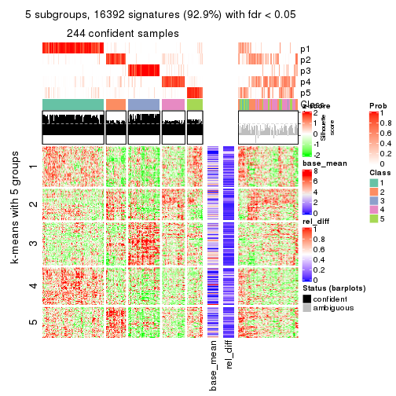</p>

</div>
<div id='tab-ATC-NMF-get-signatures-5'>
<pre><code class="r">get_signatures(res, k = 6)
</code></pre>

<p></p>

</div>
</div>


Signature heatmaps where rows are not scaled:


<script>
$( function() {
	$( '#tabs-ATC-NMF-get-signatures-no-scale' ).tabs();
} );
</script>
<div id='tabs-ATC-NMF-get-signatures-no-scale'>
<ul>
<li><a href='#tab-ATC-NMF-get-signatures-no-scale-1'>k = 2</a></li>
<li><a href='#tab-ATC-NMF-get-signatures-no-scale-2'>k = 3</a></li>
<li><a href='#tab-ATC-NMF-get-signatures-no-scale-3'>k = 4</a></li>
<li><a href='#tab-ATC-NMF-get-signatures-no-scale-4'>k = 5</a></li>
<li><a href='#tab-ATC-NMF-get-signatures-no-scale-5'>k = 6</a></li>
</ul>
<div id='tab-ATC-NMF-get-signatures-no-scale-1'>
<pre><code class="r">get_signatures(res, k = 2, scale_rows = FALSE)
</code></pre>

<p></p>

</div>
<div id='tab-ATC-NMF-get-signatures-no-scale-2'>
<pre><code class="r">get_signatures(res, k = 3, scale_rows = FALSE)
</code></pre>

<p></p>

</div>
<div id='tab-ATC-NMF-get-signatures-no-scale-3'>
<pre><code class="r">get_signatures(res, k = 4, scale_rows = FALSE)
</code></pre>

<p></p>

</div>
<div id='tab-ATC-NMF-get-signatures-no-scale-4'>
<pre><code class="r">get_signatures(res, k = 5, scale_rows = FALSE)
</code></pre>

<p></p>

</div>
<div id='tab-ATC-NMF-get-signatures-no-scale-5'>
<pre><code class="r">get_signatures(res, k = 6, scale_rows = FALSE)
</code></pre>

<p></p>

</div>
</div>


Compare the overlap of signatures from different k:

```r
compare_signatures(res)
```


`get_signature()` returns a data frame invisibly. TO get the list of signatures, the function
call should be assigned to a variable explicitly. In following code, if `plot` argument is set
to `FALSE`, no heatmap is plotted while only the differential analysis is performed.

```r
# code only for demonstration
tb = get_signature(res, k = ..., plot = FALSE)
```

An example of the output of `tb` is:

```
#>   which_row         fdr    mean_1    mean_2 scaled_mean_1 scaled_mean_2 km
#> 1        38 0.042760348  8.373488  9.131774    -0.5533452     0.5164555  1
#> 2        40 0.018707592  7.106213  8.469186    -0.6173731     0.5762149  1
#> 3        55 0.019134737 10.221463 11.207825    -0.6159697     0.5749050  1
#> 4        59 0.006059896  5.921854  7.869574    -0.6899429     0.6439467  1
#> 5        60 0.018055526  8.928898 10.211722    -0.6204761     0.5791110  1
#> 6        98 0.009384629 15.714769 14.887706     0.6635654    -0.6193277  2
...
```

The columns in `tb` are:

1. `which_row`: row indices corresponding to the input matrix.
2. `fdr`: FDR for the differential test. 
3. `mean_x`: The mean value in group x.
4. `scaled_mean_x`: The mean value in group x after rows are scaled.
5. `km`: Row groups if k-means clustering is applied to rows.


UMAP plot which shows how samples are separated.


<script>
$( function() {
	$( '#tabs-ATC-NMF-dimension-reduction' ).tabs();
} );
</script>
<div id='tabs-ATC-NMF-dimension-reduction'>
<ul>
<li><a href='#tab-ATC-NMF-dimension-reduction-1'>k = 2</a></li>
<li><a href='#tab-ATC-NMF-dimension-reduction-2'>k = 3</a></li>
<li><a href='#tab-ATC-NMF-dimension-reduction-3'>k = 4</a></li>
<li><a href='#tab-ATC-NMF-dimension-reduction-4'>k = 5</a></li>
<li><a href='#tab-ATC-NMF-dimension-reduction-5'>k = 6</a></li>
</ul>
<div id='tab-ATC-NMF-dimension-reduction-1'>
<pre><code class="r">dimension_reduction(res, k = 2, method = &quot;UMAP&quot;)
</code></pre>

<p></p>

</div>
<div id='tab-ATC-NMF-dimension-reduction-2'>
<pre><code class="r">dimension_reduction(res, k = 3, method = &quot;UMAP&quot;)
</code></pre>

<p></p>

</div>
<div id='tab-ATC-NMF-dimension-reduction-3'>
<pre><code class="r">dimension_reduction(res, k = 4, method = &quot;UMAP&quot;)
</code></pre>

<p></p>

</div>
<div id='tab-ATC-NMF-dimension-reduction-4'>
<pre><code class="r">dimension_reduction(res, k = 5, method = &quot;UMAP&quot;)
</code></pre>

<p></p>

</div>
<div id='tab-ATC-NMF-dimension-reduction-5'>
<pre><code class="r">dimension_reduction(res, k = 6, method = &quot;UMAP&quot;)
</code></pre>

<p></p>

</div>
</div>


Following heatmap shows how subgroups are split when increasing `k`:

```r
collect_classes(res)
```


If matrix rows can be associated to genes, consider to use `GO_Enrichment(res,
...)` to perform function enrichment for the signature genes.


 

## Session info


```r
sessionInfo()
```

```
#> R version 3.6.0 (2019-04-26)
#> Platform: x86_64-pc-linux-gnu (64-bit)
#> Running under: CentOS Linux 7 (Core)
#> 
#> Matrix products: default
#> BLAS:   /usr/lib64/libblas.so.3.4.2
#> LAPACK: /usr/lib64/liblapack.so.3.4.2
#> 
#> locale:
#>  [1] LC_CTYPE=en_GB.UTF-8       LC_NUMERIC=C               LC_TIME=en_GB.UTF-8       
#>  [4] LC_COLLATE=en_GB.UTF-8     LC_MONETARY=en_GB.UTF-8    LC_MESSAGES=en_GB.UTF-8   
#>  [7] LC_PAPER=en_GB.UTF-8       LC_NAME=C                  LC_ADDRESS=C              
#> [10] LC_TELEPHONE=C             LC_MEASUREMENT=en_GB.UTF-8 LC_IDENTIFICATION=C       
#> 
#> attached base packages:
#>  [1] grid      parallel  stats4    stats     graphics  grDevices utils     datasets  methods  
#> [10] base     
#> 
#> other attached packages:
#>  [1] genefilter_1.66.0           ComplexHeatmap_2.1.1        markdown_1.1               
#>  [4] knitr_1.26                  cola_1.3.2                  SummarizedExperiment_1.14.1
#>  [7] DelayedArray_0.10.0         BiocParallel_1.18.1         matrixStats_0.55.0         
#> [10] Biobase_2.44.0              GenomicRanges_1.36.1        GenomeInfoDb_1.20.0        
#> [13] IRanges_2.18.3              S4Vectors_0.22.1            BiocGenerics_0.30.0        
#> [16] GetoptLong_0.1.7           
#> 
#> loaded via a namespace (and not attached):
#>  [1] bitops_1.0-6           bit64_0.9-7            doParallel_1.0.15      RColorBrewer_1.1-2    
#>  [5] httr_1.4.1             backports_1.1.5        tools_3.6.0            R6_2.4.1              
#>  [9] DBI_1.0.0              lazyeval_0.2.2         colorspace_1.4-1       withr_2.1.2           
#> [13] tidyselect_0.2.5       gridExtra_2.3          bit_1.1-14             compiler_3.6.0        
#> [17] xml2_1.2.2             microbenchmark_1.4-7   pkgmaker_0.28          slam_0.1-46           
#> [21] scales_1.1.0           NMF_0.23.6             stringr_1.4.0          digest_0.6.23         
#> [25] XVector_0.24.0         pkgconfig_2.0.3        bibtex_0.4.2           highr_0.8             
#> [29] rlang_0.4.2            GlobalOptions_0.1.1    RSQLite_2.1.2          impute_1.58.0         
#> [33] shape_1.4.4            mclust_5.4.5           dendextend_1.12.0      dplyr_0.8.3           
#> [37] RCurl_1.95-4.12        magrittr_1.5           GenomeInfoDbData_1.2.1 Matrix_1.2-17         
#> [41] Rcpp_1.0.3             munsell_0.5.0          viridis_0.5.1          lifecycle_0.1.0       
#> [45] stringi_1.4.3          zlibbioc_1.30.0        plyr_1.8.4             blob_1.2.0            
#> [49] crayon_1.3.4           lattice_0.20-38        splines_3.6.0          annotate_1.62.0       
#> [53] circlize_0.4.9         zeallot_0.1.0          pillar_1.4.2           rjson_0.2.20          
#> [57] rngtools_1.4           reshape2_1.4.3         codetools_0.2-16       XML_3.98-1.20         
#> [61] glue_1.3.1             evaluate_0.14          vctrs_0.2.0            png_0.1-7             
#> [65] foreach_1.4.7          polyclip_1.10-0        gtable_0.3.0           purrr_0.3.3           
#> [69] clue_0.3-57            assertthat_0.2.1       ggplot2_3.2.1          xfun_0.11             
#> [73] gridBase_0.4-7         eulerr_6.0.0           xtable_1.8-4           skmeans_0.2-11        
#> [77] survival_2.44-1.1      viridisLite_0.3.0      tibble_2.1.3           iterators_1.0.12      
#> [81] memoise_1.1.0          AnnotationDbi_1.46.1   registry_0.5-1         GTF_0.0.1             
#> [85] cluster_2.1.0          brew_1.0-6
```


